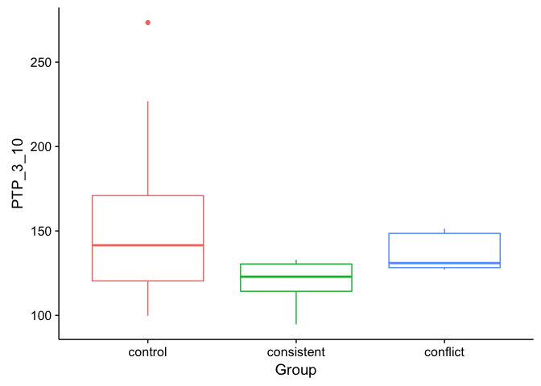
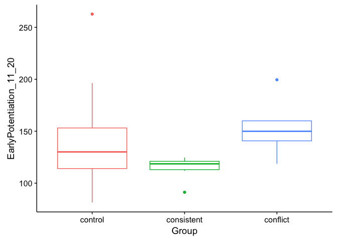
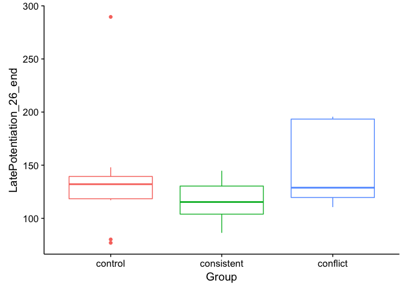
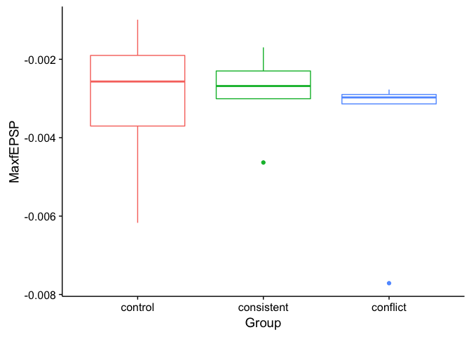
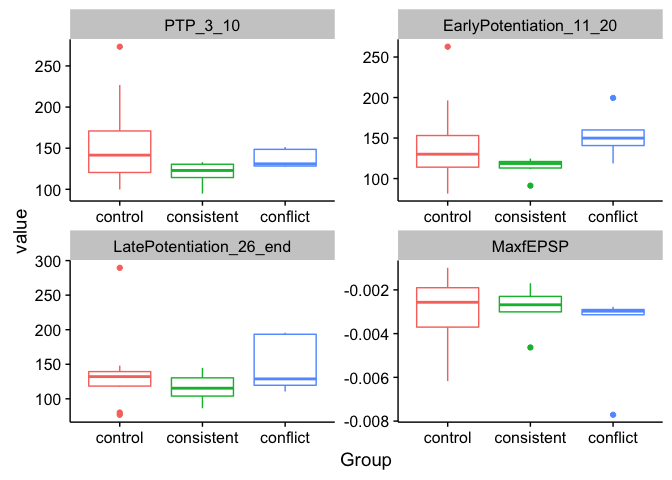

``` r
## load libraries 
library(ggplot2) ## for awesome plots!
```

    ## Warning: package 'ggplot2' was built under R version 3.3.2

``` r
library(cowplot) ## for some easy to use themes
library(tidyr) ## for respahing data
```

    ## Warning: package 'tidyr' was built under R version 3.3.2

``` r
library(plyr) ## for renmaing factors
library(dplyr) ## for filtering and selecting rows
library(reshape)  ## widen a
library(car) ## for statistics
```

    ## Warning: package 'car' was built under R version 3.3.2

``` r
## load functions 

## set output file for figures 
knitr::opts_chunk$set(fig.path = '../figures/ephys/')
```

``` r
## read summarized ephys data and relevel factors
ephys <- read.csv("../data/03_ephys.csv", header = T)
ephys$Group <- factor(ephys$Group, levels = c("control", "consistent", "conflict"))
summary(ephys)
```

    ##         Group        Mouse       PTP_3_10      EarlyPotentiation_11_20
    ##  control   :11   15-143B: 1   Min.   : 94.69   Min.   : 81.36         
    ##  consistent: 6   15-143C: 1   1st Qu.:121.05   1st Qu.:117.08         
    ##  conflict  : 5   15-143D: 1   Median :132.34   Median :122.92         
    ##                  15-144A: 1   Mean   :142.15   Mean   :137.44         
    ##                  15-144B: 1   3rd Qu.:150.69   3rd Qu.:151.13         
    ##                  15-144C: 1   Max.   :273.40   Max.   :262.75         
    ##                  (Other):16                                           
    ##  LatePotentiation_26_end    MaxfEPSP         
    ##  Min.   : 76.9           Min.   :-0.0077112  
    ##  1st Qu.:113.8           1st Qu.:-0.0031690  
    ##  Median :127.8           Median :-0.0029357  
    ##  Mean   :133.9           Mean   :-0.0031245  
    ##  3rd Qu.:140.8           3rd Qu.:-0.0022901  
    ##  Max.   :289.6           Max.   :-0.0009905  
    ## 

``` r
ephyslong <- melt(ephys)
```

the data
--------

``` r
ephys %>%
  ggplot(aes(x=Group, y=PTP_3_10, color=Group)) +  
  geom_boxplot() + theme(legend.position="none")
```



``` r
ephys %>%
  ggplot(aes(x=Group, y=EarlyPotentiation_11_20, color=Group)) +  
  geom_boxplot() + theme(legend.position="none")
```



``` r
ephys %>%
  ggplot(aes(x=Group, y=LatePotentiation_26_end, color=Group)) +  
  geom_boxplot() + theme(legend.position="none")
```



``` r
ephys %>%
  ggplot(aes(x=Group, y=MaxfEPSP, color=Group)) +  
  geom_boxplot() + theme(legend.position="none")
```



``` r
ephyslong %>%
  ggplot(aes(x=Group, y=value, color=Group)) +  
  geom_boxplot() + facet_wrap(~ variable, scales = "free") +
  theme(legend.position="none")
```



stats
-----

``` r
summary(ephys)
```

    ##         Group        Mouse       PTP_3_10      EarlyPotentiation_11_20
    ##  control   :11   15-143B: 1   Min.   : 94.69   Min.   : 81.36         
    ##  consistent: 6   15-143C: 1   1st Qu.:121.05   1st Qu.:117.08         
    ##  conflict  : 5   15-143D: 1   Median :132.34   Median :122.92         
    ##                  15-144A: 1   Mean   :142.15   Mean   :137.44         
    ##                  15-144B: 1   3rd Qu.:150.69   3rd Qu.:151.13         
    ##                  15-144C: 1   Max.   :273.40   Max.   :262.75         
    ##                  (Other):16                                           
    ##  LatePotentiation_26_end    MaxfEPSP         
    ##  Min.   : 76.9           Min.   :-0.0077112  
    ##  1st Qu.:113.8           1st Qu.:-0.0031690  
    ##  Median :127.8           Median :-0.0029357  
    ##  Mean   :133.9           Mean   :-0.0031245  
    ##  3rd Qu.:140.8           3rd Qu.:-0.0022901  
    ##  Max.   :289.6           Max.   :-0.0009905  
    ## 

``` r
# Levene's Test
# is variance signficant? NO? ==> use anova
leveneTest(PTP_3_10~Group, data=ephys)
```

    ## Levene's Test for Homogeneity of Variance (center = median)
    ##       Df F value  Pr(>F)  
    ## group  2   2.728 0.09088 .
    ##       19                  
    ## ---
    ## Signif. codes:  0 '***' 0.001 '**' 0.01 '*' 0.05 '.' 0.1 ' ' 1

``` r
# group  2   2.728 0.09088 .  ==> not significant
leveneTest(EarlyPotentiation_11_20~Group, data=ephys)
```

    ## Levene's Test for Homogeneity of Variance (center = median)
    ##       Df F value Pr(>F)
    ## group  2  1.7926 0.1936
    ##       19

``` r
## group  2  1.7926 0.1936  ==>  not significant
leveneTest(LatePotentiation_26_end~Group, data=ephys)
```

    ## Levene's Test for Homogeneity of Variance (center = median)
    ##       Df F value Pr(>F)
    ## group  2  0.3244 0.7269
    ##       19

``` r
## group  2  0.3244 0.7269  ==> not significant
leveneTest(MaxfEPSP~Group, data=ephys)
```

    ## Levene's Test for Homogeneity of Variance (center = median)
    ##       Df F value Pr(>F)
    ## group  2  0.2189 0.8054
    ##       19

``` r
## group  2  0.2189 0.8054  ==> not significant

##  one way anova 
avoTime <- aov(ephys$PTP_3_10 ~ ephys$Group)
summary(avoTime)
```

    ##             Df Sum Sq Mean Sq F value Pr(>F)
    ## ephys$Group  2   5472    2736   1.698   0.21
    ## Residuals   19  30619    1612

``` r
TukeyHSD(avoTime)
```

    ##   Tukey multiple comparisons of means
    ##     95% family-wise confidence level
    ## 
    ## Fit: aov(formula = ephys$PTP_3_10 ~ ephys$Group)
    ## 
    ## $`ephys$Group`
    ##                          diff       lwr      upr     p adj
    ## consistent-control  -37.01015 -88.76833 14.74803 0.1910672
    ## conflict-control    -19.37982 -74.38519 35.62556 0.6498673
    ## conflict-consistent  17.63033 -44.12325 79.38392 0.7517521

``` r
avoNum <- aov(ephys$EarlyPotentiation_11_20 ~ ephys$Group)
summary(avoNum)
```

    ##             Df Sum Sq Mean Sq F value Pr(>F)
    ## ephys$Group  2   4825    2413    1.52  0.244
    ## Residuals   19  30162    1588

``` r
TukeyHSD(avoNum)
```

    ##   Tukey multiple comparisons of means
    ##     95% family-wise confidence level
    ## 
    ## Fit: aov(formula = ephys$EarlyPotentiation_11_20 ~ ephys$Group)
    ## 
    ## $`ephys$Group`
    ##                          diff       lwr       upr     p adj
    ## consistent-control  -28.23894 -79.60994  23.13206 0.3624945
    ## conflict-control     11.18873 -43.40518  65.78264 0.8622600
    ## conflict-consistent  39.42767 -21.86398 100.71931 0.2560883

``` r
avoNum <- aov(ephys$LatePotentiation_26_end ~ ephys$Group)
summary(avoNum)
```

    ##             Df Sum Sq Mean Sq F value Pr(>F)
    ## ephys$Group  2   3184    1592   0.751  0.486
    ## Residuals   19  40301    2121

``` r
TukeyHSD(avoNum)
```

    ##   Tukey multiple comparisons of means
    ##     95% family-wise confidence level
    ## 
    ## Fit: aov(formula = ephys$LatePotentiation_26_end ~ ephys$Group)
    ## 
    ## $`ephys$Group`
    ##                          diff       lwr       upr     p adj
    ## consistent-control  -20.27152 -79.65236  39.10933 0.6668290
    ## conflict-control     13.12382 -49.98245  76.23009 0.8585082
    ## conflict-consistent  33.39533 -37.45299 104.24366 0.4689834

``` r
avoNum <- aov(ephys$MaxfEPSP ~ ephys$Group)
summary(avoNum)
```

    ##             Df    Sum Sq   Mean Sq F value Pr(>F)
    ## ephys$Group  2 3.920e-06 1.959e-06   0.801  0.463
    ## Residuals   19 4.647e-05 2.446e-06

``` r
TukeyHSD(avoNum)
```

    ##   Tukey multiple comparisons of means
    ##     95% family-wise confidence level
    ## 
    ## Fit: aov(formula = ephys$MaxfEPSP ~ ephys$Group)
    ## 
    ## $`ephys$Group`
    ##                              diff          lwr         upr     p adj
    ## consistent-control   0.0001040076 -0.001912412 0.002120427 0.9905830
    ## conflict-control    -0.0009649891 -0.003107914 0.001177936 0.4997813
    ## conflict-consistent -0.0010689967 -0.003474822 0.001336829 0.5086608
