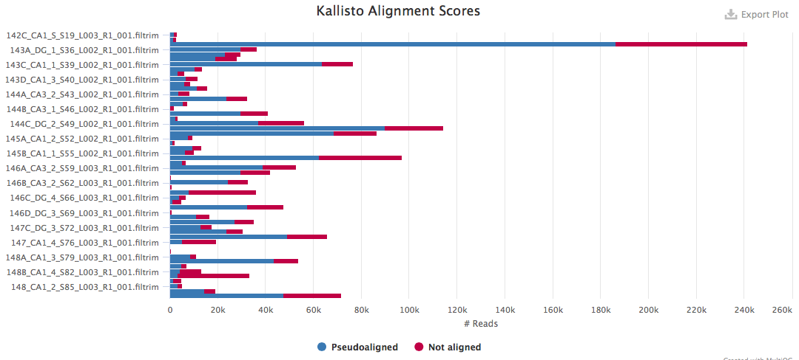
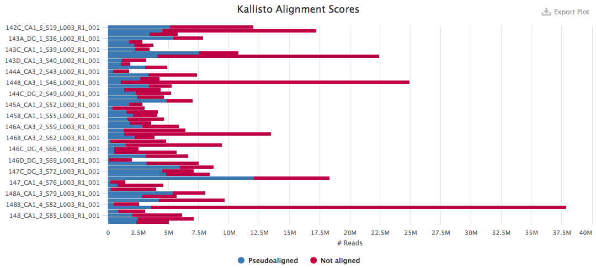

# Kallisto: Quantifying RNA Transcript Abundances

To quantify transcripts, we first need to have a reference genome or transciptome to which the reads can be mapped. 

## Navigate to directory with quality filtered and trimmed reads

~~~ {.bash}
ssh <username>@stampede.tacc.utexas.edu
cd $SCRATCH/IntegrativeProjectWT2015/02_filtrimmedreads
~~~

## Building a refernece index: Only do this once!

Download mouse transcriptome from https://www.gencodegenes.org/mouse_releases/current.html

~~~ {.bash}
# make a directory the reference transcriptome and index
mkdir $SCRATCH/refs
cd $SCRATCH/refs
# download mouse transcriptome, version M71, from Gencode
curl -O ftp.sanger.ac.uk/pub/gencode/Gencode_mouse/release_M7/gencode.vM7.pc_transcripts.fa.gz
~~~

## 04_kallistoindex

The kallisto index only needs to be built once for each. The manual for running kallisto can be found [here](https://pachterlab.github.io/kallisto/manual). I like to keep the same really long prefix "gencode.vM11.pc_transcripts" for the name so that I always know where it came from, rather than shortening it to something like "mouse" or "M11" becuase the full name is more informative. Then, I add "_kallisto.idx" to the end because this tells me that the index is specifically for kallisto, rather than any other alignment/mapper program.

~~~ {.bash}
# create the commands file
echo "kallisto index -i gencode.vM7.pc_transcripts_kallisto.idx gencode.vM7.pc_transcripts.fa.gz" > 04_kallisto_index.cmds
cat 04_kallisto_index.cmds
~~~

### Option 1: Submit a job on Stampede.
Then create the launcher script. Kallisto is not a TACC supported module, so we must use the version of Kallisto that was build by TACC user "wallen" and stored in his public directory. 

~~~ {.bash}
launcher_creator.py -t 0:30:00 -j 04_kallisto_index.cmds -n 04_kallistoindex -l 04_kallisto_index.slurm -A NeuroEthoEvoDevo -m 'module use -a /work/03439/wallen/public/modulefiles; module load gcc/4.9.1; module load hdf5/1.8.15; module load zlib/1.2.8; module load kallisto/0.42.3'
sbatch 04_kallisto_index.slurm
~~~

### Option 2: Use an interactive compute node
Request compute time, makde cmd file executable, load modules, run commands. Note: Kallisto is not a TACC supported module, so we must use the version of Kallisto that was build by TACC user "wallen" and stored in his public directory.

~~~ {.bash}
idev -m 120
module use -a /work/03439/wallen/public/modulefiles
module load gcc/4.9.1
module load hdf5/1.8.15
module load zlib/1.2.8
module load kallisto/0.42.3
chmod a+x 04_kallistoindex.cmds
bash 04_kallistoindex.cmds
~~~

## 04_kallistoquant on filtered and trimmed reads

Now, let's quantify our transcripts. I'm a big fan of the kallisto program because its super fast and easy to use! Its also becoming more widely used and trusted.

Navigate to the directory with the processed reads and make a directory where the output can be stored. The kallisto index was saved in $WORK/SingleNeuronSeq/data/reference_genomes for long-term storage.

~~~ {.bash}
cd $SCRATCH/IntegrativeProjectWT2015/02_filtrimmedreads
mkdir ../04_kallistoquant
~~~

Now, we will use the `kallistoquant` function to quantify reads! Again, we use a for loop to create the commands file. The output for each pair of samples will be stored in a subdirectory. I'll use the `&>` symbol to redirect the standard error and output to a file for each sample

~~~{.bash}
rm 04_kallistoquant.cmds
for R1 in *R1_001.filtrim.fastq.gz
do
    R2=$(basename $R1 R1_001.filtrim.fastq.gz)R2_001.filtrim.fastq.gz
    samp=$(basename $R1 _R1_001.filtrim.fastq.gz)
    echo $R1 $R2 $samp
    echo "kallisto quant -b 100 -t 16 -i /work/02189/rmharris/SingleNeuronSeq/data/reference_genomes/gencode.vM7.transcripts.idx -o /scratch/02189/rmharris/IntegrativeProjectWT2015/04_kallistoquant/${samp} $R1 $R2 &> ${samp}.errout.txt" >> 04_kallistoquant.cmds
done

launcher_creator.py -t 1:00:00 -j 04_kallistoquant.cmds -n 04_kallistoquant -l 04_kallistoquant.slurm -A NeuroEthoEvoDevo -q largemem -m 'module use -a /work/03439/wallen/public/modulefiles; module load gcc/4.9.1; module load hdf5/1.8.15; module load zlib/1.2.8; module load kallisto/0.42.3'
sbatch 04_kallistoquant.slurm
~~~

## MultiQC

Setup MultiQC on Stampede and run for all files in working directory. Use scp to save the `multiqc_report.html` file to your local computer.

~~~ {.bash}
module load python
export PATH="/work/projects/BioITeam/stampede/bin/multiqc-1.0:$PATH"
export PYTHONPATH="/work/projects/BioITeam/stampede/lib/python2.7/annab-packages:$PYTHONPATH"
multiqc .
~~~

The results of the MutliQC analysis of quality are here:

You can see that I have less than 1 million mapped reads for each sample. Not good. Thus...

### 02_kallistoquant on raw reads

Kallisto says that you can perform the pseudoalignment with raw reads, so I decided to try mapping the raw read to obtain a higher number of millions of reads. It worked!

~~~{.bash}
rm 02_kallistoquant.cmds
for R1 in *R1_001.fastq.gz
do
    R2=$(basename $R1 R1_001.fastq.gz)R2_001.fastq.gz
    samp=$(basename $R1 _R1_001.fastq.gz)
    echo $R1 $R2 $samp
    echo "kallisto quant -b 100 -t 16 -i /work/02189/rmharris/SingleNeuronSeq/data/reference_genomes/gencode.vM7.transcripts.idx -o /work/02189/rmharris/IntProWT/02_kallistoquant/${samp} $R1 $R2 &> ${samp}.errout.txt" >> 02_kallistoquant.cmds
done

launcher_creator.py -t 1:00:00 -j 02_kallistoquant.cmds -n 02_kallistoquant -l 02_kallistoquant.slurm -A NeuroEthoEvoDevo -q largemem -m 'module use -a /work/03439/wallen/public/modulefiles; module load gcc/4.9.1; module load hdf5/1.8.15; module load zlib/1.2.8; module load kallisto/0.42.3'
sbatch 02_kallistoquant.slurm
~~~

## MultiQC

Setup MultiQC on Stampede and run for all files in working directory. Use scp to save the `multiqc_report.html` file to your local computer. 

~~~ {.bash}
module load python
export PATH="/work/projects/BioITeam/stampede/bin/multiqc-1.0:$PATH"
export PYTHONPATH="/work/projects/BioITeam/stampede/lib/python2.7/annab-packages:$PYTHONPATH"
multiqc .
~~~

The results of the MutliQC analysis of quality are here:

You can see that most samples have more than 1 million reads mapped. 

## Rename sample file names

You may need to remove the uninformative bits of the "sample name" so they match up with the actual sample name. 

~~~ {.bash}
for file in *
do
    sample=${file//_S*/}
    echo $file $sample
    mv $file $sample
done
~~~

Then, replace the `_` with `-`

~~~ {.bash}
for file in *
do
    sample=${file//_/-}
    echo $file $sample
    mv $file $sample
done
~~~

## Save the data locally

## References
- Kallisto: https://pachterlab.github.io/kallisto/
