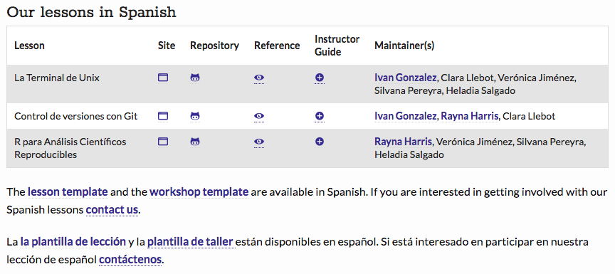
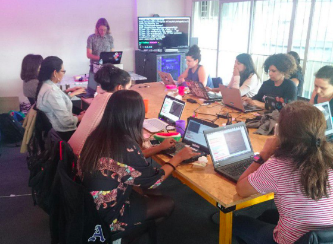
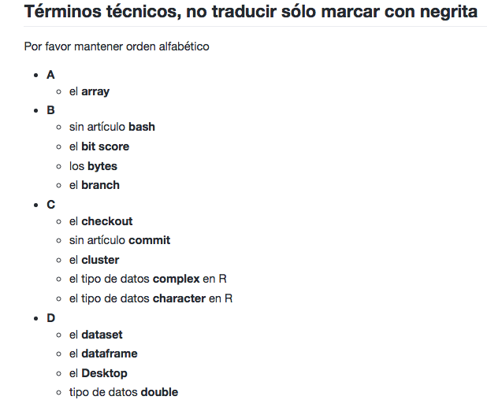
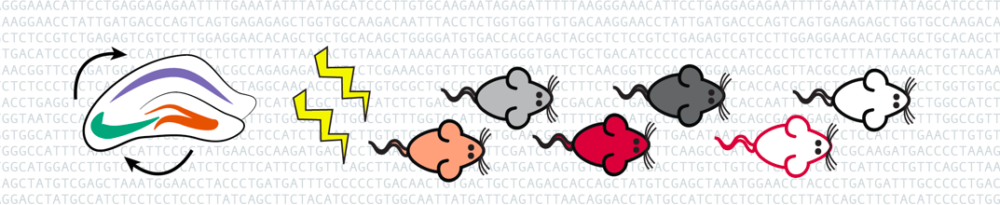
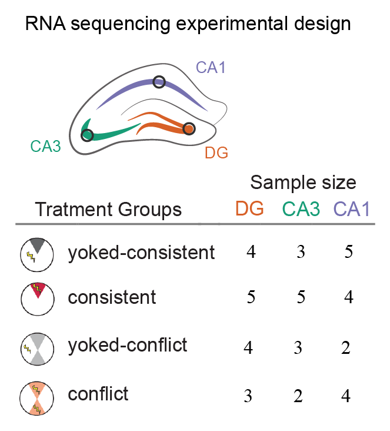
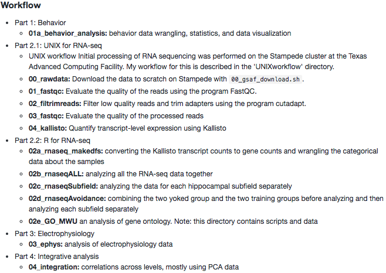
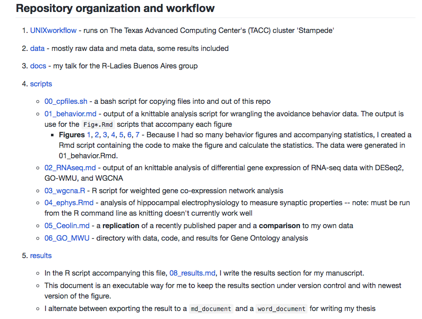

```{r setup, include=FALSE}
knitr::opts_chunk$set(echo = FALSE,
                      fig.path = '../figures/10_talk/')
```

# Some talking points

- RMarkdown for presentations
- Update on the Software Carpentry Spanish lessons
- My data commons-like thesis chapter
- How do I `make` this?
- Reproducing other people's data analysis

# Software Carpentry Spanish Lessons![^2]




[^2]: https://software-carpentry.org/lessons/

# Software Carpentry Spanish Workshops!

{width=75%}
<blockquote class="twitter-tweet" data-lang="en"><p lang="es" dir="ltr">Configurar <a href="https://twitter.com/hashtag/git?src=hash&amp;ref_src=twsrc%5Etfw">#git</a> para poder empezar a usarlo, los primeros pasos del taller de <a href="https://twitter.com/raynamharris?ref_src=twsrc%5Etfw">@raynamharris</a> <a href="https://t.co/hWV9fqsBWA">pic.twitter.com/hWV9fqsBWA</a></p>&mdash; R&#39;lyeh Hacklab (@rlyehlab) <a href="https://twitter.com/rlyehlab/status/982692798221705216?ref_src=twsrc%5Etfw">April 7, 2018</a></blockquote>
<script async src="https://platform.twitter.com/widgets.js" charset="utf-8"></script>

# To translate or not to translate[^t], that is the question

{width=75%}

[^t]: https://github.com/Carpentries-ES/board/blob/master/Convenciones_Traduccion.md

# Quote from Data Commons (TOPMed) that I can relate too

Attributes of both subjects (individuals) and biosamples (e.g. DNA, RNA, serum, urine) are provided in tabular data sets. It is important to distinguish between these two types of identifiers. Some attributes are measured at the subject level (e.g. height, blood pressure of a person), while others are measured at the sample level (e.g. metabolites, genotypes, gene expression levels on serum, DNA, or RNA samples, respectively). Multiple samples may derive from the same individual.

# My data commons-like thesis chapter

Using RNA sequencing to understanding how the hippocampus remembers things in space and time



# Subjects and biosamples


# FYI: Hypothesis-driven versus data-driven behavior analysis tell different but compatible stories


# Subfield-specific expression trumps experience-specific expression


# Comparing across levels of biological organization is... not as awesome as I want it to be


# MultiQC[^m] for visualizing summary stats!

{width=75%}

{width=75%}

[^m]: http://multiqc.info/

# How do I `make` this?[^1]


{width=85%}

[^1]:  https://github.com/raynamharris/IntegrativeProjectWT2015

# How do I `make` this?[^f]

{width=85%}

[^f]:  https://github.com/raynamharris/FMR1CA1rnaseq

# Reproducing other people's data[^C1]

{width=85%}

[^C1]: https://www.frontiersin.org/articles/10.3389/fnmol.2017.00340/full

# Reproducing[^C2] other people's data

{width=85%}

[^C2]: https://github.com/raynamharris/FMR1CA1rnaseq/blob/master/scripts/05_Ceolin.md