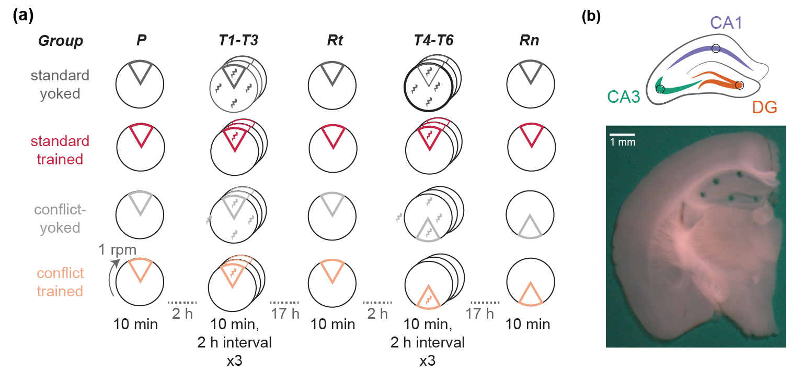

```{r setup, include=FALSE}
knitr::opts_chunk$set(echo = FALSE, fig.width = 6)
```

## Here's our experimental design. I wish I could zoom in and out on parts of this image on command. 




## Fig 2


## Fig 3


## Alt. Fig 3


## Session info

```{r}
sessionInfo()
```