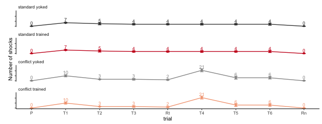
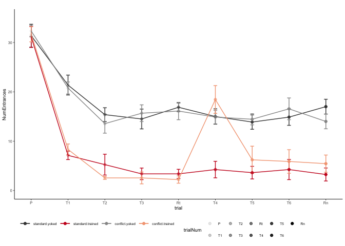
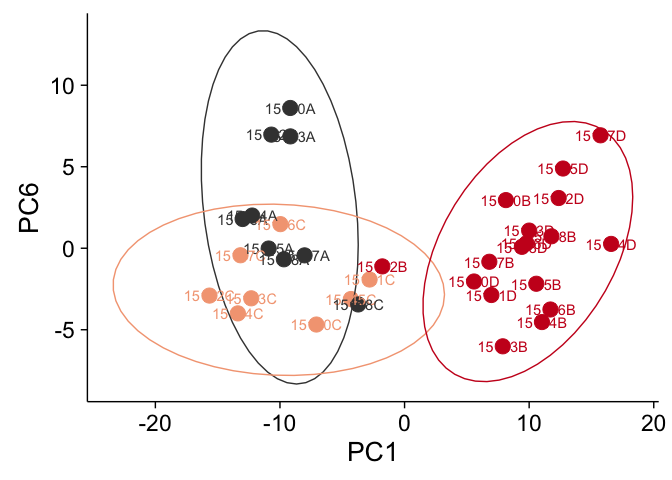

    ## load libraries 
    library(tidyverse) ## for respahing data
    library(cowplot) ## for some easy to use themes
    library(factoextra)  ## pca with vectors
    library(FactoMineR) # more pca
    library(apaTables) #  for ANOVA tables
    library(scales) # for scientific notation

    library(png) # for ading images to plots
    library(grid)  # for ading images to plots

    ## load user-written functions 
    source("functions_behavior.R")
    source("figureoptions.R")

    ## set output file for figures 
    knitr::opts_chunk$set(fig.path = '../figures/01_behavior/')

Sample sizes
------------

The ‘treatment’ column describes the four behavioral treatment groups.  
The ‘trial’ column describes the behvioral training sessions. Here I
filter by a single session to calculte the number of mice.

    ## import output from video tracker program 
    behavior <- read.csv("../data/00_behaviordata.csv", header = T)

    # set levels or refactor
    behavior$treatment <- factor(behavior$treatment, levels = levelstreatment)
    behavior$training <- factor(behavior$training, levels = levelstraining)
    behavior <- behavior %>%
      mutate(trial = fct_recode(trial, "Pre" = "Hab"))
    head(behavior)

    ##       ID Day        treatment training  trial trialNum ShockOnOff
    ## 1 15140A   1 conflict.trained  trained    Pre        1        Off
    ## 2 15140A   1 conflict.trained  trained     T1        2         On
    ## 3 15140A   1 conflict.trained  trained     T2        3         On
    ## 4 15140A   1 conflict.trained  trained     T3        4         On
    ## 5 15140A   2 conflict.trained  trained Retest        5         On
    ## 6 15140A   2 conflict.trained  trained  T4_C1        6         On
    ##   PairedPartner TotalPath Speed sdSpeed Linearity NumEntrances Time1stEntr
    ## 1        15140B     22.68  3.78    3.07    0.4790           28       24.63
    ## 2        15140B     19.36  3.23    2.78    0.4016            6        9.83
    ## 3        15140B     15.01  2.50    2.68    0.3170            2      118.37
    ## 4        15140B     14.39  2.40    2.78    0.3122            3      256.53
    ## 5        15140B     14.04  2.34    3.11    0.2895            1      432.07
    ## 6        15140B     12.50  2.08    2.52    0.3107           10        0.87
    ##   Path1stEntr Speed1stEntr EntrPerDist NumShock MaxTimeAvoid MaxPathAvoid
    ## 1        1.09         4.56        1.12        0           53         2.15
    ## 2        0.62        16.42        0.30        7          327        11.70
    ## 3        3.17         2.31        0.11        3          312         4.98
    ## 4        7.48         4.26        0.17        3          256         7.48
    ## 5       10.56         9.38        0.06        1          432        10.56
    ## 6        0.00        -1.00        0.56       13          447         1.82
    ##   Time2ndEntr Path2ndEntr Speed2ndEntr TimeShockZone pTimeShockZone
    ## 1       59.97        2.59         7.85        94.665         0.2277
    ## 2       18.30        1.23         6.53         8.433         0.0211
    ## 3      287.63        8.54         3.73         3.366         0.0092
    ## 4      447.80       12.74         1.56         2.498         0.0069
    ## 5      599.97       15.66        -1.00         1.067         0.0026
    ## 6       25.90        0.75        16.19        17.735         0.0339
    ##   pTimeCCW pTimeOPP pTimeCW RayleigLength RayleigAngle Min50.RngLoBin
    ## 1   0.2583   0.1788  0.3352          0.11       330.67             60
    ## 2   0.6961   0.2049  0.0779          0.65       112.66            130
    ## 3   0.6413   0.3245  0.0250          0.78       124.87            150
    ## 4   0.5790   0.4018  0.0123          0.80       128.39            150
    ## 5   0.2945   0.6300  0.0729          0.72       159.36            170
    ## 6   0.0195   0.1561  0.7905          0.67       257.90            280
    ##   AnnularSkewnes AnnularKurtosis ShockPerEntrance
    ## 1           0.88            3.13         0.000000
    ## 2           1.81            6.70         1.166667
    ## 3           1.87            8.91         1.500000
    ## 4           2.84           12.51         1.000000
    ## 5           2.42           11.83         1.000000
    ## 6           0.98            4.65         1.300000

    # sample sizes
    behavior %>% 
      filter(trial == "Pre") %>%
      select(treatment)  %>%  summary()

    ##             treatment
    ##  standard.yoked  :8  
    ##  standard.trained:8  
    ##  conflict.yoked  :9  
    ##  conflict.trained:9

    # names of behavioral measures
    names(behavior[9:34])

    ##  [1] "TotalPath"        "Speed"            "sdSpeed"         
    ##  [4] "Linearity"        "NumEntrances"     "Time1stEntr"     
    ##  [7] "Path1stEntr"      "Speed1stEntr"     "EntrPerDist"     
    ## [10] "NumShock"         "MaxTimeAvoid"     "MaxPathAvoid"    
    ## [13] "Time2ndEntr"      "Path2ndEntr"      "Speed2ndEntr"    
    ## [16] "TimeShockZone"    "pTimeShockZone"   "pTimeCCW"        
    ## [19] "pTimeOPP"         "pTimeCW"          "RayleigLength"   
    ## [22] "RayleigAngle"     "Min50.RngLoBin"   "AnnularSkewnes"  
    ## [25] "AnnularKurtosis"  "ShockPerEntrance"

    # small table for converting between name and number later
    trialnameandnumber <- behavior %>% select(trial, trialNum) %>% distinct()
    trialnameandnumber

    ##       trial trialNum
    ## 1       Pre        1
    ## 2        T1        2
    ## 3        T2        3
    ## 4        T3        4
    ## 5    Retest        5
    ## 6     T4_C1        6
    ## 7     T5_C2        7
    ## 8     T6_C3        8
    ## 9 Retention        9

    dfshocks <- behavior %>%
      dplyr::group_by(treatment, trial, trialNum) %>%
      dplyr::summarise(m = mean(NumShock), 
                       se = sd(NumShock)/sqrt(length(NumShock))) %>%
      dplyr::mutate(m = round(m,0)) %>%
      dplyr::mutate(measure = "NumShock") 
    dfshocks

    ## # A tibble: 36 x 6
    ## # Groups:   treatment, trial [36]
    ##    treatment        trial     trialNum     m    se measure 
    ##    <fct>            <fct>        <int> <dbl> <dbl> <chr>   
    ##  1 standard.yoked   Pre              1     0 0     NumShock
    ##  2 standard.yoked   Retention        9     0 0     NumShock
    ##  3 standard.yoked   Retest           5     4 1.20  NumShock
    ##  4 standard.yoked   T1               2     7 0.854 NumShock
    ##  5 standard.yoked   T2               3     5 2.12  NumShock
    ##  6 standard.yoked   T3               4     4 1.37  NumShock
    ##  7 standard.yoked   T4_C1            6     4 1.66  NumShock
    ##  8 standard.yoked   T5_C2            7     4 1.33  NumShock
    ##  9 standard.yoked   T6_C3            8     4 2.04  NumShock
    ## 10 standard.trained Pre              1     0 0     NumShock
    ## # … with 26 more rows

    numshocks <- ggplot(dfshocks,  aes(x=, trialNum, y=m, color=treatment, label = m)) + 
        geom_errorbar(aes(ymin=m-se, ymax=m+se, color=treatment), width=.1) +
        geom_line() +
        geom_point(size = 1) +
        labs(y = "\n Number of shocks") +
        scale_x_continuous(name= "trial", 
                           breaks = c(1, 2, 3, 4, 5, 6, 7, 8, 9),
                           labels = c( "P", "T1", "T2", "T3",
                                       "Rt", "T4", "T5", "T6", "Rn")) +
        scale_alpha_continuous( breaks = c(1, 2, 3)) +
        theme_ms() +
        scale_color_manual(values = treatmentcolors,
                           name  = NULL)  +
        theme(legend.position = "none",
              legend.justification=c(0,0),
              legend.text=element_text(size=5),
              strip.text = element_text(angle = 0, hjust = 0, vjust = 0),
              axis.text.y = element_blank(),
              strip.background = element_blank()) +
      facet_wrap(~treatment, nrow = 4, labeller = treatment_labeller) +
      scale_y_continuous(breaks = c(0,10,20), limits = c(0,30)) +
      geom_text(vjust= -0.5, size=2.5)

    ## Warning: The labeller API has been updated. Labellers taking `variable`and
    ## `value` arguments are now deprecated. See labellers documentation.

    numshocks

    paradigm <- png::readPNG("../figures/00_schematics/figure_1a.png")
    paradigm <- ggdraw() +  draw_image(paradigm, scale = 1)

    subfields <- png::readPNG("../figures/00_schematics/figure_1c.png")
    subfields <- ggdraw() +  draw_image(subfields, scale = 1)

    experimentaldesign <- plot_grid(paradigm, numshocks, subfields, rel_widths = c(2,1,0.8), nrow = 1,
              label_size = 8, labels = c("(a)", "(b) ", "(c)"))
    experimentaldesign

    pdf(file="../figures/01_behavior/experimentaldesign.pdf", width=6.69, height=2.6)
    plot(experimentaldesign)
    dev.off()

    ## quartz_off_screen 
    ##                 2

    pdf(file="../figures/figure_1.pdf", width=6.69, height=2.6)
    plot(experimentaldesign)
    dev.off()

    ## quartz_off_screen 
    ##                 2

Vizualizing Mean and Standard error for avoidance behaviors
===========================================================

To make the point and line graphs, I must create and join some data
frames, then I have a function that makes four plots with specific
titles, y labels and limits.

    dfa <- behavior %>%
      dplyr::group_by(treatment, trial, trialNum) %>%
      dplyr::summarise(m = mean(NumEntrances), 
                       se = sd(NumEntrances)/sqrt(length(NumEntrances))) %>%
      dplyr::mutate(measure = "NumEntrances")

    dfb <- behavior %>%
      dplyr::group_by(treatment, trial, trialNum) %>%
      dplyr::mutate(minutes = Time1stEntr/60) %>%
      dplyr::summarise(m = mean(minutes), 
                       se = sd(minutes)/sqrt(length(minutes))) %>%
      dplyr::mutate(measure = "Time1stEntr (min)")

    dfc <- behavior %>%
      dplyr::group_by(treatment, trial, trialNum) %>%
      dplyr::summarise(m = mean(pTimeShockZone), 
                       se = sd(pTimeShockZone)/sqrt(length(pTimeShockZone))) %>%
      dplyr::mutate(measure = "pTimeShockZone")

    avoidancedf <- rbind(dfa, dfb,dfc)

    a <- meansdplots(dfa, "NumEntrances" ,  c(0,10,20,30), c(0, 35))
    b <- meansdplots(dfb, "Time1stEntr (min)",  c(0,2,4,6,8), c(0, 8))
    c <- meansdplots(dfc, "pTimeShockZone", c(0,.12,.25,.37), c(0, .37))

    avoidancebehaviors <- plot_grid(a + theme(legend.position = c(0.05, 0.9),
                                              legend.direction = "horizontal",
                                              legend.key.size = unit(0.25, "cm")) +
                                      guides(color = guide_legend(nrow = 2)) ,
                           b + theme(legend.position = "none"), 
                           c + theme(legend.position = "none"), nrow = 1,
                           label_size = 8,
                           labels = c("(a)", "(b)", "(c)"))
    avoidancebehaviors

    # clean df for saving
    suppletable2 <- rbind(dfshocks, avoidancedf)
    suppletable2$m <- round(suppletable2$m,3)
    suppletable2$se <- round(suppletable2$se,2)
    head(suppletable2)

    ## # A tibble: 6 x 6
    ## # Groups:   treatment, trial [6]
    ##   treatment      trial     trialNum     m    se measure 
    ##   <fct>          <fct>        <int> <dbl> <dbl> <chr>   
    ## 1 standard.yoked Pre              1     0  0    NumShock
    ## 2 standard.yoked Retention        9     0  0    NumShock
    ## 3 standard.yoked Retest           5     4  1.2  NumShock
    ## 4 standard.yoked T1               2     7  0.85 NumShock
    ## 5 standard.yoked T2               3     5  2.12 NumShock
    ## 6 standard.yoked T3               4     4  1.37 NumShock

### Principle component analysis

Next, I next reduced the dimentionality of the data with a PCA anlaysis.

    pca.all <- makepcadf(behavior)
    head(pca.all)

    ##       ID        treatment trialNum Day        PC1        PC2        PC3
    ## 1 15140A conflict.trained        1   1 -2.9634529 -2.3926459 -1.7788076
    ## 2 15140A conflict.trained        2   1  0.9036966 -2.0647848  2.4911475
    ## 3 15140A conflict.trained        3   1  2.4803959 -0.1489064  2.0950802
    ## 4 15140A conflict.trained        4   1  3.8236512 -0.2564487  1.5841732
    ## 5 15140A conflict.trained        5   2  5.4390116 -0.2855016 -0.6080055
    ## 6 15140A conflict.trained        6   2 -0.6658926  0.4737255 -1.6783668
    ##          PC4        PC5        PC6        PC7         PC8         PC9
    ## 1 -0.5799700 -0.3841726 -0.8005324  1.6983796  1.37824140 -0.04983849
    ## 2 -0.1708753  1.2094357 -1.2913561 -0.6066415  0.76344055  0.21775235
    ## 3 -0.9547953  0.8099878 -0.1355901  0.3459045  0.66567249  0.42931315
    ## 4 -1.0775488 -0.5614903 -0.2914055 -0.1355860  0.02448386  0.17539735
    ## 5 -0.6813732 -0.5384204 -0.7902852 -0.8662319 -0.24161317 -0.34292216
    ## 6  4.2617839  1.5780500 -0.1068274  2.0359425 -0.28581777  2.39390223
    ##        PC10
    ## 1 0.5049673
    ## 2 1.3051340
    ## 3 0.8802736
    ## 4 0.8659967
    ## 5 0.2886386
    ## 6 0.6254291

    pca.Rn <- pca.all %>% 
      filter(trialNum == 9) %>%  
      select(ID:PC2) 
    head(pca.Rn)

    ##       ID        treatment trialNum Day        PC1        PC2
    ## 1 15140A conflict.trained        9   3  2.0985364 -1.2268375
    ## 2 15140B   conflict.yoked        9   3 -0.8030276 -1.5914329
    ## 3 15140C standard.trained        9   3  6.4346388  0.1710085
    ## 4 15140D   standard.yoked        9   3 -1.1318442  1.7155694
    ## 5 15141C standard.trained        9   3 -0.1644596  1.1372288
    ## 6 15141D   standard.yoked        9   3 -2.7745864  2.2214867

    suppletable3 <- pca.all %>% 
      full_join(., trialnameandnumber)  %>% 
      select(ID, treatment, trial, trialNum, PC1, PC2) 

    ## Joining, by = "trialNum"

    suppletable3

    ##         ID        treatment     trial trialNum         PC1           PC2
    ## 1   15140A conflict.trained       Pre        1 -2.96345288 -2.3926459443
    ## 2   15140A conflict.trained        T1        2  0.90369662 -2.0647848460
    ## 3   15140A conflict.trained        T2        3  2.48039591 -0.1489064087
    ## 4   15140A conflict.trained        T3        4  3.82365123 -0.2564487374
    ## 5   15140A conflict.trained    Retest        5  5.43901156 -0.2855015658
    ## 6   15140A conflict.trained     T4_C1        6 -0.66589263  0.4737254635
    ## 7   15140A conflict.trained     T5_C2        7  1.06553512  0.2902071798
    ## 8   15140A conflict.trained     T6_C3        8  4.54652119 -0.2850516361
    ## 9   15140A conflict.trained Retention        9  2.09853639 -1.2268375349
    ## 10  15140B   conflict.yoked       Pre        1 -3.45649123 -2.4041500947
    ## 11  15140B   conflict.yoked        T1        2 -3.31565447 -0.8419499911
    ## 12  15140B   conflict.yoked        T2        3  0.36985250  0.9189806966
    ## 13  15140B   conflict.yoked        T3        4 -2.63582490 -0.6870638071
    ## 14  15140B   conflict.yoked    Retest        5 -3.36981455  1.8491691279
    ## 15  15140B   conflict.yoked     T4_C1        6 -2.63186885  0.5775283189
    ## 16  15140B   conflict.yoked     T5_C2        7 -0.97860389 -2.0894588995
    ## 17  15140B   conflict.yoked     T6_C3        8 -0.57883884  2.1465470452
    ## 18  15140B   conflict.yoked Retention        9 -0.80302763 -1.5914329287
    ## 19  15140C standard.trained       Pre        1 -2.97257762 -2.6569978555
    ## 20  15140C standard.trained        T1        2  1.44704551 -0.1407619104
    ## 21  15140C standard.trained        T2        3  1.00832487 -0.4026816955
    ## 22  15140C standard.trained        T3        4  0.64829290  0.1428286465
    ## 23  15140C standard.trained    Retest        5  0.87517292 -1.2451142346
    ## 24  15140C standard.trained     T4_C1        6  2.72830666 -0.7525528749
    ## 25  15140C standard.trained     T5_C2        7  1.10759195 -0.4061560691
    ## 26  15140C standard.trained     T6_C3        8  6.39219982  0.3947548668
    ## 27  15140C standard.trained Retention        9  6.43463883  0.1710085366
    ## 28  15140D   standard.yoked       Pre        1 -3.20081071 -5.3616824930
    ## 29  15140D   standard.yoked        T1        2 -2.34384532 -1.3291097192
    ## 30  15140D   standard.yoked        T2        3 -0.85681102  0.3185762275
    ## 31  15140D   standard.yoked        T3        4  0.35340501 -0.6199368410
    ## 32  15140D   standard.yoked    Retest        5 -1.51439028 -0.0667743495
    ## 33  15140D   standard.yoked     T4_C1        6 -1.07069791  0.5075964015
    ## 34  15140D   standard.yoked     T5_C2        7 -2.14386831  3.2031853971
    ## 35  15140D   standard.yoked     T6_C3        8 -1.88288413  3.4421205660
    ## 36  15140D   standard.yoked Retention        9 -1.13184425  1.7155693873
    ## 37  15141C standard.trained       Pre        1 -2.67840215 -4.7053286918
    ## 38  15141C standard.trained        T1        2  0.77996045 -0.8201270037
    ## 39  15141C standard.trained        T2        3 -0.90014565 -0.1222530344
    ## 40  15141C standard.trained        T3        4  0.22452872  0.4485503215
    ## 41  15141C standard.trained    Retest        5  2.11337633 -1.7924413009
    ## 42  15141C standard.trained     T4_C1        6  0.91692911  0.2043972840
    ## 43  15141C standard.trained     T5_C2        7  0.87295000 -0.0133563406
    ## 44  15141C standard.trained     T6_C3        8  0.81734119  0.4185811934
    ## 45  15141C standard.trained Retention        9 -0.16445958  1.1372287669
    ## 46  15141D   standard.yoked       Pre        1 -2.59388346 -4.4184855121
    ## 47  15141D   standard.yoked        T1        2 -2.37327085 -0.6895749023
    ## 48  15141D   standard.yoked        T2        3 -2.93826565 -1.2143654250
    ## 49  15141D   standard.yoked        T3        4 -0.62763496 -1.8502728933
    ## 50  15141D   standard.yoked    Retest        5 -1.45203267  1.4692771370
    ## 51  15141D   standard.yoked     T4_C1        6 -1.27342804  0.1243664819
    ## 52  15141D   standard.yoked     T5_C2        7 -1.55490154 -1.8317049774
    ## 53  15141D   standard.yoked     T6_C3        8 -0.96971427 -0.8231921236
    ## 54  15141D   standard.yoked Retention        9 -2.77458643  2.2214867386
    ## 55  15142A conflict.trained       Pre        1 -3.05894882 -5.1989031467
    ## 56  15142A conflict.trained        T1        2  0.24956803 -0.6696497892
    ## 57  15142A conflict.trained        T2        3  2.29068125 -0.0133432468
    ## 58  15142A conflict.trained        T3        4  2.45982530  0.1411667882
    ## 59  15142A conflict.trained    Retest        5  8.03780096 -0.2885315832
    ## 60  15142A conflict.trained     T4_C1        6 -0.45447519  0.8120853251
    ## 61  15142A conflict.trained     T5_C2        7  1.46275623 -1.0814325649
    ## 62  15142A conflict.trained     T6_C3        8  3.95708999  0.0607319786
    ## 63  15142A conflict.trained Retention        9  2.21983670 -0.1367977987
    ## 64  15142B   conflict.yoked       Pre        1 -2.94015025 -3.9713022693
    ## 65  15142B   conflict.yoked        T1        2 -2.77177127 -0.7037850886
    ## 66  15142B   conflict.yoked        T2        3  1.71424620 -0.2759075566
    ## 67  15142B   conflict.yoked        T3        4  1.80245628 -0.5943456286
    ## 68  15142B   conflict.yoked    Retest        5  0.48941759 -0.3241365289
    ## 69  15142B   conflict.yoked     T4_C1        6 -0.36840964 -1.7830105870
    ## 70  15142B   conflict.yoked     T5_C2        7  0.49959417 -0.4298719610
    ## 71  15142B   conflict.yoked     T6_C3        8 -1.76967064 -0.5140481531
    ## 72  15142B   conflict.yoked Retention        9 -0.14891643 -0.6951091175
    ## 73  15142C standard.trained       Pre        1 -2.64533545 -4.9272008725
    ## 74  15142C standard.trained        T1        2  1.12839118 -0.3608614566
    ## 75  15142C standard.trained        T2        3  5.73526226 -0.3131652014
    ## 76  15142C standard.trained        T3        4  3.69867512 -0.1919103403
    ## 77  15142C standard.trained    Retest        5  4.59841460  0.3285547443
    ## 78  15142C standard.trained     T4_C1        6  6.90449809  0.1364608701
    ## 79  15142C standard.trained     T5_C2        7  6.76541340  0.0537167005
    ## 80  15142C standard.trained     T6_C3        8  6.80279789  0.3568335418
    ## 81  15142C standard.trained Retention        9  5.47240104 -1.6442307669
    ## 82  15142D   standard.yoked       Pre        1 -2.44939448  0.9862293195
    ## 83  15142D   standard.yoked        T1        2 -1.32956226  2.5783598153
    ## 84  15142D   standard.yoked        T2        3 -2.10292977  1.0541843452
    ## 85  15142D   standard.yoked        T3        4 -2.44773947  2.5980257607
    ## 86  15142D   standard.yoked    Retest        5 -2.53020528  2.8105596033
    ## 87  15142D   standard.yoked     T4_C1        6 -1.24253236  1.8721609207
    ## 88  15142D   standard.yoked     T5_C2        7 -1.10081990  2.9116657609
    ## 89  15142D   standard.yoked     T6_C3        8 -2.55275947  1.8295613796
    ## 90  15142D   standard.yoked Retention        9 -2.89475724 -1.6040456607
    ## 91  15143A conflict.trained       Pre        1 -2.79537170 -2.3973928636
    ## 92  15143A conflict.trained        T1        2  0.53613137 -0.7849477172
    ## 93  15143A conflict.trained        T2        3  3.01878539  0.1822162382
    ## 94  15143A conflict.trained        T3        4  7.19890782 -0.2178663659
    ## 95  15143A conflict.trained    Retest        5  4.17802751 -1.4379831580
    ## 96  15143A conflict.trained     T4_C1        6 -0.10064378  0.3454575539
    ## 97  15143A conflict.trained     T5_C2        7  2.77375320  0.9484586991
    ## 98  15143A conflict.trained     T6_C3        8  5.31952856  0.1644537452
    ## 99  15143A conflict.trained Retention        9 -0.22750387  3.0354373777
    ## 100 15143B   conflict.yoked       Pre        1 -3.77296249 -4.5270210308
    ## 101 15143B   conflict.yoked        T1        2 -3.78977041 -0.2449219633
    ## 102 15143B   conflict.yoked        T2        3 -1.81823070  0.3770650778
    ## 103 15143B   conflict.yoked        T3        4 -1.44805599  0.7376329337
    ## 104 15143B   conflict.yoked    Retest        5 -1.24087320 -0.1825165647
    ## 105 15143B   conflict.yoked     T4_C1        6 -0.35960756 -0.2815611851
    ## 106 15143B   conflict.yoked     T5_C2        7 -1.78888614  1.3956914511
    ## 107 15143B   conflict.yoked     T6_C3        8 -3.43863517  1.5987592144
    ## 108 15143B   conflict.yoked Retention        9 -3.14366274 -0.4883429080
    ## 109 15143C standard.trained       Pre        1 -2.72240542 -3.3415643780
    ## 110 15143C standard.trained        T1        2  0.37822084 -1.9024216493
    ## 111 15143C standard.trained        T2        3  2.02886018  0.7928034696
    ## 112 15143C standard.trained        T3        4  4.78776162  0.4143608085
    ## 113 15143C standard.trained    Retest        5  4.47259643 -0.2808563303
    ## 114 15143C standard.trained     T4_C1        6  7.18760296 -0.0462913111
    ## 115 15143C standard.trained     T5_C2        7  4.22013942  0.8048912995
    ## 116 15143C standard.trained     T6_C3        8  6.16269567  0.2944253223
    ## 117 15143C standard.trained Retention        9  5.88603905  0.3323506334
    ## 118 15143D   standard.yoked       Pre        1 -3.15231394 -5.4588477955
    ## 119 15143D   standard.yoked        T1        2 -3.05023606 -1.5050834489
    ## 120 15143D   standard.yoked        T2        3  0.06771829  1.9653202969
    ## 121 15143D   standard.yoked        T3        4 -3.11086716  1.2975272569
    ## 122 15143D   standard.yoked    Retest        5 -2.62076650  2.6436107164
    ## 123 15143D   standard.yoked     T4_C1        6 -2.10176540  2.4501757434
    ## 124 15143D   standard.yoked     T5_C2        7 -1.75317626 -0.0354814176
    ## 125 15143D   standard.yoked     T6_C3        8 -1.95289311  3.5328374289
    ## 126 15143D   standard.yoked Retention        9 -2.75327195 -0.0758480924
    ## 127 15144A conflict.trained       Pre        1 -3.03289148 -5.7273825932
    ## 128 15144A conflict.trained        T1        2  0.09848241 -0.1604125456
    ## 129 15144A conflict.trained        T2        3  2.08083537 -0.2862615975
    ## 130 15144A conflict.trained        T3        4  5.73563624 -0.5976469633
    ## 131 15144A conflict.trained    Retest        5  5.80130724 -0.0605148003
    ## 132 15144A conflict.trained     T4_C1        6 -1.04623424 -0.3928759942
    ## 133 15144A conflict.trained     T5_C2        7  2.43120615 -0.1521972280
    ## 134 15144A conflict.trained     T6_C3        8  5.91874110 -0.6187041432
    ## 135 15144A conflict.trained Retention        9  6.70418153 -0.0785371855
    ## 136 15144B   conflict.yoked       Pre        1 -3.56287956 -4.9457005212
    ## 137 15144B   conflict.yoked        T1        2 -2.55031528  0.5387600668
    ## 138 15144B   conflict.yoked        T2        3 -0.59061704  0.9776025117
    ## 139 15144B   conflict.yoked        T3        4 -2.65412985 -0.2877169015
    ## 140 15144B   conflict.yoked    Retest        5 -2.77168861 -0.6883091833
    ## 141 15144B   conflict.yoked     T4_C1        6 -1.21277472 -2.1362216696
    ## 142 15144B   conflict.yoked     T5_C2        7 -3.16650495  1.6879628449
    ## 143 15144B   conflict.yoked     T6_C3        8 -2.70373305  1.5547221813
    ## 144 15144B   conflict.yoked Retention        9 -2.34767301 -0.0283647534
    ## 145 15144C standard.trained       Pre        1 -3.58326984 -5.1438652478
    ## 146 15144C standard.trained        T1        2  0.30846864  0.1459997088
    ## 147 15144C standard.trained        T2        3  3.47798925  0.2169012871
    ## 148 15144C standard.trained        T3        4  2.10723248  0.6194789991
    ## 149 15144C standard.trained    Retest        5  6.75817368 -0.5210317134
    ## 150 15144C standard.trained     T4_C1        6  4.38201933 -0.8285534149
    ## 151 15144C standard.trained     T5_C2        7  6.44375317  0.2872042973
    ## 152 15144C standard.trained     T6_C3        8  3.15185280  0.9295772931
    ## 153 15144C standard.trained Retention        9  7.04993692 -1.7849920648
    ## 154 15144D   standard.yoked       Pre        1 -3.57369427 -3.5706357263
    ## 155 15144D   standard.yoked        T1        2 -4.58153893  0.4640477673
    ## 156 15144D   standard.yoked        T2        3 -3.29431362  1.6560058383
    ## 157 15144D   standard.yoked        T3        4 -2.40884018  2.5140563344
    ## 158 15144D   standard.yoked    Retest        5 -3.41718921  2.9082207638
    ## 159 15144D   standard.yoked     T4_C1        6 -2.78848724  0.5156372013
    ## 160 15144D   standard.yoked     T5_C2        7 -2.58811738  3.3863100702
    ## 161 15144D   standard.yoked     T6_C3        8 -3.20182998  4.6906813296
    ## 162 15144D   standard.yoked Retention        9 -3.30262844  1.1731437432
    ## 163 15145A conflict.trained       Pre        1 -3.39245926 -6.7610813004
    ## 164 15145A conflict.trained        T1        2  1.29076749 -0.2356006981
    ## 165 15145A conflict.trained        T2        3  2.71140477  0.8072210756
    ## 166 15145A conflict.trained        T3        4  4.90119268 -0.2165436893
    ## 167 15145A conflict.trained    Retest        5  0.82067413 -1.9337339054
    ## 168 15145A conflict.trained     T4_C1        6 -0.51724840 -0.3218604651
    ## 169 15145A conflict.trained     T5_C2        7  1.86436785  0.1805067307
    ## 170 15145A conflict.trained     T6_C3        8  2.76395493  0.4190009421
    ## 171 15145A conflict.trained Retention        9  6.93926898  0.2586618057
    ## 172 15145B   conflict.yoked       Pre        1 -3.48167063 -2.5380322569
    ## 173 15145B   conflict.yoked        T1        2 -2.46521529 -2.3711600434
    ## 174 15145B   conflict.yoked        T2        3 -2.00585586  1.9269013908
    ## 175 15145B   conflict.yoked        T3        4 -2.84648099  1.4758243403
    ## 176 15145B   conflict.yoked    Retest        5 -2.51496345  2.1661037252
    ## 177 15145B   conflict.yoked     T4_C1        6 -1.68295730 -0.4292970221
    ## 178 15145B   conflict.yoked     T5_C2        7 -2.35647640  3.0966981360
    ## 179 15145B   conflict.yoked     T6_C3        8 -2.14853235  2.9565698998
    ## 180 15145B   conflict.yoked Retention        9 -1.31554825  1.6500606339
    ## 181 15145C standard.trained       Pre        1 -3.13321299 -4.7774401194
    ## 182 15145C standard.trained        T1        2  0.11857479 -0.3115032102
    ## 183 15145C standard.trained        T2        3  0.87835958 -0.8016350702
    ## 184 15145C standard.trained        T3        4  1.48338712  0.4015709032
    ## 185 15145C standard.trained    Retest        5  0.84270835 -1.2737535864
    ## 186 15145C standard.trained     T4_C1        6  1.80692508 -0.2180177762
    ## 187 15145C standard.trained     T5_C2        7  0.48501262  0.5294532074
    ## 188 15145C standard.trained     T6_C3        8 -0.28795628  0.6433067284
    ## 189 15145C standard.trained Retention        9 -0.43565055 -0.6018032222
    ## 190 15145D   standard.yoked       Pre        1 -3.06452416 -5.5481474643
    ## 191 15145D   standard.yoked        T1        2 -3.05053191 -2.0947947451
    ## 192 15145D   standard.yoked        T2        3 -1.69530901  0.4753381606
    ## 193 15145D   standard.yoked        T3        4 -2.70530393 -0.1955427185
    ## 194 15145D   standard.yoked    Retest        5 -1.85966598  0.8615923751
    ## 195 15145D   standard.yoked     T4_C1        6 -3.73855433  1.8308878352
    ## 196 15145D   standard.yoked     T5_C2        7 -3.49149412  2.2301454868
    ## 197 15145D   standard.yoked     T6_C3        8 -3.60697253  1.5812636509
    ## 198 15145D   standard.yoked Retention        9 -2.67020076  3.9389957652
    ## 199 15146A conflict.trained       Pre        1 -3.35224774 -6.9643600707
    ## 200 15146A conflict.trained        T1        2 -0.80345519 -0.0276569189
    ## 201 15146A conflict.trained        T2        3  3.59377130 -0.2596013281
    ## 202 15146A conflict.trained        T3        4  5.48340881  0.1753611302
    ## 203 15146A conflict.trained    Retest        5  5.46774699 -0.3582381526
    ## 204 15146A conflict.trained     T4_C1        6 -1.20220367  0.0675707655
    ## 205 15146A conflict.trained     T5_C2        7  6.57056244 -0.0490650762
    ## 206 15146A conflict.trained     T6_C3        8  5.27436179 -0.1401554805
    ## 207 15146A conflict.trained Retention        9  6.94306076  0.0368477447
    ## 208 15146B   conflict.yoked       Pre        1 -3.20711706 -2.3429966374
    ## 209 15146B   conflict.yoked        T1        2 -2.69522281  1.5438809687
    ## 210 15146B   conflict.yoked        T2        3 -1.84842580  3.7952976895
    ## 211 15146B   conflict.yoked        T3        4 -2.20062333  3.6457185949
    ## 212 15146B   conflict.yoked    Retest        5 -2.04581925  3.7621841719
    ## 213 15146B   conflict.yoked     T4_C1        6 -1.96640632  1.9870774022
    ## 214 15146B   conflict.yoked     T5_C2        7 -2.14012488  4.7127801674
    ## 215 15146B   conflict.yoked     T6_C3        8 -2.00586338  3.9788159308
    ## 216 15146B   conflict.yoked Retention        9 -1.43973162  2.0057233013
    ## 217 15146C standard.trained       Pre        1 -3.11627212 -5.7958310185
    ## 218 15146C standard.trained        T1        2  1.52544429 -1.7818216942
    ## 219 15146C standard.trained        T2        3  4.81469500 -0.0742083083
    ## 220 15146C standard.trained        T3        4  5.48672303  0.0309462083
    ## 221 15146C standard.trained    Retest        5  3.35433088  0.0781869214
    ## 222 15146C standard.trained     T4_C1        6 -0.11137475  0.2044381226
    ## 223 15146C standard.trained     T5_C2        7  2.18044102 -0.1074560148
    ## 224 15146C standard.trained     T6_C3        8  0.55400201  0.2676011132
    ## 225 15146C standard.trained Retention        9  4.11766142 -1.1425637137
    ## 226 15146D   standard.yoked       Pre        1 -2.75036893 -2.8167619709
    ## 227 15146D   standard.yoked        T1        2 -2.88381802 -0.3831843648
    ## 228 15146D   standard.yoked        T2        3 -1.40792781  1.3323793558
    ## 229 15146D   standard.yoked        T3        4 -1.26303187  2.4080094089
    ## 230 15146D   standard.yoked    Retest        5 -2.66916958  1.0409185667
    ## 231 15146D   standard.yoked     T4_C1        6 -0.21113817 -0.0499627068
    ## 232 15146D   standard.yoked     T5_C2        7 -1.53783106  3.0012739015
    ## 233 15146D   standard.yoked     T6_C3        8 -2.17799253  3.1792943262
    ## 234 15146D   standard.yoked Retention        9 -1.55055222  2.9379249801
    ## 235 15147A conflict.trained       Pre        1 -2.82740847 -4.0079331799
    ## 236 15147A conflict.trained        T1        2  1.32150271 -1.3968963427
    ## 237 15147A conflict.trained        T2        3  3.53025203  0.0947654453
    ## 238 15147A conflict.trained        T3        4  4.02147418  0.2479557731
    ## 239 15147A conflict.trained    Retest        5  1.38149633 -1.2971814317
    ## 240 15147A conflict.trained     T4_C1        6  0.31951729  0.2101746102
    ## 241 15147A conflict.trained     T5_C2        7  1.93443836 -0.5633273097
    ## 242 15147A conflict.trained     T6_C3        8  0.08727957  0.4345547135
    ## 243 15147A conflict.trained Retention        9 -0.65529874 -3.1070193385
    ## 244 15147B   conflict.yoked       Pre        1 -2.80305295 -3.6049152422
    ## 245 15147B   conflict.yoked        T1        2 -2.15514615  0.2326076841
    ## 246 15147B   conflict.yoked        T2        3 -1.50429298  1.2827434412
    ## 247 15147B   conflict.yoked        T3        4 -2.08117770  2.1595046150
    ## 248 15147B   conflict.yoked    Retest        5 -3.07013743  2.8240268503
    ## 249 15147B   conflict.yoked     T4_C1        6  0.10172680 -0.4866069500
    ## 250 15147B   conflict.yoked     T5_C2        7 -2.15349973  1.5189627940
    ## 251 15147B   conflict.yoked     T6_C3        8 -0.72534386  2.1509037860
    ## 252 15147B   conflict.yoked Retention        9 -0.55926279  1.3853114386
    ## 253 15147C standard.trained       Pre        1 -2.61793741 -2.8421223827
    ## 254 15147C standard.trained        T1        2  1.50780291 -0.2328582496
    ## 255 15147C standard.trained        T2        3  4.20111494  0.0187423467
    ## 256 15147C standard.trained        T3        4  6.14689895 -0.2191727888
    ## 257 15147C standard.trained    Retest        5  5.32021290 -0.1021651085
    ## 258 15147C standard.trained     T4_C1        6  2.97486643  0.3582810619
    ## 259 15147C standard.trained     T5_C2        7  3.50982417  1.0200404535
    ## 260 15147C standard.trained     T6_C3        8  6.33341979  0.4389671181
    ## 261 15147C standard.trained Retention        9  5.30428309 -0.9875447971
    ## 262 15147D   standard.yoked       Pre        1 -3.33002476 -3.5234102111
    ## 263 15147D   standard.yoked        T1        2 -2.82316350  2.3219096278
    ## 264 15147D   standard.yoked        T2        3 -2.06170149  1.9215947620
    ## 265 15147D   standard.yoked        T3        4 -2.13506185  2.8417072808
    ## 266 15147D   standard.yoked    Retest        5 -2.80446784  2.5447091430
    ## 267 15147D   standard.yoked     T4_C1        6 -2.84746705  4.0962330813
    ## 268 15147D   standard.yoked     T5_C2        7 -3.26164786  4.9581127185
    ## 269 15147D   standard.yoked     T6_C3        8 -2.85827421  4.9067476323
    ## 270 15147D   standard.yoked Retention        9 -3.08722991  4.4531397541
    ## 271 15148A conflict.trained       Pre        1 -3.03642691 -3.5395341320
    ## 272 15148A conflict.trained        T1        2  1.33049586 -0.0663499485
    ## 273 15148A conflict.trained        T2        3  5.71915036  0.4126543623
    ## 274 15148A conflict.trained        T3        4  3.99352495  0.8317190394
    ## 275 15148A conflict.trained    Retest        5  6.79349696 -0.6342868185
    ## 276 15148A conflict.trained     T4_C1        6 -0.20823308 -0.0323992498
    ## 277 15148A conflict.trained     T5_C2        7  1.48628114  0.2702305878
    ## 278 15148A conflict.trained     T6_C3        8  1.48803146  0.6098832725
    ## 279 15148A conflict.trained Retention        9 -0.15544070 -0.0723228424
    ## 280 15148B   conflict.yoked       Pre        1 -2.48141285 -4.7187748374
    ## 281 15148B   conflict.yoked        T1        2 -3.50420239 -0.1587231414
    ## 282 15148B   conflict.yoked        T2        3 -2.77370804 -0.0805609166
    ## 283 15148B   conflict.yoked        T3        4 -1.17995146  0.6986459986
    ## 284 15148B   conflict.yoked    Retest        5 -2.26044406  0.5263839028
    ## 285 15148B   conflict.yoked     T4_C1        6 -0.44529551 -1.8342007042
    ## 286 15148B   conflict.yoked     T5_C2        7 -3.42775330  0.3819859672
    ## 287 15148B   conflict.yoked     T6_C3        8 -4.14645491  0.4127316081
    ## 288 15148B   conflict.yoked Retention        9 -1.69991712  2.8645125923
    ## 289 15148C conflict.trained       Pre        1 -2.61759036 -1.8859245798
    ## 290 15148C conflict.trained        T1        2  0.95376944  0.4103424982
    ## 291 15148C conflict.trained        T2        3  2.92719982  0.0007252835
    ## 292 15148C conflict.trained        T3        4  0.37086957 -0.4807916971
    ## 293 15148C conflict.trained    Retest        5  3.32311668 -0.0353981716
    ## 294 15148C conflict.trained     T4_C1        6 -1.98182264 -0.5768328576
    ## 295 15148C conflict.trained     T5_C2        7 -1.22776260  0.3862140341
    ## 296 15148C conflict.trained     T6_C3        8 -0.19025856  0.0277971353
    ## 297 15148C conflict.trained Retention        9 -1.42343425  1.6625807661
    ## 298 15148D   conflict.yoked       Pre        1 -3.21143090 -2.5219018561
    ## 299 15148D   conflict.yoked        T1        2 -1.60998902  1.2000160704
    ## 300 15148D   conflict.yoked        T2        3 -2.53202795  2.5694074528
    ## 301 15148D   conflict.yoked        T3        4 -2.61354598 -0.0015582522
    ## 302 15148D   conflict.yoked    Retest        5 -0.71439932  1.1284654676
    ## 303 15148D   conflict.yoked     T4_C1        6 -2.02617618 -1.7923790572
    ## 304 15148D   conflict.yoked     T5_C2        7 -1.68728006 -0.4377526495
    ## 305 15148D   conflict.yoked     T6_C3        8 -1.03767057  0.3290218753
    ## 306 15148D   conflict.yoked Retention        9 -2.30254930  3.5891024277

    pca.Rn.summary <- pca.all %>% filter(trialNum == 9) %>% 
      group_by(treatment) %>% 
      dplyr::summarize(avePC1 = mean(PC1),
                       avePC2 = mean(PC2),
                       sePC1 = sd(PC1)/sqrt(length(PC1)),
                       sePC2 = sd(PC2)/sqrt(length(PC2)))

    d <- ggplot(pca.all, aes(x = PC1, y = PC2, color = treatment, fill = treatment)) +

      geom_point(data = pca.all, aes(alpha = Day)) + 
      geom_point(data = pca.Rn.summary, aes(x = avePC1, y = avePC2), size = 4) +
      theme_ms() +
        scale_fill_manual(guide = 'none',values = treatmentcolors) +
      scale_color_manual(guide = 'none',values = treatmentcolors) +
      scale_alpha_continuous(breaks = c(1, 2, 3)) +
      theme(legend.position = "none") +
      labs( x = "PC1: 38.3% variance explained",
            y = "PC2: 16.7% \n variance explained",
           subtitle = " ") 
    d

    # get contributions
    df <- behavior %>% select(TotalPath:AnnularKurtosis)
    res.pca <- PCA(df,  graph = FALSE)
    # Visualize eigenvalues/variances
    fviz_screeplot(res.pca, addlabels = TRUE, ylim = c(0, 50))

    # Contributions of variables to PC1
    e <- fviz_contrib_rmh(res.pca, choice = "var", axes = 1, top = 8, 
                     ylab = "PC1 % contrib.", xlab = "estimates of memory", subtitle = " ") +
      theme_ms() + theme(axis.text.x = element_text(angle=45, hjust = 1))
    # Contributions of variables to PC2
    f <- fviz_contrib_rmh(res.pca, choice = "var", axes = 2, top = 8, 
                     ylab = "PC2 % contrib." , xlab = "estimates of activity", subtitle = " ") +
      theme_ms() + theme(axis.text.x = element_text(angle=45, hjust = 1))

    e

    f

    pcaplots <- plot_grid(d,e,f, labels = c("(d)", "(e)", "(f)"),
               nrow = 1,
               label_size = 8)
    pcaplots

    avoidance <- plot_grid(avoidancebehaviors, pcaplots, nrow = 2)
    avoidance

    pdf(file="../figures/01_behavior/avoidance.pdf", width=6.69, height=3.5)
    plot(avoidance)
    dev.off()

    ## quartz_off_screen 
    ##                 2

    pdf(file="../figures/figure_2.pdf", width=6.69, height=3.5)
    plot(avoidance)
    dev.off()

    ## quartz_off_screen 
    ##                 2

now all the stats
-----------------

Maybe it should be done like this: Q1: are the groups different? 1-way
ANOVA of groups on Pre Q2: are the groups different during initial
training T1-T3? 2-way ANOVA of groups X trial Q3: do the groups differ
in initial recall? 1-way ANOVA of groups on Rt Q4: Do the groups differ
in subsequent training? T4-T6 2-way ANOVA of groups X trial Q5: do the
groups differ in subsequent recall? 1-way ANOVA of groups on Rn

    # Q1. Are groups different at pre? No.
    Q1 <- onewayANOVAfor3measures(behavior, "Pre", "Pre-training (Pre)")
      
      
    # Q2. Are the groups different during initial training T1-T3? Yes (sometimes alone, sometime interaction)
    T1T2T3 <-  behavior %>% filter(trial %in% c("T1", "T2", "T3"))
    Q2 <- twowayANOVAfor3measures(T1T2T3, "Initial training (T1 - T3)")

    # Q3 Do the groups differ in initial recall? Yes.
    Q3 <- onewayANOVAfor3measures(behavior, "Retest", "Initial recall (Rt)")

    # Q4 Do the groups differ in subsequent training? Yes
    T4T5T6 <-  behavior %>% filter(trial %in% c("T4_C1", "T5_C2", "T6_C3"))
    Q4 <- twowayANOVAfor3measures(T4T5T6,  "Conflict training  (T4 - T6)")

    # Q5  Do the groups differ in subsequent recall? Yes
    Q5 <- onewayANOVAfor3measures(behavior, "Retention", "Conflict recall (Rn)")

    # more stats. didn't bother with a function

    PC1all <- apa.aov.table(aov(PC1 ~ treatment , data=pca.all))
    PC1all <- as.data.frame(PC1all$table_body)
    totaldf <- PC1all[3, 3]
    PC1all$df <- paste(PC1all$df, ", " , totaldf, sep = "")
    PC1all$ANOVA <- "PC1 ~ treatment"
    PC1all$trials <- "All trials"

    PC2all <- apa.aov.table(aov(PC2 ~ treatment , data=pca.all))
    PC2all <- as.data.frame(PC2all$table_body)
    totaldf <- PC2all[3, 3]
    PC2all$df <- paste(PC2all$df, ", " , totaldf, sep = "")
    PC2all$ANOVA <- "PC2 ~ treatment"
    PC2all$trials <- "All trails"

    PC1rn <- apa.aov.table(aov(PC1 ~ treatment , data=pca.Rn))
    PC1rn <- as.data.frame(PC1rn$table_body)
    totaldf <- PC1rn[3, 3]
    PC1rn$df <- paste(PC1rn$df, ", " , totaldf, sep = "")
    PC1rn$ANOVA <- "PC1 ~ treatment"
    PC1rn$trials <- "Retention (Rn)"

    PC2rn <- apa.aov.table(aov(PC2 ~ treatment , data=pca.Rn))
    PC2rn <- as.data.frame(PC2rn$table_body)
    totaldf <- PC2rn[3, 3]
    PC2rn$df <- paste(PC2rn$df, ", " , totaldf, sep = "")
    PC2rn$ANOVA <- "PC2 ~ treatment"
    PC2rn$trials <- "Retention"

    PC.APA <- as.data.frame(rbind(PC1all, PC2all, PC1rn, PC2rn))
    PC.APA <- PC.APA %>% 
        select(trials, ANOVA, Predictor, df, "F", p) %>%
        filter(!Predictor %in% c("(Intercept)", "Error"))

    table1 <- as.data.frame(rbind(Q1,Q2,Q3,Q4,Q5, PC.APA))
    table1$F <- as.numeric(table1$F)
    table1$p <- as.numeric(table1$p)
    table1$F <- round(table1$F, 2)
    table1$p <- scientific(table1$p, digits = 3)
    table1

    ##                          trials                              ANOVA
    ## 1            Pre-training (Pre)           NumEntrances ~ treatment
    ## 2            Pre-training (Pre)         pTimeShockZone ~ treatment
    ## 3            Pre-training (Pre)            Time1stEntr ~ treatment
    ## 4    Initial training (T1 - T3)   NumEntrances ~ treatment * trial
    ## 5    Initial training (T1 - T3)   NumEntrances ~ treatment * trial
    ## 6    Initial training (T1 - T3)   NumEntrances ~ treatment * trial
    ## 7    Initial training (T1 - T3) pTimeShockZone ~ treatment * trial
    ## 8    Initial training (T1 - T3) pTimeShockZone ~ treatment * trial
    ## 9    Initial training (T1 - T3) pTimeShockZone ~ treatment * trial
    ## 10   Initial training (T1 - T3)    Time1stEntr ~ treatment * trial
    ## 11   Initial training (T1 - T3)    Time1stEntr ~ treatment * trial
    ## 12   Initial training (T1 - T3)    Time1stEntr ~ treatment * trial
    ## 13          Initial recall (Rt)           NumEntrances ~ treatment
    ## 14          Initial recall (Rt)         pTimeShockZone ~ treatment
    ## 15          Initial recall (Rt)            Time1stEntr ~ treatment
    ## 16 Conflict training  (T4 - T6)   NumEntrances ~ treatment * trial
    ## 17 Conflict training  (T4 - T6)   NumEntrances ~ treatment * trial
    ## 18 Conflict training  (T4 - T6)   NumEntrances ~ treatment * trial
    ## 19 Conflict training  (T4 - T6) pTimeShockZone ~ treatment * trial
    ## 20 Conflict training  (T4 - T6) pTimeShockZone ~ treatment * trial
    ## 21 Conflict training  (T4 - T6) pTimeShockZone ~ treatment * trial
    ## 22 Conflict training  (T4 - T6)    Time1stEntr ~ treatment * trial
    ## 23 Conflict training  (T4 - T6)    Time1stEntr ~ treatment * trial
    ## 24 Conflict training  (T4 - T6)    Time1stEntr ~ treatment * trial
    ## 25         Conflict recall (Rn)           NumEntrances ~ treatment
    ## 26         Conflict recall (Rn)         pTimeShockZone ~ treatment
    ## 27         Conflict recall (Rn)            Time1stEntr ~ treatment
    ## 28                   All trials                    PC1 ~ treatment
    ## 29                   All trails                    PC2 ~ treatment
    ## 30               Retention (Rn)                    PC1 ~ treatment
    ## 31                    Retention                    PC2 ~ treatment
    ##            Predictor     df      F        p
    ## 1          treatment  3, 30   0.09 9.67e-01
    ## 2          treatment  3, 30   0.78 5.12e-01
    ## 3          treatment  3, 30   0.80 5.06e-01
    ## 4          treatment  3, 90  26.42 0.00e+00
    ## 5              trial  2, 90   5.88 4.00e-03
    ## 6  treatment x trial  6, 90   0.72 6.31e-01
    ## 7          treatment  3, 90  48.26 0.00e+00
    ## 8              trial  2, 90   0.88 4.19e-01
    ## 9  treatment x trial  6, 90   0.59 7.36e-01
    ## 10         treatment  3, 90   0.02 9.97e-01
    ## 11             trial  2, 90   0.11 8.95e-01
    ## 12 treatment x trial  6, 90   3.24 6.00e-03
    ## 13         treatment  3, 30  45.44 0.00e+00
    ## 14         treatment  3, 30 129.49 0.00e+00
    ## 15         treatment  3, 30   7.96 0.00e+00
    ## 16         treatment  3, 90   9.37 0.00e+00
    ## 17             trial  2, 90   0.09 9.13e-01
    ## 18 treatment x trial  6, 90   3.43 4.00e-03
    ## 19         treatment  3, 90  25.26 0.00e+00
    ## 20             trial  2, 90   0.03 9.72e-01
    ## 21 treatment x trial  6, 90   1.54 1.74e-01
    ## 22         treatment  3, 90   6.03 1.00e-03
    ## 23             trial  2, 90   0.05 9.54e-01
    ## 24 treatment x trial  6, 90   1.74 1.20e-01
    ## 25         treatment  3, 30  18.01 0.00e+00
    ## 26         treatment  3, 30  26.90 0.00e+00
    ## 27         treatment  3, 30   5.97 3.00e-03
    ## 28         treatment 3, 302  91.83 0.00e+00
    ## 29         treatment 3, 302  10.76 0.00e+00
    ## 30         treatment  3, 30  15.18 0.00e+00
    ## 31         treatment  3, 30   3.25 3.50e-02

    ## for inline citation

    summary(aov(PC1 ~ treatment , data=pca.Rn))

    ##             Df Sum Sq Mean Sq F value   Pr(>F)    
    ## treatment    3    255   85.01   15.18 3.41e-06 ***
    ## Residuals   30    168    5.60                     
    ## ---
    ## Signif. codes:  0 '***' 0.001 '**' 0.01 '*' 0.05 '.' 0.1 ' ' 1

    summary(aov(PC2 ~ treatment , data=pca.Rn))

    ##             Df Sum Sq Mean Sq F value Pr(>F)  
    ## treatment    3  27.24   9.079   3.249 0.0355 *
    ## Residuals   30  83.82   2.794                 
    ## ---
    ## Signif. codes:  0 '***' 0.001 '**' 0.01 '*' 0.05 '.' 0.1 ' ' 1

save files
----------

    # supp table 1
    write.csv(behavior, file = "../data/suppltable1.csv", row.names = FALSE)

    # supp table 2
    write.csv(suppletable2, file = "../data/suppltable2.csv", row.names = FALSE)

    # table 1
    write.csv(table1, "../data/table-1.csv", row.names = F)

    # supp table 3
    write.csv(suppletable3, file = "../data/suppletable3.csv", row.names = FALSE)

    citation("tidyverse")

    ## 
    ##   Wickham et al., (2019). Welcome to the tidyverse. Journal of
    ##   Open Source Software, 4(43), 1686,
    ##   https://doi.org/10.21105/joss.01686
    ## 
    ## A BibTeX entry for LaTeX users is
    ## 
    ##   @Article{,
    ##     title = {Welcome to the {tidyverse}},
    ##     author = {Hadley Wickham and Mara Averick and Jennifer Bryan and Winston Chang and Lucy D'Agostino McGowan and Romain François and Garrett Grolemund and Alex Hayes and Lionel Henry and Jim Hester and Max Kuhn and Thomas Lin Pedersen and Evan Miller and Stephan Milton Bache and Kirill Müller and Jeroen Ooms and David Robinson and Dana Paige Seidel and Vitalie Spinu and Kohske Takahashi and Davis Vaughan and Claus Wilke and Kara Woo and Hiroaki Yutani},
    ##     year = {2019},
    ##     journal = {Journal of Open Source Software},
    ##     volume = {4},
    ##     number = {43},
    ##     pages = {1686},
    ##     doi = {10.21105/joss.01686},
    ##   }

    citation("cowplot")  

    ## 
    ## To cite package 'cowplot' in publications use:
    ## 
    ##   Claus O. Wilke (2019). cowplot: Streamlined Plot Theme and Plot
    ##   Annotations for 'ggplot2'. R package version 0.9.4.
    ##   https://CRAN.R-project.org/package=cowplot
    ## 
    ## A BibTeX entry for LaTeX users is
    ## 
    ##   @Manual{,
    ##     title = {cowplot: Streamlined Plot Theme and Plot Annotations for 'ggplot2'},
    ##     author = {Claus O. Wilke},
    ##     year = {2019},
    ##     note = {R package version 0.9.4},
    ##     url = {https://CRAN.R-project.org/package=cowplot},
    ##   }

    citation("factoextra")   

    ## 
    ## To cite package 'factoextra' in publications use:
    ## 
    ##   Alboukadel Kassambara and Fabian Mundt (2017). factoextra:
    ##   Extract and Visualize the Results of Multivariate Data Analyses.
    ##   R package version 1.0.5.
    ##   https://CRAN.R-project.org/package=factoextra
    ## 
    ## A BibTeX entry for LaTeX users is
    ## 
    ##   @Manual{,
    ##     title = {factoextra: Extract and Visualize the Results of Multivariate Data Analyses},
    ##     author = {Alboukadel Kassambara and Fabian Mundt},
    ##     year = {2017},
    ##     note = {R package version 1.0.5},
    ##     url = {https://CRAN.R-project.org/package=factoextra},
    ##   }

    citation("FactoMineR")  

    ## 
    ## To cite FactoMineR in publications use:
    ## 
    ##   Sebastien Le, Julie Josse, Francois Husson (2008). FactoMineR:
    ##   An R Package for Multivariate Analysis. Journal of Statistical
    ##   Software, 25(1), 1-18. 10.18637/jss.v025.i01
    ## 
    ## A BibTeX entry for LaTeX users is
    ## 
    ##   @Article{,
    ##     title = {{FactoMineR}: A Package for Multivariate Analysis},
    ##     author = {S\'ebastien L\^e and Julie Josse and Fran\c{c}ois Husson},
    ##     journal = {Journal of Statistical Software},
    ##     year = {2008},
    ##     volume = {25},
    ##     number = {1},
    ##     pages = {1--18},
    ##     doi = {10.18637/jss.v025.i01},
    ##   }

    citation("apaTables")  

    ## 
    ## To cite package 'apaTables' in publications use:
    ## 
    ##   David Stanley (2018). apaTables: Create American Psychological
    ##   Association (APA) Style Tables. R package version 2.0.5.
    ##   https://CRAN.R-project.org/package=apaTables
    ## 
    ## A BibTeX entry for LaTeX users is
    ## 
    ##   @Manual{,
    ##     title = {apaTables: Create American Psychological Association (APA) Style Tables},
    ##     author = {David Stanley},
    ##     year = {2018},
    ##     note = {R package version 2.0.5},
    ##     url = {https://CRAN.R-project.org/package=apaTables},
    ##   }
