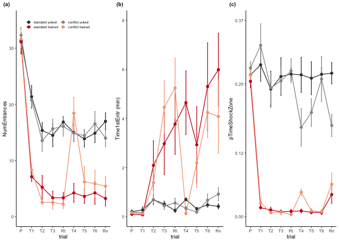

    ## load libraries 
    library(tidyverse) ## for respahing data
    library(cowplot) ## for some easy to use themes
    library(factoextra)  ## pca with vectors
    library(FactoMineR) # more pca
    library(apaTables) #  for ANOVA tables
    library(scales) # for scientific notation

    library(png) # for ading images to plots
    library(grid)  # for ading images to plots

    ## load user-written functions 
    source("functions_behavior.R")
    source("figureoptions.R")

    ## set output file for figures 
    knitr::opts_chunk$set(fig.path = '../figures/01_behavior/')

Sample sizes
------------

The ‘treatment’ column describes the four behavioral treatment groups.  
The ‘trial’ column describes the behvioral training sessions. Here I
filter by a single session to calculte the number of mice.

    ## import output from video tracker program 
    behavior <- read.csv("../data/00_behaviordata.csv", header = T)

    # set levels or refactor
    behavior$treatment <- factor(behavior$treatment, levels = levelstreatment)
    behavior$training <- factor(behavior$training, levels = levelstraining)
    behavior <- behavior %>%
      mutate(trial = fct_recode(trial, "Pre" = "Hab"))
    head(behavior)

    ##       ID Day        treatment training  trial trialNum ShockOnOff
    ## 1 15140A   1 conflict.trained  trained    Pre        1        Off
    ## 2 15140A   1 conflict.trained  trained     T1        2         On
    ## 3 15140A   1 conflict.trained  trained     T2        3         On
    ## 4 15140A   1 conflict.trained  trained     T3        4         On
    ## 5 15140A   2 conflict.trained  trained Retest        5         On
    ## 6 15140A   2 conflict.trained  trained  T4_C1        6         On
    ##   PairedPartner TotalPath Speed sdSpeed Linearity NumEntrances Time1stEntr
    ## 1        15140B     22.68  3.78    3.07    0.4790           28       24.63
    ## 2        15140B     19.36  3.23    2.78    0.4016            6        9.83
    ## 3        15140B     15.01  2.50    2.68    0.3170            2      118.37
    ## 4        15140B     14.39  2.40    2.78    0.3122            3      256.53
    ## 5        15140B     14.04  2.34    3.11    0.2895            1      432.07
    ## 6        15140B     12.50  2.08    2.52    0.3107           10        0.87
    ##   Path1stEntr Speed1stEntr EntrPerDist NumShock MaxTimeAvoid MaxPathAvoid
    ## 1        1.09         4.56        1.12        0           53         2.15
    ## 2        0.62        16.42        0.30        7          327        11.70
    ## 3        3.17         2.31        0.11        3          312         4.98
    ## 4        7.48         4.26        0.17        3          256         7.48
    ## 5       10.56         9.38        0.06        1          432        10.56
    ## 6        0.00        -1.00        0.56       13          447         1.82
    ##   Time2ndEntr Path2ndEntr Speed2ndEntr TimeShockZone pTimeShockZone
    ## 1       59.97        2.59         7.85        94.665         0.2277
    ## 2       18.30        1.23         6.53         8.433         0.0211
    ## 3      287.63        8.54         3.73         3.366         0.0092
    ## 4      447.80       12.74         1.56         2.498         0.0069
    ## 5      599.97       15.66        -1.00         1.067         0.0026
    ## 6       25.90        0.75        16.19        17.735         0.0339
    ##   pTimeCCW pTimeOPP pTimeCW RayleigLength RayleigAngle Min50.RngLoBin
    ## 1   0.2583   0.1788  0.3352          0.11       330.67             60
    ## 2   0.6961   0.2049  0.0779          0.65       112.66            130
    ## 3   0.6413   0.3245  0.0250          0.78       124.87            150
    ## 4   0.5790   0.4018  0.0123          0.80       128.39            150
    ## 5   0.2945   0.6300  0.0729          0.72       159.36            170
    ## 6   0.0195   0.1561  0.7905          0.67       257.90            280
    ##   AnnularSkewnes AnnularKurtosis ShockPerEntrance
    ## 1           0.88            3.13         0.000000
    ## 2           1.81            6.70         1.166667
    ## 3           1.87            8.91         1.500000
    ## 4           2.84           12.51         1.000000
    ## 5           2.42           11.83         1.000000
    ## 6           0.98            4.65         1.300000

    # sample sizes
    behavior %>% 
      filter(trial == "Pre") %>%
      select(treatment)  %>%  summary()

    ##             treatment
    ##  standard.yoked  :8  
    ##  standard.trained:8  
    ##  conflict.yoked  :9  
    ##  conflict.trained:9

    # names of behavioral measures
    names(behavior[9:34])

    ##  [1] "TotalPath"        "Speed"            "sdSpeed"         
    ##  [4] "Linearity"        "NumEntrances"     "Time1stEntr"     
    ##  [7] "Path1stEntr"      "Speed1stEntr"     "EntrPerDist"     
    ## [10] "NumShock"         "MaxTimeAvoid"     "MaxPathAvoid"    
    ## [13] "Time2ndEntr"      "Path2ndEntr"      "Speed2ndEntr"    
    ## [16] "TimeShockZone"    "pTimeShockZone"   "pTimeCCW"        
    ## [19] "pTimeOPP"         "pTimeCW"          "RayleigLength"   
    ## [22] "RayleigAngle"     "Min50.RngLoBin"   "AnnularSkewnes"  
    ## [25] "AnnularKurtosis"  "ShockPerEntrance"

    # small table for converting between name and number later
    trialnameandnumber <- behavior %>% select(trial, trialNum) %>% distinct()
    trialnameandnumber

    ##       trial trialNum
    ## 1       Pre        1
    ## 2        T1        2
    ## 3        T2        3
    ## 4        T3        4
    ## 5    Retest        5
    ## 6     T4_C1        6
    ## 7     T5_C2        7
    ## 8     T6_C3        8
    ## 9 Retention        9

    dfshocks <- behavior %>%
      dplyr::group_by(treatment, trial, trialNum) %>%
      dplyr::summarise(m = mean(NumShock), 
                       se = sd(NumShock)/sqrt(length(NumShock))) %>%
      dplyr::mutate(m = round(m,0)) %>%
      dplyr::mutate(measure = "NumShock") 
    dfshocks

    ## # A tibble: 36 x 6
    ## # Groups:   treatment, trial [36]
    ##    treatment        trial     trialNum     m    se measure 
    ##    <fct>            <fct>        <int> <dbl> <dbl> <chr>   
    ##  1 standard.yoked   Pre              1     0 0     NumShock
    ##  2 standard.yoked   Retention        9     0 0     NumShock
    ##  3 standard.yoked   Retest           5     4 1.20  NumShock
    ##  4 standard.yoked   T1               2     7 0.854 NumShock
    ##  5 standard.yoked   T2               3     5 2.12  NumShock
    ##  6 standard.yoked   T3               4     4 1.37  NumShock
    ##  7 standard.yoked   T4_C1            6     4 1.66  NumShock
    ##  8 standard.yoked   T5_C2            7     4 1.33  NumShock
    ##  9 standard.yoked   T6_C3            8     4 2.04  NumShock
    ## 10 standard.trained Pre              1     0 0     NumShock
    ## # … with 26 more rows

    numshocks <- ggplot(dfshocks,  aes(x=, trialNum, y=m, color=treatment, label = m)) + 
        geom_errorbar(aes(ymin=m-se, ymax=m+se, color=treatment), width=.1) +
        geom_line() +
        geom_point(size = 1) +
        labs(y = "\n Number of shocks") +
        scale_x_continuous(name= "trial", 
                           breaks = c(1, 2, 3, 4, 5, 6, 7, 8, 9),
                           labels = c( "P", "T1", "T2", "T3",
                                       "Rt", "T4", "T5", "T6", "Rn")) +
        scale_alpha_continuous( breaks = c(1, 2, 3)) +
        theme_ms() +
        scale_color_manual(values = treatmentcolors,
                           name  = NULL)  +
        theme(legend.position = "none",
              legend.justification=c(0,0),
              legend.text=element_text(size=5),
              strip.text = element_text(angle = 0, hjust = 0, vjust = 0),
              axis.text.y = element_blank(),
              strip.background = element_blank()) +
      facet_wrap(~treatment, nrow = 4, labeller = treatment_labeller) +
      scale_y_continuous(breaks = c(0,10,20), limits = c(0,30)) +
      geom_text(vjust= -0.5, size=2.5)

    ## Warning: The labeller API has been updated. Labellers taking `variable`and
    ## `value` arguments are now deprecated. See labellers documentation.

    numshocks

    paradigm <- png::readPNG("../figures/00_schematics/figure_1a.png")
    paradigm <- ggdraw() +  draw_image(paradigm, scale = 1)

    subfields <- png::readPNG("../figures/00_schematics/figure_1c.png")
    subfields <- ggdraw() +  draw_image(subfields, scale = 1)

    experimentaldesign <- plot_grid(paradigm, numshocks, subfields, rel_widths = c(2,1,0.8), nrow = 1,
              label_size = 8, labels = c("(a)", "(b) ", "(c)"))
    experimentaldesign

    pdf(file="../figures/01_behavior/experimentaldesign.pdf", width=6.69, height=2.6)
    plot(experimentaldesign)
    dev.off()

    ## quartz_off_screen 
    ##                 2

    pdf(file="../figures/figure_1.pdf", width=6.69, height=2.6)
    plot(experimentaldesign)
    dev.off()

    ## quartz_off_screen 
    ##                 2

Vizualizing Mean and Standard error for avoidance behaviors
===========================================================

To make the point and line graphs, I must create and join some data
frames, then I have a function that makes four plots with specific
titles, y labels and limits.

    dfa <- behavior %>%
      dplyr::group_by(treatment, trial, trialNum) %>%
      dplyr::summarise(m = mean(NumEntrances), 
                       se = sd(NumEntrances)/sqrt(length(NumEntrances))) %>%
      dplyr::mutate(measure = "NumEntrances")

    dfb <- behavior %>%
      dplyr::group_by(treatment, trial, trialNum) %>%
      dplyr::mutate(minutes = Time1stEntr/60) %>%
      dplyr::summarise(m = mean(minutes), 
                       se = sd(minutes)/sqrt(length(minutes))) %>%
      dplyr::mutate(measure = "Time1stEntr (min)")

    dfc <- behavior %>%
      dplyr::group_by(treatment, trial, trialNum) %>%
      dplyr::summarise(m = mean(pTimeShockZone), 
                       se = sd(pTimeShockZone)/sqrt(length(pTimeShockZone))) %>%
      dplyr::mutate(measure = "pTimeShockZone")

    avoidancedf <- rbind(dfa, dfb,dfc)

    a <- meansdplots(dfa, "NumEntrances" ,  c(0,10,20,30), c(0, 35))
    b <- meansdplots(dfb, "Time1stEntr (min)",  c(0,2,4,6,8), c(0, 8))
    c <- meansdplots(dfc, "pTimeShockZone", c(0,.12,.25,.37), c(0, .37))

    avoidancebehaviors <- plot_grid(a + theme(legend.position = c(0.05, 0.9),
                                              legend.direction = "horizontal",
                                              legend.key.size = unit(0.25, "cm")) +
                                      guides(color = guide_legend(nrow = 2)) ,
                           b + theme(legend.position = "none"), 
                           c + theme(legend.position = "none"), nrow = 1,
                           label_size = 8,
                           labels = c("(a)", "(b)", "(c)"))
    avoidancebehaviors

    # clean df for saving
    suppletable2 <- rbind(dfshocks, avoidancedf)
    suppletable2$m <- round(suppletable2$m,3)
    suppletable2$se <- round(suppletable2$se,2)
    head(suppletable2)

    ## # A tibble: 6 x 6
    ## # Groups:   treatment, trial [6]
    ##   treatment      trial     trialNum     m    se measure 
    ##   <fct>          <fct>        <int> <dbl> <dbl> <chr>   
    ## 1 standard.yoked Pre              1     0  0    NumShock
    ## 2 standard.yoked Retention        9     0  0    NumShock
    ## 3 standard.yoked Retest           5     4  1.2  NumShock
    ## 4 standard.yoked T1               2     7  0.85 NumShock
    ## 5 standard.yoked T2               3     5  2.12 NumShock
    ## 6 standard.yoked T3               4     4  1.37 NumShock

### Principle component analysis

Next, I next reduced the dimentionality of the data with a PCA anlaysis.

    pca.all <- makepcadf(behavior)
    head(pca.all)

    ##       ID        treatment trialNum Day        PC1        PC2        PC3
    ## 1 15140A conflict.trained        1   1 -2.9634529 -2.3926459 -1.7788076
    ## 2 15140A conflict.trained        2   1  0.9036966 -2.0647848  2.4911475
    ## 3 15140A conflict.trained        3   1  2.4803959 -0.1489064  2.0950802
    ## 4 15140A conflict.trained        4   1  3.8236512 -0.2564487  1.5841732
    ## 5 15140A conflict.trained        5   2  5.4390116 -0.2855016 -0.6080055
    ## 6 15140A conflict.trained        6   2 -0.6658926  0.4737255 -1.6783668
    ##          PC4        PC5        PC6        PC7         PC8         PC9
    ## 1 -0.5799700 -0.3841726 -0.8005324  1.6983796  1.37824140 -0.04983849
    ## 2 -0.1708753  1.2094357 -1.2913561 -0.6066415  0.76344055  0.21775235
    ## 3 -0.9547953  0.8099878 -0.1355901  0.3459045  0.66567249  0.42931315
    ## 4 -1.0775488 -0.5614903 -0.2914055 -0.1355860  0.02448386  0.17539735
    ## 5 -0.6813732 -0.5384204 -0.7902852 -0.8662319 -0.24161317 -0.34292216
    ## 6  4.2617839  1.5780500 -0.1068274  2.0359425 -0.28581777  2.39390223
    ##        PC10
    ## 1 0.5049673
    ## 2 1.3051340
    ## 3 0.8802736
    ## 4 0.8659967
    ## 5 0.2886386
    ## 6 0.6254291

    pca.Rn <- pca.all %>% 
      filter(trialNum == 9) %>%  
      select(ID:PC2) 
    head(pca.Rn)

    ##       ID        treatment trialNum Day        PC1        PC2
    ## 1 15140A conflict.trained        9   3  2.0985364 -1.2268375
    ## 2 15140B   conflict.yoked        9   3 -0.8030276 -1.5914329
    ## 3 15140C standard.trained        9   3  6.4346388  0.1710085
    ## 4 15140D   standard.yoked        9   3 -1.1318442  1.7155694
    ## 5 15141C standard.trained        9   3 -0.1644596  1.1372288
    ## 6 15141D   standard.yoked        9   3 -2.7745864  2.2214867

    suppletable3 <- pca.all %>% 
      full_join(., trialnameandnumber)  %>% 
      select(ID, treatment, trial, trialNum, PC1, PC2) 

    ## Joining, by = "trialNum"

    head(suppletable3)

    ##       ID        treatment  trial trialNum        PC1        PC2
    ## 1 15140A conflict.trained    Pre        1 -2.9634529 -2.3926459
    ## 2 15140A conflict.trained     T1        2  0.9036966 -2.0647848
    ## 3 15140A conflict.trained     T2        3  2.4803959 -0.1489064
    ## 4 15140A conflict.trained     T3        4  3.8236512 -0.2564487
    ## 5 15140A conflict.trained Retest        5  5.4390116 -0.2855016
    ## 6 15140A conflict.trained  T4_C1        6 -0.6658926  0.4737255

    pca.Rn.summary <- pca.all %>% filter(trialNum == 9) %>% 
      group_by(treatment) %>% 
      dplyr::summarize(avePC1 = mean(PC1),
                       avePC2 = mean(PC2),
                       sePC1 = sd(PC1)/sqrt(length(PC1)),
                       sePC2 = sd(PC2)/sqrt(length(PC2)))

    d <- ggplot(pca.all, aes(x = PC1, y = PC2, color = treatment, fill = treatment)) +

      geom_point(data = pca.all, aes(alpha = Day)) + 
      geom_point(data = pca.Rn.summary, aes(x = avePC1, y = avePC2), size = 4) +
      theme_ms() +
        scale_fill_manual(guide = 'none',values = treatmentcolors) +
      scale_color_manual(guide = 'none',values = treatmentcolors) +
      scale_alpha_continuous(breaks = c(1, 2, 3)) +
      theme(legend.position = "none") +
      labs( x = "PC1: 38.3% variance explained",
            y = "PC2: 16.7% \n variance explained",
           subtitle = " ") 
    d

    # get contributions
    df <- behavior %>% select(TotalPath:AnnularKurtosis)
    res.pca <- PCA(df,  graph = FALSE)
    # Visualize eigenvalues/variances
    fviz_screeplot(res.pca, addlabels = TRUE, ylim = c(0, 50))

    # Contributions of variables to PC1
    e <- fviz_contrib_rmh(res.pca, choice = "var", axes = 1, top = 8, 
                     ylab = "PC1 % contrib.", xlab = "estimates of memory", subtitle = " ") +
      theme_ms() + theme(axis.text.x = element_text(angle=45, hjust = 1))
    # Contributions of variables to PC2
    f <- fviz_contrib_rmh(res.pca, choice = "var", axes = 2, top = 8, 
                     ylab = "PC2 % contrib." , xlab = "estimates of activity and memory", subtitle = " ") +
      theme_ms() + theme(axis.text.x = element_text(angle=45, hjust = 1))

    e

    f

    pcaplots <- plot_grid(d,e,f, labels = c("(d)", "(e)", "(f)"),
               nrow = 1,
               label_size = 8)
    pcaplots

    avoidance <- plot_grid(avoidancebehaviors, pcaplots, nrow = 2)
    avoidance

    pdf(file="../figures/01_behavior/avoidance.pdf", width=6.69, height=3.5)
    plot(avoidance)
    dev.off()

    ## quartz_off_screen 
    ##                 2

    pdf(file="../figures/figure_2.pdf", width=6.69, height=3.5)
    plot(avoidance)
    dev.off()

    ## quartz_off_screen 
    ##                 2

now all the stats
-----------------

Maybe it should be done like this: Q1: are the groups different? 1-way
ANOVA of groups on Pre Q2: are the groups different during initial
training T1-T3? 2-way ANOVA of groups X trial Q3: do the groups differ
in initial recall? 1-way ANOVA of groups on Rt Q4: Do the groups differ
in subsequent training? T4-T6 2-way ANOVA of groups X trial Q5: do the
groups differ in subsequent recall? 1-way ANOVA of groups on Rn

    # Q1. Are groups different at pre? No.
    Q1 <- onewayANOVAfor3measures(behavior, "Pre", "Pre-training (Pre)")
      
      
    # Q2. Are the groups different during initial training T1-T3? Yes (sometimes alone, sometime interaction)
    T1T2T3 <-  behavior %>% filter(trial %in% c("T1", "T2", "T3"))
    Q2 <- twowayANOVAfor3measures(T1T2T3, "Initial training (T1 - T3)")

    # Q3 Do the groups differ in initial recall? Yes.
    Q3 <- onewayANOVAfor3measures(behavior, "Retest", "Initial recall (Rt)")

    # Q4 Do the groups differ in subsequent training? Yes
    T4T5T6 <-  behavior %>% filter(trial %in% c("T4_C1", "T5_C2", "T6_C3"))
    Q4 <- twowayANOVAfor3measures(T4T5T6,  "Conflict training  (T4 - T6)")

    # Q5  Do the groups differ in subsequent recall? Yes
    Q5 <- onewayANOVAfor3measures(behavior, "Retention", "Conflict recall (Rn)")

    # more stats. didn't bother with a function

    PC1all <- apa.aov.table(aov(PC1 ~ treatment , data=pca.all))
    PC1all <- as.data.frame(PC1all$table_body)
    totaldf <- PC1all[3, 3]
    PC1all$df <- paste(PC1all$df, ", " , totaldf, sep = "")
    PC1all$ANOVA <- "PC1 ~ treatment"
    PC1all$trials <- "All trials"

    PC2all <- apa.aov.table(aov(PC2 ~ treatment , data=pca.all))
    PC2all <- as.data.frame(PC2all$table_body)
    totaldf <- PC2all[3, 3]
    PC2all$df <- paste(PC2all$df, ", " , totaldf, sep = "")
    PC2all$ANOVA <- "PC2 ~ treatment"
    PC2all$trials <- "All trails"

    PC1rn <- apa.aov.table(aov(PC1 ~ treatment , data=pca.Rn))
    PC1rn <- as.data.frame(PC1rn$table_body)
    totaldf <- PC1rn[3, 3]
    PC1rn$df <- paste(PC1rn$df, ", " , totaldf, sep = "")
    PC1rn$ANOVA <- "PC1 ~ treatment"
    PC1rn$trials <- "Retention (Rn)"

    PC2rn <- apa.aov.table(aov(PC2 ~ treatment , data=pca.Rn))
    PC2rn <- as.data.frame(PC2rn$table_body)
    totaldf <- PC2rn[3, 3]
    PC2rn$df <- paste(PC2rn$df, ", " , totaldf, sep = "")
    PC2rn$ANOVA <- "PC2 ~ treatment"
    PC2rn$trials <- "Retention"

    PC.APA <- as.data.frame(rbind(PC1all, PC2all, PC1rn, PC2rn))
    PC.APA <- PC.APA %>% 
        select(trials, ANOVA, Predictor, df, "F", p) %>%
        filter(!Predictor %in% c("(Intercept)", "Error"))

    table1 <- as.data.frame(rbind(Q1,Q2,Q3,Q4,Q5, PC.APA))
    table1$F <- as.numeric(table1$F)
    table1$p <- as.numeric(table1$p)

    # show if sig or not
    table1$sig <- ifelse(table1$p < 0.001, '***',
                         ifelse(table1$p < 0.01, '**',
                                ifelse(table1$p < 0.05, '*', " ")))
    # clean for printing
    table1$F <- round(table1$F, 2)
    table1$p <- round(table1$p, 3)

    head(table1)

    ##                       trials                            ANOVA
    ## 1         Pre-training (Pre)         NumEntrances ~ treatment
    ## 2         Pre-training (Pre)       pTimeShockZone ~ treatment
    ## 3         Pre-training (Pre)          Time1stEntr ~ treatment
    ## 4 Initial training (T1 - T3) NumEntrances ~ treatment * trial
    ## 5 Initial training (T1 - T3) NumEntrances ~ treatment * trial
    ## 6 Initial training (T1 - T3) NumEntrances ~ treatment * trial
    ##           Predictor    df     F     p sig
    ## 1         treatment 3, 30  0.09 0.967    
    ## 2         treatment 3, 30  0.78 0.512    
    ## 3         treatment 3, 30  0.80 0.506    
    ## 4         treatment 3, 90 26.42 0.000 ***
    ## 5             trial 2, 90  5.88 0.004  **
    ## 6 treatment x trial 6, 90  0.72 0.631

    ## for inline citation

    summary(aov(PC1 ~ treatment , data=pca.all))

    ##              Df Sum Sq Mean Sq F value Pr(>F)    
    ## treatment     3   1392   463.9   91.83 <2e-16 ***
    ## Residuals   302   1526     5.1                   
    ## ---
    ## Signif. codes:  0 '***' 0.001 '**' 0.01 '*' 0.05 '.' 0.1 ' ' 1

    summary(aov(PC2 ~ treatment , data=pca.all))

    ##              Df Sum Sq Mean Sq F value   Pr(>F)    
    ## treatment     3    123   40.99   10.76 9.73e-07 ***
    ## Residuals   302   1150    3.81                     
    ## ---
    ## Signif. codes:  0 '***' 0.001 '**' 0.01 '*' 0.05 '.' 0.1 ' ' 1

    summary(aov(PC1 ~ treatment , data=pca.Rn))

    ##             Df Sum Sq Mean Sq F value   Pr(>F)    
    ## treatment    3    255   85.01   15.18 3.41e-06 ***
    ## Residuals   30    168    5.60                     
    ## ---
    ## Signif. codes:  0 '***' 0.001 '**' 0.01 '*' 0.05 '.' 0.1 ' ' 1

    summary(aov(PC2 ~ treatment , data=pca.Rn))

    ##             Df Sum Sq Mean Sq F value Pr(>F)  
    ## treatment    3  27.24   9.079   3.249 0.0355 *
    ## Residuals   30  83.82   2.794                 
    ## ---
    ## Signif. codes:  0 '***' 0.001 '**' 0.01 '*' 0.05 '.' 0.1 ' ' 1

save files
----------

    # supp table 1
    write.csv(behavior, file = "../data/suppltable1.csv", row.names = FALSE)

    # supp table 2
    write.csv(suppletable2, file = "../data/suppltable2.csv", row.names = FALSE)

    # table 1
    write.csv(table1, "../data/table-1.csv", row.names = F)

    # supp table 3
    write.csv(suppletable3, file = "../data/suppletable3.csv", row.names = FALSE)

    citation("tidyverse")

    ## 
    ##   Wickham et al., (2019). Welcome to the tidyverse. Journal of
    ##   Open Source Software, 4(43), 1686,
    ##   https://doi.org/10.21105/joss.01686
    ## 
    ## A BibTeX entry for LaTeX users is
    ## 
    ##   @Article{,
    ##     title = {Welcome to the {tidyverse}},
    ##     author = {Hadley Wickham and Mara Averick and Jennifer Bryan and Winston Chang and Lucy D'Agostino McGowan and Romain François and Garrett Grolemund and Alex Hayes and Lionel Henry and Jim Hester and Max Kuhn and Thomas Lin Pedersen and Evan Miller and Stephan Milton Bache and Kirill Müller and Jeroen Ooms and David Robinson and Dana Paige Seidel and Vitalie Spinu and Kohske Takahashi and Davis Vaughan and Claus Wilke and Kara Woo and Hiroaki Yutani},
    ##     year = {2019},
    ##     journal = {Journal of Open Source Software},
    ##     volume = {4},
    ##     number = {43},
    ##     pages = {1686},
    ##     doi = {10.21105/joss.01686},
    ##   }

    citation("cowplot")  

    ## 
    ## To cite package 'cowplot' in publications use:
    ## 
    ##   Claus O. Wilke (2019). cowplot: Streamlined Plot Theme and Plot
    ##   Annotations for 'ggplot2'. R package version 0.9.4.
    ##   https://CRAN.R-project.org/package=cowplot
    ## 
    ## A BibTeX entry for LaTeX users is
    ## 
    ##   @Manual{,
    ##     title = {cowplot: Streamlined Plot Theme and Plot Annotations for 'ggplot2'},
    ##     author = {Claus O. Wilke},
    ##     year = {2019},
    ##     note = {R package version 0.9.4},
    ##     url = {https://CRAN.R-project.org/package=cowplot},
    ##   }

    citation("factoextra")   

    ## 
    ## To cite package 'factoextra' in publications use:
    ## 
    ##   Alboukadel Kassambara and Fabian Mundt (2017). factoextra:
    ##   Extract and Visualize the Results of Multivariate Data Analyses.
    ##   R package version 1.0.5.
    ##   https://CRAN.R-project.org/package=factoextra
    ## 
    ## A BibTeX entry for LaTeX users is
    ## 
    ##   @Manual{,
    ##     title = {factoextra: Extract and Visualize the Results of Multivariate Data Analyses},
    ##     author = {Alboukadel Kassambara and Fabian Mundt},
    ##     year = {2017},
    ##     note = {R package version 1.0.5},
    ##     url = {https://CRAN.R-project.org/package=factoextra},
    ##   }

    citation("FactoMineR")  

    ## 
    ## To cite FactoMineR in publications use:
    ## 
    ##   Sebastien Le, Julie Josse, Francois Husson (2008). FactoMineR:
    ##   An R Package for Multivariate Analysis. Journal of Statistical
    ##   Software, 25(1), 1-18. 10.18637/jss.v025.i01
    ## 
    ## A BibTeX entry for LaTeX users is
    ## 
    ##   @Article{,
    ##     title = {{FactoMineR}: A Package for Multivariate Analysis},
    ##     author = {S\'ebastien L\^e and Julie Josse and Fran\c{c}ois Husson},
    ##     journal = {Journal of Statistical Software},
    ##     year = {2008},
    ##     volume = {25},
    ##     number = {1},
    ##     pages = {1--18},
    ##     doi = {10.18637/jss.v025.i01},
    ##   }

    citation("apaTables")  

    ## 
    ## To cite package 'apaTables' in publications use:
    ## 
    ##   David Stanley (2018). apaTables: Create American Psychological
    ##   Association (APA) Style Tables. R package version 2.0.5.
    ##   https://CRAN.R-project.org/package=apaTables
    ## 
    ## A BibTeX entry for LaTeX users is
    ## 
    ##   @Manual{,
    ##     title = {apaTables: Create American Psychological Association (APA) Style Tables},
    ##     author = {David Stanley},
    ##     year = {2018},
    ##     note = {R package version 2.0.5},
    ##     url = {https://CRAN.R-project.org/package=apaTables},
    ##   }
