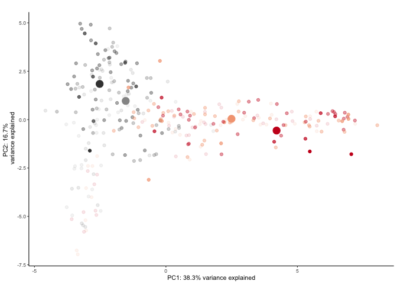

This markdown file is used for behavioral data wrangling, statistical
analysis, and data visualization. Figures from this analysis were
assembled into this multi-panel plot using Adobe Illustrator. Files used
to create the individual figures are saved in the data subdirectory with
the prefix 01a.

Setup
-----

    ## load libraries 
    library(tidyr) ## for respahing data
    library(plyr) ## for renmaing factors
    library(dplyr) ## for filtering and selecting rows
    library(reshape2) ## for melting dataframe
    library(ggplot2) ## for awesome plots!
    library(cowplot) ## for some easy to use themes
    library(factoextra)  ##pca with vectors
    library(car) ## stats
    library(superheat) # for kmeans clustered heatmap
    library(pheatmap)  # for pretty heatmap
    library(viridis) # for awesome color pallette
    library(ez)      # for non-parametric ANOVA

    ## load user-written functions 
    source("functions_behavior.R")
    source("figureoptions.R")

    ## set output file for figures 
    knitr::opts_chunk$set(fig.path = '../figures/01_behavior/')

Sample sizes
------------

The 'APA2' column describes the four behavioral treatment groups.  
The 'TrainSessionCombo' column describes the behvioral training
sessions. Here I filter by a single session to calculte the number of
mice.

    ## import output from video tracker program 
    behavior <- read.csv("../data/01_behaviordata.csv", header = T)

    ## set level for APA2 then renmae
    behavior$APA2 <- factor(behavior$APA2, levels = c("YokedSame", "Same", "YokedConflict","Conflict"))
    levels(behavior$APA2) <-  c("yoked-consistent" ,"consistent", "yoked-conflict", "conflict")

    # sample sizes
    behavior %>% 
      filter(TrainSessionCombo == "Retention") %>%
      select(APA2)  %>%  summary()

    ##                APA2  
    ##  yoked-consistent:8  
    ##  consistent      :8  
    ##  yoked-conflict  :9  
    ##  conflict        :9

Summary statistics comparing all groups across sessions
-------------------------------------------------------

1.  First, I create some "slim" datasets with just the quantitiave
    variables and just the relevant catagorical factors
2.  Then, I use for loops to run statistical tests for all quantitive
    variables
3.  Then I make a box plot for all variables

<!-- -->

    # sample sizes
    slim1 <- behavior[,c(15,16,14,20:58)] # drop frivolous columns
    slim2 <- slim1 # subsequently in this analysis, I use this line to filter rows 
    slim3 <- slim2[,c(1:3)] # extract experimental design variables
    slim4 <- slim2[,c(4:42)]

    # Anova
    #for(y in names(slim4)){
    #  ymod<- summary(aov(slim4[[y]] ~ slim3$APA2 * slim3$TrainSessionCombo ))
    #  cat(paste('\nDependent var:', y, '\n'))
    #  print(ymod)
    #}

    # Variables that are significant for training, time, and the interaction
    # PolarMaxVal, PolarMinBin, PolarMinVal, PolarSdVal, PolarAvgVal, RayleigLength
    # pTimeCW, pTimeOPP, pTimeTarget, TimeTarget, Speed2ndEntr, Path2ndEntr, Time2ndEntr,
    # MaxTimeAvoid, NumShock, Dist1stEntr.m, Path1stEntr, Time1stEntr, NumEntrances

Summary statistics comparing Consisten and Conflict behaviors during the T4/C1 training session
-----------------------------------------------------------------------------------------------

1.  First, I create some "slim" datasets to look at only the trained
    animals to look for statistically significant differences between
    consistent and conflict trained on the T4/C1 training session
2.  Then, I used for loops to run statistical tests for all quantitive
    variables. For space saving, I have quoted out the stats test for
    space saving and just showed my handwritten notes
3.  Then I make a box plot for all variables

<!-- -->

    names(behavior[c(1:19)]) # various catagorical variables descibing the data

    ##  [1] "ID"                   "Year"                 "Genotype"            
    ##  [4] "TrainProtocol"        "TrainSequence"        "TrainGroup"          
    ##  [7] "Day"                  "TrainSession"         "ShockOnOff"          
    ## [10] "PairedPartner"        "Experimenter"         "Housing"             
    ## [13] "TestLocation"         "APA"                  "APA2"                
    ## [16] "TrainSessionCombo"    "pair1"                "pair2"               
    ## [19] "TrainSessionComboNum"

    names(behavior[c(20:58)]) # All quantitive values collected are

    ##  [1] "SdevSpeedArena"     "Linearity.Arena."   "NumEntrances"      
    ##  [4] "Time1stEntr"        "Path1stEntr"        "Speed1stEntr.cm.s."
    ##  [7] "Dist1stEntr.m."     "NumShock"           "MaxTimeAvoid"      
    ## [10] "Time2ndEntr"        "Path2ndEntr"        "Speed2ndEntr"      
    ## [13] "TimeTarget"         "pTimeTarget"        "pTimeCCW"          
    ## [16] "pTimeOPP"           "pTimeCW"            "RayleigLength"     
    ## [19] "RayleigAngle"       "PolarAvgVal"        "PolarSdVal"        
    ## [22] "PolarMinVal"        "PolarMinBin"        "Min50.RngLoBin"    
    ## [25] "Min50.RngHiBin"     "PolarMaxVal"        "PolarMaxBin"       
    ## [28] "Max50.RngLoBin"     "Max50.RngHiBin"     "AnnularMinVal"     
    ## [31] "AnnularMinBin"      "AnnularMaxVal"      "AnnularMaxBin"     
    ## [34] "AnnularAvg"         "AnnularSd"          "AnnularSkewnes"    
    ## [37] "AnnularKurtosis"    "Speed1"             "Speed2"

    slim1 <- behavior[,c(15,16,14,20:58)]
    slim2 <- slim1 %>% filter(TrainSessionCombo == "T4_C1", APA != "control") 
    slim3 <- as.data.frame(slim2[,1])
    slim4 <- slim2[,c(4:42)]
    slim3$APA2 <- factor(slim2$APA2, levels = c("consistent", "conflict"))

    # Levene's test for normality
    #for(y in names(slim4)){
    #  ymod <- leveneTest(slim4[[y]] ~ slim3$APA2)
    #  cat(paste('\nDependent var:', y, '\n'))
    #  print(ymod)
    #}

    # Signif. codes:  0 ‘***’ 0.001 ‘**’ 0.01 ‘*’ 0.05 ‘.’ 0.1 ‘ ’ 1
    # *** Speed1, Path2ndEntr, Time2ndEntr, Path2ndEntr, Time2ndEntr
    # ** Path1stEntr, Time1stEntr
    # *  Max50.RngHiBin ,  PolarMaxBin  , PolarMinVal, RayleigAngle, pTimeCW, pTimeOPP,
    # .  Speed2, Min50.RngLoBin , TimeTarget, NumShock, NumEntrances
    #    AnnularKurtosis, AnnularSkewnes, AnnularSd, AnnularMaxBin, AnnularMaxVal, AnnularMinBin, AnnularMinVal, Max50.RngLoBin, RayleigLength PolarMaxVal, Min50.RngHiBin , PolarMinBin, PolarSdVal, PolarAvgVal, RayleigLength, pTimeTarget, Speed2ndEntr, MaxTimeAvoid, Dist1stEntr.m, Speed1stEntr.cm.s, Linearity.Arena, SdevSpeedArena

    for(y in names(slim4)){
      ymod <- wilcox.test(slim4[[y]] ~ slim3$APA2 )
      cat(paste('\nDependent var:', y, '\n'))
      print(ymod)
    }

    ## Warning in wilcox.test.default(x = c(3.21, 2.82, 2.2, 2.64, 2.88, 2.5, 3, :
    ## cannot compute exact p-value with ties

    ## 
    ## Dependent var: SdevSpeedArena 
    ## 
    ##  Wilcoxon rank sum test with continuity correction
    ## 
    ## data:  slim4[[y]] by slim3$APA2
    ## W = 33, p-value = 0.8098
    ## alternative hypothesis: true location shift is not equal to 0

    ## Warning in wilcox.test.default(x = c(0.3341, 0.2786, 0.3786, 0.3168,
    ## 0.3158, : cannot compute exact p-value with ties

    ## 
    ## Dependent var: Linearity.Arena. 
    ## 
    ##  Wilcoxon rank sum test with continuity correction
    ## 
    ## data:  slim4[[y]] by slim3$APA2
    ## W = 52.5, p-value = 0.1234
    ## alternative hypothesis: true location shift is not equal to 0

    ## Warning in wilcox.test.default(x = c(3L, 10L, 0L, 0L, 2L, 4L, 13L, 2L), :
    ## cannot compute exact p-value with ties

    ## 
    ## Dependent var: NumEntrances 
    ## 
    ##  Wilcoxon rank sum test with continuity correction
    ## 
    ## data:  slim4[[y]] by slim3$APA2
    ## W = 4.5, p-value = 0.002804
    ## alternative hypothesis: true location shift is not equal to 0

    ## Warning in wilcox.test.default(x = c(257.83, 39.7, 599.97, 599.97, 249.4, :
    ## cannot compute exact p-value with ties

    ## 
    ## Dependent var: Time1stEntr 
    ## 
    ##  Wilcoxon rank sum test with continuity correction
    ## 
    ## data:  slim4[[y]] by slim3$APA2
    ## W = 72, p-value = 0.0006258
    ## alternative hypothesis: true location shift is not equal to 0

    ## Warning in wilcox.test.default(x = c(8.59, 0.92, 14.26, 16.08, 7.75,
    ## 3.19, : cannot compute exact p-value with ties

    ## 
    ## Dependent var: Path1stEntr 
    ## 
    ##  Wilcoxon rank sum test with continuity correction
    ## 
    ## data:  slim4[[y]] by slim3$APA2
    ## W = 72, p-value = 0.0005879
    ## alternative hypothesis: true location shift is not equal to 0

    ## Warning in wilcox.test.default(x = c(9.54, 2.04, -1, -1, 13.37, 2.38,
    ## 1.96, : cannot compute exact p-value with ties

    ## 
    ## Dependent var: Speed1stEntr.cm.s. 
    ## 
    ##  Wilcoxon rank sum test with continuity correction
    ## 
    ## data:  slim4[[y]] by slim3$APA2
    ## W = 48, p-value = 0.258
    ## alternative hypothesis: true location shift is not equal to 0

    ## Warning in wilcox.test.default(x = c(0.15, 0.57, 0, 0, 0.11, 0.24, 0.7, :
    ## cannot compute exact p-value with ties

    ## 
    ## Dependent var: Dist1stEntr.m. 
    ## 
    ##  Wilcoxon rank sum test with continuity correction
    ## 
    ## data:  slim4[[y]] by slim3$APA2
    ## W = 6, p-value = 0.004506
    ## alternative hypothesis: true location shift is not equal to 0

    ## Warning in wilcox.test.default(x = c(3L, 10L, 0L, 0L, 3L, 5L, 13L, 2L), :
    ## cannot compute exact p-value with ties

    ## 
    ## Dependent var: NumShock 
    ## 
    ##  Wilcoxon rank sum test with continuity correction
    ## 
    ## data:  slim4[[y]] by slim3$APA2
    ## W = 2.5, p-value = 0.001456
    ## alternative hypothesis: true location shift is not equal to 0

    ## Warning in wilcox.test.default(x = c(257L, 195L, 599L, 599L, 293L, 161L, :
    ## cannot compute exact p-value with ties

    ## 
    ## Dependent var: MaxTimeAvoid 
    ## 
    ##  Wilcoxon rank sum test with continuity correction
    ## 
    ## data:  slim4[[y]] by slim3$APA2
    ## W = 49.5, p-value = 0.2104
    ## alternative hypothesis: true location shift is not equal to 0

    ## Warning in wilcox.test.default(x = c(321.23, 55, 599.97, 599.97, 543.07, :
    ## cannot compute exact p-value with ties

    ## 
    ## Dependent var: Time2ndEntr 
    ## 
    ##  Wilcoxon rank sum test with continuity correction
    ## 
    ## data:  slim4[[y]] by slim3$APA2
    ## W = 72, p-value = 0.0006306
    ## alternative hypothesis: true location shift is not equal to 0
    ## 
    ## 
    ## Dependent var: Path2ndEntr 
    ## 
    ##  Wilcoxon rank sum test
    ## 
    ## data:  slim4[[y]] by slim3$APA2
    ## W = 72, p-value = 8.227e-05
    ## alternative hypothesis: true location shift is not equal to 0

    ## Warning in wilcox.test.default(x = c(1.61, 1.97, -1, -1, 1.82, 2.47,
    ## 2.17, : cannot compute exact p-value with ties

    ## 
    ## Dependent var: Speed2ndEntr 
    ## 
    ##  Wilcoxon rank sum test with continuity correction
    ## 
    ## data:  slim4[[y]] by slim3$APA2
    ## W = 23.5, p-value = 0.2473
    ## alternative hypothesis: true location shift is not equal to 0

    ## Warning in wilcox.test.default(x = c(4.5, 8.064, 0, 0, 4.601, 4.599,
    ## 10.632, : cannot compute exact p-value with ties

    ## 
    ## Dependent var: TimeTarget 
    ## 
    ##  Wilcoxon rank sum test with continuity correction
    ## 
    ## data:  slim4[[y]] by slim3$APA2
    ## W = 1, p-value = 0.0008944
    ## alternative hypothesis: true location shift is not equal to 0

    ## Warning in wilcox.test.default(x = c(0.0107, 0.0203, 0, 0, 0.0116,
    ## 0.0124, : cannot compute exact p-value with ties

    ## 
    ## Dependent var: pTimeTarget 
    ## 
    ##  Wilcoxon rank sum test with continuity correction
    ## 
    ## data:  slim4[[y]] by slim3$APA2
    ## W = 3, p-value = 0.001753
    ## alternative hypothesis: true location shift is not equal to 0
    ## 
    ## 
    ## Dependent var: pTimeCCW 
    ## 
    ##  Wilcoxon rank sum test
    ## 
    ## data:  slim4[[y]] by slim3$APA2
    ## W = 37, p-value = 0.9626
    ## alternative hypothesis: true location shift is not equal to 0
    ## 
    ## 
    ## Dependent var: pTimeOPP 
    ## 
    ##  Wilcoxon rank sum test
    ## 
    ## data:  slim4[[y]] by slim3$APA2
    ## W = 64, p-value = 0.005512
    ## alternative hypothesis: true location shift is not equal to 0
    ## 
    ## 
    ## Dependent var: pTimeCW 
    ## 
    ##  Wilcoxon rank sum test
    ## 
    ## data:  slim4[[y]] by slim3$APA2
    ## W = 20, p-value = 0.1388
    ## alternative hypothesis: true location shift is not equal to 0

    ## Warning in wilcox.test.default(x = c(0.52, 0.61, 0.86, 0.7, 0.68, 0.67, :
    ## cannot compute exact p-value with ties

    ## 
    ## Dependent var: RayleigLength 
    ## 
    ##  Wilcoxon rank sum test with continuity correction
    ## 
    ## data:  slim4[[y]] by slim3$APA2
    ## W = 40.5, p-value = 0.6998
    ## alternative hypothesis: true location shift is not equal to 0
    ## 
    ## 
    ## Dependent var: RayleigAngle 
    ## 
    ##  Wilcoxon rank sum test
    ## 
    ## data:  slim4[[y]] by slim3$APA2
    ## W = 38, p-value = 0.8884
    ## alternative hypothesis: true location shift is not equal to 0
    ## 
    ## 
    ## Dependent var: PolarAvgVal 
    ## 
    ##  Wilcoxon rank sum test
    ## 
    ## data:  slim4[[y]] by slim3$APA2
    ## W = 57, p-value = 0.0464
    ## alternative hypothesis: true location shift is not equal to 0
    ## 
    ## 
    ## Dependent var: PolarSdVal 
    ## 
    ##  Wilcoxon rank sum test
    ## 
    ## data:  slim4[[y]] by slim3$APA2
    ## W = 11, p-value = 0.01522
    ## alternative hypothesis: true location shift is not equal to 0

    ## Warning in wilcox.test.default(x = c(1e-04, 1e-04, 0, 0, 0, 0, 0, 0), y =
    ## c(5e-04, : cannot compute exact p-value with ties

    ## 
    ## Dependent var: PolarMinVal 
    ## 
    ##  Wilcoxon rank sum test with continuity correction
    ## 
    ## data:  slim4[[y]] by slim3$APA2
    ## W = 10, p-value = 0.00948
    ## alternative hypothesis: true location shift is not equal to 0

    ## Warning in wilcox.test.default(x = c(10L, 320L, 0L, 0L, 0L, 310L, 0L, 0L:
    ## cannot compute exact p-value with ties

    ## 
    ## Dependent var: PolarMinBin 
    ## 
    ##  Wilcoxon rank sum test with continuity correction
    ## 
    ## data:  slim4[[y]] by slim3$APA2
    ## W = 22, p-value = 0.1828
    ## alternative hypothesis: true location shift is not equal to 0

    ## Warning in wilcox.test.default(x = c(250L, 160L, 190L, 200L, 150L, 160L, :
    ## cannot compute exact p-value with ties

    ## 
    ## Dependent var: Min50.RngLoBin 
    ## 
    ##  Wilcoxon rank sum test with continuity correction
    ## 
    ## data:  slim4[[y]] by slim3$APA2
    ## W = 36.5, p-value = 1
    ## alternative hypothesis: true location shift is not equal to 0

    ## Warning in wilcox.test.default(x = c(180L, 100L, 170L, 150L, 110L, 110L, :
    ## cannot compute exact p-value with ties

    ## 
    ## Dependent var: Min50.RngHiBin 
    ## 
    ##  Wilcoxon rank sum test with continuity correction
    ## 
    ## data:  slim4[[y]] by slim3$APA2
    ## W = 44, p-value = 0.4688
    ## alternative hypothesis: true location shift is not equal to 0
    ## 
    ## 
    ## Dependent var: PolarMaxVal 
    ## 
    ##  Wilcoxon rank sum test
    ## 
    ## data:  slim4[[y]] by slim3$APA2
    ## W = 30, p-value = 0.6058
    ## alternative hypothesis: true location shift is not equal to 0

    ## Warning in wilcox.test.default(x = c(200L, 120L, 170L, 180L, 120L, 130L, :
    ## cannot compute exact p-value with ties

    ## 
    ## Dependent var: PolarMaxBin 
    ## 
    ##  Wilcoxon rank sum test with continuity correction
    ## 
    ## data:  slim4[[y]] by slim3$APA2
    ## W = 34.5, p-value = 0.9231
    ## alternative hypothesis: true location shift is not equal to 0

    ## Warning in wilcox.test.default(x = c(160L, 90L, 150L, 140L, 100L, 100L, :
    ## cannot compute exact p-value with ties

    ## 
    ## Dependent var: Max50.RngLoBin 
    ## 
    ##  Wilcoxon rank sum test with continuity correction
    ## 
    ## data:  slim4[[y]] by slim3$APA2
    ## W = 40.5, p-value = 0.6998
    ## alternative hypothesis: true location shift is not equal to 0

    ## Warning in wilcox.test.default(x = c(260L, 180L, 200L, 220L, 170L, 180L, :
    ## cannot compute exact p-value with ties

    ## 
    ## Dependent var: Max50.RngHiBin 
    ## 
    ##  Wilcoxon rank sum test with continuity correction
    ## 
    ## data:  slim4[[y]] by slim3$APA2
    ## W = 35, p-value = 0.9615
    ## alternative hypothesis: true location shift is not equal to 0

    ## Warning in wilcox.test.default(x = c(6e-04, 0.0096, 0.0022, 0.005, 9e-04, :
    ## cannot compute exact p-value with ties

    ## 
    ## Dependent var: AnnularMinVal 
    ## 
    ##  Wilcoxon rank sum test with continuity correction
    ## 
    ## data:  slim4[[y]] by slim3$APA2
    ## W = 40, p-value = 0.736
    ## alternative hypothesis: true location shift is not equal to 0

    ## Warning in wilcox.test.default(x = c(3.5, 3.5, 8.5, 8.5, 19.4, 19.4, 3.5, :
    ## cannot compute exact p-value with ties

    ## 
    ## Dependent var: AnnularMinBin 
    ## 
    ##  Wilcoxon rank sum test with continuity correction
    ## 
    ## data:  slim4[[y]] by slim3$APA2
    ## W = 34, p-value = 0.8797
    ## alternative hypothesis: true location shift is not equal to 0
    ## 
    ## 
    ## Dependent var: AnnularMaxVal 
    ## 
    ##  Wilcoxon rank sum test
    ## 
    ## data:  slim4[[y]] by slim3$APA2
    ## W = 24, p-value = 0.2766
    ## alternative hypothesis: true location shift is not equal to 0

    ## Warning in wilcox.test.default(x = c(18, 16.6, 16.6, 16.6, 16.6, 15, 18, :
    ## cannot compute exact p-value with ties

    ## 
    ## Dependent var: AnnularMaxBin 
    ## 
    ##  Wilcoxon rank sum test with continuity correction
    ## 
    ## data:  slim4[[y]] by slim3$APA2
    ## W = 40.5, p-value = 0.6614
    ## alternative hypothesis: true location shift is not equal to 0

    ## Warning in wilcox.test.default(x = c(16.18, 15.81, 16.7, 16.39, 16.18,
    ## 14.94, : cannot compute exact p-value with ties

    ## 
    ## Dependent var: AnnularAvg 
    ## 
    ##  Wilcoxon rank sum test with continuity correction
    ## 
    ## data:  slim4[[y]] by slim3$APA2
    ## W = 41, p-value = 0.6648
    ## alternative hypothesis: true location shift is not equal to 0
    ## 
    ## 
    ## Dependent var: AnnularSd 
    ## 
    ##  Wilcoxon rank sum test
    ## 
    ## data:  slim4[[y]] by slim3$APA2
    ## W = 34, p-value = 0.8884
    ## alternative hypothesis: true location shift is not equal to 0
    ## 
    ## 
    ## Dependent var: AnnularSkewnes 
    ## 
    ##  Wilcoxon rank sum test
    ## 
    ## data:  slim4[[y]] by slim3$APA2
    ## W = 34, p-value = 0.8884
    ## alternative hypothesis: true location shift is not equal to 0
    ## 
    ## 
    ## Dependent var: AnnularKurtosis 
    ## 
    ##  Wilcoxon rank sum test
    ## 
    ## data:  slim4[[y]] by slim3$APA2
    ## W = 33, p-value = 0.8148
    ## alternative hypothesis: true location shift is not equal to 0

    ## Warning in wilcox.test.default(x = c(0.03331652639336,
    ## 0.0231738035264484, : cannot compute exact p-value with ties

    ## 
    ## Dependent var: Speed1 
    ## 
    ##  Wilcoxon rank sum test with continuity correction
    ## 
    ## data:  slim4[[y]] by slim3$APA2
    ## W = 48, p-value = 0.2655
    ## alternative hypothesis: true location shift is not equal to 0
    ## 
    ## 
    ## Dependent var: Speed2 
    ## 
    ##  Wilcoxon rank sum test
    ## 
    ## data:  slim4[[y]] by slim3$APA2
    ## W = 6, p-value = 0.002468
    ## alternative hypothesis: true location shift is not equal to 0

    # *** Path2ndEntr 
    # **  Speed2, PolarMinVal, pTimeOPP, pTimeTarget, TimeTarget, Time2ndEntr, NumShock
    # **  Dist1stEntr.m., Path1stEntr , Time1stEntr, NumEntrances
    # *   PolarSdVal, PolarAvgVal 
    # .    
    #     Speed1, AnnularKurtosis, AnnularSkewnes, AnnularSd, AnnularAvg, AnnularMaxBin,
    #     AnnularMaxVal, AnnularMinBin, AnnularMinVal, Max50.RngHiBin , PolarMaxBin, 
    #     PolarMaxVal, Min50.RngHiBin, Min50.RngLoBin, PolarMinBin, RayleigAngle
    #     RayleigLength, pTimeCW, pTimeCCW, Speed2ndEntr, MaxTimeAvoid, Speed1stEntr.cm.s., #     Linearity.Arena., SdevSpeedArena 
     
    par(mfrow=c(4,4))
    for(y in names(slim4)){
      ymod <- boxplot(slim4[[y]] ~ slim3$APA2,
                   main = y,
                   xlab = "T4/C1")
    }

    par(mfrow=c(1,1))

Summary statistics comparing Consisten and Conflict behaviors during the T6/C3 training session
-----------------------------------------------------------------------------------------------

    slim1 <- behavior[,c(15,16,14,20:58)]
    slim2 <- slim1 %>% filter(TrainSessionCombo == "T6_C3", APA != "control") 
    slim3 <- as.data.frame(slim2[,1])
    slim4 <- slim2[,c(4:42)]
    slim3$APA2 <- factor(slim2$APA2, levels = c("consistent", "conflict"))

    for(y in names(slim4)){
      ymod<- wilcox.test(slim4[[y]] ~ slim3$APA2 )
      cat(paste('\nDependent var:', y, '\n'))
      print(ymod)
    }

    ## Warning in wilcox.test.default(x = c(2.37, 3.08, 1.96, 2.32, 2.33, 2.55, :
    ## cannot compute exact p-value with ties

    ## 
    ## Dependent var: SdevSpeedArena 
    ## 
    ##  Wilcoxon rank sum test with continuity correction
    ## 
    ## data:  slim4[[y]] by slim3$APA2
    ## W = 21.5, p-value = 0.1774
    ## alternative hypothesis: true location shift is not equal to 0
    ## 
    ## 
    ## Dependent var: Linearity.Arena. 
    ## 
    ##  Wilcoxon rank sum test
    ## 
    ## data:  slim4[[y]] by slim3$APA2
    ## W = 36, p-value = 1
    ## alternative hypothesis: true location shift is not equal to 0

    ## Warning in wilcox.test.default(x = c(0L, 12L, 0L, 0L, 1L, 13L, 8L, 0L), :
    ## cannot compute exact p-value with ties

    ## 
    ## Dependent var: NumEntrances 
    ## 
    ##  Wilcoxon rank sum test with continuity correction
    ## 
    ## data:  slim4[[y]] by slim3$APA2
    ## W = 23.5, p-value = 0.2421
    ## alternative hypothesis: true location shift is not equal to 0

    ## Warning in wilcox.test.default(x = c(599.97, 3.13, 599.97, 599.97, 46.53, :
    ## cannot compute exact p-value with ties

    ## 
    ## Dependent var: Time1stEntr 
    ## 
    ##  Wilcoxon rank sum test with continuity correction
    ## 
    ## data:  slim4[[y]] by slim3$APA2
    ## W = 42, p-value = 0.5944
    ## alternative hypothesis: true location shift is not equal to 0
    ## 
    ## 
    ## Dependent var: Path1stEntr 
    ## 
    ##  Wilcoxon rank sum test
    ## 
    ## data:  slim4[[y]] by slim3$APA2
    ## W = 41, p-value = 0.673
    ## alternative hypothesis: true location shift is not equal to 0

    ## Warning in wilcox.test.default(x = c(-1, 2.1, -1, -1, 1.47, 1.96, 2.17, :
    ## cannot compute exact p-value with ties

    ## 
    ## Dependent var: Speed1stEntr.cm.s. 
    ## 
    ##  Wilcoxon rank sum test with continuity correction
    ## 
    ## data:  slim4[[y]] by slim3$APA2
    ## W = 11, p-value = 0.01769
    ## alternative hypothesis: true location shift is not equal to 0

    ## Warning in wilcox.test.default(x = c(0, 0.68, 0, 0, 0.07, 0.84, 0.43, 0), :
    ## cannot compute exact p-value with ties

    ## 
    ## Dependent var: Dist1stEntr.m. 
    ## 
    ##  Wilcoxon rank sum test with continuity correction
    ## 
    ## data:  slim4[[y]] by slim3$APA2
    ## W = 25, p-value = 0.3081
    ## alternative hypothesis: true location shift is not equal to 0

    ## Warning in wilcox.test.default(x = c(0L, 12L, 0L, 0L, 1L, 13L, 8L, 0L), :
    ## cannot compute exact p-value with ties

    ## 
    ## Dependent var: NumShock 
    ## 
    ##  Wilcoxon rank sum test with continuity correction
    ## 
    ## data:  slim4[[y]] by slim3$APA2
    ## W = 23.5, p-value = 0.2421
    ## alternative hypothesis: true location shift is not equal to 0

    ## Warning in wilcox.test.default(x = c(599L, 113L, 599L, 599L, 553L, 86L, :
    ## cannot compute exact p-value with ties

    ## 
    ## Dependent var: MaxTimeAvoid 
    ## 
    ##  Wilcoxon rank sum test with continuity correction
    ## 
    ## data:  slim4[[y]] by slim3$APA2
    ## W = 47, p-value = 0.3093
    ## alternative hypothesis: true location shift is not equal to 0

    ## Warning in wilcox.test.default(x = c(599.97, 28.37, 599.97, 599.97,
    ## 599.97, : cannot compute exact p-value with ties

    ## 
    ## Dependent var: Time2ndEntr 
    ## 
    ##  Wilcoxon rank sum test with continuity correction
    ## 
    ## data:  slim4[[y]] by slim3$APA2
    ## W = 44.5, p-value = 0.4163
    ## alternative hypothesis: true location shift is not equal to 0
    ## 
    ## 
    ## Dependent var: Path2ndEntr 
    ## 
    ##  Wilcoxon rank sum test
    ## 
    ## data:  slim4[[y]] by slim3$APA2
    ## W = 31, p-value = 0.673
    ## alternative hypothesis: true location shift is not equal to 0

    ## Warning in wilcox.test.default(x = c(-1, 2.17, -1, -1, -1, 1.56, 1.95, -1:
    ## cannot compute exact p-value with ties

    ## 
    ## Dependent var: Speed2ndEntr 
    ## 
    ##  Wilcoxon rank sum test with continuity correction
    ## 
    ## data:  slim4[[y]] by slim3$APA2
    ## W = 26.5, p-value = 0.3605
    ## alternative hypothesis: true location shift is not equal to 0

    ## Warning in wilcox.test.default(x = c(0, 6, 0, 0, 0.667, 9.401, 7.833, 0), :
    ## cannot compute exact p-value with ties

    ## 
    ## Dependent var: TimeTarget 
    ## 
    ##  Wilcoxon rank sum test with continuity correction
    ## 
    ## data:  slim4[[y]] by slim3$APA2
    ## W = 21.5, p-value = 0.175
    ## alternative hypothesis: true location shift is not equal to 0

    ## Warning in wilcox.test.default(x = c(0, 0.016, 0, 0, 0.002, 0.0258,
    ## 0.0201, : cannot compute exact p-value with ties

    ## 
    ## Dependent var: pTimeTarget 
    ## 
    ##  Wilcoxon rank sum test with continuity correction
    ## 
    ## data:  slim4[[y]] by slim3$APA2
    ## W = 27, p-value = 0.4102
    ## alternative hypothesis: true location shift is not equal to 0
    ## 
    ## 
    ## Dependent var: pTimeCCW 
    ## 
    ##  Wilcoxon rank sum test
    ## 
    ## data:  slim4[[y]] by slim3$APA2
    ## W = 41, p-value = 0.673
    ## alternative hypothesis: true location shift is not equal to 0
    ## 
    ## 
    ## Dependent var: pTimeOPP 
    ## 
    ##  Wilcoxon rank sum test
    ## 
    ## data:  slim4[[y]] by slim3$APA2
    ## W = 31, p-value = 0.673
    ## alternative hypothesis: true location shift is not equal to 0

    ## Warning in wilcox.test.default(x = c(0.3233, 0.0443, 0.0213, 0.3027, 0, :
    ## cannot compute exact p-value with ties

    ## 
    ## Dependent var: pTimeCW 
    ## 
    ##  Wilcoxon rank sum test with continuity correction
    ## 
    ## data:  slim4[[y]] by slim3$APA2
    ## W = 26, p-value = 0.3603
    ## alternative hypothesis: true location shift is not equal to 0

    ## Warning in wilcox.test.default(x = c(0.78, 0.67, 0.87, 0.68, 0.92, 0.72, :
    ## cannot compute exact p-value with ties

    ## 
    ## Dependent var: RayleigLength 
    ## 
    ##  Wilcoxon rank sum test with continuity correction
    ## 
    ## data:  slim4[[y]] by slim3$APA2
    ## W = 42.5, p-value = 0.5635
    ## alternative hypothesis: true location shift is not equal to 0
    ## 
    ## 
    ## Dependent var: RayleigAngle 
    ## 
    ##  Wilcoxon rank sum test
    ## 
    ## data:  slim4[[y]] by slim3$APA2
    ## W = 35, p-value = 0.9626
    ## alternative hypothesis: true location shift is not equal to 0
    ## 
    ## 
    ## Dependent var: PolarAvgVal 
    ## 
    ##  Wilcoxon rank sum test
    ## 
    ## data:  slim4[[y]] by slim3$APA2
    ## W = 68, p-value = 0.0009872
    ## alternative hypothesis: true location shift is not equal to 0
    ## 
    ## 
    ## Dependent var: PolarSdVal 
    ## 
    ##  Wilcoxon rank sum test
    ## 
    ## data:  slim4[[y]] by slim3$APA2
    ## W = 18, p-value = 0.09272
    ## alternative hypothesis: true location shift is not equal to 0

    ## Warning in wilcox.test.default(x = c(0, 0, 0, 0, 0, 0, 1e-04, 0), y =
    ## c(1e-04, : cannot compute exact p-value with ties

    ## 
    ## Dependent var: PolarMinVal 
    ## 
    ##  Wilcoxon rank sum test with continuity correction
    ## 
    ## data:  slim4[[y]] by slim3$APA2
    ## W = 24, p-value = 0.1657
    ## alternative hypothesis: true location shift is not equal to 0

    ## Warning in wilcox.test.default(x = c(0L, 310L, 0L, 0L, 0L, 0L, 340L, 0L), :
    ## cannot compute exact p-value with ties

    ## 
    ## Dependent var: PolarMinBin 
    ## 
    ##  Wilcoxon rank sum test with continuity correction
    ## 
    ## data:  slim4[[y]] by slim3$APA2
    ## W = 31, p-value = 0.6121
    ## alternative hypothesis: true location shift is not equal to 0

    ## Warning in wilcox.test.default(x = c(230L, 140L, 190L, 220L, 140L, 120L, :
    ## cannot compute exact p-value with ties

    ## 
    ## Dependent var: Min50.RngLoBin 
    ## 
    ##  Wilcoxon rank sum test with continuity correction
    ## 
    ## data:  slim4[[y]] by slim3$APA2
    ## W = 34.5, p-value = 0.9229
    ## alternative hypothesis: true location shift is not equal to 0

    ## Warning in wilcox.test.default(x = c(200L, 90L, 160L, 170L, 120L, 70L,
    ## 70L, : cannot compute exact p-value with ties

    ## 
    ## Dependent var: Min50.RngHiBin 
    ## 
    ##  Wilcoxon rank sum test with continuity correction
    ## 
    ## data:  slim4[[y]] by slim3$APA2
    ## W = 37.5, p-value = 0.9226
    ## alternative hypothesis: true location shift is not equal to 0
    ## 
    ## 
    ## Dependent var: PolarMaxVal 
    ## 
    ##  Wilcoxon rank sum test
    ## 
    ## data:  slim4[[y]] by slim3$APA2
    ## W = 37, p-value = 0.9626
    ## alternative hypothesis: true location shift is not equal to 0

    ## Warning in wilcox.test.default(x = c(210L, 140L, 190L, 200L, 120L, 70L, :
    ## cannot compute exact p-value with ties

    ## 
    ## Dependent var: PolarMaxBin 
    ## 
    ##  Wilcoxon rank sum test with continuity correction
    ## 
    ## data:  slim4[[y]] by slim3$APA2
    ## W = 35, p-value = 0.9615
    ## alternative hypothesis: true location shift is not equal to 0

    ## Warning in wilcox.test.default(x = c(180L, 70L, 140L, 160L, 100L, 60L,
    ## 60L, : cannot compute exact p-value with ties

    ## 
    ## Dependent var: Max50.RngLoBin 
    ## 
    ##  Wilcoxon rank sum test with continuity correction
    ## 
    ## data:  slim4[[y]] by slim3$APA2
    ## W = 37, p-value = 0.9612
    ## alternative hypothesis: true location shift is not equal to 0

    ## Warning in wilcox.test.default(x = c(240L, 150L, 200L, 240L, 150L, 140L, :
    ## cannot compute exact p-value with ties

    ## 
    ## Dependent var: Max50.RngHiBin 
    ## 
    ##  Wilcoxon rank sum test with continuity correction
    ## 
    ## data:  slim4[[y]] by slim3$APA2
    ## W = 35.5, p-value = 1
    ## alternative hypothesis: true location shift is not equal to 0

    ## Warning in wilcox.test.default(x = c(0.009, 0.0034, 0.0059, 0.0218,
    ## 8e-04, : cannot compute exact p-value with ties

    ## 
    ## Dependent var: AnnularMinVal 
    ## 
    ##  Wilcoxon rank sum test with continuity correction
    ## 
    ## data:  slim4[[y]] by slim3$APA2
    ## W = 50.5, p-value = 0.1777
    ## alternative hypothesis: true location shift is not equal to 0

    ## Warning in wilcox.test.default(x = c(3.5, 8.5, 8.5, 8.5, 8.5, 3.5, 3.5, :
    ## cannot compute exact p-value with ties

    ## 
    ## Dependent var: AnnularMinBin 
    ## 
    ##  Wilcoxon rank sum test with continuity correction
    ## 
    ## data:  slim4[[y]] by slim3$APA2
    ## W = 23, p-value = 0.185
    ## alternative hypothesis: true location shift is not equal to 0
    ## 
    ## 
    ## Dependent var: AnnularMaxVal 
    ## 
    ##  Wilcoxon rank sum test
    ## 
    ## data:  slim4[[y]] by slim3$APA2
    ## W = 34, p-value = 0.8884
    ## alternative hypothesis: true location shift is not equal to 0

    ## Warning in wilcox.test.default(x = c(16.6, 16.6, 16.6, 16.6, 16.6, 18,
    ## 18, : cannot compute exact p-value with ties

    ## 
    ## Dependent var: AnnularMaxBin 
    ## 
    ##  Wilcoxon rank sum test with continuity correction
    ## 
    ## data:  slim4[[y]] by slim3$APA2
    ## W = 33, p-value = 0.7609
    ## alternative hypothesis: true location shift is not equal to 0
    ## 
    ## 
    ## Dependent var: AnnularAvg 
    ## 
    ##  Wilcoxon rank sum test
    ## 
    ## data:  slim4[[y]] by slim3$APA2
    ## W = 26, p-value = 0.3704
    ## alternative hypothesis: true location shift is not equal to 0
    ## 
    ## 
    ## Dependent var: AnnularSd 
    ## 
    ##  Wilcoxon rank sum test
    ## 
    ## data:  slim4[[y]] by slim3$APA2
    ## W = 41, p-value = 0.673
    ## alternative hypothesis: true location shift is not equal to 0
    ## 
    ## 
    ## Dependent var: AnnularSkewnes 
    ## 
    ##  Wilcoxon rank sum test
    ## 
    ## data:  slim4[[y]] by slim3$APA2
    ## W = 32, p-value = 0.743
    ## alternative hypothesis: true location shift is not equal to 0
    ## 
    ## 
    ## Dependent var: AnnularKurtosis 
    ## 
    ##  Wilcoxon rank sum test
    ## 
    ## data:  slim4[[y]] by slim3$APA2
    ## W = 31, p-value = 0.673
    ## alternative hypothesis: true location shift is not equal to 0
    ## 
    ## 
    ## Dependent var: Speed1 
    ## 
    ##  Wilcoxon rank sum test
    ## 
    ## data:  slim4[[y]] by slim3$APA2
    ## W = 20, p-value = 0.1388
    ## alternative hypothesis: true location shift is not equal to 0
    ## 
    ## 
    ## Dependent var: Speed2 
    ## 
    ##  Wilcoxon rank sum test
    ## 
    ## data:  slim4[[y]] by slim3$APA2
    ## W = 22, p-value = 0.1996
    ## alternative hypothesis: true location shift is not equal to 0

    # Signif. codes:  0 ‘***’ 0.001 ‘**’ 0.01 ‘*’ 0.05 ‘.’ 0.1 ‘ ’ 1
    # ***  
    # **  PolarAvgVal,
    # *   Speed1stEntr.cm.s. 
    # .   PolarSdVal,   
    #     Speed2, Speed1, AnnularKurtosis, AnnularSkewnes, AnnularSd,
    #     AnnularAvg, AnnularMaxBin, AnnularMaxVal, AnnularMinBin, AnnularMinVal
    #     Max50.RngHiBin, Max50.RngLoBin, PolarMaxBin, PolarMaxVal, Min50.RngHiBin   
    #     Min50.RngLoBin, PolarMinBin, PolarMinVal, RayleigAngle, RayleigLength,
    #     pTimeCW, pTimeOPP, pTimeCCW, pTimeTarget, TimeTarget, Speed2ndEntr, 
    #     Path2ndEntr, Time2ndEntr, MaxTimeAvoid, NumShock, Dist1stEntr.m. 
    #     Path1stEntr, Time1stEntr, NumEntrances, Linearity.Arena., SdevSpeedArena

    par(mfrow=c(4,4))
    for(y in names(slim4)){
      ymod <- boxplot(slim4[[y]] ~ slim3$APA2,
                   main = y,
                   xlab = "T6/C3")
    }

    par(mfrow=c(1,1))

Vizualizing Mean and Standard error
===================================

To make the point and line graphs, I must create and merge some data
frames

    ## number of entrances
    behaviorsummaryNumAPA2 <- dplyr::summarise(group_by(behavior, APA2, TrainSessionComboNum), m = mean(NumEntrances), se = sd(NumEntrances)/sqrt(length(NumEntrances)))

    ## speed
    speedsummary <- dplyr::summarise(group_by(behavior, APA2, TrainSessionComboNum), m = mean(Speed2), se = sd(Speed2)/sqrt(length(Speed2)))

    ## time second entrance
    Time2ndEntr <- dplyr::summarise(group_by(behavior, APA2, TrainSessionComboNum), m = mean(Time2ndEntr), se = sd(Time2ndEntr)/sqrt(length(Time2ndEntr)))

    ## create the column for faceting
    behaviorsummaryNumAPA2$measure <- "Number of Entrances"
    speedsummary$measure <- "Speed"
    Time2ndEntr$measure <- "Time to 2nd Entrance"

    # rbind
    threeplots <- rbind(behaviorsummaryNumAPA2,speedsummary, Time2ndEntr)

    # set factors
    threeplots$APA2 <- factor(threeplots$APA2, levels = c("yoked-consistent" ,"consistent", "yoked-conflict", "conflict"))
    threeplots$measure <- factor(threeplots$measure, levels = c("Number of Entrances" ,   "Time to 2nd Entrance", "Speed"))
    summary(threeplots)

    ##                APA2    TrainSessionComboNum       m           
    ##  yoked-consistent:27   Min.   :1            Min.   :  0.0149  
    ##  consistent      :27   1st Qu.:3            1st Qu.:  0.0351  
    ##  yoked-conflict  :27   Median :5            Median : 14.2222  
    ##  conflict        :27   Mean   :5            Mean   : 59.2463  
    ##                        3rd Qu.:7            3rd Qu.: 48.7872  
    ##                        Max.   :9            Max.   :471.4978  
    ##        se                            measure  
    ##  Min.   :  0.00044   Number of Entrances :36  
    ##  1st Qu.:  0.00392   Time to 2nd Entrance:36  
    ##  Median :  1.51376   Speed               :36  
    ##  Mean   : 13.00903                            
    ##  3rd Qu.:  8.37054                            
    ##  Max.   :101.93841

    behaviorwrap <- ggplot(threeplots, aes(x=, TrainSessionComboNum, y=m, color=APA2)) + 
        geom_errorbar(aes(ymin=m-se, ymax=m+se, color=APA2), width=.1) +
        geom_point(size = 2) +
       geom_line() +
       scale_y_continuous(name= NULL) +
        scale_x_continuous(name="Training Session", 
                           breaks = c(1, 2, 3, 4, 5, 6, 7, 8, 9),
                           labels = c( "Pre.", "T1", "T2", "T3",
                                       "Retest", "T4", "T5", "T6", "Reten.")) +
      theme_cowplot(font_size = 8, line_size = 0.25) +
      #background_grid(major = "y", minor = "y") +
      scale_color_manual(values = colorvalAPA00)  +
      theme(legend.position=c(0.7, 0.8))  +
      theme(legend.title=element_blank()) +
      theme(legend.position="none") +
      facet_wrap(~measure, ncol=1, scales = "free_y")
    behaviorwrap

    pdf(file="../figures/01_behavior/threebehaviors.pdf", width=3.25, height=3.75)
    plot(behaviorwrap)
    dev.off()

    ## quartz_off_screen 
    ##                 2

    ezANOVA(behavior, dv = NumEntrances, wid = ID, detailed = F,
            within = TrainSessionCombo, between = APA2)

    ## Warning: Data is unbalanced (unequal N per group). Make sure you specified
    ## a well-considered value for the type argument to ezANOVA().

    ## $ANOVA
    ##                   Effect DFn DFd         F            p p<.05       ges
    ## 2                   APA2   3  30 33.733594 9.693702e-10     * 0.5131907
    ## 3      TrainSessionCombo   8 240 95.850114 2.521202e-70     * 0.6871626
    ## 4 APA2:TrainSessionCombo  24 240  5.140122 6.424403e-12     * 0.2611096
    ## 
    ## $`Mauchly's Test for Sphericity`
    ##                   Effect          W            p p<.05
    ## 3      TrainSessionCombo 0.06018833 8.036245e-05     *
    ## 4 APA2:TrainSessionCombo 0.06018833 8.036245e-05     *
    ## 
    ## $`Sphericity Corrections`
    ##                   Effect       GGe        p[GG] p[GG]<.05       HFe
    ## 3      TrainSessionCombo 0.5852923 3.270168e-42         * 0.7067817
    ## 4 APA2:TrainSessionCombo 0.5852923 9.356868e-08         * 0.7067817
    ##          p[HF] p[HF]<.05
    ## 3 1.874137e-50         *
    ## 4 5.567995e-09         *

    ezANOVA(behavior, dv = Time2ndEntr, wid = ID, detailed = F,
            within = TrainSessionCombo, between = APA2)

    ## Warning: Data is unbalanced (unequal N per group). Make sure you specified
    ## a well-considered value for the type argument to ezANOVA().

    ## $ANOVA
    ##                   Effect DFn DFd         F            p p<.05       ges
    ## 2                   APA2   3  30 12.484195 1.801800e-05     * 0.3238047
    ## 3      TrainSessionCombo   8 240 15.849193 1.028496e-18     * 0.2456594
    ## 4 APA2:TrainSessionCombo  24 240  5.301402 2.238112e-12     * 0.2463021
    ## 
    ## $`Mauchly's Test for Sphericity`
    ##                   Effect           W            p p<.05
    ## 3      TrainSessionCombo 0.008153253 9.907594e-13     *
    ## 4 APA2:TrainSessionCombo 0.008153253 9.907594e-13     *
    ## 
    ## $`Sphericity Corrections`
    ##                   Effect       GGe        p[GG] p[GG]<.05       HFe
    ## 3      TrainSessionCombo 0.5902759 6.083328e-12         * 0.7140083
    ## 4 APA2:TrainSessionCombo 0.5902759 4.425697e-08         * 0.7140083
    ##          p[HF] p[HF]<.05
    ## 3 5.415810e-14         *
    ## 4 2.202366e-09         *

    cor.test(behavior$NumEntrances, behavior$Time2ndEntr, method = "kendall")

    ## 
    ##  Kendall's rank correlation tau
    ## 
    ## data:  behavior$NumEntrances and behavior$Time2ndEntr
    ## z = -14.043, p-value < 2.2e-16
    ## alternative hypothesis: true tau is not equal to 0
    ## sample estimates:
    ##        tau 
    ## -0.5519762

Hierarchical clusering of time series behavioral data
-----------------------------------------------------

Here I use heirarhical cluster to identify patterns in the behavioral
data. On the y axis see three distinct clusters of behaviors that are 1)
higher in trained animals, 2) higher in yoked animals, and 3) measures
of speed.

### Principle component analysis

Next, I next reduced the dimentionality of the data with a PCA anlaysis.

    longdata <- makelongdata(behavior)
    Z <- longdata[,3:362]
    Z <- Z[,apply(Z, 2, var, na.rm=TRUE) != 0]
    pc = prcomp(Z, scale.=TRUE)
    loadings <- pc$rotation
    scores <- pc$x

    scoresdf <- makepcadf(behavior) #create the df of pcas
    rotationdf <- mkrotationdf(behavior) #loadings for specific factors
    behaviormatrix <- behavior[c(20:58)]  # for 2nd pca analysis
    scoresdf$PC1 <- scoresdf$PC1 * -1
    scoresdf$APA2 <- factor(scoresdf$APA2, levels = c("yoked-consistent" ,"consistent", "yoked-conflict", "conflict"))

    ## data wraningly for pca anlysis
    behaviormatrix %>% 
      scale() %>%                 # scale to 0 mean and unit variance
      prcomp() ->                 # do PCA
      pca                         # store result as `pca`
    percent <- round(100*pca$sdev^2/sum(pca$sdev^2),2)
    perc_data <- data.frame(percent=percent, PC=1:length(percent))
    res.pca <- prcomp(behaviormatrix,  scale = TRUE)

    # plot of percent contribution
    ggplot(perc_data, aes(x=PC, y=percent)) + 
      geom_bar(stat="identity") + 
      geom_text(aes(label=round(percent, 2)), size=4, vjust=-.5) + 
      xlim(0, 10)

    ## Warning: Removed 29 rows containing missing values (position_stack).

    ## Warning: Removed 29 rows containing missing values (geom_text).

    ## statistics
    aov1 <- aov(PC1 ~ APA2, data=scoresdf)
    summary(aov1) # p = 1.01e-13

    ##             Df Sum Sq Mean Sq F value   Pr(>F)    
    ## APA2         3   3195  1065.0   73.05 6.84e-14 ***
    ## Residuals   30    437    14.6                     
    ## ---
    ## Signif. codes:  0 '***' 0.001 '**' 0.01 '*' 0.05 '.' 0.1 ' ' 1

    TukeyHSD(aov1, which = "APA2") # p<< 0.001 for both control comparisions

    ##   Tukey multiple comparisons of means
    ##     95% family-wise confidence level
    ## 
    ## Fit: aov(formula = PC1 ~ APA2, data = scoresdf)
    ## 
    ## $APA2
    ##                                        diff        lwr        upr
    ## consistent-yoked-consistent      20.9070831  15.716020  26.098146
    ## yoked-conflict-yoked-consistent   2.8124017  -2.232405   7.857208
    ## conflict-yoked-consistent        20.6555262  15.610720  25.700333
    ## yoked-conflict-consistent       -18.0946814 -23.139488 -13.049875
    ## conflict-consistent              -0.2515569  -5.296364   4.793250
    ## conflict-yoked-conflict          17.8431245  12.948943  22.737306
    ##                                     p adj
    ## consistent-yoked-consistent     0.0000000
    ## yoked-conflict-yoked-consistent 0.4409343
    ## conflict-yoked-consistent       0.0000000
    ## yoked-conflict-consistent       0.0000000
    ## conflict-consistent             0.9990895
    ## conflict-yoked-conflict         0.0000000

    aov2 <- aov(PC2 ~ APA2, data=scoresdf)
    summary(aov2) # p = 0.0295 *

    ##             Df Sum Sq Mean Sq F value Pr(>F)  
    ## APA2         3  171.6   57.20   3.091 0.0419 *
    ## Residuals   30  555.2   18.51                 
    ## ---
    ## Signif. codes:  0 '***' 0.001 '**' 0.01 '*' 0.05 '.' 0.1 ' ' 1

    TukeyHSD(aov2, which = "APA2") # p > 0.05

    ##   Tukey multiple comparisons of means
    ##     95% family-wise confidence level
    ## 
    ## Fit: aov(formula = PC2 ~ APA2, data = scoresdf)
    ## 
    ## $APA2
    ##                                       diff        lwr       upr     p adj
    ## consistent-yoked-consistent     -0.8999943 -6.7486749  4.948686 0.9748977
    ## yoked-conflict-yoked-consistent  4.4517329 -1.2321630 10.135629 0.1669142
    ## conflict-yoked-consistent        3.4421998 -2.2416961  9.126096 0.3688648
    ## yoked-conflict-consistent        5.3517272 -0.3321688 11.035623 0.0707214
    ## conflict-consistent              4.3421941 -1.3417018 10.026090 0.1836316
    ## conflict-yoked-conflict         -1.0095331 -6.5237221  4.504656 0.9589440

    summary(aov(PC3 ~ APA2, data=scoresdf)) # p = 0.117

    ##             Df Sum Sq Mean Sq F value Pr(>F)
    ## APA2         3   94.9   31.64   2.001  0.135
    ## Residuals   30  474.3   15.81

    TukeyHSD((aov(PC3 ~ APA2, data=scoresdf)), which = "APA2") 

    ##   Tukey multiple comparisons of means
    ##     95% family-wise confidence level
    ## 
    ## Fit: aov(formula = PC3 ~ APA2, data = scoresdf)
    ## 
    ## $APA2
    ##                                      diff        lwr      upr     p adj
    ## consistent-yoked-consistent     -2.477541 -7.8832385 2.928157 0.6031763
    ## yoked-conflict-yoked-consistent -1.147686 -6.4010795 4.105708 0.9330967
    ## conflict-yoked-consistent        2.053796 -3.1995983 7.307190 0.7141711
    ## yoked-conflict-consistent        1.329855 -3.9235387 6.583249 0.9007412
    ## conflict-consistent              4.531336 -0.7220575 9.784730 0.1102806
    ## conflict-yoked-conflict          3.201481 -1.8950595 8.298022 0.3373455

    summary(aov(PC4 ~ APA2, data=scoresdf))

    ##             Df Sum Sq Mean Sq F value Pr(>F)
    ## APA2         3   60.0   20.00   1.305  0.291
    ## Residuals   30  459.9   15.33

    TukeyHSD((aov(PC4 ~ APA2, data=scoresdf)), which = "APA2") 

    ##   Tukey multiple comparisons of means
    ##     95% family-wise confidence level
    ## 
    ## Fit: aov(formula = PC4 ~ APA2, data = scoresdf)
    ## 
    ## $APA2
    ##                                       diff       lwr      upr     p adj
    ## consistent-yoked-consistent      1.3080022 -4.015060 6.631065 0.9082391
    ## yoked-conflict-yoked-consistent -2.3451756 -7.518263 2.827911 0.6115099
    ## conflict-yoked-consistent       -0.8791771 -6.052264 4.293910 0.9667025
    ## yoked-conflict-consistent       -3.6531778 -8.826265 1.519909 0.2412559
    ## conflict-consistent             -2.1871792 -7.360266 2.985908 0.6623510
    ## conflict-yoked-conflict          1.4659986 -3.552633 6.484630 0.8564632

    summary(aov(PC5 ~ APA2, data=scoresdf))

    ##             Df Sum Sq Mean Sq F value Pr(>F)
    ## APA2         3   10.5   3.496   0.233  0.873
    ## Residuals   30  450.8  15.027

    TukeyHSD((aov(PC5 ~ APA2, data=scoresdf)), which = "APA2") 

    ##   Tukey multiple comparisons of means
    ##     95% family-wise confidence level
    ## 
    ## Fit: aov(formula = PC5 ~ APA2, data = scoresdf)
    ## 
    ## $APA2
    ##                                       diff       lwr      upr     p adj
    ## consistent-yoked-consistent     -0.6565012 -5.926822 4.613819 0.9863545
    ## yoked-conflict-yoked-consistent -1.4904797 -6.612311 3.631351 0.8578281
    ## conflict-yoked-consistent       -0.3613765 -5.483207 4.760454 0.9974400
    ## yoked-conflict-consistent       -0.8339785 -5.955809 4.287852 0.9705093
    ## conflict-consistent              0.2951246 -4.826706 5.416956 0.9985986
    ## conflict-yoked-conflict          1.1291031 -3.839803 6.098009 0.9255676

    summary(aov(PC6 ~ APA2, data=scoresdf))

    ##             Df Sum Sq Mean Sq F value Pr(>F)  
    ## APA2         3  123.5   41.18    4.13 0.0145 *
    ## Residuals   30  299.1    9.97                 
    ## ---
    ## Signif. codes:  0 '***' 0.001 '**' 0.01 '*' 0.05 '.' 0.1 ' ' 1

    TukeyHSD((aov(PC6 ~ APA2, data=scoresdf)), which = "APA2") # p > 0.05

    ##   Tukey multiple comparisons of means
    ##     95% family-wise confidence level
    ## 
    ## Fit: aov(formula = PC6 ~ APA2, data = scoresdf)
    ## 
    ## $APA2
    ##                                       diff        lwr       upr     p adj
    ## consistent-yoked-consistent     -3.6169924 -7.9100582 0.6760735 0.1228341
    ## yoked-conflict-yoked-consistent -3.2507693 -7.4228793 0.9213408 0.1703278
    ## conflict-yoked-consistent        0.6641045 -3.5080056 4.8362146 0.9723522
    ## yoked-conflict-consistent        0.3662231 -3.8058870 4.5383331 0.9951112
    ## conflict-consistent              4.2810969  0.1089868 8.4532069 0.0426272
    ## conflict-yoked-conflict          3.9148738 -0.1326675 7.9624151 0.0608419

    pca12 <- ggplot(scoresdf, aes(PC1,PC2, color=APA2)) +
        geom_point(size=3, alpha = 0.7) +
        xlab(paste0("PC 1: ", percent[1],"% variance")) +
        ylab(paste0("PC 2: ", percent[2],"% variance")) +
        scale_colour_manual(values=c(colorvalAPA00)) + 
        theme_cowplot(font_size = 8, line_size = 0.25) +
          theme(legend.position="none") 
    pca12

    pdf(file="../figures/01_behavior/pca12.pdf",  width=1.5, height=1.5)
    plot(pca12)
    dev.off()

    ## quartz_off_screen 
    ##                 2

    pca16 <- ggplot(scoresdf, aes(PC1,PC2, color=APA2)) +
        geom_point(size=3, alpha = 0.7) +
        xlab(paste0("PC 1: ", percent[1],"% variance")) +
        ylab(paste0("PC 2: ", percent[2],"% variance")) +
        stat_ellipse(level = 0.95, (aes(color=APA2)),size=0.25) + 
        scale_colour_manual(values=c(colorvalAPA00)) + 
        theme_cowplot(font_size = 8, line_size = 0.25) +
          theme(legend.position="none") 
    pca16

    pdf(file="../figures/01_behavior/pca16.pdf",  width=3.25, height=2.25)
    plot(pca16)
    dev.off()

    ## quartz_off_screen 
    ##                 2

    pca12 <- ggplot(scoresdf, aes(PC1,PC2, color=APA2)) +
        geom_point(size=3, alpha = 0.7) +
        xlab(paste0("PC 1: ", percent[1],"% variance")) +
        ylab(paste0("PC 2: ", percent[2],"% variance")) +
        stat_ellipse(level = 0.95, (aes(color=APA2)),size=0.25) + 
        scale_colour_manual(values=c(colorvalAPA00)) + 
        theme_cowplot(font_size = 8, line_size = 0.25) +
          theme(legend.position="none") 
    pca12

    res.pca <- prcomp(behaviormatrix, scale = TRUE)
    fviz_eig(res.pca)

    fviz_pca_var(res.pca,
                 col.var = "contrib", # Color by contributions to the PC
                 gradient.cols = c("#00AFBB", "#E7B800", "#FC4E07"),
                 repel = TRUE,     # Avoid text overlapping
                 select.var = list(contrib = 10))

    fviz_pca_biplot(res.pca, label ="var")

    write.csv(behavior, file = "../data/01a_behavior.csv", row.names = FALSE)
    write.csv(threeplots, file = "../data/01a_threeplots.csv", row.names = FALSE)
    write.csv(scoresdf, file = "../data/01a_scoresdf.csv", row.names = FALSE)
    write.csv(rotationdf, file = "../data/01a_rotationdf.csv", row.names = TRUE)
    write.csv(behaviormatrix, file = "../data/01a_behaviormatrix.csv", row.names = TRUE)
