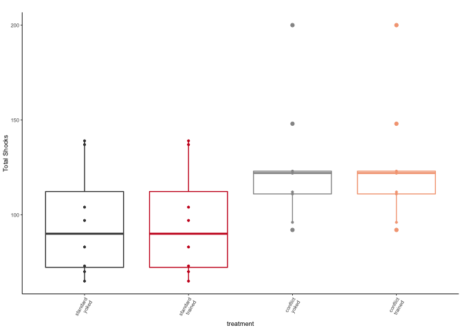
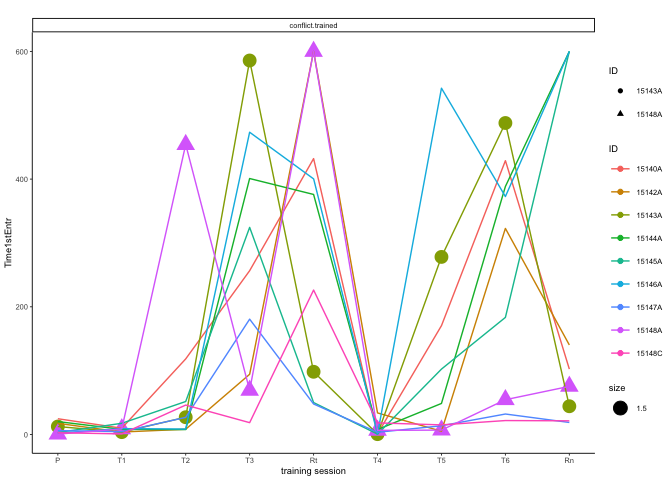
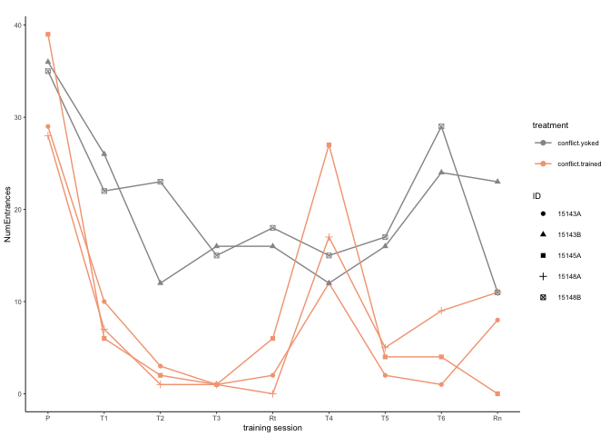
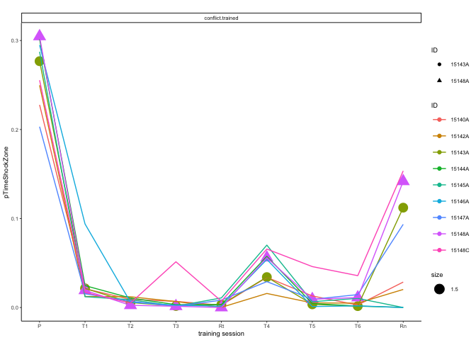
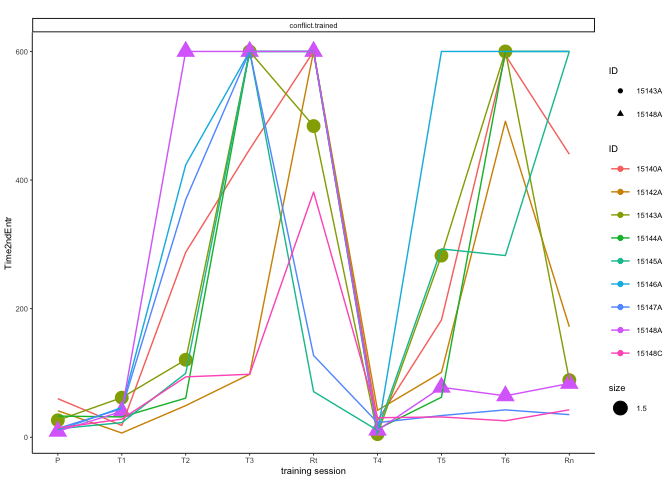
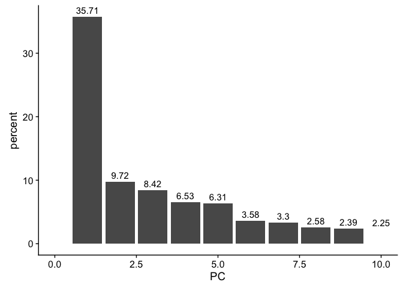
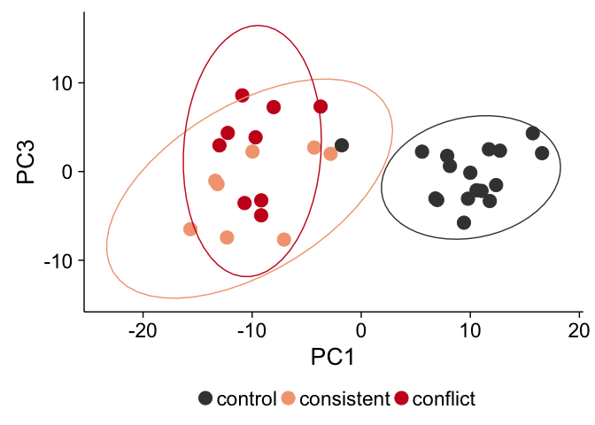
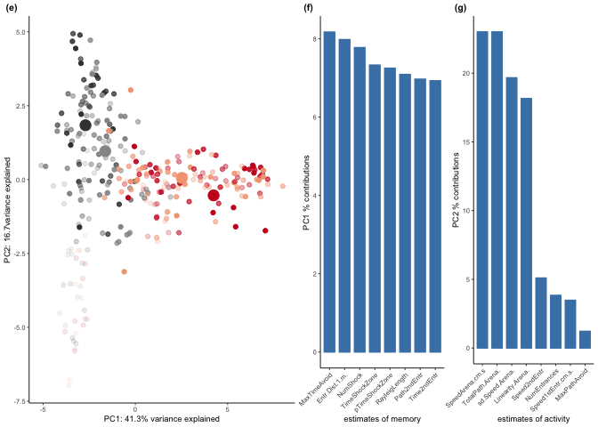
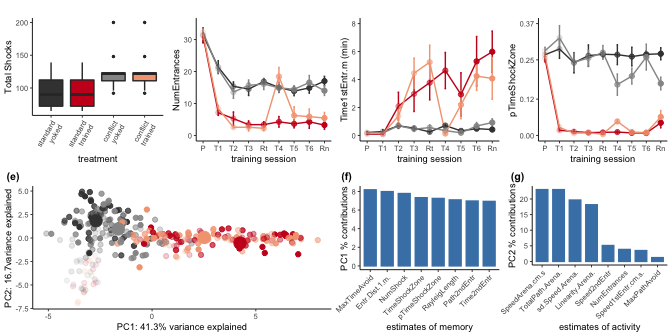

This markdown file is used for behavioral data wrangling, statistical
analysis, and data visualization. Figures from this analysis were
assembled into this multi-panel plot using Adobe Illustrator. Files used
to create the individual figures are saved in the data subdirectory with
the prefix 01a.

Setup
-----

    ## load libraries 
    library(tidyverse) ## for respahing data
    library(reshape2) ## for melting dataframe
    library(cowplot) ## for some easy to use themes
    library(ggfortify) # pca
    library(factoextra)  ## pca with vectors
    library(FactoMineR) # more pca
    library(car) ## stats
    library(pheatmap)  # for pretty heatmap
    library(viridis) # for awesome color pallette
    library(kableExtra) # for better markdown tables
    library(ggpubr) # for stats on figures

    ## load user-written functions 
    source("functions_behavior.R")
    source("figureoptions.R")

    ## set output file for figures 
    knitr::opts_chunk$set(fig.path = '../figures/01_behavior/')

Sample sizes
------------

The ‘treatment’ column describes the four behavioral treatment groups.  
The ‘TrainSessionCombo’ column describes the behvioral training
sessions. Here I filter by a single session to calculte the number of
mice.

    ## import output from video tracker program 
    behavior <- read.csv("../data/00_behaviordata.csv", header = T)

    # set levels
    behavior$treatment <- factor(behavior$treatment, levels = c("standard.yoked", "standard.trained",
                                                              "conflict.yoked", "conflict.trained"))
    behavior$training <- factor(behavior$training, levels = c("yoked", "trained"))

    # sample sizes
    behavior %>% 
      filter(TrainSessionCombo == "Hab") %>%
      select(treatment)  %>%  summary()

    ##             treatment
    ##  standard.yoked  :8  
    ##  standard.trained:8  
    ##  conflict.yoked  :9  
    ##  conflict.trained:9

    head(behavior)

    ##       ID Day        treatment training TrainSessionCombo
    ## 1 15140A   1 conflict.trained  trained               Hab
    ## 2 15140A   1 conflict.trained  trained                T1
    ## 3 15140A   1 conflict.trained  trained                T2
    ## 4 15140A   1 conflict.trained  trained                T3
    ## 5 15140A   2 conflict.trained  trained            Retest
    ## 6 15140A   2 conflict.trained  trained             T4_C1
    ##   TrainSessionComboNum ShockOnOff PairedPartner TotalPath.Arena.
    ## 1                    1        Off        15140B            22.68
    ## 2                    2         On        15140B            19.36
    ## 3                    3         On        15140B            15.01
    ## 4                    4         On        15140B            14.39
    ## 5                    5         On        15140B            14.04
    ## 6                    6         On        15140B            12.50
    ##   SpeedArena.cm.s sd.Speed.Arena. Linearity.Arena. NumEntrances
    ## 1            3.78            3.07           0.4790           28
    ## 2            3.23            2.78           0.4016            6
    ## 3            2.50            2.68           0.3170            2
    ## 4            2.40            2.78           0.3122            3
    ## 5            2.34            3.11           0.2895            1
    ## 6            2.08            2.52           0.3107           10
    ##   Time1stEntr Path1stEntr Speed1stEntr.cm.s. Entr.Dist.1.m. NumShock
    ## 1       24.63        1.09               4.56           1.12       52
    ## 2        9.83        0.62              16.42           0.30        7
    ## 3      118.37        3.17               2.31           0.11        3
    ## 4      256.53        7.48               4.26           0.17        3
    ## 5      432.07       10.56               9.38           0.06        1
    ## 6        0.87        0.00              -1.00           0.56       13
    ##   MaxTimeAvoid MaxPathAvoid Time2ndEntr Path2ndEntr Speed2ndEntr
    ## 1           53         2.15       59.97        2.59         7.85
    ## 2          327        11.70       18.30        1.23         6.53
    ## 3          312         4.98      287.63        8.54         3.73
    ## 4          256         7.48      447.80       12.74         1.56
    ## 5          432        10.56      599.97       15.66        -1.00
    ## 6          447         1.82       25.90        0.75        16.19
    ##   TimeShockZone pTimeShockZone pTimeCCW pTimeOPP pTimeCW RayleigLength
    ## 1        94.665         0.2277   0.2583   0.1788  0.3352          0.11
    ## 2         8.433         0.0211   0.6961   0.2049  0.0779          0.65
    ## 3         3.366         0.0092   0.6413   0.3245  0.0250          0.78
    ## 4         2.498         0.0069   0.5790   0.4018  0.0123          0.80
    ## 5         1.067         0.0026   0.2945   0.6300  0.0729          0.72
    ## 6        17.735         0.0339   0.0195   0.1561  0.7905          0.67
    ##   RayleigAngle Min50.RngLoBin AnnularSkewnes AnnularKurtosis
    ## 1       330.67             60           0.88            3.13
    ## 2       112.66            130           1.81            6.70
    ## 3       124.87            150           1.87            8.91
    ## 4       128.39            150           2.84           12.51
    ## 5       159.36            170           2.42           11.83
    ## 6       257.90            280           0.98            4.65
    ##   ShockPerEntrance
    ## 1         1.857143
    ## 2         1.166667
    ## 3         1.500000
    ## 4         1.000000
    ## 5         1.000000
    ## 6         1.300000

Number of shocks
----------------

The values in the column “NumShock” are actually measures of the number
of entraces into the shock zone. Because, that’s what the software
records. For standard.trained and conflict.trained animals, the number
of shocks equals equals the number of entraces. However, for yoked
individuals, the number of entrances does not equal the number of
shocks. For them, the number of shocks is equal to their
standard.trained or conflict.trained trained partner.

    # supset beahvior to keep only factors and num shocks
    numshocks <- behavior %>%
      select(ID, TrainSessionCombo, treatment, NumShock) 

    # widen datafram, and sum total
    numshocks <- spread(numshocks, key=TrainSessionCombo, value= NumShock)
    numshocks$sums <- rowSums(numshocks[sapply(numshocks, is.numeric)])
    head(numshocks)

    ##       ID        treatment Hab Retention Retest T1 T2 T3 T4_C1 T5_C2 T6_C3
    ## 1 15140A conflict.trained  52         9      1  7  3  3    13     6     2
    ## 2 15140B   conflict.yoked  55        33     71 96 30 71    87    31    32
    ## 3 15140C standard.trained  62         0     10  6  7  8     3     8     0
    ## 4 15140D   standard.yoked  61        41     34 58 32 22    32    54    48
    ## 5 15141C standard.trained  44        21      7  8 19 11    10     7    12
    ## 6 15141D   standard.yoked  55        52     50 54 48 27    47    36    34
    ##   sums
    ## 1   96
    ## 2  506
    ## 3  104
    ## 4  382
    ## 5  139
    ## 6  403

    grouped <- numshocks %>% group_by(treatment)
    summarise(grouped, mean=mean(sums), sd=sd(sums))

    ## # A tibble: 4 x 3
    ##   treatment         mean    sd
    ##   <fct>            <dbl> <dbl>
    ## 1 standard.yoked    473.  83.7
    ## 2 standard.trained   96   29.1
    ## 3 conflict.yoked    480.  87.4
    ## 4 conflict.trained  125.  32.5

    # delete values for yoked animals
    numshocks <- numshocks %>%
      filter(treatment %in% c("standard.trained", "conflict.trained")) %>%
      droplevels()

    # create a tempdataframe with dupclicate values for yoked
    numshockstemp <- numshocks
    levels(numshockstemp$treatment) 

    ## [1] "standard.trained" "conflict.trained"

    levels(numshockstemp$treatment) <- c("standard.yoked","conflict.yoked")
    levels(numshockstemp$treatment) 

    ## [1] "standard.yoked" "conflict.yoked"

    # combine the two and plot

    realnumshocks <- rbind(numshocks, numshockstemp)
    levels(realnumshocks$treatment) 

    ## [1] "standard.trained" "conflict.trained" "standard.yoked"  
    ## [4] "conflict.yoked"

    realnumshocks$treatment <- factor(realnumshocks$treatment, levels = c("standard.yoked", "standard.trained", "conflict.yoked", "conflict.trained"))
    levels(realnumshocks$treatment) <- c("standard\nyoked", "standard\ntrained", "conflict\nyoked", "conflict\ntrained")

    realnumshocks %>%
      dplyr::group_by(treatment) %>%
      dplyr::summarise(meanshocks = mean(sums, na.rm = TRUE))

    ## # A tibble: 4 x 2
    ##   treatment           meanshocks
    ##   <fct>                    <dbl>
    ## 1 "standard\nyoked"          96 
    ## 2 "standard\ntrained"        96 
    ## 3 "conflict\nyoked"         125.
    ## 4 "conflict\ntrained"       125.

    # define what levels to compare for stats

    a <- ggplot(realnumshocks, aes(x = treatment, y = sums, fill = treatment)) +
      geom_boxplot(outlier.size = 0.5) +
      theme_ms() +
      scale_fill_manual(values = colorvalAPA00,
                        name = NULL) +
      labs(x = "treatment", subtitle = " ", y = "Total Shocks") +
        theme(axis.text.x=element_text(angle=60, vjust = 1, hjust = 1),
              legend.position = "none") 
    a

    trainedonly <- realnumshocks %>% filter(treatment %in% c("conflict\ntrained", "standard\ntrained"))
    summary(trainedonly)

    ##        ID                treatment       Hab          Retention    
    ##  15140A : 1   standard\nyoked  :0   Min.   :44.00   Min.   : 0.00  
    ##  15140C : 1   standard\ntrained:8   1st Qu.:52.00   1st Qu.: 0.00  
    ##  15141C : 1   conflict\nyoked  :0   Median :57.00   Median : 6.00  
    ##  15142A : 1   conflict\ntrained:9   Mean   :56.24   Mean   :13.06  
    ##  15142C : 1                         3rd Qu.:61.00   3rd Qu.:28.00  
    ##  15143A : 1                         Max.   :66.00   Max.   :40.00  
    ##  (Other):11                                                        
    ##      Retest         T1               T2           T3        
    ##  Min.   : 0   Min.   : 4.000   Min.   : 1   Min.   : 1.000  
    ##  1st Qu.: 1   1st Qu.: 6.000   1st Qu.: 2   1st Qu.: 1.000  
    ##  Median : 2   Median : 7.000   Median : 3   Median : 1.000  
    ##  Mean   : 3   Mean   : 8.471   Mean   : 4   Mean   : 3.294  
    ##  3rd Qu.: 5   3rd Qu.:10.000   3rd Qu.: 4   3rd Qu.: 3.000  
    ##  Max.   :10   Max.   :25.000   Max.   :19   Max.   :15.000  
    ##                                                             
    ##      T4_C1           T5_C2            T6_C3             sums      
    ##  Min.   : 0.00   Min.   : 0.000   Min.   : 0.000   Min.   : 65.0  
    ##  1st Qu.: 3.00   1st Qu.: 1.000   1st Qu.: 1.000   1st Qu.: 92.0  
    ##  Median :13.00   Median : 4.000   Median : 2.000   Median :111.0  
    ##  Mean   :13.12   Mean   : 5.118   Mean   : 5.118   Mean   :111.4  
    ##  3rd Qu.:24.00   3rd Qu.: 6.000   3rd Qu.: 9.000   3rd Qu.:123.0  
    ##  Max.   :33.00   Max.   :28.000   Max.   :23.000   Max.   :200.0  
    ## 

    summary(aov(sums ~ treatment, data=trainedonly))

    ##             Df Sum Sq Mean Sq F value Pr(>F)  
    ## treatment    1   3589    3589   3.739 0.0723 .
    ## Residuals   15  14401     960                 
    ## ---
    ## Signif. codes:  0 '***' 0.001 '**' 0.01 '*' 0.05 '.' 0.1 ' ' 1

Vizualizing Mean and Standard error for num entrace and time 1st entrance
=========================================================================

To make the point and line graphs, I must create and join some data
frames, then I have a function that makes four plots with specific
titles, y labels and limits.

    dfb <- behavior %>%
      dplyr::group_by(treatment, TrainSessionComboNum) %>%
      dplyr::summarise(m = mean(NumEntrances), 
                       se = sd(NumEntrances)/sqrt(length(NumEntrances))) %>%
      dplyr::mutate(measure = "Number of target zone entrances")

    dfc <- behavior %>%
      dplyr::group_by(treatment, TrainSessionComboNum) %>%
      dplyr::mutate(minutes = Time1stEntr/60) %>%
      dplyr::summarise(m = mean(minutes), 
                       se = sd(minutes)/sqrt(length(minutes))) %>%
      dplyr::mutate(measure = "Time to 1st target zone entrance (min)")

    dfd <- behavior %>%
      dplyr::group_by(treatment, TrainSessionComboNum) %>%
      dplyr::summarise(m = mean(pTimeShockZone), 
                       se = sd(pTimeShockZone)/sqrt(length(pTimeShockZone))) %>%
      dplyr::mutate(measure = "Proportion of time in target zone")

    dfa <- behavior %>%
      dplyr::group_by(treatment, TrainSessionComboNum) %>%
      dplyr::summarise(m = mean(Entr.Dist.1.m.), 
                       se = sd(Entr.Dist.1.m.)/sqrt(length(Entr.Dist.1.m.))) %>%
      dplyr::mutate(measure = "Entrance / Distance")

    # see https://cran.r-project.org/web/packages/cowplot/vignettes/shared_legends.html for share legends

    fourmeasures <- rbind(dfb,dfc,dfd)

    b <- meansdplots(dfb, "NumEntrances" ,  c(0,10,20,30), c(0, 35)) + theme(legend.justification = "center")
    c <- meansdplots(dfc, "Time1stEntr.m (min)",  c(0,2,4,6,8), c(0, 8))
    d <- meansdplots(dfd, "pTimeShockZone", c(0,.12,.25,.37), c(0, .37 ))

    fourplots <- plot_grid(a + theme(legend.position = "none"),
                           b + theme(legend.position = "none"),
                           c + theme(legend.position = "none"), 
                           d + theme(legend.position = "none"), nrow = 1,
                           label_size = 8,
                           labels = c("(a)", "(b)", "(c)", "(d)"))
    fourplots

### individual variation in behavior

    problemsamples1 <- behavior %>%   filter(ID %in% c("15148A", "15143A")) 
    problemsamples2 <- behavior %>%   filter(ID %in% c("15148B", "15143B")) 

    behav1 <- behavior %>% filter(treatment %in% "conflict.trained")
    behav2 <- behavior %>% filter(treatment %in% "conflict.yoked")

    ggplot(data = behav1, aes(x=TrainSessionComboNum, y= Time1stEntr, color=ID)) + 
      geom_point(data = problemsamples1, aes(x=TrainSessionComboNum, y=Time1stEntr, shape=ID, size = 1.5)) +
         geom_line(data = behav1, aes(x=TrainSessionComboNum, y=Time1stEntr)) +
        # geom_line() +
        labs(subtitle = " ") +
        scale_x_continuous(name= "training session", 
                           breaks = c(1, 2, 3, 4, 5, 6, 7, 8, 9),
                           labels = c( "P", "T1", "T2", "T3",
                                       "Rt", "T4", "T5", "T6", "Rn")) +
        theme_ms() +
      facet_wrap(~treatment)

    ggplot(data = behav1, aes(x=TrainSessionComboNum, y= NumEntrances, color=ID)) + 
      geom_point(data = problemsamples1, aes(x=TrainSessionComboNum, y=NumEntrances, shape=ID, size = 1.5)) +
         geom_line(data = behav1, aes(x=TrainSessionComboNum, y=NumEntrances)) +
        # geom_line() +
        labs(subtitle = " ") +
        scale_x_continuous(name= "training session", 
                           breaks = c(1, 2, 3, 4, 5, 6, 7, 8, 9),
                           labels = c( "P", "T1", "T2", "T3",
                                       "Rt", "T4", "T5", "T6", "Rn")) +
        theme_ms() +
      facet_wrap(~treatment)

    ggplot(data = behav1, aes(x=TrainSessionComboNum, y= pTimeShockZone, color=ID)) + 
      geom_point(data = problemsamples1, aes(x=TrainSessionComboNum, y=pTimeShockZone, shape=ID, size = 1.5)) +
         geom_line(data = behav1, aes(x=TrainSessionComboNum, y=pTimeShockZone)) +
        # geom_line() +
        labs(subtitle = " ") +
        scale_x_continuous(name= "training session", 
                           breaks = c(1, 2, 3, 4, 5, 6, 7, 8, 9),
                           labels = c( "P", "T1", "T2", "T3",
                                       "Rt", "T4", "T5", "T6", "Rn")) +
        theme_ms() +
      facet_wrap(~treatment)

    ggplot(data = behav1, aes(x=TrainSessionComboNum, y= Time2ndEntr, color=ID)) + 
      geom_point(data = problemsamples1, aes(x=TrainSessionComboNum, y=Time2ndEntr, shape=ID, size = 1.5)) +
         geom_line(data = behav1, aes(x=TrainSessionComboNum, y=Time2ndEntr)) +
        # geom_line() +
        labs(subtitle = " ") +
        scale_x_continuous(name= "training session", 
                           breaks = c(1, 2, 3, 4, 5, 6, 7, 8, 9),
                           labels = c( "P", "T1", "T2", "T3",
                                       "Rt", "T4", "T5", "T6", "Rn")) +
        theme_ms() +
      facet_wrap(~treatment)

### Principle component analysis

Next, I next reduced the dimentionality of the data with a PCA anlaysis.

    names(behavior)

    ##  [1] "ID"                   "Day"                  "treatment"           
    ##  [4] "training"             "TrainSessionCombo"    "TrainSessionComboNum"
    ##  [7] "ShockOnOff"           "PairedPartner"        "TotalPath.Arena."    
    ## [10] "SpeedArena.cm.s"      "sd.Speed.Arena."      "Linearity.Arena."    
    ## [13] "NumEntrances"         "Time1stEntr"          "Path1stEntr"         
    ## [16] "Speed1stEntr.cm.s."   "Entr.Dist.1.m."       "NumShock"            
    ## [19] "MaxTimeAvoid"         "MaxPathAvoid"         "Time2ndEntr"         
    ## [22] "Path2ndEntr"          "Speed2ndEntr"         "TimeShockZone"       
    ## [25] "pTimeShockZone"       "pTimeCCW"             "pTimeOPP"            
    ## [28] "pTimeCW"              "RayleigLength"        "RayleigAngle"        
    ## [31] "Min50.RngLoBin"       "AnnularSkewnes"       "AnnularKurtosis"     
    ## [34] "ShockPerEntrance"

    pcadf <- makepcadf(behavior)

    retention <- behavior %>% filter(TrainSessionCombo %in% c("Retention") ) %>% droplevels()

    pcadfretention <- pcadf %>% filter(TrainSessionComboNum == 9) %>% 
      group_by(treatment) %>% 
      dplyr::summarize(avePC1 = mean(PC1),
                       avePC2 = mean(PC2),
                       sePC1 = sd(PC1)/sqrt(length(PC1)),
                       sePC2 = sd(PC2)/sqrt(length(PC2)))
    pcadfretention

    ## # A tibble: 4 x 5
    ##   treatment        avePC1  avePC2 sePC1 sePC2
    ##   <fct>             <dbl>   <dbl> <dbl> <dbl>
    ## 1 standard.yoked    -2.70  1.84   0.283 0.714
    ## 2 standard.trained   4.24 -0.535  1.02  0.359
    ## 3 conflict.yoked    -1.63  0.961  0.351 0.583
    ## 4 conflict.trained   2.52  0.0570 1.16  0.568

    e <- ggplot(pcadf, aes(x = PC1, y = PC2, color = treatment, fill = treatment)) +

      geom_point(data = pcadf, aes(alpha = TrainSessionComboNum)) + 
      geom_point(data = pcadfretention, aes(x = avePC1, y = avePC2), size = 4) +
      theme_ms() +
        scale_fill_manual(guide = 'none',values = colorvalAPA00) +
      scale_color_manual(guide = 'none',values = colorvalAPA00) +
      scale_alpha_continuous( breaks = c(1, 2, 3, 4, 5, 6, 7, 8, 9),
                           labels = c( "P", "T1", "T2", "T3",
                                       "Rt", "T4", "T5", "T6", "Rn")) +
      theme(legend.position = "none") +
      labs(y = "PC2: 16.7% \n variance explained", x = "PC1: 41.3% variance explained",
           subtitle = " ") 
    e

    # get contributions
    df <- behavior %>% select(TotalPath.Arena.:AnnularKurtosis)
    res.pca <- PCA(df,  graph = FALSE)
    # Visualize eigenvalues/variances
    fviz_screeplot(res.pca, addlabels = TRUE, ylim = c(0, 50))

    # Contributions of variables to PC1
    f <- fviz_contrib_rmh(res.pca, choice = "var", axes = 1, top = 8, 
                     ylab = "PC1 % contributions", xlab = "estimates of memory", subtitle = " ") +
      theme_ms() + theme(axis.text.x = element_text(angle=45, hjust = 1))
    # Contributions of variables to PC2
    g <- fviz_contrib_rmh(res.pca, choice = "var", axes = 2, top = 8, 
                     ylab = "PC2 % contributions" , xlab = "estimates of activity", subtitle = " ") +
      theme_ms() + theme(axis.text.x = element_text(angle=45, hjust = 1))

    threeplots <- plot_grid(e,f,g, labels = c("(e)", "(f)", "(g)"),
               nrow = 1,
               label_size = 8,
              rel_widths = c(0.5,0.25,0.25))

    threeplots

    behaviorfig <- plot_grid(fourplots, threeplots, nrow = 2)
    behaviorfig

    pdf(file="../figures/01_behavior/behaviorfig.pdf", width=7, height=3.5)
    plot(behaviorfig)
    dev.off()

    ## quartz_off_screen 
    ##                 2

now all the stats
-----------------

    # pretraining
    hab <- behavior %>% filter(TrainSessionCombo == "Hab")
    summary(aov(NumEntrances ~ treatment, data=hab))

    ##             Df Sum Sq Mean Sq F value Pr(>F)
    ## treatment    3    7.0   2.338   0.085  0.967
    ## Residuals   30  820.8  27.358

    # pca
    pc1aov <- aov(PC1 ~ treatment, data = pcadf)
    summary(pc1aov)

    ##              Df Sum Sq Mean Sq F value Pr(>F)    
    ## treatment     3   1580   526.8   101.3 <2e-16 ***
    ## Residuals   302   1570     5.2                   
    ## ---
    ## Signif. codes:  0 '***' 0.001 '**' 0.01 '*' 0.05 '.' 0.1 ' ' 1

    TukeyHSD(pc1aov)

    ##   Tukey multiple comparisons of means
    ##     95% family-wise confidence level
    ## 
    ## Fit: aov(formula = PC1 ~ treatment, data = pcadf)
    ## 
    ## $treatment
    ##                                         diff        lwr        upr
    ## standard.trained-standard.yoked    4.9963315  4.0147194  5.9779435
    ## conflict.yoked-standard.yoked      0.3485261 -0.6054293  1.3024815
    ## conflict.trained-standard.yoked    4.4486632  3.4947078  5.4026186
    ## conflict.yoked-standard.trained   -4.6478054 -5.6017608 -3.6938500
    ## conflict.trained-standard.trained -0.5476682 -1.5016237  0.4062872
    ## conflict.trained-conflict.yoked    4.1001372  3.1746645  5.0256098
    ##                                       p adj
    ## standard.trained-standard.yoked   0.0000000
    ## conflict.yoked-standard.yoked     0.7812070
    ## conflict.trained-standard.yoked   0.0000000
    ## conflict.yoked-standard.trained   0.0000000
    ## conflict.trained-standard.trained 0.4489594
    ## conflict.trained-conflict.yoked   0.0000000

    pc2aov <- aov(PC2 ~ treatment, data = pcadf)
    summary(pc2aov)

    ##              Df Sum Sq Mean Sq F value   Pr(>F)    
    ## treatment     3  121.5   40.50   10.62 1.18e-06 ***
    ## Residuals   302 1152.4    3.82                     
    ## ---
    ## Signif. codes:  0 '***' 0.001 '**' 0.01 '*' 0.05 '.' 0.1 ' ' 1

    TukeyHSD(pc2aov)

    ##   Tukey multiple comparisons of means
    ##     95% family-wise confidence level
    ## 
    ## Fit: aov(formula = PC2 ~ treatment, data = pcadf)
    ## 
    ## $treatment
    ##                                            diff        lwr         upr
    ## standard.trained-standard.yoked   -1.5108364813 -2.3519166 -0.66975635
    ## conflict.yoked-standard.yoked     -0.6213243098 -1.4387073  0.19605866
    ## conflict.trained-standard.yoked   -1.5101805030 -2.3275635 -0.69279754
    ## conflict.yoked-standard.trained    0.8895121715  0.0721292  1.70689514
    ## conflict.trained-standard.trained  0.0006559783 -0.8167270  0.81803895
    ## conflict.trained-conflict.yoked   -0.8888561932 -1.6818341 -0.09587824
    ##                                       p adj
    ## standard.trained-standard.yoked   0.0000307
    ## conflict.yoked-standard.yoked     0.2041396
    ## conflict.trained-standard.yoked   0.0000168
    ## conflict.yoked-standard.trained   0.0268501
    ## conflict.trained-standard.trained 1.0000000
    ## conflict.trained-conflict.yoked   0.0210425

    write.csv(behavior, file = "../data/01a_behavior.csv", row.names = FALSE)
    write.csv(retention, file = "../data/01a_retention.csv", row.names = FALSE)
    write.csv(pcadf, file = "../data/01a_pcadf.csv", row.names = FALSE)
    write.csv(fourmeasures, file = "../data/01a_fourmeasures.csv", row.names = FALSE)
