This markdown file is used for behavioral data wrangling, statistical
analysis, and data visualization. Figures from this analysis were
assembled into this multi-panel plot using Adobe Illustrator. Files used
to create the individual figures are saved in the data subdirectory with
the prefix 01a.

Setup
-----

    ## load libraries 
    library(tidyverse) ## for respahing data
    library(plyr) ## for renmaing factors
    library(reshape2) ## for melting dataframe
    library(cowplot) ## for some easy to use themes
    library(factoextra)  ##pca with vectors
    library(car) ## stats
    library(pheatmap)  # for pretty heatmap
    library(viridis) # for awesome color pallette
    library(kableExtra) # for better markdown tables

    ## load user-written functions 
    source("functions_behavior.R")
    source("figureoptions.R")

    ## set output file for figures 
    knitr::opts_chunk$set(fig.path = '../figures/01_behavior/')

Sample sizes
------------

The ‘APA2’ column describes the four behavioral treatment groups.  
The ‘TrainSessionCombo’ column describes the behvioral training
sessions. Here I filter by a single session to calculte the number of
mice.

    ## import output from video tracker program 
    behavior <- read.csv("../data/01_behaviordata.csv", header = T)

    ## set level for APA2 then renmae
    behavior$APA2 <- factor(behavior$APA2, levels = c("YokedSame", "Same", "YokedConflict","Conflict"))
    levels(behavior$APA2) <-  c("yoked-consistent" ,"consistent", "yoked-conflict", "conflict")

    # sample sizes
    behavior %>% 
      filter(TrainSessionCombo == "Retention") %>%
      select(APA2)  %>%  summary()

    ##                APA2  
    ##  yoked-consistent:8  
    ##  consistent      :8  
    ##  yoked-conflict  :9  
    ##  conflict        :9

    # keep subset of columns for downstream vizuals
    behavior_slim <- behavior[,c(15,16,14,20:58)] 

Vizualizing Mean and Standard error for num entrace and time 1st entrance
=========================================================================

To make the point and line graphs, I must create and join some data
frames, then I have a function that makes four plots with specific
titles, y labels and limits.

    a <- behavior %>%
      dplyr::group_by(APA2, TrainSessionComboNum) %>%
      dplyr::summarise(m = mean(NumEntrances), 
                       se = sd(NumEntrances)/sqrt(length(NumEntrances))) %>%
      dplyr::mutate(measure = "Number of target zone entrances")

    b <- behavior %>%
      dplyr::group_by(APA2, TrainSessionComboNum) %>%
      dplyr::summarise(m = mean(pTimeTarget), 
                       se = sd(pTimeTarget)/sqrt(length(pTimeTarget))) %>%
      dplyr::mutate(measure = "Proportion of time in target zone")

    c <- behavior %>%
      dplyr::group_by(APA2, TrainSessionComboNum) %>%
      dplyr::mutate(minutes = Time1stEntr/60) %>%
      dplyr::summarise(m = mean(minutes), 
                       se = sd(minutes)/sqrt(length(minutes))) %>%
      dplyr::mutate(measure = "Time to 1st target zone entrance (min)")

    d <- behavior %>%
      dplyr::group_by(APA2, TrainSessionComboNum) %>%
      dplyr::summarise(m = mean(pTimeOPP), 
                       se = sd(pTimeOPP)/sqrt(length(pTimeOPP))) %>%
      dplyr::mutate(measure = "Proportion of time opposite the target zone")

    fourmeasures <- rbind(a,b,c,d)
    head(fourmeasures)

    ## # A tibble: 6 x 5
    ## # Groups:   APA2 [1]
    ##   APA2           TrainSessionComboN…     m    se measure                   
    ##   <fct>                        <int> <dbl> <dbl> <chr>                     
    ## 1 yoked-consist…                   1  31.4 2.32  Number of target zone ent…
    ## 2 yoked-consist…                   2  21.4 2.02  Number of target zone ent…
    ## 3 yoked-consist…                   3  15.4 1.40  Number of target zone ent…
    ## 4 yoked-consist…                   4  14.5 2.01  Number of target zone ent…
    ## 5 yoked-consist…                   5  16.9 0.875 Number of target zone ent…
    ## 6 yoked-consist…                   6  15   1.56  Number of target zone ent…

    fourmeasures$APA2 <- factor(fourmeasures$APA2, levels = c("yoked-consistent" ,"consistent", "yoked-conflict", "conflict"))

    # see https://cran.r-project.org/web/packages/cowplot/vignettes/shared_legends.html for share legends

    meansdplots <- function(df, mytitle, myylab, ybreaks, ylims){
      myplot <- ggplot(df, 
                      aes(x=, TrainSessionComboNum, y=m, color=APA2)) + 
        geom_errorbar(aes(ymin=m-se, ymax=m+se, color=APA2), width=.1) +
        geom_point(size = 1.5) +
        geom_line() +
        labs(subtitle = mytitle) +
        scale_y_continuous(name= myylab,
                           breaks = ybreaks,
                           limits = ylims) +
        scale_x_continuous(name= "Training session", 
                           breaks = c(1, 2, 3, 4, 5, 6, 7, 8, 9),
                           labels = c( "P", "T1", "T2", "T3",
                                       "Rt", "T4", "T5", "T6", "Rn")) +
        theme_cowplot(font_size = 7, line_size = 0.25) +
        background_grid(major = "y", minor = "y") +
        scale_color_manual(values = colorvalAPA00,
                           name  = NULL)  +
        theme(legend.position = "bottom",
              legend.justification=c(0,0),
            legend.text=element_text(size=5))
      return(myplot)
    }  

    A <- meansdplots(a, "Number of target zone entrances" , "Counts", c(0,10,20,30), c(0, 35))
    B <- meansdplots(b, "Proportion of time in target zone", "Proportion", c(0,.12,.25,.37), c(0, .37 ))
    C <- meansdplots(c, "Latency to 1st target zone entrance", "Time (min)", c(0,2,4,6,8), c(0, 8))
    D <- meansdplots(d, "Proportion of time opposite the target zone", "Proportion", c(0.25, .5, .75), c(0.1, .75))

    plotnolegend <- plot_grid(A + theme(legend.position="none"),
               B + theme(legend.position="none"),
               C + theme(legend.position="none"),
               D + theme(legend.position="none"),
               #align = 'vh',
               labels = c("A", "C", "B", "D"),
               nrow = 2,
               label_size = 8
               )
    legend <- get_legend(A)

    fourplots <- plot_grid(plotnolegend, legend, ncol = 1, rel_heights = c(1, .1))
    fourplots

    pdf(file="../figures/01_behavior/fourmeasures.pdf", width=5.1, height=4.1)
    plot(fourplots)
    dev.off()

    ## quartz_off_screen 
    ##                 2

    plotone <- plot_grid(A + theme(legend.position="none",
                                   axis.text.x=element_blank(),
                                   axis.title.x=element_blank()),
               C + theme(legend.position="none"),
               labels = c("A","B"),
               nrow = 2,
               label_size = 7,
               rel_heights = c(0.45, 0.55)
               )

    plottwo <- plot_grid(B + theme(legend.position="none",
                                   axis.text.x=element_blank(),
                                   axis.title.x=element_blank()),
               D + theme(legend.position="none"),
               labels = c("C","D"),
               nrow = 2,
               label_size = 7,
               rel_heights = c(0.45, 0.55)
               )

    pdf(file="../figures/01_behavior/twomeasuresAC.pdf", width=2.3, height=3)
    plot(plotone)
    dev.off()

    ## quartz_off_screen 
    ##                 2

    pdf(file="../figures/01_behavior/twomeasuresBD.pdf", width=2.3, height=3)
    plot(plottwo)
    dev.off()

    ## quartz_off_screen 
    ##                 2

Hierarchical clusering of time series behavioral data
-----------------------------------------------------

Here I use heirarhical cluster to identify patterns in the behavioral
data. On the y axis see three distinct clusters of behaviors that are 1)
higher in trained animals, 2) higher in yoked animals, and 3) measures
of speed.

    ## create scaled data frame
    behavior_slim_heat <- behavior_slim %>%
      filter(TrainSessionCombo != "Hab")

    behavior_slim_heat$RayleigAngle <- NULL
    behavior_slim_heat$PolarMinBin <- NULL
    scaledaveragedata <- as.data.frame(makescaledaveragedata(behavior_slim_heat))

    ## make annotation df and ann_colors for pheatmap
    ann_cols <- as.data.frame(makecolumnannotations(scaledaveragedata))
    ann_colors = ann_colors_APA2

    # set color breaks
    paletteLength <- 30
    myBreaks <- c(seq(min(scaledaveragedata), 0, length.out=ceiling(paletteLength/2) + 1), 
                  seq(max(scaledaveragedata)/paletteLength, max(scaledaveragedata), length.out=floor(paletteLength/2)))

    ## pheatmap for markdown
    pheatmap(scaledaveragedata, show_colnames=T, show_rownames = T,
             annotation_col=ann_cols, 
             annotation_colors = ann_colors,
             treeheight_row = 0, treeheight_col = 50,
             border_color = "grey60" ,
             color = viridis(30),
             clustering_method="average",
             breaks=myBreaks,
             clustering_distance_cols="correlation" ,
             clustering_distance_rows = "correlation"
             )

    # pheatmapfor adobe
    pheatmap(scaledaveragedata, show_colnames=F, show_rownames = F,
             annotation_col=ann_cols, annotation_colors = ann_colors,
             annotation_names_col = F,
             treeheight_row = 0, treeheight_col = 15,
             fontsize = 6, 
             border_color = "grey60" ,
             color = viridis(30),
              width = 3, height = 2,
             clustering_method="average",
             breaks=myBreaks,
             clustering_distance_cols="correlation",
             filename = "../figures/01_behavior/pheatmap2.pdf",
             legend = TRUE,
             annotation_legend = FALSE
             )

### Principle component analysis

Next, I next reduced the dimentionality of the data with a PCA anlaysis.

    dataforpca <- behavior %>%
      filter(TrainSessionCombo != "Hab")

    longdata <- makelongdata(dataforpca)

    Z <- longdata[,3:322]
    Z <- Z[,apply(Z, 2, var, na.rm=TRUE) != 0]
    pc = prcomp(Z, scale.=TRUE)
    loadings <- pc$rotation
    scores <- pc$x

    scoresdf <- makepcadf(dataforpca) #create the df of pcas
    rotationdf <- mkrotationdf(dataforpca) #loadings for specific factors

    behaviormatrix <- behavior[c(20:58)]  # for 2nd pca analysis
    scoresdf$PC1 <- scoresdf$PC1 * -1
    scoresdf$APA2 <- factor(scoresdf$APA2, levels = c("yoked-consistent" ,"consistent", "yoked-conflict", "conflict"))

    ## data wraningly for pca anlysis
    behaviormatrix %>% 
      scale() %>%                 # scale to 0 mean and unit variance
      prcomp() ->                 # do PCA
      pca                         # store result as `pca`
    percent <- round(100*pca$sdev^2/sum(pca$sdev^2),2)
    perc_data <- data.frame(percent=percent, PC=1:length(percent))
    res.pca <- prcomp(behaviormatrix,  scale = TRUE)

    # plot of percent contribution
    ggplot(perc_data, aes(x=PC, y=percent)) + 
      geom_bar(stat="identity") + 
      geom_text(aes(label=round(percent, 2)), size=4, vjust=-.5) + 
      xlim(0, 10)

    ## Warning: Removed 29 rows containing missing values (position_stack).

    ## Warning: Removed 1 rows containing missing values (geom_bar).

    ## Warning: Removed 29 rows containing missing values (geom_text).

    ## print anova and TukeyHSD stats for first 6 PCs
    j <- 0
    for (i in (scoresdf[,c(1:6)])){
      j <- j+1
      print(paste("PC", j, sep = " "))
      myaov <- aov(i ~ APA2, data=scoresdf)
      print(summary(myaov))
      print(TukeyHSD(myaov, which = "APA2"))
    }

    ## [1] "PC 1"
    ##             Df Sum Sq Mean Sq F value  Pr(>F)    
    ## APA2         3 3132.3  1044.1   73.25 6.6e-14 ***
    ## Residuals   30  427.6    14.3                    
    ## ---
    ## Signif. codes:  0 '***' 0.001 '**' 0.01 '*' 0.05 '.' 0.1 ' ' 1
    ##   Tukey multiple comparisons of means
    ##     95% family-wise confidence level
    ## 
    ## Fit: aov(formula = i ~ APA2, data = scoresdf)
    ## 
    ## $APA2
    ##                                        diff        lwr        upr
    ## consistent-yoked-consistent      20.7446753  15.611690  25.877661
    ## yoked-conflict-yoked-consistent   2.7420788  -2.246286   7.730444
    ## conflict-yoked-consistent        20.3744685  15.386103  25.362833
    ## yoked-conflict-consistent       -18.0025965 -22.990961 -13.014232
    ## conflict-consistent              -0.3702068  -5.358572   4.618158
    ## conflict-yoked-conflict          17.6323896  12.792965  22.471815
    ##                                     p adj
    ## consistent-yoked-consistent     0.0000000
    ## yoked-conflict-yoked-consistent 0.4531408
    ## conflict-yoked-consistent       0.0000000
    ## yoked-conflict-consistent       0.0000000
    ## conflict-consistent             0.9970257
    ## conflict-yoked-conflict         0.0000000
    ## 
    ## [1] "PC 2"
    ##             Df Sum Sq Mean Sq F value Pr(>F)  
    ## APA2         3  169.1   56.35   3.448 0.0289 *
    ## Residuals   30  490.3   16.34                 
    ## ---
    ## Signif. codes:  0 '***' 0.001 '**' 0.01 '*' 0.05 '.' 0.1 ' ' 1
    ##   Tukey multiple comparisons of means
    ##     95% family-wise confidence level
    ## 
    ## Fit: aov(formula = i ~ APA2, data = scoresdf)
    ## 
    ## $APA2
    ##                                      diff        lwr         upr     p adj
    ## consistent-yoked-consistent      0.796763  -4.699718  6.29324383 0.9788474
    ## yoked-conflict-yoked-consistent -4.589406  -9.931025  0.75221345 0.1123180
    ## conflict-yoked-consistent       -3.270434  -8.612053  2.07118532 0.3594132
    ## yoked-conflict-consistent       -5.386169 -10.727788 -0.04454954 0.0475311
    ## conflict-consistent             -4.067197  -9.408816  1.27442233 0.1859178
    ## conflict-yoked-conflict          1.318972  -3.863160  6.50110370 0.8993116
    ## 
    ## [1] "PC 3"
    ##             Df Sum Sq Mean Sq F value Pr(>F)
    ## APA2         3   98.1   32.71   2.217  0.107
    ## Residuals   30  442.7   14.76               
    ##   Tukey multiple comparisons of means
    ##     95% family-wise confidence level
    ## 
    ## Fit: aov(formula = i ~ APA2, data = scoresdf)
    ## 
    ## $APA2
    ##                                       diff       lwr       upr     p adj
    ## consistent-yoked-consistent      2.1604100 -3.062095 7.3829153 0.6773668
    ## yoked-conflict-yoked-consistent  1.1861085 -3.889254 6.2614714 0.9197309
    ## conflict-yoked-consistent       -2.3456865 -7.421049 2.7296764 0.5967281
    ## yoked-conflict-consistent       -0.9743015 -6.049664 4.1010614 0.9531340
    ## conflict-consistent             -4.5060965 -9.581459 0.5692665 0.0959758
    ## conflict-yoked-conflict         -3.5317950 -8.455620 1.3920303 0.2292910
    ## 
    ## [1] "PC 4"
    ##             Df Sum Sq Mean Sq F value Pr(>F)
    ## APA2         3   48.1   16.03    1.17  0.338
    ## Residuals   30  411.2   13.71               
    ##   Tukey multiple comparisons of means
    ##     95% family-wise confidence level
    ## 
    ## Fit: aov(formula = i ~ APA2, data = scoresdf)
    ## 
    ## $APA2
    ##                                       diff       lwr      upr     p adj
    ## consistent-yoked-consistent     -2.6638939 -7.697074 2.369287 0.4857398
    ## yoked-conflict-yoked-consistent -0.3698065 -5.261179 4.521566 0.9968574
    ## conflict-yoked-consistent        0.4885682 -4.402804 5.379940 0.9928462
    ## yoked-conflict-consistent        2.2940874 -2.597285 7.185460 0.5852830
    ## conflict-consistent              3.1524621 -1.738910 8.043834 0.3155405
    ## conflict-yoked-conflict          0.8583747 -3.886953 5.603703 0.9603067
    ## 
    ## [1] "PC 5"
    ##             Df Sum Sq Mean Sq F value Pr(>F)
    ## APA2         3   13.2   4.414    0.35  0.789
    ## Residuals   30  378.4  12.612               
    ##   Tukey multiple comparisons of means
    ##     95% family-wise confidence level
    ## 
    ## Fit: aov(formula = i ~ APA2, data = scoresdf)
    ## 
    ## $APA2
    ##                                        diff       lwr      upr     p adj
    ## consistent-yoked-consistent     -0.32992433 -5.158137 4.498289 0.9976723
    ## yoked-conflict-yoked-consistent  1.27203715 -3.420142 5.964217 0.8813372
    ## conflict-yoked-consistent       -0.01866219 -4.710842 4.673517 0.9999995
    ## yoked-conflict-consistent        1.60196148 -3.090218 6.294141 0.7899669
    ## conflict-consistent              0.31126214 -4.380917 5.003442 0.9978687
    ## conflict-yoked-conflict         -1.29069934 -5.842782 3.261384 0.8668811
    ## 
    ## [1] "PC 6"
    ##             Df Sum Sq Mean Sq F value Pr(>F)   
    ## APA2         3  128.3   42.77    5.26 0.0049 **
    ## Residuals   30  243.9    8.13                  
    ## ---
    ## Signif. codes:  0 '***' 0.001 '**' 0.01 '*' 0.05 '.' 0.1 ' ' 1
    ##   Tukey multiple comparisons of means
    ##     95% family-wise confidence level
    ## 
    ## Fit: aov(formula = i ~ APA2, data = scoresdf)
    ## 
    ## $APA2
    ##                                       diff        lwr        upr     p adj
    ## consistent-yoked-consistent      3.1159850 -0.7607393  6.9927092 0.1504139
    ## yoked-conflict-yoked-consistent  2.7136161 -1.0538826  6.4811149 0.2261477
    ## conflict-yoked-consistent       -1.5414934 -5.3089922  2.2260053 0.6847551
    ## yoked-conflict-consistent       -0.4023688 -4.1698676  3.3651299 0.9912926
    ## conflict-consistent             -4.6574784 -8.4249771 -0.8899797 0.0108422
    ## conflict-yoked-conflict         -4.2551096 -7.9101202 -0.6000989 0.0176085

    pca12elipse <- ggplot(scoresdf, aes(PC1,PC2, color=APA2)) +
        geom_point(size=2.5, alpha = 0.7) +
        xlab(paste0("PC 1: ", percent[1],"% variance")) +
        ylab(paste0("PC 2: ", percent[2],"% variance")) +
        stat_ellipse(level = 0.95, (aes(color=APA2)),size=0.25) + 
        scale_colour_manual(values=c(colorvalAPA00)) + 
        theme_cowplot(font_size = 7, line_size = 0.25) +
        theme(legend.position="none") 
    pca12elipse

    pdf(file="../figures/01_behavior/pca12elipse.pdf",  width=2, height=2)
    plot(pca12elipse)
    dev.off()

    ## quartz_off_screen 
    ##                 2

    pcalegend <- ggplot(scoresdf, aes(PC1,PC2, color=APA2)) +
        geom_point(size=2.5, alpha = 0.7) +
        xlab(paste0("PC 1: ", percent[1],"% variance")) +
        ylab(paste0("PC 2: ", percent[2],"% variance")) +
        stat_ellipse(level = 0.95, (aes(color=APA2)),size=0.25) + 
        scale_colour_manual(values=c(colorvalAPA00)) + 
        theme_cowplot(font_size = 7, line_size = 0.25) +
        theme(legend.position="bottom",
              legend.title=element_blank()) 
    pcalegend

    pdf(file="../figures/01_behavior/pcalegend.pdf",  width=4, height=2)
    plot(pcalegend)
    dev.off()

    ## quartz_off_screen 
    ##                 2

    # PCA with contributions
    res.pca <- prcomp(behaviormatrix, scale = TRUE)
    fviz_pca_var(res.pca,
                 col.var = "contrib", # Color by contributions to the PC
                 gradient.cols = c("#00AFBB", "#E7B800", "#FC4E07"),
                 repel = TRUE,     # Avoid text overlapping
                 select.var = list(contrib = 8))

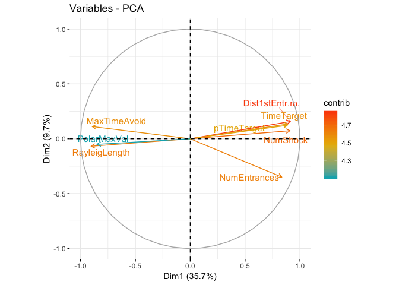

### Comparing Consistent and Conflict behaviors during the T4/C1 training session

    filtered <- behavior_slim %>% filter(TrainSessionCombo == "T4_C1", APA != "control") 
    exp_factors <- as.data.frame(filtered[,1])
    exp_nums <- filtered[,c(4:42)]
    exp_factors$APA2 <- factor(filtered$APA2, levels = c("consistent", "conflict"))

    # Levene's test for normality
    #for(y in names(exp_nums)){
    #  ymod <- leveneTest(exp_nums[[y]] ~ exp_factors$APA2)
    #  cat(paste('\nDependent var:', y, '\n'))
    #  print(ymod)
    #}

    # Signif. codes:  0 ‘***’ 0.001 ‘**’ 0.01 ‘*’ 0.05 ‘.’ 0.1 ‘ ’ 1
    # *** Speed1, Path2ndEntr, Time2ndEntr, Path2ndEntr, Time2ndEntr
    # ** Path1stEntr, Time1stEntr
    # *  Max50.RngHiBin ,  PolarMaxBin  , PolarMinVal, RayleigAngle, pTimeCW, pTimeOPP,
    # .  Speed2, Min50.RngLoBin , TimeTarget, NumShock, NumEntrances
    #    AnnularKurtosis, AnnularSkewnes, AnnularSd, AnnularMaxBin, AnnularMaxVal, AnnularMinBin, AnnularMinVal, Max50.RngLoBin, RayleigLength PolarMaxVal, Min50.RngHiBin , PolarMinBin, PolarSdVal, PolarAvgVal, RayleigLength, pTimeTarget, Speed2ndEntr, MaxTimeAvoid, Dist1stEntr.m, Speed1stEntr.cm.s, Linearity.Arena, SdevSpeedArena

    for(y in names(exp_nums)){
      ymod <- wilcox.test(exp_nums[[y]] ~ exp_factors$APA2 )
      cat(paste('\nDependent var:', y, '\n'))
      print(ymod)
    }

    ## Warning in wilcox.test.default(x = c(3.21, 2.82, 2.2, 2.64, 2.88, 2.5, 3, :
    ## cannot compute exact p-value with ties

    ## 
    ## Dependent var: SdevSpeedArena 
    ## 
    ##  Wilcoxon rank sum test with continuity correction
    ## 
    ## data:  exp_nums[[y]] by exp_factors$APA2
    ## W = 33, p-value = 0.8098
    ## alternative hypothesis: true location shift is not equal to 0

    ## Warning in wilcox.test.default(x = c(0.3341, 0.2786, 0.3786, 0.3168,
    ## 0.3158, : cannot compute exact p-value with ties

    ## 
    ## Dependent var: Linearity.Arena. 
    ## 
    ##  Wilcoxon rank sum test with continuity correction
    ## 
    ## data:  exp_nums[[y]] by exp_factors$APA2
    ## W = 52.5, p-value = 0.1234
    ## alternative hypothesis: true location shift is not equal to 0

    ## Warning in wilcox.test.default(x = c(3L, 10L, 0L, 0L, 2L, 4L, 13L, 2L), :
    ## cannot compute exact p-value with ties

    ## 
    ## Dependent var: NumEntrances 
    ## 
    ##  Wilcoxon rank sum test with continuity correction
    ## 
    ## data:  exp_nums[[y]] by exp_factors$APA2
    ## W = 4.5, p-value = 0.002804
    ## alternative hypothesis: true location shift is not equal to 0

    ## Warning in wilcox.test.default(x = c(257.83, 39.7, 599.97, 599.97, 249.4, :
    ## cannot compute exact p-value with ties

    ## 
    ## Dependent var: Time1stEntr 
    ## 
    ##  Wilcoxon rank sum test with continuity correction
    ## 
    ## data:  exp_nums[[y]] by exp_factors$APA2
    ## W = 72, p-value = 0.0006258
    ## alternative hypothesis: true location shift is not equal to 0

    ## Warning in wilcox.test.default(x = c(8.59, 0.92, 14.26, 16.08, 7.75,
    ## 3.19, : cannot compute exact p-value with ties

    ## 
    ## Dependent var: Path1stEntr 
    ## 
    ##  Wilcoxon rank sum test with continuity correction
    ## 
    ## data:  exp_nums[[y]] by exp_factors$APA2
    ## W = 72, p-value = 0.0005879
    ## alternative hypothesis: true location shift is not equal to 0

    ## Warning in wilcox.test.default(x = c(9.54, 2.04, -1, -1, 13.37, 2.38,
    ## 1.96, : cannot compute exact p-value with ties

    ## 
    ## Dependent var: Speed1stEntr.cm.s. 
    ## 
    ##  Wilcoxon rank sum test with continuity correction
    ## 
    ## data:  exp_nums[[y]] by exp_factors$APA2
    ## W = 48, p-value = 0.258
    ## alternative hypothesis: true location shift is not equal to 0

    ## Warning in wilcox.test.default(x = c(0.15, 0.57, 0, 0, 0.11, 0.24, 0.7, :
    ## cannot compute exact p-value with ties

    ## 
    ## Dependent var: Dist1stEntr.m. 
    ## 
    ##  Wilcoxon rank sum test with continuity correction
    ## 
    ## data:  exp_nums[[y]] by exp_factors$APA2
    ## W = 6, p-value = 0.004506
    ## alternative hypothesis: true location shift is not equal to 0

    ## Warning in wilcox.test.default(x = c(3L, 10L, 0L, 0L, 3L, 5L, 13L, 2L), :
    ## cannot compute exact p-value with ties

    ## 
    ## Dependent var: NumShock 
    ## 
    ##  Wilcoxon rank sum test with continuity correction
    ## 
    ## data:  exp_nums[[y]] by exp_factors$APA2
    ## W = 2.5, p-value = 0.001456
    ## alternative hypothesis: true location shift is not equal to 0

    ## Warning in wilcox.test.default(x = c(257L, 195L, 599L, 599L, 293L, 161L, :
    ## cannot compute exact p-value with ties

    ## 
    ## Dependent var: MaxTimeAvoid 
    ## 
    ##  Wilcoxon rank sum test with continuity correction
    ## 
    ## data:  exp_nums[[y]] by exp_factors$APA2
    ## W = 49.5, p-value = 0.2104
    ## alternative hypothesis: true location shift is not equal to 0

    ## Warning in wilcox.test.default(x = c(321.23, 55, 599.97, 599.97, 543.07, :
    ## cannot compute exact p-value with ties

    ## 
    ## Dependent var: Time2ndEntr 
    ## 
    ##  Wilcoxon rank sum test with continuity correction
    ## 
    ## data:  exp_nums[[y]] by exp_factors$APA2
    ## W = 72, p-value = 0.0006306
    ## alternative hypothesis: true location shift is not equal to 0
    ## 
    ## 
    ## Dependent var: Path2ndEntr 
    ## 
    ##  Wilcoxon rank sum test
    ## 
    ## data:  exp_nums[[y]] by exp_factors$APA2
    ## W = 72, p-value = 8.227e-05
    ## alternative hypothesis: true location shift is not equal to 0

    ## Warning in wilcox.test.default(x = c(1.61, 1.97, -1, -1, 1.82, 2.47,
    ## 2.17, : cannot compute exact p-value with ties

    ## 
    ## Dependent var: Speed2ndEntr 
    ## 
    ##  Wilcoxon rank sum test with continuity correction
    ## 
    ## data:  exp_nums[[y]] by exp_factors$APA2
    ## W = 23.5, p-value = 0.2473
    ## alternative hypothesis: true location shift is not equal to 0

    ## Warning in wilcox.test.default(x = c(4.5, 8.064, 0, 0, 4.601, 4.599,
    ## 10.632, : cannot compute exact p-value with ties

    ## 
    ## Dependent var: TimeTarget 
    ## 
    ##  Wilcoxon rank sum test with continuity correction
    ## 
    ## data:  exp_nums[[y]] by exp_factors$APA2
    ## W = 1, p-value = 0.0008944
    ## alternative hypothesis: true location shift is not equal to 0

    ## Warning in wilcox.test.default(x = c(0.0107, 0.0203, 0, 0, 0.0116,
    ## 0.0124, : cannot compute exact p-value with ties

    ## 
    ## Dependent var: pTimeTarget 
    ## 
    ##  Wilcoxon rank sum test with continuity correction
    ## 
    ## data:  exp_nums[[y]] by exp_factors$APA2
    ## W = 3, p-value = 0.001753
    ## alternative hypothesis: true location shift is not equal to 0
    ## 
    ## 
    ## Dependent var: pTimeCCW 
    ## 
    ##  Wilcoxon rank sum test
    ## 
    ## data:  exp_nums[[y]] by exp_factors$APA2
    ## W = 37, p-value = 0.9626
    ## alternative hypothesis: true location shift is not equal to 0
    ## 
    ## 
    ## Dependent var: pTimeOPP 
    ## 
    ##  Wilcoxon rank sum test
    ## 
    ## data:  exp_nums[[y]] by exp_factors$APA2
    ## W = 64, p-value = 0.005512
    ## alternative hypothesis: true location shift is not equal to 0
    ## 
    ## 
    ## Dependent var: pTimeCW 
    ## 
    ##  Wilcoxon rank sum test
    ## 
    ## data:  exp_nums[[y]] by exp_factors$APA2
    ## W = 20, p-value = 0.1388
    ## alternative hypothesis: true location shift is not equal to 0

    ## Warning in wilcox.test.default(x = c(0.52, 0.61, 0.86, 0.7, 0.68, 0.67, :
    ## cannot compute exact p-value with ties

    ## 
    ## Dependent var: RayleigLength 
    ## 
    ##  Wilcoxon rank sum test with continuity correction
    ## 
    ## data:  exp_nums[[y]] by exp_factors$APA2
    ## W = 40.5, p-value = 0.6998
    ## alternative hypothesis: true location shift is not equal to 0
    ## 
    ## 
    ## Dependent var: RayleigAngle 
    ## 
    ##  Wilcoxon rank sum test
    ## 
    ## data:  exp_nums[[y]] by exp_factors$APA2
    ## W = 38, p-value = 0.8884
    ## alternative hypothesis: true location shift is not equal to 0
    ## 
    ## 
    ## Dependent var: PolarAvgVal 
    ## 
    ##  Wilcoxon rank sum test
    ## 
    ## data:  exp_nums[[y]] by exp_factors$APA2
    ## W = 57, p-value = 0.0464
    ## alternative hypothesis: true location shift is not equal to 0
    ## 
    ## 
    ## Dependent var: PolarSdVal 
    ## 
    ##  Wilcoxon rank sum test
    ## 
    ## data:  exp_nums[[y]] by exp_factors$APA2
    ## W = 11, p-value = 0.01522
    ## alternative hypothesis: true location shift is not equal to 0

    ## Warning in wilcox.test.default(x = c(1e-04, 1e-04, 0, 0, 0, 0, 0, 0), y =
    ## c(5e-04, : cannot compute exact p-value with ties

    ## 
    ## Dependent var: PolarMinVal 
    ## 
    ##  Wilcoxon rank sum test with continuity correction
    ## 
    ## data:  exp_nums[[y]] by exp_factors$APA2
    ## W = 10, p-value = 0.00948
    ## alternative hypothesis: true location shift is not equal to 0

    ## Warning in wilcox.test.default(x = c(10L, 320L, 0L, 0L, 0L, 310L, 0L, 0L:
    ## cannot compute exact p-value with ties

    ## 
    ## Dependent var: PolarMinBin 
    ## 
    ##  Wilcoxon rank sum test with continuity correction
    ## 
    ## data:  exp_nums[[y]] by exp_factors$APA2
    ## W = 22, p-value = 0.1828
    ## alternative hypothesis: true location shift is not equal to 0

    ## Warning in wilcox.test.default(x = c(250L, 160L, 190L, 200L, 150L, 160L, :
    ## cannot compute exact p-value with ties

    ## 
    ## Dependent var: Min50.RngLoBin 
    ## 
    ##  Wilcoxon rank sum test with continuity correction
    ## 
    ## data:  exp_nums[[y]] by exp_factors$APA2
    ## W = 36.5, p-value = 1
    ## alternative hypothesis: true location shift is not equal to 0

    ## Warning in wilcox.test.default(x = c(180L, 100L, 170L, 150L, 110L, 110L, :
    ## cannot compute exact p-value with ties

    ## 
    ## Dependent var: Min50.RngHiBin 
    ## 
    ##  Wilcoxon rank sum test with continuity correction
    ## 
    ## data:  exp_nums[[y]] by exp_factors$APA2
    ## W = 44, p-value = 0.4688
    ## alternative hypothesis: true location shift is not equal to 0
    ## 
    ## 
    ## Dependent var: PolarMaxVal 
    ## 
    ##  Wilcoxon rank sum test
    ## 
    ## data:  exp_nums[[y]] by exp_factors$APA2
    ## W = 30, p-value = 0.6058
    ## alternative hypothesis: true location shift is not equal to 0

    ## Warning in wilcox.test.default(x = c(200L, 120L, 170L, 180L, 120L, 130L, :
    ## cannot compute exact p-value with ties

    ## 
    ## Dependent var: PolarMaxBin 
    ## 
    ##  Wilcoxon rank sum test with continuity correction
    ## 
    ## data:  exp_nums[[y]] by exp_factors$APA2
    ## W = 34.5, p-value = 0.9231
    ## alternative hypothesis: true location shift is not equal to 0

    ## Warning in wilcox.test.default(x = c(160L, 90L, 150L, 140L, 100L, 100L, :
    ## cannot compute exact p-value with ties

    ## 
    ## Dependent var: Max50.RngLoBin 
    ## 
    ##  Wilcoxon rank sum test with continuity correction
    ## 
    ## data:  exp_nums[[y]] by exp_factors$APA2
    ## W = 40.5, p-value = 0.6998
    ## alternative hypothesis: true location shift is not equal to 0

    ## Warning in wilcox.test.default(x = c(260L, 180L, 200L, 220L, 170L, 180L, :
    ## cannot compute exact p-value with ties

    ## 
    ## Dependent var: Max50.RngHiBin 
    ## 
    ##  Wilcoxon rank sum test with continuity correction
    ## 
    ## data:  exp_nums[[y]] by exp_factors$APA2
    ## W = 35, p-value = 0.9615
    ## alternative hypothesis: true location shift is not equal to 0

    ## Warning in wilcox.test.default(x = c(6e-04, 0.0096, 0.0022, 0.005, 9e-04, :
    ## cannot compute exact p-value with ties

    ## 
    ## Dependent var: AnnularMinVal 
    ## 
    ##  Wilcoxon rank sum test with continuity correction
    ## 
    ## data:  exp_nums[[y]] by exp_factors$APA2
    ## W = 40, p-value = 0.736
    ## alternative hypothesis: true location shift is not equal to 0

    ## Warning in wilcox.test.default(x = c(3.5, 3.5, 8.5, 8.5, 19.4, 19.4, 3.5, :
    ## cannot compute exact p-value with ties

    ## 
    ## Dependent var: AnnularMinBin 
    ## 
    ##  Wilcoxon rank sum test with continuity correction
    ## 
    ## data:  exp_nums[[y]] by exp_factors$APA2
    ## W = 34, p-value = 0.8797
    ## alternative hypothesis: true location shift is not equal to 0
    ## 
    ## 
    ## Dependent var: AnnularMaxVal 
    ## 
    ##  Wilcoxon rank sum test
    ## 
    ## data:  exp_nums[[y]] by exp_factors$APA2
    ## W = 24, p-value = 0.2766
    ## alternative hypothesis: true location shift is not equal to 0

    ## Warning in wilcox.test.default(x = c(18, 16.6, 16.6, 16.6, 16.6, 15, 18, :
    ## cannot compute exact p-value with ties

    ## 
    ## Dependent var: AnnularMaxBin 
    ## 
    ##  Wilcoxon rank sum test with continuity correction
    ## 
    ## data:  exp_nums[[y]] by exp_factors$APA2
    ## W = 40.5, p-value = 0.6614
    ## alternative hypothesis: true location shift is not equal to 0

    ## Warning in wilcox.test.default(x = c(16.18, 15.81, 16.7, 16.39, 16.18,
    ## 14.94, : cannot compute exact p-value with ties

    ## 
    ## Dependent var: AnnularAvg 
    ## 
    ##  Wilcoxon rank sum test with continuity correction
    ## 
    ## data:  exp_nums[[y]] by exp_factors$APA2
    ## W = 41, p-value = 0.6648
    ## alternative hypothesis: true location shift is not equal to 0
    ## 
    ## 
    ## Dependent var: AnnularSd 
    ## 
    ##  Wilcoxon rank sum test
    ## 
    ## data:  exp_nums[[y]] by exp_factors$APA2
    ## W = 34, p-value = 0.8884
    ## alternative hypothesis: true location shift is not equal to 0
    ## 
    ## 
    ## Dependent var: AnnularSkewnes 
    ## 
    ##  Wilcoxon rank sum test
    ## 
    ## data:  exp_nums[[y]] by exp_factors$APA2
    ## W = 34, p-value = 0.8884
    ## alternative hypothesis: true location shift is not equal to 0
    ## 
    ## 
    ## Dependent var: AnnularKurtosis 
    ## 
    ##  Wilcoxon rank sum test
    ## 
    ## data:  exp_nums[[y]] by exp_factors$APA2
    ## W = 33, p-value = 0.8148
    ## alternative hypothesis: true location shift is not equal to 0

    ## Warning in wilcox.test.default(x = c(0.03331652639336,
    ## 0.0231738035264484, : cannot compute exact p-value with ties

    ## 
    ## Dependent var: Speed1 
    ## 
    ##  Wilcoxon rank sum test with continuity correction
    ## 
    ## data:  exp_nums[[y]] by exp_factors$APA2
    ## W = 48, p-value = 0.2655
    ## alternative hypothesis: true location shift is not equal to 0
    ## 
    ## 
    ## Dependent var: Speed2 
    ## 
    ##  Wilcoxon rank sum test
    ## 
    ## data:  exp_nums[[y]] by exp_factors$APA2
    ## W = 6, p-value = 0.002468
    ## alternative hypothesis: true location shift is not equal to 0

    # *** Path2ndEntr 
    # **  Speed2, PolarMinVal, pTimeOPP, pTimeTarget, TimeTarget, Time2ndEntr, NumShock
    # **  Dist1stEntr.m., Path1stEntr , Time1stEntr, NumEntrances
    # *   PolarSdVal, PolarAvgVal 
    # .    
    #     Speed1, AnnularKurtosis, AnnularSkewnes, AnnularSd, AnnularAvg, AnnularMaxBin,
    #     AnnularMaxVal, AnnularMinBin, AnnularMinVal, Max50.RngHiBin , PolarMaxBin, 
    #     PolarMaxVal, Min50.RngHiBin, Min50.RngLoBin, PolarMinBin, RayleigAngle
    #     RayleigLength, pTimeCW, pTimeCCW, Speed2ndEntr, MaxTimeAvoid, Speed1stEntr.cm.s., #     Linearity.Arena., SdevSpeedArena 
     
    par(mfrow=c(3,3))
    for(y in names(exp_nums)){
      ymod <- boxplot(exp_nums[[y]] ~ exp_factors$APA2,
                   main = y,
                   xlab = "T4/C1")
    }

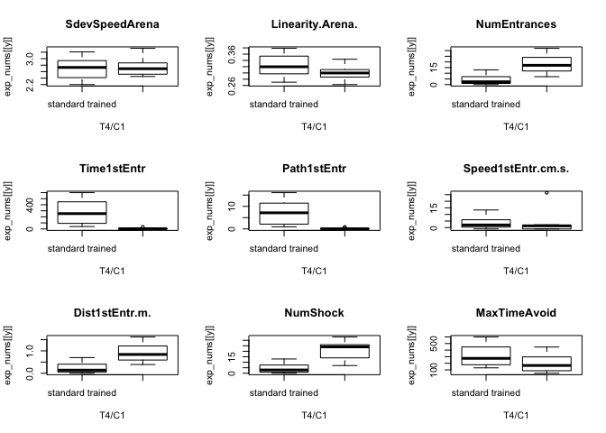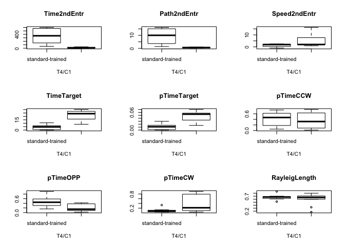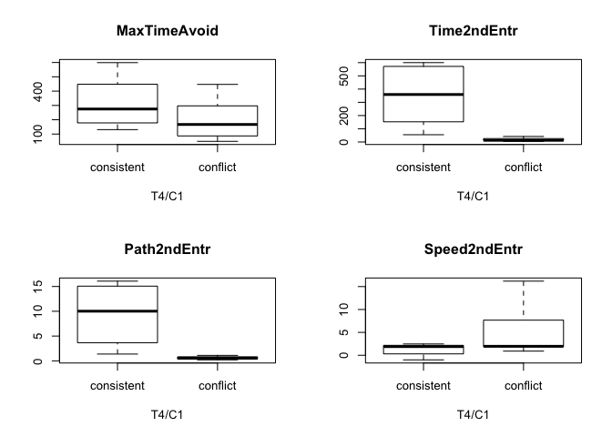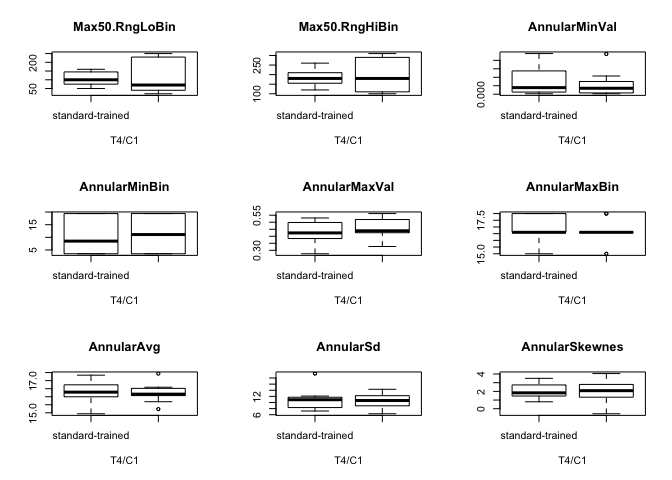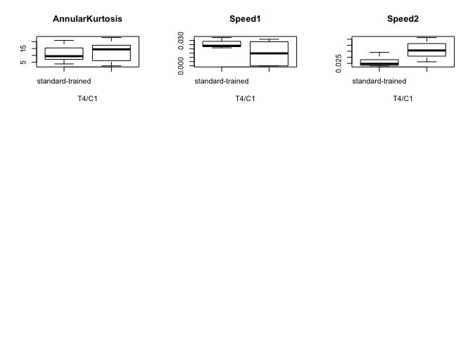

### Comparing Consistent and Conflict behaviors during the T6/C3 training session

    filtered <- behavior_slim %>% filter(TrainSessionCombo == "T6_C3", APA != "control") 
    exp_factors <- as.data.frame(filtered[,1])
    exp_nums <- filtered[,c(4:42)]
    exp_factors$APA2 <- factor(filtered$APA2, levels = c("consistent", "conflict"))

    for(y in names(exp_nums)){
      ymod<- wilcox.test(exp_nums[[y]] ~ exp_factors$APA2 )
      cat(paste('\nDependent var:', y, '\n'))
      print(ymod)
    }

    ## Warning in wilcox.test.default(x = c(2.37, 3.08, 1.96, 2.32, 2.33, 2.55, :
    ## cannot compute exact p-value with ties

    ## 
    ## Dependent var: SdevSpeedArena 
    ## 
    ##  Wilcoxon rank sum test with continuity correction
    ## 
    ## data:  exp_nums[[y]] by exp_factors$APA2
    ## W = 21.5, p-value = 0.1774
    ## alternative hypothesis: true location shift is not equal to 0
    ## 
    ## 
    ## Dependent var: Linearity.Arena. 
    ## 
    ##  Wilcoxon rank sum test
    ## 
    ## data:  exp_nums[[y]] by exp_factors$APA2
    ## W = 36, p-value = 1
    ## alternative hypothesis: true location shift is not equal to 0

    ## Warning in wilcox.test.default(x = c(0L, 12L, 0L, 0L, 1L, 13L, 8L, 0L), :
    ## cannot compute exact p-value with ties

    ## 
    ## Dependent var: NumEntrances 
    ## 
    ##  Wilcoxon rank sum test with continuity correction
    ## 
    ## data:  exp_nums[[y]] by exp_factors$APA2
    ## W = 23.5, p-value = 0.2421
    ## alternative hypothesis: true location shift is not equal to 0

    ## Warning in wilcox.test.default(x = c(599.97, 3.13, 599.97, 599.97, 46.53, :
    ## cannot compute exact p-value with ties

    ## 
    ## Dependent var: Time1stEntr 
    ## 
    ##  Wilcoxon rank sum test with continuity correction
    ## 
    ## data:  exp_nums[[y]] by exp_factors$APA2
    ## W = 42, p-value = 0.5944
    ## alternative hypothesis: true location shift is not equal to 0
    ## 
    ## 
    ## Dependent var: Path1stEntr 
    ## 
    ##  Wilcoxon rank sum test
    ## 
    ## data:  exp_nums[[y]] by exp_factors$APA2
    ## W = 41, p-value = 0.673
    ## alternative hypothesis: true location shift is not equal to 0

    ## Warning in wilcox.test.default(x = c(-1, 2.1, -1, -1, 1.47, 1.96, 2.17, :
    ## cannot compute exact p-value with ties

    ## 
    ## Dependent var: Speed1stEntr.cm.s. 
    ## 
    ##  Wilcoxon rank sum test with continuity correction
    ## 
    ## data:  exp_nums[[y]] by exp_factors$APA2
    ## W = 11, p-value = 0.01769
    ## alternative hypothesis: true location shift is not equal to 0

    ## Warning in wilcox.test.default(x = c(0, 0.68, 0, 0, 0.07, 0.84, 0.43, 0), :
    ## cannot compute exact p-value with ties

    ## 
    ## Dependent var: Dist1stEntr.m. 
    ## 
    ##  Wilcoxon rank sum test with continuity correction
    ## 
    ## data:  exp_nums[[y]] by exp_factors$APA2
    ## W = 25, p-value = 0.3081
    ## alternative hypothesis: true location shift is not equal to 0

    ## Warning in wilcox.test.default(x = c(0L, 12L, 0L, 0L, 1L, 13L, 8L, 0L), :
    ## cannot compute exact p-value with ties

    ## 
    ## Dependent var: NumShock 
    ## 
    ##  Wilcoxon rank sum test with continuity correction
    ## 
    ## data:  exp_nums[[y]] by exp_factors$APA2
    ## W = 23.5, p-value = 0.2421
    ## alternative hypothesis: true location shift is not equal to 0

    ## Warning in wilcox.test.default(x = c(599L, 113L, 599L, 599L, 553L, 86L, :
    ## cannot compute exact p-value with ties

    ## 
    ## Dependent var: MaxTimeAvoid 
    ## 
    ##  Wilcoxon rank sum test with continuity correction
    ## 
    ## data:  exp_nums[[y]] by exp_factors$APA2
    ## W = 47, p-value = 0.3093
    ## alternative hypothesis: true location shift is not equal to 0

    ## Warning in wilcox.test.default(x = c(599.97, 28.37, 599.97, 599.97,
    ## 599.97, : cannot compute exact p-value with ties

    ## 
    ## Dependent var: Time2ndEntr 
    ## 
    ##  Wilcoxon rank sum test with continuity correction
    ## 
    ## data:  exp_nums[[y]] by exp_factors$APA2
    ## W = 44.5, p-value = 0.4163
    ## alternative hypothesis: true location shift is not equal to 0
    ## 
    ## 
    ## Dependent var: Path2ndEntr 
    ## 
    ##  Wilcoxon rank sum test
    ## 
    ## data:  exp_nums[[y]] by exp_factors$APA2
    ## W = 31, p-value = 0.673
    ## alternative hypothesis: true location shift is not equal to 0

    ## Warning in wilcox.test.default(x = c(-1, 2.17, -1, -1, -1, 1.56, 1.95, -1:
    ## cannot compute exact p-value with ties

    ## 
    ## Dependent var: Speed2ndEntr 
    ## 
    ##  Wilcoxon rank sum test with continuity correction
    ## 
    ## data:  exp_nums[[y]] by exp_factors$APA2
    ## W = 26.5, p-value = 0.3605
    ## alternative hypothesis: true location shift is not equal to 0

    ## Warning in wilcox.test.default(x = c(0, 6, 0, 0, 0.667, 9.401, 7.833, 0), :
    ## cannot compute exact p-value with ties

    ## 
    ## Dependent var: TimeTarget 
    ## 
    ##  Wilcoxon rank sum test with continuity correction
    ## 
    ## data:  exp_nums[[y]] by exp_factors$APA2
    ## W = 21.5, p-value = 0.175
    ## alternative hypothesis: true location shift is not equal to 0

    ## Warning in wilcox.test.default(x = c(0, 0.016, 0, 0, 0.002, 0.0258,
    ## 0.0201, : cannot compute exact p-value with ties

    ## 
    ## Dependent var: pTimeTarget 
    ## 
    ##  Wilcoxon rank sum test with continuity correction
    ## 
    ## data:  exp_nums[[y]] by exp_factors$APA2
    ## W = 27, p-value = 0.4102
    ## alternative hypothesis: true location shift is not equal to 0
    ## 
    ## 
    ## Dependent var: pTimeCCW 
    ## 
    ##  Wilcoxon rank sum test
    ## 
    ## data:  exp_nums[[y]] by exp_factors$APA2
    ## W = 41, p-value = 0.673
    ## alternative hypothesis: true location shift is not equal to 0
    ## 
    ## 
    ## Dependent var: pTimeOPP 
    ## 
    ##  Wilcoxon rank sum test
    ## 
    ## data:  exp_nums[[y]] by exp_factors$APA2
    ## W = 31, p-value = 0.673
    ## alternative hypothesis: true location shift is not equal to 0

    ## Warning in wilcox.test.default(x = c(0.3233, 0.0443, 0.0213, 0.3027, 0, :
    ## cannot compute exact p-value with ties

    ## 
    ## Dependent var: pTimeCW 
    ## 
    ##  Wilcoxon rank sum test with continuity correction
    ## 
    ## data:  exp_nums[[y]] by exp_factors$APA2
    ## W = 26, p-value = 0.3603
    ## alternative hypothesis: true location shift is not equal to 0

    ## Warning in wilcox.test.default(x = c(0.78, 0.67, 0.87, 0.68, 0.92, 0.72, :
    ## cannot compute exact p-value with ties

    ## 
    ## Dependent var: RayleigLength 
    ## 
    ##  Wilcoxon rank sum test with continuity correction
    ## 
    ## data:  exp_nums[[y]] by exp_factors$APA2
    ## W = 42.5, p-value = 0.5635
    ## alternative hypothesis: true location shift is not equal to 0
    ## 
    ## 
    ## Dependent var: RayleigAngle 
    ## 
    ##  Wilcoxon rank sum test
    ## 
    ## data:  exp_nums[[y]] by exp_factors$APA2
    ## W = 35, p-value = 0.9626
    ## alternative hypothesis: true location shift is not equal to 0
    ## 
    ## 
    ## Dependent var: PolarAvgVal 
    ## 
    ##  Wilcoxon rank sum test
    ## 
    ## data:  exp_nums[[y]] by exp_factors$APA2
    ## W = 68, p-value = 0.0009872
    ## alternative hypothesis: true location shift is not equal to 0
    ## 
    ## 
    ## Dependent var: PolarSdVal 
    ## 
    ##  Wilcoxon rank sum test
    ## 
    ## data:  exp_nums[[y]] by exp_factors$APA2
    ## W = 18, p-value = 0.09272
    ## alternative hypothesis: true location shift is not equal to 0

    ## Warning in wilcox.test.default(x = c(0, 0, 0, 0, 0, 0, 1e-04, 0), y =
    ## c(1e-04, : cannot compute exact p-value with ties

    ## 
    ## Dependent var: PolarMinVal 
    ## 
    ##  Wilcoxon rank sum test with continuity correction
    ## 
    ## data:  exp_nums[[y]] by exp_factors$APA2
    ## W = 24, p-value = 0.1657
    ## alternative hypothesis: true location shift is not equal to 0

    ## Warning in wilcox.test.default(x = c(0L, 310L, 0L, 0L, 0L, 0L, 340L, 0L), :
    ## cannot compute exact p-value with ties

    ## 
    ## Dependent var: PolarMinBin 
    ## 
    ##  Wilcoxon rank sum test with continuity correction
    ## 
    ## data:  exp_nums[[y]] by exp_factors$APA2
    ## W = 31, p-value = 0.6121
    ## alternative hypothesis: true location shift is not equal to 0

    ## Warning in wilcox.test.default(x = c(230L, 140L, 190L, 220L, 140L, 120L, :
    ## cannot compute exact p-value with ties

    ## 
    ## Dependent var: Min50.RngLoBin 
    ## 
    ##  Wilcoxon rank sum test with continuity correction
    ## 
    ## data:  exp_nums[[y]] by exp_factors$APA2
    ## W = 34.5, p-value = 0.9229
    ## alternative hypothesis: true location shift is not equal to 0

    ## Warning in wilcox.test.default(x = c(200L, 90L, 160L, 170L, 120L, 70L,
    ## 70L, : cannot compute exact p-value with ties

    ## 
    ## Dependent var: Min50.RngHiBin 
    ## 
    ##  Wilcoxon rank sum test with continuity correction
    ## 
    ## data:  exp_nums[[y]] by exp_factors$APA2
    ## W = 37.5, p-value = 0.9226
    ## alternative hypothesis: true location shift is not equal to 0
    ## 
    ## 
    ## Dependent var: PolarMaxVal 
    ## 
    ##  Wilcoxon rank sum test
    ## 
    ## data:  exp_nums[[y]] by exp_factors$APA2
    ## W = 37, p-value = 0.9626
    ## alternative hypothesis: true location shift is not equal to 0

    ## Warning in wilcox.test.default(x = c(210L, 140L, 190L, 200L, 120L, 70L, :
    ## cannot compute exact p-value with ties

    ## 
    ## Dependent var: PolarMaxBin 
    ## 
    ##  Wilcoxon rank sum test with continuity correction
    ## 
    ## data:  exp_nums[[y]] by exp_factors$APA2
    ## W = 35, p-value = 0.9615
    ## alternative hypothesis: true location shift is not equal to 0

    ## Warning in wilcox.test.default(x = c(180L, 70L, 140L, 160L, 100L, 60L,
    ## 60L, : cannot compute exact p-value with ties

    ## 
    ## Dependent var: Max50.RngLoBin 
    ## 
    ##  Wilcoxon rank sum test with continuity correction
    ## 
    ## data:  exp_nums[[y]] by exp_factors$APA2
    ## W = 37, p-value = 0.9612
    ## alternative hypothesis: true location shift is not equal to 0

    ## Warning in wilcox.test.default(x = c(240L, 150L, 200L, 240L, 150L, 140L, :
    ## cannot compute exact p-value with ties

    ## 
    ## Dependent var: Max50.RngHiBin 
    ## 
    ##  Wilcoxon rank sum test with continuity correction
    ## 
    ## data:  exp_nums[[y]] by exp_factors$APA2
    ## W = 35.5, p-value = 1
    ## alternative hypothesis: true location shift is not equal to 0

    ## Warning in wilcox.test.default(x = c(0.009, 0.0034, 0.0059, 0.0218,
    ## 8e-04, : cannot compute exact p-value with ties

    ## 
    ## Dependent var: AnnularMinVal 
    ## 
    ##  Wilcoxon rank sum test with continuity correction
    ## 
    ## data:  exp_nums[[y]] by exp_factors$APA2
    ## W = 50.5, p-value = 0.1777
    ## alternative hypothesis: true location shift is not equal to 0

    ## Warning in wilcox.test.default(x = c(3.5, 8.5, 8.5, 8.5, 8.5, 3.5, 3.5, :
    ## cannot compute exact p-value with ties

    ## 
    ## Dependent var: AnnularMinBin 
    ## 
    ##  Wilcoxon rank sum test with continuity correction
    ## 
    ## data:  exp_nums[[y]] by exp_factors$APA2
    ## W = 23, p-value = 0.185
    ## alternative hypothesis: true location shift is not equal to 0
    ## 
    ## 
    ## Dependent var: AnnularMaxVal 
    ## 
    ##  Wilcoxon rank sum test
    ## 
    ## data:  exp_nums[[y]] by exp_factors$APA2
    ## W = 34, p-value = 0.8884
    ## alternative hypothesis: true location shift is not equal to 0

    ## Warning in wilcox.test.default(x = c(16.6, 16.6, 16.6, 16.6, 16.6, 18,
    ## 18, : cannot compute exact p-value with ties

    ## 
    ## Dependent var: AnnularMaxBin 
    ## 
    ##  Wilcoxon rank sum test with continuity correction
    ## 
    ## data:  exp_nums[[y]] by exp_factors$APA2
    ## W = 33, p-value = 0.7609
    ## alternative hypothesis: true location shift is not equal to 0
    ## 
    ## 
    ## Dependent var: AnnularAvg 
    ## 
    ##  Wilcoxon rank sum test
    ## 
    ## data:  exp_nums[[y]] by exp_factors$APA2
    ## W = 26, p-value = 0.3704
    ## alternative hypothesis: true location shift is not equal to 0
    ## 
    ## 
    ## Dependent var: AnnularSd 
    ## 
    ##  Wilcoxon rank sum test
    ## 
    ## data:  exp_nums[[y]] by exp_factors$APA2
    ## W = 41, p-value = 0.673
    ## alternative hypothesis: true location shift is not equal to 0
    ## 
    ## 
    ## Dependent var: AnnularSkewnes 
    ## 
    ##  Wilcoxon rank sum test
    ## 
    ## data:  exp_nums[[y]] by exp_factors$APA2
    ## W = 32, p-value = 0.743
    ## alternative hypothesis: true location shift is not equal to 0
    ## 
    ## 
    ## Dependent var: AnnularKurtosis 
    ## 
    ##  Wilcoxon rank sum test
    ## 
    ## data:  exp_nums[[y]] by exp_factors$APA2
    ## W = 31, p-value = 0.673
    ## alternative hypothesis: true location shift is not equal to 0
    ## 
    ## 
    ## Dependent var: Speed1 
    ## 
    ##  Wilcoxon rank sum test
    ## 
    ## data:  exp_nums[[y]] by exp_factors$APA2
    ## W = 20, p-value = 0.1388
    ## alternative hypothesis: true location shift is not equal to 0
    ## 
    ## 
    ## Dependent var: Speed2 
    ## 
    ##  Wilcoxon rank sum test
    ## 
    ## data:  exp_nums[[y]] by exp_factors$APA2
    ## W = 22, p-value = 0.1996
    ## alternative hypothesis: true location shift is not equal to 0

    # Signif. codes:  0 ‘***’ 0.001 ‘**’ 0.01 ‘*’ 0.05 ‘.’ 0.1 ‘ ’ 1
    # ***  
    # **  PolarAvgVal,
    # *   Speed1stEntr.cm.s. 
    # .   PolarSdVal,   
    #     Speed2, Speed1, AnnularKurtosis, AnnularSkewnes, AnnularSd,
    #     AnnularAvg, AnnularMaxBin, AnnularMaxVal, AnnularMinBin, AnnularMinVal
    #     Max50.RngHiBin, Max50.RngLoBin, PolarMaxBin, PolarMaxVal, Min50.RngHiBin   
    #     Min50.RngLoBin, PolarMinBin, PolarMinVal, RayleigAngle, RayleigLength,
    #     pTimeCW, pTimeOPP, pTimeCCW, pTimeTarget, TimeTarget, Speed2ndEntr, 
    #     Path2ndEntr, Time2ndEntr, MaxTimeAvoid, NumShock, Dist1stEntr.m. 
    #     Path1stEntr, Time1stEntr, NumEntrances, Linearity.Arena., SdevSpeedArena

    par(mfrow=c(3,3))
    for(y in names(exp_nums)){
      ymod <- boxplot(exp_nums[[y]] ~ exp_factors$APA2,
                   main = y,
                   xlab = "T6/C3")
    }

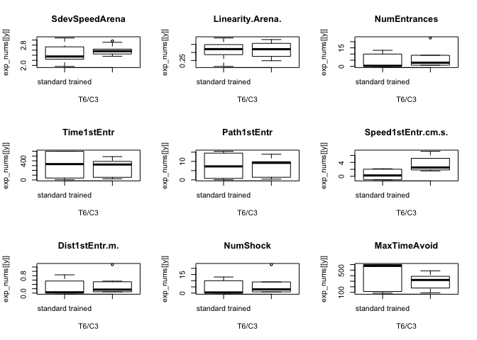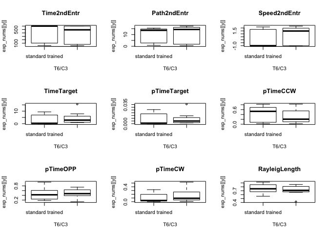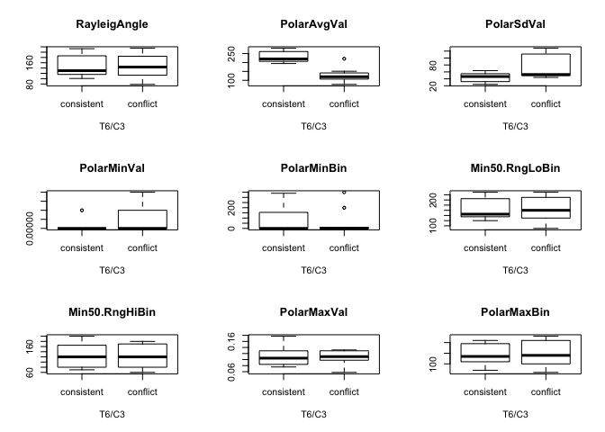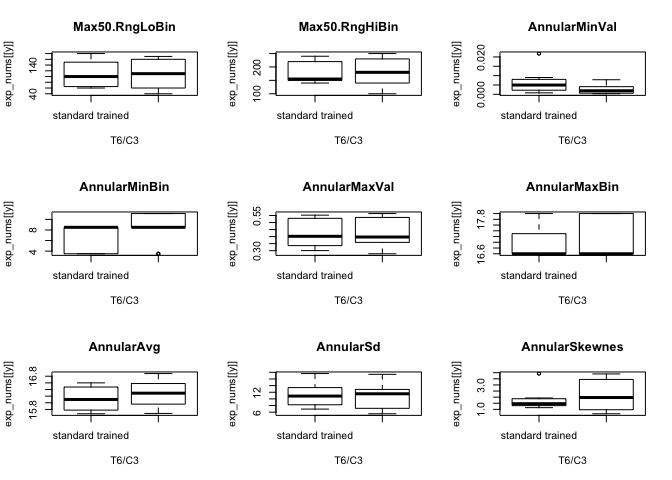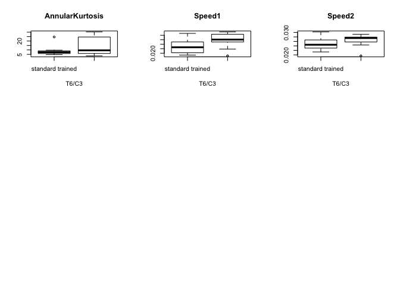
\#\# Number of shocks

The values in the column “NumShock” are actually measures of the number
of entraces into the shock zone. Because, that’s what the software
records. For consistent and conflict animals, the number of shocks
equals equals the number of entraces. However, for yoked individuals,
the number of entrances does not equal the number of shocks. For them,
the number of shocks is equal to their consistent or conflict trained
partner.

    # supset beahvior to keep only factors and num shocks
    numshocks <- behavior %>%
      select(ID, TrainSessionCombo, APA2, NumShock) 

    # widen datafram, and sum total
    numshocks <- spread(numshocks, key=TrainSessionCombo, value= NumShock)
    numshocks$sums <- rowSums(numshocks[sapply(numshocks, is.numeric)])

    # copy datafram, add identifer
    numentrances <- numshocks

    # delete values for yoked animals
    numshocks <- numshocks %>%
      filter(APA2 %in% c("consistent", "conflict")) %>%
      droplevels()

    # create a tempdataframe with dupclicate values for yoked
    numshockstemp <- numshocks
    levels(numshockstemp$APA2) 

    ## [1] "consistent" "conflict"

    levels(numshockstemp$APA2) <- c("yoked\nconsistent","yoked\nconflict")
    levels(numshockstemp$APA2) 

    ## [1] "yoked\nconsistent" "yoked\nconflict"

    # combine the two and plot

    realnumshocks <- rbind(numshocks, numshockstemp)

    realnumshocks$APA2 <- factor(realnumshocks$APA2, levels = c("yoked\nconsistent", "consistent", "yoked\nconflict", "conflict"))

    numentrances$APA2 <- factor(numentrances$APA2, levels = c("yoked-consistent", "consistent", "yoked-conflict", "conflict"))
    levels(numentrances$APA2) <- c("yoked\nconsistent", "consistent", "yoked\nconflict", "conflict")

    numentrances %>%
      dplyr::group_by(APA2) %>%
      dplyr::summarise(meanentraces = median(sums, na.rm = TRUE))

    ## # A tibble: 4 x 2
    ##   APA2                meanentraces
    ##   <fct>                      <dbl>
    ## 1 "yoked\nconsistent"         452.
    ## 2 consistent                   90 
    ## 3 "yoked\nconflict"           490 
    ## 4 conflict                    122

    realnumshocks %>%
      dplyr::group_by(APA2) %>%
      dplyr::summarise(meanshocks = mean(sums, na.rm = TRUE))

    ## # A tibble: 4 x 2
    ##   APA2                meanshocks
    ##   <fct>                    <dbl>
    ## 1 "yoked\nconsistent"        96 
    ## 2 consistent                 96 
    ## 3 "yoked\nconflict"         125.
    ## 4 conflict                  125.

    a <- ggplot(realnumshocks, aes(x = APA2, y = sums, fill = APA2)) +
      geom_boxplot(outlier.size = 0.5) +
      theme_cowplot(font_size = 7, line_size = 0.25) +
      scale_fill_manual(values = colorvalAPA00,
                        name = NULL) +
      labs(x = NULL, subtitle = "Total shocks", y = "Counts") +
        theme(axis.text.x=element_text(angle=60, vjust = 1, hjust = 1),
              legend.position = "none") +
      geom_hline(yintercept=122, linetype="dashed", color = "#f4a582") +
      geom_hline(yintercept=90, linetype="dashed", color = "#ca0020")
    a

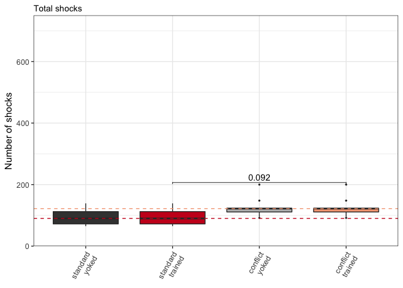

    b <- ggplot(numentrances, aes(x = APA2, y = sums, fill = APA2)) +
      geom_boxplot(outlier.size = 0.5) +
      theme_cowplot(font_size = 7, line_size = 0.25) +
      scale_fill_manual(values = colorvalAPA00,
                        name = NULL) +
      labs(x = NULL, subtitle = "Total entrances", y = "Counts") +
        theme(axis.text.x=element_text(angle=60, vjust = 1, hjust = 1),
              legend.position = "none") +
      geom_hline(yintercept=122, linetype="dashed", color = "#f4a582") +
      geom_hline(yintercept=90, linetype="dashed", color = "#ca0020") +
      scale_y_continuous(breaks = c(0,100,200,300,400,500,600))
    b

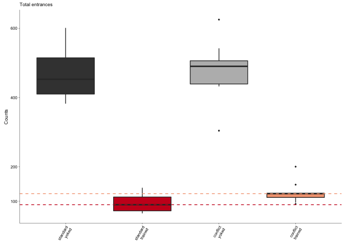

    shockentrplot <- plot_grid(a,b, labels = c("B", "C"), label_size = 7)

    pdf(file="../figures/01_behavior/shockentrplot.pdf", width=3, height=2.1)
    plot(shockentrplot)
    dev.off()

    ## quartz_off_screen 
    ##                 2

    shockentrplot

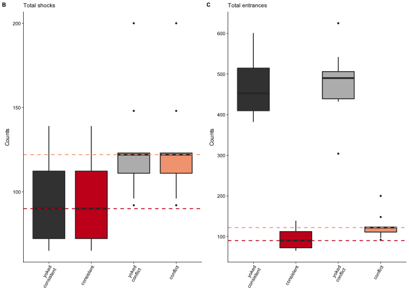

    numentrances

    ##        ID              APA2 Hab Retention Retest  T1 T2 T3 T4_C1 T5_C2
    ## 1  15140A          conflict  52         9      1   7  3  3    13     6
    ## 2  15140B   yoked\nconflict  55        33     71  96 30 71    87    31
    ## 3  15140C        consistent  62         0     10   6  7  8     3     8
    ## 4  15140D yoked\nconsistent  61        41     34  58 32 22    32    54
    ## 5  15141C        consistent  44        21      7   8 19 11    10     7
    ## 6  15141D yoked\nconsistent  55        52     50  54 48 27    47    36
    ## 7  15142A          conflict  60         6      0   7  4  2     7     3
    ## 8  15142B   yoked\nconflict  57        38     17  59 16 15    31    16
    ## 9  15142C        consistent  57         8      1   5  1  1     0     0
    ## 10 15142D yoked\nconsistent  52        51     58  38 48 61    47    39
    ## 11 15143A          conflict  56        33      2  10  3  1    14     2
    ## 12 15143B   yoked\nconflict  75        77     60 107 57 50    35    52
    ## 13 15143C        consistent  52         1      2  10  3  1     0     1
    ## 14 15143D yoked\nconsistent  59        67     60  49 24 68    70    41
    ## 15 15144A          conflict  64         0      1  12  4  1    26     3
    ## 16 15144B   yoked\nconflict  63        52     57  62 31 66    33    70
    ## 17 15144C        consistent  64         0      1   9  3  2     3     0
    ## 18 15144D yoked\nconsistent  71        57     60  97 80 50    64    56
    ## 19 15145A          conflict  59         0      6   6  2  1    29     4
    ## 20 15145B   yoked\nconflict  55        36     52  55 48 61    40    64
    ## 21 15145C        consistent  54        28      6  10  7  5     5     9
    ## 22 15145D yoked\nconsistent  55        63     52  60 63 69    88    93
    ## 23 15146A          conflict  66         0      1  25  2  1    26     1
    ## 24 15146B   yoked\nconflict  65        43     44  64 62 47    59    63
    ## 25 15146C        consistent  58         4      3   5  1  1    13     4
    ## 26 15146D yoked\nconsistent  51        49     54  44 38 47    25    43
    ## 27 15147A          conflict  48        30      5   6  3  1    15     5
    ## 28 15147B   yoked\nconflict  56        32     70  47 56 61    18    48
    ## 29 15147C        consistent  49         5      1   4  2  1     2     1
    ## 30 15147D yoked\nconsistent  59        52     52  55 39 49    50    50
    ## 31 15148A          conflict  61        40      0   7  1  1    24     5
    ## 32 15148B   yoked\nconflict  51        44     49  77 61 39    40    68
    ## 33 15148C          conflict  50        37      4   7  3 15    33    28
    ## 34 15148D   yoked\nconflict  61        41     41  34 64 63    38    40
    ##    T6_C3 sums
    ## 1      2   96
    ## 2     32  506
    ## 3      0  104
    ## 4     48  382
    ## 5     12  139
    ## 6     34  403
    ## 7      3   92
    ## 8     55  304
    ## 9      0   73
    ## 10    54  448
    ## 11     1  122
    ## 12   112  625
    ## 13     0   70
    ## 14    50  488
    ## 15     1  112
    ## 16    69  503
    ## 17     1   83
    ## 18    59  594
    ## 19     4  111
    ## 20    65  476
    ## 21    13  137
    ## 22    58  601
    ## 23     1  123
    ## 24    43  490
    ## 25     8   97
    ## 26    61  412
    ## 27     9  122
    ## 28    44  432
    ## 29     0   65
    ## 30    51  457
    ## 31     9  148
    ## 32   113  542
    ## 33    23  200
    ## 34    57  439

    summary(aov(numentrances$sums ~ numentrances$APA2))

    ##                   Df  Sum Sq Mean Sq F value   Pr(>F)    
    ## numentrances$APA2  3 1137278  379093   91.29 3.52e-15 ***
    ## Residuals         30  124584    4153                     
    ## ---
    ## Signif. codes:  0 '***' 0.001 '**' 0.01 '*' 0.05 '.' 0.1 ' ' 1

    summary(aov(realnumshocks$sums ~ realnumshocks$APA2))

    ##                    Df Sum Sq Mean Sq F value Pr(>F)  
    ## realnumshocks$APA2  3   7178  2392.8   2.492 0.0791 .
    ## Residuals          30  28802   960.1                 
    ## ---
    ## Signif. codes:  0 '***' 0.001 '**' 0.01 '*' 0.05 '.' 0.1 ' ' 1

    write.csv(behavior, file = "../data/01a_behavior.csv", row.names = FALSE)
    write.csv(fourmeasures, file = "../data/01a_fourmeasures.csv", row.names = FALSE)
    write.csv(scoresdf, file = "../data/01a_scoresdf.csv", row.names = FALSE)
    write.csv(rotationdf, file = "../data/01a_rotationdf.csv", row.names = TRUE)
    write.csv(behaviormatrix, file = "../data/01a_behaviormatrix.csv", row.names = TRUE)
