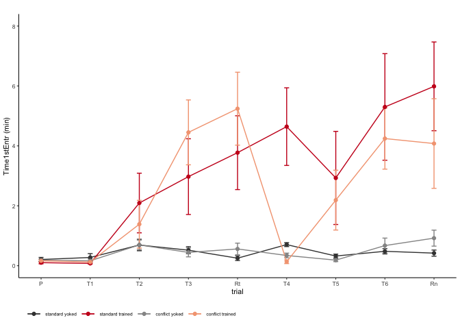

This markdown file is used for behavioral data wrangling, statistical
analysis, and data visualization. Figures from this analysis were
assembled into this multi-panel plot using Adobe Illustrator. Files used
to create the individual figures are saved in the data subdirectory with
the prefix 01a.

Setup
-----

    ## load libraries 
    library(tidyverse) ## for respahing data
    #library(reshape2) ## for melting dataframe
    library(cowplot) ## for some easy to use themes
    library(factoextra)  ## pca with vectors
    library(FactoMineR) # more pca

    library(apaTables) # 

    ## load user-written functions 
    source("functions_behavior.R")
    source("figureoptions.R")

    ## set output file for figures 
    knitr::opts_chunk$set(fig.path = '../figures/01_behavior/')

Sample sizes
------------

The ‘treatment’ column describes the four behavioral treatment groups.  
The ‘trial’ column describes the behvioral training sessions. Here I
filter by a single session to calculte the number of mice.

    ## import output from video tracker program 
    behavior <- read.csv("../data/00_behaviordata.csv", header = T)

    # set levels
    behavior$treatment <- factor(behavior$treatment, levels = c("standard.yoked", "standard.trained",
                                                              "conflict.yoked", "conflict.trained"))
    behavior$training <- factor(behavior$training, levels = c("yoked", "trained"))

    # sample sizes
    behavior %>% 
      filter(trial == "Hab") %>%
      select(treatment)  %>%  summary()

    ##             treatment
    ##  standard.yoked  :8  
    ##  standard.trained:8  
    ##  conflict.yoked  :9  
    ##  conflict.trained:9

    head(behavior)

    ##       ID Day        treatment training  trial trialNum ShockOnOff
    ## 1 15140A   1 conflict.trained  trained    Hab        1        Off
    ## 2 15140A   1 conflict.trained  trained     T1        2         On
    ## 3 15140A   1 conflict.trained  trained     T2        3         On
    ## 4 15140A   1 conflict.trained  trained     T3        4         On
    ## 5 15140A   2 conflict.trained  trained Retest        5         On
    ## 6 15140A   2 conflict.trained  trained  T4_C1        6         On
    ##   PairedPartner TotalPath.Arena. SpeedArena.cm.s sd.Speed.Arena.
    ## 1        15140B            22.68            3.78            3.07
    ## 2        15140B            19.36            3.23            2.78
    ## 3        15140B            15.01            2.50            2.68
    ## 4        15140B            14.39            2.40            2.78
    ## 5        15140B            14.04            2.34            3.11
    ## 6        15140B            12.50            2.08            2.52
    ##   Linearity.Arena. NumEntrances Time1stEntr Path1stEntr Speed1stEntr.cm.s.
    ## 1           0.4790           28       24.63        1.09               4.56
    ## 2           0.4016            6        9.83        0.62              16.42
    ## 3           0.3170            2      118.37        3.17               2.31
    ## 4           0.3122            3      256.53        7.48               4.26
    ## 5           0.2895            1      432.07       10.56               9.38
    ## 6           0.3107           10        0.87        0.00              -1.00
    ##   Entr.Dist.1.m. NumShock MaxTimeAvoid MaxPathAvoid Time2ndEntr
    ## 1           1.12       52           53         2.15       59.97
    ## 2           0.30        7          327        11.70       18.30
    ## 3           0.11        3          312         4.98      287.63
    ## 4           0.17        3          256         7.48      447.80
    ## 5           0.06        1          432        10.56      599.97
    ## 6           0.56       13          447         1.82       25.90
    ##   Path2ndEntr Speed2ndEntr TimeShockZone pTimeShockZone pTimeCCW pTimeOPP
    ## 1        2.59         7.85        94.665         0.2277   0.2583   0.1788
    ## 2        1.23         6.53         8.433         0.0211   0.6961   0.2049
    ## 3        8.54         3.73         3.366         0.0092   0.6413   0.3245
    ## 4       12.74         1.56         2.498         0.0069   0.5790   0.4018
    ## 5       15.66        -1.00         1.067         0.0026   0.2945   0.6300
    ## 6        0.75        16.19        17.735         0.0339   0.0195   0.1561
    ##   pTimeCW RayleigLength RayleigAngle Min50.RngLoBin AnnularSkewnes
    ## 1  0.3352          0.11       330.67             60           0.88
    ## 2  0.0779          0.65       112.66            130           1.81
    ## 3  0.0250          0.78       124.87            150           1.87
    ## 4  0.0123          0.80       128.39            150           2.84
    ## 5  0.0729          0.72       159.36            170           2.42
    ## 6  0.7905          0.67       257.90            280           0.98
    ##   AnnularKurtosis ShockPerEntrance
    ## 1            3.13         1.857143
    ## 2            6.70         1.166667
    ## 3            8.91         1.500000
    ## 4           12.51         1.000000
    ## 5           11.83         1.000000
    ## 6            4.65         1.300000

    names(behavior[9:34])

    ##  [1] "TotalPath.Arena."   "SpeedArena.cm.s"    "sd.Speed.Arena."   
    ##  [4] "Linearity.Arena."   "NumEntrances"       "Time1stEntr"       
    ##  [7] "Path1stEntr"        "Speed1stEntr.cm.s." "Entr.Dist.1.m."    
    ## [10] "NumShock"           "MaxTimeAvoid"       "MaxPathAvoid"      
    ## [13] "Time2ndEntr"        "Path2ndEntr"        "Speed2ndEntr"      
    ## [16] "TimeShockZone"      "pTimeShockZone"     "pTimeCCW"          
    ## [19] "pTimeOPP"           "pTimeCW"            "RayleigLength"     
    ## [22] "RayleigAngle"       "Min50.RngLoBin"     "AnnularSkewnes"    
    ## [25] "AnnularKurtosis"    "ShockPerEntrance"

Number of shocks
----------------

The values in the column “NumShock” are actually measures of the number
of entraces into the shock zone. Because, that’s what the software
records. For standard.trained and conflict.trained animals, the number
of shocks equals equals the number of entraces. However, for yoked
individuals, the number of entrances does not equal the number of
shocks. For them, the number of shocks is equal to their
standard.trained or conflict.trained trained partner.

    # supset beahvior to keep only factors and num shocks
    numshocks <- behavior %>%
      select(ID, trial, treatment, NumShock) 

    # widen datafram, and sum total
    numshocks <- spread(numshocks, key=trial, value= NumShock)
    numshocks$sums <- rowSums(numshocks[sapply(numshocks, is.numeric)])
    head(numshocks)

    ##       ID        treatment Hab Retention Retest T1 T2 T3 T4_C1 T5_C2 T6_C3
    ## 1 15140A conflict.trained  52         9      1  7  3  3    13     6     2
    ## 2 15140B   conflict.yoked  55        33     71 96 30 71    87    31    32
    ## 3 15140C standard.trained  62         0     10  6  7  8     3     8     0
    ## 4 15140D   standard.yoked  61        41     34 58 32 22    32    54    48
    ## 5 15141C standard.trained  44        21      7  8 19 11    10     7    12
    ## 6 15141D   standard.yoked  55        52     50 54 48 27    47    36    34
    ##   sums
    ## 1   96
    ## 2  506
    ## 3  104
    ## 4  382
    ## 5  139
    ## 6  403

    grouped <- numshocks %>% group_by(treatment)
    summarise(grouped, mean=mean(sums), sd=sd(sums))

    ## # A tibble: 4 x 3
    ##   treatment         mean    sd
    ##   <fct>            <dbl> <dbl>
    ## 1 standard.yoked    473.  83.7
    ## 2 standard.trained   96   29.1
    ## 3 conflict.yoked    480.  87.4
    ## 4 conflict.trained  125.  32.5

    # delete values for yoked animals
    numshocks <- numshocks %>%
      filter(treatment %in% c("standard.trained", "conflict.trained")) %>%
      droplevels()

    # create a tempdataframe with dupclicate values for yoked
    numshockstemp <- numshocks
    levels(numshockstemp$treatment) 

    ## [1] "standard.trained" "conflict.trained"

    levels(numshockstemp$treatment) <- c("standard.yoked","conflict.yoked")
    levels(numshockstemp$treatment) 

    ## [1] "standard.yoked" "conflict.yoked"

    # combine the two and plot

    realnumshocks <- rbind(numshocks, numshockstemp)
    levels(realnumshocks$treatment) 

    ## [1] "standard.trained" "conflict.trained" "standard.yoked"  
    ## [4] "conflict.yoked"

    realnumshocks$treatment <- factor(realnumshocks$treatment, levels = c("standard.yoked", "standard.trained", "conflict.yoked", "conflict.trained"))
    levels(realnumshocks$treatment) <- c("standard\nyoked", "standard\ntrained", "conflict\nyoked", "conflict\ntrained")

    head(realnumshocks)

    ##       ID         treatment Hab Retention Retest T1 T2 T3 T4_C1 T5_C2 T6_C3
    ## 1 15140A conflict\ntrained  52         9      1  7  3  3    13     6     2
    ## 2 15140C standard\ntrained  62         0     10  6  7  8     3     8     0
    ## 3 15141C standard\ntrained  44        21      7  8 19 11    10     7    12
    ## 4 15142A conflict\ntrained  60         6      0  7  4  2     7     3     3
    ## 5 15142C standard\ntrained  57         8      1  5  1  1     0     0     0
    ## 6 15143A conflict\ntrained  56        33      2 10  3  1    14     2     1
    ##   sums
    ## 1   96
    ## 2  104
    ## 3  139
    ## 4   92
    ## 5   73
    ## 6  122

    realnumshocks %>%
      dplyr::group_by(treatment) %>%
      dplyr::summarise(meanshocks = mean(sums, na.rm = TRUE))

    ## # A tibble: 4 x 2
    ##   treatment           meanshocks
    ##   <fct>                    <dbl>
    ## 1 "standard\nyoked"          96 
    ## 2 "standard\ntrained"        96 
    ## 3 "conflict\nyoked"         125.
    ## 4 "conflict\ntrained"       125.

    # define what levels to compare for stats

    a <- ggplot(realnumshocks, aes(x = treatment, y = sums, color = treatment)) +
      geom_boxplot() +
      geom_point(size = 0.75) +
      theme_ms() +
      scale_color_manual(values = colorvalAPA00,
                        name = NULL) +
      labs(x = "treatment", subtitle = " ", y = "Total Shocks") +
        theme(axis.text.x=element_text(angle=60, vjust = 1, hjust = 1),
              legend.position = "none") 
    a

Vizualizing Mean and Standard error for num entrace and time 1st entrance
=========================================================================

To make the point and line graphs, I must create and join some data
frames, then I have a function that makes four plots with specific
titles, y labels and limits.

    dfb <- behavior %>%
      dplyr::group_by(treatment, trialNum) %>%
      dplyr::summarise(m = mean(NumEntrances), 
                       se = sd(NumEntrances)/sqrt(length(NumEntrances))) %>%
      dplyr::mutate(measure = "Number of target zone entrances")

    dfc <- behavior %>%
      dplyr::group_by(treatment, trialNum) %>%
      dplyr::mutate(minutes = Time1stEntr/60) %>%
      dplyr::summarise(m = mean(minutes), 
                       se = sd(minutes)/sqrt(length(minutes))) %>%
      dplyr::mutate(measure = "Time to 1st target zone entrance (min)")

    dfd <- behavior %>%
      dplyr::group_by(treatment, trialNum) %>%
      dplyr::summarise(m = mean(pTimeShockZone), 
                       se = sd(pTimeShockZone)/sqrt(length(pTimeShockZone))) %>%
      dplyr::mutate(measure = "Proportion of time in target zone")

    dfa <- behavior %>%
      dplyr::group_by(treatment, trialNum) %>%
      dplyr::summarise(m = mean(Entr.Dist.1.m.), 
                       se = sd(Entr.Dist.1.m.)/sqrt(length(Entr.Dist.1.m.))) %>%
      dplyr::mutate(measure = "Entrance / Distance")

    # see https://cran.r-project.org/web/packages/cowplot/vignettes/shared_legends.html for share legends

    fourmeasures <- rbind(dfb,dfc,dfd)
    head(fourmeasures)

    ## # A tibble: 6 x 5
    ## # Groups:   treatment [1]
    ##   treatment      trialNum     m    se measure                        
    ##   <fct>             <int> <dbl> <dbl> <chr>                          
    ## 1 standard.yoked        1  31.4 2.32  Number of target zone entrances
    ## 2 standard.yoked        2  21.4 2.02  Number of target zone entrances
    ## 3 standard.yoked        3  15.4 1.40  Number of target zone entrances
    ## 4 standard.yoked        4  14.5 2.01  Number of target zone entrances
    ## 5 standard.yoked        5  16.9 0.875 Number of target zone entrances
    ## 6 standard.yoked        6  15   1.56  Number of target zone entrances

    b <- meansdplots(dfb, "NumEntrances" ,  c(0,10,20,30), c(0, 35)) 
    c <- meansdplots(dfd, "pTimeShockZone", c(0,.12,.25,.37), c(0, .37 ))
    d <- meansdplots(dfc, "Time1stEntr.m (min)",  c(0,2,4,6,8), c(0, 8))

    b

    c

    d

    fourplots <- plot_grid(a + theme(legend.position = "none"),
                           b + theme(legend.position = "none"),
                           c + theme(legend.position = "none"), 
                           d + theme(legend.position = "none"), nrow = 1,
                           label_size = 8,
                           labels = c("(a)", "(b)", "(c)", "(d)"))
    fourplots

### Principle component analysis

Next, I next reduced the dimentionality of the data with a PCA anlaysis.

    pca.all <- makepcadf(behavior)

    retention <- behavior %>% filter(trialNum == 9)
    pca.Rn <- makepcadf(retention)

    pca.Rn.summary <- pca.all %>% filter(trialNum == 9) %>% 
      group_by(treatment) %>% 
      dplyr::summarize(avePC1 = mean(PC1),
                       avePC2 = mean(PC2),
                       sePC1 = sd(PC1)/sqrt(length(PC1)),
                       sePC2 = sd(PC2)/sqrt(length(PC2)))

    e <- ggplot(pca.all, aes(x = PC1, y = PC2, color = treatment, fill = treatment)) +

      geom_point(data = pca.all, aes(alpha = trialNum)) + 
      geom_point(data = pca.Rn.summary, aes(x = avePC1, y = avePC2), size = 4) +
      theme_ms() +
        scale_fill_manual(guide = 'none',values = colorvalAPA00) +
      scale_color_manual(guide = 'none',values = colorvalAPA00) +
      scale_alpha_continuous( breaks = c(1, 2, 3, 4, 5, 6, 7, 8, 9),
                           labels = c( "P", "T1", "T2", "T3",
                                       "Rt", "T4", "T5", "T6", "Rn")) +
      theme(legend.position = "none") +
      labs(y = "PC2: 16.7% \n variance explained", x = "PC1: 41.3% variance explained",
           subtitle = " ") 
    e

    # get contributions
    df <- behavior %>% select(TotalPath.Arena.:AnnularKurtosis)
    res.pca <- PCA(df,  graph = FALSE)
    # Visualize eigenvalues/variances
    fviz_screeplot(res.pca, addlabels = TRUE, ylim = c(0, 50))

    # Contributions of variables to PC1
    f <- fviz_contrib_rmh(res.pca, choice = "var", axes = 1, top = 8, 
                     ylab = "PC1 % contributions", xlab = "estimates of memory", subtitle = " ") +
      theme_ms() + theme(axis.text.x = element_text(angle=45, hjust = 1))
    # Contributions of variables to PC2
    g <- fviz_contrib_rmh(res.pca, choice = "var", axes = 2, top = 8, 
                     ylab = "PC2 % contributions" , xlab = "estimates of activity", subtitle = " ") +
      theme_ms() + theme(axis.text.x = element_text(angle=45, hjust = 1))

    f

    g

    threeplots <- plot_grid(e,f,g, labels = c("(e)", "(f)", "(g)"),
               nrow = 1,
               label_size = 8,
              rel_widths = c(0.5,0.25,0.25))
    threeplots

    behaviorfig <- plot_grid(fourplots, threeplots, nrow = 2)
    behaviorfig

    pdf(file="../figures/01_behavior/behaviorfig.pdf", width=7, height=3.5)
    plot(behaviorfig)
    dev.off()

    ## quartz_off_screen 
    ##                 2

now all the stats
-----------------

Maybe it should be done like this: Q1: are the groups different? 1-way
ANOVA of groups on Pre Q2: are the groups different during initial
training T1-T3? 2-way ANOVA of groups X trial Q3: do the groups differ
in initial recall? 1-way ANOVA of groups on Rt Q4: Do the groups differ
in subsequent training? T4-T6 2-way ANOVA of groups X trial Q5: do the
groups differ in subsequent recall? 1-way ANOVA of groups on Rn

    # twoway anova table function

    twowayANOVAfor3measures <- function(mydata, mydescription){
      apa1 <- apa.aov.table(aov(NumEntrances ~ treatment * trial, data=mydata))
      apa1df <- as.data.frame(apa1$table_body)
      totaldf <- apa1df[5, 3]
      apa1df$df <- paste(apa1df$df, ", " , totaldf, sep = "")
      apa1df$ANOVA <- "NumEntrances ~ treatment * trial"
      apa1df

      apa2 <- apa.aov.table(aov(pTimeShockZone ~ treatment * trial, data=mydata))
      apa2df <- as.data.frame(apa2$table_body)
      apa2df$df <- paste(apa2df$df, ", " , totaldf, sep = "")
      apa2df$ANOVA <- "pTimeShockZone ~ treatment * trial"

      apa3 <- apa.aov.table(aov(Time1stEntr ~ treatment * trial, data=mydata))
      apa3df <- as.data.frame(apa3$table_body)
      apa3df$df <- paste(apa3df$df, ", " , totaldf, sep = "")
      apa3df$ANOVA <- "Time1stEntr ~ treatment * trial"
      apa3df

      apa123 <- as.data.frame(rbind(apa1df,apa2df,apa3df))
      apa123$trials <- mydescription
      apa123 <- apa123 %>%
        select(trials, ANOVA, Predictor, df, "F", p) %>%
        filter(!Predictor %in% c("(Intercept)", "Error"))

      return(apa123)
    }

    onewayANOVAfor3measures <- function(mydata, whichtrial, mydescription){
      
      mydata <- mydata %>% filter(trial == whichtrial)
      
      apa1 <- apa.aov.table(aov(NumEntrances ~ treatment , data=mydata))
      apa1df <- as.data.frame(apa1$table_body)
      totaldf <- apa1df[3, 3]
      apa1df$df <- paste(apa1df$df, ", " , totaldf, sep = "")
      apa1df$ANOVA <- "NumEntrances ~ treatment"
      apa1df

      apa2 <- apa.aov.table(aov(pTimeShockZone ~ treatment , data=mydata))
      apa2df <- as.data.frame(apa2$table_body)
      apa2df$df <- paste(apa2df$df, ", " , totaldf, sep = "")
      apa2df$ANOVA <- "pTimeShockZone ~ treatment"

      apa3 <- apa.aov.table(aov(Time1stEntr ~ treatment , data=mydata))
      apa3df <- as.data.frame(apa3$table_body)
      apa3df$df <- paste(apa3df$df, ", " , totaldf, sep = "")
      apa3df$ANOVA <- "Time1stEntr ~ treatment"
      apa3df

      apa123 <- as.data.frame(rbind(apa1df,apa2df,apa3df))
      apa123$trials <- mydescription
      apa123 <- apa123 %>%
        select(trials, ANOVA, Predictor, df, "F", p) %>%
        filter(!Predictor %in% c("(Intercept)", "Error"))

      return(apa123)
    }

    # Q1. Are groups different at pre? No.
    Q1 <- onewayANOVAfor3measures(behavior, "Hab", "Pre-training (Pre)")
      
      
    # Q2. Are the groups different during initial training T1-T3? Yes (sometimes alone, sometime interaction)
    T1T2T3 <-  behavior %>% filter(trial %in% c("T1", "T2", "T3"))
    Q2 <- twowayANOVAfor3measures(T1T2T3, "Initial training (T1 - T3)")

    # Q3 Do the groups differ in initial recall? Yes.
    Q3 <- onewayANOVAfor3measures(behavior, "Retest", "Initial recall (Rt)")

    # Q4 Do the groups differ in subsequent training? Yes
    T4T5T6 <-  behavior %>% filter(trial %in% c("T4_C1", "T5_C2", "T6_C3"))
    Q4 <- twowayANOVAfor3measures(T4T5T6,  "Conflict training  (T4 - T6)")

    # Q5  Do the groups differ in subsequent recall? Yes
    Q5 <- onewayANOVAfor3measures(behavior, "Retention", "Conflict recall (Rn)")

    # more stats. didn't bother with a function

    PC1all <- apa.aov.table(aov(PC1 ~ treatment , data=pca.all))
    PC1all <- as.data.frame(PC1all$table_body)
    totaldf <- PC1all[3, 3]
    PC1all$df <- paste(PC1all$df, ", " , totaldf, sep = "")
    PC1all$ANOVA <- "PC1 ~ treatment"
    PC1all$trials <- "All trials"

    PC2all <- apa.aov.table(aov(PC2 ~ treatment , data=pca.all))
    PC2all <- as.data.frame(PC2all$table_body)
    totaldf <- PC2all[3, 3]
    PC2all$df <- paste(PC2all$df, ", " , totaldf, sep = "")
    PC2all$ANOVA <- "PC2 ~ treatment"
    PC2all$trials <- "All trails"

    PC1rn <- apa.aov.table(aov(PC1 ~ treatment , data=pca.Rn))
    PC1rn <- as.data.frame(PC1rn$table_body)
    totaldf <- PC1rn[3, 3]
    PC1rn$df <- paste(PC1rn$df, ", " , totaldf, sep = "")
    PC1rn$ANOVA <- "PC1 ~ treatment"
    PC1rn$trials <- "Retention (Rn)"

    PC2rn <- apa.aov.table(aov(PC2 ~ treatment , data=pca.Rn))
    PC2rn <- as.data.frame(PC2rn$table_body)
    totaldf <- PC2rn[3, 3]
    PC2rn$df <- paste(PC2rn$df, ", " , totaldf, sep = "")
    PC2rn$ANOVA <- "PC2 ~ treatment"
    PC2rn$trials <- "Retention"

    PC.APA <- as.data.frame(rbind(PC1all, PC2all, PC1rn, PC2rn))
    PC.APA <- PC.APA %>% 
        select(trials, ANOVA, Predictor, df, "F", p) %>%
        filter(!Predictor %in% c("(Intercept)", "Error"))

    Q12345 <- as.data.frame(rbind(Q1,Q2,Q3,Q4,Q5, PC.APA))
    Q12345

    ##                          trials                              ANOVA
    ## 1            Pre-training (Pre)           NumEntrances ~ treatment
    ## 2            Pre-training (Pre)         pTimeShockZone ~ treatment
    ## 3            Pre-training (Pre)            Time1stEntr ~ treatment
    ## 4    Initial training (T1 - T3)   NumEntrances ~ treatment * trial
    ## 5    Initial training (T1 - T3)   NumEntrances ~ treatment * trial
    ## 6    Initial training (T1 - T3)   NumEntrances ~ treatment * trial
    ## 7    Initial training (T1 - T3) pTimeShockZone ~ treatment * trial
    ## 8    Initial training (T1 - T3) pTimeShockZone ~ treatment * trial
    ## 9    Initial training (T1 - T3) pTimeShockZone ~ treatment * trial
    ## 10   Initial training (T1 - T3)    Time1stEntr ~ treatment * trial
    ## 11   Initial training (T1 - T3)    Time1stEntr ~ treatment * trial
    ## 12   Initial training (T1 - T3)    Time1stEntr ~ treatment * trial
    ## 13          Initial recall (Rt)           NumEntrances ~ treatment
    ## 14          Initial recall (Rt)         pTimeShockZone ~ treatment
    ## 15          Initial recall (Rt)            Time1stEntr ~ treatment
    ## 16 Conflict training  (T4 - T6)   NumEntrances ~ treatment * trial
    ## 17 Conflict training  (T4 - T6)   NumEntrances ~ treatment * trial
    ## 18 Conflict training  (T4 - T6)   NumEntrances ~ treatment * trial
    ## 19 Conflict training  (T4 - T6) pTimeShockZone ~ treatment * trial
    ## 20 Conflict training  (T4 - T6) pTimeShockZone ~ treatment * trial
    ## 21 Conflict training  (T4 - T6) pTimeShockZone ~ treatment * trial
    ## 22 Conflict training  (T4 - T6)    Time1stEntr ~ treatment * trial
    ## 23 Conflict training  (T4 - T6)    Time1stEntr ~ treatment * trial
    ## 24 Conflict training  (T4 - T6)    Time1stEntr ~ treatment * trial
    ## 25         Conflict recall (Rn)           NumEntrances ~ treatment
    ## 26         Conflict recall (Rn)         pTimeShockZone ~ treatment
    ## 27         Conflict recall (Rn)            Time1stEntr ~ treatment
    ## 28                   All trials                    PC1 ~ treatment
    ## 29                   All trails                    PC2 ~ treatment
    ## 30               Retention (Rn)                    PC1 ~ treatment
    ## 31                    Retention                    PC2 ~ treatment
    ##            Predictor     df      F    p
    ## 1          treatment  3, 30   0.09 .967
    ## 2          treatment  3, 30   0.78 .512
    ## 3          treatment  3, 30   0.80 .506
    ## 4          treatment  3, 90  26.42 .000
    ## 5              trial  2, 90   5.88 .004
    ## 6  treatment x trial  6, 90   0.72 .631
    ## 7          treatment  3, 90  48.26 .000
    ## 8              trial  2, 90   0.88 .419
    ## 9  treatment x trial  6, 90   0.59 .736
    ## 10         treatment  3, 90   0.02 .997
    ## 11             trial  2, 90   0.11 .895
    ## 12 treatment x trial  6, 90   3.24 .006
    ## 13         treatment  3, 30  45.44 .000
    ## 14         treatment  3, 30 129.49 .000
    ## 15         treatment  3, 30   7.96 .000
    ## 16         treatment  3, 90   9.37 .000
    ## 17             trial  2, 90   0.09 .913
    ## 18 treatment x trial  6, 90   3.43 .004
    ## 19         treatment  3, 90  25.26 .000
    ## 20             trial  2, 90   0.03 .972
    ## 21 treatment x trial  6, 90   1.54 .174
    ## 22         treatment  3, 90   6.03 .001
    ## 23             trial  2, 90   0.05 .954
    ## 24 treatment x trial  6, 90   1.74 .120
    ## 25         treatment  3, 30  18.01 .000
    ## 26         treatment  3, 30  26.90 .000
    ## 27         treatment  3, 30   5.97 .003
    ## 28         treatment 3, 302 101.35 .000
    ## 29         treatment 3, 302  10.61 .000
    ## 30         treatment  3, 30  18.53 .000
    ## 31         treatment  3, 30   0.36 .782

save files
----------

    write.csv(behavior, file = "../data/01a_behavior.csv", row.names = FALSE)
    write.csv(pca.all, file = "../data/01a_pca.all.csv", row.names = FALSE)
    write.csv(pca.Rn.summary, file = "../data/01a_pca.Rn.summary.csv", row.names = FALSE)
    write.csv(pca.Rn, file = "../data/01a_pca.Rn.csv", row.names = FALSE)

    write.csv(realnumshocks, file = "../data/01a_realnumshocks.csv", row.names = FALSE)
    write.csv(fourmeasures, file = "../data/01a_fourmeasures.csv", row.names = FALSE)

    write.csv(Q12345, "../data/01a_APA.csv", row.names = F)

    # citatinos

    citation("tidyverse")

    ## 
    ##   Wickham et al., (2019). Welcome to the tidyverse. Journal of
    ##   Open Source Software, 4(43), 1686,
    ##   https://doi.org/10.21105/joss.01686
    ## 
    ## A BibTeX entry for LaTeX users is
    ## 
    ##   @Article{,
    ##     title = {Welcome to the {tidyverse}},
    ##     author = {Hadley Wickham and Mara Averick and Jennifer Bryan and Winston Chang and Lucy D'Agostino McGowan and Romain François and Garrett Grolemund and Alex Hayes and Lionel Henry and Jim Hester and Max Kuhn and Thomas Lin Pedersen and Evan Miller and Stephan Milton Bache and Kirill Müller and Jeroen Ooms and David Robinson and Dana Paige Seidel and Vitalie Spinu and Kohske Takahashi and Davis Vaughan and Claus Wilke and Kara Woo and Hiroaki Yutani},
    ##     year = {2019},
    ##     journal = {Journal of Open Source Software},
    ##     volume = {4},
    ##     number = {43},
    ##     pages = {1686},
    ##     doi = {10.21105/joss.01686},
    ##   }
