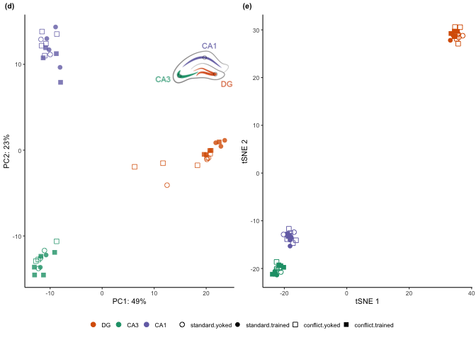
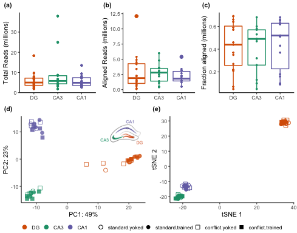

    library(tidyverse)
    library(cowplot) ## for some easy to use themes
    library(DESeq2) ## for gene expression analysis
    library(Rtsne) # for tSNE

    library(BiocParallel)
    register(MulticoreParam(6))

    ## load functions 
    source("figureoptions.R")
    source("functions_RNAseq.R")

    ## set output file for figures 
    knitr::opts_chunk$set(fig.path = '../figures/02_rnaseqQC/', cache= T)

Quality control
===============

MultiQC
-------

    # read meta data for plotting
    colData <- read.csv("../data/00_colData.csv")
    sampletreatment <- colData %>% select(RNAseqID, treatment)  

    # stats from fastqc 
    fastqc <- read.csv(file = "../data/multiqc/multiqc_fastqc.csv")
    fastqc$read <- ifelse(grepl("R1", fastqc$Sample.Name), "R1", "R2")  # make read columns
    fastqc$mouse <- sapply(strsplit(as.character(fastqc$Sample.Name),"\\_"), "[", 1)
    fastqc$subfield <- sapply(strsplit(as.character(fastqc$Sample.Name),"\\_"), "[", 2)
    fastqc$section <- sapply(strsplit(as.character(fastqc$Sample.Name),"\\_"), "[", 3)
    fastqc$RNAseqID <- paste(fastqc$mouse, fastqc$subfield, fastqc$section, sep = "-")
    fastqc <- left_join(sampletreatment,fastqc) %>% 
      select(RNAseqID, treatment, subfield, read, QualityFiltered, Dups, GC, Length, MillionReads)  %>% 
      filter(QualityFiltered == "No")

    ## Joining, by = "RNAseqID"

    ## Warning: Column `RNAseqID` joining factor and character vector, coercing
    ## into character vector

    fastqc$treatment <- factor(fastqc$treatment, levels = levelstreatment)
    fastqc$subfield <- factor(fastqc$subfield, levels = levelssubfield)
    head(fastqc)

    ##     RNAseqID        treatment subfield read QualityFiltered Dups   GC
    ## 1 143A-CA3-1 conflict.trained      CA3   R1              No 0.81 0.49
    ## 2 143A-CA3-1 conflict.trained      CA3   R2              No 0.71 0.48
    ## 3  143A-DG-1 conflict.trained       DG   R1              No 0.72 0.50
    ## 4  143A-DG-1 conflict.trained       DG   R2              No 0.63 0.49
    ## 5 143B-CA1-1   conflict.yoked      CA1   R1              No 0.71 0.48
    ## 6 143B-CA1-1   conflict.yoked      CA1   R2              No 0.62 0.48
    ##   Length MillionReads
    ## 1    150          5.8
    ## 2    150          5.8
    ## 3    150          7.9
    ## 4    150          7.9
    ## 5    150          2.9
    ## 6    150          2.9

    # stats from kallisto
    kallisto <- read.csv(file = "../data/multiqc/multiqc_kallisto.csv")
    kallisto$mouse <- sapply(strsplit(as.character(kallisto$sample),"\\_"), "[", 1)
    kallisto$subfield <- sapply(strsplit(as.character(kallisto$sample),"\\_"), "[", 2)
    kallisto$section <- sapply(strsplit(as.character(kallisto$sample),"\\_"), "[", 3)
    kallisto$RNAseqID <- paste(kallisto$mouse, kallisto$subfield, kallisto$section, sep = "-")
    kallisto <- left_join(sampletreatment,kallisto) %>% 
      select(RNAseqID, treatment, subfield, QC, bp, fracalign, millalign) %>% 
      filter(QC == "raw")

    ## Joining, by = "RNAseqID"

    ## Warning: Column `RNAseqID` joining factor and character vector, coercing
    ## into character vector

    kallisto$treatment <- factor(kallisto$treatment, levels = levelstreatment)
    kallisto$subfield <- factor(kallisto$subfield, levels = levelssubfield)
    head(kallisto)

    ##     RNAseqID        treatment subfield  QC    bp fracalign millalign
    ## 1 143A-CA3-1 conflict.trained      CA3 raw 201.1      0.60       3.5
    ## 2  143A-DG-1 conflict.trained       DG raw 198.9      0.69       5.4
    ## 3 143B-CA1-1   conflict.yoked      CA1 raw 200.6      0.62       1.8
    ## 4  143B-DG-1   conflict.yoked       DG raw 200.0      0.57       2.2
    ## 5 143C-CA1-1 standard.trained      CA1 raw 198.4      0.66       2.3
    ## 6 143D-CA1-3   standard.yoked      CA1 raw 197.0      0.37       1.2

    multiqc <- left_join(fastqc, kallisto) 

    ## Joining, by = c("RNAseqID", "treatment", "subfield")

    summary(multiqc)

    ##    RNAseqID                    treatment  subfield     read          
    ##  Length:88          standard.yoked  :18   DG :32   Length:88         
    ##  Class :character   standard.trained:18   CA3:26   Class :character  
    ##  Mode  :character   conflict.yoked  :24   CA1:30   Mode  :character  
    ##                     conflict.trained:28                              
    ##                                                                      
    ##                                                                      
    ##  QualityFiltered      Dups              GC             Length   
    ##  No :88          Min.   :0.4700   Min.   :0.4400   Min.   :150  
    ##  Yes: 0          1st Qu.:0.6400   1st Qu.:0.4700   1st Qu.:150  
    ##                  Median :0.7300   Median :0.4800   Median :150  
    ##                  Mean   :0.7326   Mean   :0.4782   Mean   :150  
    ##                  3rd Qu.:0.8400   3rd Qu.:0.4900   3rd Qu.:150  
    ##                  Max.   :0.9600   Max.   :0.5400   Max.   :150  
    ##   MillionReads             QC           bp          fracalign    
    ##  Min.   : 1.800   filtertrim: 0   Min.   :161.4   Min.   :0.050  
    ##  1st Qu.: 3.750   raw       :88   1st Qu.:196.7   1st Qu.:0.250  
    ##  Median : 5.250                   Median :198.9   Median :0.480  
    ##  Mean   : 6.900                   Mean   :198.6   Mean   :0.428  
    ##  3rd Qu.: 7.425                   3rd Qu.:201.3   3rd Qu.:0.620  
    ##  Max.   :37.900                   Max.   :214.8   Max.   :0.690  
    ##    millalign     
    ##  Min.   : 0.100  
    ##  1st Qu.: 1.275  
    ##  Median : 2.200  
    ##  Mean   : 2.584  
    ##  3rd Qu.: 3.400  
    ##  Max.   :12.100

    mean(multiqc$MillionReads)

    ## [1] 6.9

    sd(multiqc$MillionReads)

    ## [1] 6.345059

    mean(multiqc$millalign)

    ## [1] 2.584091

    sd(multiqc$millalign)

    ## [1] 2.102647

    mean(multiqc$fracalign)

    ## [1] 0.4279545

    sd(multiqc$fracalign)

    ## [1] 0.2093842

    summary(aov(MillionReads ~ treatment, multiqc))

    ##             Df Sum Sq Mean Sq F value Pr(>F)
    ## treatment    3    179   59.55   1.505  0.219
    ## Residuals   84   3324   39.57

    summary(aov(millalign ~ treatment, multiqc))

    ##             Df Sum Sq Mean Sq F value Pr(>F)  
    ## treatment    3   31.8    10.6   2.524 0.0631 .
    ## Residuals   84  352.8     4.2                 
    ## ---
    ## Signif. codes:  0 '***' 0.001 '**' 0.01 '*' 0.05 '.' 0.1 ' ' 1

    summary(aov(fracalign ~ treatment, multiqc))

    ##             Df Sum Sq Mean Sq F value Pr(>F)  
    ## treatment    3  0.300 0.10003   2.391 0.0744 .
    ## Residuals   84  3.514 0.04183                 
    ## ---
    ## Signif. codes:  0 '***' 0.001 '**' 0.01 '*' 0.05 '.' 0.1 ' ' 1

    a <- ggplot(multiqc, aes(x = subfield, y = MillionReads, color = subfield)) +
      geom_boxplot(outlier.size = 0.75) + geom_point(size = 0.75) +
      scale_color_manual(values = colorvalsubfield) +  
      #facet_wrap(~subfield, nrow = 3) +
      labs(y = "Total Reads (millions)", x = NULL, subtitle = " ") +
      theme_ms() + theme(legend.position = "none")

    b <- ggplot(multiqc, aes(x = subfield, y = millalign, color = subfield)) +
      geom_boxplot() + geom_point(size = 0.5) +
      scale_color_manual(values = colorvalsubfield) +  
      labs(y = "Aligned Reads (millions)", x = NULL, subtitle = " ") +
      theme_ms() + theme(legend.position = "none")

    c <- ggplot(multiqc, aes(x = subfield, y = fracalign, color = subfield)) +
             geom_boxplot() + geom_point(size = 0.5) +
      scale_color_manual(values = colorvalsubfield) +  
      labs(y = "Fraction aligned (millions)", x = NULL, subtitle = " ") +
      theme_ms() + theme(legend.position = "none")

    multiqcplots <- plot_grid( a, b , c , 
              labels = c( "(a)", "(b)", "(c)"),
              label_size = 8, nrow = 1)
    multiqcplots

    summary(aov(MillionReads ~ subfield, multiqc))

    ##             Df Sum Sq Mean Sq F value Pr(>F)  
    ## subfield     2    228  113.78   2.953 0.0576 .
    ## Residuals   85   3275   38.53                 
    ## ---
    ## Signif. codes:  0 '***' 0.001 '**' 0.01 '*' 0.05 '.' 0.1 ' ' 1

    summary(aov(millalign ~ subfield, multiqc))

    ##             Df Sum Sq Mean Sq F value Pr(>F)
    ## subfield     2    8.1   4.034   0.911  0.406
    ## Residuals   85  376.6   4.430

    summary(aov(fracalign ~ subfield, multiqc))

    ##             Df Sum Sq Mean Sq F value Pr(>F)
    ## subfield     2  0.039 0.01943   0.438  0.647
    ## Residuals   85  3.775 0.04442

DESeq2
------

The two two catagorical variables are

-   Hippocampal subfield: DG, CA3, CA1
-   Treatment: standard yoked, standard trained, conflict yoked,
    conflict trained

<!-- -->

    colData <- read.csv("../data/00_colData.csv", header = T)
    countData <- read.csv("../data/00_countData.csv", header = T, check.names = F, row.names = 1)
    colData %>% select(treatment, subfield)  %>%  summary()

    ##             treatment  subfield
    ##  conflict.trained:14   CA1:15  
    ##  conflict.yoked  :12   CA3:13  
    ##  standard.trained: 9   DG :16  
    ##  standard.yoked  : 9

    dds <- DESeqDataSetFromMatrix(countData = countData,
                                  colData = colData,
                                  design = ~ subfield * treatment )

    dds$subfield <- factor(dds$subfield, levels=c("DG","CA3", "CA1")) ## specify the factor levels

    dds$treatment <- factor(dds$treatment, levels=c("standard.yoked" ,"standard.trained", "conflict.yoked", "conflict.trained")) ## specify the factor levels

    dds # view the DESeq object - note numnber of genes

    ## class: DESeqDataSet 
    ## dim: 22485 44 
    ## metadata(1): version
    ## assays(1): counts
    ## rownames(22485): 0610007P14Rik 0610009B22Rik ... Zzef1 Zzz3
    ## rowData names(0):
    ## colnames(44): 143A-CA3-1 143A-DG-1 ... 148B-CA3-4 148B-DG-4
    ## colData names(5): RNAseqID ID subfield treatment training

    dds <- dds[ rowSums(counts(dds)) > 10, ]  # Pre-filtering genes
    dds # view number of genes afternormalization and the number of samples

    ## class: DESeqDataSet 
    ## dim: 16616 44 
    ## metadata(1): version
    ## assays(1): counts
    ## rownames(16616): 0610007P14Rik 0610009B22Rik ... Zzef1 Zzz3
    ## rowData names(0):
    ## colnames(44): 143A-CA3-1 143A-DG-1 ... 148B-CA3-4 148B-DG-4
    ## colData names(5): RNAseqID ID subfield treatment training

    dds <- DESeq(dds, parallel = TRUE) # Differential expression analysis
    #rld <- rlog(dds, blind=FALSE) ## log transformed data
    vsd <- vst(dds, blind=FALSE) ## variance stabilized
    head(assay(vsd),3)

    ##               143A-CA3-1 143A-DG-1 143B-CA1-1 143B-DG-1 143C-CA1-1
    ## 0610007P14Rik   6.808251  6.668454   7.024113  6.694369   6.554406
    ## 0610009B22Rik   6.178959  6.123766   6.400739  6.017979   6.232975
    ## 0610009L18Rik   5.734496  5.786087   6.104311  5.955899   5.688810
    ##               143D-CA1-3 143D-DG-3 144A-CA1-2 144A-CA3-2 144A-DG-2
    ## 0610007P14Rik   6.807051  7.087486   6.817352   7.388850  6.787693
    ## 0610009B22Rik   5.422896  5.690676   6.297021   6.763118  5.895804
    ## 0610009L18Rik   5.422896  5.801054   5.906760   6.437132  5.422896
    ##               144B-CA1-1 144B-CA3-1 144C-CA1-2 144C-CA3-2 144C-DG-2
    ## 0610007P14Rik   6.856466   6.998749   6.613775   6.772989  6.687065
    ## 0610009B22Rik   6.075785   6.262671   6.016429   6.678908  6.160550
    ## 0610009L18Rik   5.598772   5.987081   5.640948   5.949087  5.877667
    ##               144D-CA3-2 144D-DG-2 145A-CA1-2 145A-CA3-2 145A-DG-2
    ## 0610007P14Rik   6.648731  6.907274   6.874057   6.559847   6.84102
    ## 0610009B22Rik   6.110834  6.025730   6.200666   6.662371   6.27299
    ## 0610009L18Rik   5.996939  5.877533   6.019879   5.422896   5.65315
    ##               145B-CA1-1 145B-DG-1 146A-CA1-2 146A-CA3-2 146A-DG-2
    ## 0610007P14Rik   6.823920  6.443947   6.558629   7.040970  6.600217
    ## 0610009B22Rik   6.203366  6.135034   6.249608   5.967787  6.036409
    ## 0610009L18Rik   5.775328  5.422896   6.030436   5.967787  6.036409
    ##               146B-CA1-2 146B-CA3-2 146B-DG-2 146C-CA1-4 146C-DG-4
    ## 0610007P14Rik   6.404439   6.514077  6.336254   6.879112  7.177891
    ## 0610009B22Rik   6.096523   6.660123  6.336254   6.069351  6.379364
    ## 0610009L18Rik   5.422896   5.697560  5.422896   6.154200  5.422896
    ##               146D-CA1-3 146D-CA3-3 146D-DG-3 147C-CA1-3 147C-CA3-3
    ## 0610007P14Rik   6.945981   6.903613  7.654305   6.705502   6.940845
    ## 0610009B22Rik   6.244605   6.208354  5.422896   6.075140   6.096355
    ## 0610009L18Rik   5.422896   5.859914  5.422896   5.648295   5.833026
    ##               147C-DG-3 147D-CA3-1 147D-DG-1 148A-CA1-3 148A-CA3-3
    ## 0610007P14Rik  6.590743   6.594036  6.763024   6.781988   6.695079
    ## 0610009B22Rik  6.239520   6.277406  6.227316   6.339476   6.278186
    ## 0610009L18Rik  5.652181   5.827799  6.068431   5.906018   5.889562
    ##               148A-DG-3 148B-CA1-4 148B-CA3-4 148B-DG-4
    ## 0610007P14Rik  6.770632   6.623311   7.052911  6.640997
    ## 0610009B22Rik  5.950604   5.422896   6.444857  5.864737
    ## 0610009L18Rik  5.875464   5.422896   5.936087  5.735933

### Summary DEGs

This first function shows the total number of up and down regulated
genes and the top 3 most significant genes.

    res_summary(c("subfield", "CA1", "DG"))

    ## [1] "subfield" "CA1"      "DG"      
    ## [1] 2758
    ## 
    ## out of 16616 with nonzero total read count
    ## adjusted p-value < 0.1
    ## LFC > 0 (up)       : 1218, 7.3%
    ## LFC < 0 (down)     : 1540, 9.3%
    ## outliers [1]       : 8, 0.048%
    ## low counts [2]     : 3862, 23%
    ## (mean count < 4)
    ## [1] see 'cooksCutoff' argument of ?results
    ## [2] see 'independentFiltering' argument of ?results
    ## 
    ## NULL
    ## log2 fold change (MLE): subfield CA1 vs DG 
    ## Wald test p-value: subfield CA1 vs DG 
    ## DataFrame with 5 rows and 6 columns
    ##                 baseMean   log2FoldChange             lfcSE
    ##                <numeric>        <numeric>         <numeric>
    ## Pou3f1  219.411952155873 5.98788009889165 0.528568810614782
    ## Prkcg   1597.44305102598  2.9761934790783 0.284820273929176
    ## Wfs1    558.096580361287 6.41720721777274 0.633476148881825
    ## Synj2   114.149797568097 6.05486578155595 0.603057509394192
    ## St8sia5 68.4953636213458 6.85807868916434 0.695976709179171
    ##                     stat               pvalue                 padj
    ##                <numeric>            <numeric>            <numeric>
    ## Pou3f1  11.3284779174297 9.48384542208621e-30 1.20881093749911e-25
    ## Prkcg   10.4493736980899 1.47496016103396e-25 9.39992110626944e-22
    ## Wfs1    10.1301481185993 4.06033915010985e-24 1.72510276024334e-20
    ## Synj2   10.0402792225213 1.01386753382125e-23 3.23068889652142e-20
    ## St8sia5 9.85389108387362 6.59405493643299e-23  1.6809564843955e-19

    res_summary(c("subfield", "CA1", "CA3"))

    ## [1] "subfield" "CA1"      "CA3"     
    ## [1] 2194
    ## 
    ## out of 16616 with nonzero total read count
    ## adjusted p-value < 0.1
    ## LFC > 0 (up)       : 883, 5.3%
    ## LFC < 0 (down)     : 1311, 7.9%
    ## outliers [1]       : 8, 0.048%
    ## low counts [2]     : 3862, 23%
    ## (mean count < 4)
    ## [1] see 'cooksCutoff' argument of ?results
    ## [2] see 'independentFiltering' argument of ?results
    ## 
    ## NULL
    ## log2 fold change (MLE): subfield CA1 vs CA3 
    ## Wald test p-value: subfield CA1 vs CA3 
    ## DataFrame with 5 rows and 6 columns
    ##                baseMean    log2FoldChange             lfcSE
    ##               <numeric>         <numeric>         <numeric>
    ## Doc2b  349.417572153451  7.18163078046263 0.485175860022053
    ## Itpka  710.071023144903  3.09537626053932 0.232412904994157
    ## Pou3f1 219.411952155873  6.52771263750239 0.548075434712134
    ## C1ql3  285.386723855134  6.43326260235465 0.608565960656959
    ## Syn2   1094.47006534942 -2.23246608566971 0.211367267709644
    ##                     stat               pvalue                 padj
    ##                <numeric>            <numeric>            <numeric>
    ## Doc2b   14.8021189268077 1.41939733979291e-49 1.80916384930004e-45
    ## Itpka   13.3184353967657 1.80858035356843e-40 1.15260825932916e-36
    ## Pou3f1  11.9102448751985 1.04669418662442e-32 4.44705470090497e-29
    ## C1ql3   10.5711837635641 4.05345467043229e-26 1.13929204352734e-22
    ## Syn2   -10.5620236750019 4.46921404176739e-26 1.13929204352734e-22

    res_summary(c("subfield", "CA3", "DG"))

    ## [1] "subfield" "CA3"      "DG"      
    ## [1] 2948
    ## 
    ## out of 16616 with nonzero total read count
    ## adjusted p-value < 0.1
    ## LFC > 0 (up)       : 1571, 9.5%
    ## LFC < 0 (down)     : 1377, 8.3%
    ## outliers [1]       : 8, 0.048%
    ## low counts [2]     : 2578, 16%
    ## (mean count < 2)
    ## [1] see 'cooksCutoff' argument of ?results
    ## [2] see 'independentFiltering' argument of ?results
    ## 
    ## NULL
    ## log2 fold change (MLE): subfield CA3 vs DG 
    ## Wald test p-value: subfield CA3 vs DG 
    ## DataFrame with 5 rows and 6 columns
    ##                 baseMean    log2FoldChange             lfcSE
    ##                <numeric>         <numeric>         <numeric>
    ## Fam163b 628.819601522936 -5.70014209318505 0.335658160648348
    ## Doc2b   349.417572153451 -7.02236367815067 0.443183025923195
    ## C1ql3   285.386723855134 -8.02899823540252 0.547299263988565
    ## Pter    159.610534988909 -8.21122640398272 0.656377536292389
    ## Cpe     3054.96826641212  2.95869521597912 0.240210438784262
    ##                      stat               pvalue                 padj
    ##                 <numeric>            <numeric>            <numeric>
    ## Fam163b -16.9819857267132 1.11643868551516e-64 1.56636347577777e-60
    ## Doc2b   -15.8452902466704 1.51519787753542e-56  1.0629113110911e-52
    ## C1ql3   -14.6702156638937   1.000266306889e-48 4.67791209521755e-45
    ## Pter    -12.5099138071736  6.5895691422954e-36 2.31129137666011e-32
    ## Cpe      12.3170967546351 7.32853880958643e-35 2.05638798996995e-31

    res_summary(c("treatment", "standard.trained", "standard.yoked"))

    ## [1] "treatment"        "standard.trained" "standard.yoked"  
    ## [1] 113
    ## 
    ## out of 16616 with nonzero total read count
    ## adjusted p-value < 0.1
    ## LFC > 0 (up)       : 105, 0.63%
    ## LFC < 0 (down)     : 8, 0.048%
    ## outliers [1]       : 8, 0.048%
    ## low counts [2]     : 3540, 21%
    ## (mean count < 3)
    ## [1] see 'cooksCutoff' argument of ?results
    ## [2] see 'independentFiltering' argument of ?results
    ## 
    ## NULL
    ## log2 fold change (MLE): treatment standard.trained vs standard.yoked 
    ## Wald test p-value: treatment standard.trained vs standard.yoked 
    ## DataFrame with 5 rows and 6 columns
    ##               baseMean   log2FoldChange             lfcSE             stat
    ##              <numeric>        <numeric>         <numeric>        <numeric>
    ## Plk2  690.892982346694 2.33683799910871 0.286976491912739  8.1429596673001
    ## Frmd6 115.436102973485 3.28459462100619 0.459910965436156  7.1418054098607
    ## Sgk1  243.126788527358 2.51888168720334 0.352396323432317 7.14786596712928
    ## Smad7 101.648353958591 3.55559834012079 0.497176666572182 7.15157926584749
    ## Arc   865.501371190336 2.88376455109463 0.419805445423535 6.86928810126617
    ##                     pvalue                 padj
    ##                  <numeric>            <numeric>
    ## Plk2  3.85730784294159e-16 5.04072988915607e-12
    ## Frmd6 9.21129396056559e-13 3.00932973691678e-09
    ## Sgk1  8.81373044949851e-13 3.00932973691678e-09
    ## Smad7 8.57851602848107e-13 3.00932973691678e-09
    ## Arc   6.45230809755488e-12 1.68637524437694e-08

    res_summary(c("treatment", "conflict.trained", "conflict.yoked"))

    ## [1] "treatment"        "conflict.trained" "conflict.yoked"  
    ## [1] 62
    ## 
    ## out of 16616 with nonzero total read count
    ## adjusted p-value < 0.1
    ## LFC > 0 (up)       : 17, 0.1%
    ## LFC < 0 (down)     : 45, 0.27%
    ## outliers [1]       : 8, 0.048%
    ## low counts [2]     : 5792, 35%
    ## (mean count < 11)
    ## [1] see 'cooksCutoff' argument of ?results
    ## [2] see 'independentFiltering' argument of ?results
    ## 
    ## NULL
    ## log2 fold change (MLE): treatment conflict.trained vs conflict.yoked 
    ## Wald test p-value: treatment conflict.trained vs conflict.yoked 
    ## DataFrame with 5 rows and 6 columns
    ##                 baseMean    log2FoldChange             lfcSE
    ##                <numeric>         <numeric>         <numeric>
    ## Camk1g  40.6858606603921  -3.4036832014124 0.620531545521771
    ## Insm1   21.1075753227574 -4.60164354700641 0.836778143186136
    ## Kcnc2   144.358588449054 -2.52222804444383 0.470751572328016
    ## Neurod6 331.806267643941 -3.56020520569808 0.703632664264455
    ## Sv2b    568.239350545566 -3.75707558827698 0.743875755350764
    ##                      stat               pvalue                 padj
    ##                 <numeric>            <numeric>            <numeric>
    ## Camk1g  -5.48510905847732 4.13214414189454e-08 0.000223466355193657
    ## Insm1    -5.4992396544741 3.81432426159708e-08 0.000223466355193657
    ## Kcnc2   -5.35787492322248 8.42064995263684e-08 0.000303592499625734
    ## Neurod6 -5.05974976221399  4.1980705346974e-07 0.000952346104744044
    ## Sv2b    -5.05067622012413  4.4024875404218e-07 0.000952346104744044

    res_summary(c("treatment", "conflict.trained", "standard.trained"))

    ## [1] "treatment"        "conflict.trained" "standard.trained"
    ## [1] 0
    ## 
    ## out of 16616 with nonzero total read count
    ## adjusted p-value < 0.1
    ## LFC > 0 (up)       : 0, 0%
    ## LFC < 0 (down)     : 0, 0%
    ## outliers [1]       : 8, 0.048%
    ## low counts [2]     : 0, 0%
    ## (mean count < 0)
    ## [1] see 'cooksCutoff' argument of ?results
    ## [2] see 'independentFiltering' argument of ?results
    ## 
    ## NULL
    ## log2 fold change (MLE): treatment conflict.trained vs standard.trained 
    ## Wald test p-value: treatment conflict.trained vs standard.trained 
    ## DataFrame with 5 rows and 6 columns
    ##                       baseMean     log2FoldChange             lfcSE
    ##                      <numeric>          <numeric>         <numeric>
    ## 0610007P14Rik 43.5653432205546 -0.134646170268329  0.38168039316832
    ## 0610009B22Rik  13.157668511865 -0.748229791549295 0.661810472037447
    ## 0610009L18Rik 3.86186075059207  0.565699645231504  1.23947586606833
    ## 0610009O20Rik 48.2470462620772  0.262898864098434 0.403257260619087
    ## 0610010F05Rik 64.5504551982064 -0.361991005972118 0.332690746410501
    ##                             stat            pvalue      padj
    ##                        <numeric>         <numeric> <numeric>
    ## 0610007P14Rik -0.352772038276931 0.724259347972591         1
    ## 0610009B22Rik  -1.13058016329932 0.258231840560031         1
    ## 0610009L18Rik  0.456402307392983 0.648100706814437         1
    ## 0610009O20Rik  0.651938327644311 0.514440958296272         1
    ## 0610010F05Rik  -1.08807055765075 0.276563960208625         1

    res_summary(c("treatment", "conflict.yoked", "standard.yoked"))

    ## [1] "treatment"      "conflict.yoked" "standard.yoked"
    ## [1] 40
    ## 
    ## out of 16616 with nonzero total read count
    ## adjusted p-value < 0.1
    ## LFC > 0 (up)       : 38, 0.23%
    ## LFC < 0 (down)     : 2, 0.012%
    ## outliers [1]       : 8, 0.048%
    ## low counts [2]     : 1289, 7.8%
    ## (mean count < 1)
    ## [1] see 'cooksCutoff' argument of ?results
    ## [2] see 'independentFiltering' argument of ?results
    ## 
    ## NULL
    ## log2 fold change (MLE): treatment conflict.yoked vs standard.yoked 
    ## Wald test p-value: treatment conflict.yoked vs standard.yoked 
    ## DataFrame with 5 rows and 6 columns
    ##                 baseMean   log2FoldChange             lfcSE
    ##                <numeric>        <numeric>         <numeric>
    ## Kcnc2   144.358588449054 3.80133917239381 0.556346288495724
    ## St8sia5 68.4953636213458 3.78861086700251 0.673922518191313
    ## Gm2115  249.257751832989 3.48213722650287 0.658706293164929
    ## Cnr1    350.970175675373 3.92670174540614 0.762127039058242
    ## Dner    169.806900335675 1.75375363859233 0.352554314089203
    ##                     stat               pvalue                 padj
    ##                <numeric>            <numeric>            <numeric>
    ## Kcnc2   6.83268541733612 8.33395813827394e-12 1.27667904720218e-07
    ## St8sia5 5.62173063629103 1.89053883771394e-08 0.000144805822274699
    ## Gm2115  5.28632755240886 1.24796350258567e-07 0.000637251763203661
    ## Cnr1    5.15229291727841 2.57320693829974e-07 0.000985473927195342
    ## Dner     4.9744211558523 6.54428926948817e-07  0.00200503934638578

Principle component analysis
----------------------------

    # create the dataframe using my function pcadataframe
    pcadata <- pcadataframe(vsd, intgroup=c("subfield","treatment"), returnData=TRUE)
    percentVar <- round(100 * attr(pcadata, "percentVar"))
    pcadata$subfieldAPA <- as.factor(paste(pcadata$subfield, pcadata$treatment, sep="_"))
    pcadata$subfield <- factor(pcadata$subfield, levels=c("DG","CA3", "CA1"))
    pcadata$treatment <- factor(pcadata$treatment, levels=c("standard.yoked","standard.trained",  "conflict.yoked","conflict.trained"))

    levels(pcadata$treatment) <- c("standard yoked","standard trained",  "conflict yoked", "conflict trained")

    summary(aov(PC1 ~ subfield * treatment, data=pcadata)) 

    ##                    Df Sum Sq Mean Sq F value Pr(>F)    
    ## subfield            2   8985    4493 648.658 <2e-16 ***
    ## treatment           3     70      23   3.345 0.0312 *  
    ## subfield:treatment  6     86      14   2.059 0.0862 .  
    ## Residuals          32    222       7                   
    ## ---
    ## Signif. codes:  0 '***' 0.001 '**' 0.01 '*' 0.05 '.' 0.1 ' ' 1

    TukeyHSD((aov(PC1 ~ subfield, data=pcadata)), which = "subfield") 

    ##   Tukey multiple comparisons of means
    ##     95% family-wise confidence level
    ## 
    ## Fit: aov(formula = PC1 ~ subfield, data = pcadata)
    ## 
    ## $subfield
    ##               diff        lwr        upr     p adj
    ## CA3-DG  -30.416493 -33.168694 -27.664291 0.0000000
    ## CA1-DG  -29.051106 -31.700143 -26.402068 0.0000000
    ## CA1-CA3   1.365387  -1.427636   4.158411 0.4665421

    summary(aov(PC2 ~ subfield * treatment, data=pcadata)) 

    ##                    Df Sum Sq Mean Sq  F value Pr(>F)    
    ## subfield            2   4260  2130.0 1338.086 <2e-16 ***
    ## treatment           3      8     2.6    1.614 0.2055    
    ## subfield:treatment  6     22     3.7    2.299 0.0586 .  
    ## Residuals          32     51     1.6                    
    ## ---
    ## Signif. codes:  0 '***' 0.001 '**' 0.01 '*' 0.05 '.' 0.1 ' ' 1

    TukeyHSD((aov(PC2 ~ subfield, data=pcadata)), which = "subfield") 

    ##   Tukey multiple comparisons of means
    ##     95% family-wise confidence level
    ## 
    ## Fit: aov(formula = PC2 ~ subfield, data = pcadata)
    ## 
    ## $subfield
    ##              diff       lwr       upr p adj
    ## CA3-DG  -12.22169 -13.49481 -10.94857     0
    ## CA1-DG   12.48060  11.25520  13.70600     0
    ## CA1-CA3  24.70229  23.41029  25.99430     0

    subfields <- png::readPNG("../figures/00_schematics/figure_hippocampus.png")
    subfields <-  grid::rasterGrob(subfields, interpolate=TRUE)

    PCA12 <- ggplot(pcadata, aes(pcadata$PC1, pcadata$PC2, colour=subfield)) +
        geom_point(size=2, aes(shape=treatment), alpha = 0.8) +
        xlab(paste0("PC1: ", percentVar[1],"%")) +
        ylab(paste0("PC2: ", percentVar[2],"%")) +
        scale_colour_manual(values=c(colorvalsubfield))+ 
       theme_ms()  +
          theme(legend.position= "none") +
        scale_shape_manual(values=c(1, 16, 0, 15), aes(color=colorvalsubfield)) +
      labs(color = "subfield", shape = "treatment", subtitle = " ") +
      guides(color = FALSE) + 
      annotation_custom(subfields, ymin = 5, ymax = 15, xmin = 10) 
    PCA12

tSNE
----

    vsddf <- as.data.frame(assay(vsd))
    vsddf <- as.data.frame(t(vsddf))

    euclidist <- dist(vsddf) # euclidean distances between the rows

    mytsneplot <- plot_tSNE(10, " ")

    ## [1] 10

    mytsneplot + theme(legend.position = "none",
                       axis.text = element_text(size = 8)) 

pca + tsne
----------

    mylegend <- get_legend(mytsneplot)
    top <- plot_grid(PCA12, mytsneplot + theme(legend.position = "none"), nrow = 1,
              labels = c( "(d)", "(e)"),
              label_size = 8)
    PCAtSNE <- plot_grid(top, mylegend, nrow = 2, rel_heights = c(1,0.1))
    PCAtSNE

    # 3 box plots, 1 pca plot, 1 tsne plot with hippocampus image
    supplfig1 <- plot_grid(multiqcplots, PCAtSNE, nrow = 2, rel_heights = c(1,1.25))
    supplfig1

    pdf(file="../figures/supplfig1.pdf", width=5.1, height=4)
    plot(supplfig1)
    dev.off()

    ## quartz_off_screen 
    ##                 2

    write.csv(assay(vsd), file = "../data/02_vsd.csv", row.names = T)

Session Info
------------

    sessionInfo()

    ## R version 3.6.0 (2019-04-26)
    ## Platform: x86_64-apple-darwin15.6.0 (64-bit)
    ## Running under: macOS  10.15.2
    ## 
    ## Matrix products: default
    ## BLAS:   /Library/Frameworks/R.framework/Versions/3.6/Resources/lib/libRblas.0.dylib
    ## LAPACK: /Library/Frameworks/R.framework/Versions/3.6/Resources/lib/libRlapack.dylib
    ## 
    ## locale:
    ## [1] en_US.UTF-8/en_US.UTF-8/en_US.UTF-8/C/en_US.UTF-8/en_US.UTF-8
    ## 
    ## attached base packages:
    ## [1] parallel  stats4    stats     graphics  grDevices utils     datasets 
    ## [8] methods   base     
    ## 
    ## other attached packages:
    ##  [1] Rtsne_0.15                  DESeq2_1.24.0              
    ##  [3] SummarizedExperiment_1.14.0 DelayedArray_0.10.0        
    ##  [5] BiocParallel_1.18.0         matrixStats_0.54.0         
    ##  [7] Biobase_2.44.0              GenomicRanges_1.36.0       
    ##  [9] GenomeInfoDb_1.20.0         IRanges_2.18.0             
    ## [11] S4Vectors_0.22.0            BiocGenerics_0.30.0        
    ## [13] cowplot_0.9.4               forcats_0.4.0              
    ## [15] stringr_1.4.0               dplyr_0.8.3                
    ## [17] purrr_0.3.3                 readr_1.3.1                
    ## [19] tidyr_1.0.0                 tibble_2.1.3               
    ## [21] ggplot2_3.2.1               tidyverse_1.3.0            
    ## 
    ## loaded via a namespace (and not attached):
    ##  [1] colorspace_1.4-1       htmlTable_1.13.1       XVector_0.24.0        
    ##  [4] base64enc_0.1-3        fs_1.3.1               rstudioapi_0.10       
    ##  [7] bit64_0.9-7            AnnotationDbi_1.46.0   fansi_0.4.1           
    ## [10] lubridate_1.7.4        xml2_1.2.2             codetools_0.2-16      
    ## [13] splines_3.6.0          geneplotter_1.62.0     knitr_1.24            
    ## [16] Formula_1.2-3          jsonlite_1.6.1         broom_0.5.2           
    ## [19] annotate_1.62.0        cluster_2.0.9          dbplyr_1.4.2          
    ## [22] png_0.1-7              compiler_3.6.0         httr_1.4.1            
    ## [25] backports_1.1.5        assertthat_0.2.1       Matrix_1.2-17         
    ## [28] lazyeval_0.2.2         cli_2.0.1              acepack_1.4.1         
    ## [31] htmltools_0.3.6        tools_3.6.0            gtable_0.3.0          
    ## [34] glue_1.3.1             GenomeInfoDbData_1.2.1 Rcpp_1.0.3            
    ## [37] cellranger_1.1.0       vctrs_0.2.2            nlme_3.1-140          
    ## [40] xfun_0.9               rvest_0.3.5            lifecycle_0.1.0       
    ## [43] XML_3.98-1.19          zlibbioc_1.30.0        scales_1.0.0          
    ## [46] hms_0.5.3              RColorBrewer_1.1-2     yaml_2.2.1            
    ## [49] memoise_1.1.0          gridExtra_2.3          rpart_4.1-15          
    ## [52] latticeExtra_0.6-28    stringi_1.4.5          RSQLite_2.1.1         
    ## [55] genefilter_1.66.0      checkmate_1.9.3        rlang_0.4.4           
    ## [58] pkgconfig_2.0.3        bitops_1.0-6           evaluate_0.14         
    ## [61] lattice_0.20-38        labeling_0.3           htmlwidgets_1.3       
    ## [64] bit_1.1-14             tidyselect_0.2.5       magrittr_1.5          
    ## [67] R6_2.4.1               generics_0.0.2         Hmisc_4.2-0           
    ## [70] DBI_1.0.0              pillar_1.4.2           haven_2.2.0           
    ## [73] foreign_0.8-71         withr_2.1.2            survival_2.44-1.1     
    ## [76] RCurl_1.95-4.12        nnet_7.3-12            modelr_0.1.5          
    ## [79] crayon_1.3.4           rmarkdown_1.15         locfit_1.5-9.1        
    ## [82] grid_3.6.0             readxl_1.3.1           data.table_1.12.2     
    ## [85] blob_1.1.1             reprex_0.3.0           digest_0.6.23         
    ## [88] xtable_1.8-4           munsell_0.5.0

    citation("tidyverse") 

    ## 
    ##   Wickham et al., (2019). Welcome to the tidyverse. Journal of
    ##   Open Source Software, 4(43), 1686,
    ##   https://doi.org/10.21105/joss.01686
    ## 
    ## A BibTeX entry for LaTeX users is
    ## 
    ##   @Article{,
    ##     title = {Welcome to the {tidyverse}},
    ##     author = {Hadley Wickham and Mara Averick and Jennifer Bryan and Winston Chang and Lucy D'Agostino McGowan and Romain François and Garrett Grolemund and Alex Hayes and Lionel Henry and Jim Hester and Max Kuhn and Thomas Lin Pedersen and Evan Miller and Stephan Milton Bache and Kirill Müller and Jeroen Ooms and David Robinson and Dana Paige Seidel and Vitalie Spinu and Kohske Takahashi and Davis Vaughan and Claus Wilke and Kara Woo and Hiroaki Yutani},
    ##     year = {2019},
    ##     journal = {Journal of Open Source Software},
    ##     volume = {4},
    ##     number = {43},
    ##     pages = {1686},
    ##     doi = {10.21105/joss.01686},
    ##   }

    citation("cowplot")  

    ## 
    ## To cite package 'cowplot' in publications use:
    ## 
    ##   Claus O. Wilke (2019). cowplot: Streamlined Plot Theme and Plot
    ##   Annotations for 'ggplot2'. R package version 0.9.4.
    ##   https://CRAN.R-project.org/package=cowplot
    ## 
    ## A BibTeX entry for LaTeX users is
    ## 
    ##   @Manual{,
    ##     title = {cowplot: Streamlined Plot Theme and Plot Annotations for 'ggplot2'},
    ##     author = {Claus O. Wilke},
    ##     year = {2019},
    ##     note = {R package version 0.9.4},
    ##     url = {https://CRAN.R-project.org/package=cowplot},
    ##   }

    citation("DESeq2")  

    ## 
    ##   Love, M.I., Huber, W., Anders, S. Moderated estimation of fold
    ##   change and dispersion for RNA-seq data with DESeq2 Genome
    ##   Biology 15(12):550 (2014)
    ## 
    ## A BibTeX entry for LaTeX users is
    ## 
    ##   @Article{,
    ##     title = {Moderated estimation of fold change and dispersion for RNA-seq data with DESeq2},
    ##     author = {Michael I. Love and Wolfgang Huber and Simon Anders},
    ##     year = {2014},
    ##     journal = {Genome Biology},
    ##     doi = {10.1186/s13059-014-0550-8},
    ##     volume = {15},
    ##     issue = {12},
    ##     pages = {550},
    ##   }

    citation("Rtsne")  

    ## 
    ## t-SNE is described in (Van der Maaten & Hinton 2008), while the
    ## Barnes-Hut t-SNE implementation is described in (Van der Maaten
    ## 2014). To cite the Rtsne package specifically, use (Krijthe 2015).
    ## 
    ##   L.J.P. van der Maaten and G.E. Hinton. Visualizing
    ##   High-Dimensional Data Using t-SNE. Journal of Machine Learning
    ##   Research 9(Nov):2579-2605, 2008.
    ## 
    ##   L.J.P. van der Maaten. Accelerating t-SNE using Tree-Based
    ##   Algorithms. Journal of Machine Learning Research
    ##   15(Oct):3221-3245, 2014.
    ## 
    ##   Jesse H. Krijthe (2015). Rtsne: T-Distributed Stochastic
    ##   Neighbor Embedding using a Barnes-Hut Implementation, URL:
    ##   https://github.com/jkrijthe/Rtsne
    ## 
    ## To see these entries in BibTeX format, use 'print(<citation>,
    ## bibtex=TRUE)', 'toBibtex(.)', or set
    ## 'options(citation.bibtex.max=999)'.

    citation("BiocParallel")

    ## 
    ## To cite package 'BiocParallel' in publications use:
    ## 
    ##   Martin Morgan, Valerie Obenchain, Michel Lang, Ryan Thompson and
    ##   Nitesh Turaga (2019). BiocParallel: Bioconductor facilities for
    ##   parallel evaluation. R package version 1.18.0.
    ##   https://github.com/Bioconductor/BiocParallel
    ## 
    ## A BibTeX entry for LaTeX users is
    ## 
    ##   @Manual{,
    ##     title = {BiocParallel: Bioconductor facilities for parallel evaluation},
    ##     author = {Martin Morgan and Valerie Obenchain and Michel Lang and Ryan Thompson and Nitesh Turaga},
    ##     year = {2019},
    ##     note = {R package version 1.18.0},
    ##     url = {https://github.com/Bioconductor/BiocParallel},
    ##   }
