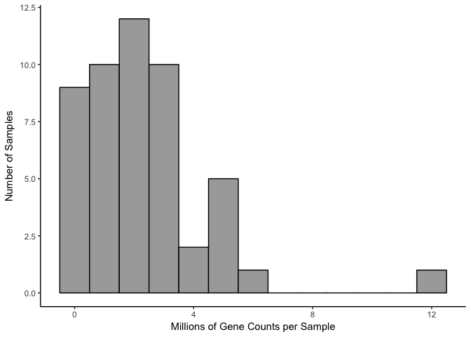

RNAseq gene expression analysis with DESeq2
-------------------------------------------

This workflow was modified from the DESeq2 tutorial found at:
<a href="https://www.bioconductor.org/packages/release/bioc/vignettes/DESeq2/inst/doc/DESeq2.pdf" class="uri">https://www.bioconductor.org/packages/release/bioc/vignettes/DESeq2/inst/doc/DESeq2.pdf</a>

First I load a handful of packages for data wrangling, gene expression
analysis, data visualization, and statistics.

    library(tidyverse) ## for filtering and selecting rows
    library(forcats)  # for renaming factors
    library(DESeq2) ## for gene expression analysis
    library(edgeR)  ## for basic read counts status
    library(magrittr) ## to use the weird pipe
    library(genefilter)  ## for PCA fuction
    library(ggplot2)

    ## Functions
    source("functions_RNAseq.R")

    ## set output file for figures 
    knitr::opts_chunk$set(fig.path = '../figures/02a_makedfs/')

Now, I create data frames from three csv files - count: Contains counts
for all transcripts generated from the program Kallisto. This data can
be reproducibed from the file kallisto.Rmd - geneids: Contains the
ensemble ids and gene names for all the transcripts in the counts data
frame. This file will be used to convert transcipt counts to gene
counts. This file was also created via kallisto.Rmd file - colData: This
file contains all the information I collected for each sample that was
sequenced. Not all columns will be needed, so some are removed later.

I also tidy the trait data for each sample so that I can calculate
differential gene expression for the colData of interest. I also remove
some samples for reasons described within the code blocks.

    # clean col Data
    colData <- read_csv("../data/IntegrativeWT2015ColData.csv")

    ## Parsed with column specification:
    ## cols(
    ##   RNAseqID = col_character(),
    ##   Mouse = col_character(),
    ##   year = col_double(),
    ##   Genotype = col_character(),
    ##   Region = col_character(),
    ##   jobnumber = col_character(),
    ##   Group = col_character(),
    ##   APA = col_character(),
    ##   Conflict = col_character(),
    ##   APA_Conflict = col_character(),
    ##   Treatment = col_character()
    ## )

    colData$APA_Conflict <- factor(colData$APA_Conflict)
    colData <- colData %>%
      mutate(ID = gsub("[[:punct:]]", "", colData$Mouse)) %>%
      filter(APA_Conflict != "NA_NA") %>%
      mutate(subfield = Region) %>%
      mutate(treatment = fct_recode(APA_Conflict,
                                    "standard.yoked" = "Yoked_NoConflict",
                                    "standard.trained" = "Trained_NoConflict",
                                    "conflict.yoked" = "Yoked_Conflict",
                                    "conflict.trained" = "Trained_Conflict")) %>%
      mutate(training = fct_collapse(treatment,
                                          trained = c("standard.trained", "conflict.trained"),
                                          yoked = c("standard.yoked", "conflict.yoked"))) %>%
      select(RNAseqID,ID,subfield, treatment, training) %>%
      arrange(RNAseqID) %>%
      droplevels() 

    # reset levels
    colData$treatment <- factor(colData$treatment, levels = c("standard.yoked", "standard.trained",
                                                              "conflict.yoked", "conflict.trained"))
    colData$training <- factor(colData$training, levels = c("yoked", "trained"))

    # set factors
    colData$subfield <- factor(colData$subfield, levels = c("DG", "CA3", "CA1"))
    colData$treatment <- factor(colData$treatment, levels = c("standard.yoked", "standard.trained",
                                                              "conflict.yoked", "conflict.trained"))
    colData$training <- factor(colData$training, levels = c("yoked", "trained"))

    #view
    head(colData)

    ## # A tibble: 6 x 5
    ##   RNAseqID   ID     subfield treatment        training
    ##   <chr>      <chr>  <fct>    <fct>            <fct>   
    ## 1 143A-CA3-1 15143A CA3      conflict.trained trained 
    ## 2 143A-DG-1  15143A DG       conflict.trained trained 
    ## 3 143B-CA1-1 15143B CA1      conflict.yoked   yoked   
    ## 4 143B-DG-1  15143B DG       conflict.yoked   yoked   
    ## 5 143C-CA1-1 15143C CA1      standard.trained trained 
    ## 6 143D-CA1-3 15143D CA1      standard.yoked   yoked

    colData %>% select(subfield,treatment)  %>%  summary()

    ##  subfield            treatment 
    ##  DG :16   standard.yoked  : 9  
    ##  CA3:13   standard.trained: 9  
    ##  CA1:15   conflict.yoked  :12  
    ##           conflict.trained:14

Now, we are ready to calculate differential gene expression using the
DESeq package. For simplicity, I will use the standard nameing of
“countData” and “colData” for the gene counts and gene information,
respectively.

    countData <- read.csv("../data/00_CountData.csv", row.names=1, check.names=FALSE )
    head(countData[1:5])

    ##               142C_CA1 142C_DG 143A-CA3-1 143A-DG-1 143B-CA1-1
    ## 0610007P14Rik      120      88         85       112         60
    ## 0610009B22Rik       62      27         24        34         21
    ## 0610009L18Rik        0       0          4         9         10
    ## 0610009O20Rik      128     112         85       185         44
    ## 0610010F05Rik      110     132        142       155         54
    ## 0610010K14Rik       21      11         24        74         14

    ## colData and countData must contain the exact same samples. 
    savecols <- as.character(colData$RNAseqID) #select the rowsname 
    savecols <- as.vector(savecols) # make it a vector
    countData <- countData %>% dplyr::select(one_of(savecols)) # select just the columns 

Total Gene Counts Per Sample
----------------------------

this could say something about data before normalization

    totalCounts <- colSums(countData)
    totalCounts

    ## 143A-CA3-1  143A-DG-1 143B-CA1-1  143B-DG-1 143C-CA1-1 143D-CA1-3 
    ##    3327867    5279392    1719498    2085031    2213452    1091672 
    ##  143D-DG-3 144A-CA1-2 144A-CA3-2  144A-DG-2 144B-CA1-1 144B-CA3-1 
    ##    1043885    2980775     421165    3210030    2555909    1027388 
    ## 144C-CA1-2 144C-CA3-2  144C-DG-2 144D-CA3-2  144D-DG-2 145A-CA1-2 
    ##    3298825    1238998    2224182    2323243    4691568    4680960 
    ## 145A-CA3-2  145A-DG-2 145B-CA1-1  145B-DG-1 146A-CA1-2 146A-CA3-2 
    ##     345619    1435833    2020114    1509310    1715282    2756300 
    ##  146A-DG-2 146B-CA1-2 146B-CA3-2  146B-DG-2 146C-CA1-4  146C-DG-4 
    ##    1201333    1063417    2144771     116106    1360004     492145 
    ## 146D-CA1-3 146D-CA3-3  146D-DG-3 147C-CA1-3 147C-CA3-3  147C-DG-3 
    ##     391369    2994536      90417    3072308    5754581    4350647 
    ## 147D-CA3-1  147D-DG-1 148A-CA1-3 148A-CA3-3  148A-DG-3 148B-CA1-4 
    ##    4624995   11700703    5260906    2676397    4019062     337174 
    ## 148B-CA3-4  148B-DG-4 
    ##    3486840     798668

    ### on average 1 million gene counts per sample 
    summary((colSums(countData)/1000000))

    ##     Min.  1st Qu.   Median     Mean  3rd Qu.     Max. 
    ##  0.09042  1.08461  2.17911  2.52574  3.30608 11.70070

    ## stats
    counts <- countData
    dim( counts )

    ## [1] 22485    44

    colSums( counts ) / 1e06  # in millions of reads

    ## 143A-CA3-1  143A-DG-1 143B-CA1-1  143B-DG-1 143C-CA1-1 143D-CA1-3 
    ##   3.327867   5.279392   1.719498   2.085031   2.213452   1.091672 
    ##  143D-DG-3 144A-CA1-2 144A-CA3-2  144A-DG-2 144B-CA1-1 144B-CA3-1 
    ##   1.043885   2.980775   0.421165   3.210030   2.555909   1.027388 
    ## 144C-CA1-2 144C-CA3-2  144C-DG-2 144D-CA3-2  144D-DG-2 145A-CA1-2 
    ##   3.298825   1.238998   2.224182   2.323243   4.691568   4.680960 
    ## 145A-CA3-2  145A-DG-2 145B-CA1-1  145B-DG-1 146A-CA1-2 146A-CA3-2 
    ##   0.345619   1.435833   2.020114   1.509310   1.715282   2.756300 
    ##  146A-DG-2 146B-CA1-2 146B-CA3-2  146B-DG-2 146C-CA1-4  146C-DG-4 
    ##   1.201333   1.063417   2.144771   0.116106   1.360004   0.492145 
    ## 146D-CA1-3 146D-CA3-3  146D-DG-3 147C-CA1-3 147C-CA3-3  147C-DG-3 
    ##   0.391369   2.994536   0.090417   3.072308   5.754581   4.350647 
    ## 147D-CA3-1  147D-DG-1 148A-CA1-3 148A-CA3-3  148A-DG-3 148B-CA1-4 
    ##   4.624995  11.700703   5.260906   2.676397   4.019062   0.337174 
    ## 148B-CA3-4  148B-DG-4 
    ##   3.486840   0.798668

    table( rowSums( counts ) )[ 1:30 ] # Number of genes with low counts

    ## 
    ##    0    1    2    3    4    5    6    7    8    9   10   11   12   13   14 
    ## 4203  353  236  225  168  145  118  119  110  111   81   82   77   75   71 
    ##   15   16   17   18   19   20   21   22   23   24   25   26   27   28   29 
    ##   48   56   65   58   55   55   55   51   48   38   47   48   37   32   26

    rowsum <- as.data.frame(colSums( counts ) / 1e06 )
    names(rowsum)[1] <- "millioncounts"
    rowsum$sample <- row.names(rowsum)

    ggplot(rowsum, aes(x=millioncounts)) + 
      geom_histogram(binwidth = 1, colour = "black", fill = "darkgrey") +
      theme_classic() +
      scale_x_continuous(name = "Millions of Gene Counts per Sample") +
      scale_y_continuous(name = "Number of Samples")

Write the two files
-------------------

    write.csv(colData, file = "../data/02a_colData.csv", row.names = F)
    write.csv(countData, file = "../data/02a_countData.csv", row.names = T)
