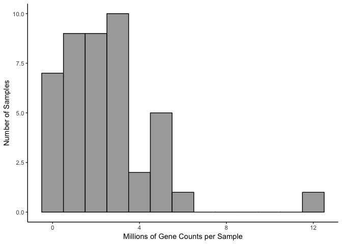

RNAseq gene expression analysis with DESeq2
-------------------------------------------

This workflow was modified from the DESeq2 tutorial found at: <https://www.bioconductor.org/packages/release/bioc/vignettes/DESeq2/inst/doc/DESeq2.pdf>

First I load a handful of packages for data wrangling, gene expression analysis, data visualization, and statistics.

``` r
library(dplyr) ## for filtering and selecting rows
library(plyr) ## for renmaing factors
library(reshape2) ## for melting dataframe
library(DESeq2) ## for gene expression analysis
library(edgeR)  ## for basic read counts status
library(magrittr) ## to use the weird pipe
library(genefilter)  ## for PCA fuction
library(ggplot2)

## Functions
source("functions_RNAseq.R")

## set output file for figures 
knitr::opts_chunk$set(fig.path = '../figures/02_RNAseq/')
```

Now, I create data frames from three csv files - count: Contains counts for all transcripts generated from the program Kallisto. This data can be reproducibed from the file kallisto.Rmd - geneids: Contains the ensemble ids and gene names for all the transcripts in the counts data frame. This file will be used to convert transcipt counts to gene counts. This file was also created via kallisto.Rmd file - colData: This file contains all the information I collected for each sample that was sequenced. Not all columns will be needed, so some are removed later.

``` r
countData <- read.csv("../data/IntegrativeWT2015CountData.csv", row.names=1, check.names=FALSE )
colData <- read.csv("../data/IntegrativeWT2015ColData.csv")
```

In this next section, I tidy the trait data for each sample so that I can calculate differential gene expression for the colData of interest. I also remove some samples for reasons described within the code blocks.

``` r
rownames(colData) <- colData$RNAseqID    # set $genoAPAsessionInd as rownames
colData <- colData[c(1,2,5,7:11)]  #keeping informative volumns

colData <- colData %>% dplyr::filter(!grepl("147-|148-|147D-CA1-1|145B-CA3-1|146C-CA3-4", RNAseqID))  
# remove 100, 100, 147, and 148:  homecage animals
# Remove 147D_CA1_1 and 145B_CA3_1: bad samples with no reads.
# Remove 146C-CA3-4: outlier on all pc analyses
colData$ID <- gsub("[[:punct:]]", "", colData$Mouse) #make a column that thas id without the dash
colData$APA <- NULL ## delete old APA column
names(colData)[names(colData)=="APA_Conflict"] <- "APA3" #rename  APA3 to match color scheme
names(colData)[names(colData)=="Region"] <- "Punch" #rename  region to punch


# rename factors & group all Control animals into 1 group
colData$APA <- colData$APA3 
colData$APA <- revalue(colData$APA, c("Trained_Conflict" = "Conflict")) 
colData$APA <- revalue(colData$APA, c("Trained_NoConflict" = "Consistent")) 
colData$APA <- revalue(colData$APA, c("Yoked_Conflict" = "Control")) 
colData$APA <- revalue(colData$APA, c("Yoked_NoConflict" = "Control")) 

colData$APA2 <- colData$APA3 
colData$APA2 <- revalue(colData$APA2, c("Trained_Conflict" = "conflict")) 
colData$APA2 <- revalue(colData$APA2, c("Trained_NoConflict" = "consistent")) 
colData$APA2 <- revalue(colData$APA2, c("Yoked_Conflict" = "yoked_conflict")) 
colData$APA2 <- revalue(colData$APA2, c("Yoked_NoConflict" = "yoked_consistent")) 

# reorder 
colData <- colData[c(1:5,8:10)]
```

Now, we are ready to calculate differential gene expression using the DESeq package. For simplicity, I will use the standard nameing of "countData" and "colData" for the gene counts and gene information, respectively.

``` r
colData <- colData %>% arrange(RNAseqID) %>% droplevels() #set the coldata to be the countbygene df

## colData and countData must contain the exact same sample. I'll use the next three lines to make that happen
savecols <- as.character(colData$RNAseqID) #select the sample name column that corresponds to row names
savecols <- as.vector(savecols) # make it a vector
countData <- countData %>% dplyr::select(one_of(savecols)) # select just the columns that match the samples in colData

# colData must be factors
cols = c(1:8)
colData[,cols] %<>% lapply(function(x) as.factor(as.character(x)))

# summary data
colData %>% select(APA2,Punch)  %>%  summary()
```

    ##                APA2    Punch   
    ##  conflict        :14   CA1:15  
    ##  consistent      : 9   CA3:13  
    ##  yoked_conflict  :12   DG :16  
    ##  yoked_consistent: 9

``` r
dim(countData)
```

    ## [1] 46403    44

Write the two files
-------------------

``` r
write.csv(colData, file = "../data/02a_colData.csv", row.names = F)
write.csv(countData, file = "../data/02a_countData.csv", row.names = T)
```

Total Gene Counts Per Sample
----------------------------

this could say something about data before normalization

``` r
## stats
counts <- countData
dim( counts )
```

    ## [1] 46403    44

``` r
colSums( counts ) / 1e06  # in millions of reads
```

    ## 143A-CA3-1  143A-DG-1 143B-CA1-1  143B-DG-1 143C-CA1-1 143D-CA1-3 
    ##   3.455931   5.441334   1.787687   2.169653   2.291677   1.177472 
    ##  143D-DG-3 144A-CA1-2 144A-CA3-2  144A-DG-2 144B-CA1-1 144B-CA3-1 
    ##   1.093411   3.098126   0.463472   3.385349   2.670989   1.112497 
    ## 144C-CA1-2 144C-CA3-2  144C-DG-2 144D-CA3-2  144D-DG-2 145A-CA1-2 
    ##   3.402559   1.388250   2.325857   2.454241   4.861641   4.831957 
    ## 145A-CA3-2  145A-DG-2 145B-CA1-1  145B-DG-1 146A-CA1-2 146A-CA3-2 
    ##   0.408159   1.532063   2.106653   1.623534   1.830054   2.894495 
    ##  146A-DG-2 146B-CA1-2 146B-CA3-2  146B-DG-2 146C-CA1-4  146C-DG-4 
    ##   1.338452   1.350364   2.236554   0.224335   1.504069   0.558522 
    ## 146D-CA1-3 146D-CA3-3  146D-DG-3 147C-CA1-3 147C-CA3-3  147C-DG-3 
    ##   0.532562   3.142445   0.140590   3.218978   5.968533   4.535842 
    ## 147D-CA3-1  147D-DG-1 148A-CA1-3 148A-CA3-3  148A-DG-3 148B-CA1-4 
    ##   4.844175  12.100258   5.444371   2.814148   4.249465   0.481284 
    ## 148B-CA3-4  148B-DG-4 
    ##   3.623181   0.845522

``` r
table( rowSums( counts ) )[ 1:30 ] # Number of genes with low counts
```

    ## 
    ##     0     1     2     3     4     5     6     7     8     9    10    11 
    ## 16674  1655  1020   829   646   570   424   407   333   329   280   274 
    ##    12    13    14    15    16    17    18    19    20    21    22    23 
    ##   241   213   214   206   196   192   174   153   170   141   153   145 
    ##    24    25    26    27    28    29 
    ##   134   127   135   108   103   106

``` r
rowsum <- as.data.frame(colSums( counts ) / 1e06 )
names(rowsum)[1] <- "millioncounts"
rowsum$sample <- row.names(rowsum)

ggplot(rowsum, aes(x=millioncounts)) + 
  geom_histogram(binwidth = 1, colour = "black", fill = "darkgrey") +
  theme_classic() +
  scale_x_continuous(name = "Millions of Gene Counts per Sample",
                     breaks = seq(0, 8, 1),
                     limits=c(0, 8)) +
  scale_y_continuous(name = "Number of Samples")
```

    ## Warning: Removed 1 rows containing non-finite values (stat_bin).


