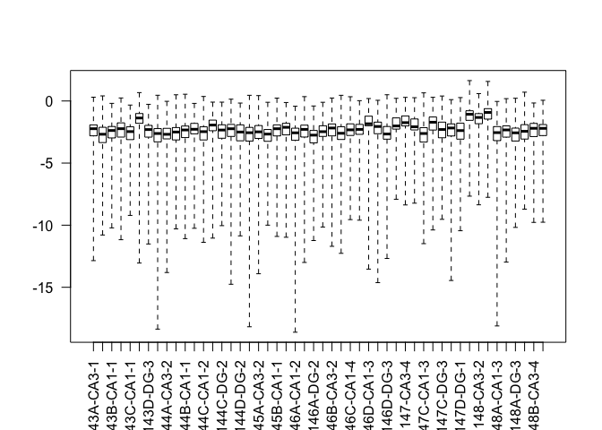
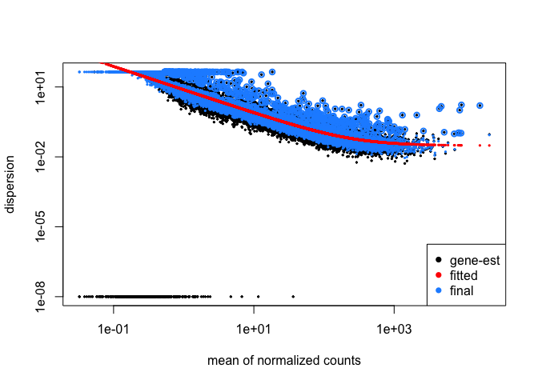
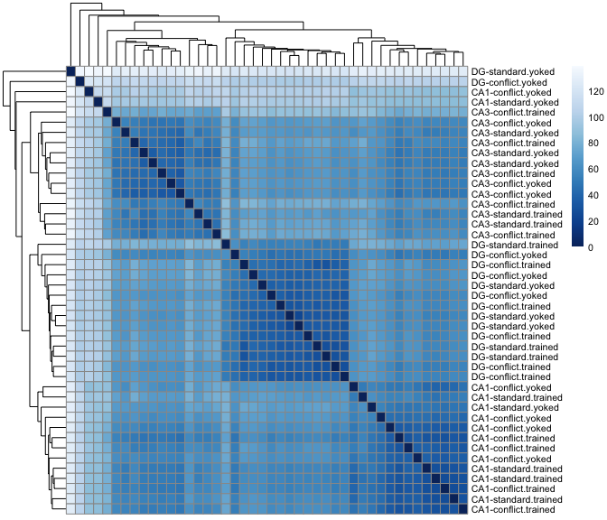
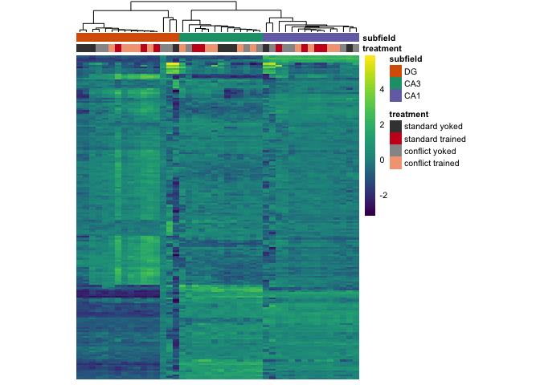

The figures made from this script were compiled in Adobe.

    library(tidyverse)
    library(cowplot) ## for some easy to use themes
    library(pheatmap) ## awesome heatmaps
    library(viridis) # for awesome color pallette
    library(reshape2) ## for melting dataframe
    library(DESeq2) ## for gene expression analysis
    library(edgeR)  ## for basic read counts status
    library(magrittr) ## to use the weird pipe
    library(ggrepel) ## for labeling volcano plot
    library(stringr) ## for uppercase gene names
    library(car)
    library("RColorBrewer") 

    library(BiocParallel)
    register(MulticoreParam(6))

    ## load functions 
    source("figureoptions.R")
    source("functions_RNAseq.R")

    ## set output file for figures 
    knitr::opts_chunk$set(fig.path = '../figures/02b_RNAseqAll/', cache = F)

Design
------

The two two catagorical variables are

-   Hippocampal subfield: DG, CA3, CA1
-   Treatment: standard yoked, standard trained, conflict yoked,
    conflict trained

<!-- -->

    colData <- read.csv("../data/02a_colData.csv", header = T)
    countData <- read.csv("../data/02a_countData.csv", header = T, check.names = F, row.names = 1)
    colData <- colData %>% dplyr::rename(treatment = APA2, subfield = Punch)
    colData %>% select(treatment, subfield)  %>%  summary()

    ##             treatment  subfield
    ##  conflict.trained:14   CA1:15  
    ##  conflict.yoked  :12   CA3:13  
    ##  standard.trained: 9   DG :16  
    ##  standard.yoked  : 9

    totalCounts <- colSums(countData)
    totalCounts

    ## 143A-CA3-1  143A-DG-1 143B-CA1-1  143B-DG-1 143C-CA1-1 143D-CA1-3 
    ##    3327867    5279392    1719498    2085031    2213452    1091672 
    ##  143D-DG-3 144A-CA1-2 144A-CA3-2  144A-DG-2 144B-CA1-1 144B-CA3-1 
    ##    1043885    2980775     421165    3210030    2555909    1027388 
    ## 144C-CA1-2 144C-CA3-2  144C-DG-2 144D-CA3-2  144D-DG-2 145A-CA1-2 
    ##    3298825    1238998    2224182    2323243    4691568    4680960 
    ## 145A-CA3-2  145A-DG-2 145B-CA1-1  145B-DG-1 146A-CA1-2 146A-CA3-2 
    ##     345619    1435833    2020114    1509310    1715282    2756300 
    ##  146A-DG-2 146B-CA1-2 146B-CA3-2  146B-DG-2 146C-CA1-4  146C-DG-4 
    ##    1201333    1063417    2144771     116106    1360004     492145 
    ## 146D-CA1-3 146D-CA3-3  146D-DG-3 147C-CA1-3 147C-CA3-3  147C-DG-3 
    ##     391369    2994536      90417    3072308    5754581    4350647 
    ## 147D-CA3-1  147D-DG-1 148A-CA1-3 148A-CA3-3  148A-DG-3 148B-CA1-4 
    ##    4624995   11700703    5260906    2676397    4019062     337174 
    ## 148B-CA3-4  148B-DG-4 
    ##    3486840     798668

    ### on average 1 million gene counts per sample 
    summary((colSums(countData)/1000000))

    ##     Min.  1st Qu.   Median     Mean  3rd Qu.     Max. 
    ##  0.09042  1.08461  2.17911  2.52574  3.30608 11.70070

    dds <- DESeqDataSetFromMatrix(countData = countData,
                                  colData = colData,
                                  design = ~ subfield + treatment + subfield*treatment)

    dds$subfield <- factor(dds$subfield, levels=c("DG","CA3", "CA1")) ## specify the factor levels

    dds$treatment <- factor(dds$treatment, levels=c("standard.yoked" ,"standard.trained", "conflict.yoked", "conflict.trained")) ## specify the factor levels

    dds # view the DESeq object - note numnber of genes

    ## class: DESeqDataSet 
    ## dim: 22485 44 
    ## metadata(1): version
    ## assays(1): counts
    ## rownames(22485): 0610007P14Rik 0610009B22Rik ... Zzef1 Zzz3
    ## rowData names(0):
    ## colnames(44): 143A-CA3-1 143A-DG-1 ... 148B-CA3-4 148B-DG-4
    ## colData names(8): RNAseqID Mouse ... ID treatment

    dds <- dds[ rowSums(counts(dds)) > 10, ]  # Pre-filtering genes
    dds # view number of genes afternormalization and the number of samples

    ## class: DESeqDataSet 
    ## dim: 16616 44 
    ## metadata(1): version
    ## assays(1): counts
    ## rownames(16616): 0610007P14Rik 0610009B22Rik ... Zzef1 Zzz3
    ## rowData names(0):
    ## colnames(44): 143A-CA3-1 143A-DG-1 ... 148B-CA3-4 148B-DG-4
    ## colData names(8): RNAseqID Mouse ... ID treatment

    dds <- DESeq(dds, parallel = TRUE) # Differential expression analysis
    #rld <- rlog(dds, blind=FALSE) ## log transformed data
    vsd <- vst(dds, blind=FALSE) ## variance stabilized
    head(assay(vsd),3)

    ##               143A-CA3-1 143A-DG-1 143B-CA1-1 143B-DG-1 143C-CA1-1
    ## 0610007P14Rik   6.808251  6.668454   7.024113  6.694369   6.554406
    ## 0610009B22Rik   6.178959  6.123766   6.400739  6.017979   6.232975
    ## 0610009L18Rik   5.734496  5.786087   6.104311  5.955899   5.688810
    ##               143D-CA1-3 143D-DG-3 144A-CA1-2 144A-CA3-2 144A-DG-2
    ## 0610007P14Rik   6.807051  7.087486   6.817352   7.388850  6.787693
    ## 0610009B22Rik   5.422896  5.690676   6.297021   6.763118  5.895804
    ## 0610009L18Rik   5.422896  5.801054   5.906760   6.437132  5.422896
    ##               144B-CA1-1 144B-CA3-1 144C-CA1-2 144C-CA3-2 144C-DG-2
    ## 0610007P14Rik   6.856466   6.998749   6.613775   6.772989  6.687065
    ## 0610009B22Rik   6.075785   6.262671   6.016429   6.678908  6.160550
    ## 0610009L18Rik   5.598772   5.987081   5.640948   5.949087  5.877667
    ##               144D-CA3-2 144D-DG-2 145A-CA1-2 145A-CA3-2 145A-DG-2
    ## 0610007P14Rik   6.648731  6.907274   6.874057   6.559847   6.84102
    ## 0610009B22Rik   6.110834  6.025730   6.200666   6.662371   6.27299
    ## 0610009L18Rik   5.996939  5.877533   6.019879   5.422896   5.65315
    ##               145B-CA1-1 145B-DG-1 146A-CA1-2 146A-CA3-2 146A-DG-2
    ## 0610007P14Rik   6.823920  6.443947   6.558629   7.040970  6.600217
    ## 0610009B22Rik   6.203366  6.135034   6.249608   5.967787  6.036409
    ## 0610009L18Rik   5.775328  5.422896   6.030436   5.967787  6.036409
    ##               146B-CA1-2 146B-CA3-2 146B-DG-2 146C-CA1-4 146C-DG-4
    ## 0610007P14Rik   6.404439   6.514077  6.336254   6.879112  7.177891
    ## 0610009B22Rik   6.096523   6.660123  6.336254   6.069351  6.379364
    ## 0610009L18Rik   5.422896   5.697560  5.422896   6.154200  5.422896
    ##               146D-CA1-3 146D-CA3-3 146D-DG-3 147C-CA1-3 147C-CA3-3
    ## 0610007P14Rik   6.945981   6.903613  7.654305   6.705502   6.940845
    ## 0610009B22Rik   6.244605   6.208354  5.422896   6.075140   6.096355
    ## 0610009L18Rik   5.422896   5.859914  5.422896   5.648295   5.833026
    ##               147C-DG-3 147D-CA3-1 147D-DG-1 148A-CA1-3 148A-CA3-3
    ## 0610007P14Rik  6.590743   6.594036  6.763024   6.781988   6.695079
    ## 0610009B22Rik  6.239520   6.277406  6.227316   6.339476   6.278186
    ## 0610009L18Rik  5.652181   5.827799  6.068431   5.906018   5.889562
    ##               148A-DG-3 148B-CA1-4 148B-CA3-4 148B-DG-4
    ## 0610007P14Rik  6.770632   6.623311   7.052911  6.640997
    ## 0610009B22Rik  5.950604   5.422896   6.444857  5.864737
    ## 0610009L18Rik  5.875464   5.422896   5.936087  5.735933

    write.csv(assay(vsd), file = "../data/02b_vsd.csv", row.names = T)

check for outliers
------------------

    boxplot(log10(assays(dds)[["cooks"]]), range=0, las=2)

    plotDispEsts(dds)

    sampleDists <- dist(t(assay(vsd)))
    sampleDistMatrix <- as.matrix(sampleDists)
    rownames(sampleDistMatrix) <- paste(vsd$subfield, vsd$treatment, sep="-")
    colnames(sampleDistMatrix) <- NULL
    colors <- colorRampPalette( rev(brewer.pal(9, "Blues")) )(255)
    pheatmap(sampleDistMatrix,
             clustering_distance_rows=sampleDists,
             clustering_distance_cols=sampleDists,
             col=colors, fontsize = 6)

Summary 2 way contrasts
-----------------------

This first function shows the total number of up and down regulated
genes and the top 3 most significant genes.

    res_summary <- function(mycontrast){
      res <- results(dds, contrast = mycontrast, independentFiltering = T)
      print(mycontrast)
      print(sum(res$padj < 0.1, na.rm=TRUE))
      print(summary(res))
      print(head((res[order(res$padj),]), 5))
      cat("\n")
    }

    res_summary(c("subfield", "CA1", "DG"))

    ## [1] "subfield" "CA1"      "DG"      
    ## [1] 2758
    ## 
    ## out of 16616 with nonzero total read count
    ## adjusted p-value < 0.1
    ## LFC > 0 (up)       : 1218, 7.3%
    ## LFC < 0 (down)     : 1540, 9.3%
    ## outliers [1]       : 8, 0.048%
    ## low counts [2]     : 3862, 23%
    ## (mean count < 4)
    ## [1] see 'cooksCutoff' argument of ?results
    ## [2] see 'independentFiltering' argument of ?results
    ## 
    ## NULL
    ## log2 fold change (MLE): subfield CA1 vs DG 
    ## Wald test p-value: subfield CA1 vs DG 
    ## DataFrame with 5 rows and 6 columns
    ##                 baseMean   log2FoldChange             lfcSE
    ##                <numeric>        <numeric>         <numeric>
    ## Pou3f1  219.411952155873 5.98788009889165 0.528568810614782
    ## Prkcg   1597.44305102598  2.9761934790783 0.284820273929176
    ## Wfs1    558.096580361287 6.41720721777274 0.633476148881825
    ## Synj2   114.149797568097 6.05486578155595 0.603057509394192
    ## St8sia5 68.4953636213458 6.85807868916434 0.695976709179171
    ##                     stat               pvalue                 padj
    ##                <numeric>            <numeric>            <numeric>
    ## Pou3f1  11.3284779174297 9.48384542208621e-30 1.20881093749911e-25
    ## Prkcg   10.4493736980899 1.47496016103396e-25 9.39992110626944e-22
    ## Wfs1    10.1301481185993 4.06033915010985e-24 1.72510276024334e-20
    ## Synj2   10.0402792225213 1.01386753382125e-23 3.23068889652142e-20
    ## St8sia5 9.85389108387362 6.59405493643299e-23  1.6809564843955e-19

    res_summary(c("subfield", "CA1", "CA3"))

    ## [1] "subfield" "CA1"      "CA3"     
    ## [1] 2194
    ## 
    ## out of 16616 with nonzero total read count
    ## adjusted p-value < 0.1
    ## LFC > 0 (up)       : 883, 5.3%
    ## LFC < 0 (down)     : 1311, 7.9%
    ## outliers [1]       : 8, 0.048%
    ## low counts [2]     : 3862, 23%
    ## (mean count < 4)
    ## [1] see 'cooksCutoff' argument of ?results
    ## [2] see 'independentFiltering' argument of ?results
    ## 
    ## NULL
    ## log2 fold change (MLE): subfield CA1 vs CA3 
    ## Wald test p-value: subfield CA1 vs CA3 
    ## DataFrame with 5 rows and 6 columns
    ##                baseMean    log2FoldChange             lfcSE
    ##               <numeric>         <numeric>         <numeric>
    ## Doc2b  349.417572153451  7.18163078046263 0.485175860022053
    ## Itpka  710.071023144903  3.09537626053932 0.232412904994157
    ## Pou3f1 219.411952155873  6.52771263750239 0.548075434712134
    ## C1ql3  285.386723855134  6.43326260235465 0.608565960656959
    ## Syn2   1094.47006534942 -2.23246608566971 0.211367267709644
    ##                     stat               pvalue                 padj
    ##                <numeric>            <numeric>            <numeric>
    ## Doc2b   14.8021189268077 1.41939733979291e-49 1.80916384930004e-45
    ## Itpka   13.3184353967657 1.80858035356843e-40 1.15260825932916e-36
    ## Pou3f1  11.9102448751985 1.04669418662442e-32 4.44705470090497e-29
    ## C1ql3   10.5711837635641 4.05345467043229e-26 1.13929204352734e-22
    ## Syn2   -10.5620236750019 4.46921404176739e-26 1.13929204352734e-22

    res_summary(c("subfield", "CA3", "DG"))

    ## [1] "subfield" "CA3"      "DG"      
    ## [1] 2948
    ## 
    ## out of 16616 with nonzero total read count
    ## adjusted p-value < 0.1
    ## LFC > 0 (up)       : 1571, 9.5%
    ## LFC < 0 (down)     : 1377, 8.3%
    ## outliers [1]       : 8, 0.048%
    ## low counts [2]     : 2578, 16%
    ## (mean count < 2)
    ## [1] see 'cooksCutoff' argument of ?results
    ## [2] see 'independentFiltering' argument of ?results
    ## 
    ## NULL
    ## log2 fold change (MLE): subfield CA3 vs DG 
    ## Wald test p-value: subfield CA3 vs DG 
    ## DataFrame with 5 rows and 6 columns
    ##                 baseMean    log2FoldChange             lfcSE
    ##                <numeric>         <numeric>         <numeric>
    ## Fam163b 628.819601522936 -5.70014209318505 0.335658160648348
    ## Doc2b   349.417572153451 -7.02236367815067 0.443183025923195
    ## C1ql3   285.386723855134 -8.02899823540252 0.547299263988565
    ## Pter    159.610534988909 -8.21122640398272 0.656377536292389
    ## Cpe     3054.96826641212  2.95869521597912 0.240210438784262
    ##                      stat               pvalue                 padj
    ##                 <numeric>            <numeric>            <numeric>
    ## Fam163b -16.9819857267132 1.11643868551516e-64 1.56636347577777e-60
    ## Doc2b   -15.8452902466704 1.51519787753542e-56  1.0629113110911e-52
    ## C1ql3   -14.6702156638937   1.000266306889e-48 4.67791209521755e-45
    ## Pter    -12.5099138071736  6.5895691422954e-36 2.31129137666011e-32
    ## Cpe      12.3170967546351 7.32853880958643e-35 2.05638798996995e-31

    res_summary(c("treatment", "standard.trained", "standard.yoked"))

    ## [1] "treatment"        "standard.trained" "standard.yoked"  
    ## [1] 113
    ## 
    ## out of 16616 with nonzero total read count
    ## adjusted p-value < 0.1
    ## LFC > 0 (up)       : 105, 0.63%
    ## LFC < 0 (down)     : 8, 0.048%
    ## outliers [1]       : 8, 0.048%
    ## low counts [2]     : 3540, 21%
    ## (mean count < 3)
    ## [1] see 'cooksCutoff' argument of ?results
    ## [2] see 'independentFiltering' argument of ?results
    ## 
    ## NULL
    ## log2 fold change (MLE): treatment standard.trained vs standard.yoked 
    ## Wald test p-value: treatment standard.trained vs standard.yoked 
    ## DataFrame with 5 rows and 6 columns
    ##               baseMean   log2FoldChange             lfcSE             stat
    ##              <numeric>        <numeric>         <numeric>        <numeric>
    ## Plk2  690.892982346694 2.33683799910871 0.286976491912739  8.1429596673001
    ## Frmd6 115.436102973485 3.28459462100619 0.459910965436156  7.1418054098607
    ## Sgk1  243.126788527358 2.51888168720334 0.352396323432317 7.14786596712928
    ## Smad7 101.648353958591 3.55559834012079 0.497176666572182 7.15157926584749
    ## Arc   865.501371190336 2.88376455109463 0.419805445423535 6.86928810126617
    ##                     pvalue                 padj
    ##                  <numeric>            <numeric>
    ## Plk2  3.85730784294159e-16 5.04072988915607e-12
    ## Frmd6 9.21129396056559e-13 3.00932973691678e-09
    ## Sgk1  8.81373044949851e-13 3.00932973691678e-09
    ## Smad7 8.57851602848107e-13 3.00932973691678e-09
    ## Arc   6.45230809755488e-12 1.68637524437694e-08

    res_summary(c("treatment", "conflict.trained", "conflict.yoked"))

    ## [1] "treatment"        "conflict.trained" "conflict.yoked"  
    ## [1] 62
    ## 
    ## out of 16616 with nonzero total read count
    ## adjusted p-value < 0.1
    ## LFC > 0 (up)       : 17, 0.1%
    ## LFC < 0 (down)     : 45, 0.27%
    ## outliers [1]       : 8, 0.048%
    ## low counts [2]     : 5792, 35%
    ## (mean count < 11)
    ## [1] see 'cooksCutoff' argument of ?results
    ## [2] see 'independentFiltering' argument of ?results
    ## 
    ## NULL
    ## log2 fold change (MLE): treatment conflict.trained vs conflict.yoked 
    ## Wald test p-value: treatment conflict.trained vs conflict.yoked 
    ## DataFrame with 5 rows and 6 columns
    ##                 baseMean    log2FoldChange             lfcSE
    ##                <numeric>         <numeric>         <numeric>
    ## Camk1g  40.6858606603921  -3.4036832014124 0.620531545521771
    ## Insm1   21.1075753227574 -4.60164354700641 0.836778143186136
    ## Kcnc2   144.358588449054 -2.52222804444383 0.470751572328016
    ## Neurod6 331.806267643941 -3.56020520569808 0.703632664264455
    ## Sv2b    568.239350545566 -3.75707558827698 0.743875755350764
    ##                      stat               pvalue                 padj
    ##                 <numeric>            <numeric>            <numeric>
    ## Camk1g  -5.48510905847732 4.13214414189454e-08 0.000223466355193657
    ## Insm1    -5.4992396544741 3.81432426159708e-08 0.000223466355193657
    ## Kcnc2   -5.35787492322248 8.42064995263684e-08 0.000303592499625734
    ## Neurod6 -5.05974976221399  4.1980705346974e-07 0.000952346104744044
    ## Sv2b    -5.05067622012413  4.4024875404218e-07 0.000952346104744044

    res_summary(c("treatment", "conflict.trained", "standard.trained"))

    ## [1] "treatment"        "conflict.trained" "standard.trained"
    ## [1] 0
    ## 
    ## out of 16616 with nonzero total read count
    ## adjusted p-value < 0.1
    ## LFC > 0 (up)       : 0, 0%
    ## LFC < 0 (down)     : 0, 0%
    ## outliers [1]       : 8, 0.048%
    ## low counts [2]     : 0, 0%
    ## (mean count < 0)
    ## [1] see 'cooksCutoff' argument of ?results
    ## [2] see 'independentFiltering' argument of ?results
    ## 
    ## NULL
    ## log2 fold change (MLE): treatment conflict.trained vs standard.trained 
    ## Wald test p-value: treatment conflict.trained vs standard.trained 
    ## DataFrame with 5 rows and 6 columns
    ##                       baseMean     log2FoldChange             lfcSE
    ##                      <numeric>          <numeric>         <numeric>
    ## 0610007P14Rik 43.5653432205546 -0.134646170268329  0.38168039316832
    ## 0610009B22Rik  13.157668511865 -0.748229791549295 0.661810472037447
    ## 0610009L18Rik 3.86186075059207  0.565699645231504  1.23947586606833
    ## 0610009O20Rik 48.2470462620772  0.262898864098434 0.403257260619087
    ## 0610010F05Rik 64.5504551982064 -0.361991005972118 0.332690746410501
    ##                             stat            pvalue      padj
    ##                        <numeric>         <numeric> <numeric>
    ## 0610007P14Rik -0.352772038276931 0.724259347972591         1
    ## 0610009B22Rik  -1.13058016329932 0.258231840560031         1
    ## 0610009L18Rik  0.456402307392983 0.648100706814437         1
    ## 0610009O20Rik  0.651938327644311 0.514440958296272         1
    ## 0610010F05Rik  -1.08807055765075 0.276563960208625         1

    res_summary(c("treatment", "conflict.yoked", "standard.yoked"))

    ## [1] "treatment"      "conflict.yoked" "standard.yoked"
    ## [1] 40
    ## 
    ## out of 16616 with nonzero total read count
    ## adjusted p-value < 0.1
    ## LFC > 0 (up)       : 38, 0.23%
    ## LFC < 0 (down)     : 2, 0.012%
    ## outliers [1]       : 8, 0.048%
    ## low counts [2]     : 1289, 7.8%
    ## (mean count < 1)
    ## [1] see 'cooksCutoff' argument of ?results
    ## [2] see 'independentFiltering' argument of ?results
    ## 
    ## NULL
    ## log2 fold change (MLE): treatment conflict.yoked vs standard.yoked 
    ## Wald test p-value: treatment conflict.yoked vs standard.yoked 
    ## DataFrame with 5 rows and 6 columns
    ##                 baseMean   log2FoldChange             lfcSE
    ##                <numeric>        <numeric>         <numeric>
    ## Kcnc2   144.358588449054 3.80133917239381 0.556346288495724
    ## St8sia5 68.4953636213458 3.78861086700251 0.673922518191313
    ## Gm2115  249.257751832989 3.48213722650287 0.658706293164929
    ## Cnr1    350.970175675373 3.92670174540614 0.762127039058242
    ## Dner    169.806900335675 1.75375363859233 0.352554314089203
    ##                     stat               pvalue                 padj
    ##                <numeric>            <numeric>            <numeric>
    ## Kcnc2   6.83268541733612 8.33395813827394e-12 1.27667904720218e-07
    ## St8sia5 5.62173063629103 1.89053883771394e-08 0.000144805822274699
    ## Gm2115  5.28632755240886 1.24796350258567e-07 0.000637251763203661
    ## Cnr1    5.15229291727841 2.57320693829974e-07 0.000985473927195342
    ## Dner     4.9744211558523 6.54428926948817e-07  0.00200503934638578

This second function only prints the total number of DEGs, but it saves
lots of useful info to a df for downstream dataviz.

    # note: see resvals fucntion in `functions_RNAseq.R`

    contrast1 <- resvals(contrastvector = c("subfield", "CA1", "DG"), mypval = 0.1) # 3060

    ## [1] 2758

    contrast2 <- resvals(contrastvector = c("subfield", "CA1", "CA3"), mypval = 0.1) # 2388

    ## [1] 2194

    contrast3 <- resvals(contrastvector = c("subfield", "CA3", "DG"), mypval = 0.1) # 3078

    ## [1] 2948

    contrast4 <- resvals(contrastvector = c("treatment", "standard.trained", "standard.yoked"), mypval = 0.1) #  80

    ## [1] 113

    contrast5 <- resvals(contrastvector = c("treatment", "conflict.trained", "conflict.yoked"), mypval = 0.1) # 23

    ## [1] 62

    contrast6 <- resvals(contrastvector = c("treatment", "conflict.trained", "standard.trained"), mypval = 0.1) #  1

    ## [1] 0

    contrast7 <- resvals(contrastvector = c("treatment", "conflict.yoked", "standard.yoked"), mypval = 0.1) # 37

    ## [1] 40

    # heatmap with all DEGs
    DEGes <- assay(vsd)
    DEGes <- cbind(DEGes, contrast1, contrast2, contrast3, contrast4, contrast5, contrast6, contrast7)
    DEGes <- as.data.frame(DEGes) # convert matrix to dataframe
    DEGes$rownames <- rownames(DEGes)  # add the rownames to the dataframe
    DEGes$rownames <- str_to_upper(DEGes$rownames) ## uppercase gene names

    names(DEGes)

    ##  [1] "143A-CA3-1"                                   
    ##  [2] "143A-DG-1"                                    
    ##  [3] "143B-CA1-1"                                   
    ##  [4] "143B-DG-1"                                    
    ##  [5] "143C-CA1-1"                                   
    ##  [6] "143D-CA1-3"                                   
    ##  [7] "143D-DG-3"                                    
    ##  [8] "144A-CA1-2"                                   
    ##  [9] "144A-CA3-2"                                   
    ## [10] "144A-DG-2"                                    
    ## [11] "144B-CA1-1"                                   
    ## [12] "144B-CA3-1"                                   
    ## [13] "144C-CA1-2"                                   
    ## [14] "144C-CA3-2"                                   
    ## [15] "144C-DG-2"                                    
    ## [16] "144D-CA3-2"                                   
    ## [17] "144D-DG-2"                                    
    ## [18] "145A-CA1-2"                                   
    ## [19] "145A-CA3-2"                                   
    ## [20] "145A-DG-2"                                    
    ## [21] "145B-CA1-1"                                   
    ## [22] "145B-DG-1"                                    
    ## [23] "146A-CA1-2"                                   
    ## [24] "146A-CA3-2"                                   
    ## [25] "146A-DG-2"                                    
    ## [26] "146B-CA1-2"                                   
    ## [27] "146B-CA3-2"                                   
    ## [28] "146B-DG-2"                                    
    ## [29] "146C-CA1-4"                                   
    ## [30] "146C-DG-4"                                    
    ## [31] "146D-CA1-3"                                   
    ## [32] "146D-CA3-3"                                   
    ## [33] "146D-DG-3"                                    
    ## [34] "147C-CA1-3"                                   
    ## [35] "147C-CA3-3"                                   
    ## [36] "147C-DG-3"                                    
    ## [37] "147D-CA3-1"                                   
    ## [38] "147D-DG-1"                                    
    ## [39] "148A-CA1-3"                                   
    ## [40] "148A-CA3-3"                                   
    ## [41] "148A-DG-3"                                    
    ## [42] "148B-CA1-4"                                   
    ## [43] "148B-CA3-4"                                   
    ## [44] "148B-DG-4"                                    
    ## [45] "pvalsubfieldCA1DG"                            
    ## [46] "padjsubfieldCA1DG"                            
    ## [47] "pvalsubfieldCA1CA3"                           
    ## [48] "padjsubfieldCA1CA3"                           
    ## [49] "pvalsubfieldCA3DG"                            
    ## [50] "padjsubfieldCA3DG"                            
    ## [51] "pvaltreatmentstandard.trainedstandard.yoked"  
    ## [52] "padjtreatmentstandard.trainedstandard.yoked"  
    ## [53] "pvaltreatmentconflict.trainedconflict.yoked"  
    ## [54] "padjtreatmentconflict.trainedconflict.yoked"  
    ## [55] "pvaltreatmentconflict.trainedstandard.trained"
    ## [56] "padjtreatmentconflict.trainedstandard.trained"
    ## [57] "pvaltreatmentconflict.yokedstandard.yoked"    
    ## [58] "padjtreatmentconflict.yokedstandard.yoked"    
    ## [59] "rownames"

    DEGes$padjmin <- with(DEGes, pmin(# padjsubfieldCA1DG, padjsubfieldCA1CA3, padjsubfieldCA3DG,
                                      padjtreatmentstandard.trainedstandard.yoked, padjtreatmentconflict.trainedconflict.yoked,
                                      padjtreatmentconflict.trainedstandard.trained,padjtreatmentconflict.yokedstandard.yoked)) 
    DEGes <- DEGes %>% filter(padjmin < 0.1)

    rownames(DEGes) <- DEGes$rownames
    drop.cols <-colnames(DEGes[,grep("padj|pval|rownames", colnames(DEGes))])
    DEGes <- DEGes %>% dplyr::select(-one_of(drop.cols))
    DEGes <- as.matrix(DEGes)
    DEGes <- DEGes - rowMeans(DEGes)

    df <- as.data.frame(colData(dds)[,c("treatment", "subfield")]) ## matrix to df
    rownames(df) <- names(countData)
    levels(df$treatment) <- c("standard yoked","standard trained",  "conflict yoked","conflict trained")

    DEGes <- as.matrix(DEGes) 
    paletteLength <- 80
    myBreaks <- c(seq(min(DEGes), 0, length.out=ceiling(paletteLength/2) + 1), 
                  seq(max(DEGes)/paletteLength, max(DEGes), length.out=floor(paletteLength/2)))

    pheatmap(DEGes, show_colnames=F, show_rownames = F,
             annotation_col=df, 
             annotation_colors = pheatmapcolors,
             treeheight_row = 0, treeheight_col = 25,
             annotation_row = NA, 
             annotation_legend = TRUE,
             annotation_names_row = FALSE, annotation_names_col = FALSE,
             fontsize = 8, 
             border_color = NA ,
             color = viridis(80),
             cellwidth = 6, 
             clustering_method="average",
             breaks=myBreaks,
             clustering_distance_cols="correlation" 
             )

    pheatmap(DEGes, show_colnames=F, show_rownames = F,
             annotation_col=df, annotation_colors = pheatmapcolors, 
             annotation_row = NA, 
             annotation_legend = F,
             annotation_names_row = FALSE, 
             annotation_names_col = FALSE,
             treeheight_row = 0, treeheight_col = 10,
             fontsize = 6, 
             border_color = NA ,
             color = viridis(80),
             height = 2.5, 
             width = 2.5,
             clustering_method="average",
             breaks=myBreaks,
             clustering_distance_cols="correlation", 
             filename = "../figures/02b_RNAseqALL/pheatmap1.pdf"
             )

Principle component analysis
----------------------------

    # create the dataframe using my function pcadataframe
    pcadata <- pcadataframe(vsd, intgroup=c("subfield","treatment"), returnData=TRUE)
    percentVar <- round(100 * attr(pcadata, "percentVar"))
    pcadata$subfieldAPA <- as.factor(paste(pcadata$subfield, pcadata$treatment, sep="_"))
    pcadata$subfield <- factor(pcadata$subfield, levels=c("DG","CA3", "CA1"))
    pcadata$treatment <- factor(pcadata$treatment, levels=c("standard.yoked","standard.trained",  "conflict.yoked","conflict.trained"))

    levels(pcadata$treatment) <- c("standard yoked","standard trained",  "conflict yoked", "conflict trained")

    summary(aov(PC1 ~ subfield * treatment, data=pcadata)) 

    ##                    Df Sum Sq Mean Sq F value Pr(>F)    
    ## subfield            2   8985    4493 648.658 <2e-16 ***
    ## treatment           3     70      23   3.345 0.0312 *  
    ## subfield:treatment  6     86      14   2.059 0.0862 .  
    ## Residuals          32    222       7                   
    ## ---
    ## Signif. codes:  0 '***' 0.001 '**' 0.01 '*' 0.05 '.' 0.1 ' ' 1

    TukeyHSD((aov(PC1 ~ subfield, data=pcadata)), which = "subfield") 

    ##   Tukey multiple comparisons of means
    ##     95% family-wise confidence level
    ## 
    ## Fit: aov(formula = PC1 ~ subfield, data = pcadata)
    ## 
    ## $subfield
    ##               diff        lwr        upr     p adj
    ## CA3-DG  -30.416493 -33.168694 -27.664291 0.0000000
    ## CA1-DG  -29.051106 -31.700143 -26.402068 0.0000000
    ## CA1-CA3   1.365387  -1.427636   4.158411 0.4665421

    summary(aov(PC2 ~ subfield * treatment, data=pcadata)) 

    ##                    Df Sum Sq Mean Sq  F value Pr(>F)    
    ## subfield            2   4260  2130.0 1338.086 <2e-16 ***
    ## treatment           3      8     2.6    1.614 0.2055    
    ## subfield:treatment  6     22     3.7    2.299 0.0586 .  
    ## Residuals          32     51     1.6                    
    ## ---
    ## Signif. codes:  0 '***' 0.001 '**' 0.01 '*' 0.05 '.' 0.1 ' ' 1

    TukeyHSD((aov(PC2 ~ subfield, data=pcadata)), which = "subfield") 

    ##   Tukey multiple comparisons of means
    ##     95% family-wise confidence level
    ## 
    ## Fit: aov(formula = PC2 ~ subfield, data = pcadata)
    ## 
    ## $subfield
    ##              diff       lwr       upr p adj
    ## CA3-DG  -12.22169 -13.49481 -10.94857     0
    ## CA1-DG   12.48060  11.25520  13.70600     0
    ## CA1-CA3  24.70229  23.41029  25.99430     0

    summary(aov(PC3 ~ subfield * treatment, data=pcadata)) 

    ##                    Df Sum Sq Mean Sq F value Pr(>F)  
    ## subfield            2   19.9    9.95   0.274 0.7618  
    ## treatment           3  374.6  124.86   3.445 0.0281 *
    ## subfield:treatment  6  173.3   28.88   0.797 0.5794  
    ## Residuals          32 1159.9   36.25                 
    ## ---
    ## Signif. codes:  0 '***' 0.001 '**' 0.01 '*' 0.05 '.' 0.1 ' ' 1

    TukeyHSD((aov(PC3 ~ subfield, data=pcadata)), which = "subfield") 

    ##   Tukey multiple comparisons of means
    ##     95% family-wise confidence level
    ## 
    ## Fit: aov(formula = PC3 ~ subfield, data = pcadata)
    ## 
    ## $subfield
    ##               diff       lwr      upr     p adj
    ## CA3-DG  -1.6102498 -7.470189 4.249689 0.7831311
    ## CA1-DG  -1.0834889 -6.723773 4.556796 0.8870184
    ## CA1-CA3  0.5267609 -5.420096 6.473618 0.9747645

    summary(aov(PC4 ~ subfield * treatment, data=pcadata)) 

    ##                    Df Sum Sq Mean Sq F value Pr(>F)   
    ## subfield            2    1.9    0.95   0.087 0.9167   
    ## treatment           3  156.8   52.28   4.780 0.0073 **
    ## subfield:treatment  6  150.9   25.16   2.300 0.0586 . 
    ## Residuals          32  350.0   10.94                  
    ## ---
    ## Signif. codes:  0 '***' 0.001 '**' 0.01 '*' 0.05 '.' 0.1 ' ' 1

    summary(aov(PC5 ~ subfield * treatment, data=pcadata)) 

    ##                    Df Sum Sq Mean Sq F value Pr(>F)
    ## subfield            2   0.83   0.416   0.043  0.958
    ## treatment           3  64.30  21.432   2.202  0.107
    ## subfield:treatment  6  46.84   7.806   0.802  0.576
    ## Residuals          32 311.42   9.732

    summary(aov(PC6 ~ subfield * treatment, data=pcadata)) 

    ##                    Df Sum Sq Mean Sq F value  Pr(>F)   
    ## subfield            2   2.31   1.154   0.173 0.84179   
    ## treatment           3  27.88   9.293   1.395 0.26232   
    ## subfield:treatment  6 147.14  24.524   3.681 0.00682 **
    ## Residuals          32 213.22   6.663                   
    ## ---
    ## Signif. codes:  0 '***' 0.001 '**' 0.01 '*' 0.05 '.' 0.1 ' ' 1

    PCA12 <- ggplot(pcadata, aes(pcadata$PC1, pcadata$PC2, colour=subfield)) +
        geom_point(size=2, aes(shape=treatment), alpha = 0.8) +
        xlab(paste0("PC1: ", percentVar[1],"%")) +
        ylab(paste0("PC2: ", percentVar[2],"%")) +
        scale_colour_manual(values=c(colorvalsubfield))+ 
       theme_classic(base_size = 8)  +
          theme(legend.title=element_blank(), 
                legend.position=c(0.8,0.825),
                legend.text = element_text(size=5),
                legend.key.size = unit(0, 'lines')) +
        scale_shape_manual(values=c(1, 16, 0, 15), aes(color=colorvalsubfield)) +
      labs(color = "subfield", shape = "treatment") +
      guides(color = FALSE)
    PCA12

    pdf(file="../figures/02b_RNAseqALL/PCA12.pdf", width=2.75, height=2.5)
    plot(PCA12)
    dev.off()

    ## quartz_off_screen 
    ##                 2

    PCA42 <- ggplot(pcadata, aes(pcadata$PC4, pcadata$PC2)) +
        geom_point(size=2, aes(colour=subfield, shape=treatment), alpha = 0.8) +
        xlab(paste0("PC4: ", percentVar[4],"%")) +
        ylab(paste0("PC2: ", percentVar[2],"%")) +
        scale_colour_manual(values=c(colorvalsubfield))+ 
       theme_bw(base_size = 12)  +
        theme(legend.title=element_blank()) +
        scale_shape_manual(aes(colour=colorvalsubfield), values=c(1, 16, 0, 15)) +
      guides(color = guide_legend(order=1),
             shape = guide_legend(order=2)) 
    PCA42

    plot_grid(PCA12, PCA42 ,nrow = 2)

Volcanos plots and and gene lists
---------------------------------

    makevolcanodf <- function(mycontrast, myup, mydown, filename){
      res <- results(dds, contrast = mycontrast, independentFiltering = T)

      data <- data.frame(gene = row.names(res), pvalue = (res$padj), 
                         lfc = res$log2FoldChange)
      data <- na.omit(data)

      data <- data %>%
      mutate(direction = ifelse(data$lfc > 0 & data$pvalue < 0.05, 
                            yes = myup, 
                            no = ifelse(data$lfc < 0 & data$pvalue < 0.05, 
                                        yes = mydown, 
                                        no = "NS")))
      data$logp <- -log10(data$pvalue)
      data <- dplyr::arrange(data, logp)
      write.csv(data, filename, row.names = F)
      return(data)
    }

    DGvCA3 <- makevolcanodf(c("subfield", "CA3", "DG"), "CA3", "DG", "../data/DGvCA3.csv")
    head(DGvCA3)

    ##            gene    pvalue           lfc direction         logp
    ## 1 3100002H09Rik 1.0000000  0.0000000000        NS 0.000000e+00
    ## 2        Clcnka 1.0000000  0.0000000000        NS 0.000000e+00
    ## 3         Nup37 0.9999647 -0.0002985180        NS 1.534975e-05
    ## 4          Egfr 0.9994908  0.0006363971        NS 2.212019e-04
    ## 5         Fubp3 0.9994908 -0.0004064093        NS 2.212019e-04
    ## 6        Amotl1 0.9994815  0.0008107400        NS 2.252406e-04

    DGvCA1 <- makevolcanodf(c("subfield", "CA1", "DG"),"CA1", "DG", "../data/DGvCA1.csv")
    CA3vCA1 <- makevolcanodf(c("subfield", "CA1", "CA3"),"CA1", "CA3", "../data/CA3vCA1.csv")

    volcanoplot <- function(mydata, mycolors, mybreaks){
      
      myvolcano <- mydata %>%
        dplyr::filter(direction != "NS") %>%
        ggplot(aes(x = lfc, y = logp)) + 
      geom_point(aes(color = direction), size = 1.5, alpha = 0.5, na.rm = T) + 
      scale_color_manual(values = mycolors,
                         breaks = mybreaks,
                         name = "higher in") + 
      theme_cowplot(font_size = 12, line_size = 0.25) +
      geom_hline(yintercept = 1.3,  size = 0.25, linetype = 2) + 
      #scale_y_continuous(limits=c(0, 60)) +
      #scale_x_continuous(limits=c(-10, 10)) +
      xlab(paste0("log fold difference")) +
      ylab(paste0("log10 p-value")) +       
      theme(panel.grid.minor=element_blank(),
            #legend.title = element_blank(),
            legend.position = "bottom",
            legend.spacing.x = unit(-0.1, 'cm'),
            panel.grid.major=element_blank(),
            legend.margin=margin(t=-0.25, r=0, b=0, l=0, unit="cm")) 

    return(myvolcano)
    }
      
    d <- volcanoplot(DGvCA3, volcanoDGvCA3, c("DG", "CA3"))
    e <- volcanoplot(DGvCA1, volcanoDGvCA1, c("DG", "CA1"))  
    f <- volcanoplot(CA3vCA1, volcanoCA3vCA1, c("CA3", "CA1")) 

    myvolcanoplots <- plot_grid(d,e,f,nrow = 1)
    myvolcanoplots

    pdf(file="../figures/02b_RNAseqALL/volcanoplots.pdf", width=5, height=2)
    plot(myvolcanoplots)
    dev.off()

    ## quartz_off_screen 
    ##                 2
