The figures made from this script were compiled in Adobe.

    library(tidyverse)
    library(cowplot) ## for some easy to use themes
    library(pheatmap) ## awesome heatmaps
    library(viridis) # for awesome color pallette
    library(reshape2) ## for melting dataframe
    library(DESeq2) ## for gene expression analysis
    library(edgeR)  ## for basic read counts status
    library(magrittr) ## to use the weird pipe
    library(ggrepel) ## for labeling volcano plot
    library(stringr) ## for uppercase gene names
    library(car)
    library(VennDiagram)

    ## load functions 
    source("figureoptions.R")
    source("functions_RNAseq.R")

    ## set output file for figures 
    knitr::opts_chunk$set(fig.path = '../figures/02b_RNAseqAll/',
                          cache = T)

Design
------

The two two catagorical variables are

-   Hippocampal subfield: DG, CA3, CA1
-   Treatment: homecage, standard yoked, standard trained, conflict
    yoked, conflict trained

<!-- -->

    colData <- read.csv("../data/02a_colData.csv", header = T)
    countData <- read.csv("../data/02a_countData.csv", header = T, check.names = F, row.names = 1)
    colData <- colData %>% dplyr::rename(treatment = APA2, subfield = Punch)
    colData %>% select(treatment, subfield)  %>%  summary()

    ##             treatment  subfield
    ##  conflict.trained:14   CA1:17  
    ##  conflict.yoked  :12   CA3:15  
    ##  home.cage       : 6   DG :18  
    ##  standard.trained: 9           
    ##  standard.yoked  : 9

    head(colData)

    ##     RNAseqID   Mouse subfield      Group   Conflict Treatment     ID
    ## 1 143A-CA3-1 15-143A      CA3   conflict   Conflict  conflict 15143A
    ## 2  143A-DG-1 15-143A       DG   conflict   Conflict  conflict 15143A
    ## 3 143B-CA1-1 15-143B      CA1    control   Conflict   shocked 15143B
    ## 4  143B-DG-1 15-143B       DG    control   Conflict   shocked 15143B
    ## 5 143C-CA1-1 15-143C      CA1 consistent NoConflict   trained 15143C
    ## 6 143D-CA1-3 15-143D      CA1    control NoConflict     yoked 15143D
    ##          treatment
    ## 1 conflict.trained
    ## 2 conflict.trained
    ## 3   conflict.yoked
    ## 4   conflict.yoked
    ## 5 standard.trained
    ## 6   standard.yoked

    totalCounts=colSums(countData)
    ### on average 1 million gene counts per sample 
    summary((colSums(countData)/1000000))

    ##     Min.  1st Qu.   Median     Mean  3rd Qu.     Max. 
    ##  0.09042  1.04877  2.11490  2.37193  3.17560 11.70070

    dds <- DESeqDataSetFromMatrix(countData = countData,
                                  colData = colData,
                                  design = ~ subfield + treatment + subfield*treatment)

    dds$subfield <- factor(dds$subfield, levels=c("DG","CA3", "CA1")) ## specify the factor levels

    dds$treatment <- factor(dds$treatment, levels=c("home.cage","standard.yoked" ,"standard.trained", "conflict.yoked", "conflict.trained")) ## specify the factor levels

    dds # view the DESeq object - note numnber of genes

    ## class: DESeqDataSet 
    ## dim: 22485 50 
    ## metadata(1): version
    ## assays(1): counts
    ## rownames(22485): 0610007P14Rik 0610009B22Rik ... Zzef1 Zzz3
    ## rowData names(0):
    ## colnames(50): 143A-CA3-1 143A-DG-1 ... 148B-CA3-4 148B-DG-4
    ## colData names(8): RNAseqID Mouse ... ID treatment

    dds <- dds[ rowSums(counts(dds)) > 1, ]  # Pre-filtering genes with 0 counts
    dds # view number of genes afternormalization and the number of samples

    ## class: DESeqDataSet 
    ## dim: 17975 50 
    ## metadata(1): version
    ## assays(1): counts
    ## rownames(17975): 0610007P14Rik 0610009B22Rik ... Zzef1 Zzz3
    ## rowData names(0):
    ## colnames(50): 143A-CA3-1 143A-DG-1 ... 148B-CA3-4 148B-DG-4
    ## colData names(8): RNAseqID Mouse ... ID treatment

    dds <- DESeq(dds) # Differential expression analysis
    #rld <- rlog(dds, blind=FALSE) ## log transformed data
    vsd <- vst(dds, blind=FALSE) ## variance stabilized
    head(assay(vsd),3)

    ##               143A-CA3-1 143A-DG-1 143B-CA1-1 143B-DG-1 143C-CA1-1
    ## 0610007P14Rik   6.658375  6.542543   6.874150  6.569472   6.415313
    ## 0610009B22Rik   6.045500  6.003854   6.264402  5.899935   6.101279
    ## 0610009L18Rik   5.613816  5.670195   5.975201  5.838528   5.570571
    ##               143D-CA1-3 143D-DG-3 144A-CA1-2 144A-CA3-2 144A-DG-2
    ## 0610007P14Rik   6.662404  6.956796   6.679858   7.251952  6.656814
    ## 0610009B22Rik   5.311454  5.575817   6.168535   6.633060  5.777205
    ## 0610009L18Rik   5.311454  5.684800   5.785692   6.311204  5.311454
    ##               144B-CA1-1 144B-CA3-1 144C-CA1-2 144C-CA3-2 144C-DG-2
    ## 0610007P14Rik   6.713235   6.842127   6.472479   6.637754  6.558039
    ## 0610009B22Rik   5.948985   6.125594   5.889513   6.545136  6.038440
    ## 0610009L18Rik   5.483130   5.858167   5.523754   5.827828  5.759562
    ##               144D-CA3-2 144D-DG-2 145A-CA1-2 145A-CA3-2 145A-DG-2
    ## 0610007P14Rik   6.505839  6.774847   6.726696   6.425731  6.708444
    ## 0610009B22Rik   5.981066  5.905172   6.068907   6.526427  6.148271
    ## 0610009L18Rik   5.870122  5.759174   5.892696   5.311454  5.538018
    ##               145B-CA1-1 145B-DG-1 146A-CA1-2 146A-CA3-2 146A-DG-2
    ## 0610007P14Rik   6.681521  6.321016   6.423608   6.901227  6.476698
    ## 0610009B22Rik   6.073813  6.015415   6.120615   5.845982  5.918430
    ## 0610009L18Rik   5.655556  5.311454   5.905942   5.845982  5.918430
    ##               146B-CA1-2 146B-CA3-2 146B-DG-2 146C-CA1-4 146C-DG-4
    ## 0610007P14Rik   6.263784   6.377075  6.205218   6.731025  7.047902
    ## 0610009B22Rik   5.964652   6.520053  6.205218   5.940611  6.257007
    ## 0610009L18Rik   5.311454   5.579411  5.311454   6.023276  5.311454
    ##               146D-CA1-3 146D-CA3-3 146D-DG-3 147-CA1-4 147-CA3-4 147-DG-4
    ## 0610007P14Rik   6.788608   6.756236  7.556404  6.336784  8.198543 5.311454
    ## 0610009B22Rik   6.106899   6.076743  5.311454  6.336784  6.857695 7.860222
    ## 0610009L18Rik   5.311454   5.737069  5.311454  5.311454  5.311454 5.311454
    ##               147C-CA1-3 147C-CA3-3 147C-DG-3 147D-CA3-1 147D-DG-1
    ## 0610007P14Rik   6.564816   6.803927  6.468669   6.455549  6.636464
    ## 0610009B22Rik   5.948147   5.972825  6.120448   6.145762  6.106407
    ## 0610009L18Rik   5.531401   5.714141  5.538545   5.706579  5.949325
    ##               148-CA1-2 148-CA3-2 148-DG-2 148A-CA1-3 148A-CA3-3 148A-DG-3
    ## 0610007P14Rik  6.676592  6.645250 6.455194   6.638418   6.558062  6.644286
    ## 0610009B22Rik  5.804768  6.507494 6.006275   6.205567   6.148984  5.832983
    ## 0610009L18Rik  6.033573  5.311454 5.311454   5.782461   5.768240  5.758707
    ##               148B-CA1-4 148B-CA3-4 148B-DG-4
    ## 0610007P14Rik   6.478401   6.907956  6.512107
    ## 0610009B22Rik   5.311454   6.311175  5.746654
    ## 0610009L18Rik   5.311454   5.813147  5.619768

    write.csv(assay(vsd), file = "../data/02b_vsd.csv", row.names = T)

check for outliers
------------------

    boxplot(log10(assays(dds)[["cooks"]]), range=0, las=2)

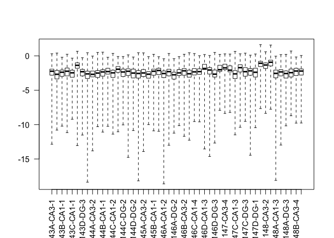

    plotDispEsts(dds)

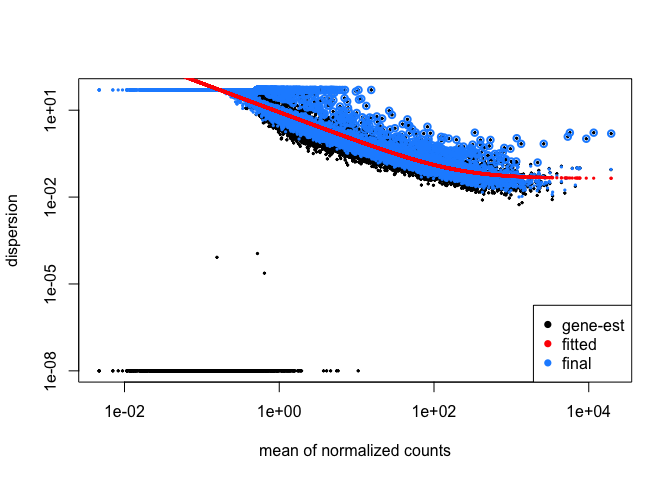

    sampleDists <- dist(t(assay(vsd)))
    library("RColorBrewer")
    sampleDistMatrix <- as.matrix(sampleDists)
    rownames(sampleDistMatrix) <- paste(vsd$condition, vsd$type, sep="-")
    colnames(sampleDistMatrix) <- NULL
    colors <- colorRampPalette( rev(brewer.pal(9, "Blues")) )(255)
    pheatmap(sampleDistMatrix,
             clustering_distance_rows=sampleDists,
             clustering_distance_cols=sampleDists,
             col=colors)

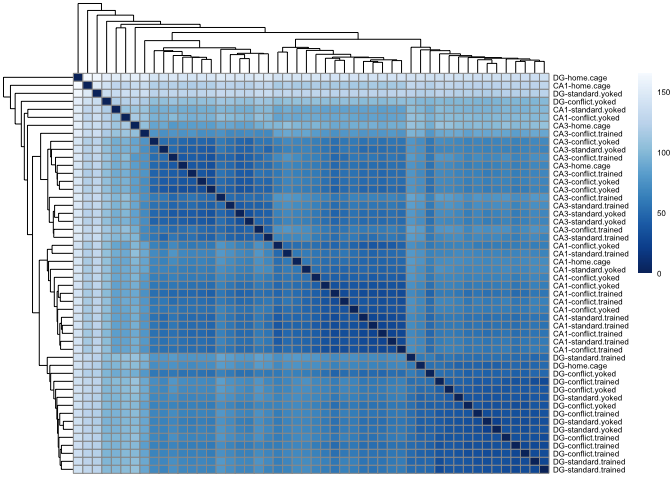

Summary 2 way contrasts
-----------------------

This first function shows the total number of up and down regulated
genes and the top 3 most significant genes.

    res_summary <- function(mycontrast){
      res <- results(dds, contrast = mycontrast, independentFiltering = T)
      print(mycontrast)
      print(summary(res))
      print(head((res[order(res$padj),]), 5))
      cat("\n")
    }

    res_summary(c("subfield", "CA1", "DG"))

    ## [1] "subfield" "CA1"      "DG"      
    ## 
    ## out of 17975 with nonzero total read count
    ## adjusted p-value < 0.1
    ## LFC > 0 (up)       : 1203, 6.7%
    ## LFC < 0 (down)     : 1857, 10%
    ## outliers [1]       : 8, 0.045%
    ## low counts [2]     : 5572, 31%
    ## (mean count < 4)
    ## [1] see 'cooksCutoff' argument of ?results
    ## [2] see 'independentFiltering' argument of ?results
    ## 
    ## NULL
    ## log2 fold change (MLE): subfield CA1 vs DG 
    ## Wald test p-value: subfield CA1 vs DG 
    ## DataFrame with 5 rows and 6 columns
    ##                 baseMean    log2FoldChange             lfcSE
    ##                <numeric>         <numeric>         <numeric>
    ## Cxcl12  63.0306483115304 -16.5881774318882  1.66775266108725
    ## Cdh9    50.8740504975299 -16.3822507108132  1.73111050595518
    ## Cpe     2718.77590276315  2.79592069940428 0.334913187165121
    ## Plekha2 139.077569484557 -7.38275250194524   0.9078299953689
    ## Sept5   914.134724996885 -1.98866340755846 0.245287831497518
    ##                      stat               pvalue                 padj
    ##                 <numeric>            <numeric>            <numeric>
    ## Cxcl12   -9.9464254016384  2.6140452888182e-23 3.24010913549015e-19
    ## Cdh9     -9.4634343991656 2.97991441993193e-21 1.84680196175281e-17
    ## Cpe      8.34819531315084 6.93138861524575e-17 2.86381872953237e-13
    ## Plekha2 -8.13230730379782 4.21195412426639e-16 1.27299333374074e-12
    ## Sept5    -8.1074686641297 5.16851915724209e-16 1.27299333374074e-12

    res_summary(c("subfield", "CA1", "CA3"))

    ## [1] "subfield" "CA1"      "CA3"     
    ## 
    ## out of 17975 with nonzero total read count
    ## adjusted p-value < 0.1
    ## LFC > 0 (up)       : 1118, 6.2%
    ## LFC < 0 (down)     : 1270, 7.1%
    ## outliers [1]       : 8, 0.045%
    ## low counts [2]     : 4875, 27%
    ## (mean count < 3)
    ## [1] see 'cooksCutoff' argument of ?results
    ## [2] see 'independentFiltering' argument of ?results
    ## 
    ## NULL
    ## log2 fold change (MLE): subfield CA1 vs CA3 
    ## Wald test p-value: subfield CA1 vs CA3 
    ## DataFrame with 5 rows and 6 columns
    ##                baseMean    log2FoldChange             lfcSE
    ##               <numeric>         <numeric>         <numeric>
    ## Doc2b  313.433661413489  6.62201632176014 0.735304609612857
    ## Cdh9   50.8740504975299 -15.0953995521465  1.71741857597254
    ## Cxcl12 63.0306483115304 -13.6729048407547  1.67700361952213
    ## Itpka  611.667927730471  2.25650464050331 0.292740306257203
    ## Kcnb1   336.15136171032  3.56512049750924 0.465953557080791
    ##                    stat               pvalue                 padj
    ##               <numeric>            <numeric>            <numeric>
    ## Doc2b  9.00581369297642 2.14072374898396e-19 2.80263553216981e-15
    ## Cdh9   -8.7895867456763 1.50111105134479e-18 9.82627294210301e-15
    ## Cxcl12 -8.1531755099317 3.54490564018055e-16 1.54699682137479e-12
    ## Itpka  7.70821302113668 1.27591650501459e-14 4.17607472091274e-11
    ## Kcnb1  7.65123571508884  1.9905707242934e-14 4.44127324046486e-11

    res_summary(c("subfield", "CA3", "DG"))

    ## [1] "subfield" "CA3"      "DG"      
    ## 
    ## out of 17975 with nonzero total read count
    ## adjusted p-value < 0.1
    ## LFC > 0 (up)       : 1289, 7.2%
    ## LFC < 0 (down)     : 1789, 10%
    ## outliers [1]       : 8, 0.045%
    ## low counts [2]     : 4875, 27%
    ## (mean count < 3)
    ## [1] see 'cooksCutoff' argument of ?results
    ## [2] see 'independentFiltering' argument of ?results
    ## 
    ## NULL
    ## log2 fold change (MLE): subfield CA3 vs DG 
    ## Wald test p-value: subfield CA3 vs DG 
    ## DataFrame with 5 rows and 6 columns
    ##                 baseMean    log2FoldChange             lfcSE
    ##                <numeric>         <numeric>         <numeric>
    ## Adcy1   2262.91207204567 -4.22772039704826 0.400678566515945
    ## Doc2b   313.433661413489 -7.24316635773793 0.735677055341565
    ## Fam163b 554.096017468359  -5.1025729838737 0.534350679644618
    ## C1ql3   258.612905760531   -7.153109369313 0.753769617165075
    ## Cpe     2718.77590276315  3.07553800253409 0.333087885716157
    ##                      stat               pvalue                 padj
    ##                 <numeric>            <numeric>            <numeric>
    ## Adcy1   -10.5514014233652 5.00450012186108e-26 6.55189155954052e-22
    ## Doc2b   -9.84557871575188 7.16258144671295e-23  4.6886258150183e-19
    ## Fam163b -9.54910918662493 1.30816253233078e-21 5.70882129109154e-18
    ## C1ql3   -9.48978203209599  2.3151785967198e-21  7.5775795470639e-18
    ## Cpe      9.23341296523443 2.62143119873749e-20 6.86395545077423e-17

    res_summary(c("treatment", "standard.trained", "standard.yoked"))

    ## [1] "treatment"        "standard.trained" "standard.yoked"  
    ## 
    ## out of 17975 with nonzero total read count
    ## adjusted p-value < 0.1
    ## LFC > 0 (up)       : 76, 0.42%
    ## LFC < 0 (down)     : 4, 0.022%
    ## outliers [1]       : 8, 0.045%
    ## low counts [2]     : 5921, 33%
    ## (mean count < 5)
    ## [1] see 'cooksCutoff' argument of ?results
    ## [2] see 'independentFiltering' argument of ?results
    ## 
    ## NULL
    ## log2 fold change (MLE): treatment standard.trained vs standard.yoked 
    ## Wald test p-value: treatment standard.trained vs standard.yoked 
    ## DataFrame with 5 rows and 6 columns
    ##               baseMean   log2FoldChange             lfcSE             stat
    ##              <numeric>        <numeric>         <numeric>        <numeric>
    ## Arc   758.392356281105 2.87460649842132 0.417901748333271 6.87866588231849
    ## Smad7 92.8148992828604 3.57358999810335 0.557359836567866 6.41163887966696
    ## Frmd6 94.1573503918978 3.27854070789048 0.522510442209896 6.27459365984014
    ## Sgk1  216.520310929759  2.5436465108213 0.418485081060251 6.07822506928289
    ## Egr1  1099.55125407104 2.40057501359089 0.397528466556896 6.03874996521112
    ##                     pvalue                 padj
    ##                  <numeric>            <numeric>
    ## Arc   6.04156721189535e-12 7.27767186344914e-08
    ## Smad7 1.43963526781775e-10 8.67092321806632e-07
    ## Frmd6 3.50548564993573e-10 1.40756933797086e-06
    ## Sgk1  1.21520112762777e-09 3.65957819585102e-06
    ## Egr1   1.5531268838205e-09 3.74179328850035e-06

    res_summary(c("treatment", "conflict.yoked", "standard.yoked"))

    ## [1] "treatment"      "conflict.yoked" "standard.yoked"
    ## 
    ## out of 17975 with nonzero total read count
    ## adjusted p-value < 0.1
    ## LFC > 0 (up)       : 34, 0.19%
    ## LFC < 0 (down)     : 3, 0.017%
    ## outliers [1]       : 8, 0.045%
    ## low counts [2]     : 5921, 33%
    ## (mean count < 5)
    ## [1] see 'cooksCutoff' argument of ?results
    ## [2] see 'independentFiltering' argument of ?results
    ## 
    ## NULL
    ## log2 fold change (MLE): treatment conflict.yoked vs standard.yoked 
    ## Wald test p-value: treatment conflict.yoked vs standard.yoked 
    ## DataFrame with 5 rows and 6 columns
    ##                 baseMean   log2FoldChange             lfcSE
    ##                <numeric>        <numeric>         <numeric>
    ## Kcnc2   124.952493734933 3.83674269491689 0.584367546731223
    ## Cnr1    296.149800385222 3.90399810714797 0.764264716790456
    ## St8sia5 69.5476502474826 3.57600594059455 0.723406685629619
    ## Dner    153.262759844367 1.75326848146048 0.361641191111858
    ## Camk1g  38.5597191774869 3.08308692900109 0.665243199868374
    ##                     stat               pvalue                 padj
    ##                <numeric>            <numeric>            <numeric>
    ## Kcnc2   6.56563273641474 5.18123751144787e-11 6.24131870629011e-07
    ## Cnr1    5.10817524527742 3.25284893107316e-07  0.00195919091118537
    ## St8sia5 4.94328572244555 7.68167731698567e-07  0.00308444949868031
    ## Dner    4.84808844941056 1.24656822373952e-06  0.00375404020579156
    ## Camk1g  4.63452603440533 3.57756210369691e-06  0.00861906262022659

    res_summary(c("treatment", "conflict.trained", "conflict.yoked"))

    ## [1] "treatment"        "conflict.trained" "conflict.yoked"  
    ## 
    ## out of 17975 with nonzero total read count
    ## adjusted p-value < 0.1
    ## LFC > 0 (up)       : 5, 0.028%
    ## LFC < 0 (down)     : 18, 0.1%
    ## outliers [1]       : 8, 0.045%
    ## low counts [2]     : 3834, 21%
    ## (mean count < 1)
    ## [1] see 'cooksCutoff' argument of ?results
    ## [2] see 'independentFiltering' argument of ?results
    ## 
    ## NULL
    ## log2 fold change (MLE): treatment conflict.trained vs conflict.yoked 
    ## Wald test p-value: treatment conflict.trained vs conflict.yoked 
    ## DataFrame with 5 rows and 6 columns
    ##                 baseMean    log2FoldChange             lfcSE
    ##                <numeric>         <numeric>         <numeric>
    ## Camk1g  38.5597191774869 -3.40546281993487 0.631292971749786
    ## Insm1   22.5612210391479 -4.62031779282814 0.887598010058192
    ## Kcnc2   124.952493734933 -2.55095636602511 0.496078573986496
    ## Neurod6 311.659477306372 -3.55004802375201 0.701650727821907
    ## Sv2b    516.758080275828 -3.74676841377883 0.769493214435481
    ##                      stat               pvalue                 padj
    ##                 <numeric>            <numeric>            <numeric>
    ## Camk1g  -5.39442536560446 6.87431927870915e-08 0.000971547543659964
    ## Insm1   -5.20541702490436 1.93561422874569e-07  0.00127893414260891
    ## Kcnc2   -5.14224257968971 2.71478272682851e-07  0.00127893414260891
    ## Neurod6 -5.05956579674936 4.20212260800966e-07  0.00148471497047501
    ## Sv2b    -4.86913769152279 1.12086288711912e-06  0.00316823103673091

    res_summary(c("treatment", "conflict.trained", "standard.trained"))

    ## [1] "treatment"        "conflict.trained" "standard.trained"
    ## 
    ## out of 17975 with nonzero total read count
    ## adjusted p-value < 0.1
    ## LFC > 0 (up)       : 0, 0%
    ## LFC < 0 (down)     : 1, 0.0056%
    ## outliers [1]       : 8, 0.045%
    ## low counts [2]     : 0, 0%
    ## (mean count < 0)
    ## [1] see 'cooksCutoff' argument of ?results
    ## [2] see 'independentFiltering' argument of ?results
    ## 
    ## NULL
    ## log2 fold change (MLE): treatment conflict.trained vs standard.trained 
    ## Wald test p-value: treatment conflict.trained vs standard.trained 
    ## DataFrame with 5 rows and 6 columns
    ##                       baseMean     log2FoldChange             lfcSE
    ##                      <numeric>          <numeric>         <numeric>
    ## Gm21949       13.3277949535085   -25.833985376996  4.07898589958271
    ## 0610007P14Rik  41.002867232644 -0.173528129285372 0.461309350603557
    ## 0610009B22Rik 15.7511687047392 -0.756248610166991 0.727892450985017
    ## 0610009L18Rik 3.22430530585902  0.587093135119797  1.32359877609848
    ## 0610009O20Rik 42.8500159535687  0.268528280803771 0.459643641922261
    ##                             stat               pvalue                 padj
    ##                        <numeric>            <numeric>            <numeric>
    ## Gm21949        -6.33343336137517 2.39764889006869e-10 4.30785576078641e-06
    ## 0610007P14Rik -0.376164344074828    0.706794721318231                    1
    ## 0610009B22Rik  -1.03895652323856    0.298824956774045                    1
    ## 0610009L18Rik  0.443558233598815     0.65736200808842                    1
    ## 0610009O20Rik  0.584209714466554    0.559079226505278                    1

    res_summary(c("treatment", "standard.yoked", "home.cage"))

    ## [1] "treatment"      "standard.yoked" "home.cage"     
    ## 
    ## out of 17975 with nonzero total read count
    ## adjusted p-value < 0.1
    ## LFC > 0 (up)       : 358, 2%
    ## LFC < 0 (down)     : 927, 5.2%
    ## outliers [1]       : 8, 0.045%
    ## low counts [2]     : 6268, 35%
    ## (mean count < 6)
    ## [1] see 'cooksCutoff' argument of ?results
    ## [2] see 'independentFiltering' argument of ?results
    ## 
    ## NULL
    ## log2 fold change (MLE): treatment standard.yoked vs home.cage 
    ## Wald test p-value: treatment standard.yoked vs home.cage 
    ## DataFrame with 5 rows and 6 columns
    ##                baseMean    log2FoldChange             lfcSE
    ##               <numeric>         <numeric>         <numeric>
    ## Efnb2  56.7882142397795 -5.27099111839829 0.790215320608203
    ## Phkb    51.377002305436 -4.89027322779646 0.736576958114059
    ## Alkbh1 47.6954100002425 -4.35311342958819 0.705353785377044
    ## Tm2d2  73.1835387317898   -3.416618757933 0.556969687943786
    ## Zdbf2  72.7605447738455  -4.2582403506116 0.703613526237727
    ##                     stat               pvalue                 padj
    ##                <numeric>            <numeric>            <numeric>
    ## Efnb2  -6.67032260819922  2.5524172230148e-11 1.84501969275186e-07
    ## Phkb   -6.63918844314324 3.15414940208884e-11 1.84501969275186e-07
    ## Alkbh1 -6.17153196003797  6.7631456328183e-10 2.50169543812552e-06
    ## Tm2d2  -6.13429928394565 8.55353598812042e-10 2.50169543812552e-06
    ## Zdbf2  -6.05195919609551 1.43094719899242e-09 3.34813025620248e-06

    res_summary(c("treatment", "standard.trained", "home.cage"))

    ## [1] "treatment"        "standard.trained" "home.cage"       
    ## 
    ## out of 17975 with nonzero total read count
    ## adjusted p-value < 0.1
    ## LFC > 0 (up)       : 452, 2.5%
    ## LFC < 0 (down)     : 868, 4.8%
    ## outliers [1]       : 8, 0.045%
    ## low counts [2]     : 5921, 33%
    ## (mean count < 5)
    ## [1] see 'cooksCutoff' argument of ?results
    ## [2] see 'independentFiltering' argument of ?results
    ## 
    ## NULL
    ## log2 fold change (MLE): treatment standard.trained vs home.cage 
    ## Wald test p-value: treatment standard.trained vs home.cage 
    ## DataFrame with 5 rows and 6 columns
    ##                  baseMean    log2FoldChange             lfcSE
    ##                 <numeric>         <numeric>         <numeric>
    ## Ephb6    163.997853114623 -3.08904301500247 0.479759817352088
    ## BC068281 34.2258704050532  -5.9006312973857 0.943776293272163
    ## Rfng     187.215948646428 -2.90460467559235 0.469417426750392
    ## Dab2ip    184.45067783596 -3.20706390087913 0.525793319385623
    ## Polr3k    58.921335312843 -3.64206409474448 0.620787737909977
    ##                       stat               pvalue                 padj
    ##                  <numeric>            <numeric>            <numeric>
    ## Ephb6    -6.43872809534499 1.20478804133903e-10 1.45128767459699e-06
    ## BC068281 -6.25215036598095 4.04839325440685e-10 2.43834725712924e-06
    ## Rfng     -6.18767968564755 6.10562331127034e-10 2.45161128025208e-06
    ## Dab2ip   -6.09947632013757  1.0641652270551e-09 3.20473358127642e-06
    ## Polr3k   -5.86684283907783 4.44171315197402e-09 1.07009753257358e-05

    res_summary(c("treatment", "conflict.yoked", "home.cage"))

    ## [1] "treatment"      "conflict.yoked" "home.cage"     
    ## 
    ## out of 17975 with nonzero total read count
    ## adjusted p-value < 0.1
    ## LFC > 0 (up)       : 536, 3%
    ## LFC < 0 (down)     : 864, 4.8%
    ## outliers [1]       : 8, 0.045%
    ## low counts [2]     : 5572, 31%
    ## (mean count < 4)
    ## [1] see 'cooksCutoff' argument of ?results
    ## [2] see 'independentFiltering' argument of ?results
    ## 
    ## NULL
    ## log2 fold change (MLE): treatment conflict.yoked vs home.cage 
    ## Wald test p-value: treatment conflict.yoked vs home.cage 
    ## DataFrame with 5 rows and 6 columns
    ##                  baseMean    log2FoldChange             lfcSE
    ##                 <numeric>         <numeric>         <numeric>
    ## Alkbh1   47.6954100002425 -4.30563510210828 0.711553907527244
    ## BC068281 34.2258704050532 -5.78681762557704 0.922623217697116
    ## Dab2ip    184.45067783596 -3.08057954587541 0.510734618215698
    ## Endod1   134.866699757377  4.27783967992093  0.70868455485439
    ## Gpr27    106.852369579923 -3.28028433606842 0.535256578241059
    ##                       stat               pvalue                 padj
    ##                  <numeric>            <numeric>            <numeric>
    ## Alkbh1   -6.05103149116418 1.43921307946603e-09 3.35243529231545e-06
    ## BC068281 -6.27213527101674 3.56129964041133e-10 3.35243529231545e-06
    ## Dab2ip   -6.03166387396593 1.62280046421079e-09 3.35243529231545e-06
    ## Endod1    6.03631002061259 1.57678188133849e-09 3.35243529231545e-06
    ## Gpr27    -6.12843348296246 8.87485171671387e-10 3.35243529231545e-06

    res_summary(c("treatment", "conflict.trained", "home.cage"))

    ## [1] "treatment"        "conflict.trained" "home.cage"       
    ## 
    ## out of 17975 with nonzero total read count
    ## adjusted p-value < 0.1
    ## LFC > 0 (up)       : 589, 3.3%
    ## LFC < 0 (down)     : 1070, 6%
    ## outliers [1]       : 8, 0.045%
    ## low counts [2]     : 5921, 33%
    ## (mean count < 5)
    ## [1] see 'cooksCutoff' argument of ?results
    ## [2] see 'independentFiltering' argument of ?results
    ## 
    ## NULL
    ## log2 fold change (MLE): treatment conflict.trained vs home.cage 
    ## Wald test p-value: treatment conflict.trained vs home.cage 
    ## DataFrame with 5 rows and 6 columns
    ##                  baseMean    log2FoldChange             lfcSE
    ##                 <numeric>         <numeric>         <numeric>
    ## BC068281 34.2258704050532 -5.92261090786567 0.843983239835422
    ## Rfng     187.215948646428 -2.72895221438367 0.427701533111444
    ## Dab2ip    184.45067783596 -2.97029411412126 0.476809821594452
    ## Tm2d2    73.1835387317898 -3.19014467909072 0.519743087903116
    ## Alkbh1   47.6954100002425 -3.98524963393853 0.656812896549362
    ##                       stat               pvalue                 padj
    ##                  <numeric>            <numeric>            <numeric>
    ## BC068281 -7.01745085485417 2.25952595198543e-12 2.72182496176165e-08
    ## Rfng     -6.38050603777611 1.76503767089971e-10  1.0630821891829e-06
    ## Dab2ip   -6.22951537405123 4.67880242961723e-10  1.8786951355723e-06
    ## Tm2d2    -6.13792612800535  8.3605721198489e-10  2.5177862938925e-06
    ## Alkbh1   -6.06755691746534 1.29870599744614e-09  2.5522717325059e-06

This second function only prints the total number of DEGs, but it saves
lots of useful info to a df for downstream dataviz.

    # note: see resvals fucntion in `functions_RNAseq.R`

    contrast1 <- resvals(contrastvector = c("subfield", "CA1", "DG"), mypval = 0.1) # 3060

    ## [1] 3060

    contrast2 <- resvals(contrastvector = c("subfield", "CA1", "CA3"), mypval = 0.1) # 2388

    ## [1] 2388

    contrast3 <- resvals(contrastvector = c("subfield", "CA3", "DG"), mypval = 0.1) # 3078

    ## [1] 3078

    contrast4 <- resvals(contrastvector = c("treatment", "standard.trained", "standard.yoked"), mypval = 0.1) #  80

    ## [1] 80

    contrast5 <- resvals(contrastvector = c("treatment", "conflict.trained", "conflict.yoked"), mypval = 0.1) # 23

    ## [1] 23

    contrast6 <- resvals(contrastvector = c("treatment", "conflict.trained", "standard.trained"), mypval = 0.1) #  1

    ## [1] 1

    contrast7 <- resvals(contrastvector = c("treatment", "conflict.yoked", "standard.yoked"), mypval = 0.1) # 37

    ## [1] 37

    contrast8 <- resvals(contrastvector = c("treatment", "standard.yoked", "home.cage"), mypval = 0.1) #1285

    ## [1] 1285

    contrast9 <- resvals(contrastvector = c("treatment", "standard.trained", "home.cage"), mypval = 0.1) # 1320

    ## [1] 1320

    contrast10 <- resvals(contrastvector = c("treatment", "conflict.yoked", "home.cage"), mypval = 0.1) #1400

    ## [1] 1400

    contrast11 <- resvals(contrastvector = c("treatment", "conflict.trained", "home.cage"), mypval = 0.1) #1659

    ## [1] 1659

    # heatmap with all DEGs
    DEGes <- assay(vsd)
    DEGes <- cbind(DEGes, contrast1, contrast2, contrast3, contrast4, contrast5, contrast6, contrast7,
                   contrast8, contrast9, contrast10, contrast11)
    DEGes <- as.data.frame(DEGes) # convert matrix to dataframe
    DEGes$rownames <- rownames(DEGes)  # add the rownames to the dataframe
    DEGes$rownames <- str_to_upper(DEGes$rownames) ## uppercase gene names

    names(DEGes)

    ##  [1] "143A-CA3-1"                                   
    ##  [2] "143A-DG-1"                                    
    ##  [3] "143B-CA1-1"                                   
    ##  [4] "143B-DG-1"                                    
    ##  [5] "143C-CA1-1"                                   
    ##  [6] "143D-CA1-3"                                   
    ##  [7] "143D-DG-3"                                    
    ##  [8] "144A-CA1-2"                                   
    ##  [9] "144A-CA3-2"                                   
    ## [10] "144A-DG-2"                                    
    ## [11] "144B-CA1-1"                                   
    ## [12] "144B-CA3-1"                                   
    ## [13] "144C-CA1-2"                                   
    ## [14] "144C-CA3-2"                                   
    ## [15] "144C-DG-2"                                    
    ## [16] "144D-CA3-2"                                   
    ## [17] "144D-DG-2"                                    
    ## [18] "145A-CA1-2"                                   
    ## [19] "145A-CA3-2"                                   
    ## [20] "145A-DG-2"                                    
    ## [21] "145B-CA1-1"                                   
    ## [22] "145B-DG-1"                                    
    ## [23] "146A-CA1-2"                                   
    ## [24] "146A-CA3-2"                                   
    ## [25] "146A-DG-2"                                    
    ## [26] "146B-CA1-2"                                   
    ## [27] "146B-CA3-2"                                   
    ## [28] "146B-DG-2"                                    
    ## [29] "146C-CA1-4"                                   
    ## [30] "146C-DG-4"                                    
    ## [31] "146D-CA1-3"                                   
    ## [32] "146D-CA3-3"                                   
    ## [33] "146D-DG-3"                                    
    ## [34] "147-CA1-4"                                    
    ## [35] "147-CA3-4"                                    
    ## [36] "147-DG-4"                                     
    ## [37] "147C-CA1-3"                                   
    ## [38] "147C-CA3-3"                                   
    ## [39] "147C-DG-3"                                    
    ## [40] "147D-CA3-1"                                   
    ## [41] "147D-DG-1"                                    
    ## [42] "148-CA1-2"                                    
    ## [43] "148-CA3-2"                                    
    ## [44] "148-DG-2"                                     
    ## [45] "148A-CA1-3"                                   
    ## [46] "148A-CA3-3"                                   
    ## [47] "148A-DG-3"                                    
    ## [48] "148B-CA1-4"                                   
    ## [49] "148B-CA3-4"                                   
    ## [50] "148B-DG-4"                                    
    ## [51] "pvalsubfieldCA1DG"                            
    ## [52] "padjsubfieldCA1DG"                            
    ## [53] "pvalsubfieldCA1CA3"                           
    ## [54] "padjsubfieldCA1CA3"                           
    ## [55] "pvalsubfieldCA3DG"                            
    ## [56] "padjsubfieldCA3DG"                            
    ## [57] "pvaltreatmentstandard.trainedstandard.yoked"  
    ## [58] "padjtreatmentstandard.trainedstandard.yoked"  
    ## [59] "pvaltreatmentconflict.trainedconflict.yoked"  
    ## [60] "padjtreatmentconflict.trainedconflict.yoked"  
    ## [61] "pvaltreatmentconflict.trainedstandard.trained"
    ## [62] "padjtreatmentconflict.trainedstandard.trained"
    ## [63] "pvaltreatmentconflict.yokedstandard.yoked"    
    ## [64] "padjtreatmentconflict.yokedstandard.yoked"    
    ## [65] "pvaltreatmentstandard.yokedhome.cage"         
    ## [66] "padjtreatmentstandard.yokedhome.cage"         
    ## [67] "pvaltreatmentstandard.trainedhome.cage"       
    ## [68] "padjtreatmentstandard.trainedhome.cage"       
    ## [69] "pvaltreatmentconflict.yokedhome.cage"         
    ## [70] "padjtreatmentconflict.yokedhome.cage"         
    ## [71] "pvaltreatmentconflict.trainedhome.cage"       
    ## [72] "padjtreatmentconflict.trainedhome.cage"       
    ## [73] "rownames"

    DEGes$padjmin <- with(DEGes, pmin(padjsubfieldCA1DG, padjsubfieldCA1CA3, padjsubfieldCA3DG, 
                                      "padjtreatmentstandard.trainedstandard.yoked", "padjtreatmentconflict.trainedconflict.yoked",
                                      "padjtreatmentconflict.trainedstandard.trained","padjtreatmentconflict.yokedstandard.yoked",
                                      "padjtreatmentstandard.yokedhome.cage","padjtreatmentstandard.trainedhome.cage",
                                      "padjtreatmentconflict.yokedhome.cage","padjtreatmentconflict.trainedhome.cage")) 
    DEGes <- DEGes %>% filter(padjmin < 0.00000000000000000001)
    rownames(DEGes) <- DEGes$rownames
    drop.cols <-colnames(DEGes[,grep("padj|pval|rownames", colnames(DEGes))])
    DEGes <- DEGes %>% dplyr::select(-one_of(drop.cols))
    DEGes <- as.matrix(DEGes)
    DEGes <- DEGes - rowMeans(DEGes)

    df <- as.data.frame(colData(dds)[,c("treatment", "subfield")]) ## matrix to df
    rownames(df) <- names(countData)
    levels(df$treatment) <- c("home cage", "standard yoked","standard trained",  "conflict yoked","conflict trained")

    DEGes <- as.matrix(DEGes) 
    paletteLength <- 80
    myBreaks <- c(seq(min(DEGes), 0, length.out=ceiling(paletteLength/2) + 1), 
                  seq(max(DEGes)/paletteLength, max(DEGes), length.out=floor(paletteLength/2)))

    pheatmap(DEGes, show_colnames=F, show_rownames = F,
             annotation_col=df, 
             annotation_colors = pheatmapcolors,
             treeheight_row = 0, treeheight_col = 25,
             annotation_row = NA, 
             annotation_legend = TRUE,
             annotation_names_row = FALSE, annotation_names_col = FALSE,
             fontsize = 8, 
             border_color = NA ,
             color = viridis(80),
             cellwidth = 6, 
             clustering_method="average",
             breaks=myBreaks,
             clustering_distance_cols="correlation" 
             )

    pheatmap(DEGes, show_colnames=F, show_rownames = F,
             annotation_col=df, annotation_colors = pheatmapcolors, 
             annotation_row = NA, 
             annotation_legend = TRUE,
             annotation_names_row = FALSE, 
             annotation_names_col = FALSE,
             treeheight_row = 10, treeheight_col = 10,
             fontsize = 6, 
             border_color = NA ,
             color = viridis(80),
             height = 2.5, 
             width = 3.3,
             clustering_method="average",
             breaks=myBreaks,
             clustering_distance_cols="correlation", 
             filename = "../figures/02b_RNAseqALL/pheatmap1.pdf"
             )

Principle component analysis
----------------------------

    # create the dataframe using my function pcadataframe
    pcadata <- pcadataframe(vsd, intgroup=c("subfield","treatment"), returnData=TRUE)
    percentVar <- round(100 * attr(pcadata, "percentVar"))
    pcadata$subfieldAPA <- as.factor(paste(pcadata$subfield, pcadata$treatment, sep="_"))
    pcadata$subfield <- factor(pcadata$subfield, levels=c("DG","CA3", "CA1"))
    pcadata$treatment <- factor(pcadata$treatment, levels=c("home.cage", "standard.yoked","standard.trained",  "conflict.yoked","conflict.trained"))

    levels(pcadata$treatment) <- c("home cage", "standard yoked","standard trained",  "conflict yoked", "conflict trained")

    summary(aov(PC1 ~ subfield * treatment, data=pcadata)) 

    ##                    Df Sum Sq Mean Sq F value Pr(>F)    
    ## subfield            2   9769    4884 778.521 <2e-16 ***
    ## treatment           4     80      20   3.196 0.0245 *  
    ## subfield:treatment  8     88      11   1.752 0.1209    
    ## Residuals          35    220       6                   
    ## ---
    ## Signif. codes:  0 '***' 0.001 '**' 0.01 '*' 0.05 '.' 0.1 ' ' 1

    TukeyHSD((aov(PC1 ~ subfield, data=pcadata)), which = "subfield") 

    ##   Tukey multiple comparisons of means
    ##     95% family-wise confidence level
    ## 
    ## Fit: aov(formula = PC1 ~ subfield, data = pcadata)
    ## 
    ## $subfield
    ##               diff         lwr        upr     p adj
    ## CA3-DG  -29.959082 -32.3891265 -27.529038 0.0000000
    ## CA1-DG  -28.319645 -30.6704272 -25.968862 0.0000000
    ## CA1-CA3   1.639437  -0.8228801   4.101755 0.2509395

    summary(aov(PC2 ~ subfield * treatment, data=pcadata)) 

    ##                    Df Sum Sq Mean Sq  F value Pr(>F)    
    ## subfield            2   4746  2373.0 1773.929 <2e-16 ***
    ## treatment           4      8     1.9    1.436  0.243    
    ## subfield:treatment  8     20     2.5    1.885  0.094 .  
    ## Residuals          35     47     1.3                    
    ## ---
    ## Signif. codes:  0 '***' 0.001 '**' 0.01 '*' 0.05 '.' 0.1 ' ' 1

    TukeyHSD((aov(PC2 ~ subfield, data=pcadata)), which = "subfield") 

    ##   Tukey multiple comparisons of means
    ##     95% family-wise confidence level
    ## 
    ## Fit: aov(formula = PC2 ~ subfield, data = pcadata)
    ## 
    ## $subfield
    ##              diff       lwr       upr p adj
    ## CA3-DG  -11.82270 -12.88919 -10.75622     0
    ## CA1-DG   12.54435  11.51265  13.57604     0
    ## CA1-CA3  24.36705  23.28641  25.44770     0

    summary(aov(PC3 ~ subfield * treatment, data=pcadata)) 

    ##                    Df Sum Sq Mean Sq F value  Pr(>F)   
    ## subfield            2   21.6   10.82   0.256 0.77542   
    ## treatment           4  761.2  190.31   4.505 0.00485 **
    ## subfield:treatment  8  196.7   24.59   0.582 0.78554   
    ## Residuals          35 1478.5   42.24                   
    ## ---
    ## Signif. codes:  0 '***' 0.001 '**' 0.01 '*' 0.05 '.' 0.1 ' ' 1

    TukeyHSD((aov(PC3 ~ subfield, data=pcadata)), which = "subfield") 

    ##   Tukey multiple comparisons of means
    ##     95% family-wise confidence level
    ## 
    ## Fit: aov(formula = PC3 ~ subfield, data = pcadata)
    ## 
    ## $subfield
    ##                diff       lwr      upr     p adj
    ## CA3-DG  -1.39529071 -7.487077 4.696496 0.8447755
    ## CA1-DG  -1.34808086 -7.241169 4.545007 0.8451326
    ## CA1-CA3  0.04720985 -6.125481 6.219900 0.9998111

    summary(aov(PC4 ~ subfield * treatment, data=pcadata)) 

    ##                    Df Sum Sq Mean Sq F value Pr(>F)  
    ## subfield            2    5.8    2.90   0.169 0.8450  
    ## treatment           4  223.9   55.97   3.266 0.0224 *
    ## subfield:treatment  8  285.8   35.73   2.085 0.0643 .
    ## Residuals          35  599.8   17.14                 
    ## ---
    ## Signif. codes:  0 '***' 0.001 '**' 0.01 '*' 0.05 '.' 0.1 ' ' 1

    summary(aov(PC5 ~ subfield * treatment, data=pcadata)) 

    ##                    Df Sum Sq Mean Sq F value Pr(>F)  
    ## subfield            2    0.2   0.109   0.012 0.9882  
    ## treatment           4  112.3  28.085   3.082 0.0283 *
    ## subfield:treatment  8  122.8  15.351   1.685 0.1370  
    ## Residuals          35  318.9   9.112                 
    ## ---
    ## Signif. codes:  0 '***' 0.001 '**' 0.01 '*' 0.05 '.' 0.1 ' ' 1

    summary(aov(PC6 ~ subfield * treatment, data=pcadata)) 

    ##                    Df Sum Sq Mean Sq F value  Pr(>F)   
    ## subfield            2   0.35   0.174   0.024 0.97665   
    ## treatment           4  36.13   9.032   1.229 0.31651   
    ## subfield:treatment  8 194.04  24.256   3.299 0.00654 **
    ## Residuals          35 257.31   7.352                   
    ## ---
    ## Signif. codes:  0 '***' 0.001 '**' 0.01 '*' 0.05 '.' 0.1 ' ' 1

    PCA12 <- ggplot(pcadata, aes(pcadata$PC1, pcadata$PC2, colour=subfield)) +
        geom_point(size=3, aes(shape=treatment), alpha = 0.8) +
        xlab(paste0("PC1: ", percentVar[1],"%")) +
        ylab(paste0("PC2: ", percentVar[2],"%")) +
        scale_colour_manual(values=c(colorvalsubfield))+ 
       theme_bw(base_size = 12)  +
          theme(legend.title=element_blank()) +
        scale_shape_manual(values=c(2, 1, 16, 0, 15), aes(color=colorvalsubfield)) +
      labs(color = "subfield", shape = "treatment")
    PCA12

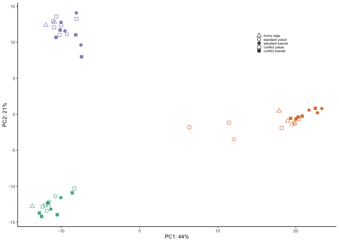

    PCA42 <- ggplot(pcadata, aes(pcadata$PC5, pcadata$PC2)) +
        geom_point(size=3, aes(colour=subfield, shape=treatment), alpha = 0.8) +
        xlab(paste0("PC5: ", percentVar[5],"%")) +
        ylab(paste0("PC2: ", percentVar[2],"%")) +
        scale_colour_manual(values=c(colorvalsubfield))+ 
       theme_bw(base_size = 12)  +
        theme(legend.title=element_blank()) +
        scale_shape_manual(aes(colour=colorvalsubfield), values=c(2,1, 16, 0, 15)) +
      guides(color = guide_legend(order=1),
             shape = guide_legend(order=2)) 
    PCA42

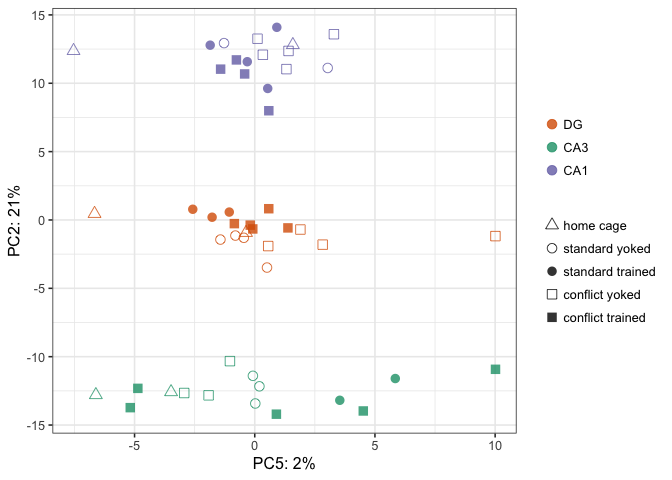

    plot_grid(PCA12, PCA42 ,nrow = 2)

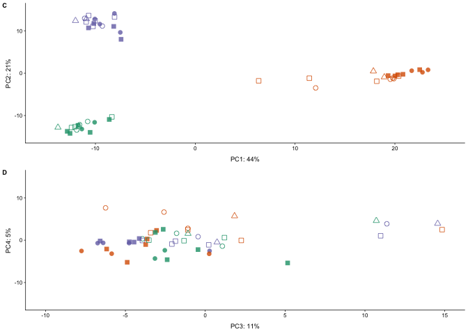

PCA without trained animals
---------------------------

    # create the dataframe using my function pcadataframe
    pcadata <- pcadata %>%
      filter(treatment %in% c("home cage", "standard yoked","conflict yoked"))
    head(pcadata)

    ##          PC1        PC2        PC3         PC4        PC5        PC6
    ## 1 -10.248532  11.033281 -3.9358111 -0.07416176  1.3174595 -0.8215657
    ## 2  18.183037  -1.909191 -3.4156549  1.74309014  0.5599177  1.4622793
    ## 3 -11.082970  12.937073 -0.4472517  0.82278795 -1.2774101 -0.7559707
    ## 4  19.787195  -1.140826 -1.0869728  2.79026702 -0.8051216  0.5437439
    ## 5 -10.928638  12.083606 -1.8659673 -0.23674450  0.3361173 -0.1283809
    ## 6  -8.350649 -10.325457  1.2017648  0.59450604 -1.0327512 -0.4456557
    ##          PC7         PC8         PC9                group subfield
    ## 1 -3.0878014  1.61532663 -1.10269922 CA1 : conflict.yoked      CA1
    ## 2 -1.1135954  2.05283273  0.03563451  DG : conflict.yoked       DG
    ## 3  0.4961708  0.61207186 -3.03670894 CA1 : standard.yoked      CA1
    ## 4  0.3386635  1.29059008  0.27796247  DG : standard.yoked       DG
    ## 5 -1.0118537  0.02196843 -0.61748306 CA1 : conflict.yoked      CA1
    ## 6  2.2459156 -0.81247110  3.03799531 CA3 : conflict.yoked      CA3
    ##        treatment       name        subfieldAPA
    ## 1 conflict yoked 143B-CA1-1 CA1_conflict.yoked
    ## 2 conflict yoked  143B-DG-1  DG_conflict.yoked
    ## 3 standard yoked 143D-CA1-3 CA1_standard.yoked
    ## 4 standard yoked  143D-DG-3  DG_standard.yoked
    ## 5 conflict yoked 144B-CA1-1 CA1_conflict.yoked
    ## 6 conflict yoked 144B-CA3-1 CA3_conflict.yoked

    summary(aov(PC1 ~ subfield * treatment, data=pcadata)) 

    ##                    Df Sum Sq Mean Sq F value   Pr(>F)    
    ## subfield            2   4721  2360.5 225.763 1.79e-13 ***
    ## treatment           2      7     3.7   0.353    0.707    
    ## subfield:treatment  4     37     9.2   0.884    0.493    
    ## Residuals          18    188    10.5                     
    ## ---
    ## Signif. codes:  0 '***' 0.001 '**' 0.01 '*' 0.05 '.' 0.1 ' ' 1

    TukeyHSD((aov(PC1 ~ subfield, data=pcadata)), which = "subfield") 

    ##   Tukey multiple comparisons of means
    ##     95% family-wise confidence level
    ## 
    ## Fit: aov(formula = PC1 ~ subfield, data = pcadata)
    ## 
    ## $subfield
    ##              diff        lwr        upr     p adj
    ## CA3-DG  -27.99525 -31.682801 -24.307701 0.0000000
    ## CA1-DG  -26.80526 -30.377185 -23.233337 0.0000000
    ## CA1-CA3   1.18999  -2.587514   4.967494 0.7146245

    TukeyHSD((aov(PC1 ~ treatment, data=pcadata)), which = "treatment") 

    ##   Tukey multiple comparisons of means
    ##     95% family-wise confidence level
    ## 
    ## Fit: aov(formula = PC1 ~ treatment, data = pcadata)
    ## 
    ## $treatment
    ##                                     diff       lwr      upr     p adj
    ## standard yoked-home cage       3.7688406 -14.95946 22.49714 0.8707844
    ## conflict yoked-home cage      -0.2834496 -18.05067 17.48377 0.9991253
    ## conflict yoked-standard yoked -4.0522902 -19.72151 11.61693 0.7964625

    summary(aov(PC2 ~ subfield * treatment, data=pcadata)) 

    ##                    Df Sum Sq Mean Sq  F value Pr(>F)    
    ## subfield            2 2605.8  1302.9 1346.230 <2e-16 ***
    ## treatment           2    1.6     0.8    0.821  0.456    
    ## subfield:treatment  4    2.9     0.7    0.753  0.569    
    ## Residuals          18   17.4     1.0                    
    ## ---
    ## Signif. codes:  0 '***' 0.001 '**' 0.01 '*' 0.05 '.' 0.1 ' ' 1

    TukeyHSD((aov(PC2 ~ subfield, data=pcadata)), which = "subfield") 

    ##   Tukey multiple comparisons of means
    ##     95% family-wise confidence level
    ## 
    ## Fit: aov(formula = PC2 ~ subfield, data = pcadata)
    ## 
    ## $subfield
    ##              diff       lwr       upr p adj
    ## CA3-DG  -10.92942 -12.06162 -9.797222     0
    ## CA1-DG   13.73853  12.64183 14.835233     0
    ## CA1-CA3  24.66796  23.50814 25.827774     0

    TukeyHSD((aov(PC2 ~ treatment, data=pcadata)), which = "treatment") 

    ##   Tukey multiple comparisons of means
    ##     95% family-wise confidence level
    ## 
    ## Fit: aov(formula = PC2 ~ treatment, data = pcadata)
    ## 
    ## $treatment
    ##                                    diff        lwr      upr     p adj
    ## standard yoked-home cage      -2.142275 -15.696938 11.41239 0.9180076
    ## conflict yoked-home cage       1.856103 -11.002980 14.71519 0.9310875
    ## conflict yoked-standard yoked  3.998377  -7.342268 15.33902 0.6575266

    summary(aov(PC3 ~ subfield * treatment, data=pcadata)) 

    ##                    Df Sum Sq Mean Sq F value Pr(>F)
    ## subfield            2  107.4    53.7   0.713  0.503
    ## treatment           2  241.0   120.5   1.600  0.229
    ## subfield:treatment  4   38.4     9.6   0.128  0.970
    ## Residuals          18 1355.4    75.3

    TukeyHSD((aov(PC3 ~ subfield, data=pcadata)), which = "subfield") 

    ##   Tukey multiple comparisons of means
    ##     95% family-wise confidence level
    ## 
    ## Fit: aov(formula = PC3 ~ subfield, data = pcadata)
    ## 
    ## $subfield
    ##              diff        lwr       upr     p adj
    ## CA3-DG  -4.894490 -14.671037  4.882056 0.4362217
    ## CA1-DG  -1.780001 -11.249997  7.689994 0.8862068
    ## CA1-CA3  3.114489  -6.900545 13.129523 0.7206770

    TukeyHSD((aov(PC3 ~ treatment, data=pcadata)), which = "treatment") 

    ##   Tukey multiple comparisons of means
    ##     95% family-wise confidence level
    ## 
    ## Fit: aov(formula = PC3 ~ treatment, data = pcadata)
    ## 
    ## $treatment
    ##                                    diff        lwr      upr     p adj
    ## standard yoked-home cage      -6.195356 -16.662451 4.271739 0.3188511
    ## conflict yoked-home cage      -7.312503 -17.242462 2.617455 0.1785619
    ## conflict yoked-standard yoked -1.117147  -9.874547 7.640253 0.9457194

    summary(aov(PC4 ~ subfield * treatment, data=pcadata)) 

    ##                    Df Sum Sq Mean Sq F value Pr(>F)  
    ## subfield            2    9.9    4.96   0.175  0.841  
    ## treatment           2  111.6   55.81   1.968  0.169  
    ## subfield:treatment  4  276.0   69.00   2.434  0.085 .
    ## Residuals          18  510.3   28.35                 
    ## ---
    ## Signif. codes:  0 '***' 0.001 '**' 0.01 '*' 0.05 '.' 0.1 ' ' 1

    summary(aov(PC5 ~ subfield * treatment, data=pcadata)) 

    ##                    Df Sum Sq Mean Sq F value  Pr(>F)   
    ## subfield            2  33.57   16.79   2.167 0.14345   
    ## treatment           2 100.99   50.49   6.519 0.00742 **
    ## subfield:treatment  4  37.85    9.46   1.222 0.33641   
    ## Residuals          18 139.42    7.75                   
    ## ---
    ## Signif. codes:  0 '***' 0.001 '**' 0.01 '*' 0.05 '.' 0.1 ' ' 1

    summary(aov(PC6 ~ subfield * treatment, data=pcadata)) 

    ##                    Df Sum Sq Mean Sq F value Pr(>F)  
    ## subfield            2  34.13  17.066   1.456 0.2593  
    ## treatment           2  19.05   9.527   0.813 0.4592  
    ## subfield:treatment  4 119.00  29.749   2.539 0.0758 .
    ## Residuals          18 210.94  11.719                 
    ## ---
    ## Signif. codes:  0 '***' 0.001 '**' 0.01 '*' 0.05 '.' 0.1 ' ' 1

    PCA12 <- ggplot(pcadata, aes(pcadata$PC1, pcadata$PC2, colour=subfield)) +
        geom_point(size=3, aes(shape=treatment), alpha = 0.8) +
        xlab(paste0("PC1: ", percentVar[1],"%")) +
        ylab(paste0("PC2: ", percentVar[2],"%")) +
        scale_colour_manual(values=c(colorvalsubfield)) + 
       theme_bw(base_size = 12)  +
          theme(legend.title=element_blank()) +
        scale_shape_manual(values=c(2, 1,  0), aes(colour=colorvalsubfield)) 
    PCA12

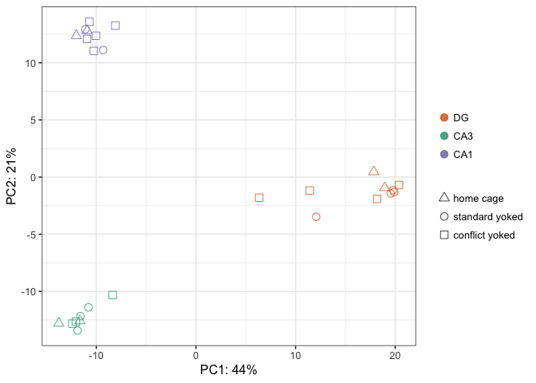

    PCA42 <- ggplot(pcadata, aes(pcadata$PC5, pcadata$PC2)) +
        geom_point(size=3, aes(colour=subfield, shape=treatment), alpha = 0.8) +
        xlab(paste0("PC5: ", percentVar[5],"%")) +
        ylab(paste0("PC2: ", percentVar[2],"%")) +
        scale_colour_manual(values=c(colorvalsubfield))+ 
       theme_bw(base_size = 12)  +
        theme(legend.title=element_blank()) +
        scale_shape_manual(aes(colour=colorvalsubfield), values=c(2,1, 0)) +
      guides(color = guide_legend(order=1),
             shape = guide_legend(order=2))  
    PCA42

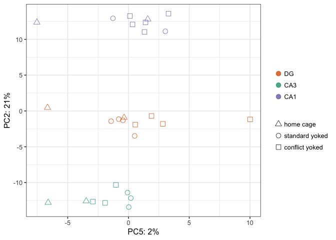

    plot_grid(PCA12, PCA42 ,nrow = 2)

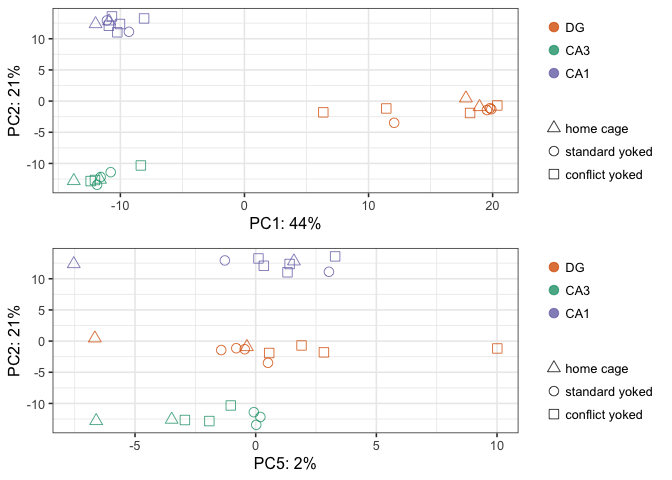

Volcanos plots and and gene lists
---------------------------------

    makevolcanodf <- function(mycontrast, myup, mydown, filename){
      res <- results(dds, contrast = mycontrast, independentFiltering = T)

      data <- data.frame(gene = row.names(res), pvalue = (res$padj), 
                         lfc = res$log2FoldChange)
      data <- na.omit(data)

      data <- data %>%
      mutate(direction = ifelse(data$lfc > 0 & data$pvalue < 0.05, 
                            yes = myup, 
                            no = ifelse(data$lfc < 0 & data$pvalue < 0.05, 
                                        yes = mydown, 
                                        no = "NS")))
      data$logp <- -log10(data$pvalue)
      data <- dplyr::arrange(data, logp)
      write.csv(data, filename, row.names = F)
      return(data)
    }

    DGvCA3 <- makevolcanodf(c("subfield", "CA3", "DG"), "CA3", "DG", "../data/DGvCA3.csv")
    head(DGvCA3)

    ##            gene    pvalue           lfc direction         logp
    ## 1 3110002H16Rik 0.9999833  3.008837e-05        NS 7.250238e-06
    ## 2         Dip2b 0.9999833 -1.352173e-05        NS 7.250238e-06
    ## 3        Pou3f2 0.9996411 -1.241624e-03        NS 1.559128e-04
    ## 4          Ezh2 0.9995358 -1.753338e-03        NS 2.016523e-04
    ## 5        Il10ra 0.9995358 -2.006646e-03        NS 2.016559e-04
    ## 6        Mtmr11 0.9995151 -1.586081e-03        NS 2.106188e-04

    DGvCA1 <- makevolcanodf(c("subfield", "CA1", "DG"),"CA1", "DG", "../data/DGvCA1.csv")
    CA3vCA1 <- makevolcanodf(c("subfield", "CA1", "CA3"),"CA1", "CA3", "../data/CA3vCA1.csv")

    STY <- makevolcanodf(c("treatment", "standard.trained", "standard.yoked"),"standard.trained", "standard.yoked", "../data/STY.csv")
    CTY <- makevolcanodf(c("treatment", "conflict.trained", "conflict.yoked"),"conflict.trained", "conflict.yoked", "../data/CTY.csv")
    SYH <- makevolcanodf(c("treatment", "standard.yoked", "home.cage"),"standard.yoked", "home.cage", "../data/SYH.csv")
    CYH <- makevolcanodf(c("treatment", "conflict.yoked", "home.cage"),"conflict.yoked", "home.cage", "../data/CYH.csv")
    CTST <- makevolcanodf(c("treatment", "conflict.trained", "standard.trained"),"conflict.trained", "standard.trained", "../data/CTST.csv")

    volcanoplot <- function(mydata, mycolors, mybreaks){
      
      myvolcano <- mydata %>%
        dplyr::filter(direction != "NS") %>%
        ggplot(aes(x = lfc, y = logp)) + 
      geom_point(aes(color = direction), size = 2, alpha = 0.5, na.rm = T) + 
      scale_color_manual(values = mycolors,
                         breaks = mybreaks,
                         name = "higher in") + 
      theme_cowplot(font_size = 12, line_size = 0.25) +
      geom_hline(yintercept = 1.3,  size = 0.25, linetype = 2) + 
      #scale_y_continuous(limits=c(0, 60)) +
      #scale_x_continuous(limits=c(-10, 10)) +
      xlab(paste0("log fold difference")) +
      ylab(paste0("log10 p-value")) +       
      theme(panel.grid.minor=element_blank(),
            #legend.title = element_blank(),
            legend.position = "bottom",
            legend.spacing.x = unit(-0.1, 'cm'),
            panel.grid.major=element_blank(),
            legend.margin=margin(t=-0.25, r=0, b=0, l=0, unit="cm")) 

    return(myvolcano)
    }
      
    d <- volcanoplot(DGvCA3, volcanoDGvCA3, c("DG", "CA3"))
    e <- volcanoplot(DGvCA1, volcanoDGvCA1, c("DG", "CA1"))  
    f <- volcanoplot(CA3vCA1, volcanoCA3vCA1, c("CA3", "CA1")) 

    plot_grid(d,e,f, nrow = 1)

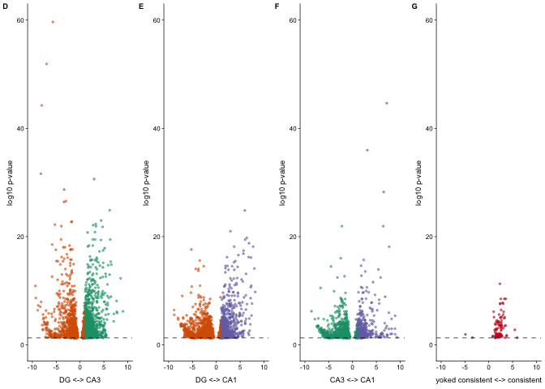

    g <- volcanoplot(STY, volcano1, c( "standard.yoked", "standard.trained")) 
    g

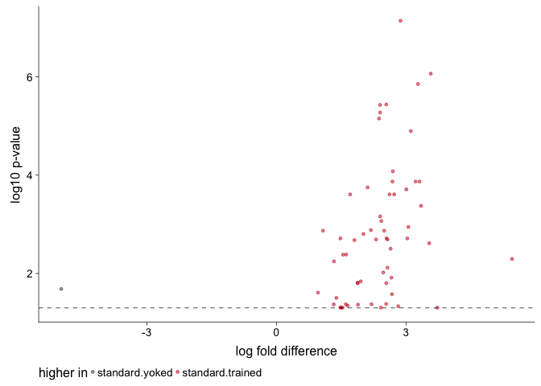

    h <- volcanoplot(CTY, volcano5, c("conflict.yoked", "conflict.trained")) 
    h

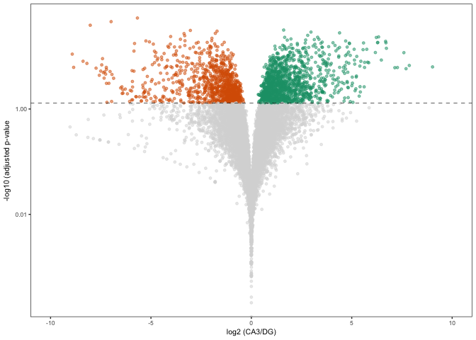

    i <- volcanoplot(SYH, volcano3, c("home.cage", "standard.yoked")) 
    i

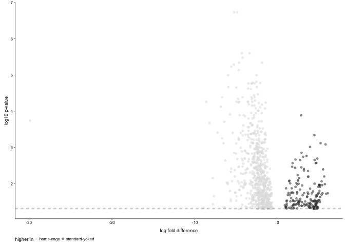

    plot_grid(g,h,i,nrow = 1)

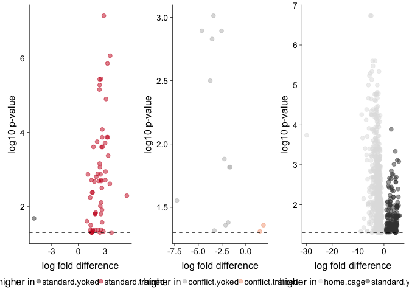

    myvolcanoplots <- plot_grid(d,e,f, g,h,i,nrow = 2)
    myvolcanoplots

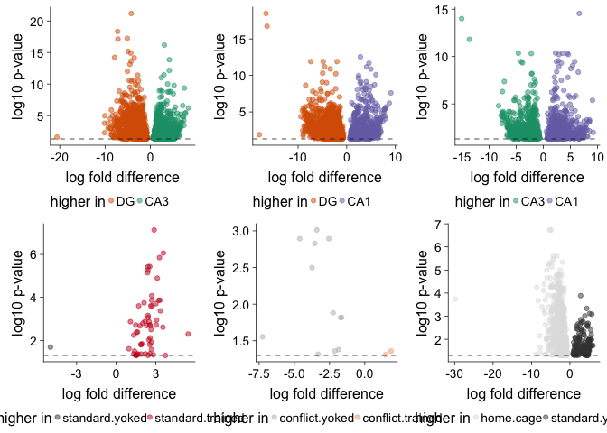

    pdf(file="../figures/02b_RNAseqALL/myvolcanoplots.pdf", width=5, height=2)
    plot(myvolcanoplots)
    dev.off()

    ## quartz_off_screen 
    ##                 2

    plot_grid(g, i,nrow = 1)

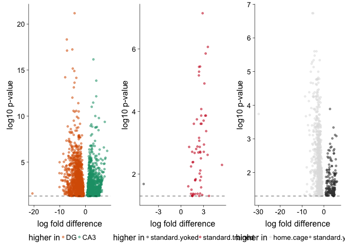

plot single gene counts
-----------------------

    plotCounts(dds, "Prkcz", intgroup = "subfield", normalized = TRUE)

    plotCounts(dds, "Prkcz", intgroup = "treatment", normalized = TRUE)

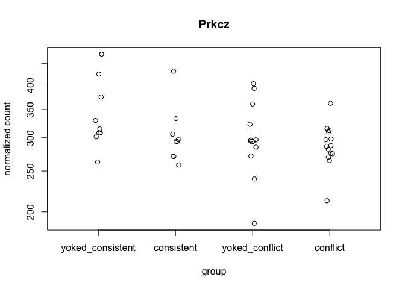

    plotCounts(dds, "Arc", intgroup = "treatment", normalized = TRUE)

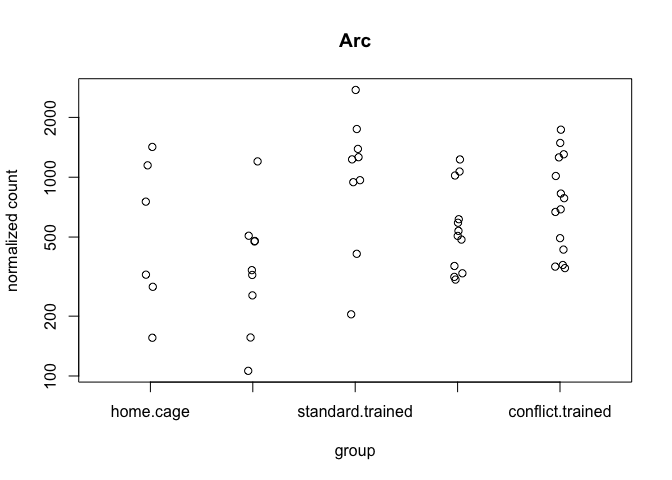

    plotCounts(dds, "Egr1", intgroup = "treatment", normalized = TRUE)

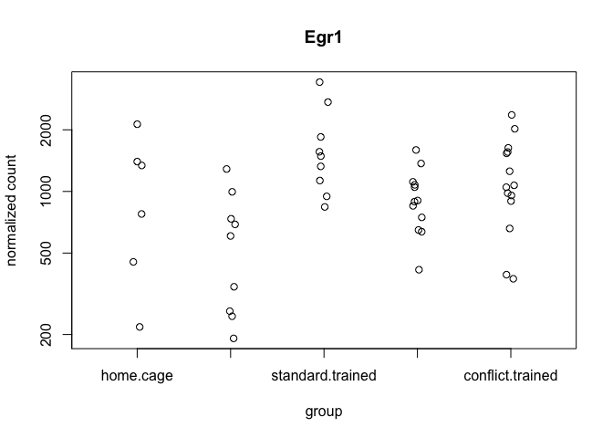

    plotCounts(dds, "Camk1g", intgroup = "treatment", normalized = TRUE)

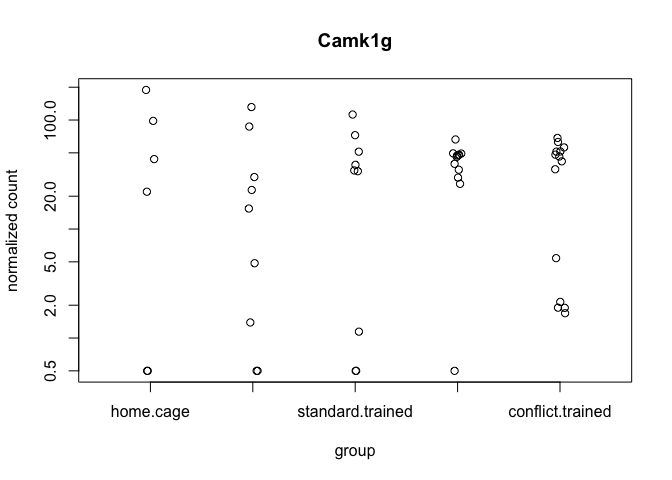

Observed versus expected ration of DEGs
---------------------------------------

    # chisq.test equal expression of increased versus decreased expression
    chisq.test(c(1099,  1427), p = c(0.45, 0.55))$expected

    ## [1] 1136.7 1389.3

    chisq.test(c(1099,  1427), p = c(0.45, 0.55))

    ## 
    ##  Chi-squared test for given probabilities
    ## 
    ## data:  c(1099, 1427)
    ## X-squared = 2.2734, df = 1, p-value = 0.1316

    prop.table(c(1099,  1427))

    ## [1] 0.4350752 0.5649248

    chisq.test(c(850,   1172), p = c(0.4, 0.6))$expected

    ## [1]  808.8 1213.2

    chisq.test(c(850,   1172), p = c(0.4, 0.6))

    ## 
    ##  Chi-squared test for given probabilities
    ## 
    ## data:  c(850, 1172)
    ## X-squared = 3.4979, df = 1, p-value = 0.06145

    prop.table(c(850,   1172))

    ## [1] 0.4203759 0.5796241

    chisq.test(c(1585,  1560), p = c(0.5, 0.5))$expected

    ## [1] 1572.5 1572.5

    chisq.test(c(1585,  1560), p = c(0.5, 0.5))

    ## 
    ##  Chi-squared test for given probabilities
    ## 
    ## data:  c(1585, 1560)
    ## X-squared = 0.19873, df = 1, p-value = 0.6557

    prop.table(c(1585,  1560))

    ## [1] 0.5039746 0.4960254

    chisq.test(c(1, 0), p = c(0.5, 0.5))$expected

    ## Warning in chisq.test(c(1, 0), p = c(0.5, 0.5)): Chi-squared approximation
    ## may be incorrect

    ## [1] 0.5 0.5

    chisq.test(c(1, 0), p = c(0.5, 0.5))

    ## Warning in chisq.test(c(1, 0), p = c(0.5, 0.5)): Chi-squared approximation
    ## may be incorrect

    ## 
    ##  Chi-squared test for given probabilities
    ## 
    ## data:  c(1, 0)
    ## X-squared = 1, df = 1, p-value = 0.3173

    prop.table(c(1, 0))

    ## [1] 1 0

    colData$treatment <- factor(colData$treatment , levels = c("home.cage",
                                                               "standard.yoked", "standard.trained",
                                                               "conflict.yoked", "conflict.trained"))

    DEGsall <- returntotalDEGs(dds)

    ## [1] "home.cage.standard.yoked"
    ## [1] "home.cage.standard.trained"
    ## [1] "home.cage.conflict.yoked"
    ## [1] "home.cage.conflict.trained"
    ## [1] "standard.yoked.standard.trained"
    ## [1] "standard.yoked.conflict.yoked"
    ## [1] "standard.yoked.conflict.trained"
    ## [1] "standard.trained.conflict.yoked"
    ## [1] "standard.trained.conflict.trained"
    ## [1] "conflict.yoked.conflict.trained"
    ##                                                 V1               V2   V3
    ## home.cage.standard.yoked                 home.cage   standard.yoked 1285
    ## home.cage.standard.trained               home.cage standard.trained 1320
    ## home.cage.conflict.yoked                 home.cage   conflict.yoked 1400
    ## home.cage.conflict.trained               home.cage conflict.trained 1659
    ## standard.yoked.standard.trained     standard.yoked standard.trained   80
    ## standard.yoked.conflict.yoked       standard.yoked   conflict.yoked   37
    ## standard.yoked.conflict.trained     standard.yoked conflict.trained   45
    ## standard.trained.conflict.yoked   standard.trained   conflict.yoked   76
    ## standard.trained.conflict.trained standard.trained conflict.trained    1
    ## conflict.yoked.conflict.trained     conflict.yoked conflict.trained   23

    dds.DG <- subsetDESeq("DG")

    ##            RNAseqID   Mouse subfield      Group   Conflict Treatment
    ## 143A-DG-1 143A-DG-1 15-143A       DG   conflict   Conflict  conflict
    ## 143B-DG-1 143B-DG-1 15-143B       DG    control   Conflict   shocked
    ## 143D-DG-3 143D-DG-3 15-143D       DG    control NoConflict     yoked
    ## 144A-DG-2 144A-DG-2 15-144A       DG   conflict   Conflict  conflict
    ## 144C-DG-2 144C-DG-2 15-144C       DG consistent NoConflict   trained
    ## 144D-DG-2 144D-DG-2 15-144D       DG    control NoConflict     yoked
    ## 145A-DG-2 145A-DG-2 15-145A       DG   conflict   Conflict  conflict
    ## 145B-DG-1 145B-DG-1 15-145B       DG    control   Conflict   shocked
    ## 146A-DG-2 146A-DG-2 15-146A       DG   conflict   Conflict  conflict
    ## 146B-DG-2 146B-DG-2 15-146B       DG    control   Conflict   shocked
    ## 146C-DG-4 146C-DG-4 15-146C       DG consistent NoConflict   trained
    ## 146D-DG-3 146D-DG-3 15-146D       DG    control NoConflict     yoked
    ## 147-DG-4   147-DG-4  15-147       DG   homecage       <NA>  homecage
    ## 147C-DG-3 147C-DG-3 15-147C       DG consistent NoConflict   trained
    ## 147D-DG-1 147D-DG-1 15-147D       DG    control NoConflict     yoked
    ## 148-DG-2   148-DG-2  15-148       DG   homecage       <NA>  homecage
    ## 148A-DG-3 148A-DG-3 15-148A       DG   conflict   Conflict  conflict
    ## 148B-DG-4 148B-DG-4 15-148B       DG    control   Conflict   shocked
    ##               ID        treatment
    ## 143A-DG-1 15143A conflict.trained
    ## 143B-DG-1 15143B   conflict.yoked
    ## 143D-DG-3 15143D   standard.yoked
    ## 144A-DG-2 15144A conflict.trained
    ## 144C-DG-2 15144C standard.trained
    ## 144D-DG-2 15144D   standard.yoked
    ## 145A-DG-2 15145A conflict.trained
    ## 145B-DG-1 15145B   conflict.yoked
    ## 146A-DG-2 15146A conflict.trained
    ## 146B-DG-2 15146B   conflict.yoked
    ## 146C-DG-4 15146C standard.trained
    ## 146D-DG-3 15146D   standard.yoked
    ## 147-DG-4   15147        home.cage
    ## 147C-DG-3 15147C standard.trained
    ## 147D-DG-1 15147D   standard.yoked
    ## 148-DG-2   15148        home.cage
    ## 148A-DG-3 15148A conflict.trained
    ## 148B-DG-4 15148B   conflict.yoked
    ## [1] TRUE
    ## class: DESeqDataSet 
    ## dim: 22485 18 
    ## metadata(1): version
    ## assays(1): counts
    ## rownames(22485): 0610007P14Rik 0610009B22Rik ... Zzef1 Zzz3
    ## rowData names(0):
    ## colnames(18): 143A-DG-1 143B-DG-1 ... 148A-DG-3 148B-DG-4
    ## colData names(8): RNAseqID Mouse ... ID treatment
    ## [1] 12927    18

    ## estimating size factors

    ## estimating dispersions

    ## gene-wise dispersion estimates

    ## mean-dispersion relationship

    ## final dispersion estimates

    ## fitting model and testing

    dds.CA3 <- subsetDESeq("CA3")

    ##              RNAseqID   Mouse subfield      Group   Conflict Treatment
    ## 143A-CA3-1 143A-CA3-1 15-143A      CA3   conflict   Conflict  conflict
    ## 144A-CA3-2 144A-CA3-2 15-144A      CA3   conflict   Conflict  conflict
    ## 144B-CA3-1 144B-CA3-1 15-144B      CA3    control   Conflict   shocked
    ## 144C-CA3-2 144C-CA3-2 15-144C      CA3 consistent NoConflict   trained
    ## 144D-CA3-2 144D-CA3-2 15-144D      CA3    control NoConflict     yoked
    ## 145A-CA3-2 145A-CA3-2 15-145A      CA3   conflict   Conflict  conflict
    ## 146A-CA3-2 146A-CA3-2 15-146A      CA3   conflict   Conflict  conflict
    ## 146B-CA3-2 146B-CA3-2 15-146B      CA3    control   Conflict   shocked
    ## 146D-CA3-3 146D-CA3-3 15-146D      CA3    control NoConflict     yoked
    ## 147-CA3-4   147-CA3-4  15-147      CA3   homecage       <NA>  homecage
    ## 147C-CA3-3 147C-CA3-3 15-147C      CA3 consistent NoConflict   trained
    ## 147D-CA3-1 147D-CA3-1 15-147D      CA3    control NoConflict     yoked
    ## 148-CA3-2   148-CA3-2  15-148      CA3   homecage       <NA>  homecage
    ## 148A-CA3-3 148A-CA3-3 15-148A      CA3   conflict   Conflict  conflict
    ## 148B-CA3-4 148B-CA3-4 15-148B      CA3    control   Conflict   shocked
    ##                ID        treatment
    ## 143A-CA3-1 15143A conflict.trained
    ## 144A-CA3-2 15144A conflict.trained
    ## 144B-CA3-1 15144B   conflict.yoked
    ## 144C-CA3-2 15144C standard.trained
    ## 144D-CA3-2 15144D   standard.yoked
    ## 145A-CA3-2 15145A conflict.trained
    ## 146A-CA3-2 15146A conflict.trained
    ## 146B-CA3-2 15146B   conflict.yoked
    ## 146D-CA3-3 15146D   standard.yoked
    ## 147-CA3-4   15147        home.cage
    ## 147C-CA3-3 15147C standard.trained
    ## 147D-CA3-1 15147D   standard.yoked
    ## 148-CA3-2   15148        home.cage
    ## 148A-CA3-3 15148A conflict.trained
    ## 148B-CA3-4 15148B   conflict.yoked
    ## [1] TRUE
    ## class: DESeqDataSet 
    ## dim: 22485 15 
    ## metadata(1): version
    ## assays(1): counts
    ## rownames(22485): 0610007P14Rik 0610009B22Rik ... Zzef1 Zzz3
    ## rowData names(0):
    ## colnames(15): 143A-CA3-1 144A-CA3-2 ... 148A-CA3-3 148B-CA3-4
    ## colData names(8): RNAseqID Mouse ... ID treatment
    ## [1] 12165    15

    ## estimating size factors

    ## estimating dispersions

    ## gene-wise dispersion estimates

    ## mean-dispersion relationship

    ## final dispersion estimates

    ## fitting model and testing

    dds.CA1 <- subsetDESeq("CA1")

    ##              RNAseqID   Mouse subfield      Group   Conflict Treatment
    ## 143B-CA1-1 143B-CA1-1 15-143B      CA1    control   Conflict   shocked
    ## 143C-CA1-1 143C-CA1-1 15-143C      CA1 consistent NoConflict   trained
    ## 143D-CA1-3 143D-CA1-3 15-143D      CA1    control NoConflict     yoked
    ## 144A-CA1-2 144A-CA1-2 15-144A      CA1   conflict   Conflict  conflict
    ## 144B-CA1-1 144B-CA1-1 15-144B      CA1    control   Conflict   shocked
    ## 144C-CA1-2 144C-CA1-2 15-144C      CA1 consistent NoConflict   trained
    ## 145A-CA1-2 145A-CA1-2 15-145A      CA1   conflict   Conflict  conflict
    ## 145B-CA1-1 145B-CA1-1 15-145B      CA1    control   Conflict   shocked
    ## 146A-CA1-2 146A-CA1-2 15-146A      CA1   conflict   Conflict  conflict
    ## 146B-CA1-2 146B-CA1-2 15-146B      CA1    control   Conflict   shocked
    ## 146C-CA1-4 146C-CA1-4 15-146C      CA1 consistent NoConflict   trained
    ## 146D-CA1-3 146D-CA1-3 15-146D      CA1    control NoConflict     yoked
    ## 147-CA1-4   147-CA1-4  15-147      CA1   homecage       <NA>  homecage
    ## 147C-CA1-3 147C-CA1-3 15-147C      CA1 consistent NoConflict   trained
    ## 148-CA1-2   148-CA1-2  15-148      CA1   homecage       <NA>  homecage
    ## 148A-CA1-3 148A-CA1-3 15-148A      CA1   conflict   Conflict  conflict
    ## 148B-CA1-4 148B-CA1-4 15-148B      CA1    control   Conflict   shocked
    ##                ID        treatment
    ## 143B-CA1-1 15143B   conflict.yoked
    ## 143C-CA1-1 15143C standard.trained
    ## 143D-CA1-3 15143D   standard.yoked
    ## 144A-CA1-2 15144A conflict.trained
    ## 144B-CA1-1 15144B   conflict.yoked
    ## 144C-CA1-2 15144C standard.trained
    ## 145A-CA1-2 15145A conflict.trained
    ## 145B-CA1-1 15145B   conflict.yoked
    ## 146A-CA1-2 15146A conflict.trained
    ## 146B-CA1-2 15146B   conflict.yoked
    ## 146C-CA1-4 15146C standard.trained
    ## 146D-CA1-3 15146D   standard.yoked
    ## 147-CA1-4   15147        home.cage
    ## 147C-CA1-3 15147C standard.trained
    ## 148-CA1-2   15148        home.cage
    ## 148A-CA1-3 15148A conflict.trained
    ## 148B-CA1-4 15148B   conflict.yoked
    ## [1] TRUE
    ## class: DESeqDataSet 
    ## dim: 22485 17 
    ## metadata(1): version
    ## assays(1): counts
    ## rownames(22485): 0610007P14Rik 0610009B22Rik ... Zzef1 Zzz3
    ## rowData names(0):
    ## colnames(17): 143B-CA1-1 143C-CA1-1 ... 148A-CA1-3 148B-CA1-4
    ## colData names(8): RNAseqID Mouse ... ID treatment
    ## [1] 12421    17

    ## estimating size factors

    ## estimating dispersions

    ## gene-wise dispersion estimates

    ## mean-dispersion relationship

    ## final dispersion estimates

    ## fitting model and testing

    dds.DG.total <- returntotalDEGs(dds.DG)

    ## [1] "home.cage.standard.yoked"
    ## [1] "home.cage.standard.trained"
    ## [1] "home.cage.conflict.yoked"
    ## [1] "home.cage.conflict.trained"
    ## [1] "standard.yoked.standard.trained"
    ## [1] "standard.yoked.conflict.yoked"
    ## [1] "standard.yoked.conflict.trained"
    ## [1] "standard.trained.conflict.yoked"
    ## [1] "standard.trained.conflict.trained"
    ## [1] "conflict.yoked.conflict.trained"
    ##                                                 V1               V2   V3
    ## home.cage.standard.yoked                 home.cage   standard.yoked 1252
    ## home.cage.standard.trained               home.cage standard.trained 1241
    ## home.cage.conflict.yoked                 home.cage   conflict.yoked 1367
    ## home.cage.conflict.trained               home.cage conflict.trained 1637
    ## standard.yoked.standard.trained     standard.yoked standard.trained   73
    ## standard.yoked.conflict.yoked       standard.yoked   conflict.yoked    2
    ## standard.yoked.conflict.trained     standard.yoked conflict.trained   36
    ## standard.trained.conflict.yoked   standard.trained   conflict.yoked   25
    ## standard.trained.conflict.trained standard.trained conflict.trained    0
    ## conflict.yoked.conflict.trained     conflict.yoked conflict.trained    0

    dds.CA3.total <- returntotalDEGs(dds.CA3)

    ## [1] "home.cage.standard.yoked"
    ## [1] "home.cage.standard.trained"
    ## [1] "home.cage.conflict.yoked"
    ## [1] "home.cage.conflict.trained"
    ## [1] "standard.yoked.standard.trained"
    ## [1] "standard.yoked.conflict.yoked"
    ## [1] "standard.yoked.conflict.trained"
    ## [1] "standard.trained.conflict.yoked"
    ## [1] "standard.trained.conflict.trained"
    ## [1] "conflict.yoked.conflict.trained"
    ##                                                 V1               V2  V3
    ## home.cage.standard.yoked                 home.cage   standard.yoked  65
    ## home.cage.standard.trained               home.cage standard.trained 328
    ## home.cage.conflict.yoked                 home.cage   conflict.yoked   4
    ## home.cage.conflict.trained               home.cage conflict.trained 217
    ## standard.yoked.standard.trained     standard.yoked standard.trained   1
    ## standard.yoked.conflict.yoked       standard.yoked   conflict.yoked   2
    ## standard.yoked.conflict.trained     standard.yoked conflict.trained   2
    ## standard.trained.conflict.yoked   standard.trained   conflict.yoked   0
    ## standard.trained.conflict.trained standard.trained conflict.trained   2
    ## conflict.yoked.conflict.trained     conflict.yoked conflict.trained   0

    dds.CA1.total <- returntotalDEGs(dds.CA1)

    ## [1] "home.cage.standard.yoked"
    ## [1] "home.cage.standard.trained"
    ## [1] "home.cage.conflict.yoked"
    ## [1] "home.cage.conflict.trained"
    ## [1] "standard.yoked.standard.trained"
    ## [1] "standard.yoked.conflict.yoked"
    ## [1] "standard.yoked.conflict.trained"
    ## [1] "standard.trained.conflict.yoked"
    ## [1] "standard.trained.conflict.trained"
    ## [1] "conflict.yoked.conflict.trained"
    ##                                                 V1               V2   V3
    ## home.cage.standard.yoked                 home.cage   standard.yoked 1131
    ## home.cage.standard.trained               home.cage standard.trained  678
    ## home.cage.conflict.yoked                 home.cage   conflict.yoked  867
    ## home.cage.conflict.trained               home.cage conflict.trained  824
    ## standard.yoked.standard.trained     standard.yoked standard.trained  351
    ## standard.yoked.conflict.yoked       standard.yoked   conflict.yoked  402
    ## standard.yoked.conflict.trained     standard.yoked conflict.trained  151
    ## standard.trained.conflict.yoked   standard.trained   conflict.yoked    0
    ## standard.trained.conflict.trained standard.trained conflict.trained    0
    ## conflict.yoked.conflict.trained     conflict.yoked conflict.trained    2

    d <- plottotalDEGs(DEGsall, "All subfields")

    ## 'data.frame':    10 obs. of  3 variables:
    ##  $ V1: Factor w/ 5 levels "home.cage","standard.yoked",..: 1 1 1 1 2 2 2 3 3 4
    ##  $ V2: Factor w/ 5 levels "home.cage","standard.yoked",..: 2 3 4 5 3 4 5 4 5 5
    ##  $ V3: int  1285 1320 1400 1659 80 37 45 76 1 23
    ## NULL
    ##                                                 V1               V2   V3
    ## home.cage.standard.yoked                 home.cage   standard.yoked 1285
    ## home.cage.standard.trained               home.cage standard.trained 1320
    ## home.cage.conflict.yoked                 home.cage   conflict.yoked 1400
    ## home.cage.conflict.trained               home.cage conflict.trained 1659
    ## standard.yoked.standard.trained     standard.yoked standard.trained   80
    ## standard.yoked.conflict.yoked       standard.yoked   conflict.yoked   37
    ## standard.yoked.conflict.trained     standard.yoked conflict.trained   45
    ## standard.trained.conflict.yoked   standard.trained   conflict.yoked   76
    ## standard.trained.conflict.trained standard.trained conflict.trained    1
    ## conflict.yoked.conflict.trained     conflict.yoked conflict.trained   23

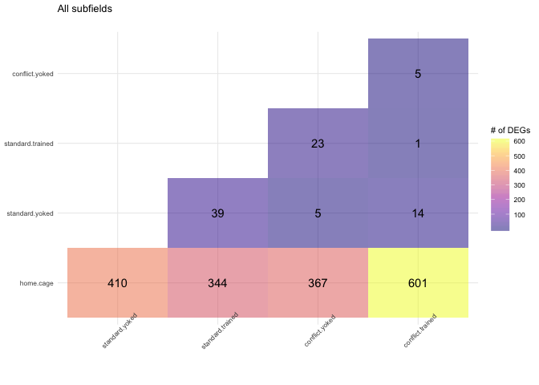

    a <- plottotalDEGs(dds.DG.total, "DG")

    ## 'data.frame':    10 obs. of  3 variables:
    ##  $ V1: Factor w/ 5 levels "home.cage","standard.yoked",..: 1 1 1 1 2 2 2 3 3 4
    ##  $ V2: Factor w/ 5 levels "home.cage","standard.yoked",..: 2 3 4 5 3 4 5 4 5 5
    ##  $ V3: int  1252 1241 1367 1637 73 2 36 25 NA NA
    ## NULL
    ##                                                 V1               V2   V3
    ## home.cage.standard.yoked                 home.cage   standard.yoked 1252
    ## home.cage.standard.trained               home.cage standard.trained 1241
    ## home.cage.conflict.yoked                 home.cage   conflict.yoked 1367
    ## home.cage.conflict.trained               home.cage conflict.trained 1637
    ## standard.yoked.standard.trained     standard.yoked standard.trained   73
    ## standard.yoked.conflict.yoked       standard.yoked   conflict.yoked    2
    ## standard.yoked.conflict.trained     standard.yoked conflict.trained   36
    ## standard.trained.conflict.yoked   standard.trained   conflict.yoked   25
    ## standard.trained.conflict.trained standard.trained conflict.trained   NA
    ## conflict.yoked.conflict.trained     conflict.yoked conflict.trained   NA

    ## Warning: Removed 2 rows containing missing values (geom_text).

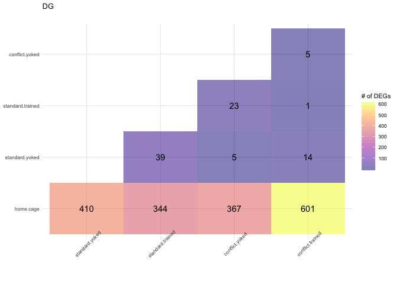

    b <- plottotalDEGs(dds.CA3.total, "CA3")

    ## 'data.frame':    10 obs. of  3 variables:
    ##  $ V1: Factor w/ 5 levels "home.cage","standard.yoked",..: 1 1 1 1 2 2 2 3 3 4
    ##  $ V2: Factor w/ 5 levels "home.cage","standard.yoked",..: 2 3 4 5 3 4 5 4 5 5
    ##  $ V3: int  65 328 4 217 1 2 2 NA 2 NA
    ## NULL
    ##                                                 V1               V2  V3
    ## home.cage.standard.yoked                 home.cage   standard.yoked  65
    ## home.cage.standard.trained               home.cage standard.trained 328
    ## home.cage.conflict.yoked                 home.cage   conflict.yoked   4
    ## home.cage.conflict.trained               home.cage conflict.trained 217
    ## standard.yoked.standard.trained     standard.yoked standard.trained   1
    ## standard.yoked.conflict.yoked       standard.yoked   conflict.yoked   2
    ## standard.yoked.conflict.trained     standard.yoked conflict.trained   2
    ## standard.trained.conflict.yoked   standard.trained   conflict.yoked  NA
    ## standard.trained.conflict.trained standard.trained conflict.trained   2
    ## conflict.yoked.conflict.trained     conflict.yoked conflict.trained  NA

    ## Warning: Removed 2 rows containing missing values (geom_text).

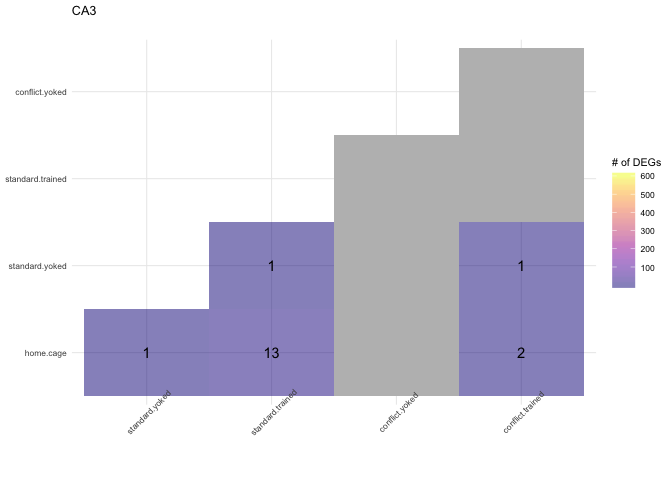

    c <-  plottotalDEGs(dds.CA1.total, "CA1")

    ## 'data.frame':    10 obs. of  3 variables:
    ##  $ V1: Factor w/ 5 levels "home.cage","standard.yoked",..: 1 1 1 1 2 2 2 3 3 4
    ##  $ V2: Factor w/ 5 levels "home.cage","standard.yoked",..: 2 3 4 5 3 4 5 4 5 5
    ##  $ V3: int  1131 678 867 824 351 402 151 NA NA 2
    ## NULL
    ##                                                 V1               V2   V3
    ## home.cage.standard.yoked                 home.cage   standard.yoked 1131
    ## home.cage.standard.trained               home.cage standard.trained  678
    ## home.cage.conflict.yoked                 home.cage   conflict.yoked  867
    ## home.cage.conflict.trained               home.cage conflict.trained  824
    ## standard.yoked.standard.trained     standard.yoked standard.trained  351
    ## standard.yoked.conflict.yoked       standard.yoked   conflict.yoked  402
    ## standard.yoked.conflict.trained     standard.yoked conflict.trained  151
    ## standard.trained.conflict.yoked   standard.trained   conflict.yoked   NA
    ## standard.trained.conflict.trained standard.trained conflict.trained   NA
    ## conflict.yoked.conflict.trained     conflict.yoked conflict.trained    2

    ## Warning: Removed 2 rows containing missing values (geom_text).

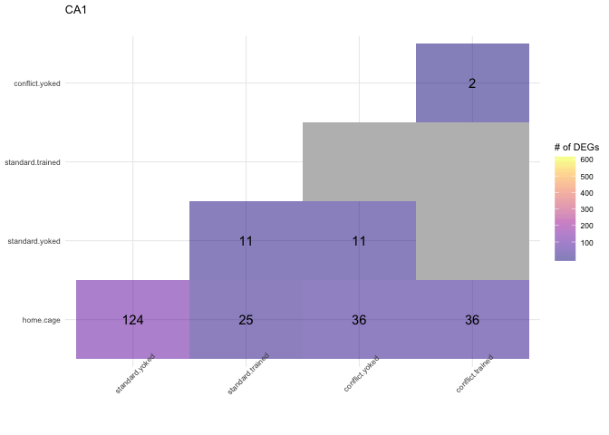

    mylegend <- get_legend(c)

    ## Warning: Removed 2 rows containing missing values (geom_text).

    e <- plot_grid(d + theme(legend.position = "none"), a + theme(legend.position = "none"),
              b+ theme(legend.position = "none"),c + theme(legend.position = "none"),
              nrow = 2)

    ## Warning: Removed 2 rows containing missing values (geom_text).

    ## Warning: Removed 2 rows containing missing values (geom_text).

    ## Warning: Removed 2 rows containing missing values (geom_text).

    f <- plot_grid(e, mylegend, rel_widths   = c(.9, 0.1), ncol = 2)
    f

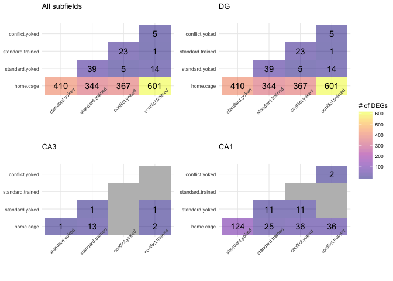

    pdf(file="../figures/02b_RNAseqALL/plottotalDEGs.pdf", width=6, height=6)
    plot(f)
    dev.off()

    ## quartz_off_screen 
    ##                 2

    colData.DG <- subsetcolData(colData,  "DG")
    colData.CA3 <- subsetcolData(colData,  "CA3")
    colData.CA1 <- subsetcolData(colData,  "CA1")

    plotcorrelationheatmaps(dds.DG, colData.DG ,"DG correlations")

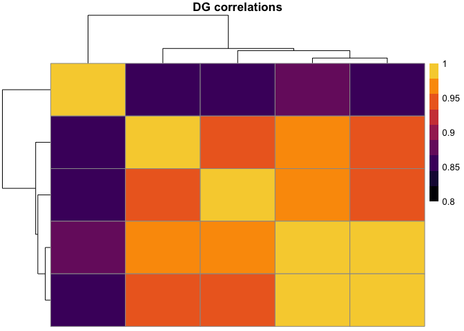

    plotcorrelationheatmaps(dds.CA3, colData.CA3 ,"CA3 correlations")

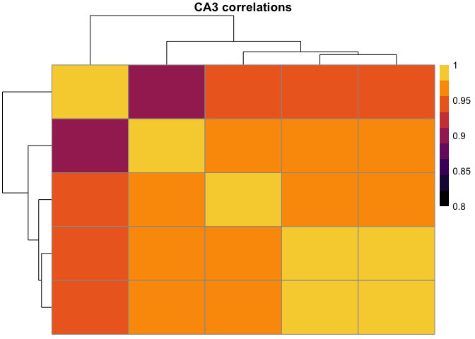

    plotcorrelationheatmaps(dds.CA1, colData.CA1 ,"CA1 correlations")

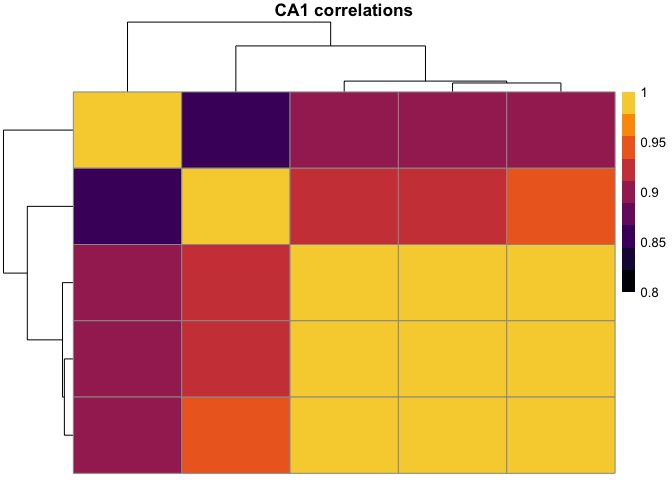

    countData <- read.csv("../data/02a_countData.csv", header = T, check.names = F, row.names = 1)

    colData <- read.csv("../data/02a_colData.csv", header = T)
    colData <- colData %>% dplyr::rename(treatment = APA2, subfield = Punch)
    colData$subtreat <- as.factor(paste(colData$subfield, colData$treatment, sep = ".") ) 
    colData %>% select(subtreat)  %>%  summary()

    ##                  subtreat 
    ##  CA1.conflict.yoked  : 5  
    ##  CA3.conflict.trained: 5  
    ##  DG.conflict.trained : 5  
    ##  CA1.conflict.trained: 4  
    ##  CA1.standard.trained: 4  
    ##  DG.conflict.yoked   : 4  
    ##  (Other)             :23

    dds <- DESeqDataSetFromMatrix(countData = countData,
                                  colData = colData,
                                  design = ~ subtreat)

    dds # view the DESeq object - note numnber of genes

    ## class: DESeqDataSet 
    ## dim: 22485 50 
    ## metadata(1): version
    ## assays(1): counts
    ## rownames(22485): 0610007P14Rik 0610009B22Rik ... Zzef1 Zzz3
    ## rowData names(0):
    ## colnames(50): 143A-CA3-1 143A-DG-1 ... 148B-CA3-4 148B-DG-4
    ## colData names(9): RNAseqID Mouse ... treatment subtreat

    dds <- dds[ rowSums(counts(dds)) > 1, ]  # Pre-filtering genes with 0 counts
    dds # view number of genes afternormalization and the number of samples

    ## class: DESeqDataSet 
    ## dim: 17975 50 
    ## metadata(1): version
    ## assays(1): counts
    ## rownames(17975): 0610007P14Rik 0610009B22Rik ... Zzef1 Zzz3
    ## rowData names(0):
    ## colnames(50): 143A-CA3-1 143A-DG-1 ... 148B-CA3-4 148B-DG-4
    ## colData names(9): RNAseqID Mouse ... treatment subtreat

    dds <- DESeq(dds) # Differential expression analysis

    ## estimating size factors

    ## estimating dispersions

    ## gene-wise dispersion estimates

    ## mean-dispersion relationship

    ## final dispersion estimates

    ## fitting model and testing

    plotcorrelationheatmaps2(dds, colData ,"Correlations across subfield.treatment")

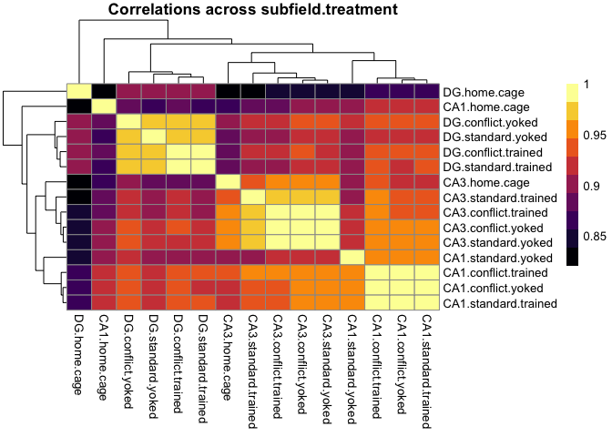
