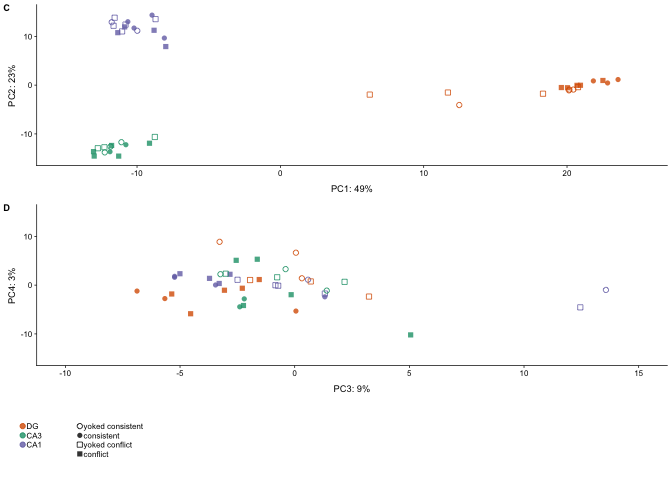

The figures made from this script were compiled in Adobe.

    library(ggplot2) ## for awesome plots!
    library(cowplot) ## for some easy to use themes
    library(dplyr) ## for filtering and selecting rows
    library(car) ## stats
    library(VennDiagram) ## venn diagrams
    library(pheatmap) ## awesome heatmaps
    library(viridis) # for awesome color pallette
    library(reshape2) ## for melting dataframe
    library(DESeq2) ## for gene expression analysis
    library(edgeR)  ## for basic read counts status
    library(magrittr) ## to use the weird pipe
    library(genefilter)  ## for PCA fuction
    library(ggrepel) ## for labeling volcano plot
    library(stringr) ## for uppercase gene names

    ## load functions 
    source("figureoptions.R")
    source("functions_RNAseq.R")

    ## set output file for figures 
    knitr::opts_chunk$set(fig.path = '../figures/02b_RNAseqAll/')

Design
------

The two two catagorical variables are

-   Hippocampal subfield: DG, CA3, CA1
-   Treatment: yoked\_consistent, consistent, yoked\_conflict, conflict

<!-- -->

    colData <- read.csv("../data/02a_colData.csv", header = T)
    countData <- read.csv("../data/02a_countData.csv", header = T, check.names = F, row.names = 1)
    colData <- colData %>% dplyr::rename(treatment = APA2, subfield = Punch)
    colData %>% select(treatment, subfield)  %>%  summary()

    ##             treatment  subfield
    ##  conflict        :14   CA1:15  
    ##  consistent      : 9   CA3:13  
    ##  yoked_conflict  :12   DG :16  
    ##  yoked_consistent: 9

    head(colData)

    ##     RNAseqID   Mouse subfield      Group   Conflict Treatment     ID
    ## 1 143A-CA3-1 15-143A      CA3   conflict   Conflict  conflict 15143A
    ## 2  143A-DG-1 15-143A       DG   conflict   Conflict  conflict 15143A
    ## 3 143B-CA1-1 15-143B      CA1    control   Conflict   shocked 15143B
    ## 4  143B-DG-1 15-143B       DG    control   Conflict   shocked 15143B
    ## 5 143C-CA1-1 15-143C      CA1 consistent NoConflict   trained 15143C
    ## 6 143D-CA1-3 15-143D      CA1    control NoConflict     yoked 15143D
    ##          treatment
    ## 1         conflict
    ## 2         conflict
    ## 3   yoked_conflict
    ## 4   yoked_conflict
    ## 5       consistent
    ## 6 yoked_consistent

    totalCounts=colSums(countData)
    ### on average 1 million gene counts per sample 
    summary((colSums(countData)/1000000))

    ##     Min.  1st Qu.   Median     Mean  3rd Qu.     Max. 
    ##  0.09042  1.08461  2.17911  2.52574  3.30608 11.70070

    dds <- DESeqDataSetFromMatrix(countData = countData,
                                  colData = colData,
                                  design = ~ subfield + treatment + subfield*treatment)

    dds$subfield <- factor(dds$subfield, levels=c("DG","CA3", "CA1")) ## specify the factor levels
    dds$treatment <- factor(dds$treatment, levels=c("yoked_consistent", "consistent", "yoked_conflict" , "conflict")) ## specify the factor levels

    dds # view the DESeq object - note numnber of genes

    ## class: DESeqDataSet 
    ## dim: 22485 44 
    ## metadata(1): version
    ## assays(1): counts
    ## rownames(22485): 0610007P14Rik 0610009B22Rik ... Zzef1 Zzz3
    ## rowData names(0):
    ## colnames(44): 143A-CA3-1 143A-DG-1 ... 148B-CA3-4 148B-DG-4
    ## colData names(8): RNAseqID Mouse ... ID treatment

    dds <- dds[ rowSums(counts(dds)) > 1, ]  # Pre-filtering genes with 0 counts
    dds # view number of genes afternormalization and the number of samples

    ## class: DESeqDataSet 
    ## dim: 17929 44 
    ## metadata(1): version
    ## assays(1): counts
    ## rownames(17929): 0610007P14Rik 0610009B22Rik ... Zzef1 Zzz3
    ## rowData names(0):
    ## colnames(44): 143A-CA3-1 143A-DG-1 ... 148B-CA3-4 148B-DG-4
    ## colData names(8): RNAseqID Mouse ... ID treatment

    dds <- DESeq(dds) # Differential expression analysis
    #rld <- rlog(dds, blind=FALSE) ## log transformed data
    vsd <- vst(dds, blind=FALSE) ## variance stabilized
    head(assay(vsd),3)

    ##               143A-CA3-1 143A-DG-1 143B-CA1-1 143B-DG-1 143C-CA1-1
    ## 0610007P14Rik   6.808251  6.668454   7.024113  6.694369   6.554406
    ## 0610009B22Rik   6.178959  6.123766   6.400739  6.017979   6.232975
    ## 0610009L18Rik   5.734496  5.786087   6.104311  5.955899   5.688810
    ##               143D-CA1-3 143D-DG-3 144A-CA1-2 144A-CA3-2 144A-DG-2
    ## 0610007P14Rik   6.807051  7.087486   6.817352   7.388850  6.787693
    ## 0610009B22Rik   5.422896  5.690676   6.297021   6.763118  5.895804
    ## 0610009L18Rik   5.422896  5.801054   5.906760   6.437132  5.422896
    ##               144B-CA1-1 144B-CA3-1 144C-CA1-2 144C-CA3-2 144C-DG-2
    ## 0610007P14Rik   6.856466   6.998749   6.613775   6.772989  6.687065
    ## 0610009B22Rik   6.075785   6.262671   6.016429   6.678908  6.160550
    ## 0610009L18Rik   5.598772   5.987081   5.640948   5.949087  5.877667
    ##               144D-CA3-2 144D-DG-2 145A-CA1-2 145A-CA3-2 145A-DG-2
    ## 0610007P14Rik   6.648731  6.907274   6.874057   6.559847   6.84102
    ## 0610009B22Rik   6.110834  6.025730   6.200666   6.662371   6.27299
    ## 0610009L18Rik   5.996939  5.877533   6.019879   5.422896   5.65315
    ##               145B-CA1-1 145B-DG-1 146A-CA1-2 146A-CA3-2 146A-DG-2
    ## 0610007P14Rik   6.823920  6.443947   6.558629   7.040970  6.600217
    ## 0610009B22Rik   6.203366  6.135034   6.249608   5.967787  6.036409
    ## 0610009L18Rik   5.775328  5.422896   6.030436   5.967787  6.036409
    ##               146B-CA1-2 146B-CA3-2 146B-DG-2 146C-CA1-4 146C-DG-4
    ## 0610007P14Rik   6.404439   6.514077  6.336254   6.879112  7.177891
    ## 0610009B22Rik   6.096523   6.660123  6.336254   6.069351  6.379364
    ## 0610009L18Rik   5.422896   5.697560  5.422896   6.154200  5.422896
    ##               146D-CA1-3 146D-CA3-3 146D-DG-3 147C-CA1-3 147C-CA3-3
    ## 0610007P14Rik   6.945981   6.903613  7.654305   6.705502   6.940845
    ## 0610009B22Rik   6.244605   6.208354  5.422896   6.075140   6.096355
    ## 0610009L18Rik   5.422896   5.859914  5.422896   5.648295   5.833026
    ##               147C-DG-3 147D-CA3-1 147D-DG-1 148A-CA1-3 148A-CA3-3
    ## 0610007P14Rik  6.590743   6.594036  6.763024   6.781988   6.695079
    ## 0610009B22Rik  6.239520   6.277406  6.227316   6.339476   6.278186
    ## 0610009L18Rik  5.652181   5.827799  6.068431   5.906018   5.889562
    ##               148A-DG-3 148B-CA1-4 148B-CA3-4 148B-DG-4
    ## 0610007P14Rik  6.770632   6.623311   7.052911  6.640997
    ## 0610009B22Rik  5.950604   5.422896   6.444857  5.864737
    ## 0610009L18Rik  5.875464   5.422896   5.936087  5.735933

    write.csv(assay(vsd), file = "../data/02b_vsd.csv", row.names = T)

Summary 2 way contrasts
-----------------------

This first function shows the total number of up and down regulated
genes and the top 3 most significant genes.

    res_summary <- function(mycontrast){
      res <- results(dds, contrast = mycontrast, independentFiltering = T)
      print(mycontrast)
      print(summary(res))
      print(head((res[order(res$padj),]), 3))
      cat("\n")
    }

    res_summary(c("subfield", "CA1", "DG"))

    ## [1] "subfield" "CA1"      "DG"      
    ## 
    ## out of 17929 with nonzero total read count
    ## adjusted p-value < 0.1
    ## LFC > 0 (up)       : 1223, 6.8%
    ## LFC < 0 (down)     : 1542, 8.6%
    ## outliers [1]       : 8, 0.045%
    ## low counts [2]     : 5210, 29%
    ## (mean count < 4)
    ## [1] see 'cooksCutoff' argument of ?results
    ## [2] see 'independentFiltering' argument of ?results
    ## 
    ## NULL
    ## log2 fold change (MLE): subfield CA1 vs DG 
    ## Wald test p-value: subfield CA1 vs DG 
    ## DataFrame with 3 rows and 6 columns
    ##                baseMean   log2FoldChange             lfcSE
    ##               <numeric>        <numeric>         <numeric>
    ## Pou3f1 219.411952155873 5.98811582532105 0.529427167656916
    ## Prkcg  1597.44305102598  2.9761049905205 0.285040386563396
    ## Wfs1   558.096580361287 6.41720721777274 0.633476148881828
    ##                    stat               pvalue                 padj
    ##               <numeric>            <numeric>            <numeric>
    ## Pou3f1  11.310556373264 1.16349388204921e-29 1.47891707347276e-25
    ## Prkcg  10.4409940864944 1.61114601446348e-25 1.02396384949226e-21
    ## Wfs1   10.1301481185992 4.06033915011148e-24 1.72036569790223e-20

    res_summary(c("subfield", "CA1", "CA3"))

    ## [1] "subfield" "CA1"      "CA3"     
    ## 
    ## out of 17929 with nonzero total read count
    ## adjusted p-value < 0.1
    ## LFC > 0 (up)       : 877, 4.9%
    ## LFC < 0 (down)     : 1288, 7.2%
    ## outliers [1]       : 8, 0.045%
    ## low counts [2]     : 4863, 27%
    ## (mean count < 3)
    ## [1] see 'cooksCutoff' argument of ?results
    ## [2] see 'independentFiltering' argument of ?results
    ## 
    ## NULL
    ## log2 fold change (MLE): subfield CA1 vs CA3 
    ## Wald test p-value: subfield CA1 vs CA3 
    ## DataFrame with 3 rows and 6 columns
    ##                baseMean   log2FoldChange             lfcSE
    ##               <numeric>        <numeric>         <numeric>
    ## Doc2b  349.417572153451 7.18133518109858 0.485599785928926
    ## Itpka  710.071023144903 3.09537793188557 0.232315140416282
    ## Pou3f1 219.411952155873 6.52776905240328 0.548908573891511
    ##                    stat               pvalue                 padj
    ##               <numeric>            <numeric>            <numeric>
    ## Doc2b  14.7885880290517 1.73556525225735e-49 2.26630110639765e-45
    ## Itpka  13.3240473536895 1.67760521698626e-40 1.09530844617033e-36
    ## Pou3f1 11.8922701573495 1.29829032027963e-32 5.65102500073714e-29

    res_summary(c("subfield", "CA3", "DG"))

    ## [1] "subfield" "CA3"      "DG"      
    ## 
    ## out of 17929 with nonzero total read count
    ## adjusted p-value < 0.1
    ## LFC > 0 (up)       : 1571, 8.8%
    ## LFC < 0 (down)     : 1377, 7.7%
    ## outliers [1]       : 8, 0.045%
    ## low counts [2]     : 3824, 21%
    ## (mean count < 2)
    ## [1] see 'cooksCutoff' argument of ?results
    ## [2] see 'independentFiltering' argument of ?results
    ## 
    ## NULL
    ## log2 fold change (MLE): subfield CA3 vs DG 
    ## Wald test p-value: subfield CA3 vs DG 
    ## DataFrame with 3 rows and 6 columns
    ##                 baseMean    log2FoldChange             lfcSE
    ##                <numeric>         <numeric>         <numeric>
    ## Fam163b 628.819601522936 -5.70013539670791 0.336089093685364
    ## Doc2b   349.417572153451 -7.02195793637976 0.443508811683749
    ## C1ql3   285.386723855134 -8.02894919282852 0.547842656156047
    ##                      stat               pvalue                 padj
    ##                 <numeric>            <numeric>            <numeric>
    ## Fam163b -16.9601915200622 1.61816164273402e-64 2.28112246776215e-60
    ## Doc2b   -15.8327360164986 1.84998786056728e-56 1.30396394352084e-52
    ## C1ql3   -14.6555751046548 1.24101383873535e-48 5.83152402821739e-45

    res_summary(c("treatment", "consistent", "yoked_consistent"))

    ## [1] "treatment"        "consistent"       "yoked_consistent"
    ## 
    ## out of 17929 with nonzero total read count
    ## adjusted p-value < 0.1
    ## LFC > 0 (up)       : 106, 0.59%
    ## LFC < 0 (down)     : 8, 0.045%
    ## outliers [1]       : 8, 0.045%
    ## low counts [2]     : 4863, 27%
    ## (mean count < 3)
    ## [1] see 'cooksCutoff' argument of ?results
    ## [2] see 'independentFiltering' argument of ?results
    ## 
    ## NULL
    ## log2 fold change (MLE): treatment consistent vs yoked_consistent 
    ## Wald test p-value: treatment consistent vs yoked consistent 
    ## DataFrame with 3 rows and 6 columns
    ##               baseMean   log2FoldChange             lfcSE             stat
    ##              <numeric>        <numeric>         <numeric>        <numeric>
    ## Plk2  690.892982346694 2.33695480383662 0.287228730093021 8.13621535380455
    ## Frmd6 115.436102973485 3.28456907410619 0.460199207192014 7.13727668969176
    ## Sgk1  243.126788527358 2.51900483921696 0.352679536541189 7.14247518844285
    ##                     pvalue                 padj
    ##                  <numeric>            <numeric>
    ## Plk2  4.07826108076359e-16 5.32539331926109e-12
    ## Frmd6 9.51980996986564e-13 3.10774196466264e-09
    ## Sgk1  9.16650670302539e-13 3.10774196466264e-09

    res_summary(c("treatment", "yoked_conflict", "yoked_consistent"))

    ## [1] "treatment"        "yoked_conflict"   "yoked_consistent"
    ## 
    ## out of 17929 with nonzero total read count
    ## adjusted p-value < 0.1
    ## LFC > 0 (up)       : 38, 0.21%
    ## LFC < 0 (down)     : 2, 0.011%
    ## outliers [1]       : 8, 0.045%
    ## low counts [2]     : 2434, 14%
    ## (mean count < 0)
    ## [1] see 'cooksCutoff' argument of ?results
    ## [2] see 'independentFiltering' argument of ?results
    ## 
    ## NULL
    ## log2 fold change (MLE): treatment yoked_conflict vs yoked_consistent 
    ## Wald test p-value: treatment yoked conflict vs yoked consistent 
    ## DataFrame with 3 rows and 6 columns
    ##                 baseMean   log2FoldChange             lfcSE
    ##                <numeric>        <numeric>         <numeric>
    ## Kcnc2   144.358588449054  3.8023112290593 0.556925143128729
    ## St8sia5 68.4953636213458 3.78869790825454 0.673902508231409
    ## Gm2115  249.257751832989 3.48213722650287 0.658706293164926
    ##                     stat               pvalue                 padj
    ##                <numeric>            <numeric>            <numeric>
    ## Kcnc2   6.82732908717039 8.65100952684687e-12 1.33978184542277e-07
    ## St8sia5 5.62202672044894 1.88730063642428e-08 0.000146143124781514
    ## Gm2115  5.28632755240888 1.24796350258549e-07  0.00064424035881805

    res_summary(c("treatment", "conflict", "yoked_conflict"))

    ## [1] "treatment"      "conflict"       "yoked_conflict"
    ## 
    ## out of 17929 with nonzero total read count
    ## adjusted p-value < 0.1
    ## LFC > 0 (up)       : 17, 0.095%
    ## LFC < 0 (down)     : 44, 0.25%
    ## outliers [1]       : 8, 0.045%
    ## low counts [2]     : 6945, 39%
    ## (mean count < 10)
    ## [1] see 'cooksCutoff' argument of ?results
    ## [2] see 'independentFiltering' argument of ?results
    ## 
    ## NULL
    ## log2 fold change (MLE): treatment conflict vs yoked_conflict 
    ## Wald test p-value: treatment conflict vs yoked_conflict 
    ## DataFrame with 3 rows and 6 columns
    ##                baseMean    log2FoldChange             lfcSE
    ##               <numeric>         <numeric>         <numeric>
    ## Camk1g 40.6858606603921 -3.40364428501139 0.620423076444881
    ## Insm1  21.1075753227574 -4.60154941196191 0.836635136992648
    ## Kcnc2  144.358588449054 -2.52302302621629 0.471272220797739
    ##                     stat               pvalue                 padj
    ##                <numeric>            <numeric>            <numeric>
    ## Camk1g -5.48600529902079 4.11124568870954e-08  0.00022562516339638
    ## Insm1  -5.50006712424552 3.79646693599839e-08  0.00022562516339638
    ## Kcnc2   -5.3536425761431 8.62010539514554e-08 0.000315380922723725

    res_summary(c("treatment", "conflict", "consistent"))

    ## [1] "treatment"  "conflict"   "consistent"
    ## 
    ## out of 17929 with nonzero total read count
    ## adjusted p-value < 0.1
    ## LFC > 0 (up)       : 0, 0%
    ## LFC < 0 (down)     : 0, 0%
    ## outliers [1]       : 8, 0.045%
    ## low counts [2]     : 0, 0%
    ## (mean count < 0)
    ## [1] see 'cooksCutoff' argument of ?results
    ## [2] see 'independentFiltering' argument of ?results
    ## 
    ## NULL
    ## log2 fold change (MLE): treatment conflict vs consistent 
    ## Wald test p-value: treatment conflict vs consistent 
    ## DataFrame with 3 rows and 6 columns
    ##                       baseMean     log2FoldChange             lfcSE
    ##                      <numeric>          <numeric>         <numeric>
    ## 0610007P14Rik 43.5653432205546  -0.13431443318451 0.381085088890507
    ## 0610009B22Rik  13.157668511865 -0.748166636504363 0.660643972055877
    ## 0610009L18Rik 3.86186075059207  0.565189744483188  1.23716707518475
    ##                             stat            pvalue              padj
    ##                        <numeric>         <numeric>         <numeric>
    ## 0610007P14Rik -0.352452607304981 0.724498854846802 0.999821112533798
    ## 0610009B22Rik  -1.13248083408091 0.257432337627188 0.999821112533798
    ## 0610009L18Rik  0.456841889684776 0.647784694333414 0.999821112533798

This second function only prints the total number of DEGs, but it saves
lots of useful info to a df for downstream dataviz.

    # note: see resvals fucntion in `functions_RNAseq.R`

    contrast1 <- resvals(contrastvector = c("subfield", "CA1", "DG"), mypval = 0.1) # 2765

    ## [1] 2765

    contrast2 <- resvals(contrastvector = c("subfield", "CA1", "CA3"), mypval = 0.1) # 2165

    ## [1] 2165

    contrast3 <- resvals(contrastvector = c("subfield", "CA3", "DG"), mypval = 0.1) # 2948

    ## [1] 2948

    contrast4 <- resvals(contrastvector = c("treatment", "consistent", "yoked_consistent"), mypval = 0.1) #  114

    ## [1] 114

    contrast5 <- resvals(contrastvector = c("treatment", "conflict", "yoked_conflict"), mypval = 0.1) # 61

    ## [1] 61

    contrast6 <- resvals(contrastvector = c("treatment", "conflict", "consistent"), mypval = 0.1) #  0

    ## [1] 0

    contrast7 <- resvals(contrastvector = c("treatment", "yoked_conflict", "yoked_consistent"), mypval = 0.1) # 40

    ## [1] 40

    # heatmap with all DEGs
    DEGes <- assay(vsd)
    DEGes <- cbind(DEGes, contrast1, contrast2, contrast3, contrast4, contrast5, contrast6, contrast7)
    DEGes <- as.data.frame(DEGes) # convert matrix to dataframe
    DEGes$rownames <- rownames(DEGes)  # add the rownames to the dataframe
    DEGes$rownames <- str_to_upper(DEGes$rownames) ## uppercase gene names
    DEGes$padjmin <- with(DEGes, pmin(padjsubfieldCA1DG, padjsubfieldCA1CA3, padjsubfieldCA3DG, padjtreatmentconflictconsistent, padjtreatmentyoked_conflictyoked_consistent,padjtreatmentconflictyoked_conflict, padjtreatmentconsistentyoked_consistent)) 
    DEGes <- DEGes %>% filter(padjmin < 0.00000000000000000001)
    rownames(DEGes) <- DEGes$rownames
    drop.cols <-colnames(DEGes[,grep("padj|pval|rownames", colnames(DEGes))])
    DEGes <- DEGes %>% dplyr::select(-one_of(drop.cols))
    DEGes <- as.matrix(DEGes)
    DEGes <- DEGes - rowMeans(DEGes)

    df <- as.data.frame(colData(dds)[,c("treatment", "subfield")]) ## matrix to df
    rownames(df) <- names(countData)
    levels(df$treatment) <- c("yoked consistent","consistent",  "yoked conflict","conflict")

    DEGes <- as.matrix(DEGes) 
    paletteLength <- 30
    myBreaks <- c(seq(min(DEGes), 0, length.out=ceiling(paletteLength/2) + 1), 
                  seq(max(DEGes)/paletteLength, max(DEGes), length.out=floor(paletteLength/2)))

    pheatmap(DEGes, show_colnames=F, show_rownames = T,
             annotation_col=df, annotation_colors = pheatmapcolors,
             treeheight_row = 0, treeheight_col = 25,
             annotation_row = NA, 
             annotation_legend = TRUE,
             annotation_names_row = FALSE, annotation_names_col = FALSE,
             fontsize = 8, 
             border_color = NA ,
             color = viridis(30),
             cellwidth = 6, 
             clustering_method="average",
             breaks=myBreaks,
             clustering_distance_cols="correlation" 
             )

    pheatmap(DEGes, show_colnames=F, show_rownames = T,
             annotation_col=df, annotation_colors = pheatmapcolors, 
             annotation_row = NA, 
             annotation_legend = TRUE,
             annotation_names_row = FALSE, 
             annotation_names_col = FALSE,
             treeheight_row = 10, treeheight_col = 10,
             fontsize = 6, 
             border_color = NA ,
             color = viridis(30),
             height = 2.5, 
             width = 3.3,
             clustering_method="average",
             breaks=myBreaks,
             clustering_distance_cols="correlation", 
             filename = "../figures/02b_RNAseqALL/pheatmap1.pdf"
             )

    ### heatmap with only treatment DEGs

    # heatmap with all DEGs
    DEGes <- assay(vsd)
    DEGes <- cbind(DEGes, contrast4, contrast5, contrast7)
    DEGes <- as.data.frame(DEGes) # convert matrix to dataframe
    DEGes$rownames <- rownames(DEGes)  # add the rownames to the dataframe
    DEGes$rownames <- str_to_upper(DEGes$rownames) ## uppercase gene names
    DEGes$padjmin <- with(DEGes, pmin(padjtreatmentyoked_conflictyoked_consistent,padjtreatmentconflictyoked_conflict, padjtreatmentconsistentyoked_consistent)) 
    DEGes <- DEGes %>% filter(padjmin < 0.001)
    rownames(DEGes) <- DEGes$rownames
    drop.cols <-colnames(DEGes[,grep("padj|pval|rownames", colnames(DEGes))])
    DEGes <- DEGes %>% dplyr::select(-one_of(drop.cols))
    DEGes <- as.matrix(DEGes)
    DEGes <- DEGes - rowMeans(DEGes)

    df <- as.data.frame(colData(dds)[,c("treatment", "subfield")]) ## matrix to df
    rownames(df) <- names(countData)
    levels(df$treatment) <- c("yoked consistent","consistent",  "yoked conflict","conflict")

    DEGes <- as.matrix(DEGes) 
    paletteLength <- 30
    myBreaks <- c(seq(min(DEGes), 0, length.out=ceiling(paletteLength/2) + 1), 
                  seq(max(DEGes)/paletteLength, max(DEGes), length.out=floor(paletteLength/2)))

    pheatmap(DEGes, show_colnames=F, show_rownames = T,
             annotation_col=df, annotation_colors = pheatmapcolors,
             treeheight_row = 0, treeheight_col = 25,
             annotation_row = NA, 
             annotation_legend = TRUE,
             annotation_names_row = FALSE, annotation_names_col = FALSE,
             fontsize = 7, 
             border_color = NA ,
             color = viridis(30),
             cellwidth = 6, 
             clustering_method="average",
             breaks=myBreaks,
             clustering_distance_cols="correlation" 
             )

    pheatmap(DEGes, show_colnames=F, show_rownames = T,
             annotation_col=df, annotation_colors = pheatmapcolors, 
             annotation_row = NA, 
             annotation_legend = TRUE,
             annotation_names_row = FALSE, 
             annotation_names_col = FALSE,
             treeheight_row = 10, treeheight_col = 10,
             fontsize = 6, 
             border_color = NA ,
             color = viridis(30),
             height = 5, 
             width = 4,
             clustering_method="average",
             breaks=myBreaks,
             clustering_distance_cols="correlation", 
             filename = "../figures/02b_RNAseqALL/pheatmap2.pdf"
             )

Principle component analysis
----------------------------

    ##                    Df Sum Sq Mean Sq F value Pr(>F)    
    ## subfield            2   8985    4493 648.658 <2e-16 ***
    ## treatment           3     70      23   3.345 0.0312 *  
    ## subfield:treatment  6     86      14   2.059 0.0862 .  
    ## Residuals          32    222       7                   
    ## ---
    ## Signif. codes:  0 '***' 0.001 '**' 0.01 '*' 0.05 '.' 0.1 ' ' 1

    ##   Tukey multiple comparisons of means
    ##     95% family-wise confidence level
    ## 
    ## Fit: aov(formula = PC1 ~ subfield, data = pcadata)
    ## 
    ## $subfield
    ##               diff        lwr        upr     p adj
    ## CA3-DG  -30.416493 -33.168694 -27.664291 0.0000000
    ## CA1-DG  -29.051106 -31.700143 -26.402068 0.0000000
    ## CA1-CA3   1.365387  -1.427636   4.158411 0.4665421

    ##                    Df Sum Sq Mean Sq  F value Pr(>F)    
    ## subfield            2   4260  2130.0 1338.086 <2e-16 ***
    ## treatment           3      8     2.6    1.614 0.2055    
    ## subfield:treatment  6     22     3.7    2.299 0.0586 .  
    ## Residuals          32     51     1.6                    
    ## ---
    ## Signif. codes:  0 '***' 0.001 '**' 0.01 '*' 0.05 '.' 0.1 ' ' 1

    ##   Tukey multiple comparisons of means
    ##     95% family-wise confidence level
    ## 
    ## Fit: aov(formula = PC2 ~ subfield, data = pcadata)
    ## 
    ## $subfield
    ##              diff       lwr       upr p adj
    ## CA3-DG  -12.22169 -13.49481 -10.94857     0
    ## CA1-DG   12.48060  11.25520  13.70600     0
    ## CA1-CA3  24.70229  23.41029  25.99430     0

    ##                    Df Sum Sq Mean Sq F value Pr(>F)  
    ## subfield            2   19.9    9.95   0.274 0.7618  
    ## treatment           3  374.6  124.86   3.445 0.0281 *
    ## subfield:treatment  6  173.3   28.88   0.797 0.5794  
    ## Residuals          32 1159.9   36.25                 
    ## ---
    ## Signif. codes:  0 '***' 0.001 '**' 0.01 '*' 0.05 '.' 0.1 ' ' 1

    ##   Tukey multiple comparisons of means
    ##     95% family-wise confidence level
    ## 
    ## Fit: aov(formula = PC3 ~ subfield, data = pcadata)
    ## 
    ## $subfield
    ##               diff       lwr      upr     p adj
    ## CA3-DG  -1.6102498 -7.470189 4.249689 0.7831311
    ## CA1-DG  -1.0834889 -6.723773 4.556796 0.8870184
    ## CA1-CA3  0.5267609 -5.420096 6.473618 0.9747645

    ##                    Df Sum Sq Mean Sq F value Pr(>F)   
    ## subfield            2    1.9    0.95   0.087 0.9167   
    ## treatment           3  156.8   52.28   4.780 0.0073 **
    ## subfield:treatment  6  150.9   25.16   2.300 0.0586 . 
    ## Residuals          32  350.0   10.94                  
    ## ---
    ## Signif. codes:  0 '***' 0.001 '**' 0.01 '*' 0.05 '.' 0.1 ' ' 1

    ##                    Df Sum Sq Mean Sq F value Pr(>F)
    ## subfield            2   0.83   0.416   0.043  0.958
    ## treatment           3  64.30  21.432   2.202  0.107
    ## subfield:treatment  6  46.84   7.806   0.802  0.576
    ## Residuals          32 311.42   9.732

    ##                    Df Sum Sq Mean Sq F value  Pr(>F)   
    ## subfield            2   2.31   1.154   0.173 0.84179   
    ## treatment           3  27.88   9.293   1.395 0.26232   
    ## subfield:treatment  6 147.14  24.524   3.681 0.00682 **
    ## Residuals          32 213.22   6.663                   
    ## ---
    ## Signif. codes:  0 '***' 0.001 '**' 0.01 '*' 0.05 '.' 0.1 ' ' 1

    ## quartz_off_screen 
    ##                 2

Volcanos plots and and gene lists
---------------------------------

    makevolcanodf <- function(mycontrast, myup, mydown, filename){
      res <- results(dds, contrast = mycontrast, independentFiltering = T)

      data <- data.frame(gene = row.names(res), pvalue = (res$padj), 
                         lfc = res$log2FoldChange)
      data <- na.omit(data)

      data <- data %>%
      mutate(direction = ifelse(data$lfc > 0 & data$pvalue < 0.05, 
                            yes = myup, 
                            no = ifelse(data$lfc < 0 & data$pvalue < 0.05, 
                                        yes = mydown, 
                                        no = "neither")))
      data$logp <- -log10(data$pvalue)
      data <- dplyr::arrange(data, logp)
      write.csv(data, filename, row.names = F)
      return(data)
    }

    DGvCA3 <- makevolcanodf(c("subfield", "CA3", "DG"), "CA3", "DG", "../data/DGvCA3.csv")
    DGvCA1 <- makevolcanodf(c("subfield", "CA1", "DG"),"CA1", "DG", "../data/DGvCA1.csv")
    CA3vCA1 <- makevolcanodf(c("subfield", "CA1", "CA3"),"CA1", "CA3", "../data/CA3vCA1.csv")
    CsYcs <- makevolcanodf(c("treatment", "consistent", "yoked_consistent"),"consistent", "yoked_consistent", "../data/CsYcs.csv")

    volcanoplot <- function(mydata, mycolors, mybreaks){
      
      myvolcano <- mydata %>%
        dplyr::filter(direction != "neither") %>%
        ggplot(aes(x = lfc, y = logp)) + 
      geom_point(aes(color = direction), size = 0.5, alpha = 0.5, na.rm = T) + 
      scale_color_manual(values = mycolors,
                         breaks = mybreaks) + 
      theme_cowplot(font_size = 7, line_size = 0.25) +
      geom_hline(yintercept = 1.3,  size = 0.25, linetype = 2) + 
      scale_y_continuous(limits=c(0, 60)) +
      scale_x_continuous( limits=c(-10, 10)) +
      xlab(paste0("log fold difference")) +
      ylab(paste0("log10 p-value")) +       
      theme(panel.grid.minor=element_blank(),
            legend.title = element_blank(),
            legend.position = "bottom", # remove legend 
            panel.grid.major=element_blank(),
            legend.margin=margin(t=-0.25, r=0, b=0, l=0, unit="cm"))

    return(myvolcano)
    }
      
    d <- volcanoplot(DGvCA3, volcanoDGvCA3, c("DG", "CA3"))  
    e <- volcanoplot(DGvCA1, volcanoDGvCA1, c("DG", "CA1"))  
    f <- volcanoplot(CA3vCA1, volcanoCA3vCA1, c("CA3", "CA1")) 
    g <- volcanoplot(CsYcs, volcano1, c("yoked_consistent", "consistent")) 

    myvolcanoplots <- plot_grid(d,e,f,g,
               labels = c("D", "E", "F", "G"),
               nrow = 1,
               label_size = 7
               )
    myvolcanoplots

    pdf(file="../figures/02b_RNAseqALL/myvolcanoplots.pdf", width=6.6, height=2)
    plot(myvolcanoplots)
    dev.off()

    ## quartz_off_screen 
    ##                 2

plot single gene counts
-----------------------

    plotCounts(dds, "Prkcz", intgroup = "subfield", normalized = TRUE)

    plotCounts(dds, "Prkcz", intgroup = "treatment", normalized = TRUE)

Observed versus expected ration of DEGs
---------------------------------------

    # chisq.test equal expression of increased versus decreased expression
    chisq.test(c(1099,  1427), p = c(0.45, 0.55))$expected

    ## [1] 1136.7 1389.3

    chisq.test(c(1099,  1427), p = c(0.45, 0.55))

    ## 
    ##  Chi-squared test for given probabilities
    ## 
    ## data:  c(1099, 1427)
    ## X-squared = 2.2734, df = 1, p-value = 0.1316

    prop.table(c(1099,  1427))

    ## [1] 0.4350752 0.5649248

    chisq.test(c(850,   1172), p = c(0.4, 0.6))$expected

    ## [1]  808.8 1213.2

    chisq.test(c(850,   1172), p = c(0.4, 0.6))

    ## 
    ##  Chi-squared test for given probabilities
    ## 
    ## data:  c(850, 1172)
    ## X-squared = 3.4979, df = 1, p-value = 0.06145

    prop.table(c(850,   1172))

    ## [1] 0.4203759 0.5796241

    chisq.test(c(1585,  1560), p = c(0.5, 0.5))$expected

    ## [1] 1572.5 1572.5

    chisq.test(c(1585,  1560), p = c(0.5, 0.5))

    ## 
    ##  Chi-squared test for given probabilities
    ## 
    ## data:  c(1585, 1560)
    ## X-squared = 0.19873, df = 1, p-value = 0.6557

    prop.table(c(1585,  1560))

    ## [1] 0.5039746 0.4960254

    chisq.test(c(1, 0), p = c(0.5, 0.5))$expected

    ## Warning in chisq.test(c(1, 0), p = c(0.5, 0.5)): Chi-squared approximation
    ## may be incorrect

    ## [1] 0.5 0.5

    chisq.test(c(1, 0), p = c(0.5, 0.5))

    ## Warning in chisq.test(c(1, 0), p = c(0.5, 0.5)): Chi-squared approximation
    ## may be incorrect

    ## 
    ##  Chi-squared test for given probabilities
    ## 
    ## data:  c(1, 0)
    ## X-squared = 1, df = 1, p-value = 0.3173

    prop.table(c(1, 0))

    ## [1] 1 0
