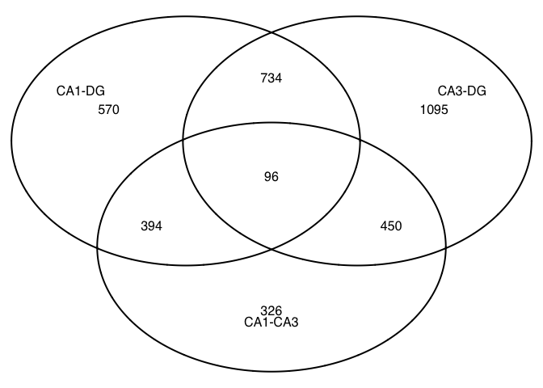
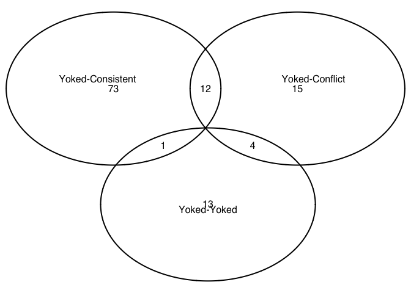
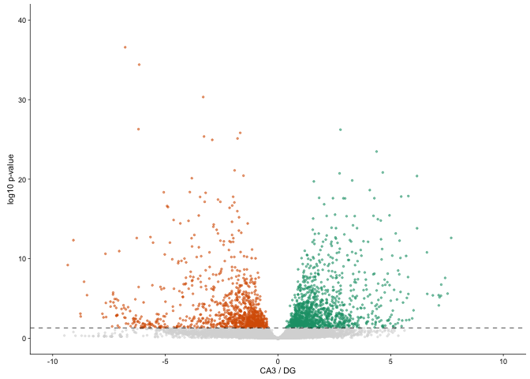
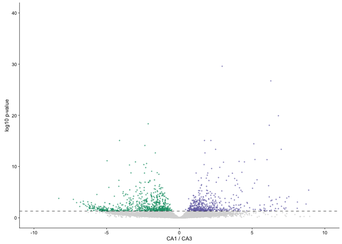
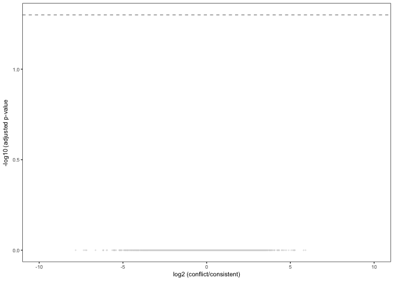
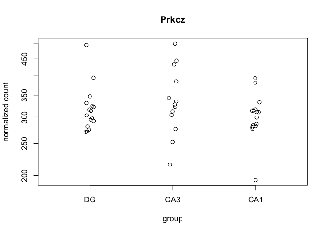

The figures made from this script were compiled in Adobe.

    library(ggplot2) ## for awesome plots!
    library(cowplot) ## for some easy to use themes
    library(dplyr) ## for filtering and selecting rows
    library(car) ## stats
    library(VennDiagram) ## venn diagrams
    library(pheatmap) ## awesome heatmaps
    library(viridis) # for awesome color pallette
    library(reshape2) ## for melting dataframe
    library(DESeq2) ## for gene expression analysis
    library(edgeR)  ## for basic read counts status
    library(magrittr) ## to use the weird pipe
    library(genefilter)  ## for PCA fuction
    library(ggrepel) ## for labeling volcano plot
    library(colorblindr) # simulates color-blind viewing 

    ## load functions 
    source("figureoptions.R")
    source("functions_RNAseq.R")

    ## set output file for figures 
    knitr::opts_chunk$set(fig.path = '../figures/02b_RNAseqAll/')

Design
------

The major comparision here is Hippocampal subfield: "DG","CA3", "CA1"
Behavioral Groups: "conflict", "consistent"

    colData <- read.csv("../data/02a_colData.csv", header = T)
    countData <- read.csv("../data/02a_countData.csv", header = T, check.names = F, row.names = 1)
    colData %>% select(APA2,Punch)  %>%  summary()

    ##                APA2    Punch   
    ##  conflict        :14   CA1:15  
    ##  consistent      : 9   CA3:13  
    ##  yoked_conflict  :12   DG :16  
    ##  yoked_consistent: 9

    totalCounts=colSums(countData)
    ### on average 1 million gene counts per sample 
    summary((colSums(countData)/1000000))

    ##    Min. 1st Qu.  Median    Mean 3rd Qu.    Max. 
    ##  0.1406  1.2980  2.2640  2.6580  3.4160 12.1000

    dds <- DESeqDataSetFromMatrix(countData = countData,
                                  colData = colData,
                                  design = ~ Punch + APA2 + Punch*APA2)

    dds$Punch <- factor(dds$Punch, levels=c("DG","CA3", "CA1")) ## specify the factor levels
    dds$APA2 <- factor(dds$APA2, levels=c("yoked_consistent", "consistent", "yoked_conflict" , "conflict")) ## specify the factor levels

    dds # view the DESeq object - note numnber of genes

    ## class: DESeqDataSet 
    ## dim: 46403 44 
    ## metadata(1): version
    ## assays(1): counts
    ## rownames(46403): 0610005C13Rik 0610007P14Rik ... Zzef1 Zzz3
    ## rowData names(0):
    ## colnames(44): 143A-CA3-1 143A-DG-1 ... 148B-CA3-4 148B-DG-4
    ## colData names(8): RNAseqID Mouse ... ID APA2

    dds <- dds[ rowSums(counts(dds)) > 1, ]  # Pre-filtering genes with 0 counts
    dds # view number of genes afternormalization and the number of samples

    ## class: DESeqDataSet 
    ## dim: 28074 44 
    ## metadata(1): version
    ## assays(1): counts
    ## rownames(28074): 0610005C13Rik 0610007P14Rik ... Zzef1 Zzz3
    ## rowData names(0):
    ## colnames(44): 143A-CA3-1 143A-DG-1 ... 148B-CA3-4 148B-DG-4
    ## colData names(8): RNAseqID Mouse ... ID APA2

    dds <- DESeq(dds) # Differential expression analysis
    rld <- rlog(dds, blind=FALSE) ## log transformed data
    vsd <- getVarianceStabilizedData(dds)
    write.csv(vsd, file = "../data/02b_vsd.csv", row.names = T)

this is for CA1 DG
------------------

    res <- results(dds, contrast =c("Punch", "CA1", "DG"), independentFiltering = T)
    summary(res)

    ## 
    ## out of 28074 with nonzero total read count
    ## adjusted p-value < 0.1
    ## LFC > 0 (up)     : 1099, 3.9% 
    ## LFC < 0 (down)   : 1427, 5.1% 
    ## outliers [1]     : 14, 0.05% 
    ## low counts [2]   : 14146, 50% 
    ## (mean count < 4)
    ## [1] see 'cooksCutoff' argument of ?results
    ## [2] see 'independentFiltering' argument of ?results

    head((res[order(res$padj),]), 10)

    ## log2 fold change (MLE): Punch CA1 vs DG 
    ## Wald test p-value: Punch CA1 vs DG 
    ## DataFrame with 10 rows and 6 columns
    ##           baseMean log2FoldChange     lfcSE      stat       pvalue
    ##          <numeric>      <numeric> <numeric> <numeric>    <numeric>
    ## St8sia5   70.66256       6.677426 0.6604426 10.110531 4.961451e-24
    ## Synj2    114.36825       6.234418 0.6352737  9.813752 9.824655e-23
    ## Pex5l    438.37687       3.544655 0.3750550  9.451027 3.355232e-21
    ## Prkcg   1637.14375       2.746241 0.3022794  9.085106 1.035979e-19
    ## Tiam1    326.55581      -4.584131 0.5052248 -9.073447 1.153099e-19
    ## Wfs1     578.25629       5.759807 0.6543682  8.802089 1.342928e-18
    ## Khdrbs3  337.32013       3.790277 0.4358327  8.696632 3.418792e-18
    ## Pou3f1   220.14704       5.359812 0.6152305  8.711876 2.988867e-18
    ## Tenm4    157.93420       4.437264 0.5100930  8.698933 3.350201e-18
    ## Nov       74.41290       6.677462 0.7738979  8.628350 6.224336e-18
    ##                 padj
    ##            <numeric>
    ## St8sia5 6.903362e-20
    ## Synj2   6.835013e-19
    ## Pex5l   1.556156e-17
    ## Prkcg   3.208843e-16
    ## Tiam1   3.208843e-16
    ## Wfs1    3.114251e-15
    ## Khdrbs3 5.285453e-15
    ## Pou3f1  5.285453e-15
    ## Tenm4   5.285453e-15
    ## Nov     8.660541e-15

    ## Order by adjusted p-value
    res <- res[order(res$padj),]
    resdata <- as.data.frame(res)
    head(resdata,30)

    ##                 baseMean log2FoldChange     lfcSE      stat       pvalue
    ## St8sia5         70.66256       6.677426 0.6604426 10.110531 4.961451e-24
    ## Synj2          114.36825       6.234418 0.6352737  9.813752 9.824655e-23
    ## Pex5l          438.37687       3.544655 0.3750550  9.451027 3.355232e-21
    ## Prkcg         1637.14375       2.746241 0.3022794  9.085106 1.035979e-19
    ## Tiam1          326.55581      -4.584131 0.5052248 -9.073447 1.153099e-19
    ## Wfs1           578.25629       5.759807 0.6543682  8.802089 1.342928e-18
    ## Khdrbs3        337.32013       3.790277 0.4358327  8.696632 3.418792e-18
    ## Pou3f1         220.14704       5.359812 0.6152305  8.711876 2.988867e-18
    ## Tenm4          157.93420       4.437264 0.5100930  8.698933 3.350201e-18
    ## Nov             74.41290       6.677462 0.7738979  8.628350 6.224336e-18
    ## Map4          1301.58324       2.105888 0.2447605  8.603871 7.707164e-18
    ## Ncald         1028.62103      -3.778845 0.4403857 -8.580763 9.424586e-18
    ## Adgrl2         108.59182       5.010493 0.5858314  8.552790 1.201479e-17
    ## Slc9a2          69.40864       6.877569 0.8082001  8.509736 1.743305e-17
    ## Stk32c         166.88490      -3.388658 0.3983485 -8.506767 1.788498e-17
    ## Zfp462          98.61962       5.222843 0.6141920  8.503600 1.838002e-17
    ## 6330403A02Rik 1215.54879       1.731495 0.2074297  8.347385 6.979109e-17
    ## Tmem200a        52.95948       7.256803 0.8701652  8.339569 7.456160e-17
    ## Actr3b         299.98669       1.854700 0.2237161  8.290417 1.128519e-16
    ## Fam163b        640.71423      -3.268166 0.3958925 -8.255185 1.516674e-16
    ## Galnt9         201.49180       3.129754 0.3803976  8.227586 1.910238e-16
    ## Gm2115          75.73189       7.199728 0.8745476  8.232517 1.833203e-16
    ## Pitpnm2        983.15069      -2.495810 0.3060845 -8.153990 3.521104e-16
    ## Pcnxl2         200.33165       2.838918 0.3526486  8.050274 8.260861e-16
    ## Camk1g          41.58880       5.395238 0.6824704  7.905452 2.669623e-15
    ## Lefty1          37.26480       7.272575 0.9199949  7.905017 2.678975e-15
    ## Rian           827.57937       1.588352 0.2006984  7.914126 2.489970e-15
    ## Snhg11        2543.73106       2.374177 0.3028044  7.840630 4.482923e-15
    ## Eps15          436.62429       1.765071 0.2253410  7.832886 4.767967e-15
    ## Cpe           3172.25982       2.146560 0.2746440  7.815789 5.461959e-15
    ##                       padj
    ## St8sia5       6.903362e-20
    ## Synj2         6.835013e-19
    ## Pex5l         1.556156e-17
    ## Prkcg         3.208843e-16
    ## Tiam1         3.208843e-16
    ## Wfs1          3.114251e-15
    ## Khdrbs3       5.285453e-15
    ## Pou3f1        5.285453e-15
    ## Tenm4         5.285453e-15
    ## Nov           8.660541e-15
    ## Map4          9.748861e-15
    ## Ncald         1.092781e-14
    ## Adgrl2        1.285953e-14
    ## Slc9a2        1.598372e-14
    ## Stk32c        1.598372e-14
    ## Zfp462        1.598372e-14
    ## 6330403A02Rik 5.712195e-14
    ## Tmem200a      5.763612e-14
    ## Actr3b        8.264325e-14
    ## Fam163b       1.055150e-13
    ## Galnt9        1.208139e-13
    ## Gm2115        1.208139e-13
    ## Pitpnm2       2.130115e-13
    ## Pcnxl2        4.789234e-13
    ## Camk1g        1.380565e-12
    ## Lefty1        1.380565e-12
    ## Rian          1.380565e-12
    ## Snhg11        2.227692e-12
    ## Eps15         2.287638e-12
    ## Cpe           2.533257e-12

this is for CA1 CA3
-------------------

    res <- results(dds, contrast =c("Punch", "CA1", "CA3"), independentFiltering = T)
    summary(res)

    ## 
    ## out of 28074 with nonzero total read count
    ## adjusted p-value < 0.1
    ## LFC > 0 (up)     : 850, 3% 
    ## LFC < 0 (down)   : 1172, 4.2% 
    ## outliers [1]     : 14, 0.05% 
    ## low counts [2]   : 14146, 50% 
    ## (mean count < 4)
    ## [1] see 'cooksCutoff' argument of ?results
    ## [2] see 'independentFiltering' argument of ?results

    head((res[order(res$padj),]), 10)

    ## log2 fold change (MLE): Punch CA1 vs CA3 
    ## Wald test p-value: Punch CA1 vs CA3 
    ## DataFrame with 10 rows and 6 columns
    ##         baseMean log2FoldChange     lfcSE      stat       pvalue
    ##        <numeric>      <numeric> <numeric> <numeric>    <numeric>
    ## Itpka   730.9373       2.942103 0.2403135 12.242771 1.836531e-34
    ## Doc2b   356.9267       6.288673 0.5404129 11.636793 2.679020e-31
    ## Fibcd1  370.6083       6.811095 0.6694119 10.174744 2.570763e-24
    ## Syn2   1140.2049      -2.147075 0.2193603 -9.787891 1.269149e-22
    ## Pou3f1  220.1470       6.183465 0.6376705  9.696959 3.106175e-22
    ## Ahi1    491.0714       1.726725 0.1928521  8.953627 3.439893e-19
    ## Bcr     351.3789       2.165229 0.2425153  8.928215 4.329363e-19
    ## Homer3  189.2740      -4.116145 0.4614371 -8.920273 4.651409e-19
    ## C1ql3   286.6724       5.120135 0.5857813  8.740692 2.316863e-18
    ## Nptxr  1951.6528      -2.372224 0.2744764 -8.642725 5.488772e-18
    ##                padj
    ##           <numeric>
    ## Itpka  2.555349e-30
    ## Doc2b  1.863794e-27
    ## Fibcd1 1.192320e-20
    ## Syn2   4.414735e-19
    ## Pou3f1 8.643863e-19
    ## Ahi1   7.977113e-16
    ## Bcr    8.089963e-16
    ## Homer3 8.089963e-16
    ## C1ql3  3.581870e-15
    ## Nptxr  7.637077e-15

this is for CA3 DG
------------------

    res <- results(dds, contrast =c("Punch", "CA3", "DG"), independentFiltering = T)
    summary(res)

    ## 
    ## out of 28074 with nonzero total read count
    ## adjusted p-value < 0.1
    ## LFC > 0 (up)     : 1585, 5.6% 
    ## LFC < 0 (down)   : 1560, 5.6% 
    ## outliers [1]     : 14, 0.05% 
    ## low counts [2]   : 11971, 43% 
    ## (mean count < 2)
    ## [1] see 'cooksCutoff' argument of ?results
    ## [2] see 'independentFiltering' argument of ?results

    head((res[order(res$padj),]), 10)

    ## log2 fold change (MLE): Punch CA3 vs DG 
    ## Wald test p-value: Punch CA3 vs DG 
    ## DataFrame with 10 rows and 6 columns
    ##          baseMean log2FoldChange     lfcSE      stat       pvalue
    ##         <numeric>      <numeric> <numeric> <numeric>    <numeric>
    ## Fam163b  640.7142      -5.424836 0.3462510 -15.66735 2.528952e-55
    ## C1ql3    286.6724      -6.783352 0.5044676 -13.44656 3.225440e-41
    ## Doc2b    356.9267      -6.160752 0.4724915 -13.03886 7.354570e-39
    ## Pde1b    262.4669      -3.319108 0.2702932 -12.27966 1.164893e-34
    ## Pter     163.9560      -6.192537 0.5392544 -11.48352 1.596504e-30
    ## Cpe     3172.2598       2.773492 0.2421395  11.45411 2.242592e-30
    ## Pnmal2   793.0014      -1.676574 0.1475724 -11.36102 6.537560e-30
    ## Adcy1   2703.0855      -3.283901 0.2917109 -11.25738 2.129907e-29
    ## Ahi1     491.0714      -1.794860 0.1603154 -11.19581 4.274891e-29
    ## Pitpnm2  983.1507      -2.916795 0.2615723 -11.15101 7.079728e-29
    ##                 padj
    ##            <numeric>
    ## Fam163b 4.068831e-51
    ## C1ql3   2.594705e-37
    ## Doc2b   3.944256e-35
    ## Pde1b   4.685490e-31
    ## Pter    5.137231e-27
    ## Cpe     6.013511e-27
    ## Pnmal2  1.502611e-26
    ## Adcy1   4.283509e-26
    ## Ahi1    7.642080e-26
    ## Pitpnm2 1.139057e-25

    head((res[order(res$log2FoldChange),]), 10)

    ## log2 fold change (MLE): Punch CA3 vs DG 
    ## Wald test p-value: Punch CA3 vs DG 
    ## DataFrame with 10 rows and 6 columns
    ##                 baseMean log2FoldChange     lfcSE      stat       pvalue
    ##                <numeric>      <numeric> <numeric> <numeric>    <numeric>
    ## Gm28438        45.276508     -23.774333  7.403021 -3.211437 1.320731e-03
    ## Gm10925        88.406384     -21.231585  7.410945 -2.864896           NA
    ## Lrcol1          2.160108     -18.586920  7.471009 -2.487873           NA
    ## Rps6-ps4       16.998747     -15.993663  3.968031 -4.030629 5.562769e-05
    ## Gm12895        42.255218     -13.094097  4.037469 -3.243145 1.182180e-03
    ## Npcd            8.370693      -9.481880  7.403451 -1.280738 2.002857e-01
    ## Pdyn           27.965727      -9.331458  1.359674 -6.863009 6.742484e-12
    ## RP24-246N21.1  14.006798      -9.080397  4.399696 -2.063869 3.903012e-02
    ## Plk5          114.288691      -9.079633  1.147754 -7.910786 2.557688e-15
    ## Glb1l3          4.914444      -8.989463  7.404383 -1.214073 2.247198e-01
    ##                       padj
    ##                  <numeric>
    ## Gm28438       1.284718e-02
    ## Gm10925                 NA
    ## Lrcol1                  NA
    ## Rps6-ps4      9.511093e-04
    ## Gm12895       1.182841e-02
    ## Npcd          4.561718e-01
    ## Pdyn          6.234473e-10
    ## RP24-246N21.1 1.629170e-01
    ## Plk5          4.662986e-13
    ## Glb1l3        4.869382e-01

this is for consistent yoked-consistent DG
------------------------------------------

    res <- results(dds, contrast =c("APA2", "consistent", "yoked_consistent"), independentFiltering = T, alpha = 0.1)
    summary(res)

    ## 
    ## out of 28074 with nonzero total read count
    ## adjusted p-value < 0.1
    ## LFC > 0 (up)     : 105, 0.37% 
    ## LFC < 0 (down)   : 9, 0.032% 
    ## outliers [1]     : 14, 0.05% 
    ## low counts [2]   : 12515, 45% 
    ## (mean count < 2)
    ## [1] see 'cooksCutoff' argument of ?results
    ## [2] see 'independentFiltering' argument of ?results

    head((res[order(res$padj),]), 10)

    ## log2 fold change (MLE): APA2 consistent vs yoked_consistent 
    ## Wald test p-value: APA2 consistent vs yoked consistent 
    ## DataFrame with 10 rows and 6 columns
    ##         baseMean log2FoldChange     lfcSE      stat       pvalue
    ##        <numeric>      <numeric> <numeric> <numeric>    <numeric>
    ## Plk2    709.1026       2.280584 0.2895038  7.877561 3.338344e-15
    ## Arc     892.7932       2.835362 0.3834924  7.393527 1.429842e-13
    ## Smad7   106.2128       3.381718 0.4736593  7.139559 9.363100e-13
    ## Lmna    119.4333       2.258696 0.3221917  7.010412 2.376172e-12
    ## Egr4    413.3462       3.062658 0.4435043  6.905588 4.999576e-12
    ## Frmd6   117.8255       3.214067 0.4641004  6.925371 4.348351e-12
    ## Sgk1    250.2746       2.502314 0.3625334  6.902299 5.116773e-12
    ## Dnaja1  572.3186       1.121150 0.1671043  6.709284 1.955817e-11
    ## Junb    522.6259       2.327045 0.3511946  6.626084 3.447094e-11
    ## Fbxo33  229.0949       2.971342 0.4506487  6.593478 4.296404e-11
    ##                padj
    ##           <numeric>
    ## Plk2   5.189455e-11
    ## Arc    1.111345e-09
    ## Smad7  4.851646e-09
    ## Lmna   9.234397e-09
    ## Egr4   1.136289e-08
    ## Frmd6  1.136289e-08
    ## Sgk1   1.136289e-08
    ## Dnaja1 3.800397e-08
    ## Junb   5.953898e-08
    ## Fbxo33 6.678760e-08

this is for consistent yoked-conflict yoked-consistent DG
---------------------------------------------------------

    res <- results(dds, contrast =c("APA2", "yoked_conflict", "yoked_consistent"), independentFiltering = T, alpha = 0.1)
    summary(res)

    ## 
    ## out of 28074 with nonzero total read count
    ## adjusted p-value < 0.1
    ## LFC > 0 (up)     : 33, 0.12% 
    ## LFC < 0 (down)   : 2, 0.0071% 
    ## outliers [1]     : 14, 0.05% 
    ## low counts [2]   : 14146, 50% 
    ## (mean count < 4)
    ## [1] see 'cooksCutoff' argument of ?results
    ## [2] see 'independentFiltering' argument of ?results

    table(res$padj<0.05)

    ## 
    ## FALSE  TRUE 
    ## 13896    18

    head((res[order(res$padj),]), 10)

    ## log2 fold change (MLE): APA2 yoked_conflict vs yoked_consistent 
    ## Wald test p-value: APA2 yoked conflict vs yoked consistent 
    ## DataFrame with 10 rows and 6 columns
    ##           baseMean log2FoldChange     lfcSE      stat       pvalue
    ##          <numeric>      <numeric> <numeric> <numeric>    <numeric>
    ## Kcnc2    149.83702       3.505345 0.5952516  5.888846 3.889012e-09
    ## St8sia5   70.66256       3.601006 0.6416641  5.611979 2.000252e-08
    ## Dner     178.21523       1.805065 0.3370213  5.355936 8.511459e-08
    ## Cnr1     353.39617       3.632563 0.7000948  5.188673 2.117982e-07
    ## Camk1g    41.58880       3.027599 0.6246273  4.847050 1.253111e-06
    ## Gm2115    75.73189       3.878557 0.8133284  4.768746 1.853758e-06
    ## Bicc1     28.39145       4.786031 1.0228595  4.679070 2.881791e-06
    ## Slc32a1   85.97303       3.741974 0.8233970  4.544556 5.505119e-06
    ## Nlrp3     32.68235       3.968012 0.8897606  4.459640 8.209750e-06
    ## Tmem200a  52.95948       3.644796 0.8202287  4.443635 8.845177e-06
    ##                  padj
    ##             <numeric>
    ## Kcnc2    5.411172e-05
    ## St8sia5  1.391575e-04
    ## Dner     3.947615e-04
    ## Cnr1     7.367401e-04
    ## Camk1g   3.487156e-03
    ## Gm2115   4.298865e-03
    ## Bicc1    5.728178e-03
    ## Slc32a1  9.574778e-03
    ## Nlrp3    1.230718e-02
    ## Tmem200a 1.230718e-02

    ## Order by adjusted p-value
    res <- res[order(res$padj),]
    resdata <- as.data.frame(res)
    head(resdata,30)

    ##                  baseMean log2FoldChange     lfcSE      stat       pvalue
    ## Kcnc2          149.837022       3.505345 0.5952516  5.888846 3.889012e-09
    ## St8sia5         70.662559       3.601006 0.6416641  5.611979 2.000252e-08
    ## Dner           178.215235       1.805065 0.3370213  5.355936 8.511459e-08
    ## Cnr1           353.396166       3.632563 0.7000948  5.188673 2.117982e-07
    ## Camk1g          41.588804       3.027599 0.6246273  4.847050 1.253111e-06
    ## Gm2115          75.731890       3.878557 0.8133284  4.768746 1.853758e-06
    ## Bicc1           28.391450       4.786031 1.0228595  4.679070 2.881791e-06
    ## Slc32a1         85.973027       3.741974 0.8233970  4.544556 5.505119e-06
    ## Nlrp3           32.682352       3.968012 0.8897606  4.459640 8.209750e-06
    ## Tmem200a        52.959477       3.644796 0.8202287  4.443635 8.845177e-06
    ## Me1             89.733920       1.855449 0.4207410  4.409955 1.033923e-05
    ## Sulf2          140.753557       1.963920 0.4546768  4.319377 1.564705e-05
    ## Nell1           97.807863       3.314214 0.7850072  4.221890 2.422624e-05
    ## Khdrbs3        337.320125       1.566366 0.3798869  4.123243 3.735755e-05
    ## Tenm4          157.934197       1.906297 0.4605862  4.138850 3.490504e-05
    ## Elfn1           21.375332       3.749594 0.9169207  4.089333 4.326155e-05
    ## Strip2         102.690442       3.259595 0.8078240  4.035031 5.459512e-05
    ## Gm26559          7.802238      -6.292722 1.5668602 -4.016135 5.916045e-05
    ## Rnase4          15.462134       3.390807 0.8515482  3.981933 6.835716e-05
    ## Slc9a2          69.408636       3.024357 0.7660364  3.948059 7.878727e-05
    ## Synj2          114.368252       2.377474 0.6006356  3.958263 7.549673e-05
    ## C530008M17Rik  152.248326       1.021251 0.2655391  3.845955 1.200839e-04
    ## Cpe           3172.259818       0.881772 0.2280766  3.866123 1.105792e-04
    ## Csrnp1          93.736649       1.722491 0.4475500  3.848711 1.187409e-04
    ## Klk8            34.574240       3.935606 1.0279746  3.828505 1.289240e-04
    ## Slc17a8         21.870464       3.872330 1.0136091  3.820338 1.332687e-04
    ## Slc6a7          92.887442       1.649971 0.4310547  3.827753 1.293185e-04
    ## Tmem178b       174.231553       1.755788 0.4531550  3.874587 1.068058e-04
    ## Spock1         412.415156       2.452129 0.6470115  3.789931 1.506890e-04
    ## Gap43           82.881195       1.860876 0.4946857  3.761735 1.687388e-04
    ##                       padj
    ## Kcnc2         5.411172e-05
    ## St8sia5       1.391575e-04
    ## Dner          3.947615e-04
    ## Cnr1          7.367401e-04
    ## Camk1g        3.487156e-03
    ## Gm2115        4.298865e-03
    ## Bicc1         5.728178e-03
    ## Slc32a1       9.574778e-03
    ## Nlrp3         1.230718e-02
    ## Tmem200a      1.230718e-02
    ## Me1           1.307818e-02
    ## Sulf2         1.814276e-02
    ## Nell1         2.592953e-02
    ## Khdrbs3       3.465286e-02
    ## Tenm4         3.465286e-02
    ## Elfn1         3.762133e-02
    ## Strip2        4.468450e-02
    ## Gm26559       4.573103e-02
    ## Rnase4        5.005903e-02
    ## Slc9a2        5.220219e-02
    ## Synj2         5.220219e-02
    ## C530008M17Rik 6.622504e-02
    ## Cpe           6.622504e-02
    ## Csrnp1        6.622504e-02
    ## Klk8          6.622504e-02
    ## Slc17a8       6.622504e-02
    ## Slc6a7        6.622504e-02
    ## Tmem178b      6.622504e-02
    ## Spock1        7.229953e-02
    ## Gap43         7.573650e-02

this is for consistent conflict yoked-conflict
----------------------------------------------

    res <- results(dds, contrast =c("APA2", "conflict", "yoked_conflict"), independentFiltering = T, alpha = 0.1)
    summary(res)

    ## 
    ## out of 28074 with nonzero total read count
    ## adjusted p-value < 0.1
    ## LFC > 0 (up)     : 19, 0.068% 
    ## LFC < 0 (down)   : 41, 0.15% 
    ## outliers [1]     : 14, 0.05% 
    ## low counts [2]   : 18495, 66% 
    ## (mean count < 22)
    ## [1] see 'cooksCutoff' argument of ?results
    ## [2] see 'independentFiltering' argument of ?results

    head((res[order(res$padj),]), 10)

    ## log2 fold change (MLE): APA2 conflict vs yoked_conflict 
    ## Wald test p-value: APA2 conflict vs yoked_conflict 
    ## DataFrame with 10 rows and 6 columns
    ##          baseMean log2FoldChange     lfcSE      stat       pvalue
    ##         <numeric>      <numeric> <numeric> <numeric>    <numeric>
    ## Camk1g   41.58880      -3.170321 0.5825176 -5.442446 5.255387e-08
    ## Gm12895  42.25522     -17.897820 3.4930907 -5.123778 2.994741e-07
    ## Kcnc2   149.83702      -2.353144 0.5112396 -4.602821 4.168067e-06
    ## Khdrbs3 337.32013      -1.577826 0.3433236 -4.595739 4.312179e-06
    ## Stmn2   433.06834      -2.120505 0.4610852 -4.598943 4.246403e-06
    ## Plk2    709.10261       1.133947 0.2531652  4.479081 7.496513e-06
    ## Arc     892.79317       1.487597 0.3347722  4.443608 8.846272e-06
    ## Frmd6   117.82550       1.811310 0.4117545  4.399004 1.087488e-05
    ## Fbxo33  229.09490       1.687575 0.3961535  4.259900 2.045180e-05
    ## Fosl2   308.85152       1.506853 0.3579206  4.210021 2.553470e-05
    ##                 padj
    ##            <numeric>
    ## Camk1g  0.0005026778
    ## Gm12895 0.0014322348
    ## Kcnc2   0.0082491991
    ## Khdrbs3 0.0082491991
    ## Stmn2   0.0082491991
    ## Plk2    0.0119506915
    ## Arc     0.0120877988
    ## Frmd6   0.0130022729
    ## Fbxo33  0.0214535353
    ## Fosl2   0.0214535353

    table(res$padj<0.05)

    ## 
    ## FALSE  TRUE 
    ##  9534    31

    table(res$padj<0.1)

    ## 
    ## FALSE  TRUE 
    ##  9505    60

this is for consistent conflict yoked-conflict
----------------------------------------------

    res <- results(dds, contrast =c("APA2", "conflict", "consistent"), independentFiltering = T)
    summary(res)

    ## 
    ## out of 28074 with nonzero total read count
    ## adjusted p-value < 0.1
    ## LFC > 0 (up)     : 1, 0.0036% 
    ## LFC < 0 (down)   : 0, 0% 
    ## outliers [1]     : 14, 0.05% 
    ## low counts [2]   : 0, 0% 
    ## (mean count < 0)
    ## [1] see 'cooksCutoff' argument of ?results
    ## [2] see 'independentFiltering' argument of ?results

    head((res[order(res$padj),]), 10)

    ## log2 fold change (MLE): APA2 conflict vs consistent 
    ## Wald test p-value: APA2 conflict vs consistent 
    ## DataFrame with 10 rows and 6 columns
    ##                 baseMean log2FoldChange     lfcSE       stat       pvalue
    ##                <numeric>      <numeric> <numeric>  <numeric>    <numeric>
    ## Gm20425        9.9547031     18.3761659 3.8552983  4.7664705 1.874811e-06
    ## Gm26702       12.8862199     21.6656306 4.9982871  4.3346111 1.460180e-05
    ## 0610005C13Rik  0.5314602     -1.6537609 4.0150729 -0.4118881 6.804214e-01
    ## 0610007P14Rik 44.1662180     -0.3010539 0.3503880 -0.8592014 3.902294e-01
    ## 0610009B22Rik 13.6936599     -0.6360010 0.6360642 -0.9999008 3.173585e-01
    ## 0610009E02Rik  0.5789240     -1.2567488 3.6923508 -0.3403655 7.335813e-01
    ## 0610009L18Rik  4.3110852      0.5139942 1.1375195  0.4518552 6.513733e-01
    ## 0610009O20Rik 48.6495711      0.2999714 0.3929565  0.7633706 4.452424e-01
    ## 0610010F05Rik 66.9154162     -0.3497983 0.3171319 -1.1030056 2.700247e-01
    ## 0610010K14Rik 20.5700916      0.2369065 0.5786025  0.4094461 6.822123e-01
    ##                     padj
    ##                <numeric>
    ## Gm20425       0.05260721
    ## Gm26702       0.20486331
    ## 0610005C13Rik 1.00000000
    ## 0610007P14Rik 1.00000000
    ## 0610009B22Rik 1.00000000
    ## 0610009E02Rik 1.00000000
    ## 0610009L18Rik 1.00000000
    ## 0610009O20Rik 1.00000000
    ## 0610010F05Rik 1.00000000
    ## 0610010K14Rik 1.00000000

    head((res[order(res$log2FoldChange),]), 10)

    ## log2 fold change (MLE): APA2 conflict vs consistent 
    ## Wald test p-value: APA2 conflict vs consistent 
    ## DataFrame with 10 rows and 6 columns
    ##           baseMean log2FoldChange     lfcSE       stat     pvalue
    ##          <numeric>      <numeric> <numeric>  <numeric>  <numeric>
    ## Gm10925 88.4063837     -29.685289  7.048281 -4.2117062         NA
    ## Gm26461  7.8458791     -27.519698  7.097875 -3.8771741         NA
    ## Lrcol1   2.1601083     -18.187619  7.136301 -2.5486060         NA
    ## Rps12   15.0315147      -7.823158  7.050194 -1.1096372 0.26715538
    ## Gm7206   4.9575785      -7.348245  7.051234 -1.0421218 0.29735519
    ## Gm4294   8.1016236      -7.260706  4.413727 -1.6450282 0.09996399
    ## Gm28539  1.3631856      -7.177783  7.051700 -1.0178799 0.30873504
    ## Apoo-ps  3.0885665      -7.177716  7.051700 -1.0178703 0.30873959
    ## Gm25526  0.8425093      -6.635732  7.053601 -0.9407581 0.34682882
    ## Gm28792  0.7922522      -6.182164  7.055839 -0.8761770 0.38093382
    ##              padj
    ##         <numeric>
    ## Gm10925        NA
    ## Gm26461        NA
    ## Lrcol1         NA
    ## Rps12           1
    ## Gm7206          1
    ## Gm4294          1
    ## Gm28539         1
    ## Apoo-ps         1
    ## Gm25526         1
    ## Gm28792         1

    table(res$padj<0.05)

    ## 
    ## FALSE 
    ## 28060

    table(res$padj<0.1)

    ## 
    ## FALSE  TRUE 
    ## 28059     1

    contrast1 <- resvals(contrastvector = c("Punch", "CA1", "DG"), mypval = 0.1) # 2526

    ## [1] 2526

    contrast2 <- resvals(contrastvector = c("Punch", "CA1", "CA3"), mypval = 0.1) # 2022

    ## [1] 2022

    contrast3 <- resvals(contrastvector = c("Punch", "CA3", "DG"), mypval = 0.1) # 3145

    ## [1] 3145

    contrast4 <- resvals(contrastvector = c("APA2", "consistent", "yoked_consistent"), mypval = 0.1) # 114

    ## [1] 114

    contrast5 <- resvals(contrastvector = c("APA2", "conflict", "yoked_conflict"), mypval = 0.1) # 60

    ## [1] 60

    contrast6 <- resvals(contrastvector = c("APA2", "conflict", "consistent"), mypval = 0.1) # 1

    ## [1] 1

    contrast7 <- resvals(contrastvector = c("APA2", "yoked_conflict", "yoked_consistent"), mypval = 0.1) # 35

    ## [1] 35

    DEGes <- assay(rld)
    DEGes <- cbind(DEGes, contrast1, contrast2, contrast3, contrast4, contrast5, contrast6, contrast7)
    DEGes <- as.data.frame(DEGes) # convert matrix to dataframe
    DEGes$rownames <- rownames(DEGes)  # add the rownames to the dataframe
    DEGes$padjmin <- with(DEGes, pmin(padjPunchCA1DG, padjPunchCA1CA3, padjPunchCA3DG, padjAPA2conflictconsistent, padjAPA2yoked_conflictyoked_consistent,padjAPA2conflictyoked_conflict, padjAPA2consistentyoked_consistent)) 
    DEGes <- DEGes %>% filter(padjmin < 0.000000001)
    rownames(DEGes) <- DEGes$rownames
    drop.cols <-colnames(DEGes[,grep("padj|pval|rownames", colnames(DEGes))])
    DEGes <- DEGes %>% dplyr::select(-one_of(drop.cols))
    DEGes <- as.matrix(DEGes)
    DEGes <- DEGes - rowMeans(DEGes)

    df <- as.data.frame(colData(dds)[,c("APA2", "Punch")]) ## matrix to df
    rownames(df) <- names(countData)
    ann_colors <- ann_colors4 # see color options 
    DEGes <- as.matrix(DEGes) 
    paletteLength <- 30
    myBreaks <- c(seq(min(DEGes), 0, length.out=ceiling(paletteLength/2) + 1), 
                  seq(max(DEGes)/paletteLength, max(DEGes), length.out=floor(paletteLength/2)))

    pheatmap(DEGes, show_colnames=T, show_rownames = F,
             annotation_col=df, annotation_colors = ann_colors,
             treeheight_row = 0, treeheight_col = 25,
             annotation_row = NA, 
             annotation_legend = FALSE,
             annotation_names_row = FALSE, annotation_names_col = FALSE,
             fontsize = 8, 
             border_color = "grey60" ,
             color = viridis(30),
             cellwidth = 6, 
             clustering_method="average",
             breaks=myBreaks,
             clustering_distance_cols="correlation" 
             )

    pheatmap(DEGes, show_colnames=F, show_rownames = F,
             annotation_col=df, annotation_colors = ann_colors, 
             annotation_row = NA, 
             annotation_legend = FALSE,
             annotation_names_row = FALSE, 
             annotation_names_col = FALSE,
             treeheight_row = 0, treeheight_col = 25,
             fontsize = 8, 
             border_color = "grey60" ,
             color = viridis(30),
             height = 3.75, 
             width = 3.5,
             clustering_method="average",
             breaks=myBreaks,
             clustering_distance_cols="correlation", 
             filename = "../figures/02b_RNAseqALL/pheatmap1.pdf"
             )

Principle component analysis
----------------------------

    ## [1] 37 28 14  5  1  1  1  1  1

    ##             Df Sum Sq Mean Sq F value Pr(>F)    
    ## Punch        2  13741    6871   134.8 <2e-16 ***
    ## Residuals   41   2089      51                   
    ## ---
    ## Signif. codes:  0 '***' 0.001 '**' 0.01 '*' 0.05 '.' 0.1 ' ' 1

    ##   Tukey multiple comparisons of means
    ##     95% family-wise confidence level
    ## 
    ## Fit: aov(formula = PC1 ~ Punch, data = pcadata)
    ## 
    ## $Punch
    ##               diff        lwr        upr     p adj
    ## CA3-DG  -35.748687 -42.230044 -29.267330 0.0000000
    ## CA1-DG  -37.537268 -43.775677 -31.298859 0.0000000
    ## CA1-CA3  -1.788581  -8.366073   4.788911 0.7870855

    ##             Df Sum Sq Mean Sq F value Pr(>F)
    ## Punch        2    859   429.7    1.57   0.22
    ## Residuals   41  11223   273.7

    ##   Tukey multiple comparisons of means
    ##     95% family-wise confidence level
    ## 
    ## Fit: aov(formula = PC2 ~ Punch, data = pcadata)
    ## 
    ## $Punch
    ##               diff       lwr       upr     p adj
    ## CA3-DG  -10.575254 -25.59740  4.446892 0.2130127
    ## CA1-DG   -7.148650 -21.60770  7.310403 0.4586622
    ## CA1-CA3   3.426604 -11.81836 18.671566 0.8487989

    ##             Df Sum Sq Mean Sq F value Pr(>F)    
    ## Punch        2   5899  2949.6   533.7 <2e-16 ***
    ## Residuals   41    227     5.5                   
    ## ---
    ## Signif. codes:  0 '***' 0.001 '**' 0.01 '*' 0.05 '.' 0.1 ' ' 1

    ##   Tukey multiple comparisons of means
    ##     95% family-wise confidence level
    ## 
    ## Fit: aov(formula = PC3 ~ Punch, data = pcadata)
    ## 
    ## $Punch
    ##              diff       lwr       upr p adj
    ## CA3-DG   15.65204  13.51744  17.78664     0
    ## CA1-DG  -13.45221 -15.50680 -11.39763     0
    ## CA1-CA3 -29.10425 -31.27051 -26.93799     0

    ##             Df Sum Sq Mean Sq F value Pr(>F)
    ## APA2         3    269   89.75   0.613  0.611
    ## Residuals   40   5857  146.41

    ##             Df Sum Sq Mean Sq F value Pr(>F)
    ## APA2         3   98.6   32.88   0.659  0.582
    ## Residuals   40 1995.5   49.89

    ##             Df Sum Sq Mean Sq F value  Pr(>F)   
    ## APA2         3  168.3   56.11   4.906 0.00537 **
    ## Residuals   40  457.5   11.44                   
    ## ---
    ## Signif. codes:  0 '***' 0.001 '**' 0.01 '*' 0.05 '.' 0.1 ' ' 1

    ##             Df Sum Sq Mean Sq F value  Pr(>F)   
    ## APA2         3  155.2   51.73   5.389 0.00328 **
    ## Residuals   40  384.0    9.60                   
    ## ---
    ## Signif. codes:  0 '***' 0.001 '**' 0.01 '*' 0.05 '.' 0.1 ' ' 1

    ## quartz_off_screen 
    ##                 2

    ## quartz_off_screen 
    ##                 2

Number of differentially expressed genes per two-way contrast
=============================================================

venn diagrams
-------------

    contrast1 <- resvals(contrastvector = c("Punch", "CA1", "DG"), mypval = 0.1) # 2526

    ## [1] 2526

    contrast2 <- resvals(contrastvector = c("Punch", "CA1", "CA3"), mypval = 0.1) # 2022

    ## [1] 2022

    contrast3 <- resvals(contrastvector = c("Punch", "CA3", "DG"), mypval = 0.1) # 3145

    ## [1] 3145

    contrast4 <- resvals(contrastvector = c("APA2", "consistent", "yoked_consistent"), mypval = 0.1) # 114

    ## [1] 114

    contrast5 <- resvals(contrastvector = c("APA2", "conflict", "yoked_conflict"), mypval = 0.1) #60

    ## [1] 60

    contrast6 <- resvals(contrastvector = c("APA2", "yoked_conflict", "yoked_consistent"), mypval = 0.1) # 35

    ## [1] 35

    contrast7 <- resvals(contrastvector = c("APA2", "conflict", "consistent"), mypval = 0.1) # 1

    ## [1] 1

    rldpadjs <- assay(rld)
    rldpadjs <- cbind(rldpadjs, contrast1, contrast2, contrast3, contrast4, contrast5, contrast6)
    rldpadjs <- as.data.frame(rldpadjs)
    rldpadjs <- rldpadjs[ , grepl( "padj" , names( rldpadjs ) ) ]

    venn1 <- row.names(rldpadjs[rldpadjs[1] <0.05 & !is.na(rldpadjs[1]),]) 
    venn2 <- row.names(rldpadjs[rldpadjs[2] <0.05 & !is.na(rldpadjs[2]),]) 
    venn3 <- row.names(rldpadjs[rldpadjs[3] <0.05 & !is.na(rldpadjs[3]),]) 
    venn4 <- row.names(rldpadjs[rldpadjs[4] <0.05 & !is.na(rldpadjs[4]),]) 
    venn5 <- row.names(rldpadjs[rldpadjs[5] <0.05 & !is.na(rldpadjs[5]),]) 
    venn6 <- row.names(rldpadjs[rldpadjs[6] <0.05 & !is.na(rldpadjs[6]),]) 

    candidates1 <- list("CA1-DG" = venn1, "CA3-DG" = venn3, "CA1-CA3" = venn2) 
    candidates2 <- list("Yoked-Consistent" = venn4, "Yoked-Conflict" = venn5, "Yoked-Yoked" = venn6)

    prettyvenn <- venn.diagram(
      scaled=T,
      x = candidates1, filename=NULL, 
      col = "black",
      alpha = 0.5,
      cex = 1, fontfamily = "sans", #fontface = "bold",
      cat.default.pos = "text",
      cat.cex = 1, cat.fontfamily = "sans")
    #dev.off()
    grid.draw(prettyvenn)

    prettyvenn <- venn.diagram(
      scaled=T,
      x = candidates2, filename=NULL, 
      col = "black",
      alpha = 0.5,
      cex = 1, fontfamily = "sans", #fontface = "bold",
      cat.default.pos = "text",
      cat.cex = 1, cat.fontfamily = "sans")
    #dev.off()
    grid.draw(prettyvenn)

Volcanos plots and and gene lists
---------------------------------

ca3 dg
------

    res <- results(dds, contrast =c("Punch", "CA3", "DG"), independentFiltering = T, alpha = 0.1)
    summary(res)

    ## 
    ## out of 28074 with nonzero total read count
    ## adjusted p-value < 0.1
    ## LFC > 0 (up)     : 1585, 5.6% 
    ## LFC < 0 (down)   : 1560, 5.6% 
    ## outliers [1]     : 14, 0.05% 
    ## low counts [2]   : 11971, 43% 
    ## (mean count < 2)
    ## [1] see 'cooksCutoff' argument of ?results
    ## [2] see 'independentFiltering' argument of ?results

    resOrdered <- res[order(res$padj),]
    head(resOrdered, 10)

    ## log2 fold change (MLE): Punch CA3 vs DG 
    ## Wald test p-value: Punch CA3 vs DG 
    ## DataFrame with 10 rows and 6 columns
    ##          baseMean log2FoldChange     lfcSE      stat       pvalue
    ##         <numeric>      <numeric> <numeric> <numeric>    <numeric>
    ## Fam163b  640.7142      -5.424836 0.3462510 -15.66735 2.528952e-55
    ## C1ql3    286.6724      -6.783352 0.5044676 -13.44656 3.225440e-41
    ## Doc2b    356.9267      -6.160752 0.4724915 -13.03886 7.354570e-39
    ## Pde1b    262.4669      -3.319108 0.2702932 -12.27966 1.164893e-34
    ## Pter     163.9560      -6.192537 0.5392544 -11.48352 1.596504e-30
    ## Cpe     3172.2598       2.773492 0.2421395  11.45411 2.242592e-30
    ## Pnmal2   793.0014      -1.676574 0.1475724 -11.36102 6.537560e-30
    ## Adcy1   2703.0855      -3.283901 0.2917109 -11.25738 2.129907e-29
    ## Ahi1     491.0714      -1.794860 0.1603154 -11.19581 4.274891e-29
    ## Pitpnm2  983.1507      -2.916795 0.2615723 -11.15101 7.079728e-29
    ##                 padj
    ##            <numeric>
    ## Fam163b 4.068831e-51
    ## C1ql3   2.594705e-37
    ## Doc2b   3.944256e-35
    ## Pde1b   4.685490e-31
    ## Pter    5.137231e-27
    ## Cpe     6.013511e-27
    ## Pnmal2  1.502611e-26
    ## Adcy1   4.283509e-26
    ## Ahi1    7.642080e-26
    ## Pitpnm2 1.139057e-25

    data <- data.frame(gene = row.names(res), pvalue = -log10(res$padj), lfc = res$log2FoldChange)
    data <- na.omit(data)
    head(data)

    ##            gene     pvalue        lfc
    ## 2 0610007P14Rik 0.19514020 -0.3283554
    ## 3 0610009B22Rik 0.23151594  0.6824716
    ## 5 0610009L18Rik 0.02214522 -0.1740628
    ## 6 0610009O20Rik 0.17482553 -0.3461581
    ## 7 0610010F05Rik 0.40095180  0.4741619
    ## 8 0610010K14Rik 1.32587669 -1.6893329

    summary(log10(data$pvalue +1))

    ##    Min. 1st Qu.  Median    Mean 3rd Qu.    Max. 
    ## 0.00000 0.03733 0.10250 0.18310 0.24530 1.71100

    data <- data %>%
      mutate(color = ifelse(data$lfc > 0 & data$pvalue > 1.3, 
                            yes = "CA3", 
                            no = ifelse(data$lfc < 0 & data$pvalue > 1.3, 
                                        yes = "DG", 
                                        no = "none")))
    top_n(data, n = 5, wt = lfc)

    ##            gene    pvalue      lfc color
    ## 1 2310002F09Rik  6.743819 7.246620   CA3
    ## 2         Crhbp  5.348403 7.235562   CA3
    ## 3          Klk8 12.616421 7.687844   CA3
    ## 4           Sst  5.614643 7.528500   CA3
    ## 5       Tmem215  7.585915 7.420281   CA3

    top_n(data, n = 5, wt = pvalue)

    ##      gene   pvalue       lfc color
    ## 1   C1ql3 36.58591 -6.783352    DG
    ## 2   Doc2b 34.40403 -6.160752    DG
    ## 3 Fam163b 50.39053 -5.424836    DG
    ## 4   Pde1b 30.32924 -3.319108    DG
    ## 5    Pter 26.28927 -6.192537    DG

    data$logp <- log10(data$pvalue +1 )

    colored <- ggplot(data, aes(x = lfc, y = pvalue)) + 
      geom_point(aes(color = factor(color)), size = 0.5, alpha = 0.5, na.rm = T) + 
      theme(legend.position = "none") + # remove legend 
      scale_color_manual(values = c("CA3" = "#1b9e77",
                                    "DG" = "#d95f02", 
                                    "none" = "#d9d9d9")) + 
      theme_cowplot(font_size = 8, line_size = 0.25) +
      geom_hline(yintercept = 1.3,  size = 0.25, linetype = 2) + 
      scale_y_continuous(limits=c(0, 40)) +
      scale_x_continuous( limits=c(-10, 10)) +
      xlab(paste0("CA3 / DG")) +
      ylab(paste0("log10 p-value")) +       
      theme(panel.grid.minor=element_blank(),
            legend.position = "none", # remove legend 
            panel.grid.major=element_blank())
    colored

    pdf(file="../figures/02b_RNAseqAll/AllDGCA3.pdf", width=1.75, height=2.25)
    plot(colored)
    dev.off()

    ## quartz_off_screen 
    ##                 2

DG CA1
------

    res <- results(dds, contrast =c("Punch", "CA1", "DG"), independentFiltering = T, alpha = 0.1)
    summary(res)

    ## 
    ## out of 28074 with nonzero total read count
    ## adjusted p-value < 0.1
    ## LFC > 0 (up)     : 1099, 3.9% 
    ## LFC < 0 (down)   : 1427, 5.1% 
    ## outliers [1]     : 14, 0.05% 
    ## low counts [2]   : 14146, 50% 
    ## (mean count < 4)
    ## [1] see 'cooksCutoff' argument of ?results
    ## [2] see 'independentFiltering' argument of ?results

    resOrdered <- res[order(res$padj),]
    head(resOrdered, 10)

    ## log2 fold change (MLE): Punch CA1 vs DG 
    ## Wald test p-value: Punch CA1 vs DG 
    ## DataFrame with 10 rows and 6 columns
    ##           baseMean log2FoldChange     lfcSE      stat       pvalue
    ##          <numeric>      <numeric> <numeric> <numeric>    <numeric>
    ## St8sia5   70.66256       6.677426 0.6604426 10.110531 4.961451e-24
    ## Synj2    114.36825       6.234418 0.6352737  9.813752 9.824655e-23
    ## Pex5l    438.37687       3.544655 0.3750550  9.451027 3.355232e-21
    ## Prkcg   1637.14375       2.746241 0.3022794  9.085106 1.035979e-19
    ## Tiam1    326.55581      -4.584131 0.5052248 -9.073447 1.153099e-19
    ## Wfs1     578.25629       5.759807 0.6543682  8.802089 1.342928e-18
    ## Khdrbs3  337.32013       3.790277 0.4358327  8.696632 3.418792e-18
    ## Pou3f1   220.14704       5.359812 0.6152305  8.711876 2.988867e-18
    ## Tenm4    157.93420       4.437264 0.5100930  8.698933 3.350201e-18
    ## Nov       74.41290       6.677462 0.7738979  8.628350 6.224336e-18
    ##                 padj
    ##            <numeric>
    ## St8sia5 6.903362e-20
    ## Synj2   6.835013e-19
    ## Pex5l   1.556156e-17
    ## Prkcg   3.208843e-16
    ## Tiam1   3.208843e-16
    ## Wfs1    3.114251e-15
    ## Khdrbs3 5.285453e-15
    ## Pou3f1  5.285453e-15
    ## Tenm4   5.285453e-15
    ## Nov     8.660541e-15

    data <- data.frame(gene = row.names(res), pvalue = -log10(res$padj), lfc = res$log2FoldChange)
    data <- na.omit(data)
    head(data)

    ##            gene     pvalue        lfc
    ## 2 0610007P14Rik 0.07548631 -0.1856366
    ## 3 0610009B22Rik 0.10599641 -0.5206761
    ## 5 0610009L18Rik 0.36034939 -2.2372426
    ## 6 0610009O20Rik 0.43924245 -0.7933416
    ## 7 0610010F05Rik 0.05010748 -0.1215209
    ## 8 0610010K14Rik 0.16306809  0.5278990

    data <- data.frame(gene = row.names(res), pvalue =  -log10(res$pvalue), lfc = res$log2FoldChange)
    data <- na.omit(data)
    head(data)

    ##            gene     pvalue        lfc
    ## 1 0610005C13Rik 0.03954333  0.5307304
    ## 2 0610007P14Rik 0.16131023 -0.1856366
    ## 3 0610009B22Rik 0.22471652 -0.5206761
    ## 4 0610009E02Rik 0.10264454 -1.1930756
    ## 5 0610009L18Rik 0.69879478 -2.2372426
    ## 6 0610009O20Rik 0.83477845 -0.7933416

    data <- data %>%
      mutate(color = ifelse(data$lfc > 0 & data$pvalue > 1.3, 
                            yes = "CA1", 
                            no = ifelse(data$lfc < 0 & data$pvalue >1.3, 
                                        yes = "DG", 
                                        no = "none")))
    top_labelled <- top_n(data, n = 5, wt = lfc)
    head(data)

    ##            gene     pvalue        lfc color
    ## 1 0610005C13Rik 0.03954333  0.5307304  none
    ## 2 0610007P14Rik 0.16131023 -0.1856366  none
    ## 3 0610009B22Rik 0.22471652 -0.5206761  none
    ## 4 0610009E02Rik 0.10264454 -1.1930756  none
    ## 5 0610009L18Rik 0.69879478 -2.2372426  none
    ## 6 0610009O20Rik 0.83477845 -0.7933416  none

    colored <- ggplot(data, aes(x = lfc, y = pvalue)) + 
      geom_point(aes(color = factor(color)), size = 0.25, alpha = 0.5, na.rm = T) + # add gene points
      scale_color_manual(values = c("CA1" = "#7570b3",
                                    "DG" = "#d95f02", 
                                    "none" = "#d9d9d9")) + 
      theme_cowplot(font_size = 8, line_size = 0.25) +
      geom_hline(yintercept = 1.3,  size = 0.25, linetype = 2) + 
      scale_y_continuous(limits=c(0, 40)) +
      scale_x_continuous( limits=c(-10, 10)) +
      xlab(paste0("CA1 / DG")) +
      ylab(paste0("log10 p-value")) +       
      theme(panel.grid.minor=element_blank(),
            legend.position = "none", # remove legend 
            panel.grid.major=element_blank())
    colored

    pdf(file="../figures/02b_RNAseqAll/AllCA1DG.pdf", width=1.75, height=2.25)
    plot(colored)
    dev.off()

    ## quartz_off_screen 
    ##                 2

ca1 ca3
=======

    res <- results(dds, contrast =c("Punch", "CA1", "CA3"), independentFiltering = T, alpha = 0.1)
    summary(res)

    ## 
    ## out of 28074 with nonzero total read count
    ## adjusted p-value < 0.1
    ## LFC > 0 (up)     : 850, 3% 
    ## LFC < 0 (down)   : 1172, 4.2% 
    ## outliers [1]     : 14, 0.05% 
    ## low counts [2]   : 14146, 50% 
    ## (mean count < 4)
    ## [1] see 'cooksCutoff' argument of ?results
    ## [2] see 'independentFiltering' argument of ?results

    resOrdered <- res[order(res$padj),]
    head(resOrdered, 10)

    ## log2 fold change (MLE): Punch CA1 vs CA3 
    ## Wald test p-value: Punch CA1 vs CA3 
    ## DataFrame with 10 rows and 6 columns
    ##         baseMean log2FoldChange     lfcSE      stat       pvalue
    ##        <numeric>      <numeric> <numeric> <numeric>    <numeric>
    ## Itpka   730.9373       2.942103 0.2403135 12.242771 1.836531e-34
    ## Doc2b   356.9267       6.288673 0.5404129 11.636793 2.679020e-31
    ## Fibcd1  370.6083       6.811095 0.6694119 10.174744 2.570763e-24
    ## Syn2   1140.2049      -2.147075 0.2193603 -9.787891 1.269149e-22
    ## Pou3f1  220.1470       6.183465 0.6376705  9.696959 3.106175e-22
    ## Ahi1    491.0714       1.726725 0.1928521  8.953627 3.439893e-19
    ## Bcr     351.3789       2.165229 0.2425153  8.928215 4.329363e-19
    ## Homer3  189.2740      -4.116145 0.4614371 -8.920273 4.651409e-19
    ## C1ql3   286.6724       5.120135 0.5857813  8.740692 2.316863e-18
    ## Nptxr  1951.6528      -2.372224 0.2744764 -8.642725 5.488772e-18
    ##                padj
    ##           <numeric>
    ## Itpka  2.555349e-30
    ## Doc2b  1.863794e-27
    ## Fibcd1 1.192320e-20
    ## Syn2   4.414735e-19
    ## Pou3f1 8.643863e-19
    ## Ahi1   7.977113e-16
    ## Bcr    8.089963e-16
    ## Homer3 8.089963e-16
    ## C1ql3  3.581870e-15
    ## Nptxr  7.637077e-15

    data <- data.frame(gene = row.names(res), pvalue = -log10(res$padj), lfc = res$log2FoldChange)
    data <- na.omit(data)
    head(data)

    ##            gene     pvalue        lfc
    ## 2 0610007P14Rik 0.05307248  0.1427189
    ## 3 0610009B22Rik 0.34474251 -1.2031477
    ## 5 0610009L18Rik 0.31746049 -2.0631798
    ## 6 0610009O20Rik 0.18643189 -0.4471835
    ## 7 0610010F05Rik 0.41268415 -0.5956828
    ## 8 0610010K14Rik 1.42342773  2.2172319

    data <- data %>%
      mutate(color = ifelse(data$lfc > 0 & data$pvalue > 1.3, 
                            yes = "CA1", 
                            no = ifelse(data$lfc < 0 & data$pvalue > 1.3, 
                                        yes = "CA3", 
                                        no = "none")))
    top_n(data, n = 5, wt = lfc)

    ##       gene    pvalue       lfc color
    ## 1  Alox12b 5.3999174  8.893057   CA1
    ## 2  Gm12895 1.7916076 15.903262   CA1
    ## 3  Gm28439 0.3150749 10.253442  none
    ## 4    Rps12 0.2580097  8.966535  none
    ## 5 Rps6-ps4 2.1405492 17.050443   CA1

    top_n(data, n = 5, wt = pvalue)

    ##     gene   pvalue       lfc color
    ## 1  Doc2b 26.72960  6.288673   CA1
    ## 2 Fibcd1 19.92361  6.811095   CA1
    ## 3  Itpka 29.59255  2.942103   CA1
    ## 4 Pou3f1 18.06329  6.183465   CA1
    ## 5   Syn2 18.35510 -2.147075   CA3

    colored <- ggplot(data, aes(x = lfc, y = pvalue)) + 
      geom_point(aes(color = factor(color)), size = 0.25, alpha = 0.5, na.rm = T) + # add gene points
      theme_bw(base_size = 8) + # clean up theme
      theme(legend.position = "none") + # remove legend 
      scale_color_manual(values = c("CA1" = "#7570b3",
                                    "CA3" = "#1b9e77", 
                                    "none" = "#d9d9d9")) +  
      theme_cowplot(font_size = 8, line_size = 0.25) +
      geom_hline(yintercept = 1.3,  size = 0.25, linetype = 2) + 
      scale_y_continuous(limits=c(0, 40)) +
      scale_x_continuous( limits=c(-10, 10)) +
      xlab(paste0("CA1 / CA3")) +
      ylab(paste0("log10 p-value")) +       
      theme(panel.grid.minor=element_blank(),
            legend.position = "none", # remove legend 
            panel.grid.major=element_blank())
    colored

    pdf(file="../figures/02b_RNAseqAll/AllCA1CA3.pdf", width=1.75, height=2.25)
    plot(colored)
    dev.off()

    ## quartz_off_screen 
    ##                 2

    res <- results(dds, contrast =c("APA2",  "conflict", "consistent"), independentFiltering = T, alpha = 0.05)
    resOrdered <- res[order(res$padj),]
    head(resOrdered, 10)

    ## log2 fold change (MLE): APA2 conflict vs consistent 
    ## Wald test p-value: APA2 conflict vs consistent 
    ## DataFrame with 10 rows and 6 columns
    ##                 baseMean log2FoldChange     lfcSE       stat       pvalue
    ##                <numeric>      <numeric> <numeric>  <numeric>    <numeric>
    ## Gm20425        9.9547031     18.3761659 3.8552983  4.7664705 1.874811e-06
    ## Gm26702       12.8862199     21.6656306 4.9982871  4.3346111 1.460180e-05
    ## 0610005C13Rik  0.5314602     -1.6537609 4.0150729 -0.4118881 6.804214e-01
    ## 0610007P14Rik 44.1662180     -0.3010539 0.3503880 -0.8592014 3.902294e-01
    ## 0610009B22Rik 13.6936599     -0.6360010 0.6360642 -0.9999008 3.173585e-01
    ## 0610009E02Rik  0.5789240     -1.2567488 3.6923508 -0.3403655 7.335813e-01
    ## 0610009L18Rik  4.3110852      0.5139942 1.1375195  0.4518552 6.513733e-01
    ## 0610009O20Rik 48.6495711      0.2999714 0.3929565  0.7633706 4.452424e-01
    ## 0610010F05Rik 66.9154162     -0.3497983 0.3171319 -1.1030056 2.700247e-01
    ## 0610010K14Rik 20.5700916      0.2369065 0.5786025  0.4094461 6.822123e-01
    ##                     padj
    ##                <numeric>
    ## Gm20425       0.05260721
    ## Gm26702       0.20486331
    ## 0610005C13Rik 1.00000000
    ## 0610007P14Rik 1.00000000
    ## 0610009B22Rik 1.00000000
    ## 0610009E02Rik 1.00000000
    ## 0610009L18Rik 1.00000000
    ## 0610009O20Rik 1.00000000
    ## 0610010F05Rik 1.00000000
    ## 0610010K14Rik 1.00000000

    data <- data.frame(gene = row.names(res),
                       pvalue = -log10(res$padj), 
                       lfc = res$log2FoldChange)
    data <- na.omit(data)
    data <- data %>%
      mutate(color = ifelse(data$lfc > 0 & data$pvalue > 1.3, 
                            yes = "conflict", 
                            no = ifelse(data$lfc < 0 & data$pvalue > 1.3, 
                                        yes = "consistent", 
                                        no = "none")))
    top_labelled <- top_n(data, n = 5, wt = lfc)

    colored <- ggplot(data, aes(x = lfc, y = pvalue)) + 
      geom_point(aes(color = factor(color)), size = 0.25, alpha = 0.5, na.rm = T) + # add gene points
      theme_bw(base_size = 8) + # clean up theme
      theme(legend.position = "none") + # remove legend 
      scale_color_manual(values = volcano2) + 
      theme(panel.grid.minor=element_blank(),
               panel.grid.major=element_blank()) + 
      scale_x_continuous(name="log2 (conflict/consistent)",
                         limits=c(-10, 10)) +
      scale_y_continuous(name="-log10 (adjusted p-value")  +
      geom_hline(yintercept = 1.3,  size = 0.25, linetype = 2 ) 
    colored

    pdf(file="../figures/02b_RNAseqAll/Allconsistentconflict.pdf", width=1.5, height=1.75)
    plot(colored)
    dev.off()

    ## quartz_off_screen 
    ##                 2

plot single gene counts
-----------------------

    plotCounts(dds, "Prkcz", intgroup = "Punch", normalized = TRUE)

    plotCounts(dds, "Prkcz", intgroup = "APA2", normalized = TRUE)

Observed versus expected ration of DEGs
---------------------------------------

    # chisq.test equal expression of increased versus decreased expression
    chisq.test(c(1099,  1427), p = c(0.45, 0.55))$expected

    ## [1] 1136.7 1389.3

    chisq.test(c(1099,  1427), p = c(0.45, 0.55))

    ## 
    ##  Chi-squared test for given probabilities
    ## 
    ## data:  c(1099, 1427)
    ## X-squared = 2.2734, df = 1, p-value = 0.1316

    prop.table(c(1099,  1427))

    ## [1] 0.4350752 0.5649248

    chisq.test(c(850,   1172), p = c(0.4, 0.6))$expected

    ## [1]  808.8 1213.2

    chisq.test(c(850,   1172), p = c(0.4, 0.6))

    ## 
    ##  Chi-squared test for given probabilities
    ## 
    ## data:  c(850, 1172)
    ## X-squared = 3.4979, df = 1, p-value = 0.06145

    prop.table(c(850,   1172))

    ## [1] 0.4203759 0.5796241

    chisq.test(c(1585,  1560), p = c(0.5, 0.5))$expected

    ## [1] 1572.5 1572.5

    chisq.test(c(1585,  1560), p = c(0.5, 0.5))

    ## 
    ##  Chi-squared test for given probabilities
    ## 
    ## data:  c(1585, 1560)
    ## X-squared = 0.19873, df = 1, p-value = 0.6557

    prop.table(c(1585,  1560))

    ## [1] 0.5039746 0.4960254

    chisq.test(c(1, 0), p = c(0.5, 0.5))$expected

    ## Warning in chisq.test(c(1, 0), p = c(0.5, 0.5)): Chi-squared approximation
    ## may be incorrect

    ## [1] 0.5 0.5

    chisq.test(c(1, 0), p = c(0.5, 0.5))

    ## Warning in chisq.test(c(1, 0), p = c(0.5, 0.5)): Chi-squared approximation
    ## may be incorrect

    ## 
    ##  Chi-squared test for given probabilities
    ## 
    ## data:  c(1, 0)
    ## X-squared = 1, df = 1, p-value = 0.3173

    prop.table(c(1, 0))

    ## [1] 1 0
