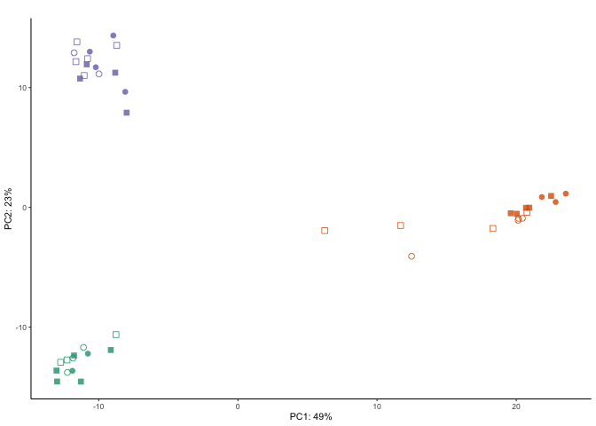

The figures made from this script were compiled in Adobe.

    library(ggplot2) ## for awesome plots!
    library(cowplot) ## for some easy to use themes
    library(dplyr) ## for filtering and selecting rows
    library(car) ## stats
    library(VennDiagram) ## venn diagrams
    library(pheatmap) ## awesome heatmaps
    library(viridis) # for awesome color pallette
    library(reshape2) ## for melting dataframe
    library(DESeq2) ## for gene expression analysis
    library(edgeR)  ## for basic read counts status
    library(magrittr) ## to use the weird pipe
    library(genefilter)  ## for PCA fuction
    library(ggrepel) ## for labeling volcano plot
    library(colorblindr) # simulates color-blind viewing 

    ## load functions 
    source("figureoptions.R")
    source("functions_RNAseq.R")

    ## set output file for figures 
    knitr::opts_chunk$set(fig.path = '../figures/02b_RNAseqAll/')

Design
------

The major comparision here is Hippocampal subfield: "DG","CA3", "CA1"
Behavioral Groups: "conflict", "consistent"

    colData <- read.csv("../data/02a_colData.csv", header = T)
    countData <- read.csv("../data/02a_countData.csv", header = T, check.names = F, row.names = 1)
    colData %>% select(APA2,Punch)  %>%  summary()

    ##                APA2    Punch   
    ##  conflict        :14   CA1:15  
    ##  consistent      : 9   CA3:13  
    ##  yoked_conflict  :12   DG :16  
    ##  yoked_consistent: 9

    head(colData)

    ##     RNAseqID   Mouse   Conflict Punch Slice     ID        APA
    ## 1 143A-CA3-1 15-143A   Conflict   CA3     1 15143A   Conflict
    ## 2  143A-DG-1 15-143A   Conflict    DG     1 15143A   Conflict
    ## 3 143B-CA1-1 15-143B   Conflict   CA1     1 15143B    Control
    ## 4  143B-DG-1 15-143B   Conflict    DG     1 15143B    Control
    ## 5 143C-CA1-1 15-143C NoConflict   CA1     1 15143C Consistent
    ## 6 143D-CA1-3 15-143D NoConflict   CA1     3 15143D    Control
    ##               APA2
    ## 1         conflict
    ## 2         conflict
    ## 3   yoked_conflict
    ## 4   yoked_conflict
    ## 5       consistent
    ## 6 yoked_consistent

    summarytable <- colData
    summarytable$PunchAPA <- as.factor(paste(summarytable$Punch, summarytable$APA2, sep="_"))
    summarytabledf <- summarytable %>% select(PunchAPA)  %>%  table()
    summarytabledf

    ## .
    ##         CA1_conflict       CA1_consistent   CA1_yoked_conflict 
    ##                    4                    4                    5 
    ## CA1_yoked_consistent         CA3_conflict       CA3_consistent 
    ##                    2                    5                    2 
    ##   CA3_yoked_conflict CA3_yoked_consistent          DG_conflict 
    ##                    3                    3                    5 
    ##        DG_consistent    DG_yoked_conflict  DG_yoked_consistent 
    ##                    3                    4                    4

    totalCounts=colSums(countData)
    ### on average 1 million gene counts per sample 
    summary((colSums(countData)/1000000))

    ##    Min. 1st Qu.  Median    Mean 3rd Qu.    Max. 
    ## 0.04349 0.53220 1.07000 1.25500 1.60400 5.61900

    dds <- DESeqDataSetFromMatrix(countData = countData,
                                  colData = colData,
                                  design = ~ Punch + APA2 + Punch*APA2)

    dds$Punch <- factor(dds$Punch, levels=c("DG","CA3", "CA1")) ## specify the factor levels
    dds$APA2 <- factor(dds$APA2, levels=c("yoked_consistent", "consistent", "yoked_conflict" , "conflict")) ## specify the factor levels

    dds # view the DESeq object - note numnber of genes

    ## class: DESeqDataSet 
    ## dim: 22485 44 
    ## metadata(1): version
    ## assays(1): counts
    ## rownames(22485): 0610007P14Rik 0610009B22Rik ... Zzef1 Zzz3
    ## rowData names(0):
    ## colnames(44): 143A-CA3-1 143A-DG-1 ... 148B-CA3-4 148B-DG-4
    ## colData names(8): RNAseqID Mouse ... APA APA2

    dds <- dds[ rowSums(counts(dds)) > 1, ]  # Pre-filtering genes with 0 counts
    dds # view number of genes afternormalization and the number of samples

    ## class: DESeqDataSet 
    ## dim: 17674 44 
    ## metadata(1): version
    ## assays(1): counts
    ## rownames(17674): 0610007P14Rik 0610009B22Rik ... Zzef1 Zzz3
    ## rowData names(0):
    ## colnames(44): 143A-CA3-1 143A-DG-1 ... 148B-CA3-4 148B-DG-4
    ## colData names(8): RNAseqID Mouse ... APA APA2

    dds <- DESeq(dds) # Differential expression analysis
    rld <- rlog(dds, blind=FALSE) ## log transformed data

    print(xtable::xtable(summarytabledf), comment=F)

this is for CA1 DG
------------------

    res <- results(dds, contrast =c("Punch", "CA1", "DG"), independentFiltering = T)
    summary(res)

    ## 
    ## out of 17674 with nonzero total read count
    ## adjusted p-value < 0.1
    ## LFC > 0 (up)     : 968, 5.5% 
    ## LFC < 0 (down)   : 956, 5.4% 
    ## outliers [1]     : 7, 0.04% 
    ## low counts [2]   : 6165, 35% 
    ## (mean count < 3)
    ## [1] see 'cooksCutoff' argument of ?results
    ## [2] see 'independentFiltering' argument of ?results

    summaryres <- summary(res)

    ## 
    ## out of 17674 with nonzero total read count
    ## adjusted p-value < 0.1
    ## LFC > 0 (up)     : 968, 5.5% 
    ## LFC < 0 (down)   : 956, 5.4% 
    ## outliers [1]     : 7, 0.04% 
    ## low counts [2]   : 6165, 35% 
    ## (mean count < 3)
    ## [1] see 'cooksCutoff' argument of ?results
    ## [2] see 'independentFiltering' argument of ?results

    head((res[order(res$padj),]), 10)

    ## log2 fold change (MLE): Punch CA1 vs DG 
    ## Wald test p-value: Punch CA1 vs DG 
    ## DataFrame with 10 rows and 6 columns
    ##           baseMean log2FoldChange     lfcSE      stat       pvalue
    ##          <numeric>      <numeric> <numeric> <numeric>    <numeric>
    ## Mpped1    25.52651       6.910394 0.6107546 11.314519 1.112109e-29
    ## Wfs1     186.06663       6.318247 0.5736616 11.013891 3.275438e-28
    ## Prkcg    534.81768       3.003292 0.2872744 10.454438 1.398254e-25
    ## Pou3f1   219.85725       5.968238 0.5726208 10.422670 1.953890e-25
    ## Slc9a2    33.61930       7.435026 0.7231286 10.281749 8.516765e-25
    ## Pde1a     25.49671       6.440581 0.6328524 10.177066 2.510157e-24
    ## Map4      98.71267       2.388505 0.2357040 10.133497 3.923623e-24
    ## St8sia5   34.65231       7.350142 0.7470324  9.839120 7.637584e-23
    ## Tmem200a  51.06226       7.730489 0.7905094  9.779124 1.384033e-22
    ## Gm2115   250.24766       6.763651 0.7085751  9.545425 1.355506e-21
    ##                  padj
    ##             <numeric>
    ## Mpped1   1.279148e-25
    ## Wfs1     1.883704e-24
    ## Prkcg    5.360905e-22
    ## Pou3f1   5.618409e-22
    ## Slc9a2   1.959197e-21
    ## Pde1a    4.811972e-21
    ## Map4     6.447074e-21
    ## St8sia5  1.098094e-19
    ## Tmem200a 1.768795e-19
    ## Gm2115   1.559103e-18

    head((res[order(res$log2FoldChange),]), 10)

    ## log2 fold change (MLE): Punch CA1 vs DG 
    ## Wald test p-value: Punch CA1 vs DG 
    ## DataFrame with 10 rows and 6 columns
    ##            baseMean log2FoldChange     lfcSE      stat       pvalue
    ##           <numeric>      <numeric> <numeric> <numeric>    <numeric>
    ## Fam19a2  117.414499      -8.867054  1.507670 -5.881298 4.070607e-09
    ## Dsp       91.281889      -8.793224  1.931325 -4.552948 5.289927e-06
    ## Plk5      55.737240      -8.325455  1.558505 -5.341949 9.195245e-08
    ## Prox1     96.762379      -7.757924  1.406465 -5.515904 3.469918e-08
    ## Kif26b    33.401613      -7.707848  1.594001 -4.835536 1.327871e-06
    ## Pcp4      84.522820      -7.447899  1.631879 -4.564003 5.018738e-06
    ## Fscn2      8.774994      -7.437796  3.951414 -1.882312 5.979360e-02
    ## Shisa9    42.889551      -7.405684  1.608060 -4.605352 4.117678e-06
    ## Traf3ip2  17.136517      -6.801633  1.679698 -4.049320 5.136659e-05
    ## Srprb     53.278903      -6.781243  1.500276 -4.519996 6.184084e-06
    ##                  padj
    ##             <numeric>
    ## Fam19a2  4.335196e-07
    ## Dsp      1.937730e-04
    ## Plk5     6.185012e-06
    ## Prox1    2.696689e-06
    ## Kif26b   5.992986e-05
    ## Pcp4     1.850177e-04
    ## Fscn2    2.233640e-01
    ## Shisa9   1.568263e-04
    ## Traf3ip2 1.321742e-03
    ## Srprb    2.181882e-04

this is for CA1 CA3
-------------------

    res <- results(dds, contrast =c("Punch", "CA1", "CA3"), independentFiltering = T)
    summary(res)

    ## 
    ## out of 17674 with nonzero total read count
    ## adjusted p-value < 0.1
    ## LFC > 0 (up)     : 651, 3.7% 
    ## LFC < 0 (down)   : 791, 4.5% 
    ## outliers [1]     : 7, 0.04% 
    ## low counts [2]   : 6165, 35% 
    ## (mean count < 3)
    ## [1] see 'cooksCutoff' argument of ?results
    ## [2] see 'independentFiltering' argument of ?results

    head((res[order(res$padj),]), 10)

    ## log2 fold change (MLE): Punch CA1 vs CA3 
    ## Wald test p-value: Punch CA1 vs CA3 
    ## DataFrame with 10 rows and 6 columns
    ##         baseMean log2FoldChange     lfcSE       stat       pvalue
    ##        <numeric>      <numeric> <numeric>  <numeric>    <numeric>
    ## Itpka  712.20310       3.073453 0.2158630  14.237982 5.324215e-46
    ## Doc2b  351.76381       7.136499 0.5198022  13.729259 6.782335e-43
    ## Pou3f1 219.85725       6.506303 0.5913889  11.001733 3.748584e-28
    ## Fibcd1 361.24751       7.658648 0.7344959  10.427080 1.865325e-25
    ## Syn2   367.34401      -2.238529 0.2159165 -10.367572 3.482628e-25
    ## C1ql3  288.38305       6.413302 0.6524966   9.828867 8.456470e-23
    ## Wfs1   186.06663       5.369378 0.5608770   9.573182 1.036650e-21
    ## Mpped1  25.52651       4.389502 0.4598871   9.544738 1.364518e-21
    ## Bcr    343.00374       2.292545 0.2439557   9.397382 5.593776e-21
    ## Ahi1   241.16807       1.769745 0.1925839   9.189475 3.947636e-20
    ##                padj
    ##           <numeric>
    ## Itpka  6.123912e-42
    ## Doc2b  3.900521e-39
    ## Pou3f1 1.437207e-24
    ## Fibcd1 5.363743e-22
    ## Syn2   8.011437e-22
    ## C1ql3  1.621105e-19
    ## Wfs1   1.703363e-18
    ## Mpped1 1.961835e-18
    ## Bcr    7.148846e-18
    ## Ahi1   4.540571e-17

    head((res[order(res$log2FoldChange),]), 10)

    ## log2 fold change (MLE): Punch CA1 vs CA3 
    ## Wald test p-value: Punch CA1 vs CA3 
    ## DataFrame with 10 rows and 6 columns
    ##          baseMean log2FoldChange     lfcSE      stat       pvalue
    ##         <numeric>      <numeric> <numeric> <numeric>    <numeric>
    ## Cpne4    44.59733      -8.053652  1.484820 -5.423992 5.828238e-08
    ## Fam19a2 117.41450      -7.943788  1.512695 -5.251413 1.509369e-07
    ## Amigo2   33.05653      -7.392150  1.711426 -4.319294 1.565295e-05
    ## Adgrf5   36.23905      -7.327856  1.611035 -4.548540 5.401944e-06
    ## Tuba8    20.37245      -6.950903  1.703689 -4.079913 4.505248e-05
    ## Fndc10   39.97041      -6.692815  1.538400 -4.350504 1.358250e-05
    ## Ccbe1    24.55630      -6.565534  1.648261 -3.983309 6.796228e-05
    ## Srprb    53.27890      -6.505247  1.502480 -4.329674 1.493305e-05
    ## Apln     20.83790      -6.438589  1.633191 -3.942338 8.069119e-05
    ## Cib2     21.02772      -6.400945  1.571794 -4.072383 4.653468e-05
    ##                 padj
    ##            <numeric>
    ## Cpne4   8.175170e-06
    ## Fam19a2 1.808413e-05
    ## Amigo2  7.896501e-04
    ## Adgrf5  3.441804e-04
    ## Tuba8   1.811866e-03
    ## Fndc10  7.199349e-04
    ## Ccbe1   2.537994e-03
    ## Srprb   7.704877e-04
    ## Apln    2.927792e-03
    ## Cib2    1.864954e-03

this is for CA3 DG
------------------

    res <- results(dds, contrast =c("Punch", "CA3", "DG"), independentFiltering = T)
    summary(res)

    ## 
    ## out of 17674 with nonzero total read count
    ## adjusted p-value < 0.1
    ## LFC > 0 (up)     : 1625, 9.2% 
    ## LFC < 0 (down)   : 1361, 7.7% 
    ## outliers [1]     : 7, 0.04% 
    ## low counts [2]   : 4455, 25% 
    ## (mean count < 1)
    ## [1] see 'cooksCutoff' argument of ?results
    ## [2] see 'independentFiltering' argument of ?results

    head((res[order(res$padj),]), 10)

    ## log2 fold change (MLE): Punch CA3 vs DG 
    ## Wald test p-value: Punch CA3 vs DG 
    ## DataFrame with 10 rows and 6 columns
    ##           baseMean log2FoldChange     lfcSE      stat       pvalue
    ##          <numeric>      <numeric> <numeric> <numeric>    <numeric>
    ## Fam163b  632.63230      -5.674235 0.3528797 -16.07980 3.535108e-58
    ## Doc2b    351.76381      -6.985282 0.4696300 -14.87401 4.861017e-50
    ## C1ql3    288.38305      -8.023868 0.5819242 -13.78851 2.988664e-43
    ## Gnao1    164.33213       1.609036 0.1289476  12.47821 9.816440e-36
    ## Pitpnm2  157.76399      -3.037954 0.2455791 -12.37057 3.771355e-35
    ## Pnmal2   777.66865      -1.707431 0.1402372 -12.17530 4.208416e-34
    ## Cpe     3074.70125       2.968743 0.2487199  11.93609 7.674487e-33
    ## Me1       44.02835       4.393035 0.3744782  11.73108 8.832196e-32
    ## Ahi1     241.16807      -1.793898 0.1544626 -11.61380 3.506656e-31
    ## Pde1b    259.78724      -3.353212 0.2903870 -11.54739 7.609648e-31
    ##                 padj
    ##            <numeric>
    ## Fam163b 4.670585e-54
    ## Doc2b   3.211188e-46
    ## C1ql3   1.316208e-39
    ## Gnao1   3.242370e-32
    ## Pitpnm2 9.965427e-32
    ## Pnmal2  9.266933e-31
    ## Cpe     1.448505e-29
    ## Me1     1.458637e-28
    ## Ahi1    5.147771e-28
    ## Pde1b   1.005387e-27

    head((res[order(res$log2FoldChange),]), 10)

    ## log2 fold change (MLE): Punch CA3 vs DG 
    ## Wald test p-value: Punch CA3 vs DG 
    ## DataFrame with 10 rows and 6 columns
    ##          baseMean log2FoldChange     lfcSE      stat       pvalue
    ##         <numeric>      <numeric> <numeric> <numeric>    <numeric>
    ## Rps12   18.164975     -15.351022  7.409212 -2.071883 3.827633e-02
    ## Plk5    55.737240     -10.597739  1.288733 -8.223381 1.978450e-16
    ## Npcd     6.072969      -9.030334  6.221069 -1.451573 1.466205e-01
    ## Pter    40.155764      -8.919350  1.200258 -7.431191 1.076240e-13
    ## Pla2g4e 15.438614      -8.849853  1.578420 -5.606780 2.061260e-08
    ## Tespa1   4.036187      -8.721162  7.405458 -1.177667 2.389294e-01
    ## Pdyn    12.858134      -8.381770  1.312038 -6.388357 1.676780e-10
    ## Dsp     91.281889      -8.189180  1.342592 -6.099530 1.063807e-09
    ## Glb1l3   2.657819      -8.141436  7.407569 -1.099070 2.717376e-01
    ## Il5      3.116986      -8.123593  4.615169 -1.760194 7.837490e-02
    ##                 padj
    ##            <numeric>
    ## Rps12   1.465392e-01
    ## Plk5    2.722842e-14
    ## Npcd    3.547893e-01
    ## Pter    1.008460e-11
    ## Pla2g4e 6.947287e-07
    ## Tespa1  4.807700e-01
    ## Pdyn    8.897037e-09
    ## Dsp     4.796933e-08
    ## Glb1l3  5.196406e-01
    ## Il5     2.376065e-01

this is for consistent yoked-consistent DG
------------------------------------------

    res <- results(dds, contrast =c("APA2", "consistent", "yoked_consistent"), independentFiltering = T, alpha = 0.1)
    summary(res)

    ## 
    ## out of 17674 with nonzero total read count
    ## adjusted p-value < 0.1
    ## LFC > 0 (up)     : 113, 0.64% 
    ## LFC < 0 (down)   : 7, 0.04% 
    ## outliers [1]     : 7, 0.04% 
    ## low counts [2]   : 8561, 48% 
    ## (mean count < 8)
    ## [1] see 'cooksCutoff' argument of ?results
    ## [2] see 'independentFiltering' argument of ?results

    head((res[order(res$padj),]), 10)

    ## log2 fold change (MLE): APA2 consistent vs yoked_consistent 
    ## Wald test p-value: APA2 consistent vs yoked consistent 
    ## DataFrame with 10 rows and 6 columns
    ##         baseMean log2FoldChange     lfcSE      stat       pvalue
    ##        <numeric>      <numeric> <numeric> <numeric>    <numeric>
    ## Plk2   697.03923       2.352508 0.2999148  7.843919 4.366988e-15
    ## Arc    436.24502       2.932892 0.4081472  7.185868 6.678147e-13
    ## Frmd6  116.84596       3.294066 0.4749978  6.934908 4.064851e-12
    ## Dnaja1 106.22420       1.151488 0.1680492  6.852091 7.277826e-12
    ## Smad7   25.81154       3.476292 0.5075848  6.848691 7.452852e-12
    ## Lmna    26.32554       2.384168 0.3565015  6.687681 2.267346e-11
    ## Sgk1    27.18260       2.432382 0.3678629  6.612196 3.786597e-11
    ## Junb   514.04985       2.401985 0.3775447  6.362122 1.989857e-10
    ## Fbxo33  74.39061       2.984504 0.4886561  6.107576 1.011557e-09
    ## Ubc    469.30786       1.141296 0.1871946  6.096844 1.081828e-09
    ##                padj
    ##           <numeric>
    ## Plk2   3.976579e-11
    ## Arc    3.040561e-09
    ## Frmd6  1.233818e-08
    ## Dnaja1 1.357313e-08
    ## Smad7  1.357313e-08
    ## Lmna   3.441075e-08
    ## Sgk1   4.925821e-08
    ## Junb   2.264955e-07
    ## Fbxo33 9.851123e-07
    ## Ubc    9.851123e-07

    head((res[order(res$log2FoldChange),]), 10)

    ## log2 fold change (MLE): APA2 consistent vs yoked_consistent 
    ## Wald test p-value: APA2 consistent vs yoked consistent 
    ## DataFrame with 10 rows and 6 columns
    ##                baseMean log2FoldChange     lfcSE       stat      pvalue
    ##               <numeric>      <numeric> <numeric>  <numeric>   <numeric>
    ## Gm20425        9.237215     -17.789805  4.690063 -3.7930844          NA
    ## Tespa1         4.036187      -7.918820  7.405793 -1.0692738 0.284946310
    ## Gm10251        1.925807      -6.761646  6.636271 -1.0188924 0.308254037
    ## Prl            1.763678      -6.749016  7.411101 -0.9106630 0.362472952
    ## 4930455H04Rik  1.855854      -6.736106  7.411186 -0.9089106 0.363397297
    ## Gm10093        2.152990      -6.736068  7.411186 -0.9089056 0.363399975
    ## Gm12184        3.951296      -6.313503  7.414424 -0.8515163 0.394482608
    ## Spink6         1.656561      -6.312836  7.414428 -0.8514260 0.394532755
    ## Gm1818         5.392939      -6.276826  2.140503 -2.9324062 0.003363465
    ## Glb1l3         2.657819      -6.011749  7.383797 -0.8141812 0.415541143
    ##                    padj
    ##               <numeric>
    ## Gm20425              NA
    ## Tespa1               NA
    ## Gm10251              NA
    ## Prl                  NA
    ## 4930455H04Rik        NA
    ## Gm10093              NA
    ## Gm12184              NA
    ## Spink6               NA
    ## Gm1818               NA
    ## Glb1l3               NA

this is for consistent yoked-conflict yoked-consistent DG
---------------------------------------------------------

    res <- results(dds, contrast =c("APA2", "yoked_conflict", "yoked_consistent"), independentFiltering = T, alpha = 0.1)
    summary(res)

    ## 
    ## out of 17674 with nonzero total read count
    ## adjusted p-value < 0.1
    ## LFC > 0 (up)     : 30, 0.17% 
    ## LFC < 0 (down)   : 1, 0.0057% 
    ## outliers [1]     : 7, 0.04% 
    ## low counts [2]   : 8561, 48% 
    ## (mean count < 8)
    ## [1] see 'cooksCutoff' argument of ?results
    ## [2] see 'independentFiltering' argument of ?results

    head((res[order(res$padj),]), 10)

    ## log2 fold change (MLE): APA2 yoked_conflict vs yoked_consistent 
    ## Wald test p-value: APA2 yoked conflict vs yoked consistent 
    ## DataFrame with 10 rows and 6 columns
    ##           baseMean log2FoldChange     lfcSE      stat       pvalue
    ##          <numeric>      <numeric> <numeric> <numeric>    <numeric>
    ## Kcnc2    145.09714      3.8170020 0.5808500  6.571407 4.984192e-11
    ## Gm2115   250.24766      3.4698844 0.6316131  5.493686 3.936297e-08
    ## St8sia5   34.65231      4.1709096 0.7707730  5.411333 6.255716e-08
    ## Cnr1     176.42633      3.8490675 0.7741110  4.972243 6.618279e-07
    ## Dner      57.09091      1.7593101 0.3740379  4.703561 2.556629e-06
    ## Spock1    79.66333      3.0533707 0.6697536  4.558946 5.141097e-06
    ## Slc32a1   91.68713      3.9723836 0.9097520  4.366447 1.262841e-05
    ## Cpe     3074.70125      0.9845432 0.2352792  4.184574 2.857010e-05
    ## Me1       44.02835      1.8032867 0.4263382  4.229709 2.339937e-05
    ## Pou3f1   219.85725      2.1494860 0.5143322  4.179178 2.925641e-05
    ##                 padj
    ##            <numeric>
    ## Kcnc2   4.538605e-07
    ## Gm2115  1.792196e-04
    ## St8sia5 1.898818e-04
    ## Cnr1    1.506651e-03
    ## Dner    4.656133e-03
    ## Spock1  7.802472e-03
    ## Slc32a1 1.642776e-02
    ## Cpe     2.220074e-02
    ## Me1     2.220074e-02
    ## Pou3f1  2.220074e-02

    head((res[order(res$log2FoldChange),]), 10)

    ## log2 fold change (MLE): APA2 yoked_conflict vs yoked_consistent 
    ## Wald test p-value: APA2 yoked conflict vs yoked consistent 
    ## DataFrame with 10 rows and 6 columns
    ##           baseMean log2FoldChange     lfcSE       stat     pvalue
    ##          <numeric>      <numeric> <numeric>  <numeric>  <numeric>
    ## Gm20425   9.237215     -17.058386  4.330199 -3.9393998         NA
    ## Gm21949  15.475998      -6.965458  3.901938 -1.7851280 0.07424056
    ## Tespa1    4.036187      -6.605952  6.843635 -0.9652695 0.33440985
    ## Fscn2     8.774994      -6.458296  3.128305 -2.0644711 0.03897307
    ## Npcd      6.072969      -6.080921  5.728593 -1.0615034 0.28846119
    ## Glb1l3    2.657819      -6.026106  6.845920 -0.8802478 0.37872509
    ## Il5       3.116986      -6.012327  4.252815 -1.4137288 0.15744154
    ## Gm14393   2.938163      -6.005287  4.473547 -1.3423995 0.17946648
    ## Atp6v0a4  2.333545      -5.753862  6.847347 -0.8403053 0.40073721
    ## Gm10251   1.925807      -5.449357  6.130589 -0.8888799 0.37406762
    ##               padj
    ##          <numeric>
    ## Gm20425         NA
    ## Gm21949  0.9998426
    ## Tespa1          NA
    ## Fscn2    0.9998426
    ## Npcd            NA
    ## Glb1l3          NA
    ## Il5             NA
    ## Gm14393         NA
    ## Atp6v0a4        NA
    ## Gm10251         NA

this is for consistent conflict yoked-conflict
----------------------------------------------

    res <- results(dds, contrast =c("APA2", "conflict", "yoked_conflict"), independentFiltering = T, alpha = 0.1)
    summary(res)

    ## 
    ## out of 17674 with nonzero total read count
    ## adjusted p-value < 0.1
    ## LFC > 0 (up)     : 15, 0.085% 
    ## LFC < 0 (down)   : 24, 0.14% 
    ## outliers [1]     : 7, 0.04% 
    ## low counts [2]   : 11987, 68% 
    ## (mean count < 24)
    ## [1] see 'cooksCutoff' argument of ?results
    ## [2] see 'independentFiltering' argument of ?results

    head((res[order(res$padj),]), 10)

    ## log2 fold change (MLE): APA2 conflict vs yoked_conflict 
    ## Wald test p-value: APA2 conflict vs yoked_conflict 
    ## DataFrame with 10 rows and 6 columns
    ##          baseMean log2FoldChange     lfcSE      stat       pvalue
    ##         <numeric>      <numeric> <numeric> <numeric>    <numeric>
    ## Kcnc2   145.09714      -2.520075 0.4924622 -5.117295 3.099479e-07
    ## Neurod6 333.02885      -3.525915 0.6931363 -5.086901 3.639624e-07
    ## Sv2b    142.82830      -3.731971 0.7369799 -5.063871 4.108283e-07
    ## Stmn2   418.60097      -2.218191 0.4627514 -4.793482 1.639112e-06
    ## Slc16a1  51.34226       1.926065 0.4236948  4.545877 5.470688e-06
    ## Khdrbs3 328.27759      -1.626203 0.3679544 -4.419579 9.889335e-06
    ## Slc6a7   90.86015      -1.794156 0.4024943 -4.457594 8.288453e-06
    ## Stox2   645.60944      -5.140065 1.1665864 -4.406073 1.052613e-05
    ## Plk2    697.03923       1.124026 0.2629750  4.274270 1.917649e-05
    ## Arc     436.24502       1.484054 0.3570558  4.156363 3.233534e-05
    ##                 padj
    ##            <numeric>
    ## Kcnc2   0.0007778348
    ## Neurod6 0.0007778348
    ## Sv2b    0.0007778348
    ## Stmn2   0.0023275395
    ## Slc16a1 0.0062147011
    ## Khdrbs3 0.0074735516
    ## Slc6a7  0.0074735516
    ## Stox2   0.0074735516
    ## Plk2    0.0121024981
    ## Arc     0.0154911448

    head((res[order(res$log2FoldChange),]), 10)

    ## log2 fold change (MLE): APA2 conflict vs yoked_conflict 
    ## Wald test p-value: APA2 conflict vs yoked_conflict 
    ## DataFrame with 10 rows and 6 columns
    ##          baseMean log2FoldChange     lfcSE      stat       pvalue
    ##         <numeric>      <numeric> <numeric> <numeric>    <numeric>
    ## Rps12   18.164975     -16.685369  6.489484 -2.571140 0.0101364465
    ## Slc10a5  5.601705      -8.990581  6.487222 -1.385891 0.1657802580
    ## Olfr91   2.037580      -7.488777  6.493617 -1.153252 0.2488069511
    ## Fzd10    2.408579      -7.476701  5.063193 -1.476677 0.1397622336
    ## Zfp784   4.267555      -7.360657  5.532246 -1.330501 0.1833533654
    ## Stpg2    1.521601      -7.162344  6.496104 -1.102560 0.2702183296
    ## Ifi35    2.364365      -6.858682  1.969312 -3.482781 0.0004962347
    ## Hpse     2.513052      -6.794263  4.791494 -1.417984 0.1561953315
    ## Gm4737   3.713759      -6.739714  6.500253 -1.036839           NA
    ## Gm2244   1.498813      -6.739581  6.500257 -1.036818 0.2998208731
    ##              padj
    ##         <numeric>
    ## Rps12          NA
    ## Slc10a5        NA
    ## Olfr91         NA
    ## Fzd10          NA
    ## Zfp784         NA
    ## Stpg2          NA
    ## Ifi35          NA
    ## Hpse           NA
    ## Gm4737         NA
    ## Gm2244         NA

this is for consistent conflict yoked-conflict
----------------------------------------------

    res <- results(dds, contrast =c("APA2", "conflict", "consistent"), independentFiltering = T)
    summary(res)

    ## 
    ## out of 17674 with nonzero total read count
    ## adjusted p-value < 0.1
    ## LFC > 0 (up)     : 0, 0% 
    ## LFC < 0 (down)   : 0, 0% 
    ## outliers [1]     : 7, 0.04% 
    ## low counts [2]   : 0, 0% 
    ## (mean count < 0)
    ## [1] see 'cooksCutoff' argument of ?results
    ## [2] see 'independentFiltering' argument of ?results

    head((res[order(res$padj),]), 10)

    ## log2 fold change (MLE): APA2 conflict vs consistent 
    ## Wald test p-value: APA2 conflict vs consistent 
    ## DataFrame with 10 rows and 6 columns
    ##                 baseMean log2FoldChange     lfcSE        stat    pvalue
    ##                <numeric>      <numeric> <numeric>   <numeric> <numeric>
    ## 0610007P14Rik 21.5461759    -0.05019271 0.3742306 -0.13412240 0.8933058
    ## 0610009B22Rik  6.4277426    -0.76243785 0.6582895 -1.15821053 0.2467781
    ## 0610009L18Rik  3.9008693     0.53613979 1.1080722  0.48384914 0.6284929
    ## 0610009O20Rik 48.6140661     0.25676554 0.3790443  0.67740248 0.4981506
    ## 0610010F05Rik  8.1466102    -0.27012199 0.3928997 -0.68750873 0.4917622
    ## 0610010K14Rik  1.9324187     0.79827392 1.0021639  0.79655024 0.4257123
    ## 0610012G03Rik 61.5516314     0.11916134 0.3437908  0.34661003 0.7288843
    ## 0610030E20Rik 39.9081366    -0.10853833 0.4965014 -0.21860629 0.8269568
    ## 0610037L13Rik  7.6331581     0.04250870 0.4686990  0.09069511 0.9277349
    ## 0610040J01Rik  0.9055227    -0.92499512 1.2783405 -0.72359054 0.4693172
    ##                    padj
    ##               <numeric>
    ## 0610007P14Rik         1
    ## 0610009B22Rik         1
    ## 0610009L18Rik         1
    ## 0610009O20Rik         1
    ## 0610010F05Rik         1
    ## 0610010K14Rik         1
    ## 0610012G03Rik         1
    ## 0610030E20Rik         1
    ## 0610037L13Rik         1
    ## 0610040J01Rik         1

    head((res[order(res$log2FoldChange),]), 10)

    ## log2 fold change (MLE): APA2 conflict vs consistent 
    ## Wald test p-value: APA2 conflict vs consistent 
    ## DataFrame with 10 rows and 6 columns
    ##            baseMean log2FoldChange     lfcSE       stat     pvalue
    ##           <numeric>      <numeric> <numeric>  <numeric>  <numeric>
    ## Rps12    18.1649745     -16.186423  7.050382 -2.2958223 0.02168605
    ## Apoo-ps   2.6101226      -7.251036  7.051627 -1.0282785 0.30381885
    ## Gm6563    2.4589694      -6.247788  7.055737 -0.8854904 0.37589219
    ## Rps27rt   1.4665602      -6.185501  7.056097 -0.8766178 0.38069427
    ## Atg4a-ps  0.4490799      -5.830494  7.058481 -0.8260267 0.40878893
    ## Phf19     0.9574938      -5.734969  3.117802 -1.8394272 0.06585237
    ## Gm21949  15.4759983      -5.729948  4.014243 -1.4274044 0.15346337
    ## Gm28539   2.0370507      -5.539838  7.038759 -0.7870474 0.43125410
    ## Fam83e    0.5151725      -5.466157  7.061610 -0.7740667 0.43889136
    ## Neurog2   1.6340752      -5.256210  2.229883 -2.3571690 0.01841487
    ##               padj
    ##          <numeric>
    ## Rps12            1
    ## Apoo-ps          1
    ## Gm6563           1
    ## Rps27rt          1
    ## Atg4a-ps         1
    ## Phf19            1
    ## Gm21949          1
    ## Gm28539          1
    ## Fam83e           1
    ## Neurog2          1

    contrast1 <- resvals(contrastvector = c("Punch", "CA1", "DG"), mypval = 0.1) # 1924

    ## [1] 1924

    contrast2 <- resvals(contrastvector = c("Punch", "CA1", "CA3"), mypval = 0.1) # 1442

    ## [1] 1442

    contrast3 <- resvals(contrastvector = c("Punch", "CA3", "DG"), mypval = 0.1) # 2986

    ## [1] 2986

    contrast4 <- resvals(contrastvector = c("APA2", "consistent", "yoked_consistent"), mypval = 0.1) # 120

    ## [1] 120

    contrast5 <- resvals(contrastvector = c("APA2", "conflict", "yoked_conflict"), mypval = 0.1) # 39

    ## [1] 39

    contrast6 <- resvals(contrastvector = c("APA2", "conflict", "consistent"), mypval = 0.1) # 0

    ## [1] 0

    contrast7 <- resvals(contrastvector = c("APA2", "yoked_conflict", "yoked_consistent"), mypval = 0.1) # 31

    ## [1] 31

    DEGes <- assay(rld)
    DEGes <- cbind(DEGes, contrast1, contrast2, contrast3, contrast4, contrast5, contrast7)
    DEGes <- as.data.frame(DEGes) # convert matrix to dataframe
    DEGes$rownames <- rownames(DEGes)  # add the rownames to the dataframe
    DEGes$padjmin <- with(DEGes, pmin(padjPunchCA1DG, padjPunchCA1CA3, padjPunchCA3DG)) 
    DEGes <- DEGes %>% filter(padjmin < 0.000000001)
    rownames(DEGes) <- DEGes$rownames
    drop.cols <-colnames(DEGes[,grep("padj|pval|rownames", colnames(DEGes))])
    DEGes <- DEGes %>% dplyr::select(-one_of(drop.cols))
    DEGes <- as.matrix(DEGes)
    DEGes <- DEGes - rowMeans(DEGes)

    df <- as.data.frame(colData(dds)[,c("APA2", "Punch")]) ## matrix to df
    rownames(df) <- names(countData)
    ann_colors <- ann_colors4 # see color options 
    DEGes <- as.matrix(DEGes) 
    paletteLength <- 30
    myBreaks <- c(seq(min(DEGes), 0, length.out=ceiling(paletteLength/2) + 1), 
                  seq(max(DEGes)/paletteLength, max(DEGes), length.out=floor(paletteLength/2)))

    pheatmap(DEGes, show_colnames=T, show_rownames = F,
             annotation_col=df, annotation_colors = ann_colors,
             treeheight_row = 0, treeheight_col = 25,
             annotation_row = NA, 
             annotation_legend = FALSE,
             annotation_names_row = FALSE, annotation_names_col = FALSE,
             fontsize = 8, 
             border_color = "grey60" ,
             color = viridis(30),
             cellwidth = 6, 
             clustering_method="average",
             breaks=myBreaks,
             clustering_distance_cols="correlation" 
             )

    pheatmap(DEGes, show_colnames=F, show_rownames = F,
             annotation_col=df, annotation_colors = ann_colors, 
             annotation_row = NA, 
             annotation_legend = FALSE,
             annotation_names_row = FALSE, 
             annotation_names_col = FALSE,
             treeheight_row = 0, treeheight_col = 25,
             fontsize = 8, 
             border_color = "grey60" ,
             color = viridis(30),
             height = 3.75, 
             width = 3.5,
             clustering_method="average",
             breaks=myBreaks,
             clustering_distance_cols="correlation", 
             filename = "../figures/02b_RNAseqALL/pheatmap1.pdf"
             )

Principle component analysis
----------------------------

    ## [1] 50 21  5  3  2  1  1  1  1

    ##             Df Sum Sq Mean Sq F value Pr(>F)    
    ## Punch        2  15879    7939   256.2 <2e-16 ***
    ## Residuals   41   1270      31                   
    ## ---
    ## Signif. codes:  0 '***' 0.001 '**' 0.01 '*' 0.05 '.' 0.1 ' ' 1

    ##   Tukey multiple comparisons of means
    ##     95% family-wise confidence level
    ## 
    ## Fit: aov(formula = PC1 ~ Punch, data = pcadata)
    ## 
    ## $Punch
    ##               diff        lwr       upr    p adj
    ## CA3-DG  -40.241740 -45.295804 -35.18768 0.000000
    ## CA1-DG  -38.806018 -43.670635 -33.94140 0.000000
    ## CA1-CA3   1.435721  -3.693307   6.56475 0.775999

    ##             Df Sum Sq Mean Sq F value Pr(>F)    
    ## Punch        2   7153    3576    1030 <2e-16 ***
    ## Residuals   41    142       3                   
    ## ---
    ## Signif. codes:  0 '***' 0.001 '**' 0.01 '*' 0.05 '.' 0.1 ' ' 1

    ##   Tukey multiple comparisons of means
    ##     95% family-wise confidence level
    ## 
    ## Fit: aov(formula = PC2 ~ Punch, data = pcadata)
    ## 
    ## $Punch
    ##              diff       lwr       upr p adj
    ## CA3-DG  -16.21577 -17.90743 -14.52411     0
    ## CA1-DG   15.81186  14.18361  17.44011     0
    ## CA1-CA3  32.02763  30.31088  33.74438     0

    ##             Df Sum Sq Mean Sq F value Pr(>F)
    ## APA2         3  231.4   77.13   1.854  0.153
    ## Residuals   40 1664.1   41.60

    ##             Df Sum Sq Mean Sq F value   Pr(>F)    
    ## APA2         3  495.0  165.01   12.01 9.57e-06 ***
    ## Residuals   40  549.5   13.74                     
    ## ---
    ## Signif. codes:  0 '***' 0.001 '**' 0.01 '*' 0.05 '.' 0.1 ' ' 1

    ##             Df Sum Sq Mean Sq F value Pr(>F)
    ## APA2         3   17.9   5.965   0.424  0.737
    ## Residuals   40  563.3  14.083

    ##             Df Sum Sq Mean Sq F value Pr(>F)
    ## APA2         3   31.2   10.41   0.963   0.42
    ## Residuals   40  432.4   10.81

    ## quartz_off_screen 
    ##                 2

    ## quartz_off_screen 
    ##                 2

Number of differentially expressed genes per two-way contrast
=============================================================

venn diagrams
-------------

    contrast1 <- resvals(contrastvector = c("Punch", "CA1", "DG"), mypval = 0.1) # 1924

    ## [1] 1924

    contrast2 <- resvals(contrastvector = c("Punch", "CA1", "CA3"), mypval = 0.1) # 1442

    ## [1] 1442

    contrast3 <- resvals(contrastvector = c("Punch", "CA3", "DG"), mypval = 0.1) # 2986

    ## [1] 2986

    contrast4 <- resvals(contrastvector = c("APA2", "consistent", "yoked_consistent"), mypval = 0.1) # 120

    ## [1] 120

    contrast5 <- resvals(contrastvector = c("APA2", "conflict", "yoked_conflict"), mypval = 0.1) #39

    ## [1] 39

    contrast6 <- resvals(contrastvector = c("APA2", "yoked_conflict", "yoked_consistent"), mypval = 0.1) # 31

    ## [1] 31

    contrast7 <- resvals(contrastvector = c("APA2", "conflict", "consistent"), mypval = 0.1) # 0

    ## [1] 0

    rldpadjs <- assay(rld)
    rldpadjs <- cbind(rldpadjs, contrast1, contrast2, contrast3, contrast4, contrast5, contrast6)
    rldpadjs <- as.data.frame(rldpadjs)
    rldpadjs <- rldpadjs[ , grepl( "padj" , names( rldpadjs ) ) ]

    venn1 <- row.names(rldpadjs[rldpadjs[1] <0.05 & !is.na(rldpadjs[1]),]) 
    venn2 <- row.names(rldpadjs[rldpadjs[2] <0.05 & !is.na(rldpadjs[2]),]) 
    venn3 <- row.names(rldpadjs[rldpadjs[3] <0.05 & !is.na(rldpadjs[3]),]) 
    venn4 <- row.names(rldpadjs[rldpadjs[4] <0.05 & !is.na(rldpadjs[4]),]) 
    venn5 <- row.names(rldpadjs[rldpadjs[5] <0.05 & !is.na(rldpadjs[5]),]) 
    venn6 <- row.names(rldpadjs[rldpadjs[6] <0.05 & !is.na(rldpadjs[6]),]) 

    candidates1 <- list("CA1DG" = venn1, "CA3DG" = venn3, "CA1CA3" = venn2) 
    candidates2 <- list("V4" = venn4, "V5" = venn5, "V6" = venn6)

    prettyvenn <- venn.diagram(
      scaled=T,
      x = candidates1, filename=NULL, 
      col = "black",
      alpha = 0.5,
      cex = 1, fontfamily = "sans", #fontface = "bold",
      cat.default.pos = "text",
      cat.cex = 1, cat.fontfamily = "sans")
    #dev.off()
    grid.draw(prettyvenn)

Volcanos plots and and gene lists
---------------------------------

ca3 dg
------

    res <- results(dds, contrast =c("Punch", "CA3", "DG"), independentFiltering = T, alpha = 0.1)
    summary(res)

    ## 
    ## out of 17674 with nonzero total read count
    ## adjusted p-value < 0.1
    ## LFC > 0 (up)     : 1625, 9.2% 
    ## LFC < 0 (down)   : 1361, 7.7% 
    ## outliers [1]     : 7, 0.04% 
    ## low counts [2]   : 4455, 25% 
    ## (mean count < 1)
    ## [1] see 'cooksCutoff' argument of ?results
    ## [2] see 'independentFiltering' argument of ?results

    resOrdered <- res[order(res$padj),]
    head(resOrdered, 10)

    ## log2 fold change (MLE): Punch CA3 vs DG 
    ## Wald test p-value: Punch CA3 vs DG 
    ## DataFrame with 10 rows and 6 columns
    ##           baseMean log2FoldChange     lfcSE      stat       pvalue
    ##          <numeric>      <numeric> <numeric> <numeric>    <numeric>
    ## Fam163b  632.63230      -5.674235 0.3528797 -16.07980 3.535108e-58
    ## Doc2b    351.76381      -6.985282 0.4696300 -14.87401 4.861017e-50
    ## C1ql3    288.38305      -8.023868 0.5819242 -13.78851 2.988664e-43
    ## Gnao1    164.33213       1.609036 0.1289476  12.47821 9.816440e-36
    ## Pitpnm2  157.76399      -3.037954 0.2455791 -12.37057 3.771355e-35
    ## Pnmal2   777.66865      -1.707431 0.1402372 -12.17530 4.208416e-34
    ## Cpe     3074.70125       2.968743 0.2487199  11.93609 7.674487e-33
    ## Me1       44.02835       4.393035 0.3744782  11.73108 8.832196e-32
    ## Ahi1     241.16807      -1.793898 0.1544626 -11.61380 3.506656e-31
    ## Pde1b    259.78724      -3.353212 0.2903870 -11.54739 7.609648e-31
    ##                 padj
    ##            <numeric>
    ## Fam163b 4.670585e-54
    ## Doc2b   3.211188e-46
    ## C1ql3   1.316208e-39
    ## Gnao1   3.242370e-32
    ## Pitpnm2 9.965427e-32
    ## Pnmal2  9.266933e-31
    ## Cpe     1.448505e-29
    ## Me1     1.458637e-28
    ## Ahi1    5.147771e-28
    ## Pde1b   1.005387e-27

    data <- data.frame(gene = row.names(res), pvalue = -log10(res$padj), lfc = res$log2FoldChange)
    data <- na.omit(data)
    head(data)

    ##            gene     pvalue        lfc
    ## 1 0610007P14Rik 0.34427089 -0.4723008
    ## 2 0610009B22Rik 0.18594227  0.5552003
    ## 3 0610009L18Rik 0.03094948 -0.1970618
    ## 4 0610009O20Rik 0.28216617 -0.4427569
    ## 5 0610010F05Rik 0.38631940  0.5035075
    ## 6 0610010K14Rik 0.59238548 -1.8559179

    summary(log10(data$pvalue +1))

    ##    Min. 1st Qu.  Median    Mean 3rd Qu.    Max. 
    ## 0.00000 0.04214 0.11910 0.20420 0.27480 1.73500

    data <- data %>%
      mutate(color = ifelse(data$lfc > 0 & data$pvalue > 1.3, 
                            yes = "CA3", 
                            no = ifelse(data$lfc < 0 & data$pvalue > 1.3, 
                                        yes = "DG", 
                                        no = "none")))
    top_n(data, n = 5, wt = lfc)

    ##      gene    pvalue      lfc color
    ## 1   Crhbp  6.698921 7.864258   CA3
    ## 2    Klk8 11.721029 7.596153   CA3
    ## 3   Krt73  5.805905 7.703681   CA3
    ## 4     Sst  6.282484 9.023261   CA3
    ## 5 Tmem215  6.115328 7.274514   CA3

    top_n(data, n = 5, wt = pvalue)

    ##      gene   pvalue       lfc color
    ## 1   C1ql3 38.88068 -8.023868    DG
    ## 2   Doc2b 45.49333 -6.985282    DG
    ## 3 Fam163b 53.33063 -5.674235    DG
    ## 4   Gnao1 31.48914  1.609036   CA3
    ## 5 Pitpnm2 31.00150 -3.037954    DG

    data$logp <- log10(data$pvalue +1 )

    colored <- ggplot(data, aes(x = lfc, y = pvalue)) + 
      geom_point(aes(color = factor(color)), size = 0.5, alpha = 0.5, na.rm = T) + 
      theme(legend.position = "none") + # remove legend 
      scale_color_manual(values = c("CA3" = "#1b9e77",
                                    "DG" = "#d95f02", 
                                    "none" = "#d9d9d9")) + 
      theme_cowplot(font_size = 8, line_size = 0.25) +
      geom_hline(yintercept = 1.3,  size = 0.25, linetype = 2) + 
      scale_y_continuous(limits=c(0, 40)) +
      scale_x_continuous( limits=c(-10, 10)) +
      xlab(paste0("CA3 / DG")) +
      ylab(paste0("log10 p-value")) +       
      theme(panel.grid.minor=element_blank(),
            legend.position = "none", # remove legend 
            panel.grid.major=element_blank())

    pdf(file="../figures/02b_RNAseqAll/AllDGCA3.pdf", width=1.75, height=2.25)
    plot(colored)
    dev.off()

    ## quartz_off_screen 
    ##                 2

DG CA1
------

ca1 ca3
=======

    res <- results(dds, contrast =c("Punch", "CA1", "CA3"), independentFiltering = T, alpha = 0.1)
    summary(res)

    ## 
    ## out of 17674 with nonzero total read count
    ## adjusted p-value < 0.1
    ## LFC > 0 (up)     : 651, 3.7% 
    ## LFC < 0 (down)   : 791, 4.5% 
    ## outliers [1]     : 7, 0.04% 
    ## low counts [2]   : 6165, 35% 
    ## (mean count < 3)
    ## [1] see 'cooksCutoff' argument of ?results
    ## [2] see 'independentFiltering' argument of ?results

    resOrdered <- res[order(res$padj),]
    head(resOrdered, 10)

    ## log2 fold change (MLE): Punch CA1 vs CA3 
    ## Wald test p-value: Punch CA1 vs CA3 
    ## DataFrame with 10 rows and 6 columns
    ##         baseMean log2FoldChange     lfcSE       stat       pvalue
    ##        <numeric>      <numeric> <numeric>  <numeric>    <numeric>
    ## Itpka  712.20310       3.073453 0.2158630  14.237982 5.324215e-46
    ## Doc2b  351.76381       7.136499 0.5198022  13.729259 6.782335e-43
    ## Pou3f1 219.85725       6.506303 0.5913889  11.001733 3.748584e-28
    ## Fibcd1 361.24751       7.658648 0.7344959  10.427080 1.865325e-25
    ## Syn2   367.34401      -2.238529 0.2159165 -10.367572 3.482628e-25
    ## C1ql3  288.38305       6.413302 0.6524966   9.828867 8.456470e-23
    ## Wfs1   186.06663       5.369378 0.5608770   9.573182 1.036650e-21
    ## Mpped1  25.52651       4.389502 0.4598871   9.544738 1.364518e-21
    ## Bcr    343.00374       2.292545 0.2439557   9.397382 5.593776e-21
    ## Ahi1   241.16807       1.769745 0.1925839   9.189475 3.947636e-20
    ##                padj
    ##           <numeric>
    ## Itpka  6.123912e-42
    ## Doc2b  3.900521e-39
    ## Pou3f1 1.437207e-24
    ## Fibcd1 5.363743e-22
    ## Syn2   8.011437e-22
    ## C1ql3  1.621105e-19
    ## Wfs1   1.703363e-18
    ## Mpped1 1.961835e-18
    ## Bcr    7.148846e-18
    ## Ahi1   4.540571e-17

    data <- data.frame(gene = row.names(res), pvalue = -log10(res$padj), lfc = res$log2FoldChange)
    data <- na.omit(data)
    head(data)

    ##            gene    pvalue        lfc
    ## 1 0610007P14Rik 0.1056849  0.3087746
    ## 2 0610009B22Rik 0.2384953 -1.2505139
    ## 3 0610009L18Rik 0.5469948 -3.2706630
    ## 4 0610009O20Rik 0.2413655 -0.5878760
    ## 5 0610010F05Rik 0.1915075 -0.6331969
    ## 7 0610012G03Rik 0.3831395 -0.6573223

    data <- data %>%
      mutate(color = ifelse(data$lfc > 0 & data$pvalue > 1.3, 
                            yes = "CA1", 
                            no = ifelse(data$lfc < 0 & data$pvalue > 1.3, 
                                        yes = "CA3", 
                                        no = "none")))
    top_n(data, n = 5, wt = lfc)

    ##            gene    pvalue       lfc color
    ## 1 3100002H09Rik 1.5907049  8.898656   CA1
    ## 2       Alox12b 5.0379514  8.917244   CA1
    ## 3       Gm10273 0.2239276  8.910547  none
    ## 4         Rps12 0.6414271 17.189424  none
    ## 5         Thbs4 2.9101857  8.868200   CA1

    top_n(data, n = 5, wt = pvalue)

    ##     gene   pvalue       lfc color
    ## 1  Doc2b 38.40888  7.136499   CA1
    ## 2 Fibcd1 21.27053  7.658648   CA1
    ## 3  Itpka 41.21297  3.073453   CA1
    ## 4 Pou3f1 23.84248  6.506303   CA1
    ## 5   Syn2 21.09629 -2.238529   CA3

    colored <- ggplot(data, aes(x = lfc, y = pvalue)) + 
      geom_point(aes(color = factor(color)), size = 0.25, alpha = 0.5, na.rm = T) + # add gene points
      theme_bw(base_size = 8) + # clean up theme
      theme(legend.position = "none") + # remove legend 
      scale_color_manual(values = c("CA1" = "#7570b3",
                                    "CA3" = "#1b9e77", 
                                    "none" = "#d9d9d9")) +  
      theme_cowplot(font_size = 8, line_size = 0.25) +
      geom_hline(yintercept = 1.3,  size = 0.25, linetype = 2) + 
      scale_y_continuous(limits=c(0, 40)) +
      scale_x_continuous( limits=c(-10, 10)) +
      xlab(paste0("CA1 / CA3")) +
      ylab(paste0("log10 p-value")) +       
      theme(panel.grid.minor=element_blank(),
            legend.position = "none", # remove legend 
            panel.grid.major=element_blank())
    colored

    pdf(file="../figures/02b_RNAseqAll/AllCA1CA3.pdf", width=1.75, height=2.25)
    plot(colored)
    dev.off()

    ## quartz_off_screen 
    ##                 2

    res <- results(dds, contrast =c("APA2",  "conflict", "consistent"), independentFiltering = T, alpha = 0.05)
    resOrdered <- res[order(res$padj),]
    head(resOrdered, 10)

    ## log2 fold change (MLE): APA2 conflict vs consistent 
    ## Wald test p-value: APA2 conflict vs consistent 
    ## DataFrame with 10 rows and 6 columns
    ##                 baseMean log2FoldChange     lfcSE        stat    pvalue
    ##                <numeric>      <numeric> <numeric>   <numeric> <numeric>
    ## 0610007P14Rik 21.5461759    -0.05019271 0.3742306 -0.13412240 0.8933058
    ## 0610009B22Rik  6.4277426    -0.76243785 0.6582895 -1.15821053 0.2467781
    ## 0610009L18Rik  3.9008693     0.53613979 1.1080722  0.48384914 0.6284929
    ## 0610009O20Rik 48.6140661     0.25676554 0.3790443  0.67740248 0.4981506
    ## 0610010F05Rik  8.1466102    -0.27012199 0.3928997 -0.68750873 0.4917622
    ## 0610010K14Rik  1.9324187     0.79827392 1.0021639  0.79655024 0.4257123
    ## 0610012G03Rik 61.5516314     0.11916134 0.3437908  0.34661003 0.7288843
    ## 0610030E20Rik 39.9081366    -0.10853833 0.4965014 -0.21860629 0.8269568
    ## 0610037L13Rik  7.6331581     0.04250870 0.4686990  0.09069511 0.9277349
    ## 0610040J01Rik  0.9055227    -0.92499512 1.2783405 -0.72359054 0.4693172
    ##                    padj
    ##               <numeric>
    ## 0610007P14Rik         1
    ## 0610009B22Rik         1
    ## 0610009L18Rik         1
    ## 0610009O20Rik         1
    ## 0610010F05Rik         1
    ## 0610010K14Rik         1
    ## 0610012G03Rik         1
    ## 0610030E20Rik         1
    ## 0610037L13Rik         1
    ## 0610040J01Rik         1

    data <- data.frame(gene = row.names(res),
                       pvalue = -log10(res$padj), 
                       lfc = res$log2FoldChange)
    data <- na.omit(data)
    data <- data %>%
      mutate(color = ifelse(data$lfc > 0 & data$pvalue > 1.3, 
                            yes = "conflict", 
                            no = ifelse(data$lfc < 0 & data$pvalue > 1.3, 
                                        yes = "consistent", 
                                        no = "none")))
    top_labelled <- top_n(data, n = 5, wt = lfc)

    colored <- ggplot(data, aes(x = lfc, y = pvalue)) + 
      geom_point(aes(color = factor(color)), size = 0.25, alpha = 0.5, na.rm = T) + # add gene points
      theme_bw(base_size = 8) + # clean up theme
      theme(legend.position = "none") + # remove legend 
      scale_color_manual(values = volcano2) + 
      theme(panel.grid.minor=element_blank(),
               panel.grid.major=element_blank()) + 
      scale_x_continuous(name="log2 (conflict/consistent)",
                         limits=c(-10, 10)) +
      scale_y_log10(name="-log10 (adjusted p-value")  +
      geom_hline(yintercept = 1.3,  size = 0.25, linetype = 2 ) 
    colored

    ## Warning: Transformation introduced infinite values in continuous y-axis

    pdf(file="../figures/02b_RNAseqAll/Allconsistentconflict.pdf", width=1.5, height=1.75)
    plot(colored)

    ## Warning: Transformation introduced infinite values in continuous y-axis

    dev.off()

    ## quartz_off_screen 
    ##                 2
