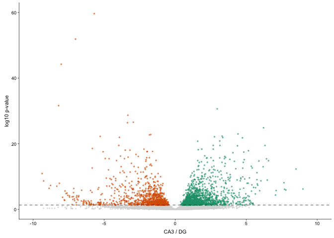

The figures made from this script were compiled in Adobe.

    library(ggplot2) ## for awesome plots!
    library(cowplot) ## for some easy to use themes
    library(dplyr) ## for filtering and selecting rows

    ## Warning: package 'dplyr' was built under R version 3.5.1

    library(car) ## stats
    library(VennDiagram) ## venn diagrams
    library(pheatmap) ## awesome heatmaps
    library(viridis) # for awesome color pallette
    library(reshape2) ## for melting dataframe
    library(DESeq2) ## for gene expression analysis

    ## Warning: package 'IRanges' was built under R version 3.5.1

    ## Warning: package 'GenomicRanges' was built under R version 3.5.1

    ## Warning: package 'DelayedArray' was built under R version 3.5.1

    library(edgeR)  ## for basic read counts status

    ## Warning: package 'edgeR' was built under R version 3.5.1

    ## Warning: package 'limma' was built under R version 3.5.1

    library(magrittr) ## to use the weird pipe
    library(genefilter)  ## for PCA fuction
    library(ggrepel) ## for labeling volcano plot

    ## load functions 
    source("figureoptions.R")
    source("functions_RNAseq.R")

    ## set output file for figures 
    knitr::opts_chunk$set(fig.path = '../figures/02b_RNAseqAll/')

Design
------

The major comparision here is - Hippocampal subfield: “DG”,“CA3”, “CA1”
- Behavioral Groups: “conflict”, “consistent”

    colData <- read.csv("../data/02a_colData.csv", header = T)
    countData <- read.csv("../data/02a_countData.csv", header = T, check.names = F, row.names = 1)
    colData %>% select(APA2,Punch)  %>%  summary()

    ##                APA2    Punch   
    ##  conflict        :14   CA1:15  
    ##  consistent      : 9   CA3:13  
    ##  yoked_conflict  :12   DG :16  
    ##  yoked_consistent: 9

    totalCounts=colSums(countData)
    ### on average 1 million gene counts per sample 
    summary((colSums(countData)/1000000))

    ##     Min.  1st Qu.   Median     Mean  3rd Qu.     Max. 
    ##  0.09042  1.08461  2.17911  2.52574  3.30608 11.70070

    dds <- DESeqDataSetFromMatrix(countData = countData,
                                  colData = colData,
                                  design = ~ Punch + APA2 + Punch*APA2)

    dds$Punch <- factor(dds$Punch, levels=c("DG","CA3", "CA1")) ## specify the factor levels
    dds$APA2 <- factor(dds$APA2, levels=c("yoked_consistent", "consistent", "yoked_conflict" , "conflict")) ## specify the factor levels

    dds # view the DESeq object - note numnber of genes

    ## class: DESeqDataSet 
    ## dim: 22485 44 
    ## metadata(1): version
    ## assays(1): counts
    ## rownames(22485): 0610007P14Rik 0610009B22Rik ... Zzef1 Zzz3
    ## rowData names(0):
    ## colnames(44): 143A-CA3-1 143A-DG-1 ... 148B-CA3-4 148B-DG-4
    ## colData names(8): RNAseqID Mouse ... ID APA2

    dds <- dds[ rowSums(counts(dds)) > 1, ]  # Pre-filtering genes with 0 counts
    dds # view number of genes afternormalization and the number of samples

    ## class: DESeqDataSet 
    ## dim: 17929 44 
    ## metadata(1): version
    ## assays(1): counts
    ## rownames(17929): 0610007P14Rik 0610009B22Rik ... Zzef1 Zzz3
    ## rowData names(0):
    ## colnames(44): 143A-CA3-1 143A-DG-1 ... 148B-CA3-4 148B-DG-4
    ## colData names(8): RNAseqID Mouse ... ID APA2

    dds <- DESeq(dds) # Differential expression analysis
    rld <- rlog(dds, blind=FALSE) ## log transformed data
    vsd <- getVarianceStabilizedData(dds)
    write.csv(vsd, file = "../data/02b_vsd.csv", row.names = T)

this is for CA1 DG
------------------

    res <- results(dds, contrast =c("Punch", "CA1", "DG"), independentFiltering = T)
    summary(res)

    ## 
    ## out of 17929 with nonzero total read count
    ## adjusted p-value < 0.1
    ## LFC > 0 (up)       : 1223, 6.8%
    ## LFC < 0 (down)     : 1542, 8.6%
    ## outliers [1]       : 8, 0.045%
    ## low counts [2]     : 5210, 29%
    ## (mean count < 4)
    ## [1] see 'cooksCutoff' argument of ?results
    ## [2] see 'independentFiltering' argument of ?results

    head((res[order(res$padj),]), 10)

    ## log2 fold change (MLE): Punch CA1 vs DG 
    ## Wald test p-value: Punch CA1 vs DG 
    ## DataFrame with 10 rows and 6 columns
    ##                  baseMean    log2FoldChange             lfcSE
    ##                 <numeric>         <numeric>         <numeric>
    ## Pou3f1   219.411952155873  5.98811582532105 0.529427167656916
    ## Prkcg    1597.44305102598   2.9761049905205 0.285040386563396
    ## Wfs1     558.096580361287  6.41720721777274 0.633476148881828
    ## Synj2    114.149797568097  6.05491769796562 0.603560024461183
    ## St8sia5  68.4953636213458  6.85817710097697 0.695949666130441
    ## Pex5l    417.241798395133  3.75565247595177 0.387901968935755
    ## Tmem200a 51.0216626372409  7.74247836767241 0.800495709544138
    ## Tiam1    321.235486821507 -5.24975765311302 0.550613429163663
    ## Man1a    138.573627062308  5.71253818001133 0.603077877738542
    ## Zfp462   93.4387577077342  5.67696987081699 0.608847677804295
    ##                       stat               pvalue                 padj
    ##                  <numeric>            <numeric>            <numeric>
    ## Pou3f1     11.310556373264 1.16349388204921e-29 1.47891707347276e-25
    ## Prkcg     10.4409940864944 1.61114601446348e-25 1.02396384949226e-21
    ## Wfs1      10.1301481185992 4.06033915011148e-24 1.72036569790223e-20
    ## Synj2      10.032005852891 1.10253681838088e-23 3.50358637460984e-20
    ## St8sia5   9.85441539056871 6.55973177434624e-23  1.6676150116743e-19
    ## Pex5l     9.68196290999953 3.59741650689522e-22 7.19343776710422e-19
    ## Tmem200a  9.67210476628482 3.96145577607816e-22 7.19343776710422e-19
    ## Tiam1    -9.53437997523411 1.50783878004262e-21 2.39576734164022e-18
    ## Man1a     9.47230596723686 2.73732874947874e-21 3.86602063718048e-18
    ## Zfp462    9.32412174304419 1.11906519693207e-20 1.42244377182035e-17

    ## Order by adjusted p-value
    res <- res[order(res$padj),]
    resdata <- as.data.frame(res)
    head(resdata,30)

    ##            baseMean log2FoldChange     lfcSE      stat       pvalue
    ## Pou3f1    219.41195       5.988116 0.5294272 11.310556 1.163494e-29
    ## Prkcg    1597.44305       2.976105 0.2850404 10.440994 1.611146e-25
    ## Wfs1      558.09658       6.417207 0.6334761 10.130148 4.060339e-24
    ## Synj2     114.14980       6.054918 0.6035600 10.032006 1.102537e-23
    ## St8sia5    68.49536       6.858177 0.6959497  9.854415 6.559732e-23
    ## Pex5l     417.24180       3.755652 0.3879020  9.681963 3.597417e-22
    ## Tmem200a   51.02166       7.742478 0.8004957  9.672105 3.961456e-22
    ## Tiam1     321.23549      -5.249758 0.5506134 -9.534380 1.507839e-21
    ## Man1a     138.57363       5.712538 0.6030779  9.472306 2.737329e-21
    ## Zfp462     93.43876       5.676970 0.6088477  9.324122 1.119065e-20
    ## Tenm4     155.06473       4.637469 0.5013047  9.250798 2.228221e-20
    ## Gm2115    249.25775       6.785068 0.7417669  9.147170 5.844426e-20
    ## Map4     1277.11199       2.257425 0.2470769  9.136527 6.449036e-20
    ## Slc9a2     67.31266       7.281462 0.7991319  9.111715 8.108954e-20
    ## Fam163b   628.81960      -3.464465 0.3864879 -8.963967 3.132017e-19
    ## Khdrbs3   327.06208       4.003589 0.4482109  8.932378 4.169471e-19
    ## Sez6      383.81112       3.712147 0.4184626  8.870917 7.254620e-19
    ## Cpe      3054.96827       2.367907 0.2725384  8.688342 3.677661e-18
    ## Stum     1174.66677       1.947679 0.2243761  8.680421 3.943076e-18
    ## Galnt9    192.83010       3.323040 0.3836656  8.661292 4.664454e-18
    ## Pitpnm2   935.97907      -2.629454 0.3038474 -8.653862 4.978528e-18
    ## Tyro3     134.16865       4.473155 0.5189708  8.619281 6.737571e-18
    ## Actr3b    292.01637       1.928042 0.2254608  8.551560 1.214364e-17
    ## Lefty1     36.31430       7.976262 0.9351174  8.529690 1.467406e-17
    ## Ncald    1014.53755      -4.304894 0.5063885 -8.501169 1.876916e-17
    ## Stk32c    162.97252      -3.745535 0.4404188 -8.504485 1.824031e-17
    ## Ociad2    198.20667       3.772825 0.4463101  8.453372 2.830090e-17
    ## Snhg11   2476.65880       2.555449 0.3024894  8.448062 2.961782e-17
    ## Agap1     204.97509      -3.756991 0.4477450 -8.390916 4.823694e-17
    ## Eps15     421.93296       1.893767 0.2279029  8.309533 9.607911e-17
    ##                  padj
    ## Pou3f1   1.478917e-25
    ## Prkcg    1.023964e-21
    ## Wfs1     1.720366e-20
    ## Synj2    3.503586e-20
    ## St8sia5  1.667615e-19
    ## Pex5l    7.193438e-19
    ## Tmem200a 7.193438e-19
    ## Tiam1    2.395767e-18
    ## Man1a    3.866021e-18
    ## Zfp462   1.422444e-17
    ## Tenm4    2.574811e-17
    ## Gm2115   6.190708e-17
    ## Map4     6.305669e-17
    ## Slc9a2   7.362351e-17
    ## Fam163b  2.654072e-16
    ## Khdrbs3  3.312384e-16
    ## Sez6     5.424322e-16
    ## Cpe      2.597042e-15
    ## Stum     2.637918e-15
    ## Galnt9   2.964494e-15
    ## Pitpnm2  3.013432e-15
    ## Tyro3    3.892785e-15
    ## Actr3b   6.711207e-15
    ## Lefty1   7.771751e-15
    ## Ncald    9.175952e-15
    ## Stk32c   9.175952e-15
    ## Ociad2   1.332343e-14
    ## Snhg11   1.344543e-14
    ## Agap1    2.114275e-14
    ## Eps15    4.070872e-14

this is for CA1 CA3
-------------------

    res <- results(dds, contrast =c("Punch", "CA1", "CA3"), independentFiltering = T)
    summary(res)

    ## 
    ## out of 17929 with nonzero total read count
    ## adjusted p-value < 0.1
    ## LFC > 0 (up)       : 877, 4.9%
    ## LFC < 0 (down)     : 1288, 7.2%
    ## outliers [1]       : 8, 0.045%
    ## low counts [2]     : 4863, 27%
    ## (mean count < 3)
    ## [1] see 'cooksCutoff' argument of ?results
    ## [2] see 'independentFiltering' argument of ?results

    head((res[order(res$padj),]), 10)

    ## log2 fold change (MLE): Punch CA1 vs CA3 
    ## Wald test p-value: Punch CA1 vs CA3 
    ## DataFrame with 10 rows and 6 columns
    ##                baseMean    log2FoldChange             lfcSE
    ##               <numeric>         <numeric>         <numeric>
    ## Doc2b  349.417572153451  7.18133518109858 0.485599785928926
    ## Itpka  710.071023144903  3.09537793188557 0.232315140416282
    ## Pou3f1 219.411952155873  6.52776905240328 0.548908573891511
    ## C1ql3  285.386723855134  6.43352476856748 0.609253058871802
    ## Syn2   1094.47006534942 -2.23244918862592 0.211235038450167
    ## Fibcd1 360.508601669652   7.6909143460939 0.794190465956115
    ## Nptxr  1873.89195088131 -2.47431772210074 0.270208264146182
    ## Bcr    341.475318016323  2.32744268995085 0.256737538464715
    ## Ahi1   479.309563295498  1.79803940606164 0.204797358974687
    ## Homer3 182.933674454584 -4.51664918141573 0.517315559977438
    ##                     stat               pvalue                 padj
    ##                <numeric>            <numeric>            <numeric>
    ## Doc2b   14.7885880290517 1.73556525225735e-49 2.26630110639765e-45
    ## Itpka   13.3240473536895 1.67760521698626e-40 1.09530844617033e-36
    ## Pou3f1  11.8922701573495 1.29829032027963e-32 5.65102500073714e-29
    ## C1ql3   10.5596921917485 4.58161703975939e-26 1.19653510610356e-22
    ## Syn2   -10.5685553164163 4.16866681051938e-26 1.19653510610356e-22
    ## Fibcd1  9.68396710332566  3.5275607705144e-22 7.67714809022951e-19
    ## Nptxr  -9.15707641259313 5.33223150962408e-20 9.94689700752446e-17
    ## Bcr     9.06545534349558 1.24084882330284e-19 2.02537549183606e-16
    ## Ahi1    8.77960250592819 1.64053414176282e-18 2.38023275812654e-15
    ## Homer3 -8.73093626182965 2.52572992932246e-18 3.29809814170926e-15

this is for CA3 DG
------------------

    res <- results(dds, contrast =c("Punch", "CA3", "DG"), independentFiltering = T)
    summary(res)

    ## 
    ## out of 17929 with nonzero total read count
    ## adjusted p-value < 0.1
    ## LFC > 0 (up)       : 1571, 8.8%
    ## LFC < 0 (down)     : 1377, 7.7%
    ## outliers [1]       : 8, 0.045%
    ## low counts [2]     : 3824, 21%
    ## (mean count < 2)
    ## [1] see 'cooksCutoff' argument of ?results
    ## [2] see 'independentFiltering' argument of ?results

    head((res[order(res$padj),]), 10)

    ## log2 fold change (MLE): Punch CA3 vs DG 
    ## Wald test p-value: Punch CA3 vs DG 
    ## DataFrame with 10 rows and 6 columns
    ##                 baseMean    log2FoldChange             lfcSE
    ##                <numeric>         <numeric>         <numeric>
    ## Fam163b 628.819601522936 -5.70013539670791 0.336089093685364
    ## Doc2b   349.417572153451 -7.02195793637976 0.443508811683749
    ## C1ql3   285.386723855134 -8.02894919282852 0.547842656156047
    ## Pter    159.610534988909 -8.21109827989322 0.656588791993648
    ## Cpe     3054.96826641212  2.95874463126907 0.240400534705513
    ## Adcy1   2607.63934923601 -3.33229530549559 0.279435782261391
    ## Pitpnm2 935.979067712815 -2.94903024539698 0.256559415494396
    ## Pde1b   258.300187916992 -3.36029952761273 0.293356997935408
    ## Kcnc2   144.358588449054  6.22171240084158 0.558906647495304
    ## Me1     87.7852191159365  4.42363434729768 0.412345208515744
    ##                      stat               pvalue                 padj
    ##                 <numeric>            <numeric>            <numeric>
    ## Fam163b -16.9601915200622 1.61816164273402e-64 2.28112246776215e-60
    ## Doc2b   -15.8327360164986 1.84998786056728e-56 1.30396394352084e-52
    ## C1ql3   -14.6555751046548 1.24101383873535e-48 5.83152402821739e-45
    ## Pter     -12.505693639639  6.9490587180363e-36 2.44902201870394e-32
    ## Cpe      12.3075626054389 8.24764911040337e-35 2.32534219018712e-31
    ## Adcy1   -11.9250844631576 8.75951409278765e-33 2.05804783610046e-29
    ## Pitpnm2  -11.494531353348 1.40541696884345e-30 2.83030900139802e-27
    ## Pde1b    -11.454642470648 2.22881011954894e-30 3.92744203191018e-27
    ## Kcnc2    11.1319348744977  8.7710653025308e-29 1.37384119521974e-25
    ## Me1      10.7279877538065 7.52162176228496e-27 1.06032301982931e-23

    head((res[order(res$log2FoldChange),]), 10)

    ## log2 fold change (MLE): Punch CA3 vs DG 
    ## Wald test p-value: Punch CA3 vs DG 
    ## DataFrame with 10 rows and 6 columns
    ##                  baseMean    log2FoldChange            lfcSE
    ##                 <numeric>         <numeric>        <numeric>
    ## Lrcol1    2.1275251592393 -17.9956590712066 7.47100856504791
    ## Rps12     18.290227664474   -15.36292711979 7.40930591759199
    ## Plk5     110.597781010748 -11.6315922759877 1.40507978506958
    ## Npcd     12.8482435809424 -10.1608949374546 6.50987780596088
    ## Ndst4    76.4842680065485 -9.37244572681937 1.26206922233076
    ## Glb1l3   5.76128647932362 -9.27543622898314 7.40432835247921
    ## Pdyn     25.6508596419798 -9.26710330867676 1.39517276296144
    ## Atp6v0a4  5.0141727767878 -9.00344687278458  7.0862449945428
    ## Pla2g4e  15.5761114496688 -8.88079052600924 1.54651659783275
    ## Tespa1   4.35433944059217 -8.84733531790146 7.40541948987245
    ##                       stat               pvalue                 padj
    ##                  <numeric>            <numeric>            <numeric>
    ## Lrcol1    -2.4087322233034                   NA                   NA
    ## Rps12    -2.07346373474924   0.0381291427761831    0.153286990900999
    ## Plk5     -8.27824327101233 1.25005654115619e-16 2.28857754034789e-14
    ## Npcd     -1.56084265178535    0.118560881126984     0.32459754151235
    ## Ndst4    -7.42625329972834 1.11716965587022e-13 1.27005972893569e-11
    ## Glb1l3   -1.25270460566183    0.210313229226643    0.461348241773575
    ## Pdyn     -6.64226220199864 3.08904797779384e-11 2.17731546714799e-09
    ## Atp6v0a4 -1.27055258175779    0.203887865345488    0.452967664575752
    ## Pla2g4e  -5.74244760027441 9.33177605583501e-09 4.06018663762673e-07
    ## Tespa1    -1.1947108911252    0.232200005756828    0.489660131642861

this is for consistent yoked-consistent
---------------------------------------

    res <- results(dds, contrast =c("APA2", "consistent", "yoked_consistent"), independentFiltering = T, alpha = 0.1)
    summary(res)

    ## 
    ## out of 17929 with nonzero total read count
    ## adjusted p-value < 0.1
    ## LFC > 0 (up)       : 106, 0.59%
    ## LFC < 0 (down)     : 8, 0.045%
    ## outliers [1]       : 8, 0.045%
    ## low counts [2]     : 4863, 27%
    ## (mean count < 3)
    ## [1] see 'cooksCutoff' argument of ?results
    ## [2] see 'independentFiltering' argument of ?results

    head((res[order(res$padj),]), 10)

    ## log2 fold change (MLE): APA2 consistent vs yoked_consistent 
    ## Wald test p-value: APA2 consistent vs yoked consistent 
    ## DataFrame with 10 rows and 6 columns
    ##                baseMean   log2FoldChange             lfcSE
    ##               <numeric>        <numeric>         <numeric>
    ## Plk2   690.892982346694 2.33695480383662 0.287228730093021
    ## Frmd6  115.436102973485 3.28456907410619 0.460199207192014
    ## Sgk1   243.126788527358 2.51900483921696 0.352679536541189
    ## Smad7  101.648353958591 3.55571966960197 0.497558063998369
    ## Arc    865.501371190336 2.88376455109463 0.419805445423536
    ## Fbxo33 220.541754552169 3.00911903213762  0.44446108800189
    ## Lmna   104.873184036613 2.37485429509161 0.350610025411292
    ## Junb   509.171327352875 2.38648428642696 0.353936652165955
    ## Fosl2  294.146709990136 2.56630291348006 0.405437600249251
    ## Dnaja1 528.535428970117 1.01336750965102 0.163895125829566
    ##                    stat               pvalue                 padj
    ##               <numeric>            <numeric>            <numeric>
    ## Plk2   8.13621535380455 4.07826108076359e-16 5.32539331926109e-12
    ## Frmd6  7.13727668969176 9.51980996986564e-13 3.10774196466264e-09
    ## Sgk1   7.14247518844285 9.16650670302539e-13 3.10774196466264e-09
    ## Smad7  7.14634115469512 8.91214084671919e-13 3.10774196466264e-09
    ## Arc    6.86928810126616 6.45230809755564e-12 1.68508478275763e-08
    ## Fbxo33 6.77026428942375 1.28547354747413e-11 2.39795908327389e-08
    ## Lmna   6.77349226481964  1.2571029992111e-11 2.39795908327389e-08
    ## Junb   6.74268763018071 1.55483254346742e-11 2.53787541907469e-08
    ## Fosl2  6.32971118589489 2.45620507490642e-10 3.56368065201422e-07
    ## Dnaja1  6.1830240803184 6.28851172544568e-10 7.47676388243095e-07

this is for consistent yoked-conflict yoked-consistent DG
---------------------------------------------------------

    res <- results(dds, contrast =c("APA2", "yoked_conflict", "yoked_consistent"), independentFiltering = T, alpha = 0.1)
    summary(res)

    ## 
    ## out of 17929 with nonzero total read count
    ## adjusted p-value < 0.1
    ## LFC > 0 (up)       : 38, 0.21%
    ## LFC < 0 (down)     : 2, 0.011%
    ## outliers [1]       : 8, 0.045%
    ## low counts [2]     : 2434, 14%
    ## (mean count < 0)
    ## [1] see 'cooksCutoff' argument of ?results
    ## [2] see 'independentFiltering' argument of ?results

    table(res$padj<0.05)

    ## 
    ## FALSE  TRUE 
    ## 15456    31

    head((res[order(res$padj),]), 10)

    ## log2 fold change (MLE): APA2 yoked_conflict vs yoked_consistent 
    ## Wald test p-value: APA2 yoked conflict vs yoked consistent 
    ## DataFrame with 10 rows and 6 columns
    ##                 baseMean   log2FoldChange             lfcSE
    ##                <numeric>        <numeric>         <numeric>
    ## Kcnc2   144.358588449054  3.8023112290593 0.556925143128729
    ## St8sia5 68.4953636213458 3.78869790825454 0.673902508231409
    ## Gm2115  249.257751832989 3.48213722650287 0.658706293164926
    ## Cnr1    350.970175675373 3.92670174540615 0.762127039058243
    ## Dner    169.806900335675 1.75376437273897 0.352584944840884
    ## Camk1g  40.6858606603921 3.07441617926896 0.651972053515784
    ## Tenm4   155.064731202057 2.09080515700774  0.45595322720424
    ## Klk8    34.8871312628441 5.00760720075993   1.1276964055125
    ## Pou3f1  219.411952155873 2.14125662429894 0.479904106088455
    ## Slc32a1 91.6157514759355 4.03971461796684 0.915087632883217
    ##                     stat               pvalue                 padj
    ##                <numeric>            <numeric>            <numeric>
    ## Kcnc2   6.82732908717039 8.65100952684687e-12 1.33978184542277e-07
    ## St8sia5 5.62202672044894 1.88730063642428e-08 0.000146143124781514
    ## Gm2115  5.28632755240888 1.24796350258549e-07  0.00064424035881805
    ## Cnr1     5.1522929172784 2.57320693829982e-07 0.000996281396336233
    ## Dner    4.97401944808056 6.55787255813261e-07  0.00203123544615599
    ## Camk1g  4.71556435999067 2.41041682634293e-06  0.00622168756492884
    ## Tenm4   4.58556937918368 4.52750896214222e-06   0.0100167901852424
    ## Klk8     4.4405632369504 8.97237334987668e-06   0.0154394606743933
    ## Pou3f1  4.46184268301358 8.12578728841866e-06   0.0154394606743933
    ## Slc32a1 4.41456585446214 1.01212902788901e-05   0.0156748422549171

    ## Order by adjusted p-value
    res <- res[order(res$padj),]
    resdata <- as.data.frame(res)
    head(resdata,30)

    ##            baseMean log2FoldChange     lfcSE     stat       pvalue
    ## Kcnc2     144.35859      3.8023112 0.5569251 6.827329 8.651010e-12
    ## St8sia5    68.49536      3.7886979 0.6739025 5.622027 1.887301e-08
    ## Gm2115    249.25775      3.4821372 0.6587063 5.286328 1.247964e-07
    ## Cnr1      350.97018      3.9267017 0.7621270 5.152293 2.573207e-07
    ## Dner      169.80690      1.7537644 0.3525849 4.974019 6.557873e-07
    ## Camk1g     40.68586      3.0744162 0.6519721 4.715564 2.410417e-06
    ## Tenm4     155.06473      2.0908052 0.4559532 4.585569 4.527509e-06
    ## Klk8       34.88713      5.0076072 1.1276964 4.440563 8.972373e-06
    ## Pou3f1    219.41195      2.1412566 0.4799041 4.461843 8.125787e-06
    ## Slc32a1    91.61575      4.0397146 0.9150876 4.414566 1.012129e-05
    ## Nlrp3      31.73224      4.0319499 0.9185379 4.389530 1.135958e-05
    ## Spock1    396.40979      2.8585760 0.6541838 4.369683 1.244270e-05
    ## Cpe      3054.96827      0.9854382 0.2278885 4.324211 1.530785e-05
    ## Slc17a8    26.44093      4.1268018 0.9628394 4.286075 1.818575e-05
    ## Me1        87.78522      1.8465315 0.4325881 4.268567 1.967327e-05
    ## Sulf2     134.06069      1.9387391 0.4611885 4.203789 2.624838e-05
    ## Khdrbs3   327.06208      1.6387122 0.3940879 4.158241 3.207082e-05
    ## Tmem200a   51.02166      3.3333863 0.7998456 4.167537 3.079085e-05
    ## Rnase4     16.06797      3.6015790 0.8729020 4.125983 3.691544e-05
    ## Nell1      96.23769      3.7197519 0.9044200 4.112859 3.907891e-05
    ## Man1a     138.57363      2.2761335 0.5602674 4.062584 4.853244e-05
    ## Slc9a2     67.31266      3.1053974 0.7735766 4.014337 5.961311e-05
    ## Slc15a3    16.52118      3.6550002 0.9177314 3.982647 6.815193e-05
    ## Sst        81.63719      6.1146105 1.5369347 3.978445 6.936735e-05
    ## Wfs1      558.09658      2.2025794 0.5536969 3.977952 6.951152e-05
    ## Bicc1      13.09851      4.5970802 1.1769538 3.905914 9.386997e-05
    ## Csrnp1     91.07953      1.7627438 0.4497286 3.919573 8.870611e-05
    ## Elfn1      21.19478      3.6335900 0.9276323 3.917059 8.963597e-05
    ## Kcnq5     148.29073      2.9523674 0.7561939 3.904247 9.451938e-05
    ## Lefty1     36.31430      3.5736511 0.9185446 3.890558 1.000140e-04
    ##                  padj
    ## Kcnc2    1.339782e-07
    ## St8sia5  1.461431e-04
    ## Gm2115   6.442404e-04
    ## Cnr1     9.962814e-04
    ## Dner     2.031235e-03
    ## Camk1g   6.221688e-03
    ## Tenm4    1.001679e-02
    ## Klk8     1.543946e-02
    ## Pou3f1   1.543946e-02
    ## Slc32a1  1.567484e-02
    ## Nlrp3    1.599325e-02
    ## Spock1   1.605834e-02
    ## Cpe      1.823636e-02
    ## Slc17a8  2.011734e-02
    ## Me1      2.031200e-02
    ## Sulf2    2.540679e-02
    ## Khdrbs3  2.759337e-02
    ## Tmem200a 2.759337e-02
    ## Rnase4   3.008997e-02
    ## Nell1    3.026076e-02
    ## Man1a    3.579152e-02
    ## Slc9a2   4.196492e-02
    ## Slc15a3  4.306100e-02
    ## Sst      4.306100e-02
    ## Wfs1     4.306100e-02
    ## Bicc1    4.996504e-02
    ## Csrnp1   4.996504e-02
    ## Elfn1    4.996504e-02
    ## Kcnq5    4.996504e-02
    ## Lefty1   4.996504e-02

this is for consistent-conflict vs yoked-conflict
-------------------------------------------------

    res <- results(dds, contrast =c("APA2", "conflict", "yoked_conflict"), independentFiltering = T, alpha = 0.1)
    summary(res)

    ## 
    ## out of 17929 with nonzero total read count
    ## adjusted p-value < 0.1
    ## LFC > 0 (up)       : 17, 0.095%
    ## LFC < 0 (down)     : 44, 0.25%
    ## outliers [1]       : 8, 0.045%
    ## low counts [2]     : 6945, 39%
    ## (mean count < 10)
    ## [1] see 'cooksCutoff' argument of ?results
    ## [2] see 'independentFiltering' argument of ?results

    head((res[order(res$padj),]), 10)

    ## log2 fold change (MLE): APA2 conflict vs yoked_conflict 
    ## Wald test p-value: APA2 conflict vs yoked_conflict 
    ## DataFrame with 10 rows and 6 columns
    ##                 baseMean    log2FoldChange             lfcSE
    ##                <numeric>         <numeric>         <numeric>
    ## Camk1g  40.6858606603921 -3.40364428501139 0.620423076444881
    ## Insm1   21.1075753227574 -4.60154941196191 0.836635136992648
    ## Kcnc2   144.358588449054 -2.52302302621629 0.471272220797739
    ## Neurod6 331.806267643941 -3.56020520569808 0.703632664264456
    ## Sv2b    568.239350545566 -3.75707558827698 0.743875755350764
    ## Khdrbs3 327.062082451813 -1.63815194028196 0.355869901580467
    ## Stmn2    416.33755501586 -2.26179598177661 0.497962984351558
    ## Stox2    4694.9508569463 -5.24078244314957  1.17277513950018
    ## Slc6a7  90.3559406351636 -1.81763187373056 0.410369551227979
    ## Plk2    690.892982346694    1.105671692536 0.251850117127218
    ##                      stat               pvalue                 padj
    ##                 <numeric>            <numeric>            <numeric>
    ## Camk1g  -5.48600529902079 4.11124568870954e-08  0.00022562516339638
    ## Insm1   -5.50006712424552 3.79646693599839e-08  0.00022562516339638
    ## Kcnc2    -5.3536425761431 8.62010539514554e-08 0.000315380922723725
    ## Neurod6 -5.05974976221399 4.19807053469746e-07 0.000966434064873371
    ## Sv2b    -5.05067622012413  4.4024875404217e-07 0.000966434064873371
    ## Khdrbs3 -4.60323262239009 4.15983148344033e-06  0.00760971839370685
    ## Stmn2   -4.54209660728477 5.56975048478885e-06  0.00873336876014892
    ## Stox2    -4.4687018565069 7.86957276846453e-06   0.0107970538383333
    ## Slc6a7   -4.4292561869942 9.45586449223749e-06   0.0115319520740887
    ## Plk2     4.39019725362086 1.13247884371376e-05    0.011619191029025

    table(res$padj<0.05)

    ## 
    ## FALSE  TRUE 
    ## 10937    39

    table(res$padj<0.1)

    ## 
    ## FALSE  TRUE 
    ## 10915    61

this is for consistent conflict yoked-conflict
----------------------------------------------

    res <- results(dds, contrast =c("APA2", "conflict", "consistent"), independentFiltering = T)
    summary(res)

    ## 
    ## out of 17929 with nonzero total read count
    ## adjusted p-value < 0.1
    ## LFC > 0 (up)       : 0, 0%
    ## LFC < 0 (down)     : 0, 0%
    ## outliers [1]       : 8, 0.045%
    ## low counts [2]     : 0, 0%
    ## (mean count < 0)
    ## [1] see 'cooksCutoff' argument of ?results
    ## [2] see 'independentFiltering' argument of ?results

    head((res[order(res$padj),]), 10)

    ## log2 fold change (MLE): APA2 conflict vs consistent 
    ## Wald test p-value: APA2 conflict vs consistent 
    ## DataFrame with 10 rows and 6 columns
    ##                       baseMean     log2FoldChange             lfcSE
    ##                      <numeric>          <numeric>         <numeric>
    ## 0610007P14Rik 43.5653432205546  -0.13431443318451 0.381085088890507
    ## 0610009B22Rik  13.157668511865 -0.748166636504363 0.660643972055877
    ## 0610009L18Rik 3.86186075059207  0.565189744483188  1.23716707518475
    ## 0610009O20Rik 48.2470462620772  0.262824867865574 0.402802206893118
    ## 0610010F05Rik 64.5504551982064 -0.361872413635425 0.332203886323633
    ## 0610010K14Rik 19.7011887603264   0.41586826561794  0.68358362003477
    ## 0610012G03Rik 61.3515272894271  0.118168136843711 0.369940445873239
    ## 0610030E20Rik 39.7023920740888 -0.110873849749036 0.507992878780045
    ## 0610037L13Rik 70.3041268921024  0.117013727428709 0.365489732352497
    ## 0610040J01Rik 3.44839145828991 -0.344274193984147  1.26364621724818
    ##                             stat            pvalue              padj
    ##                        <numeric>         <numeric>         <numeric>
    ## 0610007P14Rik -0.352452607304981 0.724498854846802 0.999821112533798
    ## 0610009B22Rik  -1.13248083408091 0.257432337627188 0.999821112533798
    ## 0610009L18Rik  0.456841889684776 0.647784694333414 0.999821112533798
    ## 0610009O20Rik  0.652491131795891 0.514084391925527 0.999821112533798
    ## 0610010F05Rik  -1.08930818853482 0.276018002979688 0.999821112533798
    ## 0610010K14Rik  0.608364878018562  0.54294550025247 0.999821112533798
    ## 0610012G03Rik  0.319424756503109 0.749404440357756 0.999821112533798
    ## 0610030E20Rik -0.218258669324857 0.827227575239532 0.999821112533798
    ## 0610037L13Rik  0.320155990909904 0.748850082871842 0.999821112533798
    ## 0610040J01Rik -0.272445079394031 0.785279814758617 0.999821112533798

    head((res[order(res$log2FoldChange),]), 10)

    ## log2 fold change (MLE): APA2 conflict vs consistent 
    ## Wald test p-value: APA2 conflict vs consistent 
    ## DataFrame with 10 rows and 6 columns
    ##                   baseMean    log2FoldChange            lfcSE
    ##                  <numeric>         <numeric>        <numeric>
    ## Lrcol1     2.1275251592393  -18.415920821181 7.13615528175055
    ## Rps12      18.290227664474 -16.1799585678775 7.05037170224658
    ## Apoo-ps   2.59367835468402  -7.2618554984624 7.05161734875658
    ## Gm6563    2.50994703043332 -6.25860263184712 7.05571799200072
    ## Rps27rt   1.45909973854295 -6.19472627242959 7.05608656606021
    ## Atg4a-ps 0.444471059580239 -5.84130178135348 7.05845461407744
    ## Gm21949   15.9083701276525 -5.73617097071172 4.02280245149888
    ## Gm28539   2.01007180819339 -5.54414963417848 7.03858361601936
    ## Fam83e   0.509903778229333 -5.47456441339606 6.48171355868822
    ## Neurog2   1.61510785862856 -5.27913600944553 2.37001436993082
    ##                        stat             pvalue              padj
    ##                   <numeric>          <numeric>         <numeric>
    ## Lrcol1    -2.58065023728903                 NA                NA
    ## Rps12     -2.29490858797158   0.02173836354539 0.999821112533798
    ## Apoo-ps   -1.02981417443799  0.303097245558973 0.999821112533798
    ## Gm6563   -0.887025620772073  0.375065106724584 0.999821112533798
    ## Rps27rt  -0.877926626102666  0.379983538630908 0.999821112533798
    ## Atg4a-ps -0.827561003183833  0.407919160895517 0.999821112533798
    ## Gm21949   -1.42591415807019  0.153893122119933 0.999821112533798
    ## Gm28539  -0.787679728853452  0.430884065675904 0.999821112533798
    ## Fam83e   -0.844616838406542  0.398324804552097 0.999821112533798
    ## Neurog2    -2.2274700425549 0.0259158757971519 0.999821112533798

    table(res$padj<0.05)

    ## 
    ## FALSE 
    ## 17921

    table(res$padj<0.1)

    ## 
    ## FALSE 
    ## 17921

    contrast1 <- resvals(contrastvector = c("Punch", "CA1", "DG"), mypval = 0.1) # 2526 or 2765

    ## [1] 2765

    contrast2 <- resvals(contrastvector = c("Punch", "CA1", "CA3"), mypval = 0.1) # 2022 or 2165

    ## [1] 2165

    contrast3 <- resvals(contrastvector = c("Punch", "CA3", "DG"), mypval = 0.1) # 3145 or 2948

    ## [1] 2948

    contrast4 <- resvals(contrastvector = c("APA2", "consistent", "yoked_consistent"), mypval = 0.1) # 114 or 114

    ## [1] 114

    contrast5 <- resvals(contrastvector = c("APA2", "conflict", "yoked_conflict"), mypval = 0.1) # 60 or 61

    ## [1] 61

    contrast6 <- resvals(contrastvector = c("APA2", "conflict", "consistent"), mypval = 0.1) # 1 or 0

    ## [1] 0

    contrast7 <- resvals(contrastvector = c("APA2", "yoked_conflict", "yoked_consistent"), mypval = 0.1) # 35 or 40

    ## [1] 40

    DEGes <- assay(rld)
    DEGes <- cbind(DEGes, contrast1, contrast2, contrast3, contrast4, contrast5, contrast6, contrast7)
    DEGes <- as.data.frame(DEGes) # convert matrix to dataframe
    DEGes$rownames <- rownames(DEGes)  # add the rownames to the dataframe
    DEGes$padjmin <- with(DEGes, pmin(padjPunchCA1DG, padjPunchCA1CA3, padjPunchCA3DG, padjAPA2conflictconsistent, padjAPA2yoked_conflictyoked_consistent,padjAPA2conflictyoked_conflict, padjAPA2consistentyoked_consistent)) 
    DEGes <- DEGes %>% filter(padjmin < 0.000000001)
    rownames(DEGes) <- DEGes$rownames
    drop.cols <-colnames(DEGes[,grep("padj|pval|rownames", colnames(DEGes))])
    DEGes <- DEGes %>% dplyr::select(-one_of(drop.cols))
    DEGes <- as.matrix(DEGes)
    DEGes <- DEGes - rowMeans(DEGes)

    df <- as.data.frame(colData(dds)[,c("APA2", "Punch")]) ## matrix to df
    rownames(df) <- names(countData)
    ann_colors <- ann_colors4 # see color options 
    DEGes <- as.matrix(DEGes) 
    paletteLength <- 30
    myBreaks <- c(seq(min(DEGes), 0, length.out=ceiling(paletteLength/2) + 1), 
                  seq(max(DEGes)/paletteLength, max(DEGes), length.out=floor(paletteLength/2)))

    pheatmap(DEGes, show_colnames=T, show_rownames = F,
             annotation_col=df, annotation_colors = ann_colors,
             treeheight_row = 0, treeheight_col = 25,
             annotation_row = NA, 
             annotation_legend = FALSE,
             annotation_names_row = FALSE, annotation_names_col = FALSE,
             fontsize = 8, 
             border_color = "grey60" ,
             color = viridis(30),
             cellwidth = 6, 
             clustering_method="average",
             breaks=myBreaks,
             clustering_distance_cols="correlation" 
             )

    pheatmap(DEGes, show_colnames=F, show_rownames = F,
             annotation_col=df, annotation_colors = ann_colors, 
             annotation_row = NA, 
             annotation_legend = FALSE,
             annotation_names_row = FALSE, 
             annotation_names_col = FALSE,
             treeheight_row = 0, treeheight_col = 25,
             fontsize = 8, 
             border_color = "grey60" ,
             color = viridis(30),
             height = 3.75, 
             width = 3.5,
             clustering_method="average",
             breaks=myBreaks,
             clustering_distance_cols="correlation", 
             filename = "../figures/02b_RNAseqALL/pheatmap1.pdf"
             )

Principle component analysis
----------------------------

    ## [1] 54 22  5  3  2  1  1  1  1

    ##             Df Sum Sq Mean Sq F value Pr(>F)    
    ## Punch        2  18619    9309   287.6 <2e-16 ***
    ## Residuals   41   1327      32                   
    ## ---
    ## Signif. codes:  0 '***' 0.001 '**' 0.01 '*' 0.05 '.' 0.1 ' ' 1

    ##   Tukey multiple comparisons of means
    ##     95% family-wise confidence level
    ## 
    ## Fit: aov(formula = PC1 ~ Punch, data = pcadata)
    ## 
    ## $Punch
    ##               diff       lwr       upr     p adj
    ## CA3-DG  -42.063885 -47.22958 -36.89819 0.0000000
    ## CA1-DG  -43.343230 -48.31529 -38.37117 0.0000000
    ## CA1-CA3  -1.279345  -6.52166   3.96297 0.8244072

    ##             Df Sum Sq Mean Sq F value Pr(>F)    
    ## Punch        2   8050    4025    1049 <2e-16 ***
    ## Residuals   41    157       4                   
    ## ---
    ## Signif. codes:  0 '***' 0.001 '**' 0.01 '*' 0.05 '.' 0.1 ' ' 1

    ##   Tukey multiple comparisons of means
    ##     95% family-wise confidence level
    ## 
    ## Fit: aov(formula = PC2 ~ Punch, data = pcadata)
    ## 
    ## $Punch
    ##              diff       lwr       upr p adj
    ## CA3-DG  -18.71023 -20.48834 -16.93211     0
    ## CA1-DG   15.28271  13.57125  16.99418     0
    ## CA1-CA3  33.99294  32.18845  35.79743     0

    ##             Df Sum Sq Mean Sq F value Pr(>F)
    ## Punch        2   26.5   13.24   0.306  0.738
    ## Residuals   41 1774.6   43.28

    ##   Tukey multiple comparisons of means
    ##     95% family-wise confidence level
    ## 
    ## Fit: aov(formula = PC3 ~ Punch, data = pcadata)
    ## 
    ## $Punch
    ##               diff       lwr      upr     p adj
    ## CA3-DG  -1.5452815 -7.518690 4.428126 0.8050705
    ## CA1-DG  -1.6651830 -7.414683 4.084317 0.7623489
    ## CA1-CA3 -0.1199015 -6.181910 5.942107 0.9987255

    ##             Df Sum Sq Mean Sq F value Pr(>F)
    ## APA2         3  255.8   85.25   2.207  0.102
    ## Residuals   40 1545.3   38.63

    ##             Df Sum Sq Mean Sq F value  Pr(>F)    
    ## APA2         3  443.7   147.9   11.83 1.1e-05 ***
    ## Residuals   40  499.9    12.5                    
    ## ---
    ## Signif. codes:  0 '***' 0.001 '**' 0.01 '*' 0.05 '.' 0.1 ' ' 1

    ##             Df Sum Sq Mean Sq F value Pr(>F)
    ## APA2         3    9.8   3.277    0.24  0.868
    ## Residuals   40  547.0  13.675

    ##             Df Sum Sq Mean Sq F value Pr(>F)
    ## APA2         3   23.4   7.811   0.771  0.517
    ## Residuals   40  405.5  10.137

    ## quartz_off_screen 
    ##                 2

    ## quartz_off_screen 
    ##                 2

Number of differentially expressed genes per two-way contrast
=============================================================

venn diagrams
-------------

    # uses contrast 1-6 from heat map prep

    rldpadjs <- assay(rld)
    rldpadjs <- cbind(rldpadjs, contrast1, contrast2, contrast3, contrast4, contrast5, contrast6)
    rldpadjs <- as.data.frame(rldpadjs)
    rldpadjs <- rldpadjs[ , grepl( "padj" , names( rldpadjs ) ) ]

    venn1 <- row.names(rldpadjs[rldpadjs[1] <0.05 & !is.na(rldpadjs[1]),]) 
    venn2 <- row.names(rldpadjs[rldpadjs[2] <0.05 & !is.na(rldpadjs[2]),]) 
    venn3 <- row.names(rldpadjs[rldpadjs[3] <0.05 & !is.na(rldpadjs[3]),]) 
    venn4 <- row.names(rldpadjs[rldpadjs[4] <0.05 & !is.na(rldpadjs[4]),]) 
    venn5 <- row.names(rldpadjs[rldpadjs[5] <0.05 & !is.na(rldpadjs[5]),]) 
    venn6 <- row.names(rldpadjs[rldpadjs[6] <0.05 & !is.na(rldpadjs[6]),]) 

    candidates1 <- list("CA1-DG" = venn1, "CA3-DG" = venn3, "CA1-CA3" = venn2) 
    candidates2 <- list("Yoked-Consistent" = venn4, "Yoked-Conflict" = venn5, "Yoked-Yoked" = venn6)

    prettyvenn <- venn.diagram(
      scaled=T,
      x = candidates1, filename=NULL, 
      col = "black",
      alpha = 0.5,
      cex = 1, fontfamily = "sans", #fontface = "bold",
      cat.default.pos = "text",
      cat.cex = 1, cat.fontfamily = "sans")
    #dev.off()
    grid.draw(prettyvenn)

    prettyvenn <- venn.diagram(
      scaled=T,
      x = candidates2, filename=NULL, 
      col = "black",
      alpha = 0.5,
      cex = 1, fontfamily = "sans", #fontface = "bold",
      cat.default.pos = "text",
      cat.cex = 1, cat.fontfamily = "sans")
    #dev.off()
    grid.draw(prettyvenn)

Volcanos plots and and gene lists
---------------------------------

### ca3 dg

    res <- results(dds, contrast =c("Punch", "CA3", "DG"), independentFiltering = T, alpha = 0.1)
    summary(res)

    ## 
    ## out of 17929 with nonzero total read count
    ## adjusted p-value < 0.1
    ## LFC > 0 (up)       : 1571, 8.8%
    ## LFC < 0 (down)     : 1377, 7.7%
    ## outliers [1]       : 8, 0.045%
    ## low counts [2]     : 3824, 21%
    ## (mean count < 2)
    ## [1] see 'cooksCutoff' argument of ?results
    ## [2] see 'independentFiltering' argument of ?results

    resOrdered <- res[order(res$padj),]
    head(resOrdered, 10)

    ## log2 fold change (MLE): Punch CA3 vs DG 
    ## Wald test p-value: Punch CA3 vs DG 
    ## DataFrame with 10 rows and 6 columns
    ##                 baseMean    log2FoldChange             lfcSE
    ##                <numeric>         <numeric>         <numeric>
    ## Fam163b 628.819601522936 -5.70013539670791 0.336089093685364
    ## Doc2b   349.417572153451 -7.02195793637976 0.443508811683749
    ## C1ql3   285.386723855134 -8.02894919282852 0.547842656156047
    ## Pter    159.610534988909 -8.21109827989322 0.656588791993648
    ## Cpe     3054.96826641212  2.95874463126907 0.240400534705513
    ## Adcy1   2607.63934923601 -3.33229530549559 0.279435782261391
    ## Pitpnm2 935.979067712815 -2.94903024539698 0.256559415494396
    ## Pde1b   258.300187916992 -3.36029952761273 0.293356997935408
    ## Kcnc2   144.358588449054  6.22171240084158 0.558906647495304
    ## Me1     87.7852191159365  4.42363434729768 0.412345208515744
    ##                      stat               pvalue                 padj
    ##                 <numeric>            <numeric>            <numeric>
    ## Fam163b -16.9601915200622 1.61816164273402e-64 2.28112246776215e-60
    ## Doc2b   -15.8327360164986 1.84998786056728e-56 1.30396394352084e-52
    ## C1ql3   -14.6555751046548 1.24101383873535e-48 5.83152402821739e-45
    ## Pter     -12.505693639639  6.9490587180363e-36 2.44902201870394e-32
    ## Cpe      12.3075626054389 8.24764911040337e-35 2.32534219018712e-31
    ## Adcy1   -11.9250844631576 8.75951409278765e-33 2.05804783610046e-29
    ## Pitpnm2  -11.494531353348 1.40541696884345e-30 2.83030900139802e-27
    ## Pde1b    -11.454642470648 2.22881011954894e-30 3.92744203191018e-27
    ## Kcnc2    11.1319348744977  8.7710653025308e-29 1.37384119521974e-25
    ## Me1      10.7279877538065 7.52162176228496e-27 1.06032301982931e-23

    data <- data.frame(gene = row.names(res), pvalue = -log10(res$padj), lfc = res$log2FoldChange)
    data <- na.omit(data)
    head(data)

    ##            gene     pvalue        lfc
    ## 1 0610007P14Rik 0.43403622 -0.5814837
    ## 2 0610009B22Rik 0.22266672  0.6789812
    ## 3 0610009L18Rik 0.02264571 -0.1730863
    ## 4 0610009O20Rik 0.24882610 -0.4463606
    ## 5 0610010F05Rik 0.34038566  0.4459498
    ## 6 0610010K14Rik 0.94003581 -1.6680437

    summary(log10(data$pvalue +1))

    ##      Min.   1st Qu.    Median      Mean   3rd Qu.      Max. 
    ## 0.0000303 0.0379937 0.1075845 0.1920222 0.2573709 1.7827725

    data <- data %>%
      mutate(color = ifelse(data$lfc > 0 & data$pvalue > 1.3, 
                            yes = "CA3", 
                            no = ifelse(data$lfc < 0 & data$pvalue > 1.3, 
                                        yes = "DG", 
                                        no = "none")))
    top_n(data, n = 5, wt = lfc)

    ##      gene    pvalue      lfc color
    ## 1   Crhbp  5.889038 7.795875   CA3
    ## 2    Klk8 12.292664 8.509065   CA3
    ## 3   Krt73  6.112889 7.701835   CA3
    ## 4     Sst  6.200496 8.998854   CA3
    ## 5 Tmem215  8.112200 7.661041   CA3

    top_n(data, n = 5, wt = pvalue)

    ##      gene   pvalue       lfc color
    ## 1   C1ql3 44.23422 -8.028949    DG
    ## 2     Cpe 30.63351  2.958745   CA3
    ## 3   Doc2b 51.88473 -7.021958    DG
    ## 4 Fam163b 59.64185 -5.700135    DG
    ## 5    Pter 31.61101 -8.211098    DG

    data$logp <- log10(data$pvalue +1 )

    colored <- ggplot(data, aes(x = lfc, y = pvalue)) + 
      geom_point(aes(color = factor(color)), size = 0.5, alpha = 0.5, na.rm = T) + 
      theme(legend.position = "none") + # remove legend 
      scale_color_manual(values = c("CA3" = "#1b9e77",
                                    "DG" = "#d95f02", 
                                    "none" = "#d9d9d9")) + 
      theme_cowplot(font_size = 8, line_size = 0.25) +
      geom_hline(yintercept = 1.3,  size = 0.25, linetype = 2) + 
      scale_y_continuous(limits=c(0, 40)) +
      scale_x_continuous( limits=c(-10, 10)) +
      xlab(paste0("CA3 / DG")) +
      ylab(paste0("log10 p-value")) +       
      theme(panel.grid.minor=element_blank(),
            legend.position = "none", # remove legend 
            panel.grid.major=element_blank())
    colored

    pdf(file="../figures/02b_RNAseqAll/AllDGCA3.pdf", width=1.75, height=2.25)
    plot(colored)
    dev.off()

    ## quartz_off_screen 
    ##                 2

### DG CA1

    res <- results(dds, contrast =c("Punch", "CA1", "DG"), independentFiltering = T, alpha = 0.1)
    summary(res)

    ## 
    ## out of 17929 with nonzero total read count
    ## adjusted p-value < 0.1
    ## LFC > 0 (up)       : 1223, 6.8%
    ## LFC < 0 (down)     : 1542, 8.6%
    ## outliers [1]       : 8, 0.045%
    ## low counts [2]     : 5210, 29%
    ## (mean count < 4)
    ## [1] see 'cooksCutoff' argument of ?results
    ## [2] see 'independentFiltering' argument of ?results

    resOrdered <- res[order(res$padj),]
    head(resOrdered, 10)

    ## log2 fold change (MLE): Punch CA1 vs DG 
    ## Wald test p-value: Punch CA1 vs DG 
    ## DataFrame with 10 rows and 6 columns
    ##                  baseMean    log2FoldChange             lfcSE
    ##                 <numeric>         <numeric>         <numeric>
    ## Pou3f1   219.411952155873  5.98811582532105 0.529427167656916
    ## Prkcg    1597.44305102598   2.9761049905205 0.285040386563396
    ## Wfs1     558.096580361287  6.41720721777274 0.633476148881828
    ## Synj2    114.149797568097  6.05491769796562 0.603560024461183
    ## St8sia5  68.4953636213458  6.85817710097697 0.695949666130441
    ## Pex5l    417.241798395133  3.75565247595177 0.387901968935755
    ## Tmem200a 51.0216626372409  7.74247836767241 0.800495709544138
    ## Tiam1    321.235486821507 -5.24975765311302 0.550613429163663
    ## Man1a    138.573627062308  5.71253818001133 0.603077877738542
    ## Zfp462   93.4387577077342  5.67696987081699 0.608847677804295
    ##                       stat               pvalue                 padj
    ##                  <numeric>            <numeric>            <numeric>
    ## Pou3f1     11.310556373264 1.16349388204921e-29 1.47891707347276e-25
    ## Prkcg     10.4409940864944 1.61114601446348e-25 1.02396384949226e-21
    ## Wfs1      10.1301481185992 4.06033915011148e-24 1.72036569790223e-20
    ## Synj2      10.032005852891 1.10253681838088e-23 3.50358637460984e-20
    ## St8sia5   9.85441539056871 6.55973177434624e-23  1.6676150116743e-19
    ## Pex5l     9.68196290999953 3.59741650689522e-22 7.19343776710422e-19
    ## Tmem200a  9.67210476628482 3.96145577607816e-22 7.19343776710422e-19
    ## Tiam1    -9.53437997523411 1.50783878004262e-21 2.39576734164022e-18
    ## Man1a     9.47230596723686 2.73732874947874e-21 3.86602063718048e-18
    ## Zfp462    9.32412174304419 1.11906519693207e-20 1.42244377182035e-17

    data <- data.frame(gene = row.names(res), pvalue = -log10(res$padj), lfc = res$log2FoldChange)
    data <- na.omit(data)
    head(data)

    ##            gene     pvalue        lfc
    ## 1 0610007P14Rik 0.11245971 -0.2623672
    ## 2 0610009B22Rik 0.18121109 -0.8026615
    ## 3 0610009L18Rik 0.64202709 -3.4212004
    ## 4 0610009O20Rik 0.66363856 -1.0316598
    ## 5 0610010F05Rik 0.07832285 -0.1758710
    ## 6 0610010K14Rik 0.38613763  1.0570365

    data <- data.frame(gene = row.names(res), pvalue =  -log10(res$pvalue), lfc = res$log2FoldChange)
    data <- na.omit(data)
    head(data)

    ##            gene    pvalue        lfc
    ## 1 0610007P14Rik 0.2228066 -0.2623672
    ## 2 0610009B22Rik 0.3421574 -0.8026615
    ## 3 0610009L18Rik 1.1071588 -3.4212004
    ## 4 0610009O20Rik 1.1395315 -1.0316598
    ## 5 0610010F05Rik 0.1572787 -0.1758710
    ## 6 0610010K14Rik 0.6902880  1.0570365

    data <- data %>%
      mutate(color = ifelse(data$lfc > 0 & data$pvalue > 1.3, 
                            yes = "CA1", 
                            no = ifelse(data$lfc < 0 & data$pvalue >1.3, 
                                        yes = "DG", 
                                        no = "none")))
    top_labelled <- top_n(data, n = 5, wt = lfc)
    head(data)

    ##            gene    pvalue        lfc color
    ## 1 0610007P14Rik 0.2228066 -0.2623672  none
    ## 2 0610009B22Rik 0.3421574 -0.8026615  none
    ## 3 0610009L18Rik 1.1071588 -3.4212004  none
    ## 4 0610009O20Rik 1.1395315 -1.0316598  none
    ## 5 0610010F05Rik 0.1572787 -0.1758710  none
    ## 6 0610010K14Rik 0.6902880  1.0570365  none

    colored <- ggplot(data, aes(x = lfc, y = pvalue)) + 
      geom_point(aes(color = factor(color)), size = 0.25, alpha = 0.5, na.rm = T) + # add gene points
      scale_color_manual(values = c("CA1" = "#7570b3",
                                    "DG" = "#d95f02", 
                                    "none" = "#d9d9d9")) + 
      theme_cowplot(font_size = 8, line_size = 0.25) +
      geom_hline(yintercept = 1.3,  size = 0.25, linetype = 2) + 
      scale_y_continuous(limits=c(0, 40)) +
      scale_x_continuous( limits=c(-10, 10)) +
      xlab(paste0("CA1 / DG")) +
      ylab(paste0("log10 p-value")) +       
      theme(panel.grid.minor=element_blank(),
            legend.position = "none", # remove legend 
            panel.grid.major=element_blank())
    colored

    pdf(file="../figures/02b_RNAseqAll/AllCA1DG.pdf", width=1.75, height=2.25)
    plot(colored)
    dev.off()

    ## quartz_off_screen 
    ##                 2

### ca1 ca3

    res <- results(dds, contrast =c("Punch", "CA1", "CA3"), independentFiltering = T, alpha = 0.1)
    summary(res)

    ## 
    ## out of 17929 with nonzero total read count
    ## adjusted p-value < 0.1
    ## LFC > 0 (up)       : 877, 4.9%
    ## LFC < 0 (down)     : 1288, 7.2%
    ## outliers [1]       : 8, 0.045%
    ## low counts [2]     : 4863, 27%
    ## (mean count < 3)
    ## [1] see 'cooksCutoff' argument of ?results
    ## [2] see 'independentFiltering' argument of ?results

    resOrdered <- res[order(res$padj),]
    head(resOrdered, 10)

    ## log2 fold change (MLE): Punch CA1 vs CA3 
    ## Wald test p-value: Punch CA1 vs CA3 
    ## DataFrame with 10 rows and 6 columns
    ##                baseMean    log2FoldChange             lfcSE
    ##               <numeric>         <numeric>         <numeric>
    ## Doc2b  349.417572153451  7.18133518109858 0.485599785928926
    ## Itpka  710.071023144903  3.09537793188557 0.232315140416282
    ## Pou3f1 219.411952155873  6.52776905240328 0.548908573891511
    ## C1ql3  285.386723855134  6.43352476856748 0.609253058871802
    ## Syn2   1094.47006534942 -2.23244918862592 0.211235038450167
    ## Fibcd1 360.508601669652   7.6909143460939 0.794190465956115
    ## Nptxr  1873.89195088131 -2.47431772210074 0.270208264146182
    ## Bcr    341.475318016323  2.32744268995085 0.256737538464715
    ## Ahi1   479.309563295498  1.79803940606164 0.204797358974687
    ## Homer3 182.933674454584 -4.51664918141573 0.517315559977438
    ##                     stat               pvalue                 padj
    ##                <numeric>            <numeric>            <numeric>
    ## Doc2b   14.7885880290517 1.73556525225735e-49 2.26630110639765e-45
    ## Itpka   13.3240473536895 1.67760521698626e-40 1.09530844617033e-36
    ## Pou3f1  11.8922701573495 1.29829032027963e-32 5.65102500073714e-29
    ## C1ql3   10.5596921917485 4.58161703975939e-26 1.19653510610356e-22
    ## Syn2   -10.5685553164163 4.16866681051938e-26 1.19653510610356e-22
    ## Fibcd1  9.68396710332566  3.5275607705144e-22 7.67714809022951e-19
    ## Nptxr  -9.15707641259313 5.33223150962408e-20 9.94689700752446e-17
    ## Bcr     9.06545534349558 1.24084882330284e-19 2.02537549183606e-16
    ## Ahi1    8.77960250592819 1.64053414176282e-18 2.38023275812654e-15
    ## Homer3 -8.73093626182965 2.52572992932246e-18 3.29809814170926e-15

    data <- data.frame(gene = row.names(res), pvalue = -log10(res$padj), lfc = res$log2FoldChange)
    data <- na.omit(data)
    head(data)

    ##            gene    pvalue        lfc
    ## 1 0610007P14Rik 0.1326656  0.3191165
    ## 2 0610009B22Rik 0.4090960 -1.4816427
    ## 3 0610009L18Rik 0.5414099 -3.2481141
    ## 4 0610009O20Rik 0.2545894 -0.5852992
    ## 5 0610010F05Rik 0.4047724 -0.6218208
    ## 6 0610010K14Rik 1.6218140  2.7250802

    data <- data %>%
      mutate(color = ifelse(data$lfc > 0 & data$pvalue > 1.3, 
                            yes = "CA1", 
                            no = ifelse(data$lfc < 0 & data$pvalue > 1.3, 
                                        yes = "CA3", 
                                        no = "none")))
    top_n(data, n = 5, wt = lfc)

    ##            gene     pvalue       lfc color
    ## 1 3100002H09Rik  1.9677399  8.942337   CA1
    ## 2       Alox12b  5.3794538  8.933410   CA1
    ## 3         Ndst4 11.6289458 10.215102   CA1
    ## 4         Rps12  0.6987237 17.152912  none
    ## 5          Tap1  1.4133397  9.313107   CA1

    top_n(data, n = 5, wt = pvalue)

    ##     gene   pvalue       lfc color
    ## 1  C1ql3 21.92207  6.433525   CA1
    ## 2  Doc2b 44.64468  7.181335   CA1
    ## 3  Itpka 35.96046  3.095378   CA1
    ## 4 Pou3f1 28.24787  6.527769   CA1
    ## 5   Syn2 21.92207 -2.232449   CA3

    colored <- ggplot(data, aes(x = lfc, y = pvalue)) + 
      geom_point(aes(color = factor(color)), size = 0.25, alpha = 0.5, na.rm = T) + # add gene points
      theme_bw(base_size = 8) + # clean up theme
      theme(legend.position = "none") + # remove legend 
      scale_color_manual(values = c("CA1" = "#7570b3",
                                    "CA3" = "#1b9e77", 
                                    "none" = "#d9d9d9")) +  
      theme_cowplot(font_size = 8, line_size = 0.25) +
      geom_hline(yintercept = 1.3,  size = 0.25, linetype = 2) + 
      scale_y_continuous(limits=c(0, 40)) +
      scale_x_continuous( limits=c(-10, 10)) +
      xlab(paste0("CA1 / CA3")) +
      ylab(paste0("log10 p-value")) +       
      theme(panel.grid.minor=element_blank(),
            legend.position = "none", # remove legend 
            panel.grid.major=element_blank())
    colored

    pdf(file="../figures/02b_RNAseqAll/AllCA1CA3.pdf", width=1.75, height=2.25)
    plot(colored)
    dev.off()

    ## quartz_off_screen 
    ##                 2

### consistent yoked\_consistent

    res <- results(dds, contrast =c("APA2",  "consistent", "yoked_consistent"), independentFiltering = T, alpha = 0.05)
    resOrdered <- res[order(res$padj),]
    head(resOrdered, 10)

    ## log2 fold change (MLE): APA2 consistent vs yoked_consistent 
    ## Wald test p-value: APA2 consistent vs yoked consistent 
    ## DataFrame with 10 rows and 6 columns
    ##                baseMean   log2FoldChange             lfcSE
    ##               <numeric>        <numeric>         <numeric>
    ## Plk2   690.892982346694 2.33695480383662 0.287228730093021
    ## Frmd6  115.436102973485 3.28456907410619 0.460199207192014
    ## Sgk1   243.126788527358 2.51900483921696 0.352679536541189
    ## Smad7  101.648353958591 3.55571966960197 0.497558063998369
    ## Arc    865.501371190336 2.88376455109463 0.419805445423536
    ## Fbxo33 220.541754552169 3.00911903213762  0.44446108800189
    ## Lmna   104.873184036613 2.37485429509161 0.350610025411292
    ## Junb   509.171327352875 2.38648428642696 0.353936652165955
    ## Fosl2  294.146709990136 2.56630291348006 0.405437600249251
    ## Dnaja1 528.535428970117 1.01336750965102 0.163895125829566
    ##                    stat               pvalue                 padj
    ##               <numeric>            <numeric>            <numeric>
    ## Plk2   8.13621535380455 4.07826108076359e-16 4.75892285514303e-12
    ## Frmd6  7.13727668969176 9.51980996986564e-13 2.77716656345905e-09
    ## Sgk1   7.14247518844285 9.16650670302539e-13 2.77716656345905e-09
    ## Smad7  7.14634115469512 8.91214084671919e-13 2.77716656345905e-09
    ## Arc    6.86928810126616 6.45230809755564e-12 1.50583966380754e-08
    ## Fbxo33 6.77026428942375 1.28547354747413e-11 2.14288440363938e-08
    ## Lmna   6.77349226481964  1.2571029992111e-11 2.14288440363938e-08
    ## Junb   6.74268763018071 1.55483254346742e-11 2.26791761871516e-08
    ## Fosl2  6.32971118589489 2.45620507490642e-10 3.18460633545367e-07
    ## Dnaja1  6.1830240803184 6.28851172544568e-10 6.68144874744116e-07

    data <- data.frame(gene = row.names(res),
                       pvalue = -log10(res$padj), 
                       lfc = res$log2FoldChange)
    data <- na.omit(data)
    data <- data %>%
      mutate(color = ifelse(data$lfc > 0 & data$pvalue > 1.3, 
                            yes = "consistent", 
                            no = ifelse(data$lfc < 0 & data$pvalue > 1.3, 
                                        yes = "yoked_consistent", 
                                        no = "none")))
    top_labelled <- top_n(data, n = 5, wt = lfc)

    colored <- ggplot(data, aes(x = lfc, y = pvalue)) + 
      geom_point(aes(color = factor(color)), size = 0.25, alpha = 0.5, na.rm = T) + # add gene points
      theme_bw(base_size = 8) + # clean up theme
      theme(legend.position = "none") + # remove legend 
      scale_color_manual(values = volcano2) + 
      theme(panel.grid.minor=element_blank(),
               panel.grid.major=element_blank()) + 
      scale_x_continuous(name="log2 (consistent/yoked_consistent)",
                         limits=c(-10, 10)) +
      scale_y_continuous(name="-log10 (adjusted p-value")  +
      geom_hline(yintercept = 1.3,  size = 0.25, linetype = 2 ) 
    colored

    pdf(file="../figures/02b_RNAseqAll/Allconsistentyoked_consistent.pdf", width=1.5, height=1.75)
    plot(colored)
    dev.off()

    ## quartz_off_screen 
    ##                 2

#### consistent yoked-consistent

    res <- results(dds, contrast =c("APA2",  "conflict", "consistent"), independentFiltering = T, alpha = 0.05)
    resOrdered <- res[order(res$padj),]
    head(resOrdered, 10)

    ## log2 fold change (MLE): APA2 conflict vs consistent 
    ## Wald test p-value: APA2 conflict vs consistent 
    ## DataFrame with 10 rows and 6 columns
    ##                       baseMean     log2FoldChange             lfcSE
    ##                      <numeric>          <numeric>         <numeric>
    ## 0610007P14Rik 43.5653432205546  -0.13431443318451 0.381085088890507
    ## 0610009B22Rik  13.157668511865 -0.748166636504363 0.660643972055877
    ## 0610009L18Rik 3.86186075059207  0.565189744483188  1.23716707518475
    ## 0610009O20Rik 48.2470462620772  0.262824867865574 0.402802206893118
    ## 0610010F05Rik 64.5504551982064 -0.361872413635425 0.332203886323633
    ## 0610010K14Rik 19.7011887603264   0.41586826561794  0.68358362003477
    ## 0610012G03Rik 61.3515272894271  0.118168136843711 0.369940445873239
    ## 0610030E20Rik 39.7023920740888 -0.110873849749036 0.507992878780045
    ## 0610037L13Rik 70.3041268921024  0.117013727428709 0.365489732352497
    ## 0610040J01Rik 3.44839145828991 -0.344274193984147  1.26364621724818
    ##                             stat            pvalue              padj
    ##                        <numeric>         <numeric>         <numeric>
    ## 0610007P14Rik -0.352452607304981 0.724498854846802 0.999821112533798
    ## 0610009B22Rik  -1.13248083408091 0.257432337627188 0.999821112533798
    ## 0610009L18Rik  0.456841889684776 0.647784694333414 0.999821112533798
    ## 0610009O20Rik  0.652491131795891 0.514084391925527 0.999821112533798
    ## 0610010F05Rik  -1.08930818853482 0.276018002979688 0.999821112533798
    ## 0610010K14Rik  0.608364878018562  0.54294550025247 0.999821112533798
    ## 0610012G03Rik  0.319424756503109 0.749404440357756 0.999821112533798
    ## 0610030E20Rik -0.218258669324857 0.827227575239532 0.999821112533798
    ## 0610037L13Rik  0.320155990909904 0.748850082871842 0.999821112533798
    ## 0610040J01Rik -0.272445079394031 0.785279814758617 0.999821112533798

    data <- data.frame(gene = row.names(res),
                       pvalue = -log10(res$padj), 
                       lfc = res$log2FoldChange)
    data <- na.omit(data)
    data <- data %>%
      mutate(color = ifelse(data$lfc > 0 & data$pvalue > 1.3, 
                            yes = "conflict", 
                            no = ifelse(data$lfc < 0 & data$pvalue > 1.3, 
                                        yes = "consistent", 
                                        no = "none")))
    top_labelled <- top_n(data, n = 5, wt = lfc)

    colored <- ggplot(data, aes(x = lfc, y = pvalue)) + 
      geom_point(aes(color = factor(color)), size = 0.25, alpha = 0.5, na.rm = T) + # add gene points
      theme_bw(base_size = 8) + # clean up theme
      theme(legend.position = "none") + # remove legend 
      scale_color_manual(values = volcano2) + 
      theme(panel.grid.minor=element_blank(),
               panel.grid.major=element_blank()) + 
      scale_x_continuous(name="log2 (conflict/consistent)",
                         limits=c(-10, 10)) +
      scale_y_continuous(name="-log10 (adjusted p-value")  +
      geom_hline(yintercept = 1.3,  size = 0.25, linetype = 2 ) 
    colored

    pdf(file="../figures/02b_RNAseqAll/Allconsistentconflict.pdf", width=1.5, height=1.75)
    plot(colored)
    dev.off()

    ## quartz_off_screen 
    ##                 2

plot single gene counts
-----------------------

    plotCounts(dds, "Prkcz", intgroup = "Punch", normalized = TRUE)

    plotCounts(dds, "Prkcz", intgroup = "APA2", normalized = TRUE)

Observed versus expected ration of DEGs
---------------------------------------

    # chisq.test equal expression of increased versus decreased expression
    chisq.test(c(1099,  1427), p = c(0.45, 0.55))$expected

    ## [1] 1136.7 1389.3

    chisq.test(c(1099,  1427), p = c(0.45, 0.55))

    ## 
    ##  Chi-squared test for given probabilities
    ## 
    ## data:  c(1099, 1427)
    ## X-squared = 2.2734, df = 1, p-value = 0.1316

    prop.table(c(1099,  1427))

    ## [1] 0.4350752 0.5649248

    chisq.test(c(850,   1172), p = c(0.4, 0.6))$expected

    ## [1]  808.8 1213.2

    chisq.test(c(850,   1172), p = c(0.4, 0.6))

    ## 
    ##  Chi-squared test for given probabilities
    ## 
    ## data:  c(850, 1172)
    ## X-squared = 3.4979, df = 1, p-value = 0.06145

    prop.table(c(850,   1172))

    ## [1] 0.4203759 0.5796241

    chisq.test(c(1585,  1560), p = c(0.5, 0.5))$expected

    ## [1] 1572.5 1572.5

    chisq.test(c(1585,  1560), p = c(0.5, 0.5))

    ## 
    ##  Chi-squared test for given probabilities
    ## 
    ## data:  c(1585, 1560)
    ## X-squared = 0.19873, df = 1, p-value = 0.6557

    prop.table(c(1585,  1560))

    ## [1] 0.5039746 0.4960254

    chisq.test(c(1, 0), p = c(0.5, 0.5))$expected

    ## Warning in chisq.test(c(1, 0), p = c(0.5, 0.5)): Chi-squared approximation
    ## may be incorrect

    ## [1] 0.5 0.5

    chisq.test(c(1, 0), p = c(0.5, 0.5))

    ## Warning in chisq.test(c(1, 0), p = c(0.5, 0.5)): Chi-squared approximation
    ## may be incorrect

    ## 
    ##  Chi-squared test for given probabilities
    ## 
    ## data:  c(1, 0)
    ## X-squared = 1, df = 1, p-value = 0.3173

    prop.table(c(1, 0))

    ## [1] 1 0
