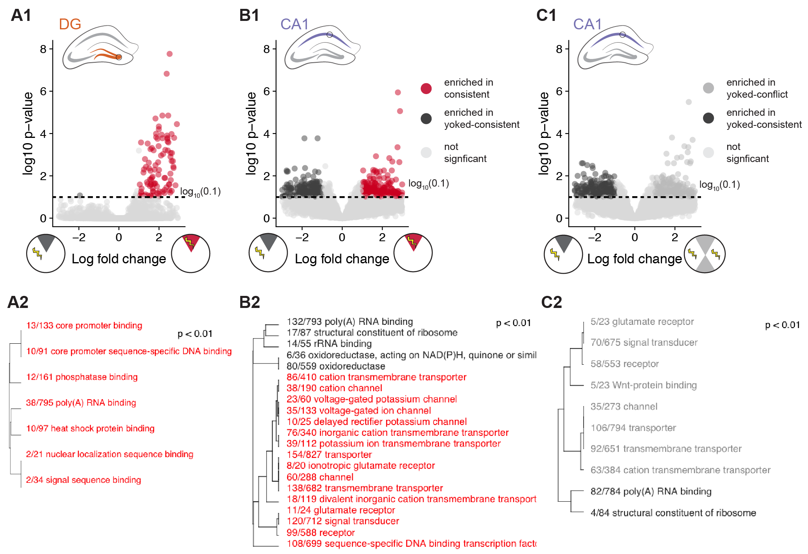

## Summary



```{r setup, message=F}
library(ggplot2) ## for awesome plots!
library(cowplot) ## for some easy to use themes
library(dplyr) ## for filtering and selecting rows
library(car) ## stats
library(VennDiagram) ## venn diagrams
library(pheatmap) ## awesome heatmaps
library(viridis) # for awesome color pallette
library(reshape2) ## for melting dataframe
library(DESeq2) ## for gene expression analysis
library(edgeR)  ## for basic read counts status
library(magrittr) ## to use the weird pipe
library(genefilter)  ## for PCA fuction
library(xtable) # for latex or html tables

## load functions 
source("figureoptions.R")
source("functions_RNAseq.R")

## set output file for figures 
knitr::opts_chunk$set(fig.path = '../figures/02c_rnaseqSubfield/')
```

## DG

```{r DG, message=F, warning=F}
colData <- read.csv("../data/02a_colData.csv", header = T)
countData <- read.csv("../data/02a_countData.csv", header = T, check.names = F, row.names = 1)

colData <- colData %>% 
  filter(Punch %in% c("DG"))  %>% 
  droplevels()

savecols <- as.character(colData$RNAseqID) 
savecols <- as.vector(savecols) 
countData <- countData %>% dplyr::select(one_of(savecols)) 

colData %>% select(APA2,Punch)  %>%  summary()


## create DESeq object using the factors Punch and APA
dds <- DESeqDataSetFromMatrix(countData = countData,
                              colData = colData,
                              design = ~ APA2)

dds # view the DESeq object - note numnber of genes
dds <- dds[ rowSums(counts(dds)) > 1, ]  # Pre-filtering genes with 0 counts
dds # view number of genes afternormalization and the number of samples
dds <- DESeq(dds) # Differential expression analysis
rld <- rlog(dds, blind=FALSE) ## log transformed data
vsd <- getVarianceStabilizedData(dds)

write.csv(colData, file = "../data/02c_DGcolData.csv", row.names = T)
write.csv(vsd, file = "../data/02c_DGvsd.csv", row.names = T)

# create the dataframe using my function pcadataframe
pcadata <- pcadataframe(rld, intgroup=c("Punch","APA2"), returnData=TRUE)
percentVar <- round(100 * attr(pcadata, "percentVar"))
percentVar

summary(aov(PC1 ~ APA2, data=pcadata)) 
TukeyHSD((aov(PC1 ~ APA2, data=pcadata)) , which = "APA2") 

summary(aov(PC2 ~ APA2, data=pcadata)) 
TukeyHSD((aov(PC2 ~ APA2, data=pcadata)), which = "APA2") 

summary(aov(PC3 ~ APA2, data=pcadata)) 

summary(aov(PC4 ~ APA2, data=pcadata)) 

pcadata$APA2 <- factor(pcadata$APA2, levels=c("yoked_consistent", "consistent", "yoked_conflict", "conflict"))
pcadata$wrap <- "Principle Compent Analysis"

contrast1 <- resvals(contrastvector = c("APA2", "consistent", "yoked_consistent"), mypval = 0.1) # 125
contrast2 <- resvals(contrastvector = c("APA2", "conflict", "yoked_conflict"), mypval = 0.1) # 10
contrast3 <- resvals(contrastvector = c("APA2", "conflict", "consistent"), mypval = 0.1) # 1
contrast4 <- resvals(contrastvector = c("APA2", "yoked_conflict", "yoked_consistent"), mypval = 0.1) # 3
```

```{r DGanova, results='asis'}
aov(PC1 ~ APA2, data=pcadata)
summary(aov(PC1 ~ APA2, data=pcadata))
```

### DG contraststs

```{r DGcontrasts}

###  "consistent", "yoked_consistent"
res <- results(dds, contrast =c("APA2", "consistent", "yoked_consistent"), independentFiltering = T, alpha = 0.1)
summary(res)
resOrdered <- res[order(res$padj),]
head(resOrdered, 10)
data <- data.frame(gene = row.names(res),
                   pvalue = -log10(res$padj), 
                   lfc = res$log2FoldChange)
data <- na.omit(data)
data <- data %>%
  mutate(color = ifelse(data$lfc > 0 & data$pvalue > 1, 
                        yes = "consistent", 
                        no = ifelse(data$lfc < 0 & data$pvalue > 1, 
                                    yes = "yoked_consistent", 
                                    no = "none")))
DGvolcano <- ggplot(data, aes(x = lfc, y = pvalue)) + 
  geom_point(aes(color = factor(color)), size = 1, alpha = 0.5, na.rm = T) + # add gene points
  theme_cowplot(font_size = 8, line_size = 0.25) +
  geom_hline(yintercept = 1,  size = 0.25, linetype = 2) + 
  scale_color_manual(values = volcano1)  + 
  scale_y_continuous(limits=c(0, 8)) +
  scale_x_continuous( limits=c(-3, 3),
                      name="Log fold change")+
  ylab(paste0("log10 p-value")) +       
  theme(panel.grid.minor=element_blank(),
        legend.position = "none", # remove legend 
        panel.grid.major=element_blank())
DGvolcano

pdf(file="../figures/02c_rnaseqSubfield/DGvolcano.pdf", width=1.5, height=2)
plot(DGvolcano)
dev.off()

# are any protein kinases differentially expressed?
pkcs <- data[grep("Prkc", data$gene), ]
pkcs # no pkcs are differentially expressed

## go setup
table(res$padj<0.1)
logs <- data.frame(cbind("gene"=row.names(res),"logP"=round(-log(res$pvalue+1e-10,10),1)))
logs$logP=as.numeric(as.character(logs$logP))
sign <- rep(1,nrow(logs))
sign[res$log2FoldChange<0]=-1  ##change to correct model
table(sign)
logs$logP <- logs$logP*sign
write.csv(logs, file = "./02e_GO_MWU/DGconsistentyoked.csv", row.names = F)

## yoked yoked
res <- results(dds, contrast =c("APA2", "yoked_conflict", "yoked_consistent"), independentFiltering = T, alpha = 0.1)
summary(res)
resOrdered <- res[order(res$padj),]
head(resOrdered, 10)
data <- data.frame(gene = row.names(res),
                   pvalue = -log10(res$padj), 
                   lfc = res$log2FoldChange)
data <- na.omit(data)
data <- data %>%
  mutate(color = ifelse(data$lfc > 0 & data$pvalue > 1, 
                        yes = "yoked_conflict", 
                        no = ifelse(data$lfc < 0 & data$pvalue > 1, 
                                    yes = "yoked_consistent", 
                                    no = "none")))
DGvolcano <- ggplot(data, aes(x = lfc, y = pvalue)) + 
  geom_point(aes(color = factor(color)), size = 1, alpha = 0.5, na.rm = T) + # add gene points
  theme_cowplot(font_size = 8, line_size = 0.25) +
  geom_hline(yintercept = 1,  size = 0.25, linetype = 2) + 
  scale_color_manual(values = volcano2)  + 
  scale_y_continuous(limits=c(0, 8)) +
  scale_x_continuous( limits=c(-3, 3),
                      name=NULL)+
  ylab(paste0("log10 p-value")) +       
  theme(panel.grid.minor=element_blank(),
        legend.position = "none", # remove legend 
        panel.grid.major=element_blank())
DGvolcano

pdf(file="../figures/02c_rnaseqSubfield/DGvolcano2.pdf", width=1.5, height=2)
plot(DGvolcano)
dev.off()

## go setup
table(res$padj<0.1)
logs <- data.frame(cbind("gene"=row.names(res),"logP"=round(-log(res$pvalue+1e-10,10),1)))
logs$logP=as.numeric(as.character(logs$logP))
sign <- rep(1,nrow(logs))
sign[res$log2FoldChange<0]=-1  ##change to correct model
table(sign)
logs$logP <- logs$logP*sign
write.csv(logs, file = "./02e_GO_MWU/DGyokedyoked.csv", row.names = F)


##  "conflict", "yoked_conflict"
res <- results(dds, contrast =c("APA2", "conflict", "yoked_conflict"), independentFiltering = T, alpha = 0.1)
summary(res)
resOrdered <- res[order(res$padj),]
head(resOrdered, 10)
data <- data.frame(gene = row.names(res),
                   pvalue = -log10(res$padj), 
                   lfc = res$log2FoldChange)
data <- na.omit(data)
data <- data %>%
  mutate(color = ifelse(data$lfc > 0 & data$pvalue > 1, 
                        yes = "conflict", 
                        no = ifelse(data$lfc < 0 & data$pvalue > 1, 
                                    yes = "yoked_conflict", 
                                    no = "none")))
DGvolcano <- ggplot(data, aes(x = lfc, y = pvalue)) + 
  geom_point(aes(color = factor(color)), size = 1, alpha = 0.5, na.rm = T) + # add gene points
  theme_cowplot(font_size = 8, line_size = 0.25) +
  geom_hline(yintercept = 1,  size = 0.25, linetype = 2) + 
  scale_color_manual(values = volcano4)  + 
  scale_y_continuous(limits=c(0, 8)) +
  scale_x_continuous( limits=c(-3, 3),
                      name=NULL)+
  ylab(paste0("log10 p-value")) +       
  theme(panel.grid.minor=element_blank(),
        legend.position = "none", # remove legend 
        panel.grid.major=element_blank())
DGvolcano

pdf(file="../figures/02c_rnaseqSubfield/DGvolcano3.pdf", width=1.5, height=2)
plot(DGvolcano)
dev.off()

## go setup
table(res$padj<0.1)
logs <- data.frame(cbind("gene"=row.names(res),"logP"=round(-log(res$pvalue+1e-10,10),1)))
logs$logP=as.numeric(as.character(logs$logP))
sign <- rep(1,nrow(logs))
sign[res$log2FoldChange<0]=-1  ##change to correct model
table(sign)
logs$logP <- logs$logP*sign
write.csv(logs, file = "./02e_GO_MWU/DGconflictyoked.csv", row.names = F)


#### "conflict", "consistent"
res <- results(dds, contrast =c("APA2", "conflict", "consistent"), independentFiltering = T, alpha = 0.1)
summary(res)
resOrdered <- res[order(res$padj),]
head(resOrdered, 10)
data <- data.frame(gene = row.names(res),
                   pvalue = -log10(res$padj), 
                   lfc = res$log2FoldChange)
data <- na.omit(data)
data <- data %>%
  mutate(color = ifelse(data$lfc > 0 & data$pvalue > 1, 
                        yes = "conflict", 
                        no = ifelse(data$lfc < 0 & data$pvalue > 1, 
                                    yes = "consistent", 
                                    no = "none")))
DGvolcano <- ggplot(data, aes(x = lfc, y = pvalue)) + 
  geom_point(aes(color = factor(color)), size = 1, alpha = 0.5, na.rm = T) + # add gene points
  theme_cowplot(font_size = 8, line_size = 0.25) +
  geom_hline(yintercept = 1,  size = 0.25, linetype = 2) + 
  scale_color_manual(values = volcano2)  + 
  scale_y_continuous(limits=c(0, 8)) +
  scale_x_continuous( limits=c(-3, 3),
                      name=NULL)+
  ylab(paste0("log10 p-value")) +       
  theme(panel.grid.minor=element_blank(),
        legend.position = "none", # remove legend 
        panel.grid.major=element_blank())
DGvolcano

pdf(file="../figures/02c_rnaseqSubfield/DGvolcano4.pdf", width=1.5, height=2)
plot(DGvolcano)
dev.off()

## go setup
table(res$padj<0.1)
logs <- data.frame(cbind("gene"=row.names(res),"logP"=round(-log(res$pvalue+1e-10,10),1)))
logs$logP=as.numeric(as.character(logs$logP))
sign <- rep(1,nrow(logs))
sign[res$log2FoldChange<0]=-1  ##change to correct model
table(sign)
logs$logP <- logs$logP*sign
write.csv(logs, file = "./02e_GO_MWU/DGconflictconsistent.csv", row.names = F)
```


## plot single gene counts for Prkcz

```{r prkcz}
plotCounts(dds, "Prkcz", intgroup = "APA2", normalized = TRUE, main="Prkcz in DG")
```


```{r}
# order results table by the smallest adjusted p value:
res <- res[order(res$padj),]

results = as.data.frame(dplyr::mutate(as.data.frame(res), sig=ifelse(res$padj<0.05, "FDR<0.05", "Not Sig")), row.names=rownames(res))
head(results)
```

## venn diagrams

```{r DGvenndiagrams, echo=F}
rldpadjs <- assay(rld)
rldpadjs <- cbind(rldpadjs, contrast1, contrast2, contrast4)
rldpadjs <- as.data.frame(rldpadjs)
rldpadjs <- rldpadjs[ , grepl( "padj" , names( rldpadjs ) ) ]

venn1 <- row.names(rldpadjs[rldpadjs[1] <0.05 & !is.na(rldpadjs[1]),]) 
venn2 <- row.names(rldpadjs[rldpadjs[2] <0.05 & !is.na(rldpadjs[2]),]) 
venn3 <- row.names(rldpadjs[rldpadjs[3] <0.05 & !is.na(rldpadjs[3]),]) 

candidates <- list("consistent vs yoked" = venn1 , "conflict vs yoked" = venn2,  "yoked vs yoked" = venn3)

prettyvenn <- venn.diagram(
  scaled=T,
  x = candidates, filename=NULL, 
  col = "black",
  fill = c( "white", "white", "white"),
  alpha = 0.5,
  cex = 1, fontfamily = "sans", #fontface = "bold",
  cat.default.pos = "text",
  cat.dist = c(0.03, 0.03, 0.02), cat.pos = 1,
  cat.cex = 1, cat.fontfamily = "sans")
grid.draw(prettyvenn)
```


## CA3

```{r CA3, message=F, warning=F}
colData <- read.csv("../data/02a_colData.csv", header = T)
countData <- read.csv("../data/02a_countData.csv", header = T, check.names = F, row.names = 1)

colData <- colData %>% 
  filter(Punch %in% c("CA3"))  %>% 
  droplevels()
savecols <- as.character(colData$RNAseqID) 
savecols <- as.vector(savecols) 
countData <- countData %>% dplyr::select(one_of(savecols)) 
colData %>% select(APA2,Punch)  %>%  summary()

## create DESeq object using the factors Punch and APA
dds <- DESeqDataSetFromMatrix(countData = countData,
                              colData = colData,
                              design = ~ APA2)

dds # view the DESeq object - note numnber of genes
dds <- dds[ rowSums(counts(dds)) > 1, ]  # Pre-filtering genes with 0 counts
dds # view number of genes afternormalization and the number of samples
dds <- DESeq(dds) # Differential expression analysis
rld <- rlog(dds, blind=FALSE) ## log transformed data

# create the dataframe using my function pcadataframe
pcadata <- pcadataframe(rld, intgroup=c("Punch","APA2"), returnData=TRUE)
percentVar <- round(100 * attr(pcadata, "percentVar"))
percentVar

summary(aov(PC1 ~ APA2, data=pcadata))
summary(aov(PC2 ~ APA2, data=pcadata))
summary(aov(PC3 ~ APA2, data=pcadata))
summary(aov(PC4 ~ APA2, data=pcadata))
summary(aov(PC5 ~ APA2, data=pcadata))
summary(aov(PC6 ~ APA2, data=pcadata))

pcadata$APA2 <- factor(pcadata$APA2, levels=c("yoked_consistent", "consistent", "yoked_conflict", "conflict"))
pcadata$wrap <- "Principle Compent Analysis"

 
#calculate significance of all two way comparisions
# see source "functions_RNAseq.R" 
contrast1 <- resvals(contrastvector = c("APA2", "consistent", "yoked_consistent"), mypval = 0.1) # 0
contrast2 <- resvals(contrastvector = c("APA2", "conflict", "yoked_conflict"), mypval = 0.1) # 0
contrast3 <- resvals(contrastvector = c("APA2", "conflict", "consistent"), mypval = 0.1) # 1
contrast4 <- resvals(contrastvector = c("APA2", "yoked_conflict", "yoked_consistent"), mypval = 0.1) # 0


res <- results(dds, contrast =c("APA2", "consistent", "yoked_consistent"), independentFiltering = T, alpha = 0.1)
summary(res)
res <- results(dds, contrast =c("APA2", "conflict", "yoked_conflict"), independentFiltering = T, alpha = 0.1)
summary(res)


res <- results(dds, contrast =c("APA2", "yoked_conflict", "yoked_consistent"), independentFiltering = T, alpha = 0.1)
summary(res)


res <- results(dds, contrast =c("APA2", "conflict", "consistent"), independentFiltering = T, alpha = 0.1)
summary(res)

## go setup
table(res$padj<0.1)
logs <- data.frame(cbind("gene"=row.names(res),"logP"=round(-log(res$pvalue+1e-10,10),1)))
logs$logP=as.numeric(as.character(logs$logP))
sign <- rep(1,nrow(logs))
sign[res$log2FoldChange<0]=-1  ##change to correct model
table(sign)
logs$logP <- logs$logP*sign
write.csv(logs, file = "./02e_GO_MWU/CA3conflictconsistent.csv", row.names = F)

plotCounts(dds, "Prkcz", intgroup = "APA2", normalized = TRUE, main="Prkcz in CA3")
```


## CA1

```{r CA1, message=F, warning=F}
colData <- read.csv("../data/02a_colData.csv", header = T)
countData <- read.csv("../data/02a_countData.csv", header = T, check.names = F, row.names = 1)
colData <- colData %>% 
  filter(Punch %in% c("CA1"))  %>% 
  droplevels()
savecols <- as.character(colData$RNAseqID) 
savecols <- as.vector(savecols) 
countData <- countData %>% dplyr::select(one_of(savecols)) 
colData %>% select(APA2,Punch)  %>%  summary()
dds <- DESeqDataSetFromMatrix(countData = countData,
                              colData = colData,
                              design = ~ APA2)

dds # view the DESeq object - note numnber of genes
dds <- dds[ rowSums(counts(dds)) > 1, ]  # Pre-filtering genes with 0 counts
dds # view number of genes afternormalization and the number of samples
dds <- DESeq(dds) # Differential expression analysis
rld <- rlog(dds, blind=FALSE) ## log transformed data


# PCA analysis
pcadata <- pcadataframe(rld, intgroup=c("Punch","APA2"), returnData=TRUE)
percentVar <- round(100 * attr(pcadata, "percentVar"))
percentVar
summary(aov(PC1 ~ APA2, data=pcadata)) 
TukeyHSD((aov(PC1 ~ APA2, data=pcadata)), which = "APA2") 
summary(aov(PC2 ~ APA2, data=pcadata)) 
TukeyHSD((aov(PC2 ~ APA2, data=pcadata)) , which = "APA2") 
summary(aov(PC3 ~ APA2, data=pcadata))
summary(aov(PC4 ~ APA2, data=pcadata))

pcadata$APA2 <- factor(pcadata$APA2, levels=c("yoked_consistent", "consistent", "yoked_conflict", "conflict"))

res <- results(dds, contrast =c("APA2", "consistent", "yoked_consistent"), independentFiltering = T, alpha = 0.1)
summary(res)
resOrdered <- res[order(res$padj),]
head(resOrdered, 10)

topGene <- rownames(res)[which.min(res$padj)]
plotCounts(dds, gene = topGene, intgroup=c("APA2"))

data <- data.frame(gene = row.names(res),
                   pvalue = -log10(res$padj), 
                   lfc = res$log2FoldChange)
data <- na.omit(data)
data <- data %>%
  mutate(color = ifelse(data$lfc > 0 & data$pvalue > 1, 
                        yes = "consistent", 
                        no = ifelse(data$lfc < 0 & data$pvalue > 1, 
                                    yes = "yoked_consistent", 
                                    no = "none")))
top_labelled <- top_n(data, n = 5, wt = lfc)

pcadata$wrap <- "CA1 PCA"
data$wrap <- "CA1 contrasts"

CA1volcano <- ggplot(data, aes(x = lfc, y = pvalue)) + 
  geom_point(aes(color = factor(color)), size = 1, alpha = 0.5, na.rm = T) + # add gene points
    theme_cowplot(font_size = 8, line_size = 0.25) +
  scale_color_manual(values = volcano1)  + 
  geom_hline(yintercept = 1,  size = 0.25, linetype = 2) + 
  scale_y_continuous(limits=c(0, 8)) +
  scale_x_continuous( limits=c(-3, 3),
                      name="Log fold change")+
  ylab(paste0("log10 p-value")) +       
  theme(panel.grid.minor=element_blank(),
        legend.position = "none", # remove legend 
        panel.grid.major=element_blank())
CA1volcano

pdf(file="../figures/02c_rnaseqSubfield/CA1volcano.pdf",  width=1.5, height=2)
plot(CA1volcano)
dev.off()

## go setup
table(res$padj<0.1)
logs <- data.frame(cbind("gene"=row.names(res),"logP"=round(-log(res$pvalue+1e-10,10),1)))
logs$logP=as.numeric(as.character(logs$logP))
sign <- rep(1,nrow(logs))
sign[res$log2FoldChange<0]=-1  ##change to correct model
table(sign)
logs$logP <- logs$logP*sign
write.csv(logs, file = "./02e_GO_MWU/CA1consistentyoked.csv", row.names = F)


res <- results(dds, contrast =c("APA2", "yoked_conflict", "yoked_consistent"), independentFiltering = T, alpha = 0.1)
summary(res)
resOrdered <- res[order(res$padj),]
head(resOrdered, 10)

topGene <- rownames(res)[which.min(res$padj)]
plotCounts(dds, gene = topGene, intgroup=c("APA2"))

data <- data.frame(gene = row.names(res),
                   pvalue = -log10(res$padj), 
                   lfc = res$log2FoldChange)
data <- na.omit(data)
data <- data %>%
  mutate(color = ifelse(data$lfc > 0 & data$pvalue > 1, 
                        yes = "yoked_conflict", 
                        no = ifelse(data$lfc < 0 & data$pvalue > 1, 
                                    yes = "yoked_consistent", 
                                    no = "none")))
top_labelled <- top_n(data, n = 5, wt = lfc)

pcadata$wrap <- "CA1 PCA"
data$wrap <- "CA1 contrasts"

CA1volcano2 <- ggplot(data, aes(x = lfc, y = pvalue)) + 
  geom_point(aes(color = factor(color)), size = 1, alpha = 0.5, na.rm = T) + # add gene points
  theme_cowplot(font_size = 8, line_size = 0.25) +
  scale_color_manual(values = volcano3)  + 
  geom_hline(yintercept = 1,  size = 0.25, linetype = 2) + 
  scale_y_continuous(limits=c(0, 8)) +
  scale_x_continuous( limits=c(-3, 3),
                      name="Log fold change")+
  ylab(paste0("log10 p-value")) +       
  theme(panel.grid.minor=element_blank(),
        legend.position = "none", # remove legend 
        panel.grid.major=element_blank())
CA1volcano2

pdf(file="../figures/02c_rnaseqSubfield/CA1volcano2.pdf",  width=1.5, height=2)
plot(CA1volcano2)
dev.off()

res <- results(dds, contrast =c("APA2", "conflict", "consistent"), independentFiltering = T, alpha = 0.1)
summary(res)
resOrdered <- res[order(res$padj),]
head(resOrdered, 10)
data <- data.frame(gene = row.names(res),
                   pvalue = -log10(res$padj), 
                   lfc = res$log2FoldChange)
data <- na.omit(data)
data <- data %>%
  mutate(color = ifelse(data$lfc > 0 & data$pvalue > 1, 
                        yes = "conflict", 
                        no = ifelse(data$lfc < 0 & data$pvalue > 1, 
                                    yes = "consistent", 
                                    no = "none")))
CA1volcano <- ggplot(data, aes(x = lfc, y = pvalue)) + 
  geom_point(aes(color = factor(color)), size = 1, alpha = 0.5, na.rm = T) + # add gene points
  theme_cowplot(font_size = 8, line_size = 0.25) +
  geom_hline(yintercept = 1,  size = 0.25, linetype = 2) + 
  scale_color_manual(values = volcano2)  + 
  scale_y_continuous(limits=c(0, 8)) +
  scale_x_continuous( limits=c(-3, 3),
                      name="Log fold change")+
  ylab(paste0("log10 p-value")) +       
  theme(panel.grid.minor=element_blank(),
        legend.position = "none", # remove legend 
        panel.grid.major=element_blank())
CA1volcano

pdf(file="../figures/02c_rnaseqSubfield/CA1volcano4.pdf", width=1.5, height=2)
plot(DGvolcano)
dev.off()

plotCounts(dds, "Prkcz", intgroup = "APA2", normalized = TRUE, main="Prkcz in CA1")
```
