Subfield analysis
-----------------

This script is used to identify treatement differences within each
subfield, generate volcano plots, venn diagrams, and tables for
subsequent GO analyses. The final mutlipanel figures for the manuscript
have been inserted just below the subheadings.

    library(tidyverse)
    library(cowplot) ## for some easy to use themes
    library(DESeq2) ## for gene expression analysis
    library(UpSetR)
    #devtools::install_github("clauswilke/ggtextures")
    library(ggtextures)
    library(magick)
    library(ggtext) # for markdown in plots

    library(BiocParallel)
    register(MulticoreParam(6))

    ## load functions 
    source("figureoptions.R")
    source("functions_RNAseq.R")

    ## set output file for figures 
    knitr::opts_chunk$set(fig.path = '../figures/02c_rnaseqSubfield/', cache = F)

Get varience stabilized gene expression for each tissue
-------------------------------------------------------

    a.colData <- read.csv("../data/02a_colData.csv", header = T)
    a.countData <- read.csv("../data/02a_countData.csv", header = T, check.names = F, row.names = 1)

    returndds <- function(mytissue){
      print(mytissue)
      colData <- a.colData %>% 
        filter(Punch %in% c(mytissue))  %>% 
      droplevels()
      
      savecols <- as.character(colData$RNAseqID) 
      savecols <- as.vector(savecols) 
      countData <- a.countData %>% dplyr::select(one_of(savecols)) 

      ## create DESeq object using the factors Punch and APA
      dds <- DESeqDataSetFromMatrix(countData = countData,
                                  colData = colData,
                                  design = ~ APA2)

      dds <- dds[ rowSums(counts(dds)) > 1, ]  # Pre-filtering genes with 0 counts
      dds <- DESeq(dds, parallel = TRUE)
      return(dds)
    }

    DGdds <- returndds("DG") 

    ## [1] "DG"

    ## estimating size factors

    ## estimating dispersions

    ## gene-wise dispersion estimates: 6 workers

    ## mean-dispersion relationship

    ## final dispersion estimates, fitting model and testing: 6 workers

    CA1dds <- returndds("CA1") 

    ## [1] "CA1"

    ## estimating size factors

    ## estimating dispersions

    ## gene-wise dispersion estimates: 6 workers

    ## mean-dispersion relationship

    ## final dispersion estimates, fitting model and testing: 6 workers

    CA3dds <- returndds("CA3") 

    ## [1] "CA3"

    ## estimating size factors

    ## estimating dispersions

    ## gene-wise dispersion estimates: 6 workers

    ## mean-dispersion relationship

    ## final dispersion estimates, fitting model and testing: 6 workers

    returnvsds <- function(mydds, vsdfilename){
      dds <- mydds
      vsd <- vst(dds, blind=FALSE) ## variance stabilized
      print(head(assay(vsd),3))
      return(write.csv(assay(vsd), file = vsdfilename, row.names = T))
    }

    returnvsds(DGdds, "../data/02c_DGvsd.csv")

    ##               143A-DG-1 143B-DG-1 143D-DG-3 144A-DG-2 144C-DG-2 144D-DG-2
    ## 0610007P14Rik  6.381145  6.405587  6.834813  6.513173  6.401366  6.637581
    ## 0610009B22Rik  5.781124  5.661825  5.299160  5.528657  5.821796  5.670620
    ## 0610009L18Rik  5.405848  5.593055  5.422004  5.000789  5.507750  5.506319
    ##               145A-DG-2 145B-DG-1 146A-DG-2 146B-DG-2 146C-DG-4 146D-DG-3
    ## 0610007P14Rik  6.562833  6.126760  6.298333  5.996243  6.929322  7.411893
    ## 0610009B22Rik  5.942028  5.787857  5.679794  5.996243  6.060620  5.000789
    ## 0610009L18Rik  5.256496  5.000789  5.679794  5.000789  5.000789  5.000789
    ##               147C-DG-3 147D-DG-1 148A-DG-3 148B-DG-4
    ## 0610007P14Rik  6.298159  6.481476  6.493581  6.349976
    ## 0610009B22Rik  5.910805  5.893873  5.589261  5.492981
    ## 0610009L18Rik  5.257050  5.718223  5.505647  5.349661

    returnvsds(CA1dds, "../data/02c_CA1vsd.csv")

    ##               143B-CA1-1 143C-CA1-1 143D-CA1-3 144A-CA1-2 144B-CA1-1
    ## 0610007P14Rik   7.520142   7.151097   7.348321   7.355004   7.389284
    ## 0610009B22Rik   7.035970   6.906418   6.301096   6.955307   6.790054
    ## 0610009L18Rik   6.811049   6.498778   6.301096   6.661562   6.432357
    ##               144C-CA1-2 145A-CA1-2 145B-CA1-1 146A-CA1-2 146B-CA1-2
    ## 0610007P14Rik   7.197450   7.402112   7.364954   7.156319   7.035597
    ## 0610009B22Rik   6.743802   6.883948   6.887177   6.920446   6.802964
    ## 0610009L18Rik   6.463299   6.747507   6.564639   6.755012   6.301096
    ##               146C-CA1-4 146D-CA1-3 147C-CA1-3 148A-CA1-3 148B-CA1-4
    ## 0610007P14Rik   7.401377   7.464466   7.267392   7.328133   7.190380
    ## 0610009B22Rik   6.782624   6.920474   6.787440   6.987979   6.301096
    ## 0610009L18Rik   6.846384   6.301096   6.468607   6.661247   6.301096

    returnvsds(CA3dds, "../data/02c_CA3vsd.csv")

    ##               143A-CA3-1 144A-CA3-2 144B-CA3-1 144C-CA3-2 144D-CA3-2
    ## 0610007P14Rik   7.090155   7.589689   7.267022   7.034300   6.919678
    ## 0610009B22Rik   6.500788   7.011651   6.577337   6.947298   6.425407
    ## 0610009L18Rik   6.087226   6.714029   6.321004   6.277450   6.321271
    ##               145A-CA3-2 146A-CA3-2 146B-CA3-2 146D-CA3-3 147C-CA3-3
    ## 0610007P14Rik   6.825848   7.267048   6.799319   7.157725   7.172640
    ## 0610009B22Rik   6.919473   6.288754   6.934486   6.515827   6.403921
    ## 0610009L18Rik   5.797921   6.288754   6.049110   6.196801   6.166572
    ##               147D-CA3-1 148A-CA3-3 148B-CA3-4
    ## 0610007P14Rik   6.881145   6.962549   7.295192
    ## 0610009B22Rik   6.586876   6.578744   6.732213
    ## 0610009L18Rik   6.171145   6.223238   6.265907

Res summary
-----------

    res_summary_subfield <- function(mydds, mycontrast){
      res <- results(mydds, contrast = mycontrast, independentFiltering = T)
      print(mycontrast)
      print(sum(res$padj < 0.1, na.rm=TRUE))
      print(summary(res))
      print(head((res[order(res$padj),]), 5))
      cat("\n")
    }

    print("DG")

    ## [1] "DG"

    res_summary_subfield(DGdds, c("APA2", "standard.trained", "standard.yoked"))

    ## [1] "APA2"             "standard.trained" "standard.yoked"  
    ## [1] 125
    ## 
    ## out of 17011 with nonzero total read count
    ## adjusted p-value < 0.1
    ## LFC > 0 (up)       : 119, 0.7%
    ## LFC < 0 (down)     : 6, 0.035%
    ## outliers [1]       : 20, 0.12%
    ## low counts [2]     : 4608, 27%
    ## (mean count < 4)
    ## [1] see 'cooksCutoff' argument of ?results
    ## [2] see 'independentFiltering' argument of ?results
    ## 
    ## NULL
    ## log2 fold change (MLE): APA2 standard.trained vs standard.yoked 
    ## Wald test p-value: APA2 standard.trained vs standard.yoked 
    ## DataFrame with 5 rows and 6 columns
    ##                baseMean   log2FoldChange             lfcSE
    ##               <numeric>        <numeric>         <numeric>
    ## Smad7  171.392871064045 3.53587630547506  0.41808526303872
    ## Sgk1   341.089572273562 2.52942417595992 0.361917138646057
    ## Lmna   127.261228543472 2.38190944527425 0.360880330406286
    ## Tiparp 146.843901753813 3.00078251229084 0.456274430143758
    ## Fzd5   26.8401177227407  4.0565435659187 0.655253175627174
    ##                    stat               pvalue                 padj
    ##               <numeric>            <numeric>            <numeric>
    ## Smad7  8.45730911387707 2.73617919432214e-17 3.38821069632911e-13
    ## Sgk1   6.98895936628636 2.76932605924933e-12 1.71462822958423e-08
    ## Lmna    6.6002750623528 4.10395626987666e-11 1.48901360368768e-07
    ## Tiparp 6.57670540807072 4.80986385750685e-11 1.48901360368768e-07
    ## Fzd5   6.19080336701305 5.98583433783008e-10   1.482451732107e-06

    res_summary_subfield(DGdds, c("APA2", "conflict.trained", "conflict.yoked"))

    ## [1] "APA2"             "conflict.trained" "conflict.yoked"  
    ## [1] 10
    ## 
    ## out of 17011 with nonzero total read count
    ## adjusted p-value < 0.1
    ## LFC > 0 (up)       : 8, 0.047%
    ## LFC < 0 (down)     : 2, 0.012%
    ## outliers [1]       : 20, 0.12%
    ## low counts [2]     : 0, 0%
    ## (mean count < 0)
    ## [1] see 'cooksCutoff' argument of ?results
    ## [2] see 'independentFiltering' argument of ?results
    ## 
    ## NULL
    ## log2 fold change (MLE): APA2 conflict.trained vs conflict.yoked 
    ## Wald test p-value: APA2 conflict.trained vs conflict.yoked 
    ## DataFrame with 5 rows and 6 columns
    ##                 baseMean    log2FoldChange             lfcSE
    ##                <numeric>         <numeric>         <numeric>
    ## Rps12   18.1519752295379 -21.4660372192577  3.98668946398745
    ## Smad7   171.392871064045  1.75395877648965 0.367789349201327
    ## Dbpht2  179.735977990203  1.43077032427045  0.32133350449587
    ## Insm1   9.54062645923209 -4.64275029978559  1.03675452753152
    ## Slc16a1 51.2786850104172  1.93718965194581  0.44615480868175
    ##                      stat               pvalue                padj
    ##                 <numeric>            <numeric>           <numeric>
    ## Rps12    -5.3844267062094 7.26759098589968e-08 0.00123483638441421
    ## Smad7    4.76892215693155 1.85214205935404e-06  0.0157348728652423
    ## Dbpht2   4.45260237184151 8.48357705071016e-06  0.0360361144171541
    ## Insm1   -4.47815772827133 7.52899657211816e-06  0.0360361144171541
    ## Slc16a1  4.34196743876774 1.41212464862805e-05  0.0479868198096785

    res_summary_subfield(DGdds, c("APA2", "conflict.trained", "standard.trained"))

    ## [1] "APA2"             "conflict.trained" "standard.trained"
    ## [1] 1
    ## 
    ## out of 17011 with nonzero total read count
    ## adjusted p-value < 0.1
    ## LFC > 0 (up)       : 0, 0%
    ## LFC < 0 (down)     : 1, 0.0059%
    ## outliers [1]       : 20, 0.12%
    ## low counts [2]     : 0, 0%
    ## (mean count < 0)
    ## [1] see 'cooksCutoff' argument of ?results
    ## [2] see 'independentFiltering' argument of ?results
    ## 
    ## NULL
    ## log2 fold change (MLE): APA2 conflict.trained vs standard.trained 
    ## Wald test p-value: APA2 conflict.trained vs standard.trained 
    ## DataFrame with 5 rows and 6 columns
    ##                       baseMean     log2FoldChange             lfcSE
    ##                      <numeric>          <numeric>         <numeric>
    ## Rps12         18.1519752295379  -20.9602515356945  4.31657511842761
    ## 0610007P14Rik 41.0311096797814 -0.147853585332256  0.40193698903432
    ## 0610009B22Rik 8.74131849081542 -0.757911677382372 0.749958107206416
    ## 0610009L18Rik 2.61860548764425  0.604880308171301  1.47685825831006
    ## 0610009O20Rik 48.3693444464377  0.245771257499093 0.338998927487014
    ##                             stat               pvalue               padj
    ##                        <numeric>            <numeric>          <numeric>
    ## Rps12          -4.85575970778651 1.19926059767804e-06 0.0203766368151477
    ## 0610007P14Rik -0.367852646972064    0.712983110470875                  1
    ## 0610009B22Rik  -1.01060535261841    0.312205352935413                  1
    ## 0610009L18Rik  0.409572350472858    0.682119683047902                  1
    ## 0610009O20Rik  0.724991253869108    0.468457396038969                  1

    res_summary_subfield(DGdds, c("APA2", "conflict.yoked", "standard.yoked"))

    ## [1] "APA2"           "conflict.yoked" "standard.yoked"
    ## [1] 3
    ## 
    ## out of 17011 with nonzero total read count
    ## adjusted p-value < 0.1
    ## LFC > 0 (up)       : 3, 0.018%
    ## LFC < 0 (down)     : 0, 0%
    ## outliers [1]       : 20, 0.12%
    ## low counts [2]     : 0, 0%
    ## (mean count < 0)
    ## [1] see 'cooksCutoff' argument of ?results
    ## [2] see 'independentFiltering' argument of ?results
    ## 
    ## NULL
    ## log2 fold change (MLE): APA2 conflict.yoked vs standard.yoked 
    ## Wald test p-value: APA2 conflict.yoked vs standard.yoked 
    ## DataFrame with 5 rows and 6 columns
    ##                baseMean   log2FoldChange             lfcSE
    ##               <numeric>        <numeric>         <numeric>
    ## Nlrp3  20.9424446578681 4.09843296363232 0.779233741328829
    ## Kcnc2  22.0989714545398 4.08535721746691 0.828862391056504
    ## Gm2115 18.9055674115327 3.48302773153955 0.740349228153146
    ## Rnase4 15.5820343950564 3.55390988656487 0.842613820540234
    ## Cxcl14 58.4698286328215 1.83345102741098 0.452447198853329
    ##                    stat               pvalue                padj
    ##               <numeric>            <numeric>           <numeric>
    ## Nlrp3  5.25956814529521 1.44394111647505e-07 0.00245340035100275
    ## Kcnc2  4.92887270739783 8.27054360272546e-07 0.00702624031769541
    ## Gm2115 4.70457400249908 2.54396580238634e-06  0.0144081743161154
    ## Rnase4 4.21772085851418   2.467840582522e-05   0.104827698344078
    ## Cxcl14 4.05229832797648 5.07169366555326e-05   0.172346294142831

    print("CA3")

    ## [1] "CA3"

    res_summary_subfield(CA3dds, c("APA2", "standard.trained", "standard.yoked"))

    ## [1] "APA2"             "standard.trained" "standard.yoked"  
    ## [1] 1
    ## 
    ## out of 16502 with nonzero total read count
    ## adjusted p-value < 0.1
    ## LFC > 0 (up)       : 1, 0.0061%
    ## LFC < 0 (down)     : 0, 0%
    ## outliers [1]       : 11, 0.067%
    ## low counts [2]     : 0, 0%
    ## (mean count < 0)
    ## [1] see 'cooksCutoff' argument of ?results
    ## [2] see 'independentFiltering' argument of ?results
    ## 
    ## NULL
    ## log2 fold change (MLE): APA2 standard.trained vs standard.yoked 
    ## Wald test p-value: APA2 standard.trained vs standard.yoked 
    ## DataFrame with 5 rows and 6 columns
    ##                 baseMean    log2FoldChange             lfcSE
    ##                <numeric>         <numeric>         <numeric>
    ## Sco2     16.986291670521  7.92174450889184  1.50710763233514
    ## Gm4724  26.6657624126106 -3.76035421007666 0.945534529476208
    ## Timm8a1 20.5957841890406 -4.89346615840032   1.2488404570656
    ## Cxcl16  8.21166206646085  6.23926422663909  1.62628041398624
    ## Slc9a2  110.174378859642 -1.43724299352791 0.380113842295082
    ##                      stat               pvalue               padj
    ##                 <numeric>            <numeric>          <numeric>
    ## Sco2     5.25625664612801  1.4701709146683e-07 0.0024244588553795
    ## Gm4724  -3.97696127729969 6.98015262057288e-05  0.489979606162154
    ## Timm8a1 -3.91840777636118 8.91358206589329e-05  0.489979606162154
    ## Cxcl16   3.83652423836661 0.000124787885120601  0.514469253380959
    ## Slc9a2  -3.78108564752605 0.000156145939354006  0.515000537177384

    res_summary_subfield(CA3dds, c("APA2", "conflict.trained", "conflict.yoked"))

    ## [1] "APA2"             "conflict.trained" "conflict.yoked"  
    ## [1] 0
    ## 
    ## out of 16502 with nonzero total read count
    ## adjusted p-value < 0.1
    ## LFC > 0 (up)       : 0, 0%
    ## LFC < 0 (down)     : 0, 0%
    ## outliers [1]       : 11, 0.067%
    ## low counts [2]     : 0, 0%
    ## (mean count < 0)
    ## [1] see 'cooksCutoff' argument of ?results
    ## [2] see 'independentFiltering' argument of ?results
    ## 
    ## NULL
    ## log2 fold change (MLE): APA2 conflict.trained vs conflict.yoked 
    ## Wald test p-value: APA2 conflict.trained vs conflict.yoked 
    ## DataFrame with 5 rows and 6 columns
    ##                       baseMean     log2FoldChange             lfcSE
    ##                      <numeric>          <numeric>         <numeric>
    ## 0610007P14Rik 50.0970679173046 0.0655194925678776 0.438705242691406
    ## 0610009B22Rik 21.5320776710641 -0.380549726690321 0.666530809010441
    ## 0610009L18Rik  5.9297800747599   0.44296923957109   1.0527471158624
    ## 0610009O20Rik 54.9226365635042  0.659303979047601 0.371673115786175
    ## 0610010F05Rik 81.1189135690452 -0.128908330830839 0.367548236468482
    ##                             stat             pvalue      padj
    ##                        <numeric>          <numeric> <numeric>
    ## 0610007P14Rik  0.149347411865705  0.881279505484552         1
    ## 0610009B22Rik -0.570940940082426  0.568039677980193         1
    ## 0610009L18Rik  0.420774593344021  0.673919685718428         1
    ## 0610009O20Rik   1.77388127105459 0.0760827913081367         1
    ## 0610010F05Rik -0.350724933601724  0.725794718038016         1

    res_summary_subfield(CA3dds, c("APA2", "conflict.trained", "standard.trained"))

    ## [1] "APA2"             "conflict.trained" "standard.trained"
    ## [1] 0
    ## 
    ## out of 16502 with nonzero total read count
    ## adjusted p-value < 0.1
    ## LFC > 0 (up)       : 0, 0%
    ## LFC < 0 (down)     : 0, 0%
    ## outliers [1]       : 11, 0.067%
    ## low counts [2]     : 0, 0%
    ## (mean count < 0)
    ## [1] see 'cooksCutoff' argument of ?results
    ## [2] see 'independentFiltering' argument of ?results
    ## 
    ## NULL
    ## log2 fold change (MLE): APA2 conflict.trained vs standard.trained 
    ## Wald test p-value: APA2 conflict.trained vs standard.trained 
    ## DataFrame with 5 rows and 6 columns
    ##                baseMean    log2FoldChange             lfcSE
    ##               <numeric>         <numeric>         <numeric>
    ## Oprd1  32.4628391128719  -2.6054295356723  0.59719635196684
    ## Slc9a2 110.174378859642  1.57516503162597 0.358342515343683
    ## Crnkl1 21.7428570562243  3.14654963431251 0.786655505470721
    ## Erdr1  262.410626549465  1.89155691179592  0.48620849732585
    ## Rbms3   43.042274770408 -2.03862535371239 0.533990516252202
    ##                     stat               pvalue              padj
    ##                <numeric>            <numeric>         <numeric>
    ## Oprd1  -4.36276867246666 1.28426719131902e-05  0.10589425126021
    ## Slc9a2   4.3956967543057 1.10417994795374e-05  0.10589425126021
    ## Crnkl1   3.9999079805965 6.33671181547187e-05 0.348329048496489
    ## Erdr1   3.89042339284381 0.000100069465948346  0.37019987439438
    ## Rbms3  -3.81771827713425 0.000134691604291206  0.37019987439438

    res_summary_subfield(CA3dds, c("APA2", "conflict.yoked", "standard.yoked"))

    ## [1] "APA2"           "conflict.yoked" "standard.yoked"
    ## [1] 2
    ## 
    ## out of 16502 with nonzero total read count
    ## adjusted p-value < 0.1
    ## LFC > 0 (up)       : 1, 0.0061%
    ## LFC < 0 (down)     : 1, 0.0061%
    ## outliers [1]       : 11, 0.067%
    ## low counts [2]     : 0, 0%
    ## (mean count < 0)
    ## [1] see 'cooksCutoff' argument of ?results
    ## [2] see 'independentFiltering' argument of ?results
    ## 
    ## NULL
    ## log2 fold change (MLE): APA2 conflict.yoked vs standard.yoked 
    ## Wald test p-value: APA2 conflict.yoked vs standard.yoked 
    ## DataFrame with 5 rows and 6 columns
    ##                       baseMean    log2FoldChange             lfcSE
    ##                      <numeric>         <numeric>         <numeric>
    ## Sco2           16.986291670521  7.47695593197555   1.4502533655352
    ## Tbc1d16       68.3028549856526 -1.99890215328692  0.44909646177636
    ## Morc2b        5.34636409120379  6.80409230403272  1.68163601384674
    ## 0610007P14Rik 50.0970679173046 0.358662109467357  0.47745882139484
    ## 0610009B22Rik 21.5320776710641  0.89073601751818 0.725707229781272
    ##                            stat               pvalue                padj
    ##                       <numeric>            <numeric>           <numeric>
    ## Sco2           5.15562046581857 2.52792459600585e-07 0.00416880045127324
    ## Tbc1d16       -4.45094166491637 8.54945657511891e-06   0.070494544190143
    ## Morc2b         4.04611476443607 5.20747103349916e-05   0.286254682711449
    ## 0610007P14Rik  0.75118961760842    0.452538547668911                   1
    ## 0610009B22Rik  1.22740408385713    0.219670752237398                   1

    print("CA1")

    ## [1] "CA1"

    res_summary_subfield(CA1dds, c("APA2", "standard.trained", "standard.yoked"))

    ## [1] "APA2"             "standard.trained" "standard.yoked"  
    ## [1] 882
    ## 
    ## out of 16852 with nonzero total read count
    ## adjusted p-value < 0.1
    ## LFC > 0 (up)       : 522, 3.1%
    ## LFC < 0 (down)     : 360, 2.1%
    ## outliers [1]       : 32, 0.19%
    ## low counts [2]     : 4892, 29%
    ## (mean count < 5)
    ## [1] see 'cooksCutoff' argument of ?results
    ## [2] see 'independentFiltering' argument of ?results
    ## 
    ## NULL
    ## log2 fold change (MLE): APA2 standard.trained vs standard.yoked 
    ## Wald test p-value: APA2 standard.trained vs standard.yoked 
    ## DataFrame with 5 rows and 6 columns
    ##                 baseMean    log2FoldChange             lfcSE
    ##                <numeric>         <numeric>         <numeric>
    ## Agap1   141.608762023137  2.77875046323612 0.429199296181746
    ## Mga     103.422400328703  2.88512466619048 0.476961395186377
    ## Adamts1  114.05510912055  3.03089016770632 0.542440999549247
    ## Gpd1    249.757427758137 -1.22793747874215 0.227810028896675
    ## Sdhaf2  77.6262495970029  -1.8844420193014 0.348951742790374
    ##                      stat               pvalue                 padj
    ##                 <numeric>            <numeric>            <numeric>
    ## Agap1     6.4742661228863 9.52738559918102e-11 1.13642655427031e-06
    ## Mga      6.04896894236711 1.45775755596203e-09 8.69406606375754e-06
    ## Adamts1  5.58750199602335 2.30359111480667e-08 9.15907827247132e-05
    ## Gpd1    -5.39018183127968 7.03864291874896e-08 0.000167913865469675
    ## Sdhaf2  -5.40029404705809 6.65317532902417e-08 0.000167913865469675

    res_summary_subfield(CA1dds, c("APA2", "conflict.trained", "conflict.yoked"))

    ## [1] "APA2"             "conflict.trained" "conflict.yoked"  
    ## [1] 4
    ## 
    ## out of 16852 with nonzero total read count
    ## adjusted p-value < 0.1
    ## LFC > 0 (up)       : 1, 0.0059%
    ## LFC < 0 (down)     : 3, 0.018%
    ## outliers [1]       : 32, 0.19%
    ## low counts [2]     : 0, 0%
    ## (mean count < 0)
    ## [1] see 'cooksCutoff' argument of ?results
    ## [2] see 'independentFiltering' argument of ?results
    ## 
    ## NULL
    ## log2 fold change (MLE): APA2 conflict.trained vs conflict.yoked 
    ## Wald test p-value: APA2 conflict.trained vs conflict.yoked 
    ## DataFrame with 5 rows and 6 columns
    ##                 baseMean     log2FoldChange             lfcSE
    ##                <numeric>          <numeric>         <numeric>
    ## Gm20390  47.871821328339   3.00058138879834 0.573131448878749
    ## Il4ra   21.8885208760384  -5.08358235079083  1.03917819122759
    ## Gm21949 21.1841188999619  -17.0604246293031  3.93136294528735
    ## Fgfr1   235.947946420033 -0.733099701563004 0.171563329082572
    ## Pde6a   16883.7614383138  -3.64420078429742  0.88908514837003
    ##                      stat               pvalue                padj
    ##                 <numeric>            <numeric>           <numeric>
    ## Gm20390  5.23541570553938  1.6461394018171e-07 0.00276880647385636
    ## Il4ra   -4.89192555589102 9.98542154074302e-07 0.00839773951576488
    ## Gm21949  -4.3395699829124 1.42761798468555e-05  0.0800417816747032
    ## Fgfr1   -4.27305593499046 1.92812063923862e-05   0.081077472879984
    ## Pde6a    -4.0988208958145 4.15260209913119e-05   0.139693534614773

    res_summary_subfield(CA1dds, c("APA2", "conflict.trained", "standard.trained"))

    ## [1] "APA2"             "conflict.trained" "standard.trained"
    ## [1] 0
    ## 
    ## out of 16852 with nonzero total read count
    ## adjusted p-value < 0.1
    ## LFC > 0 (up)       : 0, 0%
    ## LFC < 0 (down)     : 0, 0%
    ## outliers [1]       : 32, 0.19%
    ## low counts [2]     : 0, 0%
    ## (mean count < 0)
    ## [1] see 'cooksCutoff' argument of ?results
    ## [2] see 'independentFiltering' argument of ?results
    ## 
    ## NULL
    ## log2 fold change (MLE): APA2 conflict.trained vs standard.trained 
    ## Wald test p-value: APA2 conflict.trained vs standard.trained 
    ## DataFrame with 5 rows and 6 columns
    ##                       baseMean     log2FoldChange             lfcSE
    ##                      <numeric>          <numeric>         <numeric>
    ## Atp6v0c       940.742611922084  0.608861459800305 0.163727606156611
    ## Csmd2         143.250109872935 -0.914103831503957 0.235968419984527
    ## Gm21949       21.1841188999619  -16.6146223609643  4.11997084163542
    ## Rps3          244.145124987844   0.82185434891441 0.220612501440676
    ## 0610007P14Rik 40.5190246487219  0.196321727886423 0.352801109023019
    ##                            stat               pvalue              padj
    ##                       <numeric>            <numeric>         <numeric>
    ## Atp6v0c        3.71874648443776 0.000200213866062913 0.841899306794548
    ## Csmd2          -3.8738396924635 0.000107133899318794 0.841899306794548
    ## Gm21949       -4.03270387087718 5.51387439276908e-05 0.841899306794548
    ## Rps3           3.72532990445881 0.000195059947309981 0.841899306794548
    ## 0610007P14Rik 0.556465733427198    0.577892513316997                 1

    res_summary_subfield(CA1dds, c("APA2", "conflict.yoked", "standard.yoked"))

    ## [1] "APA2"           "conflict.yoked" "standard.yoked"
    ## [1] 917
    ## 
    ## out of 16852 with nonzero total read count
    ## adjusted p-value < 0.1
    ## LFC > 0 (up)       : 545, 3.2%
    ## LFC < 0 (down)     : 372, 2.2%
    ## outliers [1]       : 32, 0.19%
    ## low counts [2]     : 4892, 29%
    ## (mean count < 5)
    ## [1] see 'cooksCutoff' argument of ?results
    ## [2] see 'independentFiltering' argument of ?results
    ## 
    ## NULL
    ## log2 fold change (MLE): APA2 conflict.yoked vs standard.yoked 
    ## Wald test p-value: APA2 conflict.yoked vs standard.yoked 
    ## DataFrame with 5 rows and 6 columns
    ##                 baseMean    log2FoldChange             lfcSE
    ##                <numeric>         <numeric>         <numeric>
    ## Agap1   141.608762023137  2.68968384471464 0.425950937241183
    ## Pcdhb12  28.059174402023 -4.44059921537541 0.793522420613002
    ## Sdc3    215.373472922264  1.85322249231441 0.337204018813347
    ## Gm20390  47.871821328339 -3.80408224976639 0.702192890502889
    ## Adamts1  114.05510912055   2.8822106380576 0.537733929657063
    ##                      stat               pvalue                 padj
    ##                 <numeric>            <numeric>            <numeric>
    ## Agap1    6.31453909254268 2.70967823793605e-10 3.23210420221013e-06
    ## Pcdhb12 -5.59606017426075 2.19277621357827e-08 0.000130777173377808
    ## Sdc3     5.49584936394316 3.88834321529214e-08 0.000154600526240016
    ## Gm20390 -5.41743202076857 6.04611256811406e-08 0.000180295076781161
    ## Adamts1  5.35991961655779 8.32589898418354e-08 0.000198622646166682

Volcano plots
-------------

    DGconsyokcons <-  plot.cons.yokcons(DGdds, "DG", "DG: standard yoked v. trained") 

    ## [1] "DG"
    ## 
    ## out of 17011 with nonzero total read count
    ## adjusted p-value < 0.1
    ## LFC > 0 (up)       : 119, 0.7%
    ## LFC < 0 (down)     : 6, 0.035%
    ## outliers [1]       : 20, 0.12%
    ## low counts [2]     : 4608, 27%
    ## (mean count < 4)
    ## [1] see 'cooksCutoff' argument of ?results
    ## [2] see 'independentFiltering' argument of ?results
    ## 
    ## NULL

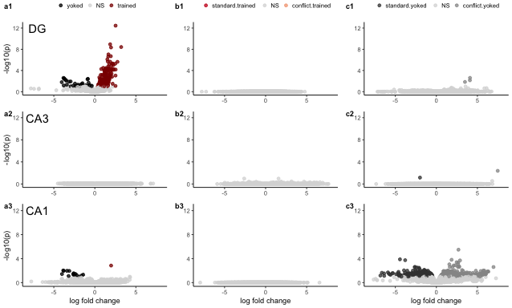

    CA1consyokcons <-  plot.cons.yokcons(CA1dds, "CA1", "CA1: standard yoked v. trained")  

    ## [1] "CA1"
    ## 
    ## out of 16852 with nonzero total read count
    ## adjusted p-value < 0.1
    ## LFC > 0 (up)       : 522, 3.1%
    ## LFC < 0 (down)     : 360, 2.1%
    ## outliers [1]       : 32, 0.19%
    ## low counts [2]     : 4892, 29%
    ## (mean count < 5)
    ## [1] see 'cooksCutoff' argument of ?results
    ## [2] see 'independentFiltering' argument of ?results
    ## 
    ## NULL

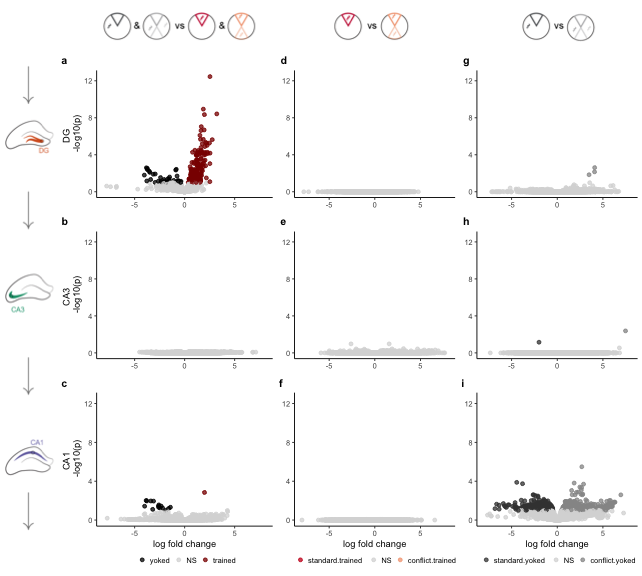

    CA1yoked <-  plot.yokconf.yokcons(CA1dds, "CA1", "CA1: standard v. conflict yoked")  

    ## [1] "CA1"
    ## 
    ## out of 16852 with nonzero total read count
    ## adjusted p-value < 0.1
    ## LFC > 0 (up)       : 545, 3.2%
    ## LFC < 0 (down)     : 372, 2.2%
    ## outliers [1]       : 32, 0.19%
    ## low counts [2]     : 4892, 29%
    ## (mean count < 5)
    ## [1] see 'cooksCutoff' argument of ?results
    ## [2] see 'independentFiltering' argument of ?results
    ## 
    ## NULL

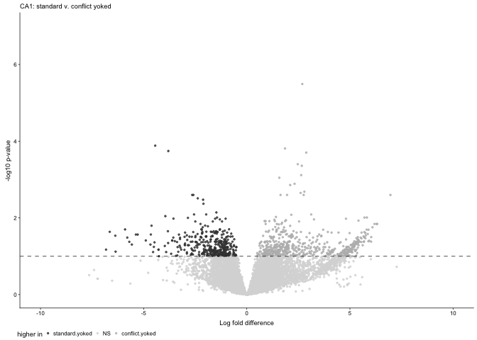

    volcanos <- plot_grid(DGconsyokcons, CA1consyokcons, CA1yoked , nrow = 1,
                          labels = c("(d)", "(e)", "(f)"), label_size = 8) 
    volcanos

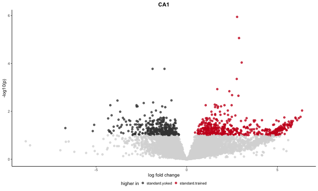

    pdf(file="../figures/02c_rnaseqSubfield/volcanos.pdf", width=6.65, height=2)
    plot(volcanos)    
    dev.off()

    ## quartz_off_screen 
    ##                 2

candidate gnees
===============

    betterPlotCounts <- function(mygene, mydds, mysubfield){
      df <- plotCounts(mydds, mygene, intgroup = "APA2",  transform = F, replaced = F, returnData = T)
      names(df) <- c("count", "treatment")
      df$treatment <- factor(df$treatment, levels = c("standard.yoked","standard.trained",
                                                      "conflict.yoked", "conflict.trained"))
      
      #df <- df %>% filter(treatment %in% c("home.cage","standard.trained"))
      
      ggplot(df, aes(x = treatment, y = count)) +
        geom_boxplot(aes(fill = treatment)) + 
        geom_point() +
        labs(subtitle = paste(mysubfield, " *", mygene, "*",  sep = "")) +
        theme_classic() +
        theme(plot.subtitle  = element_markdown(),
              legend.position = "none", 
              panel.grid.major  = element_blank(),  # remove major gridlines
              panel.grid.minor  = element_blank()) + # remove minor gridlines) +
        scale_fill_manual(values = fourgroups) 

    }

    betterPlotCounts("Prkcz", DGdds, "DG")

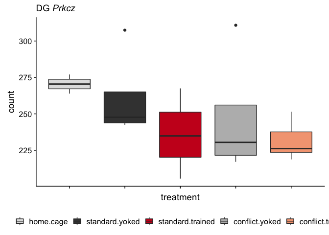

    betterPlotCounts("Dusp16", DGdds, "DG")

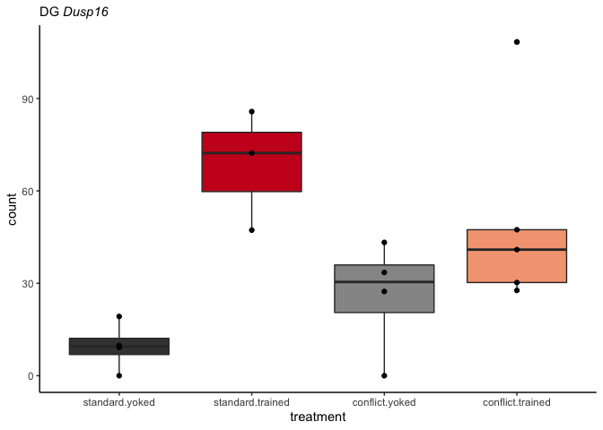

    betterPlotCounts("Thbs1", DGdds, "DG")

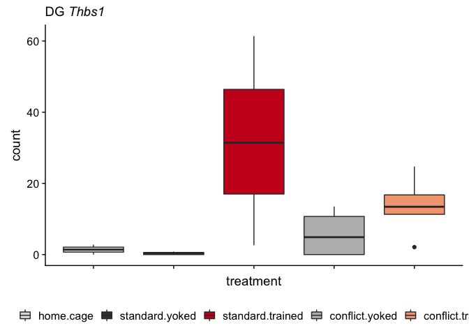

    betterPlotCounts("Slc16a1", DGdds, "DG")

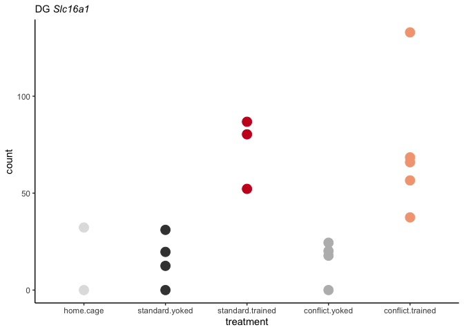

    betterPlotCounts("Hes5", DGdds, "DG")

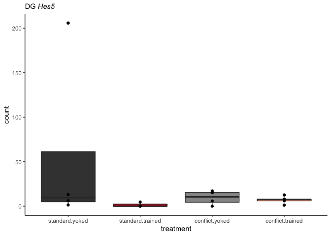

    betterPlotCounts("Rtl1", DGdds, "DG")

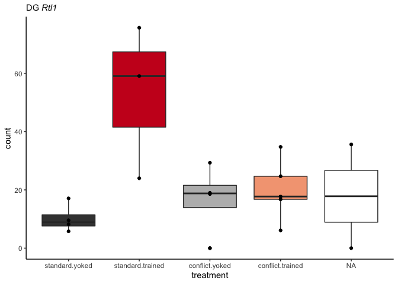

    betterPlotCounts("Nlrp3", DGdds, "DG")

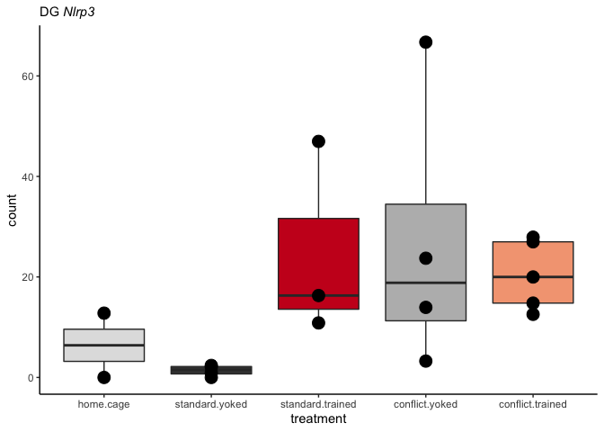

    betterPlotCounts("Kcnc2", DGdds, "DG")

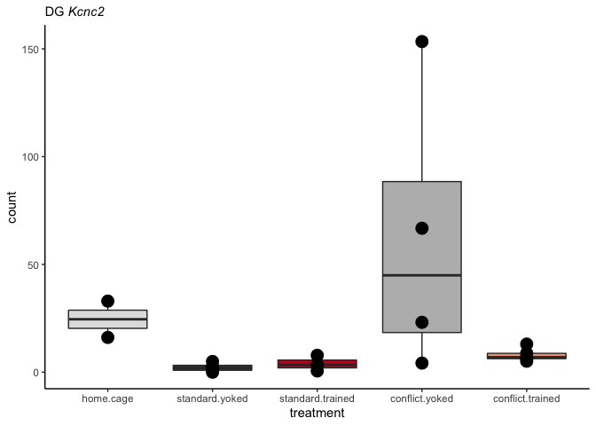

    betterPlotCounts("1110008F13Rik", DGdds, "DG")

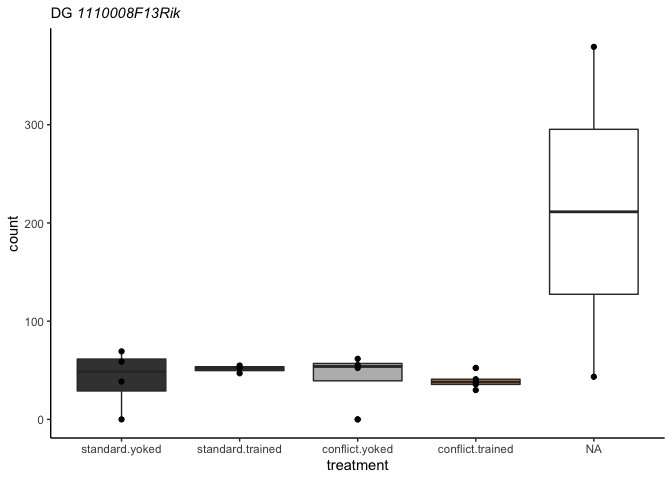

    a <- betterPlotCounts("Irs1", DGdds, "DG") + labs(title = "wald = -6, p = 1.577782e-06")
    b <- betterPlotCounts("Dab2ip", DGdds, "DG")  + labs(title = "wald =  5, p = 3.227358e-05")
    plot_grid(a,b)

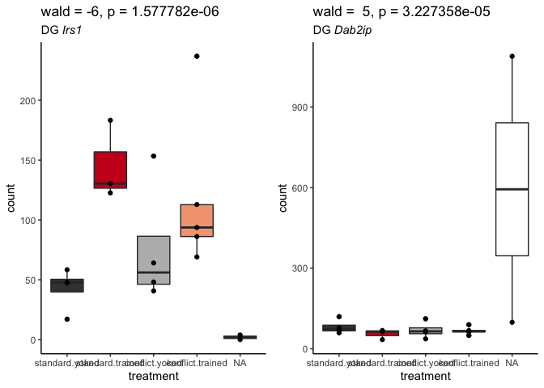

    betterPlotCounts("Prkcz", CA1dds, "CA1")

    betterPlotCounts("Grm1", CA1dds, "CA1")

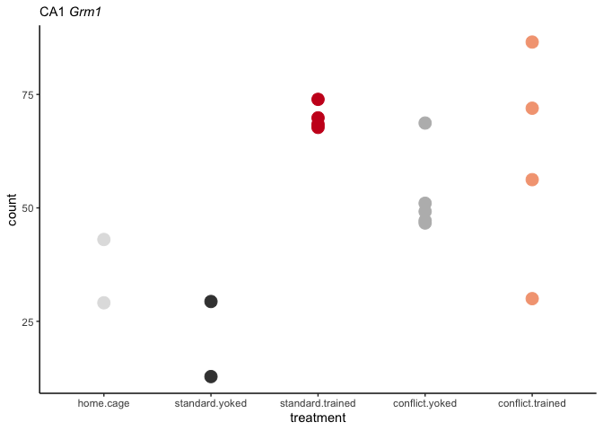

    betterPlotCounts("Grin2b", CA1dds, "CA1")

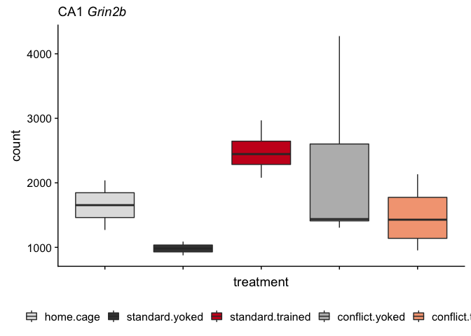

    betterPlotCounts("Foxj3", CA1dds, "CA1")

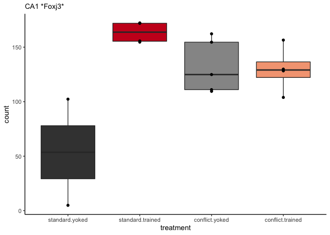

    betterPlotCounts("Grik3", CA1dds, "CA1")

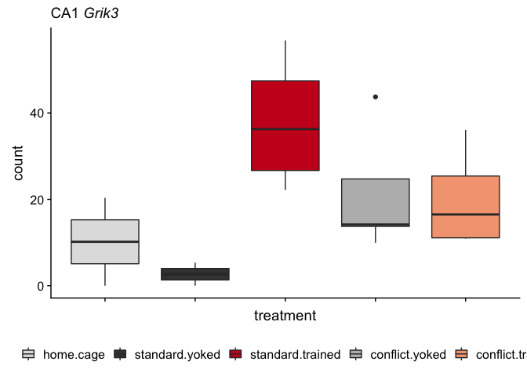

    betterPlotCounts("0610010K14Rik", CA1dds, "CA1")

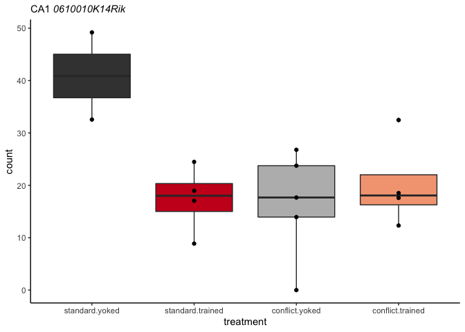

    a <- betterPlotCounts("Prkcz", CA1dds, "CA1")
    b <- betterPlotCounts("Prkcz", CA3dds, "CA3")
    c <- betterPlotCounts("Prkcz", DGdds, "DG")

    d <- betterPlotCounts("Prkci", CA1dds, "CA1")
    e <- betterPlotCounts("Prkci", CA3dds, "CA3")
    f <- betterPlotCounts("Prkci", DGdds, "DG")

    plot_grid(a,b,c,d,e,f)

genes that are correlated with number of entrances
--------------------------------------------------

Requires anlaysis of `04_integration.Rmd` first.

    plotCounts(DGdds, "Acan", intgroup = "APA2", normalized = TRUE, main="Acan in DG")

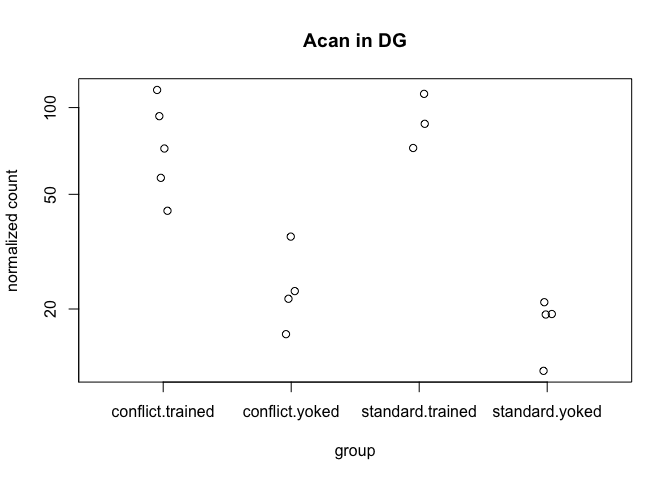

    plotCounts(DGdds, "Amigo2", intgroup = "APA2", normalized = TRUE, main="Amigo2 in DG")

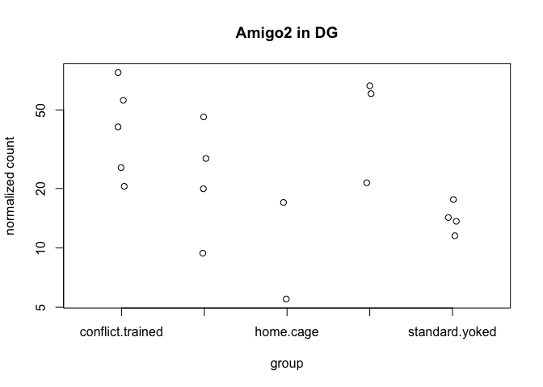

    plotCounts(DGdds, "Armcx5", intgroup = "APA2", normalized = TRUE, main="Armcx5 in DG")

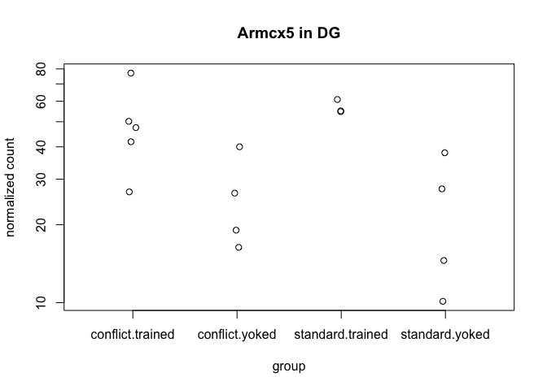

    plotCounts(DGdds, "Ptgs2", intgroup = "APA2", normalized = TRUE, main="Ptgs2 in DG")

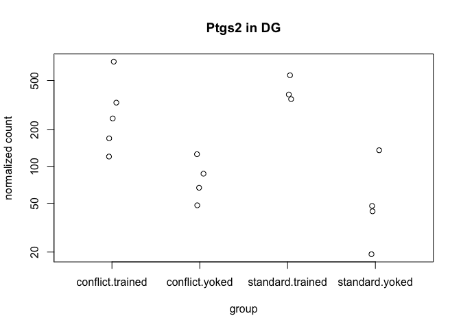

    plotCounts(DGdds, "Rgs2", intgroup = "APA2", normalized = TRUE, main="Rgs2 in DG")

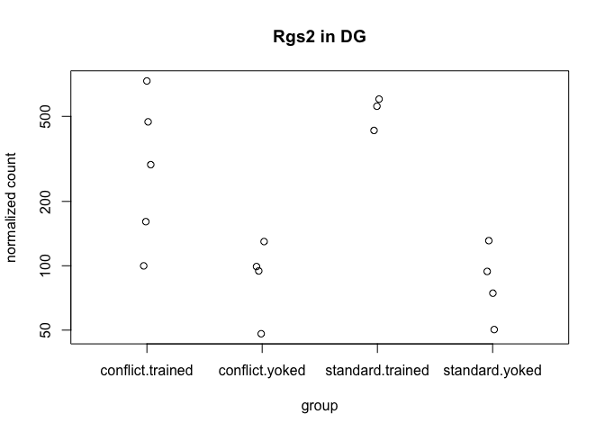

    plotCounts(DGdds, "Syt4", intgroup = "APA2", normalized = TRUE, main="Syt4 in DG")

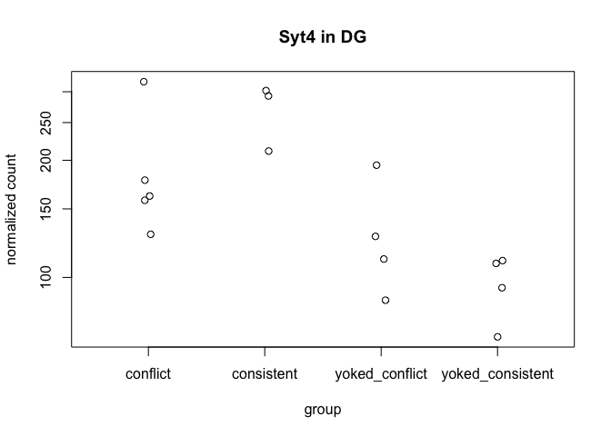

Upset plots
-----------

What genes overlap within cetain comparisons?

    a.colData <- read.csv("../data/02a_colData.csv", header = T)
    a.countData <- read.csv("../data/02a_countData.csv", header = T, check.names = F, row.names = 1)

    eachsubfield <- levels(a.colData$Punch)

    listofDEGs <- function(group1, group2){
      res <- results(dds, contrast = c("APA2", group1, group2), independentFiltering = T)
      
      print(paste(group1,group2, sep = " vs "))
      print(summary(res))
      
      data <- data.frame(gene = row.names(res),
                         lfc = res$log2FoldChange,
                         padj = res$padj,
                         tissue = i,
                         comparison = paste(group1, group2, sep = "-"))
      data <- data %>% dplyr::filter(padj < 0.1) %>% droplevels()
      return(data)
    }

    for(i in eachsubfield){
      
      colData <- a.colData %>% 
        dplyr::filter(Punch == i)  %>%
        droplevels()
      print(i)
      
      savecols <- as.character(colData$RNAseqID) 
      savecols <- as.vector(savecols) 
      countData <- a.countData %>% dplyr::select(one_of(savecols)) 

    ## create DESeq object using the factors Punch and APA
    dds <- DESeqDataSetFromMatrix(countData = countData,
                                  colData = colData,
                                  design = ~ APA2)

    dds # view the DESeq object - note numnber of genes
    dds <- dds[ rowSums(counts(dds)) > 1, ]  # Pre-filtering genes with 0 counts
    dds <- DESeq(dds, parallel = TRUE) # Differential expression analysis

    A <- listofDEGs("standard.trained","standard.yoked")
    B <- listofDEGs("conflict.trained","standard.trained")
    C <- listofDEGs("conflict.trained","conflict.yoked")
    D <- listofDEGs("conflict.yoked","standard.yoked")

    all <- rbind(A,B,C,D)

    write.csv(all, file = paste("../data/02c_",i,"forupset.csv", sep = ""), row.names = F)
    }

    ## [1] "CA1"

    ## estimating size factors

    ## estimating dispersions

    ## gene-wise dispersion estimates: 6 workers

    ## mean-dispersion relationship

    ## final dispersion estimates, fitting model and testing: 6 workers

    ## [1] "standard.trained vs standard.yoked"
    ## 
    ## out of 16852 with nonzero total read count
    ## adjusted p-value < 0.1
    ## LFC > 0 (up)       : 522, 3.1%
    ## LFC < 0 (down)     : 360, 2.1%
    ## outliers [1]       : 32, 0.19%
    ## low counts [2]     : 4892, 29%
    ## (mean count < 5)
    ## [1] see 'cooksCutoff' argument of ?results
    ## [2] see 'independentFiltering' argument of ?results
    ## 
    ## NULL
    ## [1] "conflict.trained vs standard.trained"
    ## 
    ## out of 16852 with nonzero total read count
    ## adjusted p-value < 0.1
    ## LFC > 0 (up)       : 0, 0%
    ## LFC < 0 (down)     : 0, 0%
    ## outliers [1]       : 32, 0.19%
    ## low counts [2]     : 0, 0%
    ## (mean count < 0)
    ## [1] see 'cooksCutoff' argument of ?results
    ## [2] see 'independentFiltering' argument of ?results
    ## 
    ## NULL
    ## [1] "conflict.trained vs conflict.yoked"
    ## 
    ## out of 16852 with nonzero total read count
    ## adjusted p-value < 0.1
    ## LFC > 0 (up)       : 1, 0.0059%
    ## LFC < 0 (down)     : 3, 0.018%
    ## outliers [1]       : 32, 0.19%
    ## low counts [2]     : 0, 0%
    ## (mean count < 0)
    ## [1] see 'cooksCutoff' argument of ?results
    ## [2] see 'independentFiltering' argument of ?results
    ## 
    ## NULL
    ## [1] "conflict.yoked vs standard.yoked"
    ## 
    ## out of 16852 with nonzero total read count
    ## adjusted p-value < 0.1
    ## LFC > 0 (up)       : 545, 3.2%
    ## LFC < 0 (down)     : 372, 2.2%
    ## outliers [1]       : 32, 0.19%
    ## low counts [2]     : 4892, 29%
    ## (mean count < 5)
    ## [1] see 'cooksCutoff' argument of ?results
    ## [2] see 'independentFiltering' argument of ?results
    ## 
    ## NULL
    ## [1] "CA3"

    ## estimating size factors

    ## estimating dispersions

    ## gene-wise dispersion estimates: 6 workers

    ## mean-dispersion relationship

    ## final dispersion estimates, fitting model and testing: 6 workers

    ## [1] "standard.trained vs standard.yoked"
    ## 
    ## out of 16502 with nonzero total read count
    ## adjusted p-value < 0.1
    ## LFC > 0 (up)       : 1, 0.0061%
    ## LFC < 0 (down)     : 0, 0%
    ## outliers [1]       : 11, 0.067%
    ## low counts [2]     : 0, 0%
    ## (mean count < 0)
    ## [1] see 'cooksCutoff' argument of ?results
    ## [2] see 'independentFiltering' argument of ?results
    ## 
    ## NULL
    ## [1] "conflict.trained vs standard.trained"
    ## 
    ## out of 16502 with nonzero total read count
    ## adjusted p-value < 0.1
    ## LFC > 0 (up)       : 0, 0%
    ## LFC < 0 (down)     : 0, 0%
    ## outliers [1]       : 11, 0.067%
    ## low counts [2]     : 0, 0%
    ## (mean count < 0)
    ## [1] see 'cooksCutoff' argument of ?results
    ## [2] see 'independentFiltering' argument of ?results
    ## 
    ## NULL
    ## [1] "conflict.trained vs conflict.yoked"
    ## 
    ## out of 16502 with nonzero total read count
    ## adjusted p-value < 0.1
    ## LFC > 0 (up)       : 0, 0%
    ## LFC < 0 (down)     : 0, 0%
    ## outliers [1]       : 11, 0.067%
    ## low counts [2]     : 0, 0%
    ## (mean count < 0)
    ## [1] see 'cooksCutoff' argument of ?results
    ## [2] see 'independentFiltering' argument of ?results
    ## 
    ## NULL
    ## [1] "conflict.yoked vs standard.yoked"
    ## 
    ## out of 16502 with nonzero total read count
    ## adjusted p-value < 0.1
    ## LFC > 0 (up)       : 1, 0.0061%
    ## LFC < 0 (down)     : 1, 0.0061%
    ## outliers [1]       : 11, 0.067%
    ## low counts [2]     : 0, 0%
    ## (mean count < 0)
    ## [1] see 'cooksCutoff' argument of ?results
    ## [2] see 'independentFiltering' argument of ?results
    ## 
    ## NULL
    ## [1] "DG"

    ## estimating size factors

    ## estimating dispersions

    ## gene-wise dispersion estimates: 6 workers

    ## mean-dispersion relationship

    ## final dispersion estimates, fitting model and testing: 6 workers

    ## [1] "standard.trained vs standard.yoked"
    ## 
    ## out of 17011 with nonzero total read count
    ## adjusted p-value < 0.1
    ## LFC > 0 (up)       : 119, 0.7%
    ## LFC < 0 (down)     : 6, 0.035%
    ## outliers [1]       : 20, 0.12%
    ## low counts [2]     : 4608, 27%
    ## (mean count < 4)
    ## [1] see 'cooksCutoff' argument of ?results
    ## [2] see 'independentFiltering' argument of ?results
    ## 
    ## NULL
    ## [1] "conflict.trained vs standard.trained"
    ## 
    ## out of 17011 with nonzero total read count
    ## adjusted p-value < 0.1
    ## LFC > 0 (up)       : 0, 0%
    ## LFC < 0 (down)     : 1, 0.0059%
    ## outliers [1]       : 20, 0.12%
    ## low counts [2]     : 0, 0%
    ## (mean count < 0)
    ## [1] see 'cooksCutoff' argument of ?results
    ## [2] see 'independentFiltering' argument of ?results
    ## 
    ## NULL
    ## [1] "conflict.trained vs conflict.yoked"
    ## 
    ## out of 17011 with nonzero total read count
    ## adjusted p-value < 0.1
    ## LFC > 0 (up)       : 8, 0.047%
    ## LFC < 0 (down)     : 2, 0.012%
    ## outliers [1]       : 20, 0.12%
    ## low counts [2]     : 0, 0%
    ## (mean count < 0)
    ## [1] see 'cooksCutoff' argument of ?results
    ## [2] see 'independentFiltering' argument of ?results
    ## 
    ## NULL
    ## [1] "conflict.yoked vs standard.yoked"
    ## 
    ## out of 17011 with nonzero total read count
    ## adjusted p-value < 0.1
    ## LFC > 0 (up)       : 3, 0.018%
    ## LFC < 0 (down)     : 0, 0%
    ## outliers [1]       : 20, 0.12%
    ## low counts [2]     : 0, 0%
    ## (mean count < 0)
    ## [1] see 'cooksCutoff' argument of ?results
    ## [2] see 'independentFiltering' argument of ?results
    ## 
    ## NULL
