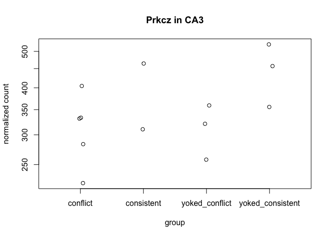

Subfield analysis
-----------------

This script is used to identify treatement differences within each
subfield, generate volcano plots, venn diagrams, and tables for
subsequent GO analyses. The final mutlipanel figures for the manuscript
have been inserted just below the subheadings.

    library(ggplot2) ## for awesome plots!
    library(cowplot) ## for some easy to use themes
    library(dplyr) ## for filtering and selecting rows

    ## Warning: package 'dplyr' was built under R version 3.5.1

    library(car) ## stats
    library(VennDiagram) ## venn diagrams
    library(pheatmap) ## awesome heatmaps
    library(viridis) # for awesome color pallette
    library(reshape2) ## for melting dataframe
    library(DESeq2) ## for gene expression analysis

    ## Warning: package 'IRanges' was built under R version 3.5.1

    ## Warning: package 'GenomicRanges' was built under R version 3.5.1

    ## Warning: package 'DelayedArray' was built under R version 3.5.1

    library(edgeR)  ## for basic read counts status

    ## Warning: package 'edgeR' was built under R version 3.5.1

    ## Warning: package 'limma' was built under R version 3.5.1

    library(magrittr) ## to use the weird pipe
    library(genefilter)  ## for PCA fuction
    library(xtable) # for latex or html tables

    ## load functions 
    source("figureoptions.R")
    source("functions_RNAseq.R")

    ## set output file for figures 
    knitr::opts_chunk$set(fig.path = '../figures/02c_rnaseqSubfield/')

DG
--

The most notable comparison within DG is the consistent verses
yoked-consistent.

    colData <- read.csv("../data/02a_colData.csv", header = T)
    countData <- read.csv("../data/02a_countData.csv", header = T, check.names = F, row.names = 1)

    colData <- colData %>% 
      filter(Punch %in% c("DG"))  %>% 
      droplevels()

    savecols <- as.character(colData$RNAseqID) 
    savecols <- as.vector(savecols) 
    countData <- countData %>% dplyr::select(one_of(savecols)) 

    colData %>% select(APA2,Punch)  %>%  summary()

    ##                APA2   Punch  
    ##  conflict        :5   DG:16  
    ##  consistent      :3          
    ##  yoked_conflict  :4          
    ##  yoked_consistent:4

    ## create DESeq object using the factors Punch and APA
    dds <- DESeqDataSetFromMatrix(countData = countData,
                                  colData = colData,
                                  design = ~ APA2)

    dds # view the DESeq object - note numnber of genes

    ## class: DESeqDataSet 
    ## dim: 22485 16 
    ## metadata(1): version
    ## assays(1): counts
    ## rownames(22485): 0610007P14Rik 0610009B22Rik ... Zzef1 Zzz3
    ## rowData names(0):
    ## colnames(16): 143A-DG-1 143B-DG-1 ... 148A-DG-3 148B-DG-4
    ## colData names(8): RNAseqID Mouse ... ID APA2

    dds <- dds[ rowSums(counts(dds)) > 1, ]  # Pre-filtering genes with 0 counts
    dds # view number of genes afternormalization and the number of samples

    ## class: DESeqDataSet 
    ## dim: 17011 16 
    ## metadata(1): version
    ## assays(1): counts
    ## rownames(17011): 0610007P14Rik 0610009B22Rik ... Zzef1 Zzz3
    ## rowData names(0):
    ## colnames(16): 143A-DG-1 143B-DG-1 ... 148A-DG-3 148B-DG-4
    ## colData names(8): RNAseqID Mouse ... ID APA2

    dds <- DESeq(dds) # Differential expression analysis
    rld <- rlog(dds, blind=FALSE) ## log transformed data
    vsd <- getVarianceStabilizedData(dds)

    write.csv(colData, file = "../data/02c_DGcolData.csv", row.names = T)
    write.csv(vsd, file = "../data/02c_DGvsd.csv", row.names = T)

    ###  "consistent", "yoked_consistent"
    res <- results(dds, contrast =c("APA2", "consistent", "yoked_consistent"), independentFiltering = T, alpha = 0.1)
    summary(res)

    ## 
    ## out of 17011 with nonzero total read count
    ## adjusted p-value < 0.1
    ## LFC > 0 (up)       : 119, 0.7%
    ## LFC < 0 (down)     : 6, 0.035%
    ## outliers [1]       : 20, 0.12%
    ## low counts [2]     : 4608, 27%
    ## (mean count < 4)
    ## [1] see 'cooksCutoff' argument of ?results
    ## [2] see 'independentFiltering' argument of ?results

    resOrdered <- res[order(res$padj),]
    head(resOrdered, 10)

    ## log2 fold change (MLE): APA2 consistent vs yoked_consistent 
    ## Wald test p-value: APA2 consistent vs yoked_consistent 
    ## DataFrame with 10 rows and 6 columns
    ##                baseMean   log2FoldChange             lfcSE
    ##               <numeric>        <numeric>         <numeric>
    ## Smad7  171.392871064045 3.53587630546276 0.418085263001235
    ## Sgk1   341.089572273562 2.52942417594796 0.361917138618265
    ## Lmna   127.261228543472 2.38190944527576 0.360880330414225
    ## Tiparp 146.843901753813 3.00078251228731 0.456274430076876
    ## Fzd5   26.8401177227407 4.05654356592169 0.655253175606779
    ## Acan   50.8597490321187 2.45912773236628 0.428543544588545
    ## Egr4   683.770839985962 3.23264668960927 0.562954537617405
    ## Errfi1  196.30327794802 2.16723775140178 0.378461151913533
    ## Rasd1  72.8100929443534 3.11825818416375 0.542898092373717
    ## Per1   512.774508684412 1.82273176771818 0.322402773641593
    ##                    stat               pvalue                 padj
    ##               <numeric>            <numeric>            <numeric>
    ## Smad7  8.45730911460593 2.73617917722616e-17 3.38821067515915e-13
    ## Sgk1      6.98895936679 2.76932604930945e-12 1.71462822342994e-08
    ## Lmna   6.60027506221178 4.10395627378058e-11 1.48901359411528e-07
    ## Tiparp 6.57670540902702 4.80986382658575e-11 1.48901359411528e-07
    ## Fzd5    6.1908033672103 5.98583433033886e-10 1.48245173025172e-06
    ## Acan    5.7383380602019 9.56101231319715e-09 1.41105309237205e-05
    ## Egr4   5.74228729604137 9.34061706254104e-09 1.41105309237205e-05
    ## Errfi1 5.72644706185573 1.02555744418545e-08 1.41105309237205e-05
    ## Rasd1  5.74372654457076 9.26153120045455e-09 1.41105309237205e-05
    ## Per1   5.65358587685248 1.57134545200805e-08 1.94579707322157e-05

    data <- data.frame(gene = row.names(res),
                       pvalue = -log10(res$padj), 
                       lfc = res$log2FoldChange)
    data <- na.omit(data)
    data <- data %>%
      mutate(direction = ifelse(data$lfc > 1 & data$pvalue > 1, 
                            yes = "consistent", 
                            no = ifelse(data$lfc < -1 & data$pvalue > 1, 
                                        yes = "yoked_consistent", 
                                        no = "neither")))
    DGvolcano <- ggplot(data, aes(x = lfc, y = pvalue)) + 
      geom_point(aes(color = factor(direction)), size = 1, alpha = 0.5, na.rm = T) + # add gene points
      theme_cowplot(font_size = 8, line_size = 0.25) +
      geom_hline(yintercept = 1,  size = 0.25, linetype = 2) + 
      scale_color_manual(values = volcano1)  + 
      scale_y_continuous(limits=c(0, 8)) +
      scale_x_continuous( limits=c(-3, 3),
                          name="Log fold change")+
      ylab(paste0("log10 p-value")) +       
      theme(panel.grid.minor=element_blank(),
            legend.position = "none", # remove legend 
            panel.grid.major=element_blank())
    DGvolcano

    pdf(file="../figures/02c_rnaseqSubfield/DGvolcano.pdf", width=1.5, height=2)
    plot(DGvolcano)
    dev.off()

    ## quartz_off_screen 
    ##                 2

save DEGs
=========

DGvolcanoDEGs &lt;- data %&gt;% filter(direction != “neither”) %&gt;%
arrange(desc(lfc)) head(DGvolcanoDEGs,10) write.csv(DGvolcanoDEGs,
“../data/DG-consistent-yokedconsistent.csv”)

are any protein kinases differentially expressed?
=================================================

pkcs &lt;- data\[grep(“Prkc”, data$gene), \] pkcs \# no pkcs are
differentially expressed

go setup
--------

table(res$padj&lt;0.1) logs &lt;- data.frame(cbind("gene"=row.names(res),"logP"=round(-log(res$pvalue+1e-10,10),1)))
logs*l**o**g**P* = *a**s*.*n**u**m**e**r**i**c*(*a**s*.*c**h**a**r**a**c**t**e**r*(*l**o**g**s*logP))
sign &lt;- rep(1,nrow(logs)) sign\[res$log2FoldChange&lt;0\]=-1
\#\#change to correct model table(sign)
logs*l**o**g**P* &lt;  − *l**o**g**s*logP\*sign write.csv(logs, file =
“./02e\_GO\_MWU/DGconsistentyoked.csv”, row.names = F)

yoked yoked
-----------

res &lt;- results(dds, contrast =c(“APA2”, “yoked\_conflict”,
“yoked\_consistent”), independentFiltering = T, alpha = 0.1)
summary(res) resOrdered &lt;- res\[order(res$padj),\] head(resOrdered,
10) data &lt;- data.frame(gene = row.names(res), pvalue =
-log10(res*p**a**d**j*), *l**f**c* = *r**e**s*log2FoldChange) data &lt;-
na.omit(data) data &lt;- data %&gt;% mutate(direction =
ifelse(data$lfc &gt; 1 & data$pvalue &gt; 1, yes = “yoked\_conflict”, no
= ifelse(data$lfc &lt; -1 & data$pvalue &gt; 1, yes =
“yoked\_consistent”, no = “neither”))) DGvolcano &lt;- ggplot(data,
aes(x = lfc, y = pvalue)) + geom\_point(aes(color = factor(direction)),
size = 1, alpha = 0.5, na.rm = T) + \# add gene points
theme\_cowplot(font\_size = 8, line\_size = 0.25) +
geom\_hline(yintercept = 1, size = 0.25, linetype = 2) +
scale\_color\_manual(values = volcano2) +
scale\_y\_continuous(limits=c(0, 8)) + scale\_x\_continuous(
limits=c(-3, 3), name=NULL)+ ylab(paste0(“log10 p-value”)) +  
theme(panel.grid.minor=element\_blank(), legend.position = “none”, \#
remove legend panel.grid.major=element\_blank()) DGvolcano

pdf(file=“../figures/02c\_rnaseqSubfield/DGvolcano2.pdf”, width=1.5,
height=2) plot(DGvolcano) dev.off()

go setup
--------

table(res$padj&lt;0.1) logs &lt;- data.frame(cbind("gene"=row.names(res),"logP"=round(-log(res$pvalue+1e-10,10),1)))
logs*l**o**g**P* = *a**s*.*n**u**m**e**r**i**c*(*a**s*.*c**h**a**r**a**c**t**e**r*(*l**o**g**s*logP))
sign &lt;- rep(1,nrow(logs)) sign\[res$log2FoldChange&lt;0\]=-1
\#\#change to correct model table(sign)
logs*l**o**g**P* &lt;  − *l**o**g**s*logP\*sign write.csv(logs, file =
“./02e\_GO\_MWU/DGyokedyoked.csv”, row.names = F)

“conflict”, “yoked\_conflict”
-----------------------------

res &lt;- results(dds, contrast =c(“APA2”, “conflict”,
“yoked\_conflict”), independentFiltering = T, alpha = 0.1) summary(res)
resOrdered &lt;- res\[order(res$padj),\] head(resOrdered, 10) data &lt;-
data.frame(gene = row.names(res), pvalue =
-log10(res*p**a**d**j*), *l**f**c* = *r**e**s*log2FoldChange) data &lt;-
na.omit(data) data &lt;- data %&gt;% mutate(direction =
ifelse(data$lfc &gt; 1 & data$pvalue &gt; 1, yes = “conflict”, no =
ifelse(data$lfc &lt; -1 & data$pvalue &gt; 1, yes = “yoked\_conflict”,
no = “neither”))) DGvolcano &lt;- ggplot(data, aes(x = lfc, y = pvalue))
+ geom\_point(aes(color = factor(direction)), size = 1, alpha = 0.5,
na.rm = T) + \# add gene points theme\_cowplot(font\_size = 8,
line\_size = 0.25) + geom\_hline(yintercept = 1, size = 0.25, linetype =
2) + scale\_color\_manual(values = volcano4) +
scale\_y\_continuous(limits=c(0, 8)) + scale\_x\_continuous(
limits=c(-3, 3), name=NULL)+ ylab(paste0(“log10 p-value”)) +  
theme(panel.grid.minor=element\_blank(), legend.position = “none”, \#
remove legend panel.grid.major=element\_blank()) DGvolcano

pdf(file=“../figures/02c\_rnaseqSubfield/DGvolcano3.pdf”, width=1.5,
height=2) plot(DGvolcano) dev.off()

go setup
--------

table(res$padj&lt;0.1) logs &lt;- data.frame(cbind("gene"=row.names(res),"logP"=round(-log(res$pvalue+1e-10,10),1)))
logs*l**o**g**P* = *a**s*.*n**u**m**e**r**i**c*(*a**s*.*c**h**a**r**a**c**t**e**r*(*l**o**g**s*logP))
sign &lt;- rep(1,nrow(logs)) sign\[res$log2FoldChange&lt;0\]=-1
\#\#change to correct model table(sign)
logs*l**o**g**P* &lt;  − *l**o**g**s*logP\*sign write.csv(logs, file =
“./02e\_GO\_MWU/DGconflictyoked.csv”, row.names = F)

#### “conflict”, “consistent”

res &lt;- results(dds, contrast =c(“APA2”, “conflict”, “consistent”),
independentFiltering = T, alpha = 0.1) summary(res) resOrdered &lt;-
res\[order(res$padj),\] head(resOrdered, 10) data &lt;- data.frame(gene
= row.names(res), pvalue =
-log10(res*p**a**d**j*), *l**f**c* = *r**e**s*log2FoldChange) data &lt;-
na.omit(data) data &lt;- data %&gt;% mutate(direction =
ifelse(data$lfc &gt; 1 & data$pvalue &gt; 1, yes = “conflict”, no =
ifelse(data$lfc &lt; -1 & data$pvalue &gt; 1, yes = “consistent”, no =
“neither”))) DGvolcano &lt;- ggplot(data, aes(x = lfc, y = pvalue)) +
geom\_point(aes(color = factor(direction)), size = 1, alpha = 0.5, na.rm
= T) + \# add gene points theme\_cowplot(font\_size = 8, line\_size =
0.25) + geom\_hline(yintercept = 1, size = 0.25, linetype = 2) +
scale\_color\_manual(values = volcano2) +
scale\_y\_continuous(limits=c(0, 8)) + scale\_x\_continuous(
limits=c(-3, 3), name=NULL)+ ylab(paste0(“log10 p-value”)) +  
theme(panel.grid.minor=element\_blank(), legend.position = “none”, \#
remove legend panel.grid.major=element\_blank()) DGvolcano

pdf(file=“../figures/02c\_rnaseqSubfield/DGvolcano4.pdf”, width=1.5,
height=2) plot(DGvolcano) dev.off()

go setup
--------

table(res$padj&lt;0.1) logs &lt;- data.frame(cbind("gene"=row.names(res),"logP"=round(-log(res$pvalue+1e-10,10),1)))
logs*l**o**g**P* = *a**s*.*n**u**m**e**r**i**c*(*a**s*.*c**h**a**r**a**c**t**e**r*(*l**o**g**s*logP))
sign &lt;- rep(1,nrow(logs)) sign\[res$log2FoldChange&lt;0\]=-1
\#\#change to correct model table(sign)
logs*l**o**g**P* &lt;  − *l**o**g**s*logP\*sign write.csv(logs, file =
“./02e\_GO\_MWU/DGconflictconsistent.csv”, row.names = F)

plot of pkmz
------------

plotCounts(dds, “Prkcz”, intgroup = “APA2”, normalized = TRUE,
main=“Prkcz in DG”)

order results table by the smallest adjusted p value:
=====================================================

res &lt;- res\[order(res$padj),\]

results = as.data.frame(dplyr::mutate(as.data.frame(res),
sig=ifelse(res$padj&lt;0.05, “FDR&lt;0.05”, “Not Sig”)),
row.names=rownames(res)) head(results)

\[1\] 125
---------

\[1\] 10
--------

\[1\] 1
-------

\[1\] 3
-------

\`\`\`

CA3
---

There are so few differences in the CA3 that I don’t make any figures
for the manuscript.

    colData <- read.csv("../data/02a_colData.csv", header = T)
    countData <- read.csv("../data/02a_countData.csv", header = T, check.names = F, row.names = 1)

    colData <- colData %>% 
      filter(Punch %in% c("CA3"))  %>% 
      droplevels()
    savecols <- as.character(colData$RNAseqID) 
    savecols <- as.vector(savecols) 
    countData <- countData %>% dplyr::select(one_of(savecols)) 
    colData %>% select(APA2,Punch)  %>%  summary()

    ##                APA2   Punch   
    ##  conflict        :5   CA3:13  
    ##  consistent      :2           
    ##  yoked_conflict  :3           
    ##  yoked_consistent:3

    ## create DESeq object using the factors Punch and APA
    dds <- DESeqDataSetFromMatrix(countData = countData,
                                  colData = colData,
                                  design = ~ APA2)

    dds # view the DESeq object - note numnber of genes

    ## class: DESeqDataSet 
    ## dim: 22485 13 
    ## metadata(1): version
    ## assays(1): counts
    ## rownames(22485): 0610007P14Rik 0610009B22Rik ... Zzef1 Zzz3
    ## rowData names(0):
    ## colnames(13): 143A-CA3-1 144A-CA3-2 ... 148A-CA3-3 148B-CA3-4
    ## colData names(8): RNAseqID Mouse ... ID APA2

    dds <- dds[ rowSums(counts(dds)) > 1, ]  # Pre-filtering genes with 0 counts
    dds # view number of genes afternormalization and the number of samples

    ## class: DESeqDataSet 
    ## dim: 16502 13 
    ## metadata(1): version
    ## assays(1): counts
    ## rownames(16502): 0610007P14Rik 0610009B22Rik ... Zzef1 Zzz3
    ## rowData names(0):
    ## colnames(13): 143A-CA3-1 144A-CA3-2 ... 148A-CA3-3 148B-CA3-4
    ## colData names(8): RNAseqID Mouse ... ID APA2

    dds <- DESeq(dds) # Differential expression analysis
    rld <- rlog(dds, blind=FALSE) ## log transformed data

    res <- results(dds, contrast =c("APA2", "consistent", "yoked_consistent"), independentFiltering = T, alpha = 0.1)
    summary(res)

    ## 
    ## out of 16502 with nonzero total read count
    ## adjusted p-value < 0.1
    ## LFC > 0 (up)       : 1, 0.0061%
    ## LFC < 0 (down)     : 0, 0%
    ## outliers [1]       : 11, 0.067%
    ## low counts [2]     : 0, 0%
    ## (mean count < 0)
    ## [1] see 'cooksCutoff' argument of ?results
    ## [2] see 'independentFiltering' argument of ?results

    res <- results(dds, contrast =c("APA2", "conflict", "yoked_conflict"), independentFiltering = T, alpha = 0.1)
    summary(res)

    ## 
    ## out of 16502 with nonzero total read count
    ## adjusted p-value < 0.1
    ## LFC > 0 (up)       : 0, 0%
    ## LFC < 0 (down)     : 0, 0%
    ## outliers [1]       : 11, 0.067%
    ## low counts [2]     : 0, 0%
    ## (mean count < 0)
    ## [1] see 'cooksCutoff' argument of ?results
    ## [2] see 'independentFiltering' argument of ?results

    res <- results(dds, contrast =c("APA2", "yoked_conflict", "yoked_consistent"), independentFiltering = T, alpha = 0.1)
    summary(res)

    ## 
    ## out of 16502 with nonzero total read count
    ## adjusted p-value < 0.1
    ## LFC > 0 (up)       : 1, 0.0061%
    ## LFC < 0 (down)     : 1, 0.0061%
    ## outliers [1]       : 11, 0.067%
    ## low counts [2]     : 0, 0%
    ## (mean count < 0)
    ## [1] see 'cooksCutoff' argument of ?results
    ## [2] see 'independentFiltering' argument of ?results

    res <- results(dds, contrast =c("APA2", "conflict", "consistent"), independentFiltering = T, alpha = 0.1)
    summary(res)

    ## 
    ## out of 16502 with nonzero total read count
    ## adjusted p-value < 0.1
    ## LFC > 0 (up)       : 0, 0%
    ## LFC < 0 (down)     : 0, 0%
    ## outliers [1]       : 11, 0.067%
    ## low counts [2]     : 0, 0%
    ## (mean count < 0)
    ## [1] see 'cooksCutoff' argument of ?results
    ## [2] see 'independentFiltering' argument of ?results

    ## go setup
    table(res$padj<0.1)

    ## 
    ## FALSE 
    ## 16491

    logs <- data.frame(cbind("gene"=row.names(res),"logP"=round(-log(res$pvalue+1e-10,10),1)))
    logs$logP=as.numeric(as.character(logs$logP))
    sign <- rep(1,nrow(logs))
    sign[res$log2FoldChange<0]=-1  ##change to correct model
    table(sign)

    ## sign
    ##   -1    1 
    ## 7619 8883

    logs$logP <- logs$logP*sign
    write.csv(logs, file = "./02e_GO_MWU/CA3conflictconsistent.csv", row.names = F)

    plotCounts(dds, "Prkcz", intgroup = "APA2", normalized = TRUE, main="Prkcz in CA3")

CA1
---

Two comparisons within CA1 are noteable

    colData <- read.csv("../data/02a_colData.csv", header = T)
    countData <- read.csv("../data/02a_countData.csv", header = T, check.names = F, row.names = 1)
    colData <- colData %>% 
      filter(Punch %in% c("CA1"))  %>% 
      droplevels()
    savecols <- as.character(colData$RNAseqID) 
    savecols <- as.vector(savecols) 
    countData <- countData %>% dplyr::select(one_of(savecols)) 
    colData %>% select(APA2,Punch)  %>%  summary()

    ##                APA2   Punch   
    ##  conflict        :4   CA1:15  
    ##  consistent      :4           
    ##  yoked_conflict  :5           
    ##  yoked_consistent:2

    dds <- DESeqDataSetFromMatrix(countData = countData,
                                  colData = colData,
                                  design = ~ APA2)

    dds # view the DESeq object - note numnber of genes

    ## class: DESeqDataSet 
    ## dim: 22485 15 
    ## metadata(1): version
    ## assays(1): counts
    ## rownames(22485): 0610007P14Rik 0610009B22Rik ... Zzef1 Zzz3
    ## rowData names(0):
    ## colnames(15): 143B-CA1-1 143C-CA1-1 ... 148A-CA1-3 148B-CA1-4
    ## colData names(8): RNAseqID Mouse ... ID APA2

    dds <- dds[ rowSums(counts(dds)) > 1, ]  # Pre-filtering genes with 0 counts
    dds # view number of genes afternormalization and the number of samples

    ## class: DESeqDataSet 
    ## dim: 16852 15 
    ## metadata(1): version
    ## assays(1): counts
    ## rownames(16852): 0610007P14Rik 0610009B22Rik ... Zzef1 Zzz3
    ## rowData names(0):
    ## colnames(15): 143B-CA1-1 143C-CA1-1 ... 148A-CA1-3 148B-CA1-4
    ## colData names(8): RNAseqID Mouse ... ID APA2

    dds <- DESeq(dds) # Differential expression analysis
    rld <- rlog(dds, blind=FALSE) ## log transformed data

    res <- results(dds, contrast =c("APA2", "consistent", "yoked_consistent"), independentFiltering = T, alpha = 0.1)
    summary(res)

    ## 
    ## out of 16852 with nonzero total read count
    ## adjusted p-value < 0.1
    ## LFC > 0 (up)       : 522, 3.1%
    ## LFC < 0 (down)     : 360, 2.1%
    ## outliers [1]       : 32, 0.19%
    ## low counts [2]     : 4892, 29%
    ## (mean count < 5)
    ## [1] see 'cooksCutoff' argument of ?results
    ## [2] see 'independentFiltering' argument of ?results

    resOrdered <- res[order(res$padj),]
    head(resOrdered, 10)

    ## log2 fold change (MLE): APA2 consistent vs yoked_consistent 
    ## Wald test p-value: APA2 consistent vs yoked_consistent 
    ## DataFrame with 10 rows and 6 columns
    ##                 baseMean    log2FoldChange             lfcSE
    ##                <numeric>         <numeric>         <numeric>
    ## Agap1   141.608762023137  2.77875046323028 0.429199296190091
    ## Mga     103.422400328703  2.88512466619299 0.476961395194488
    ## Adamts1  114.05510912055  3.03089016770375 0.542440999554141
    ## Gpd1    249.757427758137 -1.22793747874702 0.227810028910739
    ## Sdhaf2  77.6262495970029 -1.88444201930518 0.348951742801298
    ## Scn4b   126.513273389751  2.75983601093444  0.53291136892103
    ## Lhfpl4  214.234684832542  1.68458658679185 0.339420793178537
    ## Ncoa4   101.428981706278  2.35081948916179 0.479986115716983
    ## Lats2   79.0118946108766  2.50181097858582 0.521225803364738
    ## Gad2    132.201113296669  2.85189408073533 0.598342010017182
    ##                      stat               pvalue                 padj
    ##                 <numeric>            <numeric>            <numeric>
    ## Agap1    6.47426612274679 9.52738560798276e-11 1.13642655532018e-06
    ## Mga      6.04896894226951 1.45775755684507e-09 8.69406606902402e-06
    ## Adamts1   5.5875019959682 2.30359111553791e-08 9.15907827537872e-05
    ## Gpd1    -5.39018183096829 7.03864293094537e-08 0.000167913865760633
    ## Sdhaf2  -5.40029404689985 6.65317533489317e-08 0.000167913865760633
    ## Scn4b    5.17878989243971 2.23329823700518e-07 0.000443979689516631
    ## Lhfpl4   4.96312135451805 6.93692079381607e-07  0.00118205130326626
    ## Ncoa4    4.89768227076785 9.69736686637254e-07  0.00144587739977615
    ## Lats2    4.79986018043532 1.58776440997872e-06  0.00210431709802513
    ## Gad2     4.76632767378883 1.87614050241445e-06  0.00223786039127996

    topGene <- rownames(res)[which.min(res$padj)]
    plotCounts(dds, gene = topGene, intgroup=c("APA2"))

    data <- data.frame(gene = row.names(res),
                       pvalue = -log10(res$padj), 
                       lfc = res$log2FoldChange)
    data <- na.omit(data)
    data <- data %>%
      mutate(direction = ifelse(data$lfc > 1 & data$pvalue > 1, 
                            yes = "consistent", 
                            no = ifelse(data$lfc < -1 & data$pvalue > 1, 
                                        yes = "yoked_consistent", 
                                        no = "neither")))
    top_labelled <- top_n(data, n = 5, wt = lfc)

    CA1volcano <- ggplot(data, aes(x = lfc, y = pvalue)) + 
      geom_point(aes(color = factor(direction)), size = 1, alpha = 0.5, na.rm = T) + # add gene points
        theme_cowplot(font_size = 8, line_size = 0.25) +
      scale_color_manual(values = volcano1)  + 
      geom_hline(yintercept = 1,  size = 0.25, linetype = 2) + 
      scale_y_continuous(limits=c(0, 8)) +
      scale_x_continuous( limits=c(-3, 3),
                          name="Log fold change")+
      ylab(paste0("log10 p-value")) +       
      theme(panel.grid.minor=element_blank(),
            legend.position = "none", # remove legend 
            panel.grid.major=element_blank())
    CA1volcano

    pdf(file="../figures/02c_rnaseqSubfield/CA1volcano.pdf",  width=1.5, height=2)
    plot(CA1volcano)
    dev.off()

    ## quartz_off_screen 
    ##                 2

    # save DEGs
    CA1volcanoDEGs <- data %>%
      filter(direction != "neither") %>%
      arrange(desc(lfc))
    head(CA1volcanoDEGs,10)

    ##       gene   pvalue      lfc  direction
    ## 1    Srprb 2.032934 6.362542 consistent
    ## 2   Zfp536 1.770289 6.278678 consistent
    ## 3    Ahnak 1.715151 6.183278 consistent
    ## 4    Uvssa 1.628075 6.091268 consistent
    ## 5  Gm43951 1.702408 6.014951 consistent
    ## 6     Vcan 1.738275 5.994322 consistent
    ## 7    Pex26 1.596528 5.857468 consistent
    ## 8    Med26 1.518925 5.805185 consistent
    ## 9  Gm16485 1.451045 5.797461 consistent
    ## 10  Adgrf5 1.544135 5.791507 consistent

    write.csv(CA1volcanoDEGs, "../data/CA1-consistent-yokedconsistent.csv")

    ## go setup
    table(res$padj<0.1)

    ## 
    ## FALSE  TRUE 
    ## 11046   882

    logs <- data.frame(cbind("gene"=row.names(res),"logP"=round(-log(res$pvalue+1e-10,10),1)))
    logs$logP=as.numeric(as.character(logs$logP))
    sign <- rep(1,nrow(logs))
    sign[res$log2FoldChange<0]=-1  ##change to correct model
    table(sign)

    ## sign
    ##   -1    1 
    ## 7694 9158

    logs$logP <- logs$logP*sign
    write.csv(logs, file = "./02e_GO_MWU/CA1consistentyoked.csv", row.names = F)

    #conflict yoked conflict

    res <- results(dds, contrast =c("APA2", "conflict", "yoked_conflict"), independentFiltering = T, alpha = 0.1)
    summary(res)

    ## 
    ## out of 16852 with nonzero total read count
    ## adjusted p-value < 0.1
    ## LFC > 0 (up)       : 1, 0.0059%
    ## LFC < 0 (down)     : 3, 0.018%
    ## outliers [1]       : 32, 0.19%
    ## low counts [2]     : 0, 0%
    ## (mean count < 0)
    ## [1] see 'cooksCutoff' argument of ?results
    ## [2] see 'independentFiltering' argument of ?results

    # volcano plots

    res <- results(dds, contrast =c("APA2", "yoked_conflict", "yoked_consistent"), independentFiltering = T, alpha = 0.1)
    summary(res)

    ## 
    ## out of 16852 with nonzero total read count
    ## adjusted p-value < 0.1
    ## LFC > 0 (up)       : 545, 3.2%
    ## LFC < 0 (down)     : 372, 2.2%
    ## outliers [1]       : 32, 0.19%
    ## low counts [2]     : 4892, 29%
    ## (mean count < 5)
    ## [1] see 'cooksCutoff' argument of ?results
    ## [2] see 'independentFiltering' argument of ?results

    resOrdered <- res[order(res$padj),]
    head(resOrdered, 10)

    ## log2 fold change (MLE): APA2 yoked_conflict vs yoked_consistent 
    ## Wald test p-value: APA2 yoked_conflict vs yoked_consistent 
    ## DataFrame with 10 rows and 6 columns
    ##                 baseMean    log2FoldChange             lfcSE
    ##                <numeric>         <numeric>         <numeric>
    ## Agap1   141.608762023137  2.68968384470947 0.425950937249105
    ## Pcdhb12  28.059174402023 -4.44059921537497 0.793522420606138
    ## Sdc3    215.373472922264  1.85322249231914 0.337204018822692
    ## Gm20390  47.871821328339 -3.80408224976329 0.702192890495312
    ## Adamts1  114.05510912055  2.88221063805472 0.537733929661711
    ## Ncoa4   101.428981706278   2.4713781982471 0.475325965110602
    ## Lats2   79.0118946108766   2.6661801320419 0.517454551359232
    ## Scn4b   126.513273389751  2.63717217475313 0.525235880320185
    ## Tgoln1  253.956891941181  1.57640904952372 0.317332343314282
    ## Mga     103.422400328703  2.31524201605359   0.4748411371402
    ##                      stat               pvalue                 padj
    ##                 <numeric>            <numeric>            <numeric>
    ## Agap1    6.31453909241308 2.70967824020662e-10 3.23210420491846e-06
    ## Pcdhb12  -5.5960601743086 2.19277621297338e-08 0.000130777173341732
    ## Sdc3      5.4958493638049 3.88834321833904e-08  0.00015460052636116
    ## Gm20390 -5.41743202082261 6.04611256628736e-08 0.000180295076726689
    ## Adamts1  5.35991961650611 8.32589898656502e-08 0.000198622646223495
    ## Ncoa4    5.19933346723872 2.00004427353209e-07 0.000397608801578179
    ## Lats2    5.15249141212203 2.57048392342877e-07 0.000438010460552263
    ## Scn4b     5.0209292121199 5.14221090642523e-07 0.000766703646148002
    ## Tgoln1   4.96769107447225  6.7754785642546e-07 0.000897976759049209
    ## Mga      4.87582442834981 1.08354951670463e-06  0.00129245786352528

    topGene <- rownames(res)[which.min(res$padj)]
    plotCounts(dds, gene = topGene, intgroup=c("APA2"))

    data <- data.frame(gene = row.names(res),
                       pvalue = -log10(res$padj), 
                       lfc = res$log2FoldChange)
    data <- na.omit(data)
    data <- data %>%
      mutate(direction = ifelse(data$lfc > 1 & data$pvalue > 1, 
                            yes = "yoked_conflict", 
                            no = ifelse(data$lfc < -1 & data$pvalue > 1, 
                                        yes = "yoked_consistent", 
                                        no = "neither")))
    top_labelled <- top_n(data, n = 5, wt = lfc)

    CA1volcano2 <- ggplot(data, aes(x = lfc, y = pvalue)) + 
      geom_point(aes(color = factor(direction)), size = 1, alpha = 0.5, na.rm = T) + # add gene points
      theme_cowplot(font_size = 8, line_size = 0.25) +
      scale_color_manual(values = volcano3)  + 
      geom_hline(yintercept = 1,  size = 0.25, linetype = 2) + 
      scale_y_continuous(limits=c(0, 8)) +
      scale_x_continuous( limits=c(-3, 3),
                          name="Log fold change")+
      ylab(paste0("log10 p-value")) +       
      theme(panel.grid.minor=element_blank(),
            legend.position = "none", # remove legend 
            panel.grid.major=element_blank())
    CA1volcano2

    pdf(file="../figures/02c_rnaseqSubfield/CA1volcano2.pdf",  width=1.5, height=2)
    plot(CA1volcano2)
    dev.off()

    ## quartz_off_screen 
    ##                 2

    # save DEGs
    CA1volcano2DEGs <- data %>%
      filter(direction != "neither") %>%
      arrange(desc(lfc))
    head(CA1volcano2DEGs,10)

    ##       gene   pvalue      lfc      direction
    ## 1    Srprb 2.598051 6.962723 yoked_conflict
    ## 2   Adgrf5 1.841819 6.323867 yoked_conflict
    ## 3    Ahnak 1.841819 6.288004 yoked_conflict
    ## 4   Fndc10 1.841819 6.187727 yoked_conflict
    ## 5  Slco1a4 1.754914 6.093251 yoked_conflict
    ## 6  Ppfibp1 1.499186 6.031033 yoked_conflict
    ## 7     Optn 1.380954 6.025644 yoked_conflict
    ## 8   Rnf207 1.404354 5.934581 yoked_conflict
    ## 9     Mdc1 1.691825 5.901609 yoked_conflict
    ## 10    Epyc 1.389620 5.895348 yoked_conflict

    write.csv(CA1volcano2DEGs, "../data/CA1-yokedconflict-yokedconsistent.csv")

    res <- results(dds, contrast =c("APA2", "conflict", "consistent"), independentFiltering = T, alpha = 0.1)
    summary(res)

    ## 
    ## out of 16852 with nonzero total read count
    ## adjusted p-value < 0.1
    ## LFC > 0 (up)       : 0, 0%
    ## LFC < 0 (down)     : 0, 0%
    ## outliers [1]       : 32, 0.19%
    ## low counts [2]     : 0, 0%
    ## (mean count < 0)
    ## [1] see 'cooksCutoff' argument of ?results
    ## [2] see 'independentFiltering' argument of ?results

    resOrdered <- res[order(res$padj),]
    head(resOrdered, 10)

    ## log2 fold change (MLE): APA2 conflict vs consistent 
    ## Wald test p-value: APA2 conflict vs consistent 
    ## DataFrame with 10 rows and 6 columns
    ##                       baseMean     log2FoldChange             lfcSE
    ##                      <numeric>          <numeric>         <numeric>
    ## Atp6v0c       940.742611922084  0.608861459800811 0.163727606168192
    ## Csmd2         143.250109872935 -0.914103831504814 0.235968419993719
    ## Gm21949       21.1841188999619  -16.6146222758793  4.11997084164047
    ## Rps3          244.145124987844  0.821854348915321 0.220612501449681
    ## 0610007P14Rik 40.5190246487219  0.196321727885071 0.352801109032421
    ## 0610009B22Rik  11.309058356894  0.667968463930145 0.634021906064433
    ## 0610009L18Rik 3.57066470830572  0.852265724984899  1.22386841387385
    ## 0610009O20Rik 41.9373878209083  0.250361800878926 0.540003660975504
    ## 0610010F05Rik 55.2563013249849  0.224901035542928 0.344815463078742
    ## 0610010K14Rik  20.942956262047  0.168090628236215 0.501583604861804
    ##                            stat               pvalue              padj
    ##                       <numeric>            <numeric>         <numeric>
    ## Atp6v0c         3.7187464841778 0.000200213866268932 0.841899307660858
    ## Csmd2         -3.87383969231623 0.000107133899383567 0.841899307660858
    ## Gm21949       -4.03270385022041 5.51387487761311e-05 0.841899307660858
    ## Rps3           3.72532990431086 0.000195059947424386 0.841899307660858
    ## 0610007P14Rik 0.556465733408536    0.577892513329752 0.999977985728116
    ## 0610009B22Rik  1.05354161668708     0.29209283113991 0.999977985728116
    ## 0610009L18Rik 0.696370390250748    0.486196901299482 0.999977985728116
    ## 0610009O20Rik  0.46362982137316    0.642912984860882 0.999977985728116
    ## 0610010F05Rik 0.652235933779948    0.514248982221823 0.999977985728116
    ## 0610010K14Rik 0.335119861588233    0.737534670898309 0.999977985728116

    data <- data.frame(gene = row.names(res),
                       pvalue = -log10(res$padj), 
                       lfc = res$log2FoldChange)
    data <- na.omit(data)
    data <- data %>%
      mutate(direction = ifelse(data$lfc > 1 & data$pvalue > 1, 
                            yes = "conflict", 
                            no = ifelse(data$lfc < -1 & data$pvalue > 1, 
                                        yes = "consistent", 
                                        no = "neither")))
    CA1volcano <- ggplot(data, aes(x = lfc, y = pvalue)) + 
      geom_point(aes(color = factor(direction)), size = 1, alpha = 0.5, na.rm = T) + # add gene points
      theme_cowplot(font_size = 8, line_size = 0.25) +
      geom_hline(yintercept = 1,  size = 0.25, linetype = 2) + 
      scale_color_manual(values = volcano2)  + 
      scale_y_continuous(limits=c(0, 8)) +
      scale_x_continuous( limits=c(-3, 3),
                          name="Log fold change")+
      ylab(paste0("log10 p-value")) +       
      theme(panel.grid.minor=element_blank(),
            legend.position = "none", # remove legend 
            panel.grid.major=element_blank())
    CA1volcano

    pdf(file="../figures/02c_rnaseqSubfield/CA1volcano4.pdf", width=1.5, height=2)
    plot(DGvolcano)
    dev.off()

    ## quartz_off_screen 
    ##                 2

    plotCounts(dds, "Prkcz", intgroup = "APA2", normalized = TRUE, main="Prkcz in CA1")

