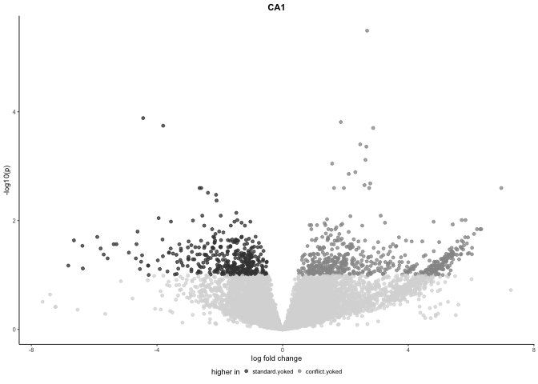
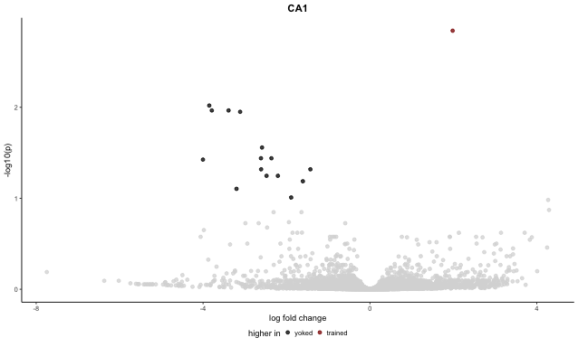
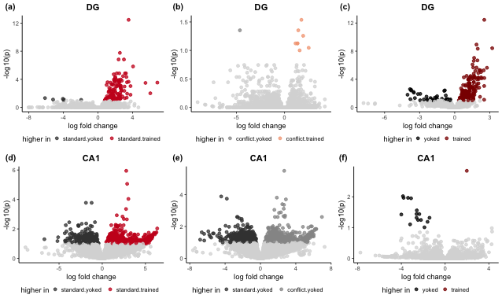

Subfield analysis
-----------------

This script is used to identify treatement differences within each
subfield, generate volcano plots, venn diagrams, and tables for
subsequent GO analyses. The final mutlipanel figures for the manuscript
have been inserted just below the subheadings.

    library(tidyverse)
    library(cowplot) ## for some easy to use themes
    library(DESeq2) ## for gene expression analysis
    library(UpSetR)
    #devtools::install_github("clauswilke/ggtextures")
    library(ggtextures)
    library(magick)
    library(ggtext) # for markdown in plots

    library(BiocParallel)
    register(MulticoreParam(6))

    ## load functions 
    source("figureoptions.R")
    source("functions_RNAseq.R")

    ## set output file for figures 
    knitr::opts_chunk$set(fig.path = '../figures/02c_rnaseqSubfield/', cache = T)

Get varience stabilized gene expression for each tissue
-------------------------------------------------------

    a.colData <- read.csv("../data/02a_colData.csv", header = T)
    a.countData <- read.csv("../data/02a_countData.csv", header = T, check.names = F, row.names = 1)

    a.colData <- a.colData %>%
      mutate(combinedgroups = fct_collapse(Treatment,
                                           trained = c("conflict", "trained"),
                                           yoked = c("shocked", "yoked")))
    a.colData$combinedgroups <- factor(a.colData$combinedgroups, levels = c("yoked", "trained"))
    a.colData$APA2 <- factor(a.colData$APA2, levels = c("standard.yoked","standard.trained",
                                                      "conflict.yoked", "conflict.trained"))

    DGdds <- returnddsAPA2("DG") 

    ## [1] "DG"

    ## estimating size factors

    ## estimating dispersions

    ## gene-wise dispersion estimates: 6 workers

    ## mean-dispersion relationship

    ## final dispersion estimates, fitting model and testing: 6 workers

    CA1dds <- returnddsAPA2("CA1") 

    ## [1] "CA1"

    ## estimating size factors

    ## estimating dispersions

    ## gene-wise dispersion estimates: 6 workers

    ## mean-dispersion relationship

    ## final dispersion estimates, fitting model and testing: 6 workers

    CA3dds <- returnddsAPA2("CA3") 

    ## [1] "CA3"

    ## estimating size factors

    ## estimating dispersions

    ## gene-wise dispersion estimates: 6 workers

    ## mean-dispersion relationship

    ## final dispersion estimates, fitting model and testing: 6 workers

    DGdds2 <- returnddscombinedgroups("DG") 

    ## [1] "DG"

    ## estimating size factors

    ## estimating dispersions

    ## gene-wise dispersion estimates: 6 workers

    ## mean-dispersion relationship

    ## final dispersion estimates, fitting model and testing: 6 workers

    ## -- replacing outliers and refitting for 54 genes
    ## -- DESeq argument 'minReplicatesForReplace' = 7 
    ## -- original counts are preserved in counts(dds)

    ## estimating dispersions

    ## fitting model and testing

    CA1dds2 <- returnddscombinedgroups("CA1") 

    ## [1] "CA1"

    ## estimating size factors

    ## estimating dispersions

    ## gene-wise dispersion estimates: 6 workers

    ## mean-dispersion relationship

    ## final dispersion estimates, fitting model and testing: 6 workers

    ## -- replacing outliers and refitting for 98 genes
    ## -- DESeq argument 'minReplicatesForReplace' = 7 
    ## -- original counts are preserved in counts(dds)

    ## estimating dispersions

    ## fitting model and testing

    CA3dds2 <- returnddscombinedgroups("CA3") 

    ## [1] "CA3"

    ## estimating size factors

    ## estimating dispersions

    ## gene-wise dispersion estimates: 6 workers

    ## mean-dispersion relationship

    ## final dispersion estimates, fitting model and testing: 6 workers

    ## -- replacing outliers and refitting for 53 genes
    ## -- DESeq argument 'minReplicatesForReplace' = 7 
    ## -- original counts are preserved in counts(dds)

    ## estimating dispersions

    ## fitting model and testing

    returnvsds(DGdds, "../data/02c_DGvsd.csv")

    ##               143A-DG-1 143B-DG-1 143D-DG-3 144A-DG-2 144C-DG-2 144D-DG-2
    ## 0610007P14Rik  6.381145  6.405587  6.834813  6.513173  6.401366  6.637581
    ## 0610009B22Rik  5.781124  5.661825  5.299160  5.528657  5.821796  5.670620
    ## 0610009L18Rik  5.405848  5.593055  5.422004  5.000789  5.507750  5.506319
    ##               145A-DG-2 145B-DG-1 146A-DG-2 146B-DG-2 146C-DG-4 146D-DG-3
    ## 0610007P14Rik  6.562833  6.126760  6.298333  5.996243  6.929322  7.411893
    ## 0610009B22Rik  5.942028  5.787857  5.679794  5.996243  6.060620  5.000789
    ## 0610009L18Rik  5.256496  5.000789  5.679794  5.000789  5.000789  5.000789
    ##               147C-DG-3 147D-DG-1 148A-DG-3 148B-DG-4
    ## 0610007P14Rik  6.298159  6.481476  6.493581  6.349976
    ## 0610009B22Rik  5.910805  5.893873  5.589261  5.492981
    ## 0610009L18Rik  5.257050  5.718223  5.505647  5.349661

    ## class: DESeqTransform 
    ## dim: 17011 16 
    ## metadata(36): version version ... version version
    ## assays(1): ''
    ## rownames(17011): 0610007P14Rik 0610009B22Rik ... Zzef1 Zzz3
    ## rowData names(30): baseMean baseVar ... maxCooks dispFit
    ## colnames(16): 143A-DG-1 143B-DG-1 ... 148A-DG-3 148B-DG-4
    ## colData names(10): RNAseqID Mouse ... combinedgroups sizeFactor

    returnvsds(CA1dds, "../data/02c_CA1vsd.csv")

    ##               143B-CA1-1 143C-CA1-1 143D-CA1-3 144A-CA1-2 144B-CA1-1
    ## 0610007P14Rik   7.520142   7.151097   7.348321   7.355004   7.389284
    ## 0610009B22Rik   7.035970   6.906418   6.301096   6.955307   6.790054
    ## 0610009L18Rik   6.811049   6.498778   6.301096   6.661562   6.432357
    ##               144C-CA1-2 145A-CA1-2 145B-CA1-1 146A-CA1-2 146B-CA1-2
    ## 0610007P14Rik   7.197450   7.402112   7.364954   7.156319   7.035597
    ## 0610009B22Rik   6.743802   6.883948   6.887177   6.920446   6.802964
    ## 0610009L18Rik   6.463299   6.747507   6.564639   6.755012   6.301096
    ##               146C-CA1-4 146D-CA1-3 147C-CA1-3 148A-CA1-3 148B-CA1-4
    ## 0610007P14Rik   7.401377   7.464466   7.267392   7.328133   7.190380
    ## 0610009B22Rik   6.782624   6.920474   6.787440   6.987979   6.301096
    ## 0610009L18Rik   6.846384   6.301096   6.468607   6.661247   6.301096

    ## class: DESeqTransform 
    ## dim: 16852 15 
    ## metadata(36): version version ... version version
    ## assays(1): ''
    ## rownames(16852): 0610007P14Rik 0610009B22Rik ... Zzef1 Zzz3
    ## rowData names(30): baseMean baseVar ... maxCooks dispFit
    ## colnames(15): 143B-CA1-1 143C-CA1-1 ... 148A-CA1-3 148B-CA1-4
    ## colData names(10): RNAseqID Mouse ... combinedgroups sizeFactor

    returnvsds(CA3dds, "../data/02c_CA3vsd.csv")

    ##               143A-CA3-1 144A-CA3-2 144B-CA3-1 144C-CA3-2 144D-CA3-2
    ## 0610007P14Rik   7.090155   7.589689   7.267022   7.034300   6.919678
    ## 0610009B22Rik   6.500788   7.011651   6.577337   6.947298   6.425407
    ## 0610009L18Rik   6.087226   6.714029   6.321004   6.277450   6.321271
    ##               145A-CA3-2 146A-CA3-2 146B-CA3-2 146D-CA3-3 147C-CA3-3
    ## 0610007P14Rik   6.825848   7.267048   6.799319   7.157725   7.172640
    ## 0610009B22Rik   6.919473   6.288754   6.934486   6.515827   6.403921
    ## 0610009L18Rik   5.797921   6.288754   6.049110   6.196801   6.166572
    ##               147D-CA3-1 148A-CA3-3 148B-CA3-4
    ## 0610007P14Rik   6.881145   6.962549   7.295192
    ## 0610009B22Rik   6.586876   6.578744   6.732213
    ## 0610009L18Rik   6.171145   6.223238   6.265907

    ## class: DESeqTransform 
    ## dim: 16502 13 
    ## metadata(36): version version ... version version
    ## assays(1): ''
    ## rownames(16502): 0610007P14Rik 0610009B22Rik ... Zzef1 Zzz3
    ## rowData names(30): baseMean baseVar ... maxCooks dispFit
    ## colnames(13): 143A-CA3-1 144A-CA3-2 ... 148A-CA3-3 148B-CA3-4
    ## colData names(10): RNAseqID Mouse ... combinedgroups sizeFactor

Res summary
-----------

    print("DG")

    ## [1] "DG"

    res_summary_subfield(DGdds, c("APA2", "standard.trained", "standard.yoked"))

    ## [1] "APA2"             "standard.trained" "standard.yoked"  
    ## [1] 125
    ## 
    ## out of 17011 with nonzero total read count
    ## adjusted p-value < 0.1
    ## LFC > 0 (up)       : 119, 0.7%
    ## LFC < 0 (down)     : 6, 0.035%
    ## outliers [1]       : 20, 0.12%
    ## low counts [2]     : 4608, 27%
    ## (mean count < 4)
    ## [1] see 'cooksCutoff' argument of ?results
    ## [2] see 'independentFiltering' argument of ?results
    ## 
    ## NULL
    ## log2 fold change (MLE): APA2 standard.trained vs standard.yoked 
    ## Wald test p-value: APA2 standard.trained vs standard.yoked 
    ## DataFrame with 5 rows and 6 columns
    ##                baseMean   log2FoldChange             lfcSE
    ##               <numeric>        <numeric>         <numeric>
    ## Smad7  171.392871064045  3.5358760989965 0.418085170674204
    ## Sgk1   341.089572273562  2.5294242746409 0.361917084520406
    ## Lmna   127.261228543472 2.38190950336827 0.360880273664825
    ## Tiparp 146.843901753813 3.00078234375137  0.45627431372274
    ## Fzd5   26.8401177227407 4.05654223296435  0.65525275568936
    ##                    stat               pvalue                 padj
    ##               <numeric>            <numeric>            <numeric>
    ## Smad7  8.45731048842164 2.73614695350866e-17 3.38817077252977e-13
    ## Sgk1   6.98896068416544 2.76930004947698e-12 1.71461212563367e-08
    ## Lmna   6.60027626109738 4.10392308480625e-11 1.48900050391935e-07
    ## Tiparp 6.57670671677307  4.8098215421767e-11 1.48900050391935e-07
    ## Fzd5   6.19080530030989 5.98576091336588e-10 1.48243354780419e-06

    res_summary_subfield(DGdds, c("APA2", "conflict.trained", "conflict.yoked"))

    ## [1] "APA2"             "conflict.trained" "conflict.yoked"  
    ## [1] 9
    ## 
    ## out of 17011 with nonzero total read count
    ## adjusted p-value < 0.1
    ## LFC > 0 (up)       : 8, 0.047%
    ## LFC < 0 (down)     : 1, 0.0059%
    ## outliers [1]       : 20, 0.12%
    ## low counts [2]     : 1320, 7.8%
    ## (mean count < 0)
    ## [1] see 'cooksCutoff' argument of ?results
    ## [2] see 'independentFiltering' argument of ?results
    ## 
    ## NULL
    ## log2 fold change (MLE): APA2 conflict.trained vs conflict.yoked 
    ## Wald test p-value: APA2 conflict.trained vs conflict.yoked 
    ## DataFrame with 5 rows and 6 columns
    ##                  baseMean    log2FoldChange             lfcSE
    ##                 <numeric>         <numeric>         <numeric>
    ## Smad7    171.392871064045   1.7539594787851 0.367789397071482
    ## Dbpht2   179.735977990203  1.43077069539744 0.321333534137563
    ## Insm1    9.54062645923209 -4.64275532829035   1.0367563258937
    ## Slc16a1  51.2786850104172  1.93719045615153 0.446154884574157
    ## Ankrd33b  209.87162559181  1.14656018923675 0.276132392169257
    ##                       stat               pvalue               padj
    ##                  <numeric>            <numeric>          <numeric>
    ## Smad7     4.76892344573002 1.85213021184991e-06 0.0290247325498999
    ## Dbpht2    4.45260311606609 8.48354763669753e-06 0.0443152250048957
    ## Insm1    -4.47815481066702 7.52909944975151e-06 0.0443152250048957
    ## Slc16a1   4.34196850271072 1.41211780872892e-05 0.0553232454514773
    ## Ankrd33b  4.15221184385338 3.29277232965722e-05 0.0752991661996807

    res_summary_subfield(DGdds, c("APA2", "conflict.trained", "standard.trained"))

    ## [1] "APA2"             "conflict.trained" "standard.trained"
    ## [1] 0
    ## 
    ## out of 17011 with nonzero total read count
    ## adjusted p-value < 0.1
    ## LFC > 0 (up)       : 0, 0%
    ## LFC < 0 (down)     : 0, 0%
    ## outliers [1]       : 20, 0.12%
    ## low counts [2]     : 0, 0%
    ## (mean count < 0)
    ## [1] see 'cooksCutoff' argument of ?results
    ## [2] see 'independentFiltering' argument of ?results
    ## 
    ## NULL
    ## log2 fold change (MLE): APA2 conflict.trained vs standard.trained 
    ## Wald test p-value: APA2 conflict.trained vs standard.trained 
    ## DataFrame with 5 rows and 6 columns
    ##                       baseMean     log2FoldChange             lfcSE
    ##                      <numeric>          <numeric>         <numeric>
    ## 0610007P14Rik 41.0311096797814 -0.147853335262028 0.401937040950673
    ## 0610009B22Rik 8.74131849081542 -0.757911133533248  0.74995847367117
    ## 0610009L18Rik 2.61860548764425  0.604880984136428   1.4768606644782
    ## 0610009O20Rik 48.3693444464377  0.245771530197495 0.338998958367419
    ## 0610010F05Rik 60.2560857800178 -0.366265357273305 0.337328972569671
    ##                             stat            pvalue      padj
    ##                        <numeric>         <numeric> <numeric>
    ## 0610007P14Rik -0.367851977295552 0.712983609840105         1
    ## 0610009B22Rik  -1.01060413361709 0.312205936604904         1
    ## 0610009L18Rik  0.409572140883136 0.682119836822188         1
    ## 0610009O20Rik  0.724991992250072  0.46845694305256         1
    ## 0610010F05Rik   -1.0857809054562 0.277575936193222         1

    res_summary_subfield(DGdds, c("APA2", "conflict.yoked", "standard.yoked"))

    ## [1] "APA2"           "conflict.yoked" "standard.yoked"
    ## [1] 3
    ## 
    ## out of 17011 with nonzero total read count
    ## adjusted p-value < 0.1
    ## LFC > 0 (up)       : 3, 0.018%
    ## LFC < 0 (down)     : 0, 0%
    ## outliers [1]       : 20, 0.12%
    ## low counts [2]     : 0, 0%
    ## (mean count < 0)
    ## [1] see 'cooksCutoff' argument of ?results
    ## [2] see 'independentFiltering' argument of ?results
    ## 
    ## NULL
    ## log2 fold change (MLE): APA2 conflict.yoked vs standard.yoked 
    ## Wald test p-value: APA2 conflict.yoked vs standard.yoked 
    ## DataFrame with 5 rows and 6 columns
    ##                baseMean   log2FoldChange             lfcSE
    ##               <numeric>        <numeric>         <numeric>
    ## Nlrp3  20.9424446578681 4.09842938285025 0.779232882507923
    ## Kcnc2  22.0989714545398 4.08535594133634 0.828861517280234
    ## Gm2115 18.9055674115327 3.48302658316895 0.740348611631996
    ## Rnase4 15.5820343950564 3.55390680749815 0.842612847725316
    ## Cxcl14 58.4698286328215 1.83345110176946 0.452447077111697
    ##                    stat               pvalue                padj
    ##               <numeric>            <numeric>           <numeric>
    ## Nlrp3  5.25956934679099  1.4439316822894e-07 0.00245338432137792
    ## Kcnc2  4.92887636374014 8.27038884428016e-07 0.00702610884265821
    ## Gm2115 4.70457636908523  2.5439362946098e-06   0.014408007193905
    ## Rnase4  4.2177220737758 2.46782728594936e-05   0.104827133538914
    ## Cxcl14 4.05229958269092 5.07166645843307e-05   0.172345369590473

    print("CA3")

    ## [1] "CA3"

    res_summary_subfield(CA3dds, c("APA2", "standard.trained", "standard.yoked"))

    ## [1] "APA2"             "standard.trained" "standard.yoked"  
    ## [1] 1
    ## 
    ## out of 16502 with nonzero total read count
    ## adjusted p-value < 0.1
    ## LFC > 0 (up)       : 1, 0.0061%
    ## LFC < 0 (down)     : 0, 0%
    ## outliers [1]       : 11, 0.067%
    ## low counts [2]     : 0, 0%
    ## (mean count < 0)
    ## [1] see 'cooksCutoff' argument of ?results
    ## [2] see 'independentFiltering' argument of ?results
    ## 
    ## NULL
    ## log2 fold change (MLE): APA2 standard.trained vs standard.yoked 
    ## Wald test p-value: APA2 standard.trained vs standard.yoked 
    ## DataFrame with 5 rows and 6 columns
    ##                 baseMean    log2FoldChange             lfcSE
    ##                <numeric>         <numeric>         <numeric>
    ## Sco2     16.986291670521  7.92170821989591  1.50710048300043
    ## Gm4724  26.6657624126106 -3.76035086262371 0.945533905297016
    ## Timm8a1 20.5957841890406 -4.89346309390806  1.24883957922689
    ## Cxcl16  8.21166206646085   6.2392342798603  1.62626978323348
    ## Slc9a2  110.174378859642 -1.43724258468348 0.380113797569017
    ##                      stat               pvalue                padj
    ##                 <numeric>            <numeric>           <numeric>
    ## Sco2     5.25625750190518 1.47016407704756e-07 0.00242444757945912
    ## Gm4724  -3.97696036234945 6.98017946719033e-05   0.489978995495488
    ## Timm8a1 -3.91840807683036 8.91357095680349e-05   0.489978995495488
    ## Cxcl16   3.83653090292004 0.000124784500320077   0.514455298694599
    ## Slc9a2  -3.78108501684293 0.000156146334978033    0.51500184202455

    res_summary_subfield(CA3dds, c("APA2", "conflict.trained", "conflict.yoked"))

    ## [1] "APA2"             "conflict.trained" "conflict.yoked"  
    ## [1] 0
    ## 
    ## out of 16502 with nonzero total read count
    ## adjusted p-value < 0.1
    ## LFC > 0 (up)       : 0, 0%
    ## LFC < 0 (down)     : 0, 0%
    ## outliers [1]       : 11, 0.067%
    ## low counts [2]     : 0, 0%
    ## (mean count < 0)
    ## [1] see 'cooksCutoff' argument of ?results
    ## [2] see 'independentFiltering' argument of ?results
    ## 
    ## NULL
    ## log2 fold change (MLE): APA2 conflict.trained vs conflict.yoked 
    ## Wald test p-value: APA2 conflict.trained vs conflict.yoked 
    ## DataFrame with 5 rows and 6 columns
    ##                       baseMean     log2FoldChange             lfcSE
    ##                      <numeric>          <numeric>         <numeric>
    ## 0610007P14Rik 50.0970679173046 0.0655200062324803 0.438705319123211
    ## 0610009B22Rik 21.5320776710641 -0.380548839458527 0.666531089819032
    ## 0610009L18Rik  5.9297800747599  0.442971224916382  1.05274817073983
    ## 0610009O20Rik 54.9226365635042  0.659304388434853 0.371673160251766
    ## 0610010F05Rik 81.1189135690452 -0.128908062081345 0.367548281673222
    ##                             stat             pvalue      padj
    ##                        <numeric>          <numeric> <numeric>
    ## 0610007P14Rik  0.149348556710977  0.881278602160808         1
    ## 0610009B22Rik -0.570939368427433  0.568040743381473         1
    ## 0610009L18Rik  0.420776057587525  0.673918616400024         1
    ## 0610009O20Rik   1.77388216030517 0.0760826441865248         1
    ## 0610010F05Rik  -0.35072415927101  0.725795299010767         1

    res_summary_subfield(CA3dds, c("APA2", "conflict.trained", "standard.trained"))

    ## [1] "APA2"             "conflict.trained" "standard.trained"
    ## [1] 0
    ## 
    ## out of 16502 with nonzero total read count
    ## adjusted p-value < 0.1
    ## LFC > 0 (up)       : 0, 0%
    ## LFC < 0 (down)     : 0, 0%
    ## outliers [1]       : 11, 0.067%
    ## low counts [2]     : 0, 0%
    ## (mean count < 0)
    ## [1] see 'cooksCutoff' argument of ?results
    ## [2] see 'independentFiltering' argument of ?results
    ## 
    ## NULL
    ## log2 fold change (MLE): APA2 conflict.trained vs standard.trained 
    ## Wald test p-value: APA2 conflict.trained vs standard.trained 
    ## DataFrame with 5 rows and 6 columns
    ##                baseMean    log2FoldChange             lfcSE
    ##               <numeric>         <numeric>         <numeric>
    ## Oprd1  32.4628391128719 -2.60542974560345 0.597196537814467
    ## Slc9a2 110.174378859642   1.5751653517535 0.358342542934521
    ## Crnkl1 21.7428570562243  3.14655086646214 0.786655735256783
    ## Erdr1  262.410626549465  1.89155758931392 0.486208570016143
    ## Rbms3   43.042274770408 -2.03862516340634 0.533990636287225
    ##                     stat               pvalue              padj
    ##                <numeric>            <numeric>         <numeric>
    ## Oprd1  -4.36276766630032 1.28427309991641e-05 0.105894738453608
    ## Slc9a2  4.39569730921211 1.10417712692366e-05 0.105894738453608
    ## Crnkl1  3.99990837851711 6.33670116079849e-05 0.348328462809093
    ## Erdr1   3.89042420468054  0.00010006913113791 0.370201696368351
    ## Rbms3  -3.81771706256998 0.000134692267188776 0.370201696368351

    res_summary_subfield(CA3dds, c("APA2", "conflict.yoked", "standard.yoked"))

    ## [1] "APA2"           "conflict.yoked" "standard.yoked"
    ## [1] 2
    ## 
    ## out of 16502 with nonzero total read count
    ## adjusted p-value < 0.1
    ## LFC > 0 (up)       : 1, 0.0061%
    ## LFC < 0 (down)     : 1, 0.0061%
    ## outliers [1]       : 11, 0.067%
    ## low counts [2]     : 0, 0%
    ## (mean count < 0)
    ## [1] see 'cooksCutoff' argument of ?results
    ## [2] see 'independentFiltering' argument of ?results
    ## 
    ## NULL
    ## log2 fold change (MLE): APA2 conflict.yoked vs standard.yoked 
    ## Wald test p-value: APA2 conflict.yoked vs standard.yoked 
    ## DataFrame with 5 rows and 6 columns
    ##                       baseMean    log2FoldChange             lfcSE
    ##                      <numeric>         <numeric>         <numeric>
    ## Sco2           16.986291670521  7.47692090654817  1.45024632680045
    ## Tbc1d16       68.3028549856526 -1.99890124400372   0.4490963629713
    ## Morc2b        5.34636409120379  6.80405549237289  1.68162650915043
    ## 0610007P14Rik 50.0970679173046 0.358662587390852 0.477458692270943
    ## 0610009B22Rik 21.5320776710641 0.890736471238269 0.725706759621894
    ##                            stat               pvalue                padj
    ##                       <numeric>            <numeric>           <numeric>
    ## Sco2           5.15562133713094 2.52791284033051e-07 0.00416878106498904
    ## Tbc1d16        -4.4509406194667 8.54949820123592e-06  0.0704948874182908
    ## Morc2b         4.04611574291271 5.20744927832921e-05   0.286253486829757
    ## 0610007P14Rik 0.751190821733585    0.452537823102189                   1
    ## 0610009B22Rik  1.22740550425954    0.219670218639327                   1

    print("CA1")

    ## [1] "CA1"

    res_summary_subfield(CA1dds, c("APA2", "standard.trained", "standard.yoked"))

    ## [1] "APA2"             "standard.trained" "standard.yoked"  
    ## [1] 882
    ## 
    ## out of 16852 with nonzero total read count
    ## adjusted p-value < 0.1
    ## LFC > 0 (up)       : 522, 3.1%
    ## LFC < 0 (down)     : 360, 2.1%
    ## outliers [1]       : 32, 0.19%
    ## low counts [2]     : 4892, 29%
    ## (mean count < 5)
    ## [1] see 'cooksCutoff' argument of ?results
    ## [2] see 'independentFiltering' argument of ?results
    ## 
    ## NULL
    ## log2 fold change (MLE): APA2 standard.trained vs standard.yoked 
    ## Wald test p-value: APA2 standard.trained vs standard.yoked 
    ## DataFrame with 5 rows and 6 columns
    ##                 baseMean    log2FoldChange             lfcSE
    ##                <numeric>         <numeric>         <numeric>
    ## Agap1   141.608762023137  2.77875026050017 0.429199092743363
    ## Mga     103.422400328703  2.88512443338324 0.476961117752627
    ## Adamts1  114.05510912055  3.03088953835947 0.542440564476154
    ## Gpd1    249.757427758137 -1.22793706924937 0.227810011229156
    ## Sdhaf2  77.6262495970029 -1.88444102477687 0.348951680634145
    ##                      stat               pvalue                 padj
    ##                 <numeric>            <numeric>            <numeric>
    ## Agap1     6.4742687192997 9.52722178931815e-11 1.13640701502987e-06
    ## Mga      6.04897197276276 1.45773013943867e-09 8.69390255161221e-06
    ## Adamts1  5.58750531735484  2.3035470722401e-08 9.15890315922665e-05
    ## Gpd1    -5.39018045178962 7.03869695077408e-08 0.000167915154457666
    ## Sdhaf2  -5.40029215893816 6.65324535653559e-08 0.000167915154457666

    res_summary_subfield(CA1dds, c("APA2", "conflict.trained", "conflict.yoked"))

    ## [1] "APA2"             "conflict.trained" "conflict.yoked"  
    ## [1] 4
    ## 
    ## out of 16852 with nonzero total read count
    ## adjusted p-value < 0.1
    ## LFC > 0 (up)       : 1, 0.0059%
    ## LFC < 0 (down)     : 3, 0.018%
    ## outliers [1]       : 32, 0.19%
    ## low counts [2]     : 0, 0%
    ## (mean count < 0)
    ## [1] see 'cooksCutoff' argument of ?results
    ## [2] see 'independentFiltering' argument of ?results
    ## 
    ## NULL
    ## log2 fold change (MLE): APA2 conflict.trained vs conflict.yoked 
    ## Wald test p-value: APA2 conflict.trained vs conflict.yoked 
    ## DataFrame with 5 rows and 6 columns
    ##                 baseMean    log2FoldChange             lfcSE
    ##                <numeric>         <numeric>         <numeric>
    ## Gm20390  47.871821328339  3.00058274250914 0.573131645431281
    ## Il4ra   21.8885208760384  -5.0835877937273   1.0391802378148
    ## Gm21949 21.1841188999619 -18.6248905555661  3.93144706939238
    ## Fgfr1   235.947946420033 -0.73309960892136 0.171563335558483
    ## Pde6a   16883.7614383138 -3.64419999525875 0.889086146121556
    ##                      stat               pvalue               padj
    ##                 <numeric>            <numeric>          <numeric>
    ## Gm20390  5.23541627203503 1.64613435262556e-07 0.0027687979811162
    ## Il4ra   -4.89192115933335 9.98564465167824e-07 0.0083979271520614
    ## Gm21949 -4.73741353420907 2.16463165354542e-06 0.0121363681375447
    ## Fgfr1   -4.27305523371255 1.92812670573403e-05 0.0810777279761159
    ## Pde6a    -4.0988154085583 4.15270053520493e-05  0.139696846004294

    res_summary_subfield(CA1dds, c("APA2", "conflict.trained", "standard.trained"))

    ## [1] "APA2"             "conflict.trained" "standard.trained"
    ## [1] 0
    ## 
    ## out of 16852 with nonzero total read count
    ## adjusted p-value < 0.1
    ## LFC > 0 (up)       : 0, 0%
    ## LFC < 0 (down)     : 0, 0%
    ## outliers [1]       : 32, 0.19%
    ## low counts [2]     : 0, 0%
    ## (mean count < 0)
    ## [1] see 'cooksCutoff' argument of ?results
    ## [2] see 'independentFiltering' argument of ?results
    ## 
    ## NULL
    ## log2 fold change (MLE): APA2 conflict.trained vs standard.trained 
    ## Wald test p-value: APA2 conflict.trained vs standard.trained 
    ## DataFrame with 5 rows and 6 columns
    ##                       baseMean     log2FoldChange             lfcSE
    ##                      <numeric>          <numeric>         <numeric>
    ## Gm21949       21.1841188999619   -18.179250790651  4.12005064567001
    ## Atp6v0c       940.742611922084  0.608861612596471 0.163727611506087
    ## Csmd2         143.250109872935 -0.914103694226625 0.235968436048275
    ## Rps3          244.145124987844  0.821854595026323 0.220612514200053
    ## 0610007P14Rik 40.5190246487219  0.196322043077828 0.352801159531243
    ##                            stat               pvalue              padj
    ##                       <numeric>            <numeric>         <numeric>
    ## Gm21949       -4.41238527243752 1.02237973124919e-05 0.171964270796114
    ## Atp6v0c        3.71874729616901 0.000200213222773945 0.841896601764438
    ## Csmd2         -3.87383884698721 0.000107134271190422 0.841896601764438
    ## Rps3           3.72533080458463 0.000195059251236407 0.841896601764438
    ## 0610007P14Rik 0.556466547158392    0.577891957181788                 1

    res_summary_subfield(CA1dds, c("APA2", "conflict.yoked", "standard.yoked"))

    ## [1] "APA2"           "conflict.yoked" "standard.yoked"
    ## [1] 917
    ## 
    ## out of 16852 with nonzero total read count
    ## adjusted p-value < 0.1
    ## LFC > 0 (up)       : 545, 3.2%
    ## LFC < 0 (down)     : 372, 2.2%
    ## outliers [1]       : 32, 0.19%
    ## low counts [2]     : 4892, 29%
    ## (mean count < 5)
    ## [1] see 'cooksCutoff' argument of ?results
    ## [2] see 'independentFiltering' argument of ?results
    ## 
    ## NULL
    ## log2 fold change (MLE): APA2 conflict.yoked vs standard.yoked 
    ## Wald test p-value: APA2 conflict.yoked vs standard.yoked 
    ## DataFrame with 5 rows and 6 columns
    ##                 baseMean    log2FoldChange             lfcSE
    ##                <numeric>         <numeric>         <numeric>
    ## Agap1   141.608762023137  2.68968364863864 0.425950734371789
    ## Pcdhb12  28.059174402023 -4.44059275454257 0.793521648819902
    ## Sdc3    215.373472922264  1.85322269856341 0.337203942719263
    ## Gm20390  47.871821328339  -3.8040781305691 0.702192362886461
    ## Adamts1  114.05510912055  2.88221002504138 0.537733495667342
    ##                      stat               pvalue                 padj
    ##                 <numeric>            <numeric>            <numeric>
    ## Agap1    6.31454163966992 2.70963361197779e-10 3.23205097236711e-06
    ## Pcdhb12 -5.59605747511296 2.19281033373432e-08 0.000130779208303915
    ## Sdc3     5.49585121579168 3.88830240686847e-08  0.00015459890369709
    ## Gm20390 -5.41743022514784 6.04617326911433e-08 0.000180296886884989
    ## Adamts1  5.35992280239951 8.32575216111643e-08 0.000198619143555594

Volcano plots
-------------

    plot.volcano <- function(mydds, whichfactor, up, down, mycolors, mysubfield){
      res <- results(mydds, contrast =c(whichfactor, up, down),
                     independentFiltering = T, alpha = 0.1)
       data <- data.frame(gene = row.names(res),
                         padj = res$padj, 
                         logpadj = -log10(res$padj),
                         lfc = res$log2FoldChange)
      data <- na.omit(data)
      data <- data %>%
        dplyr::mutate(direction = ifelse(data$lfc > 0 & data$padj < 0.1, 
                                         yes = up, 
                                         no = ifelse(data$lfc < 0 & data$padj < 0.1, 
                                                     yes = down, 
                                                     no = "NS")))
      volcano <- data %>%
        ggplot(aes(x = lfc, y = logpadj)) + 
        geom_point(aes(color = factor(direction)), size = 1, alpha = 0.75, na.rm = T) + 
         theme_ms() +
        scale_color_manual(values = mycolors,
                           name = "higher in",
                           breaks=c(down, up))  + 
       # ylim(c(0,7)) +
        #xlim(c(-10,10)) +
        labs(y = "-log10(p)", x = "log fold change", title = mysubfield)  +
        theme(legend.position = "bottom",
              legend.spacing.x = unit(-0.1, 'cm'),
              legend.margin=margin(t=-0.25, r=0, b=0, l=0, unit="cm")) 
      plot(volcano)
    }

    DGdds2 <- returnddscombinedgroups("DG") 

    ## [1] "DG"

    ## estimating size factors

    ## estimating dispersions

    ## gene-wise dispersion estimates: 6 workers

    ## mean-dispersion relationship

    ## final dispersion estimates, fitting model and testing: 6 workers

    ## -- replacing outliers and refitting for 54 genes
    ## -- DESeq argument 'minReplicatesForReplace' = 7 
    ## -- original counts are preserved in counts(dds)

    ## estimating dispersions

    ## fitting model and testing

    CA1dds2 <- returnddscombinedgroups("CA1") 

    ## [1] "CA1"

    ## estimating size factors

    ## estimating dispersions

    ## gene-wise dispersion estimates: 6 workers

    ## mean-dispersion relationship

    ## final dispersion estimates, fitting model and testing: 6 workers

    ## -- replacing outliers and refitting for 98 genes
    ## -- DESeq argument 'minReplicatesForReplace' = 7 
    ## -- original counts are preserved in counts(dds)

    ## estimating dispersions

    ## fitting model and testing

    CA3dds2 <- returnddscombinedgroups("CA3") 

    ## [1] "CA3"

    ## estimating size factors

    ## estimating dispersions

    ## gene-wise dispersion estimates: 6 workers

    ## mean-dispersion relationship

    ## final dispersion estimates, fitting model and testing: 6 workers

    ## -- replacing outliers and refitting for 53 genes
    ## -- DESeq argument 'minReplicatesForReplace' = 7 
    ## -- original counts are preserved in counts(dds)

    ## estimating dispersions

    ## fitting model and testing

    DGconsyokcons <-  plot.volcano(DGdds, "APA2", "standard.trained", "standard.yoked", volcano1, "DG") 

    DGconflicttrained <-  plot.volcano(DGdds, "APA2", "conflict.trained", "conflict.yoked", volcano5, "DG") 

    DGtrained <- plot.volcano(DGdds2, "combinedgroups", "trained", "yoked", volcano7, "DG") 

    CA1consyokcons <-  plot.volcano(CA1dds, "APA2", "standard.trained", "standard.yoked", volcano1,  "CA1")  

    CA1yoked <-  plot.volcano(CA1dds, "APA2","conflict.yoked", "standard.yoked", volcano6,  "CA1") 

    CA1trained <- plot.volcano(CA1dds2, "combinedgroups", "trained", "yoked", volcano7, "CA1") 

    volcanos <- plot_grid(DGconsyokcons, DGconflicttrained, DGtrained,
                          CA1consyokcons, CA1yoked , CA1trained, nrow = 2,
                          labels = c("(a)", "(b)","(c)" ,"(d)", "(e)", "(f)"), label_size = 8) 
    volcanos

    pdf(file="../figures/02c_rnaseqSubfield/volcanos.pdf", width=6.65, height=4)
    plot(volcanos)    
    dev.off()

    ## quartz_off_screen 
    ##                 2

candidate gnees
===============

    betterPlotCounts <- function(mygene, mydds, mysubfield){
      df <- plotCounts(mydds, mygene, intgroup = "APA2",  transform = F, replaced = F, returnData = T)
      names(df) <- c("count", "treatment")
      df$treatment <- factor(df$treatment, levels = c("standard.yoked","standard.trained",
                                                      "conflict.yoked", "conflict.trained"))
      
      #df <- df %>% filter(treatment %in% c("home.cage","standard.trained"))
      
      ggplot(df, aes(x = treatment, y = count)) +
        geom_boxplot(aes(fill = treatment)) + 
        geom_point() +
        labs(subtitle = paste(mysubfield, " *", mygene, "*",  sep = "")) +
        theme_classic() +
        theme(plot.subtitle  = element_markdown(),
              legend.position = "none", 
              panel.grid.major  = element_blank(),  # remove major gridlines
              panel.grid.minor  = element_blank()) + # remove minor gridlines) +
        scale_fill_manual(values = fourgroups) 

    }

    betterPlotCounts("Prkcz", DGdds, "DG")

    betterPlotCounts("Dusp16", DGdds, "DG")

    betterPlotCounts("Thbs1", DGdds, "DG")

    betterPlotCounts("Slc16a1", DGdds, "DG")

    betterPlotCounts("Hes5", DGdds, "DG")

    betterPlotCounts("Rtl1", DGdds, "DG")

    betterPlotCounts("Nlrp3", DGdds, "DG")

    betterPlotCounts("Kcnc2", DGdds, "DG")

    betterPlotCounts("1110008F13Rik", DGdds, "DG")

    a <- betterPlotCounts("Irs1", DGdds, "DG") + labs(title = "wald = -6, p = 1.577782e-06")
    b <- betterPlotCounts("Dab2ip", DGdds, "DG")  + labs(title = "wald =  5, p = 3.227358e-05")
    plot_grid(a,b)

    betterPlotCounts("Prkcz", CA1dds, "CA1")

    betterPlotCounts("Grm1", CA1dds, "CA1")

    betterPlotCounts("Grin2b", CA1dds, "CA1")

    betterPlotCounts("Foxj3", CA1dds, "CA1")

    betterPlotCounts("Grik3", CA1dds, "CA1")

    betterPlotCounts("0610010K14Rik", CA1dds, "CA1")

    a <- betterPlotCounts("Prkcz", CA1dds, "CA1")
    b <- betterPlotCounts("Prkcz", CA3dds, "CA3")
    c <- betterPlotCounts("Prkcz", DGdds, "DG")

    d <- betterPlotCounts("Prkci", CA1dds, "CA1")
    e <- betterPlotCounts("Prkci", CA3dds, "CA3")
    f <- betterPlotCounts("Prkci", DGdds, "DG")

    plot_grid(a,b,c,d,e,f)

genes that are correlated with number of entrances
--------------------------------------------------

Requires anlaysis of `04_integration.Rmd` first.

    plotCounts(DGdds, "Acan", intgroup = "APA2", normalized = TRUE, main="Acan in DG")

    plotCounts(DGdds, "Amigo2", intgroup = "APA2", normalized = TRUE, main="Amigo2 in DG")

    plotCounts(DGdds, "Armcx5", intgroup = "APA2", normalized = TRUE, main="Armcx5 in DG")

    plotCounts(DGdds, "Ptgs2", intgroup = "APA2", normalized = TRUE, main="Ptgs2 in DG")

    plotCounts(DGdds, "Rgs2", intgroup = "APA2", normalized = TRUE, main="Rgs2 in DG")

    plotCounts(DGdds, "Syt4", intgroup = "APA2", normalized = TRUE, main="Syt4 in DG")

Upset plots
-----------

What genes overlap within cetain comparisons?

    a.colData <- read.csv("../data/02a_colData.csv", header = T)
    a.countData <- read.csv("../data/02a_countData.csv", header = T, check.names = F, row.names = 1)

    eachsubfield <- levels(a.colData$Punch)

    listofDEGs <- function(group1, group2){
      res <- results(dds, contrast = c("APA2", group1, group2), independentFiltering = T)
      
      print(paste(group1,group2, sep = " vs "))
      print(summary(res))
      
      data <- data.frame(gene = row.names(res),
                         lfc = res$log2FoldChange,
                         padj = res$padj,
                         tissue = i,
                         comparison = paste(group1, group2, sep = "-"))
      data <- data %>% dplyr::filter(padj < 0.1) %>% droplevels()
      return(data)
    }

    for(i in eachsubfield){
      
      colData <- a.colData %>% 
        dplyr::filter(Punch == i)  %>%
        droplevels()
      print(i)
      
      savecols <- as.character(colData$RNAseqID) 
      savecols <- as.vector(savecols) 
      countData <- a.countData %>% dplyr::select(one_of(savecols)) 

    ## create DESeq object using the factors Punch and APA
    dds <- DESeqDataSetFromMatrix(countData = countData,
                                  colData = colData,
                                  design = ~ APA2)

    dds # view the DESeq object - note numnber of genes
    dds <- dds[ rowSums(counts(dds)) > 1, ]  # Pre-filtering genes with 0 counts
    dds <- DESeq(dds, parallel = TRUE) # Differential expression analysis

    A <- listofDEGs("standard.trained","standard.yoked")
    B <- listofDEGs("conflict.trained","standard.trained")
    C <- listofDEGs("conflict.trained","conflict.yoked")
    D <- listofDEGs("conflict.yoked","standard.yoked")

    all <- rbind(A,B,C,D)

    write.csv(all, file = paste("../data/02c_",i,"forupset.csv", sep = ""), row.names = F)
    }

    ## [1] "CA1"

    ## estimating size factors

    ## estimating dispersions

    ## gene-wise dispersion estimates: 6 workers

    ## mean-dispersion relationship

    ## final dispersion estimates, fitting model and testing: 6 workers

    ## [1] "standard.trained vs standard.yoked"
    ## 
    ## out of 16852 with nonzero total read count
    ## adjusted p-value < 0.1
    ## LFC > 0 (up)       : 522, 3.1%
    ## LFC < 0 (down)     : 360, 2.1%
    ## outliers [1]       : 32, 0.19%
    ## low counts [2]     : 4892, 29%
    ## (mean count < 5)
    ## [1] see 'cooksCutoff' argument of ?results
    ## [2] see 'independentFiltering' argument of ?results
    ## 
    ## NULL
    ## [1] "conflict.trained vs standard.trained"
    ## 
    ## out of 16852 with nonzero total read count
    ## adjusted p-value < 0.1
    ## LFC > 0 (up)       : 0, 0%
    ## LFC < 0 (down)     : 0, 0%
    ## outliers [1]       : 32, 0.19%
    ## low counts [2]     : 0, 0%
    ## (mean count < 0)
    ## [1] see 'cooksCutoff' argument of ?results
    ## [2] see 'independentFiltering' argument of ?results
    ## 
    ## NULL
    ## [1] "conflict.trained vs conflict.yoked"
    ## 
    ## out of 16852 with nonzero total read count
    ## adjusted p-value < 0.1
    ## LFC > 0 (up)       : 1, 0.0059%
    ## LFC < 0 (down)     : 3, 0.018%
    ## outliers [1]       : 32, 0.19%
    ## low counts [2]     : 0, 0%
    ## (mean count < 0)
    ## [1] see 'cooksCutoff' argument of ?results
    ## [2] see 'independentFiltering' argument of ?results
    ## 
    ## NULL
    ## [1] "conflict.yoked vs standard.yoked"
    ## 
    ## out of 16852 with nonzero total read count
    ## adjusted p-value < 0.1
    ## LFC > 0 (up)       : 545, 3.2%
    ## LFC < 0 (down)     : 372, 2.2%
    ## outliers [1]       : 32, 0.19%
    ## low counts [2]     : 4892, 29%
    ## (mean count < 5)
    ## [1] see 'cooksCutoff' argument of ?results
    ## [2] see 'independentFiltering' argument of ?results
    ## 
    ## NULL
    ## [1] "CA3"

    ## estimating size factors

    ## estimating dispersions

    ## gene-wise dispersion estimates: 6 workers

    ## mean-dispersion relationship

    ## final dispersion estimates, fitting model and testing: 6 workers

    ## [1] "standard.trained vs standard.yoked"
    ## 
    ## out of 16502 with nonzero total read count
    ## adjusted p-value < 0.1
    ## LFC > 0 (up)       : 1, 0.0061%
    ## LFC < 0 (down)     : 0, 0%
    ## outliers [1]       : 11, 0.067%
    ## low counts [2]     : 0, 0%
    ## (mean count < 0)
    ## [1] see 'cooksCutoff' argument of ?results
    ## [2] see 'independentFiltering' argument of ?results
    ## 
    ## NULL
    ## [1] "conflict.trained vs standard.trained"
    ## 
    ## out of 16502 with nonzero total read count
    ## adjusted p-value < 0.1
    ## LFC > 0 (up)       : 0, 0%
    ## LFC < 0 (down)     : 0, 0%
    ## outliers [1]       : 11, 0.067%
    ## low counts [2]     : 0, 0%
    ## (mean count < 0)
    ## [1] see 'cooksCutoff' argument of ?results
    ## [2] see 'independentFiltering' argument of ?results
    ## 
    ## NULL
    ## [1] "conflict.trained vs conflict.yoked"
    ## 
    ## out of 16502 with nonzero total read count
    ## adjusted p-value < 0.1
    ## LFC > 0 (up)       : 0, 0%
    ## LFC < 0 (down)     : 0, 0%
    ## outliers [1]       : 11, 0.067%
    ## low counts [2]     : 0, 0%
    ## (mean count < 0)
    ## [1] see 'cooksCutoff' argument of ?results
    ## [2] see 'independentFiltering' argument of ?results
    ## 
    ## NULL
    ## [1] "conflict.yoked vs standard.yoked"
    ## 
    ## out of 16502 with nonzero total read count
    ## adjusted p-value < 0.1
    ## LFC > 0 (up)       : 1, 0.0061%
    ## LFC < 0 (down)     : 1, 0.0061%
    ## outliers [1]       : 11, 0.067%
    ## low counts [2]     : 0, 0%
    ## (mean count < 0)
    ## [1] see 'cooksCutoff' argument of ?results
    ## [2] see 'independentFiltering' argument of ?results
    ## 
    ## NULL
    ## [1] "DG"

    ## estimating size factors

    ## estimating dispersions

    ## gene-wise dispersion estimates: 6 workers

    ## mean-dispersion relationship

    ## final dispersion estimates, fitting model and testing: 6 workers

    ## [1] "standard.trained vs standard.yoked"
    ## 
    ## out of 17011 with nonzero total read count
    ## adjusted p-value < 0.1
    ## LFC > 0 (up)       : 119, 0.7%
    ## LFC < 0 (down)     : 6, 0.035%
    ## outliers [1]       : 20, 0.12%
    ## low counts [2]     : 4608, 27%
    ## (mean count < 4)
    ## [1] see 'cooksCutoff' argument of ?results
    ## [2] see 'independentFiltering' argument of ?results
    ## 
    ## NULL
    ## [1] "conflict.trained vs standard.trained"
    ## 
    ## out of 17011 with nonzero total read count
    ## adjusted p-value < 0.1
    ## LFC > 0 (up)       : 0, 0%
    ## LFC < 0 (down)     : 1, 0.0059%
    ## outliers [1]       : 20, 0.12%
    ## low counts [2]     : 0, 0%
    ## (mean count < 0)
    ## [1] see 'cooksCutoff' argument of ?results
    ## [2] see 'independentFiltering' argument of ?results
    ## 
    ## NULL
    ## [1] "conflict.trained vs conflict.yoked"
    ## 
    ## out of 17011 with nonzero total read count
    ## adjusted p-value < 0.1
    ## LFC > 0 (up)       : 8, 0.047%
    ## LFC < 0 (down)     : 2, 0.012%
    ## outliers [1]       : 20, 0.12%
    ## low counts [2]     : 0, 0%
    ## (mean count < 0)
    ## [1] see 'cooksCutoff' argument of ?results
    ## [2] see 'independentFiltering' argument of ?results
    ## 
    ## NULL
    ## [1] "conflict.yoked vs standard.yoked"
    ## 
    ## out of 17011 with nonzero total read count
    ## adjusted p-value < 0.1
    ## LFC > 0 (up)       : 3, 0.018%
    ## LFC < 0 (down)     : 0, 0%
    ## outliers [1]       : 20, 0.12%
    ## low counts [2]     : 0, 0%
    ## (mean count < 0)
    ## [1] see 'cooksCutoff' argument of ?results
    ## [2] see 'independentFiltering' argument of ?results
    ## 
    ## NULL
