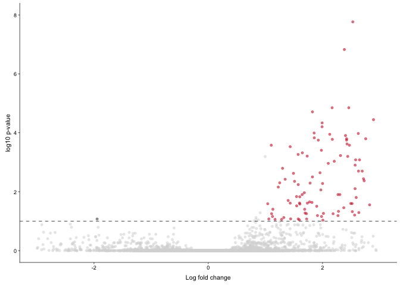
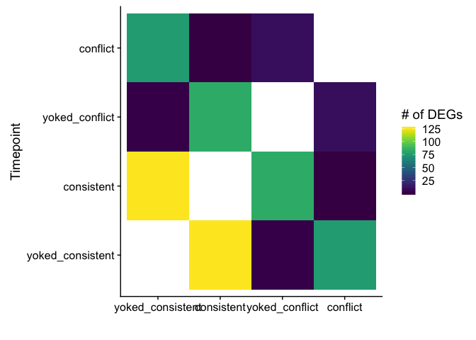
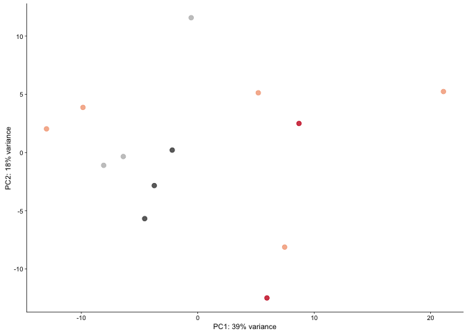
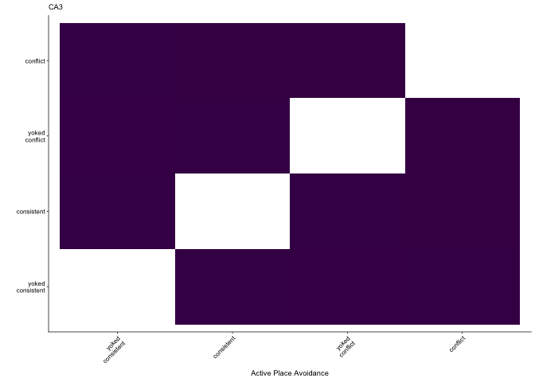
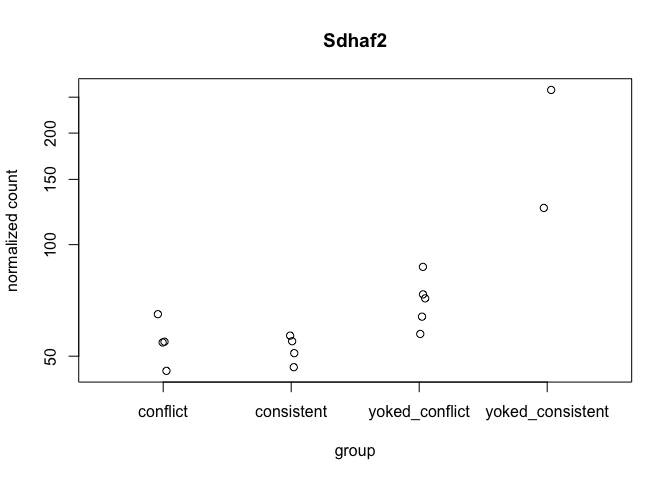
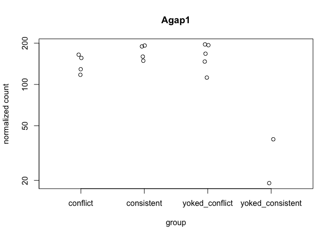
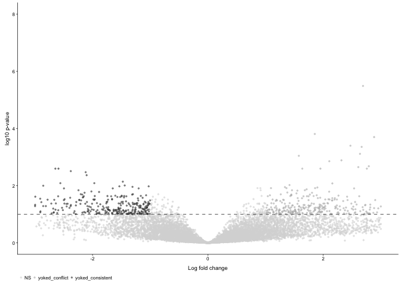
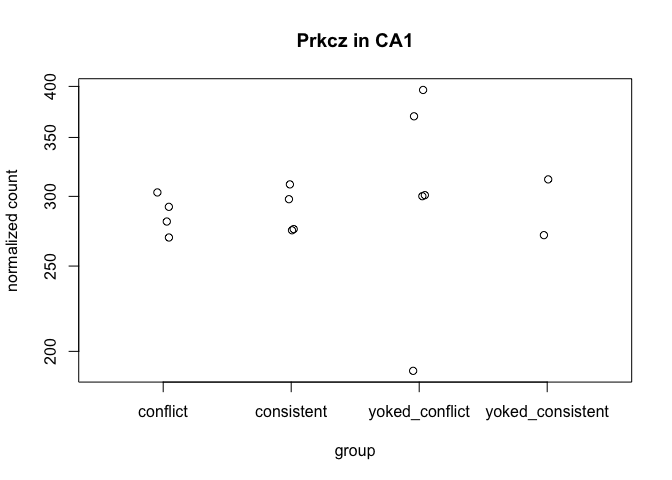
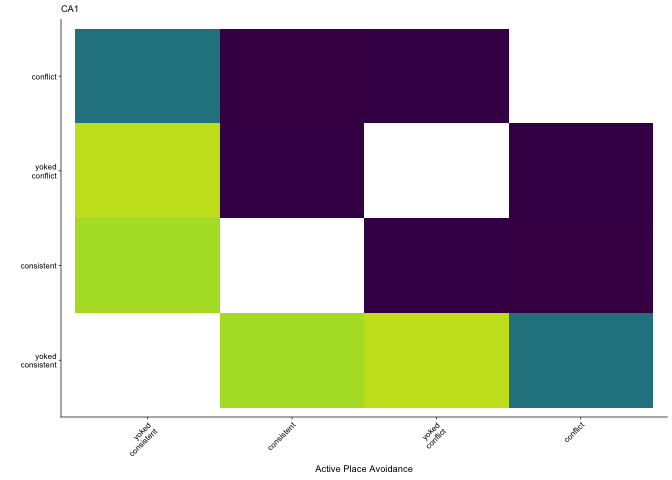
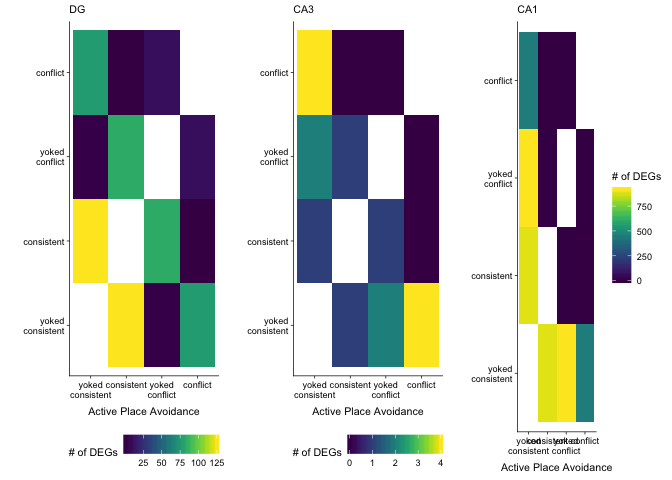

Subfield analysis
-----------------

This script is used to identify treatement differences within each
subfield, generate volcano plots, venn diagrams, and tables for
subsequent GO analyses. The final mutlipanel figures for the manuscript
have been inserted just below the subheadings.

    library(tidyverse)
    library(cowplot) ## for some easy to use themes
    library(car) ## stats
    library(VennDiagram) ## venn diagrams
    library(pheatmap) ## awesome heatmaps
    library(viridis) # for awesome color pallette
    library(reshape2) ## for melting dataframe
    library(DESeq2) ## for gene expression analysis
    library(edgeR)  ## for basic read counts status
    library(magrittr) ## to use the weird pipe
    library(genefilter)  ## for PCA fuction
    library(xtable) # for latex or html tables
    library(ggrepel) # for labeling points

    ## load functions 
    source("figureoptions.R")
    source("functions_RNAseq.R")

    ## set output file for figures 
    knitr::opts_chunk$set(fig.path = '../figures/02c_rnaseqSubfield/', cache = T)

DG
--

The most notable comparison within DG is the consistent verses
yoked-consistent.

    colData <- read.csv("../data/02a_colData.csv", header = T)
    countData <- read.csv("../data/02a_countData.csv", header = T, check.names = F, row.names = 1)

    colData <- colData %>% 
      filter(Punch %in% c("DG"))  %>% 
      droplevels()

    savecols <- as.character(colData$RNAseqID) 
    savecols <- as.vector(savecols) 
    countData <- countData %>% dplyr::select(one_of(savecols)) 

    colData %>% select(APA2,Punch)  %>%  summary()

    ##                APA2   Punch  
    ##  conflict        :5   DG:16  
    ##  consistent      :3          
    ##  yoked_conflict  :4          
    ##  yoked_consistent:4

    ## create DESeq object using the factors Punch and APA
    dds <- DESeqDataSetFromMatrix(countData = countData,
                                  colData = colData,
                                  design = ~ APA2)

    dds # view the DESeq object - note numnber of genes

    ## class: DESeqDataSet 
    ## dim: 22485 16 
    ## metadata(1): version
    ## assays(1): counts
    ## rownames(22485): 0610007P14Rik 0610009B22Rik ... Zzef1 Zzz3
    ## rowData names(0):
    ## colnames(16): 143A-DG-1 143B-DG-1 ... 148A-DG-3 148B-DG-4
    ## colData names(8): RNAseqID Mouse ... ID APA2

    dds <- dds[ rowSums(counts(dds)) > 1, ]  # Pre-filtering genes with 0 counts
    dds # view number of genes afternormalization and the number of samples

    ## class: DESeqDataSet 
    ## dim: 17011 16 
    ## metadata(1): version
    ## assays(1): counts
    ## rownames(17011): 0610007P14Rik 0610009B22Rik ... Zzef1 Zzz3
    ## rowData names(0):
    ## colnames(16): 143A-DG-1 143B-DG-1 ... 148A-DG-3 148B-DG-4
    ## colData names(8): RNAseqID Mouse ... ID APA2

    dds <- DESeq(dds) # Differential expression analysis

    ## estimating size factors

    ## estimating dispersions

    ## gene-wise dispersion estimates

    ## mean-dispersion relationship

    ## final dispersion estimates

    ## fitting model and testing

    vsd <- getVarianceStabilizedData(dds)

    write.csv(colData, file = "../data/02c_DGcolData.csv", row.names = T)
    write.csv(vsd, file = "../data/02c_DGvsd.csv", row.names = T)

    ###  "consistent", "yoked_consistent"
    res <- results(dds, contrast =c("APA2", "consistent", "yoked_consistent"), independentFiltering = T, alpha = 0.1)
    summary(res)

    ## 
    ## out of 17011 with nonzero total read count
    ## adjusted p-value < 0.1
    ## LFC > 0 (up)       : 119, 0.7%
    ## LFC < 0 (down)     : 6, 0.035%
    ## outliers [1]       : 20, 0.12%
    ## low counts [2]     : 4608, 27%
    ## (mean count < 4)
    ## [1] see 'cooksCutoff' argument of ?results
    ## [2] see 'independentFiltering' argument of ?results

    resOrdered <- res[order(res$padj),]
    head(resOrdered, 10)

    ## log2 fold change (MLE): APA2 consistent vs yoked_consistent 
    ## Wald test p-value: APA2 consistent vs yoked_consistent 
    ## DataFrame with 10 rows and 6 columns
    ##                baseMean   log2FoldChange             lfcSE
    ##               <numeric>        <numeric>         <numeric>
    ## Smad7  171.392871064045 3.53587630546888 0.418085263019867
    ## Sgk1   341.089572273562  2.5294241759539 0.361917138632088
    ## Lmna   127.261228543472 2.38190944527502 0.360880330410336
    ## Tiparp 146.843901753813 3.00078251228906 0.456274430110097
    ## Fzd5   26.8401177227407 4.05654356592019 0.655253175616987
    ## Acan   50.8597490321187 2.45912773237262 0.428543544565433
    ## Egr4   683.770839985962 3.23264668960927 0.562954537617405
    ## Errfi1  196.30327794802 2.16723775140599 0.378461151926573
    ## Rasd1  72.8100929443534   3.118258184161 0.542898092408939
    ## Per1   512.774508684412 1.82273176771816 0.322402773647012
    ##                    stat               pvalue                 padj
    ##               <numeric>            <numeric>            <numeric>
    ## Smad7  8.45730911424366 2.73617918572357e-17 3.38821068568149e-13
    ## Sgk1    6.9889593665395 2.76932605425327e-12 1.71462822649091e-08
    ## Lmna   6.60027506228086 4.10395627186822e-11 1.48901359887003e-07
    ## Tiparp 6.57670540855201 4.80986384194471e-11 1.48901359887003e-07
    ## Fzd5   6.19080336711157 5.98583433408844e-10 1.48245173118034e-06
    ## Acan   5.73833806052617 9.56101229489454e-09 1.41105309391996e-05
    ## Egr4   5.74228729604137 9.34061706254104e-09 1.41105309391996e-05
    ## Errfi1 5.72644706166954 1.02555744531048e-08 1.41105309391996e-05
    ## Rasd1  5.74372654419306 9.26153122112375e-09 1.41105309391996e-05
    ## Per1   5.65358587675741 1.57134545287761e-08 1.94579707429835e-05

    data <- data.frame(gene = row.names(res),
                       padj = res$padj, 
                       logpadj = -log10(res$padj),
                       lfc = res$log2FoldChange)
    data <- na.omit(data)
    data <- data %>%
      mutate(direction = ifelse(data$lfc > 1 & data$padj < 0.1, 
                            yes = "consistent", 
                            no = ifelse(data$lfc < -1 & data$padj < 0.1, 
                                        yes = "yoked_consistent", 
                                        no = "neither")))
    DGvolcano <- ggplot(data, aes(x = lfc, y = logpadj)) + 
      geom_point(aes(color = factor(direction)), size = 1, alpha = 0.5, na.rm = T) + # add gene points
      theme_cowplot(font_size = 8, line_size = 0.25) +
      geom_hline(yintercept = 1,  size = 0.25, linetype = 2) + 
      scale_color_manual(values = volcano1)  + 
      scale_y_continuous(limits=c(0, 8)) +
      scale_x_continuous( limits=c(-3, 3),
                          name="Log fold change")+
      ylab(paste0("log10 p-value")) +       
      theme(panel.grid.minor=element_blank(),
            legend.position = "none", # remove legend 
            panel.grid.major=element_blank()) 
    DGvolcano

    pdf(file="../figures/02c_rnaseqSubfield/DGvolcano.pdf", width=1.5, height=2)
    plot(DGvolcano)
    dev.off()

    ## quartz_off_screen 
    ##                 2

    # save DEGs
    DGvolcanoDEGs <- data %>%
      filter(direction != "neither") %>%
      arrange(desc(lfc))
    head(DGvolcanoDEGs,10)

    ##       gene         padj   logpadj      lfc  direction
    ## 1  Col10a1 2.958539e-04  3.528923 6.862672 consistent
    ## 2   Lrrc32 9.769907e-03  2.010110 6.049415 consistent
    ## 3    Thbs1 3.275529e-04  3.484719 5.491177 consistent
    ## 4     Fzd5 1.482452e-06  5.829019 4.056544 consistent
    ## 5    Nlrp3 9.260166e-04  3.033381 3.762818 consistent
    ## 6     Ier3 1.588050e-02  1.799136 3.758436 consistent
    ## 7    Npas4 2.205531e-04  3.656487 3.537464 consistent
    ## 8    Smad7 3.388211e-13 12.470030 3.535876 consistent
    ## 9    Nr4a3 1.114124e-02  1.953066 3.372927 consistent
    ## 10    Rfx2 2.636311e-04  3.579003 3.356056 consistent

    write.csv(DGvolcanoDEGs, "../data/DG-consistent-yokedconsistent.csv", row.names = F)

    # are any protein kinases differentially expressed?
    pkcs <- data[grep("Prkc", data$gene), ]
    pkcs # no pkcs are differentially expressed

    ##         gene padj logpadj         lfc direction
    ## 8139   Prkca    1       0 -0.06147923   neither
    ## 8140   Prkcb    1       0 -0.23086376   neither
    ## 8141   Prkcd    1       0 -1.74799258   neither
    ## 8142 Prkcdbp    1       0  0.89326487   neither
    ## 8143   Prkce    1       0 -0.08024100   neither
    ## 8144   Prkcg    1       0 -0.35258124   neither
    ## 8145   Prkci    1       0  0.14227925   neither
    ## 8146  Prkcsh    1       0 -0.12210803   neither
    ## 8147   Prkcz    1       0 -0.07894751   neither

    ## go setup
    table(res$padj<0.1)

    ## 
    ## FALSE  TRUE 
    ## 12258   125

    logs <- data.frame(cbind("gene"=row.names(res),"logP"=round(-log(res$pvalue+1e-10,10),1)))
    logs$logP=as.numeric(as.character(logs$logP))
    sign <- rep(1,nrow(logs))
    sign[res$log2FoldChange<0]=-1  ##change to correct model
    table(sign)

    ## sign
    ##   -1    1 
    ## 8514 8497

    logs$logP <- logs$logP*sign
    write.csv(logs, file = "./02e_GO_MWU/DGconsistentyoked.csv", row.names = F)

    ## yoked yoked
    res <- results(dds, contrast =c("APA2", "yoked_conflict", "yoked_consistent"), independentFiltering = T, alpha = 0.1)
    summary(res)

    ## 
    ## out of 17011 with nonzero total read count
    ## adjusted p-value < 0.1
    ## LFC > 0 (up)       : 3, 0.018%
    ## LFC < 0 (down)     : 0, 0%
    ## outliers [1]       : 20, 0.12%
    ## low counts [2]     : 0, 0%
    ## (mean count < 0)
    ## [1] see 'cooksCutoff' argument of ?results
    ## [2] see 'independentFiltering' argument of ?results

    resOrdered <- res[order(res$padj),]
    head(resOrdered, 10)

    ## log2 fold change (MLE): APA2 yoked_conflict vs yoked_consistent 
    ## Wald test p-value: APA2 yoked_conflict vs yoked_consistent 
    ## DataFrame with 10 rows and 6 columns
    ##                baseMean   log2FoldChange             lfcSE
    ##               <numeric>        <numeric>         <numeric>
    ## Nlrp3  20.9424446578681 4.09843296364912 0.779233741303161
    ## Kcnc2  22.0989714545398 4.08535721742376 0.828862390992367
    ## Gm2115 18.9055674115327  3.4830277315384 0.740349228132784
    ## Rnase4 15.5820343950564 3.55390988654223 0.842613820515981
    ## Cxcl14 58.4698286328215 1.83345102740851 0.452447198848122
    ## Sst    5.79777379074028 6.11617852816079  1.54412893097199
    ## Cnr1   121.554806190537 3.88279836743752  1.00562221165236
    ## Dner    48.134823231393 1.78996353992317 0.466270200248008
    ## Itga5  18.4196792457967 2.97838444092414 0.770052016789924
    ## Myb    6.92940033536349 5.85347258332179  1.53376995799632
    ##                    stat               pvalue                padj
    ##               <numeric>            <numeric>           <numeric>
    ## Nlrp3  5.25956814549002 1.44394111494543e-07 0.00245340034840377
    ## Kcnc2  4.92887270772716 8.27054358878605e-07 0.00702624030585319
    ## Gm2115 4.70457400262692  2.5439658007924e-06  0.0144081743070879
    ## Rnase4 4.21772085860871 2.46784058148773e-05   0.104827698300145
    ## Cxcl14 4.05229832801763  5.0716936646609e-05   0.172346294112507
    ## Sst    3.96092476831634 7.46600545073424e-05   0.211424831022376
    ## Cnr1   3.86109049944073 0.000112882079380257   0.228300316978926
    ## Dner   3.83889757263298 0.000123587970408467   0.228300316978926
    ## Itga5     3.86777045704 0.000109834980314461   0.228300316978926
    ## Myb    3.81639538107046 0.000135415452777609   0.228300316978926

    ## go setup
    table(res$padj<0.1)

    ## 
    ## FALSE  TRUE 
    ## 16988     3

    logs <- data.frame(cbind("gene"=row.names(res),"logP"=round(-log(res$pvalue+1e-10,10),1)))
    logs$logP=as.numeric(as.character(logs$logP))
    sign <- rep(1,nrow(logs))
    sign[res$log2FoldChange<0]=-1  ##change to correct model
    table(sign)

    ## sign
    ##   -1    1 
    ## 7543 9468

    logs$logP <- logs$logP*sign
    write.csv(logs, file = "./02e_GO_MWU/DGyokedyoked.csv", row.names = F)

    ##  "conflict", "yoked_conflict"
    res <- results(dds, contrast =c("APA2", "conflict", "yoked_conflict"), independentFiltering = T, alpha = 0.1)
    summary(res)

    ## 
    ## out of 17011 with nonzero total read count
    ## adjusted p-value < 0.1
    ## LFC > 0 (up)       : 8, 0.047%
    ## LFC < 0 (down)     : 2, 0.012%
    ## outliers [1]       : 20, 0.12%
    ## low counts [2]     : 0, 0%
    ## (mean count < 0)
    ## [1] see 'cooksCutoff' argument of ?results
    ## [2] see 'independentFiltering' argument of ?results

    resOrdered <- res[order(res$padj),]
    head(resOrdered, 10)

    ## log2 fold change (MLE): APA2 conflict vs yoked_conflict 
    ## Wald test p-value: APA2 conflict vs yoked_conflict 
    ## DataFrame with 10 rows and 6 columns
    ##                  baseMean    log2FoldChange             lfcSE
    ##                 <numeric>         <numeric>         <numeric>
    ## Rps12    18.1519752295379 -21.4660372235101  3.98668946399401
    ## Smad7    171.392871064045  1.75395877649455 0.367789349185405
    ## Dbpht2   179.735977990203  1.43077032426937 0.321333504493694
    ## Insm1    9.54062645923209 -4.64275029978039  1.03675452747997
    ## Slc16a1  51.2786850104172  1.93718965194518  0.44615480867931
    ## Ankrd33b  209.87162559181  1.14655990310545 0.276132373170068
    ## Nptx2    287.767100019705   1.3638765179225 0.326912129498613
    ## Sgk1     341.089572273562  1.32296838420772 0.318991572774191
    ## Fzd5     26.8401177227407  2.51256156493636 0.616467582899093
    ## Acan     50.8597490321187  1.57030753918143 0.390249971326104
    ##                       stat               pvalue               padj
    ##                  <numeric>            <numeric>          <numeric>
    ## Rps12    -5.38442670726719 7.26759094316345e-08 0.0012348363771529
    ## Smad7     4.76892215715134 1.85214205733359e-06 0.0157348728480775
    ## Dbpht2     4.4526023718683 8.48357704965123e-06  0.036036114412656
    ## Insm1    -4.47815772848902 7.52899656444231e-06  0.036036114412656
    ## Slc16a1   4.34196743879007  1.4121246484845e-05 0.0479868198048004
    ## Ankrd33b  4.15221109333418 3.29278313147062e-05 0.0714369057097393
    ## Nptx2      4.1719972887341 3.01941230747777e-05 0.0714369057097393
    ## Sgk1      4.14734587720354 3.36351742497743e-05 0.0714369057097393
    ## Fzd5      4.07573996530428 4.58682534831127e-05 0.0865941661035076
    ## Acan      4.02385049214837 5.72542716466592e-05 0.0972807329548386

    ## go setup
    table(res$padj<0.1)

    ## 
    ## FALSE  TRUE 
    ## 16981    10

    logs <- data.frame(cbind("gene"=row.names(res),"logP"=round(-log(res$pvalue+1e-10,10),1)))
    logs$logP=as.numeric(as.character(logs$logP))
    sign <- rep(1,nrow(logs))
    sign[res$log2FoldChange<0]=-1  ##change to correct model
    table(sign)

    ## sign
    ##   -1    1 
    ## 9161 7850

    logs$logP <- logs$logP*sign
    write.csv(logs, file = "./02e_GO_MWU/DGconflictyoked.csv", row.names = F)

    #### "conflict", "consistent"
    res <- results(dds, contrast =c("APA2", "conflict", "consistent"), independentFiltering = T, alpha = 0.1)
    summary(res)

    ## 
    ## out of 17011 with nonzero total read count
    ## adjusted p-value < 0.1
    ## LFC > 0 (up)       : 0, 0%
    ## LFC < 0 (down)     : 1, 0.0059%
    ## outliers [1]       : 20, 0.12%
    ## low counts [2]     : 0, 0%
    ## (mean count < 0)
    ## [1] see 'cooksCutoff' argument of ?results
    ## [2] see 'independentFiltering' argument of ?results

    resOrdered <- res[order(res$padj),]
    head(resOrdered, 10)

    ## log2 fold change (MLE): APA2 conflict vs consistent 
    ## Wald test p-value: APA2 conflict vs consistent 
    ## DataFrame with 10 rows and 6 columns
    ##                       baseMean      log2FoldChange             lfcSE
    ##                      <numeric>           <numeric>         <numeric>
    ## Rps12         18.1519752295379   -20.9602515412509  4.31657511842665
    ## 0610007P14Rik 41.0311096797814  -0.147853585345479 0.401936989061582
    ## 0610009B22Rik 8.74131849081542  -0.757911677384719 0.749958107259618
    ## 0610009L18Rik 2.61860548764425   0.604880308182448  1.47685825837305
    ## 0610009O20Rik 48.3693444464377   0.245771257508901 0.338998927531247
    ## 0610010F05Rik 60.2560857800178  -0.366265579229739 0.337328940603637
    ## 0610010K14Rik 21.0476159827708   0.408843299351539 0.633957053040539
    ## 0610012G03Rik 54.2812123171702   0.107773629512783  0.39988801248596
    ## 0610030E20Rik 44.9946840589216 -0.0960001442093612 0.418155894492029
    ## 0610037L13Rik  88.714181322051   0.113994422486644  0.42719715165959
    ##                             stat               pvalue               padj
    ##                        <numeric>            <numeric>          <numeric>
    ## Rps12          -4.85575970907479 1.19926058988033e-06 0.0203766366826567
    ## 0610007P14Rik -0.367852646980013    0.712983110464947                  1
    ## 0610009B22Rik  -1.01060535254984    0.312205352968242                  1
    ## 0610009L18Rik  0.409572350462935    0.682119683055183                  1
    ## 0610009O20Rik  0.724991253803443    0.468457396079254                  1
    ## 0610010F05Rik  -1.08578166632937    0.277575599485643                  1
    ## 0610010K14Rik  0.644906933980266    0.518987497962982                  1
    ## 0610012G03Rik  0.269509528037096    0.787537611075567                  1
    ## 0610030E20Rik -0.229579794220003    0.818418309400207                  1
    ## 0610037L13Rik  0.266842655770982    0.789590310078535                  1

    ## go setup
    table(res$padj<0.1)

    ## 
    ## FALSE  TRUE 
    ## 16990     1

    logs <- data.frame(cbind("gene"=row.names(res),"logP"=round(-log(res$pvalue+1e-10,10),1)))
    logs$logP=as.numeric(as.character(logs$logP))
    sign <- rep(1,nrow(logs))
    sign[res$log2FoldChange<0]=-1  ##change to correct model
    table(sign)

    ## sign
    ##   -1    1 
    ## 8383 8628

    logs$logP <- logs$logP*sign
    write.csv(logs, file = "./02e_GO_MWU/DGconflictconsistent.csv", row.names = F)

    ## plot of pkmz
    plotCounts(dds, "Prkcz", intgroup = "APA2", normalized = TRUE, main="Prkcz in DG")

    # order results table by the smallest adjusted p value:
    res <- res[order(res$padj),]

    results = as.data.frame(dplyr::mutate(as.data.frame(res), sig=ifelse(res$padj<0.05, "FDR<0.05", "Not Sig")), row.names=rownames(res))
    head(results)

    ##                baseMean log2FoldChange     lfcSE       stat       pvalue
    ## Rps12         18.151975    -20.9602515 4.3165751 -4.8557597 1.199261e-06
    ## 0610007P14Rik 41.031110     -0.1478536 0.4019370 -0.3678526 7.129831e-01
    ## 0610009B22Rik  8.741318     -0.7579117 0.7499581 -1.0106054 3.122054e-01
    ## 0610009L18Rik  2.618605      0.6048803 1.4768583  0.4095724 6.821197e-01
    ## 0610009O20Rik 48.369344      0.2457713 0.3389989  0.7249913 4.684574e-01
    ## 0610010F05Rik 60.256086     -0.3662656 0.3373289 -1.0857817 2.775756e-01
    ##                     padj      sig
    ## Rps12         0.02037664 FDR<0.05
    ## 0610007P14Rik 1.00000000  Not Sig
    ## 0610009B22Rik 1.00000000  Not Sig
    ## 0610009L18Rik 1.00000000  Not Sig
    ## 0610009O20Rik 1.00000000  Not Sig
    ## 0610010F05Rik 1.00000000  Not Sig

    numDEGs <- function(group1, group2){
      res <- results(dds, contrast = c("APA2", group1, group2), independentFiltering = T)
      sumpadj <- sum(res$padj < 0.1, na.rm = TRUE)
      return(sumpadj)
    }

    #create list of groups
    a <- levels(colData$APA2)
    b <- levels(colData$APA2)

    # comapre all contrasts, save to datafrmes
    dat=data.frame()
    for (i in a){
      for (j in b){
        if (i != j) {
          k <- paste(i,j, sep = "") #assigns usique rownames
          dat[k,1]<-i               
          dat[k,2]<-j
          dat[k,3]<- numDEGs(i,j) #caluculates number of DEGs
        }
      }
    }

    head(dat)

    ##                                    V1               V2  V3
    ## conflictconsistent           conflict       consistent   1
    ## conflictyoked_conflict       conflict   yoked_conflict  10
    ## conflictyoked_consistent     conflict yoked_consistent  76
    ## consistentconflict         consistent         conflict   1
    ## consistentyoked_conflict   consistent   yoked_conflict  83
    ## consistentyoked_consistent consistent yoked_consistent 125

    rownames(dat) <- NULL #remove row names
    data_wide <- spread(dat, V2, V3)
    data_wide

    ##                 V1 conflict consistent yoked_conflict yoked_consistent
    ## 1         conflict       NA          1             10               76
    ## 2       consistent        1         NA             83              125
    ## 3   yoked_conflict       10         83             NA                3
    ## 4 yoked_consistent       76        125              3               NA

    dat$V1 <- factor(dat$V1, levels = 
                                  c("yoked_consistent", "consistent", "yoked_conflict", "conflict"))
    dat$V2 <- factor(dat$V2, levels = 
                                  c("yoked_consistent", "consistent", "yoked_conflict", "conflict"))

    # rename levels
    levels(dat$V1) <- c("yoked\nconsistent","consistent",  "yoked\nconflict","conflict")
    levels(dat$V2) <- c("yoked\nconsistent","consistent",  "yoked\nconflict","conflict")

    DGheat <- ggplot(dat, aes(V1, V2)) +
      geom_tile(aes(fill = V3)) +
      scale_fill_viridis(na.value="#FFFFFF00") + 
      ylab(" ") + xlab("Active Place Avoidance") +
      labs(fill = "# of DEGs",
           subtitle = "DG") +
      #guides(fill=FALSE) + 
      theme_cowplot(font_size = 8, line_size = 0.25) +
      theme(legend.position="bottom")
    DGheat

CA3
---

There are so few differences in the CA3 that I don’t make any figures
for the manuscript.

    colData <- read.csv("../data/02a_colData.csv", header = T)
    countData <- read.csv("../data/02a_countData.csv", header = T, check.names = F, row.names = 1)

    colData <- colData %>% 
      filter(Punch %in% c("CA3"))  %>% 
      droplevels()
    savecols <- as.character(colData$RNAseqID) 
    savecols <- as.vector(savecols) 
    countData <- countData %>% dplyr::select(one_of(savecols)) 
    colData %>% select(APA2,Punch)  %>%  summary()

    ##                APA2   Punch   
    ##  conflict        :5   CA3:13  
    ##  consistent      :2           
    ##  yoked_conflict  :3           
    ##  yoked_consistent:3

    ## create DESeq object using the factors Punch and APA
    dds <- DESeqDataSetFromMatrix(countData = countData,
                                  colData = colData,
                                  design = ~ APA2)

    dds # view the DESeq object - note numnber of genes

    ## class: DESeqDataSet 
    ## dim: 22485 13 
    ## metadata(1): version
    ## assays(1): counts
    ## rownames(22485): 0610007P14Rik 0610009B22Rik ... Zzef1 Zzz3
    ## rowData names(0):
    ## colnames(13): 143A-CA3-1 144A-CA3-2 ... 148A-CA3-3 148B-CA3-4
    ## colData names(8): RNAseqID Mouse ... ID APA2

    dds <- dds[ rowSums(counts(dds)) > 1, ]  # Pre-filtering genes with 0 counts
    dds # view number of genes afternormalization and the number of samples

    ## class: DESeqDataSet 
    ## dim: 16502 13 
    ## metadata(1): version
    ## assays(1): counts
    ## rownames(16502): 0610007P14Rik 0610009B22Rik ... Zzef1 Zzz3
    ## rowData names(0):
    ## colnames(13): 143A-CA3-1 144A-CA3-2 ... 148A-CA3-3 148B-CA3-4
    ## colData names(8): RNAseqID Mouse ... ID APA2

    dds <- DESeq(dds) # Differential expression analysis
    vsd <- getVarianceStabilizedData(dds)

    res <- results(dds, contrast =c("APA2", "consistent", "yoked_consistent"), independentFiltering = T, alpha = 0.1)
    summary(res)

    ## 
    ## out of 16502 with nonzero total read count
    ## adjusted p-value < 0.1
    ## LFC > 0 (up)       : 1, 0.0061%
    ## LFC < 0 (down)     : 0, 0%
    ## outliers [1]       : 11, 0.067%
    ## low counts [2]     : 0, 0%
    ## (mean count < 0)
    ## [1] see 'cooksCutoff' argument of ?results
    ## [2] see 'independentFiltering' argument of ?results

    res <- results(dds, contrast =c("APA2", "conflict", "yoked_conflict"), independentFiltering = T, alpha = 0.1)
    summary(res)

    ## 
    ## out of 16502 with nonzero total read count
    ## adjusted p-value < 0.1
    ## LFC > 0 (up)       : 0, 0%
    ## LFC < 0 (down)     : 0, 0%
    ## outliers [1]       : 11, 0.067%
    ## low counts [2]     : 0, 0%
    ## (mean count < 0)
    ## [1] see 'cooksCutoff' argument of ?results
    ## [2] see 'independentFiltering' argument of ?results

    res <- results(dds, contrast =c("APA2", "yoked_conflict", "yoked_consistent"), independentFiltering = T, alpha = 0.1)
    summary(res)

    ## 
    ## out of 16502 with nonzero total read count
    ## adjusted p-value < 0.1
    ## LFC > 0 (up)       : 1, 0.0061%
    ## LFC < 0 (down)     : 1, 0.0061%
    ## outliers [1]       : 11, 0.067%
    ## low counts [2]     : 0, 0%
    ## (mean count < 0)
    ## [1] see 'cooksCutoff' argument of ?results
    ## [2] see 'independentFiltering' argument of ?results

    res <- results(dds, contrast =c("APA2", "conflict", "consistent"), independentFiltering = T, alpha = 0.1)
    summary(res)

    ## 
    ## out of 16502 with nonzero total read count
    ## adjusted p-value < 0.1
    ## LFC > 0 (up)       : 0, 0%
    ## LFC < 0 (down)     : 0, 0%
    ## outliers [1]       : 11, 0.067%
    ## low counts [2]     : 0, 0%
    ## (mean count < 0)
    ## [1] see 'cooksCutoff' argument of ?results
    ## [2] see 'independentFiltering' argument of ?results

    ## go setup
    table(res$padj<0.1)

    ## 
    ## FALSE 
    ## 16491

    logs <- data.frame(cbind("gene"=row.names(res),"logP"=round(-log(res$pvalue+1e-10,10),1)))
    logs$logP=as.numeric(as.character(logs$logP))
    sign <- rep(1,nrow(logs))
    sign[res$log2FoldChange<0]=-1  ##change to correct model
    table(sign)

    ## sign
    ##   -1    1 
    ## 7619 8883

    logs$logP <- logs$logP*sign
    write.csv(logs, file = "./02e_GO_MWU/CA3conflictconsistent.csv", row.names = F)

    plotCounts(dds, "Prkcz", intgroup = "APA2", normalized = TRUE, main="Prkcz in CA3")

    numDEGs <- function(group1, group2){
      res <- results(dds, contrast = c("APA2", group1, group2), independentFiltering = T)
      sumpadj <- sum(res$padj < 0.1, na.rm = TRUE)
      return(sumpadj)
    }

    #create list of groups
    a <- levels(colData$APA2)
    b <- levels(colData$APA2)

    # comapre all contrasts, save to datafrmes
    dat=data.frame()
    for (i in a){
      for (j in b){
        if (i != j) {
          k <- paste(i,j, sep = "") #assigns usique rownames
          dat[k,1]<-i               
          dat[k,2]<-j
          dat[k,3]<- numDEGs(i,j) #caluculates number of DEGs
        }
      }
    }

    head(dat)

    ##                                    V1               V2 V3
    ## conflictconsistent           conflict       consistent  0
    ## conflictyoked_conflict       conflict   yoked_conflict  0
    ## conflictyoked_consistent     conflict yoked_consistent  4
    ## consistentconflict         consistent         conflict  0
    ## consistentyoked_conflict   consistent   yoked_conflict  1
    ## consistentyoked_consistent consistent yoked_consistent  1

    rownames(dat) <- NULL #remove row names
    data_wide <- spread(dat, V2, V3)
    data_wide

    ##                 V1 conflict consistent yoked_conflict yoked_consistent
    ## 1         conflict       NA          0              0                4
    ## 2       consistent        0         NA              1                1
    ## 3   yoked_conflict        0          1             NA                2
    ## 4 yoked_consistent        4          1              2               NA

    dat$V1 <- factor(dat$V1, levels = 
                                  c("yoked_consistent", "consistent", "yoked_conflict", "conflict"))
    dat$V2 <- factor(dat$V2, levels = 
                                  c("yoked_consistent", "consistent", "yoked_conflict", "conflict"))

    # rename levels
    levels(dat$V1) <- c("yoked\nconsistent","consistent",  "yoked\nconflict","conflict")
    levels(dat$V2) <- c("yoked\nconsistent","consistent",  "yoked\nconflict","conflict")

    CA3heat <- ggplot(dat, aes(V1, V2)) +
      geom_tile(aes(fill = V3)) +
      scale_fill_viridis(na.value="#FFFFFF00") + 
      ylab(" ") + xlab("Active Place Avoidance") +
      labs(fill = "# of DEGs",
           subtitle = "CA3") +
      #guides(fill=FALSE) + 
      theme_cowplot(font_size = 8, line_size = 0.25)  +
      theme(legend.position="bottom")
    CA3heat

CA1
---

    colData <- read.csv("../data/02a_colData.csv", header = T)
    countData <- read.csv("../data/02a_countData.csv", header = T, check.names = F, row.names = 1)
    colData <- colData %>% 
      filter(Punch %in% c("CA1"))  %>% 
      droplevels()
    savecols <- as.character(colData$RNAseqID) 
    savecols <- as.vector(savecols) 
    countData <- countData %>% dplyr::select(one_of(savecols)) 
    colData %>% select(APA2,Punch)  %>%  summary()

    ##                APA2   Punch   
    ##  conflict        :4   CA1:15  
    ##  consistent      :4           
    ##  yoked_conflict  :5           
    ##  yoked_consistent:2

    dds <- DESeqDataSetFromMatrix(countData = countData,
                                  colData = colData,
                                  design = ~ APA2)

    dds # view the DESeq object - note numnber of genes

    ## class: DESeqDataSet 
    ## dim: 22485 15 
    ## metadata(1): version
    ## assays(1): counts
    ## rownames(22485): 0610007P14Rik 0610009B22Rik ... Zzef1 Zzz3
    ## rowData names(0):
    ## colnames(15): 143B-CA1-1 143C-CA1-1 ... 148A-CA1-3 148B-CA1-4
    ## colData names(8): RNAseqID Mouse ... ID APA2

    dds <- dds[ rowSums(counts(dds)) > 1, ]  # Pre-filtering genes with 0 counts
    dds # view number of genes afternormalization and the number of samples

    ## class: DESeqDataSet 
    ## dim: 16852 15 
    ## metadata(1): version
    ## assays(1): counts
    ## rownames(16852): 0610007P14Rik 0610009B22Rik ... Zzef1 Zzz3
    ## rowData names(0):
    ## colnames(15): 143B-CA1-1 143C-CA1-1 ... 148A-CA1-3 148B-CA1-4
    ## colData names(8): RNAseqID Mouse ... ID APA2

    dds <- DESeq(dds) # Differential expression analysis
    vsd <- getVarianceStabilizedData(dds)

    res <- results(dds, contrast =c("APA2", "consistent", "yoked_consistent"), independentFiltering = T, alpha = 0.1)
    summary(res)

    ## 
    ## out of 16852 with nonzero total read count
    ## adjusted p-value < 0.1
    ## LFC > 0 (up)       : 522, 3.1%
    ## LFC < 0 (down)     : 360, 2.1%
    ## outliers [1]       : 32, 0.19%
    ## low counts [2]     : 4892, 29%
    ## (mean count < 5)
    ## [1] see 'cooksCutoff' argument of ?results
    ## [2] see 'independentFiltering' argument of ?results

    resOrdered <- res[order(res$padj),]
    head(resOrdered, 10)

    ## log2 fold change (MLE): APA2 consistent vs yoked_consistent 
    ## Wald test p-value: APA2 consistent vs yoked_consistent 
    ## DataFrame with 10 rows and 6 columns
    ##                 baseMean    log2FoldChange             lfcSE
    ##                <numeric>         <numeric>         <numeric>
    ## Agap1   141.608762023137  2.77875046323113 0.429199296188875
    ## Mga     103.422400328703  2.88512466619264 0.476961395193359
    ## Adamts1  114.05510912055  3.03089016770407 0.542440999553538
    ## Gpd1    249.757427758137 -1.22793747874627 0.227810028908553
    ## Sdhaf2  77.6262495970029 -1.88444201930465 0.348951742799771
    ## Scn4b   126.513273389751  2.75983601093414 0.532911368920647
    ## Lhfpl4  214.234684832542  1.68458658679064 0.339420793176825
    ## Ncoa4   101.428981706278  2.35081948916118 0.479986115715859
    ## Lats2   79.0118946108766  2.50181097858729 0.521225803363559
    ## Gad2    132.201113296669  2.85189408073539 0.598342010017458
    ##                      stat               pvalue                 padj
    ##                 <numeric>            <numeric>            <numeric>
    ## Agap1    6.47426612276713 9.52738560669965e-11 1.13642655516713e-06
    ## Mga       6.0489689422831 1.45775755672213e-09 8.69406606829079e-06
    ## Adamts1    5.587501995975 2.30359111544776e-08 9.15907827502029e-05
    ## Gpd1    -5.39018183101669 7.03864292904973e-08  0.00016791386571541
    ## Sdhaf2  -5.40029404692198 6.65317533407242e-08  0.00016791386571541
    ## Scn4b    5.17878989244286 2.23329823696753e-07 0.000443979689509145
    ## Lhfpl4    4.9631213545395 6.93692079304959e-07  0.00118205130313565
    ## Ncoa4    4.89768227077803 9.69736686587007e-07  0.00144587739970123
    ## Lats2    4.79986018044902 1.58776440987012e-06   0.0021043170978812
    ## Gad2     4.76632767378674 1.87614050243395e-06  0.00223786039130321

    topGene <- rownames(res)[which.min(res$padj)]
    plotCounts(dds, gene = topGene, intgroup=c("APA2"))

    data <- data.frame(gene = row.names(res),
                       padj = res$padj, 
                       logpadj = -log10(res$padj),
                       lfc = res$log2FoldChange)
    data <- na.omit(data)
    data <- data %>%
      mutate(direction = ifelse(data$lfc > 1 & data$padj < 0.1, 
                            yes = "consistent", 
                            no = ifelse(data$lfc < -1 & data$padj < 0.1, 
                                        yes = "yoked_consistent", 
                                        no = "neither")))

    CA1volcano <- ggplot(data, aes(x = lfc, y = logpadj)) + 
      geom_point(aes(color = factor(direction)), size = 1, alpha = 0.5, na.rm = T) + # add gene points
        theme_cowplot(font_size = 8, line_size = 0.25) +
      scale_color_manual(values = volcano1)  + 
      geom_hline(yintercept = 1,  size = 0.25, linetype = 2) + 
      scale_y_continuous(limits=c(0, 8)) +
      scale_x_continuous( limits=c(-3, 3),
                          name="Log fold change")+
      ylab(paste0("log10 p-value")) +       
      theme(panel.grid.minor=element_blank(),
            legend.position = "none", # remove legend 
            panel.grid.major=element_blank()) + 
      geom_text_repel(data = subset(data, logpadj > 3.5), aes(label = gene),
                      colour = "black", min.segment.length = 0,
                      box.padding = 0.5, size = 2)
    CA1volcano

    pdf(file="../figures/02c_rnaseqSubfield/CA1volcano.pdf",  width=1.5, height=2)
    plot(CA1volcano)
    dev.off()

    ## quartz_off_screen 
    ##                 2

    # save DEGs
    CA1volcanoDEGs <- data %>%
      filter(direction != "neither") %>%
      arrange(desc(lfc))
    head(CA1volcanoDEGs,10)

    ##       gene        padj  logpadj      lfc  direction
    ## 1    Srprb 0.009269714 2.032934 6.362542 consistent
    ## 2   Zfp536 0.016971128 1.770289 6.278678 consistent
    ## 3    Ahnak 0.019268528 1.715151 6.183278 consistent
    ## 4    Uvssa 0.023546445 1.628075 6.091268 consistent
    ## 5  Gm43951 0.019842316 1.702408 6.014951 consistent
    ## 6     Vcan 0.018269414 1.738275 5.994322 consistent
    ## 7    Pex26 0.025320503 1.596528 5.857468 consistent
    ## 8    Med26 0.030274380 1.518925 5.805185 consistent
    ## 9  Gm16485 0.035396074 1.451045 5.797461 consistent
    ## 10  Adgrf5 0.028566992 1.544135 5.791507 consistent

    write.csv(CA1volcanoDEGs, "../data/CA1-consistent-yokedconsistent.csv", row.names = F)

    ## go setup
    table(res$padj<0.1)

    ## 
    ## FALSE  TRUE 
    ## 11046   882

    logs <- data.frame(cbind("gene"=row.names(res),"logP"=round(-log(res$pvalue+1e-10,10),1)))
    logs$logP=as.numeric(as.character(logs$logP))
    sign <- rep(1,nrow(logs))
    sign[res$log2FoldChange<0]=-1  ##change to correct model
    table(sign)

    ## sign
    ##   -1    1 
    ## 7087 9765

    logs$logP <- logs$logP*sign
    write.csv(logs, file = "./02e_GO_MWU/CA1consistentyoked.csv", row.names = F)

    #conflict yoked conflict

    res <- results(dds, contrast =c("APA2", "conflict", "yoked_conflict"), independentFiltering = T, alpha = 0.1)
    summary(res)

    ## 
    ## out of 16852 with nonzero total read count
    ## adjusted p-value < 0.1
    ## LFC > 0 (up)       : 1, 0.0059%
    ## LFC < 0 (down)     : 3, 0.018%
    ## outliers [1]       : 32, 0.19%
    ## low counts [2]     : 0, 0%
    ## (mean count < 0)
    ## [1] see 'cooksCutoff' argument of ?results
    ## [2] see 'independentFiltering' argument of ?results

    resOrdered <- res[order(res$padj),]
    head(resOrdered, 3)

    ## log2 fold change (MLE): APA2 conflict vs yoked_conflict 
    ## Wald test p-value: APA2 conflict vs yoked_conflict 
    ## DataFrame with 3 rows and 6 columns
    ##                 baseMean    log2FoldChange             lfcSE
    ##                <numeric>         <numeric>         <numeric>
    ## Gm20390  47.871821328339  3.00058138879651 0.573131448874277
    ## Il4ra   21.8885208760384 -5.08358235078517  1.03917819120914
    ## Gm21949 21.1841188999619 -17.0604245457745  3.93136294526155
    ##                      stat               pvalue                padj
    ##                 <numeric>            <numeric>           <numeric>
    ## Gm20390  5.23541570557704 1.64613940148141e-07 0.00276880647329174
    ## Il4ra   -4.89192555597239 9.98542153661337e-07 0.00839773951229184
    ## Gm21949 -4.33956996169416 1.42761812252115e-05  0.0800417894026856

    # volcano plots

    res <- results(dds, contrast =c("APA2", "yoked_conflict", "yoked_consistent"), independentFiltering = T, alpha = 0.1)
    summary(res)

    ## 
    ## out of 16852 with nonzero total read count
    ## adjusted p-value < 0.1
    ## LFC > 0 (up)       : 545, 3.2%
    ## LFC < 0 (down)     : 372, 2.2%
    ## outliers [1]       : 32, 0.19%
    ## low counts [2]     : 4892, 29%
    ## (mean count < 5)
    ## [1] see 'cooksCutoff' argument of ?results
    ## [2] see 'independentFiltering' argument of ?results

    resOrdered <- res[order(res$padj),]
    head(resOrdered, 10)

    ## log2 fold change (MLE): APA2 yoked_conflict vs yoked_consistent 
    ## Wald test p-value: APA2 yoked_conflict vs yoked_consistent 
    ## DataFrame with 10 rows and 6 columns
    ##                 baseMean    log2FoldChange             lfcSE
    ##                <numeric>         <numeric>         <numeric>
    ## Agap1   141.608762023137  2.68968384471022 0.425950937247951
    ## Pcdhb12  28.059174402023 -4.44059921537509 0.793522420608043
    ## Sdc3    215.373472922264  1.85322249231845 0.337204018821326
    ## Gm20390  47.871821328339  -3.8040822497641  0.70219289049731
    ## Adamts1  114.05510912055  2.88221063805508 0.537733929661138
    ## Ncoa4   101.428981706278  2.47137819824673 0.475325965109527
    ## Lats2   79.0118946108766   2.6661801320435 0.517454551358115
    ## Scn4b   126.513273389751   2.6371721747529 0.525235880319819
    ## Tgoln1  253.956891941181  1.57640904952285 0.317332343312882
    ## Mga     103.422400328703  2.31524201605301 0.474841137139125
    ##                      stat               pvalue                 padj
    ##                 <numeric>            <numeric>            <numeric>
    ## Agap1    6.31453909243198 2.70967823987554e-10 3.23210420452355e-06
    ## Pcdhb12 -5.59606017429532 2.19277621314123e-08 0.000130777173351743
    ## Sdc3      5.4958493638251 3.88834321789396e-08 0.000154600526343464
    ## Gm20390 -5.41743202080835 6.04611256676931e-08 0.000180295076741061
    ## Adamts1  5.35991961651249 8.32589898627116e-08 0.000198622646216485
    ## Ncoa4     5.1993334672497 2.00004427341394e-07  0.00039760880155469
    ## Lats2    5.15249141213624 2.57048392323391e-07 0.000438010460519058
    ## Scn4b    5.02092921212296 5.14221090634331e-07 0.000766703646135787
    ## Tgoln1   4.96769107449142 6.77547856358508e-07 0.000897976758960476
    ## Mga      4.87582442835962 1.08354951665075e-06  0.00129245786346101

    topGene <- rownames(res)[which.min(res$padj)]
    plotCounts(dds, gene = topGene, intgroup=c("APA2"))

    data <- data.frame(gene = row.names(res),
                       padj = res$padj, 
                       logpadj = -log10(res$padj),
                       lfc = res$log2FoldChange)
    data <- na.omit(data)
    data <- data %>%
      mutate(direction = ifelse(data$lfc > 1 & data$padj < 0.1, 
                            yes = "yoked_conflict", 
                            no = ifelse(data$lfc < -1 & data$padj < 0.1, 
                                        yes = "yoked_consistent", 
                                        no = "neither")))

    CA1volcano2 <- ggplot(data, aes(x = lfc, y = logpadj)) + 
      geom_point(aes(color = factor(direction)), size = 1, alpha = 0.5, na.rm = T) + # add gene points
      theme_cowplot(font_size = 8, line_size = 0.25) +
      scale_color_manual(values = volcano3)  + 
      geom_hline(yintercept = 1,  size = 0.25, linetype = 2) + 
      scale_y_continuous(limits=c(0, 8)) +
      scale_x_continuous( limits=c(-3, 3),
                          name="Log fold change")+
      ylab(paste0("log10 p-value")) +       
      theme(panel.grid.minor=element_blank(),
            legend.position = "none", # remove legend 
            panel.grid.major=element_blank()) +
      geom_text_repel(data = subset(data, logpadj > 3.5), aes(label = gene),
                      colour = "black", min.segment.length = 0,
                      box.padding = 0.5, size = 2)
    CA1volcano2

    pdf(file="../figures/02c_rnaseqSubfield/CA1volcano2.pdf",  width=1.5, height=2)
    plot(CA1volcano2)
    dev.off()

    ## quartz_off_screen 
    ##                 2

    # save DEGs
    CA1volcano2DEGs <- data %>%
      filter(direction != "neither") %>%
      arrange(desc(lfc))
    head(CA1volcano2DEGs,10)

    ##       gene        padj  logpadj      lfc      direction
    ## 1    Srprb 0.002523184 2.598051 6.962723 yoked_conflict
    ## 2   Adgrf5 0.014393982 1.841819 6.323867 yoked_conflict
    ## 3    Ahnak 0.014393982 1.841819 6.288004 yoked_conflict
    ## 4   Fndc10 0.014393982 1.841819 6.187727 yoked_conflict
    ## 5  Slco1a4 0.017582699 1.754914 6.093251 yoked_conflict
    ## 6  Ppfibp1 0.031682073 1.499186 6.031033 yoked_conflict
    ## 7     Optn 0.041595475 1.380954 6.025644 yoked_conflict
    ## 8   Rnf207 0.039413555 1.404354 5.934581 yoked_conflict
    ## 9     Mdc1 0.020331763 1.691825 5.901609 yoked_conflict
    ## 10    Epyc 0.040773654 1.389620 5.895348 yoked_conflict

    write.csv(CA1volcano2DEGs, "../data/CA1-yokedconflict-yokedconsistent.csv", row.names = F)

    res <- results(dds, contrast =c("APA2", "conflict", "consistent"), independentFiltering = T, alpha = 0.1)
    summary(res)

    ## 
    ## out of 16852 with nonzero total read count
    ## adjusted p-value < 0.1
    ## LFC > 0 (up)       : 0, 0%
    ## LFC < 0 (down)     : 0, 0%
    ## outliers [1]       : 32, 0.19%
    ## low counts [2]     : 0, 0%
    ## (mean count < 0)
    ## [1] see 'cooksCutoff' argument of ?results
    ## [2] see 'independentFiltering' argument of ?results

    plotCounts(dds, "Prkcz", intgroup = "APA2", normalized = TRUE, main="Prkcz in CA1")

    # order levels
    colData$APA2 <- factor(colData$APA2, 
                              levels = c("yoked_consistent", "consistent", "yoked_conflict", "conflict"))

    #create list of groups
    a <- levels(colData$APA2)
    b <- levels(colData$APA2)

    # comapre all contrasts, save to datafrmes
    dat=data.frame()
    for (i in a){
      for (j in b){
        if (i != j) {
          k <- paste(i,j, sep = "") #assigns usique rownames
          dat[k,1]<-i               
          dat[k,2]<-j
          dat[k,3]<- numDEGs(i,j) #caluculates number of DEGs
        }
      }
    }

    head(dat)

    ##                                              V1               V2  V3
    ## yoked_consistentconsistent     yoked_consistent       consistent 882
    ## yoked_consistentyoked_conflict yoked_consistent   yoked_conflict 917
    ## yoked_consistentconflict       yoked_consistent         conflict 447
    ## consistentyoked_consistent           consistent yoked_consistent 882
    ## consistentyoked_conflict             consistent   yoked_conflict   1
    ## consistentconflict                   consistent         conflict   0

    rownames(dat) <- NULL #remove row names
    data_wide <- spread(dat, V2, V3)
    data_wide

    ##                 V1 conflict consistent yoked_conflict yoked_consistent
    ## 1         conflict       NA          0              4              447
    ## 2       consistent        0         NA              1              882
    ## 3   yoked_conflict        4          1             NA              917
    ## 4 yoked_consistent      447        882            917               NA

    dat$V1 <- factor(dat$V1, levels = 
                                  c("yoked_consistent", "consistent", "yoked_conflict", "conflict"))
    dat$V2 <- factor(dat$V2, levels = 
                                  c("yoked_consistent", "consistent", "yoked_conflict", "conflict"))

    # rename levels
    levels(dat$V1) <- c("yoked\nconsistent","consistent",  "yoked\nconflict","conflict")
    levels(dat$V2) <- c("yoked\nconsistent","consistent",  "yoked\nconflict","conflict")

    CA1heat <- ggplot(dat, aes(V1, V2)) +
      geom_tile(aes(fill = V3)) +
      scale_fill_viridis(na.value="#FFFFFF00") + 
      ylab(" ") + xlab("Active Place Avoidance") +
      labs(fill = "# of DEGs",
           subtitle = "CA1") +
      #guides(fill=FALSE) + 
      theme_cowplot(font_size = 8, line_size = 0.25) 
    CA1heat

    CA1heat2 <- ggplot(dat, aes(V1, V2)) +
      geom_tile(aes(fill = V3)) +
      scale_fill_viridis(na.value="#FFFFFF00",
                         limits = c(0,1000)) + 
      ylab(" ") + xlab("Active Place Avoidance") +
      labs(fill = "# of DEGs",
           subtitle = "CA1") +
      theme_cowplot(font_size = 8, line_size = 0.25) +
      theme(legend.position="bottom")

    # three plots no lengend
    allplots <- plot_grid(DGheat, CA3heat, CA1heat, nrow = 1)
    allplots 

    #three plots with legend 
    #legend <- get_legend(CA1heat2 + theme(legend.position="bottom"))
    #p <- plot_grid(allplots, legend, ncol = 1, rel_heights = c(1, .2))
    #p
