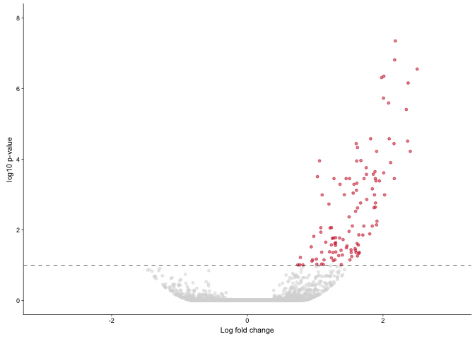
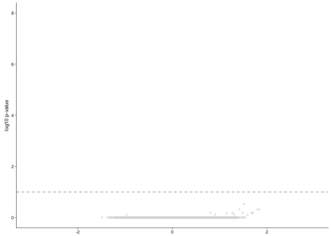
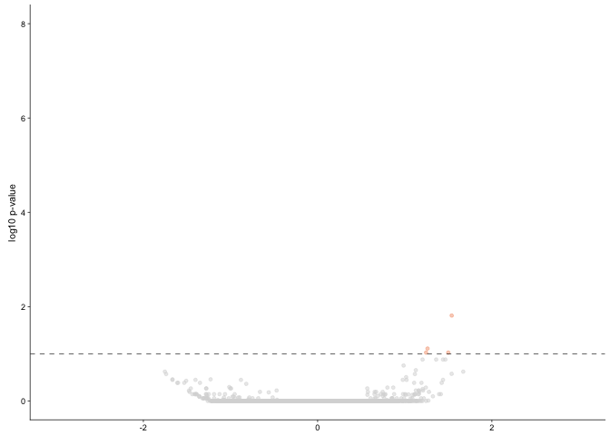
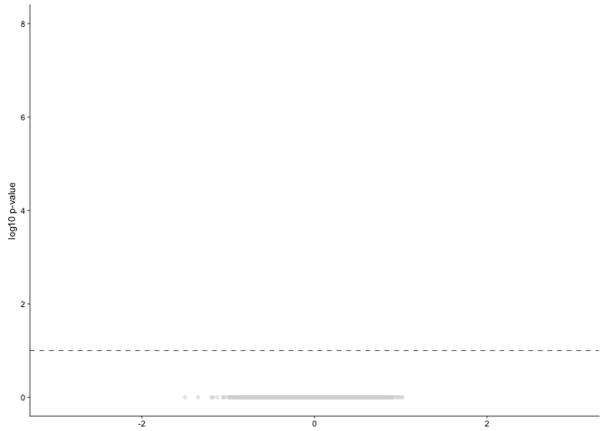
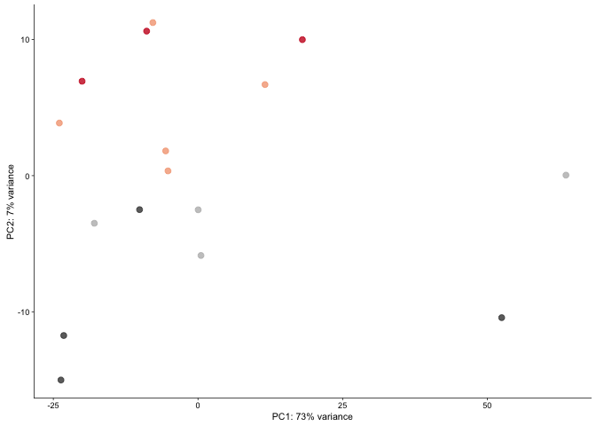
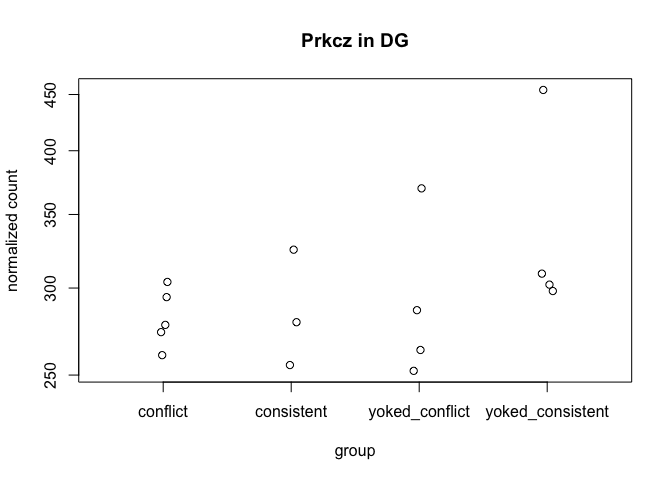
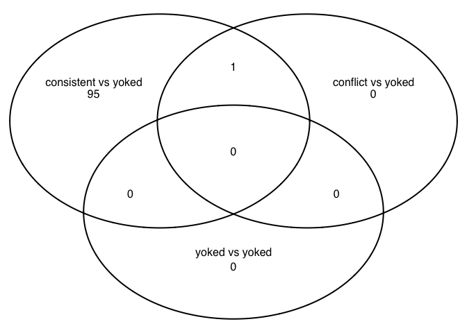
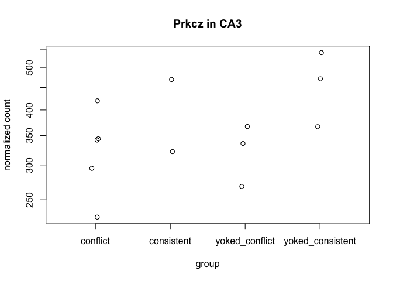

Summary
-------

    library(ggplot2) ## for awesome plots!
    library(cowplot) ## for some easy to use themes
    library(dplyr) ## for filtering and selecting rows
    library(car) ## stats
    library(VennDiagram) ## venn diagrams
    library(pheatmap) ## awesome heatmaps
    library(viridis) # for awesome color pallette
    library(reshape2) ## for melting dataframe

    library(DESeq2) ## for gene expression analysis
    library(edgeR)  ## for basic read counts status
    library(magrittr) ## to use the weird pipe
    library(genefilter)  ## for PCA fuction
    library(xtable)
    ## load functions 
    source("figureoptions.R")
    source("functions_RNAseq.R")

    ## set output file for figures 
    knitr::opts_chunk$set(fig.path = '../figures/02c_rnaseqSubfield/')

DG
--

    colData <- read.csv("../data/02a_colData.csv", header = T)
    countData <- read.csv("../data/02a_countData.csv", header = T, check.names = F, row.names = 1)

    colData <- colData %>% 
      filter(Punch %in% c("DG"))  %>% 
      droplevels()

    savecols <- as.character(colData$RNAseqID) 
    savecols <- as.vector(savecols) 
    countData <- countData %>% dplyr::select(one_of(savecols)) 

    colData %>% select(APA2,Punch)  %>%  summary()

    ##                APA2   Punch  
    ##  conflict        :5   DG:16  
    ##  consistent      :3          
    ##  yoked_conflict  :4          
    ##  yoked_consistent:4

    ## create DESeq object using the factors Punch and APA
    dds <- DESeqDataSetFromMatrix(countData = countData,
                                  colData = colData,
                                  design = ~ APA2)

    dds # view the DESeq object - note numnber of genes

    ## class: DESeqDataSet 
    ## dim: 46403 16 
    ## metadata(1): version
    ## assays(1): counts
    ## rownames(46403): 0610005C13Rik 0610007P14Rik ... Zzef1 Zzz3
    ## rowData names(0):
    ## colnames(16): 143A-DG-1 143B-DG-1 ... 148A-DG-3 148B-DG-4
    ## colData names(8): RNAseqID Mouse ... ID APA2

    dds <- dds[ rowSums(counts(dds)) > 1, ]  # Pre-filtering genes with 0 counts
    dds # view number of genes afternormalization and the number of samples

    ## class: DESeqDataSet 
    ## dim: 25229 16 
    ## metadata(1): version
    ## assays(1): counts
    ## rownames(25229): 0610005C13Rik 0610007P14Rik ... Zzef1 Zzz3
    ## rowData names(0):
    ## colnames(16): 143A-DG-1 143B-DG-1 ... 148A-DG-3 148B-DG-4
    ## colData names(8): RNAseqID Mouse ... ID APA2

    dds <- DESeq(dds) # Differential expression analysis
    rld <- rlog(dds, blind=FALSE) ## log transformed data
    vsd <- getVarianceStabilizedData(dds)

    write.csv(colData, file = "../data/02c_DGcolData.csv", row.names = T)
    write.csv(vsd, file = "../data/02c_DGvsd.csv", row.names = T)

    # create the dataframe using my function pcadataframe
    pcadata <- pcadataframe(rld, intgroup=c("Punch","APA2"), returnData=TRUE)
    percentVar <- round(100 * attr(pcadata, "percentVar"))
    percentVar

    ## [1] 73  7  4  3  2  2  2  1  1

    summary(aov(PC1 ~ APA2, data=pcadata)) 

    ##             Df Sum Sq Mean Sq F value Pr(>F)
    ## APA2         3    770   256.8   0.335    0.8
    ## Residuals   12   9185   765.4

    TukeyHSD((aov(PC1 ~ APA2, data=pcadata)) , which = "APA2") 

    ##   Tukey multiple comparisons of means
    ##     95% family-wise confidence level
    ## 
    ## Fit: aov(formula = PC1 ~ APA2, data = pcadata)
    ## 
    ## $APA2
    ##                                       diff       lwr      upr     p adj
    ## consistent-conflict               2.568022 -57.41575 62.55179 0.9992233
    ## yoked_conflict-conflict          17.747933 -37.35068 72.84654 0.7758636
    ## yoked_consistent-conflict         5.065169 -50.03344 60.16378 0.9925164
    ## yoked_conflict-consistent        15.179911 -47.55261 77.91244 0.8878895
    ## yoked_consistent-consistent       2.497147 -60.23538 65.22967 0.9993751
    ## yoked_consistent-yoked_conflict -12.682764 -70.76180 45.39627 0.9141206

    summary(aov(PC2 ~ APA2, data=pcadata)) 

    ##             Df Sum Sq Mean Sq F value  Pr(>F)    
    ## APA2         3  796.7  265.58   17.22 0.00012 ***
    ## Residuals   12  185.0   15.42                    
    ## ---
    ## Signif. codes:  0 '***' 0.001 '**' 0.01 '*' 0.05 '.' 0.1 ' ' 1

    TukeyHSD((aov(PC2 ~ APA2, data=pcadata)), which = "APA2") 

    ##   Tukey multiple comparisons of means
    ##     95% family-wise confidence level
    ## 
    ## Fit: aov(formula = PC2 ~ APA2, data = pcadata)
    ## 
    ## $APA2
    ##                                       diff        lwr          upr
    ## consistent-conflict               4.389295  -4.124598  12.90318891
    ## yoked_conflict-conflict          -7.751736 -15.572246   0.06877463
    ## yoked_consistent-conflict       -14.716547 -22.537057  -6.89603621
    ## yoked_conflict-consistent       -12.141031 -21.045074  -3.23698839
    ## yoked_consistent-consistent     -19.105842 -28.009885 -10.20179923
    ## yoked_consistent-yoked_conflict  -6.964811 -15.208353   1.27873109
    ##                                     p adj
    ## consistent-conflict             0.4507201
    ## yoked_conflict-conflict         0.0523032
    ## yoked_consistent-conflict       0.0005927
    ## yoked_conflict-consistent       0.0075985
    ## yoked_consistent-consistent     0.0001805
    ## yoked_consistent-yoked_conflict 0.1089399

    summary(aov(PC3 ~ APA2, data=pcadata)) 

    ##             Df Sum Sq Mean Sq F value Pr(>F)
    ## APA2         3   61.7   20.57   0.562   0.65
    ## Residuals   12  439.2   36.60

    summary(aov(PC4 ~ APA2, data=pcadata)) 

    ##             Df Sum Sq Mean Sq F value Pr(>F)  
    ## APA2         3  161.8   53.93   3.126 0.0659 .
    ## Residuals   12  207.0   17.25                 
    ## ---
    ## Signif. codes:  0 '***' 0.001 '**' 0.01 '*' 0.05 '.' 0.1 ' ' 1

    pcadata$APA2 <- factor(pcadata$APA2, levels=c("yoked_consistent", "consistent", "yoked_conflict", "conflict"))
    pcadata$wrap <- "Principle Compent Analysis"

    contrast1 <- resvals(contrastvector = c("APA2", "consistent", "yoked_consistent"), mypval = 0.1) # 121

    ## [1] 116

    contrast2 <- resvals(contrastvector = c("APA2", "conflict", "yoked_conflict"), mypval = 0.1) # 9

    ## [1] 4

    contrast3 <- resvals(contrastvector = c("APA2", "conflict", "consistent"), mypval = 0.1) # 0

    ## [1] 0

    contrast4 <- resvals(contrastvector = c("APA2", "yoked_conflict", "yoked_consistent"), mypval = 0.1) # 2

    ## [1] 1

    aov(PC1 ~ APA2, data=pcadata)

Call: aov(formula = PC1 ~ APA2, data = pcadata)

Terms: APA2 Residuals Sum of Squares 770.340 9184.564 Deg. of Freedom 3
12

Residual standard error: 27.66551 Estimated effects may be unbalanced

    summary(aov(PC1 ~ APA2, data=pcadata))

            Df Sum Sq Mean Sq F value Pr(>F)

APA2 3 770 256.8 0.335 0.8 Residuals 12 9185 765.4

### DG contraststs

    res <- results(dds, contrast =c("APA2", "consistent", "yoked_consistent"), independentFiltering = T, alpha = 0.1)
    summary(res)

    ## 
    ## out of 25229 with nonzero total read count
    ## adjusted p-value < 0.1
    ## LFC > 0 (up)     : 116, 0.46% 
    ## LFC < 0 (down)   : 0, 0% 
    ## outliers [1]     : 1122, 4.4% 
    ## low counts [2]   : 12477, 49% 
    ## (mean count < 8)
    ## [1] see 'cooksCutoff' argument of ?results
    ## [2] see 'independentFiltering' argument of ?results

    resOrdered <- res[order(res$padj),]
    head(resOrdered, 10)

    ## log2 fold change (MAP): APA2 consistent vs yoked_consistent 
    ## Wald test p-value: APA2 consistent vs yoked_consistent 
    ## DataFrame with 10 rows and 6 columns
    ##          baseMean log2FoldChange     lfcSE      stat       pvalue
    ##         <numeric>      <numeric> <numeric> <numeric>    <numeric>
    ## Smad7    179.1580       2.843969 0.3397038  8.371907 5.669300e-17
    ## Sgk1     355.6777       2.181032 0.3187105  6.843300 7.738946e-12
    ## Gm13889  427.3403       2.170913 0.3286790  6.604962 3.976194e-11
    ## Frmd6    201.6491       2.503311 0.3867980  6.471883 9.678905e-11
    ## Plk2     858.3975       2.012054 0.3159946  6.367369 1.922981e-10
    ## Lmna     149.4888       1.978357 0.3128213  6.324240 2.544824e-10
    ## Tiparp   150.1605       2.370483 0.3794815  6.246637 4.193853e-10
    ## Junb     698.0471       2.006986 0.3306682  6.069485 1.283210e-09
    ## Btg2     443.7864       2.081603 0.3469878  5.999067 1.984549e-09
    ## Egr4     715.9209       2.342997 0.3962927  5.912289 3.373867e-09
    ##                 padj
    ##            <numeric>
    ## Smad7   6.593396e-13
    ## Sgk1    4.500197e-08
    ## Gm13889 1.541438e-07
    ## Frmd6   2.814142e-07
    ## Plk2    4.472853e-07
    ## Lmna    4.932718e-07
    ## Tiparp  6.967787e-07
    ## Junb    1.865467e-06
    ## Btg2    2.564479e-06
    ## Egr4    3.923808e-06

    data <- data.frame(gene = row.names(res),
                       pvalue = -log10(res$padj), 
                       lfc = res$log2FoldChange)
    data <- na.omit(data)
    data <- data %>%
      mutate(color = ifelse(data$lfc > 0 & data$pvalue > 1, 
                            yes = "consistent", 
                            no = ifelse(data$lfc < 0 & data$pvalue > 1, 
                                        yes = "yoked_consistent", 
                                        no = "none")))
    DGvolcano <- ggplot(data, aes(x = lfc, y = pvalue)) + 
      geom_point(aes(color = factor(color)), size = 1, alpha = 0.5, na.rm = T) + # add gene points
      theme_cowplot(font_size = 8, line_size = 0.25) +
      geom_hline(yintercept = 1,  size = 0.25, linetype = 2) + 
      scale_color_manual(values = volcano1)  + 
      scale_y_continuous(limits=c(0, 8)) +
      scale_x_continuous( limits=c(-3, 3),
                          name="Log fold change")+
      ylab(paste0("log10 p-value")) +       
      theme(panel.grid.minor=element_blank(),
            legend.position = "none", # remove legend 
            panel.grid.major=element_blank())
    DGvolcano

    pdf(file="../figures/02c_rnaseqSubfield/DGvolcano.pdf", width=1.5, height=2)
    plot(DGvolcano)
    dev.off()

    ## quartz_off_screen 
    ##                 2

    pkcs <- data[grep("Prkc", data$gene), ]

    ## go setup
    table(res$padj<0.1)

    ## 
    ## FALSE  TRUE 
    ## 11514   116

    logs <- data.frame(cbind("gene"=row.names(res),"logP"=round(-log(res$pvalue+1e-10,10),1)))
    logs$logP=as.numeric(as.character(logs$logP))
    sign <- rep(1,nrow(logs))
    sign[res$log2FoldChange<0]=-1  ##change to correct model
    table(sign)

    ## sign
    ##    -1     1 
    ## 13273 11956

    logs$logP <- logs$logP*sign
    write.csv(logs, file = "./02e_GO_MWU/DGconsistentyoked.csv", row.names = F)

    ## yoked yoked
    res <- results(dds, contrast =c("APA2", "yoked_conflict", "yoked_consistent"), independentFiltering = T, alpha = 0.1)
    summary(res)

    ## 
    ## out of 25229 with nonzero total read count
    ## adjusted p-value < 0.1
    ## LFC > 0 (up)     : 1, 0.004% 
    ## LFC < 0 (down)   : 0, 0% 
    ## outliers [1]     : 1122, 4.4% 
    ## low counts [2]   : 0, 0% 
    ## (mean count < 0)
    ## [1] see 'cooksCutoff' argument of ?results
    ## [2] see 'independentFiltering' argument of ?results

    resOrdered <- res[order(res$padj),]
    head(resOrdered, 10)

    ## log2 fold change (MAP): APA2 yoked_conflict vs yoked_consistent 
    ## Wald test p-value: APA2 yoked_conflict vs yoked_consistent 
    ## DataFrame with 10 rows and 6 columns
    ##           baseMean log2FoldChange     lfcSE      stat       pvalue
    ##          <numeric>      <numeric> <numeric> <numeric>    <numeric>
    ## Nlrp3    22.254843      2.0931975 0.4507254  4.644064 3.416219e-06
    ## Dner     53.737953      1.5181189 0.3598676  4.218549 2.458799e-05
    ## Cnr1    121.811061      1.8304248 0.4638537  3.946125 7.942614e-05
    ## Cxcl14   61.633841      1.4177174 0.3568941  3.972375 7.115945e-05
    ## Kcnc2    26.242835      1.8001774 0.4631208  3.887058 1.014665e-04
    ## Gadd45b  54.371384      1.2709812 0.3514546  3.616345 2.987923e-04
    ## Gm2115    8.098618      1.6778335 0.4628679  3.624864 2.891132e-04
    ## Kif5a   734.038940      0.8082552 0.2230265  3.624031 2.900463e-04
    ## Rnase4   14.082218      1.6997559 0.4593210  3.700584 2.151041e-04
    ## Strip2   17.049363      1.6908302 0.4631764  3.650511 2.617195e-04
    ##              padj
    ##         <numeric>
    ## Nlrp3   0.0823548
    ## Dner    0.2963714
    ## Cnr1    0.4786815
    ## Cxcl14  0.4786815
    ## Kcnc2   0.4892106
    ## Gadd45b 0.6548170
    ## Gm2115  0.6548170
    ## Kif5a   0.6548170
    ## Rnase4  0.6548170
    ## Strip2  0.6548170

    data <- data.frame(gene = row.names(res),
                       pvalue = -log10(res$padj), 
                       lfc = res$log2FoldChange)
    data <- na.omit(data)
    data <- data %>%
      mutate(color = ifelse(data$lfc > 0 & data$pvalue > 1, 
                            yes = "yoked_conflict", 
                            no = ifelse(data$lfc < 0 & data$pvalue > 1, 
                                        yes = "yoked_consistent", 
                                        no = "none")))
    DGvolcano <- ggplot(data, aes(x = lfc, y = pvalue)) + 
      geom_point(aes(color = factor(color)), size = 1, alpha = 0.5, na.rm = T) + # add gene points
      theme_cowplot(font_size = 8, line_size = 0.25) +
      geom_hline(yintercept = 1,  size = 0.25, linetype = 2) + 
      scale_color_manual(values = volcano2)  + 
      scale_y_continuous(limits=c(0, 8)) +
      scale_x_continuous( limits=c(-3, 3),
                          name=NULL)+
      ylab(paste0("log10 p-value")) +       
      theme(panel.grid.minor=element_blank(),
            legend.position = "none", # remove legend 
            panel.grid.major=element_blank())
    DGvolcano

    pdf(file="../figures/02c_rnaseqSubfield/DGvolcano2.pdf", width=1.5, height=2)
    plot(DGvolcano)
    dev.off()

    ## quartz_off_screen 
    ##                 2

    ## go setup
    table(res$padj<0.1)

    ## 
    ## FALSE  TRUE 
    ## 24106     1

    logs <- data.frame(cbind("gene"=row.names(res),"logP"=round(-log(res$pvalue+1e-10,10),1)))
    logs$logP=as.numeric(as.character(logs$logP))
    sign <- rep(1,nrow(logs))
    sign[res$log2FoldChange<0]=-1  ##change to correct model
    table(sign)

    ## sign
    ##    -1     1 
    ## 11301 13928

    logs$logP <- logs$logP*sign
    write.csv(logs, file = "./02e_GO_MWU/DGyokedyoked.csv", row.names = F)

    res <- results(dds, contrast =c("APA2", "conflict", "yoked_conflict"), independentFiltering = T, alpha = 0.1)
    summary(res)

    ## 
    ## out of 25229 with nonzero total read count
    ## adjusted p-value < 0.1
    ## LFC > 0 (up)     : 4, 0.016% 
    ## LFC < 0 (down)   : 0, 0% 
    ## outliers [1]     : 1122, 4.4% 
    ## low counts [2]   : 0, 0% 
    ## (mean count < 0)
    ## [1] see 'cooksCutoff' argument of ?results
    ## [2] see 'independentFiltering' argument of ?results

    resOrdered <- res[order(res$padj),]
    head(resOrdered, 10)

    ## log2 fold change (MAP): APA2 conflict vs yoked_conflict 
    ## Wald test p-value: APA2 conflict vs yoked_conflict 
    ## DataFrame with 10 rows and 6 columns
    ##           baseMean log2FoldChange     lfcSE      stat       pvalue
    ##          <numeric>      <numeric> <numeric> <numeric>    <numeric>
    ## Smad7    179.15805      1.5388871 0.3091317  4.978095 6.421319e-07
    ## Pcdh8    868.59036      1.2611931 0.2795392  4.511685 6.431454e-06
    ## Dbpht2   184.51472      1.2444411 0.2868747  4.337925 1.438340e-05
    ## Rgs2     262.75864      1.4994211 0.3471555  4.319163 1.566223e-05
    ## Acan      51.10505      1.3602089 0.3317928  4.099574 4.139116e-05
    ## Frmd6    201.64908      1.4660727 0.3588180  4.085840 4.391768e-05
    ## Nptx2    299.90235      1.2040791 0.2932666  4.105749 4.030071e-05
    ## Slc16a1   55.26469      1.4384181 0.3512964  4.094599 4.228993e-05
    ## Ankrd33b 225.38634      0.9865118 0.2472916  3.989264 6.627849e-05
    ## Sgk1     355.67774      1.1266675 0.2881732  3.909689 9.241497e-05
    ##                padj
    ##           <numeric>
    ## Smad7    0.01547987
    ## Pcdh8    0.07752153
    ## Dbpht2   0.09439236
    ## Rgs2     0.09439236
    ## Acan     0.13234043
    ## Frmd6    0.13234043
    ## Nptx2    0.13234043
    ## Slc16a1  0.13234043
    ## Ankrd33b 0.17753062
    ## Sgk1     0.22278476

    data <- data.frame(gene = row.names(res),
                       pvalue = -log10(res$padj), 
                       lfc = res$log2FoldChange)
    data <- na.omit(data)
    data <- data %>%
      mutate(color = ifelse(data$lfc > 0 & data$pvalue > 1, 
                            yes = "conflict", 
                            no = ifelse(data$lfc < 0 & data$pvalue > 1, 
                                        yes = "yoked_conflict", 
                                        no = "none")))
    DGvolcano <- ggplot(data, aes(x = lfc, y = pvalue)) + 
      geom_point(aes(color = factor(color)), size = 1, alpha = 0.5, na.rm = T) + # add gene points
      theme_cowplot(font_size = 8, line_size = 0.25) +
      geom_hline(yintercept = 1,  size = 0.25, linetype = 2) + 
      scale_color_manual(values = volcano4)  + 
      scale_y_continuous(limits=c(0, 8)) +
      scale_x_continuous( limits=c(-3, 3),
                          name=NULL)+
      ylab(paste0("log10 p-value")) +       
      theme(panel.grid.minor=element_blank(),
            legend.position = "none", # remove legend 
            panel.grid.major=element_blank())
    DGvolcano

    pdf(file="../figures/02c_rnaseqSubfield/DGvolcano3.pdf", width=1.5, height=2)
    plot(DGvolcano)
    dev.off()

    ## quartz_off_screen 
    ##                 2

    ## go setup
    table(res$padj<0.1)

    ## 
    ## FALSE  TRUE 
    ## 24103     4

    logs <- data.frame(cbind("gene"=row.names(res),"logP"=round(-log(res$pvalue+1e-10,10),1)))
    logs$logP=as.numeric(as.character(logs$logP))
    sign <- rep(1,nrow(logs))
    sign[res$log2FoldChange<0]=-1  ##change to correct model
    table(sign)

    ## sign
    ##    -1     1 
    ## 13973 11256

    logs$logP <- logs$logP*sign
    write.csv(logs, file = "./02e_GO_MWU/DGconflictyoked.csv", row.names = F)

    ####
    res <- results(dds, contrast =c("APA2", "conflict", "consistent"), independentFiltering = T, alpha = 0.1)
    summary(res)

    ## 
    ## out of 25229 with nonzero total read count
    ## adjusted p-value < 0.1
    ## LFC > 0 (up)     : 0, 0% 
    ## LFC < 0 (down)   : 0, 0% 
    ## outliers [1]     : 1122, 4.4% 
    ## low counts [2]   : 0, 0% 
    ## (mean count < 0)
    ## [1] see 'cooksCutoff' argument of ?results
    ## [2] see 'independentFiltering' argument of ?results

    resOrdered <- res[order(res$padj),]
    head(resOrdered, 10)

    ## log2 fold change (MAP): APA2 conflict vs consistent 
    ## Wald test p-value: APA2 conflict vs consistent 
    ## DataFrame with 10 rows and 6 columns
    ##                 baseMean log2FoldChange     lfcSE        stat    pvalue
    ##                <numeric>      <numeric> <numeric>   <numeric> <numeric>
    ## 0610005C13Rik  0.4271273   -0.054542987 0.1913556 -0.28503469 0.7756176
    ## 0610007P14Rik 38.6134531   -0.279373323 0.3292652 -0.84847511 0.3961734
    ## 0610009B22Rik  9.6887247   -0.377935904 0.4494087 -0.84096260 0.4003689
    ## 0610009E02Rik  0.5060872   -0.106767927 0.2479167 -0.43066048 0.6667153
    ## 0610009L18Rik  3.4849909    0.104475567 0.4328623  0.24135980 0.8092763
    ## 0610009O20Rik 50.0920951    0.259608881 0.2949442  0.88019664 0.3787528
    ## 0610010F05Rik 61.3811232   -0.312271631 0.2996695 -1.04205326 0.2973870
    ## 0610010K14Rik 23.9310902    0.123986244 0.4116388  0.30120153 0.7632608
    ## 0610011F06Rik 23.0446817    0.005357886 0.3995634  0.01340935 0.9893012
    ## 0610012G03Rik  8.5065522   -0.103387165 0.3202046 -0.32287847 0.7467873
    ##                    padj
    ##               <numeric>
    ## 0610005C13Rik         1
    ## 0610007P14Rik         1
    ## 0610009B22Rik         1
    ## 0610009E02Rik         1
    ## 0610009L18Rik         1
    ## 0610009O20Rik         1
    ## 0610010F05Rik         1
    ## 0610010K14Rik         1
    ## 0610011F06Rik         1
    ## 0610012G03Rik         1

    data <- data.frame(gene = row.names(res),
                       pvalue = -log10(res$padj), 
                       lfc = res$log2FoldChange)
    data <- na.omit(data)
    data <- data %>%
      mutate(color = ifelse(data$lfc > 0 & data$pvalue > 1, 
                            yes = "conflict", 
                            no = ifelse(data$lfc < 0 & data$pvalue > 1, 
                                        yes = "consistent", 
                                        no = "none")))
    DGvolcano <- ggplot(data, aes(x = lfc, y = pvalue)) + 
      geom_point(aes(color = factor(color)), size = 1, alpha = 0.5, na.rm = T) + # add gene points
      theme_cowplot(font_size = 8, line_size = 0.25) +
      geom_hline(yintercept = 1,  size = 0.25, linetype = 2) + 
      scale_color_manual(values = volcano2)  + 
      scale_y_continuous(limits=c(0, 8)) +
      scale_x_continuous( limits=c(-3, 3),
                          name=NULL)+
      ylab(paste0("log10 p-value")) +       
      theme(panel.grid.minor=element_blank(),
            legend.position = "none", # remove legend 
            panel.grid.major=element_blank())
    DGvolcano

    pdf(file="../figures/02c_rnaseqSubfield/DGvolcano4.pdf", width=1.5, height=2)
    plot(DGvolcano)
    dev.off()

    ## quartz_off_screen 
    ##                 2

    ## go setup
    table(res$padj<0.1)

    ## 
    ## FALSE 
    ## 24107

    logs <- data.frame(cbind("gene"=row.names(res),"logP"=round(-log(res$pvalue+1e-10,10),1)))
    logs$logP=as.numeric(as.character(logs$logP))
    sign <- rep(1,nrow(logs))
    sign[res$log2FoldChange<0]=-1  ##change to correct model
    table(sign)

    ## sign
    ##    -1     1 
    ## 13033 12196

    logs$logP <- logs$logP*sign
    write.csv(logs, file = "./02e_GO_MWU/DGconflictconsistent.csv", row.names = F)

    plotPC <- function(df, xcol, ycol, aescolor, colorname, colorvalues){
      ggplot(df, aes(df[xcol], df[ycol], color=aescolor)) +
        geom_point(size=2, alpha= 0.8) +
        xlab(paste0("PC", xcol, ": ", percentVar[xcol],"% variance")) +
        ylab(paste0("PC", ycol, ": ", percentVar[ycol],"% variance")) +
        #stat_ellipse(level = 0.95, (aes(color=aescolor)),size=0.25) + 
        scale_colour_manual(name=colorname, values=c(colorvalues))+ 
        theme_cowplot(font_size = 8, line_size = 0.25)  +
        theme(legend.position="none") 
    }

    PCA12 <- plotPC(pcadata, 1, 2, aescolor = pcadata$APA2, colorname = " ",  colorvalues = colorvalAPA00)
    PCA12

    ## Don't know how to automatically pick scale for object of type data.frame. Defaulting to continuous.
    ## Don't know how to automatically pick scale for object of type data.frame. Defaulting to continuous.

    pdf(file="../figures/02c_rnaseqSubfield/DGpca12.pdf", width=1.75, height=2)
    plot(PCA12)

    ## Don't know how to automatically pick scale for object of type data.frame. Defaulting to continuous.
    ## Don't know how to automatically pick scale for object of type data.frame. Defaulting to continuous.

    dev.off()

    ## quartz_off_screen 
    ##                 2

plot single gene counts
-----------------------

    plotCounts(dds, "Prkcz", intgroup = "APA2", normalized = TRUE, main="Prkcz in DG")

    # order results table by the smallest adjusted p value:
    res <- res[order(res$padj),]

    results = as.data.frame(dplyr::mutate(as.data.frame(res), sig=ifelse(res$padj<0.05, "FDR<0.05", "Not Sig")), row.names=rownames(res))
    head(results)

    ##                 baseMean log2FoldChange     lfcSE       stat    pvalue
    ## 0610005C13Rik  0.4271273    -0.05454299 0.1913556 -0.2850347 0.7756176
    ## 0610007P14Rik 38.6134531    -0.27937332 0.3292652 -0.8484751 0.3961734
    ## 0610009B22Rik  9.6887247    -0.37793590 0.4494087 -0.8409626 0.4003689
    ## 0610009E02Rik  0.5060872    -0.10676793 0.2479167 -0.4306605 0.6667153
    ## 0610009L18Rik  3.4849909     0.10447557 0.4328623  0.2413598 0.8092763
    ## 0610009O20Rik 50.0920951     0.25960888 0.2949442  0.8801966 0.3787528
    ##               padj     sig
    ## 0610005C13Rik    1 Not Sig
    ## 0610007P14Rik    1 Not Sig
    ## 0610009B22Rik    1 Not Sig
    ## 0610009E02Rik    1 Not Sig
    ## 0610009L18Rik    1 Not Sig
    ## 0610009O20Rik    1 Not Sig

    ## venn diagrams

CA3
---

    colData <- read.csv("../data/02a_colData.csv", header = T)
    countData <- read.csv("../data/02a_countData.csv", header = T, check.names = F, row.names = 1)

    colData <- colData %>% 
      filter(Punch %in% c("CA3"))  %>% 
      droplevels()
    savecols <- as.character(colData$RNAseqID) 
    savecols <- as.vector(savecols) 
    countData <- countData %>% dplyr::select(one_of(savecols)) 
    colData %>% select(APA2,Punch)  %>%  summary()

    ##                APA2   Punch   
    ##  conflict        :5   CA3:13  
    ##  consistent      :2           
    ##  yoked_conflict  :3           
    ##  yoked_consistent:3

    ## create DESeq object using the factors Punch and APA
    dds <- DESeqDataSetFromMatrix(countData = countData,
                                  colData = colData,
                                  design = ~ APA2)

    dds # view the DESeq object - note numnber of genes

    ## class: DESeqDataSet 
    ## dim: 46403 13 
    ## metadata(1): version
    ## assays(1): counts
    ## rownames(46403): 0610005C13Rik 0610007P14Rik ... Zzef1 Zzz3
    ## rowData names(0):
    ## colnames(13): 143A-CA3-1 144A-CA3-2 ... 148A-CA3-3 148B-CA3-4
    ## colData names(8): RNAseqID Mouse ... ID APA2

    dds <- dds[ rowSums(counts(dds)) > 1, ]  # Pre-filtering genes with 0 counts
    dds # view number of genes afternormalization and the number of samples

    ## class: DESeqDataSet 
    ## dim: 23075 13 
    ## metadata(1): version
    ## assays(1): counts
    ## rownames(23075): 0610005C13Rik 0610007P14Rik ... Zzef1 Zzz3
    ## rowData names(0):
    ## colnames(13): 143A-CA3-1 144A-CA3-2 ... 148A-CA3-3 148B-CA3-4
    ## colData names(8): RNAseqID Mouse ... ID APA2

    dds <- DESeq(dds) # Differential expression analysis
    rld <- rlog(dds, blind=FALSE) ## log transformed data

    # create the dataframe using my function pcadataframe
    pcadata <- pcadataframe(rld, intgroup=c("Punch","APA2"), returnData=TRUE)
    percentVar <- round(100 * attr(pcadata, "percentVar"))
    percentVar

    ## [1] 39 18 10  8  6  4  3  3  3

    summary(aov(PC1 ~ APA2, data=pcadata))

    ##             Df Sum Sq Mean Sq F value Pr(>F)
    ## APA2         3  243.0   80.99   0.902  0.477
    ## Residuals    9  807.9   89.77

    summary(aov(PC2 ~ APA2, data=pcadata))

    ##             Df Sum Sq Mean Sq F value Pr(>F)
    ## APA2         3  120.5   40.16   1.014  0.431
    ## Residuals    9  356.4   39.60

    summary(aov(PC3 ~ APA2, data=pcadata))

    ##             Df Sum Sq Mean Sq F value Pr(>F)
    ## APA2         3  16.74   5.579   0.197  0.896
    ## Residuals    9 255.02  28.336

    summary(aov(PC4 ~ APA2, data=pcadata))

    ##             Df Sum Sq Mean Sq F value Pr(>F)
    ## APA2         3  19.34   6.446   0.317  0.813
    ## Residuals    9 183.14  20.349

    summary(aov(PC5 ~ APA2, data=pcadata))

    ##             Df Sum Sq Mean Sq F value Pr(>F)
    ## APA2         3  16.58   5.525   0.334  0.801
    ## Residuals    9 148.99  16.555

    summary(aov(PC6 ~ APA2, data=pcadata))

    ##             Df Sum Sq Mean Sq F value Pr(>F)
    ## APA2         3  14.14   4.713   0.497  0.693
    ## Residuals    9  85.32   9.480

    pcadata$APA2 <- factor(pcadata$APA2, levels=c("yoked_consistent", "consistent", "yoked_conflict", "conflict"))
    pcadata$wrap <- "Principle Compent Analysis"

    PCA12 <- plotPC(pcadata, 1, 2, aescolor = pcadata$APA2, colorname = " ",  colorvalues = colorvalAPA00)
    PCA12

    pdf(file="../figures/02c_rnaseqSubfield/CA3pca12.pdf", width=1.75, height=2)
    plot(PCA12)
    dev.off()

    ## quartz_off_screen 
    ##                 2

    #calculate significance of all two way comparisions
    # see source "functions_RNAseq.R" 
    contrast1 <- resvals(contrastvector = c("APA2", "consistent", "yoked_consistent"), mypval = 0.1) # 0

    ## [1] 0

    contrast2 <- resvals(contrastvector = c("APA2", "conflict", "yoked_conflict"), mypval = 0.1) # 0

    ## [1] 0

    contrast3 <- resvals(contrastvector = c("APA2", "conflict", "consistent"), mypval = 0.1) # 1

    ## [1] 2

    contrast4 <- resvals(contrastvector = c("APA2", "yoked_conflict", "yoked_consistent"), mypval = 0.1) # 0

    ## [1] 1

    res <- results(dds, contrast =c("APA2", "consistent", "yoked_consistent"), independentFiltering = T, alpha = 0.1)
    summary(res)

    ## 
    ## out of 23075 with nonzero total read count
    ## adjusted p-value < 0.1
    ## LFC > 0 (up)     : 0, 0% 
    ## LFC < 0 (down)   : 0, 0% 
    ## outliers [1]     : 1012, 4.4% 
    ## low counts [2]   : 0, 0% 
    ## (mean count < 0)
    ## [1] see 'cooksCutoff' argument of ?results
    ## [2] see 'independentFiltering' argument of ?results

    res <- results(dds, contrast =c("APA2", "conflict", "yoked_conflict"), independentFiltering = T, alpha = 0.1)
    summary(res)

    ## 
    ## out of 23075 with nonzero total read count
    ## adjusted p-value < 0.1
    ## LFC > 0 (up)     : 0, 0% 
    ## LFC < 0 (down)   : 0, 0% 
    ## outliers [1]     : 1012, 4.4% 
    ## low counts [2]   : 0, 0% 
    ## (mean count < 0)
    ## [1] see 'cooksCutoff' argument of ?results
    ## [2] see 'independentFiltering' argument of ?results

    res <- results(dds, contrast =c("APA2", "yoked_conflict", "yoked_consistent"), independentFiltering = T, alpha = 0.1)
    summary(res)

    ## 
    ## out of 23075 with nonzero total read count
    ## adjusted p-value < 0.1
    ## LFC > 0 (up)     : 0, 0% 
    ## LFC < 0 (down)   : 1, 0.0043% 
    ## outliers [1]     : 1012, 4.4% 
    ## low counts [2]   : 0, 0% 
    ## (mean count < 0)
    ## [1] see 'cooksCutoff' argument of ?results
    ## [2] see 'independentFiltering' argument of ?results

    res <- results(dds, contrast =c("APA2", "conflict", "consistent"), independentFiltering = T, alpha = 0.1)
    summary(res)

    ## 
    ## out of 23075 with nonzero total read count
    ## adjusted p-value < 0.1
    ## LFC > 0 (up)     : 0, 0% 
    ## LFC < 0 (down)   : 2, 0.0087% 
    ## outliers [1]     : 1012, 4.4% 
    ## low counts [2]   : 0, 0% 
    ## (mean count < 0)
    ## [1] see 'cooksCutoff' argument of ?results
    ## [2] see 'independentFiltering' argument of ?results

    ## go setup
    table(res$padj<0.1)

    ## 
    ## FALSE  TRUE 
    ## 22061     2

    logs <- data.frame(cbind("gene"=row.names(res),"logP"=round(-log(res$pvalue+1e-10,10),1)))
    logs$logP=as.numeric(as.character(logs$logP))
    sign <- rep(1,nrow(logs))
    sign[res$log2FoldChange<0]=-1  ##change to correct model
    table(sign)

    ## sign
    ##    -1     1 
    ##  9976 13099

    logs$logP <- logs$logP*sign
    write.csv(logs, file = "./02e_GO_MWU/CA3conflictconsistent.csv", row.names = F)

    plotCounts(dds, "Prkcz", intgroup = "APA2", normalized = TRUE, main="Prkcz in CA3")

CA1
---

    colData <- read.csv("../data/02a_colData.csv", header = T)
    countData <- read.csv("../data/02a_countData.csv", header = T, check.names = F, row.names = 1)
    colData <- colData %>% 
      filter(Punch %in% c("CA1"))  %>% 
      droplevels()
    savecols <- as.character(colData$RNAseqID) 
    savecols <- as.vector(savecols) 
    countData <- countData %>% dplyr::select(one_of(savecols)) 
    colData %>% select(APA2,Punch)  %>%  summary()

    ##                APA2   Punch   
    ##  conflict        :4   CA1:15  
    ##  consistent      :4           
    ##  yoked_conflict  :5           
    ##  yoked_consistent:2

    dds <- DESeqDataSetFromMatrix(countData = countData,
                                  colData = colData,
                                  design = ~ APA2)

    dds # view the DESeq object - note numnber of genes

    ## class: DESeqDataSet 
    ## dim: 46403 15 
    ## metadata(1): version
    ## assays(1): counts
    ## rownames(46403): 0610005C13Rik 0610007P14Rik ... Zzef1 Zzz3
    ## rowData names(0):
    ## colnames(15): 143B-CA1-1 143C-CA1-1 ... 148A-CA1-3 148B-CA1-4
    ## colData names(8): RNAseqID Mouse ... ID APA2

    dds <- dds[ rowSums(counts(dds)) > 1, ]  # Pre-filtering genes with 0 counts
    dds # view number of genes afternormalization and the number of samples

    ## class: DESeqDataSet 
    ## dim: 24113 15 
    ## metadata(1): version
    ## assays(1): counts
    ## rownames(24113): 0610005C13Rik 0610007P14Rik ... Zzef1 Zzz3
    ## rowData names(0):
    ## colnames(15): 143B-CA1-1 143C-CA1-1 ... 148A-CA1-3 148B-CA1-4
    ## colData names(8): RNAseqID Mouse ... ID APA2

    dds <- DESeq(dds) # Differential expression analysis
    rld <- rlog(dds, blind=FALSE) ## log transformed data

    # PCA analysis
    pcadata <- pcadataframe(rld, intgroup=c("Punch","APA2"), returnData=TRUE)
    percentVar <- round(100 * attr(pcadata, "percentVar"))
    percentVar

    ## [1] 65  7  5  5  4  3  3  2  2

    summary(aov(PC1 ~ APA2, data=pcadata)) 

    ##             Df Sum Sq Mean Sq F value Pr(>F)
    ## APA2         3   1476   492.0   1.394  0.296
    ## Residuals   11   3882   352.9

    TukeyHSD((aov(PC1 ~ APA2, data=pcadata)), which = "APA2") 

    ##   Tukey multiple comparisons of means
    ##     95% family-wise confidence level
    ## 
    ## Fit: aov(formula = PC1 ~ APA2, data = pcadata)
    ## 
    ## $APA2
    ##                                      diff       lwr      upr     p adj
    ## consistent-conflict              2.274833 -37.70174 42.25140 0.9981028
    ## yoked_conflict-conflict         13.526092 -24.39901 51.45120 0.7119103
    ## yoked_consistent-conflict       29.843123 -19.11798 78.80422 0.3090137
    ## yoked_conflict-consistent       11.251259 -26.67385 49.17636 0.8087380
    ## yoked_consistent-consistent     27.568290 -21.39281 76.52939 0.3711754
    ## yoked_consistent-yoked_conflict 16.317030 -30.98389 63.61795 0.7315985

    summary(aov(PC2 ~ APA2, data=pcadata)) 

    ##             Df Sum Sq Mean Sq F value Pr(>F)
    ## APA2         3  128.8   42.93   1.095  0.392
    ## Residuals   11  431.3   39.21

    TukeyHSD((aov(PC2 ~ APA2, data=pcadata)) , which = "APA2") 

    ##   Tukey multiple comparisons of means
    ##     95% family-wise confidence level
    ## 
    ## Fit: aov(formula = PC2 ~ APA2, data = pcadata)
    ## 
    ## $APA2
    ##                                       diff        lwr      upr     p adj
    ## consistent-conflict              4.3415389  -8.983161 17.66624 0.7630884
    ## yoked_conflict-conflict          7.5768653  -5.064055 20.21779 0.3219164
    ## yoked_consistent-conflict        3.4332817 -12.886077 19.75264 0.9191587
    ## yoked_conflict-consistent        3.2353264  -9.405594 15.87625 0.8661682
    ## yoked_consistent-consistent     -0.9082573 -17.227615 15.41110 0.9982239
    ## yoked_consistent-yoked_conflict -4.1435837 -19.909582 11.62241 0.8570777

    summary(aov(PC3 ~ APA2, data=pcadata))

    ##             Df Sum Sq Mean Sq F value Pr(>F)
    ## APA2         3  154.6   51.53   1.963  0.178
    ## Residuals   11  288.8   26.25

    summary(aov(PC4 ~ APA2, data=pcadata))

    ##             Df Sum Sq Mean Sq F value Pr(>F)
    ## APA2         3  113.3   37.77   1.443  0.283
    ## Residuals   11  288.0   26.18

    pcadata$APA2 <- factor(pcadata$APA2, levels=c("yoked_consistent", "consistent", "yoked_conflict", "conflict"))

    res <- results(dds, contrast =c("APA2", "consistent", "yoked_consistent"), independentFiltering = T, alpha = 0.1)
    summary(res)

    ## 
    ## out of 24113 with nonzero total read count
    ## adjusted p-value < 0.1
    ## LFC > 0 (up)     : 253, 1% 
    ## LFC < 0 (down)   : 255, 1.1% 
    ## outliers [1]     : 815, 3.4% 
    ## low counts [2]   : 10046, 42% 
    ## (mean count < 4)
    ## [1] see 'cooksCutoff' argument of ?results
    ## [2] see 'independentFiltering' argument of ?results

    resOrdered <- res[order(res$padj),]
    head(resOrdered, 10)

    ## log2 fold change (MAP): APA2 consistent vs yoked_consistent 
    ## Wald test p-value: APA2 consistent vs yoked_consistent 
    ## DataFrame with 10 rows and 6 columns
    ##             baseMean log2FoldChange     lfcSE      stat       pvalue
    ##            <numeric>      <numeric> <numeric> <numeric>    <numeric>
    ## Mga       105.494812       2.296032 0.3571652  6.428489 1.288790e-10
    ## Rpl10-ps3 123.429876       2.800759 0.4808630  5.824443 5.730341e-09
    ## Gm15585     6.862457      -2.754411 0.5227389 -5.269190 1.370272e-07
    ## Ncoa4     103.455205       1.965834 0.3745187  5.248960 1.529606e-07
    ## Srprb      45.142461       2.413794 0.4547775  5.307638 1.110549e-07
    ## Gpd1      254.895785      -1.138800 0.2186162 -5.209130 1.897281e-07
    ## Lhfpl4    215.886157       1.471716 0.2864555  5.137676 2.781564e-07
    ## Sdhaf2     74.596296      -1.665859 0.3238888 -5.143304 2.699478e-07
    ## Scn4b     128.359648       2.061055 0.4043924  5.096671 3.456780e-07
    ## Agap1     150.633346       1.636290 0.3293027  4.968955 6.731466e-07
    ##                   padj
    ##              <numeric>
    ## Mga       1.707904e-06
    ## Rpl10-ps3 3.796924e-05
    ## Gm15585   4.054069e-04
    ## Ncoa4     4.054069e-04
    ## Srprb     4.054069e-04
    ## Gpd1      4.190460e-04
    ## Lhfpl4    4.607661e-04
    ## Sdhaf2    4.607661e-04
    ## Scn4b     5.089916e-04
    ## Agap1     8.920538e-04

    topGene <- rownames(res)[which.min(res$padj)]
    plotCounts(dds, gene = topGene, intgroup=c("APA2"))

    data <- data.frame(gene = row.names(res),
                       pvalue = -log10(res$padj), 
                       lfc = res$log2FoldChange)
    data <- na.omit(data)
    data <- data %>%
      mutate(color = ifelse(data$lfc > 0 & data$pvalue > 1, 
                            yes = "consistent", 
                            no = ifelse(data$lfc < 0 & data$pvalue > 1, 
                                        yes = "yoked_consistent", 
                                        no = "none")))
    top_labelled <- top_n(data, n = 5, wt = lfc)

    pcadata$wrap <- "CA1 PCA"
    data$wrap <- "CA1 contrasts"

    CA1volcano <- ggplot(data, aes(x = lfc, y = pvalue)) + 
      geom_point(aes(color = factor(color)), size = 1, alpha = 0.5, na.rm = T) + # add gene points
        theme_cowplot(font_size = 8, line_size = 0.25) +
      scale_color_manual(values = volcano1)  + 
      geom_hline(yintercept = 1,  size = 0.25, linetype = 2) + 
      scale_y_continuous(limits=c(0, 8)) +
      scale_x_continuous( limits=c(-3, 3),
                          name="Log fold change")+
      ylab(paste0("log10 p-value")) +       
      theme(panel.grid.minor=element_blank(),
            legend.position = "none", # remove legend 
            panel.grid.major=element_blank())
    CA1volcano

    pdf(file="../figures/02c_rnaseqSubfield/CA1volcano.pdf",  width=1.5, height=2)
    plot(CA1volcano)
    dev.off()

    ## quartz_off_screen 
    ##                 2

    ## go setup
    table(res$padj<0.1)

    ## 
    ## FALSE  TRUE 
    ## 12744   508

    logs <- data.frame(cbind("gene"=row.names(res),"logP"=round(-log(res$pvalue+1e-10,10),1)))
    logs$logP=as.numeric(as.character(logs$logP))
    sign <- rep(1,nrow(logs))
    sign[res$log2FoldChange<0]=-1  ##change to correct model
    table(sign)

    ## sign
    ##    -1     1 
    ## 10486 13627

    logs$logP <- logs$logP*sign
    write.csv(logs, file = "./02e_GO_MWU/CA1consistentyoked.csv", row.names = F)

    res <- results(dds, contrast =c("APA2", "yoked_conflict", "yoked_consistent"), independentFiltering = T, alpha = 0.1)
    summary(res)

    ## 
    ## out of 24113 with nonzero total read count
    ## adjusted p-value < 0.1
    ## LFC > 0 (up)     : 217, 0.9% 
    ## LFC < 0 (down)   : 192, 0.8% 
    ## outliers [1]     : 815, 3.4% 
    ## low counts [2]   : 9157, 38% 
    ## (mean count < 3)
    ## [1] see 'cooksCutoff' argument of ?results
    ## [2] see 'independentFiltering' argument of ?results

    resOrdered <- res[order(res$padj),]
    head(resOrdered, 10)

    ## log2 fold change (MAP): APA2 yoked_conflict vs yoked_consistent 
    ## Wald test p-value: APA2 yoked_conflict vs yoked_consistent 
    ## DataFrame with 10 rows and 6 columns
    ##                 baseMean log2FoldChange     lfcSE      stat       pvalue
    ##                <numeric>      <numeric> <numeric> <numeric>    <numeric>
    ## Srprb          45.142461       2.801910 0.4513580  6.207733 5.375429e-10
    ## Gm15585         6.862457      -3.002835 0.5219945 -5.752619 8.787160e-09
    ## Gm16105        17.288158      -2.975717 0.5265917 -5.650900 1.596098e-08
    ## Ncoa4         103.455205       2.087115 0.3702547  5.636972 1.730664e-08
    ## Rpl10-ps3     123.429876       2.633509 0.4738992  5.557109 2.742798e-08
    ## Sdc3          222.365572       1.614871 0.3092786  5.221412 1.775636e-07
    ## Pcdhb12        25.532513      -2.689515 0.5236926 -5.135675 2.811330e-07
    ## Lats2          80.137942       1.877413 0.3718848  5.048372 4.455918e-07
    ## Mga           105.494812       1.785340 0.3552004  5.026290 5.000596e-07
    ## 2410002F23Rik  94.698550       1.708523 0.3442172  4.963501 6.923351e-07
    ##                       padj
    ##                  <numeric>
    ## Srprb         7.601395e-06
    ## Gm15585       6.118329e-05
    ## Gm16105       6.118329e-05
    ## Ncoa4         6.118329e-05
    ## Rpl10-ps3     7.757181e-05
    ## Sdc3          4.184878e-04
    ## Pcdhb12       5.679289e-04
    ## Lats2         7.857047e-04
    ## Mga           7.857047e-04
    ## 2410002F23Rik 9.790311e-04

    topGene <- rownames(res)[which.min(res$padj)]
    plotCounts(dds, gene = topGene, intgroup=c("APA2"))

    data <- data.frame(gene = row.names(res),
                       pvalue = -log10(res$padj), 
                       lfc = res$log2FoldChange)
    data <- na.omit(data)
    data <- data %>%
      mutate(color = ifelse(data$lfc > 0 & data$pvalue > 1, 
                            yes = "yoked_conflict", 
                            no = ifelse(data$lfc < 0 & data$pvalue > 1, 
                                        yes = "yoked_consistent", 
                                        no = "none")))
    top_labelled <- top_n(data, n = 5, wt = lfc)

    pcadata$wrap <- "CA1 PCA"
    data$wrap <- "CA1 contrasts"

    CA1volcano2 <- ggplot(data, aes(x = lfc, y = pvalue)) + 
      geom_point(aes(color = factor(color)), size = 1, alpha = 0.5, na.rm = T) + # add gene points
      theme_cowplot(font_size = 8, line_size = 0.25) +
      scale_color_manual(values = volcano3)  + 
      geom_hline(yintercept = 1,  size = 0.25, linetype = 2) + 
      scale_y_continuous(limits=c(0, 8)) +
      scale_x_continuous( limits=c(-3, 3),
                          name="Log fold change")+
      ylab(paste0("log10 p-value")) +       
      theme(panel.grid.minor=element_blank(),
            legend.position = "none", # remove legend 
            panel.grid.major=element_blank())
    CA1volcano2

    pdf(file="../figures/02c_rnaseqSubfield/CA1volcano2.pdf",  width=1.5, height=2)
    plot(CA1volcano2)
    dev.off()

    ## quartz_off_screen 
    ##                 2

    res <- results(dds, contrast =c("APA2", "conflict", "consistent"), independentFiltering = T, alpha = 0.1)
    summary(res)

    ## 
    ## out of 24113 with nonzero total read count
    ## adjusted p-value < 0.1
    ## LFC > 0 (up)     : 0, 0% 
    ## LFC < 0 (down)   : 0, 0% 
    ## outliers [1]     : 815, 3.4% 
    ## low counts [2]   : 0, 0% 
    ## (mean count < 0)
    ## [1] see 'cooksCutoff' argument of ?results
    ## [2] see 'independentFiltering' argument of ?results

    resOrdered <- res[order(res$padj),]
    head(resOrdered, 10)

    ## log2 fold change (MAP): APA2 conflict vs consistent 
    ## Wald test p-value: APA2 conflict vs consistent 
    ## DataFrame with 10 rows and 6 columns
    ##                 baseMean log2FoldChange     lfcSE        stat    pvalue
    ##                <numeric>      <numeric> <numeric>   <numeric> <numeric>
    ## 0610005C13Rik  0.2427395    -0.00427574 0.2550226 -0.01676612 0.9866232
    ## 0610007P14Rik 43.8910113     0.27332700 0.3017067  0.90593603 0.3649697
    ## 0610009B22Rik 11.7440112     0.46524944 0.4784352  0.97243983 0.3308318
    ## 0610009E02Rik  0.5409887     0.09855867 0.2727035  0.36141328 0.7177905
    ## 0610009L18Rik  3.8925015     0.41569917 0.5306709  0.78334641 0.4334237
    ## 0610009O20Rik 42.3938281     0.14960918 0.4189254  0.35712606 0.7209974
    ## 0610010F05Rik 57.7871928     0.20945893 0.3028794  0.69155881 0.4892144
    ## 0610010K14Rik 20.4612702     0.11707379 0.4026577  0.29075261 0.7712405
    ## 0610011F06Rik 21.5484525     0.20435483 0.4380681  0.46649101 0.6408641
    ## 0610012G03Rik  6.8287326     0.66124417 0.4983990  1.32673664 0.1845958
    ##                    padj
    ##               <numeric>
    ## 0610005C13Rik         1
    ## 0610007P14Rik         1
    ## 0610009B22Rik         1
    ## 0610009E02Rik         1
    ## 0610009L18Rik         1
    ## 0610009O20Rik         1
    ## 0610010F05Rik         1
    ## 0610010K14Rik         1
    ## 0610011F06Rik         1
    ## 0610012G03Rik         1

    data <- data.frame(gene = row.names(res),
                       pvalue = -log10(res$padj), 
                       lfc = res$log2FoldChange)
    data <- na.omit(data)
    data <- data %>%
      mutate(color = ifelse(data$lfc > 0 & data$pvalue > 1, 
                            yes = "conflict", 
                            no = ifelse(data$lfc < 0 & data$pvalue > 1, 
                                        yes = "consistent", 
                                        no = "none")))
    CA1volcano <- ggplot(data, aes(x = lfc, y = pvalue)) + 
      geom_point(aes(color = factor(color)), size = 1, alpha = 0.5, na.rm = T) + # add gene points
      theme_cowplot(font_size = 8, line_size = 0.25) +
      geom_hline(yintercept = 1,  size = 0.25, linetype = 2) + 
      scale_color_manual(values = volcano2)  + 
      scale_y_continuous(limits=c(0, 8)) +
      scale_x_continuous( limits=c(-3, 3),
                          name="Log fold change")+
      ylab(paste0("log10 p-value")) +       
      theme(panel.grid.minor=element_blank(),
            legend.position = "none", # remove legend 
            panel.grid.major=element_blank())
    CA1volcano

    pdf(file="../figures/02c_rnaseqSubfield/CA1volcano4.pdf", width=1.5, height=2)
    plot(DGvolcano)
    dev.off()

    ## quartz_off_screen 
    ##                 2

    PCA12 <- plotPC(pcadata, 1, 2, aescolor = pcadata$APA2, colorname = " ",  colorvalues = colorvalAPA00)
    PCA12

    pdf(file="../figures/02c_rnaseqSubfield/CA1pca12.pdf", width=1.75, height = 2)
    plot(PCA12)
    dev.off()

    ## quartz_off_screen 
    ##                 2

    plotCounts(dds, "Prkcz", intgroup = "APA2", normalized = TRUE, main="Prkcz in CA1")

