Subfield analysis
-----------------

This script is used to identify treatement differences within each
subfield, generate volcano plots, venn diagrams, and tables for
subsequent GO analyses. The final mutlipanel figures for the manuscript
have been inserted just below the subheadings.

    library(tidyverse)
    library(cowplot) ## for some easy to use themes
    library(DESeq2) ## for gene expression analysis
    library(UpSetR)
    #devtools::install_github("clauswilke/ggtextures")
    library(ggtextures)
    library(magick)

    ## load functions 
    source("figureoptions.R")
    source("functions_RNAseq.R")

    ## set output file for figures 
    knitr::opts_chunk$set(fig.path = '../figures/02c_rnaseqSubfield/', cache = T)

Get varience stabilized gene expression for each tissue
-------------------------------------------------------

    a.colData <- read.csv("../data/02a_colData.csv", header = T)
    a.countData <- read.csv("../data/02a_countData.csv", header = T, check.names = F, row.names = 1)

    returndds <- function(mytissue){
      print(mytissue)
      colData <- a.colData %>% 
        filter(Punch %in% c(mytissue))  %>% 
      droplevels()
      
      savecols <- as.character(colData$RNAseqID) 
      savecols <- as.vector(savecols) 
      countData <- a.countData %>% dplyr::select(one_of(savecols)) 

      ## create DESeq object using the factors Punch and APA
      dds <- DESeqDataSetFromMatrix(countData = countData,
                                  colData = colData,
                                  design = ~ APA2)

      dds <- dds[ rowSums(counts(dds)) > 1, ]  # Pre-filtering genes with 0 counts
       # Differential expression analysis
      return(DESeq(dds))
    }

    DGdds <- returndds("DG") 

    ## [1] "DG"

    ## estimating size factors

    ## estimating dispersions

    ## gene-wise dispersion estimates

    ## mean-dispersion relationship

    ## final dispersion estimates

    ## fitting model and testing

    CA1dds <- returndds("CA1") 

    ## [1] "CA1"

    ## estimating size factors

    ## estimating dispersions

    ## gene-wise dispersion estimates

    ## mean-dispersion relationship

    ## final dispersion estimates

    ## fitting model and testing

    CA3dds <- returndds("CA3") 

    ## [1] "CA3"

    ## estimating size factors

    ## estimating dispersions

    ## gene-wise dispersion estimates

    ## mean-dispersion relationship

    ## final dispersion estimates

    ## fitting model and testing

    returnvsds <- function(mydds, vsdfilename){
      dds <- mydds
      vsd <- vst(dds, blind=FALSE) ## variance stabilized
      print(head(assay(vsd),3))
      return(write.csv(assay(vsd), file = vsdfilename, row.names = T))
    }

    returnvsds(DGdds, "../data/02c_DGvsd.csv")

    ##               143A-DG-1 143B-DG-1 143D-DG-3 144A-DG-2 144C-DG-2 144D-DG-2
    ## 0610007P14Rik  6.381145  6.405587  6.834813  6.513173  6.401366  6.637581
    ## 0610009B22Rik  5.781124  5.661825  5.299160  5.528657  5.821796  5.670620
    ## 0610009L18Rik  5.405848  5.593055  5.422004  5.000789  5.507750  5.506319
    ##               145A-DG-2 145B-DG-1 146A-DG-2 146B-DG-2 146C-DG-4 146D-DG-3
    ## 0610007P14Rik  6.562833  6.126760  6.298333  5.996243  6.929322  7.411893
    ## 0610009B22Rik  5.942028  5.787857  5.679794  5.996243  6.060620  5.000789
    ## 0610009L18Rik  5.256496  5.000789  5.679794  5.000789  5.000789  5.000789
    ##               147C-DG-3 147D-DG-1 148A-DG-3 148B-DG-4
    ## 0610007P14Rik  6.298159  6.481476  6.493581  6.349976
    ## 0610009B22Rik  5.910805  5.893873  5.589261  5.492981
    ## 0610009L18Rik  5.257050  5.718223  5.505647  5.349661

    returnvsds(CA1dds, "../data/02c_CA1vsd.csv")

    ##               143B-CA1-1 143C-CA1-1 143D-CA1-3 144A-CA1-2 144B-CA1-1
    ## 0610007P14Rik   7.520142   7.151097   7.348321   7.355004   7.389284
    ## 0610009B22Rik   7.035970   6.906418   6.301096   6.955307   6.790054
    ## 0610009L18Rik   6.811049   6.498778   6.301096   6.661562   6.432357
    ##               144C-CA1-2 145A-CA1-2 145B-CA1-1 146A-CA1-2 146B-CA1-2
    ## 0610007P14Rik   7.197450   7.402112   7.364954   7.156319   7.035597
    ## 0610009B22Rik   6.743802   6.883948   6.887177   6.920446   6.802964
    ## 0610009L18Rik   6.463299   6.747507   6.564639   6.755012   6.301096
    ##               146C-CA1-4 146D-CA1-3 147C-CA1-3 148A-CA1-3 148B-CA1-4
    ## 0610007P14Rik   7.401377   7.464466   7.267392   7.328133   7.190380
    ## 0610009B22Rik   6.782624   6.920474   6.787440   6.987979   6.301096
    ## 0610009L18Rik   6.846384   6.301096   6.468607   6.661247   6.301096

    returnvsds(CA3dds, "../data/02c_CA3vsd.csv")

    ##               143A-CA3-1 144A-CA3-2 144B-CA3-1 144C-CA3-2 144D-CA3-2
    ## 0610007P14Rik   7.090155   7.589689   7.267022   7.034300   6.919678
    ## 0610009B22Rik   6.500788   7.011651   6.577337   6.947298   6.425407
    ## 0610009L18Rik   6.087226   6.714029   6.321004   6.277450   6.321271
    ##               145A-CA3-2 146A-CA3-2 146B-CA3-2 146D-CA3-3 147C-CA3-3
    ## 0610007P14Rik   6.825848   7.267048   6.799319   7.157725   7.172640
    ## 0610009B22Rik   6.919473   6.288754   6.934486   6.515827   6.403921
    ## 0610009L18Rik   5.797921   6.288754   6.049110   6.196801   6.166572
    ##               147D-CA3-1 148A-CA3-3 148B-CA3-4
    ## 0610007P14Rik   6.881145   6.962549   7.295192
    ## 0610009B22Rik   6.586876   6.578744   6.732213
    ## 0610009L18Rik   6.171145   6.223238   6.265907

Consistent versus yoked-consistent
----------------------------------

    plot.cons.yokcons <- function(mydds, mytissue, mytitle){
      print(mytissue)
      
      res <- results(mydds, contrast =c("APA2", "consistent", "yoked_consistent"),
                     independentFiltering = T, alpha = 0.1)
      print(summary(res))

      data <- data.frame(gene = row.names(res),
                       padj = res$padj, 
                       logpadj = -log10(res$padj),
                       lfc = res$log2FoldChange)
      data <- na.omit(data)
      data <- data %>%
        dplyr::mutate(direction = ifelse(data$lfc > 1 & data$padj < 0.1, 
                            yes = "consistent", 
                            no = ifelse(data$lfc < -1 & data$padj < 0.1, 
                                        yes = "yoked\nconsistent", 
                                        no = "NS")))

      write.csv(data, file = paste0("../data/02c_", mytissue, "_consyokcons.csv", sep = ""), row.names = F)
      
      volcano <- data %>%
        filter(direction != "NS") %>%
        ggplot(aes(x = lfc, y = logpadj)) + 
        geom_point(aes(color = factor(direction)), size = 0.5, alpha = 0.75, na.rm = T) + 
        theme_cowplot(font_size = 7, line_size = 0.25) +
        geom_hline(yintercept = 1,  size = 0.25, linetype = 2) + 
        scale_color_manual(values = volcano1,
                          name = "higher in",
                          breaks = c("yoked\nconsistent", "NS", "consistent"))  + 
        scale_x_continuous(limits=c(-10, 10),
                            name="Log fold difference")+
        ylab(paste0("-log10 p-value")) +  
        labs(subtitle = mytitle) +
        theme(legend.position = "bottom",
              legend.spacing.x = unit(0.1, 'cm'),
              #legend.text=element_text(size=4),
              legend.title = element_text(size=6),
              legend.key.size = unit(0.2, "cm"),
              legend.margin=margin(t=-0.1, r=0, b=0, l=-0.1, unit="cm")) 
      plot(volcano)
    }

    DGconsyokcons <-  plot.cons.yokcons(DGdds, "DG", "DEGs - DG train") + theme(legend.position = "none") + scale_y_continuous(breaks = c(0,4,8,12))  

    ## [1] "DG"
    ## 
    ## out of 17011 with nonzero total read count
    ## adjusted p-value < 0.1
    ## LFC > 0 (up)       : 119, 0.7%
    ## LFC < 0 (down)     : 6, 0.035%
    ## outliers [1]       : 20, 0.12%
    ## low counts [2]     : 4608, 27%
    ## (mean count < 4)
    ## [1] see 'cooksCutoff' argument of ?results
    ## [2] see 'independentFiltering' argument of ?results
    ## 
    ## NULL

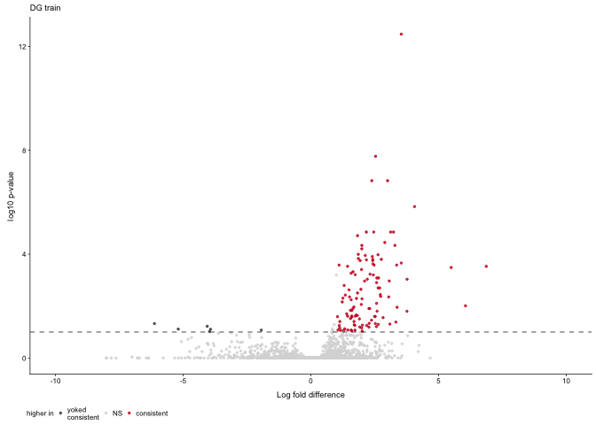

    CA3consyokcons <-  plot.cons.yokcons(CA3dds, "CA3", "DEGs - CA3 train")  

    ## [1] "CA3"
    ## 
    ## out of 16502 with nonzero total read count
    ## adjusted p-value < 0.1
    ## LFC > 0 (up)       : 1, 0.0061%
    ## LFC < 0 (down)     : 0, 0%
    ## outliers [1]       : 11, 0.067%
    ## low counts [2]     : 0, 0%
    ## (mean count < 0)
    ## [1] see 'cooksCutoff' argument of ?results
    ## [2] see 'independentFiltering' argument of ?results
    ## 
    ## NULL

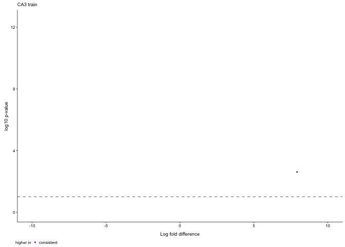

    CA1consyokcons <-  plot.cons.yokcons(CA1dds, "CA1", "DEGs - CA1 train")  + theme(legend.position = c(0.6,0.9))  

    ## [1] "CA1"
    ## 
    ## out of 16852 with nonzero total read count
    ## adjusted p-value < 0.1
    ## LFC > 0 (up)       : 522, 3.1%
    ## LFC < 0 (down)     : 360, 2.1%
    ## outliers [1]       : 32, 0.19%
    ## low counts [2]     : 4892, 29%
    ## (mean count < 5)
    ## [1] see 'cooksCutoff' argument of ?results
    ## [2] see 'independentFiltering' argument of ?results
    ## 
    ## NULL

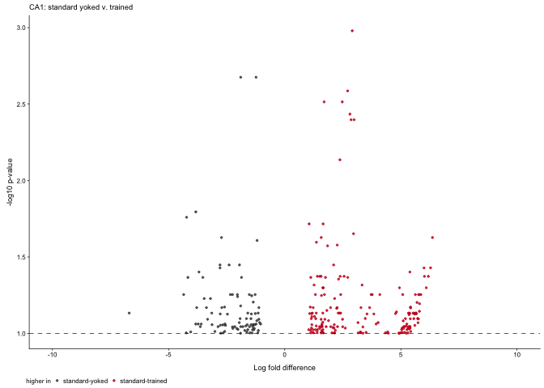

    training <- plot_grid(DGconsyokcons,CA1consyokcons, nrow = 1,
                          labels = "AUTO",
                          label_size = 7,
                          rel_widths = c(0.5,0.5))
    training

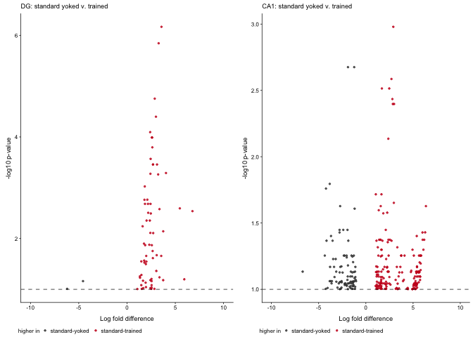

Confict versus Consistent
-------------------------

    plot.conf.cons <- function(mydds, mytissue){
      
      print(mytissue)
      
      res <- results(mydds, contrast =c("APA2", "conflict", "consistent"),
                     independentFiltering = T, alpha = 0.1)
      print(summary(res))

      data <- data.frame(gene = row.names(res),
                       padj = res$padj, 
                       logpadj = -log10(res$padj),
                       lfc = res$log2FoldChange)
      data <- na.omit(data)
      
      data <- data %>%
        dplyr::mutate(direction = ifelse(data$lfc > 1 & data$padj < 0.1, 
                            yes = "conflict", 
                            no = ifelse(data$lfc < -1 & data$padj < 0.1, 
                                        yes = "consistent", 
                                        no = "NS")))
      
      write.csv(data, file = paste0("../data/02c_", mytissue, "_confcons.csv", sep = ""), row.names = F)
      
      volcano <- ggplot(data, aes(x = lfc, y = logpadj)) + 
        geom_point(aes(color = factor(direction)), size = 0.5, alpha = 0.75, na.rm = T) + 
        theme_cowplot(font_size = 7, line_size = 0.25) +
        geom_hline(yintercept = 1,  size = 0.25, linetype = 2) + 
        scale_color_manual(values = volcano2,
                           breaks = c("consistent", "NS", "conflict"),
                          name = "higher in")  + 
        scale_x_continuous(limits=c(-10, 10),
                            name="Log fold difference")+
        ylab(paste0("-log10 p-value")) +  
        labs(subtitle = mytissue) +
        theme(panel.grid.minor=element_blank(),
              legend.position = "bottom",
              legend.spacing.x = unit(-0.1, 'cm'),
              panel.grid.major=element_blank(),
              legend.margin=margin(t=-0.25, r=0, b=0, l=0, unit="cm")) 
      plot(volcano)
    }

    DGconflict <-  plot.conf.cons(DGdds, "DG")

    ## [1] "DG"
    ## 
    ## out of 17011 with nonzero total read count
    ## adjusted p-value < 0.1
    ## LFC > 0 (up)       : 0, 0%
    ## LFC < 0 (down)     : 1, 0.0059%
    ## outliers [1]       : 20, 0.12%
    ## low counts [2]     : 0, 0%
    ## (mean count < 0)
    ## [1] see 'cooksCutoff' argument of ?results
    ## [2] see 'independentFiltering' argument of ?results
    ## 
    ## NULL

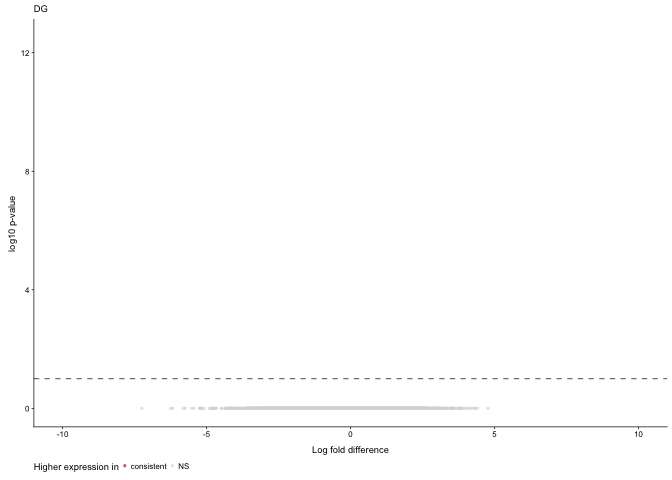

    CA3conflict <-  plot.conf.cons(CA3dds, "CA3")

    ## [1] "CA3"
    ## 
    ## out of 16502 with nonzero total read count
    ## adjusted p-value < 0.1
    ## LFC > 0 (up)       : 0, 0%
    ## LFC < 0 (down)     : 0, 0%
    ## outliers [1]       : 11, 0.067%
    ## low counts [2]     : 0, 0%
    ## (mean count < 0)
    ## [1] see 'cooksCutoff' argument of ?results
    ## [2] see 'independentFiltering' argument of ?results
    ## 
    ## NULL

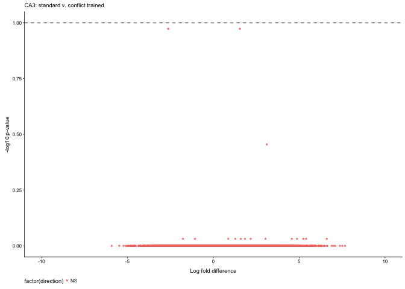

    CA1conflict <-  plot.conf.cons(CA1dds, "CA1")

    ## [1] "CA1"
    ## 
    ## out of 16852 with nonzero total read count
    ## adjusted p-value < 0.1
    ## LFC > 0 (up)       : 0, 0%
    ## LFC < 0 (down)     : 0, 0%
    ## outliers [1]       : 32, 0.19%
    ## low counts [2]     : 0, 0%
    ## (mean count < 0)
    ## [1] see 'cooksCutoff' argument of ?results
    ## [2] see 'independentFiltering' argument of ?results
    ## 
    ## NULL

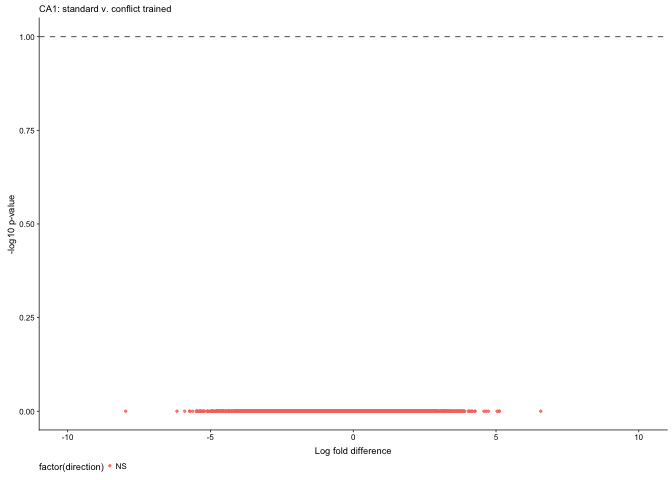

    plot_grid(DGconflict, CA3conflict, CA1conflict, nrow = 1)

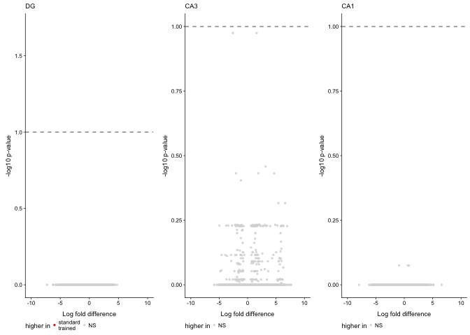

Yoked confict versus yoked consistent
-------------------------------------

    plot.yokconf.yokcons <- function(mydds, mytissue, mytitle){
      
      print(mytissue)
      
      res <- results(mydds, contrast =c("APA2", "yoked_conflict", "yoked_consistent"),
                     independentFiltering = T, alpha = 0.1)
      print(summary(res))

      data <- data.frame(gene = row.names(res),
                       padj = res$padj, 
                       logpadj = -log10(res$padj),
                       lfc = res$log2FoldChange)
      data <- na.omit(data)
      data <- data %>%
        dplyr::mutate(direction = ifelse(data$lfc > 1 & data$padj < 0.1, 
                            yes = "yoked\nconflict", 
                            no = ifelse(data$lfc < -1 & data$padj < 0.1, 
                                        yes = "yoked\nconsistent", 
                                        no = "NS")))
      
      data$direction <- factor(data$direction, levels = c("yoked\nconsistent", "NS", "yoked\nconflict"))
      
      write.csv(data, file = paste0("../data/02c_", mytissue, "_yokeconfyokcons.csv", sep = ""), row.names = F)
      
      volcano <- data %>%
        filter(direction != "NS") %>%
        ggplot(aes(x = lfc, y = logpadj, color = direction)) + 
        geom_point(size = 0.5, alpha = 0.75, na.rm = T) + 
        theme_cowplot(font_size = 7, line_size = 0.25) +
        geom_hline(yintercept = 1,  size = 0.25, linetype = 2) + 
        scale_color_manual(values = volcano3,
                           name = "higher in")  + 
        #scale_y_continuous(limits=c(0, 12.5)) +
        scale_x_continuous(limits=c(-10, 10),
                            name="Log fold difference")+
        ylab(paste0("-log10 p-value")) +  
        labs(subtitle = mytitle) +
        theme(legend.position = "bottom",
              legend.spacing.x = unit(0.1, 'cm'),
              #legend.text=element_text(size=4),
              legend.key.size = unit(0.2, "cm"),
              legend.margin=margin(t=-0.1, r=0, b=0, l=-0.1, unit="cm")) 
      plot(volcano)  
    }

    DGyoked <-  plot.yokconf.yokcons(DGdds, "DG", "DEGs - DG stress")

    ## [1] "DG"
    ## 
    ## out of 17011 with nonzero total read count
    ## adjusted p-value < 0.1
    ## LFC > 0 (up)       : 3, 0.018%
    ## LFC < 0 (down)     : 0, 0%
    ## outliers [1]       : 20, 0.12%
    ## low counts [2]     : 0, 0%
    ## (mean count < 0)
    ## [1] see 'cooksCutoff' argument of ?results
    ## [2] see 'independentFiltering' argument of ?results
    ## 
    ## NULL

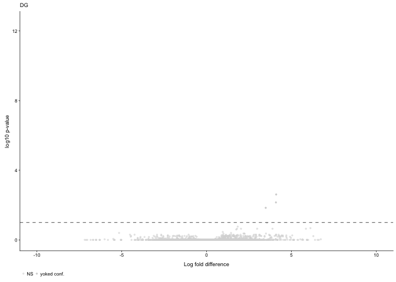

    CA3yoked <-  plot.yokconf.yokcons(CA3dds, "CA3", "DEGs - CA3 stress")

    ## [1] "CA3"
    ## 
    ## out of 16502 with nonzero total read count
    ## adjusted p-value < 0.1
    ## LFC > 0 (up)       : 1, 0.0061%
    ## LFC < 0 (down)     : 1, 0.0061%
    ## outliers [1]       : 11, 0.067%
    ## low counts [2]     : 0, 0%
    ## (mean count < 0)
    ## [1] see 'cooksCutoff' argument of ?results
    ## [2] see 'independentFiltering' argument of ?results
    ## 
    ## NULL

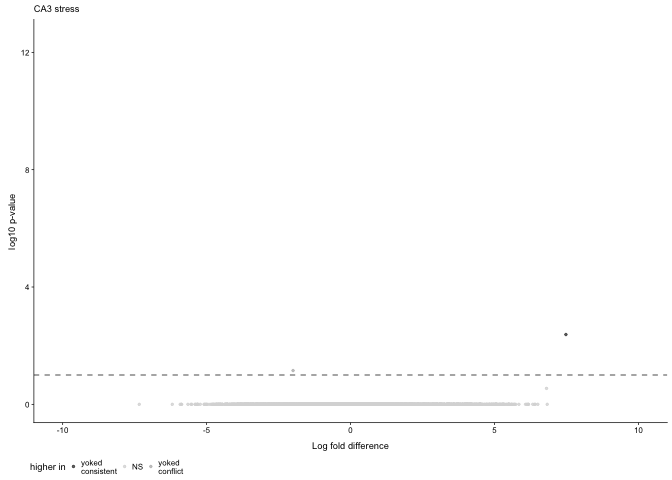

    CA1yoked <-  plot.yokconf.yokcons(CA1dds, "CA1", "DEGs - CA1 stress")  

    ## [1] "CA1"
    ## 
    ## out of 16852 with nonzero total read count
    ## adjusted p-value < 0.1
    ## LFC > 0 (up)       : 545, 3.2%
    ## LFC < 0 (down)     : 372, 2.2%
    ## outliers [1]       : 32, 0.19%
    ## low counts [2]     : 4892, 29%
    ## (mean count < 5)
    ## [1] see 'cooksCutoff' argument of ?results
    ## [2] see 'independentFiltering' argument of ?results
    ## 
    ## NULL

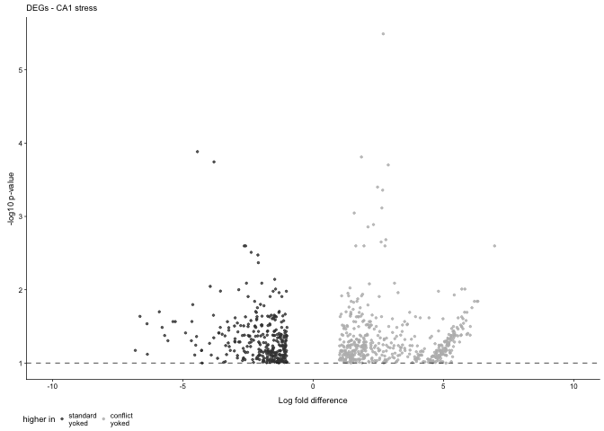

    plot_grid(DGyoked, CA3yoked, CA1yoked, nrow = 1)

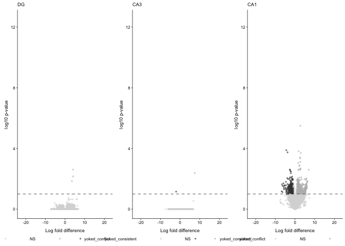

pkmz
====

    plotCounts(DGdds, "Prkcz", intgroup = "APA2", normalized = TRUE, main="Prkcz in DG")

    plotCounts(CA3dds, "Prkcz", intgroup = "APA2", normalized = TRUE, main="Prkcz in CA3")

    plotCounts(CA1dds, "Prkcz", intgroup = "APA2", normalized = TRUE, main="Prkcz in CA1")

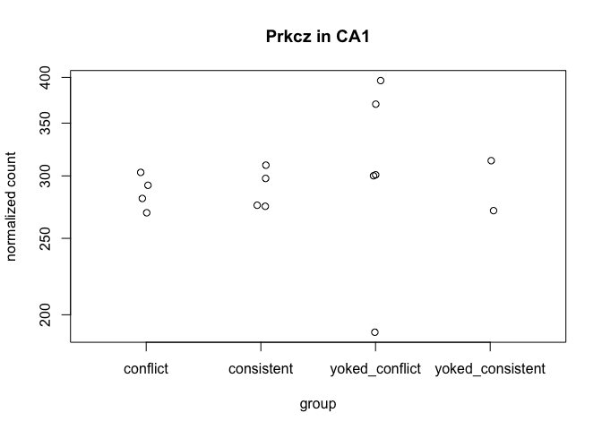

genes that are correlated with number of entrances
--------------------------------------------------

Requires anlaysis of `04_integration.Rmd` first.

    plotCounts(DGdds, "Acan", intgroup = "APA2", normalized = TRUE, main="Acan in DG")

    plotCounts(DGdds, "Amigo2", intgroup = "APA2", normalized = TRUE, main="Amigo2 in DG")

    plotCounts(DGdds, "Armcx5", intgroup = "APA2", normalized = TRUE, main="Armcx5 in DG")

    plotCounts(DGdds, "Ptgs2", intgroup = "APA2", normalized = TRUE, main="Ptgs2 in DG")

    plotCounts(DGdds, "Rgs2", intgroup = "APA2", normalized = TRUE, main="Rgs2 in DG")

    plotCounts(DGdds, "Syt4", intgroup = "APA2", normalized = TRUE, main="Syt4 in DG")

Upset plots
-----------

What genes overlap within cetain comparisons?

    a.colData <- read.csv("../data/02a_colData.csv", header = T)
    a.countData <- read.csv("../data/02a_countData.csv", header = T, check.names = F, row.names = 1)

    eachsubfield <- levels(a.colData$Punch)

    listofDEGs <- function(group1, group2){
      res <- results(dds, contrast = c("APA2", group1, group2), independentFiltering = T)
      data <- data.frame(gene = row.names(res),
                         lfc = res$log2FoldChange,
                         padj = res$padj,
                         tissue = i,
                         comparison = paste(group1, group2, sep = "-"))
      data <- data %>% dplyr::filter(padj < 0.1) %>% droplevels()
      return(data)
    }

    for(i in eachsubfield){
      
      colData <- a.colData %>% 
        dplyr::filter(Punch == i)  %>%
        droplevels()
      print(i)
      
      savecols <- as.character(colData$RNAseqID) 
      savecols <- as.vector(savecols) 
      countData <- a.countData %>% dplyr::select(one_of(savecols)) 

    ## create DESeq object using the factors Punch and APA
    dds <- DESeqDataSetFromMatrix(countData = countData,
                                  colData = colData,
                                  design = ~ APA2)

    dds # view the DESeq object - note numnber of genes
    dds <- dds[ rowSums(counts(dds)) > 1, ]  # Pre-filtering genes with 0 counts
    dds <- DESeq(dds) # Differential expression analysis

    A <- listofDEGs("consistent","yoked_consistent")
    B <- listofDEGs("conflict","consistent")
    C <- listofDEGs("conflict","yoked_conflict")
    D <- listofDEGs("yoked_conflict","yoked_consistent")

    all <- rbind(A,B,C,D)

    write.csv(all, file = paste("../data/02c_",i,"forupset.csv", sep = ""), row.names = F)
    }

    ## [1] "CA1"

    ## estimating size factors

    ## estimating dispersions

    ## gene-wise dispersion estimates

    ## mean-dispersion relationship

    ## final dispersion estimates

    ## fitting model and testing

    ## [1] "CA3"

    ## estimating size factors

    ## estimating dispersions

    ## gene-wise dispersion estimates

    ## mean-dispersion relationship

    ## final dispersion estimates

    ## fitting model and testing

    ## [1] "DG"

    ## estimating size factors

    ## estimating dispersions

    ## gene-wise dispersion estimates

    ## mean-dispersion relationship

    ## final dispersion estimates

    ## fitting model and testing

    DG <- read.csv("../data/02c_DGforupset.csv")  
    CA1<- read.csv("../data/02c_CA1forupset.csv")  
    CA3 <- read.csv("../data/02c_CA3forupset.csv") 

    # upset plot without direction
    all <- rbind(DG,CA1,CA3)

    levels(all$comparison) <- c("conf-cons",
                                "conf-yconf", 
                                "cons-ycons", 
                                "yconf-ycons")

    all$significant <- paste(all$tissue, all$comparison, sep = "-")

    myupsetdf <- all %>%
      select(gene,significant) %>%
      mutate(yesno = 1) %>%
      distinct %>%
      spread(significant, yesno, fill = 0)
    head(myupsetdf)

    ##            gene CA1-conf-yconf CA1-cons-ycons CA1-yconf-ycons
    ## 1 A830010M20Rik              0              0               0
    ## 2          Acan              0              0               0
    ## 3       Adamts1              0              1               1
    ## 4        Amigo2              0              0               0
    ## 5       Ankrd28              0              0               0
    ## 6      Ankrd33b              0              0               0
    ##   CA3-cons-ycons CA3-yconf-ycons DG-conf-cons DG-conf-yconf DG-cons-ycons
    ## 1              0               0            0             0             1
    ## 2              0               0            0             1             1
    ## 3              0               0            0             0             1
    ## 4              0               0            0             0             1
    ## 5              0               0            0             0             1
    ## 6              0               0            0             1             0
    ##   DG-yconf-ycons
    ## 1              0
    ## 2              0
    ## 3              0
    ## 4              0
    ## 5              0
    ## 6              0

    write.csv(myupsetdf, "../data/02c_upsetdf.csv")

    # upset plot with direction, only CA1learn, CA1 stress, and DGlearn
    head(all) 

    ##            gene      lfc         padj tissue comparison   significant
    ## 1 A830010M20Rik 1.991294 6.235077e-05     DG cons-ycons DG-cons-ycons
    ## 2          Acan 2.459128 1.411053e-05     DG cons-ycons DG-cons-ycons
    ## 3       Adamts1 2.370955 3.493214e-02     DG cons-ycons DG-cons-ycons
    ## 4        Amigo2 1.982597 6.941977e-02     DG cons-ycons DG-cons-ycons
    ## 5       Ankrd28 1.642931 1.247682e-02     DG cons-ycons DG-cons-ycons
    ## 6           Arc 2.891323 3.577881e-05     DG cons-ycons DG-cons-ycons

    all$direction <- ifelse(all$lfc > 0, "up", "down")
    all$sigdir <- paste(all$significant, all$direction, sep = "-")

    myupsetslim  <- all %>%
      filter(significant %in% c("DG-cons-ycons", "CA1-cons-ycons", "CA1-yconf-ycons")) %>%
      select(gene,sigdir) %>%
      mutate(yesno = 1) %>%
      distinct %>%
      spread(sigdir, yesno, fill = 0)
    head(myupsetslim)

    ##            gene CA1-cons-ycons-down CA1-cons-ycons-up CA1-yconf-ycons-down
    ## 1 A830010M20Rik                   0                 0                    0
    ## 2          Acan                   0                 0                    0
    ## 3       Adamts1                   0                 1                    0
    ## 4        Amigo2                   0                 0                    0
    ## 5       Ankrd28                   0                 0                    0
    ## 6           Arc                   0                 0                    0
    ##   CA1-yconf-ycons-up DG-cons-ycons-down DG-cons-ycons-up
    ## 1                  0                  0                1
    ## 2                  0                  0                1
    ## 3                  1                  0                1
    ## 4                  0                  0                1
    ## 5                  0                  0                1
    ## 6                  0                  0                1

    row.names(myupsetslim) <- myupsetslim$gene
    myupsetslim$gene <- NULL
    colSums(myupsetslim)

    ##  CA1-cons-ycons-down    CA1-cons-ycons-up CA1-yconf-ycons-down 
    ##                  360                  522                  372 
    ##   CA1-yconf-ycons-up   DG-cons-ycons-down     DG-cons-ycons-up 
    ##                  545                    6                  119

    myupsetslim$gene <- row.names(myupsetslim)

    upset(myupsetdf, keep.order = T)

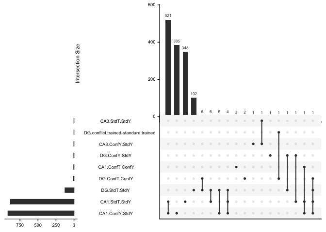

    trained <- myupsetdf %>%
      select(gene, 'DG-cons-ycons', 'CA3-cons-ycons', 'CA1-cons-ycons')

    colnames(trained) <- c("gene", "DG", "CA3", "CA1")

    pdf(file="../figures/02c_rnaseqSubfield/upsettraining.pdf",  onefile=FALSE) # or other device
    upset(trained, keep.order = T,
          sets = c("CA1", "CA3", "DG"),
          sets.bar.color=c("#7570b3","#1b9e77", "#d95f02"),
          queries = list(list(query = intersects, params = list("CA1"), color = "#ca0020", active = T),
                         list(query = intersects, params = list("DG"), color = "#ca0020", active = T),
                         list(query = intersects, params = list("CA3"), color = "#ca0020", active = T),
                         list(query = intersects, params = list("CA1", "DG"), 
                              color = "#ca0020", active = T)),
          text.scale = 2,
          sets.x.label = NULL,
          #point.size = 1, line.size = 1,
          mb.ratio = c(0.6, 0.4)
    )
    dev.off()

    ## quartz_off_screen 
    ##                 2

Create a list of genes afected by stress and learning. Save. THen use to
filter out nonspecific gene expression responses

    shared <- myupsetdf %>%
      select(gene, "CA1-yconf-ycons", "CA1-cons-ycons", "DG-cons-ycons")
    colnames(shared) <- c("gene", "CA1stress", "CA1learn", "DGlearn")

    # CA1 and DG learning only (none in stress)
    shared %>% filter(CA1learn == 1 & DGlearn == 1 & CA1stress == 0) %>%
      select(gene) 

    ##      gene
    ## 1    Fosb
    ## 2 Gm13889
    ## 3    Irs1
    ## 4   Lemd3
    ## 5   Npas4
    ## 6    Rgs2

    # learning and stress CA1
    CA1learnstress <- shared %>% filter(CA1learn == 1 & CA1stress == 1) %>%
      select(gene)
    head(CA1learnstress)

    ##            gene
    ## 1       Adamts1
    ## 2           Mn1
    ## 3         Nptx2
    ## 4        Tiparp
    ## 5         Zdbf2
    ## 6 1810030O07Rik

    # CA1 learning but not CA1 stress 
    CA1learn <- shared %>% filter(CA1learn == 1 & CA1stress == 0) %>%
      select(gene)

    # CA1 learning but not CA1 stress 
    CA1stress <- shared %>% filter(CA1learn == 0 & CA1stress == 1) %>%
      select(gene)

    write.csv(CA1learnstress, "../data/02_CA1learningstressgenes.csv", row.names = F)
    write.csv(CA1learn, "../data/02_CA1learninggenes.csv", row.names = F)
    write.csv(CA1stress, "../data/02_CA1lstressgenes.csv", row.names = F)

    # All degs
    updown <- read.csv("../data/02c_setsize_updown.csv") 
    updown$direction <- factor(updown$direction,  levels = c("yoked_consistent", "yoked_conflict", "consistent"))
    updown$set <- factor(updown$set,  levels = c("DGtrain", "CA1train", "CA1stress"))
    updown$status <- factor(updown$status,  levels = c("train", "stress"))

    levels(updown$set)[levels(updown$set)=="DGtrain"] <- "DG train"
    levels(updown$set)[levels(updown$set)=="CA1train"]   <- "CA1 train"
    levels(updown$set)[levels(updown$set)=="CA1stress"]   <- "CA1 stress"
    levels(updown$direction)[levels(updown$direction)=="yoked_consistent"] <- "yoked\nconsistent"
    levels(updown$direction)[levels(updown$direction)=="yoked_conflict"]   <- "yoked\nconflict"

    # unique and shared
    shared2 <- read.csv("../data/02c_intersect_updown_shared2.csv") 
    shared2$group <- paste(shared2$set, shared2$direction, sep = " ")
    shared2$set <- factor(shared2$set,  levels = c("DGtrain", "CA1train", "CA1stress"))
    shared2$direction <- factor(shared2$direction,  
                                levels = c("yoked_consistent", "yoked_conflict", "consistent"))
    shared2$group <-factor(shared2$group,  
                           levels = c("DGtrain yoked_consistent", "DGtrain consistent", 
                                      "CA1train yoked_consistent","CA1train consistent",
                                      "CA1stress yoked_consistent", "CA1stress yoked_conflict" ))
    shared2$status <- factor(shared2$status,  levels = c(  "stress","train","unique"))

    levels(shared2$direction)[levels(shared2$direction)=="yoked_consistent"] <- "yoked\nconsistent"
    levels(shared2$direction)[levels(shared2$direction)=="yoked_conflict"]   <- "yoked\nconflict"
    levels(shared2$status)[levels(shared2$status)=="stress"]   <- "shared"
    levels(shared2$status)[levels(shared2$status)=="train"]   <- "shared"

    d1 <- ggplot(updown, aes(x=direction, y=setsize, fill = direction)) +
      geom_bar(stat="identity", position=position_dodge()) +
      theme_cowplot(font_size = 7, line_size = 0.25) +
      scale_fill_manual(values = c("#404040", "#bababa", "#ca0020"),
                        name = NULL)  +
      labs(x = NULL, y = "Total DEGs") +
      scale_y_continuous(limits = c(0, 560),
                         breaks = c(0,125,250,375,500)) +
        facet_wrap(~set, scales = "free_x") +
        theme(axis.text.x = element_blank(),
              legend.position = "none",
              legend.text=element_text(size=4),
              legend.key.size = unit(0.2, "cm"),
              #legend.margin=margin(t=-0.25, r=0, b=0, l=0, unit="cm"),
              #strip.text.x = element_text(size = 5),
              strip.background = element_rect(colour=NA, fill=NA),
            panel.border = element_rect(fill = NA, color = "black"),
            legend.margin=margin(t=-0.1, r=0, b=-0.1, l=0, unit="cm"))

    images = c(
      unique = "../figures/00_schematics/patterns_blank.png",
      shared = "../figures/00_schematics/patterns_crosed-lines.png")
    images

    ##                                               unique 
    ##        "../figures/00_schematics/patterns_blank.png" 
    ##                                               shared 
    ## "../figures/00_schematics/patterns_crosed-lines.png"

    head(shared2)

    ##         set setsize         direction subfield status
    ## 1  CA1train     168 yoked\nconsistent      CA1 unique
    ## 2  CA1train     181        consistent      CA1 unique
    ## 3 CA1stress     179 yoked\nconsistent      CA1 unique
    ## 4 CA1stress     206   yoked\nconflict      CA1 unique
    ## 5   DGtrain       6 yoked\nconsistent       DG unique
    ## 6   DGtrain     103        consistent       DG unique
    ##                        group
    ## 1  CA1train yoked_consistent
    ## 2        CA1train consistent
    ## 3 CA1stress yoked_consistent
    ## 4   CA1stress yoked_conflict
    ## 5   DGtrain yoked_consistent
    ## 6         DGtrain consistent

    d2 <- ggplot(shared2, aes(x=direction, y=setsize, image = status)) +
      geom_textured_bar(stat = "identity") +
      theme_cowplot(font_size = 7, line_size = 0.25) +
      scale_image_manual(values = images,
                         name = NULL) +
      labs(x = "subfield * treatment", y = "Unique DEGs") +
        scale_y_continuous(limits = c(0, 560),
                         breaks = c(0,125,250,375,500)) +
      theme(axis.text.x=element_text(angle=60, vjust = 1, hjust = 1),
            legend.position = c(0.05, 0.8),
            #legend.text=element_text(size=4),
            legend.key.size = unit(0.2, "cm"),
            #strip.text.x = element_text(size = 5),
            strip.background = element_rect(colour=NA, fill=NA),
            panel.border = element_rect(fill = NA, color = "black"),
            legend.margin=margin(t=-0.1, r=0, b=-0.1, l=-0.1, unit="cm")) +
      facet_wrap(~set, scales = "free_x") 
    d2

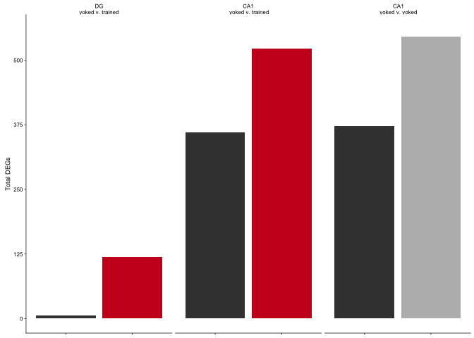

    newbarplots <- plot_grid(d1,d2, nrow = 2, rel_heights =c(0.4,0.6),
                             labels = c("D","E"), label_size = 7)
    newbarplots

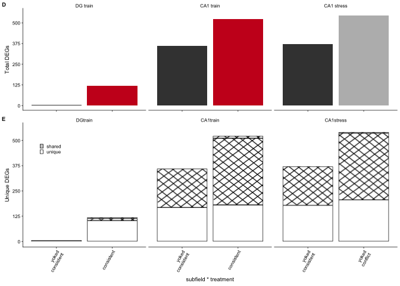

    pdf(file="../figures/02c_rnaseqSubfield/barplots.pdf", width=1.9, height=2.15)
    plot(newbarplots)    
    dev.off() 

    ## quartz_off_screen 
    ##                 2

    forgraphicalsummary <- shared2 %>%
      filter(status != "shared") %>%
      ggplot(aes(x=direction, y=setsize, fill = direction)) +
      geom_bar(stat = "identity", position=position_dodge()) +
      theme_cowplot(font_size = 7, line_size = 0.25) +
      labs(x = NULL, y = "Genes for GO") +
      theme(axis.text.x=element_text(angle=60, vjust = 1, hjust = 1),
            legend.position = "none",
            #legend.text=element_text(size=4),
            legend.key.size = unit(0.2, "cm"),
            strip.text.x = element_text(size = 0),
            strip.background = element_rect(colour=NA, fill=NA),
            panel.border = element_rect(fill = NA, color = "black"),
            legend.margin=margin(t=-0.1, r=0, b=-0.1, l=-0.1, unit="cm")) +
      facet_wrap(~set, scales = "free_x") +
        scale_fill_manual(values = c("#404040", "#bababa", "#ca0020"),
                        name = NULL) +
        scale_y_continuous(limits = c(0, 560),
                         breaks = c(0,125,250,375,500)) 
    forgraphicalsummary

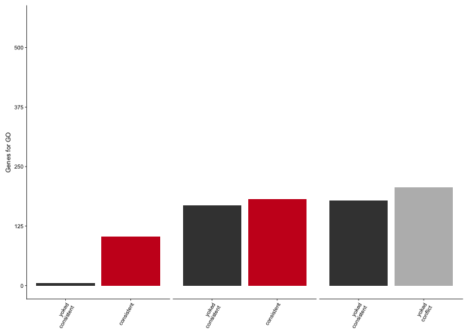

    pdf(file="../figures/02c_rnaseqSubfield/forgraphicalsummary.pdf", width=1.5, height=1)
    plot(forgraphicalsummary)    
    dev.off() 

    ## quartz_off_screen 
    ##                 2

    # 3 volcanos and a bar plots in a grid
    bottomplots <- plot_grid(CA1yoked, newbarplots,
                        labels = c("C", NULL),
                        label_size = 7)

    volcanos <- plot_grid(training, bottomplots, nrow = 2,
                          rel_heights = c(0.475,0.525)) 
    volcanos

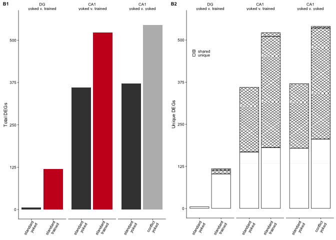

    pdf(file="../figures/02c_rnaseqSubfield/volcanos.pdf", width=3.15, height=4)
    plot(volcanos)    
    dev.off()

    ## quartz_off_screen 
    ##                 2

    # 3 volcanos, 2 bar plots, space for 3 GOs
    spaceforgo <- plot_grid(d1 + labs(x = NULL) + theme(axis.text.x=element_text(angle=60, vjust = 1, hjust = 1)), 
                            d2 + labs(x = NULL),
              DGconsyokcons + theme(legend.position = c(0.8,0.9),
                                    axis.text.x=element_blank(),
                                   axis.title.x=element_blank()), NULL,
              CA1consyokcons + theme(legend.position = c(0.8,0.9),
                                    axis.text.x=element_blank(),
                                   axis.title.x=element_blank()), NULL,
              CA1yoked + theme(legend.position = c(0.8,0.9)), NULL,
              labels= c("A1", "A2", "B1", "B2", "C1", "C2", "D1", "D2"),
              label_size = 7,
              ncol = 2,
              rel_heights = c(0.29, 0.19, 0.25, 0.27))
    spaceforgo

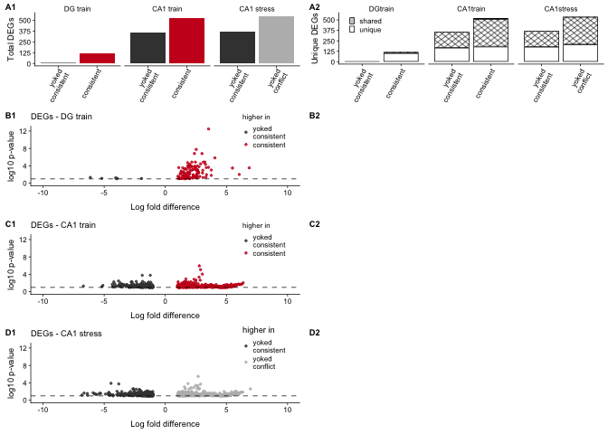

    pdf(file="../figures/02c_rnaseqSubfield/spaceforgo.pdf", width=5, height=5)
    plot(spaceforgo)    
    dev.off()

    ## quartz_off_screen 
    ##                 2
