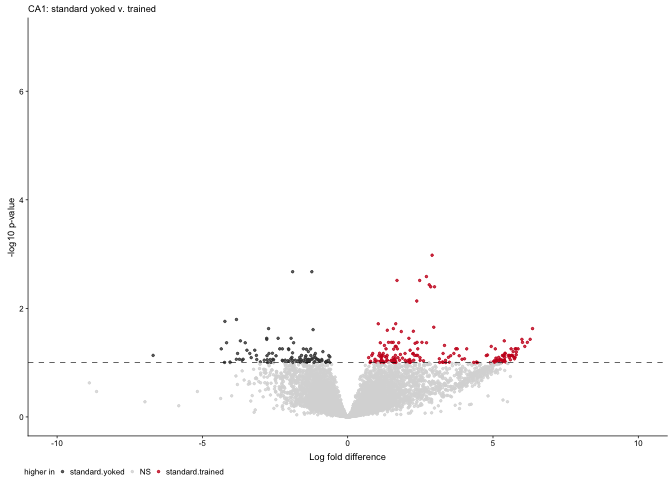

Subfield analysis
-----------------

This script is used to identify treatement differences within each
subfield, generate volcano plots, venn diagrams, and tables for
subsequent GO analyses. The final mutlipanel figures for the manuscript
have been inserted just below the subheadings.

    library(tidyverse)
    library(cowplot) ## for some easy to use themes
    library(VennDiagram) ## venn diagrams
    library(DESeq2) ## for gene expression analysis
    library(UpSetR)

    ## load functions 
    source("figureoptions.R")
    source("functions_RNAseq.R")

    ## set output file for figures 
    knitr::opts_chunk$set(fig.path = '../figures/02c_rnaseqSubfield/', cache = T)

Get varience stabilized gene expression for each tissue
-------------------------------------------------------

    a.colData <- read.csv("../data/02a_colData.csv", header = T)
    a.countData <- read.csv("../data/02a_countData.csv", header = T, check.names = F, row.names = 1)

    returndds <- function(mytissue){
      print(mytissue)
      colData <- a.colData %>% 
        filter(Punch %in% c(mytissue))  %>% 
      droplevels()
      
      savecols <- as.character(colData$RNAseqID) 
      savecols <- as.vector(savecols) 
      countData <- a.countData %>% dplyr::select(one_of(savecols)) 

      ## create DESeq object using the factors Punch and APA
      dds <- DESeqDataSetFromMatrix(countData = countData,
                                  colData = colData,
                                  design = ~ APA2)

      dds <- dds[ rowSums(counts(dds)) > 1, ]  # Pre-filtering genes with 0 counts
       # Differential expression analysis
      return(DESeq(dds))
    }

    DGdds <- returndds("DG") 

    ## [1] "DG"

    ## estimating size factors

    ## estimating dispersions

    ## gene-wise dispersion estimates

    ## mean-dispersion relationship

    ## final dispersion estimates

    ## fitting model and testing

    CA1dds <- returndds("CA1") 

    ## [1] "CA1"

    ## estimating size factors

    ## estimating dispersions

    ## gene-wise dispersion estimates

    ## mean-dispersion relationship

    ## final dispersion estimates

    ## fitting model and testing

    CA3dds <- returndds("CA3") 

    ## [1] "CA3"

    ## estimating size factors

    ## estimating dispersions

    ## gene-wise dispersion estimates

    ## mean-dispersion relationship

    ## final dispersion estimates

    ## fitting model and testing

Consistent versus yoked-consistent
----------------------------------

    plot.cons.yokcons <- function(mydds, mytissue){
      print(mytissue)
      
      res <- results(mydds, contrast =c("APA2", "consistent", "yoked_consistent"),
                     independentFiltering = T, alpha = 0.1)
      print(summary(res))

      data <- data.frame(gene = row.names(res),
                       padj = res$padj, 
                       logpadj = -log10(res$padj),
                       lfc = res$log2FoldChange)
      data <- na.omit(data)
      data <- data %>%
        dplyr::mutate(direction = ifelse(data$lfc > 1 & data$padj < 0.1, 
                            yes = "consistent", 
                            no = ifelse(data$lfc < -1 & data$padj < 0.1, 
                                        yes = "yoked_consistent", 
                                        no = "NS")))

      write.csv(data, file = paste0("../data/02c_", mytissue, "_consyokcons.csv", sep = ""))
      
      volcano <- ggplot(data, aes(x = lfc, y = logpadj)) + 
        geom_point(aes(color = factor(direction)), size = 0.5, alpha = 0.5, na.rm = T) + 
        theme_cowplot(font_size = 7, line_size = 0.25) +
        geom_hline(yintercept = 1,  size = 0.25, linetype = 2) + 
        scale_color_manual(values = volcano1,
                          name = "Higher expression in",
                          breaks = c("yoked_consistent", "NS", "consistent"))  + 
        scale_y_continuous(limits=c(0, 12.5)) +
        scale_x_continuous(limits=c(-10, 10),
                            name="Log fold difference")+
        ylab(paste0("log10 p-value")) +  
        labs(subtitle = mytissue) +
        theme(legend.position = "bottom",
              legend.margin=margin(t=-0.25, r=0, b=0, l=0, unit="cm")) 
      plot(volcano)
    }

    DGconsyokcons <-  plot.cons.yokcons(DGdds, "DG") + theme(legend.position = "none")

    ## [1] "DG"
    ## 
    ## out of 17011 with nonzero total read count
    ## adjusted p-value < 0.1
    ## LFC > 0 (up)       : 119, 0.7%
    ## LFC < 0 (down)     : 6, 0.035%
    ## outliers [1]       : 20, 0.12%
    ## low counts [2]     : 4608, 27%
    ## (mean count < 4)
    ## [1] see 'cooksCutoff' argument of ?results
    ## [2] see 'independentFiltering' argument of ?results
    ## 
    ## NULL

    CA3consyokcons <-  plot.cons.yokcons(CA3dds, "CA3") + theme(legend.position = "none")

    ## [1] "CA3"
    ## 
    ## out of 16502 with nonzero total read count
    ## adjusted p-value < 0.1
    ## LFC > 0 (up)       : 1, 0.0061%
    ## LFC < 0 (down)     : 0, 0%
    ## outliers [1]       : 11, 0.067%
    ## low counts [2]     : 0, 0%
    ## (mean count < 0)
    ## [1] see 'cooksCutoff' argument of ?results
    ## [2] see 'independentFiltering' argument of ?results
    ## 
    ## NULL

    CA1consyokcons <-  plot.cons.yokcons(CA1dds, "CA1") + theme(legend.position = "none")

    ## [1] "CA1"
    ## 
    ## out of 16852 with nonzero total read count
    ## adjusted p-value < 0.1
    ## LFC > 0 (up)       : 522, 3.1%
    ## LFC < 0 (down)     : 360, 2.1%
    ## outliers [1]       : 32, 0.19%
    ## low counts [2]     : 4892, 29%
    ## (mean count < 5)
    ## [1] see 'cooksCutoff' argument of ?results
    ## [2] see 'independentFiltering' argument of ?results
    ## 
    ## NULL

    training <- plot_grid(DGconsyokcons, CA3consyokcons, CA1consyokcons, nrow = 1,
                          labels = "AUTO",
                          label_size = 7)
    legend <- get_legend(plot.cons.yokcons(DGdds, "DG"))

    ## [1] "DG"
    ## 
    ## out of 17011 with nonzero total read count
    ## adjusted p-value < 0.1
    ## LFC > 0 (up)       : 119, 0.7%
    ## LFC < 0 (down)     : 6, 0.035%
    ## outliers [1]       : 20, 0.12%
    ## low counts [2]     : 4608, 27%
    ## (mean count < 4)
    ## [1] see 'cooksCutoff' argument of ?results
    ## [2] see 'independentFiltering' argument of ?results
    ## 
    ## NULL

    p3 <- plot_grid(training, legend, nrow = 2, rel_heights = c(3, .3))
    p3

    pdf(file="../figures/02c_rnaseqSubfield/volcano-consyokcons.pdf", width=5, height=2)
    plot(p3)
    dev.off()

    ## quartz_off_screen 
    ##                 2

Confict versus Consistent
-------------------------

    plot.conf.cons <- function(mydds, mytissue){
      
      print(mytissue)
      
      res <- results(mydds, contrast =c("APA2", "conflict", "consistent"),
                     independentFiltering = T, alpha = 0.1)
      print(summary(res))

      data <- data.frame(gene = row.names(res),
                       padj = res$padj, 
                       logpadj = -log10(res$padj),
                       lfc = res$log2FoldChange)
      data <- na.omit(data)
      
      data <- data %>%
        dplyr::mutate(direction = ifelse(data$lfc > 1 & data$padj < 0.1, 
                            yes = "conflict", 
                            no = ifelse(data$lfc < -1 & data$padj < 0.1, 
                                        yes = "consistent", 
                                        no = "NS")))
      
      write.csv(data, file = paste0("../data/02c_", mytissue, "_confcons.csv", sep = ""))
      
      volcano <- ggplot(data, aes(x = lfc, y = logpadj)) + 
        geom_point(aes(color = factor(direction)), size = 0.5, alpha = 0.5, na.rm = T) + 
        theme_cowplot(font_size = 7, line_size = 0.25) +
        geom_hline(yintercept = 1,  size = 0.25, linetype = 2) + 
        scale_color_manual(values = volcano2,
                           breaks = c("consistent", "NS", "conflict"),
                          name = "Higher expression in")  + 
        scale_y_continuous(limits=c(0, 12.5)) +
        scale_x_continuous(limits=c(-10, 10),
                            name="Log fold difference")+
        ylab(paste0("log10 p-value")) +  
        labs(subtitle = mytissue) +
        theme(panel.grid.minor=element_blank(),
              legend.position = "bottom",
              legend.spacing.x = unit(-0.1, 'cm'),
              panel.grid.major=element_blank(),
              legend.margin=margin(t=-0.25, r=0, b=0, l=0, unit="cm")) 
      plot(volcano)
    }

    DGconflict <-  plot.conf.cons(DGdds, "DG")

    ## [1] "DG"
    ## 
    ## out of 17011 with nonzero total read count
    ## adjusted p-value < 0.1
    ## LFC > 0 (up)       : 0, 0%
    ## LFC < 0 (down)     : 1, 0.0059%
    ## outliers [1]       : 20, 0.12%
    ## low counts [2]     : 0, 0%
    ## (mean count < 0)
    ## [1] see 'cooksCutoff' argument of ?results
    ## [2] see 'independentFiltering' argument of ?results
    ## 
    ## NULL

    CA3conflict <-  plot.conf.cons(CA3dds, "CA3")

    ## [1] "CA3"
    ## 
    ## out of 16502 with nonzero total read count
    ## adjusted p-value < 0.1
    ## LFC > 0 (up)       : 0, 0%
    ## LFC < 0 (down)     : 0, 0%
    ## outliers [1]       : 11, 0.067%
    ## low counts [2]     : 0, 0%
    ## (mean count < 0)
    ## [1] see 'cooksCutoff' argument of ?results
    ## [2] see 'independentFiltering' argument of ?results
    ## 
    ## NULL

    CA1conflict <-  plot.conf.cons(CA1dds, "CA1")

    ## [1] "CA1"
    ## 
    ## out of 16852 with nonzero total read count
    ## adjusted p-value < 0.1
    ## LFC > 0 (up)       : 0, 0%
    ## LFC < 0 (down)     : 0, 0%
    ## outliers [1]       : 32, 0.19%
    ## low counts [2]     : 0, 0%
    ## (mean count < 0)
    ## [1] see 'cooksCutoff' argument of ?results
    ## [2] see 'independentFiltering' argument of ?results
    ## 
    ## NULL

    plot_grid(DGconflict, CA3conflict, CA1conflict, nrow = 1)

Yoked confict versus yoked consistent
-------------------------------------

    plot.yokconf.yokcons <- function(mydds, mytissue){
      
      print(mytissue)
      
      res <- results(mydds, contrast =c("APA2", "yoked_conflict", "yoked_consistent"),
                     independentFiltering = T, alpha = 0.1)
      print(summary(res))

      data <- data.frame(gene = row.names(res),
                       padj = res$padj, 
                       logpadj = -log10(res$padj),
                       lfc = res$log2FoldChange)
      data <- na.omit(data)
      data <- data %>%
        dplyr::mutate(direction = ifelse(data$lfc > 1 & data$padj < 0.1, 
                            yes = "yoked_conflict", 
                            no = ifelse(data$lfc < -1 & data$padj < 0.1, 
                                        yes = "yoked_consistent", 
                                        no = "NS")))
      
      write.csv(data, file = paste0("../data/02c_", mytissue, "_yokeconfyokcons.csv", sep = ""))
      
      volcano <- ggplot(data, aes(x = lfc, y = logpadj)) + 
        geom_point(aes(color = factor(direction)), size = 0.5, alpha = 0.5, na.rm = T) + 
        theme_cowplot(font_size = 7, line_size = 0.25) +
        geom_hline(yintercept = 1,  size = 0.25, linetype = 2) + 
        scale_color_manual(values = volcano3,
                           breaks = c("yoked_consistent", "NS", "yoked_conflict"),
                           name = NULL,
                           labels = c("yoked cons.", "NS", "yoked conf."))  + 
        scale_y_continuous(limits=c(0, 12.5)) +
        scale_x_continuous(limits=c(-10, 10),
                            name="Log fold difference")+
        ylab(paste0("log10 p-value")) +  
        labs(subtitle = mytissue) +
        theme(legend.position = "bottom",
              legend.spacing.x = unit(-0.1, 'cm'),
              legend.margin=margin(t=-0.25, r=0, b=0, l=0, unit="cm")) 
      plot(volcano)  
    }

    DGyoked <-  plot.yokconf.yokcons(DGdds, "DG")

    ## [1] "DG"
    ## 
    ## out of 17011 with nonzero total read count
    ## adjusted p-value < 0.1
    ## LFC > 0 (up)       : 3, 0.018%
    ## LFC < 0 (down)     : 0, 0%
    ## outliers [1]       : 20, 0.12%
    ## low counts [2]     : 0, 0%
    ## (mean count < 0)
    ## [1] see 'cooksCutoff' argument of ?results
    ## [2] see 'independentFiltering' argument of ?results
    ## 
    ## NULL

    CA3yoked <-  plot.yokconf.yokcons(CA3dds, "CA3")

    ## [1] "CA3"
    ## 
    ## out of 16502 with nonzero total read count
    ## adjusted p-value < 0.1
    ## LFC > 0 (up)       : 1, 0.0061%
    ## LFC < 0 (down)     : 1, 0.0061%
    ## outliers [1]       : 11, 0.067%
    ## low counts [2]     : 0, 0%
    ## (mean count < 0)
    ## [1] see 'cooksCutoff' argument of ?results
    ## [2] see 'independentFiltering' argument of ?results
    ## 
    ## NULL

    CA1yoked <-  plot.yokconf.yokcons(CA1dds, "CA1")  

    ## [1] "CA1"
    ## 
    ## out of 16852 with nonzero total read count
    ## adjusted p-value < 0.1
    ## LFC > 0 (up)       : 545, 3.2%
    ## LFC < 0 (down)     : 372, 2.2%
    ## outliers [1]       : 32, 0.19%
    ## low counts [2]     : 4892, 29%
    ## (mean count < 5)
    ## [1] see 'cooksCutoff' argument of ?results
    ## [2] see 'independentFiltering' argument of ?results
    ## 
    ## NULL

    plot_grid(DGyoked, CA3yoked, CA1yoked, nrow = 1)

pkmz
====

    plotCounts(DGdds, "Prkcz", intgroup = "APA2", normalized = TRUE, main="Prkcz in DG")

    plotCounts(CA3dds, "Prkcz", intgroup = "APA2", normalized = TRUE, main="Prkcz in CA3")

    plotCounts(CA1dds, "Prkcz", intgroup = "APA2", normalized = TRUE, main="Prkcz in CA1")

Upset plots
-----------

What genes overlap within cetain comparisons?

    a.colData <- read.csv("../data/02a_colData.csv", header = T)
    a.countData <- read.csv("../data/02a_countData.csv", header = T, check.names = F, row.names = 1)

    eachsubfield <- levels(a.colData$Punch)

    listofDEGs <- function(group1, group2){
      res <- results(dds, contrast = c("APA2", group1, group2), independentFiltering = T)
      data <- data.frame(gene = row.names(res),
                         lfc = res$log2FoldChange,
                         padj = res$padj,
                         tissue = i,
                         comparison = paste(group1, group2, sep = "-"))
      data <- data %>% dplyr::filter(padj < 0.1) %>% droplevels()
      return(data)
    }

    for(i in eachsubfield){
      
      colData <- a.colData %>% 
        dplyr::filter(Punch == i)  %>%
        droplevels()
      print(i)
      
      savecols <- as.character(colData$RNAseqID) 
      savecols <- as.vector(savecols) 
      countData <- a.countData %>% dplyr::select(one_of(savecols)) 

    ## create DESeq object using the factors Punch and APA
    dds <- DESeqDataSetFromMatrix(countData = countData,
                                  colData = colData,
                                  design = ~ APA2)

    dds # view the DESeq object - note numnber of genes
    dds <- dds[ rowSums(counts(dds)) > 1, ]  # Pre-filtering genes with 0 counts
    dds <- DESeq(dds) # Differential expression analysis

    A <- listofDEGs("consistent","yoked_consistent")
    B <- listofDEGs("conflict","consistent")
    C <- listofDEGs("conflict","yoked_conflict")
    D <- listofDEGs("yoked_conflict","yoked_consistent")

    all <- rbind(A,B,C,D)

    write.csv(all, file = paste("../data/02c_",i,"forupset.csv", sep = ""), row.names = F)
    }

    ## [1] "CA1"

    ## estimating size factors

    ## estimating dispersions

    ## gene-wise dispersion estimates

    ## mean-dispersion relationship

    ## final dispersion estimates

    ## fitting model and testing

    ## [1] "CA3"

    ## estimating size factors

    ## estimating dispersions

    ## gene-wise dispersion estimates

    ## mean-dispersion relationship

    ## final dispersion estimates

    ## fitting model and testing

    ## [1] "DG"

    ## estimating size factors

    ## estimating dispersions

    ## gene-wise dispersion estimates

    ## mean-dispersion relationship

    ## final dispersion estimates

    ## fitting model and testing

    DG <- read.csv("../data/02c_DGforupset.csv")  
    CA1<- read.csv("../data/02c_CA1forupset.csv")  
    CA3 <- read.csv("../data/02c_CA3forupset.csv") 

    # upset plot without direction
    all <- rbind(DG,CA1,CA3)

    levels(all$comparison) <- c("conf-cons",
                                "conf-yconf", 
                                "cons-ycons", 
                                "yconf-ycons")

    all$significant <- paste(all$tissue, all$comparison, sep = "-")

    myupsetdf <- all %>%
      select(gene,significant) %>%
      mutate(yesno = 1) %>%
      distinct %>%
      spread(significant, yesno, fill = 0)
    head(myupsetdf)

    ##            gene CA1-conf-yconf CA1-cons-ycons CA1-yconf-ycons
    ## 1 A830010M20Rik              0              0               0
    ## 2          Acan              0              0               0
    ## 3       Adamts1              0              1               1
    ## 4        Amigo2              0              0               0
    ## 5       Ankrd28              0              0               0
    ## 6      Ankrd33b              0              0               0
    ##   CA3-cons-ycons CA3-yconf-ycons DG-conf-cons DG-conf-yconf DG-cons-ycons
    ## 1              0               0            0             0             1
    ## 2              0               0            0             1             1
    ## 3              0               0            0             0             1
    ## 4              0               0            0             0             1
    ## 5              0               0            0             0             1
    ## 6              0               0            0             1             0
    ##   DG-yconf-ycons
    ## 1              0
    ## 2              0
    ## 3              0
    ## 4              0
    ## 5              0
    ## 6              0

    write.csv(myupsetdf, "../data/02c_upsetdf.csv")

    # upset plot with direction, only CA1learn, CA1 stress, and DGlearn
    head(all) 

    ##            gene      lfc         padj tissue comparison   significant
    ## 1 A830010M20Rik 1.991294 6.235077e-05     DG cons-ycons DG-cons-ycons
    ## 2          Acan 2.459128 1.411053e-05     DG cons-ycons DG-cons-ycons
    ## 3       Adamts1 2.370955 3.493214e-02     DG cons-ycons DG-cons-ycons
    ## 4        Amigo2 1.982597 6.941977e-02     DG cons-ycons DG-cons-ycons
    ## 5       Ankrd28 1.642931 1.247682e-02     DG cons-ycons DG-cons-ycons
    ## 6           Arc 2.891323 3.577881e-05     DG cons-ycons DG-cons-ycons

    all$direction <- ifelse(all$lfc > 0, "up", "down")
    all$sigdir <- paste(all$significant, all$direction, sep = "-")

    myupsetslim  <- all %>%
      filter(significant %in% c("DG-cons-ycons", "CA1-cons-ycons", "CA1-yconf-ycons")) %>%
      select(gene,sigdir) %>%
      mutate(yesno = 1) %>%
      distinct %>%
      spread(sigdir, yesno, fill = 0)
    head(myupsetslim)

    ##            gene CA1-cons-ycons-down CA1-cons-ycons-up CA1-yconf-ycons-down
    ## 1 A830010M20Rik                   0                 0                    0
    ## 2          Acan                   0                 0                    0
    ## 3       Adamts1                   0                 1                    0
    ## 4        Amigo2                   0                 0                    0
    ## 5       Ankrd28                   0                 0                    0
    ## 6           Arc                   0                 0                    0
    ##   CA1-yconf-ycons-up DG-cons-ycons-down DG-cons-ycons-up
    ## 1                  0                  0                1
    ## 2                  0                  0                1
    ## 3                  1                  0                1
    ## 4                  0                  0                1
    ## 5                  0                  0                1
    ## 6                  0                  0                1

    row.names(myupsetslim) <- myupsetslim$gene
    myupsetslim$gene <- NULL
    colSums(myupsetslim)

    ##  CA1-cons-ycons-down    CA1-cons-ycons-up CA1-yconf-ycons-down 
    ##                  360                  522                  372 
    ##   CA1-yconf-ycons-up   DG-cons-ycons-down     DG-cons-ycons-up 
    ##                  545                    6                  119

    myupsetslim$gene <- row.names(myupsetslim)

    upset(myupsetdf, keep.order = T)

    trained <- myupsetdf %>%
      select(gene, 'DG-cons-ycons', 'CA3-cons-ycons', 'CA1-cons-ycons')

    colnames(trained) <- c("gene", "DG", "CA3", "CA1")

    pdf(file="../figures/02c_rnaseqSubfield/upsettraining.pdf",  onefile=FALSE) # or other device
    upset(trained, keep.order = T,
          sets = c("CA1", "CA3", "DG"),
          sets.bar.color=c("#7570b3","#1b9e77", "#d95f02"),
          queries = list(list(query = intersects, params = list("CA1"), color = "#ca0020", active = T),
                         list(query = intersects, params = list("DG"), color = "#ca0020", active = T),
                         list(query = intersects, params = list("CA3"), color = "#ca0020", active = T),
                         list(query = intersects, params = list("CA1", "DG"), 
                              color = "#ca0020", active = T)),
          text.scale = 2,
          sets.x.label = NULL,
          #point.size = 1, line.size = 1,
          mb.ratio = c(0.6, 0.4)
    )
    dev.off()

    ## quartz_off_screen 
    ##                 2

    shared <- myupsetdf %>%
      select(gene, "CA1-yconf-ycons", "CA1-cons-ycons", "DG-cons-ycons")
    colnames(shared) <- c("gene", "CA1stress", "CA1learn", "DGlearn")

    # ca1 DG learning
    shared %>% filter(CA1learn == 1 & DGlearn == 1)

    ##       gene CA1stress CA1learn DGlearn
    ## 1  Adamts1         1        1       1
    ## 2     Fosb         0        1       1
    ## 3  Gm13889         0        1       1
    ## 4     Irs1         0        1       1
    ## 5    Lemd3         0        1       1
    ## 6      Mn1         1        1       1
    ## 7    Npas4         0        1       1
    ## 8    Nptx2         1        1       1
    ## 9     Rgs2         0        1       1
    ## 10  Tiparp         1        1       1
    ## 11   Zdbf2         1        1       1

    # CA1 and DG learning only (none in stress)
    shared %>% filter(CA1learn == 1 & DGlearn == 1 & CA1stress == 0)

    ##      gene CA1stress CA1learn DGlearn
    ## 1    Fosb         0        1       1
    ## 2 Gm13889         0        1       1
    ## 3    Irs1         0        1       1
    ## 4   Lemd3         0        1       1
    ## 5   Npas4         0        1       1
    ## 6    Rgs2         0        1       1

    # learning only CA1
    shared %>% filter(CA1learn == 1 & CA1stress == 0)

    ##              gene CA1stress CA1learn DGlearn
    ## 1            Fosb         0        1       1
    ## 2         Gm13889         0        1       1
    ## 3            Irs1         0        1       1
    ## 4           Kcnc2         0        1       0
    ## 5           Lemd3         0        1       1
    ## 6           Npas4         0        1       1
    ## 7            Rgs2         0        1       1
    ## 8   1810022K09Rik         0        1       0
    ## 9   3110035E14Rik         0        1       0
    ## 10  9430015G10Rik         0        1       0
    ## 11          Aagab         0        1       0
    ## 12           Abl1         0        1       0
    ## 13            Abr         0        1       0
    ## 14          Acad8         0        1       0
    ## 15          Acads         0        1       0
    ## 16          Acot9         0        1       0
    ## 17          Acta1         0        1       0
    ## 18         Actl6b         0        1       0
    ## 19          Adam8         0        1       0
    ## 20          Adat1         0        1       0
    ## 21         Afg3l2         0        1       0
    ## 22          Aftph         0        1       0
    ## 23          Agfg2         0        1       0
    ## 24          Ahdc1         0        1       0
    ## 25            Aip         0        1       0
    ## 26          Akap9         0        1       0
    ## 27          Aldoa         0        1       0
    ## 28          Alg11         0        1       0
    ## 29          Alms1         0        1       0
    ## 30         Amigo1         0        1       0
    ## 31         Amigo3         0        1       0
    ## 32         Ankfy1         0        1       0
    ## 33        Ankrd12         0        1       0
    ## 34          Ap1s1         0        1       0
    ## 35           Apln         0        1       0
    ## 36          Apol8         0        1       0
    ## 37           Aptx         0        1       0
    ## 38           Arf5         0        1       0
    ## 39        Arfgef3         0        1       0
    ## 40         Arglu1         0        1       0
    ## 41         Arl13b         0        1       0
    ## 42          Arl5a         0        1       0
    ## 43         Arntl2         0        1       0
    ## 44         Arrdc3         0        1       0
    ## 45          Asap1         0        1       0
    ## 46          Asxl3         0        1       0
    ## 47           Atf5         0        1       0
    ## 48          Atf6b         0        1       0
    ## 49         Atp2b2         0        1       0
    ## 50          Atp5e         0        1       0
    ## 51       Atp6v1g2         0        1       0
    ## 52         Atpaf2         0        1       0
    ## 53        Atxn7l3         0        1       0
    ## 54          Baz2a         0        1       0
    ## 55          Baz2b         0        1       0
    ## 56       BC030500         0        1       0
    ## 57        Bloc1s5         0        1       0
    ## 58           Bop1         0        1       0
    ## 59         Btbd10         0        1       0
    ## 60          C2cd3         0        1       0
    ## 61          Cabp1         0        1       0
    ## 62         Camkk2         0        1       0
    ## 63        Camsap1         0        1       0
    ## 64         Capn10         0        1       0
    ## 65           Cbx3         0        1       0
    ## 66           Cbx4         0        1       0
    ## 67        Ccdc190         0        1       0
    ## 68         Ccdc43         0        1       0
    ## 69           Ccny         0        1       0
    ## 70           Ccr5         0        1       0
    ## 71           Cct7         0        1       0
    ## 72          Cdh20         0        1       0
    ## 73           Cdh7         0        1       0
    ## 74          Cdk15         0        1       0
    ## 75          Cend1         0        1       0
    ## 76         Cep131         0        1       0
    ## 77         Cfap20         0        1       0
    ## 78           Chpf         0        1       0
    ## 79           Chrd         0        1       0
    ## 80           Chuk         0        1       0
    ## 81          Clock         0        1       0
    ## 82          Cntrl         0        1       0
    ## 83       Colgalt2         0        1       0
    ## 84           Coq2         0        1       0
    ## 85            Cpq         0        1       0
    ## 86           Crem         0        1       0
    ## 87          Crim1         0        1       0
    ## 88          Cstf1         0        1       0
    ## 89          Ctcfl         0        1       0
    ## 90          Cyb5b         0        1       0
    ## 91     D1Ertd622e         0        1       0
    ## 92            Dbt         0        1       0
    ## 93         Ddx19b         0        1       0
    ## 94          Ddx31         0        1       0
    ## 95        Dennd1b         0        1       0
    ## 96         Dnajb6         0        1       0
    ## 97           Dner         0        1       0
    ## 98           Dok6         0        1       0
    ## 99           Dpf1         0        1       0
    ## 100          Drp2         0        1       0
    ## 101        Dusp19         0        1       0
    ## 102        Eif2s1         0        1       0
    ## 103        Eif4a1         0        1       0
    ## 104        Eif4a2         0        1       0
    ## 105          Emc4         0        1       0
    ## 106          Eml2         0        1       0
    ## 107         Enkd1         0        1       0
    ## 108          Eri3         0        1       0
    ## 109         Esrrg         0        1       0
    ## 110         Esyt1         0        1       0
    ## 111        Exoc6b         0        1       0
    ## 112          Ext1         0        1       0
    ## 113       Fam110b         0        1       0
    ## 114       Fam131a         0        1       0
    ## 115       Fam19a2         0        1       0
    ## 116        Fam63a         0        1       0
    ## 117        Fam63b         0        1       0
    ## 118         Fanci         0        1       0
    ## 119          Fbn1         0        1       0
    ## 120         Fbxl6         0        1       0
    ## 121          Fgd4         0        1       0
    ## 122          Fgd5         0        1       0
    ## 123        Filip1         0        1       0
    ## 124          Flt1         0        1       0
    ## 125          Fmn1         0        1       0
    ## 126        Fn3krp         0        1       0
    ## 127        Fndc3a         0        1       0
    ## 128         Foxj3         0        1       0
    ## 129        Frmpd3         0        1       0
    ## 130           Fry         0        1       0
    ## 131          Fzd3         0        1       0
    ## 132          Get4         0        1       0
    ## 133        Glcci1         0        1       0
    ## 134       Gm10053         0        1       0
    ## 135       Gm21887         0        1       0
    ## 136        Gm4631         0        1       0
    ## 137         Gm527         0        1       0
    ## 138        Gm9821         0        1       0
    ## 139        Gpr161         0        1       0
    ## 140        Gpr180         0        1       0
    ## 141         Grem2         0        1       0
    ## 142         Grik3         0        1       0
    ## 143          Grm1         0        1       0
    ## 144         Gstt3         0        1       0
    ## 145       Gucy1a2         0        1       0
    ## 146        Gucy2e         0        1       0
    ## 147          Guk1         0        1       0
    ## 148         Hcfc1         0        1       0
    ## 149         Hdac6         0        1       0
    ## 150         Hecw2         0        1       0
    ## 151          Helz         0        1       0
    ## 152         Herc3         0        1       0
    ## 153       Herpud2         0        1       0
    ## 154          Hexb         0        1       0
    ## 155         Hmox2         0        1       0
    ## 156        Hspa1b         0        1       0
    ## 157         Hspa2         0        1       0
    ## 158        Hspbp1         0        1       0
    ## 159         Igbp1         0        1       0
    ## 160       Igf2bp2         0        1       0
    ## 161         Impa1         0        1       0
    ## 162         Inhbb         0        1       0
    ## 163         Ino80         0        1       0
    ## 164        Inpp4b         0        1       0
    ## 165          Jag2         0        1       0
    ## 166          Jak2         0        1       0
    ## 167         Josd1         0        1       0
    ## 168         Kat6a         0        1       0
    ## 169        Kbtbd3         0        1       0
    ## 170         Kcna1         0        1       0
    ## 171         Kcna4         0        1       0
    ## 172         Kcnc1         0        1       0
    ## 173         Kcnd3         0        1       0
    ## 174         Kctd5         0        1       0
    ## 175         Kdm5d         0        1       0
    ## 176         Khnyn         0        1       0
    ## 177         Kif1a         0        1       0
    ## 178        Kif26b         0        1       0
    ## 179         Klkb1         0        1       0
    ## 180         Kmt2e         0        1       0
    ## 181         Kmt5a         0        1       0
    ## 182          Kri1         0        1       0
    ## 183        Lefty1         0        1       0
    ## 184         Letm2         0        1       0
    ## 185         Lnpep         0        1       0
    ## 186        Lpcat4         0        1       0
    ## 187         Lrfn4         0        1       0
    ## 188        Lrrc58         0        1       0
    ## 189         Lsamp         0        1       0
    ## 190          Ltv1         0        1       0
    ## 191         Lzts3         0        1       0
    ## 192        Man1a2         0        1       0
    ## 193         Manba         0        1       0
    ## 194       Map3k12         0        1       0
    ## 195      Mapkapk2         0        1       0
    ## 196         Marf1         0        1       0
    ## 197         Mark3         0        1       0
    ## 198          Mbd5         0        1       0
    ## 199           Mcc         0        1       0
    ## 200          Med8         0        1       0
    ## 201       Mettl16         0        1       0
    ## 202      Mettl21e         0        1       0
    ## 203       Mfsd13a         0        1       0
    ## 204        Mmadhc         0        1       0
    ## 205      Mphosph9         0        1       0
    ## 206        Mpped1         0        1       0
    ## 207        Mrgpre         0        1       0
    ## 208        Mrpl28         0        1       0
    ## 209        Mrpl48         0        1       0
    ## 210        Msl3l2         0        1       0
    ## 211         Mtfmt         0        1       0
    ## 212         Myo5a         0        1       0
    ## 213          Nat9         0        1       0
    ## 214         Ncoa1         0        1       0
    ## 215        Ndufs7         0        1       0
    ## 216          Nefm         0        1       0
    ## 217         Neto2         0        1       0
    ## 218           Nf2         0        1       0
    ## 219          Ngef         0        1       0
    ## 220          Nkrf         0        1       0
    ## 221          Nle1         0        1       0
    ## 222          Nme1         0        1       0
    ## 223         Nolc1         0        1       0
    ## 224           Nov         0        1       0
    ## 225          Nrgn         0        1       0
    ## 226         Ntng1         0        1       0
    ## 227         Ntpcr         0        1       0
    ## 228        Nudt19         0        1       0
    ## 229         Nudt6         0        1       0
    ## 230          Nxt2         0        1       0
    ## 231         Olfm3         0        1       0
    ## 232         Ovca2         0        1       0
    ## 233         Patz1         0        1       0
    ## 234        Pcdh17         0        1       0
    ## 235         Pde6a         0        1       0
    ## 236         Pebp1         0        1       0
    ## 237          Pgk1         0        1       0
    ## 238         Phka1         0        1       0
    ## 239         Pias4         0        1       0
    ## 240        Plagl2         0        1       0
    ## 241          Plau         0        1       0
    ## 242        Podxl2         0        1       0
    ## 243        Polr2h         0        1       0
    ## 244        Polrmt         0        1       0
    ## 245       Ppp1r3f         0        1       0
    ## 246        Ppp3r1         0        1       0
    ## 247         Ppp5c         0        1       0
    ## 248         Prpf8         0        1       0
    ## 249         Psg28         0        1       0
    ## 250         Psmc4         0        1       0
    ## 251         Psmg2         0        1       0
    ## 252        Ptpn11         0        1       0
    ## 253         Ptpn4         0        1       0
    ## 254         Ptprm         0        1       0
    ## 255        Ptprn2         0        1       0
    ## 256         Pygo1         0        1       0
    ## 257         Rab3c         0        1       0
    ## 258          Rbak         0        1       0
    ## 259         Rbbp4         0        1       0
    ## 260         Rcan2         0        1       0
    ## 261          Rdh1         0        1       0
    ## 262          Rest         0        1       0
    ## 263         Rfesd         0        1       0
    ## 264         Rfwd3         0        1       0
    ## 265        Rhbdl3         0        1       0
    ## 266       Rnaseh1         0        1       0
    ## 267        Rnf165         0        1       0
    ## 268        Rnf180         0        1       0
    ## 269        Rnf216         0        1       0
    ## 270         Rnf25         0        1       0
    ## 271         Rpl10         0        1       0
    ## 272         Rpl36         0        1       0
    ## 273         Rplp2         0        1       0
    ## 274          Rps6         0        1       0
    ## 275        Rsc1a1         0        1       0
    ## 276        Rsph3a         0        1       0
    ## 277        S100a1         0        1       0
    ## 278        Samhd1         0        1       0
    ## 279        Sema4a         0        1       0
    ## 280         Sf3b2         0        1       0
    ## 281         Sgms2         0        1       0
    ## 282         Shoc2         0        1       0
    ## 283       Slc24a2         0        1       0
    ## 284      Slc25a38         0        1       0
    ## 285      Slc25a46         0        1       0
    ## 286       Slc26a2         0        1       0
    ## 287       Slc2a13         0        1       0
    ## 288       Slc35b4         0        1       0
    ## 289       Slc44a1         0        1       0
    ## 290        Slc4a3         0        1       0
    ## 291        Slc8a1         0        1       0
    ## 292         Slx1b         0        1       0
    ## 293         Smek2         0        1       0
    ## 294         Smim3         0        1       0
    ## 295        Snap29         0        1       0
    ## 296          Snx2         0        1       0
    ## 297         Snx24         0        1       0
    ## 298        Sorcs1         0        1       0
    ## 299         Sox10         0        1       0
    ## 300          Sox5         0        1       0
    ## 301         Spast         0        1       0
    ## 302       Specc1l         0        1       0
    ## 303        Sptbn1         0        1       0
    ## 304         Srek1         0        1       0
    ## 305           Srr         0        1       0
    ## 306          Srrd         0        1       0
    ## 307    St6galnac4         0        1       0
    ## 308       St8sia4         0        1       0
    ## 309       Stard13         0        1       0
    ## 310         Stk25         0        1       0
    ## 311          Stk3         0        1       0
    ## 312         Stox2         0        1       0
    ## 313        Strip1         0        1       0
    ## 314          Stx3         0        1       0
    ## 315       Tbc1d30         0        1       0
    ## 316        Tbc1d9         0        1       0
    ## 317         Tdrd7         0        1       0
    ## 318          Tet3         0        1       0
    ## 319          Tfrc         0        1       0
    ## 320          Thra         0        1       0
    ## 321       Tmem50b         0        1       0
    ## 322        Tmem57         0        1       0
    ## 323        Tmem65         0        1       0
    ## 324       Tmem88b         0        1       0
    ## 325        Tmem8b         0        1       0
    ## 326          Tns2         0        1       0
    ## 327          Tox2         0        1       0
    ## 328         Traf6         0        1       0
    ## 329           Ttn         0        1       0
    ## 330        Tuba4a         0        1       0
    ## 331        Tvp23a         0        1       0
    ## 332         Uckl1         0        1       0
    ## 333         Uqcrh         0        1       0
    ## 334         Usmg5         0        1       0
    ## 335         Usp45         0        1       0
    ## 336        Usp6nl         0        1       0
    ## 337         Xrcc3         0        1       0
    ## 338         Xrcc6         0        1       0
    ## 339         Ylpm1         0        1       0
    ## 340           Zak         0        1       0
    ## 341       Zc3h12a         0        1       0
    ## 342        Zc3h13         0        1       0
    ## 343        Zfp114         0        1       0
    ## 344        Zfp395         0        1       0
    ## 345        Zfp414         0        1       0
    ## 346        Zfp446         0        1       0
    ## 347        Zfp580         0        1       0
    ## 348        Zfp617         0        1       0
    ## 349        Zfp711         0        1       0
    ## 350        Zfp738         0        1       0
    ## 351        Zfp821         0        1       0
    ## 352        Zfp831         0        1       0
    ## 353       Zfyve16         0        1       0
    ## 354         Zmym4         0        1       0
    ## 355         Znrd1         0        1       0

    # stress only CA1
    shared %>% filter(CA1learn == 0 & CA1stress == 1)

    ##              gene CA1stress CA1learn DGlearn
    ## 1          Dusp16         1        0       1
    ## 2          Entpd1         1        0       1
    ## 3            Ier3         1        0       1
    ## 4            Mest         1        0       1
    ## 5         Rasl11b         1        0       1
    ## 6   1110032F04Rik         1        0       0
    ## 7   1600002K03Rik         1        0       0
    ## 8   2010107G23Rik         1        0       0
    ## 9   2210013O21Rik         1        0       0
    ## 10  2210016L21Rik         1        0       0
    ## 11  2310009B15Rik         1        0       0
    ## 12  5730409E04Rik         1        0       0
    ## 13          Abcc4         1        0       0
    ## 14          Abhd4         1        0       0
    ## 15           Ache         1        0       0
    ## 16          Adcy5         1        0       0
    ## 17          Adcy6         1        0       0
    ## 18         Adgrb3         1        0       0
    ## 19          Adpgk         1        0       0
    ## 20         Afg3l1         1        0       0
    ## 21           Alg9         1        0       0
    ## 22            Ank         1        0       0
    ## 23        Ankrd40         1        0       0
    ## 24         Apcdd1         1        0       0
    ## 25        Arfgap3         1        0       0
    ## 26        Arhgap4         1        0       0
    ## 27      Arhgef10l         1        0       0
    ## 28         Arid3b         1        0       0
    ## 29          Armt1         1        0       0
    ## 30          Arvcf         1        0       0
    ## 31           Asph         1        0       0
    ## 32          Astn1         1        0       0
    ## 33          Atg4b         1        0       0
    ## 34         Atp1a2         1        0       0
    ## 35         Atp2a2         1        0       0
    ## 36          Atp5d         1        0       0
    ## 37            Axl         1        0       0
    ## 38        B4galt7         1        0       0
    ## 39          Bbof1         1        0       0
    ## 40           Bbs9         1        0       0
    ## 41           Bcl6         1        0       0
    ## 42         Bhlhb9         1        0       0
    ## 43           Bin3         1        0       0
    ## 44          Bnip2         1        0       0
    ## 45           Bod1         1        0       0
    ## 46            Bok         1        0       0
    ## 47           Braf         1        0       0
    ## 48  C130074G19Rik         1        0       0
    ## 49          C1ql3         1        0       0
    ## 50        C1qtnf6         1        0       0
    ## 51         C77370         1        0       0
    ## 52         Cacfd1         1        0       0
    ## 53        Cacna1c         1        0       0
    ## 54         Cacnb1         1        0       0
    ## 55         Camk1g         1        0       0
    ## 56          Carm1         1        0       0
    ## 57        Carnmt1         1        0       0
    ## 58         Ccdc53         1        0       0
    ## 59         Ccdc59         1        0       0
    ## 60          Ccng1         1        0       0
    ## 61           Ccr2         1        0       0
    ## 62           Cd63         1        0       0
    ## 63         Cdadc1         1        0       0
    ## 64         Cdc123         1        0       0
    ## 65       Cdc42bpg         1        0       0
    ## 66           Cdk8         1        0       0
    ## 67         Cdkal1         1        0       0
    ## 68         Cep135         1        0       0
    ## 69          Cers1         1        0       0
    ## 70          Ces2b         1        0       0
    ## 71            Cfp         1        0       0
    ## 72           Chd6         1        0       0
    ## 73          Chmp7         1        0       0
    ## 74          Ciao1         1        0       0
    ## 75         Cirh1a         1        0       0
    ## 76          Clcn7         1        0       0
    ## 77        Clec11a         1        0       0
    ## 78          Cnbd2         1        0       0
    ## 79         Cntrob         1        0       0
    ## 80         Commd9         1        0       0
    ## 81          Crocc         1        0       0
    ## 82          Csmd3         1        0       0
    ## 83           Ctsh         1        0       0
    ## 84         Cuedc1         1        0       0
    ## 85          Cxcl9         1        0       0
    ## 86         Cyb561         1        0       0
    ## 87       Cyb561d2         1        0       0
    ## 88         Cyp4v3         1        0       0
    ## 89          Daglb         1        0       0
    ## 90        Dclre1b         1        0       0
    ## 91          Ddx24         1        0       0
    ## 92          Ddx47         1        0       0
    ## 93          Ddx51         1        0       0
    ## 94          Decr2         1        0       0
    ## 95           Det1         1        0       0
    ## 96         Dhtkd1         1        0       0
    ## 97       Dnase1l2         1        0       0
    ## 98           Dnlz         1        0       0
    ## 99          Dock8         1        0       0
    ## 100       Dpy19l3         1        0       0
    ## 101         Dscr3         1        0       0
    ## 102          Dus2         1        0       0
    ## 103         Dus3l         1        0       0
    ## 104      Dync1li1         1        0       0
    ## 105 E130309D02Rik         1        0       0
    ## 106          Ece1         1        0       0
    ## 107          Edc3         1        0       0
    ## 108        Efcab6         1        0       0
    ## 109        Elmod1         1        0       0
    ## 110          Elp2         1        0       0
    ## 111          Eml4         1        0       0
    ## 112          Eno4         1        0       0
    ## 113        Entpd2         1        0       0
    ## 114          Eny2         1        0       0
    ## 115         Ep300         1        0       0
    ## 116          Eps8         1        0       0
    ## 117          Epyc         1        0       0
    ## 118        Ero1lb         1        0       0
    ## 119         Ethe1         1        0       0
    ## 120         Extl2         1        0       0
    ## 121            F3         1        0       0
    ## 122       Fam133b         1        0       0
    ## 123       Fam134a         1        0       0
    ## 124       Fam219b         1        0       0
    ## 125        Fam60a         1        0       0
    ## 126         Farp1         1        0       0
    ## 127       Fastkd2         1        0       0
    ## 128         Fbln1         1        0       0
    ## 129         Fbxl4         1        0       0
    ## 130        Fbxo25         1        0       0
    ## 131         Fcgr3         1        0       0
    ## 132          Fgd1         1        0       0
    ## 133          Fgd3         1        0       0
    ## 134        Fkbp14         1        0       0
    ## 135         Fkbpl         1        0       0
    ## 136         Flrt3         1        0       0
    ## 137         Fstl4         1        0       0
    ## 138       Galnt10         1        0       0
    ## 139         Garem         1        0       0
    ## 140          Gcc2         1        0       0
    ## 141         Gdpd2         1        0       0
    ## 142        Gemin4         1        0       0
    ## 143         Gfpt2         1        0       0
    ## 144        Glyctk         1        0       0
    ## 145       Gm10146         1        0       0
    ## 146       Gm20715         1        0       0
    ## 147       Gm38393         1        0       0
    ## 148       Gm43796         1        0       0
    ## 149        Gm6741         1        0       0
    ## 150        Gm9803         1        0       0
    ## 151         Gmpr2         1        0       0
    ## 152         Gosr2         1        0       0
    ## 153        Gpank1         1        0       0
    ## 154         Gpm6a         1        0       0
    ## 155        Gpr158         1        0       0
    ## 156         Grid1         1        0       0
    ## 157        Grin2c         1        0       0
    ## 158          Guf1         1        0       0
    ## 159          Gys1         1        0       0
    ## 160        H2-Ke6         1        0       0
    ## 161          Heg1         1        0       0
    ## 162         Hmgcl         1        0       0
    ## 163         Hmgn2         1        0       0
    ## 164        Homer3         1        0       0
    ## 165        Hrasls         1        0       0
    ## 166         Htr1a         1        0       0
    ## 167           Id4         1        0       0
    ## 168            Ik         1        0       0
    ## 169        Ikbkap         1        0       0
    ## 170          Ipo5         1        0       0
    ## 171      Irak1bp1         1        0       0
    ## 172       Irf2bp1         1        0       0
    ## 173         Jade1         1        0       0
    ## 174         Jmjd6         1        0       0
    ## 175         Jmjd8         1        0       0
    ## 176         Kat2b         1        0       0
    ## 177        Katnb1         1        0       0
    ## 178        Kcnj12         1        0       0
    ## 179         Kcnn1         1        0       0
    ## 180         Kcnu1         1        0       0
    ## 181        Kctd15         1        0       0
    ## 182        Kdelr2         1        0       0
    ## 183       Laptm4a         1        0       0
    ## 184          Ldah         1        0       0
    ## 185         Lnpk1         1        0       0
    ## 186          Lrp5         1        0       0
    ## 187         Lypd1         1        0       0
    ## 188          Mafk         1        0       0
    ## 189        Map3k2         1        0       0
    ## 190        March9         1        0       0
    ## 191          Mcl1         1        0       0
    ## 192          Mdp1         1        0       0
    ## 193         Mgrn1         1        0       0
    ## 194        Mif4gd         1        0       0
    ## 195        Mrpl16         1        0       0
    ## 196        Mrpl53         1        0       0
    ## 197          Msl2         1        0       0
    ## 198         Mtmr7         1        0       0
    ## 199         Mtmr9         1        0       0
    ## 200        Mtrf1l         1        0       0
    ## 201          Mtx1         1        0       0
    ## 202           Mut         1        0       0
    ## 203         Myo10         1        0       0
    ## 204         Naa20         1        0       0
    ## 205         Naglu         1        0       0
    ## 206         Nalcn         1        0       0
    ## 207        Nanos1         1        0       0
    ## 208          Nans         1        0       0
    ## 209         Ndst2         1        0       0
    ## 210         Nedd9         1        0       0
    ## 211         Nell1         1        0       0
    ## 212        Nfkbia         1        0       0
    ## 213          Npc1         1        0       0
    ## 214        Nploc4         1        0       0
    ## 215       Nr2c2ap         1        0       0
    ## 216          Nrf1         1        0       0
    ## 217        Nudt11         1        0       0
    ## 218         Nup85         1        0       0
    ## 219         Nxph3         1        0       0
    ## 220         Oas1b         1        0       0
    ## 221          Ogg1         1        0       0
    ## 222          Optn         1        0       0
    ## 223          Orc6         1        0       0
    ## 224          P3h4         1        0       0
    ## 225         Padi2         1        0       0
    ## 226       Pcdhb16         1        0       0
    ## 227        Pcdhb6         1        0       0
    ## 228        Pcp4l1         1        0       0
    ## 229          Pdcl         1        0       0
    ## 230         Pdia4         1        0       0
    ## 231          Pdpn         1        0       0
    ## 232          Pdpr         1        0       0
    ## 233         Pds5a         1        0       0
    ## 234          Pecr         1        0       0
    ## 235        Pgrmc1         1        0       0
    ## 236        Pla2g7         1        0       0
    ## 237         Plaur         1        0       0
    ## 238       Plekha1         1        0       0
    ## 239         Plin2         1        0       0
    ## 240        Pnpla8         1        0       0
    ## 241        Polr2d         1        0       0
    ## 242       Polr3gl         1        0       0
    ## 243         Ppdpf         1        0       0
    ## 244        Ppp1cb         1        0       0
    ## 245      Ppp1r13l         1        0       0
    ## 246        Ppp6r2         1        0       0
    ## 247          Ppt2         1        0       0
    ## 248         Pqlc2         1        0       0
    ## 249          Prcp         1        0       0
    ## 250         Prkdc         1        0       0
    ## 251       Prkrip1         1        0       0
    ## 252         Prmt2         1        0       0
    ## 253         Prmt3         1        0       0
    ## 254         Prpf3         1        0       0
    ## 255         Prpf4         1        0       0
    ## 256         Psmc5         1        0       0
    ## 257          Pwp2         1        0       0
    ## 258         Rab13         1        0       0
    ## 259         Rab31         1        0       0
    ## 260         Rab43         1        0       0
    ## 261       Rabgap1         1        0       0
    ## 262         Rabif         1        0       0
    ## 263         Ramp2         1        0       0
    ## 264        Rangrf         1        0       0
    ## 265         Rap2b         1        0       0
    ## 266         Rccd1         1        0       0
    ## 267          Rem2         1        0       0
    ## 268          Rfc1         1        0       0
    ## 269         Rftn2         1        0       0
    ## 270         Rgs16         1        0       0
    ## 271          Rgs6         1        0       0
    ## 272          Rin2         1        0       0
    ## 273        Rnf166         1        0       0
    ## 274        Rnf207         1        0       0
    ## 275          Rnls         1        0       0
    ## 276         Rnpc3         1        0       0
    ## 277 RP23-220F20.2         1        0       0
    ## 278         Rpap3         1        0       0
    ## 279          Rrp1         1        0       0
    ## 280          Rtn4         1        0       0
    ## 281         Rufy3         1        0       0
    ## 282        Sacm1l         1        0       0
    ## 283         Sars2         1        0       0
    ## 284          Sbsn         1        0       0
    ## 285         Sdad1         1        0       0
    ## 286       Sec23ip         1        0       0
    ## 287         Senp2         1        0       0
    ## 288         Senp8         1        0       0
    ## 289         Serf1         1        0       0
    ## 290         Sesn3         1        0       0
    ## 291           Sf1         1        0       0
    ## 292        Sfmbt1         1        0       0
    ## 293           Sfn         1        0       0
    ## 294         Sfxn5         1        0       0
    ## 295        Shisa5         1        0       0
    ## 296       Shroom4         1        0       0
    ## 297         Shtn1         1        0       0
    ## 298        Slain1         1        0       0
    ## 299       Slc12a2         1        0       0
    ## 300       Slc24a3         1        0       0
    ## 301      Slc25a35         1        0       0
    ## 302       Slc38a9         1        0       0
    ## 303        Slc4a2         1        0       0
    ## 304       Slitrk1         1        0       0
    ## 305         Smad5         1        0       0
    ## 306         Smdt1         1        0       0
    ## 307          Smg6         1        0       0
    ## 308        Smim17         1        0       0
    ## 309        Snrpd2         1        0       0
    ## 310          Snx8         1        0       0
    ## 311         Soat1         1        0       0
    ## 312         Socs4         1        0       0
    ## 313         Spag7         1        0       0
    ## 314         Spag9         1        0       0
    ## 315          Spi1         1        0       0
    ## 316         Ssna1         1        0       0
    ## 317          Ssr1         1        0       0
    ## 318    St6galnac3         1        0       0
    ## 319         Sugp1         1        0       0
    ## 320         Supt3         1        0       0
    ## 321        Swsap1         1        0       0
    ## 322       Syndig1         1        0       0
    ## 323         Synpo         1        0       0
    ## 324         Syvn1         1        0       0
    ## 325           Tbp         1        0       0
    ## 326        Tceal3         1        0       0
    ## 327          Tcta         1        0       0
    ## 328         Tdrd3         1        0       0
    ## 329         Thap4         1        0       0
    ## 330       Timm10b         1        0       0
    ## 331        Timm44         1        0       0
    ## 332         Tmco3         1        0       0
    ## 333       Tmem119         1        0       0
    ## 334       Tmem121         1        0       0
    ## 335      Tmem132e         1        0       0
    ## 336       Tmem143         1        0       0
    ## 337       Tmem186         1        0       0
    ## 338      Tmem229b         1        0       0
    ## 339      Tmem254a         1        0       0
    ## 340      Tmem254b         1        0       0
    ## 341       Tmem266         1        0       0
    ## 342       Tmem87b         1        0       0
    ## 343        Tmem94         1        0       0
    ## 344          Tmx3         1        0       0
    ## 345       Tomm40l         1        0       0
    ## 346      Tor1aip2         1        0       0
    ## 347         Trhde         1        0       0
    ## 348        Trim45         1        0       0
    ## 349         Tshz3         1        0       0
    ## 350       Tspan14         1        0       0
    ## 351         Tubb6         1        0       0
    ## 352       Twistnb         1        0       0
    ## 353          Tyw5         1        0       0
    ## 354         Ubac2         1        0       0
    ## 355       Ubash3a         1        0       0
    ## 356         Ube3c         1        0       0
    ## 357          Ubn2         1        0       0
    ## 358          Ulk2         1        0       0
    ## 359        Unc13c         1        0       0
    ## 360          Urb1         1        0       0
    ## 361          Use1         1        0       0
    ## 362         Usp36         1        0       0
    ## 363       Vipas39         1        0       0
    ## 364         Vipr1         1        0       0
    ## 365         Vma21         1        0       0
    ## 366        Vstm2b         1        0       0
    ## 367         Vti1a         1        0       0
    ## 368         Wash1         1        0       0
    ## 369         Wbp11         1        0       0
    ## 370         Wdfy2         1        0       0
    ## 371         Wdpcp         1        0       0
    ## 372         Whsc1         1        0       0
    ## 373           Wls         1        0       0
    ## 374          Zfat         1        0       0
    ## 375        Zfp146         1        0       0
    ## 376        Zfp184         1        0       0
    ## 377       Zfp385a         1        0       0
    ## 378        Zfp420         1        0       0
    ## 379        Zfp493         1        0       0
    ## 380        Zfp512         1        0       0
    ## 381       Zfp518a         1        0       0
    ## 382        Zfp526         1        0       0
    ## 383        Zfp644         1        0       0
    ## 384        Zfp707         1        0       0
    ## 385        Zfp746         1        0       0
    ## 386         Zfp84         1        0       0
    ## 387        Zfp937         1        0       0
    ## 388          Zic3         1        0       0
    ## 389       Zkscan3         1        0       0
    ## 390         Znfx1         1        0       0

    # stress only CA1 and DG
    shared %>% filter(CA1learn == 0 & CA1stress == 1 & DGlearn == 0)

    ##              gene CA1stress CA1learn DGlearn
    ## 1   1110032F04Rik         1        0       0
    ## 2   1600002K03Rik         1        0       0
    ## 3   2010107G23Rik         1        0       0
    ## 4   2210013O21Rik         1        0       0
    ## 5   2210016L21Rik         1        0       0
    ## 6   2310009B15Rik         1        0       0
    ## 7   5730409E04Rik         1        0       0
    ## 8           Abcc4         1        0       0
    ## 9           Abhd4         1        0       0
    ## 10           Ache         1        0       0
    ## 11          Adcy5         1        0       0
    ## 12          Adcy6         1        0       0
    ## 13         Adgrb3         1        0       0
    ## 14          Adpgk         1        0       0
    ## 15         Afg3l1         1        0       0
    ## 16           Alg9         1        0       0
    ## 17            Ank         1        0       0
    ## 18        Ankrd40         1        0       0
    ## 19         Apcdd1         1        0       0
    ## 20        Arfgap3         1        0       0
    ## 21        Arhgap4         1        0       0
    ## 22      Arhgef10l         1        0       0
    ## 23         Arid3b         1        0       0
    ## 24          Armt1         1        0       0
    ## 25          Arvcf         1        0       0
    ## 26           Asph         1        0       0
    ## 27          Astn1         1        0       0
    ## 28          Atg4b         1        0       0
    ## 29         Atp1a2         1        0       0
    ## 30         Atp2a2         1        0       0
    ## 31          Atp5d         1        0       0
    ## 32            Axl         1        0       0
    ## 33        B4galt7         1        0       0
    ## 34          Bbof1         1        0       0
    ## 35           Bbs9         1        0       0
    ## 36           Bcl6         1        0       0
    ## 37         Bhlhb9         1        0       0
    ## 38           Bin3         1        0       0
    ## 39          Bnip2         1        0       0
    ## 40           Bod1         1        0       0
    ## 41            Bok         1        0       0
    ## 42           Braf         1        0       0
    ## 43  C130074G19Rik         1        0       0
    ## 44          C1ql3         1        0       0
    ## 45        C1qtnf6         1        0       0
    ## 46         C77370         1        0       0
    ## 47         Cacfd1         1        0       0
    ## 48        Cacna1c         1        0       0
    ## 49         Cacnb1         1        0       0
    ## 50         Camk1g         1        0       0
    ## 51          Carm1         1        0       0
    ## 52        Carnmt1         1        0       0
    ## 53         Ccdc53         1        0       0
    ## 54         Ccdc59         1        0       0
    ## 55          Ccng1         1        0       0
    ## 56           Ccr2         1        0       0
    ## 57           Cd63         1        0       0
    ## 58         Cdadc1         1        0       0
    ## 59         Cdc123         1        0       0
    ## 60       Cdc42bpg         1        0       0
    ## 61           Cdk8         1        0       0
    ## 62         Cdkal1         1        0       0
    ## 63         Cep135         1        0       0
    ## 64          Cers1         1        0       0
    ## 65          Ces2b         1        0       0
    ## 66            Cfp         1        0       0
    ## 67           Chd6         1        0       0
    ## 68          Chmp7         1        0       0
    ## 69          Ciao1         1        0       0
    ## 70         Cirh1a         1        0       0
    ## 71          Clcn7         1        0       0
    ## 72        Clec11a         1        0       0
    ## 73          Cnbd2         1        0       0
    ## 74         Cntrob         1        0       0
    ## 75         Commd9         1        0       0
    ## 76          Crocc         1        0       0
    ## 77          Csmd3         1        0       0
    ## 78           Ctsh         1        0       0
    ## 79         Cuedc1         1        0       0
    ## 80          Cxcl9         1        0       0
    ## 81         Cyb561         1        0       0
    ## 82       Cyb561d2         1        0       0
    ## 83         Cyp4v3         1        0       0
    ## 84          Daglb         1        0       0
    ## 85        Dclre1b         1        0       0
    ## 86          Ddx24         1        0       0
    ## 87          Ddx47         1        0       0
    ## 88          Ddx51         1        0       0
    ## 89          Decr2         1        0       0
    ## 90           Det1         1        0       0
    ## 91         Dhtkd1         1        0       0
    ## 92       Dnase1l2         1        0       0
    ## 93           Dnlz         1        0       0
    ## 94          Dock8         1        0       0
    ## 95        Dpy19l3         1        0       0
    ## 96          Dscr3         1        0       0
    ## 97           Dus2         1        0       0
    ## 98          Dus3l         1        0       0
    ## 99       Dync1li1         1        0       0
    ## 100 E130309D02Rik         1        0       0
    ## 101          Ece1         1        0       0
    ## 102          Edc3         1        0       0
    ## 103        Efcab6         1        0       0
    ## 104        Elmod1         1        0       0
    ## 105          Elp2         1        0       0
    ## 106          Eml4         1        0       0
    ## 107          Eno4         1        0       0
    ## 108        Entpd2         1        0       0
    ## 109          Eny2         1        0       0
    ## 110         Ep300         1        0       0
    ## 111          Eps8         1        0       0
    ## 112          Epyc         1        0       0
    ## 113        Ero1lb         1        0       0
    ## 114         Ethe1         1        0       0
    ## 115         Extl2         1        0       0
    ## 116            F3         1        0       0
    ## 117       Fam133b         1        0       0
    ## 118       Fam134a         1        0       0
    ## 119       Fam219b         1        0       0
    ## 120        Fam60a         1        0       0
    ## 121         Farp1         1        0       0
    ## 122       Fastkd2         1        0       0
    ## 123         Fbln1         1        0       0
    ## 124         Fbxl4         1        0       0
    ## 125        Fbxo25         1        0       0
    ## 126         Fcgr3         1        0       0
    ## 127          Fgd1         1        0       0
    ## 128          Fgd3         1        0       0
    ## 129        Fkbp14         1        0       0
    ## 130         Fkbpl         1        0       0
    ## 131         Flrt3         1        0       0
    ## 132         Fstl4         1        0       0
    ## 133       Galnt10         1        0       0
    ## 134         Garem         1        0       0
    ## 135          Gcc2         1        0       0
    ## 136         Gdpd2         1        0       0
    ## 137        Gemin4         1        0       0
    ## 138         Gfpt2         1        0       0
    ## 139        Glyctk         1        0       0
    ## 140       Gm10146         1        0       0
    ## 141       Gm20715         1        0       0
    ## 142       Gm38393         1        0       0
    ## 143       Gm43796         1        0       0
    ## 144        Gm6741         1        0       0
    ## 145        Gm9803         1        0       0
    ## 146         Gmpr2         1        0       0
    ## 147         Gosr2         1        0       0
    ## 148        Gpank1         1        0       0
    ## 149         Gpm6a         1        0       0
    ## 150        Gpr158         1        0       0
    ## 151         Grid1         1        0       0
    ## 152        Grin2c         1        0       0
    ## 153          Guf1         1        0       0
    ## 154          Gys1         1        0       0
    ## 155        H2-Ke6         1        0       0
    ## 156          Heg1         1        0       0
    ## 157         Hmgcl         1        0       0
    ## 158         Hmgn2         1        0       0
    ## 159        Homer3         1        0       0
    ## 160        Hrasls         1        0       0
    ## 161         Htr1a         1        0       0
    ## 162           Id4         1        0       0
    ## 163            Ik         1        0       0
    ## 164        Ikbkap         1        0       0
    ## 165          Ipo5         1        0       0
    ## 166      Irak1bp1         1        0       0
    ## 167       Irf2bp1         1        0       0
    ## 168         Jade1         1        0       0
    ## 169         Jmjd6         1        0       0
    ## 170         Jmjd8         1        0       0
    ## 171         Kat2b         1        0       0
    ## 172        Katnb1         1        0       0
    ## 173        Kcnj12         1        0       0
    ## 174         Kcnn1         1        0       0
    ## 175         Kcnu1         1        0       0
    ## 176        Kctd15         1        0       0
    ## 177        Kdelr2         1        0       0
    ## 178       Laptm4a         1        0       0
    ## 179          Ldah         1        0       0
    ## 180         Lnpk1         1        0       0
    ## 181          Lrp5         1        0       0
    ## 182         Lypd1         1        0       0
    ## 183          Mafk         1        0       0
    ## 184        Map3k2         1        0       0
    ## 185        March9         1        0       0
    ## 186          Mcl1         1        0       0
    ## 187          Mdp1         1        0       0
    ## 188         Mgrn1         1        0       0
    ## 189        Mif4gd         1        0       0
    ## 190        Mrpl16         1        0       0
    ## 191        Mrpl53         1        0       0
    ## 192          Msl2         1        0       0
    ## 193         Mtmr7         1        0       0
    ## 194         Mtmr9         1        0       0
    ## 195        Mtrf1l         1        0       0
    ## 196          Mtx1         1        0       0
    ## 197           Mut         1        0       0
    ## 198         Myo10         1        0       0
    ## 199         Naa20         1        0       0
    ## 200         Naglu         1        0       0
    ## 201         Nalcn         1        0       0
    ## 202        Nanos1         1        0       0
    ## 203          Nans         1        0       0
    ## 204         Ndst2         1        0       0
    ## 205         Nedd9         1        0       0
    ## 206         Nell1         1        0       0
    ## 207        Nfkbia         1        0       0
    ## 208          Npc1         1        0       0
    ## 209        Nploc4         1        0       0
    ## 210       Nr2c2ap         1        0       0
    ## 211          Nrf1         1        0       0
    ## 212        Nudt11         1        0       0
    ## 213         Nup85         1        0       0
    ## 214         Nxph3         1        0       0
    ## 215         Oas1b         1        0       0
    ## 216          Ogg1         1        0       0
    ## 217          Optn         1        0       0
    ## 218          Orc6         1        0       0
    ## 219          P3h4         1        0       0
    ## 220         Padi2         1        0       0
    ## 221       Pcdhb16         1        0       0
    ## 222        Pcdhb6         1        0       0
    ## 223        Pcp4l1         1        0       0
    ## 224          Pdcl         1        0       0
    ## 225         Pdia4         1        0       0
    ## 226          Pdpn         1        0       0
    ## 227          Pdpr         1        0       0
    ## 228         Pds5a         1        0       0
    ## 229          Pecr         1        0       0
    ## 230        Pgrmc1         1        0       0
    ## 231        Pla2g7         1        0       0
    ## 232         Plaur         1        0       0
    ## 233       Plekha1         1        0       0
    ## 234         Plin2         1        0       0
    ## 235        Pnpla8         1        0       0
    ## 236        Polr2d         1        0       0
    ## 237       Polr3gl         1        0       0
    ## 238         Ppdpf         1        0       0
    ## 239        Ppp1cb         1        0       0
    ## 240      Ppp1r13l         1        0       0
    ## 241        Ppp6r2         1        0       0
    ## 242          Ppt2         1        0       0
    ## 243         Pqlc2         1        0       0
    ## 244          Prcp         1        0       0
    ## 245         Prkdc         1        0       0
    ## 246       Prkrip1         1        0       0
    ## 247         Prmt2         1        0       0
    ## 248         Prmt3         1        0       0
    ## 249         Prpf3         1        0       0
    ## 250         Prpf4         1        0       0
    ## 251         Psmc5         1        0       0
    ## 252          Pwp2         1        0       0
    ## 253         Rab13         1        0       0
    ## 254         Rab31         1        0       0
    ## 255         Rab43         1        0       0
    ## 256       Rabgap1         1        0       0
    ## 257         Rabif         1        0       0
    ## 258         Ramp2         1        0       0
    ## 259        Rangrf         1        0       0
    ## 260         Rap2b         1        0       0
    ## 261         Rccd1         1        0       0
    ## 262          Rem2         1        0       0
    ## 263          Rfc1         1        0       0
    ## 264         Rftn2         1        0       0
    ## 265         Rgs16         1        0       0
    ## 266          Rgs6         1        0       0
    ## 267          Rin2         1        0       0
    ## 268        Rnf166         1        0       0
    ## 269        Rnf207         1        0       0
    ## 270          Rnls         1        0       0
    ## 271         Rnpc3         1        0       0
    ## 272 RP23-220F20.2         1        0       0
    ## 273         Rpap3         1        0       0
    ## 274          Rrp1         1        0       0
    ## 275          Rtn4         1        0       0
    ## 276         Rufy3         1        0       0
    ## 277        Sacm1l         1        0       0
    ## 278         Sars2         1        0       0
    ## 279          Sbsn         1        0       0
    ## 280         Sdad1         1        0       0
    ## 281       Sec23ip         1        0       0
    ## 282         Senp2         1        0       0
    ## 283         Senp8         1        0       0
    ## 284         Serf1         1        0       0
    ## 285         Sesn3         1        0       0
    ## 286           Sf1         1        0       0
    ## 287        Sfmbt1         1        0       0
    ## 288           Sfn         1        0       0
    ## 289         Sfxn5         1        0       0
    ## 290        Shisa5         1        0       0
    ## 291       Shroom4         1        0       0
    ## 292         Shtn1         1        0       0
    ## 293        Slain1         1        0       0
    ## 294       Slc12a2         1        0       0
    ## 295       Slc24a3         1        0       0
    ## 296      Slc25a35         1        0       0
    ## 297       Slc38a9         1        0       0
    ## 298        Slc4a2         1        0       0
    ## 299       Slitrk1         1        0       0
    ## 300         Smad5         1        0       0
    ## 301         Smdt1         1        0       0
    ## 302          Smg6         1        0       0
    ## 303        Smim17         1        0       0
    ## 304        Snrpd2         1        0       0
    ## 305          Snx8         1        0       0
    ## 306         Soat1         1        0       0
    ## 307         Socs4         1        0       0
    ## 308         Spag7         1        0       0
    ## 309         Spag9         1        0       0
    ## 310          Spi1         1        0       0
    ## 311         Ssna1         1        0       0
    ## 312          Ssr1         1        0       0
    ## 313    St6galnac3         1        0       0
    ## 314         Sugp1         1        0       0
    ## 315         Supt3         1        0       0
    ## 316        Swsap1         1        0       0
    ## 317       Syndig1         1        0       0
    ## 318         Synpo         1        0       0
    ## 319         Syvn1         1        0       0
    ## 320           Tbp         1        0       0
    ## 321        Tceal3         1        0       0
    ## 322          Tcta         1        0       0
    ## 323         Tdrd3         1        0       0
    ## 324         Thap4         1        0       0
    ## 325       Timm10b         1        0       0
    ## 326        Timm44         1        0       0
    ## 327         Tmco3         1        0       0
    ## 328       Tmem119         1        0       0
    ## 329       Tmem121         1        0       0
    ## 330      Tmem132e         1        0       0
    ## 331       Tmem143         1        0       0
    ## 332       Tmem186         1        0       0
    ## 333      Tmem229b         1        0       0
    ## 334      Tmem254a         1        0       0
    ## 335      Tmem254b         1        0       0
    ## 336       Tmem266         1        0       0
    ## 337       Tmem87b         1        0       0
    ## 338        Tmem94         1        0       0
    ## 339          Tmx3         1        0       0
    ## 340       Tomm40l         1        0       0
    ## 341      Tor1aip2         1        0       0
    ## 342         Trhde         1        0       0
    ## 343        Trim45         1        0       0
    ## 344         Tshz3         1        0       0
    ## 345       Tspan14         1        0       0
    ## 346         Tubb6         1        0       0
    ## 347       Twistnb         1        0       0
    ## 348          Tyw5         1        0       0
    ## 349         Ubac2         1        0       0
    ## 350       Ubash3a         1        0       0
    ## 351         Ube3c         1        0       0
    ## 352          Ubn2         1        0       0
    ## 353          Ulk2         1        0       0
    ## 354        Unc13c         1        0       0
    ## 355          Urb1         1        0       0
    ## 356          Use1         1        0       0
    ## 357         Usp36         1        0       0
    ## 358       Vipas39         1        0       0
    ## 359         Vipr1         1        0       0
    ## 360         Vma21         1        0       0
    ## 361        Vstm2b         1        0       0
    ## 362         Vti1a         1        0       0
    ## 363         Wash1         1        0       0
    ## 364         Wbp11         1        0       0
    ## 365         Wdfy2         1        0       0
    ## 366         Wdpcp         1        0       0
    ## 367         Whsc1         1        0       0
    ## 368           Wls         1        0       0
    ## 369          Zfat         1        0       0
    ## 370        Zfp146         1        0       0
    ## 371        Zfp184         1        0       0
    ## 372       Zfp385a         1        0       0
    ## 373        Zfp420         1        0       0
    ## 374        Zfp493         1        0       0
    ## 375        Zfp512         1        0       0
    ## 376       Zfp518a         1        0       0
    ## 377        Zfp526         1        0       0
    ## 378        Zfp644         1        0       0
    ## 379        Zfp707         1        0       0
    ## 380        Zfp746         1        0       0
    ## 381         Zfp84         1        0       0
    ## 382        Zfp937         1        0       0
    ## 383          Zic3         1        0       0
    ## 384       Zkscan3         1        0       0
    ## 385         Znfx1         1        0       0

    # All degs
    updown <- read.csv("../data/02c_setsize_updown.csv") 
    updown$direction <- factor(updown$direction,  levels = c("yoked_consistent", "yoked_conflict", "consistent"))
    updown$set <- factor(updown$set,  levels = c("DGtrain", "CA1train", "CA1stress"))
    updown$status <- factor(updown$status,  levels = c("train", "stress"))

    a <- ggplot(updown, aes(x=direction, y=setsize, fill = direction)) +
      geom_bar(stat="identity", position=position_dodge()) +
      theme_cowplot(font_size = 6, line_size = 0.25) +
      scale_fill_manual(values = c("#404040", "#bababa", "#ca0020"))  +
      labs(x = NULL, y = "Total DEGs") +
      scale_y_continuous(limits = c(0, 560),
                         breaks = c(0,250,500)) +
        facet_wrap(~set, scales = "free_x") +
        theme(axis.text.x = element_blank(),
              legend.position = "none",
              legend.spacing.x = unit(-0.1, 'cm'),
              legend.margin=margin(t=-0.25, r=0, b=0, l=0, unit="cm"),
              legend.text=element_text(size=6),
              strip.text.x = element_text(size = 0),
              strip.background = element_rect(colour=NA, fill=NA),
            panel.border = element_rect(fill = NA, color = "black"))
    a

    # unique and shared
    shared2 <- read.csv("../data/02c_intersect_updown_shared2.csv") 
    shared2$group <- paste(shared2$set, shared2$direction, sep = " ")
    shared2$set <- factor(shared2$set,  levels = c("DGtrain", "CA1train", "CA1stress"))
    shared2$direction <- factor(shared2$direction,  
                                levels = c("yoked_consistent", "yoked_conflict", "consistent"))
    shared2$group <-factor(shared2$group,  
                           levels = c("DGtrain yoked_consistent", "DGtrain consistent", 
                                      "CA1train yoked_consistent","CA1train consistent",
                                      "CA1stress yoked_consistent", "CA1stress yoked_conflict" ))
    shared2$status <- factor(shared2$status,  levels = c(  "stress","train","unique"))

    b <- ggplot(shared2, aes(x=direction, y=setsize, fill = status)) +
      geom_bar(stat="identity") +
      theme_cowplot(font_size = 6, line_size = 0.25) +
      scale_fill_manual(values = c( "#c7e9b4", "#41b6c4", "#253494"),
                        name = NULL)  +
      labs(x = NULL, y = "Shared DEGs") +
        scale_y_continuous(limits = c(0, 560),
                         breaks = c(0,250,500)) +
      theme(axis.text.x = element_blank(),
            legend.position = "bottom",
            legend.text=element_text(size=6),
            legend.key.size = unit(0.2, "cm"),
            strip.text.x = element_text(size = 0),
            #axis.text=element_text(size=7),
            strip.background = element_rect(colour=NA, fill=NA),
            panel.border = element_rect(fill = NA, color = "black")) +
      facet_wrap(~set, scales = "free_x") 
    b

    barplots <- plot_grid(a,b, nrow = 2, rel_heights = c(.45,.55))
    barplots 

    topplots <- plot_grid(DGconsyokcons, CA1consyokcons, nrow = 1,
                          labels = "AUTO",
                          label_size = 7)
    toplegend <- get_legend(plot.cons.yokcons(DGdds, "DG"))

    ## [1] "DG"
    ## 
    ## out of 17011 with nonzero total read count
    ## adjusted p-value < 0.1
    ## LFC > 0 (up)       : 119, 0.7%
    ## LFC < 0 (down)     : 6, 0.035%
    ## outliers [1]       : 20, 0.12%
    ## low counts [2]     : 4608, 27%
    ## (mean count < 4)
    ## [1] see 'cooksCutoff' argument of ?results
    ## [2] see 'independentFiltering' argument of ?results
    ## 
    ## NULL

    top <- plot_grid(topplots, toplegend, nrow = 2, rel_heights = c(3, .3))
     
    bottomplots <- plot_grid(CA1yoked, barplots,
                        labels = c("C", "D"),
                        label_size = 7)

    volcanos <- plot_grid(top, bottomplots, nrow = 2) 
    volcanos

    #althought this technically now contains volcanos and bar plots

    pdf(file="../figures/02c_rnaseqSubfield/volcanos.pdf", width=3.15, height=4)
    plot(volcanos)    
    dev.off()     

    ## quartz_off_screen 
    ##                 2
