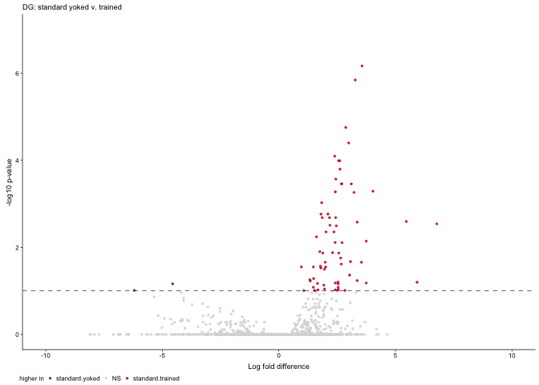
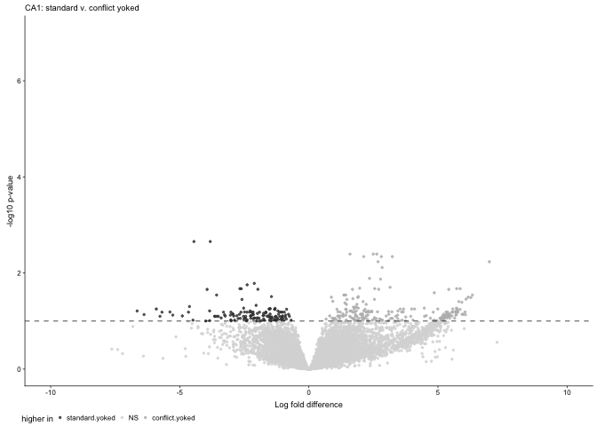

Subfield analysis
-----------------

This script is used to identify treatement differences within each
subfield, generate volcano plots, venn diagrams, and tables for
subsequent GO analyses. The final mutlipanel figures for the manuscript
have been inserted just below the subheadings.

    library(tidyverse)
    library(cowplot) ## for some easy to use themes
    library(DESeq2) ## for gene expression analysis
    library(UpSetR)
    #devtools::install_github("clauswilke/ggtextures")
    library(ggtextures)
    library(magick)

    library(BiocParallel)
    register(MulticoreParam(6))

    ## load functions 
    source("figureoptions.R")
    source("functions_RNAseq.R")

    ## set output file for figures 
    knitr::opts_chunk$set(fig.path = '../figures/02c_rnaseqSubfield/', cache = T)

Get varience stabilized gene expression for each tissue
-------------------------------------------------------

    a.colData <- read.csv("../data/02a_colData.csv", header = T)
    a.countData <- read.csv("../data/02a_countData.csv", header = T, check.names = F, row.names = 1)

    returndds <- function(mytissue){
      print(mytissue)
      colData <- a.colData %>% 
        filter(Punch %in% c(mytissue))  %>% 
      droplevels()
      
      savecols <- as.character(colData$RNAseqID) 
      savecols <- as.vector(savecols) 
      countData <- a.countData %>% dplyr::select(one_of(savecols)) 

      ## create DESeq object using the factors Punch and APA
      dds <- DESeqDataSetFromMatrix(countData = countData,
                                  colData = colData,
                                  design = ~ APA2)

      dds <- dds[ rowSums(counts(dds)) > 1, ]  # Pre-filtering genes with 0 counts
      dds <- DESeq(dds, parallel = TRUE)
      return(dds)
    }

    DGdds <- returndds("DG") 

    ## [1] "DG"

    ## estimating size factors

    ## estimating dispersions

    ## gene-wise dispersion estimates: 6 workers

    ## mean-dispersion relationship

    ## final dispersion estimates, fitting model and testing: 6 workers

    CA1dds <- returndds("CA1") 

    ## [1] "CA1"

    ## estimating size factors

    ## estimating dispersions

    ## gene-wise dispersion estimates: 6 workers

    ## mean-dispersion relationship

    ## final dispersion estimates, fitting model and testing: 6 workers

    CA3dds <- returndds("CA3") 

    ## [1] "CA3"

    ## estimating size factors

    ## estimating dispersions

    ## gene-wise dispersion estimates: 6 workers

    ## mean-dispersion relationship

    ## final dispersion estimates, fitting model and testing: 6 workers

    returnvsds <- function(mydds, vsdfilename){
      dds <- mydds
      vsd <- vst(dds, blind=FALSE) ## variance stabilized
      print(head(assay(vsd),3))
      return(write.csv(assay(vsd), file = vsdfilename, row.names = T))
    }

    returnvsds(DGdds, "../data/02c_DGvsd.csv")

    ##               143A-DG-1 143B-DG-1 143D-DG-3 144A-DG-2 144C-DG-2 144D-DG-2
    ## 0610007P14Rik  6.061813  6.093253  6.546473  6.191509  6.081483  6.330372
    ## 0610009B22Rik  5.427332  5.303459  4.916098  5.155434  5.469507  5.309580
    ## 0610009L18Rik  5.028120  5.230032  5.047701  4.596165  5.136024  5.134864
    ##               145A-DG-2 145B-DG-1 146A-DG-2 146B-DG-2 146C-DG-4 146D-DG-3
    ## 0610007P14Rik  6.255339  5.796661  5.981589  5.666827  6.642897  7.198395
    ## 0610009B22Rik  5.599669  5.436754  5.323551  5.666827  5.727726  4.596165
    ## 0610009L18Rik  4.869394  4.596165  5.323551  4.596165  4.596165  4.596165
    ##               147-DG-4 147C-DG-3 147D-DG-1 148-DG-2 148A-DG-3 148B-DG-4
    ## 0610007P14Rik 4.596165  5.976081  6.169871 5.962466  6.186452  6.033484
    ## 0610009B22Rik 7.598426  5.566137  5.548592 5.431813  5.226147  5.122685
    ## 0610009L18Rik 4.596165  4.869872  5.361845 4.596165  5.136778  4.969498

    returnvsds(CA1dds, "../data/02c_CA1vsd.csv")

    ##               143B-CA1-1 143C-CA1-1 143D-CA1-3 144A-CA1-2 144B-CA1-1
    ## 0610007P14Rik   6.880698   6.419536   6.666046   6.684314   6.722455
    ## 0610009B22Rik   6.271651   6.106656   5.319977   6.174401   5.957844
    ## 0610009L18Rik   5.982821   5.578039   5.319977   5.792716   5.491744
    ##               144C-CA1-2 145A-CA1-2 145B-CA1-1 146A-CA1-2 146B-CA1-2
    ## 0610007P14Rik   6.477328   6.733923   6.693372   6.430347   6.267586
    ## 0610009B22Rik   5.896135   6.076698   6.084280   6.127811   5.969877
    ## 0610009L18Rik   5.531571   5.900652   5.664972   5.913479   5.319977
    ##               146C-CA1-4 146D-CA1-3 147-CA1-4 147C-CA1-3 148-CA1-2
    ## 0610007P14Rik   6.733555   6.817016  6.305772   6.569382  6.682223
    ## 0610009B22Rik   5.946313   6.126776  6.305772   5.954570  5.812180
    ## 0610009L18Rik   6.028620   5.319977  5.319977   5.539188  6.040488
    ##               148A-CA1-3 148B-CA1-4
    ## 0610007P14Rik   6.642458   6.481732
    ## 0610009B22Rik   6.210959   5.319977
    ## 0610009L18Rik   5.789298   5.319977

    returnvsds(CA3dds, "../data/02c_CA3vsd.csv")

    ##               143A-CA3-1 144A-CA3-2 144B-CA3-1 144C-CA3-2 144D-CA3-2
    ## 0610007P14Rik   7.229103   7.692534   7.389598   7.189574   7.086379
    ## 0610009B22Rik   6.710399   7.171219   6.779068   7.111954   6.649230
    ## 0610009L18Rik   6.350172   6.906144   6.554700   6.519607   6.557669
    ##               145A-CA3-2 146A-CA3-2 146B-CA3-2 146D-CA3-3 147-CA3-4
    ## 0610007P14Rik   7.013722   7.407009   6.976367   7.296329  8.544319
    ## 0610009B22Rik   7.097826   6.532640   7.096058   6.727478  7.370690
    ## 0610009L18Rik   6.099026   6.532640   6.318145   6.447628  6.099026
    ##               147C-CA3-3 147D-CA3-1 148-CA3-2 148A-CA3-3 148B-CA3-4
    ## 0610007P14Rik   7.325639   7.050746  7.202076   7.113575   7.414902
    ## 0610009B22Rik   6.636480   6.790515  7.086099   6.776859   6.915261
    ## 0610009L18Rik   6.425657   6.425417  6.099026   6.467472   6.506630

Consistent versus yoked-consistent
----------------------------------

    plot.cons.yokcons <- function(mydds, mytissue, mytitle){
      print(mytissue)
      
      res <- results(mydds, contrast =c("APA2", "standard.trained", "standard.yoked"),
                     independentFiltering = T, alpha = 0.1)
      print(summary(res))

      data <- data.frame(gene = row.names(res),
                       padj = res$padj, 
                       logpadj = -log10(res$padj),
                       lfc = res$log2FoldChange)
      data <- na.omit(data)
      data <- data %>%
        dplyr::mutate(direction = ifelse(data$lfc > 0 & data$padj < 0.1, 
                            yes = "standard.trained", 
                            no = ifelse(data$lfc < 0 & data$padj < 0.1, 
                                        yes = "standard.yoked", 
                                        no = "NS")))

      write.csv(data, file = paste0("../data/02c_", mytissue, "_std.train.yoked.csv", sep = ""), row.names = F)
      
      volcano <- data %>%
        #filter(direction != "NS") %>%
        ggplot(aes(x = lfc, y = logpadj)) + 
        geom_point(aes(color = factor(direction)), size = 0.5, alpha = 0.75, na.rm = T) + 
        theme_cowplot(font_size = 7, line_size = 0.25) +
        geom_hline(yintercept = 1,  size = 0.25, linetype = 2) + 
        scale_color_manual(values = volcano1,
                          name = "higher in",
                          breaks = c("standard.yoked", "NS", "standard.trained"))  + 
        scale_x_continuous(limits=c(-10, 10),
                            name="Log fold difference")+
        ylim(c(0,7)) +
        ylab(paste0("-log10 p-value")) +  
        labs(subtitle = mytitle) +
        theme(legend.position = "bottom",
              legend.spacing.x = unit(0.1, 'cm'),
              #legend.text=element_text(size=4),
              legend.title = element_text(size=6),
              legend.key.size = unit(0.2, "cm"),
              legend.margin=margin(t=-0.1, r=0, b=0, l=-0.1, unit="cm")) 
      plot(volcano)
    }

    DGconsyokcons <-  plot.cons.yokcons(DGdds, "DG", "DG: standard yoked v. trained") 

    ## [1] "DG"
    ## 
    ## out of 17033 with nonzero total read count
    ## adjusted p-value < 0.1
    ## LFC > 0 (up)       : 69, 0.41%
    ## LFC < 0 (down)     : 2, 0.012%
    ## outliers [1]       : 27, 0.16%
    ## low counts [2]     : 4285, 25%
    ## (mean count < 3)
    ## [1] see 'cooksCutoff' argument of ?results
    ## [2] see 'independentFiltering' argument of ?results
    ## 
    ## NULL

    CA3consyokcons <-  plot.cons.yokcons(CA3dds, "CA3", "CA3: standard yoked v. trained")  

    ## [1] "CA3"
    ## 
    ## out of 16583 with nonzero total read count
    ## adjusted p-value < 0.1
    ## LFC > 0 (up)       : 1, 0.006%
    ## LFC < 0 (down)     : 0, 0%
    ## outliers [1]       : 9, 0.054%
    ## low counts [2]     : 0, 0%
    ## (mean count < 0)
    ## [1] see 'cooksCutoff' argument of ?results
    ## [2] see 'independentFiltering' argument of ?results
    ## 
    ## NULL

    CA1consyokcons <-  plot.cons.yokcons(CA1dds, "CA1", "CA1: standard yoked v. trained")  

    ## [1] "CA1"
    ## 
    ## out of 16896 with nonzero total read count
    ## adjusted p-value < 0.1
    ## LFC > 0 (up)       : 183, 1.1%
    ## LFC < 0 (down)     : 105, 0.62%
    ## outliers [1]       : 31, 0.18%
    ## low counts [2]     : 5556, 33%
    ## (mean count < 6)
    ## [1] see 'cooksCutoff' argument of ?results
    ## [2] see 'independentFiltering' argument of ?results
    ## 
    ## NULL

    plot_grid(DGconsyokcons,CA1consyokcons, nrow = 1)

Confict versus Consistent
-------------------------

    plot.conf.cons <- function(mydds, mytissue){
      
      print(mytissue)
      
      res <- results(mydds, contrast =c("APA2", "conflict.trained", "standard.trained"),
                     independentFiltering = T, alpha = 0.1)
      print(summary(res))

      data <- data.frame(gene = row.names(res),
                       padj = res$padj, 
                       logpadj = -log10(res$padj),
                       lfc = res$log2FoldChange)
      data <- na.omit(data)
      
      data <- data %>%
        dplyr::mutate(direction = ifelse(data$lfc > 0 & data$padj < 0.1, 
                            yes = "conflict.trained", 
                            no = ifelse(data$lfc < 0 & data$padj < 0.1, 
                                        yes = "standard.trained", 
                                        no = "NS")))
      
      write.csv(data, file = paste0("../data/02c_", mytissue, "_confcons.csv", sep = ""), row.names = F)
      
      volcano <- ggplot(data, aes(x = lfc, y = logpadj)) + 
        geom_point(aes(color = factor(direction)), size = 0.5, alpha = 0.75, na.rm = T) + 
        theme_cowplot(font_size = 7, line_size = 0.25) +
        geom_hline(yintercept = 1,  size = 0.25, linetype = 2) + 
        #scale_color_manual(values = volcano2,
        #                   breaks = c("standard.trained", "NS", "conflict.trained"),
        #                  name = "higher in")  + 
        scale_x_continuous(limits=c(-10, 10),
                            name="Log fold difference")+
        ylab(paste0("-log10 p-value")) +  
        labs(subtitle = mytissue) +
        theme(panel.grid.minor=element_blank(),
              legend.position = "bottom",
              legend.spacing.x = unit(-0.1, 'cm'),
              panel.grid.major=element_blank(),
              legend.margin=margin(t=-0.25, r=0, b=0, l=0, unit="cm")) 
      plot(volcano)
    }

    DGconflict <-  plot.conf.cons(DGdds, "DG: standard v. conflict trained")

    ## [1] "DG: standard v. conflict trained"
    ## 
    ## out of 17033 with nonzero total read count
    ## adjusted p-value < 0.1
    ## LFC > 0 (up)       : 0, 0%
    ## LFC < 0 (down)     : 0, 0%
    ## outliers [1]       : 27, 0.16%
    ## low counts [2]     : 0, 0%
    ## (mean count < 0)
    ## [1] see 'cooksCutoff' argument of ?results
    ## [2] see 'independentFiltering' argument of ?results
    ## 
    ## NULL

    CA3conflict <-  plot.conf.cons(CA3dds, "CA3: standard v. conflict trained")

    ## [1] "CA3: standard v. conflict trained"
    ## 
    ## out of 16583 with nonzero total read count
    ## adjusted p-value < 0.1
    ## LFC > 0 (up)       : 0, 0%
    ## LFC < 0 (down)     : 0, 0%
    ## outliers [1]       : 9, 0.054%
    ## low counts [2]     : 0, 0%
    ## (mean count < 0)
    ## [1] see 'cooksCutoff' argument of ?results
    ## [2] see 'independentFiltering' argument of ?results
    ## 
    ## NULL

    CA1conflict <-  plot.conf.cons(CA1dds, "CA1: standard v. conflict trained")

    ## [1] "CA1: standard v. conflict trained"
    ## 
    ## out of 16896 with nonzero total read count
    ## adjusted p-value < 0.1
    ## LFC > 0 (up)       : 0, 0%
    ## LFC < 0 (down)     : 0, 0%
    ## outliers [1]       : 31, 0.18%
    ## low counts [2]     : 0, 0%
    ## (mean count < 0)
    ## [1] see 'cooksCutoff' argument of ?results
    ## [2] see 'independentFiltering' argument of ?results
    ## 
    ## NULL

    plot_grid(DGconflict, CA3conflict, CA1conflict, nrow = 3)

Yoked confict versus yoked consistent
-------------------------------------

    plot.yokconf.yokcons <- function(mydds, mytissue, mytitle){
      
      print(mytissue)
      
      res <- results(mydds, contrast =c("APA2", "conflict.yoked", "standard.yoked"),
                     independentFiltering = T, alpha = 0.1)
      print(summary(res))

      data <- data.frame(gene = row.names(res),
                       padj = res$padj, 
                       logpadj = -log10(res$padj),
                       lfc = res$log2FoldChange)
      data <- na.omit(data)
      data <- data %>%
        dplyr::mutate(direction = ifelse(data$lfc > 0 & data$padj < 0.1, 
                            yes = "conflict.yoked", 
                            no = ifelse(data$lfc < 0 & data$padj < 0.1, 
                                        yes = "standard.yoked", 
                                        no = "NS")))
      
      data$direction <- factor(data$direction, levels = c("standard.yoked", "NS", "conflict.yoked"))
      
      write.csv(data, file = paste0("../data/02c_", mytissue, "_yokeconfyokcons.csv", sep = ""), row.names = F)
      
      volcano <- data %>%
        #filter(direction != "NS") %>%
        ggplot(aes(x = lfc, y = logpadj, color = direction)) + 
        geom_point(size = 0.5, alpha = 0.75, na.rm = T) + 
        theme_cowplot(font_size = 7, line_size = 0.25) +
        geom_hline(yintercept = 1,  size = 0.25, linetype = 2) + 
        scale_color_manual(values = volcano6,
                           name = "higher in")  + 
        #scale_y_continuous(limits=c(0, 12.5)) +
        scale_x_continuous(limits=c(-10, 10),
                            name="Log fold difference")+
        ylab(paste0("-log10 p-value")) + 
        ylim(c(0,7)) +
        labs(subtitle = mytitle) +
        theme(legend.position = "bottom",
              legend.spacing.x = unit(0.1, 'cm'),
              #legend.text=element_text(size=4),
              legend.key.size = unit(0.2, "cm"),
              legend.margin=margin(t=-0.1, r=0, b=0, l=-0.1, unit="cm")) 
      plot(volcano)  
    }

    DGyoked <-  plot.yokconf.yokcons(DGdds, "DG", "DG: standard v. conflict yoked")

    ## [1] "DG"
    ## 
    ## out of 17033 with nonzero total read count
    ## adjusted p-value < 0.1
    ## LFC > 0 (up)       : 3, 0.018%
    ## LFC < 0 (down)     : 0, 0%
    ## outliers [1]       : 27, 0.16%
    ## low counts [2]     : 0, 0%
    ## (mean count < 0)
    ## [1] see 'cooksCutoff' argument of ?results
    ## [2] see 'independentFiltering' argument of ?results
    ## 
    ## NULL

    CA3yoked <-  plot.yokconf.yokcons(CA3dds, "CA3", "CA3: standard v. conflict yoked")

    ## [1] "CA3"
    ## 
    ## out of 16583 with nonzero total read count
    ## adjusted p-value < 0.1
    ## LFC > 0 (up)       : 1, 0.006%
    ## LFC < 0 (down)     : 1, 0.006%
    ## outliers [1]       : 9, 0.054%
    ## low counts [2]     : 0, 0%
    ## (mean count < 0)
    ## [1] see 'cooksCutoff' argument of ?results
    ## [2] see 'independentFiltering' argument of ?results
    ## 
    ## NULL

    CA1yoked <-  plot.yokconf.yokcons(CA1dds, "CA1", "CA1: standard v. conflict yoked")  

    ## [1] "CA1"
    ## 
    ## out of 16896 with nonzero total read count
    ## adjusted p-value < 0.1
    ## LFC > 0 (up)       : 203, 1.2%
    ## LFC < 0 (down)     : 136, 0.8%
    ## outliers [1]       : 31, 0.18%
    ## low counts [2]     : 4905, 29%
    ## (mean count < 4)
    ## [1] see 'cooksCutoff' argument of ?results
    ## [2] see 'independentFiltering' argument of ?results
    ## 
    ## NULL

    plot_grid(DGyoked, CA3yoked, CA1yoked, nrow = 1)

    volcanos <- plot_grid(DGconsyokcons  ,CA1consyokcons  , CA1yoked , nrow = 1) 
    volcanos

    pdf(file="../figures/02c_rnaseqSubfield/volcanos.pdf", width=6.65, height=2)
    plot(volcanos)    
    dev.off()

    ## quartz_off_screen 
    ##                 2

pkmz
====

    plotCounts(DGdds, "Prkcz", intgroup = "APA2", normalized = TRUE, main="Prkcz in DG")

    plotCounts(CA3dds, "Prkcz", intgroup = "APA2", normalized = TRUE, main="Prkcz in CA3")

    plotCounts(CA1dds, "Prkcz", intgroup = "APA2", normalized = TRUE, main="Prkcz in CA1")

genes that are correlated with number of entrances
--------------------------------------------------

Requires anlaysis of `04_integration.Rmd` first.

    plotCounts(DGdds, "Acan", intgroup = "APA2", normalized = TRUE, main="Acan in DG")

    plotCounts(DGdds, "Amigo2", intgroup = "APA2", normalized = TRUE, main="Amigo2 in DG")

    plotCounts(DGdds, "Armcx5", intgroup = "APA2", normalized = TRUE, main="Armcx5 in DG")

    plotCounts(DGdds, "Ptgs2", intgroup = "APA2", normalized = TRUE, main="Ptgs2 in DG")

    plotCounts(DGdds, "Rgs2", intgroup = "APA2", normalized = TRUE, main="Rgs2 in DG")

    plotCounts(DGdds, "Syt4", intgroup = "APA2", normalized = TRUE, main="Syt4 in DG")

Upset plots
-----------

What genes overlap within cetain comparisons?

    a.colData <- read.csv("../data/02a_colData.csv", header = T)
    a.countData <- read.csv("../data/02a_countData.csv", header = T, check.names = F, row.names = 1)

    eachsubfield <- levels(a.colData$Punch)

    listofDEGs <- function(group1, group2){
      res <- results(dds, contrast = c("APA2", group1, group2), independentFiltering = T)
      data <- data.frame(gene = row.names(res),
                         lfc = res$log2FoldChange,
                         padj = res$padj,
                         tissue = i,
                         comparison = paste(group1, group2, sep = "-"))
      data <- data %>% dplyr::filter(padj < 0.1) %>% droplevels()
      return(data)
    }

    for(i in eachsubfield){
      
      colData <- a.colData %>% 
        dplyr::filter(Punch == i)  %>%
        droplevels()
      print(i)
      
      savecols <- as.character(colData$RNAseqID) 
      savecols <- as.vector(savecols) 
      countData <- a.countData %>% dplyr::select(one_of(savecols)) 

    ## create DESeq object using the factors Punch and APA
    dds <- DESeqDataSetFromMatrix(countData = countData,
                                  colData = colData,
                                  design = ~ APA2)

    dds # view the DESeq object - note numnber of genes
    dds <- dds[ rowSums(counts(dds)) > 1, ]  # Pre-filtering genes with 0 counts
    dds <- DESeq(dds) # Differential expression analysis

    A <- listofDEGs("standard.trained","standard.yoked")
    B <- listofDEGs("conflict.trained","standard.trained")
    C <- listofDEGs("conflict.trained","conflict.yoked")
    D <- listofDEGs("conflict.yoked","standard.yoked")

    all <- rbind(A,B,C,D)

    write.csv(all, file = paste("../data/02c_",i,"forupset.csv", sep = ""), row.names = F)
    }

    ## [1] "CA1"

    ## estimating size factors

    ## estimating dispersions

    ## gene-wise dispersion estimates

    ## mean-dispersion relationship

    ## final dispersion estimates

    ## fitting model and testing

    ## [1] "CA3"

    ## estimating size factors

    ## estimating dispersions

    ## gene-wise dispersion estimates

    ## mean-dispersion relationship

    ## final dispersion estimates

    ## fitting model and testing

    ## [1] "DG"

    ## estimating size factors

    ## estimating dispersions

    ## gene-wise dispersion estimates

    ## mean-dispersion relationship

    ## final dispersion estimates

    ## fitting model and testing
