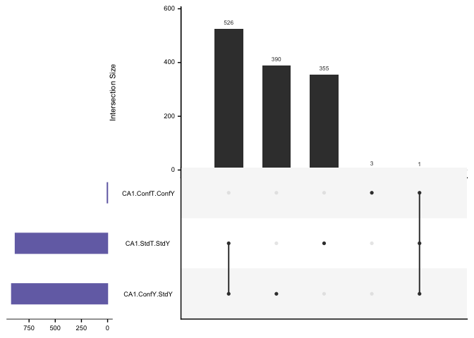
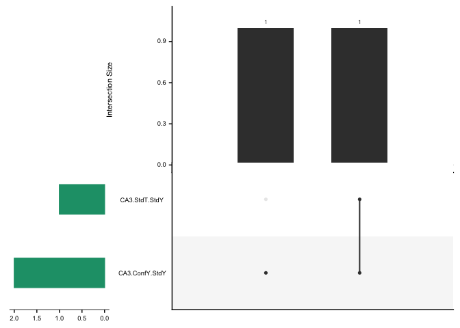

    DG <- read.csv("../data/02c_DGforupset.csv", stringsAsFactors = F)  
    CA1 <- read.csv("../data/02c_CA1forupset.csv", stringsAsFactors = F)  
    CA3 <- read.csv("../data/02c_CA3forupset.csv", stringsAsFactors = F) 

    # make df for upset plots without direction
    myupsetdf <- rbind(DG,CA1,CA3)

    myupsetdf <- myupsetdf %>%
      mutate(comparison = fct_recode(comparison,
        "ConfT.ConfY"    = "conflict.trained-conflict.yoked",
        "ConfY.StdY"      = "conflict.yoked-standard.yoked",
        "StdT.StdY" = "standard.trained-standard.yoked")) %>%
      mutate(tissue.contrast = paste(tissue, comparison, sep = ".")) %>%
      select(gene,tissue.contrast) %>%
      mutate(yesno = 1) %>%
      distinct %>%
      spread(tissue.contrast, yesno, fill = 0)

    write.csv(myupsetdf, "../data/02d_upsetdf.csv")

    upset1 <- upset(myupsetdf, keep.order = F,
          nsets = 14,
          order.by = "freq",
          sets.x.label = NULL,
          point.size = 1.5, 
          mb.ratio = c(0.5, 0.5))
    upset1

    pdf(file="../figures/02c_rnaseqSubfield/upsetall.pdf",  onefile=FALSE, width=6.69, height=5.1) # or other device
    upset1
    dev.off()

    ## quartz_off_screen 
    ##                 2

    DGupset <- myupsetdf %>% select(gene, starts_with("DG")) 
    CA1upset <- myupsetdf %>% select(gene, starts_with("CA1")) 
    CA3upset <- myupsetdf %>% select(gene, starts_with("CA3")) 

    upset2 <- upset(DGupset, keep.order = F,
          order.by = "freq",
          sets.bar.color=c("#d95f02"),
          sets.x.label = NULL,
          point.size = 1.5, 
          mb.ratio = c(0.5, 0.5),
          nsets = 6)
    upset2

    upset3 <- upset(CA1upset, keep.order = F,
          order.by = "freq",
          sets.bar.color=c("#7570b3"),
          sets.x.label = NULL,
          point.size = 1.5, 
          mb.ratio = c(0.5, 0.5),
          nsets = 6)
    upset3

    upset4 <- upset(CA3upset, keep.order = F,
          order.by = "freq",
          sets.bar.color=c("#1b9e77"),
          sets.x.label = NULL,
          point.size = 1.5, 
          mb.ratio = c(0.5, 0.5),
          nsets = 5)
    upset4

    # to use GORILLA, I need a list of all genes used
    genesforgo <- read_csv("../data/00_geneids.csv") %>% 
      select(gene) %>% arrange(gene)

    ## Parsed with column specification:
    ## cols(
    ##   id = col_character(),
    ##   ENSMUST = col_character(),
    ##   ENSMUSG = col_character(),
    ##   OTTMUSG = col_character(),
    ##   OTTMUST = col_character(),
    ##   transcript = col_character(),
    ##   gene = col_character(),
    ##   length = col_double(),
    ##   structure1 = col_character(),
    ##   structure2 = col_character(),
    ##   structure3 = col_character(),
    ##   transcript_lenght = col_character()
    ## )

    write.csv(genesforgo, "../data/02d_genesforgo.csv")

    DGwide <- DG %>%
      select(-padj,-tissue) %>%
      spread(key = comparison, value = lfc)  %>%
      select(gene, "standard.trained-standard.yoked", "conflict.yoked-standard.yoked", "conflict.trained-conflict.yoked")
    head(DGwide)

    ##            gene standard.trained-standard.yoked
    ## 1 A830010M20Rik                        1.991294
    ## 2          Acan                        2.459128
    ## 3       Adamts1                        2.370955
    ## 4        Amigo2                        1.982597
    ## 5       Ankrd28                        1.642931
    ## 6      Ankrd33b                              NA
    ##   conflict.yoked-standard.yoked conflict.trained-conflict.yoked
    ## 1                            NA                              NA
    ## 2                            NA                        1.570308
    ## 3                            NA                              NA
    ## 4                            NA                              NA
    ## 5                            NA                              NA
    ## 6                            NA                        1.146560

    CA1wide <- CA1 %>%
      select(-padj,-tissue) %>%
      spread(key = comparison, value = lfc)  %>%
      select(gene,  "standard.trained-standard.yoked", "conflict.yoked-standard.yoked", "conflict.trained-conflict.yoked")
    head(CA1wide)

    ##            gene standard.trained-standard.yoked
    ## 1 1110032F04Rik                              NA
    ## 2 1600002K03Rik                              NA
    ## 3 1810022K09Rik                       -2.103747
    ## 4 1810030O07Rik                       -1.747853
    ## 5 2010107G23Rik                              NA
    ## 6 2210013O21Rik                              NA
    ##   conflict.yoked-standard.yoked conflict.trained-conflict.yoked
    ## 1                      3.700008                              NA
    ## 2                     -4.505653                              NA
    ## 3                            NA                              NA
    ## 4                     -1.729104                              NA
    ## 5                     -2.138287                              NA
    ## 6                     -2.380294                              NA
