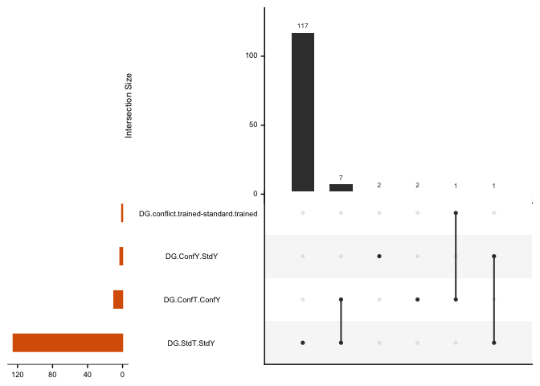

    DG <- read.csv("../data/02c_DGforupset.csv")  
    CA1 <- read.csv("../data/02c_CA1forupset.csv")  
    CA3 <- read.csv("../data/02c_CA3forupset.csv") 

    tail(CA1)

    ##         gene        lfc       padj tissue                    comparison
    ## 624   Zfp937  4.0311619 0.09502176    CA1 conflict.yoked-standard.yoked
    ## 625  Zfyve21 -2.8761465 0.09570253    CA1 conflict.yoked-standard.yoked
    ## 626    Zgpat -1.0475942 0.08574683    CA1 conflict.yoked-standard.yoked
    ## 627     Zic3 -5.9099446 0.05608592    CA1 conflict.yoked-standard.yoked
    ## 628 Zmpste24  4.0930764 0.05618195    CA1 conflict.yoked-standard.yoked
    ## 629  Zscan26 -0.9015179 0.07517407    CA1 conflict.yoked-standard.yoked

    # upset plot without direction
    all <- rbind(DG,CA1,CA3)
    str(all)

    ## 'data.frame':    707 obs. of  5 variables:
    ##  $ gene      : Factor w/ 548 levels "A830010M20Rik",..: 1 2 3 4 5 6 7 8 9 10 ...
    ##  $ lfc       : num  2.03 2.44 2.36 1.66 2.87 ...
    ##  $ padj      : num  4.42e-03 2.70e-04 4.42e-03 6.77e-02 1.77e-05 ...
    ##  $ tissue    : Factor w/ 3 levels "DG","CA1","CA3": 1 1 1 1 1 1 1 1 1 1 ...
    ##  $ comparison: Factor w/ 3 levels "conflict.trained-conflict.yoked",..: 3 3 3 3 3 3 3 3 3 3 ...

    levels(all$comparison)

    ## [1] "conflict.trained-conflict.yoked" "conflict.yoked-standard.yoked"  
    ## [3] "standard.trained-standard.yoked"

    all <- all %>%
      mutate(comparison = fct_recode(comparison,
        "ConfT.ConfY"    = "conflict.trained-conflict.yoked",
        "ConfY.StdY"      = "conflict.yoked-standard.yoked",
        "StdT.StdY" = "standard.trained-standard.yoked"
      ))

    all$significant <- paste(all$tissue, all$comparison, sep = ".")

    myupsetdf <- all %>%
      select(gene,significant) %>%
      mutate(yesno = 1) %>%
      distinct %>%
      spread(significant, yesno, fill = 0)
    head(myupsetdf)

    ##            gene CA1.ConfT.ConfY CA1.ConfY.StdY CA1.StdT.StdY
    ## 1 A830010M20Rik               0              0             0
    ## 2          Acan               0              0             0
    ## 3       Adamts1               0              1             1
    ## 4       Ankrd28               0              0             0
    ## 5           Arc               0              0             0
    ## 6         Arl5b               0              0             0
    ##   CA3.ConfY.StdY CA3.StdT.StdY DG.ConfT.ConfY DG.ConfY.StdY DG.StdT.StdY
    ## 1              0             0              0             0            1
    ## 2              0             0              0             0            1
    ## 3              0             0              0             0            1
    ## 4              0             0              0             0            1
    ## 5              0             0              0             0            1
    ## 6              0             0              0             0            1

    write.csv(myupsetdf, "../data/02c_upsetdf.csv")

    # upset plot with direction, only CA1learn, CA1 stress, and DGlearn
    head(all) 

    ##            gene      lfc         padj tissue comparison  significant
    ## 1 A830010M20Rik 2.025595 4.423579e-03     DG  StdT.StdY DG.StdT.StdY
    ## 2          Acan 2.443989 2.703270e-04     DG  StdT.StdY DG.StdT.StdY
    ## 3       Adamts1 2.362481 4.423579e-03     DG  StdT.StdY DG.StdT.StdY
    ## 4       Ankrd28 1.655249 6.766322e-02     DG  StdT.StdY DG.StdT.StdY
    ## 5           Arc 2.869251 1.765702e-05     DG  StdT.StdY DG.StdT.StdY
    ## 6         Arl5b 1.886192 1.351422e-02     DG  StdT.StdY DG.StdT.StdY

    all$direction <- ifelse(all$lfc > 0, "up", "down")
    all$sigdir <- paste(all$significant, all$direction, sep = "-")

    myupsetslim  <- all %>%
      #filter(significant %in% c("DG-cons-ycons", "CA1-cons-ycons", "CA1-yconf-ycons")) %>%
      select(gene,sigdir) %>%
      mutate(yesno = 1) %>%
      distinct %>%
      spread(sigdir, yesno, fill = 0)
    head(myupsetslim)

    ##            gene CA1.ConfT.ConfY-down CA1.ConfT.ConfY-up
    ## 1 A830010M20Rik                    0                  0
    ## 2          Acan                    0                  0
    ## 3       Adamts1                    0                  0
    ## 4       Ankrd28                    0                  0
    ## 5           Arc                    0                  0
    ## 6         Arl5b                    0                  0
    ##   CA1.ConfY.StdY-down CA1.ConfY.StdY-up CA1.StdT.StdY-down
    ## 1                   0                 0                  0
    ## 2                   0                 0                  0
    ## 3                   0                 1                  0
    ## 4                   0                 0                  0
    ## 5                   0                 0                  0
    ## 6                   0                 0                  0
    ##   CA1.StdT.StdY-up CA3.ConfY.StdY-down CA3.ConfY.StdY-up CA3.StdT.StdY-up
    ## 1                0                   0                 0                0
    ## 2                0                   0                 0                0
    ## 3                1                   0                 0                0
    ## 4                0                   0                 0                0
    ## 5                0                   0                 0                0
    ## 6                0                   0                 0                0
    ##   DG.ConfT.ConfY-down DG.ConfY.StdY-up DG.StdT.StdY-down DG.StdT.StdY-up
    ## 1                   0                0                 0               1
    ## 2                   0                0                 0               1
    ## 3                   0                0                 0               1
    ## 4                   0                0                 0               1
    ## 5                   0                0                 0               1
    ## 6                   0                0                 0               1

    row.names(myupsetslim) <- myupsetslim$gene
    myupsetslim$gene <- NULL
    colSums(myupsetslim)

    ## CA1.ConfT.ConfY-down   CA1.ConfT.ConfY-up  CA1.ConfY.StdY-down 
    ##                    1                    1                  136 
    ##    CA1.ConfY.StdY-up   CA1.StdT.StdY-down     CA1.StdT.StdY-up 
    ##                  203                  105                  183 
    ##  CA3.ConfY.StdY-down    CA3.ConfY.StdY-up     CA3.StdT.StdY-up 
    ##                    1                    1                    1 
    ##  DG.ConfT.ConfY-down     DG.ConfY.StdY-up    DG.StdT.StdY-down 
    ##                    1                    3                    2 
    ##      DG.StdT.StdY-up 
    ##                   69

    myupsetslim$gene <- row.names(myupsetslim)

    upset1 <- upset(myupsetdf, keep.order = F,
          sets = c("CA1.ConfY.StdY", "CA1.StdT.StdY",
                   "CA3.ConfY.StdY" , 
                   "DG.ConfY.StdY" ,  "DG.StdT.StdY" ),
          sets.bar.color=c("#7570b3","#7570b3",
                           "#d95f02","#d95f02",
                           "#1b9e77"),
          order.by = "freq",
          sets.x.label = NULL,
          point.size = 1.5, 
          mb.ratio = c(0.6, 0.4))
    upset1

    pdf(file="../figures/02c_rnaseqSubfield/upsetall.pdf",  onefile=FALSE, width=3.15, height=3.15) # or other device
    upset1
    dev.off()

    ## quartz_off_screen 
    ##                 2

    trained <- myupsetdf %>%
      select(gene, 'DG.StdT.StdY', 'CA3.StdT.StdY', 'CA1.StdT.StdY')
    colnames(trained) <- c("gene", "DG", "CA3", "CA1")

    upset2 <- upset(trained, keep.order = T,
          sets = c("CA1", "CA3", "DG"),
          sets.bar.color=c("#7570b3","#1b9e77", "#d95f02"),
          queries = list(list(query = intersects, params = list("CA1"), color = "#ca0020", active = T),
                         list(query = intersects, params = list("DG"), color = "#ca0020", active = T),
                         list(query = intersects, params = list("CA3"), color = "#ca0020", active = T),
                         list(query = intersects, params = list("CA1", "DG"), 
                              color = "#ca0020", active = T)),
          sets.x.label = NULL,
          point.size = 1.5, 
          mb.ratio = c(0.6, 0.4))
    upset2

    pdf(file="../figures/02c_rnaseqSubfield/upsettraining.pdf",  onefile=FALSE, width=3.15, height=3.15) # or other device
    upset2
    dev.off()

    ## quartz_off_screen 
    ##                 2

Create a list of genes afected by stress and learning. Save. THen use to
filter out nonspecific gene expression responses

    shared <- myupsetdf %>%
      select(gene, "CA1.ConfY.StdY", "CA1.StdT.StdY",  "DG.StdT.StdY")
    colnames(shared) <- c("gene", "CA1stress", "CA1learn", "DGlearn")

    # CA1 and DG learning only (none in stress)
    shared %>% filter(CA1learn == 1 & DGlearn == 1 & CA1stress == 0) %>%
      select(gene) 

    ## [1] gene
    ## <0 rows> (or 0-length row.names)

    # learning and stress CA1
    CA1learnstress <- shared %>% filter(CA1learn == 1 & CA1stress == 1) %>%
      select(gene)
    head(CA1learnstress)

    ##            gene
    ## 1       Adamts1
    ## 2 2410002F23Rik
    ## 3 2410004P03Rik
    ## 4 3632451O06Rik
    ## 5 6330408A02Rik
    ## 6         Acin1

    # CA1 learning but not CA1 stress 
    CA1learn <- shared %>% filter(CA1learn == 1 & CA1stress == 0) %>%
      select(gene)

    # CA1 learning but not CA1 stress 
    CA1stress <- shared %>% filter(CA1learn == 0 & CA1stress == 1) %>%
      select(gene)

    write.csv(CA1learnstress, "../data/02_CA1learningstressgenes.csv", row.names = F)
    write.csv(CA1learn, "../data/02_CA1learninggenes.csv", row.names = F)
    write.csv(CA1stress, "../data/02_CA1lstressgenes.csv", row.names = F)

    # All degs
    updown <- read.csv("../data/02c_setsize_updown.csv") 
    updown$direction <- factor(updown$direction,  levels = c("yoked_consistent", "yoked_conflict", "consistent"))
    updown$set <- factor(updown$set,  levels = c("DGtrain", "CA1train", "CA1stress"))
    updown$status <- factor(updown$status,  levels = c("train", "stress"))

    levels(updown$set)[levels(updown$set)=="DGtrain"] <- "DG train"
    levels(updown$set)[levels(updown$set)=="CA1train"]   <- "CA1 train"
    levels(updown$set)[levels(updown$set)=="CA1stress"]   <- "CA1 stress"
    levels(updown$direction)[levels(updown$direction)=="yoked_consistent"] <- "standard\nyoked"
    levels(updown$direction)[levels(updown$direction)=="yoked_conflict"]   <- "conflict\nyoked"
    levels(updown$direction)[levels(updown$direction)=="consistent"]   <- "standard\ntrained"

    levels(updown$set) <- c("DG\nyoked v. trained", "CA1\n yoked v. trained", " CA1\n yoked v. yoked")

    # unique and shared
    shared2 <- read.csv("../data/02c_intersect_updown_shared2.csv") 
    str(shared2)

    ## 'data.frame':    14 obs. of  5 variables:
    ##  $ set      : Factor w/ 3 levels "CA1stress","CA1train",..: 2 2 1 1 3 3 2 1 2 1 ...
    ##  $ setsize  : int  168 181 179 206 6 103 330 330 192 192 ...
    ##  $ direction: Factor w/ 3 levels "consistent","yoked_conflict",..: 3 1 3 2 3 1 1 2 3 3 ...
    ##  $ subfield : Factor w/ 2 levels "CA1","DG": 1 1 1 1 2 2 1 1 1 1 ...
    ##  $ status   : Factor w/ 3 levels "stress","train",..: 3 3 3 3 3 3 1 2 1 2 ...

    shared2$group <- paste(shared2$set, shared2$direction, sep = " ")
    shared2$set <- factor(shared2$set,  levels = c("DGtrain", "CA1train", "CA1stress"))
    shared2$direction <- factor(shared2$direction,  
                                levels = c("yoked_consistent", "yoked_conflict", "consistent"))
    shared2$group <-factor(shared2$group,  
                           levels = c("DGtrain yoked_consistent", "DGtrain consistent", 
                                      "CA1train yoked_consistent","CA1train consistent",
                                      "CA1stress yoked_consistent", "CA1stress yoked_conflict" ))
    shared2$status <- factor(shared2$status,  levels = c(  "stress","train","unique"))

    levels(shared2$direction)

    ## [1] "yoked_consistent" "yoked_conflict"   "consistent"

    levels(shared2$direction)[levels(shared2$direction)=="yoked_consistent"] <- "standard\nyoked"
    levels(shared2$direction)[levels(shared2$direction)=="yoked_conflict"]   <- "conflict\nyoked"
    levels(shared2$direction)[levels(shared2$direction)=="consistent"]   <- "standard\ntrained"
    levels(shared2$status)[levels(shared2$status)=="stress"]   <- "shared"
    levels(shared2$status)[levels(shared2$status)=="train"]   <- "shared"

    levels(shared2$set) <- c("DG\nyoked v. trained", "CA1\n yoked v. trained", " CA1\n yoked v. yoked")

    str(shared2)

    ## 'data.frame':    14 obs. of  6 variables:
    ##  $ set      : Factor w/ 3 levels "DG\nyoked v. trained",..: 2 2 3 3 1 1 2 3 2 3 ...
    ##  $ setsize  : int  168 181 179 206 6 103 330 330 192 192 ...
    ##  $ direction: Factor w/ 3 levels "standard\nyoked",..: 1 3 1 2 1 3 3 2 1 1 ...
    ##  $ subfield : Factor w/ 2 levels "CA1","DG": 1 1 1 1 2 2 1 1 1 1 ...
    ##  $ status   : Factor w/ 2 levels "shared","unique": 2 2 2 2 2 2 1 1 1 1 ...
    ##  $ group    : Factor w/ 6 levels "DGtrain yoked_consistent",..: 3 4 5 6 1 2 4 6 3 5 ...

    d1 <- ggplot(updown, aes(x=direction, y=setsize, fill = direction)) +
      geom_bar(stat="identity", position=position_dodge()) +
      theme_cowplot(font_size = 7, line_size = 0.25) +
      scale_fill_manual(values = c("#404040", "#bababa", "#ca0020"),
                        name = NULL)  +
      labs(x = NULL, y = "Total DEGs") +
      scale_y_continuous(limits = c(0, 560),
                         breaks = c(0,125,250,375,500)) +
        facet_wrap(~set, scales = "free_x") +
        theme(axis.text.x = element_blank(),
              legend.position = "none",
              legend.text=element_text(size=4),
              legend.key.size = unit(0.2, "cm"),
              #legend.margin=margin(t=-0.25, r=0, b=0, l=0, unit="cm"),
              #strip.text.x = element_text(size = 5),
              strip.background = element_rect(colour=NA, fill=NA),
            panel.border = element_rect(fill = NA, color = "black"),
            legend.margin=margin(t=-0.1, r=0, b=-0.1, l=0, unit="cm"))
    d1

    images = c(
      unique = "../figures/00_schematics/patterns_blank.png",
      shared = "../figures/00_schematics/patterns_crosed-lines.png")
    images

    ##                                               unique 
    ##        "../figures/00_schematics/patterns_blank.png" 
    ##                                               shared 
    ## "../figures/00_schematics/patterns_crosed-lines.png"

    head(shared2)

    ##                      set setsize         direction subfield status
    ## 1 CA1\n yoked v. trained     168   standard\nyoked      CA1 unique
    ## 2 CA1\n yoked v. trained     181 standard\ntrained      CA1 unique
    ## 3   CA1\n yoked v. yoked     179   standard\nyoked      CA1 unique
    ## 4   CA1\n yoked v. yoked     206   conflict\nyoked      CA1 unique
    ## 5   DG\nyoked v. trained       6   standard\nyoked       DG unique
    ## 6   DG\nyoked v. trained     103 standard\ntrained       DG unique
    ##                        group
    ## 1  CA1train yoked_consistent
    ## 2        CA1train consistent
    ## 3 CA1stress yoked_consistent
    ## 4   CA1stress yoked_conflict
    ## 5   DGtrain yoked_consistent
    ## 6         DGtrain consistent

    d2 <- ggplot(shared2, aes(x=direction, y=setsize, image = status)) +
      geom_textured_bar(stat = "identity") +
      theme_cowplot(font_size = 7, line_size = 0.25) +
      scale_image_manual(values = images,
                         name = NULL) +
      labs(x = "subfield * treatment", y = "Unique DEGs") +
        scale_y_continuous(limits = c(0, 560),
                         breaks = c(0,125,250,375,500)) +
      theme(axis.text.x=element_text(angle=60, vjust = 1, hjust = 1),
            legend.position = c(0.05, 0.8),
            #legend.text=element_text(size=4),
            legend.key.size = unit(0.2, "cm"),
            #strip.text.x = element_text(size = 5),
            strip.background = element_rect(colour=NA, fill=NA),
            panel.border = element_rect(fill = NA, color = "black"),
            legend.margin=margin(t=-0.1, r=0, b=-0.1, l=-0.1, unit="cm")) +
      facet_wrap(~set, scales = "free_x") 
    d2

    newbarplots <- plot_grid(d1,d2, nrow = 2, rel_heights =c(0.4,0.6),
                             labels = c("D","E"), label_size = 7)
    newbarplots

    pdf(file="../figures/02c_rnaseqSubfield/barplots.pdf", width=1.9, height=2.15)
    plot(newbarplots)    
    dev.off() 

    ## quartz_off_screen 
    ##                 2

    # 3 volcanos, 2 bar plots, space for 3 GOs
    fig4barplots <- plot_grid(d1 + labs(x = NULL) + theme(axis.text.x=element_text(angle=60, vjust = 1, hjust = 1)), 
                            d2 + labs(x = NULL),
              labels= c("B1", "B2"),
              label_size = 7,
              ncol = 2)
    fig4barplots

    pdf(file="../figures/02c_rnaseqSubfield/fig4barplots.pdf", width=5, height=1.5)
    plot(fig4barplots)    
    dev.off()

    ## quartz_off_screen 
    ##                 2
