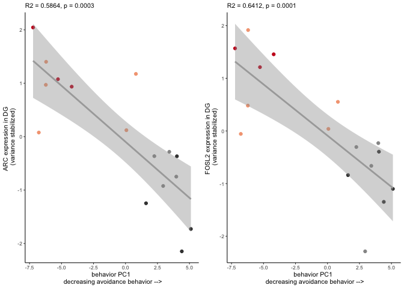

    library(tidyverse) 

    ## ── Attaching packages ────────────────────────────────────────────────────────────────── tidyverse 1.2.1 ──

    ## ✔ ggplot2 3.2.1     ✔ purrr   0.3.2
    ## ✔ tibble  2.1.3     ✔ dplyr   0.8.1
    ## ✔ tidyr   0.8.3     ✔ stringr 1.4.0
    ## ✔ readr   1.3.1     ✔ forcats 0.4.0

    ## ── Conflicts ───────────────────────────────────────────────────────────────────── tidyverse_conflicts() ──
    ## ✖ dplyr::filter() masks stats::filter()
    ## ✖ dplyr::lag()    masks stats::lag()

    library(corrplot)

    ## corrplot 0.84 loaded

    library(cowplot)

    ## 
    ## Attaching package: 'cowplot'

    ## The following object is masked from 'package:ggplot2':
    ## 
    ##     ggsave

    library(corrr)
    #devtools::install_github("clauswilke/ggtext")
    library(ggtext)

    source("figureoptions.R")

    knitr::opts_chunk$set(fig.path = '../figures/02e_correlations/', cache = F)

For this analysis, I want to explor correlations between a behavioral
measure and gene expression.

    # import behavior data, create mouse id, select relvant samples
    behav <- read.csv("../data/01a_behavior.csv") 
    behav$mouse <- sapply(strsplit(as.character(behav$ID),"15"), "[", 2)
    behav <- behav %>% filter( #treatment %in% c("conflict.trained", "standard.trained"),
                                      TrainSessionCombo == "Retention") %>% 
                               select(mouse,Time1stEntr,pTimeShockZone) 
    head(behav)

    ##   mouse Time1stEntr pTimeShockZone
    ## 1  140A      102.43         0.0286
    ## 2  140B       65.80         0.1094
    ## 3  140C      599.97         0.0021
    ## 4  140D       48.93         0.1617
    ## 5  141C       30.53         0.0909
    ## 6  141D       19.13         0.3379

    pcadata <- read_csv("../data/01a_pcadf.csv") %>%
      filter(#treatment %in% c("conflict.trained", "standard.trained"),
             TrainSessionComboNum == 9) %>%
      select(ID,PC1,PC2) 

    ## Parsed with column specification:
    ## cols(
    ##   ID = col_character(),
    ##   treatment = col_character(),
    ##   TrainSessionComboNum = col_double(),
    ##   PC1 = col_double(),
    ##   PC2 = col_double(),
    ##   PC3 = col_double(),
    ##   PC4 = col_double(),
    ##   PC5 = col_double(),
    ##   PC6 = col_double(),
    ##   PC7 = col_double(),
    ##   PC8 = col_double(),
    ##   PC9 = col_double(),
    ##   PC10 = col_double()
    ## )

    pcadata$mouse <- sapply(strsplit(as.character(pcadata$ID),"15"), "[", 2)
    pcadata$ID <- NULL
    head(pcadata)

    ## # A tibble: 6 x 3
    ##      PC1    PC2 mouse
    ##    <dbl>  <dbl> <chr>
    ## 1 -1.97   0.880 140A 
    ## 2  1.56   1.43  140B 
    ## 3 -5.44  -2.13  140C 
    ## 4  1.56  -1.32  140D 
    ## 5 -0.199 -0.760 141C 
    ## 6  3.40  -1.71  141D

    DG_DEGs <- read.csv("../data/02f_DG_DEGs_vsd.csv", row.names = 1, check.names = F)
    DG_DEGs <- as.data.frame(t(DG_DEGs))
    DG_DEGs$sample <- row.names(DG_DEGs)
    DG_DEGs$mouse <- sapply(strsplit(as.character(DG_DEGs$sample),"\\-"), "[", 1)
    DG_DEGs <- DG_DEGs %>% select(mouse,`1190002N15RIK`:ZFP869)
    DG_DEGs

    ##           mouse 1190002N15RIK A830010M20RIK       ABHD2         ACAN
    ## 143A-DG-1  143A    0.37666940   0.332182750  0.43706421  0.668206109
    ## 143B-DG-1  143B   -0.79007413  -0.480302557 -0.11642075 -0.476805955
    ## 143D-DG-3  143D   -0.01317465  -0.257508885 -0.11109850 -0.493064288
    ## 144A-DG-2  144A    1.40407413   1.406908176  1.13390662  0.879402143
    ## 144C-DG-2  144C    1.16933394   1.206776940  0.82323407  0.427126302
    ## 144D-DG-2  144D   -0.47594844  -0.292578743  0.12796826 -0.549705024
    ## 145A-DG-2  145A    0.15491481   0.059938306  0.42577531  0.423357460
    ## 145B-DG-1  145B   -0.29470282  -0.318859027  0.12844318 -0.151026995
    ## 146A-DG-2  146A    0.32994973   0.457559416  0.18732783  0.003436546
    ## 146B-DG-2  146B    0.75766700  -0.018795052 -0.90509412 -0.635366284
    ## 146C-DG-4  146C    0.72237852   1.337464966  0.65283397  0.608736516
    ## 146D-DG-3  146D   -2.17562056  -3.157900624 -3.30343385 -0.547437462
    ## 147C-DG-3  147C    0.58257249   0.834458662  0.66298105  0.847147571
    ## 147D-DG-1  147D   -0.52556529  -0.557165254  0.29658627 -0.781054213
    ## 148A-DG-3  148A   -0.09147919   0.001786977  0.02937283  0.216995954
    ## 148B-DG-4  148B   -1.13099494  -0.553966051 -0.46944639 -0.439948380
    ##               ADAMTS1       ADRB1         AHR      AMIGO2    ANKRD13A
    ## 143A-DG-1  0.65710384  0.18606163  0.01669524  0.26383943  0.25023262
    ## 143B-DG-1  0.04940960 -0.31542170 -0.23116673 -0.64311051  0.01796570
    ## 143D-DG-3 -0.31580223  0.17400209 -0.22928734 -0.46456630 -0.02526794
    ## 144A-DG-2  2.18067685  0.78821471  1.04255301  0.83850384  0.61080188
    ## 144C-DG-2  1.10227701  0.47360576  0.32873948  0.59669923  0.31107725
    ## 144D-DG-2 -1.54243720 -0.45157016 -0.12584367 -0.54390449 -0.05139523
    ## 145A-DG-2 -0.04781799  0.27489296  0.18527923 -0.22876752 -0.09663024
    ## 145B-DG-1 -0.07788381 -0.30328184 -0.07320636 -0.24784913 -0.12364835
    ## 146A-DG-2  0.33952194  0.25211823  0.06875829  0.51587335  0.09959473
    ## 146B-DG-2 -1.12353095  0.40478173 -1.07083276 -0.02790315 -1.14319420
    ## 146C-DG-4  0.38496261  0.36000505  0.98948424 -0.20570225  0.38141677
    ## 146D-DG-3 -0.97526734 -1.61724911 -1.07083276 -0.35241770  0.40642594
    ## 147C-DG-3  0.97808693  0.16572645  0.53030341  0.67653849  0.40797015
    ## 147D-DG-1 -1.39233845 -0.19216266 -0.08756687 -0.43823408 -0.27230090
    ## 148A-DG-3  0.34146475 -0.11132000 -0.11167648 -0.09234151  0.02418592
    ## 148B-DG-4 -0.55842557 -0.08840313 -0.16139995  0.35334230 -0.79723408
    ##               ANKRD27     ANKRD28    ANKRD33B       APAF1         ARC
    ## 143A-DG-1 -0.42256979  0.42194270  0.29566530  0.31859038  1.17562233
    ## 143B-DG-1  0.05392776 -0.17225049 -0.63849004 -0.14367051 -0.74817999
    ## 143D-DG-3  0.37156234 -0.19770057 -0.11056438  0.29311904 -0.36660430
    ## 144A-DG-2 -0.18038020  0.90849100  1.06672111  0.82020965  1.40236262
    ## 144C-DG-2 -0.30191986  0.43805478  0.66265263  0.67158832  2.04553524
    ## 144D-DG-2  0.01325939 -0.13086029 -0.22663682 -0.16063202 -1.72812196
    ## 145A-DG-2 -0.46708358 -0.22122708  0.01382627  0.20867061  0.07810374
    ## 145B-DG-1  0.38269646 -0.43803745 -0.38727098 -0.16436555 -0.36477791
    ## 146A-DG-2 -0.42487138 -0.23443508  0.09253903  0.28193988  0.97078867
    ## 146B-DG-2 -0.80199796  0.06493878 -1.36876889 -1.42791852 -0.92295520
    ## 146C-DG-4 -0.18429684  0.99515796  0.33732802  0.59154224  0.93699249
    ## 146D-DG-3  2.14805537 -2.15866845  0.07874463 -1.42791852 -1.24673380
    ## 147C-DG-3  0.00199214  0.88421662  0.60593974  0.49323454  1.07659086
    ## 147D-DG-1  0.04559315 -0.41371111 -0.10349100 -0.08234046 -2.14716643
    ## 148A-DG-3 -0.16556842  0.38335719  0.02759893  0.32345557  0.12154655
    ## 148B-DG-4 -0.06839859 -0.12926851 -0.34579355 -0.59550464 -0.28300290
    ##                ARID5B       ARL13B        ARL4A      ARL4D        ARL5B
    ## 143A-DG-1  0.65062198 -0.004909419 -0.008356203  0.4681834  0.067822811
    ## 143B-DG-1 -0.22656794  0.206371245 -0.246979413 -0.2155814 -0.039355740
    ## 143D-DG-3 -0.04075576  0.154724559  0.048185749 -0.4948170 -0.384427053
    ## 144A-DG-2  0.87829555  0.812767326  1.069326451  0.3942209  0.858375060
    ## 144C-DG-2  0.77989753  0.616702356  0.518213849  1.2733692  0.691482272
    ## 144D-DG-2 -0.21464523 -0.589516408 -0.334014228 -0.6156106 -0.560640227
    ## 145A-DG-2 -0.17439352 -0.337137243  0.147761410 -0.2568645  0.001144312
    ## 145B-DG-1 -0.11636057 -0.353029587  0.037355879 -0.3644487 -0.114430641
    ## 146A-DG-2  0.10751693  0.063908672 -0.227410466  0.7865753  0.121064029
    ## 146B-DG-2 -0.43625957 -0.313217903 -0.577451476 -0.3517889 -0.814323740
    ## 146C-DG-4  0.21857807  0.897365270  0.908326089  0.1830134  1.328466028
    ## 146D-DG-3 -1.91975852 -1.384273479 -1.648507052  0.1907881 -0.032181329
    ## 147C-DG-3  0.67061333  0.697295283  0.637810214  0.3600600  0.497518024
    ## 147D-DG-1 -0.12205254 -0.197766204 -0.373032413 -0.7672235 -0.855986203
    ## 148A-DG-3  0.09155954  0.009851578 -0.076190574 -0.2709352 -0.061467753
    ## 148B-DG-4 -0.14628928 -0.279136044  0.124962183 -0.3189405 -0.703059852
    ##                ARMCX5      ARPP21       ATF3     B3GNT2       BACH1
    ## 143A-DG-1  0.27801818 -0.05865313  0.7586906  0.5218258  0.57574893
    ## 143B-DG-1 -0.18623845 -0.40700165 -0.5878057 -0.5096467  0.23877353
    ## 143D-DG-3 -0.69754370 -0.08630014  0.1244980  0.1039678 -0.31728337
    ## 144A-DG-2  0.65215076  0.33386512  1.0747769  0.5149536  0.83052058
    ## 144C-DG-2  0.35508059  0.40303997  1.3258853  0.6356991  0.32975835
    ## 144D-DG-2 -0.52828927 -0.08974638 -1.7991138  0.0422677 -0.30530911
    ## 145A-DG-2  0.13487602  0.12589486  0.2059677  0.4099254  0.24082993
    ## 145B-DG-1 -0.38464328 -0.46908799 -0.2610078 -0.3269630 -0.24225417
    ## 146A-DG-2  0.23305807 -0.11359229  0.6311708  0.3185904 -0.07862650
    ## 146B-DG-2 -0.46803354  0.32570001 -0.3829362 -1.6409302  0.61930181
    ## 146C-DG-4  0.34927378  0.67012463  1.1218354  0.9964684  0.08445128
    ## 146D-DG-3  0.06109713 -0.05892380 -0.7516159 -1.6409302 -1.60430542
    ## 147C-DG-3  0.44101944  0.19377131  1.0498900  0.4626215  0.24968699
    ## 147D-DG-1 -0.16156922 -0.34167325 -2.2087194  0.2668652 -0.51954899
    ## 148A-DG-3 -0.17913623 -0.11235457  0.1118214 -0.2552466  0.23608809
    ## 148B-DG-4  0.10087972 -0.31506272 -0.4133373  0.1005318 -0.33783193
    ##               BC048403       BDNF       BMT2        BTG2      C2CD4B
    ## 143A-DG-1 -0.075578308  0.3915877 -1.1420147  0.65579804  0.52503443
    ## 143B-DG-1 -0.023418543 -0.2684977 -0.8604313 -0.09277866  0.27444652
    ## 143D-DG-3  0.199612934 -0.2591467  0.1308326 -0.03401878 -0.01689935
    ## 144A-DG-2 -0.466234966  1.2504129 -0.3737222  1.17118242  1.33233368
    ## 144C-DG-2 -0.188669612  0.9842984 -0.9802996  1.65423072  0.76364698
    ## 144D-DG-2 -0.083239566 -0.6390658 -1.5279986 -1.50193972 -0.47971973
    ## 145A-DG-2  0.219974682 -0.2944630 -0.6432558 -0.25100169 -0.14509747
    ## 145B-DG-1  0.139533760 -0.7185384 -0.2007700 -0.21673422 -0.06201563
    ## 146A-DG-2 -0.466231039  0.4096738 -0.6615242  1.18319106  0.73016114
    ## 146B-DG-2 -0.891710132 -1.4133853  3.8244469 -0.35874034 -1.95787193
    ## 146C-DG-4 -0.891710132  1.1550456  0.1104356  1.35902436  0.51332671
    ## 146D-DG-3  2.338268876  0.3194743  3.6952672 -2.60021290 -1.95787193
    ## 147C-DG-3 -0.201355835  0.7244882 -0.9626411  0.66680584  0.44805228
    ## 147D-DG-1 -0.008964757 -0.7810252 -0.8397804 -1.34567386 -0.20464860
    ## 148A-DG-3 -0.197832525 -0.3148199 -0.5521961  0.21277658  0.39033988
    ## 148B-DG-4  0.597555163 -0.5460389  0.9836517 -0.50190886 -0.15321698
    ##                CCDC32        CCNK        CECR6       CIART      CITED2
    ## 143A-DG-1 -0.04010890  0.12286068 -0.024702270  0.25378375  0.66947547
    ## 143B-DG-1  0.14841005  0.14798257  0.107771230  0.14366359  0.12617529
    ## 143D-DG-3  0.27086019 -0.12773177  0.156150973  0.07098246 -0.16938378
    ## 144A-DG-2 -0.33155028  0.57097430 -0.211996177  0.48759175  0.92411725
    ## 144C-DG-2 -0.12527286  0.26570532 -0.228469358  0.28229940  1.10484355
    ## 144D-DG-2  0.22787073 -0.25587495  0.446975177 -0.07137479 -0.55394362
    ## 145A-DG-2 -0.12930617  0.24784975 -0.110922456  0.35789761  0.21840141
    ## 145B-DG-1  0.36441319 -0.26594145  0.619660723 -0.62337718 -0.53464359
    ## 146A-DG-2  0.03070915  0.26356138  0.004875772  0.20221244  0.35685381
    ## 146B-DG-2 -0.78616062 -2.14685920  1.068048695 -1.54952699  0.60166190
    ## 146C-DG-4 -0.06457811  0.29454726 -0.397010853  0.73211176  0.08561768
    ## 146D-DG-3  0.31307824  0.72297937 -1.971925411 -0.39054259 -2.09003846
    ## 147C-DG-3 -0.21108818  0.78004595 -0.270369192  0.47769945  0.36691362
    ## 147D-DG-1  0.15510453 -0.36715448  0.581874266 -0.20986140 -0.44448263
    ## 148A-DG-3 -0.09359037  0.05884862  0.003934274  0.34134212 -0.37618440
    ## 148B-DG-4  0.27120940 -0.31179335  0.226104606 -0.50490137 -0.28538351
    ##                 CLDN12       CNNM1         COQ2       CPEB4       CPNE7
    ## 143A-DG-1 -0.005245104  0.17999324 -0.225219390  0.03299804 -0.70051090
    ## 143B-DG-1 -0.472612889 -0.15673276  0.167573575 -0.39128678 -0.48832042
    ## 143D-DG-3 -0.157143149 -0.05848600  0.129215863 -0.40971951  0.20083973
    ## 144A-DG-2  0.566891939  0.70334915 -0.185515528  0.78585047 -0.43031033
    ## 144C-DG-2  0.449248586  0.43629587 -0.322560541  0.60841936 -0.86188103
    ## 144D-DG-2 -0.068302931 -0.06967166 -0.199597977 -0.45527557 -0.78254035
    ## 145A-DG-2 -0.207084664  0.16155980 -0.374850243  0.07171232 -0.07314105
    ## 145B-DG-1 -0.722178639 -0.09066907  0.245369113 -0.26276887 -0.42577338
    ## 146A-DG-2  0.336785611  0.08463426 -0.271406885 -0.09883683  0.08887030
    ## 146B-DG-2 -0.552646960  0.08832602  0.113711858 -0.57795299  1.73157079
    ## 146C-DG-4  0.677341913  0.61925401  0.002206737  0.42458777 -0.41684125
    ## 146D-DG-3 -0.118606141 -1.61432382  0.892885900  0.01657830  0.83135745
    ## 147C-DG-3  0.250171355  0.60631920 -0.276007172  0.43706678 -0.53564148
    ## 147D-DG-1 -0.135637283 -0.14562155  0.057907020 -0.02083447 -0.63967634
    ## 148A-DG-3  0.066738664 -0.06215324 -0.030598720  0.16110599 -0.05117691
    ## 148B-DG-4  0.092279692 -0.68207344  0.276886389 -0.32164402  2.55317517
    ##                 CTCFL       CTNND1         CUL3       CWC25       CXADR
    ## 143A-DG-1 -0.83347561  0.159737295  0.114410609  0.40903917  0.32281635
    ## 143B-DG-1 -0.58705048 -0.078818530 -0.281746198  0.03040020  0.10495718
    ## 143D-DG-3 -0.56580473  0.210111415 -0.246254809 -0.11073977  0.27281136
    ## 144A-DG-2 -0.51130070  0.831816355  0.395296558  0.80680191  0.61232826
    ## 144C-DG-2 -0.88058481  0.335831471  0.315667268  0.62787782  0.79002130
    ## 144D-DG-2 -1.07956823 -0.154739968 -0.156148827 -0.39020219 -0.66514876
    ## 145A-DG-2 -0.27912595 -0.083711955  0.089465960 -0.06497558  0.51263319
    ## 145B-DG-1  0.07918992  0.015539682 -0.185874896  0.22473854  0.01042008
    ## 146A-DG-2 -0.64161377  0.001894278 -0.007439484  0.46848962  0.41063343
    ## 146B-DG-2  3.01643556 -0.575838688  0.201782925 -0.27369592 -1.72722362
    ## 146C-DG-4 -0.02402829  1.303773259  0.313797175  0.71400377  1.05836819
    ## 146D-DG-3  3.91243378 -2.358304168 -0.734895935 -1.75719487 -1.72722362
    ## 147C-DG-3 -1.20205963  0.624380526  0.250149643  0.49064764  0.45662466
    ## 147D-DG-1 -0.68695653 -0.257161195 -0.055922559 -0.44760194 -0.33832150
    ## 148A-DG-3 -0.61591026  0.255368788  0.001578147 -0.07553099  0.31859358
    ## 148B-DG-4  0.89941973 -0.229878565 -0.013865578 -0.65205743 -0.41229007
    ##                 CYP51     DBPHT2      DNAJA1      DNAJB1      DNAJB4
    ## 143A-DG-1 -0.01372105  0.1930068  0.15507601  0.24765215  0.18263672
    ## 143B-DG-1  0.04128289 -0.4232663 -0.19334775 -0.32471931 -0.15353179
    ## 143D-DG-3 -0.12580958 -0.2434311 -0.12529218  0.23420804 -0.09082366
    ## 144A-DG-2  0.96854443  0.9585654  0.30965478  0.93491519  0.78978407
    ## 144C-DG-2  0.31816753  1.2015258  0.56295571  1.17453649  0.70175891
    ## 144D-DG-2 -0.47015069 -0.4774288 -0.47193721 -1.33751583 -0.37892504
    ## 145A-DG-2 -0.22794737 -0.3829963 -0.13238207 -0.14475509 -0.06682658
    ## 145B-DG-1 -0.34755405 -0.6272620 -0.22501649 -0.92664039 -0.65093778
    ## 146A-DG-2 -0.10293494  0.3538095 -0.09710543  0.05002476  0.14769389
    ## 146B-DG-2 -0.58795997 -1.7778358  0.02724972 -0.89348068 -2.64666398
    ## 146C-DG-4  0.85357545  1.4830277  0.27450828  1.25167797  1.04032601
    ## 146D-DG-3 -0.20013101 -0.1232318 -0.03721121 -0.72073266  0.68542164
    ## 147C-DG-3  0.49093721  0.6472489  0.70510186  1.11812060  0.74947392
    ## 147D-DG-1 -0.41977649 -0.3822292 -0.68584592 -1.25921133 -0.25800606
    ## 148A-DG-3  0.04186110  0.3695256  0.09426371  0.62710972 -0.16620222
    ## 148B-DG-4 -0.21838347 -0.7690284 -0.16067183 -0.03118964  0.11482193
    ##                DPYSL2       DUSP14      DUSP16        DUSP4       DUSP6
    ## 143A-DG-1 -0.93551406  0.571325123  0.26059821  0.413349743  0.87661199
    ## 143B-DG-1 -0.80489027  0.008664167  0.11586871 -0.131069668 -0.01400436
    ## 143D-DG-3 -0.05945054 -0.113877388 -0.23137673 -0.313655699  0.12202664
    ## 144A-DG-2 -0.31689315  0.133243706  1.12257573  0.777889418  1.06962125
    ## 144C-DG-2 -0.83228511  0.164539973  0.37159734  0.599385442  1.25450844
    ## 144D-DG-2 -0.84529490 -0.235462965 -0.58382087 -0.607143541 -1.76384040
    ## 145A-DG-2 -0.90055201  0.306915165  0.37378328  0.004547101 -0.15443441
    ## 145B-DG-1 -0.76923996 -0.296888366 -0.02045418 -0.985834140 -0.80148640
    ## 146A-DG-2 -0.57692027  0.549144017 -0.01243272  0.052795478  0.38202334
    ## 146B-DG-2  3.16517005 -0.963476493 -1.40575314 -0.144240940  0.23594486
    ## 146C-DG-4 -0.02151516  0.727441034  0.73258345  0.632519614  1.14176536
    ## 146D-DG-3  3.70503884 -0.875547671 -1.40575314  0.774840062 -1.53835830
    ## 147C-DG-3 -1.11475619  0.217208671  0.89189201  0.271789340  0.58568545
    ## 147D-DG-1 -0.69979060  0.133520015 -0.55782815 -0.734234572 -1.25325927
    ## 148A-DG-3 -0.13769632 -0.127282768  0.04569134 -0.013858807 -0.01559003
    ## 148B-DG-4  1.14458963 -0.199466217  0.30282885 -0.597078830 -0.12721416
    ##                 DUSP8       DYRK2      EEF1E1        EGR1       EGR3
    ## 143A-DG-1  0.15700717  0.57197287 -0.19879209  0.85220916  0.3347355
    ## 143B-DG-1 -0.31311827 -0.32711799  0.09775185 -0.03674124  0.2104538
    ## 143D-DG-3 -0.04413580  0.07225406 -0.08760051 -0.13607942  0.2450137
    ## 144A-DG-2  0.71084403  0.78085514 -0.14917576  1.08423965  0.8039680
    ## 144C-DG-2  0.69112846  0.47062036 -0.31080072  1.60215902  1.2124435
    ## 144D-DG-2 -0.31321632 -0.16790691 -0.26504235 -2.25043209 -0.1994814
    ## 145A-DG-2  0.08082003  0.20188609 -0.40333363 -0.03548392 -0.1250568
    ## 145B-DG-1 -0.33390446 -0.01231937  0.14068989 -0.30660431 -0.4399780
    ## 146A-DG-2 -0.08522405  0.39444642 -0.23899310  0.44325259  0.3648880
    ## 146B-DG-2  0.23870269 -1.24969902  1.71192621 -0.37814542 -0.8678530
    ## 146C-DG-4  0.40582595 -0.02346174 -1.22136135  1.26637203  0.8951621
    ## 146D-DG-3 -0.62171891 -1.24969902  1.16055687 -0.90050902 -3.0914603
    ## 147C-DG-3  0.29802098  0.42754195 -0.30453566  0.72113090  0.4681426
    ## 147D-DG-1 -0.23952497  0.11920411 -0.10268852 -1.89303739 -0.4186227
    ## 148A-DG-3 -0.02736595  0.13598462 -0.17433040  0.48725184  0.4006547
    ## 148B-DG-4 -0.60414060 -0.14456158  0.34572926 -0.51958238  0.2069904
    ##                  EGR4        EIF5        EPRS         ERF      ERRFI1
    ## 143A-DG-1  0.93979077 -0.05886594 -0.03308198  0.37053911  0.51684098
    ## 143B-DG-1  0.08292777 -0.11425876 -0.31774204  0.01780859 -0.18653189
    ## 143D-DG-3 -0.28304049  0.02920329 -0.23115073 -0.33410869 -0.05621728
    ## 144A-DG-2  1.21064480  0.35080301  0.82734629  0.60822261  1.28397943
    ## 144C-DG-2  1.91289470  0.19123036  0.32704179  0.71739711  1.18116653
    ## 144D-DG-2 -1.90562788 -0.20146012 -0.21002764 -0.48090760 -0.94784730
    ## 145A-DG-2 -0.03965305 -0.05664435  0.17996790 -0.39092163  0.21587445
    ## 145B-DG-1 -0.65808515 -0.15970255 -0.20447906 -0.27372878 -0.35583476
    ## 146A-DG-2  0.97201766  0.03940261 -0.07296784  0.20445738  0.95618459
    ## 146B-DG-2 -1.83290546  0.08342098 -1.33920378  0.02703698 -0.85355579
    ## 146C-DG-4  2.06277267  0.34548778  0.83459856  0.90652636  0.96352144
    ## 146D-DG-3 -1.84932697 -0.49853866  0.30564557 -1.60448179 -2.87558662
    ## 147C-DG-3  0.98413285  0.31112001  0.43034422  0.48228028  0.96477264
    ## 147D-DG-1 -1.50842908 -0.28624411 -0.17626644 -0.33044771 -0.70605311
    ## 148A-DG-3  0.44135210  0.13024917  0.04015855  0.03818821  0.07425899
    ## 148B-DG-4 -0.52946524 -0.10520273 -0.36018335  0.04213956 -0.17497230
    ##               FAM107B     FAM118A      FBXO33       FBXW7       FERMT2
    ## 143A-DG-1  0.58121658  0.22015510  0.51256579  0.31945304  0.264076150
    ## 143B-DG-1  0.08050126 -0.45095390 -0.37366641  0.11187427 -0.007768798
    ## 143D-DG-3 -0.30222893  0.18545711 -0.03675185 -0.13131498  0.021193537
    ## 144A-DG-2  0.90185151  0.42319615  2.00754485  0.88991383  0.542308752
    ## 144C-DG-2  0.58273099  0.32240243  1.50453004  0.68221257  0.179943910
    ## 144D-DG-2 -0.34762524 -0.27934118 -1.40429424 -0.12259698 -0.126246713
    ## 145A-DG-2 -0.18600479 -0.19705624 -0.20803073  0.22152755  0.117271234
    ## 145B-DG-1 -0.42260186  0.14324466 -0.98038850 -0.14781235 -0.181797591
    ## 146A-DG-2  0.25670830 -0.04051784  0.43128586  0.18056772  0.267664787
    ## 146B-DG-2 -0.82514698  0.54585819 -0.71877806  0.36275933 -0.408703150
    ## 146C-DG-4  1.60648534  1.26490022  2.15014530  0.79678687  0.393051227
    ## 146D-DG-3 -1.89620256 -1.85248154 -2.37754677 -3.25825571 -2.191168630
    ## 147C-DG-3  0.69416929  0.39925920  1.27486465  0.52114687  0.652684795
    ## 147D-DG-1 -0.61757905 -0.38972385 -1.18864316 -0.12827115  0.111992471
    ## 148A-DG-3  0.01645946  0.29160953 -0.07522413 -0.03368912  0.250244437
    ## 148B-DG-4 -0.12273332 -0.58600806 -0.51761263 -0.26430176  0.115253584
    ##                 FLRT3          FOS       FOSB       FOSL2       FOXG1
    ## 143A-DG-1  0.21024604  0.998364387  0.7839060  0.55249442  0.21106425
    ## 143B-DG-1 -0.14644147  0.598665874  0.3424215 -0.23117848  0.08230324
    ## 143D-DG-3 -0.11718717  0.153393727  0.1298796 -0.39404897 -0.15476323
    ## 144A-DG-2  1.19675523  1.250321460  1.6214484  1.91578214  0.56849191
    ## 144C-DG-2  0.79000640  1.481259689  1.8692541  1.56815751  0.59419445
    ## 144D-DG-2 -0.33653632 -2.208540511 -2.6656260 -1.09995963 -0.37014981
    ## 145A-DG-2  0.08158802  0.008905704 -0.2593292 -0.05666779  0.07708871
    ## 145B-DG-1 -0.25058245  0.195356161 -0.3650584 -0.30525550 -0.12348091
    ## 146A-DG-2  0.25966781  1.160790487  1.0207451  0.48079724  0.08679019
    ## 146B-DG-2 -1.24206536 -1.188991180 -1.6525035 -2.28651221 -0.24764367
    ## 146C-DG-4  0.37546905  1.474767993  2.1615740  1.45538263  0.20206410
    ## 146D-DG-3 -0.14282649 -3.717544339 -2.2605099 -0.83899868 -0.92244102
    ## 147C-DG-3  0.03252642  0.689608048  1.1527022  1.21126645 -0.06150672
    ## 147D-DG-1 -0.10996946 -1.386882367 -1.4036465 -1.34714357 -0.13702575
    ## 148A-DG-3 -0.34240854  0.733501306  0.2878280  0.03902948  0.21979993
    ## 148B-DG-4 -0.25824170 -0.242976440 -0.7630854 -0.66314505 -0.02478568
    ##                 FOXO1       FRMD6       FZD4        FZD5         GAD1
    ## 143A-DG-1 -0.02468079  0.47507885  0.4622205  0.72912527  0.459224161
    ## 143B-DG-1 -0.51004632 -0.39359154 -0.3020998 -0.11907360  0.194321370
    ## 143D-DG-3 -0.50513888 -0.31105189 -0.3831354 -0.53721670 -0.172685219
    ## 144A-DG-2  0.68463846  1.74986710  1.1758264  0.97049948  0.594361869
    ## 144C-DG-2  0.43644579  1.27664554  0.7093830  1.20648952  0.277318575
    ## 144D-DG-2 -0.09913785 -1.33812490 -0.2683618 -0.43525181 -0.205638891
    ## 145A-DG-2  0.03576319  0.14765024  0.1812892  0.44499381 -0.006340263
    ## 145B-DG-1 -0.09756253 -0.82293569  0.3108137 -0.38023628 -0.536750285
    ## 146A-DG-2 -0.06780063 -0.24257348  0.2235014  0.38207070 -0.265146519
    ## 146B-DG-2  0.22833742 -0.96567829 -1.2246808 -1.09254661  0.038506853
    ## 146C-DG-4  0.43748251  1.92532159  0.2238544  0.70009148  0.530505217
    ## 146D-DG-3 -0.01952847 -1.14795752 -1.2246808 -1.09254661 -0.337560061
    ## 147C-DG-3  0.30706446  1.45775510  0.7311968  0.91604124  0.283107048
    ## 147D-DG-1 -0.02322872 -1.19643103 -0.3716842 -0.66666672 -0.471554552
    ## 148A-DG-3 -0.06856286  0.02979769  0.4504392  0.06677344  0.016656093
    ## 148B-DG-4 -0.71404476 -0.64377178 -0.6938817 -1.09254661 -0.398325397
    ##               GADD45G     GM13889       GMEB2        GNAZ        GPI1
    ## 143A-DG-1  0.55193983  0.81969172  0.16558189 -1.36147623 -0.11957683
    ## 143B-DG-1 -0.18624951 -0.10620868  0.26608514 -1.07080661  0.10828488
    ## 143D-DG-3  0.16067714 -0.49548958  0.04406852  0.06706704  0.15660384
    ## 144A-DG-2  1.15154742  1.02260278  0.61776993 -0.44631135 -0.30684289
    ## 144C-DG-2  1.19860234  1.51930056  0.56064867 -1.70645603 -0.11279380
    ## 144D-DG-2 -0.55319446 -1.10985360 -0.19655578 -2.22173973 -0.01403252
    ## 145A-DG-2  0.04645152 -0.15273187  0.44164855 -0.76196016 -0.11198358
    ## 145B-DG-1 -0.06312346 -0.53072884  0.10256843  0.18492478  0.02039318
    ## 146A-DG-2  1.12897512  0.97229974  0.37500329 -0.81226945 -0.18928560
    ## 146B-DG-2 -1.76372509  0.10035317 -1.70082952  4.84325032  0.61887733
    ## 146C-DG-4  0.92443708  1.68719352  1.34069626  0.45230794 -0.21045970
    ## 146D-DG-3 -2.83478066 -3.71158548 -1.70082952  4.68981208  0.41574305
    ## 147C-DG-3  0.90115144  0.76235287  0.73254991 -1.88729730 -0.24862186
    ## 147D-DG-1 -0.01073199 -0.54471440  0.19418599 -1.01805603 -0.22788812
    ## 148A-DG-3 -0.10263882 -0.17611777 -0.07256129 -0.55726808 -0.18960454
    ## 148B-DG-4 -0.54933791 -0.05636414 -1.17003046  1.60627880  0.41118718
    ##                 GPR19          GYG         HECA       HMGCR      HOMER1
    ## 143A-DG-1  0.44277497 -0.272559353  0.303711742  0.16390952  0.08603002
    ## 143B-DG-1  0.03919114  0.391231638  0.076286046  0.33163552 -0.38771728
    ## 143D-DG-3  0.10706604 -0.267337251 -0.189420367 -0.19019922 -0.49646959
    ## 144A-DG-2  0.77996458 -0.451935209  0.570309695  1.08324634  1.69867876
    ## 144C-DG-2  0.71936604 -0.353337826  0.522918457  0.59256958  1.10296746
    ## 144D-DG-2 -0.39909542 -0.232380951 -0.039033255 -0.62678134 -1.38228786
    ## 145A-DG-2  0.24800009 -0.267036820  0.309596741  0.21772866 -0.52133067
    ## 145B-DG-1 -0.43963115  0.335873858  0.003469714 -0.39696532 -0.91501386
    ## 146A-DG-2  0.60301847 -0.331804805  0.031077436  0.44438191  0.21733344
    ## 146B-DG-2 -1.56477437 -0.243117479 -1.699903793 -0.59021173 -0.52050284
    ## 146C-DG-4  0.87663209 -0.008473206  0.615254583  1.35121484  1.93103201
    ## 146D-DG-3 -1.56477437  2.512063249 -1.699903793 -2.98855146 -0.37338638
    ## 147C-DG-3  0.69472851 -0.253755185  0.471590251  0.63903667  1.57673946
    ## 147D-DG-1  0.04414996 -0.138063386 -0.153089873 -0.29149751 -1.80782666
    ## 148A-DG-3 -0.06646783 -0.267142102  0.497177213  0.34614847  0.46110795
    ## 148B-DG-4 -0.52014875 -0.152225172  0.379959203 -0.08566493 -0.66935398
    ##                HS6ST1       HSPA1A       HSPH1     IGF2BP2        IL16
    ## 143A-DG-1  0.35677808  0.789983766  0.04954853 -1.80829476  0.26221288
    ## 143B-DG-1 -0.15389626 -1.153593830 -0.29745912 -1.05355452 -0.08422959
    ## 143D-DG-3 -0.13681851 -0.875171664 -0.38813250  0.35521566 -0.17208689
    ## 144A-DG-2  0.45727249  1.038596706  0.59920196 -0.13745438  0.24082947
    ## 144C-DG-2  0.25262806  1.153456168  0.51384677 -3.29369413  0.20939702
    ## 144D-DG-2 -0.16129058 -1.104040606 -0.27563162 -4.25892338  0.01764553
    ## 145A-DG-2  0.34876869  0.965902797 -0.25491849 -0.30028857  0.32610133
    ## 145B-DG-1 -0.09540712 -0.118275388 -0.38974429  0.59213463 -0.58171005
    ## 146A-DG-2 -0.04200885  0.000300689 -0.24375652 -0.85706714  0.15608598
    ## 146B-DG-2 -0.70801108 -1.057707818  0.02634361  5.24106654 -0.19309553
    ## 146C-DG-4  0.25176889 -1.076278642  0.29471547  1.48277563  0.75499784
    ## 146D-DG-3 -0.34812370  0.565061365  0.39325383  5.80371222 -0.81651651
    ## 147C-DG-3  0.14369355  1.570916621  0.71679161 -3.62968994  0.17366909
    ## 147D-DG-1 -0.06230362 -1.964565829 -0.51647799 -1.00562333 -0.03181473
    ## 148A-DG-3  0.32056966  0.989468034  0.13984672  0.09527911  0.15181405
    ## 148B-DG-4 -0.42361970  0.275947630 -0.36742797  2.77440636 -0.41329989
    ##                   ING2     IRF2BP2        IRS1        IRS2        JDP2
    ## 143A-DG-1  0.283791229  0.38034181  0.32746161  0.62111008  0.55550717
    ## 143B-DG-1 -0.057459382  0.05140500 -0.24213810  0.03305968 -0.32975220
    ## 143D-DG-3  0.004917781  0.22887032 -0.50037418 -0.32837957 -0.68841128
    ## 144A-DG-2  0.697250543  0.78154035  1.19203601  0.89732030  0.11888003
    ## 144C-DG-2  0.661155256  0.62217421  0.87336181  1.24943140  0.24541030
    ## 144D-DG-2 -0.014276427 -0.22235933 -0.49548225 -0.55466576 -0.18774250
    ## 145A-DG-2  0.168399497 -0.20497424  0.04556061  0.02397817 -0.07891346
    ## 145B-DG-1 -0.542918352 -0.33062232 -0.48975827 -0.75327084 -0.33395563
    ## 146A-DG-2  0.138579798  0.33025218 -0.17469198  0.24833091  0.27858423
    ## 146B-DG-2 -0.434510069 -0.39554997  0.63959764  0.54921028  0.40830427
    ## 146C-DG-4  1.131832964  0.56078441  0.40843754  1.07349087  0.03195762
    ## 146D-DG-3 -1.505565645 -1.63490530 -1.24139207 -1.88467421  0.31621076
    ## 147C-DG-3  0.435547094  0.07984578  0.48073017  0.35270935  0.11902121
    ## 147D-DG-1  0.018938782 -0.20392640 -0.32126762 -0.77324542 -0.17492720
    ## 148A-DG-3 -0.389550226  0.08187452  0.12482634  0.21382128  0.12587263
    ## 148B-DG-4 -0.596132842 -0.12475103 -0.62690723 -0.96822652 -0.40604597
    ##                 JMJD1C         JUN        JUNB        JUND       KCNA4
    ## 143A-DG-1  0.008838123  0.49791393  0.69811918  0.55453656  0.35284797
    ## 143B-DG-1 -0.249991505 -0.19560597 -0.04927700  0.07520287 -0.42327145
    ## 143D-DG-3 -0.130703992  0.19136630 -0.11241581 -0.10280388  0.07315764
    ## 144A-DG-2  0.499918244  0.91113482  1.06717695  0.82032847  1.25264873
    ## 144C-DG-2  0.081718981  1.03414255  1.45567864  0.91573429  0.88777636
    ## 144D-DG-2 -0.407439612 -0.89185436 -1.54080532 -1.07879586 -0.27944179
    ## 145A-DG-2 -0.095865138 -0.01829525 -0.14737643 -0.41130829  0.15861493
    ## 145B-DG-1 -0.106771754 -0.22371027 -0.38616315 -0.58172039 -0.06294192
    ## 146A-DG-2 -0.183440896  0.46399364  0.95813584  0.56316858  0.12649794
    ## 146B-DG-2  0.081815880 -0.35152750 -0.08038002 -0.96111445 -0.97367919
    ## 146C-DG-4  0.445764529  0.68355094  1.57467757  1.31382996  0.23141184
    ## 146D-DG-3  0.037755059 -1.58412161 -2.79015159 -0.12118423 -1.29819375
    ## 147C-DG-3  0.703718878  0.27595181  0.56810487  0.48067386  0.60521190
    ## 147D-DG-1 -0.280768404 -0.44218173 -0.86146527 -0.88491586 -0.07229011
    ## 148A-DG-3  0.190730504  0.29077400  0.12888148 -0.11628008 -0.36363120
    ## 148B-DG-4 -0.595278897 -0.64153129 -0.48273992 -0.46535155 -0.21471790
    ##                KCNF1      KCNJ2       KDM6B       KDM7A        KITL
    ## 143A-DG-1  0.9549380  0.6897774  0.23964848  0.11229688  0.44457717
    ## 143B-DG-1 -0.5727609 -0.1784812  0.20482882 -0.22729932 -0.38423748
    ## 143D-DG-3 -0.1347806  0.1348078 -0.10383901 -0.22530192  0.16742224
    ## 144A-DG-2  1.4861018  1.6621186  0.54089681  0.51952211  1.45269404
    ## 144C-DG-2  0.9957172  1.4356740  0.29078952  0.40909210  0.85504073
    ## 144D-DG-2 -0.1326202 -0.6620450 -0.45781861  0.05698810 -0.14501180
    ## 145A-DG-2 -0.5013032 -0.1301902  0.03228051  0.06466515 -0.07050365
    ## 145B-DG-1 -0.1274772 -0.2125972  0.03169050  0.18238464 -0.30643425
    ## 146A-DG-2  0.7032731  0.8860148  0.08723989 -0.20827053 -0.22030334
    ## 146B-DG-2 -0.8305787 -1.0926284  0.16688921 -1.58935011 -1.66848549
    ## 146C-DG-4  1.2705359  0.5776991  1.04516301  1.03072433  1.41148093
    ## 146D-DG-3 -2.3140776 -2.5761273 -1.98401797 -0.49148317 -1.66848549
    ## 147C-DG-3  0.7440014  0.7069008  0.55567140  0.40426287  1.17032446
    ## 147D-DG-1 -0.4927749 -0.6115119 -0.45568610 -0.16558695 -0.57608402
    ## 148A-DG-3 -0.3382179  0.1116502  0.29921960  0.34233644  0.29705862
    ## 148B-DG-4 -0.7099760 -0.7410614 -0.49295605 -0.21498065 -0.75905268
    ##                  KLF2        KLF6       KLKB1         LBH      LCMT2
    ## 143A-DG-1  0.66519234  0.39326153 -0.53214424 -0.09089115  0.1998392
    ## 143B-DG-1  0.06802237  0.27268705 -0.41790222 -0.28431694 -0.1257813
    ## 143D-DG-3  0.36158293  0.12902308 -0.10587966 -0.11595840  0.2477555
    ## 144A-DG-2  0.71061484  1.10434951 -0.48719618  0.68685694  0.6184758
    ## 144C-DG-2  1.14231037  0.74398698 -0.38879378  0.49906470  0.2282797
    ## 144D-DG-2 -0.52655388 -0.71578939 -0.68485978 -0.54463038 -0.4169028
    ## 145A-DG-2  0.05895596 -0.04686806 -0.33287332  0.42965809  0.2595166
    ## 145B-DG-1 -0.22352627 -0.27842230 -0.02515899  0.13344280 -0.3618872
    ## 146A-DG-2  0.71063374  0.16873954 -0.53623116  0.06898316  0.1681295
    ## 146B-DG-2 -1.81771403 -0.51555435  2.49482841  0.25961734 -1.0741976
    ## 146C-DG-4  0.84551892  0.58516656 -0.01154970  0.70878514  0.8593962
    ## 146D-DG-3 -1.81771403 -0.84006890  2.37091195 -1.76241350 -1.0741976
    ## 147C-DG-3  0.20487821  0.42751466 -0.66593819  0.52390377  0.2283914
    ## 147D-DG-1 -0.30833054 -0.68034736 -0.39322666 -0.44673637 -0.1442300
    ## 148A-DG-3 -0.09122277 -0.61336966 -0.44317205  0.33581069  0.1951368
    ## 148B-DG-4  0.01735183 -0.13430890  0.15918557 -0.40117589  0.1922759
    ##                   LEMD3        LMNA       LONRF1      LRRC45      LRRTM2
    ## 143A-DG-1  0.1926284669  0.60393719  0.035878263 -0.31153169  0.17636828
    ## 143B-DG-1 -0.0077531343  0.17348917 -0.004773297  0.25165836  0.22559821
    ## 143D-DG-3 -0.0776256729 -0.29267054  0.048155614  0.59308490 -0.28786090
    ## 144A-DG-2  0.6685092338  0.36660536  1.698425007 -0.58225212  0.55046515
    ## 144C-DG-2  0.4976197585  0.71922274  1.057489579 -0.23076079  0.67819115
    ## 144D-DG-2 -0.0886832625 -0.90635400 -0.541860494  0.04825807 -0.17407614
    ## 145A-DG-2 -0.0358898287 -0.20172483 -0.014437997 -0.24955237  0.05037040
    ## 145B-DG-1  0.2422869929 -0.17859757 -0.888248329  0.36825904 -0.52504163
    ## 146A-DG-2 -0.0003040908  0.07321896  0.273805118  0.11917941  0.54875384
    ## 146B-DG-2 -1.1690160100 -0.29765106 -0.169413887 -0.65058128 -0.32230772
    ## 146C-DG-4  1.5653435602  1.55274716  0.548468986 -0.08859669  0.09706790
    ## 146D-DG-3 -2.2400715866 -1.36227389 -1.951879367  0.64236025 -1.18535416
    ## 147C-DG-3  0.6844603020  0.63478606  1.093186373 -0.07120604  0.19673909
    ## 147D-DG-1 -0.0720195025 -0.74761358 -0.914393199 -0.15333709  0.06053422
    ## 148A-DG-3  0.1868569922  0.05706139  0.192211703 -0.09906546  0.05686087
    ## 148B-DG-4 -0.3463422181 -0.19418257 -0.462614073  0.41408349 -0.14630854
    ##                LYSMD4      MARCH11         MC1R         MED7        MEST
    ## 143A-DG-1 -0.28182458  0.140090831 -0.080455810  0.364185411 -0.02747145
    ## 143B-DG-1  0.20034413 -0.476276024 -0.596718439 -0.198316796 -0.15165999
    ## 143D-DG-3  0.27281011 -0.084685778 -0.011702004  0.154978176 -0.26843826
    ## 144A-DG-2 -0.16467955  0.322783023 -0.503453487  0.418674787  1.21621998
    ## 144C-DG-2 -0.11089891  0.749360687 -0.435415965  0.370293563  1.02850541
    ## 144D-DG-2  0.24800938  0.017594092 -0.579015696 -0.006116569 -0.30316256
    ## 145A-DG-2 -0.06727066 -0.005021333 -0.241986877 -0.036443778  0.22978225
    ## 145B-DG-1  0.10907436 -0.056432847 -0.008126006 -0.054814742 -0.42213735
    ## 146A-DG-2 -0.26663403  0.492034662 -0.503447992  0.070193682  0.08048905
    ## 146B-DG-2  1.27678055 -0.982582654  2.036080502 -1.265319461 -0.32393735
    ## 146C-DG-4 -0.02747681  0.650636247 -0.164555217  0.623043434  0.93050720
    ## 146D-DG-3 -1.54097255 -0.982582654  1.897426459 -1.265319461 -1.80743630
    ## 147C-DG-3 -0.22133060  0.544113093 -0.430753243  0.477633343  0.48266768
    ## 147D-DG-1  0.31489736 -0.150078778 -0.370589488 -0.078812185 -0.66681696
    ## 148A-DG-3 -0.12191196  0.155332140 -0.170735147  0.376526504  0.24323436
    ## 148B-DG-4  0.38108374 -0.334284707  0.163448411  0.049614091 -0.24034570
    ##                MFAP3L         MN1         MYC         NAF1       NAP1L5
    ## 143A-DG-1  0.35942607  0.72757788  0.74349309 -0.136846879 -0.032129017
    ## 143B-DG-1 -0.42483619 -0.08979859  0.16775586 -0.155059569  0.267332879
    ## 143D-DG-3 -0.74250282 -0.47097833  0.43455735 -0.096311504 -0.091151499
    ## 144A-DG-2  1.07688170  1.34306673  0.65263914  0.644800506  0.678642858
    ## 144C-DG-2  0.26166370  0.99708091  0.63350158  0.388793381  0.659492455
    ## 144D-DG-2 -0.28248133 -0.24806594 -0.50187013 -0.170047274 -0.461834269
    ## 145A-DG-2  0.17097815  0.45857489 -0.00185220  0.343298759  0.133534359
    ## 145B-DG-1  0.04319955  0.02121654 -0.31271430 -0.322231838 -0.530679078
    ## 146A-DG-2  0.19895712  0.24641497  0.31106090  0.005566491  0.276876958
    ## 146B-DG-2  0.46796955 -0.22802291 -1.31034069 -0.171488698  0.591768176
    ## 146C-DG-4 -0.38230237 -0.51803631  0.74997631  0.293295279  0.591220607
    ## 146D-DG-3 -0.05343636 -2.45163014 -1.31034069 -0.353767928 -1.936784984
    ## 147C-DG-3  0.66226833  0.66976350  0.09065674  0.309412742  0.255502473
    ## 147D-DG-1 -0.47670165 -0.39332420 -0.31002891 -0.281655764 -0.285473469
    ## 148A-DG-3 -0.22244326  0.28341914  0.05825820 -0.085265590 -0.001851542
    ## 148B-DG-4 -0.65664019 -0.34725815 -0.09475224 -0.212492116 -0.114466907
    ##                  NEDD9        NEFM     NEUROD6       NFIL3      NPAS4
    ## 143A-DG-1  0.489535490  0.70431472 -0.65720913  0.93597199  1.2634056
    ## 143B-DG-1 -0.104221192 -0.33503134 -0.02480314 -0.18019043 -0.5662959
    ## 143D-DG-3 -0.883124914 -0.22415342 -0.17143839 -0.02307950 -0.4150910
    ## 144A-DG-2  0.792126365  0.44597386 -0.50012856  1.46659398  2.3049607
    ## 144C-DG-2  0.273718619  0.77033516 -0.56977653  1.23937850  2.1789299
    ## 144D-DG-2 -0.381197035  0.10461248 -0.64070588 -1.08709329 -1.9679634
    ## 145A-DG-2 -0.110764477 -0.09806994 -0.20829707  0.27695974  0.8820114
    ## 145B-DG-1  0.004819139 -0.10131754 -0.52856465  0.06430349 -0.2761878
    ## 146A-DG-2  0.181268435  0.16823624 -0.33757947  0.62252607  1.4295731
    ## 146B-DG-2 -0.883124914 -1.03156555  1.48357631 -1.25887716 -1.6504292
    ## 146C-DG-4 -0.213783845  0.45298098 -0.25312030  0.56806635  1.5650422
    ## 146D-DG-3  0.275859484 -0.36908304  1.49527262 -2.32993273 -3.8919017
    ## 147C-DG-3  0.510010362  0.23836611 -0.56626025  1.10474359  1.7501215
    ## 147D-DG-1 -0.087894752 -0.24282691 -0.47664151 -0.85141559 -1.5737951
    ## 148A-DG-3  0.187484270 -0.24138374 -0.17907650 -0.19488637 -0.2546097
    ## 148B-DG-4 -0.050711036 -0.24138806  2.13475246 -0.35306865 -0.7777707
    ##                  NPTX2      NR4A1       NR4A2       NR4A3       NUAK1
    ## 143A-DG-1  0.661891112  1.0689339  0.59182869  0.92840913  0.19208225
    ## 143B-DG-1 -0.322689725  0.3885822 -0.30032160 -0.12001455 -0.17767282
    ## 143D-DG-3 -0.043496316 -0.2539646  0.01628180  0.23705478 -0.20225561
    ## 144A-DG-2  1.096605962  0.9610560  1.31121551  2.03849502  0.22918350
    ## 144C-DG-2  1.319931570  1.6321064  1.50150326  2.16819296  0.34064290
    ## 144D-DG-2 -0.781095383 -2.2680989 -1.46516425 -2.19456170 -0.35038105
    ## 145A-DG-2  0.012281092  0.0940701 -0.32793230 -0.01812882 -0.05865504
    ## 145B-DG-1 -0.328212492 -0.0256079 -0.33322136 -0.73234019 -0.24321367
    ## 146A-DG-2  0.405081443  1.0160982  0.68489268  0.44557194  0.07243247
    ## 146B-DG-2 -2.287111311 -1.6648253  0.55370998 -1.84461773  0.37934231
    ## 146C-DG-4  1.411289292  1.2904933  1.40967026  2.09583340 -0.02506097
    ## 146D-DG-3 -0.238269108 -0.5235233 -2.02394875 -1.94910879 -0.17202703
    ## 147C-DG-3  0.809671219  0.7494099  0.84740418  1.29969420  0.38241274
    ## 147D-DG-1 -0.902204969 -2.4904839 -1.93433822 -2.41719728 -0.32365759
    ## 148A-DG-3 -0.008411474  0.4034692 -0.06747697  0.48641956  0.06605846
    ## 148B-DG-4 -0.805260910 -0.3777153 -0.46410291 -0.42370193 -0.10923084
    ##                  NXF1         ODC1     OLFML2B       OTUD1        PAK6
    ## 143A-DG-1 -0.37488564  0.521441603  0.16468240  0.87648683  0.29361952
    ## 143B-DG-1  0.15688532 -0.079988945 -0.03425436 -0.20622504 -0.14107055
    ## 143D-DG-3  0.27761390  0.005441203 -0.01764234 -0.24783478 -0.13100611
    ## 144A-DG-2 -0.51732325  0.393263752  0.32719256  0.68147687  1.02112709
    ## 144C-DG-2 -0.33591363  0.390728217  0.23314241  1.11681047  0.63435142
    ## 144D-DG-2 -0.09155186 -0.419169060 -0.15614198 -0.77716591 -0.11620309
    ## 145A-DG-2 -0.05035910 -0.253926434  0.21754809  0.02889144  0.23911065
    ## 145B-DG-1  0.32692373 -0.295785642 -0.19813739 -0.51613991  0.07230225
    ## 146A-DG-2 -0.07911889 -0.003024400  0.04686918  0.09319920  0.26893998
    ## 146B-DG-2  0.81504209 -0.882723365 -0.88851859  0.08344690 -0.60322573
    ## 146C-DG-4 -0.12179111  1.020501049  0.11460775  0.04279731  0.25625454
    ## 146D-DG-3  0.31698560 -0.522835979 -0.10637618 -1.69901858 -1.84258106
    ## 147C-DG-3 -0.27905424  0.610255633  0.31170063  0.80064896  0.97052967
    ## 147D-DG-1 -0.16556548 -0.366591559 -0.03007172 -0.51596485 -0.21919171
    ## 148A-DG-3  0.01475704  0.305421250  0.22302607  0.48937850 -0.20128106
    ## 148B-DG-4  0.10735550 -0.423007322 -0.20762652 -0.25078741 -0.50167582
    ##                PCDH8      PDE6A       PEG10       PELI1        PER1
    ## 143A-DG-1  0.4959811 -0.7413389  0.50794126 -0.17394039  0.23276306
    ## 143B-DG-1 -0.3136377 -0.1079462  0.21590377 -0.32330190 -0.13381890
    ## 143D-DG-3 -0.1858518 -0.2561887  0.04523791 -0.50064757 -0.05429489
    ## 144A-DG-2  1.5092940  0.2577514  1.07084834  1.18484195  0.99681165
    ## 144C-DG-2  1.1766637 -2.1258466  0.92514919  0.58640123  0.82641422
    ## 144D-DG-2 -0.4264763 -5.4395993  0.06388680 -0.57757127 -0.86335281
    ## 145A-DG-2  0.1214373  0.3085123  0.14064805 -0.09358092 -0.15053195
    ## 145B-DG-1 -0.5473853  0.7188393 -0.18667388 -0.61373203  0.02841121
    ## 146A-DG-2  0.7175301 -0.9646015 -0.25655875 -0.03276798  0.25071037
    ## 146B-DG-2 -1.5644750  5.0940400 -0.78370880  0.02192475 -0.50785964
    ## 146C-DG-4  1.5181340  1.2252110 -0.01333594  0.96857305  1.29418527
    ## 146D-DG-3 -1.8337420  4.9550553 -1.85476438 -0.01759783 -0.76808237
    ## 147C-DG-3  0.6496203 -3.8627242  0.76849305  0.60085313  0.77497755
    ## 147D-DG-1 -0.3793480 -0.7329841 -0.46869652 -0.53373951 -1.24082767
    ## 148A-DG-3 -0.1284808 -0.2674645  0.15154829  0.11569848  0.03077784
    ## 148B-DG-4 -0.8092634  1.9392847 -0.32591839 -0.61141320 -0.71628294
    ##                  PER2       PGAM2       PHLDA1        PIGA       PLAGL1
    ## 143A-DG-1  0.47909499 -0.25948093  0.533227498  0.17603269  0.228967847
    ## 143B-DG-1  0.01707757  0.23118076 -0.290687929  0.07215794  0.098670253
    ## 143D-DG-3 -0.15393961 -0.37388102 -0.435317401  0.04126035 -0.356351715
    ## 144A-DG-2  0.91871463 -0.24589761  0.445638094  0.72326065  0.759407556
    ## 144C-DG-2  0.36839710 -0.07966446  0.115203855  0.48546460  0.293680531
    ## 144D-DG-2 -0.16972839 -0.09851077 -0.730187423 -0.30216255 -0.548414127
    ## 145A-DG-2 -0.59797509 -0.36440287  0.173272094 -0.07981741  0.243065170
    ## 145B-DG-1 -0.45740496  0.06651340 -0.387254142 -0.31804543  0.005245523
    ## 146A-DG-2 -0.44668966 -0.02353909 -0.117344079  0.58867461  0.074436156
    ## 146B-DG-2  0.23505937 -0.01687686  0.001345745 -1.28069273 -1.569709287
    ## 146C-DG-4  1.30998986 -1.08793244  0.206603490  0.77962427  0.841231676
    ## 146D-DG-3 -0.91324327  1.91251909  0.899765015 -1.28069273 -0.410724889
    ## 147C-DG-3  0.84364174 -0.34616286  0.243232735  0.61505557  0.452882947
    ## 147D-DG-1 -1.08635644  0.15550551 -0.575449840 -0.37872369 -0.404109871
    ## 148A-DG-3  0.29218548 -0.09001937  0.038867885 -0.04996872  0.500193908
    ## 148B-DG-4 -0.63882330  0.62064954 -0.120915597  0.20857257 -0.208471678
    ##                 PLCH2        PLK2        PLK3      POU3F3    PPP1R15A
    ## 143A-DG-1  0.05502423  0.78283711  0.63564340  0.38090078  0.75870981
    ## 143B-DG-1  0.27925715 -0.21981408  0.31182322  0.13887390  0.50682249
    ## 143D-DG-3 -0.16316159 -0.25382404  0.05029561 -0.12286318 -0.09351917
    ## 144A-DG-2  0.05547986  1.38501953  0.41248007  0.24698059  0.93447674
    ## 144C-DG-2 -0.57723604  1.42972800  0.44761758  0.43814744  0.98482525
    ## 144D-DG-2 -0.21084021 -1.40405013 -0.47554319 -0.35399154 -0.77698228
    ## 145A-DG-2 -0.23417075  0.08189698  0.15984786  0.14328811  0.42923222
    ## 145B-DG-1  0.15897528 -0.51984119 -0.32871712 -0.40066947 -0.09554512
    ## 146A-DG-2 -0.13419207  0.76991362  0.23331107 -0.05949441  0.69724994
    ## 146B-DG-2  0.64551167 -0.49241041 -1.04102745 -0.14377553 -2.22159555
    ## 146C-DG-4 -0.70717809  1.37596041  0.47246828  0.66312371  0.78040483
    ## 146D-DG-3 -0.21753476 -2.49996094 -1.04102745 -0.55722151 -2.22159555
    ## 147C-DG-3 -0.32720333  0.88498847  0.58603013 -0.02772541  0.42799256
    ## 147D-DG-1 -0.12336337 -0.82366905 -0.44088954 -0.39030390 -0.62201180
    ## 148A-DG-3 -0.27164812 -0.19378189  0.41041703  0.10200208  0.38571721
    ## 148B-DG-4  1.77228014 -0.30299239 -0.39272951 -0.05727167  0.12581843
    ##               PRPF38B      PRUNE2      PTGS2         PXN      RANBP2
    ## 143A-DG-1  0.16557678 -0.64414685  0.5475904 -0.36769229 -0.40492233
    ## 143B-DG-1  0.22961054 -0.72330281 -0.8267289  0.36256045 -0.87614961
    ## 143D-DG-3  0.01503097 -0.13962093 -0.1329695  0.11662338 -0.44447955
    ## 144A-DG-2  0.60989515 -0.34188691  1.9127835 -0.34662579  1.49497057
    ## 144C-DG-2  0.44801078 -0.13693477  1.5733341 -0.42867318  0.67878296
    ## 144D-DG-2  0.04834864 -0.35079607 -1.1940989 -0.16602959 -0.56076598
    ## 145A-DG-2  0.24488980 -0.03067773  0.1121071 -0.31930536 -0.30128177
    ## 145B-DG-1  0.10935311 -0.58249652 -0.2119333  0.05682361 -0.45293807
    ## 146A-DG-2  0.18667937 -0.35916927  0.9118977 -0.21732465  0.01105603
    ## 146B-DG-2 -2.81472858  2.70530055 -1.1058394  1.55009975  0.59385007
    ## 146C-DG-4  0.70194573 -0.54526924  0.9945256 -0.27989088  1.39744450
    ## 146D-DG-3 -0.43281036  2.44030407 -1.7293205 -0.06313733 -1.00927286
    ## 147C-DG-3  0.63801536 -0.76753679  1.1040544 -0.07107068  1.19491750
    ## 147D-DG-1  0.02384087 -0.34985942 -1.1146602 -0.08845967 -0.55452891
    ## 148A-DG-3  0.35562766 -0.47224773 -0.2588596 -0.06580305 -0.11810780
    ## 148B-DG-4 -0.52928582  0.29834040 -0.5818827  0.32790529 -0.64857476
    ##                RASD1     RASL11A     RASL11B        RBM47        RFX2
    ## 143A-DG-1  0.7041275  0.54801998  1.04161464 -0.148081180  0.22005824
    ## 143B-DG-1 -0.3548618 -0.20246754 -0.74175206 -0.167224282 -0.12391795
    ## 143D-DG-3 -0.4561860 -0.20086063  0.22265385 -0.560207321 -0.25584554
    ## 144A-DG-2  1.4370306  0.20274052  0.68971500 -0.230160206  1.03437862
    ## 144C-DG-2  1.2511629  0.57373300  1.00858012 -0.243315260  0.51285823
    ## 144D-DG-2 -0.8244306 -0.32984349 -0.77030705 -0.188664217 -0.40698195
    ## 145A-DG-2  0.2012196  0.36772254  0.15740138 -0.010845632 -0.08434969
    ## 145B-DG-1 -0.5625164  0.08271436 -0.03280224  0.152103014 -0.43698202
    ## 146A-DG-2  0.4315325  0.26014058 -0.12111793 -0.560207321 -0.15916036
    ## 146B-DG-2 -0.3929847 -0.91491204 -0.06963368  0.510848255 -1.09739096
    ## 146C-DG-4  0.8370042  0.31132524  0.61909948 -0.560207321  1.56584199
    ## 146D-DG-3 -1.8764837 -0.91491204 -1.85209916  2.669771687 -1.09739096
    ## 147C-DG-3  0.5119918  0.25955656  0.63129858 -0.009666485  0.96181379
    ## 147D-DG-1 -1.0491911 -0.47859351 -0.71873882 -0.075152366 -0.36495538
    ## 148A-DG-3 -0.2013637  0.30592289 -0.31618495 -0.395167895  0.08286784
    ## 148B-DG-4  0.3439490  0.12971358  0.25227283 -0.183823470 -0.35084389
    ##                  RGMB       RGS2        RGS4        SCG2        SCOC
    ## 143A-DG-1  0.06088592  0.5604900  0.64547884  0.62522754 -0.36831839
    ## 143B-DG-1 -0.33746565 -0.3963040 -0.10973511 -0.04511474  0.08979845
    ## 143D-DG-3 -0.44308961 -0.3858197 -0.37169108 -0.03922717 -0.29992025
    ## 144A-DG-2  1.18676980  1.7289639  0.88899671  1.17927812 -0.35716057
    ## 144C-DG-2  0.30606344  1.4681521  1.06716173  1.14904992 -0.28632602
    ## 144D-DG-2 -0.18790685 -1.2889923 -0.61736795  0.04288193 -0.34374928
    ## 145A-DG-2 -0.25217181 -0.1623962 -0.27285895  0.24555741 -0.12659700
    ## 145B-DG-1 -0.49260077 -0.6738749 -0.49816185 -0.23637417  0.08698408
    ## 146A-DG-2  0.02983962  1.1456443  0.32484026  0.50007716 -0.32724257
    ## 146B-DG-2  0.05524783 -1.3255242 -1.45541126 -0.56192097  1.24840991
    ## 146C-DG-4  0.12810674  1.3661530  1.09622967  1.17258532 -0.34024846
    ## 146D-DG-3  0.38256770 -0.7260714  0.07587188 -4.11315226  1.45869740
    ## 147C-DG-3  0.56471298  1.0258224  0.75686461  0.74181193 -0.33178323
    ## 147D-DG-1 -0.40125114 -0.9488616 -0.72944151 -0.21232471 -0.27788589
    ## 148A-DG-3 -0.15034566 -0.6665766 -0.50866225 -0.23617599 -0.25832087
    ## 148B-DG-4 -0.44936253 -0.7208049 -0.29211374 -0.21217930  0.43366269
    ##                  SENP8        SGK1      SH2D3C        SIAH2     SLC16A1
    ## 143A-DG-1 -0.177015215  0.92538747 -0.01389879  0.478544277  0.62298119
    ## 143B-DG-1 -0.164572942 -0.11381416  0.23115426  0.008518479 -0.32007990
    ## 143D-DG-3 -0.060475597 -0.47104136 -0.06647901 -0.124034951 -0.03751287
    ## 144A-DG-2 -0.338421048  1.34808429  0.87458632  0.689350154  1.31449702
    ## 144C-DG-2 -0.173520254  1.33516868  0.26838059  0.811638876  0.85503546
    ## 144D-DG-2  0.180165801 -1.06817878 -0.41301729 -0.274867829 -0.32902148
    ## 145A-DG-2  0.060645812  0.10911137  0.03013401  0.020906923  0.44652777
    ## 145B-DG-1 -0.035716388 -0.45649541 -0.63350725  0.361207824 -0.39382319
    ## 146A-DG-2 -0.415650266  0.45204443  0.40409436  0.196878278  0.57817930
    ## 146B-DG-2  0.642369592 -0.47173725 -1.01700223 -1.634518377 -1.60432791
    ## 146C-DG-4 -0.365731198  1.55551296  0.91659159  1.197134885  0.37292625
    ## 146D-DG-3  1.884530239 -2.35272695 -1.01700223 -1.634518377 -1.60432791
    ## 147C-DG-3 -0.450664665  0.82481382  0.53048035  0.545224778  0.77356827
    ## 147D-DG-1 -0.171338035 -0.75975607  0.06004494 -0.288940315 -0.57905933
    ## 148A-DG-3 -0.405890354  0.05140374  0.03002872 -0.207271544  0.10315721
    ## 148B-DG-4 -0.008715481 -0.90777678 -0.18458835 -0.145253082 -0.19871990
    ##              SLC25A25        SLC2A3     SLC45A4      SLC5A5     SLITRK5
    ## 143A-DG-1  0.41535155  0.1064048580  0.41428723 -0.36126763  0.03180183
    ## 143B-DG-1 -0.16601134 -0.2344831863 -0.10574417  0.34463233 -0.31095246
    ## 143D-DG-3 -0.51912590 -0.0290720850 -0.16717019 -0.01323204 -0.43501479
    ## 144A-DG-2  0.59692363  0.4189046073  0.45870517 -0.65317849  0.62206619
    ## 144C-DG-2  0.51068521  0.3750783658  0.27288418  0.08346580  0.31671632
    ## 144D-DG-2 -0.28907474  0.0009982964 -0.05774938 -0.22454909  0.07374697
    ## 145A-DG-2  0.01696914  0.2262918596  0.14882646 -0.65317849 -0.21449178
    ## 145B-DG-1 -0.01862667 -0.1555045222 -0.07033466  0.41045255 -0.22622685
    ## 146A-DG-2  0.10942747  0.0867302413  0.07889725 -0.13300677  0.08113648
    ## 146B-DG-2  0.07003554 -0.8310324946 -0.49745391  0.41787709 -1.00620735
    ## 146C-DG-4  0.44580739  0.3945000140 -0.29219616 -0.65317849  0.55637537
    ## 146D-DG-3 -0.58802034 -0.5037126238 -0.82196846  2.07248111  0.30384743
    ## 147C-DG-3  0.37077450  0.3027172869  0.25905846  0.01909334  0.42450576
    ## 147D-DG-1 -0.26789277 -0.2202322499 -0.22156690 -0.28402297  0.07287112
    ## 148A-DG-3 -0.27019008  0.2728653112  0.63272010 -0.25000882  0.10113945
    ## 148B-DG-4 -0.41703259 -0.2104536786 -0.03119502 -0.12237943 -0.39131368
    ##                 SMAD7       SNX18      SOWAHC        SOX9     SPTY2D1
    ## 143A-DG-1  1.02744508  0.59211170  0.71133755  0.48029566 -0.03114105
    ## 143B-DG-1 -0.40287582 -0.29773731 -0.33897411  0.19689553 -0.29757902
    ## 143D-DG-3 -0.97404696 -0.02270005  0.09772174  0.23001585 -0.44113251
    ## 144A-DG-2  1.57772336  0.85108311  0.59327899  0.84154499  0.89885672
    ## 144C-DG-2  1.46850478  0.98809155  0.75004193  0.59405837  0.52085782
    ## 144D-DG-2 -1.13640529 -0.57194075 -0.49764493 -0.76984239 -0.34812450
    ## 145A-DG-2  0.15631241 -0.17379279  0.19467960  0.26719942  0.07768674
    ## 145B-DG-1 -0.58518537 -0.14728333  0.17188863 -0.11997222 -0.32717736
    ## 146A-DG-2  0.63565865  0.32398167  0.23789535  0.18950154  0.43230718
    ## 146B-DG-2 -0.04164484 -0.83064724  0.09999272 -1.77001913  0.52953028
    ## 146C-DG-4  1.65643694  1.23401936 -0.24362913 -0.08126244  0.71406381
    ## 146D-DG-3 -2.59455641 -1.90170281 -1.38350623 -0.16983288 -1.00318567
    ## 147C-DG-3  1.01121745  0.63623387  0.33596657  0.29817788  0.49896016
    ## 147D-DG-1 -0.99263046 -0.43630296 -0.61046592 -0.80414600 -0.36446409
    ## 148A-DG-3 -0.07614150  0.12944280  0.35549067  0.64594289  0.19757414
    ## 148B-DG-4 -0.72981201 -0.37285683 -0.47407343 -0.02855707 -1.05703264
    ##                   SRF      SRGAP1       STAC2        STMN4       SV2B
    ## 143A-DG-1  0.03148348 -0.10994665 -0.56619838  0.456972389 -0.4798781
    ## 143B-DG-1 -0.33985053 -0.15090892 -0.26881466  0.049427167 -0.5054916
    ## 143D-DG-3 -0.12862414  0.93162797 -0.21419059  0.188894520 -0.5886623
    ## 144A-DG-2  0.58156661 -0.03418788 -0.07712223  0.289153988 -0.2057701
    ## 144C-DG-2  0.49251426 -0.02074835 -0.53467339  0.563772626 -0.5540674
    ## 144D-DG-2 -0.89568619 -0.26540021 -0.30378926 -0.105760116 -0.5039428
    ## 145A-DG-2 -0.12878527 -0.51348693  0.11792077 -0.004434922 -0.5306980
    ## 145B-DG-1 -0.02049097  0.24183430 -0.45240348 -0.458193498 -0.4316819
    ## 146A-DG-2  0.22451146 -0.48800734 -0.37569752  0.245650655 -0.1196567
    ## 146B-DG-2 -0.35760107  1.60893014  1.76857375 -0.205136916  1.6737609
    ## 146C-DG-4  1.02720925 -0.31401143 -0.68931565  0.185500309 -0.6685941
    ## 146D-DG-3  0.49127853 -0.78940959  2.16737181 -0.863192801  1.5816674
    ## 147C-DG-3  0.31784454 -0.09905529 -0.35989049  0.319026025 -0.7535275
    ## 147D-DG-1 -0.55719087 -0.20426002 -0.23474627 -0.494117194 -0.2710372
    ## 148A-DG-3 -0.20442291 -0.27003371 -0.41641216 -0.037003495 -0.3452664
    ## 148B-DG-4 -0.53375618  0.47706389  0.43938775 -0.130558737  2.7028458
    ##                  SYT4      THBS1     TIPARP    TMEM170       TNIP2
    ## 143A-DG-1  0.16671430  0.6867114  0.8820389 -1.2936424  0.03741792
    ## 143B-DG-1 -0.58149976 -0.7320206  0.2517518 -0.7724380 -0.14896645
    ## 143D-DG-3 -0.34837424 -0.7320206 -0.2972642 -0.7166276 -0.10200895
    ## 144A-DG-2  0.86231311  0.4568494  1.2185708 -0.6031535  0.34863990
    ## 144C-DG-2  0.79716016  0.8522993  1.3552302  1.8568207  0.28042332
    ## 144D-DG-2 -0.36515165 -0.5171155 -1.5596957 -1.4650436 -0.25402454
    ## 145A-DG-2  0.03294637  0.2455408  0.4800737 -0.8464221  0.31890698
    ## 145B-DG-1 -0.19880461  0.3316105 -0.3671475 -0.3811493 -0.14116008
    ## 146A-DG-2  0.06093674 -0.3065415  0.6671971 -1.1880301  0.25038637
    ## 146B-DG-2 -0.33861049 -0.7320206 -1.4221424  3.8595891 -1.45418332
    ## 146C-DG-4  0.75793382 -0.2566224  1.1046225 -0.2631679  0.55472752
    ## 146D-DG-3 -0.50960385 -0.7320206 -2.4931980  3.6809356  0.20042070
    ## 147C-DG-3  0.36550900  1.3931470  0.9480751 -1.2595639  0.47555461
    ## 147D-DG-1 -0.78415199 -0.4620853 -0.9463841 -0.7658459 -0.03393394
    ## 148A-DG-3 -0.18582692  0.3268765  0.4290096 -0.9036892 -0.02739383
    ## 148B-DG-4  0.26851002  0.1774122 -0.2507377  1.0614283 -0.30480622
    ##                  TRA2B       TRIB1     TSC22D2      TSPYL3      TUBB4A
    ## 143A-DG-1  0.155510239  1.13433796  0.60904075 -0.26482978 -0.12866246
    ## 143B-DG-1 -0.008151472  0.16840311 -0.45541068 -0.10420129  0.14877166
    ## 143D-DG-3 -0.099397114 -0.04411045 -0.15702904  0.36867978 -0.21402375
    ## 144A-DG-2  0.330971438  1.44379122  1.13490075 -0.34457564 -0.29703870
    ## 144C-DG-2  0.293766408  1.70179194  0.92197716 -0.21533622 -0.55592793
    ## 144D-DG-2 -0.405668114 -1.84420792 -0.31897956 -0.16028004  0.14924065
    ## 145A-DG-2  0.006935843 -0.15909122  0.08635580 -0.12348209 -0.36771759
    ## 145B-DG-1 -0.345337067  0.05138528  0.08878915  0.07798335 -0.40578255
    ## 146A-DG-2  0.076458826  0.86009739 -0.35221221 -0.46076237 -0.17865107
    ## 146B-DG-2 -0.957941030 -1.55393076 -1.26675350 -0.28130220  0.64201807
    ## 146C-DG-4  0.731502743  1.16901886  1.06648221 -0.12612050 -0.35829947
    ## 146D-DG-3  0.914215664 -1.46600194 -1.15006620  2.07495706  1.20771172
    ## 147C-DG-3  0.229410115  1.09480407  0.43960962 -0.32566833 -0.54316958
    ## 147D-DG-1 -0.280919001 -1.98900655 -0.38055090 -0.08638843  0.01229302
    ## 148A-DG-3  0.011538664 -0.04666665  0.07746293 -0.57004489 -0.09214821
    ## 148B-DG-4 -0.652896142 -0.52061434 -0.34361629  0.54137159  0.98138620
    ##                   UBC         USPL1      ZBTB33       ZDBF2      ZFAND5
    ## 143A-DG-1  0.38690216  3.488376e-01  0.14326151  0.79989327  0.09601588
    ## 143B-DG-1 -0.01766093 -8.573585e-02 -0.31579803 -0.31145163 -0.15470171
    ## 143D-DG-3 -0.22052618  1.052566e-01 -0.24000293 -0.04160703 -0.22202614
    ## 144A-DG-2  0.71368727  5.929876e-01  0.30946021  0.97380928  0.81390587
    ## 144C-DG-2  0.78103490  4.881146e-01  0.45941986  1.04554605  0.63596077
    ## 144D-DG-2 -0.65022413 -1.087375e-01  0.04492825 -0.65044916 -0.54829824
    ## 145A-DG-2 -0.12843805  3.508381e-01  0.12842364  0.27457194 -0.08099664
    ## 145B-DG-1 -0.48580403  5.163462e-05 -0.02458149  0.10784264 -0.56278101
    ## 146A-DG-2  0.17293903  2.446707e-01  0.28084913  0.19624774  0.07674332
    ## 146B-DG-2 -0.24395130 -2.022820e+00  0.24302987 -0.87055374  0.63333309
    ## 146C-DG-4  0.65218103  3.250346e-01  0.72134738  0.03564485  1.11955600
    ## 146D-DG-3 -0.24425416 -8.638354e-01 -1.77900097 -1.94160932 -1.16977931
    ## 147C-DG-3  0.39913249  8.607353e-01  0.28919605  0.95896487  0.40176504
    ## 147D-DG-1 -0.63966542 -5.473667e-02  0.08630182 -0.65984659 -0.34368655
    ## 148A-DG-3 -0.07858194  3.750312e-02  0.02655866  0.25113692 -0.37161759
    ## 148B-DG-4 -0.39677075 -2.181648e-01 -0.37339296 -0.16814008 -0.32339278
    ##                ZFP207      ZFP275      ZFP654       ZFP668      ZFP869
    ## 143A-DG-1 -0.33807497 -0.01338494 -0.02192284 -0.075997816  0.16890256
    ## 143B-DG-1  0.13061477 -0.14978423 -0.42486809  0.385370445 -0.18602090
    ## 143D-DG-3  0.06498628  0.19608396  0.17160856  0.202005594 -0.35598795
    ## 144A-DG-2 -0.17119497  1.02127196  0.37321401 -0.105356050  0.40298651
    ## 144C-DG-2 -0.27363301  0.57736389  0.28730677 -0.009587813  0.43413925
    ## 144D-DG-2  0.02422213 -0.52573991 -0.15890595  0.238119606  0.13338070
    ## 145A-DG-2 -0.15407206 -0.20426309  0.31073728 -0.052664391  0.45565072
    ## 145B-DG-1  0.31655344 -0.44086017  0.03503501  0.036963324  0.03530950
    ## 146A-DG-2 -0.11196335 -0.06393314  0.02471426 -0.199823759  0.17911823
    ## 146B-DG-2 -0.07047636  0.48387886 -0.11318838 -1.798029388 -0.99593439
    ## 146C-DG-4 -0.42774823  0.69660688  0.42277344  0.043399044 -0.05746454
    ## 146D-DG-3  0.80353247 -1.91446086 -1.59668733  0.766578504 -0.99593439
    ## 147C-DG-3 -0.18551909  1.01717873  0.50249758  0.018234290  0.57868777
    ## 147D-DG-1  0.13204005 -0.39749158 -0.02079018  0.453293497 -0.05684371
    ## 148A-DG-3  0.15294807  0.18376333  0.39955518 -0.232901303  0.34651223
    ## 148B-DG-4  0.10778483 -0.46622968 -0.19107932  0.330396215 -0.08650159

    DEGsPCA <- left_join(DG_DEGs, pcadata)

    ## Joining, by = "mouse"

    DEGsPCAbeahv <- left_join(DEGsPCA, behav)

    ## Joining, by = "mouse"

    DEGsPCAbeahv <- as.data.frame(DEGsPCAbeahv)
    row.names(DEGsPCAbeahv) <- DEGsPCAbeahv$mouse
    DEGsPCAbeahv$mouse <- NULL
    DEGsPCAbeahv <- as.matrix(DEGsPCAbeahv)

    DGcor <- DEGsPCAbeahv %>% correlate() %>% rearrange() %>%  shave()

    ## 
    ## Correlation method: 'pearson'
    ## Missing treated using: 'pairwise.complete.obs'

    ## Registered S3 method overwritten by 'seriation':
    ##   method         from 
    ##   reorder.hclust gclus

    DGcor

    ## # A tibble: 218 x 219
    ##    rowname  SNX18  PCDH8  NPAS4  KCNJ2 ERRFI1   SGK1  NFIL3 TIPARP   PLK2
    ##    <chr>    <dbl>  <dbl>  <dbl>  <dbl>  <dbl>  <dbl>  <dbl>  <dbl>  <dbl>
    ##  1 SNX18   NA     NA     NA     NA     NA     NA     NA     NA     NA    
    ##  2 PCDH8    0.946 NA     NA     NA     NA     NA     NA     NA     NA    
    ##  3 NPAS4    0.943  0.920 NA     NA     NA     NA     NA     NA     NA    
    ##  4 KCNJ2    0.944  0.927  0.952 NA     NA     NA     NA     NA     NA    
    ##  5 ERRFI1   0.955  0.906  0.974  0.964 NA     NA     NA     NA     NA    
    ##  6 SGK1     0.961  0.920  0.953  0.925  0.940 NA     NA     NA     NA    
    ##  7 NFIL3    0.932  0.902  0.983  0.962  0.961  0.919 NA     NA     NA    
    ##  8 TIPARP   0.935  0.898  0.967  0.924  0.956  0.936  0.959 NA     NA    
    ##  9 PLK2     0.954  0.902  0.973  0.932  0.970  0.977  0.943  0.951 NA    
    ## 10 GADD45G  0.936  0.932  0.920  0.955  0.947  0.870  0.933  0.904  0.885
    ## # … with 208 more rows, and 209 more variables: GADD45G <dbl>,
    ## #   SLC16A1 <dbl>, FAM107B <dbl>, KCNF1 <dbl>, FBXO33 <dbl>, KITL <dbl>,
    ## #   GPR19 <dbl>, MEST <dbl>, PTGS2 <dbl>, JUN <dbl>, APAF1 <dbl>,
    ## #   FZD5 <dbl>, CWC25 <dbl>, PAK6 <dbl>, SMAD7 <dbl>, ZDBF2 <dbl>,
    ## #   CXADR <dbl>, TSC22D2 <dbl>, EGR4 <dbl>, A830010M20RIK <dbl>,
    ## #   ARID5B <dbl>, PLK3 <dbl>, KCNA4 <dbl>, PIGA <dbl>, IRF2BP2 <dbl>,
    ## #   HMGCR <dbl>, SIAH2 <dbl>, RFX2 <dbl>, AHR <dbl>, BTG2 <dbl>,
    ## #   FZD4 <dbl>, MARCH11 <dbl>, ARL4A <dbl>, C2CD4B <dbl>, ARL13B <dbl>,
    ## #   FOSB <dbl>, ING2 <dbl>, RASD1 <dbl>, JUNB <dbl>, LONRF1 <dbl>,
    ## #   KLF2 <dbl>, NR4A3 <dbl>, LEMD3 <dbl>, PPP1R15A <dbl>, DUSP16 <dbl>,
    ## #   FOS <dbl>, MYC <dbl>, CTNND1 <dbl>, EGR3 <dbl>, PEG10 <dbl>,
    ## #   SLC2A3 <dbl>, SH2D3C <dbl>, FRMD6 <dbl>, FOXG1 <dbl>, SCG2 <dbl>,
    ## #   FOSL2 <dbl>, GM13889 <dbl>, ERF <dbl>, MED7 <dbl>, LCMT2 <dbl>,
    ## #   ABHD2 <dbl>, CNNM1 <dbl>, TRIB1 <dbl>, STMN4 <dbl>, GMEB2 <dbl>,
    ## #   LMNA <dbl>, ANKRD28 <dbl>, DYRK2 <dbl>, ODC1 <dbl>, RASL11A <dbl>,
    ## #   PER1 <dbl>, RGS2 <dbl>, KLF6 <dbl>, ACAN <dbl>, B3GNT2 <dbl>,
    ## #   LRRTM2 <dbl>, OTUD1 <dbl>, KDM6B <dbl>, HECA <dbl>, ADAMTS1 <dbl>,
    ## #   ARC <dbl>, EIF5 <dbl>, FERMT2 <dbl>, IRS2 <dbl>, LBH <dbl>,
    ## #   RASL11B <dbl>, IL16 <dbl>, MN1 <dbl>, DUSP14 <dbl>, SLC25A25 <dbl>,
    ## #   NAF1 <dbl>, ZFP654 <dbl>, HS6ST1 <dbl>, ZFP275 <dbl>, DNAJB1 <dbl>,
    ## #   NR4A2 <dbl>, POU3F3 <dbl>, NPTX2 <dbl>, ZFP869 <dbl>,
    ## #   `1190002N15RIK` <dbl>, …

    DGcorSlim <- correlate(DEGsPCAbeahv) %>%  
      focus(PC1,PC2,Time1stEntr, pTimeShockZone)  

    ## 
    ## Correlation method: 'pearson'
    ## Missing treated using: 'pairwise.complete.obs'

    DGcorarranged <- fashion(DGcorSlim) %>% arrange(desc(PC1))
    DGcorarranged

    ##           rowname  PC1  PC2 Time1stEntr pTimeShockZone
    ## 1            NAF1 -.86  .38         .81           -.76
    ## 2            RGS2 -.84  .41         .72           -.77
    ## 3           PTGS2 -.83  .40         .74           -.82
    ## 4             ARC -.82  .56         .67           -.81
    ## 5            FZD5 -.82  .48         .72           -.76
    ## 6            ACAN -.81  .52         .63           -.82
    ## 7          ARMCX5 -.79  .22         .68           -.77
    ## 8            ATF3 -.79  .69         .60           -.77
    ## 9           CPEB4 -.79  .36         .65           -.72
    ## 10          FOSL2 -.78  .49         .65           -.70
    ## 11          FRMD6 -.78  .54         .58           -.73
    ## 12          NPAS4 -.78  .39         .71           -.80
    ## 13            UBC -.78  .58         .61           -.71
    ## 14          ARL5B -.77  .63         .53           -.67
    ## 15           SYT4 -.77  .34         .60           -.81
    ## 16          ARL4D -.76  .44         .67           -.68
    ## 17          PELI1 -.76  .54         .57           -.69
    ## 18        ADAMTS1 -.75  .55         .67           -.71
    ## 19           EGR4 -.75  .57         .58           -.72
    ## 20         HOMER1 -.75  .67         .53           -.70
    ## 21           PER1 -.75  .67         .54           -.72
    ## 22           BDNF -.74  .43         .58           -.60
    ## 23           EGR1 -.74  .73         .54           -.72
    ## 24          NR4A3 -.74  .61         .58           -.70
    ## 25          SMAD7 -.74  .40         .60           -.81
    ## 26         FBXO33 -.73  .44         .58           -.72
    ## 27          NPTX2 -.73  .47         .56           -.61
    ## 28          PCDH8 -.73  .30         .63           -.70
    ## 29       SLC25A25 -.73  .33         .59           -.80
    ## 30          TRIB1 -.73  .59         .60           -.70
    ## 31         DNAJB1 -.72  .63         .53           -.65
    ## 32           FOSB -.72  .57         .56           -.68
    ## 33          NR4A1 -.72  .71         .55           -.66
    ## 34           PLK2 -.72  .38         .62           -.76
    ## 35          RASD1 -.72  .30         .64           -.78
    ## 36           JUND -.71  .57         .51           -.61
    ## 37           RGS4 -.71  .38         .55           -.61
    ## 38           SGK1 -.71  .44         .57           -.74
    ## 39        SLC16A1 -.71  .25         .70           -.68
    ## 40        SPTY2D1 -.71  .47         .59           -.73
    ## 41            SRF -.71  .58         .44           -.62
    ## 42         TIPARP -.71  .46         .62           -.72
    ## 43         DBPHT2 -.70  .44         .50           -.58
    ## 44          DUSP8 -.70  .42         .59           -.69
    ## 45          NFIL3 -.70  .34         .66           -.72
    ## 46         AMIGO2 -.69  .14         .69           -.76
    ## 47       ANKRD33B -.69  .20         .61           -.58
    ## 48           BTG2 -.69  .49         .57           -.72
    ## 49         DNAJA1 -.69  .68         .52           -.65
    ## 50           MEST -.69  .38         .61           -.71
    ## 51         SLC2A3 -.69  .35         .59           -.63
    ## 52         ERRFI1 -.68  .31         .63           -.72
    ## 53          FLRT3 -.68  .16         .66           -.57
    ## 54           FZD4 -.68  .35         .63           -.69
    ## 55            JUN -.68  .45         .58           -.68
    ## 56         LONRF1 -.68  .41         .66           -.65
    ## 57        MARCH11 -.68  .26         .58           -.67
    ## 58          NR4A2 -.68  .56         .53           -.72
    ## 59         RANBP2 -.68  .37         .52           -.71
    ## 60          FOXO1 -.67  .30         .52           -.68
    ## 61         CLDN12 -.66  .17         .52           -.60
    ## 62          KCNJ2 -.66  .31         .63           -.66
    ## 63           KLF6 -.66  .36         .61           -.60
    ## 64            AHR -.65  .18         .54           -.65
    ## 65          CYP51 -.65  .49         .48           -.57
    ## 66          DUSP6 -.65  .53         .50           -.67
    ## 67           EPRS -.65  .31         .48           -.51
    ## 68         HS6ST1 -.65  .37         .53           -.60
    ## 69         HSPA1A -.65  .46         .60           -.63
    ## 70           JUNB -.65  .43         .52           -.70
    ## 71          KCNA4 -.65  .09         .67           -.65
    ## 72         ARPP21 -.64  .41         .41           -.60
    ## 73          DUSP4 -.64  .55         .46           -.49
    ## 74           EIF5 -.64  .51         .50           -.66
    ## 75          GPR19 -.64  .23         .59           -.58
    ## 76         PLAGL1 -.64  .46         .48           -.57
    ## 77        RASL11A -.64  .35         .53           -.69
    ## 78           RFX2 -.64  .38         .46           -.62
    ## 79          ZDBF2 -.64  .32         .61           -.68
    ## 80  1190002N15RIK -.63  .31         .56           -.69
    ## 81          SNX18 -.63  .35         .49           -.67
    ## 82          TNIP2 -.63  .26         .52           -.47
    ## 83          CXADR -.62  .37         .52           -.57
    ## 84         DUSP16 -.62  .29         .56           -.63
    ## 85           IRS1 -.62  .35         .55           -.67
    ## 86           IRS2 -.62  .48         .49           -.65
    ## 87         MFAP3L -.62  .26         .63           -.66
    ## 88           PAK6 -.62  .19         .64           -.65
    ## 89         SH2D3C -.62  .24         .56           -.54
    ## 90        TSC22D2 -.62  .31         .46           -.64
    ## 91           CUL3 -.61  .16         .51           -.74
    ## 92        GADD45G -.61  .18         .59           -.61
    ## 93          HSPH1 -.61  .54         .44           -.53
    ## 94           KITL -.61  .36         .48           -.57
    ## 95            LBH -.61  .42         .51           -.70
    ## 96          NUAK1 -.61  .47         .53           -.66
    ## 97        OLFML2B -.61  .31         .56           -.46
    ## 98           RGMB -.61  .29         .56           -.54
    ## 99  A830010M20RIK -.60  .26         .53           -.68
    ## 100         CWC25 -.60  .36         .52           -.66
    ## 101        JMJD1C -.60  .62         .39           -.56
    ## 102          PIGA -.60  .23         .55           -.58
    ## 103         APAF1 -.59  .28         .54           -.53
    ## 104         CIART -.59  .37         .49           -.42
    ## 105          IL16 -.59  .29         .44           -.59
    ## 106         KCNF1 -.59  .21         .50           -.65
    ## 107        LRRTM2 -.59  .13         .66           -.58
    ## 108          NEFM -.59  .15         .48           -.57
    ## 109         OTUD1 -.59  .39         .54           -.66
    ## 110          PLK3 -.59  .49         .50           -.53
    ## 111         THBS1 -.59  .26         .53           -.68
    ## 112        ZFAND5 -.59  .32         .45           -.64
    ## 113       FAM107B -.58  .33         .42           -.62
    ## 114           FOS -.58  .47         .48           -.62
    ## 115         FOXG1 -.58  .30         .55           -.62
    ## 116          ING2 -.58  .18         .49           -.57
    ## 117          LMNA -.58  .53         .35           -.64
    ## 118          ODC1 -.58  .52         .34           -.53
    ## 119        POU3F3 -.58  .51         .38           -.58
    ## 120        ZFP869 -.58  .14         .62           -.60
    ## 121         ARL4A -.57  .23         .48           -.62
    ## 122       GM13889 -.57  .25         .48           -.67
    ## 123      PPP1R15A -.57  .30         .53           -.56
    ## 124         GMEB2 -.56  .28         .48           -.49
    ## 125       SLITRK5 -.56  .19         .42           -.45
    ## 126         STMN4 -.56  .36         .54           -.53
    ## 127        ARL13B -.55  .37         .46           -.53
    ## 128         CNNM1 -.55  .26         .50           -.61
    ## 129        DUSP14 -.55  .12         .45           -.54
    ## 130          KLF2 -.55  .21         .51           -.53
    ## 131         LCMT2 -.55  .23         .44           -.54
    ## 132         SIAH2 -.55  .23         .44           -.57
    ## 133        SOWAHC -.55  .39         .53           -.63
    ## 134          SOX9 -.55  .47         .51           -.42
    ## 135         USPL1 -.55  .16         .54           -.47
    ## 136        C2CD4B -.54  .22         .53           -.52
    ## 137         DYRK2 -.54  .04         .57           -.55
    ## 138         NEDD9 -.54  .17         .51           -.53
    ## 139       RASL11B -.54  .23         .43           -.66
    ## 140         ADRB1 -.53  .16         .52           -.62
    ## 141      ANKRD13A -.53  .41         .43           -.34
    ## 142        CITED2 -.53  .20         .56           -.59
    ## 143          GAD1 -.53  .53         .37           -.49
    ## 144         HMGCR -.53  .27         .46           -.58
    ## 145           MN1 -.53  .17         .61           -.62
    ## 146        B3GNT2 -.52 -.02         .46           -.53
    ## 147           ERF -.52  .29         .40           -.62
    ## 148          CCNK -.51  .30         .46           -.31
    ## 149        DNAJB4 -.51  .20         .40           -.35
    ## 150         TRA2B -.51  .48         .31           -.30
    ## 151        ZFP275 -.51  .35         .45           -.55
    ## 152         KDM7A -.50  .29         .32           -.46
    ## 153        ARID5B -.49  .14         .48           -.57
    ## 154           MYC -.49  .27         .42           -.46
    ## 155        PHLDA1 -.49  .45         .29           -.45
    ## 156        NAP1L5 -.48  .26         .46           -.54
    ## 157         PEG10 -.48  .25         .53           -.48
    ## 158       IRF2BP2 -.47  .20         .44           -.50
    ## 159         KDM6B -.47  .42         .34           -.55
    ## 160        ZFP654 -.47  .21         .42           -.57
    ## 161         LEMD3 -.46  .24         .33           -.51
    ## 162          SCG2 -.46  .10         .45           -.54
    ## 163          HECA -.45  .15         .40           -.47
    ## 164          PER2 -.45  .57         .22           -.47
    ## 165        ZBTB33 -.45  .11         .38           -.58
    ## 166         ABHD2 -.44  .05         .46           -.52
    ## 167       ANKRD28 -.44  .27         .33           -.54
    ## 168          EGR3 -.44  .21         .42           -.48
    ## 169          JDP2 -.44  .27         .29           -.50
    ## 170       PRPF38B -.44  .22         .39           -.31
    ## 171       SLC45A4 -.44  .25         .47           -.50
    ## 172        CTNND1 -.43  .25         .32           -.50
    ## 173          MED7 -.43  .17         .35           -.45
    ## 174         BACH1 -.41  .32         .40           -.52
    ## 175         FBXW7 -.39  .13         .38           -.50
    ## 176       FAM118A -.38  .36         .19           -.51
    ## 177        FERMT2 -.38  .06         .39           -.47
    ## 178          COQ2  .57 -.09        -.62            .61
    ## 179          GPI1  .56 -.14        -.51            .52
    ## 180        TUBB4A  .56 -.34        -.52            .54
    ## 181          NXF1  .55  .03        -.55            .51
    ## 182        ZFP207  .53 -.16        -.44            .62
    ## 183           PXN  .50 -.07        -.43            .39
    ## 184        EEF1E1  .45 -.15        -.33            .40
    ## 185         PLCH2  .45 -.43        -.30            .26
    ## 186        LRRC45  .42 -.06        -.38            .54
    ## 187        CCDC32  .41 -.30        -.36            .49
    ## 188        SRGAP1  .37 -.10        -.31            .23
    ## 189         PGAM2  .36 -.23        -.24            .44
    ## 190          SCOC  .35 -.03        -.36            .33
    ## 191       NEUROD6  .34 -.16        -.35            .28
    ## 192         CECR6  .33 -.34        -.19            .11
    ## 193         SENP8  .33 -.11        -.34            .41
    ## 194        SLC5A5  .33  .09        -.31            .44
    ## 195          SV2B  .33 -.32        -.30            .22
    ## 196        LYSMD4  .32 -.26        -.22            .14
    ## 197        TSPYL3  .32 -.14        -.34            .44
    ## 198          MC1R  .30  .03        -.39            .25
    ## 199       ANKRD27  .29 -.02        -.31            .46
    ## 200         CPNE7  .29 -.19        -.27            .18
    ## 201        DPYSL2  .29 -.02        -.37            .28
    ## 202      BC048403  .28 -.15        -.22            .41
    ## 203          GNAZ  .28  .02        -.38            .23
    ## 204         KLKB1  .28  .03        -.36            .26
    ## 205         CTCFL  .26 -.01        -.34            .24
    ## 206           GYG  .26  .08        -.32            .38
    ## 207         STAC2  .26 -.10        -.23            .28
    ## 208          BMT2  .25  .03        -.33            .22
    ## 209       IGF2BP2  .25  .04        -.38            .20
    ## 210        PRUNE2  .22 -.06        -.24            .22
    ## 211         RBM47  .19 -.02        -.22            .27
    ## 212         PDE6A  .17  .11        -.29            .11
    ## 213        ZFP668  .12 -.22        -.07            .29
    ## 214       TMEM170  .11  .05        -.17            .11

    mousetreatment <- read_csv("../data/01a_behavior.csv")  %>%
      filter(TrainSessionCombo == "Retention") %>%
      mutate(mouse = sapply(strsplit(as.character(ID),"15"), "[", 2)) %>%
      select(mouse, treatment)

    ## Parsed with column specification:
    ## cols(
    ##   .default = col_double(),
    ##   ID = col_character(),
    ##   treatment = col_character(),
    ##   training = col_character(),
    ##   TrainSessionCombo = col_character(),
    ##   ShockOnOff = col_character(),
    ##   PairedPartner = col_character()
    ## )

    ## See spec(...) for full column specifications.

    mousetreatment

    ## # A tibble: 34 x 2
    ##    mouse treatment       
    ##    <chr> <chr>           
    ##  1 140A  conflict.trained
    ##  2 140B  conflict.yoked  
    ##  3 140C  standard.trained
    ##  4 140D  standard.yoked  
    ##  5 141C  standard.trained
    ##  6 141D  standard.yoked  
    ##  7 142A  conflict.trained
    ##  8 142B  conflict.yoked  
    ##  9 142C  standard.trained
    ## 10 142D  standard.yoked  
    ## # … with 24 more rows

    DEGsPCAbeahvDf <- as.data.frame(DEGsPCAbeahv)
    DEGsPCAbeahvDf$mouse <- row.names(DEGsPCAbeahvDf)
    DEGsPCAbeahvDf <- left_join(mousetreatment, DEGsPCAbeahvDf)

    ## Joining, by = "mouse"

    theme_ms <- function () { 
      theme_classic(base_size = 10) +
        theme(
          panel.grid.major  = element_blank(),  # remove major gridlines
          panel.grid.minor  = element_blank(),  # remove minor gridlines
          plot.title = element_text(hjust = 0.5, face = "bold") # center & bold 
        )
    }

    a <- ggplot(DEGsPCAbeahvDf, aes(x = PC1, y = ARC)) +
      geom_point(aes(color = treatment)) + geom_smooth(method='lm', colour = "darkgrey")  +
      labs(y = "ARC expression in DG (variance stabilized)", 
           x = "behavior PC1 \n decreasing avoidance behavior -->",
           subtitle = "R2 = 0.5864, p = 0.0003") +
      theme_ms() +
      scale_color_manual(values = treatmentcolors) + theme(legend.position = "none")
      
    b <- ggplot(DEGsPCAbeahvDf, aes(x = PC1, y = FOSL2)) +
      geom_point(aes(color = treatment)) + geom_smooth(method='lm', colour = "darkgrey") +
      labs(y = "FOSL2 expression in DG (variance stabilized)", 
           x = "behavior PC1 \n decreasing avoidance behavior -->",
           subtitle = "R2 = 0.6412, p = 0.0001") +
        theme_ms() +
      scale_color_manual(values = treatmentcolors) + theme(legend.position = "none")

    plot_grid(a,b)

    ## Warning: Removed 18 rows containing non-finite values (stat_smooth).

    ## Warning: Removed 18 rows containing missing values (geom_point).

    ## Warning: Removed 18 rows containing non-finite values (stat_smooth).

    ## Warning: Removed 18 rows containing missing values (geom_point).

    summary(lm(ARC ~ PC1, data = DEGsPCAbeahvDf))

    ## 
    ## Call:
    ## lm(formula = ARC ~ PC1, data = DEGsPCAbeahvDf)
    ## 
    ## Residuals:
    ##     Min      1Q  Median      3Q     Max 
    ## -1.2483 -0.3199  0.1657  0.3069  1.4421 
    ## 
    ## Coefficients:
    ##             Estimate Std. Error t value Pr(>|t|)    
    ## (Intercept) -0.09571    0.17995  -0.532 0.603162    
    ## PC1         -0.20989    0.03980  -5.274 0.000118 ***
    ## ---
    ## Signif. codes:  0 '***' 0.001 '**' 0.01 '*' 0.05 '.' 0.1 ' ' 1
    ## 
    ## Residual standard error: 0.7161 on 14 degrees of freedom
    ##   (18 observations deleted due to missingness)
    ## Multiple R-squared:  0.6652, Adjusted R-squared:  0.6412 
    ## F-statistic: 27.81 on 1 and 14 DF,  p-value: 0.0001177

    summary(lm(FOSL2 ~ PC1, data = DEGsPCAbeahvDf))

    ## 
    ## Call:
    ## lm(formula = FOSL2 ~ PC1, data = DEGsPCAbeahvDf)
    ## 
    ## Residuals:
    ##     Min      1Q  Median      3Q     Max 
    ## -1.6252 -0.4111  0.1817  0.5150  0.7995 
    ## 
    ## Coefficients:
    ##             Estimate Std. Error t value Pr(>|t|)    
    ## (Intercept) -0.08871    0.18638  -0.476 0.641468    
    ## PC1         -0.19453    0.04122  -4.719 0.000329 ***
    ## ---
    ## Signif. codes:  0 '***' 0.001 '**' 0.01 '*' 0.05 '.' 0.1 ' ' 1
    ## 
    ## Residual standard error: 0.7417 on 14 degrees of freedom
    ##   (18 observations deleted due to missingness)
    ## Multiple R-squared:  0.614,  Adjusted R-squared:  0.5864 
    ## F-statistic: 22.27 on 1 and 14 DF,  p-value: 0.0003292
