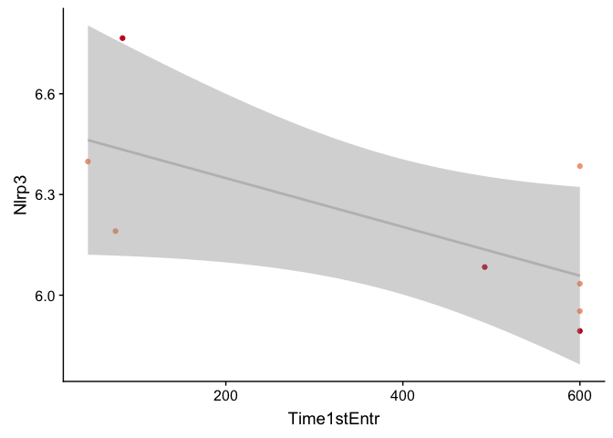
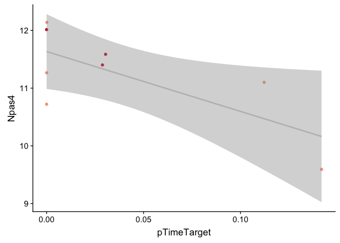
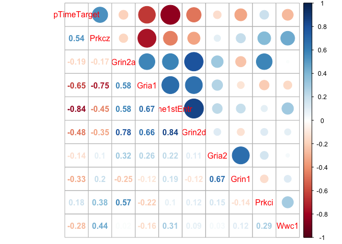
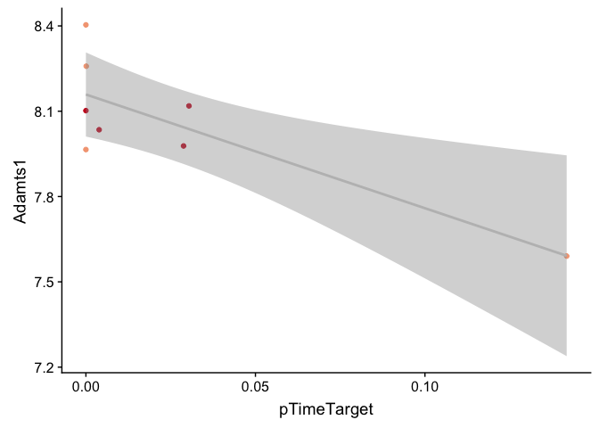
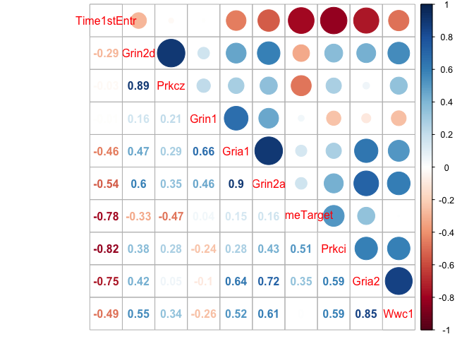
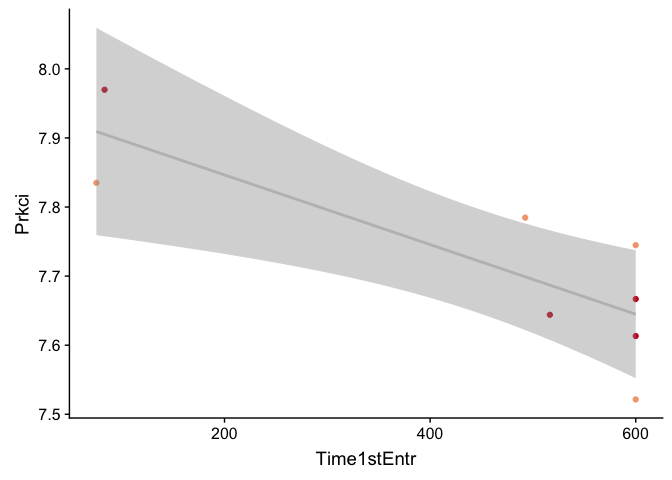
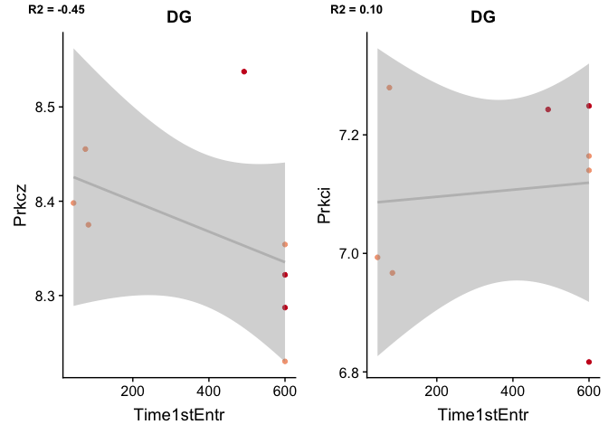

    library(tidyverse) 

    ## ── Attaching packages ────────────────────────────────────────────────────────────────────────────────────── tidyverse 1.2.1 ──

    ## ✔ ggplot2 3.2.1     ✔ purrr   0.3.2
    ## ✔ tibble  2.1.3     ✔ dplyr   0.8.1
    ## ✔ tidyr   0.8.3     ✔ stringr 1.4.0
    ## ✔ readr   1.3.1     ✔ forcats 0.4.0

    ## ── Conflicts ───────────────────────────────────────────────────────────────────────────────────────── tidyverse_conflicts() ──
    ## ✖ dplyr::filter() masks stats::filter()
    ## ✖ dplyr::lag()    masks stats::lag()

    library(corrplot)

    ## corrplot 0.84 loaded

    library(cowplot)

    ## 
    ## Attaching package: 'cowplot'

    ## The following object is masked from 'package:ggplot2':
    ## 
    ##     ggsave

    knitr::opts_chunk$set(fig.path = '../figures/02e_correlations/', cache = F)

    # import varance stabilized data
    DGvsd <- read.csv("../data/02c_DGvsd.csv", stringsAsFactors = F, check.names = F, row.names = 1)  
    CA1vsd <- read.csv("../data/02c_CA1vsd.csv", stringsAsFactors = F, check.names = F, row.names = 1)  

    # import col Data and subset for each region
    a.colData <- read.csv("../data/02a_colData.csv", header = T)
    a.colData$mouse <- sapply(strsplit(as.character(a.colData$RNAseqID),"-"), "[", 1)

    DGcols <- a.colData %>% filter(Punch == "DG", APA2 %in% c("conflict.trained", "standard.trained")) %>% droplevels()
    CA1cols <- a.colData %>% filter(Punch == "CA1", APA2 %in% c("conflict.trained", "standard.trained")) %>% droplevels()

    # create lists of trained only samples
    DGtrained <- DGcols$mouse
    CA1trained <- CA1cols$mouse

    # cutoff region in name
    names(DGvsd) <- sapply(strsplit(names(DGvsd),"-"), "[", 1)
    names(CA1vsd) <- sapply(strsplit(names(CA1vsd),"-"), "[", 1)

    # keep only trained varance stabilized data
    DGvsd <- DGvsd %>% select(DGtrained)
    CA1vsd <- CA1vsd %>% select(CA1trained)

    DGvsd <- as.data.frame(t(DGvsd))
    CA1vsd <- as.data.frame(t(CA1vsd))

    DGvsd$mouse <- row.names(DGvsd)
    CA1vsd$mouse <- row.names(CA1vsd)

    # import behavior data, create mouse id
    behav <- read.csv("../data/01a_behavior.csv") 
    behav$mouse <- sapply(strsplit(as.character(behav$ID),"15"), "[", 2)

    # summarize number of entrances
    timefirstentr <- behav %>% filter(APA2 %in% c("conflict-trained", "standard-trained"),
                                      TrainSession == "Retention") %>% 
                               select(mouse,Time1stEntr,pTimeTarget) 
    timefirstentr$mouse <- as.character(timefirstentr$mouse)
    head(timefirstentr)

    ##   mouse Time1stEntr pTimeTarget
    ## 1  140C      599.97      0.0021
    ## 2  141C       30.53      0.0909
    ## 3  142C      482.43      0.0445
    ## 4  143C      516.47      0.0039
    ## 5  144C      599.97      0.0000
    ## 6  145C       68.53      0.1336

    # subset for genes that are significant
    DGsig <- read.csv("../data/02c_DGforupset.csv", stringsAsFactors = F) %>% select(gene) %>% droplevels()
    DGsig <- DGsig$gene

    CA1sig <- read.csv("../data/02c_CA1forupset.csv", stringsAsFactors = F) %>% select(gene) %>% droplevels()
    CA1sig <- CA1sig$gene

    DGvsdSig <- DGvsd %>% select(mouse,DGsig) %>% arrange(mouse)
    CA1vsdSig <- CA1vsd %>% select(mouse,CA1sig) %>% arrange(mouse)

    DG <- left_join(timefirstentr,DGvsdSig) %>% drop_na()  %>% arrange(mouse)

    ## Joining, by = "mouse"

    CA1 <- left_join(timefirstentr,CA1vsdSig) %>% drop_na() %>% arrange(mouse)

    ## Joining, by = "mouse"

    DG <- as.data.frame(DG)
    CA1 <- as.data.frame(CA1)

    row.names(DG) <- DG$mouse 
    DG$mouse <- NULL

    row.names(CA1) <- CA1$mouse 
    CA1$mouse <- NULL

    # subset for sanes genes
    candidates <- c("Gria1", "Gria2", "Grin1", "Grin2a", "Grin2d",  "Prkcz" , "Prkci", "Wwc1")

    DGvsdCan <- DGvsd %>% select(mouse,candidates)
    CA1vsdCan <- CA1vsd %>% select(mouse,candidates)

    DGcan <- left_join(timefirstentr,DGvsdCan) %>% drop_na()

    ## Joining, by = "mouse"

    CA1can <- left_join(timefirstentr,CA1vsdCan) %>% drop_na()

    ## Joining, by = "mouse"

    DGcan <- as.data.frame(DGcan)
    CA1can <- as.data.frame(CA1can)

    row.names(DGcan) <- DGcan$mouse 
    DGcan$mouse <- NULL

    row.names(CA1can) <- CA1can$mouse 
    CA1can$mouse <- NULL

    DGcolscounts <- cbind(DGcols,DG)
    CA1colscounts <- cbind(CA1cols,CA1)

    M <- cor(DG)
    M <- as.data.frame(M)
    M$rownames <- row.names(M)
    M <- M %>% filter(pTimeTarget > 0.6 | pTimeTarget < -0.6)
    row.names(M) <- M$rownames
    greatthan05 <- M$rownames
    M <- M %>% select(greatthan05)
    M <- as.matrix(M)
    corrplot.mixed(M, number.cex = .7)

    ggplot(DGcolscounts, aes(x = Time1stEntr, y = Nlrp3, color = DGcols$Treatment)) +
      geom_point() + 
      scale_color_manual(values = c("#f4a582", "#ca0020")) +
      theme(legend.position = "none") +
      geom_smooth(method='lm', color = "grey")

    ggplot(DGcolscounts, aes(x = pTimeTarget, y = Npas4, color = DGcols$Treatment)) +
      geom_point() + 
      scale_color_manual(values = c("#f4a582", "#ca0020")) +
      theme(legend.position = "none") +
      geom_smooth(method='lm', color = "grey")

    M <- cor(DGcan)
    M <- as.data.frame(M)
    M$rownames <- row.names(M)
    row.names(M) <- M$rownames
    greatthan05 <- M$rownames
    M <- M %>% select(greatthan05)
    M <- as.matrix(M)
    corrplot.mixed(M, order = "hclust")

    M <- cor(CA1)
    M <- as.data.frame(M)
    M$rownames <- row.names(M)
    M <- M %>% filter(pTimeTarget > 0.75 | pTimeTarget < -0.75)
    row.names(M) <- M$rownames
    greatthan05 <- M$rownames
    M <- M %>% select(greatthan05)
    M <- as.matrix(M)
    corrplot.mixed(M, order = "hclust")

    ggplot(CA1colscounts, aes(x = Time1stEntr, y = Snx2, color = CA1cols$Treatment)) +
      geom_point() + 
      scale_color_manual(values = c("#f4a582", "#ca0020")) +
      theme(legend.position = "none") +
      geom_smooth(method='lm', color = "grey")

    ggplot(CA1colscounts, aes(x = pTimeTarget, y = Adamts1, color = CA1cols$Treatment)) +
      geom_point() + 
      scale_color_manual(values = c("#f4a582", "#ca0020")) +
      theme(legend.position = "none") +
      geom_smooth(method='lm', color = "grey")

    M <- cor(CA1can)
    M <- as.data.frame(M)
    M$rownames <- row.names(M)
    row.names(M) <- M$rownames
    greatthan05 <- M$rownames
    M <- M %>% select(greatthan05)
    M <- as.matrix(M)
    corrplot.mixed(M, order = "hclust")

    ggplot(CA1can, aes(x = Time1stEntr, y = Prkci, color = CA1cols$Treatment)) +
      geom_point() + 
      scale_color_manual(values = c("#f4a582", "#ca0020")) +
      theme(legend.position = "none") +
      geom_smooth(method='lm', color = "grey")

    zDG <- ggplot(DGcan, aes(x = Time1stEntr, y = Prkcz)) +
      geom_point(aes( color = DGcols$Treatment))  +
      scale_color_manual(values = c("#f4a582", "#ca0020")) +
      theme(legend.position = "none") +
      geom_smooth(method='lm', color = "grey") +
      labs(title = "DG")

    iDG <- ggplot(DGcan, aes(x = Time1stEntr, y = Prkci )) +
      geom_point(aes(color = DGcols$Treatment)) + 
      scale_color_manual(values = c("#f4a582", "#ca0020")) +
      theme(legend.position = "none") +
      geom_smooth(method='lm', color = "grey")  +
      labs(title = "DG")

    zCA1 <- ggplot(CA1can, aes(x = Time1stEntr, y = Prkcz)) +
      geom_point(aes( color = CA1cols$Treatment))  +
      scale_color_manual(values = c("#f4a582", "#ca0020")) +
      theme(legend.position = "none") +
      geom_smooth(method='lm', color = "grey")  +
      labs(title = "CA1")

    iCA1 <- ggplot(CA1can, aes(x = Time1stEntr, y = Prkci )) +
      geom_point(aes(color = CA1cols$Treatment)) + 
      scale_color_manual(values = c("#f4a582", "#ca0020")) +
      theme(legend.position = "none") +
      geom_smooth(method='lm', color = "grey") +
      labs(title = "CA1")

    plot_grid(zDG, iDG, zCA1, iCA1, 
              labels = c("R2 = -0.45" ,"R2 = 0.10", "R2 = -0.02", "R2 = -0.82"), 
              label_size = 10)

    # retention plot
    retention <- behav %>% filter(APA2 %in% c("conflict-trained", "standard-trained"),
                                     TrainSession == "Retention") %>% 
                               select(mouse,APA2, Time1stEntr, Path1stEntr, pTimeTarget)
    retention$APA2 <- factor(retention$APA2, levels = c("standard-trained", "conflict-trained"))

    a <- ggplot(retention, aes(y = Time1stEntr, x = APA2, color = APA2)) +
      geom_point() + 
      scale_color_manual(values = c("#ca0020", "#f4a582")) +
      theme(legend.position = "none") +
      labs(y = "reten. time to 1st entr. (s)", x = NULL)

    b <- ggplot(retention, aes(y =pTimeTarget, x = APA2, color = APA2)) +
      geom_point() + 
      scale_color_manual(values = c("#ca0020", "#f4a582")) +
      theme(legend.position = "none") +
      labs(y = "reten. prop. time in shock zone", x = NULL)

    plot_grid(a,b)

