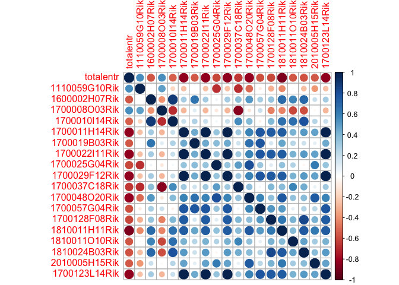
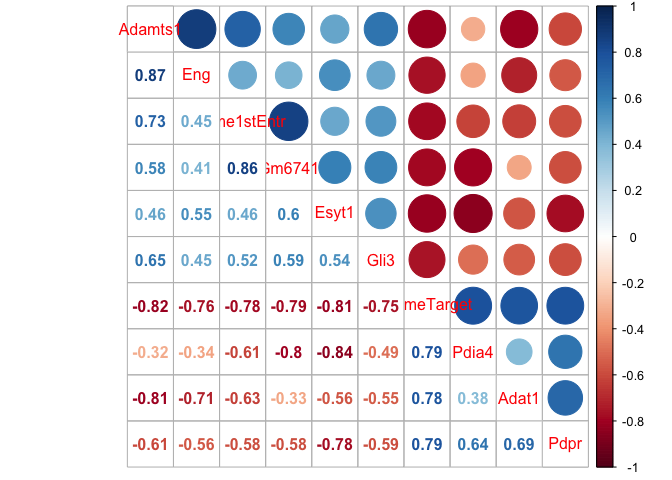
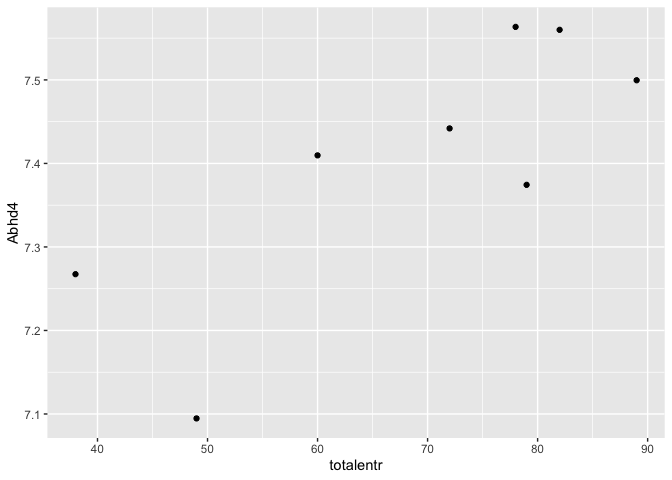

    library(tidyverse) 

    ## ── Attaching packages ────────────────────────────────────────────────────────────────────────────── tidyverse 1.2.1 ──

    ## ✔ ggplot2 3.2.1     ✔ purrr   0.3.2
    ## ✔ tibble  2.1.3     ✔ dplyr   0.8.1
    ## ✔ tidyr   0.8.3     ✔ stringr 1.4.0
    ## ✔ readr   1.3.1     ✔ forcats 0.4.0

    ## ── Conflicts ───────────────────────────────────────────────────────────────────────────────── tidyverse_conflicts() ──
    ## ✖ dplyr::filter() masks stats::filter()
    ## ✖ dplyr::lag()    masks stats::lag()

    library(corrplot)

    ## corrplot 0.84 loaded

    knitr::opts_chunk$set(fig.path = '../figures/02e_correlations/', cache = F)

    # import varance stabilized data
    DGvsd <- read.csv("../data/02c_DGvsd.csv", stringsAsFactors = F, check.names = F, row.names = 1)  
    CA1vsd <- read.csv("../data/02c_CA1vsd.csv", stringsAsFactors = F, check.names = F, row.names = 1)  

    # import col Data and subset for each region
    a.colData <- read.csv("../data/02a_colData.csv", header = T)
    a.colData$mouse <- sapply(strsplit(as.character(a.colData$RNAseqID),"-"), "[", 1)

    DGcols <- a.colData %>% filter(Punch == "DG", APA2 %in% c("conflict.trained", "standard.trained")) %>% droplevels()
    CA1cols <- a.colData %>% filter(Punch == "CA1", APA2 %in% c("conflict.trained", "standard.trained")) %>% droplevels()

    # create lists of trained only samples
    DGtrained <- DGcols$mouse
    CA1trained <- CA1cols$mouse

    # cutoff region in name
    names(DGvsd) <- sapply(strsplit(names(DGvsd),"-"), "[", 1)
    names(CA1vsd) <- sapply(strsplit(names(CA1vsd),"-"), "[", 1)

    # keep only trained varance stabilized data
    DGvsd <- DGvsd %>% select(DGtrained)
    CA1vsd <- CA1vsd %>% select(CA1trained)

    DGvsd <- as.data.frame(t(DGvsd))
    CA1vsd <- as.data.frame(t(CA1vsd))

    DGvsd$mouse <- row.names(DGvsd)
    CA1vsd$mouse <- row.names(CA1vsd)

    # import behavior data, create mouse id
    behav <- read.csv("../data/01a_behavior.csv") 
    behav$mouse <- sapply(strsplit(as.character(behav$ID),"15"), "[", 2)

    # summarize number of entrances
    entrsum <- behav %>% select(mouse,APA2,TrainSessionCombo,TrainSessionComboNum,NumEntrances) %>%
                        filter(APA2 %in% c("conflict-trained", "standard-trained")) %>%
                        group_by(mouse) %>%
                        summarize(totalentr = sum(NumEntrances, na.rm = TRUE))
    entrsum$mouse <- as.character(entrsum$mouse)
    entrsum

    ## # A tibble: 17 x 2
    ##    mouse totalentr
    ##    <chr>     <int>
    ##  1 140A         61
    ##  2 140C         64
    ##  3 141C        104
    ##  4 142A         62
    ##  5 142C         45
    ##  6 143A         68
    ##  7 143C         49
    ##  8 144A         78
    ##  9 144C         60
    ## 10 145A         89
    ## 11 145C         93
    ## 12 146A         82
    ## 13 146C         72
    ## 14 147A         88
    ## 15 147C         38
    ## 16 148A         79
    ## 17 148C        143

    DGsig <- read.csv("../data/02c_DGforupset.csv") %>% select(gene) %>% droplevels()
    DGsig <- DGsig$gene

    CA1sig <- read.csv("../data/02c_CA1forupset.csv") %>% select(gene) %>% droplevels()
    CA1sig <- CA1sig$gene

      
    DGvsd <- DGvsd %>% select(mouse,DGsig)
    CA1vsd <- CA1vsd %>% select(mouse,CA1sig)

    DG <- left_join(entrsum,DGvsd) %>% drop_na()

    ## Joining, by = "mouse"

    CA1 <- left_join(entrsum,CA1vsd) %>% drop_na()

    ## Joining, by = "mouse"

    DG <- as.data.frame(DG)
    CA1 <- as.data.frame(CA1)

    row.names(DG) <- DG$mouse 
    DG$mouse <- NULL

    row.names(CA1) <- CA1$mouse 
    CA1$mouse <- NULL

    M <- cor(DG)

    ## Warning in cor(DG): the standard deviation is zero

    M <- as.data.frame(M)
    M$rownames <- row.names(M)
    M <- M %>% filter(totalentr > 0.5 | totalentr < -0.5)
    row.names(M) <- M$rownames
    greatthan05 <- M$rownames
    M <- M %>% select(greatthan05)
    M <- as.matrix(M)
    corrplot(M, method = "circle")

    M <- cor(CA1)

    ## Warning in cor(CA1): the standard deviation is zero

    M <- as.data.frame(M)
    M$rownames <- row.names(M)
    M <- M %>% filter(totalentr > 0.75 | totalentr < -0.75)
    row.names(M) <- M$rownames
    greatthan05 <- M$rownames
    M <- M %>% select(greatthan05)
    M <- as.matrix(M)
    corrplot(M, method = "circle")

    ggplot(CA1, aes(x = totalentr, y = Abhd4)) + geom_point()

