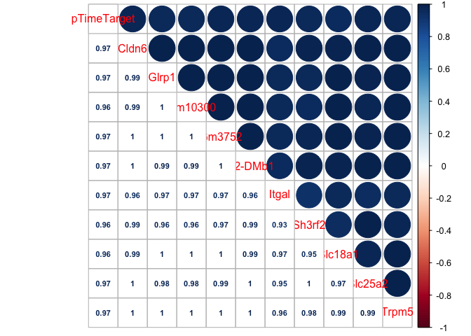
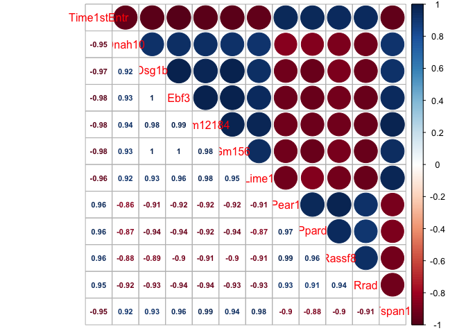
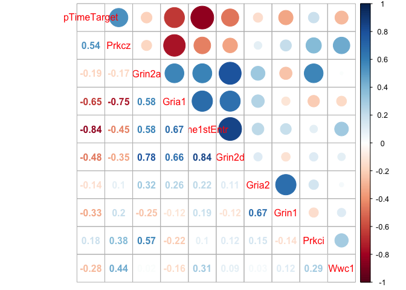
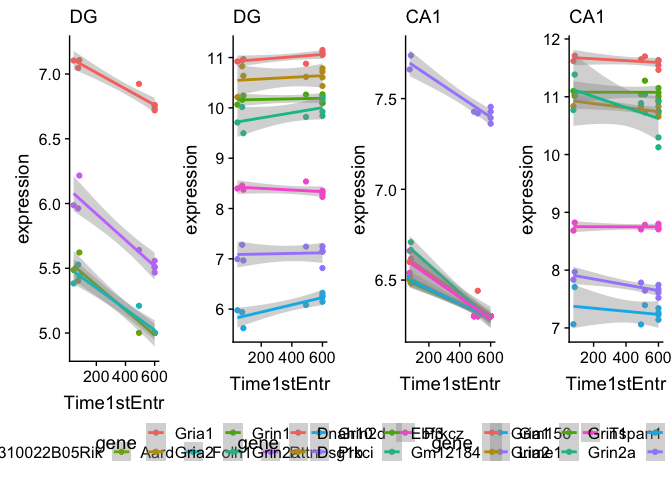
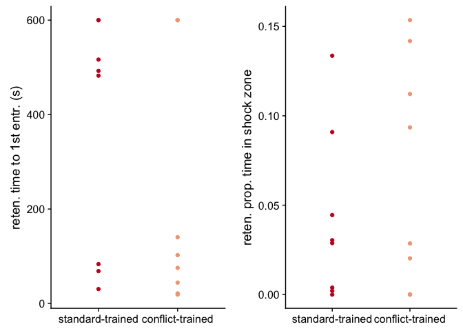

    library(tidyverse) 

    ## ── Attaching packages ────────────────────────────────────────────────────────────────────────────────────────────────────────────────────────────────────────────────── tidyverse 1.2.1 ──

    ## ✔ ggplot2 3.2.1     ✔ purrr   0.3.2
    ## ✔ tibble  2.1.3     ✔ dplyr   0.8.1
    ## ✔ tidyr   0.8.3     ✔ stringr 1.4.0
    ## ✔ readr   1.3.1     ✔ forcats 0.4.0

    ## ── Conflicts ───────────────────────────────────────────────────────────────────────────────────────────────────────────────────────────────────────────────────── tidyverse_conflicts() ──
    ## ✖ dplyr::filter() masks stats::filter()
    ## ✖ dplyr::lag()    masks stats::lag()

    library(corrplot)

    ## corrplot 0.84 loaded

    library(cowplot)

    ## 
    ## Attaching package: 'cowplot'

    ## The following object is masked from 'package:ggplot2':
    ## 
    ##     ggsave

    knitr::opts_chunk$set(fig.path = '../figures/02e_correlations/', cache = F)

For this analysis, I want to explor correlations between a behavioral
measure and gene expression.

    # import behavior data, create mouse id, select relvant samples
    behav <- read.csv("../data/01a_behavior.csv") 
    behav$mouse <- sapply(strsplit(as.character(behav$ID),"15"), "[", 2)
    behav <- behav %>% filter(APA2 %in% c("conflict-trained", "standard-trained"),
                                      TrainSession == "Retention") %>% 
                               select(mouse,Time1stEntr,pTimeTarget) 
    behav$mouse <- as.character(behav$mouse)
    head(behav)

    ##   mouse Time1stEntr pTimeTarget
    ## 1  140C      599.97      0.0021
    ## 2  141C       30.53      0.0909
    ## 3  142C      482.43      0.0445
    ## 4  143C      516.47      0.0039
    ## 5  144C      599.97      0.0000
    ## 6  145C       68.53      0.1336

    # import col Data 
    a.colData <- read.csv("../data/02a_colData.csv", header = T)
    a.colData$mouse <- sapply(strsplit(as.character(a.colData$RNAseqID),"-"), "[", 1)

    # import varance stabilized data and fix sample names
    DGvsd <- read.csv("../data/02c_DGvsd.csv", stringsAsFactors = F, check.names = F, row.names = 1) 
    CA1vsd <- read.csv("../data/02c_CA1vsd.csv", stringsAsFactors = F, check.names = F, row.names = 1) 

    vsdbehav <- function(mysubfield, myvsd){
      
      # subset data by subfield and training and create list of samples for substting
      mycols <- a.colData %>% 
        filter(Punch == mysubfield, APA2 %in% c("conflict.trained", "standard.trained")) %>% 
        droplevels()
      trained <- mycols$mouse

      #fix samples names to match animal names
      names(myvsd) <- sapply(strsplit(names(myvsd),"-"), "[", 1)
      
      # keep only trained varance stabilized data
      myvsd <- myvsd %>% select(trained)

      # transform and set rownames
      myvsd <- as.data.frame(t(myvsd))
      myvsd$mouse <- row.names(myvsd)
      myvsdbeahv <- left_join(behav, myvsd) %>% drop_na()
      row.names(myvsdbeahv) <- myvsdbeahv$mouse
      myvsdbeahv$mouse <- NULL
      #head(myvsdbeahv)
      return(myvsdbeahv)
    }

    DGvsdbehav <- vsdbehav("DG", DGvsd)

    ## Joining, by = "mouse"

    CA1vsdbehav <- vsdbehav("CA1", CA1vsd)

    ## Joining, by = "mouse"

    head(DGvsdbehav)

    ##      Time1stEntr pTimeTarget 0610007P14Rik 0610009B22Rik 0610009L18Rik
    ## 144C      599.97      0.0000      6.401366      5.821796      5.507750
    ## 146C       83.33      0.0288      6.929322      6.060620      5.000789
    ## 147C      492.50      0.0304      6.298159      5.910805      5.257050
    ## 143A       44.20      0.1122      6.381145      5.781124      5.405848
    ## 144A      599.97      0.0001      6.513173      5.528657      5.000789
    ##      0610009O20Rik 0610010F05Rik 0610010K14Rik 0610012G03Rik 0610030E20Rik
    ## 144C      6.799892      6.907778      5.999853      6.388018      6.388018
    ## 146C      6.350262      7.264347      5.971751      6.721344      7.003671
    ## 147C      6.687072      6.880090      5.761732      6.462702      6.487857
    ## 143A      6.736671      6.603589      6.136536      6.719764      6.272577
    ## 144A      6.530386      6.931921      5.782488      6.564048      6.513173
    ##      0610037L13Rik 0610040J01Rik 1110002E22Rik 1110004E09Rik 1110004F10Rik
    ## 144C      6.732276      5.507750      6.274710      6.332893      7.378414
    ## 146C      6.890434      5.000789      5.000789      5.000789      6.890434
    ## 147C      6.941086      5.607142      6.560110      6.369818      7.364930
    ## 143A      6.951677      5.331879      6.114375      6.227061      7.328125
    ## 144A      6.432259      5.609206      6.260610      6.144301      6.913454
    ##      1110008F13Rik 1110008L16Rik 1110008P14Rik 1110012L19Rik 1110017D15Rik
    ## 144C      6.899137      5.415426      6.771374      5.714146      5.415426
    ## 146C      6.765863      5.872410      6.350262      5.758431      5.000789
    ## 147C      6.857562      5.531936      6.767990      5.733620      5.443491
    ## 143A      6.612945      5.914151      7.159474      5.658707      5.405848
    ## 144A      6.450757      5.855075      6.422891      5.000789      5.633666
    ##      1110032A03Rik 1110032F04Rik 1110034G24Rik 1110037F02Rik 1110038F14Rik
    ## 144C      5.653076      5.684343      5.684343      7.323347      6.259635
    ## 146C      5.441542      5.000789      5.000789      6.890434      6.060620
    ## 147C      5.788755      5.551750      5.747820      7.298835      6.229119
    ## 143A      6.044520      5.746684      5.865684      6.864067      6.409428
    ## 144A      5.967744      5.609206      5.528657      7.477361      6.314070
    ##      1110051M20Rik 1110059E24Rik 1110059G10Rik 1110065P20Rik 1190002N15Rik
    ## 144C      7.360309      6.076501      5.653076      6.180660      8.167341
    ## 146C      7.754168      5.758431      5.441542      6.469320      7.733436
    ## 147C      7.205253      6.237027      5.689113      6.355871      7.598366
    ## 143A      7.203704      5.875619      6.003230      6.584648      7.400050
    ## 144A      7.129605      5.855075      5.801317      6.106492      8.396389
    ##      1190005I06Rik 1190007I07Rik 1300017J02Rik 1500009C09Rik 1500009L16Rik
    ## 144C      5.000789      5.870182      5.000789      6.790459      5.547907
    ## 146C      5.872410      5.000789      5.000789      6.967043      5.872410
    ## 147C      5.331332      5.775373      5.000789      6.494059      5.391554
    ## 143A      5.427605      5.758354      5.000789      7.010241      5.803189
    ## 144A      5.250706      5.395208      5.000789      6.334704      5.657159
    ##      1500011B03Rik 1500011K16Rik 1500015O10Rik 1520401A03Rik 1600002H07Rik
    ## 144C      7.106603      5.937570      5.415426      5.208642      6.112519
    ## 146C      6.890434      5.758431      5.000789      5.000789      5.621731
    ## 147C      7.166587      5.910805      5.391554      5.000789      5.965416
    ## 143A      7.026965      6.121820      5.192223      5.136203      5.941888
    ## 144A      6.823462      5.782488      5.000789      5.000789      5.657159
    ##      1600002K03Rik 1600012H06Rik 1600014C10Rik 1700001C19Rik 1700001K19Rik
    ## 144C      5.507750      6.388018      6.440451      5.208642      5.585190
    ## 146C      5.758431      5.758431      6.060620      5.621731      5.000789
    ## 147C      5.551750      6.298159      6.237027      5.331332      5.827479
    ## 143A      5.616870      5.950929      6.570235      5.192223      5.405848
    ## 144A      5.722771      6.314070      6.374798      5.353786      5.801317
    ##      1700001L19Rik 1700001O22Rik 1700001P01Rik 1700003E16Rik 1700003F12Rik
    ## 144C      5.507750      5.208642      5.000789      5.979597      5.208642
    ## 146C      5.441542      5.441542      5.000789      6.350262      5.000789
    ## 147C      5.733620      5.443491      5.210117      6.128894      5.391554
    ## 143A      5.658707      5.468005      5.000789      6.011645      5.672037
    ## 144A      5.722771      5.609206      5.000789      6.067080      5.000789
    ##      1700006E09Rik 1700007G11Rik 1700007K13Rik 1700008O03Rik 1700010I14Rik
    ## 144C      5.000789      5.208642      5.000789      5.000789      5.507750
    ## 146C      5.000789      5.000789      5.000789      5.000789      5.000789
    ## 147C      5.000789      5.000789      5.000789      5.000789      5.257050
    ## 143A      5.000789      5.192223      5.303141      5.000789      5.271320
    ## 144A      5.432586      5.000789      5.000789      5.395208      5.000789
    ##      1700011E24Rik 1700011H14Rik 1700011M02Rik 1700013D24Rik 1700013F07Rik
    ## 144C      5.000789      5.000789      5.000789      5.000789      5.507750
    ## 146C      5.000789      5.000789      5.000789      5.000789      5.000789
    ## 147C      5.000789      5.418353      5.000789      5.000789      5.296565
    ## 143A      5.303141      5.000789      5.000789      5.000789      5.000789
    ## 144A      5.000789      5.000789      5.000789      5.000789      5.000789
    ##      1700014D04Rik 1700015E13Rik 1700016D06Rik 1700016K19Rik 1700017B05Rik
    ## 144C      5.360182      5.208642      5.507750      5.000789      6.346945
    ## 146C      5.000789      5.000789      5.000789      5.000789      6.141504
    ## 147C      5.296565      5.000789      5.852217      5.210117      6.171920
    ## 143A      5.358277      5.303141      5.271320      5.192223      6.193231
    ## 144A      5.000789      5.000789      5.722771      5.000789      6.314070
    ##      1700019A02Rik 1700019B03Rik 1700019D03Rik 1700019O17Rik 1700020A23Rik
    ## 144C      5.000789      5.208642      5.821796      5.000789      5.000789
    ## 146C      5.000789      5.000789      6.216033      5.000789      5.000789
    ## 147C      5.000789      5.331332      5.814796      5.000789      5.000789
    ## 143A      5.000789      5.235161      5.835086      5.000789      5.000789
    ## 144A      5.000789      5.000789      5.819671      5.000789      5.609206
    ##      1700020D05Rik 1700020L24Rik 1700020N01Rik 1700021F05Rik 1700022I11Rik
    ## 144C      5.000789      5.000789      5.000789      5.937570      5.000789
    ## 146C      5.000789      5.000789      5.000789      5.758431      5.000789
    ## 147C      5.467237      5.000789      5.000789      5.933086      5.362724
    ## 143A      5.136203      5.000789      5.000789      5.950929      5.000789
    ## 144A      5.353786      5.353786      5.395208      6.080406      5.000789
    ##      1700023F06Rik 1700024P16Rik 1700025G04Rik 1700027J19Rik 1700028J19Rik
    ## 144C      5.000789      5.294484      7.916096      5.000789      5.463972
    ## 146C      5.000789      5.000789      7.963837      5.000789      5.000789
    ## 147C      5.467237      5.000789      8.012606      5.148871      5.331332
    ## 143A      5.382821      5.331879      7.921506      5.000789      5.303141
    ## 144A      5.000789      5.000789      8.046337      5.000789      5.000789
    ##      1700028K03Rik 1700028P14Rik 1700029F12Rik 1700029H14Rik 1700029I15Rik
    ## 144C      5.000789      5.360182      5.000789      5.000789      5.294484
    ## 146C      5.758431      5.000789      5.000789      5.000789      5.000789
    ## 147C      5.000789      5.148871      5.296565      5.000789      5.719115
    ## 143A      5.303141      5.358277      5.000789      5.303141      5.539509
    ## 144A      5.000789      5.000789      5.000789      5.000789      5.000789
    ##      1700029J07Rik 1700030J22Rik 1700030K09Rik 1700034I23Rik 1700034J05Rik
    ## 144C      5.360182      5.507750      6.274710      5.294484      5.000789
    ## 146C      6.411424      5.000789      5.758431      5.000789      5.000789
    ## 147C      5.570844      5.641274      5.775373      5.257050      5.257050
    ## 143A      5.136203      5.382821      6.076228      5.000789      5.358277
    ## 144A      5.395208      5.432586      6.039823      5.000789      5.395208
    ##      1700037C18Rik 1700037H04Rik 1700040L02Rik 1700047I17Rik2
    ## 144C      5.507750      6.180660      5.208642       5.821796
    ## 146C      5.621731      6.350262      5.000789       5.621731
    ## 147C      5.570844      5.814796      5.210117       5.910805
    ## 143A      5.587216      6.099305      5.000789       5.914151
    ## 144A      5.250706      5.937116      5.000789       5.855075
    ##      1700048O20Rik 1700057G04Rik 1700061G19Rik 1700064H15Rik 1700066B19Rik
    ## 144C      5.915729      5.000789      5.620120      5.000789      5.208642
    ## 146C      5.621731      5.000789      5.000789      5.000789      5.000789
    ## 147C      5.996551      5.296565      5.362724      5.000789      5.418353
    ## 143A      5.685088      5.000789      5.427605      5.000789      5.192223
    ## 144A      5.801317      5.000789      5.633666      5.000789      5.177617
    ##      1700066M21Rik 1700067K01Rik 1700088E04Rik 1700092M07Rik 1700093K21Rik
    ## 144C      6.244332      5.000789      5.000789      5.000789      5.208642
    ## 146C      5.621731      5.000789      5.000789      5.000789      5.000789
    ## 147C      6.205012      5.000789      5.719115      5.000789      5.362724
    ## 143A      6.403830      5.271320      5.697878      5.000789      5.000789
    ## 144A      6.477936      5.000789      5.000789      5.000789      5.000789
    ##      1700102P08Rik 1700109H08Rik 1700112E06Rik 1700113H08Rik 1700123K08Rik
    ## 144C      5.294484      5.415426      5.208642      5.000789      5.000789
    ## 146C      5.000789      5.000789      5.000789      5.441542      5.000789
    ## 147C      5.467237      5.624456      5.296565      5.148871      5.000789
    ## 143A      5.136203      5.427605      5.000789      5.000789      5.331879
    ## 144A      5.556871      5.556871      5.177617      5.000789      5.000789
    ##      1700123L14Rik 1700123O20Rik 1700128F08Rik 1810009A15Rik 1810010H24Rik
    ## 144C      5.000789      5.821796      6.213008      5.547907      6.180660
    ## 146C      5.000789      6.285341      6.141504      6.141504      6.576813
    ## 147C      5.210117      5.689113      6.560110      5.589289      5.887891
    ## 143A      5.000789      5.746684      6.028236      5.792241      6.193231
    ## 144A      5.000789      5.763148      6.156576      5.177617      5.528657
    ##      1810011H11Rik 1810011O10Rik 1810013L24Rik 1810022K09Rik 1810024B03Rik
    ## 144C      5.208642      5.208642      7.360309      5.742660      5.294484
    ## 146C      5.000789      5.000789      7.073917      6.060620      5.000789
    ## 147C      5.257050      5.362724      7.292366      5.887891      5.296565
    ## 143A      5.000789      5.448275      7.153462      6.044520      5.000789
    ## 144A      5.000789      5.177617      7.355139      5.888915      5.000789
    ##      1810026J23Rik 1810030O07Rik 1810032O08Rik 1810037I17Rik 1810041L15Rik
    ## 144C      7.720848      6.617653      5.653076      6.164074      8.243073
    ## 146C      7.733436      6.576813      5.621731      5.971751      8.236337
    ## 147C      7.623964      6.644457      5.801892      6.093004      8.187094
    ## 143A      7.840556      6.745036      5.769831      6.233691      8.203852
    ## 144A      7.385674      6.282329      5.819671      5.967744      8.400545
    ##      1810043G02Rik 1810043H04Rik 1810049J17Rik 1810055G02Rik 2010005H15Rik
    ## 144C      6.490492      5.684343      5.870182      6.584348      5.208642
    ## 146C      6.285341      5.971751      5.000789      6.141504      5.000789
    ## 147C      6.512459      5.657635      5.719115      6.456323      5.257050
    ## 143A      6.510693      5.697878      5.658707      6.540854      5.000789
    ## 144A      6.564048      5.432586      6.025876      6.394293      5.306683
    ##      2010107E04Rik 2010107G23Rik 2010109A12Rik 2010109I03Rik 2010111I01Rik
    ## 144C      6.650032      6.289566      5.000789      5.684343      7.091785
    ## 146C      6.141504      6.808805      5.000789      5.000789      7.506813
    ## 147C      6.443453      6.083810      5.000789      5.607142      7.259537
    ## 143A      6.773865      6.381145      5.000789      5.303141      6.500458
    ## 144A      6.131866      6.053554      5.000789      5.177617      7.381355
    ##      2010300C02Rik 2010315B03Rik 2200002D01Rik 2210010C04Rik 2210013O21Rik
    ## 144C      10.94946      6.057947      5.463972      5.000789      6.076501
    ## 146C      10.78548      5.000789      5.000789      5.441542      5.758431
    ## 147C      10.88185      6.083810      5.210117      5.362724      5.775373
    ## 143A      10.96760      5.885429      5.331879      5.000789      6.060513
    ## 144A      11.09343      6.324438      5.306683      5.000789      5.837581
    ##      2210016F16Rik 2210016L21Rik 2210017I01Rik 2210408I21Rik 2210418O10Rik
    ## 144C      5.870182      7.614302      5.415426      5.547907      5.999853
    ## 146C      5.758431      7.754168      5.000789      5.621731      6.285341
    ## 147C      5.761732      7.324402      5.418353      5.657635      6.083810
    ## 143A      5.950929      7.542334      5.000789      5.746684      5.914151
    ## 144A      5.921366      7.259096      5.250706      5.921366      6.227132
    ##      2300009A05Rik 2310009B15Rik 2310011J03Rik 2310022A10Rik 2310022B05Rik
    ## 144C      5.979597      5.893282      6.076501      6.561599      6.761717
    ## 146C      5.000789      5.872410      5.000789      6.967043      7.107652
    ## 147C      5.747820      5.910805      6.180299      6.397178      6.923959
    ## 143A      5.734812      6.091677      6.328268      6.303886      7.104339
    ## 144A      5.583658      5.633666      6.080406      6.282329      6.719107
    ##      2310030G06Rik 2310033P09Rik 2310035C23Rik 2310036O22Rik 2310039H08Rik
    ## 144C      5.208642      6.130018      7.348102      7.164238      5.684343
    ## 146C      5.000789      6.350262      7.073917      6.929322      5.000789
    ## 147C      5.000789      6.120050      7.695604      7.035304      5.467237
    ## 143A      5.303141      5.865684      7.298773      7.150446      5.271320
    ## 144A      5.000789      6.238416      7.398551      6.830111      5.395208
    ##      2310057J18Rik 2310057M21Rik 2310061I04Rik 2410002F23Rik 2410004B18Rik
    ## 144C      5.294484      6.332893      6.712241      7.046282      6.244332
    ## 146C      5.000789      6.524343      6.890434      6.850293      5.621731
    ## 147C      5.148871      6.403911      6.923959      7.051001      5.996551
    ## 143A      5.271320      6.500458      6.904984      6.955198      6.447825
    ## 144A      5.000789      6.796497      6.803294      6.907237      6.324438
    ##      2410004P03Rik 2410015M20Rik 2410016O06Rik 2410089E03Rik 2410131K14Rik
    ## 144C      5.585190      6.094686      6.526604      7.748528      6.712241
    ## 146C      6.216033      6.765863      5.971751      7.430755      6.411424
    ## 147C      5.864292      6.046078      6.436961      8.076266      6.443453
    ## 143A      5.758354      6.272577      6.340249      7.731253      6.575059
    ## 144A      6.053554      6.067080      6.271527      7.814759      6.761932
    ##      2410141K09Rik 2510002D24Rik 2510009E07Rik 2510039O18Rik 2610001J05Rik
    ## 144C      5.208642      5.846374      6.881674      6.573030      6.164074
    ## 146C      5.000789      6.350262      6.524343      6.576813      5.971751
    ## 147C      5.257050      5.852217      6.906596      6.617016      5.922022
    ## 143A      5.271320      5.950929      7.126059      6.484928      6.136536
    ## 144A      5.000789      5.952571      7.134829      6.682214      5.801317
    ##      2610002M06Rik 2610008E11Rik 2610020H08Rik 2610021A01Rik 2610042L04Rik
    ## 144C      6.732276      6.617653      5.000789      6.414551      5.000789
    ## 146C      7.140530      6.216033      5.000789      6.216033      5.000789
    ## 147C      6.594589      6.712950      5.531936      6.430431      5.391554
    ## 143A      6.495305      6.392547      5.000789      6.213668      5.000789
    ## 144A      6.733552      6.572311      5.000789      6.067080      5.353786
    ##      2610044O15Rik8 2610301B20Rik 2610318N02Rik 2610507B11Rik
    ## 144C       6.573030      6.691864      5.294484      9.129732
    ## 146C       7.140530      6.675108      5.000789      9.021905
    ## 147C       6.712950      6.753227      5.000789      9.338831
    ## 143A       6.490129      6.809955      5.000789      9.117956
    ## 144A       6.620684      6.612761      5.000789      9.253651
    ##      2610524H06Rik 2610528A11Rik 2700049A03Rik 2700060E02Rik 2700062C07Rik
    ## 144C      5.915729      5.000789      6.130018      6.790459      5.714146
    ## 146C      5.621731      5.000789      6.285341      7.322154      6.060620
    ## 147C      5.876180      5.000789      6.334600      6.897823      5.876180
    ## 143A      5.645083      5.136203      6.076228      7.072663      6.143809
    ## 144A      5.722771      5.000789      6.334704      6.596750      5.801317
    ##      2700081O15Rik 2700094K13Rik 2700097O09Rik 2810004N23Rik 2810006K23Rik
    ## 144C      7.828390      5.415426      5.585190      5.958847      5.870182
    ## 146C      7.774594      5.000789      5.621731      5.441542      5.971751
    ## 147C      7.693195      5.641274      5.747820      5.933086      6.046078
    ## 143A      7.926626      5.697878      5.539509      6.179366      6.036415
    ## 144A      7.675707      5.306683      5.528657      5.905305      5.952571
    ##      2810021J22Rik 2810403A07Rik 2810408A11Rik 2810417H13Rik 2810428I15Rik
    ## 144C      5.770031      7.372406      5.000789      5.463972      6.289566
    ## 146C      5.758431      7.203898      5.000789      5.000789      5.621731
    ## 147C      5.827479      7.504787      5.210117      5.624456      6.111122
    ## 143A      5.710420      7.209490      5.000789      5.271320      6.447825
    ## 144A      5.982649      7.287253      5.000789      5.353786      6.067080
    ##      2810459M11Rik 2810474O19Rik 2900011O08Rik 2900026A02Rik 2900055J20Rik
    ## 144C      5.360182      6.196967      8.230191      7.454163      6.453175
    ## 146C      5.441542      5.000789      8.560496      7.404418      6.411424
    ## 147C      5.996551      6.171920      8.159764      7.735926      6.362867
    ## 143A      5.986150      6.028236      8.312750      7.816797      6.246820
    ## 144A      6.025876      5.967744      8.027539      7.858167      6.682214
    ##      3010026O09Rik 3110001I22Rik 3110002H16Rik 3110009E18Rik 3110018I06Rik
    ## 144C      5.684343      5.463972      6.332893      5.208642      5.294484
    ## 146C      6.350262      5.872410      6.141504      5.000789      5.000789
    ## 147C      5.391554      5.531936      6.571718      5.148871      5.000789
    ## 143A      5.792241      5.769831      6.680828      5.331879      5.000789
    ## 144A      5.556871      5.000789      6.334704      5.177617      5.000789
    ##      3110021N24Rik 3110035E14Rik 3110040N11Rik 3110043O21Rik 3110062M04Rik
    ## 144C      5.415426      6.899137      5.585190      6.628546      5.620120
    ## 146C      5.000789      7.506813      5.000789      6.411424      5.000789
    ## 147C      5.467237      6.970509      5.391554      6.676561      5.443491
    ## 143A      5.448275      7.088598      5.616870      6.505587      5.758354
    ## 144A      5.000789      7.108492      5.498773      6.740710      5.657159
    ##      3110070M22Rik 3110079O15Rik 3110082I17Rik 3110082J24Rik 3300002I08Rik
    ## 144C      5.294484      5.294484      6.414551      5.294484      5.294484
    ## 146C      5.000789      5.000789      6.141504      5.000789      5.000789
    ## 147C      5.148871      5.418353      5.986298      5.148871      5.331332
    ## 143A      5.486907      5.000789      5.950929      5.448275      5.303141
    ## 144A      5.306683      5.000789      5.801317      5.000789      5.000789
    ##      3425401B19Rik 3632451O06Rik 3830406C13Rik 3830408C21Rik 4430402I18Rik
    ## 144C      5.360182      5.000789      5.915729      5.000789      5.979597
    ## 146C      5.000789      5.000789      5.000789      5.000789      6.350262
    ## 147C      5.257050      5.418353      6.026601      5.418353      5.975921
    ## 143A      5.486907      5.358277      5.914151      5.136203      5.959873
    ## 144A      5.466896      5.466896      5.855075      5.000789      5.952571
    ##      4833420G17Rik 4833423E24Rik 4833439L19Rik 4921501E09Rik 4921507P07Rik
    ## 144C      6.999105      5.463972      7.557750      5.000789      5.000789
    ## 146C      7.140530      5.000789      7.981420      5.000789      5.000789
    ## 147C      6.945331      5.148871      7.518556      5.000789      5.296565
    ## 143A      6.693949      5.000789      7.648405      5.000789      5.136203
    ## 144A      7.319364      5.177617      7.559435      5.000789      5.000789
    ##      4921509C19Rik 4921513D11Rik 4921513I03Rik 4921524J17Rik 4921528I07Rik
    ## 144C      5.000789      5.294484      5.000789      6.039003      5.000789
    ## 146C      5.000789      5.000789      5.000789      5.441542      5.000789
    ## 147C      5.148871      5.257050      5.511318      6.188606      5.000789
    ## 143A      5.136203      5.136203      5.235161      6.099305      5.000789
    ## 144A      5.000789      5.000789      5.306683      5.982649      5.000789
    ##      4921530L21Rik 4921536K21Rik 4922502D21Rik 4930402H24Rik 4930404N11Rik
    ## 144C      5.000789      5.294484      5.000789      7.841263      5.208642
    ## 146C      5.000789      5.000789      5.000789      7.293565      5.758431
    ## 147C      5.296565      5.551750      5.000789      7.993319      5.331332
    ## 143A      5.000789      5.382821      5.000789      7.654639      5.486907
    ## 144A      5.000789      5.722771      5.466896      7.611525      5.000789
    ##      4930415F15Rik 4930415O20Rik 4930426L09Rik 4930427A07Rik 4930430A15Rik
    ## 144C      5.000789      5.000789      5.000789      5.000789      5.208642
    ## 146C      5.000789      5.000789      5.000789      5.441542      5.000789
    ## 147C      5.148871      5.000789      5.257050      5.296565      5.000789
    ## 143A      5.000789      5.000789      5.136203      5.358277      5.000789
    ## 144A      5.000789      5.000789      5.432586      5.395208      5.177617
    ##      4930430F08Rik 4930432K21Rik 4930442H23Rik 4930444G20Rik 4930444P10Rik
    ## 144C      5.821796      5.653076      5.000789      5.000789      5.620120
    ## 146C      5.000789      5.000789      5.000789      5.000789      5.000789
    ## 147C      5.876180      5.331332      5.296565      5.148871      5.467237
    ## 143A      6.121820      5.331879      5.000789      5.000789      5.448275
    ## 144A      5.872179      5.000789      5.432586      5.000789      5.583658
    ##      4930447A16Rik 4930447C04Rik 4930451G09Rik 4930451I11Rik 4930452B06Rik
    ## 144C      5.208642      5.294484      5.507750      5.000789      5.796376
    ## 146C      5.000789      5.758431      5.000789      5.000789      6.141504
    ## 147C      5.210117      5.775373      5.296565      5.000789      5.788755
    ## 143A      5.000789      5.885429      5.539509      5.000789      5.875619
    ## 144A      5.000789      5.701634      5.000789      5.000789      5.855075
    ##      4930453N24Rik 4930455H04Rik 4930467E23Rik 4930470P17Rik 4930474N05Rik
    ## 144C      6.453175      5.000789      5.000789      5.000789      5.294484
    ## 146C      5.758431      5.000789      5.000789      5.000789      5.000789
    ## 147C      6.348828      5.000789      5.489793      5.000789      5.331332
    ## 143A      6.179366      5.192223      5.000789      5.000789      5.303141
    ## 144A      6.324438      5.250706      5.353786      5.000789      5.306683
    ##      4930486L24Rik 4930502E18Rik 4930503L19Rik 4930505A04Rik 4930507D05Rik
    ## 144C      5.000789      5.360182      6.346945      5.208642      5.294484
    ## 146C      5.000789      5.000789      6.576813      5.000789      5.000789
    ## 147C      5.210117      5.000789      6.334600      5.000789      5.467237
    ## 143A      5.000789      5.000789      6.334275      5.000789      5.235161
    ## 144A      5.000789      5.000789      6.441547      5.000789      5.000789
    ##      4930512M02Rik 4930518I15Rik 4930519G04Rik 4930522L14Rik 4930523C07Rik
    ## 144C      5.463972      5.294484      5.360182      5.463972      5.000789
    ## 146C      5.758431      5.000789      5.000789      5.441542      5.000789
    ## 147C      5.814796      5.331332      5.000789      5.511318      5.148871
    ## 143A      5.486907      5.000789      5.000789      5.235161      5.000789
    ## 144A      6.011704      5.250706      5.177617      5.000789      5.177617
    ##      4930524B15Rik 4930524J08Rik 4930535I16Rik 4930538K18Rik 4930539E08Rik
    ## 144C      5.208642      5.208642      5.000789      5.653076      5.714146
    ## 146C      5.000789      5.000789      5.000789      5.000789      5.621731
    ## 147C      5.000789      5.000789      5.000789      5.331332      6.137656
    ## 143A      5.331879      5.271320      5.000789      5.685088      5.758354
    ## 144A      5.000789      5.583658      5.000789      5.177617      5.905305
    ##      4930544D05Rik 4930548H24Rik 4930550C14Rik 4930562C15Rik 4930563I02Rik
    ## 144C      5.000789      5.000789      5.208642      5.821796      5.208642
    ## 146C      5.000789      5.000789      5.000789      6.576813      5.000789
    ## 147C      5.296565      5.000789      5.000789      6.180299      5.210117
    ## 143A      5.192223      5.358277      5.000789      5.631144      5.000789
    ## 144A      5.000789      5.000789      5.000789      6.227132      5.000789
    ##      4930578C19Rik 4930578G10Rik 4930579G24Rik 4930590J08Rik 4930595D18Rik
    ## 144C      5.000789      5.547907      5.000789      5.000789      5.000789
    ## 146C      5.000789      5.758431      5.000789      5.000789      5.000789
    ## 147C      5.148871      5.747820      5.418353      5.443491      5.000789
    ## 143A      5.000789      5.672037      5.358277      5.192223      5.000789
    ## 144A      5.000789      5.609206      5.633666      5.000789      5.000789
    ##      4931406B18Rik 4931406C07Rik 4931406P16Rik 4931414P19Rik 4931422A03Rik
    ## 144C      5.463972      5.742660      6.561599      5.208642      5.547907
    ## 146C      5.000789      5.621731      6.721344      5.000789      5.000789
    ## 147C      5.589289      6.016698      7.148627      5.467237      5.418353
    ## 143A      5.468005      5.977481      6.867842      5.486907      5.000789
    ## 144A      5.583658      6.106492      6.704486      5.306683      5.000789
    ##      4931423N10Rik 4931428F04Rik 4931428L18Rik 4931429L15Rik 4931440F15Rik
    ## 144C      5.000789      6.502659      5.463972      5.360182      5.415426
    ## 146C      5.000789      6.890434      6.411424      5.441542      5.000789
    ## 147C      5.391554      6.676561      5.876180      5.331332      5.589289
    ## 143A      5.000789      6.172359      5.555890      5.192223      5.000789
    ## 144A      5.000789      6.754899      5.679788      5.000789      5.306683
    ##      4932411E22Rik 4932411N23Rik 4932414N04Rik 4932438A13Rik 4932438H23Rik
    ## 144C      5.000789      5.360182      5.653076      8.409231      5.463972
    ## 146C      5.000789      5.000789      5.621731      7.578830      5.000789
    ## 147C      5.210117      5.000789      5.673571      8.187094      5.296565
    ## 143A      5.271320      5.303141      5.331879      7.993146      5.136203
    ## 144A      5.000789      5.306683      5.701634      8.360566      5.306683
    ##      4932443I19Rik 4933402D24Rik 4933402N03Rik 4933405L10Rik 4933406P04Rik
    ## 144C      5.000789      5.208642      5.208642      5.000789      5.000789
    ## 146C      5.000789      5.000789      5.000789      5.000789      5.000789
    ## 147C      5.000789      5.391554      5.000789      5.467237      5.000789
    ## 143A      5.136203      5.382821      5.000789      5.000789      5.192223
    ## 144A      5.000789      5.395208      5.000789      5.000789      5.000789
    ##      4933407L21Rik 4933408B17Rik 4933408J17Rik 4933411K16Rik 4933413G19Rik
    ## 144C      5.360182      5.000789      5.000789      5.000789      5.208642
    ## 146C      5.000789      5.000789      5.000789      5.000789      5.000789
    ## 147C      5.210117      5.148871      5.210117      5.257050      5.443491
    ## 143A      5.303141      5.000789      5.303141      5.000789      5.136203
    ## 144A      5.000789      5.395208      5.000789      5.000789      5.432586
    ##      4933415A04Rik 4933416C03Rik 4933424G06Rik 4933427D14Rik 4933427I04Rik
    ## 144C      5.000789      5.000789      5.208642      7.106603      5.585190
    ## 146C      5.000789      5.000789      5.441542      7.203898      5.621731
    ## 147C      5.418353      5.210117      5.210117      7.180780      5.641274
    ## 143A      5.303141      5.000789      5.468005      6.805997      5.602236
    ## 144A      5.556871      5.177617      5.250706      7.215703      5.583658
    ##      4933428G20Rik 4933430I17Rik 4933434E20Rik 5031414D18Rik 5031439G07Rik
    ## 144C      5.294484      5.360182      7.084312      5.000789      8.321027
    ## 146C      5.000789      5.000789      7.578830      5.000789      8.348350
    ## 147C      5.391554      5.000789      7.252873      5.257050      8.638088
    ## 143A      5.000789      5.000789      7.069452      5.235161      8.382182
    ## 144A      5.701634      5.000789      6.944083      5.528657      8.465428
    ##      5330417C22Rik 5430403G16Rik 5430416O09Rik 5430427O19Rik 5730409E04Rik
    ## 144C      7.185211      5.714146      5.653076      5.893282      7.205853
    ## 146C      6.808805      5.758431      5.621731      6.285341      7.073917
    ## 147C      7.572279      5.673571      5.624456      5.511318      7.007360
    ## 143A      7.232383      5.427605      5.405848      5.405848      7.192055
    ## 144A      7.048589      5.633666      5.837581      5.801317      7.277933
    ##      5730455P16Rik 5730480H06Rik 5730507C01Rik 5730508B09Rik 5730522E02Rik
    ## 144C      7.619329      5.821796      5.000789      5.208642      5.208642
    ## 146C      6.929322      5.758431      5.441542      5.000789      5.000789
    ## 147C      7.019411      6.036393      5.296565      5.148871      5.391554
    ## 143A      7.085427      5.865684      5.427605      5.192223      5.331879
    ## 144A      7.170829      5.997299      5.498773      5.250706      5.556871
    ##      5730559C18Rik 5830411N06Rik 5830454E08Rik 5930422O12Rik 6030419C18Rik
    ## 144C      5.208642      5.208642      5.208642      5.000789      8.870187
    ## 146C      5.000789      5.000789      5.000789      5.000789      9.021905
    ## 147C      5.531936      5.000789      5.148871      5.000789      8.494492
    ## 143A      5.192223      5.136203      5.235161      5.235161      9.038580
    ## 144A      5.395208      5.000789      5.000789      5.466896      8.369077
    ##      6030445D17Rik 6030458C11Rik 6030468B19Rik 6330408A02Rik 6430531B16Rik
    ## 144C      5.000789      6.722300      5.294484      5.999853      5.463972
    ## 146C      5.621731      6.576813      5.000789      5.872410      5.000789
    ## 147C      5.391554      6.853007      5.000789      5.986298      5.257050
    ## 143A      5.405848      6.740860      5.331879      5.959873      5.000789
    ## 144A      5.000789      7.031755      5.000789      5.609206      5.000789
    ##      6430548M08Rik 6430550D23Rik 6430571L13Rik 6430573F11Rik 6720489N17Rik
    ## 144C      8.274773      5.463972      5.547907      5.507750      5.360182
    ## 146C      8.049620      5.621731      5.872410      5.000789      5.000789
    ## 147C      8.333199      5.531936      5.391554      5.589289      5.641274
    ## 143A      8.286633      5.271320      5.382821      5.427605      5.710420
    ## 144A      8.279314      5.000789      5.250706      5.837581      5.306683
    ##      6820408C15Rik 7530416G11Rik 8030462N17Rik 8430408G22Rik 9030612E09Rik
    ## 144C      5.000789      5.000789      6.836910      5.000789      5.653076
    ## 146C      5.441542      5.000789      6.285341      5.000789      5.000789
    ## 147C      5.257050      5.589289      6.577478      5.000789      5.362724
    ## 143A      5.136203      5.000789      6.626840      5.136203      5.303141
    ## 144A      5.177617      5.000789      7.097805      5.000789      5.395208
    ##      9030617O03Rik 9030624G23Rik 9030624J02Rik 9130008F23Rik 9130011E15Rik
    ## 144C      5.415426      5.360182      7.304474      5.000789      6.332893
    ## 146C      5.000789      5.000789      7.404418      5.000789      6.469320
    ## 147C      5.570844      5.148871      7.163015      5.000789      6.111122
    ## 143A      5.697878      5.405848      7.209490      5.136203      6.272577
    ## 144A      5.583658      5.250706      7.428125      5.306683      6.156576
    ##      9130019O22Rik 9130023H24Rik 9130213A22Rik 9130401M01Rik 9130409I23Rik
    ## 144C      5.463972      5.463972      5.000789      6.465754      5.000789
    ## 146C      5.000789      5.441542      5.000789      6.890434      5.000789
    ## 147C      5.467237      5.331332      5.000789      6.475351      5.443491
    ## 143A      5.303141      5.405848      5.000789      6.584648      5.000789
    ## 144A      5.498773      5.466896      5.000789      6.238416      5.000789
    ##      9230019H11Rik 9230104M06Rik 9230106D20Rik 9230110C19Rik 9330151L19Rik
    ## 144C      5.000789      5.000789      5.000789      5.714146      6.318650
    ## 146C      5.441542      5.000789      5.000789      5.621731      6.890434
    ## 147C      5.362724      5.257050      5.000789      5.624456      6.312888
    ## 143A      5.000789      5.136203      5.000789      5.845422      6.352095
    ## 144A      5.177617      5.000789      5.000789      5.872179      6.354941
    ##      9330159F19Rik 9330161L09Rik 9330182L06Rik 9430015G10Rik 9430016H08Rik
    ## 144C      7.678255      5.415426      5.796376      6.490492      6.274710
    ## 146C      7.691010      5.000789      5.441542      5.872410      6.576813
    ## 147C      7.580157      5.551750      6.355871      6.456323      6.188606
    ## 143A      7.646320      5.405848      5.977481      6.515776      6.129207
    ## 144A      7.651103      5.583658      6.450757      6.168696      6.131866
    ##      9430020K01Rik 9430038I01Rik 9430076C15Rik 9430097D07Rik 9530053A07Rik
    ## 144C      6.606657      5.294484      5.294484      5.000789      5.000789
    ## 146C      6.411424      5.758431      5.000789      5.000789      5.872410
    ## 147C      7.155841      5.673571      5.607142      5.210117      5.000789
    ## 143A      6.658633      5.235161      5.427605      5.000789      5.000789
    ## 144A      6.997409      5.556871      5.466896      5.000789      5.306683
    ##      9530068E07Rik 9530077C05Rik 9830107B12Rik 9930012K11Rik 9930021J03Rik
    ## 144C      7.372406      6.112519      5.000789      5.294484      7.239552
    ## 146C      7.506813      5.758431      5.000789      5.000789      7.203898
    ## 147C      7.180780      5.922022      5.148871      5.148871      7.262857
    ## 143A      7.174384      5.968723      5.000789      5.303141      7.194977
    ## 144A      7.129605      6.282329      5.000789      5.000789      7.452967
    ##      9930111J21Rik1 9930111J21Rik2        a A130010J15Rik A130051J06Rik
    ## 144C       5.415426       6.799892 5.000789      5.684343      5.000789
    ## 146C       5.000789       7.293565 5.000789      5.000789      5.000789
    ## 147C       5.589289       7.752193 5.000789      5.876180      5.148871
    ## 143A       5.358277       6.897644 5.000789      5.602236      5.235161
    ## 144A       5.432586       7.517063 5.000789      5.657159      5.000789
    ##      A230046K03Rik A230050P20Rik      A2m A330017A19Rik  A3galt2
    ## 144C      7.061629      7.185211 5.000789      5.360182 5.360182
    ## 146C      6.524343      6.967043 5.000789      5.000789 5.000789
    ## 147C      7.229278      7.367997 6.093004      5.689113 5.589289
    ## 143A      6.979574      7.177346 5.602236      5.448275 5.000789
    ## 144A      7.268548      7.249576 6.227132      5.722771 5.466896
    ##      A430005L14Rik A430033K04Rik A430078G23Rik A430105I19Rik   A4galt
    ## 144C      5.846374      6.289566      5.620120      6.490492 5.208642
    ## 146C      6.060620      6.350262      5.872410      5.621731 5.000789
    ## 147C      5.814796      6.655256      6.026601      6.410602 5.331332
    ## 143A      5.792241      6.322226      5.685088      6.398203 5.382821
    ## 144A      5.609206      6.612761      5.967744      6.403910 5.743258
    ##      A530016L24Rik A530064D06Rik A530084C06Rik A530099J19Rik A630001G21Rik
    ## 144C      5.208642      5.294484      5.653076      5.294484      5.208642
    ## 146C      5.000789      5.000789      5.000789      5.000789      5.000789
    ## 147C      5.210117      5.391554      5.418353      5.257050      5.511318
    ## 143A      5.000789      5.000789      5.427605      5.505077      5.136203
    ## 144A      5.000789      5.000789      5.556871      5.306683      5.306683
    ##      A630010A05Rik A630033H20Rik A630076J17Rik A730015C16Rik A730017C20Rik
    ## 144C      5.507750      5.000789      5.000789      5.000789      6.427578
    ## 146C      5.441542      5.000789      5.000789      5.000789      6.765863
    ## 147C      5.761732      5.148871      5.000789      5.418353      6.436961
    ## 143A      5.781124      5.000789      5.000789      5.000789      6.200091
    ## 144A      5.679788      5.000789      5.000789      5.000789      6.394293
    ##      A730046J19Rik A730049H05Rik A730061H03Rik A730071L15Rik A830005F24Rik
    ## 144C      5.000789      5.000789      5.294484      5.000789      5.000789
    ## 146C      5.000789      5.000789      5.000789      5.000789      5.971751
    ## 147C      5.148871      5.391554      5.443491      5.000789      5.362724
    ## 143A      5.000789      5.000789      5.271320      5.000789      5.136203
    ## 144A      5.000789      5.000789      5.000789      5.000789      5.000789
    ##      A830010M20Rik A830018L16Rik A830031A19Rik A830080D01Rik A930004D18Rik
    ## 144C      9.167085      7.916096      5.000789      5.870182      5.714146
    ## 146C      9.295984      8.066163      5.000789      5.000789      6.411424
    ## 147C      8.800721      8.025951      5.148871      5.965416      5.704287
    ## 143A      8.308863      7.986635      5.000789      5.895119      5.845422
    ## 144A      9.364534      8.121634      5.000789      6.119265      5.743258
    ##      A930009A15Rik A930011G23Rik A930017K11Rik A930018M24Rik A930033H14Rik
    ## 144C      5.208642      6.289566      5.208642      5.360182      5.294484
    ## 146C      5.000789      5.441542      5.000789      5.000789      5.000789
    ## 147C      5.000789      6.154941      5.467237      5.296565      5.467237
    ## 143A      5.000789      5.803189      5.000789      5.468005      5.448275
    ## 144A      5.000789      6.053554      5.432586      5.498773      5.395208
    ##      AA415398 AA467197 AA792892 AA986860     Aaas     Aacs    Aadat
    ## 144C 5.821796 5.000789 5.000789 5.463972 5.979597 6.550053 5.000789
    ## 146C 5.971751 5.000789 5.000789 5.971751 5.872410 7.039276 5.000789
    ## 147C 5.689113 5.000789 5.000789 5.511318 6.016698 6.671271 5.148871
    ## 143A 5.587216 5.235161 5.000789 5.382821 6.083985 6.617595 5.000789
    ## 144A 5.177617 5.000789 5.000789 5.306683 6.344871 6.740710 5.250706
    ##         Aaed1    Aagab     Aak1    Aamdc     Aamp    Aanat     Aar2
    ## 144C 5.653076 7.702080 9.661285 5.870182 7.547211 5.000789 6.809251
    ## 146C 5.441542 8.307379 9.330223 6.060620 7.834123 5.000789 6.285341
    ## 147C 5.641274 7.663951 9.800472 5.589289 7.815410 5.210117 6.639020
    ## 143A 5.734812 7.779429 9.521120 6.036415 8.082784 5.000789 6.745036
    ## 144A 5.583658 7.779672 9.739082 5.967744 7.493382 5.000789 6.468950
    ##          Aard     Aars    Aars2   Aarsd1    Aasdh Aasdhppt     Aass
    ## 144C 5.000789 8.036246 6.681544 6.465754 6.147198 6.771374 5.294484
    ## 146C 5.621731 8.176810 6.765863 6.626994 6.411424 6.411424 5.000789
    ## 147C 5.000789 8.090833 7.047095 6.554262 6.074523 6.718059 5.391554
    ## 143A 5.486907 8.114415 6.882832 6.631435 5.505077 6.463879 5.382821
    ## 144A 5.000789 8.453487 6.768924 6.782788 5.905305 6.468950 5.306683
    ##          Aatf     Aatk AB124611     Abat    Abca1   Abca12   Abca17
    ## 144C 5.999853 8.494952 5.000789 7.128516 6.440451 5.294484 5.463972
    ## 146C 5.000789 8.439577 5.000789 7.350141 6.060620 5.000789 5.000789
    ## 147C 6.026601 8.572618 5.000789 7.333864 6.443453 5.210117 5.331332
    ## 143A 5.994732 8.505971 5.000789 7.595317 6.420537 5.000789 5.235161
    ## 144A 5.872179 8.601408 5.000789 7.792534 6.931921 5.177617 5.177617
    ##         Abca2    Abca3    Abca4    Abca5    Abca6    Abca7   Abca8a
    ## 144C 8.678466 7.998605 5.714146 7.246189 5.208642 6.196967 5.585190
    ## 146C 8.594853 7.963837 5.441542 7.754168 5.621731 5.971751 5.971751
    ## 147C 8.979053 7.639096 5.761732 7.817615 5.362724 6.536534 5.761732
    ## 143A 8.830628 7.658780 5.746684 7.085427 5.331879 6.626840 5.710420
    ## 144A 8.712251 7.756872 5.466896 7.855111 5.583658 6.432259 5.967744
    ##        Abca8b    Abca9   Abcb10   Abcb11   Abcb1a   Abcb1b    Abcb4
    ## 144C 7.113948 5.547907 7.285329 5.000789 5.796376 5.684343 5.999853
    ## 146C 7.140530 6.141504 7.430755 5.000789 5.000789 5.441542 5.441542
    ## 147C 7.236063 5.624456 7.377156 5.000789 6.397178 5.704287 5.922022
    ## 143A 6.594157 5.722727 7.569083 5.136203 6.340249 5.555890 5.824605
    ## 144A 6.919640 5.466896 7.350719 5.528657 6.689684 5.528657 5.837581
    ##         Abcb6    Abcb7    Abcb8    Abcb9    Abcc1   Abcc10   Abcc12
    ## 144C 6.147198 6.872849 6.427578 6.164074 6.019646 6.196967 5.000789
    ## 146C 7.003671 7.578830 6.765863 6.216033 6.576813 5.872410 5.000789
    ## 147C 6.500225 7.007360 6.753227 6.120050 6.487857 6.355871 5.000789
    ## 143A 6.565390 6.948146 6.622227 5.875619 6.334275 6.310035 5.000789
    ## 144A 6.521812 6.913454 6.628554 6.168696 6.144301 6.324438 5.000789
    ##         Abcc2    Abcc3    Abcc4    Abcc5    Abcc6    Abcc8    Abcc9
    ## 144C 5.547907 5.415426 5.958847 8.160559 5.360182 7.806664 5.653076
    ## 146C 5.758431 5.758431 6.765863 8.961936 5.000789 8.334824 5.000789
    ## 147C 5.511318 5.296565 6.244873 8.686478 5.391554 8.222178 6.006683
    ## 143A 5.331879 5.358277 6.044520 8.293207 5.448275 7.928328 5.977481
    ## 144A 5.250706 5.177617 6.131866 8.286078 5.498773 7.737025 5.722771
    ##         Abcd1    Abcd2    Abcd3    Abcd4    Abce1    Abcf1    Abcf2
    ## 144C 6.057947 7.185211 6.933349 6.213008 7.687835 7.323347 7.396277
    ## 146C 6.141504 6.808805 6.469320 6.721344 7.531245 7.430755 7.264347
    ## 147C 6.229119 7.054896 6.970509 6.320176 7.772830 7.330718 7.330718
    ## 143A 5.968723 7.147422 7.053277 6.036415 7.451572 7.441909 7.384960
    ## 144A 6.067080 6.836725 7.150380 5.921366 7.811606 7.273249 7.225470
    ##         Abcf3    Abcg1    Abcg2    Abcg3    Abcg4    Abcg8   Abhd10
    ## 144C 7.442783 7.702080 6.112519 5.360182 6.974845 5.000789 5.893282
    ## 146C 7.107652 7.602014 6.285341 5.000789 6.929322 5.000789 6.060620
    ## 147C 7.327564 7.252873 6.244873 5.000789 7.007360 5.148871 6.093004
    ## 143A 7.274265 7.597480 5.845422 5.000789 7.040189 5.000789 6.240277
    ## 144A 7.129605 7.296507 6.053554 5.000789 6.810053 5.395208 6.334704
    ##        Abhd11   Abhd12  Abhd12b   Abhd13  Abhd14a  Abhd14b   Abhd15
    ## 144C 5.999853 8.565615 5.000789 6.890436 6.440451 5.653076 5.000789
    ## 146C 6.350262 8.513356 5.621731 6.524343 6.524343 5.000789 5.000789
    ## 147C 6.213113 8.509387 5.000789 6.787400 6.016698 5.839949 5.511318
    ## 143A 6.060513 8.647693 5.000789 6.864067 5.986150 5.734812 5.539509
    ## 144A 6.119265 8.638738 5.000789 6.919640 6.080406 5.837581 5.250706
    ##       Abhd16a  Abhd16b  Abhd17a  Abhd17b  Abhd17c   Abhd18    Abhd2
    ## 144C 7.454163 5.000789 7.487738 6.742170 7.298123 6.289566 8.932726
    ## 146C 7.506813 5.000789 8.265184 6.141504 7.293565 5.621731 8.765280
    ## 147C 7.184304 5.000789 7.551044 6.500225 6.915308 6.423861 8.775243
    ## 143A 7.453977 5.000789 8.004469 6.550731 7.343866 6.186323 8.553706
    ## 144A 7.235165 5.000789 7.452967 6.604783 7.532625 6.067080 9.238736
    ##         Abhd3    Abhd4    Abhd5    Abhd6    Abhd8     Abi1     Abi2
    ## 144C 5.937570 6.112519 5.846374 7.046282 8.133099 8.481471 9.148530
    ## 146C 6.141504 6.626994 6.060620 7.322154 8.049620 8.513356 8.755205
    ## 147C 6.500225 6.554262 5.922022 7.081833 8.101661 8.382660 9.049953
    ## 143A 6.253321 6.749197 5.932746 7.056529 8.463572 8.425852 8.881838
    ## 144A 5.952571 6.604783 5.855075 6.875681 8.119103 8.652705 9.076505
    ##          Abi3   Abi3bp     Abl1     Abl2   Ablim1   Ablim2   Ablim3
    ## 144C 5.770031 5.208642 7.437057 8.210645 8.028799 7.928186 8.047344
    ## 146C 5.000789 5.000789 6.967043 6.850293 8.049620 7.712386 7.891201
    ## 147C 5.551750 5.362724 7.352590 8.067083 8.068925 7.839476 7.955922
    ## 143A 5.587216 5.000789 7.192055 7.923215 7.999627 7.764195 7.362000
    ## 144A 5.000789 5.306683 7.355139 8.601408 8.030240 7.773196 7.604204
    ##           Abr     Abra   Abracl     Abt1    Abtb1    Abtb2 AC139131.1
    ## 144C 10.67643 5.547907 5.507750 6.164074 6.440451 5.507750   5.000789
    ## 146C 10.68873 5.441542 5.621731 5.758431 6.524343 6.469320   5.000789
    ## 147C 10.48043 5.443491 5.489793 6.244873 6.665956 5.761732   5.148871
    ## 143A 10.83896 5.136203 5.645083 6.303886 6.474453 5.710420   5.571779
    ## 144A 10.76239 5.306683 5.528657 5.982649 6.432259 5.679788   5.177617
    ##        Acaa1a   Acaa1b    Acaa2    Acaca    Acacb   Acad10   Acad11
    ## 144C 7.038539 5.000789 5.742660 7.278885 5.742660 5.979597 6.401366
    ## 146C 7.350141 5.000789 6.411424 6.890434 5.000789 5.000789 5.971751
    ## 147C 7.256209 5.296565 5.864292 7.173703 5.489793 5.788755 6.443453
    ## 143A 7.325483 5.000789 5.932746 7.150446 5.685088 5.968723 6.398203
    ## 144A 7.043002 5.000789 5.837581 7.493382 6.354941 5.782488 6.215719
    ##        Acad12    Acad8    Acad9    Acadl    Acadm    Acads   Acadsb
    ## 144C 5.742660 6.130018 6.999105 5.915729 6.427578 5.507750 6.999105
    ## 146C 5.000789 6.808805 7.481932 5.000789 5.621731 5.000789 6.808805
    ## 147C 5.733620 6.290714 7.595780 6.083810 6.244873 5.607142 7.377156
    ## 143A 5.781124 6.500458 6.937494 6.114375 6.550731 5.468005 6.979574
    ## 144A 5.921366 6.468950 7.249576 5.997299 6.303598 5.000789 7.026095
    ##        Acadvl     Acan    Acap1    Acap2    Acap3    Acat1    Acat2
    ## 144C 6.289566 6.999105 5.000789 8.570712 8.163954 6.855010 6.196967
    ## 146C 6.524343 7.172598 5.000789 8.525289 8.525289 7.073917 6.524343
    ## 147C 6.462702 7.401280 5.000789 8.897291 8.119523 7.074194 6.283216
    ## 143A 6.584648 7.229543 5.000789 8.373532 8.169902 6.890260 6.386861
    ## 144A 6.580515 7.432298 5.000789 8.514132 8.106383 6.931921 6.093541
    ##         Acat3    Acbd3    Acbd4    Acbd5    Acbd6     Accs    Accsl
    ## 144C 5.463972 6.628546 6.318650 6.881674 7.106603 5.415426 5.000789
    ## 146C 5.000789 6.141504 6.141504 7.039276 7.754168 5.000789 5.000789
    ## 147C 5.511318 6.871127 6.334600 6.880090 7.108219 5.331332 5.000789
    ## 143A 5.835086 6.565390 6.375398 7.168441 7.063007 5.522589 5.136203
    ## 144A 5.000789 6.612761 6.374798 7.124358 6.991593 5.466896 5.000789
    ##           Acd      Ace     Ace2    Acer1    Acer2    Acer3     Ache
    ## 144C 6.780954 5.463972 5.000789 5.463972 5.360182 6.916360 6.180660
    ## 146C 6.576813 5.758431 5.000789 5.758431 5.000789 6.626994 6.576813
    ## 147C 6.687072 5.641274 5.000789 5.704287 5.814796 7.262857 6.320176
    ## 143A 6.856480 5.631144 5.271320 5.136203 5.539509 6.685218 6.535882
    ## 144A 6.394293 5.583658 5.395208 5.353786 6.106492 7.200915 6.441547
    ##         Acin1    Ackr1    Ackr2    Ackr3    Ackr4     Acly    Acmsd
    ## 144C 8.271635 6.414551 5.000789 6.332893 5.000789 7.815395 5.294484
    ## 146C 8.650333 6.285341 5.000789 6.216033 5.000789 7.963837 5.872410
    ## 147C 8.589270 6.594589 5.000789 6.120050 5.148871 8.012606 5.511318
    ## 143A 8.379716 6.603589 5.000789 6.044520 5.000789 7.989895 5.405848
    ## 144A 8.223995 6.580515 5.000789 6.039823 5.000789 7.914988 5.000789
    ##        Acnat1   Acnat2     Aco1     Aco2    Acot1   Acot10   Acot11
    ## 144C 5.415426 5.000789 6.196967 9.195297 5.821796 5.208642 6.346945
    ## 146C 5.000789 5.000789 6.626994 9.600796 6.411424 5.000789 6.350262
    ## 147C 5.000789 5.000789 6.772872 9.181181 5.965416 5.296565 6.787400
    ## 143A 5.192223 5.000789 6.436991 9.488545 6.121820 5.000789 6.570235
    ## 144A 5.250706 5.000789 6.555725 9.362420 6.422891 5.000789 6.810053
    ##        Acot12   Acot13    Acot2    Acot3    Acot4    Acot5    Acot6
    ## 144C 5.684343 6.818540 5.937570 5.684343 5.653076 5.585190 5.870182
    ## 146C 5.000789 6.626994 6.469320 6.469320 5.000789 6.411424 6.060620
    ## 147C 5.689113 6.577478 5.719115 5.801892 5.531936 5.827479 5.689113
    ## 143A 5.382821 6.926750 5.904692 5.769831 5.505077 6.003230 5.722727
    ## 144A 5.583658 6.580515 6.204173 5.432586 5.743258 6.131866 5.679788
    ##         Acot7    Acot8    Acot9    Acox1    Acox2    Acox3    Acoxl
    ## 144C 7.639254 5.915729 5.979597 7.891597 5.000789 6.196967 5.000789
    ## 146C 7.754168 5.441542 6.285341 7.733436 5.000789 5.872410 5.000789
    ## 147C 7.201785 5.922022 5.922022 8.001066 5.000789 6.456323 5.000789
    ## 143A 8.022078 6.114375 5.824605 8.127756 5.000789 6.036415 5.271320
    ## 144A 7.448859 5.905305 5.952571 8.121634 5.000789 6.354941 5.000789
    ##          Acp1     Acp2     Acp5     Acp6     Acp7     Acpt      Acr
    ## 144C 6.761717 7.219436 5.000789 6.289566 5.415426 5.000789 5.000789
    ## 146C 7.456586 6.765863 5.000789 6.469320 5.000789 5.000789 5.000789
    ## 147C 6.767990 7.205253 5.000789 6.417252 5.257050 5.257050 5.489793
    ## 143A 6.798043 7.215251 5.000789 6.346189 5.000789 5.427605 5.192223
    ## 144A 6.830111 7.129605 5.250706 6.131866 5.353786 5.000789 5.432586
    ##         Acrbp   Acsbg1   Acsbg2    Acsf2    Acsf3    Acsl1    Acsl3
    ## 144C 5.846374 6.780954 5.208642 5.585190 6.346945 6.924883 7.944145
    ## 146C 5.971751 7.107652 5.000789 5.000789 6.350262 7.107652 6.967043
    ## 147C 6.146338 7.542994 5.257050 6.154941 6.475351 7.015407 7.909269
    ## 143A 5.986150 7.432176 5.505077 5.769831 6.172359 7.006870 8.094918
    ## 144A 5.633666 7.415530 5.250706 6.156576 6.314070 7.054151 7.726993
    ##         Acsl4    Acsl5    Acsl6    Acsm2    Acsm3    Acsm4    Acsm5
    ## 144C 7.487738 7.185211 8.190824 5.463972 5.208642 5.208642 5.360182
    ## 146C 7.555245 7.322154 7.927992 5.872410 5.000789 5.000789 5.000789
    ## 147C 7.606096 7.007360 8.546613 5.570844 5.000789 5.148871 5.257050
    ## 143A 7.451572 7.174384 8.469376 5.539509 5.448275 5.000789 5.192223
    ## 144A 7.675707 6.432259 8.419095 5.583658 5.000789 5.000789 5.000789
    ##         Acss1    Acss2    Acss3    Acta1    Acta2     Actb    Actc1
    ## 144C 5.742660 6.702096 5.000789 5.821796 5.208642 11.63300 5.000789
    ## 146C 5.441542 6.675108 5.000789 6.060620 5.000789 11.75567 5.000789
    ## 147C 6.305550 6.862100 5.296565 5.657635 6.093004 11.35725 5.000789
    ## 143A 6.420537 6.941054 5.136203 5.813975 5.235161 11.56735 5.000789
    ## 144A 5.997299 6.659515 5.000789 5.743258 6.204173 11.52103 5.000789
    ##         Actg1    Actg2   Actl10   Actl6a   Actl6b   Actl7a   Actl7b
    ## 144C 10.86596 5.360182 5.000789 6.076501 7.725500 5.208642 5.000789
    ## 146C 10.98307 5.000789 5.000789 6.890434 8.221689 5.000789 5.000789
    ## 147C 10.57546 5.000789 5.531936 6.074523 7.981617 5.331332 5.443491
    ## 143A 10.69378 5.000789 5.486907 6.240277 8.033169 5.000789 5.000789
    ## 144A 10.56776 5.000789 5.466896 6.053554 7.647552 5.000789 5.000789
    ##         Actl9    Actn1    Actn2    Actn3    Actn4   Actr10   Actr1a
    ## 144C 5.000789 8.200769 7.015025 5.585190 8.243073 7.578587 8.184154
    ## 146C 5.000789 7.669297 6.469320 5.000789 8.265184 7.754168 8.191929
    ## 147C 5.000789 8.135407 7.137730 5.733620 8.431875 7.707586 8.039170
    ## 143A 5.358277 8.072080 6.886552 5.645083 8.276049 7.590979 8.178467
    ## 144A 5.000789 8.265686 7.048589 6.106492 8.332547 7.596844 7.873346
    ##        Actr1b    Actr2    Actr3   Actr3b    Actr5    Actr6    Actr8
    ## 144C 8.971669 9.124562 9.103694 7.298123 5.870182 5.979597 6.818540
    ## 146C 9.079463 9.246635 9.589542 7.624810 5.000789 6.141504 6.890434
    ## 147C 8.874535 8.977113 9.184543 7.430838 6.016698 6.016698 6.628070
    ## 143A 9.003964 9.147074 8.983916 7.432176 5.616870 6.106871 6.689591
    ## 144A 8.629938 9.283024 9.286375 7.528751 5.855075 5.782488 6.450757
    ##        Actrt3    Acvr1   Acvr1b   Acvr1c   Acvr2a   Acvr2b   Acvrl1
    ## 144C 5.000789 7.493254 7.912043 7.654009 7.437057 5.547907 5.294484
    ## 146C 5.000789 7.203898 7.481932 7.481932 7.531245 5.000789 5.000789
    ## 147C 5.000789 7.436672 7.738262 7.422039 7.493670 5.467237 6.252659
    ## 143A 5.000789 7.437051 7.768019 7.623179 7.422373 5.555890 6.028236
    ## 144A 5.000789 7.600529 8.049002 7.528751 7.720264 5.177617 6.394293
    ##          Acy1     Acy3    Acyp1    Acyp2      Ada    Adad2     Adal
    ## 144C 5.294484 5.360182 5.846374 5.360182 5.463972 5.000789 6.360813
    ## 146C 5.000789 5.758431 5.000789 5.000789 5.000789 5.000789 6.967043
    ## 147C 5.570844 5.210117 5.624456 5.531936 5.210117 5.000789 6.487857
    ## 143A 5.539509 5.136203 5.950929 5.616870 5.136203 5.000789 6.206902
    ## 144A 5.633666 5.177617 5.306683 5.679788 5.250706 5.000789 6.260610
    ##        Adam10   Adam11   Adam12   Adam15   Adam17   Adam18   Adam19
    ## 144C 7.437057 8.767607 5.294484 7.482200 6.112519 5.000789 5.463972
    ## 146C 6.929322 8.944330 5.000789 7.430755 5.621731 5.000789 5.441542
    ## 147C 7.219035 8.840776 5.531936 7.738262 6.229119 5.257050 5.852217
    ## 143A 7.104339 8.604112 5.602236 7.544584 6.011645 5.000789 5.555890
    ## 144A 7.259096 8.797939 5.583658 7.517063 5.872179 5.000789 5.556871
    ##        Adam1a   Adam1b   Adam21   Adam22   Adam23  Adam26b   Adam28
    ## 144C 6.332893 5.000789 5.360182 8.872247 7.498747 5.415426 5.208642
    ## 146C 6.141504 5.000789 5.000789 8.537122 6.929322 5.441542 5.621731
    ## 147C 6.692293 5.489793 5.607142 8.820347 7.386254 5.531936 5.418353
    ## 143A 6.179366 5.587216 5.235161 8.638466 7.537825 5.235161 5.303141
    ## 144A 5.837581 5.000789 5.395208 8.868356 7.235165 5.432586 5.000789
    ##        Adam33    Adam4    Adam8    Adam9   Adamts1 Adamts10 Adamts13
    ## 144C 5.000789 5.360182 6.332893 6.982983  9.051972 6.550053 5.208642
    ## 146C 5.000789 5.000789 6.721344 6.929322  8.348350 7.140530 5.000789
    ## 147C 5.000789 5.418353 6.577478 7.035304  8.929756 6.834616 5.210117
    ## 143A 5.000789 5.136203 6.246820 6.728247  8.614610 6.617595 5.382821
    ## 144A 5.000789 5.177617 5.763148 7.124358 10.118366 6.432259 5.177617
    ##      Adamts14 Adamts15 Adamts16 Adamts17 Adamts18 Adamts19  Adamts2
    ## 144C 5.294484 5.620120 5.208642 6.702096 5.415426 5.000789 5.620120
    ## 146C 5.441542 5.000789 5.000789 7.073917 5.758431 5.000789 5.441542
    ## 147C 5.551750 5.489793 5.210117 6.536534 5.257050 5.000789 6.244873
    ## 143A 5.382821 5.303141 5.192223 6.431534 5.571779 5.271320 6.060513
    ## 144A 5.633666 5.395208 5.000789 6.636371 5.000789 5.000789 6.039823
    ##      Adamts20  Adamts3  Adamts4  Adamts5  Adamts6  Adamts7  Adamts8
    ## 144C 6.916360 6.514695 6.076501 5.585190 5.463972 5.000789 5.463972
    ## 146C 6.890434 6.765863 5.000789 5.000789 5.872410 5.000789 5.441542
    ## 147C 7.395290 6.687072 6.974656 5.489793 5.641274 5.000789 5.733620
    ## 143A 6.453203 6.200091 6.179366 5.645083 5.734812 5.303141 5.571779
    ## 144A 7.444738 6.704486 6.726351 5.583658 5.583658 5.000789 5.722771
    ##       Adamts9 Adamtsl1 Adamtsl2 Adamtsl3 Adamtsl4 Adamtsl5    Adap1
    ## 144C 5.415426 5.294484 5.870182 5.208642 5.585190 5.463972 7.476639
    ## 146C 6.141504 5.000789 5.441542 5.000789 5.621731 5.441542 7.774594
    ## 147C 5.775373 5.362724 5.801892 5.689113 5.801892 5.673571 7.559046
    ## 143A 5.645083 5.235161 5.885429 5.505077 5.697878 5.468005 7.590979
    ## 144A 5.701634 5.177617 5.888915 5.743258 5.905305 5.801317 7.651103
    ##         Adap2     Adar   Adarb1   Adarb2    Adat1    Adat2    Adat3
    ## 144C 5.360182 8.470594 8.683176 7.413906 6.130018 5.547907 6.019646
    ## 146C 5.000789 8.452143 8.525289 7.814563 6.469320 5.758431 6.216033
    ## 147C 5.689113 8.553159 8.555769 7.631551 6.093004 5.814796 5.788755
    ## 143A 5.645083 8.367321 8.469376 7.268757 6.179366 5.875619 6.179366
    ## 144A 5.782488 8.732108 8.775800 7.551829 6.354941 5.763148 6.067080
    ##         Adck1    Adck2    Adck5    Adcy1   Adcy10    Adcy2    Adcy3
    ## 144C 6.751983 6.304210 6.595556 12.38831 5.507750 8.666624 6.855010
    ## 146C 7.140530 6.411424 6.060620 11.80750 5.000789 8.682613 6.216033
    ## 147C 6.588913 6.154941 6.583210 12.45098 5.000789 8.503989 7.058779
    ## 143A 6.403830 6.266199 6.598883 12.40405 5.192223 8.525035 6.948146
    ## 144A 6.674696 6.324438 6.334704 12.85108 5.177617 8.388041 6.985751
    ##         Adcy4    Adcy5    Adcy6    Adcy7    Adcy8    Adcy9 Adcyap1r1
    ## 144C 5.208642 6.974845 6.991069 5.846374 6.019646 8.146896  9.024468
    ## 146C 5.000789 6.721344 6.808805 5.758431 6.285341 8.307379  8.880944
    ## 147C 5.814796 7.314872 7.194821 5.607142 6.083810 7.975729  9.017303
    ## 143A 5.271320 7.346472 6.923149 5.555890 6.594157 8.081260  8.724286
    ## 144A 5.657159 7.615170 6.843303 5.609206 5.921366 8.375427  9.135954
    ##          Add1     Add2     Add3     Adgb   Adgra1   Adgra2   Adgra3
    ## 144C 9.390144 10.49392 8.136561 5.000789 6.374502 6.573030 5.893282
    ## 146C 9.119205 10.34878 7.909718 5.000789 7.039276 7.140530 6.285341
    ## 147C 9.173586 10.43679 8.121297 5.257050 6.633557 6.530563 6.074523
    ## 143A 9.225593 10.17793 8.213602 5.000789 6.165300 6.375398 6.193231
    ## 144A 9.265019 10.62961 8.013956 5.177617 6.422891 6.768924 6.192490
    ##        Adgrb1   Adgrb2   Adgrb3   Adgrd1   Adgre1   Adgre5   Adgrf1
    ## 144C 10.27948 10.88894 7.793463 5.208642 5.360182 5.507750 5.000789
    ## 146C 10.35211 11.00015 7.234469 5.000789 5.000789 5.758431 5.000789
    ## 147C 10.52179 10.99479 7.683516 5.257050 5.531936 5.747820 5.000789
    ## 143A 10.42053 10.88794 7.811255 5.382821 5.382821 5.950929 5.000789
    ## 144A 10.16696 10.90839 7.710109 5.000789 5.498773 5.763148 5.679788
    ##        Adgrf2   Adgrf3   Adgrf4   Adgrf5   Adgrg1   Adgrg2   Adgrg3
    ## 144C 5.684343 5.000789 5.463972 6.130018 6.595556 5.415426 5.000789
    ## 146C 5.000789 5.000789 5.000789 6.285341 7.107652 5.000789 5.000789
    ## 147C 5.443491 5.000789 5.570844 6.565929 6.839240 5.331332 5.331332
    ## 143A 5.358277 5.000789 5.746684 6.484928 6.719764 5.136203 5.235161
    ## 144A 5.432586 5.000789 5.353786 6.789662 7.065204 5.353786 5.000789
    ##        Adgrg4   Adgrg6   Adgrl1   Adgrl2   Adgrl3   Adgrl4   Adgrv1
    ## 144C 5.415426 5.000789 10.31914 5.915729 7.832694 5.684343 5.585190
    ## 146C 6.141504 5.000789 10.23072 5.000789 7.691010 6.060620 6.060620
    ## 147C 5.467237 5.511318 10.25849 5.910805 7.476822 6.102107 5.607142
    ## 143A 5.000789 5.000789 10.19124 5.505077 7.652564 5.781124 5.685088
    ## 144A 5.000789 5.528657 10.25209 6.204173 7.946855 6.238416 5.952571
    ##          Adh5    Adh6b   Adhfe1     Adi1  Adipor1  Adipor2      Adk
    ## 144C 6.742170 5.000789 5.585190 5.937570 7.084312 7.178257 6.514695
    ## 146C 6.524343 5.000789 5.621731 5.758431 7.234469 8.015935 6.411424
    ## 147C 6.487857 5.148871 5.827479 6.120050 7.219035 7.201785 6.728212
    ## 143A 6.841166 5.136203 6.060513 6.278916 7.364571 6.944605 6.798043
    ## 144A 6.314070 5.000789 5.633666 6.011704 7.065204 7.155522 6.620684
    ##           Adm     Adnp    Adnp2      Ado   Adora1  Adora2a  Adora2b
    ## 144C 5.360182 8.223706 7.022911 6.982983 8.671373 5.360182 5.294484
    ## 146C 5.000789 8.348350 6.576813 6.765863 8.130452 5.000789 5.000789
    ## 147C 5.210117 8.067083 7.031349 6.743283 8.417576 5.296565 5.391554
    ## 143A 5.427605 7.945237 6.728247 7.053277 8.463572 5.331879 5.486907
    ## 144A 5.528657 8.121634 7.385674 7.145217 8.585105 5.000789 5.000789
    ##        Adora3    Adpgk    Adprh  Adprhl2    Adprm   Adra1a   Adra1b
    ## 144C 5.684343 6.228793 7.030749 6.346945 5.915729 5.463972 5.208642
    ## 146C 5.441542 5.872410 6.626994 6.765863 5.758431 5.000789 5.000789
    ## 147C 5.673571 6.475351 6.995195 6.327413 5.852217 5.852217 5.148871
    ## 143A 5.271320 6.474453 7.119890 6.560525 5.835086 5.587216 5.000789
    ## 144A 5.466896 6.249574 6.754899 6.180666 5.819671 5.782488 5.528657
    ##        Adra1d   Adra2a   Adra2b   Adra2c    Adrb1    Adrb2    Adrb3
    ## 144C 6.890436 5.870182 6.374502 6.490492 6.958410 5.294484 5.208642
    ## 146C 7.140530 5.000789 5.621731 6.411424 6.850293 5.441542 5.000789
    ## 147C 7.180780 5.570844 5.257050 6.362867 6.665956 5.418353 5.210117
    ## 143A 7.197892 5.781124 5.271320 6.833437 6.685218 5.235161 5.136203
    ## 144A 7.215703 5.701634 5.177617 6.384590 7.259096 5.498773 5.000789
    ##        Adrbk1   Adrbk2    Adrm1     Adsl     Adss   Adssl1    Adtrp
    ## 144C 8.510961 7.171266 7.378414 6.346945 7.121253 5.742660 5.208642
    ## 146C 8.560496 7.203898 7.669297 6.469320 7.264347 5.441542 5.000789
    ## 147C 8.476685 7.377156 7.361855 6.390403 7.130415 5.257050 5.257050
    ## 143A 8.435376 6.765698 7.346472 6.584648 7.016957 5.448275 5.405848
    ## 144A 8.583282 7.440604 7.160644 6.636371 6.925795 5.177617 5.395208
    ##         Aebp1    Aebp2      Aen      Aes AF366264 AF529169    Afap1
    ## 144C 5.415426 7.384395 5.958847 8.758717 5.000789 5.360182 6.388018
    ## 146C 5.000789 6.929322 7.140530 9.013491 5.000789 6.216033 6.890434
    ## 147C 5.933086 7.340136 6.524560 8.639318 5.000789 5.391554 7.023403
    ## 143A 5.522589 7.183249 6.151026 9.024520 5.000789 5.468005 6.626840
    ## 144A 6.067080 7.372673 6.180666 8.680235 5.000789 5.583658 6.900990
    ##       Afap1l1  Afap1l2     Aff1     Aff2     Aff3     Aff4   Afg3l1
    ## 144C 5.870182 6.164074 6.809251 6.259635 7.219436 9.414329 6.691864
    ## 146C 5.000789 6.967043 6.626994 5.441542 6.850293 9.336974 6.626994
    ## 147C 5.747820 6.244873 7.096976 6.229119 7.078019 9.432243 6.902217
    ## 143A 5.769831 6.278916 7.063007 6.240277 6.813900 9.160701 6.622227
    ## 144A 5.466896 6.394293 7.703297 6.572311 6.823462 9.759294 6.803294
    ##        Afg3l2    Afmid    Aftph      Aga    Agap1    Agap2    Agap3
    ## 144C 7.531248 5.547907 7.940172 5.463972 8.815539 11.05528 8.880461
    ## 146C 7.531245 5.000789 8.098676 5.000789 8.049620 11.09658 8.852894
    ## 147C 7.485272 5.443491 7.634071 5.467237 8.653996 11.33800 8.893180
    ## 143A 7.390009 5.522589 7.893881 5.358277 8.528373 11.41220 8.951244
    ## 144A 7.341835 5.583658 7.955421 5.701634 8.818194 11.47880 8.854850
    ##         Agbl1    Agbl2    Agbl3    Agbl4    Agbl5     Ager    Agfg1
    ## 144C 5.208642 6.057947 5.653076 5.000789 5.915729 5.294484 7.730136
    ## 146C 5.621731 5.872410 5.441542 5.621731 5.758431 5.621731 8.032879
    ## 147C 5.296565 6.046078 5.443491 5.570844 6.221148 5.000789 7.900993
    ## 143A 5.136203 5.923502 5.448275 5.382821 6.068405 5.382821 7.681332
    ## 144A 5.000789 5.801317 5.556871 5.353786 6.271527 5.000789 7.888362
    ##         Agfg2    Aggf1      Agk      Agl    Agmat     Agmo     Ago1
    ## 144C 7.285329 7.113948 6.465754 6.573030 5.208642 5.415426 8.429045
    ## 146C 7.506813 7.234469 6.524343 6.469320 5.000789 5.000789 7.981420
    ## 147C 7.349487 6.949563 6.268052 6.893413 5.210117 5.607142 8.270831
    ## 143A 7.606100 7.232383 6.530889 6.805997 5.000789 5.505077 8.096427
    ## 144A 7.249576 7.054151 6.555725 6.925795 5.000789 5.997299 8.523676
    ##          Ago2     Ago3     Ago4   Agpat1   Agpat2   Agpat3   Agpat4
    ## 144C 8.778643 7.437057 6.526604 7.924168 5.000789 8.557935 7.022911
    ## 146C 8.628400 7.140530 5.971751 7.754168 5.000789 8.032879 7.481932
    ## 147C 8.934763 8.081746 6.605856 7.613782 5.331332 8.549235 6.923959
    ## 143A 8.754945 7.400050 6.392547 7.953616 5.271320 8.571067 6.908638
    ## 144A 9.089362 8.008486 6.249574 7.737025 5.306683 8.461459 7.092428
    ##        Agpat5   Agpat9     Agps     Agrn     Agrp      Agt  Agtpbp1
    ## 144C 6.722300 5.415426 6.924883 8.787411 5.208642 5.585190 8.758717
    ## 146C 7.172598 5.000789 6.524343 8.996511 5.000789 5.758431 8.755205
    ## 147C 7.051001 5.000789 6.811235 9.008785 5.148871 5.467237 8.714742
    ## 143A 7.085427 5.136203 6.879102 8.382182 5.000789 6.068405 8.549333
    ## 144A 7.054151 5.353786 6.950120 8.824369 5.395208 5.679788 8.718901
    ##        Agtr1a   Agtr1b    Agtr2   Agtrap   Ahctf1     Ahcy   Ahcyl1
    ## 144C 5.294484 5.547907 5.208642 5.620120 7.692600 6.584348 8.724875
    ## 146C 5.000789 5.000789 5.000789 5.621731 7.322154 6.524343 9.275042
    ## 147C 5.000789 5.391554 5.000789 5.531936 7.822015 6.712950 9.051797
    ## 143A 5.000789 5.000789 5.000789 5.697878 7.451572 6.645112 8.874011
    ## 144A 5.000789 5.395208 5.000789 5.633666 7.544180 6.604783 9.218994
    ##         Ahcyl2    Ahdc1     Ahi1    Ahnak   Ahnak2      Ahr     Ahrr
    ## 144C  9.793969 8.187493 9.265838 6.318650 5.000789 6.304210 5.415426
    ## 146C  9.903013 8.795086 9.343693 5.971751 5.000789 6.929322 5.000789
    ## 147C  9.900807 7.749881 9.193750 7.507552 5.148871 6.494059 5.362724
    ## 143A  9.683221 8.210823 9.160701 6.667561 5.000789 6.011645 5.000789
    ## 144A 10.018651 8.178608 9.353930 7.031755 5.000789 6.979882 5.000789
    ##         Ahsa1    Ahsa2 AI182371 AI314180 AI413582 AI429214 AI464131
    ## 144C 7.624337 6.332893 5.000789 7.994785 5.870182 5.208642 6.057947
    ## 146C 7.602014 7.039276 5.000789 8.321168 6.350262 5.000789 5.872410
    ## 147C 7.626498 6.758168 5.210117 8.419013 5.887891 5.210117 6.188606
    ## 143A 7.798239 6.515776 5.000789 7.878097 5.914151 5.235161 6.463879
    ## 144A 7.411306 6.726351 5.000789 8.279314 5.837581 5.000789 6.215719
    ##      AI467606 AI481877 AI593442 AI597479 AI606181 AI607873 AI661453
    ## 144C 5.000789 5.000789 9.336056 6.584348 5.821796 5.415426 5.000789
    ## 146C 5.000789 5.000789 8.661174 6.469320 6.060620 5.000789 5.000789
    ## 147C 5.000789 5.000789 8.846104 6.469044 5.788755 5.000789 5.000789
    ## 143A 5.000789 5.192223 9.414529 6.540854 5.895119 5.000789 5.192223
    ## 144A 5.000789 5.000789 9.239888 6.572311 5.801317 5.000789 5.000789
    ##      AI837181 AI846148 AI854703 AI987944    Aicda     Aida     Aif1
    ## 144C 7.121253 6.982983 5.937570 5.585190 5.000789 6.595556 5.208642
    ## 146C 6.675108 6.967043 5.621731 5.441542 5.000789 6.285341 5.000789
    ## 147C 6.811235 6.815947 5.887891 5.747820 5.000789 6.767990 5.296565
    ## 143A 6.965702 6.672000 6.036415 5.631144 5.000789 6.640571 5.303141
    ## 144A 6.588661 6.913454 6.011704 5.701634 5.432586 7.008961 5.177617
    ##         Aif1l    Aifm1    Aifm2    Aifm3     Aig1     Aim1    Aim1l
    ## 144C 5.415426 6.228793 5.000789 7.142923 6.427578 5.360182 5.360182
    ## 146C 6.216033 6.411424 5.000789 7.578830 5.758431 5.441542 5.000789
    ## 147C 5.362724 6.469044 5.331332 7.081833 6.237027 5.443491 5.257050
    ## 143A 5.271320 6.200091 5.658707 7.023638 6.200091 5.000789 5.136203
    ## 144A 5.583658 6.354941 5.556871 7.287253 6.053554 5.000789 5.583658
    ##          Aim2    Aimp1    Aimp2      Aip    Aipl1     Aire    Ajap1
    ## 144C 5.915729 6.639338 5.653076 6.872849 5.507750 5.415426 6.550053
    ## 146C 5.441542 6.675108 5.441542 6.626994 5.000789 5.000789 6.626994
    ## 147C 6.065141 6.644457 5.864292 6.915308 5.257050 5.747820 6.583210
    ## 143A 6.028236 6.680828 5.904692 7.050018 5.331879 5.522589 6.845012
    ## 144A 6.215719 6.530386 5.801317 6.719107 5.000789 5.466896 6.572311
    ##         Ajuba AK010878      Ak1 AK157302      Ak2      Ak3      Ak4
    ## 144C 5.000789 5.958847 7.402179 5.000789 5.742660 6.950111 5.915729
    ## 146C 5.000789 6.216033 7.430755 5.000789 7.073917 6.411424 5.758431
    ## 147C 5.391554 5.788755 7.272767 5.000789 6.436961 7.246174 5.899430
    ## 143A 5.000789 5.672037 7.362000 5.000789 6.259780 7.200801 6.091677
    ## 144A 5.432586 5.679788 7.465219 5.000789 6.180666 7.210792 6.156576
    ##           Ak5      Ak6      Ak7      Ak8      Ak9   Akain1    Akap1
    ## 144C 9.170433 6.991069 5.000789 5.000789 5.294484 6.526604 6.836910
    ## 146C 9.232218 7.140530 5.000789 5.000789 5.000789 5.758431 6.285341
    ## 147C 8.979053 6.953780 5.331332 5.000789 5.296565 6.128894 7.187819
    ## 143A 9.026873 7.016957 5.000789 5.303141 5.192223 6.346189 6.540854
    ## 144A 9.172651 6.973985 5.000789 5.000789 5.000789 6.413442 6.354941
    ##        Akap10   Akap11   Akap12   Akap13   Akap14  Akap17b    Akap2
    ## 144C 6.712241 9.268963 6.228793 6.881674 5.208642 6.639338 7.113948
    ## 146C 6.808805 8.650333 5.441542 6.765863 5.000789 6.141504 6.285341
    ## 147C 6.772872 9.155708 7.145005 7.089427 5.148871 6.743283 6.853007
    ## 143A 6.773865 8.968490 6.622227 7.113692 5.000789 6.495305 6.259780
    ## 144A 6.747825 9.574510 7.544180 6.991593 5.000789 6.869273 7.210792
    ##         Akap5    Akap6    Akap7    Akap8   Akap8l    Akap9    Akip1
    ## 144C 7.113948 8.605890 7.099215 7.599110 7.875021 7.802278 5.000789
    ## 146C 7.039276 8.388169 6.721344 7.481932 8.082514 7.981420 5.971751
    ## 147C 7.170150 8.121297 6.554262 7.921590 8.300799 7.693195 5.210117
    ## 143A 7.165459 8.264047 6.856480 7.652564 8.411444 7.512750 5.468005
    ## 144A 7.432298 8.675114 6.775876 7.679187 7.604204 7.903217 5.306683
    ##       Akirin1  Akirin2     Akna   Aknad1     Akp3   Akr1a1  Akr1b10
    ## 144C 7.562989 7.030749 5.585190 5.208642 5.000789 8.290360 5.000789
    ## 146C 7.691010 6.576813 5.000789 5.000789 5.000789 8.236337 5.621731
    ## 147C 7.537602 6.966347 5.570844 5.000789 5.000789 7.981617 5.607142
    ## 143A 7.446749 7.243682 5.448275 5.000789 5.000789 8.374771 5.587216
    ## 144A 7.658178 7.037391 5.837581 5.000789 5.000789 8.038312 5.000789
    ##        Akr1b3  Akr1c14  Akr1c18  Akr1c19  Akr1c21   Akr1d1   Akr1e1
    ## 144C 6.514695 5.463972 5.000789 5.000789 5.000789 5.000789 6.304210
    ## 146C 6.411424 5.000789 5.000789 5.000789 5.000789 5.000789 6.285341
    ## 147C 6.320176 5.210117 5.000789 5.000789 5.000789 5.331332 6.334600
    ## 143A 6.603589 5.448275 5.000789 5.000789 5.000789 5.136203 6.246820
    ## 144A 6.441547 5.000789 5.177617 5.000789 5.000789 5.250706 6.131866
    ##        Akr7a5     Akt1   Akt1s1     Akt2     Akt3    Aktip     Alad
    ## 144C 5.999853 8.051024 7.113948 7.285329 8.552791 6.991069 6.112519
    ## 146C 5.971751 7.963837 6.967043 7.172598 8.161527 7.172598 5.621731
    ## 147C 6.188606 8.018341 6.949563 7.590592 8.343836 7.081833 6.006683
    ## 143A 6.469179 8.126280 7.246492 7.705520 8.201054 7.159474 6.310035
    ## 144A 6.180666 7.997481 7.054151 7.629657 8.656175 6.973985 6.249574
    ##         Alas1    Alas2    Alcam Aldh16a1 Aldh18a1  Aldh1a1  Aldh1a2
    ## 144C 6.881674 5.653076 6.712241 5.796376 6.318650 6.039003 5.000789
    ## 146C 7.172598 5.000789 6.890434 5.872410 5.758431 6.850293 5.000789
    ## 147C 7.066509 5.641274 6.974656 5.922022 6.327413 7.035304 5.570844
    ## 143A 7.171416 5.722727 6.930342 5.792241 6.291476 7.063007 5.000789
    ## 144A 7.195948 5.609206 7.170829 5.722771 6.271527 7.076163 5.466896
    ##       Aldh1a3  Aldh1b1  Aldh1l1  Aldh1l2    Aldh2  Aldh3a1  Aldh3a2
    ## 144C 6.076501 5.870182 6.057947 5.507750 6.702096 5.000789 6.561599
    ## 146C 5.000789 5.000789 6.411424 5.000789 6.411424 5.000789 6.216033
    ## 147C 5.954778 5.657635 6.369818 5.761732 6.633557 5.000789 6.583210
    ## 143A 5.746684 5.631144 6.426049 5.271320 6.805997 5.000789 6.495305
    ## 144A 5.837581 5.395208 6.704486 5.432586 6.894710 5.000789 6.836725
    ##       Aldh3b1  Aldh3b2  Aldh4a1  Aldh5a1  Aldh6a1  Aldh7a1  Aldh8a1
    ## 144C 5.360182 5.294484 6.514695 7.668608 6.617653 7.076795 5.294484
    ## 146C 6.141504 5.000789 7.003671 7.172598 7.234469 6.765863 5.000789
    ## 147C 5.418353 5.257050 6.622556 7.714726 6.834616 6.949563 5.148871
    ## 143A 5.539509 5.303141 6.453203 7.608247 6.829555 7.053277 5.000789
    ## 144A 5.722771 5.000789 6.477936 7.923752 6.810053 7.113802 5.000789
    ##       Aldh9a1    Aldoa Aldoart1 Aldoart2    Aldob    Aldoc     Alg1
    ## 144C 6.346945 11.23501 5.000789 5.000789 5.507750 8.311896 6.360813
    ## 146C 5.872410 11.29468 5.000789 5.000789 5.758431 8.513356 5.872410
    ## 147C 6.205012 10.80496 5.148871 5.257050 5.624456 8.977113 6.074523
    ## 143A 6.442422 11.29552 5.000789 5.000789 5.427605 9.169241 6.442422
    ## 144A 6.282329 10.82809 5.177617 5.000789 5.353786 8.938314 6.093541
    ##        Alg10b    Alg11    Alg12    Alg13    Alg14     Alg2     Alg3
    ## 144C 6.681544 6.360813 5.846374 5.870182 5.547907 7.771178 5.846374
    ## 146C 6.524343 5.971751 6.929322 6.576813 5.000789 7.834123 5.441542
    ## 147C 6.524560 6.500225 6.016698 6.397178 5.511318 7.553716 5.733620
    ## 143A 6.469179 6.447825 6.003230 6.011645 5.303141 7.505831 5.959873
    ## 144A 7.108492 6.513173 5.743258 6.180666 5.722771 7.763425 5.837581
    ##          Alg5     Alg6     Alg8     Alg9      Alk   Alkbh1   Alkbh2
    ## 144C 5.870182 5.870182 5.870182 6.112519 5.294484 6.550053 5.463972
    ## 146C 6.675108 6.576813 6.060620 6.350262 5.000789 6.285341 5.441542
    ## 147C 6.283216 5.788755 5.551750 6.312888 5.257050 6.600236 5.443491
    ## 143A 5.950929 5.904692 5.697878 6.246820 5.522589 6.375398 5.331879
    ## 144A 5.905305 5.937116 5.921366 6.106492 5.177617 6.513173 5.466896
    ##        Alkbh3   Alkbh4   Alkbh5   Alkbh6   Alkbh7   Alkbh8     Allc
    ## 144C 5.770031 5.742660 7.753088 6.440451 5.507750 6.573030 5.000789
    ## 146C 5.971751 5.441542 7.733436 6.524343 6.060620 7.456586 5.000789
    ## 147C 6.154941 5.641274 7.955922 6.611450 5.814796 6.893413 5.000789
    ## 143A 6.036415 5.505077 7.831466 6.442422 5.722727 6.724013 5.136203
    ## 144A 5.905305 5.633666 7.989170 6.564048 5.701634 7.108492 5.000789
    ##         Alms1   Alox12  Alox12b  Alox12e   Alox15    Alox5  Alox5ap
    ## 144C 5.796376 5.000789 5.208642 5.000789 5.294484 5.208642 5.415426
    ## 146C 6.524343 5.000789 5.000789 5.000789 5.000789 5.000789 5.621731
    ## 147C 6.128894 5.418353 5.000789 5.000789 5.148871 5.331332 5.391554
    ## 143A 5.792241 5.382821 5.000789 5.000789 5.000789 5.000789 5.486907
    ## 144A 5.952571 5.395208 5.432586 5.000789 5.000789 5.000789 5.306683
    ##         Alox8   Aloxe3    Alpk1    Alpk2    Alpk3     Alpl   Alppl2
    ## 144C 5.585190 5.915729 5.585190 5.208642 5.742660 5.000789 5.000789
    ## 146C 5.000789 5.872410 5.000789 5.000789 5.758431 5.000789 5.000789
    ## 147C 5.704287 5.551750 5.624456 5.000789 5.443491 5.443491 5.296565
    ## 143A 5.382821 5.486907 5.468005 5.000789 5.555890 5.303141 5.000789
    ## 144A 5.556871 6.039823 5.701634 5.000789 5.801317 5.583658 5.000789
    ##          Als2   Als2cl Als2cr12     Alx4   Alyref  Alyref2    Amacr
    ## 144C 7.824072 5.620120 5.000789 5.208642 6.799892 5.742660 5.714146
    ## 146C 7.963837 5.758431 5.000789 5.758431 6.765863 5.621731 5.441542
    ## 147C 7.754501 5.922022 5.000789 5.467237 6.707819 5.775373 5.944003
    ## 143A 7.991521 5.865684 5.000789 5.136203 6.769789 5.468005 6.036415
    ## 144A 7.658178 6.067080 5.000789 5.000789 6.747825 5.801317 5.982649
    ##        Ambra1     Amd1     Amd2   Amdhd2    Amer1    Amer2    Amer3
    ## 144C 7.390349 7.987113 5.000789 5.979597 5.742660 6.907778 7.465447
    ## 146C 7.172598 8.525289 5.000789 5.872410 5.000789 6.411424 7.377554
    ## 147C 7.289120 8.207249 5.489793 6.196843 5.788755 6.839240 7.259537
    ## 143A 7.265994 8.156957 5.192223 6.143809 5.769831 6.631435 7.377350
    ## 144A 7.296507 8.258822 5.395208 5.837581 6.131866 7.124358 6.985751
    ##          Amfr      Amh    Amhr2   Amica1   Amigo1   Amigo2   Amigo3
    ## 144C 8.239864 5.714146 5.294484 5.208642 7.862458 6.974845 5.958847
    ## 146C 8.439577 5.000789 5.000789 5.000789 8.130452 6.216033 5.971751
    ## 147C 8.158038 5.975921 5.210117 5.000789 7.867390 7.051001 6.180299
    ## 143A 8.399325 5.587216 5.136203 5.000789 7.963604 6.658633 5.672037
    ## 144A 8.249619 5.177617 5.306683 5.466896 7.920837 7.205863 5.997299
    ##       Ammecr1 Ammecr1l      Amn     Amn1     Amot   Amotl1   Amotl2
    ## 144C 5.463972 6.890436 5.415426 5.714146 6.304210 6.019646 6.304210
    ## 146C 5.000789 6.967043 5.441542 5.000789 5.000789 6.060620 5.621731
    ## 147C 5.689113 7.085635 5.210117 5.788755 6.403911 6.383585 6.436961
    ## 143A 5.358277 7.050018 5.000789 5.571779 6.213668 6.028236 5.758354
    ## 144A 5.432586 7.076163 5.000789 5.782488 6.441547 6.538895 6.468950
    ##         Ampd2    Ampd3     Amph      Amt     Amy1   Amy2a2   Amy2a3
    ## 144C 8.051024 5.958847 8.500308 6.388018 5.999853 5.208642 5.208642
    ## 146C 8.176810 5.621731 8.476946 6.576813 6.216033 5.000789 5.000789
    ## 147C 7.808773 6.260385 8.348370 6.815947 6.146338 5.000789 5.000789
    ## 143A 7.983368 6.036415 8.478613 6.357969 5.941888 5.000789 5.000789
    ## 144A 7.629657 6.119265 8.295048 6.334704 6.039823 5.000789 5.000789
    ##        Amy2a4   Amy2a5     Amz1     Amz2   Anapc1  Anapc10  Anapc11
    ## 144C 5.208642 5.000789 5.620120 6.681544 8.017552 6.019646 6.478192
    ## 146C 5.000789 5.000789 5.000789 6.469320 7.377554 6.216033 6.469320
    ## 147C 5.000789 5.296565 5.489793 6.728212 7.892668 6.290714 6.312888
    ## 143A 5.000789 5.000789 5.522589 6.845012 7.742970 6.172359 6.786014
    ## 144A 5.000789 5.000789 5.722771 6.719107 7.963935 6.144301 6.468950
    ##       Anapc13  Anapc15  Anapc16   Anapc2   Anapc4   Anapc5   Anapc7
    ## 144C 5.620120 5.870182 7.030749 7.482200 6.982983 8.153744 6.346945
    ## 146C 5.000789 5.000789 6.576813 7.264347 6.850293 8.066163 6.808805
    ## 147C 5.624456 5.876180 6.853007 7.292366 7.062650 8.280363 6.801757
    ## 143A 6.036415 5.885429 7.144392 7.290654 6.724013 8.105450 6.753343
    ## 144A 5.763148 5.819671 6.775876 7.205863 7.048589 8.249619 6.726351
    ##           Ang   Angel1   Angel2   Angpt1   Angpt2  Angptl1  Angptl2
    ## 144C 5.000789 5.915729 7.304474 5.507750 5.208642 5.208642 5.294484
    ## 146C 5.000789 6.060620 7.754168 5.441542 5.621731 5.000789 5.000789
    ## 147C 5.296565 6.026601 7.398288 5.362724 5.551750 5.331332 5.443491
    ## 143A 5.358277 5.885429 7.020302 5.571779 5.271320 5.000789 5.405848
    ## 144A 5.395208 5.937116 7.244790 5.000789 5.000789 5.395208 5.432586
    ##       Angptl4  Angptl6  Angptl7  Angptl8      Ank     Ank1     Ank2
    ## 144C 5.415426 5.620120 5.208642 5.000789 8.470594 5.915729 10.12366
    ## 146C 5.000789 5.758431 5.000789 5.000789 8.066163 6.060620 10.09816
    ## 147C 5.511318 6.036393 5.747820 5.210117 8.348370 5.965416 10.28608
    ## 143A 5.539509 5.781124 5.271320 5.192223 8.603058 6.129207 10.01573
    ## 144A 5.306683 5.609206 5.306683 5.000789 8.756546 5.872179 10.54235
    ##          Ank3    Ankar  Ankdd1a  Ankdd1b   Ankef1   Ankfy1   Ankhd1
    ## 144C 10.43057 5.000789 5.958847 5.507750 5.415426 7.099215 7.828390
    ## 146C 10.13729 5.000789 5.872410 5.621731 5.000789 6.576813 8.049620
    ## 147C 10.18000 5.000789 5.657635 5.704287 5.148871 7.187819 8.055985
    ## 143A 10.10578 5.000789 5.235161 5.631144 5.000789 7.141354 7.650486
    ## 144A 10.28200 5.000789 5.722771 5.466896 5.306683 6.962109 7.952572
    ##        Ankib1   Ankle1   Ankle2   Ankmy1   Ankmy2   Ankra2  Ankrd10
    ## 144C 7.022911 5.000789 7.091785 5.294484 7.099215 6.514695 7.291741
    ## 146C 7.377554 5.000789 7.003671 5.000789 6.765863 6.411424 7.140530
    ## 147C 7.126742 5.331332 7.259537 5.331332 6.866622 6.583210 7.524025
    ## 143A 7.033594 5.303141 7.079061 5.271320 7.107464 6.352095 7.397547
    ## 144A 6.973985 5.498773 7.020409 5.000789 6.733552 6.394293 7.310268
    ##       Ankrd11  Ankrd12 Ankrd13a Ankrd13b Ankrd13c Ankrd13d  Ankrd16
    ## 144C 9.000196 7.022911 8.062006 7.425531 7.998605 7.007090 6.180660
    ## 146C 8.953160 6.576813 8.130452 7.733436 7.963837 6.721344 6.350262
    ## 147C 9.169350 6.957983 8.156310 7.781903 7.971790 7.219035 6.348828
    ## 143A 8.938797 6.837308 8.002857 7.584447 7.733213 7.235217 6.052553
    ## 144A 9.145832 7.119091 8.354149 7.440604 8.256527 7.070695 6.192490
    ##       Ankrd17   Ankrd2  Ankrd23  Ankrd24  Ankrd26  Ankrd27  Ankrd28
    ## 144C 8.630496 5.000789 5.684343 5.999853 6.094686 6.465754 7.442783
    ## 146C 7.733436 5.000789 6.060620 5.441542 6.411424 6.576813 7.981420
    ## 147C 8.404583 5.000789 5.657635 6.229119 6.036393 6.753227 7.873753
    ## 143A 8.239731 5.000789 5.710420 6.044520 5.932746 6.352095 7.427283
    ## 144A 8.822828 5.000789 5.657159 6.168696 6.119265 6.580515 7.897294
    ##       Ankrd29  Ankrd31 Ankrd33b Ankrd34a Ankrd34b Ankrd34c  Ankrd35
    ## 144C 5.415426 5.000789 8.625608 7.046282 5.585190 5.000789 5.547907
    ## 146C 5.621731 5.000789 8.307379 6.721344 5.441542 5.758431 6.350262
    ## 147C 5.801892 5.296565 8.570039 6.806505 5.719115 5.296565 5.589289
    ## 143A 5.722727 5.000789 8.266723 7.116795 5.331879 5.136203 5.746684
    ## 144A 5.743258 5.000789 9.022550 6.985751 5.679788 5.000789 5.763148
    ##       Ankrd37  Ankrd39  Ankrd40  Ankrd42  Ankrd44  Ankrd45  Ankrd46
    ## 144C 5.821796 5.714146 7.408055 5.870182 5.714146 7.562989 8.752012
    ## 146C 6.350262 5.621731 7.107652 5.971751 5.000789 7.377554 8.671934
    ## 147C 5.391554 5.839949 7.507552 5.864292 5.624456 7.826401 8.579046
    ## 143A 5.468005 5.959873 7.603951 5.722727 5.722727 7.586628 8.877495
    ## 144A 5.000789 5.657159 7.477361 5.888915 5.633666 7.699879 8.626403
    ##       Ankrd49  Ankrd50  Ankrd52  Ankrd53  Ankrd54  Ankrd55   Ankrd6
    ## 144C 5.796376 7.487738 7.205853 5.653076 6.346945 5.294484 7.471055
    ## 146C 5.000789 7.073917 7.140530 5.441542 5.758431 5.000789 7.172598
    ## 147C 5.887891 7.482461 7.585385 5.551750 6.252659 5.148871 7.621426
    ## 143A 5.845422 7.601797 7.053277 5.486907 6.414997 5.000789 7.729291
    ## 144A 5.609206 7.689572 7.848979 5.250706 5.905305 5.556871 7.867294
    ##       Ankrd61  Ankrd63   Ankrd7   Ankrd9    Anks1   Anks1b    Anks3
    ## 144C 5.000789 5.000789 5.000789 6.244332 6.628546 8.772032 7.091785
    ## 146C 5.000789 5.441542 5.000789 5.000789 6.350262 8.862306 6.850293
    ## 147C 5.570844 5.000789 5.000789 5.876180 6.767990 8.868266 7.358774
    ## 143A 5.645083 5.192223 5.000789 5.813975 6.490129 8.818894 7.050018
    ## 144A 5.556871 5.177617 5.000789 5.872179 6.849847 8.741934 6.849847
    ##        Anks4b    Anks6   Ankub1   Ankzf1     Anln     Ano1    Ano10
    ## 144C 5.208642 6.346945 5.208642 6.584348 5.547907 5.000789 5.714146
    ## 146C 5.621731 6.850293 5.000789 6.350262 5.872410 5.000789 6.060620
    ## 147C 5.210117 6.857562 5.531936 6.738280 5.296565 5.296565 5.910805
    ## 143A 5.136203 6.640571 5.331879 6.658633 5.781124 5.271320 5.855620
    ## 144A 5.177617 7.037391 5.855075 6.504467 5.633666 5.177617 5.921366
    ##          Ano2     Ano3     Ano4     Ano5     Ano6     Ano7     Ano8
    ## 144C 5.415426 8.731708 5.463972 5.000789 6.941758 5.000789 7.053978
    ## 146C 5.000789 8.388169 5.441542 5.000789 7.073917 5.000789 7.531245
    ## 147C 5.391554 8.254799 5.148871 5.000789 6.829975 5.000789 7.427911
    ## 143A 5.468005 8.326912 5.000789 5.331879 6.802027 5.000789 7.362000
    ## 144A 5.306683 8.754930 5.250706 5.000789 7.210792 5.250706 7.263831
    ##        Anp32a   Anp32b   Anp32e    Anpep   Antxr1   Antxr2    Anxa1
    ## 144C 8.537249 7.150067 7.402179 5.000789 5.585190 5.000789 5.000789
    ## 146C 8.572041 6.469320 7.927992 5.000789 5.000789 5.000789 5.000789
    ## 147C 8.388539 6.906596 7.343260 5.362724 5.887891 5.531936 5.210117
    ## 143A 8.640522 7.094917 7.338640 5.331879 5.685088 5.555890 5.000789
    ## 144A 8.299512 6.979882 7.448859 5.000789 5.967744 5.306683 5.000789
    ##        Anxa11    Anxa2    Anxa3    Anxa4    Anxa5    Anxa6    Anxa7
    ## 144C 8.673741 5.000789 5.796376 5.360182 5.796376 8.374606 6.584348
    ## 146C 8.583493 5.000789 5.872410 5.000789 5.758431 8.375020 6.350262
    ## 147C 8.613262 5.761732 5.689113 5.733620 6.137656 8.203910 6.436961
    ## 143A 8.779379 5.235161 5.685088 5.235161 6.172359 8.223285 6.663105
    ## 144A 8.445469 5.306683 5.782488 5.763148 6.450757 7.938236 6.803294
    ##         Anxa9     Aoah     Aoc2     Aoc3     Aox1     Aox3     Aox4
    ## 144C 5.415426 5.000789 6.180660 5.415426 5.415426 5.208642 5.000789
    ## 146C 5.000789 5.000789 6.411424 5.000789 5.971751 5.000789 5.000789
    ## 147C 5.467237 5.148871 6.712950 5.657635 5.876180 5.296565 5.210117
    ## 143A 5.235161 5.000789 6.076228 5.271320 5.722727 5.000789 5.000789
    ## 144A 5.466896 5.000789 6.180666 5.583658 5.855075 5.000789 5.000789
    ##         Ap1ar    Ap1b1    Ap1g1    Ap1g2    Ap1m1    Ap1m2    Ap1s1
    ## 144C 7.285329 7.983261 7.793463 6.147198 7.226175 5.208642 7.784592
    ## 146C 7.039276 7.853411 7.998784 6.576813 7.404418 5.000789 7.350141
    ## 147C 7.205253 7.911330 7.995259 6.055660 7.521294 5.210117 7.595780
    ## 143A 7.392526 7.924921 7.800106 6.052553 7.177346 5.000789 7.956953
    ## 144A 7.477361 8.005743 8.146689 5.743258 7.113802 5.000789 7.570766
    ##         Ap1s2    Ap1s3    Ap2a1    Ap2a2    Ap2b1    Ap2m1    Ap2s1
    ## 144C 7.291741 6.584348 9.185403 8.904820 9.180430 9.222964 7.061629
    ## 146C 7.377554 6.469320 9.316625 8.334824 8.908454 9.376825 6.765863
    ## 147C 7.232675 6.902217 8.972253 8.653996 9.017303 9.072827 6.941086
    ## 143A 6.937494 6.490129 9.190371 8.886168 9.054042 9.291591 7.328125
    ## 144A 7.235165 6.572311 8.991368 8.952468 9.278544 9.139667 6.944083
    ##         Ap3b1    Ap3b2    Ap3d1    Ap3m1    Ap3m2    Ap3s1    Ap3s2
    ## 144C 7.912043 8.502979 8.600918 6.761717 7.437057 6.228793 7.354219
    ## 146C 7.430755 8.334824 8.944330 5.971751 7.481932 6.141504 6.626994
    ## 147C 7.656542 8.317863 8.499927 7.062650 7.422039 6.298159 7.302058
    ## 143A 7.526485 8.349784 8.448369 6.897644 7.458774 6.381145 7.260452
    ## 144A 7.848979 8.375427 8.570455 6.849847 7.682657 6.282329 7.436457
    ##         Ap4b1    Ap4e1    Ap4m1    Ap4s1    Ap5b1    Ap5m1    Ap5s1
    ## 144C 6.346945 6.453175 6.414551 6.318650 5.585190 5.742660 5.821796
    ## 146C 5.441542 6.765863 6.890434 5.971751 5.000789 6.060620 6.411424
    ## 147C 6.074523 6.524560 6.548383 6.120050 5.418353 6.111122 6.006683
    ## 143A 6.392547 6.414997 6.500458 6.369620 5.710420 6.322226 6.193231
    ## 144A 5.801317 6.513173 6.604783 6.067080 5.395208 6.538895 6.053554
    ##         Ap5z1    Apaf1    Apba1    Apba2    Apba3    Apbb1  Apbb1ip
    ## 144C 6.465754 6.966654 8.170720 8.465124 6.502659 8.652283 5.415426
    ## 146C 6.350262 6.890434 7.669297 8.401197 6.765863 8.548857 5.000789
    ## 147C 6.871127 6.796990 7.937852 8.232044 6.524560 8.462833 5.589289
    ## 143A 6.736671 6.631435 8.127756 8.290581 6.458554 8.654829 5.722727
    ## 144A 6.588661 7.108492 8.022122 8.292811 6.441547 8.535044 5.967744
    ##         Apbb2      Apc     Apc2   Apcdd1     Apeh    Apex1    Apex2
    ## 144C 6.907778 8.508305 7.936189 6.639338 5.979597 6.561599 6.147198
    ## 146C 7.264347 8.843421 8.221689 7.039276 5.758431 7.073917 6.411424
    ## 147C 7.145005 8.649120 7.937852 6.676561 6.188606 6.611450 6.146338
    ## 143A 6.886552 8.162725 7.930028 7.094917 6.253321 6.612945 6.143809
    ## 144A 7.092428 8.735391 8.096123 6.810053 5.679788 6.564048 5.982649
    ##         Aph1a    Aph1b    Aph1c     Api5     Apip   Apitd1     Aplf
    ## 144C 7.113948 6.094686 5.821796 7.866658 5.585190 5.000789 5.821796
    ## 146C 6.929322 5.758431 6.141504 7.891201 6.141504 5.000789 6.350262
    ## 147C 7.047095 6.275662 5.733620 7.860998 5.775373 5.570844 5.864292
    ## 143A 7.186191 6.083985 5.758354 7.723386 5.710420 5.697878 5.792241
    ## 144A 7.165746 6.314070 5.306683 7.941115 5.701634 5.177617 5.952571
    ##          Apln    Aplnr    Aplp1    Aplp2    Apmap  Apoa1bp    Apoa2
    ## 144C 5.585190 5.000789 11.09315 9.226184 7.061629 6.427578 5.000789
    ## 146C 5.000789 5.000789 10.97662 9.549443 6.850293 7.203898 5.000789
    ## 147C 5.589289 5.210117 10.88056 9.153993 6.733257 6.481622 5.148871
    ## 143A 6.426049 5.235161 11.33073 9.192467 7.023638 6.584648 5.448275
    ## 144A 6.025876 5.000789 10.85648 9.432625 6.997409 6.011704 5.000789
    ##       Apobec1  Apobec2  Apobec3  Apobec4    Apobr     Apod      Apoe
    ## 144C 5.000789 5.000789 5.415426 5.208642 5.000789 5.742660  9.101942
    ## 146C 5.441542 5.000789 5.000789 5.000789 5.000789 6.350262  8.824283
    ## 147C 5.331332 5.000789 5.589289 5.331332 5.148871 6.866622  9.905899
    ## 143A 5.000789 5.000789 5.271320 5.000789 5.000789 5.904692 10.198884
    ## 144A 5.657159 5.000789 6.025876 5.000789 5.528657 6.555725  9.574510
    ##          Apof     Apoh  Apol10b    Apol6   Apol7b    Apol8   Apold1
    ## 144C 5.000789 5.208642 5.000789 5.000789 5.742660 5.463972 6.414551
    ## 146C 5.000789 5.000789 5.000789 5.000789 5.000789 5.758431 5.758431
    ## 147C 5.443491 5.148871 5.257050 5.331332 5.944003 6.016698 6.910959
    ## 143A 5.000789 5.000789 5.000789 5.235161 5.427605 5.405848 6.575059
    ## 144A 5.000789 5.000789 5.000789 5.498773 5.801317 5.432586 7.636843
    ##          Apom     Apon     Apoo  Apoo-ps    Apool   Apopt1       App
    ## 144C 5.000789 5.208642 6.228793 5.000789 5.547907 6.289566 10.291037
    ## 146C 5.621731 5.000789 5.000789 6.675108 5.872410 5.621731 10.102119
    ## 147C 5.148871 5.000789 6.283216 5.000789 5.391554 6.093004  9.978259
    ## 143A 5.136203 5.136203 6.352095 5.000789 5.382821 6.328268 10.190189
    ## 144A 5.395208 5.000789 5.982649 5.000789 5.250706 5.905305 10.048509
    ##        Appbp2    Appl1    Appl2     Aprt     Aptx     Aqp1    Aqp11
    ## 144C 7.644190 7.955995 7.278885 6.332893 6.440451 5.000789 6.360813
    ## 146C 7.981420 8.146075 7.430755 6.060620 6.576813 5.000789 6.524343
    ## 147C 7.678651 8.002996 7.574910 6.334600 6.524560 5.331332 6.213113
    ## 143A 7.646320 7.940186 7.508141 6.612945 6.398203 5.000789 6.328268
    ## 144A 7.879372 8.051661 7.287253 6.260610 6.504467 5.000789 6.314070
    ##         Aqp12     Aqp3     Aqp4     Aqp6     Aqp7     Aqp9      Aqr
    ## 144C 5.463972 5.000789 6.907778 5.208642 5.294484 5.714146 6.958410
    ## 146C 5.000789 5.000789 5.758431 5.000789 5.000789 5.971751 6.469320
    ## 147C 5.418353 5.296565 7.786418 5.000789 5.331332 5.570844 6.866622
    ## 143A 5.000789 5.271320 7.595317 5.000789 5.448275 5.271320 6.833437
    ## 144A 5.250706 5.000789 7.894323 5.000789 5.528657 5.250706 6.775876
    ##            Ar     Araf    Arap1    Arap2    Arap3      Arc    Arcn1
    ## 144C 6.427578 7.629328 6.039003 6.147198 5.463972 11.50467 7.932193
    ## 146C 6.350262 7.647234 6.216033 6.141504 5.872410 10.40116 8.307379
    ## 147C 6.327413 7.721829 5.922022 6.487857 5.887891 10.53990 7.877978
    ## 143A 6.240277 7.648405 5.734812 6.310035 5.758354 10.63837 7.750726
    ## 144A 6.628554 7.654645 6.080406 6.740710 6.025876 10.86396 7.848979
    ##          Areg    Arel1     Arf1     Arf2     Arf3     Arf4     Arf5
    ## 144C 5.770031 8.170720 8.962032 6.872849 11.03848 7.614302 7.706796
    ## 146C 5.000789 8.279389 9.246635 6.765863 10.89681 7.814563 8.066163
    ## 147C 5.641274 8.138912 8.802915 6.692293 10.81959 7.634071 7.808773
    ## 143A 5.382821 7.945237 9.126754 6.790037 11.01856 7.918083 7.993146
    ## 144A 5.432586 8.124159 8.911030 7.087029 11.22234 7.782899 7.651103
    ##          Arf6  Arfgap1  Arfgap2  Arfgap3  Arfgef1  Arfgef2  Arfgef3
    ## 144C 7.402179 7.614302 7.310794 6.057947 8.187493 7.246189 8.362874
    ## 146C 7.350141 8.032879 7.203898 5.758431 8.250834 7.073917 7.963837
    ## 147C 7.145005 7.894754 7.433758 6.120050 8.002996 7.430838 8.498570
    ## 143A 7.147422 7.654639 7.446749 6.474453 7.911211 7.314863 8.196847
    ## 144A 7.170829 7.963935 7.501322 5.921366 8.183455 7.170829 8.772609
    ##        Arfip1   Arfip2   Arfrp1     Arg1     Arg2   Arglu1  Arhgap1
    ## 144C 6.259635 7.649109 6.617653 5.000789 5.294484 7.654009 6.712241
    ## 146C 5.441542 7.872435 6.285341 5.000789 5.000789 7.774594 7.234469
    ## 147C 5.986298 7.621426 6.481622 5.210117 5.511318 7.869514 6.829975
    ## 143A 6.165300 7.546829 6.495305 5.000789 5.522589 7.449162 6.871607
    ## 144A 6.384590 7.341835 6.495693 5.000789 5.837581 7.824176 6.997409
    ##      Arhgap10 Arhgap11a Arhgap12 Arhgap15 Arhgap17 Arhgap18 Arhgap19
    ## 144C 6.147198  5.294484 7.142923 6.094686 6.799892 5.415426 5.684343
    ## 146C 6.929322  6.141504 7.234469 5.441542 6.469320 5.000789 5.000789
    ## 147C 6.146338  5.296565 7.184304 5.965416 6.758168 5.418353 5.641274
    ## 143A 6.060513  5.192223 6.867842 6.044520 6.540854 5.587216 5.505077
    ## 144A 6.144301  5.466896 7.145217 5.872179 6.697108 5.583658 5.633666
    ##      Arhgap20 Arhgap21 Arhgap22 Arhgap23 Arhgap24 Arhgap25 Arhgap26
    ## 144C 8.819818 9.724047 5.507750 7.552491 5.415426 5.208642 6.933349
    ## 146C 8.617305 9.583881 5.000789 6.808805 5.000789 5.621731 7.430755
    ## 147C 8.830061 9.853096 5.418353 7.702806 5.418353 5.257050 6.518526
    ## 143A 8.440115 9.383698 5.427605 7.758438 5.522589 5.136203 6.765698
    ## 144A 9.094473 9.733372 5.306683 7.611525 5.000789 5.498773 6.704486
    ##      Arhgap27 Arhgap28 Arhgap29 Arhgap30 Arhgap31 Arhgap32 Arhgap33
    ## 144C 6.196967 5.000789 5.979597 5.294484 5.979597 8.374606 7.053978
    ## 146C 5.621731 5.000789 5.000789 5.000789 6.141504 7.981420 7.293565
    ## 147C 6.036393 5.000789 6.383585 5.511318 6.188606 8.453056 7.272767
    ## 143A 6.297700 5.000789 6.297700 5.271320 6.136536 8.247883 6.948146
    ## 144A 6.106492 5.000789 6.495693 5.306683 6.227132 8.762993 6.925795
    ##      Arhgap35 Arhgap36 Arhgap39  Arhgap4 Arhgap40 Arhgap42 Arhgap44
    ## 144C 8.526792 5.208642 8.836805 5.796376 5.208642 5.653076 8.025060
    ## 146C 8.161527 5.441542 8.755205 5.000789 5.000789 5.000789 8.250834
    ## 147C 8.429027 5.000789 8.904456 5.864292 5.148871 6.074523 8.098061
    ## 143A 8.377246 5.000789 8.904211 5.914151 5.000789 5.865684 8.140972
    ## 144A 8.671689 5.000789 8.915373 5.801317 5.000789 6.168696 8.292811
    ##       Arhgap5  Arhgap6  Arhgap8  Arhgap9  Arhgdia  Arhgdib  Arhgdig
    ## 144C 7.402179 5.294484 5.208642 5.000789 8.025060 5.294484 5.653076
    ## 146C 7.531245 5.000789 5.000789 5.000789 8.464598 5.000789 5.000789
    ## 147C 7.540301 5.607142 5.148871 5.000789 8.193844 5.489793 5.641274
    ## 143A 7.621056 5.192223 5.000789 5.136203 8.516096 5.427605 5.959873
    ## 144A 7.900259 5.763148 5.000789 5.000789 8.233367 5.177617 5.819671
    ##       Arhgef1 Arhgef10 Arhgef10l Arhgef11 Arhgef12 Arhgef15 Arhgef17
    ## 144C 7.396277 6.130018  6.924883 7.366371 9.356762 5.770031 8.305777
    ## 146C 7.733436 6.469320  7.531245 7.555245 9.071381 5.000789 7.555245
    ## 147C 7.553716 6.229119  6.923959 7.559046 9.472649 5.761732 8.403132
    ## 143A 7.330761 6.398203  6.805997 7.453977 9.157843 5.941888 8.231532
    ## 144A 7.389980 6.106492  6.869273 7.551829 9.663017 5.855075 8.417046
    ##      Arhgef18 Arhgef19  Arhgef2 Arhgef25 Arhgef26 Arhgef28  Arhgef3
    ## 144C 7.239552 5.714146 9.145131 9.546325 5.958847 7.498747 8.356971
    ## 146C 7.712386 5.000789 9.038588 9.477987 5.621731 7.691010 8.693212
    ## 147C 7.134078 6.111122 8.842910 9.450497 6.403911 7.507552 8.185401
    ## 143A 6.983018 6.151026 8.767215 9.714627 6.291476 7.601797 8.075146
    ## 144A 7.555637 5.937116 8.722214 9.047807 5.837581 7.668723 8.469387
    ##      Arhgef33 Arhgef37 Arhgef38 Arhgef39  Arhgef4 Arhgef40  Arhgef5
    ## 144C 5.294484 5.208642 5.000789 5.000789 8.912849 5.620120 5.294484
    ## 146C 5.000789 5.000789 5.000789 5.000789 9.095493 5.000789 5.000789
    ## 147C 5.331332 5.148871 5.000789 5.210117 8.881815 6.046078 5.418353
    ## 143A 5.468005 5.448275 5.000789 5.000789 9.140574 6.083985 5.405848
    ## 144A 5.000789 5.000789 5.353786 5.000789 8.967876 6.192490 5.177617
    ##       Arhgef6  Arhgef7  Arhgef9   Arid1a   Arid1b    Arid2   Arid3a
    ## 144C 5.620120 8.431853 9.674294 8.694882 8.409231 7.509667 5.360182
    ## 146C 5.621731 8.765280 9.415601 8.852894 8.388169 7.377554 5.441542
    ## 147C 5.511318 8.554465 9.546295 8.501282 8.115968 7.629027 5.814796
    ## 143A 5.685088 8.500315 9.561637 8.645648 8.121842 7.372253 5.986150
    ## 144A 5.679788 8.465428 9.871975 8.848805 8.595994 7.540339 5.872179
    ##        Arid3b   Arid3c   Arid4a   Arid4b   Arid5a   Arid5b    Arih1
    ## 144C 6.147198 5.000789 7.022911 7.310794 7.531248 7.541911 8.025060
    ## 146C 7.107652 5.000789 6.626994 6.929322 7.234469 7.003671 8.501323
    ## 147C 6.283216 5.000789 6.792204 7.219035 7.867390 7.436672 8.159764
    ## 143A 6.172359 5.000789 6.983018 7.082248 7.419911 7.417444 8.056645
    ## 144A 6.403910 5.000789 6.659515 7.235165 7.861216 7.636843 8.366954
    ##         Arih2     Arl1    Arl10    Arl11   Arl13a   Arl13b  Arl14ep
    ## 144C 7.583746 7.583746 5.770031 5.000789 5.000789 6.872849 7.113948
    ## 146C 8.082514 7.377554 5.000789 5.000789 5.000789 7.140530 7.003671
    ## 147C 7.634071 7.569642 5.775373 5.000789 5.000789 6.949563 6.897823
    ## 143A 7.177346 7.719436 5.875619 5.192223 5.000789 6.285215 6.645112
    ## 144A 7.377021 7.205863 5.679788 5.000789 5.000789 7.059689 6.486850
    ##      Arl14epl    Arl15    Arl16     Arl2   Arl2bp     Arl3    Arl4a
    ## 144C 5.294484 6.639338 5.294484 6.112519 7.252793 6.660630 7.030749
    ## 146C 5.000789 6.967043 6.216033 6.576813 7.140530 6.721344 7.404418
    ## 147C 5.296565 6.554262 5.814796 6.111122 7.205253 6.748265 7.145005
    ## 143A 5.271320 6.403830 6.060513 6.447825 7.621056 6.897644 6.530889
    ## 144A 5.000789 6.403910 5.722771 6.039823 7.323889 6.711819 7.559435
    ##         Arl4c    Arl4d    Arl5a    Arl5b    Arl5c     Arl6  Arl6ip1
    ## 144C 5.893282 8.462381 7.493254 8.112146 5.360182 6.414551 8.087300
    ## 146C 6.141504 7.404418 7.872435 8.734839 5.441542 5.621731 8.765280
    ## 147C 6.348828 7.574910 7.585385 7.923633 5.624456 6.128894 8.197207
    ## 143A 6.346189 7.679297 7.549071 7.508141 5.486907 6.165300 8.340933
    ## 144A 6.227132 7.607869 7.555637 8.274786 5.000789 6.344871 8.240355
    ##       Arl6ip4  Arl6ip5  Arl6ip6    Arl8a    Arl8b     Arl9    Armc1
    ## 144C 6.318650 7.634300 5.937570 8.047344 8.434656 5.360182 7.317085
    ## 146C 6.350262 7.754168 5.872410 8.375020 8.348350 5.000789 7.481932
    ## 147C 6.196843 7.623964 5.852217 7.888487 8.325552 5.362724 7.398288
    ## 143A 6.598883 7.899102 5.792241 7.998010 8.531703 5.000789 7.317526
    ## 144A 5.905305 7.254344 5.967744 7.746984 8.358430 5.000789 7.372673
    ##        Armc10    Armc2    Armc3    Armc5    Armc6    Armc7    Armc8
    ## 144C 6.244332 5.893282 5.208642 6.057947 6.346945 5.958847 7.609257
    ## 146C 6.469320 6.060620 5.000789 5.000789 6.765863 6.626994 7.456586
    ## 147C 6.462702 5.965416 5.000789 6.252659 6.275662 5.761732 7.282603
    ## 143A 6.375398 5.950929 5.000789 6.213668 6.520836 5.505077 7.351668
    ## 144A 6.344871 5.782488 5.000789 5.855075 6.354941 5.432586 7.436457
    ##         Armc9   Armcx1   Armcx2   Armcx3   Armcx4   Armcx5   Armcx6
    ## 144C 6.982983 6.712241 7.476639 7.482200 7.841263 6.771374 5.684343
    ## 146C 6.721344 6.721344 6.967043 8.236337 7.430755 6.765863 5.000789
    ## 147C 6.617016 6.628070 7.502017 7.593188 7.683516 6.853007 5.719115
    ## 143A 6.860279 6.680828 7.387486 7.223845 7.377350 6.698290 5.835086
    ## 144A 6.843303 6.334704 7.263831 7.845902 7.821044 7.054151 5.837581
    ##         Armt1     Arnt    Arnt2    Arntl   Arntl2   Arpc1a   Arpc1b
    ## 144C 6.401366 6.941758 7.870846 6.650032 5.893282 8.305777 5.714146
    ## 146C 6.576813 7.404418 7.834123 6.675108 5.621731 8.775285 5.621731
    ## 147C 6.443453 7.404265 7.828588 6.857562 5.965416 8.228763 6.111122
    ## 143A 6.398203 7.098065 8.006079 6.490129 6.052553 8.493497 6.106871
    ## 144A 6.869273 7.119091 7.991945 6.925795 5.782488 8.024833 6.131866
    ##         Arpc2    Arpc3    Arpc4    Arpc5   Arpc5l    Arpin   Arpp19
    ## 144C 9.451922 7.509667 7.955995 7.955995 6.809251 6.360813 7.599110
    ## 146C 9.611963 7.733436 7.691010 7.481932 7.350141 6.285341 7.712386
    ## 147C 9.351593 7.305273 7.719466 7.826401 6.857562 6.120050 7.649092
    ## 143A 9.623972 7.707517 8.010898 7.856769 7.085427 6.259780 7.330761
    ## 144A 9.348598 7.244790 7.710109 7.906169 6.843303 6.180666 7.672219
    ##        Arpp21     Arr3    Arrb1    Arrb2   Arrdc1   Arrdc2   Arrdc3
    ## 144C 8.699538 5.684343 8.434656 7.121253 5.000789 5.846374 6.691864
    ## 146C 8.961936 5.000789 8.513356 7.872435 5.000789 5.000789 5.872410
    ## 147C 8.494492 5.864292 8.643002 7.314872 5.362724 5.747820 6.936826
    ## 143A 8.247883 5.448275 8.396889 7.226697 5.271320 5.855620 6.871607
    ## 144A 8.631702 5.937116 8.664815 7.054151 5.000789 6.106492 6.931921
    ##        Arrdc4   Arrdc5     Arsa     Arsb     Arsg     Arsi     Arsj
    ## 144C 5.979597 5.000789 6.039003 8.486879 6.180660 5.585190 6.228793
    ## 146C 5.441542 5.000789 5.758431 9.038588 5.441542 5.000789 5.758431
    ## 147C 5.839949 5.000789 6.355871 7.999133 5.933086 5.607142 6.055660
    ## 143A 5.855620 5.000789 6.545803 8.278702 5.835086 5.685088 6.246820
    ## 144A 5.801317 5.000789 6.403910 8.506451 6.144301 5.763148 5.701634
    ##          Arsk    Art2b     Art3     Art4     Artn     Arv1    Arvcf
    ## 144C 5.507750 5.000789 5.000789 5.294484 5.000789 6.039003 6.573030
    ## 146C 5.000789 5.000789 5.000789 5.000789 5.000789 5.758431 6.469320
    ## 147C 5.719115 5.418353 5.000789 5.000789 5.148871 5.954778 6.588913
    ## 143A 5.616870 5.271320 5.427605 5.000789 5.000789 5.845422 6.698290
    ## 144A 5.609206 5.000789 5.000789 5.000789 5.000789 5.837581 6.682214
    ##           Arx   Arxes1   Arxes2    As3mt    Asah1    Asah2    Asap1
    ## 144C 5.415426 7.504218 6.809251 5.585190 6.388018 5.507750 6.899137
    ## 146C 5.621731 7.602014 7.712386 5.758431 6.967043 5.000789 6.285341
    ## 147C 5.511318 6.999263 6.655256 5.673571 6.481622 5.531936 6.681828
    ## 143A 5.235161 7.183249 6.879102 5.505077 6.617595 5.645083 6.790037
    ## 144A 5.353786 7.419742 6.711819 5.609206 6.468950 5.701634 6.364916
    ##         Asap2    Asap3     Asb1    Asb10    Asb11    Asb13    Asb14
    ## 144C 6.039003 5.547907 7.038539 5.000789 5.714146 6.771374 5.000789
    ## 146C 6.350262 5.000789 5.971751 5.000789 6.411424 7.322154 5.000789
    ## 147C 6.355871 5.551750 6.718059 5.000789 6.016698 6.571718 5.443491
    ## 143A 6.520836 5.358277 6.983018 5.000789 6.019979 6.864067 5.235161
    ## 144A 6.354941 5.250706 6.869273 5.466896 6.067080 6.894710 5.000789
    ##         Asb16    Asb17    Asb18     Asb2     Asb3     Asb4     Asb5
    ## 144C 5.000789 5.000789 5.770031 5.208642 6.289566 5.208642 5.000789
    ## 146C 5.000789 5.000789 5.441542 5.441542 6.350262 5.000789 5.000789
    ## 147C 5.210117 5.210117 5.551750 5.257050 6.252659 5.589289 5.000789
    ## 143A 5.000789 5.000789 5.616870 5.192223 6.565390 5.136203 5.000789
    ## 144A 5.633666 5.000789 5.888915 5.395208 6.156576 5.466896 5.000789
    ##          Asb6     Asb7     Asb8    Ascc1    Ascc2    Ascc3    Ascl1
    ## 144C 6.845993 6.550053 6.502659 5.796376 6.933349 6.671133 5.585190
    ## 146C 6.576813 6.060620 6.675108 6.216033 7.456586 6.216033 5.000789
    ## 147C 6.449907 6.469044 6.430431 6.111122 7.173703 6.897823 5.673571
    ## 143A 6.879102 6.414997 6.369620 6.193231 6.886552 6.636012 5.904692
    ## 144A 6.580515 6.432259 6.704486 6.192490 6.856356 6.991593 5.528657
    ##         Ascl2    Ascl4    Asf1a    Asf1b    Asgr1    Ash1l    Ash2l
    ## 144C 5.000789 5.294484 5.846374 5.000789 5.000789 8.791774 7.113948
    ## 146C 5.000789 5.000789 5.758431 5.000789 5.621731 7.891201 7.264347
    ## 147C 5.000789 5.331332 5.899430 5.000789 5.296565 8.649120 7.007360
    ## 143A 5.000789 5.358277 6.011645 5.405848 5.000789 8.435376 6.658633
    ## 144A 5.000789 5.250706 5.921366 5.177617 5.000789 8.687035 6.682214
    ##         Asic1    Asic2    Asic3    Asic4      Asl     Asmt    Asna1
    ## 144C 6.388018 7.378414 5.360182 5.893282 5.870182 5.000789 6.958410
    ## 146C 6.765863 7.430755 5.000789 5.441542 5.621731 5.000789 6.967043
    ## 147C 6.588913 7.430838 5.148871 5.839949 5.933086 5.418353 6.966347
    ## 143A 6.790037 7.524205 5.616870 5.645083 5.914151 5.000789 7.066234
    ## 144A 6.477936 7.244790 5.395208 5.609206 5.556871 5.000789 6.726351
    ##          Asns   Asnsd1     Aspa    Aspdh     Aspg     Asph   Asphd1
    ## 144C 7.278885 5.893282 5.208642 5.360182 5.208642 7.341956 5.742660
    ## 146C 7.264347 6.350262 5.000789 5.621731 5.000789 7.073917 5.872410
    ## 147C 6.936826 5.933086 5.362724 5.391554 5.443491 7.548366 6.102107
    ## 143A 7.043474 5.824605 5.382821 5.303141 5.000789 7.341256 6.044520
    ## 144A 6.997409 5.905305 5.498773 5.000789 5.000789 7.876362 5.837581
    ##        Asphd2     Aspm     Aspn   Asprv1  Aspscr1   Asrgl1     Ass1
    ## 144C 8.502979 5.000789 5.000789 5.463972 6.573030 7.341956 5.620120
    ## 146C 8.361748 5.000789 5.000789 5.000789 5.971751 7.404418 6.060620
    ## 147C 8.605729 5.331332 5.467237 5.257050 6.500225 7.621426 6.026601
    ## 143A 8.657876 5.331879 5.000789 5.358277 6.631435 7.961944 5.959873
    ## 144A 8.531264 5.353786 5.353786 5.000789 6.733552 7.551829 6.180666
    ##         Aste1     Astl    Astn1    Astn2     Asun    Asxl1    Asxl2
    ## 144C 6.164074 5.000789 8.336115 5.821796 6.514695 7.378414 7.246189
    ## 146C 5.872410 5.000789 7.872435 5.441542 7.003671 6.850293 6.721344
    ## 147C 6.196843 5.000789 8.076266 5.876180 6.530563 7.337004 7.236063
    ## 143A 6.019979 5.000789 8.053537 5.845422 6.505587 7.249296 6.860279
    ## 144A 5.921366 5.000789 8.519866 5.937116 6.374798 7.428125 7.225470
    ##         Asxl3    Atad1    Atad2   Atad2b   Atad3a    Atad5    Atat1
    ## 144C 6.855010 7.232880 5.937570 6.561599 6.845993 5.893282 6.561599
    ## 146C 6.626994 6.850293 5.758431 6.141504 7.172598 6.350262 6.808805
    ## 147C 6.772872 7.295605 6.252659 6.611450 7.066509 5.876180 6.536534
    ## 143A 6.322226 7.271514 5.950929 6.386861 6.941054 5.792241 6.698290
    ## 144A 6.761932 7.528751 6.271527 6.682214 6.704486 5.679788 6.659515
    ##         Atcay     Ate1     Atf1     Atf2     Atf3     Atf4     Atf5
    ## 144C 8.598425 7.614302 6.289566 7.599110 9.440885 8.072902 6.401366
    ## 146C 8.765280 7.404418 6.967043 7.602014 9.239445 8.348350 6.576813
    ## 147C 8.484931 7.471159 6.449907 7.649092 9.168501 7.779640 6.417252
    ## 143A 8.583950 7.354259 6.414997 7.654639 8.881838 7.950270 6.745036
    ## 144A 8.390133 7.743672 6.588661 7.618806 9.193036 8.019405 6.588661
    ##          Atf6    Atf6b     Atf7   Atf7ip    Atg10   Atg101    Atg12
    ## 144C 8.459633 7.824072 7.157171 7.771178 5.979597 6.650032 7.106603
    ## 146C 8.191929 8.082514 6.929322 7.981420 5.000789 6.808805 7.073917
    ## 147C 8.258020 7.445377 7.585385 7.894754 5.733620 6.369818 7.054896
    ## 143A 8.456575 7.709511 6.841166 7.715475 5.875619 6.740860 6.809955
    ## 144A 8.455484 7.585728 7.230327 7.938236 5.855075 6.659515 7.026095
    ##         Atg13    Atg14  Atg16l1  Atg16l2    Atg2a    Atg2b     Atg3
    ## 144C 7.687835 6.514695 7.547211 6.147198 7.525885 7.762163 6.899137
    ## 146C 7.481932 6.285341 7.506813 6.350262 7.774594 6.411424 7.293565
    ## 147C 7.663951 6.671271 7.666412 6.702666 7.577536 7.676212 6.880090
    ## 143A 7.752658 6.426049 7.451572 6.114375 7.699513 7.577884 6.897644
    ## 144A 7.551829 6.604783 7.509215 6.644136 7.626049 7.675707 6.907237
    ##         Atg4a Atg4a-ps    Atg4b    Atg4c    Atg4d     Atg5     Atg7
    ## 144C 5.684343 5.000789 6.809251 6.991069 6.550053 6.289566 6.465754
    ## 146C 5.000789 6.060620 6.285341 7.264347 6.626994 6.721344 6.060620
    ## 147C 5.944003 5.000789 6.915308 6.862100 6.588913 6.283216 6.524560
    ## 143A 5.645083 5.000789 7.088598 6.875360 6.809955 6.392547 6.431534
    ## 144A 5.837581 5.000789 6.925795 7.031755 6.303598 6.344871 6.441547
    ##         Atg9a    Atg9b    Athl1     Atic     Atl1     Atl2     Atl3
    ## 144C 8.143459 5.294484 5.684343 6.453175 7.378414 7.360309 6.478192
    ## 146C 7.853411 5.621731 5.441542 6.469320 7.140530 7.293565 6.350262
    ## 147C 8.029741 5.443491 5.296565 6.275662 7.383228 7.346377 6.923959
    ## 143A 8.192626 5.192223 5.468005 6.414997 7.377350 7.119890 6.753343
    ## 144A 8.030240 5.177617 5.855075 5.763148 7.381355 6.985751 6.628554
    ##           Atm    Atmin     Atn1    Atoh8    Atox1   Atp10a   Atp10b
    ## 144C 6.561599 7.341956 8.440244 5.208642 6.057947 5.507750 5.507750
    ## 146C 7.003671 6.524343 6.765863 5.000789 5.872410 5.000789 5.441542
    ## 147C 6.787400 7.159433 8.319404 5.788755 6.016698 5.996551 5.257050
    ## 143A 6.535882 6.841166 8.654829 5.303141 6.068405 6.019979 5.136203
    ## 144A 6.413442 7.372673 8.508375 5.633666 5.583658 6.039823 5.353786
    ##        Atp10d   Atp11a   Atp11b   Atp11c  Atp13a1  Atp13a2  Atp13a3
    ## 144C 5.547907 7.150067 7.272411 6.691864 7.408055 8.356971 7.644190
    ## 146C 5.758431 7.203898 7.073917 6.675108 7.456586 8.560496 7.624810
    ## 147C 5.551750 7.702806 7.721829 6.583210 7.756806 8.151113 7.765985
    ## 143A 5.358277 7.174384 7.470692 6.369620 7.439482 7.989895 7.623179
    ## 144A 5.679788 7.618806 7.689572 6.432259 7.423940 8.238029 7.544180
    ##       Atp13a4  Atp13a5   Atp1a1    Atp1a2   Atp1a3   Atp1a4   Atp1b1
    ## 144C 5.208642 5.585190 11.27277  8.979332 11.78500 5.000789 11.16770
    ## 146C 5.000789 5.000789 11.18882  8.833884 11.58795 5.000789 11.20732
    ## 147C 5.391554 5.733620 10.81878  9.832384 11.41352 5.000789 10.87252
    ## 143A 5.427605 5.835086 11.00891 10.154517 11.81770 5.358277 11.23597
    ## 144A 5.000789 5.609206 11.05605 10.037302 11.66236 5.000789 10.99709
    ##        Atp1b2   Atp1b3   Atp2a1   Atp2a2   Atp2a3   Atp2b1    Atp2b2
    ## 144C 9.000196 6.827760 5.415426 10.17195 5.360182 10.45952 10.231526
    ## 146C 8.926505 7.107652 5.000789 10.19407 5.872410 10.24512  9.682508
    ## 147C 9.113985 7.039246 5.000789 10.15156 5.589289 10.30470  9.941046
    ## 143A 9.416919 7.046750 5.331879 10.16662 5.555890 10.16627  9.935991
    ## 144A 9.402075 6.938017 5.000789 10.43195 6.053554 10.56730 10.208099
    ##        Atp2b3   Atp2b4   Atp2c1   Atp2c2    Atp4a    Atp4b    Atp5a1
    ## 144C 8.749770 7.431306 8.534642 5.208642 5.000789 5.000789 10.135671
    ## 146C 8.439577 7.647234 8.548857 5.000789 5.000789 5.758431  9.779761
    ## 147C 8.464224 7.155841 8.704208 5.607142 5.148871 5.000789  9.791144
    ## 143A 8.447193 6.530889 8.535025 5.382821 5.000789 5.000789 10.195760
    ## 144A 8.824369 7.643992 8.683639 5.466896 5.000789 5.000789  9.906450
    ##         Atp5b   Atp5c1    Atp5d    Atp5e   Atp5f1   Atp5g1   Atp5g2
    ## 144C 10.42149 7.762163 7.845528 6.845993 8.094444 7.425531 7.135740
    ## 146C 10.44548 8.293453 7.691010 7.140530 7.691010 7.377554 6.675108
    ## 147C 10.18084 7.587991 7.850278 6.611450 8.092644 7.424978 7.035304
    ## 143A 10.55742 7.888639 8.223285 7.026965 8.419867 7.558002 7.427283
    ## 144A 10.32491 7.501322 7.873346 6.364916 7.726993 7.070695 6.894710
    ##        Atp5g3    Atp5h    Atp5j   Atp5j2    Atp5k    Atp5l    Atp5o
    ## 144C 8.043655 7.285329 7.157171 6.771374 6.628546 7.135740 7.285329
    ## 146C 8.066163 7.578830 7.712386 5.971751 6.626994 7.814563 6.675108
    ## 147C 7.898916 7.266169 7.184304 6.782576 6.417252 7.269472 7.236063
    ## 143A 8.230161 7.537825 7.354259 7.030284 6.698290 7.392526 7.580075
    ## 144A 7.672219 7.235165 7.003198 6.422891 6.093541 6.985751 6.913454
    ##         Atp5s   Atp5sl  Atp6ap1 Atp6ap1l  Atp6ap2 Atp6v0a1 Atp6v0a2
    ## 144C 5.870182 6.440451 8.583376 5.000789 7.378414 9.801533 6.974845
    ## 146C 5.621731 5.971751 8.307379 5.000789 7.927992 9.744691 7.506813
    ## 147C 5.910805 6.369818 8.360392 5.000789 7.451149 9.902846 7.212162
    ## 143A 5.904692 6.636012 8.700852 5.000789 7.709511 9.855101 7.402549
    ## 144A 5.633666 6.249574 8.421142 5.000789 7.415530 9.836655 7.235165
    ##      Atp6v0a4  Atp6v0b  Atp6v0c Atp6v0d1 Atp6v0d2  Atp6v0e Atp6v0e2
    ## 144C 5.000789 7.879183 9.737631 8.167341 5.294484 6.274710 8.623159
    ## 146C 5.000789 8.501323 9.531909 8.583493 5.000789 5.872410 8.961936
    ## 147C 5.257050 8.138912 9.308348 8.027847 5.257050 6.792204 8.484931
    ## 143A 5.235161 8.245171 9.797616 8.392004 5.000789 6.589412 8.734900
    ## 144A 5.000789 7.808445 9.429599 7.723633 5.000789 6.604783 8.477271
    ##        Atp6v1a Atp6v1b2 Atp6v1c1 Atp6v1c2  Atp6v1d Atp6v1e1  Atp6v1f
    ## 144C 10.171118 9.562958 8.255839 5.507750 8.252658 8.354010 6.584348
    ## 146C 10.070114 9.677202 8.161527 5.000789 8.388169 8.548857 6.141504
    ## 147C  9.798283 9.356070 8.092644 5.257050 7.983574 8.065240 6.763089
    ## 143A  9.993510 9.587321 8.348523 5.271320 8.212214 8.502580 7.040189
    ## 144A 10.220973 9.308516 7.955421 5.000789 8.040992 7.848979 6.580515
    ##      Atp6v1g1 Atp6v1g2 Atp6v1g3  Atp6v1h    Atp7a    Atp7b   Atp8a1
    ## 144C 6.742170 8.872247 5.000789 7.568208 5.770031 5.463972 9.325589
    ## 146C 6.350262 8.944330 5.000789 7.531245 5.000789 5.000789 9.127023
    ## 147C 6.611450 8.538718 5.296565 7.436672 6.163468 5.531936 9.241339
    ## 143A 6.719764 8.968490 5.271320 7.677259 6.186323 5.382821 9.155696
    ## 144A 6.697108 8.431329 5.000789 7.411306 6.131866 5.743258 9.558907
    ##        Atp8a2   Atp8b1   Atp8b2   Atp8b3   Atp8b4   Atp8b5    Atp9a
    ## 144C 6.671133 5.360182 7.644190 5.415426 5.547907 5.000789 8.944520
    ## 146C 6.524343 5.000789 7.927992 5.000789 5.000789 5.000789 9.127023
    ## 147C 6.111122 5.296565 8.067083 5.296565 5.467237 5.148871 8.691227
    ## 143A 6.253321 5.000789 7.473064 5.000789 5.136203 5.000789 8.786814
    ## 144A 6.459891 5.701634 7.938236 5.000789 5.000789 5.000789 8.996840
    ##         Atp9b   Atpaf1   Atpaf2   Atpif1      Atr   Atraid    Atrip
    ## 144C 7.588887 6.628546 6.490492 6.999105 6.259635 6.628546 6.702096
    ## 146C 7.293565 6.350262 6.626994 6.675108 6.060620 5.872410 5.000789
    ## 147C 7.671321 6.588913 6.180299 6.829975 6.244873 6.588913 6.649868
    ## 143A 7.441909 6.550731 6.463879 7.122978 6.436991 6.769789 5.968723
    ## 144A 7.596844 6.620684 6.314070 6.659515 6.459891 6.468950 7.037391
    ##          Atrn   Atrnl1     Atrx    Atxn1   Atxn10   Atxn1l    Atxn2
    ## 144C 8.853594 8.277904 8.900789 8.255839 8.526792 7.291741 7.442783
    ## 146C 8.617305 8.049620 8.617305 8.537122 8.765280 6.890434 7.073917
    ## 147C 8.634392 8.031632 9.023893 8.303917 8.382660 7.259537 7.496458
    ## 143A 8.785887 8.135113 8.593536 8.069006 8.814355 7.122978 7.537825
    ## 144A 8.592374 8.341227 9.145832 8.629938 8.506451 7.235165 7.693016
    ##        Atxn2l    Atxn3    Atxn7  Atxn7l1  Atxn7l2  Atxn7l3 Atxn7l3b
    ## 144C 8.740768 6.561599 7.084312 6.991069 6.809251 8.017552 8.414921
    ## 146C 8.935445 6.929322 7.107652 7.172598 6.721344 8.464598 8.414106
    ## 147C 8.979053 6.628070 7.279332 6.871127 6.919641 7.981617 8.300799
    ## 143A 8.925399 6.340249 6.951677 7.129133 6.781978 8.146806 8.210823
    ## 144A 9.049124 6.580515 7.200915 7.185958 6.803294 7.906169 8.613960
    ##      AU018091 AU019823 AU021092 AU022252 AU022751 AU040320 AU041133
    ## 144C 5.415426 6.561599 5.208642 6.526604 5.000789 7.879183 5.507750
    ## 146C 5.000789 6.721344 5.000789 6.576813 5.000789 7.774594 5.758431
    ## 147C 5.148871 6.644457 5.391554 6.718059 5.148871 7.688364 5.589289
    ## 143A 5.000789 6.375398 5.192223 6.409428 5.192223 7.835109 5.405848
    ## 144A 5.000789 6.324438 5.583658 6.689684 5.000789 7.903217 5.306683
    ##           Auh    Aunip     Aup1    Aurka Aurkaip1    Aurkb    Aurkc
    ## 144C 7.099215 5.360182 6.924883 5.360182 6.650032 5.415426 5.585190
    ## 146C 7.140530 5.000789 7.322154 5.758431 6.469320 5.000789 5.000789
    ## 147C 7.104482 5.148871 7.266169 5.257050 6.753227 5.000789 5.589289
    ## 143A 7.053277 5.000789 7.069452 5.000789 6.919537 5.000789 5.331879
    ## 144A 6.843303 5.250706 6.919640 5.000789 6.282329 5.000789 5.583658
    ##         Auts2     Aven     Avil     Avl9      Avp    Avpi1   Avpr1a
    ## 144C 9.312020 5.714146 5.585190 7.239552 5.294484 5.937570 5.000789
    ## 146C 8.401197 5.441542 5.758431 7.481932 5.000789 5.971751 5.000789
    ## 147C 8.973226 6.006683 5.761732 7.374110 5.257050 6.111122 5.000789
    ## 143A 8.975005 6.106871 5.271320 7.026965 5.405848 5.986150 5.427605
    ## 144A 9.559829 5.872179 5.000789 7.585728 5.353786 6.011704 5.000789
    ##         Avpr2 AW011738 AW146154 AW209491 AW549877 AW551984 AW554918
    ## 144C 5.360182 5.463972 5.684343 5.979597 7.113948 5.208642 6.094686
    ## 146C 5.000789 5.621731 5.000789 6.141504 6.721344 5.000789 6.285341
    ## 147C 5.257050 5.607142 5.689113 5.839949 7.246174 5.000789 6.154941
    ## 143A 5.303141 5.505077 5.645083 5.781124 7.177346 5.192223 5.845422
    ## 144A 5.432586 5.801317 5.250706 5.997299 6.747825 5.395208 6.271527
    ##         Awat2   Axdnd1    Axin1    Axin2      Axl AY074887     Aym1
    ## 144C 5.507750 5.000789 6.999105 7.164238 6.039003 5.208642 5.000789
    ## 146C 5.000789 5.000789 6.721344 7.203898 6.626994 5.000789 5.000789
    ## 147C 5.801892 5.000789 7.070357 7.191324 6.600236 5.443491 5.148871
    ## 143A 5.672037 5.000789 7.053277 7.138310 6.672000 5.358277 5.136203
    ## 144A 5.353786 5.000789 6.667130 6.689684 6.979882 5.000789 5.000789
    ##          Azi2    Azin1    Azin2 B130006D01Rik B230104I21Rik B230118H07Rik
    ## 144C 7.061629 7.944145 6.274710      5.360182      5.000789      6.019646
    ## 146C 7.203898 8.114654 6.285341      5.000789      5.000789      5.000789
    ## 147C 7.346377 8.212243 6.137656      5.331332      5.000789      5.864292
    ## 143A 7.066234 7.863915 6.530889      5.000789      5.000789      5.932746
    ## 144A 7.103160 8.308397 6.025876      5.250706      5.000789      5.997299
    ##      B230217C12Rik B230219D22Rik B230307C23Rik      B2m B3galnt1 B3galnt2
    ## 144C      6.478192      8.002415      5.620120 6.617653 6.606657 6.332893
    ## 146C      6.216033      8.114654      5.000789 5.758431 6.350262 6.216033
    ## 147C      6.275662      7.973761      5.551750 6.443453 6.462702 6.436961
    ## 143A      6.829555      7.854977      5.358277 6.728247 6.626840 6.246820
    ## 144A      6.711819      8.212192      5.679788 6.588661 6.441547 6.697108
    ##       B3galt1  B3galt2  B3galt4  B3galt5  B3galt6   B3gat1   B3gat2
    ## 144C 6.660630 7.199008 5.547907 7.629328 6.289566 8.838915 5.870182
    ## 146C 6.890434 7.234469 5.000789 7.555245 6.060620 9.253790 6.626994
    ## 147C 6.801757 7.191324 5.391554 7.690781 6.213113 8.965420 6.006683
    ## 143A 6.711221 6.773865 5.358277 7.597480 6.363810 8.613564 5.977481
    ## 144A 6.782788 7.461148 5.395208 7.879372 5.556871 8.919703 5.837581
    ##        B3gat3   B3glct   B3gnt2   B3gnt3   B3gnt4   B3gnt5   B3gnt6
    ## 144C 6.751983 5.893282 7.135740 5.000789 5.208642 5.000789 5.415426
    ## 146C 7.264347 5.758431 7.481932 5.000789 5.000789 5.000789 5.000789
    ## 147C 7.062650 5.673571 6.970509 5.391554 5.257050 5.443491 5.148871
    ## 143A 7.150446 5.865684 7.026965 5.522589 5.382821 5.405848 5.405848
    ## 144A 6.919640 5.609206 7.020409 5.395208 5.432586 5.000789 5.000789
    ##        B3gnt7   B3gnt8   B3gnt9  B3gntl1 B430203G13Rik B430218F22Rik
    ## 144C 5.463972 5.463972 5.415426 5.796376      5.000789      5.360182
    ## 146C 5.000789 5.000789 5.441542 6.141504      5.000789      5.000789
    ## 147C 5.210117 5.362724 5.148871 5.996551      5.443491      5.257050
    ## 143A 5.486907 5.303141 5.000789 5.792241      5.271320      5.331879
    ## 144A 5.000789 5.722771 5.000789 5.701634      5.000789      5.000789
    ##      B430305J03Rik B430306N03Rik B4galnt1 B4galnt2 B4galnt3 B4galnt4
    ## 144C      6.213008      5.714146 7.887471 5.000789 5.547907 7.739363
    ## 146C      6.576813      5.621731 8.098676 5.000789 5.000789 7.624810
    ## 147C      5.000789      5.657635 7.673768 5.000789 5.210117 7.707586
    ## 143A      5.192223      5.331879 8.161285 5.000789 5.000789 7.679297
    ## 144A      5.000789      5.466896 7.593149 5.000789 5.000789 7.513145
    ##       B4galt1  B4galt2  B4galt3  B4galt4  B4galt5  B4galt6  B4galt7
    ## 144C 6.346945 6.941758 7.185211 6.671133 7.849780 8.783033 6.147198
    ## 146C 5.758431 6.469320 6.929322 7.003671 7.774594 8.464598 6.350262
    ## 147C 6.655256 7.054896 7.272767 6.723146 7.685942 8.378234 6.305550
    ## 143A 6.689591 7.147422 7.116795 6.663105 7.480152 8.716517 6.193231
    ## 144A 6.459891 6.761932 7.165746 6.856356 7.845902 8.815097 6.260610
    ##        B4gat1 B630019K06Rik B930094E09Rik     B9d1     B9d2    Baalc
    ## 144C 7.916096      6.550053      5.000789 5.714146 6.094686 6.427578
    ## 146C 7.531245      5.872410      5.000789 5.000789 5.872410 6.285341
    ## 147C 7.377156      6.154941      5.000789 5.761732 5.864292 6.588913
    ## 143A 7.879860      6.617595      5.000789 5.448275 5.845422 6.702616
    ## 144A 7.827300      6.303598      5.306683 5.633666 5.353786 6.374798
    ##          Baat   Babam1    Bace1    Bace2    Bach1    Bach2      Bad
    ## 144C 5.000789 6.924883 7.907978 5.208642 6.809251 5.870182 6.318650
    ## 146C 5.000789 6.675108 7.963837 5.000789 6.576813 5.621731 6.411424
    ## 147C 5.148871 6.660618 7.784162 5.000789 6.733257 6.128894 5.954778
    ## 143A 5.136203 6.901319 8.036322 5.000789 7.043474 5.781124 6.186323
    ## 144A 5.306683 6.810053 7.626049 5.000789 7.287253 6.131866 5.905305
    ##          Bag1     Bag2     Bag3     Bag4     Bag5     Bag6   Bahcc1
    ## 144C 7.007090 5.893282 6.244332 8.197462 6.561599 9.175440 6.526604
    ## 146C 6.808805 6.216033 6.576813 7.981420 6.675108 9.013491 6.411424
    ## 147C 7.115660 5.801892 6.687072 7.896837 6.560110 8.960520 6.829975
    ## 143A 7.364571 5.645083 6.777929 7.941872 6.560525 9.184767 6.689591
    ## 144A 6.979882 5.432586 6.204173 7.903217 6.555725 8.859366 6.459891
    ##         Bahd1    Baiap2 Baiap2l1 Baiap2l2   Baiap3     Bak1    Bambi
    ## 144C 7.858245  9.967271 5.360182 5.294484 5.208642 6.057947 7.425531
    ## 146C 7.234469 10.375208 5.000789 5.621731 5.971751 6.350262 7.430755
    ## 147C 7.377156 10.042541 5.296565 5.418353 5.876180 5.922022 7.104482
    ## 143A 7.737124  9.905710 5.192223 5.271320 5.697878 6.375398 7.104339
    ## 144A 7.776438  9.869747 5.000789 5.000789 5.583658 6.131866 7.513145
    ##         Banf1    Bank1     Banp     Bap1    Bard1   Barhl1   Barhl2
    ## 144C 6.304210 5.294484 6.899137 8.140015 5.208642 5.000789 5.360182
    ## 146C 6.675108 5.000789 6.967043 7.946030 5.441542 5.000789 5.000789
    ## 147C 6.171920 5.000789 7.119364 8.217219 5.443491 5.210117 5.148871
    ## 143A 6.447825 5.271320 7.030284 8.198251 5.136203 5.000789 5.136203
    ## 144A 6.459891 5.000789 6.775876 8.205063 5.000789 5.000789 5.395208
    ##         Basp1     Batf    Batf2    Batf3      Bax    Baz1a    Baz1b
    ## 144C 9.221351 5.000789 5.000789 5.684343 6.628546 5.585190 8.481471
    ## 146C 9.188076 5.000789 5.000789 5.441542 7.264347 5.758431 8.926505
    ## 147C 8.858810 5.467237 5.257050 5.641274 6.728212 6.055660 8.751577
    ## 143A 9.236467 5.000789 5.000789 5.271320 6.825660 5.959873 8.654829
    ## 144A 8.955282 5.498773 5.000789 5.306683 6.314070 5.763148 8.695490
    ##         Baz2a    Baz2b     Bbc3    Bbip1    Bbof1    Bbox1     Bbs1
    ## 144C 7.819740 6.872849 6.244332 6.526604 5.507750 5.507750 7.150067
    ## 146C 8.032879 7.107652 5.758431 5.971751 5.441542 5.000789 6.675108
    ## 147C 7.905137 6.897823 6.128894 6.548383 5.864292 5.148871 7.081833
    ## 143A 7.923215 6.575059 6.253321 6.530889 5.522589 5.358277 7.226697
    ## 144A 7.955421 6.888400 5.633666 6.636371 5.905305 5.353786 7.195948
    ##         Bbs10    Bbs12     Bbs2     Bbs4     Bbs5     Bbs7     Bbs9
    ## 144C 5.620120 5.507750 6.180660 6.514695 5.915729 6.094686 5.958847
    ## 146C 5.000789 5.758431 5.872410 6.675108 5.441542 5.621731 6.350262
    ## 147C 5.589289 5.704287 6.565929 6.906596 5.922022 6.275662 6.137656
    ## 143A 5.710420 5.602236 6.193231 6.702616 5.950929 6.193231 6.106871
    ## 144A 5.395208 5.432586 6.354941 6.513173 5.997299 6.106492 6.180666
    ##           Bbx BC003331 BC003965 BC004004 BC005537 BC005561 BC005624
    ## 144C 6.991069 6.933349 6.440451 6.863962 8.994536 6.244332 7.192127
    ## 146C 6.850293 7.172598 6.808805 6.576813 9.217654 5.000789 6.721344
    ## 147C 6.888988 7.159433 6.252659 6.681828 9.018246 6.506359 6.787400
    ## 143A 6.848847 7.119890 6.303886 6.505587 8.844049 6.213668 6.955198
    ## 144A 7.210792 6.733552 6.413442 6.403910 9.228318 6.513173 6.726351
    ##      BC016579 BC017158 BC017643 BC021891 BC022687 BC024139 BC024978
    ## 144C 5.000789 6.076501 5.870182 5.294484 6.147198 5.000789 6.780954
    ## 146C 5.000789 6.216033 6.060620 5.441542 5.000789 5.000789 7.293565
    ## 147C 5.000789 6.348828 6.065141 5.362724 5.986298 5.000789 6.565929
    ## 143A 5.136203 6.310035 5.923502 5.382821 6.129207 5.000789 6.645112
    ## 144A 5.250706 6.303598 6.441547 5.000789 6.204173 5.177617 6.604783
    ##      BC025446 BC025920 BC026585 BC027072 BC028528 BC029214 BC029722
    ## 144C 5.000789 5.770031 5.585190 5.000789 5.360182 6.274710 6.304210
    ## 146C 5.441542 5.621731 5.621731 5.000789 5.000789 5.000789 6.216033
    ## 147C 5.000789 5.864292 6.146338 5.257050 5.296565 5.996551 6.074523
    ## 143A 5.000789 6.028236 5.448275 5.000789 5.235161 5.875619 6.352095
    ## 144A 5.000789 5.763148 5.722771 5.000789 5.306683 6.192490 6.364916
    ##      BC030336 BC030499 BC030500 BC030867 BC030870 BC031181 BC034090
    ## 144C 7.702080 5.507750 5.208642 5.360182 5.000789 7.106603 5.979597
    ## 146C 7.140530 5.441542 5.441542 5.000789 5.621731 7.350141 5.971751
    ## 147C 7.462620 5.551750 5.362724 5.418353 5.148871 6.991114 5.944003
    ## 143A 7.417444 5.587216 5.405848 5.539509 5.000789 7.314863 5.950929
    ## 144A 7.291888 5.395208 5.432586 5.000789 5.306683 6.991593 5.679788
    ##      BC035044 BC035947 BC037034 BC048403 BC048546 BC049352 BC049715
    ## 144C 5.000789 5.547907 6.881674 5.653076 5.547907 5.000789 5.294484
    ## 146C 5.000789 5.000789 7.578830 5.000789 5.000789 5.000789 5.000789
    ## 147C 5.210117 5.551750 6.982912 5.641274 5.551750 5.000789 5.589289
    ## 143A 5.303141 5.658707 7.085427 5.758354 5.571779 5.000789 5.331879
    ## 144A 5.177617 5.763148 6.950120 5.395208 5.250706 5.000789 5.432586
    ##      BC049762 BC051019 BC051142 BC051628 BC052040 BC053393 BC055324
    ## 144C 5.000789 5.000789 5.585190 5.000789 5.796376 5.360182 5.000789
    ## 146C 5.000789 5.000789 5.000789 5.000789 6.060620 5.000789 5.000789
    ## 147C 5.000789 5.391554 5.362724 5.210117 5.704287 5.391554 5.000789
    ## 143A 5.000789 5.192223 5.382821 5.000789 5.845422 5.192223 5.522589
    ## 144A 5.432586 5.556871 5.353786 5.000789 5.855075 5.000789 5.679788
    ##      BC067074 BC068281 BC089491 BC094916 BC106179 BC107364     Bcam
    ## 144C 5.000789 5.893282 5.000789 5.000789 5.294484 5.000789 5.846374
    ## 146C 5.000789 5.000789 5.000789 5.000789 5.000789 5.000789 5.000789
    ## 147C 5.418353 5.944003 5.000789 5.257050 5.489793 5.331332 6.046078
    ## 143A 5.000789 5.555890 5.000789 5.000789 5.235161 5.331879 5.885429
    ## 144A 5.763148 5.583658 5.000789 5.000789 5.177617 5.353786 5.888915
    ##          Bcan   Bcap29   Bcap31    Bcar1    Bcar3    Bcas1    Bcas2
    ## 144C 7.476639 6.440451 6.401366 8.170720 5.653076 6.465754 6.639338
    ## 146C 7.073917 6.675108 5.971751 7.733436 5.000789 6.626994 6.967043
    ## 147C 8.294543 6.475351 6.494059 7.700409 5.814796 6.723146 6.660618
    ## 143A 8.329472 6.253321 6.676422 8.152615 5.803189 6.805997 6.769789
    ## 144A 8.312818 6.053554 6.238416 7.946855 6.039823 6.979882 6.374798
    ##         Bcas3    Bcat1    Bcat2    Bccip  Bcdin3d     Bche   Bckdha
    ## 144C 7.099215 6.094686 5.821796 6.584348 5.294484 5.208642 6.332893
    ## 146C 6.524343 6.350262 5.758431 6.929322 5.971751 5.000789 6.060620
    ## 147C 6.987019 6.154941 5.827479 6.820641 5.362724 5.257050 6.341738
    ## 143A 7.226697 6.028236 5.734812 6.886552 5.486907 5.427605 6.749197
    ## 144A 7.215703 5.982649 5.583658 6.477936 5.528657 5.763148 6.271527
    ##        Bckdhb    Bckdk    Bcl10   Bcl11a   Bcl11b     Bcl2  Bcl2a1a
    ## 144C 6.414551 6.916360 6.039003 7.578587 9.404420 5.620120 5.000789
    ## 146C 6.216033 6.350262 6.850293 7.377554 8.944330 5.000789 5.000789
    ## 147C 6.283216 6.554262 6.171920 7.364930 8.939752 6.102107 5.257050
    ## 143A 6.398203 6.565390 6.179366 7.756514 9.242548 5.734812 5.192223
    ## 144A 6.314070 6.667130 6.374798 7.716887 9.482142 5.837581 5.353786
    ##       Bcl2a1b  Bcl2a1d   Bcl2l1  Bcl2l11  Bcl2l12  Bcl2l13  Bcl2l15
    ## 144C 5.360182 5.000789 7.335782 6.346945 5.208642 7.329579 5.294484
    ## 146C 6.285341 5.000789 7.602014 5.758431 6.141504 7.073917 5.000789
    ## 147C 5.801892 5.000789 7.598366 6.137656 5.000789 7.180780 5.362724
    ## 143A 5.904692 5.522589 7.498876 6.500458 5.505077 7.088598 5.427605
    ## 144A 5.921366 5.395208 7.465219 6.204173 5.306683 7.287253 5.498773
    ##        Bcl2l2     Bcl3     Bcl6    Bcl6b    Bcl7a    Bcl7b    Bcl7c
    ## 144C 7.185211 5.000789 8.252658 5.415426 8.039955 6.999105 5.979597
    ## 146C 7.350141 5.441542 7.872435 5.000789 7.891201 6.765863 6.285341
    ## 147C 7.445377 5.551750 7.747565 5.719115 7.981617 6.738280 6.006683
    ## 143A 7.491885 5.685088 8.085827 5.571779 8.062839 7.132199 5.959873
    ## 144A 7.440604 5.250706 8.163966 5.556871 7.779672 6.667130 6.039823
    ##          Bcl9    Bcl9l   Bclaf1     Bco1     Bco2     Bcor   Bcorl1
    ## 144C 6.771374 7.030749 8.377524 5.000789 5.000789 6.573030 6.974845
    ## 146C 6.216033 7.003671 8.348350 5.441542 5.000789 6.350262 7.172598
    ## 147C 6.945331 7.327564 8.576478 5.148871 5.391554 6.548383 6.577478
    ## 143A 6.608277 7.116795 8.072080 5.303141 5.271320 6.781978 6.821752
    ## 144A 6.644136 7.134829 8.605006 5.395208 5.000789 6.968061 6.572311
    ##           Bcr    Bcs1l     Bdh1     Bdh2   Bdkrb1   Bdkrb2     Bdnf
    ## 144C 8.157156 6.019646 6.478192 5.000789 5.000789 5.000789 9.221351
    ## 146C 8.221689 6.060620 6.890434 5.000789 5.000789 5.000789 9.389867
    ## 147C 8.264440 6.390403 6.772872 5.148871 5.257050 5.296565 8.965420
    ## 143A 8.079734 6.206902 7.033594 5.000789 5.000789 5.000789 8.638466
    ## 144A 8.396389 6.324438 6.555725 5.000789 5.000789 5.000789 9.484088
    ##          Bdp1    Bean1    Becn1   Begain    Bend3    Bend4    Bend5
    ## 144C 7.568208 5.415426 7.932193 7.285329 5.893282 6.453175 5.000789
    ## 146C 6.765863 5.000789 8.082514 7.624810 5.758431 6.411424 5.000789
    ## 147C 7.817615 5.257050 7.923633 7.524025 5.922022 6.475351 5.391554
    ## 143A 7.254885 5.405848 7.900839 7.468317 6.060513 6.398203 5.136203
    ## 144A 8.059611 5.432586 8.116569 7.493382 6.364916 6.564048 5.000789
    ##         Bend6    Bend7    Best1    Best3     Bet1    Bet1l     Bex1
    ## 144C 7.150067 5.000789 5.547907 5.846374 5.770031 6.732276 6.827760
    ## 146C 6.765863 5.000789 5.000789 5.000789 6.469320 7.003671 6.808805
    ## 147C 6.843846 5.210117 5.391554 5.704287 5.827479 6.542474 6.639020
    ## 143A 6.761594 5.000789 5.000789 5.602236 5.959873 6.409428 6.837308
    ## 144A 6.459891 5.000789 5.000789 5.679788 5.801317 6.238416 6.555725
    ##          Bex2     Bex4     Bfar    Bfsp1    Bfsp2   Bglap3      Bgn
    ## 144C 8.666624 6.213008 6.427578 5.294484 5.360182 5.208642 5.620120
    ## 146C 9.021905 5.971751 6.765863 5.000789 5.000789 5.872410 5.000789
    ## 147C 8.272424 6.093004 6.806505 5.000789 5.000789 5.641274 5.864292
    ## 143A 8.757786 6.206902 6.773865 5.331879 5.235161 5.602236 5.587216
    ## 144A 8.233367 6.144301 6.644136 5.000789 5.000789 5.763148 5.528657
    ##       Bhlha15   Bhlha9   Bhlhb9  Bhlhe22  Bhlhe40  Bhlhe41    Bhmt2
    ## 144C 5.507750 5.415426 7.459817 8.699538 7.845528 7.775664 5.463972
    ## 146C 5.000789 5.441542 7.264347 9.103440 8.130452 7.073917 5.000789
    ## 147C 5.418353 5.296565 7.451149 8.660067 8.070764 7.623964 5.210117
    ## 143A 5.235161 5.235161 7.437051 8.556978 8.280027 8.039468 5.358277
    ## 144A 5.000789 5.306683 7.551829 8.844255 8.103825 7.795731 5.177617
    ##         Bicc1    Bicd1    Bicd2      Bid     Bin1     Bin2     Bin3
    ## 144C 5.653076 6.639338 7.525885 5.742660 8.669001 5.796376 5.958847
    ## 146C 5.971751 6.850293 7.578830 5.000789 8.293453 5.000789 5.000789
    ## 147C 5.418353 6.866622 7.676212 5.362724 8.652778 5.570844 6.205012
    ## 143A 5.271320 6.680828 7.656711 5.486907 8.687001 5.522589 5.855620
    ## 144A 5.528657 6.782788 7.885372 5.583658 8.673402 5.250706 6.067080
    ##         Birc2    Birc3    Birc5    Birc6    Birc7     Bivm    Blcap
    ## 144C 6.827760 5.463972 5.360182 8.774239 5.000789 6.360813 7.246189
    ## 146C 6.675108 5.000789 5.000789 8.293453 5.000789 6.141504 6.626994
    ## 147C 6.753227 5.689113 5.933086 8.809477 5.210117 6.430431 6.957983
    ## 143A 6.802027 5.697878 5.602236 8.476310 5.192223 6.322226 6.915915
    ## 144A 6.659515 5.657159 5.353786 9.005009 5.250706 6.238416 7.054151
    ##           Blm     Blmh     Blnk  Bloc1s1  Bloc1s2  Bloc1s3  Bloc1s4
    ## 144C 5.360182 7.568208 5.742660 5.937570 5.870182 5.620120 6.259635
    ## 146C 5.000789 7.203898 5.441542 6.675108 6.216033 5.000789 6.469320
    ## 147C 5.607142 7.410216 5.986298 6.146338 6.093004 5.887891 6.436961
    ## 143A 5.555890 7.463554 6.649637 6.266199 6.463879 5.968723 6.474453
    ## 144A 5.432586 7.225470 6.293018 5.855075 5.967744 6.156576 6.394293
    ##       Bloc1s5  Bloc1s6    Blvra    Blvrb    Blzf1      Bmf     Bmi1
    ## 144C 5.893282 6.318650 5.958847 5.585190 6.213008 5.463972 7.232880
    ## 146C 6.216033 6.524343 6.060620 5.621731 5.000789 5.621731 7.350141
    ## 147C 5.864292 6.146338 5.876180 5.531936 6.180299 5.489793 7.321233
    ## 143A 6.129207 6.346189 5.959873 5.616870 6.011645 5.136203 7.079061
    ## 144A 6.238416 5.982649 6.039823 5.743258 6.477936 5.177617 7.108492
    ##          Bmp1     Bmp2    Bmp2k     Bmp3     Bmp4     Bmp5     Bmp6
    ## 144C 8.365816 5.294484 6.130018 5.415426 5.415426 5.585190 5.294484
    ## 146C 8.426898 5.000789 6.469320 5.000789 5.000789 5.000789 5.758431
    ## 147C 8.798523 5.607142 6.542474 5.443491 5.257050 5.864292 5.852217
    ## 143A 8.632281 5.235161 6.469179 5.448275 5.136203 5.358277 5.968723
    ## 144A 8.529371 5.498773 6.644136 5.177617 5.177617 5.583658 5.498773
    ##          Bmp7    Bmp8a    Bmp8b    Bmper   Bmpr1a   Bmpr1b    Bmpr2
    ## 144C 5.360182 5.000789 5.415426 5.208642 6.818540 5.507750 8.513612
    ## 146C 5.621731 5.000789 5.000789 5.000789 6.721344 5.000789 8.714177
    ## 147C 5.910805 5.000789 5.257050 5.210117 7.191324 5.689113 8.517447
    ## 143A 5.746684 5.000789 5.000789 5.505077 7.189126 5.658707 8.423461
    ## 144A 5.528657 5.000789 5.306683 5.498773 7.065204 5.967744 9.244491
    ##          Bms1     Bmt2      Bmx     Bmyc     Bnc2    Bnip1    Bnip2
    ## 144C 7.323347 7.454163 5.000789 6.584348 5.360182 5.870182 6.478192
    ## 146C 6.411424 8.513356 5.000789 6.576813 5.000789 5.872410 6.626994
    ## 147C 6.880090 7.471159 5.296565 6.376724 5.331332 6.188606 6.462702
    ## 143A 7.050018 7.298773 5.000789 6.636012 5.235161 6.121820 6.702616
    ## 144A 6.944083 8.040992 5.000789 6.282329 5.177617 5.701634 6.344871
    ##         Bnip3   Bnip3l    Bnipl      Boc     Bod1    Bod1l      Bok
    ## 144C 6.836910 7.419731 5.208642 6.304210 7.285329 7.583746 6.094686
    ## 146C 7.140530 7.481932 5.000789 6.626994 6.850293 7.350141 6.216033
    ## 147C 6.897823 7.327564 5.000789 6.237027 7.232675 7.564354 6.443453
    ## 143A 7.033594 7.571289 5.000789 6.186323 7.395039 7.501198 6.769789
    ## 144A 6.830111 7.983601 5.000789 6.495693 7.150380 7.629657 6.067080
    ##         Bola1    Bola2    Bola3     Boll     Bop1     Bora   Borcs5
    ## 144C 5.415426 6.094686 5.958847 5.208642 7.471055 5.742660 6.502659
    ## 146C 6.060620 6.411424 5.441542 5.000789 7.794723 5.441542 6.411424
    ## 147C 5.418353 6.102107 5.801892 5.257050 7.564354 5.899430 6.403911
    ## 143A 5.672037 6.044520 5.977481 5.000789 7.580075 5.885429 6.328268
    ## 144A 5.000789 6.144301 5.583658 5.000789 7.544180 5.583658 6.432259
    ##        Borcs6   Borcs7   Borcs8     Bpgm     Bphl   Bpifb1    Bpifc
    ## 144C 6.465754 6.595556 5.958847 6.526604 6.388018 5.000789 5.360182
    ## 146C 6.411424 6.850293 5.872410 6.469320 6.350262 5.000789 5.000789
    ## 147C 6.660618 6.290714 6.137656 6.681828 6.237027 5.210117 5.775373
    ## 143A 6.658633 6.420537 6.136536 6.654143 6.702616 5.000789 5.427605
    ## 144A 6.354941 6.238416 5.801317 6.374798 6.596750 5.000789 5.432586
    ##         Bpnt1     Bptf     Braf     Brap    Brat1    Brca1    Brca2
    ## 144C 7.053978 8.830459 8.575791 7.335782 6.094686 5.208642 5.999853
    ## 146C 7.140530 8.439577 8.250834 7.430755 6.524343 5.621731 5.621731
    ## 147C 6.787400 8.865121 8.661278 7.515814 6.423861 5.257050 6.026601
    ## 143A 6.852669 8.486647 8.339664 7.374804 6.044520 5.235161 5.824605
    ## 144A 6.997409 8.815097 8.828983 7.323889 6.093541 5.395208 5.763148
    ##         Brcc3     Brd1     Brd2     Brd3     Brd4     Brd7     Brd8
    ## 144C 6.147198 7.629328 9.003957 7.329579 8.339113 7.113948 7.121253
    ## 146C 5.971751 7.555245 9.021905 7.506813 7.853411 7.456586 6.675108
    ## 147C 6.397178 7.476822 8.841843 7.187819 8.372312 6.949563 7.111945
    ## 143A 6.594157 7.526485 9.065530 6.937494 8.243813 6.769789 7.212374
    ## 144A 6.495693 7.682657 9.062228 7.180934 8.471362 6.644136 6.973985
    ##          Brd9     Brdt      Bre     Brf1     Brf2     Bri3   Bri3bp
    ## 144C 7.091785 6.094686 6.712241 6.818540 5.937570 6.453175 8.062006
    ## 146C 7.647234 5.971751 6.285341 6.765863 5.971751 6.524343 7.430755
    ## 147C 7.225873 5.839949 6.443453 6.806505 6.146338 6.417252 7.761403
    ## 143A 7.192055 6.291476 6.765698 7.016957 6.114375 6.786014 7.818639
    ## 144A 7.108492 6.067080 6.789662 7.328398 5.952571 6.486850 8.119103
    ##        Bricd5   Brinp1   Brinp2   Brinp3    Brip1    Brix1     Brk1
    ## 144C 5.000789 8.981241 6.112519 6.164074 5.684343 6.112519 7.465447
    ## 146C 5.000789 8.724545 6.469320 5.758431 5.000789 6.216033 7.430755
    ## 147C 5.257050 8.705383 6.120050 6.036393 6.055660 5.986298 7.276053
    ## 143A 5.000789 8.807063 5.977481 5.968723 5.803189 6.179366 7.588805
    ## 144A 5.000789 8.761384 6.555725 6.271527 5.743258 6.384590 7.341835
    ##         Brms1   Brms1l     Brox    Brpf1    Brpf3    Brsk1    Brsk2
    ## 144C 6.164074 7.219436 7.171266 7.348102 7.259365 8.440244 8.314947
    ## 146C 6.350262 7.172598 6.967043 7.555245 6.675108 8.785220 8.476946
    ## 147C 6.383585 6.987019 7.239442 7.518556 6.953780 8.774125 8.213904
    ## 143A 6.420537 7.075866 6.986453 7.491885 6.983018 8.763451 8.287950
    ## 144A 6.354941 7.301110 7.473326 7.520970 7.585728 8.717242 8.306181
    ##         Brwd1    Brwd3    Bscl2    Bsdc1      Bsg       Bsn    Bspry
    ## 144C 8.664244 6.780954 6.526604 7.219436 8.365816 10.308573 5.585190
    ## 146C 8.560496 6.929322 6.350262 7.456586 8.452143  9.336974 5.000789
    ## 147C 8.942738 6.941086 6.530563 7.111945 8.417576  9.898765 5.362724
    ## 143A 8.237004 6.663105 6.540854 7.351668 8.560241  9.861689 5.602236
    ## 144A 8.741934 7.150380 6.564048 7.092428 8.159052 10.300860 5.000789
    ##          Bst1     Bst2      Bsx    Btaf1    Btbd1   Btbd10   Btbd11
    ## 144C 5.000789 5.208642 5.000789 8.595928 7.329579 7.226175 5.653076
    ## 146C 5.000789 5.000789 5.000789 8.703733 7.647234 6.808805 5.000789
    ## 147C 5.296565 5.362724 5.000789 8.878700 7.493670 7.159433 5.418353
    ## 143A 5.000789 5.486907 5.000789 8.102449 7.427283 7.000101 5.235161
    ## 144A 5.000789 5.000789 5.000789 8.853341 7.363934 7.134829 5.353786
    ##        Btbd16   Btbd17   Btbd18   Btbd19    Btbd2    Btbd3    Btbd6
    ## 144C 5.585190 6.259635 5.000789 5.684343 7.199008 10.15012 6.213008
    ## 146C 5.000789 5.971751 5.000789 6.141504 7.531245 10.04151 6.890434
    ## 147C 5.839949 6.622556 5.000789 5.624456 7.465472 10.12736 6.376724
    ## 143A 5.710420 6.381145 5.136203 5.781124 7.537825 10.13072 6.414997
    ## 144A 5.967744 6.604783 5.000789 5.000789 7.394273 10.61993 6.227132
    ##         Btbd7    Btbd9      Btc      Btd     Btf3   Btf3l4     Btg1
    ## 144C 6.346945 9.414329 5.294484 5.507750 7.849780 7.099215 8.062006
    ## 146C 5.872410 9.275042 5.000789 5.971751 7.506813 7.073917 8.176810
    ## 147C 6.312888 9.195417 5.257050 5.511318 7.485272 7.015407 7.777374
    ## 143A 6.469179 9.079195 5.427605 5.358277 7.677259 7.101206 7.729291
    ## 144A 6.477936 9.489909 5.177617 5.466896 7.600529 7.205863 7.827300
    ##           Btg2     Btg3      Btk     Btla   Btn2a2   Btnl10    Btnl9
    ## 144C 10.204900 6.742170 5.000789 5.000789 5.000789 5.547907 5.507750
    ## 146C  9.912071 7.073917 5.000789 5.621731 5.000789 5.000789 5.758431
    ## 147C  9.227553 6.966347 5.148871 5.148871 5.148871 5.511318 5.391554
    ## 143A  9.216697 6.689591 5.000789 5.000789 5.000789 5.427605 5.522589
    ## 144A  9.725996 6.803294 5.000789 5.466896 5.177617 5.353786 5.528657
    ##          Btrc     Bub1    Bub1b     Bub3    Bud13    Bud31     Bves
    ## 144C 7.895710 5.000789 5.714146 6.855010 5.999853 6.584348 5.507750
    ## 146C 7.814563 5.000789 6.524343 6.721344 5.621731 7.073917 5.621731
    ## 147C 8.072600 5.296565 5.996551 7.031349 5.839949 6.436961 5.899430
    ## 143A 7.890389 5.405848 5.758354 7.159474 5.941888 6.495305 5.645083
    ## 144A 7.864258 5.000789 5.657159 6.913454 5.982649 6.156576 5.855075
    ##          Bysl   Bzrap1     Bzw1     Bzw2 C030005K15Rik C030048H21Rik
    ## 144C 6.318650 9.556583 8.025060 6.845993      5.208642      5.000789
    ## 146C 6.141504 9.852150 8.293453 6.469320      5.000789      5.441542
    ## 147C 6.518526 9.889027 8.070764 6.622556      5.210117      5.257050
    ## 143A 6.584648 9.634275 7.930028 6.890260      5.000789      5.000789
    ## 144A 6.754899 9.669013 8.247309 6.803294      5.177617      5.000789
    ##      C130026I21Rik C130050O18Rik C130060K24Rik C130073F10Rik C130074G19Rik
    ## 144C      5.000789      5.208642      5.000789      5.000789      5.653076
    ## 146C      5.000789      5.000789      5.000789      5.000789      5.758431
    ## 147C      5.210117      5.443491      5.000789      5.000789      5.775373
    ## 143A      5.000789      5.000789      5.192223      5.000789      5.486907
    ## 144A      5.000789      5.000789      5.000789      5.000789      5.583658
    ##      C130079G13Rik      C1d  C1galt1 C1galt1c1     C1qa     C1qb    C1qbp
    ## 144C      5.000789 5.915729 6.606657  5.893282 6.228793 6.318650 6.722300
    ## 146C      5.000789 6.576813 5.758431  5.000789 5.758431 6.524343 6.350262
    ## 147C      5.148871 6.196843 6.772872  5.733620 6.221148 6.283216 6.738280
    ## 143A      5.235161 6.409428 6.442422  5.923502 6.654143 6.749197 6.962210
    ## 144A      5.000789 6.180666 6.667130  5.701634 5.921366 6.204173 6.682214
    ##          C1qc    C1ql1    C1ql2     C1ql3  C1qtnf1  C1qtnf2  C1qtnf3
    ## 144C 6.360813 5.653076 9.628845  9.704583 5.507750 5.000789 5.208642
    ## 146C 6.060620 5.621731 9.600796 10.078182 5.000789 5.000789 5.441542
    ## 147C 6.146338 5.607142 9.145390  9.425870 5.391554 5.000789 5.000789
    ## 143A 6.484928 6.076228 9.202902  9.329527 5.271320 5.000789 5.235161
    ## 144A 6.093541 5.528657 9.037227  9.885276 5.395208 5.000789 5.000789
    ##       C1qtnf4  C1qtnf5  C1qtnf6  C1qtnf7  C1qtnf9     C1ra     C1rb
    ## 144C 8.868123 5.585190 5.547907 5.000789 5.000789 5.294484 5.000789
    ## 146C 8.917508 5.000789 5.441542 5.000789 5.000789 5.000789 5.000789
    ## 147C 8.678127 5.531936 5.641274 5.210117 5.296565 5.000789 5.210117
    ## 143A 9.178436 5.855620 5.539509 5.000789 5.000789 5.000789 5.000789
    ## 144A 8.606801 5.801317 5.556871 5.250706 5.353786 5.498773 5.000789
    ##          C1rl     C1s1     C1s2       C2    C2cd2   C2cd2l    C2cd3
    ## 144C 5.294484 5.000789 5.000789 5.294484 6.374502 9.259566 7.046282
    ## 146C 5.441542 5.000789 5.000789 5.000789 6.411424 8.961936 6.141504
    ## 147C 5.570844 5.362724 5.000789 5.489793 6.436961 9.151418 6.966347
    ## 143A 5.000789 5.000789 5.000789 5.000789 6.186323 9.232399 6.972657
    ## 144A 5.177617 5.000789 5.000789 5.177617 6.119265 9.193036 7.244790
    ##        C2cd4a   C2cd4b   C2cd4c   C2cd4d    C2cd5       C3 C330007P06Rik
    ## 144C 5.870182 7.562989 6.573030 5.000789 7.390349 5.000789      6.639338
    ## 146C 6.808805 7.322154 6.411424 5.000789 7.322154 5.872410      7.234469
    ## 147C 5.887891 7.259537 6.554262 5.331332 7.919544 5.000789      6.702666
    ## 143A 6.246820 7.333393 6.672000 5.271320 7.648405 5.000789      6.757475
    ## 144A 6.080406 8.114029 6.314070 5.000789 7.696452 5.000789      6.486850
    ##      C330018D20Rik C330021F23Rik C330027C09Rik    C3ar1      C4b
    ## 144C      5.620120      5.000789      5.714146 6.039003 6.164074
    ## 146C      5.000789      5.000789      5.000789 5.872410 6.285341
    ## 147C      5.624456      5.257050      5.511318 5.761732 6.644457
    ## 143A      5.505077      5.000789      5.468005 6.106871 5.845422
    ## 144A      5.819671      5.000789      5.395208 6.374798 6.644136
    ##      C530008M17Rik C530025M09Rik    C5ar1    C5ar2       C6 C730034F03Rik
    ## 144C      6.639338      5.208642 5.742660 5.742660 5.000789      5.000789
    ## 146C      6.350262      5.000789 5.872410 5.000789 5.000789      5.000789
    ## 147C      6.506359      5.418353 5.624456 5.551750 5.296565      5.443491
    ## 143A      6.598883      5.358277 5.932746 5.587216 5.000789      5.427605
    ## 144A      6.628554      5.000789 5.937116 5.837581 5.306683      5.466896
    ##        C77080   C77370   C87414   C87436   C87977      C8a      C8g
    ## 144C 5.294484 7.465447 5.294484 6.164074 5.000789 5.000789 5.585190
    ## 146C 5.971751 7.430755 5.000789 5.000789 5.000789 6.524343 6.060620
    ## 147C 5.624456 7.567001 5.443491 6.026601 5.296565 5.443491 5.641274
    ## 143A 5.555890 7.265994 5.271320 6.121820 5.000789 5.555890 5.645083
    ## 144A 5.679788 8.190695 5.432586 6.067080 5.000789 5.000789 5.250706
    ##         Caap1    Cab39   Cab39l   Cabin1  Cables1  Cables2    Cabp1
    ## 144C 5.796376 8.302707 6.259635 8.028799 6.094686 6.538389 7.046282
    ## 146C 6.524343 7.712386 5.872410 8.361748 6.285341 6.411424 7.039276
    ## 147C 5.761732 8.210580 6.083810 8.213904 6.390403 6.213113 7.043176
    ## 143A 5.697878 8.304966 6.240277 7.842367 6.589412 6.316148 7.030284
    ## 144A 5.801317 8.349855 6.468950 7.946855 6.422891 6.271527 6.733552
    ##         Cabp4    Cabp5    Cabp7    Cabyr   Cacfd1   Cachd1  Cacna1a
    ## 144C 5.294484 5.208642 7.967746 5.620120 6.538389 5.770031 8.625608
    ## 146C 5.000789 5.000789 7.712386 5.758431 6.576813 5.000789 8.250834
    ## 147C 5.331332 5.000789 8.358895 5.511318 6.671271 5.954778 8.819264
    ## 143A 5.331879 5.331879 8.501448 5.382821 6.535882 5.813975 8.600948
    ## 144A 5.395208 5.177617 8.315024 5.000789 6.823462 5.888915 8.905220
    ##       Cacna1b  Cacna1c  Cacna1d  Cacna1e  Cacna1f  Cacna1g  Cacna1h
    ## 144C 8.207361 9.195297 7.858245 10.74634 5.360182 7.454163 10.08436
    ## 146C 7.963837 8.426898 8.321168 10.29443 5.758431 7.669297 10.09020
    ## 147C 8.094452 9.048107 8.197207 10.62351 5.331332 7.564354 10.41733
    ## 143A 7.966917 8.869644 7.892136 10.19645 5.000789 7.349073 10.50679
    ## 144A 8.151647 8.822828 7.952572 10.73614 5.609206 7.355139 10.19036
    ##       Cacna1i Cacna2d1 Cacna2d2 Cacna2d3 Cacna2d4   Cacnb1   Cacnb2
    ## 144C 6.691864 9.011450 5.742660 7.091785 5.547907 8.342105 7.360309
    ## 146C 6.469320 8.525289 5.000789 6.626994 5.000789 7.872435 7.203898
    ## 147C 6.671271 8.798523 5.719115 6.655256 5.257050 8.012606 7.163015
    ## 143A 6.453203 8.686007 5.781124 6.736671 5.271320 8.270727 6.955198
    ## 144A 7.065204 9.042526 5.967744 6.938017 5.000789 8.051661 7.119091
    ##        Cacnb3   Cacnb4   Cacng2   Cacng3   Cacng4   Cacng5   Cacng6
    ## 144C 8.333110 8.087300 7.091785 7.157171 5.999853 6.332893 5.547907
    ## 146C 9.055078 7.981420 6.411424 6.626994 5.000789 6.411424 5.000789
    ## 147C 8.400226 7.985528 6.902217 6.999263 6.137656 6.163468 5.257050
    ## 143A 8.522805 7.856769 7.006870 7.023638 6.340249 6.193231 5.192223
    ## 144A 8.510297 8.035626 6.875681 7.129605 6.324438 6.067080 5.250706
    ##        Cacng7   Cacng8   Cactin   Cacul1   Cacybp      Cad    Cadm1
    ## 144C 7.771178 8.539851 6.691864 7.402179 6.881674 6.595556 8.105092
    ## 146C 8.452143 8.572041 6.350262 7.377554 7.733436 6.850293 7.733436
    ## 147C 7.965861 8.603210 6.600236 7.377156 6.949563 6.949563 8.068925
    ## 143A 7.975167 8.847607 6.856480 7.387486 6.969184 6.757475 7.940186
    ## 144A 7.756872 8.836639 6.604783 7.536487 6.816776 6.726351 8.030240
    ##         Cadm2    Cadm3    Cadm4    Cadps   Cadps2    Cage1    Calb1
    ## 144C 9.173773 9.211636 6.573030 7.836985 7.007090 5.958847 8.459633
    ## 146C 8.852894 9.071381 7.430755 7.872435 7.234469 6.524343 8.682613
    ## 147C 9.134129 8.934763 6.777734 7.890579 7.115660 5.761732 8.520123
    ## 143A 9.081460 9.087483 7.186191 7.881620 7.000101 5.571779 8.475156
    ## 144A 9.335721 8.992738 6.830111 7.814759 6.862832 5.701634 8.654441
    ##         Calb2    Calca Calcoco1 Calcoco2   Calcrl    Cald1   Calhm1
    ## 144C 5.937570 5.360182 7.396277 5.000789 5.208642 7.390349 5.000789
    ## 146C 6.576813 5.000789 7.691010 5.000789 5.000789 7.322154 5.000789
    ## 147C 5.747820 5.000789 7.380196 5.257050 5.761732 7.993319 5.000789
    ## 143A 5.855620 5.000789 7.246492 5.000789 5.427605 7.441909 5.000789
    ## 144A 5.498773 5.000789 6.925795 5.000789 5.306683 7.647552 5.000789
    ##        Calhm2    Calm1     Calm2    Calm3    Caln1     Calr    Calr3
    ## 144C 5.463972 11.77352 10.351869 11.09403 8.101552 8.550213 5.000789
    ## 146C 5.000789 11.79899 10.491498 10.95707 8.032879 8.525289 5.000789
    ## 147C 5.331332 11.62231 10.112908 10.92057 7.850278 8.605729 5.391554
    ## 143A 5.539509 11.74789 10.448790 11.15879 7.750726 8.892208 5.000789
    ## 144A 5.177617 11.74546  9.988161 10.95815 8.098695 8.500663 5.000789
    ##          Calu     Caly    Camk1   Camk1d   Camk1g   Camk2a   Camk2b
    ## 144C 7.454163 8.502979 5.958847 8.547630 5.208642 12.39778 12.15950
    ## 146C 7.531245 8.426898 6.141504 8.191929 5.000789 11.84105 12.29462
    ## 147C 7.556384 8.343836 6.046078 8.210580 5.000789 12.70778 11.92980
    ## 143A 7.453977 8.625032 6.083985 8.237004 5.331879 12.61500 12.04721
    ## 144A 7.686119 8.016684 6.053554 8.283827 5.306683 12.86604 12.11466
    ##        Camk2d   Camk2g  Camk2n1  Camk2n2    Camk4   Camkk1   Camkk2
    ## 144C 6.453175 9.129732 10.32515 6.274710 7.030749 9.766628 7.891597
    ## 146C 5.000789 9.071381 10.37193 6.808805 7.481932 9.589542 8.361748
    ## 147C 6.327413 8.855644 10.04670 6.369818 7.130415 9.593797 7.763696
    ## 143A 6.044520 8.792365 10.40198 6.375398 7.113692 9.771726 7.553544
    ## 144A 6.067080 8.916818 10.35707 6.816776 7.129605 9.482142 8.062251
    ##        Camkmt    Camkv     Caml  Camsap1  Camsap2  Camsap3   Camta1
    ## 144C 5.893282 10.07369 6.561599 8.406378 8.690211 6.401366 9.636118
    ## 146C 5.441542 10.23434 7.073917 7.456586 8.146075 6.626994 9.471869
    ## 147C 5.489793 10.14383 6.617016 8.128369 8.480814 6.600236 9.359790
    ## 143A 5.468005 10.23213 6.381145 8.004469 8.369809 6.316148 9.345931
    ## 144A 5.763148 10.14010 6.227132 8.258822 8.652705 6.547341 9.472375
    ##         Camta2    Cand1    Cand2    Cant1     Canx     Cap1     Cap2
    ## 144C  9.999561 8.277904 5.620120 7.171266 8.608370 9.440885 8.938635
    ## 146C  9.999646 7.691010 6.060620 6.765863 8.501323 9.150223 8.979328
    ## 147C  9.863604 8.185401 5.607142 6.862100 8.720560 9.287400 8.713575
    ## 143A 10.034509 7.816797 5.710420 7.174384 8.761565 9.451139 9.003964
    ## 144A  9.842729 8.124159 5.306683 6.803294 8.889117 9.366646 8.804202
    ##          Capg    Capn1   Capn10   Capn11   Capn12   Capn13   Capn15
    ## 144C 5.360182 6.595556 6.650032 5.294484 5.294484 5.000789 7.784592
    ## 146C 5.872410 6.141504 5.872410 5.000789 5.621731 5.000789 7.774594
    ## 147C 5.641274 6.600236 6.829975 5.775373 5.689113 5.210117 7.921590
    ## 143A 5.000789 6.698290 6.603589 5.645083 5.192223 5.000789 7.794497
    ## 144A 5.528657 6.674696 6.991593 5.609206 5.000789 5.000789 7.536487
    ##         Capn2    Capn3    Capn5    Capn6    Capn7    Capn8   Capns1
    ## 144C 6.414551 6.274710 6.818540 5.000789 7.157171 5.360182 7.425531
    ## 146C 6.850293 6.411424 5.758431 5.621731 6.626994 5.000789 7.834123
    ## 147C 6.753227 6.283216 6.681828 5.000789 7.371057 5.000789 7.276053
    ## 143A 6.867842 6.510693 6.398203 5.235161 6.897644 5.235161 7.644233
    ## 144A 7.170829 6.432259 6.907237 5.000789 7.359544 5.000789 7.170829
    ##        Capns2  Caprin1  Caprin2    Caps2    Capsl   Capza1   Capza2
    ## 144C 5.208642 8.727156 5.684343 6.401366 5.653076 6.732276 8.664244
    ## 146C 5.000789 8.824283 5.971751 7.003671 5.000789 6.060620 9.021905
    ## 147C 5.210117 8.674533 5.747820 7.249528 5.531936 6.748265 8.619509
    ## 143A 5.271320 8.762508 5.555890 6.575059 5.382821 6.570235 8.743525
    ## 144A 5.432586 8.889117 5.743258 6.944083 5.633666 6.636371 8.746821
    ##         Capzb    Car10    Car11    Car12    Car13    Car14    Car15
    ## 144C 8.459633 6.722300 7.649109 7.520500 5.000789 5.463972 5.979597
    ## 146C 8.734839 5.621731 7.073917 6.675108 5.000789 5.000789 5.441542
    ## 147C 8.453056 6.188606 7.553716 6.893413 5.331332 5.296565 5.852217
    ## 143A 8.650756 6.636012 7.792623 7.056529 5.000789 5.303141 5.769831
    ## 144A 8.523676 6.564048 7.310268 7.301110 5.000789 5.583658 5.701634
    ##          Car2     Car3     Car4    Car5a    Car5b     Car7     Car8
    ## 144C 6.318650 5.294484 6.374502 5.294484 5.846374 6.130018 5.000789
    ## 146C 5.621731 5.000789 6.967043 5.758431 5.000789 5.000789 5.000789
    ## 147C 7.031349 5.000789 6.362867 5.704287 5.551750 5.986298 5.489793
    ## 143A 7.101206 5.000789 6.003230 5.602236 5.405848 6.106871 5.136203
    ## 144A 7.263831 5.177617 6.260610 5.556871 5.872179 5.905305 5.000789
    ##          Car9   Card10   Card11   Card14   Card19    Card6    Card9
    ## 144C 5.294484 5.846374 5.000789 5.714146 5.463972 5.714146 5.620120
    ## 146C 5.000789 5.441542 5.000789 5.000789 5.441542 5.872410 5.000789
    ## 147C 5.296565 5.876180 5.000789 5.864292 5.570844 5.887891 5.391554
    ## 143A 5.000789 5.631144 5.235161 5.697878 5.571779 5.950929 5.331879
    ## 144A 5.177617 6.067080 5.000789 5.982649 5.432586 5.888915 5.353786
    ##          Carf  Carhsp1    Carkd    Carm1  Carnmt1   Carns1     Cars
    ## 144C 6.196967 6.019646 6.514695 7.442783 6.094686 5.653076 6.809251
    ## 146C 6.285341 6.469320 7.003671 7.578830 5.758431 5.000789 7.203898
    ## 147C 6.290714 6.305550 6.649868 7.468318 5.899430 5.391554 6.792204
    ## 143A 6.316148 6.505587 6.769789 7.235217 6.011645 5.235161 6.790037
    ## 144A 6.238416 6.521812 6.538895 7.457064 6.106492 5.000789 6.711819
    ##         Cars2   Cartpt    Casc1    Casc3    Casc4    Casc5    Casd1
    ## 144C 5.999853 5.294484 5.415426 7.515095 7.588887 5.294484 7.459817
    ## 146C 6.626994 5.000789 5.000789 7.456586 7.531245 5.621731 7.456586
    ## 147C 6.348828 5.000789 5.296565 7.561703 7.567001 5.467237 7.380196
    ## 143A 6.165300 5.382821 5.235161 7.322836 7.783212 5.358277 7.669077
    ## 144A 5.888915 5.583658 5.000789 7.524866 7.769947 5.556871 7.402816
    ##          Cask  Caskin1  Caskin2    Casp1   Casp12 Casp16-ps    Casp2
    ## 144C 7.588887 7.883333 5.870182 5.000789 5.000789  5.000789 6.076501
    ## 146C 7.774594 8.321168 5.000789 5.000789 5.000789  5.000789 5.872410
    ## 147C 7.496458 8.087206 5.986298 5.000789 5.148871  5.443491 6.026601
    ## 143A 7.372253 8.010898 6.240277 5.000789 5.136203  5.000789 6.083985
    ## 144A 7.696452 8.200290 6.403910 5.000789 5.000789  5.000789 6.334704
    ##         Casp3    Casp4    Casp6    Casp7    Casp8 Casp8ap2    Casp9
    ## 144C 6.057947 5.415426 5.208642 5.294484 5.000789 6.180660 6.304210
    ## 146C 6.285341 5.441542 5.971751 5.000789 5.000789 6.285341 5.872410
    ## 147C 6.006683 5.296565 5.418353 5.296565 5.362724 6.403911 6.036393
    ## 143A 5.865684 5.000789 5.303141 5.405848 5.192223 6.068405 6.165300
    ## 144A 6.293018 5.306683 5.498773 5.466896 5.250706 6.450757 6.293018
    ##         Casq1    Casq2     Casr    Cass4     Cast    Casz1      Cat
    ## 144C 5.463972 5.208642 5.000789 5.742660 5.294484 5.360182 7.015025
    ## 146C 5.000789 5.441542 5.000789 6.350262 5.000789 5.000789 6.850293
    ## 147C 5.331332 5.210117 5.296565 5.887891 5.331332 5.391554 6.962172
    ## 143A 5.000789 5.192223 5.427605 5.932746 5.448275 5.271320 7.116795
    ## 144A 5.583658 5.000789 5.000789 5.921366 5.679788 5.432586 6.823462
    ##         Catip Catsper2 Catsper4 Catsperd Catsperg1 Catsperg2     Cav1
    ## 144C 5.208642 5.770031 5.360182 5.294484  5.294484  5.000789 5.463972
    ## 146C 5.000789 5.000789 5.000789 5.000789  5.000789  5.000789 5.000789
    ## 147C 5.148871 5.887891 5.296565 5.418353  5.719115  5.210117 5.922022
    ## 143A 5.271320 5.382821 5.000789 5.405848  5.427605  5.136203 5.602236
    ## 144A 5.306683 5.855075 5.000789 5.000789  5.609206  5.000789 5.952571
    ##          Cav2    Cbarp  Cbfa2t2  Cbfa2t3     Cbfb      Cbl     Cblb
    ## 144C 5.742660 8.348070 7.547211 7.583746 6.907778 8.287256 7.987113
    ## 146C 5.000789 8.926505 7.039276 7.350141 6.808805 8.015935 8.221689
    ## 147C 6.065141 8.446030 7.479645 7.451149 6.743283 8.436136 8.070764
    ## 143A 5.977481 8.707726 7.356844 7.727325 6.728247 8.053537 7.844175
    ## 144A 6.119265 8.059611 7.457064 7.305697 6.726351 8.286078 8.116569
    ##         Cbll1    Cbln1    Cbln2    Cbln3    Cbln4     Cbr1     Cbr2
    ## 144C 6.502659 5.000789 5.360182 5.360182 5.000789 6.561599 5.000789
    ## 146C 6.285341 5.000789 5.000789 5.000789 5.000789 6.060620 5.000789
    ## 147C 6.512459 5.148871 5.000789 5.624456 5.148871 6.327413 5.210117
    ## 143A 6.594157 5.000789 5.486907 5.331879 5.000789 6.612945 5.000789
    ## 144A 6.204173 5.306683 5.000789 5.432586 5.000789 6.674696 5.000789
    ##          Cbr3     Cbr4      Cbs    Cbwd1     Cbx1     Cbx2     Cbx3
    ## 144C 5.360182 5.821796 6.039003 5.770031 6.639338 5.208642 7.614302
    ## 146C 5.000789 5.758431 6.060620 5.000789 6.524343 5.621731 7.834123
    ## 147C 5.362724 6.074523 6.376724 5.887891 6.594589 5.331332 7.490877
    ## 143A 5.000789 5.968723 6.500458 6.091677 6.745036 5.672037 7.501198
    ## 144A 5.633666 5.679788 6.334704 6.106492 6.747825 5.250706 7.501322
    ##          Cbx4     Cbx5      Cbx6     Cbx7     Cbx8     Cby1     Cby3
    ## 144C 7.875021 9.057410  9.948905 6.916360 6.304210 6.259635 5.208642
    ## 146C 7.834123 8.321168  9.520100 6.929322 5.000789 6.524343 5.000789
    ## 147C 7.439580 8.873492 10.088489 7.096976 5.944003 6.268052 5.000789
    ## 143A 7.618930 8.733938  9.904434 7.059772 6.129207 6.278916 5.136203
    ## 144A 7.457064 9.195415 10.084822 6.985751 5.837581 6.011704 5.000789
    ##        Cc2d1a   Cc2d1b   Cc2d2a   Cc2d2b    Ccar1    Ccar2    Ccbe1
    ## 144C 7.015025 6.440451 6.660630 5.000789 7.437057 7.793463 6.259635
    ## 146C 7.003671 6.350262 6.350262 5.000789 7.578830 7.531245 7.107652
    ## 147C 7.159433 7.078019 6.957983 5.000789 7.424978 7.700409 6.443453
    ## 143A 7.063007 6.871607 6.447825 5.000789 7.252094 7.801970 6.165300
    ## 144A 7.150380 6.547341 6.733552 5.000789 7.113802 7.457064 6.644136
    ##      Ccdc102a  Ccdc103  Ccdc105  Ccdc106  Ccdc107  Ccdc108 Ccdc109b
    ## 144C 5.000789 5.620120 5.208642 6.702096 5.821796 5.507750 5.000789
    ## 146C 5.000789 5.000789 5.000789 6.765863 6.060620 5.621731 5.000789
    ## 147C 5.257050 5.747820 5.000789 6.542474 5.965416 5.362724 5.000789
    ## 143A 5.000789 5.616870 5.000789 6.773865 5.986150 5.303141 5.000789
    ## 144A 5.000789 5.782488 5.000789 6.468950 5.952571 5.250706 5.000789
    ##       Ccdc110  Ccdc112  Ccdc113  Ccdc114  Ccdc115  Ccdc116  Ccdc117
    ## 144C 5.000789 6.076501 5.360182 5.870182 6.039003 5.653076 6.606657
    ## 146C 5.000789 5.621731 5.000789 5.621731 6.411424 5.758431 6.141504
    ## 147C 5.148871 6.083810 5.000789 5.975921 6.046078 5.531936 6.383585
    ## 143A 5.303141 5.932746 5.136203 5.697878 6.403830 5.405848 6.484928
    ## 144A 5.306683 6.249574 5.000789 5.633666 6.131866 5.679788 6.374798
    ##        Ccdc12  Ccdc120  Ccdc122  Ccdc124  Ccdc125  Ccdc126  Ccdc127
    ## 144C 6.388018 6.130018 5.360182 6.799892 5.000789 5.507750 7.185211
    ## 146C 6.141504 6.216033 5.000789 6.675108 5.000789 5.621731 6.626994
    ## 147C 6.423861 6.205012 5.418353 6.707819 5.362724 5.689113 7.219035
    ## 143A 6.584648 5.697878 5.486907 6.972657 5.000789 5.769831 7.351668
    ## 144A 5.872179 6.039823 5.000789 6.303598 5.177617 6.053554 7.170829
    ##        Ccdc13  Ccdc130  Ccdc134  Ccdc136  Ccdc137  Ccdc138   Ccdc14
    ## 144C 5.870182 6.180660 6.304210 6.671133 6.374502 5.846374 5.620120
    ## 146C 6.350262 5.621731 6.060620 7.264347 6.675108 5.872410 5.000789
    ## 147C 6.180299 6.120050 6.655256 6.707819 6.430431 5.864292 5.551750
    ## 143A 6.083985 6.316148 6.555639 6.724013 6.479703 5.382821 5.781124
    ## 144A 5.997299 6.131866 6.364916 6.782788 6.564048 5.743258 5.466896
    ##       Ccdc141  Ccdc142 Ccdc144b  Ccdc148  Ccdc149   Ccdc15  Ccdc150
    ## 144C 5.821796 5.000789 6.130018 5.620120 7.106603 5.770031 5.000789
    ## 146C 6.524343 5.000789 6.721344 5.000789 7.039276 6.350262 5.000789
    ## 147C 6.055660 5.531936 6.649868 5.899430 7.023403 5.531936 5.000789
    ## 143A 5.968723 5.000789 5.803189 6.052553 7.122978 5.616870 5.000789
    ## 144A 6.119265 5.782488 6.384590 6.011704 7.026095 5.679788 5.000789
    ##       Ccdc151  Ccdc152  Ccdc153  Ccdc155  Ccdc157  Ccdc158  Ccdc159
    ## 144C 5.653076 5.208642 5.000789 5.714146 6.401366 5.360182 5.999853
    ## 146C 5.000789 5.000789 5.621731 5.621731 6.216033 5.000789 6.060620
    ## 147C 5.775373 5.000789 5.257050 5.775373 6.456323 5.443491 6.237027
    ## 143A 5.895119 5.136203 5.303141 5.555890 6.530889 5.000789 6.099305
    ## 144A 5.583658 5.000789 5.000789 5.353786 6.459891 5.432586 5.855075
    ##       Ccdc160  Ccdc162  Ccdc163  Ccdc166  Ccdc167  Ccdc169   Ccdc17
    ## 144C 5.000789 5.000789 5.208642 5.360182 5.979597 5.208642 5.415426
    ## 146C 5.000789 5.000789 5.000789 6.216033 5.971751 5.441542 5.000789
    ## 147C 5.000789 5.000789 5.331332 5.719115 5.996551 5.551750 5.362724
    ## 143A 5.448275 5.000789 5.271320 5.555890 6.121820 5.271320 5.382821
    ## 144A 5.000789 5.000789 5.679788 5.657159 5.819671 5.000789 5.905305
    ##       Ccdc170  Ccdc171  Ccdc172  Ccdc173  Ccdc174  Ccdc175  Ccdc177
    ## 144C 5.208642 5.714146 5.000789 5.415426 6.628546 5.000789 6.076501
    ## 146C 5.000789 5.971751 5.000789 5.000789 6.626994 5.000789 5.621731
    ## 147C 5.000789 5.827479 5.000789 5.607142 6.622556 5.210117 6.128894
    ## 143A 5.192223 5.734812 5.000789 5.781124 6.442422 5.000789 6.303886
    ## 144A 5.000789 5.967744 5.306683 5.743258 6.682214 5.000789 5.819671
    ##        Ccdc18  Ccdc180  Ccdc181  Ccdc182  Ccdc183  Ccdc184  Ccdc185
    ## 144C 5.000789 5.000789 6.147198 5.000789 5.208642 6.196967 5.000789
    ## 146C 6.350262 5.000789 5.621731 5.000789 5.000789 6.765863 5.000789
    ## 147C 5.000789 5.148871 5.852217 5.210117 5.511318 5.827479 5.000789
    ## 143A 5.486907 5.000789 6.060513 5.000789 5.303141 6.322226 5.000789
    ## 144A 5.000789 5.000789 5.782488 5.000789 5.000789 6.119265 5.000789
    ##       Ccdc186  Ccdc187  Ccdc188  Ccdc189  Ccdc190  Ccdc191   Ccdc22
    ## 144C 6.950111 5.000789 5.870182 5.463972 5.507750 5.620120 6.550053
    ## 146C 6.929322 5.000789 5.000789 5.000789 5.971751 6.060620 6.626994
    ## 147C 6.919641 5.000789 5.788755 5.704287 5.641274 5.775373 6.801757
    ## 143A 7.000101 5.303141 5.769831 5.587216 5.769831 5.672037 6.860279
    ## 144A 6.900990 5.000789 5.250706 5.657159 5.743258 5.872179 6.636371
    ##        Ccdc24   Ccdc25  Ccdc28a  Ccdc28b    Ccdc3   Ccdc30   Ccdc32
    ## 144C 5.294484 6.490492 5.684343 6.374502 5.208642 6.112519 6.617653
    ## 146C 5.000789 6.141504 5.000789 6.929322 5.441542 5.441542 6.675108
    ## 147C 5.362724 6.718059 6.111122 6.298159 5.689113 6.462702 6.536534
    ## 143A 5.405848 6.594157 5.977481 6.479703 5.382821 6.151026 6.698290
    ## 144A 5.353786 6.636371 5.967744 6.459891 5.782488 6.324438 6.422891
    ##        Ccdc33   Ccdc34   Ccdc36   Ccdc38   Ccdc39   Ccdc40   Ccdc43
    ## 144C 5.294484 5.937570 5.415426 5.000789 6.346945 5.463972 6.538389
    ## 146C 5.000789 6.060620 5.000789 5.000789 6.469320 5.621731 6.765863
    ## 147C 5.391554 5.944003 5.607142 5.391554 6.665956 5.000789 6.718059
    ## 143A 5.271320 5.792241 5.672037 5.000789 6.436991 5.358277 6.420537
    ## 144A 5.000789 5.937116 5.679788 5.000789 6.354941 5.000789 6.810053
    ##        Ccdc47   Ccdc50   Ccdc51   Ccdc53   Ccdc57   Ccdc58   Ccdc59
    ## 144C 7.907978 6.836910 5.507750 5.742660 6.180660 5.653076 6.180660
    ## 146C 7.322154 6.808805 5.758431 5.000789 5.441542 5.441542 5.872410
    ## 147C 8.208915 7.249528 5.418353 5.864292 6.348828 5.761732 6.355871
    ## 143A 7.897364 6.505587 5.505077 5.895119 5.994732 5.734812 6.490129
    ## 144A 8.024833 7.323889 5.395208 5.609206 6.080406 5.837581 6.227132
    ##         Ccdc6   Ccdc60   Ccdc61   Ccdc62   Ccdc63   Ccdc64  Ccdc64b
    ## 144C 7.658893 6.019646 6.057947 5.415426 5.208642 7.291741 5.000789
    ## 146C 7.203898 5.872410 5.758431 5.000789 5.000789 7.172598 5.000789
    ## 147C 7.383228 6.016698 5.788755 5.489793 5.148871 7.485272 5.210117
    ## 143A 7.446749 5.602236 5.792241 5.405848 5.271320 7.446749 5.000789
    ## 144A 7.570766 5.837581 6.238416 5.306683 5.177617 7.003198 5.466896
    ##        Ccdc65   Ccdc66   Ccdc67   Ccdc69   Ccdc71  Ccdc71l   Ccdc73
    ## 144C 5.208642 6.388018 5.294484 5.294484 6.130018 7.232880 6.019646
    ## 146C 5.000789 6.850293 5.000789 5.000789 6.285341 7.234469 6.285341
    ## 147C 5.489793 6.334600 5.467237 5.257050 6.376724 7.184304 6.213113
    ## 143A 5.331879 6.143809 5.468005 5.405848 6.363810 7.113692 5.824605
    ## 144A 5.395208 6.303598 5.353786 5.250706 6.144301 7.113802 6.093541
    ##       Ccdc74a   Ccdc77   Ccdc78   Ccdc7a   Ccdc7b    Ccdc8   Ccdc80
    ## 144C 6.019646 5.547907 5.294484 5.000789 5.000789 5.585190 5.208642
    ## 146C 5.000789 6.469320 5.000789 5.000789 5.000789 6.469320 5.000789
    ## 147C 5.996551 5.657635 5.589289 5.000789 5.000789 5.852217 5.257050
    ## 143A 6.186323 5.968723 5.136203 5.271320 5.000789 5.555890 5.658707
    ## 144A 6.450757 6.119265 5.395208 5.000789 5.000789 6.156576 5.353786
    ##        Ccdc81   Ccdc82   Ccdc83   Ccdc84  Ccdc85a  Ccdc85b  Ccdc85c
    ## 144C 5.507750 5.937570 5.000789 5.979597 8.510961 6.982983 6.514695
    ## 146C 5.000789 5.971751 5.000789 5.621731 8.628400 6.850293 6.285341
    ## 147C 5.148871 5.827479 5.257050 6.083810 8.376756 6.787400 6.417252
    ## 143A 5.271320 5.539509 5.000789 5.855620 8.406609 7.132199 6.403830
    ## 144A 5.000789 5.888915 5.000789 5.722771 8.868356 6.726351 6.761932
    ##        Ccdc86   Ccdc87  Ccdc88a  Ccdc88b  Ccdc88c   Ccdc89    Ccdc9
    ## 144C 6.388018 5.208642 7.649109 5.796376 6.057947 5.208642 7.053978
    ## 146C 6.576813 5.000789 7.891201 5.000789 5.758431 5.000789 7.456586
    ## 147C 6.305550 5.000789 8.006848 5.607142 6.146338 5.000789 7.058779
    ## 143A 5.986150 5.000789 7.721413 5.645083 5.587216 5.000789 6.944605
    ## 144A 6.156576 5.000789 8.166417 5.872179 6.403910 5.000789 7.003198
    ##       Ccdc90b   Ccdc91   Ccdc92  Ccdc92b   Ccdc93   Ccdc94   Ccdc96
    ## 144C 5.507750 6.538389 7.390349 7.084312 6.836910 5.893282 5.000789
    ## 146C 6.524343 6.350262 6.929322 7.003671 6.850293 5.000789 5.000789
    ## 147C 5.801892 6.275662 7.089427 6.884547 6.857562 5.719115 5.148871
    ## 143A 5.697878 6.403830 7.484857 6.680828 6.579863 6.052553 5.000789
    ## 144A 5.679788 6.477936 7.436457 7.003198 6.789662 5.937116 5.000789
    ##        Ccdc97    Ccer2   Cchcr1     Ccin      Cck    Cckar    Cckbr
    ## 144C 6.881674 5.208642 5.208642 5.208642 6.771374 5.000789 5.208642
    ## 146C 6.808805 5.000789 5.000789 5.000789 6.929322 5.000789 5.000789
    ## 147C 7.093207 5.296565 5.531936 5.257050 6.410602 5.000789 5.000789
    ## 143A 7.122978 5.000789 5.587216 5.000789 6.901319 5.192223 5.000789
    ## 144A 7.008961 5.000789 5.782488 5.000789 6.144301 5.177617 5.177617
    ##         Ccl12    Ccl17    Ccl19     Ccl2   Ccl21a   Ccl21b    Ccl22
    ## 144C 5.294484 5.000789 5.000789 5.000789 5.208642 5.000789 5.000789
    ## 146C 5.000789 5.000789 5.000789 5.000789 5.000789 5.441542 5.000789
    ## 147C 5.296565 5.391554 5.000789 5.418353 5.210117 5.000789 5.000789
    ## 143A 5.192223 5.136203 5.000789 5.136203 5.000789 5.000789 5.358277
    ## 144A 5.250706 5.000789 5.000789 5.000789 5.000789 5.498773 5.000789
    ##         Ccl24    Ccl25   Ccl27a    Ccl28     Ccl3     Ccl4     Ccl5
    ## 144C 5.360182 5.714146 6.671133 5.415426 6.274710 6.130018 5.000789
    ## 146C 5.000789 5.000789 6.411424 5.621731 5.000789 6.060620 5.000789
    ## 147C 5.467237 5.551750 6.806505 5.673571 6.221148 6.016698 5.257050
    ## 143A 5.522589 5.697878 6.937494 5.658707 6.297700 6.179366 5.000789
    ## 144A 5.000789 5.837581 6.106492 5.782488 6.432259 6.588661 5.000789
    ##          Ccl6     Ccl7     Ccl9     Ccm2    Ccm2l    Ccna1    Ccna2
    ## 144C 5.208642 5.000789 5.547907 6.440451 5.507750 5.000789 5.547907
    ## 146C 5.000789 5.000789 5.441542 6.060620 5.000789 5.000789 6.141504
    ## 147C 5.391554 5.257050 5.719115 6.443453 5.704287 5.000789 5.607142
    ## 143A 5.000789 5.000789 5.555890 6.626840 5.192223 5.000789 5.235161
    ## 144A 5.000789 5.000789 5.556871 6.711819 5.657159 5.000789 5.633666
    ##         Ccnb1 Ccnb1ip1    Ccnb2     Ccnc    Ccnd1    Ccnd2    Ccnd3
    ## 144C 5.000789 5.000789 5.208642 6.414551 6.360813 7.711496 6.057947
    ## 146C 5.000789 5.000789 5.000789 6.411424 6.675108 7.264347 7.073917
    ## 147C 5.331332 5.000789 5.210117 6.571718 6.430431 7.705198 6.196843
    ## 143A 5.271320 5.000789 5.000789 6.442422 6.068405 7.377350 6.381145
    ## 144A 5.000789 5.000789 5.000789 6.477936 6.271527 7.795731 6.039823
    ##       Ccndbp1    Ccne1    Ccne2     Ccnf    Ccng1    Ccng2     Ccnh
    ## 144C 6.660630 5.958847 5.742660 5.585190 6.538389 6.827760 6.691864
    ## 146C 6.524343 6.524343 6.060620 5.000789 6.675108 7.003671 7.003671
    ## 147C 6.622556 5.827479 5.673571 5.747820 6.718059 6.957983 6.718059
    ## 143A 6.550731 6.068405 5.645083 5.697878 6.829555 7.147422 6.515776
    ## 144A 6.168696 5.819671 5.701634 5.432586 6.823462 6.530386 6.869273
    ##          Ccni     Ccnj    Ccnjl     Ccnk    Ccnl1    Ccnl2     Ccno
    ## 144C 8.368752 5.915729 6.213008 7.265904 7.987113 8.036246 6.872849
    ## 146C 8.221689 5.000789 6.721344 7.293565 8.734839 8.824283 6.524343
    ## 147C 8.392933 5.975921 6.244873 7.761403 8.258020 8.256410 6.180299
    ## 143A 8.621913 5.904692 6.143809 7.129133 7.824151 7.899102 6.589412
    ## 144A 8.457478 5.528657 5.722771 7.559435 8.251925 7.932461 6.538895
    ##         Ccnt1    Ccnt2     Ccny   Ccnyl1   Ccp110    Ccpg1  Ccpg1os
    ## 144C 7.448485 8.174090 7.903900 6.712241 6.872849 7.793463 5.360182
    ## 146C 7.264347 8.426898 7.891201 6.524343 5.872410 7.506813 5.000789
    ## 147C 7.256209 8.461440 7.905137 7.137730 6.848435 7.649092 5.000789
    ## 143A 6.937494 8.039468 7.737124 6.392547 6.420537 7.669077 5.758354
    ## 144A 7.524866 8.274786 8.070140 6.588661 7.081608 7.585728 5.250706
    ##          Ccr1    Ccr10     Ccr2     Ccr4     Ccr5     Ccr6     Ccr7
    ## 144C 5.000789 5.000789 5.294484 5.360182 5.415426 5.000789 5.000789
    ## 146C 5.000789 5.000789 5.000789 5.441542 5.000789 5.000789 5.000789
    ## 147C 5.000789 5.148871 5.443491 5.443491 5.551750 5.000789 5.000789
    ## 143A 5.235161 5.358277 5.271320 5.427605 5.522589 5.000789 5.000789
    ## 144A 5.000789 5.000789 5.306683 5.000789 5.609206 5.000789 5.000789
    ##          Ccr9    Ccrl2      Ccs    Ccsap   Ccser1   Ccser2     Cct2
    ## 144C 5.463972 5.507750 5.979597 8.025060 6.057947 7.702080 8.274773
    ## 146C 5.000789 5.441542 6.216033 7.647234 6.350262 8.130452 8.114654
    ## 147C 5.467237 5.531936 5.933086 7.828588 5.887891 7.724189 8.152848
    ## 143A 5.427605 5.448275 6.076228 7.930028 5.758354 7.569083 8.146806
    ## 144A 5.177617 5.609206 6.293018 8.190695 6.450757 7.848979 8.005743
    ##          Cct3     Cct4     Cct5     Cct7     Cct8   Cct8l1     Ccz1
    ## 144C 7.663759 7.594008 8.403519 7.952056 7.819740 5.000789 6.465754
    ## 146C 7.578830 7.578830 8.015935 8.375020 8.082514 5.000789 5.872410
    ## 147C 7.569642 7.623964 8.379711 8.110620 7.756806 5.257050 6.617016
    ## 143A 7.571289 7.533300 8.220525 8.069006 7.842367 5.136203 6.570235
    ## 144A 7.332892 7.532625 8.067515 7.903217 7.567000 5.353786 6.080406
    ##         Cd101    Cd109     Cd14    Cd151    Cd160    Cd163  Cd163l1
    ## 144C 5.000789 5.294484 5.684343 5.821796 5.360182 5.360182 5.360182
    ## 146C 5.000789 5.000789 6.469320 6.216033 5.000789 5.000789 6.411424
    ## 147C 5.210117 5.148871 6.180299 6.036393 5.391554 5.443491 5.570844
    ## 143A 5.000789 5.000789 6.392547 6.099305 5.235161 5.000789 5.427605
    ## 144A 5.000789 5.000789 6.775876 6.324438 5.177617 5.177617 5.498773
    ##         Cd164  Cd164l2    Cd180     Cd19    Cd1d1    Cd200  Cd200r2
    ## 144C 6.916360 5.000789 5.547907 5.000789 5.000789 6.702096 5.507750
    ## 146C 7.073917 5.000789 5.621731 5.000789 5.000789 6.216033 5.621731
    ## 147C 6.880090 5.362724 5.511318 5.000789 5.362724 6.583210 5.864292
    ## 143A 6.955198 5.448275 5.895119 5.000789 5.000789 6.781978 5.382821
    ## 144A 7.175891 5.000789 5.763148 5.353786 5.000789 6.572311 5.177617
    ##       Cd200r3   Cd209c     Cd22    Cd226    Cd244    Cd247    Cd248
    ## 144C 5.360182 5.415426 5.208642 5.000789 5.000789 5.653076 5.208642
    ## 146C 5.000789 5.441542 5.441542 5.000789 5.000789 5.000789 5.000789
    ## 147C 5.551750 5.876180 5.489793 5.257050 5.000789 5.624456 5.443491
    ## 143A 5.000789 5.468005 5.331879 5.235161 5.000789 5.192223 5.382821
    ## 144A 5.583658 5.819671 5.250706 5.000789 5.000789 5.556871 5.353786
    ##         Cd24a     Cd27    Cd274    Cd276     Cd28    Cd2ap   Cd2bp2
    ## 144C 5.893282 5.000789 5.415426 6.147198 5.000789 6.538389 7.378414
    ## 146C 6.060620 5.000789 5.758431 5.971751 5.000789 7.003671 6.967043
    ## 147C 6.016698 5.210117 5.733620 6.275662 5.000789 6.888988 7.479645
    ## 143A 5.914151 5.136203 5.734812 6.019979 5.000789 6.711221 7.621056
    ## 144A 5.872179 5.722771 5.722771 6.093541 5.000789 7.081608 7.402816
    ##        Cd300a  Cd300c2  Cd300lb  Cd300ld Cd300ld2 Cd300ld3 Cd300ld4
    ## 144C 5.821796 5.415426 5.000789 5.360182 5.208642 5.000789 5.000789
    ## 146C 6.141504 5.000789 5.000789 5.000789 5.000789 5.000789 5.000789
    ## 147C 6.221148 5.418353 5.000789 5.331332 5.000789 5.000789 5.000789
    ## 143A 5.813975 5.271320 5.192223 5.000789 5.000789 5.000789 5.000789
    ## 144A 5.556871 5.395208 5.000789 5.177617 5.000789 5.000789 5.250706
    ##      Cd300ld5  Cd300lf  Cd300lg    Cd302    Cd320     Cd33     Cd34
    ## 144C 5.000789 5.360182 5.507750 5.653076 5.893282 5.585190 5.585190
    ## 146C 5.000789 5.000789 5.000789 5.000789 5.872410 5.000789 5.000789
    ## 147C 5.000789 5.296565 5.761732 5.607142 6.046078 5.864292 5.954778
    ## 143A 5.000789 5.136203 5.710420 5.685088 5.932746 5.813975 5.758354
    ## 144A 5.250706 5.000789 5.353786 5.498773 6.025876 5.583658 5.819671
    ##          Cd36     Cd37     Cd38     Cd3d   Cd3eap      Cd4     Cd40
    ## 144C 5.000789 5.208642 5.294484 5.653076 6.057947 5.294484 6.057947
    ## 146C 5.000789 5.441542 5.000789 5.000789 6.141504 5.000789 6.216033
    ## 147C 5.148871 5.657635 5.362724 5.296565 6.423861 5.148871 6.128894
    ## 143A 5.000789 5.685088 5.865684 5.539509 6.352095 5.000789 5.734812
    ## 144A 5.000789 5.306683 5.583658 5.250706 5.937116 5.177617 5.801317
    ##          Cd44     Cd46     Cd47      Cd5     Cd52     Cd53     Cd55
    ## 144C 5.360182 6.180660 8.683176 5.000789 5.208642 5.208642 5.360182
    ## 146C 5.000789 6.469320 8.953160 5.000789 5.000789 5.621731 5.441542
    ## 147C 5.551750 6.171920 8.532105 5.000789 5.000789 5.775373 5.148871
    ## 143A 5.382821 6.106871 8.493497 5.000789 5.271320 5.555890 5.468005
    ## 144A 5.701634 6.215719 8.887644 5.000789 5.000789 6.025876 5.395208
    ##         Cd59a    Cd59b      Cd6     Cd63     Cd68     Cd70     Cd72
    ## 144C 5.415426 5.294484 5.208642 6.332893 5.684343 5.000789 5.000789
    ## 146C 5.441542 5.441542 5.000789 5.872410 5.971751 5.000789 5.000789
    ## 147C 5.673571 5.531936 5.000789 6.449907 5.788755 5.000789 5.257050
    ## 143A 5.235161 5.571779 5.192223 6.745036 5.977481 5.000789 5.235161
    ## 144A 5.498773 5.432586 5.250706 6.432259 6.067080 5.250706 5.000789
    ##          Cd74    Cd79a     Cd80     Cd81     Cd82     Cd83     Cd84
    ## 144C 5.000789 5.000789 5.000789 7.702080 5.208642 6.780954 5.870182
    ## 146C 5.000789 5.000789 5.000789 8.221689 5.621731 6.721344 6.141504
    ## 147C 5.210117 5.210117 5.257050 7.824209 5.839949 6.987019 6.102107
    ## 143A 5.235161 5.271320 5.000789 8.004469 5.571779 7.069452 5.672037
    ## 144A 5.432586 5.000789 5.177617 7.713502 6.039823 7.220596 5.967744
    ##          Cd86     Cd8a    Cd8b1      Cd9     Cd93     Cd96   Cd99l2
    ## 144C 5.294484 5.415426 5.360182 6.057947 5.770031 5.000789 7.226175
    ## 146C 5.000789 5.872410 5.000789 5.758431 5.000789 5.000789 6.765863
    ## 147C 5.418353 5.624456 5.148871 6.180299 6.213113 5.000789 7.242812
    ## 143A 5.505077 5.303141 5.136203 6.186323 6.220387 5.000789 7.351668
    ## 144A 5.306683 5.395208 5.000789 6.080406 6.093541 5.000789 6.704486
    ##           Cda   Cdadc1    Cdan1   Cdc123   Cdc14a   Cdc14b    Cdc16
    ## 144C 5.000789 6.863962 7.015025 7.142923 5.294484 6.274710 7.157171
    ## 146C 5.000789 7.073917 6.626994 6.060620 5.000789 5.000789 7.456586
    ## 147C 5.000789 6.649868 6.991114 6.928263 5.391554 6.026601 7.035304
    ## 143A 5.000789 6.732466 6.745036 7.006870 5.382821 6.186323 7.000101
    ## 144A 5.000789 6.604783 6.740710 6.628554 5.395208 6.156576 6.459891
    ##         Cdc20   Cdc20b    Cdc23   Cdc25a   Cdc25b   Cdc25c    Cdc26
    ## 144C 5.415426 5.000789 7.128516 5.770031 6.453175 5.000789 6.196967
    ## 146C 5.000789 5.000789 7.430755 5.000789 6.216033 5.000789 5.971751
    ## 147C 5.000789 5.257050 7.137730 5.296565 6.196843 5.000789 6.290714
    ## 143A 5.331879 5.000789 7.122978 5.555890 6.143809 5.331879 6.340249
    ## 144A 5.000789 5.000789 7.150380 5.556871 6.238416 5.000789 6.067080
    ##         Cdc27    Cdc34   Cdc34b    Cdc37  Cdc37l1    Cdc40    Cdc42
    ## 144C 7.448485 6.573030 5.000789 7.841263 7.030749 7.285329 8.409231
    ## 146C 7.107652 6.808805 5.000789 8.098676 6.469320 7.234469 8.996511
    ## 147C 7.302058 6.512459 5.210117 7.618883 7.225873 7.166587 8.394394
    ## 143A 7.010241 6.612945 5.000789 8.037896 6.805997 7.301468 8.519454
    ## 144A 7.200915 6.719107 5.000789 7.654645 6.985751 7.180934 8.373313
    ##      Cdc42bpa Cdc42bpb Cdc42bpg Cdc42ep1 Cdc42ep2 Cdc42ep3 Cdc42ep4
    ## 144C 9.308987 8.451356 5.796376 5.684343 5.208642 5.415426 7.046282
    ## 146C 9.087500 8.191929 5.621731 5.971751 5.000789 6.285341 6.469320
    ## 147C 9.451891 8.672133 6.083810 5.551750 5.418353 5.362724 7.054896
    ## 143A 9.228320 8.500315 5.941888 5.758354 5.331879 5.672037 7.263226
    ## 144A 9.402075 8.583282 5.679788 5.353786 5.353786 5.701634 7.477361
    ##      Cdc42se1 Cdc42se2    Cdc45    Cdc5l     Cdc6     Cdc7    Cdc73
    ## 144C 6.742170 8.635366 5.415426 7.038539 5.000789 6.388018 7.246189
    ## 146C 6.524343 8.537122 5.441542 6.850293 5.000789 6.524343 7.578830
    ## 147C 6.982912 8.486301 5.000789 6.902217 5.257050 6.554262 7.184304
    ## 143A 6.841166 8.483210 5.331879 7.165459 5.136203 6.259780 7.206600
    ## 144A 6.862832 8.802639 5.466896 6.726351 5.000789 6.204173 7.341835
    ##         Cdca2    Cdca3    Cdca4    Cdca5    Cdca7   Cdca7l    Cdca8
    ## 144C 5.415426 5.294484 5.684343 5.000789 5.208642 5.000789 5.415426
    ## 146C 5.000789 5.000789 6.411424 5.000789 6.141504 5.000789 5.441542
    ## 147C 5.391554 5.000789 5.864292 5.257050 5.296565 5.296565 5.761732
    ## 143A 5.000789 5.000789 5.587216 5.358277 5.136203 5.331879 5.555890
    ## 144A 5.498773 5.000789 5.306683 5.000789 5.432586 5.177617 5.432586
    ##         Cdcp1     Cdh1    Cdh10    Cdh11    Cdh12    Cdh13    Cdh15
    ## 144C 5.294484 5.000789 5.684343 8.284146 6.228793 6.691864 5.294484
    ## 146C 5.000789 5.000789 5.872410 7.981420 5.872410 6.216033 5.000789
    ## 147C 5.257050 5.210117 5.814796 8.166646 5.965416 6.355871 5.443491
    ## 143A 5.331879 5.331879 5.781124 7.970223 5.968723 6.711221 5.697878
    ## 144A 5.466896 5.000789 5.967744 8.341227 6.156576 6.628554 5.528657
    ##         Cdh16    Cdh17    Cdh18    Cdh19     Cdh2    Cdh20    Cdh22
    ## 144C 5.294484 5.585190 5.684343 5.208642 8.058355 5.585190 5.870182
    ## 146C 5.000789 5.000789 5.000789 5.000789 7.963837 5.441542 5.000789
    ## 147C 5.210117 5.910805 5.689113 5.733620 7.702806 5.570844 5.852217
    ## 143A 5.136203 5.271320 6.044520 5.602236 7.938498 5.904692 5.672037
    ## 144A 5.556871 5.000789 5.556871 5.633666 7.795731 5.888915 5.528657
    ##         Cdh23    Cdh24    Cdh26     Cdh3     Cdh4     Cdh5     Cdh6
    ## 144C 5.360182 5.415426 5.000789 5.415426 5.463972 5.714146 5.000789
    ## 146C 5.000789 5.621731 5.000789 5.758431 6.626994 5.000789 5.000789
    ## 147C 5.704287 5.814796 5.000789 5.657635 5.801892 6.188606 5.148871
    ## 143A 5.602236 6.136536 5.000789 5.382821 5.602236 5.813975 5.000789
    ## 144A 5.395208 5.701634 5.000789 5.395208 5.722771 6.293018 5.306683
    ##          Cdh7     Cdh8     Cdh9    Cdhr1    Cdhr2    Cdhr3    Cdhr4
    ## 144C 5.714146 7.697348 7.142923 6.180660 5.208642 5.000789 5.208642
    ## 146C 5.000789 8.176810 7.624810 6.060620 5.758431 5.000789 5.000789
    ## 147C 5.362724 7.611225 7.371057 5.719115 5.641274 5.331332 5.362724
    ## 143A 5.468005 7.549071 7.040189 5.769831 5.303141 5.382821 5.331879
    ## 144A 5.466896 7.836633 7.103160 5.952571 5.250706 5.250706 5.000789
    ##         Cdip1    Cdipt     Cdk1    Cdk10   Cdk11b    Cdk12    Cdk13
    ## 144C 8.988853 7.797878 5.360182 6.790459 7.716180 7.219436 7.448485
    ## 146C 9.282057 7.322154 5.000789 6.967043 7.647234 7.172598 7.234469
    ## 147C 8.749302 7.654063 5.000789 6.777734 7.894754 7.111945 7.631551
    ## 143A 8.836907 8.061293 5.000789 6.781978 7.362000 6.852669 7.400050
    ## 144A 8.838166 7.520970 5.000789 7.108492 7.776438 7.600529 7.827300
    ##         Cdk14    Cdk15    Cdk16    Cdk17    Cdk18    Cdk19     Cdk2
    ## 144C 8.470594 5.415426 8.101552 8.772032 6.039003 7.588887 5.415426
    ## 146C 8.714177 5.758431 8.191929 8.804885 5.621731 7.733436 5.758431
    ## 147C 8.319404 5.257050 8.322481 8.571329 6.341738 7.485272 5.257050
    ## 143A 8.217760 5.505077 8.461243 8.474002 6.003230 7.446749 5.427605
    ## 144A 8.635224 5.583658 8.321621 8.825909 6.238416 7.548010 5.466896
    ##         Cdk20  Cdk2ap1  Cdk2ap2     Cdk4     Cdk5   Cdk5r1   Cdk5r2
    ## 144C 5.958847 6.916360 6.094686 6.924883 7.150067 8.843124 8.502979
    ## 146C 6.350262 6.850293 5.971751 7.003671 6.890434 8.871655 8.537122
    ## 147C 5.887891 6.884547 5.922022 6.875617 7.163015 8.464224 8.372312
    ## 143A 6.068405 6.860279 6.246820 7.006870 7.417444 8.922030 8.934623
    ## 144A 6.106492 6.697108 5.921366 6.836725 6.944083 8.785330 8.635224
    ##      Cdk5rap1 Cdk5rap2 Cdk5rap3     Cdk6     Cdk7     Cdk8     Cdk9
    ## 144C 5.999853 6.836910 6.691864 6.094686 6.933349 6.259635 8.032528
    ## 146C 5.872410 6.808805 5.872410 5.441542 6.808805 7.203898 8.650333
    ## 147C 6.430431 6.767990 6.767990 6.237027 7.054896 6.633557 8.142409
    ## 143A 5.904692 6.550731 6.520836 5.845422 6.951677 6.484928 8.120360
    ## 144A 6.080406 6.888400 6.628554 6.025876 6.950120 6.689684 7.839729
    ##        Cdkal1    Cdkl1    Cdkl2    Cdkl3    Cdkl4    Cdkl5   Cdkn1a
    ## 144C 6.360813 6.076501 6.595556 5.742660 5.796376 8.210645 6.573030
    ## 146C 6.524343 6.060620 6.929322 5.758431 5.872410 7.293565 6.765863
    ## 147C 6.320176 6.171920 6.665956 6.016698 5.719115 7.815410 6.820641
    ## 143A 6.151026 5.835086 6.570235 5.885429 5.769831 7.941872 6.474453
    ## 144A 6.053554 5.967744 6.394293 5.528657 5.679788 8.168864 6.413442
    ##        Cdkn1b   Cdkn1c Cdkn2aip Cdkn2aipnl   Cdkn2c   Cdkn2d    Cdkn3
    ## 144C 7.128516 5.415426 6.490492   6.691864 5.208642 6.289566 5.000789
    ## 146C 7.647234 5.000789 6.808805   6.967043 5.758431 6.524343 5.000789
    ## 147C 7.292366 5.570844 6.334600   6.577478 5.331332 6.500225 5.148871
    ## 143A 7.206600 5.448275 6.631435   6.540854 5.505077 6.540854 5.235161
    ## 144A 7.337371 5.000789 6.564048   6.547341 5.000789 5.967744 5.000789
    ##          Cdnf     Cdo1     Cdon    Cdpf1     Cdr1     Cdr2    Cdr2l
    ## 144C 5.585190 6.094686 7.192127 5.742660 6.650032 5.684343 6.660630
    ## 146C 5.441542 6.721344 6.850293 5.000789 6.675108 5.000789 6.216033
    ## 147C 5.864292 5.827479 7.130415 5.673571 6.966347 5.673571 6.834616
    ## 143A 5.555890 6.060513 6.603589 5.923502 6.436991 5.758354 6.617595
    ## 144A 5.701634 5.782488 7.244790 5.609206 6.403910 5.306683 6.106492
    ##          Cds1      Cds2     Cdsn     Cdt1     Cdv3     Cdyl    Cdyl2
    ## 144C 6.722300 10.079033 5.000789 5.294484 7.819740 6.130018 5.547907
    ## 146C 5.621731  9.774803 5.000789 5.000789 8.130452 6.850293 5.000789
    ## 147C 6.594589  9.877668 5.257050 5.296565 7.835131 6.006683 5.489793
    ## 143A 6.297700  9.776848 5.235161 5.382821 7.535564 5.645083 5.271320
    ## 144A 6.869273 10.206335 5.000789 5.353786 7.795731 6.039823 5.306683
    ##       Ceacam1 Ceacam12 Ceacam16 Ceacam18 Ceacam19  Ceacam2 Ceacam20
    ## 144C 5.294484 5.000789 5.000789 5.000789 5.208642 5.000789 5.294484
    ## 146C 5.000789 5.621731 5.000789 5.621731 5.000789 5.000789 5.000789
    ## 147C 5.551750 5.418353 5.210117 5.257050 5.511318 5.296565 5.331332
    ## 143A 5.331879 5.382821 5.000789 5.192223 5.136203 5.303141 5.000789
    ## 144A 5.432586 5.000789 5.000789 5.000789 5.000789 5.000789 5.000789
    ##       Ceacam3  Ceacam9    Cebpa    Cebpb    Cebpd    Cebpg    Cebpz
    ## 144C 5.360182 5.000789 6.628546 7.285329 7.310794 6.761717 7.106603
    ## 146C 5.621731 5.000789 6.524343 6.929322 6.721344 7.003671 7.140530
    ## 147C 5.418353 5.000789 6.633557 7.540301 7.134078 6.738280 7.074194
    ## 143A 5.192223 5.000789 6.672000 7.642142 7.243682 6.740860 6.944605
    ## 144A 5.528657 5.000789 6.612761 7.411306 7.268548 6.711819 7.020409
    ##       Cebpzos    Cecr2    Cecr5    Cecr6      Cel    Cela1    Celf1
    ## 144C 5.620120 6.855010 6.388018 6.628546 5.000789 5.000789 9.418555
    ## 146C 5.000789 7.107652 7.203898 6.469320 5.000789 5.000789 9.661168
    ## 147C 5.570844 6.820641 6.542474 6.588913 5.000789 5.148871 9.298300
    ## 143A 5.722727 6.540854 6.220387 6.821752 5.000789 5.000789 9.137676
    ## 144A 5.306683 6.956129 6.468950 6.644136 5.000789 5.000789 9.751244
    ##         Celf2    Celf3    Celf4    Celf5    Celf6   Celsr1   Celsr2
    ## 144C 10.64497 9.415739 9.115904 9.426969 6.244332 5.915729 9.196939
    ## 146C 10.46714 9.713935 9.210317 9.666532 6.721344 5.971751 8.639409
    ## 147C 10.70867 9.487004 9.111336 9.388483 6.692293 5.933086 8.896264
    ## 143A 10.47908 9.177025 9.172076 9.170659 6.495305 5.824605 8.927921
    ## 144A 10.76479 9.329239 9.188266 9.245639 6.106492 5.888915 9.364534
    ##        Celsr3    Cemip    Cend1    Cenpa    Cenpb   Cenpc1    Cenpe
    ## 144C 9.028166 7.952056 7.354219 5.979597 7.594008 6.304210 5.463972
    ## 146C 9.005026 7.293565 7.264347 6.285341 7.578830 5.621731 5.971751
    ## 147C 9.468522 7.661486 7.318056 6.026601 7.639096 6.305550 5.418353
    ## 143A 8.857345 7.441909 7.754587 5.875619 7.844175 6.220387 5.303141
    ## 144A 9.037227 7.827300 6.973985 6.628554 7.914988 6.093541 5.722771
    ##         Cenpf    Cenph    Cenpi    Cenpj    Cenpk    Cenpl    Cenpm
    ## 144C 5.000789 5.208642 5.000789 5.463972 5.000789 5.585190 5.360182
    ## 146C 5.000789 5.441542 5.000789 5.000789 5.000789 5.441542 5.000789
    ## 147C 5.257050 5.000789 5.000789 5.761732 5.331332 5.704287 5.443491
    ## 143A 5.271320 5.303141 5.192223 5.505077 5.000789 5.448275 5.571779
    ## 144A 5.000789 5.000789 5.250706 5.306683 5.000789 6.011704 5.000789
    ##         Cenpn    Cenpo    Cenpp    Cenpq    Cenpt    Cenpu    Cenpv
    ## 144C 5.294484 5.585190 5.684343 5.360182 5.937570 5.360182 6.514695
    ## 146C 5.000789 5.000789 5.000789 5.000789 5.872410 5.000789 6.060620
    ## 147C 5.000789 5.814796 5.689113 5.296565 5.933086 5.257050 6.410602
    ## 143A 5.405848 5.734812 5.722727 5.192223 6.172359 5.587216 6.398203
    ## 144A 5.000789 5.888915 5.722771 5.679788 5.819671 5.000789 6.384590
    ##         Cenpw   Cep104   Cep112   Cep120   Cep126   Cep128   Cep131
    ## 144C 5.000789 6.639338 5.770031 7.448485 5.547907 5.796376 6.606657
    ## 146C 5.441542 6.216033 5.000789 7.350141 5.872410 5.971751 6.850293
    ## 147C 5.148871 7.023403 6.171920 7.364930 5.788755 5.733620 6.811235
    ## 143A 5.358277 7.098065 5.977481 7.132199 5.685088 5.602236 6.640571
    ## 144A 5.306683 6.740710 5.888915 7.703297 5.937116 5.801317 6.538895
    ##        Cep135   Cep152   Cep162   Cep164   Cep170  Cep170b    Cep19
    ## 144C 5.958847 5.937570 6.274710 6.274710 7.329579 8.400654 6.742170
    ## 146C 5.758431 5.441542 6.469320 6.216033 7.107652 8.388169 7.003671
    ## 147C 6.146338 6.237027 6.554262 6.512459 7.298835 8.479439 6.687072
    ## 143A 5.865684 5.959873 6.565390 6.520836 7.223845 8.413856 6.813900
    ## 144A 6.204173 6.144301 6.644136 6.530386 7.394273 8.705571 6.580515
    ##        Cep192   Cep250   Cep290   Cep295   Cep350    Cep41    Cep44
    ## 144C 6.228793 7.437057 6.274710 6.732276 7.341956 5.585190 5.796376
    ## 146C 5.621731 7.531245 6.216033 7.003671 6.765863 5.000789 5.758431
    ## 147C 6.213113 7.276053 6.221148 6.978791 7.374110 5.747820 5.986298
    ## 143A 5.875619 7.279751 6.019979 6.426049 7.212374 5.855620 6.036415
    ## 144A 5.743258 7.165746 6.682214 6.796497 7.355139 5.872179 5.905305
    ##         Cep55    Cep57  Cep57l1    Cep63    Cep68    Cep70    Cep72
    ## 144C 5.000789 6.490492 5.714146 6.360813 6.526604 6.606657 5.208642
    ## 146C 5.000789 6.411424 5.000789 5.971751 6.967043 6.721344 5.000789
    ## 147C 5.148871 6.417252 5.788755 6.229119 6.436961 6.628070 5.551750
    ## 143A 5.000789 6.278916 5.710420 6.540854 6.520836 6.352095 5.000789
    ## 144A 5.000789 6.450757 5.556871 6.564048 6.747825 6.604783 5.722771
    ##         Cep76    Cep78    Cep83    Cep85   Cep85l    Cep89    Cep95
    ## 144C 5.870182 6.147198 6.213008 6.274710 6.164074 6.274710 6.019646
    ## 146C 5.758431 5.441542 5.441542 5.621731 5.621731 5.621731 5.971751
    ## 147C 5.852217 6.397178 6.443453 6.536534 6.376724 6.542474 6.320176
    ## 143A 6.091677 6.099305 6.420537 6.495305 5.932746 6.272577 6.310035
    ## 144A 5.937116 6.249574 6.580515 6.711819 6.238416 6.039823 5.819671
    ##         Cep97    Cept1     Cer1   Cercam     Cerk    Cerkl    Cers1
    ## 144C 6.606657 6.244332 5.000789 5.653076 6.827760 5.714146 7.854019
    ## 146C 6.216033 6.765863 5.000789 6.285341 6.675108 5.000789 8.049620
    ## 147C 6.733257 6.355871 5.000789 5.944003 7.119364 5.788755 7.839476
    ## 143A 6.598883 6.151026 5.235161 5.486907 7.000101 5.571779 7.904305
    ## 144A 6.830111 6.119265 5.353786 5.967744 7.059689 5.633666 7.952572
    ##         Cers2    Cers3    Cers4    Cers5    Cers6    Ces1g    Ces2b
    ## 144C 6.573030 5.294484 7.588887 6.478192 8.002415 5.000789 6.130018
    ## 146C 6.524343 5.000789 8.321168 6.721344 8.361748 5.872410 6.285341
    ## 147C 6.565929 5.210117 7.931776 6.707819 8.182010 5.296565 6.560110
    ## 143A 6.693949 5.235161 7.727325 6.510693 7.833288 5.000789 6.011645
    ## 144A 6.374798 5.250706 7.611525 6.588661 8.263402 5.000789 6.803294
    ##         Ces2f    Ces2g    Ces5a    Cetn2    Cetn3    Cetn4  Cfap100
    ## 144C 5.958847 5.000789 5.208642 6.259635 6.453175 6.039003 5.507750
    ## 146C 6.060620 5.000789 5.000789 6.141504 6.524343 5.621731 5.000789
    ## 147C 6.712950 5.296565 5.000789 6.171920 6.327413 5.839949 5.657635
    ## 143A 5.895119 5.000789 5.235161 6.398203 6.431534 5.855620 5.271320
    ## 144A 6.468950 5.466896 5.000789 5.905305 6.513173 5.466896 5.353786
    ##       Cfap126  Cfap157   Cfap20  Cfap206   Cfap36   Cfap43   Cfap44
    ## 144C 5.000789 5.714146 7.007090 5.000789 7.199008 5.585190 6.164074
    ## 146C 5.000789 5.000789 6.850293 5.000789 7.107652 5.000789 6.141504
    ## 147C 5.000789 5.689113 7.066509 5.210117 7.126742 5.641274 6.410602
    ## 143A 5.192223 5.303141 6.706926 5.000789 7.069452 5.136203 6.076228
    ## 144A 5.177617 5.432586 7.145217 5.000789 6.869273 5.583658 6.192490
    ##        Cfap45   Cfap46   Cfap52   Cfap53   Cfap54   Cfap57   Cfap58
    ## 144C 5.294484 5.208642 5.000789 5.000789 5.507750 5.294484 5.415426
    ## 146C 5.872410 5.000789 5.000789 5.000789 5.000789 5.000789 5.000789
    ## 147C 5.296565 5.418353 5.000789 5.489793 5.531936 5.000789 5.000789
    ## 143A 5.000789 5.468005 5.000789 5.271320 5.602236 5.000789 5.000789
    ## 144A 5.177617 5.000789 5.177617 5.353786 5.967744 5.000789 5.000789
    ##        Cfap61   Cfap69   Cfap70   Cfap73   Cfap74   Cfap77   Cfap97
    ## 144C 5.684343 5.742660 5.294484 5.000789 6.514695 5.360182 6.440451
    ## 146C 5.872410 5.758431 5.000789 5.000789 6.524343 5.621731 6.765863
    ## 147C 5.864292 6.046078 5.391554 5.257050 6.897823 5.418353 6.560110
    ## 143A 5.405848 5.792241 5.000789 5.000789 6.259780 5.331879 6.598883
    ## 144A 5.583658 6.168696 5.000789 5.000789 6.604783 5.353786 6.682214
    ##        Cfap99      Cfb     Cfc1    Cfdp1      Cfh    Cfhr1    Cfhr2
    ## 144C 5.208642 5.870182 5.000789 6.712241 5.979597 5.360182 5.000789
    ## 146C 5.000789 5.000789 5.000789 6.850293 5.872410 5.621731 5.000789
    ## 147C 5.000789 5.839949 5.000789 6.583210 6.611450 5.443491 5.148871
    ## 143A 5.000789 5.235161 5.000789 6.626840 6.076228 5.331879 5.000789
    ## 144A 5.250706 6.025876 5.000789 6.364916 6.810053 5.250706 5.000789
    ##          Cfl1     Cfl2    Cflar      Cfp     Cftr   Cggbp1      Cgn
    ## 144C 9.356762 6.671133 6.427578 5.979597 5.000789 7.609257 5.507750
    ## 146C 9.549443 6.890434 5.971751 6.060620 5.000789 7.140530 5.441542
    ## 147C 9.006885 6.777734 6.417252 6.403911 5.000789 7.333864 5.864292
    ## 143A 9.478856 6.761594 6.535882 6.303886 5.303141 7.314863 5.505077
    ## 144A 8.939736 6.704486 6.477936 5.609206 5.000789 7.328398 5.782488
    ##         Cgnl1   Cgref1   Cgrrf1 CH25-588N10.2    Ch25h    Chac1    Chac2
    ## 144C 5.415426 5.653076 5.870182      5.796376 5.463972 5.294484 5.547907
    ## 146C 5.000789 5.441542 5.621731      5.000789 5.621731 5.000789 5.971751
    ## 147C 6.026601 5.148871 5.839949      5.747820 5.733620 5.418353 5.775373
    ## 143A 5.522589 5.697878 5.555890      5.824605 5.000789 5.468005 5.672037
    ## 144A 5.888915 5.855075 5.952571      5.679788 6.271527 5.528657 5.782488
    ##          Chad    Chadl   Chaf1a   Chaf1b   Champ1     Chat   Chchd1
    ## 144C 5.000789 6.130018 5.507750 5.000789 6.863962 5.360182 6.130018
    ## 146C 5.000789 5.872410 5.872410 5.872410 6.626994 5.000789 6.576813
    ## 147C 5.148871 6.305550 5.788755 5.148871 6.617016 5.000789 5.852217
    ## 143A 5.000789 6.165300 5.616870 5.136203 6.458554 5.136203 6.220387
    ## 144A 5.000789 5.982649 5.837581 5.353786 6.674696 5.306683 5.679788
    ##       Chchd10   Chchd2   Chchd3   Chchd4   Chchd5   Chchd6   Chchd7
    ## 144C 7.007090 7.975525 6.502659 6.346945 5.653076 6.550053 6.289566
    ## 146C 6.576813 7.872435 6.850293 6.141504 5.000789 6.890434 5.971751
    ## 147C 6.987019 7.921590 6.628070 6.180299 5.747820 6.320176 6.221148
    ## 143A 7.890389 8.329472 6.786014 6.151026 5.358277 6.594157 6.193231
    ## 144A 7.026095 7.750288 6.816776 5.921366 5.306683 6.131866 6.271527
    ##          Chd1    Chd1l     Chd2     Chd3   Chd3os     Chd4     Chd5
    ## 144C 7.706796 6.196967 7.784592 10.49791 6.761717 9.272082 8.028799
    ## 146C 8.176810 6.576813 7.602014 10.19036 7.203898 8.755205 8.114654
    ## 147C 7.656542 6.154941 7.832954 10.55585 6.825317 9.141069 8.310132
    ## 143A 7.082248 5.941888 7.773736 10.57274 6.972657 9.100941 7.809403
    ## 144A 7.665217 5.837581 7.966762 10.84481 6.674696 9.277422 7.978011
    ##          Chd6     Chd7     Chd8     Chd9     Chdh    Chek1    Chek2
    ## 144C 7.408055 6.863962 8.217191 7.771178 5.620120 5.360182 5.294484
    ## 146C 7.456586 6.675108 7.814563 8.206888 5.872410 5.000789 5.000789
    ## 147C 7.623964 6.982912 8.161488 7.765985 5.775373 5.362724 5.331332
    ## 143A 7.243682 6.769789 8.075146 7.463554 5.555890 5.448275 5.303141
    ## 144A 7.693016 6.913454 8.062251 7.798920 5.556871 5.177617 5.657159
    ##         Cherp     Chfr     Chga     Chgb    Chia1    Chic1    Chic2
    ## 144C 7.573407 6.771374 7.408055 9.089612 5.000789 7.298123 6.259635
    ## 146C 7.946030 7.039276 7.234469 8.899343 5.000789 7.377554 6.216033
    ## 147C 7.775104 6.853007 7.249528 8.718236 5.210117 7.485272 6.611450
    ## 143A 7.616800 6.886552 7.807549 9.265953 5.000789 6.979574 6.490129
    ## 144A 7.528751 6.271527 7.481384 8.841214 5.353786 7.444738 6.093541
    ##         Chid1    Chil1    Chil5     Chka     Chkb     Chl1      Chm
    ## 144C 7.121253 5.000789 5.208642 7.541911 6.595556 8.526792 6.809251
    ## 146C 6.626994 5.872410 5.000789 7.834123 6.060620 8.146075 6.890434
    ## 147C 7.134078 5.689113 5.148871 7.848125 6.611450 8.478062 6.906596
    ## 143A 6.972657 5.587216 5.000789 7.727325 6.594157 8.323064 6.962210
    ## 144A 7.124358 5.250706 5.306683 7.497357 6.344871 8.606801 7.249576
    ##          Chml   Chmp1a   Chmp1b   Chmp2a   Chmp2b    Chmp3   Chmp4b
    ## 144C 5.821796 7.317085 6.414551 7.030749 6.761717 7.396277 8.271635
    ## 146C 5.872410 7.264347 5.971751 7.430755 7.003671 7.377554 8.265184
    ## 147C 5.986298 7.246174 6.137656 6.928263 6.633557 7.349487 8.012606
    ## 143A 5.746684 7.528760 6.303886 6.983018 6.757475 7.584447 8.464734
    ## 144A 5.609206 7.407068 6.504467 6.775876 6.459891 7.355139 8.083192
    ##        Chmp4c    Chmp5    Chmp6    Chmp7     Chn1     Chn2    Chodl
    ## 144C 5.585190 6.836910 6.304210 7.520500 11.10323 6.094686 5.294484
    ## 146C 6.675108 6.890434 6.524343 7.578830 11.21099 5.000789 5.000789
    ## 147C 6.006683 6.723146 6.074523 7.377156 10.75621 5.965416 5.000789
    ## 143A 5.602236 6.622227 6.278916 7.480152 11.16483 6.253321 5.000789
    ## 144A 5.583658 6.477936 6.504467 7.070695 10.76957 5.888915 5.000789
    ##       Chordc1     Chp1     Chpf    Chpf2    Chpt1   Chrac1     Chrd
    ## 144C 7.069234 7.706796 8.036246 6.809251 6.691864 5.821796 7.465447
    ## 146C 6.675108 7.909718 7.350141 6.216033 6.850293 5.441542 7.578830
    ## 147C 7.242812 7.700409 7.815410 6.733257 6.978791 5.775373 7.772830
    ## 143A 7.116795 7.845981 8.010898 6.852669 6.740860 5.710420 7.597480
    ## 144A 7.070695 7.756872 8.032936 6.547341 6.856356 5.250706 7.505274
    ##        Chrdl1   Chrdl2    Chrm1    Chrm2    Chrm3    Chrm4    Chrm5
    ## 144C 5.684343 5.208642 8.996425 5.000789 5.208642 5.463972 5.000789
    ## 146C 5.872410 5.000789 8.098676 5.000789 5.000789 5.000789 5.000789
    ## 147C 5.986298 5.000789 8.858810 5.000789 5.296565 5.511318 5.000789
    ## 143A 5.746684 5.000789 9.043236 5.000789 5.331879 5.722727 5.000789
    ## 144A 5.872179 5.000789 8.956687 5.000789 5.177617 5.177617 5.000789
    ##        Chrna1   Chrna2   Chrna3   Chrna4   Chrna5   Chrna7   Chrnb1
    ## 144C 5.714146 5.714146 5.000789 5.547907 5.415426 6.671133 5.770031
    ## 146C 5.621731 5.621731 5.000789 5.758431 5.000789 6.469320 5.000789
    ## 147C 5.607142 6.290714 5.000789 5.551750 5.657635 6.611450 5.589289
    ## 143A 5.710420 5.710420 5.000789 5.631144 5.555890 6.484928 5.303141
    ## 144A 5.395208 5.722771 5.000789 5.801317 5.353786 6.580515 5.722771
    ##        Chrnb2   Chrnb3   Chrnb4    Chrnd    Chrne     Chst1   Chst10
    ## 144C 7.205853 5.415426 5.000789 5.208642 5.000789  9.426969 6.881674
    ## 146C 7.140530 5.000789 5.000789 5.000789 5.000789  9.239445 6.808805
    ## 147C 7.180780 5.467237 5.511318 5.296565 5.210117  9.265348 7.051001
    ## 143A 7.122978 5.271320 5.358277 5.000789 5.000789 10.032954 6.672000
    ## 144A 7.185958 5.250706 5.466896 5.000789 5.000789  9.386552 6.704486
    ##        Chst11   Chst12   Chst14   Chst15    Chst2    Chst3    Chst5
    ## 144C 7.099215 5.684343 5.770031 7.766678 7.793463 5.653076 5.294484
    ## 146C 6.890434 5.441542 6.060620 7.350141 8.015935 5.621731 5.000789
    ## 147C 7.108219 6.305550 5.733620 7.659016 8.083568 5.761732 5.296565
    ## 143A 7.183249 6.076228 5.616870 7.748791 8.185565 5.303141 5.427605
    ## 144A 7.119091 6.011704 5.967744 7.882375 8.364828 5.782488 5.000789
    ##         Chst7    Chst8    Chst9    Chsy1    Chsy3   Chtf18    Chtf8
    ## 144C 5.999853 5.208642 5.653076 6.213008 6.094686 5.415426 7.509667
    ## 146C 5.000789 5.758431 5.000789 6.411424 5.621731 5.000789 7.140530
    ## 147C 5.589289 5.257050 5.531936 6.341738 6.102107 5.000789 7.422039
    ## 143A 5.758354 5.271320 5.672037 6.431534 6.076228 5.358277 7.775636
    ## 144A 5.177617 5.000789 5.905305 6.612761 6.354941 5.000789 7.532625
    ##         Chtop     Chuk   Churc1    Ciao1  Ciapin1    Ciart     Cib1
    ## 144C 8.160559 6.790459 5.684343 6.751983 7.291741 6.712241 5.653076
    ## 146C 8.334824 7.350141 6.285341 5.441542 7.203898 7.140530 5.621731
    ## 147C 8.031632 7.003318 5.996551 6.815947 7.526751 6.897823 5.704287
    ## 143A 8.103950 6.757475 6.213668 6.915915 7.162470 6.685218 5.602236
    ## 144A 8.149171 6.849847 5.905305 6.403910 7.596844 6.907237 5.395208
    ##          Cib2      Cic    Cidea    Cideb    Cidec    Ciita     Cilp
    ## 144C 5.846374 9.071811 6.147198 5.000789 5.000789 5.463972 5.208642
    ## 146C 5.971751 8.899343 5.000789 5.000789 5.000789 5.872410 5.000789
    ## 147C 5.511318 9.127154 6.055660 5.331332 5.257050 5.570844 5.296565
    ## 143A 5.448275 8.980682 6.172359 5.448275 5.000789 5.235161 5.000789
    ## 144A 5.657159 9.254792 6.011704 5.250706 5.000789 5.701634 5.000789
    ##         Cilp2     Cinp     Cipc     Cir1    Cirbp   Cirh1a    Cisd1
    ## 144C 5.653076 6.374502 7.663759 6.650032 7.084312 7.205853 7.252793
    ## 146C 6.060620 7.234469 7.909718 5.441542 5.758431 7.404418 7.073917
    ## 147C 5.839949 6.312888 7.824209 6.600236 6.462702 7.081833 6.928263
    ## 143A 5.710420 6.246820 7.762279 6.463879 6.584648 7.226697 7.246492
    ## 144A 5.583658 6.238416 7.720264 6.836725 6.726351 7.145217 6.768924
    ##         Cisd2    Cisd3     Cish      Cit   Cited1   Cited2   Cited4
    ## 144C 6.681544 5.507750 5.294484 5.999853 5.415426 8.021311 5.653076
    ## 146C 7.456586 5.971751 5.000789 6.469320 5.000789 7.039276 5.441542
    ## 147C 6.777734 5.607142 5.589289 6.055660 5.443491 7.308481 5.747820
    ## 143A 6.886552 5.769831 5.631144 6.044520 5.468005 7.599640 5.658707
    ## 144A 6.973985 5.633666 5.556871 5.905305 5.583658 7.845902 5.952571
    ##          Ciz1 CK137956    Ckap2   Ckap2l    Ckap4    Ckap5      Ckb
    ## 144C 7.278885 5.208642 5.000789 5.208642 6.374502 8.327081 10.00425
    ## 146C 7.003671 5.000789 5.441542 5.000789 6.808805 7.891201 10.38499
    ## 147C 7.302058 5.000789 5.418353 5.210117 6.244873 8.147638 10.15285
    ## 143A 7.162470 5.382821 5.303141 5.303141 6.200091 8.047302 10.58048
    ## 144A 6.919640 5.000789 5.000789 5.306683 6.093541 7.980809  9.98953
    ##          Cklf      Ckm    Ckmt1    Ckmt2    Cks1b  Cks1brt     Cks2
    ## 144C 5.360182 5.415426 7.854019 5.000789 5.294484 5.000789 5.463972
    ## 146C 5.000789 5.000789 7.927992 5.441542 5.000789 5.000789 5.000789
    ## 147C 5.489793 5.489793 7.422039 5.210117 5.296565 5.210117 5.257050
    ## 143A 5.271320 5.539509 7.783212 5.000789 5.271320 5.000789 5.303141
    ## 144A 5.609206 5.306683 7.291888 5.000789 5.250706 5.306683 5.306683
    ##        Clasp1   Clasp2   Clasrp    Clca2  Clca3a1  Clca3a2   Clca4a
    ## 144C 7.862458 8.637795 7.007090 5.000789 5.294484 5.000789 5.000789
    ## 146C 7.834123 8.852894 7.172598 5.000789 5.000789 5.000789 5.000789
    ## 147C 7.678651 8.807293 7.352590 5.331332 5.641274 5.331332 5.000789
    ## 143A 7.564661 8.499181 7.410017 5.000789 5.000789 5.358277 5.000789
    ## 144A 7.909115 8.730464 6.862832 5.000789 5.353786 5.000789 5.177617
    ##         Clcc1    Clcf1    Clcn1    Clcn2    Clcn3    Clcn4    Clcn5
    ## 144C 6.094686 5.415426 5.415426 7.178257 8.671373 8.397783 5.937570
    ## 146C 6.060620 5.000789 5.000789 6.469320 8.724545 8.348350 5.000789
    ## 147C 6.283216 5.443491 5.570844 7.108219 8.617014 8.322481 5.761732
    ## 143A 6.322226 5.000789 5.427605 6.989879 8.399325 8.253291 5.824605
    ## 144A 6.156576 5.177617 5.528657 7.003198 8.868356 8.176179 6.053554
    ##         Clcn6    Clcn7    Cldn1   Cldn10   Cldn11   Cldn12   Cldn14
    ## 144C 7.515095 7.007090 5.000789 5.796376 6.228793 7.335782 5.000789
    ## 146C 7.481932 7.481932 5.000789 5.621731 5.872410 7.555245 5.000789
    ## 147C 7.392285 7.111945 5.210117 6.026601 6.487857 7.145005 5.210117
    ## 143A 7.669077 7.147422 5.271320 5.977481 6.809955 6.901319 5.000789
    ## 144A 7.461148 7.323889 5.000789 5.528657 6.513173 7.448859 5.000789
    ##        Cldn15   Cldn19    Cldn2   Cldn20   Cldn23    Cldn3 Cldn34c1
    ## 144C 5.294484 5.684343 5.000789 5.360182 5.000789 5.360182 5.770031
    ## 146C 5.000789 5.000789 5.000789 5.000789 5.000789 5.000789 6.721344
    ## 147C 5.531936 5.489793 5.257050 5.296565 5.467237 5.467237 5.899430
    ## 143A 5.358277 5.539509 5.000789 5.235161 5.000789 5.468005 5.746684
    ## 144A 5.000789 5.395208 5.000789 5.000789 5.353786 5.466896 5.657159
    ##      Cldn34c2    Cldn5    Cldn6    Cldn7   Cldnd1  Clec10a  Clec11a
    ## 144C 5.000789 5.846374 5.000789 5.000789 6.681544 5.000789 5.294484
    ## 146C 5.872410 5.872410 5.000789 5.000789 7.003671 5.000789 5.621731
    ## 147C 5.000789 6.093004 5.000789 5.148871 6.660618 5.210117 5.296565
    ## 143A 5.000789 6.392547 5.235161 5.000789 6.617595 5.000789 5.271320
    ## 144A 5.000789 6.144301 5.000789 5.000789 6.816776 5.000789 5.432586
    ##       Clec14a  Clec16a  Clec18a   Clec1a   Clec2d   Clec2e   Clec2g
    ## 144C 5.360182 8.036246 5.294484 5.208642 5.000789 5.000789 5.000789
    ## 146C 5.000789 7.853411 5.000789 5.000789 5.000789 5.000789 5.000789
    ## 147C 5.570844 8.002996 5.296565 5.257050 5.257050 5.000789 5.331332
    ## 143A 5.331879 7.824151 5.331879 5.136203 5.000789 5.000789 5.000789
    ## 144A 5.609206 8.064885 5.000789 5.353786 5.000789 5.000789 5.000789
    ##        Clec2h   Clec2l   Clec3b  Clec4a1  Clec4a2   Clec4g   Clec4n
    ## 144C 5.294484 6.360813 5.000789 5.000789 5.208642 5.000789 5.000789
    ## 146C 5.000789 6.626994 5.000789 5.000789 5.000789 5.000789 5.000789
    ## 147C 5.443491 6.403911 5.210117 5.000789 5.641274 5.210117 5.000789
    ## 143A 5.271320 6.608277 5.235161 5.000789 5.486907 5.000789 5.000789
    ## 144A 5.177617 6.682214 5.000789 5.000789 5.250706 5.000789 5.000789
    ##        Clec5a   Clec7a   Clec9a     Clgn    Clic1    Clic3    Clic4
    ## 144C 5.415426 5.294484 5.294484 5.893282 5.620120 5.547907 6.414551
    ## 146C 5.000789 5.000789 5.000789 5.000789 5.621731 5.758431 6.929322
    ## 147C 5.210117 5.210117 5.000789 6.016698 5.443491 5.489793 7.177246
    ## 143A 5.331879 5.000789 5.271320 5.746684 5.587216 5.235161 6.969184
    ## 144A 5.306683 5.000789 5.000789 5.921366 5.432586 5.395208 7.423940
    ##         Clic5    Clic6   Clint1    Clip1    Clip2    Clip3    Clip4
    ## 144C 5.585190 5.000789 7.091785 8.122662 7.959923 9.535993 6.950111
    ## 146C 5.000789 5.000789 7.264347 8.098676 7.754168 8.917508 6.808805
    ## 147C 5.443491 5.000789 7.119364 8.275605 7.961894 9.058230 7.031349
    ## 143A 5.631144 5.000789 6.897644 7.989895 7.731253 9.383087 7.050018
    ## 144A 5.679788 5.000789 7.305697 8.114029 8.002994 9.258209 7.070695
    ##          Clk1     Clk2     Clk3     Clk4     Clmn     Clmp     Cln3
    ## 144C 7.899811 6.702096 7.310794 7.354219 8.140015 7.091785 5.870182
    ## 146C 8.250834 7.039276 7.430755 7.456586 7.456586 7.172598 5.621731
    ## 147C 7.848125 7.011390 7.358774 7.585385 8.248335 7.208712 6.120050
    ## 143A 7.958619 7.010241 7.424830 7.174384 8.354817 6.908638 5.865684
    ## 144A 7.477361 6.803294 7.205863 7.368311 8.200290 7.180934 6.168696
    ##          Cln5     Cln6     Cln8     Clnk   Clns1a    Clock     Clp1
    ## 144C 5.937570 6.076501 6.584348 5.000789 6.916360 7.879183 5.742660
    ## 146C 5.000789 5.000789 5.971751 5.000789 7.377554 7.377554 6.060620
    ## 147C 6.065141 6.026601 6.605856 5.331332 6.644457 7.848125 5.673571
    ## 143A 5.941888 6.068405 6.631435 5.271320 7.119890 7.729291 5.616870
    ## 144A 5.782488 6.238416 6.227132 5.000789 6.956129 8.098695 6.067080
    ##          Clpb     Clpp   Clptm1  Clptm1l     Clpx    Clrn1    Clrn2
    ## 144C 6.950111 6.274710 7.706796 7.476639 6.595556 5.463972 5.000789
    ## 146C 7.140530 6.721344 7.264347 7.456586 6.060620 5.000789 5.000789
    ## 147C 6.928263 6.469044 7.623964 7.524025 6.848435 5.788755 5.000789
    ## 143A 6.603589 6.912282 7.858559 7.773736 6.864067 5.658707 5.382821
    ## 144A 6.962109 6.238416 7.675707 7.528751 6.282329 5.395208 5.000789
    ##         Clrn3    Clspn    Clstn1   Clstn2   Clstn3     Clta     Cltb
    ## 144C 5.000789 5.463972 10.008922 8.763169 8.397783 8.080119 7.663759
    ## 146C 5.000789 5.758431  9.912071 8.426898 8.703733 8.082514 7.733436
    ## 147C 5.296565 5.331332  9.785629 8.598157 8.286683 8.031632 7.854576
    ## 143A 5.000789 5.448275  9.735349 8.368566 8.295829 8.320492 8.291895
    ## 144A 5.000789 5.000789  9.875682 8.743565 8.223995 8.067515 7.686119
    ##           Cltc      Clu   Cluap1     Cluh    Clvs1    Clvs2    Clybl
    ## 144C  9.806911 8.392024 6.561599 7.748528 7.348102 7.113948 5.415426
    ## 146C  9.628552 8.583493 6.721344 7.733436 7.172598 6.890434 5.621731
    ## 147C  9.597581 9.206210 6.617016 7.733587 7.015407 7.249528 5.801892
    ## 143A  9.710738 9.752944 6.535882 7.909487 6.969184 7.369697 5.923502
    ## 144A 10.004503 9.128501 6.682214 7.802103 7.328398 7.505274 5.837581
    ##          Cmah     Cmas     Cmbl     Cmc1     Cmc2     Cmc4     Cmip
    ## 144C 6.374502 6.681544 5.653076 5.846374 5.684343 5.507750 8.534642
    ## 146C 7.234469 6.721344 5.000789 5.441542 5.000789 5.000789 8.114654
    ## 147C 6.707819 6.806505 5.467237 5.673571 5.418353 5.673571 8.413258
    ## 143A 6.114375 6.719764 5.427605 5.904692 5.505077 5.235161 8.485502
    ## 144A 6.168696 6.477936 5.701634 5.583658 5.432586 5.528657 8.642242
    ##        Cmklr1    Cmpk1    Cmpk2    Cmss1    Cmtm3    Cmtm4    Cmtm5
    ## 144C 5.208642 6.691864 5.846374 5.653076 5.585190 7.619329 5.620120
    ## 146C 5.000789 6.850293 5.000789 5.000789 5.000789 7.293565 5.000789
    ## 147C 5.551750 6.815947 5.733620 5.467237 5.589289 7.333864 5.733620
    ## 143A 5.303141 6.530889 5.824605 5.522589 5.405848 7.147422 6.028236
    ## 144A 5.353786 6.789662 5.701634 5.432586 5.250706 7.766690 5.782488
    ##         Cmtm6    Cmtm7    Cmtm8    Cmtr1    Cmtr2    Cmya5 CN725425
    ## 144C 5.979597 5.208642 5.000789 7.836985 5.684343 5.653076 5.294484
    ## 146C 6.850293 5.000789 5.000789 7.322154 5.000789 5.000789 5.000789
    ## 147C 5.986298 5.148871 5.000789 7.621426 5.570844 5.418353 5.257050
    ## 143A 6.179366 5.271320 5.192223 7.549071 5.602236 5.555890 5.271320
    ## 144A 6.156576 5.000789 5.000789 7.615170 5.888915 5.837581 5.000789
    ##         Cnbd2     Cnbp    Cndp2  Cnep1r1    Cnga2    Cnga3    Cnga4
    ## 144C 6.799892 8.654683 7.069234 6.164074 5.000789 5.547907 5.000789
    ## 146C 7.003671 8.650333 7.107652 6.285341 5.000789 5.000789 5.000789
    ## 147C 6.987019 8.438970 6.880090 6.221148 5.148871 5.551750 5.148871
    ## 143A 6.856480 8.711640 7.053277 6.200091 5.000789 5.522589 5.192223
    ## 144A 6.907237 8.431329 6.979882 6.324438 5.000789 5.528657 5.000789
    ##         Cngb1    Cnih1    Cnih2    Cnih3    Cnih4   Cnksr1   Cnksr2
    ## 144C 5.653076 6.809251 9.096670 7.948106 6.427578 5.360182 9.310504
    ## 146C 5.000789 7.203898 9.079463 8.452143 6.350262 5.000789 9.013491
    ## 147C 5.689113 6.792204 9.056395 8.168362 6.481622 5.607142 8.995434
    ## 143A 5.539509 6.753343 9.762835 8.389555 6.436991 5.235161 8.901648
    ## 144A 5.000789 6.747825 8.977596 8.075375 6.521812 5.000789 9.332484
    ##        Cnksr3     Cnn1     Cnn2     Cnn3    Cnnm1    Cnnm2    Cnnm3
    ## 144C 5.294484 5.000789 5.000789 7.084312 9.414329 7.278885 6.890436
    ## 146C 5.000789 5.000789 5.000789 7.140530 9.595180 6.216033 6.808805
    ## 147C 5.673571 5.331332 5.296565 7.595780 9.582386 7.222458 6.957983
    ## 143A 5.505077 5.192223 5.505077 7.503516 9.161415 7.223845 6.805997
    ## 144A 5.395208 5.395208 5.395208 7.805278 9.678385 7.578268 6.726351
    ##         Cnnm4    Cnot1   Cnot10   Cnot11    Cnot2    Cnot3    Cnot4
    ## 144C 7.015025 8.330099 7.069234 6.427578 7.487738 7.285329 7.007090
    ## 146C 6.890434 8.439577 7.774594 6.350262 7.404418 7.691010 6.890434
    ## 147C 6.957983 8.363381 7.433758 6.449907 7.515814 7.292366 6.825317
    ## 143A 6.728247 8.149713 7.110582 6.474453 7.215251 7.296072 6.724013
    ## 144A 6.789662 8.336894 7.124358 6.477936 7.210792 7.287253 6.555725
    ##         Cnot6   Cnot6l    Cnot7    Cnot8    Cnot9      Cnp   Cnppd1
    ## 144C 7.504218 7.920138 7.515095 6.941758 6.855010 6.691864 6.538389
    ## 146C 7.264347 7.946030 7.456586 6.929322 6.411424 6.469320 6.469320
    ## 147C 7.473993 7.873753 7.593188 6.777734 6.806505 6.857562 6.494059
    ## 143A 7.254885 7.719436 7.397547 6.919537 6.579863 7.390009 6.631435
    ## 144A 7.682657 8.195500 8.016684 6.768924 6.588661 7.239986 6.555725
    ##         Cnpy2    Cnpy3    Cnpy4     Cnr1     Cnr2   Cnrip1     Cnst
    ## 144C 5.958847 6.950111 5.937570 5.846374 5.208642 7.252793 7.246189
    ## 146C 5.758431 6.850293 5.621731 6.626994 5.000789 6.576813 7.578830
    ## 147C 6.180299 6.923959 5.775373 6.283216 5.489793 7.173703 7.222458
    ## 143A 6.484928 6.915915 5.977481 6.693949 5.571779 7.200801 7.177346
    ## 144A 5.819671 6.962109 5.633666 6.067080 5.353786 6.830111 7.372673
    ##         Cntd1     Cntf    Cntfr    Cntln    Cntn1    Cntn2    Cntn3
    ## 144C 5.000789 5.463972 6.771374 5.915729 9.568037 6.374502 6.164074
    ## 146C 5.000789 5.000789 5.872410 6.141504 9.005026 6.141504 6.350262
    ## 147C 5.296565 5.624456 7.027382 6.093004 9.066459 6.554262 6.252659
    ## 143A 5.000789 5.505077 7.372253 5.697878 9.047105 6.821752 6.060513
    ## 144A 5.000789 5.000789 7.210792 5.872179 9.446663 7.220596 5.937116
    ##         Cntn4    Cntn5    Cntn6  Cntnap1  Cntnap2  Cntnap3  Cntnap4
    ## 144C 5.507750 6.112519 5.000789 9.033695 6.094686 5.208642 5.294484
    ## 146C 5.441542 5.000789 5.000789 8.617305 6.216033 5.000789 5.000789
    ## 147C 5.511318 5.944003 5.257050 8.804011 6.348828 5.000789 5.719115
    ## 143A 5.672037 5.813975 5.235161 8.942958 6.328268 5.382821 5.539509
    ## 144A 5.432586 6.144301 5.250706 9.100835 6.364916 5.000789 5.679788
    ##      Cntnap5a Cntnap5b Cntnap5c    Cntrl   Cntrob     Coa3     Coa4
    ## 144C 7.509667 6.712241 5.000789 6.584348 6.196967 6.318650 5.360182
    ## 146C 7.669297 6.216033 5.000789 6.524343 6.285341 6.576813 5.000789
    ## 147C 7.225873 6.857562 5.210117 6.449907 6.275662 6.430431 5.467237
    ## 143A 7.249296 6.728247 5.136203 6.083985 6.259780 6.603589 5.405848
    ## 144A 7.337371 6.596750 5.609206 6.106492 6.192490 6.119265 5.000789
    ##          Coa5     Coa6     Coa7    Coasy     Cobl   Cobll1     Coch
    ## 144C 7.219436 5.893282 6.196967 5.999853 6.196967 5.415426 5.000789
    ## 146C 7.624810 6.216033 6.060620 6.721344 5.000789 5.441542 5.000789
    ## 147C 7.159433 6.016698 6.290714 6.111122 5.852217 5.607142 5.257050
    ## 143A 7.400050 6.003230 6.143809 6.044520 5.697878 5.405848 5.192223
    ## 144A 7.244790 5.837581 6.204173 6.067080 5.743258 5.609206 5.000789
    ##          Cog1     Cog2     Cog3     Cog4     Cog5     Cog6     Cog7
    ## 144C 7.164238 6.478192 6.899137 6.660630 6.780954 6.799892 7.232880
    ## 146C 7.669297 6.576813 7.350141 7.073917 6.626994 7.293565 6.675108
    ## 147C 7.219035 6.811235 6.820641 6.853007 6.512459 7.039246 7.123059
    ## 143A 7.354259 6.773865 6.757475 6.852669 6.357969 6.901319 6.983018
    ## 144A 6.816776 6.580515 6.747825 6.919640 6.719107 6.938017 6.968061
    ##          Cog8     Coil  Col10a1  Col11a1  Col11a2  Col12a1  Col13a1
    ## 144C 6.681544 6.147198 6.274710 5.000789 6.780954 5.000789 5.507750
    ## 146C 5.971751 5.971751 6.469320 6.060620 6.967043 5.758431 5.000789
    ## 147C 6.820641 6.006683 5.733620 5.673571 6.712950 5.443491 5.589289
    ## 143A 6.955198 6.186323 5.923502 5.616870 6.951677 5.000789 5.658707
    ## 144A 6.628554 6.334704 6.374798 5.432586 6.588661 5.000789 5.000789
    ##       Col14a1  Col15a1  Col16a1  Col17a1  Col18a1  Col19a1   Col1a1
    ## 144C 5.000789 5.208642 5.415426 5.294484 5.000789 5.208642 5.415426
    ## 146C 5.000789 5.000789 6.216033 5.000789 5.000789 5.971751 5.000789
    ## 147C 5.296565 5.210117 5.933086 5.296565 5.910805 5.443491 5.965416
    ## 143A 5.000789 5.358277 5.486907 5.000789 5.427605 5.427605 5.427605
    ## 144A 5.000789 5.000789 5.782488 5.177617 5.432586 5.466896 5.679788
    ##        Col1a2  Col20a1  Col22a1  Col23a1  Col24a1  Col25a1  Col26a1
    ## 144C 5.547907 6.228793 6.180660 5.796376 5.000789 6.360813 5.000789
    ## 146C 5.000789 6.285341 5.872410 5.000789 5.000789 6.141504 5.000789
    ## 147C 6.137656 6.692293 6.196843 5.733620 5.000789 6.548383 5.000789
    ## 143A 5.136203 6.352095 6.121820 5.486907 5.000789 6.340249 5.000789
    ## 144A 5.556871 6.441547 6.215719 5.395208 5.000789 5.997299 5.353786
    ##       Col27a1  Col28a1   Col2a1   Col3a1   Col4a1   Col4a2   Col4a3
    ## 144C 5.585190 5.000789 5.360182 5.000789 6.550053 6.761717 5.463972
    ## 146C 5.000789 5.000789 5.000789 5.000789 6.576813 7.107652 5.000789
    ## 147C 5.864292 5.391554 5.418353 5.511318 7.219035 7.242812 5.391554
    ## 143A 5.758354 5.000789 5.468005 5.000789 6.453203 6.944605 5.192223
    ## 144A 5.609206 5.000789 5.556871 5.000789 7.225470 7.059689 5.000789
    ##      Col4a3bp   Col4a4   Col4a5   Col4a6   Col5a1   Col5a2   Col5a3
    ## 144C 7.205853 5.208642 5.294484 5.000789 5.742660 5.415426 5.463972
    ## 146C 7.506813 5.000789 5.621731 5.000789 5.971751 6.285341 5.971751
    ## 147C 7.266169 5.467237 5.362724 5.257050 5.418353 5.719115 5.418353
    ## 143A 7.126059 5.331879 5.235161 5.000789 5.746684 5.835086 5.405848
    ## 144A 7.225470 5.306683 5.395208 5.306683 5.609206 5.250706 5.000789
    ##        Col6a1   Col6a2   Col6a3   Col6a4   Col6a5   Col6a6   Col7a1
    ## 144C 6.147198 5.821796 5.294484 5.208642 5.000789 5.000789 5.915729
    ## 146C 5.000789 6.141504 5.000789 5.621731 5.000789 5.000789 5.758431
    ## 147C 6.083810 5.570844 5.257050 6.213113 5.000789 5.362724 6.196843
    ## 143A 6.083985 5.271320 5.271320 5.792241 5.000789 5.000789 5.845422
    ## 144A 5.679788 5.583658 5.528657 5.000789 5.000789 5.000789 5.395208
    ##        Col8a1   Col8a2   Col9a1   Col9a2   Col9a3  Colec11  Colec12
    ## 144C 5.360182 5.000789 5.000789 5.507750 5.893282 5.360182 5.507750
    ## 146C 5.000789 5.000789 5.000789 5.971751 5.621731 5.000789 5.000789
    ## 147C 5.511318 5.257050 5.391554 5.418353 6.154941 5.000789 5.975921
    ## 143A 5.136203 5.000789 5.000789 5.734812 5.813975 5.136203 5.710420
    ## 144A 5.177617 5.000789 5.000789 5.528657 5.701634 5.000789 5.937116
    ##      Colgalt1 Colgalt2     Colq   Commd1  Commd10   Commd2   Commd3
    ## 144C 7.291741 5.547907 5.000789 6.213008 6.550053 5.999853 6.671133
    ## 146C 7.578830 6.060620 5.000789 6.060620 6.469320 6.524343 7.377554
    ## 147C 7.311680 5.641274 5.257050 6.093004 6.275662 5.933086 6.600236
    ## 143A 7.279751 5.697878 5.000789 6.334275 6.555639 6.083985 7.056529
    ## 144A 6.973985 5.701634 5.000789 6.039823 6.180666 6.025876 6.530386
    ##        Commd4   Commd5   Commd6   Commd7   Commd8   Commd9     Comp
    ## 144C 6.595556 5.821796 6.094686 6.259635 6.958410 5.979597 5.000789
    ## 146C 6.285341 5.758431 5.872410 6.576813 7.073917 6.576813 5.000789
    ## 147C 6.718059 5.551750 6.154941 6.154941 6.728212 5.975921 5.296565
    ## 143A 6.617595 5.904692 6.091677 6.458554 6.833437 6.151026 5.192223
    ## 144A 6.249574 5.395208 5.888915 6.131866 6.413442 5.528657 5.000789
    ##          Comt   Comtd1     Copa    Copb1    Copb2     Cope    Copg1
    ## 144C 7.599110 5.714146 8.497633 7.317085 7.614302 7.135740 8.922822
    ## 146C 7.172598 5.971751 8.548857 6.721344 7.107652 7.322154 8.785220
    ## 147C 7.349487 5.689113 8.502636 7.401280 7.574910 6.910959 8.562273
    ## 143A 7.685393 5.587216 8.387101 7.235217 7.501198 7.209490 8.623993
    ## 144A 7.341835 5.609206 8.429297 7.287253 7.372673 6.830111 8.730464
    ##         Copg2    Coprs    Cops2    Cops3    Cops4    Cops5    Cops6
    ## 144C 7.599110 5.547907 7.413906 6.863962 6.771374 6.722300 6.899137
    ## 146C 7.691010 5.000789 7.430755 7.003671 6.808805 7.107652 8.130452
    ## 147C 7.407244 5.624456 7.355686 7.035304 6.941086 6.655256 7.074194
    ## 143A 7.597480 5.914151 7.390009 7.079061 6.944605 6.612945 7.129133
    ## 144A 7.720264 5.250706 7.864258 6.761932 6.674696 6.403910 7.020409
    ##        Cops7a   Cops7b    Cops8    Copz1    Copz2   Coq10a   Coq10b
    ## 144C 7.272411 6.401366 7.285329 6.974845 5.208642 6.213008 7.285329
    ## 146C 7.172598 5.758431 7.624810 7.669297 5.000789 6.350262 7.140530
    ## 147C 7.159433 6.334600 7.292366 7.239442 5.296565 6.188606 7.096976
    ## 143A 7.461166 6.453203 7.419911 7.271514 5.505077 6.375398 6.976120
    ## 144A 7.124358 6.314070 7.428125 7.108492 5.498773 6.394293 7.509215
    ##          Coq2     Coq3     Coq4     Coq5     Coq6     Coq7    Coq8a
    ## 144C 6.982983 5.620120 5.915729 6.374502 5.915729 6.164074 6.845993
    ## 146C 7.293565 5.000789 5.971751 6.060620 6.060620 6.350262 7.140530
    ## 147C 7.027382 5.887891 5.864292 6.622556 6.016698 5.910805 6.811235
    ## 143A 7.075866 5.904692 6.246820 6.560525 6.083985 6.352095 6.965702
    ## 144A 7.113802 5.967744 5.872179 6.413442 6.053554 6.080406 6.894710
    ##         Coq8b     Coq9    Corin   Coro1a   Coro1b   Coro1c   Coro2a
    ## 144C 6.057947 6.722300 5.000789 7.310794 7.239552 8.021311 5.653076
    ## 146C 6.765863 6.675108 5.000789 7.691010 7.234469 8.146075 5.621731
    ## 147C 6.213113 6.687072 5.000789 7.327564 7.137730 7.973761 5.719115
    ## 143A 6.545803 6.926750 5.000789 7.434616 7.285213 8.138045 5.781124
    ## 144A 6.156576 6.796497 5.000789 7.323889 7.054151 7.855111 5.855075
    ##        Coro2b    Coro6    Coro7     Cort    Cotl1    Cox10    Cox11
    ## 144C 8.706493 5.415426 7.552491 5.208642 7.658893 6.401366 5.893282
    ## 146C 8.628400 5.872410 8.321168 5.000789 7.506813 6.216033 6.524343
    ## 147C 8.376756 5.689113 7.819816 5.257050 7.768270 6.137656 6.120050
    ## 143A 8.780311 5.697878 7.470692 5.382821 8.520572 6.340249 6.019979
    ## 144A 8.678530 5.763148 7.763425 5.306683 7.737025 6.334704 6.204173
    ##         Cox14    Cox15    Cox16    Cox17    Cox18    Cox19    Cox20
    ## 144C 6.660630 6.584348 5.958847 6.147198 5.770031 6.660630 6.595556
    ## 146C 7.003671 5.000789 5.872410 5.758431 5.758431 6.350262 6.675108
    ## 147C 6.649868 6.487857 5.788755 6.252659 6.046078 6.565929 6.506359
    ## 143A 6.805997 6.649637 6.091677 6.363810 6.019979 6.535882 6.463879
    ## 144A 6.384590 6.227132 5.921366 5.997299 5.679788 6.459891 6.636371
    ##        Cox4i1   Cox4i2    Cox5a    Cox5b   Cox6a1   Cox6a2   Cox6b1
    ## 144C 8.429045 5.208642 7.091785 7.413906 7.743953 5.000789 7.304474
    ## 146C 8.032879 6.141504 8.032879 7.456586 8.361748 5.621731 7.377554
    ## 147C 8.498570 5.210117 7.115660 7.416140 7.837305 5.148871 7.031349
    ## 143A 8.947935 5.192223 7.705520 7.863915 8.373532 5.382821 7.705520
    ## 144A 8.364828 5.000789 7.230327 7.081608 7.548010 5.000789 6.956129
    ##        Cox6b2    Cox6c   Cox7a1   Cox7a2  Cox7a2l    Cox7b   Cox7b2
    ## 144C 5.208642 7.471055 5.208642 6.872849 7.766678 6.691864 5.000789
    ## 146C 5.000789 8.015935 5.000789 6.675108 7.963837 7.140530 5.000789
    ## 147C 5.148871 7.618883 5.489793 6.936826 7.777374 6.600236 5.296565
    ## 143A 5.000789 8.006079 5.303141 7.424830 7.931726 7.016957 5.136203
    ## 144A 5.000789 7.296507 5.000789 6.659515 7.766690 6.538895 5.000789
    ##         Cox7c    Cox8a       Cp     Cpa2     Cpa4     Cpa6     Cpb1
    ## 144C 7.246189 7.944145 5.415426 5.000789 5.208642 5.000789 5.000789
    ## 146C 6.929322 7.946030 5.000789 5.000789 5.000789 5.000789 5.000789
    ## 147C 7.502017 7.991375 6.074523 5.443491 5.000789 5.000789 5.257050
    ## 143A 7.786984 8.443658 5.539509 5.000789 5.136203 5.136203 5.000789
    ## 144A 7.282601 7.723633 5.905305 5.353786 5.432586 5.306683 5.000789
    ##           Cpd       Cpe    Cpeb1    Cpeb2    Cpeb3    Cpeb4    Cped1
    ## 144C 8.654683  9.479147 7.883333 7.384395 7.402179 9.219736 5.294484
    ## 146C 8.401197  9.055078 8.082514 7.430755 7.234469 9.038588 5.000789
    ## 147C 8.551852  9.939557 7.860998 7.462620 7.524025 9.050875 5.489793
    ## 143A 8.477462 10.444118 7.783212 7.215251 7.159474 8.653812 5.192223
    ## 144A 8.669974 10.001113 7.544180 7.753584 7.618806 9.394852 5.000789
    ##         Cplx1    Cplx2    Cplx3      Cpm     Cpn2    Cpne1    Cpne2
    ## 144C 8.200769 11.69516 5.000789 5.742660 5.000789 6.561599 5.585190
    ## 146C 8.452143 11.42682 5.000789 6.141504 5.000789 7.073917 6.141504
    ## 147C 8.012606 11.49561 5.000789 6.016698 5.331332 6.834616 5.910805
    ## 143A 8.393226 11.57284 5.303141 5.631144 5.000789 6.479703 5.803189
    ## 144A 8.046337 11.69815 5.306683 5.701634 5.000789 6.711819 5.782488
    ##         Cpne3    Cpne4    Cpne5    Cpne6    Cpne7    Cpne8    Cpne9
    ## 144C 6.019646 7.634300 5.585190 9.768834 5.208642 5.547907 6.414551
    ## 146C 6.675108 7.350141 5.971751 9.960895 5.621731 5.872410 5.872410
    ## 147C 6.383585 7.392285 5.673571 9.652565 5.511318 5.641274 6.205012
    ## 143A 6.165300 7.773736 5.792241 9.640421 5.358277 5.746684 6.028236
    ## 144A 6.450757 7.337371 5.855075 9.494742 5.609206 5.872179 5.633666
    ##          Cpox   Cpped1      Cpq     Cps1    Cpsf1    Cpsf2    Cpsf3
    ## 144C 6.899137 6.617653 5.294484 5.208642 7.663759 6.958410 6.465754
    ## 146C 6.808805 7.003671 5.000789 5.000789 7.733436 7.602014 6.890434
    ## 147C 6.712950 6.974656 5.704287 5.000789 7.661486 6.953780 6.506359
    ## 143A 6.757475 6.937494 5.522589 5.235161 7.679297 7.220987 6.617595
    ## 144A 6.747825 6.733552 5.556871 5.000789 7.640422 7.185958 6.521812
    ##        Cpsf3l    Cpsf4   Cpsf4l    Cpsf6    Cpsf7    Cpt1a    Cpt1b
    ## 144C 6.809251 6.318650 5.415426 8.194147 7.858245 5.796376 5.653076
    ## 146C 6.808805 6.141504 5.000789 7.853411 8.114654 6.216033 5.000789
    ## 147C 6.617016 6.260385 5.551750 8.317863 7.955922 6.205012 5.467237
    ## 143A 6.622227 6.121820 5.587216 7.879860 7.623179 6.068405 5.405848
    ## 144A 6.422891 6.282329 5.353786 8.090965 7.961103 6.192490 5.250706
    ##         Cpt1c     Cpt2     Cptp    Cpxm1    Cpxm2     Cr1l      Cr2
    ## 144C 7.903900 5.000789 5.999853 5.796376 5.000789 6.453175 5.360182
    ## 146C 8.250834 5.000789 5.000789 5.000789 5.000789 6.350262 6.060620
    ## 147C 8.147638 5.391554 5.986298 5.814796 5.362724 6.530563 5.418353
    ## 143A 8.045738 5.427605 5.769831 5.824605 5.000789 6.469179 5.192223
    ## 144A 8.043667 5.000789 6.080406 5.528657 5.306683 6.689684 5.466896
    ##        Crabp2  Cracr2a  Cracr2b    Cradd  Cramp1l     Crat     Crb1
    ## 144C 5.294484 5.714146 5.360182 5.000789 7.335782 6.660630 5.360182
    ## 146C 5.000789 5.621731 5.758431 5.000789 7.234469 7.140530 5.000789
    ## 147C 5.362724 6.065141 5.362724 5.418353 7.318056 6.825317 5.704287
    ## 143A 5.358277 5.781124 5.405848 5.358277 7.287936 6.753343 5.192223
    ## 144A 5.250706 5.982649 5.306683 5.633666 7.668723 6.459891 5.250706
    ##          Crb2     Crb3     Crbn     Crcp    Creb1    Creb3  Creb3l1
    ## 144C 5.620120 5.208642 6.924883 6.274710 7.520500 6.490492 5.000789
    ## 146C 5.441542 5.000789 6.469320 6.411424 7.430755 6.721344 5.621731
    ## 147C 5.489793 5.362724 6.829975 6.237027 7.272767 6.403911 5.624456
    ## 143A 5.468005 5.271320 6.848847 6.550731 7.186191 6.510693 5.303141
    ## 144A 5.872179 5.306683 6.628554 6.156576 7.640422 6.547341 5.306683
    ##       Creb3l2  Creb3l3  Creb3l4   Crebbp   Crebl2   Crebrf   Crebzf
    ## 144C 5.742660 5.208642 5.000789 8.640220 6.465754 6.584348 7.845528
    ## 146C 5.441542 5.000789 5.000789 8.617305 6.411424 7.322154 8.279389
    ## 147C 6.046078 5.391554 5.000789 8.830061 6.583210 6.953780 7.923633
    ## 143A 5.792241 5.382821 5.000789 8.448369 6.825660 6.769789 7.512750
    ## 144A 6.334704 5.000789 5.000789 9.019866 6.227132 6.919640 8.008486
    ##         Creg1    Creg2   Creld1   Creld2     Crem      Crh    Crhbp
    ## 144C 6.274710 8.502979 7.278885 5.999853 6.228793 5.208642 5.000789
    ## 146C 6.411424 8.334824 6.890434 6.141504 6.626994 5.000789 5.000789
    ## 147C 6.252659 8.178610 7.239442 6.237027 6.423861 5.148871 5.000789
    ## 143A 6.560525 8.362333 7.560225 6.143809 6.143809 5.000789 5.000789
    ## 144A 6.513173 8.385947 7.398551 5.937116 6.260610 5.000789 5.000789
    ##         Crhr1    Crhr2    Crim1    Crip1    Crip2    Crip3    Cript
    ## 144C 5.870182 5.846374 7.599110 5.000789 6.855010 5.000789 6.304210
    ## 146C 5.000789 5.441542 7.647234 5.000789 7.481932 5.000789 7.140530
    ## 147C 5.775373 5.624456 7.585385 5.673571 7.007360 5.391554 6.334600
    ## 143A 5.602236 5.571779 7.575689 5.192223 7.279751 5.405848 6.375398
    ## 144A 5.432586 5.722771 7.827300 5.432586 6.682214 5.000789 6.334704
    ##        Crisp4 Crispld1 Crispld2      Crk     Crkl    Crlf1    Crlf2
    ## 144C 5.000789 5.620120 5.208642 8.010004 6.966654 7.891597 6.180660
    ## 146C 5.000789 5.621731 5.000789 8.321168 6.411424 8.098676 6.285341
    ## 147C 5.000789 5.000789 6.205012 8.133651 6.843846 7.873753 6.518526
    ## 143A 5.000789 5.382821 5.358277 8.121842 6.667561 8.044173 6.136536
    ## 144A 5.000789 5.177617 6.324438 8.223995 6.644136 7.589444 6.249574
    ##         Crlf3    Crls1    Crmp1   Crnkl1    Crocc     Crot      Crp
    ## 144C 6.346945 6.228793 8.977420 6.274710 8.177453 5.870182 5.208642
    ## 146C 5.621731 6.060620 8.953160 5.971751 8.401197 5.000789 5.000789
    ## 147C 6.244873 6.320176 8.753848 6.221148 8.847167 6.163468 5.489793
    ## 143A 5.885429 6.398203 8.696908 6.044520 8.320492 6.357969 5.358277
    ## 144A 6.131866 6.422891 9.062228 6.260610 8.533155 6.293018 5.353786
    ##        Crtac1    Crtam    Crtap    Crtc1    Crtc2    Crtc3      Crx
    ## 144C 7.298123 5.000789 5.360182 9.435335 6.991069 7.076795 5.208642
    ## 146C 6.626994 5.000789 5.000789 9.095493 6.808805 6.765863 5.441542
    ## 147C 7.111945 5.148871 5.467237 9.529225 7.066509 7.081833 5.443491
    ## 143A 7.053277 5.136203 5.505077 9.386140 6.962210 6.813900 5.448275
    ## 144A 7.140034 5.000789 5.528657 9.560751 6.711819 7.087029 5.395208
    ##         Crxos     Cry1     Cry2    Cryaa    Cryab   Cryba1   Cryba2
    ## 144C 5.360182 6.478192 8.928772 5.000789 6.228793 5.000789 5.208642
    ## 146C 5.000789 6.576813 8.628400 5.000789 6.626994 5.000789 5.000789
    ## 147C 5.257050 6.995195 8.674533 5.210117 6.260385 5.148871 5.000789
    ## 143A 5.358277 7.033594 8.706746 5.000789 6.777929 5.136203 5.235161
    ## 144A 5.633666 7.150380 8.884693 5.000789 6.468950 5.000789 5.177617
    ##        Cryba4   Crybb1   Crybb3   Crybg3    Crygn    Cryl1     Crym
    ## 144C 5.000789 5.294484 5.507750 5.547907 5.000789 6.039003 6.561599
    ## 146C 5.000789 5.441542 5.000789 5.621731 5.000789 5.000789 7.293565
    ## 147C 5.000789 5.331332 5.391554 5.899430 5.000789 5.801892 6.283216
    ## 143A 5.000789 5.602236 5.192223 5.959873 5.000789 5.977481 6.825660
    ## 144A 5.000789 5.556871 5.250706 5.633666 5.000789 6.180666 6.888400
    ##          Cryz   Cryzl1       Cs     Csad    Csdc2    Csde1    Cse1l
    ## 144C 5.796376 6.818540 8.563060 6.180660 8.098002 8.926792 7.178257
    ## 146C 6.524343 8.130452 8.293453 6.524343 7.754168 9.013491 7.203898
    ## 147C 6.065141 7.180780 8.269236 6.475351 8.193844 8.748164 7.324402
    ## 143A 6.357969 6.979574 8.528373 6.474453 8.457744 8.456575 7.257671
    ## 144A 5.819671 7.225470 8.555652 6.192490 8.151647 9.039879 7.346284
    ##          Csf1    Csf1r   Csf2ra   Csf2rb  Csf2rb2     Csf3    Csf3r
    ## 144C 6.722300 6.827760 6.780954 5.415426 5.000789 5.000789 5.585190
    ## 146C 6.524343 6.890434 7.140530 5.000789 5.000789 5.000789 5.758431
    ## 147C 6.772872 6.866622 6.966347 5.489793 5.531936 5.257050 5.704287
    ## 143A 6.955198 7.414973 6.955198 5.192223 5.405848 5.000789 5.685088
    ## 144A 6.979882 7.647552 6.555725 5.000789 5.432586 5.177617 5.466896
    ##      Csgalnact1 Csgalnact2      Csk      Csl    Csmd1    Csmd2    Csmd3
    ## 144C   6.346945   6.228793 6.332893 5.000789 8.268490 8.429045 7.030749
    ## 146C   6.524343   6.141504 6.060620 5.000789 7.481932 8.221689 5.872410
    ## 147C   6.260385   6.298159 6.154941 5.000789 8.173495 8.590543 7.096976
    ## 143A   6.172359   6.019979 6.114375 5.000789 7.914651 8.142432 6.761594
    ## 144A   6.486850   6.384590 5.982649 5.000789 8.244995 8.254228 7.200915
    ##       Csn1s2b     Csn3  Csnk1a1   Csnk1d   Csnk1e  Csnk1g1  Csnk1g2
    ## 144C 5.000789 5.000789 9.183747 8.317990 7.536590 7.199008 7.967746
    ## 146C 6.060620 5.000789 9.402792 8.525289 7.946030 7.430755 8.049620
    ## 147C 5.296565 5.000789 9.155708 8.241841 7.537602 7.249528 8.027847
    ## 143A 5.235161 5.303141 9.102429 8.085827 7.593150 7.085427 8.282673
    ## 144A 5.528657 5.000789 9.298595 8.231030 7.654645 7.359544 8.080591
    ##       Csnk1g3  Csnk2a1  Csnk2a2   Csnk2b Csnka2ip    Cspg4    Cspg5
    ## 144C 7.348102 7.907978 7.487738 6.881674 5.000789 5.770031 7.552491
    ## 146C 6.765863 8.375020 7.909718 7.293565 5.000789 5.621731 7.140530
    ## 147C 7.371057 8.057841 7.318056 6.871127 5.000789 5.975921 8.039170
    ## 143A 7.246492 7.909487 7.279751 7.226697 5.000789 6.106871 8.020486
    ## 144A 7.323889 8.077986 7.341835 6.803294 5.000789 6.131866 8.064885
    ##         Cspp1   Csrnp1   Csrnp2   Csrnp3    Csrp1    Csrp2  Csrp2bp
    ## 144C 6.650032 7.716180 7.022911 7.789035 6.999105 5.360182 6.318650
    ## 146C 6.967043 7.946030 6.967043 7.555245 7.691010 5.000789 5.758431
    ## 147C 6.811235 7.496458 7.003318 7.714726 7.473993 5.443491 6.469044
    ## 143A 6.363810 7.951944 6.976120 7.590979 7.865696 5.136203 6.765698
    ## 144A 6.441547 7.864258 6.726351 8.008486 7.517063 5.872179 6.504467
    ##          Cst3     Cst6     Cst7    Cstad     Cstb    Cstf1    Cstf2
    ## 144C 8.994536 5.208642 5.000789 5.415426 5.770031 6.732276 7.541911
    ## 146C 9.275042 5.000789 5.000789 5.000789 6.141504 6.929322 8.015935
    ## 147C 9.254194 5.531936 5.000789 5.296565 6.016698 6.718059 7.826401
    ## 143A 9.951720 5.616870 5.000789 5.571779 6.036415 6.732466 7.646320
    ## 144A 8.949648 5.395208 5.000789 5.528657 5.997299 6.849847 7.668723
    ##        Cstf2t    Cstf3    Cstl1   Ctage5    Ctbp1    Ctbp2     Ctbs
    ## 144C 7.793463 6.502659 5.000789 7.128516 8.722590 6.628546 5.585190
    ## 146C 7.891201 6.350262 5.000789 6.850293 8.926505 6.675108 5.441542
    ## 147C 7.656542 6.571718 5.148871 7.205253 8.568748 6.820641 5.673571
    ## 143A 7.697505 6.458554 5.000789 6.745036 8.726222 6.463879 5.746684
    ## 144A 7.802103 6.564048 5.000789 6.816776 8.419095 6.697108 6.011704
    ##          Ctc1     Ctcf    Ctcfl  Ctdnep1    Ctdp1   Ctdsp1   Ctdsp2
    ## 144C 6.809251 7.678255 5.870182 7.246189 6.573030 5.585190 8.481471
    ## 146C 6.350262 7.350141 6.675108 7.602014 6.411424 6.675108 8.388169
    ## 147C 6.430431 7.770552 5.570844 7.177246 6.628070 6.229119 8.454457
    ## 143A 6.809955 7.535564 5.914151 7.473064 6.420537 6.253321 8.387101
    ## 144A 6.651851 7.643992 6.215719 7.205863 6.856356 6.468950 8.553791
    ##        Ctdspl  Ctdspl2     Ctf1     Ctf2     Ctgf      Cth   Cthrc1
    ## 144C 6.974845 6.722300 5.000789 5.507750 5.360182 5.507750 5.000789
    ## 146C 7.322154 6.967043 5.000789 5.000789 5.000789 5.758431 5.441542
    ## 147C 6.888988 6.712950 5.000789 5.704287 5.418353 5.511318 5.331332
    ## 143A 6.706926 6.469179 5.235161 5.448275 5.000789 5.631144 5.000789
    ## 144A 7.210792 6.555725 5.000789 5.395208 5.466896 5.432586 5.556871
    ##          Ctif   Ctla2a   Ctla2b   Ctnna1   Ctnna2   Ctnna3  Ctnnal1
    ## 144C 8.051024 5.796376 5.000789 6.561599 7.437057 5.208642 5.999853
    ## 146C 7.712386 5.000789 5.000789 6.350262 6.675108 5.000789 5.872410
    ## 147C 7.907204 6.074523 5.391554 6.723146 7.256209 5.148871 5.975921
    ## 143A 7.741024 5.968723 5.000789 6.555639 7.465938 5.271320 6.019979
    ## 144A 8.166417 6.303598 5.432586 6.956129 7.249576 5.000789 6.053554
    ##        Ctnnb1 Ctnnbip1  Ctnnbl1   Ctnnd1   Ctnnd2     Ctns     Ctps
    ## 144C 9.661285 5.846374 6.274710 7.536590 8.115660 6.130018 7.084312
    ## 146C 9.671877 6.141504 6.524343 8.476946 7.107652 6.141504 6.411424
    ## 147C 9.512619 6.554262 6.449907 7.815410 7.959906 6.298159 6.970509
    ## 143A 9.543163 6.436991 6.392547 7.367136 7.813105 6.143809 6.901319
    ## 144A 9.598949 6.324438 6.620684 8.016684 8.121634 5.657159 6.944083
    ##         Ctps2     Ctr9    Ctrb1     Ctrl     Cts8     Ctsa     Ctsb
    ## 144C 6.584348 7.304474 5.208642 5.415426 5.463972 7.192127 8.994536
    ## 146C 6.141504 6.524343 5.000789 5.000789 5.000789 7.506813 8.671934
    ## 147C 6.554262 7.115660 5.000789 5.257050 5.443491 7.419093 8.758379
    ## 143A 6.672000 7.200801 5.000789 5.192223 5.331879 7.535564 9.075413
    ## 144A 6.796497 7.273249 5.000789 5.000789 5.250706 7.332892 9.033239
    ##          Ctsc     Ctsd     Ctsf     Ctsh     Ctsk     Ctsl     Ctso
    ## 144C 5.684343 8.153744 6.691864 5.463972 5.463972 7.335782 5.585190
    ## 146C 5.441542 8.661174 7.039276 5.000789 5.000789 7.927992 5.971751
    ## 147C 5.887891 8.238583 6.622556 5.733620 5.467237 7.145005 5.910805
    ## 143A 5.835086 8.522805 6.941054 5.658707 5.616870 7.424830 6.114375
    ## 144A 5.657159 8.231030 6.862832 5.679788 5.556871 7.254344 6.293018
    ##          Ctss     Ctsw     Ctsz     Cttn  Cttnbp2 Cttnbp2nl     Ctu1
    ## 144C 6.414551 5.415426 6.196967 8.456879 9.594413  5.999853 5.821796
    ## 146C 7.107652 5.000789 5.971751 8.734839 9.655783  6.967043 5.441542
    ## 147C 6.542474 5.210117 6.423861 8.343836 9.712519  6.055660 5.641274
    ## 143A 6.773865 5.000789 6.622227 8.519454 9.417516  6.136536 6.028236
    ## 144A 6.538895 5.177617 6.538895 8.443458 9.368754  6.403910 5.528657
    ##          Ctu2    Ctxn1    Ctxn2    Ctxn3     Cubn   Cuedc1   Cuedc2
    ## 144C 6.244332 9.315046 5.620120 5.360182 5.463972 6.388018 7.259365
    ## 146C 7.203898 9.336974 6.141504 5.000789 5.000789 6.216033 7.456586
    ## 147C 6.671271 8.917668 5.775373 5.000789 5.000789 6.600236 7.298835
    ## 143A 6.193231 9.398289 5.522589 5.358277 5.331879 6.749197 7.374804
    ## 144A 6.740710 8.851831 5.250706 5.000789 5.000789 6.394293 7.140034
    ##          Cul1     Cul2     Cul3    Cul4a    Cul4b     Cul5     Cul7
    ## 144C 7.753088 6.890436 8.252658 7.531248 6.732276 7.515095 6.228793
    ## 146C 7.963837 7.039276 8.250834 7.073917 6.929322 6.929322 5.441542
    ## 147C 7.733587 7.321233 8.188785 7.266169 6.801757 7.407244 6.128894
    ## 143A 7.771833 7.000101 8.056645 7.379891 6.829555 7.147422 6.357969
    ## 144A 7.833529 6.836725 8.330368 7.457064 6.547341 7.389980 6.271527
    ##          Cul9     Cuta    Cutal     Cutc     Cux1     Cux2    Cwc15
    ## 144C 8.336115 6.453175 5.000789 5.547907 6.933349 5.846374 6.346945
    ## 146C 8.671934 6.216033 5.000789 5.000789 6.626994 5.872410 7.264347
    ## 147C 8.367853 6.163468 5.257050 5.418353 6.644457 5.747820 6.536534
    ## 143A 8.004469 6.510693 5.000789 5.685088 6.930342 5.769831 6.667561
    ## 144A 8.377537 6.156576 5.498773 5.952571 6.303598 5.801317 6.413442
    ##         Cwc22    Cwc25    Cwc27  Cwf19l1  Cwf19l2    Cx3cl1   Cx3cr1
    ## 144C 6.244332 7.239552 6.346945 6.196967 6.057947 10.051215 6.057947
    ## 146C 6.060620 7.322154 6.141504 6.350262 6.411424  9.677202 5.872410
    ## 147C 6.376724 7.108219 6.146338 6.046078 6.154941  9.579838 6.417252
    ## 143A 6.291476 7.030284 6.036415 6.129207 5.885429  9.930153 6.765698
    ## 144A 6.495693 7.411306 6.249574 6.238416 6.180666  9.694431 6.704486
    ##         Cxadr    Cxcl1   Cxcl10   Cxcl11   Cxcl12   Cxcl14   Cxcl15
    ## 144C 7.366371 5.294484 5.360182 5.000789 7.780136 6.374502 5.507750
    ## 146C 7.624810 5.000789 5.000789 5.000789 7.624810 6.626994 5.621731
    ## 147C 7.047095 5.331332 5.331332 5.362724 7.499240 6.978791 5.814796
    ## 143A 6.919537 5.405848 5.271320 5.136203 7.805692 7.229543 5.136203
    ## 144A 7.195948 5.353786 5.556871 5.250706 7.618806 6.816776 5.250706
    ##        Cxcl16    Cxcl2    Cxcl3    Cxcl5    Cxcl9    Cxcr2    Cxcr4
    ## 144C 5.463972 5.415426 5.000789 5.585190 5.360182 6.076501 5.415426
    ## 146C 6.060620 5.000789 5.000789 5.000789 5.000789 5.621731 5.000789
    ## 147C 5.570844 5.148871 5.000789 5.511318 5.531936 6.436961 5.489793
    ## 143A 5.616870 5.136203 5.235161 5.405848 5.448275 6.114375 5.000789
    ## 144A 6.011704 5.395208 5.000789 5.633666 5.609206 6.227132 5.609206
    ##         Cxcr5    Cxx1a    Cxx1b    Cxx1c    Cxxc1    Cxxc4    Cxxc5
    ## 144C 5.000789 7.022911 6.966654 6.304210 7.323347 5.620120 7.265904
    ## 146C 5.441542 6.890434 7.377554 5.971751 7.140530 5.758431 6.675108
    ## 147C 5.000789 6.834616 6.820641 6.244873 7.556384 5.531936 7.236063
    ## 143A 5.000789 7.306842 7.496549 6.106871 7.533300 5.602236 7.560225
    ## 144A 5.000789 6.667130 7.008961 6.260610 7.578268 5.583658 7.389980
    ##        Cyb561 Cyb561a3 Cyb561d1 Cyb561d2    Cyb5a    Cyb5b   Cyb5d1
    ## 144C 6.039003 5.714146 6.478192 5.796376 6.019646 8.098002 5.937570
    ## 146C 6.216033 5.441542 6.524343 5.971751 6.060620 8.307379 6.141504
    ## 147C 5.986298 5.814796 6.753227 5.551750 5.704287 8.061545 6.196843
    ## 143A 5.865684 5.813975 6.724013 5.994732 5.941888 7.941872 5.977481
    ## 144A 6.354941 5.722771 6.293018 5.466896 6.080406 8.090965 6.227132
    ##        Cyb5d2   Cyb5r1   Cyb5r2   Cyb5r3   Cyb5r4   Cyb5rl     Cyba
    ## 144C 5.821796 5.958847 5.000789 6.595556 6.639338 5.653076 5.415426
    ## 146C 5.441542 6.469320 5.000789 5.971751 6.469320 6.060620 5.621731
    ## 147C 5.975921 6.146338 5.000789 6.577478 6.334600 5.391554 5.331332
    ## 143A 5.977481 5.835086 5.000789 6.398203 6.612945 5.758354 5.555890
    ## 144A 5.905305 5.872179 5.000789 6.644136 6.612761 5.657159 5.177617
    ##          Cybb   Cybrd1     Cyc1     Cycs   Cyfip1   Cyfip2     Cygb
    ## 144C 5.294484 5.585190 7.649109 6.974845 7.955995 10.67173 7.454163
    ## 146C 5.000789 5.441542 7.107652 7.264347 8.464598 10.13729 7.794723
    ## 147C 5.443491 5.391554 7.490877 7.198307 8.012606 10.42089 7.330718
    ## 143A 5.522589 5.746684 7.999627 7.177346 7.849587 10.76153 7.312195
    ## 144A 5.353786 5.583658 7.852048 6.856356 8.131710 10.79366 7.465219
    ##         Cyhr1     Cyld      Cym  Cyp11a1  Cyp11b1  Cyp19a1   Cyp1a1
    ## 144C 7.734757 7.588887 5.000789 5.915729 5.000789 5.294484 5.000789
    ## 146C 7.531245 6.721344 5.000789 5.872410 5.000789 5.000789 5.000789
    ## 147C 7.863132 7.616335 5.000789 6.221148 5.000789 5.000789 5.000789
    ## 143A 7.975167 7.553544 5.192223 5.746684 5.000789 5.000789 5.303141
    ## 144A 7.716887 7.682657 5.000789 6.011704 5.000789 5.498773 5.000789
    ##        Cyp1b1  Cyp20a1  Cyp21a1  Cyp26b1  Cyp26c1  Cyp27a1  Cyp27b1
    ## 144C 5.770031 6.039003 5.000789 5.000789 5.000789 5.208642 5.415426
    ## 146C 5.000789 6.060620 5.000789 5.000789 5.000789 5.000789 5.000789
    ## 147C 5.589289 5.864292 5.210117 5.331332 5.000789 5.391554 5.673571
    ## 143A 5.746684 6.068405 5.192223 5.235161 5.000789 5.136203 5.448275
    ## 144A 5.432586 5.888915 5.306683 5.000789 5.000789 5.000789 5.679788
    ##       Cyp2a12  Cyp2c29  Cyp2c50  Cyp2c68  Cyp2d22  Cyp2d26   Cyp2e1
    ## 144C 5.000789 5.000789 5.000789 5.000789 6.112519 5.000789 5.000789
    ## 146C 5.000789 5.000789 5.000789 5.000789 6.469320 5.000789 5.000789
    ## 147C 5.000789 5.257050 5.210117 5.000789 6.268052 5.148871 5.257050
    ## 143A 5.000789 5.192223 5.000789 5.000789 6.272577 5.000789 5.271320
    ## 144A 5.306683 5.000789 5.000789 5.000789 6.403910 5.000789 5.306683
    ##        Cyp2f2   Cyp2g1  Cyp2j12  Cyp2j13   Cyp2j5   Cyp2j6   Cyp2j9
    ## 144C 5.360182 5.000789 5.000789 5.208642 5.294484 5.463972 5.585190
    ## 146C 5.000789 5.000789 5.000789 5.000789 5.000789 5.872410 5.000789
    ## 147C 5.000789 5.000789 5.000789 5.443491 5.443491 5.719115 5.747820
    ## 143A 5.000789 5.235161 5.136203 5.358277 5.271320 5.792241 5.769831
    ## 144A 5.000789 5.000789 5.395208 5.633666 5.000789 5.763148 5.855075
    ##        Cyp2r1   Cyp2s1   Cyp2t4   Cyp2u1   Cyp2w1  Cyp3a13  Cyp46a1
    ## 144C 5.547907 5.294484 5.714146 5.893282 5.000789 5.000789 8.311896
    ## 146C 5.000789 5.000789 5.000789 6.141504 5.000789 5.000789 8.594853
    ## 147C 5.657635 5.210117 5.551750 6.163468 5.000789 5.489793 8.241841
    ## 143A 5.358277 5.303141 5.486907 5.885429 5.000789 5.136203 8.404185
    ## 144A 5.353786 5.177617 5.466896 5.498773 5.000789 5.250706 8.131710
    ##       Cyp4a29  Cyp4a31   Cyp4b1  Cyp4f13  Cyp4f14  Cyp4f15  Cyp4f16
    ## 144C 5.000789 5.000789 5.000789 5.585190 5.585190 5.463972 5.770031
    ## 146C 5.441542 5.758431 5.000789 5.971751 5.000789 5.000789 5.621731
    ## 147C 5.148871 5.489793 5.000789 5.719115 5.511318 5.827479 5.922022
    ## 143A 5.000789 5.271320 5.000789 5.769831 5.539509 5.697878 5.959873
    ## 144A 5.000789 5.250706 5.000789 6.025876 5.633666 5.888915 5.837581
    ##       Cyp4f17  Cyp4f18   Cyp4v3   Cyp4x1    Cyp51   Cyp7a1   Cyp7b1
    ## 144C 5.294484 5.000789 5.000789 6.514695 7.531248 5.208642 6.982983
    ## 146C 5.000789 5.000789 5.000789 6.929322 8.049620 5.000789 7.234469
    ## 147C 5.210117 5.000789 5.443491 6.702666 7.698009 5.000789 7.166587
    ## 143A 5.136203 5.000789 5.645083 6.409428 7.212374 5.000789 7.238045
    ## 144A 5.177617 5.000789 5.528657 6.782788 8.161511 5.000789 7.008961
    ##         Cyr61     Cys1  Cysltr1  Cysltr2   Cystm1    Cyth1    Cyth2
    ## 144C 6.584348 6.502659 5.294484 5.000789 6.639338 8.083714 7.639254
    ## 146C 7.872435 7.039276 5.000789 5.000789 6.411424 8.191929 7.172598
    ## 147C 6.801757 6.671271 5.607142 5.000789 6.436961 8.391470 7.272767
    ## 143A 7.036896 6.363810 5.505077 5.000789 6.654143 8.353560 7.524205
    ## 144A 7.319364 6.768924 5.250706 5.250706 6.459891 8.205063 7.363934
    ##         Cyth3    Cyth4    Cytip    Cytl1    Cyyr1 D030056L22Rik D10Jhu81e
    ## 144C 7.015025 6.538389 5.360182 5.000789 5.620120      6.360813  6.751983
    ## 146C 6.350262 6.285341 5.000789 5.000789 5.441542      5.441542  6.350262
    ## 147C 7.180780 6.655256 5.000789 5.000789 6.036393      6.196843  6.712950
    ## 143A 7.066234 6.837308 5.000789 5.000789 5.845422      6.253321  7.023638
    ## 144A 7.155522 6.486850 5.395208 5.395208 5.609206      6.249574  7.026095
    ##      D10Wsu102e D11Wsu47e D130040H23Rik D130043K22Rik D130052B06Rik
    ## 144C   11.26069  5.846374      5.893282      7.038539      5.000789
    ## 146C   11.78920  5.872410      5.758431      7.172598      5.000789
    ## 147C   12.15296  6.026601      5.910805      7.232675      5.000789
    ## 143A   11.06930  5.895119      5.835086      6.976120      5.000789
    ## 144A   11.71251  6.293018      6.144301      6.956129      5.000789
    ##      D16Ertd472e D17H6S53E D17Wsu92e D1Ertd622e D230025D16Rik   D2hgdh
    ## 144C    6.112519  6.332893  8.494952   6.799892      6.617653 6.712241
    ## 146C    6.060620  6.216033  8.628400   6.411424      6.469320 5.872410
    ## 147C    6.093004  6.046078  8.571329   7.066509      6.763089 6.383585
    ## 143A    6.028236  6.310035  8.597776   6.663105      6.926750 6.346189
    ## 144A    6.106492  6.215719  8.439426   6.944083      6.704486 6.468950
    ##      D2Wsu81e D330045A20Rik D3Ertd254e D3Ertd751e D430019H16Rik
    ## 144C 6.465754      5.000789   6.628546   5.620120      8.666624
    ## 146C 5.441542      5.000789   5.621731   5.000789      7.998784
    ## 147C 6.475351      5.210117   6.376724   5.531936      8.788592
    ## 143A 6.346189      5.000789   6.426049   5.405848      8.554798
    ## 144A 6.293018      5.000789   6.441547   5.000789      8.788493
    ##      D430041D05Rik D430042O09Rik D5Ertd579e D630003M21Rik D630023F18Rik
    ## 144C      8.197462      6.799892   7.971641      5.294484      5.415426
    ## 146C      7.891201      6.626994   8.066163      5.441542      5.441542
    ## 147C      7.850278      7.170150   8.144154      5.551750      5.331332
    ## 143A      7.701518      6.860279   8.091894      5.448275      5.303141
    ## 144A      8.377537      7.020409   8.290570      5.556871      5.000789
    ##      D630036H23Rik D630039A03Rik D630044L22Rik D630045J12Rik D6Ertd527e
    ## 144C      5.585190      5.208642      5.620120      7.828390   5.000789
    ## 146C      5.000789      5.000789      5.758431      7.003671   5.000789
    ## 147C      5.148871      5.257050      5.607142      7.795403   5.210117
    ## 143A      5.000789      5.000789      5.303141      7.349073   5.486907
    ## 144A      5.250706      5.250706      5.250706      7.900259   5.000789
    ##      D6Wsu163e D7Ertd443e D830030K20Rik D830039M14Rik D830044I16Rik
    ## 144C  6.982983   5.547907      5.000789      5.000789      5.620120
    ## 146C  7.853411   5.000789      5.000789      5.000789      5.441542
    ## 147C  6.723146   5.362724      5.000789      5.331332      5.489793
    ## 143A  6.829555   5.192223      5.000789      5.271320      5.448275
    ## 144A  7.092428   5.466896      5.000789      5.000789      5.000789
    ##      D8Ertd738e D8Ertd82e D930007J09Rik D930015E06Rik D930020B18Rik
    ## 144C   6.639338  5.979597      5.000789      6.617653      5.208642
    ## 146C   6.469320  5.971751      5.000789      6.576813      5.000789
    ## 147C   6.469044  5.887891      5.000789      6.712950      5.391554
    ## 143A   6.962210  6.200091      5.000789      6.346189      5.136203
    ## 144A   6.053554  6.168696      5.000789      6.486850      5.306683
    ##      D930048N14Rik    Daam1    Daam2     Dab1     Dab2   Dab2ip    Dach1
    ## 144C      5.415426 7.323347 6.722300 8.420587 5.547907 7.030749 5.547907
    ## 146C      5.000789 7.350141 6.929322 8.176810 5.621731 6.524343 5.000789
    ## 147C      5.418353 7.671321 7.130415 8.394394 5.719115 7.081833 5.511318
    ## 143A      5.235161 6.996703 7.263226 8.262707 5.658707 6.817833 5.427605
    ## 144A      5.466896 7.489394 6.900990 8.323813 5.679788 7.350719 5.583658
    ##         Dach2    Dact1    Dact2    Dact3     Dad1     Dag1    Dagla
    ## 144C 5.208642 7.178257 6.374502 7.562989 6.761717 7.771178 9.256420
    ## 146C 5.000789 7.531245 6.060620 7.774594 6.765863 7.872435 9.055078
    ## 147C 5.296565 7.104482 6.180299 7.888487 6.848435 7.817615 9.147115
    ## 143A 5.192223 7.043474 6.386861 7.993146 6.930342 7.741024 9.155696
    ## 144A 5.583658 6.979882 6.530386 7.769947 6.495693 8.032936 9.033239
    ##         Daglb   Dalrd3    Dand5      Dao      Dap     Dap3    Dapk1
    ## 144C 7.291741 7.232880 5.585190 5.000789 5.415426 7.246189 9.022615
    ## 146C 7.073917 7.754168 5.872410 5.000789 6.285341 7.234469 9.383361
    ## 147C 7.205253 7.266169 5.673571 5.391554 5.531936 7.333864 9.241339
    ## 143A 7.075866 7.194977 5.734812 5.000789 5.303141 7.194977 8.935459
    ## 144A 6.882057 7.097805 5.609206 5.000789 5.633666 6.973985 9.140902
    ##         Dapk2    Dapk3    Dapp1     Dars    Dars2     Daxx   Dazap1
    ## 144C 5.294484 6.780954 5.684343 6.771374 6.289566 6.526604 7.192127
    ## 146C 5.000789 7.107652 5.441542 6.524343 6.060620 6.524343 6.576813
    ## 147C 5.210117 6.796990 5.673571 6.871127 6.102107 6.334600 7.187819
    ## 143A 5.271320 7.030284 5.522589 6.989879 6.129207 6.560525 6.983018
    ## 144A 5.000789 6.796497 5.528657 6.856356 6.344871 6.588661 6.856356
    ##        Dazap2     Dazl     Dbf4      Dbh      Dbi    Dbil5     Dbn1
    ## 144C 7.232880 5.620120 5.360182 5.915729 6.374502 5.294484 9.785276
    ## 146C 7.733436 5.000789 5.441542 5.000789 6.721344 5.000789 9.973929
    ## 147C 7.225873 5.443491 5.489793 5.641274 6.390403 5.000789 9.756040
    ## 143A 7.441909 5.192223 5.571779 5.587216 6.525874 5.000789 9.937240
    ## 144A 7.481384 5.556871 5.306683 5.556871 6.334704 5.498773 9.615901
    ##        Dbndd1   Dbndd2     Dbnl      Dbp   Dbpht2     Dbr1      Dbt
    ## 144C 6.094686 7.310794 7.205853 6.916360 8.857760 5.958847 5.915729
    ## 146C 6.285341 6.850293 6.765863 7.264347 9.134798 5.971751 6.469320
    ## 147C 6.221148 7.456896 7.314872 7.089427 8.314776 5.801892 6.436961
    ## 143A 6.052553 7.631639 7.351668 7.183249 7.872796 6.019979 6.036415
    ## 144A 6.249574 7.332892 7.070695 6.944083 8.619306 6.180666 6.168696
    ##          Dbx1     Dbx2   Dcaf10   Dcaf11   Dcaf12 Dcaf12l1 Dcaf12l2
    ## 144C 5.000789 5.742660 6.761717 6.933349 6.691864 6.872849 5.360182
    ## 146C 5.000789 5.000789 6.411424 6.929322 6.675108 5.971751 5.872410
    ## 147C 5.000789 5.814796 6.829975 7.364930 6.772872 6.369818 5.443491
    ## 143A 5.000789 5.904692 6.608277 7.325483 6.912282 6.463879 5.271320
    ## 144A 5.000789 5.250706 6.538895 7.225470 6.504467 6.538895 5.000789
    ##        Dcaf13   Dcaf15   Dcaf17    Dcaf4    Dcaf5    Dcaf6    Dcaf7
    ## 144C 6.490492 6.478192 6.057947 6.274710 8.039955 7.920138 9.180430
    ## 146C 6.141504 6.890434 5.971751 6.469320 6.850293 8.146075 8.489187
    ## 147C 6.423861 6.622556 6.334600 6.260385 7.702806 7.832954 8.846104
    ## 143A 6.431534 6.631435 6.099305 6.442422 7.874565 7.874565 8.653812
    ## 144A 6.450757 6.441547 6.271527 6.106492 7.983601 8.043667 9.077796
    ##         Dcaf8    Dcakd   Dcbld1   Dcbld2      Dcc   Dcdc2a   Dcdc2b
    ## 144C 8.187493 7.232880 6.057947 6.595556 6.039003 5.507750 5.653076
    ## 146C 7.794723 7.350141 6.141504 6.216033 5.758431 5.441542 5.621731
    ## 147C 8.031632 7.285865 6.237027 6.660618 5.733620 5.362724 5.788755
    ## 143A 8.143892 7.200801 6.083985 6.392547 5.813975 5.331879 5.672037
    ## 144A 7.991945 7.043002 6.204173 6.667130 6.156576 5.722771 5.306683
    ##        Dcdc2c    Dchs1    Dchs2      Dck    Dclk1    Dclk2    Dclk3
    ## 144C 5.463972 6.332893 5.870182 5.796376 10.35260 7.573407 7.007090
    ## 146C 5.000789 6.060620 5.000789 5.872410 10.42665 8.130452 7.073917
    ## 147C 5.391554 6.180299 5.418353 5.944003 10.30431 7.826401 7.003318
    ## 143A 5.303141 6.220387 5.710420 5.813975 10.32369 7.851386 7.016957
    ## 144A 5.679788 5.763148 5.556871 6.039823 10.61816 7.906169 6.973985
    ##       Dclre1a  Dclre1b  Dclre1c      Dcn    Dcp1a    Dcp1b     Dcp2
    ## 144C 6.039003 6.039003 6.289566 5.294484 6.289566 6.478192 7.239552
    ## 146C 5.621731 6.721344 7.172598 5.000789 6.350262 6.524343 7.234469
    ## 147C 5.864292 6.268052 6.753227 6.180299 6.530563 6.536534 7.321233
    ## 143A 5.875619 5.781124 6.253321 5.271320 6.530889 6.420537 7.377350
    ## 144A 5.997299 6.324438 6.324438 5.250706 6.477936 6.612761 7.540339
    ##          Dcps    Dcst1    Dcst2      Dct     Dctd    Dctn1    Dctn2
    ## 144C 6.213008 5.585190 5.415426 5.000789 5.000789 9.515103 8.456879
    ## 146C 6.141504 5.000789 5.000789 5.621731 5.758431 9.687793 8.388169
    ## 147C 6.046078 5.570844 5.489793 5.148871 5.210117 9.548252 8.375276
    ## 143A 6.129207 5.571779 5.271320 5.192223 5.235161 9.568101 8.499181
    ## 144A 5.837581 5.633666 5.177617 5.498773 5.250706 9.723529 8.166417
    ##         Dctn3    Dctn4    Dctn5    Dctn6   Dctpp1  Dcun1d1  Dcun1d2
    ## 144C 7.053978 7.716180 7.091785 6.465754 5.714146 6.595556 6.722300
    ## 146C 7.350141 7.691010 7.172598 5.872410 5.000789 7.234469 6.929322
    ## 147C 6.991114 7.534897 6.919641 6.536534 5.257050 6.897823 6.733257
    ## 143A 7.104339 7.487204 6.856480 6.589412 5.658707 6.951677 6.736671
    ## 144A 6.823462 7.792534 6.651851 6.555725 5.556871 6.628554 6.711819
    ##       Dcun1d3  Dcun1d4  Dcun1d5      Dcx     Dcxr     Dda1    Ddah1
    ## 144C 7.091785 7.673440 6.595556 6.514695 5.684343 7.022911 6.453175
    ## 146C 7.003671 7.946030 5.971751 6.929322 5.000789 6.721344 7.140530
    ## 147C 6.692293 7.695604 6.655256 6.512459 5.801892 7.177246 6.702666
    ## 143A 6.685218 7.644233 6.753343 6.083985 5.865684 7.000101 6.545803
    ## 144A 6.768924 7.661702 6.513173 6.106492 5.679788 7.205863 6.849847
    ##         Ddah2     Ddb1     Ddb2      Ddc    Ddhd1    Ddhd2     Ddi1
    ## 144C 5.463972 8.687870 5.958847 5.208642 7.482200 7.348102 5.000789
    ## 146C 5.621731 8.617305 6.060620 5.000789 6.967043 6.675108 5.000789
    ## 147C 5.689113 8.506691 5.965416 5.296565 7.490877 7.191324 5.257050
    ## 143A 5.697878 8.479764 5.746684 5.631144 7.314863 7.132199 5.000789
    ## 144A 5.498773 8.650966 5.743258 5.609206 7.457064 7.268548 5.000789
    ##          Ddi2    Ddias    Ddit3    Ddit4   Ddit4l      Ddn      Ddo
    ## 144C 7.875021 5.294484 6.617653 7.106603 5.208642 11.35392 5.742660
    ## 146C 7.531245 5.000789 6.469320 6.929322 5.621731 11.18882 5.872410
    ## 147C 8.046668 5.210117 6.298159 7.191324 5.570844 11.86546 5.761732
    ## 143A 7.872796 5.000789 6.381145 7.257671 5.539509 12.05518 5.885429
    ## 144A 8.054316 5.466896 6.394293 6.803294 5.937116 12.11183 6.025876
    ##         Ddost     Ddr1     Ddr2   Ddrgk1      Ddt     Ddx1    Ddx10
    ## 144C 7.252793 7.265904 5.770031 6.771374 5.979597 7.907978 6.274710
    ## 146C 7.172598 6.675108 5.000789 6.469320 6.524343 7.774594 5.000789
    ## 147C 7.173703 7.170150 5.733620 6.443453 5.864292 7.873753 6.163468
    ## 143A 7.397547 7.681332 5.358277 6.923149 6.328268 8.020486 6.129207
    ## 144A 7.394273 7.059689 5.609206 6.651851 5.872179 7.760152 6.459891
    ##         Ddx11    Ddx17    Ddx18   Ddx19a   Ddx19b    Ddx20    Ddx21
    ## 144C 5.360182 9.476448 6.502659 6.924883 6.526604 5.684343 7.142923
    ## 146C 5.000789 9.595180 5.621731 7.107652 7.172598 5.872410 7.481932
    ## 147C 5.657635 9.576646 6.221148 6.875617 6.707819 6.137656 7.019411
    ## 143A 5.468005 9.238497 6.151026 6.777929 6.685218 5.824605 6.724013
    ## 144A 5.306683 9.604324 5.982649 7.092428 6.830111 5.888915 6.816776
    ##         Ddx23    Ddx24    Ddx25   Ddx26b    Ddx27    Ddx28    Ddx31
    ## 144C 7.573407 8.299630 6.660630 7.128516 7.113948 6.019646 6.213008
    ## 146C 7.754168 8.617305 5.758431 7.555245 7.754168 5.000789 5.758431
    ## 147C 7.513065 8.308581 6.237027 7.871635 7.340136 5.887891 6.283216
    ## 143A 7.621056 8.228789 6.220387 7.186191 7.144392 5.914151 5.555890
    ## 144A 7.578268 8.417046 6.080406 7.461148 7.065204 5.888915 6.011704
    ##         Ddx39   Ddx39b    Ddx3x    Ddx3y     Ddx4    Ddx41    Ddx42
    ## 144C 6.304210 8.133099 9.273639 7.329579 5.507750 6.845993 7.806664
    ## 146C 5.872410 8.606123 8.953160 7.456586 5.000789 6.929322 7.946030
    ## 147C 6.244873 8.020248 9.131517 7.781903 5.719115 7.198307 7.877978
    ## 143A 6.617595 8.064383 9.012697 7.189126 5.358277 6.989879 7.496549
    ## 144A 6.271527 7.723633 9.323814 7.773196 5.528657 7.043002 8.002994
    ##         Ddx43    Ddx46    Ddx47    Ddx49     Ddx5    Ddx50    Ddx51
    ## 144C 5.000789 7.811037 6.924883 6.639338 11.21049 7.192127 6.490492
    ## 146C 5.000789 8.414106 6.524343 6.967043 11.61867 7.891201 6.350262
    ## 147C 5.000789 7.639096 7.070357 6.811235 11.13657 7.272767 6.723146
    ## 143A 5.000789 7.555774 6.983018 6.944605 11.00792 7.314863 6.740860
    ## 144A 5.000789 7.720264 7.014698 6.636371 11.23739 7.501322 6.747825
    ##         Ddx52    Ddx54    Ddx55    Ddx56    Ddx58    Ddx59     Ddx6
    ## 144C 6.478192 6.991069 6.130018 6.617653 5.507750 5.742660 8.537249
    ## 146C 5.971751 7.578830 7.107652 6.850293 5.000789 5.000789 8.880944
    ## 147C 6.417252 6.982912 6.796990 6.676561 5.210117 5.852217 8.311682
    ## 143A 6.303886 7.174384 6.640571 6.515776 5.303141 5.486907 8.194035
    ## 144A 5.982649 6.740710 6.394293 6.156576 5.432586 5.657159 8.548193
    ##         Ddx60    Deaf1     Deb1    Decr1    Decr2     Dedd    Dedd2
    ## 144C 5.000789 7.007090 5.821796 5.507750 7.007090 6.550053 6.147198
    ## 146C 5.621731 7.107652 5.872410 5.000789 6.576813 6.850293 5.000789
    ## 147C 5.467237 6.923959 6.180299 5.704287 6.815947 6.475351 6.500225
    ## 143A 5.000789 7.069452 6.060513 5.645083 6.886552 6.458554 6.165300
    ## 144A 5.432586 7.119091 5.855075 6.080406 6.823462 6.334704 5.921366
    ##          Def6     Def8   Defb15   Defb20    Degs1    Degs2      Dek
    ## 144C 5.000789 6.790459 5.208642 5.000789 6.584348 5.770031 7.038539
    ## 146C 5.000789 6.411424 5.758431 5.000789 6.721344 5.000789 7.322154
    ## 147C 5.257050 6.829975 5.000789 5.000789 6.481622 5.876180 6.919641
    ## 143A 5.000789 6.962210 5.000789 5.235161 6.706926 5.914151 7.033594
    ## 144A 5.432586 7.054151 5.000789 5.306683 6.768924 5.432586 7.003198
    ##       Dennd1a  Dennd1b  Dennd1c  Dennd2a  Dennd2c   Dennd3  Dennd4a
    ## 144C 7.573407 6.478192 5.208642 6.890436 5.000789 5.620120 7.431306
    ## 146C 7.853411 6.469320 5.000789 7.107652 5.621731 5.000789 7.073917
    ## 147C 7.395290 6.417252 5.000789 7.163015 5.257050 6.093004 7.246174
    ## 143A 7.271514 6.121820 5.136203 6.912282 5.271320 5.235161 7.203704
    ## 144A 7.359544 6.106492 5.000789 6.925795 5.528657 6.053554 7.540339
    ##       Dennd4b  Dennd4c  Dennd5a  Dennd5b  Dennd6a  Dennd6b     Denr
    ## 144C 7.239552 6.671133 8.806943 7.780136 6.790459 7.419731 6.660630
    ## 146C 6.967043 6.350262 8.388169 8.049620 6.626994 7.814563 6.411424
    ## 147C 7.377156 6.902217 8.904456 7.935829 6.820641 7.907204 6.512459
    ## 143A 7.277011 6.612945 8.869644 7.669077 6.515776 7.424830 6.409428
    ## 144A 7.048589 6.836725 8.978980 8.027539 6.555725 7.363934 6.604783
    ##       Depdc1b   Depdc5   Depdc7   Deptor     Dera    Derl1    Derl2
    ## 144C 5.000789 7.199008 5.000789 5.937570 5.000789 7.372406 6.274710
    ## 146C 5.000789 6.675108 5.000789 5.872410 5.000789 7.264347 6.890434
    ## 147C 5.000789 7.349487 5.210117 6.083810 5.148871 7.367997 6.462702
    ## 143A 5.000789 7.101206 5.303141 5.616870 5.303141 7.771833 6.386861
    ## 144A 5.000789 7.150380 5.000789 6.131866 5.000789 7.528751 6.227132
    ##         Derl3      Des    Desi1    Desi2     Det1     Dexi     Dffa
    ## 144C 5.360182 5.208642 7.573407 6.606657 5.507750 6.818540 6.671133
    ## 146C 5.441542 5.000789 7.853411 7.293565 5.000789 6.967043 6.576813
    ## 147C 5.362724 5.624456 7.707586 7.011390 5.801892 6.639020 6.848435
    ## 143A 5.303141 5.587216 7.487204 6.833437 5.468005 7.063007 6.649637
    ## 144A 5.353786 5.466896 7.651103 6.979882 5.855075 6.697108 6.719107
    ##          Dffb    Dfna5   Dfnb59    Dgat1    Dgat2  Dgat2l6   Dgcr14
    ## 144C 6.039003 6.094686 5.000789 6.827760 8.713414 5.585190 6.401366
    ## 146C 6.141504 6.350262 5.000789 6.675108 8.899343 5.000789 6.216033
    ## 147C 6.146338 6.512459 5.000789 6.792204 8.669728 5.747820 6.611450
    ## 143A 6.240277 6.510693 5.000789 6.484928 8.970121 5.448275 6.442422
    ## 144A 5.353786 6.364916 5.000789 6.238416 8.563073 5.353786 6.093541
    ##         Dgcr2    Dgcr6    Dgcr8     Dgka     Dgkb     Dgkd     Dgke
    ## 144C 8.058355 6.196967 6.827760 6.414551 7.903900 8.780840 7.819740
    ## 146C 7.872435 6.411424 6.890434 6.350262 7.578830 9.202941 7.140530
    ## 147C 7.759106 6.320176 7.115660 6.743283 7.542994 9.134129 7.707586
    ## 143A 7.924921 6.316148 6.912282 6.736671 7.629529 8.935459 7.656711
    ## 144A 7.795731 6.374798 7.054151 6.039823 7.773196 8.945408 7.972397
    ##          Dgkg     Dgkh     Dgki     Dgkk     Dgkq      Dgkz    Dguok
    ## 144C 8.789594 8.813395 8.160559 5.000789 6.790459  9.999561 5.958847
    ## 146C 7.981420 8.617305 7.555245 5.000789 7.039276 10.121766 6.850293
    ## 147C 8.364873 8.833284 8.001066 5.000789 6.915308 10.054052 6.146338
    ## 143A 8.412651 8.402972 7.683364 5.136203 6.297700 10.275191 6.515776
    ## 144A 8.698858 9.210786 8.235700 5.177617 6.620684  9.915841 5.997299
    ##        Dhcr24    Dhcr7    Dhdds     Dhdh     Dhfr      Dhh    Dhodh
    ## 144C 7.121253 6.388018 7.205853 6.130018 5.294484 5.000789 6.259635
    ## 146C 7.647234 6.216033 7.430755 6.576813 5.621731 5.000789 6.890434
    ## 147C 7.177246 6.320176 7.166587 6.530563 5.467237 5.296565 6.146338
    ## 143A 7.232383 6.200091 7.218122 6.334275 5.522589 5.000789 6.193231
    ## 144A 7.119091 6.459891 7.070695 6.260610 5.855075 5.306683 6.303598
    ##          Dhps    Dhrs1   Dhrs11   Dhrs13    Dhrs3    Dhrs4    Dhrs7
    ## 144C 6.388018 6.289566 5.463972 5.208642 5.979597 5.821796 6.228793
    ## 146C 6.675108 6.216033 5.000789 5.000789 5.000789 5.441542 5.758431
    ## 147C 6.403911 6.417252 5.657635 5.296565 5.801892 5.876180 6.283216
    ## 143A 6.505587 6.550731 5.136203 5.331879 5.616870 5.697878 6.346189
    ## 144A 6.080406 6.334704 5.657159 5.609206 5.498773 5.905305 6.249574
    ##        Dhrs7b    Dhrs9   Dhtkd1    Dhx15    Dhx16    Dhx29    Dhx30
    ## 144C 5.999853 5.000789 5.714146 7.775664 6.818540 7.157171 7.899811
    ## 146C 5.000789 5.000789 6.141504 8.049620 6.411424 6.929322 7.712386
    ## 147C 6.341738 5.296565 5.689113 7.793162 6.681828 7.119364 8.050402
    ## 143A 6.106871 5.136203 5.697878 7.691462 6.663105 7.046750 8.039468
    ## 144A 6.011704 5.353786 5.967744 7.668723 6.413442 7.314824 8.161511
    ##         Dhx32    Dhx33    Dhx34    Dhx35    Dhx36    Dhx37    Dhx38
    ## 144C 6.924883 8.362874 6.057947 6.180660 7.402179 6.388018 7.022911
    ## 146C 6.524343 8.671934 6.469320 6.216033 7.891201 6.626994 6.967043
    ## 147C 6.966347 8.400226 6.046078 6.355871 7.663951 6.565929 7.047095
    ## 143A 6.930342 8.427046 5.865684 5.746684 7.379891 6.540854 7.013604
    ## 144A 7.225470 8.136721 6.156576 6.394293 7.517063 6.521812 7.026095
    ##         Dhx40    Dhx57    Dhx58     Dhx8     Dhx9   Diablo   Diaph1
    ## 144C 6.881674 7.212662 5.000789 6.982983 8.160559 6.374502 7.771178
    ## 146C 6.890434 7.234469 5.000789 7.073917 7.891201 7.264347 7.909718
    ## 147C 7.003318 7.170150 5.296565 6.758168 8.103457 6.866622 7.828588
    ## 143A 7.023638 6.845012 5.505077 6.474453 7.958619 6.550731 7.669077
    ## 144A 7.065204 7.048589 5.306683 7.119091 7.991945 6.789662 7.836633
    ##        Diaph2   Diaph3   Dicer1    Dido1    Diexf    Dimt1     Dio2
    ## 144C 7.219436 5.360182 7.979398 7.498747 6.289566 6.228793 6.573030
    ## 146C 7.203898 5.000789 8.066163 7.555245 6.285341 6.216033 6.141504
    ## 147C 7.295605 5.391554 8.281946 7.618883 6.403911 6.275662 7.611225
    ## 143A 7.122978 5.522589 7.715475 7.387486 6.322226 6.213668 7.252094
    ## 144A 7.489394 5.000789 8.188286 7.381355 6.260610 6.282329 7.065204
    ##          Dio3    Dip2a    Dip2b    Dip2c   Diras1   Diras2    Dirc2
    ## 144C 5.000789 6.809251 7.639254 8.076515 6.966654 9.391578 7.360309
    ## 146C 5.000789 5.872410 7.172598 7.647234 7.234469 9.202941 6.808805
    ## 147C 5.000789 6.801757 7.663951 7.698009 6.995195 9.097128 7.180780
    ## 143A 5.000789 6.685218 7.480152 7.790746 7.263226 9.287023 7.410017
    ## 144A 5.000789 7.008961 7.559435 8.265686 7.070695 9.666446 7.263831
    ##          Dis3    Dis3l   Dis3l2    Disc1    Disp1    Disp2   Dixdc1
    ## 144C 6.112519 6.771374 6.671133 6.076501 5.620120 9.148530 8.259012
    ## 146C 6.524343 6.576813 6.576813 5.872410 5.441542 9.055078 7.981420
    ## 147C 6.536534 6.806505 6.410602 6.055660 5.910805 8.750440 8.198886
    ## 143A 6.259780 6.560525 6.565390 5.865684 5.448275 9.016648 8.112925
    ## 144A 6.106492 6.900990 6.704486 5.872179 5.888915 8.922582 8.093546
    ##          Dkc1     Dkk1     Dkk2     Dkk3     Dkk4     Dlat     Dlc1
    ## 144C 6.360813 5.294484 5.415426 6.478192 5.208642 7.476639 6.289566
    ## 146C 6.675108 5.000789 5.000789 6.469320 5.000789 7.003671 6.524343
    ## 147C 6.707819 5.148871 5.296565 6.777734 5.148871 7.613782 6.600236
    ## 143A 6.495305 5.000789 5.505077 6.463879 5.000789 7.662908 6.802027
    ## 144A 6.580515 5.395208 5.250706 6.477936 5.177617 7.411306 6.530386
    ##           Dld    Dlec1    Dleu7     Dlg1     Dlg2     Dlg3     Dlg4
    ## 144C 7.573407 5.208642 5.294484 7.668608 8.620704 9.436725 10.41094
    ## 146C 7.647234 5.000789 5.000789 7.647234 8.745058 9.289037 10.26999
    ## 147C 7.728896 5.467237 5.331332 7.700409 8.828985 9.275629 10.22223
    ## 143A 7.429732 5.486907 5.000789 7.468317 8.492358 9.316779 10.42379
    ## 144A 7.596844 5.466896 5.250706 7.570766 9.041203 9.377157 10.30416
    ##          Dlg5   Dlgap1   Dlgap2   Dlgap3   Dlgap4   Dlgap5     Dlk1
    ## 144C 7.030749 10.38674 8.017552 8.718009 8.281028 5.208642 5.000789
    ## 146C 6.890434 10.20517 7.377554 8.583493 7.872435 5.000789 5.000789
    ## 147C 6.957983 10.21855 7.877978 8.930759 8.370827 5.000789 5.000789
    ## 143A 7.150446 10.47622 7.703521 9.159273 8.527261 5.136203 5.000789
    ## 144A 7.031755 10.36816 8.103825 9.209609 8.238029 5.306683 5.000789
    ##          Dlk2     Dll1     Dll3     Dll4     Dlst     Dlx1     Dlx2
    ## 144C 6.274710 5.937570 5.294484 5.507750 8.051024 5.684343 5.000789
    ## 146C 6.765863 6.060620 5.441542 6.469320 7.733436 5.441542 5.000789
    ## 147C 6.560110 5.910805 5.443491 5.589289 7.900993 5.570844 5.148871
    ## 143A 6.817833 5.813975 5.192223 5.645083 7.886888 5.522589 5.136203
    ## 144A 6.364916 5.967744 5.395208 5.872179 7.814759 5.000789 5.353786
    ##          Dlx5     Dlx6    Dmap1    Dmbx1     Dmc1      Dmd    Dmgdh
    ## 144C 5.000789 5.463972 6.196967 5.000789 5.000789 6.872849 5.360182
    ## 146C 5.000789 5.872410 6.765863 5.000789 5.758431 6.675108 5.000789
    ## 147C 5.000789 5.689113 6.290714 5.148871 5.296565 7.141373 5.296565
    ## 143A 5.358277 5.427605 6.545803 5.000789 5.000789 6.631435 5.000789
    ## 144A 5.000789 5.250706 6.486850 5.000789 5.177617 7.180934 5.000789
    ##          Dmp1     Dmpk    Dmrt3   Dmrta1   Dmrta2   Dmrtb1  Dmrtc1a
    ## 144C 5.547907 6.561599 5.360182 5.208642 5.415426 5.000789 5.547907
    ## 146C 5.000789 7.691010 5.971751 5.000789 5.758431 5.000789 5.872410
    ## 147C 5.551750 6.820641 5.391554 5.257050 5.899430 5.000789 5.296565
    ## 143A 5.781124 6.453203 5.235161 5.358277 5.685088 5.000789 5.710420
    ## 144A 5.306683 6.374798 5.000789 5.556871 5.952571 5.000789 5.801317
    ##         Dmtf1     Dmtn     Dmwd    Dmxl1    Dmxl2     Dna2   Dnaaf1
    ## 144C 7.226175 9.387272 8.047344 7.828390 9.218120 5.463972 5.000789
    ## 146C 8.221689 9.484080 8.032879 7.872435 8.979328 5.000789 5.000789
    ## 147C 7.559046 9.170198 8.280363 8.008770 9.383375 5.331332 5.000789
    ## 143A 7.116795 9.506609 8.129230 7.631639 8.866141 5.331879 5.000789
    ## 144A 7.301110 9.182280 8.381748 7.966762 9.494742 5.353786 5.000789
    ##        Dnaaf2   Dnaaf3   Dnaaf5    Dnah1   Dnah10   Dnah11   Dnah14
    ## 144C 6.414551 5.208642 5.796376 6.196967 5.463972 5.294484 5.294484
    ## 146C 6.141504 5.000789 6.524343 6.411424 5.000789 5.000789 5.441542
    ## 147C 6.268052 5.148871 6.146338 6.530563 5.489793 5.000789 5.391554
    ## 143A 6.068405 5.136203 5.994732 6.322226 5.000789 5.000789 5.192223
    ## 144A 6.144301 5.000789 5.782488 6.314070 5.000789 5.498773 5.000789
    ##        Dnah17    Dnah2    Dnah3    Dnah5    Dnah6   Dnah7a   Dnah7b
    ## 144C 5.684343 6.274710 5.000789 5.937570 5.294484 5.208642 5.507750
    ## 146C 6.350262 6.675108 5.000789 5.621731 5.441542 5.000789 5.000789
    ## 147C 5.996551 6.417252 5.210117 5.852217 5.000789 5.000789 5.839949
    ## 143A 5.587216 5.950929 5.000789 5.865684 5.000789 5.000789 5.672037
    ## 144A 5.177617 6.413442 5.000789 5.837581 5.000789 5.000789 5.250706
    ##        Dnah7c    Dnah8    Dnah9   Dnaic1   Dnaic2   Dnaja1   Dnaja2
    ## 144C 5.360182 5.208642 6.502659 5.360182 5.208642 9.642150 8.327081
    ## 146C 5.441542 5.000789 5.872410 5.000789 5.000789 9.357038 8.525289
    ## 147C 5.391554 5.210117 6.928263 5.148871 5.000789 9.782864 8.074434
    ## 143A 5.271320 5.000789 6.640571 5.522589 5.000789 9.239173 8.392004
    ## 144A 5.395208 5.353786 7.170829 5.000789 5.000789 9.391745 8.242677
    ##        Dnaja3   Dnaja4   Dnajb1  Dnajb11  Dnajb12  Dnajb13  Dnajb14
    ## 144C 7.007090 8.112146 9.419960 6.799892 7.178257 5.360182 8.129629
    ## 146C 6.626994 8.321168 9.496187 7.377554 6.675108 5.000789 8.265184
    ## 147C 7.023403 8.055985 9.364242 7.015407 6.974656 5.418353 8.044798
    ## 143A 7.265994 7.813105 8.508227 7.059772 7.189126 5.235161 8.006079
    ## 144A 7.048589 8.067515 9.183479 6.711819 6.950120 5.000789 8.489015
    ##        Dnajb2   Dnajb3   Dnajb4    Dnajb5   Dnajb6   Dnajb7   Dnajb9
    ## 144C 7.053978 5.000789 8.170720  9.586927 8.119165 5.360182 6.742170
    ## 146C 7.073917 5.000789 8.501323 10.062000 8.279389 5.000789 6.060620
    ## 147C 7.119364 5.000789 8.217219  9.200408 7.786418 5.000789 6.671271
    ## 143A 6.948146 5.136203 7.667024  9.470252 8.188394 5.000789 6.761594
    ## 144A 7.465219 5.000789 8.256527  9.337875 7.760152 5.000789 6.530386
    ##        Dnajc1  Dnajc10  Dnajc11  Dnajc12  Dnajc13  Dnajc14  Dnajc15
    ## 144C 7.317085 6.933349 7.178257 5.620120 7.348102 6.845993 6.213008
    ## 146C 6.967043 6.967043 7.377554 5.872410 7.003671 7.107652 5.872410
    ## 147C 7.427911 6.936826 7.152239 5.814796 7.327564 6.884547 5.899430
    ## 143A 6.972657 6.794047 7.122978 5.602236 7.200801 6.908638 6.253321
    ## 144A 7.268548 6.925795 7.113802 5.528657 7.160644 6.775876 5.763148
    ##       Dnajc16  Dnajc17  Dnajc18  Dnajc19   Dnajc2  Dnajc21  Dnajc24
    ## 144C 7.802278 5.653076 7.578587 6.076501 6.360813 6.213008 5.585190
    ## 146C 6.967043 5.621731 7.981420 5.000789 6.411424 5.872410 5.621731
    ## 147C 7.490877 5.657635 7.577536 6.120050 6.355871 6.298159 5.761732
    ## 143A 7.400050 5.845422 7.432176 6.019979 6.297700 6.220387 5.658707
    ## 144A 7.740352 5.855075 7.559435 5.937116 6.486850 6.093541 5.498773
    ##       Dnajc25  Dnajc27  Dnajc28   Dnajc3  Dnajc30   Dnajc4   Dnajc5
    ## 144C 6.076501 7.378414 5.742660 7.413906 6.196967 5.915729 9.193652
    ## 146C 5.872410 7.039276 5.758431 7.733436 6.524343 6.060620 9.453357
    ## 147C 5.954778 7.526751 5.788755 7.318056 6.290714 6.093004 9.321383
    ## 143A 6.179366 7.309521 5.941888 6.933923 6.403830 6.099305 9.122362
    ## 144A 5.837581 7.760152 5.679788 7.596844 6.131866 5.855075 9.333563
    ##        Dnajc6   Dnajc7   Dnajc8   Dnajc9    Dnal1    Dnal4   Dnali1
    ## 144C 8.420587 7.748528 7.084312 6.318650 7.836985 6.924883 5.000789
    ## 146C 8.476946 7.981420 6.675108 6.675108 7.794723 6.469320 5.000789
    ## 147C 8.308581 7.540301 6.919641 6.334600 7.714726 6.676561 5.331332
    ## 143A 8.093407 7.785099 7.186191 6.227061 7.584447 6.996703 5.235161
    ## 144A 8.212192 7.726993 6.796497 6.156576 7.756872 6.547341 5.000789
    ##        Dnase1 Dnase1l1 Dnase1l2 Dnase1l3  Dnase2a  Dnase2b     Dnd1
    ## 144C 5.714146 5.000789 5.684343 5.547907 5.507750 5.000789 5.415426
    ## 146C 5.441542 5.621731 5.000789 5.758431 5.000789 5.000789 5.000789
    ## 147C 5.876180 5.257050 6.065141 5.551750 5.788755 5.210117 5.589289
    ## 143A 5.539509 5.000789 5.645083 5.271320 5.505077 5.000789 5.571779
    ## 144A 5.763148 5.000789 5.657159 5.432586 5.819671 5.000789 5.353786
    ##          Dner    Dnhd1     Dnlz     Dnm1    Dnm1l     Dnm2     Dnm3
    ## 144C 6.164074 6.094686 6.180660 10.73905 8.605890 7.272411 7.252793
    ## 146C 6.626994 5.000789 6.576813 10.67551 8.476946 7.531245 7.506813
    ## 147C 6.560110 6.588913 6.487857 10.50880 8.478062 7.371057 7.081833
    ## 143A 6.904984 6.179366 6.540854 10.62166 8.367321 7.346472 7.263226
    ## 144A 6.495693 5.633666 6.504467 10.59767 8.492908 7.014698 7.457064
    ##         Dnmbp    Dnmt1   Dnmt3a   Dnmt3b   Dnmt3l    Dnpep    Dnph1
    ## 144C 6.180660 7.205853 7.963840 5.294484 5.000789 6.289566 5.507750
    ## 146C 6.060620 7.172598 8.049620 5.000789 5.000789 6.411424 5.000789
    ## 147C 6.244873 7.249528 8.272424 5.531936 5.000789 6.390403 5.641274
    ## 143A 6.310035 7.156472 7.695494 5.331879 5.000789 6.474453 5.522589
    ## 144A 6.293018 7.210792 7.980809 5.466896 5.000789 6.394293 5.395208
    ##          Dntt  Dnttip1  Dnttip2    Doc2a    Doc2b    Doc2g    Dock1
    ## 144C 5.000789 6.304210 6.799892 6.019646 9.163729 5.620120 5.893282
    ## 146C 5.000789 6.216033 6.721344 6.411424 8.908454 6.141504 5.621731
    ## 147C 5.148871 6.518526 6.902217 5.673571 8.995434 5.531936 6.163468
    ## 143A 5.000789 6.706926 6.565390 5.616870 8.919498 5.803189 6.158190
    ## 144A 5.000789 6.422891 7.054151 5.967744 8.730464 5.000789 5.967744
    ##        Dock10   Dock11    Dock2    Dock3    Dock4    Dock5    Dock6
    ## 144C 9.089612 6.606657 5.294484 9.289114 8.417757 5.000789 6.076501
    ## 146C 9.202941 6.216033 5.000789 8.908454 8.082514 6.216033 6.411424
    ## 147C 9.442101 6.718059 5.257050 9.016359 8.446030 5.570844 6.494059
    ## 143A 8.926240 6.626840 5.486907 8.854696 8.140972 5.358277 6.158190
    ## 144A 9.377157 6.504467 5.583658 9.236427 8.345548 5.872179 6.486850
    ##         Dock7    Dock8    Dock9     Dohh     Dok1     Dok2     Dok3
    ## 144C 6.950111 5.360182 7.866658 7.030749 5.294484 5.415426 6.180660
    ## 146C 7.481932 5.621731 8.221689 6.765863 5.621731 5.000789 6.524343
    ## 147C 6.897823 5.673571 8.373794 6.811235 5.148871 5.148871 6.298159
    ## 143A 6.745036 5.658707 7.994769 7.235217 5.192223 5.303141 6.213668
    ## 144A 6.628554 5.872179 7.958265 6.572311 5.000789 5.000789 5.921366
    ##          Dok4     Dok5     Dok6     Dok7     Dolk   Dolpp1   Donson
    ## 144C 5.846374 6.057947 6.164074 6.112519 5.796376 6.304210 6.196967
    ## 146C 5.621731 6.850293 5.441542 6.675108 5.971751 6.060620 5.971751
    ## 147C 6.205012 6.268052 6.410602 5.910805 5.801892 6.180299 6.298159
    ## 143A 6.151026 6.136536 6.426049 6.233691 5.845422 6.136536 6.200091
    ## 144A 6.260610 6.282329 6.950120 6.067080 5.921366 5.888915 6.334704
    ##        Dopey1   Dopey2    Dot1l   Dpagt1    Dpcr1    Dpep1    Dpep2
    ## 144C 7.366371 7.624337 9.050155 6.196967 5.000789 5.208642 5.208642
    ## 146C 7.712386 8.066163 9.302898 6.216033 5.000789 5.758431 5.000789
    ## 147C 8.012606 7.951926 9.468522 5.933086 5.148871 5.148871 5.000789
    ## 143A 7.312195 7.571289 8.934623 6.003230 5.000789 5.000789 5.000789
    ## 144A 7.567000 7.983601 9.099565 5.782488 5.250706 5.250706 5.000789
    ##          Dpf1     Dpf2     Dpf3     Dph1     Dph2     Dph3     Dph5
    ## 144C 7.725500 7.128516 6.561599 6.671133 6.180660 6.213008 5.915729
    ## 146C 8.098676 6.890434 5.621731 6.890434 6.626994 5.872410 5.441542
    ## 147C 7.598366 7.232675 6.417252 6.712950 6.137656 6.055660 5.801892
    ## 143A 7.727325 7.144392 6.442422 6.749197 6.272577 6.044520 6.083985
    ## 144A 7.205863 7.457064 6.303598 6.293018 5.921366 6.555725 5.679788
    ##          Dph6     Dph7     Dpm1     Dpm2     Dpm3    Dpp10     Dpp3
    ## 144C 6.304210 6.180660 6.478192 6.514695 5.360182 6.650032 6.573030
    ## 146C 6.141504 6.350262 6.675108 5.872410 5.621731 6.967043 7.140530
    ## 147C 6.205012 6.268052 6.369818 6.542474 5.719115 7.289120 6.260385
    ## 143A 6.011645 6.186323 6.495305 6.474453 5.845422 6.484928 6.649637
    ## 144A 6.106492 6.106492 6.364916 6.803294 5.556871 6.740710 6.260610
    ##          Dpp4     Dpp6     Dpp7     Dpp8     Dpp9    Dppa2  Dpy19l1
    ## 144C 5.360182 9.702275 6.427578 8.529414 7.547211 5.000789 6.388018
    ## 146C 5.621731 9.566765 6.141504 8.191929 7.203898 5.000789 5.000789
    ## 147C 5.257050 9.579838 6.475351 8.518786 7.330718 5.148871 6.229119
    ## 143A 5.505077 9.656684 6.091677 8.230161 7.675218 5.192223 6.151026
    ## 144A 5.000789 9.735006 6.067080 8.538813 7.485395 5.306683 6.260610
    ##       Dpy19l3  Dpy19l4    Dpy30     Dpyd    Dpysl2   Dpysl3   Dpysl4
    ## 144C 7.298123 6.514695 5.937570 6.606657  9.405839 6.584348 7.192127
    ## 146C 7.172598 6.285341 5.441542 6.141504 10.208846 6.626994 7.377554
    ## 147C 7.451149 6.560110 5.839949 6.137656  9.127154 6.430431 7.427911
    ## 143A 7.016957 6.398203 5.769831 6.036415  9.303918 5.904692 7.186191
    ## 144A 7.150380 6.422891 5.921366 6.364916  9.915841 6.823462 7.465219
    ##        Dpysl5     Dqx1      Dr1    Dram1    Dram2    Drap1   Draxin
    ## 144C 7.106603 5.463972 7.285329 5.415426 6.289566 7.212662 5.620120
    ## 146C 6.890434 5.758431 7.264347 5.000789 6.675108 7.140530 5.000789
    ## 147C 7.027382 5.641274 7.170150 5.362724 6.305550 7.119364 5.511318
    ## 143A 7.016957 5.192223 7.059772 5.468005 6.165300 7.349073 5.303141
    ## 144A 6.862832 5.177617 7.629657 5.000789 5.837581 6.925795 5.000789
    ##          Drc1     Drd1     Drd2     Drd3     Drd4     Drd5     Drg1
    ## 144C 6.289566 6.057947 5.000789 5.000789 5.000789 6.440451 6.999105
    ## 146C 6.141504 5.621731 5.000789 5.000789 5.000789 6.808805 7.404418
    ## 147C 6.430431 6.146338 5.257050 5.000789 5.148871 5.996551 6.962172
    ## 143A 6.044520 6.028236 5.000789 5.000789 5.303141 6.431534 7.268757
    ## 144A 6.459891 6.025876 5.000789 5.528657 5.306683 6.093541 6.973985
    ##          Drg2   Drosha     Drp2     Dsc1     Dsc2    Dscam  Dscaml1
    ## 144C 6.584348 8.021311 6.933349 5.294484 5.294484 8.213922 8.002415
    ## 146C 7.322154 7.927992 6.626994 5.441542 5.000789 7.669297 8.236337
    ## 147C 6.748265 7.933804 7.126742 5.257050 5.257050 7.852429 7.967840
    ## 143A 6.864067 7.918083 6.757475 5.000789 5.000789 7.912932 7.981732
    ## 144A 6.782788 7.941115 7.165746 5.000789 5.000789 8.043667 8.414994
    ##         Dscc1    Dscr3      Dse     Dsel    Dsg1b    Dsg1c     Dsg2
    ## 144C 5.000789 6.213008 6.164074 6.933349 5.208642 5.208642 6.130018
    ## 146C 5.000789 5.000789 5.621731 6.967043 5.000789 5.000789 5.758431
    ## 147C 5.000789 6.348828 6.102107 6.941086 5.148871 5.000789 6.244873
    ## 143A 5.000789 6.520836 6.310035 6.882832 5.000789 5.136203 5.885429
    ## 144A 5.000789 5.997299 6.093541 6.979882 5.000789 5.306683 6.249574
    ##          Dsn1      Dsp     Dspp      Dst     Dstn    Dstyk     Dtd1
    ## 144C 5.294484 9.257994 5.000789 9.333073 8.047344 7.547211 6.881674
    ## 146C 5.621731 8.307379 5.000789 8.944330 8.361748 6.967043 6.850293
    ## 147C 5.331332 8.985821 5.257050 9.480186 7.979657 7.521294 6.692293
    ## 143A 5.468005 9.057882 5.000789 9.230361 8.041038 7.549071 6.809955
    ## 144A 5.466896 9.439661 5.000789 9.737453 8.404688 7.855111 6.862832
    ##          Dtd2      Dtl     Dtna     Dtnb   Dtnbp1    Dtwd1    Dtwd2
    ## 144C 5.893282 5.653076 8.389136 7.832694 6.180660 5.796376 5.821796
    ## 146C 5.621731 5.000789 8.361748 8.114654 6.060620 5.872410 5.872410
    ## 147C 5.551750 5.673571 8.510734 7.997198 5.910805 5.788755 5.331332
    ## 143A 6.114375 5.672037 8.543847 7.697505 6.266199 5.803189 5.486907
    ## 144A 5.782488 5.819671 8.564922 7.873346 5.782488 5.498773 5.498773
    ##          Dtx1     Dtx2     Dtx3    Dtx3l     Dtx4    Dtymk    Duox1
    ## 144C 7.578587 5.915729 9.126288 5.653076 7.113948 6.490492 5.507750
    ## 146C 8.049620 6.411424 9.038588 5.000789 7.172598 6.060620 5.000789
    ## 147C 7.413181 5.839949 8.965420 5.733620 7.232675 6.320176 5.296565
    ## 143A 7.699513 6.121820 9.068578 5.645083 6.948146 6.253321 5.000789
    ## 144A 7.407068 5.743258 8.500663 6.025876 7.140034 5.888915 5.000789
    ##         Duox2    Dupd1    Dus1l     Dus2    Dus3l    Dus4l    Dusp1
    ## 144C 5.000789 5.294484 6.617653 6.076501 7.348102 5.742660 8.362874
    ## 146C 5.000789 5.000789 7.754168 5.971751 7.872435 5.872410 7.963837
    ## 147C 5.000789 5.000789 6.718059 6.180299 7.540301 5.589289 7.749881
    ## 143A 5.000789 5.405848 6.500458 6.172359 7.650486 5.658707 8.317916
    ## 144A 5.000789 5.000789 6.564048 5.872179 7.513145 5.701634 7.830418
    ##        Dusp10   Dusp11   Dusp12   Dusp13   Dusp14   Dusp15   Dusp16
    ## 144C 5.620120 7.793463 6.039003 5.415426 7.061629 5.463972 6.660630
    ## 146C 5.872410 7.669297 6.626994 5.000789 7.602014 5.971751 7.003671
    ## 147C 5.801892 7.875867 5.899430 5.418353 7.111945 5.489793 7.155841
    ## 143A 5.923502 7.681332 5.835086 5.468005 7.451572 5.923502 6.555639
    ## 144A 5.743258 7.611525 5.782488 5.679788 7.031755 5.657159 7.377021
    ##        Dusp18   Dusp19    Dusp2   Dusp22   Dusp23   Dusp26   Dusp27
    ## 144C 7.384395 5.937570 5.893282 5.684343 6.617653 6.147198 5.000789
    ## 146C 7.003671 5.758431 5.000789 5.000789 7.264347 5.441542 5.000789
    ## 147C 7.155841 5.775373 5.814796 5.689113 6.423861 5.899430 5.000789
    ## 143A 6.976120 6.011645 6.259780 5.710420 6.259780 6.076228 5.000789
    ## 144A 7.268548 5.722771 5.743258 5.633666 6.468950 5.306683 5.000789
    ##        Dusp28    Dusp3    Dusp4    Dusp5    Dusp6    Dusp7    Dusp8
    ## 144C 5.796376 8.062006 8.595928 6.722300 8.760944 7.883333 9.234203
    ## 146C 6.141504 7.350141 8.628400 6.626994 8.650333 7.172598 8.953160
    ## 147C 5.933086 8.008770 8.275605 6.341738 8.107043 7.873753 8.847167
    ## 143A 5.813975 8.034746 8.413856 6.798043 8.390780 7.909487 8.708706
    ## 144A 5.701634 8.103825 8.771011 6.238416 8.579629 7.593149 9.253651
    ##         Dusp9      Dut   Duxbl1   Duxbl2   Duxbl3    Duxf3     Dvl1
    ## 144C 5.000789 6.490492 5.000789 5.000789 5.000789 5.000789 8.013784
    ## 146C 5.000789 6.141504 5.000789 5.000789 5.000789 5.000789 8.176810
    ## 147C 5.210117 6.430431 5.148871 5.000789 5.000789 5.257050 8.068925
    ## 143A 5.000789 6.322226 5.000789 5.000789 5.000789 5.000789 8.020486
    ## 144A 5.000789 6.156576 5.353786 5.000789 5.306683 5.000789 7.779672
    ##          Dvl2     Dvl3  DXBay18      Dxo      Dym   Dync1h1  Dync1i1
    ## 144C 6.573030 6.890436 5.000789 6.414551 6.966654 10.184396 7.448485
    ## 146C 6.626994 7.234469 5.000789 6.350262 6.808805  9.943332 7.624810
    ## 147C 6.548383 7.126742 5.624456 6.449907 6.792204  9.943029 7.035304
    ## 143A 6.515776 6.926750 5.769831 6.414997 6.790037  9.898466 7.263226
    ## 144A 6.459891 7.195948 5.000789 6.080406 6.768924 10.300309 7.180934
    ##       Dync1i2 Dync1li1 Dync1li2  Dync2h1 Dync2li1   Dynll1   Dynll2
    ## 144C 8.230191 7.310794 8.252658 7.157171 5.937570 8.170720 8.965894
    ## 146C 7.712386 7.872435 8.513356 6.808805 6.285341 8.321168 9.484080
    ## 147C 8.278779 7.413181 8.161488 7.352590 5.887891 8.176907 8.945717
    ## 143A 8.333302 7.407532 7.955285 7.171416 6.114375 8.423461 9.323804
    ## 144A 8.144204 7.432298 8.343389 7.165746 5.872179 7.867294 8.980361
    ##       Dynlrb1  Dynlrb2  Dynlt1a  Dynlt1b  Dynlt1c  Dynlt1f   Dynlt3
    ## 144C 6.991069 5.000789 5.294484 5.000789 6.164074 5.000789 7.022911
    ## 146C 7.073917 5.000789 5.000789 5.000789 6.576813 5.000789 7.003671
    ## 147C 6.978791 5.000789 5.391554 5.489793 6.268052 5.000789 7.194821
    ## 143A 7.268757 5.000789 5.000789 5.522589 5.941888 5.136203 7.162470
    ## 144A 6.968061 5.353786 5.432586 5.000789 6.106492 5.177617 7.225470
    ##        Dyrk1a   Dyrk1b    Dyrk2    Dyrk3    Dyrk4     Dysf   Dyx1c1
    ## 144C 8.220452 6.890436 6.606657 6.164074 5.000789 5.684343 5.547907
    ## 146C 7.647234 6.808805 6.141504 5.971751 5.000789 6.216033 5.000789
    ## 147C 8.112405 6.871127 6.565929 6.376724 5.000789 5.673571 5.391554
    ## 143A 7.912932 6.852669 6.702616 6.278916 5.000789 5.486907 5.722727
    ## 144A 8.151647 6.432259 6.900990 6.093541 5.000789 5.250706 5.466896
    ##        Dzank1    Dzip1   Dzip1l    Dzip3 E030018B13Rik E030030I06Rik
    ## 144C 7.824072 6.465754 6.628546 7.259365      5.415426      5.742660
    ## 146C 7.203898 6.765863 5.441542 7.350141      5.000789      5.000789
    ## 147C 7.395290 6.763089 6.702666 7.427911      5.296565      5.839949
    ## 143A 7.296072 6.426049 6.535882 7.505831      5.000789      5.602236
    ## 144A 7.802103 6.495693 6.334704 7.643992      5.306683      5.743258
    ##      E130012A19Rik E130114P18Rik E130116L18Rik E130208F15Rik E130218I03Rik
    ## 144C      5.870182      5.294484      5.294484      5.000789      5.000789
    ## 146C      6.216033      5.000789      5.872410      5.000789      5.971751
    ## 147C      6.055660      5.489793      5.467237      5.000789      5.000789
    ## 143A      5.875619      5.571779      5.427605      5.505077      5.000789
    ## 144A      6.204173      5.000789      5.000789      5.000789      5.000789
    ##      E130308A19Rik E130309D02Rik E130311K13Rik     E2f1     E2f2     E2f3
    ## 144C      6.318650      6.780954      5.870182 5.507750 5.360182 6.660630
    ## 146C      6.765863      6.411424      5.000789 5.758431 5.000789 6.576813
    ## 147C      6.423861      6.548383      5.551750 5.467237 5.418353 6.796990
    ## 143A      6.266199      6.719764      5.631144 5.539509 5.303141 7.226697
    ## 144A      6.555725      6.441547      5.657159 5.583658 5.432586 6.810053
    ##          E2f4     E2f5     E2f6     E2f7     E2f8 E330009J07Rik
    ## 144C 6.595556 6.019646 6.318650 5.893282 5.684343      7.171266
    ## 146C 7.172598 5.758431 5.000789 5.971751 5.000789      7.264347
    ## 147C 6.767990 6.213113 6.111122 5.910805 5.775373      7.137730
    ## 143A 6.886552 6.011645 6.028236 6.068405 5.448275      7.026965
    ## 144A 6.674696 6.168696 6.093541 6.238416 5.657159      7.119091
    ##      E330021D16Rik E330034G19Rik E430018J23Rik E430025E21Rik     E4f1
    ## 144C      5.684343      5.000789      6.094686      6.526604 7.076795
    ## 146C      5.000789      5.000789      5.441542      6.929322 6.967043
    ## 147C      5.839949      5.148871      6.065141      6.815947 6.987019
    ## 143A      5.813975      5.000789      6.011645      6.598883 7.218122
    ## 144A      5.701634      5.177617      6.067080      6.612761 6.803294
    ##          Eaf1     Eaf2     Eapp    Ears2    Ebag9     Ebf1     Ebf2
    ## 144C 6.502659 5.208642 6.999105 5.893282 6.388018 5.620120 5.294484
    ## 146C 6.285341 5.000789 6.216033 5.441542 6.060620 5.441542 5.000789
    ## 147C 6.469044 5.418353 6.782576 5.570844 6.093004 5.761732 5.000789
    ## 143A 6.560525 5.405848 6.962210 5.672037 6.179366 5.235161 5.136203
    ## 144A 6.324438 5.177617 6.588661 5.395208 5.967744 5.701634 5.177617
    ##          Ebf3     Ebf4     Ebi3 Ebna1bp2      Ebp     Ebpl      Ecd
    ## 144C 5.360182 5.796376 5.294484 6.639338 6.057947 5.463972 6.751983
    ## 146C 5.000789 6.350262 5.000789 6.765863 7.003671 5.971751 6.765863
    ## 147C 5.418353 5.975921 5.000789 6.880090 6.055660 5.489793 6.884547
    ## 143A 5.000789 5.758354 5.000789 6.676422 6.272577 5.631144 6.769789
    ## 144A 5.000789 5.855075 5.000789 6.862832 6.364916 5.801317 6.604783
    ##          Ece1     Ece2    Ecel1     Ech1   Echdc1   Echdc2   Echdc3
    ## 144C 6.941758 6.771374 5.294484 6.502659 6.019646 5.821796 5.000789
    ## 146C 6.890434 6.350262 5.000789 5.872410 5.758431 5.872410 5.000789
    ## 147C 7.395290 6.936826 5.210117 6.542474 6.320176 5.933086 5.000789
    ## 143A 7.309521 6.749197 5.271320 6.769789 6.392547 6.003230 5.271320
    ## 144A 7.310268 6.938017 5.250706 6.628554 6.215719 6.303598 5.177617
    ##         Echs1     Eci1     Eci2     Ecm1     Ecm2    Ecscr    Ecsit
    ## 144C 6.595556 5.507750 6.094686 5.415426 5.547907 5.000789 6.855010
    ## 146C 6.808805 5.441542 6.626994 5.872410 5.971751 5.000789 7.172598
    ## 147C 6.718059 5.852217 6.083810 5.899430 6.006683 5.443491 6.811235
    ## 143A 6.919537 5.923502 6.044520 5.835086 5.602236 5.331879 6.658633
    ## 144A 6.530386 5.395208 6.119265 5.432586 6.067080 5.556871 6.413442
    ##          Ect2    Ect2l      Eda    Eda2r     Edar  Edaradd     Edc3
    ## 144C 5.000789 5.000789 5.714146 5.000789 5.000789 5.000789 7.038539
    ## 146C 5.000789 5.000789 5.000789 5.000789 5.000789 5.000789 6.967043
    ## 147C 5.210117 5.148871 5.801892 5.000789 5.000789 5.000789 6.966347
    ## 143A 5.000789 5.192223 5.645083 5.000789 5.000789 5.000789 6.761594
    ## 144A 5.528657 5.000789 5.657159 5.000789 5.000789 5.000789 7.244790
    ##          Edc4    Edem1    Edem2    Edem3     Edf1    Edil3     Edn1
    ## 144C 8.062006 6.196967 6.691864 7.578587 7.099215 7.239552 5.000789
    ## 146C 7.909718 6.675108 6.576813 7.203898 6.967043 6.765863 5.000789
    ## 147C 8.173495 6.512459 6.712950 7.471159 6.888988 6.767990 5.331332
    ## 143A 7.779429 6.186323 6.724013 7.336019 7.397547 7.343866 5.303141
    ## 144A 8.040992 6.394293 6.180666 7.672219 6.875681 7.452967 5.353786
    ##          Edn2     Edn3    Ednra    Ednrb    Edrf1     Eea1      Eed
    ## 144C 5.000789 5.547907 5.360182 6.196967 6.916360 7.150067 6.057947
    ## 146C 5.000789 5.000789 5.000789 5.971751 7.293565 7.430755 5.971751
    ## 147C 5.000789 5.210117 5.467237 6.312888 6.820641 7.119364 6.348828
    ## 143A 5.000789 5.192223 5.602236 6.833437 6.631435 7.309521 5.959873
    ## 144A 5.000789 5.353786 5.250706 6.495693 6.862832 7.225470 5.872179
    ##        Eef1a1   Eef1a2 Eef1akmt1   Eef1b2    Eef1d   Eef1e1    Eef1g
    ## 144C 11.76029 10.56668  6.039003 7.442783 7.378414 5.846374 8.426231
    ## 146C 11.72647 10.44548  6.350262 7.531245 7.481932 5.000789 8.926505
    ## 147C 11.69214 10.27275  6.006683 7.534897 7.507552 5.852217 8.551852
    ## 143A 11.95010 10.66396  6.200091 7.897364 7.298773 5.950929 8.646671
    ## 144A 11.69584 10.37812  5.888915 7.244790 7.319364 5.997299 8.551927
    ##          Eef2    Eef2k  Eef2kmt   Eefsec    Eepd1   Efcab1  Efcab10
    ## 144C 10.74185 7.272411 5.463972 6.180660 6.440451 5.585190 5.000789
    ## 146C 10.78055 7.172598 5.872410 6.216033 6.524343 5.441542 5.000789
    ## 147C 10.88726 7.305273 5.788755 5.954778 6.462702 5.467237 5.000789
    ## 143A 10.95103 6.969184 5.427605 6.463879 6.106871 5.382821 5.271320
    ## 144A 10.75718 7.014698 5.395208 5.633666 6.374798 5.782488 5.177617
    ##       Efcab12  Efcab14   Efcab2   Efcab5   Efcab6   Efcab7   Efcab9
    ## 144C 5.999853 6.827760 5.870182 5.714146 5.208642 5.463972 5.208642
    ## 146C 6.060620 5.621731 6.350262 5.000789 5.000789 5.621731 5.000789
    ## 147C 6.312888 6.687072 5.801892 5.876180 5.148871 5.391554 5.331332
    ## 143A 5.631144 6.941054 5.824605 5.522589 5.000789 5.571779 5.000789
    ## 144A 6.144301 6.907237 5.609206 5.395208 5.177617 5.000789 5.250706
    ##         Efcc1   Efemp1   Efemp2     Efhb    Efhc1    Efhc2    Efhd1
    ## 144C 5.893282 5.360182 5.620120 5.463972 5.463972 5.294484 5.507750
    ## 146C 5.000789 5.000789 5.971751 5.000789 5.000789 5.872410 5.000789
    ## 147C 5.887891 5.551750 5.489793 5.467237 5.331332 5.624456 5.657635
    ## 143A 5.602236 5.645083 5.746684 5.405848 5.192223 5.427605 5.539509
    ## 144A 6.271527 5.722771 5.633666 5.306683 5.000789 5.528657 5.937116
    ##         Efhd2     Efl1    Efna1    Efna2    Efna3    Efna4    Efna5
    ## 144C 8.157156 6.318650 5.796376 5.893282 6.722300 5.620120 5.620120
    ## 146C 7.669297 6.285341 6.060620 5.000789 6.675108 5.000789 5.000789
    ## 147C 8.152848 6.327413 5.733620 5.624456 6.936826 5.331332 5.719115
    ## 143A 8.591411 6.346189 5.845422 5.697878 7.343866 5.192223 5.855620
    ## 144A 8.070140 6.156576 5.657159 5.528657 6.816776 5.000789 5.498773
    ##         Efnb1    Efnb2    Efnb3    Efr3a    Efr3b      Efs   Eftud2
    ## 144C 5.979597 6.924883 8.105092 7.520500 6.890436 5.507750 8.265338
    ## 146C 5.872410 7.073917 8.161527 7.691010 7.107652 5.621731 7.691010
    ## 147C 6.006683 6.481622 7.888487 7.788670 7.089427 5.641274 8.101661
    ## 143A 5.895119 6.076228 7.885134 7.569083 7.006870 5.616870 7.978453
    ## 144A 6.039823 6.761932 8.085788 7.689572 7.097805 5.679788 7.958265
    ##           Egf   Egfem1    Egfl6    Egfl7    Egfl8   Egflam     Egfr
    ## 144C 5.360182 6.147198 5.415426 6.057947 5.000789 5.000789 5.585190
    ## 146C 6.141504 6.721344 5.000789 5.441542 5.000789 5.000789 5.441542
    ## 147C 5.362724 6.074523 5.489793 6.180299 5.362724 5.511318 6.188606
    ## 143A 5.382821 6.200091 5.136203 6.213668 5.405848 5.192223 6.036415
    ## 144A 5.801317 6.740710 5.250706 6.293018 5.395208 5.000789 6.119265
    ##         Egln1    Egln2    Egln3     Egr1     Egr2     Egr3      Egr4
    ## 144C 7.504218 7.378414 5.999853 11.81437 8.729434 9.107193 10.931376
    ## 146C 7.430755 7.456586 5.000789 11.47951 8.639409 8.795086 11.080612
    ## 147C 7.702806 7.490877 5.704287 10.93632 7.646600 8.376756 10.008394
    ## 143A 7.699513 7.660845 6.322226 11.06684 8.165601 8.246528  9.964426
    ## 144A 7.716887 7.337371 5.306683 11.29798 7.607869 8.705571 10.233156
    ##         Ehbp1  Ehbp1l1     Ehd1     Ehd2     Ehd3     Ehd4      Ehf
    ## 144C 7.076795 6.401366 8.177453 5.870182 9.000196 5.937570 5.415426
    ## 146C 7.322154 6.576813 8.032879 5.758431 9.063253 5.441542 5.000789
    ## 147C 7.191324 6.518526 8.180311 5.887891 8.841843 5.933086 5.257050
    ## 143A 7.050018 6.278916 8.352303 5.658707 9.117956 6.003230 5.136203
    ## 144A 6.894710 6.204173 8.011224 5.855075 8.989997 6.053554 5.250706
    ##        Ehhadh    Ehmt1    Ehmt2     Ei24     Eid1     Eid2    Eid2b
    ## 144C 5.463972 7.448485 8.354010 7.317085 8.478760 6.617653 6.414551
    ## 146C 5.000789 7.293565 8.734839 7.963837 8.191929 6.890434 5.000789
    ## 147C 5.362724 7.479645 8.551852 7.236063 8.288258 6.605856 6.298159
    ## 143A 5.658707 7.156472 8.531703 7.429732 8.467057 6.769789 6.297700
    ## 144A 5.528657 7.481384 8.710584 7.301110 8.261114 6.659515 6.215719
    ##          Eid3     Eif1    Eif1a   Eif1ad   Eif1ax    Eif1b    Eif2a
    ## 144C 5.294484 9.205123 6.732276 6.180660 7.854019 7.226175 7.069234
    ## 146C 5.000789 9.253790 6.576813 6.285341 7.909718 7.555245 6.675108
    ## 147C 5.607142 9.099803 6.565929 6.390403 7.898916 7.096976 6.767990
    ## 143A 5.427605 9.254633 6.363810 6.505587 7.926626 7.260452 7.026965
    ## 144A 5.556871 9.021209 6.719107 5.905305 7.980809 7.277933 6.644136
    ##       Eif2ak1  Eif2ak2  Eif2ak3  Eif2ak4   Eif2b1   Eif2b2   Eif2b3
    ## 144C 7.335782 6.401366 6.916360 6.771374 5.999853 6.228793 5.958847
    ## 146C 6.967043 6.060620 6.141504 7.107652 6.850293 6.721344 6.808805
    ## 147C 7.311680 6.811235 6.880090 6.897823 6.083810 6.530563 5.657635
    ## 143A 7.296072 6.213668 6.515776 6.761594 6.363810 6.560525 5.845422
    ## 144A 7.359544 6.441547 6.667130 6.900990 6.025876 5.982649 5.937116
    ##        Eif2b4   Eif2b5    Eif2d   Eif2s1   Eif2s2  Eif2s3x  Eif2s3y
    ## 144C 6.595556 6.702096 6.761717 6.514695 7.135740 7.870846 6.790459
    ## 146C 6.524343 7.555245 6.576813 6.469320 7.107652 8.015935 7.172598
    ## 147C 6.430431 7.003318 6.880090 6.600236 6.995195 7.688364 7.137730
    ## 143A 6.736671 6.856480 6.736671 6.495305 6.958709 7.612530 6.786014
    ## 144A 6.293018 6.782788 6.830111 6.612761 6.968061 7.839729 7.043002
    ##         Eif3a    Eif3b    Eif3c    Eif3d    Eif3e    Eif3f    Eif3g
    ## 144C 8.605890 7.891597 8.429045 7.402179 7.493254 7.739363 6.974845
    ## 146C 8.703733 7.872435 8.572041 7.578830 7.172598 7.624810 6.411424
    ## 147C 8.421881 7.788670 8.325552 7.155841 7.333864 7.629027 7.108219
    ## 143A 8.342201 7.928328 8.306266 7.424830 7.183249 7.973521 6.933923
    ## 144A 8.492908 7.795731 8.358430 7.319364 7.301110 7.802103 6.726351
    ##         Eif3h    Eif3i   Eif3j1   Eif3j2    Eif3k    Eif3l    Eif3m
    ## 144C 7.437057 6.974845 6.771374 6.228793 7.232880 7.128516 7.030749
    ## 146C 7.264347 6.675108 7.293565 6.576813 6.721344 7.140530 6.626994
    ## 147C 7.493670 6.906596 6.999263 6.137656 6.928263 7.201785 6.884547
    ## 143A 7.612530 7.119890 6.864067 6.114375 7.354259 7.477793 6.676422
    ## 144A 7.444738 6.823462 6.843303 6.354941 7.048589 7.428125 6.843303
    ##        Eif4a1   Eif4a2   Eif4a3    Eif4b    Eif4e  Eif4e1b   Eif4e2
    ## 144C 9.110684 9.721771 7.205853 8.988853 7.335782 5.796376 7.157171
    ## 146C 9.813996 9.938908 7.234469 8.996511 7.946030 5.441542 7.322154
    ## 147C 9.129774 9.647100 7.039246 8.888025 7.631551 5.761732 7.276053
    ## 143A 9.143467 9.760956 7.414973 8.922030 7.468317 5.685088 6.790037
    ## 144A 9.214309 9.590848 6.843303 9.079086 7.170829 5.633666 6.849847
    ##        Eif4e3 Eif4ebp1 Eif4ebp2 Eif4ebp3 Eif4enif1   Eif4g1    Eif4g2
    ## 144C 6.304210 5.620120 6.374502 5.000789  7.171266 9.279849  9.988247
    ## 146C 5.441542 6.141504 6.765863 5.000789  7.872435 9.127023  9.774803
    ## 147C 6.065141 5.922022 6.542474 5.641274  7.289120 9.247781 10.003653
    ## 143A 6.179366 5.602236 6.316148 5.000789  7.094917 9.155696  9.924710
    ## 144A 5.801317 5.722771 6.468950 5.395208  6.931921 9.232957 10.049822
    ##        Eif4g3    Eif4h     Eif5    Eif5a   Eif5a2    Eif5b     Eif6
    ## 144C 9.057410 8.930750 8.729434 8.620704 6.427578 7.568208 6.712241
    ## 146C 9.005026 9.142531 8.880944 8.661174 5.441542 7.998784 6.626994
    ## 147C 9.112220 8.869313 8.847167 8.497212 6.462702 7.685942 6.583210
    ## 143A 8.995177 9.075413 8.484356 8.458911 6.490129 7.582263 6.864067
    ## 144A 9.054380 9.039879 8.886169 8.603208 6.303598 7.618806 6.441547
    ##         Elac1    Elac2   Elavl1   Elavl2   Elavl3   Elavl4     Elf1
    ## 144C 6.414551 6.440451 8.002415 5.770031 9.022615 5.294484 5.821796
    ## 146C 6.675108 6.929322 7.853411 5.441542 9.477987 5.621731 5.971751
    ## 147C 6.244873 6.633557 7.832954 5.719115 9.107797 5.511318 5.944003
    ## 143A 6.266199 6.525874 7.562445 5.994732 8.845829 5.571779 5.781124
    ## 144A 6.628554 6.588661 7.811606 5.657159 9.070033 5.609206 6.144301
    ##          Elf2     Elf3     Elf4     Elf5    Elfn1    Elfn2     Elk1
    ## 144C 6.845993 5.000789 5.684343 5.208642 5.000789 8.017552 7.854019
    ## 146C 6.721344 5.000789 5.971751 5.621731 5.000789 7.927992 7.754168
    ## 147C 6.974656 5.000789 5.624456 5.443491 5.531936 7.863132 8.001066
    ## 143A 6.749197 5.000789 5.271320 5.235161 5.405848 7.771833 7.876332
    ## 144A 6.925795 5.000789 5.528657 5.250706 5.000789 8.159052 7.961103
    ##          Elk3     Elk4      Ell     Ell2     Ell3    Elmo1    Elmo2
    ## 144C 6.112519 7.259365 6.780954 6.196967 5.507750 6.094686 8.985052
    ## 146C 5.971751 7.107652 7.377554 5.872410 5.758431 5.872410 9.030271
    ## 147C 5.975921 7.262857 6.949563 6.237027 5.210117 5.944003 9.176967
    ## 143A 6.091677 7.053277 6.689591 6.136536 5.685088 6.414997 9.290288
    ## 144A 6.131866 7.314824 6.862832 6.119265 5.353786 6.131866 9.265019
    ##         Elmo3   Elmod1   Elmod2   Elmod3  Elmsan1      Eln    Elof1
    ## 144C 5.507750 9.046513 6.039003 6.478192 7.557750 5.000789 5.999853
    ## 146C 6.141504 8.987945 5.872410 6.060620 7.039276 5.441542 6.285341
    ## 147C 5.641274 8.799622 5.922022 6.430431 7.282603 6.829975 6.171920
    ## 143A 5.722727 8.753997 5.769831 6.545803 7.293366 5.303141 6.193231
    ## 144A 5.583658 9.013132 6.039823 6.204173 6.973985 6.888400 5.952571
    ##        Elovl1   Elovl2   Elovl4   Elovl5   Elovl6   Elovl7     Elp2
    ## 144C 6.164074 5.653076 6.991069 6.712241 7.121253 5.796376 7.498747
    ## 146C 5.621731 5.971751 6.808805 6.285341 7.039276 5.621731 7.506813
    ## 147C 6.083810 5.975921 6.871127 7.194821 7.015407 6.006683 7.416140
    ## 143A 6.028236 6.083985 6.875360 7.126059 7.030284 5.813975 7.390009
    ## 144A 5.466896 5.837581 6.900990 7.319364 6.836725 5.701634 7.626049
    ##          Elp3     Elp4     Elp5     Elp6      Emb     Emc1    Emc10
    ## 144C 7.272411 5.958847 6.427578 5.870182 5.684343 7.762163 8.062006
    ## 146C 7.647234 6.350262 7.073917 5.000789 5.000789 6.967043 7.834123
    ## 147C 7.282603 5.965416 6.671271 6.083810 5.607142 7.639096 7.875867
    ## 143A 7.322836 5.895119 6.893957 6.272577 5.722727 7.739075 8.255988
    ## 144A 7.363934 5.837581 6.192490 5.722771 5.466896 7.802103 7.760152
    ##          Emc2     Emc3     Emc4     Emc6     Emc7     Emc8     Emc9
    ## 144C 6.584348 7.150067 6.836910 6.164074 7.252793 7.205853 6.057947
    ## 146C 6.060620 6.850293 7.203898 6.141504 7.963837 7.003671 5.441542
    ## 147C 6.712950 7.170150 6.962172 6.417252 7.066509 7.424978 5.733620
    ## 143A 6.749197 7.282485 6.979574 6.608277 7.593150 7.135258 6.246820
    ## 144A 6.413442 6.919640 7.215703 6.344871 7.428125 7.008961 5.432586
    ##          Emcn      Emd     Eme1     Eme2     Emg1    Emid1  Emilin1
    ## 144C 5.415426 6.771374 5.000789 6.414551 6.845993 5.294484 5.000789
    ## 146C 5.441542 6.576813 5.000789 5.872410 6.890434 5.000789 5.000789
    ## 147C 5.511318 6.966347 5.418353 6.403911 6.671271 5.511318 5.531936
    ## 143A 5.505077 6.525874 5.000789 6.598883 6.948146 5.427605 5.303141
    ## 144A 5.528657 7.031755 5.250706 6.450757 6.628554 5.556871 5.466896
    ##       Emilin2  Emilin3     Eml1     Eml2     Eml3     Eml4     Eml5
    ## 144C 5.208642 5.000789 6.712241 7.465447 5.796376 7.354219 8.866057
    ## 146C 5.000789 5.000789 7.404418 7.669297 5.758431 7.963837 9.246635
    ## 147C 5.148871 5.000789 6.829975 7.683516 6.016698 7.485272 9.374576
    ## 143A 5.427605 5.000789 6.879102 7.640048 5.968723 7.122978 8.516096
    ## 144A 5.250706 5.000789 6.985751 7.615170 6.119265 7.643992 9.213136
    ##          Eml6     Emp1     Emp2     Emp3     Emsy     Emx1     Emx2
    ## 144C 6.818540 5.463972 6.196967 5.294484 7.858245 6.502659 6.681544
    ## 146C 6.890434 5.000789 6.216033 5.000789 7.927992 6.060620 7.003671
    ## 147C 7.126742 6.758168 6.665956 5.443491 7.854576 6.196843 6.649868
    ## 143A 6.901319 5.813975 6.386861 5.000789 7.673174 6.749197 6.579863
    ## 144A 6.888400 6.711819 6.495693 5.000789 7.766690 5.937116 6.856356
    ##           En2     Enah     Enc1   Endod1    Endog    Endou    Endov
    ## 144C 5.000789 8.743024 11.10323 6.595556 5.821796 5.294484 6.712241
    ## 146C 5.000789 8.724545 10.70184 7.073917 5.971751 5.000789 6.524343
    ## 147C 5.000789 8.870359 10.38124 6.577478 5.788755 5.296565 6.733257
    ## 143A 5.405848 8.657876 10.66797 6.575059 6.172359 5.331879 6.740860
    ## 144A 5.000789 8.794797 10.75838 6.644136 6.192490 5.633666 6.882057
    ##           Eng   Engase     Enho    Enkd1    Enkur     Eno1    Eno1b
    ## 144C 5.846374 5.915729 5.915729 5.821796 5.000789 9.353822 5.294484
    ## 146C 6.060620 5.758431 5.758431 6.285341 5.971751 9.217654 5.000789
    ## 147C 6.376724 6.171920 5.996551 5.922022 5.257050 9.124530 5.296565
    ## 143A 6.106871 5.968723 6.357969 5.758354 5.192223 9.393442 5.000789
    ## 144A 6.403910 5.937116 5.937116 5.701634 5.250706 9.337875 5.000789
    ##           Eno2     Eno3     Eno4   Enoph1    Enox1    Enox2    Enpep
    ## 144C 10.132249 5.208642 5.415426 6.606657 7.171266 6.196967 5.208642
    ## 146C 10.152656 5.621731 5.000789 7.073917 7.456586 6.060620 5.000789
    ## 147C  9.754911 5.775373 5.489793 6.633557 7.054896 5.570844 5.443491
    ## 143A 10.267608 5.697878 5.486907 6.736671 7.203704 5.685088 5.235161
    ## 144A  9.780017 5.498773 5.000789 6.521812 7.048589 5.855075 5.498773
    ##         Enpp1    Enpp2    Enpp4    Enpp5    Enpp6     Ensa   Enthd2
    ## 144C 5.294484 6.414551 6.304210 8.122662 5.585190 8.630496 5.979597
    ## 146C 5.000789 6.469320 6.216033 7.927992 5.000789 8.572041 6.060620
    ## 147C 5.589289 6.628070 6.383585 8.022152 5.362724 8.639318 6.163468
    ## 143A 5.358277 6.689591 6.698290 7.930028 5.539509 8.686007 6.436991
    ## 144A 5.722771 6.588661 6.441547 7.873346 5.395208 8.512216 5.888915
    ##        Entpd1   Entpd2   Entpd3   Entpd4   Entpd5   Entpd6   Entpd7
    ## 144C 5.742660 5.415426 5.742660 7.448485 6.346945 7.053978 6.346945
    ## 146C 6.576813 5.000789 5.872410 6.626994 6.216033 6.411424 6.808805
    ## 147C 6.252659 5.801892 5.689113 7.451149 6.518526 6.897823 6.137656
    ## 143A 6.240277 5.758354 5.746684 7.203704 6.490129 7.165459 6.246820
    ## 144A 6.106492 5.633666 5.937116 7.675707 6.450757 7.014698 5.921366
    ##        Entpd8     Eny2     Eogt    Eomes    Ep300    Ep400    Epas1
    ## 144C 5.000789 6.899137 5.821796 5.360182 8.094444 8.389136 7.252793
    ## 146C 5.000789 6.675108 5.000789 5.000789 7.350141 7.853411 6.721344
    ## 147C 5.362724 6.928263 6.327413 5.257050 7.973761 8.416138 8.161488
    ## 143A 5.000789 6.871607 6.028236 5.358277 7.725357 8.270727 7.853183
    ## 144A 5.000789 6.667130 6.093541 5.000789 8.240355 8.590560 8.427263
    ##         Epb41  Epb41l1  Epb41l2  Epb41l3 Epb41l4a Epb41l4b  Epb41l5
    ## 144C 7.552491 10.08258 6.228793 6.933349 5.415426 6.606657 5.796376
    ## 146C 8.130452 10.11786 6.576813 7.234469 5.000789 6.524343 5.000789
    ## 147C 7.717098 10.20334 6.605856 6.857562 5.489793 6.417252 5.922022
    ## 143A 7.333393 10.12708 6.626840 6.837308 5.555890 6.484928 5.710420
    ## 144A 7.713502 10.24638 6.628554 6.775876 5.000789 6.689684 6.204173
    ##         Epb42     Epc1     Epc2    Epcam    Epdr1     Epg5    Epha1
    ## 144C 5.208642 7.493254 7.442783 5.294484 7.366371 7.291741 5.294484
    ## 146C 5.000789 7.172598 7.350141 5.000789 6.890434 6.524343 5.000789
    ## 147C 5.489793 7.442482 7.145005 5.000789 7.327564 7.276053 5.489793
    ## 143A 5.303141 7.354259 7.107464 5.000789 7.621056 7.424830 5.192223
    ## 144A 5.528657 7.551829 7.368311 5.000789 7.314824 7.457064 5.000789
    ##        Epha10    Epha2    Epha3    Epha4    Epha5    Epha6    Epha7
    ## 144C 7.858245 5.620120 5.821796 9.743252 8.239864 6.751983 9.387272
    ## 146C 8.221689 5.000789 5.971751 9.396344 7.927992 6.850293 9.555240
    ## 147C 8.327085 5.589289 5.704287 9.479503 8.037290 6.834616 9.499194
    ## 143A 7.998010 5.658707 5.734812 9.596308 7.618930 6.965702 9.406131
    ## 144A 8.235700 5.701634 6.215719 9.886011 7.842819 7.205863 9.494742
    ##         Epha8    Ephb1    Ephb2    Ephb3    Ephb4    Ephb6    Ephx1
    ## 144C 5.653076 6.289566 7.199008 5.507750 5.294484 6.966654 5.770031
    ## 146C 5.000789 6.765863 7.172598 5.621731 5.621731 6.524343 5.000789
    ## 147C 5.689113 6.588913 7.187819 5.673571 5.689113 7.019411 5.887891
    ## 143A 5.000789 6.676422 6.893957 5.587216 5.522589 7.410017 5.968723
    ## 144A 5.801317 6.604783 7.140034 5.701634 5.000789 6.810053 5.937116
    ##         Ephx2    Ephx3    Ephx4    Epm2a Epm2aip1     Epn1     Epn2
    ## 144C 5.585190 5.415426 6.863962 6.881674 8.054694 9.484531 8.563060
    ## 146C 5.000789 5.621731 7.234469 6.469320 8.525289 9.774803 8.890173
    ## 147C 5.747820 5.511318 6.753227 6.512459 8.185401 9.618214 8.614514
    ## 143A 5.602236 5.235161 6.825660 6.386861 7.853183 9.919668 8.476310
    ## 144A 5.888915 5.432586 6.843303 6.596750 8.531264 9.614126 8.467409
    ##          Epn3     Epor     Eprs    Eps15  Eps15l1     Eps8   Eps8l1
    ## 144C 5.000789 5.999853 8.268490 7.390349 7.547211 6.019646 6.057947
    ## 146C 5.000789 6.216033 8.765280 7.506813 7.404418 5.971751 6.626994
    ## 147C 5.210117 5.944003 8.369341 7.770552 7.585385 6.312888 5.747820
    ## 143A 5.000789 6.172359 7.918083 7.803832 7.174384 6.453203 6.114375
    ## 144A 5.000789 5.583658 8.758161 7.693016 7.263831 6.106492 6.596750
    ##        Eps8l2   Eps8l3   Epsti1     Ept1      Epx     Epyc     Eqtn
    ## 144C 5.415426 6.681544 5.208642 7.061629 5.208642 5.208642 5.507750
    ## 146C 5.000789 6.060620 5.000789 7.073917 5.000789 5.000789 5.000789
    ## 147C 5.876180 6.611450 5.362724 6.906596 5.000789 5.000789 5.489793
    ## 143A 5.427605 6.773865 5.000789 6.955198 5.000789 5.000789 5.136203
    ## 144A 5.782488 6.733552 5.000789 6.997409 5.000789 5.000789 5.466896
    ##         Eral1    Erap1     Eras    Erbb2    Erbb3    Erbb4    Erbin
    ## 144C 6.196967 5.547907 5.000789 5.000789 5.463972 5.870182 7.272411
    ## 146C 6.675108 5.441542 5.000789 5.441542 5.000789 5.000789 7.377554
    ## 147C 6.205012 5.761732 5.296565 5.467237 5.761732 6.046078 7.490877
    ## 143A 6.106871 5.710420 5.000789 5.331879 5.571779 6.227061 7.249296
    ## 144A 5.872179 5.000789 5.000789 5.250706 5.763148 6.180666 7.802103
    ##          Erc1     Erc2    Ercc1    Ercc2    Ercc3    Ercc4    Ercc5
    ## 144C 7.419731 8.977420 5.796376 6.809251 6.538389 6.799892 6.427578
    ## 146C 7.234469 8.628400 7.039276 7.003671 6.929322 6.808805 6.765863
    ## 147C 7.621426 8.907516 6.487857 6.787400 6.390403 6.811235 6.707819
    ## 143A 7.551309 8.987143 6.363810 6.841166 6.426049 6.560525 6.463879
    ## 144A 7.808445 9.172651 6.324438 6.667130 6.547341 6.997409 6.726351
    ##         Ercc6   Ercc6l  Ercc6l2    Ercc8    Erdr1     Ereg      Erf
    ## 144C 7.113948 5.415426 6.374502 6.147198 8.724875 5.208642 8.731708
    ## 146C 6.967043 5.971751 6.469320 5.621731 8.146075 5.000789 8.917508
    ## 147C 7.279332 5.362724 6.500225 6.083810 7.272767 5.296565 8.501282
    ## 143A 7.186191 5.382821 6.375398 5.977481 9.198042 5.000789 8.392004
    ## 144A 7.008961 5.432586 5.997299 6.215719 7.903217 5.000789 8.624632
    ##           Erg   Ergic1   Ergic2   Ergic3      Erh     Eri1     Eri2
    ## 144C 5.415426 7.806664 6.863962 7.106603 6.650032 6.094686 6.147198
    ## 146C 5.000789 7.602014 6.626994 6.576813 7.172598 6.524343 5.000789
    ## 147C 5.531936 7.236063 6.875617 7.039246 6.417252 6.588913 6.006683
    ## 143A 5.932746 7.681332 6.442422 7.410017 6.565390 6.246820 6.060513
    ## 144A 6.039823 7.651103 6.938017 7.235165 6.450757 6.580515 6.249574
    ##          Eri3   Erich1   Erich2   Erich3   Erich5   Erich6   Erlec1
    ## 144C 7.654009 5.846374 5.000789 6.289566 5.463972 5.360182 6.561599
    ## 146C 7.998784 5.441542 5.000789 6.216033 6.141504 5.000789 6.675108
    ## 147C 7.733587 5.814796 5.148871 6.188606 5.673571 5.531936 6.633557
    ## 143A 7.876332 5.855620 5.192223 6.278916 5.631144 5.358277 6.495305
    ## 144A 7.706707 5.801317 5.000789 6.093541 5.905305 5.250706 6.628554
    ##        Erlin1   Erlin2    Ermap   Ermard     Ermn    Ermp1     Ern1
    ## 144C 6.304210 6.761717 6.019646 6.722300 6.274710 7.928186 6.742170
    ## 146C 6.765863 7.377554 5.000789 7.203898 6.765863 7.172598 6.350262
    ## 147C 6.252659 6.906596 6.430431 7.007360 6.137656 7.894754 6.639020
    ## 143A 6.200091 6.698290 5.746684 6.525874 6.278916 7.752658 6.579863
    ## 144A 6.168696 6.612761 6.156576 6.513173 6.168696 7.943988 6.620684
    ##         Ero1l   Ero1lb    Erp29    Erp44   Errfi1     Erv3     Esam
    ## 144C 7.121253 6.360813 6.890436 6.650032 8.863987 5.360182 5.208642
    ## 146C 6.890434 6.626994 7.404418 6.765863 8.650333 5.000789 5.441542
    ## 147C 7.163015 6.512459 7.093207 6.518526 8.651560 5.257050 5.839949
    ## 143A 6.570235 6.259780 7.437051 6.420537 8.213602 5.192223 5.968723
    ## 144A 7.350719 6.260610 7.014698 6.530386 8.965087 5.000789 5.837581
    ##         Esco1    Esco2      Esd     Esf1     Esm1     Esp6    Espl1
    ## 144C 6.440451 5.208642 6.660630 6.318650 5.684343 5.463972 5.294484
    ## 146C 6.285341 5.000789 6.721344 6.576813 5.000789 5.000789 5.000789
    ## 147C 6.605856 5.148871 6.820641 6.410602 5.210117 5.210117 5.296565
    ## 143A 6.495305 5.000789 6.845012 6.363810 5.136203 5.136203 5.000789
    ## 144A 6.849847 5.000789 6.588661 6.168696 5.609206 5.000789 5.583658
    ##          Espn    Espnl     Esr1     Esr2    Esrp2    Esrra    Esrrb
    ## 144C 5.620120 5.415426 5.000789 5.208642 5.000789 6.490492 5.294484
    ## 146C 5.441542 5.000789 5.000789 5.000789 5.000789 6.890434 5.000789
    ## 147C 5.719115 5.148871 5.148871 5.467237 5.210117 6.571718 5.418353
    ## 143A 5.813975 5.382821 5.000789 5.382821 5.000789 6.848847 5.358277
    ## 144A 5.177617 5.000789 5.432586 5.466896 5.000789 6.249574 5.679788
    ##         Esrrg     Esx1    Esyt1    Esyt2    Esyt3    Etaa1     Etf1
    ## 144C 5.958847 5.000789 5.507750 7.199008 5.653076 5.463972 7.948106
    ## 146C 6.060620 5.441542 6.469320 7.234469 5.441542 5.000789 8.206888
    ## 147C 5.876180 5.148871 6.355871 7.590592 5.719115 5.570844 7.848125
    ## 143A 5.824605 5.192223 5.932746 7.162470 5.746684 5.941888 7.623179
    ## 144A 5.763148 5.353786 6.303598 7.693016 5.556871 5.528657 7.926661
    ##          Etfa     Etfb    Etfdh    Ethe1     Etl4    Etnk1    Etnk2
    ## 144C 6.112519 6.244332 6.332893 5.585190 5.360182 9.101942 5.463972
    ## 146C 5.872410 6.675108 6.411424 5.000789 5.441542 8.987945 5.000789
    ## 147C 6.137656 6.229119 6.355871 5.607142 5.531936 9.244564 5.331332
    ## 143A 6.143809 6.414997 6.328268 5.539509 5.468005 8.938797 5.000789
    ## 144A 6.168696 5.819671 6.131866 5.395208 5.583658 9.224829 5.000789
    ##        Etnppl     Ets1     Ets2     Etv1     Etv3     Etv4     Etv5
    ## 144C 5.463972 5.742660 8.521535 6.526604 7.091785 5.507750 7.046282
    ## 146C 5.872410 6.060620 7.834123 6.675108 7.172598 5.000789 7.794723
    ## 147C 5.761732 5.975921 8.114188 6.665956 7.641602 5.719115 7.137730
    ## 143A 5.835086 5.710420 8.382182 6.919537 7.320184 5.382821 6.908638
    ## 144A 5.609206 6.093541 8.330368 7.048589 7.633255 5.633666 7.263831
    ##          Etv6    Eva1a    Eva1b    Eva1c      Evc     Evc2    Evi2a
    ## 144C 6.076501 5.585190 5.208642 5.547907 5.620120 5.821796 5.796376
    ## 146C 5.758431 5.000789 5.621731 5.000789 5.971751 5.872410 5.971751
    ## 147C 5.996551 5.814796 5.418353 5.467237 6.093004 5.827479 5.641274
    ## 143A 5.959873 5.813975 5.571779 5.448275 5.977481 5.824605 5.855620
    ## 144A 6.204173 5.679788 5.000789 5.353786 6.119265 5.997299 5.633666
    ##         Evi2b     Evi5    Evi5l      Evl     Evpl     Evx1    Ewsr1
    ## 144C 5.000789 6.799892 7.278885 7.487738 5.208642 5.294484 8.910846
    ## 146C 5.000789 7.322154 7.404418 7.647234 5.000789 5.000789 8.890173
    ## 147C 5.000789 7.035304 7.529472 7.526751 5.733620 5.000789 8.790805
    ## 143A 5.000789 7.046750 7.194977 7.558002 5.235161 5.000789 8.815264
    ## 144A 5.000789 7.190963 7.381355 7.795731 5.000789 5.000789 8.579629
    ##          Exd1     Exd2     Exo1     Exo5    Exoc1    Exoc2    Exoc3
    ## 144C 5.742660 7.668608 5.585190 5.360182 7.069234 6.966654 7.465447
    ## 146C 6.216033 8.279389 5.000789 5.000789 6.721344 6.411424 7.506813
    ## 147C 6.006683 7.860998 5.511318 5.511318 7.194821 6.758168 7.537602
    ## 143A 5.813975 7.582263 5.382821 5.758354 7.069452 6.757475 7.470692
    ## 144A 6.039823 7.743672 5.177617 5.250706 6.754899 6.682214 7.473326
    ##        Exoc3l  Exoc3l4    Exoc4    Exoc5    Exoc6   Exoc6b    Exoc7
    ## 144C 5.846374 5.000789 7.402179 6.999105 7.015025 7.413906 7.360309
    ## 146C 5.441542 5.000789 6.576813 6.929322 6.469320 6.967043 7.107652
    ## 147C 5.489793 5.148871 7.282603 7.104482 6.843846 7.205253 7.374110
    ## 143A 5.781124 5.000789 7.434616 7.043474 6.856480 7.306842 7.177346
    ## 144A 5.657159 5.250706 7.672219 7.513145 6.991593 7.389980 7.359544
    ##         Exoc8     Exog   Exosc1  Exosc10   Exosc2   Exosc3   Exosc4
    ## 144C 6.691864 6.259635 6.039003 7.157171 6.318650 5.821796 6.259635
    ## 146C 6.411424 5.971751 5.971751 7.647234 7.073917 5.000789 5.441542
    ## 147C 6.611450 6.074523 5.975921 7.166587 6.268052 5.589289 6.362867
    ## 143A 6.626840 6.409428 6.106871 7.200801 6.297700 5.813975 6.285215
    ## 144A 6.572311 6.384590 5.952571 7.081608 6.025876 5.905305 6.422891
    ##        Exosc5   Exosc7   Exosc8   Exosc9    Exph5     Ext1     Ext2
    ## 144C 5.915729 5.999853 6.164074 6.289566 5.208642 6.244332 6.966654
    ## 146C 5.000789 5.441542 6.060620 5.872410 5.000789 6.850293 6.576813
    ## 147C 6.016698 6.016698 6.283216 6.390403 5.000789 6.171920 6.970509
    ## 143A 5.835086 6.172359 6.011645 6.550731 5.235161 6.044520 6.786014
    ## 144A 5.583658 5.888915 5.967744 6.364916 5.000789 6.144301 6.775876
    ##         Extl1    Extl2    Extl3     Eya1     Eya2     Eya3     Eya4
    ## 144C 7.573407 7.459817 8.006215 5.979597 5.360182 6.628546 5.360182
    ## 146C 7.774594 7.404418 8.537122 5.758431 5.000789 5.872410 5.758431
    ## 147C 7.308481 7.298835 8.063394 6.046078 5.210117 6.633557 5.489793
    ## 143A 7.390009 7.369697 8.126280 5.923502 5.235161 6.570235 5.468005
    ## 144A 7.407068 7.145217 8.441444 5.937116 5.306683 6.754899 5.679788
    ##          Ezh1     Ezh2      Ezr      F10     F11r      F12    F13a1
    ## 144C 7.866658 6.019646 6.780954 5.360182 5.620120 5.000789 5.000789
    ## 146C 7.691010 6.060620 6.675108 6.350262 5.000789 5.000789 5.000789
    ## 147C 7.761403 6.055660 7.078019 5.511318 5.607142 5.000789 5.000789
    ## 143A 7.501198 5.522589 7.132199 5.192223 5.136203 5.000789 5.000789
    ## 144A 7.914988 5.528657 6.925795 5.763148 5.353786 5.000789 5.000789
    ##           F2r    F2rl1    F2rl2    F2rl3       F3       F5       F7
    ## 144C 5.547907 5.294484 5.620120 5.000789 6.112519 5.208642 5.000789
    ## 146C 6.285341 5.000789 5.758431 5.000789 5.441542 5.000789 5.000789
    ## 147C 5.551750 5.511318 5.511318 5.489793 6.283216 5.000789 5.000789
    ## 143A 5.448275 5.358277 5.192223 5.000789 6.622227 5.000789 5.000789
    ## 144A 5.177617 5.498773 5.306683 5.701634 5.952571 5.000789 5.177617
    ##            F8 F830016B08Rik      F8a       F9 F930015N05Rik     Fa2h
    ## 144C 5.714146      5.360182 6.228793 5.000789      5.000789 5.770031
    ## 146C 5.000789      5.000789 6.060620 5.000789      5.000789 6.060620
    ## 147C 5.443491      5.673571 6.229119 5.000789      5.210117 5.814796
    ## 143A 5.555890      5.382821 6.490129 5.000789      5.192223 5.885429
    ## 144A 5.306683      6.067080 6.468950 5.177617      5.000789 5.855075
    ##          Faah  Faap100   Faap20   Faap24   Fabp12    Fabp3    Fabp5
    ## 144C 8.890661 6.164074 6.213008 5.000789 5.000789 6.180660 6.526604
    ## 146C 9.095493 6.216033 5.621731 5.000789 5.000789 6.524343 6.141504
    ## 147C 8.726355 6.417252 6.154941 5.570844 5.148871 6.026601 6.390403
    ## 143A 8.603058 6.436991 6.285215 5.631144 5.331879 6.200091 6.617595
    ## 144A 8.412939 6.450757 5.872179 5.000789 5.177617 5.855075 5.937116
    ##         Fabp7     Fadd    Fads1    Fads2    Fads3    Fads6     Faf1
    ## 144C 5.684343 5.463972 8.105092 7.015025 6.057947 5.915729 6.761717
    ## 146C 6.285341 5.000789 7.853411 7.003671 5.758431 5.621731 6.721344
    ## 147C 5.933086 5.296565 8.420447 7.062650 6.237027 6.083810 6.718059
    ## 143A 5.645083 5.271320 8.510480 7.171416 5.758354 6.028236 6.875360
    ## 144A 5.466896 5.432586 8.663091 7.385674 5.952571 6.260610 6.644136
    ##          Faf2      Fah    Fahd1   Fahd2a     Faim    Faim2  Fam101a
    ## 144C 6.950111 5.870182 6.019646 5.742660 6.164074 9.596900 5.620120
    ## 146C 6.524343 6.060620 5.621731 5.621731 6.469320 9.650378 5.758431
    ## 147C 6.970509 5.814796 5.922022 5.788755 6.196843 9.295194 5.719115
    ## 143A 7.107464 6.083985 6.165300 5.792241 6.060513 9.660721 5.271320
    ## 144A 6.803294 5.872179 5.583658 5.819671 6.384590 9.435645 5.353786
    ##       Fam101b  Fam102a  Fam102b Fam103a1  Fam104a  Fam105a  Fam107a
    ## 144C 6.780954 7.797878 7.654009 6.617653 6.671133 6.147198 7.536590
    ## 146C 7.003671 7.404418 7.909718 6.524343 7.172598 5.000789 7.073917
    ## 147C 6.665956 7.813201 7.540301 6.530563 6.919641 6.055660 8.391470
    ## 143A 6.698290 7.931726 7.417444 6.773865 7.159474 5.950929 8.407819
    ## 144A 6.238416 8.019405 7.654645 6.403910 6.913454 5.498773 8.323813
    ##       Fam107b  Fam109a  Fam109b  Fam110a  Fam110b  Fam111a Fam114a1
    ## 144C 7.329579 6.147198 5.000789 5.507750 7.150067 5.000789 5.507750
    ## 146C 8.321168 6.060620 5.000789 5.872410 6.576813 5.000789 5.000789
    ## 147C 7.436672 6.213113 5.210117 5.551750 6.970509 5.391554 5.467237
    ## 143A 7.328125 6.328268 5.000789 5.710420 7.069452 5.539509 5.382821
    ## 144A 7.636843 5.801317 5.353786 5.657159 7.372673 5.000789 5.395208
    ##      Fam114a2  Fam117a  Fam117b  Fam118a  Fam118b  Fam120a  Fam120b
    ## 144C 7.084312 5.893282 7.987113 7.038539 6.465754 8.600918 7.259365
    ## 146C 6.808805 5.621731 8.161527 7.946030 5.758431 8.804885 7.669297
    ## 147C 7.401280 5.827479 7.905137 7.111945 6.443453 8.625729 7.327564
    ## 143A 7.122978 5.855620 7.642142 6.941054 6.310035 8.404185 7.144392
    ## 144A 7.346284 5.937116 8.265686 7.134829 6.334704 8.836639 7.423940
    ##       Fam120c  Fam122a  Fam122b  Fam124a  Fam124b  Fam126a  Fam126b
    ## 144C 7.171266 6.427578 5.294484 6.681544 5.294484 6.617653 8.406378
    ## 146C 7.293565 6.060620 5.000789 6.285341 5.000789 6.576813 8.401197
    ## 147C 7.311680 5.747820 5.443491 6.548383 5.489793 6.815947 8.501282
    ## 143A 7.212374 6.340249 5.427605 6.253321 5.427605 6.414997 8.286633
    ## 144A 7.350719 6.238416 5.000789 6.260610 5.000789 6.689684 8.431329
    ##       Fam129a  Fam129b  Fam129c  Fam131a  Fam131b  Fam131c  Fam132a
    ## 144C 5.360182 5.915729 5.770031 9.669577 8.054694 5.000789 5.770031
    ## 146C 5.000789 6.411424 6.411424 9.870854 8.525289 5.000789 5.441542
    ## 147C 5.689113 6.260385 5.624456 9.554754 7.799874 5.148871 5.933086
    ## 143A 5.571779 6.447825 5.685088 9.755777 7.849587 5.235161 5.722727
    ## 144A 5.250706 6.334704 5.466896 9.644877 8.139219 5.000789 5.609206
    ##       Fam133b  Fam134a  Fam134b  Fam134c  Fam135a  Fam135b  Fam136a
    ## 144C 6.732276 8.605890 6.836910 7.498747 6.999105 7.634300 6.180660
    ## 146C 6.929322 8.944330 6.765863 7.264347 7.039276 7.456586 5.872410
    ## 147C 6.723146 8.557072 6.611450 7.422039 7.343260 7.392285 5.986298
    ## 143A 6.680828 8.770031 6.745036 7.463554 6.829555 7.066234 6.200091
    ## 144A 6.530386 8.568613 6.726351 7.310268 7.314824 7.604204 5.967744
    ##      Fam136b-ps   Fam13a   Fam13b   Fam13c  Fam149a  Fam149b  Fam150b
    ## 144C   5.000789 7.157171 7.259365 7.239552 5.463972 6.196967 5.999853
    ## 146C   5.000789 6.721344 7.456586 6.967043 5.000789 7.073917 5.872410
    ## 147C   5.148871 7.208712 7.451149 7.225873 5.467237 6.583210 5.418353
    ## 143A   5.000789 6.829555 7.414973 7.069452 5.631144 6.598883 5.631144
    ## 144A   5.000789 7.337371 7.282601 7.129605 5.000789 6.192490 5.888915
    ##       Fam151b  Fam155a  Fam159b Fam160a1 Fam160a2 Fam160b1 Fam160b2
    ## 144C 5.620120 7.887471 5.360182 5.770031 8.126150 7.259365 6.799892
    ## 146C 5.621731 7.203898 5.000789 5.000789 7.853411 7.456586 6.890434
    ## 147C 5.607142 7.693195 5.000789 6.102107 7.845967 7.043176 7.043176
    ## 143A 5.587216 7.807549 5.000789 5.855620 7.533300 7.126059 6.693949
    ## 144A 5.609206 8.106383 5.000789 6.344871 8.002994 7.346284 6.674696
    ##       Fam161a  Fam161b  Fam162a  Fam163a  Fam163b  Fam166a  Fam166b
    ## 144C 5.742660 5.796376 6.112519 5.000789 10.63413 5.208642 5.360182
    ## 146C 5.872410 6.060620 6.285341 5.000789 10.61859 5.000789 5.000789
    ## 147C 5.362724 5.876180 6.128894 5.839949 10.29309 5.148871 5.148871
    ## 143A 5.571779 5.697878 6.036415 5.645083 10.60030 5.000789 5.000789
    ## 144A 5.633666 5.556871 6.053554 5.837581 10.55442 5.000789 5.000789
    ##       Fam167a  Fam167b  Fam168a  Fam168b  Fam169a  Fam169b Fam171a1
    ## 144C 5.463972 5.000789 9.064629 9.180430 7.084312 5.463972 7.841263
    ## 146C 5.758431 5.000789 9.079463 9.030271 6.929322 5.000789 7.404418
    ## 147C 5.607142 5.210117 8.944724 9.182863 7.031349 5.887891 7.802104
    ## 143A 5.885429 5.192223 8.848495 8.987143 7.153462 5.427605 7.766108
    ## 144A 6.025876 5.000789 9.278544 9.306317 6.747825 5.633666 7.827300
    ##      Fam171a2  Fam171b  Fam172a  Fam173a  Fam173b  Fam174a  Fam174b
    ## 144C 7.824072 9.315046 6.650032 6.712241 5.958847 6.941758 6.440451
    ## 146C 8.321168 9.127023 6.350262 6.929322 5.000789 6.808805 5.441542
    ## 147C 7.603524 9.274841 6.565929 6.617016 6.026601 6.923959 6.341738
    ## 143A 7.652564 9.364629 6.617595 6.944605 5.539509 7.243682 6.285215
    ## 144A 7.792534 9.425555 6.862832 6.413442 5.743258 6.754899 6.394293
    ##       Fam175a  Fam175b  Fam177a  Fam178a  Fam179b  Fam180a  Fam181a
    ## 144C 5.796376 6.388018 6.465754 7.683053 7.649109 5.208642 5.000789
    ## 146C 5.000789 6.216033 6.060620 7.853411 7.234469 5.000789 5.000789
    ## 147C 5.531936 6.237027 6.417252 7.863132 7.646600 5.000789 5.000789
    ## 143A 5.734812 6.233691 6.540854 7.625299 7.427283 5.000789 5.000789
    ## 144A 5.609206 6.572311 6.432259 7.457064 7.706707 5.000789 5.000789
    ##       Fam181b  Fam183b  Fam184a  Fam184b  Fam185a  Fam186a  Fam186b
    ## 144C 6.332893 5.415426 6.346945 5.999853 5.893282 5.000789 5.000789
    ## 146C 6.141504 5.000789 6.216033 5.000789 5.441542 5.000789 5.000789
    ## 147C 6.290714 5.443491 6.639020 6.137656 6.163468 5.296565 5.000789
    ## 143A 6.540854 5.672037 6.346189 6.091677 5.769831 5.000789 5.192223
    ## 144A 6.080406 5.177617 6.689684 6.011704 5.763148 5.000789 5.000789
    ##       Fam187a  Fam188a  Fam188b Fam189a1 Fam189a2  Fam189b  Fam192a
    ## 144C 5.463972 7.413906 6.360813 7.402179 5.915729 6.809251 6.401366
    ## 146C 5.000789 7.555245 5.621731 7.264347 5.000789 7.531245 6.060620
    ## 147C 5.467237 7.585385 6.260385 6.932552 5.986298 6.777734 6.283216
    ## 143A 5.405848 7.379891 6.083985 7.153462 5.746684 6.904984 6.672000
    ## 144A 5.609206 7.689572 5.837581 7.210792 5.888915 6.628554 6.344871
    ##       Fam193a  Fam193b  Fam195a  Fam195b  Fam196a  Fam196b  Fam198a
    ## 144C 7.259365 7.862458 5.893282 6.414551 5.208642 5.000789 5.507750
    ## 146C 6.929322 8.221689 5.000789 6.626994 5.000789 5.000789 5.441542
    ## 147C 7.413181 8.352890 5.589289 6.588913 5.000789 5.296565 5.719115
    ## 143A 7.168441 8.132175 5.835086 6.645112 5.235161 5.136203 5.331879
    ## 144A 7.215703 8.139219 5.763148 6.711819 5.000789 5.000789 5.306683
    ##       Fam198b  Fam199x  Fam19a1  Fam19a2  Fam19a3  Fam19a4  Fam19a5
    ## 144C 5.620120 5.915729 6.196967 8.036246 5.000789 5.000789 7.272411
    ## 146C 5.441542 5.441542 6.765863 7.691010 5.000789 5.000789 7.140530
    ## 147C 5.719115 5.852217 6.196843 7.921590 5.362724 5.000789 7.208712
    ## 143A 5.616870 5.968723 5.968723 7.963604 5.271320 5.000789 7.498876
    ## 144A 5.743258 6.131866 6.364916 8.317226 5.177617 5.000789 7.185958
    ##       Fam204a Fam205a1 Fam205a2 Fam205a3 Fam205a4  Fam205c  Fam206a
    ## 144C 6.147198 5.000789 5.360182 5.360182 5.893282 5.796376 6.617653
    ## 146C 6.141504 6.060620 5.441542 5.441542 5.000789 6.060620 7.140530
    ## 147C 6.268052 5.589289 5.000789 5.000789 6.237027 5.965416 6.417252
    ## 143A 6.352095 5.331879 5.000789 5.000789 6.129207 5.722727 6.186323
    ## 144A 6.249574 5.000789 5.000789 5.000789 6.106492 6.144301 6.495693
    ##       Fam207a  Fam208a  Fam208b   Fam20a   Fam20b   Fam20c    Fam21
    ## 144C 6.712241 7.185211 6.991069 5.653076 6.836910 6.374502 7.734757
    ## 146C 6.626994 7.712386 7.107652 5.000789 6.765863 6.675108 7.506813
    ## 147C 6.692293 7.374110 7.262857 5.922022 6.712950 6.163468 7.802104
    ## 143A 6.944605 7.203704 6.794047 5.895119 6.904984 6.436991 7.829641
    ## 144A 6.413442 7.319364 7.065204 5.937116 6.810053 6.521812 7.750288
    ##       Fam210a  Fam210b  Fam212a  Fam212b  Fam213a  Fam213b  Fam214a
    ## 144C 6.761717 6.490492 5.415426 7.771178 7.199008 6.374502 7.310794
    ## 146C 6.929322 5.971751 5.000789 7.981420 7.073917 6.576813 6.141504
    ## 147C 6.718059 6.221148 5.148871 7.705198 7.358774 6.111122 7.266169
    ## 143A 6.515776 6.672000 5.486907 7.886888 7.257671 6.500458 7.194977
    ## 144A 6.740710 6.973985 5.395208 7.845902 7.540339 6.144301 7.607869
    ##       Fam214b  Fam216a  Fam216b  Fam217a  Fam217b  Fam219a  Fam219b
    ## 144C 6.289566 7.219436 5.294484 5.000789 6.401366 8.281028 6.346945
    ## 146C 6.929322 6.890434 5.000789 5.872410 6.524343 8.114654 5.758431
    ## 147C 6.605856 7.011390 5.148871 5.296565 6.655256 8.183706 6.355871
    ## 143A 6.790037 7.397547 5.000789 5.448275 6.886552 8.277376 6.151026
    ## 144A 6.620684 7.014698 5.432586 5.395208 6.682214 8.256527 6.119265
    ##       Fam220a  Fam221a  Fam221b  Fam222a  Fam222b  Fam227a  Fam228a
    ## 144C 7.448485 5.000789 5.294484 5.585190 7.304474 5.846374 5.294484
    ## 146C 7.234469 5.000789 5.000789 5.000789 7.624810 5.000789 5.621731
    ## 147C 7.371057 5.000789 5.000789 5.531936 7.141373 6.237027 5.827479
    ## 143A 7.379891 5.000789 5.000789 5.769831 7.147422 6.019979 5.486907
    ## 144A 7.385674 5.177617 5.000789 5.306683 7.301110 5.722771 5.000789
    ##       Fam228b  Fam229a  Fam229b  Fam234a  Fam234b   Fam24a   Fam26d
    ## 144C 5.620120 5.000789 5.415426 5.742660 8.392024 5.000789 5.620120
    ## 146C 5.000789 5.000789 5.000789 5.621731 8.513356 5.000789 5.000789
    ## 147C 5.814796 5.000789 5.551750 5.864292 8.385603 5.000789 5.607142
    ## 143A 5.587216 5.192223 5.571779 5.865684 8.422264 5.000789 5.358277
    ## 144A 5.353786 5.000789 5.498773 5.583658 8.096123 5.000789 5.498773
    ##        Fam26e   Fam26f   Fam32a   Fam35a    Fam3a    Fam3c   Fam43a
    ## 144C 5.000789 5.000789 6.845993 6.112519 6.094686 7.425531 5.294484
    ## 146C 5.441542 5.000789 7.039276 5.441542 6.141504 7.733436 6.060620
    ## 147C 5.511318 5.000789 6.825317 5.876180 6.046078 7.333864 5.391554
    ## 143A 5.382821 5.000789 7.023638 5.792241 6.091677 7.642142 5.358277
    ## 144A 5.353786 5.000789 6.796497 5.801317 6.067080 7.296507 5.679788
    ##        Fam43b   Fam45a   Fam46a   Fam46b   Fam46c   Fam47e   Fam49a
    ## 144C 6.595556 6.318650 5.294484 5.000789 5.742660 5.463972 8.526792
    ## 146C 6.469320 6.141504 5.000789 5.000789 5.000789 5.000789 8.146075
    ## 147C 6.305550 6.327413 5.531936 5.000789 5.954778 5.489793 8.460046
    ## 143A 6.845012 6.414997 5.136203 5.000789 5.792241 5.405848 8.406609
    ## 144A 6.324438 6.227132 5.722771 5.000789 5.801317 5.177617 8.523676
    ##        Fam49b   Fam50a   Fam53a   Fam53b   Fam53c   Fam57a   Fam57b
    ## 144C 7.509667 6.304210 6.617653 7.891597 8.021311 6.244332 7.936189
    ## 146C 7.834123 6.216033 6.929322 6.890434 8.334824 6.141504 7.998784
    ## 147C 7.407244 6.334600 6.748265 7.327564 7.937852 6.163468 7.759106
    ## 143A 7.473064 6.291476 6.867842 7.842367 7.760360 5.923502 7.851386
    ## 144A 7.239986 6.314070 6.789662 7.249576 8.121634 6.403910 7.618806
    ##        Fam58b   Fam60a   Fam63a   Fam63b   Fam64a   Fam65a   Fam65b
    ## 144C 5.870182 5.742660 5.821796 6.933349 5.208642 8.377524 7.366371
    ## 146C 5.971751 5.000789 5.758431 5.758431 5.000789 8.824283 7.203898
    ## 147C 5.607142 5.761732 6.074523 6.796990 5.000789 8.322481 7.187819
    ## 143A 5.932746 5.405848 6.253321 6.962210 5.192223 8.265385 7.040189
    ## 144A 5.722771 5.679788 5.937116 7.301110 5.306683 8.453487 7.134829
    ##        Fam65c   Fam69a   Fam69b   Fam69c   Fam71a   Fam71d  Fam71e1
    ## 144C 5.000789 6.502659 6.514695 5.294484 5.585190 5.294484 5.000789
    ## 146C 5.000789 6.060620 6.350262 5.000789 5.872410 5.000789 5.000789
    ## 147C 5.210117 6.518526 6.436961 5.296565 5.775373 5.296565 5.257050
    ## 143A 5.000789 6.278916 6.773865 5.303141 5.405848 5.192223 5.235161
    ## 144A 5.000789 6.596750 6.249574 5.000789 5.000789 5.000789 5.000789
    ##       Fam71e2  Fam71f2   Fam72a   Fam73a   Fam73b   Fam76a   Fam76b
    ## 144C 5.000789 5.415426 5.208642 7.983261 7.178257 7.069234 6.094686
    ## 146C 5.000789 5.000789 5.000789 8.724545 7.481932 7.531245 6.411424
    ## 147C 5.000789 5.362724 5.331332 8.094452 7.374110 7.422039 6.676561
    ## 143A 5.000789 5.271320 5.000789 7.833288 7.349073 7.177346 6.213668
    ## 144A 5.000789 5.000789 5.306683 8.114029 7.043002 6.962109 6.260610
    ##        Fam78a   Fam78b   Fam81a   Fam83a   Fam83c   Fam83d   Fam83e
    ## 144C 5.360182 6.346945 7.678255 5.208642 5.208642 5.507750 5.360182
    ## 146C 5.621731 7.039276 7.555245 5.000789 5.000789 5.441542 5.872410
    ## 147C 5.733620 6.362867 7.726544 5.000789 5.296565 5.418353 5.000789
    ## 143A 5.769831 6.357969 7.769927 5.303141 5.235161 5.587216 5.000789
    ## 144A 5.395208 6.260610 7.873346 5.000789 5.000789 5.395208 5.000789
    ##        Fam83g   Fam83h   Fam84a   Fam84b   Fam89a   Fam89b   Fam8a1
    ## 144C 5.208642 5.000789 9.115904 7.936189 5.000789 5.620120 7.797878
    ## 146C 5.000789 5.000789 9.173054 8.388169 5.000789 6.576813 7.891201
    ## 147C 5.000789 5.148871 8.773006 7.839476 5.391554 5.657635 7.777374
    ## 143A 5.000789 5.000789 8.678026 7.610390 5.192223 6.381145 7.816797
    ## 144A 5.466896 5.000789 8.848805 8.072760 5.353786 6.053554 7.658178
    ##      Fam90a1b  Fam91a1   Fam92a   Fam92b   Fam96a   Fam96b   Fam98a
    ## 144C 5.208642 7.219436 6.771374 5.000789 5.915729 6.094686 6.712241
    ## 146C 5.000789 6.850293 6.285341 5.000789 6.285341 6.141504 6.411424
    ## 147C 5.418353 7.430838 6.633557 5.000789 6.283216 6.102107 6.949563
    ## 143A 5.136203 7.260452 6.540854 5.192223 6.019979 5.986150 6.636012
    ## 144A 5.306683 7.043002 6.394293 5.000789 6.156576 5.905305 6.754899
    ##        Fam98b   Fam98c     Fan1    Fanca    Fancb    Fancc   Fancd2
    ## 144C 6.799892 6.180660 6.164074 5.915729 5.547907 5.507750 5.653076
    ## 146C 6.721344 5.872410 6.411424 5.758431 5.000789 6.524343 5.621731
    ## 147C 6.857562 6.290714 6.046078 5.839949 5.296565 5.876180 5.443491
    ## 143A 6.969184 6.357969 5.977481 5.427605 5.405848 5.672037 5.405848
    ## 144A 6.697108 6.106492 6.204173 5.498773 5.250706 6.067080 5.177617
    ##      Fancd2os    Fance    Fancf    Fancg    Fanci    Fancl    Fancm
    ## 144C 5.208642 6.478192 5.000789 5.870182 5.742660 5.620120 6.039003
    ## 146C 5.000789 5.971751 5.000789 6.141504 6.060620 6.216033 6.576813
    ## 147C 5.000789 6.403911 5.296565 6.046078 6.065141 5.876180 6.487857
    ## 143A 5.000789 6.200091 5.539509 5.824605 5.875619 5.685088 6.068405
    ## 144A 5.250706 6.394293 5.609206 5.583658 5.466896 5.855075 6.674696
    ##         Fank1      Fap     Far1     Far2    Farp1    Farp2    Fars2
    ## 144C 5.360182 5.208642 7.265904 5.937570 6.332893 6.094686 6.360813
    ## 146C 5.000789 5.000789 7.073917 5.000789 6.850293 6.285341 5.621731
    ## 147C 5.000789 5.000789 7.623964 6.026601 6.753227 6.065141 6.093004
    ## 143A 5.587216 5.331879 7.446749 6.052553 6.612945 5.941888 6.003230
    ## 144A 5.000789 5.000789 7.596844 6.303598 6.816776 5.921366 6.238416
    ##         Farsa    Farsb      Fas     Fasl     Fasn    Fastk  Fastkd1
    ## 144C 6.790459 6.761717 5.000789 5.000789 8.936668 7.310794 6.057947
    ## 146C 7.073917 7.293565 5.000789 5.000789 9.046857 7.234469 6.216033
    ## 147C 7.007360 6.815947 5.362724 5.000789 8.807293 7.392285 6.146338
    ## 143A 6.848847 6.829555 5.136203 5.000789 8.766275 7.402549 5.932746
    ## 144A 6.384590 6.271527 5.306683 5.000789 9.114735 6.968061 6.204173
    ##       Fastkd2  Fastkd3  Fastkd5     Fat1     Fat3     Fat4      Fau
    ## 144C 6.094686 5.846374 5.893282 5.999853 7.862458 7.936189 7.259365
    ## 146C 5.971751 5.872410 6.285341 5.971751 7.891201 7.927992 6.141504
    ## 147C 6.430431 5.689113 5.775373 6.560110 8.020248 8.033520 6.995195
    ## 143A 6.068405 5.875619 5.746684 6.469179 7.814952 7.660845 7.422373
    ## 144A 6.011704 5.657159 6.039823 6.271527 8.011224 8.402618 6.468950
    ##          Faxc     Fbf1      Fbl   Fblim1    Fbll1    Fbln1    Fbln2
    ## 144C 6.671133 7.442783 6.761717 5.294484 6.332893 5.684343 6.147198
    ## 146C 7.107652 7.404418 7.172598 5.000789 6.929322 6.675108 5.872410
    ## 147C 6.628070 7.896837 6.518526 5.391554 6.390403 5.887891 6.594589
    ## 143A 6.375398 7.268757 6.715500 5.136203 6.753343 5.672037 6.106871
    ## 144A 6.816776 7.593149 6.849847 5.306683 6.564048 5.657159 6.067080
    ##         Fbln5    Fbln7     Fbn1     Fbn2     Fbp1     Fbrs   Fbrsl1
    ## 144C 5.000789 5.000789 6.490492 5.653076 5.000789 7.734757 7.678255
    ## 146C 5.000789 5.000789 7.003671 5.441542 5.000789 7.733436 8.250834
    ## 147C 5.657635 5.000789 6.692293 5.775373 5.000789 7.745245 7.752193
    ## 143A 5.000789 5.000789 6.213668 5.000789 5.192223 7.595317 7.801970
    ## 144A 5.782488 5.306683 6.192490 5.466896 5.000789 7.867294 7.513145
    ##        Fbxl12   Fbxl13   Fbxl14   Fbxl15   Fbxl16   Fbxl17   Fbxl18
    ## 144C 6.019646 5.000789 6.751983 6.130018 10.25137 7.317085 7.573407
    ## 146C 5.621731 5.000789 7.039276 6.469320 10.06200 6.967043 7.891201
    ## 147C 6.449907 5.000789 6.605856 6.188606 10.29348 7.311680 7.871635
    ## 143A 5.895119 5.000789 6.479703 6.172359 10.45606 7.338640 7.437051
    ## 144A 6.067080 5.000789 6.314070 5.952571 10.61728 7.696452 7.528751
    ##        Fbxl19    Fbxl2   Fbxl20   Fbxl21   Fbxl22    Fbxl3    Fbxl4
    ## 144C 6.304210 6.346945 7.525885 5.360182 5.547907 7.541911 6.244332
    ## 146C 7.377554 6.141504 7.322154 5.758431 5.000789 7.430755 5.000789
    ## 147C 6.748265 6.305550 7.442482 5.148871 5.531936 7.613782 6.026601
    ## 143A 6.570235 6.172359 7.249296 5.192223 5.522589 7.487204 5.746684
    ## 144A 6.384590 6.067080 6.973985 5.000789 5.306683 7.389980 6.156576
    ##         Fbxl5    Fbxl6    Fbxl7    Fbxl8   Fbxo10   Fbxo11   Fbxo15
    ## 144C 7.135740 6.453175 5.294484 5.000789 7.157171 7.891597 5.000789
    ## 146C 7.456586 6.765863 5.441542 5.000789 7.872435 8.176810 5.000789
    ## 147C 7.540301 6.718059 5.443491 5.257050 7.085635 7.875867 5.000789
    ## 143A 7.197892 6.736671 5.303141 5.405848 7.006870 7.976811 5.000789
    ## 144A 7.368311 6.612761 5.583658 5.177617 7.398551 8.080591 5.000789
    ##        Fbxo16   Fbxo17   Fbxo18    Fbxo2   Fbxo21   Fbxo22   Fbxo24
    ## 144C 5.415426 5.294484 6.751983 5.846374 8.163954 6.304210 5.294484
    ## 146C 5.000789 5.000789 6.929322 6.576813 7.602014 6.216033 5.000789
    ## 147C 5.607142 5.391554 6.893413 6.449907 7.860998 6.283216 5.000789
    ## 143A 5.824605 5.571779 7.144392 6.505587 8.189806 6.193231 5.000789
    ## 144A 5.000789 5.177617 6.432259 6.588661 8.238029 6.441547 5.353786
    ##        Fbxo25   Fbxo27   Fbxo28    Fbxo3   Fbxo30   Fbxo31   Fbxo32
    ## 144C 7.310794 6.094686 7.390349 6.761717 5.653076 8.170720 6.691864
    ## 146C 7.293565 6.141504 7.073917 7.853411 5.621731 8.221689 5.621731
    ## 147C 7.184304 6.128894 7.134078 6.811235 6.137656 8.046668 6.436961
    ## 143A 7.402549 5.855620 7.171416 6.993295 6.019979 8.135113 6.463879
    ## 144A 7.448859 6.106492 7.407068 6.719107 6.093541 8.126681 6.227132
    ##         Fbxo33   Fbxo34   Fbxo36   Fbxo38    Fbxo4   Fbxo41   Fbxo42
    ## 144C  9.835611 8.274773 5.208642 7.335782 5.796376 8.853594 7.164238
    ## 146C 10.476321 8.265184 5.758431 6.675108 6.411424 8.785220 7.039276
    ## 147C  9.608247 8.076266 5.257050 7.302058 5.852217 8.936761 7.019411
    ## 143A  8.856463 8.120360 5.000789 6.749197 5.631144 8.690972 6.908638
    ## 144A 10.334633 8.168864 5.000789 7.165746 6.080406 8.865366 6.962109
    ##        Fbxo43   Fbxo44   Fbxo45   Fbxo46   Fbxo47   Fbxo48    Fbxo5
    ## 144C 5.294484 6.502659 7.259365 6.401366 5.000789 5.000789 5.360182
    ## 146C 5.000789 7.073917 6.850293 6.524343 5.621731 5.000789 5.000789
    ## 147C 5.000789 6.456323 7.145005 6.423861 5.000789 5.148871 5.000789
    ## 143A 5.486907 6.685218 6.951677 6.114375 5.136203 5.235161 5.000789
    ## 144A 5.000789 6.513173 7.140034 6.394293 5.000789 5.000789 5.177617
    ##         Fbxo6    Fbxo7    Fbxo8    Fbxo9   Fbxw10   Fbxw11   Fbxw14
    ## 144C 5.821796 7.226175 6.039003 7.408055 5.208642 8.557935 5.000789
    ## 146C 5.621731 7.234469 5.441542 7.602014 5.000789 8.560496 5.000789
    ## 147C 5.887891 7.386254 6.146338 7.081833 5.511318 8.585445 5.000789
    ## 143A 5.855620 7.209490 6.136536 7.229543 5.522589 8.658890 5.000789
    ## 144A 5.855075 6.925795 6.067080 7.291888 5.177617 8.577799 5.000789
    ##        Fbxw15   Fbxw17    Fbxw2   Fbxw21   Fbxw27   Fbxw28    Fbxw4
    ## 144C 5.208642 5.742660 7.185211 5.208642 5.000789 5.000789 6.584348
    ## 146C 5.000789 5.621731 6.060620 5.441542 5.000789 5.000789 7.140530
    ## 147C 5.000789 5.551750 7.130415 5.489793 5.000789 5.000789 6.524560
    ## 143A 5.000789 6.099305 7.171416 5.427605 5.000789 5.000789 6.603589
    ## 144A 5.000789 5.633666 7.113802 5.498773 5.000789 5.000789 6.659515
    ##         Fbxw5    Fbxw7    Fbxw8    Fbxw9   Fcer1g   Fcer2a     Fcf1
    ## 144C 7.687835 8.749770 7.022911 6.332893 5.208642 5.653076 6.196967
    ## 146C 7.669297 8.862306 7.293565 5.758431 5.000789 5.441542 6.285341
    ## 147C 7.629027 8.591815 6.923959 6.327413 5.551750 5.719115 5.788755
    ## 143A 7.796369 8.394448 7.088598 6.272577 5.710420 5.587216 6.068405
    ## 144A 7.544180 8.953875 6.803294 6.106492 5.609206 5.466896 5.633666
    ##         Fcgbp    Fcgr1   Fcgr2b    Fcgr3    Fcgr4    Fcgrt    Fcho1
    ## 144C 5.360182 5.208642 5.507750 5.415426 5.360182 5.846374 7.471055
    ## 146C 5.000789 5.000789 5.441542 5.000789 5.000789 5.441542 7.506813
    ## 147C 5.296565 5.391554 5.296565 5.443491 5.531936 6.026601 7.252873
    ## 143A 5.000789 5.486907 5.271320 5.710420 5.000789 6.091677 7.212374
    ## 144A 5.000789 5.306683 5.395208 5.466896 5.498773 5.722771 7.319364
    ##         Fcho2   Fchsd1   Fchsd2     Fcna     Fcnb     Fcor    Fcrl1
    ## 144C 6.550053 5.684343 6.228793 5.000789 5.000789 5.507750 5.000789
    ## 146C 6.765863 6.469320 6.929322 5.000789 5.000789 5.000789 5.000789
    ## 147C 7.039246 5.641274 6.481622 5.148871 5.000789 5.000789 5.000789
    ## 143A 6.560525 5.616870 6.303886 5.000789 5.000789 5.448275 5.000789
    ## 144A 6.659515 5.921366 5.921366 5.000789 5.000789 5.000789 5.000789
    ##         Fcrl5    Fcrl6    Fcrlb    Fcrls    Fdft1     Fdps     Fdx1
    ## 144C 5.000789 5.294484 5.000789 5.796376 6.691864 6.538389 5.547907
    ## 146C 5.000789 5.000789 5.000789 5.000789 7.430755 6.890434 5.000789
    ## 147C 5.148871 5.747820 5.148871 6.046078 6.676561 6.494059 5.641274
    ## 143A 5.235161 5.271320 5.136203 6.266199 6.825660 6.732466 5.587216
    ## 144A 5.177617 5.633666 5.177617 6.156576 6.796497 6.555725 5.801317
    ##         Fdx1l  Fdxacb1     Fdxr     Fech    Fem1a    Fem1b    Fem1c
    ## 144C 6.304210 5.999853 6.164074 6.742170 7.459817 8.163954 7.007090
    ## 146C 6.141504 7.107652 6.216033 6.721344 7.691010 7.107652 6.411424
    ## 147C 6.283216 6.205012 5.944003 6.753227 7.439580 7.835131 6.622556
    ## 143A 6.420537 6.143809 5.792241 6.817833 7.526485 7.786984 6.777929
    ## 144A 6.249574 6.180666 5.782488 6.789662 7.679187 7.920837 7.165746
    ##          Fen1      Fer   Fer1l4   Fer1l5   Fer1l6   Fermt1   Fermt2
    ## 144C 6.112519 5.893282 5.000789 6.427578 5.000789 5.208642 7.226175
    ## 146C 5.000789 5.441542 5.000789 6.890434 5.000789 5.000789 7.430755
    ## 147C 5.788755 5.933086 5.000789 6.571718 5.000789 5.296565 7.681085
    ## 143A 5.824605 6.106871 5.192223 6.369620 5.303141 5.235161 7.306842
    ## 144A 5.888915 6.156576 5.000789 6.477936 5.000789 5.250706 7.574522
    ##        Fermt3      Fes    Fetub     Fez1     Fez2    Fezf2    Ffar1
    ## 144C 5.620120 5.000789 5.000789 8.324057 6.346945 5.620120 5.684343
    ## 146C 5.441542 5.000789 5.000789 8.348350 6.285341 5.000789 5.000789
    ## 147C 5.624456 5.839949 5.000789 8.183706 6.237027 5.673571 5.607142
    ## 143A 5.448275 5.486907 5.000789 8.354817 6.291476 5.522589 5.271320
    ## 144A 5.952571 5.556871 5.000789 8.085788 5.819671 5.432586 5.466896
    ##         Ffar2      Fga     Fgd1     Fgd2     Fgd3     Fgd4     Fgd5
    ## 144C 5.294484 5.000789 6.617653 5.415426 5.585190 7.022911 5.463972
    ## 146C 5.000789 5.000789 6.469320 5.441542 5.000789 6.850293 5.000789
    ## 147C 5.210117 5.000789 6.229119 5.331332 5.551750 7.229278 5.788755
    ## 143A 5.000789 5.000789 6.603589 5.522589 5.522589 6.955198 5.672037
    ## 144A 5.000789 5.432586 6.555725 5.353786 5.432586 7.398551 5.921366
    ##          Fgd6     Fgf1    Fgf10    Fgf11    Fgf12    Fgf13    Fgf14
    ## 144C 5.893282 6.094686 5.585190 5.208642 6.617653 8.718009 6.991069
    ## 146C 5.621731 5.000789 5.758431 5.621731 7.073917 8.375020 6.765863
    ## 147C 6.221148 6.481622 5.443491 5.899430 6.554262 8.595623 6.728212
    ## 143A 6.278916 6.334275 5.672037 6.091677 6.469179 8.574299 6.698290
    ## 144A 5.937116 6.271527 5.855075 5.801317 6.644136 8.906674 7.076163
    ##         Fgf16    Fgf17    Fgf18     Fgf2    Fgf21    Fgf22    Fgf23
    ## 144C 5.294484 5.294484 5.360182 5.507750 5.000789 5.294484 5.000789
    ## 146C 5.441542 5.000789 5.000789 5.000789 5.000789 5.000789 5.000789
    ## 147C 5.443491 5.148871 5.000789 5.788755 5.000789 5.531936 5.000789
    ## 143A 5.358277 5.303141 5.136203 5.875619 5.271320 5.303141 5.235161
    ## 144A 5.633666 5.250706 5.306683 5.763148 5.000789 5.000789 5.000789
    ##          Fgf3     Fgf5     Fgf6     Fgf7     Fgf8     Fgf9   Fgfbp3
    ## 144C 5.000789 6.039003 5.360182 5.360182 5.000789 6.039003 6.213008
    ## 146C 5.000789 6.721344 5.000789 5.000789 5.000789 5.621731 6.060620
    ## 147C 5.000789 5.954778 5.148871 5.489793 5.148871 6.006683 5.933086
    ## 143A 5.000789 6.099305 5.136203 5.192223 5.000789 6.322226 5.959873
    ## 144A 5.000789 6.106492 5.250706 5.000789 5.000789 5.937116 5.982649
    ##         Fgfr1  Fgfr1op Fgfr1op2    Fgfr2    Fgfr3    Fgfr4   Fgfrl1
    ## 144C 7.557750 6.076501 7.185211 6.076501 6.346945 5.000789 5.937570
    ## 146C 8.221689 6.141504 7.039276 6.060620 6.524343 5.000789 5.621731
    ## 147C 8.078095 6.506359 7.327564 6.196843 6.910959 5.000789 6.320176
    ## 143A 8.174191 6.291476 7.252094 6.121820 7.341256 5.000789 5.968723
    ## 144A 7.994716 6.293018 7.310268 6.260610 7.814759 5.000789 6.303598
    ##          Fggy     Fgl1     Fgl2      Fh1    Fhad1    Fhdc1     Fhit
    ## 144C 5.770031 5.000789 5.294484 7.164238 6.228793 5.463972 5.000789
    ## 146C 6.060620 5.000789 5.000789 7.073917 5.872410 5.621731 5.872410
    ## 147C 5.761732 5.148871 5.589289 7.327564 6.305550 5.443491 5.391554
    ## 143A 5.382821 5.000789 5.000789 7.189126 6.246820 5.631144 5.405848
    ## 144A 5.498773 5.000789 5.250706 7.287253 6.131866 5.000789 5.000789
    ##          Fhl1     Fhl2     Fhl3     Fhl4    Fhod1    Fhod3   Fibcd1
    ## 144C 6.924883 6.628546 5.620120 5.507750 5.585190 5.294484 6.490492
    ## 146C 7.003671 6.141504 6.060620 5.000789 6.060620 5.000789 7.107652
    ## 147C 7.177246 6.369818 5.551750 5.362724 6.229119 5.607142 6.560110
    ## 143A 7.050018 6.381145 5.448275 5.136203 6.213668 5.427605 7.113692
    ## 144A 6.733552 6.180666 5.306683 5.000789 5.967744 5.177617 6.644136
    ##         Fibin     Fibp     Ficd     Fig4     Fign   Fignl1   Fignl2
    ## 144C 5.000789 6.164074 6.180660 6.712241 5.547907 5.000789 5.360182
    ## 146C 5.000789 6.411424 5.621731 6.967043 5.441542 5.000789 5.000789
    ## 147C 5.000789 6.390403 5.814796 6.777734 5.443491 5.210117 5.362724
    ## 143A 5.000789 6.392547 5.746684 6.680828 5.136203 5.405848 5.427605
    ## 144A 5.432586 6.612761 5.633666 6.719107 5.177617 5.000789 5.000789
    ##        Filip1  Filip1l   Fip1l1     Fis1    Fitm1    Fitm2     Fiz1
    ## 144C 6.702096 5.547907 7.437057 7.007090 5.294484 6.538389 6.360813
    ## 146C 7.039276 5.971751 7.834123 7.039276 5.000789 6.411424 6.675108
    ## 147C 6.518526 5.788755 7.392285 7.023403 5.000789 6.758168 6.348828
    ## 143A 6.420537 5.192223 7.220987 7.212374 5.000789 6.431534 6.272577
    ## 144A 6.919640 6.131866 7.497357 6.973985 5.000789 6.612761 6.364916
    ##          Fjx1   Fkbp10   Fkbp11   Fkbp14   Fkbp15   Fkbp1a   Fkbp1b
    ## 144C 7.076795 5.463972 5.000789 5.796376 6.722300 9.548896 5.714146
    ## 146C 7.073917 5.441542 5.000789 5.000789 6.890434 9.496187 5.000789
    ## 147C 7.043176 5.391554 5.331332 5.733620 6.923959 9.186222 5.511318
    ## 143A 7.390009 5.587216 5.192223 6.151026 6.724013 9.557853 5.904692
    ## 144A 7.150380 5.701634 5.000789 5.583658 7.185958 9.183479 5.782488
    ##         Fkbp2    Fkbp3    Fkbp4    Fkbp5    Fkbp6    Fkbp7    Fkbp8
    ## 144C 6.228793 7.135740 8.187493 7.697348 5.000789 5.294484 8.423412
    ## 146C 6.411424 7.555245 8.388169 7.647234 5.000789 5.000789 8.926505
    ## 147C 6.443453 6.953780 8.193844 7.580157 5.000789 5.418353 8.543986
    ## 143A 6.608277 6.904984 8.382182 7.644233 5.000789 5.616870 8.707726
    ## 144A 6.249574 6.907237 7.808445 7.647552 5.000789 5.177617 8.388041
    ##         Fkbp9    Fkbpl     Fkrp     Fktn    Flad1     Flcn      Flg
    ## 144C 5.684343 5.547907 6.818540 7.113948 6.941758 7.084312 5.000789
    ## 146C 5.971751 5.000789 5.872410 7.404418 7.203898 6.469320 5.000789
    ## 147C 5.944003 5.719115 6.410602 6.991114 6.644457 7.166587 5.000789
    ## 143A 5.710420 5.602236 6.864067 7.056529 6.841166 7.043474 5.000789
    ## 144A 6.441547 5.679788 6.572311 7.097805 6.830111 7.155522 5.306683
    ##          Fli1     Flii     Flna     Flnb     Flnc    Flot1    Flot2
    ## 144C 5.360182 6.374502 7.845528 7.789035 5.415426 6.999105 7.239552
    ## 146C 6.060620 6.808805 8.862306 8.464598 5.000789 7.140530 7.172598
    ## 147C 5.467237 6.782576 8.933763 8.551852 6.111122 6.792204 7.173703
    ## 143A 5.602236 6.369620 7.750726 7.924921 5.331879 7.246492 7.183249
    ## 144A 5.556871 6.513173 9.005009 8.221642 6.204173 7.003198 6.938017
    ##         Flrt1    Flrt2    Flrt3     Flt1     Flt3    Flt3l     Flt4
    ## 144C 5.937570 6.584348 7.932193 6.440451 6.057947 5.463972 5.208642
    ## 146C 5.621731 6.350262 7.531245 6.469320 6.411424 5.621731 5.000789
    ## 147C 5.864292 6.801757 7.201785 7.096976 6.213113 5.531936 5.489793
    ## 143A 5.645083 6.711221 7.372253 6.740860 5.950929 5.645083 5.571779
    ## 144A 6.011704 6.403910 8.328186 7.436457 6.025876 5.528657 5.905305
    ##       Flywch1  Flywch2     Fmc1     Fmn1     Fmn2    Fmnl1    Fmnl2
    ## 144C 8.115660 5.979597 5.796376 5.893282 7.536590 8.302707 6.974845
    ## 146C 8.066163 5.441542 6.141504 6.060620 7.853411 8.693212 7.430755
    ## 147C 8.078095 5.876180 5.641274 5.910805 7.448266 8.275605 7.236063
    ## 143A 8.055092 5.792241 5.932746 5.865684 7.351668 8.280027 7.271514
    ## 144A 8.288326 5.782488 5.250706 5.657159 7.882375 8.098695 7.180934
    ##         Fmnl3     Fmo1     Fmo2     Fmo5     Fmod     Fmr1      Fn1
    ## 144C 5.742660 6.538389 5.000789 5.415426 5.000789 7.515095 6.130018
    ## 146C 5.758431 6.141504 5.000789 5.758431 5.000789 7.456586 5.000789
    ## 147C 5.852217 6.633557 5.531936 5.641274 5.296565 7.852429 7.173703
    ## 143A 5.855620 6.357969 5.448275 5.505077 5.000789 7.322836 6.474453
    ## 144A 5.952571 6.796497 5.556871 5.000789 5.000789 7.723633 7.087029
    ##          Fn3k   Fn3krp    Fnbp1   Fnbp1l    Fnbp4    Fndc1   Fndc10
    ## 144C 5.999853 7.498747 7.706796 5.796376 7.498747 6.147198 6.196967
    ## 146C 5.758431 7.647234 7.691010 6.721344 7.602014 5.971751 5.441542
    ## 147C 5.996551 7.374110 7.993319 5.887891 7.629027 6.026601 6.074523
    ## 143A 6.206902 7.429732 7.501198 5.845422 7.515049 5.722727 6.129207
    ## 144A 5.967744 7.301110 7.926661 6.314070 7.808445 6.314070 6.271527
    ##        Fndc3a   Fndc3b    Fndc4    Fndc5    Fndc7    Fndc8    Fndc9
    ## 144C 7.278885 6.514695 7.232880 7.053978 5.208642 5.360182 5.770031
    ## 146C 7.234469 6.469320 7.814563 8.066163 5.000789 6.216033 6.060620
    ## 147C 7.631551 6.753227 7.137730 7.242812 5.362724 5.733620 5.864292
    ## 143A 7.503516 6.259780 7.274265 7.786984 5.358277 5.602236 5.769831
    ## 144A 7.505274 6.572311 6.719107 7.394273 5.250706 5.395208 5.782488
    ##         Fnip1    Fnip2     Fnta     Fntb    Focad    Folh1    Folr2
    ## 144C 7.419731 7.448485 6.660630 6.346945 7.022911 5.000789 5.000789
    ## 146C 7.203898 7.834123 6.626994 6.469320 7.264347 5.441542 5.000789
    ## 147C 7.561703 7.490877 6.583210 6.397178 7.427911 5.210117 5.000789
    ## 143A 7.229543 7.577884 6.598883 6.584648 7.304158 5.382821 5.000789
    ## 144A 7.563223 7.833529 6.334704 6.636371 7.611525 5.000789 5.000789
    ##         Fopnl      Fos     Fosb    Fosl1     Fosl2    Foxa1    Foxa3
    ## 144C 6.502659 11.14413 11.78391 5.958847 10.427087 5.000789 5.208642
    ## 146C 6.721344 11.13766 12.07556 5.441542 10.315050 5.000789 5.000789
    ## 147C 6.410602 10.35655 11.06969 5.852217 10.072732 5.000789 5.331332
    ## 143A 6.672000 10.66346 10.70261 6.044520  9.420497 5.000789 5.235161
    ## 144A 6.364916 10.91416 11.53679 5.466896 10.772753 5.000789 5.395208
    ##         Foxb1    Foxb2    Foxc1    Foxc2    Foxd1    Foxd3    Foxf1
    ## 144C 5.000789 5.415426 5.000789 5.000789 5.294484 5.000789 5.208642
    ## 146C 5.000789 5.000789 5.000789 5.000789 5.000789 5.000789 5.000789
    ## 147C 5.210117 5.418353 5.876180 5.210117 5.296565 5.000789 5.570844
    ## 143A 5.000789 5.427605 5.486907 5.000789 5.000789 5.000789 5.405848
    ## 144A 5.177617 5.306683 5.722771 5.000789 5.000789 5.000789 5.250706
    ##         Foxf2    Foxg1    Foxh1    Foxj1    Foxj2    Foxj3    Foxk1
    ## 144C 5.294484 9.046513 5.000789 5.937570 7.341956 7.753088 8.769821
    ## 146C 5.000789 8.661174 5.000789 5.758431 7.814563 7.963837 8.452143
    ## 147C 5.673571 8.403132 5.148871 6.016698 7.173703 7.802104 8.465614
    ## 143A 5.427605 8.670000 5.000789 5.734812 7.085427 7.473064 8.371051
    ## 144A 5.250706 9.021209 5.000789 6.192490 7.555637 7.824176 9.023891
    ##         Foxk2    Foxl1    Foxl2    Foxm1    Foxn1    Foxn2    Foxn3
    ## 144C 7.766678 5.208642 5.294484 5.415426 5.415426 7.106603 6.360813
    ## 146C 7.853411 5.000789 5.000789 5.621731 5.000789 6.285341 5.872410
    ## 147C 7.852429 5.362724 5.000789 5.331332 5.148871 7.047095 6.487857
    ## 143A 7.801970 5.000789 5.000789 5.405848 5.000789 7.026965 6.495305
    ## 144A 7.574522 5.000789 5.000789 5.306683 5.466896 7.059689 6.364916
    ##         Foxo1    Foxo3    Foxo4    Foxo6    Foxp1    Foxp2    Foxp3
    ## 144C 8.500308 8.403519 6.147198 6.318650 7.069234 5.846374 5.415426
    ## 146C 8.501323 8.015935 6.350262 6.216033 6.721344 5.621731 5.000789
    ## 147C 8.373794 8.217219 6.065141 6.397178 7.145005 5.511318 5.467237
    ## 143A 8.050423 7.933422 6.036415 6.447825 6.901319 5.382821 5.358277
    ## 144A 8.743565 8.536930 6.384590 6.293018 7.259096 5.432586 5.177617
    ##         Foxp4    Foxq1    Foxr1    Foxr2  Foxred1  Foxred2    Foxs1
    ## 144C 6.732276 5.208642 5.360182 5.415426 6.465754 6.228793 5.294484
    ## 146C 6.675108 5.000789 5.758431 5.000789 6.576813 6.216033 5.000789
    ## 147C 6.820641 5.965416 5.257050 5.331332 6.617016 6.512459 5.210117
    ## 143A 6.545803 5.923502 5.136203 5.000789 6.431534 6.316148 5.000789
    ## 144A 6.227132 6.067080 5.000789 5.609206 6.459891 6.422891 5.000789
    ##          Fpgs     Fpgt     Fpr1 Fra10ac1    Fras1    Frat1    Frat2
    ## 144C 5.742660 6.196967 5.000789 6.259635 6.414551 6.289566 5.870182
    ## 146C 5.441542 6.626994 5.000789 5.758431 5.872410 6.285341 6.285341
    ## 147C 5.624456 6.180299 5.000789 6.312888 6.362867 6.320176 5.788755
    ## 143A 6.083985 6.525874 5.000789 6.179366 5.904692 6.525874 6.121820
    ## 144A 6.131866 6.468950 5.000789 5.982649 6.227132 6.477936 5.528657
    ##         Frem1    Frem2    Frem3     Frg1      Frk    Frmd3   Frmd4a
    ## 144C 5.547907 5.294484 5.000789 5.937570 5.360182 5.620120 7.757633
    ## 146C 6.060620 5.000789 5.000789 6.141504 5.000789 5.000789 7.039276
    ## 147C 5.607142 5.570844 5.000789 6.093004 5.257050 5.624456 7.422039
    ## 143A 5.000789 5.136203 5.000789 6.083985 5.405848 5.539509 7.312195
    ## 144A 5.722771 5.722771 5.000789 6.039823 5.250706 5.609206 7.448859
    ##        Frmd4b    Frmd5    Frmd6    Frmd7    Frmd8   Frmpd1   Frmpd3
    ## 144C 7.022911 6.827760 8.832577 5.000789 5.821796 6.388018 5.620120
    ## 146C 7.039276 7.073917 9.471869 5.000789 6.285341 6.469320 5.441542
    ## 147C 7.298835 7.015407 9.010682 5.000789 6.154941 6.298159 5.418353
    ## 143A 6.813900 6.856480 8.048863 5.303141 6.227061 6.805997 5.746684
    ## 144A 7.031755 6.659515 9.298595 5.000789 5.905305 6.260610 5.633666
    ##        Frmpd4    Frrs1   Frrs1l     Frs2     Frs3      Fry     Fryl
    ## 144C 7.128516 5.796376 9.554025 7.272411 5.714146 9.299849 7.192127
    ## 146C 7.555245 6.285341 8.890173 6.890434 5.000789 8.513356 7.107652
    ## 147C 7.119364 6.154941 9.356070 7.269472 5.996551 9.018246 7.493670
    ## 143A 7.387486 5.722727 9.278501 6.951677 5.923502 9.085979 7.162470
    ## 144A 7.411306 5.872179 9.561672 7.215703 5.679788 9.427578 7.389980
    ##          Frzb     Fsbp    Fscn1    Fscn2    Fscn3     Fsd1    Fsd1l
    ## 144C 6.360813 5.463972 8.811247 5.000789 5.000789 6.538389 6.606657
    ## 146C 6.765863 5.000789 8.804885 5.000789 5.000789 6.850293 6.141504
    ## 147C 6.362867 5.747820 8.319404 5.673571 5.418353 6.500225 6.671271
    ## 143A 6.259780 5.685088 8.756840 5.427605 5.000789 6.500458 6.786014
    ## 144A 6.612761 5.353786 8.550061 5.432586 5.000789 6.293018 6.572311
    ##          Fsd2     Fshr    Fsip1      Fst    Fstl1    Fstl3    Fstl4
    ## 144C 5.000789 5.000789 5.000789 5.893282 6.164074 5.000789 7.278885
    ## 146C 5.621731 5.000789 5.000789 5.441542 6.411424 5.000789 6.808805
    ## 147C 5.210117 5.000789 5.331332 5.944003 6.188606 5.257050 7.093207
    ## 143A 5.000789 5.000789 5.271320 5.932746 6.328268 5.358277 7.243682
    ## 144A 5.250706 5.000789 5.000789 6.131866 6.227132 5.609206 7.165746
    ##         Fstl5     Fth1     Ftl1 Ftl1-ps1      Fto    Ftsj1    Ftsj3
    ## 144C 5.846374 10.59615 7.815395 5.000789 8.412079 6.213008 6.650032
    ## 146C 5.000789 10.75311 8.146075 5.000789 8.745058 6.675108 6.929322
    ## 147C 5.489793 10.49738 8.018341 5.331332 7.981617 6.449907 6.728212
    ## 143A 5.571779 10.94609 8.315336 5.331879 8.243813 6.560525 6.817833
    ## 144A 5.528657 10.58687 7.861216 5.250706 8.319425 6.422891 6.689684
    ##         Fubp1    Fubp3    Fuca1    Fuca2      Fuk   Fundc1   Fundc2
    ## 144C 7.730136 6.881674 5.979597 6.453175 6.628546 6.414551 6.244332
    ## 146C 8.146075 6.626994 5.758431 6.626994 6.524343 6.721344 6.721344
    ## 147C 7.981617 6.910959 6.163468 6.290714 6.806505 6.275662 6.469044
    ## 143A 7.451572 6.813900 6.011645 6.535882 6.890260 6.316148 6.036415
    ## 144A 7.824176 6.636371 6.204173 6.580515 6.521812 6.144301 6.227132
    ##          Fuom    Furin      Fus     Fut1    Fut10    Fut11     Fut2
    ## 144C 6.019646 6.881674 8.532030 5.000789 6.130018 6.650032 5.000789
    ## 146C 5.621731 7.404418 8.765280 5.000789 6.141504 6.411424 5.000789
    ## 147C 6.046078 6.932552 8.426173 5.210117 5.689113 6.397178 5.391554
    ## 143A 5.977481 7.171416 8.385873 5.000789 6.052553 6.340249 5.000789
    ## 144A 5.801317 6.968061 8.205063 5.177617 5.888915 6.364916 5.000789
    ##          Fut4     Fut7     Fut8     Fut9      Fuz      Fv1      Fxn
    ## 144C 5.360182 5.000789 7.192127 7.329579 6.164074 5.294484 5.770031
    ## 146C 5.000789 5.000789 6.721344 7.293565 5.758431 5.000789 5.000789
    ## 147C 5.418353 5.000789 7.134078 7.436672 6.583210 5.551750 5.887891
    ## 143A 5.000789 5.136203 7.050018 7.341256 6.285215 5.427605 5.658707
    ## 144A 5.000789 5.000789 7.155522 7.481384 6.249574 5.353786 5.633666
    ##          Fxr1     Fxr2    Fxyd1    Fxyd2    Fxyd3    Fxyd4    Fxyd5
    ## 144C 7.329579 8.143459 5.742660 5.208642 5.000789 5.294484 5.360182
    ## 146C 7.073917 8.206888 5.000789 5.000789 5.000789 5.000789 5.000789
    ## 147C 7.451149 7.941888 5.852217 5.362724 5.607142 5.443491 5.551750
    ## 143A 6.972657 8.078206 6.099305 5.382821 5.331879 5.303141 5.468005
    ## 144A 7.337371 8.038312 5.556871 5.250706 5.466896 5.000789 5.556871
    ##         Fxyd6    Fxyd7      Fyb    Fyco1      Fyn   Fyttd1     Fzd1
    ## 144C 6.346945 5.360182 5.294484 7.678255 8.090877 7.520500 6.465754
    ## 146C 6.141504 5.758431 5.000789 7.872435 8.176810 8.049620 6.350262
    ## 147C 6.244873 5.418353 5.391554 8.358895 8.175202 7.673768 6.383585
    ## 143A 6.068405 5.331879 5.468005 7.853183 8.112925 7.364571 6.575059
    ## 144A 6.596750 5.250706 5.633666 8.064885 8.171306 7.419742 6.344871
    ##         Fzd10     Fzd2     Fzd3     Fzd4     Fzd5     Fzd6     Fzd7
    ## 144C 5.000789 5.684343 6.628546 6.809251 7.157171 5.507750 5.770031
    ## 146C 5.000789 5.621731 6.808805 6.350262 6.675108 6.060620 6.411424
    ## 147C 5.000789 5.570844 6.649868 6.829975 6.880090 5.775373 6.016698
    ## 143A 5.000789 5.697878 6.431534 6.575059 6.702616 5.539509 6.172359
    ## 144A 5.000789 5.905305 7.070695 7.254344 6.931921 5.306683 6.249574
    ##          Fzd8     Fzd9     Fzr1     G0s2     G2e3    G3bp1    G3bp2
    ## 144C 5.684343 5.360182 7.185211 5.000789 6.818540 7.619329 8.760944
    ## 146C 5.621731 5.441542 7.293565 5.000789 6.850293 7.234469 8.961936
    ## 147C 5.852217 5.657635 6.982912 5.418353 6.697491 7.574910 8.662488
    ## 143A 5.941888 5.824605 7.451572 5.658707 6.436991 7.458774 8.664961
    ## 144A 5.633666 5.250706 6.913454 5.801317 6.823462 7.622433 8.703896
    ##      G430049J08Rik G430095P16Rik G530012D18Rik      G6b    G6pc3    G6pdx
    ## 144C      5.507750      5.208642      5.360182 5.000789 6.164074 6.196967
    ## 146C      5.872410      5.000789      5.000789 5.000789 5.971751 6.350262
    ## 147C      5.975921      5.418353      5.443491 5.000789 6.065141 6.188606
    ## 143A      5.571779      5.271320      5.000789 5.000789 6.076228 6.272577
    ## 144A      5.701634      5.000789      5.177617 5.000789 5.583658 6.238416
    ##           Gaa     Gab1     Gab2     Gab3  Gabarap Gabarapl1 Gabarapl2
    ## 144C 8.505645 5.870182 5.846374 5.620120 7.323347  9.404420  7.588887
    ## 146C 9.030271 5.441542 5.000789 5.000789 7.946030  9.611963  7.404418
    ## 147C 8.414699 6.196843 5.704287 5.788755 7.222458  9.125405  7.499240
    ## 143A 8.423461 6.272577 5.792241 5.405848 7.330761  9.543163  7.790746
    ## 144A 8.523676 5.997299 5.888915 5.583658 7.244790  9.279665  7.626049
    ##         Gabbr1   Gabbr2    Gabpa   Gabpb1   Gabpb2   Gabra1   Gabra2
    ## 144C  9.996741 9.584422 6.712241 6.401366 7.007090 8.547630 7.802278
    ## 146C  9.893898 9.038588 6.721344 6.808805 7.073917 8.703733 7.909718
    ## 147C 10.010759 9.254194 6.728212 6.390403 7.343260 8.308581 7.839476
    ## 143A  9.985088 9.482283 6.570235 6.560525 6.689591 8.407819 7.733213
    ## 144A 10.204568 9.465497 6.888400 6.106492 7.567000 8.228689 7.582003
    ##        Gabra3   Gabra4   Gabra5   Gabrb1   Gabrb2   Gabrb3    Gabrd
    ## 144C 5.294484 8.510961 8.184154 8.813395 7.866658 9.709186 7.205853
    ## 146C 5.621731 8.917508 7.998784 8.693212 7.981420 9.606390 7.531245
    ## 147C 5.362724 8.441799 8.156310 8.891121 7.532187 9.620075 7.256209
    ## 143A 5.486907 8.354817 8.511605 8.859109 7.754587 9.579344 7.206600
    ## 144A 5.177617 8.564922 8.106383 8.978980 8.126681 9.715276 6.919640
    ##         Gabre   Gabrg1   Gabrg2   Gabrg3    Gabrq   Gabrr1   Gabrr2
    ## 144C 5.294484 5.547907 8.758717 5.714146 5.208642 5.000789 5.000789
    ## 146C 5.000789 5.621731 8.795086 5.758431 5.872410 5.000789 5.758431
    ## 147C 5.641274 5.761732 8.609501 5.814796 5.000789 5.000789 5.000789
    ## 143A 5.555890 5.616870 8.751149 5.875619 5.000789 5.000789 5.000789
    ## 144A 5.609206 6.144301 8.564922 6.039823 5.000789 5.000789 5.000789
    ##          Gad1  Gad1-ps     Gad2  Gadd45a  Gadd45b  Gadd45g Gadd45gip1
    ## 144C 9.172104 5.000789 6.401366 5.507750 6.650032 8.841021   6.584348
    ## 146C 9.421963 5.000789 6.350262 5.441542 6.626994 8.572041   6.765863
    ## 147C 9.177810 5.210117 6.500225 5.910805 6.941086 8.549235   6.676561
    ## 143A 9.351566 5.000789 6.845012 6.272577 7.116795 8.208039   6.414997
    ## 144A 9.485060 5.000789 7.054151 6.156576 6.719107 8.794797   6.144301
    ##         Gadl1      Gak      Gal  Gal3st1  Gal3st2  Gal3st3  Gal3st4
    ## 144C 5.463972 7.928186 5.294484 5.208642 5.000789 7.431306 5.463972
    ## 146C 5.000789 8.221689 5.000789 5.441542 5.000789 7.602014 5.621731
    ## 147C 5.689113 8.131892 5.418353 5.296565 5.000789 7.242812 5.418353
    ## 143A 5.382821 7.991521 5.000789 5.271320 5.000789 7.484857 5.555890
    ## 144A 5.498773 8.035626 5.000789 5.819671 5.000789 7.555637 5.250706
    ##          Galc     Gale    Galk1    Galk2     Galm    Galns   Galnt1
    ## 144C 6.639338 5.620120 5.684343 5.770031 5.000789 6.761717 6.440451
    ## 146C 7.140530 5.758431 5.621731 6.524343 5.000789 6.765863 6.576813
    ## 147C 6.748265 5.910805 5.467237 5.704287 5.148871 6.500225 6.692293
    ## 143A 6.680828 6.044520 5.587216 5.658707 5.192223 6.340249 6.915915
    ## 144A 7.092428 5.528657 5.432586 5.888915 5.250706 6.997409 6.789662
    ##       Galnt10  Galnt11  Galnt12  Galnt13  Galnt14  Galnt15  Galnt16
    ## 144C 5.547907 6.595556 5.415426 6.414551 6.595556 5.294484 8.476043
    ## 146C 5.971751 6.469320 5.000789 5.872410 6.060620 5.758431 8.572041
    ## 147C 5.827479 6.796990 5.511318 6.348828 6.456323 6.046078 8.233681
    ## 143A 5.710420 6.649637 5.448275 5.977481 6.645112 5.468005 8.505971
    ## 144A 5.353786 6.441547 5.177617 6.530386 6.374798 6.067080 8.595994
    ##       Galnt18   Galnt2   Galnt3   Galnt4   Galnt5   Galnt6   Galnt7
    ## 144C 7.476639 7.278885 5.620120 5.360182 5.463972 5.360182 5.684343
    ## 146C 7.909718 5.000789 5.000789 6.141504 5.000789 5.000789 5.000789
    ## 147C 7.282603 7.027382 5.673571 5.719115 5.551750 5.624456 5.827479
    ## 143A 7.377350 7.046750 5.631144 5.813975 5.448275 5.486907 5.602236
    ## 144A 7.440604 7.473326 5.353786 5.982649 5.177617 5.432586 5.819671
    ##        Galnt9  Galntl6    Galr1    Galr2     Galt     Gamt      Gan
    ## 144C 6.453175 5.415426 5.294484 5.000789 6.538389 5.415426 7.285329
    ## 146C 6.576813 6.216033 5.000789 5.000789 6.626994 5.000789 6.675108
    ## 147C 6.611450 5.657635 5.000789 5.489793 6.554262 5.570844 7.269472
    ## 143A 6.833437 5.697878 5.000789 5.571779 6.757475 5.672037 7.356844
    ## 144A 6.538895 5.466896 5.000789 5.306683 6.555725 5.432586 7.551829
    ##         Ganab     Ganc    Gap43    Gapdh   Gapdhs   Gapvd1     Gar1
    ## 144C 7.824072 5.714146 5.796376 10.80497 5.620120 7.578587 5.958847
    ## 146C 6.929322 5.872410 5.000789 11.09459 5.758431 7.872435 5.000789
    ## 147C 7.779640 5.704287 5.641274 10.59796 5.551750 7.997198 6.120050
    ## 143A 7.798239 5.835086 5.994732 11.18422 5.571779 7.656711 6.398203
    ## 144A 7.839729 5.353786 5.801317 10.58777 5.743258 7.833529 6.354941
    ##         Garem   Gareml   Garnl3     Gars     Gart     Gas1     Gas2
    ## 144C 7.609257 5.653076 5.893282 7.858245 6.427578 5.937570 5.507750
    ## 146C 7.794723 5.441542 5.000789 8.161527 6.808805 5.971751 5.441542
    ## 147C 7.462620 5.801892 5.673571 7.709971 6.506359 6.065141 5.607142
    ## 143A 7.343866 5.824605 6.011645 7.695494 6.420537 5.959873 5.555890
    ## 144A 7.686119 5.855075 6.144301 7.661702 6.477936 5.855075 5.609206
    ##        Gas2l1   Gas2l2   Gas2l3     Gas6     Gas7     Gas8    Gata2
    ## 144C 7.396277 5.208642 5.653076 6.941758 10.53141 6.057947 5.294484
    ## 146C 7.264347 5.000789 5.000789 6.721344 10.32186 6.285341 5.000789
    ## 147C 7.413181 5.489793 5.467237 7.066509 10.38087 6.171920 5.467237
    ## 143A 7.715475 5.722727 5.505077 7.209490 10.25165 6.068405 5.616870
    ## 144A 7.398551 5.000789 5.250706 6.875681 10.64272 6.192490 5.000789
    ##         Gata3    Gata4    Gata5   Gatad1  Gatad2a  Gatad2b     Gatb
    ## 144C 5.893282 5.463972 5.415426 6.845993 6.671133 8.878412 6.289566
    ## 146C 5.872410 5.000789 5.000789 7.264347 6.808805 8.953160 6.285341
    ## 147C 5.489793 5.000789 5.511318 6.923959 6.633557 8.639318 6.403911
    ## 143A 5.448275 5.000789 5.000789 7.082248 6.897644 8.571067 6.453203
    ## 144A 5.633666 5.395208 5.583658 7.381355 6.354941 8.922582 6.384590
    ##          Gatc     Gatm   Gatsl2   Gatsl3      Gba     Gba2     Gbas
    ## 144C 6.502659 6.057947 8.534642 5.000789 6.650032 8.133099 6.933349
    ## 146C 6.576813 6.411424 8.594853 5.000789 6.850293 8.114654 6.850293
    ## 147C 6.644457 6.410602 8.354394 5.443491 6.588913 8.057841 7.027382
    ## 143A 6.645112 6.240277 8.472847 5.192223 6.500458 8.171333 6.996703
    ## 144A 6.719107 6.719107 8.536930 5.353786 6.521812 8.056966 7.124358
    ##          Gbe1     Gbf1    Gbgt1     Gbp2     Gbp3     Gbp4     Gbp5
    ## 144C 5.653076 7.793463 5.000789 5.208642 5.208642 5.000789 6.274710
    ## 146C 5.000789 7.140530 5.000789 5.000789 5.000789 5.000789 6.765863
    ## 147C 5.443491 7.623964 5.210117 5.624456 5.641274 5.570844 6.915308
    ## 143A 5.824605 7.644233 5.136203 5.358277 5.602236 5.136203 6.186323
    ## 144A 5.633666 7.693016 5.000789 5.353786 5.432586 5.432586 6.782788
    ##          Gbp6     Gbp7     Gbp9     Gbx1      Gca     Gcat     Gcc1
    ## 144C 5.000789 5.620120 5.294484 5.000789 5.796376 5.742660 6.751983
    ## 146C 5.000789 5.000789 5.000789 5.000789 6.141504 5.000789 7.039276
    ## 147C 5.391554 5.362724 5.362724 5.000789 5.922022 5.788755 6.655256
    ## 143A 5.382821 5.571779 5.000789 5.000789 5.986150 5.824605 6.490129
    ## 144A 5.353786 5.633666 5.250706 5.000789 5.782488 5.679788 6.862832
    ##          Gcc2     Gcdh    Gcfc2     Gch1      Gck     Gckr     Gclc
    ## 144C 6.950111 6.490492 5.958847 6.076501 5.653076 5.000789 7.298123
    ## 146C 7.107652 6.350262 5.621731 6.285341 5.000789 5.000789 6.765863
    ## 147C 7.262857 6.542474 6.205012 6.205012 5.531936 5.000789 7.311680
    ## 143A 7.194977 6.676422 6.165300 5.923502 5.468005 5.000789 7.470692
    ## 144A 7.305697 6.293018 6.067080 5.743258 5.498773 5.000789 7.235165
    ##          Gclm     Gcm1     Gcm2   Gcn1l1    Gcnt1    Gcnt2    Gcnt3
    ## 144C 6.584348 5.208642 5.000789 8.177453 5.294484 6.855010 5.000789
    ## 146C 6.626994 5.441542 5.000789 8.583493 5.000789 7.172598 5.000789
    ## 147C 6.758168 5.489793 5.000789 8.437554 5.467237 6.801757 5.296565
    ## 143A 6.584648 5.192223 5.000789 8.227415 5.448275 6.019979 5.000789
    ## 144A 6.468950 5.657159 5.000789 8.485111 5.000789 7.081608 5.000789
    ##         Gcnt4    Gcnt7    Gcom1    Gcsam     Gcsh      Gda    Gdap1
    ## 144C 5.208642 5.000789 5.000789 5.000789 6.401366 8.657079 7.531248
    ## 146C 5.000789 5.000789 5.000789 5.000789 6.411424 8.693212 7.293565
    ## 147C 5.467237 5.443491 5.296565 5.000789 6.390403 8.652778 7.548366
    ## 143A 5.468005 5.000789 5.000789 5.000789 6.303886 8.330750 7.374804
    ## 144A 5.250706 5.000789 5.000789 5.177617 6.215719 8.839691 7.444738
    ##       Gdap1l1    Gdap2     Gde1     Gdf1    Gdf10    Gdf11    Gdf15
    ## 144C 6.573030 6.933349 7.639254 6.274710 5.742660 6.478192 5.000789
    ## 146C 6.967043 6.808805 7.946030 5.000789 5.000789 6.060620 5.000789
    ## 147C 6.748265 6.978791 7.659016 5.852217 6.137656 6.443453 5.467237
    ## 143A 6.663105 6.680828 7.858559 6.233691 6.003230 6.530889 5.000789
    ## 144A 6.588661 6.620684 7.836633 5.000789 6.080406 6.620684 5.466896
    ##          Gdf2     Gdf3     Gdf6     Gdf7     Gdf9     Gdi1     Gdi2
    ## 144C 5.294484 5.208642 5.208642 5.294484 5.000789 9.438113 8.345091
    ## 146C 5.000789 5.000789 5.000789 5.000789 6.060620 9.484080 7.733436
    ## 147C 5.000789 5.148871 5.000789 5.148871 5.641274 9.332786 8.223827
    ## 143A 5.000789 5.000789 5.235161 5.000789 5.136203 9.434131 8.492358
    ## 144A 5.000789 5.000789 5.000789 5.000789 5.250706 9.432625 8.306181
    ##          Gdnf    Gdpd1    Gdpd2    Gdpd3    Gdpd5   Gdpgp1      Gem
    ## 144C 5.000789 6.478192 5.507750 5.294484 6.502659 5.507750 6.401366
    ## 146C 5.000789 6.576813 5.441542 5.872410 6.469320 5.000789 5.621731
    ## 147C 5.000789 6.430431 5.657635 5.531936 6.633557 5.761732 6.355871
    ## 143A 5.000789 6.484928 5.631144 5.405848 6.386861 5.486907 6.555639
    ## 144A 5.306683 6.513173 5.722771 5.000789 6.513173 5.722771 6.674696
    ##        Gemin2   Gemin4   Gemin5   Gemin6   Gemin7   Gemin8     Gen1
    ## 144C 5.846374 6.502659 6.681544 5.547907 5.870182 5.999853 5.208642
    ## 146C 5.000789 6.890434 6.967043 5.441542 6.216033 5.441542 5.000789
    ## 147C 6.093004 6.252659 6.811235 5.391554 5.689113 6.102107 5.000789
    ## 143A 5.792241 6.357969 6.594157 5.645083 5.813975 5.855620 5.000789
    ## 144A 5.556871 6.612761 6.651851 5.466896 5.837581 5.888915 5.000789
    ##          Get4     Gfap     Gfer     Gfm1     Gfm2    Gfod1    Gfod2
    ## 144C 7.285329 8.094444 6.076501 6.617653 6.702096 8.890661 6.259635
    ## 146C 7.350141 8.489187 5.000789 6.141504 6.765863 8.594853 6.411424
    ## 147C 7.054896 9.363501 5.944003 6.866622 6.707819 8.681712 6.456323
    ## 143A 6.864067 9.114274 6.220387 6.794047 6.882832 8.643600 6.322226
    ## 144A 6.944083 9.234115 5.952571 6.413442 6.612761 8.767809 6.215719
    ##         Gfpt1    Gfpt2    Gfra1    Gfra2    Gfra4      Gfy     Gga1
    ## 144C 7.142923 5.714146 6.742170 6.863962 6.991069 5.547907 7.192127
    ## 146C 6.929322 5.441542 5.758431 7.404418 7.073917 5.000789 7.350141
    ## 147C 7.232675 5.788755 6.839240 6.902217 6.796990 5.210117 7.321233
    ## 143A 7.030284 5.758354 6.890260 7.189126 7.116795 5.192223 7.260452
    ## 144A 7.332892 6.025876 7.411306 7.372673 6.843303 5.000789 7.076163
    ##          Gga2     Gga3    Ggact     Ggct     Ggcx      Ggh      Ggn
    ## 144C 6.836910 7.692600 5.620120 6.094686 6.289566 5.714146 5.000789
    ## 146C 7.203898 7.794723 5.621731 6.576813 6.285341 5.621731 5.621731
    ## 147C 6.875617 7.496458 5.864292 6.146338 6.500225 5.839949 5.362724
    ## 143A 6.608277 7.635850 5.855620 6.233691 6.200091 5.885429 5.486907
    ## 144A 6.564048 7.824176 5.583658 6.180666 6.689684 5.801317 5.306683
    ##        Ggnbp1   Ggnbp2    Ggps1     Ggt1     Ggt5     Ggt6     Ggt7
    ## 144C 5.547907 7.604193 6.606657 5.000789 5.000789 5.585190 7.862458
    ## 146C 6.141504 7.404418 7.481932 5.000789 5.441542 6.350262 8.221689
    ## 147C 6.074523 7.688364 6.767990 5.331332 5.704287 5.689113 8.156310
    ## 143A 6.052553 7.341256 6.575059 5.235161 5.235161 5.192223 8.090380
    ## 144A 5.498773 7.679187 7.008961 5.556871 5.679788 5.872179 7.914988
    ##         Ggta1     Ghdc    Ghitm      Ghr     Ghrh     Ghrl     Ghsr
    ## 144C 5.415426 5.547907 8.898769 5.742660 5.000789 5.415426 5.958847
    ## 146C 5.000789 6.285341 9.142531 5.000789 5.000789 5.000789 5.621731
    ## 147C 5.148871 5.827479 8.749302 5.839949 5.000789 5.570844 5.657635
    ## 143A 5.303141 5.505077 8.974192 5.486907 5.000789 5.235161 5.904692
    ## 144A 5.432586 5.583658 8.722214 5.837581 5.000789 5.432586 5.982649
    ##          Gid4     Gid8      Gif   Gigyf1   Gigyf2   Gimap1   Gimap3
    ## 144C 7.329579 6.761717 5.000789 7.845528 7.354219 5.000789 5.000789
    ## 146C 6.626994 6.808805 5.000789 7.754168 7.350141 5.000789 5.000789
    ## 147C 7.430838 6.649868 5.148871 8.094452 7.468318 5.418353 5.257050
    ## 143A 7.271514 6.469179 5.331879 7.824151 7.356844 5.136203 5.000789
    ## 144A 7.520970 6.711819 5.000789 7.497357 7.244790 5.306683 5.250706
    ##        Gimap4   Gimap5   Gimap6   Gimap8     Gin1    Ginm1    Gins1
    ## 144C 5.000789 5.000789 5.547907 5.684343 5.870182 5.463972 5.208642
    ## 146C 5.000789 5.000789 5.971751 5.621731 6.285341 5.621731 5.000789
    ## 147C 5.000789 5.000789 5.876180 5.864292 5.986298 5.641274 5.210117
    ## 143A 5.000789 5.192223 5.658707 5.697878 5.616870 5.895119 5.000789
    ## 144A 5.000789 5.000789 5.498773 5.905305 5.905305 5.528657 5.000789
    ##         Gins2    Gins3    Gins4    Gipc1    Gipc2    Gipc3     Gipr
    ## 144C 5.585190 5.463972 5.653076 6.440451 5.000789 5.000789 5.294484
    ## 146C 6.721344 5.000789 5.441542 6.285341 5.000789 5.000789 5.441542
    ## 147C 5.922022 5.551750 5.761732 6.355871 5.210117 5.000789 5.489793
    ## 143A 5.734812 5.505077 5.950929 6.535882 5.271320 5.000789 5.303141
    ## 144A 5.395208 5.306683 5.855075 6.303598 5.395208 5.000789 5.353786
    ##          Git1     Git2     Gja1     Gja4     Gja5     Gja6     Gja8
    ## 144C 8.851506 7.106603 7.022911 5.208642 5.742660 5.000789 5.415426
    ## 146C 8.375020 6.576813 6.675108 5.441542 5.441542 5.000789 5.000789
    ## 147C 9.038842 7.272767 7.644103 5.589289 5.814796 5.148871 5.551750
    ## 143A 9.314216 7.200801 8.010898 5.405848 5.539509 5.136203 5.192223
    ## 144A 9.030574 7.076163 7.805278 5.679788 5.679788 5.000789 5.395208
    ##          Gjb1     Gjb2     Gjb3     Gjb6     Gjc1     Gjc2     Gjc3
    ## 144C 5.360182 5.415426 5.000789 6.112519 5.415426 5.360182 5.796376
    ## 146C 5.441542 5.621731 5.000789 6.285341 5.872410 6.141504 5.621731
    ## 147C 5.467237 5.733620 5.148871 6.436961 5.531936 5.443491 6.128894
    ## 143A 5.792241 5.522589 5.000789 6.813900 5.539509 5.697878 6.036415
    ## 144A 5.556871 5.432586 5.000789 6.538895 5.982649 5.250706 6.314070
    ##          Gjd2     Gjd3     Gjd4     Gje1       Gk      Gk5    Gkap1
    ## 144C 5.208642 5.208642 5.000789 5.000789 6.244332 5.585190 5.585190
    ## 146C 5.758431 5.000789 5.621731 5.621731 6.576813 5.000789 5.441542
    ## 147C 5.000789 5.000789 5.362724 5.331332 6.506359 5.719115 5.910805
    ## 143A 5.405848 5.303141 5.271320 5.000789 6.479703 5.382821 5.792241
    ## 144A 5.000789 5.000789 5.466896 5.528657 6.450757 5.855075 5.556871
    ##          Gkn1     Gkn3      Gla     Glb1    Glb1l   Glb1l2   Glb1l3
    ## 144C 5.000789 5.000789 6.722300 5.958847 5.821796 5.208642 5.000789
    ## 146C 5.000789 5.000789 6.285341 5.758431 6.216033 5.000789 5.000789
    ## 147C 5.000789 5.551750 6.707819 5.975921 6.055660 5.257050 5.257050
    ## 143A 5.000789 5.000789 6.291476 5.875619 5.824605 5.303141 5.000789
    ## 144A 5.000789 5.528657 6.667130 5.498773 5.801317 5.000789 5.000789
    ##        Glcci1     Glce     Gldc     Gldn     Gle1     Glg1     Gli1
    ## 144C 7.899811 6.827760 5.846374 5.620120 7.015025 9.105445 5.507750
    ## 146C 6.141504 6.411424 6.216033 5.000789 6.675108 8.375020 5.000789
    ## 147C 7.639096 6.853007 6.600236 5.418353 6.936826 8.636857 5.489793
    ## 143A 7.496549 6.833437 6.579863 5.486907 6.821752 8.907623 5.000789
    ## 144A 8.131710 6.913454 6.588661 5.000789 6.768924 9.068735 5.306683
    ##          Gli2     Gli3   Glipr1 Glipr1l2   Glipr2    Glis1    Glis2
    ## 144C 5.360182 5.415426 5.000789 5.208642 5.000789 5.294484 6.130018
    ## 146C 5.000789 5.000789 5.000789 5.441542 5.441542 5.000789 6.060620
    ## 147C 5.391554 5.733620 5.210117 5.148871 5.467237 5.257050 6.163468
    ## 143A 5.824605 5.845422 5.331879 5.136203 5.331879 5.448275 6.060513
    ## 144A 5.937116 5.782488 5.000789 5.306683 5.432586 5.000789 6.215719
    ##         Glis3     Glmn     Glmp     Glo1    Glod4    Glp2r    Glra2
    ## 144C 7.552491 5.821796 6.453175 7.789035 6.639338 5.547907 5.770031
    ## 146C 6.721344 5.758431 6.675108 7.430755 6.765863 5.000789 5.872410
    ## 147C 7.507552 5.733620 6.410602 7.574910 6.252659 5.418353 5.839949
    ## 143A 7.249296 5.697878 6.357969 8.099441 6.584648 5.405848 5.968723
    ## 144A 7.658178 5.952571 6.403910 7.746984 6.513173 5.583658 5.763148
    ##         Glra3    Glra4     Glrb    Glrp1     Glrx    Glrx2    Glrx3
    ## 144C 5.000789 5.000789 7.883333 5.000789 6.019646 7.192127 6.427578
    ## 146C 5.000789 5.000789 7.555245 5.000789 6.216033 6.967043 6.721344
    ## 147C 5.000789 5.362724 7.745245 5.000789 6.006683 7.419093 6.583210
    ## 143A 5.000789 5.000789 7.912932 5.136203 6.200091 7.271514 6.575059
    ## 144A 5.000789 5.000789 7.817905 5.000789 6.080406 7.113802 6.422891
    ##         Glrx5      Gls     Gls2   Glt1d1  Glt28d2   Glt8d1   Glt8d2
    ## 144C 6.780954 9.136596 6.465754 6.465754 5.294484 6.514695 6.112519
    ## 146C 6.721344 9.396344 7.107652 6.216033 5.000789 6.890434 5.872410
    ## 147C 6.275662 9.288181 6.518526 6.588913 5.657635 6.888988 5.910805
    ## 143A 6.745036 8.922030 6.310035 6.732466 5.645083 6.965702 6.028236
    ## 144A 6.260610 9.043848 6.215719 6.459891 5.306683 6.588661 5.982649
    ##          Gltp  Gltscr1 Gltscr1l  Gltscr2    Glud1      Glul    Glyat
    ## 144C 5.821796 7.205853 7.887471 7.748528 7.971641  9.319574 5.208642
    ## 146C 5.000789 7.203898 7.872435 7.003671 8.513356  9.087500 5.000789
    ## 147C 5.944003 7.051001 7.875867 7.702806 8.336246 10.218553 5.257050
    ## 143A 5.986150 6.937494 7.862132 7.614667 8.401757 10.404684 5.192223
    ## 144A 5.872179 6.747825 7.943988 7.633255 8.270243 10.468716 5.000789
    ##       Glycam1   Glyctk    Glyr1   Gm1000  Gm10020  Gm10031  Gm10032
    ## 144C 5.000789 5.653076 8.259012 5.208642 5.507750 6.112519 5.208642
    ## 146C 5.000789 6.141504 8.265184 5.000789 5.000789 5.000789 5.000789
    ## 147C 5.296565 5.531936 8.441799 5.000789 5.000789 5.000789 5.257050
    ## 143A 5.000789 5.382821 8.363581 5.000789 5.303141 5.000789 5.235161
    ## 144A 5.000789 5.888915 8.274786 5.000789 5.000789 5.000789 5.250706
    ##       Gm10036  Gm10037  Gm10053  Gm10073  Gm10093  Gm10097  Gm10110
    ## 144C 5.000789 5.360182 6.845993 5.000789 5.000789 5.208642 5.208642
    ## 146C 5.000789 5.000789 7.140530 5.000789 5.000789 5.000789 5.000789
    ## 147C 5.000789 5.443491 6.829975 5.210117 5.000789 5.331332 5.296565
    ## 143A 5.000789 5.271320 7.059772 5.000789 5.000789 5.235161 5.571779
    ## 144A 5.000789 5.177617 6.789662 5.000789 5.000789 5.250706 5.250706
    ##       Gm10113  Gm10118  Gm10128  Gm10130  Gm10131  Gm10134  Gm10139
    ## 144C 5.360182 5.360182 5.000789 5.000789 5.000789 5.294484 5.208642
    ## 146C 5.000789 5.000789 5.000789 5.000789 5.000789 5.000789 5.000789
    ## 147C 5.000789 5.000789 5.000789 5.000789 5.000789 5.362724 5.000789
    ## 143A 5.000789 5.303141 5.000789 5.271320 5.427605 5.235161 5.192223
    ## 144A 5.306683 5.306683 5.000789 5.000789 5.701634 5.395208 5.000789
    ##       Gm10146  Gm10153  Gm10160  Gm10184  Gm10192  Gm10197  Gm10203
    ## 144C 5.979597 5.000789 5.208642 5.000789 5.000789 5.507750 5.000789
    ## 146C 5.971751 5.000789 5.441542 5.000789 5.000789 5.000789 5.000789
    ## 147C 6.171920 5.000789 5.210117 5.000789 5.000789 5.000789 5.148871
    ## 143A 5.685088 5.192223 5.000789 5.000789 5.000789 5.192223 5.000789
    ## 144A 6.067080 5.000789 5.000789 5.000789 5.000789 5.633666 5.000789
    ##       Gm10217  Gm10226  Gm10250  Gm10251  Gm10260  Gm10263  Gm10269
    ## 144C 5.208642 5.000789 5.000789 5.000789 5.208642 5.000789 5.208642
    ## 146C 5.000789 5.000789 5.000789 5.000789 5.000789 5.000789 5.000789
    ## 147C 5.331332 5.000789 5.391554 5.000789 5.257050 5.391554 5.467237
    ## 143A 5.000789 5.000789 5.427605 5.000789 5.192223 5.000789 5.192223
    ## 144A 5.177617 5.000789 5.432586 5.000789 5.000789 5.000789 5.432586
    ##       Gm10271  Gm10273  Gm10277  Gm10282  Gm10295  Gm10300  Gm10308
    ## 144C 5.000789 5.463972 5.463972 5.294484 5.000789 5.000789 5.000789
    ## 146C 5.000789 5.000789 5.000789 5.000789 5.000789 5.000789 6.216033
    ## 147C 5.000789 5.000789 5.489793 5.391554 5.210117 5.000789 5.000789
    ## 143A 5.000789 5.427605 5.136203 5.192223 5.000789 5.271320 5.331879
    ## 144A 5.000789 5.000789 5.000789 5.306683 5.000789 5.000789 5.701634
    ##       Gm10309  Gm10322  Gm10323  Gm10330  Gm10337  Gm10340  Gm10382
    ## 144C 5.208642 5.000789 5.000789 5.294484 5.000789 5.294484 5.585190
    ## 146C 5.000789 5.000789 5.000789 5.758431 5.000789 5.000789 5.872410
    ## 147C 5.467237 5.000789 5.000789 5.607142 5.210117 5.000789 5.899430
    ## 143A 5.000789 5.271320 5.271320 5.427605 5.468005 5.000789 5.734812
    ## 144A 5.000789 5.000789 5.000789 5.306683 5.000789 5.000789 5.432586
    ##       Gm10392  Gm10401  Gm10406  Gm10409  Gm10428   Gm1043  Gm10447
    ## 144C 5.000789 5.000789 5.000789 5.000789 5.000789 6.681544 5.684343
    ## 146C 5.000789 5.000789 5.000789 5.000789 5.000789 6.469320 5.621731
    ## 147C 5.000789 5.000789 5.000789 5.257050 5.000789 6.738280 5.531936
    ## 143A 5.000789 5.000789 5.000789 5.000789 5.000789 6.510693 5.136203
    ## 144A 5.000789 5.000789 5.000789 5.395208 5.000789 6.238416 5.701634
    ##       Gm10451  Gm10477  Gm10479  Gm10490  Gm10491  Gm10518  Gm10521
    ## 144C 5.653076 5.000789 5.000789 5.000789 5.000789 5.000789 5.620120
    ## 146C 5.000789 5.000789 5.000789 5.000789 5.000789 5.000789 5.000789
    ## 147C 5.418353 5.000789 5.000789 5.331332 5.000789 5.148871 5.443491
    ## 143A 5.192223 5.000789 5.000789 5.000789 5.192223 5.136203 5.405848
    ## 144A 5.353786 5.000789 5.000789 5.250706 5.353786 5.000789 5.306683
    ##       Gm10563  Gm10570  Gm10591  Gm10600  Gm10604  Gm10608  Gm10638
    ## 144C 5.585190 5.000789 5.000789 7.552491 5.294484 5.000789 5.360182
    ## 146C 5.000789 5.000789 5.441542 7.350141 5.621731 5.000789 5.758431
    ## 147C 5.296565 5.000789 5.000789 8.029741 5.331332 5.148871 5.570844
    ## 143A 5.136203 5.235161 5.000789 7.869250 5.271320 5.000789 5.522589
    ## 144A 5.000789 5.000789 5.498773 7.983601 5.000789 5.306683 5.432586
    ##       Gm10639  Gm10642  Gm10643  Gm10644  Gm10645  Gm10647  Gm10662
    ## 144C 5.000789 5.000789 5.415426 5.507750 5.796376 5.000789 5.000789
    ## 146C 5.000789 5.000789 5.000789 5.000789 5.621731 5.000789 5.000789
    ## 147C 5.210117 5.000789 5.673571 5.641274 5.551750 5.210117 5.467237
    ## 143A 5.136203 5.331879 5.427605 5.331879 5.587216 5.235161 5.382821
    ## 144A 5.000789 5.000789 5.466896 5.000789 5.609206 5.395208 5.000789
    ##       Gm10668  Gm10681  Gm10696  Gm10709  Gm10717  Gm10718  Gm10719
    ## 144C 5.000789 5.000789 5.000789 5.208642 5.000789 5.000789 5.000789
    ## 146C 5.000789 5.000789 5.000789 5.000789 5.000789 5.000789 5.000789
    ## 147C 5.148871 5.210117 5.000789 5.296565 5.000789 5.391554 5.210117
    ## 143A 5.000789 5.000789 5.192223 5.000789 5.136203 5.000789 5.000789
    ## 144A 5.000789 5.000789 5.000789 5.000789 5.177617 5.000789 5.000789
    ##       Gm10720  Gm10721  Gm10722  Gm10750  Gm10762  Gm10767  Gm10775
    ## 144C 5.000789 5.507750 5.000789 5.294484 5.415426 5.620120 5.360182
    ## 146C 5.000789 5.000789 5.000789 5.000789 5.000789 5.621731 5.000789
    ## 147C 5.000789 5.000789 5.210117 5.467237 5.443491 5.467237 5.391554
    ## 143A 5.136203 5.358277 5.000789 5.136203 5.722727 5.486907 5.271320
    ## 144A 5.306683 5.000789 5.000789 5.177617 5.722771 5.395208 5.000789
    ##       Gm10778  Gm10797  Gm10800  Gm10837  Gm10840  Gm10842  Gm10845
    ## 144C 5.463972 5.507750 5.585190 5.000789 5.000789 5.000789 5.000789
    ## 146C 5.000789 5.000789 5.441542 5.000789 5.000789 5.000789 5.000789
    ## 147C 5.257050 5.296565 5.000789 5.210117 5.210117 5.296565 5.148871
    ## 143A 5.235161 5.000789 5.468005 5.000789 5.000789 5.000789 5.000789
    ## 144A 5.177617 5.306683 5.000789 5.000789 5.000789 5.000789 5.353786
    ##       Gm10912  Gm10941  Gm10964  Gm10974  Gm10985  Gm11011  Gm11027
    ## 144C 5.208642 5.463972 5.000789 5.208642 5.360182 5.000789 5.294484
    ## 146C 5.000789 5.000789 5.000789 5.000789 5.441542 5.441542 5.000789
    ## 147C 5.467237 5.210117 5.000789 5.148871 5.148871 5.000789 5.210117
    ## 143A 5.000789 5.486907 5.192223 5.000789 5.136203 5.136203 5.136203
    ## 144A 5.528657 5.395208 5.000789 5.250706 5.000789 5.353786 5.177617
    ##       Gm11032  Gm11042  Gm11060  Gm11110  Gm11127  Gm11149  Gm11213
    ## 144C 5.208642 5.000789 5.000789 5.463972 5.415426 5.415426 5.000789
    ## 146C 5.000789 5.000789 5.000789 5.000789 5.000789 5.000789 5.000789
    ## 147C 5.148871 5.000789 5.148871 5.210117 5.761732 5.733620 5.000789
    ## 143A 5.192223 5.000789 5.000789 5.192223 5.192223 5.486907 5.000789
    ## 144A 5.000789 5.000789 5.000789 5.722771 5.306683 5.498773 5.000789
    ##       Gm11214   Gm1123  Gm11273   Gm1141  Gm11437  Gm11444  Gm11541
    ## 144C 5.360182 5.000789 5.000789 5.000789 5.000789 5.000789 5.000789
    ## 146C 5.000789 5.000789 5.000789 5.000789 5.000789 5.000789 5.000789
    ## 147C 5.257050 5.210117 5.000789 5.296565 5.000789 5.296565 5.000789
    ## 143A 5.235161 5.000789 5.000789 5.192223 5.000789 5.000789 5.000789
    ## 144A 5.000789 5.000789 5.000789 5.000789 5.000789 5.498773 5.000789
    ##       Gm11559  Gm11627  Gm11733  Gm11744  Gm11808  Gm11985  Gm11992
    ## 144C 5.294484 5.000789 5.000789 5.585190 7.493254 5.208642 5.000789
    ## 146C 5.000789 5.441542 5.000789 5.000789 7.909718 5.000789 5.000789
    ## 147C 5.296565 5.296565 5.000789 5.467237 7.358774 5.551750 5.210117
    ## 143A 5.000789 5.000789 5.000789 5.427605 7.766108 5.448275 5.000789
    ## 144A 5.000789 5.000789 5.000789 5.466896 7.355139 5.353786 5.000789
    ##       Gm12057  Gm12166  Gm12184  Gm12185  Gm12216  Gm12253  Gm12258
    ## 144C 5.000789 5.000789 5.000789 5.000789 5.770031 5.208642 5.684343
    ## 146C 5.000789 5.000789 5.000789 5.000789 5.621731 5.621731 6.216033
    ## 147C 5.000789 5.000789 5.000789 5.210117 5.788755 5.148871 5.975921
    ## 143A 5.000789 5.000789 5.000789 5.000789 5.555890 5.405848 5.941888
    ## 144A 5.000789 5.000789 5.000789 5.000789 5.432586 5.353786 6.119265
    ##       Gm12353  Gm12394  Gm12689  Gm12789  Gm12790    Gm128   Gm1305
    ## 144C 5.000789 6.950111 5.294484 5.294484 5.000789 5.000789 5.000789
    ## 146C 5.000789 7.203898 5.971751 5.000789 5.000789 5.000789 5.621731
    ## 147C 5.148871 7.011390 5.296565 5.551750 5.000789 5.210117 5.210117
    ## 143A 5.000789 7.020302 5.303141 5.192223 5.136203 5.000789 5.136203
    ## 144A 5.000789 6.894710 5.000789 5.432586 5.000789 5.000789 5.432586
    ##       Gm13083  Gm13090  Gm13199  Gm13212  Gm13272  Gm13304  Gm13305
    ## 144C 5.294484 5.000789 5.294484 5.000789 5.000789 5.000789 5.000789
    ## 146C 5.000789 5.000789 5.000789 5.000789 5.000789 6.350262 6.060620
    ## 147C 5.362724 5.257050 5.418353 5.000789 5.000789 5.489793 5.443491
    ## 143A 5.192223 5.271320 5.505077 5.000789 5.000789 5.000789 5.571779
    ## 144A 5.000789 5.000789 5.466896 5.000789 5.000789 5.528657 5.395208
    ##       Gm13306  Gm13420  Gm13547   Gm13889  Gm14025  Gm14137  Gm14139
    ## 144C 5.360182 5.415426 5.294484 10.023774 5.294484 5.463972 5.000789
    ## 146C 5.621731 5.000789 5.000789 10.190358 5.000789 5.000789 5.000789
    ## 147C 5.570844 5.210117 5.391554  9.274841 5.257050 5.704287 5.000789
    ## 143A 5.631144 5.331879 5.136203  9.331429 5.000789 5.505077 5.271320
    ## 144A 5.000789 5.679788 5.306683  9.531892 5.583658 5.819671 5.000789
    ##       Gm14214  Gm14226  Gm14288  Gm14295  Gm14296  Gm14305  Gm14306
    ## 144C 5.000789 5.653076 5.000789 5.714146 6.899137 6.346945 5.620120
    ## 146C 5.000789 6.060620 5.000789 5.000789 7.234469 6.411424 5.971751
    ## 147C 5.210117 5.747820 5.000789 6.221148 6.919641 6.221148 5.788755
    ## 143A 5.000789 5.539509 6.129207 6.136536 6.890260 6.253321 5.769831
    ## 144A 5.000789 5.782488 5.000789 6.131866 6.468950 6.354941 5.395208
    ##       Gm14308  Gm14322  Gm14325  Gm14326  Gm14327  Gm14391  Gm14393
    ## 144C 5.000789 5.507750 5.547907 6.388018 5.463972 6.019646 5.294484
    ## 146C 5.000789 5.441542 6.469320 6.285341 5.441542 5.621731 5.621731
    ## 147C 5.000789 5.489793 5.719115 6.369818 5.418353 6.196843 5.000789
    ## 143A 5.358277 5.235161 5.758354 6.259780 5.522589 6.091677 5.235161
    ## 144A 5.000789 5.177617 5.937116 6.282329 5.353786 5.609206 5.000789
    ##       Gm14399  Gm14401  Gm14403  Gm14406  Gm14409  Gm14410  Gm14412
    ## 144C 6.019646 5.000789 5.547907 5.360182 5.000789 5.547907 5.360182
    ## 146C 5.758431 5.000789 5.000789 5.000789 5.000789 5.000789 5.000789
    ## 147C 6.006683 5.000789 5.511318 5.210117 5.210117 5.839949 5.511318
    ## 143A 5.895119 5.000789 5.382821 5.000789 5.192223 5.932746 5.331879
    ## 144A 6.053554 5.000789 5.657159 5.000789 5.000789 5.556871 5.395208
    ##       Gm14418  Gm14419  Gm14434  Gm14435  Gm14440  Gm14443  Gm14444
    ## 144C 5.796376 5.208642 5.000789 5.208642 6.259635 5.770031 5.000789
    ## 146C 5.621731 5.621731 5.000789 5.758431 5.000789 5.872410 5.000789
    ## 147C 5.467237 5.467237 6.154941 5.000789 6.046078 5.689113 5.000789
    ## 143A 5.505077 5.505077 5.000789 5.468005 5.358277 5.571779 5.000789
    ## 144A 5.763148 5.466896 5.000789 5.679788 6.156576 5.855075 5.395208
    ##       Gm14569  Gm14685  Gm14698  Gm14862  Gm15013  Gm15128  Gm15319
    ## 144C 5.000789 5.893282 6.094686 5.294484 5.000789 5.000789 5.000789
    ## 146C 5.000789 6.141504 5.621731 5.000789 5.000789 5.000789 5.000789
    ## 147C 5.296565 5.589289 6.403911 5.148871 5.210117 5.000789 5.719115
    ## 143A 5.136203 5.000789 6.310035 5.136203 5.000789 5.000789 5.685088
    ## 144A 5.306683 6.039823 6.282329 5.000789 5.000789 5.000789 5.306683
    ##       Gm15440  Gm15446  Gm15557    Gm156  Gm15737  Gm15800  Gm1604a
    ## 144C 5.958847 6.414551 5.000789 5.000789 5.507750 9.848185 5.547907
    ## 146C 6.411424 6.576813 5.000789 5.000789 5.000789 9.046857 5.000789
    ## 147C 6.016698 6.512459 5.000789 5.210117 5.257050 9.741868 5.489793
    ## 143A 5.994732 6.386861 5.000789 5.000789 5.382821 9.410336 5.505077
    ## 144A 6.067080 6.580515 5.000789 5.000789 5.353786 9.782389 5.528657
    ##       Gm1604b  Gm16181  Gm16223  Gm16253  Gm16286  Gm16314  Gm16427
    ## 144C 5.208642 5.208642 5.415426 5.208642 7.520500 5.415426 5.000789
    ## 146C 5.000789 5.000789 5.000789 5.000789 7.647234 5.000789 5.000789
    ## 147C 5.148871 5.210117 5.607142 5.511318 7.259537 5.489793 5.000789
    ## 143A 5.000789 5.303141 5.555890 5.522589 7.673174 5.571779 5.136203
    ## 144A 5.000789 5.177617 5.395208 5.000789 7.259096 5.633666 5.177617
    ##       Gm16432  Gm16485  Gm16494  Gm16503  Gm16505  Gm16513   Gm1673
    ## 144C 5.415426 5.463972 5.000789 5.000789 5.294484 5.000789 5.742660
    ## 146C 5.441542 5.441542 5.441542 5.000789 5.000789 5.000789 6.285341
    ## 147C 5.443491 5.801892 5.148871 5.148871 5.000789 5.000789 5.965416
    ## 143A 5.505077 5.448275 5.000789 5.192223 5.000789 5.000789 5.855620
    ## 144A 5.306683 5.583658 5.000789 5.000789 5.000789 5.000789 5.556871
    ##       Gm16867  Gm17018  Gm17067  Gm17174  Gm17190  Gm17305  Gm17324
    ## 144C 6.228793 6.019646 5.000789 5.000789 5.000789 5.294484 5.294484
    ## 146C 6.285341 6.469320 5.000789 5.000789 5.000789 5.000789 5.872410
    ## 147C 6.655256 6.055660 5.331332 5.148871 5.210117 5.296565 5.296565
    ## 143A 6.036415 6.220387 5.271320 5.271320 5.000789 5.235161 5.000789
    ## 144A 6.354941 5.888915 5.466896 5.177617 5.000789 5.000789 5.556871
    ##       Gm17333  Gm17334  Gm17349  Gm17359  Gm17374  Gm17402  Gm17409
    ## 144C 5.000789 5.620120 5.463972 5.000789 5.415426 5.415426 5.208642
    ## 146C 5.000789 5.000789 5.000789 5.000789 5.621731 5.758431 5.000789
    ## 147C 5.257050 5.489793 5.257050 5.000789 5.570844 5.331332 5.391554
    ## 143A 5.136203 5.468005 5.382821 5.522589 5.271320 5.303141 5.271320
    ## 144A 5.466896 5.306683 5.306683 5.177617 5.250706 5.000789 5.306683
    ##       Gm17482  Gm17509  Gm17541  Gm17546  Gm17555  Gm17567  Gm17571
    ## 144C 5.000789 5.547907 5.208642 5.000789 6.304210 5.000789 5.294484
    ## 146C 5.000789 5.000789 5.000789 5.000789 6.675108 5.000789 5.621731
    ## 147C 5.000789 5.362724 5.000789 5.210117 6.712950 5.418353 5.257050
    ## 143A 5.000789 5.331879 5.000789 5.000789 6.143809 5.000789 5.405848
    ## 144A 5.000789 5.000789 5.000789 5.353786 6.682214 5.000789 5.000789
    ##       Gm17604  Gm17606  Gm17615  Gm17631  Gm17641  Gm17655  Gm17660
    ## 144C 5.000789 5.000789 5.684343 5.000789 5.463972 5.463972 5.208642
    ## 146C 5.000789 5.000789 5.000789 5.758431 5.000789 5.000789 5.000789
    ## 147C 5.148871 5.391554 5.965416 5.000789 5.296565 5.607142 5.000789
    ## 143A 5.000789 5.427605 5.555890 5.000789 5.382821 5.486907 5.000789
    ## 144A 5.177617 5.177617 5.701634 5.000789 5.000789 5.466896 5.306683
    ##       Gm17669  Gm17732  Gm18025   Gm1818  Gm19345  Gm19410  Gm19426
    ## 144C 5.000789 5.208642 5.208642 5.000789 5.000789 5.294484 5.208642
    ## 146C 5.000789 5.000789 5.000789 5.000789 5.872410 5.000789 5.000789
    ## 147C 5.210117 5.210117 5.296565 5.000789 5.000789 5.418353 5.210117
    ## 143A 5.000789 5.192223 5.235161 5.358277 5.358277 5.000789 5.000789
    ## 144A 5.583658 5.000789 5.306683 5.000789 5.000789 5.250706 5.556871
    ##        Gm1968  Gm19684   Gm2000   Gm2004   Gm2026  Gm20379  Gm20388
    ## 144C 5.208642 5.000789 5.796376 5.000789 5.999853 5.294484 6.440451
    ## 146C 5.441542 5.000789 6.141504 5.441542 6.350262 5.441542 7.377554
    ## 147C 5.148871 5.000789 6.128894 5.000789 5.000789 5.511318 6.893413
    ## 143A 5.192223 5.136203 5.875619 5.000789 5.672037 5.000789 6.560525
    ## 144A 5.000789 5.000789 5.837581 5.250706 5.000789 5.177617 6.192490
    ##       Gm20390  Gm20403  Gm20422  Gm20425  Gm20431  Gm20449  Gm20458
    ## 144C 6.440451 5.000789 5.000789 5.000789 6.318650 5.684343 5.979597
    ## 146C 6.576813 5.000789 5.441542 5.000789 5.621731 5.000789 5.000789
    ## 147C 6.334600 5.148871 5.443491 5.000789 6.275662 5.657635 5.624456
    ## 143A 6.769789 5.382821 5.405848 5.994732 5.000789 5.685088 5.000789
    ## 144A 6.504467 5.000789 5.177617 5.000789 6.747825 5.466896 5.801317
    ##       Gm20479  Gm20489  Gm20498  Gm20499  Gm20503  Gm20509  Gm20517
    ## 144C 5.620120 5.000789 5.507750 5.360182 5.684343 5.000789 5.463972
    ## 146C 5.000789 5.000789 5.000789 5.000789 5.000789 5.000789 5.000789
    ## 147C 5.511318 5.257050 5.551750 5.362724 5.331332 5.000789 5.814796
    ## 143A 5.382821 5.000789 5.486907 5.331879 5.000789 5.000789 5.000789
    ## 144A 5.250706 5.000789 5.801317 5.000789 5.000789 5.000789 5.432586
    ##       Gm20518  Gm20521  Gm20537  Gm20547  Gm20594  Gm20604  Gm20605
    ## 144C 5.846374 5.000789 5.000789 5.000789 8.697212 6.304210 7.185211
    ## 146C 6.060620 5.000789 5.000789 5.000789 8.501323 6.411424 5.000789
    ## 147C 6.376724 5.624456 5.418353 5.000789 9.765597 6.083810 7.205253
    ## 143A 6.019979 5.000789 5.192223 5.192223 9.752471 5.865684 7.232383
    ## 144A 5.000789 5.000789 5.000789 5.556871 9.583610 6.580515 5.000789
    ##       Gm20661  Gm20662  Gm20671  Gm20683  Gm20695  Gm20696  Gm20708
    ## 144C 5.000789 5.000789 5.000789 6.332893 5.000789 5.507750 5.294484
    ## 146C 5.000789 5.872410 6.216033 7.293565 5.000789 5.000789 5.000789
    ## 147C 5.000789 5.296565 5.719115 7.058779 5.589289 5.000789 5.467237
    ## 143A 5.192223 5.000789 5.000789 6.777929 5.331879 5.486907 5.000789
    ## 144A 5.000789 5.432586 5.801317 6.704486 5.177617 5.000789 5.498773
    ##       Gm20715  Gm20716  Gm20721  Gm20726  Gm20878  Gm20939  Gm21093
    ## 144C 5.653076 7.246189 5.653076 5.000789 5.915729 5.360182 6.180660
    ## 146C 5.441542 5.000789 5.000789 5.000789 5.000789 5.000789 5.000789
    ## 147C 5.624456 7.504787 5.887891 5.331332 6.128894 5.331332 6.594589
    ## 143A 5.271320 7.597480 5.734812 5.000789 5.986150 5.192223 6.436991
    ## 144A 5.177617 7.341835 5.855075 5.000789 5.952571 5.432586 6.314070
    ##       Gm21119   Gm2115  Gm21244  Gm21319  Gm21541  Gm21560  Gm21586
    ## 144C 5.714146 5.742660 6.639338 5.208642 6.259635 5.000789 5.000789
    ## 146C 5.000789 5.441542 6.765863 5.000789 5.000789 5.000789 5.000789
    ## 147C 5.607142 5.899430 6.829975 5.443491 6.128894 5.000789 5.000789
    ## 143A 5.382821 6.151026 6.240277 5.358277 6.322226 5.000789 5.000789
    ## 144A 6.131866 5.888915 6.768924 5.395208 5.000789 5.000789 5.250706
    ##        Gm2163  Gm21685  Gm21738   Gm2174  Gm21748  Gm21750  Gm21778
    ## 144C 7.015025 6.966654 5.000789 5.000789 5.360182 6.790459 5.000789
    ## 146C 6.141504 6.626994 5.000789 5.000789 5.621731 7.107652 5.000789
    ## 147C 7.096976 6.718059 5.000789 5.000789 5.296565 7.462620 5.000789
    ## 143A 7.088598 6.919537 5.000789 5.000789 5.405848 6.761594 5.192223
    ## 144A 7.235165 7.108492 5.000789 5.000789 5.395208 7.457064 5.177617
    ##        Gm2178  Gm21798  Gm21830  Gm21833  Gm21854  Gm21860  Gm21887
    ## 144C 5.000789 5.208642 5.000789 5.893282 5.208642 5.360182 6.259635
    ## 146C 5.000789 5.758431 5.000789 6.350262 5.000789 5.621731 6.060620
    ## 147C 5.257050 5.391554 5.148871 5.986298 5.570844 5.296565 5.747820
    ## 143A 5.000789 5.303141 5.000789 5.813975 5.358277 5.405848 6.278916
    ## 144A 5.000789 5.000789 5.000789 5.782488 5.250706 5.395208 6.836725
    ##       Gm21897  Gm21949  Gm21953  Gm21958  Gm21961  Gm21962  Gm21967
    ## 144C 7.963840 6.019646 5.000789 5.294484 5.000789 6.999105 6.388018
    ## 146C 8.671934 5.000789 5.000789 5.000789 5.000789 7.669297 5.758431
    ## 147C 8.874535 5.000789 5.000789 5.391554 5.000789 7.911330 6.026601
    ## 143A 7.809403 5.000789 5.000789 5.303141 5.303141 6.773865 6.369620
    ## 144A 8.406755 5.000789 5.250706 5.000789 5.466896 7.567000 6.156576
    ##       Gm21969  Gm21970  Gm21972  Gm21974  Gm21975  Gm21976  Gm21981
    ## 144C 5.000789 5.000789 5.000789 5.000789 5.463972 5.294484 5.294484
    ## 146C 5.000789 5.621731 5.758431 5.000789 5.000789 5.000789 5.872410
    ## 147C 5.362724 5.531936 5.296565 5.467237 5.362724 5.000789 5.641274
    ## 143A 5.697878 5.000789 5.000789 5.000789 5.000789 5.235161 5.746684
    ## 144A 5.000789 5.000789 5.000789 5.000789 5.000789 5.466896 5.967744
    ##       Gm21983  Gm21985  Gm21988  Gm21992  Gm21994   Gm2237   Gm2244
    ## 144C 5.000789 5.714146 5.653076 5.870182 5.294484 5.000789 5.360182
    ## 146C 5.000789 5.000789 5.000789 5.441542 5.000789 5.000789 5.000789
    ## 147C 5.641274 6.006683 5.827479 5.876180 5.210117 5.210117 5.000789
    ## 143A 5.555890 6.036415 6.003230 6.200091 5.136203 5.000789 5.000789
    ## 144A 5.000789 5.782488 5.583658 5.432586 5.466896 5.000789 5.000789
    ##        Gm2381   Gm2564  Gm26558  Gm26566  Gm26571  Gm26596    Gm266
    ## 144C 5.360182 5.294484 5.208642 5.507750 5.294484 5.294484 5.208642
    ## 146C 5.000789 5.000789 5.621731 5.000789 5.000789 5.000789 5.000789
    ## 147C 5.391554 5.257050 5.148871 5.443491 5.418353 5.362724 5.607142
    ## 143A 5.000789 5.382821 5.358277 5.000789 5.427605 5.382821 5.405848
    ## 144A 5.000789 5.000789 5.395208 5.921366 5.000789 5.000789 5.633666
    ##       Gm26602  Gm26620  Gm26657  Gm26727  Gm26920  Gm26965  Gm27021
    ## 144C 5.507750 5.000789 5.208642 5.415426 5.000789 5.000789 5.000789
    ## 146C 5.758431 5.000789 5.000789 5.621731 5.000789 5.000789 5.000789
    ## 147C 5.296565 5.000789 5.000789 5.331332 5.551750 5.000789 5.000789
    ## 143A 5.192223 5.000789 5.000789 5.136203 5.571779 5.000789 5.427605
    ## 144A 6.053554 5.000789 5.250706 5.000789 5.000789 5.000789 5.498773
    ##       Gm27027  Gm27029  Gm28035  Gm28036  Gm28041  Gm28042  Gm28043
    ## 144C 5.000789 5.000789 6.478192 6.771374 5.000789 6.164074 6.606657
    ## 146C 5.000789 5.000789 5.000789 6.411424 5.000789 6.141504 6.411424
    ## 147C 5.148871 5.511318 6.763089 6.687072 5.210117 6.229119 6.355871
    ## 143A 5.000789 5.824605 6.426049 6.560525 5.000789 5.824605 6.833437
    ## 144A 5.583658 5.498773 6.459891 5.679788 5.000789 6.131866 6.504467
    ##       Gm28044  Gm28047  Gm28048  Gm28168  Gm28285  Gm28360  Gm28372
    ## 144C 5.294484 5.294484 5.000789 5.000789 5.620120 5.000789 5.360182
    ## 146C 5.000789 5.000789 5.000789 5.000789 5.758431 5.000789 5.000789
    ## 147C 5.000789 5.000789 6.171920 5.391554 5.761732 5.000789 5.000789
    ## 143A 5.136203 5.505077 5.000789 5.382821 5.505077 5.000789 5.000789
    ## 144A 5.000789 5.000789 5.801317 5.353786 5.633666 5.000789 5.000789
    ##       Gm28374  Gm28465  Gm28539  Gm28551  Gm28557  Gm28635  Gm28778
    ## 144C 5.000789 5.000789 5.000789 5.000789 5.294484 5.915729 5.000789
    ## 146C 6.060620 5.441542 6.576813 5.000789 5.000789 6.350262 5.000789
    ## 147C 5.296565 5.210117 5.000789 5.531936 5.331332 6.355871 5.000789
    ## 143A 5.136203 5.235161 5.271320 5.271320 5.522589 6.011645 5.468005
    ## 144A 5.000789 5.000789 5.000789 5.000789 5.000789 6.344871 5.679788
    ##        Gm2897  Gm29094  Gm29096  Gm29106   Gm2916  Gm29394  Gm29423
    ## 144C 5.000789 5.000789 5.000789 5.000789 5.000789 5.000789 5.208642
    ## 146C 5.000789 5.000789 5.000789 5.000789 5.000789 5.000789 5.000789
    ## 147C 5.000789 5.000789 5.443491 5.000789 5.489793 5.257050 5.000789
    ## 143A 5.000789 5.000789 5.000789 5.000789 5.000789 5.271320 5.000789
    ## 144A 5.000789 5.000789 5.306683 5.000789 5.000789 5.528657 5.000789
    ##       Gm29427   Gm2956  Gm29609  Gm29666   Gm2974  Gm29797     Gm2a
    ## 144C 5.000789 5.000789 5.821796 6.039003 5.415426 5.208642 6.617653
    ## 146C 5.000789 5.000789 5.000789 6.216033 5.000789 5.000789 6.411424
    ## 147C 5.296565 5.000789 6.055660 6.554262 5.000789 5.607142 6.733257
    ## 143A 5.427605 5.000789 5.539509 6.068405 5.468005 5.522589 6.886552
    ## 144A 5.177617 5.801317 6.303598 6.344871 5.306683 5.000789 6.651851
    ##        Gm3002   Gm3005   Gm3020   Gm3029   Gm3033   Gm3055   Gm3086
    ## 144C 5.360182 5.000789 5.000789 5.000789 5.000789 5.000789 5.294484
    ## 146C 5.000789 5.000789 5.000789 5.000789 5.000789 5.441542 5.621731
    ## 147C 5.210117 5.418353 5.257050 5.000789 5.000789 5.589289 5.296565
    ## 143A 5.382821 5.136203 5.000789 5.000789 5.192223 5.522589 5.405848
    ## 144A 5.000789 5.395208 5.395208 5.000789 5.000789 5.763148 5.000789
    ##        Gm3095   Gm3173   Gm3194   Gm3239   Gm3248   Gm3298   Gm3336
    ## 144C 5.000789 5.000789 5.000789 5.000789 5.000789 5.000789 5.000789
    ## 146C 5.000789 5.000789 5.000789 5.000789 5.000789 5.000789 5.000789
    ## 147C 5.000789 5.148871 5.148871 5.000789 5.000789 5.362724 5.391554
    ## 143A 5.000789 5.000789 5.000789 5.000789 5.136203 5.000789 5.000789
    ## 144A 5.000789 5.000789 5.432586 5.000789 5.000789 5.000789 5.000789
    ##        Gm3383    Gm340   Gm3411   Gm3448   Gm3468   Gm3488  Gm35060
    ## 144C 5.000789 5.979597 5.000789 5.000789 5.463972 5.360182 5.000789
    ## 146C 5.000789 5.971751 5.000789 5.000789 5.000789 5.000789 5.000789
    ## 147C 5.148871 6.128894 5.000789 5.000789 5.000789 5.000789 5.296565
    ## 143A 5.000789 5.769831 5.000789 5.000789 5.658707 5.000789 5.235161
    ## 144A 5.432586 6.067080 5.000789 5.000789 5.306683 5.000789 5.000789
    ##        Gm3512  Gm35339   Gm3550  Gm35549   Gm3558   Gm3591  Gm35911
    ## 144C 5.463972 6.595556 5.415426 5.208642 5.000789 5.000789 5.000789
    ## 146C 5.000789 6.411424 5.441542 5.000789 5.441542 5.000789 5.000789
    ## 147C 5.000789 6.848435 5.391554 5.148871 5.000789 5.000789 5.148871
    ## 143A 5.331879 6.352095 5.235161 5.235161 5.235161 5.000789 5.000789
    ## 144A 5.395208 6.761932 5.395208 5.498773 5.000789 5.250706 5.000789
    ##       Gm36028   Gm3604   Gm3636   Gm3667   Gm3696  Gm37013  Gm37240
    ## 144C 5.294484 5.294484 5.547907 5.000789 5.000789 5.000789 5.000789
    ## 146C 5.000789 6.350262 5.000789 5.000789 5.000789 5.000789 5.000789
    ## 147C 5.000789 5.257050 5.570844 5.210117 5.331332 5.000789 5.531936
    ## 143A 5.303141 5.192223 5.571779 5.192223 5.192223 5.000789 5.000789
    ## 144A 5.000789 5.250706 5.556871 5.000789 5.177617 5.000789 5.000789
    ##       Gm37388   Gm3739  Gm37419   Gm3752   Gm3755  Gm37988   Gm3839
    ## 144C 5.208642 5.000789 5.000789 5.000789 5.415426 5.000789 5.742660
    ## 146C 5.000789 5.000789 5.000789 5.000789 5.621731 5.000789 5.441542
    ## 147C 5.000789 5.000789 5.148871 5.000789 5.747820 5.000789 5.839949
    ## 143A 5.000789 5.000789 5.000789 5.382821 5.505077 5.000789 5.685088
    ## 144A 5.466896 5.177617 5.000789 5.000789 5.657159 5.000789 5.855075
    ##       Gm38393  Gm38394   Gm3854   Gm3893   Gm4070  Gm42372  Gm42416
    ## 144C 5.547907 7.568208 5.415426 6.039003 5.415426 7.806664 5.000789
    ## 146C 5.000789 5.000789 5.441542 6.060620 6.060620 7.794723 5.000789
    ## 147C 5.624456 8.197207 5.965416 6.146338 5.719115 7.763696 5.910805
    ## 143A 5.631144 7.705520 5.645083 6.253321 5.672037 7.489546 5.000789
    ## 144A 5.432586 8.059611 5.952571 5.819671 5.000789 8.035626 6.119265
    ##       Gm42417  Gm42420  Gm42421  Gm42641  Gm42669  Gm42674  Gm42688
    ## 144C 5.507750 5.000789 5.000789 5.714146 8.708803 5.000789 6.318650
    ## 146C 5.000789 5.441542 5.000789 7.140530 9.071381 5.000789 5.000789
    ## 147C 5.418353 5.511318 5.000789 5.827479 9.454676 5.000789 6.500225
    ## 143A 5.271320 5.000789 5.000789 6.540854 8.385873 5.000789 6.447825
    ## 144A 5.000789 5.000789 5.353786 5.000789 8.988625 5.000789 5.952571
    ##       Gm42715  Gm42742  Gm42791  Gm42878  Gm42906  Gm42957   Gm4297
    ## 144C 6.916360 7.135740 5.000789 6.440451 5.000789 5.000789 5.000789
    ## 146C 6.721344 7.377554 5.000789 5.872410 5.000789 5.000789 5.000789
    ## 147C 6.565929 7.276053 5.000789 6.571718 5.000789 5.331332 5.148871
    ## 143A 6.560525 7.446749 5.000789 6.052553 5.000789 5.000789 5.136203
    ## 144A 6.651851 6.697108 5.250706 6.204173 5.000789 5.000789 5.306683
    ##        Gm4301   Gm4303   Gm4305  Gm43064   Gm4308   Gm4312  Gm43191
    ## 144C 5.000789 5.000789 5.000789 5.000789 5.000789 5.000789 5.000789
    ## 146C 5.000789 5.000789 5.000789 5.000789 5.000789 5.000789 5.000789
    ## 147C 5.000789 5.000789 5.000789 5.443491 5.000789 5.000789 5.000789
    ## 143A 5.000789 5.000789 5.000789 5.000789 5.000789 5.000789 5.271320
    ## 144A 5.000789 5.000789 5.000789 5.000789 5.000789 5.000789 5.000789
    ##       Gm43337  Gm43517  Gm43518   Gm4353  Gm43720  Gm43738  Gm43786
    ## 144C 5.294484 5.547907 5.208642 5.000789 5.000789 5.000789 5.000789
    ## 146C 6.141504 5.441542 5.000789 5.000789 5.000789 5.000789 5.000789
    ## 147C 5.418353 5.887891 5.000789 5.000789 5.443491 5.443491 5.000789
    ## 143A 6.028236 5.468005 5.000789 5.000789 5.427605 5.000789 5.000789
    ## 144A 5.528657 5.819671 5.000789 5.000789 5.000789 5.000789 5.000789
    ##       Gm43796  Gm43951   Gm4450  Gm44503  Gm44596   Gm4461  Gm44790
    ## 144C 5.415426 6.304210 5.294484 5.000789 5.000789 5.208642 5.000789
    ## 146C 5.872410 5.441542 5.000789 5.000789 5.000789 5.000789 5.000789
    ## 147C 5.788755 6.348828 5.000789 5.000789 5.000789 5.257050 5.296565
    ## 143A 5.769831 6.036415 5.000789 5.000789 5.000789 5.000789 5.000789
    ## 144A 5.722771 6.144301 5.000789 5.000789 5.000789 5.000789 5.000789
    ##       Gm44965  Gm44973  Gm45015  Gm45062  Gm45140  Gm45208  Gm45233
    ## 144C 5.000789 5.000789 5.360182 5.000789 5.463972 5.000789 5.000789
    ## 146C 5.000789 5.000789 5.000789 6.967043 6.675108 5.000789 5.000789
    ## 147C 5.148871 5.000789 5.704287 6.355871 5.331332 5.000789 5.000789
    ## 143A 5.192223 5.000789 5.331879 5.824605 5.358277 5.000789 5.000789
    ## 144A 5.000789 5.000789 5.000789 5.000789 5.000789 5.250706 5.000789
    ##       Gm45234   Gm4567   Gm4631   Gm4707   Gm4724   Gm4737   Gm4756
    ## 144C 6.595556 5.000789 7.298123 5.653076 6.039003 5.000789 5.463972
    ## 146C 8.221689 5.000789 7.377554 5.872410 5.758431 5.000789 5.000789
    ## 147C 7.177246 5.148871 7.433758 5.607142 6.074523 5.000789 5.362724
    ## 143A 5.602236 5.000789 7.147422 5.303141 5.914151 5.000789 5.000789
    ## 144A 5.000789 5.000789 7.398551 5.466896 5.952571 5.000789 5.177617
    ##        Gm4767   Gm4779   Gm4787   Gm4791   Gm4841   Gm4847   Gm4858
    ## 144C 5.893282 5.360182 5.208642 5.000789 5.463972 5.000789 5.000789
    ## 146C 5.000789 5.000789 5.441542 5.000789 5.621731 5.000789 5.000789
    ## 147C 5.775373 5.331332 5.296565 5.531936 5.570844 5.257050 5.257050
    ## 143A 5.468005 5.331879 5.000789 5.358277 5.192223 5.000789 5.000789
    ## 144A 5.498773 5.000789 5.000789 5.000789 5.000789 5.000789 5.000789
    ##        Gm4869   Gm4884   Gm4922   Gm4924   Gm4950   Gm4951   Gm4952
    ## 144C 5.000789 5.000789 5.208642 6.019646 5.000789 5.208642 5.000789
    ## 146C 5.000789 5.000789 5.000789 6.808805 5.000789 5.000789 5.000789
    ## 147C 5.000789 5.000789 5.000789 6.128894 5.148871 5.148871 5.000789
    ## 143A 5.000789 5.000789 5.192223 5.968723 5.000789 5.136203 5.000789
    ## 144A 5.000789 5.000789 5.000789 5.743258 5.000789 5.177617 5.000789
    ##        Gm4955   Gm4969   Gm4978   Gm5084   Gm5089   Gm5093   Gm5105
    ## 144C 5.000789 5.000789 5.294484 5.000789 5.208642 5.000789 5.000789
    ## 146C 5.000789 5.000789 5.000789 5.000789 5.000789 5.000789 5.000789
    ## 147C 5.000789 5.296565 5.331332 5.000789 5.296565 5.296565 5.489793
    ## 143A 5.271320 5.000789 5.000789 5.000789 5.000789 5.271320 5.136203
    ## 144A 5.000789 5.000789 5.306683 5.000789 5.353786 5.000789 5.000789
    ##        Gm5108   Gm5113   Gm5127   Gm5134   Gm5141   Gm5148   Gm5160
    ## 144C 5.415426 6.057947 5.000789 5.000789 5.547907 5.958847 5.000789
    ## 146C 5.000789 5.000789 5.000789 5.000789 5.000789 6.216033 5.000789
    ## 147C 5.761732 6.213113 5.418353 5.257050 5.657635 5.910805 5.000789
    ## 143A 5.448275 5.977481 5.271320 5.448275 5.571779 5.710420 5.000789
    ## 144A 5.679788 6.303598 5.000789 5.000789 5.177617 5.722771 5.000789
    ##         Gm527   Gm5294   Gm5415   Gm5422   Gm5431   Gm5434   Gm5444
    ## 144C 5.620120 5.000789 5.870182 5.000789 5.294484 5.208642 5.294484
    ## 146C 5.621731 5.000789 5.621731 5.000789 5.000789 5.000789 5.000789
    ## 147C 5.489793 5.000789 5.747820 5.000789 5.489793 5.210117 5.296565
    ## 143A 5.710420 5.000789 5.486907 5.000789 5.000789 5.000789 5.382821
    ## 144A 5.498773 5.000789 5.432586 5.000789 5.498773 5.000789 5.250706
    ##        Gm5460   Gm5464   Gm5468   Gm5475   Gm5493   Gm5519   Gm5565
    ## 144C 5.294484 5.620120 5.000789 5.000789 5.000789 5.000789 5.000789
    ## 146C 5.000789 5.000789 5.000789 5.000789 5.000789 5.000789 5.000789
    ## 147C 5.531936 5.607142 5.000789 5.257050 5.391554 5.000789 5.000789
    ## 143A 5.303141 5.331879 5.192223 5.303141 5.271320 5.000789 5.000789
    ## 144A 5.000789 5.306683 5.000789 5.000789 5.353786 5.000789 5.000789
    ##        Gm5591    Gm561   Gm5615   Gm5617   Gm5640   Gm5678   Gm5737
    ## 144C 5.000789 5.796376 5.208642 5.507750 5.415426 5.000789 5.208642
    ## 146C 5.000789 5.441542 5.000789 5.000789 5.000789 5.000789 5.441542
    ## 147C 5.000789 5.788755 5.331332 5.296565 5.443491 5.000789 5.296565
    ## 143A 5.000789 5.855620 5.000789 5.192223 5.000789 5.235161 5.358277
    ## 144A 5.000789 5.177617 5.306683 5.250706 5.872179 5.000789 5.000789
    ##        Gm5741   Gm5751   Gm5784   Gm5786   Gm5819   Gm5868   Gm5878
    ## 144C 5.208642 5.208642 5.653076 5.000789 5.000789 5.000789 5.000789
    ## 146C 5.000789 5.000789 5.621731 5.000789 5.000789 5.000789 5.000789
    ## 147C 5.148871 5.000789 5.719115 5.000789 5.210117 5.000789 5.000789
    ## 143A 5.271320 5.000789 5.602236 5.000789 5.000789 5.000789 5.000789
    ## 144A 5.000789 5.633666 5.395208 5.000789 5.000789 5.000789 5.000789
    ##        Gm5891    Gm590   Gm5901   Gm5934   Gm5936   Gm5941   Gm6086
    ## 144C 5.000789 5.294484 5.000789 5.208642 5.208642 5.360182 5.620120
    ## 146C 5.000789 5.000789 5.000789 5.000789 5.621731 5.000789 6.285341
    ## 147C 5.467237 5.000789 5.000789 5.000789 5.443491 5.000789 5.761732
    ## 143A 5.382821 5.000789 5.000789 5.136203 5.192223 5.000789 5.658707
    ## 144A 5.000789 5.000789 5.000789 5.177617 5.432586 5.000789 5.952571
    ##         Gm609   Gm6096   Gm6133   Gm6176   Gm6377   Gm6408   Gm6525
    ## 144C 5.294484 5.294484 5.208642 5.000789 5.294484 5.000789 5.714146
    ## 146C 5.000789 5.000789 5.000789 5.000789 5.000789 5.000789 5.000789
    ## 147C 5.000789 5.000789 5.210117 5.148871 5.000789 5.000789 5.607142
    ## 143A 5.382821 5.000789 5.192223 5.000789 5.000789 5.000789 5.555890
    ## 144A 5.000789 5.000789 5.306683 5.000789 5.000789 5.000789 5.000789
    ##        Gm6563   Gm6569   Gm6576   Gm6583   Gm6588   Gm6592   Gm6594
    ## 144C 5.000789 5.000789 5.000789 5.415426 5.585190 5.000789 5.208642
    ## 146C 6.216033 5.000789 5.000789 5.621731 5.758431 5.000789 5.000789
    ## 147C 5.000789 5.000789 5.000789 5.257050 5.887891 5.296565 5.148871
    ## 143A 5.000789 5.000789 5.000789 5.192223 5.522589 5.000789 5.000789
    ## 144A 5.000789 5.000789 5.000789 5.395208 5.609206 5.000789 5.000789
    ##        Gm6614   Gm6685   Gm6710   Gm6741   Gm6768   Gm6793    Gm684
    ## 144C 5.000789 5.294484 5.653076 5.000789 5.000789 5.294484 5.000789
    ## 146C 5.000789 5.000789 5.000789 5.441542 5.000789 5.000789 5.000789
    ## 147C 5.000789 5.257050 5.531936 5.000789 5.000789 5.391554 5.000789
    ## 143A 5.000789 5.136203 5.271320 5.382821 5.000789 5.000789 5.235161
    ## 144A 5.250706 5.432586 5.701634 5.000789 5.000789 5.633666 5.395208
    ##        Gm6871   Gm6882   Gm6890   Gm6902   Gm6904    Gm694   Gm6970
    ## 144C 5.000789 6.228793 5.000789 5.000789 5.000789 5.000789 5.415426
    ## 146C 5.000789 6.469320 5.000789 5.000789 5.000789 5.000789 5.000789
    ## 147C 5.000789 5.922022 5.000789 5.000789 5.000789 5.210117 5.000789
    ## 143A 5.000789 5.645083 5.000789 5.000789 5.000789 5.331879 5.000789
    ## 144A 5.306683 6.227132 5.000789 5.000789 5.000789 5.353786 5.000789
    ##        Gm7008   Gm7030   Gm7102   Gm7145   Gm7173   Gm7276   Gm7293
    ## 144C 5.547907 5.000789 5.360182 5.000789 5.360182 5.000789 5.547907
    ## 146C 5.000789 5.000789 5.000789 5.000789 5.000789 5.000789 5.000789
    ## 147C 5.443491 5.000789 5.257050 5.000789 5.296565 5.000789 5.511318
    ## 143A 5.486907 5.000789 5.358277 5.235161 5.427605 5.235161 5.427605
    ## 144A 5.701634 5.306683 5.395208 5.000789 5.583658 5.000789 5.722771
    ##        Gm7334   Gm7361   Gm7535   Gm7694   Gm8050   Gm8108   Gm8113
    ## 144C 5.000789 5.208642 5.000789 5.585190 5.000789 5.000789 5.653076
    ## 146C 5.000789 5.000789 5.000789 5.441542 5.000789 5.000789 6.350262
    ## 147C 5.000789 5.000789 5.000789 5.511318 5.000789 5.443491 6.055660
    ## 143A 5.000789 5.000789 5.235161 5.631144 5.000789 5.000789 5.658707
    ## 144A 5.000789 5.000789 5.177617 5.609206 5.000789 5.000789 5.801317
    ##        Gm8186   Gm8206   Gm8225   Gm8251   Gm8281   Gm8369   Gm8444
    ## 144C 5.870182 5.000789 5.000789 5.000789 5.000789 5.463972 5.000789
    ## 146C 5.621731 5.000789 5.000789 5.000789 5.000789 5.000789 5.000789
    ## 147C 5.489793 5.000789 5.296565 5.000789 5.000789 5.148871 5.000789
    ## 143A 5.941888 5.000789 5.000789 5.000789 5.382821 5.000789 5.192223
    ## 144A 5.657159 5.000789 5.000789 5.000789 5.000789 5.177617 5.306683
    ##         Gm853   Gm8773   Gm8797   Gm9047   Gm9242   Gm9493   Gm9495
    ## 144C 5.000789 5.208642 5.208642 5.360182 5.000789 5.507750 5.000789
    ## 146C 5.000789 5.000789 5.441542 5.000789 5.000789 5.000789 5.000789
    ## 147C 5.210117 5.000789 5.391554 5.257050 5.000789 5.000789 5.148871
    ## 143A 5.000789 5.136203 5.136203 5.136203 5.000789 5.000789 5.000789
    ## 144A 5.000789 5.000789 5.177617 5.000789 5.000789 5.000789 5.000789
    ##         Gm960   Gm9726    Gm973   Gm9745   Gm9747   Gm9772   Gm9774
    ## 144C 5.507750 5.000789 5.000789 5.294484 5.000789 5.000789 5.000789
    ## 146C 5.621731 5.000789 5.000789 5.000789 5.000789 5.000789 5.000789
    ## 147C 5.657635 5.257050 5.391554 5.000789 5.876180 5.148871 5.607142
    ## 143A 5.427605 5.000789 5.382821 5.136203 5.875619 5.271320 5.235161
    ## 144A 5.701634 5.921366 5.000789 5.000789 5.000789 5.000789 5.466896
    ##        Gm9776   Gm9780   Gm9797   Gm9803   Gm9804   Gm9817   Gm9821
    ## 144C 5.958847 5.000789 5.000789 5.208642 5.294484 5.000789 5.979597
    ## 146C 6.285341 5.000789 5.000789 5.758431 5.000789 5.000789 5.872410
    ## 147C 5.922022 5.551750 5.000789 5.839949 5.257050 5.210117 6.260385
    ## 143A 5.769831 5.271320 5.000789 5.000789 5.000789 5.136203 6.052553
    ## 144A 6.080406 5.466896 5.000789 5.937116 5.000789 5.395208 5.722771
    ##        Gm9830   Gm9843   Gm9847   Gm9857   Gm9881   Gm9887   Gm9903
    ## 144C 5.620120 6.950111 5.000789 5.000789 5.415426 5.684343 5.000789
    ## 146C 5.441542 7.998784 5.000789 5.000789 5.441542 5.000789 5.000789
    ## 147C 5.511318 6.902217 5.210117 5.000789 5.589289 5.391554 5.000789
    ## 143A 5.382821 7.362000 5.271320 5.331879 5.427605 5.331879 5.271320
    ## 144A 5.556871 6.973985 5.000789 5.000789 5.432586 5.528657 5.000789
    ##        Gm9913   Gm9918   Gm9920   Gm9922   Gm9923   Gm9925   Gm9930
    ## 144C 5.000789 5.208642 5.000789 5.000789 5.000789 5.915729 5.000789
    ## 146C 5.000789 5.000789 5.000789 5.000789 6.524343 5.000789 5.000789
    ## 147C 5.000789 5.148871 5.296565 5.000789 5.000789 5.839949 5.148871
    ## 143A 5.000789 5.235161 5.192223 5.192223 5.000789 5.769831 5.000789
    ## 144A 5.000789 5.250706 5.000789 5.000789 5.000789 5.819671 5.000789
    ##        Gm9936   Gm9938   Gm9945   Gm9949   Gm9956   Gm9958    Gm996
    ## 144C 5.208642 5.958847 5.000789 5.000789 5.294484 5.000789 8.671373
    ## 146C 5.758431 5.000789 5.000789 5.000789 5.000789 5.000789 8.935445
    ## 147C 5.362724 5.689113 5.418353 5.000789 5.000789 5.296565 8.712408
    ## 143A 5.235161 5.941888 5.303141 5.000789 5.000789 5.192223 8.631248
    ## 144A 5.000789 5.701634 5.306683 5.000789 5.000789 5.000789 8.687035
    ##        Gm9964   Gm9970   Gm9978   Gm9992   Gm9994   Gm9996   Gm9999
    ## 144C 5.653076 5.000789 5.585190 5.000789 5.208642 5.208642 5.294484
    ## 146C 5.872410 5.000789 5.621731 5.000789 5.441542 5.441542 5.000789
    ## 147C 5.531936 5.362724 5.531936 5.000789 5.391554 5.257050 5.148871
    ## 143A 5.235161 5.405848 5.571779 5.000789 5.000789 5.382821 5.000789
    ## 144A 5.000789 5.000789 5.763148 5.000789 5.177617 5.432586 5.000789
    ##         Gmcl1     Gmds    Gmeb1    Gmeb2     Gmfb     Gmfg     Gmip
    ## 144C 6.094686 5.620120 6.742170 7.121253 8.351043 5.000789 6.112519
    ## 146C 5.758431 5.000789 7.350141 7.872435 8.375020 5.000789 6.576813
    ## 147C 6.410602 5.689113 6.707819 7.285865 8.269236 5.148871 6.268052
    ## 143A 6.165300 5.555890 6.530889 6.745036 8.380950 5.271320 5.885429
    ## 144A 6.144301 5.432586 6.704486 7.175891 7.991945 5.000789 5.982649
    ##          Gmnc     Gmnn    Gmppa    Gmppb     Gmpr    Gmpr2     Gmps
    ## 144C 5.585190 5.294484 6.966654 6.465754 6.550053 6.180660 7.588887
    ## 146C 6.060620 5.000789 7.039276 6.576813 6.765863 5.872410 6.765863
    ## 147C 5.944003 5.148871 7.115660 6.410602 6.403911 6.137656 7.759106
    ## 143A 5.914151 5.136203 7.165459 6.083985 6.915915 6.099305 7.521922
    ## 144A 6.249574 5.000789 7.059689 6.215719 6.039823 6.324438 7.845902
    ##         Gna11    Gna12    Gna13    Gna15    Gnai1    Gnai2    Gnai3
    ## 144C 8.080119 7.232880 7.038539 5.415426 7.372406 7.171266 6.702096
    ## 146C 8.015935 7.172598 6.808805 5.000789 7.555245 8.082514 6.576813
    ## 147C 7.935829 7.212162 7.051001 5.210117 7.252873 7.537602 6.966347
    ## 143A 8.034746 7.364571 7.359425 5.522589 7.392526 7.571289 6.867842
    ## 144A 8.163966 7.385674 7.119091 5.250706 7.296507 7.305697 6.768924
    ##          Gnal    Gnao1     Gnaq      Gnas    Gnat1    Gnat2      Gnaz
    ## 144C 8.625608 9.055600 8.934698 10.014509 5.294484 5.000789  8.632933
    ## 146C 8.606123 8.996511 8.682613 10.020733 5.000789 5.000789 10.768140
    ## 147C 8.551852 9.216100 8.582889  9.906915 5.257050 5.257050  8.455856
    ## 143A 8.513852 9.438255 8.751149 10.304166 5.136203 5.000789  8.971751
    ## 144A 8.688730 9.360302 8.988625  9.947180 5.000789 5.000789  9.875682
    ##          Gnb1    Gnb1l     Gnb2     Gnb3     Gnb4     Gnb5      Gne
    ## 144C 9.529497 5.547907 8.817680 5.000789 5.796376 7.171266 6.836910
    ## 146C 9.813996 6.060620 8.871655 5.000789 5.000789 7.322154 6.469320
    ## 147C 9.397198 5.362724 8.742457 5.000789 5.965416 7.096976 6.970509
    ## 143A 9.512207 5.555890 9.010320 5.331879 5.813975 7.156472 6.753343
    ## 144A 9.519615 5.743258 8.666536 5.177617 5.888915 7.070695 7.497357
    ##         Gng10    Gng11    Gng12    Gng13     Gng2     Gng3     Gng4
    ## 144C 6.639338 5.360182 6.130018 5.653076 9.071811 6.360813 5.463972
    ## 146C 6.890434 5.000789 6.469320 5.758431 9.046857 6.576813 5.000789
    ## 147C 6.397178 5.210117 6.524560 5.761732 8.684097 6.268052 5.296565
    ## 143A 6.809955 5.303141 6.598883 5.792241 8.820706 6.266199 5.427605
    ## 144A 6.836725 5.250706 6.620684 5.432586 9.064834 6.747825 5.177617
    ##          Gng5     Gng7     Gng8    Gngt1    Gngt2     Gnl1     Gnl2
    ## 144C 5.620120 8.699538 5.208642 5.415426 5.360182 7.739363 7.431306
    ## 146C 5.000789 8.594853 5.000789 5.758431 5.000789 8.334824 7.927992
    ## 147C 5.910805 8.918679 5.511318 5.641274 5.331332 7.971790 7.225873
    ## 143A 6.083985 8.941295 5.192223 5.448275 5.303141 8.094918 7.243682
    ## 144A 5.872179 9.191845 5.000789 5.466896 5.000789 8.040992 7.600529
    ##          Gnl3    Gnl3l     Gnmt    Gnpat   Gnpda1   Gnpda2  Gnpnat1
    ## 144C 6.388018 8.336115 5.415426 7.061629 5.979597 6.057947 5.742660
    ## 146C 6.469320 8.348350 5.441542 7.003671 6.060620 6.285341 5.000789
    ## 147C 6.806505 8.363381 5.257050 7.201785 5.899430 5.996551 5.965416
    ## 143A 6.879102 8.184148 5.539509 7.159474 6.220387 6.052553 5.941888
    ## 144A 6.580515 8.575966 5.000789 7.310268 5.967744 6.093541 5.743258
    ##        Gnptab    Gnptg    Gnrh1      Gns   Golga1   Golga2   Golga3
    ## 144C 7.113948 7.408055 5.294484 7.408055 6.502659 7.668608 7.304474
    ## 146C 7.172598 7.073917 5.000789 7.140530 6.524343 8.098676 6.675108
    ## 147C 7.398288 7.279332 5.000789 7.459761 6.536534 7.545683 7.371057
    ## 143A 7.238045 7.566874 5.000789 7.362000 6.719764 7.606100 7.301468
    ## 144A 6.979882 7.477361 5.000789 7.473326 6.682214 7.548010 7.263831
    ##        Golga4   Golga5   Golga7  Golga7b   Golgb1   Golim4    Golm1
    ## 144C 7.649109 6.414551 6.691864 6.809251 7.819740 6.196967 7.624337
    ## 146C 7.140530 6.469320 7.172598 6.576813 7.981420 5.971751 7.946030
    ## 147C 7.828588 6.481622 6.906596 7.003318 8.085388 6.512459 7.781903
    ## 143A 7.437051 6.272577 7.059772 7.101206 7.849587 6.179366 7.813105
    ## 144A 7.909115 6.486850 7.054151 6.768924 7.943988 6.314070 8.093546
    ##        Golph3  Golph3l   Golt1a   Golt1b    Gon4l     Gopc    Gorab
    ## 144C 7.562989 6.039003 5.000789 6.453175 8.271635 7.212662 5.796376
    ## 146C 7.669297 6.469320 5.000789 6.626994 8.501323 6.929322 6.216033
    ## 147C 7.371057 6.036393 5.148871 6.571718 8.651560 7.159433 6.237027
    ## 143A 7.444331 6.136536 5.000789 6.240277 8.354817 7.274265 5.845422
    ## 144A 7.710109 5.657159 5.000789 6.513173 8.612174 7.254344 5.872179
    ##       Gorasp1  Gorasp2    Gosr1    Gosr2     Got1     Got2    Gp1ba
    ## 144C 6.958410 7.815395 6.855010 7.128516 8.470594 8.412079 5.507750
    ## 146C 6.285341 7.377554 6.765863 7.350141 8.414106 8.375020 5.000789
    ## 147C 6.763089 7.779640 6.738280 7.327564 8.187094 8.272424 5.362724
    ## 143A 6.781978 7.906034 6.972657 7.473064 8.610420 8.535025 5.136203
    ## 144A 6.450757 8.027539 6.816776 7.205863 8.388041 8.408819 5.837581
    ##         Gp1bb      Gp5      Gp6      Gp9    Gpaa1  Gpalpp1     Gpam
    ## 144C 6.318650 5.294484 5.360182 5.000789 6.660630 6.991069 6.414551
    ## 146C 5.441542 5.000789 5.000789 5.000789 6.411424 6.850293 5.971751
    ## 147C 6.320176 5.148871 5.257050 5.257050 6.600236 6.862100 6.949563
    ## 143A 6.645112 5.000789 5.000789 5.358277 6.736671 6.711221 6.933923
    ## 144A 6.156576 5.306683 5.432586 5.000789 6.604783 7.155522 6.956129
    ##        Gpank1    Gpat2    Gpat4  Gpatch1 Gpatch11  Gpatch2 Gpatch2l
    ## 144C 5.770031 5.000789 7.465447 6.490492 6.414551 6.318650 6.855010
    ## 146C 5.000789 5.000789 7.853411 6.350262 5.621731 6.216033 7.578830
    ## 147C 5.922022 5.000789 7.436672 6.348828 6.260385 6.536534 6.923959
    ## 143A 6.068405 5.000789 7.577884 6.431534 6.436991 6.490129 6.923149
    ## 144A 6.093541 5.000789 7.544180 6.011704 6.521812 6.344871 7.048589
    ##       Gpatch3  Gpatch4  Gpatch8   Gpbar1    Gpbp1  Gpbp1l1     Gpc1
    ## 144C 5.770031 5.893282 7.887471 5.000789 7.588887 6.780954 8.054694
    ## 146C 5.441542 6.890434 7.293565 5.000789 7.774594 6.765863 7.712386
    ## 147C 5.910805 6.163468 7.815410 5.391554 7.707586 6.660618 7.817615
    ## 143A 5.813975 5.977481 7.642142 5.000789 7.432176 6.798043 8.048863
    ## 144A 5.801317 5.967744 7.750288 5.000789 7.830418 6.564048 7.980809
    ##          Gpc2     Gpc3     Gpc4     Gpc5     Gpc6   Gpcpd1     Gpd1
    ## 144C 5.620120 5.742660 8.268490 6.130018 5.547907 7.471055 8.600918
    ## 146C 5.000789 5.000789 8.401197 5.000789 5.441542 7.322154 8.650333
    ## 147C 5.589289 5.489793 7.843807 6.137656 5.975921 7.770552 8.423313
    ## 143A 5.602236 5.358277 7.849587 6.381145 5.672037 7.501198 8.945449
    ## 144A 5.000789 5.609206 8.022122 6.314070 5.498773 7.517063 8.209820
    ##         Gpd1l     Gpd2    Gper1    Gphb5     Gphn     Gpi1    Gpkow
    ## 144C 7.471055 8.620704 5.360182 5.000789 7.425531 9.328587 6.790459
    ## 146C 7.602014 8.714177 5.000789 5.000789 6.967043 9.232218 6.576813
    ## 147C 7.526751 8.590543 5.443491 5.000789 7.279332 9.194584 6.910959
    ## 143A 7.496549 8.525035 5.658707 5.000789 6.955198 9.321892 6.941054
    ## 144A 7.368311 8.838166 5.701634 5.000789 7.097805 9.137193 6.950120
    ##         Gpld1    Gpm6a    Gpm6b     Gpn1     Gpn2     Gpn3    Gpnmb
    ## 144C 6.836910 10.48389 9.491233 6.465754 5.937570 6.196967 6.863962
    ## 146C 6.929322 10.48545 9.459554 6.141504 5.000789 6.524343 6.721344
    ## 147C 6.957983 10.13778 9.753217 6.137656 5.910805 6.046078 7.047095
    ## 143A 6.724013 10.51544 9.655673 6.200091 5.555890 6.565390 6.901319
    ## 144A 7.103160 10.37812 9.796540 6.459891 5.819671 6.144301 6.733552
    ##          Gpr1   Gpr101   Gpr107   Gpr108    Gpr12   Gpr132   Gpr135
    ## 144C 5.000789 5.000789 7.192127 6.374502 6.289566 5.000789 6.440451
    ## 146C 5.000789 5.000789 6.967043 5.441542 6.141504 5.000789 5.758431
    ## 147C 5.000789 5.296565 7.011390 6.341738 6.137656 5.000789 6.026601
    ## 143A 5.448275 5.000789 6.948146 6.570235 6.052553 5.000789 6.328268
    ## 144A 5.000789 5.000789 6.836725 6.324438 6.025876 5.353786 6.227132
    ##        Gpr137  Gpr137b  Gpr137c   Gpr139   Gpr141   Gpr146   Gpr149
    ## 144C 6.818540 5.979597 6.360813 5.360182 5.208642 6.318650 5.000789
    ## 146C 6.350262 6.524343 6.285341 5.000789 5.000789 6.060620 5.000789
    ## 147C 6.957983 6.237027 6.436961 5.257050 5.257050 6.430431 5.148871
    ## 143A 7.177346 6.044520 6.453203 5.000789 5.303141 6.220387 5.000789
    ## 144A 7.031755 5.855075 6.651851 5.583658 5.000789 6.564048 5.395208
    ##        Gpr150   Gpr151   Gpr152   Gpr153   Gpr155   Gpr156   Gpr157
    ## 144C 5.208642 5.000789 5.000789 5.870182 7.335782 5.463972 5.507750
    ## 146C 5.758431 5.000789 5.000789 5.000789 7.203898 5.000789 5.000789
    ## 147C 5.467237 5.257050 5.257050 6.120050 7.479645 5.000789 5.827479
    ## 143A 5.616870 5.448275 5.000789 5.734812 7.422373 5.427605 5.555890
    ## 144A 5.432586 5.395208 5.000789 5.837581 7.596844 5.432586 5.000789
    ##        Gpr158   Gpr160   Gpr161   Gpr162   Gpr165    Gpr17   Gpr173
    ## 144C 7.232880 5.360182 5.893282 8.174090 5.463972 5.958847 6.490492
    ## 146C 7.350141 5.000789 5.621731 8.452143 5.000789 5.000789 6.626994
    ## 147C 7.191324 5.331332 5.733620 8.343836 5.000789 5.719115 6.369818
    ## 143A 6.986453 5.000789 5.427605 8.479764 5.697878 5.950929 6.316148
    ## 144A 7.720264 5.000789 5.837581 8.103825 5.250706 5.633666 6.314070
    ##        Gpr174   Gpr176   Gpr179    Gpr18   Gpr180   Gpr182   Gpr183
    ## 144C 5.294484 6.057947 5.208642 5.208642 6.228793 5.000789 5.294484
    ## 146C 5.000789 5.758431 5.000789 5.000789 6.626994 5.872410 5.000789
    ## 147C 5.362724 5.887891 5.148871 5.296565 6.171920 5.296565 5.257050
    ## 143A 5.303141 6.233691 5.000789 5.271320 6.500458 5.000789 5.192223
    ## 144A 5.556871 6.080406 5.466896 5.177617 5.819671 5.000789 5.306683
    ##         Gpr19    Gpr21    Gpr22    Gpr25    Gpr26    Gpr27     Gpr3
    ## 144C 7.142923 5.507750 8.333110 5.846374 6.502659 7.150067 5.846374
    ## 146C 7.293565 5.000789 8.032879 5.000789 5.621731 7.234469 5.621731
    ## 147C 7.119364 5.391554 7.909269 5.551750 6.772872 7.152239 5.933086
    ## 143A 6.879102 5.405848 7.603951 5.672037 6.143809 7.330761 5.855620
    ## 144A 7.200915 5.609206 8.479235 5.801317 6.754899 7.277933 5.819671
    ##        Gpr31b    Gpr34    Gpr35    Gpr37  Gpr37l1    Gpr39     Gpr4
    ## 144C 5.000789 5.463972 5.547907 6.999105 6.982983 5.000789 5.585190
    ## 146C 5.000789 5.971751 5.000789 7.322154 6.285341 5.000789 5.441542
    ## 147C 5.000789 5.719115 5.719115 7.111945 7.649092 5.296565 5.719115
    ## 143A 5.271320 5.865684 5.486907 7.098065 8.185565 5.000789 5.722727
    ## 144A 5.000789 6.119265 5.556871 7.452967 7.626049 5.000789 5.763148
    ##         Gpr45    Gpr50    Gpr55     Gpr6    Gpr61    Gpr62    Gpr63
    ## 144C 5.937570 5.000789 5.000789 5.294484 6.228793 5.684343 5.547907
    ## 146C 5.758431 5.000789 5.000789 5.000789 6.675108 5.971751 5.000789
    ## 147C 5.852217 5.418353 5.000789 5.000789 6.594589 5.657635 5.589289
    ## 143A 5.950929 5.000789 5.358277 5.000789 6.469179 5.781124 5.539509
    ## 144A 5.609206 5.000789 5.000789 5.177617 6.324438 5.528657 6.053554
    ##         Gpr65    Gpr68    Gpr75    Gpr82    Gpr83    Gpr84    Gpr85
    ## 144C 5.000789 6.742170 6.076501 5.294484 6.213008 6.130018 6.628546
    ## 146C 5.000789 6.576813 5.441542 5.000789 5.758431 5.000789 6.411424
    ## 147C 5.000789 6.530563 5.954778 5.000789 5.689113 5.827479 6.697491
    ## 143A 5.000789 6.603589 6.028236 5.000789 6.106871 6.200091 6.663105
    ## 144A 5.000789 6.682214 6.156576 5.000789 5.937116 6.719107 6.596750
    ##         Gpr88    Gpr89  Gprasp1  Gprasp2   Gprc5a   Gprc5b   Gprc5c
    ## 144C 5.000789 6.771374 9.590675 7.604193 5.620120 9.086069 5.714146
    ## 146C 5.000789 6.765863 9.502203 7.481932 5.971751 8.489187 6.216033
    ## 147C 5.257050 6.763089 9.799378 7.685942 5.418353 8.808385 5.589289
    ## 143A 5.000789 6.398203 9.474847 7.144392 5.616870 9.141298 5.539509
    ## 144A 5.000789 6.364916 9.709470 7.593149 5.000789 9.034569 5.743258
    ##        Gprc5d   Gprin1   Gprin2   Gprin3     Gps1     Gps2    Gpsm1
    ## 144C 5.000789 8.908840 5.208642 5.000789 7.771178 6.660630 6.702096
    ## 146C 5.000789 8.862306 5.000789 5.000789 7.794723 7.107652 7.234469
    ## 147C 5.000789 8.560975 5.000789 5.210117 7.828588 6.487857 6.611450
    ## 143A 5.000789 8.833323 5.000789 5.192223 7.935116 6.693949 6.266199
    ## 144A 5.000789 8.832050 5.000789 5.000789 7.870324 6.324438 6.612761
    ##         Gpsm2    Gpsm3      Gpt     Gpt2     Gpx1     Gpx2     Gpx3
    ## 144C 6.845993 5.547907 5.796376 7.212662 6.259635 5.208642 5.208642
    ## 146C 6.929322 5.441542 5.441542 6.890434 6.350262 5.758431 5.872410
    ## 147C 6.834616 5.296565 6.213113 7.170150 6.605856 5.148871 5.418353
    ## 143A 6.749197 5.303141 5.855620 7.304158 6.724013 5.448275 5.192223
    ## 144A 6.682214 5.000789 5.657159 6.956129 6.789662 5.000789 5.583658
    ##          Gpx4     Gpx7     Gpx8  Gramd1a  Gramd1b  Gramd1c   Gramd2
    ## 144C 7.431306 5.360182 5.000789 7.725500 8.635366 5.547907 5.684343
    ## 146C 7.669297 5.441542 6.060620 8.049620 8.775285 5.621731 5.758431
    ## 147C 7.524025 5.391554 5.418353 7.884293 8.593085 5.673571 5.551750
    ## 143A 7.742970 5.571779 5.358277 7.988266 8.606218 5.235161 5.658707
    ## 144A 7.140034 5.000789 5.395208 7.668723 8.429297 5.250706 5.583658
    ##        Gramd3   Gramd4     Grap    Grasp    Grb10    Grb14     Grb2
    ## 144C 5.547907 6.742170 5.360182 8.098002 6.414551 6.478192 8.296547
    ## 146C 6.060620 6.216033 5.621731 8.265184 5.971751 6.576813 8.583493
    ## 147C 5.719115 6.712950 5.511318 8.020248 6.611450 6.530563 8.065240
    ## 143A 5.959873 6.745036 5.602236 7.811255 6.555639 6.340249 8.430622
    ## 144A 6.039823 6.775876 5.395208 7.773196 6.293018 6.530386 7.997481
    ##          Grb7   Grcc10    Greb1   Greb1l    Grem1    Grem2    Grhl1
    ## 144C 5.000789 7.205853 5.208642 5.360182 5.714146 6.244332 6.916360
    ## 146C 5.000789 6.576813 5.000789 5.000789 5.000789 6.675108 6.850293
    ## 147C 5.331332 6.723146 5.331332 5.852217 5.362724 6.180299 6.829975
    ## 143A 5.000789 7.374804 5.271320 5.382821 5.382821 6.165300 6.790037
    ## 144A 5.000789 6.504467 5.177617 5.353786 5.997299 6.413442 6.775876
    ##         Grhl2    Grhl3    Grhpr    Gria1    Gria2    Gria3    Gria4
    ## 144C 5.653076 5.000789 5.893282 11.05121 10.43474 8.397783 6.130018
    ## 146C 5.000789 5.000789 6.469320 10.96796 10.63781 8.464598 5.872410
    ## 147C 5.589289 5.148871 6.205012 10.87823 10.61639 8.614514 6.229119
    ## 143A 5.358277 5.000789 5.855620 10.92151 10.21337 8.328192 6.172359
    ## 144A 5.466896 5.000789 5.982649 11.15079 10.60751 8.531264 5.997299
    ##         Grid1    Grid2  Grid2ip    Grik1    Grik2    Grik3    Grik4
    ## 144C 7.329579 5.620120 5.208642 5.294484 7.775664 7.265904 7.022911
    ## 146C 6.850293 5.000789 5.000789 5.000789 7.073917 6.808805 6.721344
    ## 147C 6.825317 5.827479 5.511318 5.391554 7.869514 7.269472 7.152239
    ## 143A 7.384960 5.895119 5.136203 5.486907 7.590979 6.817833 6.640571
    ## 144A 7.273249 5.997299 5.250706 5.466896 7.855111 7.103160 7.108492
    ##         Grik5    Grin1    Grin2a    Grin2b   Grin2c   Grin2d   Grin3a
    ## 144C 9.234203 10.10632  9.924378 10.584311 6.639338 6.147198 6.244332
    ## 146C 9.282057 10.24512  9.496187  9.655783 5.621731 5.621731 6.141504
    ## 147C 9.381913 10.26366  9.818948 10.296196 7.170150 6.083810 6.410602
    ## 143A 9.294845 10.06451  9.709765 10.049973 7.458774 5.977481 6.206902
    ## 144A 9.119756 10.09057 10.196295 10.830000 6.907237 6.324438 6.080406
    ##        Grin3b    Grina    Grip1    Grip2  Gripap1     Grk1     Grk4
    ## 144C 5.846374 9.890336 6.440451 9.349401 7.806664 6.112519 6.573030
    ## 146C 5.000789 9.903013 7.107652 9.813996 8.221689 6.141504 7.264347
    ## 147C 5.719115 9.612616 6.146338 9.100693 7.886391 6.443453 7.298835
    ## 143A 5.885429 9.896756 6.044520 8.860870 7.703521 6.206902 6.612945
    ## 144A 5.353786 9.638779 6.238416 9.442666 7.861216 5.872179 6.925795
    ##          Grk5     Grk6     Grm1     Grm2     Grm3     Grm4     Grm5
    ## 144C 5.620120 7.192127 8.226952 8.815539 6.318650 5.714146 8.985052
    ## 146C 5.621731 7.203898 7.555245 8.996511 5.971751 5.000789 8.572041
    ## 147C 5.788755 7.410216 7.959906 8.546613 6.671271 5.673571 8.788592
    ## 143A 5.672037 7.392526 7.999627 9.024520 6.711221 5.505077 8.683019
    ## 144A 5.801317 7.513145 8.119103 8.818194 6.843303 5.801317 9.064834
    ##          Grm6     Grm7     Grm8      Grn      Grp   Grpel1   Grpel2
    ## 144C 5.208642 7.378414 5.796376 6.660630 5.653076 6.595556 6.502659
    ## 146C 5.000789 7.624810 5.000789 6.765863 5.000789 7.430755 5.758431
    ## 147C 5.362724 7.515814 5.624456 6.928263 5.391554 6.787400 6.390403
    ## 143A 5.271320 7.595317 5.792241 6.702616 5.136203 6.724013 6.420537
    ## 144A 5.000789 7.792534 5.743258 6.888400 5.432586 6.726351 6.344871
    ##          Grpr    Grrp1    Grsf1    Grtp1    Grwd1     Gsap    Gsdma
    ## 144C 5.000789 5.000789 7.298123 5.463972 6.244332 5.585190 5.000789
    ## 146C 5.000789 5.000789 7.140530 5.758431 6.350262 5.872410 5.000789
    ## 147C 5.000789 5.814796 7.465472 5.839949 6.512459 5.864292 5.000789
    ## 143A 5.358277 5.602236 7.263226 5.658707 6.083985 5.631144 5.271320
    ## 144A 5.000789 5.556871 7.477361 5.701634 6.374798 5.556871 5.528657
    ##        Gsdma2    Gsdmd     Gse1     Gsg1    Gsg1l     Gsg2    Gsk3a
    ## 144C 5.000789 5.208642 8.996425 5.000789 7.841263 5.208642 8.342105
    ## 146C 5.000789 5.000789 8.961936 5.000789 8.279389 5.000789 8.401197
    ## 147C 5.296565 5.296565 8.852471 5.296565 7.749881 5.000789 8.108833
    ## 143A 5.000789 5.000789 9.120895 5.000789 7.533300 5.000789 8.364829
    ## 144A 5.000789 5.609206 8.857862 5.000789 7.963935 5.000789 8.205063
    ##         Gsk3b    Gskip      Gsn    Gspt1    Gspt2      Gsr      Gss
    ## 144C 8.486879 6.039003 5.915729 7.583746 6.827760 6.502659 6.490492
    ## 146C 7.754168 5.000789 6.285341 6.850293 7.293565 6.808805 6.850293
    ## 147C 8.243467 6.196843 6.443453 7.507552 6.758168 6.655256 6.594589
    ## 143A 8.177043 6.259780 6.381145 7.560225 6.654143 6.310035 6.500458
    ## 144A 8.469387 5.952571 6.156576 7.668723 6.782788 6.384590 6.830111
    ##         Gsta3    Gsta4    Gstcd    Gstk1    Gstm1    Gstm2    Gstm4
    ## 144C 5.463972 5.463972 5.821796 5.360182 7.285329 5.000789 5.796376
    ## 146C 5.758431 5.000789 6.411424 5.000789 7.172598 5.000789 5.758431
    ## 147C 5.443491 5.761732 5.887891 5.624456 7.398288 5.000789 5.852217
    ## 143A 5.427605 5.505077 5.645083 5.746684 7.748791 5.000789 5.672037
    ## 144A 5.306683 6.067080 5.306683 5.498773 7.185958 5.000789 5.353786
    ##         Gstm5    Gstm6    Gstm7    Gsto1    Gsto2    Gstp1    Gstp2
    ## 144C 7.069234 5.585190 6.274710 6.401366 5.208642 7.239552 5.000789
    ## 146C 6.850293 5.872410 6.285341 6.808805 5.000789 7.481932 5.000789
    ## 147C 7.035304 5.747820 6.163468 6.369818 5.148871 7.007360 5.000789
    ## 143A 7.601797 5.758354 6.272577 6.715500 5.192223 7.473064 5.192223
    ## 144A 6.836725 5.528657 6.067080 6.513173 5.000789 6.740710 5.000789
    ##         Gstt1    Gstt2    Gstt3    Gstz1     Gsx1     Gsx2    Gtdc1
    ## 144C 5.360182 5.000789 5.415426 6.130018 5.000789 5.294484 6.427578
    ## 146C 5.000789 5.000789 5.000789 6.929322 5.000789 5.000789 6.411424
    ## 147C 5.362724 5.418353 5.852217 6.102107 5.000789 5.000789 6.583210
    ## 143A 5.192223 5.303141 5.303141 6.186323 5.000789 5.000789 6.525874
    ## 144A 5.000789 5.466896 5.528657 6.119265 5.000789 5.000789 6.697108
    ##        Gtf2a1  Gtf2a1l   Gtf2a2    Gtf2b   Gtf2e1   Gtf2e2   Gtf2f1
    ## 144C 7.285329 5.000789 6.147198 6.526604 6.274710 5.937570 7.278885
    ## 146C 7.814563 5.000789 6.469320 6.350262 6.216033 5.971751 7.647234
    ## 147C 7.355686 5.000789 6.244873 6.506359 6.237027 5.986298 7.229278
    ## 143A 6.753343 5.000789 5.994732 6.622227 6.091677 6.278916 7.268757
    ## 144A 7.277933 5.000789 6.180666 6.227132 5.937116 6.144301 7.394273
    ##        Gtf2f2   Gtf2h1   Gtf2h2   Gtf2h3   Gtf2h4   Gtf2h5    Gtf2i
    ## 144C 6.228793 7.084312 6.414551 6.147198 6.057947 7.046282 9.187057
    ## 146C 6.411424 6.675108 6.216033 5.000789 6.350262 7.834123 8.852894
    ## 147C 6.111122 6.987019 6.530563 6.055660 6.275662 6.825317 8.945717
    ## 143A 6.091677 6.794047 6.584648 6.099305 6.099305 7.183249 9.022949
    ## 144A 6.067080 6.894710 6.547341 5.743258 6.093541 6.931921 9.113477
    ##      Gtf2ird1 Gtf2ird2    Gtf3a   Gtf3c1   Gtf3c2   Gtf3c3   Gtf3c4
    ## 144C 6.196967 6.332893 6.039003 8.578324 7.372406 6.440451 7.471055
    ## 146C 6.216033 6.285341 6.285341 8.755205 7.578830 6.675108 7.172598
    ## 147C 6.036393 6.430431 6.074523 8.693596 7.613782 6.622556 7.246174
    ## 143A 6.158190 6.375398 6.334275 8.394448 7.623179 6.575059 7.320184
    ## 144A 5.722771 6.754899 6.093541 8.592374 7.368311 6.823462 7.611525
    ##        Gtf3c5   Gtf3c6   Gtpbp1  Gtpbp10   Gtpbp2   Gtpbp3   Gtpbp4
    ## 144C 5.846374 5.714146 7.465447 5.742660 7.278885 6.374502 7.038539
    ## 146C 5.000789 5.621731 6.626994 5.000789 7.456586 7.073917 7.377554
    ## 147C 6.221148 5.899430 7.276053 5.876180 7.600947 6.565929 6.941086
    ## 143A 6.200091 5.658707 7.287936 5.658707 7.588805 6.565390 6.915915
    ## 144A 6.227132 5.701634 7.319364 5.722771 6.843303 6.271527 7.440604
    ##        Gtpbp6   Gtpbp8    Gtse1   Guca1a   Guca1b    Gucd1  Gucy1a2
    ## 144C 6.671133 6.595556 5.208642 5.000789 5.463972 6.502659 6.478192
    ## 146C 6.721344 6.721344 5.872410 5.000789 5.000789 6.141504 5.621731
    ## 147C 6.390403 6.456323 5.148871 5.000789 5.391554 6.862100 6.205012
    ## 143A 6.821752 6.285215 5.331879 5.000789 5.235161 6.346189 6.003230
    ## 144A 6.651851 6.747825 5.000789 5.000789 5.250706 6.334704 6.538895
    ##       Gucy1a3  Gucy1b2  Gucy1b3   Gucy2c   Gucy2d   Gucy2e   Gucy2f
    ## 144C 6.374502 5.000789 8.065647 5.294484 5.000789 5.653076 5.000789
    ## 146C 6.576813 5.000789 7.834123 5.000789 5.000789 5.000789 5.000789
    ## 147C 6.252659 5.210117 7.989429 5.331332 5.000789 5.531936 5.362724
    ## 143A 6.186323 5.000789 8.182730 5.000789 5.000789 5.885429 5.235161
    ## 144A 6.215719 5.000789 7.946855 5.000789 5.000789 5.306683 5.306683
    ##        Gucy2g     Guf1     Guk1    Gulp1     Gusb    Gvin1   Gxylt1
    ## 144C 6.244332 6.414551 6.465754 5.360182 5.547907 5.415426 6.780954
    ## 146C 6.060620 6.524343 6.765863 5.000789 5.000789 6.060620 6.411424
    ## 147C 6.221148 6.767990 6.554262 5.362724 5.801892 5.864292 6.829975
    ## 143A 6.106871 6.520836 6.864067 5.271320 5.631144 5.672037 6.594157
    ## 144A 5.997299 6.875681 6.674696 5.250706 5.701634 6.168696 6.704486
    ##        Gxylt2      Gyg  Gyltl1b     Gypc     Gys1     Gys2     Gzf1
    ## 144C 6.112519 5.893282 5.000789 5.507750 5.999853 5.360182 6.933349
    ## 146C 5.872410 6.216033 5.000789 5.000789 6.060620 5.000789 6.850293
    ## 147C 6.341738 5.986298 5.443491 5.362724 6.188606 5.257050 7.219035
    ## 143A 5.781124 5.968723 5.000789 5.468005 6.003230 5.235161 7.033594
    ## 144A 5.701634 5.801317 5.306683 5.556871 6.080406 5.000789 6.869273
    ##          Gzmk     Gzmm      H13     H1f0     H1fx    H2-Aa    H2-D1
    ## 144C 5.294484 5.294484 7.121253 7.106603 7.239552 5.000789 6.573030
    ## 146C 5.000789 5.872410 7.404418 6.721344 7.946030 5.000789 6.721344
    ## 147C 5.210117 5.391554 7.051001 7.130415 7.276053 5.000789 6.665956
    ## 143A 5.000789 5.522589 7.156472 7.341256 7.560225 5.000789 6.584648
    ## 144A 5.353786 5.556871 7.140034 6.997409 7.020409 5.000789 6.636371
    ##        H2-DMa  H2-DMb1  H2-DMb2   H2-Eb1    H2-K1   H2-Ke6 H2-M10.1
    ## 144C 6.019646 5.000789 5.000789 5.000789 6.039003 6.465754 5.000789
    ## 146C 5.000789 5.000789 5.000789 5.000789 6.060620 6.626994 5.000789
    ## 147C 5.814796 5.000789 5.331332 5.331332 6.341738 6.494059 5.331332
    ## 143A 5.865684 5.235161 5.192223 5.000789 6.565390 6.786014 5.000789
    ## 144A 6.025876 5.000789 5.000789 5.000789 6.667130 6.555725 5.000789
    ##      H2-M10.2    H2-M2    H2-M3    H2-M5    H2-Oa    H2-Ob    H2-Q1
    ## 144C 5.294484 5.208642 5.208642 5.360182 5.000789 5.000789 5.000789
    ## 146C 5.000789 5.621731 5.000789 5.000789 5.000789 5.000789 5.000789
    ## 147C 5.418353 5.000789 5.000789 5.000789 5.148871 5.148871 5.000789
    ## 143A 5.000789 5.000789 5.192223 5.192223 5.000789 5.405848 5.000789
    ## 144A 5.000789 5.353786 5.250706 5.000789 5.000789 5.000789 5.000789
    ##        H2-Q10    H2-Q2    H2-Q4    H2-Q6    H2-Q7   H2-T10   H2-T22
    ## 144C 5.000789 5.000789 5.915729 5.294484 5.208642 5.208642 6.076501
    ## 146C 5.000789 5.000789 6.141504 5.000789 5.000789 5.000789 5.971751
    ## 147C 5.331332 5.000789 6.594589 5.704287 5.362724 5.257050 6.163468
    ## 143A 5.000789 5.271320 6.453203 5.358277 5.303141 5.000789 5.746684
    ## 144A 5.000789 5.000789 6.789662 5.782488 5.432586 5.000789 5.921366
    ##        H2-T23   H2-T24    H2-T3   H2afb3    H2afj    H2afv    H2afx
    ## 144C 5.000789 5.714146 5.294484 5.000789 6.732276 6.259635 6.617653
    ## 146C 5.000789 5.000789 5.000789 5.000789 7.234469 6.524343 6.576813
    ## 147C 5.589289 5.689113 5.257050 5.210117 6.571718 5.965416 6.628070
    ## 143A 5.505077 5.505077 5.000789 5.000789 6.663105 6.463879 6.773865
    ## 144A 5.905305 5.722771 5.000789 5.000789 6.119265 6.293018 6.925795
    ##         H2afy   H2afy2    H2afz    H3f3a    H3f3b     H6pd    Habp4
    ## 144C 7.335782 5.770031 7.879183 8.017552 9.011450 5.870182 7.757633
    ## 146C 7.456586 6.060620 7.555245 8.452143 9.370260 5.000789 8.049620
    ## 147C 7.383228 5.775373 7.786418 7.837305 8.922717 5.899430 7.482461
    ## 143A 7.290654 5.885429 8.048863 8.209432 8.850269 5.977481 7.933422
    ## 144A 7.314824 5.609206 7.710109 7.966762 9.348598 6.403910 7.906169
    ##         Hacd1    Hacd2    Hacd3    Hacd4    Hace1    Hacl1     Hadh
    ## 144C 5.585190 6.427578 7.654009 5.547907 7.192127 5.770031 5.821796
    ## 146C 6.141504 6.675108 7.669297 6.060620 7.234469 5.441542 5.621731
    ## 147C 6.026601 6.469044 7.740594 5.887891 7.208712 5.827479 5.876180
    ## 143A 5.845422 6.227061 7.658780 5.303141 7.174384 5.616870 6.028236
    ## 144A 5.855075 6.651851 7.958265 5.819671 7.129605 5.763148 5.937116
    ##         Hadha    Hadhb     Hagh    Haghl      Hal    Hand2     Hao1
    ## 144C 7.084312 6.318650 7.372406 6.722300 5.653076 5.000789 5.208642
    ## 146C 6.967043 6.626994 7.774594 6.285341 5.971751 5.000789 5.000789
    ## 147C 6.970509 6.649868 7.358774 6.857562 6.016698 5.000789 5.000789
    ## 143A 6.972657 6.845012 7.542334 6.933923 5.813975 5.000789 5.271320
    ## 144A 6.979882 6.754899 7.385674 6.962109 6.156576 5.000789 5.000789
    ##          Hap1   Hapln1   Hapln2   Hapln3   Hapln4   Harbi1     Hars
    ## 144C 8.394907 5.821796 5.360182 5.294484 6.076501 5.208642 7.053978
    ## 146C 8.501323 5.441542 5.000789 5.000789 6.576813 5.621731 7.322154
    ## 147C 8.126604 6.180299 5.704287 5.331332 5.996551 5.801892 6.962172
    ## 143A 7.899102 6.114375 5.746684 5.405848 6.003230 5.758354 7.369697
    ## 144A 8.277051 5.982649 5.801317 5.000789 5.982649 5.556871 7.065204
    ##         Hars2     Has1     Has2     Has3     Hat1    Haus1    Haus2
    ## 144C 6.617653 5.208642 5.000789 5.684343 5.915729 5.415426 6.039003
    ## 146C 6.469320 5.000789 5.000789 5.000789 6.721344 5.621731 6.411424
    ## 147C 6.565929 5.489793 5.148871 5.788755 5.944003 5.467237 6.093004
    ## 143A 6.495305 5.192223 5.192223 5.555890 6.233691 5.405848 6.253321
    ## 144A 6.215719 5.306683 5.000789 5.872179 5.888915 5.250706 6.344871
    ##         Haus3    Haus4    Haus5    Haus6    Haus7    Haus8   Havcr2
    ## 144C 5.620120 5.360182 5.620120 5.714146 5.714146 6.681544 5.294484
    ## 146C 5.441542 5.000789 6.141504 5.758431 5.971751 6.721344 5.441542
    ## 147C 5.704287 5.418353 5.814796 5.910805 5.624456 7.119364 5.391554
    ## 143A 5.672037 5.555890 5.824605 5.602236 5.587216 6.340249 5.522589
    ## 144A 5.937116 5.000789 5.657159 5.657159 5.701634 7.165746 5.353786
    ##          Hax1   Hba-a1   Hba-a2   Hbb-bs   Hbb-bt    Hbegf     Hbp1
    ## 144C 6.639338 6.228793 6.244332 6.213008 5.714146 5.620120 6.401366
    ## 146C 7.203898 5.000789 5.000789 5.000789 5.000789 6.350262 6.675108
    ## 147C 6.481622 6.617016 6.953780 6.949563 6.036393 6.436961 6.748265
    ## 143A 6.821752 6.663105 7.186191 7.126059 5.734812 6.409428 6.612945
    ## 144A 6.612761 7.087029 7.750288 7.528751 6.719107 5.997299 6.768924
    ##         Hbq1a    Hbq1b    Hbs1l    Hcar1    Hcar2     Hccs    Hcfc1
    ## 144C 5.000789 5.208642 7.310794 5.000789 5.415426 6.374502 8.420587
    ## 146C 5.000789 5.000789 6.850293 5.000789 5.000789 6.060620 8.334824
    ## 147C 5.000789 5.000789 7.454026 5.000789 5.210117 6.390403 8.370827
    ## 143A 5.000789 5.522589 7.330761 5.000789 5.000789 6.259780 8.139509
    ## 144A 5.000789 5.000789 7.230327 5.177617 5.000789 6.344871 8.461459
    ##       Hcfc1r1    Hcfc2      Hck    Hcls1     Hcn1     Hcn2     Hcn3
    ## 144C 6.465754 6.827760 5.000789 5.360182 5.585190 7.541911 5.714146
    ## 146C 6.721344 6.350262 5.441542 5.000789 6.216033 7.377554 6.808805
    ## 147C 6.290714 6.820641 5.624456 5.624456 5.761732 7.683516 6.083810
    ## 143A 6.848847 6.893957 5.505077 5.555890 5.968723 7.989895 5.895119
    ## 144A 6.168696 6.775876 5.177617 5.250706 5.633666 7.726993 5.782488
    ##          Hcn4   Hcrtr1   Hcrtr2    Hdac1   Hdac10   Hdac11    Hdac2
    ## 144C 5.000789 5.208642 5.000789 6.890436 6.274710 7.562989 7.552491
    ## 146C 5.000789 5.000789 5.000789 7.647234 6.721344 7.203898 7.264347
    ## 147C 5.257050 5.467237 5.000789 7.166587 6.506359 7.442482 7.374110
    ## 143A 5.000789 5.331879 5.303141 6.893957 6.310035 7.652564 7.814952
    ## 144A 5.250706 5.250706 5.000789 7.070695 6.011704 7.155522 7.461148
    ##         Hdac3    Hdac4    Hdac5    Hdac6    Hdac7    Hdac8    Hdac9
    ## 144C 7.199008 6.742170 8.140015 7.239552 7.278885 5.979597 6.863962
    ## 146C 7.003671 5.971751 8.307379 7.350141 7.774594 6.285341 6.850293
    ## 147C 7.115660 6.820641 8.646676 7.361855 7.608663 6.006683 6.518526
    ## 143A 7.162470 6.890260 8.749247 7.274265 7.531032 5.855620 6.505587
    ## 144A 7.065204 6.711819 8.473334 7.282601 7.170829 5.905305 6.803294
    ##           Hdc    Hddc2    Hddc3     Hdgf   Hdgfl1  Hdgfrp2  Hdgfrp3
    ## 144C 5.294484 5.620120 6.453175 7.862458 5.000789 7.994785 7.493254
    ## 146C 5.000789 5.758431 6.576813 8.161527 5.000789 7.754168 7.814563
    ## 147C 5.000789 5.624456 6.801757 7.714726 5.210117 7.832954 7.407244
    ## 143A 5.382821 5.672037 6.689591 7.989895 5.000789 7.739075 7.412497
    ## 144A 5.000789 5.722771 6.441547 7.870324 5.000789 7.703297 7.448859
    ##         Hdhd2    Hdhd3    Hdlbp      Hdx   Heatr1   Heatr3   Heatr4
    ## 144C 7.007090 5.294484 8.317990 6.076501 6.863962 6.863962 5.000789
    ## 146C 7.107652 5.000789 7.946030 6.524343 7.073917 6.524343 5.000789
    ## 147C 6.782576 5.467237 8.382660 6.410602 7.007360 6.801757 5.000789
    ## 143A 6.886552 5.616870 8.184148 6.036415 6.856480 6.689591 5.000789
    ## 144A 6.596750 5.633666 8.433358 6.282329 6.907237 6.403910 5.000789
    ##       Heatr5a  Heatr5b   Heatr6   Heatr9    Hebp1    Hebp2     Heca
    ## 144C 6.112519 7.298123 6.374502 5.294484 6.881674 5.208642 7.084312
    ## 146C 5.758431 7.107652 7.107652 5.000789 6.216033 5.000789 7.172598
    ## 147C 6.065141 6.839240 6.782576 5.210117 6.649868 5.148871 7.035304
    ## 143A 6.044520 7.138310 6.469179 5.000789 7.107464 5.136203 6.875360
    ## 144A 6.180666 7.287253 6.869273 5.000789 6.538895 5.000789 7.129605
    ##        Hectd1   Hectd2   Hectd3    Hecw1    Hecw2     Heg1     Helb
    ## 144C 8.524166 7.757633 7.084312 7.854019 6.388018 6.502659 5.360182
    ## 146C 8.049620 7.794723 7.264347 7.531245 5.971751 6.285341 5.441542
    ## 147C 8.382660 8.123068 7.047095 7.695604 6.290714 6.782576 5.607142
    ## 143A 8.404185 8.004469 7.156472 7.333393 6.246820 6.540854 5.468005
    ## 144A 8.433358 8.035626 7.092428 7.654645 6.249574 7.020409 5.306683
    ##         Hells     Helq     Helz    Helz2    Hemgn    Hemk1   Henmt1
    ## 144C 5.770031 6.440451 7.775664 5.979597 5.000789 6.112519 5.415426
    ## 146C 5.758431 6.721344 8.082514 5.441542 5.000789 5.000789 6.285341
    ## 147C 5.899430 6.417252 7.717098 6.137656 5.418353 6.055660 5.511318
    ## 143A 5.758354 6.028236 7.349073 5.986150 5.235161 6.060513 5.555890
    ## 144A 5.801317 6.093541 8.114029 5.583658 5.609206 5.921366 5.177617
    ##       Hepacam     Heph    Herc1    Herc2    Herc3    Herc4    Herc6
    ## 144C 6.478192 5.208642 8.932726 9.615417 8.608370 6.595556 5.294484
    ## 146C 6.850293 5.000789 9.046857 9.302898 8.775285 6.808805 5.000789
    ## 147C 6.919641 5.296565 9.069192 9.812454 8.721721 6.853007 5.489793
    ## 143A 7.246492 5.382821 8.728155 9.529978 8.538340 6.398203 5.303141
    ## 144A 7.385674 5.395208 9.263887 9.899184 9.079086 6.775876 5.679788
    ##       Herpud1  Herpud2     Hes1     Hes2     Hes5     Hes6     Hes7
    ## 144C 7.272411 6.899137 5.294484 5.000789 5.000789 5.796376 5.585190
    ## 146C 7.322154 7.003671 6.524343 5.000789 5.000789 6.967043 5.441542
    ## 147C 6.953780 6.702666 5.986298 5.148871 5.551750 5.899430 5.570844
    ## 143A 7.126059 6.860279 6.151026 5.000789 5.271320 5.914151 5.303141
    ## 144A 7.225470 6.768924 5.657159 5.250706 5.701634 5.657159 5.701634
    ##          Hexa     Hexb    Hexdc   Hexim1   Hexim2     Hey1     Hey2
    ## 144C 6.490492 6.863962 6.526604 7.232880 5.547907 6.845993 5.415426
    ## 146C 6.469320 6.626994 7.377554 7.506813 5.000789 6.721344 5.000789
    ## 147C 6.639020 7.184304 6.410602 7.180780 5.589289 6.806505 5.570844
    ## 143A 6.640571 7.444331 5.950929 7.498876 5.855620 6.972657 5.192223
    ## 144A 6.354941 6.931921 6.644136 7.134829 5.466896 6.761932 5.556871
    ##          Heyl      Hfe     Hfm1      Hgd      Hgf    Hgfac     Hgh1
    ## 144C 5.208642 5.415426 5.770031 5.208642 5.000789 5.000789 6.244332
    ## 146C 5.000789 5.621731 5.621731 5.000789 5.000789 5.000789 6.216033
    ## 147C 5.551750 5.704287 5.839949 5.148871 5.257050 5.331332 6.120050
    ## 143A 5.000789 5.539509 5.468005 5.000789 5.000789 5.000789 5.734812
    ## 144A 5.556871 5.657159 5.782488 5.000789 5.000789 5.000789 5.937116
    ##           Hgs   Hgsnat     Hhat    Hhatl     Hhex     Hhip   Hhipl1
    ## 144C 7.396277 6.933349 5.360182 6.039003 5.000789 5.463972 5.360182
    ## 146C 7.624810 6.626994 5.000789 6.060620 5.000789 5.000789 5.000789
    ## 147C 7.314872 6.801757 5.362724 6.205012 5.257050 5.719115 5.331332
    ## 143A 7.189126 6.672000 5.331879 6.357969 5.235161 5.571779 5.448275
    ## 144A 6.830111 6.991593 5.583658 6.168696 5.000789 6.039823 5.306683
    ##        Hhipl2   Hibadh    Hibch     Hic1     Hic2     Hid1    Hif1a
    ## 144C 5.415426 6.147198 6.147198 5.463972 6.228793 8.167341 7.378414
    ## 146C 5.000789 6.675108 5.441542 5.000789 5.971751 7.754168 7.669297
    ## 147C 5.362724 6.362867 6.154941 5.607142 6.229119 8.114188 7.298835
    ## 143A 5.303141 6.649637 6.129207 5.331879 6.206902 8.242454 7.314863
    ## 144A 5.000789 6.249574 6.106492 5.498773 6.384590 7.879372 7.596844
    ##        Hif1an    Hif3a   Higd1a   Higd1b   Higd2a   Hilpda    Hinfp
    ## 144C 7.046282 5.585190 6.924883 5.000789 6.780954 5.294484 6.374502
    ## 146C 6.890434 5.000789 7.322154 5.000789 6.675108 5.000789 5.758431
    ## 147C 7.305273 5.719115 6.633557 5.148871 6.423861 5.443491 6.196843
    ## 143A 7.150446 5.486907 6.919537 5.000789 6.636012 5.658707 6.099305
    ## 144A 7.140034 5.498773 6.521812 5.000789 6.580515 5.395208 6.324438
    ##         Hint1    Hint2    Hint3     Hip1    Hip1r    Hipk1    Hipk2
    ## 144C 6.790459 5.547907 5.620120 6.732276 6.855010 8.552791 6.790459
    ## 146C 7.430755 5.000789 5.000789 6.808805 7.293565 8.671934 7.073917
    ## 147C 6.839240 5.965416 5.607142 7.100735 7.039246 8.581609 7.078019
    ## 143A 7.013604 6.028236 5.602236 6.598883 7.098065 8.372292 7.119890
    ## 144A 6.604783 5.528657 5.498773 6.689684 6.740710 8.835111 7.220596
    ##         Hipk3    Hipk4     Hira   Hirip3 Hist1h1a Hist1h1b Hist1h1c
    ## 144C 8.308840 7.487738 7.654009 6.388018 5.294484 5.294484 6.039003
    ## 146C 8.114654 6.721344 7.946030 6.765863 5.000789 5.000789 5.971751
    ## 147C 8.469776 7.623964 7.377156 6.536534 5.210117 5.257050 6.430431
    ## 143A 8.045738 7.110582 7.382428 6.469179 5.000789 5.000789 6.689591
    ## 144A 8.668256 7.622433 7.225470 6.538895 5.177617 5.353786 6.711819
    ##      Hist1h1d Hist1h1e Hist1h2ab Hist1h2ac Hist1h2ad Hist1h2ae Hist1h2af
    ## 144C 5.360182 5.000789  5.000789  5.000789  5.000789  5.000789  5.000789
    ## 146C 5.621731 5.000789  5.000789  5.441542  5.000789  5.621731  5.000789
    ## 147C 5.511318 5.257050  5.000789  5.589289  5.000789  5.210117  5.000789
    ## 143A 5.000789 5.303141  5.000789  5.382821  5.000789  5.303141  5.000789
    ## 144A 5.743258 5.306683  5.000789  5.395208  5.466896  5.000789  5.000789
    ##      Hist1h2ai Hist1h2ak Hist1h2an Hist1h2ap Hist1h2bb Hist1h2bc Hist1h2be
    ## 144C  5.415426  5.000789  5.000789  5.000789  5.000789  6.799892  5.958847
    ## 146C  5.000789  5.000789  5.000789  5.000789  5.000789  7.506813  5.000789
    ## 147C  5.000789  5.331332  5.210117  5.000789  5.148871  6.966347  5.801892
    ## 143A  5.000789  5.303141  5.000789  5.000789  5.136203  7.343866  5.824605
    ## 144A  5.000789  5.000789  5.000789  5.000789  5.177617  7.170829  5.872179
    ##      Hist1h2bg Hist1h2bh Hist1h2bj Hist1h2bm Hist1h2bn Hist1h2bp Hist1h2bq
    ## 144C  5.294484  5.463972  5.000789  5.294484  5.000789  5.000789  5.000789
    ## 146C  5.971751  5.000789  5.000789  5.000789  5.000789  5.000789  5.000789
    ## 147C  5.719115  5.000789  5.000789  5.000789  5.148871  5.000789  5.467237
    ## 143A  5.571779  5.000789  5.192223  5.000789  5.271320  5.000789  5.136203
    ## 144A  5.837581  5.250706  5.432586  5.000789  5.000789  5.000789  5.250706
    ##      Hist1h2br Hist1h3b Hist1h3d Hist1h3e Hist1h3f Hist1h3g Hist1h3h
    ## 144C  5.360182 5.000789 5.714146 5.415426 5.000789 5.000789 5.000789
    ## 146C  5.000789 5.872410 5.758431 5.000789 5.000789 5.000789 5.000789
    ## 147C  5.331332 5.296565 5.296565 5.641274 5.000789 5.000789 5.000789
    ## 143A  5.000789 5.000789 5.555890 5.000789 5.000789 5.000789 5.000789
    ## 144A  5.306683 5.000789 5.801317 5.583658 5.000789 5.000789 5.000789
    ##      Hist1h3i Hist1h4a Hist1h4b Hist1h4c Hist1h4d Hist1h4f Hist1h4h
    ## 144C 5.585190 5.000789 5.000789 5.000789 5.000789 5.294484 5.000789
    ## 146C 5.000789 5.000789 5.000789 5.000789 5.000789 5.000789 5.000789
    ## 147C 5.657635 5.148871 5.000789 5.296565 5.000789 5.000789 5.000789
    ## 143A 5.000789 5.271320 5.000789 5.000789 5.136203 5.000789 5.000789
    ## 144A 5.583658 5.556871 5.000789 5.000789 5.306683 5.000789 5.657159
    ##      Hist1h4i Hist1h4j Hist1h4k Hist1h4m Hist1h4n Hist2h2aa1 Hist2h2aa2
    ## 144C 5.684343 5.000789 5.463972 5.000789 5.000789   5.770031   5.915729
    ## 146C 6.060620 5.000789 5.000789 5.000789 5.000789   5.000789   6.411424
    ## 147C 5.657635 5.000789 5.511318 5.000789 5.489793   5.391554   6.196843
    ## 143A 5.555890 5.000789 5.382821 5.000789 5.505077   5.000789   6.352095
    ## 144A 5.801317 5.000789 5.743258 5.432586 5.000789   5.000789   6.204173
    ##      Hist2h2ab Hist2h2be Hist2h3b Hist2h3c1 Hist2h3c2  Hist2h4 Hist3h2a
    ## 144C  5.000789  5.684343 5.208642  5.360182  5.999853 5.463972 6.881674
    ## 146C  5.000789  5.000789 5.000789  5.621731  5.000789 5.000789 6.929322
    ## 147C  5.000789  5.733620 5.000789  5.827479  5.814796 5.443491 6.577478
    ## 143A  5.000789  5.914151 5.000789  5.885429  6.003230 5.235161 6.745036
    ## 144A  5.000789  5.556871 5.000789  5.609206  6.025876 5.556871 7.020409
    ##      Hist3h2ba  Hist4h4   Hivep1   Hivep2   Hivep3    Hjurp      Hk1
    ## 144C  6.164074 5.937570 5.742660 8.815539 7.924168 6.881674 9.129732
    ## 146C  5.758431 5.971751 5.621731 8.703733 7.456586 7.234469 8.693212
    ## 147C  5.975921 5.986298 5.864292 9.049953 7.817615 7.035304 8.706556
    ## 143A  6.278916 5.382821 6.091677 8.796974 7.320184 7.094917 9.020590
    ## 144A  6.106492 5.306683 6.168696 9.082948 8.062251 6.682214 8.952468
    ##           Hk2      Hk3    Hkdc1     Hlcs      Hlf     Hltf      Hlx
    ## 144C 5.585190 5.415426 5.585190 6.019646 8.136561 6.332893 5.000789
    ## 146C 5.000789 5.441542 5.441542 6.765863 8.265184 6.350262 5.000789
    ## 147C 5.689113 5.210117 5.467237 6.362867 8.233681 6.390403 5.331332
    ## 143A 5.522589 5.235161 5.571779 6.193231 8.192626 6.303886 5.000789
    ## 144A 5.937116 5.177617 5.556871 6.053554 8.369077 6.093541 5.395208
    ##        Hmbox1     Hmbs    Hmces    Hmcn1    Hmcn2   Hmg20a   Hmg20b
    ## 144C 7.649109 6.112519 6.057947 5.620120 5.208642 7.599110 5.999853
    ## 146C 7.264347 5.758431 5.971751 6.350262 5.621731 7.555245 6.850293
    ## 147C 7.595780 6.074523 6.065141 5.733620 5.443491 7.553716 6.283216
    ## 143A 7.608247 6.369620 5.959873 5.571779 5.555890 7.713489 6.392547
    ## 144A 7.524866 6.215719 6.093541 5.701634 5.000789 7.686119 5.982649
    ##         Hmga1    Hmga2    Hmgb1    Hmgb2    Hmgb3    Hmgb4    Hmgcl
    ## 144C 6.827760 5.360182 8.412079 5.770031 5.714146 5.360182 5.937570
    ## 146C 6.967043 5.000789 8.785220 6.216033 6.141504 5.000789 5.758431
    ## 147C 6.611450 5.000789 8.384132 5.788755 5.864292 5.000789 6.036393
    ## 143A 7.000101 5.192223 8.512729 5.685088 5.904692 5.000789 6.240277
    ## 144A 7.081608 5.609206 8.481196 5.801317 5.819671 5.000789 6.119265
    ##       Hmgcll1    Hmgcr   Hmgcs1   Hmgcs2    Hmgn1    Hmgn2    Hmgn3
    ## 144C 5.979597 8.397783 7.870846 5.000789 7.205853 7.562989 6.790459
    ## 146C 5.441542 9.142531 8.476946 5.000789 6.929322 7.456586 6.469320
    ## 147C 5.801892 8.443211 7.979657 5.418353 7.180780 7.302058 6.639020
    ## 143A 5.697878 7.980093 7.586628 5.136203 7.030284 7.419911 6.926750
    ## 144A 6.227132 8.878774 8.449484 5.177617 7.065204 7.385674 6.422891
    ##         Hmgn5   Hmgxb3   Hmgxb4    Hmha1     Hmmr    Hmox1    Hmox2
    ## 144C 5.937570 7.310794 6.019646 5.463972 6.019646 6.039003 7.192127
    ## 146C 6.411424 7.350141 5.872410 5.000789 5.621731 5.000789 6.721344
    ## 147C 6.171920 7.404265 5.761732 5.531936 6.146338 6.376724 7.311680
    ## 143A 6.114375 7.165459 5.885429 5.658707 5.803189 5.932746 7.223845
    ## 144A 6.168696 7.185958 5.967744 5.000789 5.609206 6.495693 6.862832
    ##          Hmx2      Hn1     Hn1l    Hnf1a    Hnf1b    Hnf4g     Hnmt
    ## 144C 5.000789 7.252793 5.796376 5.360182 5.415426 5.208642 5.547907
    ## 146C 5.000789 7.669297 5.000789 5.000789 5.000789 5.441542 5.000789
    ## 147C 5.210117 7.184304 5.719115 5.000789 5.148871 5.000789 5.607142
    ## 143A 5.000789 7.104339 5.539509 5.000789 5.000789 5.136203 5.685088
    ## 144A 5.177617 6.882057 5.306683 5.000789 5.498773 5.306683 5.872179
    ##       Hnrnpa0  Hnrnpa1 Hnrnpa2b1  Hnrnpa3  Hnrnpab   Hnrnpc   Hnrnpd
    ## 144C 8.652283 8.908840  9.581914 9.628845 8.327081 8.317990 8.403519
    ## 146C 8.979328 9.173054 10.045635 9.566765 8.628400 8.833884 8.401197
    ## 147C 8.267639 8.852471  9.584294 9.370894 8.081746 8.322481 8.417576
    ## 143A 8.615656 8.736821  9.377574 9.318699 8.232902 8.588218 8.238368
    ## 144A 8.635224 8.661365  9.529068 9.394852 8.008486 7.867294 8.267966
    ##       Hnrnpdl   Hnrnpf  Hnrnph1  Hnrnph2  Hnrnph3   Hnrnpk   Hnrnpl
    ## 144C 8.659472 7.971641 8.948430 7.899811 7.157171 9.190358 8.965894
    ## 146C 8.833884 8.501323 8.908454 7.669297 7.107652 9.316625 9.289037
    ## 147C 8.630686 7.931776 8.947699 7.735926 7.078019 8.897291 8.935762
    ## 143A 8.654829 7.775636 8.994376 7.858559 7.010241 8.975818 8.965221
    ## 144A 8.659637 8.119103 8.786913 7.716887 7.008961 8.874319 8.952468
    ##       Hnrnpll   Hnrnpm   Hnrnpr    Hnrnpu Hnrnpul1 Hnrnpul2    Hoga1
    ## 144C 7.323347 8.249470 7.866658 10.028384 7.948106 9.096670 5.463972
    ## 146C 7.794723 8.049620 8.098676 10.651386 7.003671 8.862306 5.000789
    ## 147C 7.430838 8.269236 7.941888 10.036055 7.979657 8.759509 5.747820
    ## 143A 7.395039 8.290581 7.721413  9.785191 7.869250 8.874011 5.505077
    ## 144A 7.505274 7.943988 7.658178 10.179005 7.997481 8.848805 5.432586
    ##         Homer1   Homer2   Homer3    Homez    Hook1    Hook2    Hook3
    ## 144C 10.226721 6.742170 6.845993 5.870182 7.272411 6.130018 7.157171
    ## 146C 11.050193 7.647234 7.107652 5.758431 7.322154 6.060620 7.404418
    ## 147C 10.697562 6.880090 6.902217 6.102107 7.646600 6.046078 7.763696
    ## 143A  9.220125 7.122978 7.006870 6.143809 7.135258 5.710420 7.197892
    ## 144A 10.818885 7.097805 6.754899 5.937116 7.520970 5.952571 7.753584
    ##          Hopx  Hormad2    Hoxa1   Hoxa10   Hoxa13    Hoxa5    Hoxa7
    ## 144C 6.274710 5.000789 5.294484 5.360182 5.000789 5.294484 5.360182
    ## 146C 6.060620 5.000789 5.000789 5.000789 5.000789 5.000789 5.000789
    ## 147C 6.512459 5.000789 5.418353 5.000789 5.000789 5.148871 5.257050
    ## 143A 6.442422 5.000789 5.136203 5.000789 5.331879 5.000789 5.000789
    ## 144A 6.704486 5.466896 5.701634 5.000789 5.000789 5.000789 5.250706
    ##         Hoxb1    Hoxb2    Hoxb3    Hoxb4    Hoxb6    Hoxb9    Hoxc4
    ## 144C 5.463972 5.000789 5.000789 5.294484 5.208642 5.208642 5.547907
    ## 146C 5.872410 5.000789 5.000789 5.000789 5.000789 5.000789 5.758431
    ## 147C 5.362724 5.000789 5.000789 5.000789 5.000789 5.000789 5.511318
    ## 143A 5.358277 5.000789 5.136203 5.000789 5.000789 5.000789 5.000789
    ## 144A 5.177617 5.000789 5.000789 5.000789 5.000789 5.000789 5.763148
    ##         Hoxc6    Hoxc8    Hoxc9    Hoxd3    Hoxd4    Hoxd9       Hp
    ## 144C 5.294484 5.208642 5.547907 5.415426 5.000789 5.208642 5.000789
    ## 146C 5.000789 5.000789 5.872410 5.000789 5.000789 5.000789 5.000789
    ## 147C 5.000789 5.210117 5.531936 5.000789 5.000789 5.331332 5.210117
    ## 143A 5.000789 5.192223 5.271320 5.000789 5.000789 5.000789 5.271320
    ## 144A 5.000789 5.000789 5.306683 5.000789 5.000789 5.609206 5.000789
    ##        Hp1bp3     Hpca   Hpcal1   Hpcal4     Hpdl     Hpf1     Hpgd
    ## 144C 8.747525 10.69045 6.671133 10.17445 5.585190 6.617653 5.208642
    ## 146C 8.899343 10.90136 7.073917 10.11786 5.000789 6.411424 5.000789
    ## 147C 8.630686 10.54578 6.500225 10.32801 6.006683 6.268052 5.551750
    ## 143A 8.603058 11.11813 6.193231 10.33099 6.220387 6.442422 5.486907
    ## 144A 8.551927 10.45887 6.944083 10.56593 5.855075 6.384590 5.000789
    ##         Hpgds      Hpn     Hprt     Hps1     Hps3     Hps4     Hps5
    ## 144C 5.684343 5.208642 7.046282 6.427578 6.228793 6.818540 6.388018
    ## 146C 5.758431 5.000789 7.293565 5.971751 6.350262 6.721344 6.411424
    ## 147C 5.673571 5.296565 7.058779 6.334600 6.111122 6.796990 6.655256
    ## 143A 5.672037 5.631144 7.135258 6.227061 6.083985 6.719764 6.584648
    ## 144A 5.872179 5.306683 6.704486 6.080406 6.486850 6.271527 6.374798
    ##          Hps6     Hpse      Hpx       Hr     Hras   Hrasls      Hrc
    ## 144C 5.507750 5.000789 5.000789 6.094686 7.178257 5.000789 5.463972
    ## 146C 5.441542 5.000789 5.000789 6.765863 7.264347 5.441542 5.621731
    ## 147C 5.589289 5.000789 5.000789 6.229119 7.374110 5.257050 5.443491
    ## 143A 5.722727 5.271320 5.303141 6.608277 7.783212 5.658707 5.136203
    ## 144A 5.679788 5.000789 5.000789 6.227132 6.973985 5.395208 5.609206
    ##         Hrct1     Hrh1     Hrh2     Hrh3     Hrh4      Hrk   Hs1bp3
    ## 144C 5.000789 5.208642 5.415426 5.547907 5.415426 7.771178 5.742660
    ## 146C 5.000789 5.000789 5.000789 5.000789 5.000789 7.456586 5.971751
    ## 147C 5.000789 5.391554 5.331332 5.391554 5.210117 7.485272 5.944003
    ## 143A 5.000789 5.505077 5.571779 5.904692 5.000789 7.662908 5.792241
    ## 144A 5.000789 5.250706 5.466896 5.556871 5.000789 7.622433 5.528657
    ##        Hs2st1   Hs3st1   Hs3st2 Hs3st3a1 Hs3st3b1   Hs3st4   Hs3st5
    ## 144C 7.408055 5.893282 5.000789 5.000789 5.294484 6.094686 5.360182
    ## 146C 7.691010 5.621731 5.000789 5.000789 5.000789 6.285341 5.000789
    ## 147C 7.476822 6.111122 5.000789 5.489793 5.607142 5.887891 5.148871
    ## 143A 7.512750 6.272577 5.382821 5.000789 5.000789 6.530889 5.235161
    ## 144A 7.716887 5.583658 5.000789 5.000789 5.000789 5.855075 5.177617
    ##        Hs3st6   Hs6st1   Hs6st2   Hs6st3    Hsbp1  Hsbp1l1     Hscb
    ## 144C 5.000789 7.815395 5.742660 5.846374 7.912043 5.000789 5.770031
    ## 146C 5.000789 7.814563 5.000789 6.216033 7.853411 5.000789 5.000789
    ## 147C 5.000789 7.709971 5.689113 5.673571 7.683516 5.418353 5.551750
    ## 143A 5.192223 7.916368 5.539509 5.685088 8.064383 5.000789 5.803189
    ## 144A 5.000789 8.013956 6.011704 5.888915 7.986388 5.395208 5.498773
    ##       Hsd11b1  Hsd11b2  Hsd17b1 Hsd17b10 Hsd17b11 Hsd17b12 Hsd17b13
    ## 144C 6.094686 5.000789 5.208642 6.094686 6.213008 6.289566 5.463972
    ## 146C 6.285341 5.000789 5.000789 6.060620 5.872410 6.765863 5.000789
    ## 147C 6.055660 5.362724 5.296565 6.093004 6.026601 6.787400 5.391554
    ## 143A 6.495305 5.000789 5.468005 6.490129 6.667561 6.702616 5.136203
    ## 144A 5.967744 5.000789 5.000789 5.997299 6.495693 6.459891 5.306683
    ##      Hsd17b14  Hsd17b2  Hsd17b4  Hsd17b7   Hsd3b1   Hsd3b2   Hsd3b3
    ## 144C 5.000789 5.000789 6.855010 6.228793 5.208642 6.514695 5.000789
    ## 146C 5.000789 5.000789 7.350141 5.758431 5.000789 6.576813 5.000789
    ## 147C 5.257050 5.210117 7.035304 6.171920 5.000789 6.932552 5.210117
    ## 143A 5.000789 5.000789 7.153462 6.044520 5.000789 6.316148 5.000789
    ## 144A 5.306683 5.000789 6.733552 6.249574 5.000789 6.775876 5.000789
    ##        Hsd3b4   Hsd3b6   Hsd3b7    Hsdl1    Hsdl2     Hsf1     Hsf2
    ## 144C 5.000789 5.000789 6.076501 6.845993 5.999853 7.084312 6.845993
    ## 146C 5.000789 5.000789 6.808805 6.216033 5.621731 7.264347 6.524343
    ## 147C 5.210117 5.257050 5.996551 6.687072 6.137656 7.215603 6.923959
    ## 143A 5.000789 5.000789 6.129207 6.608277 5.986150 7.240867 6.740860
    ## 144A 5.000789 5.000789 5.801317 6.836725 6.364916 6.962109 6.979882
    ##        Hsf2bp     Hsf4     Hsf5    Hsh2d Hsp90aa1 Hsp90ab1  Hsp90b1
    ## 144C 5.742660 5.821796 5.000789 5.000789 10.79473 11.18101 8.649878
    ## 146C 5.000789 5.000789 5.000789 5.000789 10.75311 10.89908 9.389867
    ## 147C 5.511318 5.704287 5.210117 5.000789 10.67807 10.89317 8.933763
    ## 143A 5.382821 5.539509 5.303141 5.303141 10.41337 11.22478 8.750198
    ## 144A 5.528657 5.633666 5.000789 5.250706 10.73533 11.00388 8.717242
    ##       Hspa12a  Hspa12b   Hspa13   Hspa14   Hspa1a   Hspa1b   Hspa1l
    ## 144C 8.704178 5.415426 6.742170 7.536590 9.408675 9.261137 6.130018
    ## 146C 8.795086 5.441542 6.216033 7.647234 7.234469 8.334824 5.872410
    ## 147C 8.444621 5.747820 6.743283 7.513065 9.821646 9.877149 5.986298
    ## 143A 8.237004 5.405848 6.640571 7.107464 9.050192 8.872266 5.824605
    ## 144A 8.690423 5.743258 6.588661 7.651103 9.295272 9.352865 6.282329
    ##         Hspa2    Hspa4   Hspa4l     Hspa5    Hspa8    Hspa9    Hspb1
    ## 144C 7.797878 8.747525 7.716180  9.119374 11.80070 8.356971 6.019646
    ## 146C 8.236337 8.871655 7.430755 10.248702 11.81113 8.221689 5.621731
    ## 147C 7.626498 8.966398 7.854576  9.246173 11.58949 8.397313 6.848435
    ## 143A 7.658780 8.732013 7.675218  9.057115 11.64253 8.436562 6.352095
    ## 144A 8.043667 8.938314 7.636843  9.155643 11.64858 8.463445 6.651851
    ##        Hspb11    Hspb2    Hspb3    Hspb6    Hspb7    Hspb8    Hspb9
    ## 144C 5.742660 5.208642 5.208642 5.547907 5.208642 5.653076 5.208642
    ## 146C 5.000789 5.000789 5.000789 5.000789 5.000789 5.621731 5.000789
    ## 147C 5.689113 5.000789 5.362724 5.657635 5.362724 6.137656 5.000789
    ## 143A 5.781124 5.136203 5.358277 5.448275 5.000789 5.855620 5.192223
    ## 144A 5.679788 5.000789 5.528657 5.306683 5.177617 5.921366 5.000789
    ##       Hspbap1   Hspbp1    Hspd1    Hspe1    Hspg2     Hsph1  Htatip2
    ## 144C 5.999853 6.799892 8.210645 6.907778 5.684343 10.083469 5.507750
    ## 146C 5.000789 6.890434 8.388169 6.850293 5.000789  9.866201 5.000789
    ## 147C 5.733620 6.617016 8.280363 7.047095 6.268052 10.284910 5.733620
    ## 143A 5.658707 7.023638 8.151165 6.986453 5.941888  9.623455 5.658707
    ## 144A 5.722771 6.830111 8.221642 6.900990 5.763148 10.168168 5.177617
    ##       Htatsf1    Htr1a    Htr1b    Htr1d    Htr2a    Htr2b    Htr2c
    ## 144C 7.354219 5.742660 5.000789 5.208642 5.000789 5.360182 5.294484
    ## 146C 7.140530 5.441542 5.000789 5.000789 5.000789 5.000789 5.000789
    ## 147C 7.152239 5.864292 5.210117 5.257050 5.570844 5.210117 5.210117
    ## 143A 7.482507 5.697878 5.000789 5.136203 5.710420 5.235161 5.235161
    ## 144A 7.205863 6.156576 5.177617 5.306683 5.528657 5.000789 5.177617
    ##         Htr3a    Htr3b     Htr4    Htr5a    Htr5b     Htr6     Htr7
    ## 144C 5.463972 5.000789 6.907778 5.870182 5.000789 5.620120 5.360182
    ## 146C 5.000789 5.000789 6.576813 5.621731 5.000789 5.000789 5.000789
    ## 147C 5.000789 5.000789 6.772872 5.704287 5.000789 5.624456 5.331332
    ## 143A 5.658707 5.000789 6.879102 5.904692 5.358277 5.486907 5.235161
    ## 144A 5.000789 5.000789 7.113802 5.872179 5.000789 5.528657 5.177617
    ##         Htra1    Htra2    Htra3    Htra4      Htt     Hunk     Hus1
    ## 144C 7.106603 6.346945 5.208642 6.388018 8.985052 5.360182 5.893282
    ## 146C 7.107652 6.216033 5.000789 6.411424 8.617305 5.758431 5.872410
    ## 147C 7.476822 6.423861 5.210117 6.475351 9.036982 5.733620 6.006683
    ## 143A 7.785099 6.346189 5.271320 6.667561 8.924558 5.522589 5.427605
    ## 144A 7.665217 6.119265 5.498773 6.119265 9.317278 5.498773 5.888915
    ##         Hus1b    Huwe1    Hvcn1    Hyal1    Hyal2    Hyal3    Hydin
    ## 144C 5.000789 9.691846 5.742660 5.000789 5.360182 5.000789 5.208642
    ## 146C 5.000789 9.566765 5.000789 5.000789 6.141504 5.000789 5.621731
    ## 147C 5.331332 9.859935 5.467237 5.641274 5.362724 5.000789 5.257050
    ## 143A 5.000789 9.579877 5.522589 5.271320 5.427605 5.192223 5.000789
    ## 144A 5.466896 9.951402 5.000789 5.498773 5.395208 5.000789 5.000789
    ##           Hyi     Hykk    Hyls1    Hyou1     Hypk I0C0044D17Rik
    ## 144C 5.684343 5.796376 5.714146 7.903900 5.937570      5.294484
    ## 146C 5.621731 5.000789 5.441542 8.176810 5.000789      5.000789
    ## 147C 5.827479 5.511318 5.788755 8.067083 6.327413      5.467237
    ## 143A 5.672037 5.448275 5.522589 8.023668 6.172359      5.192223
    ## 144A 5.432586 5.466896 5.872179 7.952572 6.011704      5.466896
    ##      I830077J02Rik     Iah1     Iars    Iars2    Iba57     Ibsp     Ibtk
    ## 144C      5.294484 5.208642 7.142923 7.310794 5.684343 5.000789 6.490492
    ## 146C      5.000789 5.000789 7.377554 7.140530 5.000789 5.000789 6.675108
    ## 147C      5.391554 5.257050 7.292366 7.465472 5.852217 5.000789 6.605856
    ## 143A      5.271320 5.136203 7.066234 7.235217 5.977481 5.000789 6.398203
    ## 144A      5.432586 5.583658 6.810053 7.611525 5.937116 5.000789 6.204173
    ##          Ica1    Ica1l    Icam1    Icam2    Icam4    Icam5     Ice1
    ## 144C 7.246189 7.053978 6.094686 5.415426 5.463972 9.977797 8.305777
    ## 146C 6.469320 7.203898 6.060620 5.000789 5.000789 9.744691 8.293453
    ## 147C 7.184304 6.875617 6.728212 5.296565 5.589289 9.691435 8.491767
    ## 143A 7.091762 7.000101 6.685218 5.303141 5.000789 9.813564 8.151165
    ## 144A 7.097805 6.513173 6.919640 5.498773 5.000789 9.682625 8.467409
    ##          Ice2      Ick     Icmt     Icos    Icosl     Ict1      Id1
    ## 144C 6.076501 6.304210 7.178257 5.000789 5.547907 6.076501 5.585190
    ## 146C 6.469320 6.216033 7.203898 5.000789 5.621731 6.626994 5.621731
    ## 147C 5.761732 6.320176 7.148627 5.000789 5.589289 6.334600 5.887891
    ## 143A 5.792241 6.272577 7.098065 5.000789 5.448275 6.442422 5.885429
    ## 144A 5.967744 6.011704 6.985751 5.000789 5.782488 6.227132 5.701634
    ##           Id2      Id3      Id4      Ide     Idh1     Idh2    Idh3a
    ## 144C 6.855010 5.585190 6.019646 7.471055 6.147198 6.332893 7.979398
    ## 146C 6.929322 5.000789 6.469320 7.963837 6.524343 5.872410 8.321168
    ## 147C 6.966347 6.171920 6.383585 7.367997 6.074523 6.518526 7.600947
    ## 143A 7.043474 6.213668 6.463879 7.496549 6.129207 6.736671 8.084306
    ## 144A 6.768924 5.633666 6.334704 7.355139 5.921366 6.106492 7.517063
    ##         Idh3b    Idh3g     Idi1     Idi2     Idnk     Ido1     Ido2
    ## 144C 8.210645 7.583746 6.671133 5.208642 5.653076 5.000789 5.000789
    ## 146C 8.015935 7.322154 7.039276 5.000789 5.000789 5.000789 5.000789
    ## 147C 8.302359 7.641602 6.919641 5.467237 6.074523 5.000789 5.362724
    ## 143A 8.547141 7.924921 6.841166 5.000789 5.950929 5.000789 5.000789
    ## 144A 8.197897 7.665217 7.092428 5.583658 5.633666 5.250706 5.528657
    ##           Ids     Idua     Ier2     Ier3  Ier3ip1     Ier5    Ier5l
    ## 144C 8.680823 6.304210 8.076515 5.937570 6.573030 8.220452 6.584348
    ## 146C 8.464598 5.872410 7.107652 6.141504 5.758431 7.946030 5.971751
    ## 147C 8.528122 6.436961 7.502017 6.083810 6.229119 8.029741 6.449907
    ## 143A 8.665970 6.136536 7.906034 5.758354 6.381145 8.278702 6.680828
    ## 144A 8.999569 5.937116 7.140034 6.192490 6.227132 8.000240 6.144301
    ##         Iffo1    Iffo2   Ifi203    Ifi27 Ifi27l2b    Ifi30    Ifi35
    ## 144C 7.030749 6.490492 5.360182 5.770031 5.000789 5.507750 5.294484
    ## 146C 6.721344 5.441542 5.000789 6.060620 5.000789 5.000789 5.000789
    ## 147C 7.085635 6.712950 5.489793 5.864292 5.210117 5.733620 5.362724
    ## 143A 7.010241 6.579863 5.000789 5.555890 5.000789 5.710420 5.000789
    ## 144A 6.991593 6.521812 5.000789 5.657159 5.000789 5.743258 5.000789
    ##         Ifi44    Ifi47    Ifih1    Ifit1 Ifit1bl1 Ifit1bl2    Ifit2
    ## 144C 5.000789 5.000789 5.415426 5.208642 5.294484 5.547907 5.415426
    ## 146C 5.000789 5.000789 5.000789 5.000789 5.000789 5.000789 5.441542
    ## 147C 5.210117 5.148871 5.418353 5.257050 5.148871 5.570844 5.362724
    ## 143A 5.000789 5.000789 5.602236 5.235161 5.000789 5.427605 5.468005
    ## 144A 5.000789 5.177617 5.395208 5.000789 5.000789 5.466896 5.657159
    ##         Ifit3   Ifit3b   Ifitm1  Ifitm10   Ifitm2   Ifitm3   Ifitm7
    ## 144C 5.000789 5.000789 5.000789 5.770031 5.360182 5.360182 5.507750
    ## 146C 5.971751 5.441542 5.441542 5.000789 5.000789 5.000789 5.000789
    ## 147C 5.511318 5.210117 5.467237 5.657635 5.801892 5.589289 5.489793
    ## 143A 5.271320 5.382821 5.271320 5.758354 5.427605 5.658707 5.331879
    ## 144A 5.306683 5.000789 5.000789 5.633666 5.701634 5.556871 5.819671
    ##        Ifna16   Ifnar1   Ifnar2   Ifngr1   Ifngr2   Ifnlr1    Ifrd1
    ## 144C 5.000789 6.836910 6.147198 5.653076 7.007090 5.415426 7.552491
    ## 146C 5.000789 6.721344 6.524343 5.000789 6.765863 6.060620 8.548857
    ## 147C 5.000789 6.743283 6.312888 5.673571 6.932552 5.210117 7.845967
    ## 143A 5.000789 6.798043 6.278916 5.645083 6.821752 5.000789 7.562445
    ## 144A 5.353786 6.950120 5.855075 5.583658 6.726351 5.353786 8.136721
    ##         Ifrd2   Ift122   Ift140   Ift172    Ift20    Ift22    Ift27
    ## 144C 5.821796 7.298123 7.150067 7.232880 6.639338 6.490492 5.796376
    ## 146C 5.000789 7.481932 6.350262 8.250834 7.003671 6.929322 5.872410
    ## 147C 6.229119 7.007360 7.027382 7.654063 6.753227 6.767990 5.864292
    ## 143A 5.941888 7.082248 6.715500 7.147422 6.856480 6.897644 6.060513
    ## 144A 5.921366 7.423940 6.719107 7.665217 6.644136 6.303598 5.837581
    ##         Ift43    Ift46    Ift52    Ift57    Ift74    Ift80    Ift81
    ## 144C 5.846374 6.318650 6.478192 6.933349 5.999853 6.465754 6.712241
    ## 146C 5.441542 5.971751 6.350262 6.576813 5.971751 6.216033 6.967043
    ## 147C 5.531936 6.542474 6.283216 6.957983 6.260385 6.475351 6.536534
    ## 143A 5.616870 6.495305 6.346189 7.186191 6.044520 6.626840 6.375398
    ## 144A 5.498773 6.538895 6.303598 6.810053 6.119265 6.530386 6.564048
    ##         Ift88    Igbp1   Igbp1b   Igdcc3   Igdcc4     Igf1    Igf1r
    ## 144C 6.274710 6.388018 5.208642 6.112519 6.526604 5.415426 7.482200
    ## 146C 5.441542 6.576813 5.000789 5.441542 6.141504 5.441542 7.073917
    ## 147C 6.128894 6.390403 5.000789 5.899430 6.910959 5.257050 7.548366
    ## 143A 6.259780 6.291476 5.192223 5.672037 7.026965 5.555890 7.631639
    ## 144A 6.293018 6.303598 5.000789 5.609206 6.991593 5.000789 7.658178
    ##          Igf2  Igf2bp1   Igf2bp2  Igf2bp3    Igf2r   Igfbp1   Igfbp2
    ## 144C 5.846374 5.000789  7.471055 5.742660 7.437057 5.000789 5.937570
    ## 146C 5.441542 5.000789 12.185987 5.000789 7.506813 5.000789 5.000789
    ## 147C 6.244873 5.210117  7.148627 5.391554 7.389273 5.641274 6.036393
    ## 143A 5.358277 5.000789  8.917808 5.505077 7.098065 5.448275 5.769831
    ## 144A 5.701634 5.000789 10.571418 5.353786 7.432298 5.000789 6.119265
    ##        Igfbp3   Igfbp4   Igfbp5   Igfbp6   Igfbp7  Igfbpl1   Igflr1
    ## 144C 5.684343 5.915729 8.397783 5.979597 5.585190 5.958847 5.770031
    ## 146C 5.758431 6.411424 8.161527 5.621731 5.000789 7.430755 5.621731
    ## 147C 5.704287 6.622556 8.366364 5.887891 5.827479 5.986298 5.257050
    ## 143A 5.792241 6.179366 8.747342 6.011645 5.672037 5.448275 5.923502
    ## 144A 5.782488 6.334704 8.819740 5.353786 5.888915 5.432586 5.000789
    ##         Igfn1     Ighd     Ighm  Ighmbp2 Ighv1-39 Ighv1-69 Ighv1-74
    ## 144C 5.415426 5.208642 6.147198 6.180660 5.000789 5.000789 5.000789
    ## 146C 5.000789 5.000789 6.216033 5.000789 5.000789 5.000789 5.000789
    ## 147C 5.296565 5.362724 6.506359 6.026601 5.000789 5.000789 5.000789
    ## 143A 5.468005 5.000789 7.088598 6.099305 5.000789 5.000789 5.000789
    ## 144A 5.000789 5.306683 5.819671 6.486850 5.000789 5.000789 5.250706
    ##      Ighv14-2  Ighv2-3  Ighv3-6  Ighv4-1 Ighv5-15 Ighv5-17  Ighv5-6
    ## 144C 5.000789 5.000789 5.000789 5.000789 5.000789 5.000789 5.000789
    ## 146C 5.000789 5.000789 5.000789 5.000789 5.621731 5.000789 5.441542
    ## 147C 5.000789 5.000789 5.000789 5.000789 5.000789 5.000789 5.000789
    ## 143A 5.000789 5.000789 5.000789 5.235161 5.000789 5.000789 5.000789
    ## 144A 5.000789 5.432586 5.000789 5.000789 5.000789 5.000789 5.000789
    ##       Ighv7-2  Ighv7-3     Igip     Igkc Igkv1-99 Igkv14-126 Igkv9-129
    ## 144C 5.208642 5.000789 6.722300 5.000789 5.000789   5.000789  5.000789
    ## 146C 5.000789 5.000789 7.039276 5.000789 5.000789   5.000789  5.000789
    ## 147C 5.000789 5.000789 6.712950 5.000789 5.000789   5.000789  5.000789
    ## 143A 5.000789 5.000789 6.706926 5.000789 5.000789   5.000789  5.000789
    ## 144A 5.000789 5.000789 6.768924 5.000789 5.000789   5.353786  5.306683
    ##         Iglc1    Igll1   Iglon5    Iglv1    Iglv2    Igsf1   Igsf10
    ## 144C 5.000789 5.000789 7.084312 5.000789 5.000789 6.130018 6.244332
    ## 146C 5.000789 5.000789 7.073917 5.000789 5.000789 6.929322 6.675108
    ## 147C 5.000789 5.000789 7.019411 5.000789 5.000789 6.111122 5.899430
    ## 143A 5.000789 5.000789 7.277011 5.331879 5.000789 6.303886 6.193231
    ## 144A 5.000789 5.000789 7.282601 5.000789 5.000789 6.156576 5.967744
    ##        Igsf11   Igsf21   Igsf23    Igsf3    Igsf6    Igsf8    Igsf9
    ## 144C 6.691864 5.360182 5.507750 7.975525 5.463972 8.687870 6.304210
    ## 146C 6.411424 5.000789 5.971751 8.206888 5.758431 8.880944 5.872410
    ## 147C 6.542474 5.511318 5.467237 7.937852 5.589289 8.541354 6.237027
    ## 143A 6.622227 5.923502 5.769831 7.349073 5.427605 8.985530 6.172359
    ## 144A 6.689684 5.000789 5.583658 8.166417 5.353786 8.425225 6.011704
    ##        Igsf9b     Igtp      Ihh    Iigp1       Ik    Ikbip   Ikbkap
    ## 144C 5.870182 5.000789 5.000789 5.507750 7.378414 5.915729 7.390349
    ## 146C 5.000789 5.000789 5.000789 5.000789 7.073917 5.000789 7.998784
    ## 147C 5.975921 5.467237 5.000789 5.418353 7.367997 5.965416 7.756806
    ## 143A 5.758354 5.235161 5.000789 5.616870 7.419911 6.011645 7.317526
    ## 144A 5.763148 5.432586 5.353786 5.395208 7.489394 5.498773 7.536487
    ##         Ikbkb    Ikbke    Ikbkg    Ikzf1    Ikzf2    Ikzf4    Ikzf5
    ## 144C 6.941758 5.000789 6.950111 5.415426 5.507750 6.244332 6.761717
    ## 146C 7.003671 5.000789 6.469320 5.000789 5.872410 6.411424 6.411424
    ## 147C 7.078019 5.467237 7.051001 5.443491 5.775373 6.154941 6.787400
    ## 143A 7.183249 5.235161 6.740860 5.358277 5.672037 6.151026 6.663105
    ## 144A 6.836725 5.498773 6.747825 5.250706 5.801317 5.905305 6.468950
    ##        Il10ra   Il10rb     Il11  Il11ra1  Il11ra2    Il12a    Il12b
    ## 144C 5.463972 5.360182 5.360182 6.606657 5.208642 5.208642 5.000789
    ## 146C 5.872410 5.000789 5.621731 6.721344 5.000789 5.000789 5.000789
    ## 147C 5.467237 5.733620 5.418353 6.655256 5.000789 5.000789 5.000789
    ## 143A 5.685088 5.645083 5.136203 7.180301 5.000789 5.192223 5.000789
    ## 144A 5.498773 5.801317 5.000789 6.504467 5.000789 5.000789 5.395208
    ##       Il12rb1  Il12rb2  Il13ra1  Il13ra2     Il15   Il15ra     Il16
    ## 144C 5.000789 5.294484 5.294484 5.000789 5.208642 5.507750 7.471055
    ## 146C 5.000789 5.872410 5.000789 5.621731 5.000789 6.285341 7.998784
    ## 147C 5.296565 5.551750 5.747820 5.210117 5.296565 5.657635 7.436672
    ## 143A 5.192223 5.358277 5.645083 5.000789 5.136203 5.382821 7.521922
    ## 144A 5.250706 5.353786 5.556871 5.000789 5.000789 5.353786 7.501322
    ##         Il17b    Il17c    Il17d    Il17f   Il17ra   Il17rb   Il17rc
    ## 144C 5.000789 5.000789 6.076501 5.000789 5.770031 5.507750 5.463972
    ## 146C 5.000789 5.000789 5.621731 5.000789 5.000789 5.000789 5.000789
    ## 147C 5.000789 5.000789 6.055660 5.331332 6.213113 5.331332 5.570844
    ## 143A 5.000789 5.000789 6.019979 5.358277 5.824605 5.000789 5.710420
    ## 144A 5.000789 5.000789 5.701634 5.177617 6.215719 5.000789 5.353786
    ##        Il17rd   Il17re     Il18   Il18bp   Il18r1     Il1a     Il1b
    ## 144C 6.057947 5.294484 5.714146 5.915729 5.415426 6.414551 5.893282
    ## 146C 6.141504 5.000789 5.621731 6.675108 5.000789 6.469320 5.000789
    ## 147C 5.801892 5.000789 5.788755 6.137656 5.511318 6.443453 6.046078
    ## 143A 5.685088 5.000789 5.722727 6.076228 5.136203 6.579863 5.941888
    ## 144A 5.888915 5.000789 5.982649 5.905305 5.583658 7.497357 6.604783
    ##         Il1f9    Il1r1    Il1r2   Il1rap Il1rapl1 Il1rapl2   Il1rl1
    ## 144C 5.463972 7.171266 5.208642 8.431853 6.346945 5.294484 5.585190
    ## 146C 5.441542 7.172598 5.000789 8.908454 6.850293 5.000789 5.971751
    ## 147C 5.467237 7.096976 5.257050 8.684097 6.268052 5.000789 5.733620
    ## 143A 5.468005 6.864067 5.000789 8.382182 6.099305 5.235161 5.539509
    ## 144A 5.432586 6.968061 5.177617 8.535044 6.521812 5.250706 5.498773
    ##        Il1rl2    Il1rn   Il20rb     Il21    Il21r    Il23r     Il27
    ## 144C 5.000789 5.000789 5.770031 5.208642 5.547907 5.360182 5.000789
    ## 146C 5.000789 5.758431 6.350262 5.000789 5.758431 5.971751 5.000789
    ## 147C 5.391554 5.331332 5.954778 5.148871 5.657635 5.467237 5.000789
    ## 143A 5.235161 5.382821 6.044520 5.000789 5.405848 5.235161 5.000789
    ## 144A 5.000789 5.250706 5.937116 5.000789 5.801317 5.000789 5.432586
    ##        Il27ra    Il2ra    Il2rb    Il2rg   Il31ra     Il33     Il34
    ## 144C 5.796376 5.360182 5.000789 5.000789 5.000789 5.714146 5.000789
    ## 146C 5.758431 5.000789 5.000789 5.000789 5.000789 5.621731 5.872410
    ## 147C 5.839949 5.362724 5.000789 5.000789 5.257050 5.814796 5.467237
    ## 143A 5.722727 5.000789 5.000789 5.000789 5.000789 6.172359 5.616870
    ## 144A 5.657159 5.306683 5.000789 5.000789 5.000789 5.763148 5.000789
    ##         Il3ra      Il4    Il4i1    Il4ra      Il5    Il5ra      Il6
    ## 144C 5.547907 5.000789 5.653076 5.415426 5.294484 5.653076 5.000789
    ## 146C 5.000789 5.000789 5.758431 5.872410 5.000789 5.971751 5.000789
    ## 147C 5.511318 5.210117 5.257050 5.761732 5.362724 6.093004 5.443491
    ## 143A 5.631144 5.000789 5.136203 5.616870 5.235161 5.835086 5.000789
    ## 144A 5.528657 5.000789 5.432586 5.872179 5.000789 5.633666 5.000789
    ##         Il6ra    Il6st      Il7     Il7r     Il9r    Ildr1    Ildr2
    ## 144C 6.374502 7.515095 5.294484 5.000789 5.000789 5.000789 8.956218
    ## 146C 6.469320 7.531245 5.000789 5.621731 5.000789 5.000789 8.176810
    ## 147C 6.355871 7.768270 5.257050 5.000789 5.210117 5.000789 8.700680
    ## 143A 6.193231 7.642142 5.136203 5.000789 5.000789 5.000789 8.841375
    ## 144A 6.344871 8.085788 5.763148 5.000789 5.000789 5.000789 9.170234
    ##          Ilf2     Ilf3      Ilk    Ilkap    Ilvbl   Immp1l   Immp2l
    ## 144C 7.272411 7.824072 7.192127 6.550053 5.893282 5.979597 5.415426
    ## 146C 7.456586 7.555245 7.172598 6.721344 5.000789 6.216033 5.441542
    ## 147C 7.252873 7.907204 6.928263 6.796990 5.864292 6.093004 5.418353
    ## 143A 7.162470 7.737124 7.336019 6.680828 6.028236 6.083985 5.631144
    ## 144A 7.081608 7.958265 6.888400 6.628554 5.905305 5.657159 5.466896
    ##          Immt     Imp3     Imp4    Impa1    Impa2   Impact   Impad1
    ## 144C 7.604193 5.979597 6.639338 7.150067 5.507750 7.916096 7.573407
    ## 146C 7.814563 6.060620 6.626994 7.404418 5.441542 8.513356 7.322154
    ## 147C 7.298835 6.221148 6.423861 7.019411 5.362724 8.029741 7.545683
    ## 143A 7.544584 6.352095 6.555639 7.110582 5.427605 7.711501 7.658780
    ## 144A 7.461148 6.547341 6.384590 7.190963 5.466896 8.161511 7.720264
    ##        Impdh1   Impdh2    Impg1    Impg2      Ina    Inadl   Inafm1
    ## 144C 6.855010 7.246189 5.000789 5.000789 9.141723 5.684343 6.304210
    ## 146C 6.675108 7.073917 5.000789 5.000789 9.363664 5.758431 6.890434
    ## 147C 6.660618 7.374110 5.467237 5.531936 8.669728 5.589289 6.512459
    ## 143A 6.944605 7.246492 5.000789 5.587216 8.976629 5.722727 6.431534
    ## 144A 6.513173 7.402816 5.177617 5.000789 9.039879 5.000789 6.180666
    ##         Inca1   Incenp     Inf2     Ing1     Ing2     Ing3     Ing4
    ## 144C 5.000789 5.958847 9.321080 6.289566 7.030749 6.702096 6.332893
    ## 146C 5.000789 6.141504 8.961936 6.626994 7.481932 6.411424 6.285341
    ## 147C 5.391554 5.996551 9.410888 6.376724 6.815947 6.290714 6.583210
    ## 143A 5.271320 5.803189 9.643994 6.420537 6.672000 6.246820 6.802027
    ## 144A 5.000789 5.937116 9.149519 6.293018 7.065204 6.334704 6.689684
    ##          Ing5     Inha    Inhba    Inhbb     Inip     Inmt    Ino80
    ## 144C 6.304210 6.259635 6.039003 5.208642 6.374502 5.000789 7.061629
    ## 146C 5.872410 6.141504 6.576813 5.000789 6.411424 5.000789 7.293565
    ## 147C 6.283216 6.298159 6.036393 5.467237 6.290714 5.331332 7.266169
    ## 143A 5.986150 6.121820 6.028236 5.271320 6.334275 5.000789 6.852669
    ## 144A 6.156576 6.364916 6.131866 5.000789 6.249574 5.000789 7.165746
    ##        Ino80b   Ino80c   Ino80d   Ino80e    Inpp1   Inpp4a   Inpp4b
    ## 144C 5.915729 6.112519 7.360309 6.639338 6.550053 8.880461 6.332893
    ## 146C 5.872410 5.621731 7.456586 6.675108 6.411424 9.021905 5.621731
    ## 147C 6.102107 6.237027 7.422039 6.758168 6.617016 8.753848 6.120050
    ## 143A 6.227061 6.253321 6.962210 6.749197 6.340249 8.552614 6.158190
    ## 144A 5.872179 6.093541 7.436457 6.816776 6.538895 8.939736 6.374798
    ##        Inpp5a   Inpp5b   Inpp5d   Inpp5e   Inpp5f   Inpp5j   Inpp5k
    ## 144C 6.999105 6.845993 5.796376 6.401366 7.806664 8.377524 6.924883
    ## 146C 6.469320 7.203898 6.285341 5.872410 7.264347 8.852894 7.073917
    ## 147C 6.718059 7.119364 5.852217 6.782576 7.618883 8.678127 7.054896
    ## 143A 6.598883 6.886552 5.769831 6.310035 7.654639 8.738740 6.972657
    ## 144A 6.919640 6.682214 6.080406 6.596750 7.582003 8.286078 7.215703
    ##        Inppl1     Insc   Insig1   Insig2    Insl3    Insl5    Insl6
    ## 144C 5.893282 5.463972 7.304474 7.030749 5.000789 5.208642 5.000789
    ## 146C 6.285341 5.758431 7.669297 7.073917 5.000789 5.000789 5.000789
    ## 147C 6.334600 5.148871 7.389273 6.697491 5.000789 5.257050 5.000789
    ## 143A 6.266199 5.468005 7.328125 6.584648 5.000789 5.000789 5.000789
    ## 144A 6.119265 5.000789 7.693016 6.956129 5.000789 5.395208 5.000789
    ##         Insm1    Insm2     Insr    Insrr    Ints1   Ints10   Ints12
    ## 144C 5.507750 5.463972 7.498747 5.360182 8.058355 7.536590 6.076501
    ## 146C 5.441542 5.000789 6.967043 5.000789 8.279389 7.624810 5.000789
    ## 147C 5.210117 5.467237 7.616335 5.210117 8.232044 7.698009 5.864292
    ## 143A 5.000789 5.587216 7.356844 5.000789 7.862132 7.235217 5.986150
    ## 144A 5.177617 5.250706 7.570766 5.000789 8.151647 7.381355 6.168696
    ##         Ints2    Ints3    Ints4    Ints5    Ints6    Ints7    Ints8
    ## 144C 6.617653 7.828390 6.401366 6.573030 7.053978 7.192127 6.595556
    ## 146C 7.003671 7.691010 6.576813 6.524343 7.172598 6.675108 6.576813
    ## 147C 6.806505 7.595780 6.036393 6.334600 7.308481 7.173703 6.806505
    ## 143A 6.420537 7.526485 6.442422 6.259780 6.781978 6.937494 6.352095
    ## 144A 6.925795 7.513145 6.215719 6.495693 6.604783 7.043002 6.422891
    ##         Ints9     Intu     Invs    Ip6k1    Ip6k2    Ip6k3   Ipcef1
    ## 144C 6.057947 5.893282 6.318650 9.156994 8.265338 5.000789 7.588887
    ## 146C 6.411424 5.971751 5.971751 9.459554 8.279389 5.000789 7.774594
    ## 147C 6.268052 6.327413 6.487857 9.246173 8.121297 5.296565 7.346377
    ## 143A 6.106871 6.099305 6.253321 9.159273 8.277376 5.303141 7.551309
    ## 144A 6.334704 5.763148 6.733552 9.019866 8.043667 5.177617 7.407068
    ##          Ipmk    Ipo11    Ipo13     Ipo4     Ipo5     Ipo7     Ipo8
    ## 144C 7.552491 7.030749 7.683053 7.730136 8.167341 8.122662 7.030749
    ## 146C 7.624810 7.107652 8.015935 7.712386 8.114654 8.098676 6.765863
    ## 147C 7.574910 6.991114 7.719466 7.947920 8.140662 8.090833 7.249528
    ## 143A 7.263226 6.809955 7.535564 7.719436 8.102449 8.034746 6.965702
    ## 144A 7.640422 7.254344 7.814759 7.626049 8.080591 8.159052 6.950120
    ##          Ipo9      Ipp     Ippk     Iqca    Iqcb1     Iqcc     Iqcd
    ## 144C 8.065647 5.770031 7.252793 5.294484 6.538389 5.937570 5.547907
    ## 146C 7.669297 5.621731 6.808805 5.441542 6.141504 6.469320 5.000789
    ## 147C 8.076266 5.657635 7.395290 5.296565 6.594589 6.290714 5.000789
    ## 143A 7.739075 5.959873 7.192055 5.192223 6.316148 6.060513 5.303141
    ## 144A 8.064885 6.168696 7.244790 5.000789 6.403910 5.855075 5.353786
    ##          Iqce    Iqcf6     Iqcg     Iqch     Iqcj     Iqck   Iqgap1
    ## 144C 6.732276 5.208642 5.415426 5.000789 5.000789 5.684343 6.827760
    ## 146C 6.469320 5.000789 5.000789 5.000789 5.000789 5.000789 7.107652
    ## 147C 7.070357 5.000789 5.489793 5.296565 5.210117 5.801892 7.256209
    ## 143A 6.550731 5.000789 5.192223 5.235161 5.303141 5.672037 6.654143
    ## 144A 6.486850 5.000789 5.432586 5.000789 5.353786 5.177617 6.968061
    ##        Iqgap2   Iqgap3   Iqsec1   Iqsec2   Iqsec3     Iqub    Irak1
    ## 144C 8.502979 5.208642 8.853594 9.636118 7.887471 5.000789 7.219436
    ## 146C 8.464598 5.000789 8.639409 9.421963 7.774594 5.000789 7.350141
    ## 147C 8.514765 5.331332 8.701857 9.431536 8.566161 5.296565 7.462620
    ## 143A 8.409029 5.000789 8.917808 9.417516 8.064383 5.587216 7.304158
    ## 144A 8.412939 5.000789 8.828983 9.672428 8.247309 5.498773 7.363934
    ##      Irak1bp1    Irak2    Irak3    Irak4    Ireb2     Irf1     Irf2
    ## 144C 6.465754 5.796376 5.294484 5.620120 7.192127 5.893282 6.639338
    ## 146C 6.285341 5.758431 5.000789 5.000789 7.350141 6.216033 6.524343
    ## 147C 6.462702 5.986298 5.210117 5.641274 7.436672 6.481622 6.355871
    ## 143A 6.346189 6.240277 5.000789 5.505077 7.226697 6.322226 6.631435
    ## 144A 6.053554 6.282329 5.000789 5.633666 7.225470 6.644136 6.521812
    ##       Irf2bp1  Irf2bp2  Irf2bpl     Irf3     Irf4     Irf5     Irf6
    ## 144C 7.142923 8.236647 8.028799 6.244332 5.463972 5.684343 5.000789
    ## 146C 7.350141 8.176810 7.927992 6.411424 5.000789 5.000789 5.000789
    ## 147C 7.015407 7.709971 7.759106 6.475351 5.000789 5.607142 5.296565
    ## 143A 7.215251 8.001243 8.241093 6.463879 5.000789 5.382821 5.000789
    ## 144A 6.931921 8.392221 7.949717 6.249574 5.353786 5.872179 5.250706
    ##          Irf7     Irf8     Irf9    Irgc1    Irgm1    Irgm2     Irgq
    ## 144C 5.415426 5.893282 5.915729 5.208642 5.507750 5.208642 7.845528
    ## 146C 5.000789 5.000789 5.621731 5.000789 5.971751 5.000789 7.853411
    ## 147C 5.331332 5.531936 6.237027 5.000789 5.801892 5.331332 7.896837
    ## 143A 5.486907 5.895119 6.121820 5.000789 5.895119 5.235161 7.658780
    ## 144A 5.000789 5.801317 6.067080 5.000789 5.583658 5.306683 8.002994
    ##          Irs1     Irs2     Irs4     Irx2     Irx3     Irx6    Isca1
    ## 144C 8.098002 9.846097 5.208642 5.000789 5.294484 5.294484 7.811037
    ## 146C 7.647234 9.671877 5.000789 5.000789 5.000789 5.000789 8.032879
    ## 147C 7.717098 8.960520 5.000789 5.000789 5.331332 5.000789 7.618883
    ## 143A 7.569083 9.224911 5.000789 5.000789 5.555890 5.303141 7.879860
    ## 144A 8.408819 9.497634 5.000789 5.000789 5.000789 5.000789 7.782899
    ##         Isca2     Iscu    Isg15    Isg20  Isg20l2     Isl1     Islr
    ## 144C 5.958847 6.628546 5.507750 5.208642 6.019646 5.000789 6.274710
    ## 146C 5.621731 6.524343 5.000789 5.000789 6.890434 5.000789 5.758431
    ## 147C 6.093004 6.738280 5.641274 5.362724 6.046078 5.000789 6.524560
    ## 143A 6.036415 7.036896 5.331879 5.303141 6.253321 5.000789 6.484928
    ## 144A 6.314070 6.422891 5.528657 5.000789 6.344871 5.000789 6.394293
    ##         Islr2     Ism1     Ism2    Isoc1   Isoc2a   Isoc2b     Ispd
    ## 144C 8.593426 6.401366 5.294484 6.818540 6.039003 5.742660 5.796376
    ## 146C 8.537122 5.971751 5.000789 6.576813 5.441542 5.000789 5.000789
    ## 147C 8.200562 6.065141 5.443491 6.767990 5.922022 5.570844 5.775373
    ## 143A 8.668994 6.560525 5.000789 6.640571 5.932746 5.631144 5.968723
    ## 144A 8.441444 6.468950 5.633666 6.869273 6.364916 5.432586 5.905305
    ##          Ist1     Isy1   Isyna1     Itch    Itfg1    Itfg2    Itga1
    ## 144C 7.793463 6.712241 5.796376 7.135740 7.912043 6.465754 5.294484
    ## 146C 7.891201 6.808805 6.141504 7.555245 7.647234 6.411424 6.060620
    ## 147C 7.907204 6.728212 6.137656 7.187819 7.826401 6.518526 5.733620
    ## 143A 7.773736 6.357969 6.206902 7.229543 7.878097 6.469179 5.697878
    ## 144A 7.528751 6.810053 5.997299 7.081608 7.528751 6.495693 5.250706
    ##        Itga10   Itga11    Itga2   Itga2b    Itga3    Itga4    Itga5
    ## 144C 5.714146 6.318650 5.000789 5.208642 5.463972 6.974845 5.937570
    ## 146C 6.626994 6.350262 5.000789 5.000789 6.060620 7.073917 5.971751
    ## 147C 6.171920 6.456323 5.257050 5.511318 5.933086 7.155841 6.074523
    ## 143A 6.158190 6.495305 5.000789 5.331879 5.746684 6.565390 6.206902
    ## 144A 5.701634 6.468950 5.353786 5.466896 5.905305 7.108492 6.271527
    ##         Itga6    Itga7    Itga8    Itga9    Itgad    Itgae    Itgal
    ## 144C 6.196967 7.384395 7.239552 5.208642 5.000789 5.000789 5.000789
    ## 146C 5.872410 7.506813 7.647234 5.758431 5.000789 5.000789 5.000789
    ## 147C 6.298159 7.685942 7.386254 5.910805 5.148871 5.331332 5.148871
    ## 143A 6.266199 7.727325 6.955198 5.405848 5.000789 5.000789 5.331879
    ## 144A 6.620684 7.319364 7.291888 5.556871 5.000789 5.498773 5.000789
    ##         Itgam    Itgav    Itgax    Itgb1 Itgb1bp1 Itgb1bp2    Itgb2
    ## 144C 6.213008 7.482200 5.000789 6.550053 5.979597 5.000789 5.507750
    ## 146C 6.060620 6.765863 5.000789 6.216033 6.350262 5.000789 5.000789
    ## 147C 6.171920 7.442482 5.000789 6.982912 6.120050 5.362724 5.689113
    ## 143A 5.977481 7.562445 5.000789 6.550731 6.213668 5.271320 5.468005
    ## 144A 6.422891 8.056966 5.000789 6.875681 6.215719 5.000789 5.466896
    ##         Itgb3  Itgb3bp    Itgb4    Itgb5    Itgb6    Itgb7    Itgb8
    ## 144C 5.415426 5.360182 5.294484 6.057947 5.294484 5.208642 7.520500
    ## 146C 5.441542 5.621731 5.000789 6.808805 5.000789 5.000789 7.456586
    ## 147C 5.418353 5.418353 5.467237 6.628070 5.331332 5.418353 7.448266
    ## 143A 5.382821 5.000789 5.136203 6.904984 5.235161 5.136203 7.544584
    ## 144A 5.177617 5.609206 5.679788 6.495693 5.306683 5.000789 7.792534
    ##        Itgbl1    Itih2    Itih3    Itih4    Itih5      Itk    Itm2a
    ## 144C 5.507750 5.294484 5.915729 5.000789 5.979597 5.000789 6.057947
    ## 146C 5.000789 5.000789 5.621731 5.000789 5.872410 6.576813 5.000789
    ## 147C 5.864292 5.257050 5.814796 5.000789 6.518526 5.000789 6.341738
    ## 143A 5.555890 5.000789 5.697878 5.000789 6.060513 5.468005 6.227061
    ## 144A 6.039823 5.000789 5.250706 5.000789 6.413442 5.498773 6.374798
    ##         Itm2b    Itm2c     Itpa    Itpk1    Itpka    Itpkb    Itpkc
    ## 144C 9.471034 9.594413 6.933349 7.113948 8.802625 7.157171 6.019646
    ## 146C 9.628552 9.986845 6.285341 7.404418 8.908454 6.576813 5.758431
    ## 147C 9.336567 9.354579 6.758168 7.159433 8.834356 7.047095 6.268052
    ## 143A 9.628618 9.702440 6.805997 7.203704 8.957015 7.147422 6.068405
    ## 144A 9.211961 9.487971 6.588661 7.160644 8.725520 7.532625 5.633666
    ##         Itpr1    Itpr2    Itpr3 Itpripl1 Itpripl2    Itsn1    Itsn2
    ## 144C 9.066428 5.958847 5.360182 5.360182 5.547907 8.956218 7.329579
    ## 146C 8.617305 5.000789 5.000789 5.758431 5.000789 8.785220 7.555245
    ## 147C 9.155708 6.403911 5.570844 5.511318 5.922022 8.883888 7.442482
    ## 143A 9.026873 6.213668 5.192223 5.000789 5.358277 8.625032 7.359425
    ## 144A 9.397952 6.204173 5.583658 5.306683 6.011704 8.949648 7.716887
    ##           Ivd Ivns1abp     Iws1      Iyd   Izumo1  Izumo1r   Izumo4
    ## 144C 7.402179 8.252658 7.113948 5.360182 5.000789 5.208642 5.770031
    ## 146C 7.624810 8.572041 6.626994 5.000789 5.000789 5.000789 5.971751
    ## 147C 7.433758 8.427600 7.225873 5.443491 5.000789 5.210117 6.083810
    ## 143A 7.441909 8.065926 6.901319 5.192223 5.000789 5.000789 5.923502
    ## 144A 7.501322 8.151647 7.296507 5.395208 5.498773 5.000789 5.763148
    ##         Jade1    Jade2    Jade3     Jag1     Jag2    Jagn1     Jak1
    ## 144C 6.924883 6.974845 6.332893 6.991069 6.453175 5.846374 8.374606
    ## 146C 6.524343 5.971751 6.141504 6.765863 6.765863 6.141504 8.015935
    ## 147C 6.687072 7.011390 6.436961 7.256209 6.702666 6.205012 8.258020
    ## 143A 6.463879 6.875360 6.121820 6.589412 6.622227 6.272577 8.210823
    ## 144A 6.620684 6.856356 6.293018 7.359544 6.530386 5.782488 8.445469
    ##          Jak2     Jak3  Jakmip1  Jakmip2  Jakmip3     Jam2     Jam3
    ## 144C 6.751983 5.463972 7.536590 7.310794 6.712241 6.346945 5.999853
    ## 146C 6.721344 5.000789 7.712386 7.456586 7.107652 6.060620 5.621731
    ## 147C 7.035304 5.986298 7.416140 7.141373 7.177246 6.862100 6.397178
    ## 143A 6.879102 5.448275 7.387486 7.162470 6.825660 6.555639 6.392547
    ## 144A 6.894710 5.679788 7.555637 7.440604 6.747825 6.547341 6.334704
    ##        Jarid2    Jazf1   Jchain     Jdp2    Jkamp   Jmjd1c    Jmjd4
    ## 144C 6.732276 6.440451 5.415426 7.498747 6.502659 8.680823 6.702096
    ## 146C 6.285341 6.524343 5.000789 7.293565 6.141504 9.038588 6.469320
    ## 147C 6.974656 6.305550 5.210117 7.377156 6.494059 9.292860 6.945331
    ## 143A 6.715500 6.565390 5.136203 7.798239 6.479703 8.609371 6.626840
    ## 144A 6.875681 6.468950 5.000789 7.377021 6.636371 9.091920 6.620684
    ##         Jmjd6    Jmjd7    Jmjd8      Jmy    Josd1    Josd2     Jph1
    ## 144C 6.514695 5.294484 7.030749 7.498747 7.205853 6.401366 8.065647
    ## 146C 6.929322 5.000789 6.576813 7.404418 7.073917 6.721344 8.265184
    ## 147C 6.660618 5.391554 7.047095 7.504787 7.407244 6.530563 7.943901
    ## 143A 6.570235 5.616870 7.101206 7.226697 7.364571 6.603589 7.924921
    ## 144A 6.364916 5.000789 6.726351 7.842819 7.489394 5.982649 8.449484
    ##          Jph2     Jph3     Jph4      Jrk     Jrkl    Jsrp1      Jtb
    ## 144C 5.000789 9.193652 9.822926 5.796376 5.796376 5.585190 6.196967
    ## 146C 5.000789 8.745058 9.484080 5.441542 5.000789 6.285341 5.621731
    ## 147C 5.418353 9.211163 9.610745 5.864292 5.689113 5.589289 6.430431
    ## 143A 5.000789 9.284406 9.586260 5.904692 5.571779 5.448275 6.431534
    ## 144A 5.000789 9.486031 9.851038 6.106492 5.872179 5.395208 6.432259
    ##           Jun      Junb      Jund      Jup K230010J24Rik    Kalrn    Kank1
    ## 144C 11.00568 10.634738 10.354808 6.147198      5.000789 10.96829 5.507750
    ## 146C 10.65678 10.753108 10.750588 5.441542      5.000789 10.56220 5.000789
    ## 147C 10.25171  9.753782  9.923077 6.137656      5.000789 10.76043 6.154941
    ## 143A 10.47221  9.882573  9.996306 6.158190      5.539509 10.74501 5.986150
    ## 144A 10.88322 10.248669 10.260054 6.403910      5.000789 10.75517 6.324438
    ##         Kank2    Kank3    Kank4   Kansl1  Kansl1l   Kansl2   Kansl3
    ## 144C 5.360182 6.057947 5.000789 8.006215 6.538389 7.121253 7.573407
    ## 146C 5.000789 6.141504 5.000789 8.032879 6.350262 7.107652 7.602014
    ## 147C 5.704287 6.237027 5.296565 8.016432 6.481622 7.104482 7.700409
    ## 143A 5.271320 6.193231 5.136203 7.709511 6.375398 7.162470 7.412497
    ## 144A 5.432586 6.106492 5.000789 8.154120 6.580515 6.882057 7.600529
    ##          Kars    Kat2a    Kat2b     Kat5    Kat6a    Kat6b     Kat7
    ## 144C 6.933349 7.360309 5.979597 6.584348 7.883333 7.983261 7.678255
    ## 146C 7.404418 6.890434 5.000789 7.481932 7.754168 7.998784 8.066163
    ## 147C 6.987019 7.184304 5.933086 6.649868 7.939871 8.094452 7.693195
    ## 143A 6.919537 7.171416 6.011645 6.837308 7.633746 7.958619 7.546829
    ## 144A 7.065204 7.291888 6.156576 6.740710 8.190695 8.171306 7.743672
    ##          Kat8   Katna1  Katnal1  Katnal2   Katnb1  Katnbl1  Kazald1
    ## 144C 5.979597 6.019646 7.515095 5.547907 6.827760 5.714146 5.294484
    ## 146C 6.285341 6.060620 7.430755 5.441542 6.929322 5.441542 5.000789
    ## 147C 6.449907 6.221148 7.395290 5.704287 7.173703 6.074523 5.296565
    ## 143A 6.352095 5.986150 7.369697 5.587216 7.098065 5.959873 5.271320
    ## 144A 5.888915 6.106492 7.524866 5.306683 6.843303 5.872179 5.395208
    ##          Kazn  Kbtbd11  Kbtbd12  Kbtbd13   Kbtbd2   Kbtbd3   Kbtbd4
    ## 144C 6.490492 9.639740 5.208642 5.208642 6.899137 5.547907 6.595556
    ## 146C 6.411424 9.316625 5.000789 5.000789 7.350141 5.000789 6.524343
    ## 147C 6.462702 9.608247 5.000789 5.000789 6.825317 5.570844 6.260385
    ## 143A 6.535882 9.666254 5.192223 5.000789 6.933923 5.769831 6.259780
    ## 144A 6.450757 9.593554 5.000789 5.000789 7.129605 5.722771 6.580515
    ##        Kbtbd6   Kbtbd7   Kbtbd8    Kcmf1    Kcna1    Kcna2    Kcna3
    ## 144C 5.463972 7.061629 5.770031 7.038539 8.058355 7.673440 6.617653
    ## 146C 5.971751 6.524343 5.000789 6.808805 7.140530 7.172598 6.350262
    ## 147C 5.296565 6.767990 5.899430 6.987019 7.772830 7.815410 6.383585
    ## 143A 5.358277 6.958709 5.746684 7.088598 7.878097 7.746853 6.328268
    ## 144A 5.609206 6.862832 5.466896 7.124358 8.111485 7.544180 6.477936
    ##         Kcna4    Kcna5    Kcna6   Kcnab1    Kcnab2   Kcnab3    Kcnb1
    ## 144C 8.167341 5.360182 6.836910 8.314947  9.917435 6.076501 8.916847
    ## 146C 7.531245 5.000789 6.524343 7.754168 10.167855 5.621731 8.348350
    ## 147C 7.892668 5.296565 6.665956 8.063394 10.009341 6.196843 8.913616
    ## 143A 7.648405 5.358277 6.908638 8.084306 10.166979 5.950929 8.683019
    ## 144A 8.523676 5.528657 6.968061 7.975207 10.165143 5.801317 8.815097
    ##         Kcnb2    Kcnc1    Kcnc2    Kcnc3    Kcnc4    Kcnd1    Kcnd2
    ## 144C 6.982983 8.659472 5.507750 9.894383 8.271635 6.039003 8.236647
    ## 146C 5.971751 8.755205 5.758431 9.837961 8.191929 5.758431 8.176810
    ## 147C 6.600236 8.493130 5.210117 9.831314 8.215562 5.954778 8.182010
    ## 143A 6.303886 8.431812 5.616870 9.795782 8.401757 5.923502 8.276049
    ## 144A 6.580515 8.780573 5.722771 9.866024 8.396389 5.801317 8.502595
    ##         Kcnd3   Kcne1l    Kcne4    Kcnf1    Kcng1    Kcng2    Kcng3
    ## 144C 8.129629 5.208642 5.547907 8.133099 7.573407 7.578587 5.915729
    ## 146C 8.265184 5.000789 5.000789 8.401197 7.322154 7.039276 5.000789
    ## 147C 7.997198 5.000789 5.657635 7.888487 7.424978 7.490877 5.864292
    ## 143A 8.082784 5.427605 5.427605 8.093407 7.695494 7.524205 5.382821
    ## 144A 8.176179 5.528657 5.395208 8.612174 7.160644 7.703297 6.053554
    ##         Kcng4    Kcnh1    Kcnh2    Kcnh3    Kcnh4    Kcnh5    Kcnh6
    ## 144C 5.979597 7.793463 5.846374 8.397783 6.196967 5.742660 5.208642
    ## 146C 6.216033 7.234469 6.350262 7.891201 6.721344 5.621731 5.000789
    ## 147C 5.673571 7.515814 6.055660 8.305473 6.188606 5.641274 5.362724
    ## 143A 5.994732 7.575689 6.158190 8.143892 5.994732 5.602236 5.427605
    ## 144A 5.498773 8.043667 5.177617 8.274786 5.657159 5.498773 5.000789
    ##         Kcnh7    Kcnh8   Kcnip1   Kcnip2   Kcnip3   Kcnip4    Kcnj1
    ## 144C 6.388018 5.000789 5.415426 8.824084 7.883333 7.164238 5.000789
    ## 146C 5.872410 5.000789 5.000789 9.038588 7.853411 7.456586 5.000789
    ## 147C 6.410602 5.000789 5.443491 8.765148 7.955922 6.978791 5.148871
    ## 143A 6.240277 5.000789 5.914151 9.078440 8.135113 7.194977 5.000789
    ## 144A 6.572311 5.000789 5.177617 8.676823 7.517063 7.411306 5.250706
    ##        Kcnj10   Kcnj11   Kcnj12   Kcnj13   Kcnj14   Kcnj15   Kcnj16
    ## 144C 7.038539 7.265904 5.208642 5.208642 5.620120 5.208642 5.915729
    ## 146C 6.929322 7.293565 5.000789 5.441542 5.441542 5.758431 6.469320
    ## 147C 7.585385 6.991114 5.531936 5.000789 5.467237 5.296565 5.814796
    ## 143A 7.533300 7.271514 5.136203 5.000789 5.672037 5.303141 5.758354
    ## 144A 7.444738 6.938017 5.583658 5.498773 5.306683 5.250706 5.921366
    ##         Kcnj2    Kcnj3    Kcnj4    Kcnj5    Kcnj6    Kcnj8    Kcnj9
    ## 144C 8.819818 8.912849 8.625608 5.000789 8.076515 5.000789 8.223706
    ## 146C 7.981420 8.724545 8.617305 5.000789 8.206888 5.000789 8.114654
    ## 147C 8.107043 8.551852 8.403132 5.443491 7.913388 5.443491 7.894754
    ## 143A 8.090380 8.502580 8.430622 5.405848 7.936808 5.192223 8.002857
    ## 144A 9.042526 8.786913 8.592374 5.556871 8.427263 5.250706 7.920837
    ##         Kcnk1   Kcnk10   Kcnk12   Kcnk13   Kcnk15    Kcnk2    Kcnk3
    ## 144C 8.230191 6.057947 6.346945 5.208642 5.000789 6.617653 5.846374
    ## 146C 8.130452 6.216033 5.971751 5.441542 5.000789 7.322154 5.758431
    ## 147C 8.008770 5.922022 6.244873 5.148871 5.210117 6.949563 6.074523
    ## 143A 8.333302 5.658707 6.246820 5.405848 5.000789 6.809955 6.052553
    ## 144A 8.103825 6.282329 6.495693 5.498773 5.000789 6.789662 6.422891
    ##         Kcnk4    Kcnk5    Kcnk6    Kcnk7    Kcnk9   Kcnma1   Kcnmb1
    ## 144C 5.463972 5.208642 5.742660 5.000789 6.478192 8.072902 5.294484
    ## 146C 5.441542 5.000789 5.872410 5.000789 6.285341 7.872435 5.000789
    ## 147C 5.331332 5.257050 5.944003 5.000789 6.390403 7.915443 5.641274
    ## 143A 5.555890 5.000789 5.792241 5.000789 5.986150 7.691462 5.271320
    ## 144A 5.395208 5.000789 5.819671 5.000789 6.486850 7.969582 5.466896
    ##        Kcnmb2   Kcnmb3   Kcnmb4    Kcnn1    Kcnn2    Kcnn3    Kcnn4
    ## 144C 5.000789 5.000789 6.809251 6.094686 6.259635 5.684343 5.000789
    ## 146C 5.000789 5.000789 7.003671 5.441542 7.140530 5.000789 5.000789
    ## 147C 5.000789 5.296565 7.015407 6.102107 6.644457 6.006683 5.210117
    ## 143A 5.522589 5.136203 6.919537 6.278916 6.431534 5.968723 5.000789
    ## 144A 5.000789 5.000789 6.555725 5.982649 6.697108 5.888915 5.177617
    ##         Kcnq1    Kcnq2    Kcnq3    Kcnq4    Kcnq5    Kcnrg    Kcns1
    ## 144C 5.000789 9.759988 9.245355 5.770031 5.415426 5.415426 5.870182
    ## 146C 5.000789 9.875493 8.513356 5.441542 5.971751 5.000789 5.971751
    ## 147C 5.296565 9.889541 8.740168 5.657635 5.391554 5.257050 5.922022
    ## 143A 5.000789 9.628618 8.802486 5.824605 5.271320 5.382821 5.710420
    ## 144A 5.000789 9.907898 9.279665 5.921366 5.837581 5.000789 5.782488
    ##         Kcns2    Kcns3    Kcnt1    Kcnt2    Kcnu1    Kcnv1    Kcnv2
    ## 144C 7.106603 5.294484 5.507750 7.038539 5.463972 6.863962 5.000789
    ## 146C 6.808805 6.216033 5.000789 6.675108 6.285341 6.890434 5.000789
    ## 147C 7.007360 5.418353 5.801892 7.066509 5.551750 6.743283 5.210117
    ## 143A 6.736671 5.672037 5.539509 6.926750 5.539509 6.689591 5.000789
    ## 144A 7.129605 5.177617 5.633666 6.925795 5.395208 7.220596 5.000789
    ##           Kcp    Kctd1   Kctd10   Kctd11    Kctd12  Kctd12b   Kctd13
    ## 144C 5.294484 6.881674 6.809251 5.415426  9.938165 5.208642 8.062006
    ## 146C 5.000789 6.216033 6.524343 5.621731  9.852150 5.000789 8.334824
    ## 147C 5.467237 7.108219 6.839240 5.443491  9.469210 5.296565 7.856720
    ## 143A 5.192223 7.013604 6.757475 5.448275  9.495911 5.358277 8.344733
    ## 144A 5.000789 6.991593 7.113802 5.250706 10.244090 5.250706 8.106383
    ##        Kctd14   Kctd15   Kctd16   Kctd17   Kctd18   Kctd19    Kctd2
    ## 144C 5.294484 5.360182 7.239552 7.541911 5.463972 5.000789 6.818540
    ## 146C 5.000789 6.060620 6.808805 7.834123 5.000789 5.000789 6.524343
    ## 147C 5.489793 6.046078 7.361855 7.685942 6.036393 5.331332 6.953780
    ## 143A 5.616870 6.011645 6.821752 7.650486 5.658707 5.000789 6.886552
    ## 144A 5.000789 5.743258 7.394273 7.675707 5.837581 5.000789 6.754899
    ##        Kctd20   Kctd21    Kctd3    Kctd4    Kctd5    Kctd6    Kctd7
    ## 144C 7.578587 5.870182 7.649109 7.706796 5.937570 7.135740 5.958847
    ## 146C 7.377554 5.000789 7.578830 7.712386 6.216033 6.721344 5.621731
    ## 147C 7.673768 5.933086 7.626498 7.799874 6.410602 7.134078 5.887891
    ## 143A 7.521922 5.746684 7.644233 7.629529 6.233691 7.220987 6.068405
    ## 144A 7.277933 5.657159 7.485395 7.943988 6.364916 7.394273 5.819671
    ##         Kctd8    Kctd9   Kdelc1   Kdelc2   Kdelr1   Kdelr2   Kdelr3
    ## 144C 5.000789 5.294484 5.653076 5.770031 6.742170 6.039003 5.294484
    ## 146C 5.000789 5.758431 5.000789 5.000789 6.890434 5.000789 5.000789
    ## 147C 5.148871 5.788755 5.944003 5.673571 6.583210 6.120050 5.467237
    ## 143A 5.486907 5.697878 5.697878 5.555890 6.848847 6.099305 5.192223
    ## 144A 5.000789 5.657159 5.905305 5.782488 6.572311 6.093541 5.000789
    ##          Kdf1    Kdm1a    Kdm1b    Kdm2a    Kdm2b    Kdm3a    Kdm3b
    ## 144C 5.415426 7.259365 6.244332 8.200769 6.999105 6.702096 7.578587
    ## 146C 5.000789 7.264347 5.872410 7.733436 6.524343 6.808805 6.285341
    ## 147C 5.362724 7.451149 6.137656 8.168362 7.051001 6.932552 7.201785
    ## 143A 5.000789 7.183249 6.060513 7.849587 6.753343 7.000101 7.249296
    ## 144A 5.000789 7.411306 6.025876 8.254228 6.636371 6.344871 7.381355
    ##         Kdm4a    Kdm4b    Kdm4c    Kdm4d    Kdm5a    Kdm5b    Kdm5c
    ## 144C 7.310794 7.711496 6.799892 5.294484 7.448485 7.557750 7.678255
    ## 146C 7.293565 7.909718 6.626994 5.000789 7.456586 7.963837 7.481932
    ## 147C 7.668868 7.977694 6.866622 5.000789 7.289120 7.735926 7.499240
    ## 143A 7.606100 7.717457 6.728247 5.000789 7.277011 7.512750 7.549071
    ## 144A 7.436457 7.805278 7.323889 5.000789 7.444738 7.821044 7.607869
    ##         Kdm5d    Kdm6a    Kdm6b    Kdm7a     Kdm8      Kdr     Kdsr
    ## 144C 6.950111 6.742170 8.685525 8.828337 5.684343 5.360182 6.650032
    ## 146C 7.107652 7.107652 9.428297 9.440881 5.441542 5.000789 6.967043
    ## 147C 7.100735 6.777734 8.945717 8.823592 5.814796 6.154941 6.966347
    ## 143A 6.965702 6.732466 8.635377 8.537236 5.855620 5.631144 6.860279
    ## 144A 6.823462 7.134829 8.931184 8.936891 5.801317 6.011704 6.682214
    ##         Keap1   Khdc1a    Khdc3  Khdrbs1  Khdrbs2  Khdrbs3      Khk
    ## 144C 7.046282 5.000789 5.507750 8.333110 6.453175 6.094686 5.360182
    ## 146C 6.576813 5.000789 6.216033 8.583493 6.626994 6.469320 5.441542
    ## 147C 6.941086 5.000789 5.531936 8.197207 6.500225 6.443453 5.788755
    ## 143A 7.171416 5.000789 5.448275 8.304966 6.386861 6.555639 5.959873
    ## 144A 7.070695 5.000789 5.633666 8.475304 6.394293 5.888915 5.679788
    ##         Khnyn    Khsrp KIAA1683 Kidins220    Kif11   Kif13a   Kif13b
    ## 144C 5.870182 8.666624 5.360182  9.282944 5.463972 6.502659 6.440451
    ## 146C 5.971751 8.525289 6.285341  9.095493 5.000789 6.350262 6.675108
    ## 147C 6.171920 8.652778 5.761732  9.161692 5.489793 6.518526 7.126742
    ## 143A 6.114375 8.632281 5.555890  9.052503 5.505077 6.584648 6.469179
    ## 144A 6.344871 8.529371 5.353786  9.347530 5.177617 6.843303 6.530386
    ##         Kif14    Kif15   Kif16b    Kif17   Kif18a   Kif18b   Kif19a
    ## 144C 5.463972 5.463972 6.076501 7.099215 5.999853 5.000789 5.585190
    ## 146C 5.000789 5.000789 5.872410 7.555245 6.060620 5.000789 5.000789
    ## 147C 5.733620 5.467237 5.864292 6.957983 6.093004 5.000789 5.331332
    ## 143A 5.303141 5.331879 5.941888 7.165459 5.658707 5.000789 5.448275
    ## 144A 5.657159 5.000789 5.837581 6.789662 6.144301 5.000789 5.250706
    ##         Kif1a     Kif1b   Kif1bp    Kif1c   Kif20a   Kif20b   Kif21a
    ## 144C 10.46157 10.181088 8.371682 7.858245 5.208642 5.000789 8.371682
    ## 146C 10.27701  9.566765 8.464598 7.774594 5.441542 5.000789 8.745058
    ## 147C 10.31008  9.987894 8.240213 8.131892 5.391554 5.148871 8.522794
    ## 143A 10.38227  9.928480 8.264047 8.103950 5.358277 5.271320 8.120360
    ## 144A 10.53861 10.384893 8.286078 7.929564 5.353786 5.306683 8.375427
    ##        Kif21b    Kif22    Kif23    Kif24   Kif26a   Kif26b    Kif27
    ## 144C 7.076795 5.360182 5.547907 5.507750 5.463972 7.644190 5.620120
    ## 146C 6.576813 5.758431 5.000789 5.000789 5.000789 7.794723 5.441542
    ## 147C 6.633557 5.673571 5.551750 5.607142 5.657635 7.817615 5.607142
    ## 143A 6.555639 5.645083 5.303141 5.427605 5.587216 7.456377 5.271320
    ## 144A 6.547341 5.306683 5.609206 6.119265 5.982649 7.958265 5.609206
    ##         Kif2a    Kif2c    Kif3a    Kif3b    Kif3c     Kif4    Kif5a
    ## 144C 7.498747 5.208642 7.916096 7.619329 8.769821 5.360182 9.195297
    ## 146C 7.140530 5.000789 8.098676 7.963837 8.714177 5.000789 9.396344
    ## 147C 7.499240 5.443491 7.900993 7.364930 8.471160 5.148871 9.290523
    ## 143A 7.285213 5.000789 7.881620 7.429732 8.369809 5.192223 9.063240
    ## 144A 7.509215 5.000789 8.035626 7.651103 8.827447 5.306683 9.283024
    ##         Kif5b     Kif5c     Kif6     Kif7     Kif9   Kifap3    Kifc1
    ## 144C 8.194147 10.010787 5.000789 5.463972 5.547907 8.467862 5.415426
    ## 146C 8.388169 10.491498 5.000789 5.000789 5.000789 8.161527 5.000789
    ## 147C 8.351385  9.902846 5.391554 5.443491 5.624456 8.128369 5.148871
    ## 143A 8.177043  9.767521 5.000789 5.746684 5.427605 8.265385 5.136203
    ## 144A 8.214561 10.062234 5.306683 5.353786 5.432586 8.400545 5.000789
    ##         Kifc2    Kifc3   Kifc5b      Kin   Kirrel  Kirrel2  Kirrel3
    ## 144C 9.108940 6.799892 5.585190 5.653076 5.547907 5.821796 7.687835
    ## 146C 9.555240 6.411424 5.000789 5.758431 5.000789 5.621731 8.146075
    ## 147C 9.425160 6.782576 5.570844 5.944003 5.551750 6.120050 7.445377
    ## 143A 9.471402 6.749197 5.486907 5.895119 5.382821 5.904692 7.709511
    ## 144A 9.571769 6.468950 5.679788 5.837581 5.250706 5.743258 7.493382
    ##        Kiss1r      Kit     Kitl      Kiz       Kl      Klb     Klc1
    ## 144C 5.620120 5.547907 7.372406 6.112519 5.958847 5.294484 9.539876
    ## 146C 5.621731 5.000789 7.909718 6.350262 6.469320 5.000789 9.537778
    ## 147C 5.511318 5.788755 7.676212 6.046078 5.933086 5.467237 9.363501
    ## 143A 5.631144 5.382821 6.979574 5.895119 6.044520 5.382821 9.524448
    ## 144A 5.679788 6.011704 7.949717 6.180666 5.872179 5.000789 9.358181
    ##          Klc2     Klc3     Klc4    Klf10    Klf11    Klf12    Klf13
    ## 144C 8.146896 5.000789 5.958847 6.899137 5.915729 6.147198 9.919422
    ## 146C 8.606123 5.000789 6.060620 7.234469 6.060620 5.000789 9.421963
    ## 147C 8.223827 5.443491 6.237027 6.839240 5.852217 6.036393 9.781202
    ## 143A 8.410237 5.136203 6.398203 6.837308 5.672037 6.019979 9.869120
    ## 144A 8.226344 5.556871 5.952571 5.937116 6.192490 6.459891 9.940118
    ##         Klf15    Klf16    Klf17     Klf2     Klf3     Klf4     Klf5
    ## 144C 5.846374 7.697348 5.000789 7.793463 6.966654 7.663759 5.360182
    ## 146C 5.000789 7.963837 5.000789 7.506813 6.890434 7.555245 5.000789
    ## 147C 5.733620 7.518556 5.000789 6.893413 6.932552 7.236063 5.489793
    ## 143A 6.036415 7.679297 5.000789 7.333393 6.948146 7.367136 5.382821
    ## 144A 5.466896 7.509215 5.306683 7.377021 6.747825 7.254344 5.498773
    ##          Klf6     Klf7     Klf8     Klf9   Klhdc1  Klhdc10   Klhdc2
    ## 144C 7.583746 7.644190 5.507750 9.033695 6.289566 8.348070 7.402179
    ## 146C 7.430755 7.073917 5.000789 8.871655 6.576813 8.464598 7.531245
    ## 147C 7.279332 7.343260 5.589289 8.769644 5.864292 8.243467 7.404265
    ## 143A 7.246492 7.223845 5.587216 8.800651 5.835086 8.120360 7.637950
    ## 144A 7.932461 7.760152 5.657159 9.108434 5.997299 8.212192 7.548010
    ##        Klhdc3   Klhdc4  Klhdc7a  Klhdc7b  Klhdc8a  Klhdc8b   Klhdc9
    ## 144C 8.187493 6.573030 5.684343 5.294484 5.507750 6.289566 5.653076
    ## 146C 7.754168 6.808805 5.000789 5.000789 5.621731 5.758431 5.000789
    ## 147C 8.130132 6.743283 6.093004 5.000789 5.624456 6.397178 5.391554
    ## 143A 8.169902 6.584648 5.977481 5.235161 5.331879 6.186323 5.331879
    ## 144A 8.046337 6.293018 5.872179 5.250706 5.679788 6.119265 5.432586
    ##        Klhl10   Klhl11   Klhl12   Klhl13   Klhl15   Klhl17   Klhl18
    ## 144C 5.415426 7.278885 7.015025 6.213008 6.845993 7.199008 6.855010
    ## 146C 5.441542 7.039276 7.140530 6.469320 6.929322 7.073917 6.890434
    ## 147C 5.296565 7.093207 7.078019 6.221148 6.839240 7.380196 6.644457
    ## 143A 5.192223 6.856480 6.631435 6.285215 6.520836 7.016957 6.540854
    ## 144A 5.177617 7.268548 7.020409 6.025876 6.324438 6.950120 6.521812
    ##         Klhl2   Klhl20   Klhl21   Klhl22   Klhl23   Klhl24   Klhl25
    ## 144C 9.466960 6.213008 6.180660 7.298123 7.716180 7.246189 5.893282
    ## 146C 8.890173 6.060620 5.758431 7.555245 8.098676 6.576813 5.872410
    ## 147C 9.209514 6.312888 6.355871 7.395290 7.641602 7.349487 5.922022
    ## 143A 9.373272 6.369620 6.570235 7.593150 7.356844 7.387486 5.522589
    ## 144A 9.196604 6.334704 6.156576 7.555637 7.811606 7.081608 5.743258
    ##        Klhl26   Klhl28   Klhl29    Klhl3   Klhl30   Klhl31   Klhl32
    ## 144C 7.624337 5.915729 7.936189 7.232880 5.000789 5.463972 6.732276
    ## 146C 7.794723 6.060620 7.669297 6.469320 5.000789 5.621731 7.203898
    ## 147C 7.587991 6.128894 8.001066 7.232675 5.000789 5.531936 6.748265
    ## 143A 7.820478 6.129207 7.769927 7.132199 5.000789 5.192223 6.463879
    ## 144A 7.763425 6.314070 7.782899 7.282601 5.000789 5.556871 6.555725
    ##        Klhl33   Klhl34   Klhl35   Klhl36   Klhl38    Klhl4   Klhl40
    ## 144C 5.585190 7.531248 5.360182 5.821796 5.000789 5.684343 6.039003
    ## 146C 6.411424 7.039276 5.971751 6.411424 5.000789 5.000789 5.758431
    ## 147C 5.531936 7.419093 5.257050 5.747820 5.210117 5.511318 6.188606
    ## 143A 5.697878 7.317526 5.587216 5.555890 5.136203 5.685088 6.114375
    ## 144A 5.395208 7.585728 5.306683 5.556871 5.000789 5.722771 6.144301
    ##        Klhl41   Klhl42    Klhl5    Klhl6    Klhl7    Klhl8    Klhl9
    ## 144C 5.208642 6.573030 6.606657 5.208642 7.578587 6.702096 7.609257
    ## 146C 5.000789 5.621731 6.469320 5.000789 8.321168 6.411424 7.712386
    ## 147C 5.489793 6.436961 6.906596 5.391554 7.804331 6.327413 7.582774
    ## 143A 5.235161 6.453203 6.852669 5.331879 7.298773 6.649637 7.427283
    ## 144A 5.250706 6.547341 6.894710 5.000789 7.713502 6.747825 7.827300
    ##         Klk13    Klk14     Klk8     Klk9    Klkb1    Klra2   Klrb1a
    ## 144C 5.000789 5.000789 5.294484 5.000789 5.620120 5.463972 5.000789
    ## 146C 5.441542 5.000789 5.000789 5.000789 5.971751 5.000789 5.000789
    ## 147C 5.000789 5.148871 5.362724 5.000789 5.362724 5.210117 5.000789
    ## 143A 5.000789 5.000789 5.303141 5.000789 5.486907 5.358277 5.192223
    ## 144A 5.000789 5.000789 5.000789 5.000789 5.528657 5.000789 5.000789
    ##        Klrb1c    Klre1    Klrg2    Klrk1      Kmo    Kmt2a    Kmt2b
    ## 144C 5.000789 5.000789 5.360182 5.000789 5.653076 9.231001 8.119165
    ## 146C 5.000789 5.000789 5.000789 5.000789 5.872410 8.843421 7.794723
    ## 147C 5.296565 5.000789 5.362724 5.210117 5.607142 9.202068 8.103457
    ## 143A 5.000789 5.136203 5.000789 5.000789 5.271320 9.018226 7.867474
    ## 144A 5.000789 5.353786 5.177617 5.000789 5.982649 9.203712 7.894323
    ##         Kmt2c    Kmt2d    Kmt2e    Kmt5a     Kncn    Kndc1    Knop1
    ## 144C 8.333110 9.735376 8.386242 7.384395 5.000789 8.062006 6.346945
    ## 146C 8.375020 9.157874 8.388169 7.172598 5.000789 7.624810 5.971751
    ## 147C 8.676930 9.675416 8.441799 7.343260 5.210117 8.115968 6.565929
    ## 143A 8.317916 9.340274 8.154064 7.453977 5.000789 7.844175 6.409428
    ## 144A 8.626403 9.930884 8.559367 7.048589 5.000789 7.805278 6.477936
    ##        Knstrn    Kntc1    Kpna1    Kpna2    Kpna3    Kpna4    Kpna6
    ## 144C 5.714146 5.507750 8.451356 6.388018 7.413906 8.017552 7.663759
    ## 146C 5.000789 5.621731 8.765280 6.721344 7.712386 7.814563 7.555245
    ## 147C 5.362724 5.296565 8.568748 6.456323 7.424978 7.981617 7.738262
    ## 143A 5.358277 5.468005 8.354817 6.495305 7.232383 8.030009 7.741024
    ## 144A 5.306683 5.000789 8.544448 6.282329 7.746984 8.297282 7.509215
    ##         Kpnb1     Kptn     Kras    Krba1    Krcc1  Kremen1  Kremen2
    ## 144C 8.593426 6.147198 7.815395 7.515095 5.585190 6.213008 5.415426
    ## 146C 8.795086 5.758431 7.946030 7.456586 5.000789 6.216033 5.000789
    ## 147C 8.336246 6.475351 7.884293 7.479645 5.607142 6.554262 5.489793
    ## 143A 8.537236 6.525874 7.800106 7.446749 5.758354 6.158190 5.427605
    ## 144A 8.586926 6.697108 7.906169 7.570766 5.353786 6.384590 5.432586
    ##          Kri1    Krit1     Krr1     Krt1    Krt10    Krt12    Krt16
    ## 144C 6.780954 7.007090 6.845993 5.294484 6.039003 6.039003 5.294484
    ## 146C 6.411424 7.322154 6.808805 5.000789 5.000789 6.216033 5.000789
    ## 147C 7.198307 7.163015 6.915308 5.210117 5.761732 6.334600 5.000789
    ## 143A 6.790037 6.944605 6.983018 5.358277 6.091677 6.259780 5.000789
    ## 144A 7.070695 7.081608 6.991593 5.177617 5.498773 6.238416 5.000789
    ##         Krt19     Krt2    Krt20   Krt222    Krt23    Krt26    Krt28
    ## 144C 5.000789 5.585190 5.742660 5.846374 5.000789 5.000789 5.000789
    ## 146C 5.000789 5.000789 5.000789 6.524343 5.000789 5.000789 5.000789
    ## 147C 5.000789 5.589289 5.933086 5.704287 5.000789 5.000789 5.148871
    ## 143A 5.000789 5.505077 5.303141 6.114375 5.000789 5.000789 5.136203
    ## 144A 5.000789 5.657159 5.528657 5.855075 5.000789 5.000789 5.000789
    ##         Krt32   Krt33b     Krt5     Krt7    Krt73    Krt75    Krt77
    ## 144C 5.000789 5.360182 5.000789 5.000789 5.000789 5.294484 5.547907
    ## 146C 5.000789 5.000789 5.000789 5.000789 5.000789 5.000789 5.000789
    ## 147C 5.000789 5.000789 5.000789 5.148871 5.210117 5.443491 5.624456
    ## 143A 5.192223 5.000789 5.000789 5.192223 5.000789 5.000789 5.845422
    ## 144A 5.000789 5.000789 5.000789 5.353786 5.000789 5.000789 5.819671
    ##          Krt8    Krt82    Krt83    Krt87     Krt9    Krt90 Krtap11-1
    ## 144C 5.294484 5.000789 5.360182 5.415426 6.388018 5.000789  5.000789
    ## 146C 5.000789 5.000789 5.000789 5.000789 7.264347 5.000789  5.000789
    ## 147C 5.000789 5.000789 5.000789 5.000789 6.588913 5.257050  5.000789
    ## 143A 5.358277 5.000789 5.000789 5.271320 6.213668 5.303141  5.000789
    ## 144A 5.000789 5.000789 5.000789 5.000789 6.538895 5.000789  5.000789
    ##      Krtap28-13 Krtap4-6 Krtap6-2  Krtcap2  Krtcap3     Ksr1     Ksr2
    ## 144C   5.208642 5.294484 5.000789 5.937570 5.585190 8.942561 7.849780
    ## 146C   5.000789 5.000789 5.000789 5.971751 6.285341 9.063253 7.794723
    ## 147C   5.331332 5.000789 5.000789 6.055660 5.887891 9.060978 8.035406
    ## 143A   5.000789 5.000789 5.000789 6.193231 5.522589 9.028439 7.833288
    ## 144A   5.000789 5.000789 5.177617 5.921366 5.528657 8.916818 8.240355
    ##         Kti12     Ktn1     Kxd1       Ky    Kyat1    Kyat3     Kynu
    ## 144C 6.244332 7.232880 6.453175 5.620120 5.684343 5.463972 5.360182
    ## 146C 5.000789 7.322154 5.621731 5.872410 5.758431 5.441542 5.000789
    ## 147C 6.423861 7.540301 6.298159 6.093004 5.864292 5.551750 5.000789
    ## 143A 6.291476 7.240867 6.310035 5.855620 5.685088 5.486907 5.271320
    ## 144A 5.819671 7.239986 6.293018 5.701634 5.466896 5.306683 5.000789
    ##         L1cam    L1td1   L2hgdh  L3hypdh  L3mbtl1  L3mbtl2  L3mbtl3
    ## 144C 6.274710 5.000789 6.130018 5.294484 5.585190 6.899137 6.440451
    ## 146C 6.721344 5.000789 6.524343 5.000789 5.621731 6.626994 6.216033
    ## 147C 6.320176 5.210117 6.046078 5.148871 6.163468 6.676561 6.327413
    ## 143A 6.693949 5.136203 6.213668 5.382821 5.734812 6.765698 6.550731
    ## 144A 6.067080 5.000789 5.937116 5.306683 5.967744 6.636371 6.775876
    ##         l7Rn6    Lacc1    Lace1    Lactb   Lactb2     Lad1     Lag3
    ## 144C 6.639338 6.228793 6.112519 5.893282 6.318650 5.000789 5.208642
    ## 146C 7.107652 5.758431 5.971751 5.872410 5.872410 5.971751 6.350262
    ## 147C 6.518526 5.954778 6.055660 5.887891 6.417252 5.000789 5.733620
    ## 143A 6.719764 5.986150 6.036415 5.734812 6.044520 5.000789 5.813975
    ## 144A 6.215719 6.293018 6.156576 5.701634 6.334704 5.250706 5.782488
    ##         Lage3    Lair1    Lalba    Lama1    Lama2    Lama3    Lama4
    ## 144C 5.620120 5.684343 5.000789 5.000789 5.893282 5.507750 5.547907
    ## 146C 5.621731 5.000789 5.000789 5.000789 5.872410 5.621731 5.000789
    ## 147C 6.006683 5.910805 5.000789 5.489793 6.213113 5.673571 5.210117
    ## 143A 5.824605 5.505077 5.000789 5.000789 6.099305 5.486907 5.192223
    ## 144A 5.466896 5.819671 5.395208 5.967744 5.556871 5.432586 5.657159
    ##         Lama5    Lamb1    Lamb2    Lamb3    Lamc1    Lamc2    Lamc3
    ## 144C 6.660630 7.232880 5.821796 5.684343 7.205853 5.463972 5.507750
    ## 146C 6.216033 7.814563 6.060620 5.000789 7.872435 5.000789 5.000789
    ## 147C 6.806505 7.285865 6.655256 5.489793 7.651580 5.210117 5.689113
    ## 143A 6.240277 6.923149 6.291476 5.427605 7.085427 5.000789 5.697878
    ## 144A 6.823462 7.282601 6.862832 5.657159 7.604204 5.633666 5.466896
    ##         Lamp1    Lamp2    Lamp5  Lamtor1  Lamtor2  Lamtor3  Lamtor4
    ## 144C 8.136561 7.199008 6.039003 6.836910 6.318650 6.514695 6.019646
    ## 146C 8.476946 7.107652 6.850293 6.411424 5.971751 6.626994 5.872410
    ## 147C 8.145897 7.272767 5.933086 6.548383 6.128894 6.611450 6.171920
    ## 143A 8.356072 7.171416 6.316148 6.882832 6.291476 6.458554 6.426049
    ## 144A 8.439426 7.008961 6.039823 6.596750 5.967744 6.450757 5.952571
    ##       Lamtor5   Lancl1   Lancl2   Lancl3     Lao1     Lap3  Laptm4a
    ## 144C 6.332893 8.146896 7.007090 5.000789 5.208642 6.164074 7.583746
    ## 146C 6.765863 8.130452 7.140530 5.000789 5.000789 6.216033 7.624810
    ## 147C 6.229119 8.052266 6.949563 5.362724 5.331332 6.327413 7.721829
    ## 143A 6.392547 8.087346 7.209490 5.000789 5.000789 6.570235 7.897364
    ## 144A 5.679788 8.154120 7.296507 5.353786 5.000789 6.282329 7.477361
    ##       Laptm4b   Laptm5    Large    Larp1   Larp1b    Larp4   Larp4b
    ## 144C 6.818540 6.584348 8.620704 8.153744 5.893282 7.265904 7.692600
    ## 146C 7.039276 6.350262 8.032879 8.206888 5.621731 7.578830 7.602014
    ## 147C 6.681828 6.723146 8.138912 8.004923 5.839949 7.305273 7.629027
    ## 143A 6.749197 6.781978 8.462408 8.121842 5.865684 6.962210 7.503516
    ## 144A 6.726351 6.719107 8.341227 8.062251 6.131866 7.675707 7.675707
    ##         Larp6    Larp7     Lars    Lars2    Las1l    Lasp1      Lat
    ## 144C 6.639338 6.318650 7.142923 10.40245 7.022911 7.053978 5.360182
    ## 146C 6.929322 6.350262 6.141504 11.80992 7.172598 7.377554 5.000789
    ## 147C 6.355871 6.462702 6.999263 10.58152 6.884547 6.941086 5.489793
    ## 143A 6.715500 6.246820 7.192055 10.54574 6.745036 7.229543 5.405848
    ## 144A 6.403910 6.354941 6.830111 10.89349 6.768924 7.054151 5.000789
    ##          Lat2    Lats1    Lats2     Lax1     Layn      Lbh    Lbhd1
    ## 144C 5.415426 7.487738 5.770031 5.208642 5.208642 7.121253 5.620120
    ## 146C 5.000789 7.456586 6.060620 5.000789 5.000789 7.322154 5.971751
    ## 147C 5.000789 7.386254 5.965416 5.148871 5.331332 7.145005 5.922022
    ## 143A 5.271320 7.206600 6.381145 5.000789 5.331879 6.560525 5.539509
    ## 144A 5.432586 7.589444 6.093541 5.306683 5.250706 7.301110 5.905305
    ##           Lbp      Lbr     Lbx1     Lbx2     Lca5    Lca5l     Lcat
    ## 144C 5.208642 6.147198 5.000789 5.000789 6.130018 5.585190 5.846374
    ## 146C 5.000789 6.576813 5.000789 5.971751 6.808805 5.000789 5.872410
    ## 147C 5.489793 6.229119 5.000789 5.000789 6.605856 5.531936 6.390403
    ## 143A 5.382821 6.392547 5.000789 5.235161 5.781124 5.448275 6.403830
    ## 144A 5.395208 6.344871 5.306683 5.000789 6.192490 5.000789 6.441547
    ##         Lce1f    Lce1k      Lck   Lclat1    Lcmt1    Lcmt2     Lcn2
    ## 144C 5.000789 5.294484 5.000789 6.732276 6.916360 6.213008 5.000789
    ## 146C 5.000789 5.000789 6.411424 7.172598 7.691010 6.808805 5.000789
    ## 147C 5.000789 5.000789 5.257050 6.829975 7.212162 6.213113 5.443491
    ## 143A 5.000789 5.000789 5.331879 6.654143 7.314863 6.186323 5.000789
    ## 144A 5.000789 5.000789 5.177617 6.900990 6.704486 6.580515 5.306683
    ##          Lcor    Lcorl     Lcp1     Lcp2      Lct     Lctl     Ldah
    ## 144C 6.374502 5.915729 5.463972 5.415426 9.035533 5.000789 6.360813
    ## 146C 5.758431 5.621731 5.621731 5.621731 8.935445 5.000789 6.576813
    ## 147C 6.423861 6.221148 5.570844 5.607142 8.853529 5.257050 6.707819
    ## 143A 6.340249 6.052553 5.824605 5.658707 8.916962 5.000789 6.322226
    ## 144A 5.837581 6.293018 5.982649 5.498773 8.764600 5.000789 6.733552
    ##          Ldb1     Ldb2     Ldb3     Ldha  Ldhal6b     Ldhb     Ldhd
    ## 144C 7.887471 5.000789 5.360182 7.920138 5.415426 8.143459 5.684343
    ## 146C 7.602014 5.000789 5.441542 7.814563 5.000789 8.361748 5.758431
    ## 147C 7.740594 5.331332 5.747820 7.804331 5.148871 8.054126 5.607142
    ## 143A 7.783212 5.000789 5.950929 7.849587 5.000789 8.405398 5.824605
    ## 144A 7.675707 5.657159 5.722771 7.817905 5.000789 8.054316 5.743258
    ##          Ldlr  Ldlrad3  Ldlrad4  Ldlrap1    Ldoc1   Ldoc1l    Leap2
    ## 144C 6.196967 6.094686 6.872849 5.360182 5.000789 7.212662 5.294484
    ## 146C 6.060620 5.441542 6.285341 5.000789 5.000789 7.039276 5.000789
    ## 147C 6.806505 6.312888 6.707819 5.570844 5.257050 7.137730 5.257050
    ## 143A 6.579863 6.068405 6.622227 5.303141 5.136203 7.465938 5.235161
    ## 144A 6.882057 6.131866 6.513173 5.952571 5.000789 7.287253 5.000789
    ##         Lect1     Lef1   Lefty1   Lefty2    Lekr1    Lemd1    Lemd2
    ## 144C 5.360182 5.415426 5.294484 5.294484 5.684343 5.360182 6.809251
    ## 146C 5.000789 5.000789 5.000789 5.000789 5.000789 5.000789 7.203898
    ## 147C 5.000789 5.673571 5.000789 5.296565 5.443491 5.331332 7.058779
    ## 143A 5.000789 5.845422 5.000789 5.331879 5.235161 5.235161 7.150446
    ## 144A 5.000789 5.872179 5.177617 5.395208 5.432586 5.306683 6.836725
    ##         Lemd3    Lenep    Leng1    Leng8    Leng9     Leo1     Lepr
    ## 144C 7.578587 5.547907 5.893282 9.061024 5.796376 6.180660 5.000789
    ## 146C 8.617305 5.000789 6.808805 9.157874 5.000789 5.758431 5.000789
    ## 147C 7.759106 5.657635 5.689113 9.650746 5.761732 6.074523 5.391554
    ## 143A 7.285213 5.000789 5.914151 8.930438 5.555890 6.310035 5.555890
    ## 144A 7.743672 5.556871 5.782488 9.447660 5.583658 5.701634 5.498773
    ##        Leprot Leprotl1    Letm1    Letm2   Letmd1     Lexm     Lfng
    ## 144C 6.332893 6.991069 7.390349 6.259635 7.030749 5.294484 5.547907
    ## 146C 5.441542 6.850293 7.814563 5.971751 6.929322 5.000789 5.621731
    ## 147C 6.403911 6.857562 7.413181 6.146338 6.928263 5.000789 5.788755
    ## 143A 6.626840 7.119890 7.766108 5.959873 6.848847 5.000789 6.151026
    ## 144A 6.282329 7.124358 7.607869 6.053554 7.037391 5.000789 5.633666
    ##        Lgals1  Lgals12   Lgals2   Lgals3 Lgals3bp   Lgals4   Lgals7
    ## 144C 5.000789 5.208642 5.294484 5.294484 5.684343 5.415426 5.000789
    ## 146C 5.000789 5.000789 5.000789 5.000789 6.141504 5.000789 5.000789
    ## 147C 5.589289 5.362724 5.000789 5.296565 5.657635 5.788755 5.000789
    ## 143A 5.486907 5.000789 5.000789 5.382821 5.571779 5.448275 5.235161
    ## 144A 5.000789 5.000789 5.000789 5.000789 5.837581 5.466896 5.000789
    ##        Lgals8   Lgals9   Lgalsl     Lgi1     Lgi2     Lgi3     Lgi4
    ## 144C 6.213008 5.294484 7.557750 9.216502 6.147198 7.683053 6.076501
    ## 146C 5.441542 5.000789 6.850293 9.282057 6.411424 7.531245 5.872410
    ## 147C 6.268052 5.331332 7.383228 9.016359 6.298159 7.702806 6.456323
    ## 143A 6.044520 5.468005 7.150446 9.200821 6.285215 7.911211 6.346189
    ## 144A 6.093541 5.888915 7.215703 9.297488 5.967744 7.795731 6.039823
    ##          Lgmn     Lgr4     Lgr5     Lgr6      Lhb    Lhcgr     Lhfp
    ## 144C 6.584348 7.106603 5.360182 5.742660 5.000789 5.294484 5.742660
    ## 146C 6.524343 7.531245 5.000789 6.626994 5.000789 5.000789 5.000789
    ## 147C 6.443453 7.451149 5.467237 5.814796 5.000789 5.000789 5.761732
    ## 143A 6.904984 6.944605 5.000789 5.631144 5.000789 5.000789 6.172359
    ## 144A 6.596750 7.273249 5.000789 6.025876 5.000789 5.000789 6.039823
    ##        Lhfpl2   Lhfpl3   Lhfpl4   Lhfpl5     Lhpp     Lhx1     Lhx2
    ## 144C 7.317085 5.585190 8.115660 5.208642 6.164074 5.208642 7.448485
    ## 146C 7.039276 5.000789 7.998784 5.000789 5.000789 5.000789 7.234469
    ## 147C 7.205253 5.657635 7.977694 5.148871 5.887891 5.467237 7.496458
    ## 143A 7.362000 5.602236 7.831466 5.382821 5.792241 5.235161 7.338640
    ## 144A 7.436457 5.819671 8.190695 5.000789 5.855075 5.528657 7.407068
    ##          Lhx4     Lhx5     Lhx6     Lhx8     Lhx9     Lias      Lif
    ## 144C 5.294484 5.360182 5.415426 5.208642 6.771374 6.414551 5.507750
    ## 146C 5.758431 5.000789 5.621731 5.000789 7.140530 6.576813 5.000789
    ## 147C 5.257050 5.331332 5.641274 5.000789 6.481622 6.423861 5.489793
    ## 143A 5.405848 5.645083 5.865684 5.000789 6.500458 6.479703 5.000789
    ## 144A 5.000789 5.000789 5.250706 5.353786 6.667130 6.450757 5.498773
    ##          Lifr     Lig1     Lig3     Lig4   Lilra5   Lilra6  Lilrb4a
    ## 144C 6.780954 5.507750 6.606657 5.821796 5.000789 5.000789 5.360182
    ## 146C 5.758431 5.971751 7.350141 6.060620 5.000789 5.000789 5.000789
    ## 147C 6.875617 5.801892 6.974656 5.761732 5.000789 5.148871 5.148871
    ## 143A 6.706926 5.505077 6.719764 5.895119 5.000789 5.000789 5.448275
    ## 144A 7.244790 5.177617 6.761932 6.039823 5.000789 5.000789 5.177617
    ##         Lima1   Limch1    Limd1    Limd2    Lime1    Limk1    Limk2
    ## 144C 5.714146 8.426231 5.796376 7.963840 6.660630 6.019646 7.644190
    ## 146C 5.971751 8.775285 6.411424 7.891201 7.647234 6.524343 7.834123
    ## 147C 6.036393 8.749302 5.954778 7.877978 6.782576 6.146338 7.765985
    ## 143A 5.977481 8.358580 5.968723 8.333302 6.860279 5.959873 7.614667
    ## 144A 6.314070 8.577799 6.080406 7.679187 6.689684 5.782488 7.622433
    ##         Lims1    Lims2   Lin28b    Lin37    Lin52    Lin54    Lin7a
    ## 144C 5.846374 5.415426 5.360182 6.180660 5.958847 6.094686 6.855010
    ## 146C 5.441542 5.000789 5.441542 6.216033 5.971751 6.524343 6.721344
    ## 147C 6.536534 5.673571 5.296565 6.171920 5.887891 6.016698 6.806505
    ## 143A 6.121820 5.845422 5.358277 6.121820 6.114375 6.220387 6.890260
    ## 144A 6.604783 5.819671 5.353786 5.679788 5.905305 5.982649 6.682214
    ##         Lin7b    Lin7c     Lin9   Lingo1   Lingo2   Lingo3   Lingo4
    ## 144C 6.671133 8.481471 5.653076 8.268490 7.091785 7.573407 5.742660
    ## 146C 6.808805 8.537122 5.971751 7.624810 7.234469 7.322154 5.872410
    ## 147C 6.687072 8.388539 5.704287 8.085388 6.857562 7.623964 5.801892
    ## 143A 6.937494 8.340933 5.685088 8.488934 6.926750 8.087346 5.645083
    ## 144A 6.667130 8.577799 5.679788 8.323813 6.997409 7.319364 5.743258
    ##         Lins1     Lipa     Lipc     Lipe     Lipg     Liph    Lipo2
    ## 144C 6.180660 6.057947 5.208642 5.742660 5.360182 5.463972 5.415426
    ## 146C 6.411424 6.524343 5.000789 5.758431 5.000789 5.441542 5.000789
    ## 147C 6.449907 6.036393 5.000789 6.137656 5.391554 5.257050 5.000789
    ## 143A 6.099305 6.172359 5.000789 5.865684 5.136203 5.427605 5.000789
    ## 144A 6.354941 5.888915 5.000789 5.872179 5.000789 5.177617 5.395208
    ##         Lipo3    Lipo4    Lipt1    Lipt2    Litaf     Lix1    Lix1l
    ## 144C 5.684343 5.000789 5.870182 5.770031 5.653076 6.681544 6.180660
    ## 146C 5.000789 5.000789 5.000789 5.000789 5.000789 6.850293 6.350262
    ## 147C 5.747820 5.000789 5.589289 5.489793 6.188606 6.718059 6.268052
    ## 143A 5.758354 5.235161 5.486907 5.539509 6.143809 6.965702 6.200091
    ## 144A 5.657159 5.000789 5.679788 5.432586 6.039823 6.938017 6.495693
    ##         Llgl1    Llgl2     Llph    Lman1    Lman2   Lman2l    Lmbr1
    ## 144C 7.061629 5.415426 6.360813 6.388018 7.482200 7.482200 6.538389
    ## 146C 7.377554 5.000789 5.000789 6.350262 7.172598 7.669297 6.967043
    ## 147C 7.318056 5.418353 6.327413 6.500225 7.459761 7.606096 6.348828
    ## 143A 7.010241 5.382821 6.193231 6.381145 7.524205 7.232383 6.363810
    ## 144A 7.113802 5.000789 6.025876 6.384590 7.444738 7.346284 6.985751
    ##        Lmbr1l   Lmbrd1   Lmbrd2    Lmcd1     Lmf1     Lmf2     Lmln
    ## 144C 6.228793 7.762163 6.818540 5.415426 6.147198 6.196967 6.712241
    ## 146C 6.721344 8.066163 5.971751 5.000789 5.971751 5.621731 6.765863
    ## 147C 6.443453 8.065240 6.758168 5.747820 6.146338 5.922022 6.571718
    ## 143A 6.076228 7.660845 6.346189 5.658707 6.158190 6.121820 6.186323
    ## 144A 6.354941 8.256527 6.768924 5.432586 5.952571 6.156576 6.486850
    ##          Lmna    Lmnb1    Lmnb2   Lmntd1     Lmo1     Lmo2     Lmo3
    ## 144C 8.065647 6.228793 6.526604 5.294484 6.514695 6.039003 8.308840
    ## 146C 8.880944 5.971751 6.141504 5.000789 6.576813 6.350262 8.250834
    ## 147C 7.983574 5.876180 6.681828 5.296565 6.341738 6.583210 8.002996
    ## 143A 7.953616 5.914151 6.809955 5.468005 6.608277 6.316148 8.164164
    ## 144A 7.723633 6.204173 6.192490 5.432586 6.384590 6.459891 8.328186
    ##          Lmo4     Lmo7    Lmod1    Lmod2    Lmtk2     Lmtk3    Lmx1a
    ## 144C 7.730136 8.988853 5.507750 5.000789 7.936189 10.033897 5.000789
    ## 146C 8.560496 9.210317 5.000789 5.000789 8.221689  9.978247 5.000789
    ## 147C 7.603524 9.238916 5.719115 5.257050 7.965861  9.944514 5.257050
    ## 143A 7.923215 8.652794 5.405848 5.000789 7.687419  9.972564 5.000789
    ## 144A 7.604204 9.235271 5.466896 5.000789 8.098695  9.789482 5.000789
    ##         Lmx1b     Lnp1    Lnpep    Lnpk1     Lnx1     Lnx2    Lonp1
    ## 144C 5.000789 5.000789 7.226175 6.617653 5.000789 5.915729 7.604193
    ## 146C 5.000789 5.000789 6.808805 6.216033 5.441542 5.872410 7.506813
    ## 147C 5.000789 5.391554 7.155841 6.305550 5.148871 5.944003 7.488077
    ## 143A 5.382821 5.000789 6.777929 6.346189 5.358277 5.845422 7.362000
    ## 144A 5.000789 5.395208 7.092428 6.413442 5.432586 5.921366 7.682657
    ##         Lonp2   Lonrf1   Lonrf2   Lonrf3      Lor      Lox    Loxl1
    ## 144C 7.454163 7.841263 8.537249 7.135740 6.057947 5.000789 5.507750
    ## 146C 7.669297 7.350141 7.733436 7.172598 6.141504 5.000789 5.971751
    ## 147C 7.229278 7.875867 8.455856 7.427911 6.065141 5.551750 5.624456
    ## 143A 7.424830 6.860279 8.513852 7.040189 6.266199 5.000789 5.448275
    ## 144A 7.020409 8.465428 8.516046 7.559435 6.204173 5.466896 5.000789
    ##         Loxl2    Loxl3    Loxl4    Lpar1    Lpar2    Lpar3    Lpar4
    ## 144C 5.821796 5.000789 5.415426 5.796376 5.585190 5.208642 5.463972
    ## 146C 5.441542 6.285341 5.000789 5.872410 5.971751 5.000789 5.441542
    ## 147C 5.551750 5.531936 5.257050 5.876180 5.589289 5.148871 5.443491
    ## 143A 5.405848 5.672037 5.000789 5.645083 5.522589 5.000789 5.468005
    ## 144A 5.177617 5.556871 5.000789 5.528657 5.395208 5.000789 5.633666
    ##         Lpar5    Lpar6   Lpcat1   Lpcat2  Lpcat2b   Lpcat3   Lpcat4
    ## 144C 5.000789 5.360182 6.671133 5.870182 5.415426 5.893282 7.341956
    ## 146C 5.000789 5.000789 6.524343 6.141504 5.758431 6.285341 7.404418
    ## 147C 5.257050 5.922022 6.702666 5.876180 5.489793 5.933086 7.256209
    ## 143A 5.522589 6.099305 6.575059 5.977481 5.427605 5.950929 7.252094
    ## 144A 5.000789 5.837581 6.513173 6.144301 5.353786 5.888915 7.520970
    ##        Lpgat1    Lpin1    Lpin2    Lpin3      Lpl      Lpp     Lpxn
    ## 144C 7.955995 6.780954 7.687835 5.360182 5.796376 6.244332 5.360182
    ## 146C 7.909718 6.285341 8.348350 5.000789 5.971751 6.469320 5.000789
    ## 147C 7.907204 6.571718 8.006848 5.391554 5.887891 6.205012 5.443491
    ## 143A 7.742970 6.398203 7.886888 5.192223 5.697878 6.303886 5.136203
    ## 144A 8.212192 6.761932 7.766690 5.657159 5.657159 6.604783 5.177617
    ##          Lrat     Lrba    Lrch1    Lrch2    Lrch3    Lrch4   Lrcol1
    ## 144C 5.208642 7.226175 6.550053 6.465754 6.958410 5.742660 5.208642
    ## 146C 5.000789 7.140530 6.216033 6.890434 7.264347 6.350262 5.000789
    ## 147C 5.418353 6.897823 6.655256 6.430431 7.141373 5.864292 5.000789
    ## 143A 5.136203 6.848847 6.525874 6.369620 6.993295 5.835086 5.000789
    ## 144A 5.395208 7.249576 6.555725 6.441547 7.170829 6.168696 5.000789
    ##         Lrfn1    Lrfn2    Lrfn3    Lrfn4    Lrfn5     Lrg1    Lrguk
    ## 144C 7.053978 6.924883 6.561599 6.958410 7.471055 5.294484 5.208642
    ## 146C 7.140530 6.808805 5.971751 7.107652 6.721344 5.000789 5.000789
    ## 147C 6.919641 6.718059 6.633557 6.932552 7.340136 5.801892 5.257050
    ## 143A 6.649637 6.612945 6.540854 7.016957 7.333393 5.587216 5.000789
    ## 144A 7.124358 7.419742 6.761932 6.740710 7.505274 5.679788 5.466896
    ##         Lrif1    Lrig1    Lrig2    Lrig3    Lrit1    Lrit2    Lrit3
    ## 144C 5.585190 5.958847 7.291741 5.000789 5.000789 5.294484 5.294484
    ## 146C 6.721344 6.626994 6.850293 5.000789 5.000789 5.000789 5.000789
    ## 147C 6.046078 6.111122 7.367997 5.362724 5.000789 5.148871 5.257050
    ## 143A 5.781124 5.959873 7.006870 5.358277 5.000789 5.000789 5.000789
    ## 144A 5.633666 6.364916 7.282601 5.177617 5.000789 5.306683 5.000789
    ##          Lrmp      Lrp1    Lrp10    Lrp11    Lrp12    Lrp1b     Lrp2
    ## 144C 5.208642  9.938165 6.639338 8.936668 7.619329 8.146896 5.360182
    ## 146C 5.000789  9.165484 6.216033 9.188076 7.691010 7.853411 5.872410
    ## 147C 5.511318  9.837723 6.565929 8.681712 7.496458 8.029741 5.657635
    ## 143A 5.303141  9.639398 6.757475 8.958660 7.742970 7.729291 5.405848
    ## 144A 5.000789 10.071958 6.324438 8.911030 7.517063 8.323813 5.556871
    ##        Lrp2bp     Lrp3     Lrp4     Lrp5     Lrp6     Lrp8   Lrpap1
    ## 144C 5.000789 7.482200 6.244332 5.958847 7.205853 7.832694 8.336115
    ## 146C 5.000789 7.506813 5.000789 5.621731 7.073917 7.998784 8.583493
    ## 147C 5.331332 7.661486 7.031349 6.180299 7.595780 7.989429 8.133651
    ## 143A 5.136203 7.627416 6.904984 5.792241 7.379891 7.840556 8.477462
    ## 144A 5.556871 7.737025 7.389980 6.314070 7.423940 7.733689 8.019405
    ##        Lrpprc    Lrrc1   Lrrc10  Lrrc10b   Lrrc14  Lrrc14b   Lrrc15
    ## 144C 7.437057 5.796376 5.208642 7.425531 6.809251 5.000789 5.000789
    ## 146C 7.578830 5.441542 5.000789 7.430755 6.765863 5.000789 5.000789
    ## 147C 7.419093 5.788755 5.000789 7.386254 6.622556 5.000789 5.210117
    ## 143A 7.356844 5.587216 5.271320 7.750726 6.736671 5.000789 5.000789
    ## 144A 7.210792 5.937116 5.000789 7.350719 6.513173 5.000789 5.000789
    ##       Lrrc16a  Lrrc16b   Lrrc17   Lrrc18   Lrrc19    Lrrc2   Lrrc20
    ## 144C 6.924883 6.628546 5.684343 5.000789 5.000789 5.463972 6.502659
    ## 146C 6.576813 6.285341 5.441542 5.000789 5.000789 5.872410 6.350262
    ## 147C 7.488077 6.978791 5.801892 5.296565 5.000789 5.673571 6.671271
    ## 143A 6.955198 6.636012 5.914151 5.136203 5.000789 5.746684 6.525874
    ## 144A 6.985751 6.636371 5.633666 5.000789 5.000789 5.177617 6.572311
    ##        Lrrc23   Lrrc24   Lrrc25   Lrrc26   Lrrc27   Lrrc28   Lrrc29
    ## 144C 5.415426 6.019646 5.000789 5.742660 5.547907 6.573030 5.585190
    ## 146C 5.000789 6.216033 5.971751 5.758431 5.000789 6.469320 5.621731
    ## 147C 5.443491 6.213113 5.257050 6.196843 5.362724 6.275662 5.467237
    ## 143A 5.000789 6.233691 5.192223 5.758354 5.405848 6.297700 5.505077
    ## 144A 5.000789 6.168696 5.000789 5.872179 5.306683 6.555725 5.583658
    ##         Lrrc3   Lrrc31   Lrrc32   Lrrc34   Lrrc36   Lrrc39   Lrrc3b
    ## 144C 5.360182 5.000789 5.684343 5.000789 5.208642 5.360182 6.130018
    ## 146C 5.758431 5.441542 5.000789 5.000789 5.000789 5.000789 5.758431
    ## 147C 5.511318 5.148871 6.390403 5.000789 5.210117 5.331332 5.733620
    ## 143A 5.271320 5.000789 5.358277 5.271320 5.448275 5.697878 5.758354
    ## 144A 5.498773 5.000789 6.039823 5.000789 5.000789 5.609206 5.855075
    ##         Lrrc4   Lrrc40   Lrrc41   Lrrc42   Lrrc43   Lrrc45   Lrrc46
    ## 144C 8.420587 7.091785 7.121253 6.318650 5.000789 7.487738 5.000789
    ## 146C 7.963837 6.850293 7.404418 6.411424 5.000789 7.624810 5.621731
    ## 147C 8.166646 7.137730 6.962172 6.283216 5.000789 7.641602 5.000789
    ## 143A 8.171333 7.036896 7.003490 6.458554 5.000789 7.410017 5.000789
    ## 144A 8.548193 6.997409 6.782788 6.192490 5.000789 7.150380 5.000789
    ##        Lrrc47   Lrrc48   Lrrc49   Lrrc4b   Lrrc4c   Lrrc51   Lrrc55
    ## 144C 7.372406 5.796376 6.872849 8.339113 7.091785 5.415426 6.332893
    ## 146C 7.140530 5.758431 7.107652 8.548857 7.172598 5.000789 6.216033
    ## 147C 7.564354 5.899430 6.763089 8.133651 6.941086 5.331332 6.456323
    ## 143A 7.349073 5.672037 6.649637 8.242454 7.192055 5.448275 6.442422
    ## 144A 7.528751 5.583658 6.761932 8.381748 6.875681 5.528657 6.596750
    ##        Lrrc56   Lrrc57   Lrrc58   Lrrc59    Lrrc6   Lrrc61   Lrrc63
    ## 144C 5.360182 6.228793 7.687835 7.348102 5.714146 6.346945 5.000789
    ## 146C 5.000789 6.350262 8.401197 7.754168 5.000789 5.000789 5.000789
    ## 147C 5.443491 6.542474 7.989429 7.413181 5.489793 6.275662 5.148871
    ## 143A 5.587216 6.106871 7.872796 7.468317 5.587216 6.328268 5.192223
    ## 144A 5.432586 6.249574 8.352004 7.489394 5.000789 6.441547 5.000789
    ##         Lrrc7   Lrrc71   Lrrc72   Lrrc73  Lrrc74b  Lrrc75a  Lrrc75b
    ## 144C 8.239864 5.547907 5.000789 6.799892 5.208642 5.714146 5.653076
    ## 146C 8.082514 5.000789 5.000789 7.481932 5.000789 6.060620 5.872410
    ## 147C 8.404583 5.641274 5.000789 7.081833 5.362724 5.747820 5.733620
    ## 143A 7.907762 5.271320 5.000789 6.886552 5.271320 5.875619 5.813975
    ## 144A 8.267966 5.000789 5.000789 7.277933 5.743258 5.609206 5.997299
    ##        Lrrc8a   Lrrc8b   Lrrc8c   Lrrc8d   Lrrc8e    Lrrc9   Lrrcc1
    ## 144C 6.933349 7.845528 6.076501 6.771374 5.000789 5.294484 6.427578
    ## 146C 7.430755 7.602014 5.000789 6.469320 5.000789 5.000789 6.524343
    ## 147C 7.126742 7.485272 6.376724 6.728212 5.489793 5.296565 6.548383
    ## 143A 6.841166 7.564661 6.409428 6.612945 5.136203 5.405848 6.381145
    ## 144A 7.134829 7.958265 6.869273 6.513173 5.819671 5.498773 6.803294
    ##         Lrrd1  Lrrfip1  Lrrfip2   Lrriq1   Lrriq3    Lrrk1    Lrrk2
    ## 144C 5.294484 7.291741 6.722300 5.360182 5.208642 5.360182 6.502659
    ## 146C 5.000789 7.039276 7.107652 5.971751 5.000789 5.000789 6.576813
    ## 147C 5.257050 7.524025 6.707819 5.607142 5.257050 5.362724 6.512459
    ## 143A 5.271320 7.277011 6.555639 5.235161 5.192223 5.000789 6.680828
    ## 144A 5.000789 7.124358 6.612761 5.583658 5.177617 5.905305 6.450757
    ##         Lrrn1    Lrrn2    Lrrn3    Lrrn4  Lrrn4cl   Lrrtm1   Lrrtm2
    ## 144C 8.002415 8.521535 7.419731 5.415426 5.547907 7.644190 7.854019
    ## 146C 7.998784 8.765280 7.506813 5.758431 5.621731 7.430755 7.293565
    ## 147C 7.828588 8.296109 7.330718 5.489793 5.551750 7.482461 7.389273
    ## 143A 7.902573 8.529484 7.384960 5.000789 5.405848 7.741024 7.369697
    ## 144A 8.502595 8.566769 7.415530 5.306683 5.250706 7.643992 7.730345
    ##        Lrrtm3   Lrrtm4   Lrsam1    Lrtm1    Lrtm2    Lrwd1    Lsamp
    ## 144C 6.318650 8.409231 6.332893 5.000789 7.629328 5.979597 8.724875
    ## 146C 6.141504 8.537122 6.350262 5.000789 7.774594 6.141504 8.703733
    ## 147C 6.275662 8.140662 6.180299 5.418353 7.561703 6.065141 8.630686
    ## 143A 6.253321 7.825983 6.165300 5.303141 7.703521 6.297700 8.544946
    ## 144A 6.612761 8.642242 6.374798 5.000789 7.469278 5.937116 8.890588
    ##          Lsg1     Lsm1    Lsm10    Lsm11    Lsm12   Lsm14a   Lsm14b
    ## 144C 6.076501 6.039003 5.415426 5.770031 6.890436 7.278885 7.903900
    ## 146C 5.621731 5.441542 6.216033 5.000789 6.626994 7.140530 7.774594
    ## 147C 6.074523 5.922022 5.551750 5.852217 6.829975 7.035304 7.572279
    ## 143A 6.076228 6.083985 5.631144 5.950929 6.962210 7.200801 7.675218
    ## 144A 6.067080 5.722771 5.556871 5.952571 7.008961 6.979882 7.567000
    ##          Lsm2     Lsm3     Lsm4     Lsm5     Lsm6     Lsm7     Lsm8
    ## 144C 5.585190 5.684343 6.388018 5.684343 6.388018 5.770031 5.653076
    ## 146C 5.000789 6.141504 6.850293 5.000789 7.073917 5.000789 6.285341
    ## 147C 5.864292 5.704287 6.341738 5.257050 6.312888 5.000789 5.801892
    ## 143A 5.914151 5.968723 6.711221 5.358277 6.479703 6.099305 5.813975
    ## 144A 5.888915 5.722771 6.384590 5.177617 6.119265 5.000789 5.837581
    ##        Lsmem1     Lsp1      Lsr      Lss     Lst1      Lta    Lta4h
    ## 144C 5.415426 5.294484 5.360182 6.538389 5.000789 5.000789 6.780954
    ## 146C 5.000789 5.441542 5.872410 5.971751 5.000789 5.441542 6.721344
    ## 147C 5.391554 5.148871 5.673571 6.430431 5.000789 5.257050 6.923959
    ## 143A 5.358277 5.271320 5.792241 6.584648 5.382821 5.000789 6.654143
    ## 144A 5.306683 5.000789 6.106492 6.486850 5.000789 5.000789 6.894710
    ##           Ltb   Ltb4r1   Ltb4r2    Ltbp1    Ltbp2    Ltbp3    Ltbp4
    ## 144C 5.000789 5.000789 5.000789 5.507750 5.294484 6.360813 7.766678
    ## 146C 5.000789 5.000789 5.000789 5.000789 5.000789 6.060620 7.624810
    ## 147C 5.000789 5.418353 5.443491 5.657635 5.210117 6.611450 8.313230
    ## 143A 5.000789 5.303141 5.000789 5.271320 5.192223 6.352095 7.586628
    ## 144A 5.250706 5.000789 5.000789 5.872179 5.633666 6.192490 8.088379
    ##          Ltbr    Ltc4s      Ltf      Ltk     Ltn1     Ltv1    Luc7l
    ## 144C 5.653076 5.000789 5.415426 6.244332 7.192127 6.076501 8.043655
    ## 146C 5.000789 5.000789 5.000789 5.758431 7.909718 6.060620 8.414106
    ## 147C 5.733620 5.000789 5.000789 6.171920 7.159433 5.944003 8.369341
    ## 143A 5.486907 5.235161 5.000789 6.044520 7.165459 6.068405 8.028426
    ## 144A 5.679788 5.353786 5.000789 5.997299 7.282601 6.156576 8.410881
    ##        Luc7l2   Luc7l3      Lum   Lurap1  Lurap1l    Luzp1    Luzp2
    ## 144C 8.497633 8.223706 5.000789 7.178257 6.465754 7.998605 6.639338
    ## 146C 9.038588 8.414106 5.000789 6.808805 6.929322 7.733436 6.411424
    ## 147C 9.106025 8.392933 5.624456 6.676561 6.430431 7.959906 6.949563
    ## 143A 8.556978 8.056645 5.382821 6.663105 6.598883 8.069006 6.570235
    ## 144A 8.936891 8.214561 5.177617 6.997409 6.025876 8.341227 6.719107
    ##           Lxn     Ly6a    Ly6c1     Ly6e   Ly6g5b   Ly6g6c   Ly6g6d
    ## 144C 5.547907 5.742660 5.796376 6.799892 5.000789 5.208642 5.000789
    ## 146C 6.285341 6.060620 6.060620 7.039276 5.000789 5.000789 5.000789
    ## 147C 5.922022 5.570844 6.006683 6.941086 5.257050 5.000789 5.000789
    ## 143A 6.003230 5.645083 5.968723 7.249296 5.000789 5.192223 5.000789
    ## 144A 5.583658 5.837581 6.204173 6.925795 5.000789 5.556871 5.000789
    ##        Ly6g6e     Ly6h     Ly75     Ly86      Ly9     Ly96     Lyar
    ## 144C 5.294484 7.378414 5.208642 5.684343 5.294484 5.294484 5.958847
    ## 146C 5.441542 7.814563 5.000789 6.216033 5.000789 5.000789 5.621731
    ## 147C 5.391554 7.490877 5.210117 5.443491 5.000789 5.362724 6.074523
    ## 143A 5.468005 7.535564 5.000789 5.672037 5.000789 5.358277 5.672037
    ## 144A 5.000789 7.593149 5.306683 5.967744 5.000789 5.177617 5.743258
    ##          Lyl1      Lyn    Lynx1    Lypd1    Lypd5    Lypd6   Lypd6b
    ## 144C 5.463972 5.714146 7.952056 7.493254 5.294484 5.360182 5.000789
    ## 146C 5.000789 5.872410 7.691010 6.929322 5.000789 5.000789 5.000789
    ## 147C 5.531936 5.747820 7.828588 7.229278 5.467237 5.933086 5.148871
    ## 143A 5.468005 5.758354 8.161285 7.505831 5.331879 5.631144 5.271320
    ## 144A 5.633666 5.801317 7.958265 7.699879 5.306683 5.763148 5.000789
    ##         Lypd8   Lypla1   Lypla2  Lyplal1    Lyrm1    Lyrm2    Lyrm4
    ## 144C 5.000789 6.147198 6.289566 5.294484 6.076501 5.796376 5.937570
    ## 146C 5.000789 6.060620 6.721344 5.621731 6.141504 6.060620 6.285341
    ## 147C 5.000789 6.065141 6.554262 5.210117 6.512459 5.689113 6.083810
    ## 143A 5.235161 6.143809 6.442422 5.000789 6.099305 5.865684 5.845422
    ## 144A 5.000789 6.011704 6.468950 5.782488 6.374798 5.679788 5.498773
    ##         Lyrm5    Lyrm7    Lyrm9   Lysmd1   Lysmd2   Lysmd3   Lysmd4
    ## 144C 6.019646 5.846374 6.414551 6.019646 6.440451 6.453175 6.332893
    ## 146C 6.216033 6.141504 5.000789 5.872410 6.626994 6.216033 6.411424
    ## 147C 6.171920 6.065141 6.524560 6.046078 6.518526 6.410602 6.229119
    ## 143A 5.895119 6.052553 6.598883 5.845422 6.598883 6.220387 6.172359
    ## 144A 5.937116 5.743258 6.823462 5.466896 6.403910 6.459891 6.282329
    ##          Lyst    Lyve1     Lyz2    Lyzl4     Lzic   Lztfl1    Lztr1
    ## 144C 8.975505 5.000789 5.208642 5.000789 5.958847 6.573030 7.802278
    ## 146C 8.334824 5.000789 5.621731 5.000789 5.441542 7.107652 8.250834
    ## 147C 8.806200 5.210117 5.467237 5.296565 5.788755 6.639020 7.913388
    ## 143A 8.577523 5.136203 5.303141 5.000789 5.781124 6.589412 7.960282
    ## 144A 9.064834 5.000789 5.000789 5.000789 5.782488 6.580515 7.805278
    ##         Lzts1    Lzts2    Lzts3     M1ap     M6pr   Maats1  Mab21l1
    ## 144C 7.498747 6.019646 9.405839 5.000789 7.007090 5.796376 5.415426
    ## 146C 7.624810 5.971751 9.267993 5.000789 7.350141 5.621731 5.000789
    ## 147C 7.465472 6.205012 9.291302 5.000789 7.126742 6.128894 5.531936
    ## 143A 7.407532 6.172359 9.171368 5.000789 7.263226 5.587216 5.136203
    ## 144A 7.532625 5.855075 9.299701 5.000789 7.065204 5.679788 5.432586
    ##         Macf1  Macrod1  Macrod2   Mad1l1   Mad2l1 Mad2l1bp   Mad2l2
    ## 144C 9.107193 6.465754 6.827760 5.999853 5.846374 5.796376 5.294484
    ## 146C 8.926505 6.469320 6.285341 5.971751 5.441542 5.758431 5.872410
    ## 147C 9.484962 6.512459 6.880090 6.006683 6.283216 5.467237 5.570844
    ## 143A 8.906771 6.749197 6.645112 5.722727 5.986150 5.645083 5.758354
    ## 144A 9.668158 6.413442 6.962109 6.324438 6.192490 5.743258 5.888915
    ##       Madcam1     Madd     Maea      Maf     Maf1     Mafa     Mafb
    ## 144C 5.208642 8.778643 7.199008 5.547907 7.007090 5.294484 5.714146
    ## 146C 5.000789 8.476946 7.430755 5.000789 6.808805 5.621731 6.216033
    ## 147C 5.000789 8.853529 7.352590 5.944003 7.123059 5.511318 5.944003
    ## 143A 5.000789 8.491218 7.468317 5.895119 7.475431 5.405848 5.932746
    ## 144A 5.556871 8.797939 6.925795 5.743258 6.956129 5.000789 6.119265
    ##          Maff     Mafg     Mafk      Mag  Mageb16  Mageb18   Mageb3
    ## 144C 6.809251 7.310794 6.360813 6.639338 5.000789 5.000789 5.000789
    ## 146C 7.073917 7.293565 6.141504 6.141504 5.000789 5.000789 5.000789
    ## 147C 6.655256 7.813201 6.560110 6.475351 5.296565 5.000789 5.000789
    ## 143A 6.944605 7.503516 6.565390 6.719764 5.235161 5.136203 5.000789
    ## 144A 6.704486 7.726993 6.227132 6.711819 5.306683 5.000789 5.000789
    ##        Maged1   Maged2   Magee1   Magee2   Mageh1   Magel2    Magi1
    ## 144C 9.956667 6.526604 7.955995 5.846374 6.490492 5.000789 8.133099
    ## 146C 9.960895 6.675108 7.322154 5.872410 5.971751 5.441542 7.531245
    ## 147C 9.716003 6.397178 7.482461 5.910805 6.383585 5.148871 8.259628
    ## 143A 9.984685 6.474453 7.616800 6.003230 6.409428 5.303141 8.138045
    ## 144A 9.903548 6.282329 8.116569 5.905305 6.422891 5.250706 8.083192
    ##         Magi2    Magi3    Magoh   Magohb    Magt1    Majin      Mak
    ## 144C 8.239864 6.274710 6.130018 5.463972 5.742660 5.000789 5.415426
    ## 146C 7.909718 6.675108 6.216033 5.000789 5.872410 5.000789 5.872410
    ## 147C 8.124837 6.221148 5.986298 5.489793 6.111122 5.148871 5.511318
    ## 143A 8.304966 6.114375 6.060513 5.792241 5.941888 5.271320 5.331879
    ## 144A 8.425225 6.080406 5.872179 5.888915 5.997299 5.000789 5.633666
    ##         Mak16      Mal     Mal2     Mall   Malsu1    Malt1   Mamdc2
    ## 144C 6.702096 6.228793 7.687835 5.000789 6.057947 6.196967 5.000789
    ## 146C 6.890434 6.469320 7.853411 5.000789 6.216033 6.216033 5.000789
    ## 147C 6.443453 6.815947 7.636586 5.331332 5.996551 6.397178 5.443491
    ## 143A 6.658633 6.930342 7.590979 5.000789 5.986150 5.855620 5.136203
    ## 144A 6.334704 7.076163 7.938236 5.250706 5.921366 6.344871 5.432586
    ##        Mamdc4    Maml1    Maml2    Maml3   Mamld1   Mamstr    Man1a
    ## 144C 5.620120 6.502659 7.644190 7.007090 7.990954 5.208642 5.208642
    ## 146C 5.000789 6.285341 7.456586 5.872410 7.578830 5.000789 5.872410
    ## 147C 5.887891 6.436961 7.515814 6.777734 7.957915 5.148871 5.607142
    ## 143A 5.672037 6.403830 7.456377 6.706926 7.588805 5.271320 5.571779
    ## 144A 5.528657 6.689684 7.833529 7.282601 7.963935 5.395208 5.701634
    ##        Man1a2   Man1b1   Man1c1   Man2a1   Man2a2   Man2b1   Man2b2
    ## 144C 7.692600 7.164238 7.212662 6.374502 8.894721 6.742170 6.427578
    ## 146C 7.712386 7.322154 7.039276 6.411424 9.095493 6.411424 6.411424
    ## 147C 7.865262 7.459761 7.232675 5.864292 9.192915 7.023403 6.397178
    ## 143A 7.544584 7.274265 6.969184 5.758354 8.848495 6.875360 6.278916
    ## 144A 7.949717 7.419742 7.436457 5.997299 9.122260 6.659515 6.740710
    ##        Man2c1    Manba   Manbal    Manea   Maneal     Manf   Mansc1
    ## 144C 7.442783 5.870182 6.606657 6.318650 7.199008 6.561599 5.653076
    ## 146C 7.578830 6.060620 6.141504 6.350262 6.765863 6.890434 5.758431
    ## 147C 7.707586 5.511318 6.334600 6.423861 6.999263 6.748265 5.747820
    ## 143A 7.555774 5.658707 6.490129 6.278916 7.277011 6.765698 5.855620
    ## 144A 7.287253 5.782488 6.260610 6.689684 7.195948 6.192490 6.039823
    ##        Mansc4     Maoa     Maob    Map10    Map1a    Map1b Map1lc3a
    ## 144C 5.585190 6.147198 5.547907 5.714146 10.93874 11.59563 7.390349
    ## 146C 5.000789 6.216033 5.000789 5.000789 10.01234 10.79040 7.003671
    ## 147C 5.148871 6.548383 5.975921 5.489793 10.87978 11.20255 7.184304
    ## 143A 5.000789 6.500458 6.083985 5.303141 10.86475 11.36665 7.434616
    ## 144A 5.432586 6.564048 5.583658 5.000789 11.26108 11.68026 7.230327
    ##      Map1lc3b    Map1s      Map2   Map2k1   Map2k2   Map2k3   Map2k4
    ## 144C 7.891597 7.730136  9.898419 9.505867 7.178257 5.979597 7.936189
    ## 146C 7.946030 7.578830  9.409210 9.484080 7.234469 6.576813 8.476946
    ## 147C 8.090833 7.668868 10.237653 9.306807 7.219035 6.102107 8.079922
    ## 143A 8.335851 7.717457  9.992310 9.498170 7.629529 6.352095 7.981732
    ## 144A 7.842819 7.912055 10.102640 9.236427 7.185958 5.937116 8.216925
    ##        Map2k5   Map2k6   Map2k7   Map3k1  Map3k10  Map3k11  Map3k12
    ## 144C 6.606657 6.660630 7.916096 6.761717 7.849780 6.076501 8.094444
    ## 146C 6.890434 6.411424 8.250834 6.524343 8.146075 5.621731 7.853411
    ## 147C 6.644457 6.628070 7.806554 6.681828 8.281946 6.348828 8.230404
    ## 143A 6.837308 6.545803 7.660845 6.303886 8.380950 6.381145 8.020486
    ## 144A 6.644136 6.689684 7.582003 6.682214 8.433358 6.314070 8.075375
    ##       Map3k13  Map3k14  Map3k15  Map3k19   Map3k2   Map3k3   Map3k4
    ## 144C 7.007090 6.360813 5.770031 5.360182 7.278885 6.991069 7.841263
    ## 146C 6.576813 6.060620 5.872410 5.872410 7.264347 6.765863 8.130452
    ## 147C 6.834616 6.355871 5.362724 5.362724 7.649092 7.100735 8.087206
    ## 143A 6.698290 6.240277 5.136203 5.331879 7.020302 7.006870 7.805692
    ## 144A 7.296507 6.168696 5.353786 5.177617 7.585728 7.180934 8.161511
    ##        Map3k5   Map3k6   Map3k7 Map3k7cl   Map3k8   Map3k9     Map4
    ## 144C 6.933349 5.507750 7.226175 5.000789 5.415426 6.639338 9.024468
    ## 146C 7.404418 5.758431 7.203898 5.000789 5.000789 6.060620 9.415601
    ## 147C 6.932552 6.093004 7.473993 5.257050 5.852217 6.758168 9.190409
    ## 143A 6.951677 5.522589 7.437051 5.000789 5.468005 6.749197 9.083722
    ## 144A 7.165746 6.131866 7.582003 5.556871 5.633666 6.674696 9.391745
    ##        Map4k1   Map4k2   Map4k3   Map4k4   Map4k5     Map6   Map6d1
    ## 144C 5.294484 6.712241 7.232880 7.952056 7.762163 8.025060 6.845993
    ## 146C 5.000789 6.469320 6.675108 8.464598 7.404418 7.624810 6.967043
    ## 147C 5.296565 7.104482 7.580157 8.094452 7.582774 7.923633 6.712950
    ## 143A 5.382821 6.749197 6.969184 7.851386 7.206600 8.090380 7.000101
    ## 144A 5.000789 6.985751 7.175891 8.131710 7.540339 7.852048 6.816776
    ##          Map7   Map7d1   Map7d2     Map9    Mapk1   Mapk10   Mapk11
    ## 144C 7.425531 9.224575 7.541911 7.983261 10.53982 8.481471 6.094686
    ## 146C 7.377554 8.979328 7.578830 8.628400 10.15647 8.279389 6.626994
    ## 147C 7.577536 8.954617 7.651580 8.006848 10.12037 8.468390 6.163468
    ## 143A 7.437051 9.267279 7.610390 7.612530 10.21303 8.387101 5.658707
    ## 144A 7.643992 9.239888 7.497357 8.049002 10.39732 8.577799 5.819671
    ##        Mapk12   Mapk13   Mapk14   Mapk15 Mapk1ip1 Mapk1ip1l    Mapk3
    ## 144C 5.653076 5.000789 8.083714 5.000789 6.761717  7.536590 8.197462
    ## 146C 5.621731 5.000789 8.414106 5.000789 7.073917  7.293565 8.439577
    ## 147C 5.761732 5.000789 8.264440 5.257050 6.866622  7.389273 8.079922
    ## 143A 5.522589 5.000789 7.998010 5.000789 6.805997  7.197892 8.050423
    ## 144A 5.819671 5.000789 7.912055 5.000789 6.816776  7.377021 7.986388
    ##         Mapk4    Mapk6    Mapk7    Mapk8 Mapk8ip1 Mapk8ip2 Mapk8ip3
    ## 144C 7.702080 6.550053 6.660630 7.259365 8.851506 9.240586 9.667212
    ## 146C 7.039276 6.765863 6.675108 7.322154 8.935445 9.409210 9.671877
    ## 147C 7.963879 6.728212 6.655256 7.410216 8.947699 9.028581 9.721213
    ## 143A 7.827813 6.535882 6.663105 7.285213 8.966039 9.109844 9.661728
    ## 144A 7.888362 6.604783 6.394293 7.501322 8.479235 9.158085 9.730918
    ##         Mapk9  Mapkap1 Mapkapk2 Mapkapk3 Mapkapk5  Mapkbp1   Mapre1
    ## 144C 8.197462 6.863962 7.128516 5.360182 6.732276 7.547211 7.658893
    ## 146C 7.872435 6.411424 6.967043 5.000789 7.172598 7.691010 7.872435
    ## 147C 8.145897 6.893413 7.173703 5.511318 6.767990 7.678651 7.911330
    ## 143A 8.097935 6.955198 7.050018 5.539509 6.825660 7.364571 7.537825
    ## 144A 8.326001 6.659515 7.359544 5.000789 7.124358 7.689572 8.046337
    ##        Mapre2   Mapre3     Mapt    Marc1    Marc2   March1  March10
    ## 144C 8.687870 8.529414 9.456039 5.000789 6.318650 6.164074 5.000789
    ## 146C 8.682613 8.639409 9.655783 5.000789 5.872410 5.872410 5.000789
    ## 147C 8.599421 8.363381 9.404420 5.257050 6.188606 6.443453 5.000789
    ## 143A 8.678026 8.615656 9.332696 5.000789 6.200091 6.028236 5.271320
    ## 144A 8.856357 8.392221 9.148291 5.000789 6.215719 6.271527 5.000789
    ##       March11   March2   March3   March4   March5   March6   March7
    ## 144C 6.617653 6.671133 5.463972 6.732276 7.459817 9.177106 7.341956
    ## 146C 6.524343 6.216033 5.441542 6.524343 7.506813 9.030271 7.404418
    ## 147C 6.423861 6.811235 5.331332 6.772872 7.476822 8.907516 7.439580
    ## 143A 6.044520 6.915915 5.000789 6.841166 7.515049 8.948763 7.135258
    ## 144A 6.215719 6.816776 5.432586 6.651851 7.497357 9.093197 7.629657
    ##        March8   March9   Marcks Marcksl1    Marf1    Mark1    Mark2
    ## 144C 6.465754 6.289566 8.440244 8.354010 8.785224 7.402179 8.448586
    ## 146C 6.216033 6.524343 7.909718 8.671934 9.103440 7.733436 8.361748
    ## 147C 6.702666 6.327413 7.993319 8.094452 8.801818 7.587991 8.367853
    ## 143A 6.719764 6.689591 8.486647 8.228789 8.606218 7.540081 8.419867
    ## 144A 6.572311 6.156576 8.471362 8.339062 8.942575 7.555637 8.533155
    ##         Mark3    Mark4     Mars    Mars2 Marveld1 Marveld2 Marveld3
    ## 144C 7.858245 7.678255 7.015025 6.991069 5.547907 5.585190 5.000789
    ## 146C 8.464598 7.203898 7.350141 6.967043 5.000789 5.000789 5.000789
    ## 147C 8.130132 7.445377 7.123059 6.628070 6.137656 5.257050 5.000789
    ## 143A 7.768019 7.470692 7.013604 6.545803 5.895119 5.000789 5.000789
    ## 144A 8.016684 7.448859 7.008961 6.968061 6.192490 5.000789 5.000789
    ##          Mas1    Masp1    Masp2    Mast1    Mast2    Mast3    Mast4
    ## 144C 6.761717 5.000789 5.000789 7.157171 7.525885 10.30174 7.866658
    ## 146C 7.234469 5.000789 5.000789 7.172598 7.927992 10.16028 7.172598
    ## 147C 7.054896 5.362724 5.210117 6.936826 7.863132 10.20292 8.192160
    ## 143A 7.215251 5.448275 5.505077 7.165459 7.648405 10.20304 7.777534
    ## 144A 6.843303 5.306683 5.000789 7.108492 7.760152 10.15298 8.254228
    ##         Mastl    Mat2a    Mat2b     Matk    Matn2    Matn4    Matr3
    ## 144C 5.415426 8.187493 7.663759 8.729434 6.660630 5.846374 9.645757
    ## 146C 5.000789 8.979328 7.203898 9.021905 6.850293 5.000789 9.600796
    ## 147C 5.511318 8.649120 7.318056 8.786376 6.801757 5.733620 9.641002
    ## 143A 5.192223 8.339664 7.660845 8.829729 6.520836 5.734812 9.551343
    ## 144A 5.763148 8.251925 7.477361 8.435383 6.761932 5.432586 9.588138
    ##          Mau2     Mavs      Max      Maz   Mb21d1   Mb21d2     Mbd1
    ## 144C 7.963840 5.463972 6.863962 8.489575 5.846374 6.478192 6.881674
    ## 146C 7.624810 5.441542 6.721344 8.795086 5.441542 6.141504 6.350262
    ## 147C 7.969816 5.551750 6.815947 8.420447 5.986298 6.154941 7.007360
    ## 143A 7.909487 5.522589 7.030284 8.650756 5.645083 6.328268 6.658633
    ## 144A 7.897294 5.609206 6.888400 8.494851 5.921366 6.364916 7.220596
    ##          Mbd2     Mbd3   Mbd3l2     Mbd4     Mbd5     Mbd6     Mbip
    ## 144C 7.106603 7.644190 5.000789 6.440451 7.944145 7.402179 6.180660
    ## 146C 7.203898 6.929322 5.000789 6.890434 7.712386 7.203898 5.872410
    ## 147C 7.222458 7.355686 5.000789 6.443453 7.585385 7.374110 6.554262
    ## 143A 7.098065 7.325483 5.000789 6.246820 7.558002 7.317526 6.233691
    ## 144A 7.230327 7.398551 5.250706 6.106492 7.882375 6.796497 6.011704
    ##        Mblac1   Mblac2    Mbnl1    Mbnl2    Mbnl3   Mboat1   Mboat2
    ## 144C 5.507750 6.606657 7.348102 8.473321 5.000789 5.000789 6.228793
    ## 146C 5.758431 6.626994 6.576813 8.650333 5.000789 5.000789 6.576813
    ## 147C 5.331332 6.622556 7.731243 8.645452 5.257050 5.296565 6.671271
    ## 143A 5.710420 6.479703 7.395039 8.379716 5.000789 5.000789 6.346189
    ## 144A 5.000789 6.477936 7.760152 8.808881 5.000789 5.000789 6.344871
    ##        Mboat4   Mboat7      Mbp    Mbtd1   Mbtps1   Mbtps2     Mc1r
    ## 144C 5.415426 7.157171 9.242177 7.157171 7.482200 6.584348 5.620120
    ## 146C 5.000789 7.322154 9.357038 7.203898 7.774594 7.140530 5.872410
    ## 147C 5.443491 7.093207 9.475395 7.027382 7.595780 6.902217 5.624456
    ## 143A 5.192223 7.050018 9.630677 6.879102 7.625299 6.757475 5.950929
    ## 144A 5.000789 7.087029 9.470413 7.124358 7.607869 6.894710 5.556871
    ##          Mc3r     Mc4r     Mc5r     Mcam     Mcat      Mcc    Mccc1
    ## 144C 5.000789 5.846374 5.208642 5.770031 6.274710 6.771374 6.360813
    ## 146C 5.000789 5.621731 5.000789 5.872410 5.621731 7.350141 6.216033
    ## 147C 5.000789 5.657635 5.000789 5.839949 6.237027 6.932552 6.748265
    ## 143A 5.000789 5.658707 5.000789 5.845422 6.083985 6.740860 6.436991
    ## 144A 5.000789 5.432586 5.000789 6.249574 6.039823 7.103160 6.271527
    ##         Mccc2     Mcee   Mcemp1     Mcf2    Mcf2l    Mcfd2    Mchr1
    ## 144C 6.130018 6.112519 5.000789 5.360182 8.722590 6.771374 5.360182
    ## 146C 5.758431 6.141504 5.000789 5.000789 8.814617 6.576813 5.000789
    ## 147C 6.320176 6.111122 5.000789 5.296565 8.980021 6.857562 5.210117
    ## 143A 6.227061 6.044520 5.000789 5.235161 8.640522 6.919537 5.672037
    ## 144A 6.025876 6.080406 5.000789 5.000789 8.557511 6.733552 5.556871
    ##        Mcidas     Mcl1    Mcm10     Mcm2     Mcm3   Mcm3ap     Mcm4
    ## 144C 5.463972 8.403519 5.208642 5.770031 5.585190 7.748528 6.130018
    ## 146C 5.000789 8.661174 5.621731 5.000789 5.000789 7.264347 5.971751
    ## 147C 5.607142 8.228763 5.210117 5.589289 5.296565 7.639096 5.876180
    ## 143A 5.000789 8.214990 5.000789 5.835086 5.468005 7.496549 5.885429
    ## 144A 5.000789 8.412939 5.000789 5.466896 5.583658 7.570766 6.204173
    ##          Mcm5     Mcm6     Mcm7     Mcm8     Mcm9    Mcmbp   Mcmdc2
    ## 144C 5.770031 7.226175 6.147198 5.415426 5.585190 6.691864 6.147198
    ## 146C 5.872410 7.430755 6.765863 5.758431 5.758431 7.350141 6.626994
    ## 147C 5.827479 7.074194 5.996551 5.657635 5.788755 6.970509 6.237027
    ## 143A 6.044520 6.603589 6.151026 5.571779 5.555890 6.864067 5.722727
    ## 144A 5.837581 7.180934 6.106492 5.701634 5.937116 6.667130 6.422891
    ##        Mcoln1    Mcph1    Mcrs1    Mctp1    Mctp2    Mcts1    Mcts2
    ## 144C 7.317085 6.213008 7.246189 8.017552 5.000789 6.490492 5.893282
    ## 146C 7.073917 5.441542 6.675108 7.927992 5.000789 7.172598 5.000789
    ## 147C 7.100735 6.120050 7.201785 7.947920 5.000789 6.417252 5.624456
    ## 143A 7.085427 5.977481 7.279751 7.713489 5.271320 6.213668 5.616870
    ## 144A 7.205863 6.495693 7.124358 7.983601 5.000789 6.215719 5.937116
    ##           Mcu    Mcur1     Mdc1     Mdfi    Mdfic    Mdga1    Mdga2
    ## 144C 6.941758 6.346945 6.606657 5.000789 5.585190 6.414551 7.157171
    ## 146C 7.203898 6.060620 6.469320 5.000789 5.758431 6.060620 7.107652
    ## 147C 7.078019 6.792204 6.605856 5.210117 5.257050 6.487857 7.119364
    ## 143A 7.026965 6.381145 6.420537 5.000789 5.303141 5.813975 6.979574
    ## 144A 6.888400 6.620684 6.364916 5.000789 5.306683 6.682214 7.263831
    ##          Mdh1    Mdh1b     Mdh2      Mdk     Mdm1     Mdm2     Mdm4
    ## 144C 8.778643 5.000789 8.440244 5.821796 5.547907 7.329579 7.784592
    ## 146C 9.232218 5.000789 8.961936 6.524343 5.000789 7.794723 7.377554
    ## 147C 8.570039 5.148871 8.240213 5.511318 5.443491 7.333864 8.029741
    ## 143A 9.064004 5.136203 8.660917 5.875619 5.192223 7.135258 7.590979
    ## 144A 8.661365 5.000789 8.124159 5.528657 5.000789 7.593149 7.891346
    ##          Mdn1     Mdp1      Me1      Me2      Me3     Mea1    Meaf6
    ## 144C 7.907978 6.440451 5.620120 5.979597 7.091785 6.076501 7.291741
    ## 146C 7.624810 6.469320 6.216033 5.000789 7.377554 6.060620 7.794723
    ## 147C 7.894754 6.617016 5.933086 6.137656 7.208712 6.137656 7.419093
    ## 143A 7.377350 6.640571 6.091677 5.923502 6.948146 6.381145 7.515049
    ## 144A 7.811606 6.334704 6.025876 6.168696 7.249576 6.192490 7.607869
    ##         Mecom    Mecp2     Mecr     Med1    Med10    Med11    Med12
    ## 144C 5.208642 8.500308 6.289566 7.624337 6.440451 5.742660 7.541911
    ## 146C 5.000789 8.279389 6.285341 7.203898 6.765863 5.441542 7.555245
    ## 147C 5.296565 8.473925 6.275662 7.424978 6.362867 5.489793 7.582774
    ## 143A 5.405848 8.023668 6.233691 7.489546 6.426049 5.865684 7.252094
    ## 144A 5.250706 8.536930 5.997299 7.570766 6.572311 5.528657 7.070695
    ##        Med12l    Med13   Med13l    Med14    Med15    Med16    Med17
    ## 144C 7.396277 8.336115 8.397783 7.557750 7.862458 7.402179 6.514695
    ## 146C 7.264347 8.161527 8.513356 7.203898 7.998784 6.929322 6.721344
    ## 147C 7.603524 8.342321 8.613262 7.585385 7.616335 7.074194 6.548383
    ## 143A 7.377350 8.237004 8.323064 7.606100 7.998010 7.254885 6.500458
    ## 144A 8.062251 8.681938 8.551927 7.929564 7.756872 7.398551 6.271527
    ##         Med18    Med19    Med20    Med21    Med22    Med23    Med24
    ## 144C 5.714146 6.453175 6.374502 5.915729 6.722300 7.106603 7.673440
    ## 146C 5.971751 6.576813 5.441542 5.872410 6.967043 7.234469 7.733436
    ## 147C 5.788755 6.283216 6.260385 5.839949 6.763089 7.276053 7.693195
    ## 143A 5.645083 6.398203 6.186323 5.758354 7.059772 7.104339 7.818639
    ## 144A 5.498773 6.719107 6.344871 5.982649 6.572311 7.097805 7.626049
    ##         Med25    Med26    Med27    Med28    Med29    Med30    Med31
    ## 144C 7.994785 6.561599 6.595556 6.916360 6.147198 5.653076 5.294484
    ## 146C 8.321168 6.524343 6.765863 7.293565 5.000789 5.000789 5.441542
    ## 147C 8.232044 6.423861 6.594589 6.811235 6.205012 5.673571 5.551750
    ## 143A 8.149713 6.409428 6.603589 7.116795 6.083985 5.932746 5.645083
    ## 144A 7.817905 6.468950 6.823462 7.026095 5.701634 5.837581 5.722771
    ##          Med4     Med6     Med7     Med8     Med9    Medag    Mef2a
    ## 144C 6.259635 5.893282 6.526604 6.228793 6.374502 5.507750 8.299630
    ## 146C 6.850293 5.872410 6.765863 6.285341 6.929322 5.000789 7.430755
    ## 147C 6.312888 5.933086 6.628070 6.542474 6.417252 5.814796 8.355896
    ## 143A 6.172359 6.186323 6.520836 6.340249 6.769789 5.941888 8.135113
    ## 144A 6.249574 6.180666 6.572311 6.384590 6.486850 5.556871 8.475304
    ##         Mef2b    Mef2c    Mef2d     Mefv   Megf10   Megf11    Megf6
    ## 144C 5.000789 9.003957 9.513787 5.294484 5.979597 5.870182 5.653076
    ## 146C 5.000789 8.979328 9.253790 5.000789 5.758431 6.141504 5.758431
    ## 147C 5.296565 8.852471 9.292082 5.000789 6.252659 6.221148 5.801892
    ## 143A 5.000789 8.862629 9.496476 5.000789 6.381145 6.442422 5.672037
    ## 144A 5.000789 9.222498 9.636158 5.000789 6.282329 6.204173 5.583658
    ##         Megf8    Megf9     Mei1     Mei4    Meig1    Meioc    Meis1
    ## 144C 8.497633 8.210645 5.653076 5.585190 5.000789 5.208642 5.360182
    ## 146C 8.236337 7.733436 5.000789 5.000789 5.000789 5.000789 6.060620
    ## 147C 8.593085 8.151113 5.489793 5.467237 5.296565 5.362724 5.000789
    ## 143A 8.526149 8.059745 5.631144 5.000789 5.000789 5.136203 5.235161
    ## 144A 8.487064 8.207443 5.432586 5.250706 5.000789 5.000789 5.177617
    ##         Meis2    Meis3     Melk    Memo1     Men1    Meox1    Meox2
    ## 144C 5.463972 6.660630 5.208642 6.660630 7.046282 5.463972 5.294484
    ## 146C 5.000789 6.350262 5.000789 6.808805 6.626994 5.000789 5.000789
    ## 147C 5.331332 6.611450 5.000789 6.500225 6.915308 5.000789 5.000789
    ## 143A 5.303141 6.852669 5.000789 6.328268 7.150446 5.358277 5.000789
    ## 144A 5.633666 6.477936 5.000789 6.733552 7.259096 5.000789 5.177617
    ##         Mepce    Mertk   Mesdc1   Mesdc2    Mesp1    Mesp2     Mest
    ## 144C 6.836910 5.937570 6.606657 7.076795 5.000789 5.208642 7.673440
    ## 146C 6.216033 5.872410 6.285341 7.039276 5.000789 5.441542 7.578830
    ## 147C 6.801757 6.542474 6.571718 6.792204 5.000789 5.296565 7.148627
    ## 143A 6.944605 6.495305 6.736671 6.875360 5.235161 5.427605 6.663105
    ## 144A 6.882057 6.900990 6.651851 6.580515 5.000789 5.556871 7.855111
    ##           Met   Metap1  Metap1d   Metap2    Metrn   Metrnl   Mettl1
    ## 144C 5.294484 6.681544 5.999853 7.716180 5.937570 5.714146 5.979597
    ## 146C 5.000789 7.404418 6.929322 7.963837 6.285341 5.000789 5.872410
    ## 147C 5.210117 6.660618 6.542474 7.445377 6.469044 5.704287 5.864292
    ## 143A 5.427605 6.749197 6.334275 7.629529 6.589412 5.792241 5.813975
    ## 144A 5.177617 6.733552 6.039823 7.268548 6.324438 5.177617 5.763148
    ##       Mettl10 Mettl11b  Mettl13  Mettl14  Mettl15  Mettl16  Mettl17
    ## 144C 6.076501 5.000789 6.213008 6.196967 5.821796 6.617653 6.244332
    ## 146C 6.216033 5.000789 6.350262 6.850293 6.350262 7.003671 6.141504
    ## 147C 5.852217 5.148871 6.290714 6.600236 5.511318 6.843846 6.820641
    ## 143A 5.855620 5.136203 6.186323 6.357969 5.522589 6.757475 6.745036
    ## 144A 5.855075 5.000789 5.952571 6.227132 5.498773 6.682214 6.293018
    ##       Mettl18   Mettl2  Mettl20 Mettl21a Mettl21b Mettl21c Mettl21e
    ## 144C 5.000789 6.453175 5.000789 5.620120 5.294484 5.000789 5.821796
    ## 146C 5.000789 5.441542 5.000789 5.000789 5.441542 5.000789 5.000789
    ## 147C 5.362724 6.221148 5.624456 5.719115 5.443491 5.257050 6.016698
    ## 143A 5.734812 6.121820 5.192223 5.722727 5.382821 5.405848 5.769831
    ## 144A 5.000789 6.530386 5.000789 5.743258 5.657159 5.000789 5.466896
    ##       Mettl22  Mettl23  Mettl24  Mettl25  Mettl26   Mettl3   Mettl4
    ## 144C 5.742660 6.213008 5.415426 5.620120 6.346945 6.550053 5.653076
    ## 146C 5.758431 6.411424 5.000789 6.285341 5.621731 6.216033 6.060620
    ## 147C 5.827479 6.221148 5.589289 5.624456 6.171920 6.518526 5.775373
    ## 143A 6.158190 6.381145 5.382821 5.505077 6.227061 6.431534 5.813975
    ## 144A 5.701634 6.106492 5.000789 5.306683 5.801317 6.468950 6.039823
    ##        Mettl5   Mettl6 Mettl7a1 Mettl7a3  Mettl7b   Mettl8   Mettl9
    ## 144C 5.620120 6.213008 6.318650 5.208642 5.000789 6.274710 7.199008
    ## 146C 5.000789 6.626994 6.675108 5.000789 5.000789 6.576813 6.890434
    ## 147C 5.775373 6.260385 6.506359 5.210117 5.000789 6.252659 7.074194
    ## 143A 5.616870 6.227061 6.495305 5.000789 5.000789 6.011645 7.043474
    ## 144A 5.633666 6.282329 6.459891 5.177617 5.000789 5.905305 6.856356
    ##         Mex3a    Mex3b    Mex3c    Mex3d   Mfap1a   Mfap1b    Mfap2
    ## 144C 6.112519 7.408055 6.881674 6.213008 6.606657 6.899137 5.742660
    ## 146C 5.758431 7.814563 6.675108 6.216033 6.721344 6.675108 6.060620
    ## 147C 5.922022 6.949563 6.707819 6.481622 6.702666 6.871127 5.775373
    ## 143A 5.986150 7.033594 6.941054 5.904692 6.871607 6.825660 5.448275
    ## 144A 5.466896 7.477361 6.538895 6.394293 6.504467 7.160644 5.701634
    ##         Mfap3   Mfap3l    Mfap4    Mfap5      Mff    Mfge8   Mfhas1
    ## 144C 7.069234 7.335782 5.893282 5.208642 7.720848 6.526604 7.431306
    ## 146C 6.967043 6.721344 5.971751 5.000789 8.161527 6.929322 6.850293
    ## 147C 7.074194 7.721829 5.733620 5.296565 7.585385 7.298835 7.225873
    ## 143A 6.919537 7.429732 6.076228 5.468005 7.881620 7.192055 7.290654
    ## 144A 7.175891 8.124159 5.837581 5.000789 7.710109 7.505274 8.119103
    ##          Mfi2     Mfn1     Mfn2     Mfng     Mfrp    Mfsd1   Mfsd10
    ## 144C 5.294484 6.732276 8.912849 5.360182 5.796376 6.526604 6.617653
    ## 146C 5.000789 6.967043 8.880944 5.758431 5.441542 6.626994 6.411424
    ## 147C 5.000789 7.062650 8.812747 5.489793 5.864292 6.462702 6.462702
    ## 143A 5.000789 6.833437 8.831527 5.631144 5.136203 6.409428 6.555639
    ## 144A 5.000789 6.950120 9.062228 5.633666 5.000789 6.364916 6.344871
    ##        Mfsd11   Mfsd12  Mfsd13a  Mfsd13b  Mfsd14a  Mfsd14b   Mfsd2a
    ## 144C 6.771374 7.396277 6.346945 5.742660 7.199008 6.809251 6.094686
    ## 146C 6.890434 7.456586 5.621731 5.441542 7.872435 7.377554 5.872410
    ## 147C 6.815947 7.212162 6.252659 5.467237 7.256209 6.655256 6.275662
    ## 143A 6.769789 7.505831 6.463879 5.331879 6.719764 6.676422 6.431534
    ## 144A 6.538895 7.540339 6.168696 5.556871 7.489394 7.043002 6.364916
    ##        Mfsd2b    Mfsd3   Mfsd4a  Mfsd4b1  Mfsd4b2  Mfsd4b4  Mfsd4b5
    ## 144C 5.360182 5.742660 8.377524 5.360182 5.000789 5.937570 5.742660
    ## 146C 5.000789 5.000789 7.853411 5.000789 5.000789 5.441542 5.441542
    ## 147C 5.689113 5.391554 8.164929 5.000789 5.000789 5.511318 5.864292
    ## 143A 5.235161 5.192223 8.015700 5.303141 5.271320 5.710420 5.875619
    ## 144A 5.657159 5.395208 8.431329 5.306683 5.000789 5.801317 5.679788
    ##         Mfsd5    Mfsd6   Mfsd7a   Mfsd7b   Mfsd7c    Mfsd8    Mfsd9
    ## 144C 6.196967 7.757633 5.000789 6.318650 5.000789 6.289566 5.684343
    ## 146C 5.441542 7.712386 5.000789 6.576813 5.000789 5.872410 5.000789
    ## 147C 6.252659 7.639096 5.148871 6.605856 5.443491 6.403911 5.657635
    ## 143A 6.303886 7.701518 5.000789 6.297700 5.468005 6.099305 5.448275
    ## 144A 6.293018 7.864258 5.395208 6.572311 5.177617 6.468950 5.466896
    ##           Mga    Mgarp    Mgat1    Mgat2    Mgat3   Mgat4a   Mgat4b
    ## 144C 7.854019 5.000789 6.712241 6.318650 8.476043 6.890436 7.212662
    ## 146C 7.834123 5.000789 6.929322 6.469320 7.963837 6.576813 7.073917
    ## 147C 7.877978 5.148871 6.949563 6.536534 8.324017 6.880090 6.945331
    ## 143A 7.419911 5.000789 6.841166 6.845012 8.418666 6.875360 7.088598
    ## 144A 8.173745 5.000789 7.070695 6.761932 8.375427 7.341835 7.014698
    ##        Mgat4c   Mgat4e    Mgat5   Mgat5b    Mgea5     Mgl2     Mgll
    ## 144C 5.208642 5.000789 7.378414 7.639254 9.009580 5.000789 8.305777
    ## 146C 5.000789 5.000789 6.850293 7.712386 8.650333 5.000789 8.439577
    ## 147C 5.210117 5.210117 7.039246 7.510312 9.000217 5.210117 8.666112
    ## 143A 5.331879 5.000789 7.290654 7.631639 9.000775 5.000789 8.651775
    ## 144A 5.306683 5.177617 7.359544 7.763425 9.045169 5.466896 8.866862
    ##         Mgme1     Mgmt      Mgp    Mgrn1    Mgst1    Mgst3      Mia
    ## 144C 5.846374 5.294484 5.000789 8.348070 5.208642 5.958847 5.000789
    ## 146C 5.758431 5.000789 5.000789 8.321168 5.872410 5.000789 5.000789
    ## 147C 5.551750 5.000789 6.213113 8.297674 5.511318 6.026601 5.000789
    ## 143A 5.875619 5.235161 5.486907 8.358580 5.631144 6.246820 5.192223
    ## 144A 5.679788 5.000789 6.260610 8.274786 5.000789 5.556871 5.000789
    ##          Mia3     Mib1     Mib2   Mical1   Mical2   Mical3  Micalcl
    ## 144C 7.811037 9.156994 8.233423 5.796376 9.764418 7.771178 5.547907
    ## 146C 8.032879 8.765280 8.583493 5.000789 9.729395 7.963837 5.872410
    ## 147C 7.843807 9.039771 8.429027 5.954778 9.757731 8.031632 5.531936
    ## 143A 7.582263 8.957015 7.885134 5.587216 9.490248 7.796369 5.331879
    ## 144A 8.008486 9.262753 8.072760 5.609206 9.679234 7.906169 5.583658
    ##       Micall1  Micall2    Micu1    Micu2    Micu3     Mid1  Mid1ip1
    ## 144C 7.793463 5.208642 7.232880 6.147198 7.335782 7.702080 6.538389
    ## 146C 8.236337 5.000789 7.430755 6.350262 7.531245 8.375020 5.872410
    ## 147C 8.065240 5.589289 7.340136 6.120050 7.389273 7.569642 6.671271
    ## 143A 7.876332 5.136203 7.212374 6.206902 7.349073 8.090380 6.693949
    ## 144A 7.891346 5.701634 7.031755 6.204173 7.497357 7.894323 6.636371
    ##          Mid2     Midn    Mief1    Mief2    Mien1    Mier1    Mier2
    ## 144C 6.799892 7.678255 6.836910 6.147198 6.057947 6.780954 7.084312
    ## 146C 6.721344 7.834123 5.621731 6.216033 6.285341 7.754168 7.107652
    ## 147C 6.417252 7.540301 6.660618 6.083810 6.188606 7.205253 7.007360
    ## 143A 6.603589 7.879860 6.392547 6.114375 6.463879 6.848847 6.951677
    ## 144A 6.636371 7.906169 6.486850 6.131866 5.952571 7.244790 6.604783
    ##         Mier3      Mif   Mif4gd     Miip    Mill2    Milr1     Mina
    ## 144C 6.732276 7.038539 5.620120 6.228793 5.000789 5.294484 5.770031
    ## 146C 6.141504 7.039276 6.141504 6.721344 5.621731 5.000789 5.758431
    ## 147C 6.945331 7.047095 5.864292 6.456323 5.210117 5.257050 5.965416
    ## 143A 6.715500 7.586628 5.616870 6.520836 5.427605 5.331879 5.587216
    ## 144A 6.782788 6.747825 5.583658 6.053554 5.498773 5.353786 6.204173
    ##         Mink1   Minos1   Minpp1     Mios      Mip    Mipep   Mipol1
    ## 144C 9.831395 7.232880 7.766678 6.478192 5.000789 6.916360 5.620120
    ## 146C 9.543622 7.140530 7.669297 7.172598 5.000789 6.890434 5.441542
    ## 147C 9.838789 7.249528 7.282603 6.777734 5.000789 6.628070 5.489793
    ## 143A 9.783804 7.144392 7.260452 6.608277 5.136203 6.584648 5.505077
    ## 144A 9.747201 6.862832 7.730345 6.900990 5.000789 6.612761 5.609206
    ##         Mis12   Mis18a Mis18bp1     Misp    Mitd1     Mitf    Mki67
    ## 144C 6.147198 5.620120 5.000789 5.360182 5.742660 5.870182 6.332893
    ## 146C 6.141504 5.971751 5.000789 5.000789 5.441542 5.621731 6.141504
    ## 147C 6.290714 5.511318 5.210117 5.443491 5.624456 6.016698 6.252659
    ## 143A 6.334275 5.645083 5.000789 5.505077 5.710420 6.114375 5.950929
    ## 144A 6.180666 5.395208 5.000789 5.000789 5.528657 6.011704 6.260610
    ##          Mkks     Mkl1     Mkl2    Mkln1    Mknk1    Mknk2    Mkrn1
    ## 144C 6.440451 8.356971 10.12107 7.806664 6.809251 7.378414 8.157156
    ## 146C 6.350262 8.015935 10.20885 7.834123 6.576813 7.712386 8.049620
    ## 147C 6.443453 8.176907  9.95536 7.742921 6.978791 7.504787 7.919544
    ## 143A 6.680828 8.015700  9.98549 7.644233 7.043474 7.336019 7.960282
    ## 144A 6.282329 8.088379 10.38749 8.046337 6.900990 7.355139 8.056966
    ##         Mkrn2  Mkrn2os    Mkrn3     Mks1      Mkx     Mlc1     Mlec
    ## 144C 6.836910 5.870182 5.000789 5.415426 7.030749 6.595556 7.663759
    ## 146C 6.411424 5.000789 5.000789 5.000789 6.850293 7.073917 7.264347
    ## 147C 7.023403 6.016698 5.257050 5.801892 7.239442 7.318056 7.595780
    ## 143A 7.033594 5.571779 5.136203 5.427605 6.908638 7.405043 7.697505
    ## 144A 6.973985 5.872179 5.000789 5.679788 7.452967 7.372673 7.760152
    ##          Mlf1     Mlf2     Mlh1     Mlh3     Mlip     Mlkl    Mllt1
    ## 144C 5.796376 9.108940 5.893282 6.561599 6.274710 5.000789 7.568208
    ## 146C 5.000789 9.267993 6.808805 6.576813 5.758431 5.000789 7.350141
    ## 147C 5.641274 9.043482 6.252659 6.697491 6.536534 5.000789 7.634071
    ## 143A 5.000789 9.365867 6.091677 6.463879 6.398203 5.000789 7.517344
    ## 144A 5.872179 9.026568 5.782488 6.659515 6.816776 5.000789 7.452967
    ##        Mllt10   Mllt11    Mllt3    Mllt4    Mllt6     Mlph    Mlst8
    ## 144C 6.966654 7.975525 6.722300 8.072902 8.481471 5.463972 6.573030
    ## 146C 6.469320 8.114654 6.469320 7.293565 8.537122 5.872410 6.469320
    ## 147C 7.343260 7.671321 6.753227 8.330145 8.904456 5.719115 6.862100
    ## 143A 6.948146 7.970223 6.431534 7.844175 8.687001 5.555890 6.941054
    ## 144A 6.843303 7.626049 6.816776 8.254228 9.086800 5.395208 6.931921
    ##           Mlx    Mlxip   Mlxipl    Mlycd     Mmaa     Mmab   Mmachc
    ## 144C 6.332893 6.809251 5.463972 6.318650 6.427578 5.979597 6.164074
    ## 146C 5.971751 6.929322 5.872410 6.524343 6.469320 6.060620 6.216033
    ## 147C 6.355871 7.054896 5.331332 6.188606 6.548383 5.944003 6.221148
    ## 143A 6.463879 6.871607 5.616870 6.328268 6.540854 6.363810 6.246820
    ## 144A 6.119265 7.043002 5.633666 6.413442 6.761932 6.131866 6.067080
    ##        Mmadhc      Mmd     Mmd2      Mme    Mmel1    Mmgt1    Mmgt2
    ## 144C 6.550053 9.316557 8.187493 5.684343 5.294484 6.671133 5.585190
    ## 146C 6.060620 9.217654 8.191929 5.000789 5.000789 6.765863 5.441542
    ## 147C 6.341738 8.982924 8.048537 5.827479 5.551750 6.655256 5.814796
    ## 143A 6.749197 9.223545 8.138045 5.835086 5.000789 6.594157 5.734812
    ## 144A 6.334704 9.318369 8.013956 6.011704 5.722771 6.938017 5.722771
    ##         Mmp11    Mmp12    Mmp14    Mmp15    Mmp16    Mmp17    Mmp19
    ## 144C 5.000789 5.000789 5.653076 5.714146 7.378414 9.559136 5.796376
    ## 146C 5.000789 5.000789 5.971751 5.971751 6.890434 9.111344 6.411424
    ## 147C 5.000789 5.000789 5.788755 5.704287 7.556384 9.367942 5.673571
    ## 143A 5.405848 5.000789 5.710420 6.220387 7.113692 9.582540 5.468005
    ## 144A 5.177617 5.000789 5.722771 6.093541 7.618806 9.272924 5.583658
    ##          Mmp2    Mmp20    Mmp21    Mmp23    Mmp24    Mmp25    Mmp27
    ## 144C 5.000789 5.208642 5.000789 5.547907 7.157171 5.208642 5.208642
    ## 146C 5.000789 5.000789 5.000789 5.872410 7.039276 5.000789 5.000789
    ## 147C 5.000789 5.000789 5.257050 5.551750 7.289120 5.148871 5.000789
    ## 143A 5.303141 5.136203 5.271320 5.427605 7.463554 5.000789 5.000789
    ## 144A 5.000789 5.177617 5.528657 5.583658 7.563223 5.000789 5.000789
    ##         Mmp28     Mmp9    Mmrn2    Mms19   Mms22l      Mn1    Mnat1
    ## 144C 5.294484 5.000789 5.585190 7.323347 5.294484 8.268490 6.130018
    ## 146C 5.000789 5.000789 5.000789 7.430755 5.000789 6.808805 5.758431
    ## 147C 5.148871 5.148871 5.761732 7.392285 5.467237 7.949924 5.996551
    ## 143A 5.658707 5.358277 5.685088 7.220987 5.587216 8.006079 6.469179
    ## 144A 5.177617 5.000789 5.967744 6.810053 5.306683 8.606801 5.921366
    ##          Mnd1    Mndal     Mns1      Mnt    Moap1    Mob1a    Mob1b
    ## 144C 5.294484 5.415426 5.653076 7.335782 6.196967 6.374502 6.514695
    ## 146C 5.000789 5.000789 5.000789 6.850293 5.621731 6.350262 6.721344
    ## 147C 5.000789 5.000789 5.839949 6.999263 5.986298 6.548383 7.015407
    ## 143A 5.136203 5.192223 5.792241 7.429732 5.602236 6.291476 6.833437
    ## 144A 5.000789 5.000789 5.353786 7.249576 5.000789 6.374798 7.205863
    ##          Mob2    Mob3a    Mob3b    Mob3c     Mob4     Mobp    Mocos
    ## 144C 6.259635 5.770031 5.585190 6.039003 7.150067 7.687835 5.915729
    ## 146C 6.675108 5.000789 5.000789 6.285341 6.721344 7.531245 5.441542
    ## 147C 6.229119 5.965416 5.673571 6.046078 6.880090 8.067083 5.801892
    ## 143A 6.392547 5.968723 5.710420 6.099305 6.962210 7.909487 5.781124
    ## 144A 6.249574 5.353786 5.583658 6.067080 6.944083 8.116569 5.837581
    ##         Mocs1    Mocs2    Mocs3      Mog     Mogs      Mok    Mon1a
    ## 144C 5.937570 6.722300 6.289566 5.958847 6.771374 6.039003 6.453175
    ## 146C 6.411424 7.264347 5.872410 5.441542 6.411424 6.060620 6.469320
    ## 147C 5.839949 6.815947 6.500225 6.093004 6.611450 6.093004 6.376724
    ## 143A 5.631144 6.897644 6.381145 6.328268 6.495305 5.904692 6.340249
    ## 144A 5.722771 7.113802 5.997299 6.344871 6.441547 6.025876 6.025876
    ##         Mon1b     Mon2   Morc2a   Morc2b    Morc3    Morc4  Morf4l1
    ## 144C 6.671133 8.220452 7.348102 5.684343 6.427578 5.893282 9.138307
    ## 146C 6.411424 7.733436 7.691010 5.971751 5.971751 5.621731 9.165484
    ## 147C 6.655256 8.401680 7.598366 5.852217 6.530563 5.864292 9.006885
    ## 143A 6.685218 8.179889 7.209490 5.895119 6.398203 5.895119 9.263962
    ## 144A 6.555725 8.356291 7.273249 5.872179 6.413442 5.872179 9.086800
    ##       Morf4l2    Morn1    Morn2    Morn3    Morn4    Morn5      Mos
    ## 144C 8.563060 6.094686 5.507750 5.000789 6.514695 5.000789 5.000789
    ## 146C 8.501323 5.758431 5.621731 5.000789 5.621731 5.000789 5.000789
    ## 147C 8.479439 5.944003 5.641274 5.331332 6.577478 5.000789 5.000789
    ## 143A 8.343468 5.855620 5.769831 5.000789 6.882832 5.000789 5.000789
    ## 144A 8.481196 6.011704 5.763148 5.000789 6.572311 5.000789 5.000789
    ##        Mospd1   Mospd2   Mospd3    Mov10  Mov10l1    Moxd1     Mpc1
    ## 144C 5.463972 5.620120 6.228793 6.440451 5.000789 5.770031 7.354219
    ## 146C 5.441542 6.285341 5.971751 6.411424 5.000789 6.285341 7.039276
    ## 147C 5.733620 5.975921 6.065141 6.571718 5.210117 5.801892 7.436672
    ## 143A 5.645083 6.028236 6.259780 6.575059 5.000789 5.994732 7.304158
    ## 144A 5.633666 5.967744 5.967744 6.093541 5.000789 6.039823 7.618806
    ##          Mpc2    Mpdu1     Mpdz    Mpeg1      Mpg Mphosph10 Mphosph6
    ## 144C 6.836910 6.196967 7.789035 6.112519 6.130018  6.164074 5.870182
    ## 146C 6.524343 6.141504 7.814563 6.626994 5.758431  6.285341 5.000789
    ## 147C 6.957983 6.355871 7.967840 6.260385 5.986298  6.237027 5.801892
    ## 143A 7.174384 6.622227 7.733213 6.357969 6.278916  6.044520 5.769831
    ## 144A 6.830111 6.303598 7.952572 6.324438 5.997299  6.644136 5.722771
    ##      Mphosph8 Mphosph9      Mpi      Mpl   Mplkip     Mpnd      Mpo
    ## 144C 7.030749 6.872849 6.751983 5.000789 5.979597 7.259365 5.000789
    ## 146C 7.003671 7.322154 7.377554 5.000789 6.411424 7.774594 5.000789
    ## 147C 6.982912 6.966347 6.928263 5.000789 5.876180 7.212162 5.511318
    ## 143A 6.575059 6.852669 7.026965 5.000789 5.914151 7.336019 5.136203
    ## 144A 6.900990 7.140034 6.803294 5.000789 6.067080 7.097805 5.000789
    ##          Mpp1     Mpp2     Mpp3     Mpp4     Mpp5     Mpp6     Mpp7
    ## 144C 6.660630 8.423412 7.199008 5.415426 7.157171 6.650032 5.796376
    ## 146C 6.469320 8.548857 7.377554 5.000789 7.003671 6.141504 5.872410
    ## 147C 6.571718 8.277193 7.424978 5.391554 7.043176 6.681828 5.922022
    ## 143A 6.525874 8.334577 7.285213 5.331879 6.790037 6.369620 5.685088
    ## 144A 6.344871 8.527475 7.394273 5.000789 7.076163 6.486850 5.921366
    ##         Mppe1   Mpped1   Mpped2    Mprip     Mpst    Mpv17   Mpv17l
    ## 144C 6.076501 5.294484 6.863962 9.771037 6.244332 6.660630 7.226175
    ## 146C 5.872410 6.060620 6.850293 9.595180 6.808805 7.039276 7.481932
    ## 147C 6.341738 5.641274 6.796990 9.791144 6.221148 6.697491 7.389273
    ## 143A 6.136536 5.845422 6.841166 9.626039 6.278916 6.761594 7.265994
    ## 144A 6.271527 6.011704 6.962109 9.926602 6.495693 6.900990 7.381355
    ##       Mpv17l2    Mpzl1    Mpzl2    Mpzl3      Mr1    Mrap2     Mras
    ## 144C 5.915729 6.057947 5.585190 5.846374 5.000789 5.294484 8.699538
    ## 146C 5.441542 6.141504 5.000789 5.000789 5.441542 5.971751 8.321168
    ## 147C 5.689113 6.390403 5.641274 5.733620 5.296565 5.489793 8.464224
    ## 143A 5.875619 6.060513 5.427605 5.358277 5.555890 5.358277 8.592474
    ## 144A 5.952571 6.093541 5.432586 5.000789 5.306683 5.250706 8.574131
    ##          Mrc1     Mrc2   Mre11a     Mreg   Mrfap1    Mrgbp  Mrgprb1
    ## 144C 5.208642 5.742660 6.228793 5.463972 9.615417 6.112519 5.294484
    ## 146C 5.000789 5.971751 6.216033 5.621731 9.719107 5.621731 5.000789
    ## 147C 5.489793 5.814796 6.260385 5.489793 9.423739 6.196843 5.443491
    ## 143A 5.192223 5.941888 6.186323 5.358277 9.781953 6.114375 5.331879
    ## 144A 5.000789 5.306683 5.763148 5.763148 9.592652 5.722771 5.250706
    ##        Mrgpre   Mrgprf     Mri1     Mrm1     Mrm2      Mro    Mroh1
    ## 144C 5.796376 5.000789 6.289566 5.958847 5.208642 5.958847 6.742170
    ## 146C 5.000789 5.000789 6.576813 5.621731 5.758431 5.872410 6.929322
    ## 147C 5.864292 5.000789 6.305550 5.719115 5.391554 5.887891 7.111945
    ## 143A 5.734812 5.136203 6.316148 5.710420 5.758354 5.914151 7.168441
    ## 144A 5.432586 5.000789 6.334704 5.306683 5.432586 6.354941 6.862832
    ##        Mroh2a    Mroh3    Mroh5    Mroh6    Mroh7    Mroh8    Mrpl1
    ## 144C 5.360182 5.208642 5.000789 5.294484 5.684343 5.208642 5.893282
    ## 146C 5.000789 5.000789 5.000789 5.000789 5.000789 5.000789 6.216033
    ## 147C 5.607142 5.000789 5.210117 5.391554 5.899430 5.331332 6.268052
    ## 143A 5.616870 5.136203 5.271320 5.303141 5.758354 5.405848 6.328268
    ## 144A 5.466896 5.498773 5.000789 5.000789 5.763148 5.306683 5.997299
    ##        Mrpl10   Mrpl11   Mrpl12   Mrpl13   Mrpl14   Mrpl15   Mrpl16
    ## 144C 6.890436 6.465754 6.502659 6.039003 5.821796 6.388018 5.893282
    ## 146C 6.890434 6.285341 7.404418 6.216033 5.758431 7.039276 6.060620
    ## 147C 6.665956 6.283216 6.500225 5.876180 5.775373 6.137656 6.026601
    ## 143A 6.813900 6.565390 6.972657 5.986150 5.758354 6.246820 6.121820
    ## 144A 6.538895 6.039823 6.282329 6.238416 5.888915 6.119265 6.249574
    ##        Mrpl17   Mrpl18   Mrpl19    Mrpl2   Mrpl20   Mrpl21   Mrpl22
    ## 144C 6.360813 6.304210 6.478192 6.388018 6.453175 5.870182 5.547907
    ## 146C 5.758431 6.524343 6.469320 6.285341 6.469320 6.350262 5.621731
    ## 147C 6.221148 6.383585 6.403911 6.290714 6.252659 5.986298 5.814796
    ## 143A 6.322226 6.340249 6.420537 6.227061 6.550731 6.165300 5.758354
    ## 144A 6.093541 6.204173 6.513173 6.384590 6.354941 5.743258 5.701634
    ##        Mrpl23   Mrpl24   Mrpl27   Mrpl28    Mrpl3   Mrpl30   Mrpl32
    ## 144C 6.057947 6.388018 6.244332 6.465754 7.205853 6.742170 5.915729
    ## 146C 5.441542 6.850293 6.411424 6.765863 7.578830 6.576813 6.350262
    ## 147C 5.839949 6.583210 6.500225 6.320176 7.085635 6.583210 5.788755
    ## 143A 6.213668 6.702616 6.052553 6.560525 7.122978 6.598883 5.904692
    ## 144A 5.888915 6.441547 6.227132 6.314070 7.113802 6.334704 5.819671
    ##        Mrpl33   Mrpl34   Mrpl35   Mrpl36   Mrpl37   Mrpl38   Mrpl39
    ## 144C 5.846374 5.870182 6.440451 5.846374 6.780954 6.907778 6.332893
    ## 146C 6.216033 5.441542 6.350262 5.441542 6.060620 7.456586 5.971751
    ## 147C 6.093004 5.761732 6.369818 5.839949 6.605856 6.548383 6.410602
    ## 143A 5.941888 5.895119 6.530889 6.193231 6.617595 6.879102 6.346189
    ## 144A 5.782488 5.432586 6.168696 6.131866 6.432259 6.588661 6.521812
    ##         Mrpl4   Mrpl40   Mrpl41   Mrpl42   Mrpl43   Mrpl44   Mrpl45
    ## 144C 6.639338 5.846374 6.490492 6.019646 6.274710 6.164074 6.196967
    ## 146C 7.003671 6.216033 6.675108 6.350262 6.060620 5.441542 6.411424
    ## 147C 6.825317 5.922022 6.188606 6.237027 6.383585 5.589289 6.697491
    ## 143A 7.030284 6.253321 6.510693 6.352095 6.560525 5.923502 6.622227
    ## 144A 6.504467 5.466896 6.303598 6.131866 6.384590 5.633666 6.344871
    ##        Mrpl46   Mrpl47   Mrpl48   Mrpl49   Mrpl50   Mrpl51   Mrpl52
    ## 144C 5.893282 5.846374 7.007090 6.244332 6.304210 6.490492 5.742660
    ## 146C 5.000789 5.441542 7.172598 6.141504 6.675108 6.411424 5.441542
    ## 147C 5.876180 6.146338 6.753227 6.290714 6.341738 6.518526 5.624456
    ## 143A 6.386861 6.386861 7.091762 6.479703 6.363810 6.316148 6.068405
    ## 144A 5.743258 5.583658 6.719107 6.384590 6.144301 6.106492 5.837581
    ##        Mrpl53   Mrpl54   Mrpl55   Mrpl57    Mrpl9   Mrps10   Mrps11
    ## 144C 6.112519 5.893282 5.915729 6.196967 6.799892 6.147198 5.979597
    ## 146C 7.073917 5.441542 5.000789 5.621731 7.039276 5.872410 5.758431
    ## 147C 6.268052 6.006683 6.006683 6.229119 6.594589 6.137656 6.036393
    ## 143A 6.227061 5.658707 6.028236 6.114375 6.761594 6.200091 6.259780
    ## 144A 6.249574 5.937116 6.080406 6.168696 6.810053 5.763148 5.872179
    ##        Mrps12   Mrps14   Mrps15   Mrps16   Mrps17  Mrps18a  Mrps18b
    ## 144C 6.374502 6.318650 6.259635 5.653076 7.171266 6.213008 6.019646
    ## 146C 6.285341 5.872410 6.469320 5.441542 6.626994 6.060620 5.000789
    ## 147C 6.171920 6.120050 6.443453 5.747820 7.180780 6.188606 6.046078
    ## 143A 6.479703 6.316148 6.603589 5.645083 7.180301 6.484928 6.172359
    ## 144A 6.477936 6.119265 6.324438 5.657159 7.180934 6.192490 6.053554
    ##       Mrps18c    Mrps2   Mrps21   Mrps22   Mrps23   Mrps24   Mrps25
    ## 144C 6.164074 6.228793 6.180660 5.870182 5.999853 6.130018 6.346945
    ## 146C 5.872410 6.285341 5.758431 6.350262 6.469320 5.000789 6.626994
    ## 147C 6.102107 6.237027 6.146338 5.996551 6.298159 6.320176 6.767990
    ## 143A 6.091677 6.179366 6.535882 6.259780 6.303886 6.076228 6.698290
    ## 144A 5.937116 6.106492 5.679788 6.131866 6.450757 6.374798 6.843303
    ##        Mrps26  Mrps27   Mrps28   Mrps30   Mrps31   Mrps33   Mrps34
    ## 144C 7.030749 6.31865 5.208642 6.289566 5.821796 6.453175 6.401366
    ## 146C 6.967043 6.06062 5.441542 6.469320 5.000789 6.524343 6.469320
    ## 147C 7.198307 6.08381 5.657635 6.205012 5.933086 6.362867 6.548383
    ## 143A 7.599640 6.12182 5.824605 6.186323 5.792241 6.654143 6.890260
    ## 144A 7.165746 6.06708 5.177617 6.468950 5.937116 6.394293 6.459891
    ##        Mrps35   Mrps36    Mrps5    Mrps6    Mrps7    Mrps9     Mrrf
    ## 144C 6.057947 6.076501 6.845993 5.915729 6.809251 6.561599 6.304210
    ## 146C 6.285341 6.141504 6.929322 6.216033 7.003671 6.469320 6.576813
    ## 147C 6.305550 5.899430 6.919641 6.016698 6.639020 6.512459 6.348828
    ## 143A 6.114375 6.357969 6.817833 5.977481 6.886552 6.530889 6.278916
    ## 144A 6.119265 5.819671 6.495693 6.249574 6.620684 6.588661 6.249574
    ##          Mrs2    Mrto4    Mrvi1    Ms4a1   Ms4a15    Ms4a2   Ms4a4c
    ## 144C 6.712241 6.453175 5.000789 5.000789 5.208642 5.000789 5.000789
    ## 146C 6.141504 6.721344 5.000789 5.000789 5.000789 5.000789 5.441542
    ## 147C 6.305550 6.376724 5.362724 5.000789 5.296565 5.257050 5.331332
    ## 143A 6.474453 6.278916 5.271320 5.000789 5.136203 5.000789 5.405848
    ## 144A 6.555725 6.011704 5.556871 5.000789 5.177617 5.000789 5.306683
    ##        Ms4a6b   Ms4a6c   Ms4a6d  Msantd1  Msantd2  Msantd3  Msantd4
    ## 144C 5.000789 5.208642 5.463972 5.893282 6.057947 6.228793 6.453175
    ## 146C 5.000789 5.000789 5.000789 5.000789 6.060620 6.469320 6.675108
    ## 147C 5.148871 5.589289 5.719115 5.944003 6.403911 6.006683 6.671271
    ## 143A 5.000789 5.505077 5.235161 5.697878 6.136536 5.950929 6.845012
    ## 144A 5.000789 5.609206 5.556871 5.498773 6.144301 6.249574 6.344871
    ##           Msc     Msh2     Msh3     Msh4     Msh5     Msh6     Msi1
    ## 144C 5.000789 6.478192 6.465754 5.208642 5.294484 6.374502 6.318650
    ## 146C 5.000789 6.675108 6.721344 5.000789 5.872410 6.469320 6.626994
    ## 147C 5.000789 6.312888 6.577478 5.000789 5.607142 6.487857 6.298159
    ## 143A 5.000789 6.099305 6.310035 5.331879 5.271320 6.426049 6.545803
    ## 144A 5.353786 6.156576 6.450757 5.000789 5.250706 6.249574 6.547341
    ##          Msi2     Msl1     Msl2     Msl3   Msl3l2     Msln    Mslnl
    ## 144C 6.982983 8.532030 8.136561 6.244332 6.164074 5.000789 5.360182
    ## 146C 6.675108 8.439577 7.506813 6.141504 5.000789 5.000789 5.000789
    ## 147C 6.936826 8.585445 7.995259 6.188606 6.074523 5.467237 5.331332
    ## 143A 7.059772 8.394448 7.807549 6.253321 5.923502 5.235161 5.539509
    ## 144A 7.239986 8.579629 8.396389 6.314070 5.952571 5.395208 5.000789
    ##          Msmb    Msmo1     Msmp      Msn     Msra    Msrb1    Msrb2
    ## 144C 5.000789 6.780954 5.000789 6.039003 6.809251 6.147198 5.684343
    ## 146C 5.000789 7.107652 5.000789 6.350262 6.576813 6.285341 6.524343
    ## 147C 5.000789 6.728212 5.000789 6.633557 6.671271 5.864292 5.965416
    ## 143A 5.000789 6.589412 5.000789 6.019979 6.841166 6.272577 5.792241
    ## 144A 5.000789 7.043002 5.177617 6.271527 6.486850 5.763148 5.801317
    ##         Msrb3    Mss51     Mst1    Mst1r     Mstn    Msto1     Msx1
    ## 144C 5.360182 5.294484 5.000789 5.294484 5.000789 5.999853 5.294484
    ## 146C 5.000789 5.000789 5.000789 5.000789 5.000789 6.524343 5.000789
    ## 147C 5.641274 5.331332 5.296565 5.257050 5.489793 6.093004 5.391554
    ## 143A 5.468005 5.136203 5.427605 5.235161 5.136203 6.179366 5.271320
    ## 144A 5.722771 5.556871 5.000789 5.000789 5.306683 5.982649 5.306683
    ##          Msx2     Msx3  mt-Atp6  mt-Atp8   mt-Co1   mt-Co2   mt-Co3
    ## 144C 5.294484 5.000789 12.09202 8.470594 13.35177 11.98425 11.93285
    ## 146C 5.000789 5.000789 11.77563 8.250834 13.02425 11.50814 11.66624
    ## 147C 5.257050 5.331332 12.53815 8.779707 13.95927 12.43734 12.29939
    ## 143A 5.000789 5.000789 13.14390 9.256637 14.39672 13.01025 13.07695
    ## 144A 5.000789 5.000789 12.58294 8.713917 13.97980 12.24448 12.31708
    ##       mt-Cytb   mt-Nd1   mt-Nd2   mt-Nd3   mt-Nd4  mt-Nd4l   mt-Nd5
    ## 144C 12.06784 11.68440 11.06831 8.595928 11.92002 9.087841 10.80013
    ## 146C 11.65954 11.37704 10.94169 8.161527 11.57233 8.671934 10.72770
    ## 147C 12.61323 12.11755 11.73292 8.959537 12.58568 9.634879 11.61643
    ## 143A 13.07105 12.60483 12.11038 9.672765 12.91359 9.856861 11.56211
    ## 144A 12.56459 11.98730 11.47783 8.824369 12.57226 9.491844 11.68238
    ##        mt-Nd6      Mt1      Mt2      Mt3     Mta1     Mta2     Mta3
    ## 144C 9.226184 7.702080 6.639338 8.180808 7.547211 7.649109 7.291741
    ## 146C 9.046857 7.430755 6.765863 8.594853 8.066163 7.578830 6.626994
    ## 147C 9.928091 7.724189 7.085635 8.334724 7.504787 7.618883 7.272767
    ## 143A 9.908682 8.368566 7.625299 8.755893 7.588805 7.544584 7.159474
    ## 144A 9.977162 7.517063 6.711819 8.030240 7.440604 7.726993 7.394273
    ##          Mtap  Mtap7d3     Mtbp    Mtch1    Mtch2    Mtcl1    Mtcp1
    ## 144C 5.821796 5.000789 5.360182 9.153614 7.536590 7.541911 5.360182
    ## 146C 5.971751 5.000789 5.000789 9.180585 7.322154 6.721344 5.441542
    ## 147C 5.775373 5.296565 5.257050 8.882852 7.468318 7.367997 5.489793
    ## 143A 5.539509 5.000789 5.000789 9.401914 7.621056 7.544584 5.555890
    ## 144A 5.528657 5.000789 5.528657 8.822828 7.092428 7.469278 5.306683
    ##          Mtdh  Mterf1a  Mterf1b   Mterf2   Mterf3   Mterf4     Mtf1
    ## 144C 7.784592 5.208642 5.294484 6.130018 6.147198 6.180660 7.038539
    ## 146C 8.114654 5.000789 5.758431 5.758431 5.872410 5.872410 7.039276
    ## 147C 8.159764 5.704287 5.489793 6.188606 6.305550 5.852217 7.047095
    ## 143A 7.637950 5.505077 5.235161 6.044520 6.143809 6.019979 6.941054
    ## 144A 8.439426 5.250706 5.432586 5.633666 5.921366 6.119265 7.145217
    ##          Mtf2    Mtfmt    Mtfp1    Mtfr1   Mtfr1l    Mtfr2     Mtg1
    ## 144C 6.872849 6.076501 6.742170 5.507750 7.150067 5.463972 6.332893
    ## 146C 7.293565 5.441542 7.203898 5.441542 7.624810 5.441542 6.576813
    ## 147C 7.148627 6.128894 6.410602 5.704287 7.051001 5.641274 6.213113
    ## 143A 6.617595 5.904692 6.790037 5.769831 7.156472 5.000789 6.474453
    ## 144A 7.108492 6.067080 6.667130 5.837581 7.355139 5.000789 6.344871
    ##          Mtg2   Mthfd1  Mthfd1l   Mthfd2  Mthfd2l    Mthfr    Mthfs
    ## 144C 5.915729 6.974845 5.796376 5.585190 5.684343 6.991069 5.415426
    ## 146C 5.621731 7.404418 6.060620 6.060620 5.621731 7.430755 5.000789
    ## 147C 6.154941 6.763089 5.922022 5.607142 5.443491 6.936826 5.210117
    ## 143A 6.297700 6.841166 5.950929 5.792241 5.616870 6.965702 5.271320
    ## 144A 5.837581 6.900990 5.952571 5.872179 5.872179 6.572311 5.466896
    ##        Mthfsd   Mthfsl    Mtif2    Mtif3     Mtl5     Mtm1    Mtmr1
    ## 144C 6.845993 5.507750 6.453175 6.130018 5.000789 5.620120 7.360309
    ## 146C 7.234469 6.141504 6.675108 5.441542 5.000789 5.441542 7.963837
    ## 147C 6.919641 5.570844 6.801757 5.899430 5.000789 5.827479 7.717098
    ## 143A 6.798043 5.468005 6.458554 5.923502 5.000789 5.587216 7.285213
    ## 144A 6.796497 5.250706 6.495693 5.633666 5.000789 5.657159 7.337371
    ##        Mtmr10   Mtmr11   Mtmr12   Mtmr14    Mtmr2    Mtmr3    Mtmr4
    ## 144C 5.999853 5.360182 8.281028 5.958847 6.958410 7.944145 7.739363
    ## 146C 5.000789 5.000789 8.293453 6.411424 6.850293 7.669297 7.234469
    ## 147C 6.423861 5.624456 8.170075 6.093004 6.862100 8.037290 7.745245
    ## 143A 6.442422 5.522589 8.100946 5.865684 6.882832 7.938498 7.505831
    ## 144A 6.238416 5.466896 8.126681 6.204173 6.796497 7.827300 7.440604
    ##         Mtmr6    Mtmr7    Mtmr9     Mto1     Mtor    Mtpap     Mtpn
    ## 144C 7.944145 6.872849 7.323347 6.332893 8.090877 6.401366 8.718009
    ## 146C 7.754168 6.721344 7.322154 6.808805 7.963837 6.060620 8.650333
    ## 147C 8.001066 6.712950 7.070357 6.341738 8.065240 6.622556 8.372312
    ## 143A 7.851386 6.535882 6.923149 6.172359 8.096427 6.316148 8.649736
    ## 144A 7.980809 6.944083 7.368311 6.513173 8.035626 6.796497 8.661365
    ##           Mtr    Mtrf1   Mtrf1l     Mtrr    Mtss1   Mtss1l     Mttp
    ## 144C 6.401366 5.714146 5.821796 6.526604 6.244332 7.634300 6.147198
    ## 146C 6.285341 5.872410 5.971751 6.524343 6.060620 7.834123 5.441542
    ## 147C 6.410602 5.607142 5.801892 6.500225 6.016698 7.987480 5.788755
    ## 143A 6.186323 5.571779 5.813975 6.392547 6.083985 7.862132 5.923502
    ## 144A 6.450757 5.556871 6.144301 6.180666 6.303598 8.016684 5.855075
    ##         Mturn    Mtus1    Mtus2     Mtx1     Mtx2     Mtx3     Muc1
    ## 144C 7.629328 6.147198 7.212662 6.818540 6.228793 6.526604 5.000789
    ## 146C 8.082514 5.971751 6.850293 6.141504 5.872410 6.626994 5.000789
    ## 147C 7.768270 6.171920 7.163015 6.423861 6.196843 6.723146 5.418353
    ## 143A 7.309521 6.143809 6.765698 6.505587 6.322226 6.352095 5.303141
    ## 144A 7.517063 6.215719 7.150380 6.324438 6.441547 6.596750 5.432586
    ##         Muc13    Muc15    Muc16     Muc2    Muc3a    Muc5b     Muc6
    ## 144C 5.000789 5.360182 5.294484 5.294484 6.228793 5.208642 5.000789
    ## 146C 5.000789 5.000789 5.000789 5.000789 5.758431 5.000789 5.000789
    ## 147C 5.210117 5.331332 5.000789 5.000789 6.649868 5.531936 5.624456
    ## 143A 5.000789 5.000789 5.000789 5.000789 6.099305 5.000789 5.427605
    ## 144A 5.000789 5.000789 5.000789 5.177617 6.053554 5.177617 5.782488
    ##          Mul1     Mum1   Mum1l1     Murc    Mus81     Musk   Mustn1
    ## 144C 7.246189 6.836910 5.684343 5.294484 6.374502 5.208642 5.000789
    ## 146C 7.039276 5.872410 5.621731 5.000789 6.675108 5.000789 5.000789
    ## 147C 7.047095 6.787400 5.788755 5.733620 6.500225 5.000789 5.148871
    ## 143A 7.156472 6.833437 5.539509 5.358277 6.693949 5.000789 5.000789
    ## 144A 7.119091 6.303598 5.633666 5.353786 6.025876 5.000789 5.177617
    ##           Mut    Mutyh   Mvb12a   Mvb12b      Mvd      Mvk      Mvp
    ## 144C 6.360813 5.463972 5.979597 7.990954 5.893282 5.937570 5.770031
    ## 146C 6.216033 5.872410 6.060620 7.691010 6.141504 5.971751 5.000789
    ## 147C 6.518526 5.570844 6.163468 7.863132 6.093004 6.083810 5.733620
    ## 143A 6.278916 5.427605 6.220387 8.042607 5.959873 6.114375 5.781124
    ## 144A 6.604783 5.498773 6.053554 8.008486 6.119265 6.011704 5.432586
    ##           Mx1      Mx2     Mxd1     Mxd3     Mxd4     Mxi1    Mxra7
    ## 144C 5.585190 5.000789 6.872849 5.000789 7.753088 7.341956 5.684343
    ## 146C 5.000789 5.000789 7.039276 5.000789 7.578830 7.624810 5.000789
    ## 147C 5.418353 5.331332 6.825317 5.148871 7.909269 7.134078 5.761732
    ## 143A 5.382821 5.000789 6.594157 5.331879 7.978453 7.535564 5.923502
    ## 144A 5.353786 5.000789 6.789662 5.250706 7.852048 7.205863 5.855075
    ##         Mxra8    Myadm  Myadml2      Myb  Mybbp1a    Mybl1    Mybl2
    ## 144C 5.585190 6.259635 5.360182 5.294484 7.541911 5.585190 5.294484
    ## 146C 5.000789 6.626994 6.285341 5.000789 8.176810 5.000789 5.758431
    ## 147C 5.489793 6.341738 5.257050 5.362724 7.756806 5.418353 5.641274
    ## 143A 5.000789 6.420537 5.486907 5.136203 7.531032 5.587216 5.000789
    ## 144A 5.743258 6.564048 5.353786 5.000789 7.786118 5.633666 5.000789
    ##        Mybpc1   Mybpc2   Mybpc3    Mybph   Mybphl      Myc    Mycbp
    ## 144C 5.208642 5.208642 5.507750 5.000789 5.208642 6.818540 5.294484
    ## 146C 5.000789 5.000789 5.000789 5.000789 5.000789 6.929322 5.000789
    ## 147C 5.257050 5.000789 5.391554 5.148871 5.000789 6.305550 5.296565
    ## 143A 5.000789 5.000789 5.136203 5.382821 5.000789 6.923149 5.505077
    ## 144A 5.000789 5.556871 5.306683 5.000789 5.000789 6.836725 5.177617
    ##        Mycbp2  Mycbpap     Mycl     Mycn    Myct1    Myd88    Mydgf
    ## 144C 10.76468 5.000789 7.099215 5.999853 5.000789 5.684343 6.388018
    ## 146C 10.31163 5.000789 6.765863 5.621731 5.000789 5.000789 6.721344
    ## 147C 10.67419 5.000789 6.884547 5.570844 5.210117 5.876180 6.456323
    ## 143A 10.27880 5.000789 7.098065 6.213668 5.000789 5.746684 6.469179
    ## 144A 10.63443 5.000789 7.185958 6.192490 5.177617 5.801317 6.422891
    ##         Myef2   Myeov2     Myg1     Myh1    Myh10    Myh11    Myh13
    ## 144C 7.828390 6.289566 6.228793 5.000789 8.906832 5.208642 5.415426
    ## 146C 7.814563 6.350262 5.758431 5.000789 8.639409 5.000789 5.000789
    ## 147C 8.008770 6.237027 6.530563 5.000789 8.715908 6.633557 5.000789
    ## 143A 7.746853 6.603589 6.392547 5.000789 8.597776 5.331879 5.000789
    ## 144A 7.469278 6.260610 6.324438 5.177617 9.073920 6.334704 5.000789
    ##         Myh14    Myh15     Myh2     Myh3     Myh4     Myh6     Myh7
    ## 144C 6.094686 5.294484 5.208642 5.294484 5.208642 5.585190 5.463972
    ## 146C 5.872410 5.000789 5.441542 5.000789 5.000789 5.000789 5.000789
    ## 147C 6.494059 5.148871 5.000789 5.000789 5.296565 5.657635 5.296565
    ## 143A 6.474453 5.448275 5.000789 5.000789 5.000789 5.685088 5.271320
    ## 144A 6.513173 5.000789 5.000789 5.000789 5.177617 5.556871 5.000789
    ##         Myh7b     Myh8     Myh9     Myl1   Myl12a   Myl12b     Myl2
    ## 144C 5.770031 5.000789 8.293457 5.000789 6.289566 7.619329 5.000789
    ## 146C 6.216033 5.000789 8.236337 5.000789 6.060620 7.814563 5.000789
    ## 147C 5.852217 5.257050 8.790805 5.418353 6.369818 7.504787 5.000789
    ## 143A 5.685088 5.136203 8.674019 5.235161 5.959873 7.856769 5.000789
    ## 144A 5.763148 5.498773 8.758161 5.000789 6.227132 7.540339 5.250706
    ##          Myl4     Myl6    Myl6b     Myl7     Myl9    Mylip     Mylk
    ## 144C 5.000789 7.887471 5.415426 5.000789 5.294484 5.937570 5.208642
    ## 146C 5.000789 8.639409 5.621731 5.000789 5.872410 5.621731 5.000789
    ## 147C 5.531936 7.933804 5.362724 5.000789 5.887891 6.036393 6.074523
    ## 143A 5.271320 8.082784 5.977481 5.000789 5.803189 6.121820 5.923502
    ## 144A 5.583658 7.696452 5.250706 5.000789 6.260610 6.067080 6.238416
    ##         Mylk2    Mylk3    Mylk4    Mylpf     Mynn    Myo10    Myo15
    ## 144C 5.000789 6.453175 5.585190 5.208642 6.465754 6.244332 5.000789
    ## 146C 5.000789 5.971751 5.000789 5.000789 6.469320 6.411424 5.000789
    ## 147C 5.000789 6.577478 5.775373 5.000789 6.512459 6.229119 5.467237
    ## 143A 5.000789 6.926750 5.192223 5.192223 6.540854 6.805997 5.000789
    ## 144A 5.177617 6.644136 5.395208 5.000789 6.740710 6.530386 5.000789
    ##        Myo15b    Myo16   Myo18a   Myo18b    Myo19    Myo1a    Myo1b
    ## 144C 5.000789 5.714146 8.671373 5.294484 5.915729 5.294484 5.821796
    ## 146C 5.000789 5.000789 8.639409 5.000789 5.758431 5.000789 5.000789
    ## 147C 5.210117 5.467237 8.599421 5.257050 6.436961 5.467237 5.607142
    ## 143A 5.000789 5.358277 8.583950 5.235161 6.083985 5.427605 5.587216
    ## 144A 5.000789 5.583658 8.996840 5.177617 6.249574 5.000789 6.106492
    ##         Myo1c    Myo1d    Myo1e    Myo1f    Myo1g    Myo1h    Myo3b
    ## 144C 5.870182 5.463972 5.684343 5.000789 5.000789 5.000789 5.294484
    ## 146C 5.971751 5.441542 5.000789 5.000789 5.000789 5.000789 5.000789
    ## 147C 6.120050 5.839949 5.761732 5.467237 5.257050 5.257050 5.257050
    ## 143A 5.986150 5.845422 5.746684 5.448275 5.000789 5.382821 5.000789
    ## 144A 6.106492 5.982649 5.997299 5.353786 5.306683 5.000789 5.000789
    ##         Myo5a    Myo5b    Myo5c     Myo6    Myo7a    Myo9a    Myo9b
    ## 144C 9.234203 7.734757 5.208642 6.732276 6.318650 8.072902 7.841263
    ## 146C 8.987945 7.963837 5.000789 7.234469 6.411424 8.161527 7.998784
    ## 147C 9.042555 7.404265 5.362724 7.355686 6.290714 8.006848 8.112405
    ## 143A 9.015069 7.689442 5.235161 7.197892 6.028236 7.656711 7.865696
    ## 144A 9.254792 7.743672 5.000789 6.836725 6.422891 8.062251 7.740352
    ##          Myoc    Myocd     Myof    Myom1    Myom3     Myot    Myoz1
    ## 144C 5.000789 5.208642 5.208642 5.294484 5.000789 5.360182 5.000789
    ## 146C 5.000789 5.000789 5.000789 5.000789 5.000789 5.000789 5.000789
    ## 147C 6.252659 5.331332 5.775373 5.489793 5.257050 5.000789 5.000789
    ## 143A 5.000789 5.000789 5.136203 5.235161 5.192223 5.000789 5.000789
    ## 144A 6.564048 5.306683 5.679788 5.250706 5.432586 5.000789 5.000789
    ##         Myoz3     Mypn    Mypop     Myrf    Myrfl    Myrip    Mysm1
    ## 144C 5.000789 5.000789 6.702096 5.796376 5.294484 7.099215 6.845993
    ## 146C 5.000789 5.000789 6.626994 5.621731 5.000789 7.531245 6.929322
    ## 147C 5.148871 5.148871 6.748265 6.065141 5.296565 7.123059 7.205253
    ## 143A 5.136203 5.000789 7.026965 6.253321 5.000789 7.265994 7.016957
    ## 144A 5.000789 5.000789 6.782788 6.580515 5.000789 7.310268 7.355139
    ##          Myt1    Myt1l     Mzf1     Mzt1     Mzt2    N4bp1    N4bp2
    ## 144C 6.818540 9.129732 6.076501 7.128516 6.289566 7.378414 6.427578
    ## 146C 6.626994 8.388169 6.141504 7.107652 5.000789 7.404418 6.216033
    ## 147C 6.792204 8.940748 6.055660 7.145005 6.146338 7.445377 6.763089
    ## 143A 6.447825 8.850269 6.003230 7.257671 6.220387 7.304158 6.520836
    ## 144A 6.596750 9.144601 6.227132 7.092428 5.801317 7.368311 6.538895
    ##       N4bp2l1  N4bp2l2    N4bp3   N6amt1    Naa10    Naa11    Naa15
    ## 144C 6.845993 7.150067 5.547907 6.440451 6.228793 5.000789 7.304474
    ## 146C 7.003671 7.555245 5.000789 6.216033 6.285341 5.000789 6.850293
    ## 147C 6.733257 7.340136 5.704287 6.305550 6.305550 5.257050 7.593188
    ## 143A 6.969184 6.904984 5.885429 6.019979 6.530889 5.000789 7.263226
    ## 144A 6.862832 7.675707 5.306683 6.659515 6.477936 5.000789 7.626049
    ##         Naa16    Naa20    Naa25    Naa30    Naa35    Naa38    Naa40
    ## 144C 5.915729 6.440451 7.142923 7.205853 6.881674 6.147198 6.907778
    ## 146C 5.971751 6.216033 7.578830 7.203898 7.774594 5.872410 7.322154
    ## 147C 6.137656 6.617016 7.155841 7.054896 6.866622 6.111122 7.269472
    ## 143A 5.994732 6.676422 7.053277 7.013604 7.003490 6.346189 6.777929
    ## 144A 5.801317 6.538895 7.165746 7.037391 6.900990 6.011704 6.869273
    ##         Naa50    Naa60     Naaa  Naalad2 Naaladl1 Naaladl2     Nab1
    ## 144C 7.952056 7.604193 6.259635 5.208642 5.208642 5.360182 6.628546
    ## 146C 7.669297 7.834123 5.971751 5.000789 5.000789 5.000789 6.060620
    ## 147C 7.854576 7.468318 6.229119 5.467237 5.000789 5.296565 6.820641
    ## 143A 7.564661 7.614667 6.346189 5.405848 5.192223 5.192223 6.453203
    ## 144A 7.873346 7.444738 6.441547 5.633666 5.250706 5.679788 7.020409
    ##          Nab2    Nabp1    Nabp2     Naca    Nacad    Nacc1    Nacc2
    ## 144C 7.232880 5.770031 7.061629 7.903900 6.761717 7.994785 6.836910
    ## 146C 7.003671 6.060620 6.929322 8.221689 6.626994 8.082514 6.675108
    ## 147C 7.246174 6.128894 6.897823 7.927711 6.906596 8.070764 7.126742
    ## 143A 7.257671 5.865684 7.232383 7.963604 6.926750 8.079734 7.013604
    ## 144A 6.612761 5.801317 6.796497 7.782899 6.888400 7.870324 7.190963
    ##          Nadk    Nadk2  Nadsyn1     Nae1     Naf1     Naga     Nagk
    ## 144C 7.298123 7.007090 5.742660 6.346945 7.199008 6.180660 6.039003
    ## 146C 7.172598 6.721344 5.000789 6.350262 7.107652 6.060620 5.621731
    ## 147C 7.256209 6.763089 5.839949 6.462702 7.123059 6.171920 6.188606
    ## 143A 7.098065 7.006870 5.672037 6.753343 6.698290 6.143809 6.076228
    ## 144A 7.259096 6.888400 5.306683 6.530386 7.444738 6.131866 5.921366
    ##         Naglu    Nagpa     Nags    Naif1    Naip1    Naip2    Naip5
    ## 144C 5.653076 5.585190 5.000789 5.796376 5.208642 5.360182 5.000789
    ## 146C 5.000789 5.000789 5.000789 5.872410 5.000789 5.000789 5.000789
    ## 147C 6.036393 5.747820 5.296565 5.876180 5.257050 5.551750 5.391554
    ## 143A 5.895119 5.835086 5.235161 5.932746 5.358277 5.000789 5.382821
    ## 144A 5.583658 5.722771 5.000789 6.180666 5.000789 5.432586 5.353786
    ##         Naip6    Nalcn    Nampt    Nanog   Nanos1   Nanos2   Nanos3
    ## 144C 5.000789 7.702080 7.246189 5.360182 6.617653 5.415426 5.208642
    ## 146C 5.000789 7.691010 6.850293 5.000789 6.216033 5.000789 5.000789
    ## 147C 5.362724 7.603524 7.337004 5.443491 6.443453 5.511318 5.000789
    ## 143A 5.000789 7.618930 7.183249 5.539509 6.540854 5.000789 5.303141
    ## 144A 5.000789 8.178608 7.145217 5.353786 6.495693 5.353786 5.000789
    ##          Nanp     Nans   Nap1l1   Nap1l2   Nap1l3   Nap1l4   Nap1l5
    ## 144C 5.796376 5.620120 7.879183 7.171266 6.691864 7.536590 8.568166
    ## 146C 5.000789 5.621731 7.909718 7.602014 6.469320 7.691010 8.501323
    ## 147C 5.910805 5.719115 8.081746 6.941086 6.320176 7.471159 8.173495
    ## 143A 5.813975 6.011645 7.936808 6.965702 6.363810 7.465938 7.893881
    ## 144A 6.119265 5.583658 7.949717 7.129605 6.768924 7.372673 8.586926
    ##          Napa     Napb  Napepld     Napg    Naprt    Napsa     Narf
    ## 144C 9.246941 9.270523 7.493254 8.017552 5.547907 5.294484 6.845993
    ## 146C 9.134798 9.465725 7.234469 8.146075 5.000789 5.000789 7.647234
    ## 147C 9.073735 9.159985 7.078019 7.913388 5.801892 5.391554 6.970509
    ## 143A 9.560017 9.017438 7.192055 8.136580 5.781124 5.405848 6.612945
    ## 144A 8.941156 9.073920 7.368311 8.121634 5.528657 5.000789 6.555725
    ##         Narfl     Nars    Nars2     Nasp     Nat1    Nat10    Nat14
    ## 144C 6.933349 8.126150 5.958847 6.751983 5.463972 7.007090 7.030749
    ## 146C 5.971751 7.754168 5.872410 7.172598 5.000789 6.929322 6.524343
    ## 147C 6.871127 7.929745 5.933086 6.718059 5.257050 7.074194 6.518526
    ## 143A 6.809955 8.039468 5.914151 6.603589 5.192223 6.825660 7.254885
    ## 144A 6.394293 7.978011 6.025876 6.495693 5.000789 6.689684 6.711819
    ##          Nat2     Nat6     Nat8   Nat8f1   Nat8f2   Nat8f3   Nat8f4
    ## 144C 5.000789 5.742660 5.208642 5.585190 5.000789 5.000789 5.742660
    ## 146C 5.000789 5.000789 5.000789 5.000789 5.000789 5.000789 5.000789
    ## 147C 5.000789 5.954778 5.391554 5.704287 5.000789 5.000789 5.704287
    ## 143A 5.271320 5.835086 5.000789 5.941888 5.000789 5.000789 5.758354
    ## 144A 5.000789 5.528657 5.000789 5.353786 5.000789 5.177617 5.782488
    ##        Nat8f5   Nat8f6   Nat8f7    Nat8l     Nat9    Natd1     Nav1
    ## 144C 5.000789 5.000789 5.000789 9.041034 5.585190 5.742660 8.623159
    ## 146C 5.000789 5.758431 5.000789 8.639409 5.441542 6.576813 8.785220
    ## 147C 5.148871 5.257050 5.148871 8.841843 5.839949 5.747820 8.750440
    ## 143A 5.271320 5.000789 5.303141 8.916962 5.710420 5.602236 8.199653
    ## 144A 5.000789 5.250706 5.000789 8.771011 5.837581 6.168696 8.869849
    ##          Nav2     Nav3     Nbas      Nbea   Nbeal1   Nbeal2     Nbl1
    ## 144C 8.112146 6.933349 6.881674 10.064742 6.196967 6.924883 6.561599
    ## 146C 8.594853 6.890434 7.322154  9.396344 6.929322 6.721344 6.890434
    ## 147C 8.355896 6.811235 7.039246  9.877668 6.829975 7.180780 6.518526
    ## 143A 7.893881 6.962210 7.046750  9.697537 6.310035 7.116795 6.930342
    ## 144A 8.096123 6.938017 7.003198 10.323282 6.651851 6.564048 7.031755
    ##           Nbn     Nbr1    Ncald    Ncam1    Ncam2     Ncan   Ncapd2
    ## 144C 6.112519 8.534642 10.49591 9.576883 7.629328 8.936668 6.771374
    ## 146C 5.000789 8.572041 10.47632 9.079463 6.850293 8.814617 7.404418
    ## 147C 6.055660 8.185401 10.30238 9.244564 7.361855 9.279563 6.738280
    ## 143A 5.865684 8.351044 10.53480 9.153545 7.414973 9.053273 6.685218
    ## 144A 5.888915 8.500663 10.41066 9.462540 7.737025 9.348598 6.580515
    ##        Ncapd3    Ncapg   Ncapg2    Ncaph   Ncaph2    Ncbp1    Ncbp2
    ## 144C 7.061629 5.294484 5.821796 5.208642 7.819740 7.465447 7.053978
    ## 146C 6.469320 5.000789 6.469320 5.000789 7.834123 7.456586 7.322154
    ## 147C 6.871127 5.000789 5.657635 5.467237 7.808773 7.413181 6.748265
    ## 143A 6.505587 5.448275 5.448275 5.000789 7.727325 7.268757 6.794047
    ## 144A 6.740710 5.000789 5.801317 5.000789 7.505274 7.341835 6.761932
    ##         Ncbp3   Nccrp1     Ncdn    Nceh1     Ncf1     Ncf2     Ncf4
    ## 144C 6.916360 5.000789 13.23050 7.697348 5.915729 5.463972 5.000789
    ## 146C 6.765863 5.000789 13.32578 8.161527 6.141504 5.000789 5.000789
    ## 147C 6.825317 5.331332 12.87149 7.439580 6.397178 5.719115 5.296565
    ## 143A 6.463879 5.000789 13.25126 7.614667 5.959873 5.685088 5.405848
    ## 144A 6.604783 5.000789 13.08656 7.836633 6.249574 5.967744 5.000789
    ##          Nck1     Nck2   Nckap1  Nckap1l   Nckap5  Nckap5l  Nckipsd
    ## 144C 6.628546 7.259365 10.54883 5.870182 5.208642 6.999105 7.265904
    ## 146C 6.216033 6.675108 10.48545 5.000789 5.000789 6.721344 7.293565
    ## 147C 6.469044 7.111945 10.43996 5.944003 5.489793 6.792204 7.383228
    ## 143A 6.495305 7.382428 10.44879 5.539509 5.331879 6.805997 7.367136
    ## 144A 6.249574 7.210792 10.66043 5.763148 5.609206 6.667130 7.323889
    ##           Ncl     Ncln    Ncmap    Ncoa1    Ncoa2    Ncoa3    Ncoa4
    ## 144C 9.022615 7.348102 5.684343 8.678466 8.010004 7.185211 7.541911
    ## 146C 9.046857 6.675108 5.000789 8.548857 7.946030 7.322154 7.963837
    ## 147C 8.960520 7.355686 5.296565 8.672133 7.953926 7.515814 7.465472
    ## 143A 8.783102 7.537825 5.000789 8.615656 7.897364 7.138310 7.593150
    ## 144A 9.055691 7.037391 5.250706 9.113477 8.244995 7.473326 7.703297
    ##         Ncoa5    Ncoa6    Ncoa7    Ncor1    Ncor2     Ncs1    Ncstn
    ## 144C 7.454163 7.870846 7.402179 9.471034 9.645757 9.044689 7.185211
    ## 146C 7.350141 7.669297 7.578830 8.414106 9.434603 9.330223 6.850293
    ## 147C 7.262857 7.913388 7.163015 9.279563 9.533841 9.222656 7.039246
    ## 143A 7.571289 7.750726 7.013604 9.115011 9.729115 9.394049 7.132199
    ## 144A 7.310268 7.842819 7.190963 9.525294 9.711961 9.450649 7.180934
    ##          Ndc1    Ndc80     Nde1    Ndel1   Ndfip1   Ndfip2      Ndn
    ## 144C 6.526604 5.000789 5.547907 7.431306 8.565615 7.673440 7.509667
    ## 146C 6.469320 5.621731 5.000789 7.350141 8.548857 8.293453 7.322154
    ## 147C 6.628070 5.257050 5.899430 7.786418 8.313230 7.471159 7.292366
    ## 143A 6.398203 5.405848 5.950929 7.580075 8.639494 7.328125 7.994769
    ## 144A 6.856356 5.177617 5.633666 7.497357 8.221642 7.706707 7.578268
    ##          Ndnf    Ndnl2    Ndor1      Ndp    Ndrg1    Ndrg2    Ndrg3
    ## 144C 6.112519 7.091785 7.113948 5.415426 6.076501 8.157156 9.440885
    ## 146C 5.872410 7.140530 6.808805 5.000789 5.000789 7.998784 9.666532
    ## 147C 6.500225 7.043176 7.232675 5.761732 6.594589 8.587996 9.244564
    ## 143A 6.297700 6.976120 6.912282 5.448275 6.667561 9.067055 9.629133
    ## 144A 6.486850 7.551829 7.225470 5.819671 6.968061 8.615744 9.267282
    ##         Ndrg4    Ndst1    Ndst2    Ndst3    Ndst4   Ndufa1  Ndufa10
    ## 144C 11.18266 7.525885 5.846374 5.547907 6.899137 6.374502 7.509667
    ## 146C 10.95707 7.578830 5.758431 5.000789 6.524343 5.872410 7.814563
    ## 147C 10.96512 7.580157 6.221148 5.788755 6.962172 6.403911 7.410216
    ## 143A 11.14734 7.330761 6.068405 5.522589 7.040189 6.706926 7.709511
    ## 144A 11.07872 7.640422 6.067080 5.679788 7.314824 6.344871 7.215703
    ##       Ndufa11  Ndufa12  Ndufa13   Ndufa2   Ndufa3   Ndufa4 Ndufa4l2
    ## 144C 6.660630 6.526604 6.845993 6.374502 6.836910 7.298123 5.000789
    ## 146C 7.039276 6.411424 7.172598 6.469320 6.808805 7.531245 5.000789
    ## 147C 6.554262 6.512459 6.970509 6.475351 6.649868 7.259537 5.296565
    ## 143A 6.845012 6.882832 7.220987 6.773865 6.886552 7.721413 5.405848
    ## 144A 6.711819 6.596750 6.547341 6.422891 6.538895 7.003198 5.000789
    ##        Ndufa5   Ndufa6   Ndufa7   Ndufa8   Ndufa9  Ndufab1  Ndufaf1
    ## 144C 6.490492 6.650032 6.514695 6.916360 7.310794 6.628546 6.019646
    ## 146C 6.411424 6.469320 6.411424 6.765863 6.675108 6.469320 5.971751
    ## 147C 6.188606 6.665956 6.481622 6.633557 7.194821 6.825317 6.305550
    ## 143A 6.594157 6.926750 6.510693 7.243682 7.354259 6.893957 5.959873
    ## 144A 6.144301 6.711819 6.106492 6.354941 7.268548 6.823462 5.633666
    ##       Ndufaf2  Ndufaf3  Ndufaf4  Ndufaf5  Ndufaf6  Ndufaf7  Ndufb10
    ## 144C 5.507750 5.937570 6.259635 6.057947 5.684343 6.502659 7.142923
    ## 146C 5.000789 5.872410 6.524343 6.141504 5.000789 5.758431 7.669297
    ## 147C 5.719115 6.180299 6.341738 5.899430 5.719115 6.410602 7.081833
    ## 143A 5.835086 6.469179 6.291476 6.011645 5.571779 6.431534 7.510448
    ## 144A 5.528657 6.459891 6.394293 5.782488 5.722771 6.364916 7.076163
    ##       Ndufb11   Ndufb2   Ndufb3   Ndufb4   Ndufb5   Ndufb6   Ndufb7
    ## 144C 6.639338 6.827760 6.332893 6.650032 6.780954 6.561599 6.019646
    ## 146C 6.765863 6.967043 7.172598 6.765863 7.456586 5.971751 5.971751
    ## 147C 6.524560 6.848435 6.449907 6.588913 6.853007 6.456323 6.252659
    ## 143A 6.941054 6.996703 6.732466 6.864067 7.141354 6.608277 6.409428
    ## 144A 6.495693 6.843303 6.303598 6.580515 6.754899 6.374798 6.394293
    ##        Ndufb8   Ndufb9   Ndufc1   Ndufc2   Ndufs1   Ndufs2   Ndufs3
    ## 144C 7.121253 7.226175 6.374502 6.702096 7.959923 7.907978 7.515095
    ## 146C 6.850293 6.721344 5.872410 7.039276 8.066163 7.712386 7.140530
    ## 147C 6.991114 7.187819 6.430431 6.782576 7.709971 7.965861 7.377156
    ## 143A 7.126059 7.660845 6.570235 6.955198 7.809403 8.191217 7.562445
    ## 144A 6.931921 7.081608 6.344871 6.413442 7.626049 7.845902 7.180934
    ##        Ndufs4   Ndufs5   Ndufs6   Ndufs7   Ndufs8   Ndufv1   Ndufv2
    ## 144C 6.650032 6.691864 6.228793 6.982983 6.573030 7.870846 7.038539
    ## 146C 6.469320 7.140530 6.285341 6.929322 6.675108 7.456586 7.003671
    ## 147C 6.649868 6.697491 6.065141 6.857562 6.834616 7.793162 7.205253
    ## 143A 6.986453 6.983018 6.447825 7.293366 7.006870 8.064383 7.463554
    ## 144A 6.604783 6.555725 6.192490 6.612761 6.513173 7.672219 7.014698
    ##        Ndufv3      Neb     Nebl   Necab1   Necab2   Necab3   Necap1
    ## 144C 6.550053 5.415426 8.184154 5.714146 6.196967 7.360309 8.017552
    ## 146C 6.850293 5.441542 8.250834 6.721344 6.060620 6.929322 8.513356
    ## 147C 6.611450 5.733620 8.361887 6.065141 6.390403 7.003318 7.939871
    ## 143A 6.926750 5.382821 8.194035 5.914151 6.584648 6.937494 8.258679
    ## 144A 6.747825 5.000789 8.546322 5.801317 6.282329 6.682214 8.030240
    ##        Necap2  Nectin1  Nectin2  Nectin3  Nectin4    Nedd1    Nedd4
    ## 144C 6.346945 7.298123 5.507750 6.289566 5.870182 5.360182 9.885261
    ## 146C 6.469320 7.264347 5.441542 5.758431 5.621731 5.000789 9.611963
    ## 147C 6.487857 7.111945 5.673571 6.554262 5.531936 5.331332 9.565098
    ## 143A 6.636012 7.209490 5.331879 6.346189 5.710420 5.358277 9.681732
    ## 144A 6.334704 7.244790 5.498773 6.384590 5.395208 5.583658 9.803564
    ##        Nedd4l    Nedd8    Nedd9     Nefh      Nefl     Nefm    Negr1
    ## 144C 9.328587 6.742170 6.076501 6.147198 10.323650 9.828225 8.262178
    ## 146C 9.224954 6.216033 5.621731 7.172598 10.186632 9.514159 8.082514
    ## 147C 9.243758 6.622556 6.298159 6.221148  9.876631 9.302173 8.087206
    ## 143A 9.139125 6.852669 6.278916 6.291476 10.332254 9.762835 8.306266
    ## 144A 9.395886 6.644136 6.564048 6.168696 10.173596 9.507232 8.481196
    ##         Neil1    Neil2    Neil3     Nek1    Nek10    Nek11     Nek2
    ## 144C 5.999853 5.360182 5.208642 6.453175 5.999853 5.463972 5.208642
    ## 146C 5.872410 5.758431 5.000789 6.411424 5.000789 5.000789 5.000789
    ## 147C 5.933086 5.210117 5.000789 6.763089 5.954778 5.673571 5.391554
    ## 143A 5.986150 5.448275 5.136203 6.303886 5.658707 5.192223 5.000789
    ## 144A 6.238416 5.250706 5.000789 6.468950 6.067080 5.498773 5.000789
    ##          Nek3     Nek4     Nek6     Nek7     Nek8     Nek9    Nelfa
    ## 144C 5.294484 6.039003 7.683053 6.244332 5.208642 7.304474 6.130018
    ## 146C 5.441542 6.060620 6.576813 6.216033 5.000789 7.350141 6.141504
    ## 147C 5.296565 6.180299 7.649092 6.628070 5.148871 7.473993 6.213113
    ## 143A 5.522589 6.028236 7.566874 6.340249 5.405848 7.282485 6.179366
    ## 144A 5.395208 6.180666 7.582003 6.547341 5.353786 7.291888 6.067080
    ##         Nelfb   Nelfcd    Nelfe    Nell1    Nell2     Nemf    Nemp1
    ## 144C 6.639338 6.561599 6.076501 5.000789 10.42289 6.941758 5.770031
    ## 146C 7.481932 5.758431 6.216033 5.441542 10.30133 6.929322 6.721344
    ## 147C 6.829975 6.436961 6.120050 5.296565 10.18419 7.212162 6.065141
    ## 143A 6.649637 6.689591 6.246820 5.734812 10.60004 6.769789 5.758354
    ## 144A 6.636371 6.324438 5.556871 5.432586 10.36868 6.907237 5.801317
    ##         Nemp2     Nenf     Neo1    Nepro      Nes     Net1    Neto1
    ## 144C 5.684343 6.244332 7.819740 6.130018 5.684343 8.277904 7.547211
    ## 146C 5.621731 6.469320 7.712386 6.060620 5.758431 8.082514 6.626994
    ## 147C 5.827479 6.305550 7.598366 6.213113 6.188606 8.355896 7.276053
    ## 143A 5.658707 6.328268 7.542334 5.950929 5.994732 7.988266 7.480152
    ## 144A 5.905305 6.238416 8.022122 6.293018 5.763148 8.678530 7.555637
    ##         Neto2     Neu1     Neu2     Neu3     Neu4  Neurl1a  Neurl1b
    ## 144C 5.714146 6.872849 5.208642 5.653076 5.415426 8.557935 6.907778
    ## 146C 5.441542 6.524343 5.000789 5.758431 5.000789 7.712386 6.675108
    ## 147C 5.922022 6.953780 5.000789 5.689113 5.418353 8.915643 7.222458
    ## 143A 6.044520 6.825660 5.235161 5.631144 5.571779 8.547141 7.094917
    ## 144A 5.701634 6.789662 5.353786 5.982649 5.819671 8.963690 7.359544
    ##        Neurl2   Neurl3   Neurl4  Neurod1  Neurod2  Neurod4  Neurod6
    ## 144C 5.463972 6.019646 8.072902 6.650032 8.878412 5.000789 5.463972
    ## 146C 5.000789 6.469320 7.872435 6.765863 8.926505 5.000789 5.758431
    ## 147C 5.624456 6.410602 8.245092 6.681828 8.929756 5.210117 5.467237
    ## 143A 5.505077 5.941888 8.282673 6.565390 9.247260 5.000789 5.382821
    ## 144A 5.528657 6.215719 8.075375 6.432259 9.010429 5.609206 5.528657
    ##       Neurog2     Nexn      Nf1      Nf2    Nfam1    Nfasc    Nfat5
    ## 144C 5.463972 5.294484 7.887471 7.815395 5.000789 8.733978 8.470594
    ## 146C 6.216033 5.621731 7.234469 7.794723 5.000789 9.030271 8.032879
    ## 147C 5.000789 5.624456 7.852429 7.693195 5.467237 9.002125 8.509387
    ## 143A 5.000789 5.358277 7.671127 7.914651 5.000789 8.847607 8.239731
    ## 144A 5.000789 5.609206 8.171306 7.689572 5.000789 8.788493 8.563073
    ##        Nfatc1   Nfatc2 Nfatc2ip   Nfatc3   Nfatc4     Nfe2   Nfe2l1
    ## 144C 5.507750 6.401366 5.870182 5.937570 5.000789 5.000789 8.317990
    ## 146C 5.758431 7.404418 5.971751 5.971751 5.000789 5.000789 7.927992
    ## 147C 5.852217 6.723146 5.775373 6.205012 5.210117 5.489793 8.351385
    ## 143A 5.932746 6.484928 5.658707 5.941888 5.405848 5.331879 8.316627
    ## 144A 5.657159 6.628554 6.192490 6.131866 5.000789 5.000789 8.195500
    ##        Nfe2l2   Nfe2l3     Nfia     Nfib     Nfic    Nfil3      Nfix
    ## 144C 5.770031 5.415426 8.262178 9.771037 7.226175 8.386242 10.059347
    ## 146C 5.621731 5.000789 8.682613 9.595180 6.524343 7.733436  9.583881
    ## 147C 6.213113 5.589289 8.188785 9.413754 7.054896 8.254799  9.699084
    ## 143A 6.028236 5.505077 7.923215 9.570786 7.212374 8.090380  9.820345
    ## 144A 6.459891 5.819671 8.621084 9.716103 7.175891 8.608594 10.123362
    ##         Nfkb1    Nfkb2   Nfkbia   Nfkbib   Nfkbid   Nfkbie  Nfkbil1
    ## 144C 6.855010 5.463972 6.164074 6.388018 5.915729 6.881674 6.019646
    ## 146C 6.850293 5.621731 6.285341 5.971751 5.441542 5.758431 6.141504
    ## 147C 7.152239 5.814796 6.915308 6.355871 5.910805 5.801892 5.761732
    ## 143A 6.996703 6.143809 6.693949 6.420537 5.904692 5.448275 6.114375
    ## 144A 7.200915 5.855075 6.856356 6.334704 6.131866 5.837581 5.967744
    ##        Nfkbiz    Nfrkb     Nfs1     Nfu1     Nfx1    Nfxl1     Nfya
    ## 144C 6.790459 7.304474 6.742170 6.332893 7.912043 6.550053 6.751983
    ## 146C 6.141504 8.279389 6.350262 5.758431 8.191929 6.411424 6.411424
    ## 147C 7.023403 7.392285 6.671271 6.180299 8.175202 6.530563 6.712950
    ## 143A 6.773865 7.203704 6.848847 6.246820 7.936808 6.044520 6.676422
    ## 144A 7.485395 7.239986 6.674696 6.067080 7.961103 6.604783 6.830111
    ##          Nfyb     Nfyc      Ngb     Ngdn     Ngef      Ngf     Ngfr
    ## 144C 6.890436 7.128516 5.000789 6.057947 8.265338 5.463972 5.294484
    ## 146C 6.576813 7.506813 5.000789 6.967043 8.501323 5.000789 5.000789
    ## 147C 6.995195 6.611450 5.489793 6.260385 8.029741 5.257050 5.489793
    ## 143A 6.919537 6.996703 5.000789 6.076228 8.270727 5.448275 5.358277
    ## 144A 6.931921 6.962109 5.000789 5.763148 8.139219 5.000789 5.177617
    ##       Ngfrap1    Ngly1     Ngrn    Nhej1    Nhlh1    Nhlh2   Nhlrc1
    ## 144C 8.043655 6.164074 6.196967 5.415426 6.057947 5.294484 6.274710
    ## 146C 7.624810 6.626994 5.971751 5.000789 5.441542 5.000789 5.000789
    ## 147C 7.731243 6.355871 6.196843 5.257050 5.827479 5.589289 6.221148
    ## 143A 7.999627 6.206902 6.303886 5.136203 6.106871 5.587216 6.303886
    ## 144A 7.782899 6.459891 6.080406 5.498773 5.722771 5.000789 6.282329
    ##        Nhlrc2   Nhlrc3   Nhlrc4     Nhp2   Nhp2l1      Nhs    Nhsl1
    ## 144C 6.057947 6.289566 5.000789 6.130018 7.205853 5.507750 7.239552
    ## 146C 6.411424 5.758431 5.000789 5.441542 7.039276 5.441542 7.293565
    ## 147C 6.252659 6.334600 5.210117 5.965416 7.262857 5.331332 7.383228
    ## 143A 6.114375 6.151026 5.136203 5.923502 7.439482 5.587216 6.972657
    ## 144A 6.324438 6.067080 5.177617 5.921366 7.048589 5.583658 7.020409
    ##         Nhsl2    Nicn1     Nid1     Nid2   Nif3l1     Nifk    Nim1k
    ## 144C 8.277904 7.185211 5.208642 5.000789 5.893282 6.465754 6.502659
    ## 146C 7.834123 7.555245 5.000789 5.000789 6.675108 6.469320 6.765863
    ## 147C 8.135407 7.043176 5.657635 5.467237 6.252659 6.500225 6.676561
    ## 143A 8.037896 7.088598 5.571779 5.539509 6.193231 6.612945 6.594157
    ## 144A 8.608594 6.950120 5.701634 5.701634 5.982649 6.810053 6.628554
    ##           Nin    Ninj1    Ninj2     Ninl     Nip7    Nipa1    Nipa2
    ## 144C 7.739363 5.547907 5.000789 5.870182 6.660630 7.030749 6.780954
    ## 146C 7.506813 5.758431 5.000789 5.000789 6.216033 6.411424 6.721344
    ## 147C 7.695604 5.719115 5.148871 5.954778 6.588913 7.229278 6.796990
    ## 143A 7.218122 6.028236 5.645083 5.645083 6.649637 6.972657 6.706926
    ## 144A 7.485395 5.466896 5.306683 5.952571 6.862832 7.124358 6.580515
    ##        Nipal1   Nipal2   Nipal3   Nipal4    Nipbl Nipsnap1 Nipsnap3b
    ## 144C 5.000789 5.360182 7.541911 5.208642 7.706796 6.872849  5.846374
    ## 146C 5.000789 5.000789 7.456586 5.000789 7.172598 6.850293  5.441542
    ## 147C 5.257050 5.467237 7.427911 5.418353 7.873753 6.829975  5.641274
    ## 143A 5.000789 5.000789 7.537825 5.000789 7.540081 6.871607  5.722727
    ## 144A 5.000789 5.353786 7.716887 5.306683 7.779672 6.768924  5.395208
    ##          Nisch     Nit1     Nit2   Nkain1   Nkain2   Nkain3   Nkain4
    ## 144C  9.845052 6.628546 5.821796 6.180660 7.135740 6.112519 5.507750
    ## 146C  9.566765 6.929322 5.000789 6.216033 7.322154 5.971751 5.621731
    ## 147C  9.720057 7.007360 5.704287 6.137656 7.173703 6.093004 5.887891
    ## 143A  9.748209 6.719764 5.672037 6.052553 6.986453 5.959873 5.986150
    ## 144A 10.030004 6.555725 5.633666 6.144301 7.081608 6.477936 5.782488
    ##          Nkap    Nkapl     Nkd1     Nkd2  Nkiras1  Nkiras2    Nkpd1
    ## 144C 6.076501 5.000789 5.821796 5.000789 7.007090 5.846374 5.208642
    ## 146C 6.141504 5.000789 6.060620 5.000789 7.506813 5.000789 5.000789
    ## 147C 6.205012 5.000789 6.154941 5.467237 7.134078 5.814796 5.362724
    ## 143A 6.172359 5.000789 5.803189 5.382821 7.132199 5.734812 5.303141
    ## 144A 6.384590 5.250706 5.997299 5.177617 6.689684 5.855075 5.250706
    ##          Nkrf     Nktr   Nkx1-1   Nkx1-2   Nkx2-1   Nkx2-2   Nkx2-3
    ## 144C 7.046282 8.217191 5.000789 5.208642 5.208642 5.000789 5.360182
    ## 146C 6.765863 8.560496 5.000789 5.000789 5.000789 5.000789 5.000789
    ## 147C 6.733257 9.022013 5.000789 5.296565 5.210117 5.000789 5.000789
    ## 143A 6.584648 8.278702 5.000789 5.235161 5.136203 5.235161 5.000789
    ## 144A 7.087029 8.581456 5.395208 5.353786 5.000789 5.177617 5.000789
    ##        Nkx2-9   Nkx3-1   Nkx3-2   Nkx6-1   Nkx6-2   Nkx6-3     Nle1
    ## 144C 5.208642 5.415426 5.294484 5.208642 5.208642 5.000789 6.196967
    ## 146C 5.000789 5.000789 5.000789 5.441542 5.872410 5.000789 6.675108
    ## 147C 5.331332 5.257050 5.000789 5.362724 5.443491 5.000789 6.055660
    ## 143A 5.000789 5.192223 5.235161 5.192223 5.602236 5.000789 5.994732
    ## 144A 5.000789 5.000789 5.000789 5.177617 5.583658 5.000789 6.215719
    ##         Nlgn1    Nlgn2    Nlgn3      Nlk      Nln    Nlrc3    Nlrc4
    ## 144C 6.991069 9.177106 8.731708 6.966654 6.259635 5.415426 5.507750
    ## 146C 6.141504 8.970659 8.617305 6.765863 5.971751 5.000789 5.000789
    ## 147C 6.945331 8.865121 8.417576 6.839240 6.196843 5.839949 5.511318
    ## 143A 7.104339 9.007940 8.447193 6.933923 6.328268 5.358277 5.522589
    ## 144A 7.200915 8.912479 8.483155 6.733552 6.271527 5.306683 5.466896
    ##         Nlrc5   Nlrp10   Nlrp12   Nlrp1b    Nlrp2    Nlrp3   Nlrp4a
    ## 144C 5.000789 5.294484 5.000789 5.000789 5.463972 5.893282 5.208642
    ## 146C 5.000789 5.000789 5.000789 5.000789 5.000789 6.765863 5.000789
    ## 147C 5.391554 5.000789 5.148871 5.000789 5.296565 6.083810 5.000789
    ## 143A 5.405848 5.000789 5.136203 5.000789 5.000789 6.398203 5.000789
    ## 144A 5.556871 5.177617 5.000789 5.177617 5.679788 6.384590 5.000789
    ##        Nlrp4c   Nlrp4f    Nlrp5    Nlrp6   Nlrp9b   Nlrp9c    Nlrx1
    ## 144C 5.000789 5.208642 5.415426 5.294484 5.294484 5.000789 5.653076
    ## 146C 5.000789 5.000789 5.000789 6.060620 5.000789 5.000789 5.621731
    ## 147C 5.000789 5.210117 5.257050 5.443491 5.296565 5.531936 5.657635
    ## 143A 5.136203 5.000789 5.000789 5.331879 5.192223 5.235161 5.792241
    ## 144A 5.000789 5.306683 5.000789 5.819671 5.177617 5.353786 5.657159
    ##           Nmb     Nmbr     Nmd3     Nme1     Nme2     Nme3     Nme4
    ## 144C 5.360182 5.208642 6.617653 6.991069 6.414551 5.937570 5.585190
    ## 146C 5.621731 5.000789 6.141504 7.172598 7.107652 6.141504 5.000789
    ## 147C 5.852217 5.467237 6.687072 6.880090 6.628070 6.006683 5.296565
    ## 143A 5.427605 5.331879 6.608277 7.135258 6.414997 6.186323 5.235161
    ## 144A 5.177617 5.306683 7.026095 6.547341 6.789662 5.633666 5.000789
    ##          Nme5     Nme6     Nme7     Nme8      Nmi   Nmnat1   Nmnat2
    ## 144C 5.547907 5.360182 5.958847 5.294484 5.000789 5.893282 8.200769
    ## 146C 5.621731 5.000789 5.971751 5.000789 5.000789 6.285341 7.981420
    ## 147C 5.641274 5.418353 6.137656 5.000789 5.000789 6.074523 8.046668
    ## 143A 5.539509 5.468005 6.151026 5.000789 5.000789 5.631144 7.956953
    ## 144A 5.395208 5.306683 5.722771 5.000789 5.000789 5.921366 8.149171
    ##        Nmnat3   Nmral1    Nmrk1    Nmrk2     Nmt1     Nmt2     Nnat
    ## 144C 5.360182 6.057947 5.684343 5.208642 9.151922 7.583746 6.790459
    ## 146C 5.000789 5.758431 5.441542 5.000789 9.267993 7.946030 6.890434
    ## 147C 5.296565 5.801892 5.719115 5.733620 9.131517 7.882191 6.436961
    ## 143A 5.405848 5.722727 5.486907 5.192223 8.935459 7.463554 6.246820
    ## 144A 5.395208 5.763148 5.395208 5.000789 9.017176 8.011224 6.384590
    ##          Nnmt      Nnt     Noa1     Nob1    Noc2l    Noc3l    Noc4l
    ## 144C 5.000789 6.332893 6.388018 6.907778 7.845528 5.958847 6.514695
    ## 146C 5.000789 6.524343 5.758431 7.293565 7.981420 5.758431 6.141504
    ## 147C 5.000789 6.500225 6.312888 6.763089 7.845967 6.305550 6.036393
    ## 143A 5.000789 6.106871 6.322226 6.802027 7.750726 6.083985 6.698290
    ## 144A 5.000789 6.413442 6.394293 6.215719 7.882375 6.260610 6.403910
    ##           Noct     Nod1     Nod2    Nodal      Nog    Nol10    Nol11
    ## 144C  9.499234 5.463972 5.463972 5.000789 5.507750 6.332893 6.617653
    ## 146C  9.889319 5.000789 5.000789 5.000789 5.872410 6.285341 6.141504
    ## 147C  9.807565 5.624456 5.391554 5.000789 5.589289 6.481622 6.481622
    ## 143A  9.224911 5.382821 5.539509 5.235161 5.658707 6.240277 6.352095
    ## 144A 10.103273 5.432586 5.609206 5.000789 5.395208 6.271527 6.620684
    ##         Nol12     Nol3     Nol4    Nol4l     Nol6     Nol7     Nol8
    ## 144C 6.332893 5.846374 7.547211 7.372406 8.129629 6.639338 6.318650
    ## 146C 6.626994 6.576813 7.624810 7.350141 8.572041 6.060620 5.971751
    ## 147C 6.205012 6.128894 7.377156 7.225873 7.979657 6.633557 6.487857
    ## 143A 6.535882 6.520836 7.569083 7.274265 8.031590 6.685218 6.458554
    ## 144A 6.053554 5.801317 7.551829 7.259096 8.231030 6.555725 6.238416
    ##          Nol9    Nolc1     Nom1    Nomo1     Nono    Nop10    Nop14
    ## 144C 6.639338 7.734757 7.099215 7.654009 8.348070 6.019646 6.526604
    ## 146C 6.350262 7.669297 7.814563 7.774594 7.733436 5.758431 6.411424
    ## 147C 6.554262 7.629027 7.548366 7.763696 7.884293 6.065141 6.327413
    ## 143A 6.794047 7.356844 7.043474 7.754587 8.237004 6.036415 6.151026
    ## 144A 6.697108 7.760152 7.469278 7.795731 8.016684 5.967744 6.271527
    ##         Nop16     Nop2    Nop56    Nop58     Nop9     Nos1   Nos1ap
    ## 144C 6.130018 6.427578 7.509667 7.317085 6.304210 7.824072 7.341956
    ## 146C 6.060620 6.060620 7.377554 7.107652 5.872410 6.929322 7.003671
    ## 147C 6.260385 6.712950 7.493670 7.398288 6.237027 7.324402 7.311680
    ## 143A 5.994732 6.555639 7.397547 7.515049 6.028236 7.238045 7.088598
    ## 144A 6.450757 6.651851 7.481384 7.760152 6.282329 7.750288 7.448859
    ##          Nos2     Nos3    Nosip  Nostrin   Notch1   Notch2   Notch3
    ## 144C 5.000789 5.796376 6.818540 5.415426 6.924883 7.171266 5.547907
    ## 146C 5.000789 5.000789 6.576813 5.000789 6.808805 7.377554 5.441542
    ## 147C 5.210117 6.548383 6.676561 5.418353 7.047095 7.155841 6.188606
    ## 143A 5.000789 5.602236 6.724013 5.645083 7.183249 6.882832 5.977481
    ## 144A 5.000789 6.697108 6.504467 5.353786 7.054151 7.524866 5.609206
    ##        Notch4    Notum      Nov    Nova1    Nova2     Nox1    Noxo1
    ## 144C 5.620120 5.294484 5.294484 6.899137 8.787411 5.360182 5.208642
    ## 146C 5.000789 5.000789 5.441542 7.172598 8.114654 5.000789 5.000789
    ## 147C 6.055660 5.148871 5.362724 7.054896 8.363381 5.418353 5.000789
    ## 143A 5.710420 5.427605 5.468005 7.138310 8.446015 5.000789 5.271320
    ## 144A 5.556871 5.000789 5.353786 6.919640 8.746821 5.250706 5.000789
    ##       Noxred1    Npas1    Npas2    Npas3    Npas4     Npat      Npb
    ## 144C 5.208642 5.653076 6.244332 5.714146 12.01359 6.502659 5.294484
    ## 146C 5.000789 6.721344 5.758431 5.000789 11.40134 6.576813 5.000789
    ## 147C 5.443491 5.551750 6.229119 5.747820 11.58585 6.687072 5.331332
    ## 143A 5.505077 5.658707 6.172359 5.845422 11.10080 6.369620 5.000789
    ## 144A 5.000789 5.679788 6.168696 5.679788 12.13936 6.789662 5.000789
    ##        Npbwr1     Npc1   Npc1l1     Npc2     Npcd    Npdc1   Npepl1
    ## 144C 5.415426 6.863962 5.208642 6.180660 6.213008 8.314947 5.684343
    ## 146C 5.000789 6.929322 5.000789 7.140530 5.872410 8.606123 5.621731
    ## 147C 5.000789 7.208712 5.788755 6.290714 5.000789 8.158038 5.852217
    ## 143A 5.000789 7.088598 5.734812 6.479703 5.000789 8.564582 5.959873
    ## 144A 5.177617 7.087029 5.432586 6.168696 5.657159 7.958265 5.782488
    ##        Npepps     Npff   Npffr1    Nphp1    Nphp3    Nphp4    Nphs1
    ## 144C 8.072902 5.000789 7.265904 6.289566 5.770031 7.164238 5.415426
    ## 146C 7.733436 5.000789 8.439577 5.621731 6.141504 7.293565 5.000789
    ## 147C 8.176907 5.257050 6.763089 6.180299 6.083810 7.222458 5.704287
    ## 143A 8.145349 5.358277 7.338640 6.447825 5.792241 7.177346 5.631144
    ## 144A 8.238029 5.432586 7.776438 6.067080 5.888915 7.145217 6.303598
    ##           Npl   Nploc4     Npm1     Npm2     Npm3     Npnt     Nppa
    ## 144C 5.585190 7.520500 8.032528 5.000789 5.620120 7.720848 5.360182
    ## 146C 5.441542 7.172598 7.834123 5.000789 5.000789 7.555245 5.000789
    ## 147C 5.531936 7.532187 7.877978 5.257050 5.852217 7.717098 5.210117
    ## 143A 5.672037 7.439482 7.911211 5.000789 5.697878 7.783212 5.192223
    ## 144A 5.306683 7.582003 7.726993 5.306683 5.921366 8.385947 5.306683
    ##          Nppc     Npr1     Npr2     Npr3    Nprl2    Nprl3     Nptn
    ## 144C 5.937570 5.620120 7.348102 5.463972 6.196967 6.742170 9.664844
    ## 146C 5.000789 5.000789 7.264347 5.000789 6.350262 7.293565 9.561014
    ## 147C 5.657635 5.531936 7.719466 5.257050 6.397178 6.617016 9.367202
    ## 143A 5.914151 5.486907 7.461166 5.468005 6.594157 6.745036 9.533836
    ## 144A 6.168696 5.701634 7.452967 5.528657 6.011704 6.422891 9.309614
    ##         Nptx1    Nptx2    Nptxr      Npy    Npy1r    Npy2r    Npy5r
    ## 144C 10.83579 9.476448 10.52425 5.870182 7.594008 6.836910 5.958847
    ## 146C 10.63508 9.566765 10.19036 6.469320 7.456586 6.524343 5.621731
    ## 147C 10.44556 8.973226 10.13388 5.852217 7.616335 6.417252 5.864292
    ## 143A 10.82241 8.827929 10.01927 6.663105 7.320184 6.584648 6.028236
    ## 144A 10.63793 9.255932 10.33302 5.905305 7.661702 6.580515 5.905305
    ##          Nqo1     Nqo2    Nr0b2    Nr1d1    Nr1d2    Nr1h2    Nr1h3
    ## 144C 5.507750 5.547907 5.000789 7.360309 7.687835 6.228793 5.294484
    ## 146C 5.000789 5.000789 5.000789 7.404418 7.234469 6.890434 5.441542
    ## 147C 5.589289 5.827479 5.000789 7.371057 7.911330 6.494059 5.589289
    ## 143A 5.405848 5.486907 5.235161 7.546829 7.750726 6.649637 5.672037
    ## 144A 5.000789 5.722771 5.000789 7.124358 7.611525 6.689684 5.000789
    ##         Nr1h4    Nr1h5    Nr1i3    Nr2c1    Nr2c2  Nr2c2ap    Nr2e1
    ## 144C 5.000789 5.000789 5.208642 6.244332 8.051024 5.979597 5.821796
    ## 146C 5.000789 5.000789 5.000789 6.141504 7.404418 5.758431 6.576813
    ## 147C 5.210117 5.296565 5.000789 6.327413 8.006848 5.839949 5.986298
    ## 143A 5.000789 5.136203 5.000789 6.285215 7.707517 5.977481 6.206902
    ## 144A 5.000789 5.177617 5.000789 6.144301 7.983601 5.583658 6.144301
    ##         Nr2f1    Nr2f2    Nr2f6    Nr3c1    Nr3c2    Nr4a1    Nr4a2
    ## 144C 7.578587 5.360182 6.790459 7.547211 9.107193 10.90205 9.919422
    ## 146C 7.203898 5.000789 7.293565 7.754168 8.714177 10.56220 9.828423
    ## 147C 7.239442 5.689113 6.692293 7.324402 8.970304 10.02487 9.272473
    ## 143A 7.132199 5.602236 6.612945 7.387486 9.059415 10.34202 9.020590
    ## 144A 7.808445 6.093541 6.659515 7.750288 9.195415 10.23489 9.730918
    ##          Nr4a3    Nr5a1    Nr5a2    Nr6a1    Nradd     Nrap    Nrarp
    ## 144C 10.822588 5.208642 5.000789 5.714146 5.294484 5.208642 6.057947
    ## 146C 10.750588 5.000789 5.000789 5.621731 5.000789 5.000789 6.285341
    ## 147C  9.959773 5.000789 5.362724 6.229119 5.689113 5.000789 6.074523
    ## 143A  9.592086 5.000789 5.000789 5.885429 5.587216 5.000789 6.525874
    ## 144A 10.693546 5.000789 5.000789 6.093541 5.432586 5.000789 6.334704
    ##          Nras    Nrbf2    Nrbp1    Nrbp2    Nrcam     Nrd1    Nrde2
    ## 144C 6.761717 6.514695 7.402179 6.809251 9.676646 8.268490 6.427578
    ## 146C 7.073917 5.971751 7.234469 7.172598 9.502203 8.489187 6.850293
    ## 147C 6.782576 6.611450 7.205253 6.962172 9.588737 8.551852 6.512459
    ## 143A 6.346189 6.240277 7.309521 6.773865 9.335227 7.953616 7.036896
    ## 144A 6.938017 6.521812 7.070695 6.711819 9.956311 8.517957 6.364916
    ##          Nrep     Nrf1     Nrg1     Nrg2     Nrg3     Nrg4     Nrgn
    ## 144C 7.291741 6.453175 5.770031 7.030749 7.402179 5.463972 11.80070
    ## 146C 7.647234 6.141504 5.000789 7.107652 7.624810 5.441542 11.60618
    ## 147C 6.880090 6.487857 6.006683 6.748265 7.593188 5.391554 11.36189
    ## 143A 6.955198 6.715500 5.746684 6.749197 7.531032 5.486907 12.06081
    ## 144A 7.081608 6.504467 6.192490 7.048589 7.346284 5.722771 11.16297
    ##         Nrip1    Nrip2    Nrip3      Nrk      Nrl      Nrm     Nrn1
    ## 144C 7.360309 6.712241 6.650032 5.000789 5.294484 5.208642 9.151922
    ## 146C 6.576813 6.808805 7.003671 5.000789 5.000789 5.000789 9.095493
    ## 147C 7.115660 6.718059 6.848435 5.148871 5.210117 5.296565 8.927748
    ## 143A 7.240867 6.923149 6.897644 5.000789 5.000789 5.136203 9.195257
    ## 144A 7.385674 6.564048 6.991593 5.000789 5.000789 5.498773 9.091920
    ##         Nrn1l     Nrp1     Nrp2    Nrros    Nrsn1    Nrsn2     Nrtn
    ## 144C 5.208642 8.090877 8.150324 5.684343 6.999105 5.846374 5.000789
    ## 146C 5.000789 8.098676 7.754168 5.000789 7.322154 6.285341 5.000789
    ## 147C 5.000789 8.202237 7.919544 5.899430 7.201785 5.761732 5.331332
    ## 143A 5.271320 8.084306 7.945237 5.941888 7.673174 5.722727 5.427605
    ## 144A 5.000789 8.166417 8.233367 5.982649 7.497357 6.011704 5.466896
    ##         Nrxn1    Nrxn2    Nrxn3     Nsa2     Nsd1    Nsdhl      Nsf
    ## 144C 9.041034 9.284489 7.573407 7.061629 8.866057 5.653076 11.00568
    ## 146C 8.917508 9.267993 7.927992 7.350141 8.082514 6.060620 10.75059
    ## 147C 8.842910 9.207863 7.490877 7.173703 8.708900 6.046078 10.69109
    ## 143A 8.833323 9.430587 7.533300 7.144392 8.471691 6.246820 10.88794
    ## 144A 9.311808 9.545928 7.244790 6.913454 8.675114 5.782488 11.01298
    ##        Nsfl1c     Nsg1     Nsg2     Nsl1    Nsmaf   Nsmce1   Nsmce2
    ## 144C 7.053978 8.054694 9.868901 5.684343 6.761717 5.684343 5.999853
    ## 146C 6.721344 7.981420 9.856849 6.216033 7.602014 5.000789 6.216033
    ## 147C 6.982912 7.693195 9.556051 5.391554 7.054896 5.657635 6.026601
    ## 143A 7.277011 8.140972 9.884731 5.571779 6.841166 5.571779 5.803189
    ## 144A 6.849847 7.737025 9.844243 5.556871 6.604783 5.763148 6.180666
    ##       Nsmce4a     Nsmf    Nsrp1    Nsun2    Nsun3    Nsun4    Nsun5
    ## 144C 6.827760 10.04577 6.478192 7.185211 5.770031 5.915729 6.057947
    ## 146C 6.285341 10.16028 6.350262 7.481932 6.060620 6.469320 7.073917
    ## 147C 6.738280 10.41233 6.260385 7.262857 5.827479 5.788755 6.283216
    ## 143A 6.926750 10.53067 6.490129 7.192055 5.645083 5.845422 6.213668
    ## 144A 6.441547 10.46626 6.260610 7.346284 5.937116 5.888915 5.997299
    ##         Nsun6    Nsun7     Nt5c   Nt5c1a    Nt5c2    Nt5c3   Nt5c3b
    ## 144C 5.714146 6.751983 6.538389 6.228793 7.419731 6.076501 6.414551
    ## 146C 5.872410 7.003671 5.758431 6.411424 7.531245 6.285341 6.524343
    ## 147C 5.641274 6.923959 6.111122 6.146338 7.534897 6.128894 6.644457
    ## 143A 5.539509 6.732466 6.240277 6.106871 7.296072 6.346189 6.495305
    ## 144A 5.888915 6.659515 5.855075 6.441547 7.668723 6.432259 6.468950
    ##        Nt5dc1   Nt5dc2   Nt5dc3     Nt5e     Nt5m    Ntan1     Ntf3
    ## 144C 5.507750 5.653076 9.318066 5.507750 6.681544 6.057947 5.893282
    ## 146C 6.060620 6.411424 8.682613 5.000789 6.350262 6.216033 6.141504
    ## 147C 5.467237 5.839949 9.060978 5.689113 6.449907 6.348828 6.163468
    ## 143A 5.000789 5.875619 9.357802 5.781124 6.510693 6.291476 6.253321
    ## 144A 5.498773 5.722771 9.280786 5.498773 6.144301 6.039823 6.067080
    ##          Ntf5    Nthl1      Ntm    Ntmt1     Ntn1     Ntn4     Ntn5
    ## 144C 5.000789 5.294484 5.999853 6.147198 5.653076 5.463972 5.294484
    ## 146C 5.000789 6.141504 6.060620 6.060620 5.441542 5.000789 5.000789
    ## 147C 5.418353 5.362724 6.530563 6.111122 5.975921 5.391554 5.418353
    ## 143A 5.000789 5.571779 6.392547 6.019979 5.968723 5.486907 5.000789
    ## 144A 5.000789 5.000789 6.477936 6.215719 6.067080 5.679788 5.657159
    ##         Ntng1    Ntng2    Ntpcr    Ntrk1    Ntrk2     Ntrk3      Nts
    ## 144C 7.525885 7.870846 6.039003 5.208642 8.896747  9.593168 5.208642
    ## 146C 7.872435 7.891201 6.141504 5.000789 9.046857  9.275042 5.000789
    ## 147C 7.398288 8.054126 5.922022 5.000789 9.207036  9.664036 5.000789
    ## 143A 7.458774 7.603951 6.179366 5.235161 9.039357  9.394655 5.303141
    ## 144A 7.337371 8.242677 6.260610 5.250706 9.488941 10.003148 5.000789
    ##         Ntsr2    Nuak1    Nuak2     Nub1    Nubp1    Nubp2    Nubpl
    ## 144C 6.401366 7.730136 5.208642 7.498747 6.094686 6.130018 5.796376
    ## 146C 7.003671 7.377554 5.000789 8.082514 6.060620 7.140530 6.060620
    ## 147C 7.078019 7.770552 5.257050 7.343260 5.887891 6.128894 5.673571
    ## 143A 7.088598 7.586628 5.303141 7.390009 6.028236 6.469179 5.734812
    ## 144A 6.968061 7.622433 5.000789 7.291888 5.888915 6.394293 5.583658
    ##         Nucb1    Nucb2   Nucks1     Nudc   Nudcd1   Nudcd2   Nudcd3
    ## 144C 7.053978 5.821796 8.160559 7.378414 6.318650 5.620120 8.136561
    ## 146C 6.721344 6.285341 8.015935 7.203898 6.216033 5.971751 7.963837
    ## 147C 6.949563 5.775373 8.067083 7.454026 6.403911 5.673571 7.817615
    ## 143A 7.240867 6.052553 8.031590 7.633746 6.266199 5.914151 7.912932
    ## 144A 6.882057 5.937116 8.431329 7.140034 6.324438 5.801317 8.159052
    ##         Nudt1   Nudt10   Nudt11   Nudt12   Nudt13   Nudt14   Nudt15
    ## 144C 5.294484 6.538389 6.732276 6.094686 6.274710 5.208642 5.770031
    ## 146C 5.000789 6.141504 6.890434 5.000789 6.216033 5.621731 5.441542
    ## 147C 5.257050 6.376724 6.853007 5.864292 6.229119 5.589289 5.391554
    ## 143A 5.405848 6.560525 7.000101 5.932746 6.285215 5.645083 5.685088
    ## 144A 5.395208 6.925795 6.394293 5.801317 6.238416 5.000789 5.353786
    ##        Nudt16 Nudt16l1   Nudt17   Nudt18   Nudt19    Nudt2   Nudt21
    ## 144C 5.999853 6.790459 5.684343 6.259635 6.538389 5.585190 7.372406
    ## 146C 5.441542 7.107652 5.000789 6.524343 7.003671 6.060620 7.506813
    ## 147C 6.055660 6.772872 5.418353 6.006683 6.487857 5.607142 7.272767
    ## 143A 5.959873 6.890260 5.427605 6.334275 6.794047 5.722727 7.412497
    ## 144A 5.722771 6.704486 5.250706 6.144301 6.495693 5.937116 7.548010
    ##        Nudt22    Nudt3    Nudt4    Nudt5    Nudt6    Nudt7    Nudt8
    ## 144C 5.463972 8.963964 7.378414 6.112519 5.714146 5.360182 6.039003
    ## 146C 5.621731 9.103440 7.234469 6.350262 5.441542 5.000789 6.675108
    ## 147C 5.467237 8.878700 7.333864 6.312888 5.443491 5.511318 5.922022
    ## 143A 5.405848 8.914421 7.359425 6.240277 5.271320 5.587216 6.136536
    ## 144A 5.353786 8.745194 7.155522 6.093541 5.000789 5.395208 5.556871
    ##         Nudt9     Nuf2   Nufip1   Nufip2    Numa1     Numb    Numbl
    ## 144C 6.671133 5.000789 6.414551 7.552491 8.157156 6.427578 8.290360
    ## 146C 7.172598 5.000789 6.060620 7.456586 8.489187 6.524343 8.537122
    ## 147C 6.723146 5.531936 6.397178 7.590592 8.220527 6.718059 8.230404
    ## 143A 6.841166 5.235161 6.352095 7.079061 7.966917 6.515776 8.600948
    ## 144A 6.620684 5.000789 6.432259 7.368311 8.205063 6.719107 8.256527
    ##        Nup107   Nup133   Nup153   Nup155   Nup160   Nup188   Nup205
    ## 144C 6.147198 6.584348 7.824072 6.639338 6.213008 6.628546 6.907778
    ## 146C 5.872410 7.506813 7.963837 6.765863 6.350262 6.524343 6.890434
    ## 147C 5.986298 7.047095 7.770552 6.796990 6.146338 6.733257 6.974656
    ## 143A 6.121820 6.753343 7.451572 6.297700 5.977481 6.463879 6.645112
    ## 144A 6.354941 6.888400 7.909115 6.477936 6.192490 6.450757 6.344871
    ##        Nup210  Nup210l   Nup214    Nup35    Nup37    Nup43    Nup50
    ## 144C 6.845993 5.294484 7.402179 5.937570 5.360182 5.507750 7.323347
    ## 146C 7.555245 5.000789 7.555245 5.441542 5.441542 5.000789 7.107652
    ## 147C 7.011390 5.467237 7.404265 6.362867 5.362724 5.362724 7.229278
    ## 143A 6.809955 5.235161 7.229543 6.091677 5.405848 5.271320 7.016957
    ## 144A 7.291888 5.000789 7.113802 6.344871 5.000789 5.000789 6.973985
    ##         Nup54    Nup62  Nup62cl    Nup85    Nup88    Nup93    Nup98
    ## 144C 6.346945 6.681544 5.360182 6.780954 7.091785 7.106603 7.594008
    ## 146C 6.808805 6.808805 5.000789 6.765863 7.404418 6.967043 7.172598
    ## 147C 6.787400 6.796990 5.331332 6.723146 7.398288 7.054896 7.797641
    ## 143A 6.340249 7.088598 5.000789 6.640571 7.122978 7.033594 7.218122
    ## 144A 6.422891 6.843303 5.000789 6.740710 7.180934 6.950120 7.882375
    ##         Nupl1    Nupl2    Nupr1   Nupr1l     Nus1   Nusap1    Nutf2
    ## 144C 7.291741 6.112519 5.294484 5.463972 7.199008 5.821796 6.147198
    ## 146C 7.039276 6.576813 5.000789 5.621731 7.774594 6.060620 6.350262
    ## 147C 7.311680 5.986298 5.000789 5.331332 7.266169 5.689113 6.494059
    ## 143A 7.069452 6.091677 5.427605 5.000789 7.135258 5.505077 6.278916
    ## 144A 7.509215 5.782488 5.353786 5.466896 7.394273 5.583658 5.556871
    ##      Nutf2-ps1    Nutm1      Nvl     Nwd1     Nwd2     Nxf1     Nxf2
    ## 144C  5.463972 5.000789 7.832694 6.890436 6.401366 7.858245 5.000789
    ## 146C  6.850293 5.000789 8.321168 6.626994 6.141504 8.066163 5.000789
    ## 147C  5.000789 5.362724 7.981617 7.427911 6.487857 7.913388 5.210117
    ## 143A  5.000789 5.303141 7.707517 7.517344 6.068405 7.820478 5.000789
    ## 144A  6.119265 5.306683 8.070140 7.436457 6.441547 7.682657 5.000789
    ##          Nxf7      Nxn    Nxnl1    Nxpe2    Nxpe3    Nxpe4    Nxpe5
    ## 144C 5.653076 5.585190 5.507750 5.000789 6.274710 5.547907 5.415426
    ## 146C 5.000789 5.621731 5.000789 5.000789 6.626994 5.000789 5.441542
    ## 147C 5.733620 5.719115 5.391554 5.210117 6.320176 5.876180 5.391554
    ## 143A 5.136203 5.923502 5.358277 5.000789 6.386861 5.555890 5.303141
    ## 144A 5.743258 5.855075 5.498773 5.000789 6.271527 5.997299 5.353786
    ##         Nxph1    Nxph2    Nxph3    Nxph4     Nxt1     Nxt2    Nyap1
    ## 144C 5.360182 5.208642 5.208642 5.463972 5.585190 5.937570 7.135740
    ## 146C 5.971751 5.000789 5.000789 5.000789 5.441542 6.216033 7.506813
    ## 147C 5.511318 5.000789 5.000789 5.000789 5.673571 6.102107 7.085635
    ## 143A 5.914151 5.000789 5.192223 5.405848 5.631144 6.303886 7.194977
    ## 144A 5.905305 5.000789 5.177617 5.000789 6.025876 6.303598 7.341835
    ##         Nyap2   Nynrin      Nyx    Oacyl      Oaf    Oard1    Oas1b
    ## 144C 5.653076 5.000789 5.585190 5.360182 5.415426 5.796376 5.714146
    ## 146C 5.441542 5.000789 5.000789 5.441542 5.971751 5.758431 6.411424
    ## 147C 5.673571 5.641274 5.657635 5.331332 5.975921 5.589289 5.673571
    ## 143A 5.505077 5.192223 5.405848 5.192223 5.994732 5.602236 5.522589
    ## 144A 5.556871 5.855075 5.782488 5.466896 5.905305 5.967744 5.556871
    ##         Oas1c     Oas2     Oas3    Oasl2      Oat     Oaz1     Oaz2
    ## 144C 5.000789 5.000789 5.294484 5.000789 6.966654 8.434656 7.476639
    ## 146C 5.758431 5.000789 5.872410 5.000789 7.404418 8.426898 7.506813
    ## 147C 5.000789 5.000789 5.489793 5.148871 7.062650 8.491767 7.532187
    ## 143A 5.000789 5.000789 5.303141 5.000789 7.235217 8.581811 7.788866
    ## 144A 5.000789 5.250706 5.466896 5.528657 6.875681 8.339062 7.465219
    ##          Oaz3    Obfc1    Obox3    Obox7    Obox8    Obscn    Obsl1
    ## 144C 5.208642 5.979597 5.208642 5.000789 5.000789 5.999853 6.712241
    ## 146C 5.000789 5.000789 5.000789 5.000789 5.621731 5.971751 7.293565
    ## 147C 5.331332 6.163468 5.257050 5.000789 5.210117 6.074523 7.074194
    ## 143A 5.331879 6.143809 5.382821 5.000789 5.000789 5.895119 6.769789
    ## 144A 5.177617 5.937116 5.395208 5.000789 5.000789 6.303598 6.900990
    ##          Oc90     Oca2    Ocel1   Ociad1   Ociad2     Ocln     Ocrl
    ## 144C 5.000789 5.360182 6.094686 8.451356 5.979597 6.259635 7.317085
    ## 146C 5.000789 5.000789 6.060620 8.236337 6.411424 6.576813 7.203898
    ## 147C 5.296565 5.000789 6.055660 8.251571 6.163468 6.305550 7.380196
    ## 143A 5.000789 5.000789 6.297700 8.435376 6.099305 6.172359 6.871607
    ## 144A 5.000789 5.000789 6.144301 8.516046 6.227132 6.249574 7.301110
    ##       Ocstamp     Odc1     Odf2    Odf2l     Odf3    Odf3b   Odf3l2
    ## 144C 5.507750 8.119165 7.725500 6.019646 5.000789 5.294484 5.000789
    ## 146C 5.000789 8.734839 8.032879 6.524343 5.000789 5.000789 5.000789
    ## 147C 5.761732 8.333199 8.085388 6.065141 5.148871 5.296565 5.257050
    ## 143A 5.505077 8.246528 7.725357 5.941888 5.000789 5.000789 5.382821
    ## 144A 5.556871 8.121634 7.897294 5.888915 5.306683 5.000789 5.000789
    ##          Odf4     Ofd1     Ogdh    Ogdhl   Ogfod1   Ogfod2   Ogfod3
    ## 144C 5.000789 5.684343 8.437453 7.413906 7.862458 6.427578 5.000789
    ## 146C 5.000789 6.350262 8.899343 7.140530 7.404418 6.469320 5.000789
    ## 147C 5.000789 6.046078 8.339287 7.427911 7.788670 6.524560 5.418353
    ## 143A 5.000789 5.781124 8.609371 7.553544 7.876332 6.453203 5.468005
    ## 144A 5.000789 5.763148 8.427263 7.465219 7.710109 6.282329 5.177617
    ##          Ogfr   Ogfrl1     Ogg1      Ogn      Ogt     Oip5     Oit1
    ## 144C 7.076795 8.429045 5.585190 5.294484 8.809097 5.000789 5.294484
    ## 146C 7.430755 8.703733 5.621731 5.621731 8.880944 5.000789 5.000789
    ## 147C 7.407244 8.274016 5.657635 5.467237 9.054557 5.000789 5.148871
    ## 143A 7.069452 8.449544 5.571779 5.331879 8.644624 5.000789 5.192223
    ## 144A 7.180934 8.364828 5.395208 5.432586 9.007722 5.000789 5.353786
    ##          Oit3     Ola1    Olfm1    Olfm2    Olfm3    Olfm4   Olfml1
    ## 144C 5.294484 7.663759 11.53962 5.770031 5.684343 6.478192 5.415426
    ## 146C 5.000789 7.264347 11.56087 6.285341 5.441542 6.060620 5.000789
    ## 147C 5.000789 7.276053 11.32249 6.171920 5.761732 6.530563 5.531936
    ## 143A 5.271320 7.468317 11.48889 6.036415 5.950929 6.340249 5.468005
    ## 144A 5.353786 7.544180 11.27853 6.156576 5.556871 5.952571 5.466896
    ##       Olfml2a  Olfml2b   Olfml3 Olfr1012 Olfr1013 Olfr1055 Olfr1286
    ## 144C 5.585190 7.739363 6.057947 5.000789 5.294484 5.208642 5.208642
    ## 146C 5.000789 7.624810 5.971751 5.000789 5.000789 5.000789 5.000789
    ## 147C 5.747820 7.815410 6.055660 5.000789 5.000789 5.148871 5.296565
    ## 143A 5.382821 7.673174 6.278916 5.000789 5.000789 5.192223 5.235161
    ## 144A 5.657159 7.830418 6.271527 5.000789 5.000789 5.000789 5.000789
    ##      Olfr1306 Olfr1307  Olfr133 Olfr1344 Olfr1346 Olfr1347 Olfr1348
    ## 144C 5.294484 5.294484 5.000789 5.000789 5.000789 5.000789 5.463972
    ## 146C 5.000789 5.000789 5.000789 5.000789 5.000789 5.000789 5.441542
    ## 147C 5.000789 5.000789 5.148871 5.000789 5.257050 5.418353 5.511318
    ## 143A 5.000789 5.000789 5.000789 5.000789 5.136203 5.000789 5.303141
    ## 144A 5.000789 5.000789 5.000789 5.000789 5.000789 5.000789 5.306683
    ##      Olfr1349 Olfr1350 Olfr1366 Olfr1388 Olfr1417 Olfr1443 Olfr1465
    ## 144C 5.000789 5.000789 5.000789 5.000789 5.208642 5.000789 5.415426
    ## 146C 5.000789 5.000789 5.000789 5.000789 5.971751 5.000789 5.000789
    ## 147C 5.511318 5.000789 5.000789 5.000789 5.331332 5.148871 5.000789
    ## 143A 5.358277 5.000789 5.000789 5.000789 5.192223 5.136203 5.000789
    ## 144A 5.528657 5.000789 5.000789 5.000789 5.000789 5.000789 5.000789
    ##        Olfr15   Olfr18  Olfr221  Olfr267  Olfr287  Olfr317  Olfr371
    ## 144C 5.000789 5.000789 5.585190 5.294484 5.547907 5.000789 5.208642
    ## 146C 5.000789 5.000789 6.350262 5.000789 5.441542 5.000789 5.758431
    ## 147C 5.000789 5.000789 5.657635 5.000789 5.733620 5.331332 5.000789
    ## 143A 5.000789 5.000789 5.555890 5.303141 5.448275 5.000789 5.000789
    ## 144A 5.000789 5.000789 5.801317 5.000789 5.609206 5.000789 5.000789
    ##        Olfr45   Olfr46  Olfr461    Olfr5  Olfr523  Olfr524  Olfr527
    ## 144C 5.000789 5.000789 5.000789 5.000789 5.294484 5.000789 5.000789
    ## 146C 5.000789 5.000789 5.441542 5.000789 5.000789 5.000789 5.000789
    ## 147C 5.000789 5.210117 5.000789 5.000789 5.148871 5.467237 5.296565
    ## 143A 5.000789 5.448275 5.235161 5.000789 5.271320 5.000789 5.000789
    ## 144A 5.395208 5.177617 5.000789 5.000789 5.000789 5.000789 5.000789
    ##        Olfr53  Olfr536  Olfr538  Olfr539  Olfr541  Olfr543  Olfr544
    ## 144C 5.294484 5.770031 5.000789 5.000789 5.000789 5.360182 5.000789
    ## 146C 5.000789 5.758431 5.000789 5.000789 5.000789 5.000789 5.000789
    ## 147C 5.391554 6.102107 5.210117 5.148871 5.148871 5.418353 5.000789
    ## 143A 5.271320 5.631144 5.000789 5.192223 5.000789 5.000789 5.000789
    ## 144A 5.250706 6.119265 5.000789 5.177617 5.000789 5.000789 5.000789
    ##       Olfr545  Olfr550   Olfr56  Olfr592   Olfr61  Olfr613  Olfr628
    ## 144C 5.208642 5.000789 5.000789 5.000789 5.360182 6.164074 5.463972
    ## 146C 5.758431 5.000789 5.000789 5.000789 5.000789 5.872410 5.000789
    ## 147C 5.000789 5.000789 5.000789 5.000789 5.000789 6.298159 5.531936
    ## 143A 5.000789 5.000789 5.000789 5.192223 5.331879 5.722727 5.358277
    ## 144A 5.000789 5.000789 5.306683 5.000789 5.432586 6.119265 5.000789
    ##       Olfr629  Olfr635  Olfr652  Olfr657  Olfr658  Olfr667   Olfr67
    ## 144C 5.208642 5.000789 5.294484 5.000789 5.208642 5.000789 5.360182
    ## 146C 5.000789 5.000789 5.000789 5.000789 5.000789 5.000789 5.000789
    ## 147C 5.210117 5.000789 5.000789 5.000789 5.257050 5.000789 5.000789
    ## 143A 5.192223 5.000789 5.000789 5.000789 5.000789 5.000789 5.000789
    ## 144A 5.250706 5.000789 5.000789 5.498773 5.000789 5.000789 5.000789
    ##       Olfr684  Olfr689  Olfr690  Olfr692   Olfr70  Olfr701   Olfr71
    ## 144C 5.000789 5.000789 5.000789 5.000789 5.000789 5.000789 5.000789
    ## 146C 5.000789 5.000789 5.000789 5.000789 5.000789 5.000789 5.000789
    ## 147C 5.000789 5.257050 5.257050 5.000789 5.000789 5.000789 5.257050
    ## 143A 5.000789 5.000789 5.000789 5.000789 5.303141 5.000789 5.136203
    ## 144A 5.000789 5.000789 5.000789 5.000789 5.498773 5.306683 5.000789
    ##       Olfr716  Olfr726  Olfr734  Olfr887   Olfr90   Olfr91   Olfr94
    ## 144C 5.000789 5.000789 5.294484 5.294484 5.294484 5.208642 5.000789
    ## 146C 5.000789 5.000789 5.000789 5.000789 5.000789 5.000789 5.000789
    ## 147C 5.000789 5.000789 5.000789 5.000789 5.296565 5.296565 5.000789
    ## 143A 5.000789 5.000789 5.000789 5.000789 5.192223 5.000789 5.000789
    ## 144A 5.000789 5.353786 5.000789 5.000789 5.000789 5.000789 5.395208
    ##       Olfr963  Olfr992    Olig1    Olig2    Olig3     Olr1     Oma1
    ## 144C 5.000789 5.000789 6.346945 5.653076 5.000789 5.208642 5.547907
    ## 146C 5.000789 5.000789 5.872410 5.872410 5.000789 5.000789 5.000789
    ## 147C 5.000789 5.000789 6.782576 5.733620 5.000789 5.148871 5.827479
    ## 143A 5.000789 5.000789 7.066234 5.932746 5.000789 5.271320 5.505077
    ## 144A 5.000789 5.000789 7.043002 5.855075 5.250706 5.000789 5.353786
    ##           Omd      Omg      Omp  Onecut1  Onecut2  Onecut3     Ooep
    ## 144C 5.000789 6.982983 5.000789 5.653076 6.244332 5.585190 5.415426
    ## 146C 5.000789 6.216033 5.000789 6.411424 6.060620 5.000789 5.000789
    ## 147C 5.148871 6.987019 5.296565 5.747820 6.577478 5.673571 5.418353
    ## 143A 5.192223 6.715500 5.000789 5.486907 6.426049 5.358277 5.505077
    ## 144A 5.000789 6.869273 5.306683 5.609206 6.080406 5.306683 5.657159
    ##         Oosp1     Opa1     Opa3   Opalin    Opcml    Ophn1    Oplah
    ## 144C 5.000789 8.101552 7.246189 5.360182 8.431853 6.991069 6.196967
    ## 146C 5.000789 8.015935 7.853411 5.000789 8.098676 7.039276 6.285341
    ## 147C 5.000789 8.048537 7.279332 5.788755 7.731243 7.137730 6.341738
    ## 143A 5.000789 7.946917 7.226697 5.734812 8.050423 6.845012 6.555639
    ## 144A 5.306683 8.051661 7.398551 5.395208 8.514132 7.215703 6.704486
    ##        Opn1sw     Opn3     Opn4     Opn5    Oprd1    Oprl1    Oprm1
    ## 144C 5.294484 5.000789 5.208642 5.360182 6.318650 5.893282 5.208642
    ## 146C 5.000789 5.000789 5.000789 5.000789 6.141504 5.758431 5.000789
    ## 147C 5.331332 5.148871 5.148871 5.000789 6.487857 5.975921 5.362724
    ## 143A 5.000789 5.303141 5.136203 5.000789 6.297700 6.028236 5.192223
    ## 144A 5.000789 5.395208 5.000789 5.000789 5.921366 6.106492 5.000789
    ##          Optc     Optn    Orai1    Orai2    Orai3   Oraov1     Orc1
    ## 144C 5.294484 5.463972 5.714146 9.584422 6.147198 6.289566 5.294484
    ## 146C 5.000789 5.000789 6.060620 9.428297 6.721344 5.758431 5.621731
    ## 147C 5.362724 5.489793 5.965416 9.417328 5.910805 5.775373 5.657635
    ## 143A 5.136203 5.505077 5.959873 9.787500 6.165300 5.977481 5.405848
    ## 144A 5.353786 5.701634 5.679788 9.393817 6.271527 6.180666 5.722771
    ##          Orc2     Orc3     Orc4     Orc5     Orc6   Ormdl1   Ormdl2
    ## 144C 6.751983 6.863962 7.091785 6.332893 6.440451 5.770031 5.294484
    ## 146C 6.469320 6.850293 7.073917 5.758431 6.967043 5.621731 5.000789
    ## 147C 6.758168 6.820641 7.282603 6.065141 6.312888 5.852217 5.257050
    ## 143A 6.505587 6.841166 7.016957 6.011645 6.340249 5.645083 5.486907
    ## 144A 6.477936 6.674696 7.185958 6.156576 6.260610 5.855075 5.177617
    ##        Ormdl3      Os9     Osbp    Osbp2  Osbpl10  Osbpl11  Osbpl1a
    ## 144C 7.061629 7.658893 7.437057 8.481471 6.274710 6.561599 6.304210
    ## 146C 6.576813 7.927992 8.206888 7.733436 6.060620 5.758431 6.576813
    ## 147C 7.066509 7.606096 7.468318 8.417576 5.965416 6.494059 6.481622
    ## 143A 7.082248 7.650486 7.249296 8.201054 5.941888 6.612945 6.369620
    ## 144A 7.081608 7.643992 7.699879 8.564922 6.344871 6.204173 6.282329
    ##        Osbpl2   Osbpl3   Osbpl5   Osbpl6   Osbpl7   Osbpl8   Osbpl9
    ## 144C 6.712241 6.465754 6.076501 7.599110 6.427578 7.509667 7.171266
    ## 146C 6.626994 5.971751 5.621731 7.073917 5.441542 7.322154 6.850293
    ## 147C 6.530563 6.542474 6.229119 7.763696 6.430431 7.754501 7.163015
    ## 143A 6.875360 6.515776 6.409428 7.349073 6.667561 7.419911 6.912282
    ## 144A 6.704486 6.761932 5.921366 7.419742 6.513173 7.879372 7.165746
    ##         Oscar    Oscp1    Oser1    Osgep  Osgepl1   Osgin1   Osgin2
    ## 144C 5.000789 7.084312 6.019646 6.617653 5.585190 5.360182 6.818540
    ## 146C 6.141504 6.808805 5.000789 6.141504 6.411424 5.000789 6.626994
    ## 147C 5.467237 7.074194 5.827479 6.577478 5.761732 5.489793 7.047095
    ## 143A 5.382821 7.020302 6.233691 6.645112 6.068405 5.382821 6.636012
    ## 144A 5.657159 7.092428 5.633666 6.441547 5.763148 5.000789 6.830111
    ##           Osm     Osmr     Osr1     Ost4     Ostc    Ostf1    Ostm1
    ## 144C 5.547907 5.585190 5.208642 5.770031 6.180660 6.180660 7.113948
    ## 146C 5.441542 5.000789 5.441542 5.872410 6.141504 6.626994 6.411424
    ## 147C 5.148871 6.518526 5.000789 5.954778 6.268052 6.283216 6.820641
    ## 143A 5.358277 5.835086 5.000789 6.076228 6.409428 6.052553 6.845012
    ## 144A 5.395208 6.374798 5.177617 5.967744 6.106492 6.180666 7.145217
    ##          Ostn      Otc     Otoa     Otof     Otog    Otogl    Otop1
    ## 144C 5.000789 5.000789 5.360182 5.415426 5.294484 5.208642 5.208642
    ## 146C 5.000789 5.000789 5.621731 5.000789 5.000789 6.060620 5.000789
    ## 147C 5.148871 5.210117 5.210117 5.362724 5.257050 5.210117 5.000789
    ## 143A 5.136203 5.000789 5.192223 5.486907 5.331879 5.000789 5.000789
    ## 144A 5.000789 5.306683 5.000789 5.583658 5.177617 5.000789 5.000789
    ##         Otop2    Otop3     Otos      Otp    Otub1    Otub2    Otud1
    ## 144C 5.000789 5.000789 5.000789 5.208642 8.287256 7.520500 7.654009
    ## 146C 5.000789 5.000789 5.000789 5.000789 7.946030 7.624810 6.626994
    ## 147C 5.148871 5.148871 5.000789 5.148871 8.140662 7.187819 7.349487
    ## 143A 5.136203 5.192223 5.000789 5.000789 8.281351 7.296072 7.422373
    ## 144A 5.432586 5.000789 5.000789 5.000789 8.101262 7.180934 7.235165
    ##         Otud3    Otud4    Otud5   Otud6a   Otud6b   Otud7a   Otud7b
    ## 144C 5.846374 7.720848 7.963840 5.294484 7.091785 7.091785 7.053978
    ## 146C 5.758431 7.853411 8.265184 5.000789 7.140530 7.322154 6.850293
    ## 147C 6.205012 7.815410 7.882191 5.000789 7.123059 7.212162 7.282603
    ## 143A 6.083985 7.571289 8.093407 5.000789 7.072663 7.110582 6.933923
    ## 144A 6.053554 7.733689 8.000240 5.000789 7.239986 7.323889 7.113802
    ##        Otulin     Otx1     Otx2    Ovca2    Ovgp1    Ovol1    Ovol3
    ## 144C 6.164074 5.507750 5.208642 7.291741 5.893282 5.294484 5.000789
    ## 146C 5.971751 6.060620 5.000789 7.107652 5.758431 5.000789 5.000789
    ## 147C 6.036393 5.954778 5.000789 7.524025 6.180299 5.210117 5.148871
    ## 143A 6.297700 5.697878 5.136203 7.119890 5.758354 5.235161 5.000789
    ## 144A 6.039823 5.782488 5.000789 7.244790 6.067080 5.306683 5.000789
    ##         Oxa1l    Oxct1   Oxct2b    Oxgr1    Oxld1   Oxnad1     Oxr1
    ## 144C 6.941758 8.593426 5.294484 5.208642 5.360182 5.620120 7.171266
    ## 146C 7.003671 9.103440 5.000789 5.000789 5.872410 6.216033 7.264347
    ## 147C 6.777734 8.571329 5.000789 5.000789 5.589289 5.899430 7.295605
    ## 143A 6.958709 8.849382 5.136203 5.303141 5.824605 5.835086 7.555774
    ## 144A 6.667130 8.608594 5.466896 5.000789 5.000789 5.701634 7.129605
    ##          Oxsm    Oxsr1      Oxt     Oxtr    P2rx3    P2rx4    P2rx5
    ## 144C 5.463972 6.863962 5.208642 5.684343 5.547907 5.958847 5.547907
    ## 146C 5.621731 7.172598 5.000789 5.758431 5.000789 6.060620 5.000789
    ## 147C 5.954778 7.229278 5.000789 5.418353 5.362724 5.852217 5.570844
    ## 143A 5.792241 6.781978 5.000789 5.000789 5.448275 5.555890 5.448275
    ## 144A 5.952571 7.119091 5.177617 5.528657 5.000789 5.701634 5.250706
    ##         P2rx6    P2rx7    P2ry1   P2ry12   P2ry13   P2ry14    P2ry2
    ## 144C 6.039003 5.547907 5.208642 5.870182 5.507750 5.000789 5.208642
    ## 146C 5.000789 5.441542 5.441542 5.441542 5.441542 5.000789 5.000789
    ## 147C 5.944003 5.391554 5.296565 6.154941 5.624456 5.467237 5.391554
    ## 143A 6.136536 5.448275 5.382821 6.083985 5.697878 5.271320 5.136203
    ## 144A 5.967744 5.466896 5.000789 6.215719 5.801317 5.722771 5.000789
    ##         P2ry4    P2ry6     P3h1     P3h2     P3h3     P3h4    P4ha1
    ## 144C 5.000789 5.415426 6.164074 5.415426 6.780954 5.653076 7.928186
    ## 146C 5.441542 5.758431 5.971751 5.000789 6.765863 5.000789 8.250834
    ## 147C 5.570844 5.296565 6.362867 5.391554 6.902217 5.788755 8.142409
    ## 143A 5.271320 5.382821 6.129207 5.235161 6.617595 5.824605 7.904305
    ## 144A 5.000789 5.000789 6.080406 5.000789 6.403910 5.872179 7.769947
    ##         P4ha2    P4ha3     P4hb    P4htm    Pa2g4   Pabpc1  Pabpc1l
    ## 144C 5.893282 5.208642 7.604193 7.378414 7.604193 8.731708 5.620120
    ## 146C 5.971751 5.000789 7.203898 6.850293 7.430755 8.970659 5.000789
    ## 147C 6.348828 5.362724 7.436672 7.380196 7.367997 8.891121 5.704287
    ## 143A 5.855620 5.505077 7.555774 7.412497 7.503516 8.819800 5.602236
    ## 144A 6.293018 5.432586 7.328398 7.268548 7.432298 8.844255 5.498773
    ##        Pabpc2   Pabpc4  Pabpc4l   Pabpc5   Pabpn1  Pabpn1l    Pacrg
    ## 144C 5.000789 7.053978 5.208642 5.000789 8.101552 5.000789 5.415426
    ## 146C 5.000789 7.927992 5.000789 5.000789 8.307379 5.000789 5.000789
    ## 147C 5.000789 7.574910 5.000789 5.148871 8.391470 5.000789 5.624456
    ## 143A 5.000789 7.494219 5.136203 5.192223 8.294519 5.136203 5.539509
    ## 144A 5.000789 7.440604 5.000789 5.466896 8.075375 5.000789 5.701634
    ##         Pacs1    Pacs2  Pacsin1  Pacsin2  Pacsin3    Padi2    Padi3
    ## 144C 7.448485 7.298123 9.059218 7.824072 5.770031 6.076501 5.208642
    ## 146C 7.350141 7.234469 9.434603 7.234469 6.141504 5.872410 5.000789
    ## 147C 7.089427 7.314872 9.009734 7.875867 6.006683 6.403911 5.331332
    ## 143A 7.094917 7.268757 9.182660 8.117390 5.977481 6.550731 5.235161
    ## 144A 7.341835 7.444738 9.156864 7.842819 5.657159 6.816776 5.395208
    ##         Padi6     Paf1 Pafah1b1 Pafah1b2 Pafah1b3   Pafah2     Pag1
    ## 144C 5.208642 7.329579 9.743252 8.420587 5.653076 5.937570 6.732276
    ## 146C 5.000789 7.293565 9.389867 8.334824 5.621731 5.621731 6.141504
    ## 147C 5.331332 7.358774 9.409453 8.426173 5.418353 5.657635 6.919641
    ## 143A 5.000789 7.194977 9.510530 8.286633 5.571779 5.885429 6.777929
    ## 144A 5.000789 7.385674 9.772878 8.358430 5.395208 5.609206 7.026095
    ##        Pagr1a    Paics    Paip1    Paip2   Paip2b     Pak1  Pak1ip1
    ## 144C 5.547907 7.285329 7.425531 7.069234 6.924883 8.230191 6.761717
    ## 146C 5.000789 7.293565 7.264347 7.350141 6.411424 7.712386 6.765863
    ## 147C 5.443491 7.219035 7.340136 7.279332 6.936826 8.108833 6.815947
    ## 143A 5.382821 7.194977 7.608247 7.119890 6.765698 8.108445 6.833437
    ## 144A 5.657159 7.239986 7.428125 7.065204 6.925795 8.283827 6.754899
    ##          Pak2     Pak3     Pak4     Pak6     Pak7    Pakap    Palb2
    ## 144C 7.099215 8.065647 6.550053 8.451356 6.855010 6.147198 5.360182
    ## 146C 7.073917 7.691010 6.721344 8.082514 6.929322 5.872410 5.000789
    ## 147C 7.023403 7.735926 6.536534 8.780821 6.560110 6.834616 5.391554
    ## 143A 7.043474 7.677259 6.530889 8.118876 6.545803 7.306842 5.405848
    ## 144A 7.259096 8.173745 6.495693 8.830517 6.636371 6.682214 5.657159
    ##         Pald1    Palld     Palm    Palm2    Palm3    Palmd      Pam
    ## 144C 5.870182 5.463972 8.666624 6.966654 5.415426 6.639338 7.866658
    ## 146C 6.285341 5.758431 8.130452 6.850293 5.971751 5.872410 8.049620
    ## 147C 6.046078 5.689113 8.846104 6.906596 5.589289 6.436961 8.041049
    ## 143A 6.083985 5.331879 8.990362 6.612945 5.505077 6.398203 8.303664
    ## 144A 6.468950 5.801317 8.633464 7.145217 5.701634 7.180934 8.343389
    ##         Pam16    Pamr1     Pan2     Pan3    Pank1    Pank2    Pank3
    ## 144C 6.196967 5.000789 6.650032 7.757633 6.274710 6.982983 6.712241
    ## 146C 5.000789 5.000789 6.850293 8.015935 6.216033 7.003671 6.469320
    ## 147C 6.016698 5.418353 6.932552 7.668868 6.436961 6.987019 6.796990
    ## 143A 6.253321 5.000789 6.802027 7.560225 6.303886 6.821752 7.026965
    ## 144A 5.952571 5.353786 6.667130 7.585728 6.495693 6.495693 6.950120
    ##         Pank4    Panx1    Panx2    Panx3     Paox    Papd4    Papd5
    ## 144C 6.388018 5.915729 7.802278 5.360182 5.915729 6.094686 6.845993
    ## 146C 6.469320 5.000789 7.647234 5.000789 6.285341 6.350262 6.765863
    ## 147C 6.796990 5.899430 7.784162 5.000789 6.137656 6.163468 7.148627
    ## 143A 6.805997 5.803189 7.888639 5.000789 6.019979 6.099305 7.094917
    ## 144A 6.682214 5.782488 8.002994 5.000789 5.679788 6.106492 7.310268
    ##         Papd7    Papln   Papola   Papolb   Papolg    Pappa   Pappa2
    ## 144C 7.323347 5.000789 8.087300 5.000789 6.427578 5.653076 5.585190
    ## 146C 7.404418 5.000789 7.774594 5.000789 6.411424 5.441542 5.000789
    ## 147C 7.352590 5.489793 8.203910 5.607142 6.456323 5.624456 5.551750
    ## 143A 7.328125 5.000789 8.178467 5.192223 6.414997 5.645083 5.358277
    ## 144A 7.477361 5.177617 8.349855 5.000789 6.596750 5.306683 5.395208
    ##        Papss1   Papss2    Paqr3    Paqr4    Paqr5    Paqr6    Paqr7
    ## 144C 7.259365 5.415426 6.916360 6.751983 5.360182 5.620120 6.836910
    ## 146C 7.691010 5.621731 6.721344 6.411424 5.000789 5.971751 7.140530
    ## 147C 7.081833 5.864292 6.974656 6.782576 5.607142 5.551750 6.949563
    ## 143A 7.437051 5.813975 6.495305 6.901319 5.522589 5.555890 7.212374
    ## 144A 7.065204 5.743258 6.991593 6.689684 5.657159 5.556871 7.092428
    ##         Paqr8    Paqr9    Pard3   Pard3b   Pard6a   Pard6b   Pard6g
    ## 144C 7.402179 8.904820 6.950111 5.620120 6.332893 5.463972 5.463972
    ## 146C 7.377554 8.236337 6.576813 5.621731 6.576813 5.000789 5.000789
    ## 147C 7.749881 8.381186 6.962172 5.607142 5.965416 5.511318 5.551750
    ## 143A 8.010898 8.359832 7.180301 5.358277 6.165300 5.824605 5.235161
    ## 144A 8.126681 8.746821 6.973985 5.722771 6.303598 5.498773 5.657159
    ##          Parg    Park2    Park7     Parl    Parm1     Parn    Parp1
    ## 144C 6.907778 5.958847 7.471055 6.180660 7.007090 6.502659 8.058355
    ## 146C 6.808805 6.285341 7.039276 5.971751 6.765863 6.626994 8.265184
    ## 147C 7.027382 5.996551 7.266169 6.252659 6.707819 6.605856 8.235317
    ## 143A 6.912282 5.904692 7.446749 6.297700 6.375398 6.398203 8.151165
    ## 144A 6.856356 5.701634 7.140034 6.131866 6.962109 6.495693 8.251925
    ##        Parp10   Parp11   Parp12   Parp14   Parp16    Parp2    Parp3
    ## 144C 5.547907 6.164074 5.463972 5.547907 5.208642 6.304210 5.585190
    ## 146C 5.000789 6.411424 5.000789 5.000789 5.000789 6.411424 5.441542
    ## 147C 5.531936 6.221148 5.733620 5.418353 5.391554 6.390403 5.570844
    ## 143A 5.358277 6.076228 5.235161 5.331879 5.522589 6.291476 5.631144
    ## 144A 5.528657 6.334704 5.432586 5.353786 5.556871 6.477936 5.466896
    ##         Parp4    Parp6    Parp8    Parp9   Parpbp    Pars2    Parva
    ## 144C 5.653076 7.899811 6.550053 5.294484 5.208642 5.463972 7.402179
    ## 146C 5.000789 7.733436 6.350262 5.441542 5.000789 5.000789 7.602014
    ## 147C 5.641274 7.808773 6.600236 5.689113 5.210117 5.589289 7.302058
    ## 143A 5.555890 7.803832 6.575059 5.645083 5.000789 5.904692 6.908638
    ## 144A 5.528657 7.693016 6.354941 5.801317 5.000789 5.250706 7.268548
    ##         Parvb    Parvg     Pask    Pate2    Patl1    Patl2    Patz1
    ## 144C 6.982983 6.660630 5.620120 5.208642 6.799892 5.000789 6.761717
    ## 146C 6.890434 6.524343 5.441542 5.000789 6.850293 5.000789 5.758431
    ## 147C 7.023403 6.617016 5.910805 5.000789 7.023403 5.000789 7.027382
    ## 143A 7.010241 6.693949 5.587216 5.000789 6.757475 5.000789 6.904984
    ## 144A 6.754899 6.636371 5.872179 5.000789 6.894710 5.000789 7.301110
    ##          Pawr     Pax1     Pax2     Pax3     Pax6     Pax8     Pax9
    ## 144C 5.360182 5.208642 5.000789 5.000789 5.547907 5.000789 5.000789
    ## 146C 5.621731 5.000789 5.000789 5.441542 6.411424 5.000789 5.000789
    ## 147C 5.511318 5.210117 5.331332 5.148871 6.213113 5.000789 5.000789
    ## 143A 5.571779 5.000789 5.555890 5.271320 5.904692 5.000789 5.000789
    ## 144A 5.466896 5.000789 5.177617 5.000789 5.801317 5.000789 5.000789
    ##        Paxbp1   Paxip1    Pbdc1      Pbk    Pbld2    Pbrm1     Pbx1
    ## 144C 7.239552 7.178257 6.112519 5.208642 5.415426 7.459817 8.094444
    ## 146C 7.481932 7.712386 5.758431 5.000789 5.000789 7.481932 7.754168
    ## 147C 7.797641 7.355686 6.102107 5.511318 5.257050 7.355686 8.074434
    ## 143A 7.508141 7.144392 5.697878 5.000789 5.235161 7.053277 7.603951
    ## 144A 7.394273 7.254344 6.080406 5.000789 5.177617 7.428125 7.932461
    ##          Pbx2     Pbx3     Pbx4   Pbxip1    Pcbd1    Pcbd2    Pcbp1
    ## 144C 6.982983 5.000789 5.463972 6.318650 5.208642 5.937570 8.314947
    ## 146C 6.721344 5.000789 5.000789 6.216033 5.000789 5.441542 8.334824
    ## 147C 6.796990 5.257050 5.704287 6.565929 5.000789 5.443491 8.322481
    ## 143A 7.053277 5.136203 5.235161 6.603589 5.271320 5.658707 8.443658
    ## 144A 6.513173 5.306683 5.177617 6.913454 5.000789 5.306683 8.564922
    ##         Pcbp2    Pcbp3    Pcbp4     Pcca     Pccb    Pcdh1   Pcdh10
    ## 144C 8.671373 6.991069 7.265904 6.427578 6.855010 9.153614 6.453175
    ## 146C 8.682613 7.073917 7.506813 6.524343 7.073917 8.639409 6.411424
    ## 147C 8.615765 6.758168 7.145005 6.449907 6.910959 9.007836 6.953780
    ## 143A 8.763451 7.113692 7.226697 6.386861 6.867842 9.211195 7.094917
    ## 144A 8.563073 6.849847 7.402816 6.403910 6.836725 9.102105 7.081608
    ##       Pcdh11x   Pcdh12   Pcdh15   Pcdh17   Pcdh18   Pcdh19   Pcdh20
    ## 144C 5.463972 5.000789 5.585190 8.990750 5.000789 8.146896 8.857760
    ## 146C 5.758431 5.000789 5.000789 8.489187 5.872410 7.555245 8.130452
    ## 147C 5.641274 5.148871 5.944003 8.685288 5.000789 8.046668 8.493130
    ## 143A 5.792241 5.382821 5.835086 8.654829 5.555890 7.971873 8.512729
    ## 144A 5.556871 5.000789 6.215719 9.041203 5.177617 8.371197 8.893526
    ##         Pcdh7    Pcdh8    Pcdh9   Pcdha1  Pcdha11  Pcdha12   Pcdha2
    ## 144C 7.354219 10.66878 7.920138 5.507750 5.770031 6.164074 5.979597
    ## 146C 7.073917 11.00861 7.754168 5.000789 5.000789 6.141504 5.000789
    ## 147C 7.201785 10.14512 7.678651 5.000789 6.180299 5.986298 5.719115
    ## 143A 7.336019  9.99271 7.540081 5.631144 6.172359 5.950929 5.468005
    ## 144A 7.647552 10.99981 8.431329 5.837581 6.192490 5.819671 5.000789
    ##        Pcdha3   Pcdha4   Pcdha5   Pcdha6   Pcdha7   Pcdha8   Pcdha9
    ## 144C 5.415426 5.915729 5.796376 5.796376 6.094686 5.294484 5.821796
    ## 146C 5.971751 6.285341 6.141504 6.141504 5.000789 6.576813 5.000789
    ## 147C 5.570844 5.000789 5.607142 5.839949 5.788755 5.570844 5.657635
    ## 143A 5.645083 5.855620 5.803189 5.405848 5.968723 5.505077 6.011645
    ## 144A 5.679788 5.466896 5.819671 5.657159 6.215719 5.000789 5.952571
    ##       Pcdhac1  Pcdhac2  Pcdhb10  Pcdhb11  Pcdhb12  Pcdhb13  Pcdhb14
    ## 144C 5.653076 7.178257 5.415426 5.846374 5.714146 5.999853 6.039003
    ## 146C 5.000789 6.721344 5.441542 5.971751 5.000789 5.971751 5.000789
    ## 147C 5.761732 6.702666 5.673571 5.607142 5.704287 5.673571 5.965416
    ## 143A 5.672037 6.794047 5.571779 5.486907 5.486907 5.645083 5.950929
    ## 144A 6.344871 7.259096 5.466896 5.937116 5.743258 6.093541 5.952571
    ##       Pcdhb15  Pcdhb16  Pcdhb17  Pcdhb18  Pcdhb19   Pcdhb2  Pcdhb20
    ## 144C 5.770031 6.304210 6.289566 5.653076 6.094686 5.937570 5.870182
    ## 146C 5.000789 6.141504 5.621731 6.285341 6.626994 5.000789 6.350262
    ## 147C 5.418353 6.252659 6.205012 5.570844 5.944003 5.641274 5.775373
    ## 143A 5.539509 6.099305 6.179366 5.885429 6.019979 5.697878 5.685088
    ## 144A 5.395208 5.967744 6.238416 6.131866 5.722771 5.556871 6.011704
    ##       Pcdhb21  Pcdhb22   Pcdhb3   Pcdhb4   Pcdhb5   Pcdhb6   Pcdhb7
    ## 144C 5.796376 5.958847 5.770031 5.684343 5.821796 5.507750 6.228793
    ## 146C 5.441542 5.872410 5.758431 5.441542 5.441542 5.000789 5.758431
    ## 147C 5.570844 6.154941 5.887891 5.624456 5.910805 5.551750 5.954778
    ## 143A 5.631144 5.895119 5.616870 5.448275 5.769831 5.192223 5.923502
    ## 144A 6.119265 5.701634 5.609206 5.432586 5.997299 5.466896 6.334704
    ##        Pcdhb8   Pcdhb9  Pcdhga1 Pcdhga10 Pcdhga11 Pcdhga12  Pcdhga2
    ## 144C 5.547907 6.289566 5.846374 6.453175 6.974845 6.855010 6.244332
    ## 146C 5.000789 6.060620 6.060620 5.872410 6.721344 5.758431 6.060620
    ## 147C 5.570844 6.334600 5.910805 6.055660 6.743283 7.123059 5.775373
    ## 143A 5.734812 6.259780 6.453203 6.121820 6.773865 6.930342 6.310035
    ## 144A 5.250706 6.704486 6.303598 6.067080 7.540339 6.547341 6.596750
    ##       Pcdhga3  Pcdhga4  Pcdhga5  Pcdhga6  Pcdhga7  Pcdhga8  Pcdhga9
    ## 144C 6.742170 6.401366 6.112519 6.617653 6.057947 6.671133 6.164074
    ## 146C 6.721344 5.971751 6.141504 6.285341 6.141504 7.350141 6.060620
    ## 147C 6.390403 6.268052 6.334600 6.221148 6.102107 6.605856 5.624456
    ## 143A 6.645112 6.227061 6.233691 6.220387 6.052553 6.545803 5.895119
    ## 144A 6.521812 6.354941 5.763148 5.952571 5.952571 6.620684 6.119265
    ##       Pcdhgb1  Pcdhgb2  Pcdhgb4  Pcdhgb5  Pcdhgb6  Pcdhgb7  Pcdhgb8
    ## 144C 6.360813 6.244332 6.130018 6.164074 6.742170 6.332893 5.294484
    ## 146C 5.000789 6.890434 6.411424 6.285341 6.721344 6.060620 5.000789
    ## 147C 6.283216 6.275662 5.801892 5.733620 6.622556 6.163468 5.719115
    ## 143A 6.322226 6.303886 6.044520 5.792241 6.685218 6.500458 5.658707
    ## 144A 6.039823 6.314070 5.679788 6.293018 6.504467 6.119265 5.657159
    ##       Pcdhgc3  Pcdhgc5   Pced1a   Pced1b    Pcf11    Pcgf1    Pcgf2
    ## 144C 7.793463 8.598425 6.147198 5.979597 7.335782 6.019646 6.076501
    ## 146C 8.066163 8.583493 5.758431 6.141504 7.754168 6.060620 5.000789
    ## 147C 8.018341 8.183706 6.260385 6.074523 7.598366 6.205012 6.334600
    ## 143A 8.002857 8.559154 6.233691 5.803189 7.341256 5.959873 5.923502
    ## 144A 8.019405 8.743565 6.168696 5.952571 7.385674 5.609206 6.067080
    ##         Pcgf3    Pcgf5    Pcgf6    Pcid2    Pcif1     Pck1     Pck2
    ## 144C 7.099215 5.620120 6.561599 6.650032 7.402179 5.208642 5.999853
    ## 146C 7.377554 5.000789 6.469320 7.003671 7.234469 5.000789 5.441542
    ## 147C 7.236063 5.657635 6.622556 6.702666 7.673768 5.489793 5.761732
    ## 143A 6.937494 5.914151 6.447825 6.431534 7.549071 5.405848 5.769831
    ## 144A 7.493382 5.395208 6.271527 6.521812 7.473326 5.395208 5.556871
    ##          Pclo     Pcm1    Pcmt1   Pcmtd1   Pcmtd2     Pcna Pcna-ps2
    ## 144C 9.234203 7.806664 7.609257 7.609257 7.531248 6.780954 5.294484
    ## 146C 8.548857 7.814563 7.430755 7.531245 7.834123 6.765863 5.000789
    ## 147C 8.968352 7.880086 7.507552 7.629027 7.352590 6.743283 5.000789
    ## 143A 8.934623 7.640048 7.746853 7.616800 7.494219 6.937494 5.000789
    ## 144A 9.485060 7.980809 7.640422 7.505274 7.190963 6.651851 5.000789
    ##          Pcnp     Pcnt     Pcnx    Pcnx2    Pcnx3    Pcnx4   Pcolce
    ## 144C 7.614302 6.722300 8.857760 6.453175 7.541911 6.606657 5.208642
    ## 146C 7.624810 6.576813 8.824283 5.621731 7.456586 6.060620 5.000789
    ## 147C 7.726544 6.848435 8.912601 6.475351 7.606096 6.644457 5.589289
    ## 143A 7.709511 6.369620 8.731049 6.453203 7.501198 6.706926 5.303141
    ## 144A 7.776438 6.651851 9.128501 6.334704 7.593149 6.747825 5.250706
    ##       Pcolce2     Pcp2     Pcp4   Pcp4l1    Pcsk1    Pcsk1n    Pcsk2
    ## 144C 5.653076 5.208642 7.775664 5.620120 6.147198  9.319574 8.715713
    ## 146C 5.971751 5.000789 7.927992 5.971751 5.441542  9.302898 8.375020
    ## 147C 5.747820 5.000789 7.772830 6.065141 6.111122  9.255793 8.366364
    ## 143A 5.792241 5.136203 8.297138 5.914151 5.875619 10.152728 8.660917
    ## 144A 5.583658 5.000789 7.215703 6.144301 6.260610  9.132233 8.226344
    ##         Pcsk4    Pcsk5    Pcsk6    Pcsk7    Pcsk9     Pctp      Pcx
    ## 144C 5.000789 6.818540 5.846374 6.899137 5.294484 5.000789 6.671133
    ## 146C 5.000789 6.285341 6.524343 6.469320 5.000789 5.000789 5.971751
    ## 147C 5.257050 6.862100 6.102107 6.953780 5.210117 5.418353 6.915308
    ## 143A 5.271320 6.594157 6.106871 6.798043 5.522589 5.539509 6.893957
    ## 144A 5.000789 6.849847 6.080406 6.810053 5.743258 5.395208 7.259096
    ##        Pcyox1  Pcyox1l   Pcyt1a   Pcyt1b    Pcyt2    Pdap1    Pdcd1
    ## 144C 7.348102 6.094686 6.845993 6.790459 7.061629 7.219436 5.000789
    ## 146C 6.411424 5.971751 6.721344 6.890434 7.456586 7.774594 5.000789
    ## 147C 7.155841 6.036393 6.834616 6.649868 7.292366 7.081833 5.210117
    ## 143A 7.268757 6.179366 6.617595 6.584648 7.189126 7.218122 5.000789
    ## 144A 7.440604 6.168696 6.468950 6.882057 6.747825 6.810053 5.000789
    ##        Pdcd10   Pdcd11    Pdcd2   Pdcd2l    Pdcd4    Pdcd5    Pdcd6
    ## 144C 6.076501 6.845993 5.937570 6.401366 8.058355 6.289566 6.561599
    ## 146C 6.216033 6.929322 6.765863 6.850293 8.650333 5.000789 6.524343
    ## 147C 6.163468 7.081833 5.852217 6.046078 7.837305 6.102107 6.334600
    ## 143A 6.220387 6.993295 5.835086 6.091677 7.673174 6.240277 6.631435
    ## 144A 6.131866 6.991593 5.872179 6.180666 7.789330 5.937116 6.754899
    ##       Pdcd6ip    Pdcd7     Pdcl    Pdcl3    Pddc1   Pde10a   Pde11a
    ## 144C 7.599110 6.304210 5.937570 5.937570 6.440451 7.702080 5.208642
    ## 146C 7.172598 6.285341 5.971751 6.626994 6.524343 7.774594 5.000789
    ## 147C 7.358774 6.355871 6.006683 6.046078 6.055660 7.707586 5.210117
    ## 143A 7.293366 6.479703 6.200091 6.240277 6.297700 7.432176 5.505077
    ## 144A 7.520970 6.093541 6.249574 5.763148 6.168696 7.779672 5.177617
    ##         Pde12    Pde1a    Pde1b    Pde1c    Pde2a    Pde3a    Pde3b
    ## 144C 6.991069 5.714146 9.124562 5.415426 8.184154 5.547907 6.440451
    ## 146C 6.469320 6.141504 8.795086 5.971751 8.293453 5.758431 6.285341
    ## 147C 6.687072 5.747820 8.936761 5.418353 8.033520 5.887891 6.456323
    ## 143A 6.993295 5.571779 8.803403 5.331879 7.760360 5.303141 6.414997
    ## 144A 6.944083 6.168696 8.969269 5.000789 8.188286 5.633666 6.628554
    ##         Pde4a    Pde4b    Pde4c    Pde4d  Pde4dip    Pde5a     Pde6a
    ## 144C 8.025060 7.121253 5.684343 6.465754 9.500563 5.714146  9.712629
    ## 146C 8.098676 6.675108 5.758431 5.872410 8.926505 5.621731 13.050098
    ## 147C 8.254799 7.333864 6.016698 6.120050 9.497169 6.137656  8.006848
    ## 143A 8.405398 7.569083 5.781124 6.303886 9.398894 5.855620 11.087949
    ## 144A 7.885372 7.200915 5.556871 6.215719 9.587234 5.905305 12.084096
    ##         Pde6b    Pde6c    Pde6d    Pde6g    Pde6h    Pde7a    Pde7b
    ## 144C 5.000789 5.000789 6.196967 5.208642 5.547907 7.135740 6.999105
    ## 146C 5.000789 5.000789 6.350262 5.000789 5.621731 7.264347 6.721344
    ## 147C 5.000789 5.000789 6.244873 5.257050 5.954778 7.367997 6.829975
    ## 143A 5.271320 5.000789 6.310035 5.271320 5.427605 7.072663 7.135258
    ## 144A 5.556871 5.000789 6.432259 5.000789 5.432586 7.003198 6.667130
    ##         Pde8a    Pde8b    Pde9a      Pdf    Pdgfa    Pdgfb    Pdgfc
    ## 144C 5.714146 7.916096 5.821796 6.196967 7.007090 6.346945 5.547907
    ## 146C 5.000789 6.850293 5.971751 6.411424 6.350262 6.411424 5.441542
    ## 147C 6.036393 7.779640 5.296565 6.348828 7.134078 6.487857 5.852217
    ## 143A 5.813975 7.847785 5.382821 6.172359 7.050018 6.570235 5.781124
    ## 144A 6.324438 7.802103 5.701634 6.119265 7.026095 6.733552 5.743258
    ##         Pdgfd   Pdgfra   Pdgfrb   Pdgfrl    Pdha1     Pdhb     Pdhx
    ## 144C 5.208642 6.244332 5.547907 5.000789 7.730136 7.341956 6.732276
    ## 146C 5.000789 6.060620 5.000789 5.000789 7.814563 7.712386 6.929322
    ## 147C 5.551750 6.494059 6.229119 5.296565 7.835131 7.613782 6.875617
    ## 143A 5.448275 6.158190 6.200091 5.000789 8.065926 7.606100 6.860279
    ## 144A 5.306683 6.422891 6.011704 5.250706 8.124159 7.150380 6.364916
    ##         Pdia2    Pdia3    Pdia4    Pdia5    Pdia6   Pdik1l     Pdk1
    ## 144C 5.000789 7.824072 6.526604 5.463972 7.442783 5.893282 6.924883
    ## 146C 5.000789 7.998784 6.890434 6.060620 8.293453 5.000789 6.721344
    ## 147C 5.296565 7.931776 6.639020 5.657635 7.705198 6.074523 6.945331
    ## 143A 5.000789 8.142432 6.631435 5.697878 7.648405 5.792241 6.757475
    ## 144A 5.000789 8.000240 6.293018 5.177617 7.501322 5.905305 6.823462
    ##          Pdk2     Pdk3     Pdk4   Pdlim1   Pdlim2   Pdlim3   Pdlim4
    ## 144C 7.128516 6.526604 5.742660 5.000789 5.000789 5.000789 5.000789
    ## 146C 7.234469 7.003671 5.000789 5.000789 5.000789 6.060620 5.000789
    ## 147C 7.070357 6.825317 5.922022 5.443491 5.531936 5.489793 5.570844
    ## 143A 7.424830 6.680828 5.977481 5.331879 5.382821 5.331879 5.486907
    ## 144A 7.341835 6.938017 5.679788 5.743258 5.177617 5.837581 5.395208
    ##        Pdlim5   Pdlim7     Pdp1     Pdp2    Pdpk1     Pdpn     Pdpr
    ## 144C 6.094686 6.916360 7.757633 5.796376 8.595928 5.653076 6.790459
    ## 146C 7.003671 7.481932 7.602014 6.350262 8.293453 5.000789 6.524343
    ## 147C 6.611450 7.051001 7.765985 6.180299 8.506691 5.747820 6.554262
    ## 143A 6.091677 7.304158 7.498876 6.068405 8.406609 5.959873 6.479703
    ## 144A 6.495693 7.014698 7.949717 6.238416 8.608594 5.743258 6.950120
    ##         Pdrg1    Pds5a    Pds5b    Pdss1    Pdss2   Pdxdc1     Pdxk
    ## 144C 6.453175 7.725500 8.101552 5.821796 6.274710 7.323347 8.174090
    ## 146C 6.626994 7.531245 8.375020 5.000789 6.141504 7.647234 8.334824
    ## 147C 6.383585 7.824209 8.144154 5.954778 6.305550 7.524025 8.004923
    ## 143A 6.728247 7.741024 7.965261 5.803189 6.083985 7.359425 8.059745
    ## 144A 6.394293 7.789330 8.114029 5.743258 5.997299 7.108492 8.161511
    ##          Pdyn   Pdzd11    Pdzd2    Pdzd3    Pdzd4    Pdzd7    Pdzd8
    ## 144C 7.061629 5.937570 8.623159 5.415426 7.975525 5.585190 7.963840
    ## 146C 7.003671 6.850293 8.843421 5.000789 8.236337 5.971751 7.691010
    ## 147C 6.829975 6.016698 8.573906 5.551750 8.133651 5.391554 7.815410
    ## 143A 7.405043 6.352095 8.828829 5.539509 7.847785 5.697878 7.697505
    ## 144A 7.244790 6.144301 8.827447 5.466896 7.963935 5.432586 7.817905
    ##         Pdzd9    Pdzk1   Pdzph1   Pdzrn3   Pdzrn4   Pea15a    Peak1
    ## 144C 5.208642 5.000789 5.000789 5.585190 5.463972 9.214882 6.660630
    ## 146C 5.441542 5.000789 5.000789 6.285341 6.285341 9.046857 6.141504
    ## 147C 5.148871 5.000789 5.210117 5.511318 5.864292 9.042555 6.949563
    ## 143A 5.405848 5.000789 5.000789 5.697878 5.824605 8.950417 6.640571
    ## 144A 5.000789 5.000789 5.177617 5.743258 5.763148 9.045169 6.991593
    ##         Pear1    Pebp1    Pebp4   Pecam1     Pecr     Pef1    Peg10
    ## 144C 5.360182 8.834693 5.208642 5.821796 5.620120 6.863962 7.619329
    ## 146C 5.000789 8.703733 5.000789 5.621731 5.758431 6.576813 6.721344
    ## 147C 5.657635 8.421881 5.362724 6.298159 5.589289 6.622556 7.468318
    ## 143A 5.602236 9.042461 5.405848 5.950929 5.587216 6.845012 7.218122
    ## 144A 5.432586 8.429297 5.000789 6.413442 5.528657 6.620684 7.760152
    ##         Peg12     Peg3    Peli1    Peli2    Peli3     Pelo    Pelp1
    ## 144C 5.000789 9.281397 8.420587 7.106603 6.019646 6.196967 7.205853
    ## 146C 5.000789 9.578199 8.795086 6.929322 5.971751 5.441542 7.602014
    ## 147C 5.148871 9.691435 8.434717 7.058779 6.163468 6.046078 6.875617
    ## 143A 5.000789 8.961944 7.681332 7.091762 6.129207 6.213668 7.232383
    ## 144A 5.000789 9.390708 9.007722 7.026095 6.080406 5.921366 6.950120
    ##          Pemt     Penk     Peo1     Pepd      Per1     Per2     Per3
    ## 144C 5.208642 7.649109 6.076501 6.039003  9.816541 8.271635 7.583746
    ## 146C 5.000789 6.675108 6.141504 6.765863 10.280511 9.195528 7.963837
    ## 147C 5.148871 6.906596 6.171920 6.154941  9.765597 8.736727 8.024053
    ## 143A 5.405848 6.856480 6.165300 6.520836  9.229681 8.379716 7.379891
    ## 144A 5.432586 7.043002 5.982649 6.144301  9.985419 8.810438 7.969582
    ##         Perm1     Perp     Pes1   Pet100   Pet117     Pex1    Pex10
    ## 144C 6.019646 5.000789 6.573030 5.915729 5.463972 6.453175 5.653076
    ## 146C 6.216033 5.971751 7.203898 5.758431 5.000789 7.107652 5.441542
    ## 147C 6.128894 5.296565 6.772872 5.986298 5.000789 6.665956 5.910805
    ## 143A 5.769831 5.358277 6.798043 5.950929 5.000789 6.453203 5.950929
    ## 144A 5.997299 5.000789 6.477936 5.528657 5.250706 6.564048 5.722771
    ##        Pex11a   Pex11b   Pex11g    Pex12    Pex13    Pex14    Pex16
    ## 144C 5.870182 6.550053 5.415426 5.846374 6.388018 6.628546 6.360813
    ## 146C 5.000789 5.971751 5.000789 5.000789 6.576813 7.404418 6.576813
    ## 147C 6.260385 6.530563 5.657635 6.055660 6.383585 6.518526 6.469044
    ## 143A 6.091677 6.334275 5.555890 5.875619 6.322226 6.680828 6.453203
    ## 144A 6.168696 6.422891 5.432586 5.819671 6.513173 6.726351 6.249574
    ##         Pex19     Pex2    Pex26     Pex3     Pex5    Pex5l     Pex6
    ## 144C 7.157171 5.714146 6.094686 6.561599 7.185211 7.291741 7.354219
    ## 146C 7.624810 6.141504 5.000789 6.141504 7.377554 7.140530 7.203898
    ## 147C 7.148627 6.074523 5.954778 6.312888 7.515814 7.252873 7.593188
    ## 143A 7.235217 5.977481 6.172359 6.240277 7.458774 7.549071 7.599640
    ## 144A 7.081608 5.743258 5.952571 6.354941 7.582003 7.287253 7.054151
    ##          Pex7      Pf4     Pfas    Pfdn1    Pfdn2    Pfdn4    Pfdn5
    ## 144C 5.937570 5.000789 6.890436 6.453175 6.991069 5.360182 7.007090
    ## 146C 5.872410 5.000789 7.293565 6.216033 7.322154 5.971751 7.624810
    ## 147C 6.128894 5.000789 7.427911 6.180299 6.712950 5.689113 7.039246
    ## 143A 5.885429 5.136203 7.003490 6.520836 7.030284 5.505077 7.287936
    ## 144A 5.633666 5.000789 6.882057 6.204173 6.580515 5.609206 6.604783
    ##         Pfdn6   Pfkfb1   Pfkfb2   Pfkfb3   Pfkfb4     Pfkl     Pfkm
    ## 144C 6.346945 5.000789 6.916360 6.526604 5.999853 8.940599 9.033695
    ## 146C 6.141504 5.000789 6.285341 6.411424 5.758431 8.525289 9.038588
    ## 147C 6.403911 5.000789 7.198307 6.897823 6.188606 8.759509 8.948689
    ## 143A 6.535882 5.000789 6.689591 6.757475 5.986150 8.899079 9.157127
    ## 144A 6.106492 5.000789 6.968061 6.894710 5.921366 8.366954 9.013132
    ##          Pfkp     Pfn1     Pfn2     Pfn4    Pgam1    Pgam2    Pgam5
    ## 144C 7.891597 7.552491 9.017043 5.208642 8.920833 5.937570 6.907778
    ## 146C 7.927992 7.754168 9.531909 5.621731 9.013491 5.000789 7.140530
    ## 147C 8.074434 7.574910 8.930759 5.443491 8.551852 5.689113 6.743283
    ## 143A 7.953616 8.091894 9.121628 5.539509 8.867017 5.769831 6.976120
    ## 144A 7.773196 7.268548 8.758161 5.679788 8.683639 5.782488 6.580515
    ##         Pgap1    Pgap2    Pgap3    Pgbd1     Pgbd5      Pgd      Pgf
    ## 144C 6.374502 5.937570 5.821796 5.360182  9.686019 6.274710 5.208642
    ## 146C 5.872410 5.971751 5.621731 5.000789 10.117858 6.524343 5.000789
    ## 147C 6.229119 6.196843 5.801892 5.467237  9.699671 6.443453 5.210117
    ## 143A 6.266199 5.977481 6.083985 5.427605  9.948011 6.525874 5.382821
    ## 144A 6.260610 6.538895 5.982649 5.000789  9.784757 6.413442 5.000789
    ##        Pggt1b     Pgk1 Pgk1-rs7     Pgls  Pglyrp1  Pglyrp2     Pgm1
    ## 144C 5.979597 8.516258 5.000789 6.244332 5.294484 5.000789 5.893282
    ## 146C 6.216033 8.661174 5.000789 6.524343 5.000789 5.000789 6.060620
    ## 147C 5.910805 8.352890 5.000789 6.137656 5.489793 5.148871 6.093004
    ## 143A 6.285215 8.853812 5.000789 6.447825 5.303141 5.136203 6.003230
    ## 144A 6.495693 8.400545 5.000789 6.168696 5.000789 5.000789 6.011704
    ##          Pgm2   Pgm2l1     Pgm3     Pgm5      Pgp   Pgpep1  Pgpep1l
    ## 144C 7.091785 9.022615 5.714146 5.958847 6.401366 6.164074 5.507750
    ## 146C 6.721344 8.724545 5.621731 5.000789 6.850293 5.441542 5.000789
    ## 147C 6.893413 8.593085 5.814796 5.747820 6.312888 6.188606 5.257050
    ## 143A 7.141354 8.430622 5.885429 5.658707 6.698290 6.121820 5.486907
    ## 144A 6.882057 9.323814 5.657159 5.466896 6.588661 5.921366 5.000789
    ##           Pgr   Pgr15l   Pgrmc1   Pgrmc2     Pgs1  Phactr1  Phactr2
    ## 144C 5.870182 5.415426 8.368752 6.899137 7.285329 8.568166 5.870182
    ## 146C 5.971751 5.000789 8.221689 7.140530 7.203898 8.682613 5.621731
    ## 147C 6.327413 5.257050 8.384132 7.039246 7.096976 8.576478 5.910805
    ## 143A 6.213668 5.331879 8.220525 7.243682 7.515049 8.642575 5.813975
    ## 144A 6.324438 5.000789 8.238029 6.919640 7.037391 8.657907 5.888915
    ##       Phactr3  Phactr4     Phax      Phb     Phb2     Phc1     Phc2
    ## 144C 7.099215 5.653076 6.681544 6.881674 7.157171 7.128516 7.757633
    ## 146C 7.039276 5.000789 6.576813 6.765863 7.172598 7.264347 7.891201
    ## 147C 7.166587 6.016698 6.743283 6.862100 7.252873 7.433758 7.398288
    ## 143A 7.153462 5.875619 6.860279 7.144392 7.226697 7.484857 7.553544
    ## 144A 7.268548 5.722771 6.555725 6.843303 7.070695 7.452967 7.402816
    ##          Phc3     Phex     Phf1    Phf10   Phf11a   Phf11b   Phf11c
    ## 144C 7.739363 5.653076 6.094686 7.171266 5.000789 5.000789 5.208642
    ## 146C 7.691010 5.000789 5.971751 7.293565 5.000789 5.000789 5.000789
    ## 147C 7.788670 5.589289 6.275662 7.108219 5.148871 5.257050 5.148871
    ## 143A 7.658780 5.468005 6.420537 6.979574 5.000789 5.000789 5.136203
    ## 144A 7.903217 5.000789 6.215719 7.359544 5.000789 5.000789 5.000789
    ##        Phf11d    Phf12    Phf13    Phf14    Phf19     Phf2    Phf20
    ## 144C 5.000789 7.419731 6.702096 6.881674 5.000789 7.629328 7.649109
    ## 146C 5.000789 7.456586 6.675108 6.469320 6.626994 7.754168 7.754168
    ## 147C 5.210117 7.518556 6.355871 6.829975 5.511318 7.324402 7.456896
    ## 143A 5.000789 7.417444 6.680828 6.829555 5.136203 7.432176 7.477793
    ## 144A 5.000789 7.277933 6.547341 7.059689 5.250706 7.509215 7.932461
    ##       Phf20l1   Phf21a   Phf21b    Phf23    Phf24     Phf3    Phf5a
    ## 144C 7.802278 7.192127 6.950111 7.046282 8.906832 7.866658 6.094686
    ## 146C 7.350141 7.350141 6.721344 7.073917 8.279389 7.456586 6.411424
    ## 147C 8.133651 7.295605 6.915308 6.910959 8.814923 7.941888 6.355871
    ## 143A 7.758438 7.215251 6.965702 6.937494 8.645648 7.752658 6.285215
    ## 144A 7.693016 7.377021 6.768924 6.740710 9.041203 8.027539 6.238416
    ##          Phf6     Phf7     Phf8    Phgdh     Phip    Phka1    Phka2
    ## 144C 6.809251 5.360182 6.761717 6.863962 7.734757 6.019646 7.164238
    ## 146C 6.675108 5.000789 7.377554 6.675108 7.003671 6.721344 6.350262
    ## 147C 7.074194 5.761732 6.848435 6.853007 7.754501 6.348828 7.355686
    ## 143A 6.715500 5.697878 6.654143 6.933923 7.159474 6.052553 7.200801
    ## 144A 7.220596 5.250706 6.588661 6.973985 7.291888 6.192490 7.254344
    ##          Phkb    Phkg1    Phkg2   Phlda1   Phlda3   Phldb1   Phldb2
    ## 144C 6.164074 5.507750 6.628546 6.490492 5.463972 7.106603 5.507750
    ## 146C 6.141504 5.000789 6.808805 6.576813 5.000789 7.003671 5.000789
    ## 147C 6.229119 5.775373 6.848435 6.611450 5.719115 7.184304 5.551750
    ## 143A 6.259780 5.895119 6.845012 6.886552 5.602236 7.075866 5.303141
    ## 144A 6.293018 5.609206 6.803294 6.803294 5.937116 7.436457 5.855075
    ##        Phldb3   Phlpp1   Phlpp2 Phospho1 Phospho2   Phox2a    Phpt1
    ## 144C 5.000789 7.673440 7.360309 6.691864 6.617653 5.208642 6.374502
    ## 146C 5.000789 7.555245 7.691010 6.967043 7.456586 5.000789 5.971751
    ## 147C 5.000789 7.900993 7.413181 6.915308 6.617016 5.000789 6.456323
    ## 143A 5.136203 7.858559 7.333393 7.298773 6.490129 5.000789 6.598883
    ## 144A 5.000789 7.980809 7.355139 7.054151 6.869273 5.000789 6.314070
    ##         Phrf1    Phtf1    Phtf2    Phxr2    Phxr4     Phyh   Phyhd1
    ## 144C 7.246189 6.899137 6.514695 5.000789 5.360182 5.979597 5.796376
    ## 146C 6.141504 6.626994 6.721344 5.000789 5.441542 5.758431 6.576813
    ## 147C 7.419093 6.970509 6.221148 5.000789 5.788755 6.298159 5.814796
    ## 143A 7.147422 6.886552 6.114375 5.522589 5.271320 6.091677 5.968723
    ## 144A 7.570766 6.789662 6.314070 5.177617 5.679788 6.204173 6.093541
    ##        Phyhip  Phyhipl   Phykpl     Pi15     Pi16   Pi4k2a   Pi4k2b
    ## 144C 10.40741 8.371682 5.585190 6.130018 5.000789 7.639254 5.000789
    ## 146C 10.36205 8.049620 5.758431 6.576813 5.000789 7.853411 5.000789
    ## 147C 10.05772 8.037290 5.965416 6.611450 5.467237 7.639096 5.331332
    ## 143A 10.25699 8.351044 5.722727 5.914151 5.271320 7.827813 5.192223
    ## 144A 10.02801 8.051661 6.249574 6.271527 5.466896 7.776438 5.353786
    ##         Pi4ka    Pi4kb    Pianp    Pias1    Pias2    Pias3    Pias4
    ## 144C 9.187057 7.259365 7.819740 6.999105 7.285329 5.915729 6.561599
    ## 146C 9.295984 6.626994 7.927992 6.808805 7.293565 6.576813 6.721344
    ## 147C 9.182022 7.377156 7.468318 6.897823 7.327564 5.899430 6.712950
    ## 143A 9.340274 7.322836 7.994769 6.969184 7.434616 5.959873 6.724013
    ## 144A 9.353930 6.931921 7.259096 7.239986 7.287253 6.168696 6.374798
    ##         Pibf1   Picalm    Pick1     Pid1    Pidd1   Piezo1   Piezo2
    ## 144C 5.846374 8.190824 6.502659 5.714146 5.208642 5.463972 5.000789
    ## 146C 6.141504 8.265184 7.107652 5.872410 6.060620 5.621731 5.000789
    ## 147C 6.036393 8.208915 6.796990 5.954778 5.589289 5.827479 5.210117
    ## 143A 5.904692 8.235638 6.790037 5.672037 5.448275 5.895119 5.000789
    ## 144A 6.180666 8.408819 6.733552 5.395208 5.177617 6.271527 5.000789
    ##          Pif1     Piga     Pigb     Pigc     Pigf     Pigg     Pigh
    ## 144C 5.000789 6.650032 6.660630 5.620120 5.620120 6.304210 5.714146
    ## 146C 5.000789 6.929322 6.675108 5.441542 5.758431 6.469320 5.872410
    ## 147C 5.000789 6.772872 6.888988 5.624456 5.689113 6.312888 5.511318
    ## 143A 5.000789 6.357969 6.979574 5.602236 5.950929 5.824605 5.602236
    ## 144A 5.000789 6.875681 6.644136 5.498773 5.921366 6.344871 5.633666
    ##          Pigk     Pigl     Pigm     Pign     Pigo     Pigp     Pigq
    ## 144C 7.390349 5.742660 6.514695 6.374502 6.628546 6.057947 7.442783
    ## 146C 7.264347 5.000789 6.626994 5.621731 7.003671 6.060620 7.073917
    ## 147C 7.163015 5.944003 6.611450 6.376724 6.554262 5.852217 7.603524
    ## 143A 7.085427 5.914151 6.328268 6.091677 6.550731 5.994732 7.528760
    ## 144A 7.328398 6.025876 6.674696 6.334704 6.422891 6.053554 7.448859
    ##          Pigr     Pigs     Pigt     Pigu     Pigv     Pigw     Pigx
    ## 144C 5.294484 6.950111 7.272411 6.076501 5.714146 5.585190 5.415426
    ## 146C 5.000789 7.140530 6.808805 6.576813 5.000789 5.000789 5.758431
    ## 147C 5.000789 6.843846 7.285865 6.163468 6.237027 5.801892 5.733620
    ## 143A 5.000789 6.948146 7.505831 6.233691 5.813975 5.602236 5.813975
    ## 144A 5.000789 6.667130 7.493382 5.872179 6.011704 5.395208 5.763148
    ##         Pigyl     Pigz   Pih1d1   Pih1d2  Pik3ap1  Pik3c2a  Pik3c2b
    ## 144C 5.821796 5.585190 6.019646 5.208642 5.415426 6.514695 6.751983
    ## 146C 5.441542 5.758431 5.971751 5.758431 5.000789 6.524343 7.293565
    ## 147C 5.975921 5.704287 6.026601 5.418353 5.418353 7.386254 7.047095
    ## 143A 6.044520 5.587216 6.186323 5.235161 5.658707 6.765698 6.948146
    ## 144A 5.556871 5.395208 6.131866 5.528657 5.905305 7.291888 6.477936
    ##       Pik3c2g   Pik3c3   Pik3ca   Pik3cb   Pik3cd   Pik3cg  Pik3ip1
    ## 144C 5.000789 6.722300 7.310794 7.541911 6.490492 5.208642 6.606657
    ## 146C 5.000789 7.322154 7.377554 7.234469 7.003671 5.000789 6.808805
    ## 147C 5.000789 6.649868 7.343260 7.292366 6.383585 5.148871 6.524560
    ## 143A 5.000789 6.724013 7.200801 7.235217 6.357969 5.358277 6.535882
    ## 144A 5.000789 6.849847 7.389980 7.578268 6.354941 5.250706 6.733552
    ##        Pik3r1   Pik3r2   Pik3r3   Pik3r4   Pik3r5   Pik3r6  Pikfyve
    ## 144C 7.408055 7.971641 6.899137 6.966654 5.415426 5.000789 7.239552
    ## 146C 6.890434 8.795086 6.141504 7.203898 5.872410 5.000789 6.850293
    ## 147C 7.236063 8.246714 7.100735 6.676561 5.788755 5.210117 7.337004
    ## 143A 7.243682 8.326912 7.159474 6.933923 5.710420 5.271320 7.367136
    ## 144A 7.419742 8.062251 7.145217 6.682214 5.872179 5.395208 7.651103
    ##         Pilra     Pim1     Pim2     Pim3     Pin1     Pin4    Pink1
    ## 144C 5.000789 6.916360 6.974845 6.863962 6.916360 5.821796 8.826212
    ## 146C 5.000789 6.576813 7.578830 6.890434 7.293565 5.872410 8.724545
    ## 147C 5.210117 6.738280 6.982912 7.256209 7.078019 5.775373 8.733278
    ## 143A 5.192223 6.715500 7.243682 7.215251 7.159474 5.904692 8.955369
    ## 144A 5.000789 6.441547 7.150380 7.287253 6.733552 5.556871 8.527475
    ##         Pinx1  Pip4k2a  Pip4k2b  Pip4k2c  Pip5k1a  Pip5k1b  Pip5k1c
    ## 144C 5.294484 7.171266 8.177453 7.448485 8.255839 7.413906 9.167085
    ## 146C 5.758431 6.675108 7.234469 7.430755 8.176810 7.293565 9.246635
    ## 147C 5.641274 7.062650 7.939871 7.130415 8.130132 7.430838 9.377515
    ## 143A 5.855620 7.162470 8.026842 7.338640 8.167036 7.343866 9.165689
    ## 144A 5.583658 7.180934 7.980809 7.076163 8.332547 7.363934 9.245639
    ##       Pip5kl1    Pipox      Pir    Pira2     Pirb     Pirt     Pisd
    ## 144C 5.000789 5.208642 5.208642 5.000789 5.360182 5.585190 9.115904
    ## 146C 5.000789 5.000789 5.000789 5.000789 5.441542 5.621731 9.578199
    ## 147C 5.296565 5.210117 5.296565 5.000789 5.467237 5.000789 9.926088
    ## 143A 5.235161 5.000789 5.303141 5.000789 5.000789 5.136203 9.530530
    ## 144A 5.000789 5.000789 5.432586 5.000789 5.000789 5.250706 9.316186
    ##        Pithd1   Pitpna   Pitpnb  Pitpnc1  Pitpnm1  Pitpnm2  Pitpnm3
    ## 144C 6.999105 8.545041 7.348102 8.290360 7.493254 11.00428 6.742170
    ## 146C 7.073917 8.594853 7.998784 8.015935 7.506813 10.80262 6.929322
    ## 147C 6.936826 8.691227 7.298835 8.065240 7.765985 11.02690 6.469044
    ## 143A 7.135258 8.586086 7.290654 8.169902 7.473064 11.03458 6.363810
    ## 144A 6.888400 8.827447 7.076163 8.077986 7.730345 11.11050 6.689684
    ##        Pitrm1    Pitx1    Pitx3   Piwil1   Piwil2   Piwil4     Pja1
    ## 144C 6.790459 5.000789 5.000789 5.360182 5.620120 5.208642 8.526792
    ## 146C 6.890434 5.000789 5.000789 5.441542 6.060620 5.000789 8.414106
    ## 147C 6.839240 5.000789 5.148871 5.148871 5.624456 5.000789 8.182010
    ## 143A 6.809955 5.235161 5.000789 5.000789 5.571779 5.000789 8.232902
    ## 144A 6.733552 5.000789 5.000789 5.306683 5.763148 5.250706 8.131710
    ##          Pja2     Pkd1   Pkd1l1   Pkd1l2   Pkd1l3     Pkd2   Pkd2l1
    ## 144C 9.595657 9.290653 5.000789 5.294484 5.585190 7.121253 5.000789
    ## 146C 9.600796 8.414106 5.000789 5.000789 5.872410 7.140530 5.000789
    ## 147C 9.540409 9.606370 5.000789 5.000789 6.120050 7.386254 5.000789
    ## 143A 9.556770 9.281785 5.000789 5.000789 5.658707 7.254885 5.000789
    ## 144A 9.959807 9.303013 5.000789 5.000789 5.997299 6.968061 5.000789
    ##        Pkd2l2    Pkdcc   Pkdrej  Pkhd1l1     Pkia     Pkib     Pkig
    ## 144C 6.019646 5.796376 5.208642 5.000789 8.938635 5.507750 7.828390
    ## 146C 6.060620 5.872410 5.000789 5.000789 8.961936 5.000789 7.602014
    ## 147C 5.944003 6.268052 5.148871 5.257050 8.922717 5.975921 7.488077
    ## 143A 5.986150 5.845422 5.136203 5.235161 8.826127 5.824605 7.911211
    ## 144A 5.937116 5.782488 5.395208 5.743258 8.967876 6.053554 7.419742
    ##          Pklr      Pkm   Pkmyt1     Pkn1     Pkn2     Pkn3   Pknox1
    ## 144C 5.000789 10.46565 5.415426 7.408055 6.526604 5.208642 6.259635
    ## 146C 5.000789 10.55355 5.971751 8.206888 6.929322 5.000789 6.675108
    ## 147C 5.331332 10.24410 5.551750 7.454026 6.978791 5.296565 6.244873
    ## 143A 5.000789 10.66170 5.571779 7.362000 6.724013 5.000789 6.019979
    ## 144A 5.000789 10.38437 5.353786 7.465219 7.155522 5.395208 6.011704
    ##        Pknox2     Pkp1     Pkp2     Pkp3     Pkp4    Pla1a  Pla2g10
    ## 144C 6.933349 5.000789 6.790459 5.000789 8.529414 5.000789 5.294484
    ## 146C 6.469320 5.000789 6.929322 5.000789 8.755205 5.000789 5.000789
    ## 147C 7.011390 5.000789 6.787400 5.210117 8.529451 5.148871 5.000789
    ## 143A 6.777929 5.000789 6.676422 5.000789 8.629179 5.303141 5.000789
    ## 144A 7.230327 5.000789 6.919640 5.000789 8.741934 5.000789 5.000789
    ##      Pla2g12a  Pla2g15  Pla2g16  Pla2g2c  Pla2g2d  Pla2g2e  Pla2g2f
    ## 144C 6.164074 6.259635 5.684343 5.415426 5.620120 5.000789 6.584348
    ## 146C 6.524343 6.285341 5.621731 5.000789 5.000789 5.000789 6.524343
    ## 147C 6.213113 5.910805 5.954778 5.148871 5.775373 5.210117 6.327413
    ## 143A 6.474453 6.291476 5.645083 5.271320 5.685088 5.000789 6.777929
    ## 144A 6.204173 6.249574 6.293018 5.000789 5.000789 5.000789 6.168696
    ##        Pla2g3  Pla2g4a  Pla2g4b  Pla2g4c  Pla2g4e  Pla2g4f   Pla2g6
    ## 144C 5.653076 5.208642 5.000789 5.000789 6.374502 5.000789 6.130018
    ## 146C 6.285341 5.000789 5.000789 5.000789 5.971751 5.000789 5.971751
    ## 147C 6.462702 5.467237 5.362724 5.296565 6.410602 5.418353 5.954778
    ## 143A 5.746684 5.235161 5.331879 5.000789 6.179366 5.000789 6.213668
    ## 144A 5.801317 5.466896 5.000789 5.000789 6.538895 5.000789 6.131866
    ##        Pla2g7   Pla2r1     Plaa   Plac9b    Plag1   Plagl1   Plagl2
    ## 144C 6.732276 5.000789 6.722300 5.000789 5.585190 6.742170 5.999853
    ## 146C 6.060620 5.758431 6.765863 5.000789 5.000789 7.264347 6.216033
    ## 147C 7.327564 5.296565 6.949563 5.607142 5.391554 6.893413 5.899430
    ## 143A 7.566874 5.235161 6.781978 5.645083 5.616870 6.680828 5.959873
    ## 144A 7.190963 5.000789 6.925795 5.000789 5.633666 7.185958 6.053554
    ##          Plat     Plau    Plaur     Plb1    Plbd1    Plbd2    Plcb1
    ## 144C 6.863962 5.893282 5.620120 5.547907 5.000789 8.230191 8.898769
    ## 146C 7.234469 6.141504 5.758431 5.000789 5.000789 8.082514 7.963837
    ## 147C 7.074194 5.788755 5.733620 5.391554 5.000789 8.465614 8.520123
    ## 143A 7.026965 6.143809 5.645083 5.448275 5.271320 8.741613 8.708706
    ## 144A 6.538895 6.334704 5.657159 5.819671 5.000789 8.242677 8.802639
    ##         Plcb2    Plcb3    Plcb4    Plcd1    Plcd3    Plcd4    Plce1
    ## 144C 5.360182 5.893282 5.653076 5.937570 5.547907 5.547907 5.742660
    ## 146C 5.000789 5.621731 6.141504 6.411424 5.000789 5.971751 5.758431
    ## 147C 5.391554 6.083810 5.551750 6.102107 5.719115 5.839949 5.965416
    ## 143A 5.000789 6.091677 5.448275 6.129207 5.192223 6.106871 5.932746
    ## 144A 5.306683 6.039823 5.432586 6.093541 5.801317 5.782488 5.801317
    ##         Plcg1    Plcg2    Plch1    Plch2    Plcl1    Plcl2   Plcxd1
    ## 144C 7.568208 5.999853 5.507750 5.742660 7.614302 6.691864 5.937570
    ## 146C 7.834123 6.060620 5.758431 5.621731 7.624810 6.285341 6.060620
    ## 147C 7.854576 6.016698 5.443491 5.975921 7.518556 6.583210 6.026601
    ## 143A 7.679297 5.824605 5.539509 6.334275 7.470692 6.676422 5.959873
    ## 144A 7.726993 6.227132 5.466896 6.334704 7.563223 6.754899 6.168696
    ##        Plcxd2   Plcxd3    Plcz1     Pld1     Pld2     Pld3     Pld4
    ## 144C 5.547907 5.208642 5.000789 5.360182 6.213008 9.156994 5.507750
    ## 146C 5.000789 5.000789 5.000789 5.000789 6.890434 8.843421 5.441542
    ## 147C 5.689113 5.000789 5.210117 5.418353 6.449907 8.837570 5.531936
    ## 143A 5.382821 5.505077 5.000789 5.539509 6.291476 8.955369 5.658707
    ## 144A 6.053554 5.306683 5.000789 5.177617 6.156576 8.965087 5.250706
    ##          Pld5     Pld6     Plec     Plek  Plekha1  Plekha2  Plekha3
    ## 144C 5.294484 5.000789 8.944520 6.691864 7.599110 8.610846 6.933349
    ## 146C 5.000789 5.000789 8.388169 7.039276 8.015935 8.236337 6.216033
    ## 147C 5.391554 5.257050 9.214456 6.949563 7.784162 8.571329 6.815947
    ## 143A 5.303141 5.303141 8.745435 6.867842 7.491885 8.996779 7.138310
    ## 144A 5.250706 5.000789 9.245639 7.008961 7.473326 8.758161 6.956129
    ##       Plekha4  Plekha5  Plekha6  Plekha7  Plekha8  Plekhb1  Plekhb2
    ## 144C 5.000789 7.944145 7.784592 5.507750 6.388018 6.933349 8.284146
    ## 146C 5.000789 7.981420 7.404418 5.000789 6.929322 6.967043 8.250834
    ## 147C 5.296565 8.387072 7.808773 5.624456 6.268052 7.410216 8.105251
    ## 143A 5.303141 8.192626 7.633746 5.448275 6.303886 7.501198 8.062839
    ## 144A 5.000789 8.083192 7.517063 5.657159 6.354941 7.372673 8.469387
    ##       Plekhd1  Plekhf1  Plekhf2  Plekhg1  Plekhg2  Plekhg3  Plekhg4
    ## 144C 5.620120 5.208642 5.714146 5.547907 5.653076 5.870182 5.958847
    ## 146C 5.621731 5.000789 5.000789 6.060620 5.000789 6.411424 5.000789
    ## 147C 6.006683 5.418353 5.747820 5.975921 5.864292 6.046078 6.275662
    ## 143A 5.602236 5.539509 5.505077 5.865684 5.769831 5.865684 6.193231
    ## 144A 5.855075 5.583658 5.498773 6.080406 6.025876 6.144301 5.837581
    ##       Plekhg5  Plekhg6  Plekhh1  Plekhh2  Plekhh3  Plekhj1  Plekhm1
    ## 144C 9.834558 5.000789 5.653076 6.304210 6.164074 6.628546 6.982983
    ## 146C 9.833200 5.000789 5.621731 6.524343 6.411424 6.141504 6.721344
    ## 147C 9.783970 5.210117 5.719115 6.777734 6.481622 6.518526 7.089427
    ## 143A 9.806751 5.331879 5.986150 6.193231 6.436991 6.786014 7.026965
    ## 144A 9.742335 5.000789 5.782488 7.037391 6.547341 6.067080 7.323889
    ##       Plekhm2  Plekhm3  Plekhn1  Plekho1  Plekho2  Plekhs1    Plet1
    ## 144C 7.454163 7.348102 5.915729 6.790459 5.937570 5.000789 5.415426
    ## 146C 8.161527 6.469320 5.621731 7.293565 6.060620 5.000789 5.000789
    ## 147C 7.731243 7.137730 6.146338 6.834616 6.154941 5.000789 5.331332
    ## 143A 7.771833 7.162470 6.227061 6.545803 6.381145 5.000789 5.000789
    ## 144A 7.821044 7.461148 5.701634 6.944083 6.180666 5.000789 5.000789
    ##        Plgrkt    Plin1    Plin2    Plin3    Plin4    Plin5     Plk1
    ## 144C 5.585190 5.360182 5.000789 5.360182 5.507750 5.585190 5.547907
    ## 146C 6.411424 5.621731 5.621731 5.000789 5.000789 5.872410 5.000789
    ## 147C 5.887891 5.362724 5.331332 5.657635 6.055660 5.775373 5.761732
    ## 143A 5.792241 5.522589 5.468005 5.697878 5.331879 5.000789 5.000789
    ## 144A 5.743258 5.177617 5.763148 5.000789 6.324438 5.432586 5.466896
    ##          Plk2     Plk3     Plk4     Plk5     Pllp      Pln    Plod1
    ## 144C 10.88742 6.388018 5.463972 8.371682 5.999853 5.463972 6.274710
    ## 146C 10.83391 6.411424 5.621731 9.030271 5.000789 5.872410 6.524343
    ## 147C 10.34573 6.518526 5.362724 8.274016 6.016698 5.362724 6.229119
    ## 143A 10.24428 6.565390 5.271320 8.120360 6.091677 5.136203 6.121820
    ## 144A 10.84292 6.354941 5.633666 7.833529 6.334704 5.000789 6.238416
    ##         Plod2    Plod3     Plp1     Plp2    Plpp1    Plpp2    Plpp3
    ## 144C 6.606657 6.289566 8.473321 5.585190 5.958847 5.415426 6.966654
    ## 146C 6.411424 6.626994 8.348350 5.000789 5.971751 5.758431 7.003671
    ## 147C 6.932552 6.712950 8.706556 5.624456 5.996551 5.000789 7.752193
    ## 143A 6.570235 6.490129 9.063240 5.331879 6.179366 5.331879 8.039468
    ## 144A 6.925795 6.238416 8.915373 5.000789 6.495693 5.250706 7.750288
    ##         Plpp4    Plpp5    Plpp6    Plpp7   Plppr1   Plppr2   Plppr3
    ## 144C 5.714146 6.388018 6.164074 6.164074 6.213008 9.637326 6.401366
    ## 146C 5.000789 5.971751 6.675108 6.721344 6.765863 9.628552 6.576813
    ## 147C 5.814796 6.120050 6.410602 6.188606 6.120050 9.306036 6.312888
    ## 143A 5.904692 6.172359 6.328268 6.206902 6.068405 9.359045 6.028236
    ## 144A 5.722771 6.413442 6.521812 6.271527 6.192490 9.453631 6.227132
    ##         Plppr4   Plppr5    Plrg1     Pls1     Pls3   Plscr1   Plscr2
    ## 144C  9.873008 7.317085 7.091785 5.684343 7.990954 5.208642 5.000789
    ## 146C  9.880116 7.293565 7.234469 5.441542 8.843421 5.000789 5.000789
    ## 147C  9.689073 7.410216 6.875617 6.036393 7.941888 5.827479 5.257050
    ## 143A  9.554059 7.215251 7.003490 5.977481 7.881620 5.271320 5.192223
    ## 144A 10.102640 7.493382 6.719107 5.982649 8.154120 5.782488 5.000789
    ##        Plscr3   Plscr4   Plscr5     Pltp    Plvap   Plxdc1   Plxdc2
    ## 144C 5.870182 5.547907 5.294484 5.915729 6.039003 5.294484 6.453175
    ## 146C 6.060620 5.000789 5.000789 6.216033 5.441542 5.000789 6.721344
    ## 147C 5.996551 5.570844 5.000789 6.687072 5.689113 5.000789 6.518526
    ## 143A 6.036415 5.331879 5.000789 6.515776 5.645083 5.000789 6.711221
    ## 144A 6.067080 5.498773 5.000789 6.486850 6.025876 5.306683 6.775876
    ##        Plxna1   Plxna2   Plxna3    Plxna4   Plxnb1   Plxnb2   Plxnb3
    ## 144C 7.038539 8.187493 6.671133 10.434050 6.628546 7.091785 5.796376
    ## 146C 7.404418 7.814563 6.850293  9.703535 6.890434 7.073917 5.000789
    ## 147C 7.043176 8.317863 7.023403 10.122997 7.298835 7.410216 6.016698
    ## 143A 6.761594 7.948595 6.667561 10.081539 7.220987 7.165459 5.904692
    ## 144A 7.432298 8.390133 6.596750 10.336785 7.230327 7.254344 5.952571
    ##        Plxnc1   Plxnd1   Pm20d1   Pm20d2   Pmaip1     Pmch     Pmel
    ## 144C 6.259635 6.196967 5.463972 6.019646 5.415426 5.000789 5.000789
    ## 146C 5.971751 5.621731 5.000789 5.000789 5.000789 5.000789 5.000789
    ## 147C 6.644457 6.481622 5.704287 6.046078 5.489793 5.000789 5.418353
    ## 143A 6.129207 6.220387 5.486907 6.044520 5.448275 5.000789 5.000789
    ## 144A 6.303598 5.997299 5.905305 6.011704 5.609206 5.000789 5.000789
    ##        Pmepa1     Pmf1   Pmfbp1      Pml     Pmm1     Pmm2    Pmp22
    ## 144C 6.855010 5.463972 5.000789 6.180660 7.716180 6.057947 5.547907
    ## 146C 6.576813 5.621731 5.000789 6.216033 8.114654 5.971751 5.621731
    ## 147C 7.141373 5.148871 5.257050 6.290714 7.641602 6.213113 6.006683
    ## 143A 7.505831 5.235161 5.000789 6.322226 8.001243 6.375398 5.803189
    ## 144A 7.155522 5.432586 5.000789 5.905305 7.737025 6.238416 6.067080
    ##         Pmpca    Pmpcb     Pms1     Pms2     Pmvk     Pnck    Pnisr
    ## 144C 7.431306 6.639338 5.585190 6.130018 6.213008 7.164238 8.400654
    ## 146C 7.377554 5.872410 5.872410 5.971751 6.967043 7.404418 8.871655
    ## 147C 7.279332 6.792204 5.589289 6.221148 6.565929 7.015407 8.814923
    ## 143A 7.282485 6.979574 5.505077 6.240277 6.442422 7.320184 8.378482
    ## 144A 7.249576 6.919640 5.583658 6.168696 6.477936 7.140034 8.678530
    ##          Pnkd     Pnkp   Pnldc1    Pnlip Pnliprp2    Pnma1    Pnma2
    ## 144C 7.278885 6.440451 5.208642 5.000789 5.000789 5.000789 6.702096
    ## 146C 7.107652 6.216033 5.000789 5.000789 5.000789 5.000789 6.850293
    ## 147C 7.219035 6.571718 5.362724 5.148871 5.000789 5.296565 7.019411
    ## 143A 7.667024 6.745036 5.235161 5.235161 5.192223 5.505077 6.886552
    ## 144A 7.440604 6.572311 5.000789 5.000789 5.000789 5.528657 7.043002
    ##         Pnma3    Pnma5   Pnmal1    Pnmal2     Pnmt      Pnn     Pno1
    ## 144C 6.845993 5.208642 8.673741 10.306298 5.000789 7.692600 6.799892
    ## 146C 6.285341 5.000789 8.388169 10.234336 5.000789 7.531245 6.721344
    ## 147C 6.655256 5.000789 8.407481  9.942038 5.000789 7.728896 6.554262
    ## 143A 6.631435 5.000789 8.377246 10.140864 5.000789 7.553544 6.357969
    ## 144A 6.882057 5.000789 8.326001 10.130824 5.395208 7.668723 6.521812
    ##          Pnoc      Pnp     Pnp2   Pnpla1   Pnpla2   Pnpla3   Pnpla6
    ## 144C 5.294484 5.770031 5.208642 5.684343 5.742660 5.714146 7.135740
    ## 146C 5.621731 5.000789 5.000789 5.971751 5.621731 6.141504 7.140530
    ## 147C 5.570844 6.093004 5.296565 5.788755 5.996551 5.965416 7.404265
    ## 143A 5.658707 6.060513 5.405848 5.448275 6.220387 5.658707 7.107464
    ## 144A 5.353786 5.782488 5.000789 5.763148 5.952571 5.679788 6.747825
    ##        Pnpla7   Pnpla8     Pnpo    Pnpt1    Pnrc1    Pnrc2    Poc1a
    ## 144C 5.937570 7.482200 6.057947 6.332893 6.836910 6.712241 5.653076
    ## 146C 5.872410 7.578830 6.141504 6.524343 7.203898 5.621731 6.060620
    ## 147C 5.986298 7.521294 6.229119 6.376724 6.884547 6.748265 5.922022
    ## 143A 5.959873 7.122978 6.193231 6.403830 7.150446 6.545803 5.758354
    ## 144A 6.131866 7.230327 5.952571 6.374798 6.726351 6.384590 5.395208
    ##         Poc1b     Poc5     Podn   Podnl1    Podxl   Podxl2    Pof1b
    ## 144C 5.742660 6.606657 5.000789 5.415426 6.057947 7.562989 5.000789
    ## 146C 6.141504 6.576813 5.000789 5.000789 5.000789 7.531245 5.000789
    ## 147C 5.852217 6.565929 5.000789 5.148871 6.605856 7.577536 5.210117
    ## 143A 5.855620 6.724013 5.000789 5.136203 6.151026 7.697505 5.136203
    ## 144A 5.466896 6.580515 5.000789 5.000789 6.495693 7.398551 5.250706
    ##        Pofut1   Pofut2     Pogk  Poglut1     Pogz    Pola1    Pola2
    ## 144C 6.440451 6.595556 6.845993 6.780954 7.862458 5.653076 5.714146
    ## 146C 6.285341 6.411424 6.060620 7.003671 7.602014 5.000789 5.000789
    ## 147C 6.423861 6.475351 6.848435 6.777734 7.999133 5.852217 5.965416
    ## 143A 6.143809 6.786014 6.676422 6.667561 7.689442 5.672037 5.587216
    ## 144A 6.538895 6.293018 6.973985 6.354941 7.938236 5.679788 5.609206
    ##          Polb    Pold1    Pold2    Pold3    Pold4  Poldip2  Poldip3
    ## 144C 6.991069 6.112519 6.057947 6.346945 5.585190 7.099215 7.609257
    ## 146C 7.039276 6.411424 5.971751 6.850293 5.758431 6.469320 7.430755
    ## 147C 7.126742 6.065141 6.036393 6.671271 5.570844 7.054896 7.663951
    ## 143A 7.040189 6.011645 6.052553 6.420537 5.769831 7.156472 7.503516
    ## 144A 7.200915 5.905305 6.011704 6.628554 5.819671 6.803294 7.661702
    ##          Pole    Pole2    Pole3    Pole4     Polg    Polg2     Polh
    ## 144C 5.360182 5.000789 6.213008 6.147198 7.802278 5.999853 5.620120
    ## 146C 5.000789 5.000789 6.626994 6.060620 7.555245 5.441542 5.441542
    ## 147C 5.489793 5.607142 6.205012 5.944003 8.144154 5.876180 5.570844
    ## 143A 5.486907 5.303141 6.200091 6.143809 7.958619 5.758354 5.522589
    ## 144A 5.801317 5.609206 5.982649 6.025876 7.786118 5.679788 5.432586
    ##          Poli     Polk     Poll     Polm     Poln     Polq   Polr1a
    ## 144C 6.274710 5.742660 5.796376 5.870182 5.000789 5.870182 7.113948
    ## 146C 6.060620 5.872410 5.758431 5.872410 5.000789 5.000789 7.350141
    ## 147C 6.237027 6.074523 5.607142 5.899430 5.000789 6.046078 6.987019
    ## 143A 5.994732 6.151026 5.734812 5.895119 5.405848 5.855620 6.897644
    ## 144A 5.556871 5.905305 5.679788 5.701634 5.466896 5.679788 7.155522
    ##        Polr1b   Polr1c   Polr1d   Polr1e   Polr2a   Polr2b   Polr2c
    ## 144C 6.180660 6.514695 6.639338 5.870182 8.302707 6.809251 7.022911
    ## 146C 6.469320 6.469320 6.469320 5.000789 7.578830 7.039276 7.430755
    ## 147C 6.026601 6.475351 6.403911 5.624456 8.014521 6.974656 7.119364
    ## 143A 6.099305 6.322226 6.732466 5.734812 8.158401 6.948146 7.026965
    ## 144A 5.855075 6.538895 6.572311 5.633666 8.315024 7.031755 7.054151
    ##        Polr2d   Polr2e   Polr2f   Polr2g   Polr2h   Polr2i   Polr2j
    ## 144C 5.870182 6.855010 6.360813 6.650032 5.893282 6.147198 6.304210
    ## 146C 5.000789 6.411424 6.285341 7.234469 5.758431 5.441542 5.000789
    ## 147C 5.876180 6.875617 6.065141 6.748265 5.864292 5.922022 5.852217
    ## 143A 5.835086 6.923149 6.469179 6.845012 5.986150 5.914151 5.950929
    ## 144A 5.528657 6.796497 6.144301 6.636371 5.395208 5.743258 6.011704
    ##        Polr2k   Polr2l   Polr2m   Polr3a   Polr3b   Polr3c   Polr3d
    ## 144C 5.958847 6.147198 7.634300 6.881674 6.039003 6.112519 6.304210
    ## 146C 5.758431 6.469320 7.172598 7.039276 5.971751 6.141504 5.000789
    ## 147C 5.839949 5.922022 7.572279 6.611450 6.260385 6.327413 6.171920
    ## 143A 6.068405 6.099305 7.595317 6.469179 6.083985 6.233691 6.179366
    ## 144A 6.011704 5.888915 7.842819 6.504467 6.314070 6.314070 5.982649
    ##        Polr3e   Polr3f   Polr3g  Polr3gl   Polr3h   Polr3k   Polrmt
    ## 144C 6.761717 6.712241 5.714146 6.414551 6.650032 6.304210 6.771374
    ## 146C 6.576813 7.172598 5.000789 6.411424 7.107652 6.285341 7.039276
    ## 147C 6.738280 6.853007 5.922022 6.681828 6.571718 6.481622 6.796990
    ## 143A 6.821752 6.375398 5.941888 6.490129 6.560525 6.206902 6.969184
    ## 144A 6.973985 6.823462 5.000789 6.282329 6.580515 6.719107 6.719107
    ##        Pom121     Pomc  Pomgnt1  Pomgnt2     Pomk     Pomp    Pomt1
    ## 144C 7.706796 5.000789 7.402179 6.550053 6.502659 6.958410 6.130018
    ## 146C 7.712386 5.000789 7.003671 6.216033 6.890434 6.350262 6.216033
    ## 147C 7.510312 5.391554 7.134078 6.487857 6.707819 6.843846 6.205012
    ## 143A 7.650486 5.000789 7.023638 6.266199 6.612945 7.059772 5.986150
    ## 144A 7.733689 5.000789 7.230327 6.572311 6.192490 6.394293 6.025876
    ##         Pomt2     Pon1     Pon2     Pon3     Pop1     Pop4     Pop5
    ## 144C 6.550053 5.000789 5.893282 5.000789 6.112519 6.094686 6.958410
    ## 146C 5.758431 5.000789 5.000789 5.000789 5.758431 5.872410 5.971751
    ## 147C 6.738280 5.210117 6.229119 5.296565 5.986298 6.196843 6.928263
    ## 143A 6.328268 5.000789 6.316148 5.331879 5.855620 6.213668 6.886552
    ## 144A 6.564048 5.000789 6.215719 5.466896 5.763148 6.628554 6.882057
    ##          Pop7   Popdc2   Popdc3      Por    Porcn    Postn    Pot1a
    ## 144C 6.019646 5.208642 5.000789 7.402179 7.588887 5.360182 6.180660
    ## 146C 5.872410 5.000789 5.000789 7.555245 8.221689 5.621731 6.060620
    ## 147C 6.065141 5.000789 5.210117 7.337004 7.600947 5.148871 6.146338
    ## 143A 6.310035 5.000789 5.000789 7.377350 7.945237 5.000789 6.322226
    ## 144A 5.801317 5.000789 5.250706 7.389980 7.273249 5.250706 6.168696
    ##         Pot1b   Pou1f1  Pou2af1   Pou2f1   Pou2f2   Pou2f3   Pou3f1
    ## 144C 6.538389 5.000789 5.000789 6.702096 6.440451 5.208642 5.846374
    ## 146C 6.765863 5.000789 5.000789 5.758431 7.293565 5.000789 5.758431
    ## 147C 7.003318 5.362724 5.000789 6.772872 6.536534 5.210117 5.747820
    ## 143A 6.453203 5.136203 5.000789 6.904984 6.510693 5.235161 5.994732
    ## 144A 6.869273 5.466896 5.000789 7.150380 6.227132 5.000789 5.498773
    ##        Pou3f2   Pou3f3   Pou3f4   Pou4f1   Pou4f2   Pou5f1   Pou5f2
    ## 144C 5.770031 8.534642 5.585190 5.208642 5.360182 5.000789 5.000789
    ## 146C 5.758431 8.755205 6.524343 5.621731 5.000789 5.000789 5.000789
    ## 147C 5.839949 8.079922 5.641274 5.148871 5.000789 5.257050 5.624456
    ## 143A 5.792241 8.478613 5.505077 5.000789 5.000789 5.136203 5.405848
    ## 144A 5.609206 8.347703 5.657159 5.177617 5.000789 5.000789 5.395208
    ##        Pou6f1   Pou6f2    Pp2d1     Ppa1     Ppa2     Ppan    Ppara
    ## 144C 7.924168 5.585190 5.507750 6.890436 6.057947 7.053978 5.360182
    ## 146C 8.293453 5.000789 5.000789 7.350141 6.141504 7.073917 5.621731
    ## 147C 8.072600 5.489793 5.467237 6.839240 6.055660 6.919641 5.443491
    ## 143A 7.918083 5.427605 5.136203 6.845012 6.136536 6.761594 5.358277
    ## 144A 8.088379 5.306683 5.306683 6.856356 5.937116 6.394293 5.306683
    ##         Ppard    Pparg Ppargc1a Ppargc1b     Ppat    Ppcdc     Ppcs
    ## 144C 6.628546 5.653076 6.502659 6.147198 6.427578 5.915729 5.360182
    ## 146C 6.216033 5.000789 6.060620 5.000789 6.626994 5.000789 5.000789
    ## 147C 6.676561 5.418353 6.305550 6.283216 6.469044 5.965416 5.391554
    ## 143A 6.732466 5.000789 6.392547 6.083985 6.403830 5.734812 5.602236
    ## 144A 6.689684 5.306683 6.754899 5.982649 7.092428 5.609206 5.633666
    ##         Ppdpf    Ppef1    Ppef2   Ppfia1   Ppfia2   Ppfia3   Ppfia4
    ## 144C 6.780954 5.463972 5.208642 6.845993 9.583168 8.150324 8.552791
    ## 146C 7.107652 5.000789 5.441542 7.669297 9.376825 8.661174 8.489187
    ## 147C 6.829975 5.589289 5.570844 7.493670 9.539754 8.400226 8.540037
    ## 143A 6.825660 5.358277 5.303141 7.063007 9.271250 8.213602 8.010898
    ## 144A 7.048589 5.466896 5.657159 7.254344 9.427578 8.200290 8.465428
    ##       Ppfibp1  Ppfibp2   Pphln1     Ppia     Ppib     Ppic     Ppid
    ## 144C 6.440451 5.507750 6.722300 9.569304 7.437057 5.684343 7.113948
    ## 146C 7.203898 5.000789 6.285341 9.804297 7.624810 5.621731 7.107652
    ## 147C 6.611450 5.673571 6.815947 9.412322 7.177246 5.551750 7.269472
    ## 143A 6.151026 5.571779 6.753343 9.948011 7.764195 5.587216 7.263226
    ## 144A 6.894710 5.498773 6.644136 9.294163 7.076163 5.679788 7.076163
    ##          Ppie     Ppif     Ppig     Ppih    Ppil1    Ppil2    Ppil3
    ## 144C 5.979597 6.771374 7.525885 5.684343 5.999853 7.402179 5.714146
    ## 146C 5.758431 6.216033 7.350141 6.060620 5.000789 7.669297 5.621731
    ## 147C 6.213113 6.644457 7.352590 6.006683 5.719115 7.524025 5.761732
    ## 143A 6.011645 6.879102 7.372253 5.845422 5.697878 7.260452 5.977481
    ## 144A 5.872179 6.156576 7.622433 5.466896 5.855075 7.273249 5.801317
    ##         Ppil4    Ppil6  Ppip5k1  Ppip5k2      Ppl    Ppm1a    Ppm1b
    ## 144C 7.199008 5.684343 8.036246 6.863962 6.318650 7.994785 7.573407
    ## 146C 7.794723 5.971751 7.834123 6.721344 6.350262 7.774594 7.853411
    ## 147C 7.242812 5.733620 8.178610 6.702666 6.462702 7.947920 7.690781
    ## 143A 7.110582 5.722727 7.874565 6.328268 6.052553 8.136580 7.537825
    ## 144A 7.359544 5.583658 7.679187 6.768924 6.314070 8.013956 7.917916
    ##         Ppm1d    Ppm1e    Ppm1f    Ppm1g    Ppm1h    Ppm1j    Ppm1k
    ## 144C 6.950111 9.000196 7.525885 7.454163 8.098002 5.000789 7.644190
    ## 146C 7.350141 8.734839 7.172598 7.691010 7.891201 5.000789 7.946030
    ## 147C 6.639020 9.047183 7.170150 7.201785 7.933804 5.148871 7.422039
    ## 143A 6.545803 8.890485 7.338640 7.564661 8.205249 5.271320 7.132199
    ## 144A 7.140034 9.162957 7.150380 7.377021 8.168864 5.000789 7.789330
    ##         Ppm1l    Ppm1m    Ppm1n    Ppme1     Ppox   Ppp1ca   Ppp1cb
    ## 144C 8.025060 5.846374 5.000789 8.177453 6.388018 8.010004 9.293725
    ## 146C 7.754168 6.350262 5.000789 8.401197 6.469320 7.891201 9.316625
    ## 147C 7.890579 5.933086 5.418353 8.020248 6.410602 7.971790 9.275629
    ## 143A 8.235638 5.792241 5.000789 8.219144 6.510693 8.111433 9.400707
    ## 144A 8.345548 5.801317 5.000789 8.190695 6.513173 7.852048 9.419466
    ##        Ppp1cc  Ppp1r10  Ppp1r11 Ppp1r12a Ppp1r12b Ppp1r12c Ppp1r13b
    ## 144C 8.333110 7.476639 6.933349 7.552491 8.412079 8.032528 8.743024
    ## 146C 8.862306 7.853411 7.234469 7.794723 7.754168 8.537122 8.321168
    ## 147C 8.277193 7.337004 6.577478 7.705198 8.577763 8.210580 8.498570
    ## 143A 8.227415 7.517344 6.740860 7.343866 8.273390 8.212214 8.560241
    ## 144A 8.297282 7.596844 6.620684 7.753584 8.429297 8.072760 8.603208
    ##      Ppp1r13l Ppp1r14a Ppp1r14b Ppp1r14c Ppp1r15a Ppp1r15b Ppp1r16a
    ## 144C 5.507750 5.294484 6.130018 6.427578 8.032528 7.955995 6.958410
    ## 146C 5.971751 5.000789 6.216033 6.411424 7.834123 7.998784 6.721344
    ## 147C 5.418353 5.511318 5.944003 6.362867 7.493670 7.768270 7.163015
    ## 143A 5.658707 5.658707 6.121820 6.200091 7.813105 7.723386 7.162470
    ## 144A 5.432586 5.556871 5.982649 6.053554 7.983601 7.989170 7.301110
    ##      Ppp1r16b  Ppp1r17  Ppp1r18  Ppp1r1a  Ppp1r1b   Ppp1r2  Ppp1r21
    ## 144C 9.124562 5.208642 5.893282 8.220452 6.561599 7.323347 7.372406
    ## 146C 8.525289 5.000789 6.411424 8.191929 6.808805 7.073917 7.578830
    ## 147C 9.344851 5.331332 6.196843 8.002996 6.334600 7.462620 7.295605
    ## 143A 9.172076 5.000789 6.060513 8.269394 6.603589 7.546829 7.238045
    ## 144A 9.713619 5.250706 6.282329 7.842819 5.937116 7.723633 7.355139
    ##       Ppp1r26  Ppp1r27  Ppp1r32  Ppp1r35  Ppp1r36  Ppp1r37  Ppp1r3b
    ## 144C 5.620120 5.000789 5.415426 5.979597 5.000789 8.287256 5.415426
    ## 146C 5.000789 5.000789 5.621731 5.000789 5.000789 8.321168 5.000789
    ## 147C 5.775373 5.000789 5.210117 5.827479 5.331332 8.372312 5.331332
    ## 143A 5.781124 5.358277 5.331879 6.019979 5.000789 8.354817 5.448275
    ## 144A 5.855075 5.000789 5.000789 5.743258 5.000789 8.124159 5.306683
    ##       Ppp1r3c  Ppp1r3d  Ppp1r3e  Ppp1r3f  Ppp1r3g  Ppp1r42   Ppp1r7
    ## 144C 5.796376 5.208642 6.057947 6.427578 5.294484 5.208642 7.858245
    ## 146C 5.872410 5.000789 5.971751 6.216033 5.758431 5.000789 7.203898
    ## 147C 6.449907 5.876180 6.128894 6.229119 5.641274 5.000789 7.714726
    ## 143A 6.693949 5.746684 6.114375 6.106871 5.672037 5.000789 7.658780
    ## 144A 6.354941 5.921366 5.921366 6.192490 5.000789 5.000789 7.743672
    ##        Ppp1r8  Ppp1r9a  Ppp1r9b   Ppp2ca   Ppp2cb  Ppp2r1a  Ppp2r1b
    ## 144C 6.751983 9.735376 10.29027 9.304425 7.372406 9.240586 6.427578
    ## 146C 6.929322 8.935445 10.09418 9.330223 7.691010 9.459554 6.721344
    ## 147C 6.565929 9.524595 10.81066 9.042555 7.318056 8.947699 6.718059
    ## 143A 6.463879 9.352191 10.96557 9.194560 7.510448 9.332696 6.272577
    ## 144A 6.413442 9.858551 10.97792 9.144601 7.263831 9.374012 6.459891
    ##       Ppp2r2a  Ppp2r2b  Ppp2r2c  Ppp2r2d  Ppp2r3a  Ppp2r3c  Ppp2r3d
    ## 144C 8.043655 6.213008 9.552745 6.899137 6.712241 6.244332 6.502659
    ## 146C 7.531245 5.441542 9.434603 6.850293 6.216033 6.285341 6.350262
    ## 147C 7.875867 6.093004 9.403699 6.957983 6.777734 6.383585 6.644457
    ## 143A 7.809403 6.463879 9.610468 6.933923 6.510693 6.285215 6.369620
    ## 144A 8.046337 6.227132 9.615901 6.907237 6.843303 5.982649 6.644136
    ##       Ppp2r5a  Ppp2r5b  Ppp2r5c  Ppp2r5d  Ppp2r5e   Ppp3ca   Ppp3cb
    ## 144C 7.265904 7.583746 7.573407 7.588887 7.493254 12.43398 8.890661
    ## 146C 7.377554 7.578830 7.647234 7.107652 6.721344 12.48477 9.095493
    ## 147C 7.308481 7.690781 7.574910 7.587991 7.333864 12.17271 8.775243
    ## 143A 7.277011 7.675218 7.914651 7.633746 7.397547 12.24350 8.824322
    ## 144A 7.559435 7.505274 7.423940 7.505274 7.385674 12.31858 8.965087
    ##        Ppp3cc   Ppp3r1   Ppp3r2    Ppp4c   Ppp4r1   Ppp4r2   Ppp4r4
    ## 144C 6.147198 10.55523 5.000789 6.617653 6.478192 7.766678 7.128516
    ## 146C 5.441542 10.53902 5.621731 6.808805 7.073917 8.388169 6.890434
    ## 147C 5.876180 10.29620 5.000789 6.554262 6.723146 7.752193 7.242812
    ## 143A 6.003230 10.50399 5.000789 6.821752 6.403830 7.699513 7.085427
    ## 144A 6.180666 10.50600 5.000789 6.334704 6.450757 7.830418 7.254344
    ##         Ppp5c    Ppp6c   Ppp6r1   Ppp6r2   Ppp6r3    Pprc1     Ppt1
    ## 144C 7.541911 7.413906 8.380436 7.903900 7.706796 7.459817 7.185211
    ## 146C 7.293565 7.293565 8.191929 8.321168 7.039276 6.890434 7.322154
    ## 147C 7.349487 7.358774 8.589270 8.018341 7.877978 7.123059 7.130415
    ## 143A 7.400050 7.153462 8.518336 7.933422 7.711501 7.036896 7.177346
    ## 144A 7.215703 7.726993 8.425225 7.894323 7.864258 7.282601 7.277933
    ##          Ppt2    Pptc7    Ppwd1    Pqbp1    Pqlc1    Pqlc2    Pqlc3
    ## 144C 6.780954 7.164238 6.019646 6.999105 7.061629 6.318650 5.360182
    ## 146C 7.107652 7.172598 6.060620 6.141504 6.765863 5.872410 5.441542
    ## 147C 6.671271 7.180780 5.887891 6.697491 7.177246 6.046078 5.965416
    ## 143A 6.809955 7.218122 5.792241 6.871607 7.254885 5.994732 5.448275
    ## 144A 6.271527 7.249576 5.498773 6.547341 7.175891 5.782488 5.498773
    ##        Pradc1    Praf2    Pram1  Pramef8  Pramel4  Pramel5  Pramel7
    ## 144C 5.684343 6.836910 5.294484 6.401366 5.000789 5.000789 5.000789
    ## 146C 5.000789 6.765863 5.621731 6.675108 5.000789 5.000789 5.000789
    ## 147C 5.607142 6.487857 6.026601 6.074523 5.000789 5.000789 5.000789
    ## 143A 5.555890 6.879102 5.448275 5.781124 5.000789 5.000789 5.000789
    ## 144A 5.743258 6.659515 5.837581 5.819671 5.000789 5.000789 5.306683
    ##         Prap1     Prc1     Prcc     Prcp    Prdm1   Prdm10   Prdm11
    ## 144C 5.208642 5.415426 7.099215 5.770031 5.000789 6.595556 7.128516
    ## 146C 5.000789 5.441542 7.140530 5.621731 5.000789 7.039276 7.073917
    ## 147C 5.257050 5.589289 7.019411 5.570844 5.531936 6.676561 7.104482
    ## 143A 5.000789 5.539509 7.066234 6.165300 5.235161 6.540854 6.626840
    ## 144A 5.000789 5.583658 6.931921 5.782488 5.701634 6.441547 7.020409
    ##        Prdm12   Prdm14   Prdm15   Prdm16    Prdm2    Prdm4    Prdm5
    ## 144C 5.360182 5.294484 6.855010 5.585190 7.990954 6.360813 6.671133
    ## 146C 5.758431 5.000789 6.808805 5.000789 7.234469 6.469320 6.524343
    ## 147C 5.000789 5.000789 7.078019 6.221148 7.828588 6.403911 6.801757
    ## 143A 5.136203 5.000789 6.893957 5.959873 7.705520 6.698290 6.398203
    ## 144A 5.000789 5.000789 6.604783 6.039823 8.054316 6.227132 6.761932
    ##         Prdm8    Prdm9    Prdx1    Prdx2    Prdx3    Prdx4    Prdx5
    ## 144C 8.547630 5.463972 6.872849 7.609257 6.595556 5.360182 7.748528
    ## 146C 8.321168 5.000789 7.264347 7.234469 6.411424 5.758431 7.531245
    ## 147C 8.305473 5.689113 7.152239 7.745245 6.577478 5.443491 7.595780
    ## 143A 8.571067 5.631144 7.223845 7.863915 6.636012 5.303141 8.082784
    ## 144A 8.277051 5.528657 7.134829 7.277933 6.364916 5.743258 7.604204
    ##         Prdx6     Preb  Prelid1  Prelid2    Prelp     Prep    Prepl
    ## 144C 7.171266 7.928186 6.999105 5.000789 5.796376 6.490492 8.990750
    ## 146C 7.350141 7.754168 6.850293 5.000789 5.000789 6.060620 8.926505
    ## 147C 7.587991 7.981617 7.035304 5.210117 5.551750 6.171920 8.831136
    ## 143A 7.886888 7.540081 7.434616 5.000789 5.505077 6.266199 8.663951
    ## 144A 7.773196 7.532625 6.588661 5.000789 5.801317 6.403910 8.952468
    ##         Prex1    Prex2     Prf1     Prg4 Prickle1 Prickle2 Prickle3
    ## 144C 7.552491 6.761717 5.000789 5.294484 8.311896 9.454668 5.208642
    ## 146C 7.834123 6.808805 5.872410 5.000789 8.650333 9.253790 5.000789
    ## 147C 8.044798 7.585385 5.210117 5.391554 8.203910 9.328995 5.418353
    ## 143A 8.133645 7.030284 5.271320 5.358277 8.372292 9.317419 5.000789
    ## 144A 8.212192 7.220596 5.000789 5.250706 8.064885 9.393817 5.000789
    ##      Prickle4    Prim1    Prim2   Prima1  Primpol   Prkaa1   Prkaa2
    ## 144C 5.796376 5.585190 5.620120 5.000789 5.507750 6.639338 6.427578
    ## 146C 5.758431 6.216033 5.441542 5.000789 5.000789 6.141504 6.576813
    ## 147C 5.467237 5.624456 5.689113 5.362724 5.719115 6.681828 6.530563
    ## 143A 5.571779 5.427605 5.555890 5.235161 5.587216 6.672000 6.431534
    ## 144A 5.000789 5.679788 5.395208 5.177617 5.997299 6.938017 6.674696
    ##        Prkab1   Prkab2   Prkaca   Prkacb   Prkag1   Prkag2   Prkag3
    ## 144C 6.039003 7.366371 8.200769 9.730855 7.076795 7.849780 5.415426
    ## 146C 5.441542 7.073917 8.321168 9.698307 7.172598 7.602014 5.000789
    ## 147C 5.922022 7.574910 8.130132 9.435066 6.853007 7.955922 5.210117
    ## 143A 6.114375 7.026965 8.413856 9.289635 6.941054 8.042607 5.000789
    ## 144A 5.905305 7.469278 8.410881 9.787122 6.704486 7.912055 5.000789
    ##        Prkar1a  Prkar1b  Prkar2a  Prkar2b    Prkca    Prkcb    Prkcd
    ## 144C  9.885261 8.841021 7.557750 7.323347 8.371682 7.959923 5.547907
    ## 146C  9.991125 8.804885 7.578830 6.721344 8.146075 7.003671 5.000789
    ## 147C  9.741299 8.692412 7.678651 7.081833 8.119523 7.900993 5.657635
    ## 143A  9.748209 9.288330 7.446749 7.091762 8.654829 7.811255 5.813975
    ## 144A 10.007208 8.317226 7.636843 7.065204 8.392221 8.377537 5.763148
    ##       Prkcdbp    Prkce    Prkcg    Prkch    Prkci    Prkcq   Prkcsh
    ## 144C 5.770031 11.13433 8.462381 5.463972 7.164238 5.294484 7.509667
    ## 146C 5.971751 10.77063 8.279389 5.000789 6.967043 5.000789 7.647234
    ## 147C 5.910805 10.78742 8.264440 5.391554 7.242812 5.331332 7.389273
    ## 143A 5.950929 10.99959 8.295829 5.303141 6.993295 5.405848 7.521922
    ## 144A 5.855075 11.18940 8.740301 5.250706 7.140034 5.466896 7.244790
    ##         Prkcz    Prkd1    Prkd2    Prkd3    Prkdc    Prkg1    Prkg2
    ## 144C 8.230191 6.872849 6.039003 5.415426 6.974845 5.999853 5.653076
    ## 146C 8.375020 5.621731 5.621731 5.000789 5.971751 6.285341 5.441542
    ## 147C 8.537398 7.081833 6.229119 5.887891 7.191324 5.775373 5.570844
    ## 143A 8.398107 6.761594 5.855620 6.151026 6.871607 6.076228 5.405848
    ## 144A 8.354149 6.504467 5.583658 5.701634 6.950120 6.495693 5.466896
    ##         Prkra  Prkrip1   Prkrir     Prkx      Prl   Prl8a1     Prlr
    ## 144C 5.620120 6.628546 7.378414 6.890436 5.000789 5.870182 6.076501
    ## 146C 5.441542 6.216033 6.626994 7.039276 5.000789 6.060620 5.621731
    ## 147C 5.719115 6.327413 7.298835 7.170150 5.000789 6.449907 6.154941
    ## 143A 5.904692 6.545803 6.993295 6.645112 5.000789 6.246820 6.193231
    ## 144A 5.743258 6.324438 7.113802 7.108492 5.000789 6.260610 5.855075
    ##          Prm2     Prm3    Prmt1    Prmt2    Prmt3    Prmt5    Prmt6
    ## 144C 5.000789 5.000789 7.212662 6.259635 6.440451 6.453175 6.550053
    ## 146C 5.000789 5.441542 7.234469 6.216033 6.285341 7.073917 6.808805
    ## 147C 5.000789 5.148871 7.081833 6.290714 6.312888 6.390403 6.436961
    ## 143A 5.000789 5.136203 7.282485 6.310035 6.500458 6.654143 6.227061
    ## 144A 5.000789 5.000789 6.782788 5.982649 6.530386 6.697108 6.547341
    ##         Prmt7    Prmt8    Prmt9      Prn     Prnd     Prnp    Prob1
    ## 144C 6.809251 7.887471 6.332893 5.000789 5.463972 9.886278 5.507750
    ## 146C 6.675108 7.712386 6.285341 5.000789 5.000789 9.982552 5.971751
    ## 147C 6.787400 7.848125 6.026601 5.000789 5.531936 9.521942 5.657635
    ## 143A 6.848847 8.058196 6.381145 5.000789 5.235161 9.960340 5.722727
    ## 144A 6.869273 7.756872 6.636371 5.466896 5.000789 9.821358 5.722771
    ##        Proca1    Procr    Prodh   Prodh2    Prok1   Prokr1   Prokr2
    ## 144C 5.547907 5.360182 5.846374 5.360182 5.000789 5.000789 5.893282
    ## 146C 5.000789 5.000789 6.216033 5.621731 5.000789 5.000789 5.441542
    ## 147C 5.864292 5.331332 6.120050 5.296565 5.210117 5.257050 6.128894
    ## 143A 5.697878 5.271320 6.346189 5.271320 5.382821 5.000789 5.803189
    ## 144A 5.000789 5.306683 6.384590 5.498773 5.000789 5.000789 5.782488
    ##         Prom1    Prom2    Prop1  Prorsd1    Pros1    Prosc  Proser1
    ## 144C 5.846374 5.000789 5.360182 5.585190 5.714146 7.239552 6.780954
    ## 146C 5.441542 5.000789 5.000789 5.000789 5.621731 8.250834 6.469320
    ## 147C 5.827479 5.000789 5.000789 5.443491 5.876180 7.629027 6.801757
    ## 143A 5.950929 5.000789 5.136203 5.382821 5.813975 7.268757 6.829555
    ## 144A 5.763148 5.000789 5.250706 5.466896 5.782488 7.372673 6.761932
    ##       Proser2  Proser3    Prox1    Prox2     Proz   Prpf18   Prpf19
    ## 144C 5.000789 5.507750 9.616643 5.294484 6.147198 7.099215 8.136561
    ## 146C 5.000789 5.621731 9.628552 5.872410 5.758431 6.576813 8.191929
    ## 147C 5.489793 5.589289 9.337322 5.673571 6.383585 7.043176 8.267639
    ## 143A 5.303141 5.448275 9.409136 5.813975 6.227061 7.243682 8.154064
    ## 144A 5.000789 5.353786 9.739896 5.000789 6.468950 6.816776 7.894323
    ##         Prpf3   Prpf31  Prpf38a  Prpf38b   Prpf39    Prpf4  Prpf40a
    ## 144C 6.550053 6.259635 6.490492 8.087300 7.199008 6.490492 7.205853
    ## 146C 6.890434 6.967043 7.377554 8.334824 7.107652 6.967043 7.624810
    ## 147C 6.633557 6.436961 6.275662 8.272424 7.496458 6.506359 7.337004
    ## 143A 6.505587 6.272577 6.403830 7.813105 7.162470 6.579863 7.229543
    ## 144A 6.620684 6.513173 6.620684 8.244995 7.180934 6.238416 7.528751
    ##       Prpf40b   Prpf4b    Prpf6    Prpf8   Prpmp5    Prps1  Prps1l3
    ## 144C 7.609257 7.629328 7.212662 8.884549 5.415426 6.991069 5.796376
    ## 146C 7.834123 7.834123 7.430755 8.146075 5.000789 7.624810 6.350262
    ## 147C 7.698009 8.020248 7.346377 8.759509 5.391554 6.738280 5.657635
    ## 143A 7.395039 7.687419 7.186191 8.725254 5.000789 6.933923 5.792241
    ## 144A 7.014698 7.827300 7.756872 8.818194 5.177617 6.875681 5.763148
    ##         Prps2  Prpsap1  Prpsap2    Prr11    Prr12    Prr13    Prr14
    ## 144C 6.722300 6.761717 6.388018 5.507750 8.058355 6.414551 6.751983
    ## 146C 7.003671 6.524343 6.216033 5.971751 6.929322 6.060620 5.441542
    ## 147C 6.738280 6.834616 6.487857 5.551750 7.806554 6.369818 6.796990
    ## 143A 6.565390 6.693949 6.409428 5.331879 7.912932 6.442422 6.505587
    ## 144A 6.468950 6.354941 6.394293 5.583658 7.824176 6.011704 6.422891
    ##        Prr14l    Prr15   Prr15l    Prr16    Prr18    Prr19    Prr22
    ## 144C 7.557750 5.507750 5.000789 5.294484 5.653076 5.000789 5.294484
    ## 146C 7.322154 5.441542 5.000789 5.000789 6.967043 5.000789 5.758431
    ## 147C 7.598366 5.331332 5.362724 5.296565 6.026601 5.210117 5.657635
    ## 143A 7.422373 5.358277 5.235161 5.136203 5.986150 5.000789 5.427605
    ## 144A 7.743672 5.306683 5.000789 5.498773 6.293018 5.000789 5.432586
    ##          Prr3    Prr36     Prr5    Prr5l     Prr7    Prrc1    Prrc2a
    ## 144C 6.660630 6.845993 5.620120 5.360182 7.634300 5.821796 10.023774
    ## 146C 7.039276 7.039276 5.971751 5.872410 7.377554 6.060620  9.724260
    ## 147C 6.880090 6.611450 5.531936 5.570844 7.641602 6.055660  9.979709
    ## 143A 6.689591 6.565390 5.505077 5.331879 7.918083 6.151026  9.900173
    ## 144A 6.131866 6.968061 5.306683 5.528657 7.419742 6.249574 10.080333
    ##         Prrc2b   Prrc2c    Prrg1    Prrg2    Prrg3    Prrg4    Prrt1
    ## 144C 10.568579 9.042863 5.463972 5.294484 6.112519 5.415426 8.920833
    ## 146C  9.837961 8.703733 5.000789 5.000789 6.626994 5.441542 8.935445
    ## 147C 10.366549 9.374576 5.296565 5.673571 6.383585 5.443491 8.764022
    ## 143A 10.311881 8.846718 5.571779 5.697878 6.019979 5.331879 9.269928
    ## 144A 10.728378 9.359242 5.250706 5.633666 6.413442 5.000789 8.877291
    ##         Prrt2    Prrt3    Prrt4    Prrx1    Prrx2   Prrxl1   Prss12
    ## 144C 9.464237 6.899137 5.360182 5.463972 5.000789 5.000789 6.259635
    ## 146C 9.013491 6.808805 5.441542 5.621731 5.000789 5.000789 6.626994
    ## 147C 9.037912 6.743283 5.362724 5.551750 5.148871 5.000789 6.205012
    ## 143A 9.552430 7.006870 5.136203 5.486907 5.000789 5.000789 6.179366
    ## 144A 9.079086 6.973985 5.657159 5.633666 5.000789 5.000789 6.215719
    ##        Prss22   Prss23   Prss30   Prss35   Prss36   Prss38   Prss41
    ## 144C 5.000789 5.714146 5.294484 5.684343 5.770031 5.294484 5.547907
    ## 146C 5.000789 5.621731 5.872410 5.000789 5.971751 5.000789 5.000789
    ## 147C 5.000789 6.171920 5.641274 5.362724 5.704287 5.000789 5.000789
    ## 143A 5.192223 6.129207 5.405848 5.303141 5.571779 5.000789 5.136203
    ## 144A 5.000789 5.888915 5.556871 5.528657 5.633666 5.250706 5.498773
    ##        Prss42   Prss43   Prss45   Prss50   Prss52   Prss53   Prss54
    ## 144C 5.000789 5.958847 5.000789 5.000789 5.000789 5.620120 5.000789
    ## 146C 5.000789 5.971751 5.000789 5.000789 5.000789 6.216033 5.000789
    ## 147C 5.000789 5.443491 5.000789 5.257050 5.210117 5.296565 5.000789
    ## 143A 5.000789 5.331879 5.000789 5.000789 5.000789 5.950929 5.000789
    ## 144A 5.000789 5.177617 5.000789 5.000789 5.000789 5.556871 5.000789
    ##        Prss57    Prss8     Prtg    Prtn3    Prune   Prune2      Prx
    ## 144C 5.360182 5.208642 6.388018 5.208642 6.130018 7.465447 5.620120
    ## 146C 6.060620 5.000789 5.621731 5.000789 6.141504 7.073917 6.060620
    ## 147C 5.331332 5.000789 6.577478 5.210117 6.196843 6.862100 5.657635
    ## 143A 5.645083 5.000789 6.060513 5.271320 6.076228 6.979574 5.235161
    ## 144A 5.000789 5.000789 5.855075 5.000789 6.156576 7.268548 5.000789
    ##          Psap   Psapl1    Psat1       Psd     Psd2     Psd3     Psd4
    ## 144C 10.76909 5.000789 7.061629  9.809057 6.244332 8.423412 5.000789
    ## 146C 10.71483 5.000789 7.073917  9.671877 6.469320 8.114654 5.000789
    ## 147C 10.51181 5.257050 7.108219 10.007447 6.565929 8.444621 5.210117
    ## 143A 10.95103 5.000789 7.180301 10.151654 6.852669 8.535025 5.382821
    ## 144A 10.62961 5.000789 7.048589 10.008559 6.612761 8.577799 5.177617
    ##         Psen1    Psen2   Psenen    Psg16    Psg19    Psg23    Psg25
    ## 144C 7.766678 5.846374 6.164074 7.431306 5.294484 5.208642 5.000789
    ## 146C 6.929322 6.060620 6.060620 7.872435 5.000789 5.758431 5.000789
    ## 147C 7.295605 6.036393 6.260385 7.957915 5.000789 5.673571 5.607142
    ## 143A 7.362000 5.994732 6.316148 7.449162 5.000789 5.587216 5.427605
    ## 144A 7.465219 5.763148 6.282329 7.668723 5.177617 5.177617 5.306683
    ##         Psg27    Psg28    Psg29    Psip1    Pskh1    Psma1    Psma2
    ## 144C 5.000789 5.547907 5.208642 8.259012 5.893282 7.142923 6.660630
    ## 146C 5.000789 5.971751 5.000789 8.464598 5.441542 6.576813 7.691010
    ## 147C 5.000789 5.589289 5.531936 8.198886 5.761732 7.027382 6.723146
    ## 143A 5.000789 5.427605 5.405848 8.310160 5.710420 7.156472 7.104339
    ## 144A 5.000789 5.556871 5.395208 8.161511 5.782488 7.200915 6.956129
    ##         Psma3    Psma4    Psma5    Psma6    Psma7    Psma8    Psmb1
    ## 144C 7.239552 6.907778 6.941758 6.827760 6.999105 5.000789 7.178257
    ## 146C 7.712386 7.203898 7.754168 6.929322 7.203898 5.000789 7.456586
    ## 147C 7.422039 6.777734 6.949563 6.982912 7.066509 5.296565 7.119364
    ## 143A 7.226697 7.215251 7.066234 7.066234 7.098065 5.235161 7.631639
    ## 144A 7.363934 6.604783 6.547341 6.882057 6.862832 5.000789 7.092428
    ##        Psmb10   Psmb11    Psmb2    Psmb3    Psmb4    Psmb5    Psmb6
    ## 144C 5.714146 5.547907 6.584348 6.712241 7.568208 7.239552 6.999105
    ## 146C 5.621731 5.971751 6.929322 7.039276 7.602014 7.140530 6.808805
    ## 147C 5.704287 5.467237 6.649868 6.681828 7.282603 7.208712 7.085635
    ## 143A 5.959873 5.522589 6.879102 7.122978 7.860347 7.249296 7.424830
    ## 144A 5.782488 5.556871 6.782788 6.740710 7.119091 6.938017 6.849847
    ##         Psmb7    Psmb8    Psmb9    Psmc1    Psmc2    Psmc3  Psmc3ip
    ## 144C 7.482200 5.000789 5.208642 7.832694 7.454163 7.552491 5.415426
    ## 146C 7.404418 5.000789 5.000789 7.891201 7.481932 7.602014 5.000789
    ## 147C 7.187819 5.148871 5.296565 7.574910 7.355686 7.738262 5.467237
    ## 143A 7.444331 5.448275 5.136203 7.820478 7.480152 7.935116 5.505077
    ## 144A 7.341835 5.000789 5.250706 7.611525 7.220596 7.737025 5.395208
    ##         Psmc4    Psmc5    Psmc6    Psmd1   Psmd10   Psmd11   Psmd12
    ## 144C 7.402179 7.459817 6.890436 7.766678 6.039003 7.604193 7.038539
    ## 146C 7.140530 7.774594 7.172598 7.998784 5.971751 8.082514 7.794723
    ## 147C 7.401280 7.364930 7.054896 7.629027 5.673571 7.545683 6.970509
    ## 143A 7.387486 7.845981 7.056529 7.717457 5.824605 7.588805 6.864067
    ## 144A 7.210792 7.103160 6.836725 7.654645 5.701634 7.686119 6.991593
    ##        Psmd13   Psmd14    Psmd2    Psmd3    Psmd4    Psmd5    Psmd6
    ## 144C 7.128516 7.178257 8.434656 7.841263 7.239552 7.113948 7.046282
    ## 146C 7.322154 7.073917 8.098676 7.981420 7.350141 6.850293 7.203898
    ## 147C 7.035304 7.159433 8.142409 7.772830 7.201785 7.043176 7.023403
    ## 143A 7.263226 7.306842 8.179889 8.020486 7.449162 6.813900 7.232383
    ## 144A 7.059689 7.350719 8.163966 7.909115 7.368311 6.956129 6.956129
    ##         Psmd7    Psmd8    Psmd9    Psme1    Psme2   Psme2b    Psme3
    ## 144C 7.030749 7.135740 6.374502 6.019646 5.547907 5.000789 7.793463
    ## 146C 6.524343 7.172598 5.872410 6.808805 5.441542 5.000789 7.814563
    ## 147C 7.208712 7.137730 6.410602 5.975921 5.864292 5.000789 7.817615
    ## 143A 7.153462 7.515049 6.540854 6.297700 5.941888 5.000789 7.667024
    ## 144A 6.836725 6.956129 6.144301 5.872179 5.466896 5.250706 7.991945
    ##         Psme4    Psmf1    Psmg1    Psmg2    Psmg3    Psmg4 Psors1c2
    ## 144C 7.232880 6.401366 6.130018 6.244332 5.360182 5.870182 5.000789
    ## 146C 7.733436 6.765863 6.141504 5.758431 5.621731 5.000789 5.000789
    ## 147C 7.810989 6.430431 6.065141 5.986298 5.839949 5.589289 5.000789
    ## 143A 7.400050 6.369620 5.865684 6.291476 5.781124 5.331879 5.000789
    ## 144A 7.536487 6.354941 6.093541 5.466896 5.583658 5.250706 5.000789
    ##         Pspc1     Psph     Pspn    Psrc1     Pstk  Pstpip1  Pstpip2
    ## 144C 6.761717 6.057947 5.208642 6.039003 5.796376 5.507750 5.846374
    ## 146C 6.967043 5.971751 5.000789 6.285341 5.971751 5.872410 5.758431
    ## 147C 7.058779 6.180299 5.148871 5.788755 5.775373 5.551750 5.624456
    ## 143A 6.745036 6.114375 5.000789 5.781124 6.068405 5.571779 5.616870
    ## 144A 6.849847 5.921366 5.000789 5.722771 5.952571 5.000789 6.156576
    ##         Ptafr    Ptar1    Ptbp1    Ptbp2    Ptbp3    Ptcd1    Ptcd2
    ## 144C 5.463972 5.653076 7.476639 7.573407 6.899137 6.671133 6.274710
    ## 146C 5.000789 5.000789 7.404418 7.669297 7.073917 5.872410 5.872410
    ## 147C 5.689113 5.922022 7.564354 7.389273 7.198307 6.605856 6.417252
    ## 143A 5.710420 5.977481 7.379891 7.482507 6.941054 6.711221 6.213668
    ## 144A 5.657159 5.763148 7.448859 7.693016 7.423940 6.882057 6.080406
    ##         Ptcd3    Ptch1    Ptch2   Ptchd1   Ptchd2   Ptchd4    Ptcra
    ## 144C 6.863962 7.437057 5.000789 6.514695 7.552491 6.855010 5.000789
    ## 146C 7.107652 7.774594 5.000789 5.000789 7.578830 5.621731 5.000789
    ## 147C 6.843846 7.407244 5.257050 6.298159 7.473993 6.995195 5.511318
    ## 143A 6.882832 7.382428 5.000789 5.932746 7.498876 6.852669 5.522589
    ## 144A 7.113802 7.469278 5.000789 6.938017 7.658178 7.415530 5.000789
    ##        Ptdss1   Ptdss2     Pten     Pter    Ptgdr   Ptgdr2    Ptgds
    ## 144C 7.022911 6.827760 8.513612 8.802625 5.208642 5.415426 6.761717
    ## 146C 6.808805 6.967043 8.917508 9.111344 5.000789 5.000789 7.107652
    ## 147C 6.936826 6.728212 8.620756 8.703033 5.296565 5.210117 7.941888
    ## 143A 7.098065 6.781978 8.434189 8.566747 5.000789 5.192223 7.341256
    ## 144A 7.129605 6.740710 8.859366 9.072625 5.000789 5.000789 7.753584
    ##        Ptger1   Ptger2   Ptger3   Ptger4    Ptges   Ptges2   Ptges3
    ## 144C 5.463972 5.000789 5.000789 6.094686 5.620120 6.374502 7.673440
    ## 146C 5.000789 5.000789 5.000789 5.000789 5.000789 7.350141 7.774594
    ## 147C 5.704287 5.000789 5.148871 5.864292 5.719115 6.268052 7.775104
    ## 143A 5.865684 5.405848 5.000789 5.959873 5.602236 6.584648 7.800106
    ## 144A 5.250706 5.000789 5.306683 5.937116 5.583658 6.394293 7.643992
    ##       Ptges3l    Ptgfr   Ptgfrn    Ptgir    Ptgis    Ptgr1    Ptgr2
    ## 144C 5.415426 5.208642 5.846374 5.000789 5.463972 5.742660 6.244332
    ## 146C 5.000789 5.000789 5.000789 5.000789 5.000789 5.872410 5.872410
    ## 147C 5.570844 5.148871 5.761732 5.000789 5.657635 6.111122 6.417252
    ## 143A 5.539509 5.000789 6.003230 5.000789 5.522589 6.114375 6.414997
    ## 144A 5.353786 5.000789 6.168696 5.000789 5.498773 5.872179 6.293018
    ##         Ptgs1    Ptgs2    Pth1r     Pth2    Pth2r    Pthlh     Ptk2
    ## 144C 5.653076 9.262706 5.294484 5.000789 5.000789 6.147198 8.426231
    ## 146C 5.758431 8.693212 5.000789 5.000789 5.000789 5.971751 7.927992
    ## 147C 5.747820 8.800721 5.331332 5.391554 5.000789 5.733620 8.233681
    ## 143A 5.781124 8.255988 5.235161 5.000789 5.000789 5.722727 8.334577
    ## 144A 5.701634 9.598051 5.000789 5.000789 5.177617 5.177617 8.421142
    ##         Ptk2b     Ptk6     Ptk7     Ptma      Ptms      Ptn    Ptov1
    ## 144C 11.41640 5.294484 5.870182 9.089612 10.008922 6.742170 8.494952
    ## 146C 11.38681 5.441542 6.216033 9.526017 10.311634 5.872410 8.176810
    ## 147C 11.12156 5.899430 6.102107 9.011630  9.811912 7.279332 8.264440
    ## 143A 11.36557 5.616870 5.941888 9.243222 10.330989 7.279751 8.525035
    ## 144A 11.34469 5.782488 5.837581 8.911030  9.712790 7.287253 8.151647
    ##        Ptp4a1   Ptp4a2   Ptp4a3     Ptpa   Ptpdc1    Ptpn1   Ptpn11
    ## 144C 8.210645 7.824072 6.304210 8.090877 6.244332 7.413906 8.600918
    ## 146C 8.525289 8.321168 6.524343 8.452143 7.039276 7.322154 8.098676
    ## 147C 8.313230 8.079922 6.565929 7.951926 6.327413 7.532187 8.529451
    ## 143A 8.138045 8.069006 6.612945 8.143892 6.129207 7.429732 8.543847
    ## 144A 8.390133 8.181034 6.119265 7.723633 6.588661 7.113802 8.592374
    ##        Ptpn12   Ptpn13   Ptpn14   Ptpn18    Ptpn2   Ptpn20   Ptpn21
    ## 144C 6.751983 5.999853 5.360182 5.208642 6.478192 5.000789 5.915729
    ## 146C 7.322154 5.000789 5.000789 5.000789 6.469320 5.000789 5.000789
    ## 147C 7.314872 5.899430 5.876180 5.210117 6.583210 5.000789 6.026601
    ## 143A 7.098065 5.758354 5.448275 5.235161 6.550731 5.000789 5.977481
    ## 144A 7.081608 5.982649 5.982649 5.000789 6.459891 5.000789 6.025876
    ##        Ptpn22   Ptpn23    Ptpn3    Ptpn4    Ptpn5    Ptpn6    Ptpn7
    ## 144C 5.294484 7.784592 7.743953 7.205853 6.890436 5.585190 5.360182
    ## 146C 5.000789 7.669297 7.794723 7.377554 6.850293 5.441542 5.000789
    ## 147C 5.443491 8.087206 7.618883 7.115660 6.671271 5.296565 5.148871
    ## 143A 5.616870 7.621056 7.542334 7.082248 7.030284 5.616870 5.303141
    ## 144A 5.000789 7.903217 7.555637 7.282601 6.907237 5.432586 5.353786
    ##         Ptpn9    Ptpra    Ptprb    Ptprc  Ptprcap    Ptprd    Ptpre
    ## 144C 6.650032 8.603406 6.213008 5.547907 5.000789 7.419731 7.552491
    ## 146C 6.216033 9.063253 5.872410 5.000789 5.000789 7.981420 7.691010
    ## 147C 6.628070 8.705383 6.866622 5.257050 5.391554 7.886391 7.717098
    ## 143A 6.965702 8.855579 6.636012 5.427605 5.136203 7.503516 7.470692
    ## 144A 6.711819 8.690423 7.372673 5.353786 5.000789 8.000240 7.808445
    ##         Ptprf    Ptprg    Ptprh    Ptprj    Ptprk    Ptprm     Ptprn
    ## 144C 7.099215 6.899137 5.208642 9.148530 7.583746 5.821796 10.040301
    ## 146C 6.765863 6.808805 5.000789 8.908454 7.647234 6.060620 10.315050
    ## 147C 7.130415 7.115660 5.000789 9.150558 7.567001 6.120050 10.134752
    ## 143A 7.209490 6.845012 5.000789 9.342162 7.257671 5.865684 10.099483
    ## 144A 7.119091 7.402816 5.250706 9.227156 7.559435 6.025876  9.962598
    ##        Ptprn2    Ptpro    Ptprq    Ptprr     Ptprs    Ptprt    Ptpru
    ## 144C 7.265904 7.594008 5.000789 5.999853  9.916441 6.094686 5.547907
    ## 146C 6.967043 7.430755 5.000789 6.060620 10.245124 5.971751 5.000789
    ## 147C 7.305273 7.462620 5.000789 5.975921 10.211992 6.857562 5.607142
    ## 143A 7.369697 7.577884 5.000789 5.950929  9.938902 6.328268 5.331879
    ## 144A 7.520970 7.675707 5.000789 6.106492  9.976472 6.659515 5.306683
    ##        Ptprz1     Ptrf    Ptrh1    Ptrh2   Ptrhd1      Pts    Pttg1
    ## 144C 8.051024 5.684343 5.208642 6.259635 6.039003 5.870182 5.620120
    ## 146C 8.191929 5.758431 5.000789 5.971751 6.141504 5.621731 5.872410
    ## 147C 8.403132 6.644457 5.673571 6.397178 5.719115 5.975921 5.673571
    ## 143A 8.258679 5.986150 5.382821 6.253321 5.865684 5.895119 6.179366
    ## 144A 8.707244 6.495693 5.556871 6.651851 5.905305 5.888915 5.801317
    ##       Pttg1ip     Ptx3     Ptx4    Puf60     Pum1     Pum2     Pum3
    ## 144C 6.478192 5.893282 5.208642 7.789035 8.105092 8.383342 6.722300
    ## 146C 6.411424 5.758431 5.000789 8.082514 7.733436 8.489187 6.524343
    ## 147C 6.928263 5.531936 5.148871 7.577536 7.999133 8.236951 6.605856
    ## 143A 6.983018 5.382821 5.235161 7.892136 8.081260 8.312750 6.603589
    ## 144A 6.782788 6.011704 5.306683 7.559435 8.085788 8.431329 6.816776
    ##          Pura     Purb     Purg     Pus1    Pus10     Pus3     Pus7
    ## 144C 7.239552 9.604335 6.112519 6.130018 5.958847 5.796376 6.196967
    ## 146C 7.234469 9.666532 6.141504 6.411424 6.411424 5.758431 6.285341
    ## 147C 7.343260 9.470587 6.355871 6.268052 6.171920 6.102107 6.383585
    ## 143A 7.322836 9.466796 6.220387 5.914151 5.803189 5.813975 6.143809
    ## 144A 7.589444 9.936573 6.271527 5.888915 6.204173 6.303598 6.441547
    ##         Pus7l    Pusl1    Pvalb      Pvr     Pwp1     Pwp2   Pwwp2a
    ## 144C 5.620120 6.147198 5.463972 6.414551 6.304210 6.863962 7.046282
    ## 146C 5.000789 5.621731 5.621731 6.285341 6.285341 6.721344 6.808805
    ## 147C 5.511318 6.205012 5.467237 6.524560 6.055660 6.995195 6.834616
    ## 143A 5.845422 6.121820 5.587216 6.136536 6.253321 6.829555 6.765698
    ## 144A 5.679788 6.144301 5.250706 6.282329 6.384590 6.931921 6.931921
    ##        Pwwp2b    Pxdc1     Pxdn      Pxk    Pxmp2    Pxmp4      Pxn
    ## 144C 6.561599 6.346945 8.006215 6.628546 5.208642 6.094686 7.061629
    ## 146C 6.216033 6.350262 7.927992 6.765863 5.000789 5.000789 7.203898
    ## 147C 6.237027 6.213113 8.213904 6.733257 5.210117 6.016698 7.404265
    ## 143A 6.266199 6.436991 7.883378 6.525874 5.505077 5.792241 7.119890
    ## 144A 6.334704 6.495693 8.008486 6.674696 5.000789 5.679788 7.140034
    ##        Pxylp1   Pycard    Pycr1    Pycr2    Pycrl    Pydc3    Pydc4
    ## 144C 6.761717 5.360182 5.547907 6.259635 5.796376 5.507750 5.208642
    ## 146C 6.350262 5.441542 5.872410 6.890434 5.872410 5.000789 5.000789
    ## 147C 6.639020 5.910805 5.775373 6.403911 5.733620 5.641274 5.000789
    ## 143A 6.589412 5.448275 5.539509 6.530889 5.986150 5.303141 5.000789
    ## 144A 6.334704 5.432586 5.722771 6.303598 5.982649 5.353786 5.000789
    ##          Pygb     Pygl     Pygm    Pygo1    Pygo2     Pym1  Pyroxd1
    ## 144C 8.420587 5.208642 5.821796 7.419731 7.259365 6.039003 5.958847
    ## 146C 8.724545 5.621731 5.000789 7.834123 7.172598 5.000789 6.216033
    ## 147C 8.657642 5.511318 6.188606 7.410216 7.155841 5.704287 5.814796
    ## 143A 8.756840 5.136203 5.923502 7.212374 7.063007 5.977481 6.091677
    ## 144A 8.890588 5.583658 5.782488 7.870324 7.355139 5.801317 6.450757
    ##       Pyroxd2    Pyurf      Pzp     Qars     Qdpr       Qk     Qpct
    ## 144C 5.463972 5.893282 5.000789 6.950111 6.974845 8.197462 5.463972
    ## 146C 5.000789 5.621731 5.000789 6.216033 6.850293 8.414106 5.000789
    ## 147C 5.443491 5.775373 5.148871 6.723146 7.259537 8.838639 5.418353
    ## 143A 5.522589 5.865684 5.000789 6.598883 7.439482 8.562413 5.631144
    ## 144A 5.250706 6.080406 5.498773 6.580515 7.054151 9.064834 5.633666
    ##         Qpctl     Qprt    Qrfpr   Qrich1   Qrich2    Qrsl1    Qser1
    ## 144C 6.514695 5.208642 5.000789 8.115660 5.000789 5.821796 6.360813
    ## 146C 7.107652 5.000789 5.000789 7.834123 5.000789 5.971751 6.285341
    ## 147C 6.571718 5.467237 5.257050 7.808773 5.000789 5.852217 6.512459
    ## 143A 6.431534 5.136203 5.000789 7.816797 5.303141 6.052553 6.099305
    ## 144A 6.334704 5.177617 5.000789 7.994716 5.000789 5.722771 6.271527
    ##         Qsox1    Qsox2    Qtrt1   Qtrtd1   R3hcc1  R3hcc1l   R3hdm1
    ## 144C 6.332893 6.478192 6.057947 6.332893 5.770031 6.112519 8.265338
    ## 146C 6.850293 6.765863 6.216033 6.060620 5.758431 6.141504 8.560496
    ## 147C 6.074523 6.403911 6.383585 6.834616 6.111122 6.006683 8.861969
    ## 143A 6.357969 6.923149 6.259780 6.622227 5.986150 6.233691 8.315336
    ## 144A 6.314070 6.394293 6.025876 6.403910 6.144301 5.997299 8.408819
    ##        R3hdm2   R3hdm4    Rab10   Rab11a   Rab11b Rab11fip1 Rab11fip2
    ## 144C 8.080119 8.938635 8.348070 7.178257 8.094444  5.653076  7.673440
    ## 146C 7.754168 8.899343 8.375020 7.578830 8.321168  5.441542  7.172598
    ## 147C 8.092644 8.835428 8.230404 7.108219 7.790918  5.689113  7.395290
    ## 143A 8.042607 8.944619 8.392004 7.263226 8.181310  5.672037  7.441909
    ## 144A 8.277051 8.827447 8.144204 7.119091 7.636843  5.905305  7.824176
    ##      Rab11fip3 Rab11fip4 Rab11fip5    Rab12    Rab13    Rab14    Rab15
    ## 144C  8.374606  8.963964  6.966654 7.366371 5.415426 8.539851 7.360309
    ## 146C  7.578830  9.111344  6.524343 7.712386 5.000789 8.671934 7.293565
    ## 147C  8.388539  8.956587  6.753227 7.361855 5.391554 8.486301 7.134078
    ## 143A  8.278702  8.896506  6.598883 7.444331 5.136203 8.535025 7.200801
    ## 144A  8.379644  9.097021  7.059689 7.350719 5.000789 8.500663 7.134829
    ##         Rab18    Rab1a    Rab1b    Rab20    Rab21   Rab22a    Rab23
    ## 144C 7.568208 8.058355 7.624337 5.463972 6.950111 6.827760 6.453175
    ## 146C 7.506813 7.506813 7.853411 5.000789 6.524343 7.003671 6.721344
    ## 147C 7.380196 7.830773 7.451149 5.551750 6.987019 6.941086 6.605856
    ## 143A 7.528760 7.958619 7.777534 5.658707 6.845012 7.116795 6.453203
    ## 144A 7.398551 7.870324 7.585728 5.633666 6.913454 7.155522 6.384590
    ##         Rab24    Rab25    Rab26   Rab27a   Rab27b    Rab28    Rab29
    ## 144C 7.015025 5.000789 5.870182 6.164074 6.573030 6.836910 5.208642
    ## 146C 7.107652 5.000789 5.872410 5.758431 6.721344 6.967043 5.000789
    ## 147C 7.035304 5.000789 6.120050 5.954778 6.417252 7.023403 5.148871
    ## 143A 7.088598 5.000789 5.855620 6.106871 6.490129 7.088598 5.358277
    ## 144A 6.962109 5.000789 5.837581 6.314070 6.394293 6.588661 5.306683
    ##         Rab2a    Rab2b    Rab30    Rab31    Rab32   Rab33a   Rab33b
    ## 144C 8.863987 6.617653 7.030749 6.346945 5.714146 5.415426 6.228793
    ## 146C 9.127023 6.524343 7.172598 5.758431 5.971751 6.060620 6.216033
    ## 147C 8.662488 6.362867 7.212162 6.649868 5.362724 5.814796 6.536534
    ## 143A 8.896506 6.458554 6.833437 6.672000 5.271320 5.710420 6.310035
    ## 144A 8.601408 6.441547 7.282601 6.530386 5.498773 6.354941 6.697108
    ##         Rab34    Rab35    Rab36    Rab37    Rab38    Rab39   Rab39b
    ## 144C 6.130018 7.298123 6.924883 5.000789 5.000789 5.000789 6.863962
    ## 146C 7.003671 7.774594 6.929322 5.000789 5.000789 5.000789 7.322154
    ## 147C 6.283216 7.212162 6.820641 5.000789 5.257050 5.000789 6.866622
    ## 143A 6.732466 7.223845 6.821752 5.000789 5.000789 5.303141 6.798043
    ## 144A 6.156576 7.259096 6.875681 5.000789 5.000789 5.000789 6.740710
    ##         Rab3a    Rab3b    Rab3c    Rab3d Rab3gap1 Rab3gap2  Rab3il1
    ## 144C 8.926792 5.294484 7.015025 6.346945 7.341956 7.639254 5.620120
    ## 146C 9.232218 6.141504 7.647234 6.141504 7.203898 7.377554 5.621731
    ## 147C 8.633157 5.418353 7.191324 6.376724 7.465472 7.933804 5.788755
    ## 143A 9.036246 5.875619 7.510448 6.458554 7.290654 7.390009 5.427605
    ## 144A 8.746821 5.657159 7.622433 6.441547 7.436457 8.011224 5.556871
    ##        Rab3ip   Rab40b   Rab40c    Rab42    Rab43    Rab4a    Rab4b
    ## 144C 7.304474 7.739363 7.298123 5.000789 6.761717 6.274710 6.617653
    ## 146C 7.350141 7.203898 6.524343 5.000789 5.000789 6.721344 6.626994
    ## 147C 7.201785 7.712350 7.074194 5.210117 6.697491 6.475351 6.430431
    ## 143A 7.212374 7.685393 7.382428 5.000789 6.658633 6.414997 6.575059
    ## 144A 6.944083 7.485395 6.882057 5.000789 6.422891 6.344871 6.303598
    ##         Rab5a    Rab5b    Rab5c    Rab6a    Rab6b     Rab7    Rab7b
    ## 144C 7.471055 7.683053 7.552491 9.160366 9.820801 8.625608 5.208642
    ## 146C 7.003671 7.555245 7.531245 9.316625 9.799423 8.814617 5.000789
    ## 147C 7.269472 7.608663 7.468318 9.036051 9.584930 8.638088 5.257050
    ## 143A 7.287936 8.017297 7.760360 9.287023 9.743460 8.689981 5.000789
    ## 144A 7.419742 7.782899 7.501322 9.308516 9.777641 8.465428 5.250706
    ##         Rab8a    Rab8b     Rab9    Rab9b   Rabac1   Rabep1   Rabep2
    ## 144C 6.722300 6.916360 6.213008 6.228793 7.038539 7.811037 5.870182
    ## 146C 6.524343 6.576813 5.971751 6.626994 7.234469 7.377554 6.350262
    ## 147C 6.542474 6.633557 6.188606 6.469044 6.888988 7.738262 5.996551
    ## 143A 6.689591 6.777929 6.193231 6.172359 7.306842 7.631639 6.091677
    ## 144A 6.674696 6.651851 6.106492 6.521812 6.888400 7.574522 6.011704
    ##        Rabepk  Rabgap1 Rabgap1l  Rabgef1  Rabggta  Rabggtb    Rabif
    ## 144C 6.346945 7.437057 8.451356 6.414551 6.722300 6.966654 6.228793
    ## 146C 6.060620 7.003671 8.414106 6.765863 7.003671 6.890434 6.060620
    ## 147C 6.397178 7.548366 8.411816 6.430431 6.862100 6.923959 6.341738
    ## 143A 6.227061 7.317526 8.178467 6.761594 6.732466 6.886552 6.436991
    ## 144A 6.156576 7.363934 8.173745 6.689684 6.374798 6.651851 5.905305
    ##         Rabl2    Rabl3    Rabl6     Rac1     Rac2     Rac3  Racgap1
    ## 144C 6.019646 5.770031 8.281028 8.922822 5.463972 5.937570 6.039003
    ## 146C 6.411424 5.441542 8.334824 9.302898 5.621731 5.000789 5.000789
    ## 147C 6.305550 5.689113 8.269236 8.681712 5.589289 5.933086 5.922022
    ## 143A 6.114375 5.672037 8.494636 8.949590 5.658707 5.895119 5.941888
    ## 144A 6.260610 5.466896 8.390133 8.853341 5.466896 5.556871 5.633666
    ##         Rack1     Rad1    Rad17    Rad18    Rad21   Rad23a   Rad23b
    ## 144C 8.150324 6.076501 6.019646 5.999853 7.644190 6.809251 8.445811
    ## 146C 8.293453 6.141504 6.141504 5.758431 7.531245 7.107652 8.583493
    ## 147C 8.057841 6.036393 6.036393 5.761732 7.358774 6.712950 8.217219
    ## 143A 8.502580 5.904692 5.722727 5.587216 7.616800 6.802027 8.422264
    ## 144A 7.941115 5.905305 5.967744 5.997299 7.532625 6.530386 8.116569
    ##         Rad50    Rad51 Rad51ap1 Rad51ap2   Rad51c   Rad51d    Rad52
    ## 144C 6.304210 5.294484 5.415426 5.294484 5.796376 6.213008 6.514695
    ## 146C 7.003671 5.000789 5.000789 5.000789 5.758431 6.060620 7.073917
    ## 147C 6.376724 5.000789 5.362724 5.296565 5.852217 6.237027 6.369818
    ## 143A 6.060513 5.331879 5.448275 5.616870 5.781124 6.151026 6.479703
    ## 144A 6.215719 5.000789 5.000789 5.528657 5.609206 5.937116 6.521812
    ##        Rad54b   Rad54l  Rad54l2    Rad9a    Rad9b    Radil     Rae1
    ## 144C 5.585190 5.000789 7.171266 5.937570 5.870182 5.684343 7.084312
    ## 146C 5.000789 5.000789 7.377554 5.621731 5.000789 5.000789 6.469320
    ## 147C 5.148871 5.443491 7.515814 6.180299 5.775373 6.213113 7.208712
    ## 143A 5.405848 5.000789 7.141354 6.044520 5.697878 5.835086 6.983018
    ## 144A 5.000789 5.905305 7.469278 5.679788 5.722771 5.967744 6.810053
    ##          Raf1     Rag1     Rag2     Rai1    Rai14     Rai2     Rala
    ## 144C 7.644190 5.000789 5.294484 7.990954 5.360182 6.751983 6.958410
    ## 146C 7.602014 5.000789 5.000789 7.481932 5.000789 6.469320 6.967043
    ## 147C 7.656542 5.000789 5.443491 7.967840 5.531936 6.213113 6.945331
    ## 143A 7.422373 5.000789 5.331879 8.090380 5.331879 6.603589 6.983018
    ## 144A 7.682657 5.000789 5.177617 7.882375 5.353786 6.913454 6.651851
    ##          Ralb   Ralbp1 Ralgapa1 Ralgapa2  Ralgapb   Ralgds  Ralgps1
    ## 144C 5.463972 6.907778 8.623159 7.390349 7.932193 7.402179 7.771178
    ## 146C 5.000789 6.765863 7.981420 7.998784 7.834123 7.555245 7.456586
    ## 147C 5.747820 7.163015 8.764022 7.540301 7.993319 7.553716 7.896837
    ## 143A 6.044520 7.156472 8.516096 7.006870 7.811255 7.480152 7.562445
    ## 144A 5.657159 6.979882 8.794797 7.465219 8.134217 7.423940 7.946855
    ##       Ralgps2     Raly    Ralyl    Ramp1    Ramp2    Ramp3      Ran
    ## 144C 7.578587 6.818540 6.538389 7.372406 6.039003 5.742660 8.153744
    ## 146C 7.754168 7.647234 6.576813 7.107652 6.469320 5.872410 7.998784
    ## 147C 7.613782 6.893413 6.588913 6.978791 6.026601 5.775373 7.965861
    ## 143A 7.364571 7.079061 6.453203 7.453977 6.442422 5.658707 8.295829
    ## 144A 7.452967 6.667130 6.192490 7.108492 5.888915 5.528657 8.163966
    ##        Ranbp1  Ranbp10  Ranbp17    Ranbp2   Ranbp3  Ranbp3l   Ranbp6
    ## 144C 6.360813 6.999105 6.039003  9.713775 7.431306 5.547907 6.991069
    ## 146C 6.765863 6.890434 5.971751 10.426651 7.555245 5.621731 7.172598
    ## 147C 6.355871 7.003318 5.996551 10.225491 7.445377 5.876180 7.085635
    ## 143A 6.757475 7.033594 5.522589  8.645648 7.608247 5.602236 6.993295
    ## 144A 6.413442 7.059689 5.905305 10.523581 7.489394 5.722771 7.081608
    ##        Ranbp9  Rangap1   Rangrf    Rap1a    Rap1b  Rap1gap Rap1gap2
    ## 144C 7.482200 8.204069 5.585190 6.872849 7.091785 8.220452 8.076515
    ## 146C 7.891201 7.814563 5.758431 7.203898 8.015935 8.476946 7.669297
    ## 147C 7.442482 7.799874 5.944003 7.081833 7.027382 8.458651 8.020248
    ## 143A 7.606100 8.213602 6.036415 6.890260 7.069452 8.676024 7.555774
    ## 144A 7.776438 7.817905 5.466896 7.108492 7.398551 8.315024 8.496791
    ##      Rap1gds1    Rap2a    Rap2b    Rap2c  Rapgef1  Rapgef2  Rapgef3
    ## 144C 8.115660 8.177453 7.323347 6.595556 8.336115 8.988853 5.684343
    ## 146C 7.754168 8.572041 6.890434 5.872410 7.733436 8.671934 5.441542
    ## 147C 7.963879 8.379711 7.502017 6.417252 8.464224 8.889058 6.298159
    ## 143A 7.833288 7.844175 7.439482 6.179366 8.143892 8.727189 6.303886
    ## 144A 7.943988 8.728818 7.548010 6.495693 8.717242 9.251366 6.486850
    ##       Rapgef4  Rapgef5  Rapgef6 Rapgefl1    Raph1    Rapsn     Rara
    ## 144C 7.936189 8.437453 7.030749 9.704583 6.974845 5.000789 5.684343
    ## 146C 7.733436 8.130452 7.506813 9.396344 7.377554 5.000789 5.000789
    ## 147C 8.294543 8.426173 7.321233 9.595059 7.276053 5.148871 5.801892
    ## 143A 8.085827 8.441297 7.063007 9.639910 6.676422 5.271320 6.076228
    ## 144A 8.207443 8.673402 7.140034 9.672428 7.026095 5.177617 5.763148
    ##          Rarb     Rarg  Rarres1  Rarres2     Rars    Rars2    Rasa1
    ## 144C 5.415426 5.585190 5.000789 5.415426 6.924883 5.979597 7.990954
    ## 146C 5.441542 6.060620 5.000789 5.000789 6.890434 5.758431 7.834123
    ## 147C 5.210117 5.986298 5.210117 5.000789 6.825317 5.965416 7.848125
    ## 143A 5.587216 5.672037 5.358277 5.382821 6.773865 5.875619 7.566874
    ## 144A 5.556871 6.025876 5.000789 5.000789 6.572311 6.067080 8.051661
    ##         Rasa2    Rasa3    Rasa4   Rasal1   Rasal2   Rasal3    Rasd1
    ## 144C 6.761717 7.504218 5.463972 6.502659 8.942561 5.294484 7.955995
    ## 146C 6.216033 6.808805 5.000789 6.060620 8.734839 6.141504 7.555245
    ## 147C 6.660618 7.714726 5.391554 6.617016 8.986785 5.607142 7.242812
    ## 143A 6.856480 7.717457 5.271320 6.328268 8.638466 5.405848 7.427283
    ## 144A 6.477936 7.428125 5.353786 6.711819 9.051754 5.466896 8.136721
    ##         Rasd2    Rasef Rasgef1a Rasgef1c  Rasgrf1  Rasgrf2  Rasgrp1
    ## 144C 7.317085 5.208642 8.676106 5.208642 10.64137 8.793951 9.503217
    ## 146C 7.073917 5.000789 8.785220 5.000789 10.56794 9.087500 8.572041
    ## 147C 7.035304 5.362724 8.830061 5.000789 10.43186 8.748164 8.888025
    ## 143A 7.240867 5.000789 8.830628 5.331879 10.48989 8.625032 9.288330
    ## 144A 7.520970 5.000789 8.774205 5.177617 10.75033 9.234115 9.247933
    ##       Rasgrp2  Rasgrp3  Rasgrp4   Rasip1  Rasl10a  Rasl10b  Rasl11a
    ## 144C 5.360182 5.821796 5.585190 5.999853 7.366371 8.293457 6.388018
    ## 146C 5.000789 5.971751 5.441542 6.350262 7.264347 7.733436 6.141504
    ## 147C 5.589289 5.876180 5.761732 6.252659 7.321233 8.693596 6.093004
    ## 143A 5.448275 5.710420 5.616870 5.835086 7.754587 8.818894 6.363810
    ## 144A 5.466896 5.997299 5.556871 6.106492 7.054151 8.932613 6.039823
    ##       Rasl11b   Rasl12  Rasl2-9   Rassf1  Rassf10   Rassf2   Rassf3
    ## 144C 7.697348 5.294484 5.000789 6.490492 5.000789 6.180660 6.453175
    ## 146C 7.322154 5.000789 5.000789 6.626994 5.000789 6.411424 6.141504
    ## 147C 7.333864 5.589289 5.000789 6.530563 5.000789 6.403911 6.410602
    ## 143A 7.729291 5.382821 5.000789 6.458554 5.000789 6.259780 6.068405
    ## 144A 7.389980 5.888915 5.000789 6.733552 5.306683 6.504467 6.227132
    ##        Rassf4   Rassf5   Rassf6   Rassf7   Rassf8   Rassf9   Raver1
    ## 144C 5.208642 5.821796 5.000789 5.000789 6.490492 5.000789 7.487738
    ## 146C 5.000789 5.872410 5.000789 5.000789 6.524343 5.000789 7.140530
    ## 147C 5.607142 5.852217 5.000789 5.210117 6.524560 5.148871 7.499240
    ## 143A 5.587216 5.875619 5.000789 5.000789 6.649637 5.000789 7.271514
    ## 144A 5.000789 5.395208 5.000789 5.250706 6.644136 5.000789 7.259096
    ##        Raver2      Rb1   Rb1cc1     Rbak    Rbbp4    Rbbp5    Rbbp6
    ## 144C 6.374502 6.855010 7.702080 6.259635 7.819740 7.372406 7.766678
    ## 146C 6.626994 6.411424 7.578830 5.758431 7.691010 7.430755 8.206888
    ## 147C 6.436961 7.166587 7.733587 6.026601 7.989429 7.532187 7.933804
    ## 143A 6.272577 6.676422 7.564661 5.672037 7.975167 7.577884 7.695494
    ## 144A 6.238416 7.043002 7.903217 5.905305 7.792534 7.254344 7.746984
    ##         Rbbp7    Rbbp8    Rbbp9    Rbck1     Rbfa    Rbfox1   Rbfox2
    ## 144C 8.374606 5.360182 6.228793 7.702080 6.094686 10.322150 8.685525
    ## 146C 8.560496 5.000789 6.469320 7.733436 6.469320 10.311634 8.804885
    ## 147C 8.123068 5.418353 6.146338 7.407244 6.244873  9.986453 8.619509
    ## 143A 8.253291 5.555890 6.303886 7.519635 6.060513 10.149861 8.367321
    ## 144A 8.265686 5.353786 6.364916 7.448859 5.967744 10.349630 8.936891
    ##        Rbfox3     Rbks     Rbl1     Rbl2    Rbm10    Rbm11    Rbm12
    ## 144C 9.614190 5.463972 5.294484 6.916360 7.644190 5.714146 6.966654
    ## 146C 9.336974 5.000789 6.350262 6.765863 7.998784 5.758431 6.808805
    ## 147C 9.317561 5.511318 5.511318 6.970509 7.695604 5.331332 6.995195
    ## 143A 9.435311 5.331879 5.192223 7.063007 7.395039 5.382821 6.732466
    ## 144A 9.455615 5.000789 5.306683 7.277933 7.497357 5.633666 7.076163
    ##       Rbm12b1  Rbm12b2    Rbm14    Rbm15   Rbm15b    Rbm17    Rbm18
    ## 144C 6.440451 6.681544 7.113948 6.561599 7.178257 6.845993 6.855010
    ## 146C 5.971751 7.039276 7.647234 6.576813 7.264347 6.576813 7.578830
    ## 147C 6.554262 6.423861 7.155841 6.665956 7.479645 6.787400 6.853007
    ## 143A 6.136536 6.693949 6.749197 6.414997 7.542334 6.875360 7.113692
    ## 144A 6.620684 6.674696 7.014698 6.747825 7.328398 6.979882 6.651851
    ##         Rbm19    Rbm20    Rbm22    Rbm24    Rbm25    Rbm26    Rbm27
    ## 144C 5.979597 5.360182 7.360309 7.192127 7.983261 7.425531 7.061629
    ## 146C 6.350262 5.000789 6.850293 6.626994 7.733436 7.404418 7.003671
    ## 147C 6.065141 5.418353 7.239442 6.928263 8.159764 7.947920 6.987019
    ## 143A 5.994732 5.331879 7.293366 6.845012 7.731253 7.277011 7.063007
    ## 144A 5.997299 5.000789 7.372673 6.950120 7.654645 7.917916 7.277933
    ##         Rbm28     Rbm3    Rbm33    Rbm34    Rbm38    Rbm39     Rbm4
    ## 144C 7.212662 7.720848 8.374606 6.259635 5.547907 8.926792 6.440451
    ## 146C 7.073917 7.872435 8.388169 6.285341 5.621731 9.316625 6.350262
    ## 147C 7.422039 7.698009 8.512079 6.111122 5.391554 9.071011 6.702666
    ## 143A 7.150446 7.397547 8.308863 6.106871 5.923502 8.804318 6.363810
    ## 144A 7.485395 7.520970 8.188286 6.011704 5.528657 9.129746 6.468950
    ##         Rbm41    Rbm42    Rbm43    Rbm45    Rbm46    Rbm47    Rbm48
    ## 144C 6.094686 7.562989 5.585190 6.318650 5.415426 5.294484 6.147198
    ## 146C 5.971751 6.929322 5.000789 6.469320 5.000789 5.000789 5.872410
    ## 147C 5.954778 7.386254 5.257050 6.639020 5.000789 5.511318 5.933086
    ## 143A 5.959873 7.662908 5.271320 6.579863 5.331879 5.382821 5.813975
    ## 144A 6.215719 7.481384 5.609206 6.495693 5.000789 5.306683 5.722771
    ##         Rbm4b     Rbm5     Rbm6     Rbm7    Rbm8a   Rbm8a2    Rbms1
    ## 144C 6.639338 7.912043 7.069234 6.573030 6.561599 5.000789 5.893282
    ## 146C 7.293565 8.307379 7.140530 7.073917 6.929322 5.000789 5.000789
    ## 147C 6.843846 8.092644 7.324402 6.733257 6.815947 5.210117 5.954778
    ## 143A 6.340249 7.725357 7.197892 6.711221 6.753343 5.000789 5.722727
    ## 144A 6.555725 7.983601 7.291888 6.796497 6.564048 5.000789 6.080406
    ##         Rbms2    Rbms3     Rbmx    Rbmx2   Rbmxl1   Rbmxl2     Rbp1
    ## 144C 5.796376 5.585190 7.348102 5.770031 7.084312 5.000789 5.415426
    ## 146C 5.000789 5.000789 7.754168 5.000789 6.576813 5.000789 5.000789
    ## 147C 5.933086 5.761732 7.266169 5.489793 6.811235 5.331332 5.733620
    ## 143A 5.885429 5.803189 7.122978 5.571779 6.848847 5.000789 5.427605
    ## 144A 6.204173 5.763148 7.003198 5.782488 7.003198 5.000789 5.353786
    ##          Rbp4     Rbp7     Rbpj    Rbpjl    Rbpms   Rbpms2     Rbsn
    ## 144C 5.547907 5.208642 6.722300 5.000789 5.000789 5.000789 7.390349
    ## 146C 5.621731 5.000789 6.850293 5.000789 5.000789 5.758431 6.626994
    ## 147C 5.531936 5.210117 6.978791 5.296565 5.747820 5.551750 7.343260
    ## 143A 5.571779 5.000789 6.798043 5.000789 5.192223 5.427605 7.194977
    ## 144A 5.657159 5.000789 7.026095 5.000789 5.657159 5.306683 7.524866
    ##          Rbx1    Rc3h1    Rc3h2    Rcan1    Rcan2    Rcan3   Rcbtb1
    ## 144C 7.246189 7.990954 7.932193 7.212662 6.274710 6.076501 6.196967
    ## 146C 6.890434 7.350141 7.578830 6.890434 6.350262 6.060620 6.576813
    ## 147C 7.104482 8.044798 8.046668 7.364930 6.456323 6.355871 6.594589
    ## 143A 7.197892 7.330761 7.872796 7.758438 6.893957 6.114375 6.011645
    ## 144A 7.081608 8.072760 8.111485 7.368311 6.796497 6.282329 6.238416
    ##        Rcbtb2     Rcc1     Rcc2    Rccd1     Rce1    Rchy1     Rcl1
    ## 144C 6.228793 5.893282 8.685525 6.213008 6.304210 7.091785 6.639338
    ## 146C 6.060620 6.721344 8.639409 5.971751 5.621731 7.039276 6.626994
    ## 147C 6.221148 5.876180 8.487669 6.137656 6.430431 6.758168 6.436961
    ## 143A 6.484928 5.977481 8.477462 5.895119 6.479703 6.781978 6.550731
    ## 144A 6.580515 6.144301 8.533155 6.168696 6.180666 6.564048 6.486850
    ##          Rcn1     Rcn2     Rcn3    Rcor1    Rcor2    Rcor3    Rcsd1
    ## 144C 5.714146 6.561599 5.415426 7.135740 6.907778 6.514695 5.742660
    ## 146C 5.000789 6.411424 5.000789 6.890434 7.506813 6.350262 5.971751
    ## 147C 5.788755 6.692293 5.000789 7.352590 6.738280 6.697491 5.975921
    ## 143A 5.658707 7.053277 5.358277 7.218122 6.979574 6.809955 5.616870
    ## 144A 5.937116 6.968061 5.466896 7.108492 6.504467 6.733552 6.053554
    ##         Rcvrn     Rdh1    Rdh10    Rdh11    Rdh12    Rdh13    Rdh14
    ## 144C 5.294484 6.112519 5.915729 6.274710 5.360182 6.374502 6.502659
    ## 146C 5.000789 6.216033 6.060620 5.758431 5.000789 6.411424 6.350262
    ## 147C 5.296565 6.594589 6.055660 5.954778 5.362724 6.403911 6.305550
    ## 143A 5.000789 6.091677 6.206902 6.052553 5.271320 6.352095 6.550731
    ## 144A 5.395208 6.468950 6.192490 6.180666 5.250706 6.530386 6.067080
    ##         Rdh16    Rdh19     Rdh5     Rdh9     Rdm1      Rdx   Rec114
    ## 144C 5.294484 5.000789 5.000789 5.585190 5.000789 7.329579 5.208642
    ## 146C 5.441542 5.000789 5.000789 5.621731 5.000789 7.481932 5.000789
    ## 147C 5.887891 5.000789 5.673571 6.046078 5.489793 7.194821 5.391554
    ## 143A 5.331879 5.000789 5.427605 5.382821 5.672037 7.189126 5.468005
    ## 144A 5.466896 5.177617 5.353786 5.000789 5.177617 7.097805 5.000789
    ##          Rec8     Reck    Recql   Recql4   Recql5    Reep1    Reep2
    ## 144C 5.000789 5.999853 6.304210 5.796376 7.226175 7.232880 7.599110
    ## 146C 5.000789 5.872410 6.141504 5.441542 7.647234 7.555245 7.350141
    ## 147C 5.210117 6.327413 6.577478 6.163468 7.093207 7.371057 7.673768
    ## 143A 5.192223 5.758354 6.431534 6.019979 6.948146 7.397547 7.762279
    ## 144A 5.000789 6.067080 6.180666 5.905305 7.003198 7.368311 7.622433
    ##         Reep3    Reep4    Reep5    Reep6     Reg1     Reg2      Rel
    ## 144C 6.584348 5.415426 8.299630 5.415426 5.000789 7.304474 6.573030
    ## 146C 6.216033 5.000789 8.250834 6.060620 5.000789 8.265184 6.576813
    ## 147C 7.123059 5.467237 8.277193 5.607142 5.443491 8.171786 6.743283
    ## 143A 6.856480 5.358277 8.320492 5.792241 5.000789 7.138310 6.227061
    ## 144A 6.830111 5.000789 8.286078 5.872179 5.306683 7.888362 6.888400
    ##          Rela     Relb    Rell1    Rell2     Reln     Relt     Rem1
    ## 144C 6.872849 5.415426 6.057947 6.890436 5.684343 5.937570 5.000789
    ## 146C 7.322154 6.216033 6.411424 6.808805 5.441542 5.758431 5.000789
    ## 147C 6.919641 5.887891 6.221148 6.897823 6.945331 5.761732 5.000789
    ## 143A 6.817833 5.448275 6.052553 6.841166 7.309521 5.977481 5.136203
    ## 144A 7.140034 5.701634 6.238416 6.919640 7.291888 5.837581 5.000789
    ##          Rem2     Ren1    Renbp    Rep15   Repin1    Reps1    Reps2
    ## 144C 5.870182 5.000789 5.294484 5.294484 6.761717 7.205853 8.076515
    ## 146C 6.141504 5.000789 5.000789 5.000789 7.003671 7.203898 7.555245
    ## 147C 5.852217 5.000789 5.148871 5.443491 6.777734 6.897823 8.006848
    ## 143A 5.734812 5.192223 5.000789 5.405848 6.912282 7.126059 8.115903
    ## 144A 5.306683 5.000789 5.395208 5.000789 6.869273 7.103160 8.414994
    ##          Rer1     Rere     Rerg    Rergl   Resp18     Rest      Ret
    ## 144C 6.881674 9.140016 6.130018 5.000789 5.547907 5.893282 5.000789
    ## 146C 6.765863 8.548857 6.060620 5.000789 5.000789 5.621731 5.000789
    ## 147C 6.639020 8.925738 6.348828 5.000789 5.511318 6.006683 5.148871
    ## 143A 6.837308 8.748295 6.246820 5.000789 5.571779 5.885429 5.303141
    ## 144A 6.667130 9.080374 6.025876 5.000789 5.657159 5.763148 5.353786
    ##          Retn   Retsat     Rev1    Rev3l    Rexo1    Rexo2    Rexo4
    ## 144C 5.208642 5.893282 7.142923 7.725500 7.634300 6.681544 6.863962
    ## 146C 5.000789 6.350262 7.140530 7.691010 7.733436 6.524343 6.808805
    ## 147C 5.531936 6.180299 7.289120 7.858860 7.611225 6.594589 6.999263
    ## 143A 5.672037 5.895119 6.809955 7.642142 7.603951 6.584648 6.972657
    ## 144A 5.395208 5.819671 7.054151 7.935351 7.389980 6.364916 6.314070
    ##          Rfc1     Rfc2     Rfc3     Rfc4     Rfc5    Rfesd     Rffl
    ## 144C 7.030749 6.274710 5.463972 5.208642 6.374502 5.714146 5.937570
    ## 146C 7.377554 7.350141 5.000789 5.872410 6.216033 5.621731 5.000789
    ## 147C 6.806505 6.644457 5.331332 5.570844 6.383585 5.589289 5.624456
    ## 143A 6.565390 6.540854 5.505077 5.303141 6.346189 5.468005 5.722727
    ## 144A 7.026095 6.659515 5.657159 5.000789 6.260610 5.837581 5.952571
    ##           Rfk     Rfng    Rfpl4     Rft1    Rftn1    Rftn2    Rfwd2
    ## 144C 6.660630 7.673440 5.000789 5.742660 5.463972 5.821796 7.448485
    ## 146C 6.626994 7.578830 5.000789 5.872410 5.000789 5.971751 7.264347
    ## 147C 6.617016 7.569642 5.148871 5.876180 5.391554 6.327413 7.529472
    ## 143A 6.833437 7.709511 5.000789 5.895119 5.382821 6.186323 7.569083
    ## 144A 7.124358 7.389980 5.000789 5.921366 6.080406 6.293018 7.407068
    ##         Rfwd3     Rfx1     Rfx2     Rfx3     Rfx4     Rfx5     Rfx7
    ## 144C 6.809251 6.974845 6.502659 9.188708 5.507750 6.490492 6.671133
    ## 146C 6.626994 7.555245 7.506813 8.785220 5.000789 5.971751 6.576813
    ## 147C 6.718059 7.256209 6.928263 9.365723 5.531936 6.518526 6.932552
    ## 143A 6.375398 6.962210 6.227061 8.927081 5.792241 6.328268 6.897644
    ## 144A 6.620684 6.726351 6.997409 9.422514 5.782488 6.674696 6.644136
    ##          Rfx8   Rfxank    Rfxap    Rgag1    Rgag4     Rgcc     Rgl1
    ## 144C 5.000789 5.999853 6.617653 5.507750 6.057947 5.979597 8.330099
    ## 146C 5.000789 6.141504 6.285341 5.000789 6.576813 5.000789 8.082514
    ## 147C 5.000789 6.128894 6.600236 5.331332 5.986298 5.761732 7.806554
    ## 143A 5.000789 6.011645 6.833437 5.000789 6.091677 5.845422 8.015700
    ## 144A 5.000789 5.952571 6.468950 5.432586 5.967744 5.528657 8.146689
    ##          Rgl2     Rgl3     Rgma     Rgmb     Rgp1     Rgs1    Rgs10
    ## 144C 7.038539 5.294484 6.112519 7.493254 6.639338 5.000789 5.742660
    ## 146C 7.430755 5.872410 6.060620 7.322154 7.264347 5.000789 6.060620
    ## 147C 7.419093 5.489793 6.334600 7.742921 6.987019 5.000789 5.986298
    ## 143A 7.265994 5.505077 6.777929 7.257671 6.640571 5.000789 6.179366
    ## 144A 6.849847 5.498773 6.803294 8.347703 7.026095 5.000789 5.722771
    ##         Rgs11    Rgs12    Rgs13    Rgs14    Rgs16    Rgs17    Rgs19
    ## 144C 6.414551 5.821796 5.463972 7.205853 5.770031 6.966654 6.318650
    ## 146C 6.576813 6.411424 5.621731 6.675108 5.000789 7.039276 6.626994
    ## 147C 6.687072 5.986298 5.511318 7.166587 6.083810 6.681828 5.986298
    ## 143A 6.328268 6.200091 5.358277 7.104339 5.855620 6.594157 6.052553
    ## 144A 6.555725 5.837581 5.743258 7.200915 5.888915 6.733552 6.080406
    ##          Rgs2    Rgs20    Rgs22     Rgs3     Rgs4     Rgs5     Rgs6
    ## 144C 9.375725 5.620120 5.208642 5.620120 9.543749 6.112519 6.076501
    ## 146C 9.275042 6.411424 5.000789 5.872410 9.572493 5.758431 6.216033
    ## 147C 8.939752 5.996551 5.000789 5.887891 9.237298 6.862100 6.237027
    ## 143A 8.483210 6.060513 5.235161 5.845422 9.127484 6.334275 6.143809
    ## 144A 9.633532 6.354941 5.466896 5.921366 9.367701 6.997409 6.011704
    ##          Rgs7   Rgs7bp     Rgs8     Rgs9   Rgs9bp    Rgsl1     Rhag
    ## 144C 7.634300 9.344966 7.716180 6.671133 5.208642 5.000789 5.000789
    ## 146C 7.350141 9.490146 7.602014 6.350262 5.000789 5.000789 5.000789
    ## 147C 7.413181 9.342596 7.499240 6.639020 5.391554 5.257050 5.331332
    ## 143A 7.285213 9.422283 7.727325 6.291476 5.136203 5.271320 5.303141
    ## 144A 7.513145 9.829027 7.679187 6.547341 5.432586 5.000789 5.177617
    ##        Rhbdd1   Rhbdd2   Rhbdd3   Rhbdf1   Rhbdf2   Rhbdl1   Rhbdl2
    ## 144C 5.620120 6.790459 5.821796 6.039003 5.000789 6.702096 5.294484
    ## 146C 5.441542 6.721344 6.675108 6.765863 5.000789 6.675108 5.441542
    ## 147C 5.551750 6.829975 6.305550 6.723146 5.719115 6.792204 5.148871
    ## 143A 5.758354 7.010241 6.266199 6.044520 5.631144 6.879102 5.000789
    ## 144A 5.722771 6.704486 6.180666 6.156576 5.000789 6.572311 5.177617
    ##        Rhbdl3     Rhcg     Rheb   Rhebl1    Rhno1      Rho     Rhoa
    ## 144C 6.274710 5.000789 7.932193 5.415426 6.274710 5.208642 7.948106
    ## 146C 5.000789 5.000789 8.221689 5.000789 6.765863 5.000789 8.236337
    ## 147C 6.369818 5.000789 7.882191 5.531936 6.355871 5.607142 7.937852
    ## 143A 6.303886 5.000789 7.731253 5.468005 6.253321 5.405848 8.033169
    ## 144A 6.719107 5.250706 8.080591 5.177617 6.659515 5.395208 7.723633
    ##          Rhob  Rhobtb1  Rhobtb2  Rhobtb3     Rhoc     Rhod     Rhof
    ## 144C 9.485874 5.507750 7.697348 6.019646 5.507750 5.000789 6.771374
    ## 146C 9.013491 5.621731 7.602014 6.469320 5.000789 5.000789 5.971751
    ## 147C 9.194584 5.827479 7.649092 6.275662 5.965416 5.257050 6.462702
    ## 143A 9.549710 5.824605 7.667024 6.028236 5.803189 5.192223 6.680828
    ## 144A 9.508189 5.432586 7.737025 6.080406 6.039823 5.000789 6.513173
    ##          Rhog     Rhoh     Rhoj     Rhoq    Rhot1    Rhot2     Rhou
    ## 144C 5.547907 5.000789 5.463972 6.550053 7.402179 7.663759 7.084312
    ## 146C 5.000789 5.000789 5.000789 6.469320 7.712386 7.350141 7.003671
    ## 147C 5.801892 5.296565 5.673571 6.542474 7.259537 7.545683 6.862100
    ## 143A 6.060513 5.000789 5.555890 6.495305 7.510448 7.705520 6.560525
    ## 144A 6.093541 5.432586 5.583658 6.513173 7.239986 7.643992 7.145217
    ##          Rhov   Rhox2c    Rhox8    Rhpn1    Rhpn2    Ribc1    Ribc2
    ## 144C 5.000789 5.294484 5.415426 5.937570 5.415426 5.000789 5.000789
    ## 146C 5.000789 5.000789 5.872410 6.285341 5.000789 5.000789 5.000789
    ## 147C 5.000789 5.148871 5.511318 6.083810 5.589289 5.296565 5.000789
    ## 143A 5.000789 5.000789 5.192223 5.835086 5.522589 5.136203 5.000789
    ## 144A 5.000789 5.000789 5.528657 5.952571 5.556871 5.000789 5.000789
    ##          Ric1     Ric3    Ric8a    Ric8b   Rictor     Rida     Rif1
    ## 144C 7.706796 7.007090 7.061629 6.966654 7.329579 6.076501 6.550053
    ## 146C 7.430755 7.039276 7.234469 6.411424 7.039276 6.469320 6.216033
    ## 147C 8.163209 6.910959 7.170150 6.565929 7.775104 6.074523 6.697491
    ## 143A 7.505831 6.761594 7.079061 6.640571 7.249296 6.193231 6.392547
    ## 144A 7.975207 7.020409 6.789662 6.689684 7.693016 5.905305 6.747825
    ##        Riiad1     Rilp   Rilpl1   Rilpl2   Rimbp2   Rimbp3   Rimkla
    ## 144C 5.000789 5.208642 7.994785 5.958847 9.408675 5.547907 6.076501
    ## 146C 6.060620 5.000789 8.361748 5.621731 9.402792 6.216033 5.971751
    ## 147C 5.257050 5.148871 7.826401 6.046078 9.514622 5.673571 6.006683
    ## 143A 5.271320 5.468005 7.993146 6.322226 9.400103 5.746684 5.697878
    ## 144A 5.556871 5.432586 7.604204 5.937116 9.225993 5.633666 6.354941
    ##        Rimklb    Rims1    Rims2    Rims3    Rims4     Rin1     Rin2
    ## 144C 6.388018 8.167341 6.650032 5.463972 6.332893 8.094444 6.742170
    ## 146C 6.850293 8.176810 6.411424 5.971751 6.808805 7.834123 5.441542
    ## 147C 6.456323 8.076266 6.506359 5.852217 6.283216 7.991375 6.577478
    ## 143A 6.143809 7.955285 6.414997 5.875619 6.303886 8.188394 6.622227
    ## 144A 6.403910 8.437406 6.620684 5.967744 6.394293 8.146689 6.374798
    ##          Rin3    Ring1     Rinl    Rint1    Riok1    Riok3    Ripk1
    ## 144C 5.415426 6.790459 5.415426 6.584348 6.228793 7.465447 5.958847
    ## 146C 5.000789 6.675108 5.000789 6.060620 6.216033 7.602014 6.469320
    ## 147C 5.331332 6.801757 5.467237 6.655256 6.560110 7.580157 6.163468
    ## 143A 5.331879 6.937494 5.000789 6.403830 6.240277 7.612530 6.019979
    ## 144A 5.395208 6.521812 5.306683 6.413442 5.997299 7.341835 6.067080
    ##         Ripk2    Ripk3    Ripk4  Ripply2  Ripply3     Rit1     Rit2
    ## 144C 6.164074 5.000789 5.000789 5.415426 5.000789 6.076501 6.681544
    ## 146C 5.441542 5.000789 5.000789 5.000789 5.000789 6.626994 6.675108
    ## 147C 6.180299 5.000789 5.000789 5.589289 5.624456 6.120050 6.312888
    ## 143A 6.143809 5.000789 5.000789 5.271320 5.358277 6.346189 6.680828
    ## 144A 5.872179 5.000789 5.353786 5.000789 5.000789 5.657159 6.314070
    ##         Rita1    Rlbp1      Rlf     Rlim     Rln1     Rln3    Rltpr
    ## 144C 5.915729 5.684343 7.748528 7.702080 5.000789 5.208642 6.950111
    ## 146C 5.758431 5.000789 7.234469 7.555245 5.000789 5.000789 7.140530
    ## 147C 5.852217 5.899430 7.709971 7.521294 5.331332 5.000789 6.665956
    ## 143A 5.895119 5.959873 7.669077 7.432176 5.000789 5.382821 6.848847
    ## 144A 6.271527 5.872179 7.582003 8.054316 5.000789 5.000789 6.596750
    ##         Rmdn1    Rmdn2    Rmdn3     Rmi1     Rmi2    Rmnd1   Rmnd5a
    ## 144C 5.714146 5.585190 6.790459 6.076501 5.585190 6.332893 8.389136
    ## 146C 5.758431 5.441542 7.172598 5.000789 5.758431 6.216033 8.191929
    ## 147C 6.137656 5.443491 6.806505 6.188606 5.839949 6.639020 8.349879
    ## 143A 6.044520 5.539509 6.765698 6.186323 5.448275 6.458554 8.103950
    ## 144A 5.952571 5.000789 6.682214 6.260610 5.837581 6.293018 8.508375
    ##        Rmnd5b  Rnase2b   Rnase4   Rnase6  Rnaseh1 Rnaseh2a Rnaseh2b
    ## 144C 6.958410 5.000789 5.684343 5.000789 5.684343 6.076501 5.507750
    ## 146C 7.506813 5.000789 6.285341 5.000789 6.216033 6.469320 5.000789
    ## 147C 7.089427 5.000789 5.733620 5.000789 5.641274 6.093004 5.489793
    ## 143A 7.354259 5.000789 5.865684 5.235161 5.769831 6.233691 5.303141
    ## 144A 7.054151 5.000789 5.872179 5.000789 5.819671 6.324438 5.498773
    ##      Rnaseh2c   Rnasek   Rnasel Rnaset2a Rnaset2b     Rnd1     Rnd2
    ## 144C 5.958847 7.226175 5.796376 5.846374 5.547907 5.893282 6.039003
    ## 146C 6.141504 7.602014 5.971751 5.000789 5.000789 5.621731 6.469320
    ## 147C 6.093004 7.093207 5.719115 5.814796 5.814796 5.922022 6.275662
    ## 143A 6.143809 7.709511 5.000789 6.099305 5.855620 5.813975 6.392547
    ## 144A 5.657159 6.973985 5.395208 5.000789 6.106492 6.374798 6.180666
    ##          Rnd3    Rnf10   Rnf103    Rnf11   Rnf111   Rnf112 Rnf113a1
    ## 144C 6.244332 8.529414 6.991069 8.105092 7.164238 10.34819 5.958847
    ## 146C 5.441542 8.979328 6.524343 7.998784 7.039276 10.88995 5.000789
    ## 147C 6.334600 8.918679 6.815947 8.144154 7.119364 10.62660 5.467237
    ## 143A 6.310035 8.841375 6.740860 8.006079 7.144392 10.59425 5.522589
    ## 144A 6.144301 8.862369 6.985751 8.249619 7.314824 10.13948 5.395208
    ##      Rnf113a2   Rnf114   Rnf115   Rnf121   Rnf122   Rnf123   Rnf125
    ## 144C 6.039003 7.007090 6.872849 6.401366 5.684343 7.454163 5.208642
    ## 146C 6.350262 7.107652 6.350262 6.721344 5.000789 6.765863 5.000789
    ## 147C 6.083810 6.888988 6.857562 6.792204 5.761732 7.333864 5.000789
    ## 143A 5.950929 6.882832 6.809955 6.579863 5.950929 7.346472 5.000789
    ## 144A 6.168696 6.882057 7.119091 6.823462 5.763148 7.509215 5.250706
    ##        Rnf126   Rnf128    Rnf13   Rnf130   Rnf133   Rnf135   Rnf138
    ## 144C 7.448485 7.084312 6.660630 6.881674 5.000789 5.000789 6.196967
    ## 146C 7.602014 7.293565 6.808805 6.890434 5.000789 5.000789 5.758431
    ## 147C 7.559046 6.758168 6.995195 6.782576 5.210117 5.000789 6.213113
    ## 143A 7.606100 7.020302 7.040189 6.636012 5.000789 5.000789 5.950929
    ## 144A 7.661702 6.907237 7.008961 6.782788 5.000789 5.306683 6.131866
    ##      Rnf138rt1   Rnf139    Rnf14   Rnf141  Rnf144a  Rnf144b   Rnf145
    ## 144C  5.714146 6.440451 8.204069 7.278885 6.039003 5.684343 7.815395
    ## 146C  5.000789 6.524343 8.049620 7.234469 6.411424 5.441542 7.506813
    ## 147C  5.657635 6.763089 8.173495 7.324402 6.237027 5.704287 7.738262
    ## 143A  5.358277 6.617595 8.478613 7.317526 6.076228 5.555890 7.721413
    ## 144A  5.250706 6.888400 8.402618 7.372673 6.282329 5.888915 8.038312
    ##        Rnf146   Rnf149   Rnf150   Rnf151   Rnf152   Rnf157   Rnf165
    ## 144C 7.219436 6.526604 7.649109 5.000789 5.742660 8.809097 7.069234
    ## 146C 7.264347 6.524343 6.850293 5.000789 5.441542 8.439577 6.675108
    ## 147C 6.897823 6.481622 7.289120 5.418353 5.864292 8.876619 6.866622
    ## 143A 7.119890 6.579863 7.343866 5.000789 5.875619 8.817988 6.962210
    ## 144A 6.950120 6.394293 7.897294 5.000789 5.905305 9.067436 7.200915
    ##        Rnf166   Rnf167   Rnf168   Rnf169    Rnf17   Rnf170   Rnf180
    ## 144C 6.761717 7.135740 6.681544 7.246189 5.208642 6.595556 5.585190
    ## 146C 6.765863 7.624810 6.765863 6.890434 5.000789 5.872410 5.000789
    ## 147C 6.862100 6.782576 6.825317 7.104482 5.000789 6.341738 5.391554
    ## 143A 7.033594 7.336019 6.530889 6.941054 5.000789 6.535882 5.672037
    ## 144A 6.697108 6.719107 6.925795 7.239986 5.000789 6.564048 5.498773
    ##        Rnf181   Rnf182   Rnf185   Rnf187   Rnf19a   Rnf19b     Rnf2
    ## 144C 6.401366 6.478192 6.827760 8.969747 7.879183 6.863962 6.890436
    ## 146C 7.003671 6.929322 6.967043 9.202941 7.669297 6.576813 7.003671
    ## 147C 6.707819 6.469044 6.843846 8.793015 7.973761 6.941086 6.848435
    ## 143A 6.680828 6.745036 7.066234 9.202208 7.863915 7.174384 6.845012
    ## 144A 6.612761 6.956129 6.441547 8.708915 8.151647 6.697108 6.733552
    ##         Rnf20   Rnf207   Rnf208   Rnf212   Rnf213   Rnf214   Rnf215
    ## 144C 7.408055 5.684343 7.614302 5.463972 5.684343 6.958410 6.332893
    ## 146C 7.909718 5.000789 7.578830 5.758431 5.000789 7.481932 6.765863
    ## 147C 7.707586 5.704287 7.553716 5.000789 6.188606 6.978791 6.180299
    ## 143A 7.282485 5.358277 7.816797 5.000789 6.036415 6.886552 6.206902
    ## 144A 7.310268 5.855075 7.489394 5.000789 5.657159 7.268548 5.982649
    ##        Rnf216   Rnf217   Rnf219   Rnf220   Rnf222   Rnf223   Rnf225
    ## 144C 7.354219 7.811037 6.057947 7.692600 5.360182 5.585190 5.653076
    ## 146C 6.890434 8.161527 5.621731 7.531245 5.000789 5.441542 5.758431
    ## 147C 7.343260 8.269236 5.933086 7.611225 5.443491 5.589289 5.511318
    ## 143A 7.238045 7.449162 5.746684 7.953616 5.136203 5.331879 5.405848
    ## 144A 7.273249 8.774205 5.498773 7.753584 5.250706 5.000789 5.466896
    ##         Rnf24    Rnf25    Rnf26    Rnf31    Rnf32    Rnf34    Rnf38
    ## 144C 7.022911 6.650032 6.712241 6.991069 6.094686 6.890436 6.712241
    ## 146C 6.929322 6.411424 6.141504 7.350141 6.216033 7.234469 7.264347
    ## 147C 6.839240 6.910959 6.397178 7.148627 6.102107 6.796990 7.035304
    ## 143A 6.631435 6.631435 6.594157 6.919537 5.923502 7.072663 6.989879
    ## 144A 7.014698 6.547341 6.260610 6.612761 6.011704 6.931921 7.428125
    ##         Rnf39     Rnf4    Rnf40    Rnf41    Rnf43    Rnf44     Rnf5
    ## 144C 5.937570 7.547211 7.828390 7.246189 5.208642 7.975525 6.401366
    ## 146C 5.758431 7.506813 7.981420 7.481932 5.000789 7.963837 6.675108
    ## 147C 5.954778 7.618883 7.717098 7.292366 5.362724 8.052266 6.506359
    ## 143A 5.941888 7.274265 7.599640 7.156472 5.136203 7.935116 6.680828
    ## 144A 5.801317 7.385674 7.703297 7.065204 5.306683 8.088379 6.450757
    ##          Rnf6     Rnf7     Rnf8    Rnft1    Rnft2    Rngtt     Rnh1
    ## 144C 7.157171 6.660630 6.538389 6.691864 7.205853 6.584348 6.702096
    ## 146C 6.929322 6.967043 5.971751 7.039276 7.350141 6.850293 7.350141
    ## 147C 6.919641 6.617016 6.436961 7.019411 7.047095 6.171920 6.633557
    ## 143A 6.757475 6.658633 6.179366 6.479703 7.351668 6.555639 6.856480
    ## 144A 6.843303 6.596750 6.682214 7.134829 7.150380 6.768924 6.564048
    ##          Rnls     Rnmt   Rnmtl1    Rnpc3    Rnpep  Rnpepl1    Rnps1
    ## 144C 5.507750 7.246189 5.979597 6.196967 7.775664 6.991069 7.955995
    ## 146C 5.000789 6.808805 5.621731 5.621731 8.307379 7.140530 7.946030
    ## 147C 5.000789 7.187819 5.788755 6.530563 7.817615 6.970509 7.848125
    ## 143A 5.448275 7.144392 5.813975 6.442422 7.465938 7.085427 7.790746
    ## 144A 5.306683 7.113802 5.819671 6.106492 7.906169 6.913454 7.723633
    ##         Robo1    Robo2    Robo3    Robo4    Rock1    Rock2    Rogdi
    ## 144C 6.526604 7.990954 8.374606 5.547907 7.038539 8.878412 9.009580
    ## 146C 6.576813 8.176810 8.560496 5.000789 6.808805 8.650333 9.309778
    ## 147C 6.327413 7.865262 8.800721 6.026601 7.222458 8.838639 8.991596
    ## 143A 6.381145 7.813105 8.359832 5.781124 6.867842 8.479764 9.270589
    ## 144A 6.856356 8.146689 8.334722 5.556871 7.540339 8.998205 8.666536
    ##          Rom1    Romo1   Ropn1l     Ror1     Rora     Rorb     Rorc
    ## 144C 5.000789 6.094686 5.000789 5.714146 7.099215 6.180660 5.000789
    ## 146C 5.000789 7.003671 5.000789 5.000789 7.203898 6.626994 5.000789
    ## 147C 5.210117 6.180299 5.296565 5.814796 7.430838 6.355871 5.257050
    ## 143A 5.382821 6.346189 5.331879 5.427605 7.119890 6.469179 5.382821
    ## 144A 5.395208 6.156576 5.000789 6.271527 7.786118 6.384590 5.466896
    ##           Rp1      Rp2 RP23-112I20.5 RP23-114A6.7 RP23-145I16.3
    ## 144C 5.000789 5.846374      5.000789     5.000789      5.000789
    ## 146C 5.621731 5.758431      5.000789     5.000789      5.758431
    ## 147C 5.000789 6.180299      5.331332     5.000789      5.000789
    ## 143A 5.000789 6.036415      5.000789     5.000789      5.000789
    ## 144A 5.000789 6.011704      5.000789     5.000789      5.498773
    ##      RP23-202K1.1 RP23-220F20.2 RP23-234F23.1 RP23-281F13.1 RP23-288O12.2
    ## 144C     5.360182      6.414551      5.000789      5.796376      5.796376
    ## 146C     5.000789      6.060620      5.000789      5.000789      6.141504
    ## 147C     5.210117      6.268052      5.296565      5.922022      5.775373
    ## 143A     5.192223      6.352095      5.331879      5.587216      5.845422
    ## 144A     5.000789      6.477936      5.000789      5.937116      5.432586
    ##      RP23-313J14.7 RP23-316L10.2 RP23-325D10.3 RP23-328F3.4 RP23-359P19.1
    ## 144C      5.000789      5.360182      5.000789     6.244332      5.000789
    ## 146C      5.000789      5.000789      5.000789     6.411424      5.000789
    ## 147C      5.210117      5.443491      5.864292     6.146338      5.148871
    ## 143A      5.000789      5.331879      5.000789     6.099305      5.000789
    ## 144A      5.000789      5.177617      5.528657     5.782488      5.177617
    ##      RP23-411I6.1 RP23-414I24.11 RP23-422L16.28 RP23-62O7.9 RP24-160I20.1
    ## 144C     5.360182       5.000789       5.294484    5.547907      5.000789
    ## 146C     5.000789       5.000789       5.000789    5.000789      5.000789
    ## 147C     5.148871       5.000789       5.000789    5.000789      5.467237
    ## 143A     5.000789       5.000789       5.000789    5.358277      5.235161
    ## 144A     5.000789       5.000789       5.000789    5.000789      5.395208
    ##      RP24-243J4.5 RP24-267I21.3 RP24-344F2.1 RP24-77E13.10      Rp9
    ## 144C     5.000789      5.000789     5.000789      5.821796 6.289566
    ## 146C     5.000789      5.000789     5.621731      6.524343 6.411424
    ## 147C     5.000789      5.210117     5.000789      5.975921 6.120050
    ## 143A     5.000789      5.271320     5.000789      6.060513 6.426049
    ## 144A     5.000789      5.250706     5.000789      6.025876 6.119265
    ##          Rpa1     Rpa2     Rpa3    Rpain    Rpap1    Rpap2    Rpap3
    ## 144C 7.030749 6.039003 5.360182 5.893282 6.561599 6.039003 6.213008
    ## 146C 6.967043 5.000789 5.758431 5.758431 6.808805 5.872410 5.872410
    ## 147C 7.298835 5.788755 5.296565 5.899430 6.588913 5.933086 6.083810
    ## 143A 7.359425 6.036415 5.505077 5.722727 6.565390 5.986150 6.091677
    ## 144A 7.291888 5.837581 5.000789 5.609206 6.422891 6.067080 6.227132
    ##           Rpe     Rpf1     Rpf2     Rpgr  Rpgrip1 Rpgrip1l    Rph3a
    ## 144C 6.228793 5.585190 5.915729 6.304210 5.294484 6.164074 9.919422
    ## 146C 6.765863 6.765863 5.621731 5.758431 5.971751 6.576813 9.912071
    ## 147C 6.417252 6.083810 5.761732 6.397178 5.000789 6.298159 9.866218
    ## 143A 6.386861 5.813975 6.011645 6.114375 5.382821 6.193231 9.880844
    ## 144A 6.156576 5.763148 5.819671 5.921366 5.466896 6.215719 9.899184
    ##        Rph3al     Rpia    Rpl10 Rpl10-ps3   Rpl10a    Rpl11    Rpl12
    ## 144C 6.196967 5.821796 7.046282  7.639254 7.883333 7.944145 7.588887
    ## 146C 6.469320 5.000789 7.774594  6.576813 7.872435 7.531245 7.691010
    ## 147C 5.933086 5.788755 7.644103  7.148627 7.925673 7.611225 7.756806
    ## 143A 5.986150 5.658707 7.372253  7.800106 8.076677 8.168470 7.945237
    ## 144A 5.782488 5.905305 7.359544  7.596844 7.766690 7.461148 7.544180
    ##         Rpl13 Rpl13-ps3   Rpl13a    Rpl14    Rpl15    Rpl17    Rpl18
    ## 144C 8.440244  5.000789 8.654683 8.098002 8.200769 8.239864 7.649109
    ## 146C 8.401197  5.000789 8.953160 8.114654 8.307379 8.250834 7.814563
    ## 147C 8.516107  5.000789 8.663697 8.131892 8.281946 8.192160 7.717098
    ## 143A 9.006351  5.000789 9.109844 8.345998 8.409029 8.642575 7.890389
    ## 144A 8.419095  5.000789 8.512216 7.548010 7.980809 8.207443 7.355139
    ##        Rpl18a    Rpl19    Rpl21 Rpl21-ps4    Rpl22  Rpl22l1    Rpl23
    ## 144C 8.420587 8.330099 8.510961  5.000789 7.442783 7.030749 7.866658
    ## 146C 8.321168 7.733436 8.250834  5.000789 7.234469 6.576813 7.774594
    ## 147C 8.145897 8.228763 8.375276  5.000789 7.262857 7.054896 7.712350
    ## 143A 8.567828 8.605166 8.563498  5.000789 7.510448 7.016957 8.223285
    ## 144A 8.183455 7.473326 8.328186  5.000789 7.205863 6.843303 7.753584
    ##        Rpl23a Rpl23a-ps3    Rpl24    Rpl26    Rpl27 Rpl27-ps3   Rpl27a
    ## 144C 7.706796   5.000789 7.720848 7.920138 6.019646  6.974845 8.213922
    ## 146C 7.377554   5.000789 7.691010 7.733436 6.216033  7.481932 7.669297
    ## 147C 7.705198   5.000789 7.427911 8.090833 5.827479  6.893413 8.046668
    ## 143A 8.085827   5.000789 7.918083 8.373532 6.028236  7.384960 8.342201
    ## 144A 7.716887   5.000789 7.381355 7.943988 5.952571  6.894710 7.949717
    ##         Rpl28    Rpl29     Rpl3    Rpl30    Rpl31    Rpl32    Rpl34
    ## 144C 7.948106 7.944145 9.548896 7.716180 7.711496 7.552491 7.171266
    ## 146C 8.066163 8.250834 9.502203 7.555245 7.669297 7.872435 7.322154
    ## 147C 7.898916 8.037290 9.550856 7.499240 7.742921 7.534897 7.318056
    ## 143A 7.991521 8.394448 9.607856 7.886888 8.017297 7.766108 7.362000
    ## 144A 7.611525 7.852048 9.492811 7.259096 7.517063 7.037391 6.796497
    ##         Rpl35   Rpl35a    Rpl36 Rpl36-ps3   Rpl36a  Rpl36al    Rpl37
    ## 144C 7.061629 7.442783 7.259365  5.208642 6.827760 6.722300 7.845528
    ## 146C 7.293565 7.293565 6.890434  5.000789 6.808805 6.524343 7.039276
    ## 147C 7.141373 7.529472 7.093207  5.000789 6.848435 6.605856 7.726544
    ## 143A 7.475431 7.766108 7.206600  5.000789 7.010241 6.958709 8.078206
    ## 144A 6.796497 7.287253 6.849847  5.000789 6.719107 6.432259 7.394273
    ##        Rpl37a    Rpl38    Rpl39   Rpl39l     Rpl4    Rpl41     Rpl5
    ## 144C 7.536590 7.199008 6.863962 5.000789 9.625195 8.345091 8.542449
    ## 146C 7.322154 6.576813 6.765863 5.000789 9.623044 8.146075 8.426898
    ## 147C 7.374110 7.027382 6.825317 5.000789 9.565742 8.345349 8.419013
    ## 143A 7.825983 7.449162 7.020302 5.303141 9.812657 8.605166 8.652794
    ## 144A 7.195948 7.037391 6.432259 5.000789 9.488941 8.134217 8.510297
    ##          Rpl6    Rpl6l     Rpl7    Rpl7a Rpl7a-ps3 Rpl7a-ps5   Rpl7l1
    ## 144C 8.733978 5.463972 8.311896 8.365816  5.000789  5.000789 6.650032
    ## 146C 8.775285 5.000789 8.501323 8.130452  5.000789  5.000789 6.411424
    ## 147C 8.567455 5.148871 8.340805 8.296109  5.570844  5.000789 6.617016
    ## 143A 8.891346 5.271320 8.740656 8.700852  5.000789  5.000789 6.500458
    ## 144A 8.553791 5.000789 8.070140 8.032936  5.000789  5.000789 6.477936
    ##          Rpl8     Rpl9 Rpl9-ps1 Rpl9-ps6    Rplp0    Rplp1    Rplp2
    ## 144C 8.722590 8.494952 5.000789 5.000789 8.317990 8.813395 7.706796
    ## 146C 8.765280 9.063253 5.000789 5.000789 8.583493 8.755205 7.712386
    ## 147C 8.623245 8.464224 5.000789 5.257050 8.311682 8.905476 7.600947
    ## 143A 8.910176 8.622953 5.000789 5.235161 8.562413 9.371425 7.935116
    ## 144A 8.425225 8.343389 5.000789 5.000789 8.400545 8.678530 7.319364
    ##          Rpn1     Rpn2    Rpp14    Rpp21    Rpp25   Rpp25l    Rpp30
    ## 144C 7.335782 7.654009 6.374502 5.770031 5.463972 5.714146 5.653076
    ## 146C 7.377554 7.555245 6.411424 5.872410 5.000789 6.411424 6.060620
    ## 147C 7.407244 7.752193 6.487857 5.589289 5.257050 5.899430 5.788755
    ## 143A 7.412497 7.825983 6.303886 5.865684 5.468005 6.052553 5.539509
    ## 144A 7.509215 7.469278 6.644136 5.177617 5.498773 6.144301 5.782488
    ##         Rpp38    Rpp40   Rprd1a   Rprd1b    Rprd2     Rprm    Rprml
    ## 144C 5.714146 5.547907 8.327081 6.628546 7.552491 7.454163 6.872849
    ## 146C 6.576813 5.441542 7.981420 6.285341 7.430755 7.172598 7.234469
    ## 147C 5.775373 5.910805 8.275605 6.571718 7.661486 6.782576 7.027382
    ## 143A 5.885429 5.977481 8.282673 6.328268 7.510448 6.962210 7.189126
    ## 144A 5.432586 5.609206 8.402618 6.039823 7.713502 6.775876 7.160644
    ##         Rps10    Rps11    Rps12 Rps12-ps3    Rps13    Rps14    Rps15
    ## 144C 7.687835 7.583746 5.000789  7.557750 7.629328 8.126150 8.230191
    ## 146C 7.322154 7.430755 6.967043  6.721344 7.691010 8.082514 8.334824
    ## 147C 7.482461 7.542994 5.000789  7.649092 7.551044 8.072600 8.159764
    ## 143A 7.945237 7.835109 5.000789  7.883378 7.754587 8.500315 8.760621
    ## 144A 7.723633 7.277933 5.000789  7.682657 7.428125 7.932461 8.188286
    ##        Rps15a    Rps16    Rps17    Rps18    Rps19 Rps19bp1     Rps2
    ## 144C 7.983261 7.583746 7.793463 7.762163 7.431306 6.164074 9.150227
    ## 146C 7.691010 8.130452 7.872435 8.032879 7.754168 6.216033 9.142531
    ## 147C 7.943901 7.873753 7.574910 7.654063 7.779640 6.046078 9.132388
    ## 143A 7.849587 8.145349 8.103950 7.941872 8.026842 6.316148 9.431769
    ## 144A 7.909115 7.811606 7.328398 7.643992 7.432298 5.583658 9.015829
    ##      Rps2-ps6    Rps20    Rps21    Rps23    Rps24    Rps25    Rps26
    ## 144C 5.547907 7.317085 7.678255 7.845528 7.739363 7.619329 7.437057
    ## 146C 5.872410 7.264347 7.322154 7.754168 7.691010 7.430755 6.808805
    ## 147C 5.511318 7.521294 7.553716 8.008770 7.742921 7.577536 7.093207
    ## 143A 5.722727 7.512750 8.073614 8.235638 7.919796 7.965261 7.569083
    ## 144A 5.353786 7.578268 7.411306 7.852048 7.615170 7.477361 6.907237
    ##         Rps27   Rps27a   Rps27l  Rps27rt    Rps28    Rps29     Rps3
    ## 144C 7.459817 7.875021 5.742660 5.714146 7.402179 7.959923 8.588410
    ## 146C 6.626994 8.307379 5.872410 5.971751 7.234469 7.555245 8.414106
    ## 147C 7.239442 7.915443 5.761732 5.000789 7.100735 7.693195 8.599421
    ## 143A 7.564661 8.181310 5.950929 5.000789 7.494219 8.118876 8.783102
    ## 144A 7.310268 7.654645 5.701634 5.000789 7.259096 7.341835 8.209820
    ##        Rps3a1    Rps4x     Rps5     Rps6  Rps6ka1  Rps6ka2  Rps6ka3
    ## 144C 8.652283 8.409231 7.971641 8.537249 5.979597 7.928186 6.702096
    ## 146C 8.671934 8.265184 8.250834 8.250834 5.441542 7.531245 6.060620
    ## 147C 8.545300 8.285106 7.937852 8.236951 5.657635 7.896837 7.108219
    ## 143A 8.732976 8.525035 8.155511 8.675022 5.697878 7.849587 7.033594
    ## 144A 8.281572 8.108936 7.824176 8.141714 5.528657 8.093546 7.282601
    ##       Rps6ka4  Rps6ka5  Rps6ka6  Rps6kb1  Rps6kb2  Rps6kc1  Rps6kl1
    ## 144C 6.933349 6.147198 5.585190 7.192127 6.827760 6.941758 6.890436
    ## 146C 6.060620 5.971751 5.000789 6.890434 7.203898 7.456586 6.850293
    ## 147C 6.723146 6.036393 5.673571 7.225873 7.043176 7.104482 6.772872
    ## 143A 6.805997 6.036415 5.522589 7.043474 6.833437 6.871607 6.794047
    ## 144A 6.925795 6.303598 5.657159 7.249576 6.782788 7.054151 6.925795
    ##          Rps7     Rps8     Rps9     Rpsa    Rptor   Rpusd1   Rpusd2
    ## 144C 8.174090 8.274773 8.036246 8.857760 7.775664 7.164238 5.893282
    ## 146C 8.066163 8.307379 7.872435 8.775285 8.321168 6.765863 5.000789
    ## 147C 8.185401 8.317863 7.997198 8.868266 7.623964 6.767990 5.704287
    ## 143A 8.388328 8.574299 8.440115 9.195954 7.801970 6.951677 5.722727
    ## 144A 7.879372 7.830418 7.833529 8.836639 7.713502 6.674696 6.039823
    ##        Rpusd3   Rpusd4     Rrad    Rraga    Rragb    Rragc    Rragd
    ## 144C 6.332893 6.164074 5.958847 7.239552 7.061629 6.595556 8.657079
    ## 146C 5.758431 5.872410 6.524343 6.808805 7.172598 6.721344 7.927992
    ## 147C 6.171920 5.954778 5.827479 7.111945 7.070357 6.888988 8.294543
    ## 143A 6.083985 5.914151 5.977481 7.322836 6.948146 6.969184 8.329472
    ## 144A 6.271527 5.763148 5.819671 7.328398 7.190963 7.003198 8.383849
    ##          Rras    Rras2    Rrbp1    Rreb1      Rrh     Rrm1     Rrm2
    ## 144C 5.463972 6.933349 6.213008 8.481471 5.000789 6.374502 5.653076
    ## 146C 5.000789 6.469320 6.216033 8.979328 5.000789 6.060620 6.060620
    ## 147C 5.467237 6.862100 6.743283 9.128028 5.296565 6.128894 5.362724
    ## 143A 5.658707 7.010241 6.622227 8.900792 5.000789 6.220387 5.522589
    ## 144A 5.633666 7.150380 6.651851 9.228318 5.000789 6.364916 5.633666
    ##         Rrm2b     Rrn3   Rrnad1     Rrp1    Rrp12    Rrp15    Rrp1b
    ## 144C 6.872849 7.378414 6.751983 9.002078 7.278885 6.019646 6.304210
    ## 146C 6.350262 7.404418 6.060620 8.843421 7.794723 6.060620 7.203898
    ## 147C 6.953780 7.433758 6.702666 8.947699 7.115660 5.839949 6.565929
    ## 143A 6.515776 7.330761 6.761594 8.999977 6.983018 5.895119 6.363810
    ## 144A 6.830111 7.314824 6.596750 9.010429 7.210792 5.921366 6.459891
    ##         Rrp36    Rrp7a     Rrp8     Rrp9     Rrs1      Rs1    Rsad1
    ## 144C 5.714146 7.515095 6.076501 6.388018 6.502659 5.208642 6.057947
    ## 146C 6.216033 7.602014 5.441542 6.765863 6.141504 5.000789 6.721344
    ## 147C 6.137656 7.327564 5.852217 6.622556 6.376724 5.641274 5.910805
    ## 143A 6.091677 7.508141 5.994732 6.398203 6.640571 5.235161 5.923502
    ## 144A 5.763148 6.979882 5.763148 5.855075 6.403910 5.498773 5.921366
    ##         Rsad2    Rsbn1   Rsbn1l   Rsc1a1     Rsf1     Rsg1     Rsl1
    ## 144C 5.360182 6.790459 7.053978 5.294484 7.639254 5.653076 5.208642
    ## 146C 5.000789 7.140530 7.481932 5.000789 7.377554 5.441542 5.000789
    ## 147C 5.257050 6.957983 7.236063 6.196843 7.556384 5.296565 5.148871
    ## 143A 5.000789 6.852669 6.955198 5.672037 7.569083 5.358277 5.136203
    ## 144A 5.177617 7.113802 6.803294 5.250706 7.760152 5.306683 5.679788
    ##        Rsl1d1  Rsl24d1 Rslcan18    Rsph1  Rsph10b   Rsph14   Rsph3a
    ## 144C 7.192127 6.751983 5.000789 5.000789 5.294484 5.000789 6.514695
    ## 146C 6.721344 6.626994 5.000789 5.000789 5.872410 5.000789 6.576813
    ## 147C 7.152239 6.733257 5.296565 5.489793 5.689113 5.000789 6.252659
    ## 143A 6.996703 6.711221 5.000789 5.000789 5.571779 5.136203 6.328268
    ## 144A 6.925795 6.612761 5.000789 5.395208 5.250706 5.000789 6.364916
    ##        Rsph3b   Rsph4a    Rsph9    Rspo1    Rspo2    Rspo3   Rspry1
    ## 144C 6.147198 5.547907 5.507750 5.000789 5.294484 6.039003 6.346945
    ## 146C 5.758431 5.000789 6.469320 5.000789 5.758431 5.758431 6.350262
    ## 147C 6.074523 5.257050 5.657635 5.000789 5.000789 5.839949 6.163468
    ## 143A 6.129207 5.000789 6.019979 5.000789 5.000789 5.968723 6.099305
    ## 144A 6.238416 5.000789 5.967744 5.250706 5.000789 6.025876 6.344871
    ##         Rsrc1    Rsrc2    Rsrp1     Rsu1    Rtbdn     Rtca     Rtcb
    ## 144C 6.809251 7.793463 8.170720 5.585190 5.507750 6.712241 7.442783
    ## 146C 6.765863 7.203898 8.334824 6.524343 5.441542 6.060620 7.998784
    ## 147C 6.697491 7.799874 8.178610 5.788755 5.391554 6.796990 7.130415
    ## 143A 6.608277 7.640048 8.228789 5.845422 5.505077 6.848847 7.461166
    ## 144A 6.704486 7.555637 8.005743 6.119265 5.583658 6.620684 7.175891
    ##         Rtel1     Rtf1   Rtfdc1     Rtkn    Rtkn2     Rtl1     Rtn1
    ## 144C 6.617653 7.739363 7.272411 6.941758 5.360182 6.304210 10.69857
    ## 146C 6.141504 8.452143 7.578830 5.872410 5.441542 7.172598 10.83866
    ## 147C 6.671271 7.673768 7.173703 6.884547 5.489793 6.957983 10.31812
    ## 143A 6.719764 7.437051 7.314863 6.955198 5.271320 6.129207 10.74951
    ## 144A 6.538895 7.672219 7.268548 6.659515 5.722771 6.555725 10.41219
    ##          Rtn2      Rtn3     Rtn4  Rtn4ip1    Rtn4r  Rtn4rl1  Rtn4rl2
    ## 144C 7.246189 10.118480 9.251688 6.076501 7.573407 7.866658 7.226175
    ## 146C 6.967043 10.113939 9.030271 5.971751 7.555245 7.140530 6.524343
    ## 147C 7.330718  9.958303 9.102473 5.876180 7.371057 7.613782 7.130415
    ## 143A 7.510448 10.018092 9.123827 6.200091 8.130703 7.933422 7.437051
    ## 144A 7.031755 10.005856 9.214309 6.144301 7.501322 7.882375 7.323889
    ##          Rtp2     Rtp3     Rtp4     Rttn    Rubcn    Rufy1    Rufy2
    ## 144C 5.000789 5.415426 5.000789 5.507750 7.683053 6.827760 7.142923
    ## 146C 5.000789 5.441542 5.000789 6.216033 7.456586 6.285341 7.003671
    ## 147C 5.000789 5.570844 5.000789 5.641274 7.225873 6.362867 7.126742
    ## 143A 5.000789 5.331879 5.405848 5.986150 7.174384 6.447825 7.050018
    ## 144A 5.306683 5.722771 5.000789 5.466896 7.323889 6.547341 7.301110
    ##         Rufy3   Rundc1  Rundc3a  Rundc3b    Runx1  Runx1t1    Runx2
    ## 144C 8.274773 7.408055 8.802625 6.916360 5.463972 5.547907 6.991069
    ## 146C 8.439577 7.172598 8.795086 6.524343 6.765863 5.758431 7.578830
    ## 147C 8.166646 7.269472 8.863020 6.945331 5.570844 5.362724 6.966347
    ## 143A 8.169902 7.304158 9.134771 6.852669 5.813975 5.271320 6.882832
    ## 144A 8.139219 7.385674 8.830517 6.704486 5.466896 5.000789 6.968061
    ##         Runx3    Rusc1    Rusc2   Ruvbl1   Ruvbl2    Rwdd1   Rwdd2a
    ## 144C 5.360182 7.568208 8.163954 6.147198 6.414551 6.453175 5.846374
    ## 146C 5.000789 7.754168 8.066163 6.141504 6.765863 7.203898 6.216033
    ## 147C 5.257050 7.572279 8.033520 6.111122 6.417252 6.655256 5.511318
    ## 143A 5.000789 7.473064 7.993146 6.505587 6.463879 6.649637 5.769831
    ## 144A 5.177617 7.314824 7.894323 6.495693 6.039823 6.719107 5.466896
    ##        Rwdd2b    Rwdd3   Rwdd4a    Rxfp1    Rxfp3    Rxfp4     Rxra
    ## 144C 5.846374 5.821796 6.502659 5.360182 5.208642 5.000789 6.259635
    ## 146C 6.216033 5.872410 6.626994 5.000789 5.000789 5.000789 6.350262
    ## 147C 5.975921 6.046078 6.417252 5.257050 5.210117 5.148871 6.312888
    ## 143A 6.052553 5.803189 6.076228 5.000789 5.192223 5.000789 6.083985
    ## 144A 6.011704 5.872179 6.711819 5.177617 5.306683 5.000789 6.119265
    ##          Rxrb     Rxrg     Rybp      Ryk     Ryr1     Ryr2     Ryr3
    ## 144C 7.493254 5.000789 7.396277 6.881674 7.753088 10.60173 7.252793
    ## 146C 6.929322 5.000789 7.691010 6.524343 8.206888 10.20885 7.624810
    ## 147C 7.305273 5.257050 7.451149 7.096976 8.756115 10.38416 7.465472
    ## 143A 7.427283 5.192223 7.298773 6.893957 8.121842 10.09353 7.517344
    ## 144A 7.268548 5.177617 7.753584 6.997409 8.064885 10.53206 7.485395
    ##        S100a1  S100a10  S100a11  S100a13  S100a14  S100a16   S100a4
    ## 144C 5.585190 5.547907 5.000789 5.000789 5.000789 6.019646 5.000789
    ## 146C 5.000789 5.441542 5.000789 5.000789 5.000789 5.872410 5.000789
    ## 147C 5.910805 5.531936 5.689113 5.531936 5.210117 6.163468 5.148871
    ## 143A 6.151026 5.710420 5.358277 5.303141 5.000789 6.136536 5.235161
    ## 144A 6.334704 5.432586 5.498773 5.395208 5.000789 5.952571 5.000789
    ##        S100a6  S100a7a    S100b  S100pbp    S1pr1    S1pr2    S1pr3
    ## 144C 5.208642 5.000789 6.164074 6.958410 6.722300 5.208642 5.653076
    ## 146C 5.441542 5.000789 5.441542 7.172598 6.060620 5.000789 5.441542
    ## 147C 5.747820 5.257050 6.777734 6.897823 7.361855 5.418353 5.827479
    ## 143A 5.522589 5.382821 6.640571 6.813900 7.723386 5.448275 5.448275
    ## 144A 5.528657 5.000789 6.238416 6.944083 6.768924 5.000789 5.801317
    ##         S1pr4    S1pr5     Saa2     Saa3     Saa4    Saal1   Sac3d1
    ## 144C 5.208642 5.585190 5.000789 5.415426 5.294484 6.318650 5.893282
    ## 146C 5.000789 5.000789 5.000789 5.000789 5.000789 5.441542 5.971751
    ## 147C 5.148871 5.624456 5.210117 5.362724 5.148871 6.252659 5.975921
    ## 143A 5.505077 5.616870 5.000789 5.522589 5.235161 6.227061 5.932746
    ## 144A 5.000789 5.801317 5.000789 5.353786 5.583658 6.011704 5.982649
    ##        Sacm1l     Sacs     Sae1     Safb    Safb2      Sag    Sall1
    ## 144C 6.950111 8.817680 7.142923 8.262178 7.940172 5.415426 5.547907
    ## 146C 6.850293 8.146075 7.322154 8.862306 8.513356 5.000789 5.872410
    ## 147C 7.184304 8.879739 6.949563 8.453056 8.228763 5.489793 5.775373
    ## 143A 6.860279 8.569988 7.101206 8.446015 8.017297 5.331879 6.028236
    ## 144A 7.359544 8.649226 7.008961 8.277051 8.200290 5.000789 6.093541
    ##         Sall2    Sall3    Sall4    Samd1   Samd10   Samd11   Samd12
    ## 144C 7.372406 5.415426 5.208642 6.606657 5.742660 5.000789 6.196967
    ## 146C 7.264347 5.000789 5.000789 7.264347 6.141504 5.000789 5.000789
    ## 147C 7.198307 5.418353 5.000789 6.600236 5.673571 5.589289 5.761732
    ## 143A 7.082248 5.405848 5.000789 6.829555 5.658707 5.192223 6.019979
    ## 144A 7.175891 5.000789 5.353786 6.495693 5.466896 5.000789 6.067080
    ##        Samd13   Samd14   Samd15    Samd3    Samd4   Samd4b    Samd5
    ## 144C 5.360182 6.039003 5.294484 5.000789 6.076501 7.845528 5.000789
    ## 146C 5.000789 6.141504 5.758431 5.000789 5.971751 7.853411 5.000789
    ## 147C 5.210117 6.312888 5.296565 5.296565 6.320176 7.507552 5.551750
    ## 143A 5.136203 6.266199 5.000789 5.000789 6.193231 7.489546 5.136203
    ## 144A 5.432586 6.441547 5.306683 5.000789 6.106492 7.929564 5.679788
    ##         Samd8   Samd9l   Samhd1   Samm50   Samsn1   Sap130    Sap18
    ## 144C 8.465124 5.360182 6.274710 7.091785 5.294484 7.128516 6.780954
    ## 146C 7.981420 5.000789 5.971751 6.576813 5.621731 6.285341 6.469320
    ## 147C 8.285106 5.331332 6.430431 7.163015 5.296565 6.796990 6.649868
    ## 143A 8.048863 5.303141 6.447825 7.226697 5.448275 6.948146 6.852669
    ## 144A 8.642242 5.000789 5.855075 7.031755 5.306683 7.195948 6.441547
    ##        Sap18b    Sap25    Sap30  Sap30bp   Sap30l   Sapcd1   Sapcd2
    ## 144C 6.890436 5.000789 6.057947 7.069234 6.478192 5.000789 5.208642
    ## 146C 5.971751 6.060620 6.141504 7.073917 6.626994 5.000789 5.000789
    ## 147C 6.687072 5.531936 5.839949 6.888988 6.369818 5.000789 5.511318
    ## 143A 6.672000 5.885429 6.165300 7.085427 6.386861 5.192223 5.405848
    ## 144A 6.711819 5.432586 6.227132 7.230327 6.106492 5.000789 5.177617
    ##         Sar1a    Sar1b    Saraf    Sardh    Sarm1    Sarnp     Sars
    ## 144C 7.828390 6.617653 8.855678 6.057947 6.722300 6.374502 7.658893
    ## 146C 7.624810 6.350262 8.745058 5.971751 6.721344 5.872410 7.872435
    ## 147C 7.815410 6.600236 8.693596 6.252659 6.633557 6.102107 7.772830
    ## 143A 7.919796 7.010241 8.809802 6.227061 6.474453 6.474453 7.958619
    ## 144A 7.991945 6.468950 8.821285 6.168696 6.682214 6.282329 7.582003
    ##         Sars2    Sart1    Sart3    Sash1    Sash3    Sass6     Sat1
    ## 144C 5.915729 7.552491 7.493254 6.514695 5.360182 5.796376 6.890436
    ## 146C 6.060620 7.602014 7.754168 6.929322 5.000789 5.872410 6.675108
    ## 147C 5.761732 7.556384 7.398288 6.966347 5.257050 5.607142 7.191324
    ## 143A 5.977481 7.644233 7.372253 6.829555 5.358277 5.645083 7.023638
    ## 144A 5.722771 7.341835 7.622433 7.070695 5.177617 5.763148 6.991593
    ##          Sat2    Satb1    Satb2     Sav1    Saxo2   Saysd1     Sbds
    ## 144C 5.846374 6.933349 5.684343 5.958847 5.507750 5.821796 7.069234
    ## 146C 6.141504 6.721344 5.000789 6.469320 5.000789 5.000789 6.721344
    ## 147C 5.876180 6.748265 5.331332 6.355871 5.511318 5.827479 6.923959
    ## 143A 5.587216 6.392547 5.303141 6.206902 5.672037 5.781124 6.745036
    ## 144A 5.528657 6.973985 5.306683 6.504467 5.743258 6.011704 7.003198
    ##          Sbf1     Sbf2     Sbk1     Sbk2     Sbk3    Sbno1    Sbno2
    ## 144C 9.804762 7.654009 7.091785 5.294484 5.507750 8.708803 6.453175
    ## 146C 9.794533 7.555245 6.524343 5.000789 5.000789 8.114654 6.850293
    ## 147C 9.902336 7.869514 6.974656 5.000789 5.624456 8.706556 7.742921
    ## 143A 9.793027 7.521922 7.387486 5.000789 5.271320 8.315336 7.030284
    ## 144A 9.835133 7.713502 6.882057 5.000789 5.306683 8.636982 7.607869
    ##          Sbsn   Sbspon     Sc5d    Scaf1   Scaf11    Scaf4    Scaf8
    ## 144C 6.057947 5.000789 6.732276 8.190824 7.390349 6.809251 7.687835
    ## 146C 6.216033 5.000789 7.107652 7.963837 7.909718 7.140530 7.140530
    ## 147C 5.704287 5.551750 7.003318 8.105251 7.383228 7.321233 7.493670
    ## 143A 5.769831 5.000789 6.790037 8.149713 7.379891 7.215251 7.531032
    ## 144A 5.701634 5.498773 7.291888 8.205063 7.585728 7.244790 7.876362
    ##          Scai   Scamp1   Scamp2   Scamp3   Scamp4   Scamp5   Scand1
    ## 144C 7.046282 8.311896 6.019646 6.855010 6.526604 8.632933 6.691864
    ## 146C 7.404418 8.015935 6.524343 7.039276 6.576813 8.513356 6.285341
    ## 147C 7.518556 8.220527 6.188606 6.560110 6.456323 8.618262 6.611450
    ## 143A 7.246492 8.155511 6.233691 6.773865 6.640571 8.569988 6.962210
    ## 144A 7.513145 8.183455 5.967744 6.754899 6.364916 8.617526 6.271527
    ##          Scap   Scaper   Scara3   Scara5   Scarb1   Scarb2   Scarf1
    ## 144C 7.875021 6.751983 5.870182 5.000789 6.761717 7.552491 5.507750
    ## 146C 8.082514 6.576813 5.000789 5.000789 6.967043 7.624810 5.000789
    ## 147C 7.761403 6.518526 6.205012 5.210117 6.857562 7.561703 5.331332
    ## 143A 7.858559 6.649637 6.106871 5.000789 6.996703 7.510448 5.486907
    ## 144A 7.805278 6.538895 5.722771 5.000789 6.810053 7.643992 5.528657
    ##        Scarf2   Sccpdh     Scd1      Scd2     Scd3     Scd4     Scel
    ## 144C 5.208642 6.147198 6.881674  9.497903 5.653076 5.208642 5.294484
    ## 146C 5.000789 6.060620 7.003671  9.282057 5.000789 5.441542 5.000789
    ## 147C 5.570844 6.128894 7.269472  9.869350 5.443491 5.362724 5.511318
    ## 143A 5.405848 6.179366 7.582263 10.119040 5.616870 5.271320 5.303141
    ## 144A 5.498773 6.344871 7.394273 10.033326 5.556871 5.000789 5.000789
    ##         Scfd1    Scfd2      Scg2     Scg3     Scg5 Scgb1b30     Scgn
    ## 144C 6.244332 6.076501 10.054835 7.987113 6.671133 5.000789 5.463972
    ## 146C 5.971751 6.469320 10.078182 7.814563 6.350262 5.000789 5.000789
    ## 147C 6.275662 6.390403  9.651352 8.085388 6.702666 5.257050 5.531936
    ## 143A 6.220387 6.436991  9.536036 8.169902 6.711221 5.000789 5.303141
    ## 144A 6.334704 6.354941 10.084822 8.161511 6.403910 5.000789 5.679788
    ##        Schip1    Scimp     Scin    Sclt1     Scly    Scmh1    Scml2
    ## 144C 7.987113 5.000789 5.415426 5.742660 6.057947 6.809251 5.208642
    ## 146C 7.733436 5.000789 5.000789 5.758431 5.872410 7.073917 5.000789
    ## 147C 8.052266 5.000789 5.210117 5.775373 5.827479 7.035304 5.000789
    ## 143A 8.121842 5.000789 5.382821 5.710420 6.003230 7.026965 5.000789
    ## 144A 7.943988 5.000789 5.353786 5.722771 5.967744 6.636371 5.432586
    ##         Scml4    Scn1a    Scn1b   Scn2a1    Scn2b    Scn3a    Scn3b
    ## 144C 5.547907 7.252793 8.813395 9.131451 8.545041 8.013784 9.122835
    ## 146C 5.000789 7.531245 8.548857 9.239445 8.348350 7.998784 9.471869
    ## 147C 5.467237 7.386254 8.651560 9.064635 8.164929 8.185401 9.021072
    ## 143A 5.271320 7.260452 9.167821 8.931276 8.324348 7.936808 8.804318
    ## 144A 5.498773 7.087029 8.467409 9.469431 8.141714 8.381748 9.029240
    ##         Scn4a    Scn4b    Scn5a    Scn7a     Scn8a    Scn9a    Scnm1
    ## 144C 5.000789 5.463972 5.547907 5.000789 10.073690 5.360182 6.112519
    ## 146C 5.000789 5.971751 5.000789 5.621731 10.086205 5.000789 6.141504
    ## 147C 5.210117 5.704287 5.331332 5.000789 10.025335 5.257050 6.188606
    ## 143A 5.192223 5.382821 5.539509 5.000789  9.905284 5.000789 6.328268
    ## 144A 5.000789 5.528657 5.177617 5.000789 10.107061 5.701634 5.921366
    ##        Scnn1a   Scnn1g     Sco1     Sco2     Scoc     Scp2   Scpep1
    ## 144C 6.039003 5.000789 5.714146 5.585190 7.192127 7.030749 5.770031
    ## 146C 6.060620 5.000789 6.411424 5.000789 7.140530 7.264347 5.000789
    ## 147C 6.026601 5.148871 5.775373 5.331332 7.148627 7.184304 5.975921
    ## 143A 5.758354 5.000789 5.994732 5.824605 7.113692 7.424830 5.781124
    ## 144A 6.067080 5.000789 5.872179 5.633666 7.124358 7.014698 6.039823
    ##         Scrg1    Scrib    Scrn1    Scrn2    Scrn3    Scrt1    Scrt2
    ## 144C 5.714146 7.022911 7.471055 5.415426 6.289566 7.084312 6.836910
    ## 146C 5.872410 7.506813 8.032879 6.141504 5.621731 7.073917 5.621731
    ## 147C 6.036393 7.163015 7.714726 5.443491 6.362867 7.137730 6.718059
    ## 143A 6.076228 7.243682 7.742970 5.486907 6.363810 7.405043 6.848847
    ## 144A 6.025876 7.108492 7.720264 5.306683 6.726351 6.997409 6.039823
    ##          Sctr   Scube1   Scube2   Scube3      Scx    Scyl1    Scyl2
    ## 144C 5.294484 5.208642 5.000789 5.463972 5.208642 7.046282 7.142923
    ## 146C 5.000789 5.000789 5.441542 5.000789 5.000789 7.203898 6.929322
    ## 147C 5.148871 5.331332 5.000789 5.489793 5.467237 7.093207 7.184304
    ## 143A 5.000789 5.192223 5.192223 5.781124 5.382821 7.379891 6.871607
    ## 144A 5.000789 5.528657 5.306683 5.432586 5.000789 7.008961 7.008961
    ##         Scyl3    Sdad1     Sdc1     Sdc2     Sdc3     Sdc4    Sdcbp
    ## 144C 6.502659 6.164074 5.208642 5.915729 7.990954 6.304210 9.073601
    ## 146C 6.675108 6.967043 5.000789 5.621731 7.754168 6.626994 9.336974
    ## 147C 6.554262 6.417252 5.331332 6.348828 7.971790 6.978791 8.953631
    ## 143A 6.403830 6.060513 5.331879 6.106871 7.986635 6.965702 8.927081
    ## 144A 6.894710 6.413442 5.000789 6.733552 8.328186 6.875681 9.095747
    ##        Sdcbp2  Sdccag3  Sdccag8     Sde2     Sdf2   Sdf2l1     Sdf4
    ## 144C 5.415426 7.562989 6.514695 7.272411 6.606657 5.999853 8.518899
    ## 146C 6.216033 7.946030 5.872410 7.506813 6.626994 6.060620 7.946030
    ## 147C 5.641274 7.975729 6.605856 7.130415 6.655256 6.137656 8.430451
    ## 143A 5.710420 7.537825 6.458554 6.886552 6.570235 6.165300 8.639494
    ## 144A 5.432586 7.555637 6.227132 7.452967 6.192490 5.763148 8.525577
    ##          Sdha   Sdhaf1   Sdhaf2   Sdhaf3   Sdhaf4     Sdhb     Sdhc
    ## 144C 8.946477 5.958847 6.660630 5.893282 5.893282 7.135740 6.702096
    ## 146C 9.021905 5.000789 6.285341 6.350262 5.971751 7.555245 7.293565
    ## 147C 8.761768 5.922022 6.462702 6.046078 5.733620 7.047095 6.839240
    ## 143A 9.015859 5.977481 6.622227 5.685088 5.781124 7.364571 7.232383
    ## 144A 8.877291 5.921366 6.303598 5.855075 5.528657 6.747825 7.097805
    ##          Sdhd     Sdk1     Sdk2     Sdpr  Sdr39u1  Sdr42e1      Sds
    ## 144C 6.671133 5.585190 6.213008 5.547907 6.478192 5.653076 5.360182
    ## 146C 7.234469 5.441542 5.000789 6.060620 6.411424 6.060620 5.971751
    ## 147C 6.660618 5.443491 6.213113 5.657635 6.305550 5.607142 5.899430
    ## 143A 7.126059 5.331879 6.246820 5.746684 6.375398 5.710420 5.427605
    ## 144A 6.711819 5.633666 6.282329 5.633666 5.937116 5.819671 5.556871
    ##          Sdsl    Sebox     Sec1   Sec11a   Sec11c    Sec13  Sec14l1
    ## 144C 5.000789 5.000789 5.000789 6.094686 6.414551 6.771374 9.100187
    ## 146C 5.000789 5.000789 5.000789 6.576813 6.285341 6.350262 8.970659
    ## 147C 5.331332 5.000789 5.331332 6.137656 6.530563 7.074194 9.035119
    ## 143A 5.358277 5.192223 5.382821 6.213668 6.278916 6.809955 9.294195
    ## 144A 5.306683 5.000789 5.395208 6.344871 5.982649 6.580515 9.073920
    ##       Sec14l2  Sec14l3  Sec14l4  Sec14l5   Sec16a   Sec16b   Sec22a
    ## 144C 7.384395 5.000789 5.415426 5.620120 8.281028 5.294484 5.979597
    ## 146C 7.481932 5.000789 5.000789 5.000789 8.321168 5.000789 6.216033
    ## 147C 7.442482 5.331332 5.210117 5.641274 8.205580 5.000789 6.154941
    ## 143A 7.441909 5.000789 5.136203 5.358277 7.660845 5.235161 5.865684
    ## 144A 7.323889 5.306683 5.000789 5.498773 8.116569 5.306683 5.855075
    ##        Sec22b   Sec22c   Sec23a   Sec23b  Sec23ip   Sec24a   Sec24b
    ## 144C 7.272411 6.982983 7.806664 6.722300 7.557750 6.702096 7.360309
    ## 146C 7.003671 6.141504 7.872435 7.578830 7.430755 5.621731 7.602014
    ## 147C 7.305273 7.093207 7.772830 6.639020 7.389273 6.782576 7.510312
    ## 143A 7.098065 7.013604 7.623179 6.672000 7.515049 6.680828 7.317526
    ## 144A 7.037391 7.301110 7.808445 6.726351 7.769947 6.888400 7.618806
    ##        Sec24c   Sec24d   Sec31a   Sec31b  Sec61a1  Sec61a2   Sec61b
    ## 144C 7.849780 7.178257 7.811037 5.000789 7.408055 7.317085 5.714146
    ## 146C 7.456586 6.890434 7.872435 5.000789 7.624810 8.066163 5.000789
    ## 147C 7.915443 7.074194 7.629027 5.000789 7.634071 7.311680 5.944003
    ## 143A 7.737124 7.374804 7.754587 5.000789 7.798239 6.912282 5.977481
    ## 144A 7.540339 7.145217 7.882375 5.000789 7.394273 7.452967 5.679788
    ##        Sec61g    Sec62    Sec63 Secisbp2 Secisbp2l    Seh1l    Sel1l
    ## 144C 6.304210 7.702080 7.298123 6.550053  8.140015 6.890436 8.013784
    ## 146C 6.216033 8.015935 7.322154 7.107652  7.430755 7.140530 8.146075
    ## 147C 6.171920 7.824209 7.623964 6.728212  8.117747 6.880090 8.220527
    ## 143A 6.179366 7.946917 7.333393 6.442422  7.856769 6.728247 8.030009
    ## 144A 6.293018 7.811606 7.419742 6.495693  8.427263 7.014698 7.845902
    ##        Sel1l3     Sele Selenbp1 Selenbp2     Selk     Sell     Selm
    ## 144C 6.164074 5.000789 5.208642 5.000789 6.732276 5.294484 7.178257
    ## 146C 5.621731 5.000789 5.971751 5.000789 7.073917 5.000789 7.531245
    ## 147C 6.120050 5.570844 5.589289 5.000789 6.999263 5.148871 7.249528
    ## 143A 5.875619 5.000789 5.645083 5.000789 7.082248 5.303141 7.741024
    ## 144A 6.093541 5.000789 5.701634 5.000789 6.789662 5.250706 6.968061
    ##          Selo     Selp   Selplg     Selt   Sema3a   Sema3b   Sema3c
    ## 144C 6.094686 5.208642 5.915729 7.784592 5.294484 5.000789 6.628546
    ## 146C 6.216033 5.000789 5.872410 7.377554 5.000789 5.000789 6.141504
    ## 147C 6.320176 6.244873 5.910805 7.830773 5.296565 5.489793 6.443453
    ## 143A 6.060513 5.000789 6.334275 8.025256 5.448275 5.235161 6.575059
    ## 144A 6.384590 5.855075 6.180666 7.920837 5.000789 5.432586 6.238416
    ##        Sema3d   Sema3e   Sema3f   Sema3g   Sema4a   Sema4b   Sema4c
    ## 144C 5.360182 6.130018 5.463972 5.463972 5.547907 6.289566 5.870182
    ## 146C 5.000789 6.721344 5.621731 5.000789 5.872410 6.721344 6.285341
    ## 147C 5.331332 5.876180 5.761732 5.933086 5.887891 6.327413 6.430431
    ## 143A 5.571779 6.246820 5.539509 5.136203 5.885429 6.603589 6.603589
    ## 144A 5.353786 6.039823 5.556871 5.921366 5.432586 6.364916 6.215719
    ##        Sema4d   Sema4f   Sema4g    Sema5a   Sema5b   Sema6a   Sema6b
    ## 144C 6.974845 7.226175 5.653076 10.340055 6.289566 5.979597 8.025060
    ## 146C 7.203898 7.430755 6.060620  9.600796 6.576813 5.441542 7.624810
    ## 147C 6.949563 7.352590 5.747820  9.896720 6.462702 6.026601 8.024053
    ## 143A 6.904984 7.271514 6.083985  9.807206 6.019979 6.240277 8.270727
    ## 144A 7.119091 7.150380 5.837581 10.262886 6.477936 5.982649 8.149171
    ##        Sema6c   Sema6d   Sema7a    Senp1    Senp2    Senp3    Senp5
    ## 144C 6.550053 8.177453 8.510961 6.274710 7.624337 7.493254 6.681544
    ## 146C 5.000789 8.032879 8.321168 6.808805 7.754168 7.891201 6.469320
    ## 147C 6.305550 8.182010 8.375276 6.500225 7.993319 7.666412 6.560110
    ## 143A 6.340249 7.994769 8.542747 6.220387 7.677259 7.614667 6.813900
    ## 144A 6.238416 8.129197 8.379644 6.697108 7.802103 7.672219 6.422891
    ##         Senp6    Senp7    Senp8    Sep15   Sephs1   Sephs2    Sepn1
    ## 144C 7.780136 7.341956 5.620120 7.487738 6.453175 6.691864 6.502659
    ## 146C 7.794723 7.733436 5.441542 7.377554 6.060620 6.929322 6.890434
    ## 147C 7.784162 7.574910 5.362724 7.639096 6.312888 6.600236 6.707819
    ## 143A 7.584447 7.107464 5.616870 7.588805 6.352095 6.765698 6.442422
    ## 144A 7.461148 7.452967 5.466896 7.428125 6.441547 6.644136 6.547341
    ##         Sepp1  Sepsecs    Sept1   Sept10   Sept11   Sept12   Sept14
    ## 144C 6.573030 6.274710 5.294484 5.507750 7.789035 5.000789 5.000789
    ## 146C 7.404418 6.469320 5.000789 5.000789 7.963837 5.000789 5.000789
    ## 147C 7.141373 6.163468 5.257050 5.607142 8.149377 5.000789 5.210117
    ## 143A 7.271514 6.136536 5.331879 5.505077 7.707517 5.000789 5.000789
    ## 144A 7.350719 5.782488 5.498773 5.633666 8.075375 5.306683 5.000789
    ##         Sept2    Sept3    Sept4    Sept5    Sept6    Sept7    Sept8
    ## 144C 7.022911 10.06564 6.039003 10.32964 5.937570 8.039955 8.098002
    ## 146C 5.971751 10.11786 6.411424 10.30821 5.621731 8.082514 8.206888
    ## 147C 7.152239 10.19046 6.588913 10.15456 5.965416 7.765985 8.267639
    ## 143A 6.685218 10.11867 6.612945 10.50847 6.266199 7.883378 7.985003
    ## 144A 7.124358 10.29534 6.344871 10.20280 6.093541 7.864258 8.163966
    ##         Sept9    Sepw1   Serac1   Serbp1    Serf1    Serf2   Sergef
    ## 144C 6.845993 8.708803 6.514695 8.902806 5.620120 7.531248 6.076501
    ## 146C 7.039276 8.944330 6.469320 9.150223 5.621731 7.754168 7.039276
    ## 147C 6.633557 8.562273 6.665956 8.649120 5.489793 7.256209 6.244873
    ## 143A 6.901319 9.169950 6.375398 8.736821 5.382821 7.872796 6.076228
    ## 144A 7.070695 8.485111 6.900990 8.890588 5.000789 7.346284 6.260610
    ##         Serhl  Serinc1  Serinc2  Serinc3  Serinc4  Serinc5    Serp1
    ## 144C 5.507750 9.980654 6.057947 8.529414 5.000789 7.291741 6.924883
    ## 146C 5.000789 9.866201 5.000789 8.682613 5.000789 7.456586 6.626994
    ## 147C 5.511318 9.651352 5.996551 8.363381 5.000789 7.343260 6.966347
    ## 143A 5.427605 9.854220 6.334275 8.614610 5.000789 7.254885 6.989879
    ## 144A 5.657159 9.760097 5.722771 8.647483 5.000789 7.551829 7.097805
    ##         Serp2 Serpina10 Serpina12 Serpina3a Serpina3f Serpina3g Serpina3n
    ## 144C 6.606657  5.846374  5.000789  5.000789  5.000789  5.000789  6.780954
    ## 146C 6.350262  5.000789  5.000789  5.000789  5.000789  5.000789  6.350262
    ## 147C 6.449907  5.775373  5.148871  5.000789  5.362724  5.257050  6.936826
    ## 143A 6.617595  5.522589  5.000789  5.000789  5.000789  5.000789  7.320184
    ## 144A 6.450757  5.583658  5.000789  5.000789  5.000789  5.000789  6.888400
    ##      Serpina9 Serpinb13 Serpinb1a Serpinb1b Serpinb6a Serpinb6b Serpinb6c
    ## 144C 5.360182  5.208642  5.294484  5.000789  6.112519  5.000789  5.000789
    ## 146C 5.000789  5.000789  5.000789  5.000789  6.350262  5.000789  5.000789
    ## 147C 5.210117  5.331332  5.489793  5.000789  6.221148  5.000789  5.000789
    ## 143A 5.000789  5.136203  5.427605  5.000789  6.068405  5.000789  5.000789
    ## 144A 5.000789  5.000789  5.000789  5.177617  6.354941  5.000789  5.000789
    ##      Serpinb6e Serpinb8 Serpinb9 Serpinb9b Serpinc1 Serpind1 Serpine1
    ## 144C  5.000789 5.585190 5.463972  5.294484 5.893282 5.208642 5.547907
    ## 146C  5.000789 5.000789 5.000789  5.000789 5.000789 5.000789 5.621731
    ## 147C  5.257050 5.443491 5.531936  5.148871 5.210117 5.551750 5.852217
    ## 143A  5.000789 5.331879 5.358277  5.000789 5.000789 5.468005 5.734812
    ## 144A  5.000789 5.556871 5.306683  5.000789 5.000789 5.177617 5.872179
    ##      Serpine2 Serpine3 Serpinf1 Serpinf2 Serping1 Serpinh1 Serpini1
    ## 144C 6.671133 5.294484 5.770031 5.463972 5.585190 5.547907 6.440451
    ## 146C 5.621731 5.000789 5.000789 5.621731 5.000789 6.060620 6.524343
    ## 147C 7.074194 5.296565 6.146338 5.362724 5.570844 6.283216 6.712950
    ## 143A 7.356844 5.136203 5.486907 5.555890 5.271320 6.011645 7.046750
    ## 144A 7.350719 5.306683 5.872179 5.528657 5.583658 6.144301 6.588661
    ##       Sertad1  Sertad2  Sertad3  Sertad4   Sertm1    Sesn1    Sesn2
    ## 144C 6.702096 6.780954 5.585190 6.907778 7.824072 7.775664 6.650032
    ## 146C 7.140530 7.003671 5.000789 6.967043 8.191929 7.754168 5.971751
    ## 147C 6.481622 6.748265 5.467237 6.671271 7.668868 7.867390 6.588913
    ## 143A 6.636012 6.728247 5.697878 6.941054 7.540081 7.456377 6.565390
    ## 144A 6.789662 6.740710 5.000789 7.048589 7.958265 7.917916 6.538895
    ##         Sesn3   Sestd1      Set   Setbp1   Setd1a   Setd1b    Setd2
    ## 144C 7.899811 7.265904 8.539851 7.654009 7.757633 7.396277 8.122662
    ## 146C 7.350141 6.929322 8.628400 7.172598 8.032879 6.675108 8.098676
    ## 147C 7.641602 7.134078 8.291404 7.683516 7.961894 7.047095 7.941888
    ## 143A 7.816797 6.923149 8.419867 7.427283 7.790746 7.405043 7.840556
    ## 144A 8.178608 7.235165 8.183455 7.923752 7.798920 7.341835 8.038312
    ##         Setd3    Setd4    Setd5    Setd6    Setd7   Setdb1   Setdb2
    ## 144C 7.687835 6.130018 7.928186 6.019646 8.600918 7.239552 5.620120
    ## 146C 7.814563 6.141504 7.834123 6.141504 8.414106 7.039276 5.000789
    ## 147C 7.745245 6.213113 8.126604 6.244873 8.664905 7.266169 5.719115
    ## 143A 7.794497 5.959873 7.739075 6.179366 8.645648 6.955198 5.855620
    ## 144A 7.845902 5.657159 8.000240 5.855075 8.871341 7.160644 5.633666
    ##        Setmar     Setx     Sez6     Sez6l   Sez6l2      Sf1    Sf3a1
    ## 144C 5.770031 7.594008 6.790459 10.080809 9.745495 8.888627 7.668608
    ## 146C 6.141504 7.430755 7.322154  9.309778 9.415601 9.253790 7.555245
    ## 147C 5.467237 7.462620 7.007360  9.717742 9.321383 8.839708 7.442482
    ## 143A 5.781124 7.586628 7.141354 10.003075 9.652635 8.687995 7.642142
    ## 144A 5.722771 7.505274 6.843303 10.180204 9.579067 8.994107 7.310268
    ##         Sf3a2    Sf3a3    Sf3b1    Sf3b2    Sf3b3    Sf3b4    Sf3b5
    ## 144C 7.164238 6.606657 9.513787 8.711110 8.265338 7.437057 6.346945
    ## 146C 7.531245 6.285341 9.969597 8.650333 7.602014 7.203898 6.411424
    ## 147C 7.031349 6.518526 9.647100 8.497212 8.022152 6.923959 6.327413
    ## 143A 7.451572 6.786014 9.270589 8.614610 8.047302 7.417444 6.645112
    ## 144A 7.254344 6.521812 9.683472 8.490963 8.101262 6.856356 6.238416
    ##         Sf3b6     Sfi1   Sfmbt1   Sfmbt2      Sfn     Sfpq     Sfr1
    ## 144C 6.374502 7.171266 7.128516 5.999853 5.507750 9.059218 7.298123
    ## 146C 6.285341 7.039276 7.430755 5.000789 5.758431 9.477987 7.107652
    ## 147C 6.327413 7.448266 7.166587 5.876180 5.801892 9.257390 7.043176
    ## 143A 6.463879 7.180301 7.098065 5.710420 5.710420 9.022949 7.135258
    ## 144A 6.039823 6.997409 6.894710 6.192490 5.306683 9.164172 7.076163
    ##         Sfrp1    Sfrp2    Sfrp4   Sfswap   Sft2d1   Sft2d2   Sft2d3
    ## 144C 5.653076 5.000789 5.796376 7.932193 6.414551 5.958847 5.684343
    ## 146C 5.000789 5.000789 5.000789 8.375020 6.721344 5.872410 5.872410
    ## 147C 5.551750 5.000789 5.418353 8.264440 6.237027 6.383585 5.704287
    ## 143A 5.448275 5.000789 5.855620 8.023668 6.381145 6.285215 5.845422
    ## 144A 5.000789 5.000789 5.177617 7.861216 6.260610 6.513173 5.633666
    ##         Sfta2    Sftpb    Sftpc    Sfxn1    Sfxn2    Sfxn3    Sfxn4
    ## 144C 5.000789 5.208642 5.463972 6.941758 5.937570 6.855010 5.870182
    ## 146C 5.000789 5.000789 5.000789 6.141504 5.621731 7.234469 5.872410
    ## 147C 5.148871 5.000789 5.148871 6.970509 5.876180 7.145005 6.102107
    ## 143A 5.000789 5.136203 5.000789 6.965702 5.865684 7.066234 5.824605
    ## 144A 5.000789 5.000789 5.000789 7.268548 5.982649 6.979882 5.888915
    ##         Sfxn5     Sgcb     Sgcd     Sgce     Sgcz    Sgf29    Sgip1
    ## 144C 7.278885 6.958410 5.415426 6.346945 5.360182 6.094686 8.454120
    ## 146C 6.808805 7.039276 5.000789 6.469320 5.000789 5.971751 8.572041
    ## 147C 7.835131 6.957983 5.148871 6.120050 5.000789 5.965416 8.395854
    ## 143A 7.980093 6.867842 5.358277 6.291476 5.000789 5.746684 8.519454
    ## 144A 7.682657 6.968061 5.000789 6.303598 5.000789 6.039823 8.559367
    ##          Sgk1     Sgk2     Sgk3    Sgms1    Sgms2   Sgol2a    Sgpl1
    ## 144C 9.643353 5.415426 5.870182 6.259635 5.714146 5.360182 6.502659
    ## 146C 9.861533 5.000789 5.000789 6.808805 5.441542 5.000789 6.060620
    ## 147C 9.139337 5.467237 5.864292 6.571718 5.944003 5.148871 6.796990
    ## 143A 9.238497 5.331879 5.645083 6.316148 5.855620 5.000789 6.626840
    ## 144A 9.656133 5.250706 5.657159 6.530386 6.192490 5.000789 7.031755
    ##         Sgpp1    Sgpp2     Sgsh    Sgsm1    Sgsm2    Sgsm3     Sgta
    ## 144C 6.681544 5.620120 5.684343 7.265904 8.580852 7.246189 7.819740
    ## 146C 6.626994 5.971751 5.441542 7.234469 8.852894 7.481932 8.594853
    ## 147C 6.660618 5.733620 5.747820 7.548366 8.750440 7.445377 7.772830
    ## 143A 6.829555 5.427605 5.616870 7.229543 8.730085 7.279751 8.108445
    ## 144A 6.768924 5.609206 5.837581 7.381355 8.666536 6.968061 7.903217
    ##          Sgtb    Sh2b1    Sh2b2    Sh2b3   Sh2d1a   Sh2d2a   Sh2d3c
    ## 144C 7.291741 7.824072 5.000789 6.244332 5.000789 5.000789 6.196967
    ## 146C 7.853411 8.293453 5.000789 6.141504 5.000789 5.000789 6.808805
    ## 147C 7.019411 7.644103 5.296565 6.792204 5.000789 5.296565 6.443453
    ## 143A 7.079061 7.491885 5.571779 6.495305 5.235161 5.235161 5.932746
    ## 144A 7.205863 7.419742 5.432586 6.674696 5.000789 5.395208 6.768924
    ##        Sh2d4a   Sh2d4b    Sh2d5   Sh3bgr  Sh3bgrl Sh3bgrl2 Sh3bgrl3
    ## 144C 5.714146 5.294484 7.975525 5.653076 6.881674 6.561599 7.730136
    ## 146C 5.000789 5.441542 6.890434 5.621731 7.602014 6.060620 7.430755
    ## 147C 6.083810 5.391554 7.529472 5.747820 7.222458 6.462702 7.389273
    ## 143A 5.136203 5.000789 7.941872 5.824605 7.238045 6.676422 7.941872
    ## 144A 5.395208 5.177617 7.411306 5.395208 7.070695 6.667130 6.979882
    ##        Sh3bp1   Sh3bp2   Sh3bp4   Sh3bp5  Sh3bp5l   Sh3d19   Sh3d21
    ## 144C 8.351043 5.870182 5.742660 8.354010 6.573030 5.999853 5.208642
    ## 146C 8.548857 5.621731 5.441542 8.098676 7.073917 5.971751 5.000789
    ## 147C 8.443211 5.814796 6.026601 8.059694 6.829975 6.298159 5.467237
    ## 143A 8.456575 6.003230 5.986150 8.268059 6.790037 6.019979 5.192223
    ## 144A 8.171306 6.053554 5.921366 8.098695 6.513173 6.555725 5.556871
    ##        Sh3gl1   Sh3gl2   Sh3gl3  Sh3glb1  Sh3glb2  Sh3kbp1 Sh3pxd2a
    ## 144C 7.178257 7.987113 6.094686 6.950111 8.423412 7.038539 7.716180
    ## 146C 7.624810 8.265184 6.350262 7.350141 8.525289 6.929322 7.456586
    ## 147C 7.413181 7.983574 6.111122 7.047095 8.311682 7.089427 7.626498
    ## 143A 7.397547 7.888639 6.259780 7.192055 8.374771 6.856480 7.392526
    ## 144A 7.170829 8.111485 6.156576 6.882057 7.852048 6.938017 7.983601
    ##      Sh3pxd2b   Sh3rf1   Sh3rf2   Sh3rf3   Sh3tc1   Sh3tc2   Sh3yl1
    ## 144C 6.289566 5.999853 5.000789 6.958410 5.294484 5.360182 5.620120
    ## 146C 6.141504 5.000789 5.000789 6.967043 5.000789 5.441542 5.872410
    ## 147C 6.524560 6.221148 5.000789 7.047095 5.257050 5.443491 5.673571
    ## 143A 6.322226 6.165300 5.271320 6.698290 5.382821 5.271320 5.631144
    ## 144A 6.364916 6.636371 5.000789 7.268548 5.395208 5.498773 5.837581
    ##         Shank1   Shank2   Shank3  Sharpin      Shb     Shc1     Shc2
    ## 144C  9.674294 8.811247 8.575791 6.681544 5.821796 5.360182 7.226175
    ## 146C 10.074154 8.961936 7.946030 6.524343 6.469320 5.000789 7.578830
    ## 147C 10.223861 8.506691 8.991596 6.782576 5.965416 5.986298 7.534897
    ## 143A  9.906134 8.593536 8.645648 6.654143 5.977481 5.769831 7.494219
    ## 144A 10.206923 9.034569 9.281905 6.620684 5.855075 5.855075 7.239986
    ##          Shc3     Shc4   Shcbp1  Shcbp1l      Shd      She      Shf
    ## 144C 5.714146 5.507750 5.415426 5.714146 5.742660 5.000789 6.660630
    ## 146C 5.000789 5.872410 5.000789 6.141504 6.060620 5.000789 6.469320
    ## 147C 5.570844 5.673571 5.000789 5.864292 5.704287 5.607142 6.506359
    ## 143A 5.835086 5.522589 5.382821 5.658707 5.539509 5.486907 6.479703
    ## 144A 6.131866 5.819671 5.000789 5.952571 5.583658 6.106492 6.314070
    ##         Shfm1      Shh   Shisa2   Shisa3   Shisa4   Shisa5   Shisa6
    ## 144C 6.164074 5.208642 5.294484 5.547907 7.272411 6.360813 8.293457
    ## 146C 5.758431 5.000789 5.000789 5.621731 6.141504 5.758431 7.872435
    ## 147C 6.046078 5.257050 5.489793 5.418353 6.862100 5.922022 8.291404
    ## 143A 6.114375 5.000789 5.192223 5.382821 7.229543 6.076228 8.106948
    ## 144A 6.215719 5.177617 5.432586 5.609206 7.273249 6.053554 8.666536
    ##        Shisa7   Shisa8   Shisa9   Shkbp1    Shmt1    Shmt2    Shoc2
    ## 144C 8.861914 5.547907 8.010004 6.414551 5.915729 6.147198 6.712241
    ## 146C 9.055078 6.141504 7.774594 6.675108 5.441542 7.264347 6.524343
    ## 147C 8.935762 5.443491 7.987480 6.622556 5.788755 6.312888 6.723146
    ## 143A 8.731049 5.448275 7.621056 6.545803 5.539509 6.420537 6.711221
    ## 144A 8.905220 5.583658 8.139219 6.354941 5.556871 6.271527 6.900990
    ##          Shpk    Shprh     Shq1  Shroom1  Shroom2  Shroom3  Shroom4
    ## 144C 5.507750 7.076795 6.019646 5.870182 7.366371 5.000789 5.684343
    ## 146C 5.000789 6.721344 6.285341 6.060620 7.140530 5.000789 5.621731
    ## 147C 5.467237 7.392285 6.036393 5.673571 7.159433 5.418353 5.801892
    ## 143A 5.631144 7.046750 6.019979 5.571779 7.203704 5.235161 5.746684
    ## 144A 5.306683 7.389980 5.556871 5.921366 7.548010 5.250706 5.556871
    ##         Shtn1     Siae   Siah1a   Siah1b    Siah2    Siah3    Sidt1
    ## 144C 6.751983 6.228793 6.478192 5.893282 7.298123 5.547907 7.716180
    ## 146C 6.890434 6.350262 5.872410 5.000789 7.669297 5.000789 8.161527
    ## 147C 6.843846 6.074523 6.649868 5.570844 7.043176 5.467237 7.775104
    ## 143A 6.579863 6.165300 6.515776 5.710420 6.979574 5.405848 7.803832
    ## 144A 6.495693 5.801317 6.747825 5.982649 7.180934 5.250706 8.008486
    ##         Sidt2   Sigirr  Siglec1  Siglece  Siglecf  Siglecg  Siglech
    ## 144C 7.629328 5.000789 5.000789 5.294484 5.000789 5.000789 5.796376
    ## 146C 7.647234 5.000789 5.000789 5.621731 5.441542 5.000789 5.971751
    ## 147C 7.894754 5.257050 5.331332 5.551750 5.296565 5.257050 5.719115
    ## 143A 7.612530 5.136203 5.303141 5.382821 5.000789 5.000789 5.835086
    ## 144A 7.808445 5.306683 5.353786 5.528657 5.306683 5.000789 6.039823
    ##       Sigmar1     Sik1     Sik2     Sik3    Sike1     Sil1     Sim1
    ## 144C 5.958847 7.841263 6.941758 8.243073 7.272411 6.057947 5.000789
    ## 146C 5.000789 8.066163 7.140530 8.221689 7.506813 6.141504 5.000789
    ## 147C 6.171920 7.949924 7.256209 8.269236 7.208712 6.111122 5.000789
    ## 143A 5.746684 7.813105 6.845012 8.427046 7.010241 6.151026 5.000789
    ## 144A 5.609206 7.861216 7.346284 8.514132 7.350719 5.982649 5.000789
    ##          Sim2    Simc1    Sin3a    Sin3b    Sipa1  Sipa1l1  Sipa1l2
    ## 144C 5.000789 6.414551 6.771374 8.174090 5.915729 9.609271 8.760944
    ## 146C 5.000789 6.469320 6.721344 8.161527 6.060620 8.987945 8.775285
    ## 147C 5.000789 6.481622 6.801757 8.193844 6.016698 9.566386 8.777477
    ## 143A 5.192223 6.278916 6.575059 7.986635 6.179366 9.491383 8.806149
    ## 144A 5.000789 6.314070 7.037391 8.005743 5.837581 9.519615 9.135954
    ##       Sipa1l3    Sirpa    Sirt1    Sirt2    Sirt3    Sirt4    Sirt5
    ## 144C 9.346446 8.769821 6.671133 7.113948 6.691864 5.958847 5.958847
    ## 146C 9.267993 8.560496 7.107652 6.929322 6.411424 6.576813 5.621731
    ## 147C 9.123654 8.714742 6.884547 7.302058 6.622556 6.500225 5.839949
    ## 143A 9.266616 8.668994 6.757475 7.494219 6.706926 6.206902 5.710420
    ## 144A 9.416412 8.934041 6.354941 7.301110 6.888400 6.334704 5.722771
    ##         Sirt6    Sirt7      Sis    Siva1     Six2     Six3     Six4
    ## 144C 6.274710 6.863962 5.294484 5.915729 5.294484 5.208642 5.360182
    ## 146C 6.141504 6.411424 5.000789 5.621731 5.000789 5.000789 5.000789
    ## 147C 6.163468 6.978791 5.000789 6.102107 5.443491 5.148871 5.933086
    ## 143A 6.240277 6.821752 5.235161 5.697878 5.192223 5.000789 5.427605
    ## 144A 6.293018 6.432259 5.000789 5.763148 5.000789 5.250706 5.432586
    ##          Six5     Six6     Ska1     Ska2     Ska3    Skap1    Skap2
    ## 144C 5.000789 5.360182 5.000789 5.742660 5.360182 5.000789 5.585190
    ## 146C 5.000789 5.000789 5.000789 6.141504 5.000789 5.000789 5.441542
    ## 147C 5.443491 5.511318 5.148871 6.036393 5.467237 5.210117 5.704287
    ## 143A 5.382821 5.271320 5.235161 6.143809 5.000789 5.000789 5.845422
    ## 144A 5.466896 5.395208 5.000789 6.080406 5.000789 5.353786 5.556871
    ##           Ski   Skida1     Skil   Skint2   Skint3   Skint4   Skint7
    ## 144C 9.432552 6.213008 8.354010 5.000789 5.000789 6.019646 5.000789
    ## 146C 9.666532 6.141504 8.401197 5.000789 5.000789 6.285341 5.000789
    ## 147C 9.433655 5.996551 8.410373 5.000789 5.148871 6.006683 5.000789
    ## 143A 9.429995 6.200091 8.412651 5.000789 5.000789 5.914151 5.000789
    ## 144A 9.568105 5.937116 8.467409 5.000789 5.395208 5.657159 5.000789
    ##        Skiv2l  Skiv2l2    Skor1    Skp1a     Skp2      Sla     Sla2
    ## 144C 7.654009 7.091785 5.000789 8.213922 5.846374 5.208642 5.000789
    ## 146C 8.221689 7.322154 5.621731 8.334824 5.872410 5.000789 5.000789
    ## 147C 7.631551 7.134078 5.000789 8.300799 5.839949 5.257050 5.418353
    ## 143A 7.703521 7.333393 5.000789 8.553706 5.631144 5.331879 5.427605
    ## 144A 7.679187 7.461148 5.000789 8.022122 5.952571 5.177617 5.000789
    ##        Slain1   Slain2   Slamf6   Slamf7   Slamf8   Slamf9     Slbp
    ## 144C 6.991069 6.346945 5.415426 5.000789 5.208642 5.294484 5.958847
    ## 146C 6.576813 6.411424 5.000789 5.621731 5.000789 5.000789 6.141504
    ## 147C 6.941086 6.524560 5.331332 5.391554 5.257050 5.000789 5.922022
    ## 143A 6.915915 6.316148 5.192223 5.136203 5.000789 5.235161 6.240277
    ## 144A 6.894710 6.547341 5.000789 5.306683 5.528657 5.000789 6.572311
    ##       Slc10a1  Slc10a2  Slc10a3  Slc10a4  Slc10a5  Slc10a6  Slc10a7
    ## 144C 5.294484 5.821796 5.294484 5.208642 5.000789 5.000789 5.770031
    ## 146C 5.000789 5.441542 5.000789 5.000789 5.441542 5.000789 5.000789
    ## 147C 5.257050 5.570844 5.331332 5.000789 5.000789 5.000789 5.489793
    ## 143A 5.136203 5.303141 5.587216 5.235161 5.000789 5.303141 5.405848
    ## 144A 5.395208 5.556871 5.498773 5.306683 5.000789 5.000789 5.888915
    ##       Slc11a1  Slc11a2  Slc12a1  Slc12a2  Slc12a3  Slc12a4  Slc12a5
    ## 144C 5.684343 6.933349 5.415426 7.091785 5.208642 6.094686 9.906456
    ## 146C 5.441542 7.430755 5.000789 7.754168 5.000789 6.469320 9.650378
    ## 147C 5.418353 7.222458 5.000789 7.490877 5.362724 6.423861 9.680775
    ## 143A 5.658707 7.147422 5.000789 7.491885 5.486907 6.510693 9.820796
    ## 144A 5.306683 7.296507 5.000789 7.696452 5.498773 6.324438 9.903548
    ##       Slc12a6  Slc12a7  Slc12a8  Slc12a9  Slc13a2  Slc13a3  Slc13a4
    ## 144C 8.299630 5.547907 5.507750 6.628546 5.000789 5.684343 5.000789
    ## 146C 9.046857 5.971751 5.000789 6.626994 5.000789 5.441542 5.000789
    ## 147C 8.288258 5.922022 5.443491 6.707819 5.000789 5.788755 5.531936
    ## 143A 8.042607 5.505077 5.405848 6.654143 5.235161 5.923502 5.000789
    ## 144A 8.321621 6.039823 5.528657 6.572311 5.000789 5.395208 5.250706
    ##       Slc13a5  Slc14a1  Slc15a1  Slc15a2  Slc15a3  Slc15a4  Slc15a5
    ## 144C 5.415426 5.796376 5.415426 6.702096 5.770031 6.606657 5.000789
    ## 146C 5.441542 6.216033 5.441542 7.430755 5.000789 6.721344 5.000789
    ## 147C 5.719115 6.260385 5.704287 6.600236 5.954778 6.723146 5.210117
    ## 143A 5.555890 6.426049 5.303141 6.908638 6.028236 6.698290 5.192223
    ## 144A 5.466896 6.192490 5.855075 6.836725 6.053554 6.823462 5.177617
    ##       Slc16a1 Slc16a10 Slc16a11 Slc16a12 Slc16a13 Slc16a14  Slc16a2
    ## 144C 7.310794 6.490492 6.526604 5.208642 5.620120 5.620120 7.106603
    ## 146C 6.850293 6.350262 6.850293 5.000789 5.441542 5.000789 6.929322
    ## 147C 7.232675 6.611450 6.600236 5.331332 5.719115 5.443491 7.043176
    ## 143A 7.088598 6.259780 6.570235 5.000789 5.555890 5.427605 6.608277
    ## 144A 7.753584 6.513173 6.711819 5.250706 5.466896 5.528657 7.220596
    ##       Slc16a3  Slc16a4  Slc16a5  Slc16a6  Slc16a7  Slc16a8  Slc16a9
    ## 144C 5.415426 5.653076 5.360182 6.196967 7.348102 5.360182 5.000789
    ## 146C 5.971751 5.000789 5.000789 6.765863 7.107652 5.000789 5.000789
    ## 147C 5.551750 5.910805 5.210117 6.093004 7.259537 5.673571 5.391554
    ## 143A 5.271320 5.505077 5.136203 5.758354 7.153462 5.448275 5.331879
    ## 144A 5.000789 5.583658 5.000789 6.667130 7.235165 5.609206 5.000789
    ##       Slc17a2  Slc17a5  Slc17a6  Slc17a7  Slc17a8  Slc17a9  Slc18a1
    ## 144C 5.360182 6.388018 5.360182 10.99159 5.415426 5.000789 5.000789
    ## 146C 5.000789 5.971751 5.621731 11.03991 5.000789 5.000789 5.000789
    ## 147C 5.257050 6.600236 5.331332 10.85842 5.747820 5.362724 5.000789
    ## 143A 5.271320 6.143809 5.235161 11.05941 5.602236 5.358277 5.192223
    ## 144A 5.000789 6.441547 5.000789 10.81040 5.466896 5.177617 5.000789
    ##       Slc18a2  Slc18a3  Slc18b1  Slc19a1  Slc19a2  Slc19a3   Slc1a1
    ## 144C 5.915729 5.000789 6.453175 5.915729 5.958847 5.000789 8.255839
    ## 146C 5.872410 5.000789 6.469320 5.000789 6.411424 5.621731 8.321168
    ## 147C 5.839949 5.000789 6.436961 5.965416 6.180299 5.362724 8.249954
    ## 143A 5.855620 5.235161 6.227061 6.106871 6.011645 5.000789 8.265385
    ## 144A 5.763148 5.000789 6.293018 6.039823 6.204173 5.000789 8.349855
    ##        Slc1a2   Slc1a3   Slc1a4   Slc1a5   Slc1a6   Slc1a7  Slc20a1
    ## 144C 10.49924 8.032528 6.346945 5.463972 5.360182 5.294484 7.157171
    ## 146C 10.06606 8.525289 6.675108 5.000789 5.971751 5.000789 6.808805
    ## 147C 11.47145 8.801818 6.671271 5.210117 5.607142 5.331332 7.556384
    ## 143A 11.35146 8.774713 6.676422 5.427605 5.539509 5.136203 7.410017
    ## 144A 11.55075 9.260483 6.644136 5.000789 5.609206 5.000789 7.513145
    ##       Slc20a2  Slc22a1 Slc22a12 Slc22a13 Slc22a15  Slc22a17 Slc22a21
    ## 144C 6.899137 5.208642 5.360182 5.000789 6.147198  9.882208 5.208642
    ## 146C 6.060620 5.000789 5.000789 5.000789 5.621731 10.106070 5.000789
    ## 147C 6.902217 5.000789 5.000789 5.000789 6.036393  9.829707 5.257050
    ## 143A 6.640571 5.271320 5.448275 5.358277 6.083985 10.020449 5.136203
    ## 144A 6.907237 5.250706 5.000789 5.177617 5.888915  9.827497 5.583658
    ##      Slc22a23  Slc22a3 Slc22a30  Slc22a4  Slc22a5  Slc22a6  Slc22a8
    ## 144C 6.681544 5.208642 5.208642 5.208642 6.147198 5.000789 5.360182
    ## 146C 6.285341 5.441542 5.000789 5.000789 6.524343 5.000789 5.000789
    ## 147C 7.145005 5.000789 5.296565 5.531936 6.423861 5.443491 5.775373
    ## 143A 6.769789 5.358277 5.331879 5.571779 6.186323 5.000789 5.587216
    ## 144A 6.796497 5.177617 5.250706 5.498773 6.192490 5.000789 5.466896
    ##       Slc23a1  Slc23a2  Slc23a3  Slc23a4  Slc24a1  Slc24a2  Slc24a3
    ## 144C 5.547907 8.448586 5.000789 5.208642 5.000789 9.640945 7.854019
    ## 146C 5.621731 8.414106 5.000789 5.441542 5.758431 8.880944 7.430755
    ## 147C 5.641274 8.490402 5.257050 5.607142 5.210117 9.381913 7.646600
    ## 143A 5.602236 8.610420 5.136203 5.427605 5.000789 9.429995 7.792623
    ## 144A 5.000789 8.872831 5.000789 5.000789 5.466896 9.689384 8.027539
    ##       Slc24a4  Slc24a5  Slc25a1 Slc25a10 Slc25a11 Slc25a12 Slc25a13
    ## 144C 7.509667 5.870182 6.304210 6.076501 6.966654 8.133099 5.208642
    ## 146C 7.872435 5.872410 5.872410 5.000789 6.929322 8.236337 5.000789
    ## 147C 7.738262 6.229119 6.383585 5.814796 7.062650 7.949924 5.000789
    ## 143A 7.279751 6.019979 6.297700 6.246820 7.122978 7.919796 5.000789
    ## 144A 7.570766 6.227132 6.384590 6.053554 6.950120 8.075375 5.353786
    ##      Slc25a14 Slc25a15 Slc25a16 Slc25a17 Slc25a18 Slc25a19  Slc25a2
    ## 144C 6.573030 5.770031 6.606657 6.440451 6.180660 6.702096 5.000789
    ## 146C 6.576813 5.621731 5.971751 6.890434 6.285341 6.890434 5.000789
    ## 147C 6.565929 6.093004 6.633557 6.702666 6.462702 6.782576 5.000789
    ## 143A 6.919537 5.792241 6.649637 6.740860 6.414997 6.689591 5.331879
    ## 144A 6.620684 5.997299 6.775876 6.620684 6.324438 6.106492 5.000789
    ##      Slc25a20 Slc25a21 Slc25a22 Slc25a23 Slc25a24 Slc25a25 Slc25a26
    ## 144C 5.999853 5.000789 8.354010 9.270523 5.360182 8.299630 5.846374
    ## 146C 5.872410 5.000789 7.647234 8.979328 5.000789 8.236337 5.758431
    ## 147C 5.965416 5.148871 8.218874 9.499194 5.641274 8.163209 6.016698
    ## 143A 6.044520 5.136203 8.421066 9.444712 5.468005 8.206645 6.052553
    ## 144A 5.921366 5.000789 7.830418 9.568105 5.000789 8.383849 6.093541
    ##      Slc25a27 Slc25a28 Slc25a29  Slc25a3 Slc25a30 Slc25a31 Slc25a32
    ## 144C 6.941758 6.606657 6.304210 9.205123 5.915729 5.294484 5.915729
    ## 146C 7.003671 6.890434 6.285341 9.142531 5.441542 5.000789 6.060620
    ## 147C 6.932552 6.500225 5.801892 9.181181 6.093004 5.257050 5.689113
    ## 143A 6.728247 6.805997 6.179366 9.323167 6.083985 5.000789 5.845422
    ## 144A 6.944083 6.719107 6.039823 9.184677 5.982649 5.000789 5.888915
    ##      Slc25a33 Slc25a34 Slc25a35 Slc25a36 Slc25a37 Slc25a38 Slc25a39
    ## 144C 7.007090 5.360182 5.415426 7.265904 6.228793 6.244332 6.388018
    ## 146C 7.794723 5.000789 5.000789 7.203898 6.721344 6.216033 5.000789
    ## 147C 7.111945 5.391554 5.733620 7.529472 6.268052 6.341738 6.649868
    ## 143A 6.983018 5.645083 6.165300 7.197892 6.206902 6.129207 6.728247
    ## 144A 6.856356 5.250706 5.177617 7.501322 6.119265 6.334704 6.432259
    ##       Slc25a4 Slc25a40 Slc25a41 Slc25a42 Slc25a44 Slc25a45 Slc25a46
    ## 144C 9.124562 5.653076 5.208642 6.881674 7.739363 5.000789 7.076795
    ## 146C 9.282057 5.441542 5.000789 7.140530 7.647234 5.000789 7.834123
    ## 147C 9.171046 5.899430 5.000789 7.246174 7.636586 5.210117 7.485272
    ## 143A 9.437078 5.587216 5.000789 7.387486 7.744913 5.000789 7.168441
    ## 144A 9.119756 6.053554 5.250706 6.919640 7.465219 5.498773 7.513145
    ##      Slc25a47 Slc25a48  Slc25a5 Slc25a51 Slc25a53  Slc26a1 Slc26a10
    ## 144C 5.770031 5.294484 8.153744 8.028799 5.585190 5.208642 7.372406
    ## 146C 5.000789 5.441542 8.489187 7.814563 5.000789 5.000789 7.872435
    ## 147C 5.362724 5.362724 8.025951 8.059694 5.876180 5.391554 7.817615
    ## 143A 5.235161 5.000789 8.266723 8.103950 5.658707 5.192223 7.512750
    ## 144A 5.353786 5.000789 7.636843 8.121634 5.432586 5.306683 7.654645
    ##      Slc26a11  Slc26a2  Slc26a3  Slc26a4  Slc26a6  Slc26a8  Slc26a9
    ## 144C 5.684343 6.094686 5.208642 6.130018 6.019646 5.770031 5.415426
    ## 146C 5.621731 6.469320 5.000789 6.141504 5.621731 5.872410 5.000789
    ## 147C 5.489793 6.180299 5.467237 6.362867 5.910805 5.899430 5.148871
    ## 143A 5.602236 6.099305 5.235161 6.447825 5.885429 5.813975 5.000789
    ## 144A 5.967744 6.271527 5.466896 6.119265 5.819671 5.679788 5.000789
    ##       Slc27a1  Slc27a2  Slc27a3  Slc27a4  Slc27a5  Slc28a3  Slc29a1
    ## 144C 7.298123 5.507750 5.893282 7.310794 5.208642 5.000789 6.453175
    ## 146C 7.712386 5.000789 5.441542 7.172598 5.000789 5.621731 6.890434
    ## 147C 7.775104 6.065141 6.298159 7.191324 5.296565 5.362724 6.692293
    ## 143A 7.489546 5.555890 6.068405 7.341256 5.235161 5.303141 6.584648
    ## 144A 7.473326 5.967744 5.921366 7.103160 5.000789 5.000789 6.334704
    ##       Slc29a2  Slc29a3  Slc29a4   Slc2a1  Slc2a10  Slc2a12  Slc2a13
    ## 144C 5.979597 5.684343 7.948106 7.298123 5.360182 5.714146 8.603406
    ## 146C 6.060620 6.216033 8.206888 7.172598 5.000789 5.000789 8.250834
    ## 147C 6.120050 5.887891 7.886391 7.832954 5.000789 5.607142 8.684097
    ## 143A 6.083985 6.091677 8.148260 7.701518 5.000789 5.505077 8.803403
    ## 144A 5.657159 6.011704 8.139219 7.792534 5.679788 5.000789 8.718901
    ##        Slc2a2   Slc2a3   Slc2a4   Slc2a5   Slc2a6   Slc2a8   Slc2a9
    ## 144C 5.000789 8.420587 5.208642 5.294484 6.465754 5.742660 5.821796
    ## 146C 5.000789 8.439577 5.000789 5.000789 5.971751 6.285341 5.621731
    ## 147C 5.148871 8.349879 5.210117 5.331332 6.605856 6.137656 5.531936
    ## 143A 5.271320 8.158401 5.000789 5.571779 6.515776 6.165300 5.959873
    ## 144A 5.498773 8.463445 5.000789 5.528657 6.596750 5.722771 5.633666
    ##       Slc30a1 Slc30a10  Slc30a2  Slc30a3  Slc30a4  Slc30a5  Slc30a6
    ## 144C 7.219436 5.770031 5.547907 8.409231 7.239552 6.966654 5.796376
    ## 146C 6.721344 6.060620 5.872410 8.032879 6.765863 6.808805 5.000789
    ## 147C 7.104482 5.975921 5.814796 8.420447 7.321233 6.974656 5.839949
    ## 143A 7.186191 6.106871 5.486907 8.120360 7.059772 6.649637 5.923502
    ## 144A 7.254344 6.080406 5.306683 8.096123 7.359544 7.346284 6.215719
    ##       Slc30a7  Slc30a8  Slc30a9  Slc31a1  Slc31a2  Slc32a1  Slc33a1
    ## 144C 6.526604 5.294484 7.663759 6.213008 5.796376 5.415426 6.388018
    ## 146C 5.441542 5.441542 7.647234 6.765863 5.971751 6.808805 5.872410
    ## 147C 6.655256 5.000789 7.700409 6.481622 5.954778 5.965416 6.221148
    ## 143A 6.186323 5.271320 7.691462 6.172359 5.845422 6.530889 6.436991
    ## 144A 6.547341 5.000789 7.661702 6.192490 5.498773 6.271527 6.156576
    ##       Slc34a1  Slc35a1  Slc35a2  Slc35a3  Slc35a4  Slc35a5  Slc35b1
    ## 144C 5.000789 5.846374 6.332893 6.057947 6.573030 6.388018 6.561599
    ## 146C 5.000789 6.285341 6.850293 6.808805 6.808805 6.060620 6.721344
    ## 147C 5.000789 6.196843 6.244873 6.423861 6.655256 6.622556 6.462702
    ## 143A 5.000789 6.003230 6.381145 5.923502 6.886552 6.469179 6.689591
    ## 144A 5.000789 6.039823 6.572311 6.384590 6.538895 6.204173 6.521812
    ##       Slc35b2  Slc35b3  Slc35b4  Slc35c1  Slc35c2  Slc35d1  Slc35d2
    ## 144C 6.414551 5.714146 7.298123 6.112519 6.514695 6.660630 5.360182
    ## 146C 6.285341 6.576813 7.481932 5.441542 7.107652 6.721344 5.872410
    ## 147C 6.268052 6.016698 7.141373 5.944003 6.692293 6.723146 5.570844
    ## 143A 6.322226 5.710420 7.153462 6.259780 6.908638 6.398203 5.405848
    ## 144A 6.106492 5.905305 7.155522 6.422891 6.596750 6.459891 5.000789
    ##       Slc35d3  Slc35e1  Slc35e2  Slc35e3  Slc35e4  Slc35f1  Slc35f2
    ## 144C 5.208642 7.310794 7.291741 6.827760 6.289566 6.244332 5.796376
    ## 146C 5.000789 7.669297 7.350141 6.675108 5.621731 6.626994 5.000789
    ## 147C 5.000789 7.424978 7.407244 6.611450 6.462702 6.260385 5.719115
    ## 143A 5.000789 7.374804 7.085427 6.316148 6.622227 6.253321 5.722727
    ## 144A 5.000789 7.350719 7.350719 6.459891 6.521812 6.394293 5.657159
    ##       Slc35f3  Slc35f4  Slc35f5  Slc35f6  Slc35g1  Slc35g2  Slc35g3
    ## 144C 7.298123 6.057947 6.332893 6.702096 5.547907 6.076501 5.000789
    ## 146C 6.576813 6.524343 5.872410 6.967043 5.000789 5.621731 5.000789
    ## 147C 6.923959 6.146338 6.026601 6.906596 5.852217 5.876180 5.000789
    ## 143A 6.969184 6.158190 5.792241 6.805997 5.746684 6.233691 5.271320
    ## 144A 7.134829 5.967744 6.422891 6.979882 5.722771 5.921366 5.000789
    ##       Slc36a1  Slc36a4  Slc37a1  Slc37a2  Slc37a3  Slc37a4  Slc38a1
    ## 144C 6.274710 7.178257 6.057947 5.742660 6.881674 6.164074 7.743953
    ## 146C 6.350262 7.322154 6.141504 5.000789 6.765863 6.060620 7.754168
    ## 147C 6.252659 7.305273 5.996551 5.531936 7.173703 6.065141 7.695604
    ## 143A 6.227061 7.243682 5.746684 5.331879 7.153462 5.865684 7.836927
    ## 144A 6.761932 7.419742 5.819671 5.921366 6.782788 6.334704 7.509215
    ##      Slc38a10 Slc38a11  Slc38a2  Slc38a3  Slc38a4  Slc38a5  Slc38a6
    ## 144C 7.739363 5.000789 8.403519 5.821796 5.000789 5.937570 8.524166
    ## 146C 7.003671 5.000789 8.464598 6.524343 5.000789 5.872410 8.795086
    ## 147C 7.826401 5.257050 8.296109 6.953780 5.000789 6.016698 8.911585
    ## 143A 7.719436 5.303141 8.362333 6.829555 5.000789 6.515776 8.453064
    ## 144A 7.497357 5.583658 8.235700 6.869273 5.000789 6.204173 8.827447
    ##       Slc38a7  Slc38a8  Slc38a9  Slc39a1 Slc39a10 Slc39a11 Slc39a12
    ## 144C 6.780954 5.294484 6.771374 6.650032 7.588887 6.478192 5.999853
    ## 146C 6.411424 5.000789 6.469320 6.929322 7.578830 6.469320 5.000789
    ## 147C 6.660618 5.531936 6.811235 6.655256 7.616335 6.298159 6.196843
    ## 143A 6.575059 5.382821 6.363810 6.919537 7.695494 6.233691 6.490129
    ## 144A 6.704486 5.000789 6.282329 6.985751 7.622433 6.119265 6.119265
    ##      Slc39a13 Slc39a14  Slc39a2  Slc39a3  Slc39a4  Slc39a5  Slc39a6
    ## 144C 6.164074 7.121253 5.979597 7.654009 5.000789 5.208642 8.290360
    ## 146C 5.971751 6.808805 5.971751 7.531245 5.000789 5.000789 8.082514
    ## 147C 5.827479 7.215603 6.180299 7.654063 5.000789 5.148871 8.213904
    ## 143A 6.083985 6.882832 6.340249 7.465938 5.000789 5.000789 8.079734
    ## 144A 6.106492 7.155522 5.306683 7.119091 5.000789 5.000789 8.398468
    ##       Slc39a7  Slc39a8  Slc39a9   Slc3a1   Slc3a2  Slc40a1  Slc41a1
    ## 144C 7.515095 5.208642 7.069234 5.000789 7.341956 5.585190 7.171266
    ## 146C 7.234469 5.000789 7.140530 5.000789 7.963837 5.758431 7.264347
    ## 147C 7.468318 5.852217 6.966347 5.148871 7.521294 5.761732 7.436672
    ## 143A 7.599640 5.192223 6.890260 5.000789 7.646320 5.631144 7.528760
    ## 144A 7.377021 5.556871 7.054151 5.000789 7.008961 5.466896 7.489394
    ##       Slc41a2  Slc41a3  Slc43a1  Slc43a2  Slc43a3  Slc44a1  Slc44a2
    ## 144C 6.514695 5.360182 5.000789 7.629328 5.294484 7.335782 6.628546
    ## 146C 6.808805 5.441542 5.000789 7.669297 5.000789 7.107652 6.285341
    ## 147C 6.348828 5.257050 5.257050 7.355686 5.148871 7.259537 6.834616
    ## 143A 6.346189 5.000789 5.000789 7.354259 5.136203 7.480152 6.442422
    ## 144A 6.334704 5.000789 5.000789 7.611525 5.000789 7.113802 6.580515
    ##       Slc44a3  Slc44a4  Slc44a5  Slc45a1  Slc45a3  Slc45a4  Slc46a1
    ## 144C 5.208642 5.294484 6.617653 6.881674 5.000789 7.113948 5.684343
    ## 146C 5.621731 5.000789 7.073917 6.721344 5.000789 6.576813 5.758431
    ## 147C 5.000789 5.000789 6.687072 6.796990 5.210117 7.100735 5.954778
    ## 143A 5.000789 5.000789 6.328268 7.094917 5.136203 7.249296 6.083985
    ## 144A 5.000789 5.000789 6.768924 6.422891 5.000789 7.291888 5.763148
    ##       Slc46a3  Slc47a1  Slc48a1   Slc4a1  Slc4a10  Slc4a11 Slc4a1ap
    ## 144C 5.620120 5.000789 7.437057 5.208642 8.772032 5.208642 6.660630
    ## 146C 5.000789 5.000789 7.322154 5.000789 8.489187 5.621731 6.350262
    ## 147C 5.551750 5.257050 7.208712 5.000789 8.483560 5.296565 6.565929
    ## 143A 5.769831 5.000789 7.397547 5.000789 8.586086 5.303141 6.458554
    ## 144A 5.679788 5.000789 7.355139 5.000789 8.842735 5.306683 6.413442
    ##        Slc4a2   Slc4a3   Slc4a4   Slc4a5   Slc4a7   Slc4a8   Slc4a9
    ## 144C 6.094686 7.967746 8.776443 5.208642 7.583746 7.824072 5.294484
    ## 146C 5.621731 7.774594 8.926505 5.621731 7.872435 7.733436 5.000789
    ## 147C 6.456323 7.903067 9.125405 5.000789 8.037290 7.724189 5.000789
    ## 143A 6.310035 7.719436 8.970936 5.000789 7.482507 7.654639 5.136203
    ## 144A 5.872179 7.963935 9.299701 5.000789 7.983601 7.611525 5.000789
    ##       Slc50a1  Slc52a2  Slc52a3  Slc5a10  Slc5a11  Slc5a12   Slc5a2
    ## 144C 6.147198 5.999853 5.000789 5.000789 5.000789 5.547907 5.000789
    ## 146C 6.060620 5.971751 5.000789 5.000789 5.000789 5.621731 5.000789
    ## 147C 6.410602 6.128894 5.210117 5.000789 5.296565 5.641274 5.210117
    ## 143A 6.227061 6.227061 5.000789 5.000789 5.303141 5.486907 5.000789
    ## 144A 6.119265 6.156576 5.250706 5.000789 5.000789 5.743258 5.000789
    ##        Slc5a3  Slc5a4b   Slc5a5   Slc5a6   Slc5a7   Slc5a8   Slc5a9
    ## 144C 7.531248 5.294484 5.684343 6.076501 5.360182 5.000789 5.208642
    ## 146C 6.929322 5.758431 5.000789 6.411424 5.000789 5.000789 5.000789
    ## 147C 7.884293 5.570844 5.624456 6.093004 5.000789 5.000789 5.000789
    ## 143A 7.091762 5.235161 5.271320 6.121820 5.136203 5.000789 5.136203
    ## 144A 7.517063 5.528657 5.000789 5.952571 5.306683 5.609206 5.000789
    ##        Slc6a1  Slc6a11  Slc6a12  Slc6a13  Slc6a15  Slc6a17  Slc6a18
    ## 144C 7.396277 6.671133 5.000789 5.415426 7.614302 9.499234 5.000789
    ## 146C 8.176810 6.576813 5.000789 5.000789 7.602014 9.537778 5.000789
    ## 147C 8.083568 6.957983 5.210117 5.719115 7.553716 9.479503 5.531936
    ## 143A 8.333302 6.996703 5.000789 5.427605 7.437051 9.438255 5.303141
    ## 144A 8.251925 6.768924 5.000789 5.000789 7.938236 9.283024 5.000789
    ##        Slc6a2 Slc6a20a Slc6a20b  Slc6a21   Slc6a3   Slc6a5   Slc6a6
    ## 144C 5.000789 5.507750 5.000789 5.000789 5.294484 5.507750 8.568166
    ## 146C 5.000789 5.000789 5.000789 5.000789 5.000789 5.441542 9.063253
    ## 147C 5.331332 5.788755 5.000789 5.000789 5.000789 5.331332 8.810568
    ## 143A 5.000789 5.136203 5.000789 5.000789 5.136203 5.136203 8.605166
    ## 144A 5.000789 5.498773 5.000789 5.000789 5.000789 5.000789 8.669974
    ##        Slc6a7   Slc6a8   Slc6a9   Slc7a1  Slc7a10  Slc7a11  Slc7a13
    ## 144C 5.870182 7.952056 5.870182 7.022911 5.821796 5.585190 5.208642
    ## 146C 5.621731 8.628400 6.216033 6.721344 5.000789 5.000789 5.000789
    ## 147C 5.747820 8.074434 6.196843 7.177246 5.996551 6.475351 5.000789
    ## 143A 5.769831 7.798239 6.003230 6.732466 5.941888 6.213668 5.136203
    ## 144A 5.921366 8.088379 6.093541 6.997409 6.011704 6.080406 5.000789
    ##       Slc7a14  Slc7a15   Slc7a2   Slc7a3   Slc7a4   Slc7a5   Slc7a6
    ## 144C 9.957634 5.000789 5.937570 5.463972 7.419731 6.863962 6.907778
    ## 146C 9.713935 5.000789 6.060620 5.441542 7.203898 7.140530 6.929322
    ## 147C 9.583022 5.210117 6.481622 5.362724 7.340136 7.194821 7.081833
    ## 143A 9.547531 5.271320 6.431534 5.672037 7.652564 7.165459 6.698290
    ## 144A 9.807451 5.000789 6.555725 5.466896 6.950120 7.570766 6.931921
    ##      Slc7a6os   Slc7a7   Slc7a8   Slc7a9   Slc8a1   Slc8a2   Slc8a3
    ## 144C 6.360813 5.360182 7.454163 5.000789 5.415426 10.91902 6.094686
    ## 146C 6.524343 5.621731 7.203898 5.000789 5.971751 10.63508 6.469320
    ## 147C 6.594589 5.489793 7.184304 5.000789 5.747820 10.49671 5.954778
    ## 143A 6.612945 5.645083 6.649637 5.192223 5.875619 10.70725 5.950929
    ## 144A 6.604783 5.306683 7.517063 5.000789 5.583658 10.74102 5.997299
    ##        Slc8b1   Slc9a1   Slc9a2 Slc9a3r1 Slc9a3r2   Slc9a4   Slc9a5
    ## 144C 5.620120 6.809251 5.000789 6.228793 5.742660 5.294484 6.742170
    ## 146C 5.000789 7.107652 5.872410 6.141504 5.000789 5.441542 7.481932
    ## 147C 5.657635 6.728212 5.531936 6.811235 6.055660 5.443491 7.011390
    ## 143A 5.539509 6.933923 5.235161 6.912282 5.722727 5.331879 7.553544
    ## 144A 5.679788 7.220596 5.609206 6.719107 5.905305 5.395208 6.726351
    ##        Slc9a6   Slc9a7   Slc9a8   Slc9a9   Slc9b1   Slc9b2  Slco1a1
    ## 144C 7.629328 6.702096 6.881674 6.112519 5.000789 5.653076 5.000789
    ## 146C 7.322154 6.350262 7.107652 5.441542 5.000789 6.411424 5.000789
    ## 147C 7.454026 6.536534 6.871127 6.221148 5.000789 5.719115 5.210117
    ## 143A 7.494219 6.636012 6.879102 6.172359 5.235161 5.685088 5.000789
    ## 144A 7.686119 6.919640 6.849847 6.238416 5.000789 5.819671 5.250706
    ##       Slco1a4  Slco1a6  Slco1c1  Slco2a1  Slco2b1  Slco3a1  Slco4a1
    ## 144C 5.893282 5.000789 6.374502 5.821796 5.463972 6.650032 5.208642
    ## 146C 6.216033 5.000789 5.758431 6.216033 6.350262 6.850293 5.000789
    ## 147C 6.268052 5.296565 6.417252 5.933086 5.933086 6.702666 5.000789
    ## 143A 6.165300 5.000789 6.603589 5.631144 5.658707 6.510693 5.382821
    ## 144A 6.651851 5.000789 6.659515 5.801317 6.293018 6.682214 5.000789
    ##       Slco4c1  Slco5a1  Slco6c1     Slf1    Slfn2    Slfn3    Slfn4
    ## 144C 5.360182 5.846374 5.585190 5.937570 5.463972 5.000789 5.000789
    ## 146C 5.971751 5.441542 5.872410 5.000789 5.000789 5.000789 5.000789
    ## 147C 5.624456 6.180299 5.761732 5.827479 5.570844 5.148871 5.331332
    ## 143A 5.358277 5.734812 5.271320 5.904692 5.448275 5.000789 5.000789
    ## 144A 5.633666 5.743258 5.801317 5.528657 5.498773 5.000789 5.000789
    ##         Slfn5    Slfn8    Slfn9   Slfnl1    Slirp     Slit1    Slit2
    ## 144C 5.463972 5.000789 6.490492 5.000789 6.196967 10.023774 6.490492
    ## 146C 5.000789 5.971751 6.141504 5.000789 5.971751  9.925552 5.441542
    ## 147C 6.036393 5.747820 6.995195 5.000789 6.163468  9.970018 6.298159
    ## 143A 5.658707 5.331879 6.357969 5.000789 6.240277  9.902731 5.803189
    ## 144A 6.039823 5.498773 6.849847 5.000789 5.395208 10.225045 6.504467
    ##         Slit3  Slitrk1  Slitrk2  Slitrk3  Slitrk4  Slitrk5      Slk
    ## 144C 8.006215 7.716180 7.828390 8.184154 7.232880 8.167341 8.249470
    ## 146C 8.146075 7.891201 8.426898 8.265184 6.765863 8.401197 8.388169
    ## 147C 7.931776 7.392285 7.705198 8.110620 7.035304 8.272424 8.473925
    ## 143A 7.881620 7.662908 7.422373 7.893881 6.790037 7.890389 8.266723
    ## 144A 8.315024 7.814759 8.306181 8.601408 7.415530 8.465428 8.240355
    ##         Slmap    Slmo1    Slmo2      Sln     Sltm     Slu7   Slurp1
    ## 144C 7.766678 6.982983 6.164074 5.000789 7.448485 6.924883 5.000789
    ## 146C 8.032879 6.967043 6.411424 5.000789 7.555245 7.039276 5.000789
    ## 147C 7.790918 6.957983 6.196843 5.000789 7.848125 6.843846 5.296565
    ## 143A 7.777534 7.138310 6.409428 5.000789 7.263226 6.882832 5.000789
    ## 144A 7.929564 7.170829 6.468950 5.250706 7.551829 6.580515 5.000789
    ##         Slx1b     Slx4   Slx4ip    Smad1    Smad2    Smad3    Smad4
    ## 144C 6.274710 6.761717 6.228793 6.974845 6.196967 8.754251 7.619329
    ## 146C 7.234469 6.411424 5.971751 7.039276 6.929322 8.375020 7.794723
    ## 147C 6.871127 6.738280 6.188606 6.875617 6.275662 8.567455 7.482461
    ## 143A 6.584648 6.757475 5.824605 6.579863 6.285215 8.575374 7.229543
    ## 144A 6.604783 6.689684 6.119265 6.689684 6.168696 8.915373 7.720264
    ##         Smad5    Smad6    Smad7    Smad9    Smagp    Smap1    Smap2
    ## 144C 6.617653 5.000789 8.870187 5.999853 5.000789 7.246189 8.934698
    ## 146C 7.430755 5.000789 9.055078 5.441542 5.000789 7.647234 9.239445
    ## 147C 6.811235 5.296565 8.421881 6.006683 5.210117 7.123059 8.678127
    ## 143A 6.728247 5.571779 8.437747 6.129207 5.382821 7.468317 8.925399
    ## 144A 6.733552 5.000789 8.977596 5.855075 5.177617 7.363934 8.894993
    ##       Smarca1  Smarca2  Smarca4  Smarca5 Smarcad1 Smarcal1  Smarcb1
    ## 144C 6.660630 9.136596 8.718009 7.784592 6.550053 7.378414 7.199008
    ## 146C 6.469320 8.513356 8.130452 8.066163 6.350262 6.285341 7.669297
    ## 147C 6.707819 8.984856 8.695961 7.763696 6.577478 7.198307 7.279332
    ## 143A 6.322226 8.952895 8.652794 7.709511 6.724013 7.285213 7.194977
    ## 144A 6.530386 9.301910 8.700540 7.817905 6.651851 7.244790 7.230327
    ##       Smarcc1  Smarcc2  Smarcd1  Smarcd2  Smarcd3  Smarce1    Smc1a
    ## 144C 7.259365 9.150227 7.990954 6.628546 6.440451 6.702096 7.862458
    ## 146C 7.853411 9.030271 8.130452 6.675108 5.758431 7.107652 7.963837
    ## 147C 7.256209 8.969328 7.894754 6.839240 6.376724 6.875617 7.416140
    ## 143A 6.955198 8.919498 8.067467 6.663105 6.667561 6.761594 7.601797
    ## 144A 7.385674 8.912479 7.975207 6.477936 6.413442 7.140034 7.607869
    ##         Smc1b     Smc2     Smc3     Smc4     Smc5     Smc6   Smchd1
    ## 144C 5.507750 6.057947 7.323347 6.147198 6.863962 7.265904 7.150067
    ## 146C 5.000789 6.285341 7.481932 6.060620 6.060620 6.808805 7.377554
    ## 147C 5.689113 6.355871 7.249528 6.128894 7.194821 6.906596 7.561703
    ## 143A 5.405848 6.213668 7.417444 6.028236 6.745036 7.040189 7.218122
    ## 144A 5.353786 6.580515 7.165746 6.334704 7.165746 7.097805 7.305697
    ##         Smco1    Smco2    Smco3    Smco4    Smcr8    Smdt1    Smek1
    ## 144C 5.294484 5.000789 5.294484 5.463972 6.907778 6.671133 7.285329
    ## 146C 5.872410 5.000789 5.000789 5.000789 6.626994 6.890434 7.578830
    ## 147C 5.148871 5.000789 5.443491 5.148871 7.027382 6.767990 7.343260
    ## 143A 5.303141 5.000789 5.000789 5.468005 7.215251 6.622227 7.113692
    ## 144A 5.633666 5.306683 5.528657 5.250706 7.301110 6.156576 7.686119
    ##         Smek2     Smg1     Smg5     Smg6     Smg7     Smg8     Smg9
    ## 144C 7.226175 9.151922 7.562989 7.239552 8.462381 6.259635 6.427578
    ## 146C 7.073917 8.513356 7.647234 7.669297 8.501323 5.000789 5.872410
    ## 147C 7.219035 9.372368 7.616335 6.806505 8.520123 6.244873 6.475351
    ## 143A 7.101206 8.966856 7.586628 7.030284 8.316627 5.950929 6.495305
    ## 144A 7.263831 9.344319 7.629657 7.372673 8.735391 6.384590 6.260610
    ##         Smim1 Smim10l1 Smim10l2a   Smim11   Smim12   Smim13   Smim14
    ## 144C 5.620120 7.541911  6.244332 5.653076 6.076501 8.054694 7.692600
    ## 146C 5.000789 7.754168  6.524343 5.758431 5.971751 8.066163 7.578830
    ## 147C 5.570844 7.515814  6.083810 5.531936 6.046078 7.788670 7.534897
    ## 143A 5.448275 7.794497  5.923502 5.486907 6.303886 7.803832 7.775636
    ## 144A 5.250706 7.753584  6.168696 5.556871 6.039823 8.131710 7.798920
    ##        Smim15   Smim17   Smim18   Smim19   Smim20   Smim24    Smim3
    ## 144C 6.112519 5.796376 5.000789 6.112519 6.039003 5.000789 6.490492
    ## 146C 6.141504 5.000789 5.621731 5.872410 5.000789 5.000789 6.765863
    ## 147C 6.146338 5.689113 5.257050 5.864292 5.975921 5.210117 6.348828
    ## 143A 6.500458 5.813975 5.271320 6.136536 6.036415 5.000789 6.575059
    ## 144A 6.180666 5.583658 5.177617 6.334704 5.888915 5.000789 6.227132
    ##         Smim4    Smim5    Smim6    Smim7    Smim8     Smn1   Smndc1
    ## 144C 5.585190 5.208642 5.507750 7.329579 5.796376 6.213008 6.780954
    ## 146C 5.621731 5.000789 5.000789 6.967043 5.758431 5.872410 7.350141
    ## 147C 5.570844 5.148871 5.296565 7.166587 5.607142 6.229119 6.712950
    ## 143A 5.539509 5.000789 5.192223 7.282485 5.865684 6.272577 6.753343
    ## 144A 5.250706 5.000789 5.000789 7.108492 5.633666 6.384590 6.775876
    ##           Smo    Smoc1    Smoc2   Smok3a     Smox    Smpd1    Smpd2
    ## 144C 5.958847 5.208642 7.329579 5.360182 6.130018 7.076795 6.332893
    ## 146C 5.971751 5.000789 7.350141 5.000789 6.675108 7.003671 5.758431
    ## 147C 6.334600 5.467237 7.330718 5.210117 6.423861 7.229278 6.417252
    ## 143A 6.011645 5.468005 7.314863 5.000789 6.626840 7.159474 6.172359
    ## 144A 6.441547 5.432586 7.452967 5.000789 6.303598 7.559435 6.067080
    ##         Smpd3    Smpd4    Smpd5  Smpdl3a  Smpdl3b      Sms     Smtn
    ## 144C 7.599110 7.396277 5.208642 5.684343 5.000789 7.594008 5.653076
    ## 146C 7.909718 8.114654 5.000789 5.441542 5.000789 7.203898 5.441542
    ## 147C 7.389273 7.556384 5.210117 6.074523 5.210117 7.465472 5.899430
    ## 143A 7.298773 7.367136 5.303141 5.994732 5.505077 7.482507 5.672037
    ## 144A 7.753584 7.346284 5.000789 5.743258 5.306683 7.461148 6.053554
    ##        Smtnl2     Smu1    Smug1   Smurf1   Smurf2    Smyd2    Smyd3
    ## 144C 5.208642 6.958410 6.164074 6.751983 6.890436 7.106603 6.465754
    ## 146C 5.000789 6.890434 5.758431 6.141504 6.675108 7.322154 6.060620
    ## 147C 5.489793 6.910959 6.046078 6.999263 6.995195 7.078019 6.660618
    ## 143A 5.000789 7.174384 6.136536 6.833437 6.983018 7.082248 6.626840
    ## 144A 5.432586 7.003198 5.819671 7.210792 6.919640 7.014698 6.659515
    ##         Smyd4    Smyd5    Snai1    Snai2   Snap23   Snap25   Snap29
    ## 144C 6.259635 6.681544 5.000789 5.208642 6.196967 10.64677 6.112519
    ## 146C 5.621731 6.808805 5.000789 5.000789 6.350262 10.60470 5.621731
    ## 147C 6.154941 6.655256 5.296565 5.443491 6.417252 10.25730 6.229119
    ## 143A 6.369620 6.926750 5.235161 5.192223 6.091677 10.52045 6.179366
    ## 144A 6.080406 6.413442 5.000789 5.498773 6.364916 10.41982 6.067080
    ##        Snap47   Snap91   Snapc1   Snapc2   Snapc3   Snapc4   Snapc5
    ## 144C 8.524166 8.940599 6.304210 6.490492 6.180660 7.310794 5.585190
    ## 146C 8.414106 8.703733 6.765863 6.411424 6.350262 7.853411 5.621731
    ## 147C 8.373794 8.628210 6.524560 6.312888 6.560110 7.698009 5.531936
    ## 143A 8.463572 8.816173 6.316148 6.386861 6.334275 7.374804 5.959873
    ## 144A 8.498728 8.976212 6.422891 6.282329 6.067080 7.140034 5.466896
    ##        Snapin     Snca   Sncaip     Sncb     Sncg     Snd1    Sned1
    ## 144C 6.289566 8.210645 5.999853 8.724875 5.208642 7.515095 5.893282
    ## 146C 5.621731 8.206888 6.350262 9.165484 5.000789 7.578830 5.872410
    ## 147C 6.283216 8.128369 5.673571 8.302359 5.210117 7.364930 6.449907
    ## 143A 6.357969 8.303664 5.885429 8.677025 5.000789 7.397547 6.028236
    ## 144A 6.572311 8.103825 5.466896 8.617526 5.177617 7.291888 6.604783
    ##          Snf8   Snhg11    Snip1      Snn     Snph     Snrk Snrnp200
    ## 144C 6.526604 9.143428 6.180660 7.936189 9.050155 7.285329 8.478760
    ## 146C 6.216033 9.617514 6.411424 7.834123 8.452143 7.203898 7.963837
    ## 147C 6.554262 9.746986 6.055660 7.556384 9.221020 7.424978 8.246714
    ## 143A 6.813900 8.623993 6.186323 7.656711 9.319338 7.484857 8.367321
    ## 144A 6.667130 9.147062 6.106492 7.839729 9.450649 7.548010 8.392221
    ##       Snrnp25  Snrnp27  Snrnp35  Snrnp40  Snrnp48  Snrnp70    Snrpa
    ## 144C 5.620120 6.147198 5.653076 6.440451 6.130018 8.454120 7.007090
    ## 146C 5.872410 6.675108 5.000789 6.411424 6.765863 8.961936 6.808805
    ## 147C 5.607142 6.065141 5.673571 6.500225 6.397178 8.904456 6.811235
    ## 143A 5.813975 6.044520 6.028236 6.649637 6.129207 8.610420 7.238045
    ## 144A 5.952571 6.293018 5.819671 6.667130 5.937116 8.546322 7.037391
    ##        Snrpa1    Snrpb   Snrpb2    Snrpc   Snrpd1   Snrpd2   Snrpd3
    ## 144C 6.196967 7.673440 6.213008 6.414551 6.465754 6.573030 7.205853
    ## 146C 6.285341 8.066163 6.411424 5.872410 6.350262 6.721344 6.929322
    ## 147C 6.390403 7.355686 6.229119 6.305550 6.237027 6.410602 6.884547
    ## 143A 6.352095 7.526485 6.272577 6.555639 6.612945 6.798043 7.104339
    ## 144A 6.374798 7.305697 5.997299 6.477936 6.271527 6.572311 6.856356
    ##         Snrpe    Snrpf    Snrpg    Snrpn    Snta1    Sntb1    Sntb2
    ## 144C 5.915729 5.846374 5.507750 9.660096 6.712241 5.415426 7.920138
    ## 146C 5.758431 5.621731 5.000789 9.759826 6.285341 5.000789 7.647234
    ## 147C 5.986298 6.083810 6.065141 9.267727 6.767990 5.296565 8.059694
    ## 143A 6.129207 6.106871 5.941888 9.671265 7.183249 5.427605 7.794497
    ## 144A 5.952571 5.722771 5.556871 9.166600 6.450757 5.000789 7.808445
    ##         Sntg1    Sntg2    Snupn    Snurf     Snw1     Snx1    Snx10
    ## 144C 6.414551 5.463972 5.796376 5.821796 7.076795 6.890436 7.408055
    ## 146C 6.675108 5.000789 5.621731 5.000789 7.264347 6.850293 7.293565
    ## 147C 6.487857 5.551750 5.814796 5.418353 6.991114 6.893413 7.170150
    ## 143A 6.233691 5.331879 6.044520 6.291476 7.023638 6.833437 7.343866
    ## 144A 6.931921 5.722771 5.855075 5.888915 6.931921 6.394293 7.210792
    ##         Snx11    Snx12    Snx13    Snx14    Snx15    Snx16    Snx17
    ## 144C 6.958410 6.550053 7.298123 6.584348 6.761717 6.550053 7.192127
    ## 146C 5.971751 7.140530 7.481932 6.967043 5.000789 6.469320 6.808805
    ## 147C 6.748265 6.594589 7.259537 6.707819 6.403911 6.806505 7.007360
    ## 143A 6.649637 6.915915 7.220987 6.535882 6.479703 6.530889 7.328125
    ## 144A 6.875681 6.719107 7.520970 6.875681 6.704486 6.973985 7.150380
    ##         Snx18    Snx19     Snx2    Snx20    Snx21    Snx22    Snx24
    ## 144C 7.725500 7.402179 6.966654 5.208642 6.427578 5.821796 6.147198
    ## 146C 7.963837 7.003671 7.172598 5.000789 6.626994 5.000789 5.971751
    ## 147C 7.386254 6.945331 6.999263 5.331332 6.355871 6.163468 6.260385
    ## 143A 7.343866 7.174384 6.736671 5.000789 6.436991 5.994732 6.240277
    ## 144A 7.593149 7.385674 6.830111 5.250706 6.324438 5.498773 5.937116
    ##         Snx25    Snx27    Snx29     Snx3    Snx30    Snx31    Snx32
    ## 144C 7.022911 7.955995 6.019646 7.504218 7.504218 5.000789 7.091785
    ## 146C 7.140530 8.015935 6.216033 7.872435 7.003671 5.000789 7.350141
    ## 147C 6.611450 7.788670 5.933086 7.459761 7.416140 5.000789 6.893413
    ## 143A 6.976120 7.775636 6.136536 7.807549 7.528760 5.000789 7.147422
    ## 144A 6.836725 7.958265 6.441547 7.296507 7.230327 5.000789 6.882057
    ##         Snx33     Snx4     Snx5     Snx6     Snx7     Snx8     Snx9
    ## 144C 5.000789 6.650032 6.780954 6.514695 6.057947 5.000789 6.057947
    ## 146C 5.000789 6.060620 7.203898 6.721344 5.758431 5.000789 6.285341
    ## 147C 5.607142 6.554262 6.982912 6.355871 5.852217 5.362724 6.312888
    ## 143A 5.522589 6.575059 7.162470 6.158190 5.895119 5.405848 6.076228
    ## 144A 5.000789 5.888915 7.048589 6.374798 6.011704 5.177617 6.168696
    ##         Soat1    Soat2     Sobp    Socs1    Socs2    Socs3    Socs4
    ## 144C 6.401366 5.000789 8.321027 5.208642 5.360182 6.771374 6.538389
    ## 146C 6.216033 5.000789 8.236337 5.000789 5.441542 7.039276 6.626994
    ## 147C 6.692293 5.418353 8.145897 5.000789 5.531936 7.155841 6.229119
    ## 143A 6.649637 5.000789 7.919796 5.427605 5.486907 6.915915 6.346189
    ## 144A 6.775876 5.000789 8.527475 5.000789 5.801317 7.448859 6.192490
    ##         Socs5    Socs6    Socs7     Sod1     Sod2     Sod3    Soga1
    ## 144C 8.129629 6.427578 8.333110 7.454163 7.663759 5.547907 7.594008
    ## 146C 7.578830 5.758431 8.439577 7.712386 7.073917 5.621731 7.293565
    ## 147C 8.022152 6.146338 8.274016 7.383228 7.745245 5.986298 7.398288
    ## 143A 7.948595 6.357969 8.138045 7.717457 7.786984 5.977481 7.364571
    ## 144A 7.929564 6.628554 8.410881 7.200915 7.879372 5.763148 7.600529
    ##         Soga3      Son   Sorbs1   Sorbs2   Sorbs3   Sorcs1   Sorcs2
    ## 144C 7.797878 9.728589 7.743953 8.595928 5.653076 5.770031 7.178257
    ## 146C 7.669297 9.376825 7.430755 8.682613 5.621731 5.000789 7.506813
    ## 147C 7.813201 9.905899 7.828588 8.762895 5.954778 5.489793 7.252873
    ## 143A 7.689442 9.509971 7.588805 8.658890 6.044520 5.835086 7.773736
    ## 144A 7.989170 9.894075 7.972397 8.775800 6.168696 5.743258 7.254344
    ##        Sorcs3     Sord     Sorl1     Sort1     Sos1     Sos2  Sostdc1
    ## 144C 6.712241 6.259635  9.789629  9.994857 7.547211 6.907778 5.463972
    ## 146C 5.000789 6.060620  9.447133  9.566765 8.066163 6.675108 5.000789
    ## 147C 6.348828 5.944003  9.588103  9.622553 7.613782 7.007360 5.467237
    ## 143A 6.919537 6.340249  9.788423  9.737261 7.432176 6.565390 5.235161
    ## 144A 6.334704 6.156576 10.121490 10.075829 7.578268 6.775876 5.250706
    ##        Sowaha   Sowahb   Sowahc     Sox1    Sox10    Sox11    Sox12
    ## 144C 8.821952 5.714146 6.999105 5.585190 5.846374 7.663759 6.732276
    ## 146C 7.853411 5.000789 6.060620 6.350262 5.000789 7.430755 6.721344
    ## 147C 8.661278 5.801892 6.605856 5.551750 5.922022 7.256209 6.542474
    ## 143A 8.844049 5.602236 6.962210 5.631144 5.959873 7.249296 6.790037
    ## 144A 8.931184 5.763148 6.849847 5.583658 6.192490 7.249576 5.921366
    ##         Sox13    Sox15    Sox17    Sox18     Sox2    Sox21     Sox3
    ## 144C 5.585190 5.000789 5.000789 5.547907 5.915729 5.821796 5.463972
    ## 146C 5.000789 5.000789 5.000789 5.000789 6.675108 5.000789 5.872410
    ## 147C 5.747820 5.000789 5.511318 5.391554 6.074523 6.065141 5.511318
    ## 143A 5.358277 5.192223 5.358277 5.358277 6.436991 6.240277 5.539509
    ## 144A 5.250706 5.000789 5.801317 5.177617 6.354941 5.952571 5.498773
    ##         Sox30     Sox4     Sox5     Sox6     Sox7     Sox8     Sox9
    ## 144C 5.294484 7.053978 5.415426 5.653076 5.507750 6.019646 7.219436
    ## 146C 5.000789 6.626994 5.000789 6.060620 5.441542 5.758431 6.576813
    ## 147C 5.000789 6.848435 5.899430 5.899430 5.689113 6.111122 6.936826
    ## 143A 5.000789 7.341256 5.616870 6.036415 5.824605 6.143809 7.110582
    ## 144A 5.000789 7.190963 5.583658 5.888915 5.921366 6.156576 7.457064
    ##           Sp1    Sp100    Sp110    Sp140      Sp2      Sp3      Sp4
    ## 144C 6.076501 5.585190 5.000789 5.000789 6.304210 7.164238 6.771374
    ## 146C 6.285341 5.000789 5.000789 5.000789 5.758431 7.555245 6.060620
    ## 147C 6.410602 5.839949 5.210117 5.257050 6.487857 7.327564 6.945331
    ## 143A 6.484928 5.555890 5.192223 5.000789 6.193231 7.451572 6.640571
    ## 144A 6.754899 5.583658 5.306683 5.306683 6.495693 7.210792 6.888400
    ##           Sp5      Sp6      Sp7      Sp8      Sp9    Spa17   Spaca1
    ## 144C 5.000789 5.208642 5.000789 5.208642 5.507750 5.415426 5.000789
    ## 146C 5.000789 5.000789 5.000789 5.000789 5.971751 5.000789 5.000789
    ## 147C 5.000789 5.362724 5.210117 5.331332 5.570844 5.296565 5.000789
    ## 143A 5.331879 5.192223 5.427605 5.427605 5.331879 5.235161 5.000789
    ## 144A 5.000789 5.000789 5.353786 5.306683 5.556871 5.250706 5.000789
    ##        Spaca4   Spaca6   Spaca9    Spag1   Spag16   Spag17    Spag4
    ## 144C 5.415426 6.147198 5.000789 6.228793 5.415426 5.000789 5.463972
    ## 146C 5.000789 6.141504 5.000789 6.721344 5.621731 5.000789 5.000789
    ## 147C 5.000789 6.320176 5.210117 6.376724 5.704287 5.391554 5.489793
    ## 143A 5.000789 5.885429 5.235161 6.179366 5.271320 5.000789 5.522589
    ## 144A 5.000789 6.131866 5.000789 6.271527 5.177617 5.000789 5.250706
    ##         Spag5    Spag6   Spag6l    Spag7    Spag8    Spag9    Sparc
    ## 144C 5.846374 5.294484 5.937570 6.584348 5.208642 8.940599 7.164238
    ## 146C 6.285341 5.000789 6.469320 6.350262 5.000789 8.795086 7.506813
    ## 147C 6.290714 5.391554 6.128894 6.423861 5.257050 8.895237 7.321233
    ## 143A 5.875619 5.448275 5.950929 6.398203 5.382821 8.767215 7.727325
    ## 144A 6.271527 5.395208 6.080406 6.394293 5.177617 9.075213 7.103160
    ##       Sparcl1    Spast   Spata1  Spata13   Spata2  Spata21  Spata22
    ## 144C 10.47108 7.113948 5.360182 7.212662 8.115660 5.294484 5.208642
    ## 146C 10.18663 7.140530 5.441542 7.264347 7.602014 5.000789 5.000789
    ## 147C 10.47770 7.302058 5.362724 7.100735 7.795403 5.210117 5.148871
    ## 143A 10.93843 7.082248 5.382821 6.773865 7.833288 5.303141 5.000789
    ## 144A 10.62522 7.230327 5.000789 7.626049 7.713502 5.000789 5.000789
    ##       Spata24  Spata25  Spata2l   Spata3 Spata31d1d  Spata32  Spata33
    ## 144C 5.360182 5.208642 7.907978 5.000789   5.000789 5.000789 5.979597
    ## 146C 5.000789 5.000789 7.946030 5.000789   5.000789 6.141504 5.000789
    ## 147C 5.296565 5.210117 7.705198 5.148871   5.148871 5.257050 5.910805
    ## 143A 5.539509 5.000789 7.727325 5.358277   5.000789 5.000789 5.722727
    ## 144A 5.528657 5.000789 8.049002 5.000789   5.306683 5.701634 5.937116
    ##        Spata4  Spata45   Spata5   Spata6   Spata7   Spata9  Spatc1l
    ## 144C 5.000789 5.208642 6.401366 5.000789 6.289566 5.294484 5.000789
    ## 146C 5.000789 5.000789 6.721344 5.000789 6.626994 5.000789 5.000789
    ## 147C 5.362724 5.418353 6.260385 5.418353 6.383585 5.210117 5.148871
    ## 143A 5.000789 5.000789 6.060513 5.271320 6.036415 5.303141 5.000789
    ## 144A 5.000789 5.177617 6.260610 5.177617 6.249574 5.000789 5.000789
    ##        Spats1   Spats2  Spats2l    Spc24    Spc25    Spcs1    Spcs2
    ## 144C 5.415426 6.650032 5.507750 5.653076 5.000789 6.780954 6.890436
    ## 146C 5.000789 6.808805 5.000789 5.000789 5.000789 7.172598 7.140530
    ## 147C 5.257050 6.512459 5.511318 5.551750 5.331332 6.560110 6.857562
    ## 143A 5.331879 6.484928 5.722727 5.587216 5.000789 7.085427 7.050018
    ## 144A 5.000789 6.667130 5.432586 5.556871 5.306683 6.495693 6.711819
    ##         Spcs3    Spdef    Spdl1    Spdya  Spdye4c   Specc1  Specc1l
    ## 144C 7.084312 5.360182 5.000789 5.684343 5.000789 7.272411 7.425531
    ## 146C 7.602014 5.000789 5.000789 5.872410 5.000789 7.039276 7.140530
    ## 147C 7.126742 5.362724 5.000789 5.986298 5.000789 7.436672 7.401280
    ## 143A 6.941054 5.192223 5.000789 5.835086 5.000789 7.496549 7.192055
    ## 144A 7.319364 5.000789 5.000789 5.997299 5.000789 7.551829 7.359544
    ##       Speer4a  Speer4b    Spef1    Spef2     Speg    Spem1     Spen
    ## 144C 5.000789 5.360182 6.244332 5.000789 8.932726 5.208642 8.065647
    ## 146C 5.000789 5.000789 5.000789 5.000789 8.970659 5.441542 7.203898
    ## 147C 5.000789 5.391554 5.719115 5.551750 9.075548 5.000789 8.089021
    ## 143A 5.000789 5.000789 5.895119 5.448275 8.662940 5.000789 7.888639
    ## 144A 5.000789 5.498773 5.763148 5.177617 8.912479 5.000789 8.173745
    ##         Spg11    Spg20    Spg21     Spg7    Sphk1    Sphk2    Sphkap
    ## 144C 6.650032 6.360813 6.639338 6.751983 5.360182 7.046282  9.836663
    ## 146C 5.872410 6.216033 6.721344 7.531245 5.000789 6.808805  9.986845
    ## 147C 6.733257 6.628070 6.506359 7.003318 5.801892 7.039246  9.684337
    ## 143A 6.570235 6.719764 6.654143 7.030284 5.427605 7.026965  9.818991
    ## 144A 6.555725 6.726351 6.422891 7.170829 5.528657 6.782788 10.120866
    ##          Spi1     Spib     Spic   Spice1    Spidr    Spin1   Spin2c
    ## 144C 5.415426 5.000789 5.360182 6.318650 5.415426 8.608370 5.507750
    ## 146C 6.285341 5.000789 5.758431 6.411424 5.000789 8.321168 5.000789
    ## 147C 5.391554 5.331332 5.000789 6.074523 5.624456 8.289832 5.747820
    ## 143A 5.977481 5.000789 5.000789 6.186323 5.505077 8.396889 5.427605
    ## 144A 5.432586 5.177617 5.000789 6.080406 5.952571 8.447478 5.633666
    ##         Spin4  Spink10   Spink4   Spink6   Spink8   Spint1   Spint2
    ## 144C 5.208642 5.294484 5.000789 5.000789 5.360182 5.208642 6.112519
    ## 146C 5.000789 5.000789 5.000789 5.000789 5.000789 5.000789 6.626994
    ## 147C 5.489793 5.000789 5.000789 5.000789 5.210117 5.000789 5.986298
    ## 143A 5.271320 5.192223 5.000789 5.000789 5.136203 5.000789 5.885429
    ## 144A 5.432586 5.000789 5.000789 5.000789 5.000789 5.000789 6.180666
    ##        Spint3   Spire1   Spire2      Spn    Spns1    Spns2   Spocd1
    ## 144C 5.000789 7.916096 6.094686 5.463972 7.199008 8.423412 5.714146
    ## 146C 5.000789 7.754168 6.626994 5.000789 8.236337 9.030271 5.000789
    ## 147C 5.000789 8.166646 5.570844 5.210117 7.187819 8.587996 5.467237
    ## 143A 5.000789 7.842367 5.746684 5.271320 7.223845 8.393226 5.382821
    ## 144A 5.000789 8.326001 6.053554 5.250706 6.810053 8.475304 5.528657
    ##        Spock1   Spock2   Spock3    Spon1     Spop    Spopl     Spp1
    ## 144C 6.076501 9.701120 7.372406 7.431306 8.327081 6.259635 5.208642
    ## 146C 6.141504 9.693060 7.754168 7.733436 8.161527 6.411424 5.000789
    ## 147C 6.102107 9.525257 7.416140 7.510312 8.052266 6.327413 5.000789
    ## 143A 6.560525 9.504925 7.491885 7.229543 8.281351 6.253321 5.000789
    ## 144A 6.413442 9.571769 7.385674 8.016684 8.161511 6.282329 5.177617
    ##        Sppl2a   Sppl2b    Sppl3      Spr   Spred1   Spred2   Spred3
    ## 144C 6.890436 6.941758 7.335782 6.304210 7.766678 8.400654 6.304210
    ## 146C 6.469320 7.555245 7.774594 6.411424 8.221689 8.361748 6.060620
    ## 147C 7.019411 6.987019 7.111945 6.213113 8.035406 7.907204 6.628070
    ## 143A 6.724013 6.798043 7.333393 6.303886 7.965261 8.186980 6.631435
    ## 144A 6.956129 6.513173 7.310268 6.227132 8.292811 8.088379 6.450757
    ##          Sprn   Sprr1a  Sprr2a2    Sprtn    Spry1     Spry2    Spry4
    ## 144C 8.431853 5.000789 5.000789 6.650032 7.265904  9.668395 5.846374
    ## 146C 8.401197 5.000789 5.000789 6.216033 6.350262 10.255832 6.469320
    ## 147C 8.278779 5.210117 5.148871 6.554262 6.932552  9.124530 5.775373
    ## 143A 8.700852 5.000789 5.192223 6.099305 7.301468  9.313575 6.246820
    ## 144A 8.149171 5.000789 5.000789 6.215719 7.076163  9.766501 6.144301
    ##        Spryd3   Spryd4   Spryd7    Spsb1    Spsb2    Spsb3    Spsb4
    ## 144C 7.757633 5.585190 6.526604 7.459817 5.208642 6.771374 5.208642
    ## 146C 8.049620 5.758431 6.576813 6.850293 5.000789 6.524343 5.000789
    ## 147C 7.330718 5.570844 6.577478 7.424978 5.641274 6.815947 5.148871
    ## 143A 7.936808 5.448275 6.640571 7.658780 5.358277 6.749197 5.555890
    ## 144A 7.481384 5.177617 6.747825 7.097805 5.395208 6.761932 5.466896
    ##        Sptan1     Sptb   Sptbn1   Sptbn2   Sptbn4   Sptbn5   Sptlc1
    ## 144C 11.25519 9.766628 10.52425 10.74129 9.534696 5.000789 6.259635
    ## 146C 11.10647 9.583881 10.23072 10.84103 9.555240 5.000789 6.721344
    ## 147C 11.07376 9.861508 10.52510 10.94376 9.774535 5.296565 6.605856
    ## 143A 10.86147 9.490816 10.31636 10.79951 9.425848 5.000789 6.575059
    ## 144A 11.30432 9.981984 10.65699 10.89056 9.621213 5.000789 6.495693
    ##        Sptlc2   Sptssa   Sptssb  Spty2d1      Spx     Sqle    Sqrdl
    ## 144C 5.937570 5.870182 5.000789 7.525885 5.294484 6.751983 5.294484
    ## 146C 6.890434 6.060620 5.000789 7.712386 5.000789 6.721344 5.000789
    ## 147C 6.692293 6.196843 5.331332 7.504787 5.511318 6.697491 5.331332
    ## 143A 6.346189 6.179366 5.000789 6.996703 5.358277 6.689591 5.522589
    ## 144A 6.260610 5.952571 5.000789 7.891346 5.000789 6.888400 5.250706
    ##        Sqstm1     Sra1    Srbd1      Src    Srcap   Srcin1   Srd5a1
    ## 144C 9.501891 7.285329 6.274710 8.652283 8.924808 8.769821 6.057947
    ## 146C 9.677202 7.872435 6.216033 8.489187 8.388169 8.996511 5.000789
    ## 147C 9.169350 7.407244 6.006683 8.476685 9.207036 8.908534 5.733620
    ## 143A 9.503239 7.369697 6.114375 8.551521 8.767215 8.585018 5.571779
    ## 144A 9.285259 7.465219 6.144301 8.666536 9.251366 8.952468 5.921366
    ##        Srd5a3   Srebf1   Srebf2    Srek1 Srek1ip1      Srf   Srfbp1
    ## 144C 6.112519 6.414551 8.610846 8.039955 6.164074 8.888627 5.999853
    ## 146C 5.000789 6.411424 8.671934 7.602014 5.872410 9.415601 5.441542
    ## 147C 6.137656 6.665956 8.337768 8.554465 6.244873 8.717072 6.229119
    ## 143A 6.044520 6.612945 8.509354 8.007687 6.328268 8.436562 5.792241
    ## 144A 6.119265 6.314070 8.469387 8.032936 6.354941 8.976212 6.011704
    ##        Srgap1   Srgap2   Srgap3     Srgn      Sri      Srl      Srm
    ## 144C 5.714146 7.015025 9.722910 5.742660 7.113948 6.401366 6.974845
    ## 146C 5.441542 6.411424 9.376825 5.000789 6.626994 6.411424 6.765863
    ## 147C 5.641274 7.035304 9.590636 5.775373 7.047095 6.577478 6.801757
    ## 143A 5.631144 6.864067 9.370808 5.813975 6.908638 6.728247 7.171416
    ## 144A 5.701634 7.054151 9.790268 5.837581 7.287253 6.459891 7.014698
    ##          Srms    Srp14    Srp19   Srp54a   Srp54b    Srp68    Srp72
    ## 144C 5.000789 7.212662 6.019646 6.561599 7.875021 7.419731 7.547211
    ## 146C 5.000789 7.322154 6.060620 7.107652 7.578830 7.531245 7.647234
    ## 147C 5.000789 6.987019 6.430431 6.403911 7.917495 7.410216 7.553716
    ## 143A 5.000789 7.150446 6.426049 6.860279 7.744913 7.338640 7.637950
    ## 144A 5.000789 6.913454 5.837581 6.674696 7.682657 7.249576 7.699879
    ##          Srp9    Srpk1    Srpk2    Srpk3     Srpr    Srprb     Srpx
    ## 144C 6.722300 7.298123 7.924168 5.463972 7.192127 6.606657 5.000789
    ## 146C 7.140530 7.531245 7.774594 6.060620 7.073917 6.765863 5.000789
    ## 147C 6.853007 7.608663 8.183706 5.589289 7.276053 6.605856 5.000789
    ## 143A 7.050018 7.356844 8.172763 5.358277 7.232383 6.584648 5.000789
    ## 144A 6.726351 7.215703 8.228689 5.782488 7.394273 6.572311 5.000789
    ##         Srpx2      Srr     Srrd    Srrm1    Srrm2    Srrm3    Srrm4
    ## 144C 5.208642 7.673440 6.289566 8.190824 10.46701 7.562989 7.459817
    ## 146C 5.000789 7.481932 5.000789 8.572041 10.94830 7.456586 7.712386
    ## 147C 5.000789 7.542994 6.046078 8.187094 10.92634 7.574910 7.542994
    ## 143A 5.000789 7.618930 5.845422 7.926626 10.24797 7.402549 7.306842
    ## 144A 5.000789 7.629657 6.168696 8.390133 10.87584 7.520970 7.668723
    ##          Srrt    Srsf1   Srsf10   Srsf11   Srsf12    Srsf2    Srsf3
    ## 144C 8.150324 8.550213 7.354219 8.184154 6.465754 8.105092 7.967746
    ## 146C 8.583493 8.426898 7.555245 8.852894 6.285341 8.321168 8.594853
    ## 147C 8.168362 8.676930 7.613782 8.534754 6.417252 8.161488 8.176907
    ## 143A 8.175618 8.410237 7.424830 8.290581 6.220387 8.260023 7.976811
    ## 144A 7.651103 8.274786 7.536487 8.349855 6.513173 8.038312 8.030240
    ##         Srsf4    Srsf5    Srsf6    Srsf7    Srsf9    Srxn1      Sry
    ## 144C 7.614302 8.645057 8.290360 7.824072 7.291741 7.504218 5.208642
    ## 146C 7.647234 8.734839 8.583493 8.279389 7.350141 7.172598 5.000789
    ## 147C 7.485272 8.551852 8.358895 7.888487 7.436672 7.392285 5.000789
    ## 143A 7.468317 8.374771 8.106948 7.854977 7.498876 7.911211 5.000789
    ## 144A 7.524866 8.449484 8.064885 7.980809 7.210792 7.305697 5.000789
    ##          Ss18   Ss18l1      Ssb    Ssbp1    Ssbp2    Ssbp3    Ssbp4
    ## 144C 7.285329 7.252793 7.442783 5.770031 7.178257 7.932193 7.771178
    ## 146C 7.350141 6.929322 8.146075 5.971751 7.555245 8.401197 8.236337
    ## 147C 7.419093 7.377156 7.513065 5.801892 7.066509 7.892668 8.220527
    ## 143A 7.328125 7.268757 7.590979 5.835086 7.279751 8.028426 8.260023
    ## 144A 7.328398 7.520970 7.428125 5.633666 7.200915 7.786118 7.842819
    ##         Ssc4d    Ssc5d    Ssfa2     Ssh1     Ssh2     Ssh3    Ssna1
    ## 144C 5.208642 5.585190 7.142923 6.790459 6.924883 6.573030 6.164074
    ## 146C 5.000789 5.621731 6.411424 7.073917 6.765863 7.293565 5.971751
    ## 147C 5.331332 5.689113 7.361855 6.639020 7.111945 7.232675 6.390403
    ## 143A 5.331879 5.468005 7.138310 6.484928 7.053277 6.948146 6.469179
    ## 144A 5.306683 5.000789 7.517063 6.689684 7.461148 6.775876 6.119265
    ##          Sspn     Sspo     Ssr1     Ssr2     Ssr3     Ssr4    Ssrp1
    ## 144C 5.507750 5.360182 8.098002 6.289566 7.789035 6.388018 7.854019
    ## 146C 5.621731 5.000789 8.388169 6.141504 7.456586 6.675108 7.946030
    ## 147C 5.775373 5.000789 8.101661 6.594589 7.817615 6.518526 7.894754
    ## 143A 5.835086 5.000789 8.133645 6.745036 7.938498 6.346189 7.723386
    ## 144A 5.498773 5.000789 8.360566 6.422891 7.563223 6.039823 7.750288
    ##        Sssca1      Sst    Sstr1    Sstr2    Sstr3    Sstr4     Ssu2
    ## 144C 6.573030 5.208642 6.057947 6.164074 6.019646 5.507750 5.000789
    ## 146C 6.850293 5.000789 5.971751 6.721344 5.000789 5.621731 5.000789
    ## 147C 6.237027 5.210117 5.704287 6.327413 5.814796 5.814796 5.148871
    ## 143A 6.375398 5.555890 5.855620 6.375398 6.233691 5.904692 5.000789
    ## 144A 6.344871 5.177617 6.106492 5.855075 5.819671 6.314070 5.000789
    ##         Ssu72   Ssx2ip    Ssxb1    Ssxb2     St13     St14     St18
    ## 144C 6.899137 7.520500 5.000789 5.000789 7.757633 5.000789 7.557750
    ## 146C 7.203898 8.265184 5.000789 5.000789 8.279389 5.000789 7.909718
    ## 147C 6.966347 7.355686 5.148871 5.000789 7.799874 5.257050 7.618883
    ## 143A 7.153462 7.290654 5.000789 5.000789 7.849587 5.000789 7.405043
    ## 144A 6.768924 7.520970 5.000789 5.000789 7.824176 5.000789 7.675707
    ##       St3gal1  St3gal2  St3gal3  St3gal4  St3gal5  St3gal6      St5
    ## 144C 6.855010 7.706796 6.818540 5.870182 8.039955 5.463972 6.702096
    ## 146C 6.411424 7.172598 7.350141 6.469320 7.853411 5.000789 5.758431
    ## 147C 6.697491 7.799874 6.796990 6.055660 7.695604 5.814796 6.796990
    ## 143A 6.612945 7.847785 7.082248 6.083985 7.827813 5.303141 6.622227
    ## 144A 6.504467 7.912055 6.547341 6.156576 7.861216 5.855075 6.875681
    ##       St6gal1  St6gal2 St6galnac1 St6galnac2 St6galnac3 St6galnac4
    ## 144C 5.415426 6.147198   5.208642   5.360182   6.502659   6.304210
    ## 146C 5.441542 5.758431   5.000789   5.000789   6.285341   6.350262
    ## 147C 5.489793 6.188606   5.296565   5.391554   6.506359   6.268052
    ## 143A 5.845422 5.994732   5.000789   5.235161   6.158190   6.381145
    ## 144A 6.119265 6.106492   5.000789   5.701634   6.754899   6.227132
    ##      St6galnac5 St6galnac6      St7     St7l  St8sia1  St8sia2  St8sia3
    ## 144C   8.356971   7.205853 6.845993 6.440451 6.974845 5.507750 7.310794
    ## 146C   7.981420   7.039276 6.765863 5.758431 6.929322 5.758431 7.578830
    ## 147C   8.175202   7.272767 6.995195 6.723146 6.718059 5.570844 7.177246
    ## 143A   8.230161   7.349073 6.685218 6.555639 6.724013 5.000789 7.271514
    ## 144A   8.168864   7.277933 6.782788 6.596750 7.282601 5.432586 7.065204
    ##       St8sia4  St8sia5  St8sia6    Stab1    Stab2     Stac    Stac2
    ## 144C 6.712241 5.360182 5.000789 5.585190 5.620120 5.360182 5.585190
    ## 146C 7.073917 5.621731 5.000789 5.000789 5.621731 5.000789 5.441542
    ## 147C 6.660618 5.511318 5.257050 6.154941 5.689113 5.000789 5.747820
    ## 143A 6.322226 5.358277 5.382821 6.011645 5.505077 5.000789 5.555890
    ## 144A 6.513173 5.679788 5.528657 6.249574 5.498773 5.250706 6.011704
    ##         Stac3    Stag1    Stag2    Stag3     Stam    Stam2   Stambp
    ## 144C 5.547907 7.384395 7.493254 5.294484 7.069234 6.213008 6.360813
    ## 146C 5.441542 7.404418 7.481932 5.441542 7.039276 5.971751 7.172598
    ## 147C 5.589289 7.556384 7.386254 5.331332 7.308481 6.475351 6.320176
    ## 143A 5.235161 7.144392 7.351668 5.136203 7.053277 6.381145 6.463879
    ## 144A 5.250706 7.170829 7.461148 5.306683 7.129605 6.180666 6.459891
    ##      Stambpl1    Stap1    Stap2     Star  Stard10  Stard13   Stard3
    ## 144C 5.915729 5.547907 5.294484 6.019646 6.360813 6.671133 6.057947
    ## 146C 5.441542 5.971751 5.000789 5.621731 6.929322 6.350262 6.675108
    ## 147C 5.775373 5.814796 5.148871 6.006683 6.327413 6.843846 6.383585
    ## 143A 6.019979 5.734812 5.000789 5.758354 6.143809 6.540854 6.555639
    ## 144A 5.701634 5.432586 5.000789 5.701634 6.530386 6.944083 6.249574
    ##      Stard3nl   Stard4   Stard5   Stard6   Stard7   Stard8   Stard9
    ## 144C 6.346945 5.620120 6.164074 5.000789 7.793463 6.722300 6.346945
    ## 146C 6.411424 6.350262 6.141504 5.000789 7.872435 5.971751 6.626994
    ## 147C 6.456323 5.975921 6.074523 5.257050 7.852429 6.697491 6.767990
    ## 143A 6.631435 5.824605 6.165300 5.000789 7.820478 6.781978 6.019979
    ## 144A 6.413442 5.921366 6.513173 5.000789 7.753584 6.754899 6.477936
    ##         Stat1    Stat2    Stat3    Stat4   Stat5a   Stat5b    Stat6
    ## 144C 6.514695 6.845993 7.963840 5.000789 5.000789 5.958847 5.208642
    ## 146C 6.469320 6.060620 7.872435 5.000789 5.000789 6.721344 6.285341
    ## 147C 6.355871 6.772872 8.151113 5.000789 5.418353 6.221148 5.788755
    ## 143A 6.357969 6.469179 7.971873 5.000789 5.631144 6.266199 5.697878
    ## 144A 6.374798 6.726351 7.975207 5.000789 5.763148 5.967744 5.306683
    ##         Stau1    Stau2    Stbd1     Stc1     Stc2   Steap1   Steap2
    ## 144C 7.212662 7.793463 5.000789 5.684343 5.893282 5.000789 5.714146
    ## 146C 7.624810 7.555245 5.000789 5.000789 5.971751 5.000789 5.621731
    ## 147C 7.364930 7.646600 5.148871 5.570844 5.570844 5.210117 5.624456
    ## 143A 7.186191 7.475431 5.000789 5.645083 6.121820 5.000789 5.555890
    ## 144A 7.134829 8.096123 5.000789 5.722771 5.556871 5.000789 5.000789
    ##        Steap3   Steap4     Stil    Stim1    Stim2    Stip1    Stk10
    ## 144C 5.742660 5.000789 5.463972 7.658893 8.470594 8.255839 6.360813
    ## 146C 5.000789 5.000789 5.000789 7.602014 8.221689 8.724545 6.469320
    ## 147C 5.975921 5.331332 5.296565 7.582774 8.203910 8.067083 5.827479
    ## 143A 5.758354 5.000789 5.192223 7.405043 8.451892 8.073614 6.303886
    ## 144A 5.657159 5.432586 5.395208 7.629657 8.437406 8.070140 6.324438
    ##         Stk11  Stk11ip    Stk16   Stk17b    Stk19    Stk24    Stk25
    ## 144C 7.121253 6.538389 6.809251 5.360182 6.401366 7.164238 8.207361
    ## 146C 7.578830 6.141504 7.107652 6.285341 7.039276 7.264347 8.082514
    ## 147C 7.070357 6.560110 7.015407 5.624456 6.617016 6.884547 8.345349
    ## 143A 7.322836 6.447825 6.926750 5.505077 6.706926 7.023638 8.293207
    ## 144A 7.076163 6.238416 6.810053 5.583658 6.530386 7.113802 8.195500
    ##         Stk26     Stk3   Stk32a   Stk32b   Stk32c    Stk33    Stk35
    ## 144C 6.019646 6.019646 5.208642 5.208642 8.649878 5.208642 7.649109
    ## 146C 5.971751 6.141504 5.000789 5.000789 8.548857 5.441542 7.647234
    ## 147C 6.006683 6.128894 5.296565 5.296565 8.369341 5.210117 7.173703
    ## 143A 5.734812 5.845422 5.136203 5.235161 8.520572 5.192223 7.235217
    ## 144A 6.156576 6.282329 5.177617 5.306683 8.451487 5.000789 7.626049
    ##         Stk36    Stk38   Stk38l    Stk39     Stk4    Stk40   Stkld1
    ## 144C 5.507750 6.595556 6.681544 6.702096 6.999105 7.150067 5.000789
    ## 146C 6.285341 6.524343 6.808805 7.456586 6.141504 6.524343 5.000789
    ## 147C 5.531936 6.936826 6.982912 6.862100 6.928263 7.111945 5.148871
    ## 143A 5.587216 6.702616 6.414997 6.802027 6.825660 7.212374 5.000789
    ## 144A 5.743258 6.644136 6.997409 6.697108 7.026095 6.796497 5.000789
    ##         Stmn1    Stmn2    Stmn3    Stmn4     Stom   Stoml1   Stoml2
    ## 144C 7.493254 6.130018 8.002415 8.620704 5.294484 6.742170 6.453175
    ## 146C 7.872435 6.524343 8.221689 8.250834 5.000789 5.971751 7.377554
    ## 147C 7.327564 6.016698 7.761403 8.381186 6.128894 6.728212 6.530563
    ## 143A 7.571289 6.083985 8.297138 8.516096 5.192223 6.794047 6.474453
    ## 144A 7.287253 6.131866 7.786118 8.352004 6.067080 6.775876 6.572311
    ##        Stoml3    Ston1    Ston2    Stox1     Stox2    Stpg1    Stpg2
    ## 144C 5.415426 5.585190 6.809251 5.208642  8.826212 5.585190 5.208642
    ## 146C 5.000789 5.000789 6.721344 5.000789 10.509502 5.000789 5.000789
    ## 147C 5.148871 5.607142 6.763089 5.443491  8.615765 5.607142 5.000789
    ## 143A 5.000789 5.722727 6.458554 5.000789  8.169902 5.685088 5.000789
    ## 144A 5.000789 5.997299 6.726351 5.250706  9.105905 5.782488 5.000789
    ##         Stpg3   Stra13    Stra6    Stra8   Strada   Stradb    Strap
    ## 144C 5.000789 5.742660 6.401366 5.000789 6.924883 6.550053 8.047344
    ## 146C 5.000789 5.000789 6.721344 5.000789 6.675108 6.469320 8.439577
    ## 147C 5.000789 5.719115 6.369818 5.000789 7.104482 6.475351 7.909269
    ## 143A 5.271320 5.914151 6.469179 5.000789 7.046750 6.431534 7.931726
    ## 144A 5.000789 5.855075 6.374798 5.000789 6.628554 6.441547 8.223995
    ##         Strbp     Strc   Strip1   Strip2     Strn    Strn3    Strn4
    ## 144C 8.006215 5.415426 7.265904 5.507750 7.875021 7.541911 8.926792
    ## 146C 7.946030 5.000789 7.264347 5.000789 8.032879 7.555245 9.370260
    ## 147C 8.115968 5.689113 7.239442 5.531936 7.937852 7.553716 8.980990
    ## 143A 7.750726 5.505077 7.220987 5.710420 7.601797 7.309521 9.022163
    ## 144A 7.789330 5.000789 6.968061 5.609206 7.958265 7.629657 8.830517
    ##         Stt3a    Stt3b    Stub1     Stum    Stx11    Stx12    Stx16
    ## 144C 6.751983 7.692600 7.841263 9.299849 5.208642 7.879183 7.866658
    ## 146C 6.765863 7.234469 7.891201 9.253790 5.000789 7.998784 7.998784
    ## 147C 6.681828 7.963879 7.490877 9.175277 5.257050 7.775104 7.772830
    ## 143A 6.530889 7.699513 7.660845 9.370808 5.271320 7.644233 7.627416
    ## 144A 7.031755 7.972397 7.520970 9.485060 5.306683 7.882375 7.808445
    ##         Stx17    Stx18    Stx19    Stx1a    Stx1b     Stx2     Stx3
    ## 144C 6.561599 6.147198 5.415426 6.681544 9.755544 6.304210 7.142923
    ## 146C 5.621731 6.675108 5.000789 6.765863 9.465725 6.350262 7.172598
    ## 147C 6.536534 6.383585 5.607142 6.801757 9.654988 6.397178 7.321233
    ## 143A 6.328268 6.129207 5.486907 6.732466 9.593671 6.414997 7.226697
    ## 144A 6.314070 6.282329 5.498773 6.477936 9.792623 5.819671 7.310268
    ##         Stx4a    Stx5a     Stx6     Stx7     Stx8   Stxbp1   Stxbp2
    ## 144C 6.671133 7.212662 7.955995 7.372406 6.332893 9.853392 6.639338
    ## 146C 6.576813 7.946030 8.293453 8.114654 5.441542 9.779761 6.060620
    ## 147C 6.782576 7.526751 7.676212 7.321233 5.975921 9.617593 7.159433
    ## 143A 6.745036 7.209490 8.017297 7.301468 6.233691 9.800363 6.369620
    ## 144A 6.564048 7.081608 7.710109 7.305697 5.937116 9.654407 6.674696
    ##        Stxbp3   Stxbp4   Stxbp5  Stxbp5l   Stxbp6    Styk1     Styx
    ## 144C 6.180660 6.478192 8.783033 7.903900 9.519043 5.000789 5.000789
    ## 146C 5.621731 6.141504 8.714177 6.576813 9.343693 5.000789 5.621731
    ## 147C 6.390403 6.571718 8.688855 8.068925 9.286618 5.551750 5.000789
    ## 143A 6.285215 6.165300 8.820706 7.317526 9.107623 5.000789 5.000789
    ## 144A 6.422891 6.334704 8.811992 7.795731 9.358181 5.000789 5.000789
    ##        Styxl1     Sub1   Sucla2   Suclg1   Suclg2     Suco    Suds3
    ## 144C 5.000789 8.032528 7.504218 7.239552 5.742660 6.818540 7.437057
    ## 146C 5.000789 8.650333 7.003671 7.073917 5.441542 7.203898 7.430755
    ## 147C 5.210117 7.907204 7.380196 7.070357 5.814796 7.043176 7.515814
    ## 143A 5.303141 7.914651 7.648405 7.402549 5.845422 6.658633 7.699513
    ## 144A 5.000789 7.972397 7.563223 7.165746 5.498773 7.108492 7.389980
    ##          Sufu    Sugct    Sugp1    Sugp2    Sugt1    Sulf1    Sulf2
    ## 144C 6.660630 5.000789 7.091785 8.032528 6.966654 6.019646 5.770031
    ## 146C 6.721344 5.000789 6.850293 7.774594 7.003671 5.758431 5.621731
    ## 147C 6.681828 5.362724 6.949563 8.202237 6.554262 5.673571 5.933086
    ## 143A 6.560525 5.303141 7.040189 7.820478 6.821752 5.734812 6.253321
    ## 144A 6.697108 5.306683 6.651851 7.776438 6.580515 5.250706 6.314070
    ##       Sult1a1  Sult2a7  Sult2a8  Sult2b1  Sult4a1  Sult5a1  Sult6b1
    ## 144C 5.415426 5.208642 5.770031 5.893282 8.518899 5.821796 5.000789
    ## 146C 5.000789 5.000789 5.971751 6.411424 8.639409 5.971751 5.000789
    ## 147C 5.704287 5.000789 6.229119 6.074523 8.446030 5.986298 5.331332
    ## 143A 5.697878 5.000789 5.758354 6.246820 8.852927 5.792241 5.000789
    ## 144A 5.837581 5.306683 5.982649 6.293018 8.542572 5.967744 5.000789
    ##       Sult6b2    Sumf1    Sumf2    Sumo1    Sumo2    Sumo3     Sun1
    ## 144C 5.000789 6.259635 5.821796 7.053978 7.775664 7.609257 7.619329
    ## 146C 5.000789 6.216033 5.000789 6.890434 7.430755 7.322154 7.814563
    ## 147C 5.000789 6.487857 6.083810 7.035304 7.768270 7.529472 7.693195
    ## 143A 5.000789 6.420537 6.011645 7.153462 8.033169 7.719436 7.519635
    ## 144A 5.000789 6.413442 5.633666 7.407068 7.661702 7.629657 7.689572
    ##          Sun2     Sun5     Suox   Supt16   Supt20    Supt3   Supt4a
    ## 144C 6.712241 5.000789 5.821796 7.515095 7.113948 5.870182 6.164074
    ## 146C 6.765863 5.000789 5.971751 7.712386 7.531245 5.971751 6.350262
    ## 147C 6.853007 5.296565 5.933086 7.422039 7.170150 5.839949 6.026601
    ## 143A 6.676422 5.000789 5.710420 7.528760 6.993295 5.769831 6.794047
    ## 144A 6.768924 5.000789 5.701634 7.485395 6.843303 6.025876 6.180666
    ##         Supt5    Supt6   Supt7l  Supv3l1    Surf1    Surf2    Surf4
    ## 144C 8.348070 9.235801 6.147198 6.289566 6.671133 6.228793 7.053978
    ## 146C 8.926505 9.071381 5.000789 6.721344 6.469320 6.285341 7.322154
    ## 147C 8.473925 9.065547 6.046078 6.410602 6.622556 6.355871 6.941086
    ## 143A 8.618788 8.981491 6.165300 6.121820 6.676422 6.340249 7.441909
    ## 144A 8.419095 9.486031 6.314070 6.303598 6.468950 6.080406 7.097805
    ##         Surf6    Susd1    Susd2    Susd3    Susd4    Susd5    Susd6
    ## 144C 6.414551 6.702096 5.208642 5.000789 8.942561 5.360182 7.298123
    ## 146C 5.758431 7.481932 5.000789 5.000789 8.693212 5.000789 7.481932
    ## 147C 6.180299 6.475351 5.467237 5.296565 8.717072 5.391554 7.349487
    ## 143A 6.346189 6.375398 5.486907 5.331879 8.817080 5.405848 7.156472
    ## 144A 6.504467 6.238416 5.306683 5.000789 8.748447 5.395208 7.377021
    ##       Suv39h1  Suv39h2 Suv420h1 Suv420h2    Suz12     Sv2a     Sv2b
    ## 144C 5.999853 6.039003 7.396277 6.440451 7.425531 9.148530 5.547907
    ## 146C 6.850293 6.216033 7.891201 6.411424 7.578830 9.055078 5.441542
    ## 147C 6.146338 5.922022 7.468318 6.665956 7.590592 8.907516 5.362724
    ## 143A 6.392547 6.076228 7.693480 6.403830 7.301468 9.091234 5.616870
    ## 144A 6.131866 5.888915 7.210792 6.334704 7.436457 9.293053 5.872179
    ##          Sv2c     Svbp    Svep1     Svil     Svip     Svop    Svopl
    ## 144C 8.386242 5.547907 5.000789 6.274710 6.514695 8.628054 5.000789
    ## 146C 7.814563 5.000789 5.000789 6.411424 6.350262 8.661174 5.000789
    ## 147C 7.886391 5.531936 5.257050 6.671271 6.443453 8.267639 5.418353
    ## 143A 8.064383 5.941888 5.000789 6.363810 6.579863 8.400542 5.331879
    ## 144A 8.299512 5.657159 5.000789 6.334704 6.636371 8.459470 5.000789
    ##        Swap70     Swi5   Swsap1     Swt1    Syap1     Sybu   Syce1l
    ## 144C 5.684343 6.790459 5.821796 5.770031 6.514695 7.983261 5.294484
    ## 146C 5.971751 6.850293 5.000789 6.060620 6.808805 8.161527 5.000789
    ## 147C 6.093004 6.758168 5.801892 6.074523 6.487857 7.927711 5.148871
    ## 143A 5.986150 6.813900 6.052553 5.835086 6.431534 7.956953 5.192223
    ## 144A 6.374798 6.334704 5.937116 5.782488 6.604783 8.046337 5.000789
    ##         Syce2    Syce3    Sycp2    Sycp3    Syde1    Syde2     Syf2
    ## 144C 5.463972 5.000789 5.000789 5.547907 5.463972 5.742660 6.332893
    ## 146C 5.621731 5.000789 5.000789 5.000789 5.000789 5.971751 6.469320
    ## 147C 5.391554 5.000789 5.391554 5.000789 5.657635 5.864292 6.494059
    ## 143A 5.303141 5.000789 5.235161 5.505077 5.539509 5.824605 6.570235
    ## 144A 5.000789 5.000789 5.000789 5.177617 5.633666 5.819671 6.067080
    ##           Syk    Sympk     Syn1     Syn2     Syn3     Syna     Synb
    ## 144C 5.294484 8.177453 9.910458 9.560411 7.157171 5.714146 5.415426
    ## 146C 5.000789 8.594853 9.330223 9.428297 6.850293 5.758431 5.000789
    ## 147C 5.391554 8.251571 9.420893 9.224290 6.853007 5.876180 5.296565
    ## 143A 5.505077 8.146806 9.726229 9.261968 6.765698 5.835086 5.000789
    ## 144A 5.395208 7.929564 9.808227 9.507232 6.704486 5.763148 5.177617
    ##          Sync  Syncrip  Syndig1 Syndig1l    Syne1    Syne2    Syne3
    ## 144C 5.463972 7.895710 7.030749 5.463972 10.76357 6.332893 5.547907
    ## 146C 5.000789 8.098676 7.234469 5.621731 10.67816 6.060620 5.000789
    ## 147C 5.148871 7.839476 7.070357 5.570844 10.73807 6.305550 5.467237
    ## 143A 5.000789 7.526485 7.192055 6.186323 10.65540 6.121820 5.486907
    ## 144A 5.000789 7.827300 6.674696 5.679788 10.76159 6.093541 5.701634
    ##         Syne4  Syngap1   Syngr1   Syngr2   Syngr3    Synj1    Synj2
    ## 144C 5.620120 9.778722 8.356971 5.796376 7.771178 9.126288 5.684343
    ## 146C 5.758431 9.847436 8.548857 5.000789 7.172598 8.908454 5.000789
    ## 147C 5.801892 9.752651 8.065240 5.467237 7.651580 9.049953 5.761732
    ## 143A 5.697878 9.736783 8.226040 5.486907 7.627416 8.916115 5.865684
    ## 144A 5.743258 9.869747 8.202678 5.633666 7.563223 9.220163 5.997299
    ##       Synj2bp     Synm    Synpo   Synpo2  Synpo2l    Synpr    Synrg
    ## 144C 6.702096 6.427578 9.593168 5.796376 5.000789 8.890661 8.160559
    ## 146C 6.929322 6.469320 9.907549 6.060620 5.000789 9.046857 7.774594
    ## 147C 6.697491 6.481622 9.474023 5.887891 5.391554 8.703033 8.083568
    ## 143A 6.510693 6.560525 9.457538 5.792241 5.382821 8.677025 8.010898
    ## 144A 6.564048 6.422891 9.772082 5.952571 5.000789 8.669974 8.308397
    ##            Syp     Sypl    Sypl2     Sys1      Syt1    Syt10     Syt11
    ## 144C 10.198370 6.761717 5.915729 6.289566 10.071905 6.196967 10.072798
    ## 146C 10.328637 6.967043 5.000789 6.850293  9.628552 5.872410  9.991125
    ## 147C  9.928592 6.902217 5.733620 6.777734  9.646491 6.083810  9.748121
    ## 143A 10.237880 6.706926 5.792241 6.867842 10.050357 6.233691 10.179685
    ## 144A  9.928744 7.081608 5.888915 6.719107 10.026674 6.588661 10.100108
    ##         Syt12    Syt13    Syt14    Syt15    Syt16    Syt17     Syt2
    ## 144C 5.958847 9.018903 7.372406 5.208642 7.076795 7.624337 5.415426
    ## 146C 5.000789 8.833884 6.626994 5.000789 7.203898 6.765863 5.441542
    ## 147C 5.887891 9.050875 7.152239 5.607142 6.875617 7.666412 5.489793
    ## 143A 5.941888 9.128215 6.790037 5.331879 6.915915 7.777534 5.427605
    ## 144A 5.982649 8.844255 7.520970 5.583658 7.244790 7.926661 5.997299
    ##          Syt3     Syt4     Syt5     Syt6     Syt7     Syt9    Sytl1
    ## 144C 7.061629 8.502979 8.054694 5.208642 10.61220 5.415426 5.294484
    ## 146C 6.967043 8.464598 7.430755 5.872410 10.70445 5.000789 5.621731
    ## 147C 6.910959 8.081746 7.700409 5.210117 10.75705 5.000789 5.296565
    ## 143A 7.122978 7.888639 8.055092 5.941888 10.48762 5.303141 5.486907
    ## 144A 6.894710 8.566769 7.654645 5.000789 10.86023 5.177617 5.000789
    ##         Sytl2    Sytl4    Sytl5    Syvn1    Szrd1     Szt2     Tab1
    ## 144C 5.000789 5.294484 5.714146 7.459817 6.863962 7.912043 6.259635
    ## 146C 5.441542 5.000789 5.441542 7.322154 6.216033 8.146075 7.039276
    ## 147C 5.443491 5.570844 5.511318 7.333864 6.772872 8.210580 6.500225
    ## 143A 5.468005 5.468005 5.468005 7.312195 6.890260 7.551309 6.724013
    ## 144A 5.888915 5.556871 5.905305 6.913454 6.985751 8.163966 6.119265
    ##          Tab2     Tab3     Tac1     Tac2    Tacc1    Tacc2    Tacc3
    ## 144C 7.360309 6.742170 5.000789 5.360182 9.078958 7.975525 5.585190
    ## 146C 7.602014 7.234469 5.000789 5.000789 9.079463 8.049620 5.872410
    ## 147C 7.377156 6.456323 5.362724 5.257050 9.172740 7.850278 5.570844
    ## 143A 7.374804 6.200091 5.522589 5.271320 8.840483 7.945237 5.427605
    ## 144A 7.589444 6.944083 5.556871 5.177617 9.162957 8.064885 5.782488
    ##         Taco1    Tacr1    Tacr2    Tacr3    Tada1   Tada2a   Tada2b
    ## 144C 5.821796 5.507750 5.000789 5.208642 6.809251 6.332893 7.053978
    ## 146C 5.000789 5.758431 5.000789 5.000789 7.293565 6.216033 7.073917
    ## 147C 5.747820 6.036393 5.257050 5.000789 7.031349 6.649868 6.787400
    ## 143A 6.019979 5.685088 5.000789 5.000789 6.790037 6.165300 6.933923
    ## 144A 6.238416 5.701634 5.000789 5.000789 6.875681 6.697108 7.070695
    ##         Tada3     Taf1    Taf10    Taf11    Taf12    Taf13    Taf15
    ## 144C 6.732276 7.272411 6.974845 6.550053 6.196967 5.958847 7.178257
    ## 146C 6.285341 7.039276 7.293565 7.107652 5.872410 6.469320 7.430755
    ## 147C 6.733257 7.600947 6.811235 6.334600 6.283216 6.093004 7.276053
    ## 143A 6.640571 7.206600 6.790037 6.680828 6.068405 6.165300 7.343866
    ## 144A 6.441547 7.582003 7.087029 6.504467 6.025876 6.334704 6.925795
    ##         Taf1a    Taf1b    Taf1c    Taf1d     Taf2     Taf3     Taf4
    ## 144C 5.937570 6.388018 6.401366 6.196967 6.702096 6.617653 6.890436
    ## 146C 5.758431 6.285341 6.890434 6.626994 6.675108 5.621731 6.765863
    ## 147C 6.403911 6.692293 6.554262 6.083810 6.853007 6.530563 7.141373
    ## 143A 6.172359 6.409428 6.505587 5.977481 6.757475 6.193231 7.053277
    ## 144A 6.168696 6.521812 6.215719 6.039823 6.538895 6.204173 6.719107
    ##         Taf4b     Taf5    Taf5l     Taf6    Taf6l     Taf7    Taf7l
    ## 144C 5.742660 5.770031 6.761717 6.502659 6.019646 5.821796 5.360182
    ## 146C 6.060620 5.000789 6.141504 6.469320 5.971751 5.000789 5.000789
    ## 147C 5.899430 5.975921 6.494059 6.506359 6.016698 5.864292 5.210117
    ## 143A 5.658707 6.106871 6.490129 6.658633 6.233691 5.746684 5.136203
    ## 144A 5.583658 5.952571 6.789662 6.260610 5.743258 6.067080 5.177617
    ##          Taf8     Taf9    Taf9b    Tagap   Tagap1    Tagln   Tagln2
    ## 144C 6.130018 5.937570 6.228793 5.000789 6.304210 5.870182 5.915729
    ## 146C 6.141504 5.000789 6.060620 5.000789 5.872410 5.000789 6.060620
    ## 147C 6.237027 6.268052 6.334600 5.257050 6.487857 6.252659 6.244873
    ## 143A 6.278916 6.340249 6.220387 5.468005 6.272577 5.645083 6.357969
    ## 144A 6.413442 5.905305 6.422891 5.000789 6.364916 6.144301 6.144301
    ##        Tagln3     Tal1     Tal2   Taldo1   Tamm41    Tanc1    Tanc2
    ## 144C 7.924168 5.360182 5.000789 7.226175 5.714146 9.583168 8.763169
    ## 146C 7.794723 5.000789 5.000789 7.430755 5.000789 9.357038 8.961936
    ## 147C 7.852429 5.641274 5.000789 7.100735 5.801892 9.344100 8.827908
    ## 143A 8.195441 5.136203 5.000789 7.528760 5.722727 9.231041 8.390780
    ## 144A 7.675707 5.701634 5.000789 7.008961 5.633666 9.449653 9.060923
    ##        Tango2   Tango6     Tank    Taok1    Taok2    Taok3     Tap1
    ## 144C 7.192127 5.999853 6.374502 8.647470 8.299630 7.246189 5.000789
    ## 146C 6.850293 5.872410 6.350262 8.501323 8.970659 7.234469 5.000789
    ## 147C 6.936826 6.055660 6.639020 8.777477 8.343836 7.123059 5.362724
    ## 143A 7.000101 5.923502 6.453203 8.541647 8.479764 7.254885 5.505077
    ## 144A 6.667130 5.952571 6.572311 8.908128 8.256527 7.346284 5.353786
    ##          Tap2    Tapbp   Tapbpl    Tapt1   Tarbp1   Tarbp2   Tardbp
    ## 144C 5.208642 6.164074 5.547907 7.106603 6.401366 6.427578 8.470594
    ## 146C 5.000789 6.626994 6.216033 7.264347 6.576813 6.411424 8.321168
    ## 147C 5.467237 6.355871 5.570844 7.023403 6.594589 6.252659 8.420447
    ## 143A 5.602236 6.206902 5.427605 6.958709 6.240277 6.083985 8.368566
    ## 144A 5.967744 6.156576 5.722771 7.377021 6.477936 6.204173 8.116569
    ##         Tarm1     Tars    Tars2   Tarsl2   Tas1r1   Tas1r2   Tas1r3
    ## 144C 5.208642 6.228793 6.742170 6.228793 5.000789 5.000789 5.360182
    ## 146C 5.000789 7.293565 6.929322 6.060620 5.000789 5.000789 5.441542
    ## 147C 5.443491 6.443453 6.987019 6.443453 5.443491 5.257050 6.055660
    ## 143A 5.192223 6.867842 6.711221 6.346189 5.136203 5.136203 5.522589
    ## 144A 5.000789 6.620684 6.761932 6.271527 5.528657 5.000789 5.528657
    ##      Tas2r135    Tasp1      Tat   Tatdn1   Tatdn2   Tatdn3  Tax1bp1
    ## 144C 5.000789 6.164074 5.000789 5.653076 6.771374 5.999853 7.520500
    ## 146C 5.000789 6.350262 5.000789 5.441542 6.060620 5.971751 7.647234
    ## 147C 5.148871 6.268052 5.000789 5.641274 7.070357 6.369818 7.556384
    ## 143A 5.000789 6.151026 5.000789 5.895119 6.937494 6.398203 7.503516
    ## 144A 5.000789 5.888915 5.000789 5.701634 6.875681 6.403910 7.505274
    ##       Tax1bp3      Taz    Tbata   Tbc1d1 Tbc1d10a Tbc1d10b Tbc1d10c
    ## 144C 5.463972 6.722300 5.620120 6.414551 6.561599 7.832694 5.000789
    ## 146C 6.060620 6.524343 5.000789 5.621731 6.675108 7.853411 5.441542
    ## 147C 5.788755 6.777734 5.296565 6.548383 6.594589 7.439580 5.391554
    ## 143A 5.448275 6.469179 5.555890 6.220387 6.608277 7.531032 5.000789
    ## 144A 5.000789 6.644136 5.395208 6.441547 6.628554 7.485395 5.306683
    ##       Tbc1d12  Tbc1d13  Tbc1d14  Tbc1d15  Tbc1d16  Tbc1d17  Tbc1d19
    ## 144C 6.112519 6.809251 7.789035 6.974845 7.520500 6.855010 6.259635
    ## 146C 5.441542 6.890434 7.456586 6.350262 6.524343 7.003671 6.469320
    ## 147C 6.221148 6.932552 7.707586 6.811235 7.598366 6.866622 6.644457
    ## 143A 6.172359 7.033594 7.919796 6.658633 7.533300 6.969184 6.213668
    ## 144A 6.227132 6.775876 7.682657 6.856356 7.830418 6.628554 6.604783
    ##        Tbc1d2  Tbc1d20  Tbc1d21 Tbc1d22a Tbc1d22b  Tbc1d23  Tbc1d24
    ## 144C 5.684343 7.789035 5.000789 6.751983 7.531248 6.681544 7.815395
    ## 146C 5.000789 7.578830 5.000789 6.524343 7.647234 6.469320 7.578830
    ## 147C 5.788755 7.559046 5.148871 6.772872 7.163015 6.772872 7.832954
    ## 143A 5.555890 7.558002 5.000789 6.732466 7.330761 6.484928 7.618930
    ## 144A 5.306683 7.766690 5.177617 6.796497 7.570766 6.384590 7.629657
    ##       Tbc1d25  Tbc1d2b  Tbc1d30  Tbc1d31  Tbc1d32   Tbc1d4   Tbc1d5
    ## 144C 5.999853 5.620120 7.431306 6.244332 6.180660 5.821796 6.845993
    ## 146C 5.441542 5.000789 6.850293 6.060620 5.758431 5.000789 6.626994
    ## 147C 5.827479 5.922022 7.100735 6.146338 6.237027 5.864292 6.676561
    ## 143A 6.172359 5.758354 7.183249 6.233691 5.914151 5.781124 6.886552
    ## 144A 6.344871 6.011704 7.432298 5.952571 6.636371 5.498773 6.754899
    ##        Tbc1d7   Tbc1d8  Tbc1d8b   Tbc1d9  Tbc1d9b     Tbca     Tbcb
    ## 144C 5.915729 5.846374 7.171266 7.272411 7.866658 6.561599 6.671133
    ## 146C 5.441542 5.621731 7.322154 6.524343 8.334824 6.850293 6.350262
    ## 147C 5.852217 5.899430 7.159433 6.991114 7.668868 6.252659 6.600236
    ## 143A 6.003230 6.158190 6.893957 7.168441 7.733213 6.369620 6.545803
    ## 144A 5.952571 6.249574 7.689572 6.913454 7.912055 5.888915 6.249574
    ##          Tbcc   Tbccd1     Tbcd     Tbce    Tbcel     Tbck     Tbk1
    ## 144C 6.274710 5.915729 6.827760 7.015025 7.329579 7.106603 7.015025
    ## 146C 5.872410 6.060620 6.626994 7.481932 6.808805 6.411424 6.850293
    ## 147C 5.986298 5.852217 6.649868 7.104482 7.427911 7.141373 7.279332
    ## 143A 6.369620 5.932746 6.790037 6.930342 7.362000 6.667561 7.268757
    ## 144A 5.997299 5.782488 7.150380 6.830111 7.359544 7.155522 6.875681
    ##        Tbkbp1    Tbl1x  Tbl1xr1     Tbl2     Tbl3      Tbp    Tbpl1
    ## 144C 7.706796 6.244332 7.706796 6.881674 6.650032 6.836910 7.390349
    ## 146C 8.049620 6.285341 7.872435 6.675108 6.141504 7.555245 6.469320
    ## 147C 8.004923 6.687072 7.752193 6.772872 6.853007 6.897823 7.292366
    ## 143A 8.006079 6.392547 7.524205 6.626840 6.745036 6.719764 7.189126
    ## 144A 7.885372 6.521812 7.740352 6.944083 7.070695 6.869273 7.394273
    ##          Tbr1    Tbrg1    Tbrg4     Tbx1    Tbx15    Tbx18     Tbx2
    ## 144C 7.711496 6.722300 6.799892 5.000789 5.294484 5.294484 5.208642
    ## 146C 7.350141 6.675108 7.107652 5.000789 5.000789 5.000789 5.000789
    ## 147C 7.305273 6.697491 6.848435 5.148871 5.362724 5.551750 5.511318
    ## 143A 7.586628 6.829555 6.841166 5.192223 5.000789 5.271320 5.000789
    ## 144A 7.879372 6.192490 6.796497 5.000789 5.177617 5.466896 5.000789
    ##         Tbx20    Tbx21    Tbx22     Tbx3     Tbx4     Tbx5     Tbx6
    ## 144C 5.585190 5.208642 5.000789 5.360182 5.294484 5.714146 5.294484
    ## 146C 5.758431 5.000789 5.000789 5.000789 5.000789 5.000789 5.000789
    ## 147C 5.296565 5.210117 5.148871 5.511318 5.210117 5.657635 5.418353
    ## 143A 5.136203 5.136203 5.000789 5.505077 5.136203 5.522589 5.448275
    ## 144A 5.395208 5.353786 5.000789 5.528657 5.000789 5.395208 5.633666
    ##        Tbxa2r   Tbxas1     Tc2n    Tcaf1    Tcaf2    Tcaim    Tcam1
    ## 144C 5.000789 5.415426 5.507750 8.745276 5.208642 6.213008 5.000789
    ## 146C 5.000789 5.000789 5.000789 8.388169 5.000789 5.758431 5.000789
    ## 147C 5.296565 5.467237 5.704287 8.672133 5.210117 6.137656 5.148871
    ## 143A 5.000789 5.486907 5.792241 8.701836 5.000789 6.099305 5.136203
    ## 144A 5.000789 5.353786 5.528657 8.777393 5.528657 6.324438 5.353786
    ##          Tcap    Tcea1    Tcea2   Tceal1   Tceal3   Tceal5   Tceal6
    ## 144C 5.208642 7.504218 6.584348 6.039003 7.442783 7.007090 6.845993
    ## 146C 5.000789 7.555245 6.350262 6.524343 7.624810 7.264347 7.140530
    ## 147C 5.148871 7.074194 6.512459 5.944003 7.252873 6.995195 6.801757
    ## 143A 5.000789 7.501198 6.693949 6.083985 7.660845 7.101206 6.951677
    ## 144A 5.000789 7.215703 6.144301 5.872179 7.205863 6.997409 6.726351
    ##        Tceal7   Tceal8   Tceanc  Tceanc2    Tceb1    Tceb2    Tceb3
    ## 144C 5.294484 6.490492 5.360182 6.228793 7.157171 7.121253 6.722300
    ## 146C 5.000789 6.967043 5.441542 6.576813 7.578830 7.377554 6.216033
    ## 147C 5.000789 6.801757 5.331332 6.443453 7.324402 6.910959 6.469044
    ## 143A 5.271320 6.777929 5.235161 6.278916 7.282485 7.147422 6.802027
    ## 144A 5.000789 6.697108 5.177617 5.801317 7.444738 6.689684 6.836725
    ##        Tcerg1  Tcerg1l    Tcf12    Tcf15    Tcf19    Tcf20    Tcf23
    ## 144C 7.396277 5.208642 7.298123 5.415426 5.360182 8.065647 5.000789
    ## 146C 7.377554 5.000789 7.377554 5.621731 5.621731 7.909718 5.000789
    ## 147C 7.488077 5.257050 7.346377 5.511318 5.443491 7.886391 5.148871
    ## 143A 7.392526 5.616870 7.122978 5.781124 5.448275 7.948595 5.000789
    ## 144A 7.567000 5.528657 7.582003 5.177617 5.250706 8.096123 5.000789
    ##         Tcf24    Tcf25     Tcf3      Tcf4     Tcf7   Tcf7l1   Tcf7l2
    ## 144C 5.000789 9.340518 6.440451  9.785276 5.463972 5.360182 5.796376
    ## 146C 5.872410 9.813996 5.621731 10.008118 5.000789 5.000789 5.621731
    ## 147C 5.257050 9.393573 6.702666  9.872995 5.331332 5.589289 5.673571
    ## 143A 5.448275 9.294195 6.636012  9.529426 5.587216 5.555890 5.616870
    ## 144A 5.000789 9.493777 6.354941  9.871975 5.395208 5.432586 5.743258
    ##         Tcfl5     Tchh     Tchp   Tcirg1     Tcn2    Tcof1     Tcp1
    ## 144C 5.000789 6.164074 5.979597 6.039003 5.714146 6.595556 8.314947
    ## 146C 5.000789 6.141504 5.872410 5.621731 5.621731 5.621731 7.981420
    ## 147C 5.000789 6.065141 6.111122 6.016698 6.065141 5.864292 8.087206
    ## 143A 5.000789 5.855620 6.259780 6.052553 6.179366 6.165300 8.129230
    ## 144A 5.000789 6.204173 6.053554 6.053554 6.131866 6.293018 7.991945
    ##        Tcp10b    Tcp11  Tcp11l1  Tcp11l2     Tcta    Tcte1    Tcte2
    ## 144C 5.000789 5.208642 6.228793 6.818540 6.057947 5.208642 5.507750
    ## 146C 5.000789 5.000789 6.469320 6.411424 5.971751 5.000789 5.000789
    ## 147C 5.391554 5.210117 6.456323 6.622556 5.864292 5.148871 5.418353
    ## 143A 5.000789 5.271320 6.278916 6.612945 6.129207 5.358277 5.382821
    ## 144A 5.000789 5.250706 6.282329 6.080406 6.067080 5.000789 5.306683
    ##         Tcte3 Tctex1d2    Tctn1    Tctn3      Tdg    Tdgf1     Tdo2
    ## 144C 5.000789 5.846374 7.061629 6.360813 7.278885 5.000789 6.732276
    ## 146C 5.000789 5.971751 7.039276 6.721344 7.404418 5.000789 6.469320
    ## 147C 5.210117 5.775373 7.093207 6.146338 7.145005 5.331332 6.462702
    ## 143A 5.000789 5.986150 7.091762 6.565390 7.098065 5.000789 6.409428
    ## 144A 5.000789 5.583658 7.059689 6.521812 7.282601 5.000789 6.768924
    ##          Tdp1     Tdp2    Tdrd1   Tdrd12    Tdrd3    Tdrd5    Tdrd6
    ## 144C 6.244332 6.244332 5.000789 5.360182 6.628546 5.360182 5.000789
    ## 146C 6.141504 6.765863 5.000789 5.000789 6.141504 5.621731 5.000789
    ## 147C 6.348828 6.487857 5.210117 5.443491 6.430431 5.589289 5.210117
    ## 143A 5.959873 6.409428 5.136203 5.136203 6.253321 5.602236 5.271320
    ## 144A 6.513173 6.495693 5.000789 5.306683 6.564048 5.353786 5.177617
    ##         Tdrd7    Tdrd9    Tdrkh     Tdrp    Tead1    Tead2    Tead3
    ## 144C 6.538389 5.294484 6.899137 7.384395 7.178257 5.294484 5.463972
    ## 146C 6.524343 5.000789 7.377554 7.140530 7.531245 5.441542 5.000789
    ## 147C 6.605856 5.000789 6.829975 7.100735 7.383228 5.443491 5.531936
    ## 143A 6.565390 5.000789 6.484928 6.781978 6.761594 5.271320 5.539509
    ## 144A 6.704486 5.000789 6.521812 7.419742 6.894710 5.498773 5.722771
    ##         Tead4      Tec   Tecpr1   Tecpr2     Tecr    Tecrl    Tecta
    ## 144C 5.000789 5.208642 8.184154 7.594008 8.500308 5.000789 5.360182
    ## 146C 5.000789 5.000789 8.682613 7.073917 8.650333 5.000789 5.000789
    ## 147C 5.551750 5.210117 8.330145 7.526751 8.232044 5.000789 5.331332
    ## 143A 5.271320 5.271320 8.246528 7.359425 8.650756 5.000789 5.192223
    ## 144A 5.250706 5.250706 7.935351 7.563223 8.139219 5.250706 5.000789
    ##         Tectb  Teddm1a  Teddm1b   Teddm2      Tef     Tefm      Tek
    ## 144C 5.463972 5.000789 5.294484 5.547907 9.330084 5.653076 5.507750
    ## 146C 5.000789 5.000789 5.000789 5.000789 8.724545 5.000789 5.000789
    ## 147C 5.589289 5.000789 5.362724 5.551750 9.182022 5.570844 6.036393
    ## 143A 5.000789 5.000789 5.303141 5.303141 9.334594 5.631144 5.803189
    ## 144A 5.763148 5.000789 5.250706 5.353786 9.320550 5.937116 5.905305
    ##         Tekt1    Tekt2    Tekt4    Tekt5    Telo2     Ten1    Tenm1
    ## 144C 5.000789 5.360182 5.208642 5.653076 6.836910 5.893282 7.573407
    ## 146C 5.000789 5.000789 5.000789 5.971751 7.293565 5.971751 6.350262
    ## 147C 5.000789 5.331332 5.296565 5.876180 7.104482 6.055660 7.327564
    ## 143A 5.000789 5.405848 5.000789 6.011645 7.030284 6.172359 7.341256
    ## 144A 5.395208 5.000789 5.000789 5.000789 6.862832 6.067080 7.938236
    ##         Tenm2    Tenm3    Tenm4     Tep1     Tepp    Terb1    Terf1
    ## 144C 7.487738 7.113948 6.130018 5.507750 5.000789 5.360182 6.164074
    ## 146C 7.107652 6.216033 5.441542 5.758431 6.060620 5.000789 6.216033
    ## 147C 7.364930 6.866622 6.102107 5.511318 5.000789 5.391554 6.083810
    ## 143A 7.040189 6.809955 6.068405 5.758354 5.000789 5.000789 6.083985
    ## 144A 8.011224 6.956129 6.011704 5.679788 5.000789 5.306683 5.609206
    ##         Terf2  Terf2ip     Tert      Tes     Tesc    Tesk1    Tesk2
    ## 144C 6.660630 7.259365 5.208642 5.294484 6.742170 7.525885 5.770031
    ## 146C 6.890434 6.850293 5.872410 5.000789 6.350262 7.506813 5.758431
    ## 147C 6.848435 7.027382 5.531936 5.467237 6.487857 7.532187 5.641274
    ## 143A 6.649637 7.033594 5.555890 5.331879 6.979574 7.551309 5.505077
    ## 144A 6.636371 7.170829 5.250706 5.498773 6.422891 7.544180 5.609206
    ##        Tespa1     Tet1     Tet2     Tet3    Tex10    Tex13    Tex14
    ## 144C 5.000789 6.180660 7.015025 7.766678 6.617653 5.294484 5.547907
    ## 146C 5.000789 6.411424 7.927992 7.602014 6.626994 5.000789 5.000789
    ## 147C 5.000789 6.026601 7.770552 8.114188 6.806505 5.000789 5.210117
    ## 143A 5.000789 5.941888 7.183249 7.827813 6.334275 5.192223 5.271320
    ## 144A 5.306683 6.282329 7.559435 7.811606 6.547341 5.000789 5.466896
    ##         Tex15     Tex2   Tex261   Tex264    Tex29    Tex30    Tex35
    ## 144C 5.000789 8.122662 6.465754 6.799892 5.000789 5.796376 5.415426
    ## 146C 5.000789 8.476946 6.285341 6.808805 5.000789 5.441542 5.000789
    ## 147C 5.296565 7.969816 6.639020 6.767990 5.148871 5.704287 5.257050
    ## 143A 5.136203 7.935116 6.933923 7.023638 5.136203 5.835086 5.000789
    ## 144A 5.353786 8.242677 6.547341 6.789662 5.000789 5.743258 5.000789
    ##         Tex38    Tex40     Tex9     Tfam   Tfap2a   Tfap2b   Tfap2c
    ## 144C 5.000789 5.000789 5.463972 6.907778 5.294484 5.507750 5.208642
    ## 146C 5.000789 5.000789 6.411424 6.411424 5.000789 5.000789 5.000789
    ## 147C 5.000789 5.362724 5.624456 6.702666 5.391554 5.331332 5.257050
    ## 143A 5.000789 5.000789 5.382821 6.560525 5.448275 5.192223 5.000789
    ## 144A 5.250706 5.466896 5.679788 6.422891 5.306683 5.177617 5.000789
    ##        Tfap2d   Tfap2e    Tfap4    Tfb1m    Tfb2m    Tfcp2  Tfcp2l1
    ## 144C 5.360182 5.208642 5.742660 5.846374 6.360813 6.112519 5.742660
    ## 146C 5.000789 5.000789 5.872410 5.971751 6.469320 6.141504 5.758431
    ## 147C 5.000789 5.296565 5.589289 5.689113 6.298159 6.327413 6.093004
    ## 143A 5.000789 5.000789 5.555890 5.382821 6.285215 6.179366 5.758354
    ## 144A 5.000789 5.000789 5.353786 5.801317 6.689684 6.324438 5.921366
    ##         Tfdp1    Tfdp2     Tfe3     Tfeb     Tff3      Tfg   Tfip11
    ## 144C 7.246189 6.681544 7.007090 5.415426 5.000789 6.836910 7.442783
    ## 146C 7.834123 7.107652 6.765863 5.971751 5.000789 6.626994 7.107652
    ## 147C 7.337004 7.035304 6.811235 5.657635 5.000789 6.697491 7.219035
    ## 143A 7.362000 6.732466 6.745036 5.885429 5.000789 6.879102 7.268757
    ## 144A 7.301110 7.103160 6.944083 5.609206 5.000789 6.604783 7.263831
    ##          Tfpi     Tfpt     Tfr2     Tfrc     Tgds     Tgfa    Tgfb1
    ## 144C 5.000789 6.164074 5.714146 7.725500 5.463972 7.226175 5.547907
    ## 146C 5.000789 6.411424 5.000789 7.377554 5.000789 6.626994 5.000789
    ## 147C 5.443491 6.275662 5.975921 7.917495 5.814796 7.066509 5.922022
    ## 143A 5.427605 6.246820 5.697878 7.610390 5.539509 7.235217 5.855620
    ## 144A 5.177617 5.967744 5.967744 7.600529 5.633666 7.310268 6.080406
    ##       Tgfb1i1    Tgfb2    Tgfb3    Tgfbi   Tgfbr1   Tgfbr2   Tgfbr3
    ## 144C 5.360182 7.205853 6.274710 5.208642 7.030749 6.057947 6.346945
    ## 146C 5.000789 7.003671 6.285341 5.000789 7.322154 5.621731 5.758431
    ## 147C 5.443491 7.205253 6.362867 5.443491 7.054896 5.965416 6.594589
    ## 143A 5.405848 6.989879 6.490129 5.405848 6.702616 6.099305 6.334275
    ## 144A 5.306683 7.489394 6.314070 5.000789 7.277933 5.722771 6.659515
    ##       Tgfbr3l Tgfbrap1    Tgif1    Tgif2     Tgm1     Tgm2     Tgm3
    ## 144C 5.000789 7.199008 5.714146 5.958847 5.000789 5.684343 5.870182
    ## 146C 5.000789 7.203898 5.000789 5.441542 5.000789 5.441542 6.060620
    ## 147C 5.589289 7.058779 5.733620 5.719115 5.000789 6.524560 5.624456
    ## 143A 5.734812 7.220987 5.468005 6.036415 5.358277 5.885429 5.616870
    ## 144A 5.000789 7.215703 5.609206 5.395208 5.000789 6.344871 5.466896
    ##          Tgm4     Tgm5     Tgm7   Tgoln1     Tgs1    Tgtp1    Tgtp2
    ## 144C 5.000789 5.208642 5.208642 8.069279 6.722300 5.000789 5.000789
    ## 146C 5.000789 5.000789 5.000789 7.712386 6.576813 5.000789 5.000789
    ## 147C 5.531936 5.148871 5.257050 7.959906 6.697491 5.391554 5.257050
    ## 143A 5.000789 5.000789 5.136203 8.044173 6.535882 5.000789 5.000789
    ## 144A 5.177617 5.000789 5.466896 8.080591 6.789662 5.000789 5.000789
    ##            Th     Tha1    Thada    Thap1   Thap11    Thap2    Thap3
    ## 144C 5.000789 5.620120 6.228793 5.958847 6.573030 6.130018 6.019646
    ## 146C 5.000789 5.000789 5.621731 6.060620 5.621731 5.971751 6.285341
    ## 147C 5.000789 5.467237 6.188606 5.551750 6.320176 5.975921 6.093004
    ## 143A 5.136203 5.631144 6.172359 5.835086 6.753343 5.865684 6.253321
    ## 144A 5.306683 5.556871 6.364916 6.011704 6.547341 6.025876 5.982649
    ##         Thap4    Thap7    Thap8     Thbd    Thbs1    Thbs2    Thbs3
    ## 144C 6.244332 6.274710 5.294484 5.653076 6.478192 5.000789 6.742170
    ## 146C 6.216033 6.626994 5.000789 5.872410 5.441542 5.000789 7.377554
    ## 147C 6.065141 6.213113 5.000789 6.093004 6.991114 5.607142 7.051001
    ## 143A 6.172359 6.392547 5.000789 5.941888 6.322226 5.000789 6.860279
    ## 144A 5.921366 6.011704 5.000789 6.131866 6.106492 5.000789 6.754899
    ##         Thbs4     Theg    Thegl    Them4    Them6   Themis  Themis2
    ## 144C 5.463972 5.208642 5.294484 6.180660 7.150067 5.360182 5.294484
    ## 146C 5.872410 5.000789 5.000789 5.971751 7.350141 5.000789 5.000789
    ## 147C 5.210117 5.210117 5.000789 5.899430 6.910959 5.589289 5.489793
    ## 143A 5.000789 5.235161 5.000789 6.220387 7.268757 5.331879 5.000789
    ## 144A 5.395208 5.000789 5.000789 6.067080 6.956129 5.395208 5.353786
    ##         Thg1l   Thnsl1   Thnsl2    Thoc1    Thoc2    Thoc3    Thoc5
    ## 144C 5.585190 6.550053 5.294484 6.999105 7.454163 6.414551 6.681544
    ## 146C 6.060620 5.872410 5.000789 7.531245 7.264347 6.675108 7.140530
    ## 147C 5.733620 6.462702 5.000789 6.796990 7.548366 6.500225 6.577478
    ## 143A 5.672037 6.285215 5.448275 7.000101 7.197892 6.431534 6.515776
    ## 144A 5.498773 6.403910 5.000789 6.888400 7.540339 7.065204 6.282329
    ##         Thoc6    Thoc7    Thop1     Thpo     Thra   Thrap3     Thrb
    ## 144C 5.846374 6.478192 7.226175 6.147198 10.25610 8.140015 6.453175
    ## 146C 6.350262 6.350262 7.531245 6.411424 10.30133 8.236337 5.758431
    ## 147C 5.689113 6.348828 7.272767 6.229119 10.13432 8.364873 6.305550
    ## 143A 5.602236 6.612945 7.254885 5.932746 10.32179 8.151165 6.392547
    ## 144A 5.395208 6.344871 7.087029 6.156576 10.33086 8.207443 6.588661
    ##         Thrsp    Thsd1    Thsd4   Thsd7a   Thsd7b    Thtpa  Thumpd1
    ## 144C 6.360813 5.653076 5.979597 7.824072 5.547907 6.790459 7.091785
    ## 146C 6.890434 5.000789 5.000789 7.264347 5.441542 7.039276 6.967043
    ## 147C 6.834616 5.689113 5.839949 7.644103 5.733620 6.600236 6.884547
    ## 143A 6.689591 5.710420 6.398203 7.521922 5.405848 6.510693 6.926750
    ## 144A 6.782788 5.353786 5.657159 8.000240 5.633666 6.530386 6.931921
    ##       Thumpd2  Thumpd3     Thy1    Thyn1     Tia1    Tial1    Tiam1
    ## 144C 5.620120 6.332893 9.471034 6.401366 7.562989 7.757633 9.698807
    ## 146C 5.000789 6.411424 9.350381 7.003671 7.481932 8.293453 9.316625
    ## 147C 5.689113 6.456323 9.201239 6.494059 7.806554 7.863132 9.636719
    ## 143A 5.571779 6.316148 9.724302 6.500458 7.390009 7.786984 9.605763
    ## 144A 5.395208 6.354941 8.998205 6.106492 7.570766 7.894323 9.955610
    ##         Tiam2   Ticam1   Ticam2    Ticrr     Tie1     Tifa    Tifab
    ## 144C 8.021311 5.585190 5.000789 5.547907 5.620120 5.653076 5.208642
    ## 146C 8.098676 5.000789 5.000789 5.000789 5.000789 5.971751 5.000789
    ## 147C 7.907204 5.607142 5.000789 5.489793 6.188606 5.827479 5.331332
    ## 143A 7.677259 5.555890 5.000789 5.136203 5.792241 5.994732 5.192223
    ## 144A 7.938236 5.997299 5.000789 5.250706 6.168696 6.106492 5.177617
    ##         Tigar    Tigd2    Tigd3    Tigd4    Tigd5    Tigit    Timd2
    ## 144C 6.827760 6.289566 5.714146 5.294484 5.796376 5.684343 5.294484
    ## 146C 6.808805 6.411424 5.000789 5.000789 5.621731 5.621731 5.000789
    ## 147C 6.524560 6.188606 5.814796 5.624456 5.673571 5.657635 5.331332
    ## 143A 6.689591 6.206902 5.571779 5.331879 5.468005 5.271320 5.136203
    ## 144A 6.422891 6.384590 5.633666 5.556871 5.583658 5.000789 5.306683
    ##      Timeless   Timm10  Timm10b   Timm13  Timm17a  Timm17b   Timm21
    ## 144C 5.294484 6.019646 6.465754 6.958410 7.317085 6.244332 5.714146
    ## 146C 5.872410 5.872410 6.765863 6.850293 7.712386 6.141504 5.872410
    ## 147C 5.589289 5.876180 6.530563 6.571718 7.445377 5.944003 5.839949
    ## 143A 5.645083 5.977481 6.565390 7.023638 7.238045 6.246820 5.824605
    ## 144A 5.679788 5.528657 6.432259 6.354941 7.092428 5.997299 5.353786
    ##        Timm22   Timm23   Timm44   Timm50  Timm8a1  Timm8a2   Timm8b
    ## 144C 6.076501 6.809251 6.916360 6.440451 5.979597 5.000789 6.318650
    ## 146C 6.675108 7.531245 7.172598 5.872410 5.000789 5.000789 6.350262
    ## 147C 6.055660 7.003318 6.953780 6.362867 6.196843 5.148871 6.583210
    ## 143A 6.227061 7.056529 6.711221 6.510693 5.865684 5.235161 6.926750
    ## 144A 6.106492 6.823462 6.882057 6.547341 5.837581 5.000789 6.374798
    ##         Timm9  Timmdc1    Timp1    Timp2    Timp3    Timp4  Tinagl1
    ## 144C 6.076501 5.870182 5.208642 6.453175 6.414551 6.112519 5.507750
    ## 146C 5.872410 5.621731 5.621731 6.350262 6.576813 5.971751 5.000789
    ## 147C 6.275662 6.128894 5.489793 6.787400 7.295605 6.462702 5.719115
    ## 143A 6.091677 6.114375 5.000789 6.608277 6.969184 6.398203 5.710420
    ## 144A 6.314070 6.192490 5.000789 6.513173 7.567000 6.271527 5.743258
    ##         TINCR    Tinf2   Tiparp    Tipin    Tiprl    Tirap    Tjap1
    ## 144C 5.547907 6.213008 8.659472 5.547907 6.639338 5.463972 6.538389
    ## 146C 5.441542 6.285341 8.414106 5.872410 7.073917 5.441542 6.576813
    ## 147C 5.801892 6.660618 8.261234 5.467237 6.524560 5.827479 6.660618
    ## 143A 5.602236 5.855620 8.196847 5.950929 6.667561 5.571779 6.206902
    ## 144A 5.498773 6.354941 8.525577 5.855075 6.303598 5.609206 6.620684
    ##          Tjp1     Tjp2     Tjp3      Tk1      Tk2     Tkfc      Tkt
    ## 144C 7.459817 6.147198 5.000789 5.208642 6.427578 5.915729 7.199008
    ## 146C 7.404418 6.808805 5.000789 5.000789 6.141504 5.872410 7.712386
    ## 147C 7.777374 6.334600 5.257050 5.000789 6.475351 5.719115 7.219035
    ## 143A 7.524205 6.233691 5.000789 5.235161 6.091677 6.052553 7.491885
    ## 144A 7.929564 6.039823 5.000789 5.000789 6.215719 5.657159 7.314824
    ##         Tktl1    Tktl2    Tlcd1    Tlcd2    Tldc1    Tldc2     Tle1
    ## 144C 5.000789 5.000789 5.507750 5.547907 5.958847 5.000789 8.036246
    ## 146C 5.000789 5.000789 5.000789 5.000789 5.971751 5.000789 8.236337
    ## 147C 5.296565 5.148871 5.887891 5.000789 5.899430 5.000789 8.002996
    ## 143A 5.000789 5.000789 5.968723 5.448275 6.129207 5.000789 8.162725
    ## 144A 5.000789 5.000789 5.556871 5.177617 5.743258 5.000789 7.938236
    ##          Tle2     Tle3     Tle4     Tle6     Tlk1     Tlk2     Tll1
    ## 144C 6.180660 5.547907 7.720848 5.000789 7.471055 7.142923 5.585190
    ## 146C 6.721344 6.216033 7.602014 5.000789 6.929322 6.967043 5.000789
    ## 147C 6.397178 5.933086 7.629027 5.000789 7.542994 7.225873 5.531936
    ## 143A 6.381145 6.253321 7.625299 5.000789 7.458774 7.094917 5.803189
    ## 144A 5.872179 6.011704 7.540339 5.000789 7.593149 7.235165 5.872179
    ##          Tln1     Tln2     Tlr1    Tlr12    Tlr13     Tlr2     Tlr3
    ## 144C 6.584348 7.967746 5.000789 5.000789 5.415426 5.870182 5.684343
    ## 146C 6.626994 7.853411 5.000789 5.000789 5.758431 5.000789 5.441542
    ## 147C 6.676561 7.915443 5.257050 5.391554 5.570844 5.689113 6.055660
    ## 143A 6.790037 7.781322 5.000789 5.192223 5.645083 6.060513 6.036415
    ## 144A 6.733552 8.166417 5.000789 5.177617 5.432586 6.215719 6.011704
    ##          Tlr4     Tlr6     Tlr7     Tlr9     Tlx3    Tm2d1    Tm2d2
    ## 144C 5.415426 5.000789 5.294484 5.208642 5.000789 6.094686 6.401366
    ## 146C 5.000789 5.000789 5.758431 5.000789 5.000789 6.060620 7.003671
    ## 147C 5.418353 5.148871 5.531936 5.467237 5.000789 5.876180 6.857562
    ## 143A 5.136203 5.000789 5.835086 5.448275 5.000789 6.143809 6.833437
    ## 144A 5.000789 5.000789 5.609206 5.000789 5.306683 6.080406 6.572311
    ##         Tm2d3   Tm4sf1   Tm6sf1   Tm6sf2   Tm7sf2   Tm7sf3   Tm9sf1
    ## 144C 5.979597 5.684343 5.208642 5.653076 5.796376 6.845993 6.691864
    ## 146C 6.216033 5.000789 5.000789 5.000789 6.675108 6.576813 6.675108
    ## 147C 5.910805 6.397178 5.210117 5.852217 6.290714 6.897823 6.506359
    ## 143A 6.099305 5.959873 5.382821 5.941888 6.003230 6.769789 6.626840
    ## 144A 6.011704 6.364916 5.633666 5.306683 5.888915 6.913454 6.761932
    ##        Tm9sf2   Tm9sf3   Tm9sf4    Tma16     Tma7   Tmbim1   Tmbim4
    ## 144C 7.588887 8.036246 7.390349 6.244332 6.595556 6.863962 6.274710
    ## 146C 7.264347 8.236337 7.712386 6.576813 6.890434 7.404418 5.441542
    ## 147C 7.524025 8.158038 7.058779 6.487857 6.583210 6.796990 6.180299
    ## 143A 7.829641 8.028426 7.101206 5.986150 6.745036 6.711221 6.386861
    ## 144A 7.672219 8.231030 7.411306 6.882057 6.422891 7.076163 6.131866
    ##        Tmbim6   Tmbim7     Tmc1     Tmc2     Tmc3     Tmc4     Tmc5
    ## 144C 8.420587 5.360182 5.294484 5.360182 5.893282 5.742660 5.294484
    ## 146C 8.279389 5.441542 5.000789 5.000789 5.000789 5.000789 5.000789
    ## 147C 8.316320 5.551750 5.210117 5.210117 5.607142 5.899430 5.000789
    ## 143A 8.637437 5.331879 5.000789 5.000789 5.875619 5.658707 5.427605
    ## 144A 8.624632 5.353786 5.000789 5.000789 5.556871 5.921366 5.353786
    ##          Tmc6     Tmc7     Tmc8    Tmcc1    Tmcc2    Tmcc3    Tmco1
    ## 144C 5.796376 6.019646 5.208642 7.583746 8.140015 6.982983 6.244332
    ## 146C 5.000789 6.216033 5.000789 7.891201 8.146075 6.411424 5.872410
    ## 147C 5.975921 6.283216 5.257050 7.668868 8.529451 6.962172 6.260385
    ## 143A 5.781124 6.044520 5.303141 7.805692 8.621913 6.996703 6.479703
    ## 144A 5.722771 6.495693 5.466896 7.485395 8.459470 6.789662 6.282329
    ##         Tmco2    Tmco3    Tmco4    Tmco5    Tmco6    Tmed1   Tmed10
    ## 144C 5.000789 6.228793 5.000789 5.000789 5.958847 5.585190 7.673440
    ## 146C 5.621731 6.626994 5.000789 5.621731 6.216033 6.350262 8.321168
    ## 147C 5.000789 6.436961 5.657635 5.570844 6.093004 5.657635 7.799874
    ## 143A 5.192223 6.469179 5.602236 5.505077 5.977481 5.522589 7.892136
    ## 144A 5.000789 6.513173 5.743258 5.000789 5.837581 5.466896 7.949717
    ##         Tmed2    Tmed3    Tmed4    Tmed5    Tmed6    Tmed7    Tmed8
    ## 144C 7.285329 5.999853 7.113948 6.780954 5.000789 7.015025 7.046282
    ## 146C 7.377554 5.621731 7.430755 6.929322 5.621731 6.890434 7.264347
    ## 147C 7.358774 5.922022 6.820641 6.834616 5.000789 7.054896 7.155841
    ## 143A 7.407532 6.266199 7.177346 6.680828 5.000789 6.996703 6.904984
    ## 144A 7.501322 6.039823 7.003198 6.836725 5.000789 6.913454 7.323889
    ##         Tmed9   Tmeff1   Tmeff2  Tmem100  Tmem101  Tmem102  Tmem104
    ## 144C 7.425531 7.121253 7.329579 5.463972 5.870182 5.000789 6.180660
    ## 146C 6.524343 6.675108 7.039276 5.000789 6.411424 5.000789 5.000789
    ## 147C 7.232675 7.043176 7.364930 5.689113 5.876180 5.000789 6.111122
    ## 143A 7.463554 7.016957 7.314863 5.792241 5.835086 5.000789 6.060513
    ## 144A 7.220596 7.103160 7.220596 5.921366 5.353786 5.000789 6.227132
    ##      Tmem106a Tmem106b Tmem106c  Tmem107  Tmem108  Tmem109   Tmem11
    ## 144C 5.000789 8.336115 6.076501 5.770031 7.568208 6.950111 6.465754
    ## 146C 5.000789 7.853411 5.758431 5.000789 7.531245 7.140530 6.469320
    ## 147C 5.331332 8.327085 6.229119 5.801892 7.459761 6.801757 6.430431
    ## 143A 5.000789 8.433001 6.479703 5.792241 7.312195 6.919537 6.560525
    ## 144A 5.000789 8.332547 6.180666 5.921366 7.524866 6.667130 5.997299
    ##       Tmem110  Tmem114  Tmem115  Tmem116  Tmem117  Tmem119 Tmem120a
    ## 144C 6.304210 5.000789 6.414551 5.893282 5.770031 5.770031 5.870182
    ## 146C 6.141504 5.000789 6.850293 6.060620 5.758431 5.758431 6.850293
    ## 147C 6.275662 5.391554 6.512459 5.624456 5.607142 6.268052 5.944003
    ## 143A 6.259780 5.136203 6.740860 5.865684 5.697878 6.259780 5.781124
    ## 144A 6.403910 5.000789 6.604783 5.250706 5.982649 5.743258 5.657159
    ##      Tmem120b  Tmem121  Tmem123  Tmem125 Tmem126a Tmem126b  Tmem127
    ## 144C 6.196967 5.653076 5.796376 5.294484 6.039003 6.244332 7.442783
    ## 146C 5.971751 5.621731 5.971751 5.000789 6.060620 6.929322 7.003671
    ## 147C 6.188606 5.801892 6.074523 5.000789 6.026601 6.188606 7.401280
    ## 143A 6.129207 5.950929 5.923502 5.331879 6.099305 6.253321 7.482507
    ## 144A 6.293018 5.679788 5.872179 5.466896 6.093541 6.249574 7.493382
    ##       Tmem128  Tmem129  Tmem130  Tmem131 Tmem132a Tmem132b Tmem132c
    ## 144C 5.714146 5.714146 7.310794 8.513612 9.028166 8.918841 5.208642
    ## 146C 6.216033 6.216033 6.721344 8.361748 9.038588 8.639409 5.000789
    ## 147C 6.237027 6.102107 6.945331 8.572618 8.761768 8.991596 5.531936
    ## 143A 6.272577 6.447825 7.285213 8.428239 8.816173 8.961124 5.271320
    ## 144A 5.872179 6.180666 7.170829 8.475304 8.827447 9.207253 5.466896
    ##      Tmem132d Tmem132e  Tmem135  Tmem136  Tmem138  Tmem140  Tmem141
    ## 144C 5.770031 5.821796 7.128516 6.550053 5.893282 5.294484 5.294484
    ## 146C 6.576813 5.000789 6.524343 7.172598 6.060620 5.000789 5.000789
    ## 147C 6.327413 5.814796 7.031349 6.594589 5.827479 5.000789 5.331332
    ## 143A 5.855620 5.505077 6.930342 6.420537 5.885429 5.000789 5.358277
    ## 144A 6.080406 5.657159 7.394273 6.547341 5.556871 5.000789 5.466896
    ##       Tmem143  Tmem144  Tmem145  Tmem147  Tmem14a  Tmem14c Tmem150a
    ## 144C 6.164074 6.453175 7.038539 6.671133 5.937570 6.514695 5.893282
    ## 146C 5.000789 6.524343 7.293565 6.808805 6.141504 5.971751 6.060620
    ## 147C 6.171920 6.436961 6.857562 6.554262 5.887891 6.506359 6.341738
    ## 143A 6.165300 6.322226 6.719764 6.676422 5.855620 6.369620 6.220387
    ## 144A 5.679788 6.168696 6.689684 5.743258 5.743258 6.674696 5.937116
    ##      Tmem150b Tmem150c Tmem151a Tmem151b  Tmem156  Tmem158  Tmem159
    ## 144C 5.360182 7.634300 7.948106 7.354219 5.000789 6.164074 5.360182
    ## 146C 5.971751 7.794723 8.146075 6.890434 5.000789 5.971751 5.000789
    ## 147C 5.331332 7.587991 8.085388 7.215603 5.000789 6.196843 5.775373
    ## 143A 5.192223 7.707517 8.301057 7.771833 5.486907 6.129207 5.539509
    ## 144A 5.801317 7.513145 8.341227 7.310268 5.000789 5.819671 5.556871
    ##       Tmem160 Tmem161a Tmem161b  Tmem163  Tmem164  Tmem165  Tmem167
    ## 144C 6.039003 6.440451 6.702096 5.208642 6.164074 6.346945 6.916360
    ## 146C 5.971751 5.971751 7.203898 5.000789 6.411424 6.576813 7.140530
    ## 147C 6.305550 6.410602 6.665956 5.673571 6.397178 6.154941 6.941086
    ## 143A 6.442422 6.515776 6.680828 5.382821 5.914151 6.003230 6.617595
    ## 144A 6.364916 6.215719 6.775876 5.000789 6.450757 6.271527 6.761932
    ##      Tmem167b  Tmem168  Tmem169   Tmem17  Tmem170 Tmem170b  Tmem171
    ## 144C 7.493254 5.979597 5.653076 5.463972 9.024468 7.734757 5.208642
    ## 146C 7.669297 6.216033 5.000789 5.000789 6.967043 8.250834 5.000789
    ## 147C 7.011390 6.016698 6.065141 5.511318 6.026601 7.799874 5.000789
    ## 143A 7.153462 6.003230 6.246820 5.136203 5.994732 7.397547 5.303141
    ## 144A 7.532625 5.743258 5.888915 5.466896 6.644136 8.040992 5.000789
    ##       Tmem173  Tmem175 Tmem176a Tmem176b  Tmem177  Tmem178 Tmem178b
    ## 144C 5.208642 6.514695 5.958847 5.684343 5.585190 7.509667 6.196967
    ## 146C 5.000789 6.808805 5.000789 6.216033 6.060620 7.624810 5.621731
    ## 147C 5.657635 6.530563 5.733620 5.876180 5.418353 7.430838 6.430431
    ## 143A 5.522589 6.769789 5.486907 5.885429 5.781124 7.473064 5.803189
    ## 144A 5.722771 6.394293 5.657159 5.837581 5.583658 7.505274 6.168696
    ##       Tmem179   Tmem18 Tmem181a  Tmem182 Tmem183a Tmem184a Tmem184b
    ## 144C 7.232880 6.538389 8.299630 5.000789 7.291741 5.000789 6.863962
    ## 146C 6.285341 6.765863 8.293453 5.000789 6.890434 5.000789 6.285341
    ## 147C 6.906596 6.665956 8.520123 5.000789 7.355686 5.000789 6.982912
    ## 143A 7.212374 6.447825 7.953616 5.000789 6.958709 5.000789 7.050018
    ## 144A 7.103160 6.856356 8.379644 5.000789 7.282601 5.000789 6.894710
    ##      Tmem184c Tmem185a Tmem185b  Tmem186  Tmem189   Tmem19  Tmem190
    ## 144C 6.836910 6.702096 5.770031 6.019646 6.401366 6.427578 5.000789
    ## 146C 7.506813 7.264347 5.872410 5.000789 6.576813 6.850293 5.000789
    ## 147C 7.212162 6.660618 5.589289 6.154941 6.524560 6.462702 5.148871
    ## 143A 7.030284 6.817833 6.003230 5.824605 6.728247 6.622227 5.000789
    ## 144A 7.249576 6.956129 6.025876 5.395208 6.513173 6.144301 5.000789
    ##      Tmem191c  Tmem192  Tmem196  Tmem198 Tmem198b  Tmem199    Tmem2
    ## 144C 7.408055 5.821796 5.208642 7.936189 5.846374 6.401366 6.809251
    ## 146C 7.172598 5.872410 5.000789 8.082514 5.441542 6.216033 6.411424
    ## 147C 7.582774 5.733620 5.296565 7.826401 5.827479 6.221148 6.949563
    ## 143A 7.601797 5.539509 5.000789 8.012500 5.722727 6.484928 6.765698
    ## 144A 7.287253 5.633666 5.498773 7.730345 5.782488 5.701634 6.962109
    ##      Tmem200a Tmem200b Tmem200c  Tmem201  Tmem203  Tmem204  Tmem205
    ## 144C 5.000789 5.000789 5.507750 7.378414 5.684343 5.415426 5.796376
    ## 146C 5.441542 5.000789 5.000789 7.981420 5.971751 5.000789 6.350262
    ## 147C 5.148871 5.148871 5.296565 7.537602 5.673571 5.641274 6.006683
    ## 143A 5.405848 5.000789 5.382821 7.616800 5.941888 5.587216 6.447825
    ## 144A 5.177617 5.306683 5.432586 7.501322 5.306683 5.000789 5.701634
    ##       Tmem206  Tmem207  Tmem208  Tmem209  Tmem210  Tmem213  Tmem214
    ## 144C 5.915729 5.294484 5.937570 6.414551 5.360182 5.000789 7.178257
    ## 146C 5.000789 5.000789 5.621731 5.971751 5.621731 5.000789 7.322154
    ## 147C 5.689113 5.000789 6.180299 6.298159 5.852217 5.000789 7.656542
    ## 143A 5.710420 5.000789 6.193231 6.431534 5.405848 5.192223 7.473064
    ## 144A 5.609206 5.000789 5.937116 6.215719 5.000789 5.000789 7.210792
    ##       Tmem215  Tmem216  Tmem218  Tmem219  Tmem220  Tmem222 Tmem229a
    ## 144C 5.585190 5.463972 5.714146 5.958847 5.294484 6.958410 6.550053
    ## 146C 5.000789 5.758431 5.000789 5.000789 6.285341 6.765863 5.758431
    ## 147C 5.296565 5.733620 5.607142 5.747820 5.210117 7.134078 6.676561
    ## 143A 5.448275 5.571779 5.486907 6.003230 5.136203 7.268757 6.996703
    ## 144A 5.556871 5.657159 5.609206 5.556871 5.395208 6.740710 6.674696
    ##      Tmem229b Tmem229b-ps  Tmem230  Tmem231  Tmem232  Tmem234  Tmem236
    ## 144C 6.584348    5.000789 6.244332 6.039003 5.000789 7.053978 5.000789
    ## 146C 5.000789    5.000789 6.576813 6.060620 5.000789 6.850293 5.000789
    ## 147C 6.205012    5.000789 6.348828 6.221148 5.148871 7.104482 5.148871
    ## 143A 6.357969    5.000789 6.322226 6.363810 5.000789 7.056529 5.000789
    ## 144A 6.564048    5.000789 6.271527 6.394293 5.177617 6.968061 5.000789
    ##       Tmem237  Tmem238  Tmem239  Tmem240  Tmem241  Tmem242  Tmem243
    ## 144C 6.259635 5.415426 5.415426 6.561599 6.164074 6.019646 5.770031
    ## 146C 6.524343 5.000789 5.000789 6.675108 6.060620 5.621731 5.621731
    ## 147C 6.171920 5.362724 5.257050 6.102107 5.965416 6.290714 5.589289
    ## 143A 6.316148 5.587216 5.303141 6.386861 5.845422 6.291476 5.697878
    ## 144A 6.156576 5.250706 5.498773 6.106492 5.609206 6.450757 5.905305
    ##       Tmem245  Tmem246  Tmem248   Tmem25  Tmem251  Tmem252  Tmem253
    ## 144C 7.845528 7.099215 6.950111 7.038539 6.019646 5.620120 5.000789
    ## 146C 7.754168 6.929322 6.626994 7.234469 6.141504 5.000789 5.000789
    ## 147C 7.955922 6.787400 7.085635 7.145005 5.887891 5.887891 5.210117
    ## 143A 7.835109 7.023638 6.993295 6.919537 6.036415 5.685088 5.000789
    ## 144A 7.958265 7.428125 7.215703 6.925795 6.156576 5.837581 5.000789
    ##      Tmem254a Tmem254b Tmem254c Tmem255a Tmem255b  Tmem256  Tmem258
    ## 144C 6.147198 6.147198 5.742660 6.274710 5.294484 5.821796 6.039003
    ## 146C 5.000789 5.000789 7.264347 6.808805 5.000789 6.626994 6.141504
    ## 147C 5.689113 5.689113 6.111122 6.244873 5.000789 6.102107 5.986298
    ## 143A 6.106871 6.106871 5.769831 6.003230 5.382821 6.158190 6.099305
    ## 144A 5.583658 5.583658 6.067080 6.282329 5.432586 5.801317 5.657159
    ##       Tmem259   Tmem26  Tmem260  Tmem261  Tmem262  Tmem263  Tmem265
    ## 144C 8.140015 5.000789 6.057947 6.130018 5.000789 6.742170 5.000789
    ## 146C 8.176810 5.000789 5.971751 5.758431 5.000789 6.216033 5.758431
    ## 147C 8.004923 5.000789 6.334600 6.026601 5.210117 6.978791 5.827479
    ## 143A 8.072080 5.331879 6.495305 6.186323 5.000789 6.575059 5.303141
    ## 144A 7.540339 5.000789 6.144301 5.888915 5.000789 6.931921 5.498773
    ##       Tmem266  Tmem267  Tmem268   Tmem28   Tmem29  Tmem30a  Tmem30c
    ## 144C 5.870182 6.094686 5.547907 6.916360 6.039003 8.769821 5.585190
    ## 146C 5.971751 6.469320 6.141504 7.073917 5.441542 8.755205 5.441542
    ## 147C 5.887891 6.283216 5.852217 6.962172 5.975921 8.744742 5.489793
    ## 143A 5.427605 6.121820 5.845422 6.986453 6.003230 8.690972 5.358277
    ## 144A 5.250706 6.067080 5.556871 6.997409 5.782488 8.902305 5.498773
    ##        Tmem33  Tmem35a  Tmem35b  Tmem38a  Tmem38b  Tmem39a  Tmem39b
    ## 144C 7.232880 6.780954 5.620120 7.819740 6.289566 6.180660 5.999853
    ## 146C 6.675108 7.073917 5.872410 7.234469 6.524343 5.621731 6.141504
    ## 147C 7.364930 6.875617 5.467237 7.663951 6.320176 6.283216 6.120050
    ## 143A 7.144392 6.976120 5.539509 7.892136 6.303886 6.151026 5.977481
    ## 144A 7.259096 6.907237 5.466896 7.769947 6.168696 6.025876 5.819671
    ##        Tmem40  Tmem41a  Tmem41b   Tmem42   Tmem43   Tmem44  Tmem45a
    ## 144C 5.000789 5.770031 6.606657 5.796376 6.584348 6.039003 5.000789
    ## 146C 5.000789 5.971751 6.675108 5.758431 6.675108 5.000789 5.000789
    ## 147C 5.000789 5.641274 6.806505 6.046078 6.369818 6.137656 5.148871
    ## 143A 5.000789 6.220387 6.579863 5.555890 6.626840 5.875619 5.000789
    ## 144A 5.000789 5.819671 6.761932 5.498773 6.364916 6.093541 5.000789
    ##      Tmem45a2  Tmem45b   Tmem47    Tmem5  Tmem50a  Tmem50b   Tmem51
    ## 144C 5.000789 5.208642 7.879183 5.999853 6.550053 6.941758 5.208642
    ## 146C 5.000789 5.000789 7.774594 5.000789 6.890434 6.967043 5.000789
    ## 147C 5.210117 5.489793 7.894754 5.864292 6.518526 7.058779 5.391554
    ## 143A 5.000789 5.235161 7.687419 6.136536 6.871607 7.325483 5.427605
    ## 144A 5.000789 5.000789 8.270243 6.215719 6.324438 6.823462 5.556871
    ##        Tmem52  Tmem52b   Tmem53   Tmem54  Tmem55a  Tmem55b   Tmem56
    ## 144C 5.000789 5.360182 5.208642 5.000789 6.628546 6.881674 6.502659
    ## 146C 5.000789 5.000789 5.000789 5.000789 7.264347 7.481932 5.621731
    ## 147C 5.000789 5.148871 5.210117 5.000789 6.639020 6.936826 6.500225
    ## 143A 5.486907 5.000789 5.000789 5.235161 6.706926 7.088598 6.698290
    ## 144A 5.395208 5.395208 5.000789 5.000789 6.432259 7.037391 6.596750
    ##        Tmem57   Tmem59  Tmem59l   Tmem60   Tmem62  Tmem63a  Tmem63b
    ## 144C 7.471055 7.967746 8.676106 5.979597 6.388018 5.742660 8.101552
    ## 146C 8.265184 7.963837 8.682613 5.441542 5.971751 5.758431 7.350141
    ## 147C 7.629027 7.768270 8.430451 5.775373 6.628070 5.689113 8.067083
    ## 143A 7.346472 7.911211 8.803403 5.746684 6.603589 5.855620 7.981732
    ## 144A 7.567000 7.789330 8.529371 5.722771 6.238416 5.905305 7.935351
    ##       Tmem63c   Tmem64   Tmem65   Tmem67   Tmem68   Tmem69   Tmem70
    ## 144C 6.628546 6.702096 6.751983 6.196967 6.595556 5.684343 6.702096
    ## 146C 7.003671 6.808805 6.285341 6.524343 6.285341 5.000789 7.203898
    ## 147C 6.970509 6.733257 6.853007 6.074523 6.548383 5.887891 6.748265
    ## 143A 6.680828 7.030284 6.535882 6.165300 6.749197 5.672037 6.813900
    ## 144A 6.862832 6.882057 6.441547 5.937116 6.726351 5.609206 6.596750
    ##        Tmem71   Tmem72   Tmem74  Tmem74b   Tmem79    Tmem8   Tmem80
    ## 144C 5.000789 8.642641 6.526604 5.507750 5.000789 6.490492 5.870182
    ## 146C 5.000789 9.079463 6.675108 5.000789 5.000789 6.216033 6.216033
    ## 147C 5.148871 9.283487 6.237027 5.467237 5.148871 6.260385 6.305550
    ## 143A 5.000789 8.416263 6.193231 5.000789 5.192223 6.589412 6.083985
    ## 144A 5.000789 9.018521 6.521812 5.609206 5.000789 6.238416 5.679788
    ##        Tmem81   Tmem82  Tmem86a  Tmem86b  Tmem87a  Tmem87b   Tmem88
    ## 144C 5.653076 5.208642 5.547907 6.076501 7.076795 6.502659 5.415426
    ## 146C 5.971751 5.000789 5.441542 6.967043 6.721344 6.929322 6.350262
    ## 147C 6.026601 5.391554 5.551750 6.229119 6.815947 6.605856 5.531936
    ## 143A 5.959873 5.405848 5.813975 6.114375 6.676422 6.436991 5.522589
    ## 144A 5.633666 5.353786 5.937116 6.238416 6.719107 6.973985 5.395208
    ##       Tmem88b   Tmem89   Tmem8b   Tmem8c    Tmem9   Tmem91   Tmem92
    ## 144C 6.130018 5.208642 7.849780 5.360182 6.836910 5.294484 5.000789
    ## 146C 6.576813 5.000789 8.130452 5.000789 6.469320 5.441542 5.000789
    ## 147C 6.275662 5.257050 7.745245 5.000789 6.671271 5.148871 5.000789
    ## 143A 6.821752 5.000789 7.601797 5.000789 6.986453 5.136203 5.000789
    ## 144A 6.733552 5.000789 7.903217 5.000789 6.282329 5.250706 5.000789
    ##        Tmem94   Tmem97   Tmem98   Tmem9b     Tmf1     Tmie    Tmod1
    ## 144C 7.164238 5.684343 5.208642 6.881674 7.099215 5.000789 7.639254
    ## 146C 7.531245 5.971751 5.758431 7.003671 7.555245 5.971751 7.555245
    ## 147C 7.035304 5.852217 5.331332 7.027382 6.957983 5.210117 7.476822
    ## 143A 7.059772 6.036415 5.331879 7.293366 6.856480 5.358277 7.582263
    ## 144A 7.059689 5.306683 5.872179 7.291888 7.215703 5.395208 7.481384
    ##         Tmod2    Tmod3    Tmod4     Tmpo    Tmppe Tmprss11a Tmprss11b
    ## 144C 9.180430 6.228793 5.000789 6.950111 6.130018  5.000789  5.684343
    ## 146C 8.755205 5.971751 5.000789 6.850293 6.808805  5.000789  6.216033
    ## 147C 9.088176 6.320176 5.000789 6.628070 6.436961  5.000789  6.423861
    ## 143A 9.064767 6.091677 5.331879 6.667561 6.220387  5.000789  5.685088
    ## 144A 9.438658 6.215719 5.000789 6.968061 5.937116  5.000789  6.344871
    ##      Tmprss11d Tmprss11g Tmprss13  Tmprss2  Tmprss5  Tmprss6  Tmprss7
    ## 144C  5.547907  5.294484 5.000789 5.000789 5.000789 5.294484 5.463972
    ## 146C  5.000789  5.000789 5.000789 5.000789 5.000789 5.000789 5.971751
    ## 147C  5.443491  5.148871 5.296565 5.210117 5.210117 5.000789 5.391554
    ## 143A  5.192223  5.136203 5.235161 5.000789 5.000789 5.505077 5.448275
    ## 144A  5.000789  5.000789 5.250706 5.466896 5.000789 5.498773 5.395208
    ##       Tmprss9   Tmsb10 Tmsb15b1 Tmsb15b2  Tmsb15l   Tmsb4x    Tmtc1
    ## 144C 5.463972 6.526604 5.000789 5.000789 5.415426 9.356762 7.920138
    ## 146C 5.441542 5.971751 5.000789 5.000789 5.000789 9.861533 8.176810
    ## 147C 5.511318 6.188606 5.331332 5.511318 5.257050 9.240532 7.875867
    ## 143A 5.427605 6.520836 5.000789 5.271320 5.235161 9.731516 8.223285
    ## 144A 5.177617 6.334704 5.528657 5.306683 5.000789 9.173858 8.347703
    ##         Tmtc2    Tmtc3    Tmtc4    Tmub1    Tmub2     Tmx1     Tmx2
    ## 144C 5.620120 6.130018 5.742660 5.846374 6.809251 6.702096 7.644190
    ## 146C 5.758431 6.350262 5.000789 6.216033 6.967043 6.411424 7.293565
    ## 147C 5.954778 6.417252 5.864292 5.801892 7.047095 6.884547 7.688364
    ## 143A 5.865684 6.036415 5.571779 6.003230 7.147422 6.520836 7.833288
    ## 144A 5.801317 6.025876 5.556871 5.306683 7.014698 6.968061 7.600529
    ##          Tmx3     Tmx4      Tnc      Tnf  Tnfaip1  Tnfaip2  Tnfaip3
    ## 144C 6.681544 9.153614 5.585190 5.796376 6.890436 5.547907 5.999853
    ## 146C 6.929322 9.021905 5.000789 5.441542 6.411424 5.000789 6.576813
    ## 147C 6.718059 8.937759 6.196843 5.641274 6.893413 5.719115 6.102107
    ## 143A 6.555639 8.748295 5.505077 5.758354 6.882832 6.028236 6.143809
    ## 144A 6.803294 9.236427 6.080406 6.168696 6.604783 5.801317 6.374798
    ##       Tnfaip6  Tnfaip8 Tnfaip8l1 Tnfaip8l2 Tnfaip8l3 Tnfrsf10b Tnfrsf11a
    ## 144C 5.893282 5.294484  5.360182  5.208642  5.208642  6.076501  5.979597
    ## 146C 5.441542 5.000789  5.000789  5.441542  5.000789  5.441542  5.000789
    ## 147C 5.570844 5.827479  5.551750  5.210117  5.296565  6.487857  5.657635
    ## 143A 5.950929 5.427605  5.631144  5.331879  5.602236  6.076228  5.486907
    ## 144A 5.583658 5.353786  5.395208  5.000789  5.353786  5.937116  5.722771
    ##      Tnfrsf12a Tnfrsf13b Tnfrsf13c Tnfrsf14 Tnfrsf18 Tnfrsf19 Tnfrsf1a
    ## 144C  6.076501  5.294484  5.620120 5.000789 5.208642 6.933349 5.547907
    ## 146C  6.216033  5.000789  5.000789 5.000789 5.000789 6.850293 5.000789
    ## 147C  5.775373  5.000789  5.531936 5.331332 5.362724 7.246174 5.689113
    ## 143A  6.091677  5.303141  5.192223 5.000789 5.331879 7.343866 5.865684
    ## 144A  5.967744  5.353786  5.177617 5.000789 5.000789 7.337371 6.344871
    ##      Tnfrsf1b Tnfrsf21 Tnfrsf22 Tnfrsf23 Tnfrsf25 Tnfrsf26  Tnfrsf4
    ## 144C 5.415426 7.482200 5.915729 5.620120 7.239552 5.547907 5.463972
    ## 146C 5.872410 7.107652 5.441542 5.000789 7.377554 5.758431 5.872410
    ## 147C 5.391554 7.401280 6.083810 5.531936 7.537602 5.589289 5.624456
    ## 143A 5.758354 7.379891 5.645083 5.505077 7.515049 5.522589 5.358277
    ## 144A 5.306683 7.647552 5.763148 5.353786 6.334704 5.498773 5.353786
    ##       Tnfrsf8  Tnfrsf9  Tnfsf10  Tnfsf12  Tnfsf13 Tnfsf13b  Tnfsf15
    ## 144C 5.000789 5.507750 5.000789 5.796376 5.000789 5.208642 5.294484
    ## 146C 5.000789 5.000789 5.000789 5.000789 5.000789 5.000789 5.000789
    ## 147C 5.000789 5.362724 5.331332 5.467237 5.296565 5.331332 5.391554
    ## 143A 5.235161 5.331879 5.235161 5.555890 5.000789 5.405848 5.192223
    ## 144A 5.000789 5.306683 5.498773 5.250706 5.250706 5.000789 5.306683
    ##       Tnfsf18   Tnfsf9 Tnfsfm13     Tnik    Tnip1    Tnip2     Tnk1
    ## 144C 5.000789 5.415426 5.000789 9.481842 6.414551 7.644190 5.000789
    ## 146C 5.000789 5.000789 5.000789 9.330223 5.621731 7.909718 5.000789
    ## 147C 5.000789 5.570844 5.210117 9.453981 6.327413 7.832954 5.210117
    ## 143A 5.000789 5.235161 5.192223 9.015069 6.310035 7.410017 5.000789
    ## 144A 5.000789 5.609206 5.609206 9.579977 6.504467 7.710109 5.000789
    ##          Tnk2     Tnks Tnks1bp1    Tnks2      Tnn    Tnnc1    Tnnc2
    ## 144C 8.828337 8.743024 8.502979 8.847321 5.000789 5.000789 5.000789
    ## 146C 9.046857 8.944330 8.594853 8.703733 5.000789 5.000789 5.621731
    ## 147C 8.935762 8.681712 8.424743 8.860917 5.000789 5.257050 5.000789
    ## 143A 8.965221 8.338394 8.139509 8.633314 5.000789 5.192223 5.000789
    ## 144A 8.805764 9.112218 8.388041 9.103373 5.000789 5.395208 5.000789
    ##         Tnni1    Tnni3    Tnnt1    Tnnt2    Tnpo1    Tnpo2    Tnpo3
    ## 144C 5.000789 5.208642 5.000789 5.547907 7.870846 8.354010 7.789035
    ## 146C 5.000789 5.000789 5.000789 5.971751 7.998784 8.401197 7.481932
    ## 147C 5.148871 5.210117 5.210117 6.006683 8.156310 8.313230 7.671321
    ## 143A 5.192223 5.000789 5.000789 6.158190 7.794497 8.132175 7.681332
    ## 144A 5.177617 5.000789 5.000789 5.556871 8.083192 8.159052 7.536487
    ##           Tnr   Tnrc18   Tnrc6a   Tnrc6b   Tnrc6c     Tns1     Tns2
    ## 144C 9.489895 8.484178 7.932193 8.262178 8.950381 5.821796 5.714146
    ## 146C 8.464598 8.348350 8.176810 7.555245 8.221689 5.000789 6.216033
    ## 147C 9.174432 8.497212 8.065240 8.693596 8.791910 6.430431 6.163468
    ## 143A 9.455796 8.257334 7.936808 8.045738 8.576449 6.060513 5.941888
    ## 144A 9.384469 8.568613 8.205063 8.461459 8.900846 6.604783 6.156576
    ##          Tns3     Tns4     Tnxb     Tob1     Tob2     Toe1   Tollip
    ## 144C 6.360813 5.294484 7.135740 7.113948 7.212662 5.821796 8.371682
    ## 146C 6.350262 6.060620 6.675108 7.172598 6.626994 5.441542 8.250834
    ## 147C 6.758168 5.418353 7.553716 6.991114 7.163015 5.788755 8.149377
    ## 143A 6.833437 5.271320 6.781978 7.116795 7.026965 6.028236 8.226040
    ## 144A 6.580515 5.000789 6.768924 7.020409 7.185958 5.395208 8.364828
    ##          Tom1   Tom1l1   Tom1l2   Tomm20   Tomm22   Tomm34   Tomm40
    ## 144C 6.289566 6.244332 8.918841 9.211636 6.732276 7.022911 7.310794
    ## 146C 6.141504 6.469320 8.871655 8.970659 7.430755 7.107652 6.850293
    ## 147C 6.137656 6.154941 8.816009 8.882852 6.605856 6.923959 7.337004
    ## 143A 6.297700 6.158190 8.896506 9.003167 6.979574 7.023638 7.505831
    ## 144A 6.459891 5.967744 8.722214 9.380296 6.604783 7.097805 7.411306
    ##       Tomm40l    Tomm5    Tomm6    Tomm7  Tomm70a     Tomt    Tonsl
    ## 144C 6.691864 6.094686 6.924883 6.427578 8.213922 5.294484 6.966654
    ## 146C 6.808805 5.758431 7.003671 6.141504 8.439577 5.872410 6.141504
    ## 147C 6.811235 5.747820 6.772872 6.260385 8.175202 5.418353 6.733257
    ## 143A 7.104339 5.932746 7.144392 6.579863 8.118876 5.192223 7.298773
    ## 144A 6.862832 5.609206 6.875681 6.039823 8.202678 5.000789 6.747825
    ##          Top1   Top1mt    Top2a    Top2b    Top3a    Top3b   Topbp1
    ## 144C 8.054694 6.019646 5.585190 8.157156 5.653076 6.999105 6.304210
    ## 146C 8.476946 5.441542 5.621731 7.712386 5.621731 6.890434 6.216033
    ## 147C 8.052266 6.163468 5.362724 7.884293 5.624456 7.115660 6.622556
    ## 143A 7.735170 6.285215 5.539509 7.783212 5.616870 6.825660 6.375398
    ## 144A 7.983601 6.374798 5.000789 8.279314 6.093541 6.973985 6.025876
    ##        Topors Toporsos    Tor1a Tor1aip1 Tor1aip2    Tor1b    Tor2a
    ## 144C 6.742170 5.415426 6.639338 6.440451 7.022911 7.084312 6.628546
    ## 146C 6.890434 5.000789 6.890434 6.808805 6.967043 7.039276 6.626994
    ## 147C 6.763089 5.331332 6.481622 6.829975 7.212162 7.062650 6.171920
    ## 143A 6.608277 5.448275 6.829555 6.431534 7.171416 6.753343 6.334275
    ## 144A 6.950120 5.000789 6.477936 6.674696 7.124358 7.103160 6.538895
    ##         Tor3a    Tor4a      Tox     Tox2     Tox3     Tox4     Tpbg
    ## 144C 5.463972 5.360182 5.360182 5.620120 5.415426 7.541911 5.294484
    ## 146C 5.000789 5.000789 5.872410 5.872410 6.060620 7.456586 5.621731
    ## 147C 5.864292 5.391554 5.391554 5.443491 5.511318 7.582774 5.511318
    ## 143A 5.968723 5.486907 5.468005 5.813975 5.486907 7.618930 5.468005
    ## 144A 5.801317 5.556871 5.556871 5.466896 5.921366 7.909115 5.000789
    ##         Tpbgl    Tpcn1    Tpcn2    Tpd52  Tpd52l1  Tpd52l2    Tpgs1
    ## 144C 5.846374 6.924883 5.742660 6.427578 6.573030 6.526604 6.712241
    ## 146C 5.621731 7.073917 5.758431 6.808805 6.524343 7.350141 6.576813
    ## 147C 5.531936 7.256209 5.641274 6.676561 6.436961 6.665956 6.676561
    ## 143A 5.405848 7.243682 5.722727 6.495305 6.490129 6.773865 7.030284
    ## 144A 5.657159 7.031755 5.177617 6.513173 6.555725 6.888400 6.432259
    ##         Tpgs2     Tph1     Tph2     Tpi1     Tpk1     Tpm1     Tpm2
    ## 144C 6.890436 5.000789 5.208642 8.985052 5.000789 8.207361 5.208642
    ## 146C 7.377554 5.000789 5.000789 9.323440 5.000789 7.963837 5.000789
    ## 147C 6.697491 5.257050 5.467237 8.840776 5.296565 8.316320 5.511318
    ## 143A 6.886552 5.000789 5.758354 9.429404 5.358277 8.161285 5.136203
    ## 144A 6.856356 5.177617 5.722771 8.762993 5.528657 8.188286 6.053554
    ##          Tpm3 Tpm3-rs7     Tpm4     Tpmt      Tpo     Tpp1     Tpp2
    ## 144C 7.967746 5.208642 6.346945 5.208642 5.360182 7.106603 7.259365
    ## 146C 8.049620 5.000789 7.003671 5.000789 5.000789 7.481932 7.107652
    ## 147C 8.140662 5.000789 6.687072 5.257050 5.362724 7.119364 7.439580
    ## 143A 7.978453 5.000789 6.540854 5.303141 5.000789 7.101206 7.232383
    ## 144A 8.008486 5.657159 6.719107 5.583658 5.000789 7.195948 7.647552
    ##          Tppp    Tppp3      Tpr    Tpra1    Tprgl    Tprkb     Tprn
    ## 144C 8.847321 6.514695 8.051024 6.180660 7.471055 6.550053 5.999853
    ## 146C 9.071381 7.003671 8.426898 6.929322 7.853411 7.039276 5.441542
    ## 147C 8.708900 6.565929 8.096257 6.312888 7.451149 6.884547 5.747820
    ## 143A 8.698881 6.845012 7.707517 6.409428 7.800106 7.162470 6.052553
    ## 144A 8.963690 6.572311 8.334722 6.293018 7.643992 6.803294 6.039823
    ##         Tpsb2    Tpsg1    Tpst1    Tpst2     Tpt1     Tpte     Tpx2
    ## 144C 5.208642 5.208642 6.827760 6.360813 9.411504 5.000789 5.360182
    ## 146C 5.000789 5.000789 7.140530 5.872410 9.350381 5.000789 5.000789
    ## 147C 5.000789 5.607142 6.884547 6.436961 9.120146 5.000789 5.362724
    ## 143A 5.000789 5.235161 6.933923 6.409428 9.289635 5.000789 5.427605
    ## 144A 5.000789 5.000789 6.775876 6.572311 9.109696 5.306683 5.701634
    ##         Tra2a    Tra2b    Trabd  Trabd2b     Trac    Tradd    Traf1
    ## 144C 7.702080 8.098002 6.465754 5.507750 5.000789 5.821796 5.294484
    ## 146C 7.404418 8.525289 6.675108 5.000789 5.000789 5.441542 5.758431
    ## 147C 7.884293 8.035406 6.475351 5.641274 5.000789 5.814796 5.210117
    ## 143A 7.656711 7.963604 6.702616 5.331879 5.000789 6.036415 5.235161
    ## 144A 7.574522 8.134217 6.450757 5.657159 5.528657 5.763148 5.177617
    ##         Traf2    Traf3 Traf3ip1 Traf3ip2 Traf3ip3    Traf4    Traf5
    ## 144C 5.937570 6.722300 6.196967 5.870182 5.000789 5.770031 5.415426
    ## 146C 5.441542 6.765863 6.216033 6.626994 5.000789 5.971751 5.000789
    ## 147C 5.933086 6.902217 6.341738 6.065141 5.000789 5.954778 5.362724
    ## 143A 6.068405 6.617595 6.316148 5.950929 5.271320 5.813975 5.505077
    ## 144A 5.872179 7.124358 6.521812 6.227132 5.000789 5.679788 5.250706
    ##         Traf6    Traf7   Trafd1    Traip    Trak1    Trak2    Tram1
    ## 144C 6.671133 7.246189 7.317085 6.427578 9.055600 8.259012 6.388018
    ## 146C 6.576813 7.350141 7.039276 6.890434 8.917508 8.114654 6.929322
    ## 147C 6.753227 7.252873 7.561703 6.649868 9.013523 8.314776 6.369818
    ## 143A 6.612945 7.372253 7.309521 6.272577 8.784959 8.002857 6.213668
    ## 144A 7.054151 7.310268 7.457064 6.547341 9.047807 8.283827 6.882057
    ##       Tram1l1    Tram2   Trank1    Trap1   Trap1a  Trappc1 Trappc10
    ## 144C 6.112519 5.208642 10.46429 6.982983 5.000789 6.228793 7.944145
    ## 146C 6.285341 5.621731 10.57651 7.377554 5.441542 5.872410 7.430755
    ## 147C 6.334600 5.418353 11.21059 7.219035 5.000789 6.065141 7.917495
    ## 143A 5.904692 5.000789 10.48847 7.147422 5.136203 6.233691 7.831466
    ## 144A 5.952571 5.528657 10.79405 6.612761 5.000789 5.763148 7.651103
    ##      Trappc11 Trappc12 Trappc13  Trappc2 Trappc2l  Trappc3  Trappc4
    ## 144C 7.372406 7.482200 6.950111 6.332893 6.213008 6.818540 6.502659
    ## 146C 7.039276 7.172598 6.576813 6.469320 6.626994 6.967043 6.765863
    ## 147C 7.482461 7.276053 7.003318 6.481622 6.188606 6.639020 6.205012
    ## 143A 7.392526 7.215251 6.926750 6.510693 6.608277 6.837308 6.565390
    ## 144A 7.210792 7.031755 6.538895 6.354941 6.282329 6.768924 6.344871
    ##       Trappc5 Trappc6a Trappc6b  Trappc8  Trappc9 Trav15n-1    Trbc2
    ## 144C 6.712241 5.742660 6.863962 7.046282 7.360309  5.000789 5.000789
    ## 146C 6.765863 5.000789 6.216033 7.140530 7.350141  5.000789 5.000789
    ## 147C 6.542474 5.839949 6.660618 7.078019 7.324402  5.000789 5.000789
    ## 143A 6.740860 5.685088 6.867842 6.897644 7.400050  5.000789 5.192223
    ## 144A 6.192490 5.306683 6.303598 7.097805 7.524866  5.000789 5.353786
    ##       Trbj2-7    Trcg1     Trdc   Trdmt1     Treh    Trem1    Trem2
    ## 144C 5.000789 5.000789 5.000789 5.846374 5.000789 5.208642 5.585190
    ## 146C 5.000789 5.000789 5.000789 5.758431 5.000789 5.441542 5.000789
    ## 147C 5.000789 5.000789 5.148871 5.511318 5.296565 5.148871 5.589289
    ## 143A 5.000789 5.235161 5.358277 5.486907 5.000789 5.000789 5.895119
    ## 144A 5.000789 5.000789 5.000789 5.528657 5.000789 5.583658 5.872179
    ##        Treml2   Treml4    Trex1    Trex2      Trf      Trh    Trhde
    ## 144C 5.360182 5.000789 5.846374 5.294484 7.015025 5.360182 6.094686
    ## 146C 5.000789 5.000789 5.000789 5.000789 6.890434 5.000789 5.621731
    ## 147C 5.296565 5.000789 5.887891 5.000789 7.170150 5.000789 5.788755
    ## 143A 5.192223 5.000789 5.803189 5.000789 7.599640 5.405848 6.151026
    ## 144A 5.583658 5.000789 5.888915 5.000789 7.563223 5.000789 5.701634
    ##          Trhr    Trhr2   Triap1    Trib1    Trib2    Trib3     Tril
    ## 144C 5.208642 5.000789 6.213008 9.129732 7.106603 5.000789 5.958847
    ## 146C 5.000789 5.000789 6.765863 8.606123 7.293565 5.000789 5.872410
    ## 147C 5.418353 5.000789 5.733620 8.533430 7.089427 5.148871 6.369818
    ## 143A 5.271320 5.000789 6.019979 8.572145 7.444331 5.000789 6.706926
    ## 144A 5.498773 5.000789 5.937116 8.875806 6.991593 5.000789 6.521812
    ##        Trim11  Trim12a  Trim12c   Trim13   Trim14   Trim15   Trim16
    ## 144C 6.899137 5.000789 5.507750 5.360182 5.294484 5.208642 5.360182
    ## 146C 6.524343 5.000789 5.621731 5.000789 5.758431 5.000789 5.000789
    ## 147C 6.974656 5.331332 5.589289 5.443491 5.467237 5.000789 5.467237
    ## 143A 6.711221 5.303141 5.331879 5.865684 5.271320 5.271320 5.758354
    ## 144A 6.667130 5.250706 5.837581 5.177617 5.250706 5.000789 5.395208
    ##        Trim17    Trim2   Trim21   Trim23   Trim24   Trim25   Trim26
    ## 144C 6.147198 9.898419 5.000789 6.899137 7.076795 5.507750 6.360813
    ## 146C 6.524343 9.978247 5.000789 7.506813 6.524343 6.469320 6.808805
    ## 147C 6.560110 9.890055 5.210117 6.932552 7.007360 5.689113 6.334600
    ## 143A 6.340249 9.798074 5.358277 7.020302 6.719764 5.685088 6.106871
    ## 144A 5.905305 9.967469 5.000789 6.956129 7.092428 5.819671 6.180666
    ##        Trim27   Trim28   Trim29    Trim3  Trim30a  Trim30b  Trim30d
    ## 144C 6.732276 8.568166 5.000789 7.372406 5.000789 5.294484 5.000789
    ## 146C 7.039276 8.606123 5.000789 7.481932 5.000789 5.441542 5.000789
    ## 147C 6.655256 8.473925 5.000789 7.574910 5.418353 5.814796 5.391554
    ## 143A 6.490129 8.603058 5.000789 7.429732 5.000789 5.192223 5.000789
    ## 144A 6.651851 8.559367 5.000789 7.626049 5.498773 5.743258 5.000789
    ##        Trim32   Trim33  Trim34a  Trim34b   Trim35   Trim36   Trim37
    ## 144C 8.478760 7.697348 5.208642 5.000789 8.657079 5.507750 8.649878
    ## 146C 8.388169 7.998784 5.000789 5.000789 9.046857 5.000789 8.348350
    ## 147C 8.351385 7.759106 5.000789 5.000789 8.586721 5.362724 8.587996
    ## 143A 8.491218 7.573491 5.271320 5.000789 8.536131 5.486907 8.462408
    ## 144A 8.347703 7.833529 5.000789 5.000789 8.613960 5.528657 8.924019
    ##        Trim38   Trim39   Trim41  Trim43a  Trim43b  Trim43c   Trim44
    ## 144C 5.360182 6.514695 7.164238 5.415426 5.463972 5.000789 9.213260
    ## 146C 5.000789 6.765863 7.073917 5.000789 5.000789 5.000789 8.862306
    ## 147C 5.000789 6.970509 7.333864 5.489793 5.704287 5.362724 9.147115
    ## 143A 5.000789 6.555639 7.132199 5.235161 5.427605 5.000789 9.037802
    ## 144A 5.000789 6.956129 7.054151 5.395208 5.432586 5.000789 9.421499
    ##        Trim45   Trim46   Trim47    Trim5   Trim50   Trim56   Trim58
    ## 144C 5.620120 8.108624 5.415426 5.294484 5.208642 5.770031 5.208642
    ## 146C 5.000789 7.872435 5.000789 5.000789 5.000789 5.621731 5.000789
    ## 147C 5.704287 7.953926 5.551750 5.257050 5.148871 6.046078 5.000789
    ## 143A 5.835086 8.059745 5.522589 5.000789 5.192223 5.792241 5.000789
    ## 144A 5.466896 8.022122 5.000789 5.250706 5.177617 5.905305 5.000789
    ##        Trim59    Trim6   Trim62   Trim63   Trim65   Trim66   Trim67
    ## 144C 5.620120 5.208642 5.585190 5.208642 5.770031 6.180660 5.684343
    ## 146C 5.872410 5.000789 6.350262 5.000789 5.000789 5.621731 6.285341
    ## 147C 5.852217 5.296565 5.975921 5.331332 6.196843 5.986298 5.775373
    ## 143A 5.746684 5.000789 5.734812 5.331879 6.158190 5.932746 5.631144
    ## 144A 5.353786 5.000789 5.888915 5.000789 5.855075 6.080406 5.177617
    ##        Trim68    Trim7   Trim71   Trim72   Trim75    Trim8   Trim80
    ## 144C 5.585190 5.684343 5.585190 5.294484 5.208642 7.413906 5.000789
    ## 146C 5.000789 5.000789 5.758431 5.441542 5.000789 7.322154 5.000789
    ## 147C 5.704287 5.443491 5.673571 5.362724 5.148871 7.367997 5.000789
    ## 143A 5.875619 5.192223 5.645083 5.000789 5.000789 7.412497 5.000789
    ## 144A 5.609206 5.657159 5.556871 5.466896 5.000789 7.485395 5.000789
    ##         Trim9     Trio   Triobp   Trip10   Trip11   Trip12   Trip13
    ## 144C 9.585675 9.140016 5.770031 6.164074 7.150067 8.654683 5.294484
    ## 146C 9.600796 8.606123 5.621731 6.216033 6.967043 8.221689 5.000789
    ## 147C 9.453981 8.889058 5.788755 6.137656 7.358774 8.644227 5.000789
    ## 143A 9.362770 8.843158 5.722727 6.028236 7.000101 8.472847 5.000789
    ## 144A 9.498597 9.193036 5.905305 5.701634 7.419742 8.869849 5.000789
    ##         Trip4    Trip6    Triqk    Trit1     Trmo    Trmt1  Trmt10a
    ## 144C 7.142923 5.915729 5.770031 6.538389 5.507750 7.219436 5.999853
    ## 146C 6.808805 6.141504 5.971751 6.285341 5.971751 7.140530 5.872410
    ## 147C 7.123059 6.120050 5.511318 6.376724 5.418353 7.488077 5.965416
    ## 143A 6.886552 5.875619 5.631144 6.375398 5.136203 7.531032 5.602236
    ## 144A 6.882057 5.395208 5.679788 6.293018 5.000789 7.332892 5.657159
    ##       Trmt10b  Trmt10c   Trmt11  Trmt112   Trmt12   Trmt13   Trmt1l
    ## 144C 5.846374 5.915729 5.893282 6.180660 5.796376 5.846374 6.836910
    ## 146C 6.141504 5.441542 6.060620 6.411424 5.758431 5.758431 6.721344
    ## 147C 5.839949 5.864292 5.887891 6.026601 5.551750 5.910805 6.676561
    ## 143A 5.941888 5.968723 5.813975 6.316148 5.885429 5.602236 6.794047
    ## 144A 5.657159 5.937116 6.080406 6.011704 5.353786 6.080406 6.651851
    ##        Trmt2a   Trmt2b   Trmt44    Trmt5    Trmt6  Trmt61a     Trmu
    ## 144C 6.881674 6.414551 5.937570 5.653076 6.606657 6.360813 5.937570
    ## 146C 7.322154 6.350262 5.872410 5.441542 6.626994 6.141504 5.872410
    ## 147C 7.039246 6.605856 5.814796 5.852217 6.687072 6.312888 5.954778
    ## 143A 6.724013 6.278916 5.792241 5.845422 6.732466 6.322226 6.011645
    ## 144A 6.754899 6.704486 5.782488 5.306683 6.900990 6.354941 6.144301
    ##      Trnau1ap    Trnp1    Trnt1      Tro    Troap   Trove2    Trp53
    ## 144C 5.821796 7.335782 7.015025 8.962032 5.208642 7.366371 6.538389
    ## 146C 6.524343 6.967043 7.073917 8.765280 5.000789 6.626994 6.141504
    ## 147C 5.887891 7.321233 6.928263 9.001171 5.000789 7.490877 6.403911
    ## 143A 6.200091 7.914651 6.829555 8.833323 5.000789 7.206600 6.570235
    ## 144A 5.498773 7.319364 6.862832 8.894993 5.000789 7.703297 6.364916
    ##      Trp53bp1 Trp53bp2 Trp53i11 Trp53i13 Trp53inp1 Trp53inp2 Trp53rka
    ## 144C 8.412079 6.660630 7.753088 5.294484  5.979597  8.043655 5.893282
    ## 146C 8.375020 6.850293 7.872435 6.285341  6.141504  8.161527 6.524343
    ## 147C 8.575193 6.957983 7.556384 5.733620  6.083810  8.092644 5.996551
    ## 143A 7.971873 7.020302 7.733213 5.855620  6.060513  8.100946 6.346189
    ## 144A 8.570455 6.733552 7.658178 5.701634  6.413442  8.427263 6.204173
    ##      Trp53rkb Trp53tg5    Trp63    Trp73    Trpc1    Trpc2    Trpc3
    ## 144C 5.893282 5.000789 5.620120 5.294484 7.335782 5.000789 5.463972
    ## 146C 5.441542 5.000789 5.872410 5.000789 7.481932 5.000789 5.000789
    ## 147C 5.944003 5.000789 5.467237 5.607142 7.298835 5.000789 5.467237
    ## 143A 5.734812 5.136203 5.235161 5.602236 7.023638 5.000789 5.303141
    ## 144A 5.395208 5.250706 5.250706 5.528657 7.665217 5.000789 5.556871
    ##         Trpc4  Trpc4ap    Trpc5  Trpc5os    Trpc6    Trpc7    Trpm1
    ## 144C 7.069234 8.069279 6.346945 5.000789 7.619329 5.415426 5.294484
    ## 146C 6.808805 8.464598 6.890434 5.000789 7.531245 5.872410 5.000789
    ## 147C 7.119364 8.105251 6.341738 5.296565 7.626498 5.148871 5.000789
    ## 143A 7.063007 8.087346 6.114375 5.000789 7.206600 5.000789 5.000789
    ## 144A 7.048589 8.093546 6.580515 5.609206 7.273249 5.000789 5.000789
    ##         Trpm2    Trpm3    Trpm4    Trpm5    Trpm6    Trpm7    Trps1
    ## 144C 5.893282 8.204069 5.742660 5.000789 5.000789 7.594008 6.180660
    ## 146C 6.285341 8.221689 6.216033 5.000789 5.000789 7.891201 6.060620
    ## 147C 6.006683 8.193844 5.761732 5.000789 5.257050 7.854576 6.137656
    ## 143A 5.803189 8.258679 5.769831 5.358277 5.192223 7.171416 6.220387
    ## 144A 5.498773 8.490963 5.657159 5.000789 5.000789 7.618806 6.271527
    ##         Trpt1    Trpv1    Trpv2    Trpv3    Trpv4    Trpv6    Trrap
    ## 144C 5.653076 5.000789 6.094686 5.208642 5.360182 5.415426 9.256420
    ## 146C 5.621731 5.000789 5.872410 5.000789 5.000789 5.441542 9.142531
    ## 147C 5.511318 5.000789 5.965416 5.148871 5.570844 5.511318 9.447004
    ## 143A 5.813975 5.000789 5.505077 5.136203 5.192223 5.136203 9.047105
    ## 144A 5.432586 5.000789 6.192490 5.000789 5.000789 5.000789 9.321639
    ##         Trub1    Trub2     Try5    Tsacc     Tsc1     Tsc2  Tsc22d1
    ## 144C 7.076795 6.561599 5.000789 5.000789 7.654009 8.756485 9.257994
    ## 146C 6.929322 6.285341 5.000789 5.758431 7.234469 8.804885 8.814617
    ## 147C 7.066509 6.369818 5.391554 5.000789 7.613782 8.911585 9.271683
    ## 143A 6.640571 6.505587 5.235161 5.000789 7.422373 8.625032 9.433541
    ## 144A 6.962109 6.413442 5.000789 5.000789 7.452967 8.740301 9.332484
    ##       Tsc22d2  Tsc22d3  Tsc22d4   Tsen15    Tsen2   Tsen34   Tsen54
    ## 144C 8.486879 6.388018 6.094686 6.332893 6.414551 6.941758 5.846374
    ## 146C 8.628400 6.285341 5.971751 6.626994 5.758431 6.675108 5.758431
    ## 147C 8.016432 6.065141 6.506359 5.719115 6.083810 6.829975 5.814796
    ## 143A 8.181310 6.420537 6.757475 6.052553 6.392547 7.159474 5.914151
    ## 144A 8.695490 6.413442 6.324438 5.872179 6.053554 6.747825 5.763148
    ##          Tsfm   Tsg101   Tsga10     Tshb     Tshr    Tshz1    Tshz2
    ## 144C 6.019646 6.790459 6.732276 5.000789 5.000789 7.252793 5.415426
    ## 146C 6.765863 7.203898 7.107652 5.000789 5.000789 7.774594 5.000789
    ## 147C 6.026601 6.728212 6.888988 5.000789 5.148871 6.915308 5.467237
    ## 143A 6.011645 6.969184 6.773865 5.000789 5.000789 7.132199 5.486907
    ## 144A 6.067080 6.644136 6.973985 5.000789 5.000789 7.180934 5.466896
    ##         Tshz3     Tsks     Tsku     Tslp      Tsn    Tsnax Tsnaxip1
    ## 144C 6.639338 5.000789 5.294484 5.000789 7.609257 8.268490 5.000789
    ## 146C 6.524343 5.000789 5.971751 5.000789 7.039276 8.221689 5.000789
    ## 147C 6.362867 5.391554 5.257050 5.148871 7.416140 8.163209 5.148871
    ## 143A 6.213668 5.136203 5.000789 5.235161 7.296072 8.221906 5.000789
    ## 144A 6.227132 5.000789 5.306683 5.000789 7.346284 8.019405 5.000789
    ##        Tspan1  Tspan10  Tspan11  Tspan12  Tspan13  Tspan14  Tspan15
    ## 144C 5.000789 5.000789 5.000789 5.846374 8.051024 6.130018 6.478192
    ## 146C 5.000789 5.000789 5.000789 6.216033 7.733436 5.000789 5.971751
    ## 147C 5.000789 5.000789 5.296565 5.975921 7.925673 6.093004 6.512459
    ## 143A 5.000789 5.000789 5.235161 5.835086 8.161285 6.114375 6.143809
    ## 144A 5.000789 5.177617 5.000789 5.937116 8.240355 5.997299 6.403910
    ##       Tspan17  Tspan18   Tspan2   Tspan3  Tspan31  Tspan33   Tspan4
    ## 144C 5.547907 7.142923 5.958847 8.296547 6.318650 6.933349 5.937570
    ## 146C 5.872410 7.456586 6.141504 8.176810 7.003671 7.293565 5.758431
    ## 147C 5.887891 6.888988 6.628070 8.140662 6.633557 6.932552 5.570844
    ## 143A 6.193231 7.159474 6.436991 8.479764 6.989879 6.829555 5.994732
    ## 144A 5.679788 7.205863 6.612761 8.163966 6.682214 6.682214 5.905305
    ##        Tspan5   Tspan6    Tspan7   Tspan9     Tspo   Tspyl1   Tspyl2
    ## 144C 8.557935 5.620120 10.003313 5.684343 5.294484 8.836805 7.594008
    ## 146C 8.833884 5.758431  9.960895 5.000789 5.000789 8.987945 7.691010
    ## 147C 8.560975 5.657635 10.023931 5.887891 5.362724 8.460046 7.929745
    ## 143A 8.844939 5.781124 10.382572 6.200091 5.331879 8.676024 7.553544
    ## 144A 8.323813 5.583658 10.014623 5.982649 5.528657 8.974826 7.833529
    ##        Tspyl3   Tspyl4   Tspyl5     Tsr1     Tsr2     Tsr3    Tssc1
    ## 144C 6.057947 9.310504 6.916360 7.493254 7.265904 6.076501 6.916360
    ## 146C 6.141504 9.103440 6.411424 6.626994 7.481932 5.971751 6.216033
    ## 147C 5.954778 8.973226 7.007360 7.184304 7.232675 6.180299 6.622556
    ## 143A 6.011645 9.034688 6.753343 7.189126 7.020302 6.381145 6.706926
    ## 144A 5.937116 9.601639 7.140034 7.239986 6.869273 5.921366 6.555725
    ##         Tssc4    Tssk1    Tssk2    Tssk3    Tssk4    Tssk5    Tssk6
    ## 144C 6.490492 5.000789 5.000789 5.000789 5.000789 5.000789 5.000789
    ## 146C 5.971751 5.000789 5.000789 5.000789 5.000789 5.000789 5.000789
    ## 147C 6.649868 5.296565 5.000789 5.000789 5.296565 5.000789 5.210117
    ## 143A 6.463879 5.000789 5.000789 5.192223 5.000789 5.000789 5.303141
    ## 144A 6.384590 5.000789 5.000789 5.000789 5.000789 5.000789 5.000789
    ##           Tst    Tsta3    Tstd1    Tstd2    Tstd3      Tsx    Ttbk1
    ## 144C 5.742660 6.244332 5.208642 6.346945 5.915729 5.000789 8.243073
    ## 146C 5.000789 6.141504 6.060620 5.758431 6.411424 5.000789 7.774594
    ## 147C 5.775373 6.268052 5.296565 6.026601 5.887891 5.000789 8.311682
    ## 143A 6.346189 6.636012 5.405848 6.392547 5.746684 5.192223 7.973521
    ## 144A 5.937116 6.271527 5.000789 6.192490 6.011704 5.000789 8.139219
    ##         Ttbk2     Ttc1    Ttc12    Ttc13    Ttc14    Ttc16    Ttc17
    ## 144C 7.408055 6.514695 5.000789 6.606657 8.223706 5.507750 7.232880
    ## 146C 7.578830 6.890434 5.000789 7.377554 8.321168 5.000789 7.003671
    ## 147C 7.631551 6.494059 5.296565 6.893413 8.593085 5.418353 7.198307
    ## 143A 7.301468 6.386861 5.271320 6.649637 8.015700 5.522589 7.082248
    ## 144A 7.743672 6.667130 5.177617 6.843303 8.379644 5.556871 6.907237
    ##         Ttc19   Ttc21a   Ttc21b    Ttc22    Ttc23   Ttc23l    Ttc25
    ## 144C 7.341956 5.000789 5.979597 5.415426 5.360182 5.000789 5.585190
    ## 146C 7.404418 5.000789 5.758431 5.000789 5.000789 5.000789 5.621731
    ## 147C 7.613782 5.148871 6.016698 5.467237 5.641274 5.000789 5.418353
    ## 143A 7.359425 5.000789 6.044520 5.358277 5.358277 5.000789 5.792241
    ## 144A 7.615170 5.000789 6.144301 5.177617 5.609206 5.000789 5.556871
    ##         Ttc26    Ttc27    Ttc28    Ttc29     Ttc3  Ttc30a1  Ttc30a2
    ## 144C 6.147198 6.332893 7.007090 5.294484 10.25531 5.208642 5.000789
    ## 146C 6.675108 6.216033 6.967043 5.000789 10.17540 5.441542 5.000789
    ## 147C 6.213113 6.093004 7.015407 5.000789 10.15242 5.418353 5.000789
    ## 143A 6.297700 6.240277 6.761594 5.000789  9.96565 5.000789 5.405848
    ## 144A 6.354941 6.131866 6.962109 5.000789 10.38593 5.466896 5.000789
    ##        Ttc30b    Ttc32    Ttc33    Ttc34    Ttc36    Ttc37    Ttc38
    ## 144C 5.770031 5.294484 6.691864 5.742660 5.000789 6.702096 5.870182
    ## 146C 6.411424 5.000789 6.765863 5.000789 5.000789 7.172598 5.872410
    ## 147C 5.775373 5.210117 6.622556 5.467237 5.000789 6.723146 5.852217
    ## 143A 5.845422 5.136203 6.794047 5.405848 5.000789 6.316148 5.845422
    ## 144A 5.819671 5.306683 6.620684 5.701634 5.000789 6.394293 5.701634
    ##        Ttc39a   Ttc39b   Ttc39c   Ttc39d     Ttc4    Ttc41     Ttc5
    ## 144C 5.415426 6.427578 6.818540 5.360182 6.999105 5.294484 6.863962
    ## 146C 5.000789 6.285341 7.003671 5.000789 6.850293 5.000789 7.234469
    ## 147C 5.443491 6.843846 7.003318 5.000789 7.043176 5.210117 6.787400
    ## 143A 5.000789 6.310035 7.223845 5.136203 7.200801 5.235161 6.589412
    ## 144A 5.000789 6.486850 6.704486 5.000789 6.900990 5.000789 6.530386
    ##          Ttc7    Ttc7b     Ttc8     Ttc9    Ttc9b    Ttc9c     Ttf1
    ## 144C 5.937570 8.163954 6.490492 6.076501 6.304210 6.573030 5.893282
    ## 146C 5.000789 8.130452 6.216033 5.971751 7.003671 7.140530 5.441542
    ## 147C 5.954778 8.079922 6.475351 5.922022 6.283216 6.733257 5.986298
    ## 143A 6.091677 8.045738 6.442422 5.986150 6.636012 6.649637 5.941888
    ## 144A 5.763148 7.983601 6.238416 5.952571 6.271527 6.931921 6.249574
    ##          Ttf2     Tti1     Tti2      Ttk      Ttl    Ttll1   Ttll10
    ## 144C 5.653076 6.414551 6.346945 5.294484 6.584348 6.751983 5.547907
    ## 146C 5.000789 5.441542 5.872410 5.000789 6.216033 6.060620 5.000789
    ## 147C 5.570844 6.137656 6.554262 5.000789 6.583210 6.524560 5.000789
    ## 143A 5.192223 6.129207 6.259780 5.000789 6.357969 6.663105 5.000789
    ## 144A 5.466896 6.588661 6.796497 5.000789 6.588661 6.459891 5.000789
    ##        Ttll11   Ttll12   Ttll13    Ttll2    Ttll3    Ttll4    Ttll5
    ## 144C 7.061629 6.196967 5.360182 5.208642 6.453175 6.982983 6.374502
    ## 146C 7.293565 6.524343 5.000789 5.000789 7.293565 7.039276 6.721344
    ## 147C 7.285865 6.093004 5.148871 5.000789 6.787400 7.346377 6.560110
    ## 143A 6.930342 6.213668 5.000789 5.000789 6.375398 7.088598 6.640571
    ## 144A 7.394273 6.080406 5.000789 5.000789 6.249574 7.277933 6.761932
    ##         Ttll7    Ttll8    Ttll9      Ttn     Ttpa    Ttpal      Ttr
    ## 144C 7.936189 5.360182 5.000789 5.846374 5.360182 7.219436 5.000789
    ## 146C 8.361748 5.000789 5.000789 5.441542 5.621731 7.377554 5.872410
    ## 147C 7.742921 5.511318 5.000789 5.657635 5.570844 7.027382 5.000789
    ## 143A 7.603951 5.358277 5.136203 5.835086 5.358277 7.046750 5.382821
    ## 144A 7.932461 5.000789 5.000789 5.466896 5.353786 7.332892 5.000789
    ##         Ttyh1    Ttyh2    Ttyh3      Tub    Tuba1a   Tuba1b   Tuba1c
    ## 144C 8.872247 6.076501 8.998312 9.041034  9.625195 8.386242 5.360182
    ## 146C 8.388169 5.971751 8.987945 9.363664 10.070114 8.617305 5.000789
    ## 147C 9.151418 5.986298 9.092659 9.184543  9.362018 8.232044 5.747820
    ## 143A 9.265290 6.136536 9.060946 8.865264  9.592086 8.581811 5.792241
    ## 144A 9.070033 5.801317 9.110958 9.047807  9.368754 8.181034 5.528657
    ##        Tuba3a   Tuba4a    Tuba8   Tubal3   Tubb2a   Tubb2b    Tubb3
    ## 144C 5.000789 8.727156 5.000789 5.208642 9.028166 8.170720 6.958410
    ## 146C 5.000789 9.030271 5.758431 5.000789 9.224954 8.852894 6.890434
    ## 147C 5.000789 8.600685 5.467237 5.000789 8.775243 7.909269 6.753227
    ## 143A 5.000789 8.825225 5.235161 5.000789 9.159987 8.217760 6.809955
    ## 144A 5.250706 8.613960 5.177617 5.306683 8.896459 7.885372 6.682214
    ##        Tubb4a   Tubb4b    Tubb5    Tubb6    Tubd1    Tube1    Tubg1
    ## 144C 8.058355 7.150067 8.351043 5.585190 5.714146 5.507750 6.538389
    ## 146C 8.250834 7.481932 8.548857 5.000789 6.576813 5.000789 6.350262
    ## 147C 8.070764 7.249528 8.016432 5.965416 5.839949 5.852217 6.542474
    ## 143A 8.475156 7.364571 8.078206 6.083985 5.616870 5.000789 6.575059
    ## 144A 8.310609 7.180934 8.088379 6.324438 5.921366 5.432586 6.651851
    ##         Tubg2  Tubgcp2  Tubgcp3  Tubgcp4  Tubgcp5  Tubgcp6     Tufm
    ## 144C 6.573030 7.246189 6.966654 6.526604 6.076501 7.157171 6.966654
    ## 146C 6.765863 7.602014 7.264347 5.000789 6.929322 7.073917 6.765863
    ## 147C 6.410602 7.180780 6.987019 6.748265 6.205012 7.269472 6.902217
    ## 143A 6.626840 7.475431 6.805997 6.715500 6.458554 7.441909 7.107464
    ## 144A 6.450757 7.287253 6.495693 6.413442 6.168696 7.249576 6.907237
    ##         Tuft1    Tulp1    Tulp2    Tulp3    Tulp4    Tunar    Tusc1
    ## 144C 5.208642 5.000789 5.208642 6.941758 8.787411 6.863962 5.507750
    ## 146C 5.000789 5.000789 5.000789 7.039276 8.606123 6.765863 5.000789
    ## 147C 5.331332 5.210117 5.257050 7.093207 8.721721 6.820641 5.607142
    ## 143A 5.303141 5.000789 5.235161 6.904984 8.440115 7.343866 5.631144
    ## 144A 5.000789 5.000789 5.000789 7.263831 9.023891 6.913454 5.395208
    ##         Tusc2    Tusc3    Tusc5     Tut1   Tvp23a   Tvp23b     Twf1
    ## 144C 6.771374 7.687835 5.294484 6.360813 6.671133 5.770031 7.150067
    ## 146C 6.469320 8.321168 5.000789 5.971751 6.929322 6.350262 6.765863
    ## 147C 6.588913 7.639096 5.000789 6.320176 6.767990 5.910805 7.089427
    ## 143A 6.879102 7.904305 5.136203 6.520836 6.560525 6.227061 7.320184
    ## 144A 6.674696 7.481384 5.000789 6.644136 6.711819 6.106492 7.328398
    ##          Twf2   Twist1   Twist2  Twistnb    Twsg1    Txlna    Txlnb
    ## 144C 6.453175 5.000789 5.208642 6.147198 6.845993 6.907778 5.208642
    ## 146C 6.929322 5.000789 5.000789 5.621731 6.890434 7.481932 5.000789
    ## 147C 6.628070 5.000789 5.000789 6.111122 6.712950 7.152239 5.331332
    ## 143A 6.490129 5.000789 5.000789 5.968723 6.841166 7.122978 5.448275
    ## 144A 6.441547 5.306683 5.177617 5.997299 6.849847 6.740710 5.000789
    ##         Txlng     Txn1     Txn2  Txndc11  Txndc12  Txndc15  Txndc16
    ## 144C 6.890436 6.304210 6.999105 6.991069 6.147198 6.799892 6.899137
    ## 146C 6.411424 6.576813 7.602014 7.073917 6.285341 6.524343 6.890434
    ## 147C 6.910959 6.423861 7.252873 7.380196 6.196843 6.660618 6.897823
    ## 143A 6.658633 6.555639 7.648405 7.003490 6.158190 6.715500 6.829555
    ## 144A 7.014698 6.314070 7.239986 6.900990 6.156576 6.726351 7.026095
    ##       Txndc17   Txndc2   Txndc5   Txndc9    Txnip    Txnl1   Txnl4a
    ## 144C 5.653076 5.000789 7.007090 6.780954 5.294484 7.171266 6.332893
    ## 146C 6.216033 5.000789 6.850293 6.576813 6.141504 7.350141 5.758431
    ## 147C 5.775373 5.000789 6.815947 6.600236 5.607142 7.096976 6.171920
    ## 143A 5.875619 5.000789 6.969184 6.930342 5.602236 7.059772 6.151026
    ## 144A 5.583658 5.000789 6.682214 6.768924 5.782488 6.704486 6.192490
    ##        Txnl4b   Txnrd1   Txnrd2   Txnrd3     Tyk2     Tymp     Tyms
    ## 144C 6.094686 7.614302 5.958847 5.360182 6.974845 5.415426 6.318650
    ## 146C 6.626994 8.032879 6.765863 5.000789 7.578830 5.758431 6.411424
    ## 147C 5.852217 7.705198 6.120050 5.257050 7.180780 5.570844 6.834616
    ## 143A 5.813975 7.531032 6.068405 5.271320 6.926750 5.697878 6.479703
    ## 144A 5.466896 7.842819 6.106492 5.000789 7.076163 6.080406 6.344871
    ##           Tyr    Tyro3   Tyrobp   Tysnd1     Tyw1     Tyw3     Tyw5
    ## 144C 5.360182 5.770031 5.507750 6.346945 6.244332 5.770031 5.870182
    ## 146C 5.000789 5.441542 5.621731 5.758431 5.872410 6.060620 5.000789
    ## 147C 5.531936 5.922022 5.467237 6.548383 6.252659 5.827479 5.761732
    ## 143A 5.192223 5.932746 6.036415 6.386861 6.068405 6.091677 5.769831
    ## 144A 5.353786 5.657159 5.583658 6.468950 6.067080 6.053554 6.131866
    ##         U2af1  U2af1l4    U2af2   U2surp   U90926     Uaca     Uap1
    ## 144C 6.827760 6.845993 8.277904 7.706796 5.000789 5.714146 6.490492
    ## 146C 7.322154 6.765863 8.795086 7.203898 5.000789 5.000789 6.850293
    ## 147C 6.834616 7.015407 8.286683 7.999133 5.000789 5.986298 6.843846
    ## 143A 6.777929 6.944605 8.226040 7.621056 5.136203 6.028236 6.706926
    ## 144A 6.682214 6.931921 8.116569 7.906169 5.000789 6.260610 6.697108
    ##        Uap1l1     Uba1    Uba1y     Uba2     Uba3     Uba5    Uba52
    ## 144C 5.547907 9.372824 5.585190 7.419731 6.818540 6.771374 7.639254
    ## 146C 5.441542 9.396344 5.000789 7.733436 7.003671 6.929322 6.721344
    ## 147C 5.910805 9.024831 5.801892 7.526751 6.718059 6.796990 7.756806
    ## 143A 5.645083 9.241874 5.616870 7.410017 7.094917 6.753343 8.202454
    ## 144A 5.701634 9.160523 5.432586 7.350719 6.869273 6.894710 7.501322
    ##          Uba6     Uba7    Ubac1    Ubac2   Ubald1   Ubald2    Ubap1
    ## 144C 6.440451 5.415426 6.427578 6.780954 8.207361 6.872849 6.790459
    ## 146C 6.721344 5.000789 7.404418 6.216033 8.293453 6.765863 6.216033
    ## 147C 6.839240 5.607142 6.494059 6.494059 7.799874 6.481622 6.792204
    ## 143A 6.266199 5.672037 6.689591 6.663105 8.100946 6.886552 6.781978
    ## 144A 7.048589 5.498773 6.441547 6.596750 8.002994 6.596750 6.588661
    ##        Ubap1l    Ubap2   Ubap2l  Ubash3b      Ubb      Ubc    Ube2a
    ## 144C 5.000789 6.982983 8.101552 7.205853 11.12748 11.25441 6.671133
    ## 146C 5.000789 7.293565 8.114654 7.647234 11.10054 11.12604 6.469320
    ## 147C 5.467237 7.134078 8.059694 7.198307 10.63275 10.87408 6.469044
    ## 143A 5.192223 6.926750 7.906034 7.243682 11.05979 10.86191 6.745036
    ## 144A 5.000789 7.235165 8.030240 7.210792 10.48821 11.18731 6.659515
    ##         Ube2b    Ube2c  Ube2cbp   Ube2d1  Ube2d2a   Ube2d3   Ube2d4
    ## 144C 7.663759 5.653076 5.294484 6.881674 8.062006 8.708803 5.463972
    ## 146C 8.464598 5.621731 5.758431 6.576813 8.130452 8.560496 5.000789
    ## 147C 7.824209 5.589289 5.000789 6.518526 8.156310 8.809477 5.657635
    ## 143A 7.946917 5.358277 5.358277 6.663105 8.184148 8.649736 5.522589
    ## 144A 7.548010 5.353786 5.177617 6.856356 8.119103 8.722214 5.609206
    ##        Ube2e1   Ube2e2   Ube2e3    Ube2f   Ube2g1   Ube2g2    Ube2h
    ## 144C 6.872849 7.354219 7.372406 6.639338 6.890436 7.304474 8.287256
    ## 146C 7.172598 7.481932 7.234469 6.721344 7.293565 7.946030 8.191929
    ## 147C 6.718059 7.137730 7.311680 6.915308 7.152239 7.361855 8.259628
    ## 143A 7.165459 7.177346 7.621056 6.649637 7.129133 7.487204 8.234271
    ## 144A 6.782788 6.962109 7.287253 6.477936 6.803294 7.081608 8.475304
    ##         Ube2i   Ube2j1   Ube2j2    Ube2k   Ube2l3   Ube2l6    Ube2m
    ## 144C 7.948106 7.226175 6.702096 7.531248 7.711496 5.893282 7.408055
    ## 146C 7.927992 8.206888 7.073917 7.733436 7.481932 6.141504 7.377554
    ## 147C 7.860998 7.295605 6.866622 7.593188 7.685942 6.074523 7.496458
    ## 143A 7.888639 7.351668 6.848847 7.623179 7.827813 6.114375 7.781322
    ## 144A 7.983601 7.363934 6.733552 7.730345 7.640422 6.106492 7.155522
    ##         Ube2n    Ube2o   Ube2q1   Ube2q2  Ube2ql1   Ube2r2    Ube2s
    ## 144C 8.143459 8.356971 7.341956 7.038539 8.615784 7.683053 7.061629
    ## 146C 8.066163 8.639409 7.578830 7.234469 9.046857 7.578830 6.675108
    ## 147C 8.103457 8.334724 7.259537 6.923959 8.218874 7.499240 6.815947
    ## 143A 8.129230 8.184148 7.387486 7.046750 8.660917 7.637950 7.249296
    ## 144A 7.855111 8.292811 7.287253 7.160644 8.523676 7.394273 7.059689
    ##         Ube2t    Ube2u   Ube2v1   Ube2v2    Ube2w    Ube2z    Ube3a
    ## 144C 5.208642 5.294484 7.948106 7.069234 7.084312 7.454163 8.302707
    ## 146C 5.441542 5.000789 8.236337 7.669297 7.140530 7.578830 8.146075
    ## 147C 5.418353 5.296565 7.848125 6.902217 6.945331 7.383228 8.388539
    ## 143A 5.303141 5.000789 8.220525 7.066234 7.235217 7.558002 7.994769
    ## 144A 5.432586 5.177617 7.779672 7.287253 7.180934 7.559435 8.561221
    ##         Ube3b    Ube3c    Ube4a    Ube4b    Ubfd1   Ubiad1     Ubl3
    ## 144C 7.875021 7.734757 7.396277 8.153744 6.881674 5.742660 8.213922
    ## 146C 7.834123 7.669297 7.203898 8.114654 7.322154 6.060620 8.206888
    ## 147C 7.900993 7.540301 7.198307 7.719466 7.093207 5.852217 8.035406
    ## 143A 7.816797 7.580075 7.046750 7.918083 7.085427 5.710420 8.291895
    ## 144A 7.858167 7.643992 7.296507 8.075375 7.389980 5.633666 8.221642
    ##         Ubl4a     Ubl5     Ubl7   Ublcp1     Ubn1     Ubn2    Ubox5
    ## 144C 6.974845 6.845993 7.178257 6.244332 7.841263 8.080119 5.893282
    ## 146C 6.285341 6.765863 6.675108 5.872410 7.456586 8.917508 5.441542
    ## 147C 6.945331 6.611450 6.829975 6.312888 8.029741 8.646676 5.852217
    ## 143A 7.003490 7.059772 7.304158 6.463879 7.709511 7.999627 6.106871
    ## 144A 6.314070 6.596750 6.782788 6.459891 7.870324 8.561221 6.403910
    ##          Ubp1   Ubqln1   Ubqln2   Ubqln4     Ubr1     Ubr2     Ubr3
    ## 144C 8.083714 8.557935 8.526792 7.920138 7.541911 7.711496 8.669001
    ## 146C 8.348350 8.176810 8.452143 7.531245 7.647234 7.872435 8.293453
    ## 147C 8.394394 8.370827 8.241841 7.824209 7.389273 8.079922 8.397313
    ## 143A 8.162725 8.449544 8.563498 8.152615 7.407532 7.623179 8.517216
    ## 144A 8.427263 8.702219 8.563073 8.016684 7.760152 8.059611 8.866862
    ##          Ubr4     Ubr5     Ubr7    Ubtd1    Ubtd2     Ubtf   Ubtfl1
    ## 144C 9.382953 8.539851 6.514695 5.979597 5.893282 8.431853 5.294484
    ## 146C 9.260909 8.401197 6.626994 6.350262 5.758431 8.908454 5.000789
    ## 147C 9.114867 8.877660 6.712950 6.074523 5.975921 8.438970 5.148871
    ## 143A 9.005555 8.235638 6.510693 6.334275 5.941888 8.458911 5.000789
    ## 144A 9.308516 8.759773 6.843303 6.039823 6.119265 8.439426 5.177617
    ##         Ubxn1   Ubxn10   Ubxn11   Ubxn2a   Ubxn2b    Ubxn4    Ubxn6
    ## 144C 6.974845 5.415426 5.937570 6.639338 7.157171 7.390349 7.272411
    ## 146C 7.506813 5.000789 6.721344 6.765863 6.216033 7.481932 7.481932
    ## 147C 6.843846 5.210117 5.986298 6.787400 7.159433 7.740594 7.219035
    ## 143A 6.923149 5.486907 6.253321 6.636012 7.206600 7.296072 7.192055
    ## 144A 7.205863 5.722771 6.156576 6.869273 7.432298 7.254344 6.973985
    ##         Ubxn7    Ubxn8    Uchl1    Uchl3    Uchl4    Uchl5     Uck1
    ## 144C 7.291741 6.490492 8.724875 6.332893 5.360182 6.374502 6.681544
    ## 146C 7.430755 5.441542 9.021905 6.721344 5.000789 6.576813 6.469320
    ## 147C 7.442482 6.397178 8.461440 6.252659 5.148871 6.093004 6.834616
    ## 143A 7.171416 6.266199 8.942126 6.310035 5.427605 6.200091 7.050018
    ## 144A 7.633255 6.394293 8.364828 5.982649 5.306683 6.547341 6.495693
    ##          Uck2    Uckl1      Ucn     Ucn2     Ucp2     Ucp3    Uevld
    ## 144C 6.863962 6.332893 5.000789 5.294484 6.228793 5.000789 6.289566
    ## 146C 6.929322 6.285341 5.000789 5.000789 6.350262 5.000789 6.721344
    ## 147C 6.692293 6.305550 5.331332 5.000789 6.443453 5.000789 6.237027
    ## 143A 6.864067 6.352095 5.000789 5.000789 6.227061 5.271320 6.266199
    ## 144A 6.856356 6.106492 5.000789 5.250706 6.384590 5.000789 6.238416
    ##          Ufc1    Ufd1l     Ufl1     Ufm1    Ufsp1    Ufsp2     Ugcg
    ## 144C 6.681544 7.091785 6.401366 6.561599 5.463972 6.196967 7.541911
    ## 146C 6.626994 6.808805 5.872410 6.285341 6.060620 6.285341 7.140530
    ## 147C 6.692293 7.177246 6.548383 6.945331 5.704287 6.171920 7.521294
    ## 143A 6.879102 7.374804 6.193231 6.972657 5.587216 6.346189 7.263226
    ## 144A 6.422891 7.277933 6.513173 7.020409 5.466896 5.921366 7.640422
    ##          Ugdh    Uggt1    Uggt2     Ugp2  Ugt1a6a  Ugt1a7c   Ugt1a9
    ## 144C 6.304210 7.413906 6.414551 6.259635 5.000789 5.463972 5.000789
    ## 146C 6.216033 7.172598 7.003671 6.929322 5.000789 5.000789 5.000789
    ## 147C 6.244873 7.482461 6.982912 6.588913 5.296565 5.443491 5.000789
    ## 143A 6.028236 7.309521 6.334275 6.809955 5.192223 5.136203 5.000789
    ## 144A 6.039823 7.689572 6.782788 6.538895 5.353786 5.000789 5.000789
    ##        Ugt3a1    Ugt8a    Uhmk1    Uhrf1 Uhrf1bp1 Uhrf1bp1l    Uhrf2
    ## 144C 5.208642 5.821796 8.160559 5.547907 6.751983  7.687835 7.150067
    ## 146C 5.000789 5.441542 7.853411 5.441542 6.576813  7.234469 7.647234
    ## 147C 5.210117 5.801892 8.098061 5.467237 6.753227  7.386254 7.386254
    ## 143A 5.331879 6.019979 8.090380 5.192223 6.612945  7.346472 7.268757
    ## 144A 5.000789 5.855075 8.362698 5.657159 6.711819  7.782899 7.259096
    ##         Uimc1     Ulk1     Ulk2     Ulk3     Ulk4    Umad1   Umodl1
    ## 144C 6.244332 7.711496 7.697348 6.304210 5.915729 6.490492 5.770031
    ## 146C 6.469320 8.049620 7.531245 6.469320 6.141504 6.576813 6.060620
    ## 147C 6.252659 7.925673 7.521294 6.456323 6.146338 6.410602 5.210117
    ## 143A 6.484928 7.955285 7.796369 6.584648 5.968723 6.409428 5.555890
    ## 144A 6.260610 7.912055 7.842819 6.394293 6.106492 6.413442 5.466896
    ##          Umps   Unc119  Unc119b    Unc13a   Unc13b   Unc13c   Unc13d
    ## 144C 6.440451 5.846374 6.818540  9.978750 7.113948 5.360182 5.208642
    ## 146C 6.524343 5.758431 7.234469 10.141150 6.890434 5.758431 5.621731
    ## 147C 6.275662 5.922022 6.906596 10.295808 7.451149 5.391554 5.733620
    ## 143A 6.495305 5.895119 6.860279  9.916718 6.941054 5.136203 5.468005
    ## 144A 6.168696 5.657159 6.747825 10.135777 7.160644 5.633666 5.432586
    ##        Unc45a   Unc45b    Unc50    Unc5a    Unc5b    Unc5c   Unc5cl
    ## 144C 7.402179 5.000789 6.346945 8.969747 6.039003 6.722300 5.000789
    ## 146C 7.172598 5.000789 6.060620 8.755205 5.872410 6.721344 5.000789
    ## 147C 7.587991 5.331332 6.327413 8.873492 5.899430 6.862100 5.000789
    ## 143A 7.293366 5.235161 6.757475 9.030004 5.994732 6.794047 5.000789
    ## 144A 7.574522 5.250706 6.747825 8.921143 6.303598 6.991593 5.000789
    ##         Unc5d    Unc79    Unc80   Unc93a  Unc93b1     Uncx      Ung
    ## 144C 7.046282 8.072902 9.524279 5.585190 5.796376 5.415426 5.585190
    ## 146C 6.350262 8.130452 9.289037 5.000789 5.971751 5.000789 5.000789
    ## 147C 7.015407 8.207249 9.813539 5.511318 5.965416 5.257050 5.391554
    ## 143A 7.150446 7.856769 9.395868 5.271320 5.734812 5.000789 5.235161
    ## 144A 6.689684 8.002994 9.958409 5.466896 6.204173 5.353786 5.306683
    ##           Unk     Unkl     Upb1     Upf1     Upf2    Upf3a    Upf3b
    ## 144C 6.595556 6.966654 5.463972 8.467862 7.493254 6.799892 6.440451
    ## 146C 6.808805 6.576813 5.441542 8.321168 6.929322 7.039276 6.626994
    ## 147C 6.723146 6.902217 5.975921 8.563570 7.327564 6.825317 6.462702
    ## 143A 6.631435 6.845012 5.781124 8.476310 7.309521 6.893957 6.328268
    ## 144A 6.900990 6.810053 5.306683 8.443458 7.509215 6.894710 6.334704
    ##         Upk1a    Upk1b     Upp1     Upp2     Uprt    Uqcc1    Uqcc2
    ## 144C 5.360182 5.000789 5.000789 5.463972 5.846374 6.890436 6.478192
    ## 146C 5.000789 5.758431 5.000789 6.060620 5.621731 7.073917 6.411424
    ## 147C 5.331332 5.257050 5.296565 5.689113 5.910805 6.712950 6.536534
    ## 143A 5.000789 5.000789 5.136203 5.522589 6.129207 6.904984 6.667561
    ## 144A 5.000789 5.722771 5.177617 5.782488 5.997299 6.628554 6.282329
    ##         Uqcc3   Uqcr10   Uqcr11    Uqcrb   Uqcrc1   Uqcrc2  Uqcrfs1
    ## 144C 5.870182 6.628546 6.722300 6.374502 8.223706 8.025060 7.402179
    ## 146C 5.872410 6.350262 6.850293 6.060620 8.348350 8.307379 7.481932
    ## 147C 5.839949 6.577478 6.829975 6.449907 8.144154 8.101661 7.407244
    ## 143A 5.941888 7.091762 7.271514 6.636012 8.347261 8.270727 7.519635
    ## 144A 5.782488 6.303598 6.580515 6.119265 8.195500 7.814759 7.200915
    ##         Uqcrh    Uqcrq     Urah     Urb1     Urb2    Urgcp     Uri1
    ## 144C 6.999105 6.761717 5.294484 6.332893 6.374502 7.378414 6.916360
    ## 146C 6.524343 6.576813 5.000789 6.411424 6.060620 6.850293 6.350262
    ## 147C 7.074194 6.758168 5.000789 6.712950 6.275662 7.427911 6.999263
    ## 143A 7.444331 7.147422 5.192223 6.535882 6.172359 7.359425 6.955198
    ## 144A 6.919640 6.612761 5.000789 6.364916 6.459891 7.551829 7.059689
    ##          Urm1    Uroc1     Urod     Uros     Usb1     Use1     Usf1
    ## 144C 6.388018 5.208642 6.401366 6.360813 5.415426 6.702096 7.128516
    ## 146C 7.203898 5.441542 6.350262 5.621731 5.758431 6.850293 7.350141
    ## 147C 6.390403 5.148871 6.362867 6.237027 5.733620 6.875617 6.953780
    ## 143A 6.608277 5.136203 6.409428 6.545803 5.522589 6.769789 7.171416
    ## 144A 6.238416 5.000789 6.441547 6.504467 5.722771 6.513173 6.674696
    ##          Usf2     Usf3    Ush1c    Ush1g    Ush2a   Ushbp1    Usmg5
    ## 144C 7.354219 7.845528 5.360182 5.208642 5.000789 5.742660 6.966654
    ## 146C 7.404418 6.929322 5.441542 5.000789 5.000789 5.000789 7.531245
    ## 147C 7.479645 7.770552 5.148871 5.000789 5.210117 5.624456 7.104482
    ## 143A 7.695494 7.601797 5.000789 5.136203 5.303141 5.769831 7.468317
    ## 144A 7.372673 7.983601 5.395208 5.250706 5.000789 5.905305 6.754899
    ##          Uso1     Usp1    Usp10    Usp11    Usp12    Usp13    Usp14
    ## 144C 7.178257 6.872849 7.205853 8.133099 7.858245 6.780954 7.341956
    ## 146C 7.691010 6.675108 7.624810 8.606123 7.712386 6.721344 7.350141
    ## 147C 7.371057 6.843846 7.337004 7.933804 7.797641 6.806505 7.269472
    ## 143A 7.306842 6.680828 7.374804 8.031590 7.558002 6.749197 7.395039
    ## 144A 7.407068 6.636371 7.059689 8.098695 8.011224 7.190963 7.513145
    ##         Usp15    Usp16  Usp17la  Usp17lc    Usp18    Usp19     Usp2
    ## 144C 7.663759 6.845993 5.620120 5.000789 5.000789 8.534642 8.302707
    ## 146C 7.073917 7.203898 5.621731 5.000789 5.000789 9.282057 8.703733
    ## 147C 7.507552 6.957983 5.570844 5.000789 5.000789 8.584167 8.431875
    ## 143A 7.138310 6.658633 5.685088 5.000789 5.271320 8.577523 8.085827
    ## 144A 7.225470 7.140034 5.782488 5.000789 5.000789 8.457478 8.292811
    ##         Usp20    Usp21    Usp22    Usp24    Usp25    Usp26   Usp27x
    ## 144C 7.706796 6.702096 9.114166 7.793463 6.809251 5.000789 6.827760
    ## 146C 7.946030 6.929322 9.376825 7.754168 6.850293 5.000789 6.929322
    ## 147C 7.634071 6.743283 8.778592 8.001066 6.834616 5.148871 6.588913
    ## 143A 7.320184 6.672000 8.945449 7.656711 6.757475 5.000789 6.505587
    ## 144A 7.654645 6.768924 9.268413 7.737025 6.747825 5.250706 7.263831
    ##         Usp28    Usp29     Usp3    Usp30    Usp31    Usp32    Usp33
    ## 144C 6.332893 6.836910 6.691864 6.660630 7.959923 7.841263 8.268490
    ## 146C 7.203898 6.626994 6.765863 6.141504 7.172598 7.293565 8.206888
    ## 147C 6.660618 6.834616 6.617016 6.815947 7.830773 7.977694 8.324017
    ## 143A 6.420537 6.672000 6.436991 6.732466 7.879860 7.551309 8.167036
    ## 144A 6.796497 6.862832 6.384590 6.704486 7.986388 8.083192 8.385947
    ##         Usp34    Usp35    Usp36    Usp37    Usp38    Usp39     Usp4
    ## 144C 8.694882 6.039003 7.692600 6.941758 7.348102 6.855010 7.784592
    ## 146C 8.082514 5.000789 7.774594 7.107652 7.669297 6.967043 7.963837
    ## 147C 8.487669 5.839949 7.965861 7.141373 7.358774 6.796990 7.963879
    ## 143A 8.395669 6.068405 7.491885 6.728247 6.979574 6.732466 7.748791
    ## 144A 8.690423 6.144301 7.710109 7.314824 7.555637 6.796497 8.221642
    ##         Usp40    Usp42    Usp43    Usp44    Usp45    Usp46    Usp47
    ## 144C 6.691864 6.941758 5.000789 5.294484 6.950111 7.504218 8.243073
    ## 146C 6.626994 6.469320 5.000789 5.000789 6.890434 7.039276 8.489187
    ## 147C 6.753227 6.857562 5.210117 5.000789 7.081833 7.380196 8.269236
    ## 143A 6.328268 6.941054 5.235161 5.000789 6.841166 7.503516 8.245171
    ## 144A 6.704486 7.020409 5.000789 5.177617 7.103160 7.003198 8.265686
    ##         Usp48    Usp49     Usp5    Usp50    Usp51    Usp53    Usp54
    ## 144C 8.032528 6.289566 8.287256 5.770031 5.360182 6.691864 6.584348
    ## 146C 8.130452 6.675108 8.146075 5.621731 5.441542 6.808805 5.872410
    ## 147C 8.395854 6.362867 8.103457 5.719115 5.570844 7.035304 6.811235
    ## 143A 7.935116 6.151026 8.133645 5.758354 5.571779 6.798043 6.901319
    ## 144A 7.949717 6.192490 8.002994 5.556871 5.395208 6.674696 6.830111
    ##        Usp6nl     Usp7     Usp8    Usp9x    Uspl1      Ust     Utf1
    ## 144C 5.870182 8.409231 7.252793 9.002078 7.360309 7.604193 5.000789
    ## 146C 5.000789 8.439577 8.066163 8.724545 7.203898 6.890434 5.000789
    ## 147C 5.689113 8.613262 7.256209 9.103362 7.719466 7.395290 5.000789
    ## 143A 5.845422 8.398107 6.951677 8.787741 7.226697 7.560225 5.000789
    ## 144A 6.039823 8.693803 7.607869 9.278544 7.461148 7.640422 5.000789
    ##        Utp11l   Utp14a   Utp14b    Utp15    Utp18    Utp20    Utp23
    ## 144C 6.228793 6.550053 6.606657 6.899137 6.388018 6.855010 6.057947
    ## 146C 5.758431 6.469320 5.971751 7.350141 6.576813 6.285341 6.216033
    ## 147C 5.910805 6.554262 6.875617 6.829975 6.628070 6.782576 6.137656
    ## 143A 5.855620 6.403830 6.291476 7.020302 6.463879 6.833437 6.253321
    ## 144A 6.192490 6.477936 6.956129 6.726351 6.394293 6.931921 5.782488
    ##          Utp3     Utp6     Utrn     Uts2      Uty    Uvrag    Uvssa
    ## 144C 6.722300 6.595556 6.076501 5.000789 5.937570 7.278885 6.130018
    ## 146C 6.216033 6.469320 5.000789 5.000789 6.576813 6.675108 5.621731
    ## 147C 6.430431 6.681828 6.857562 5.391554 6.180299 7.292366 6.065141
    ## 143A 6.398203 6.773865 6.297700 5.303141 6.186323 6.848847 5.758354
    ## 144A 6.689684 6.950120 6.810053 5.000789 6.555725 7.444738 6.227132
    ##          Uxs1      Uxt    Vac14    Vamp1     Vamp2    Vamp3    Vamp4
    ## 144C 7.061629 5.653076 6.742170 6.863962 10.100205 6.289566 7.099215
    ## 146C 6.675108 5.000789 6.411424 7.203898  9.999646 6.060620 7.350141
    ## 147C 7.119364 5.852217 6.600236 6.884547  9.725253 6.369818 7.104482
    ## 143A 6.948146 5.539509 6.530889 6.904984 10.187745 6.357969 7.119890
    ## 144A 7.008961 5.528657 6.547341 6.674696  9.869003 6.354941 7.048589
    ##         Vamp5    Vamp8   Vangl1   Vangl2     Vapa     Vapb     Vars
    ## 144C 5.208642 5.742660 5.770031 6.691864 7.793463 7.711496 7.246189
    ## 146C 5.000789 5.758431 5.621731 6.469320 7.909718 8.015935 6.929322
    ## 147C 5.331332 5.589289 5.887891 6.644457 7.580157 7.765985 7.456896
    ## 143A 5.000789 5.616870 5.602236 6.495305 7.709511 7.991521 7.277011
    ## 144A 5.000789 5.722771 5.466896 6.384590 7.567000 7.955421 7.225470
    ##         Vars2    Vash1    Vash2     Vasn     Vasp     Vat1    Vat1l
    ## 144C 6.478192 7.150067 5.294484 5.821796 6.094686 5.893282 5.360182
    ## 146C 6.626994 6.850293 5.000789 6.411424 6.469320 6.411424 5.000789
    ## 147C 6.782576 7.089427 5.362724 6.600236 6.397178 6.065141 5.331332
    ## 143A 6.626840 7.212374 5.358277 5.865684 6.303886 5.845422 5.486907
    ## 144A 6.334704 6.856356 5.306683 5.905305 6.384590 6.303598 5.395208
    ##          Vav1     Vav2     Vav3     Vax1     Vax2     Vbp1    Vcam1
    ## 144C 5.360182 5.547907 6.818540 5.000789 5.294484 6.465754 5.463972
    ## 146C 5.758431 5.000789 6.626994 5.000789 5.000789 7.172598 5.621731
    ## 147C 5.443491 5.733620 6.628070 5.148871 5.391554 6.571718 6.362867
    ## 143A 5.522589 5.602236 6.414997 5.405848 5.136203 6.490129 5.932746
    ## 144A 5.498773 5.609206 6.538895 5.177617 5.306683 6.204173 6.495693
    ##          Vcan      Vcl      Vcp   Vcpip1   Vcpkmt    Vdac1    Vdac2
    ## 144C 5.870182 6.916360 8.963964 7.649109 6.039003 8.855678 7.891597
    ## 146C 5.000789 7.322154 9.173054 7.691010 5.000789 8.926505 7.602014
    ## 147C 6.188606 7.567001 8.658855 7.561703 5.996551 8.786376 7.644103
    ## 143A 6.052553 6.821752 8.960303 7.429732 5.855620 8.823419 8.047302
    ## 144A 6.039823 7.489394 8.788493 8.085788 5.888915 8.551927 7.716887
    ##         Vdac3 Vdac3-ps1      Vdr    Vegfa    Vegfb    Vegfc    Vegfd
    ## 144C 7.454163  5.294484 5.000789 6.628546 6.213008 5.507750 5.000789
    ## 146C 7.264347  5.000789 5.000789 6.141504 6.411424 5.000789 5.441542
    ## 147C 7.389273  5.000789 5.418353 7.003318 6.403911 5.657635 5.296565
    ## 143A 7.330761  5.235161 5.000789 7.006870 6.757475 5.522589 5.382821
    ## 144A 7.436457  5.000789 5.000789 6.620684 6.334704 6.106492 5.250706
    ##         Veph1    Vezf1     Vezt      Vgf    Vgll2    Vgll3    Vgll4
    ## 144C 5.585190 6.401366 7.219436 8.456879 5.000789 5.000789 6.514695
    ## 146C 5.000789 6.576813 7.234469 8.525289 5.000789 5.000789 6.765863
    ## 147C 5.589289 6.500225 7.422039 7.983574 5.331332 5.000789 6.644457
    ## 143A 5.468005 6.469179 7.177346 8.859109 5.000789 5.000789 6.479703
    ## 144A 5.583658 6.504467 7.611525 8.197897 5.000789 5.250706 6.282329
    ##           Vhl     Vil1     Vill      Vim     Vimp      Vip  Vipas39
    ## 144C 6.561599 5.000789 5.360182 6.112519 6.595556 5.000789 6.890436
    ## 146C 5.621731 5.000789 5.000789 6.576813 7.003671 5.000789 7.404418
    ## 147C 6.436961 5.624456 5.000789 6.848435 6.548383 5.210117 7.070357
    ## 143A 6.598883 5.382821 5.271320 6.414997 6.951677 5.136203 6.860279
    ## 144A 7.008961 5.306683 5.000789 6.761932 6.530386 5.000789 6.925795
    ##         Vipr1    Vipr2      Vit   Vkorc1 Vkorc1l1    Vldlr    Vma21
    ## 144C 6.360813 5.000789 5.294484 5.714146 6.916360 7.614302 7.038539
    ## 146C 6.216033 5.000789 5.000789 5.971751 6.808805 7.073917 6.890434
    ## 147C 6.767990 5.443491 5.000789 5.589289 6.957983 7.488077 6.806505
    ## 143A 6.545803 5.271320 5.192223 5.658707 7.066234 7.320184 6.882832
    ## 144A 6.384590 5.000789 5.466896 5.306683 6.697108 7.200915 7.003198
    ##          Vmac   Vmn1r1 Vmn1r213   Vmn1r4  Vmn1r58  Vmn1r61  Vmn1r63
    ## 144C 5.585190 5.208642 5.000789 5.000789 6.388018 5.547907 5.415426
    ## 146C 5.621731 5.000789 5.000789 5.000789 6.285341 5.000789 5.000789
    ## 147C 5.887891 5.148871 5.148871 5.000789 6.772872 5.210117 5.362724
    ## 143A 5.746684 5.000789 5.136203 5.000789 6.297700 5.136203 5.331879
    ## 144A 5.819671 5.000789 5.000789 5.000789 6.538895 5.000789 5.306683
    ##       Vmn1r65  Vmn1r90   Vmn2r1  Vmn2r10 Vmn2r118  Vmn2r18  Vmn2r28
    ## 144C 5.294484 5.000789 5.294484 5.000789 5.000789 5.208642 5.000789
    ## 146C 5.000789 5.000789 5.872410 5.000789 5.000789 5.000789 5.000789
    ## 147C 5.733620 5.000789 5.331332 5.000789 5.000789 5.296565 5.148871
    ## 143A 5.136203 5.303141 5.192223 5.000789 5.000789 5.000789 5.000789
    ## 144A 5.177617 5.000789 5.353786 5.000789 5.000789 5.000789 5.000789
    ##       Vmn2r29  Vmn2r30  Vmn2r34  Vmn2r38  Vmn2r42  Vmn2r46  Vmn2r52
    ## 144C 5.208642 5.000789 5.000789 5.000789 5.000789 5.208642 5.000789
    ## 146C 5.000789 5.000789 5.000789 5.000789 5.000789 5.000789 5.000789
    ## 147C 5.641274 5.210117 5.000789 5.000789 5.000789 5.000789 5.000789
    ## 143A 5.000789 5.136203 5.000789 5.000789 5.000789 5.427605 5.000789
    ## 144A 5.000789 5.000789 5.000789 5.000789 5.000789 5.000789 5.000789
    ##       Vmn2r55  Vmn2r57  Vmn2r84  Vmn2r85  Vmn2r87  Vmn2r88     Vmp1
    ## 144C 5.294484 5.000789 5.000789 5.000789 5.620120 5.000789 7.053978
    ## 146C 5.000789 5.000789 5.000789 5.000789 5.000789 5.000789 7.107652
    ## 147C 5.607142 5.000789 5.148871 5.443491 5.331332 5.148871 7.027382
    ## 143A 5.000789 5.192223 5.000789 5.000789 5.192223 5.000789 7.138310
    ## 144A 5.177617 5.000789 5.466896 5.000789 5.498773 5.000789 7.119091
    ##         Vopp1    Vprbp   Vpreb3    Vps11   Vps13a   Vps13b   Vps13c
    ## 144C 6.974845 7.046282 5.000789 7.341956 7.498747 8.006215 9.185403
    ## 146C 6.890434 7.350141 5.000789 6.765863 7.140530 7.350141 9.239445
    ## 147C 7.078019 7.311680 5.257050 7.111945 7.574910 7.890579 9.448402
    ## 143A 6.986453 6.933923 5.271320 7.343866 7.197892 7.941872 8.995177
    ## 144A 6.973985 7.263831 5.000789 7.160644 7.798920 8.067515 9.583610
    ##        Vps13d    Vps16    Vps18    Vps25   Vps26a   Vps26b    Vps29
    ## 144C 8.180808 7.178257 6.958410 6.606657 6.790459 8.311896 7.323347
    ## 146C 7.350141 7.909718 6.675108 5.621731 6.576813 8.464598 7.172598
    ## 147C 8.208915 7.532187 6.712950 6.188606 6.676561 8.364873 7.587991
    ## 143A 8.145349 7.501198 6.860279 6.278916 6.719764 8.310160 7.501198
    ## 144A 8.312818 7.134829 6.636371 6.204173 6.689684 8.270243 7.337371
    ##        Vps33a   Vps33b    Vps35    Vps36   Vps37a   Vps37b   Vps37c
    ## 144C 7.757633 6.691864 7.932193 6.427578 7.199008 7.883333 6.289566
    ## 146C 7.774594 5.971751 8.176810 6.285341 7.377554 7.927992 7.107652
    ## 147C 7.585385 6.487857 7.793162 6.681828 7.282603 7.595780 6.362867
    ## 143A 7.885134 6.676422 7.931726 6.375398 7.194977 7.818639 6.392547
    ## 144A 7.626049 6.564048 7.766690 6.495693 7.548010 7.567000 6.168696
    ##        Vps37d    Vps39    Vps41    Vps45    Vps4a    Vps4b    Vps50
    ## 144C 6.244332 7.437057 7.854019 6.790459 7.354219 6.855010 7.239552
    ## 146C 5.971751 7.107652 8.321168 7.003671 7.107652 6.765863 7.481932
    ## 147C 6.102107 7.618883 7.817615 6.787400 7.395290 7.047095 7.333864
    ## 143A 6.136536 7.582263 7.918083 6.749197 7.374804 6.951677 7.189126
    ## 144A 6.271527 7.346284 7.876362 6.644136 7.323889 6.782788 7.170829
    ##         Vps51    Vps52    Vps53    Vps54    Vps72     Vps8   Vps9d1
    ## 144C 7.396277 7.372406 7.531248 6.650032 6.228793 7.030749 6.924883
    ## 146C 7.430755 7.647234 6.626994 6.721344 6.411424 6.890434 7.578830
    ## 147C 7.212162 7.493670 7.173703 6.692293 6.376724 6.829975 6.991114
    ## 143A 7.215251 7.593150 7.296072 6.436991 6.474453 6.781978 7.075866
    ## 144A 6.985751 7.452967 7.604204 6.913454 6.344871 7.134829 7.003198
    ##          Vrk1     Vrk2     Vrk3   Vsig10  Vsig10l    Vsig2    Vsig8
    ## 144C 6.453175 5.415426 6.490492 5.360182 5.415426 5.999853 5.415426
    ## 146C 6.411424 5.000789 6.576813 5.000789 5.000789 6.216033 5.621731
    ## 147C 6.777734 5.257050 6.252659 5.391554 5.418353 6.083810 5.443491
    ## 143A 6.555639 5.405848 6.375398 5.358277 5.448275 5.835086 5.722727
    ## 144A 6.555725 5.000789 6.747825 5.000789 5.432586 6.282329 5.250706
    ##          Vsir    Vsnl1   Vstm2a   Vstm2b   Vstm2l    Vstm4    Vstm5
    ## 144C 5.796376 7.940172 8.002415 6.974845 6.318650 5.000789 5.547907
    ## 146C 5.971751 8.334824 7.602014 6.721344 6.060620 5.000789 5.441542
    ## 147C 5.975921 7.685942 7.935829 7.047095 6.221148 5.210117 5.391554
    ## 143A 6.121820 8.096427 8.048863 6.663105 6.099305 5.136203 5.710420
    ## 144A 5.855075 7.389980 8.219286 6.894710 6.249574 5.250706 5.743258
    ##          Vsx1     Vsx2     Vta1    Vti1a    Vti1b      Vtn     Vwa1
    ## 144C 5.000789 5.585190 6.573030 7.076795 7.396277 6.076501 5.937570
    ## 146C 5.000789 5.000789 6.675108 7.107652 7.203898 6.285341 5.000789
    ## 147C 5.148871 5.589289 6.383585 7.155841 7.089427 6.639020 6.260385
    ## 143A 5.000789 5.468005 6.612945 7.141354 7.417444 6.560525 6.303886
    ## 144A 5.177617 5.528657 6.260610 6.862832 6.925795 6.468950 6.303598
    ##         Vwa3a    Vwa3b    Vwa5a   Vwa5b1   Vwa5b2     Vwa7     Vwa8
    ## 144C 6.742170 6.974845 5.684343 5.415426 6.502659 5.415426 6.974845
    ## 146C 6.576813 6.524343 5.000789 5.000789 6.890434 5.000789 7.624810
    ## 147C 6.772872 7.062650 5.747820 5.624456 6.588913 5.443491 7.311680
    ## 143A 6.369620 7.279751 5.746684 5.672037 6.535882 5.448275 7.168441
    ## 144A 6.875681 7.014698 5.952571 5.722771 6.495693 5.395208 7.249576
    ##          Vwa9     Vwc2    Vwc2l     Vwce      Vwf      Wac     Wapl
    ## 144C 6.490492 5.208642 5.208642 5.415426 5.585190 8.065647 7.454163
    ## 146C 6.285341 5.000789 5.000789 5.000789 5.000789 8.236337 7.531245
    ## 147C 6.102107 5.257050 5.000789 5.148871 7.401280 8.103457 7.488077
    ## 143A 6.685218 5.136203 5.000789 5.303141 5.672037 7.950270 7.362000
    ## 144A 6.504467 5.466896 5.000789 5.466896 7.821044 8.366954 7.716887
    ##          Wars    Wars2      Was    Wasf1    Wasf2    Wasf3    Wash1
    ## 144C 7.232880 6.180660 5.360182 9.775434 6.019646 7.849780 6.660630
    ## 146C 7.531245 5.758431 5.441542 9.350381 5.758431 7.264347 6.576813
    ## 147C 7.155841 6.065141 5.489793 9.324432 6.617016 8.039170 6.692293
    ## 143A 7.174384 5.932746 5.271320 9.639910 5.986150 8.053537 6.833437
    ## 144A 7.113802 6.067080 5.000789 9.579067 6.495693 8.144204 6.314070
    ##          Wasl     Wbp1    Wbp11    Wbp1l     Wbp2     Wbp4     Wbp5
    ## 144C 8.336115 6.039003 7.775664 6.950111 9.096670 6.966654 7.310794
    ## 146C 8.501323 5.621731 7.733436 6.721344 9.180585 6.890434 7.264347
    ## 147C 8.277193 6.275662 7.427911 6.966347 8.824673 6.880090 7.180780
    ## 143A 8.478613 6.409428 7.593150 6.901319 9.277843 6.951677 7.287936
    ## 144A 8.390133 6.260610 8.056966 6.944083 8.810438 6.894710 7.268548
    ##       Wbscr16   Wbscr17  Wbscr22  Wbscr27    Wdfy1    Wdfy2    Wdfy3
    ## 144C 5.937570  9.658907 6.427578 5.360182 6.732276 6.164074 8.724875
    ## 146C 5.621731 10.280511 5.872410 5.000789 7.107652 6.350262 8.221689
    ## 147C 6.244873  9.376781 6.137656 5.257050 7.078019 6.120050 8.680518
    ## 143A 6.316148  9.832024 6.352095 5.522589 6.706926 5.950929 8.640522
    ## 144A 6.080406  9.956311 6.580515 5.679788 6.882057 6.180666 8.862369
    ##         Wdfy4    Wdhd1    Wdpcp     Wdr1    Wdr11    Wdr12    Wdr13
    ## 144C 5.000789 6.196967 5.770031 8.603406 7.205853 6.950111 8.467862
    ## 146C 5.000789 5.621731 5.758431 9.046857 6.524343 7.602014 8.745058
    ## 147C 5.362724 6.542474 5.443491 8.584167 7.100735 6.888988 8.860917
    ## 143A 5.192223 6.011645 5.845422 8.402972 7.066234 6.813900 8.476310
    ## 144A 5.498773 6.238416 5.701634 8.688730 7.103160 6.711819 8.875806
    ##         Wdr17    Wdr18    Wdr19    Wdr20    Wdr24    Wdr25    Wdr26
    ## 144C 6.274710 6.899137 6.809251 6.304210 6.401366 6.057947 8.462381
    ## 146C 6.216033 6.626994 6.850293 6.576813 6.350262 5.000789 8.307379
    ## 147C 6.163468 7.104482 6.796990 6.622556 6.687072 5.775373 8.657642
    ## 143A 5.977481 6.864067 6.579863 6.431534 6.654143 5.522589 8.554798
    ## 144A 6.131866 7.160644 6.682214 6.555725 6.580515 5.982649 8.650966
    ##         Wdr27     Wdr3    Wdr31    Wdr33    Wdr34    Wdr35    Wdr36
    ## 144C 5.208642 6.538389 5.507750 7.285329 6.440451 6.974845 6.478192
    ## 146C 5.000789 6.675108 6.216033 7.003671 6.576813 6.675108 6.675108
    ## 147C 5.210117 6.518526 5.719115 7.285865 6.487857 6.692293 6.649868
    ## 143A 5.358277 6.272577 5.522589 7.066234 6.474453 6.821752 6.392547
    ## 144A 5.000789 6.704486 5.657159 7.220596 6.334704 6.907237 6.403910
    ##         Wdr37    Wdr38     Wdr4    Wdr41    Wdr43    Wdr44    Wdr45
    ## 144C 7.509667 5.208642 6.573030 6.907778 6.440451 6.414551 6.660630
    ## 146C 7.481932 5.000789 7.003671 6.765863 6.890434 6.469320 6.285341
    ## 147C 7.367997 5.257050 6.697491 6.902217 6.806505 6.305550 6.644457
    ## 143A 7.364571 5.000789 6.579863 6.837308 6.626840 6.220387 6.584648
    ## 144A 7.411306 5.000789 6.374798 6.768924 6.719107 6.080406 6.384590
    ##        Wdr45b    Wdr46    Wdr47    Wdr48     Wdr5    Wdr53    Wdr54
    ## 144C 7.022911 5.937570 8.036246 7.061629 6.628546 5.585190 6.628546
    ## 146C 6.929322 5.621731 7.998784 6.967043 7.430755 6.141504 6.411424
    ## 147C 7.115660 5.922022 8.039170 7.256209 6.494059 5.689113 6.443453
    ## 143A 7.129133 6.151026 7.885134 7.177346 6.711221 5.885429 6.322226
    ## 144A 7.423940 5.801317 8.054316 7.254344 6.441547 5.743258 6.144301
    ##         Wdr55    Wdr59    Wdr5b     Wdr6    Wdr60    Wdr61    Wdr62
    ## 144C 5.999853 6.628546 5.653076 7.291741 6.147198 6.561599 5.360182
    ## 146C 5.441542 6.576813 5.441542 7.264347 5.000789 6.576813 5.000789
    ## 147C 5.814796 6.843846 5.467237 6.923959 6.512459 6.622556 5.362724
    ## 143A 5.734812 6.860279 5.645083 6.979574 6.369620 6.575059 5.271320
    ## 144A 5.250706 6.856356 5.000789 7.273249 6.303598 6.521812 5.000789
    ##         Wdr66     Wdr7    Wdr70    Wdr73    Wdr74    Wdr75    Wdr76
    ## 144C 5.742660 8.557935 6.094686 6.346945 6.346945 6.538389 5.742660
    ## 146C 5.000789 8.439577 5.971751 6.626994 7.039276 7.107652 6.060620
    ## 147C 5.827479 8.458651 6.154941 6.410602 6.312888 6.594589 5.657635
    ## 143A 5.587216 8.201054 5.865684 6.259780 6.474453 6.500458 5.855620
    ## 144A 5.657159 8.652705 5.952571 6.413442 6.394293 6.962109 5.583658
    ##         Wdr77    Wdr78    Wdr81    Wdr82    Wdr83  Wdr83os    Wdr86
    ## 144C 7.150067 5.937570 6.933349 8.585895 6.401366 6.561599 5.294484
    ## 146C 7.003671 5.971751 6.675108 8.617305 5.621731 6.141504 5.000789
    ## 147C 7.205253 5.986298 6.897823 8.342321 6.046078 6.383585 5.000789
    ## 143A 6.923149 5.769831 6.845012 8.383414 6.403830 6.414997 5.000789
    ## 144A 7.328398 5.466896 6.985751 8.449484 6.314070 6.344871 5.000789
    ##         Wdr89    Wdr90    Wdr91    Wdr92    Wdr93    Wdr95   Wdsub1
    ## 144C 5.294484 7.053978 6.742170 5.999853 5.000789 5.415426 6.039003
    ## 146C 5.621731 7.140530 6.626994 5.441542 5.000789 5.000789 5.621731
    ## 147C 5.511318 7.380196 6.718059 5.761732 5.000789 5.570844 6.065141
    ## 143A 5.192223 6.904984 6.636012 5.932746 5.000789 5.000789 5.792241
    ## 144A 5.633666 6.324438 6.938017 6.106492 5.000789 5.353786 5.952571
    ##         Wdtc1   Wdyhv1     Wee1    Wfdc1   Wfdc12   Wfdc13   Wfdc18
    ## 144C 7.525885 5.893282 6.982983 5.294484 5.000789 5.000789 5.208642
    ## 146C 7.350141 5.621731 6.850293 5.000789 5.000789 5.000789 5.000789
    ## 147C 7.598366 5.975921 6.676561 5.673571 5.148871 5.148871 5.000789
    ## 143A 7.689442 5.587216 6.941054 5.631144 5.192223 5.235161 5.000789
    ## 144A 7.839729 6.039823 6.925795 5.177617 5.353786 5.000789 5.000789
    ##         Wfdc2    Wfdc3    Wfdc8  Wfikkn1  Wfikkn2     Wfs1    Whamm
    ## 144C 5.000789 5.000789 5.360182 5.547907 5.208642 6.440451 6.304210
    ## 146C 5.000789 5.000789 5.000789 5.000789 5.000789 6.411424 6.060620
    ## 147C 5.000789 5.000789 5.000789 5.589289 5.570844 6.213113 6.475351
    ## 143A 5.000789 5.000789 5.000789 5.271320 5.000789 6.233691 6.654143
    ## 144A 5.000789 5.000789 5.000789 5.000789 5.250706 6.039823 5.997299
    ##          Whrn    Whsc1  Whsc1l1     Wif1    Wipf1    Wipf2    Wipf3
    ## 144C 5.507750 7.515095 8.226952 5.000789 5.620120 8.054694 10.67055
    ## 146C 5.000789 7.172598 7.733436 5.000789 5.000789 8.082514 10.47632
    ## 147C 5.704287 7.574910 8.294543 5.296565 5.704287 7.845967 10.38707
    ## 143A 5.769831 7.277011 7.955285 5.000789 5.835086 7.540081 11.02249
    ## 144A 5.872179 7.585728 7.879372 5.000789 5.498773 8.019405 10.76877
    ##         Wipi1    Wipi2    Wisp1    Wisp2    Wisp3      Wiz      Wls
    ## 144C 6.318650 7.832694 5.000789 5.360182 5.208642 7.150067 5.463972
    ## 146C 6.350262 8.414106 5.000789 5.000789 5.758431 7.669297 5.000789
    ## 147C 6.617016 7.871635 5.000789 5.000789 5.210117 7.215603 5.864292
    ## 143A 6.266199 7.863915 5.000789 5.271320 5.303141 6.930342 5.616870
    ## 144A 6.882057 7.980809 5.250706 5.000789 5.000789 7.145217 5.763148
    ##          Wnk1     Wnk2     Wnk3     Wnk4     Wnt1   Wnt10a   Wnt10b
    ## 144C 8.129629 8.122662 6.742170 6.999105 5.585190 5.547907 5.000789
    ## 146C 8.130452 7.834123 6.411424 6.411424 5.000789 5.000789 5.000789
    ## 147C 8.382660 8.212243 6.655256 6.423861 5.296565 5.489793 5.210117
    ## 143A 8.301057 8.247883 6.291476 6.206902 5.136203 5.382821 5.136203
    ## 144A 8.502595 8.675114 6.384590 6.422891 5.177617 5.701634 5.000789
    ##         Wnt11    Wnt16     Wnt2    Wnt2b     Wnt3     Wnt4    Wnt5a
    ## 144C 5.547907 5.547907 5.000789 5.585190 5.360182 5.415426 5.684343
    ## 146C 5.000789 5.758431 5.000789 5.000789 5.000789 5.000789 5.000789
    ## 147C 5.257050 5.673571 5.257050 5.296565 5.391554 5.747820 6.046078
    ## 143A 5.136203 5.448275 5.000789 5.539509 5.303141 5.448275 5.358277
    ## 144A 5.000789 5.556871 5.000789 5.353786 5.250706 5.633666 5.782488
    ##         Wnt5b     Wnt6    Wnt7a    Wnt7b    Wnt8a    Wnt8b    Wnt9a
    ## 144C 5.000789 5.208642 5.547907 7.091785 5.000789 5.000789 5.979597
    ## 146C 5.000789 5.000789 5.000789 7.602014 5.000789 5.000789 5.441542
    ## 147C 5.391554 5.000789 5.864292 7.137730 5.000789 5.000789 5.986298
    ## 143A 5.000789 5.000789 5.539509 7.417444 5.000789 5.192223 6.136536
    ## 144A 5.000789 5.722771 5.528657 7.706707 5.000789 5.000789 6.612761
    ##         Wnt9b   Wrap53   Wrap73      Wrb      Wrn   Wrnip1     Wsb1
    ## 144C 5.000789 6.213008 6.478192 6.809251 6.164074 7.192127 7.226175
    ## 146C 5.000789 6.411424 6.141504 6.929322 5.621731 7.430755 7.963837
    ## 147C 5.000789 6.403911 6.530563 6.560110 6.180299 7.269472 7.502017
    ## 143A 5.000789 6.165300 6.645112 6.798043 5.824605 7.325483 7.260452
    ## 144A 5.000789 6.080406 6.413442 6.913454 6.011704 6.674696 7.497357
    ##          Wsb2    Wscd1    Wscd2     Wtap     Wtip     Wwc1     Wwc2
    ## 144C 8.400654 7.212662 7.604193 7.069234 5.742660 7.716180 6.907778
    ## 146C 8.650333 7.481932 7.203898 6.626994 5.000789 7.691010 6.469320
    ## 147C 8.534754 7.621426 7.608663 7.007360 5.864292 7.856720 6.875617
    ## 143A 8.772842 7.662908 7.691462 7.016957 6.019979 7.612530 6.603589
    ## 144A 8.235700 7.532625 7.750288 7.175891 5.395208 7.776438 6.985751
    ##          Wwox     Wwp1     Wwp2    Wwtr1     Xab2     Xaf1     Xbp1
    ## 144C 5.653076 6.702096 6.538389 5.620120 7.135740 5.294484 7.317085
    ## 146C 6.285341 6.141504 6.929322 5.000789 7.404418 5.000789 7.264347
    ## 147C 5.719115 6.733257 6.500225 6.244873 7.272767 5.641274 7.266169
    ## 143A 5.932746 6.809955 6.398203 6.143809 7.010241 5.235161 7.377350
    ## 144A 5.819671 6.956129 6.504467 6.282329 7.108492 5.177617 7.540339
    ##          Xcr1      Xdh     Xiap    Xirp1       Xk     Xkr4     Xkr5
    ## 144C 5.684343 5.415426 7.099215 5.208642 6.427578 6.538389 5.000789
    ## 146C 6.060620 5.758431 7.691010 5.000789 6.765863 5.621731 5.000789
    ## 147C 5.887891 5.899430 7.358774 5.624456 6.146338 6.449907 5.000789
    ## 143A 5.405848 5.685088 7.098065 5.000789 6.253321 6.186323 5.000789
    ## 144A 5.306683 5.657159 7.528751 5.306683 6.459891 6.580515 5.000789
    ##          Xkr6     Xkr7     Xkr8     Xkrx      Xlr    Xlr3a    Xlr3b
    ## 144C 6.790459 5.507750 5.000789 5.360182 5.208642 5.000789 5.463972
    ## 146C 7.377554 5.621731 5.000789 5.441542 5.000789 5.000789 5.000789
    ## 147C 7.285865 5.467237 5.467237 5.511318 5.624456 5.000789 5.418353
    ## 143A 6.654143 5.331879 5.235161 5.405848 5.000789 5.000789 5.616870
    ## 144A 6.719107 5.432586 5.353786 5.177617 5.250706 5.000789 5.743258
    ##         Xlr4a    Xlr4b    Xlr4c    Xndc1   Xntrpc      Xpa      Xpc
    ## 144C 5.000789 5.000789 5.415426 6.401366 5.846374 5.979597 5.979597
    ## 146C 5.000789 5.000789 5.000789 5.872410 5.000789 6.808805 5.872410
    ## 147C 5.296565 5.391554 5.331332 6.137656 6.083810 5.689113 6.163468
    ## 143A 5.000789 5.192223 5.405848 6.352095 5.769831 5.746684 6.240277
    ## 144A 5.250706 5.000789 5.000789 6.053554 6.314070 6.025876 6.204173
    ##       Xpnpep1  Xpnpep2  Xpnpep3     Xpo1     Xpo4     Xpo5     Xpo6
    ## 144C 7.128516 5.294484 6.346945 7.806664 6.228793 7.076795 7.762163
    ## 146C 7.003671 5.000789 6.141504 8.206888 6.626994 6.890434 7.794723
    ## 147C 7.413181 5.589289 6.180299 7.860998 6.283216 6.949563 7.545683
    ## 143A 7.006870 5.505077 6.129207 7.646320 6.114375 7.107464 7.766108
    ## 144A 7.622433 5.609206 6.441547 8.159052 6.180666 7.031755 7.821044
    ##          Xpo7     Xpot     Xpr1    Xrcc1    Xrcc2    Xrcc3    Xrcc4
    ## 144C 8.098002 7.552491 8.813395 6.671133 5.742660 5.653076 6.147198
    ## 146C 8.191929 7.555245 8.176810 6.808805 5.000789 6.216033 5.441542
    ## 147C 8.037290 7.587991 8.714742 6.565929 5.788755 6.205012 6.237027
    ## 143A 7.899102 7.229543 8.682022 6.530889 5.977481 5.885429 5.824605
    ## 144A 7.782899 7.618806 9.135954 6.403910 5.905305 6.053554 6.168696
    ##         Xrcc5    Xrcc6 Xrcc6bp1     Xrn1     Xrn2    Xrra1   Xxylt1
    ## 144C 5.979597 6.076501 5.684343 7.482200 7.121253 5.208642 6.346945
    ## 146C 6.350262 6.850293 5.000789 7.293565 7.107652 5.441542 5.758431
    ## 147C 5.944003 6.111122 5.551750 7.448266 7.256209 5.511318 6.355871
    ## 143A 6.060513 6.068405 5.792241 7.346472 7.000101 5.555890 6.193231
    ## 144A 5.967744 6.215719 5.679788 7.428125 7.341835 5.395208 6.334704
    ##          Xylb    Xylt1    Xylt2   Yae1d1     Yaf2     Yap1     Yars
    ## 144C 5.653076 6.427578 6.650032 6.304210 7.038539 5.870182 7.259365
    ## 146C 5.441542 6.808805 5.872410 6.576813 7.404418 6.141504 7.754168
    ## 147C 5.975921 6.748265 6.417252 6.102107 7.212162 6.390403 7.239442
    ## 143A 5.932746 6.805997 6.545803 6.414997 7.226697 6.143809 7.277011
    ## 144A 5.657159 6.816776 6.168696 6.204173 7.310268 6.612761 7.087029
    ##         Yars2     Ybey     Ybx1     Ybx2     Ybx3     Ydjc   Yeats2
    ## 144C 6.196967 5.846374 8.412079 5.937570 6.414551 5.979597 7.113948
    ## 146C 6.216033 5.000789 8.537122 5.872410 6.469320 5.441542 7.430755
    ## 147C 6.016698 5.965416 8.310132 6.137656 6.681828 6.205012 7.340136
    ## 143A 6.158190 5.813975 8.564582 5.904692 6.490129 6.246820 6.944605
    ## 144A 5.888915 5.837581 8.131710 5.837581 6.651851 5.801317 7.195948
    ##        Yeats4     Yes1    Yif1a    Yif1b    Yipf1    Yipf2    Yipf3
    ## 144C 6.289566 5.979597 5.742660 6.427578 6.440451 6.039003 7.135740
    ## 146C 6.765863 5.000789 5.000789 6.929322 6.411424 5.000789 6.675108
    ## 147C 6.237027 6.016698 5.657635 6.524560 6.718059 5.910805 6.676561
    ## 143A 6.414997 5.968723 5.865684 6.431534 6.761594 6.340249 7.192055
    ## 144A 6.039823 6.168696 5.952571 6.204173 6.530386 5.782488 7.119091
    ##         Yipf4    Yipf5    Yipf6   Yjefn3     Ykt6    Ylpm1   Yme1l1
    ## 144C 6.639338 6.671133 6.999105 5.893282 7.076795 8.473321 7.802278
    ## 146C 7.172598 6.890434 6.890434 6.576813 7.140530 8.426898 8.161527
    ## 147C 6.548383 6.767990 6.862100 6.154941 7.081833 8.461440 7.676212
    ## 143A 6.715500 6.698290 6.732466 6.019979 7.119890 8.184148 7.354259
    ## 144A 6.555725 6.747825 7.031755 6.180666 6.754899 8.650966 7.710109
    ##          Yod1    Ypel1    Ypel2    Ypel3    Ypel4    Ypel5     Yrdc
    ## 144C 6.872849 6.490492 6.941758 8.246275 7.739363 7.678255 6.863962
    ## 146C 7.172598 5.872410 6.576813 7.578830 7.481932 7.602014 7.140530
    ## 147C 6.820641 6.362867 6.919641 8.079922 7.676212 7.666412 6.853007
    ## 143A 6.740860 6.560525 6.540854 8.499181 7.693480 7.705520 6.790037
    ## 144A 6.938017 6.238416 6.968061 7.876362 7.359544 7.746984 6.843303
    ##        Ythdc1   Ythdc2   Ythdf1   Ythdf2   Ythdf3     Ywhab     Ywhae
    ## 144C 7.990954 7.121253 7.531248 7.259365 7.171266  9.996741  9.874034
    ## 146C 7.872435 6.765863 7.456586 7.003671 7.691010 10.255832 10.008118
    ## 147C 7.977694 7.229278 7.454026 7.085635 7.636586  9.807020  9.641613
    ## 143A 7.735170 6.579863 7.564661 7.033594 7.285213  9.974591  9.948423
    ## 144A 8.216925 6.931921 7.551829 7.282601 7.524866  9.920873  9.713619
    ##         Ywhag     Ywhah    Ywhaq    Ywhaz      Yy1      Yy2    Zadh2
    ## 144C 10.40953 10.145888 8.555365 11.01824 7.178257 5.585190 6.502659
    ## 146C 10.51545 10.175395 8.206888 11.23823 7.140530 5.000789 6.350262
    ## 147C 10.16861  9.772306 8.300799 10.73206 7.252873 5.000789 6.390403
    ## 143A 10.48904 10.215432 8.523921 10.78734 7.282485 5.616870 6.403830
    ## 144A 10.38697  9.877162 8.352004 10.86917 7.087029 5.000789 6.093541
    ##           Zak      Zan    Zap70     Zar1     Zbbx    Zbed3    Zbed4
    ## 144C 6.164074 5.000789 5.294484 5.000789 5.000789 5.870182 6.465754
    ## 146C 6.850293 5.000789 5.621731 5.000789 5.000789 5.000789 5.441542
    ## 147C 6.443453 5.210117 5.331332 5.148871 5.000789 5.775373 6.006683
    ## 143A 6.091677 5.192223 5.358277 5.382821 5.235161 6.106871 5.855620
    ## 144A 6.053554 5.000789 5.395208 5.000789 5.000789 5.905305 5.921366
    ##         Zbed5    Zbed6     Zbp1    Zbtb1   Zbtb10   Zbtb11   Zbtb12
    ## 144C 5.208642 6.094686 5.000789 7.015025 6.318650 8.013784 5.846374
    ## 146C 5.000789 6.721344 5.000789 7.140530 5.872410 7.909718 5.621731
    ## 147C 5.467237 6.655256 5.000789 7.155841 6.128894 8.105251 5.531936
    ## 143A 5.522589 5.000789 5.000789 6.948146 6.129207 7.612530 5.587216
    ## 144A 5.177617 6.260610 5.000789 7.205863 6.547341 8.077986 5.855075
    ##        Zbtb14   Zbtb16   Zbtb17   Zbtb18    Zbtb2   Zbtb20   Zbtb21
    ## 144C 6.650032 8.010004 7.121253 9.849228 7.135740 11.01824 7.099215
    ## 146C 5.872410 8.206888 7.073917 9.428297 6.675108 11.02747 7.350141
    ## 147C 6.298159 8.072600 7.015407 9.650746 6.676561 11.44234 7.229278
    ## 143A 6.500458 7.998010 7.119890 9.849808 6.745036 10.65135 6.926750
    ## 144A 6.432259 8.425225 6.768924 9.809003 6.761932 11.35878 7.665217
    ##        Zbtb22   Zbtb24   Zbtb25   Zbtb26    Zbtb3   Zbtb32   Zbtb33
    ## 144C 6.374502 6.228793 6.112519 5.821796 5.620120 5.360182 7.099215
    ## 146C 5.621731 6.285341 5.441542 5.000789 5.000789 5.971751 7.350141
    ## 147C 6.334600 6.205012 6.006683 5.607142 5.673571 5.210117 6.936826
    ## 143A 6.403830 6.143809 5.895119 5.539509 5.672037 5.468005 6.798043
    ## 144A 6.403910 6.374798 6.192490 5.633666 5.528657 5.000789 6.956129
    ##        Zbtb34   Zbtb37   Zbtb38   Zbtb39    Zbtb4   Zbtb40   Zbtb41
    ## 144C 6.147198 6.863962 7.924168 6.374502 7.975525 6.228793 6.761717
    ## 146C 6.808805 6.675108 7.834123 6.469320 8.049620 6.411424 7.203898
    ## 147C 6.237027 7.205253 7.721829 5.876180 7.882191 6.481622 6.728212
    ## 143A 6.129207 6.841166 7.777534 5.932746 8.081260 6.369620 6.658633
    ## 144A 6.080406 7.103160 8.011224 5.722771 8.392221 6.238416 7.113802
    ##        Zbtb42   Zbtb43   Zbtb44   Zbtb45   Zbtb46   Zbtb48   Zbtb49
    ## 144C 5.294484 6.650032 6.845993 6.259635 5.507750 6.112519 5.999853
    ## 146C 5.000789 6.141504 7.172598 5.872410 5.000789 5.621731 6.285341
    ## 147C 5.000789 6.811235 7.015407 6.628070 5.531936 5.986298 6.229119
    ## 143A 5.000789 6.484928 6.972657 6.458554 5.303141 5.977481 6.193231
    ## 144A 5.000789 6.789662 7.008961 6.413442 5.466896 5.657159 5.819671
    ##         Zbtb5    Zbtb6   Zbtb7a   Zbtb7b   Zbtb7c   Zbtb8a   Zbtb8b
    ## 144C 6.130018 6.465754 8.640220 5.893282 5.415426 5.846374 5.415426
    ## 146C 5.758431 6.350262 8.785220 6.576813 6.060620 5.000789 5.872410
    ## 147C 6.290714 6.436961 8.450250 5.876180 5.000789 5.814796 5.551750
    ## 143A 5.923502 6.076228 8.607270 5.904692 5.000789 5.904692 5.427605
    ## 144A 5.937116 6.354941 8.570455 5.782488 5.177617 5.609206 5.609206
    ##       Zbtb8os    Zbtb9  Zc2hc1a  Zc2hc1c   Zc3h10  Zc3h11a  Zc3h12a
    ## 144C 5.999853 6.360813 6.732276 5.585190 6.259635 7.967746 5.585190
    ## 146C 5.000789 5.621731 6.967043 5.872410 6.765863 8.476946 5.621731
    ## 147C 6.475351 6.320176 6.481622 5.511318 6.403911 8.067083 5.673571
    ## 143A 6.143809 5.835086 6.649637 5.192223 6.409428 7.836927 5.865684
    ## 144A 6.168696 6.067080 6.979882 5.395208 6.394293 7.980809 5.905305
    ##       Zc3h12b  Zc3h12c  Zc3h12d   Zc3h13   Zc3h14   Zc3h15   Zc3h18
    ## 144C 6.855010 7.142923 5.000789 7.802278 7.748528 7.515095 7.329579
    ## 146C 6.285341 6.060620 5.000789 7.264347 7.647234 8.066163 7.107652
    ## 147C 6.806505 6.853007 5.673571 7.790918 7.649092 7.590592 7.198307
    ## 143A 6.749197 6.736671 5.000789 7.562445 7.693480 7.429732 7.085427
    ## 144A 7.026095 7.626049 5.177617 8.024833 7.760152 7.411306 7.310268
    ##         Zc3h3    Zc3h4    Zc3h6   Zc3h7a   Zc3h7b    Zc3h8  Zc3hav1
    ## 144C 7.157171 7.360309 6.076501 6.933349 8.305777 5.507750 6.130018
    ## 146C 6.967043 7.264347 6.060620 8.015935 7.927992 5.872410 5.758431
    ## 147C 6.953780 7.308481 6.305550 7.386254 8.358895 5.391554 6.093004
    ## 143A 7.091762 7.274265 6.083985 7.075866 8.339664 5.758354 5.932746
    ## 144A 6.968061 7.686119 6.025876 7.119091 8.238029 5.722771 5.921366
    ##      Zc3hav1l   Zc3hc1    Zc4h2  Zcchc10  Zcchc11  Zcchc12  Zcchc14
    ## 144C 5.915729 6.346945 6.112519 5.742660 6.722300 6.304210 8.484178
    ## 146C 5.758431 6.350262 6.216033 5.000789 7.039276 6.469320 8.066163
    ## 147C 5.887891 6.298159 6.111122 5.747820 6.970509 6.341738 8.438970
    ## 143A 5.845422 6.636012 6.060513 5.427605 6.645112 6.469179 8.367321
    ## 144A 5.855075 6.344871 5.937116 5.353786 6.919640 6.468950 8.788493
    ##       Zcchc16  Zcchc17  Zcchc18   Zcchc2  Zcchc24   Zcchc3   Zcchc4
    ## 144C 5.547907 6.595556 8.140015 6.818540 6.346945 6.164074 5.796376
    ## 146C 5.621731 7.377554 7.963837 7.506813 6.850293 5.000789 5.971751
    ## 147C 5.641274 6.692293 8.010690 7.130415 6.796990 6.016698 5.965416
    ## 143A 5.746684 7.144392 7.945237 6.680828 7.056529 5.875619 5.895119
    ## 144A 5.657159 6.888400 7.975207 7.076163 6.888400 5.763148 5.952571
    ##        Zcchc5   Zcchc6   Zcchc7   Zcchc8   Zcchc9    Zcrb1   Zcwpw1
    ## 144C 6.180660 7.226175 7.408055 6.732276 6.289566 6.490492 5.585190
    ## 146C 5.758431 7.578830 7.203898 7.264347 6.524343 6.808805 6.141504
    ## 147C 5.733620 7.170150 7.629027 6.999263 6.205012 6.481622 5.747820
    ## 143A 5.781124 7.094917 7.218122 6.761594 5.977481 6.458554 5.769831
    ## 144A 6.667130 7.350719 7.332892 6.651851 5.937116 6.364916 5.498773
    ##         Zdbf2   Zdhhc1  Zdhhc12  Zdhhc13  Zdhhc14  Zdhhc15  Zdhhc16
    ## 144C 7.819740 7.038539 5.294484 5.770031 6.228793 6.259635 6.180660
    ## 146C 6.850293 7.293565 5.000789 6.060620 5.758431 5.758431 6.216033
    ## 147C 7.735926 7.180780 5.589289 6.180299 6.622556 5.922022 6.506359
    ## 143A 7.582263 7.107464 5.685088 6.186323 6.515776 5.769831 6.322226
    ## 144A 7.750288 6.726351 5.353786 6.215719 6.477936 6.215719 6.432259
    ##       Zdhhc17  Zdhhc18   Zdhhc2  Zdhhc20  Zdhhc21  Zdhhc22  Zdhhc23
    ## 144C 7.396277 6.950111 6.039003 6.863962 7.007090 5.415426 5.937570
    ## 146C 7.531245 7.107652 6.141504 7.322154 6.285341 5.000789 6.285341
    ## 147C 7.524025 7.152239 6.213113 7.170150 6.978791 5.531936 6.093004
    ## 143A 7.296072 6.867842 6.213668 6.769789 6.969184 5.539509 6.028236
    ## 144A 7.372673 7.160644 6.192490 7.026095 6.894710 5.633666 6.215719
    ##       Zdhhc24   Zdhhc3   Zdhhc4   Zdhhc5   Zdhhc6   Zdhhc7   Zdhhc8
    ## 144C 6.244332 7.192127 6.304210 7.348102 6.584348 6.780954 8.213922
    ## 146C 7.073917 7.814563 6.469320 7.322154 5.971751 6.350262 8.082514
    ## 147C 6.275662 7.292366 6.487857 7.066509 6.341738 6.390403 8.218874
    ## 143A 6.316148 7.271514 6.392547 7.249296 6.233691 6.453203 8.106948
    ## 144A 6.025876 7.190963 6.238416 7.287253 6.168696 6.459891 8.369077
    ##        Zdhhc9     Zeb1     Zeb2     Zer1   Zfand1  Zfand2a  Zfand2b
    ## 144C 6.538389 7.164238 9.295258 8.657079 6.057947 7.317085 6.639338
    ## 146C 7.003671 6.576813 8.439577 8.775285 5.758431 7.481932 6.967043
    ## 147C 6.449907 7.256209 8.765148 8.478062 5.933086 7.548366 6.410602
    ## 143A 6.303886 7.240867 8.843158 8.677025 6.091677 7.135258 6.426049
    ## 144A 6.636371 7.582003 9.030574 8.473334 6.093541 7.798920 6.303598
    ##        Zfand3   Zfand4    Zfand5   Zfand6     Zfat   Zfc3h1    Zfhx2
    ## 144C 7.310794 5.585190  9.603099 6.799892 5.821796 7.265904 8.180808
    ## 146C 7.003671 5.000789 10.082199 7.003671 5.000789 6.808805 7.834123
    ## 147C 7.285865 5.589289  9.371631 6.660618 5.986298 7.386254 8.430451
    ## 143A 7.304158 5.303141  9.070100 7.006870 6.253321 7.189126 7.973521
    ## 144A 7.415530 5.528657  9.779226 6.882057 5.679788 6.913454 7.938236
    ##         Zfhx3    Zfhx4     Zfp1   Zfp101   Zfp105   Zfp106   Zfp108
    ## 144C 6.076501 6.660630 6.502659 6.019646 5.463972 9.080739 5.714146
    ## 146C 5.621731 6.524343 6.524343 5.758431 5.000789 8.617305 5.441542
    ## 147C 6.026601 6.600236 6.644457 6.180299 5.467237 9.117508 5.418353
    ## 143A 6.240277 6.392547 6.484928 6.151026 5.505077 8.911875 5.631144
    ## 144A 6.156576 6.667130 6.394293 5.679788 5.855075 9.191845 5.722771
    ##        Zfp109    Zfp11   Zfp110   Zfp111   Zfp112   Zfp113   Zfp114
    ## 144C 5.770031 5.915729 5.979597 6.244332 5.796376 6.147198 5.770031
    ## 146C 5.872410 5.621731 6.060620 6.524343 5.971751 5.872410 5.872410
    ## 147C 5.965416 6.171920 5.975921 5.899430 5.954778 6.334600 5.801892
    ## 143A 6.068405 5.885429 5.914151 5.875619 6.106871 5.986150 5.505077
    ## 144A 5.657159 5.763148 6.119265 5.395208 5.743258 6.530386 5.937116
    ##       Zfp119a  Zfp119b    Zfp12   Zfp120   Zfp128    Zfp13   Zfp131
    ## 144C 5.770031 5.360182 6.916360 6.039003 5.507750 6.332893 7.199008
    ## 146C 5.621731 5.000789 7.754168 6.060620 5.441542 6.469320 7.039276
    ## 147C 5.296565 5.570844 6.923959 6.154941 5.489793 6.341738 7.019411
    ## 143A 5.539509 5.505077 7.110582 5.994732 5.672037 6.403830 6.979574
    ## 144A 5.782488 5.743258 6.620684 6.156576 5.177617 6.144301 7.489394
    ##         Zfp14   Zfp141   Zfp142   Zfp143   Zfp146   Zfp148   Zfp157
    ## 144C 5.653076 6.076501 7.573407 5.653076 6.863962 8.160559 6.360813
    ## 146C 5.000789 6.060620 7.733436 5.971751 6.765863 8.082514 6.216033
    ## 147C 5.827479 6.006683 7.524025 5.965416 6.290714 8.163209 6.594589
    ## 143A 5.758354 6.165300 7.356844 6.099305 6.740860 8.174191 6.303886
    ## 144A 5.743258 6.215719 7.513145 6.293018 6.495693 8.263402 6.384590
    ##        Zfp160   Zfp169   Zfp174   Zfp180   Zfp182   Zfp184   Zfp185
    ## 144C 6.164074 6.244332 5.958847 7.329579 6.274710 5.360182 5.714146
    ## 146C 5.441542 6.141504 5.000789 7.203898 5.758431 5.000789 6.060620
    ## 147C 6.128894 6.244873 5.876180 7.115660 6.074523 5.657635 5.531936
    ## 143A 6.068405 6.091677 5.855620 7.197892 5.994732 5.672037 5.192223
    ## 144A 6.271527 5.967744 6.131866 6.830111 5.888915 5.353786 5.306683
    ##        Zfp189     Zfp2   Zfp202   Zfp207   Zfp212   Zfp213   Zfp217
    ## 144C 6.639338 5.893282 5.958847 7.944145 6.318650 5.742660 5.208642
    ## 146C 6.576813 6.350262 6.141504 7.794723 6.411424 5.971751 5.000789
    ## 147C 6.542474 6.055660 5.747820 8.029741 6.074523 6.006683 5.443491
    ## 143A 6.392547 5.885429 5.271320 7.881620 6.193231 5.835086 5.645083
    ## 144A 6.374798 6.119265 5.395208 8.043667 6.612761 6.039823 5.000789
    ##        Zfp219   Zfp229   Zfp235   Zfp236   Zfp239    Zfp24   Zfp248
    ## 144C 6.650032 5.653076 6.164074 7.366371 6.818540 7.199008 5.915729
    ## 146C 6.675108 5.621731 6.141504 7.647234 6.350262 7.073917 5.758431
    ## 147C 6.815947 5.719115 6.481622 7.358774 6.397178 7.177246 5.933086
    ## 143A 6.798043 5.539509 6.386861 7.268757 6.530889 7.023638 5.895119
    ## 144A 6.504467 5.633666 6.450757 7.119091 6.303598 7.145217 5.937116
    ##        Zfp251    Zfp26   Zfp260   Zfp263   Zfp266    Zfp27   Zfp273
    ## 144C 7.348102 6.573030 6.982983 6.526604 6.818540 6.196967 5.360182
    ## 146C 6.576813 6.808805 6.626994 7.203898 6.850293 6.576813 6.060620
    ## 147C 7.343260 6.702666 6.723146 6.600236 7.089427 6.362867 5.531936
    ## 143A 7.427283 6.340249 6.860279 6.303886 6.781978 5.824605 5.235161
    ## 144A 7.411306 6.697108 7.195948 6.803294 7.394273 6.227132 5.801317
    ##        Zfp275   Zfp276   Zfp277    Zfp28  Zfp280b  Zfp280c  Zfp280d
    ## 144C 7.341956 6.606657 6.863962 5.870182 6.130018 6.304210 7.022911
    ## 146C 7.456586 5.872410 7.927992 5.621731 5.441542 6.216033 7.140530
    ## 147C 7.765985 6.644457 7.225873 5.975921 6.188606 6.644457 7.119364
    ## 143A 6.777929 6.436991 6.790037 5.722727 6.278916 6.352095 6.676422
    ## 144A 7.769947 6.486850 7.124358 5.952571 5.997299 6.271527 6.956129
    ##        Zfp281   Zfp282   Zfp286   Zfp287   Zfp292   Zfp296     Zfp3
    ## 144C 8.083714 6.401366 6.076501 6.228793 7.310794 5.000789 6.147198
    ## 146C 8.098676 6.967043 6.524343 5.441542 6.929322 5.621731 6.524343
    ## 147C 8.039170 6.423861 5.933086 6.188606 7.187819 5.210117 6.137656
    ## 143A 7.725357 6.143809 6.129207 6.143809 7.144392 5.192223 6.227061
    ## 144A 8.242677 5.967744 5.982649 6.354941 7.528751 5.000789 6.080406
    ##         Zfp30   Zfp300   Zfp316   Zfp317   Zfp318   Zfp319  Zfp322a
    ## 144C 5.796376 5.547907 6.732276 6.374502 7.634300 6.907778 6.490492
    ## 146C 5.441542 5.000789 6.765863 6.524343 6.890434 6.675108 5.971751
    ## 147C 5.986298 5.922022 7.007360 6.767990 7.424978 6.633557 6.171920
    ## 143A 5.746684 5.746684 6.837308 6.420537 7.356844 6.882832 6.322226
    ## 144A 5.701634 5.432586 6.962109 6.384590 7.428125 6.555725 6.651851
    ##        Zfp324   Zfp326   Zfp329   Zfp330   Zfp334   Zfp335   Zfp341
    ## 144C 5.893282 6.374502 6.982983 6.289566 6.799892 7.317085 6.196967
    ## 146C 5.621731 6.285341 6.626994 6.808805 6.765863 7.754168 6.411424
    ## 147C 6.055660 6.423861 6.815947 6.341738 6.702666 7.502017 6.229119
    ## 143A 6.240277 6.381145 6.617595 6.403830 6.689591 7.107464 5.904692
    ## 144A 6.204173 6.459891 6.843303 6.314070 6.768924 7.220596 5.888915
    ##        Zfp345   Zfp346    Zfp35  Zfp354a  Zfp354b  Zfp354c   Zfp358
    ## 144C 5.294484 6.550053 6.147198 5.846374 5.463972 6.780954 6.414551
    ## 146C 5.758431 5.000789 6.060620 6.350262 5.000789 7.578830 6.216033
    ## 147C 5.589289 6.518526 6.074523 5.922022 5.148871 7.066509 6.383585
    ## 143A 5.192223 6.540854 6.220387 6.136536 5.505077 7.079061 6.369620
    ## 144A 5.819671 6.726351 6.364916 5.837581 5.432586 6.888400 6.204173
    ##         Zfp36   Zfp362   Zfp365   Zfp366   Zfp367   Zfp369  Zfp36l1
    ## 144C 7.185211 6.427578 9.011450 5.208642 5.585190 6.374502 6.617653
    ## 146C 7.733436 6.721344 8.401197 5.000789 5.621731 7.073917 7.073917
    ## 147C 7.496458 6.436961 8.854587 5.607142 5.467237 6.792204 7.078019
    ## 143A 7.116795 6.505587 8.700852 5.000789 5.722727 6.500458 6.969184
    ## 144A 7.792534 6.459891 9.235271 5.395208 5.177617 6.486850 7.328398
    ##       Zfp36l2    Zfp37   Zfp382   Zfp383   Zfp384  Zfp385a  Zfp385b
    ## 144C 6.112519 6.228793 6.112519 6.019646 7.252793 6.414551 5.770031
    ## 146C 6.765863 6.524343 6.285341 5.872410 6.411424 6.411424 5.000789
    ## 147C 6.500225 6.006683 6.275662 6.111122 7.276053 6.524560 5.864292
    ## 143A 6.689591 6.392547 6.003230 5.994732 7.132199 6.420537 5.914151
    ## 144A 6.293018 6.364916 6.612761 5.722771 7.087029 6.324438 5.782488
    ##       Zfp385c   Zfp386    Zfp39   Zfp395   Zfp397   Zfp398    Zfp40
    ## 144C 5.000789 6.180660 5.893282 6.180660 7.022911 6.916360 6.318650
    ## 146C 5.000789 6.469320 5.000789 5.000789 7.140530 6.285341 6.060620
    ## 147C 5.148871 6.154941 5.910805 6.205012 7.194821 6.987019 6.327413
    ## 143A 5.000789 6.044520 5.914151 5.959873 6.711221 6.667561 6.213668
    ## 144A 5.000789 6.344871 5.395208 5.937116 7.200915 7.259096 6.093541
    ##        Zfp407   Zfp408    Zfp41   Zfp410   Zfp414   Zfp418   Zfp420
    ## 144C 6.346945 6.180660 5.547907 6.304210 6.130018 5.463972 5.958847
    ## 146C 6.285341 6.675108 5.000789 6.060620 5.758431 5.758431 6.411424
    ## 147C 6.260385 6.312888 5.443491 6.449907 6.252659 5.296565 6.196843
    ## 143A 6.520836 6.357969 5.602236 6.369620 6.414997 5.468005 6.253321
    ## 144A 6.192490 6.282329 5.743258 6.422891 6.215719 5.432586 6.053554
    ##        Zfp422   Zfp423   Zfp426   Zfp428   Zfp429   Zfp433   Zfp438
    ## 144C 6.881674 5.208642 6.606657 6.228793 5.653076 6.039003 5.620120
    ## 146C 6.411424 5.621731 6.411424 6.576813 5.621731 5.441542 5.000789
    ## 147C 6.560110 5.747820 6.676561 5.910805 5.570844 6.074523 5.673571
    ## 143A 6.685218 5.781124 6.631435 6.398203 5.405848 5.923502 5.405848
    ## 144A 6.192490 5.609206 6.628554 5.982649 5.609206 6.106492 5.177617
    ##        Zfp442   Zfp444   Zfp445   Zfp446   Zfp449   Zfp451   Zfp454
    ## 144C 5.742660 7.113948 7.716180 6.502659 5.547907 7.806664 5.000789
    ## 146C 6.060620 6.890434 7.872435 6.216033 5.000789 7.733436 5.000789
    ## 147C 5.551750 6.829975 7.898916 6.548383 5.418353 7.542994 5.489793
    ## 143A 5.539509 6.769789 7.463554 6.291476 5.602236 7.482507 5.192223
    ## 144A 5.609206 6.913454 7.903217 6.053554 5.306683 7.328398 5.743258
    ##        Zfp455   Zfp456   Zfp457   Zfp458   Zfp459    Zfp46   Zfp462
    ## 144C 5.360182 5.000789 5.620120 5.796376 5.742660 7.178257 5.547907
    ## 146C 5.872410 5.000789 5.441542 5.000789 5.441542 7.039276 5.441542
    ## 147C 5.362724 5.000789 5.657635 5.801892 5.747820 7.119364 5.747820
    ## 143A 5.136203 5.382821 5.331879 5.555890 5.539509 7.229543 5.895119
    ## 144A 5.250706 5.306683 5.782488 5.872179 5.701634 7.268548 5.701634
    ##        Zfp467   Zfp472   Zfp473   Zfp488   Zfp493   Zfp503   Zfp507
    ## 144C 5.742660 5.653076 5.463972 7.329579 5.507750 5.547907 6.722300
    ## 146C 5.758431 6.216033 5.000789 7.834123 5.758431 6.350262 5.441542
    ## 147C 5.839949 5.704287 5.719115 7.886391 5.418353 5.689113 6.728212
    ## 143A 5.685088 5.875619 5.358277 7.265994 5.303141 5.555890 6.706926
    ## 144A 6.025876 5.250706 5.679788 7.540339 5.000789 6.180666 6.620684
    ##         Zfp51   Zfp511   Zfp512  Zfp512b   Zfp513   Zfp516  Zfp518a
    ## 144C 5.547907 6.550053 7.022911 8.119165 6.584348 6.732276 5.846374
    ## 146C 5.000789 6.141504 7.140530 8.114654 6.469320 6.411424 5.000789
    ## 147C 5.511318 6.403911 6.906596 8.336246 6.506359 6.707819 5.876180
    ## 143A 5.539509 6.233691 6.781978 7.945237 6.689591 6.904984 6.060513
    ## 144A 5.177617 6.039823 6.768924 7.615170 6.704486 7.155522 5.872179
    ##       Zfp518b    Zfp52   Zfp521   Zfp523   Zfp524   Zfp526    Zfp53
    ## 144C 5.796376 5.294484 5.770031 7.702080 5.463972 5.770031 5.796376
    ## 146C 6.060620 6.060620 5.758431 8.015935 5.971751 5.000789 5.000789
    ## 147C 6.334600 5.689113 5.814796 7.923633 5.467237 5.944003 5.607142
    ## 143A 6.143809 5.710420 5.803189 7.783212 5.539509 6.129207 5.468005
    ## 144A 6.260610 5.177617 5.353786 7.615170 5.432586 5.250706 5.000789
    ##        Zfp532   Zfp536    Zfp54   Zfp541   Zfp551   Zfp553   Zfp558
    ## 144C 7.687835 7.212662 5.000789 5.000789 5.360182 6.440451 5.000789
    ## 146C 7.691010 6.141504 5.000789 5.758431 5.621731 6.469320 5.441542
    ## 147C 7.636586 6.888988 5.210117 5.210117 5.531936 6.376724 5.148871
    ## 143A 7.402549 6.901319 5.358277 5.539509 5.616870 6.575059 5.303141
    ## 144A 7.805278 7.140034 5.000789 5.177617 5.250706 6.572311 5.000789
    ##        Zfp560   Zfp563   Zfp566   Zfp568    Zfp57   Zfp574   Zfp575
    ## 144C 5.714146 5.742660 5.585190 5.463972 5.620120 6.818540 5.796376
    ## 146C 5.000789 5.758431 5.441542 5.441542 6.411424 6.060620 5.000789
    ## 147C 5.775373 5.704287 5.570844 5.624456 5.607142 6.649868 5.641274
    ## 143A 5.710420 5.486907 5.468005 5.672037 5.555890 6.965702 5.994732
    ## 144A 5.528657 5.952571 5.250706 5.177617 5.466896 6.636371 5.583658
    ##        Zfp579    Zfp58   Zfp580   Zfp583    Zfp59   Zfp592   Zfp593
    ## 144C 6.360813 5.770031 5.714146 5.893282 5.653076 7.076795 6.228793
    ## 146C 7.039276 5.441542 5.872410 5.758431 5.441542 6.350262 5.000789
    ## 147C 6.327413 5.801892 5.852217 5.747820 5.531936 6.941086 6.137656
    ## 143A 6.589412 5.448275 6.291476 5.672037 5.331879 7.072663 5.885429
    ## 144A 6.384590 5.997299 6.119265 5.395208 5.657159 7.225470 5.982649
    ##        Zfp595   Zfp597   Zfp598   Zfp599    Zfp60   Zfp600   Zfp605
    ## 144C 5.463972 6.550053 7.199008 5.796376 6.639338 5.000789 6.130018
    ## 146C 6.060620 6.350262 8.206888 5.000789 5.971751 5.000789 5.758431
    ## 147C 5.418353 6.417252 7.705198 5.788755 6.628070 5.000789 6.334600
    ## 143A 5.722727 6.233691 7.439482 5.722727 6.420537 5.000789 5.824605
    ## 144A 5.306683 6.238416 7.323889 5.583658 6.555725 5.000789 6.530386
    ##        Zfp606  Zfp607a  Zfp607b   Zfp608   Zfp609    Zfp61   Zfp612
    ## 144C 5.796376 5.821796 6.039003 7.252793 8.177453 6.259635 6.584348
    ## 146C 5.872410 6.524343 6.285341 7.107652 7.774594 5.872410 6.285341
    ## 147C 5.954778 5.673571 6.163468 7.398288 7.957915 6.268052 6.772872
    ## 143A 5.803189 5.885429 6.036415 7.475431 7.392526 6.076228 6.636012
    ## 144A 5.395208 6.156576 6.441547 7.756872 7.932461 5.997299 6.782788
    ##        Zfp617   Zfp618   Zfp619    Zfp62   Zfp622   Zfp623   Zfp626
    ## 144C 6.213008 5.620120 5.742660 7.061629 7.298123 6.213008 5.796376
    ## 146C 6.524343 5.000789 5.000789 6.524343 6.850293 5.758431 5.621731
    ## 147C 6.423861 5.467237 5.775373 7.074194 7.262857 6.260385 6.065141
    ## 143A 6.206902 5.271320 5.792241 6.757475 7.412497 6.068405 5.923502
    ## 144A 6.441547 5.000789 6.344871 7.259096 7.407068 6.053554 6.053554
    ##        Zfp628   Zfp629   Zfp637   Zfp638   Zfp639    Zfp64   Zfp640
    ## 144C 6.561599 6.639338 6.244332 7.903900 6.360813 6.502659 5.000789
    ## 146C 6.350262 6.469320 5.971751 7.350141 5.000789 6.850293 5.000789
    ## 147C 6.275662 6.733257 6.120050 7.888487 6.403911 6.268052 5.000789
    ## 143A 6.598883 6.469179 6.398203 7.703521 6.136536 6.490129 5.000789
    ## 144A 6.682214 6.271527 6.093541 7.885372 6.249574 6.131866 5.000789
    ##        Zfp641   Zfp644   Zfp646   Zfp647   Zfp648    Zfp65   Zfp651
    ## 144C 5.714146 7.199008 6.991069 5.415426 5.000789 6.228793 7.944145
    ## 146C 5.971751 6.675108 6.411424 5.441542 5.000789 6.524343 7.234469
    ## 147C 5.922022 7.015407 6.862100 5.331332 5.000789 6.481622 7.977694
    ## 143A 5.986150 6.875360 7.033594 5.522589 5.303141 6.240277 7.816797
    ## 144A 6.314070 7.346284 6.364916 5.177617 5.353786 6.260610 7.882375
    ##        Zfp652   Zfp653   Zfp654   Zfp655   Zfp658   Zfp661   Zfp663
    ## 144C 7.658893 6.628546 6.761717 7.030749 5.846374 5.979597 5.208642
    ## 146C 6.890434 6.576813 6.890434 6.850293 6.765863 5.621731 5.000789
    ## 147C 7.621426 6.649868 6.966347 6.999263 6.006683 5.852217 5.391554
    ## 143A 7.439482 6.724013 6.469179 6.983018 5.895119 5.758354 5.271320
    ## 144A 7.574522 6.249574 6.843303 7.070695 5.395208 5.657159 5.353786
    ##        Zfp664   Zfp667   Zfp668   Zfp672   Zfp677    Zfp68   Zfp687
    ## 144C 7.609257 6.595556 6.671133 6.818540 5.208642 6.799892 7.022911
    ## 146C 7.531245 6.469320 6.721344 6.808805 5.000789 6.967043 6.285341
    ## 147C 7.707586 6.676561 6.697491 6.767990 5.296565 6.628070 6.782576
    ## 143A 7.662908 6.603589 6.608277 6.728247 5.405848 6.702616 6.663105
    ## 144A 7.532625 6.991593 6.580515 6.659515 5.306683 6.856356 6.754899
    ##        Zfp688   Zfp689    Zfp69   Zfp691   Zfp692   Zfp697     Zfp7
    ## 144C 5.415426 5.870182 5.415426 5.507750 6.722300 6.490492 5.893282
    ## 146C 5.758431 5.758431 5.000789 5.441542 6.765863 6.350262 5.758431
    ## 147C 5.443491 6.046078 5.443491 5.641274 6.712950 6.665956 5.607142
    ## 143A 5.522589 5.904692 5.271320 5.746684 6.897644 6.278916 5.539509
    ## 144A 5.306683 5.952571 5.556871 5.353786 6.441547 6.555725 5.872179
    ##        Zfp703   Zfp704   Zfp706   Zfp707   Zfp708   Zfp709   Zfp710
    ## 144C 6.702096 7.448485 8.287256 5.999853 5.360182 6.057947 6.538389
    ## 146C 6.469320 7.506813 8.191929 5.758431 5.621731 6.216033 7.456586
    ## 147C 6.565929 7.666412 8.240213 5.965416 5.000789 6.436961 6.481622
    ## 143A 6.769789 7.116795 8.383414 6.044520 5.000789 6.328268 6.500458
    ## 144A 6.636371 8.064885 8.195500 6.025876 5.250706 6.271527 6.374798
    ##        Zfp711   Zfp712   Zfp715   Zfp719    Zfp72  Zfp729a  Zfp729b
    ## 144C 6.440451 5.463972 6.573030 6.244332 5.208642 6.019646 5.870182
    ## 146C 6.967043 5.000789 5.872410 6.285341 5.000789 5.872410 6.060620
    ## 147C 6.738280 5.418353 6.560110 6.120050 5.489793 6.006683 5.814796
    ## 143A 6.213668 5.835086 6.676422 6.106871 5.468005 5.968723 5.845422
    ## 144A 6.697108 5.353786 6.144301 6.238416 5.657159 5.982649 6.119265
    ##        Zfp738    Zfp74   Zfp740   Zfp746   Zfp747   Zfp748   Zfp758
    ## 144C 6.147198 6.130018 7.205853 6.999105 5.770031 6.147198 6.112519
    ## 146C 6.929322 5.441542 7.003671 6.808805 5.000789 6.060620 5.000789
    ## 147C 6.456323 6.083810 7.439580 6.697491 5.704287 5.747820 5.689113
    ## 143A 6.186323 6.052553 6.993295 6.790037 5.672037 5.672037 5.813975
    ## 144A 6.432259 6.628554 7.087029 6.413442 5.583658 5.982649 5.997299
    ##        Zfp759   Zfp760   Zfp763   Zfp764   Zfp768   Zfp770   Zfp771
    ## 144C 5.294484 5.870182 5.870182 5.507750 5.653076 6.289566 6.502659
    ## 146C 5.621731 5.758431 5.000789 5.000789 6.141504 6.285341 6.929322
    ## 147C 5.531936 5.689113 5.876180 5.489793 5.624456 6.120050 6.723146
    ## 143A 5.382821 5.792241 5.895119 5.303141 5.855620 6.240277 6.698290
    ## 144A 5.353786 5.763148 6.011704 5.250706 5.395208 6.227132 6.869273
    ##        Zfp772   Zfp773   Zfp775   Zfp777    Zfp78  Zfp780b   Zfp781
    ## 144C 6.346945 5.415426 5.547907 6.845993 5.620120 6.076501 5.000789
    ## 146C 5.971751 6.469320 5.758431 6.469320 5.441542 6.060620 5.000789
    ## 147C 6.423861 5.641274 5.814796 6.536534 5.511318 6.475351 5.000789
    ## 143A 6.386861 5.571779 6.129207 6.658633 5.571779 6.193231 5.000789
    ## 144A 6.441547 5.743258 5.583658 6.907237 5.250706 5.982649 5.000789
    ##        Zfp784   Zfp786   Zfp787   Zfp788   Zfp790   Zfp791   Zfp799
    ## 144C 5.000789 5.415426 5.915729 6.584348 5.915729 5.620120 6.660630
    ## 146C 5.000789 5.000789 5.971751 6.524343 5.000789 5.441542 5.441542
    ## 147C 5.000789 5.296565 6.180299 6.748265 6.229119 5.839949 6.475351
    ## 143A 5.000789 5.645083 6.172359 6.603589 6.278916 5.505077 6.316148
    ## 144A 5.000789 5.722771 6.204173 6.636371 6.271527 5.952571 6.432259
    ##        Zfp800  Zfp804a  Zfp804b   Zfp808   Zfp809    Zfp81   Zfp810
    ## 144C 6.514695 6.628546 5.415426 5.208642 5.796376 6.966654 6.196967
    ## 146C 5.621731 5.872410 5.000789 5.000789 5.758431 6.967043 6.411424
    ## 147C 6.494059 6.436961 5.296565 5.443491 5.922022 6.462702 6.137656
    ## 143A 6.036415 6.645112 5.000789 5.486907 5.522589 6.728247 6.285215
    ## 144A 6.667130 6.260610 5.250706 5.306683 5.679788 6.682214 6.260610
    ##        Zfp811   Zfp819    Zfp82   Zfp821   Zfp825   Zfp827   Zfp830
    ## 144C 6.019646 5.000789 5.507750 7.099215 5.714146 7.354219 5.620120
    ## 146C 5.000789 5.000789 5.000789 7.430755 5.441542 7.602014 5.621731
    ## 147C 6.180299 5.257050 5.000789 7.134078 5.910805 7.212162 5.747820
    ## 143A 5.865684 5.192223 5.000789 6.867842 5.587216 7.122978 6.068405
    ## 144A 5.967744 5.000789 5.250706 6.991593 5.701634 7.282601 5.937116
    ##        Zfp831   Zfp839    Zfp84   Zfp846    Zfp85   Zfp850   Zfp853
    ## 144C 7.716180 5.999853 6.388018 5.979597 5.000789 5.999853 5.463972
    ## 146C 6.850293 6.411424 5.000789 5.000789 5.621731 5.621731 5.000789
    ## 147C 7.490877 6.196843 6.120050 6.093004 5.210117 5.733620 5.814796
    ## 143A 7.390009 6.044520 6.019979 6.186323 5.486907 5.950929 5.539509
    ## 144A 7.760152 6.468950 5.967744 5.609206 5.000789 5.657159 6.011704
    ##        Zfp865   Zfp866   Zfp867   Zfp868   Zfp869    Zfp87   Zfp870
    ## 144C 7.178257 6.360813 5.937570 6.388018 6.332893 5.846374 5.870182
    ## 146C 7.107652 5.872410 5.441542 6.524343 5.872410 5.872410 6.524343
    ## 147C 6.932552 6.410602 5.839949 6.275662 6.469044 5.887891 5.899430
    ## 143A 7.094917 6.442422 5.855620 5.895119 6.083985 6.083985 5.734812
    ## 144A 7.200915 6.422891 5.937116 6.344871 6.303598 5.872179 5.819671
    ##        Zfp871   Zfp872   Zfp873  Zfp874a  Zfp874b   Zfp879   Zfp882
    ## 144C 7.562989 5.208642 5.585190 5.979597 6.164074 5.547907 5.846374
    ## 146C 7.140530 5.000789 5.758431 5.872410 6.216033 5.000789 6.141504
    ## 147C 7.540301 5.296565 5.489793 6.196843 6.205012 5.489793 5.965416
    ## 143A 7.407532 5.235161 5.505077 6.076228 6.253321 5.645083 5.855620
    ## 144A 7.713502 5.395208 6.039823 5.722771 5.583658 5.556871 5.921366
    ##          Zfp9    Zfp90    Zfp91    Zfp92    Zfp93   Zfp930   Zfp931
    ## 144C 6.130018 5.870182 8.293457 5.714146 6.019646 5.585190 5.653076
    ## 146C 6.216033 6.285341 8.439577 5.000789 5.621731 5.000789 6.350262
    ## 147C 6.334600 5.788755 8.261234 5.899430 5.801892 5.975921 5.689113
    ## 143A 6.328268 5.986150 8.232902 5.555890 5.803189 5.781124 5.803189
    ## 144A 6.168696 5.921366 8.483155 5.782488 5.872179 5.763148 6.131866
    ##        Zfp932   Zfp933   Zfp934   Zfp935   Zfp936   Zfp937   Zfp938
    ## 144C 6.526604 6.453175 5.360182 5.770031 5.000789 5.620120 6.076501
    ## 146C 7.039276 6.060620 5.000789 5.000789 5.000789 5.000789 5.971751
    ## 147C 7.035304 6.692293 5.296565 5.607142 5.000789 6.036393 6.120050
    ## 143A 6.594157 6.375398 5.235161 5.813975 5.000789 6.028236 6.220387
    ## 144A 6.604783 6.168696 5.432586 5.583658 5.000789 5.556871 6.314070
    ##         Zfp94   Zfp940   Zfp941   Zfp942   Zfp943   Zfp944   Zfp945
    ## 144C 5.770031 6.453175 6.019646 6.332893 6.112519 5.937570 5.796376
    ## 146C 5.441542 6.721344 6.060620 5.758431 6.350262 6.285341 5.000789
    ## 147C 5.827479 6.327413 5.954778 6.221148 6.348828 6.055660 5.733620
    ## 143A 5.734812 6.240277 5.522589 5.959873 6.193231 6.044520 5.734812
    ## 144A 5.937116 6.334704 5.888915 5.921366 6.441547 5.872179 5.801317
    ##        Zfp946   Zfp947   Zfp948   Zfp949   Zfp950   Zfp951   Zfp952
    ## 144C 5.714146 5.294484 6.196967 6.164074 6.907778 5.937570 5.937570
    ## 146C 6.721344 5.621731 6.350262 5.971751 7.073917 5.441542 6.216033
    ## 147C 6.188606 5.362724 6.430431 6.055660 7.311680 5.747820 6.334600
    ## 143A 6.114375 5.382821 6.083985 6.151026 7.059772 5.803189 5.968723
    ## 144A 5.722771 5.657159 5.937116 6.293018 6.836725 5.872179 6.131866
    ##        Zfp953   Zfp954  Zfp955a  Zfp955b   Zfp956   Zfp957   Zfp958
    ## 144C 5.415426 5.915729 5.821796 6.196967 6.465754 5.000789 5.620120
    ## 146C 5.441542 6.350262 5.441542 6.141504 6.626994 5.000789 5.441542
    ## 147C 5.362724 5.975921 6.046078 6.055660 6.962172 5.443491 5.589289
    ## 143A 5.382821 6.099305 5.855620 6.076228 6.706926 5.000789 5.875619
    ## 144A 5.177617 5.801317 5.937116 6.025876 6.747825 5.000789 5.657159
    ##        Zfp959   Zfp960   Zfp961   Zfp963   Zfp964   Zfp965   Zfp966
    ## 144C 5.620120 5.585190 5.999853 5.979597 5.937570 5.547907 5.915729
    ## 146C 5.758431 5.758431 5.758431 5.000789 5.621731 5.971751 5.971751
    ## 147C 5.570844 5.391554 5.704287 5.673571 6.026601 5.467237 6.196843
    ## 143A 5.539509 5.331879 6.036415 5.468005 5.875619 5.824605 5.986150
    ## 144A 5.556871 5.837581 6.180666 5.498773 6.039823 5.763148 5.997299
    ##        Zfp967   Zfp968   Zfp969    Zfp97   Zfp970   Zfp971   Zfp972
    ## 144C 5.000789 5.000789 5.000789 5.979597 6.244332 5.620120 5.742660
    ## 146C 5.000789 5.000789 5.000789 5.000789 5.000789 5.621731 5.621731
    ## 147C 5.000789 5.391554 5.210117 6.074523 6.171920 5.657635 6.055660
    ## 143A 5.000789 5.486907 5.235161 5.855620 6.114375 5.587216 5.746684
    ## 144A 5.000789 5.583658 5.000789 5.782488 5.872179 5.782488 6.156576
    ##        Zfp974   Zfp975   Zfp976   Zfp977   Zfp978   Zfp982   Zfp983
    ## 144C 6.228793 5.893282 5.585190 5.294484 5.000789 5.294484 5.547907
    ## 146C 6.350262 5.000789 5.000789 5.000789 5.000789 5.000789 5.000789
    ## 147C 5.996551 5.887891 5.418353 5.148871 5.296565 5.000789 5.641274
    ## 143A 5.885429 5.697878 5.555890 5.448275 5.000789 5.303141 5.382821
    ## 144A 5.952571 6.168696 5.498773 5.528657 5.000789 5.306683 5.353786
    ##        Zfp984   Zfp986   Zfp987   Zfp988   Zfp990   Zfp991   Zfp992
    ## 144C 5.415426 5.208642 5.000789 5.000789 5.000789 5.294484 5.796376
    ## 146C 5.000789 5.000789 5.000789 5.000789 5.000789 5.000789 5.758431
    ## 147C 5.489793 5.296565 5.000789 5.000789 5.210117 5.531936 5.704287
    ## 143A 5.271320 5.000789 5.000789 5.000789 5.235161 5.271320 5.769831
    ## 144A 5.609206 5.000789 5.353786 5.000789 5.000789 5.000789 5.872179
    ##        Zfp993   Zfp994   Zfp995    Zfpl1    Zfpm1    Zfpm2      Zfr
    ## 144C 5.507750 5.796376 5.684343 6.374502 6.057947 7.870846 8.902806
    ## 146C 5.758431 5.441542 5.000789 6.216033 6.411424 7.578830 8.617305
    ## 147C 5.210117 5.887891 5.887891 6.430431 5.922022 7.795403 8.962482
    ## 143A 5.192223 6.129207 5.555890 6.352095 6.099305 7.573491 8.931276
    ## 144A 5.306683 5.905305 5.466896 5.952571 6.080406 7.858167 8.842735
    ##          Zfr2      Zfx   Zfyve1  Zfyve16  Zfyve19  Zfyve21  Zfyve26
    ## 144C 7.091785 6.595556 7.454163 6.180660 6.213008 5.620120 6.761717
    ## 146C 7.264347 7.039276 6.411424 6.576813 5.441542 5.000789 5.872410
    ## 147C 7.371057 6.820641 6.906596 6.649868 6.074523 5.761732 7.035304
    ## 143A 7.066234 6.603589 6.937494 6.121820 6.136536 5.631144 6.672000
    ## 144A 7.155522 6.979882 6.997409 6.344871 5.819671 5.905305 6.636371
    ##       Zfyve27  Zfyve28   Zfyve9    Zglp1    Zgpat    Zgrf1     Zhx1
    ## 144C 7.482200 6.742170 7.547211 5.653076 7.639254 6.112519 7.360309
    ## 146C 7.909718 7.172598 7.430755 5.000789 7.404418 6.469320 7.039276
    ## 147C 7.551044 7.222458 7.364930 5.570844 8.057841 6.410602 7.327564
    ## 143A 7.551309 7.110582 7.362000 5.271320 7.818639 5.539509 7.293366
    ## 144A 7.501322 6.979882 7.776438 5.395208 7.640422 6.572311 7.385674
    ##          Zhx2     Zhx3     Zic1     Zic2     Zic3     Zic4     Zic5
    ## 144C 7.099215 7.955995 5.684343 5.684343 5.294484 5.415426 5.684343
    ## 146C 7.073917 7.891201 6.285341 6.060620 5.000789 5.000789 5.758431
    ## 147C 6.843846 8.054126 5.864292 6.006683 5.000789 5.000789 5.657635
    ## 143A 7.091762 7.814952 5.941888 5.813975 5.303141 5.271320 5.722727
    ## 144A 7.268548 8.323813 5.872179 5.997299 5.000789 5.498773 5.556871
    ##          Zik1     Zim1  Zkscan1 Zkscan14 Zkscan16 Zkscan17  Zkscan2
    ## 144C 6.076501 6.228793 7.583746 5.714146 6.414551 6.360813 6.650032
    ## 146C 6.141504 5.621731 7.107652 5.621731 6.576813 6.675108 6.765863
    ## 147C 5.839949 6.036393 7.269472 5.443491 6.697491 6.443453 7.023403
    ## 143A 6.179366 5.781124 7.306842 5.602236 6.278916 6.278916 6.693949
    ## 144A 5.837581 6.314070 7.319364 5.583658 6.836725 6.555725 6.644136
    ##       Zkscan3  Zkscan4  Zkscan5  Zkscan6  Zkscan7  Zkscan8    Zmat1
    ## 144C 7.007090 5.360182 6.318650 6.360813 5.294484 6.573030 5.684343
    ## 146C 7.350141 6.141504 6.765863 6.216033 5.000789 5.441542 5.000789
    ## 147C 7.799874 5.257050 5.801892 6.487857 5.362724 6.655256 5.761732
    ## 143A 7.194977 5.602236 6.099305 6.458554 5.427605 6.525874 6.083985
    ## 144A 7.235165 5.000789 5.609206 6.394293 5.000789 6.644136 5.701634
    ##         Zmat2    Zmat3    Zmat4    Zmat5    Zmiz1    Zmiz2 Zmpste24
    ## 144C 8.006215 7.150067 7.185211 5.937570 8.526792 8.752012 6.478192
    ## 146C 7.669297 6.721344 6.469320 6.411424 7.669297 8.388169 6.524343
    ## 147C 7.839476 7.100735 6.962172 5.801892 8.308581 8.676930 6.560110
    ## 143A 8.033169 7.016957 7.069452 6.193231 8.650756 8.852042 6.328268
    ## 144A 7.563223 6.796497 7.273249 5.801317 8.510297 8.778984 6.204173
    ##         Zmym1    Zmym2    Zmym3    Zmym4    Zmym5    Zmym6  Zmynd10
    ## 144C 7.084312 7.824072 8.265338 7.668608 7.128516 7.022911 5.507750
    ## 146C 7.774594 7.377554 8.321168 7.456586 7.172598 7.172598 5.971751
    ## 147C 7.510312 7.819816 8.360392 7.242812 7.282603 7.011390 5.148871
    ## 143A 7.260452 7.461166 8.209432 7.126059 6.962210 6.693949 5.331879
    ## 144A 6.747825 7.827300 8.226344 7.372673 7.043002 6.962109 5.000789
    ##       Zmynd11  Zmynd12  Zmynd15  Zmynd19   Zmynd8    Znfx1   Znhit1
    ## 144C 8.880461 5.294484 5.000789 6.660630 7.987113 7.185211 6.196967
    ## 146C 9.111344 5.000789 5.000789 6.060620 7.733436 6.765863 5.971751
    ## 147C 9.153135 5.210117 5.000789 6.506359 8.124837 7.100735 6.163468
    ## 143A 8.916962 5.000789 5.000789 6.340249 7.996391 6.986453 6.500458
    ## 144A 9.234115 5.000789 5.000789 6.711819 8.207443 7.428125 5.967744
    ##        Znhit2   Znhit3   Znhit6    Znrd1  Znrd1as    Znrf1    Znrf2
    ## 144C 6.228793 6.019646 5.714146 6.019646 5.360182 7.849780 6.751983
    ## 146C 6.285341 5.872410 5.000789 6.060620 5.000789 7.774594 6.675108
    ## 147C 6.369818 5.899430 6.171920 5.876180 5.489793 7.931776 6.577478
    ## 143A 6.346189 6.091677 5.710420 5.994732 5.427605 8.036322 6.431534
    ## 144A 6.227132 5.782488 5.997299 6.260610 5.000789 7.991945 6.882057
    ##         Znrf3      Zp3     Zpbp    Zpld1     Zpr1   Zranb1   Zranb2
    ## 144C 6.742170 5.000789 5.294484 5.360182 6.550053 8.177453 7.983261
    ## 146C 6.850293 5.000789 5.441542 5.000789 6.411424 8.066163 8.130452
    ## 147C 6.857562 5.000789 5.331332 5.148871 6.848435 8.163209 8.112405
    ## 143A 6.882832 5.192223 5.192223 5.000789 6.689591 7.971873 7.916368
    ## 144A 7.129605 5.000789 5.679788 5.432586 6.477936 7.926661 7.830418
    ##        Zranb3    Zrsr1    Zrsr2  Zscan10  Zscan12  Zscan18   Zscan2
    ## 144C 5.714146 7.157171 6.780954 5.360182 5.742660 6.514695 5.870182
    ## 146C 5.000789 7.203898 7.107652 5.000789 5.872410 6.141504 5.000789
    ## 147C 5.673571 7.043176 6.787400 5.000789 5.827479 6.542474 5.761732
    ## 143A 5.746684 6.636012 6.765698 5.192223 5.941888 6.403830 5.824605
    ## 144A 5.679788 6.962109 7.037391 5.000789 5.763148 6.604783 5.701634
    ##       Zscan20  Zscan21  Zscan22  Zscan25  Zscan26  Zscan29  Zscan30
    ## 144C 5.979597 6.164074 5.714146 6.196967 7.609257 5.999853 5.360182
    ## 146C 5.000789 5.441542 5.000789 6.285341 7.404418 6.350262 5.000789
    ## 147C 5.864292 6.046078 6.093004 6.180299 7.839476 5.933086 5.257050
    ## 143A 5.722727 6.179366 5.959873 6.060513 7.717457 6.091677 5.000789
    ## 144A 5.905305 6.119265 5.763148 6.486850 7.448859 5.801317 5.498773
    ##       Zscan4d  Zscan5b   Zswim1   Zswim2   Zswim3   Zswim4   Zswim5
    ## 144C 5.000789 5.294484 6.490492 5.000789 5.714146 7.413906 6.872849
    ## 146C 5.000789 5.000789 6.576813 5.000789 5.000789 7.481932 6.808805
    ## 147C 5.362724 5.418353 6.423861 5.257050 5.570844 6.941086 6.681828
    ## 143A 5.235161 5.468005 6.436991 5.000789 5.672037 7.232383 6.702616
    ## 144A 5.395208 5.466896 6.659515 5.000789 5.967744 7.108492 6.674696
    ##        Zswim6   Zswim7   Zswim8    Zufsp     Zw10   Zwilch    Zwint
    ## 144C 6.584348 5.620120 9.075389 5.999853 6.440451 5.415426 9.491233
    ## 146C 6.765863 5.758431 9.383361 5.971751 6.576813 5.000789 9.828423
    ## 147C 6.857562 5.391554 9.208689 6.154941 6.536534 5.551750 9.406579
    ## 143A 6.414997 5.505077 8.802486 5.855620 6.398203 5.358277 9.485133
    ## 144A 6.782788 5.432586 9.206074 6.093541 6.334704 5.679788 9.393817
    ##          Zxdb     Zxdc   Zyg11b      Zyx    Zzef1     Zzz3
    ## 144C 6.702096 7.219436 8.724875 7.128516 7.955995 7.634300
    ## 146C 7.107652 6.524343 8.594853 7.754168 7.998784 7.003671
    ## 147C 6.723146 6.733257 8.779707 7.361855 8.048537 7.765985
    ## 143A 6.923149 6.579863 8.319205 7.203704 7.829641 7.742970
    ## 144A 6.836725 6.816776 9.110958 7.532625 8.240355 7.760152
    ##  [ reached 'max' / getOption("max.print") -- omitted 1 rows ]

    # subset for genes that are significant
    DGsig <- read.csv("../data/02c_DGforupset.csv", stringsAsFactors = F) %>% select(gene) %>% droplevels()
    DGsig <- DGsig$gene
    DGvsdSig <- DGvsd %>% select(mouse,DGsig) %>% arrange(mouse)

    # join significant genes and time to first entrance
    DGsigbehav <- left_join(behav,DGvsdSig) %>% drop_na()  %>% arrange(mouse)
    DGsigbehav <- as.data.frame(DGsigbehav)

    row.names(DGsigbehav) <- DGsigbehav$mouse 
    DGsigbehav$mouse <- NULL
    #head(DGsigbehav)

    # subset for sanes genes
    candidates <- c("Gria1", "Gria2", "Grin1", "Grin2a", "Grin2d",  "Prkcz" , "Prkci", "Wwc1")

    head(DGvsd)

    vsdcandidates <- function(myvsd){
      names(myvsd) <- sapply(strsplit(names(myvsd),"-"), "[", 1)
      myvsd <- as.data.frame(t(myvsd))
      myvsd$mouse <- row.names(myvsd)
      vsdCan <- myvsd %>% select(mouse,candidates)
      vsdCan <- left_join(behav,vsdCan) %>% drop_na()
      vsdCan <- as.data.frame(vsdCan)
      row.names(vsdCan) <- vsdCan$mouse 
      vsdCan$mouse <- NULL
      return(vsdCan)
    }

    DGcan <- vsdcandidates(DGvsd)
    CA1can <- vsdcandidates(DGvsd)

    makecorMatrix <- function(myvsd, positivethreshold, negativethreshold){
      M <- cor(myvsd)
      print("done making corr matrix")
      M <- as.data.frame(M)
      print("done makin df")
      M$rownames <- row.names(M)
      Mslim <- M %>% filter(Time1stEntr > positivethreshold | Time1stEntr < negativethreshold)
      print("done filtering")
      row.names(Mslim) <- Mslim$rownames
      colstokeep <- Mslim$rownames
      Mslim <- Mslim %>% select(colstokeep)
      Mslim <- as.matrix(Mslim)
      return(Mslim)
    }

    DGcormat <- makecorMatrix(DGvsdbehav,  0.95, -0.95)

    ## Warning in cor(myvsd): the standard deviation is zero

    ## [1] "done making corr matrix"
    ## [1] "done makin df"
    ## [1] "done filtering"

    CA1cormat <- makecorMatrix(CA1vsdbehav, 0.95, -0.95)

    ## Warning in cor(myvsd): the standard deviation is zero

    ## [1] "done making corr matrix"
    ## [1] "done makin df"
    ## [1] "done filtering"

    corrplot.mixed(DGcormat, number.cex = .7)

    corrplot.mixed(CA1cormat, number.cex = .7)

    ## DG

    aa <- ggplot(DGvsdbehav, aes(x = Time1stEntr, y = Ccdc158)) + geom_point() + geom_smooth(method = "lm",colour = "dark grey" ) + theme_classic(base_size = 8)
    bb <- ggplot(DGvsdbehav, aes(x = Time1stEntr, y = Dis3l)) + geom_point() + geom_smooth(method = "lm",colour = "dark grey" ) + theme_classic(base_size = 8)
    cc <- ggplot(DGvsdbehav, aes(x = Time1stEntr, y = Uncx)) + geom_point() + geom_smooth(method = "lm",colour = "dark grey" ) + theme_classic(base_size = 8)
    dd <- ggplot(DGvsdbehav, aes(x = Time1stEntr, y = Aard)) + geom_point() + geom_smooth(method = "lm",colour = "dark grey" ) + theme_classic(base_size = 8)
    ee <- ggplot(DGvsdbehav, aes(x = Time1stEntr, y = Folh1)) + geom_point() + geom_smooth(method = "lm",colour = "dark grey" ) + theme_classic(base_size = 8)
    ff <- ggplot(DGvsdbehav, aes(x = Time1stEntr, y = Syt6)) + geom_point() + geom_smooth(method = "lm",colour = "dark grey" ) + theme_classic(base_size = 8)

    abcdef2 <- plot_grid(aa,bb,cc,dd,ee,ff, nrow = 1)

    DGcormat <- as.data.frame(DGcormat)

    posDG <- DGcormat %>%
      mutate(gene = row.names(DGcormat)) %>%
      select(gene,everything()) %>%
      arrange(Time1stEntr) %>%
      top_n(10) 

    ## Selecting by Uncx

    mylist2 <- posDG$gene

    zz <- DGvsdbehav  %>%
      mutate(mouse = row.names(DGvsdbehav)) %>% 
      select(mouse, Time1stEntr, mylist2) %>% 
      gather("gene", "expression", 3:7) %>%
      filter(gene != "Aunip")  %>%
      ggplot(aes(x = Time1stEntr, y = expression, color = gene)) +
      geom_point() + geom_smooth(method = "lm") +
      labs(subtitle = "DG")

    mylist2 <- c("Gria1", "Gria2", "Grin1", "Grin2a", "Grin2d",  "Prkcz" , "Prkci")

    yy <- DGvsdbehav  %>%
      mutate(mouse = row.names(DGvsdbehav)) %>% 
      select(mouse, Time1stEntr, mylist2) %>% 
      gather("gene", "expression", 3:9) %>%
      filter(gene != "Aunip")  %>%
      ggplot(aes(x = Time1stEntr, y = expression, color = gene)) +
      geom_point() + geom_smooth(method = "lm") +
      labs(subtitle = "DG")

    ## CA1

    gg <- ggplot(CA1vsdbehav, aes(x = Time1stEntr, y = Pear1)) + geom_point() + geom_smooth(method = "lm",colour = "dark grey" ) + theme_classic(base_size = 8)
    hh <- ggplot(CA1vsdbehav, aes(x = Time1stEntr, y = Ppard)) + geom_point() + geom_smooth(method = "lm",colour = "dark grey" ) + theme_classic(base_size = 8)
    ii <- ggplot(CA1vsdbehav, aes(x = Time1stEntr, y = Rassf8)) + geom_point() + geom_smooth(method = "lm",colour = "dark grey" ) + theme_classic(base_size = 8)
    jj <- ggplot(CA1vsdbehav, aes(x = Time1stEntr, y = Ebf3)) + geom_point() + geom_smooth(method = "lm",colour = "dark grey" ) + theme_classic(base_size = 8)
    kk <- ggplot(CA1vsdbehav, aes(x = Time1stEntr, y = Gm12184)) + geom_point() + geom_smooth(method = "lm",colour = "dark grey" ) + theme_classic(base_size = 8)
    ll <- ggplot(CA1vsdbehav, aes(x = Time1stEntr, y =  Gm156 )) + geom_point() + geom_smooth(method = "lm",colour = "dark grey" ) + theme_classic(base_size = 8)

    ghijkl2 <- plot_grid(gg,hh,ii,jj,kk,ll, nrow = 1)
    ghijkl2

    CA1cormat <- as.data.frame(CA1cormat)

    posCA1 <- CA1cormat %>%
      mutate(gene = row.names(CA1cormat)) %>%
      select(gene,everything()) %>%
      arrange(Time1stEntr) %>%
      top_n(10) 

    ## Selecting by Tspan1

    mylist <- posCA1$gene

    ww <- CA1vsdbehav  %>%
      mutate(mouse = row.names(CA1vsdbehav)) %>% 
      select(mouse, Time1stEntr, mylist) %>% 
      gather("gene", "expression", 3:10) %>%
      filter(gene != "Rassf8")  %>%
      ggplot(aes(x = Time1stEntr, y = expression, color = gene)) +
      geom_point() + geom_smooth(method = "lm") +
      labs(subtitle = "CA1")

    xx <- CA1vsdbehav  %>%
      mutate(mouse = row.names(CA1vsdbehav)) %>% 
      select(mouse, Time1stEntr, mylist2) %>% 
      gather("gene", "expression", 3:9) %>%
      filter(gene != "Aunip")  %>%
      ggplot(aes(x = Time1stEntr, y = expression, color = gene)) +
      geom_point() + geom_smooth(method = "lm") +
      labs(subtitle = "CA1") 

    plot_grid(zz + theme(legend.position = "bottom"),
              yy + theme(legend.position = "bottom"),
              ww + theme(legend.position = "bottom"),
              xx + theme(legend.position = "bottom"), nrow = 1)

    # retention plot
    behav <- read.csv("../data/01a_behavior.csv") 
    behav$mouse <- sapply(strsplit(as.character(behav$ID),"15"), "[", 2)
    retention <- behav %>% filter(APA2 %in% c("conflict-trained", "standard-trained"),
                                     TrainSession == "Retention") %>% 
                               select(mouse,APA2, Time1stEntr, Path1stEntr, pTimeTarget)
    retention$APA2 <- factor(retention$APA2, levels = c("standard-trained", "conflict-trained"))

    a <- ggplot(retention, aes(y = Time1stEntr, x = APA2, color = APA2)) +
      geom_point() + 
      scale_color_manual(values = c("#ca0020", "#f4a582")) +
      theme(legend.position = "none") +
      labs(y = "reten. time to 1st entr. (s)", x = NULL)

    b <- ggplot(retention, aes(y =pTimeTarget, x = APA2, color = APA2)) +
      geom_point() + 
      scale_color_manual(values = c("#ca0020", "#f4a582")) +
      theme(legend.position = "none") +
      labs(y = "reten. prop. time in shock zone", x = NULL)

    plot_grid(a,b)

