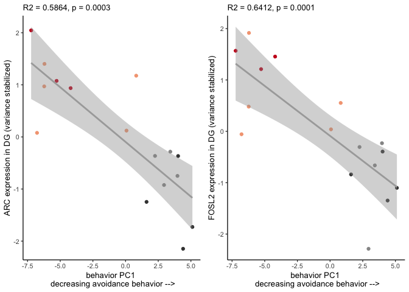
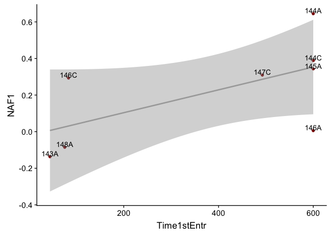

    library(tidyverse) 

    ## ── Attaching packages ───────────────────────────────────────────────────────────────────────────────────────────────────────── tidyverse 1.2.1 ──

    ## ✔ ggplot2 3.2.1     ✔ purrr   0.3.2
    ## ✔ tibble  2.1.3     ✔ dplyr   0.8.1
    ## ✔ tidyr   0.8.3     ✔ stringr 1.4.0
    ## ✔ readr   1.3.1     ✔ forcats 0.4.0

    ## ── Conflicts ──────────────────────────────────────────────────────────────────────────────────────────────────────────── tidyverse_conflicts() ──
    ## ✖ dplyr::filter() masks stats::filter()
    ## ✖ dplyr::lag()    masks stats::lag()

    library(corrplot)

    ## corrplot 0.84 loaded

    library(cowplot)

    ## 
    ## Attaching package: 'cowplot'

    ## The following object is masked from 'package:ggplot2':
    ## 
    ##     ggsave

    library(corrr)

    knitr::opts_chunk$set(fig.path = '../figures/02e_correlations/', cache = F)

For this analysis, I want to explor correlations between a behavioral
measure and gene expression.

    # import behavior data, create mouse id, select relvant samples
    behav <- read.csv("../data/01a_behavior.csv") 
    behav$mouse <- sapply(strsplit(as.character(behav$ID),"15"), "[", 2)
    behav <- behav %>% filter( #treatment %in% c("conflict.trained", "standard.trained"),
                                      TrainSessionCombo == "Retention") %>% 
                               select(mouse,Time1stEntr,pTimeShockZone) 
    head(behav)

    ##   mouse Time1stEntr pTimeShockZone
    ## 1  140A      102.43         0.0286
    ## 2  140B       65.80         0.1094
    ## 3  140C      599.97         0.0021
    ## 4  140D       48.93         0.1617
    ## 5  141C       30.53         0.0909
    ## 6  141D       19.13         0.3379

    pcadata <- read_csv("../data/01a_pcadf.csv") %>%
      filter(#treatment %in% c("conflict.trained", "standard.trained"),
             TrainSessionComboNum == 9) %>%
      select(ID,PC1,PC2) 

    ## Parsed with column specification:
    ## cols(
    ##   ID = col_character(),
    ##   treatment = col_character(),
    ##   TrainSessionComboNum = col_double(),
    ##   PC1 = col_double(),
    ##   PC2 = col_double(),
    ##   PC3 = col_double(),
    ##   PC4 = col_double(),
    ##   PC5 = col_double(),
    ##   PC6 = col_double(),
    ##   PC7 = col_double(),
    ##   PC8 = col_double(),
    ##   PC9 = col_double(),
    ##   PC10 = col_double()
    ## )

    pcadata$mouse <- sapply(strsplit(as.character(pcadata$ID),"15"), "[", 2)
    pcadata$ID <- NULL
    head(pcadata)

    ## # A tibble: 6 x 3
    ##      PC1    PC2 mouse
    ##    <dbl>  <dbl> <chr>
    ## 1 -1.97   0.880 140A 
    ## 2  1.56   1.43  140B 
    ## 3 -5.44  -2.13  140C 
    ## 4  1.56  -1.32  140D 
    ## 5 -0.199 -0.760 141C 
    ## 6  3.40  -1.71  141D

    DG_DEGs <- read.csv("../data/02f_DG_DEGs_vsd.csv", row.names = 1, check.names = F)
    DG_DEGs <- as.data.frame(t(DG_DEGs))
    DG_DEGs$sample <- row.names(DG_DEGs)
    DG_DEGs$mouse <- sapply(strsplit(as.character(DG_DEGs$sample),"\\-"), "[", 1)
    DG_DEGs <- DG_DEGs %>% select(mouse,`1190002N15RIK`:ZFP869)

    DEGsPCA <- left_join(DG_DEGs, pcadata)

    ## Joining, by = "mouse"

    DEGsPCAbeahv <- left_join(DEGsPCA, behav)

    ## Joining, by = "mouse"

    DEGsPCAbeahv <- as.data.frame(DEGsPCAbeahv)
    row.names(DEGsPCAbeahv) <- DEGsPCAbeahv$mouse
    DEGsPCAbeahv$mouse <- NULL
    DEGsPCAbeahv <- as.matrix(DEGsPCAbeahv)

    DGcor <- DEGsPCAbeahv %>% correlate() %>% rearrange() %>%  shave()

    ## 
    ## Correlation method: 'pearson'
    ## Missing treated using: 'pairwise.complete.obs'

    ## Registered S3 method overwritten by 'seriation':
    ##   method         from 
    ##   reorder.hclust gclus

    DGcor

    ## # A tibble: 218 x 219
    ##    rowname  SNX18  PCDH8  NPAS4  KCNJ2 ERRFI1   SGK1  NFIL3 TIPARP   PLK2
    ##    <chr>    <dbl>  <dbl>  <dbl>  <dbl>  <dbl>  <dbl>  <dbl>  <dbl>  <dbl>
    ##  1 SNX18   NA     NA     NA     NA     NA     NA     NA     NA     NA    
    ##  2 PCDH8    0.946 NA     NA     NA     NA     NA     NA     NA     NA    
    ##  3 NPAS4    0.943  0.920 NA     NA     NA     NA     NA     NA     NA    
    ##  4 KCNJ2    0.944  0.927  0.952 NA     NA     NA     NA     NA     NA    
    ##  5 ERRFI1   0.955  0.906  0.974  0.964 NA     NA     NA     NA     NA    
    ##  6 SGK1     0.961  0.920  0.953  0.925  0.940 NA     NA     NA     NA    
    ##  7 NFIL3    0.932  0.902  0.983  0.962  0.961  0.919 NA     NA     NA    
    ##  8 TIPARP   0.935  0.898  0.967  0.924  0.956  0.936  0.959 NA     NA    
    ##  9 PLK2     0.954  0.902  0.973  0.932  0.970  0.977  0.943  0.951 NA    
    ## 10 GADD45G  0.936  0.932  0.920  0.955  0.947  0.870  0.933  0.904  0.885
    ## # … with 208 more rows, and 209 more variables: GADD45G <dbl>,
    ## #   SLC16A1 <dbl>, FAM107B <dbl>, KCNF1 <dbl>, FBXO33 <dbl>, KITL <dbl>,
    ## #   GPR19 <dbl>, MEST <dbl>, PTGS2 <dbl>, JUN <dbl>, APAF1 <dbl>,
    ## #   FZD5 <dbl>, CWC25 <dbl>, PAK6 <dbl>, SMAD7 <dbl>, ZDBF2 <dbl>,
    ## #   CXADR <dbl>, TSC22D2 <dbl>, EGR4 <dbl>, A830010M20RIK <dbl>,
    ## #   ARID5B <dbl>, PLK3 <dbl>, KCNA4 <dbl>, PIGA <dbl>, IRF2BP2 <dbl>,
    ## #   HMGCR <dbl>, SIAH2 <dbl>, RFX2 <dbl>, AHR <dbl>, BTG2 <dbl>,
    ## #   FZD4 <dbl>, MARCH11 <dbl>, ARL4A <dbl>, C2CD4B <dbl>, ARL13B <dbl>,
    ## #   FOSB <dbl>, ING2 <dbl>, RASD1 <dbl>, JUNB <dbl>, LONRF1 <dbl>,
    ## #   KLF2 <dbl>, NR4A3 <dbl>, LEMD3 <dbl>, PPP1R15A <dbl>, DUSP16 <dbl>,
    ## #   FOS <dbl>, MYC <dbl>, CTNND1 <dbl>, EGR3 <dbl>, PEG10 <dbl>,
    ## #   SLC2A3 <dbl>, SH2D3C <dbl>, FRMD6 <dbl>, FOXG1 <dbl>, SCG2 <dbl>,
    ## #   FOSL2 <dbl>, GM13889 <dbl>, ERF <dbl>, MED7 <dbl>, LCMT2 <dbl>,
    ## #   ABHD2 <dbl>, CNNM1 <dbl>, TRIB1 <dbl>, STMN4 <dbl>, GMEB2 <dbl>,
    ## #   LMNA <dbl>, ANKRD28 <dbl>, DYRK2 <dbl>, ODC1 <dbl>, RASL11A <dbl>,
    ## #   PER1 <dbl>, RGS2 <dbl>, KLF6 <dbl>, ACAN <dbl>, B3GNT2 <dbl>,
    ## #   LRRTM2 <dbl>, OTUD1 <dbl>, KDM6B <dbl>, HECA <dbl>, ADAMTS1 <dbl>,
    ## #   ARC <dbl>, EIF5 <dbl>, FERMT2 <dbl>, IRS2 <dbl>, LBH <dbl>,
    ## #   RASL11B <dbl>, IL16 <dbl>, MN1 <dbl>, DUSP14 <dbl>, SLC25A25 <dbl>,
    ## #   NAF1 <dbl>, ZFP654 <dbl>, HS6ST1 <dbl>, ZFP275 <dbl>, DNAJB1 <dbl>,
    ## #   NR4A2 <dbl>, POU3F3 <dbl>, NPTX2 <dbl>, ZFP869 <dbl>,
    ## #   `1190002N15RIK` <dbl>, …

    DGcorSlim <- correlate(DEGsPCAbeahv) %>%  
      focus(PC1,PC2,Time1stEntr, pTimeShockZone)  

    ## 
    ## Correlation method: 'pearson'
    ## Missing treated using: 'pairwise.complete.obs'

    DGcorarranged <- fashion(DGcorSlim) %>% arrange(desc(PC1))
    DGcorarranged

    ##           rowname  PC1  PC2 Time1stEntr pTimeShockZone
    ## 1            NAF1 -.86  .38         .81           -.76
    ## 2            RGS2 -.84  .41         .72           -.77
    ## 3           PTGS2 -.83  .40         .74           -.82
    ## 4             ARC -.82  .56         .67           -.81
    ## 5            FZD5 -.82  .48         .72           -.76
    ## 6            ACAN -.81  .52         .63           -.82
    ## 7          ARMCX5 -.79  .22         .68           -.77
    ## 8            ATF3 -.79  .69         .60           -.77
    ## 9           CPEB4 -.79  .36         .65           -.72
    ## 10          FOSL2 -.78  .49         .65           -.70
    ## 11          FRMD6 -.78  .54         .58           -.73
    ## 12          NPAS4 -.78  .39         .71           -.80
    ## 13            UBC -.78  .58         .61           -.71
    ## 14          ARL5B -.77  .63         .53           -.67
    ## 15           SYT4 -.77  .34         .60           -.81
    ## 16          ARL4D -.76  .44         .67           -.68
    ## 17          PELI1 -.76  .54         .57           -.69
    ## 18        ADAMTS1 -.75  .55         .67           -.71
    ## 19           EGR4 -.75  .57         .58           -.72
    ## 20         HOMER1 -.75  .67         .53           -.70
    ## 21           PER1 -.75  .67         .54           -.72
    ## 22           BDNF -.74  .43         .58           -.60
    ## 23           EGR1 -.74  .73         .54           -.72
    ## 24          NR4A3 -.74  .61         .58           -.70
    ## 25          SMAD7 -.74  .40         .60           -.81
    ## 26         FBXO33 -.73  .44         .58           -.72
    ## 27          NPTX2 -.73  .47         .56           -.61
    ## 28          PCDH8 -.73  .30         .63           -.70
    ## 29       SLC25A25 -.73  .33         .59           -.80
    ## 30          TRIB1 -.73  .59         .60           -.70
    ## 31         DNAJB1 -.72  .63         .53           -.65
    ## 32           FOSB -.72  .57         .56           -.68
    ## 33          NR4A1 -.72  .71         .55           -.66
    ## 34           PLK2 -.72  .38         .62           -.76
    ## 35          RASD1 -.72  .30         .64           -.78
    ## 36           JUND -.71  .57         .51           -.61
    ## 37           RGS4 -.71  .38         .55           -.61
    ## 38           SGK1 -.71  .44         .57           -.74
    ## 39        SLC16A1 -.71  .25         .70           -.68
    ## 40        SPTY2D1 -.71  .47         .59           -.73
    ## 41            SRF -.71  .58         .44           -.62
    ## 42         TIPARP -.71  .46         .62           -.72
    ## 43         DBPHT2 -.70  .44         .50           -.58
    ## 44          DUSP8 -.70  .42         .59           -.69
    ## 45          NFIL3 -.70  .34         .66           -.72
    ## 46         AMIGO2 -.69  .14         .69           -.76
    ## 47       ANKRD33B -.69  .20         .61           -.58
    ## 48           BTG2 -.69  .49         .57           -.72
    ## 49         DNAJA1 -.69  .68         .52           -.65
    ## 50           MEST -.69  .38         .61           -.71
    ## 51         SLC2A3 -.69  .35         .59           -.63
    ## 52         ERRFI1 -.68  .31         .63           -.72
    ## 53          FLRT3 -.68  .16         .66           -.57
    ## 54           FZD4 -.68  .35         .63           -.69
    ## 55            JUN -.68  .45         .58           -.68
    ## 56         LONRF1 -.68  .41         .66           -.65
    ## 57        MARCH11 -.68  .26         .58           -.67
    ## 58          NR4A2 -.68  .56         .53           -.72
    ## 59         RANBP2 -.68  .37         .52           -.71
    ## 60          FOXO1 -.67  .30         .52           -.68
    ## 61         CLDN12 -.66  .17         .52           -.60
    ## 62          KCNJ2 -.66  .31         .63           -.66
    ## 63           KLF6 -.66  .36         .61           -.60
    ## 64            AHR -.65  .18         .54           -.65
    ## 65          CYP51 -.65  .49         .48           -.57
    ## 66          DUSP6 -.65  .53         .50           -.67
    ## 67           EPRS -.65  .31         .48           -.51
    ## 68         HS6ST1 -.65  .37         .53           -.60
    ## 69         HSPA1A -.65  .46         .60           -.63
    ## 70           JUNB -.65  .43         .52           -.70
    ## 71          KCNA4 -.65  .09         .67           -.65
    ## 72         ARPP21 -.64  .41         .41           -.60
    ## 73          DUSP4 -.64  .55         .46           -.49
    ## 74           EIF5 -.64  .51         .50           -.66
    ## 75          GPR19 -.64  .23         .59           -.58
    ## 76         PLAGL1 -.64  .46         .48           -.57
    ## 77        RASL11A -.64  .35         .53           -.69
    ## 78           RFX2 -.64  .38         .46           -.62
    ## 79          ZDBF2 -.64  .32         .61           -.68
    ## 80  1190002N15RIK -.63  .31         .56           -.69
    ## 81          SNX18 -.63  .35         .49           -.67
    ## 82          TNIP2 -.63  .26         .52           -.47
    ## 83          CXADR -.62  .37         .52           -.57
    ## 84         DUSP16 -.62  .29         .56           -.63
    ## 85           IRS1 -.62  .35         .55           -.67
    ## 86           IRS2 -.62  .48         .49           -.65
    ## 87         MFAP3L -.62  .26         .63           -.66
    ## 88           PAK6 -.62  .19         .64           -.65
    ## 89         SH2D3C -.62  .24         .56           -.54
    ## 90        TSC22D2 -.62  .31         .46           -.64
    ## 91           CUL3 -.61  .16         .51           -.74
    ## 92        GADD45G -.61  .18         .59           -.61
    ## 93          HSPH1 -.61  .54         .44           -.53
    ## 94           KITL -.61  .36         .48           -.57
    ## 95            LBH -.61  .42         .51           -.70
    ## 96          NUAK1 -.61  .47         .53           -.66
    ## 97        OLFML2B -.61  .31         .56           -.46
    ## 98           RGMB -.61  .29         .56           -.54
    ## 99  A830010M20RIK -.60  .26         .53           -.68
    ## 100         CWC25 -.60  .36         .52           -.66
    ## 101        JMJD1C -.60  .62         .39           -.56
    ## 102          PIGA -.60  .23         .55           -.58
    ## 103         APAF1 -.59  .28         .54           -.53
    ## 104         CIART -.59  .37         .49           -.42
    ## 105          IL16 -.59  .29         .44           -.59
    ## 106         KCNF1 -.59  .21         .50           -.65
    ## 107        LRRTM2 -.59  .13         .66           -.58
    ## 108          NEFM -.59  .15         .48           -.57
    ## 109         OTUD1 -.59  .39         .54           -.66
    ## 110          PLK3 -.59  .49         .50           -.53
    ## 111         THBS1 -.59  .26         .53           -.68
    ## 112        ZFAND5 -.59  .32         .45           -.64
    ## 113       FAM107B -.58  .33         .42           -.62
    ## 114           FOS -.58  .47         .48           -.62
    ## 115         FOXG1 -.58  .30         .55           -.62
    ## 116          ING2 -.58  .18         .49           -.57
    ## 117          LMNA -.58  .53         .35           -.64
    ## 118          ODC1 -.58  .52         .34           -.53
    ## 119        POU3F3 -.58  .51         .38           -.58
    ## 120        ZFP869 -.58  .14         .62           -.60
    ## 121         ARL4A -.57  .23         .48           -.62
    ## 122       GM13889 -.57  .25         .48           -.67
    ## 123      PPP1R15A -.57  .30         .53           -.56
    ## 124         GMEB2 -.56  .28         .48           -.49
    ## 125       SLITRK5 -.56  .19         .42           -.45
    ## 126         STMN4 -.56  .36         .54           -.53
    ## 127        ARL13B -.55  .37         .46           -.53
    ## 128         CNNM1 -.55  .26         .50           -.61
    ## 129        DUSP14 -.55  .12         .45           -.54
    ## 130          KLF2 -.55  .21         .51           -.53
    ## 131         LCMT2 -.55  .23         .44           -.54
    ## 132         SIAH2 -.55  .23         .44           -.57
    ## 133        SOWAHC -.55  .39         .53           -.63
    ## 134          SOX9 -.55  .47         .51           -.42
    ## 135         USPL1 -.55  .16         .54           -.47
    ## 136        C2CD4B -.54  .22         .53           -.52
    ## 137         DYRK2 -.54  .04         .57           -.55
    ## 138         NEDD9 -.54  .17         .51           -.53
    ## 139       RASL11B -.54  .23         .43           -.66
    ## 140         ADRB1 -.53  .16         .52           -.62
    ## 141      ANKRD13A -.53  .41         .43           -.34
    ## 142        CITED2 -.53  .20         .56           -.59
    ## 143          GAD1 -.53  .53         .37           -.49
    ## 144         HMGCR -.53  .27         .46           -.58
    ## 145           MN1 -.53  .17         .61           -.62
    ## 146        B3GNT2 -.52 -.02         .46           -.53
    ## 147           ERF -.52  .29         .40           -.62
    ## 148          CCNK -.51  .30         .46           -.31
    ## 149        DNAJB4 -.51  .20         .40           -.35
    ## 150         TRA2B -.51  .48         .31           -.30
    ## 151        ZFP275 -.51  .35         .45           -.55
    ## 152         KDM7A -.50  .29         .32           -.46
    ## 153        ARID5B -.49  .14         .48           -.57
    ## 154           MYC -.49  .27         .42           -.46
    ## 155        PHLDA1 -.49  .45         .29           -.45
    ## 156        NAP1L5 -.48  .26         .46           -.54
    ## 157         PEG10 -.48  .25         .53           -.48
    ## 158       IRF2BP2 -.47  .20         .44           -.50
    ## 159         KDM6B -.47  .42         .34           -.55
    ## 160        ZFP654 -.47  .21         .42           -.57
    ## 161         LEMD3 -.46  .24         .33           -.51
    ## 162          SCG2 -.46  .10         .45           -.54
    ## 163          HECA -.45  .15         .40           -.47
    ## 164          PER2 -.45  .57         .22           -.47
    ## 165        ZBTB33 -.45  .11         .38           -.58
    ## 166         ABHD2 -.44  .05         .46           -.52
    ## 167       ANKRD28 -.44  .27         .33           -.54
    ## 168          EGR3 -.44  .21         .42           -.48
    ## 169          JDP2 -.44  .27         .29           -.50
    ## 170       PRPF38B -.44  .22         .39           -.31
    ## 171       SLC45A4 -.44  .25         .47           -.50
    ## 172        CTNND1 -.43  .25         .32           -.50
    ## 173          MED7 -.43  .17         .35           -.45
    ## 174         BACH1 -.41  .32         .40           -.52
    ## 175         FBXW7 -.39  .13         .38           -.50
    ## 176       FAM118A -.38  .36         .19           -.51
    ## 177        FERMT2 -.38  .06         .39           -.47
    ## 178          COQ2  .57 -.09        -.62            .61
    ## 179          GPI1  .56 -.14        -.51            .52
    ## 180        TUBB4A  .56 -.34        -.52            .54
    ## 181          NXF1  .55  .03        -.55            .51
    ## 182        ZFP207  .53 -.16        -.44            .62
    ## 183           PXN  .50 -.07        -.43            .39
    ## 184        EEF1E1  .45 -.15        -.33            .40
    ## 185         PLCH2  .45 -.43        -.30            .26
    ## 186        LRRC45  .42 -.06        -.38            .54
    ## 187        CCDC32  .41 -.30        -.36            .49
    ## 188        SRGAP1  .37 -.10        -.31            .23
    ## 189         PGAM2  .36 -.23        -.24            .44
    ## 190          SCOC  .35 -.03        -.36            .33
    ## 191       NEUROD6  .34 -.16        -.35            .28
    ## 192         CECR6  .33 -.34        -.19            .11
    ## 193         SENP8  .33 -.11        -.34            .41
    ## 194        SLC5A5  .33  .09        -.31            .44
    ## 195          SV2B  .33 -.32        -.30            .22
    ## 196        LYSMD4  .32 -.26        -.22            .14
    ## 197        TSPYL3  .32 -.14        -.34            .44
    ## 198          MC1R  .30  .03        -.39            .25
    ## 199       ANKRD27  .29 -.02        -.31            .46
    ## 200         CPNE7  .29 -.19        -.27            .18
    ## 201        DPYSL2  .29 -.02        -.37            .28
    ## 202      BC048403  .28 -.15        -.22            .41
    ## 203          GNAZ  .28  .02        -.38            .23
    ## 204         KLKB1  .28  .03        -.36            .26
    ## 205         CTCFL  .26 -.01        -.34            .24
    ## 206           GYG  .26  .08        -.32            .38
    ## 207         STAC2  .26 -.10        -.23            .28
    ## 208          BMT2  .25  .03        -.33            .22
    ## 209       IGF2BP2  .25  .04        -.38            .20
    ## 210        PRUNE2  .22 -.06        -.24            .22
    ## 211         RBM47  .19 -.02        -.22            .27
    ## 212         PDE6A  .17  .11        -.29            .11
    ## 213        ZFP668  .12 -.22        -.07            .29
    ## 214       TMEM170  .11  .05        -.17            .11

    DEGsPCAbeahvDf <- as.data.frame(DEGsPCAbeahv)
    a <- ggplot(DEGsPCAbeahvDf, aes(x = PC1, y = NAF1, label = rownames(DEGsPCAbeahvDf))) +
      geom_point( ) + geom_smooth(method='lm', colour = "darkgrey") + geom_text(vjust = -0.1)
    b <- ggplot(DEGsPCAbeahvDf, aes(x = Time1stEntr, y = NAF1, label = rownames(DEGsPCAbeahvDf))) +
      geom_point( ) + geom_smooth(method='lm', colour = "darkgrey") + geom_text(vjust = -0.1)

    c <- ggplot(DEGsPCAbeahvDf, aes(x = PC1, y = ARC, label = rownames(DEGsPCAbeahvDf))) +
      geom_point(colour = "darkred") + geom_smooth(method='lm', colour = "darkgrey") + geom_text(vjust = -0.1)
    d <- ggplot(DEGsPCAbeahvDf, aes(x = Time1stEntr, y = ARC, label = rownames(DEGsPCAbeahvDf))) +
      geom_point(colour = "darkred") + geom_smooth(method='lm', colour = "darkgrey") + geom_text(vjust = -0.1)

    a

    b

