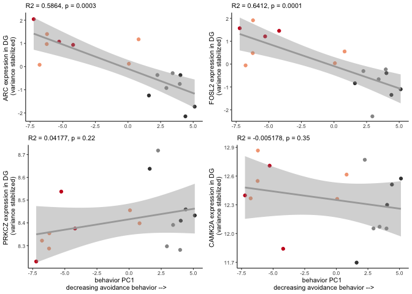
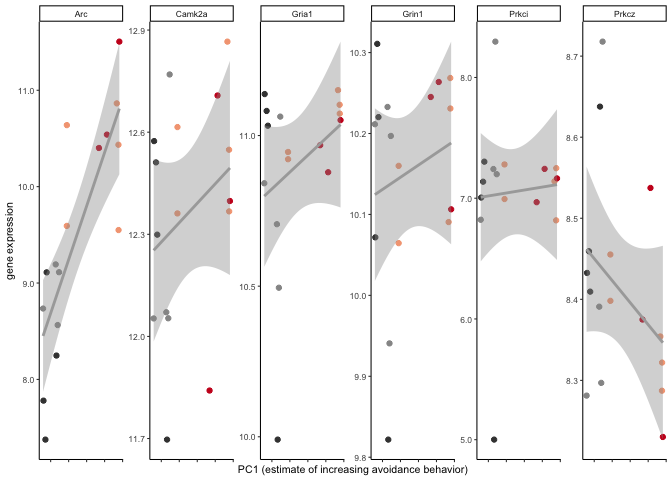
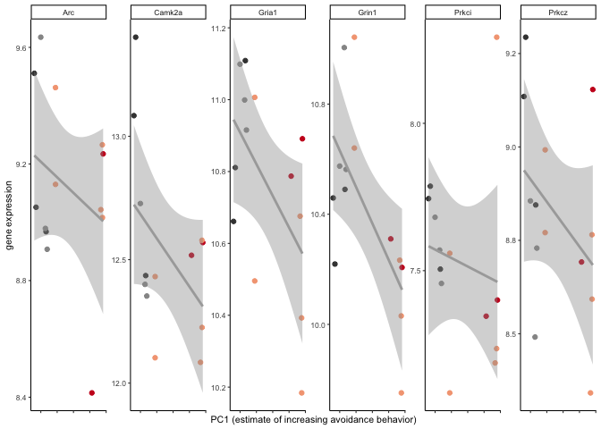
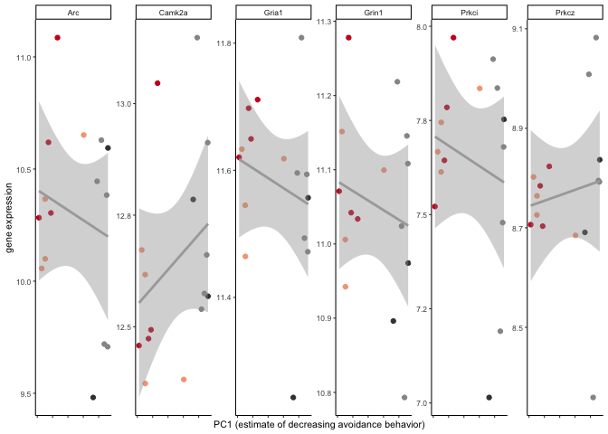
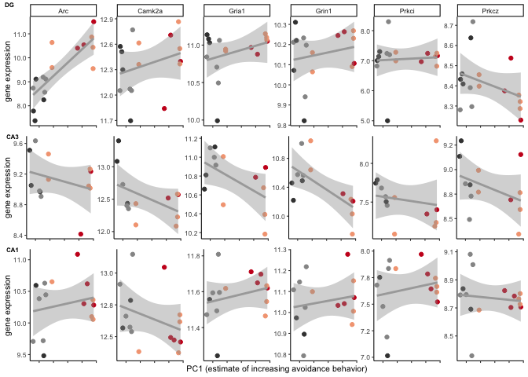

    library(tidyverse) 

    ## ── Attaching packages ────────────────────────────────────────────────────────────────── tidyverse 1.2.1 ──

    ## ✔ ggplot2 3.2.1     ✔ purrr   0.3.2
    ## ✔ tibble  2.1.3     ✔ dplyr   0.8.1
    ## ✔ tidyr   0.8.3     ✔ stringr 1.4.0
    ## ✔ readr   1.3.1     ✔ forcats 0.4.0

    ## ── Conflicts ───────────────────────────────────────────────────────────────────── tidyverse_conflicts() ──
    ## ✖ dplyr::filter() masks stats::filter()
    ## ✖ dplyr::lag()    masks stats::lag()

    library(corrplot)

    ## corrplot 0.84 loaded

    library(cowplot)

    ## 
    ## Attaching package: 'cowplot'

    ## The following object is masked from 'package:ggplot2':
    ## 
    ##     ggsave

    library(corrr)
    #devtools::install_github("clauswilke/ggtext")
    library(ggtext)

    source("figureoptions.R")

    theme_ms <- function () { 
      theme_classic(base_size = 8) +
        theme(
          panel.grid.major  = element_blank(),  # remove major gridlines
          panel.grid.minor  = element_blank(),  # remove minor gridlines
          plot.title = element_text(hjust = 0.5, face = "bold") # center & bold 
        )
    }

    theme2 <- function () { 
      theme_minimal(base_size = 7) +
        theme(
          panel.grid.major  = element_blank(),  # remove major gridlines
          panel.grid.minor  = element_blank() # remove minor gridlines
        )
    }

    knitr::opts_chunk$set(fig.path = '../figures/02e_correlations/', cache = F)

For this analysis, I want to explor correlations between a behavioral
measure and gene expression.

    # import behavior data, create mouse id, select relvant samples
    behav <- read.csv("../data/01a_behavior.csv") 
    behav$mouse <- sapply(strsplit(as.character(behav$ID),"15"), "[", 2)
    behav <- behav %>% filter( #treatment %in% c("conflict.trained", "standard.trained"),
                                      TrainSessionCombo == "Retention") %>% 
                               select(mouse,Time1stEntr,pTimeShockZone) 
    head(behav)

    ##   mouse Time1stEntr pTimeShockZone
    ## 1  140A      102.43         0.0286
    ## 2  140B       65.80         0.1094
    ## 3  140C      599.97         0.0021
    ## 4  140D       48.93         0.1617
    ## 5  141C       30.53         0.0909
    ## 6  141D       19.13         0.3379

    pcadata <- read_csv("../data/01a_pcadf.csv") %>%
      filter(#treatment %in% c("conflict.trained", "standard.trained"),
             TrainSessionComboNum == 9) %>%
      select(ID,PC1,PC2) 

    ## Parsed with column specification:
    ## cols(
    ##   ID = col_character(),
    ##   treatment = col_character(),
    ##   TrainSessionComboNum = col_double(),
    ##   PC1 = col_double(),
    ##   PC2 = col_double(),
    ##   PC3 = col_double(),
    ##   PC4 = col_double(),
    ##   PC5 = col_double(),
    ##   PC6 = col_double(),
    ##   PC7 = col_double(),
    ##   PC8 = col_double(),
    ##   PC9 = col_double(),
    ##   PC10 = col_double()
    ## )

    pcadata$mouse <- sapply(strsplit(as.character(pcadata$ID),"15"), "[", 2)
    pcadata$ID <- NULL
    head(pcadata)

    ## # A tibble: 6 x 3
    ##      PC1    PC2 mouse
    ##    <dbl>  <dbl> <chr>
    ## 1 -1.97   0.880 140A 
    ## 2  1.56   1.43  140B 
    ## 3 -5.44  -2.13  140C 
    ## 4  1.56  -1.32  140D 
    ## 5 -0.199 -0.760 141C 
    ## 6  3.40  -1.71  141D

    DG_DEGs <- read.csv("../data/02f_DG_DEGs_vsd.csv", row.names = 1, check.names = F)
    DG_DEGs <- as.data.frame(t(DG_DEGs))
    DG_DEGs$sample <- row.names(DG_DEGs)
    DG_DEGs$mouse <- sapply(strsplit(as.character(DG_DEGs$sample),"\\-"), "[", 1)
    DG_DEGs <- DG_DEGs %>% select(mouse,`1190002N15RIK`:ZFP869)
    #head(DG_DEGs)

    DEGsPCA <- left_join(DG_DEGs, pcadata)

    ## Joining, by = "mouse"

    DEGsPCAbeahv <- left_join(DEGsPCA, behav)

    ## Joining, by = "mouse"

    DEGsPCAbeahv <- as.data.frame(DEGsPCAbeahv)
    row.names(DEGsPCAbeahv) <- DEGsPCAbeahv$mouse
    DEGsPCAbeahv$mouse <- NULL
    DEGsPCAbeahv <- as.matrix(DEGsPCAbeahv)

    DGcor <- DEGsPCAbeahv %>% correlate() %>% rearrange() %>%  shave()

    ## 
    ## Correlation method: 'pearson'
    ## Missing treated using: 'pairwise.complete.obs'

    ## Registered S3 method overwritten by 'seriation':
    ##   method         from 
    ##   reorder.hclust gclus

    DGcor

    ## # A tibble: 218 x 219
    ##    rowname  SNX18  PCDH8  NPAS4  KCNJ2 ERRFI1   SGK1  NFIL3 TIPARP   PLK2
    ##    <chr>    <dbl>  <dbl>  <dbl>  <dbl>  <dbl>  <dbl>  <dbl>  <dbl>  <dbl>
    ##  1 SNX18   NA     NA     NA     NA     NA     NA     NA     NA     NA    
    ##  2 PCDH8    0.946 NA     NA     NA     NA     NA     NA     NA     NA    
    ##  3 NPAS4    0.943  0.920 NA     NA     NA     NA     NA     NA     NA    
    ##  4 KCNJ2    0.944  0.927  0.952 NA     NA     NA     NA     NA     NA    
    ##  5 ERRFI1   0.955  0.906  0.974  0.964 NA     NA     NA     NA     NA    
    ##  6 SGK1     0.961  0.920  0.953  0.925  0.940 NA     NA     NA     NA    
    ##  7 NFIL3    0.932  0.902  0.983  0.962  0.961  0.919 NA     NA     NA    
    ##  8 TIPARP   0.935  0.898  0.967  0.924  0.956  0.936  0.959 NA     NA    
    ##  9 PLK2     0.954  0.902  0.973  0.932  0.970  0.977  0.943  0.951 NA    
    ## 10 GADD45G  0.936  0.932  0.920  0.955  0.947  0.870  0.933  0.904  0.885
    ## # … with 208 more rows, and 209 more variables: GADD45G <dbl>,
    ## #   SLC16A1 <dbl>, FAM107B <dbl>, KCNF1 <dbl>, FBXO33 <dbl>, KITL <dbl>,
    ## #   GPR19 <dbl>, MEST <dbl>, PTGS2 <dbl>, JUN <dbl>, APAF1 <dbl>,
    ## #   FZD5 <dbl>, CWC25 <dbl>, PAK6 <dbl>, SMAD7 <dbl>, ZDBF2 <dbl>,
    ## #   CXADR <dbl>, TSC22D2 <dbl>, EGR4 <dbl>, A830010M20RIK <dbl>,
    ## #   ARID5B <dbl>, PLK3 <dbl>, KCNA4 <dbl>, PIGA <dbl>, IRF2BP2 <dbl>,
    ## #   HMGCR <dbl>, SIAH2 <dbl>, RFX2 <dbl>, AHR <dbl>, BTG2 <dbl>,
    ## #   FZD4 <dbl>, MARCH11 <dbl>, ARL4A <dbl>, C2CD4B <dbl>, ARL13B <dbl>,
    ## #   FOSB <dbl>, ING2 <dbl>, RASD1 <dbl>, JUNB <dbl>, LONRF1 <dbl>,
    ## #   KLF2 <dbl>, NR4A3 <dbl>, LEMD3 <dbl>, PPP1R15A <dbl>, DUSP16 <dbl>,
    ## #   FOS <dbl>, MYC <dbl>, CTNND1 <dbl>, EGR3 <dbl>, PEG10 <dbl>,
    ## #   SLC2A3 <dbl>, SH2D3C <dbl>, FRMD6 <dbl>, FOXG1 <dbl>, SCG2 <dbl>,
    ## #   FOSL2 <dbl>, GM13889 <dbl>, ERF <dbl>, MED7 <dbl>, LCMT2 <dbl>,
    ## #   ABHD2 <dbl>, CNNM1 <dbl>, TRIB1 <dbl>, STMN4 <dbl>, GMEB2 <dbl>,
    ## #   LMNA <dbl>, ANKRD28 <dbl>, DYRK2 <dbl>, ODC1 <dbl>, RASL11A <dbl>,
    ## #   PER1 <dbl>, RGS2 <dbl>, KLF6 <dbl>, ACAN <dbl>, B3GNT2 <dbl>,
    ## #   LRRTM2 <dbl>, OTUD1 <dbl>, KDM6B <dbl>, HECA <dbl>, ADAMTS1 <dbl>,
    ## #   ARC <dbl>, EIF5 <dbl>, FERMT2 <dbl>, IRS2 <dbl>, LBH <dbl>,
    ## #   RASL11B <dbl>, IL16 <dbl>, MN1 <dbl>, DUSP14 <dbl>, SLC25A25 <dbl>,
    ## #   NAF1 <dbl>, ZFP654 <dbl>, HS6ST1 <dbl>, ZFP275 <dbl>, DNAJB1 <dbl>,
    ## #   NR4A2 <dbl>, POU3F3 <dbl>, NPTX2 <dbl>, ZFP869 <dbl>,
    ## #   `1190002N15RIK` <dbl>, …

    DGcorSlim <- correlate(DEGsPCAbeahv) %>%  
      focus(PC1,PC2,Time1stEntr, pTimeShockZone)  

    ## 
    ## Correlation method: 'pearson'
    ## Missing treated using: 'pairwise.complete.obs'

    DGcorarranged <- fashion(DGcorSlim) %>% arrange(desc(PC1))
    head(DGcorarranged)

    ##   rowname  PC1  PC2 Time1stEntr pTimeShockZone
    ## 1    NAF1 -.86  .38         .81           -.76
    ## 2    RGS2 -.84  .41         .72           -.77
    ## 3   PTGS2 -.83  .40         .74           -.82
    ## 4     ARC -.82  .56         .67           -.81
    ## 5    FZD5 -.82  .48         .72           -.76
    ## 6    ACAN -.81  .52         .63           -.82

    mousetreatment <- read_csv("../data/01a_behavior.csv")  %>%
      filter(TrainSessionCombo == "Retention") %>%
      mutate(mouse = sapply(strsplit(as.character(ID),"15"), "[", 2)) %>%
      select(mouse, treatment)

    ## Parsed with column specification:
    ## cols(
    ##   .default = col_double(),
    ##   ID = col_character(),
    ##   treatment = col_character(),
    ##   training = col_character(),
    ##   TrainSessionCombo = col_character(),
    ##   ShockOnOff = col_character(),
    ##   PairedPartner = col_character()
    ## )

    ## See spec(...) for full column specifications.

    DEGsPCAbeahvDf <- as.data.frame(DEGsPCAbeahv)
    DEGsPCAbeahvDf$mouse <- row.names(DEGsPCAbeahvDf)
    DEGsPCAbeahvDf <- left_join(mousetreatment, DEGsPCAbeahvDf)

    ## Joining, by = "mouse"

    a <- ggplot(DEGsPCAbeahvDf, aes(x = PC1, y = ARC)) +
      geom_point(aes(color = treatment)) + geom_smooth(method='lm', colour = "darkgrey")  +
      labs(y = "ARC expression in DG \n (variance stabilized)", 
           x = "behavior PC1 \n decreasing avoidance behavior -->",
           subtitle = "R2 = 0.5864, p = 0.0003") +
      theme_ms() +
      scale_color_manual(values = treatmentcolors) + theme(legend.position = "none")
      
    b <- ggplot(DEGsPCAbeahvDf, aes(x = PC1, y = FOSL2)) +
      geom_point(aes(color = treatment)) + geom_smooth(method='lm', colour = "darkgrey") +
      labs(y = "FOSL2 expression in DG \n (variance stabilized)", 
           x = "behavior PC1 \n decreasing avoidance behavior -->",
           subtitle = "R2 = 0.6412, p = 0.0001") +
        theme_ms() +
      scale_color_manual(values = treatmentcolors) + theme(legend.position = "none")

    plot_grid(a,b)

    ## Warning: Removed 18 rows containing non-finite values (stat_smooth).

    ## Warning: Removed 18 rows containing missing values (geom_point).

    ## Warning: Removed 18 rows containing non-finite values (stat_smooth).

    ## Warning: Removed 18 rows containing missing values (geom_point).

    summary(lm(ARC ~ PC1, data = DEGsPCAbeahvDf))

    ## 
    ## Call:
    ## lm(formula = ARC ~ PC1, data = DEGsPCAbeahvDf)
    ## 
    ## Residuals:
    ##     Min      1Q  Median      3Q     Max 
    ## -1.2483 -0.3199  0.1657  0.3069  1.4421 
    ## 
    ## Coefficients:
    ##             Estimate Std. Error t value Pr(>|t|)    
    ## (Intercept) -0.09571    0.17995  -0.532 0.603162    
    ## PC1         -0.20989    0.03980  -5.274 0.000118 ***
    ## ---
    ## Signif. codes:  0 '***' 0.001 '**' 0.01 '*' 0.05 '.' 0.1 ' ' 1
    ## 
    ## Residual standard error: 0.7161 on 14 degrees of freedom
    ##   (18 observations deleted due to missingness)
    ## Multiple R-squared:  0.6652, Adjusted R-squared:  0.6412 
    ## F-statistic: 27.81 on 1 and 14 DF,  p-value: 0.0001177

    summary(lm(FOSL2 ~ PC1, data = DEGsPCAbeahvDf))

    ## 
    ## Call:
    ## lm(formula = FOSL2 ~ PC1, data = DEGsPCAbeahvDf)
    ## 
    ## Residuals:
    ##     Min      1Q  Median      3Q     Max 
    ## -1.6252 -0.4111  0.1817  0.5150  0.7995 
    ## 
    ## Coefficients:
    ##             Estimate Std. Error t value Pr(>|t|)    
    ## (Intercept) -0.08871    0.18638  -0.476 0.641468    
    ## PC1         -0.19453    0.04122  -4.719 0.000329 ***
    ## ---
    ## Signif. codes:  0 '***' 0.001 '**' 0.01 '*' 0.05 '.' 0.1 ' ' 1
    ## 
    ## Residual standard error: 0.7417 on 14 degrees of freedom
    ##   (18 observations deleted due to missingness)
    ## Multiple R-squared:  0.614,  Adjusted R-squared:  0.5864 
    ## F-statistic: 22.27 on 1 and 14 DF,  p-value: 0.0003292

    allDGvsd <- read.csv("../data/02c_DGvsd.csv", check.names = F, stringsAsFactors = F, row.names = 1)
    allDGvsd <- as.data.frame(t(allDGvsd))

    allDGvsd$ID <- row.names(allDGvsd)
    allDGvsd$mouse <- sapply(strsplit(as.character(allDGvsd$ID),"-"), "[", 1)
    allDGvsd <- left_join(mousetreatment, allDGvsd)

    ## Joining, by = "mouse"

    allDGvsd <- left_join(pcadata, allDGvsd)

    ## Joining, by = "mouse"

    summary(lm(Prkcz ~ PC1, data = allDGvsd))

    ## 
    ## Call:
    ## lm(formula = Prkcz ~ PC1, data = allDGvsd)
    ## 
    ## Residuals:
    ##      Min       1Q   Median       3Q      Max 
    ## -0.17094 -0.06005 -0.02758  0.01212  0.28149 
    ## 
    ## Coefficients:
    ##             Estimate Std. Error t value Pr(>|t|)    
    ## (Intercept) 8.415755   0.032210 261.274   <2e-16 ***
    ## PC1         0.009161   0.007124   1.286    0.219    
    ## ---
    ## Signif. codes:  0 '***' 0.001 '**' 0.01 '*' 0.05 '.' 0.1 ' ' 1
    ## 
    ## Residual standard error: 0.1282 on 14 degrees of freedom
    ##   (18 observations deleted due to missingness)
    ## Multiple R-squared:  0.1057, Adjusted R-squared:  0.04177 
    ## F-statistic: 1.654 on 1 and 14 DF,  p-value: 0.2193

    c <- ggplot(allDGvsd, aes(x = PC1, y = Prkcz)) +
      geom_point(aes(color = treatment)) + geom_smooth(method='lm', colour = "darkgrey") +
      labs(y = "PRKCZ expression in DG \n (variance stabilized)", 
           x = "behavior PC1 \n decreasing avoidance behavior -->",
           subtitle = "R2 = 0.04177, p = 0.22") +
        theme_ms() +
      scale_color_manual(values = treatmentcolors) + theme(legend.position = "none")

    summary(lm(Camk2a ~ PC1, data = allDGvsd))

    ## 
    ## Call:
    ## lm(formula = Camk2a ~ PC1, data = allDGvsd)
    ## 
    ## Residuals:
    ##      Min       1Q   Median       3Q      Max 
    ## -0.62423 -0.21942  0.01692  0.26688  0.46012 
    ## 
    ## Coefficients:
    ##             Estimate Std. Error t value Pr(>|t|)    
    ## (Intercept) 12.35005    0.08481 145.617   <2e-16 ***
    ## PC1         -0.01802    0.01876  -0.961    0.353    
    ## ---
    ## Signif. codes:  0 '***' 0.001 '**' 0.01 '*' 0.05 '.' 0.1 ' ' 1
    ## 
    ## Residual standard error: 0.3375 on 14 degrees of freedom
    ##   (18 observations deleted due to missingness)
    ## Multiple R-squared:  0.06183,    Adjusted R-squared:  -0.005178 
    ## F-statistic: 0.9227 on 1 and 14 DF,  p-value: 0.3531

    d <- ggplot(allDGvsd, aes(x = PC1, y = Camk2a)) +
      geom_point(aes(color = treatment)) + geom_smooth(method='lm', colour = "darkgrey") +
      labs(y = "CAMK2A expression in DG \n (variance stabilized)", 
           x = "behavior PC1 \n decreasing avoidance behavior -->",
           subtitle = "R2 = -0.005178, p = 0.35") +
        theme_ms() +
      scale_color_manual(values = treatmentcolors) + theme(legend.position = "none")

    plot_grid(a + theme(axis.title.x = element_blank()),
              b + theme(axis.title.x = element_blank()),
              c,d, rel_heights = c(0.45, 0.55))

    ## Warning: Removed 18 rows containing non-finite values (stat_smooth).

    ## Warning: Removed 18 rows containing missing values (geom_point).

    ## Warning: Removed 18 rows containing non-finite values (stat_smooth).

    ## Warning: Removed 18 rows containing missing values (geom_point).

    ## Warning: Removed 18 rows containing non-finite values (stat_smooth).

    ## Warning: Removed 18 rows containing missing values (geom_point).

    ## Warning: Removed 18 rows containing non-finite values (stat_smooth).

    ## Warning: Removed 18 rows containing missing values (geom_point).

    plotPCAvcandidates <- function(filename){
      allvsd <- read.csv(filename, check.names = F, stringsAsFactors = F, row.names = 1)
      allvsd <- as.data.frame(t(allvsd))

      allvsd$ID <- row.names(allvsd)
      allvsd$mouse <- sapply(strsplit(as.character(allvsd$ID),"-"), "[", 1)
      allvsd <- left_join(mousetreatment, allvsd)
      allvsd <- left_join(pcadata, allvsd)
      
      print(summary(lm(Arc ~ PC1, data = allDGvsd)))
      print(summary(lm(Camk2a ~ PC1, data = allvsd)))
      print(summary(lm(Gria1 ~ PC1, data = allvsd)))
      print(summary(lm(Grin1 ~ PC1, data = allvsd)))
      print(summary(lm(Prkci ~ PC1, data = allvsd)))
      print(summary(lm(Prkcz ~ PC1, data = allvsd)))

      candidatevsdPCA <- allvsd %>% select(mouse, treatment, PC1, PC2, mouse,
                                           Arc, Camk2a, Gria1, Grin1, Prkci, Prkcz)
      candidatevsdPCA <- gather(candidatevsdPCA, gene, expression, Arc:Prkcz, factor_key=TRUE) %>% drop_na()

      p <- ggplot(candidatevsdPCA, aes(x = PC1, y = expression)) +
        geom_point(aes(color = treatment)) + geom_smooth(method='lm', colour = "darkgrey") +
        labs(y = "gene expression", 
            x = "PC1 (estimate of decreasing avoidance behavior)") +
          theme_ms() +
        scale_color_manual(values = treatmentcolors) + theme(legend.position = "none") +
        facet_wrap(~gene, scales = "free_y", nrow = 1) +
        theme(axis.text.x = element_blank()) +
        scale_y_continuous(labels = scales::number_format(accuracy = 0.1))
      return(p)
    }

    p1 <- plotPCAvcandidates("../data/02c_DGvsd.csv")

    ## Joining, by = "mouse"
    ## Joining, by = "mouse"

    ## 
    ## Call:
    ## lm(formula = Arc ~ PC1, data = allDGvsd)
    ## 
    ## Residuals:
    ##     Min      1Q  Median      3Q     Max 
    ## -1.2369 -0.3145  0.1609  0.2976  1.4236 
    ## 
    ## Coefficients:
    ##             Estimate Std. Error t value Pr(>|t|)    
    ## (Intercept)  9.38331    0.17712  52.976  < 2e-16 ***
    ## PC1         -0.20709    0.03917  -5.287 0.000115 ***
    ## ---
    ## Signif. codes:  0 '***' 0.001 '**' 0.01 '*' 0.05 '.' 0.1 ' ' 1
    ## 
    ## Residual standard error: 0.7049 on 14 degrees of freedom
    ##   (18 observations deleted due to missingness)
    ## Multiple R-squared:  0.6663, Adjusted R-squared:  0.6424 
    ## F-statistic: 27.95 on 1 and 14 DF,  p-value: 0.0001149
    ## 
    ## 
    ## Call:
    ## lm(formula = Camk2a ~ PC1, data = allvsd)
    ## 
    ## Residuals:
    ##      Min       1Q   Median       3Q      Max 
    ## -0.62423 -0.21942  0.01692  0.26688  0.46012 
    ## 
    ## Coefficients:
    ##             Estimate Std. Error t value Pr(>|t|)    
    ## (Intercept) 12.35005    0.08481 145.617   <2e-16 ***
    ## PC1         -0.01802    0.01876  -0.961    0.353    
    ## ---
    ## Signif. codes:  0 '***' 0.001 '**' 0.01 '*' 0.05 '.' 0.1 ' ' 1
    ## 
    ## Residual standard error: 0.3375 on 14 degrees of freedom
    ##   (18 observations deleted due to missingness)
    ## Multiple R-squared:  0.06183,    Adjusted R-squared:  -0.005178 
    ## F-statistic: 0.9227 on 1 and 14 DF,  p-value: 0.3531
    ## 
    ## 
    ## Call:
    ## lm(formula = Gria1 ~ PC1, data = allvsd)
    ## 
    ## Residuals:
    ##      Min       1Q   Median       3Q      Max 
    ## -0.87450 -0.02936  0.04730  0.16083  0.33592 
    ## 
    ## Coefficients:
    ##             Estimate Std. Error t value Pr(>|t|)    
    ## (Intercept) 10.89415    0.07431 146.601   <2e-16 ***
    ## PC1         -0.01805    0.01644  -1.098    0.291    
    ## ---
    ## Signif. codes:  0 '***' 0.001 '**' 0.01 '*' 0.05 '.' 0.1 ' ' 1
    ## 
    ## Residual standard error: 0.2957 on 14 degrees of freedom
    ##   (18 observations deleted due to missingness)
    ## Multiple R-squared:  0.07934,    Adjusted R-squared:  0.01357 
    ## F-statistic: 1.206 on 1 and 14 DF,  p-value: 0.2906
    ## 
    ## 
    ## Call:
    ## lm(formula = Grin1 ~ PC1, data = allvsd)
    ## 
    ## Residuals:
    ##      Min       1Q   Median       3Q      Max 
    ## -0.32046 -0.07953  0.05290  0.08804  0.18213 
    ## 
    ## Coefficients:
    ##              Estimate Std. Error t value Pr(>|t|)    
    ## (Intercept) 10.150039   0.033511 302.885   <2e-16 ***
    ## PC1         -0.004861   0.007412  -0.656    0.523    
    ## ---
    ## Signif. codes:  0 '***' 0.001 '**' 0.01 '*' 0.05 '.' 0.1 ' ' 1
    ## 
    ## Residual standard error: 0.1334 on 14 degrees of freedom
    ##   (18 observations deleted due to missingness)
    ## Multiple R-squared:  0.02981,    Adjusted R-squared:  -0.03949 
    ## F-statistic: 0.4302 on 1 and 14 DF,  p-value: 0.5225
    ## 
    ## 
    ## Call:
    ## lm(formula = Prkci ~ PC1, data = allvsd)
    ## 
    ## Residuals:
    ##      Min       1Q   Median       3Q      Max 
    ## -2.05074 -0.06681  0.09591  0.18973  1.24670 
    ## 
    ## Coefficients:
    ##               Estimate Std. Error t value Pr(>|t|)    
    ## (Intercept)  7.0531066  0.1665860  42.339 3.53e-16 ***
    ## PC1         -0.0009825  0.0368431  -0.027    0.979    
    ## ---
    ## Signif. codes:  0 '***' 0.001 '**' 0.01 '*' 0.05 '.' 0.1 ' ' 1
    ## 
    ## Residual standard error: 0.6629 on 14 degrees of freedom
    ##   (18 observations deleted due to missingness)
    ## Multiple R-squared:  5.08e-05,   Adjusted R-squared:  -0.07137 
    ## F-statistic: 0.0007112 on 1 and 14 DF,  p-value: 0.9791
    ## 
    ## 
    ## Call:
    ## lm(formula = Prkcz ~ PC1, data = allvsd)
    ## 
    ## Residuals:
    ##      Min       1Q   Median       3Q      Max 
    ## -0.17094 -0.06005 -0.02758  0.01212  0.28149 
    ## 
    ## Coefficients:
    ##             Estimate Std. Error t value Pr(>|t|)    
    ## (Intercept) 8.415755   0.032210 261.274   <2e-16 ***
    ## PC1         0.009161   0.007124   1.286    0.219    
    ## ---
    ## Signif. codes:  0 '***' 0.001 '**' 0.01 '*' 0.05 '.' 0.1 ' ' 1
    ## 
    ## Residual standard error: 0.1282 on 14 degrees of freedom
    ##   (18 observations deleted due to missingness)
    ## Multiple R-squared:  0.1057, Adjusted R-squared:  0.04177 
    ## F-statistic: 1.654 on 1 and 14 DF,  p-value: 0.2193

    p1

    p2 <- plotPCAvcandidates("../data/02c_CA3vsd.csv")

    ## Joining, by = "mouse"
    ## Joining, by = "mouse"

    ## 
    ## Call:
    ## lm(formula = Arc ~ PC1, data = allDGvsd)
    ## 
    ## Residuals:
    ##     Min      1Q  Median      3Q     Max 
    ## -1.2369 -0.3145  0.1609  0.2976  1.4236 
    ## 
    ## Coefficients:
    ##             Estimate Std. Error t value Pr(>|t|)    
    ## (Intercept)  9.38331    0.17712  52.976  < 2e-16 ***
    ## PC1         -0.20709    0.03917  -5.287 0.000115 ***
    ## ---
    ## Signif. codes:  0 '***' 0.001 '**' 0.01 '*' 0.05 '.' 0.1 ' ' 1
    ## 
    ## Residual standard error: 0.7049 on 14 degrees of freedom
    ##   (18 observations deleted due to missingness)
    ## Multiple R-squared:  0.6663, Adjusted R-squared:  0.6424 
    ## F-statistic: 27.95 on 1 and 14 DF,  p-value: 0.0001149
    ## 
    ## 
    ## Call:
    ## lm(formula = Camk2a ~ PC1, data = allvsd)
    ## 
    ## Residuals:
    ##      Min       1Q   Median       3Q      Max 
    ## -0.45910 -0.24197 -0.07918  0.25323  0.67698 
    ## 
    ## Coefficients:
    ##             Estimate Std. Error t value Pr(>|t|)    
    ## (Intercept) 12.55908    0.09485  132.41   <2e-16 ***
    ## PC1          0.03756    0.02019    1.86   0.0898 .  
    ## ---
    ## Signif. codes:  0 '***' 0.001 '**' 0.01 '*' 0.05 '.' 0.1 ' ' 1
    ## 
    ## Residual standard error: 0.3378 on 11 degrees of freedom
    ##   (21 observations deleted due to missingness)
    ## Multiple R-squared:  0.2393, Adjusted R-squared:  0.1702 
    ## F-statistic:  3.46 on 1 and 11 DF,  p-value: 0.08978
    ## 
    ## 
    ## Call:
    ## lm(formula = Gria1 ~ PC1, data = allvsd)
    ## 
    ## Residuals:
    ##      Min       1Q   Median       3Q      Max 
    ## -0.39834 -0.20678  0.07563  0.18535  0.32306 
    ## 
    ## Coefficients:
    ##             Estimate Std. Error t value Pr(>|t|)    
    ## (Intercept) 10.79423    0.06966  154.96   <2e-16 ***
    ## PC1          0.03128    0.01483    2.11   0.0586 .  
    ## ---
    ## Signif. codes:  0 '***' 0.001 '**' 0.01 '*' 0.05 '.' 0.1 ' ' 1
    ## 
    ## Residual standard error: 0.2481 on 11 degrees of freedom
    ##   (21 observations deleted due to missingness)
    ## Multiple R-squared:  0.2881, Adjusted R-squared:  0.2234 
    ## F-statistic: 4.451 on 1 and 11 DF,  p-value: 0.0586
    ## 
    ## 
    ## Call:
    ## lm(formula = Grin1 ~ PC1, data = allvsd)
    ## 
    ## Residuals:
    ##      Min       1Q   Median       3Q      Max 
    ## -0.44898 -0.13452 -0.03632  0.10048  0.54459 
    ## 
    ## Coefficients:
    ##             Estimate Std. Error t value Pr(>|t|)    
    ## (Intercept) 10.45985    0.08183 127.828   <2e-16 ***
    ## PC1          0.04732    0.01742   2.717     0.02 *  
    ## ---
    ## Signif. codes:  0 '***' 0.001 '**' 0.01 '*' 0.05 '.' 0.1 ' ' 1
    ## 
    ## Residual standard error: 0.2914 on 11 degrees of freedom
    ##   (21 observations deleted due to missingness)
    ## Multiple R-squared:  0.4015, Adjusted R-squared:  0.3471 
    ## F-statistic:  7.38 on 1 and 11 DF,  p-value: 0.02005
    ## 
    ## 
    ## Call:
    ## lm(formula = Prkci ~ PC1, data = allvsd)
    ## 
    ## Residuals:
    ##      Min       1Q   Median       3Q      Max 
    ## -0.45123 -0.12691 -0.04867  0.10000  0.83791 
    ## 
    ## Coefficients:
    ##             Estimate Std. Error t value Pr(>|t|)    
    ## (Intercept)  7.53560    0.09028  83.467   <2e-16 ***
    ## PC1          0.01198    0.01922   0.624    0.546    
    ## ---
    ## Signif. codes:  0 '***' 0.001 '**' 0.01 '*' 0.05 '.' 0.1 ' ' 1
    ## 
    ## Residual standard error: 0.3215 on 11 degrees of freedom
    ##   (21 observations deleted due to missingness)
    ## Multiple R-squared:  0.03414,    Adjusted R-squared:  -0.05367 
    ## F-statistic: 0.3888 on 1 and 11 DF,  p-value: 0.5457
    ## 
    ## 
    ## Call:
    ## lm(formula = Prkcz ~ PC1, data = allvsd)
    ## 
    ## Residuals:
    ##      Min       1Q   Median       3Q      Max 
    ## -0.41368 -0.10349 -0.03478  0.14077  0.46668 
    ## 
    ## Coefficients:
    ##             Estimate Std. Error t value Pr(>|t|)    
    ## (Intercept)  8.83480    0.07419 119.088   <2e-16 ***
    ## PC1          0.02046    0.01579   1.296    0.222    
    ## ---
    ## Signif. codes:  0 '***' 0.001 '**' 0.01 '*' 0.05 '.' 0.1 ' ' 1
    ## 
    ## Residual standard error: 0.2642 on 11 degrees of freedom
    ##   (21 observations deleted due to missingness)
    ## Multiple R-squared:  0.1324, Adjusted R-squared:  0.05354 
    ## F-statistic: 1.679 on 1 and 11 DF,  p-value: 0.2216

    p2

    p3 <- plotPCAvcandidates("../data/02c_CA1vsd.csv")

    ## Joining, by = "mouse"
    ## Joining, by = "mouse"

    ## 
    ## Call:
    ## lm(formula = Arc ~ PC1, data = allDGvsd)
    ## 
    ## Residuals:
    ##     Min      1Q  Median      3Q     Max 
    ## -1.2369 -0.3145  0.1609  0.2976  1.4236 
    ## 
    ## Coefficients:
    ##             Estimate Std. Error t value Pr(>|t|)    
    ## (Intercept)  9.38331    0.17712  52.976  < 2e-16 ***
    ## PC1         -0.20709    0.03917  -5.287 0.000115 ***
    ## ---
    ## Signif. codes:  0 '***' 0.001 '**' 0.01 '*' 0.05 '.' 0.1 ' ' 1
    ## 
    ## Residual standard error: 0.7049 on 14 degrees of freedom
    ##   (18 observations deleted due to missingness)
    ## Multiple R-squared:  0.6663, Adjusted R-squared:  0.6424 
    ## F-statistic: 27.95 on 1 and 14 DF,  p-value: 0.0001149
    ## 
    ## 
    ## Call:
    ## lm(formula = Camk2a ~ PC1, data = allvsd)
    ## 
    ## Residuals:
    ##      Min       1Q   Median       3Q      Max 
    ## -0.28659 -0.15449 -0.09096  0.10204  0.44498 
    ## 
    ## Coefficients:
    ##             Estimate Std. Error t value Pr(>|t|)    
    ## (Intercept) 12.66728    0.06166 205.424   <2e-16 ***
    ## PC1          0.01576    0.01319   1.194    0.254    
    ## ---
    ## Signif. codes:  0 '***' 0.001 '**' 0.01 '*' 0.05 '.' 0.1 ' ' 1
    ## 
    ## Residual standard error: 0.2294 on 13 degrees of freedom
    ##   (19 observations deleted due to missingness)
    ## Multiple R-squared:  0.09887,    Adjusted R-squared:  0.02956 
    ## F-statistic: 1.426 on 1 and 13 DF,  p-value: 0.2537
    ## 
    ## 
    ## Call:
    ## lm(formula = Gria1 ~ PC1, data = allvsd)
    ## 
    ## Residuals:
    ##      Min       1Q   Median       3Q      Max 
    ## -0.31932 -0.06168  0.01873  0.04616  0.25521 
    ## 
    ## Coefficients:
    ##              Estimate Std. Error t value Pr(>|t|)    
    ## (Intercept) 11.572000   0.035814  323.11   <2e-16 ***
    ## PC1         -0.006283   0.007662   -0.82    0.427    
    ## ---
    ## Signif. codes:  0 '***' 0.001 '**' 0.01 '*' 0.05 '.' 0.1 ' ' 1
    ## 
    ## Residual standard error: 0.1332 on 13 degrees of freedom
    ##   (19 observations deleted due to missingness)
    ## Multiple R-squared:  0.04917,    Adjusted R-squared:  -0.02397 
    ## F-statistic: 0.6723 on 1 and 13 DF,  p-value: 0.427
    ## 
    ## 
    ## Call:
    ## lm(formula = Grin1 ~ PC1, data = allvsd)
    ## 
    ## Residuals:
    ##      Min       1Q   Median       3Q      Max 
    ## -0.23464 -0.06121 -0.01190  0.07704  0.20301 
    ## 
    ## Coefficients:
    ##              Estimate Std. Error t value Pr(>|t|)    
    ## (Intercept) 11.045552   0.033984 325.020   <2e-16 ***
    ## PC1         -0.005179   0.007271  -0.712    0.489    
    ## ---
    ## Signif. codes:  0 '***' 0.001 '**' 0.01 '*' 0.05 '.' 0.1 ' ' 1
    ## 
    ## Residual standard error: 0.1264 on 13 degrees of freedom
    ##   (19 observations deleted due to missingness)
    ## Multiple R-squared:  0.03756,    Adjusted R-squared:  -0.03648 
    ## F-statistic: 0.5073 on 1 and 13 DF,  p-value: 0.4889
    ## 
    ## 
    ## Call:
    ## lm(formula = Prkci ~ PC1, data = allvsd)
    ## 
    ## Residuals:
    ##      Min       1Q   Median       3Q      Max 
    ## -0.59709 -0.09599  0.04879  0.18708  0.30810 
    ## 
    ## Coefficients:
    ##             Estimate Std. Error t value Pr(>|t|)    
    ## (Intercept)  7.62893    0.07093 107.551   <2e-16 ***
    ## PC1         -0.01080    0.01518  -0.712    0.489    
    ## ---
    ## Signif. codes:  0 '***' 0.001 '**' 0.01 '*' 0.05 '.' 0.1 ' ' 1
    ## 
    ## Residual standard error: 0.2639 on 13 degrees of freedom
    ##   (19 observations deleted due to missingness)
    ## Multiple R-squared:  0.0375, Adjusted R-squared:  -0.03654 
    ## F-statistic: 0.5065 on 1 and 13 DF,  p-value: 0.4892
    ## 
    ## 
    ## Call:
    ## lm(formula = Prkcz ~ PC1, data = allvsd)
    ## 
    ## Residuals:
    ##      Min       1Q   Median       3Q      Max 
    ## -0.43021 -0.04403  0.00196  0.04920  0.29090 
    ## 
    ## Coefficients:
    ##             Estimate Std. Error t value Pr(>|t|)    
    ## (Intercept) 8.776307   0.044179 198.654   <2e-16 ***
    ## PC1         0.004386   0.009452   0.464     0.65    
    ## ---
    ## Signif. codes:  0 '***' 0.001 '**' 0.01 '*' 0.05 '.' 0.1 ' ' 1
    ## 
    ## Residual standard error: 0.1644 on 13 degrees of freedom
    ##   (19 observations deleted due to missingness)
    ## Multiple R-squared:  0.01629,    Adjusted R-squared:  -0.05938 
    ## F-statistic: 0.2153 on 1 and 13 DF,  p-value: 0.6503

    p3

    plot_grid(p1 + theme(axis.title.x = element_blank()),
              p2 + theme(axis.title.x = element_blank(),
                         strip.background = element_blank(), strip.text = element_blank()),
              p3 + theme(strip.background = element_blank(), strip.text = element_blank()), 
              nrow = 3, labels = c("DG", "CA3", "CA1"), label_size =  6,
              rel_heights = c(0.35,0.3,0.35))

