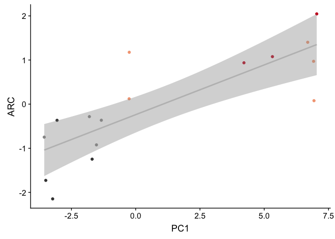
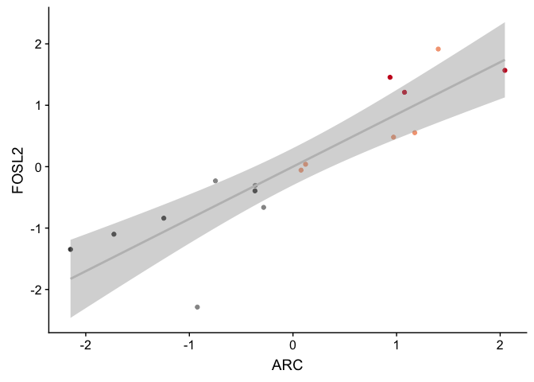
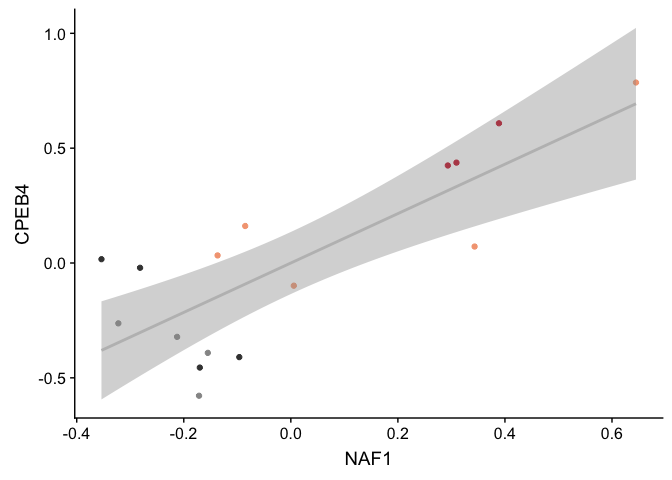
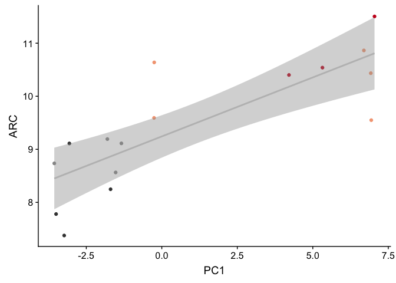
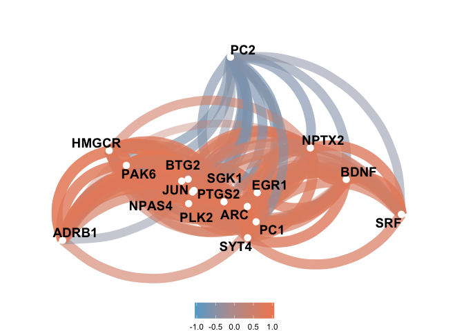
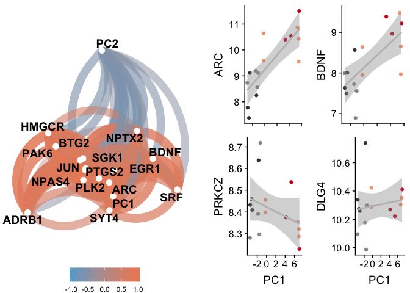

    library(tidyverse)

    ## ── Attaching packages ───────────────────────────────────────────────────────────────────────────────────────────── tidyverse 1.3.0 ──

    ## ✔ ggplot2 3.2.1     ✔ purrr   0.3.3
    ## ✔ tibble  2.1.3     ✔ dplyr   0.8.3
    ## ✔ tidyr   1.0.0     ✔ stringr 1.4.0
    ## ✔ readr   1.3.1     ✔ forcats 0.4.0

    ## ── Conflicts ──────────────────────────────────────────────────────────────────────────────────────────────── tidyverse_conflicts() ──
    ## ✖ dplyr::filter() masks stats::filter()
    ## ✖ dplyr::lag()    masks stats::lag()

    library(corrr)
    library(cowplot)

    ## 
    ## Attaching package: 'cowplot'

    ## The following object is masked from 'package:ggplot2':
    ## 
    ##     ggsave

    source("./figureoptions.R")

    ARC_associated <- read_csv("../data/02h_ARC_associated.csv")  %>% mutate_each(funs=toupper)  %>% dplyr::pull(gene) 

    ## Warning: Missing column names filled in: 'X1' [1]

    ## Parsed with column specification:
    ## cols(
    ##   X1 = col_double(),
    ##   `net$colors` = col_character(),
    ##   gene = col_character()
    ## )

    Neurod6_associated <- read_csv("../data/02h_Neurod6_associated.csv") %>% mutate_each(funs=toupper)  %>% dplyr::pull(gene) 

    ## Warning: Missing column names filled in: 'X1' [1]

    ## Parsed with column specification:
    ## cols(
    ##   X1 = col_double(),
    ##   `net$colors` = col_character(),
    ##   gene = col_character()
    ## )

    Prkcz_associated <- read_csv("../data/02h_Prkcz_associated.csv") %>% mutate_each(funs=toupper)  %>% dplyr::pull(gene) 

    ## Warning: Missing column names filled in: 'X1' [1]

    ## Parsed with column specification:
    ## cols(
    ##   X1 = col_double(),
    ##   `net$colors` = col_character(),
    ##   gene = col_character()
    ## )

    DG_DEGs <- read.csv("../data/02f_DG_DEGs_vsd.csv", row.names = 1, check.names = F)
    DG_DEGs <- as.data.frame(t(DG_DEGs))
    DG_DEGs$sample <- row.names(DG_DEGs)
    DG_DEGs <- DG_DEGs %>% select(`1190002N15RIK`:ZFP869)
    head(DG_DEGs)[1:5]

    ##           1190002N15RIK A830010M20RIK      ABHD2       ACAN    ADAMTS1
    ## 143A-DG-1    0.37666940     0.3321828  0.4370642  0.6682061  0.6571038
    ## 143B-DG-1   -0.79007413    -0.4803026 -0.1164208 -0.4768060  0.0494096
    ## 143D-DG-3   -0.01317465    -0.2575089 -0.1110985 -0.4930643 -0.3158022
    ## 144A-DG-2    1.40407413     1.4069082  1.1339066  0.8794021  2.1806769
    ## 144C-DG-2    1.16933394     1.2067769  0.8232341  0.4271263  1.1022770
    ## 144D-DG-2   -0.47594844    -0.2925787  0.1279683 -0.5497050 -1.5424372

    DG_DEGs <- as.data.frame(t(DG_DEGs))
    DG_DEGs$gene <- row.names(DG_DEGs)

    DG_ARC <- DG_DEGs %>% filter(gene %in% ARC_associated) %>% select(gene, everything())
    row.names(DG_ARC) <- DG_ARC$gene
    DG_ARC$gene <- NULL

    DG_ARC <- as.data.frame(t(DG_ARC))
    DG_ARC$sample  <- row.names(DG_ARC)
    DG_ARC$mouse <- sapply(strsplit(as.character(DG_ARC$sample),"\\-"), "[", 1)
    DG_ARC$ID <- paste(15, DG_ARC$mouse, sep = "")

    # read the sample data, set levels
    colData <- read.csv("../data/02a_colData.csv", row.names = 1, stringsAsFactors = T)
    colData <- colData %>% filter(subfield == "DG")

    # join with pca data for retention

    pca.Rn <- read_csv("../data/01a_pca.all.csv") %>% filter(TrainSessionComboNum == 9)

    ## Parsed with column specification:
    ## cols(
    ##   ID = col_character(),
    ##   treatment = col_character(),
    ##   TrainSessionComboNum = col_double(),
    ##   PC1 = col_double(),
    ##   PC2 = col_double(),
    ##   PC3 = col_double(),
    ##   PC4 = col_double(),
    ##   PC5 = col_double(),
    ##   PC6 = col_double(),
    ##   PC7 = col_double(),
    ##   PC8 = col_double(),
    ##   PC9 = col_double(),
    ##   PC10 = col_double()
    ## )

    pca.Rn <- pca.Rn %>% select(ID:PC2)
    head(pca.Rn)

    ## # A tibble: 6 x 5
    ##   ID     treatment        TrainSessionComboNum     PC1    PC2
    ##   <chr>  <chr>                           <dbl>   <dbl>  <dbl>
    ## 1 15140A conflict.trained                    9  2.24   -1.22 
    ## 2 15140B conflict.yoked                      9 -0.791  -1.60 
    ## 3 15140C standard.trained                    9  6.43    0.226
    ## 4 15140D standard.yoked                      9 -1.21    1.71 
    ## 5 15141C standard.trained                    9 -0.0494  1.12 
    ## 6 15141D standard.yoked                      9 -2.93    2.21

    colData <- left_join(colData, pca.Rn)

    ## Joining, by = c("ID", "treatment")

    ## Warning: Column `ID` joining factor and character vector, coercing into
    ## character vector

    ## Warning: Column `treatment` joining factor and character vector, coercing
    ## into character vector

    colData

    ##        ID subfield        treatment training TrainSessionComboNum
    ## 1  15143A       DG conflict.trained  trained                    9
    ## 2  15143B       DG   conflict.yoked    yoked                    9
    ## 3  15143D       DG   standard.yoked    yoked                    9
    ## 4  15144A       DG conflict.trained  trained                    9
    ## 5  15144C       DG standard.trained  trained                    9
    ## 6  15144D       DG   standard.yoked    yoked                    9
    ## 7  15145A       DG conflict.trained  trained                    9
    ## 8  15145B       DG   conflict.yoked    yoked                    9
    ## 9  15146A       DG conflict.trained  trained                    9
    ## 10 15146B       DG   conflict.yoked    yoked                    9
    ## 11 15146C       DG standard.trained  trained                    9
    ## 12 15146D       DG   standard.yoked    yoked                    9
    ## 13 15147C       DG standard.trained  trained                    9
    ## 14 15147D       DG   standard.yoked    yoked                    9
    ## 15 15148A       DG conflict.trained  trained                    9
    ## 16 15148B       DG   conflict.yoked    yoked                    9
    ##           PC1         PC2
    ## 1  -0.2511636  3.02981466
    ## 2  -3.5595365 -0.47451513
    ## 3  -3.0605115 -0.07227782
    ## 4   6.6921089 -0.02270055
    ## 5   7.0436756 -1.72946383
    ## 6  -3.4999867  1.16766175
    ## 7   6.9362884  0.31085957
    ## 8  -1.3375400  1.64001102
    ## 9   6.9208097  0.09483277
    ## 10 -1.5276429  1.99883979
    ## 11  4.2115795 -1.11790859
    ## 12 -1.6965727  2.93175222
    ## 13  5.3196322 -0.94691101
    ## 14 -3.2320870  4.43969435
    ## 15 -0.2562847 -0.06798772
    ## 16 -1.8023130  2.85862823

    alldata <- left_join(colData, DG_ARC)

    ## Joining, by = "ID"

    forcorplots <- alldata %>% select(PC1:UBC)
    forcorplots

    ##           PC1         PC2         ACAN     ADAMTS1      AMIGO2    ANKRD33B
    ## 1  -0.2511636  3.02981466  0.668206109  0.65710384  0.26383943  0.29566530
    ## 2  -3.5595365 -0.47451513 -0.476805955  0.04940960 -0.64311051 -0.63849004
    ## 3  -3.0605115 -0.07227782 -0.493064288 -0.31580223 -0.46456630 -0.11056438
    ## 4   6.6921089 -0.02270055  0.879402143  2.18067685  0.83850384  1.06672111
    ## 5   7.0436756 -1.72946383  0.427126302  1.10227701  0.59669923  0.66265263
    ## 6  -3.4999867  1.16766175 -0.549705024 -1.54243720 -0.54390449 -0.22663682
    ## 7   6.9362884  0.31085957  0.423357460 -0.04781799 -0.22876752  0.01382627
    ## 8  -1.3375400  1.64001102 -0.151026995 -0.07788381 -0.24784913 -0.38727098
    ## 9   6.9208097  0.09483277  0.003436546  0.33952194  0.51587335  0.09253903
    ## 10 -1.5276429  1.99883979 -0.635366284 -1.12353095 -0.02790315 -1.36876889
    ## 11  4.2115795 -1.11790859  0.608736516  0.38496261 -0.20570225  0.33732802
    ## 12 -1.6965727  2.93175222 -0.547437462 -0.97526734 -0.35241770  0.07874463
    ## 13  5.3196322 -0.94691101  0.847147571  0.97808693  0.67653849  0.60593974
    ## 14 -3.2320870  4.43969435 -0.781054213 -1.39233845 -0.43823408 -0.10349100
    ## 15 -0.2562847 -0.06798772  0.216995954  0.34146475 -0.09234151  0.02759893
    ## 16 -1.8023130  2.85862823 -0.439948380 -0.55842557  0.35334230 -0.34579355
    ##            ARC      ARL4D        ARL5B      ARMCX5       ATF3       BDNF
    ## 1   1.17562233  0.4681834  0.067822811  0.27801818  0.7586906  0.3915877
    ## 2  -0.74817999 -0.2155814 -0.039355740 -0.18623845 -0.5878057 -0.2684977
    ## 3  -0.36660430 -0.4948170 -0.384427053 -0.69754370  0.1244980 -0.2591467
    ## 4   1.40236262  0.3942209  0.858375060  0.65215076  1.0747769  1.2504129
    ## 5   2.04553524  1.2733692  0.691482272  0.35508059  1.3258853  0.9842984
    ## 6  -1.72812196 -0.6156106 -0.560640227 -0.52828927 -1.7991138 -0.6390658
    ## 7   0.07810374 -0.2568645  0.001144312  0.13487602  0.2059677 -0.2944630
    ## 8  -0.36477791 -0.3644487 -0.114430641 -0.38464328 -0.2610078 -0.7185384
    ## 9   0.97078867  0.7865753  0.121064029  0.23305807  0.6311708  0.4096738
    ## 10 -0.92295520 -0.3517889 -0.814323740 -0.46803354 -0.3829362 -1.4133853
    ## 11  0.93699249  0.1830134  1.328466028  0.34927378  1.1218354  1.1550456
    ## 12 -1.24673380  0.1907881 -0.032181329  0.06109713 -0.7516159  0.3194743
    ## 13  1.07659086  0.3600600  0.497518024  0.44101944  1.0498900  0.7244882
    ## 14 -2.14716643 -0.7672235 -0.855986203 -0.16156922 -2.2087194 -0.7810252
    ## 15  0.12154655 -0.2709352 -0.061467753 -0.17913623  0.1118214 -0.3148199
    ## 16 -0.28300290 -0.3189405 -0.703059852  0.10087972 -0.4133373 -0.5460389
    ##           BTG2       CPEB4       CYP51     DBPHT2      DNAJA1      DNAJB1
    ## 1   0.65579804  0.03299804 -0.01372105  0.1930068  0.15507601  0.24765215
    ## 2  -0.09277866 -0.39128678  0.04128289 -0.4232663 -0.19334775 -0.32471931
    ## 3  -0.03401878 -0.40971951 -0.12580958 -0.2434311 -0.12529218  0.23420804
    ## 4   1.17118242  0.78585047  0.96854443  0.9585654  0.30965478  0.93491519
    ## 5   1.65423072  0.60841936  0.31816753  1.2015258  0.56295571  1.17453649
    ## 6  -1.50193972 -0.45527557 -0.47015069 -0.4774288 -0.47193721 -1.33751583
    ## 7  -0.25100169  0.07171232 -0.22794737 -0.3829963 -0.13238207 -0.14475509
    ## 8  -0.21673422 -0.26276887 -0.34755405 -0.6272620 -0.22501649 -0.92664039
    ## 9   1.18319106 -0.09883683 -0.10293494  0.3538095 -0.09710543  0.05002476
    ## 10 -0.35874034 -0.57795299 -0.58795997 -1.7778358  0.02724972 -0.89348068
    ## 11  1.35902436  0.42458777  0.85357545  1.4830277  0.27450828  1.25167797
    ## 12 -2.60021290  0.01657830 -0.20013101 -0.1232318 -0.03721121 -0.72073266
    ## 13  0.66680584  0.43706678  0.49093721  0.6472489  0.70510186  1.11812060
    ## 14 -1.34567386 -0.02083447 -0.41977649 -0.3822292 -0.68584592 -1.25921133
    ## 15  0.21277658  0.16110599  0.04186110  0.3695256  0.09426371  0.62710972
    ## 16 -0.50190886 -0.32164402 -0.21838347 -0.7690284 -0.16067183 -0.03118964
    ##          DUSP6        EGR1        EGR4      FBXO33       FLRT3
    ## 1   0.87661199  0.85220916  0.93979077  0.51256579  0.21024604
    ## 2  -0.01400436 -0.03674124  0.08292777 -0.37366641 -0.14644147
    ## 3   0.12202664 -0.13607942 -0.28304049 -0.03675185 -0.11718717
    ## 4   1.06962125  1.08423965  1.21064480  2.00754485  1.19675523
    ## 5   1.25450844  1.60215902  1.91289470  1.50453004  0.79000640
    ## 6  -1.76384040 -2.25043209 -1.90562788 -1.40429424 -0.33653632
    ## 7  -0.15443441 -0.03548392 -0.03965305 -0.20803073  0.08158802
    ## 8  -0.80148640 -0.30660431 -0.65808515 -0.98038850 -0.25058245
    ## 9   0.38202334  0.44325259  0.97201766  0.43128586  0.25966781
    ## 10  0.23594486 -0.37814542 -1.83290546 -0.71877806 -1.24206536
    ## 11  1.14176536  1.26637203  2.06277267  2.15014530  0.37546905
    ## 12 -1.53835830 -0.90050902 -1.84932697 -2.37754677 -0.14282649
    ## 13  0.58568545  0.72113090  0.98413285  1.27486465  0.03252642
    ## 14 -1.25325927 -1.89303739 -1.50842908 -1.18864316 -0.10996946
    ## 15 -0.01559003  0.48725184  0.44135210 -0.07522413 -0.34240854
    ## 16 -0.12721416 -0.51958238 -0.52946524 -0.51761263 -0.25824170
    ##             FOS       FOSB       FOSL2       FRMD6         GAD1
    ## 1   0.998364387  0.7839060  0.55249442  0.47507885  0.459224161
    ## 2   0.598665874  0.3424215 -0.23117848 -0.39359154  0.194321370
    ## 3   0.153393727  0.1298796 -0.39404897 -0.31105189 -0.172685219
    ## 4   1.250321460  1.6214484  1.91578214  1.74986710  0.594361869
    ## 5   1.481259689  1.8692541  1.56815751  1.27664554  0.277318575
    ## 6  -2.208540511 -2.6656260 -1.09995963 -1.33812490 -0.205638891
    ## 7   0.008905704 -0.2593292 -0.05666779  0.14765024 -0.006340263
    ## 8   0.195356161 -0.3650584 -0.30525550 -0.82293569 -0.536750285
    ## 9   1.160790487  1.0207451  0.48079724 -0.24257348 -0.265146519
    ## 10 -1.188991180 -1.6525035 -2.28651221 -0.96567829  0.038506853
    ## 11  1.474767993  2.1615740  1.45538263  1.92532159  0.530505217
    ## 12 -3.717544339 -2.2605099 -0.83899868 -1.14795752 -0.337560061
    ## 13  0.689608048  1.1527022  1.21126645  1.45775510  0.283107048
    ## 14 -1.386882367 -1.4036465 -1.34714357 -1.19643103 -0.471554552
    ## 15  0.733501306  0.2878280  0.03902948  0.02979769  0.016656093
    ## 16 -0.242976440 -0.7630854 -0.66314505 -0.64377178 -0.398325397
    ##         HOMER1         JUN        JUNB        JUND        KLF6        LMNA
    ## 1   0.08603002  0.49791393  0.69811918  0.55453656  0.39326153  0.60393719
    ## 2  -0.38771728 -0.19560597 -0.04927700  0.07520287  0.27268705  0.17348917
    ## 3  -0.49646959  0.19136630 -0.11241581 -0.10280388  0.12902308 -0.29267054
    ## 4   1.69867876  0.91113482  1.06717695  0.82032847  1.10434951  0.36660536
    ## 5   1.10296746  1.03414255  1.45567864  0.91573429  0.74398698  0.71922274
    ## 6  -1.38228786 -0.89185436 -1.54080532 -1.07879586 -0.71578939 -0.90635400
    ## 7  -0.52133067 -0.01829525 -0.14737643 -0.41130829 -0.04686806 -0.20172483
    ## 8  -0.91501386 -0.22371027 -0.38616315 -0.58172039 -0.27842230 -0.17859757
    ## 9   0.21733344  0.46399364  0.95813584  0.56316858  0.16873954  0.07321896
    ## 10 -0.52050284 -0.35152750 -0.08038002 -0.96111445 -0.51555435 -0.29765106
    ## 11  1.93103201  0.68355094  1.57467757  1.31382996  0.58516656  1.55274716
    ## 12 -0.37338638 -1.58412161 -2.79015159 -0.12118423 -0.84006890 -1.36227389
    ## 13  1.57673946  0.27595181  0.56810487  0.48067386  0.42751466  0.63478606
    ## 14 -1.80782666 -0.44218173 -0.86146527 -0.88491586 -0.68034736 -0.74761358
    ## 15  0.46110795  0.29077400  0.12888148 -0.11628008 -0.61336966  0.05706139
    ## 16 -0.66935398 -0.64153129 -0.48273992 -0.46535155 -0.13430890 -0.19418257
    ##          LONRF1         NAF1        NPTX2      NR4A1       NR4A2
    ## 1   0.035878263 -0.136846879  0.661891112  1.0689339  0.59182869
    ## 2  -0.004773297 -0.155059569 -0.322689725  0.3885822 -0.30032160
    ## 3   0.048155614 -0.096311504 -0.043496316 -0.2539646  0.01628180
    ## 4   1.698425007  0.644800506  1.096605962  0.9610560  1.31121551
    ## 5   1.057489579  0.388793381  1.319931570  1.6321064  1.50150326
    ## 6  -0.541860494 -0.170047274 -0.781095383 -2.2680989 -1.46516425
    ## 7  -0.014437997  0.343298759  0.012281092  0.0940701 -0.32793230
    ## 8  -0.888248329 -0.322231838 -0.328212492 -0.0256079 -0.33322136
    ## 9   0.273805118  0.005566491  0.405081443  1.0160982  0.68489268
    ## 10 -0.169413887 -0.171488698 -2.287111311 -1.6648253  0.55370998
    ## 11  0.548468986  0.293295279  1.411289292  1.2904933  1.40967026
    ## 12 -1.951879367 -0.353767928 -0.238269108 -0.5235233 -2.02394875
    ## 13  1.093186373  0.309412742  0.809671219  0.7494099  0.84740418
    ## 14 -0.914393199 -0.281655764 -0.902204969 -2.4904839 -1.93433822
    ## 15  0.192211703 -0.085265590 -0.008411474  0.4034692 -0.06747697
    ## 16 -0.462614073 -0.212492116 -0.805260910 -0.3777153 -0.46410291
    ##          NR4A3         ODC1       PELI1        PER1        PER2
    ## 1   0.92840913  0.521441603 -0.17394039  0.23276306  0.47909499
    ## 2  -0.12001455 -0.079988945 -0.32330190 -0.13381890  0.01707757
    ## 3   0.23705478  0.005441203 -0.50064757 -0.05429489 -0.15393961
    ## 4   2.03849502  0.393263752  1.18484195  0.99681165  0.91871463
    ## 5   2.16819296  0.390728217  0.58640123  0.82641422  0.36839710
    ## 6  -2.19456170 -0.419169060 -0.57757127 -0.86335281 -0.16972839
    ## 7  -0.01812882 -0.253926434 -0.09358092 -0.15053195 -0.59797509
    ## 8  -0.73234019 -0.295785642 -0.61373203  0.02841121 -0.45740496
    ## 9   0.44557194 -0.003024400 -0.03276798  0.25071037 -0.44668966
    ## 10 -1.84461773 -0.882723365  0.02192475 -0.50785964  0.23505937
    ## 11  2.09583340  1.020501049  0.96857305  1.29418527  1.30998986
    ## 12 -1.94910879 -0.522835979 -0.01759783 -0.76808237 -0.91324327
    ## 13  1.29969420  0.610255633  0.60085313  0.77497755  0.84364174
    ## 14 -2.41719728 -0.366591559 -0.53373951 -1.24082767 -1.08635644
    ## 15  0.48641956  0.305421250  0.11569848  0.03077784  0.29218548
    ## 16 -0.42370193 -0.423007322 -0.61141320 -0.71628294 -0.63882330
    ##           PLK2      POU3F3      RASD1       RGS2        RGS4        SGK1
    ## 1   0.78283711  0.38090078  0.7041275  0.5604900  0.64547884  0.92538747
    ## 2  -0.21981408  0.13887390 -0.3548618 -0.3963040 -0.10973511 -0.11381416
    ## 3  -0.25382404 -0.12286318 -0.4561860 -0.3858197 -0.37169108 -0.47104136
    ## 4   1.38501953  0.24698059  1.4370306  1.7289639  0.88899671  1.34808429
    ## 5   1.42972800  0.43814744  1.2511629  1.4681521  1.06716173  1.33516868
    ## 6  -1.40405013 -0.35399154 -0.8244306 -1.2889923 -0.61736795 -1.06817878
    ## 7   0.08189698  0.14328811  0.2012196 -0.1623962 -0.27285895  0.10911137
    ## 8  -0.51984119 -0.40066947 -0.5625164 -0.6738749 -0.49816185 -0.45649541
    ## 9   0.76991362 -0.05949441  0.4315325  1.1456443  0.32484026  0.45204443
    ## 10 -0.49241041 -0.14377553 -0.3929847 -1.3255242 -1.45541126 -0.47173725
    ## 11  1.37596041  0.66312371  0.8370042  1.3661530  1.09622967  1.55551296
    ## 12 -2.49996094 -0.55722151 -1.8764837 -0.7260714  0.07587188 -2.35272695
    ## 13  0.88498847 -0.02772541  0.5119918  1.0258224  0.75686461  0.82481382
    ## 14 -0.82366905 -0.39030390 -1.0491911 -0.9488616 -0.72944151 -0.75975607
    ## 15 -0.19378189  0.10200208 -0.2013637 -0.6665766 -0.50866225  0.05140374
    ## 16 -0.30299239 -0.05727167  0.3439490 -0.7208049 -0.29211374 -0.90777678
    ##       SLC25A25       SMAD7      SOWAHC         SRF        STMN4
    ## 1   0.41535155  1.02744508  0.71133755  0.03148348  0.456972389
    ## 2  -0.16601134 -0.40287582 -0.33897411 -0.33985053  0.049427167
    ## 3  -0.51912590 -0.97404696  0.09772174 -0.12862414  0.188894520
    ## 4   0.59692363  1.57772336  0.59327899  0.58156661  0.289153988
    ## 5   0.51068521  1.46850478  0.75004193  0.49251426  0.563772626
    ## 6  -0.28907474 -1.13640529 -0.49764493 -0.89568619 -0.105760116
    ## 7   0.01696914  0.15631241  0.19467960 -0.12878527 -0.004434922
    ## 8  -0.01862667 -0.58518537  0.17188863 -0.02049097 -0.458193498
    ## 9   0.10942747  0.63565865  0.23789535  0.22451146  0.245650655
    ## 10  0.07003554 -0.04164484  0.09999272 -0.35760107 -0.205136916
    ## 11  0.44580739  1.65643694 -0.24362913  1.02720925  0.185500309
    ## 12 -0.58802034 -2.59455641 -1.38350623  0.49127853 -0.863192801
    ## 13  0.37077450  1.01121745  0.33596657  0.31784454  0.319026025
    ## 14 -0.26789277 -0.99263046 -0.61046592 -0.55719087 -0.494117194
    ## 15 -0.27019008 -0.07614150  0.35549067 -0.20442291 -0.037003495
    ## 16 -0.41703259 -0.72981201 -0.47407343 -0.53375618 -0.130558737
    ##           SYT4       TRIB1         UBC
    ## 1   0.16671430  1.13433796  0.38690216
    ## 2  -0.58149976  0.16840311 -0.01766093
    ## 3  -0.34837424 -0.04411045 -0.22052618
    ## 4   0.86231311  1.44379122  0.71368727
    ## 5   0.79716016  1.70179194  0.78103490
    ## 6  -0.36515165 -1.84420792 -0.65022413
    ## 7   0.03294637 -0.15909122 -0.12843805
    ## 8  -0.19880461  0.05138528 -0.48580403
    ## 9   0.06093674  0.86009739  0.17293903
    ## 10 -0.33861049 -1.55393076 -0.24395130
    ## 11  0.75793382  1.16901886  0.65218103
    ## 12 -0.50960385 -1.46600194 -0.24425416
    ## 13  0.36550900  1.09480407  0.39913249
    ## 14 -0.78415199 -1.98900655 -0.63966542
    ## 15 -0.18582692 -0.04666665 -0.07858194
    ## 16  0.26851002 -0.52061434 -0.39677075

    x <- correlate(forcorplots)

    ## 
    ## Correlation method: 'pearson'
    ## Missing treated using: 'pairwise.complete.obs'

    x %>% filter(PC1 > 0.755) %>% arrange(desc(PC1)) 

    ## # A tibble: 9 x 59
    ##   rowname   PC1    PC2   ACAN ADAMTS1 AMIGO2 ANKRD33B    ARC ARL4D ARL5B
    ##   <chr>   <dbl>  <dbl>  <dbl>   <dbl>  <dbl>    <dbl>  <dbl> <dbl> <dbl>
    ## 1 NAF1    0.859 -0.694  0.806   0.784  0.617    0.702  0.746 0.554 0.759
    ## 2 RGS2    0.832 -0.605  0.830   0.874  0.718    0.805  0.897 0.830 0.881
    ## 3 ARC     0.805 -0.632  0.872   0.904  0.787    0.671 NA     0.843 0.783
    ## 4 ACAN    0.789 -0.543 NA       0.875  0.672    0.765  0.872 0.638 0.821
    ## 5 SYT4    0.779 -0.551  0.824   0.792  0.772    0.689  0.881 0.698 0.789
    ## 6 ARMCX5  0.777 -0.273  0.785   0.741  0.756    0.763  0.734 0.740 0.733
    ## 7 ATF3    0.770 -0.676  0.846   0.868  0.699    0.580  0.963 0.772 0.798
    ## 8 FOSL2   0.757 -0.667  0.883   0.915  0.631    0.870  0.882 0.735 0.914
    ## 9 CPEB4   0.756 -0.442  0.818   0.784  0.633    0.896  0.713 0.654 0.819
    ## # … with 49 more variables: ARMCX5 <dbl>, ATF3 <dbl>, BDNF <dbl>,
    ## #   BTG2 <dbl>, CPEB4 <dbl>, CYP51 <dbl>, DBPHT2 <dbl>, DNAJA1 <dbl>,
    ## #   DNAJB1 <dbl>, DUSP6 <dbl>, EGR1 <dbl>, EGR4 <dbl>, FBXO33 <dbl>,
    ## #   FLRT3 <dbl>, FOS <dbl>, FOSB <dbl>, FOSL2 <dbl>, FRMD6 <dbl>,
    ## #   GAD1 <dbl>, HOMER1 <dbl>, JUN <dbl>, JUNB <dbl>, JUND <dbl>,
    ## #   KLF6 <dbl>, LMNA <dbl>, LONRF1 <dbl>, NAF1 <dbl>, NPTX2 <dbl>,
    ## #   NR4A1 <dbl>, NR4A2 <dbl>, NR4A3 <dbl>, ODC1 <dbl>, PELI1 <dbl>,
    ## #   PER1 <dbl>, PER2 <dbl>, PLK2 <dbl>, POU3F3 <dbl>, RASD1 <dbl>,
    ## #   RGS2 <dbl>, RGS4 <dbl>, SGK1 <dbl>, SLC25A25 <dbl>, SMAD7 <dbl>,
    ## #   SOWAHC <dbl>, SRF <dbl>, STMN4 <dbl>, SYT4 <dbl>, TRIB1 <dbl>,
    ## #   UBC <dbl>

    plotmycors <- function(df, whichgene, mysubtitle){
     p <- ggplot(alldata, aes(x = PC1, y = whichgene)) +
       geom_point(aes( color = treatment)) + 
       geom_smooth(method = "lm", color = "grey") +
       scale_color_manual(values = treatmentcolors) +
       labs(y = mysubtitle,  x = "PC1") +
       theme(legend.position = "none")
     return(p) 
    }  

    p3 <- plotmycors(alldata, alldata$ARC, "ARC")
    p3

    ggplot(alldata, aes(x = ARC, y = FOSL2)) +
       geom_point(aes( color = treatment)) + 
       geom_smooth(method = "lm", color = "grey") +
       scale_color_manual(values = treatmentcolors) +
       theme(legend.position = "none")

    ggplot(alldata, aes(x = NAF1, y = CPEB4)) +
       geom_point(aes( color = treatment)) + 
       geom_smooth(method = "lm", color = "grey") +
       scale_color_manual(values = treatmentcolors) +
       theme(legend.position = "none")

    vsd <- read.csv("../data/02c_DGvsd.csv", row.names = 1, check.names = F)

    GOgenes <- read_csv("../data/goterms/GOterms.csv") 

    ## Parsed with column specification:
    ## cols(
    ##   gene = col_character(),
    ##   GO = col_character()
    ## )

    GOgenes

    ## # A tibble: 9,763 x 2
    ##    gene  GO                   
    ##    <chr> <chr>                
    ##  1 AAAS  4. learning or memory
    ##  2 AAL   4. learning or memory
    ##  3 ABCA7 4. learning or memory
    ##  4 ABCC8 4. learning or memory
    ##  5 ABI2  4. learning or memory
    ##  6 ABL2  4. learning or memory
    ##  7 ADAM2 4. learning or memory
    ##  8 ADCY1 4. learning or memory
    ##  9 ADCY3 4. learning or memory
    ## 10 ADCY8 4. learning or memory
    ## # … with 9,753 more rows

    vsd2 <- vsd %>%
      mutate(genes = toupper(rownames(vsd))) %>%
      filter(genes %in% GOgenes$gene) %>%
      as.data.frame()
    row.names(vsd2) <- vsd2$genes
    vsd2$genes <- NULL
    head(vsd2)

    ##               143A-DG-1 143B-DG-1 143D-DG-3 144A-DG-2 144C-DG-2 144D-DG-2
    ## 1600014C10RIK  6.570235  6.712577  6.408586  6.374798  6.440451  6.592277
    ## 1700007K13RIK  5.303141  5.000789  5.000789  5.000789  5.000789  5.000789
    ## 1810024B03RIK  5.000789  5.000789  5.000789  5.000789  5.294484  5.244592
    ## 2210016L21RIK  7.542334  7.558907  7.519758  7.259096  7.614302  7.473481
    ## 2610042L04RIK  5.000789  5.555282  5.000789  5.353786  5.000789  5.345171
    ## 2610528A11RIK  5.136203  5.000789  5.000789  5.000789  5.000789  5.000789
    ##               145A-DG-2 145B-DG-1 146A-DG-2 146B-DG-2 146C-DG-4 146D-DG-3
    ## 1600014C10RIK  6.434082  6.333145  6.576434  5.996243  6.060620  5.000789
    ## 1700007K13RIK  5.000789  5.000789  5.000789  5.000789  5.000789  5.000789
    ## 1810024B03RIK  5.000789  5.000789  5.280121  5.000789  5.000789  5.000789
    ## 2210016L21RIK  7.345284  7.511526  7.520989  7.085062  7.754168  8.567802
    ## 2610042L04RIK  5.510222  5.252461  5.395211  5.000789  5.000789  5.000789
    ## 2610528A11RIK  5.000789  5.000789  5.395211  5.000789  5.000789  5.000789
    ##               147C-DG-3 147D-DG-1 148A-DG-3 148B-DG-4
    ## 1600014C10RIK  6.237027  6.361154  6.314778  6.924144
    ## 1700007K13RIK  5.000789  5.000789  5.000789  5.000789
    ## 1810024B03RIK  5.296565  5.234825  5.000789  5.000789
    ## 2210016L21RIK  7.324402  7.645993  7.331046  7.657833
    ## 2610042L04RIK  5.391554  5.293986  5.000789  5.000789
    ## 2610528A11RIK  5.000789  5.000789  5.000789  5.000789

    vsd <- as.data.frame(t(vsd2))

    vsd$sample <- row.names(vsd)
    head(vsd)[1]

    ##           1600014C10RIK
    ## 143A-DG-1      6.570235
    ## 143B-DG-1      6.712577
    ## 143D-DG-3      6.408586
    ## 144A-DG-2      6.374798
    ## 144C-DG-2      6.440451
    ## 144D-DG-2      6.592277

    head(vsd)[6112]

    ##                ZYX
    ## 143A-DG-1 7.203704
    ## 143B-DG-1 7.258360
    ## 143D-DG-3 6.853523
    ## 144A-DG-2 7.532625
    ## 144C-DG-2 7.128516
    ## 144D-DG-2 6.671645

    vsd <- vsd %>% select(`1600014C10RIK`:ZYX)
    vsd

    ##           1600014C10RIK 1700007K13RIK 1810024B03RIK 2210016L21RIK
    ## 143A-DG-1      6.570235      5.303141      5.000789      7.542334
    ## 143B-DG-1      6.712577      5.000789      5.000789      7.558907
    ## 143D-DG-3      6.408586      5.000789      5.000789      7.519758
    ## 144A-DG-2      6.374798      5.000789      5.000789      7.259096
    ## 144C-DG-2      6.440451      5.000789      5.294484      7.614302
    ## 144D-DG-2      6.592277      5.000789      5.244592      7.473481
    ## 145A-DG-2      6.434082      5.000789      5.000789      7.345284
    ## 145B-DG-1      6.333145      5.000789      5.000789      7.511526
    ## 146A-DG-2      6.576434      5.000789      5.280121      7.520989
    ## 146B-DG-2      5.996243      5.000789      5.000789      7.085062
    ## 146C-DG-4      6.060620      5.000789      5.000789      7.754168
    ## 146D-DG-3      5.000789      5.000789      5.000789      8.567802
    ## 147C-DG-3      6.237027      5.000789      5.296565      7.324402
    ## 147D-DG-1      6.361154      5.000789      5.234825      7.645993
    ## 148A-DG-3      6.314778      5.000789      5.000789      7.331046
    ## 148B-DG-4      6.924144      5.000789      5.000789      7.657833
    ##           2610042L04RIK 2610528A11RIK 2700049A03RIK 2700081O15RIK
    ## 143A-DG-1      5.000789      5.136203      6.076228      7.926626
    ## 143B-DG-1      5.555282      5.000789      5.832700      7.849224
    ## 143D-DG-3      5.000789      5.000789      5.782032      7.880205
    ## 144A-DG-2      5.353786      5.000789      6.334704      7.675707
    ## 144C-DG-2      5.000789      5.000789      6.130018      7.828390
    ## 144D-DG-2      5.345171      5.000789      6.333676      7.704003
    ## 145A-DG-2      5.510222      5.000789      6.062933      7.731303
    ## 145B-DG-1      5.252461      5.000789      6.540236      8.072879
    ## 146A-DG-2      5.395211      5.395211      6.399124      7.530708
    ## 146B-DG-2      5.000789      5.000789      6.383172      6.383172
    ## 146C-DG-4      5.000789      5.000789      6.285341      7.774594
    ## 146D-DG-3      5.000789      5.000789      7.832622      7.566982
    ## 147C-DG-3      5.391554      5.000789      6.334600      7.693195
    ## 147D-DG-1      5.293986      5.000789      6.485937      7.728191
    ## 148A-DG-3      5.000789      5.000789      6.404296      7.896870
    ## 148B-DG-4      5.000789      5.000789      6.131524      7.241576
    ##           2810006K23RIK 2810408A11RIK 3425401B19RIK 4921509C19RIK
    ## 143A-DG-1      6.036415      5.000789      5.486907      5.136203
    ## 143B-DG-1      5.806960      5.000789      5.365060      5.000789
    ## 143D-DG-3      6.015194      5.000789      5.000789      5.000789
    ## 144A-DG-2      5.952571      5.000789      5.466896      5.000789
    ## 144C-DG-2      5.870182      5.000789      5.360182      5.000789
    ## 144D-DG-2      6.042021      5.000789      5.466172      5.000789
    ## 145A-DG-2      6.373948      5.000789      5.361943      5.000789
    ## 145B-DG-1      6.268947      5.000789      5.252461      5.000789
    ## 146A-DG-2      5.913383      5.000789      5.483112      5.000789
    ## 146B-DG-2      5.000789      5.000789      5.000789      5.000789
    ## 146C-DG-4      5.971751      5.000789      5.000789      5.000789
    ## 146D-DG-3      5.000789      5.000789      5.000789      5.000789
    ## 147C-DG-3      6.046078      5.210117      5.257050      5.148871
    ## 147D-DG-1      5.797399      5.000789      5.319428      5.000789
    ## 148A-DG-3      5.840734      5.000789      5.726856      5.000789
    ## 148B-DG-4      5.693560      5.000789      5.000789      5.000789
    ##           4930447C04RIK 4930503L19RIK 5330417C22RIK 6030468B19RIK
    ## 143A-DG-1      5.885429      6.334275      7.232383      5.331879
    ## 143B-DG-1      5.857586      5.992454      7.343211      5.365060
    ## 143D-DG-3      5.834563      6.461681      7.105135      5.000789
    ## 144A-DG-2      5.701634      6.441547      7.048589      5.000789
    ## 144C-DG-2      5.294484      6.346945      7.185211      5.294484
    ## 144D-DG-2      5.763758      6.432719      7.220328      5.141660
    ## 145A-DG-2      5.838180      6.434082      7.363771      5.000789
    ## 145B-DG-1      5.825282      6.505356      7.511526      5.000789
    ## 146A-DG-2      5.621569      6.468963      7.127001      5.280121
    ## 146B-DG-2      5.000789      5.000789      7.400648      5.000789
    ## 146C-DG-4      5.758431      6.576813      6.808805      5.000789
    ## 146D-DG-3      6.793559      5.000789      5.000789      5.000789
    ## 147C-DG-3      5.775373      6.334600      7.572279      5.000789
    ## 147D-DG-1      5.514428      6.348601      7.280921      5.217498
    ## 148A-DG-3      6.250532      6.360480      7.237101      5.000789
    ## 148B-DG-4      6.131524      6.388602      7.164238      5.000789
    ##           9830107B12RIK 9930111J21RIK1      A2M  A3GALT2 A430033K04RIK
    ## 143A-DG-1      5.000789       5.358277 5.602236 5.000789      6.322226
    ## 143B-DG-1      5.211473       5.211473 5.000789 5.693496      6.521453
    ## 143D-DG-3      5.000789       5.299160 5.663320 5.422004      6.435456
    ## 144A-DG-2      5.000789       5.432586 6.227132 5.466896      6.612761
    ## 144C-DG-2      5.000789       5.415426 5.000789 5.360182      6.289566
    ## 144D-DG-2      5.315289       5.506319 5.282197 5.506319      6.550460
    ## 145A-DG-2      5.000789       5.623125 5.000789 5.442539      6.630352
    ## 145B-DG-1      5.000789       5.661700 5.000789 5.356258      6.290793
    ## 146A-DG-2      5.000789       5.621569 5.280121 5.000789      6.576434
    ## 146B-DG-2      5.000789       5.000789 5.000789 5.000789      7.252267
    ## 146C-DG-4      5.000789       5.000789 5.000789 5.000789      6.350262
    ## 146D-DG-3      6.793559       5.000789 5.000789 5.000789      5.000789
    ## 147C-DG-3      5.148871       5.589289 6.093004 5.589289      6.655256
    ## 147D-DG-1      5.432997       5.514428 5.342956 5.395583      6.756399
    ## 148A-DG-3      5.000789       5.891715 5.527855 5.374511      6.545168
    ## 148B-DG-4      5.000789       5.602164 5.000789 5.349661      6.388602
    ##           A530064D06RIK AA467197     AAAS     AACS      AAK1    AAMDC
    ## 143A-DG-1      5.000789 5.235161 6.083985 6.617595  9.521120 6.036415
    ## 143B-DG-1      5.211473 5.000789 6.260304 6.792853  9.468234 6.012956
    ## 143D-DG-3      5.515766 5.000789 6.408586 7.089820  9.793594 5.973603
    ## 144A-DG-2      5.000789 5.000789 6.344871 6.740710  9.739082 5.967744
    ## 144C-DG-2      5.294484 5.000789 5.979597 6.550053  9.661285 5.870182
    ## 144D-DG-2      5.372618 5.000789 6.245712 6.723271  9.899445 6.076383
    ## 145A-DG-2      5.000789 5.000789 6.218650 6.004586  9.779255 5.623125
    ## 145B-DG-1      5.000789 5.252461 6.100880 6.638921  9.986457 5.661700
    ## 146A-DG-2      5.395211 5.000789 6.422903 6.555739  9.671173 5.990014
    ## 146B-DG-2      5.000789 5.000789 5.996243 6.892879 10.272261 5.000789
    ## 146C-DG-4      5.000789 5.000789 5.872410 7.039276  9.330223 6.060620
    ## 146D-DG-3      5.000789 5.000789 5.000789 5.000789  9.630376 5.000789
    ## 147C-DG-3      5.391554 5.000789 6.016698 6.671271  9.800472 5.589289
    ## 147D-DG-1      5.306975 5.000789 6.126613 6.529589  9.865059 6.104279
    ## 148A-DG-3      5.374511 5.000789 6.078820 6.965432  9.957913 5.866644
    ## 148B-DG-4      5.000789 5.000789 5.693560 7.060634  9.733265 6.388602
    ##              AANAT     AARS     AATF     AATK     ABAT    ABCA1    ABCA2
    ## 143A-DG-1 5.000789 8.114415 5.994732 8.505971 7.595317 6.420537 8.830628
    ## 143B-DG-1 5.000789 7.900625 5.832700 8.453077 7.672596 6.792853 8.751648
    ## 143D-DG-3 5.000789 7.827784 6.015194 8.850977 6.943070 6.323698 8.970929
    ## 144A-DG-2 5.000789 8.453487 5.872179 8.601408 7.792534 6.931921 8.712251
    ## 144C-DG-2 5.000789 8.036246 5.999853 8.494952 7.128516 6.440451 8.678466
    ## 144D-DG-2 5.282197 8.228012 5.899501 8.559252 7.051886 6.420825 8.959836
    ## 145A-DG-2 5.000789 8.449244 5.942028 8.298810 6.933162 6.242332 9.041638
    ## 145B-DG-1 5.000789 7.810892 6.018538 8.680380 7.295960 6.623046 9.017434
    ## 146A-DG-2 5.280121 8.035647 6.093551 8.638760 7.059706 6.491293 8.838952
    ## 146B-DG-2 5.000789 8.839969 5.000789 9.193752 5.996243 5.000789 8.141670
    ## 146C-DG-4 5.000789 8.176810 5.000789 8.439577 7.350141 6.060620 8.594853
    ## 146D-DG-3 5.000789 8.154806 5.000789 8.704353 7.832622 5.000789 7.034159
    ## 147C-DG-3 5.210117 8.090833 6.026601 8.572618 7.333864 6.443453 8.979053
    ## 147D-DG-1 5.250945 8.072316 5.941877 8.778586 7.115528 6.291516 8.773797
    ## 148A-DG-3 5.374511 8.282466 6.242209 8.673456 7.507087 6.901552 9.092119
    ## 148B-DG-4 5.349661 8.051184 5.693560 8.723982 7.711904 6.349976 8.581511
    ##              ABCA4    ABCA5    ABCA7   ABCB11   ABCB1A   ABCB1B    ABCB4
    ## 143A-DG-1 5.746684 7.085427 6.626840 5.136203 6.340249 5.555890 5.824605
    ## 143B-DG-1 5.661825 6.904180 6.722908 5.000789 5.881691 5.949913 5.555282
    ## 143D-DG-3 5.422004 6.652057 6.054895 5.000789 5.929866 5.834563 5.663320
    ## 144A-DG-2 5.466896 7.855111 6.432259 5.528657 6.689684 5.528657 5.837581
    ## 144C-DG-2 5.714146 7.246189 6.196967 5.000789 5.796376 5.684343 5.999853
    ## 144D-DG-2 5.560973 7.019742 6.652301 5.000789 6.059365 5.776077 5.811808
    ## 145A-DG-2 5.973884 7.258759 6.331898 5.000789 5.442539 5.442539 6.034239
    ## 145B-DG-1 6.074256 7.479271 6.786987 5.000789 6.126760 5.000789 6.046831
    ## 146A-DG-2 5.556876 7.003214 6.298333 5.000789 5.872187 5.828687 6.060352
    ## 146B-DG-2 5.000789 7.252267 5.996243 5.000789 5.996243 5.000789 5.000789
    ## 146C-DG-4 5.441542 7.754168 5.971751 5.000789 5.000789 5.441542 5.441542
    ## 146D-DG-3 5.000789 7.034159 5.000789 5.000789 5.000789 5.000789 5.000789
    ## 147C-DG-3 5.761732 7.817615 6.536534 5.000789 6.397178 5.704287 5.922022
    ## 147D-DG-1 5.860186 6.918156 6.113916 5.234825 6.148429 5.557398 6.113916
    ## 148A-DG-3 5.644552 7.272676 6.624326 5.000789 5.711215 5.404268 5.962548
    ## 148B-DG-4 5.349661 7.103075 6.715312 5.000789 6.028115 5.845322 5.602164
    ##              ABCC1    ABCC2    ABCC4    ABCC8    ABCC9    ABCD1    ABCD2
    ## 143A-DG-1 6.334275 5.331879 6.044520 7.928328 5.977481 5.968723 7.147422
    ## 143B-DG-1 6.320856 5.211473 6.162052 8.188450 5.211473 6.581004 6.859005
    ## 143D-DG-3 6.716110 5.422004 5.929866 8.041934 5.422004 6.293811 6.536843
    ## 144A-DG-2 6.144301 5.250706 6.131866 7.737025 5.722771 6.067080 6.836725
    ## 144C-DG-2 6.019646 5.547907 5.958847 7.806664 5.653076 6.057947 7.185211
    ## 144D-DG-2 6.217040 5.398135 6.117594 8.196434 5.656148 6.141474 6.894388
    ## 145A-DG-2 6.090743 5.672139 6.143977 8.308116 5.569625 5.800199 7.054945
    ## 145B-DG-1 5.502243 5.252461 6.574078 8.204538 5.989302 6.200426 6.758798
    ## 146A-DG-2 5.990014 5.000789 5.952579 7.980829 5.782495 6.422903 6.765447
    ## 146B-DG-2 5.000789 5.000789 5.000789 8.839969 5.000789 5.996243 5.000789
    ## 146C-DG-4 6.576813 5.758431 6.765863 8.334824 5.000789 6.141504 6.808805
    ## 146D-DG-3 7.411893 5.000789 6.078505 6.793559 5.000789 6.078505 5.000789
    ## 147C-DG-3 6.487857 5.511318 6.244873 8.222178 6.006683 6.229119 7.054896
    ## 147D-DG-1 6.104279 5.217498 6.047675 7.976645 5.748985 6.129760 6.913506
    ## 148A-DG-3 6.048596 5.306215 5.726856 8.239667 5.404268 6.299089 6.804215
    ## 148B-DG-4 6.131524 5.000789 5.492981 7.920665 5.349661 6.224700 6.563595
    ##              ABCD4    ABCE1    ABCF1    ABCF3    ABCG1    ABCG2    ABCG4
    ## 143A-DG-1 6.036415 7.451572 7.441909 7.274265 7.597480 5.845422 7.040189
    ## 143B-DG-1 6.509159 7.440745 7.153159 7.362048 7.237982 5.971451 7.258360
    ## 143D-DG-3 6.925666 7.791702 7.439416 7.235424 7.637131 5.594399 7.485908
    ## 144A-DG-2 5.921366 7.811606 7.273249 7.129605 7.296507 6.053554 6.810053
    ## 144C-DG-2 6.213008 7.687835 7.323347 7.442783 7.702080 6.112519 6.974845
    ## 144D-DG-2 6.024332 7.697493 7.318817 7.069402 7.581819 6.093088 7.103736
    ## 145A-DG-2 6.169512 7.806292 7.155466 7.248787 7.452568 6.062933 7.307522
    ## 145B-DG-1 5.825282 7.738567 7.377609 7.341936 7.581413 5.435602 7.286570
    ## 146A-DG-2 6.244021 7.624262 7.178432 7.003214 7.471322 5.952579 7.127001
    ## 146B-DG-2 5.000789 6.892879 7.767580 6.383172 7.085062 5.000789 8.221430
    ## 146C-DG-4 6.721344 7.531245 7.430755 7.107652 7.602014 6.285341 6.929322
    ## 146D-DG-3 5.000789 6.793559 5.000789 7.706203 8.567802 5.000789 7.706203
    ## 147C-DG-3 6.320176 7.772830 7.330718 7.327564 7.252873 6.244873 7.007360
    ## 147D-DG-1 6.225398 7.619887 7.449737 7.268004 7.434197 6.047675 7.068277
    ## 148A-DG-3 6.258788 7.722043 7.649656 7.364222 7.507087 5.939610 7.255008
    ## 148B-DG-4 6.179229 7.776638 7.123784 7.417202 7.481476 5.845322 6.947938
    ##             ABHD12  ABHD17A  ABHD17B  ABHD17C    ABHD2    ABHD6     ABI1
    ## 143A-DG-1 8.647693 8.004469 6.550731 7.343866 8.553706 7.056529 8.425852
    ## 143B-DG-1 8.711964 7.311214 6.670331 7.526184 8.013664 6.930521 8.450235
    ## 143D-DG-3 8.472739 7.647318 6.381034 7.276131 8.018836 7.276131 8.379725
    ## 144A-DG-2 8.638738 7.452967 6.604783 7.532625 9.238736 6.875681 8.652705
    ## 144C-DG-2 8.565615 7.487738 6.742170 7.298123 8.932726 7.046282 8.481471
    ## 144D-DG-2 8.665794 7.572319 6.456127 7.318817 8.251605 7.096942 8.525910
    ## 145A-DG-2 8.695315 7.543936 6.798291 7.452568 8.542652 6.754768 8.470080
    ## 145B-DG-1 8.242690 7.527370 6.469358 6.931437 8.252069 7.015377 8.488266
    ## 146A-DG-2 8.796392 7.778076 6.866072 7.152970 8.309525 6.799915 8.515112
    ## 146B-DG-2 9.027760 8.057112 7.400648 8.436783 7.252267 7.534242 8.296918
    ## 146C-DG-4 8.513356 8.265184 6.141504 7.293565 8.765280 7.322154 8.513356
    ## 146D-DG-3 7.832622 7.236529 6.078505 6.493162 5.000789 5.000789 9.560465
    ## 147C-DG-3 8.509387 7.551044 6.500225 6.915308 8.775243 7.081833 8.382660
    ## 147D-DG-1 8.585163 7.784961 6.702266 7.492320 8.416256 7.181440 8.405422
    ## 148A-DG-3 8.506575 7.174325 6.933898 7.038900 8.155508 6.747196 8.487737
    ## 148B-DG-4 8.637479 7.629978 6.461941 7.587101 7.671552 7.572505 8.859388
    ##               ABI2     ABL1     ABL2   ABLIM1      ABR     ABRA    ABTB1
    ## 143A-DG-1 8.881838 7.192055 7.923215 7.999627 10.83896 5.136203 6.474453
    ## 143B-DG-1 8.877188 7.160441 7.754417 7.849224 10.48800 5.000789 6.904180
    ## 143D-DG-3 8.893486 7.637131 7.687325 7.955310 10.69494 5.000789 6.736719
    ## 144A-DG-2 9.076505 7.355139 8.601408 8.030240 10.76239 5.306683 6.432259
    ## 144C-DG-2 9.148530 7.437057 8.210645 8.028799 10.67643 5.547907 6.440451
    ## 144D-DG-2 9.210352 7.217226 8.216066 7.847787 10.75937 5.000789 6.607575
    ## 145A-DG-2 9.041638 7.417750 8.166778 7.724279 10.92053 5.000789 6.798291
    ## 145B-DG-1 9.068383 7.038376 8.170286 8.135180 10.67429 5.000789 6.758798
    ## 146A-DG-2 9.037914 7.398569 8.001639 7.745349 10.74328 5.280121 6.555739
    ## 146B-DG-2 8.839969 7.085062 8.436783 7.085062 10.89406 5.000789 5.996243
    ## 146C-DG-4 8.755205 6.967043 6.850293 8.049620 10.68873 5.441542 6.524343
    ## 146D-DG-3 9.664097 5.000789 7.236529 8.768017 10.49996 5.000789 5.000789
    ## 147C-DG-3 9.049953 7.352590 8.067083 8.068925 10.48043 5.443491 6.665956
    ## 147D-DG-1 9.100434 7.265642 7.949700 7.807349 10.74104 5.000789 6.819993
    ## 148A-DG-3 9.103535 7.174325 8.028119 7.835607 10.57831 5.000789 6.676137
    ## 148B-DG-4 8.988441 7.433560 7.789228 7.601543 10.45997 5.000789 6.461941
    ##              ABTB2   ACAA1A   ACAA1B    ACAA2    ACACA    ACACB    ACADL
    ## 143A-DG-1 5.710420 7.325483 5.000789 5.932746 7.150446 5.685088 6.114375
    ## 143B-DG-1 6.012956 7.422989 5.211473 6.032988 7.386757 5.514596 5.927803
    ## 143D-DG-3 6.231289 7.193420 5.594399 5.594399 7.595608 5.299160 5.834563
    ## 144A-DG-2 5.679788 7.043002 5.000789 5.837581 7.493382 6.354941 5.997299
    ## 144C-DG-2 5.507750 7.038539 5.000789 5.742660 7.278885 5.742660 5.915729
    ## 144D-DG-2 5.506319 7.210999 5.000789 5.899501 7.220328 5.141660 5.670620
    ## 145A-DG-2 6.194389 6.678547 5.000789 6.090743 7.307522 5.623125 5.760120
    ## 145B-DG-1 5.748369 7.105000 5.000789 5.560736 7.527370 5.959033 5.787857
    ## 146A-DG-2 5.483112 7.310286 5.000789 5.621569 7.087046 5.000789 6.025885
    ## 146B-DG-2 5.000789 7.400648 5.000789 5.000789 6.383172 7.252267 5.000789
    ## 146C-DG-4 6.469320 7.350141 5.000789 6.411424 6.890434 5.000789 5.000789
    ## 146D-DG-3 6.078505 5.000789 5.000789 5.000789 6.078505 5.000789 5.000789
    ## 147C-DG-3 5.761732 7.256209 5.296565 5.864292 7.173703 5.489793 6.083810
    ## 147D-DG-1 5.718223 7.280921 5.000789 5.634263 7.090092 5.712955 5.680426
    ## 148A-DG-3 6.172988 7.189368 5.000789 5.951158 7.518825 5.000789 5.916017
    ## 148B-DG-4 5.773523 7.016744 5.000789 6.224700 7.465692 5.000789 5.845322
    ##              ACADM   ACADVL     ACAN    ACAP1    ACAP2      ACD      ACE
    ## 143A-DG-1 6.550731 6.584648 7.229543 5.000789 8.373532 6.856480 5.631144
    ## 143B-DG-1 6.405587 6.405587 6.144671 5.000789 8.666263 7.203303 5.000789
    ## 143D-DG-3 6.129434 6.815814 6.129434 5.000789 8.734141 6.908018 5.000789
    ## 144A-DG-2 6.303598 6.580515 7.432298 5.000789 8.514132 6.394293 5.583658
    ## 144C-DG-2 6.427578 6.289566 6.999105 5.000789 8.570712 6.780954 5.463972
    ## 144D-DG-2 6.432719 6.384340 6.076383 5.000789 8.546247 6.637581 5.372618
    ## 145A-DG-2 6.062933 6.310225 6.995511 5.000789 8.979340 6.840317 5.000789
    ## 145B-DG-1 6.505356 6.268947 6.450913 5.356258 9.130252 6.522930 5.000789
    ## 146A-DG-2 6.125596 6.271539 6.596764 5.000789 8.529394 6.833437 5.395211
    ## 146B-DG-2 7.400648 5.000789 5.996243 5.000789 7.967122 6.383172 5.000789
    ## 146C-DG-4 5.621731 6.524343 7.172598 5.000789 8.525289 6.576813 5.758431
    ## 146D-DG-3 6.078505 5.000789 6.078505 5.000789 8.055433 5.000789 5.000789
    ## 147C-DG-3 6.244873 6.462702 7.401280 5.000789 8.897291 6.687072 5.641274
    ## 147D-DG-1 6.196507 6.385822 5.860186 5.000789 8.737768 6.956259 5.125984
    ## 148A-DG-3 5.939610 6.563924 6.799141 5.000789 8.881556 6.588465 5.569566
    ## 148B-DG-4 6.349976 6.496857 6.179229 5.000789 8.271772 7.038877 5.910902
    ##               ACE2    ACER1    ACER2    ACER3     ACHE    ACIN1    ACKR1
    ## 143A-DG-1 5.271320 5.136203 5.539509 6.685218 6.535882 8.379716 6.603589
    ## 143B-DG-1 5.470237 5.514596 5.661825 6.947779 6.569339 8.312907 6.753381
    ## 143D-DG-3 5.000789 5.663320 5.000789 7.105135 6.607336 8.517055 6.352754
    ## 144A-DG-2 5.395208 5.353786 6.106492 7.200915 6.441547 8.223995 6.580515
    ## 144C-DG-2 5.000789 5.463972 5.360182 6.916360 6.180660 8.271635 6.414551
    ## 144D-DG-2 5.199932 5.506319 5.626128 6.964300 6.252754 8.365349 6.709411
    ## 145A-DG-2 5.000789 5.442539 5.361943 7.187316 6.662700 8.270519 6.646637
    ## 145B-DG-1 5.252461 5.502243 6.176490 7.647894 6.540236 8.423519 6.046831
    ## 146A-DG-2 5.280121 5.395211 5.483112 7.045815 6.468963 8.347725 6.616743
    ## 146B-DG-2 5.000789 5.000789 5.000789 5.996243 8.141670 6.892879 5.996243
    ## 146C-DG-4 5.000789 5.758431 5.000789 6.626994 6.576813 8.650333 6.285341
    ## 146D-DG-3 5.000789 5.000789 5.000789 5.000789 6.078505 8.637714 6.793559
    ## 147C-DG-3 5.000789 5.704287 5.814796 7.262857 6.320176 8.589270 6.594589
    ## 147D-DG-1 5.234825 5.584209 5.820435 7.066901 6.317852 8.415228 6.236722
    ## 148A-DG-3 5.431927 5.000789 5.527855 7.174325 6.425554 8.403599 6.500160
    ## 148B-DG-4 5.000789 5.349661 5.349661 7.349701 7.144168 8.122055 6.656955
    ##              ACKR2    ACKR3    ACKR4    ACMSD     ACO1    ACOT1   ACOT11
    ## 143A-DG-1 5.000789 6.044520 5.000789 5.405848 6.436991 6.121820 6.570235
    ## 143B-DG-1 5.000789 5.780281 5.000789 5.000789 6.773278 6.144671 6.592552
    ## 143D-DG-3 5.000789 6.198505 5.000789 5.000789 6.871954 5.515766 5.929866
    ## 144A-DG-2 5.000789 6.039823 5.000789 5.000789 6.555725 6.422891 6.810053
    ## 144C-DG-2 5.000789 6.332893 5.000789 5.294484 6.196967 5.821796 6.346945
    ## 144D-DG-2 5.000789 5.899501 5.282197 5.345171 6.507053 5.788185 6.327169
    ## 145A-DG-2 5.000789 6.004586 5.000789 5.000789 6.630352 6.169512 6.597085
    ## 145B-DG-1 5.000789 6.246623 5.000789 5.706471 6.450913 5.661700 6.606952
    ## 146A-DG-2 5.000789 6.156587 5.280121 5.280121 6.711833 6.156587 6.782803
    ## 146B-DG-2 5.000789 6.383172 5.000789 5.000789 5.996243 5.000789 7.085062
    ## 146C-DG-4 5.000789 6.216033 5.000789 5.872410 6.626994 6.411424 6.350262
    ## 146D-DG-3 5.000789 5.000789 7.706203 5.000789 5.000789 5.000789 5.000789
    ## 147C-DG-3 5.000789 6.120050 5.148871 5.511318 6.772872 5.965416 6.787400
    ## 147D-DG-1 5.000789 6.236722 5.319428 5.364941 6.488160 5.833919 6.269951
    ## 148A-DG-3 5.374511 5.800117 5.000789 5.306215 6.563924 5.827440 7.000533
    ## 148B-DG-4 5.000789 6.081280 5.000789 5.000789 6.656955 5.845322 6.131524
    ##              ACOT2    ACOT8    ACOX2     ACP2     ACP5      ACR   ACSBG1
    ## 143A-DG-1 5.904692 6.114375 5.000789 7.215251 5.000789 5.192223 7.432176
    ## 143B-DG-1 5.661825 6.032988 5.000789 7.411020 5.000789 5.000789 7.093384
    ## 143D-DG-3 5.973603 6.092918 5.000789 7.058632 5.000789 5.299160 6.736719
    ## 144A-DG-2 6.204173 5.905305 5.000789 7.129605 5.250706 5.432586 7.415530
    ## 144C-DG-2 5.937570 5.915729 5.000789 7.219436 5.000789 5.000789 6.780954
    ## 144D-DG-2 5.763758 5.867775 5.199932 7.286794 5.141660 5.141660 6.785922
    ## 145A-DG-2 6.242332 6.062933 5.000789 7.621985 5.000789 5.442539 7.066508
    ## 145B-DG-1 5.560736 6.100880 5.000789 7.158013 5.000789 5.000789 7.581413
    ## 146A-DG-2 5.913383 5.990014 5.000789 7.113819 5.000789 5.280121 7.540358
    ## 146B-DG-2 5.000789 5.000789 5.000789 6.665473 5.000789 5.000789 6.892879
    ## 146C-DG-4 6.469320 5.441542 5.000789 6.765863 5.000789 5.000789 7.107652
    ## 146D-DG-3 5.000789 6.078505 5.000789 5.000789 5.000789 5.000789 6.078505
    ## 147C-DG-3 5.719115 5.922022 5.000789 7.205253 5.000789 5.489793 7.542994
    ## 147D-DG-1 5.702293 6.107502 5.000789 7.285587 5.000789 5.364941 7.029187
    ## 148A-DG-3 5.742141 6.038291 5.000789 7.437548 5.000789 5.216959 7.595508
    ## 148B-DG-4 6.131524 6.268183 5.000789 7.296739 5.000789 5.000789 7.542834
    ##              ACSL1    ACSL5    ACTA2     ACTB    ACTC1    ACTG1   ACTL6A
    ## 143A-DG-1 7.006870 7.174384 5.235161 11.56735 5.000789 10.69378 6.240277
    ## 143B-DG-1 6.886306 6.947779 5.000789 11.72597 5.000789 10.85929 6.228623
    ## 143D-DG-3 7.042751 7.164651 5.000789 11.46601 5.000789 10.74087 6.381034
    ## 144A-DG-2 7.054151 6.432259 6.204173 11.52103 5.000789 10.56776 6.053554
    ## 144C-DG-2 6.924883 7.185211 5.208642 11.63300 5.000789 10.86596 6.076501
    ## 144D-DG-2 7.120567 7.086683 5.000789 11.49974 5.199932 10.56088 6.125621
    ## 145A-DG-2 6.894215 7.382007 5.442539 11.25061 5.000789 10.53946 5.760120
    ## 145B-DG-1 6.814539 6.880835 5.000789 11.17505 5.000789 10.50902 6.176490
    ## 146A-DG-2 6.655703 7.087046 5.280121 11.60599 5.000789 10.68431 6.244021
    ## 146B-DG-2 7.534242 5.000789 5.000789 11.55710 5.000789 10.82004 5.000789
    ## 146C-DG-4 7.107652 7.322154 5.000789 11.75567 5.000789 10.98307 6.890434
    ## 146D-DG-3 7.706203 6.493162 5.000789 11.99026 5.000789 10.65875 6.493162
    ## 147C-DG-3 7.015407 7.007360 6.093004 11.35725 5.000789 10.57546 6.074523
    ## 147D-DG-1 6.954757 7.140475 5.000789 11.51876 5.000789 10.46669 5.914222
    ## 148A-DG-3 6.901552 7.185623 5.306215 11.47532 5.000789 10.65380 6.038291
    ## 148B-DG-4 7.123784 7.449722 5.602164 11.68073 5.000789 10.95999 6.131524
    ##              ACTN1    ACTN2    ACTN3    ACTN4    ACTR2    ACTR3    ACTR5
    ## 143A-DG-1 8.072080 6.886552 5.645083 8.276049 9.147074 8.983916 5.616870
    ## 143B-DG-1 8.143218 6.849770 5.470237 8.215580 8.918747 8.883500 5.992454
    ## 143D-DG-3 8.403557 7.315624 5.594399 8.426994 9.139186 8.910142 6.231289
    ## 144A-DG-2 8.265686 7.048589 6.106492 8.332547 9.283024 9.286375 5.855075
    ## 144C-DG-2 8.200769 7.015025 5.585190 8.243073 9.124562 9.103694 5.870182
    ## 144D-DG-2 8.082451 6.922040 5.698603 8.129478 9.239895 9.085686 5.949739
    ## 145A-DG-2 8.166778 6.630352 5.361943 8.353748 9.427949 9.153534 6.143977
    ## 145B-DG-1 8.377227 7.350944 5.787857 8.170286 8.858822 8.754455 6.246623
    ## 146A-DG-2 7.848999 6.849862 5.395211 8.182267 8.956008 9.152608 5.782495
    ## 146B-DG-2 7.252267 6.665473 5.000789 7.252267 9.893293 9.444758 5.000789
    ## 146C-DG-4 7.669297 6.469320 5.000789 8.265184 9.246635 9.589542 5.000789
    ## 146D-DG-3 8.154806 7.706203 5.000789 6.793559 9.908703 9.630376 5.000789
    ## 147C-DG-3 8.135407 7.137730 5.733620 8.431875 8.977113 9.184543 6.016698
    ## 147D-DG-1 8.065742 7.159837 5.815885 8.342412 9.048607 9.111841 6.044233
    ## 148A-DG-3 8.175660 6.910879 5.879280 8.438761 9.077719 8.854749 6.088675
    ## 148B-DG-4 8.009017 6.425888 5.000789 8.102169 9.363895 9.009743 6.496857
    ##              ACTR8    ACVR1   ACVR1B   ACVR1C   ACVR2A   ACVR2B   ACVRL1
    ## 143A-DG-1 6.689591 7.437051 7.768019 7.623179 7.422373 5.555890 6.028236
    ## 143B-DG-1 6.913022 6.831089 7.763732 6.981604 7.330504 5.628441 5.593055
    ## 143D-DG-3 6.381034 7.697147 7.637131 7.249133 7.595608 5.515766 5.515766
    ## 144A-DG-2 6.450757 7.600529 8.049002 7.528751 7.720264 5.177617 6.394293
    ## 144C-DG-2 6.818540 7.493254 7.912043 7.654009 7.437057 5.547907 5.294484
    ## 144D-DG-2 6.695389 7.113861 8.055814 8.000971 7.513884 5.656148 5.525199
    ## 145A-DG-2 6.491082 7.019617 7.896213 8.119867 7.543936 5.361943 5.672139
    ## 145B-DG-1 6.450913 7.368780 8.007681 8.002108 7.286570 5.787857 5.502243
    ## 146A-DG-2 6.897869 7.310286 7.886888 7.419760 7.152970 5.483112 5.483112
    ## 146B-DG-2 6.383172 6.383172 6.665473 5.000789 6.892879 5.000789 5.000789
    ## 146C-DG-4 6.890434 7.203898 7.481932 7.481932 7.531245 5.000789 5.000789
    ## 146D-DG-3 5.000789 7.411893 6.793559 6.493162 7.236529 5.000789 5.000789
    ## 147C-DG-3 6.628070 7.436672 7.738262 7.422039 7.493670 5.467237 6.252659
    ## 147D-DG-1 7.003412 7.245390 8.007894 7.784961 7.362505 5.564226 5.728633
    ## 148A-DG-3 6.618426 7.124201 7.934104 7.739560 7.544869 5.916017 5.827440
    ## 148B-DG-4 6.656955 7.449722 7.751108 7.222664 7.123784 5.349661 5.492981
    ##                ADA   ADAM10   ADAM15   ADAM17   ADAM23    ADAM8    ADAM9
    ## 143A-DG-1 5.136203 7.104339 7.544584 6.011645 7.537825 6.246820 6.728247
    ## 143B-DG-1 5.593055 6.973232 8.066930 6.291026 7.343211 6.763370 7.101008
    ## 143D-DG-3 5.000789 7.058632 8.247563 5.973603 7.474434 7.120271 6.776909
    ## 144A-DG-2 5.250706 7.259096 7.517063 5.872179 7.235165 5.763148 7.124358
    ## 144C-DG-2 5.463972 7.437057 7.482200 6.112519 7.498747 6.332893 6.982983
    ## 144D-DG-2 5.199932 7.593602 7.673356 5.978479 7.607608 6.539763 6.914202
    ## 145A-DG-2 5.361943 7.218411 7.637074 6.143977 7.197763 6.169512 6.894215
    ## 145B-DG-1 5.000789 7.550794 7.836282 6.413066 7.752002 6.758798 6.991955
    ## 146A-DG-2 5.395211 7.190980 7.931034 6.186606 7.642227 6.422903 6.913469
    ## 146B-DG-2 5.000789 6.383172 8.057112 5.000789 7.400648 5.996243 7.400648
    ## 146C-DG-4 5.000789 6.929322 7.430755 5.621731 6.929322 6.721344 6.929322
    ## 146D-DG-3 5.000789 6.493162 7.236529 5.000789 6.078505 5.000789 6.078505
    ## 147C-DG-3 5.210117 7.219035 7.738262 6.229119 7.386254 6.577478 7.035304
    ## 147D-DG-1 5.000789 7.384310 7.689003 6.166740 7.466118 6.456620 7.144371
    ## 148A-DG-3 5.457870 7.428207 7.805117 6.250532 7.507087 6.714923 6.681756
    ## 148B-DG-4 5.000789 6.994220 8.271772 5.910902 7.587101 6.028115 6.743454
    ##           ADAMTS13 ADAMTS18 ADAMTS20  ADAMTS3  ADAMTS4  ADAMTS5  ADAMTS7
    ## 143A-DG-1 5.382821 5.571779 6.453203 6.200091 6.179366 5.645083 5.303141
    ## 143B-DG-1 5.693496 6.012956 6.244588 6.228623 5.421044 5.693496 5.211473
    ## 143D-DG-3 5.000789 5.299160 7.179114 6.736719 5.973603 5.000789 5.000789
    ## 144A-DG-2 5.177617 5.000789 7.444738 6.704486 6.726351 5.583658 5.000789
    ## 144C-DG-2 5.208642 5.415426 6.916360 6.514695 6.076501 5.585190 5.000789
    ## 144D-DG-2 5.345171 5.244592 6.755002 6.461902 5.712152 5.372618 5.199932
    ## 145A-DG-2 5.000789 5.000789 7.066508 6.288090 5.569625 5.442539 5.000789
    ## 145B-DG-1 5.000789 5.959033 6.574078 6.046831 5.252461 5.435602 5.000789
    ## 146A-DG-2 5.000789 5.000789 6.491293 6.422903 5.782495 5.280121 5.000789
    ## 146B-DG-2 5.000789 5.000789 7.252267 7.655868 5.996243 5.000789 5.000789
    ## 146C-DG-4 5.000789 5.758431 6.890434 6.765863 5.000789 5.000789 5.000789
    ## 146D-DG-3 5.000789 5.000789 5.000789 8.416733 5.000789 6.078505 5.000789
    ## 147C-DG-3 5.210117 5.257050 7.395290 6.687072 6.974656 5.489793 5.000789
    ## 147D-DG-1 5.217498 5.342956 6.620114 6.205263 5.702293 5.306975 5.000789
    ## 148A-DG-3 5.265419 5.695193 6.906225 6.576260 5.891715 5.265419 5.000789
    ## 148B-DG-4 5.000789 5.845322 6.496857 5.693560 5.845322 5.349661 5.000789
    ##            ADAMTS9 ADAMTSL2    ADAP2     ADAR   ADARB1    ADCK1    ADCY1
    ## 143A-DG-1 5.645083 5.885429 5.645083 8.367321 8.469376 6.403830 12.40405
    ## 143B-DG-1 5.421044 6.212398 5.693496 8.242197 8.293971 6.702155 11.61078
    ## 143D-DG-3 5.725311 6.015194 5.663320 8.549408 8.472739 6.584315 11.78989
    ## 144A-DG-2 5.701634 5.888915 5.782488 8.732108 8.775800 6.674696 12.85108
    ## 144C-DG-2 5.415426 5.870182 5.360182 8.470594 8.683176 6.751983 12.38831
    ## 144D-DG-2 5.315289 6.084773 5.577990 8.495465 8.506500 6.287248 12.66503
    ## 145A-DG-2 5.442539 6.034239 5.000789 8.270519 8.716344 6.472406 12.44452
    ## 145B-DG-1 5.748369 6.176490 5.252461 8.402665 8.368645 6.638921 12.67660
    ## 146A-DG-2 5.280121 5.913383 5.000789 8.358452 8.519888 6.596764 12.21733
    ## 146B-DG-2 5.000789 5.000789 5.000789 8.564083 8.735929 7.870930 11.63110
    ## 146C-DG-4 6.141504 5.441542 5.000789 8.452143 8.525289 7.140530 11.80750
    ## 146D-DG-3 5.000789 5.000789 5.000789 6.493162 9.240854 6.078505 11.21920
    ## 147C-DG-3 5.775373 5.801892 5.689113 8.553159 8.555769 6.588913 12.45098
    ## 147D-DG-1 5.250945 5.949611 5.570969 8.088617 8.559842 6.499211 12.32490
    ## 148A-DG-3 6.068857 5.827440 5.265419 8.686201 8.483353 6.460091 12.38026
    ## 148B-DG-4 5.693560 5.602164 5.602164 8.151366 8.141664 6.131524 11.12832
    ##             ADCY10    ADCY2    ADCY3    ADCY4    ADCY5    ADCY6    ADCY7
    ## 143A-DG-1 5.192223 8.525035 6.948146 5.271320 7.346472 6.923149 5.555890
    ## 143B-DG-1 5.211473 8.059443 6.859005 5.298477 6.792853 7.093384 6.052577
    ## 143D-DG-3 5.422004 7.971464 6.736719 5.000789 7.193420 6.993887 6.015194
    ## 144A-DG-2 5.177617 8.388041 6.985751 5.657159 7.615170 6.843303 5.609206
    ## 144C-DG-2 5.507750 8.666624 6.855010 5.208642 6.974845 6.991069 5.846374
    ## 144D-DG-2 5.422073 8.628172 6.736973 5.486676 7.120567 7.307262 5.823340
    ## 145A-DG-2 5.000789 8.449244 7.307522 5.000789 7.111750 7.155466 5.569625
    ## 145B-DG-1 5.356258 8.355674 6.772974 5.706471 7.662239 7.403754 5.825282
    ## 146A-DG-2 5.280121 8.490985 6.711833 5.483112 7.251980 7.215720 5.952579
    ## 146B-DG-2 6.665473 8.788897 7.085062 5.000789 7.767580 9.444758 5.000789
    ## 146C-DG-4 5.000789 8.682613 6.216033 5.000789 6.721344 6.808805 5.758431
    ## 146D-DG-3 5.000789 8.154806 5.000789 5.000789 7.832622 7.566982 6.078505
    ## 147C-DG-3 5.000789 8.503989 7.058779 5.814796 7.314872 7.194821 5.607142
    ## 147D-DG-1 5.354123 8.501042 6.950240 5.293986 7.516066 7.347028 5.990918
    ## 148A-DG-3 5.000789 8.193734 7.139830 5.000789 7.108382 7.628253 5.879280
    ## 148B-DG-4 5.000789 8.112147 6.971290 5.349661 6.626659 6.971290 5.910902
    ##              ADCY8    ADCY9 ADCYAP1R1     ADD1      ADD2     ADD3   ADGRA1
    ## 143A-DG-1 6.594157 8.081260  8.724286 9.225593 10.177927 8.213602 6.165300
    ## 143B-DG-1 6.071748 7.398943  8.747036 8.955145 10.078955 8.081784 6.391924
    ## 143D-DG-3 5.883658 7.809860  8.868132 9.437516 10.243354 8.137847 6.054895
    ## 144A-DG-2 5.921366 8.375427  9.135954 9.265019 10.629613 8.013956 6.422891
    ## 144C-DG-2 6.019646 8.146896  9.024468 9.390144 10.493916 8.136561 6.374502
    ## 144D-DG-2 6.042021 7.839961  8.937440 9.299323 10.550917 8.026946 6.133581
    ## 145A-DG-2 5.874339 7.779492  8.723286 9.230860 10.390175 8.166778 6.242332
    ## 145B-DG-1 5.435602 7.921661  9.204013 9.241853 10.565928 8.114718 5.860915
    ## 146A-DG-2 5.872187 7.848999  8.980385 9.270130 10.498599 7.980829 6.215730
    ## 146B-DG-2 5.996243 7.252267  6.665473 9.270056 10.176594 8.221430 5.000789
    ## 146C-DG-4 6.285341 8.307379  8.880944 9.119205 10.348781 7.909718 7.039276
    ## 146D-DG-3 5.000789 5.000789  7.706203 9.448777  9.486979 6.493162 6.078505
    ## 147C-DG-3 6.083810 7.975729  9.017303 9.173586 10.436794 8.121297 6.633557
    ## 147D-DG-1 5.930139 8.089265  8.937891 9.421983 10.501698 8.076899 6.005456
    ## 148A-DG-3 5.984877 7.773940  8.918693 9.117679 10.482750 8.022044 6.233816
    ## 148B-DG-4 5.845322 7.433560  8.736836 9.368019  9.852714 7.512502 6.179229
    ##             ADGRA2   ADGRA3    ADGRB1   ADGRB2   ADGRB3   ADGRD1   ADGRE1
    ## 143A-DG-1 6.375398 6.193231 10.420528 10.88794 7.811255 5.382821 5.382821
    ## 143B-DG-1 6.052577 6.162052 10.379524 10.81175 7.311214 5.000789 5.000789
    ## 143D-DG-3 6.323698 5.973603 10.599729 10.97763 7.574364 5.725311 5.299160
    ## 144A-DG-2 6.768924 6.192490 10.166958 10.90839 7.710109 5.000789 5.498773
    ## 144C-DG-2 6.573030 5.893282 10.279485 10.88894 7.793463 5.208642 5.360182
    ## 144D-DG-2 6.365623 5.949739 10.336770 10.93426 7.721214 5.141660 5.422073
    ## 145A-DG-2 6.854012 5.569625 10.396668 10.92728 7.651998 5.000789 5.510222
    ## 145B-DG-1 7.218912 5.787857 10.255813 11.04900 7.804471 5.000789 5.356258
    ## 146A-DG-2 6.349929 6.025885 10.319776 10.95502 7.568903 5.000789 5.000789
    ## 146B-DG-2 5.000789 6.665473  9.986543 10.61643 6.665473 5.000789 5.000789
    ## 146C-DG-4 7.140530 6.285341 10.352111 11.00015 7.234469 5.000789 5.000789
    ## 146D-DG-3 5.000789 5.000789  9.327669 10.78657 6.793559 5.000789 5.000789
    ## 147C-DG-3 6.530563 6.074523 10.521786 10.99479 7.683516 5.257050 5.531936
    ## 147D-DG-1 6.113916 5.990918 10.291587 10.96718 7.726510 5.385646 5.414725
    ## 148A-DG-3 6.432549 5.866644 10.284050 10.93247 7.739560 5.265419 5.695193
    ## 148B-DG-4 6.224700 6.388602 10.024296 10.53693 7.222664 5.349661 5.000789
    ##             ADGRE5   ADGRF1   ADGRF2   ADGRF3   ADGRF4   ADGRF5   ADGRG1
    ## 143A-DG-1 5.950929 5.000789 5.358277 5.000789 5.746684 6.484928 6.719764
    ## 143B-DG-1 5.514596 5.000789 5.470237 5.000789 5.211473 5.905079 6.904180
    ## 143D-DG-3 6.231289 5.000789 5.422004 5.000789 5.299160 5.594399 6.629910
    ## 144A-DG-2 5.763148 5.679788 5.432586 5.000789 5.353786 6.789662 7.065204
    ## 144C-DG-2 5.507750 5.000789 5.684343 5.000789 5.463972 6.130018 6.595556
    ## 144D-DG-2 5.856907 5.000789 5.000789 5.000789 5.422073 5.997113 6.518062
    ## 145A-DG-2 5.000789 5.000789 5.256496 5.000789 5.510222 6.034239 6.143977
    ## 145B-DG-1 5.356258 5.000789 5.000789 5.000789 5.502243 6.018538 6.955993
    ## 146A-DG-2 5.782495 5.000789 5.483112 5.000789 5.000789 5.872187 6.636385
    ## 146B-DG-2 5.000789 5.000789 5.000789 5.000789 5.000789 5.000789 5.996243
    ## 146C-DG-4 5.758431 5.000789 5.000789 5.000789 5.000789 6.285341 7.107652
    ## 146D-DG-3 5.000789 5.000789 5.000789 5.000789 5.000789 5.000789 5.000789
    ## 147C-DG-3 5.747820 5.000789 5.443491 5.000789 5.570844 6.565929 6.839240
    ## 147D-DG-1 5.753980 5.000789 5.177787 5.000789 5.089329 5.990918 6.548696
    ## 148A-DG-3 5.404268 5.000789 5.000789 5.431927 5.457870 5.661894 7.143708
    ## 148B-DG-4 5.492981 5.000789 5.602164 5.000789 5.349661 5.910902 6.849922
    ##             ADGRG2   ADGRG3   ADGRG4   ADGRG6    ADGRL1   ADGRL2   ADGRL3
    ## 143A-DG-1 5.136203 5.235161 5.000789 5.000789 10.191235 5.505077 7.652564
    ## 143B-DG-1 5.211473 5.000789 5.514596 5.000789  9.982661 5.780281 7.380622
    ## 143D-DG-3 5.000789 5.000789 5.000789 5.000789 10.272521 5.929866 7.403463
    ## 144A-DG-2 5.353786 5.000789 5.000789 5.528657 10.252094 6.204173 7.946855
    ## 144C-DG-2 5.415426 5.000789 5.415426 5.000789 10.319144 5.915729 7.832694
    ## 144D-DG-2 5.345171 5.000789 5.345171 5.345171 10.413793 5.594495 7.600623
    ## 145A-DG-2 5.256496 5.000789 5.000789 5.000789 10.244174 5.800199 7.651998
    ## 145B-DG-1 5.000789 5.000789 5.000789 5.000789 10.491494 5.989302 7.581413
    ## 146A-DG-2 5.000789 5.000789 5.000789 5.000789 10.132708 5.990014 7.310286
    ## 146B-DG-2 5.000789 5.000789 5.000789 5.000789  9.767534 7.400648 7.967122
    ## 146C-DG-4 5.000789 5.000789 6.141504 5.000789 10.230722 5.000789 7.691010
    ## 146D-DG-3 5.000789 5.000789 5.000789 5.000789  9.908703 5.000789 6.493162
    ## 147C-DG-3 5.331332 5.331332 5.467237 5.511318 10.258494 5.910805 7.476822
    ## 147D-DG-1 5.198647 5.000789 5.154098 5.177787 10.399695 5.712955 7.644208
    ## 148A-DG-3 5.000789 5.000789 5.482373 5.569566 10.443351 5.374511 7.386966
    ## 148B-DG-4 5.000789 5.349661 5.349661 5.492981 10.005917 6.530717 7.449722
    ##             ADGRL4   ADGRV1     ADH5  ADIPOR1  ADIPOR2      ADK      ADM
    ## 143A-DG-1 5.781124 5.685088 6.841166 7.364571 6.944605 6.798043 5.427605
    ## 143B-DG-1 5.780281 6.144671 6.792853 6.981604 7.070237 6.743309 5.470237
    ## 143D-DG-3 5.000789 6.015194 6.652057 6.960237 6.834813 6.943070 5.299160
    ## 144A-DG-2 6.238416 5.952571 6.314070 7.065204 7.155522 6.620684 5.528657
    ## 144C-DG-2 5.684343 5.585190 6.742170 7.084312 7.178257 6.514695 5.360182
    ## 144D-DG-2 5.656148 5.466172 6.690678 7.204743 6.755002 6.438618 5.141660
    ## 145A-DG-2 5.361943 5.256496 6.709620 7.043277 6.995511 6.434082 5.000789
    ## 145B-DG-1 5.927631 5.000789 6.715242 7.446229 6.606952 7.049722 5.613425
    ## 146A-DG-2 5.679794 5.280121 6.782803 7.140050 6.636385 6.693416 5.000789
    ## 146B-DG-2 5.000789 5.000789 5.996243 7.085062 8.436783 6.383172 5.000789
    ## 146C-DG-4 6.060620 6.060620 6.524343 7.234469 8.015935 6.411424 5.000789
    ## 146D-DG-3 5.000789 5.000789 6.793559 6.078505 5.000789 5.000789 5.000789
    ## 147C-DG-3 6.102107 5.607142 6.487857 7.219035 7.201785 6.728212 5.210117
    ## 147D-DG-1 5.483566 5.000789 6.583937 7.040478 6.763437 6.567488 5.000789
    ## 148A-DG-3 5.678763 5.549126 6.439499 6.877925 6.906225 6.698455 5.000789
    ## 148B-DG-4 5.971538 5.000789 7.123784 6.770956 6.530717 6.715312 5.000789
    ##               ADNP    ADNP2   ADORA1  ADORA2A  ADORA2B   ADORA3  ADPRHL2
    ## 143A-DG-1 7.945237 6.728247 8.463572 5.331879 5.486907 5.271320 6.560525
    ## 143B-DG-1 7.687393 6.569339 8.238897 5.000789 5.211473 5.211473 6.090523
    ## 143D-DG-3 8.123511 6.487300 8.415324 5.000789 5.000789 5.782032 6.776909
    ## 144A-DG-2 8.121634 7.385674 8.585105 5.000789 5.000789 5.466896 6.180666
    ## 144C-DG-2 8.223706 7.022911 8.671373 5.360182 5.294484 5.684343 6.346945
    ## 144D-DG-2 7.716931 6.550460 8.362648 5.315289 5.000789 5.372618 6.378138
    ## 145A-DG-2 7.258759 6.754768 8.335671 5.000789 5.256496 5.569625 6.527526
    ## 145B-DG-1 8.051481 6.540236 8.780465 5.000789 5.000789 5.613425 5.787857
    ## 146A-DG-2 7.321646 6.636385 8.548215 5.280121 5.395211 5.556876 6.186606
    ## 146B-DG-2 8.501859 7.534242 8.296918 5.000789 5.000789 5.000789 6.383172
    ## 146C-DG-4 8.348350 6.576813 8.130452 5.000789 5.000789 5.441542 6.765863
    ## 146D-DG-3 8.997599 5.000789 7.411893 5.000789 5.000789 5.000789 5.000789
    ## 147C-DG-3 8.067083 7.031349 8.417576 5.296565 5.391554 5.673571 6.327413
    ## 147D-DG-1 7.707885 6.787751 8.510692 5.414725 5.000789 5.685963 6.307397
    ## 148A-DG-3 8.034167 6.896863 8.443284 5.000789 5.569566 5.711215 6.367908
    ## 148B-DG-4 8.235807 6.656955 8.774719 5.000789 5.492981 5.349661 6.563595
    ##             ADRA1A   ADRA1B   ADRA1D   ADRA2A   ADRA2B   ADRA2C    ADRB1
    ## 143A-DG-1 5.587216 5.000789 7.197892 5.781124 5.271320 6.833437 6.685218
    ## 143B-DG-1 5.514596 5.000789 6.981604 5.211473 5.421044 6.670331 6.212398
    ## 143D-DG-3 5.299160 5.000789 6.716110 5.725311 5.000789 6.584315 6.673794
    ## 144A-DG-2 5.782488 5.528657 7.215703 5.701634 5.177617 6.384590 7.259096
    ## 144C-DG-2 5.463972 5.208642 6.890436 5.870182 6.374502 6.490492 6.958410
    ## 144D-DG-2 5.684766 5.345171 7.192140 5.444687 5.372618 6.607575 6.084773
    ## 145A-DG-2 5.569625 5.000789 7.166169 5.256496 5.000789 6.394367 6.769449
    ## 145B-DG-1 5.787857 5.252461 6.505356 5.661700 5.252461 6.841486 6.223792
    ## 146A-DG-2 5.395211 5.000789 7.366142 5.483112 5.395211 6.596764 6.747840
    ## 146B-DG-2 5.000789 6.383172 7.085062 5.000789 6.892879 5.996243 6.892879
    ## 146C-DG-4 5.000789 5.000789 7.140530 5.000789 5.621731 6.411424 6.850293
    ## 146D-DG-3 5.000789 5.000789 6.078505 5.000789 7.034159 5.000789 5.000789
    ## 147C-DG-3 5.852217 5.148871 7.180780 5.570844 5.257050 6.362867 6.665956
    ## 147D-DG-1 5.414725 5.000789 7.330244 5.000789 5.293986 6.598140 6.328202
    ## 148A-DG-3 5.786062 5.153716 7.026239 5.404268 5.482373 6.275099 6.404296
    ## 148B-DG-4 5.602164 5.492981 7.615834 5.693560 5.602164 6.131524 6.425888
    ##              ADRB2    ADRB3    ADRM1     ADSL    ADTRP    AEBP1    AEBP2
    ## 143A-DG-1 5.235161 5.136203 7.346472 6.584648 5.405848 5.522589 7.183249
    ## 143B-DG-1 5.000789 5.000789 7.265083 6.509159 5.000789 5.881691 7.271772
    ## 143D-DG-3 5.299160 5.000789 7.391262 6.629910 5.000789 5.299160 7.207571
    ## 144A-DG-2 5.498773 5.000789 7.160644 6.636371 5.395208 6.067080 7.372673
    ## 144C-DG-2 5.294484 5.208642 7.378414 6.346945 5.208642 5.415426 7.384395
    ## 144D-DG-2 5.315289 5.282197 7.286794 6.408800 5.199932 5.610529 7.463189
    ## 145A-DG-2 5.361943 5.000789 7.089327 6.491082 5.000789 5.569625 7.461134
    ## 145B-DG-1 5.000789 5.000789 6.800841 6.700365 5.356258 5.252461 7.412357
    ## 146A-DG-2 5.000789 5.000789 7.530708 6.576434 5.395211 5.280121 7.398569
    ## 146B-DG-2 5.000789 5.000789 7.400648 5.996243 5.000789 5.000789 5.996243
    ## 146C-DG-4 5.441542 5.000789 7.669297 6.469320 5.000789 5.000789 6.929322
    ## 146D-DG-3 5.000789 5.000789 6.078505 7.411893 5.000789 5.000789 5.000789
    ## 147C-DG-3 5.418353 5.210117 7.361855 6.390403 5.257050 5.933086 7.340136
    ## 147D-DG-1 5.441841 5.000789 7.412136 6.540244 5.280385 5.663518 7.292556
    ## 148A-DG-3 5.216959 5.000789 7.043093 6.641852 5.374511 5.626697 7.390184
    ## 148B-DG-4 5.000789 5.000789 7.260220 6.131524 5.349661 5.492981 7.164238
    ##                AEN    AFAP1  AFAP1L2     AFF2     AFF3   AFG3L2    AGAP2
    ## 143A-DG-1 6.151026 6.626840 6.278916 6.240277 6.813900 7.390009 11.41220
    ## 143B-DG-1 5.881691 6.733152 6.212398 6.108923 6.956321 7.278428 11.08372
    ## 143D-DG-3 6.231289 6.512344 6.198505 5.973603 7.235424 7.497285 11.15073
    ## 144A-DG-2 6.180666 6.900990 6.394293 6.572311 6.823462 7.341835 11.47880
    ## 144C-DG-2 5.958847 6.388018 6.164074 6.259635 7.219436 7.531248 11.05528
    ## 144D-DG-2 6.245712 6.266692 6.273590 6.414829 7.079799 7.292674 11.23222
    ## 145A-DG-2 6.242332 6.754768 6.242332 6.724858 6.995511 6.983284 11.24163
    ## 145B-DG-1 6.413066 6.100880 6.590632 6.100880 7.126465 7.359892 11.41950
    ## 146A-DG-2 6.636385 6.491293 6.576434 6.025885 6.944099 7.450933 11.31557
    ## 146B-DG-2 6.383172 5.000789 5.000789 6.383172 7.085062 6.665473 11.47106
    ## 146C-DG-4 7.140530 6.890434 6.967043 5.441542 6.850293 7.531245 11.09658
    ## 146D-DG-3 5.000789 6.078505 5.000789 5.000789 6.078505 7.948472 11.14959
    ## 147C-DG-3 6.524560 7.023403 6.244873 6.229119 7.078019 7.485272 11.33800
    ## 147D-DG-1 6.409937 6.476998 6.261746 6.190626 7.055842 7.447675 11.15516
    ## 148A-DG-3 6.216816 6.641852 6.545168 6.078820 7.211614 7.269161 11.15045
    ## 148B-DG-4 6.425888 6.349976 5.693560 5.845322 7.383876 7.060634 11.02788
    ##              AGAP3    AGBL4    AGBL5     AGER      AGL     AGO1     AGO2
    ## 143A-DG-1 8.951244 5.382821 6.068405 5.382821 6.805997 8.096427 8.754945
    ## 143B-DG-1 9.008063 5.693496 5.927803 5.470237 6.722908 8.418586 8.258581
    ## 143D-DG-3 8.942883 5.000789 5.973603 5.663320 6.198505 8.426994 8.715286
    ## 144A-DG-2 8.854850 5.353786 6.271527 5.000789 6.925795 8.523676 9.089362
    ## 144C-DG-2 8.880461 5.000789 5.915729 5.294484 6.573030 8.429045 8.778643
    ## 144D-DG-2 8.961612 5.372618 6.245712 5.282197 6.518062 8.542679 8.671244
    ## 145A-DG-2 9.090667 5.000789 6.194389 5.000789 6.840317 8.428099 8.589053
    ## 145B-DG-1 8.970260 5.356258 6.312184 5.252461 6.623046 8.228503 8.770767
    ## 146A-DG-2 9.070705 5.483112 6.324449 5.000789 6.816791 8.151669 8.218128
    ## 146B-DG-2 8.680918 5.996243 7.400648 5.000789 5.996243 8.141670 9.270056
    ## 146C-DG-4 8.852894 5.621731 5.758431 5.621731 6.469320 7.981420 8.628400
    ## 146D-DG-3 9.409532 5.000789 8.154806 5.000789 5.000789 7.034159 8.637714
    ## 147C-DG-3 8.893180 5.570844 6.221148 5.000789 6.893413 8.270831 8.934763
    ## 147D-DG-1 8.983486 5.609780 6.208165 5.342956 6.893149 8.480561 8.593807
    ## 148A-DG-3 8.829726 5.505647 6.453269 5.265419 6.938451 8.384901 8.766380
    ## 148B-DG-4 9.494079 5.492981 5.693560 5.000789 6.595557 7.671552 7.976537
    ##               AGO3     AGO4     AGRN     AGRP      AGT   AGTR1A   AGTR1B
    ## 143A-DG-1 7.400050 6.392547 8.382182 5.000789 6.068405 5.000789 5.000789
    ## 143B-DG-1 7.464061 6.228623 9.057236 5.298477 5.628441 5.000789 5.661825
    ## 143D-DG-3 7.595608 6.716110 9.228095 5.422004 5.725311 5.000789 5.422004
    ## 144A-DG-2 8.008486 6.249574 8.824369 5.395208 5.679788 5.000789 5.395208
    ## 144C-DG-2 7.437057 6.526604 8.787411 5.208642 5.585190 5.294484 5.547907
    ## 144D-DG-2 7.725483 6.602498 8.732985 5.466172 5.626128 5.000789 5.000789
    ## 145A-DG-2 7.408903 6.646637 9.036085 5.256496 5.672139 5.000789 5.000789
    ## 145B-DG-1 8.402665 6.046831 9.400777 5.000789 5.825282 5.000789 5.860915
    ## 146A-DG-2 7.366142 6.468963 8.990707 5.483112 5.913383 5.000789 5.280121
    ## 146B-DG-2 6.892879 6.383172 8.141670 5.000789 5.996243 5.000789 5.000789
    ## 146C-DG-4 7.140530 5.971751 8.996511 5.000789 5.758431 5.000789 5.000789
    ## 146D-DG-3 7.236529 5.000789 7.411893 5.000789 5.000789 5.000789 5.000789
    ## 147C-DG-3 8.081746 6.605856 9.008785 5.148871 5.467237 5.000789 5.391554
    ## 147D-DG-1 7.476256 6.516670 8.870018 5.646134 5.450507 5.000789 5.423962
    ## 148A-DG-3 8.209804 6.768241 9.091163 5.695193 5.891715 5.000789 5.000789
    ## 148B-DG-4 7.314628 5.910902 8.939319 5.845322 5.349661 5.000789 5.000789
    ##              AGTR2   AGTRAP     AHCY   AHCYL1     AHI1   AHNAK2      AHR
    ## 143A-DG-1 5.000789 5.697878 6.645112 8.874011 9.160701 5.000789 6.011645
    ## 143B-DG-1 5.000789 5.514596 6.722908 8.900195 9.307381 5.000789 5.780281
    ## 143D-DG-3 5.000789 5.594399 6.435456 8.793754 9.357981 5.422004 5.782032
    ## 144A-DG-2 5.000789 5.633666 6.604783 9.218994 9.353930 5.000789 6.979882
    ## 144C-DG-2 5.208642 5.620120 6.584348 8.724875 9.265838 5.000789 6.304210
    ## 144D-DG-2 5.199932 5.398135 6.632633 8.796157 9.355714 5.000789 5.878493
    ## 145A-DG-2 5.000789 5.510222 6.854012 8.911174 9.233286 5.000789 6.169512
    ## 145B-DG-1 5.000789 5.502243 6.450913 8.886011 9.319097 5.000789 5.927631
    ## 146A-DG-2 5.395211 5.483112 6.866072 9.034593 9.255956 5.000789 6.060352
    ## 146B-DG-2 5.000789 5.000789 7.085062 9.342507 9.270056 5.000789 5.000789
    ## 146C-DG-4 5.000789 5.621731 6.524343 9.275042 9.343693 5.000789 6.929322
    ## 146D-DG-3 5.000789 5.000789 5.000789 8.247619 9.697046 5.000789 5.000789
    ## 147C-DG-3 5.000789 5.531936 6.712950 9.051797 9.193750 5.148871 6.494059
    ## 147D-DG-1 5.000789 5.483566 6.583937 8.871886 9.301644 5.000789 5.914222
    ## 148A-DG-3 5.000789 5.644552 6.703969 9.140946 9.410333 5.000789 5.891715
    ## 148B-DG-4 5.000789 5.492981 6.388602 8.780936 9.216150 5.000789 5.845322
    ##               AHRR AI182371    AICDA     AIDA     AIF1    AIFM1     AIM2
    ## 143A-DG-1 5.000789 5.000789 5.000789 6.640571 5.303141 6.200091 6.028236
    ## 143B-DG-1 5.211473 5.000789 5.000789 6.509159 5.421044 6.405587 5.927803
    ## 143D-DG-3 5.000789 5.000789 5.000789 6.776909 5.299160 6.487300 5.883658
    ## 144A-DG-2 5.000789 5.000789 5.432586 7.008961 5.177617 6.354941 6.215719
    ## 144C-DG-2 5.415426 5.000789 5.000789 6.595556 5.208642 6.228793 5.915729
    ## 144D-DG-2 5.282197 5.141660 5.199932 6.512571 5.422073 6.280442 5.939935
    ## 145A-DG-2 5.000789 5.000789 5.000789 6.646637 5.256496 6.394367 6.117738
    ## 145B-DG-1 5.000789 5.000789 5.000789 6.772974 5.000789 6.246623 6.373853
    ## 146A-DG-2 5.280121 5.000789 5.000789 6.849862 5.395211 6.491293 5.913383
    ## 146B-DG-2 5.000789 5.000789 5.000789 5.996243 5.000789 6.383172 5.996243
    ## 146C-DG-4 5.000789 5.000789 5.000789 6.285341 5.000789 6.411424 5.441542
    ## 146D-DG-3 5.000789 5.000789 5.000789 5.000789 5.000789 5.000789 5.000789
    ## 147C-DG-3 5.362724 5.210117 5.000789 6.767990 5.296565 6.469044 6.065141
    ## 147D-DG-1 5.375440 5.089329 5.319428 6.563338 5.423962 6.383381 6.126613
    ## 148A-DG-3 5.000789 5.000789 5.000789 6.692915 5.608284 6.258788 6.136441
    ## 148B-DG-4 5.000789 5.000789 5.000789 6.461941 5.845322 6.131524 6.131524
    ##              AIMP1    AIMP2      AIP    AIPL1     AIRE    AJAP1    AJUBA
    ## 143A-DG-1 6.680828 5.904692 7.050018 5.331879 5.522589 6.845012 5.000789
    ## 143B-DG-1 6.733152 6.405587 7.101008 5.000789 5.752561 6.484159 5.000789
    ## 143D-DG-3 6.560825 6.054895 7.135233 5.000789 5.834563 6.323698 5.000789
    ## 144A-DG-2 6.530386 5.801317 6.719107 5.000789 5.466896 6.572311 5.432586
    ## 144C-DG-2 6.639338 5.653076 6.872849 5.507750 5.415426 6.550053 5.000789
    ## 144D-DG-2 6.632633 6.033221 6.994170 5.422073 5.506319 6.479048 5.141660
    ## 145A-DG-2 6.739906 5.800199 6.826467 5.000789 5.672139 6.597085 5.000789
    ## 145B-DG-1 6.638921 6.100880 7.158013 5.252461 5.613425 6.758798 5.560736
    ## 146A-DG-2 6.765447 5.733099 6.988691 5.000789 5.280121 6.959138 5.483112
    ## 146B-DG-2 5.000789 5.000789 7.085062 5.000789 5.000789 5.996243 5.000789
    ## 146C-DG-4 6.675108 5.441542 6.626994 5.000789 5.000789 6.626994 5.000789
    ## 146D-DG-3 5.000789 5.000789 8.247619 5.000789 5.000789 5.000789 5.000789
    ## 147C-DG-3 6.644457 5.864292 6.915308 5.257050 5.747820 6.583210 5.391554
    ## 147D-DG-1 6.693001 5.824957 6.870849 5.405270 5.570969 6.604174 5.475524
    ## 148A-DG-3 6.519669 6.258788 6.773446 5.265419 5.505647 6.538847 5.549126
    ## 148B-DG-4 7.016744 5.773523 7.103075 5.000789 5.349661 6.595557 5.000789
    ##                AK1      AK4      AK7   AKAIN1    AKAP1   AKAP12   AKAP13
    ## 143A-DG-1 7.362000 6.091677 5.000789 6.346189 6.540854 6.622227 7.113692
    ## 143B-DG-1 7.398943 6.378085 5.000789 6.306048 6.930521 6.195903 6.626521
    ## 143D-DG-3 7.289426 5.973603 5.782032 6.408586 6.871954 6.293811 7.058632
    ## 144A-DG-2 7.465219 6.156576 5.000789 6.413442 6.354941 7.544180 6.991593
    ## 144C-DG-2 7.402179 5.915729 5.000789 6.526604 6.836910 6.228793 6.881674
    ## 144D-DG-2 7.609929 6.179992 5.141660 6.231479 6.933707 5.889067 6.723271
    ## 145A-DG-2 7.391032 6.194389 5.000789 6.218650 6.920314 5.760120 6.724858
    ## 145B-DG-1 7.503534 6.046831 5.000789 6.450913 7.462851 6.638921 6.841486
    ## 146A-DG-2 7.520989 6.060352 5.000789 6.349929 6.882072 5.913383 6.674710
    ## 146B-DG-2 7.252267 7.400648 5.000789 7.252267 5.996243 5.996243 6.892879
    ## 146C-DG-4 7.430755 5.758431 5.000789 5.758431 6.285341 5.441542 6.765863
    ## 146D-DG-3 6.078505 6.493162 5.000789 5.000789 6.078505 5.000789 6.493162
    ## 147C-DG-3 7.272767 5.899430 5.331332 6.128894 7.187819 7.145005 7.089427
    ## 147D-DG-1 7.426883 6.104279 5.000789 6.288845 7.177653 5.797399 6.612171
    ## 148A-DG-3 7.402978 6.058783 5.000789 6.446406 7.030473 6.506700 6.664819
    ## 148B-DG-4 7.542834 6.743454 5.000789 6.425888 6.971290 6.349976 7.144168
    ##              AKAP5    AKAP6    AKAP7    AKAP8    AKAP9    AKIP1  AKIRIN1
    ## 143A-DG-1 7.165459 8.264047 6.856480 7.652564 7.512750 5.468005 7.446749
    ## 143B-DG-1 6.405587 7.892189 6.989921 8.051916 7.585588 5.000789 7.278428
    ## 143D-DG-3 7.249133 8.312040 6.908018 8.220924 7.366522 5.422004 7.289426
    ## 144A-DG-2 7.432298 8.675114 6.775876 7.679187 7.903217 5.306683 7.658178
    ## 144C-DG-2 7.113948 8.605890 7.099215 7.599110 7.802278 5.000789 7.562989
    ## 144D-DG-2 7.163333 8.469376 7.137182 7.857508 7.746633 5.141660 7.093531
    ## 145A-DG-2 7.238739 8.600421 7.258759 7.902419 7.317063 5.569625 7.469646
    ## 145B-DG-1 7.454566 7.897797 6.955993 8.342583 8.124986 5.000789 7.105000
    ## 146A-DG-2 7.100502 8.068849 7.017573 7.923772 7.344080 5.483112 7.549940
    ## 146B-DG-2 6.892879 8.839969 7.400648 9.154021 7.252267 5.000789 8.141670
    ## 146C-DG-4 7.039276 8.388169 6.721344 7.481932 7.981420 5.971751 7.691010
    ## 146D-DG-3 5.000789 8.334702 5.000789 8.154806 5.000789 5.000789 5.000789
    ## 147C-DG-3 7.170150 8.121297 6.554262 7.921590 7.693195 5.210117 7.537602
    ## 147D-DG-1 7.226042 8.372943 7.164952 8.042487 7.367990 5.331405 7.327990
    ## 148A-DG-3 7.402978 8.204467 6.720362 8.009815 7.449902 5.505647 7.360942
    ## 148B-DG-4 7.278605 8.226671 6.224700 7.417202 7.314628 5.000789 7.838475
    ##            AKIRIN2     AKNA   AKR1A1   AKR1B3  AKR1C18     AKT1   AKT1S1
    ## 143A-DG-1 7.243682 5.448275 8.374771 6.603589 5.000789 8.126280 7.246492
    ## 143B-DG-1 7.138471 5.365060 8.395117 6.626521 5.000789 8.111029 7.434852
    ## 143D-DG-3 6.993887 5.422004 8.267217 6.381034 5.000789 7.947162 7.010384
    ## 144A-DG-2 7.037391 5.837581 8.038312 6.441547 5.177617 7.997481 7.054151
    ## 144C-DG-2 7.030749 5.585190 8.290360 6.514695 5.000789 8.051024 7.113948
    ## 144D-DG-2 7.238790 5.422073 8.181145 6.709411 5.000789 8.176526 7.016120
    ## 145A-DG-2 7.043277 5.361943 8.380437 6.754768 5.000789 8.065837 6.754768
    ## 145B-DG-1 6.867857 5.613425 8.002108 6.606952 5.000789 8.511804 6.522930
    ## 146A-DG-2 7.113819 5.280121 8.287225 6.513186 5.000789 8.035647 7.045815
    ## 146B-DG-2 7.400648 6.383172 8.296918 7.400648 5.000789 7.967122 6.892879
    ## 146C-DG-4 6.576813 5.000789 8.236337 6.411424 5.000789 7.963837 6.967043
    ## 146D-DG-3 6.793559 5.000789 9.240854 7.034159 5.000789 7.236529 7.034159
    ## 147C-DG-3 6.966347 5.570844 7.981617 6.320176 5.000789 8.018341 6.949563
    ## 147D-DG-1 6.904151 5.483566 8.138920 6.821667 5.000789 8.184460 6.982998
    ## 148A-DG-3 7.143708 5.678763 7.778783 6.480305 5.000789 8.017979 6.906225
    ## 148B-DG-4 7.332279 5.349661 8.922563 7.296739 5.349661 8.324058 7.203476
    ##               AKT2     AKT3    AKTIP     ALAD    ALAS2    ALCAM ALDH18A1
    ## 143A-DG-1 7.705520 8.201054 7.159474 6.310035 5.722727 6.930342 6.291476
    ## 143B-DG-1 7.355798 8.297145 7.174885 6.419080 5.365060 7.153159 6.195903
    ## 143D-DG-3 7.341315 8.305723 7.089820 6.231289 5.594399 6.815814 6.054895
    ## 144A-DG-2 7.629657 8.656175 6.973985 6.249574 5.609206 7.170829 6.271527
    ## 144C-DG-2 7.285329 8.552791 6.991069 6.112519 5.653076 6.712241 6.318650
    ## 144D-DG-2 7.338801 8.460572 6.971833 6.024332 5.372618 6.849656 6.266692
    ## 145A-DG-2 7.326536 8.554395 6.826467 6.288090 5.000789 6.394367 6.453410
    ## 145B-DG-1 7.487407 8.488266 7.060969 5.989302 5.000789 7.049722 6.290793
    ## 146A-DG-2 7.366142 8.200311 7.003214 6.422903 5.000789 6.674710 6.060352
    ## 146B-DG-2 7.870930 7.655868 6.665473 5.000789 5.000789 7.252267 6.383172
    ## 146C-DG-4 7.172598 8.161527 7.172598 5.621731 5.000789 6.890434 5.758431
    ## 146D-DG-3 6.793559 8.154806 5.000789 5.000789 5.000789 5.000789 5.000789
    ## 147C-DG-3 7.590592 8.343836 7.081833 6.006683 5.641274 6.974656 6.327413
    ## 147D-DG-1 7.226042 8.428537 7.141775 6.094541 5.467339 6.908837 6.190626
    ## 148A-DG-3 7.303897 8.540711 7.317540 5.757091 5.000789 7.276182 6.367908
    ## 148B-DG-4 7.260220 8.399032 7.497078 6.028115 5.349661 6.899891 6.563595
    ##            ALDH1A1  ALDH1A2  ALDH1A3    ALDH2  ALDH3A1  ALDH3A2  ALDH3B1
    ## 143A-DG-1 7.063007 5.000789 5.746684 6.805997 5.000789 6.495305 5.539509
    ## 143B-DG-1 6.349858 5.000789 5.514596 6.648630 5.000789 6.581004 5.298477
    ## 143D-DG-3 6.263031 5.000789 5.515766 6.629910 5.000789 6.293811 5.299160
    ## 144A-DG-2 7.076163 5.466896 5.837581 6.894710 5.000789 6.836725 5.722771
    ## 144C-DG-2 6.039003 5.000789 6.076501 6.702096 5.000789 6.561599 5.360182
    ## 144D-DG-2 6.534377 5.141660 5.199932 6.811815 5.000789 6.444485 5.398135
    ## 145A-DG-2 6.310225 5.000789 5.569625 7.077968 5.000789 6.630352 5.510222
    ## 145B-DG-1 6.991955 5.000789 5.252461 6.413066 5.435602 5.825282 5.787857
    ## 146A-DG-2 7.017573 5.000789 5.280121 6.799915 5.000789 6.616743 5.280121
    ## 146B-DG-2 6.383172 5.000789 5.000789 7.967122 5.000789 7.655868 5.000789
    ## 146C-DG-4 6.850293 5.000789 5.000789 6.411424 5.000789 6.216033 6.141504
    ## 146D-DG-3 5.000789 5.000789 5.000789 6.793559 5.000789 5.000789 5.000789
    ## 147C-DG-3 7.035304 5.570844 5.954778 6.633557 5.000789 6.583210 5.418353
    ## 147D-DG-1 6.483709 5.125984 5.550480 6.951747 5.000789 6.540244 5.414725
    ## 148A-DG-3 6.630197 5.000789 5.879280 6.526098 5.000789 6.337877 5.589261
    ## 148B-DG-4 6.388602 5.000789 5.000789 6.849922 5.000789 6.947938 5.349661
    ##              ALDOB     ALG2      ALK   ALKBH1   ALKBH2   ALKBH3   ALKBH5
    ## 143A-DG-1 5.427605 7.505831 5.522589 6.375398 5.331879 6.036415 7.831466
    ## 143B-DG-1 5.365060 7.844854 5.000789 6.090523 5.365060 5.752561 7.730852
    ## 143D-DG-3 5.782032 7.706900 5.422004 6.164589 5.782032 5.834563 7.809860
    ## 144A-DG-2 5.353786 7.763425 5.177617 6.513173 5.466896 5.905305 7.989170
    ## 144C-DG-2 5.507750 7.771178 5.294484 6.550053 5.463972 5.770031 7.753088
    ## 144D-DG-2 5.525199 7.808208 5.000789 6.202388 5.506319 5.834696 8.013153
    ## 145A-DG-2 5.623125 7.469646 5.000789 6.491082 5.000789 5.908896 7.752161
    ## 145B-DG-1 5.825282 7.711299 5.000789 6.151948 5.000789 5.787857 8.180157
    ## 146A-DG-2 5.556876 7.642227 5.000789 6.298333 5.483112 5.913383 7.745349
    ## 146B-DG-2 5.000789 7.870930 5.000789 5.996243 5.000789 5.000789 8.623699
    ## 146C-DG-4 5.758431 7.834123 5.000789 6.285341 5.441542 5.971751 7.733436
    ## 146D-DG-3 5.000789 7.566982 5.000789 5.000789 5.000789 5.000789 8.828962
    ## 147C-DG-3 5.624456 7.553716 5.257050 6.600236 5.443491 6.154941 7.955922
    ## 147D-DG-1 5.570969 7.738234 5.536364 6.510155 5.615998 5.768751 7.846450
    ## 148A-DG-3 5.827440 8.009815 5.342107 6.389888 5.457870 5.903958 8.005715
    ## 148B-DG-4 5.492981 8.009017 5.000789 6.626659 5.492981 5.845322 7.920665
    ##             ALKBH7   ALKBH8    ALMS1   ALOX12  ALOX12B   ALOX15    ALOX5
    ## 143A-DG-1 5.722727 6.724013 5.792241 5.382821 5.000789 5.000789 5.000789
    ## 143B-DG-1 5.514596 6.615308 5.881691 5.470237 5.000789 5.000789 5.211473
    ## 143D-DG-3 5.515766 6.512344 5.883658 5.594399 5.422004 5.000789 5.000789
    ## 144A-DG-2 5.701634 7.108492 5.952571 5.395208 5.432586 5.000789 5.000789
    ## 144C-DG-2 5.507750 6.573030 5.796376 5.000789 5.208642 5.294484 5.208642
    ## 144D-DG-2 5.684766 6.937572 5.763758 5.372618 5.199932 5.000789 5.000789
    ## 145A-DG-2 5.672139 7.054945 5.973884 5.361943 5.000789 5.000789 5.000789
    ## 145B-DG-1 5.613425 7.060969 6.744454 5.252461 5.000789 5.000789 5.000789
    ## 146A-DG-2 5.733099 6.913469 5.679794 5.280121 5.000789 5.000789 5.000789
    ## 146B-DG-2 6.892879 7.767580 5.000789 5.000789 5.000789 5.000789 5.000789
    ## 146C-DG-4 6.060620 7.456586 6.524343 5.000789 5.000789 5.000789 5.000789
    ## 146D-DG-3 5.000789 5.000789 5.000789 5.000789 5.000789 5.000789 5.000789
    ## 147C-DG-3 5.814796 6.893413 6.128894 5.418353 5.000789 5.148871 5.331332
    ## 147D-DG-1 5.405270 6.848141 6.044233 5.331405 5.198647 5.000789 5.000789
    ## 148A-DG-3 5.951158 6.920137 6.088675 5.404268 5.000789 5.431927 5.000789
    ## 148B-DG-4 5.492981 7.016744 5.910902 5.349661 5.773523 5.000789 5.000789
    ##            ALOX5AP    ALOX8   ALOXE3    ALPK1    ALPK2     ALPL     ALS2
    ## 143A-DG-1 5.486907 5.382821 5.486907 5.468005 5.000789 5.303141 7.991521
    ## 143B-DG-1 5.752561 5.693496 5.905079 5.832700 5.211473 5.000789 7.782174
    ## 143D-DG-3 5.515766 6.198505 5.973603 5.000789 5.000789 5.422004 7.809860
    ## 144A-DG-2 5.306683 5.556871 6.039823 5.701634 5.000789 5.583658 7.658178
    ## 144C-DG-2 5.415426 5.585190 5.915729 5.585190 5.208642 5.000789 7.824072
    ## 144D-DG-2 5.444687 5.712152 5.684766 5.543394 5.141660 5.372618 7.969150
    ## 145A-DG-2 5.510222 5.672139 5.672139 5.361943 5.000789 5.623125 7.435271
    ## 145B-DG-1 5.000789 5.356258 5.252461 5.000789 5.000789 5.000789 7.945123
    ## 146A-DG-2 5.000789 5.556876 5.621569 5.395211 5.000789 5.280121 7.817925
    ## 146B-DG-2 5.000789 5.000789 6.665473 5.000789 5.000789 5.000789 7.252267
    ## 146C-DG-4 5.621731 5.000789 5.872410 5.000789 5.000789 5.000789 7.963837
    ## 146D-DG-3 5.000789 5.000789 5.000789 5.000789 5.000789 5.000789 8.247619
    ## 147C-DG-3 5.391554 5.704287 5.551750 5.624456 5.000789 5.443491 7.754501
    ## 147D-DG-1 5.198647 5.855870 5.584209 5.342956 5.000789 5.514428 7.961109
    ## 148A-DG-3 5.866644 5.903958 5.431927 5.265419 5.000789 5.342107 7.437548
    ## 148B-DG-4 5.492981 6.081280 5.492981 5.492981 5.000789 5.693560 7.738163
    ##             AMBRA1    AMER1    AMER2    AMER3     AMFR    AMHR2   AMIGO1
    ## 143A-DG-1 7.265994 5.769831 6.631435 7.377350 8.399325 5.136203 7.963604
    ## 143B-DG-1 6.868173 6.212398 6.391924 7.298196 8.412755 5.000789 7.904824
    ## 143D-DG-3 7.042751 5.422004 6.435456 7.616527 8.003223 5.000789 8.072150
    ## 144A-DG-2 7.296507 6.131866 7.124358 6.985751 8.249619 5.306683 7.920837
    ## 144C-DG-2 7.390349 5.742660 6.907778 7.465447 8.239864 5.294484 7.862458
    ## 144D-DG-2 7.179415 5.969008 6.759468 7.660009 8.284844 5.372618 8.165688
    ## 145A-DG-2 7.391032 5.717590 6.373948 7.812912 7.957060 5.000789 7.939083
    ## 145B-DG-1 7.208956 6.100880 6.786987 7.341936 8.228503 5.000789 7.848805
    ## 146A-DG-2 7.321646 5.872187 6.747840 7.549940 8.253099 5.280121 8.068849
    ## 146B-DG-2 8.057112 5.000789 5.000789 6.383172 8.141670 5.000789 7.400648
    ## 146C-DG-4 7.172598 5.000789 6.411424 7.377554 8.439577 5.000789 8.130452
    ## 146D-DG-3 6.078505 5.000789 5.000789 8.416733 8.154806 5.000789 9.195394
    ## 147C-DG-3 7.289120 5.788755 6.839240 7.259537 8.158038 5.210117 7.867390
    ## 147D-DG-1 7.383228 5.902075 6.554994 7.872422 8.351049 5.000789 8.047169
    ## 148A-DG-3 7.434441 5.757091 6.513203 7.151430 8.260373 5.608284 8.151813
    ## 148B-DG-4 7.103075 5.773523 6.563595 7.123784 8.470238 5.492981 7.725096
    ##             AMIGO2   AMIGO3      AMN     AMOT   AMOTL1   AMOTL2     AMPH
    ## 143A-DG-1 6.658633 5.672037 5.000789 6.213668 6.028236 5.758354 8.478613
    ## 143B-DG-1 5.806960 5.905079 5.593055 5.628441 6.032988 5.992454 8.608906
    ## 143D-DG-3 5.973603 6.560825 5.594399 6.231289 5.929866 6.164589 8.026578
    ## 144A-DG-2 7.205863 5.997299 5.000789 6.441547 6.538895 6.468950 8.295048
    ## 144C-DG-2 6.974845 5.958847 5.415426 6.304210 6.019646 6.304210 8.500308
    ## 144D-DG-2 5.899501 5.738445 5.345171 6.059365 6.006281 5.656148 8.325670
    ## 145A-DG-2 6.194389 5.672139 5.510222 5.760120 5.800199 5.942028 8.611698
    ## 145B-DG-1 6.176490 5.787857 5.000789 6.151948 6.522930 5.927631 8.279837
    ## 146A-DG-2 6.897869 6.186606 5.280121 6.093551 5.872187 5.872187 8.298419
    ## 146B-DG-2 6.383172 5.000789 5.000789 5.000789 5.996243 5.996243 8.501859
    ## 146C-DG-4 6.216033 5.971751 5.441542 5.000789 6.060620 5.621731 8.476946
    ## 146D-DG-3 6.078505 7.034159 5.000789 5.000789 5.000789 5.000789 8.997599
    ## 147C-DG-3 7.051001 6.180299 5.210117 6.403911 6.383585 6.436961 8.348370
    ## 147D-DG-1 5.998218 6.033825 5.395583 5.957273 6.136024 6.057924 8.360168
    ## 148A-DG-3 6.322535 5.951158 5.482373 6.425554 6.538847 6.127081 8.397393
    ## 148B-DG-4 6.743454 5.910902 5.349661 6.268183 6.388602 6.268183 8.774719
    ##               AMY1  ANAPC15   ANAPC2      ANG   ANGEL2   ANGPT1   ANGPT2
    ## 143A-DG-1 5.941888 5.885429 7.290654 5.358277 7.020302 5.571779 5.271320
    ## 143B-DG-1 6.509159 6.012956 7.304721 5.211473 7.006393 5.000789 5.000789
    ## 143D-DG-3 6.536843 5.663320 7.378949 5.000789 7.451190 5.000789 5.299160
    ## 144A-DG-2 6.039823 5.819671 7.205863 5.395208 7.244790 5.000789 5.000789
    ## 144C-DG-2 5.999853 5.870182 7.482200 5.000789 7.304474 5.507750 5.208642
    ## 144D-DG-2 6.059365 5.763758 7.330273 5.422073 7.166566 5.345171 5.398135
    ## 145A-DG-2 6.143977 5.760120 7.527775 5.000789 7.100587 5.361943 5.000789
    ## 145B-DG-1 6.623046 6.074256 7.218912 5.000789 7.558514 5.613425 5.000789
    ## 146A-DG-2 6.093551 5.913383 7.240004 5.000789 7.440622 5.483112 5.280121
    ## 146B-DG-2 5.000789 5.996243 6.892879 5.000789 7.085062 5.000789 5.000789
    ## 146C-DG-4 6.216033 5.000789 7.264347 5.000789 7.754168 5.441542 5.621731
    ## 146D-DG-3 5.000789 5.000789 8.704353 5.000789 6.078505 5.000789 5.000789
    ## 147C-DG-3 6.146338 5.876180 7.292366 5.296565 7.398288 5.362724 5.551750
    ## 147D-DG-1 6.409937 5.893873 7.390783 5.331405 7.375631 5.177787 5.280385
    ## 148A-DG-3 6.375285 5.916017 7.412495 5.374511 7.080224 5.306215 5.000789
    ## 148B-DG-4 5.602164 5.693560 7.433560 5.000789 7.711904 5.492981 5.349661
    ##            ANGPTL1  ANGPTL4     ANK1      ANK2      ANK3  ANKDD1B   ANKHD1
    ## 143A-DG-1 5.000789 5.539509 6.129207 10.015731 10.105785 5.631144 7.650486
    ## 143B-DG-1 5.000789 5.723682 5.905079  9.970897 10.010700 5.832700 7.795846
    ## 143D-DG-3 5.000789 5.000789 6.015194 10.164290 10.045384 5.973603 8.355485
    ## 144A-DG-2 5.395208 5.306683 5.872179 10.542348 10.281998 5.466896 7.952572
    ## 144C-DG-2 5.208642 5.415426 5.915729 10.123659 10.430573 5.507750 7.828390
    ## 144D-DG-2 5.422073 5.141660 6.024332 10.288922 10.352035 5.560973 7.771593
    ## 145A-DG-2 5.442539 5.000789 5.973884 10.278572 10.417041 5.760120 7.606728
    ## 145B-DG-1 5.000789 5.252461 5.989302 10.453789 10.263864 5.502243 8.372943
    ## 146A-DG-2 5.395211 5.556876 5.621569  9.906837  9.921257 5.872187 7.633274
    ## 146B-DG-2 5.000789 5.000789 5.000789 10.556903  9.963790 6.383172 6.665473
    ## 146C-DG-4 5.000789 5.000789 6.060620 10.098157 10.137294 5.621731 8.049620
    ## 146D-DG-3 5.000789 5.000789 5.000789 10.986145  8.768017 5.000789 6.493162
    ## 147C-DG-3 5.331332 5.511318 5.965416 10.286082 10.179996 5.704287 8.055985
    ## 147D-DG-1 5.405270 5.000789 5.738885 10.160470 10.118470 5.506896 7.757279
    ## 148A-DG-3 5.216959 5.626697 5.813905 10.490358 10.417361 5.589261 8.275705
    ## 148B-DG-4 5.349661 5.492981 6.349976 10.032102  9.813989 5.693560 7.278605
    ##             ANKLE1   ANKLE2 ANKRD13A ANKRD13B ANKRD13D  ANKRD17   ANKRD2
    ## 143A-DG-1 5.303141 7.079061 8.002857 7.584447 7.235217 8.239731 5.000789
    ## 143B-DG-1 5.470237 7.160441 7.777586 7.637436 6.998184 7.970341 5.000789
    ## 143D-DG-3 5.883658 6.871954 7.735750 7.914086 7.391262 8.337029 5.000789
    ## 144A-DG-2 5.498773 7.020409 8.354149 7.440604 7.070695 8.822828 5.000789
    ## 144C-DG-2 5.000789 7.091785 8.062006 7.425531 7.007090 8.630496 5.000789
    ## 144D-DG-2 5.560973 7.062425 7.710482 7.729739 7.201604 8.558075 5.199932
    ## 145A-DG-2 5.256496 7.176785 7.666761 7.666761 7.133791 8.436595 5.000789
    ## 145B-DG-1 5.356258 6.854741 7.640664 7.785028 7.669355 8.218966 5.000789
    ## 146A-DG-2 5.395211 7.152970 7.856660 7.817925 6.928877 8.126702 5.000789
    ## 146B-DG-2 5.000789 7.400648 6.665473 7.967122 7.085062 8.735929 5.000789
    ## 146C-DG-4 5.000789 7.003671 8.130452 7.733436 6.721344 7.733436 5.000789
    ## 146D-DG-3 5.000789 7.706203 8.154806 6.493162 5.000789 7.832622 5.000789
    ## 147C-DG-3 5.331332 7.259537 8.156310 7.781903 7.219035 8.404583 5.000789
    ## 147D-DG-1 5.385646 7.325732 7.497302 7.810518 7.218713 8.545837 5.000789
    ## 148A-DG-3 5.527855 6.906225 7.783608 7.170537 7.215285 8.375458 5.153716
    ## 148B-DG-4 5.349661 6.947938 6.994220 7.998274 7.123784 7.920665 5.000789
    ##            ANKRD23  ANKRD26  ANKRD27  ANKRD42  ANKRD54   ANKRD6    ANKS1
    ## 143A-DG-1 5.710420 5.932746 6.352095 5.722727 6.414997 7.729291 6.490129
    ## 143B-DG-1 5.971451 6.052577 6.802525 6.032988 6.335457 7.777586 7.030709
    ## 143D-DG-3 6.461681 6.198505 7.105135 5.594399 6.352754 7.809860 6.853523
    ## 144A-DG-2 5.657159 6.119265 6.580515 5.888915 5.905305 7.867294 6.849847
    ## 144C-DG-2 5.684343 6.094686 6.465754 5.870182 6.346945 7.471055 6.628546
    ## 144D-DG-2 5.560973 6.194979 6.763917 5.751217 6.157067 7.657772 6.581964
    ## 145A-DG-2 5.000789 5.760120 6.310225 6.062933 5.908896 7.681368 6.434082
    ## 145B-DG-1 6.151948 6.540236 7.115777 5.613425 6.505356 7.314541 6.373853
    ## 146A-DG-2 5.556876 6.271539 6.349929 5.395211 6.156587 7.568903 6.534662
    ## 146B-DG-2 5.000789 5.000789 5.996243 6.665473 5.000789 8.680918 5.000789
    ## 146C-DG-4 6.060620 6.411424 6.576813 5.971751 5.758431 7.172598 6.350262
    ## 146D-DG-3 5.000789 5.000789 8.828962 5.000789 5.000789 5.000789 7.034159
    ## 147C-DG-3 5.657635 6.036393 6.753227 5.864292 6.252659 7.621426 6.767990
    ## 147D-DG-1 6.012635 6.294180 6.794610 5.702293 6.412320 7.666349 6.629966
    ## 148A-DG-3 5.879280 6.389888 6.594519 5.853799 6.532490 7.592744 6.969873
    ## 148B-DG-4 5.492981 6.349976 6.686491 5.693560 6.595557 7.103075 6.626659
    ##             ANKS1B   ANKS4B   ANKZF1     ANO1     ANO3     ANO6   ANP32B
    ## 143A-DG-1 8.818894 5.136203 6.658633 5.271320 8.326912 6.802027 7.094917
    ## 143B-DG-1 8.912590 5.298477 7.182048 5.470237 8.167754 6.783105 7.167683
    ## 143D-DG-3 8.998436 5.000789 7.026670 5.000789 8.570575 6.993887 6.536843
    ## 144A-DG-2 8.741934 5.177617 6.504467 5.177617 8.754930 7.210792 6.979882
    ## 144C-DG-2 8.772032 5.208642 6.584348 5.000789 8.731708 6.941758 7.150067
    ## 144D-DG-2 8.914689 5.398135 6.870189 5.525199 8.521083 6.617663 6.990474
    ## 145A-DG-2 8.944181 5.256496 6.812460 5.569625 8.698841 6.694184 7.133791
    ## 145B-DG-1 8.995428 5.435602 6.980081 5.000789 8.261386 7.137067 6.540236
    ## 146A-DG-2 8.756569 5.280121 6.882072 5.872187 8.182267 6.882072 7.190980
    ## 146B-DG-2 7.534242 5.000789 6.383172 5.000789 7.085062 5.000789 5.000789
    ## 146C-DG-4 8.862306 5.621731 6.350262 5.000789 8.388169 7.073917 6.469320
    ## 146D-DG-3 8.247619 5.000789 8.334702 5.000789 8.334702 5.000789 8.247619
    ## 147C-DG-3 8.868266 5.210117 6.738280 5.296565 8.254799 6.829975 6.906596
    ## 147D-DG-1 8.968914 5.441841 6.893149 5.000789 8.464756 6.720583 6.743984
    ## 148A-DG-3 9.006510 5.457870 6.969873 5.153716 8.250058 6.636039 7.200538
    ## 148B-DG-4 9.183748 5.602164 7.103075 5.000789 7.850519 7.184004 7.222664
    ##             ANTXR1    ANXA1   ANXA11    ANXA2    ANXA3    ANXA4    ANXA5
    ## 143A-DG-1 5.685088 5.000789 8.779379 5.235161 5.685088 5.235161 6.172359
    ## 143B-DG-1 5.927803 5.000789 8.747036 5.298477 5.661825 5.881691 5.693496
    ## 143D-DG-3 5.834563 5.000789 8.938831 5.000789 5.422004 5.725311 6.092918
    ## 144A-DG-2 5.967744 5.000789 8.445469 5.306683 5.782488 5.763148 6.450757
    ## 144C-DG-2 5.585190 5.000789 8.673741 5.000789 5.796376 5.360182 5.796376
    ## 144D-DG-2 5.641325 5.000789 8.790164 5.486676 5.486676 5.466172 5.788185
    ## 145A-DG-2 5.672139 5.000789 8.926272 5.361943 5.569625 5.569625 6.034239
    ## 145B-DG-1 5.927631 5.000789 8.849643 5.000789 5.825282 5.000789 6.126760
    ## 146A-DG-2 5.483112 5.000789 9.014505 5.000789 5.679794 5.483112 5.990014
    ## 146B-DG-2 5.000789 5.000789 9.377406 5.000789 5.000789 5.000789 5.996243
    ## 146C-DG-4 5.000789 5.000789 8.583493 5.000789 5.872410 5.000789 5.758431
    ## 146D-DG-3 5.000789 5.000789 9.148445 5.000789 6.078505 5.000789 6.493162
    ## 147C-DG-3 5.887891 5.210117 8.613262 5.761732 5.689113 5.733620 6.137656
    ## 147D-DG-1 5.691453 5.000789 8.732840 5.000789 5.628237 5.306975 5.674841
    ## 148A-DG-3 5.678763 5.000789 8.798404 5.000789 5.374511 5.644552 5.813905
    ## 148B-DG-4 5.349661 5.000789 8.829722 5.000789 5.492981 5.349661 5.693560
    ##              ANXA6    ANXA7    ANXA9     AOAH     AOC3    AP1AR    AP1G1
    ## 143A-DG-1 8.223285 6.663105 5.235161 5.000789 5.271320 7.392526 7.800106
    ## 143B-DG-1 8.319163 6.670331 5.000789 5.211473 5.555282 7.343211 7.946131
    ## 143D-DG-3 8.549408 6.695140 5.663320 5.000789 5.000789 7.530856 7.854242
    ## 144A-DG-2 7.938236 6.803294 5.466896 5.000789 5.583658 7.477361 8.146689
    ## 144C-DG-2 8.374606 6.584348 5.415426 5.000789 5.415426 7.285329 7.793463
    ## 144D-DG-2 8.441521 6.507053 5.372618 5.141660 5.141660 7.579450 7.871004
    ## 145A-DG-2 8.231893 6.709620 5.000789 5.000789 5.000789 7.297912 7.765894
    ## 145B-DG-1 8.199695 6.413066 5.787857 5.000789 5.252461 7.771912 7.655085
    ## 146A-DG-2 8.369099 6.596764 5.556876 5.483112 5.483112 7.332910 7.980829
    ## 146B-DG-2 8.057112 8.057112 5.000789 5.000789 5.000789 8.368577 7.870930
    ## 146C-DG-4 8.375020 6.350262 5.000789 5.000789 5.000789 7.039276 7.998784
    ## 146D-DG-3 7.566982 6.493162 5.000789 5.000789 5.000789 7.566982 7.236529
    ## 147C-DG-3 8.203910 6.436961 5.467237 5.148871 5.657635 7.205253 7.995259
    ## 147D-DG-1 8.278165 6.426504 5.423962 5.354123 5.000789 7.564240 7.815258
    ## 148A-DG-3 8.255225 6.322535 5.589261 5.153716 5.000789 7.504137 7.744524
    ## 148B-DG-4 8.141664 6.824161 5.000789 5.349661 5.000789 7.685135 7.615834
    ##              AP1M1    AP1S2    AP2A1    AP3B1    AP3D1    AP5S1    AP5Z1
    ## 143A-DG-1 7.177346 6.937494 9.190371 7.526485 8.448369 6.193231 6.736671
    ## 143B-DG-1 7.622087 7.116123 9.032861 7.642514 8.530440 5.661825 7.116123
    ## 143D-DG-3 7.328531 7.179114 9.228095 7.888753 8.517055 6.323698 7.010384
    ## 144A-DG-2 7.113802 7.235165 8.991368 7.848979 8.570455 6.053554 6.588661
    ## 144C-DG-2 7.226175 7.291741 9.185403 7.912043 8.600918 5.821796 6.465754
    ## 144D-DG-2 7.533643 6.971833 9.080794 7.748731 8.632650 5.878493 6.671645
    ## 145A-DG-2 7.335943 7.043277 9.145825 7.765894 8.474210 6.004586 6.509451
    ## 145B-DG-1 7.543031 6.943775 8.964606 7.471086 8.275247 6.574078 7.049722
    ## 146A-DG-2 7.344080 7.152970 9.112242 7.549940 8.629961 5.679794 6.655703
    ## 146B-DG-2 6.383172 8.735929 8.735929 7.767580 8.623699 6.892879 6.665473
    ## 146C-DG-4 7.404418 7.377554 9.316625 7.430755 8.944330 6.411424 6.350262
    ## 146D-DG-3 8.247619 6.493162 8.768017 7.566982 8.247619 5.000789 7.236529
    ## 147C-DG-3 7.521294 7.232675 8.972253 7.656542 8.499927 6.006683 6.871127
    ## 147D-DG-1 7.381062 6.950240 9.157807 7.784961 8.727069 6.267223 6.844862
    ## 148A-DG-3 7.251446 7.108382 8.890382 7.477291 8.665754 5.962548 6.991849
    ## 148B-DG-4 7.203476 7.144168 9.164898 7.527753 8.602758 6.179229 6.530717
    ##              APAF1     APBB1  APBB1IP    APBB2      APC     APC2   APCDD1
    ## 143A-DG-1 6.631435  8.654829 5.722727 6.886552 8.162725 7.930028 7.094917
    ## 143B-DG-1 6.195903  8.788016 5.000789 6.691641 8.481193 8.562347 6.831089
    ## 143D-DG-3 6.607336  8.734141 5.594399 6.435456 8.517055 8.200610 6.943070
    ## 144A-DG-2 7.108492  8.535044 5.967744 7.092428 8.735391 8.096123 6.810053
    ## 144C-DG-2 6.966654  8.652283 5.415426 6.907778 8.508305 7.936189 6.639338
    ## 144D-DG-2 6.179992  8.629293 5.141660 6.898376 8.441521 8.077495 6.763917
    ## 145A-DG-2 6.527526  8.530811 5.361943 7.297912 8.607949 8.465937 7.089327
    ## 145B-DG-1 6.176490  8.252069 5.825282 6.991955 8.419373 8.288973 7.115777
    ## 146A-DG-2 6.596764  8.792460 5.395211 6.616743 8.182267 7.864279 6.866072
    ## 146B-DG-2 5.000789  8.564083 7.252267 7.085062 9.377406 8.680918 5.996243
    ## 146C-DG-4 6.890434  8.548857 5.000789 7.264347 8.843421 8.221689 7.039276
    ## 146D-DG-3 5.000789 10.093190 5.000789 7.236529 7.034159 8.247619 6.493162
    ## 147C-DG-3 6.796990  8.462833 5.589289 7.145005 8.649120 7.937852 6.676561
    ## 147D-DG-1 6.253473  8.684728 5.467339 6.975627 8.473175 8.284948 6.857924
    ## 148A-DG-3 6.636039  8.813571 5.505647 7.185623 8.921924 8.489195 6.757764
    ## 148B-DG-4 5.773523  9.188422 5.349661 6.924144 8.374479 8.366200 6.268183
    ##              APEX1    APEX2    APH1A    APH1B    APH1C     API5     APIP
    ## 143A-DG-1 6.612945 6.143809 7.186191 6.083985 5.758354 7.723386 5.710420
    ## 143B-DG-1 6.877273 6.144671 7.077999 5.927803 5.514596 7.921494 5.905079
    ## 143D-DG-3 6.853523 6.015194 7.193420 6.629910 5.834563 7.341315 5.299160
    ## 144A-DG-2 6.564048 5.982649 7.165746 6.314070 5.306683 7.941115 5.701634
    ## 144C-DG-2 6.561599 6.147198 7.113948 6.094686 5.821796 7.866658 5.585190
    ## 144D-DG-2 6.612630 6.067914 7.147050 6.245712 5.878493 7.895726 5.641325
    ## 145A-DG-2 6.491082 5.942028 6.724858 6.288090 5.569625 7.819500 5.672139
    ## 145B-DG-1 6.744454 6.200426 7.015377 6.151948 5.860915 7.420905 5.825282
    ## 146A-DG-2 6.866072 6.125596 7.419760 6.271539 5.782495 7.720284 5.828687
    ## 146B-DG-2 5.000789 5.000789 6.892879 7.400648 7.655868 8.141670 5.000789
    ## 146C-DG-4 7.073917 6.411424 6.929322 5.758431 6.141504 7.891201 6.141504
    ## 146D-DG-3 8.055433 5.000789 8.416733 5.000789 5.000789 7.706203 5.000789
    ## 147C-DG-3 6.611450 6.146338 7.047095 6.275662 5.733620 7.860998 5.775373
    ## 147D-DG-1 6.733240 6.023294 7.154702 6.559174 5.609780 7.850300 6.068057
    ## 148A-DG-3 6.432549 6.181912 6.929328 5.903958 5.800117 7.881245 5.711215
    ## 148B-DG-4 6.770956 5.845322 6.770956 6.081280 5.845322 8.009017 6.028115
    ##               APLF     APLN    APLNR    APLP1    APLP2    APOA2  APOBEC1
    ## 143A-DG-1 5.792241 6.426049 5.235161 11.33073 9.192467 5.448275 5.000789
    ## 143B-DG-1 5.832700 5.514596 5.000789 11.08599 9.386368 5.000789 5.211473
    ## 143D-DG-3 5.725311 5.515766 5.000789 11.13230 9.153228 5.000789 5.515766
    ## 144A-DG-2 5.952571 6.025876 5.000789 10.85648 9.432625 5.000789 5.657159
    ## 144C-DG-2 5.821796 5.585190 5.000789 11.09315 9.226184 5.000789 5.000789
    ## 144D-DG-2 5.845882 5.856907 5.000789 11.16316 9.285226 5.000789 5.244592
    ## 145A-DG-2 5.442539 5.623125 5.256496 11.03454 9.216215 5.000789 5.760120
    ## 145B-DG-1 5.661700 6.393638 5.000789 10.96193 9.206407 5.000789 5.502243
    ## 146A-DG-2 5.952579 6.125596 5.000789 11.16102 9.224270 5.000789 5.000789
    ## 146B-DG-2 6.383172 5.996243 5.000789 10.37926 8.889279 5.000789 6.383172
    ## 146C-DG-4 6.350262 5.000789 5.000789 10.97662 9.549443 5.000789 5.441542
    ## 146D-DG-3 5.000789 5.000789 6.078505 10.46216 7.236529 5.000789 5.000789
    ## 147C-DG-3 5.864292 5.589289 5.210117 10.88056 9.153993 5.148871 5.331332
    ## 147D-DG-1 5.723448 5.806701 5.000789 11.11875 9.227603 5.000789 5.375440
    ## 148A-DG-3 5.786062 5.661894 5.000789 10.80175 9.137249 5.000789 5.549126
    ## 148B-DG-4 5.602164 5.845322 5.000789 10.98431 9.174354 5.000789 5.000789
    ##            APOBEC3     APOD      APOE     APOH     APOM   APOPT1       APP
    ## 143A-DG-1 5.271320 5.904692 10.198884 5.000789 5.136203 6.328268 10.190189
    ## 143B-DG-1 5.470237 5.752561  9.462639 5.000789 5.000789 6.391924 10.039142
    ## 143D-DG-3 5.000789 5.663320  8.820450 5.000789 5.299160 6.129434 10.164290
    ## 144A-DG-2 6.025876 6.555725  9.574510 5.000789 5.395208 5.905305 10.048509
    ## 144C-DG-2 5.415426 5.742660  9.101942 5.208642 5.000789 6.289566 10.291037
    ## 144D-DG-2 5.141660 5.909800  9.445884 5.000789 5.141660 6.320621 10.342895
    ## 145A-DG-2 5.361943 5.800199  9.203896 5.000789 5.000789 5.623125 10.357259
    ## 145B-DG-1 5.356258 5.894973  9.651330 5.000789 5.000789 6.880835 10.004422
    ## 146A-DG-2 5.280121 5.679794  9.664757 5.280121 5.483112 6.399124 10.242968
    ## 146B-DG-2 5.000789 5.996243  8.839969 5.000789 5.000789 5.996243 10.379259
    ## 146C-DG-4 5.000789 6.350262  8.824283 5.000789 5.621731 5.621731 10.102119
    ## 146D-DG-3 5.000789 5.000789  8.768017 5.000789 5.000789 7.411893  9.630376
    ## 147C-DG-3 5.589289 6.866622  9.905899 5.148871 5.148871 6.093004  9.978259
    ## 147D-DG-1 5.405270 5.987244  9.041994 5.000789 5.000789 6.247921 10.138078
    ## 148A-DG-3 5.265419 5.800117  9.356541 5.000789 5.000789 6.088675  9.989461
    ## 148B-DG-4 5.349661 6.496857  9.755448 5.000789 5.000789 6.388602 10.709016
    ##              APPL1    APPL2     APTX     AQP1    AQP11     AQP3     AQP4
    ## 143A-DG-1 7.940186 7.508141 6.398203 5.000789 6.328268 5.271320 7.595317
    ## 143B-DG-1 8.048138 7.343211 6.260304 5.470237 6.126966 5.000789 6.569339
    ## 143D-DG-3 8.079603 7.897249 6.512344 5.000789 5.515766 5.000789 6.164589
    ## 144A-DG-2 8.051661 7.287253 6.504467 5.000789 6.314070 5.000789 7.894323
    ## 144C-DG-2 7.955995 7.278885 6.440451 5.000789 6.360813 5.000789 6.907778
    ## 144D-DG-2 7.976284 7.169790 6.450321 5.282197 6.490334 5.141660 6.642508
    ## 145A-DG-2 7.945101 7.469646 6.434082 5.000789 6.394367 5.000789 6.983284
    ## 145B-DG-1 7.791539 7.704396 6.786987 5.356258 6.046831 5.000789 7.147582
    ## 146A-DG-2 7.794154 7.606057 6.616743 5.395211 6.324449 5.483112 7.003214
    ## 146B-DG-2 7.967122 9.027760 5.996243 5.000789 5.000789 5.000789 6.892879
    ## 146C-DG-4 8.146075 7.430755 6.576813 5.000789 6.524343 5.000789 5.758431
    ## 146D-DG-3 8.567802 5.000789 5.000789 5.000789 7.948472 7.034159 5.000789
    ## 147C-DG-3 8.002996 7.574910 6.524560 5.331332 6.213113 5.296565 7.786418
    ## 147D-DG-1 7.939641 7.260904 6.431191 5.354123 6.302131 5.000789 6.808213
    ## 148A-DG-3 8.127554 7.744524 6.322535 5.342107 6.088675 5.153716 6.892155
    ## 148B-DG-4 7.465692 7.164238 6.971290 5.000789 6.349976 5.000789 7.038877
    ##               AQP9       AR     ARAF    ARAP1    ARAP2    ARAP3       ARC
    ## 143A-DG-1 5.271320 6.240277 7.648405 5.734812 6.310035 5.758354 10.638372
    ## 143B-DG-1 5.365060 5.857586 8.181585 6.108923 6.108923 5.661825  8.735441
    ## 143D-DG-3 5.782032 6.054895 8.152038 5.834563 6.164589 5.594399  9.110682
    ## 144A-DG-2 5.250706 6.628554 7.654645 6.080406 6.740710 6.025876 10.863959
    ## 144C-DG-2 5.714146 6.427578 7.629328 6.039003 6.147198 5.463972 11.504671
    ## 144D-DG-2 5.345171 6.378138 7.748731 5.684766 5.919969 5.725428  7.779814
    ## 145A-DG-2 5.000789 6.004586 7.759045 5.908896 6.597085 5.623125  9.549654
    ## 145B-DG-1 5.661700 6.353694 7.683479 6.176490 6.432153 5.000789  9.112481
    ## 146A-DG-2 5.395211 6.298333 7.923772 5.556876 6.156587 5.733099 10.434741
    ## 146B-DG-2 7.085062 5.000789 8.296918 5.996243 5.000789 5.996243  8.564083
    ## 146C-DG-4 5.971751 6.350262 7.647234 6.216033 6.141504 5.872410 10.401159
    ## 146D-DG-3 5.000789 5.000789 8.055433 5.000789 5.000789 5.000789  8.247619
    ## 147C-DG-3 5.570844 6.327413 7.721829 5.922022 6.487857 5.887891 10.539902
    ## 147D-DG-1 5.414725 6.440506 7.962528 5.778429 6.421796 5.634263  7.375631
    ## 148A-DG-3 5.153716 6.526098 7.929774 5.771725 6.382612 5.866644  9.592617
    ## 148B-DG-4 5.000789 6.496857 8.122055 5.910902 7.016744 5.845322  9.193081
    ##               AREG    AREL1      ARF1     ARF4     ARF6  ARFGAP1  ARFGEF1
    ## 143A-DG-1 5.382821 7.945237  9.126754 7.918083 7.147422 7.654639 7.911211
    ## 143B-DG-1 5.000789 8.281204  9.113741 7.887952 7.062428 8.059443 7.998065
    ## 143D-DG-3 5.000789 8.064657  8.926606 7.800811 7.193420 7.403463 8.011051
    ## 144A-DG-2 5.432586 8.124159  8.911030 7.782899 7.170829 7.963935 8.183455
    ## 144C-DG-2 5.770031 8.170720  8.962032 7.614302 7.402179 7.614302 8.187493
    ## 144D-DG-2 5.000789 8.267600  9.089751 7.727613 6.862017 7.623770 8.032084
    ## 145A-DG-2 5.874339 8.114556  9.117198 7.478104 6.983284 7.724279 8.109226
    ## 145B-DG-1 5.502243 8.029752  8.846571 7.511526 6.685300 7.891767 8.275247
    ## 146A-DG-2 5.556876 8.055663  9.286957 7.578287 6.974001 7.720284 7.923772
    ## 146B-DG-2 5.000789 8.889279 10.008941 8.735929 7.085062 6.665473 9.270056
    ## 146C-DG-4 5.000789 8.279389  9.246635 7.814563 7.350141 8.032879 8.250834
    ## 146D-DG-3 5.000789 6.793559  9.195394 7.236529 5.000789 9.148445 6.793559
    ## 147C-DG-3 5.641274 8.138912  8.802915 7.634071 7.145005 7.894754 8.002996
    ## 147D-DG-1 5.000789 8.285512  8.982450 7.581174 7.020653 7.720611 7.966778
    ## 148A-DG-3 5.374511 8.065992  8.926221 7.638997 6.747196 7.781198 7.985031
    ## 148B-DG-4 5.000789 7.909217  9.684546 7.838475 7.400642 7.897674 7.801705
    ##            ARFGEF2  ARFGEF3     ARG1     ARG2  ARHGAP1 ARHGAP10 ARHGAP11A
    ## 143A-DG-1 7.314863 8.196847 5.000789 5.522589 6.871607 6.060513  5.192223
    ## 143B-DG-1 6.840465 7.745039 5.000789 5.211473 6.989921 6.052577  5.628441
    ## 143D-DG-3 7.745234 7.987434 5.000789 5.000789 6.695140 6.015194  5.000789
    ## 144A-DG-2 7.170829 8.772609 5.000789 5.837581 6.997409 6.144301  5.466896
    ## 144C-DG-2 7.246189 8.362874 5.000789 5.294484 6.712241 6.147198  5.294484
    ## 144D-DG-2 7.338801 8.433829 5.282197 5.506319 6.941425 6.067914  5.244592
    ## 145A-DG-2 7.144674 8.043628 5.000789 5.717590 7.007621 5.800199  5.256496
    ## 145B-DG-1 7.697459 8.324938 5.000789 5.502243 6.880835 5.894973  6.046831
    ## 146A-DG-2 7.332910 7.894344 5.000789 5.483112 7.003214 6.025885  5.000789
    ## 146B-DG-2 8.564083 8.501859 5.000789 5.000789 5.996243 6.665473  5.000789
    ## 146C-DG-4 7.073917 7.963837 5.000789 5.000789 7.234469 6.929322  6.141504
    ## 146D-DG-3 7.236529 5.000789 5.000789 5.000789 6.793559 5.000789  5.000789
    ## 147C-DG-3 7.430838 8.498570 5.210117 5.511318 6.829975 6.146338  5.296565
    ## 147D-DG-1 7.143073 8.164334 5.000789 5.266078 6.787751 5.918230  5.177787
    ## 148A-DG-3 7.670730 8.525167 5.000789 5.866644 6.887430 6.242209  5.000789
    ## 148B-DG-4 7.164238 8.009017 5.000789 5.000789 6.563595 6.081280  5.349661
    ##           ARHGAP12 ARHGAP15 ARHGAP17 ARHGAP18 ARHGAP19 ARHGAP20 ARHGAP21
    ## 143A-DG-1 6.867842 6.044520 6.540854 5.587216 5.505077 8.440115 9.383698
    ## 143B-DG-1 7.062428 5.905079 6.545648 5.298477 5.470237 8.300311 9.505443
    ## 143D-DG-3 7.289426 6.015194 7.276131 5.000789 5.782032 8.193773 9.694034
    ## 144A-DG-2 7.145217 5.872179 6.697108 5.583658 5.633666 9.094473 9.733372
    ## 144C-DG-2 7.142923 6.094686 6.799892 5.415426 5.684343 8.819818 9.724047
    ## 144D-DG-2 7.058922 6.294009 6.666838 5.506319 5.543394 8.289123 9.571342
    ## 145A-DG-2 7.176785 5.908896 7.066508 5.000789 5.510222 8.393596 9.775935
    ## 145B-DG-1 7.495494 6.393638 7.060969 5.502243 5.989302 8.645393 9.861608
    ## 146A-DG-2 7.003214 6.060352 6.747840 5.000789 5.621569 8.331480 9.634432
    ## 146B-DG-2 6.383172 7.085062 6.383172 5.000789 5.000789 8.057112 9.844300
    ## 146C-DG-4 7.234469 5.441542 6.469320 5.000789 5.000789 8.617305 9.583881
    ## 146D-DG-3 5.000789 5.000789 5.000789 6.078505 5.000789 5.000789 7.706203
    ## 147C-DG-3 7.184304 5.965416 6.758168 5.418353 5.641274 8.830061 9.853096
    ## 147D-DG-1 7.026349 6.012635 6.670467 5.306975 5.506896 8.637136 9.656528
    ## 148A-DG-3 7.108382 5.879280 6.910879 5.265419 5.866644 8.580895 9.813374
    ## 148B-DG-4 7.417202 6.268183 7.082029 5.492981 6.081280 8.019679 9.428489
    ##           ARHGAP22 ARHGAP23 ARHGAP24 ARHGAP25 ARHGAP26 ARHGAP27 ARHGAP28
    ## 143A-DG-1 5.427605 7.758438 5.522589 5.136203 6.765698 6.297700 5.000789
    ## 143B-DG-1 5.365060 7.672596 5.211473 5.421044 6.432408 6.533615 5.421044
    ## 143D-DG-3 5.422004 7.485908 5.422004 5.000789 6.652057 5.929866 5.000789
    ## 144A-DG-2 5.306683 7.611525 5.000789 5.498773 6.704486 6.106492 5.000789
    ## 144C-DG-2 5.507750 7.552491 5.415426 5.208642 6.933349 6.196967 5.000789
    ## 144D-DG-2 5.398135 7.377894 5.444687 5.000789 6.828777 6.359311 5.000789
    ## 145A-DG-2 5.442539 7.745243 5.000789 5.361943 6.754768 6.394367 5.000789
    ## 145B-DG-1 5.661700 7.323735 5.000789 5.000789 6.893679 6.487502 5.000789
    ## 146A-DG-2 5.000789 7.720284 5.556876 5.483112 7.073448 6.125596 5.000789
    ## 146B-DG-2 5.000789 7.655868 5.000789 5.000789 7.655868 5.996243 5.000789
    ## 146C-DG-4 5.000789 6.808805 5.000789 5.621731 7.430755 5.621731 5.000789
    ## 146D-DG-3 5.000789 6.078505 5.000789 5.000789 7.034159 5.000789 5.000789
    ## 147C-DG-3 5.418353 7.702806 5.418353 5.257050 6.518526 6.036393 5.000789
    ## 147D-DG-1 5.154098 7.412136 5.622149 5.331405 6.823338 6.527446 5.000789
    ## 148A-DG-3 5.457870 7.595508 5.457870 5.306215 7.233490 6.136441 5.000789
    ## 148B-DG-4 5.693560 8.161003 5.000789 5.492981 7.417202 6.349976 5.000789
    ##           ARHGAP29 ARHGAP30 ARHGAP31 ARHGAP32 ARHGAP33 ARHGAP35 ARHGAP36
    ## 143A-DG-1 6.297700 5.271320 6.136536 8.247883 6.948146 8.377246 5.000789
    ## 143B-DG-1 5.752561 5.470237 5.661825 7.822792 7.046667 8.100134 5.000789
    ## 143D-DG-3 6.293811 5.929866 5.782032 7.706900 7.595608 8.011051 5.000789
    ## 144A-DG-2 6.495693 5.306683 6.227132 8.762993 6.925795 8.671689 5.000789
    ## 144C-DG-2 5.979597 5.294484 5.979597 8.374606 7.053978 8.526792 5.208642
    ## 144D-DG-2 6.149302 5.282197 6.033221 8.381448 7.150323 8.618044 5.315289
    ## 145A-DG-2 6.090743 5.000789 5.510222 8.389223 6.662700 8.380437 5.442539
    ## 145B-DG-1 6.200426 5.613425 6.246623 8.368645 7.286570 8.406860 5.000789
    ## 146A-DG-2 6.093551 5.000789 5.733099 7.938257 7.127001 8.379666 5.000789
    ## 146B-DG-2 5.000789 5.000789 5.000789 6.383172 5.996243 7.967122 5.000789
    ## 146C-DG-4 5.000789 5.000789 6.141504 7.981420 7.293565 8.161527 5.441542
    ## 146D-DG-3 5.000789 5.000789 5.000789 8.494275 8.494275 8.567802 5.000789
    ## 147C-DG-3 6.383585 5.511318 6.188606 8.453056 7.272767 8.429027 5.000789
    ## 147D-DG-1 6.129760 5.640228 6.126613 8.189900 6.882049 8.405940 5.000789
    ## 148A-DG-3 5.879280 5.608284 6.233816 8.309193 7.247874 8.496462 5.216959
    ## 148B-DG-4 5.910902 5.492981 5.910902 7.725096 7.383876 8.485588 5.000789
    ##           ARHGAP39  ARHGAP4 ARHGAP40 ARHGAP42 ARHGAP44  ARHGAP5  ARHGAP6
    ## 143A-DG-1 8.904211 5.914151 5.000789 5.865684 8.140972 7.621056 5.192223
    ## 143B-DG-1 8.788016 6.052577 5.000789 5.832700 7.937967 7.422989 5.555282
    ## 143D-DG-3 8.816035 6.435456 5.000789 5.834563 8.072150 7.193420 5.299160
    ## 144A-DG-2 8.915373 5.801317 5.000789 6.168696 8.292811 7.900259 5.763148
    ## 144C-DG-2 8.836805 5.796376 5.208642 5.653076 8.025060 7.402179 5.294484
    ## 144D-DG-2 8.491767 5.684766 5.141660 5.949739 8.042303 7.333122 5.543394
    ## 145A-DG-2 8.976443 5.361943 5.000789 5.908896 8.246502 7.155466 5.000789
    ## 145B-DG-1 8.734631 6.074256 5.560736 5.613425 8.130092 7.429400 5.613425
    ## 146A-DG-2 8.938338 5.828687 5.000789 6.025885 7.980829 7.332910 5.483112
    ## 146B-DG-2 7.767580 5.000789 5.000789 6.665473 9.027760 6.892879 5.000789
    ## 146C-DG-4 8.755205 5.000789 5.000789 5.000789 8.250834 7.531245 5.000789
    ## 146D-DG-3 8.055433 5.000789 5.000789 5.000789 8.055433 8.247619 5.000789
    ## 147C-DG-3 8.904456 5.864292 5.148871 6.074523 8.098061 7.540301 5.607142
    ## 147D-DG-1 8.850452 5.811307 5.000789 5.603495 8.255892 7.352576 5.154098
    ## 148A-DG-3 8.853621 5.984877 5.000789 5.800117 7.951287 7.512969 5.265419
    ## 148B-DG-4 8.567169 5.693560 5.000789 5.492981 8.341066 7.615834 5.349661
    ##            ARHGAP8  ARHGDIA  ARHGDIB  ARHGDIG  ARHGEF1 ARHGEF10 ARHGEF10L
    ## 143A-DG-1 5.000789 8.516096 5.427605 5.959873 7.330761 6.398203  6.805997
    ## 143B-DG-1 5.000789 8.680854 5.470237 5.780281 7.849224 6.615308  6.763370
    ## 143D-DG-3 5.000789 8.391691 5.515766 5.883658 7.995351 6.487300  6.695140
    ## 144A-DG-2 5.000789 8.233367 5.177617 5.819671 7.389980 6.106492  6.869273
    ## 144C-DG-2 5.208642 8.025060 5.294484 5.653076 7.396277 6.130018  6.924883
    ## 144D-DG-2 5.000789 8.184216 5.244592 5.751217 7.679981 6.438618  6.561058
    ## 145A-DG-2 5.000789 8.065837 5.000789 5.838180 7.575693 6.373948  6.662700
    ## 145B-DG-1 5.000789 7.973906 5.748369 5.502243 8.007681 6.590632  6.744454
    ## 146A-DG-2 5.000789 8.258844 5.000789 5.733099 7.833549 6.156587  6.974001
    ## 146B-DG-2 5.000789 8.436783 5.000789 5.000789 7.400648 5.000789  5.996243
    ## 146C-DG-4 5.000789 8.464598 5.000789 5.000789 7.733436 6.469320  7.531245
    ## 146D-DG-3 5.000789 9.880306 5.000789 6.493162 8.055433 5.000789  5.000789
    ## 147C-DG-3 5.148871 8.193844 5.489793 5.641274 7.553716 6.229119  6.923959
    ## 147D-DG-1 5.000789 8.261063 5.475524 5.550480 7.679464 5.994575  7.027769
    ## 148A-DG-3 5.000789 8.125671 5.505647 5.569566 7.691485 6.098426  6.920137
    ## 148B-DG-4 5.000789 8.390895 5.000789 6.179229 7.542834 6.715312  6.224700
    ##           ARHGEF11 ARHGEF12 ARHGEF15 ARHGEF17 ARHGEF18 ARHGEF19  ARHGEF2
    ## 143A-DG-1 7.453977 9.157843 5.941888 8.231532 6.983018 6.151026 8.767215
    ## 143B-DG-1 7.231119 8.629119 5.949913 8.481193 7.116123 6.090523 9.230398
    ## 143D-DG-3 7.530856 8.829238 6.015194 8.200610 7.221571 5.422004 9.308682
    ## 144A-DG-2 7.551829 9.663017 5.855075 8.417046 7.555637 5.937116 8.722214
    ## 144C-DG-2 7.366371 9.356762 5.770031 8.305777 7.239552 5.714146 9.145131
    ## 144D-DG-2 7.543415 9.385744 5.867775 8.450444 7.372378 5.751217 8.832566
    ## 145A-DG-2 7.503167 9.158651 5.672139 8.192180 7.258759 5.569625 8.944181
    ## 145B-DG-1 7.238599 8.956083 6.074256 8.360011 7.295960 6.100880 9.145311
    ## 146A-DG-2 7.366142 8.934777 5.828687 8.400567 7.355157 6.025885 8.719753
    ## 146B-DG-2 7.400648 8.936944 7.655868 7.767580 5.996243 5.000789 8.436783
    ## 146C-DG-4 7.555245 9.071381 5.000789 7.555245 7.712386 5.000789 9.038588
    ## 146D-DG-3 8.416733 8.637714 5.000789 7.832622 5.000789 5.000789 6.493162
    ## 147C-DG-3 7.559046 9.472649 5.761732 8.403132 7.134078 6.111122 8.842910
    ## 147D-DG-1 7.537473 9.209143 6.157628 8.594261 6.959258 5.787977 8.990717
    ## 148A-DG-3 7.504137 9.251081 5.695193 8.464202 7.377266 6.108076 8.951733
    ## 148B-DG-4 7.725096 8.671374 6.131524 8.671374 6.994220 5.971538 8.500774
    ##            ARHGEF25 ARHGEF28  ARHGEF3 ARHGEF33 ARHGEF37 ARHGEF38 ARHGEF39
    ## 143A-DG-1  9.714627 7.601797 8.075146 5.468005 5.448275 5.000789 5.000789
    ## 143B-DG-1  9.708124 7.627223 7.380622 5.000789 5.000789 5.000789 5.000789
    ## 143D-DG-3  9.662526 7.963411 7.626868 5.000789 5.594399 5.000789 5.000789
    ## 144A-DG-2  9.047807 7.668723 8.469387 5.000789 5.000789 5.353786 5.000789
    ## 144C-DG-2  9.546325 7.498747 8.356971 5.294484 5.208642 5.000789 5.000789
    ## 144D-DG-2  9.622090 7.478598 7.626063 5.345171 5.141660 5.000789 5.244592
    ## 145A-DG-2  9.738904 7.166169 7.478104 5.000789 5.569625 5.000789 5.000789
    ## 145B-DG-1  9.843294 7.927564 7.704396 5.000789 5.560736 5.000789 5.000789
    ## 146A-DG-2  9.782019 7.694754 7.720284 5.000789 5.280121 5.000789 5.000789
    ## 146B-DG-2 10.008941 7.767580 8.141670 5.000789 5.000789 5.000789 5.000789
    ## 146C-DG-4  9.477987 7.691010 8.693212 5.000789 5.000789 5.000789 5.000789
    ## 146D-DG-3  8.887412 7.948472 8.828962 5.000789 5.000789 5.000789 5.000789
    ## 147C-DG-3  9.450497 7.507552 8.185401 5.331332 5.148871 5.000789 5.210117
    ## 147D-DG-1  9.539590 7.600668 7.585840 5.319428 5.280385 5.000789 5.089329
    ## 148A-DG-3  9.608037 7.826297 7.704300 5.216959 5.265419 5.000789 5.000789
    ## 148B-DG-4  9.817005 7.184004 7.738163 5.000789 5.000789 5.000789 5.000789
    ##            ARHGEF4 ARHGEF40  ARHGEF5  ARHGEF6  ARHGEF7   ARHGEF9   ARID1A
    ## 143A-DG-1 9.140574 6.083985 5.405848 5.685088 8.500315  9.561637 8.645648
    ## 143B-DG-1 8.990640 5.905079 5.421044 5.832700 8.435937  9.210489 8.303471
    ## 143D-DG-3 9.117861 6.231289 5.000789 5.663320 8.432794  9.637811 8.391691
    ## 144A-DG-2 8.967876 6.192490 5.177617 5.679788 8.465428  9.871975 8.848805
    ## 144C-DG-2 8.912849 5.620120 5.294484 5.620120 8.431853  9.674294 8.694882
    ## 144D-DG-2 8.872801 5.656148 5.345171 5.610529 8.436397  9.875217 8.463093
    ## 145A-DG-2 9.016479 6.194389 5.000789 6.004586 8.376024  9.641928 8.498744
    ## 145B-DG-1 8.978698 6.540236 5.000789 5.959033 8.697556  9.841757 8.431776
    ## 146A-DG-2 9.121658 5.952579 5.000789 5.621569 8.374392  9.477291 8.446496
    ## 146B-DG-2 7.967122 5.000789 5.000789 5.996243 7.655868  9.844300 7.534242
    ## 146C-DG-4 9.095493 5.000789 5.000789 5.621731 8.765280  9.415601 8.852894
    ## 146D-DG-3 9.284918 5.000789 5.000789 5.000789 8.567802 10.141833 6.078505
    ## 147C-DG-3 8.881815 6.046078 5.418353 5.511318 8.554465  9.546295 8.501282
    ## 147D-DG-1 8.972745 5.833919 5.441841 5.483566 8.519799  9.752799 8.346197
    ## 148A-DG-3 8.902428 6.225352 5.216959 5.482373 8.664466  9.637082 8.691268
    ## 148B-DG-4 9.046276 5.910902 5.000789 6.224700 8.717511  9.471270 7.943283
    ##              ARID2   ARID4A   ARID5A   ARID5B   ARL13B     ARL2   ARL2BP
    ## 143A-DG-1 7.372253 6.983018 7.419911 7.417444 6.285215 6.447825 7.621056
    ## 143B-DG-1 7.374459 7.054572 6.702155 6.581004 6.484159 6.212398 7.652615
    ## 143D-DG-3 7.089820 7.074320 6.560825 6.756981 6.435456 6.323698 7.574364
    ## 144A-DG-2 7.540339 6.659515 7.861216 7.636843 7.059689 6.039823 7.323889
    ## 144C-DG-2 7.509667 7.022911 7.531248 7.541911 6.872849 6.112519 7.252793
    ## 144D-DG-2 7.280888 6.652301 5.878493 6.592277 5.738445 6.378138 7.369612
    ## 145A-DG-2 7.345284 6.945880 6.331898 6.630352 5.973884 6.331898 7.122818
    ## 145B-DG-1 7.137067 6.540236 6.772974 6.685300 5.959033 6.200426 6.918977
    ## 146A-DG-2 7.178432 6.799915 6.576434 6.897869 6.349929 6.468963 7.227918
    ## 146B-DG-2 6.383172 7.085062 5.996243 6.383172 5.996243 5.996243 7.252267
    ## 146C-DG-4 7.377554 6.626994 7.234469 7.003671 7.140530 6.576813 7.140530
    ## 146D-DG-3 6.493162 6.078505 7.236529 5.000789 5.000789 7.411893 7.706203
    ## 147C-DG-3 7.629027 6.792204 7.867390 7.436672 6.949563 6.111122 7.205253
    ## 147D-DG-1 7.247789 6.960755 5.423962 6.679908 6.104279 6.236722 7.248987
    ## 148A-DG-3 7.851752 7.084284 6.824306 6.882687 6.299089 6.283158 7.425079
    ## 148B-DG-4 6.971290 6.425888 6.461941 6.656955 6.028115 6.224700 7.527753
    ##               ARL3     ARL6  ARL6IP1  ARL6IP5   ARMC10    ARMC9    ARMT1
    ## 143A-DG-1 6.897644 6.165300 8.340933 7.899102 6.375398 6.860279 6.398203
    ## 143B-DG-1 6.763370 6.179125 8.636626 8.009780 6.702155 6.886306 6.569339
    ## 143D-DG-3 6.815814 5.883658 8.617079 7.697147 6.536843 6.834813 6.925666
    ## 144A-DG-2 6.711819 6.344871 8.240355 7.254344 6.344871 6.843303 6.869273
    ## 144C-DG-2 6.660630 6.414551 8.087300 7.634300 6.244332 6.982983 6.401366
    ## 144D-DG-2 6.832981 6.076383 8.454250 7.886269 6.340144 6.727856 6.555771
    ## 145A-DG-2 6.945880 5.908896 8.207204 7.819500 6.288090 7.077968 6.678547
    ## 145B-DG-1 6.290793 5.825282 7.968197 7.690487 6.450913 6.955993 6.854741
    ## 146A-DG-2 6.959138 6.271539 8.566791 7.938257 6.576434 7.031772 6.125596
    ## 146B-DG-2 6.383172 5.996243 7.967122 5.000789 6.383172 6.665473 6.665473
    ## 146C-DG-4 6.721344 5.621731 8.765280 7.754168 6.469320 6.721344 6.576813
    ## 146D-DG-3 6.078505 6.793559 7.566982 7.034159 5.000789 6.078505 5.000789
    ## 147C-DG-3 6.748265 6.128894 8.197207 7.623964 6.462702 6.617016 6.443453
    ## 147D-DG-1 6.786030 6.030329 8.519799 7.856438 6.405157 6.907277 6.378481
    ## 148A-DG-3 6.636039 6.233816 8.309193 7.668114 6.513203 6.486963 6.664819
    ## 148B-DG-4 7.103075 5.602164 8.811622 7.643976 6.425888 6.947938 6.770956
    ##               ARNT    ARNT2    ARNTL    ARPC2    ARPIN   ARPP19   ARPP21
    ## 143A-DG-1 7.098065 8.006079 6.490129 9.623972 6.259780 7.330761 8.247883
    ## 143B-DG-1 7.108588 7.857924 6.378085 9.545686 6.126966 7.569642 7.909011
    ## 143D-DG-3 7.474434 7.754654 6.487300 9.231407 5.973603 6.834813 8.220924
    ## 144A-DG-2 7.119091 7.991945 6.925795 9.348598 6.180666 7.672219 8.631702
    ## 144C-DG-2 6.941758 7.870846 6.650032 9.451922 6.360813 7.599110 8.699538
    ## 144D-DG-2 7.079799 7.832091 6.287248 9.346241 6.093088 7.313052 8.217565
    ## 145A-DG-2 7.066508 7.688613 6.754768 9.315719 5.672139 7.551945 8.428099
    ## 145B-DG-1 7.573823 8.185067 6.353694 8.941765 6.074256 7.038376 7.848805
    ## 146A-DG-2 7.215720 7.720284 6.765447 9.564917 6.215730 7.633274 8.194322
    ## 146B-DG-2 5.996243 8.501859 5.000789 9.027760 5.996243 8.936944 8.623699
    ## 146C-DG-4 7.404418 7.834123 6.675108 9.611963 6.285341 7.712386 8.961936
    ## 146D-DG-3 7.034159 7.832622 5.000789 8.943566 5.000789 7.948472 8.247619
    ## 147C-DG-3 7.404265 7.828588 6.857562 9.351593 6.120050 7.649092 8.494492
    ## 147D-DG-1 7.342573 7.876201 6.761681 9.293881 6.328202 7.241784 7.972425
    ## 148A-DG-3 7.415652 7.821618 6.367908 9.141869 6.233816 7.515900 8.195528
    ## 148B-DG-4 6.656955 8.415168 6.388602 9.440283 5.910902 7.164238 7.998274
    ##               ARR3    ARRB1    ARRB2   ARRDC1   ARRDC3     ARSA     ARSB
    ## 143A-DG-1 5.448275 8.396889 7.226697 5.271320 6.871607 6.545803 8.278702
    ## 143B-DG-1 5.723682 8.290790 7.711706 5.628441 6.921802 6.592552 8.215580
    ## 143D-DG-3 6.092918 8.467101 8.011051 5.594399 6.776909 6.536843 8.159080
    ## 144A-DG-2 5.937116 8.664815 7.054151 5.000789 6.931921 6.403910 8.506451
    ## 144C-DG-2 5.684343 8.434656 7.121253 5.000789 6.691864 6.039003 8.486879
    ## 144D-DG-2 5.763758 8.491767 7.307262 5.422073 6.853790 6.426788 8.422211
    ## 145A-DG-2 5.874339 8.506829 7.043277 5.510222 6.907332 6.580086 8.146122
    ## 145B-DG-1 5.706471 8.576453 7.588961 5.000789 6.700365 6.151948 8.204538
    ## 146A-DG-2 5.679794 8.218128 7.298828 5.952579 6.974001 6.616743 8.081913
    ## 146B-DG-2 5.000789 8.141670 5.000789 5.000789 7.085062 5.996243 8.839969
    ## 146C-DG-4 5.000789 8.513356 7.872435 5.000789 5.872410 5.758431 9.038588
    ## 146D-DG-3 5.000789 9.409532 8.055433 5.000789 7.236529 5.000789 7.706203
    ## 147C-DG-3 5.864292 8.643002 7.314872 5.362724 6.936826 6.355871 7.999133
    ## 147D-DG-1 6.016202 8.431083 7.170048 5.306975 6.588013 6.202353 8.402830
    ## 148A-DG-3 5.927899 8.354781 7.247874 5.306215 6.736534 6.291155 8.164704
    ## 148B-DG-4 5.492981 8.324058 7.497078 5.773523 6.461941 6.179229 8.161003
    ##               ARTN      ARX    AS3MT    ASAH1    ASAH2    ASAP1     ASB1
    ## 143A-DG-1 5.000789 5.235161 5.505077 6.617595 5.645083 6.790037 6.983018
    ## 143B-DG-1 5.000789 5.421044 5.365060 6.378085 5.211473 6.533615 6.712577
    ## 143D-DG-3 5.515766 5.299160 5.422004 6.536843 5.594399 6.560825 6.925666
    ## 144A-DG-2 5.000789 5.353786 5.609206 6.468950 5.701634 6.364916 6.869273
    ## 144C-DG-2 5.000789 5.415426 5.585190 6.388018 5.507750 6.899137 7.038539
    ## 144D-DG-2 5.000789 5.486676 5.670620 6.444485 5.244592 6.484706 6.803245
    ## 145A-DG-2 5.000789 5.569625 5.672139 6.414406 5.672139 6.453410 7.031502
    ## 145B-DG-1 5.000789 5.502243 5.252461 6.700365 5.000789 6.353694 7.305283
    ## 146A-DG-2 5.000789 5.280121 5.483112 6.596764 5.556876 6.446174 7.045815
    ## 146B-DG-2 5.000789 6.665473 5.000789 7.085062 5.000789 5.000789 7.534242
    ## 146C-DG-4 5.000789 5.621731 5.758431 6.967043 5.000789 6.285341 5.971751
    ## 146D-DG-3 5.000789 5.000789 5.000789 6.078505 5.000789 8.416733 7.236529
    ## 147C-DG-3 5.148871 5.511318 5.673571 6.481622 5.531936 6.681828 6.718059
    ## 147D-DG-1 5.234825 5.375440 5.728633 6.483709 5.198647 6.602166 6.942675
    ## 148A-DG-3 5.153716 5.916017 5.827440 6.659119 5.374511 6.960975 7.034693
    ## 148B-DG-4 5.000789 6.028115 5.492981 6.686491 5.602164 7.164238 6.595557
    ##              ASB10    ASB11    ASB13    ASB14    ASB16    ASB17    ASB18
    ## 143A-DG-1 5.000789 6.019979 6.864067 5.235161 5.000789 5.000789 5.616870
    ## 143B-DG-1 5.000789 5.806960 6.840465 5.211473 5.211473 5.298477 5.927803
    ## 143D-DG-3 5.000789 5.725311 6.736719 5.000789 5.422004 5.000789 5.782032
    ## 144A-DG-2 5.466896 6.067080 6.894710 5.000789 5.633666 5.000789 5.888915
    ## 144C-DG-2 5.000789 5.714146 6.771374 5.000789 5.000789 5.000789 5.770031
    ## 144D-DG-2 5.000789 5.670620 6.777168 5.141660 5.244592 5.000789 5.856907
    ## 145A-DG-2 5.000789 6.117738 6.662700 5.000789 5.000789 5.000789 5.442539
    ## 145B-DG-1 5.000789 5.927631 6.312184 5.356258 5.252461 5.000789 5.613425
    ## 146A-DG-2 5.000789 5.782495 6.711833 5.000789 5.000789 5.395211 5.872187
    ## 146B-DG-2 5.000789 5.000789 6.383172 5.000789 5.000789 5.000789 5.000789
    ## 146C-DG-4 5.000789 6.411424 7.322154 5.000789 5.000789 5.000789 5.441542
    ## 146D-DG-3 5.000789 5.000789 5.000789 5.000789 5.000789 5.000789 5.000789
    ## 147C-DG-3 5.000789 6.016698 6.571718 5.443491 5.210117 5.210117 5.551750
    ## 147D-DG-1 5.089329 5.266078 6.518834 5.306975 5.306975 5.000789 5.590711
    ## 148A-DG-3 5.000789 5.589261 6.858695 5.000789 5.482373 5.000789 5.457870
    ## 148B-DG-4 5.000789 5.492981 6.924144 5.000789 5.000789 5.000789 5.349661
    ##               ASB2     ASB3     ASB4     ASB5     ASB6     ASB7     ASB8
    ## 143A-DG-1 5.192223 6.565390 5.136203 5.000789 6.879102 6.414997 6.369620
    ## 143B-DG-1 5.000789 6.391924 5.000789 5.298477 6.320856 6.458586 6.626521
    ## 143D-DG-3 5.000789 6.293811 5.000789 5.000789 7.235424 6.092918 6.461681
    ## 144A-DG-2 5.395208 6.156576 5.466896 5.000789 6.580515 6.432259 6.704486
    ## 144C-DG-2 5.208642 6.289566 5.208642 5.000789 6.845993 6.550053 6.502659
    ## 144D-DG-2 5.199932 6.157067 5.000789 5.244592 6.714049 6.390508 6.479048
    ## 145A-DG-2 5.717590 6.169512 5.000789 5.256496 6.597085 6.373948 6.880958
    ## 145B-DG-1 5.356258 6.393638 5.000789 5.000789 6.744454 6.018538 6.943775
    ## 146A-DG-2 5.280121 6.244021 5.000789 5.395211 6.374810 6.422903 6.399124
    ## 146B-DG-2 5.000789 5.996243 5.000789 5.000789 6.665473 7.252267 6.892879
    ## 146C-DG-4 5.441542 6.350262 5.000789 5.000789 6.576813 6.060620 6.675108
    ## 146D-DG-3 5.000789 5.000789 5.000789 5.000789 5.000789 7.706203 5.000789
    ## 147C-DG-3 5.257050 6.252659 5.589289 5.000789 6.449907 6.469044 6.430431
    ## 147D-DG-1 5.331405 6.424153 5.000789 5.000789 6.700419 6.445135 6.698569
    ## 148A-DG-3 5.306215 6.027865 5.306215 5.216959 6.306963 6.519669 6.108076
    ## 148B-DG-4 5.000789 6.131524 5.000789 5.000789 7.038877 6.081280 6.797848
    ##              ASCC1    ASCC2    ASCC3    ASCL1    ASCL2    ASCL4    ASF1A
    ## 143A-DG-1 6.193231 6.886552 6.636012 5.904692 5.000789 5.358277 6.011645
    ## 143B-DG-1 5.971451 7.077999 6.581004 5.832700 5.000789 5.000789 6.144671
    ## 143D-DG-3 5.782032 7.552784 6.198505 5.594399 5.000789 5.000789 6.129434
    ## 144A-DG-2 6.192490 6.856356 6.991593 5.528657 5.000789 5.250706 5.921366
    ## 144C-DG-2 5.796376 6.933349 6.671133 5.585190 5.000789 5.294484 5.846374
    ## 144D-DG-2 6.141474 6.925941 6.534377 5.594495 5.000789 5.372618 5.997113
    ## 145A-DG-2 6.194389 6.783955 6.630352 5.717590 5.000789 5.000789 6.090743
    ## 145B-DG-1 6.333145 6.828086 6.814539 5.787857 5.000789 5.252461 5.860915
    ## 146A-DG-2 6.215730 7.127001 6.491293 5.679794 5.000789 5.000789 6.244021
    ## 146B-DG-2 5.000789 7.400648 5.996243 5.000789 5.000789 5.000789 5.000789
    ## 146C-DG-4 6.216033 7.456586 6.216033 5.000789 5.000789 5.000789 5.758431
    ## 146D-DG-3 6.078505 5.000789 8.055433 5.000789 5.000789 5.000789 5.000789
    ## 147C-DG-3 6.111122 7.173703 6.897823 5.673571 5.000789 5.331332 5.899430
    ## 147D-DG-1 5.941877 6.907277 6.181737 5.758939 5.000789 5.423962 5.976129
    ## 148A-DG-3 5.726856 7.351050 6.720362 5.306215 5.216959 5.589261 6.352999
    ## 148B-DG-4 5.971538 7.349701 6.268183 5.773523 5.000789 5.000789 5.910902
    ##              ASGR1    ASH1L    ASH2L    ASIC1    ASIC2    ASIC3    ASIC4
    ## 143A-DG-1 5.000789 8.435376 6.658633 6.790037 7.524205 5.616870 5.645083
    ## 143B-DG-1 5.211473 8.287602 7.160441 6.432408 7.343211 5.514596 6.445575
    ## 143D-DG-3 5.000789 8.193773 6.756981 6.381034 7.764009 5.000789 6.092918
    ## 144A-DG-2 5.000789 8.687035 6.682214 6.477936 7.244790 5.395208 5.609206
    ## 144C-DG-2 5.000789 8.791774 7.113948 6.388018 7.378414 5.360182 5.893282
    ## 144D-DG-2 5.000789 8.816935 6.898376 6.870189 7.253979 5.641325 6.157067
    ## 145A-DG-2 5.000789 8.864901 6.958472 6.580086 7.399997 5.361943 5.973884
    ## 145B-DG-1 5.000789 8.496155 7.049722 6.654584 7.228792 5.356258 5.959033
    ## 146A-DG-2 5.000789 8.416043 6.988691 6.747840 7.440622 5.280121 5.733099
    ## 146B-DG-2 5.000789 7.767580 7.767580 5.996243 7.400648 5.000789 5.996243
    ## 146C-DG-4 5.621731 7.891201 7.264347 6.765863 7.430755 5.000789 5.441542
    ## 146D-DG-3 5.000789 8.567802 5.000789 5.000789 6.078505 5.000789 5.000789
    ## 147C-DG-3 5.296565 8.649120 7.007360 6.588913 7.430838 5.148871 5.839949
    ## 147D-DG-1 5.000789 8.639334 7.050276 6.933536 7.377806 5.354123 6.373559
    ## 148A-DG-3 5.404268 8.737297 6.829278 6.752492 7.380507 5.000789 6.136441
    ## 148B-DG-4 5.000789 8.462501 6.770956 7.103075 7.296739 5.000789 5.910902
    ##               ASNS     ASPH     ASPM     ASPN     ASS1     ASTL    ASXL1
    ## 143A-DG-1 7.043474 7.341256 5.331879 5.000789 5.959873 5.000789 7.249296
    ## 143B-DG-1 7.070237 7.237982 5.298477 5.298477 5.881691 5.000789 7.131064
    ## 143D-DG-3 7.262701 7.289426 5.725311 5.000789 5.973603 5.000789 7.519758
    ## 144A-DG-2 6.997409 7.876362 5.353786 5.353786 6.180666 5.000789 7.428125
    ## 144C-DG-2 7.278885 7.341956 5.000789 5.000789 5.620120 5.000789 7.378414
    ## 144D-DG-2 7.214116 7.605284 5.282197 5.000789 5.486676 5.000789 7.179415
    ## 145A-DG-2 7.031502 7.666761 5.623125 5.000789 5.800199 5.000789 7.248787
    ## 145B-DG-1 6.685300 7.527370 5.252461 5.000789 5.787857 5.000789 7.295960
    ## 146A-DG-2 6.959138 7.686138 5.000789 5.280121 5.990014 5.000789 7.298828
    ## 146B-DG-2 8.296918 6.383172 5.000789 5.000789 5.000789 5.000789 6.892879
    ## 146C-DG-4 7.264347 7.073917 5.000789 5.000789 6.060620 5.000789 6.850293
    ## 146D-DG-3 6.078505 5.000789 5.000789 5.000789 5.000789 5.000789 5.000789
    ## 147C-DG-3 6.936826 7.548366 5.331332 5.467237 6.026601 5.000789 7.337004
    ## 147D-DG-1 7.166228 7.408954 5.266078 5.177787 5.529157 5.000789 7.278582
    ## 148A-DG-3 6.714923 7.380507 5.306215 5.000789 6.127081 5.306215 7.100399
    ## 148B-DG-4 7.314628 7.725096 5.349661 5.000789 6.081280 5.000789 7.349701
    ##              ASXL2    ATAD1    ATAD2   ATAD2B   ATAD3A    ATAD5    ATCAY
    ## 143A-DG-1 6.860279 7.271514 5.950929 6.386861 6.941054 5.792241 8.583950
    ## 143B-DG-1 7.182048 7.271772 6.032988 6.603986 7.196256 5.857586 8.796965
    ## 143D-DG-3 6.943070 7.764009 5.929866 6.054895 7.289426 5.834563 8.611986
    ## 144A-DG-2 7.225470 7.528751 6.271527 6.682214 6.704486 5.679788 8.390133
    ## 144C-DG-2 7.246189 7.232880 5.937570 6.561599 6.845993 5.893282 8.598425
    ## 144D-DG-2 7.016120 7.415877 6.149302 6.420825 7.023354 5.811808 8.605567
    ## 145A-DG-2 7.345284 7.417750 6.090743 6.472406 6.958472 6.062933 8.611698
    ## 145B-DG-1 7.511526 7.267590 6.574078 6.290793 6.786987 5.989302 8.372943
    ## 146A-DG-2 7.366142 7.481402 5.952579 6.060352 6.944099 5.733099 8.529394
    ## 146B-DG-2 8.623699 6.383172 6.665473 5.000789 7.252267 6.665473 8.735929
    ## 146C-DG-4 6.721344 6.850293 5.758431 6.141504 7.172598 6.350262 8.765280
    ## 146D-DG-3 7.034159 5.000789 5.000789 5.000789 5.000789 5.000789 7.566982
    ## 147C-DG-3 7.236063 7.295605 6.252659 6.611450 7.066509 5.876180 8.484931
    ## 147D-DG-1 7.153415 7.532637 6.216819 6.583937 7.176389 6.033825 8.697858
    ## 148A-DG-3 7.100399 7.471252 6.208206 6.783789 7.181868 5.661894 8.332171
    ## 148B-DG-4 6.686491 6.924144 6.268183 6.425888 7.060634 5.492981 8.477934
    ##               ATF2     ATF3     ATF4     ATF5     ATF6    ATF6B     ATF7
    ## 143A-DG-1 7.654639 8.881838 7.950270 6.745036 8.456575 7.709511 6.841166
    ## 143B-DG-1 7.759082 7.569642 7.754417 6.659531 7.958289 7.782174 7.336873
    ## 143D-DG-3 7.595608 8.260696 7.687325 6.231289 8.026578 8.026578 7.451190
    ## 144A-DG-2 7.618806 9.193036 8.019405 6.588661 8.455484 7.585728 7.230327
    ## 144C-DG-2 7.599110 9.440885 8.072902 6.401366 8.459633 7.824072 7.157171
    ## 144D-DG-2 7.750825 6.414829 7.214116 6.414829 8.373422 7.771593 7.402435
    ## 145A-DG-2 7.599035 8.340212 7.591299 6.373948 8.592853 7.724279 7.408903
    ## 145B-DG-1 7.718167 7.885710 7.566190 6.758798 7.909780 7.519471 7.718167
    ## 146A-DG-2 7.703317 8.756569 7.659961 6.491293 8.151669 7.901759 7.344080
    ## 146B-DG-2 7.400648 7.767580 7.252267 5.000789 7.085062 8.788897 7.252267
    ## 146C-DG-4 7.602014 9.239445 8.348350 6.576813 8.191929 8.082514 6.929322
    ## 146D-DG-3 8.055433 7.411893 8.494275 7.236529 6.493162 8.154806 8.247619
    ## 147C-DG-3 7.649092 9.168501 7.779640 6.417252 8.258020 7.445377 7.585385
    ## 147D-DG-1 7.603430 6.030329 7.315524 6.213942 8.356420 7.786572 7.590491
    ## 148A-DG-3 7.668114 8.248331 7.683739 6.283158 8.146252 7.527562 7.691485
    ## 148B-DG-4 7.527753 7.738163 7.789228 6.309885 7.615834 7.643976 7.164238
    ##             ATF7IP    ATG10    ATG13    ATG14  ATG16L1    ATG4B     ATG5
    ## 143A-DG-1 7.715475 5.875619 7.752658 6.426049 7.451572 7.088598 6.392547
    ## 143B-DG-1 7.611758 5.971451 7.730852 6.733152 7.386757 7.006393 6.244588
    ## 143D-DG-3 7.474434 5.000789 7.697147 6.716110 7.427538 7.262701 6.512344
    ## 144A-DG-2 7.938236 5.855075 7.551829 6.604783 7.509215 6.925795 6.344871
    ## 144C-DG-2 7.771178 5.979597 7.687835 6.514695 7.547211 6.809251 6.289566
    ## 144D-DG-2 8.050763 5.684766 7.750825 6.490334 7.344456 7.048354 6.378138
    ## 145A-DG-2 8.065837 5.510222 7.902419 6.242332 7.511419 6.970939 6.288090
    ## 145B-DG-1 8.165324 5.000789 7.829978 6.606952 7.395096 7.454566 6.074256
    ## 146A-DG-2 7.879392 5.679794 7.802123 6.534662 7.165763 6.944099 6.324449
    ## 146B-DG-2 6.892879 5.000789 7.655868 5.996243 7.085062 7.655868 7.085062
    ## 146C-DG-4 7.981420 5.000789 7.481932 6.285341 7.506813 6.285341 6.721344
    ## 146D-DG-3 5.000789 5.000789 7.411893 5.000789 6.078505 5.000789 6.793559
    ## 147C-DG-3 7.894754 5.733620 7.663951 6.671271 7.666412 6.915308 6.283216
    ## 147D-DG-1 7.989924 5.663518 7.828600 6.596122 7.279752 6.965235 6.470247
    ## 148A-DG-3 7.739560 5.482373 7.699189 6.425554 7.421944 7.021990 6.513203
    ## 148B-DG-4 7.838475 5.693560 7.557750 6.224700 7.278605 6.947938 6.268183
    ##               ATG7    ATG9A     ATIC      ATM    ATMIN     ATN1    ATOH8
    ## 143A-DG-1 6.431534 8.192626 6.414997 6.535882 6.841166 8.654829 5.303141
    ## 143B-DG-1 6.603986 8.111029 6.521453 6.364065 6.877273 8.118246 5.000789
    ## 143D-DG-3 6.263031 8.200610 6.607336 6.716110 6.977174 8.152038 5.000789
    ## 144A-DG-2 6.441547 8.030240 5.763148 6.413442 7.372673 8.508375 5.633666
    ## 144C-DG-2 6.465754 8.143459 6.453175 6.561599 7.341956 8.440244 5.208642
    ## 144D-DG-2 6.528964 8.159457 6.327169 6.832981 7.204743 8.576798 5.141660
    ## 145A-DG-2 6.527526 8.371596 6.509451 6.580086 7.443947 7.945101 5.000789
    ## 145B-DG-1 6.715242 8.320492 6.126760 6.906392 6.968095 7.778485 5.000789
    ## 146A-DG-2 6.513186 8.379666 6.491293 6.674710 7.059706 8.461481 5.395211
    ## 146B-DG-2 5.996243 8.141670 5.000789 7.655868 7.400648 8.501859 5.000789
    ## 146C-DG-4 6.060620 7.853411 6.469320 7.003671 6.524343 6.765863 5.000789
    ## 146D-DG-3 5.000789 8.055433 5.000789 5.000789 5.000789 7.706203 5.000789
    ## 147C-DG-3 6.524560 8.029741 6.275662 6.787400 7.159433 8.319404 5.788755
    ## 147D-DG-1 6.400356 8.166175 6.383381 6.405157 7.200209 8.246072 5.234825
    ## 148A-DG-3 6.532490 8.267208 6.466870 6.725777 7.043093 7.923256 5.000789
    ## 148B-DG-4 6.971290 8.217475 6.530717 5.971538 7.103075 7.671552 5.000789
    ##              ATOX1  ATP13A2    ATP1A1    ATP1A2   ATP1A3   ATP1B1   ATP2A1
    ## 143A-DG-1 6.068405 7.989895 11.008911 10.154517 11.81770 11.23597 5.331879
    ## 143B-DG-1 6.179125 8.319163 10.723429  9.267801 11.37026 11.25706 5.365060
    ## 143D-DG-3 5.973603 8.500598 10.936729  8.798238 11.55636 11.14811 5.000789
    ## 144A-DG-2 5.583658 8.238029 11.056053 10.037302 11.66236 10.99709 5.000789
    ## 144C-DG-2 6.057947 8.356971 11.272773  8.979332 11.78500 11.16770 5.415426
    ## 144D-DG-2 5.949739 8.247212 11.023799  9.162550 11.85972 11.20466 5.141660
    ## 145A-DG-2 5.717590 8.246502 11.236812  9.290318 11.73078 11.17962 5.442539
    ## 145B-DG-1 5.860915 8.316032 10.919622  9.961207 11.49420 10.85335 5.000789
    ## 146A-DG-2 6.374810 8.281594 10.986194  9.544089 11.65691 11.18659 5.556876
    ## 146B-DG-2 5.000789 8.564083 10.396344  8.436783 11.89414 11.28185 5.000789
    ## 146C-DG-4 5.872410 8.560496 11.188822  8.833884 11.58795 11.20732 5.000789
    ## 146D-DG-3 5.000789 8.055433  9.369184  8.247619 11.29638 10.83172 6.078505
    ## 147C-DG-3 6.016698 8.151113 10.818780  9.832384 11.41352 10.87252 5.000789
    ## 147D-DG-1 5.860186 8.192311 10.828174  9.150452 11.61190 11.11789 5.000789
    ## 148A-DG-3 5.840734 8.280779 10.749582  9.840293 11.47203 10.93910 5.306215
    ## 148B-DG-4 6.388602 8.061530 10.341473  9.463586 11.87464 11.25702 5.349661
    ##              ATP2A2   ATP2A3    ATP2B1    ATP2B2   ATP2B4    ATP4A
    ## 143A-DG-1 10.166625 5.555890 10.166270  9.935991 6.530889 5.000789
    ## 143B-DG-1  9.909563 5.693496  9.982661  9.667380 7.022655 5.000789
    ## 143D-DG-3 10.097033 5.000789 10.146893  9.903386 7.058632 5.000789
    ## 144A-DG-2 10.431950 6.053554 10.567301 10.208099 7.643992 5.000789
    ## 144C-DG-2 10.171952 5.360182 10.459524 10.231526 7.431306 5.000789
    ## 144D-DG-2 10.187800 5.525199 10.452703 10.337451 7.076343 5.000789
    ## 145A-DG-2 10.019915 5.800199 10.359477 10.342759 6.920314 5.000789
    ## 145B-DG-1  9.928285 5.000789 10.246556 10.233730 6.223792 5.000789
    ## 146A-DG-2  9.838201 5.280121 10.182924  9.877557 7.310286 5.000789
    ## 146B-DG-2  9.741007 5.000789 10.030997  9.113158 6.383172 5.000789
    ## 146C-DG-4 10.194075 5.872410 10.245124  9.682508 7.647234 5.000789
    ## 146D-DG-3  9.327669 5.000789  8.567802  9.148445 5.000789 5.000789
    ## 147C-DG-3 10.151564 5.589289 10.304698  9.941046 7.155841 5.148871
    ## 147D-DG-1  9.917166 5.543470 10.378922 10.142245 7.136568 5.000789
    ## 148A-DG-3 10.046628 5.342107 10.271487  9.951624 7.120264 5.265419
    ## 148B-DG-4 10.184612 5.602164 10.452237  9.713975 6.595557 5.000789
    ##              ATP5A1     ATP5B   ATP5G1  ATP6AP1  ATP6AP2 ATP6V0A2
    ## 143A-DG-1 10.195760 10.557415 7.558002 8.700852 7.709511 7.402549
    ## 143B-DG-1  9.989479 10.586961 7.754417 8.626608 7.503922 7.251602
    ## 143D-DG-3  9.921921 10.349052 7.647318 8.824851 7.530856 7.276131
    ## 144A-DG-2  9.906450 10.324909 7.070695 8.421142 7.415530 7.235165
    ## 144C-DG-2 10.135671 10.421492 7.425531 8.583376 7.378414 6.974845
    ## 144D-DG-2 10.093647 10.443548 7.773653 8.559252 7.460604 7.192140
    ## 145A-DG-2  9.942107 10.297205 7.889980 8.554395 7.799641 7.435271
    ## 145B-DG-1  9.790099 10.173947 7.804471 8.155348 7.395096 7.471086
    ## 146A-DG-2 10.046563 10.454692 7.871856 8.690446 7.387847 7.275611
    ## 146B-DG-2 10.234753 10.526191 7.655868 8.735929 7.085062 7.767580
    ## 146C-DG-4  9.779761 10.445478 7.377554 8.307379 7.927992 7.506813
    ## 146D-DG-3  9.821775  9.791592 7.236529 6.493162 7.411893 7.832622
    ## 147C-DG-3  9.791144 10.180836 7.424978 8.360392 7.451149 7.212162
    ## 147D-DG-1 10.046835 10.381404 7.752336 8.448271 7.567077 7.444577
    ## 148A-DG-3  9.777670 10.192833 7.595508 8.319086 7.570424 7.570424
    ## 148B-DG-4 10.456109 10.682826 8.357871 8.581511 7.826327 7.527753
    ##             ATP6V0C ATP6V0D1   ATP6V1A ATP6V1C2 ATP6V1G1    ATP7A    ATP7B
    ## 143A-DG-1  9.797616 8.392004  9.993510 5.271320 6.719764 6.186323 5.382821
    ## 143B-DG-1  9.847646 8.255319  9.960028 5.555282 6.773278 5.470237 5.514596
    ## 143D-DG-3  9.672295 8.034277  9.909591 5.515766 6.796517 5.929866 5.000789
    ## 144A-DG-2  9.429599 7.723633 10.220973 5.000789 6.697108 6.131866 5.743258
    ## 144C-DG-2  9.737631 8.167341 10.171118 5.507750 6.742170 5.770031 5.463972
    ## 144D-DG-2  9.827932 8.208548 10.208824 5.372618 6.714049 5.867775 5.506319
    ## 145A-DG-2  9.723476 8.054777 10.144789 5.442539 6.783955 5.760120 5.000789
    ## 145B-DG-1  9.323513 8.214173  9.961207 5.356258 6.638921 5.825282 5.661700
    ## 146A-DG-2  9.704916 7.994737  9.951427 5.000789 6.576434 5.733099 5.828687
    ## 146B-DG-2  9.819163 9.027760 10.196243 5.000789 7.655868 5.000789 5.000789
    ## 146C-DG-4  9.531909 8.583493 10.070114 5.000789 6.350262 5.000789 5.000789
    ## 146D-DG-3  8.997599 8.567802  9.963869 5.000789 6.078505 5.000789 5.000789
    ## 147C-DG-3  9.308348 8.027847  9.798283 5.257050 6.611450 6.163468 5.531936
    ## 147D-DG-1  9.609326 7.942523 10.008960 5.342956 6.514503 5.723448 5.306975
    ## 148A-DG-3  9.256201 8.038185  9.942669 5.216959 6.824306 6.088675 5.527855
    ## 148B-DG-4 10.024296 8.349493  9.823019 5.000789 7.527753 5.349661 5.773523
    ##             ATP8A1   ATP8A2   ATP8B1   ATPIF1      ATR   ATRAID    ATRIP
    ## 143A-DG-1 9.155696 6.253321 5.000789 7.122978 6.436991 6.769789 5.968723
    ## 143B-DG-1 8.653989 5.421044 5.593055 7.311214 6.335457 6.569339 6.244588
    ## 143D-DG-3 9.132113 6.129434 5.000789 7.058632 6.231289 6.716110 6.323698
    ## 144A-DG-2 9.558907 6.459891 5.701634 6.659515 6.459891 6.468950 7.037391
    ## 144C-DG-2 9.325589 6.671133 5.360182 6.999105 6.259635 6.628546 6.702096
    ## 144D-DG-2 9.517533 6.141474 5.000789 7.130562 6.259747 6.772767 6.467647
    ## 145A-DG-2 9.351882 5.973884 5.000789 6.854012 6.434082 6.724858 6.004586
    ## 145B-DG-1 9.145311 6.126760 5.000789 6.854741 6.246623 6.638921 6.487502
    ## 146A-DG-2 8.931208 5.913383 5.000789 7.003214 6.125596 7.031772 6.616743
    ## 146B-DG-2 8.564083 5.000789 5.000789 7.767580 6.892879 5.996243 5.000789
    ## 146C-DG-4 9.127023 6.524343 5.000789 6.675108 6.060620 5.872410 5.000789
    ## 146D-DG-3 8.334702 6.078505 5.000789 7.034159 5.000789 7.832622 5.000789
    ## 147C-DG-3 9.241339 6.111122 5.296565 6.829975 6.244873 6.588913 6.649868
    ## 147D-DG-1 9.136250 6.087991 5.177787 7.026349 6.299487 6.841575 6.525299
    ## 148A-DG-3 9.245084 6.108076 5.342107 6.892155 6.163981 6.345465 6.360480
    ## 148B-DG-4 8.755903 5.773523 5.492981 7.296739 5.845322 7.278605 6.349976
    ##               ATRN   ATRNL1     ATRX    ATXN1   ATXN1L    ATXN2    ATXN3
    ## 143A-DG-1 8.785887 8.135113 8.593536 8.069006 7.122978 7.537825 6.340249
    ## 143B-DG-1 8.564974 7.917346 8.733110 7.998065 6.802525 7.422989 6.391924
    ## 143D-DG-3 8.533324 7.595608 8.738816 8.123511 6.560825 7.914086 6.198505
    ## 144A-DG-2 8.592374 8.341227 9.145832 8.629938 7.235165 7.693016 6.580515
    ## 144C-DG-2 8.853594 8.277904 8.900789 8.255839 7.291741 7.442783 6.561599
    ## 144D-DG-2 8.885028 8.318714 8.988000 8.350429 7.090112 7.526267 6.704755
    ## 145A-DG-2 8.842783 8.026738 8.944181 8.212176 7.031502 7.786241 6.373948
    ## 145B-DG-1 8.790098 8.104375 9.130252 8.293519 6.606952 7.314541 6.373853
    ## 146A-DG-2 8.500685 7.994737 8.629961 7.624262 7.003214 7.045815 6.374810
    ## 146B-DG-2 8.623699 7.655868 9.232411 8.623699 5.000789 8.368577 5.996243
    ## 146C-DG-4 8.617305 8.049620 8.617305 8.537122 6.890434 7.073917 6.929322
    ## 146D-DG-3 8.416733 7.034159 8.334702 9.049666 5.000789 5.000789 5.000789
    ## 147C-DG-3 8.634392 8.031632 9.023893 8.303917 7.259537 7.496458 6.628070
    ## 147D-DG-1 8.618982 7.989228 8.972049 8.255892 7.313245 7.291397 6.488160
    ## 148A-DG-3 8.840016 8.048180 9.140023 8.186532 6.910879 7.459093 6.439499
    ## 148B-DG-4 8.894193 7.671552 8.545380 7.998274 6.563595 7.349701 6.824161
    ##              ATXN7 AU018091 AU040320    AUNIP     AUP1    AURKA    AURKB
    ## 143A-DG-1 6.951677 5.000789 7.835109 5.000789 7.069452 5.000789 5.000789
    ## 143B-DG-1 6.981604 5.000789 7.606564 5.000789 7.486982 5.628441 5.365060
    ## 143D-DG-3 7.120271 5.000789 7.595608 5.000789 7.207571 5.594399 5.000789
    ## 144A-DG-2 7.200915 5.000789 7.903217 5.250706 6.919640 5.000789 5.000789
    ## 144C-DG-2 7.084312 5.415426 7.879183 5.360182 6.924883 5.360182 5.415426
    ## 144D-DG-2 6.918127 5.000789 7.706166 5.345171 7.207875 5.315289 5.141660
    ## 145A-DG-2 6.678547 5.256496 7.806292 5.256496 6.933162 5.000789 5.000789
    ## 145B-DG-1 7.238599 5.435602 7.909780 5.000789 6.828086 5.502243 5.000789
    ## 146A-DG-2 6.782803 5.000789 7.769967 5.280121 7.450933 5.395211 5.000789
    ## 146B-DG-2 7.534242 5.000789 6.892879 5.000789 5.996243 5.000789 5.000789
    ## 146C-DG-4 7.107652 5.000789 7.774594 5.000789 7.322154 5.758431 5.000789
    ## 146D-DG-3 5.000789 5.000789 7.566982 5.000789 5.000789 5.000789 5.000789
    ## 147C-DG-3 7.279332 5.148871 7.688364 5.148871 7.266169 5.257050 5.000789
    ## 147D-DG-1 7.271539 5.217498 7.826255 5.000789 7.260904 5.405270 5.000789
    ## 148A-DG-3 7.337747 5.342107 7.761759 5.000789 6.938451 5.505647 5.265419
    ## 148B-DG-4 6.686491 5.000789 7.657833 5.000789 6.563595 5.000789 5.000789
    ##              AUTS2     AVEN     AVIL      AVP    AVPI1   AVPR1A    AVPR2
    ## 143A-DG-1 8.975005 6.106871 5.271320 5.405848 5.986150 5.427605 5.303141
    ## 143B-DG-1 8.567596 6.144671 5.752561 5.000789 5.752561 5.000789 5.421044
    ## 143D-DG-3 8.863863 6.231289 6.015194 5.000789 5.883658 5.515766 5.422004
    ## 144A-DG-2 9.559829 5.872179 5.000789 5.353786 6.011704 5.000789 5.432586
    ## 144C-DG-2 9.312020 5.714146 5.585190 5.294484 5.937570 5.000789 5.360182
    ## 144D-DG-2 9.194594 6.033221 5.466172 5.244592 5.626128 5.199932 5.141660
    ## 145A-DG-2 9.132884 5.942028 5.000789 5.442539 5.874339 5.000789 5.000789
    ## 145B-DG-1 9.325717 5.661700 5.000789 5.560736 5.748369 5.000789 5.000789
    ## 146A-DG-2 8.948966 5.952579 5.483112 5.280121 5.990014 5.000789 5.000789
    ## 146B-DG-2 7.967122 6.892879 5.000789 5.000789 5.000789 5.000789 5.000789
    ## 146C-DG-4 8.401197 5.441542 5.758431 5.000789 5.971751 5.000789 5.000789
    ## 146D-DG-3 8.887412 6.078505 6.078505 5.000789 5.000789 5.000789 5.000789
    ## 147C-DG-3 8.973226 6.006683 5.761732 5.257050 6.111122 5.000789 5.257050
    ## 147D-DG-1 8.994148 6.012635 5.423962 5.125984 5.691453 5.000789 5.432997
    ## 148A-DG-3 9.111096 6.250532 5.153716 5.000789 5.916017 5.000789 5.000789
    ## 148B-DG-4 8.588629 6.131524 5.000789 5.000789 5.845322 5.000789 5.000789
    ##              AXIN1    AXIN2      AXL AY074887     AZI2      B2M  B3GALT5
    ## 143A-DG-1 7.053277 7.138310 6.672000 5.358277 7.066234 6.728247 7.597480
    ## 143B-DG-1 7.006393 7.374459 6.458586 5.211473 7.038713 6.405587 7.374459
    ## 143D-DG-3 6.943070 7.302589 6.584315 5.299160 7.276131 6.352754 7.474434
    ## 144A-DG-2 6.667130 6.689684 6.979882 5.000789 7.103160 6.588661 7.879372
    ## 144C-DG-2 6.999105 7.164238 6.039003 5.208642 7.061629 6.617653 7.629328
    ## 144D-DG-2 6.750520 6.975583 6.157067 5.000789 7.096942 6.238621 7.508899
    ## 145A-DG-2 7.007621 7.077968 6.331898 5.000789 7.326536 6.288090 7.486510
    ## 145B-DG-1 6.841486 7.147582 6.126760 5.435602 7.403754 5.989302 7.403754
    ## 146A-DG-2 6.959138 7.113819 6.747840 5.395211 6.747840 6.513186 7.651123
    ## 146B-DG-2 6.892879 6.665473 5.000789 5.000789 6.665473 5.000789 8.368577
    ## 146C-DG-4 6.721344 7.203898 6.626994 5.000789 7.203898 5.758431 7.555245
    ## 146D-DG-3 5.000789 5.000789 5.000789 5.000789 6.493162 5.000789 8.055433
    ## 147C-DG-3 7.070357 7.191324 6.600236 5.443491 7.346377 6.443453 7.690781
    ## 147D-DG-1 7.208876 7.012062 6.283482 5.089329 7.410015 6.304767 7.669859
    ## 148A-DG-3 6.819314 7.166738 6.570109 5.771725 7.310736 6.017315 7.628253
    ## 148B-DG-4 6.770956 7.527753 6.595557 5.349661 7.103075 6.824161 7.657833
    ##             B3GNT2 B430306N03RIK B4GALNT2  B4GALT1  B4GALT2  B4GALT7
    ## 143A-DG-1 7.026965      5.331879 5.000789 6.689591 7.147422 6.193231
    ## 143B-DG-1 6.052577      5.555282 5.000789 6.496729 7.085714 6.032988
    ## 143D-DG-3 6.629910      5.299160 5.000789 6.198505 7.249133 6.584315
    ## 144A-DG-2 7.020409      5.466896 5.000789 6.459891 6.761932 6.260610
    ## 144C-DG-2 7.135740      5.714146 5.000789 6.346945 6.941758 6.147198
    ## 144D-DG-2 6.571559      5.626128 5.141660 6.371899 6.937572 6.266692
    ## 145A-DG-2 6.920314      5.760120 5.000789 6.331898 7.089327 6.434082
    ## 145B-DG-1 6.223792      5.748369 5.000789 6.828086 7.003720 6.046831
    ## 146A-DG-2 6.833437      5.733099 5.000789 6.765447 6.928877 6.513186
    ## 146B-DG-2 5.000789      5.000789 5.000789 5.000789 7.085062 6.892879
    ## 146C-DG-4 7.481932      5.621731 5.000789 5.758431 6.469320 6.350262
    ## 146D-DG-3 5.000789      5.000789 5.000789 6.078505 5.000789 5.000789
    ## 147C-DG-3 6.970509      5.657635 5.000789 6.655256 7.054896 6.305550
    ## 147D-DG-1 6.784307      5.615998 5.000789 6.512331 6.928942 6.166740
    ## 148A-DG-3 6.291155      5.800117 5.569566 6.453269 6.641852 6.809269
    ## 148B-DG-4 6.626659      5.349661 5.000789 6.081280 7.203476 5.910902
    ##             B4GAT1     B9D1     BAAT   BABAM1    BACE1    BACE2    BACH1
    ## 143A-DG-1 7.879860 5.448275 5.136203 6.901319 8.036322 5.000789 7.043474
    ## 143B-DG-1 7.866570 6.335457 5.000789 7.116123 7.795846 5.000789 6.722908
    ## 143D-DG-3 7.519758 6.092918 5.000789 7.341315 7.782532 5.000789 6.198505
    ## 144A-DG-2 7.827300 5.633666 5.306683 6.810053 7.626049 5.000789 7.287253
    ## 144C-DG-2 7.916096 5.714146 5.000789 6.924883 7.907978 5.208642 6.809251
    ## 144D-DG-2 7.463189 5.867775 5.000789 7.048354 7.908857 5.199932 6.209741
    ## 145A-DG-2 7.772710 5.717590 5.000789 6.920314 8.082265 5.000789 6.724858
    ## 145B-DG-1 7.527370 5.860915 5.000789 6.854741 7.848805 5.000789 6.268947
    ## 146A-DG-2 7.864279 5.952579 5.000789 6.974001 7.864279 5.000789 6.422903
    ## 146B-DG-2 7.655868 5.000789 5.000789 6.665473 6.383172 5.000789 7.085062
    ## 146C-DG-4 7.531245 5.000789 5.000789 6.675108 7.963837 5.000789 6.576813
    ## 146D-DG-3 5.000789 5.000789 5.000789 7.411893 5.000789 5.000789 5.000789
    ## 147C-DG-3 7.377156 5.761732 5.148871 6.660618 7.784162 5.000789 6.733257
    ## 147D-DG-1 7.847991 5.702293 5.385646 7.136568 8.255892 5.000789 6.009053
    ## 148A-DG-3 7.237101 5.726856 5.000789 6.938451 7.865442 5.306215 6.720362
    ## 148B-DG-4 7.850519 6.131524 5.000789 6.715312 7.826327 5.349661 6.179229
    ##              BACH2      BAD     BAG1     BAG2     BAG3     BAG4     BAG5
    ## 143A-DG-1 5.781124 6.186323 7.364571 5.645083 6.777929 7.941872 6.560525
    ## 143B-DG-1 6.179125 6.090523 7.380622 5.992454 5.857586 7.862254 6.335457
    ## 143D-DG-3 5.515766 6.263031 6.716110 5.834563 6.231289 7.637131 6.607336
    ## 144A-DG-2 6.131866 5.905305 6.979882 5.432586 6.204173 7.903217 6.555725
    ## 144C-DG-2 5.870182 6.318650 7.007090 5.893282 6.244332 8.197462 6.561599
    ## 144D-DG-2 5.811808 6.042021 7.244886 5.776077 6.006281 8.093947 6.479048
    ## 145A-DG-2 6.117738 6.414406 7.144674 6.117738 6.373948 8.087699 6.310225
    ## 145B-DG-1 6.312184 6.046831 6.991955 5.560736 6.246623 7.927564 6.126760
    ## 146A-DG-2 5.556876 6.025885 6.988691 6.125596 6.025885 8.008507 6.596764
    ## 146B-DG-2 5.000789 5.996243 5.996243 5.000789 5.996243 8.057112 7.085062
    ## 146C-DG-4 5.621731 6.411424 6.808805 6.216033 6.576813 7.981420 6.675108
    ## 146D-DG-3 5.000789 6.078505 8.154806 6.793559 5.000789 7.566982 6.793559
    ## 147C-DG-3 6.128894 5.954778 7.115660 5.801892 6.687072 7.896837 6.560110
    ## 147D-DG-1 5.743954 6.181737 7.302941 5.926189 5.669205 8.163719 6.660949
    ## 148A-DG-3 5.626697 6.432549 7.226238 5.891715 6.117626 7.940572 6.687348
    ## 148B-DG-4 6.028115 6.179229 7.314628 5.971538 5.845322 7.685135 7.332279
    ##               BAG6    BAHD1    BAIAP2 BAIAP2L1   BAIAP3     BAK1    BAMBI
    ## 143A-DG-1 9.184767 7.737124  9.905710 5.192223 5.697878 6.375398 7.104339
    ## 143B-DG-1 9.110162 7.574978 10.060574 5.000789 5.365060 6.364065 6.868173
    ## 143D-DG-3 9.059393 7.508568 10.358150 5.000789 5.663320 5.834563 6.960237
    ## 144A-DG-2 8.859366 7.776438  9.869747 5.000789 5.583658 6.131866 7.513145
    ## 144C-DG-2 9.175440 7.858245  9.967271 5.360182 5.208642 6.057947 7.425531
    ## 144D-DG-2 8.908253 7.386124 10.073728 5.315289 5.315289 5.878493 6.518062
    ## 145A-DG-2 8.964795 7.674084 10.031093 5.256496 5.672139 6.117738 6.527526
    ## 145B-DG-1 8.757732 7.527370  9.840218 5.000789 5.252461 5.894973 6.700365
    ## 146A-DG-2 8.869127 7.419760 10.004866 5.483112 5.621569 6.125596 7.017573
    ## 146B-DG-2 8.501859 5.996243 10.156674 7.085062 5.000789 5.000789 5.000789
    ## 146C-DG-4 9.013491 7.234469 10.375208 5.000789 5.971751 6.350262 7.430755
    ## 146D-DG-3 8.494275 5.000789 10.959270 5.000789 5.000789 5.000789 6.078505
    ## 147C-DG-3 8.960520 7.377156 10.042541 5.296565 5.876180 5.922022 7.104482
    ## 147D-DG-1 8.966470 7.332494 10.046176 5.319428 5.441841 6.261746 6.676141
    ## 148A-DG-3 8.959089 7.425079 10.191944 5.457870 5.000789 5.827440 6.692915
    ## 148B-DG-4 8.961360 7.016744  9.898989 5.349661 5.000789 5.693560 7.038877
    ##              BANK1     BAP1    BARD1   BARHL1     BASP1     BATF    BATF2
    ## 143A-DG-1 5.271320 8.198251 5.136203 5.000789  9.236467 5.000789 5.000789
    ## 143B-DG-1 5.000789 8.114642 5.628441 5.000789  9.198747 5.000789 5.000789
    ## 143D-DG-3 5.000789 7.963411 5.000789 5.000789  8.994539 5.299160 5.000789
    ## 144A-DG-2 5.000789 8.205063 5.000789 5.000789  8.955282 5.498773 5.000789
    ## 144C-DG-2 5.294484 8.140015 5.208642 5.000789  9.221351 5.000789 5.000789
    ## 144D-DG-2 5.398135 7.960180 5.315289 5.141660  9.041039 5.000789 5.000789
    ## 145A-DG-2 5.000789 8.130428 5.442539 5.000789  9.360782 5.000789 5.000789
    ## 145B-DG-1 5.000789 7.704396 5.000789 5.356258  8.645393 5.000789 5.000789
    ## 146A-DG-2 5.280121 8.088400 5.483112 5.000789  8.854119 5.000789 5.000789
    ## 146B-DG-2 5.000789 8.057112 5.996243 5.000789  8.680918 5.000789 5.000789
    ## 146C-DG-4 5.000789 7.946030 5.441542 5.000789  9.188076 5.000789 5.000789
    ## 146D-DG-3 5.000789 7.034159 5.000789 5.000789 10.462160 5.000789 5.000789
    ## 147C-DG-3 5.000789 8.217219 5.443491 5.210117  8.858810 5.467237 5.257050
    ## 147D-DG-1 5.000789 8.019520 5.234825 5.000789  8.973440 5.154098 5.000789
    ## 148A-DG-3 5.000789 8.127554 5.216959 5.000789  9.009549 5.000789 5.000789
    ## 148B-DG-4 5.349661 8.298157 5.000789 5.773523  9.651126 5.000789 5.000789
    ##              BATF3      BAX    BAZ1B    BAZ2A     BBC3     BBS1    BBS12
    ## 143A-DG-1 5.271320 6.825660 8.654829 7.923215 6.253321 7.226697 5.602236
    ## 143B-DG-1 5.628441 6.753381 8.541155 7.866570 6.108923 7.374459 5.470237
    ## 143D-DG-3 5.663320 6.908018 9.051914 8.159080 6.293811 6.993887 5.299160
    ## 144A-DG-2 5.306683 6.314070 8.695490 7.955421 5.633666 7.195948 5.432586
    ## 144C-DG-2 5.684343 6.628546 8.481471 7.819740 6.244332 7.150067 5.507750
    ## 144D-DG-2 5.641325 6.772767 8.726721 7.792054 6.287248 7.226511 5.577990
    ## 145A-DG-2 5.442539 6.783955 8.777634 7.968917 6.509451 6.894215 5.672139
    ## 145B-DG-1 5.356258 6.268947 8.666488 7.778485 6.200426 7.060969 6.074256
    ## 146A-DG-2 5.556876 6.636385 8.616658 7.879392 6.156587 7.127001 5.483112
    ## 146B-DG-2 5.000789 7.967122 8.436783 7.655868 6.892879 5.996243 5.000789
    ## 146C-DG-4 5.441542 7.264347 8.926505 8.032879 5.758431 6.675108 5.758431
    ## 146D-DG-3 5.000789 6.793559 9.284918 6.493162 5.000789 5.000789 5.000789
    ## 147C-DG-3 5.641274 6.728212 8.751577 7.905137 6.128894 7.081833 5.704287
    ## 147D-DG-1 5.293986 6.773917 8.871513 7.958265 6.628003 7.242987 5.897984
    ## 148A-DG-3 5.306215 6.794045 8.787809 7.863169 6.266976 7.084284 5.608284
    ## 148B-DG-4 5.000789 6.686491 8.523252 7.897674 5.773523 7.587101 5.602164
    ##               BBS2     BBS4     BBS7 BC004004 BC024139 BC048403     BCAN
    ## 143A-DG-1 6.193231 6.702616 6.193231 6.505587 5.000789 5.758354 8.329472
    ## 143B-DG-1 6.244588 6.831089 6.496729 6.733152 5.365060 5.806960 7.662642
    ## 143D-DG-3 5.883658 7.010384 6.381034 6.512344 5.000789 6.015194 7.519758
    ## 144A-DG-2 6.354941 6.513173 6.106492 6.403910 5.177617 5.395208 8.312818
    ## 144C-DG-2 6.180660 6.514695 6.094686 6.863962 5.000789 5.653076 7.476639
    ## 144D-DG-2 6.117594 6.816077 6.209741 6.607575 5.244592 5.751217 7.595946
    ## 145A-DG-2 5.942028 7.031502 6.453410 6.739906 5.000789 6.034239 7.738291
    ## 145B-DG-1 6.469358 7.015377 6.126760 6.606952 5.560736 5.959033 8.223743
    ## 146A-DG-2 6.349929 6.833437 6.244021 6.674710 5.280121 5.395211 8.145469
    ## 146B-DG-2 5.000789 6.665473 5.996243 5.000789 5.000789 5.000789 6.383172
    ## 146C-DG-4 5.872410 6.675108 5.621731 6.576813 5.000789 5.000789 7.073917
    ## 146D-DG-3 6.493162 5.000789 5.000789 5.000789 5.000789 8.055433 6.078505
    ## 147C-DG-3 6.565929 6.906596 6.275662 6.681828 5.000789 5.641274 8.294543
    ## 147D-DG-1 6.409937 6.474752 6.184709 6.709627 5.000789 5.820435 7.730709
    ## 148A-DG-3 6.582379 6.887430 6.322535 6.576260 5.000789 5.644552 8.060080
    ## 148B-DG-4 6.028115 7.725096 5.910902 6.947938 5.349661 6.388602 8.189522
    ##             BCAP31    BCAR1    BCAR3    BCAS3    BCAT2    BCCIP  BCDIN3D
    ## 143A-DG-1 6.676422 8.152615 5.803189 7.226697 5.734812 6.886552 5.486907
    ## 143B-DG-1 6.275780 7.564285 5.593055 7.093384 6.162052 6.509159 5.661825
    ## 143D-DG-3 6.015194 7.871605 5.834563 7.378949 5.883658 6.756981 5.663320
    ## 144A-DG-2 6.238416 7.946855 6.039823 7.215703 5.583658 6.477936 5.528657
    ## 144C-DG-2 6.401366 8.170720 5.653076 7.099215 5.821796 6.584348 5.294484
    ## 144D-DG-2 6.518062 7.824176 5.610529 7.313052 5.811808 6.906314 5.594495
    ## 145A-DG-2 6.194389 7.974808 5.442539 7.111750 5.874339 6.646637 5.510222
    ## 145B-DG-1 6.758798 7.909780 6.018538 7.758671 5.989302 6.487502 5.706471
    ## 146A-DG-2 6.298333 7.864279 5.733099 7.017573 5.952579 6.729971 5.556876
    ## 146B-DG-2 5.000789 8.296918 5.996243 7.534242 5.000789 7.655868 5.000789
    ## 146C-DG-4 5.971751 7.733436 5.000789 6.524343 5.758431 6.929322 5.971751
    ## 146D-DG-3 5.000789 7.948472 5.000789 7.034159 5.000789 6.793559 5.000789
    ## 147C-DG-3 6.494059 7.700409 5.814796 6.987019 5.827479 6.820641 5.362724
    ## 147D-DG-1 6.178756 7.996863 5.824957 7.039072 6.074750 6.600155 5.491470
    ## 148A-DG-3 6.322535 7.982946 5.916017 7.390184 5.800117 6.829278 5.482373
    ## 148B-DG-4 6.770956 7.587101 6.081280 7.296739 5.910902 7.400642 5.000789
    ##               BCHE   BCKDHB    BCL10   BCL11A   BCL11B     BCL2  BCL2A1A
    ## 143A-DG-1 5.427605 6.398203 6.179366 7.756514 9.242548 5.734812 5.192223
    ## 143B-DG-1 5.000789 6.195903 6.378085 7.647574 8.875078 5.555282 5.000789
    ## 143D-DG-3 5.000789 6.054895 5.663320 7.353978 8.914276 5.515766 5.299160
    ## 144A-DG-2 5.763148 6.314070 6.374798 7.716887 9.482142 5.837581 5.353786
    ## 144C-DG-2 5.208642 6.414551 6.039003 7.578587 9.404420 5.620120 5.000789
    ## 144D-DG-2 5.506319 6.050735 5.594495 7.545848 9.412568 5.398135 5.000789
    ## 145A-DG-2 5.361943 6.117738 5.361943 7.551945 9.082611 5.838180 5.000789
    ## 145B-DG-1 5.000789 6.312184 5.927631 7.238599 9.383963 5.959033 5.000789
    ## 146A-DG-2 5.000789 6.125596 5.733099 7.511200 9.311832 5.621569 5.280121
    ## 146B-DG-2 5.000789 5.000789 7.655868 5.996243 9.600500 5.996243 5.000789
    ## 146C-DG-4 5.000789 6.216033 6.850293 7.377554 8.944330 5.000789 5.000789
    ## 146D-DG-3 5.000789 5.000789 7.706203 6.078505 7.566982 5.000789 5.000789
    ## 147C-DG-3 5.257050 6.283216 6.171920 7.364930 8.939752 6.102107 5.257050
    ## 147D-DG-1 5.423962 6.225398 5.634263 7.522914 9.427566 5.712955 5.000789
    ## 148A-DG-3 5.695193 6.314778 5.853799 7.459093 9.213839 6.127081 5.626697
    ## 148B-DG-4 5.492981 6.028115 5.492981 7.738163 8.730424 6.131524 5.349661
    ##            BCL2A1B  BCL2A1D   BCL2L1  BCL2L11  BCL2L12   BCL2L2     BCL3
    ## 143A-DG-1 5.904692 5.522589 7.498876 6.500458 5.505077 7.491885 5.685088
    ## 143B-DG-1 5.421044 5.421044 7.574978 6.349858 5.000789 7.380622 5.000789
    ## 143D-DG-3 6.015194 5.000789 7.427538 5.725311 5.000789 7.552784 5.000789
    ## 144A-DG-2 5.921366 5.395208 7.465219 6.204173 5.306683 7.440604 5.250706
    ## 144C-DG-2 5.360182 5.000789 7.335782 6.346945 5.208642 7.185211 5.000789
    ## 144D-DG-2 5.000789 5.000789 7.543415 5.577990 5.486676 7.405134 5.141660
    ## 145A-DG-2 5.000789 5.442539 7.902419 5.874339 5.000789 7.382007 5.000789
    ## 145B-DG-1 5.860915 5.000789 7.611360 6.268947 5.000789 7.386381 5.000789
    ## 146A-DG-2 5.280121 5.395211 7.668742 5.556876 5.280121 7.310286 5.000789
    ## 146B-DG-2 5.996243 7.534242 5.996243 5.000789 5.000789 7.967122 5.000789
    ## 146C-DG-4 6.285341 5.000789 7.602014 5.758431 6.141504 7.350141 5.441542
    ## 146D-DG-3 7.948472 5.000789 6.078505 6.493162 5.000789 5.000789 5.000789
    ## 147C-DG-3 5.801892 5.000789 7.598366 6.137656 5.000789 7.445377 5.551750
    ## 147D-DG-1 5.000789 5.000789 7.915638 5.657778 5.089329 7.320071 5.000789
    ## 148A-DG-3 5.000789 5.000789 7.459093 6.163981 5.000789 7.151430 5.000789
    ## 148B-DG-4 5.000789 5.000789 7.417202 5.492981 5.349661 7.657833 5.349661
    ##               BCL6    BCL6B    BCL9L   BCLAF1     BCOR      BCR   BDKRB1
    ## 143A-DG-1 8.085827 5.571779 7.116795 8.072080 6.781978 8.079734 5.000789
    ## 143B-DG-1 7.601350 5.514596 7.355798 8.353086 6.895275 8.066930 5.000789
    ## 143D-DG-3 7.667467 5.515766 7.391262 8.591431 6.560825 8.220924 5.000789
    ## 144A-DG-2 8.163966 5.556871 7.134829 8.605006 6.968061 8.396389 5.000789
    ## 144C-DG-2 8.252658 5.415426 7.030749 8.377524 6.573030 8.157156 5.000789
    ## 144D-DG-2 7.931085 5.244592 7.096942 8.187281 6.507053 8.014885 5.000789
    ## 145A-DG-2 7.759045 5.717590 7.166169 8.449244 6.218650 8.087699 5.000789
    ## 145B-DG-1 7.704396 5.748369 6.814539 8.204538 7.003720 8.284413 5.000789
    ## 146A-DG-2 7.753604 5.483112 7.073448 8.132985 6.596764 7.886888 5.000789
    ## 146B-DG-2 8.057112 5.000789 7.400648 8.501859 6.665473 8.296918 5.000789
    ## 146C-DG-4 7.872435 5.000789 7.003671 8.348350 6.350262 8.221689 5.000789
    ## 146D-DG-3 7.706203 5.000789 6.078505 7.566982 6.493162 7.236529 5.000789
    ## 147C-DG-3 7.747565 5.719115 7.327564 8.576478 6.548383 8.264440 5.257050
    ## 147D-DG-1 7.700192 5.000789 7.363604 8.255892 6.499211 7.920764 5.000789
    ## 148A-DG-3 7.764204 5.549126 6.983104 8.617313 6.630197 8.062053 5.000789
    ## 148B-DG-4 7.725096 5.492981 6.626659 8.081997 6.425888 8.112147 5.000789
    ##             BDKRB2     BDNF    BECN1    BEND3    BEND5    BEND6     BEX1
    ## 143A-DG-1 5.000789 8.638466 7.900839 6.060513 5.136203 6.761594 6.837308
    ## 143B-DG-1 5.470237 7.994138 8.001981 6.108923 5.211473 6.849770 6.722908
    ## 143D-DG-3 5.000789 8.003223 7.971464 5.515766 5.000789 6.890116 5.973603
    ## 144A-DG-2 5.000789 9.484088 8.116569 6.364916 5.000789 6.459891 6.555725
    ## 144C-DG-2 5.000789 9.221351 7.932193 5.893282 5.000789 7.150067 6.827760
    ## 144D-DG-2 5.000789 7.635198 7.901369 5.949739 5.398135 6.886374 6.534377
    ## 145A-DG-2 5.000789 7.968917 7.839080 5.361943 5.361943 6.945880 6.646637
    ## 145B-DG-1 5.000789 7.558514 7.933441 5.502243 5.435602 6.867857 6.151948
    ## 146A-DG-2 5.000789 8.656198 8.028911 5.782495 5.395211 6.959138 6.897869
    ## 146B-DG-2 5.996243 6.892879 7.085062 5.000789 5.000789 5.996243 7.400648
    ## 146C-DG-4 5.000789 9.389867 8.082514 5.758431 5.000789 6.765863 6.808805
    ## 146D-DG-3 5.000789 8.567802 7.706203 5.000789 5.000789 6.493162 8.416733
    ## 147C-DG-3 5.296565 8.965420 7.923633 5.922022 5.391554 6.843846 6.639020
    ## 147D-DG-1 5.000789 7.498296 7.972425 5.768751 5.280385 6.867630 6.678026
    ## 148A-DG-3 5.306215 7.949150 7.931941 5.482373 5.661894 6.868348 6.703969
    ## 148B-DG-4 5.000789 7.725096 8.131893 5.773523 5.349661 7.038877 6.224700
    ##               BEX4     BFAR  BHLHA15   BHLHB9  BHLHE22  BHLHE40  BHLHE41
    ## 143A-DG-1 6.206902 6.773865 5.235161 7.437051 8.556978 8.280027 8.039468
    ## 143B-DG-1 6.291026 6.471446 5.000789 7.422989 8.769948 8.085473 7.735598
    ## 143D-DG-3 6.164589 6.796517 5.299160 7.519758 9.273780 7.687325 7.606108
    ## 144A-DG-2 6.144301 6.644136 5.000789 7.551829 8.844255 8.103825 7.795731
    ## 144C-DG-2 6.213008 6.427578 5.507750 7.459817 8.699538 7.845528 7.775664
    ## 144D-DG-2 6.141474 6.727856 5.282197 7.538538 9.029233 7.434474 7.740322
    ## 145A-DG-2 6.394367 6.739906 5.000789 7.461134 8.688236 7.614378 7.486510
    ## 145B-DG-1 5.959033 6.758798 5.860915 7.454566 8.924393 7.676435 8.067560
    ## 146A-DG-2 6.298333 6.655703 5.000789 7.540358 8.959516 7.871856 7.711827
    ## 146B-DG-2 6.665473 7.085062 5.000789 7.085062 9.193752 5.000789 9.540213
    ## 146C-DG-4 5.971751 6.765863 5.000789 7.264347 9.103440 8.130452 7.073917
    ## 146D-DG-3 5.000789 5.000789 5.000789 8.637714 7.832622 6.078505 7.948472
    ## 147C-DG-3 6.093004 6.806505 5.418353 7.451149 8.660067 8.070764 7.623964
    ## 147D-DG-1 6.169758 6.853042 5.414725 7.431068 8.827153 7.355894 7.671610
    ## 148A-DG-3 5.840734 6.606534 5.569566 7.196825 9.080610 8.227447 7.402978
    ## 148B-DG-4 6.131524 6.268183 5.349661 7.512502 8.817680 8.051184 7.512502
    ##              BICC1    BICD1      BID     BIN1    BIRC2    BIRC3    BIRC5
    ## 143A-DG-1 5.271320 6.680828 5.486907 8.687001 6.802027 5.697878 5.602236
    ## 143B-DG-1 5.298477 6.989921 5.470237 8.774486 6.432408 5.470237 5.514596
    ## 143D-DG-3 5.000789 6.943070 5.594399 9.121437 6.629910 6.198505 5.782032
    ## 144A-DG-2 5.528657 6.782788 5.583658 8.673402 6.659515 5.657159 5.353786
    ## 144C-DG-2 5.653076 6.639338 5.742660 8.669001 6.827760 5.463972 5.360182
    ## 144D-DG-2 5.466172 6.937572 5.372618 8.621428 6.781553 5.345171 5.776077
    ## 145A-DG-2 5.000789 7.031502 5.000789 8.737068 6.414406 5.000789 5.361943
    ## 145B-DG-1 5.356258 6.918977 5.000789 8.717898 6.700365 6.046831 5.787857
    ## 146A-DG-2 5.483112 6.711833 5.483112 8.854119 6.674710 5.483112 5.395211
    ## 146B-DG-2 7.967122 5.996243 5.000789 8.735929 5.996243 5.000789 5.996243
    ## 146C-DG-4 5.971751 6.850293 5.000789 8.293453 6.675108 5.000789 5.000789
    ## 146D-DG-3 5.000789 5.000789 5.000789 9.697046 6.793559 5.000789 5.000789
    ## 147C-DG-3 5.418353 6.866622 5.362724 8.652778 6.753227 5.689113 5.933086
    ## 147D-DG-1 5.217498 6.882049 5.628237 8.720860 6.368614 5.000789 5.838361
    ## 148A-DG-3 5.482373 7.351050 5.000789 8.684932 6.819314 5.661894 5.853799
    ## 148B-DG-4 5.492981 6.715312 5.693560 8.933756 6.388602 5.492981 5.602164
    ##              BIRC6    BIRC7      BLM     BLMH     BLNK  BLOC1S2  BLOC1S3
    ## 143A-DG-1 8.476310 5.192223 5.555890 7.463554 6.649637 6.463879 5.968723
    ## 143B-DG-1 8.322281 5.000789 5.000789 7.380622 5.905079 6.306048 5.927803
    ## 143D-DG-3 8.757365 5.000789 5.594399 7.164651 5.422004 5.834563 5.834563
    ## 144A-DG-2 9.005009 5.250706 5.432586 7.225470 6.293018 5.967744 6.156576
    ## 144C-DG-2 8.774239 5.000789 5.360182 7.568208 5.742660 5.870182 5.620120
    ## 144D-DG-2 8.755723 5.282197 5.577990 7.176215 5.845882 6.109497 5.919969
    ## 145A-DG-2 8.712861 5.000789 5.942028 7.443947 5.838180 6.062933 5.942028
    ## 145B-DG-1 9.140309 5.000789 5.989302 6.968095 5.560736 6.126760 5.894973
    ## 146A-DG-2 8.287225 5.000789 5.621569 7.596863 5.395211 6.271539 6.025885
    ## 146B-DG-2 8.680918 5.000789 5.000789 5.996243 6.665473 6.383172 5.000789
    ## 146C-DG-4 8.293453 5.000789 5.000789 7.203898 5.441542 6.216033 5.000789
    ## 146D-DG-3 8.247619 5.000789 6.078505 7.034159 5.000789 5.000789 6.078505
    ## 147C-DG-3 8.809477 5.210117 5.607142 7.410216 5.986298 6.093004 5.887891
    ## 147D-DG-1 8.291699 5.000789 5.753980 7.275065 5.499245 6.258996 5.838361
    ## 148A-DG-3 9.133542 5.404268 5.527855 7.108382 5.695193 6.145710 5.840734
    ## 148B-DG-4 8.040761 5.000789 5.492981 6.770956 5.910902 6.626659 5.492981
    ##            BLOC1S4  BLOC1S5  BLOC1S6      BMF     BMI1     BMP2    BMP2K
    ## 143A-DG-1 6.474453 6.129207 6.346189 5.136203 7.079061 5.235161 6.469179
    ## 143B-DG-1 6.445575 6.052577 6.615308 5.806960 7.362048 5.000789 6.012956
    ## 143D-DG-3 6.164589 5.883658 5.594399 5.000789 7.726200 5.000789 6.435456
    ## 144A-DG-2 6.394293 6.238416 5.982649 5.177617 7.108492 5.498773 6.644136
    ## 144C-DG-2 6.259635 5.893282 6.318650 5.463972 7.232880 5.294484 6.130018
    ## 144D-DG-2 6.050735 6.109497 6.224286 5.199932 7.298529 5.282197 6.294009
    ## 145A-DG-2 5.760120 6.090743 6.090743 5.000789 7.335943 5.000789 6.353132
    ## 145B-DG-1 5.894973 5.989302 6.100880 5.502243 7.535223 5.000789 5.860915
    ## 146A-DG-2 6.271539 6.156587 6.468963 5.280121 7.366142 5.280121 6.534662
    ## 146B-DG-2 5.000789 5.000789 5.000789 5.000789 7.870930 5.000789 7.400648
    ## 146C-DG-4 6.469320 6.216033 6.524343 5.621731 7.350141 5.000789 6.469320
    ## 146D-DG-3 5.000789 5.000789 5.000789 5.000789 8.055433 5.000789 6.793559
    ## 147C-DG-3 6.436961 5.864292 6.146338 5.489793 7.321233 5.607142 6.542474
    ## 147D-DG-1 6.385822 6.123454 6.239534 5.354123 7.447675 5.000789 6.213942
    ## 148A-DG-3 6.127081 5.916017 5.866644 5.549126 7.609248 5.153716 6.266976
    ## 148B-DG-4 6.131524 5.910902 6.595557 5.492981 6.743454 5.000789 6.626659
    ##               BMP3     BMP4     BMP5     BMP6     BMP7    BMP8A    BMP8B
    ## 143A-DG-1 5.448275 5.136203 5.358277 5.968723 5.746684 5.000789 5.000789
    ## 143B-DG-1 5.514596 5.514596 5.752561 5.421044 5.593055 5.211473 5.000789
    ## 143D-DG-3 5.782032 5.299160 5.663320 5.515766 5.594399 5.000789 5.000789
    ## 144A-DG-2 5.177617 5.177617 5.583658 5.498773 5.528657 5.000789 5.306683
    ## 144C-DG-2 5.415426 5.415426 5.585190 5.294484 5.360182 5.000789 5.415426
    ## 144D-DG-2 5.543394 5.282197 5.422073 5.763758 5.466172 5.244592 5.282197
    ## 145A-DG-2 5.000789 5.000789 5.256496 5.256496 5.442539 5.000789 5.000789
    ## 145B-DG-1 5.000789 5.252461 5.661700 5.356258 5.613425 5.000789 5.706471
    ## 146A-DG-2 5.395211 5.280121 5.556876 5.556876 5.679794 5.280121 5.000789
    ## 146B-DG-2 6.665473 5.000789 5.000789 5.000789 6.383172 5.000789 5.000789
    ## 146C-DG-4 5.000789 5.000789 5.000789 5.758431 5.621731 5.000789 5.000789
    ## 146D-DG-3 5.000789 5.000789 7.034159 5.000789 7.236529 5.000789 5.000789
    ## 147C-DG-3 5.443491 5.257050 5.864292 5.852217 5.910805 5.000789 5.257050
    ## 147D-DG-1 5.198647 5.342956 5.748985 5.550480 5.651984 5.000789 5.414725
    ## 148A-DG-3 5.374511 5.216959 5.711215 5.757091 5.742141 5.000789 5.000789
    ## 148B-DG-4 5.845322 5.349661 5.693560 5.000789 5.349661 5.000789 5.000789
    ##              BMPER   BMPR1A   BMPR1B    BMPR2      BMT2      BMX    BNIP2
    ## 143A-DG-1 5.505077 7.189126 5.658707 8.423461  7.298773 5.000789 6.702616
    ## 143B-DG-1 5.752561 7.210312 5.806960 7.909011  7.569642 5.000789 6.733152
    ## 143D-DG-3 5.663320 6.925666 5.594399 8.064657  8.533324 5.000789 6.461681
    ## 144A-DG-2 5.498773 7.065204 5.967744 9.244491  8.040992 5.000789 6.344871
    ## 144C-DG-2 5.208642 6.818540 5.507750 8.513612  7.454163 5.000789 6.478192
    ## 144D-DG-2 5.372618 6.882348 5.712152 8.824772  6.929830 5.000789 6.501508
    ## 145A-DG-2 5.000789 6.958472 5.256496 8.829989  7.779492 5.000789 6.509451
    ## 145B-DG-1 5.000789 6.867857 5.787857 8.967436  8.209364 5.000789 6.469358
    ## 146A-DG-2 5.395211 6.866072 5.733099 8.253099  7.761809 5.000789 6.534662
    ## 146B-DG-2 6.383172 6.383172 5.000789 7.655868 12.196693 5.000789 5.996243
    ## 146C-DG-4 5.000789 6.721344 5.000789 8.714177  8.513356 5.000789 6.626994
    ## 146D-DG-3 5.000789 5.000789 5.000789 6.793559 12.067771 5.000789 7.411893
    ## 147C-DG-3 5.210117 7.191324 5.689113 8.517447  7.471159 5.296565 6.462702
    ## 147D-DG-1 5.342956 7.090092 5.364941 8.497164  7.589562 5.000789 6.529589
    ## 148A-DG-3 5.342107 7.185623 5.840734 8.611976  7.867710 5.000789 6.681756
    ## 148B-DG-4 5.000789 6.924144 5.492981 8.180080  9.372130 5.000789 6.349976
    ##              BNIP3   BNIP3L    BNIPL      BOC     BOD1    BOD1L      BOK
    ## 143A-DG-1 7.033594 7.571289 5.000789 6.186323 7.395039 7.501198 6.769789
    ## 143B-DG-1 7.153159 7.509522 5.365060 5.832700 6.956321 7.458270 6.471446
    ## 143D-DG-3 7.010384 7.677432 5.000789 5.883658 7.276131 7.595608 6.263031
    ## 144A-DG-2 6.830111 7.983601 5.000789 6.495693 7.150380 7.629657 6.067080
    ## 144C-DG-2 6.836910 7.419731 5.208642 6.304210 7.285329 7.583746 6.094686
    ## 144D-DG-2 7.103736 7.536092 5.000789 5.823340 7.271979 7.748731 6.473362
    ## 145A-DG-2 6.958472 7.345284 5.000789 5.442539 7.297912 7.871110 6.331898
    ## 145B-DG-1 7.115777 7.558514 5.000789 6.223792 7.105000 7.745301 6.505356
    ## 146A-DG-2 7.298828 7.481402 5.000789 6.025885 7.440622 7.606057 6.616743
    ## 146B-DG-2 7.534242 9.071096 5.000789 5.996243 6.383172 7.085062 7.400648
    ## 146C-DG-4 7.140530 7.481932 5.000789 6.626994 6.850293 7.350141 6.216033
    ## 146D-DG-3 6.078505 7.832622 5.000789 5.000789 8.247619 9.195394 7.034159
    ## 147C-DG-3 6.897823 7.327564 5.000789 6.237027 7.232675 7.564354 6.443453
    ## 147D-DG-1 7.047484 7.658420 5.000789 5.893873 7.559499 7.797799 6.074750
    ## 148A-DG-3 7.038900 7.443739 5.000789 5.800117 7.059728 7.851752 6.275099
    ## 148B-DG-4 7.278605 7.671552 5.000789 6.028115 7.587101 7.222664 7.601543
    ##               BOLL     BOP1   BPIFB1     BRAF     BRAP    BRAT1    BRCA1
    ## 143A-DG-1 5.000789 7.580075 5.000789 8.339664 7.374804 6.044520 5.235161
    ## 143B-DG-1 5.000789 7.716518 5.000789 7.970341 7.291640 6.545648 5.723682
    ## 143D-DG-3 5.663320 7.716584 5.000789 8.207414 7.427538 6.776909 5.515766
    ## 144A-DG-2 5.000789 7.544180 5.000789 8.828983 7.323889 6.093541 5.395208
    ## 144C-DG-2 5.208642 7.471055 5.000789 8.575791 7.335782 6.094686 5.208642
    ## 144D-DG-2 5.000789 7.540979 5.000789 8.471882 7.364063 6.561058 5.282197
    ## 145A-DG-2 5.000789 7.786241 5.000789 8.659561 7.575693 6.472406 5.256496
    ## 145B-DG-1 5.000789 7.758671 5.000789 8.802842 7.277114 6.867857 5.000789
    ## 146A-DG-2 5.000789 7.559454 5.000789 7.916473 7.165763 6.513186 5.395211
    ## 146B-DG-2 5.000789 7.767580 5.000789 7.767580 7.085062 5.000789 5.000789
    ## 146C-DG-4 5.000789 7.794723 5.000789 8.250834 7.430755 6.524343 5.621731
    ## 146D-DG-3 5.000789 8.637714 5.000789 6.493162 6.078505 5.000789 5.000789
    ## 147C-DG-3 5.257050 7.564354 5.210117 8.661278 7.515814 6.423861 5.257050
    ## 147D-DG-1 5.217498 7.644208 5.000789 8.352125 7.159837 6.604174 5.280385
    ## 148A-DG-3 5.000789 7.331046 5.000789 8.394281 7.390184 6.741877 5.000789
    ## 148B-DG-4 5.000789 7.260220 5.000789 8.271772 7.601543 6.309885 5.000789
    ##              BRCA2    BRCC3     BRD7     BRF2   BRINP1   BRINP2   BRINP3
    ## 143A-DG-1 5.824605 6.594157 6.769789 6.114375 8.807063 5.977481 5.968723
    ## 143B-DG-1 6.012956 6.228623 7.014550 5.949913 8.500548 6.244588 5.881691
    ## 143D-DG-3 5.782032 6.129434 6.584315 6.092918 8.946923 6.231289 6.015194
    ## 144A-DG-2 5.763148 6.495693 6.644136 5.952571 8.761384 6.555725 6.271527
    ## 144C-DG-2 5.999853 6.147198 7.113948 5.937570 8.981241 6.112519 6.164074
    ## 144D-DG-2 5.800093 6.320621 6.925941 5.949739 8.601003 6.042021 5.959428
    ## 145A-DG-2 6.394367 6.090743 6.678547 5.569625 8.691780 5.874339 5.908896
    ## 145B-DG-1 6.772974 6.505356 7.060969 5.502243 8.507908 6.200426 5.860915
    ## 146A-DG-2 5.872187 6.616743 6.913469 6.555739 8.566791 6.156587 6.125596
    ## 146B-DG-2 5.000789 5.996243 7.085062 5.000789 7.967122 6.383172 5.000789
    ## 146C-DG-4 5.621731 5.971751 7.456586 5.971751 8.724545 6.469320 5.758431
    ## 146D-DG-3 5.000789 5.000789 5.000789 5.000789 8.416733 5.000789 6.078505
    ## 147C-DG-3 6.026601 6.397178 6.949563 6.146338 8.705383 6.120050 6.036393
    ## 147D-DG-1 6.078079 6.358655 7.057230 6.219686 8.805424 6.157628 5.914222
    ## 148A-DG-3 5.995825 6.291155 7.038900 6.078820 8.341905 6.190755 5.984877
    ## 148B-DG-4 5.349661 6.425888 6.626659 6.849922 8.704481 6.947938 5.773523
    ##              BRIP1     BRK1    BRSK1    BRSK2    BSCL2      BSG       BSN
    ## 143A-DG-1 5.803189 7.588805 8.763451 8.287950 6.540854 8.560241  9.861689
    ## 143B-DG-1 6.306048 7.782174 8.386215 8.415674 6.989921 8.631626  9.245150
    ## 143D-DG-3 5.515766 7.328531 8.267217 8.522499 7.105135 8.467101  9.637811
    ## 144A-DG-2 5.743258 7.341835 8.717242 8.306181 6.564048 8.159052 10.300860
    ## 144C-DG-2 5.684343 7.465447 8.440244 8.314947 6.526604 8.365816 10.308573
    ## 144D-DG-2 5.987847 7.399730 8.637114 8.310323 6.534377 8.676673 10.088794
    ## 145A-DG-2 6.143977 7.317063 8.380437 8.470080 6.724858 8.389223 10.018512
    ## 145B-DG-1 6.100880 7.437841 8.802842 8.561504 6.557282 8.275247 10.087146
    ## 146A-DG-2 5.952579 7.728690 8.647506 8.347725 6.799915 8.607721  9.612373
    ## 146B-DG-2 5.000789 8.889279 8.564083 8.680918 6.665473 8.680918 10.429919
    ## 146C-DG-4 5.000789 7.430755 8.785220 8.476946 6.350262 8.452143  9.336974
    ## 146D-DG-3 5.000789 7.706203 7.948472 8.154806 6.078505 7.948472  9.327669
    ## 147C-DG-3 6.055660 7.276053 8.774125 8.213904 6.530563 8.417576  9.898765
    ## 147D-DG-1 5.881409 7.653994 8.480561 8.446762 6.624065 8.572789  9.682639
    ## 148A-DG-3 5.916017 7.456036 8.191937 8.227447 6.250532 8.200899 10.220984
    ## 148B-DG-4 5.845322 7.671552 9.051420 8.289416 7.144168 8.865248  9.404605
    ##              BSPRY     BST1     BST2   BTBD11    BTBD9      BTC      BTG2
    ## 143A-DG-1 5.602236 5.000789 5.486907 5.235161 9.079195 5.427605  9.216697
    ## 143B-DG-1 5.211473 5.000789 5.298477 5.992454 8.711964 5.000789  8.481193
    ## 143D-DG-3 5.000789 5.000789 5.000789 5.782032 8.889291 5.000789  8.538705
    ## 144A-DG-2 5.000789 5.000789 5.000789 5.353786 9.489909 5.177617  9.725996
    ## 144C-DG-2 5.585190 5.000789 5.208642 5.653076 9.414329 5.294484 10.204900
    ## 144D-DG-2 5.141660 5.141660 5.141660 5.315289 9.164092 5.141660  7.117218
    ## 145A-DG-2 5.510222 5.000789 5.000789 5.000789 8.982231 5.000789  8.326545
    ## 145B-DG-1 5.000789 5.252461 5.435602 5.613425 8.956083 5.000789  8.360011
    ## 146A-DG-2 5.000789 5.000789 5.000789 5.395211 8.898677 5.395211  9.737886
    ## 146B-DG-2 5.000789 5.000789 5.000789 5.000789 9.027760 5.000789  8.221430
    ## 146C-DG-4 5.000789 5.000789 5.000789 5.000789 9.275042 5.000789  9.912071
    ## 146D-DG-3 5.000789 5.000789 5.000789 5.000789 9.049666 5.000789  6.078505
    ## 147C-DG-3 5.362724 5.296565 5.362724 5.418353 9.195417 5.257050  9.227553
    ## 147D-DG-1 5.000789 5.089329 5.177787 5.154098 9.190144 5.634263  7.266823
    ## 148A-DG-3 5.000789 5.000789 5.000789 5.742141 8.854749 5.216959  8.780701
    ## 148B-DG-4 5.000789 5.000789 5.492981 6.563595 8.609770 5.349661  8.081997
    ##                BTK     BTLA   BTN2A2   BTNL10    BTNL9     BTRC     BUB1
    ## 143A-DG-1 5.000789 5.000789 5.000789 5.427605 5.522589 7.890389 5.405848
    ## 143B-DG-1 5.000789 5.000789 5.000789 5.555282 5.470237 7.962318 5.000789
    ## 143D-DG-3 5.000789 5.000789 5.000789 5.422004 5.663320 8.079603 5.000789
    ## 144A-DG-2 5.000789 5.466896 5.177617 5.353786 5.528657 7.864258 5.000789
    ## 144C-DG-2 5.000789 5.000789 5.000789 5.547907 5.507750 7.895710 5.000789
    ## 144D-DG-2 5.141660 5.000789 5.199932 5.560973 5.670620 7.934755 5.244592
    ## 145A-DG-2 5.000789 5.361943 5.000789 5.672139 5.510222 7.759045 5.000789
    ## 145B-DG-1 5.000789 5.000789 5.000789 5.787857 5.825282 7.836282 5.000789
    ## 146A-DG-2 5.000789 5.000789 5.000789 5.280121 5.000789 8.049023 5.000789
    ## 146B-DG-2 5.000789 5.000789 5.000789 5.000789 5.000789 8.296918 5.000789
    ## 146C-DG-4 5.000789 5.621731 5.000789 5.000789 5.758431 7.814563 5.000789
    ## 146D-DG-3 5.000789 5.000789 5.000789 5.000789 5.000789 7.411893 6.078505
    ## 147C-DG-3 5.148871 5.148871 5.148871 5.511318 5.391554 8.072600 5.296565
    ## 147D-DG-1 5.198647 5.250945 5.000789 5.669205 5.306975 8.078206 5.000789
    ## 148A-DG-3 5.000789 5.000789 5.000789 5.711215 5.786062 8.007766 5.000789
    ## 148B-DG-4 5.000789 5.000789 5.000789 5.349661 5.000789 7.657833 5.000789
    ##               BVES C1GALT1C1     C1QA     C1QB    C1QBP     C1QC    C1QL1
    ## 143A-DG-1 5.645083  5.923502 6.654143 6.749197 6.962210 6.484928 6.076228
    ## 143B-DG-1 5.752561  5.752561 6.012956 6.306048 7.116123 6.090523 5.857586
    ## 143D-DG-3 6.015194  5.883658 6.381034 6.560825 6.908018 5.973603 5.299160
    ## 144A-DG-2 5.855075  5.701634 5.921366 6.204173 6.682214 6.093541 5.528657
    ## 144C-DG-2 5.507750  5.893282 6.228793 6.318650 6.722300 6.360813 5.653076
    ## 144D-DG-2 5.466172  6.015353 5.978479 6.287248 6.882348 6.093088 5.525199
    ## 145A-DG-2 5.672139  5.973884 5.973884 6.613837 6.894215 5.717590 6.090743
    ## 145B-DG-1 6.353694  5.959033 5.860915 6.685300 6.623046 6.906392 5.435602
    ## 146A-DG-2 5.679794  6.156587 6.513186 6.513186 6.729971 6.399124 5.556876
    ## 146B-DG-2 5.000789  5.000789 7.767580 6.665473 8.436783 5.996243 5.000789
    ## 146C-DG-4 5.621731  5.000789 5.758431 6.524343 6.350262 6.060620 5.621731
    ## 146D-DG-3 5.000789  5.000789 5.000789 7.948472 7.706203 5.000789 5.000789
    ## 147C-DG-3 5.899430  5.733620 6.221148 6.283216 6.738280 6.146338 5.607142
    ## 147D-DG-1 5.483566  6.009053 6.157628 6.330774 6.733240 6.047675 5.702293
    ## 148A-DG-3 5.608284  5.891715 6.199519 6.432549 6.676137 5.927899 5.644552
    ## 148B-DG-4 5.000789  6.081280 6.626659 6.947938 7.103075 6.268183 6.179229
    ##               C1QL3  C1QTNF1  C1QTNF2  C1QTNF3  C1QTNF4  C1QTNF9     C1RA
    ## 143A-DG-1  9.329527 5.271320 5.000789 5.235161 9.178436 5.000789 5.000789
    ## 143B-DG-1  8.955145 5.000789 5.000789 5.000789 8.963110 5.000789 5.000789
    ## 143D-DG-3  9.597361 5.000789 5.000789 5.000789 9.074235 5.000789 5.000789
    ## 144A-DG-2  9.885276 5.395208 5.000789 5.000789 8.606801 5.353786 5.498773
    ## 144C-DG-2  9.704583 5.507750 5.000789 5.208642 8.868123 5.000789 5.294484
    ## 144D-DG-2  9.611970 5.000789 5.000789 5.000789 9.008765 5.000789 5.000789
    ## 145A-DG-2  9.404474 5.000789 5.000789 5.000789 8.871158 5.000789 5.000789
    ## 145B-DG-1  9.017434 5.356258 5.000789 5.000789 8.947510 5.000789 5.000789
    ## 146A-DG-2  9.511078 5.000789 5.000789 5.000789 9.115388 5.000789 5.395211
    ## 146B-DG-2  8.735929 5.000789 5.000789 5.000789 9.509094 5.000789 7.085062
    ## 146C-DG-4 10.078182 5.000789 5.000789 5.441542 8.917508 5.000789 5.000789
    ## 146D-DG-3  8.247619 5.000789 5.000789 5.000789 8.247619 5.000789 5.000789
    ## 147C-DG-3  9.425870 5.391554 5.000789 5.000789 8.678127 5.296565 5.000789
    ## 147D-DG-1  9.277667 5.234825 5.000789 5.000789 9.062067 5.000789 5.234825
    ## 148A-DG-3  9.466603 5.153716 5.265419 5.000789 8.652823 5.342107 5.527855
    ## 148B-DG-4  8.859388 5.000789 5.000789 5.492981 8.805537 5.000789 5.349661
    ##               C1RB     C1RL     C1S1     C1S2       C2   C2CD2L    C2CD3
    ## 143A-DG-1 5.000789 5.000789 5.000789 5.000789 5.000789 9.232399 6.972657
    ## 143B-DG-1 5.000789 5.000789 5.000789 5.211473 5.000789 8.908470 6.603986
    ## 143D-DG-3 5.000789 5.299160 5.000789 5.000789 5.000789 8.978842 6.834813
    ## 144A-DG-2 5.000789 5.177617 5.000789 5.000789 5.177617 9.193036 7.244790
    ## 144C-DG-2 5.000789 5.294484 5.000789 5.000789 5.294484 9.259566 7.046282
    ## 144D-DG-2 5.000789 5.345171 5.000789 5.000789 5.282197 9.231096 7.012488
    ## 145A-DG-2 5.000789 5.510222 5.000789 5.908896 5.510222 8.967716 7.144674
    ## 145B-DG-1 5.000789 5.252461 5.000789 5.000789 5.252461 9.047151 6.918977
    ## 146A-DG-2 5.000789 5.395211 5.000789 5.000789 5.280121 9.292522 6.765447
    ## 146B-DG-2 5.000789 5.996243 5.000789 5.000789 5.000789 9.444758 7.085062
    ## 146C-DG-4 5.000789 5.441542 5.000789 5.000789 5.000789 8.961936 6.141504
    ## 146D-DG-3 5.000789 5.000789 5.000789 5.000789 5.000789 8.997599 6.078505
    ## 147C-DG-3 5.210117 5.570844 5.362724 5.000789 5.489793 9.151418 6.966347
    ## 147D-DG-1 5.000789 5.475524 5.000789 5.000789 5.499245 9.125974 6.722399
    ## 148A-DG-3 5.000789 5.505647 5.000789 5.000789 5.431927 9.026648 7.428207
    ## 148B-DG-4 5.000789 5.000789 5.000789 5.000789 5.349661 8.657912 6.971290
    ##             C2CD4A   C2CD4B    C2CD5       C3    C3AR1      C4B    C5AR1
    ## 143A-DG-1 6.246820 7.333393 7.648405 5.000789 6.106871 5.845422 5.932746
    ## 143B-DG-1 6.162052 7.093384 7.946131 5.298477 5.723682 6.840465 5.470237
    ## 143D-DG-3 6.129434 6.815814 7.938966 5.000789 5.929866 5.883658 5.299160
    ## 144A-DG-2 6.080406 8.114029 7.696452 5.000789 6.374798 6.644136 5.937116
    ## 144C-DG-2 5.870182 7.562989 7.390349 5.000789 6.039003 6.164074 5.742660
    ## 144D-DG-2 6.059365 6.378138 7.682182 5.141660 5.626128 5.811808 5.141660
    ## 145A-DG-2 5.973884 6.694184 7.651998 5.000789 5.800199 5.717590 5.442539
    ## 145B-DG-1 5.661700 6.772974 7.950927 5.000789 6.176490 6.312184 6.018538
    ## 146A-DG-2 6.422903 7.530708 7.651123 5.000789 5.733099 5.990014 5.733099
    ## 146B-DG-2 5.996243 5.000789 7.655868 5.000789 5.996243 5.000789 5.000789
    ## 146C-DG-4 6.808805 7.322154 7.322154 5.872410 5.872410 6.285341 5.872410
    ## 146D-DG-3 5.000789 5.000789 6.078505 5.000789 5.000789 5.000789 5.000789
    ## 147C-DG-3 5.887891 7.259537 7.919544 5.000789 5.761732 6.644457 5.624456
    ## 147D-DG-1 6.033825 6.637789 7.742396 5.000789 5.198647 5.783219 5.342956
    ## 148A-DG-3 6.117626 7.204240 7.989192 5.000789 6.038291 6.804215 5.711215
    ## 148B-DG-4 5.845322 6.686491 7.671552 5.000789 5.773523 6.179229 5.910902
    ##              C5AR2       C6      C8A      C8G    CAAP1    CAB39   CAB39L
    ## 143A-DG-1 5.587216 5.000789 5.555890 5.645083 5.697878 8.304966 6.240277
    ## 143B-DG-1 5.555282 5.000789 5.365060 6.126966 6.108923 8.121841 6.378085
    ## 143D-DG-3 5.422004 5.000789 5.929866 5.973603 5.883658 8.018836 5.883658
    ## 144A-DG-2 5.837581 5.306683 5.000789 5.250706 5.801317 8.349855 6.468950
    ## 144C-DG-2 5.742660 5.000789 5.000789 5.585190 5.796376 8.302707 6.259635
    ## 144D-DG-2 5.577990 5.000789 5.282197 5.656148 5.763758 8.407880 6.015353
    ## 145A-DG-2 5.623125 5.000789 5.510222 5.838180 5.510222 8.419551 6.169512
    ## 145B-DG-1 5.502243 5.000789 5.661700 5.000789 5.252461 8.199695 6.018538
    ## 146A-DG-2 5.679794 5.000789 5.280121 5.395211 5.621569 8.224017 6.298333
    ## 146B-DG-2 6.892879 5.000789 5.000789 5.000789 5.000789 8.623699 6.665473
    ## 146C-DG-4 5.000789 5.000789 6.524343 6.060620 6.524343 7.712386 5.872410
    ## 146D-DG-3 6.793559 5.000789 5.000789 5.000789 5.000789 8.247619 6.793559
    ## 147C-DG-3 5.551750 5.296565 5.443491 5.641274 5.761732 8.210580 6.083810
    ## 147D-DG-1 5.506896 5.000789 5.570969 5.778429 6.160675 8.433623 6.245133
    ## 148A-DG-3 5.726856 5.000789 5.800117 5.626697 5.711215 8.272312 6.078820
    ## 148B-DG-4 5.971538 5.349661 5.492981 5.349661 5.602164 8.280622 6.563595
    ##             CABIN1    CABP1    CABP4    CABYR  CACNA1A  CACNA1B  CACNA1C
    ## 143A-DG-1 7.842367 7.030284 5.331879 5.382821 8.600948 7.966917 8.869644
    ## 143B-DG-1 7.970341 7.224220 5.298477 5.661825 8.386215 7.791304 8.444533
    ## 143D-DG-3 8.293004 7.164651 5.422004 5.515766 8.467101 7.845479 8.780216
    ## 144A-DG-2 7.946855 6.733552 5.395208 5.000789 8.905220 8.151647 8.822828
    ## 144C-DG-2 8.028799 7.046282 5.294484 5.620120 8.625608 8.207361 9.195297
    ## 144D-DG-2 7.804187 6.918127 5.444687 5.372618 8.672332 8.000971 9.053581
    ## 145A-DG-2 7.845545 7.155466 5.000789 5.672139 8.684683 8.202213 8.764240
    ## 145B-DG-1 8.067560 6.854741 5.356258 5.927631 9.155263 8.051481 9.307995
    ## 146A-DG-2 7.994737 7.190980 5.000789 5.395211 8.647506 7.952593 8.275941
    ## 146B-DG-2 7.252267 6.892879 5.000789 5.000789 8.680918 8.983073 8.788897
    ## 146C-DG-4 8.361748 7.039276 5.000789 5.758431 8.250834 7.963837 8.426898
    ## 146D-DG-3 8.055433 7.034159 5.000789 5.000789 7.832622 7.832622 6.793559
    ## 147C-DG-3 8.213904 7.043176 5.331332 5.511318 8.819264 8.094452 9.048107
    ## 147D-DG-1 7.916372 7.037664 5.615998 5.609780 8.645033 8.036444 8.868523
    ## 148A-DG-3 8.229199 7.265637 5.404268 5.608284 8.754334 8.182918 8.970572
    ## 148B-DG-4 7.826327 7.587101 5.000789 5.349661 8.988441 7.789228 8.306843
    ##            CACNA1D   CACNA1E  CACNA1F  CACNA1G CACNA2D1 CACNA2D2 CACNA2D4
    ## 143A-DG-1 7.892136 10.196454 5.000789 7.349073 8.686007 5.781124 5.271320
    ## 143B-DG-1 7.853581 10.189652 5.365060 7.509522 8.481193 5.555282 5.555282
    ## 143D-DG-3 7.854242 10.481223 5.515766 7.415555 8.918398 5.594399 5.000789
    ## 144A-DG-2 7.952572 10.736141 5.609206 7.355139 9.042526 5.967744 5.000789
    ## 144C-DG-2 7.858245 10.746336 5.360182 7.454163 9.011450 5.742660 5.547907
    ## 144D-DG-2 7.769531 10.819403 5.199932 7.260006 9.008765 5.712152 5.372618
    ## 145A-DG-2 7.896213 10.640480 5.672139 7.674084 8.964795 5.000789 5.000789
    ## 145B-DG-1 8.448147 10.918894 5.787857 7.566190 8.927303 5.825282 5.000789
    ## 146A-DG-2 7.720284 10.361330 5.280121 7.559454 8.760602 5.621569 5.556876
    ## 146B-DG-2 8.141670 10.326753 5.000789 7.252267 8.436783 5.000789 5.000789
    ## 146C-DG-4 8.321168 10.294427 5.758431 7.669297 8.525289 5.000789 5.000789
    ## 146D-DG-3 7.832622  8.637714 5.000789 7.034159 7.948472 5.000789 5.000789
    ## 147C-DG-3 8.197207 10.623514 5.331332 7.564354 8.798523 5.719115 5.257050
    ## 147D-DG-1 7.833279 10.441491 5.514428 7.338103 8.989686 5.475524 5.089329
    ## 148A-DG-3 8.272312 10.756207 5.549126 7.561959 8.762777 5.153716 5.000789
    ## 148B-DG-4 8.019679  9.954815 5.602164 6.770956 8.835704 5.845322 5.000789
    ##             CACNB1   CACNB2   CACNB3   CACNB4   CACNG2   CACNG3   CACNG4
    ## 143A-DG-1 8.270727 6.955198 8.522805 7.856769 7.006870 7.023638 6.340249
    ## 143B-DG-1 8.252050 7.174885 8.268321 7.827233 6.859005 7.054572 6.162052
    ## 143D-DG-3 8.367657 7.058632 8.662112 7.800811 6.607336 7.135233 5.883658
    ## 144A-DG-2 8.051661 7.119091 8.510297 8.035626 6.875681 7.129605 6.324438
    ## 144C-DG-2 8.342105 7.360309 8.333110 8.087300 7.091785 7.157171 5.999853
    ## 144D-DG-2 8.260352 7.107120 8.475631 8.173438 7.137182 7.103736 5.751217
    ## 145A-DG-2 8.335671 6.769449 8.510854 8.114556 6.880958 6.769449 5.760120
    ## 145B-DG-1 8.204538 7.137067 8.583869 8.124986 6.943775 6.715242 6.176490
    ## 146A-DG-2 8.212214 6.944099 8.812016 7.952593 6.576434 6.729971 5.913383
    ## 146B-DG-2 8.221430 7.534242 7.655868 6.665473 6.665473 5.996243 5.000789
    ## 146C-DG-4 7.872435 7.203898 9.055078 7.981420 6.411424 6.626994 5.000789
    ## 146D-DG-3 9.664097 7.832622 7.832622 7.411893 8.055433 6.078505 5.000789
    ## 147C-DG-3 8.012606 7.163015 8.400226 7.985528 6.902217 6.999263 6.137656
    ## 147D-DG-1 8.293942 7.149547 8.466741 8.025636 7.041882 7.076501 6.091272
    ## 148A-DG-3 8.349967 7.143708 8.444789 8.446291 6.606534 6.858695 6.314778
    ## 148B-DG-4 8.289416 7.260220 8.552680 7.850519 7.038877 6.849922 5.971538
    ##             CACNG5   CACNG7   CACNG8   CACTIN   CACYBP      CAD    CADM1
    ## 143A-DG-1 6.193231 7.975167 8.847607 6.856480 6.969184 6.757475 7.940186
    ## 143B-DG-1 5.927803 8.017536 8.467205 6.802525 7.108588 6.783105 7.652615
    ## 143D-DG-3 5.883658 8.123511 8.391691 6.536843 6.796517 6.815814 8.159080
    ## 144A-DG-2 6.067080 7.756872 8.836639 6.604783 6.816776 6.726351 8.030240
    ## 144C-DG-2 6.332893 7.771178 8.539851 6.691864 6.881674 6.595556 8.105092
    ## 144D-DG-2 6.141474 8.042303 8.658129 6.741505 6.718669 6.882348 8.208548
    ## 145A-DG-2 6.509451 7.951093 8.889766 7.043277 6.769449 6.394367 8.251338
    ## 145B-DG-1 6.290793 8.160345 8.538781 6.623046 7.147582 7.341936 8.444072
    ## 146A-DG-2 6.156587 8.176200 8.842759 6.693416 7.087046 6.799915 7.987800
    ## 146B-DG-2 5.000789 5.996243 8.501859 7.252267 5.996243 7.085062 7.655868
    ## 146C-DG-4 6.411424 8.452143 8.572041 6.350262 7.733436 6.850293 7.733436
    ## 146D-DG-3 5.000789 6.493162 8.334702 7.236529 6.078505 5.000789 6.493162
    ## 147C-DG-3 6.163468 7.965861 8.603210 6.600236 6.949563 6.949563 8.068925
    ## 147D-DG-1 6.142247 7.808142 8.720860 6.479240 6.740413 6.565415 8.047169
    ## 148A-DG-3 6.375285 8.036178 8.525167 6.606534 7.124201 6.910879 8.015943
    ## 148B-DG-4 5.910902 7.943283 8.623692 6.947938 7.260220 6.797848 7.886034
    ##              CADM4   CADPS2    CALB1    CALCA CALCOCO1   CALCRL    CALD1
    ## 143A-DG-1 7.186191 7.000101 8.475156 5.000789 7.246492 5.427605 7.441909
    ## 143B-DG-1 7.251602 7.515098 8.527748 5.000789 7.657638 5.365060 7.569642
    ## 143D-DG-3 6.815814 6.756981 8.627210 5.000789 7.667467 5.929866 7.541864
    ## 144A-DG-2 6.830111 6.862832 8.654441 5.000789 6.925795 5.306683 7.647552
    ## 144C-DG-2 6.573030 7.007090 8.459633 5.360182 7.396277 5.208642 7.390349
    ## 144D-DG-2 6.746021 7.150323 8.370736 5.000789 7.651039 5.698603 7.386124
    ## 145A-DG-2 6.945880 6.958472 8.043628 5.000789 7.614378 5.000789 7.503167
    ## 145B-DG-1 6.450913 6.018538 8.170286 5.000789 8.018760 5.356258 7.669355
    ## 146A-DG-2 6.988691 6.882072 8.524649 5.280121 7.711827 5.000789 7.387847
    ## 146B-DG-2 7.655868 8.788897 8.735929 5.000789 8.057112 5.000789 5.000789
    ## 146C-DG-4 7.430755 7.234469 8.682613 5.000789 7.691010 5.000789 7.322154
    ## 146D-DG-3 5.000789 7.566982 9.729256 5.000789 8.567802 5.000789 7.832622
    ## 147C-DG-3 6.777734 7.115660 8.520123 5.000789 7.380196 5.761732 7.993319
    ## 147D-DG-1 6.637789 7.023504 8.424966 5.000789 7.700192 5.718223 6.997613
    ## 148A-DG-3 6.814302 7.132039 8.423580 5.000789 7.468223 5.482373 7.452972
    ## 148B-DG-4 7.789228 7.144168 8.180080 5.000789 7.587101 5.602164 6.715312
    ##             CALHM1    CALM1     CALM2    CALM3     CALR    CALR3     CALY
    ## 143A-DG-1 5.000789 11.74789 10.448790 11.15879 8.892208 5.000789 8.625032
    ## 143B-DG-1 5.000789 11.66071 10.683767 11.25383 8.644093 5.421044 8.603807
    ## 143D-DG-3 5.000789 11.60300 10.527652 11.15596 8.729451 5.000789 8.409452
    ## 144A-DG-2 5.000789 11.74546  9.988161 10.95815 8.500663 5.000789 8.016684
    ## 144C-DG-2 5.000789 11.77352 10.351869 11.09403 8.550213 5.000789 8.502979
    ## 144D-DG-2 5.000789 11.92329 10.519117 11.29935 8.782135 5.372618 8.678839
    ## 145A-DG-2 5.361943 11.82282 10.594153 11.19460 8.182074 5.361943 8.486530
    ## 145B-DG-1 5.000789 11.75374 10.143098 11.06816 8.298051 5.000789 8.189960
    ## 146A-DG-2 5.000789 11.74204 10.541207 11.25856 8.235722 5.395211 8.756569
    ## 146B-DG-2 5.000789 11.91798 10.715036 11.77515 8.436783 5.000789 8.735929
    ## 146C-DG-4 5.000789 11.79899 10.491498 10.95707 8.525289 5.000789 8.426898
    ## 146D-DG-3 5.000789 11.98360 11.389908 11.48717 8.055433 5.000789 7.236529
    ## 147C-DG-3 5.000789 11.62231 10.112908 10.92057 8.605729 5.391554 8.343836
    ## 147D-DG-1 5.000789 11.79021 10.310361 11.18350 8.366570 5.529157 8.590629
    ## 148A-DG-3 5.000789 11.56001 10.265165 10.96325 8.543520 5.000789 8.166536
    ## 148B-DG-4 5.000789 11.87392 11.053650 11.63366 8.616748 5.000789 8.431122
    ##              CAMK1   CAMK1D   CAMK2A   CAMK2B   CAMK2D   CAMK2G  CAMK2N1
    ## 143A-DG-1 6.083985 8.237004 12.61500 12.04721 6.044520 8.792365 10.40198
    ## 143B-DG-1 6.144671 8.303471 12.05279 12.09243 6.260304 8.866607 10.32514
    ## 143D-DG-3 5.725311 8.343207 12.29892 12.25781 6.435456 8.950952 10.18489
    ## 144A-DG-2 6.053554 8.283827 12.86604 12.11466 6.067080 8.916818 10.35707
    ## 144C-DG-2 5.958847 8.547630 12.39778 12.15950 6.453175 9.129732 10.32515
    ## 144D-DG-2 5.930013 8.588375 12.57384 12.37078 6.352960 9.052749 10.38572
    ## 145A-DG-2 5.874339 8.502792 12.36732 12.32115 6.434082 9.132884 10.16014
    ## 145B-DG-1 5.787857 8.472354 12.76955 12.18934 6.393638 8.970260 10.25697
    ## 146A-DG-2 5.782495 8.212214 12.54836 12.24801 6.156587 8.846555 10.36924
    ## 146B-DG-2 5.000789 8.436783 12.05333 12.14206 5.000789 9.193752 10.17659
    ## 146C-DG-4 6.141504 8.191929 11.84105 12.29462 5.000789 9.071381 10.37193
    ## 146D-DG-3 5.000789 9.148445 11.69690 11.97021 7.034159 7.832622 10.72408
    ## 147C-DG-3 6.046078 8.210580 12.70778 11.92980 6.327413 8.855644 10.04670
    ## 147D-DG-1 6.110715 8.292821 12.51122 12.18416 6.040777 8.956655 10.46164
    ## 148A-DG-3 6.352999 8.197321 12.36133 12.17796 6.027865 8.962230 10.09782
    ## 148B-DG-4 6.349976 8.407123 12.07101 11.96772 6.496857 8.462501 10.45030
    ##              CAMK4    CAMKK1   CAMKK2    CAMKV     CAML    CAMTA1
    ## 143A-DG-1 7.113692  9.771726 7.553544 10.23213 6.381145  9.345931
    ## 143B-DG-1 7.330504  9.759194 7.904824 10.20312 6.378085  9.401073
    ## 143D-DG-3 7.164651  9.539815 8.034277 10.40573 6.943070  9.563636
    ## 144A-DG-2 7.129605  9.482142 8.062251 10.14010 6.227132  9.472375
    ## 144C-DG-2 7.030749  9.766628 7.891597 10.07369 6.561599  9.636118
    ## 144D-DG-2 7.286794  9.764399 8.026946 10.28362 6.444485  9.737765
    ## 145A-DG-2 7.335943  9.839326 7.710124 10.27388 6.613837  9.820117
    ## 145B-DG-1 6.786987  9.515198 7.915733 10.28097 6.046831  9.489893
    ## 146A-DG-2 6.849862  9.664757 8.120390 10.35205 6.711833  9.442691
    ## 146B-DG-2 6.665473  8.889279 6.665473 10.03100 5.000789  9.154021
    ## 146C-DG-4 7.481932  9.589542 8.361748 10.23434 7.073917  9.471869
    ## 146D-DG-3 7.706203 10.300207 8.494275 10.11772 5.000789 10.321475
    ## 147C-DG-3 7.130415  9.593797 7.763696 10.14383 6.617016  9.359790
    ## 147D-DG-1 7.480290  9.627071 7.831721 10.22228 6.505790  9.528300
    ## 148A-DG-3 7.124201  9.659774 7.840239 10.13297 6.425554  9.510799
    ## 148B-DG-4 7.601543  9.549567 8.102169 10.51483 6.496857  9.674601
    ##              CAMTA2     CANX     CAPG    CAPN1   CAPN10    CAPN2    CAPN3
    ## 143A-DG-1 10.034509 8.761565 5.000789 6.698290 6.603589 6.867842 6.510693
    ## 143B-DG-1 10.029724 8.688093 5.555282 6.592552 6.603986 6.792853 6.391924
    ## 143D-DG-3 10.016934 8.611986 5.594399 7.010384 6.536843 6.092918 6.435456
    ## 144A-DG-2  9.842729 8.889117 5.528657 6.674696 6.991593 7.170829 6.432259
    ## 144C-DG-2  9.999561 8.608370 5.360182 6.595556 6.650032 6.414551 6.274710
    ## 144D-DG-2  9.973290 8.820859 5.244592 6.777168 6.803245 6.408800 6.501508
    ## 145A-DG-2 10.100382 8.449244 5.256496 6.310225 7.007621 6.169512 6.353132
    ## 145B-DG-1 10.181253 8.406860 5.000789 6.758798 6.393638 6.758798 6.290793
    ## 146A-DG-2 10.025032 8.410903 5.280121 6.866072 6.833437 6.944099 6.186606
    ## 146B-DG-2 10.156674 7.767580 5.000789 6.383172 7.085062 5.996243 6.383172
    ## 146C-DG-4  9.999646 8.501323 5.872410 6.141504 5.872410 6.850293 6.411424
    ## 146D-DG-3  9.908703 7.034159 5.000789 8.494275 5.000789 6.078505 5.000789
    ## 147C-DG-3  9.863604 8.720560 5.641274 6.600236 6.829975 6.753227 6.283216
    ## 147D-DG-1 10.023259 8.545837 5.000789 7.012062 6.643622 6.602166 6.269951
    ## 148A-DG-3  9.934720 8.549119 5.216959 7.013451 6.570109 6.687348 6.375285
    ## 148B-DG-4 10.149168 8.876896 5.000789 6.686491 6.425888 6.686491 6.924144
    ##            CAPRIN1  CAPRIN2    CAPZB    CAR12    CAR14     CAR2     CAR3
    ## 143A-DG-1 8.762508 5.555890 8.650756 7.056529 5.303141 7.101206 5.000789
    ## 143B-DG-1 8.656452 6.108923 8.957141 7.153159 5.000789 6.783105 5.211473
    ## 143D-DG-3 8.868132 5.782032 8.565312 7.391262 5.594399 6.695140 5.000789
    ## 144A-DG-2 8.889117 5.743258 8.523676 7.301110 5.583658 7.263831 5.177617
    ## 144C-DG-2 8.727156 5.684343 8.459633 7.520500 5.463972 6.318650 5.294484
    ## 144D-DG-2 8.944645 5.577990 8.641564 7.260006 5.525199 6.528964 5.141660
    ## 145A-DG-2 8.914206 5.510222 8.569903 7.326536 5.000789 6.812460 5.000789
    ## 145B-DG-1 8.796485 5.435602 8.427654 6.918977 5.894973 6.623046 5.000789
    ## 146A-DG-2 8.607721 5.952579 8.788516 7.215720 5.000789 6.849862 5.280121
    ## 146B-DG-2 9.540213 5.000789 8.839969 5.000789 5.000789 5.996243 5.996243
    ## 146C-DG-4 8.824283 5.971751 8.734839 6.675108 5.000789 5.621731 5.000789
    ## 146D-DG-3 9.284918 5.000789 8.997599 6.493162 5.000789 5.000789 5.000789
    ## 147C-DG-3 8.674533 5.747820 8.453056 6.893413 5.296565 7.031349 5.000789
    ## 147D-DG-1 8.788116 5.763862 8.550521 7.009185 5.250945 6.660949 5.125984
    ## 148A-DG-3 8.953838 6.038291 8.738521 7.351050 5.589261 6.725777 5.000789
    ## 148B-DG-4 8.470238 5.971538 9.274451 6.268183 5.000789 6.656955 5.000789
    ##               CAR4    CAR5B     CAR8   CARD10   CARD11   CARD14    CARD6
    ## 143A-DG-1 6.003230 5.405848 5.136203 5.631144 5.235161 5.697878 5.950929
    ## 143B-DG-1 6.032988 5.628441 5.593055 5.723682 5.000789 5.806960 6.179125
    ## 143D-DG-3 6.461681 5.834563 5.299160 5.663320 5.000789 5.883658 6.092918
    ## 144A-DG-2 6.260610 5.872179 5.000789 6.067080 5.000789 5.982649 5.888915
    ## 144C-DG-2 6.374502 5.846374 5.000789 5.846374 5.000789 5.714146 5.714146
    ## 144D-DG-2 6.512571 5.684766 5.345171 5.845882 5.000789 5.506319 6.352960
    ## 145A-DG-2 6.288090 5.800199 5.510222 5.874339 5.000789 5.569625 5.623125
    ## 145B-DG-1 6.200426 6.312184 5.252461 5.661700 5.000789 5.927631 5.959033
    ## 146A-DG-2 6.446174 5.280121 5.395211 5.828687 5.000789 5.280121 6.025885
    ## 146B-DG-2 5.996243 5.000789 5.000789 5.000789 5.000789 5.000789 5.000789
    ## 146C-DG-4 6.967043 5.000789 5.000789 5.441542 5.000789 5.000789 5.872410
    ## 146D-DG-3 5.000789 6.493162 5.000789 5.000789 5.000789 5.000789 5.000789
    ## 147C-DG-3 6.362867 5.551750 5.489793 5.876180 5.000789 5.864292 5.887891
    ## 147D-DG-1 6.618133 5.646134 5.319428 6.081395 5.000789 5.293986 6.296837
    ## 148A-DG-3 6.588465 5.916017 5.404268 5.853799 5.000789 5.431927 6.078820
    ## 148B-DG-4 6.849922 5.349661 5.000789 5.773523 5.000789 5.910902 5.910902
    ##              CARD9     CARF    CARM1   CARTPT     CASK  CASKIN1    CASP1
    ## 143A-DG-1 5.331879 6.316148 7.235217 5.382821 7.372253 8.010898 5.000789
    ## 143B-DG-1 5.723682 6.445575 7.380622 5.000789 7.434852 8.092823 5.000789
    ## 143D-DG-3 5.929866 6.164589 7.585028 5.000789 7.552784 8.527921 5.000789
    ## 144A-DG-2 5.353786 6.238416 7.457064 5.583658 7.696452 8.200290 5.000789
    ## 144C-DG-2 5.620120 6.196967 7.442783 5.294484 7.588887 7.883333 5.000789
    ## 144D-DG-2 5.698603 6.378138 7.274955 5.244592 7.241842 7.999222 5.000789
    ## 145A-DG-2 5.510222 6.453410 7.426539 5.442539 7.591299 8.202213 5.000789
    ## 145B-DG-1 5.502243 6.268947 7.558514 5.000789 7.412357 8.565256 5.000789
    ## 146A-DG-2 5.621569 6.093551 7.165763 5.000789 7.471322 8.120390 5.000789
    ## 146B-DG-2 5.000789 5.996243 8.057112 5.000789 6.665473 8.564083 5.000789
    ## 146C-DG-4 5.000789 6.285341 7.578830 5.000789 7.774594 8.321168 5.000789
    ## 146D-DG-3 5.000789 5.000789 8.768017 5.000789 8.828962 8.637714 5.000789
    ## 147C-DG-3 5.391554 6.290714 7.468318 5.000789 7.496458 8.087206 5.000789
    ## 147D-DG-1 5.806701 6.768688 7.272716 5.395583 7.486319 7.862549 5.000789
    ## 148A-DG-3 5.549126 6.500160 7.327682 5.000789 7.793209 8.089395 5.482373
    ## 148B-DG-4 5.492981 6.179229 7.886034 5.602164 7.144168 8.253904 5.000789
    ##             CASP12    CASP2    CASP3    CASP4    CASP6    CASP7    CASP8
    ## 143A-DG-1 5.136203 6.083985 5.865684 5.000789 5.303141 5.405848 5.192223
    ## 143B-DG-1 5.365060 5.857586 6.432408 5.000789 5.514596 5.211473 5.000789
    ## 143D-DG-3 5.000789 6.198505 5.973603 5.000789 5.000789 5.000789 5.000789
    ## 144A-DG-2 5.000789 6.334704 6.293018 5.306683 5.498773 5.466896 5.250706
    ## 144C-DG-2 5.000789 6.076501 6.057947 5.415426 5.208642 5.294484 5.000789
    ## 144D-DG-2 5.000789 6.217040 5.788185 5.244592 5.398135 5.398135 5.372618
    ## 145A-DG-2 5.000789 5.874339 5.361943 5.000789 5.672139 5.256496 5.256496
    ## 145B-DG-1 5.000789 6.223792 6.126760 5.000789 5.000789 5.000789 5.748369
    ## 146A-DG-2 5.000789 5.913383 5.990014 5.000789 5.733099 5.000789 5.000789
    ## 146B-DG-2 5.000789 5.996243 5.000789 5.000789 5.000789 5.000789 6.665473
    ## 146C-DG-4 5.000789 5.872410 6.285341 5.441542 5.971751 5.000789 5.000789
    ## 146D-DG-3 5.000789 6.078505 5.000789 5.000789 5.000789 5.000789 5.000789
    ## 147C-DG-3 5.148871 6.026601 6.006683 5.296565 5.418353 5.296565 5.362724
    ## 147D-DG-1 5.000789 5.889740 5.881409 5.000789 5.342956 5.414725 5.491470
    ## 148A-DG-3 5.000789 6.322535 5.973786 5.000789 5.482373 5.000789 5.216959
    ## 148B-DG-4 5.000789 6.179229 5.492981 5.492981 5.845322 5.000789 5.349661
    ##           CASP8AP2    CASP9    CASQ1    CASQ2     CASR    CASS4      CAT
    ## 143A-DG-1 6.068405 6.165300 5.000789 5.192223 5.427605 5.932746 7.116795
    ## 143B-DG-1 6.090523 6.349858 5.211473 5.000789 5.000789 5.949913 7.526184
    ## 143D-DG-3 6.435456 6.198505 5.782032 5.000789 5.000789 6.015194 6.834813
    ## 144A-DG-2 6.450757 6.293018 5.583658 5.000789 5.000789 5.921366 6.823462
    ## 144C-DG-2 6.180660 6.304210 5.463972 5.208642 5.000789 5.742660 7.015025
    ## 144D-DG-2 6.294009 6.273590 5.282197 5.199932 5.000789 5.751217 6.781553
    ## 145A-DG-2 6.662700 6.143977 5.000789 5.000789 5.000789 6.034239 7.144674
    ## 145B-DG-1 6.432153 6.333145 5.000789 5.000789 5.000789 5.860915 7.429400
    ## 146A-DG-2 6.298333 6.156587 5.395211 5.000789 5.000789 5.872187 6.988691
    ## 146B-DG-2 5.000789 6.383172 5.000789 5.000789 5.996243 5.000789 6.665473
    ## 146C-DG-4 6.285341 5.872410 5.000789 5.441542 5.000789 6.350262 6.850293
    ## 146D-DG-3 5.000789 6.078505 5.000789 5.000789 5.000789 5.000789 6.078505
    ## 147C-DG-3 6.403911 6.036393 5.331332 5.210117 5.296565 5.887891 6.962172
    ## 147D-DG-1 6.523148 6.154572 5.564226 5.000789 5.000789 5.622149 6.877261
    ## 148A-DG-3 6.411428 6.181912 5.000789 5.265419 5.000789 6.117626 6.720362
    ## 148B-DG-4 6.268183 5.971538 5.349661 5.000789 5.000789 5.845322 6.626659
    ##               CAV1     CAV2  CBFA2T2  CBFA2T3      CBL     CBLB    CBLN1
    ## 143A-DG-1 5.602236 5.977481 7.356844 7.727325 8.053537 7.844175 5.000789
    ## 143B-DG-1 5.752561 6.090523 6.989921 7.831659 7.542644 7.754417 5.211473
    ## 143D-DG-3 5.663320 6.164589 7.403463 7.563617 8.349359 7.508568 5.000789
    ## 144A-DG-2 5.952571 6.119265 7.457064 7.305697 8.286078 8.116569 5.306683
    ## 144C-DG-2 5.463972 5.742660 7.547211 7.583746 8.287256 7.987113 5.000789
    ## 144D-DG-2 5.466172 5.712152 7.198457 7.765396 8.353153 7.740322 5.282197
    ## 145A-DG-2 5.256496 5.672139 7.543936 7.786241 7.896213 7.688613 5.000789
    ## 145B-DG-1 5.435602 5.613425 7.446229 8.040659 8.527282 8.051481 5.000789
    ## 146A-DG-2 5.828687 5.483112 7.240004 7.802123 8.042351 7.711827 5.395211
    ## 146B-DG-2 5.000789 5.000789 7.534242 7.870930 8.564083 6.383172 5.000789
    ## 146C-DG-4 5.000789 5.000789 7.039276 7.350141 8.015935 8.221689 5.000789
    ## 146D-DG-3 5.000789 5.000789 7.236529 6.493162 7.832622 8.494275 5.000789
    ## 147C-DG-3 5.922022 6.065141 7.479645 7.451149 8.436136 8.070764 5.148871
    ## 147D-DG-1 5.797399 5.615998 7.519005 7.989924 7.954703 7.948984 5.000789
    ## 148A-DG-3 5.431927 6.570109 7.471252 7.673342 8.114316 8.013903 5.342107
    ## 148B-DG-4 5.492981 6.388602 7.260220 7.332279 7.814071 7.366897 5.349661
    ##              CBLN2      CBS     CBX1     CBX3     CBX5     CBX8     CBY1
    ## 143A-DG-1 5.486907 6.500458 6.745036 7.501198 8.733938 6.129207 6.278916
    ## 143B-DG-1 5.555282 6.228623 6.821641 7.883702 8.864481 6.244588 6.603986
    ## 143D-DG-3 5.000789 5.883658 6.834813 7.888753 8.724745 5.929866 6.323698
    ## 144A-DG-2 5.000789 6.334704 6.747825 7.501322 9.195415 5.837581 6.011704
    ## 144C-DG-2 5.360182 6.039003 6.639338 7.614302 9.057410 6.304210 6.259635
    ## 144D-DG-2 5.670620 5.949739 6.941425 7.697493 9.222982 5.949739 6.534377
    ## 145A-DG-2 5.000789 5.908896 6.630352 7.914748 8.973540 6.613837 6.509451
    ## 145B-DG-1 5.502243 6.393638 6.772974 7.314541 9.314666 6.151948 6.450913
    ## 146A-DG-2 5.000789 6.446174 6.913469 7.794154 8.732131 6.298333 6.711833
    ## 146B-DG-2 5.000789 5.996243 7.534242 9.570672 9.713982 7.085062 6.383172
    ## 146C-DG-4 5.000789 6.060620 6.524343 7.834123 8.321168 5.000789 6.524343
    ## 146D-DG-3 5.000789 6.493162 5.000789 8.416733 8.154806 5.000789 5.000789
    ## 147C-DG-3 5.000789 6.376724 6.594589 7.490877 8.873492 5.944003 6.268052
    ## 147D-DG-1 5.000789 5.910193 6.786030 7.546134 9.083473 6.145343 6.735037
    ## 148A-DG-3 5.527855 6.576260 6.741877 7.883488 9.099740 6.127081 6.486963
    ## 148B-DG-4 5.602164 6.268183 7.103075 8.019679 8.817680 5.693560 6.530717
    ##             CC2D2A    CCAR2    CCBE1  CCDC115  CCDC125   CCDC13  CCDC141
    ## 143A-DG-1 6.447825 7.801970 6.165300 6.403830 5.000789 6.083985 5.968723
    ## 143B-DG-1 6.581004 8.070658 6.509159 6.496729 5.421044 5.881691 5.661825
    ## 143D-DG-3 6.943070 8.179998 6.323698 6.536843 5.000789 5.782032 5.594399
    ## 144A-DG-2 6.733552 7.457064 6.644136 6.131866 5.177617 5.997299 6.119265
    ## 144C-DG-2 6.660630 7.793463 6.259635 6.039003 5.000789 5.870182 5.821796
    ## 144D-DG-2 6.592277 8.025230 6.545124 6.273590 5.345171 6.076383 5.684766
    ## 145A-DG-2 6.580086 7.933039 6.434082 6.739906 5.256496 6.062933 5.256496
    ## 145B-DG-1 7.147582 7.891767 6.312184 6.246623 5.000789 6.223792 5.787857
    ## 146A-DG-2 6.729971 7.886888 6.422903 6.298333 5.000789 6.025885 5.828687
    ## 146B-DG-2 8.141670 6.892879 6.383172 5.000789 5.000789 5.000789 5.000789
    ## 146C-DG-4 6.350262 7.531245 7.107652 6.411424 5.000789 6.350262 6.524343
    ## 146D-DG-3 5.000789 6.493162 8.334702 5.000789 5.000789 5.000789 5.000789
    ## 147C-DG-3 6.957983 7.700409 6.443453 6.046078 5.362724 6.180299 6.055660
    ## 147D-DG-1 7.004858 8.026992 6.614162 6.514503 5.280385 5.889740 5.475524
    ## 148A-DG-3 6.887430 7.734577 6.473608 6.258788 5.216959 6.345465 5.695193
    ## 148B-DG-4 6.924144 7.976537 6.309885 6.715312 5.000789 6.268183 5.693560
    ##            CCDC155  CCDC186   CCDC22    CCDC3   CCDC47   CCDC62   CCDC66
    ## 143A-DG-1 5.555890 7.000101 6.860279 5.382821 7.897364 5.405848 6.143809
    ## 143B-DG-1 5.555282 6.753381 7.022655 5.000789 7.994138 5.514596 6.071748
    ## 143D-DG-3 5.422004 7.042751 7.221571 5.515766 8.034277 5.663320 6.536843
    ## 144A-DG-2 5.353786 6.900990 6.636371 5.782488 8.024833 5.306683 6.303598
    ## 144C-DG-2 5.714146 6.950111 6.550053 5.208642 7.907978 5.415426 6.388018
    ## 144D-DG-2 5.577990 7.016120 6.997854 5.141660 8.090672 5.282197 6.390508
    ## 145A-DG-2 5.569625 6.597085 6.840317 5.000789 8.125157 5.442539 6.769449
    ## 145B-DG-1 5.356258 6.828086 6.685300 5.502243 8.062221 6.432153 6.200426
    ## 146A-DG-2 5.395211 6.866072 6.747840 5.000789 7.952593 5.280121 6.555739
    ## 146B-DG-2 5.000789 7.870930 6.383172 5.000789 8.221430 5.000789 5.000789
    ## 146C-DG-4 5.621731 6.929322 6.626994 5.441542 7.322154 5.000789 6.850293
    ## 146D-DG-3 5.000789 7.034159 6.078505 5.000789 6.078505 5.000789 5.000789
    ## 147C-DG-3 5.775373 6.919641 6.801757 5.689113 8.208915 5.489793 6.334600
    ## 147D-DG-1 5.646134 7.061384 6.685537 5.250945 8.001700 5.543470 6.302131
    ## 148A-DG-3 5.695193 7.207932 6.526098 5.404268 8.001602 5.742141 6.291155
    ## 148B-DG-4 6.224700 7.260220 6.770956 5.773523 7.657833 5.000789 6.461941
    ##             CCDC80  CCDC88A  CCDC88B  CCDC88C      CCK    CCKAR    CCKBR
    ## 143A-DG-1 5.658707 7.721413 5.645083 5.587216 6.901319 5.192223 5.000789
    ## 143B-DG-1 5.000789 7.730852 5.211473 6.090523 7.014550 5.000789 5.211473
    ## 143D-DG-3 5.299160 7.773302 6.015194 6.054895 6.993887 5.000789 5.000789
    ## 144A-DG-2 5.353786 8.166417 5.872179 6.403910 6.144301 5.177617 5.177617
    ## 144C-DG-2 5.208642 7.649109 5.796376 6.057947 6.771374 5.000789 5.208642
    ## 144D-DG-2 5.141660 7.736099 5.594495 5.959428 6.781553 5.199932 5.244592
    ## 145A-DG-2 5.000789 7.806292 5.569625 6.194389 6.724858 5.000789 5.256496
    ## 145B-DG-1 5.000789 8.288973 5.560736 6.606952 6.046831 5.000789 5.000789
    ## 146A-DG-2 5.280121 7.409207 5.828687 5.679794 6.988691 5.280121 5.000789
    ## 146B-DG-2 5.996243 6.892879 5.996243 6.892879 8.057112 5.000789 5.000789
    ## 146C-DG-4 5.000789 7.891201 5.000789 5.758431 6.929322 5.000789 5.000789
    ## 146D-DG-3 5.000789 7.236529 5.000789 5.000789 7.832622 5.000789 5.000789
    ## 147C-DG-3 5.257050 8.006848 5.607142 6.146338 6.410602 5.000789 5.000789
    ## 147D-DG-1 5.234825 7.871665 5.597139 6.001844 7.139174 5.000789 5.000789
    ## 148A-DG-3 5.678763 8.170193 5.757091 6.275099 6.868348 5.374511 5.608284
    ## 148B-DG-4 6.268183 7.433560 5.602164 6.743454 8.198901 5.000789 5.000789
    ##              CCL12    CCL17    CCL19     CCL2   CCL21A   CCL21B    CCL22
    ## 143A-DG-1 5.192223 5.136203 5.000789 5.136203 5.000789 5.000789 5.358277
    ## 143B-DG-1 5.211473 5.000789 5.000789 5.000789 5.000789 5.000789 5.000789
    ## 143D-DG-3 5.000789 5.422004 5.000789 5.000789 5.000789 5.000789 5.000789
    ## 144A-DG-2 5.250706 5.000789 5.000789 5.000789 5.000789 5.498773 5.000789
    ## 144C-DG-2 5.294484 5.000789 5.000789 5.000789 5.208642 5.000789 5.000789
    ## 144D-DG-2 5.000789 5.199932 5.000789 5.141660 5.000789 5.000789 5.000789
    ## 145A-DG-2 5.000789 5.000789 5.000789 5.000789 5.256496 5.000789 5.000789
    ## 145B-DG-1 5.000789 5.000789 5.000789 5.706471 5.000789 5.000789 5.000789
    ## 146A-DG-2 5.000789 5.000789 5.395211 5.395211 5.000789 5.000789 5.000789
    ## 146B-DG-2 5.000789 5.000789 5.000789 5.000789 5.000789 5.000789 5.000789
    ## 146C-DG-4 5.000789 5.000789 5.000789 5.000789 5.000789 5.441542 5.000789
    ## 146D-DG-3 5.000789 5.000789 5.000789 5.000789 5.000789 5.000789 5.000789
    ## 147C-DG-3 5.296565 5.391554 5.000789 5.418353 5.210117 5.000789 5.000789
    ## 147D-DG-1 5.000789 5.483566 5.354123 5.000789 5.000789 5.177787 5.000789
    ## 148A-DG-3 5.000789 5.000789 5.431927 5.000789 5.000789 5.000789 5.000789
    ## 148B-DG-4 5.000789 5.000789 5.000789 5.000789 5.000789 5.349661 5.000789
    ##              CCL24    CCL25   CCL27A    CCL28     CCL3     CCL4     CCL5
    ## 143A-DG-1 5.522589 5.697878 6.937494 5.658707 6.297700 6.179366 5.000789
    ## 143B-DG-1 5.365060 5.832700 7.217285 5.723682 6.179125 5.723682 5.000789
    ## 143D-DG-3 5.594399 5.883658 6.943070 5.000789 6.129434 6.015194 5.000789
    ## 144A-DG-2 5.000789 5.837581 6.106492 5.782488 6.432259 6.588661 5.000789
    ## 144C-DG-2 5.360182 5.714146 6.671133 5.415426 6.274710 6.130018 5.000789
    ## 144D-DG-2 5.444687 5.684766 7.019742 5.610529 5.315289 5.345171 5.000789
    ## 145A-DG-2 5.000789 5.838180 6.783955 5.256496 5.442539 6.434082 5.000789
    ## 145B-DG-1 5.252461 5.252461 7.178629 5.502243 6.432153 6.373853 5.000789
    ## 146A-DG-2 5.000789 5.556876 6.866072 6.060352 6.324449 5.990014 5.000789
    ## 146B-DG-2 5.000789 5.000789 5.996243 6.892879 7.085062 6.665473 5.000789
    ## 146C-DG-4 5.000789 5.000789 6.411424 5.621731 5.000789 6.060620 5.000789
    ## 146D-DG-3 5.000789 5.000789 7.236529 5.000789 5.000789 7.948472 5.000789
    ## 147C-DG-3 5.467237 5.551750 6.806505 5.673571 6.221148 6.016698 5.257050
    ## 147D-DG-1 5.125984 5.521847 7.094142 5.972391 5.154098 5.000789 5.000789
    ## 148A-DG-3 5.527855 5.482373 6.901552 5.569566 6.078820 5.771725 5.000789
    ## 148B-DG-4 5.000789 5.773523 7.164238 5.492981 6.770956 6.309885 5.000789
    ##               CCL6     CCL7     CCL9    CCM2L    CCND1    CCND2    CCND3
    ## 143A-DG-1 5.000789 5.000789 5.555890 5.192223 6.068405 7.377350 6.381145
    ## 143B-DG-1 5.000789 5.000789 5.905079 5.470237 6.052577 7.404995 6.458586
    ## 143D-DG-3 5.663320 5.000789 5.725311 5.000789 6.323698 7.637131 6.198505
    ## 144A-DG-2 5.000789 5.000789 5.556871 5.657159 6.271527 7.795731 6.039823
    ## 144C-DG-2 5.208642 5.000789 5.547907 5.507750 6.360813 7.711496 6.057947
    ## 144D-DG-2 5.141660 5.000789 5.372618 5.466172 5.845882 7.808208 6.109497
    ## 145A-DG-2 5.000789 5.000789 5.760120 5.361943 6.169512 7.688613 5.942028
    ## 145B-DG-1 5.000789 5.000789 6.246623 5.000789 5.959033 7.690487 6.413066
    ## 146A-DG-2 5.000789 5.000789 5.782495 5.280121 6.374810 7.471322 6.244021
    ## 146B-DG-2 5.000789 5.000789 7.400648 5.000789 6.665473 7.967122 5.000789
    ## 146C-DG-4 5.000789 5.000789 5.441542 5.000789 6.675108 7.264347 7.073917
    ## 146D-DG-3 5.000789 5.000789 5.000789 5.000789 6.078505 6.078505 5.000789
    ## 147C-DG-3 5.391554 5.257050 5.719115 5.704287 6.430431 7.705198 6.196843
    ## 147D-DG-1 5.000789 5.000789 5.889740 5.266078 6.264488 7.517046 5.824957
    ## 148A-DG-3 5.000789 5.000789 5.916017 5.404268 6.588465 8.149962 6.145710
    ## 148B-DG-4 5.000789 5.349661 5.492981 5.349661 7.060634 7.657833 6.797848
    ##              CCNE1    CCNG1     CCNK     CCNY     CCR1    CCR10     CCR2
    ## 143A-DG-1 6.068405 6.829555 7.129133 7.737124 5.235161 5.358277 5.271320
    ## 143B-DG-1 5.971451 6.802525 7.153159 7.726091 5.000789 5.555282 5.470237
    ## 143D-DG-3 5.834563 6.536843 6.890116 7.938966 5.725311 5.000789 5.000789
    ## 144A-DG-2 5.819671 6.823462 7.559435 8.070140 5.000789 5.000789 5.306683
    ## 144C-DG-2 5.958847 6.538389 7.265904 7.903900 5.000789 5.000789 5.294484
    ## 144D-DG-2 5.909800 6.949096 6.768350 7.882469 5.000789 5.244592 5.422073
    ## 145A-DG-2 6.169512 6.907332 7.248787 7.702991 5.000789 5.442539 5.000789
    ## 145B-DG-1 5.959033 7.094132 6.758798 8.170286 5.000789 5.000789 5.989302
    ## 146A-DG-2 5.913383 7.059706 7.263848 7.711827 5.483112 5.556876 5.395211
    ## 146B-DG-2 5.000789 6.383172 5.000789 7.870930 5.000789 5.000789 5.996243
    ## 146C-DG-4 6.524343 6.675108 7.293565 7.891201 5.000789 5.000789 5.000789
    ## 146D-DG-3 6.078505 8.494275 7.706203 8.247619 5.000789 5.000789 5.000789
    ## 147C-DG-3 5.827479 6.718059 7.761403 7.905137 5.000789 5.148871 5.443491
    ## 147D-DG-1 6.247921 7.029187 6.662859 7.909020 5.000789 5.000789 5.306975
    ## 148A-DG-3 6.382612 7.151430 7.067965 8.005715 5.000789 5.342107 5.482373
    ## 148B-DG-4 6.496857 7.481476 6.715312 7.976537 5.000789 5.000789 5.492981
    ##               CCR4     CCR5     CCR6     CCR7     CCR9    CCRL2      CCS
    ## 143A-DG-1 5.427605 5.522589 5.000789 5.000789 5.427605 5.448275 6.076228
    ## 143B-DG-1 5.298477 5.211473 5.000789 5.298477 5.470237 5.555282 6.052577
    ## 143D-DG-3 5.299160 5.000789 5.422004 5.000789 5.663320 5.000789 6.164589
    ## 144A-DG-2 5.000789 5.609206 5.000789 5.000789 5.177617 5.609206 6.293018
    ## 144C-DG-2 5.360182 5.415426 5.000789 5.000789 5.463972 5.507750 5.979597
    ## 144D-DG-2 5.315289 5.506319 5.000789 5.000789 5.244592 5.244592 6.149302
    ## 145A-DG-2 5.000789 5.569625 5.000789 5.000789 5.569625 5.256496 5.908896
    ## 145B-DG-1 5.560736 5.435602 5.000789 5.000789 5.613425 5.706471 6.100880
    ## 146A-DG-2 5.280121 5.483112 5.000789 5.000789 5.280121 5.395211 6.298333
    ## 146B-DG-2 5.000789 5.000789 5.000789 5.000789 5.000789 5.000789 5.000789
    ## 146C-DG-4 5.441542 5.000789 5.000789 5.000789 5.000789 5.441542 6.216033
    ## 146D-DG-3 5.000789 5.000789 5.000789 5.000789 5.000789 5.000789 7.706203
    ## 147C-DG-3 5.443491 5.551750 5.000789 5.000789 5.467237 5.531936 5.933086
    ## 147D-DG-1 5.000789 5.000789 5.000789 5.000789 5.250945 5.423962 6.136024
    ## 148A-DG-3 5.306215 5.569566 5.000789 5.000789 5.589261 5.000789 6.314778
    ## 148B-DG-4 5.000789 5.492981 5.000789 5.000789 5.773523 5.773523 5.910902
    ##              CD109     CD14    CD151    CD160    CD163    CD180     CD19
    ## 143A-DG-1 5.000789 6.392547 6.099305 5.235161 5.000789 5.895119 5.000789
    ## 143B-DG-1 5.211473 6.320856 5.806960 5.000789 5.211473 5.421044 5.000789
    ## 143D-DG-3 5.000789 5.834563 5.663320 5.515766 5.515766 5.725311 5.000789
    ## 144A-DG-2 5.000789 6.775876 6.324438 5.177617 5.177617 5.763148 5.353786
    ## 144C-DG-2 5.294484 5.684343 5.821796 5.360182 5.360182 5.547907 5.000789
    ## 144D-DG-2 5.282197 5.372618 5.856907 5.141660 5.345171 5.444687 5.000789
    ## 145A-DG-2 5.000789 6.194389 5.000789 5.000789 5.569625 6.242332 5.000789
    ## 145B-DG-1 5.000789 6.522930 5.435602 5.000789 5.000789 5.435602 5.000789
    ## 146A-DG-2 5.395211 6.060352 5.782495 5.000789 5.000789 5.828687 5.000789
    ## 146B-DG-2 5.000789 5.996243 5.000789 5.000789 5.000789 5.000789 5.000789
    ## 146C-DG-4 5.000789 6.469320 6.216033 5.000789 5.000789 5.621731 5.000789
    ## 146D-DG-3 5.000789 7.948472 5.000789 5.000789 5.000789 5.000789 5.000789
    ## 147C-DG-3 5.148871 6.180299 6.036393 5.391554 5.443491 5.511318 5.000789
    ## 147D-DG-1 5.177787 5.280385 5.820435 5.364941 5.491470 5.089329 5.000789
    ## 148A-DG-3 5.153716 6.337877 5.853799 5.000789 5.265419 6.027865 5.000789
    ## 148B-DG-4 5.693560 6.461941 5.492981 5.492981 5.000789 5.910902 5.000789
    ##              CD1D1    CD200  CD200R2  CD200R3     CD22    CD226    CD247
    ## 143A-DG-1 5.000789 6.781978 5.382821 5.000789 5.331879 5.235161 5.192223
    ## 143B-DG-1 5.555282 6.763370 5.514596 5.000789 5.421044 5.000789 5.470237
    ## 143D-DG-3 5.422004 6.512344 5.594399 5.663320 5.299160 5.000789 5.834563
    ## 144A-DG-2 5.000789 6.572311 5.177617 5.583658 5.250706 5.000789 5.556871
    ## 144C-DG-2 5.000789 6.702096 5.507750 5.360182 5.208642 5.000789 5.653076
    ## 144D-DG-2 5.282197 6.371899 5.422073 5.444687 5.372618 5.000789 5.000789
    ## 145A-DG-2 5.000789 6.527526 5.442539 5.000789 5.256496 5.000789 5.000789
    ## 145B-DG-1 5.252461 6.393638 5.252461 5.000789 5.356258 5.000789 5.000789
    ## 146A-DG-2 5.000789 6.446174 5.395211 5.395211 5.395211 5.000789 5.000789
    ## 146B-DG-2 5.000789 7.252267 5.000789 5.000789 5.000789 5.000789 5.000789
    ## 146C-DG-4 5.000789 6.216033 5.621731 5.000789 5.441542 5.000789 5.000789
    ## 146D-DG-3 5.000789 5.000789 5.000789 5.000789 5.000789 5.000789 5.000789
    ## 147C-DG-3 5.362724 6.583210 5.864292 5.551750 5.489793 5.257050 5.624456
    ## 147D-DG-1 5.250945 6.476998 5.758939 5.319428 5.280385 5.000789 5.557398
    ## 148A-DG-3 5.711215 6.322535 5.678763 5.569566 5.153716 5.000789 5.000789
    ## 148B-DG-4 5.492981 6.496857 5.492981 5.349661 5.000789 5.000789 5.349661
    ##              CD24A     CD27    CD274    CD276     CD28    CD2AP   CD300A
    ## 143A-DG-1 5.914151 5.136203 5.734812 6.019979 5.000789 6.711221 5.813975
    ## 143B-DG-1 6.144671 5.470237 5.470237 6.391924 5.000789 6.939180 5.881691
    ## 143D-DG-3 5.883658 5.299160 5.000789 6.323698 5.000789 6.652057 6.054895
    ## 144A-DG-2 5.872179 5.722771 5.722771 6.093541 5.000789 7.081608 5.556871
    ## 144C-DG-2 5.893282 5.000789 5.415426 6.147198 5.000789 6.538389 5.821796
    ## 144D-DG-2 5.525199 5.315289 5.656148 6.390508 5.199932 6.681200 5.939935
    ## 145A-DG-2 5.623125 5.000789 6.034239 6.509451 5.000789 6.867558 5.973884
    ## 145B-DG-1 5.252461 5.356258 5.502243 6.373853 5.000789 6.955993 6.413066
    ## 146A-DG-2 5.782495 5.280121 5.733099 6.025885 5.000789 6.866072 6.093551
    ## 146B-DG-2 5.996243 5.000789 5.000789 5.000789 5.000789 6.892879 6.892879
    ## 146C-DG-4 6.060620 5.000789 5.758431 5.971751 5.000789 7.003671 6.141504
    ## 146D-DG-3 5.000789 5.000789 5.000789 5.000789 5.000789 5.000789 5.000789
    ## 147C-DG-3 6.016698 5.210117 5.733620 6.275662 5.000789 6.888988 6.221148
    ## 147D-DG-1 5.824957 5.506896 5.529157 6.583937 5.000789 6.796319 6.068057
    ## 148A-DG-3 5.866644 5.771725 5.482373 6.352999 5.000789 6.834230 5.661894
    ## 148B-DG-4 5.349661 5.349661 5.492981 6.309885 5.349661 6.530717 5.971538
    ##            CD300LB CD300LD3  CD300LF    CD320     CD34     CD36     CD37
    ## 143A-DG-1 5.192223 5.000789 5.136203 5.932746 5.758354 5.000789 5.685088
    ## 143B-DG-1 5.298477 5.000789 5.514596 6.179125 5.514596 5.211473 5.365060
    ## 143D-DG-3 5.299160 5.000789 5.000789 6.263031 5.883658 5.000789 5.000789
    ## 144A-DG-2 5.000789 5.000789 5.000789 6.025876 5.819671 5.000789 5.306683
    ## 144C-DG-2 5.000789 5.000789 5.360182 5.893282 5.585190 5.000789 5.208642
    ## 144D-DG-2 5.000789 5.141660 5.315289 5.867775 5.811808 5.000789 5.244592
    ## 145A-DG-2 5.000789 5.000789 5.000789 6.034239 5.908896 5.000789 5.256496
    ## 145B-DG-1 5.000789 5.252461 5.252461 5.860915 6.246623 5.000789 5.787857
    ## 146A-DG-2 5.000789 5.000789 5.000789 6.125596 6.025885 5.000789 5.483112
    ## 146B-DG-2 5.000789 5.000789 5.000789 5.000789 5.996243 5.000789 5.000789
    ## 146C-DG-4 5.000789 5.000789 5.000789 5.872410 5.000789 5.000789 5.441542
    ## 146D-DG-3 5.000789 5.000789 6.078505 5.000789 5.000789 5.000789 5.000789
    ## 147C-DG-3 5.000789 5.000789 5.296565 6.046078 5.954778 5.148871 5.657635
    ## 147D-DG-1 5.000789 5.000789 5.459003 6.023294 5.450507 5.177787 5.529157
    ## 148A-DG-3 5.000789 5.000789 5.153716 5.771725 5.549126 5.000789 5.569566
    ## 148B-DG-4 5.000789 5.000789 5.349661 5.602164 6.309885 5.000789 5.773523
    ##               CD38     CD3D      CD4     CD40     CD44     CD46     CD47
    ## 143A-DG-1 5.865684 5.539509 5.000789 5.734812 5.382821 6.106871 8.493497
    ## 143B-DG-1 5.628441 5.555282 5.211473 6.071748 5.211473 6.509159 8.337767
    ## 143D-DG-3 5.594399 5.299160 5.000789 6.015194 5.000789 6.015194 8.627210
    ## 144A-DG-2 5.583658 5.250706 5.177617 5.801317 5.701634 6.215719 8.887644
    ## 144C-DG-2 5.294484 5.653076 5.294484 6.057947 5.360182 6.180660 8.683176
    ## 144D-DG-2 5.641325 5.525199 5.000789 6.093088 5.000789 6.346571 8.803117
    ## 145A-DG-2 5.874339 5.256496 5.000789 5.442539 5.000789 6.545316 8.747318
    ## 145B-DG-1 5.825282 5.825282 5.000789 5.927631 5.252461 6.393638 8.918554
    ## 146A-DG-2 5.733099 5.679794 5.000789 6.125596 5.280121 6.468963 8.585128
    ## 146B-DG-2 5.996243 5.000789 5.000789 5.000789 5.000789 5.000789 8.735929
    ## 146C-DG-4 5.000789 5.000789 5.000789 6.216033 5.000789 6.469320 8.953160
    ## 146D-DG-3 5.000789 5.000789 5.000789 5.000789 5.000789 6.078505 5.000789
    ## 147C-DG-3 5.362724 5.296565 5.148871 6.128894 5.551750 6.171920 8.532105
    ## 147D-DG-1 5.622149 5.922219 5.089329 6.087991 5.234825 6.720583 8.782564
    ## 148A-DG-3 5.608284 5.661894 5.000789 6.068857 5.216959 6.659119 8.642394
    ## 148B-DG-4 5.845322 5.602164 5.349661 5.492981 5.492981 6.797848 8.390895
    ##                CD5     CD52     CD55    CD59A    CD59B      CD6     CD63
    ## 143A-DG-1 5.000789 5.271320 5.468005 5.235161 5.571779 5.192223 6.745036
    ## 143B-DG-1 5.000789 5.211473 5.298477 5.211473 5.298477 5.000789 6.391924
    ## 143D-DG-3 5.000789 5.000789 5.299160 5.000789 5.782032 5.000789 6.352754
    ## 144A-DG-2 5.000789 5.000789 5.395208 5.498773 5.432586 5.250706 6.432259
    ## 144C-DG-2 5.000789 5.208642 5.360182 5.415426 5.294484 5.208642 6.332893
    ## 144D-DG-2 5.141660 5.282197 5.345171 5.199932 5.345171 5.345171 6.179992
    ## 145A-DG-2 5.000789 5.000789 5.000789 5.361943 5.672139 5.000789 6.004586
    ## 145B-DG-1 5.000789 5.000789 5.252461 5.252461 6.074256 5.356258 5.989302
    ## 146A-DG-2 5.000789 5.000789 5.556876 5.280121 5.872187 5.000789 6.244021
    ## 146B-DG-2 5.000789 5.000789 5.996243 5.000789 5.000789 5.000789 7.085062
    ## 146C-DG-4 5.000789 5.000789 5.441542 5.441542 5.441542 5.000789 5.872410
    ## 146D-DG-3 5.000789 5.000789 5.000789 6.078505 5.000789 5.000789 5.000789
    ## 147C-DG-3 5.000789 5.000789 5.148871 5.673571 5.531936 5.000789 6.449907
    ## 147D-DG-1 5.217498 5.000789 5.342956 5.354123 5.564226 5.395583 6.009053
    ## 148A-DG-3 5.000789 5.000789 5.527855 5.306215 5.608284 5.482373 6.473608
    ## 148B-DG-4 5.000789 5.000789 5.492981 5.602164 5.349661 5.000789 6.349976
    ##               CD68     CD70     CD74    CD79A     CD80     CD81     CD83
    ## 143A-DG-1 5.977481 5.000789 5.235161 5.271320 5.000789 8.004469 7.069452
    ## 143B-DG-1 5.857586 5.000789 5.555282 5.000789 5.000789 7.857924 7.317675
    ## 143D-DG-3 5.663320 5.000789 5.299160 5.422004 5.299160 7.963411 7.150025
    ## 144A-DG-2 6.067080 5.250706 5.432586 5.000789 5.177617 7.713502 7.220596
    ## 144C-DG-2 5.684343 5.000789 5.000789 5.000789 5.000789 7.702080 6.780954
    ## 144D-DG-2 5.698603 5.000789 5.199932 5.199932 5.000789 7.820201 5.969008
    ## 145A-DG-2 5.623125 5.000789 5.569625 5.000789 5.442539 7.591299 6.353132
    ## 145B-DG-1 5.825282 5.000789 5.000789 5.860915 5.502243 7.690487 7.286570
    ## 146A-DG-2 5.395211 5.000789 5.280121 5.000789 5.000789 7.952593 7.087046
    ## 146B-DG-2 5.000789 5.000789 5.000789 5.000789 5.000789 7.967122 7.870930
    ## 146C-DG-4 5.971751 5.000789 5.000789 5.000789 5.000789 8.221689 6.721344
    ## 146D-DG-3 5.000789 5.000789 5.000789 5.000789 5.000789 7.706203 6.493162
    ## 147C-DG-3 5.788755 5.000789 5.210117 5.210117 5.257050 7.824209 6.987019
    ## 147D-DG-1 5.405270 5.000789 5.293986 5.000789 5.000789 7.683808 6.190626
    ## 148A-DG-3 5.431927 5.000789 5.404268 5.505647 5.153716 8.013903 6.659119
    ## 148B-DG-4 6.028115 5.000789 5.000789 5.000789 5.000789 8.161003 6.924144
    ##               CD84     CD86     CD8A    CD8B1      CD9     CD96   CDC14B
    ## 143A-DG-1 5.672037 5.505077 5.303141 5.136203 6.186323 5.000789 6.186323
    ## 143B-DG-1 5.905079 5.421044 5.514596 5.000789 6.144671 5.000789 5.971451
    ## 143D-DG-3 6.129434 5.663320 5.594399 5.000789 6.716110 5.000789 6.092918
    ## 144A-DG-2 5.967744 5.306683 5.395208 5.000789 6.080406 5.000789 6.156576
    ## 144C-DG-2 5.870182 5.294484 5.415426 5.360182 6.057947 5.000789 6.274710
    ## 144D-DG-2 5.919969 5.244592 5.543394 5.141660 5.997113 5.000789 5.930013
    ## 145A-DG-2 5.874339 5.000789 5.256496 5.000789 5.800199 5.000789 5.717590
    ## 145B-DG-1 6.074256 5.000789 5.894973 5.252461 6.176490 5.000789 6.100880
    ## 146A-DG-2 5.952579 5.483112 5.483112 5.000789 6.324449 5.000789 6.093551
    ## 146B-DG-2 5.000789 5.000789 5.000789 5.000789 5.000789 5.000789 5.000789
    ## 146C-DG-4 6.141504 5.000789 5.872410 5.000789 5.758431 5.000789 5.000789
    ## 146D-DG-3 5.000789 5.000789 5.000789 6.078505 5.000789 5.000789 5.000789
    ## 147C-DG-3 6.102107 5.418353 5.624456 5.148871 6.180299 5.000789 6.026601
    ## 147D-DG-1 5.994575 5.354123 5.395583 5.217498 6.030329 5.154098 5.976129
    ## 148A-DG-3 5.973786 5.265419 5.265419 5.000789 6.299089 5.000789 6.190755
    ## 148B-DG-4 5.693560 5.602164 5.693560 5.000789 6.131524 5.000789 6.425888
    ##              CDC20   CDC25A    CDC34    CDC37    CDC42 CDC42BPA CDC42BPB
    ## 143A-DG-1 5.331879 5.555890 6.612945 8.037896 8.519454 9.228320 8.500315
    ## 143B-DG-1 5.593055 5.693496 6.405587 7.950196 8.593555 9.047910 8.191870
    ## 143D-DG-3 5.000789 5.663320 6.231289 7.563617 8.415324 9.211420 8.337029
    ## 144A-DG-2 5.000789 5.556871 6.719107 7.654645 8.373313 9.402075 8.583282
    ## 144C-DG-2 5.415426 5.770031 6.573030 7.841263 8.409231 9.308987 8.451356
    ## 144D-DG-2 5.244592 5.444687 6.384340 7.746633 8.452983 9.284518 8.263256
    ## 145A-DG-2 5.000789 5.256496 6.265468 7.702991 8.289442 9.345170 8.317361
    ## 145B-DG-1 5.000789 5.356258 6.700365 7.662239 8.377227 9.499679 8.515689
    ## 146A-DG-2 5.000789 5.733099 6.060352 7.879392 8.616658 9.250247 8.410903
    ## 146B-DG-2 5.000789 5.000789 7.870930 7.767580 7.967122 8.889279 9.071096
    ## 146C-DG-4 5.000789 5.000789 6.808805 8.098676 8.996511 9.087500 8.191929
    ## 146D-DG-3 5.000789 5.000789 5.000789 7.034159 8.828962 9.729256 7.411893
    ## 147C-DG-3 5.000789 5.296565 6.512459 7.618883 8.394394 9.451891 8.672133
    ## 147D-DG-1 5.000789 5.872989 6.433528 7.749031 8.535007 9.160555 8.398673
    ## 148A-DG-3 5.482373 5.589261 6.330234 7.492271 8.428152 9.340565 8.619974
    ## 148B-DG-4 5.349661 5.602164 6.994220 7.987448 8.972254 9.035933 8.315477
    ##           CDC42BPG CDC42EP1 CDC42EP2 CDC42EP3 CDC42EP4 CDC42SE1 CDC42SE2
    ## 143A-DG-1 5.941888 5.758354 5.331879 5.672037 7.263226 6.841166 8.483210
    ## 143B-DG-1 5.514596 5.365060 5.470237 5.693496 7.174885 7.196256 8.578037
    ## 143D-DG-3 5.929866 5.000789 5.422004 5.422004 7.105135 7.074320 8.575817
    ## 144A-DG-2 5.679788 5.353786 5.353786 5.701634 7.477361 6.862832 8.802639
    ## 144C-DG-2 5.796376 5.684343 5.208642 5.415426 7.046282 6.742170 8.635366
    ## 144D-DG-2 5.834696 5.656148 5.141660 5.315289 7.286794 6.768350 8.700319
    ## 145A-DG-2 5.760120 5.623125 5.000789 5.442539 7.122818 6.812460 8.842783
    ## 145B-DG-1 6.046831 5.748369 5.356258 5.894973 7.752002 6.828086 8.534958
    ## 146A-DG-2 5.556876 5.395211 5.483112 5.679794 7.275611 6.928877 8.490985
    ## 146B-DG-2 5.000789 5.000789 5.000789 5.000789 7.085062 6.383172 8.057112
    ## 146C-DG-4 5.621731 5.971751 5.000789 6.285341 6.469320 6.524343 8.537122
    ## 146D-DG-3 5.000789 5.000789 5.000789 5.000789 7.034159 6.493162 9.148445
    ## 147C-DG-3 6.083810 5.551750 5.418353 5.362724 7.054896 6.982912 8.486301
    ## 147D-DG-1 5.930139 5.669205 5.331405 5.198647 7.552833 6.740413 8.779781
    ## 148A-DG-3 6.098426 5.866644 5.374511 5.505647 6.752492 7.067965 8.676014
    ## 148B-DG-4 5.693560 6.131524 5.492981 5.492981 6.849922 7.103075 8.574358
    ##              CDC45    CDC5L     CDC7    CDC73    CDCA5     CDH1    CDH13
    ## 143A-DG-1 5.331879 7.165459 6.259780 7.206600 5.358277 5.331879 6.711221
    ## 143B-DG-1 5.470237 7.231119 6.445575 6.859005 5.298477 5.000789 6.071748
    ## 143D-DG-3 5.299160 6.993887 6.943070 7.415555 5.000789 5.000789 6.560825
    ## 144A-DG-2 5.466896 6.726351 6.204173 7.341835 5.000789 5.000789 6.628554
    ## 144C-DG-2 5.415426 7.038539 6.388018 7.246189 5.000789 5.000789 6.691864
    ## 144D-DG-2 5.422073 7.037700 6.371899 7.133876 5.141660 5.398135 6.238621
    ## 145A-DG-2 5.510222 7.077968 6.117738 7.238739 5.000789 5.000789 6.597085
    ## 145B-DG-1 5.706471 7.295960 6.638921 6.841486 5.000789 5.000789 6.100880
    ## 146A-DG-2 5.280121 7.100502 6.244021 6.913469 5.000789 5.395211 6.093551
    ## 146B-DG-2 5.000789 7.967122 7.767580 8.057112 5.000789 5.000789 6.383172
    ## 146C-DG-4 5.441542 6.850293 6.524343 7.578830 5.000789 5.000789 6.216033
    ## 146D-DG-3 5.000789 6.078505 7.566982 5.000789 5.000789 5.000789 6.493162
    ## 147C-DG-3 5.000789 6.902217 6.554262 7.184304 5.257050 5.210117 6.355871
    ## 147D-DG-1 5.000789 7.388628 6.419435 7.361406 5.467339 5.089329 6.288845
    ## 148A-DG-3 5.000789 7.247874 6.233816 7.279678 5.000789 5.000789 6.068857
    ## 148B-DG-4 5.349661 6.797848 5.602164 7.144168 6.131524 5.000789 6.179229
    ##              CDH17     CDH2    CDH23     CDH3     CDH4     CDH5     CDH6
    ## 143A-DG-1 5.271320 7.938498 5.602236 5.382821 5.602236 5.813975 5.000789
    ## 143B-DG-1 5.628441 7.763732 5.365060 5.514596 6.052577 5.000789 5.000789
    ## 143D-DG-3 5.594399 7.485908 5.422004 5.515766 5.834563 5.000789 5.000789
    ## 144A-DG-2 5.000789 7.795731 5.395208 5.395208 5.722771 6.293018 5.306683
    ## 144C-DG-2 5.585190 8.058355 5.360182 5.415426 5.463972 5.714146 5.000789
    ## 144D-DG-2 5.345171 7.853628 5.422073 5.543394 5.372618 5.698603 5.141660
    ## 145A-DG-2 5.623125 7.503167 5.361943 5.442539 5.908896 5.256496 5.000789
    ## 145B-DG-1 5.927631 7.198925 5.356258 5.748369 5.356258 6.046831 5.252461
    ## 146A-DG-2 5.556876 7.430231 5.000789 5.679794 5.679794 5.280121 5.395211
    ## 146B-DG-2 5.000789 7.767580 5.000789 5.996243 5.996243 5.000789 5.000789
    ## 146C-DG-4 5.000789 7.963837 5.000789 5.758431 6.626994 5.000789 5.000789
    ## 146D-DG-3 5.000789 7.236529 5.000789 6.078505 5.000789 5.000789 5.000789
    ## 147C-DG-3 5.910805 7.702806 5.704287 5.657635 5.801892 6.188606 5.148871
    ## 147D-DG-1 5.570969 7.635251 5.000789 5.603495 5.615998 5.529157 5.198647
    ## 148A-DG-3 5.661894 7.578837 5.457870 5.726856 6.108076 5.589261 5.374511
    ## 148B-DG-4 5.602164 7.527753 5.693560 5.693560 5.492981 6.028115 5.602164
    ##               CDH8     CDH9    CDHR2    CDIP1     CDK1    CDK10   CDK11B
    ## 143A-DG-1 7.549071 7.040189 5.303141 8.836907 5.000789 6.781978 7.362000
    ## 143B-DG-1 7.692290 7.330504 5.000789 8.984785 5.421044 6.626521 6.989921
    ## 143D-DG-3 7.637131 7.462862 5.422004 8.775675 5.000789 6.890116 7.150025
    ## 144A-DG-2 7.836633 7.103160 5.250706 8.838166 5.000789 7.108492 7.776438
    ## 144C-DG-2 7.697348 7.142923 5.208642 8.988853 5.360182 6.790459 7.716180
    ## 144D-DG-2 7.697493 7.377894 5.444687 8.838384 5.141660 6.534377 7.244886
    ## 145A-DG-2 7.651998 7.066508 5.256496 8.760872 5.000789 7.166169 7.399997
    ## 145B-DG-1 7.403754 7.738567 5.000789 8.837312 5.000789 6.918977 7.305283
    ## 146A-DG-2 7.419760 7.045815 5.395211 8.850342 5.000789 6.959138 7.344080
    ## 146B-DG-2 5.996243 5.996243 5.000789 8.889279 5.000789 7.085062 7.534242
    ## 146C-DG-4 8.176810 7.624810 5.758431 9.282057 5.000789 6.967043 7.647234
    ## 146D-DG-3 8.334702 5.000789 5.000789 7.832622 5.000789 7.034159 5.000789
    ## 147C-DG-3 7.611225 7.371057 5.641274 8.749302 5.000789 6.777734 7.894754
    ## 147D-DG-1 7.812890 7.316662 5.000789 8.677476 5.342956 6.610177 7.211342
    ## 148A-DG-3 7.592744 7.480300 5.265419 8.779513 5.457870 6.709459 7.360942
    ## 148B-DG-4 7.433560 7.016744 6.131524 9.030733 5.000789 7.016744 7.685135
    ##              CDK12    CDK14     CDK16    CDK19     CDK2     CDK4     CDK5
    ## 143A-DG-1 6.852669 8.217760  8.461243 7.446749 5.427605 7.006870 7.417444
    ## 143B-DG-1 6.681034 8.232274  8.306623 7.380622 5.593055 7.167683 7.417017
    ## 143D-DG-3 6.323698 7.979472  8.312040 7.328531 5.663320 6.960237 7.637131
    ## 144A-DG-2 7.600529 8.635224  8.321621 7.548010 5.466896 6.836725 6.944083
    ## 144C-DG-2 7.219436 8.470594  8.101552 7.588887 5.415426 6.924883 7.150067
    ## 144D-DG-2 6.857910 8.621428  8.350429 7.465769 5.199932 6.878308 7.229591
    ## 145A-DG-2 6.414406 8.331116  8.156488 7.363771 5.000789 6.970939 7.238739
    ## 145B-DG-1 6.893679 8.572730  8.398457 7.377609 5.435602 7.015377 7.295960
    ## 146A-DG-2 7.031772 8.253099  8.336916 7.215720 5.280121 7.087046 7.165763
    ## 146B-DG-2 8.221430 9.444758  8.221430 7.085062 6.383172 5.000789 7.767580
    ## 146C-DG-4 7.172598 8.714177  8.191929 7.733436 5.758431 7.003671 6.890434
    ## 146D-DG-3 5.000789 8.567802 10.042847 8.247619 6.493162 7.566982 8.567802
    ## 147C-DG-3 7.111945 8.319404  8.322481 7.485272 5.257050 6.875617 7.163015
    ## 147D-DG-1 6.833319 8.591538  8.150754 7.628946 5.483566 7.030604 7.073766
    ## 148A-DG-3 7.004854 8.516617  8.164704 7.686326 5.153716 6.924741 7.354356
    ## 148B-DG-4 6.743454 8.382711  8.691330 7.103075 5.602164 7.016744 7.366897
    ##              CDK5R1 CDK5RAP3     CDK6     CDK7     CDK9    CDKL5   CDKN1A
    ## 143A-DG-1  8.922030 6.520836 5.845422 6.951677 8.120360 7.941872 6.474453
    ## 143B-DG-1  8.945127 6.763370 5.927803 6.691641 8.377256 7.537179 6.306048
    ## 143D-DG-3  8.771120 6.796517 6.293811 7.451190 8.403557 7.687325 6.461681
    ## 144A-DG-2  8.785330 6.628554 6.025876 6.950120 7.839729 8.168864 6.413442
    ## 144C-DG-2  8.843124 6.691864 6.094686 6.933349 8.032528 8.210645 6.573030
    ## 144D-DG-2  9.076704 6.676432 6.067914 7.173006 8.023511 8.269045 5.867775
    ## 145A-DG-2  9.077216 6.597085 6.288090 7.166169 8.284735 8.098504 6.169512
    ## 145B-DG-1  8.613153 6.814539 6.312184 6.867857 8.119862 8.130092 6.100880
    ## 146A-DG-2  8.690446 6.816791 5.556876 6.974001 8.182267 7.659961 6.349929
    ## 146B-DG-2  8.680918 5.996243 5.000789 8.839969 7.085062 7.967122 5.000789
    ## 146C-DG-4  8.871655 5.872410 5.441542 6.808805 8.650333 7.293565 6.765863
    ## 146D-DG-3 10.211850 5.000789 5.000789 6.793559 8.334702 8.334702 7.566982
    ## 147C-DG-3  8.464224 6.767990 6.237027 7.054896 8.142409 7.815410 6.820641
    ## 147D-DG-1  8.995860 6.685537 6.196507 7.152127 8.133907 7.963946 5.728633
    ## 148A-DG-3  8.720055 6.687348 5.891715 7.374017 8.157352 7.968261 6.460091
    ## 148B-DG-4  8.736836 6.530717 5.349661 6.994220 7.976537 8.092119 6.179229
    ##             CDKN1B CDKN2AIP   CDKN2D    CDKN3     CDO1     CDON      CDS2
    ## 143A-DG-1 7.206600 6.631435 6.540854 5.235161 6.060513 6.603589  9.776848
    ## 143B-DG-1 7.145836 6.291026 6.702155 5.000789 6.306048 6.691641  9.483510
    ## 143D-DG-3 7.135233 6.293811 6.092918 5.422004 6.092918 7.415555  9.348865
    ## 144A-DG-2 7.337371 6.564048 5.967744 5.000789 5.782488 7.244790 10.206335
    ## 144C-DG-2 7.128516 6.490492 6.289566 5.000789 6.094686 7.192127 10.079033
    ## 144D-DG-2 6.870189 6.259747 6.597399 5.000789 5.788185 6.902352 10.109707
    ## 145A-DG-2 6.854012 6.288090 6.562833 5.000789 6.353132 7.122818  9.982976
    ## 145B-DG-1 7.238599 6.943775 6.590632 5.000789 5.706471 7.218912  9.861608
    ## 146A-DG-2 7.215720 6.468963 6.693416 5.000789 6.244021 6.988691  9.651839
    ## 146B-DG-2 7.252267 6.665473 5.000789 5.000789 5.000789 6.892879  9.570672
    ## 146C-DG-4 7.647234 6.808805 6.524343 5.000789 6.721344 6.850293  9.774803
    ## 146D-DG-3 5.000789 6.078505 6.793559 5.000789 5.000789 8.334702  7.706203
    ## 147C-DG-3 7.292366 6.334600 6.500225 5.148871 5.827479 7.130415  9.877668
    ## 147D-DG-1 7.027769 6.514503 6.302131 5.000789 5.990918 7.017796  9.780805
    ## 148A-DG-3 7.283165 6.225352 6.216816 5.000789 6.208206 7.437548  9.842560
    ## 148B-DG-4 7.144168 6.875158 7.314628 5.000789 5.693560 6.971290  9.774193
    ##               CDT1  CEACAM1    CEBPA    CEBPB    CEBPG      CEL    CELA1
    ## 143A-DG-1 5.382821 5.331879 6.672000 7.642142 6.740860 5.000789 5.000789
    ## 143B-DG-1 5.000789 5.211473 6.496729 7.627223 6.681034 5.000789 5.000789
    ## 143D-DG-3 5.299160 5.000789 6.560825 7.552784 6.960237 5.000789 5.000789
    ## 144A-DG-2 5.353786 5.432586 6.612761 7.411306 6.711819 5.000789 5.000789
    ## 144C-DG-2 5.294484 5.294484 6.628546 7.285329 6.761717 5.000789 5.000789
    ## 144D-DG-2 5.372618 5.525199 6.518062 7.315938 6.587132 5.000789 5.000789
    ## 145A-DG-2 5.000789 5.510222 6.798291 7.786241 6.194389 5.000789 5.361943
    ## 145B-DG-1 5.787857 5.000789 6.943775 7.479271 6.968095 5.000789 5.000789
    ## 146A-DG-2 5.621569 5.483112 6.674710 7.559454 6.693416 5.000789 5.000789
    ## 146B-DG-2 5.000789 5.000789 7.085062 8.889279 5.996243 5.000789 5.000789
    ## 146C-DG-4 5.000789 5.000789 6.524343 6.929322 7.003671 5.000789 5.000789
    ## 146D-DG-3 5.000789 5.000789 6.078505 8.494275 8.154806 5.000789 5.000789
    ## 147C-DG-3 5.296565 5.551750 6.633557 7.540301 6.738280 5.000789 5.148871
    ## 147D-DG-1 5.217498 5.467339 6.693001 7.682072 6.848141 5.000789 5.000789
    ## 148A-DG-3 5.644552 5.153716 6.606534 7.437548 6.720362 5.342107 5.000789
    ## 148B-DG-4 5.693560 5.000789 6.626659 7.497078 6.388602 5.000789 5.000789
    ##              CELF4   CELSR1   CELSR2   CELSR3    CENPJ   CEP164   CEP192
    ## 143A-DG-1 9.172076 5.824605 8.927921 8.857345 5.505077 6.520836 5.875619
    ## 143B-DG-1 8.939083 6.162052 8.776750 9.269406 5.593055 6.681034 6.391924
    ## 143D-DG-3 9.088925 5.883658 8.780216 9.553098 5.000789 6.629910 6.461681
    ## 144A-DG-2 9.188266 5.888915 9.364534 9.037227 5.306683 6.530386 5.743258
    ## 144C-DG-2 9.115904 5.915729 9.196939 9.028166 5.463972 6.274710 6.228793
    ## 144D-DG-2 9.281681 5.422073 9.274562 9.309805 5.466172 6.420825 5.845882
    ## 145A-DG-2 9.176416 5.256496 9.235708 9.228429 5.510222 6.218650 5.760120
    ## 145B-DG-1 9.246514 5.825282 9.152781 9.534365 5.435602 6.880835 6.557282
    ## 146A-DG-2 9.272948 5.395211 8.846555 9.261642 5.000789 6.156587 6.025885
    ## 146B-DG-2 9.342507 5.000789 9.270056 9.154021 5.000789 5.996243 5.000789
    ## 146C-DG-4 9.210317 5.971751 8.639409 9.005026 5.000789 6.216033 5.621731
    ## 146D-DG-3 9.327669 5.000789 9.524192 9.369184 5.000789 6.078505 5.000789
    ## 147C-DG-3 9.111336 5.933086 8.896264 9.468522 5.761732 6.512459 6.213113
    ## 147D-DG-1 9.262404 5.491470 9.136560 9.240933 5.234825 6.407550 5.868745
    ## 148A-DG-3 9.097838 5.786062 9.319527 9.587215 5.939610 6.513203 6.532490
    ## 148B-DG-4 9.347282 5.602164 8.899912 8.671374 5.492981 6.563595 6.028115
    ##             CEP250    CEP55    CEP57    CEP63     CER1    CERS1    CERS2
    ## 143A-DG-1 7.279751 5.000789 6.278916 6.540854 5.235161 7.904305 6.693949
    ## 143B-DG-1 7.585588 5.000789 6.419080 6.509159 5.000789 7.954248 6.581004
    ## 143D-DG-3 7.462862 5.000789 6.607336 5.594399 5.299160 8.397636 7.135233
    ## 144A-DG-2 7.165746 5.000789 6.450757 6.564048 5.353786 7.952572 6.374798
    ## 144C-DG-2 7.437057 5.000789 6.490492 6.360813 5.000789 7.854019 6.573030
    ## 144D-DG-2 7.394304 5.244592 6.164769 6.300727 5.244592 8.079149 6.467647
    ## 145A-DG-2 7.218411 5.000789 6.169512 6.310225 5.256496 7.957060 6.907332
    ## 145B-DG-1 7.745301 5.748369 6.100880 6.018538 5.000789 7.581413 6.828086
    ## 146A-DG-2 7.240004 5.000789 6.271539 5.872187 5.000789 7.959706 6.959138
    ## 146B-DG-2 5.996243 5.000789 5.996243 6.892879 5.000789 6.892879 6.665473
    ## 146C-DG-4 7.531245 5.000789 6.411424 5.971751 5.000789 8.049620 6.524343
    ## 146D-DG-3 6.078505 5.000789 5.000789 7.034159 5.000789 5.000789 5.000789
    ## 147C-DG-3 7.276053 5.148871 6.417252 6.229119 5.000789 7.839476 6.565929
    ## 147D-DG-1 7.431068 5.529157 6.213942 6.546589 5.000789 8.137668 6.666669
    ## 148A-DG-3 7.670730 5.000789 6.382612 6.283158 5.216959 7.997478 6.799141
    ## 148B-DG-4 7.685135 5.000789 6.081280 6.715312 5.000789 7.671552 6.947938
    ##              CERS6    CES1G    CETN2    CETN4   CFAP69      CFB     CFC1
    ## 143A-DG-1 7.833288 5.000789 6.398203 5.855620 5.792241 5.235161 5.000789
    ## 143B-DG-1 7.870873 5.000789 6.179125 5.628441 6.032988 5.723682 5.000789
    ## 143D-DG-3 8.130697 5.000789 6.408586 6.015194 6.015194 5.973603 5.000789
    ## 144A-DG-2 8.263402 5.000789 5.905305 5.466896 6.168696 6.025876 5.000789
    ## 144C-DG-2 8.002415 5.000789 6.259635 6.039003 5.742660 5.870182 5.000789
    ## 144D-DG-2 8.026946 5.000789 6.426788 5.800093 6.033221 5.712152 5.000789
    ## 145A-DG-2 7.968917 5.000789 6.117738 5.874339 6.090743 5.361943 5.000789
    ## 145B-DG-1 8.135180 5.000789 5.894973 6.074256 6.074256 6.268947 5.000789
    ## 146A-DG-2 8.114050 5.000789 6.468963 6.093551 6.025885 5.733099 5.000789
    ## 146B-DG-2 7.655868 5.000789 6.383172 5.996243 5.996243 5.000789 5.000789
    ## 146C-DG-4 8.361748 5.872410 6.141504 5.621731 5.758431 5.000789 5.000789
    ## 146D-DG-3 6.078505 5.000789 5.000789 6.078505 5.000789 5.000789 5.000789
    ## 147C-DG-3 8.182010 5.296565 6.171920 5.839949 6.046078 5.839949 5.000789
    ## 147D-DG-1 7.910493 5.177787 6.283482 6.104279 5.983555 5.674841 5.000789
    ## 148A-DG-3 8.149962 5.153716 6.493581 5.939610 6.513203 5.265419 5.000789
    ## 148B-DG-4 7.615834 5.000789 6.496857 5.693560 5.693560 5.000789 5.693560
    ##                CFH     CFL1    CFLAR      CFP     CFTR    CGNL1    CH25H
    ## 143A-DG-1 6.076228 9.478856 6.535882 6.303886 5.303141 5.522589 5.000789
    ## 143B-DG-1 5.857586 9.374496 6.496729 6.458586 5.000789 5.000789 5.000789
    ## 143D-DG-3 5.422004 9.051914 6.015194 7.026670 5.000789 5.782032 5.000789
    ## 144A-DG-2 6.810053 8.939736 6.477936 5.609206 5.000789 5.888915 6.271527
    ## 144C-DG-2 5.979597 9.356762 6.427578 5.979597 5.000789 5.415426 5.463972
    ## 144D-DG-2 5.969008 9.200617 6.384340 6.528964 5.000789 5.577990 5.000789
    ## 145A-DG-2 5.908896 8.993739 6.143977 6.491082 5.000789 5.623125 5.000789
    ## 145B-DG-1 5.661700 8.747878 6.312184 6.786987 5.000789 5.959033 5.000789
    ## 146A-DG-2 5.483112 9.412355 6.060352 6.244021 5.000789 5.679794 5.000789
    ## 146B-DG-2 5.000789 9.741007 5.996243 7.252267 5.000789 5.000789 5.000789
    ## 146C-DG-4 5.872410 9.549443 5.971751 6.060620 5.000789 5.000789 5.621731
    ## 146D-DG-3 5.000789 9.990679 5.000789 5.000789 5.000789 5.000789 5.000789
    ## 147C-DG-3 6.611450 9.006885 6.417252 6.403911 5.000789 6.026601 5.733620
    ## 147D-DG-1 5.738885 9.096930 6.094541 6.402759 5.000789 5.475524 5.000789
    ## 148A-DG-3 5.827440 9.122363 6.411428 6.809269 5.000789 5.457870 5.000789
    ## 148B-DG-4 5.773523 9.918775 6.425888 6.563595 5.000789 5.492981 5.349661
    ##              CHAC1   CHAF1A   CHAF1B     CHAT  CHCHD10   CHCHD2   CHCHD4
    ## 143A-DG-1 5.468005 5.616870 5.136203 5.136203 7.890389 8.329472 6.151026
    ## 143B-DG-1 5.365060 5.905079 5.000789 5.000789 7.386757 8.114642 6.521453
    ## 143D-DG-3 5.299160 5.422004 5.000789 5.000789 7.135233 8.049549 6.293811
    ## 144A-DG-2 5.528657 5.837581 5.353786 5.306683 7.026095 7.750288 5.921366
    ## 144C-DG-2 5.294484 5.507750 5.000789 5.360182 7.007090 7.975525 6.346945
    ## 144D-DG-2 5.315289 5.626128 5.141660 5.000789 7.361279 8.124686 6.566320
    ## 145A-DG-2 5.000789 5.760120 5.000789 5.256496 7.399997 7.621985 6.434082
    ## 145B-DG-1 5.000789 5.502243 5.000789 5.435602 7.332867 7.558514 6.450913
    ## 146A-DG-2 5.395211 5.395211 5.280121 5.000789 7.491408 7.994737 6.271539
    ## 146B-DG-2 5.000789 5.000789 5.000789 5.000789 7.534242 8.221430 5.000789
    ## 146C-DG-4 5.000789 5.872410 5.872410 5.000789 6.576813 7.872435 6.141504
    ## 146D-DG-3 5.000789 5.000789 5.000789 5.000789 6.793559 8.637714 5.000789
    ## 147C-DG-3 5.418353 5.788755 5.148871 5.000789 6.987019 7.921590 6.180299
    ## 147D-DG-1 5.475524 5.838361 5.354123 5.000789 7.252573 7.789789 6.302131
    ## 148A-DG-3 5.374511 5.608284 5.153716 5.000789 6.863531 7.854043 6.006637
    ## 148B-DG-4 5.910902 5.773523 5.000789 5.000789 7.557750 8.876896 6.899891
    ##             CHCHD6    CHD1L     CHD2     CHD4     CHD5     CHD6     CHD7
    ## 143A-DG-1 6.594157 5.941888 7.773736 9.100941 7.809403 7.243682 6.769789
    ## 143B-DG-1 6.509159 6.126966 7.606564 8.965094 7.706878 7.434852 7.014550
    ## 143D-DG-3 6.015194 5.834563 7.585028 8.974891 8.173060 7.616527 7.221571
    ## 144A-DG-2 6.131866 5.837581 7.966762 9.277422 7.978011 7.693016 6.913454
    ## 144C-DG-2 6.550053 6.196967 7.784592 9.272082 8.028799 7.408055 6.863962
    ## 144D-DG-2 6.507053 5.889067 7.506400 9.204369 8.159457 7.693136 6.794614
    ## 145A-DG-2 6.434082 5.800199 7.408903 9.393675 8.402300 7.486510 6.920314
    ## 145B-DG-1 6.268947 5.927631 7.228792 9.084102 8.204538 7.829978 7.105000
    ## 146A-DG-2 6.513186 5.828687 7.113819 9.083614 7.931034 7.287270 6.636385
    ## 146B-DG-2 6.892879 5.996243 6.892879 9.819163 8.501859 7.400648 7.767580
    ## 146C-DG-4 6.890434 6.576813 7.602014 8.755205 8.114654 7.456586 6.675108
    ## 146D-DG-3 6.078505 5.000789 6.793559 8.154806 6.078505 7.832622 5.000789
    ## 147C-DG-3 6.320176 6.154941 7.832954 9.141069 8.310132 7.623964 6.982912
    ## 147D-DG-1 6.516670 6.016202 7.406829 9.165124 8.298418 7.612597 6.947219
    ## 148A-DG-3 6.048596 5.813905 7.783608 9.379395 8.373879 7.821618 7.124201
    ## 148B-DG-4 6.496857 5.971538 6.797848 8.697920 8.382711 7.082029 6.461941
    ##               CHD8    CHEK1    CHEK2    CHERP     CHGA    CHIA1    CHID1
    ## 143A-DG-1 8.075146 5.448275 5.303141 7.616800 7.807549 5.000789 6.972657
    ## 143B-DG-1 7.662642 5.000789 5.555282 7.759082 7.642514 5.000789 6.831089
    ## 143D-DG-3 8.254145 5.422004 5.594399 7.657429 7.530856 5.000789 6.834813
    ## 144A-DG-2 8.062251 5.177617 5.657159 7.528751 7.481384 5.353786 7.124358
    ## 144C-DG-2 8.217191 5.360182 5.294484 7.573407 7.408055 5.000789 7.121253
    ## 144D-DG-2 8.167241 5.141660 5.525199 7.690952 7.555533 5.282197 7.051886
    ## 145A-DG-2 7.858386 5.510222 5.510222 7.786241 7.832584 5.000789 6.995511
    ## 145B-DG-1 8.565256 5.435602 5.502243 7.885710 6.814539 5.435602 7.332867
    ## 146A-DG-2 7.864279 5.483112 5.556876 7.703317 7.440622 5.000789 7.251980
    ## 146B-DG-2 9.377406 5.000789 5.000789 8.680918 6.383172 5.000789 6.892879
    ## 146C-DG-4 7.814563 5.000789 5.000789 7.946030 7.234469 5.000789 6.626994
    ## 146D-DG-3 8.494275 5.000789 5.000789 7.566982 5.000789 5.000789 5.000789
    ## 147C-DG-3 8.161488 5.362724 5.331332 7.775104 7.249528 5.210117 7.134078
    ## 147D-DG-1 8.300093 5.405270 5.354123 7.711290 7.514103 5.000789 7.071024
    ## 148A-DG-3 8.036178 5.711215 5.431927 7.899088 7.471252 5.306215 6.778628
    ## 148B-DG-4 8.051184 5.773523 5.492981 7.383876 7.587101 5.000789 7.038877
    ##              CHIL1     CHL1      CHM     CHML   CHMP2B   CHMP4B    CHMP5
    ## 143A-DG-1 5.587216 8.323064 6.962210 5.746684 6.757475 8.464734 6.622227
    ## 143B-DG-1 5.628441 8.290790 6.753381 5.693496 7.038713 8.447387 6.792853
    ## 143D-DG-3 5.663320 8.207414 6.293811 5.515766 6.607336 8.137847 7.042751
    ## 144A-DG-2 5.250706 8.606801 7.249576 5.609206 6.459891 8.083192 6.477936
    ## 144C-DG-2 5.000789 8.526792 6.809251 5.821796 6.761717 8.271635 6.836910
    ## 144D-DG-2 5.141660 8.554537 6.832981 5.626128 6.824558 8.181145 6.849656
    ## 145A-DG-2 5.442539 8.600421 6.812460 5.256496 6.854012 8.161642 6.630352
    ## 145B-DG-1 5.894973 8.185067 6.841486 5.787857 7.147582 7.836282 6.290793
    ## 146A-DG-2 5.395211 8.281594 6.897869 5.556876 6.849862 8.281594 6.974001
    ## 146B-DG-2 5.000789 7.767580 5.996243 5.000789 6.665473 7.400648 6.383172
    ## 146C-DG-4 5.872410 8.146075 6.890434 5.872410 7.003671 8.265184 6.890434
    ## 146D-DG-3 5.000789 7.566982 8.247619 5.000789 8.334702 6.493162 8.055433
    ## 147C-DG-3 5.689113 8.478062 6.906596 5.986298 6.633557 8.012606 6.723146
    ## 147D-DG-1 5.385646 8.361237 6.999065 5.718223 6.856298 8.247810 6.628003
    ## 148A-DG-3 6.098426 8.447793 6.814302 5.711215 6.551454 8.118111 6.942988
    ## 148B-DG-4 6.081280 7.838475 6.797848 6.224700 6.797848 8.637479 7.332279
    ##              CHMP6     CHN1     CHN2  CHORDC1     CHP1     CHRD   CHRDL1
    ## 143A-DG-1 6.278916 11.16483 6.253321 7.116795 7.845981 7.597480 5.746684
    ## 143B-DG-1 6.521453 11.17705 6.126966 6.812120 7.434852 8.013664 5.514596
    ## 143D-DG-3 6.487300 11.19454 6.092918 7.105135 7.677432 8.667028 5.782032
    ## 144A-DG-2 6.504467 10.76957 5.888915 7.070695 7.756872 7.505274 5.872179
    ## 144C-DG-2 6.304210 11.10323 6.094686 7.069234 7.706796 7.465447 5.684343
    ## 144D-DG-2 6.327169 11.31898 5.939935 7.019742 7.798134 7.781862 5.684766
    ## 145A-DG-2 6.509451 11.30051 5.973884 6.995511 7.345284 7.902419 5.442539
    ## 145B-DG-1 6.100880 11.00715 5.860915 7.126465 7.403754 8.377227 5.825282
    ## 146A-DG-2 6.215730 11.15112 6.025885 6.747840 7.366142 7.916473 5.782495
    ## 146B-DG-2 5.000789 11.16713 5.000789 8.368577 6.892879 7.655868 5.000789
    ## 146C-DG-4 6.524343 11.21099 5.000789 6.675108 7.909718 7.578830 5.872410
    ## 146D-DG-3 5.000789 11.62178 5.000789 7.236529 5.000789 7.832622 5.000789
    ## 147C-DG-3 6.074523 10.75621 5.965416 7.242812 7.700409 7.772830 5.986298
    ## 147D-DG-1 6.479240 11.19595 5.811307 7.050276 7.591420 8.049837 5.738885
    ## 148A-DG-3 6.127081 11.00304 6.136441 7.196825 7.773940 7.964037 5.505647
    ## 148B-DG-4 6.461941 11.18422 6.028115 7.144168 8.271772 7.909217 5.349661
    ##             CHRDL2    CHRM1    CHRM2    CHRM3    CHRM4    CHRM5   CHRNA1
    ## 143A-DG-1 5.000789 9.043236 5.000789 5.331879 5.722727 5.000789 5.710420
    ## 143B-DG-1 5.298477 8.893957 5.000789 5.555282 5.593055 5.298477 5.593055
    ## 143D-DG-3 5.000789 8.982783 5.299160 5.000789 5.000789 5.000789 5.929866
    ## 144A-DG-2 5.000789 8.956687 5.000789 5.177617 5.177617 5.000789 5.395208
    ## 144C-DG-2 5.208642 8.996425 5.000789 5.208642 5.463972 5.000789 5.714146
    ## 144D-DG-2 5.199932 9.176371 5.244592 5.560973 5.560973 5.000789 5.751217
    ## 145A-DG-2 5.361943 8.861762 5.256496 5.361943 5.000789 5.000789 5.874339
    ## 145B-DG-1 5.000789 8.900895 5.000789 5.000789 5.000789 5.000789 5.000789
    ## 146A-DG-2 5.000789 9.060946 5.000789 5.395211 5.280121 5.000789 5.621569
    ## 146B-DG-2 5.000789 9.154021 5.000789 5.996243 5.000789 5.000789 6.665473
    ## 146C-DG-4 5.000789 8.098676 5.000789 5.000789 5.000789 5.000789 5.621731
    ## 146D-DG-3 5.000789 8.997599 5.000789 5.000789 6.078505 5.000789 5.000789
    ## 147C-DG-3 5.000789 8.858810 5.000789 5.296565 5.511318 5.000789 5.607142
    ## 147D-DG-1 5.293986 9.149530 5.000789 5.089329 5.395583 5.000789 5.521847
    ## 148A-DG-3 5.000789 8.754334 5.000789 5.549126 5.608284 5.000789 5.404268
    ## 148B-DG-4 5.349661 8.905608 5.602164 6.388602 5.492981 5.000789 5.693560
    ##             CHRNA2   CHRNA3   CHRNA4   CHRNA5   CHRNA7   CHRNB1   CHRNB2
    ## 143A-DG-1 5.710420 5.000789 5.631144 5.555890 6.484928 5.303141 7.122978
    ## 143B-DG-1 5.693496 5.365060 5.693496 5.470237 6.773278 5.661825 7.224220
    ## 143D-DG-3 6.129434 5.000789 5.422004 5.515766 6.198505 5.299160 7.010384
    ## 144A-DG-2 5.722771 5.000789 5.801317 5.353786 6.580515 5.722771 7.185958
    ## 144C-DG-2 5.714146 5.000789 5.547907 5.415426 6.671133 5.770031 7.205853
    ## 144D-DG-2 5.763758 5.000789 5.641325 5.345171 6.495935 5.422073 7.330273
    ## 145A-DG-2 5.623125 5.000789 5.569625 5.361943 6.545316 5.000789 7.031502
    ## 145B-DG-1 6.312184 5.000789 5.706471 5.000789 5.989302 5.356258 7.655085
    ## 146A-DG-2 5.828687 5.280121 5.872187 5.395211 6.491293 5.483112 7.215720
    ## 146B-DG-2 5.000789 5.000789 5.000789 5.000789 5.000789 5.000789 5.996243
    ## 146C-DG-4 5.621731 5.000789 5.758431 5.000789 6.469320 5.000789 7.140530
    ## 146D-DG-3 5.000789 5.000789 5.000789 5.000789 7.411893 5.000789 7.236529
    ## 147C-DG-3 6.290714 5.000789 5.551750 5.657635 6.611450 5.589289 7.180780
    ## 147D-DG-1 5.953451 5.000789 5.696895 5.543470 6.579847 5.663518 7.333617
    ## 148A-DG-3 6.117626 5.000789 5.216959 5.374511 6.506700 5.505647 7.265637
    ## 148B-DG-4 5.971538 5.000789 6.028115 5.492981 6.268183 5.000789 7.366897
    ##             CHRNB3   CHRNB4    CHRND    CHRNE     CHST1   CHST10   CHST11
    ## 143A-DG-1 5.271320 5.358277 5.000789 5.000789 10.032954 6.672000 7.183249
    ## 143B-DG-1 5.298477 5.000789 5.000789 5.421044  9.836882 6.859005 7.138471
    ## 143D-DG-3 5.000789 5.515766 5.000789 5.000789  9.302399 7.193420 7.193420
    ## 144A-DG-2 5.250706 5.466896 5.000789 5.000789  9.386552 6.704486 7.119091
    ## 144C-DG-2 5.415426 5.000789 5.208642 5.000789  9.426969 6.881674 7.099215
    ## 144D-DG-2 5.486676 5.525199 5.345171 5.000789  9.623770 6.785922 7.005192
    ## 145A-DG-2 5.717590 5.000789 5.000789 5.000789  9.745708 7.043277 6.970939
    ## 145B-DG-1 5.894973 5.502243 5.000789 5.000789  9.345396 6.800841 6.246623
    ## 146A-DG-2 5.280121 5.280121 5.000789 5.000789  9.894100 6.782803 6.913469
    ## 146B-DG-2 6.383172 5.000789 5.000789 5.000789  8.368577 7.400648 8.368577
    ## 146C-DG-4 5.000789 5.000789 5.000789 5.000789  9.239445 6.808805 6.890434
    ## 146D-DG-3 5.000789 5.000789 5.000789 5.000789  8.828962 7.411893 7.236529
    ## 147C-DG-3 5.467237 5.511318 5.296565 5.210117  9.265348 7.051001 7.108219
    ## 147D-DG-1 5.557398 5.414725 5.000789 5.000789  9.831220 6.836628 6.994703
    ## 148A-DG-3 5.431927 5.589261 5.000789 5.404268  9.394173 6.938451 6.924741
    ## 148B-DG-4 5.349661 5.000789 5.000789 5.000789  9.388460 6.686491 7.260220
    ##              CHST2    CHSY1     CHUK     CIB1     CIB2      CIC    CIDEA
    ## 143A-DG-1 8.185565 6.431534 6.757475 5.602236 5.448275 8.980682 6.172359
    ## 143B-DG-1 7.569642 6.349858 7.265083 5.555282 5.780281 8.959133 5.881691
    ## 143D-DG-3 7.508568 5.973603 7.105135 5.782032 5.422004 8.863863 5.973603
    ## 144A-DG-2 8.364828 6.612761 6.849847 5.395208 5.657159 9.254792 6.011704
    ## 144C-DG-2 7.793463 6.213008 6.790459 5.653076 5.846374 9.071811 6.147198
    ## 144D-DG-2 7.496356 6.109497 6.763917 5.856907 5.670620 8.985383 6.093088
    ## 145A-DG-2 7.559907 6.491082 6.907332 5.569625 5.256496 9.055427 5.874339
    ## 145B-DG-1 8.056861 6.151948 7.198925 5.502243 5.560736 8.995428 5.748369
    ## 146A-DG-2 7.980829 5.952579 7.059706 5.556876 5.280121 8.812016 6.060352
    ## 146B-DG-2 7.252267 7.655868 7.400648 5.000789 5.996243 9.306739 5.000789
    ## 146C-DG-4 8.015935 6.411424 7.350141 5.621731 5.971751 8.899343 5.000789
    ## 146D-DG-3 6.078505 5.000789 6.078505 5.000789 5.000789 8.247619 5.000789
    ## 147C-DG-3 8.083568 6.341738 7.003318 5.704287 5.511318 9.127154 6.055660
    ## 147D-DG-1 7.683808 6.299487 7.001965 5.491470 5.570969 8.903627 6.142247
    ## 148A-DG-3 7.766645 6.058783 7.132039 5.840734 5.757091 8.932641 5.644552
    ## 148B-DG-4 8.280622 6.425888 6.715312 5.602164 6.028115 8.730424 5.492981
    ##              CIDEB    CIITA     CILP     CINP    CIRBP     CISH      CIT
    ## 143A-DG-1 5.448275 5.235161 5.000789 6.246820 6.584648 5.631144 6.044520
    ## 143B-DG-1 5.000789 5.298477 5.000789 6.306048 6.849770 5.365060 6.012956
    ## 143D-DG-3 5.000789 5.422004 5.000789 6.015194 6.993887 5.422004 6.408586
    ## 144A-DG-2 5.250706 5.701634 5.000789 6.238416 6.726351 5.556871 5.905305
    ## 144C-DG-2 5.000789 5.463972 5.208642 6.374502 7.084312 5.294484 5.999853
    ## 144D-DG-2 5.422073 5.543394 5.000789 6.252754 6.736973 5.398135 6.093088
    ## 145A-DG-2 5.000789 5.442539 5.000789 6.242332 6.724858 5.569625 6.034239
    ## 145B-DG-1 5.000789 5.860915 5.000789 6.246623 6.638921 5.252461 6.176490
    ## 146A-DG-2 5.280121 5.280121 5.000789 6.215730 6.928877 5.000789 6.156587
    ## 146B-DG-2 5.000789 5.000789 5.000789 7.085062 7.400648 5.000789 7.400648
    ## 146C-DG-4 5.000789 5.872410 5.000789 7.234469 5.758431 5.000789 6.469320
    ## 146D-DG-3 5.000789 5.000789 5.000789 5.000789 5.000789 5.000789 5.000789
    ## 147C-DG-3 5.331332 5.570844 5.296565 6.312888 6.462702 5.589289 6.055660
    ## 147D-DG-1 5.198647 5.432997 5.000789 6.501409 7.159837 5.651984 5.868745
    ## 148A-DG-3 5.000789 5.505647 5.000789 6.181912 6.741877 5.153716 6.306963
    ## 148B-DG-4 5.349661 5.000789 5.000789 6.770956 6.715312 5.492981 6.530717
    ##             CITED1   CITED2   CITED4     CKLF   CLASP1   CLASP2  CLCA3A2
    ## 143A-DG-1 5.468005 7.599640 5.658707 5.271320 7.564661 8.499181 5.358277
    ## 143B-DG-1 5.421044 7.077999 5.000789 5.365060 7.596116 8.714329 5.000789
    ## 143D-DG-3 5.299160 6.796517 5.422004 5.000789 8.116287 8.876634 5.000789
    ## 144A-DG-2 5.583658 7.845902 5.952571 5.609206 7.909115 8.730464 5.000789
    ## 144C-DG-2 5.415426 8.021311 5.653076 5.360182 7.862458 8.637795 5.000789
    ## 144D-DG-2 5.282197 6.432719 5.141660 5.315289 7.820201 8.798149 5.000789
    ## 145A-DG-2 5.672139 7.166169 5.569625 5.256496 8.003896 8.502792 5.000789
    ## 145B-DG-1 5.000789 6.450913 5.252461 5.000789 7.704396 8.638291 5.927631
    ## 146A-DG-2 5.483112 7.298828 5.395211 5.000789 7.140050 8.566791 5.395211
    ## 146B-DG-2 5.000789 7.534242 5.000789 5.000789 6.383172 9.154021 5.000789
    ## 146C-DG-4 5.000789 7.039276 5.441542 5.000789 7.834123 8.852894 5.000789
    ## 146D-DG-3 5.000789 5.000789 5.000789 5.000789 5.000789 7.034159 5.000789
    ## 147C-DG-3 5.443491 7.308481 5.747820 5.489793 7.678651 8.807293 5.331332
    ## 147D-DG-1 5.125984 6.535994 5.450507 5.217498 7.711290 8.602850 5.000789
    ## 148A-DG-3 5.661894 6.600542 5.000789 5.482373 7.814570 8.955941 5.457870
    ## 148B-DG-4 5.000789 6.686491 5.000789 5.349661 7.643976 8.637479 5.492981
    ##              CLCF1    CLCN6    CLCN7    CLDN1   CLDN19    CLDN3    CLDN5
    ## 143A-DG-1 5.000789 7.669077 7.147422 5.271320 5.539509 5.468005 6.392547
    ## 143B-DG-1 5.514596 7.362048 7.355798 5.000789 5.470237 5.298477 6.012956
    ## 143D-DG-3 5.000789 7.366522 7.497285 5.000789 5.299160 5.515766 5.834563
    ## 144A-DG-2 5.177617 7.461148 7.323889 5.000789 5.395208 5.466896 6.144301
    ## 144C-DG-2 5.415426 7.515095 7.007090 5.000789 5.684343 5.360182 5.846374
    ## 144D-DG-2 5.141660 7.591254 7.204743 5.000789 5.315289 5.244592 6.164769
    ## 145A-DG-2 5.569625 7.543936 7.435271 5.000789 5.000789 5.000789 5.874339
    ## 145B-DG-1 5.560736 7.669355 7.295960 5.000789 5.435602 5.000789 5.959033
    ## 146A-DG-2 5.556876 7.310286 7.321646 5.000789 5.280121 5.280121 5.913383
    ## 146B-DG-2 5.000789 8.141670 8.057112 5.000789 5.000789 5.000789 5.000789
    ## 146C-DG-4 5.000789 7.481932 7.481932 5.000789 5.000789 5.000789 5.872410
    ## 146D-DG-3 5.000789 6.078505 5.000789 5.000789 6.493162 5.000789 5.000789
    ## 147C-DG-3 5.443491 7.392285 7.111945 5.210117 5.489793 5.467237 6.093004
    ## 147D-DG-1 5.234825 7.517046 7.402569 5.000789 5.177787 5.293986 6.157628
    ## 148A-DG-3 5.404268 7.251446 7.207932 5.000789 5.771725 5.000789 5.608284
    ## 148B-DG-4 5.000789 7.241576 7.184004 5.000789 5.349661 5.349661 6.179229
    ##            CLEC10A  CLEC16A   CLEC2D   CLEC2H  CLEC4A2   CLEC4G   CLEC4N
    ## 143A-DG-1 5.000789 7.824151 5.000789 5.271320 5.486907 5.000789 5.000789
    ## 143B-DG-1 5.000789 7.804887 5.000789 5.000789 5.000789 5.000789 5.000789
    ## 143D-DG-3 5.000789 7.800811 5.000789 5.515766 5.594399 5.000789 5.000789
    ## 144A-DG-2 5.000789 8.064885 5.000789 5.177617 5.250706 5.000789 5.000789
    ## 144C-DG-2 5.000789 8.036246 5.000789 5.294484 5.208642 5.000789 5.000789
    ## 144D-DG-2 5.141660 7.986918 5.141660 5.315289 5.398135 5.141660 5.199932
    ## 145A-DG-2 5.000789 8.054777 5.000789 5.000789 5.569625 5.256496 5.000789
    ## 145B-DG-1 5.000789 7.771912 5.000789 5.825282 5.825282 5.252461 5.000789
    ## 146A-DG-2 5.000789 7.901759 5.395211 5.395211 5.621569 5.395211 5.000789
    ## 146B-DG-2 5.000789 7.967122 5.000789 5.000789 5.000789 5.000789 5.000789
    ## 146C-DG-4 5.000789 7.853411 5.000789 5.000789 5.000789 5.000789 5.000789
    ## 146D-DG-3 5.000789 9.240854 5.000789 5.000789 5.000789 5.000789 5.000789
    ## 147C-DG-3 5.210117 8.002996 5.257050 5.443491 5.641274 5.210117 5.000789
    ## 147D-DG-1 5.000789 7.786572 5.000789 5.154098 5.651984 5.000789 5.000789
    ## 148A-DG-3 5.000789 7.978766 5.153716 5.216959 5.608284 5.000789 5.000789
    ## 148B-DG-4 5.000789 7.725096 5.000789 5.693560 5.971538 5.000789 5.000789
    ##             CLEC5A   CLEC7A     CLGN    CLIC4    CLIC5     CLK2     CLN3
    ## 143A-DG-1 5.331879 5.000789 5.746684 6.969184 5.631144 7.010241 5.865684
    ## 143B-DG-1 5.000789 5.555282 5.949913 6.626521 5.514596 7.160441 5.992454
    ## 143D-DG-3 5.000789 5.000789 5.422004 6.293811 5.000789 7.207571 6.198505
    ## 144A-DG-2 5.306683 5.000789 5.921366 7.423940 5.679788 6.803294 6.168696
    ## 144C-DG-2 5.415426 5.294484 5.893282 6.414551 5.585190 6.702096 5.870182
    ## 144D-DG-2 5.345171 5.000789 5.712152 6.059365 5.398135 6.878308 6.125621
    ## 145A-DG-2 5.000789 5.256496 6.169512 6.117738 5.256496 6.826467 6.117738
    ## 145B-DG-1 5.000789 5.000789 5.959033 6.931437 6.151948 7.015377 5.927631
    ## 146A-DG-2 5.000789 5.000789 5.733099 6.782803 5.733099 6.959138 6.125596
    ## 146B-DG-2 5.000789 5.000789 5.000789 5.996243 5.000789 5.996243 5.000789
    ## 146C-DG-4 5.000789 5.000789 5.000789 6.929322 5.000789 7.039276 5.621731
    ## 146D-DG-3 5.000789 5.000789 5.000789 5.000789 5.000789 7.411893 6.493162
    ## 147C-DG-3 5.210117 5.210117 6.016698 7.177246 5.443491 7.011390 6.120050
    ## 147D-DG-1 5.459003 5.000789 5.787977 6.368614 5.423962 6.889988 6.030329
    ## 148A-DG-3 5.000789 5.000789 5.726856 6.208206 5.482373 7.047272 5.853799
    ## 148B-DG-4 5.602164 5.349661 5.492981 6.824161 5.349661 6.875158 6.224700
    ##               CLN8     CLNK    CLOCK     CLPB    CLRN1    CLSPN    CLSTN1
    ## 143A-DG-1 6.631435 5.271320 7.729291 6.603589 5.658707 5.448275  9.735349
    ## 143B-DG-1 6.335457 5.000789 7.374459 7.077999 5.693496 5.000789  9.849789
    ## 143D-DG-3 6.381034 5.000789 7.657429 6.756981 5.929866 5.515766  9.921921
    ## 144A-DG-2 6.227132 5.000789 8.098695 6.962109 5.395208 5.000789  9.875682
    ## 144C-DG-2 6.584348 5.000789 7.879183 6.950111 5.463972 5.463972 10.008922
    ## 144D-DG-2 6.450321 5.141660 7.777764 6.816077 5.776077 5.656148  9.996366
    ## 145A-DG-2 6.545316 5.000789 7.724279 6.840317 5.623125 5.800199 10.088394
    ## 145B-DG-1 6.574078 5.000789 8.104375 6.623046 6.176490 5.860915  9.864638
    ## 146A-DG-2 6.616743 5.000789 7.540358 6.782803 5.483112 5.280121  9.760122
    ## 146B-DG-2 5.996243 5.000789 7.967122 5.996243 5.000789 5.000789  8.889279
    ## 146C-DG-4 5.971751 5.000789 7.377554 7.140530 5.000789 5.758431  9.912071
    ## 146D-DG-3 6.078505 5.000789 6.493162 8.154806 6.078505 5.000789  9.240854
    ## 147C-DG-3 6.605856 5.331332 7.848125 6.928263 5.788755 5.331332  9.785629
    ## 147D-DG-1 6.479240 5.000789 7.960398 6.657121 5.797399 5.758939  9.967105
    ## 148A-DG-3 6.411428 5.000789 7.953420 7.170537 5.800117 5.813905  9.732521
    ## 148B-DG-4 6.224700 5.000789 7.103075 7.433560 5.773523 5.602164 10.047587
    ##             CLSTN2   CLSTN3      CLU   CLUAP1   CMKLR1    CMPK2    CMTM3
    ## 143A-DG-1 8.368566 8.295829 9.752944 6.535882 5.303141 5.824605 5.405848
    ## 143B-DG-1 8.235589 8.205467 9.008063 6.545648 5.555282 6.144671 5.514596
    ## 143D-DG-3 8.041934 8.299378 8.478355 6.716110 5.000789 5.834563 5.000789
    ## 144A-DG-2 8.743565 8.223995 9.128501 6.682214 5.353786 5.701634 5.250706
    ## 144C-DG-2 8.763169 8.397783 8.392024 6.561599 5.208642 5.846374 5.585190
    ## 144D-DG-2 8.562779 8.469376 8.677757 6.746021 5.444687 6.117594 5.372618
    ## 145A-DG-2 8.482435 8.246502 8.344738 6.630352 5.361943 6.472406 5.760120
    ## 145B-DG-1 8.342583 8.189960 9.157740 6.223792 5.000789 5.825282 5.356258
    ## 146A-DG-2 8.309525 8.157842 9.077174 6.555739 5.556876 5.679794 5.679794
    ## 146B-DG-2 8.564083 8.889279 8.623699 6.665473 5.000789 5.000789 5.000789
    ## 146C-DG-4 8.426898 8.703733 8.583493 6.721344 5.000789 5.000789 5.000789
    ## 146D-DG-3 8.154806 6.078505 7.948472 5.000789 5.000789 5.000789 5.000789
    ## 147C-DG-3 8.598157 8.286683 9.206210 6.617016 5.551750 5.733620 5.589289
    ## 147D-DG-1 8.310100 8.188089 8.496192 6.400356 5.293986 6.219686 5.198647
    ## 148A-DG-3 8.400500 8.325644 9.140023 6.757764 5.569566 6.038291 5.431927
    ## 148B-DG-4 7.976537 8.595711 8.847595 6.081280 5.000789 6.425888 5.000789
    ##              CMTM5    CMTM7    CMTM8    CMYA5     CNBP    CNGA2    CNGA3
    ## 143A-DG-1 6.028236 5.271320 5.192223 5.555890 8.711640 5.000789 5.522589
    ## 143B-DG-1 6.052577 5.298477 5.000789 5.365060 8.619048 5.000789 5.780281
    ## 143D-DG-3 5.663320 5.000789 5.000789 5.000789 8.729451 5.000789 5.515766
    ## 144A-DG-2 5.782488 5.000789 5.000789 5.837581 8.431329 5.000789 5.528657
    ## 144C-DG-2 5.620120 5.208642 5.000789 5.653076 8.654683 5.000789 5.547907
    ## 144D-DG-2 5.939935 5.398135 5.000789 5.626128 8.474383 5.199932 5.422073
    ## 145A-DG-2 5.623125 5.000789 5.000789 5.361943 8.331116 5.000789 5.256496
    ## 145B-DG-1 5.860915 5.000789 5.000789 5.000789 8.364335 5.000789 5.435602
    ## 146A-DG-2 6.060352 5.280121 5.000789 5.000789 8.752525 5.000789 5.395211
    ## 146B-DG-2 5.996243 5.000789 5.000789 5.000789 8.296918 5.000789 5.000789
    ## 146C-DG-4 5.000789 5.000789 5.000789 5.000789 8.650333 5.000789 5.000789
    ## 146D-DG-3 5.000789 5.000789 5.000789 5.000789 7.832622 5.000789 5.000789
    ## 147C-DG-3 5.733620 5.148871 5.000789 5.418353 8.438970 5.148871 5.551750
    ## 147D-DG-1 5.628237 5.319428 5.198647 5.811307 8.538312 5.000789 5.405270
    ## 148A-DG-3 6.117626 5.000789 5.000789 5.374511 8.483353 5.000789 5.457870
    ## 148B-DG-4 6.028115 5.000789 5.000789 5.349661 8.567169 5.000789 5.000789
    ##              CNGA4    CNGB1     CNIH2    CNIH3   CNKSR1   CNKSR2   CNKSR3
    ## 143A-DG-1 5.192223 5.539509  9.762835 8.389555 5.235161 8.901648 5.505077
    ## 143B-DG-1 5.421044 5.555282  9.365526 8.467205 5.000789 8.549139 5.593055
    ## 143D-DG-3 5.000789 5.883658  9.364026 7.782532 5.000789 8.850977 5.000789
    ## 144A-DG-2 5.000789 5.000789  8.977596 8.075375 5.000789 9.332484 5.395208
    ## 144C-DG-2 5.000789 5.653076  9.096670 7.948106 5.360182 9.310504 5.294484
    ## 144D-DG-2 5.199932 5.656148  9.237700 8.171891 5.244592 9.079159 5.398135
    ## 145A-DG-2 5.256496 5.838180  9.047169 8.436595 5.000789 8.976443 5.672139
    ## 145B-DG-1 5.000789 5.613425  9.278722 7.962464 5.000789 8.903854 5.252461
    ## 146A-DG-2 5.280121 5.733099  9.605689 8.461481 5.000789 8.694670 5.556876
    ## 146B-DG-2 5.000789 5.000789  9.844300 8.057112 5.000789 8.735929 5.000789
    ## 146C-DG-4 5.000789 5.000789  9.079463 8.452143 5.000789 9.013491 5.000789
    ## 146D-DG-3 5.000789 5.000789 10.093190 7.832622 5.000789 8.887412 5.000789
    ## 147C-DG-3 5.148871 5.689113  9.056395 8.168362 5.607142 8.995434 5.673571
    ## 147D-DG-1 5.000789 5.564226  9.304682 8.570486 5.250945 8.976565 5.000789
    ## 148A-DG-3 5.000789 5.342107  8.790170 8.042191 5.342107 8.914374 5.457870
    ## 148B-DG-4 5.000789 5.000789  9.613443 7.711904 5.000789 8.944861 5.000789
    ##               CNN2    CNNM4    CNOT1    CNOT2    CNOT7    CNOT9      CNP
    ## 143A-DG-1 5.505077 6.728247 8.149713 7.215251 7.397547 6.579863 7.390009
    ## 143B-DG-1 5.555282 6.648630 8.085473 7.548087 7.611758 6.904180 7.271772
    ## 143D-DG-3 5.000789 6.584315 8.109027 7.519758 7.773302 6.960237 7.249133
    ## 144A-DG-2 5.395208 6.789662 8.336894 7.210792 8.016684 6.588661 7.239986
    ## 144C-DG-2 5.000789 7.015025 8.330099 7.487738 7.515095 6.855010 6.691864
    ## 144D-DG-2 5.244592 6.662012 8.401319 7.418550 7.560350 6.632633 7.005192
    ## 145A-DG-2 5.361943 6.854012 8.298810 7.511419 7.486510 6.920314 6.769449
    ## 145B-DG-1 5.000789 6.540236 8.316032 7.791539 7.550794 6.413066 7.060969
    ## 146A-DG-2 5.395211 6.655703 8.241538 7.215720 7.398569 6.576434 6.882072
    ## 146B-DG-2 5.000789 5.996243 6.892879 6.665473 8.368577 5.996243 6.892879
    ## 146C-DG-4 5.000789 6.890434 8.439577 7.404418 7.456586 6.411424 6.469320
    ## 146D-DG-3 5.000789 5.000789 7.411893 8.247619 8.567802 6.078505 6.078505
    ## 147C-DG-3 5.296565 6.957983 8.363381 7.515814 7.593188 6.806505 6.857562
    ## 147D-DG-1 5.570969 6.624065 8.440208 7.489323 7.564240 6.472502 6.639737
    ## 148A-DG-3 5.342107 6.216816 8.539305 7.240702 7.578837 6.425554 7.512969
    ## 148B-DG-4 5.910902 6.028115 8.567169 7.314628 7.671552 6.899891 7.527753
    ##               CNR1    CNTN2    CNTN5  CNTNAP2  CNTNAP4   COL4A1   COL4A5
    ## 143A-DG-1 6.693949 6.821752 5.813975 6.328268 5.539509 6.453203 5.235161
    ## 143B-DG-1 8.312907 7.038713 5.421044 6.419080 5.992454 6.391924 5.000789
    ## 143D-DG-3 5.973603 6.796517 5.883658 6.408586 5.515766 6.584315 5.299160
    ## 144A-DG-2 6.067080 7.220596 6.144301 6.364916 5.679788 7.225470 5.395208
    ## 144C-DG-2 5.846374 6.374502 6.112519 6.094686 5.294484 6.550053 5.294484
    ## 144D-DG-2 6.280442 6.518062 6.164769 6.396639 5.422073 6.690678 5.525199
    ## 145A-DG-2 6.646637 6.970939 5.800199 6.034239 5.672139 6.970939 5.000789
    ## 145B-DG-1 6.100880 6.606952 6.018538 6.505356 5.252461 6.685300 5.000789
    ## 146A-DG-2 5.952579 6.374810 5.679794 6.125596 5.280121 6.616743 5.000789
    ## 146B-DG-2 9.793580 8.057112 5.000789 6.665473 5.000789 7.252267 5.000789
    ## 146C-DG-4 6.626994 6.141504 5.000789 6.216033 5.000789 6.576813 5.621731
    ## 146D-DG-3 6.493162 7.411893 5.000789 7.411893 5.000789 6.078505 5.000789
    ## 147C-DG-3 6.283216 6.554262 5.944003 6.348828 5.719115 7.219035 5.362724
    ## 147D-DG-1 6.040777 6.261746 5.983555 6.061314 5.375440 6.376023 5.000789
    ## 148A-DG-3 8.432708 7.215285 6.058783 6.367908 5.695193 6.199519 5.216959
    ## 148B-DG-4 8.280622 7.332279 5.693560 7.886034 6.461941 7.314628 5.492981
    ##               COLQ     COMT    CPEB1    CPEB2    CPEB3    CPEB4    CPNE1
    ## 143A-DG-1 5.000789 7.685393 7.783212 7.215251 7.159474 8.653812 6.479703
    ## 143B-DG-1 5.000789 7.498299 7.998065 6.859005 6.849770 8.238897 6.840465
    ## 143D-DG-3 5.000789 7.922429 8.003223 6.943070 7.150025 8.220924 6.461681
    ## 144A-DG-2 5.000789 7.341835 7.544180 7.753584 7.618806 9.394852 6.711819
    ## 144C-DG-2 5.000789 7.599110 7.883333 7.384395 7.402179 9.219736 6.561599
    ## 144D-DG-2 5.000789 7.496356 7.816215 6.662012 7.229591 8.176526 6.592277
    ## 145A-DG-2 5.442539 7.651998 8.015363 6.754768 7.382007 8.691780 6.678547
    ## 145B-DG-1 5.000789 7.655085 8.078177 7.003720 7.511526 8.364335 6.151948
    ## 146A-DG-2 5.000789 7.802123 8.094856 6.616743 6.944099 8.524649 6.711833
    ## 146B-DG-2 5.000789 7.655868 7.085062 7.655868 7.767580 8.057112 8.436783
    ## 146C-DG-4 5.000789 7.172598 8.082514 7.430755 7.234469 9.038588 7.073917
    ## 146D-DG-3 5.000789 5.000789 7.948472 7.566982 8.416733 8.637714 5.000789
    ## 147C-DG-3 5.257050 7.349487 7.860998 7.462620 7.524025 9.050875 6.834616
    ## 147D-DG-1 5.000789 7.458976 8.007894 6.463455 7.135263 8.601046 7.039072
    ## 148A-DG-3 5.000789 7.652308 8.062053 7.237101 7.200538 8.779513 6.418514
    ## 148B-DG-4 5.349661 8.198901 8.374479 6.899891 7.184004 8.306843 6.715312
    ##               CPTP    CRADD     CRB2     CRBN    CREB1    CREB3  CREB3L1
    ## 143A-DG-1 5.769831 5.358277 5.468005 6.848847 7.186191 6.510693 5.303141
    ## 143B-DG-1 5.949913 5.421044 5.298477 7.123615 6.947779 6.533615 5.365060
    ## 143D-DG-3 5.883658 5.299160 5.299160 6.871954 7.249133 6.673794 5.422004
    ## 144A-DG-2 6.080406 5.633666 5.872179 6.628554 7.640422 6.547341 5.306683
    ## 144C-DG-2 5.999853 5.000789 5.620120 6.924883 7.520500 6.490492 5.000789
    ## 144D-DG-2 6.059365 5.444687 5.466172 7.012488 7.341632 6.420825 5.199932
    ## 145A-DG-2 5.838180 5.000789 5.510222 6.678547 7.007621 6.310225 5.000789
    ## 145B-DG-1 5.661700 5.356258 5.252461 6.800841 7.305283 6.353694 5.000789
    ## 146A-DG-2 6.186606 5.483112 5.556876 7.087046 6.928877 6.816791 5.000789
    ## 146B-DG-2 6.383172 5.000789 5.000789 6.383172 7.252267 8.221430 5.000789
    ## 146C-DG-4 5.000789 5.000789 5.441542 6.469320 7.430755 6.721344 5.621731
    ## 146D-DG-3 6.078505 5.000789 5.000789 7.706203 7.034159 7.411893 5.000789
    ## 147C-DG-3 5.986298 5.418353 5.489793 6.829975 7.272767 6.403911 5.624456
    ## 147D-DG-1 6.101044 5.459003 5.758939 6.747544 7.030604 6.834975 5.395583
    ## 148A-DG-3 5.678763 5.527855 5.866644 7.034693 7.324310 6.360480 5.505647
    ## 148B-DG-4 5.845322 5.602164 5.773523 6.824161 6.924144 7.103075 5.693560
    ##             CREBBP   CREBRF   CREBZF     CREM      CRH    CRHBP    CRHR1
    ## 143A-DG-1 8.448369 6.769789 7.512750 6.143809 5.000789 5.000789 5.602236
    ## 143B-DG-1 8.564974 6.773278 7.590863 6.108923 5.661825 5.000789 5.693496
    ## 143D-DG-3 8.575817 6.435456 7.657429 6.352754 5.000789 5.000789 5.883658
    ## 144A-DG-2 9.019866 6.919640 8.008486 6.260610 5.000789 5.000789 5.432586
    ## 144C-DG-2 8.640220 6.584348 7.845528 6.228793 5.208642 5.000789 5.870182
    ## 144D-DG-2 8.402633 6.750520 7.478598 6.059365 5.345171 5.000789 5.712152
    ## 145A-DG-2 8.389223 6.783955 7.651998 5.800199 5.000789 5.000789 5.760120
    ## 145B-DG-1 8.704369 6.700365 7.973906 5.825282 5.000789 5.252461 5.661700
    ## 146A-DG-2 8.374392 6.747840 7.778076 6.025885 5.000789 5.280121 5.679794
    ## 146B-DG-2 9.113158 7.400648 7.534242 5.000789 5.000789 5.996243 5.000789
    ## 146C-DG-4 8.617305 7.322154 8.279389 6.626994 5.000789 5.000789 5.000789
    ## 146D-DG-3 7.832622 5.000789 5.000789 5.000789 5.000789 5.000789 5.000789
    ## 147C-DG-3 8.830061 6.953780 7.923633 6.423861 5.148871 5.000789 5.775373
    ## 147D-DG-1 8.432100 6.836628 7.621704 5.957273 5.000789 5.000789 5.847166
    ## 148A-DG-3 8.661887 7.009160 7.734577 6.322535 5.457870 5.000789 5.973786
    ## 148B-DG-4 7.897674 6.530717 7.527753 5.971538 5.349661 5.971538 5.845322
    ##              CRHR2    CRIPT      CRK     CRKL    CRLF1    CRLF3    CRMP1
    ## 143A-DG-1 5.571779 6.375398 8.121842 6.667561 8.044173 5.885429 8.696908
    ## 143B-DG-1 5.421044 6.471446 8.029090 6.691641 8.150272 5.971451 8.961123
    ## 143D-DG-3 5.000789 6.461681 7.871605 7.074320 8.152038 6.164589 8.901838
    ## 144A-DG-2 5.722771 6.334704 8.223995 6.644136 7.589444 6.131866 9.062228
    ## 144C-DG-2 5.846374 6.304210 8.010004 6.966654 7.891597 6.346945 8.977420
    ## 144D-DG-2 5.641325 6.501508 8.244275 6.561058 8.054132 5.969008 8.945543
    ## 145A-DG-2 5.800199 6.331898 8.082265 6.662700 7.583518 6.090743 9.027716
    ## 145B-DG-1 5.748369 6.353694 8.338193 6.540236 7.996513 6.151948 8.731300
    ## 146A-DG-2 5.621569 6.422903 7.973824 6.711833 8.281594 6.298333 8.913227
    ## 146B-DG-2 5.000789 7.534242 7.534242 5.996243 8.368577 6.892879 8.889279
    ## 146C-DG-4 5.441542 7.140530 8.321168 6.411424 8.098676 5.621731 8.953160
    ## 146D-DG-3 5.000789 7.706203 6.793559 6.078505 8.055433 5.000789 8.943566
    ## 147C-DG-3 5.624456 6.334600 8.133651 6.843846 7.873753 6.244873 8.753848
    ## 147D-DG-1 5.797399 6.258996 8.277598 6.724213 7.976645 5.918230 8.943227
    ## 148A-DG-3 5.431927 6.266976 8.255225 6.757764 8.077743 6.250532 8.635836
    ## 148B-DG-4 5.000789 6.388602 8.141664 6.595557 7.671552 5.910902 9.183748
    ##                CRP    CRTAP    CRTC1    CRTC3     CRY1     CRY2    CRYAA
    ## 143A-DG-1 5.358277 5.505077 9.386140 6.813900 7.033594 8.706746 5.000789
    ## 143B-DG-1 5.298477 5.211473 9.176681 7.167683 6.335457 8.297145 5.000789
    ## 143D-DG-3 5.299160 5.000789 9.367038 6.736719 6.756981 8.267217 5.000789
    ## 144A-DG-2 5.353786 5.528657 9.560751 7.087029 7.150380 8.884693 5.000789
    ## 144C-DG-2 5.208642 5.360182 9.435335 7.076795 6.478192 8.928772 5.000789
    ## 144D-DG-2 5.345171 5.422073 9.598934 6.807537 6.456127 8.479371 5.000789
    ## 145A-DG-2 5.442539 5.000789 9.459355 7.031502 6.646637 8.453436 5.000789
    ## 145B-DG-1 5.356258 5.252461 9.630112 7.386381 6.353694 8.338193 5.000789
    ## 146A-DG-2 5.000789 5.000789 9.336284 7.031772 6.833437 8.534122 5.000789
    ## 146B-DG-2 5.000789 5.000789 9.658360 5.000789 6.383172 8.788897 5.000789
    ## 146C-DG-4 5.000789 5.000789 9.095493 6.765863 6.576813 8.628400 5.000789
    ## 146D-DG-3 6.793559 5.000789 9.851338 5.000789 6.793559 8.637714 5.000789
    ## 147C-DG-3 5.489793 5.467237 9.529225 7.081833 6.995195 8.674533 5.210117
    ## 147D-DG-1 5.514428 5.622149 9.450680 6.883641 6.296837 8.609594 5.000789
    ## 148A-DG-3 5.549126 5.342107 9.360507 6.974299 6.606534 8.574047 5.000789
    ## 148B-DG-4 5.000789 5.349661 8.888450 6.770956 6.656955 8.306843 5.000789
    ##              CRYAB   CRYBA1     CRYM     CSF1    CSF1R     CSF3      CSK
    ## 143A-DG-1 6.777929 5.136203 6.825660 6.955198 7.414973 5.000789 6.114375
    ## 143B-DG-1 6.471446 5.000789 6.812120 6.783105 7.210312 5.000789 6.364065
    ## 143D-DG-3 6.129434 5.000789 6.536843 7.026670 6.673794 5.422004 6.461681
    ## 144A-DG-2 6.468950 5.000789 6.888400 6.979882 7.647552 5.177617 5.982649
    ## 144C-DG-2 6.228793 5.000789 6.561599 6.722300 6.827760 5.000789 6.332893
    ## 144D-DG-2 6.300727 5.000789 6.512571 6.820325 6.878308 5.000789 6.307401
    ## 145A-DG-2 6.034239 5.000789 6.630352 6.854012 6.709620 5.361943 6.373948
    ## 145B-DG-1 5.787857 5.435602 6.487502 6.828086 7.420905 5.000789 6.046831
    ## 146A-DG-2 6.399124 5.000789 7.031772 6.655703 7.190980 5.000789 6.399124
    ## 146B-DG-2 5.000789 5.000789 6.665473 7.400648 8.141670 5.000789 7.655868
    ## 146C-DG-4 6.626994 5.000789 7.293565 6.524343 6.890434 5.000789 6.060620
    ## 146D-DG-3 6.078505 5.000789 6.493162 7.948472 5.000789 5.000789 8.055433
    ## 147C-DG-3 6.260385 5.148871 6.283216 6.772872 6.866622 5.257050 6.154941
    ## 147D-DG-1 5.979850 5.000789 6.716942 6.754633 7.006302 5.000789 6.421796
    ## 148A-DG-3 6.606534 5.000789 6.190755 6.824306 7.265637 5.000789 6.337877
    ## 148B-DG-4 6.563595 5.000789 8.019679 6.849922 7.572505 5.000789 5.971538
    ##            CSNK1A1   CSNK1E  CSNK2A1  CSNK2A2   CSNK2B    CSPG4   CSRNP2
    ## 143A-DG-1 9.102429 7.593150 7.909487 7.279751 7.226697 6.106871 6.976120
    ## 143B-DG-1 8.980869 7.896414 8.048138 7.217285 7.317675 5.365060 6.533615
    ## 143D-DG-3 8.901838 7.637131 7.955310 7.150025 7.193420 5.000789 7.378949
    ## 144A-DG-2 9.298595 7.654645 8.077986 7.341835 6.803294 6.131866 6.726351
    ## 144C-DG-2 9.183747 7.536590 7.907978 7.487738 6.881674 5.770031 7.022911
    ## 144D-DG-2 8.972226 7.407828 8.121481 7.096942 7.120567 5.788185 6.642508
    ## 145A-DG-2 9.106645 7.986515 8.161642 7.278480 7.354559 6.169512 6.783955
    ## 145B-DG-1 8.933105 7.519471 8.360011 6.943775 7.147582 6.654584 7.015377
    ## 146A-DG-2 9.194845 7.686138 7.841295 6.959138 7.310286 5.828687 6.747840
    ## 146B-DG-2 9.154021 8.889279 8.564083 8.368577 7.400648 5.000789 5.996243
    ## 146C-DG-4 9.402792 7.946030 8.375020 7.909718 7.293565 5.621731 6.967043
    ## 146D-DG-3 8.997599 7.236529 7.706203 8.768017 7.566982 5.000789 5.000789
    ## 147C-DG-3 9.155708 7.537602 8.057841 7.318056 6.871127 5.975921 7.003318
    ## 147D-DG-1 9.001666 7.491322 8.074282 6.997613 7.369084 5.758939 7.120820
    ## 148A-DG-3 9.167472 7.334401 8.162870 7.307321 7.351050 6.199519 6.698455
    ## 148B-DG-4 9.206967 7.615834 8.151366 7.314628 7.184004 6.081280 7.332279
    ##             CSRNP3     CST3     CST7     CSTB    CSTL1    CTBP1    CTBP2
    ## 143A-DG-1 7.590979 9.951720 5.000789 6.036415 5.000789 8.726222 6.463879
    ## 143B-DG-1 7.520652 9.732725 5.000789 6.432408 5.000789 8.666263 7.054572
    ## 143D-DG-3 7.657429 8.637269 5.000789 5.782032 5.000789 8.637269 6.977174
    ## 144A-DG-2 8.008486 8.949648 5.000789 5.997299 5.000789 8.419095 6.697108
    ## 144C-DG-2 7.789035 8.994536 5.000789 5.770031 5.000789 8.722590 6.628546
    ## 144D-DG-2 7.818210 8.876574 5.282197 6.015353 5.141660 8.652629 6.622675
    ## 145A-DG-2 7.494864 8.777634 5.000789 6.034239 5.361943 8.764240 6.646637
    ## 145B-DG-1 7.277114 9.336683 5.000789 5.748369 5.000789 8.546396 6.670042
    ## 146A-DG-2 7.275611 9.146471 5.000789 6.446174 5.000789 8.557534 6.729971
    ## 146B-DG-2 6.665473 8.788897 5.000789 5.000789 5.000789 9.377406 6.665473
    ## 146C-DG-4 7.555245 9.275042 5.000789 6.141504 5.000789 8.926505 6.675108
    ## 146D-DG-3 7.566982 9.327669 5.000789 5.000789 5.000789 8.704353 5.000789
    ## 147C-DG-3 7.714726 9.254194 5.000789 6.016698 5.148871 8.568748 6.820641
    ## 147D-DG-1 7.415309 8.845899 5.000789 5.964866 5.306975 8.785739 6.758162
    ## 148A-DG-3 7.584417 9.236473 5.000789 5.431927 5.000789 8.642394 6.703969
    ## 148B-DG-4 7.278605 9.545934 5.349661 5.910902 5.000789 8.671374 6.715312
    ##               CTC1     CTCF    CTDP1   CTDSP1   CTDSP2   CTDSPL  CTDSPL2
    ## 143A-DG-1 6.809955 7.535564 6.420537 6.253321 8.387101 6.706926 6.469179
    ## 143B-DG-1 6.681034 7.616932 6.458586 6.212398 8.215580 6.659531 6.626521
    ## 143D-DG-3 6.796517 7.289426 6.890116 5.594399 8.761964 7.135233 7.042751
    ## 144A-DG-2 6.651851 7.643992 6.856356 6.468950 8.553791 7.210792 6.555725
    ## 144C-DG-2 6.809251 7.678255 6.573030 5.585190 8.481471 6.974845 6.722300
    ## 144D-DG-2 6.632633 7.614558 6.473362 5.987847 8.437680 6.845509 6.857910
    ## 145A-DG-2 6.613837 7.839080 6.724858 6.143977 8.526842 6.769449 6.754768
    ## 145B-DG-1 6.590632 7.462851 6.744454 6.312184 8.500084 7.003720 6.557282
    ## 146A-DG-2 6.729971 7.720284 6.422903 6.422903 8.505510 7.127001 6.674710
    ## 146B-DG-2 7.252267 6.892879 5.000789 5.000789 7.252267 6.383172 7.967122
    ## 146C-DG-4 6.350262 7.350141 6.411424 6.675108 8.388169 7.322154 6.967043
    ## 146D-DG-3 7.236529 7.411893 5.000789 5.000789 6.078505 6.793559 7.411893
    ## 147C-DG-3 6.430431 7.770552 6.628070 6.229119 8.454457 6.888988 6.712950
    ## 147D-DG-1 6.550799 7.750684 6.614162 6.275385 8.602850 7.114202 6.864403
    ## 148A-DG-3 6.606534 7.578837 6.439499 6.078820 8.458257 7.076150 6.996198
    ## 148B-DG-4 6.824161 7.698585 6.899891 6.131524 8.071801 7.123784 6.179229
    ##                CTH   CTHRC1     CTIF   CTLA2A   CTNNA1   CTNNA2   CTNNB1
    ## 143A-DG-1 5.631144 5.000789 7.741024 5.968723 6.555639 7.465938 9.543163
    ## 143B-DG-1 5.661825 5.211473 7.606564 5.723682 6.859005 7.324105 9.740832
    ## 143D-DG-3 5.515766 5.000789 7.552784 6.015194 5.834563 7.541864 9.539815
    ## 144A-DG-2 5.432586 5.556871 8.166417 6.303598 6.956129 7.249576 9.598949
    ## 144C-DG-2 5.507750 5.000789 8.051024 5.796376 6.561599 7.437057 9.661285
    ## 144D-DG-2 5.141660 5.141660 7.861378 5.834696 6.371899 7.173006 9.631026
    ## 145A-DG-2 5.000789 5.000789 7.883718 5.672139 6.509451 7.345284 9.522164
    ## 145B-DG-1 5.706471 5.000789 7.511526 5.927631 6.906392 7.618745 9.400777
    ## 146A-DG-2 5.000789 5.395211 7.802123 5.782495 6.349929 7.377039 9.546418
    ## 146B-DG-2 5.000789 5.000789 8.623699 5.000789 5.000789 8.221430 9.940673
    ## 146C-DG-4 5.758431 5.441542 7.712386 5.000789 6.350262 6.675108 9.671877
    ## 146D-DG-3 5.000789 5.000789 6.493162 5.000789 5.000789 6.078505 9.049666
    ## 147C-DG-3 5.511318 5.331332 7.907204 6.074523 6.723146 7.256209 9.512619
    ## 147D-DG-1 5.293986 5.280385 7.697618 5.680426 6.236722 7.522914 9.641111
    ## 148A-DG-3 5.661894 5.626697 8.026097 5.644552 6.588465 7.215285 9.677673
    ## 148B-DG-4 5.773523 6.028115 7.698585 5.349661 6.268183 7.164238 9.801861
    ##           CTNNBIP1   CTNND1   CTNND2     CTNS     CTR9     CTSA     CTSB
    ## 143A-DG-1 6.436991 7.367136 7.813105 6.143809 7.200801 7.535564 9.075413
    ## 143B-DG-1 6.581004 7.138471 7.697170 6.228623 7.014550 7.434852 8.881399
    ## 143D-DG-3 6.293811 7.415555 8.018836 5.973603 7.193420 7.474434 9.214770
    ## 144A-DG-2 6.324438 8.016684 8.121634 5.657159 7.273249 7.332892 9.033239
    ## 144C-DG-2 5.846374 7.536590 8.115660 6.130018 7.304474 7.192127 8.994536
    ## 144D-DG-2 6.202388 7.065918 7.929246 6.314032 7.163333 7.380643 8.984509
    ## 145A-DG-2 6.062933 7.133791 7.812912 6.034239 7.089327 7.527775 9.047169
    ## 145B-DG-1 5.927631 7.228792 7.810892 6.469358 7.026928 7.626090 8.557742
    ## 146A-DG-2 6.125596 7.215720 7.856660 6.399124 6.833437 7.511200 9.021232
    ## 146B-DG-2 7.085062 6.665473 8.983073 5.996243 7.655868 8.501859 8.788897
    ## 146C-DG-4 6.141504 8.476946 7.107652 6.141504 6.524343 7.506813 8.671934
    ## 146D-DG-3 7.034159 5.000789 7.411893 5.000789 7.706203 7.236529 8.567802
    ## 147C-DG-3 6.554262 7.815410 7.959906 6.298159 7.115660 7.419093 8.758379
    ## 147D-DG-1 6.348601 6.968213 8.023601 6.363646 7.206406 7.396153 8.864777
    ## 148A-DG-3 6.404296 7.459093 7.776364 6.345465 7.009160 7.418802 8.791349
    ## 148B-DG-4 6.388602 6.994220 8.081997 6.028115 7.060634 7.527753 9.256763
    ##               CTSC     CTSH     CTSL     CTSZ     CTTN   CTTNBP2     CUL3
    ## 143A-DG-1 5.835086 5.658707 7.424830 6.622227 8.519454  9.417516 8.056645
    ## 143B-DG-1 5.992454 5.421044 6.930521 6.275780 8.721401  9.637909 7.672596
    ## 143D-DG-3 5.299160 5.422004 7.221571 6.231289 8.312040 10.028381 7.706900
    ## 144A-DG-2 5.657159 5.679788 7.254344 6.538895 8.443458  9.368754 8.330368
    ## 144C-DG-2 5.684343 5.463972 7.335782 6.196967 8.456879  9.594413 8.252658
    ## 144D-DG-2 5.466172 5.525199 6.898376 6.179992 8.525910  9.674353 7.794084
    ## 145A-DG-2 5.623125 5.000789 6.826467 6.373948 8.402300  9.738904 8.032391
    ## 145B-DG-1 5.927631 5.502243 7.168362 6.333145 8.697556 10.008536 7.765307
    ## 146A-DG-2 5.556876 5.782495 7.165763 6.446174 8.495843  9.660464 7.938257
    ## 146B-DG-2 5.996243 5.000789 6.383172 5.000789 9.600500  9.963790 8.141670
    ## 146C-DG-4 5.441542 5.000789 7.927992 5.971751 8.734839  9.655783 8.250834
    ## 146D-DG-3 5.000789 5.000789 7.706203 5.000789 8.247619  9.099906 7.236529
    ## 147C-DG-3 5.887891 5.733620 7.145005 6.423861 8.343836  9.712519 8.188785
    ## 147D-DG-1 5.177787 5.584209 6.932007 6.142247 8.439703  9.753203 7.891215
    ## 148A-DG-3 5.742141 5.306215 7.139830 5.879280 8.464202  9.945309 7.947011
    ## 148B-DG-4 5.602164 5.349661 7.103075 5.773523 8.616748  9.343099 7.932020
    ##              CUL4A     CUX1     CUX2    CX3CL1   CX3CR1    CXADR   CXCL10
    ## 143A-DG-1 7.379891 6.930342 5.769831  9.930153 6.765698 6.919537 5.271320
    ## 143B-DG-1 7.217285 6.722908 5.927803  9.675863 6.484159 6.712577 5.298477
    ## 143D-DG-3 7.249133 6.776909 5.929866  9.731889 6.293811 6.871954 5.000789
    ## 144A-DG-2 7.457064 6.303598 5.801317  9.694431 6.704486 7.195948 5.556871
    ## 144C-DG-2 7.531248 6.933349 5.846374 10.051215 6.057947 7.366371 5.360182
    ## 144D-DG-2 7.313052 6.709411 5.800093  9.802953 6.217040 5.987847 5.000789
    ## 145A-DG-2 7.443947 7.122818 5.442539  9.855140 6.434082 7.100587 5.000789
    ## 145B-DG-1 7.558514 6.540236 5.894973  9.726558 6.487502 6.623046 5.252461
    ## 146A-DG-2 7.398569 6.655703 5.556876  9.901392 6.244021 7.003214 5.556876
    ## 146B-DG-2 7.534242 6.665473 6.383172  9.027760 7.655868 5.000789 5.000789
    ## 146C-DG-4 7.073917 6.626994 5.872410  9.677202 5.872410 7.624810 5.000789
    ## 146D-DG-3 8.247619 5.000789 5.000789  9.327669 5.000789 5.000789 5.000789
    ## 147C-DG-3 7.266169 6.644457 5.747820  9.579838 6.417252 7.047095 5.331332
    ## 147D-DG-1 7.323470 6.503601 5.674841  9.684970 6.507975 6.294180 5.000789
    ## 148A-DG-3 7.449902 6.698455 6.225352  9.528527 5.879280 6.915517 5.482373
    ## 148B-DG-4 7.038877 6.626659 6.081280  9.726864 6.309885 6.224700 5.773523
    ##             CXCL12   CXCL14    CXCR2    CXXC4    CXXC5     CYBA   CYFIP1
    ## 143A-DG-1 7.805692 7.229543 6.114375 5.602236 7.560225 5.555890 7.849587
    ## 143B-DG-1 7.469828 7.481288 6.144671 5.693496 7.740327 5.628441 7.904824
    ## 143D-DG-3 7.963411 6.015194 6.092918 5.000789 7.462862 5.663320 8.166087
    ## 144A-DG-2 7.618806 6.816776 6.227132 5.583658 7.389980 5.177617 8.131710
    ## 144C-DG-2 7.780136 6.374502 6.076501 5.620120 7.265904 5.415426 7.955995
    ## 144D-DG-2 7.531189 6.518062 6.157067 5.398135 7.418550 5.506319 7.710482
    ## 145A-DG-2 7.772710 6.662700 6.194389 5.510222 7.688613 5.256496 7.832584
    ## 145B-DG-1 7.535223 6.606952 6.312184 6.074256 7.711299 5.000789 8.351324
    ## 146A-DG-2 7.794154 6.747840 6.491293 5.395211 7.501340 5.395211 7.938257
    ## 146B-DG-2 5.996243 7.252267 5.000789 5.000789 5.000789 5.000789 7.400648
    ## 146C-DG-4 7.624810 6.626994 5.621731 5.758431 6.675108 5.621731 8.464598
    ## 146D-DG-3 7.411893 5.000789 5.000789 5.000789 8.247619 5.000789 5.000789
    ## 147C-DG-3 7.499240 6.978791 6.436961 5.531936 7.236063 5.331332 8.012606
    ## 147D-DG-1 7.486319 6.269951 6.225398 5.306975 7.967485 5.459003 7.943961
    ## 148A-DG-3 7.341086 7.092367 6.345465 5.695193 7.207932 5.589261 7.790815
    ## 148B-DG-4 7.144168 7.449722 5.845322 5.602164 7.184004 5.492981 8.009017
    ##               CYGB     CYLD  CYP19A1   CYP1B1  CYP26B1  CYP27B1   CYP2J6
    ## 143A-DG-1 7.312195 7.553544 5.000789 5.746684 5.235161 5.448275 5.792241
    ## 143B-DG-1 7.900625 7.564285 5.421044 5.780281 5.000789 5.555282 5.780281
    ## 143D-DG-3 7.971464 7.754654 5.000789 6.015194 5.000789 5.929866 5.515766
    ## 144A-DG-2 7.465219 7.682657 5.498773 5.432586 5.000789 5.679788 5.763148
    ## 144C-DG-2 7.454163 7.588887 5.294484 5.770031 5.000789 5.415426 5.463972
    ## 144D-DG-2 7.686574 7.787986 5.345171 5.244592 5.372618 5.506319 5.684766
    ## 145A-DG-2 7.731303 7.695821 5.000789 5.510222 5.000789 5.256496 5.361943
    ## 145B-DG-1 7.519471 7.386381 5.000789 5.613425 5.000789 5.252461 5.356258
    ## 146A-DG-2 7.794154 7.355157 5.000789 5.395211 5.000789 5.395211 5.395211
    ## 146B-DG-2 8.735929 8.368577 5.000789 5.000789 5.000789 5.000789 5.000789
    ## 146C-DG-4 7.794723 6.721344 5.000789 5.000789 5.000789 5.000789 5.872410
    ## 146D-DG-3 6.493162 5.000789 5.000789 5.000789 5.000789 5.000789 5.000789
    ## 147C-DG-3 7.330718 7.616335 5.000789 5.589289 5.331332 5.673571 5.719115
    ## 147D-DG-1 7.540366 7.505234 5.000789 5.375440 5.000789 5.000789 5.615998
    ## 148A-DG-3 7.691485 7.456036 5.482373 6.038291 5.404268 5.853799 5.840734
    ## 148B-DG-4 7.512502 8.019679 5.000789 5.000789 5.910902 5.000789 5.773523
    ##              CYP51   CYP7A1   CYP7B1    CYTH2 D130043K22RIK D1ERTD622E
    ## 143A-DG-1 7.212374 5.000789 7.238045 7.524205      6.976120   6.663105
    ## 143B-DG-1 7.265083 5.000789 6.964805 7.585588      7.380622   6.615308
    ## 143D-DG-3 7.105135 5.000789 7.302589 7.626868      7.341315   7.105135
    ## 144A-DG-2 8.161511 5.000789 7.008961 7.363934      6.956129   6.944083
    ## 144C-DG-2 7.531248 5.208642 6.982983 7.639254      7.038539   6.799892
    ## 144D-DG-2 6.777168 5.199932 7.169790 7.377894      7.313052   6.894388
    ## 145A-DG-2 7.007621 5.000789 6.880958 7.317063      7.354559   6.958472
    ## 145B-DG-1 6.893679 5.000789 7.060969 7.479271      7.403754   6.893679
    ## 146A-DG-2 7.127001 5.000789 6.988691 7.419760      7.087046   6.913469
    ## 146B-DG-2 6.665473 5.000789 5.000789 7.252267      7.967122   6.892879
    ## 146C-DG-4 8.049620 5.000789 7.234469 7.172598      7.172598   6.411424
    ## 146D-DG-3 7.034159 5.000789 5.000789 6.793559      5.000789   7.034159
    ## 147C-DG-3 7.698009 5.000789 7.166587 7.272767      7.232675   7.066509
    ## 147D-DG-1 6.825007 5.000789 7.040478 7.456928      7.247789   6.982998
    ## 148A-DG-3 7.265637 5.000789 6.952013 7.218946      7.290112   6.906225
    ## 148B-DG-4 7.016744 5.000789 6.743454 7.366897      7.060634   6.971290
    ##           D7ERTD443E    DAAM2     DAB1     DAB2   DAB2IP    DACH1    DACT1
    ## 143A-DG-1   5.192223 7.263226 8.262707 5.658707 6.817833 5.427605 7.043474
    ## 143B-DG-1   5.000789 7.116123 8.309769 5.298477 6.581004 5.421044 6.615308
    ## 143D-DG-3   5.782032 6.756981 8.094392 5.422004 7.089820 5.000789 6.584315
    ## 144A-DG-2   5.466896 6.900990 8.323813 5.679788 7.350719 5.583658 6.979882
    ## 144C-DG-2   5.547907 6.722300 8.420587 5.547907 7.030749 5.547907 7.178257
    ## 144D-DG-2   5.398135 6.597399 8.428677 5.422073 6.964300 5.466172 6.384340
    ## 145A-DG-2   5.442539 7.019617 8.622887 5.000789 7.077968 5.442539 6.453410
    ## 145B-DG-1   5.000789 6.968095 8.527282 5.748369 7.003720 5.000789 7.015377
    ## 146A-DG-2   5.280121 6.882072 8.114050 5.556876 7.003214 5.556876 6.693416
    ## 146B-DG-2   5.000789 6.892879 9.071096 5.000789 7.534242 5.000789 7.767580
    ## 146C-DG-4   5.000789 6.929322 8.176810 5.621731 6.524343 5.000789 7.531245
    ## 146D-DG-3   7.034159 5.000789 9.240854 5.000789 7.566982 5.000789 7.411893
    ## 147C-DG-3   5.362724 7.130415 8.394394 5.719115 7.081833 5.511318 7.104482
    ## 147D-DG-1   5.521847 6.641681 8.524569 5.385646 7.193982 5.306975 6.373559
    ## 148A-DG-3   5.374511 6.965432 8.403599 5.342107 7.034693 5.404268 6.773446
    ## 148B-DG-4   5.000789 6.715312 7.874296 5.000789 7.060634 5.000789 6.824161
    ##              DACT2    DACT3     DAD1     DAG1    DAND5      DAP    DAPK1
    ## 143A-DG-1 6.386861 7.993146 6.930342 7.741024 5.734812 5.303141 8.935459
    ## 143B-DG-1 6.722908 7.616932 6.592552 7.637436 5.298477 5.298477 9.261366
    ## 143D-DG-3 6.607336 7.626868 6.925666 7.667467 5.929866 5.663320 9.174037
    ## 144A-DG-2 6.530386 7.769947 6.495693 8.032936 5.609206 5.633666 9.140902
    ## 144C-DG-2 6.374502 7.562989 6.761717 7.771178 5.585190 5.415426 9.022615
    ## 144D-DG-2 6.592277 7.847787 6.898376 7.708326 5.610529 5.486676 9.009623
    ## 145A-DG-2 6.783955 7.724279 6.798291 7.519622 5.623125 5.256496 9.066362
    ## 145B-DG-1 6.268947 7.996513 6.880835 7.462851 5.706471 5.435602 9.076264
    ## 146A-DG-2 6.729971 7.769967 7.017573 7.549940 5.990014 5.000789 9.054403
    ## 146B-DG-2 6.892879 8.368577 6.665473 6.892879 5.000789 5.996243 8.057112
    ## 146C-DG-4 6.060620 7.774594 6.765863 7.872435 5.872410 6.285341 9.383361
    ## 146D-DG-3 6.793559 9.327669 7.411893 7.236529 5.000789 5.000789 7.566982
    ## 147C-DG-3 6.180299 7.888487 6.848435 7.817615 5.673571 5.531936 9.241339
    ## 147D-DG-1 6.442823 7.841041 6.839928 7.619887 5.696895 5.483566 9.191936
    ## 148A-DG-3 6.418514 7.826297 6.676137 7.524656 5.695193 5.306215 9.066094
    ## 148B-DG-4 6.309885 7.874296 6.875158 7.497078 5.492981 5.349661 8.574358
    ##              DAPK3     DAXX     DAZL      DBH      DBI      DBN1     DBNL
    ## 143A-DG-1 7.030284 6.560525 5.192223 5.587216 6.525874  9.937240 7.351668
    ## 143B-DG-1 6.981604 6.471446 5.000789 5.752561 6.868173 10.184569 7.291640
    ## 143D-DG-3 7.089820 6.352754 5.929866 5.782032 6.231289 10.030281 7.221571
    ## 144A-DG-2 6.796497 6.588661 5.556871 5.556871 6.334704  9.615901 7.070695
    ## 144C-DG-2 6.780954 6.526604 5.620120 5.915729 6.374502  9.785276 7.205853
    ## 144D-DG-2 6.857910 6.378138 5.525199 5.656148 6.320621  9.907278 7.247924
    ## 145A-DG-2 6.945880 6.840317 5.908896 5.623125 6.414406  9.866108 7.335943
    ## 145B-DG-1 6.854741 6.074256 5.748369 5.661700 5.787857  9.885671 6.906392
    ## 146A-DG-2 6.944099 6.534662 5.556876 5.621569 6.324449 10.062910 7.377039
    ## 146B-DG-2 5.000789 5.996243 5.000789 5.000789 5.996243  9.629721 7.252267
    ## 146C-DG-4 7.107652 6.524343 5.000789 5.000789 6.721344  9.973929 6.765863
    ## 146D-DG-3 6.493162 6.078505 5.000789 5.000789 5.000789  9.284918 5.000789
    ## 147C-DG-3 6.796990 6.334600 5.443491 5.641274 6.390403  9.756040 7.314872
    ## 147D-DG-1 6.919703 6.542363 5.669205 5.902075 6.037308  9.928832 6.994703
    ## 148A-DG-3 6.630197 6.299089 5.527855 5.742141 6.283158  9.885534 7.151430
    ## 148B-DG-4 6.899891 6.224700 5.349661 5.492981 7.060634  9.630694 7.241576
    ##             DCDC2A     DCTN1    DDHD2    DEAF1     DENR     DGKB     DGKI
    ## 143A-DG-1 5.331879  9.568101 7.132199 7.069452 6.409428 7.629529 7.683364
    ## 143B-DG-1 5.593055  9.626699 7.434852 7.237982 6.496729 7.116123 7.611758
    ## 143D-DG-3 5.000789  9.602480 7.353978 7.120271 6.352754 7.353978 7.626868
    ## 144A-DG-2 5.722771  9.723529 7.268548 7.119091 6.604783 7.773196 8.235700
    ## 144C-DG-2 5.507750  9.515103 7.348102 7.007090 6.660630 7.903900 8.160559
    ## 144D-DG-2 5.444687  9.731029 7.463189 6.968072 6.676432 7.832091 8.196434
    ## 145A-DG-2 5.361943  9.755854 7.469646 7.176785 6.394367 7.926968 8.087699
    ## 145B-DG-1 5.356258  9.752967 7.267590 7.386381 6.918977 7.543031 7.879627
    ## 146A-DG-2 5.556876  9.679683 7.366142 7.190980 6.534662 7.633274 7.659961
    ## 146B-DG-2 5.000789 10.215626 7.085062 7.085062 5.996243 7.252267 6.665473
    ## 146C-DG-4 5.441542  9.687793 6.675108 7.107652 6.411424 7.578830 7.555245
    ## 146D-DG-3 6.793559 10.658751 5.000789 7.566982 5.000789 8.154806 6.078505
    ## 147C-DG-3 5.362724  9.548252 7.191324 6.923959 6.512459 7.542994 8.001066
    ## 147D-DG-1 5.342956  9.614895 7.553787 7.098179 6.512331 7.729870 7.757279
    ## 148A-DG-3 5.404268  9.673219 7.527562 7.009160 6.058783 7.456036 7.991268
    ## 148B-DG-4 6.131524  9.620368 7.184004 6.971290 6.797848 8.081997 6.824161
    ##                DGKZ     DHFR    DHX29    DHX36    DHX58   DIAPH1   DICER1
    ## 143A-DG-1 10.275191 5.522589 7.046750 7.379891 5.505077 7.669077 7.715475
    ## 143B-DG-1 10.078955 5.365060 6.792853 7.492652 5.298477 7.498299 7.574978
    ## 143D-DG-3  9.999590 5.422004 6.925666 7.289426 5.000789 7.955310 7.574364
    ## 144A-DG-2  9.915841 5.855075 7.314824 7.517063 5.306683 7.836633 8.188286
    ## 144C-DG-2  9.999561 5.294484 7.157171 7.402179 5.000789 7.771178 7.979398
    ## 144D-DG-2  9.929620 5.398135 7.103736 7.628352 5.199932 7.871004 7.775710
    ## 145A-DG-2 10.043565 5.623125 6.646637 7.519622 5.000789 7.745243 7.666761
    ## 145B-DG-1 10.072812 5.252461 7.286570 7.662239 5.560736 8.394236 8.078177
    ## 146A-DG-2 10.260079 5.679794 7.100502 7.398569 5.280121 7.848999 7.651123
    ## 146B-DG-2  9.986543 5.000789 5.000789 6.892879 5.000789 7.870930 8.680918
    ## 146C-DG-4 10.121766 5.621731 6.929322 7.891201 5.000789 7.909718 8.066163
    ## 146D-DG-3  9.049666 5.000789 6.078505 7.411893 5.000789 7.566982 7.034159
    ## 147C-DG-3 10.054052 5.467237 7.119364 7.663951 5.296565 7.828588 8.281946
    ## 147D-DG-1 10.149164 5.414725 7.141775 7.517046 5.646134 7.832500 7.902369
    ## 148A-DG-3 10.160491 5.711215 7.132039 7.746999 5.306215 7.649656 8.230949
    ## 148B-DG-4 10.463821 5.693560 7.314628 7.527753 5.000789 7.725096 7.038877
    ##               DIO3   DIS3L2    DISC1   DIXDC1     DKC1     DKK1     DKK2
    ## 143A-DG-1 5.000789 6.565390 5.865684 8.112925 6.495305 5.000789 5.505077
    ## 143B-DG-1 5.000789 6.681034 5.992454 8.066930 6.849770 5.000789 5.298477
    ## 143D-DG-3 5.000789 6.776909 5.973603 8.072150 6.512344 5.000789 5.299160
    ## 144A-DG-2 5.000789 6.704486 5.872179 8.093546 6.580515 5.395208 5.250706
    ## 144C-DG-2 5.000789 6.671133 6.076501 8.259012 6.360813 5.294484 5.415426
    ## 144D-DG-2 5.199932 6.396639 5.939935 8.171891 6.627665 5.199932 5.141660
    ## 145A-DG-2 5.000789 6.472406 6.143977 8.335671 6.694184 5.361943 5.361943
    ## 145B-DG-1 5.000789 6.800841 5.959033 8.242690 6.574078 5.356258 5.000789
    ## 146A-DG-2 5.000789 6.816791 5.828687 8.188307 6.729971 5.000789 5.000789
    ## 146B-DG-2 5.000789 5.996243 5.000789 8.564083 6.892879 7.085062 5.000789
    ## 146C-DG-4 5.000789 6.576813 5.872410 7.981420 6.675108 5.000789 5.000789
    ## 146D-DG-3 5.000789 5.000789 5.000789 7.034159 7.832622 5.000789 6.078505
    ## 147C-DG-3 5.000789 6.410602 6.055660 8.198886 6.707819 5.148871 5.296565
    ## 147D-DG-1 5.000789 6.426504 6.225398 8.133279 6.602166 5.000789 5.483566
    ## 148A-DG-3 5.153716 6.225352 6.078820 8.054142 6.824306 5.404268 5.216959
    ## 148B-DG-4 5.000789 6.388602 5.693560 7.572505 6.824161 5.349661 5.000789
    ##               DKK3     DKK4     DLC1    DLEC1     DLG1     DLG2     DLG3
    ## 143A-DG-1 6.463879 5.000789 6.802027 5.486907 7.468317 8.492358 9.316779
    ## 143B-DG-1 6.306048 5.000789 6.349858 5.000789 7.711706 8.208846 9.269406
    ## 143D-DG-3 7.179114 5.000789 6.231289 5.515766 7.519758 8.483948 9.420218
    ## 144A-DG-2 6.477936 5.177617 6.530386 5.466896 7.570766 9.041203 9.377157
    ## 144C-DG-2 6.478192 5.208642 6.289566 5.208642 7.668608 8.620704 9.436725
    ## 144D-DG-2 6.390508 5.000789 5.823340 5.345171 7.600623 8.670156 9.523546
    ## 145A-DG-2 6.394367 5.000789 6.034239 5.510222 7.599035 8.874276 9.530072
    ## 145B-DG-1 6.867857 5.000789 6.715242 5.435602 7.314541 8.747878 9.280995
    ## 146A-DG-2 6.833437 5.000789 6.025885 5.483112 7.596863 8.500685 9.306342
    ## 146B-DG-2 7.655868 5.000789 5.000789 5.000789 6.665473 8.296918 9.893293
    ## 146C-DG-4 6.469320 5.000789 6.524343 5.000789 7.647234 8.745058 9.289037
    ## 146D-DG-3 6.493162 5.000789 5.000789 5.000789 7.411893 8.943566 8.416733
    ## 147C-DG-3 6.777734 5.148871 6.600236 5.467237 7.700409 8.828985 9.275629
    ## 147D-DG-1 6.421796 5.000789 5.758939 5.125984 7.620796 8.552857 9.374683
    ## 148A-DG-3 6.892155 5.000789 6.154889 5.265419 7.536243 8.568545 9.445853
    ## 148B-DG-4 8.762203 5.000789 6.496857 5.693560 6.899891 8.684709 9.160147
    ##                DLG4     DLG5   DLGAP3     DLK1     DLK2     DLL1     DMPK
    ## 143A-DG-1 10.423794 7.150446 9.159273 5.000789 6.817833 5.813975 6.453203
    ## 143B-DG-1 10.095299 7.030709 8.554437 5.000789 6.812120 5.832700 6.603986
    ## 143D-DG-3 10.259631 7.366522 8.483948 5.000789 6.776909 6.015194 7.415555
    ## 144A-DG-2 10.304163 7.031755 9.209609 5.000789 6.364916 5.967744 6.374798
    ## 144C-DG-2 10.410943 7.030749 8.718009 5.000789 6.274710 5.937570 6.561599
    ## 144D-DG-2 10.337792 6.798937 8.727767 5.141660 6.518062 5.909800 6.695389
    ## 145A-DG-2 10.350585 7.089327 8.670382 5.000789 6.694184 6.090743 6.597085
    ## 145B-DG-1 10.298988 6.968095 8.613153 5.000789 6.955993 5.356258 7.168362
    ## 146A-DG-2 10.353380 6.799915 9.044532 5.000789 6.849862 5.913383 6.576434
    ## 146B-DG-2  9.986543 6.665473 8.788897 5.000789 5.996243 5.000789 6.383172
    ## 146C-DG-4 10.269986 6.890434 8.583493 5.000789 6.765863 6.060620 7.691010
    ## 146D-DG-3 10.739954 5.000789 6.793559 5.000789 6.078505 5.000789 7.948472
    ## 147C-DG-3 10.222230 6.957983 8.930759 5.000789 6.560110 5.910805 6.820641
    ## 147D-DG-1 10.274535 7.207642 8.801116 5.089329 6.789469 6.047675 6.588013
    ## 148A-DG-3 10.287381 7.193102 8.476018 5.000789 6.681756 6.078820 6.720362
    ## 148B-DG-4 10.177592 7.103075 8.829722 5.000789 6.425888 5.910902 6.686491
    ##             DNAH11   DNAJA3    DNM1L     DNM3   DOCK10     DOK7     DRD1
    ## 143A-DG-1 5.000789 7.265994 8.367321 7.263226 8.926240 6.233691 6.028236
    ## 143B-DG-1 5.000789 7.368268 8.458745 6.981604 9.161203 6.349858 6.144671
    ## 143D-DG-3 5.663320 7.519758 8.657178 7.120271 9.160198 5.973603 5.834563
    ## 144A-DG-2 5.498773 7.048589 8.492908 7.457064 9.377157 6.067080 6.025876
    ## 144C-DG-2 5.294484 7.007090 8.605890 7.252793 9.089612 6.112519 6.057947
    ## 144D-DG-2 5.282197 7.026955 8.389430 7.260006 9.044394 6.024332 5.834696
    ## 145A-DG-2 5.000789 7.535880 8.393596 6.995511 9.117198 6.194389 6.143977
    ## 145B-DG-1 5.000789 6.991955 8.557742 6.841486 9.290051 6.176490 6.046831
    ## 146A-DG-2 5.000789 7.190980 8.400567 7.045815 9.102763 6.374810 5.556876
    ## 146B-DG-2 5.000789 7.085062 9.027760 7.400648 9.342507 5.000789 5.000789
    ## 146C-DG-4 5.000789 6.626994 8.476946 7.506813 9.202941 6.675108 5.621731
    ## 146D-DG-3 5.000789 6.793559 7.034159 5.000789 8.943566 5.000789 5.000789
    ## 147C-DG-3 5.000789 7.023403 8.478062 7.081833 9.442101 5.910805 6.146338
    ## 147D-DG-1 5.000789 7.470182 8.611835 7.218713 9.027673 6.190626 6.267223
    ## 148A-DG-3 5.000789 7.108382 8.477488 7.170537 9.201502 5.951158 5.827440
    ## 148B-DG-4 5.000789 6.743454 8.623692 6.875158 8.357871 6.224700 5.845322
    ##               DRD2     DRD3     DRD4     DRD5     DRP2   DTNBP1     DVL1
    ## 143A-DG-1 5.000789 5.000789 5.303141 6.431534 6.757475 6.266199 8.020486
    ## 143B-DG-1 5.000789 5.000789 5.000789 6.195903 6.930521 5.514596 8.070658
    ## 143D-DG-3 5.000789 5.000789 5.000789 6.560825 7.074320 5.973603 8.280169
    ## 144A-DG-2 5.000789 5.528657 5.306683 6.093541 7.165746 5.782488 7.779672
    ## 144C-DG-2 5.000789 5.000789 5.000789 6.440451 6.933349 6.180660 8.013784
    ## 144D-DG-2 5.141660 5.000789 5.315289 6.597399 6.979323 5.997113 7.771593
    ## 145A-DG-2 5.000789 5.000789 5.623125 6.117738 6.920314 5.942028 8.182074
    ## 145B-DG-1 5.000789 5.000789 5.787857 5.927631 7.403754 6.413066 7.915733
    ## 146A-DG-2 5.000789 5.000789 5.483112 6.534662 7.152970 5.872187 7.916473
    ## 146B-DG-2 5.000789 5.000789 5.000789 6.383172 5.996243 5.996243 8.141670
    ## 146C-DG-4 5.000789 5.000789 5.000789 6.808805 6.626994 6.060620 8.176810
    ## 146D-DG-3 5.000789 5.000789 5.000789 5.000789 7.832622 7.948472 7.706203
    ## 147C-DG-3 5.257050 5.000789 5.148871 5.996551 7.126742 5.910805 8.068925
    ## 147D-DG-1 5.000789 5.089329 5.306975 6.492594 7.135263 6.012635 7.767113
    ## 148A-DG-3 5.000789 5.000789 5.216959 6.181912 7.139830 5.891715 7.863169
    ## 148B-DG-4 5.000789 5.000789 5.000789 6.179229 7.123784 6.388602 7.776638
    ##             EEF1A1   EEF1A2   EEF1B2    EEF1D    EEF1G     EEF2    EEF2K
    ## 143A-DG-1 11.95010 10.66396 7.897364 7.298773 8.646671 10.95103 6.969184
    ## 143B-DG-1 11.97624 10.57212 7.759082 7.368268 8.704844 10.90531 7.411020
    ## 143D-DG-3 11.75875 10.38362 7.657429 7.606108 8.560031 10.53569 7.235424
    ## 144A-DG-2 11.69584 10.37812 7.244790 7.319364 8.551927 10.75718 7.014698
    ## 144C-DG-2 11.76029 10.56668 7.442783 7.378414 8.426231 10.74185 7.272411
    ## 144D-DG-2 11.83676 10.63595 7.426536 7.352894 8.726721 10.62147 7.286794
    ## 145A-DG-2 11.64615 10.60914 7.408903 7.606728 8.470080 10.52471 7.759045
    ## 145B-DG-1 11.65624 10.43558 7.060969 6.991955 8.247387 10.46181 7.543031
    ## 146A-DG-2 11.90175 10.56320 7.471322 7.540358 8.681961 10.77635 7.450933
    ## 146B-DG-2 11.83900 10.98719 6.383172 5.996243 9.071096 10.03100 6.892879
    ## 146C-DG-4 11.72647 10.44548 7.531245 7.481932 8.926505 10.78055 7.172598
    ## 146D-DG-3 11.35940 10.80178 6.793559 6.793559 8.334702 10.36309 7.832622
    ## 147C-DG-3 11.69214 10.27275 7.534897 7.507552 8.551852 10.88726 7.305273
    ## 147D-DG-1 11.84456 10.48721 7.491322 7.474234 8.634494 10.65350 7.392933
    ## 148A-DG-3 11.53781 10.34287 7.207932 7.446824 8.110511 10.57013 7.512969
    ## 148B-DG-4 11.78902 10.63411 7.738163 7.103075 8.899912 10.66119 7.296739
    ##             EEFSEC     EFL1    EFNA1    EFNA5    EFNB1    EFNB2     EGFR
    ## 143A-DG-1 6.463879 6.346189 5.845422 5.855620 5.895119 6.076228 6.036415
    ## 143B-DG-1 6.052577 6.320856 5.881691 5.593055 5.992454 6.545648 6.144671
    ## 143D-DG-3 6.129434 6.198505 5.594399 5.594399 5.725311 6.054895 6.293811
    ## 144A-DG-2 5.633666 6.156576 5.657159 5.498773 6.039823 6.761932 6.119265
    ## 144C-DG-2 6.180660 6.318650 5.796376 5.620120 5.979597 6.924883 5.585190
    ## 144D-DG-2 6.259747 6.164769 5.641325 5.788185 6.067914 5.788185 6.050735
    ## 145A-DG-2 6.194389 5.973884 5.361943 5.361943 5.908896 6.117738 6.062933
    ## 145B-DG-1 6.312184 6.074256 5.894973 5.560736 6.176490 5.661700 5.560736
    ## 146A-DG-2 5.990014 6.324449 5.556876 5.556876 5.828687 6.060352 5.990014
    ## 146B-DG-2 5.000789 5.000789 5.000789 5.996243 5.996243 5.000789 5.000789
    ## 146C-DG-4 6.216033 6.285341 6.060620 5.000789 5.872410 7.073917 5.441542
    ## 146D-DG-3 6.078505 5.000789 6.493162 6.078505 5.000789 5.000789 5.000789
    ## 147C-DG-3 5.954778 6.327413 5.733620 5.719115 6.006683 6.481622 6.188606
    ## 147D-DG-1 6.190626 6.172767 5.680426 5.763862 6.107502 5.961078 5.778429
    ## 148A-DG-3 5.866644 6.058783 5.265419 5.608284 6.006637 6.453269 6.027865
    ## 148B-DG-4 6.686491 6.224700 5.349661 5.349661 5.971538 6.349976 6.309885
    ##              EGLN1      EGR1    EHMT2     EIF1    EIF1A   EIF1AD   EIF1AX
    ## 143A-DG-1 7.699513 11.066837 8.531703 9.254633 6.363810 6.505587 7.926626
    ## 143B-DG-1 7.652615 10.182871 8.557079 9.198747 6.108923 6.349858 7.740327
    ## 143D-DG-3 7.637131 10.084293 8.652227 9.092574 6.231289 6.890116 8.079603
    ## 144A-DG-2 7.716887 11.297984 8.710584 9.021209 6.719107 5.905305 7.980809
    ## 144C-DG-2 7.504218 11.814367 8.354010 9.205123 6.732276 6.180660 7.854019
    ## 144D-DG-2 7.562753  8.004462 8.513810 9.079977 6.495935 6.438618 8.111825
    ## 145A-DG-2 7.288231 10.184119 8.542652 9.002309 6.646637 6.754768 7.765894
    ## 145B-DG-1 7.332867  9.915194 8.645393 8.747878 5.787857 6.074256 7.842558
    ## 146A-DG-2 7.461166 10.659813 8.612197 9.121658 6.782803 6.271539 7.886888
    ## 146B-DG-2 7.085062  9.844300 8.296918 8.936944 7.534242 5.996243 8.564083
    ## 146C-DG-4 7.430755 11.479514 8.734839 9.253790 6.576813 6.285341 7.909718
    ## 146D-DG-3 5.000789  9.327669 8.943566 8.768017 5.000789 5.000789 5.000789
    ## 147C-DG-3 7.702806 10.936321 8.551852 9.099803 6.565929 6.390403 7.898916
    ## 147D-DG-1 7.626234  8.352662 8.779382 8.883779 6.507975 6.267223 7.915638
    ## 148A-DG-3 7.480300 10.703578 8.579528 8.903518 6.647636 6.493581 7.819273
    ## 148B-DG-4 7.738163  9.704232 8.888450 9.343099 6.971290 6.131524 7.671552
    ##              EIF1B    EIF2A  EIF2AK1  EIF2AK2  EIF2AK3  EIF2AK4   EIF2B1
    ## 143A-DG-1 7.260452 7.026965 7.296072 6.213668 6.515776 6.761594 6.363810
    ## 143B-DG-1 7.616932 7.070237 7.203303 6.364065 6.496729 6.895275 6.291026
    ## 143D-DG-3 7.462862 6.716110 7.378949 6.776909 6.487300 6.756981 6.164589
    ## 144A-DG-2 7.277933 6.644136 7.359544 6.441547 6.667130 6.900990 6.025876
    ## 144C-DG-2 7.226175 7.069234 7.335782 6.401366 6.916360 6.771374 5.999853
    ## 144D-DG-2 7.421217 6.803245 7.271979 6.294009 6.117594 6.607575 6.420825
    ## 145A-DG-2 7.435271 6.694184 7.248787 6.491082 6.310225 6.826467 6.062933
    ## 145B-DG-1 7.188816 6.867857 6.893679 6.623046 6.606952 6.557282 6.100880
    ## 146A-DG-2 7.511200 7.087046 7.344080 6.399124 6.534662 6.468963 5.952579
    ## 146B-DG-2 5.996243 6.383172 6.892879 6.383172 5.996243 5.996243 5.996243
    ## 146C-DG-4 7.555245 6.675108 6.967043 6.060620 6.141504 7.107652 6.850293
    ## 146D-DG-3 8.567802 5.000789 5.000789 6.078505 5.000789 5.000789 6.793559
    ## 147C-DG-3 7.096976 6.767990 7.311680 6.811235 6.880090 6.897823 6.083810
    ## 147D-DG-1 7.247789 6.924331 7.238168 6.421796 6.239534 6.163712 6.426504
    ## 148A-DG-3 7.233490 6.783789 7.067965 6.692915 6.360480 6.834230 6.136441
    ## 148B-DG-4 7.776638 7.082029 7.241576 6.388602 6.461941 6.656955 6.425888
    ##             EIF2B2   EIF2B3   EIF2B4   EIF2B5    EIF2D   EIF2S1   EIF2S2
    ## 143A-DG-1 6.560525 5.845422 6.736671 6.856480 6.736671 6.495305 6.958709
    ## 143B-DG-1 6.419080 6.212398 6.859005 6.733152 6.615308 6.831089 7.108588
    ## 143D-DG-3 6.198505 5.725311 6.164589 7.164651 6.607336 7.042751 6.815814
    ## 144A-DG-2 5.982649 5.937116 6.293018 6.782788 6.830111 6.612761 6.968061
    ## 144C-DG-2 6.228793 5.958847 6.595556 6.702096 6.761717 6.514695 7.135740
    ## 144D-DG-2 6.550460 5.909800 6.528964 6.857910 6.914202 6.676432 6.971833
    ## 145A-DG-2 6.545316 5.361943 6.472406 6.933162 6.562833 6.373948 6.754768
    ## 145B-DG-1 6.413066 5.706471 6.469358 6.654584 7.248334 6.522930 6.700365
    ## 146A-DG-2 6.446174 6.244021 6.399124 7.017573 6.747840 6.555739 7.073448
    ## 146B-DG-2 5.996243 5.996243 6.665473 5.996243 5.000789 6.665473 5.996243
    ## 146C-DG-4 6.721344 6.808805 6.524343 7.555245 6.576813 6.469320 7.107652
    ## 146D-DG-3 5.000789 5.000789 5.000789 7.832622 5.000789 7.034159 7.034159
    ## 147C-DG-3 6.530563 5.657635 6.430431 7.003318 6.880090 6.600236 6.995195
    ## 147D-DG-1 6.579847 5.893873 6.930475 6.853042 7.004858 6.643622 6.861168
    ## 148A-DG-3 6.486963 5.939610 6.799141 7.000533 7.104396 6.647636 6.763014
    ## 148B-DG-4 7.060634 6.425888 6.686491 6.947938 6.971290 6.425888 7.038877
    ##            EIF2S3X  EIF2S3Y    EIF3A    EIF3B    EIF3C    EIF3D    EIF3E
    ## 143A-DG-1 7.612530 6.786014 8.342201 7.928328 8.306266 7.424830 7.183249
    ## 143B-DG-1 7.590863 7.265083 8.322281 8.005886 8.136129 7.304721 7.380622
    ## 143D-DG-3 7.462862 7.508568 8.330823 7.971464 8.101728 7.179114 7.474434
    ## 144A-DG-2 7.839729 7.043002 8.492908 7.795731 8.358430 7.319364 7.301110
    ## 144C-DG-2 7.870846 6.790459 8.605890 7.891597 8.429045 7.402179 7.493254
    ## 144D-DG-2 7.600623 6.763917 8.378778 7.660009 8.355873 7.298529 7.335965
    ## 145A-DG-2 7.717219 6.995511 8.428099 7.519622 8.103875 7.089327 7.288231
    ## 145B-DG-1 7.618745 6.880835 8.083456 7.885710 8.155348 6.606952 7.238599
    ## 146A-DG-2 7.864279 6.928877 8.176200 7.568903 8.107681 7.287270 7.263848
    ## 146B-DG-2 9.113158 5.000789 8.368577 6.665473 8.564083 7.085062 7.655868
    ## 146C-DG-4 8.015935 7.172598 8.703733 7.872435 8.572041 7.578830 7.172598
    ## 146D-DG-3 6.078505 5.000789 7.411893 8.154806 8.567802 6.493162 8.567802
    ## 147C-DG-3 7.688364 7.137730 8.421881 7.788670 8.325552 7.155841 7.333864
    ## 147D-DG-1 7.673360 6.945706 8.269640 7.958265 8.285512 7.384310 7.511153
    ## 148A-DG-3 7.657597 7.108382 8.443284 7.556286 8.073837 7.104396 7.135941
    ## 148B-DG-4 7.987448 6.797848 8.161003 7.587101 7.976537 7.260220 7.400642
    ##              EIF3F    EIF3G    EIF3H    EIF3I    EIF3K    EIF3L    EIF3M
    ## 143A-DG-1 7.973521 6.933923 7.612530 7.119890 7.354259 7.477793 6.676422
    ## 143B-DG-1 7.958289 7.054572 7.498299 6.930521 7.116123 7.244810 7.101008
    ## 143D-DG-3 7.366522 6.834813 7.235424 6.960237 7.341315 7.207571 6.736719
    ## 144A-DG-2 7.802103 6.726351 7.444738 6.823462 7.048589 7.428125 6.843303
    ## 144C-DG-2 7.739363 6.974845 7.437057 6.974845 7.232880 7.128516 7.030749
    ## 144D-DG-2 7.716931 7.169790 7.572319 6.914202 7.220328 7.399730 7.026955
    ## 145A-DG-2 7.765894 6.840317 7.288231 6.970939 7.007621 7.278480 7.007621
    ## 145B-DG-1 7.257997 6.758798 7.412357 6.786987 6.700365 7.083172 6.638921
    ## 146A-DG-2 7.778076 7.190980 7.409207 7.152970 7.298828 7.263848 6.928877
    ## 146B-DG-2 7.655868 6.665473 6.665473 7.252267 8.221430 6.383172 6.665473
    ## 146C-DG-4 7.624810 6.411424 7.264347 6.675108 6.721344 7.140530 6.626994
    ## 146D-DG-3 7.034159 6.078505 8.494275 6.078505 5.000789 7.566982 7.034159
    ## 147C-DG-3 7.629027 7.108219 7.493670 6.906596 6.928263 7.201785 6.884547
    ## 147D-DG-1 7.747375 7.150837 7.403635 6.938114 7.030604 7.364702 6.821667
    ## 148A-DG-3 7.536243 7.166738 7.300464 7.178102 7.067965 7.189368 6.814302
    ## 148B-DG-4 8.226671 7.260220 7.314628 7.296739 6.743454 7.512502 7.542834
    ##             EIF4A1   EIF4A2   EIF4A3    EIF4B    EIF4E  EIF4E1B   EIF4E2
    ## 143A-DG-1 9.143467 9.760956 7.414973 8.922030 7.468317 5.685088 6.790037
    ## 143B-DG-1 9.185208 9.981684 7.231119 8.883500 7.611758 5.365060 6.859005
    ## 143D-DG-3 9.367038 9.759640 6.673794 8.761964 7.366522 5.422004 7.552784
    ## 144A-DG-2 9.214309 9.590848 6.843303 9.079086 7.170829 5.633666 6.849847
    ## 144C-DG-2 9.110684 9.721771 7.205853 8.988853 7.335782 5.796376 7.157171
    ## 144D-DG-2 9.046069 9.689401 7.120567 9.013053 7.660009 5.670620 7.176215
    ## 145A-DG-2 8.958936 9.858282 7.031502 9.024915 7.519622 5.442539 6.894215
    ## 145B-DG-1 8.744577 9.754601 6.867857 8.873991 7.267590 5.787857 7.566190
    ## 146A-DG-2 9.051121 9.881250 6.988691 8.994131 7.387847 5.556876 6.747840
    ## 146B-DG-2 9.154021 9.940673 5.996243 8.623699 7.400648 5.996243 7.252267
    ## 146C-DG-4 9.813996 9.938908 7.234469 8.996511 7.946030 5.441542 7.322154
    ## 146D-DG-3 8.154806 9.049666 6.078505 9.729256 6.493162 5.000789 8.704353
    ## 147C-DG-3 9.129774 9.647100 7.039246 8.888025 7.631551 5.761732 7.276053
    ## 147D-DG-1 8.819818 9.762864 7.401502 8.926800 7.370177 5.450507 6.784307
    ## 148A-DG-3 8.981965 9.550903 7.229869 8.828578 7.415652 5.695193 7.017728
    ## 148B-DG-4 8.899912 9.742814 7.296739 8.999132 7.542834 6.131524 7.103075
    ##             EIF4E3 EIF4EBP1 EIF4EBP2   EIF4G1    EIF4G2   EIF4G3    EIF4H
    ## 143A-DG-1 6.179366 5.602236 6.316148 9.155696  9.924710 8.995177 9.075413
    ## 143B-DG-1 6.144671 5.881691 6.320856 8.877188  9.958043 8.785770 9.090316
    ## 143D-DG-3 6.435456 5.725311 6.435456 9.051914  9.720166 8.954970 8.824851
    ## 144A-DG-2 5.801317 5.722771 6.468950 9.232957 10.049822 9.054380 9.039879
    ## 144C-DG-2 6.304210 5.620120 6.374502 9.279849  9.988247 9.057410 8.930750
    ## 144D-DG-2 6.252754 5.763758 6.746021 9.176371  9.969774 9.055245 9.006186
    ## 145A-DG-2 6.527526 5.672139 6.580086 9.036085  9.933196 9.173892 8.993739
    ## 145B-DG-1 6.758798 5.927631 6.540236 9.234834  9.952691 9.379729 8.616772
    ## 146A-DG-2 6.324449 5.872187 6.555739 9.037914  9.820999 8.905971 9.073943
    ## 146B-DG-2 5.000789 6.665473 6.665473 9.342507 10.478858 9.629721 9.154021
    ## 146C-DG-4 5.441542 6.141504 6.765863 9.127023  9.774803 9.005026 9.142531
    ## 146D-DG-3 5.000789 7.034159 5.000789 8.055433  9.908703 8.943566 8.704353
    ## 147C-DG-3 6.065141 5.922022 6.542474 9.247781 10.003653 9.112220 8.869313
    ## 147D-DG-1 6.261746 5.829451 6.563338 8.988655  9.842082 8.887106 9.034685
    ## 148A-DG-3 6.117626 5.827440 6.460091 9.272296 10.092592 9.174703 8.762777
    ## 148B-DG-4 5.349661 5.971538 6.131524 9.015020  9.971149 8.876896 8.847595
    ##               EIF5    EIF5A   EIF5A2    EIF5B     EIF6   ELAVL1   ELAVL4
    ## 143A-DG-1 8.484356 8.458911 6.490129 7.582263 6.864067 7.562445 5.571779
    ## 143B-DG-1 8.430177 8.870849 6.509159 7.657638 6.659531 7.553508 6.012956
    ## 143D-DG-3 8.570575 8.397636 6.584315 7.415555 7.089820 7.474434 5.299160
    ## 144A-DG-2 8.886169 8.603208 6.303598 7.618806 6.441547 7.811606 5.609206
    ## 144C-DG-2 8.729434 8.620704 6.427578 7.568208 6.712241 8.002415 5.294484
    ## 144D-DG-2 8.344964 8.536713 6.617663 7.740322 6.666838 7.787986 5.610529
    ## 145A-DG-2 8.486530 8.457615 6.597085 7.759045 6.739906 7.920871 5.256496
    ## 145B-DG-1 8.385757 8.140249 6.590632 7.915733 6.223792 7.704396 5.613425
    ## 146A-DG-2 8.580566 8.776620 6.616743 7.549940 6.765447 7.745349 5.621569
    ## 146B-DG-2 8.623699 8.057112 6.665473 6.383172 7.655868 8.057112 5.000789
    ## 146C-DG-4 8.880944 8.661174 5.441542 7.998784 6.626994 7.853411 5.621731
    ## 146D-DG-3 8.055433 8.567802 7.236529 6.793559 5.000789 8.154806 5.000789
    ## 147C-DG-3 8.847167 8.497212 6.462702 7.685942 6.583210 7.832954 5.511318
    ## 147D-DG-1 8.262210 8.430574 6.363646 7.707032 6.716942 7.681204 5.250945
    ## 148A-DG-3 8.669610 8.168366 6.480305 7.521743 6.829278 7.874494 5.951158
    ## 148B-DG-4 8.439032 8.623692 6.349976 7.296739 6.496857 7.711904 6.179229
    ##              ELFN1    EP300    EPHA3     EPHA4    EPHA5     EPHA7    EPHB1
    ## 143A-DG-1 5.405848 7.725357 5.734812  9.596308 7.618930  9.406131 6.676422
    ## 143B-DG-1 5.806960 7.849224 5.857586  9.447139 7.574978  9.380444 6.712577
    ## 143D-DG-3 5.299160 7.647318 5.725311  9.448933 7.735750  9.234711 6.584315
    ## 144A-DG-2 5.000789 8.240355 6.215719  9.886011 7.842819  9.494742 6.604783
    ## 144C-DG-2 5.000789 8.094444 5.821796  9.743252 8.239864  9.387272 6.289566
    ## 144D-DG-2 5.345171 7.738212 5.670620  9.977672 8.035499  9.628240 6.172410
    ## 145A-DG-2 5.361943 7.963001 5.510222  9.940625 7.963001  9.787520 6.545316
    ## 145B-DG-1 5.560736 7.626090 5.435602  9.869171 8.040659  9.762746 6.800841
    ## 146A-DG-2 5.483112 7.587606 5.733099  9.587711 7.745349  9.830581 6.513186
    ## 146B-DG-2 5.000789 6.892879 5.996243 10.494809 7.870930 10.030997 5.996243
    ## 146C-DG-4 5.000789 7.350141 5.971751  9.396344 7.927992  9.555240 6.765863
    ## 146D-DG-3 5.000789 6.078505 5.000789  8.997599 8.154806  9.486979 5.000789
    ## 147C-DG-3 5.531936 7.973761 5.704287  9.479503 8.037290  9.499194 6.588913
    ## 147D-DG-1 5.089329 7.866355 6.074750  9.804578 7.956842  9.831985 6.470247
    ## 148A-DG-3 5.153716 8.149962 5.374511  9.610702 8.040190  9.596656 6.500160
    ## 148B-DG-4 6.388602 7.184004 5.845322  9.216150 7.850519  9.126438 6.563595
    ##              EPHB2    EPHB3    EPM2A    ERBB2    ERBB4    ERCC1    ERCC2
    ## 143A-DG-1 6.893957 5.587216 6.386861 5.331879 6.227061 6.363810 6.841166
    ## 143B-DG-1 7.123615 5.514596 6.306048 5.421044 6.052577 6.812120 7.116123
    ## 143D-DG-3 6.853523 5.663320 6.231289 5.000789 5.000789 6.716110 6.695140
    ## 144A-DG-2 7.140034 5.701634 6.596750 5.250706 6.180666 6.324438 6.667130
    ## 144C-DG-2 7.199008 5.507750 6.881674 5.000789 5.870182 5.796376 6.809251
    ## 144D-DG-2 7.012488 5.141660 6.602498 5.282197 5.978479 6.490334 7.023354
    ## 145A-DG-2 7.043277 5.838180 6.709620 5.361943 6.143977 6.394367 6.970939
    ## 145B-DG-1 6.841486 5.502243 6.700365 5.000789 6.268947 5.894973 7.158013
    ## 146A-DG-2 7.113819 5.621569 6.244021 5.556876 5.395211 6.491293 7.240004
    ## 146B-DG-2 7.534242 5.000789 6.665473 5.000789 6.892879 5.996243 7.967122
    ## 146C-DG-4 7.172598 5.621731 6.469320 5.441542 5.000789 7.039276 7.003671
    ## 146D-DG-3 7.706203 5.000789 7.706203 5.000789 5.000789 7.034159 7.706203
    ## 147C-DG-3 7.187819 5.673571 6.512459 5.467237 6.046078 6.487857 6.787400
    ## 147D-DG-1 7.216261 5.712955 6.705952 5.483566 5.674841 6.328202 6.959258
    ## 148A-DG-3 7.143708 5.569566 6.538847 5.000789 6.570109 6.493581 6.839162
    ## 148B-DG-4 7.164238 6.028115 6.131524 5.349661 6.899891 7.016744 6.849922
    ##              ERCC3    ERCC4    ERCC5     ESR2     ETF1     ETS1     ETS2
    ## 143A-DG-1 6.426049 6.560525 6.463879 5.382821 7.623179 5.710420 8.382182
    ## 143B-DG-1 6.432408 6.603986 6.753381 5.298477 7.548087 5.881691 8.025250
    ## 143D-DG-3 6.323698 6.512344 6.908018 5.000789 7.249133 5.422004 7.836659
    ## 144A-DG-2 6.547341 6.997409 6.726351 5.466896 7.926661 6.093541 8.330368
    ## 144C-DG-2 6.538389 6.799892 6.427578 5.208642 7.948106 5.742660 8.521535
    ## 144D-DG-2 6.495935 6.755002 6.414829 5.315289 7.463189 5.811808 8.226524
    ## 145A-DG-2 6.724858 6.798291 6.562833 5.361943 7.527775 5.000789 8.470080
    ## 145B-DG-1 6.450913 7.267590 6.469358 5.356258 7.471086 5.748369 7.829978
    ## 146A-DG-2 6.186606 6.882072 6.693416 5.000789 7.481402 5.621569 8.075397
    ## 146B-DG-2 5.000789 5.996243 5.000789 7.085062 5.000789 5.000789 8.221430
    ## 146C-DG-4 6.929322 6.808805 6.765863 5.000789 8.206888 6.060620 7.834123
    ## 146D-DG-3 5.000789 5.000789 6.493162 5.000789 8.997599 5.000789 7.948472
    ## 147C-DG-3 6.390403 6.811235 6.707819 5.467237 7.848125 5.975921 8.114188
    ## 147D-DG-1 6.756399 7.012062 6.222546 5.000789 7.260904 5.733779 7.811309
    ## 148A-DG-3 6.466870 6.924741 6.741877 5.306215 7.449902 5.608284 8.216887
    ## 148B-DG-4 6.461941 6.131524 6.028115 5.492981 7.557750 6.425888 8.235807
    ##               ETV1     ETV3     ETV4     ETV5      EVC     EVC2      EVL
    ## 143A-DG-1 6.919537 7.320184 5.382821 6.908638 5.977481 5.824605 7.558002
    ## 143B-DG-1 6.659531 6.964805 5.661825 6.228623 6.320856 5.780281 7.892189
    ## 143D-DG-3 6.652057 6.834813 5.515766 6.487300 6.487300 5.515766 7.800811
    ## 144A-DG-2 7.048589 7.633255 5.633666 7.263831 6.119265 5.997299 7.795731
    ## 144C-DG-2 6.526604 7.091785 5.507750 7.046282 5.620120 5.821796 7.487738
    ## 144D-DG-2 6.662012 6.866110 5.525199 6.252754 5.738445 6.059365 7.562753
    ## 145A-DG-2 6.194389 7.054945 5.256496 6.143977 6.394367 5.623125 7.614378
    ## 145B-DG-1 6.413066 7.218912 5.560736 5.959033 5.825282 5.860915 7.454566
    ## 146A-DG-2 6.298333 7.017573 5.556876 6.324449 5.952579 5.952579 7.651123
    ## 146B-DG-2 5.000789 6.665473 5.000789 7.655868 5.000789 5.996243 7.252267
    ## 146C-DG-4 6.675108 7.172598 5.000789 7.794723 5.971751 5.872410 7.647234
    ## 146D-DG-3 5.000789 5.000789 5.000789 5.000789 7.236529 5.000789 8.997599
    ## 147C-DG-3 6.665956 7.641602 5.719115 7.137730 6.093004 5.827479 7.526751
    ## 147D-DG-1 6.575742 7.154702 5.597139 6.242337 5.718223 5.646134 7.911229
    ## 148A-DG-3 6.453269 7.120264 5.786062 6.773446 6.027865 6.098426 7.174325
    ## 148B-DG-4 6.770956 7.016744 6.179229 7.241576 5.845322 6.461941 8.030260
    ##               EVPL     EXD2     EXO1     EXO5    EXOC1    EXOC4   EXOSC3
    ## 143A-DG-1 5.235161 7.582263 5.382821 5.758354 7.069452 7.434616 5.813975
    ## 143B-DG-1 5.555282 7.970341 5.298477 5.514596 7.304721 7.077999 5.806960
    ## 143D-DG-3 5.422004 8.049549 5.299160 6.198505 7.508568 6.977174 5.422004
    ## 144A-DG-2 5.000789 7.743672 5.177617 5.250706 6.754899 7.672219 5.905305
    ## 144C-DG-2 5.208642 7.668608 5.585190 5.360182 7.069234 7.402179 5.821796
    ## 144D-DG-2 5.372618 7.757088 5.466172 5.372618 7.150323 7.431833 5.930013
    ## 145A-DG-2 5.256496 7.551945 5.000789 5.760120 7.335943 7.197763 5.874339
    ## 145B-DG-1 5.356258 8.024267 5.748369 5.502243 7.049722 7.208956 6.200426
    ## 146A-DG-2 5.395211 7.810046 5.000789 5.000789 7.178432 7.387847 5.828687
    ## 146B-DG-2 5.000789 7.252267 5.000789 5.000789 6.383172 7.767580 6.665473
    ## 146C-DG-4 5.000789 8.279389 5.000789 5.000789 6.721344 6.576813 5.000789
    ## 146D-DG-3 5.000789 7.706203 5.000789 5.000789 7.411893 6.493162 5.000789
    ## 147C-DG-3 5.733620 7.860998 5.511318 5.511318 7.194821 7.282603 5.589289
    ## 147D-DG-1 5.783219 7.917105 5.250945 5.792704 7.248987 7.201450 5.634263
    ## 148A-DG-3 5.726856 7.899088 5.482373 5.786062 7.222597 7.425079 5.786062
    ## 148B-DG-4 5.602164 7.241576 5.349661 5.492981 7.512502 7.383876 5.773523
    ##             EXOSC4   EXOSC5     EXT1     EYA1     EYA2     EYA3     EYA4
    ## 143A-DG-1 6.285215 5.835086 6.044520 5.923502 5.235161 6.570235 5.468005
    ## 143B-DG-1 6.195903 5.628441 6.275780 6.212398 5.000789 6.445575 5.470237
    ## 143D-DG-3 6.054895 5.594399 5.422004 5.929866 5.000789 6.815814 5.000789
    ## 144A-DG-2 6.422891 5.583658 6.144301 5.937116 5.306683 6.754899 5.679788
    ## 144C-DG-2 6.259635 5.915729 6.244332 5.979597 5.360182 6.628546 5.360182
    ## 144D-DG-2 6.300727 5.525199 5.987847 5.969008 5.199932 6.759468 5.345171
    ## 145A-DG-2 6.034239 5.908896 6.117738 6.034239 5.000789 6.527526 5.623125
    ## 145B-DG-1 6.046831 5.860915 6.046831 5.860915 5.000789 6.786987 5.560736
    ## 146A-DG-2 6.298333 5.990014 5.913383 6.025885 5.280121 6.616743 5.000789
    ## 146B-DG-2 5.996243 6.665473 5.996243 5.996243 5.000789 5.000789 5.000789
    ## 146C-DG-4 5.441542 5.000789 6.850293 5.758431 5.000789 5.872410 5.758431
    ## 146D-DG-3 5.000789 5.000789 6.078505 5.000789 5.000789 6.493162 5.000789
    ## 147C-DG-3 6.362867 6.016698 6.171920 6.046078 5.210117 6.633557 5.489793
    ## 147D-DG-1 6.181737 5.536364 6.142247 6.040777 5.000789 6.796319 5.198647
    ## 148A-DG-3 6.127081 6.078820 5.661894 6.418514 5.000789 6.819314 5.374511
    ## 148B-DG-4 6.309885 6.179229 6.268183 5.349661 5.000789 6.770956 6.028115
    ##               EZH1     EZH2      EZR      F10     F11R      F12    F13A1
    ## 143A-DG-1 7.501198 5.522589 7.132199 5.192223 5.136203 5.000789 5.000789
    ## 143B-DG-1 7.831659 6.162052 7.006393 5.470237 5.421044 5.211473 5.000789
    ## 143D-DG-3 7.726200 6.164589 6.461681 6.092918 5.422004 5.725311 5.000789
    ## 144A-DG-2 7.914988 5.528657 6.925795 5.763148 5.353786 5.000789 5.000789
    ## 144C-DG-2 7.866658 6.019646 6.780954 5.360182 5.620120 5.000789 5.000789
    ## 144D-DG-2 7.882469 5.867775 6.450321 5.525199 5.560973 5.244592 5.244592
    ## 145A-DG-2 8.166778 5.760120 6.143977 5.874339 5.672139 5.442539 5.000789
    ## 145B-DG-1 7.823645 5.787857 7.286570 5.356258 5.613425 5.000789 5.000789
    ## 146A-DG-2 7.817925 5.828687 6.849862 5.280121 5.000789 5.000789 5.000789
    ## 146B-DG-2 6.892879 5.000789 7.400648 5.000789 6.665473 5.000789 5.000789
    ## 146C-DG-4 7.691010 6.060620 6.675108 6.350262 5.000789 5.000789 5.000789
    ## 146D-DG-3 8.637714 5.000789 6.078505 5.000789 5.000789 5.000789 5.000789
    ## 147C-DG-3 7.761403 6.055660 7.078019 5.511318 5.607142 5.000789 5.000789
    ## 147D-DG-1 7.686408 5.897984 6.264488 5.514428 5.441841 5.177787 5.234825
    ## 148A-DG-3 7.985031 6.242209 7.021990 5.866644 5.374511 5.000789 5.000789
    ## 148B-DG-4 7.751108 5.602164 6.797848 5.000789 6.028115 5.000789 5.000789
    ##                F2R    F2RL1    F2RL2    F2RL3       F3       F5       F7
    ## 143A-DG-1 5.448275 5.358277 5.192223 5.000789 6.622227 5.000789 5.000789
    ## 143B-DG-1 5.000789 5.693496 5.365060 5.000789 5.971451 5.000789 5.000789
    ## 143D-DG-3 5.594399 5.594399 5.515766 5.594399 5.834563 5.000789 5.299160
    ## 144A-DG-2 5.177617 5.498773 5.306683 5.701634 5.952571 5.000789 5.177617
    ## 144C-DG-2 5.547907 5.294484 5.620120 5.000789 6.112519 5.208642 5.000789
    ## 144D-DG-2 5.345171 5.244592 5.398135 5.282197 5.919969 5.141660 5.000789
    ## 145A-DG-2 5.717590 5.000789 5.256496 5.442539 5.942028 5.000789 5.000789
    ## 145B-DG-1 5.356258 5.435602 5.560736 5.000789 6.333145 5.000789 5.000789
    ## 146A-DG-2 5.395211 5.395211 5.556876 5.000789 5.990014 5.000789 5.000789
    ## 146B-DG-2 5.000789 5.000789 5.000789 5.000789 5.000789 5.000789 5.000789
    ## 146C-DG-4 6.285341 5.000789 5.758431 5.000789 5.441542 5.000789 5.000789
    ## 146D-DG-3 5.000789 5.000789 5.000789 5.000789 5.000789 5.000789 5.000789
    ## 147C-DG-3 5.551750 5.511318 5.511318 5.489793 6.283216 5.000789 5.000789
    ## 147D-DG-1 5.250945 5.217498 5.089329 5.405270 5.733779 5.000789 5.000789
    ## 148A-DG-3 5.695193 5.742141 5.742141 5.000789 6.709459 5.000789 5.000789
    ## 148B-DG-4 5.349661 5.349661 5.349661 5.000789 6.179229 5.000789 5.000789
    ##                 F8 F830016B08RIK       F9  FAAP100   FAAP20   FAAP24
    ## 143A-DG-1 5.555890      5.382821 5.000789 6.436991 6.285215 5.631144
    ## 143B-DG-1 5.421044      5.421044 5.000789 6.244588 5.949913 5.555282
    ## 143D-DG-3 5.725311      6.231289 5.000789 6.461681 6.015194 5.782032
    ## 144A-DG-2 5.306683      6.067080 5.177617 6.450757 5.872179 5.000789
    ## 144C-DG-2 5.714146      5.360182 5.000789 6.164074 6.213008 5.000789
    ## 144D-DG-2 5.244592      5.751217 5.345171 6.314032 6.187514 5.466172
    ## 145A-DG-2 5.569625      5.569625 5.000789 6.562833 6.117738 5.569625
    ## 145B-DG-1 5.000789      5.613425 5.000789 6.670042 5.860915 5.000789
    ## 146A-DG-2 5.556876      5.280121 5.000789 6.468963 6.125596 5.733099
    ## 146B-DG-2 5.000789      7.085062 5.000789 5.000789 5.000789 5.000789
    ## 146C-DG-4 5.000789      5.000789 5.000789 6.216033 5.621731 5.000789
    ## 146D-DG-3 5.000789      6.493162 5.000789 5.000789 5.000789 5.000789
    ## 147C-DG-3 5.443491      5.673571 5.000789 6.417252 6.154941 5.570844
    ## 147D-DG-1 5.651984      5.506896 5.154098 6.371090 6.081395 5.414725
    ## 148A-DG-3 5.306215      5.757091 5.000789 6.258788 5.853799 5.404268
    ## 148B-DG-4 5.000789      5.349661 5.000789 6.131524 6.179229 5.602164
    ##              FABP5    FABP7     FADD    FADS1     FAF1     FAF2     FAIM
    ## 143A-DG-1 6.617595 5.645083 5.271320 8.510480 6.875360 7.107464 6.060513
    ## 143B-DG-1 6.637628 5.780281 5.628441 8.412755 6.981604 6.840465 6.349858
    ## 143D-DG-3 6.629910 5.973603 5.299160 8.079603 6.652057 6.673794 6.323698
    ## 144A-DG-2 5.937116 5.466896 5.432586 8.663091 6.644136 6.803294 6.384590
    ## 144C-DG-2 6.526604 5.684343 5.463972 8.105092 6.761717 6.950111 6.164074
    ## 144D-DG-2 6.390508 5.466172 5.199932 8.150059 6.704755 6.914202 5.978479
    ## 145A-DG-2 6.562833 5.361943 5.000789 8.182074 6.854012 6.840317 6.310225
    ## 145B-DG-1 6.151948 5.706471 5.661700 8.694137 6.715242 6.968095 6.046831
    ## 146A-DG-2 6.816791 5.621569 5.483112 8.426267 6.816791 6.913469 6.125596
    ## 146B-DG-2 5.000789 5.000789 5.000789 8.436783 5.996243 5.000789 5.000789
    ## 146C-DG-4 6.141504 6.285341 5.000789 7.853411 6.721344 6.524343 6.469320
    ## 146D-DG-3 7.236529 6.078505 5.000789 6.493162 7.566982 7.948472 6.493162
    ## 147C-DG-3 6.390403 5.933086 5.296565 8.420447 6.718059 6.970509 6.196843
    ## 147D-DG-1 6.554994 5.651984 5.467339 8.330449 6.740413 7.068277 6.264488
    ## 148A-DG-3 6.714923 5.879280 5.216959 8.364362 6.783789 7.030473 6.190755
    ## 148B-DG-4 7.349701 5.693560 5.349661 8.602758 6.686491 6.496857 6.081280
    ##              FAIM2  FAM107A  FAM120B  FAM129A   FAM13B  FAM162A  FAM168A
    ## 143A-DG-1 9.660721 8.407819 7.144392 5.571779 7.414973 6.036415 8.848495
    ## 143B-DG-1 9.560164 7.813868 7.317675 5.298477 6.956321 6.592552 8.559716
    ## 143D-DG-3 9.330459 7.462862 7.135233 5.000789 7.353978 6.263031 8.766549
    ## 144A-DG-2 9.435645 8.323813 7.423940 5.250706 7.282601 6.053554 9.278544
    ## 144C-DG-2 9.596900 7.536590 7.259365 5.360182 7.259365 6.112519 9.064629
    ## 144D-DG-2 9.705880 7.761248 7.521327 5.141660 7.271979 6.314032 8.997554
    ## 145A-DG-2 9.336173 7.486510 7.176785 5.442539 7.089327 6.090743 8.826772
    ## 145B-DG-1 9.078882 8.423519 7.588961 5.356258 7.403754 5.989302 8.906806
    ## 146A-DG-2 9.610148 8.426267 7.240004 5.000789 7.152970 6.156587 8.651859
    ## 146B-DG-2 9.071096 6.383172 7.534242 5.000789 8.839969 5.996243 9.193752
    ## 146C-DG-4 9.650378 7.073917 7.669297 5.000789 7.456586 6.285341 9.079463
    ## 146D-DG-3 9.560465 7.236529 5.000789 5.000789 5.000789 5.000789 9.560465
    ## 147C-DG-3 9.295194 8.391470 7.327564 5.689113 7.451149 6.128894 8.944724
    ## 147D-DG-1 9.658470 7.837942 7.544214 5.319428 7.140475 6.181737 8.651581
    ## 148A-DG-3 9.233879 8.048180 7.162928 5.000789 7.449902 6.145710 9.106375
    ## 148B-DG-4 9.229816 7.998274 7.542834 5.349661 7.278605 6.425888 8.644323
    ##             FAM20A   FAM20C  FAM210B    FAM3A   FAM49B   FAM53B   FAM72A
    ## 143A-DG-1 5.895119 6.436991 6.672000 6.091677 7.473064 7.842367 5.000789
    ## 143B-DG-1 5.628441 6.603986 6.378085 6.496729 7.355798 7.285050 5.000789
    ## 143D-DG-3 5.515766 6.323698 6.231289 6.560825 7.687325 7.276131 5.515766
    ## 144A-DG-2 5.937116 6.521812 6.973985 6.067080 7.239986 7.249576 5.306683
    ## 144C-DG-2 5.653076 6.374502 6.490492 6.094686 7.509667 7.891597 5.208642
    ## 144D-DG-2 5.626128 6.259747 6.467647 6.157067 7.380643 7.442366 5.141660
    ## 145A-DG-2 5.942028 6.004586 6.907332 6.310225 7.551945 7.543936 5.000789
    ## 145B-DG-1 5.661700 6.574078 6.854741 5.989302 7.395096 7.603934 5.435602
    ## 146A-DG-2 5.556876 6.446174 6.399124 6.446174 7.587606 7.511200 5.280121
    ## 146B-DG-2 5.996243 7.085062 7.655868 5.996243 6.383172 5.000789 5.000789
    ## 146C-DG-4 5.000789 6.675108 5.971751 6.141504 7.834123 6.890434 5.000789
    ## 146D-DG-3 5.000789 5.000789 6.078505 5.000789 7.832622 7.034159 5.000789
    ## 147C-DG-3 5.922022 6.163468 6.221148 6.046078 7.407244 7.327564 5.331332
    ## 147D-DG-1 5.521847 6.490379 6.518834 6.113916 7.632552 7.487321 5.543470
    ## 148A-DG-3 5.916017 6.506700 6.283158 5.951158 7.578837 7.200538 5.265419
    ## 148B-DG-4 5.773523 6.496857 6.947938 6.425888 7.542834 7.184004 5.349661
    ##             FAM83A   FAM83D   FAM83G   FAM89B   FAM92A     FAN1    FANCA
    ## 143A-DG-1 5.303141 5.587216 5.000789 6.381145 6.540854 5.977481 5.427605
    ## 143B-DG-1 5.211473 5.780281 5.000789 6.144671 6.378085 6.108923 5.593055
    ## 143D-DG-3 5.299160 5.594399 5.000789 6.054895 6.323698 5.973603 5.782032
    ## 144A-DG-2 5.000789 5.395208 5.466896 6.053554 6.394293 6.204173 5.498773
    ## 144C-DG-2 5.208642 5.507750 5.208642 5.620120 6.771374 6.164074 5.915729
    ## 144D-DG-2 5.244592 5.444687 5.000789 6.084773 6.612630 6.280442 5.712152
    ## 145A-DG-2 5.000789 5.000789 5.000789 6.394367 6.597085 6.034239 5.569625
    ## 145B-DG-1 5.356258 5.787857 5.000789 5.613425 6.623046 6.046831 5.927631
    ## 146A-DG-2 5.280121 5.395211 5.000789 6.215730 6.866072 5.782495 5.679794
    ## 146B-DG-2 5.000789 5.000789 5.000789 5.000789 5.000789 5.000789 5.000789
    ## 146C-DG-4 5.000789 5.441542 5.000789 6.576813 6.285341 6.411424 5.758431
    ## 146D-DG-3 5.000789 5.000789 5.000789 5.000789 6.078505 5.000789 5.000789
    ## 147C-DG-3 5.000789 5.418353 5.000789 5.657635 6.633557 6.046078 5.839949
    ## 147D-DG-1 5.319428 5.475524 5.000789 5.802065 6.849776 5.723448 5.877211
    ## 148A-DG-3 5.000789 5.342107 5.000789 6.199519 6.411428 5.973786 5.505647
    ## 148B-DG-4 5.000789 5.000789 5.000789 5.349661 6.715312 5.602164 5.602164
    ##              FANCB    FANCC   FANCD2    FANCF    FANCG    FANCI    FANCL
    ## 143A-DG-1 5.405848 5.672037 5.405848 5.539509 5.824605 5.875619 5.685088
    ## 143B-DG-1 5.470237 6.012956 5.752561 5.421044 6.291026 5.806960 5.905079
    ## 143D-DG-3 5.000789 6.164589 5.973603 5.000789 6.198505 5.663320 5.663320
    ## 144A-DG-2 5.250706 6.067080 5.177617 5.609206 5.583658 5.466896 5.855075
    ## 144C-DG-2 5.547907 5.507750 5.653076 5.000789 5.870182 5.742660 5.620120
    ## 144D-DG-2 5.641325 5.656148 5.867775 5.506319 6.084773 6.033221 5.763758
    ## 145A-DG-2 5.760120 5.256496 5.623125 5.760120 6.169512 5.672139 5.361943
    ## 145B-DG-1 5.000789 5.748369 5.560736 5.435602 6.393638 6.074256 5.560736
    ## 146A-DG-2 5.483112 5.913383 5.913383 5.483112 6.125596 5.782495 5.679794
    ## 146B-DG-2 5.996243 5.000789 5.000789 5.000789 5.996243 6.892879 5.000789
    ## 146C-DG-4 5.000789 6.524343 5.621731 5.000789 6.141504 6.060620 6.216033
    ## 146D-DG-3 5.000789 5.000789 5.000789 5.000789 5.000789 5.000789 5.000789
    ## 147C-DG-3 5.296565 5.876180 5.443491 5.296565 6.046078 6.065141 5.876180
    ## 147D-DG-1 5.306975 5.491470 5.646134 5.506896 6.242337 5.994575 6.009053
    ## 148A-DG-3 5.374511 5.626697 5.626697 5.265419 6.172988 5.891715 5.800117
    ## 148B-DG-4 5.000789 5.492981 5.349661 5.349661 6.224700 5.693560 5.349661
    ##              FANCM      FAP    FARP1    FARP2      FAS     FASL     FASN
    ## 143A-DG-1 6.068405 5.331879 6.612945 5.941888 5.136203 5.000789 8.766275
    ## 143B-DG-1 6.212398 5.000789 6.659531 5.661825 5.000789 5.000789 8.788016
    ## 143D-DG-3 5.663320 5.000789 5.929866 5.929866 5.000789 5.299160 8.657178
    ## 144A-DG-2 6.674696 5.000789 6.816776 5.921366 5.306683 5.000789 9.114735
    ## 144C-DG-2 6.039003 5.208642 6.332893 6.094686 5.000789 5.000789 8.936668
    ## 144D-DG-2 6.280442 5.000789 6.327169 5.867775 5.199932 5.000789 8.725674
    ## 145A-DG-2 6.630352 5.000789 6.310225 6.143977 5.000789 5.000789 8.833198
    ## 145B-DG-1 6.943775 5.000789 6.606952 6.200426 5.000789 5.000789 8.858822
    ## 146A-DG-2 6.446174 5.000789 6.693416 5.990014 5.395211 5.000789 8.703080
    ## 146B-DG-2 5.000789 5.000789 5.996243 6.383172 5.000789 5.000789 7.655868
    ## 146C-DG-4 6.576813 5.000789 6.850293 6.285341 5.000789 5.000789 9.046857
    ## 146D-DG-3 5.000789 5.000789 6.078505 5.000789 5.000789 5.000789 8.887412
    ## 147C-DG-3 6.487857 5.000789 6.753227 6.065141 5.362724 5.000789 8.807293
    ## 147D-DG-1 6.239534 5.450507 6.307397 5.657778 5.266078 5.000789 8.448773
    ## 148A-DG-3 6.058783 5.000789 6.692915 5.800117 5.000789 5.000789 9.131685
    ## 148B-DG-4 6.268183 5.000789 6.388602 5.000789 5.349661 5.349661 8.671374
    ##               FAT4      FAU    FBLN1    FBLN5     FBN1     FBN2     FBP1
    ## 143A-DG-1 7.660845 7.422373 5.672037 5.000789 6.213668 5.000789 5.192223
    ## 143B-DG-1 7.564285 7.921494 6.032988 5.470237 5.927803 5.555282 5.000789
    ## 143D-DG-3 8.041934 6.231289 5.422004 5.000789 6.263031 5.929866 5.422004
    ## 144A-DG-2 8.402618 6.468950 5.657159 5.782488 6.192490 5.466896 5.000789
    ## 144C-DG-2 7.936189 7.259365 5.684343 5.000789 6.490492 5.653076 5.000789
    ## 144D-DG-2 8.067530 7.266006 5.560973 5.000789 6.408800 5.506319 5.000789
    ## 145A-DG-2 7.772710 7.307522 5.838180 5.510222 6.880958 5.672139 5.000789
    ## 145B-DG-1 7.640664 7.015377 5.787857 5.502243 6.522930 5.000789 5.000789
    ## 146A-DG-2 7.596863 7.615190 5.782495 5.000789 6.215730 5.280121 5.000789
    ## 146B-DG-2 6.892879 5.000789 6.665473 5.000789 5.000789 5.996243 5.000789
    ## 146C-DG-4 7.927992 6.141504 6.675108 5.000789 7.003671 5.441542 5.000789
    ## 146D-DG-3 5.000789 7.236529 5.000789 5.000789 5.000789 5.000789 5.000789
    ## 147C-DG-3 8.033520 6.995195 5.887891 5.657635 6.692293 5.775373 5.000789
    ## 147D-DG-1 7.727351 7.391858 5.763862 5.491470 6.452040 5.949611 5.000789
    ## 148A-DG-3 8.656715 7.592744 5.951158 5.404268 6.538847 6.088675 5.000789
    ## 148B-DG-4 7.260220 7.826327 5.349661 5.349661 6.743454 5.602164 5.000789
    ##             FBXL15   FBXL17    FBXL2   FBXL20   FBXL21    FBXL3   FBXO17
    ## 143A-DG-1 6.172359 7.338640 6.172359 7.249296 5.192223 7.487204 5.571779
    ## 143B-DG-1 6.012956 6.792853 6.509159 7.291640 5.365060 7.311214 5.593055
    ## 143D-DG-3 6.198505 7.563617 6.435456 7.366522 5.000789 7.862951 5.422004
    ## 144A-DG-2 5.952571 7.696452 6.067080 6.973985 5.000789 7.389980 5.177617
    ## 144C-DG-2 6.130018 7.317085 6.346945 7.525885 5.360182 7.541911 5.294484
    ## 144D-DG-2 5.930013 7.304357 6.365623 7.410517 5.398135 7.470915 5.000789
    ## 145A-DG-2 6.218650 7.307522 6.265468 7.543936 5.442539 7.461134 5.717590
    ## 145B-DG-1 6.487502 7.083172 6.469358 7.519471 5.000789 7.817283 5.356258
    ## 146A-DG-2 6.298333 7.152970 6.215730 7.355157 5.556876 7.430231 5.483112
    ## 146B-DG-2 6.892879 6.383172 6.665473 7.400648 7.252267 5.996243 5.000789
    ## 146C-DG-4 6.469320 6.967043 6.141504 7.322154 5.758431 7.430755 5.000789
    ## 146D-DG-3 6.078505 6.078505 5.000789 7.411893 5.000789 6.793559 5.000789
    ## 147C-DG-3 6.188606 7.311680 6.305550 7.442482 5.148871 7.613782 5.391554
    ## 147D-DG-1 6.353640 7.292556 6.529589 7.367990 5.217498 7.540366 5.405270
    ## 148A-DG-3 6.006637 7.334401 6.233816 7.701747 5.695193 7.641669 5.505647
    ## 148B-DG-4 6.388602 7.123784 6.947938 7.366897 5.971538 7.481476 5.492981
    ##              FBXO2   FBXO22   FBXO27   FBXO31   FBXO32   FBXO38    FBXO4
    ## 143A-DG-1 6.505587 6.193231 5.855620 8.135113 6.463879 6.749197 5.631144
    ## 143B-DG-1 6.212398 5.927803 6.144671 8.271553 6.581004 7.116123 5.806960
    ## 143D-DG-3 5.782032 6.512344 6.293811 8.207414 6.487300 6.943070 5.834563
    ## 144A-DG-2 6.588661 6.441547 6.106492 8.126681 6.227132 7.165746 6.080406
    ## 144C-DG-2 5.846374 6.304210 6.094686 8.170720 6.691864 7.335782 5.796376
    ## 144D-DG-2 6.093088 6.280442 6.245712 8.193390 6.627665 6.952914 5.763758
    ## 145A-DG-2 5.838180 6.353132 5.800199 8.192180 7.111750 6.970939 5.760120
    ## 145B-DG-1 6.151948 6.557282 6.413066 8.199695 6.487502 6.943775 5.252461
    ## 146A-DG-2 6.399124 6.513186 6.125596 8.224017 6.555739 6.959138 5.782495
    ## 146B-DG-2 5.996243 6.383172 5.000789 7.870930 5.000789 5.996243 5.000789
    ## 146C-DG-4 6.576813 6.216033 6.141504 8.221689 5.621731 6.675108 6.411424
    ## 146D-DG-3 7.948472 6.078505 6.078505 7.236529 7.948472 5.000789 5.000789
    ## 147C-DG-3 6.449907 6.283216 6.128894 8.046668 6.436961 7.302058 5.852217
    ## 147D-DG-1 5.994575 6.338451 6.142247 8.415742 7.057230 6.889988 5.685963
    ## 148A-DG-3 6.275099 6.127081 6.582379 8.234443 6.432549 7.080224 5.973786
    ## 148B-DG-4 6.875158 6.530717 6.425888 8.141664 6.595557 6.309885 5.000789
    ##             FBXO44   FBXO45    FBXO5    FBXO6    FBXO7    FBXO8    FBXO9
    ## 143A-DG-1 6.685218 6.951677 5.000789 5.855620 7.209490 6.136536 7.229543
    ## 143B-DG-1 6.921802 7.362048 5.470237 6.275780 7.108588 6.445575 7.189171
    ## 143D-DG-3 6.977174 7.341315 5.422004 6.054895 6.796517 6.352754 6.977174
    ## 144A-DG-2 6.513173 7.140034 5.177617 5.855075 6.925795 6.067080 7.291888
    ## 144C-DG-2 6.502659 7.259365 5.360182 5.821796 7.226175 6.039003 7.408055
    ## 144D-DG-2 6.528964 7.117218 5.244592 5.939935 7.220328 6.042021 7.498874
    ## 145A-DG-2 6.783955 7.335943 5.256496 6.265468 7.317063 6.265468 7.176785
    ## 145B-DG-1 6.393638 6.814539 5.000789 6.151948 7.412357 6.151948 7.495494
    ## 146A-DG-2 6.747840 7.178432 5.000789 6.215730 7.251980 6.093551 7.275611
    ## 146B-DG-2 5.000789 7.085062 5.000789 5.000789 6.665473 5.996243 7.534242
    ## 146C-DG-4 7.073917 6.850293 5.000789 5.621731 7.234469 5.441542 7.602014
    ## 146D-DG-3 5.000789 7.706203 5.000789 5.000789 7.832622 5.000789 7.034159
    ## 147C-DG-3 6.456323 7.145005 5.000789 5.887891 7.386254 6.146338 7.081833
    ## 147D-DG-1 6.907277 7.218713 5.603495 5.864477 7.318935 6.275385 7.367990
    ## 148A-DG-3 6.624326 7.327682 5.000789 5.939610 7.207932 6.352999 7.004854
    ## 148B-DG-4 6.770956 7.465692 5.000789 6.388602 7.082029 6.179229 7.976537
    ##             FBXW11    FBXW4    FBXW7   FCER1G   FCER2A    FCGR1   FCGR2B
    ## 143A-DG-1 8.658890 6.603589 8.394448 5.710420 5.587216 5.486907 5.271320
    ## 143B-DG-1 8.644093 6.496729 8.191870 5.693496 5.693496 5.000789 5.628441
    ## 143D-DG-3 8.330823 6.408586 7.955310 5.515766 5.594399 5.422004 5.725311
    ## 144A-DG-2 8.577799 6.659515 8.953875 5.609206 5.466896 5.306683 5.395208
    ## 144C-DG-2 8.557935 6.584348 8.749770 5.208642 5.653076 5.208642 5.507750
    ## 144D-DG-2 8.479371 6.365623 7.963775 5.486676 5.670620 5.315289 5.282197
    ## 145A-DG-2 8.146122 6.613837 8.298810 5.442539 5.717590 5.442539 5.361943
    ## 145B-DG-1 8.444072 6.772974 7.939294 5.435602 5.894973 5.000789 5.000789
    ## 146A-DG-2 8.664838 6.374810 8.258844 5.000789 5.733099 5.000789 5.280121
    ## 146B-DG-2 9.071096 6.892879 8.436783 5.000789 5.000789 5.000789 5.000789
    ## 146C-DG-4 8.560496 7.140530 8.862306 5.000789 5.441542 5.000789 5.441542
    ## 146D-DG-3 7.948472 5.000789 5.000789 5.000789 5.000789 5.000789 5.000789
    ## 147C-DG-3 8.585445 6.524560 8.591815 5.551750 5.719115 5.391554 5.296565
    ## 147D-DG-1 8.558912 6.449743 7.958265 5.405270 5.773607 5.441841 5.154098
    ## 148A-DG-3 8.458257 6.641852 8.050170 5.431927 5.757091 5.000789 5.457870
    ## 148B-DG-4 8.595711 6.656955 7.826327 5.000789 5.693560 5.492981 5.000789
    ##              FCGR3    FCGR4    FCGRT     FCNA     FCNB     FCOR    FCRL5
    ## 143A-DG-1 5.710420 5.000789 6.091677 5.000789 5.000789 5.448275 5.235161
    ## 143B-DG-1 5.752561 5.298477 6.244588 5.000789 5.000789 5.211473 5.000789
    ## 143D-DG-3 5.000789 5.000789 5.422004 5.000789 5.000789 5.422004 5.000789
    ## 144A-DG-2 5.466896 5.498773 5.722771 5.000789 5.000789 5.000789 5.177617
    ## 144C-DG-2 5.415426 5.360182 5.846374 5.000789 5.000789 5.507750 5.000789
    ## 144D-DG-2 5.466172 5.000789 5.878493 5.345171 5.345171 5.282197 5.000789
    ## 145A-DG-2 5.717590 5.361943 5.510222 5.000789 5.000789 5.000789 5.000789
    ## 145B-DG-1 5.560736 5.502243 5.435602 5.000789 5.000789 5.000789 5.560736
    ## 146A-DG-2 5.782495 5.556876 5.395211 5.280121 5.000789 5.395211 5.000789
    ## 146B-DG-2 5.000789 5.000789 5.996243 5.000789 5.000789 5.000789 5.000789
    ## 146C-DG-4 5.000789 5.000789 5.441542 5.000789 5.000789 5.000789 5.000789
    ## 146D-DG-3 5.000789 5.000789 5.000789 5.000789 5.000789 5.000789 5.000789
    ## 147C-DG-3 5.443491 5.531936 6.026601 5.148871 5.000789 5.000789 5.148871
    ## 147D-DG-1 5.266078 5.354123 6.005456 5.000789 5.000789 5.234825 5.000789
    ## 148A-DG-3 5.505647 5.800117 5.827440 5.000789 5.000789 5.342107 5.000789
    ## 148B-DG-4 5.492981 5.000789 5.492981 5.000789 5.000789 5.602164 5.773523
    ##              FCRLB     FDPS     FDX1     FECH    FEM1A    FEM1B     FEN1
    ## 143A-DG-1 5.136203 6.732466 5.587216 6.817833 7.526485 7.786984 5.824605
    ## 143B-DG-1 5.628441 6.973232 5.555282 6.792853 7.265083 7.503922 5.752561
    ## 143D-DG-3 5.883658 6.871954 5.663320 6.381034 7.541864 7.754654 5.594399
    ## 144A-DG-2 5.177617 6.555725 5.801317 6.789662 7.679187 7.920837 5.888915
    ## 144C-DG-2 5.000789 6.538389 5.547907 6.742170 7.459817 8.163954 6.112519
    ## 144D-DG-2 5.398135 6.587132 5.776077 6.794614 7.450212 8.059171 5.889067
    ## 145A-DG-2 5.000789 6.414406 5.569625 6.545316 7.288231 7.920871 5.838180
    ## 145B-DG-1 5.000789 6.574078 5.252461 6.786987 7.377609 7.810892 5.894973
    ## 146A-DG-2 5.000789 6.849862 5.621569 6.882072 7.275611 8.008507 5.872187
    ## 146B-DG-2 5.000789 6.383172 5.996243 7.085062 6.892879 6.665473 5.000789
    ## 146C-DG-4 5.000789 6.890434 5.000789 6.721344 7.691010 7.107652 5.000789
    ## 146D-DG-3 5.000789 5.000789 6.078505 5.000789 7.566982 7.034159 5.000789
    ## 147C-DG-3 5.148871 6.494059 5.641274 6.753227 7.439580 7.835131 5.788755
    ## 147D-DG-1 5.000789 6.628003 5.758939 6.846502 7.733222 8.026314 5.860186
    ## 148A-DG-3 5.000789 6.703969 5.527855 6.709459 7.367495 7.851752 5.265419
    ## 148B-DG-4 5.000789 6.595557 6.028115 7.016744 6.770956 7.909217 6.496857
    ##                FER   FER1L6   FERMT1   FERMT2   FERMT3      FES    FEZF2
    ## 143A-DG-1 6.106871 5.303141 5.235161 7.306842 5.448275 5.486907 5.522589
    ## 143B-DG-1 5.832700 5.000789 5.000789 7.046667 5.298477 5.593055 5.470237
    ## 143D-DG-3 6.164589 5.000789 5.515766 7.074320 5.000789 5.000789 5.782032
    ## 144A-DG-2 6.156576 5.000789 5.250706 7.574522 5.952571 5.556871 5.432586
    ## 144C-DG-2 5.893282 5.000789 5.208642 7.226175 5.620120 5.000789 5.620120
    ## 144D-DG-2 5.987847 5.141660 5.141660 6.933707 5.525199 5.345171 5.560973
    ## 145A-DG-2 5.717590 5.000789 5.000789 7.166169 5.256496 5.256496 5.256496
    ## 145B-DG-1 5.894973 5.000789 5.000789 6.880835 5.356258 5.560736 5.356258
    ## 146A-DG-2 5.679794 5.000789 5.000789 7.310286 5.395211 5.483112 5.952579
    ## 146B-DG-2 5.000789 5.000789 5.000789 6.665473 5.000789 8.141670 5.000789
    ## 146C-DG-4 5.441542 5.000789 5.000789 7.430755 5.441542 5.000789 5.000789
    ## 146D-DG-3 6.493162 5.000789 5.000789 5.000789 6.793559 5.000789 5.000789
    ## 147C-DG-3 5.933086 5.000789 5.296565 7.681085 5.624456 5.839949 5.673571
    ## 147D-DG-1 5.797399 5.000789 5.000789 7.161118 5.306975 5.450507 5.375440
    ## 148A-DG-3 5.866644 5.000789 5.306215 7.293571 5.786062 5.527855 5.891715
    ## 148B-DG-4 5.971538 5.000789 5.000789 7.164238 5.000789 5.349661 6.028115
    ##              FFAR1    FFAR2      FGA     FGD1     FGD2     FGD3     FGD4
    ## 143A-DG-1 5.271320 5.000789 5.000789 6.603589 5.522589 5.522589 6.955198
    ## 143B-DG-1 5.211473 5.000789 5.000789 6.335457 5.661825 6.032988 6.964805
    ## 143D-DG-3 5.515766 5.000789 5.000789 6.756981 5.000789 6.054895 6.834813
    ## 144A-DG-2 5.466896 5.000789 5.432586 6.555725 5.353786 5.432586 7.398551
    ## 144C-DG-2 5.684343 5.294484 5.000789 6.617653 5.415426 5.585190 7.022911
    ## 144D-DG-2 5.560973 5.000789 5.000789 6.461902 5.398135 5.610529 7.207875
    ## 145A-DG-2 5.717590 5.442539 5.000789 6.630352 5.000789 5.510222 7.133791
    ## 145B-DG-1 5.502243 5.435602 5.000789 6.540236 5.000789 5.748369 7.049722
    ## 146A-DG-2 5.556876 5.000789 5.000789 6.446174 5.621569 5.621569 6.928877
    ## 146B-DG-2 5.000789 5.000789 5.000789 5.000789 5.996243 5.000789 6.665473
    ## 146C-DG-4 5.000789 5.000789 5.000789 6.469320 5.441542 5.000789 6.850293
    ## 146D-DG-3 6.493162 5.000789 5.000789 7.236529 5.000789 5.000789 8.637714
    ## 147C-DG-3 5.607142 5.210117 5.000789 6.229119 5.331332 5.551750 7.229278
    ## 147D-DG-1 5.529157 5.125984 5.000789 6.315248 5.467339 5.657778 7.103542
    ## 148A-DG-3 5.626697 5.000789 5.000789 6.594519 5.306215 5.927899 7.334401
    ## 148B-DG-4 5.602164 5.000789 5.000789 5.971538 5.349661 5.971538 7.082029
    ##               FGD5     FGD6     FGF1    FGF10    FGF12    FGF13    FGF14
    ## 143A-DG-1 5.672037 6.278916 6.334275 5.672037 6.469179 8.574299 6.698290
    ## 143B-DG-1 5.661825 5.780281 6.179125 5.000789 6.840465 8.790258 6.626521
    ## 143D-DG-3 5.000789 5.299160 6.092918 5.000789 6.487300 8.681678 6.560825
    ## 144A-DG-2 5.921366 5.937116 6.271527 5.855075 6.644136 8.906674 7.076163
    ## 144C-DG-2 5.463972 5.893282 6.094686 5.585190 6.617653 8.718009 6.991069
    ## 144D-DG-2 5.525199 5.670620 6.076383 5.525199 6.662012 8.872801 6.933707
    ## 145A-DG-2 5.000789 5.569625 5.942028 5.510222 7.155466 8.663177 6.662700
    ## 145B-DG-1 5.000789 5.560736 6.333145 5.356258 6.487502 8.546396 6.557282
    ## 146A-DG-2 5.395211 5.990014 6.025885 5.483112 6.324449 8.486110 6.782803
    ## 146B-DG-2 5.000789 5.000789 5.000789 5.000789 6.892879 8.839969 5.996243
    ## 146C-DG-4 5.000789 5.621731 5.000789 5.758431 7.073917 8.375020 6.765863
    ## 146D-DG-3 5.000789 5.000789 5.000789 5.000789 5.000789 6.793559 7.832622
    ## 147C-DG-3 5.788755 6.221148 6.481622 5.443491 6.554262 8.595623 6.728212
    ## 147D-DG-1 5.506896 5.783219 6.196507 5.475524 6.612171 8.615860 6.687408
    ## 148A-DG-3 5.216959 6.038291 6.242209 5.482373 6.877925 8.606619 6.647636
    ## 148B-DG-4 5.693560 5.602164 6.179229 6.349976 7.164238 8.439032 6.899891
    ##              FGF16    FGF17    FGF18     FGF2    FGF21    FGF22    FGF23
    ## 143A-DG-1 5.358277 5.303141 5.136203 5.875619 5.271320 5.303141 5.235161
    ## 143B-DG-1 5.000789 5.000789 5.211473 5.365060 5.000789 5.000789 5.000789
    ## 143D-DG-3 5.000789 5.000789 5.000789 6.092918 5.000789 5.000789 5.000789
    ## 144A-DG-2 5.633666 5.250706 5.306683 5.763148 5.000789 5.000789 5.000789
    ## 144C-DG-2 5.294484 5.294484 5.360182 5.507750 5.000789 5.294484 5.000789
    ## 144D-DG-2 5.141660 5.141660 5.422073 5.345171 5.244592 5.244592 5.000789
    ## 145A-DG-2 5.000789 5.000789 5.256496 5.361943 5.000789 5.000789 5.569625
    ## 145B-DG-1 5.000789 5.000789 5.000789 5.927631 5.000789 5.000789 5.000789
    ## 146A-DG-2 5.000789 5.395211 5.280121 5.621569 5.000789 5.000789 5.280121
    ## 146B-DG-2 5.000789 5.000789 5.000789 5.000789 5.000789 5.000789 5.000789
    ## 146C-DG-4 5.441542 5.000789 5.000789 5.000789 5.000789 5.000789 5.000789
    ## 146D-DG-3 5.000789 5.000789 5.000789 5.000789 5.000789 5.000789 5.000789
    ## 147C-DG-3 5.443491 5.148871 5.000789 5.788755 5.000789 5.531936 5.000789
    ## 147D-DG-1 5.000789 5.000789 5.293986 5.723448 5.000789 5.000789 5.154098
    ## 148A-DG-3 5.000789 5.265419 5.265419 5.903958 5.000789 5.000789 5.216959
    ## 148B-DG-4 5.000789 5.000789 5.000789 5.602164 5.000789 5.000789 5.000789
    ##               FGF3     FGF5     FGF6     FGF7     FGF8     FGF9   FGFBP3
    ## 143A-DG-1 5.000789 6.099305 5.136203 5.192223 5.000789 6.322226 5.959873
    ## 143B-DG-1 5.000789 5.514596 5.628441 5.421044 5.000789 6.032988 6.228623
    ## 143D-DG-3 5.000789 5.929866 5.000789 5.000789 5.000789 6.092918 6.015194
    ## 144A-DG-2 5.000789 6.106492 5.250706 5.000789 5.000789 5.937116 5.982649
    ## 144C-DG-2 5.000789 6.039003 5.360182 5.360182 5.000789 6.039003 6.213008
    ## 144D-DG-2 5.000789 5.684766 5.244592 5.244592 5.244592 6.033221 5.725428
    ## 145A-DG-2 5.000789 6.143977 5.256496 5.000789 5.000789 6.242332 6.265468
    ## 145B-DG-1 5.000789 6.290793 5.000789 5.860915 5.000789 6.450913 5.560736
    ## 146A-DG-2 5.000789 6.025885 5.000789 5.280121 5.000789 6.244021 6.186606
    ## 146B-DG-2 5.000789 5.000789 6.665473 5.000789 6.665473 5.000789 5.996243
    ## 146C-DG-4 5.000789 6.721344 5.000789 5.000789 5.000789 5.621731 6.060620
    ## 146D-DG-3 5.000789 5.000789 5.000789 5.000789 5.000789 5.000789 5.000789
    ## 147C-DG-3 5.000789 5.954778 5.148871 5.489793 5.148871 6.006683 5.933086
    ## 147D-DG-1 5.375440 6.091272 5.266078 5.234825 5.217498 6.278091 5.792704
    ## 148A-DG-3 5.000789 5.973786 5.153716 5.000789 5.153716 6.108076 5.505647
    ## 148B-DG-4 5.000789 6.686491 5.000789 5.000789 5.492981 6.563595 5.910902
    ##              FGFR1 FGFR1OP2    FGFR2    FGFR3    FGFR4   FGFRL1     FGL1
    ## 143A-DG-1 8.174191 7.252094 6.121820 7.341256 5.000789 5.968723 5.000789
    ## 143B-DG-1 8.271553 7.317675 6.275780 6.691641 5.421044 5.881691 5.000789
    ## 143D-DG-3 7.818851 7.474434 6.015194 6.536843 5.000789 5.725311 5.000789
    ## 144A-DG-2 7.994716 7.310268 6.260610 7.814759 5.000789 6.303598 5.000789
    ## 144C-DG-2 7.557750 7.185211 6.076501 6.346945 5.000789 5.937570 5.000789
    ## 144D-DG-2 7.557944 7.256996 5.878493 6.685948 5.000789 5.776077 5.000789
    ## 145A-DG-2 7.408903 7.326536 6.218650 6.678547 5.000789 5.908896 5.000789
    ## 145B-DG-1 7.359892 7.015377 6.176490 7.198925 5.000789 6.200426 5.000789
    ## 146A-DG-2 7.711827 7.140050 5.952579 6.897869 5.000789 6.025885 5.000789
    ## 146B-DG-2 8.564083 5.996243 6.383172 5.000789 5.000789 6.383172 5.000789
    ## 146C-DG-4 8.221689 7.039276 6.060620 6.524343 5.000789 5.621731 5.000789
    ## 146D-DG-3 7.566982 6.493162 5.000789 6.793559 5.000789 5.000789 5.000789
    ## 147C-DG-3 8.078095 7.327564 6.196843 6.910959 5.000789 6.320176 5.148871
    ## 147D-DG-1 7.740733 7.335862 5.914222 6.571622 5.154098 5.964866 5.000789
    ## 148A-DG-3 8.222177 7.290112 5.866644 7.185623 5.000789 6.208206 5.265419
    ## 148B-DG-4 7.998274 7.738163 6.224700 6.875158 5.000789 6.131524 5.000789
    ##               FGL2      FH1     FHIT     FHL2     FICD     FIGN   FIGNL1
    ## 143A-DG-1 5.000789 7.189126 5.405848 6.381145 5.746684 5.136203 5.405848
    ## 143B-DG-1 5.365060 6.877273 5.298477 6.364065 6.090523 5.000789 5.298477
    ## 143D-DG-3 5.000789 6.871954 5.725311 5.782032 5.663320 5.299160 5.000789
    ## 144A-DG-2 5.250706 7.287253 5.000789 6.180666 5.633666 5.177617 5.000789
    ## 144C-DG-2 5.294484 7.164238 5.000789 6.628546 6.180660 5.547907 5.000789
    ## 144D-DG-2 5.141660 7.062425 5.141660 5.845882 6.280442 5.422073 5.315289
    ## 145A-DG-2 5.000789 7.176785 5.000789 5.908896 6.310225 5.000789 5.000789
    ## 145B-DG-1 5.435602 7.495494 5.000789 6.074256 5.989302 5.000789 5.000789
    ## 146A-DG-2 5.000789 7.059706 5.000789 6.125596 5.733099 5.280121 5.395211
    ## 146B-DG-2 5.000789 7.870930 5.000789 5.000789 6.665473 5.000789 5.000789
    ## 146C-DG-4 5.000789 7.073917 5.872410 6.141504 5.621731 5.441542 5.000789
    ## 146D-DG-3 5.000789 6.078505 5.000789 5.000789 6.078505 6.078505 5.000789
    ## 147C-DG-3 5.589289 7.327564 5.391554 6.369818 5.814796 5.443491 5.210117
    ## 147D-DG-1 5.000789 7.299488 5.250945 6.057924 6.283482 5.280385 5.293986
    ## 148A-DG-3 5.000789 7.418802 5.000789 6.266976 5.404268 5.404268 5.000789
    ## 148B-DG-4 5.000789 7.222664 5.000789 6.797848 5.971538 5.000789 5.602164
    ##             FIGNL2   FILIP1     FIS1    FKBP1A   FKBP1B    FKBP4    FKBP5
    ## 143A-DG-1 5.427605 6.420537 7.212374  9.557853 5.904692 8.382182 7.644233
    ## 143B-DG-1 5.000789 5.927803 7.311214  9.565393 5.593055 8.303471 8.059443
    ## 143D-DG-3 5.663320 6.263031 7.193420  9.345814 5.422004 8.049549 7.800811
    ## 144A-DG-2 5.000789 6.919640 6.973985  9.183479 5.782488 7.808445 7.647552
    ## 144C-DG-2 5.360182 6.702096 7.007090  9.548896 5.714146 8.187493 7.697348
    ## 144D-DG-2 5.000789 6.627665 7.090112  9.522345 5.763758 8.050763 7.701836
    ## 145A-DG-2 5.000789 6.472406 7.288231  9.654640 5.672139 7.914748 7.511419
    ## 145B-DG-1 5.000789 6.574078 6.980081  9.310222 5.613425 7.778485 7.683479
    ## 146A-DG-2 5.000789 6.399124 7.113819  9.333588 5.733099 7.711827 7.856660
    ## 146B-DG-2 5.000789 5.000789 6.665473  9.509094 5.000789 6.665473 8.368577
    ## 146C-DG-4 5.000789 7.039276 7.039276  9.496187 5.000789 8.388169 7.647234
    ## 146D-DG-3 5.000789 5.000789 7.832622 10.300207 5.000789 7.411893 5.000789
    ## 147C-DG-3 5.362724 6.518526 7.023403  9.186222 5.511318 8.193844 7.580157
    ## 147D-DG-1 5.615998 6.461181 7.073766  9.393220 5.674841 8.205497 7.842589
    ## 148A-DG-3 5.342107 6.038291 6.987484  9.111096 5.840734 8.227447 7.258561
    ## 148B-DG-4 5.000789 6.309885 7.400642  9.820015 6.131524 8.131893 8.061530
    ##              FKBP8     FKTN     FLCN     FLNA     FLNB    FLOT1    FLRT1
    ## 143A-DG-1 8.707726 7.056529 7.043474 7.750726 7.924921 7.246492 5.645083
    ## 143B-DG-1 9.120873 7.123615 7.611758 8.085473 8.059443 7.006393 6.126966
    ## 143D-DG-3 8.837973 6.943070 7.315624 8.200610 8.247563 7.193420 5.725311
    ## 144A-DG-2 8.388041 7.097805 7.155522 9.005009 8.221642 7.003198 6.011704
    ## 144C-DG-2 8.423412 7.113948 7.084312 7.845528 7.789035 6.999105 5.937570
    ## 144D-DG-2 8.674504 7.543415 7.235731 7.746633 7.816215 7.041261 5.525199
    ## 145A-DG-2 8.716344 7.066508 7.043277 7.933039 8.436595 6.840317 5.510222
    ## 145B-DG-1 8.419373 7.126465 7.286570 8.311558 8.707763 7.238599 6.151948
    ## 146A-DG-2 8.764623 7.215720 7.409207 8.068849 8.132985 6.959138 5.395211
    ## 146B-DG-2 9.193752 6.665473 6.665473 5.996243 8.057112 7.870930 5.996243
    ## 146C-DG-4 8.926505 7.404418 6.469320 8.862306 8.464598 7.140530 5.621731
    ## 146D-DG-3 9.963869 7.236529 7.706203 7.034159 6.078505 7.236529 5.000789
    ## 147C-DG-3 8.543986 6.991114 7.166587 8.933763 8.551852 6.792204 5.864292
    ## 147D-DG-1 8.844758 7.352576 7.500282 8.074282 8.235599 6.959258 5.855870
    ## 148A-DG-3 8.509452 7.258561 7.067965 8.431191 8.575419 7.030473 5.840734
    ## 148B-DG-4 9.030733 6.849922 7.184004 7.657833 8.122055 7.587101 5.773523
    ##              FLRT2    FLRT3     FLT1     FLT3     FLT4     FMN2     FMO2
    ## 143A-DG-1 6.711221 7.372253 6.740860 5.950929 5.571779 7.351668 5.448275
    ## 143B-DG-1 6.484159 7.030709 6.670331 6.228623 5.298477 7.374459 5.000789
    ## 143D-DG-3 6.584315 7.058632 6.164589 6.352754 5.000789 7.378949 5.000789
    ## 144A-DG-2 6.403910 8.328186 7.436457 6.025876 5.905305 7.882375 5.556871
    ## 144C-DG-2 6.584348 7.932193 6.440451 6.057947 5.208642 7.536590 5.000789
    ## 144D-DG-2 6.759468 6.849656 6.647415 6.109497 5.398135 7.434474 5.315289
    ## 145A-DG-2 6.394367 7.248787 5.874339 6.453410 5.510222 7.759045 5.000789
    ## 145B-DG-1 6.540236 6.931437 6.943775 6.312184 5.000789 6.968095 5.435602
    ## 146A-DG-2 6.616743 7.419760 6.468963 6.060352 5.280121 7.511200 5.556876
    ## 146B-DG-2 5.996243 5.996243 5.000789 6.665473 5.000789 7.085062 5.000789
    ## 146C-DG-4 6.350262 7.531245 6.469320 6.411424 5.000789 7.853411 5.000789
    ## 146D-DG-3 6.078505 7.034159 5.000789 5.000789 5.000789 6.078505 5.000789
    ## 147C-DG-3 6.801757 7.201785 7.096976 6.213113 5.489793 7.448266 5.531936
    ## 147D-DG-1 6.481476 7.065524 6.431191 6.288845 5.000789 7.309819 5.000789
    ## 148A-DG-3 6.582379 6.844074 6.404296 6.557706 5.153716 7.317540 5.153716
    ## 148B-DG-4 6.715312 6.924144 6.563595 6.563595 5.000789 7.383876 5.000789
    ##               FMR1      FN1    FNDC1    FNDC4    FNDC5    FNIP1    FNIP2
    ## 143A-DG-1 7.322836 6.474453 5.722727 7.274265 7.786984 7.229543 7.577884
    ## 143B-DG-1 7.526184 6.212398 6.162052 7.330504 7.933867 7.174885 7.108588
    ## 143D-DG-3 7.508568 5.725311 5.782032 7.378949 7.745234 7.563617 7.657429
    ## 144A-DG-2 7.723633 7.087029 6.314070 6.719107 7.394273 7.563223 7.833529
    ## 144C-DG-2 7.515095 6.130018 6.147198 7.232880 7.053978 7.419731 7.448485
    ## 144D-DG-2 7.298529 6.327169 6.101329 7.055409 7.226511 7.321690 7.350088
    ## 145A-DG-2 7.345284 5.623125 6.004586 7.155466 7.681368 7.382007 7.738291
    ## 145B-DG-1 7.198925 6.469358 6.151948 6.786987 7.973906 6.854741 7.640664
    ## 146A-DG-2 7.568903 5.913383 6.186606 7.251980 7.450933 7.140050 7.332910
    ## 146B-DG-2 8.296918 6.383172 5.000789 6.383172 8.296918 8.221430 5.000789
    ## 146C-DG-4 7.456586 5.000789 5.971751 7.814563 8.066163 7.203898 7.834123
    ## 146D-DG-3 6.493162 5.000789 5.000789 5.000789 8.154806 5.000789 6.078505
    ## 147C-DG-3 7.852429 7.173703 6.026601 7.137730 7.242812 7.561703 7.490877
    ## 147D-DG-1 7.458976 6.304767 6.145343 7.022079 7.517046 7.290237 7.525838
    ## 148A-DG-3 7.559125 5.786062 6.275099 7.354356 7.428207 7.452972 7.237101
    ## 148B-DG-4 7.060634 6.530717 5.773523 7.123784 8.567169 7.296739 6.924144
    ##               FNTA     FNTB    FOLR2       FOS      FOSB    FOSL1
    ## 143A-DG-1 6.598883 6.584648 5.000789 10.663457 10.702609 6.044520
    ## 143B-DG-1 6.868173 6.391924 5.000789 10.266224 10.263816 6.144671
    ## 143D-DG-3 6.054895 6.584315 5.515766  9.824576 10.052877 6.231289
    ## 144A-DG-2 6.334704 6.636371 5.000789 10.914165 11.536787 5.466896
    ## 144C-DG-2 6.660630 6.346945 5.000789 11.144128 11.783910 5.958847
    ## 144D-DG-2 6.314032 6.571559 5.000789  7.511394  7.315938 6.015353
    ## 145A-DG-2 6.331898 6.580086 5.000789  9.681506  9.667240 6.117738
    ## 145B-DG-1 6.450913 6.353694 5.560736  9.866151  9.562645 5.959033
    ## 146A-DG-2 6.576434 6.446174 5.000789 10.825054 10.938298 5.782495
    ## 146B-DG-2 5.000789 6.892879 5.000789  8.501859  8.296918 5.000789
    ## 146C-DG-4 6.626994 6.469320 5.000789 11.137662 12.075560 5.441542
    ## 146D-DG-3 5.000789 5.000789 5.000789  6.078505  7.706203 5.000789
    ## 147C-DG-3 6.583210 6.397178 5.000789 10.356547 11.069689 5.852217
    ## 147D-DG-1 6.592074 6.376023 5.000789  8.308437  8.540197 6.094541
    ## 148A-DG-3 6.181912 6.337877 5.000789 10.400154 10.209613 5.711215
    ## 148B-DG-4 6.686491 7.016744 5.000789  9.432431  9.169634 5.845322
    ##               FOSL2    FOXA1    FOXA3    FOXB1    FOXC1    FOXC2    FOXD1
    ## 143A-DG-1  9.420497 5.000789 5.235161 5.000789 5.486907 5.000789 5.000789
    ## 143B-DG-1  8.649050 5.000789 5.211473 5.000789 5.555282 5.000789 5.000789
    ## 143D-DG-3  8.489520 5.000789 5.000789 5.000789 5.000789 5.000789 5.000789
    ## 144A-DG-2 10.772753 5.000789 5.395208 5.177617 5.722771 5.000789 5.000789
    ## 144C-DG-2 10.427087 5.000789 5.208642 5.000789 5.000789 5.000789 5.294484
    ## 144D-DG-2  7.802173 5.141660 5.141660 5.199932 5.641325 5.141660 5.244592
    ## 145A-DG-2  8.820317 5.000789 5.000789 5.000789 5.000789 5.000789 5.000789
    ## 145B-DG-1  8.576453 5.000789 5.000789 5.613425 5.252461 5.000789 5.000789
    ## 146A-DG-2  9.349691 5.280121 5.280121 5.000789 5.556876 5.000789 5.000789
    ## 146B-DG-2  6.665473 5.000789 5.000789 5.000789 5.000789 5.000789 5.000789
    ## 146C-DG-4 10.315050 5.000789 5.000789 5.000789 5.000789 5.000789 5.000789
    ## 146D-DG-3  8.055433 5.000789 6.493162 5.000789 6.078505 5.000789 5.000789
    ## 147C-DG-3 10.072732 5.000789 5.331332 5.210117 5.876180 5.210117 5.296565
    ## 147D-DG-1  7.563293 5.319428 5.000789 5.089329 5.441841 5.000789 5.125984
    ## 148A-DG-3  8.914374 5.153716 5.216959 5.342107 5.482373 5.000789 5.265419
    ## 148B-DG-4  8.226671 5.000789 5.000789 5.000789 5.492981 5.000789 5.349661
    ##              FOXD3    FOXF1    FOXG1    FOXH1    FOXJ1    FOXK1    FOXK2
    ## 143A-DG-1 5.000789 5.405848 8.670000 5.000789 5.734812 8.371051 7.801970
    ## 143B-DG-1 5.000789 5.000789 8.543822 5.000789 5.723682 8.533126 7.509522
    ## 143D-DG-3 5.000789 5.515766 8.312040 5.000789 5.000789 8.293004 7.574364
    ## 144A-DG-2 5.000789 5.250706 9.021209 5.000789 6.192490 9.023891 7.574522
    ## 144C-DG-2 5.000789 5.208642 9.046513 5.000789 5.937570 8.769821 7.766678
    ## 144D-DG-2 5.000789 5.244592 8.102102 5.000789 5.684766 8.603287 7.765396
    ## 145A-DG-2 5.000789 5.256496 8.538716 5.361943 5.442539 8.684683 7.738291
    ## 145B-DG-1 5.000789 5.356258 8.342583 5.000789 5.000789 8.645393 7.879627
    ## 146A-DG-2 5.000789 5.280121 8.548215 5.000789 5.621569 8.461481 7.871856
    ## 146B-DG-2 5.000789 5.000789 8.221430 5.000789 5.000789 8.936944 7.400648
    ## 146C-DG-4 5.000789 5.000789 8.661174 5.000789 5.758431 8.452143 7.853411
    ## 146D-DG-3 5.000789 5.000789 7.566982 5.000789 5.000789 8.416733 7.706203
    ## 147C-DG-3 5.000789 5.570844 8.403132 5.148871 6.016698 8.465614 7.852429
    ## 147D-DG-1 5.217498 5.198647 8.329357 5.280385 5.491470 8.342412 7.991315
    ## 148A-DG-3 5.000789 5.482373 8.678568 5.000789 5.265419 8.447793 7.603768
    ## 148B-DG-4 5.000789 5.492981 8.439032 5.349661 5.693560 8.180080 7.932020
    ##              FOXL1    FOXM1    FOXO1    FOXO3    FOXO4    FOXO6    FOXP1
    ## 143A-DG-1 5.000789 5.405848 8.050423 7.933422 6.036415 6.447825 6.901319
    ## 143B-DG-1 5.000789 5.000789 7.580294 7.558907 6.378085 6.812120 6.783105
    ## 143D-DG-3 5.000789 5.515766 7.585028 7.697147 6.584315 6.461681 6.943070
    ## 144A-DG-2 5.000789 5.306683 8.743565 8.536930 6.384590 6.293018 7.259096
    ## 144C-DG-2 5.208642 5.415426 8.500308 8.403519 6.147198 6.318650 7.069234
    ## 144D-DG-2 5.244592 5.345171 7.978062 8.033793 6.420825 6.384340 6.990474
    ## 145A-DG-2 5.000789 5.000789 8.109226 7.839080 6.453410 6.169512 6.958472
    ## 145B-DG-1 5.435602 5.560736 7.979592 8.002108 6.522930 6.540236 6.955993
    ## 146A-DG-2 5.000789 5.395211 8.008507 7.987800 5.828687 6.513186 6.928877
    ## 146B-DG-2 5.000789 5.000789 8.296918 9.540213 5.996243 7.252267 7.967122
    ## 146C-DG-4 5.000789 5.621731 8.501323 8.015935 6.350262 6.216033 6.721344
    ## 146D-DG-3 5.000789 5.000789 8.055433 7.566982 5.000789 5.000789 5.000789
    ## 147C-DG-3 5.362724 5.331332 8.373794 8.217219 6.065141 6.397178 7.145005
    ## 147D-DG-1 5.331405 5.467339 8.051835 8.140795 6.569557 6.664766 7.081955
    ## 148A-DG-3 5.265419 5.879280 8.007766 8.208027 6.345465 6.687348 6.692915
    ## 148B-DG-4 5.000789 5.349661 7.383876 7.123784 6.268183 7.060634 7.222664
    ##              FOXP2    FOXP3  FOXRED2     FPR1    FRAT1    FRAT2      FRK
    ## 143A-DG-1 5.382821 5.358277 6.316148 5.000789 6.525874 6.121820 5.405848
    ## 143B-DG-1 5.421044 5.365060 6.615308 5.470237 6.681034 6.509159 5.000789
    ## 143D-DG-3 5.663320 5.000789 6.607336 5.000789 6.435456 6.092918 5.299160
    ## 144A-DG-2 5.432586 5.177617 6.422891 5.000789 6.477936 5.528657 5.250706
    ## 144C-DG-2 5.846374 5.415426 6.228793 5.000789 6.289566 5.870182 5.360182
    ## 144D-DG-2 5.444687 5.282197 6.432719 5.000789 6.273590 6.033221 5.141660
    ## 145A-DG-2 5.256496 5.000789 6.646637 5.256496 6.218650 5.838180 5.000789
    ## 145B-DG-1 5.860915 5.000789 6.413066 5.000789 6.200426 5.894973 5.252461
    ## 146A-DG-2 5.782495 5.395211 6.729971 5.483112 6.324449 5.872187 5.395211
    ## 146B-DG-2 5.996243 5.000789 6.383172 5.000789 7.655868 7.252267 5.000789
    ## 146C-DG-4 5.621731 5.000789 6.216033 5.000789 6.285341 6.285341 5.000789
    ## 146D-DG-3 5.000789 5.000789 5.000789 5.000789 5.000789 5.000789 5.000789
    ## 147C-DG-3 5.511318 5.467237 6.512459 5.000789 6.320176 5.788755 5.257050
    ## 147D-DG-1 5.603495 5.475524 6.698569 5.331405 6.479240 6.202353 5.000789
    ## 148A-DG-3 5.678763 5.000789 6.630197 5.000789 6.314778 5.984877 5.000789
    ## 148B-DG-4 5.492981 5.000789 7.038877 5.000789 5.910902 6.461941 5.349661
    ##              FRMD7   FRMPD1   FRMPD4   FRRS1L     FRS2     FRS3     FRZB
    ## 143A-DG-1 5.303141 6.805997 7.387486 9.278501 6.951677 5.923502 6.259780
    ## 143B-DG-1 5.000789 6.471446 7.062428 9.066502 6.989921 6.162052 6.458586
    ## 143D-DG-3 5.000789 6.435456 7.089820 8.950952 7.207571 6.054895 6.263031
    ## 144A-DG-2 5.000789 6.260610 7.411306 9.561672 7.215703 5.679788 6.612761
    ## 144C-DG-2 5.000789 6.388018 7.128516 9.554025 7.272411 5.714146 6.360813
    ## 144D-DG-2 5.000789 6.333676 7.283845 9.692605 7.110495 5.899501 6.266692
    ## 145A-DG-2 5.000789 6.288090 7.218411 9.408771 6.867558 5.942028 6.331898
    ## 145B-DG-1 5.000789 6.223792 6.906392 9.386076 7.083172 5.860915 6.450913
    ## 146A-DG-2 5.000789 6.446174 7.165763 9.200779 7.017573 5.782495 6.374810
    ## 146B-DG-2 5.000789 5.000789 7.767580 9.411477 6.892879 5.000789 5.000789
    ## 146C-DG-4 5.000789 6.469320 7.555245 8.890173 6.890434 5.000789 6.765863
    ## 146D-DG-3 5.000789 7.411893 6.493162 8.154806 5.000789 5.000789 6.078505
    ## 147C-DG-3 5.000789 6.298159 7.119364 9.356070 7.269472 5.996551 6.362867
    ## 147D-DG-1 5.234825 6.458903 7.235752 9.506171 7.055842 5.783219 6.388258
    ## 148A-DG-3 5.000789 6.314778 7.320930 9.417203 7.279678 5.995825 6.337877
    ## 148B-DG-4 5.349661 6.461941 7.587101 9.400586 7.123784 6.309885 6.563595
    ##               FSHR      FST    FSTL1    FSTL3    FSTL4      FTO    FUCA2
    ## 143A-DG-1 5.000789 5.932746 6.328268 5.358277 7.243682 8.243813 6.535882
    ## 143B-DG-1 5.000789 5.857586 6.320856 5.000789 6.812120 8.277995 6.349858
    ## 143D-DG-3 5.000789 6.231289 6.129434 5.000789 6.834813 8.273708 6.293811
    ## 144A-DG-2 5.000789 6.131866 6.227132 5.609206 7.165746 8.319425 6.580515
    ## 144C-DG-2 5.000789 5.893282 6.164074 5.000789 7.278885 8.412079 6.453175
    ## 144D-DG-2 5.000789 5.845882 6.076383 5.000789 7.268996 8.239858 6.371899
    ## 145A-DG-2 5.442539 6.242332 6.331898 5.442539 7.494864 8.436595 6.739906
    ## 145B-DG-1 5.000789 5.661700 6.290793 5.000789 7.286570 8.078177 6.200426
    ## 146A-DG-2 5.000789 5.828687 6.271539 5.000789 7.100502 8.281594 6.555739
    ## 146B-DG-2 5.000789 5.000789 6.665473 5.996243 5.996243 8.564083 6.383172
    ## 146C-DG-4 5.000789 5.441542 6.411424 5.000789 6.808805 8.745058 6.626994
    ## 146D-DG-3 5.000789 5.000789 5.000789 5.000789 5.000789 9.409532 6.078505
    ## 147C-DG-3 5.000789 5.944003 6.188606 5.257050 7.093207 7.981617 6.290714
    ## 147D-DG-1 5.000789 5.922219 6.213942 5.414725 7.187726 8.215603 6.467987
    ## 148A-DG-3 5.000789 5.813905 6.038291 5.549126 7.300464 8.064024 6.538847
    ## 148B-DG-4 5.000789 6.224700 5.971538 5.000789 6.461941 8.071801 6.349976
    ##             FUNDC1    FURIN      FUS     FUT7     FUT8      FUZ      FV1
    ## 143A-DG-1 6.316148 7.171416 8.385873 5.136203 7.050018 6.285215 5.427605
    ## 143B-DG-1 5.949913 7.093384 8.467205 5.000789 7.145836 5.949913 5.421044
    ## 143D-DG-3 6.536843 6.993887 8.432794 5.000789 6.925666 6.435456 6.054895
    ## 144A-DG-2 6.144301 6.968061 8.205063 5.000789 7.155522 6.249574 5.353786
    ## 144C-DG-2 6.414551 6.881674 8.532030 5.000789 7.192127 6.164074 5.294484
    ## 144D-DG-2 6.473362 6.945266 8.530722 5.199932 7.163333 6.015353 5.444687
    ## 145A-DG-2 6.242332 7.031502 8.182074 5.000789 7.155466 5.569625 5.361943
    ## 145B-DG-1 6.290793 6.968095 8.381499 5.000789 7.126465 5.894973 5.000789
    ## 146A-DG-2 6.324449 6.816791 8.594208 5.000789 6.988691 6.349929 5.280121
    ## 146B-DG-2 5.000789 7.655868 9.342507 5.000789 6.383172 5.000789 5.000789
    ## 146C-DG-4 6.721344 7.404418 8.765280 5.000789 6.721344 5.758431 5.000789
    ## 146D-DG-3 8.334702 5.000789 9.240854 5.000789 5.000789 5.000789 5.000789
    ## 147C-DG-3 6.275662 6.932552 8.426173 5.000789 7.134078 6.583210 5.551750
    ## 147D-DG-1 6.253473 6.962250 8.487421 5.280385 7.057230 6.030329 5.712955
    ## 148A-DG-3 6.216816 6.773446 8.434224 5.000789 6.942988 5.742141 5.306215
    ## 148B-DG-4 6.595557 7.349701 8.366200 5.000789 6.924144 6.626659 5.492981
    ##                FXN     FXR1     FXR2      FYB      FYN     FZD1    FZD10
    ## 143A-DG-1 5.658707 6.972657 8.078206 5.468005 8.112925 6.575059 5.000789
    ## 143B-DG-1 5.857586 7.464061 8.312907 5.365060 8.055685 6.432408 5.000789
    ## 143D-DG-3 5.663320 7.541864 8.064657 5.299160 8.130697 5.663320 5.000789
    ## 144A-DG-2 5.633666 7.337371 8.038312 5.633666 8.171306 6.344871 5.000789
    ## 144C-DG-2 5.770031 7.329579 8.143459 5.294484 8.090877 6.465754 5.000789
    ## 144D-DG-2 5.712152 7.210999 8.171891 5.398135 8.145336 5.725428 5.000789
    ## 145A-DG-2 5.442539 7.382007 8.103875 5.442539 8.130428 6.310225 5.000789
    ## 145B-DG-1 5.000789 7.295960 8.247387 5.000789 8.104375 6.312184 5.000789
    ## 146A-DG-2 5.483112 7.100502 8.235722 5.280121 7.909136 6.093551 5.000789
    ## 146B-DG-2 5.000789 8.564083 7.870930 5.000789 8.680918 5.000789 7.085062
    ## 146C-DG-4 5.000789 7.073917 8.206888 5.000789 8.176810 6.350262 5.000789
    ## 146D-DG-3 5.000789 6.078505 8.247619 5.000789 8.055433 5.000789 5.000789
    ## 147C-DG-3 5.887891 7.451149 7.941888 5.391554 8.175202 6.383585 5.000789
    ## 147D-DG-1 5.536364 7.126091 7.998247 5.000789 8.009953 5.972391 5.000789
    ## 148A-DG-3 5.678763 7.530462 8.164704 5.482373 8.255225 6.250532 5.000789
    ## 148B-DG-4 5.773523 7.082029 8.161003 5.000789 8.538042 5.349661 5.000789
    ##               FZD2     FZD3     FZD4     FZD5     FZD6     FZD7     FZD8
    ## 143A-DG-1 5.697878 6.431534 6.575059 6.702616 5.539509 6.172359 5.941888
    ## 143B-DG-1 5.693496 6.179125 5.857586 5.905079 5.211473 5.832700 5.693496
    ## 143D-DG-3 5.725311 6.756981 5.782032 5.515766 5.422004 6.015194 5.663320
    ## 144A-DG-2 5.905305 7.070695 7.254344 6.931921 5.306683 6.249574 5.633666
    ## 144C-DG-2 5.684343 6.628546 6.809251 7.157171 5.507750 5.770031 5.684343
    ## 144D-DG-2 5.560973 6.736973 5.889067 5.610529 5.466172 5.670620 5.845882
    ## 145A-DG-2 5.800199 6.630352 6.310225 6.434082 5.510222 5.908896 5.800199
    ## 145B-DG-1 5.252461 7.015377 6.432153 5.661700 5.860915 5.502243 6.200426
    ## 146A-DG-2 5.000789 6.349929 6.349929 6.374810 5.828687 5.913383 5.483112
    ## 146B-DG-2 5.996243 6.383172 5.000789 5.000789 5.000789 5.000789 5.000789
    ## 146C-DG-4 5.621731 6.808805 6.350262 6.675108 6.060620 6.411424 5.621731
    ## 146D-DG-3 5.000789 5.000789 5.000789 5.000789 6.078505 6.078505 5.000789
    ## 147C-DG-3 5.570844 6.649868 6.829975 6.880090 5.775373 6.016698 5.852217
    ## 147D-DG-1 5.364941 6.758162 5.792704 5.395583 5.597139 5.506896 5.723448
    ## 148A-DG-3 5.711215 6.725777 6.563924 6.078820 5.962548 5.879280 6.098426
    ## 148B-DG-4 5.349661 6.349976 5.492981 5.000789 5.693560 6.268183 5.349661
    ##               FZD9     FZR1     G0S2     G2E3    G3BP1    G3BP2    G6PDX
    ## 143A-DG-1 5.824605 7.451572 5.658707 6.436991 7.458774 8.664961 6.272577
    ## 143B-DG-1 5.365060 7.070237 5.514596 6.712577 7.574978 8.885597 6.244588
    ## 143D-DG-3 5.000789 6.993887 5.000789 6.323698 7.403463 8.700980 6.293811
    ## 144A-DG-2 5.250706 6.913454 5.801317 6.823462 7.622433 8.703896 6.238416
    ## 144C-DG-2 5.360182 7.185211 5.000789 6.818540 7.619329 8.760944 6.196967
    ## 144D-DG-2 5.444687 7.247924 5.244592 6.327169 7.588901 8.803117 6.320621
    ## 145A-DG-2 5.361943 7.144674 5.442539 6.434082 7.688613 8.874276 6.310225
    ## 145B-DG-1 5.435602 7.495494 5.435602 6.540236 7.758671 8.666488 6.540236
    ## 146A-DG-2 5.679794 7.003214 5.483112 6.298333 7.240004 8.768633 6.125596
    ## 146B-DG-2 5.000789 7.870930 5.000789 8.368577 8.057112 8.623699 7.085062
    ## 146C-DG-4 5.441542 7.293565 5.000789 6.850293 7.234469 8.961936 6.350262
    ## 146D-DG-3 5.000789 6.793559 6.078505 5.000789 7.411893 9.284918 5.000789
    ## 147C-DG-3 5.657635 6.982912 5.418353 6.697491 7.574910 8.662488 6.188606
    ## 147D-DG-1 5.423962 7.091444 5.414725 6.705952 7.716382 8.803859 6.228241
    ## 148A-DG-3 5.482373 7.166738 5.695193 6.418514 7.539124 8.823977 6.145710
    ## 148B-DG-4 5.000789 7.260220 5.000789 5.971538 7.572505 9.035933 6.656955
    ##               GAB1     GAB2  GABARAP GABARAPL1 GABARAPL2    GABBR1
    ## 143A-DG-1 6.272577 5.792241 7.330761  9.543163  7.790746  9.985088
    ## 143B-DG-1 6.108923 5.555282 7.740327  9.375985  7.777586  9.865761
    ## 143D-DG-3 6.487300 5.422004 7.451190  9.257631  7.541864  9.982035
    ## 144A-DG-2 5.997299 5.888915 7.244790  9.279665  7.626049 10.204568
    ## 144C-DG-2 5.870182 5.846374 7.323347  9.404420  7.588887  9.996741
    ## 144D-DG-2 5.845882 5.626128 7.394304  9.426116  7.605284 10.045202
    ## 145A-DG-2 5.838180 6.117738 7.335943  9.406624  7.832584 10.073606
    ## 145B-DG-1 6.046831 6.100880 7.248334  9.039108  7.454566  9.934065
    ## 146A-DG-2 5.828687 5.872187 7.501340  9.328180  7.694754  9.953182
    ## 146B-DG-2 5.000789 5.996243 6.892879  8.983073  6.892879  9.629721
    ## 146C-DG-4 5.441542 5.000789 7.946030  9.611963  7.404418  9.893898
    ## 146D-DG-3 5.000789 5.000789 7.566982  9.990679  8.828962  9.369184
    ## 147C-DG-3 6.196843 5.704287 7.222458  9.125405  7.499240 10.010759
    ## 147D-DG-1 6.136024 5.783219 7.068277  9.390103  7.607104  9.970061
    ## 148A-DG-3 6.108076 6.108076 7.017728  9.073854  7.507087  9.821445
    ## 148B-DG-4 6.268183 6.081280 7.776638  9.767972  7.826327  9.943822
    ##             GABBR2    GABPA   GABRA1   GABRA2   GABRA3   GABRA4   GABRA5
    ## 143A-DG-1 9.482283 6.570235 8.407819 7.733213 5.486907 8.354817 8.511605
    ## 143B-DG-1 8.984785 6.930521 8.377256 7.818337 5.421044 8.055685 8.274777
    ## 143D-DG-3 9.174037 7.058632 8.240950 8.207414 5.000789 8.373704 8.186902
    ## 144A-DG-2 9.465497 6.888400 8.228689 7.582003 5.177617 8.564922 8.106383
    ## 144C-DG-2 9.584422 6.712241 8.547630 7.802278 5.294484 8.510961 8.184154
    ## 144D-DG-2 9.414511 6.534377 8.582598 7.853628 5.315289 8.318714 8.314525
    ## 145A-DG-2 9.463491 6.597085 8.637670 7.812912 5.256496 8.371596 8.349250
    ## 145B-DG-1 8.918554 6.200426 8.346961 7.618745 5.000789 8.609525 8.119862
    ## 146A-DG-2 9.275761 6.215730 8.270265 7.624262 5.000789 8.405744 8.320545
    ## 146B-DG-2 8.221430 6.383172 7.655868 6.665473 5.996243 8.839969 8.623699
    ## 146C-DG-4 9.038588 6.721344 8.703733 7.909718 5.621731 8.917508 7.998784
    ## 146D-DG-3 9.049666 5.000789 7.832622 5.000789 5.000789 9.099906 9.369184
    ## 147C-DG-3 9.254194 6.728212 8.308581 7.839476 5.362724 8.441799 8.156310
    ## 147D-DG-1 9.274571 6.531728 8.452285 7.387550 5.590711 8.281561 8.362305
    ## 148A-DG-3 9.259605 6.747196 8.373879 7.894649 5.626697 8.403599 8.116215
    ## 148B-DG-4 9.376230 6.179229 8.217475 7.433560 5.971538 8.081997 8.470238
    ##             GABRB1   GABRB2   GABRB3    GABRD    GABRE   GABRG1   GABRG2
    ## 143A-DG-1 8.859109 7.754587 9.579344 7.206600 5.555890 5.616870 8.751149
    ## 143B-DG-1 8.692900 7.622087 9.395209 7.317675 5.298477 5.555282 8.661366
    ## 143D-DG-3 8.586245 7.809860 9.367038 7.508568 5.515766 5.834563 8.876634
    ## 144A-DG-2 8.978980 8.126681 9.715276 6.919640 5.609206 6.144301 8.564922
    ## 144C-DG-2 8.813395 7.866658 9.709186 7.205853 5.294484 5.547907 8.758717
    ## 144D-DG-2 9.214078 8.139014 9.752167 7.481149 5.422073 5.560973 8.843214
    ## 145A-DG-2 8.979340 8.140910 9.803911 7.297912 5.361943 5.874339 9.201420
    ## 145B-DG-1 8.870970 8.013231 9.551400 7.573823 5.252461 6.046831 8.827994
    ## 146A-DG-2 8.690446 7.677468 9.553383 7.568903 5.782495 6.093551 8.788516
    ## 146B-DG-2 8.680918 7.655868 9.570672 7.967122 5.000789 5.000789 8.368577
    ## 146C-DG-4 8.693212 7.981420 9.606390 7.531245 5.000789 5.621731 8.795086
    ## 146D-DG-3 9.448777 7.411893 9.327669 7.236529 5.000789 5.000789 8.704353
    ## 147C-DG-3 8.891121 7.532187 9.620075 7.256209 5.641274 5.761732 8.609501
    ## 147D-DG-1 8.722104 7.960398 9.597448 7.755633 5.597139 5.615998 8.834068
    ## 148A-DG-3 9.109209 7.936263 9.507942 7.147575 5.216959 5.891715 8.717575
    ## 148B-DG-4 8.423167 7.886034 9.183748 7.038877 5.492981 5.602164 8.559943
    ##             GABRG3    GABRQ   GABRR1   GABRR2  GADD45A  GADD45B  GADD45G
    ## 143A-DG-1 5.875619 5.000789 5.000789 5.000789 6.272577 7.116795 8.208039
    ## 143B-DG-1 5.905079 5.000789 5.421044 5.000789 5.593055 6.964805 7.492652
    ## 143D-DG-3 5.929866 5.000789 5.000789 5.000789 5.515766 6.607336 7.827784
    ## 144A-DG-2 6.039823 5.000789 5.000789 5.000789 6.156576 6.719107 8.794797
    ## 144C-DG-2 5.714146 5.208642 5.000789 5.000789 5.507750 6.650032 8.841021
    ## 144D-DG-2 5.800093 5.244592 5.199932 5.244592 5.656148 6.209741 7.140480
    ## 145A-DG-2 5.000789 5.000789 5.000789 5.000789 5.908896 6.894215 7.717219
    ## 145B-DG-1 5.000789 5.000789 5.000789 5.000789 5.560736 7.386381 7.611360
    ## 146A-DG-2 5.733099 5.000789 5.000789 5.000789 5.952579 6.747840 8.772632
    ## 146B-DG-2 5.996243 5.000789 5.000789 5.000789 5.000789 5.996243 5.996243
    ## 146C-DG-4 5.758431 5.872410 5.000789 5.758431 5.441542 6.626994 8.572041
    ## 146D-DG-3 6.078505 5.000789 5.000789 5.000789 5.000789 5.000789 5.000789
    ## 147C-DG-3 5.814796 5.000789 5.000789 5.000789 5.910805 6.941086 8.549235
    ## 147D-DG-1 5.914222 5.000789 5.000789 5.000789 5.423962 5.949611 7.661950
    ## 148A-DG-3 5.742141 5.153716 5.000789 5.153716 5.771725 6.892155 7.573234
    ## 148B-DG-4 5.845322 5.000789 5.000789 5.000789 5.349661 6.595557 7.144168
    ##           GADD45GIP1      GAK      GAL  GALNT11    GALR1    GALR2    GAP43
    ## 143A-DG-1   6.414997 7.991521 5.000789 6.649637 5.000789 5.571779 5.994732
    ## 143B-DG-1   6.458586 8.059443 5.000789 6.792853 5.000789 5.000789 5.927803
    ## 143D-DG-3   6.853523 8.186902 5.299160 6.943070 5.000789 5.000789 5.782032
    ## 144A-DG-2   6.144301 8.035626 5.000789 6.441547 5.000789 5.306683 5.801317
    ## 144C-DG-2   6.584348 7.928186 5.294484 6.595556 5.294484 5.000789 5.796376
    ## 144D-DG-2   6.461902 7.820201 5.000789 6.657167 5.000789 5.466172 5.656148
    ## 145A-DG-2   6.353132 7.819500 5.000789 6.826467 5.000789 5.000789 5.717590
    ## 145B-DG-1   6.590632 7.771912 5.000789 6.654584 5.000789 5.435602 5.252461
    ## 146A-DG-2   6.555739 7.794154 5.000789 6.897869 5.000789 5.395211 5.621569
    ## 146B-DG-2   7.252267 8.436783 5.000789 8.057112 5.000789 5.000789 5.996243
    ## 146C-DG-4   6.765863 8.221689 5.000789 6.469320 5.000789 5.000789 5.000789
    ## 146D-DG-3   7.411893 7.034159 5.000789 6.493162 5.000789 5.000789 5.000789
    ## 147C-DG-3   6.676561 8.131892 5.418353 6.796990 5.000789 5.489793 5.641274
    ## 147D-DG-1   6.557086 7.911229 5.293986 6.848141 5.000789 5.354123 5.768751
    ## 148A-DG-3   6.283158 8.032154 5.000789 6.799141 5.000789 5.431927 5.711215
    ## 148B-DG-4   6.081280 7.909217 5.000789 6.595557 5.000789 5.602164 7.060634
    ##              GAPDH   GAPVD1   GARNL3     GART     GAS1     GAS2   GAS2L1
    ## 143A-DG-1 11.18422 7.656711 6.011645 6.420537 5.959873 5.555890 7.715475
    ## 143B-DG-1 11.10494 7.759082 5.832700 6.592552 5.992454 6.195903 7.795846
    ## 143D-DG-3 11.03547 7.697147 6.015194 6.796517 6.054895 5.725311 7.667467
    ## 144A-DG-2 10.58777 7.833529 6.144301 6.477936 5.855075 5.609206 7.398551
    ## 144C-DG-2 10.80497 7.578587 5.893282 6.427578 5.937570 5.507750 7.396277
    ## 144D-DG-2 11.02993 7.777764 5.997113 6.741505 5.670620 5.626128 7.511394
    ## 145A-DG-2 10.83309 7.889980 6.090743 6.678547 5.800199 5.361943 7.391032
    ## 145B-DG-1 10.74500 8.140249 5.894973 6.670042 5.435602 5.252461 7.836282
    ## 146A-DG-2 11.05314 7.450933 5.733099 6.399124 5.913383 5.280121 7.596863
    ## 146B-DG-2 11.23516 7.400648 6.383172 5.000789 5.000789 5.000789 8.436783
    ## 146C-DG-4 11.09459 7.872435 5.000789 6.808805 5.971751 5.441542 7.264347
    ## 146D-DG-3 11.79133 8.247619 5.000789 5.000789 5.000789 5.000789 7.034159
    ## 147C-DG-3 10.59796 7.997198 5.673571 6.506359 6.065141 5.607142 7.413181
    ## 147D-DG-1 10.85333 7.824689 6.019755 6.433528 5.906144 5.964866 7.543253
    ## 148A-DG-3 10.70482 7.802744 6.058783 6.493581 5.840734 5.608284 7.456036
    ## 148B-DG-4 11.47392 7.557750 6.425888 6.715312 6.179229 6.349976 7.527753
    ##             GAS2L2   GAS2L3     GAS6     GAS8    GATA2    GATA3    GATA4
    ## 143A-DG-1 5.722727 5.505077 7.209490 6.068405 5.616870 5.448275 5.000789
    ## 143B-DG-1 5.000789 5.421044 7.258360 6.533615 5.000789 5.555282 5.000789
    ## 143D-DG-3 5.000789 5.594399 6.487300 6.607336 5.000789 5.422004 5.299160
    ## 144A-DG-2 5.000789 5.250706 6.875681 6.192490 5.000789 5.633666 5.395208
    ## 144C-DG-2 5.208642 5.653076 6.941758 6.057947 5.294484 5.893282 5.463972
    ## 144D-DG-2 5.422073 5.422073 6.798937 6.456127 5.422073 5.315289 5.141660
    ## 145A-DG-2 5.000789 5.256496 6.970939 6.288090 5.000789 5.623125 5.361943
    ## 145B-DG-1 5.435602 5.356258 6.968095 6.854741 5.860915 5.435602 5.000789
    ## 146A-DG-2 5.483112 5.483112 6.974001 6.693416 5.000789 5.782495 5.000789
    ## 146B-DG-2 5.000789 5.000789 6.665473 6.383172 5.000789 7.252267 5.000789
    ## 146C-DG-4 5.000789 5.000789 6.721344 6.285341 5.000789 5.872410 5.000789
    ## 146D-DG-3 5.000789 5.000789 5.000789 6.078505 5.000789 6.078505 5.000789
    ## 147C-DG-3 5.489793 5.467237 7.066509 6.171920 5.467237 5.489793 5.000789
    ## 147D-DG-1 5.250945 5.499245 6.830001 6.554994 5.405270 5.414725 5.354123
    ## 148A-DG-3 5.000789 5.827440 6.752492 6.322535 5.000789 5.457870 5.265419
    ## 148B-DG-4 5.349661 5.492981 6.656955 6.349976 5.492981 5.773523 5.492981
    ##              GATA5  GATAD2A  GATAD2B     GATM      GBA     GBF1     GBP2
    ## 143A-DG-1 5.000789 6.897644 8.571067 6.240277 6.500458 7.644233 5.358277
    ## 143B-DG-1 5.211473 6.763370 8.346979 6.306048 6.626521 7.637436 5.365060
    ## 143D-DG-3 5.422004 6.673794 8.367657 6.853523 6.673794 7.726200 5.515766
    ## 144A-DG-2 5.583658 6.354941 8.922582 6.719107 6.521812 7.693016 5.353786
    ## 144C-DG-2 5.415426 6.671133 8.878412 6.057947 6.650032 7.793463 5.208642
    ## 144D-DG-2 5.543394 6.523526 8.734027 6.231479 6.473362 7.733982 5.000789
    ## 145A-DG-2 5.000789 6.769449 8.855464 6.310225 6.646637 7.674084 5.256496
    ## 145B-DG-1 5.252461 6.590632 8.623981 6.557282 6.450913 8.170286 5.000789
    ## 146A-DG-2 5.556876 6.636385 8.594208 6.399124 6.866072 7.686138 5.000789
    ## 146B-DG-2 5.996243 6.892879 8.680918 6.383172 7.252267 7.655868 5.000789
    ## 146C-DG-4 5.000789 6.808805 8.953160 6.411424 6.850293 7.140530 5.000789
    ## 146D-DG-3 5.000789 7.236529 9.760762 5.000789 6.078505 7.706203 5.000789
    ## 147C-DG-3 5.511318 6.633557 8.639318 6.410602 6.588913 7.623964 5.624456
    ## 147D-DG-1 5.319428 6.839928 8.675336 6.428850 6.563338 7.746547 5.342956
    ## 148A-DG-3 5.265419 6.757764 8.830873 6.714923 6.664819 7.968261 5.000789
    ## 148B-DG-4 5.000789 6.715312 8.180080 6.797848 6.496857 7.038877 5.910902
    ##               GBP3     GBP4     GBP5     GBP6     GBP7     GBP9     GBX1
    ## 143A-DG-1 5.602236 5.136203 6.186323 5.382821 5.571779 5.000789 5.000789
    ## 143B-DG-1 5.365060 5.000789 6.509159 5.593055 5.365060 5.470237 5.000789
    ## 143D-DG-3 5.000789 5.000789 6.673794 5.000789 5.594399 5.663320 5.000789
    ## 144A-DG-2 5.432586 5.432586 6.782788 5.353786 5.633666 5.250706 5.000789
    ## 144C-DG-2 5.208642 5.000789 6.274710 5.000789 5.620120 5.294484 5.000789
    ## 144D-DG-2 5.506319 5.141660 6.252754 5.000789 5.466172 5.199932 5.141660
    ## 145A-DG-2 5.000789 5.000789 6.310225 5.000789 5.256496 5.000789 5.000789
    ## 145B-DG-1 5.000789 5.000789 6.606952 5.000789 5.000789 5.435602 5.000789
    ## 146A-DG-2 5.280121 5.280121 6.711833 5.000789 5.000789 5.000789 5.000789
    ## 146B-DG-2 5.000789 5.000789 5.000789 5.000789 5.996243 5.000789 5.000789
    ## 146C-DG-4 5.000789 5.000789 6.765863 5.000789 5.000789 5.000789 5.000789
    ## 146D-DG-3 5.000789 5.000789 7.706203 5.000789 5.000789 5.000789 5.000789
    ## 147C-DG-3 5.641274 5.570844 6.915308 5.391554 5.362724 5.362724 5.000789
    ## 147D-DG-1 5.306975 5.306975 6.602166 5.000789 5.603495 5.441841 5.000789
    ## 148A-DG-3 5.000789 5.000789 6.839162 5.000789 5.265419 5.457870 5.482373
    ## 148B-DG-4 5.602164 5.349661 6.179229 5.000789 5.492981 5.349661 5.000789
    ##              GCFC2     GCH1      GCK     GCKR     GCLC     GCLM     GCM2
    ## 143A-DG-1 6.165300 5.923502 5.468005 5.000789 7.470692 6.584648 5.000789
    ## 143B-DG-1 6.306048 5.365060 5.421044 5.000789 7.291640 6.840465 5.000789
    ## 143D-DG-3 5.929866 5.515766 5.594399 5.000789 7.341315 6.776909 5.000789
    ## 144A-DG-2 6.067080 5.743258 5.498773 5.000789 7.235165 6.468950 5.000789
    ## 144C-DG-2 5.958847 6.076501 5.653076 5.000789 7.298123 6.584348 5.000789
    ## 144D-DG-2 6.245712 5.372618 5.525199 5.000789 6.956721 6.512571 5.000789
    ## 145A-DG-2 6.453410 5.442539 5.717590 5.361943 7.166169 6.798291 5.000789
    ## 145B-DG-1 6.046831 5.748369 5.860915 5.000789 7.420905 6.943775 5.000789
    ## 146A-DG-2 6.324449 5.952579 5.483112 5.000789 7.045815 6.655703 5.280121
    ## 146B-DG-2 5.000789 5.000789 5.000789 5.000789 5.996243 7.967122 5.000789
    ## 146C-DG-4 5.621731 6.285341 5.000789 5.000789 6.765863 6.626994 5.000789
    ## 146D-DG-3 5.000789 5.000789 7.706203 5.000789 6.493162 7.236529 5.000789
    ## 147C-DG-3 6.205012 6.205012 5.531936 5.000789 7.311680 6.758168 5.000789
    ## 147D-DG-1 6.258996 5.385646 5.590711 5.000789 7.335862 6.693001 5.000789
    ## 148A-DG-3 6.506700 5.431927 5.853799 5.000789 7.638997 6.863531 5.153716
    ## 148B-DG-4 5.971538 5.349661 5.000789 5.000789 6.947938 6.797848 5.000789
    ##              GCNT2    GCNT3    GCOM1    GCSAM    GDAP1    GDAP2     GDE1
    ## 143A-DG-1 6.019979 5.000789 5.000789 5.000789 7.374804 6.680828 7.858559
    ## 143B-DG-1 6.275780 5.470237 5.000789 5.000789 7.398943 6.743309 7.958289
    ## 143D-DG-3 5.663320 5.000789 5.000789 5.000789 7.647318 6.993887 8.186902
    ## 144A-DG-2 7.081608 5.000789 5.000789 5.177617 7.444738 6.620684 7.836633
    ## 144C-DG-2 6.855010 5.000789 5.000789 5.000789 7.531248 6.933349 7.639254
    ## 144D-DG-2 6.050735 5.000789 5.141660 5.000789 7.706166 6.545124 7.785948
    ## 145A-DG-2 6.169512 5.000789 5.000789 5.000789 7.702991 7.043277 7.992333
    ## 145B-DG-1 5.860915 5.000789 5.000789 5.000789 7.286570 6.373853 7.566190
    ## 146A-DG-2 6.125596 5.280121 5.000789 5.000789 7.568903 6.446174 8.107681
    ## 146B-DG-2 7.767580 5.000789 5.996243 5.000789 8.057112 7.085062 7.252267
    ## 146C-DG-4 7.172598 5.000789 5.000789 5.000789 7.293565 6.808805 7.946030
    ## 146D-DG-3 5.000789 5.000789 5.000789 5.000789 7.948472 6.793559 6.078505
    ## 147C-DG-3 6.801757 5.296565 5.296565 5.000789 7.548366 6.978791 7.659016
    ## 147D-DG-1 5.590711 5.000789 5.000789 5.217498 7.668105 6.666669 7.704471
    ## 148A-DG-3 5.973786 5.216959 5.000789 5.000789 7.524656 6.703969 7.279678
    ## 148B-DG-4 5.910902 5.000789 5.000789 5.000789 7.542834 7.060634 8.678057
    ##               GDF1    GDF10    GDF11    GDF15     GDF2     GDF3     GDF6
    ## 143A-DG-1 6.233691 6.003230 6.530889 5.000789 5.000789 5.000789 5.235161
    ## 143B-DG-1 6.569339 5.992454 6.212398 5.000789 5.000789 5.421044 5.000789
    ## 143D-DG-3 6.198505 6.054895 6.512344 5.000789 5.000789 5.000789 5.000789
    ## 144A-DG-2 5.000789 6.080406 6.620684 5.466896 5.000789 5.000789 5.000789
    ## 144C-DG-2 6.274710 5.742660 6.478192 5.000789 5.294484 5.208642 5.208642
    ## 144D-DG-2 5.000789 5.889067 6.300727 5.000789 5.000789 5.282197 5.000789
    ## 145A-DG-2 5.000789 5.760120 6.242332 5.000789 5.000789 5.000789 5.000789
    ## 145B-DG-1 6.290793 5.894973 6.590632 5.000789 5.000789 5.000789 5.000789
    ## 146A-DG-2 6.244021 5.828687 6.244021 5.280121 5.000789 5.000789 5.000789
    ## 146B-DG-2 7.534242 5.000789 5.000789 5.000789 5.000789 5.000789 5.000789
    ## 146C-DG-4 5.000789 5.000789 6.060620 5.000789 5.000789 5.000789 5.000789
    ## 146D-DG-3 7.832622 5.000789 5.000789 5.000789 5.000789 5.000789 5.000789
    ## 147C-DG-3 5.852217 6.137656 6.443453 5.467237 5.000789 5.148871 5.000789
    ## 147D-DG-1 5.000789 6.160675 6.236722 5.000789 5.000789 5.550480 5.000789
    ## 148A-DG-3 6.322535 5.644552 6.258788 5.000789 5.000789 5.216959 5.000789
    ## 148B-DG-4 6.496857 5.773523 6.743454 5.000789 5.000789 5.000789 5.000789
    ##               GDF7     GDF9     GDI1     GDI2     GDNF    GDPD5      GEM
    ## 143A-DG-1 5.000789 5.136203 9.434131 8.492358 5.000789 6.386861 6.555639
    ## 143B-DG-1 5.365060 5.000789 9.573201 8.309769 5.000789 6.335457 6.569339
    ## 143D-DG-3 5.000789 5.299160 9.607580 8.511591 5.000789 6.461681 6.323698
    ## 144A-DG-2 5.000789 5.250706 9.432625 8.306181 5.306683 6.513173 6.674696
    ## 144C-DG-2 5.294484 5.000789 9.438113 8.345091 5.000789 6.502659 6.401366
    ## 144D-DG-2 5.000789 5.244592 9.469128 8.451714 5.000789 6.327169 5.626128
    ## 145A-DG-2 5.000789 5.569625 9.425831 8.202213 5.000789 6.434082 5.973884
    ## 145B-DG-1 5.000789 5.000789 9.369088 7.950927 5.000789 6.432153 5.787857
    ## 146A-DG-2 5.280121 5.000789 9.309090 8.151669 5.000789 6.534662 6.244021
    ## 146B-DG-2 5.000789 5.000789 9.940673 8.436783 5.000789 5.000789 5.000789
    ## 146C-DG-4 5.000789 6.060620 9.484080 7.733436 5.000789 6.469320 5.621731
    ## 146D-DG-3 5.000789 5.000789 9.630376 8.334702 5.000789 5.000789 5.000789
    ## 147C-DG-3 5.148871 5.641274 9.332786 8.223827 5.000789 6.633557 6.355871
    ## 147D-DG-1 5.395583 5.000789 9.400207 8.401273 5.000789 6.351124 5.000789
    ## 148A-DG-3 5.374511 5.265419 9.197070 8.312498 5.000789 6.653391 6.460091
    ## 148B-DG-4 5.773523 5.000789 9.893285 8.423167 5.000789 5.971538 5.910902
    ##               GEN1     GET4     GFAP     GFER     GFM1     GFM2    GFPT1
    ## 143A-DG-1 5.000789 6.864067 9.114274 6.220387 6.794047 6.882832 7.030284
    ## 143B-DG-1 5.000789 7.411020 8.751648 6.012956 6.840465 6.904180 6.681034
    ## 143D-DG-3 5.000789 7.221571 7.871605 5.929866 7.026670 7.042751 6.925666
    ## 144A-DG-2 5.000789 6.944083 9.234115 5.952571 6.413442 6.612761 7.332892
    ## 144C-DG-2 5.208642 7.285329 8.094444 6.076501 6.617653 6.702096 7.142923
    ## 144D-DG-2 5.282197 6.866110 7.498874 5.845882 6.785922 6.700081 6.968072
    ## 145A-DG-2 5.510222 7.345284 8.125157 5.800199 7.019617 6.970939 7.007621
    ## 145B-DG-1 5.252461 7.094132 8.648931 6.100880 6.685300 6.880835 7.454566
    ## 146A-DG-2 5.000789 7.140050 8.764623 6.060352 6.799915 6.849862 6.913469
    ## 146B-DG-2 5.996243 7.534242 7.252267 5.000789 6.665473 6.383172 5.996243
    ## 146C-DG-4 5.000789 7.350141 8.489187 5.000789 6.141504 6.765863 6.929322
    ## 146D-DG-3 5.000789 7.706203 6.078505 7.411893 8.055433 5.000789 5.000789
    ## 147C-DG-3 5.000789 7.054896 9.363501 5.944003 6.866622 6.707819 7.232675
    ## 147D-DG-1 5.000789 7.164952 8.440208 6.302131 6.907277 6.559174 7.027769
    ## 148A-DG-3 5.000789 7.300464 8.948568 6.216816 6.752492 6.600542 7.200538
    ## 148B-DG-4 5.000789 7.082029 8.616748 6.656955 7.038877 7.184004 7.060634
    ##              GFPT2    GFRA1    GFRA2    GFRA4      GFY     GGA3     GGCT
    ## 143A-DG-1 5.758354 6.890260 7.189126 7.116795 5.192223 7.635850 6.233691
    ## 143B-DG-1 5.927803 6.275780 7.093384 7.070237 5.365060 7.849224 6.260304
    ## 143D-DG-3 5.725311 7.026670 6.815814 7.074320 5.422004 8.057123 6.231289
    ## 144A-DG-2 6.025876 7.411306 7.372673 6.843303 5.000789 7.824176 6.180666
    ## 144C-DG-2 5.714146 6.742170 6.863962 6.991069 5.547907 7.692600 6.094686
    ## 144D-DG-2 5.776077 6.732423 7.137182 6.870189 5.199932 7.623770 6.352960
    ## 145A-DG-2 6.090743 6.394367 7.317063 7.111750 5.510222 7.731303 6.288090
    ## 145B-DG-1 6.046831 6.880835 7.049722 6.854741 5.000789 7.771912 6.333145
    ## 146A-DG-2 5.733099 7.087046 7.140050 6.765447 5.000789 7.802123 6.244021
    ## 146B-DG-2 5.000789 7.767580 5.996243 7.534242 5.000789 5.996243 5.000789
    ## 146C-DG-4 5.441542 5.758431 7.404418 7.073917 5.000789 7.794723 6.576813
    ## 146D-DG-3 5.000789 5.000789 7.236529 7.411893 5.000789 8.247619 5.000789
    ## 147C-DG-3 5.788755 6.839240 6.902217 6.796990 5.210117 7.496458 6.146338
    ## 147D-DG-1 5.738885 6.848141 7.095489 7.110215 5.375440 7.466118 6.302131
    ## 148A-DG-3 5.608284 7.207932 7.059728 6.901552 5.482373 7.742044 6.163981
    ## 148B-DG-4 6.268183 6.715312 6.656955 7.123784 5.000789 7.698585 6.028115
    ##                GGH      GGN   GGNBP2     GGT1     GGT5     GGT7      GHR
    ## 143A-DG-1 5.885429 5.486907 7.341256 5.235161 5.235161 8.090380 5.486907
    ## 143B-DG-1 5.971451 5.000789 7.558907 5.000789 5.365060 8.174687 5.298477
    ## 143D-DG-3 5.515766 5.000789 7.726200 5.000789 5.000789 8.286601 6.015194
    ## 144A-DG-2 5.801317 5.306683 7.679187 5.556871 5.679788 7.914988 5.837581
    ## 144C-DG-2 5.714146 5.000789 7.604193 5.000789 5.000789 7.862458 5.742660
    ## 144D-DG-2 5.725428 5.000789 7.548276 5.141660 5.315289 7.949341 5.560973
    ## 145A-DG-2 5.510222 5.256496 7.382007 5.510222 5.000789 8.003896 5.442539
    ## 145B-DG-1 5.706471 5.435602 7.377609 5.613425 5.252461 8.002108 5.252461
    ## 146A-DG-2 5.733099 5.280121 7.419760 5.280121 5.280121 8.224017 5.679794
    ## 146B-DG-2 5.996243 6.383172 8.221430 5.000789 6.383172 7.400648 5.000789
    ## 146C-DG-4 5.621731 5.621731 7.404418 5.000789 5.441542 8.221689 5.000789
    ## 146D-DG-3 7.566982 5.000789 8.494275 5.000789 5.000789 8.416733 5.000789
    ## 147C-DG-3 5.839949 5.362724 7.688364 5.331332 5.704287 8.156310 5.839949
    ## 147D-DG-1 5.820435 5.000789 7.701049 5.000789 5.459003 8.195919 5.748985
    ## 148A-DG-3 5.549126 5.216959 7.559125 5.265419 5.527855 8.042191 5.644552
    ## 148B-DG-4 5.492981 5.349661 7.512502 5.000789 5.000789 8.324058 5.000789
    ##               GHRH     GHRL     GHSR     GID8   GIGYF1   GIGYF2    GINS2
    ## 143A-DG-1 5.000789 5.235161 5.904692 6.469179 7.824151 7.356844 5.734812
    ## 143B-DG-1 5.365060 5.752561 5.593055 6.670331 8.001981 7.428933 6.391924
    ## 143D-DG-3 5.000789 5.299160 5.883658 6.461681 7.955310 7.328531 6.487300
    ## 144A-DG-2 5.000789 5.432586 5.982649 6.711819 7.497357 7.244790 5.395208
    ## 144C-DG-2 5.000789 5.415426 5.958847 6.761717 7.845528 7.354219 5.585190
    ## 144D-DG-2 5.000789 5.466172 5.610529 6.581964 8.105350 7.513884 5.444687
    ## 145A-DG-2 5.000789 5.442539 5.942028 6.933162 8.087699 7.228614 5.000789
    ## 145B-DG-1 5.000789 5.502243 6.176490 6.685300 8.218966 7.446229 5.000789
    ## 146A-DG-2 5.000789 5.280121 5.483112 6.816791 7.952593 7.140050 5.679794
    ## 146B-DG-2 5.000789 5.000789 5.000789 6.383172 7.252267 8.221430 5.000789
    ## 146C-DG-4 5.000789 5.000789 5.621731 6.808805 7.754168 7.350141 6.721344
    ## 146D-DG-3 5.000789 5.000789 5.000789 6.793559 8.416733 8.055433 6.078505
    ## 147C-DG-3 5.000789 5.570844 5.657635 6.649868 8.094452 7.468318 5.922022
    ## 147D-DG-1 5.000789 5.385646 5.385646 6.798025 7.929508 7.781733 5.855870
    ## 148A-DG-3 5.000789 5.726856 5.431927 6.432549 8.034167 7.652308 6.250532
    ## 148B-DG-4 5.000789 5.693560 5.000789 7.184004 7.557750 7.557750 6.388602
    ##              GINS4    GIPC1     GIPR     GIT1     GIT2     GJA1     GJB6
    ## 143A-DG-1 5.950929 6.535882 5.303141 9.314216 7.200801 8.010898 6.813900
    ## 143B-DG-1 5.723682 6.702155 5.421044 8.590980 6.821641 7.398943 6.391924
    ## 143D-DG-3 5.663320 6.323698 5.000789 8.657178 7.058632 7.120271 6.054895
    ## 144A-DG-2 5.855075 6.303598 5.353786 9.030574 7.076163 7.805278 6.538895
    ## 144C-DG-2 5.653076 6.440451 5.294484 8.851506 7.106603 7.022911 6.112519
    ## 144D-DG-2 6.050735 6.518062 5.372618 8.945543 7.079799 7.019742 6.101329
    ## 145A-DG-2 5.760120 6.265468 5.000789 8.932266 7.326536 6.958472 5.942028
    ## 145B-DG-1 6.151948 6.450913 5.661700 9.227780 7.015377 7.996513 6.223792
    ## 146A-DG-2 5.280121 6.596764 5.395211 8.959516 7.073448 7.287270 6.271539
    ## 146B-DG-2 6.892879 5.000789 5.000789 9.071096 6.383172 7.252267 5.996243
    ## 146C-DG-4 5.441542 6.285341 5.441542 8.375020 6.576813 6.675108 6.285341
    ## 146D-DG-3 5.000789 5.000789 5.000789 7.706203 5.000789 6.078505 5.000789
    ## 147C-DG-3 5.761732 6.355871 5.489793 9.038842 7.272767 7.644103 6.436961
    ## 147D-DG-1 5.651984 6.610177 5.000789 8.985556 6.859547 6.919703 6.216819
    ## 148A-DG-3 5.726856 6.714923 5.711215 8.495012 6.809269 7.553441 6.172988
    ## 148B-DG-4 6.656955 6.461941 5.000789 9.197724 6.947938 7.433560 5.971538
    ##               GJC2     GJD3     GJD4       GK    GKAP1     GKN3      GLA
    ## 143A-DG-1 5.697878 5.303141 5.271320 6.479703 5.792241 5.000789 6.291476
    ## 143B-DG-1 5.365060 5.421044 5.211473 6.557555 5.971451 5.000789 6.052577
    ## 143D-DG-3 5.422004 5.000789 5.299160 6.323698 6.015194 5.000789 6.607336
    ## 144A-DG-2 5.250706 5.000789 5.466896 6.450757 5.556871 5.528657 6.667130
    ## 144C-DG-2 5.360182 5.208642 5.000789 6.244332 5.585190 5.000789 6.722300
    ## 144D-DG-2 5.641325 5.000789 5.345171 6.365623 5.800093 5.000789 5.845882
    ## 145A-DG-2 5.569625 5.442539 5.000789 6.331898 5.874339 5.000789 5.908896
    ## 145B-DG-1 5.000789 5.000789 5.435602 6.487502 5.706471 5.000789 6.353694
    ## 146A-DG-2 5.556876 5.000789 5.483112 6.349929 5.952579 5.000789 6.782803
    ## 146B-DG-2 5.000789 5.000789 5.000789 5.000789 5.000789 5.000789 5.000789
    ## 146C-DG-4 6.141504 5.000789 5.621731 6.576813 5.441542 5.000789 6.285341
    ## 146D-DG-3 5.000789 5.000789 5.000789 7.034159 5.000789 5.000789 5.000789
    ## 147C-DG-3 5.443491 5.000789 5.362724 6.506359 5.910805 5.551750 6.707819
    ## 147D-DG-1 5.550480 5.331405 5.177787 6.535994 5.773607 5.000789 5.998218
    ## 148A-DG-3 5.549126 5.000789 5.216959 6.526098 6.088675 5.000789 6.027865
    ## 148B-DG-4 6.028115 5.000789 5.000789 6.824161 6.131524 5.000789 5.910902
    ##               GLDC     GLG1     GLI1     GLI2     GLI3   GLIPR2    GLIS1
    ## 143A-DG-1 6.579863 8.907623 5.000789 5.824605 5.845422 5.331879 5.448275
    ## 143B-DG-1 6.275780 8.685684 5.555282 5.723682 5.000789 5.723682 5.000789
    ## 143D-DG-3 6.560825 8.247563 5.663320 5.515766 5.515766 5.000789 5.725311
    ## 144A-DG-2 6.588661 9.068735 5.306683 5.937116 5.782488 5.432586 5.000789
    ## 144C-DG-2 5.846374 9.105445 5.507750 5.360182 5.415426 5.000789 5.294484
    ## 144D-DG-2 5.959428 9.140783 5.244592 5.372618 5.422073 5.000789 5.345171
    ## 145A-DG-2 6.090743 9.087987 5.442539 5.442539 5.256496 5.000789 5.000789
    ## 145B-DG-1 6.828086 8.727961 5.000789 5.356258 5.613425 5.000789 5.502243
    ## 146A-DG-2 6.215730 8.776620 5.483112 5.280121 5.280121 5.395211 5.395211
    ## 146B-DG-2 5.000789 9.027760 5.000789 5.000789 5.000789 5.996243 5.000789
    ## 146C-DG-4 6.216033 8.375020 5.000789 5.000789 5.000789 5.441542 5.000789
    ## 146D-DG-3 5.000789 8.567802 5.000789 5.000789 5.000789 5.000789 5.000789
    ## 147C-DG-3 6.600236 8.636857 5.489793 5.391554 5.733620 5.467237 5.257050
    ## 147D-DG-1 6.157628 8.910546 5.354123 5.177787 5.395583 5.217498 5.266078
    ## 148A-DG-3 6.731168 8.970572 5.216959 5.265419 6.027865 5.306215 5.342107
    ## 148B-DG-4 6.309885 8.477934 5.000789 5.773523 5.845322 5.000789 5.349661
    ##              GLIS2    GLIS3     GLMN     GLO1    GLP2R    GLRA2    GLRA3
    ## 143A-DG-1 6.060513 7.249296 5.697878 8.099441 5.405848 5.968723 5.000789
    ## 143B-DG-1 6.320856 7.452453 5.949913 8.334684 5.693496 5.832700 5.211473
    ## 143D-DG-3 5.883658 7.415555 5.594399 7.716584 5.782032 6.054895 5.000789
    ## 144A-DG-2 6.215719 7.658178 5.952571 7.746984 5.583658 5.763148 5.000789
    ## 144C-DG-2 6.130018 7.552491 5.821796 7.789035 5.547907 5.770031 5.000789
    ## 144D-DG-2 6.141474 7.386124 5.712152 7.921866 5.776077 5.834696 5.141660
    ## 145A-DG-2 6.117738 6.983284 5.874339 7.974808 5.623125 5.973884 5.000789
    ## 145B-DG-1 6.290793 7.350944 6.018538 7.519471 5.435602 5.560736 5.000789
    ## 146A-DG-2 6.215730 7.240004 5.952579 8.075397 5.395211 5.913383 5.000789
    ## 146B-DG-2 5.996243 7.085062 5.000789 7.870930 5.000789 7.085062 5.000789
    ## 146C-DG-4 6.060620 6.721344 5.758431 7.430755 5.000789 5.872410 5.000789
    ## 146D-DG-3 7.948472 5.000789 7.411893 7.411893 7.034159 5.000789 5.000789
    ## 147C-DG-3 6.163468 7.507552 5.733620 7.574910 5.418353 5.839949 5.000789
    ## 147D-DG-1 6.340998 6.882049 5.738885 7.781733 5.674841 5.763862 5.000789
    ## 148A-DG-3 6.048596 7.437548 5.939610 7.953420 5.742141 5.866644 5.000789
    ## 148B-DG-4 6.028115 6.309885 5.693560 8.112147 5.602164 5.773523 5.349661
    ##              GLRA4     GLRB    GLRP1     GLRX    GLRX2    GLRX3    GLUD1
    ## 143A-DG-1 5.000789 7.912932 5.136203 6.200091 7.271514 6.575059 8.401757
    ## 143B-DG-1 5.000789 7.887952 5.000789 6.108923 7.362048 6.743309 8.268321
    ## 143D-DG-3 5.000789 7.800811 5.422004 5.000789 7.754654 7.105135 8.305723
    ## 144A-DG-2 5.000789 7.817905 5.000789 6.080406 7.113802 6.422891 8.270243
    ## 144C-DG-2 5.000789 7.883333 5.000789 6.019646 7.192127 6.427578 7.971641
    ## 144D-DG-2 5.000789 8.072521 5.141660 5.899501 7.274955 6.632633 7.988682
    ## 145A-DG-2 5.000789 8.197206 5.000789 6.169512 7.417750 6.288090 8.393596
    ## 145B-DG-1 5.000789 8.109556 5.000789 6.046831 7.446229 6.126760 8.233248
    ## 146A-DG-2 5.000789 7.945443 5.000789 5.872187 7.737044 6.555739 8.194322
    ## 146B-DG-2 5.000789 6.665473 5.000789 5.996243 7.967122 5.000789 8.788897
    ## 146C-DG-4 5.000789 7.555245 5.000789 6.216033 6.967043 6.721344 8.513356
    ## 146D-DG-3 5.000789 6.078505 5.000789 5.000789 6.493162 8.154806 7.832622
    ## 147C-DG-3 5.362724 7.745245 5.000789 6.006683 7.419093 6.583210 8.336246
    ## 147D-DG-1 5.000789 7.944680 5.000789 5.897984 7.456928 6.672361 7.982251
    ## 148A-DG-3 5.342107 8.015943 5.216959 5.840734 7.462143 6.486963 8.260373
    ## 148B-DG-4 5.000789 8.289416 5.000789 6.081280 7.801705 6.686491 8.374479
    ##                GLUL    GLYAT  GLYCAM1  GM10639  GM10662  GM10668  GM11127
    ## 143A-DG-1 10.404684 5.192223 5.000789 5.136203 5.382821 5.000789 5.192223
    ## 143B-DG-1  9.801887 5.470237 5.000789 5.365060 5.000789 5.000789 5.555282
    ## 143D-DG-3  9.167134 5.000789 5.000789 5.515766 5.000789 5.299160 5.000789
    ## 144A-DG-2 10.468716 5.000789 5.000789 5.000789 5.000789 5.000789 5.306683
    ## 144C-DG-2  9.319574 5.208642 5.000789 5.000789 5.000789 5.000789 5.415426
    ## 144D-DG-2  9.453464 5.141660 5.000789 5.141660 5.000789 5.000789 5.670620
    ## 145A-DG-2  9.457283 5.000789 5.000789 5.000789 5.000789 5.000789 5.000789
    ## 145B-DG-1  9.992009 5.502243 5.000789 5.000789 5.435602 5.252461 5.356258
    ## 146A-DG-2  9.901392 5.483112 5.000789 5.000789 5.000789 5.000789 5.280121
    ## 146B-DG-2  9.342507 5.000789 5.000789 5.000789 5.000789 5.000789 5.000789
    ## 146C-DG-4  9.087500 5.000789 5.000789 5.000789 5.000789 5.000789 5.000789
    ## 146D-DG-3  8.828962 5.000789 5.000789 5.000789 5.000789 5.000789 5.000789
    ## 147C-DG-3 10.218553 5.257050 5.296565 5.210117 5.467237 5.148871 5.761732
    ## 147D-DG-1  9.407930 5.089329 5.000789 5.331405 5.000789 5.000789 5.423962
    ## 148A-DG-3 10.027325 5.153716 5.000789 5.265419 5.000789 5.000789 5.000789
    ## 148B-DG-4  9.932744 5.693560 5.000789 5.000789 5.349661 5.000789 5.602164
    ##            GM12185  GM13272  GM14137  GM20431  GM20503  GM20521  GM20594
    ## 143A-DG-1 5.000789 5.000789 5.505077 5.000789 5.000789 5.000789 9.752471
    ## 143B-DG-1 5.000789 5.000789 5.365060 5.000789 5.000789 5.000789 9.217156
    ## 143D-DG-3 5.000789 5.000789 5.594399 5.000789 5.000789 5.000789 8.657178
    ## 144A-DG-2 5.000789 5.000789 5.819671 6.747825 5.000789 5.000789 9.583610
    ## 144C-DG-2 5.000789 5.000789 5.463972 6.318650 5.684343 5.000789 8.697212
    ## 144D-DG-2 5.000789 5.000789 5.823340 6.300727 5.000789 5.000789 8.972226
    ## 145A-DG-2 5.000789 5.000789 5.717590 6.580086 5.000789 5.000789 8.187136
    ## 145B-DG-1 5.252461 5.356258 6.200426 6.893679 5.000789 6.074256 9.065746
    ## 146A-DG-2 5.000789 5.000789 5.395211 5.000789 6.060352 5.000789 9.115388
    ## 146B-DG-2 5.000789 5.000789 5.000789 7.967122 5.000789 5.000789 9.027760
    ## 146C-DG-4 5.000789 5.000789 5.000789 5.621731 5.000789 5.000789 8.501323
    ## 146D-DG-3 5.000789 5.000789 5.000789 6.793559 5.000789 7.411893 6.078505
    ## 147C-DG-3 5.210117 5.000789 5.704287 6.275662 5.331332 5.624456 9.765597
    ## 147D-DG-1 5.000789 5.000789 5.615998 6.830001 5.250945 5.000789 8.913087
    ## 148A-DG-3 5.000789 5.000789 5.711215 6.375285 5.374511 5.000789 9.020637
    ## 148B-DG-4 5.349661 5.000789 5.000789 6.530717 5.000789 5.000789 9.509087
    ##            GM20696  GM21970  GM21974   GM2564    GM266  GM28043  GM28778
    ## 143A-DG-1 5.486907 5.000789 5.000789 5.382821 5.405848 6.833437 5.468005
    ## 143B-DG-1 5.298477 5.000789 5.000789 5.000789 5.298477 6.773278 5.000789
    ## 143D-DG-3 5.000789 5.000789 5.000789 5.000789 5.594399 6.054895 5.000789
    ## 144A-DG-2 5.000789 5.000789 5.000789 5.000789 5.633666 6.504467 5.679788
    ## 144C-DG-2 5.507750 5.000789 5.000789 5.294484 5.208642 6.606657 5.000789
    ## 144D-DG-2 5.560973 5.000789 5.372618 5.141660 5.543394 6.438618 5.000789
    ## 145A-DG-2 5.442539 5.442539 5.000789 5.569625 5.000789 6.933162 5.000789
    ## 145B-DG-1 5.356258 5.000789 5.000789 5.000789 5.000789 6.432153 5.000789
    ## 146A-DG-2 5.395211 5.000789 5.000789 5.000789 5.483112 6.298333 5.000789
    ## 146B-DG-2 5.000789 5.000789 5.000789 5.000789 5.000789 7.767580 5.000789
    ## 146C-DG-4 5.000789 5.621731 5.000789 5.000789 5.000789 6.411424 5.000789
    ## 146D-DG-3 5.000789 5.000789 5.000789 5.000789 5.000789 5.000789 5.000789
    ## 147C-DG-3 5.000789 5.531936 5.467237 5.257050 5.607142 6.355871 5.000789
    ## 147D-DG-1 5.459003 5.000789 5.000789 5.217498 5.177787 6.666669 5.177787
    ## 148A-DG-3 5.569566 5.000789 5.000789 5.000789 5.000789 6.545168 5.000789
    ## 148B-DG-4 5.349661 5.000789 5.910902 5.845322 5.000789 5.693560 5.000789
    ##            GM29094     GM2A  GM36028  GM42641  GM43720   GM4450   GM4841
    ## 143A-DG-1 5.000789 6.886552 5.303141 6.540854 5.427605 5.000789 5.192223
    ## 143B-DG-1 5.470237 6.930521 5.000789 5.806960 5.470237 5.000789 5.555282
    ## 143D-DG-3 5.000789 6.164589 5.000789 6.607336 5.000789 5.000789 5.663320
    ## 144A-DG-2 5.000789 6.651851 5.000789 5.000789 5.000789 5.000789 5.000789
    ## 144C-DG-2 5.000789 6.617653 5.294484 5.714146 5.000789 5.294484 5.463972
    ## 144D-DG-2 5.000789 6.617663 5.282197 6.473362 5.422073 5.000789 5.315289
    ## 145A-DG-2 5.442539 6.662700 5.256496 6.562833 5.000789 5.000789 5.000789
    ## 145B-DG-1 5.000789 6.450913 5.000789 6.223792 5.000789 5.000789 5.661700
    ## 146A-DG-2 5.000789 6.799915 5.000789 6.298333 5.000789 5.000789 5.280121
    ## 146B-DG-2 5.000789 5.000789 5.000789 6.665473 5.000789 5.000789 5.000789
    ## 146C-DG-4 5.000789 6.411424 5.000789 7.140530 5.000789 5.000789 5.621731
    ## 146D-DG-3 5.000789 6.078505 5.000789 5.000789 5.000789 5.000789 5.000789
    ## 147C-DG-3 5.000789 6.733257 5.000789 5.827479 5.443491 5.000789 5.570844
    ## 147D-DG-1 5.000789 6.592074 5.154098 6.071410 5.000789 5.000789 5.385646
    ## 148A-DG-3 5.306215 6.439499 5.342107 5.927899 5.000789 5.000789 5.374511
    ## 148B-DG-4 5.000789 6.309885 5.000789 6.461941 5.000789 5.000789 5.349661
    ##             GM4922   GM4924   GM4951   GM5127   GM5431   GM5741   GM6176
    ## 143A-DG-1 5.192223 5.968723 5.136203 5.271320 5.000789 5.271320 5.000789
    ## 143B-DG-1 5.470237 6.090523 5.628441 5.298477 5.514596 5.514596 5.000789
    ## 143D-DG-3 5.000789 6.164589 5.299160 5.000789 5.725311 5.299160 5.299160
    ## 144A-DG-2 5.000789 5.743258 5.177617 5.000789 5.498773 5.000789 5.000789
    ## 144C-DG-2 5.208642 6.019646 5.208642 5.000789 5.294484 5.208642 5.000789
    ## 144D-DG-2 5.372618 5.899501 5.141660 5.141660 5.486676 5.422073 5.000789
    ## 145A-DG-2 5.000789 6.242332 5.442539 5.256496 5.569625 5.510222 5.000789
    ## 145B-DG-1 5.356258 5.860915 5.356258 5.000789 5.502243 5.000789 5.252461
    ## 146A-DG-2 5.000789 5.556876 5.556876 5.000789 5.000789 5.483112 5.000789
    ## 146B-DG-2 5.000789 5.996243 5.000789 5.000789 5.000789 5.000789 5.000789
    ## 146C-DG-4 5.000789 6.808805 5.000789 5.000789 5.000789 5.000789 5.000789
    ## 146D-DG-3 5.000789 5.000789 5.000789 5.000789 5.000789 5.000789 5.000789
    ## 147C-DG-3 5.000789 6.128894 5.148871 5.418353 5.489793 5.148871 5.148871
    ## 147D-DG-1 5.198647 5.902075 5.154098 5.000789 5.250945 5.414725 5.000789
    ## 148A-DG-3 5.153716 6.078820 5.000789 5.000789 5.374511 5.404268 5.000789
    ## 148B-DG-4 5.000789 6.028115 5.000789 5.000789 6.179229 5.349661 5.000789
    ##             GM6882   GM7030   GM7145     GMFB     GMFG     GMIP     GMNN
    ## 143A-DG-1 5.645083 5.000789 5.235161 8.380950 5.271320 5.885429 5.136203
    ## 143B-DG-1 6.195903 5.000789 5.000789 8.096483 5.000789 6.244588 5.365060
    ## 143D-DG-3 6.323698 5.000789 5.000789 8.522499 5.000789 6.352754 5.000789
    ## 144A-DG-2 6.227132 5.306683 5.000789 7.991945 5.000789 5.982649 5.000789
    ## 144C-DG-2 6.228793 5.000789 5.000789 8.351043 5.000789 6.112519 5.294484
    ## 144D-DG-2 5.987847 5.000789 5.000789 8.358587 5.315289 6.217040 5.244592
    ## 145A-DG-2 5.908896 5.000789 5.000789 8.335671 5.000789 5.838180 5.000789
    ## 145B-DG-1 6.126760 5.000789 5.000789 8.472354 5.000789 6.074256 5.502243
    ## 146A-DG-2 6.324449 5.000789 5.000789 8.336916 5.000789 5.990014 5.395211
    ## 146B-DG-2 5.000789 5.000789 5.000789 8.936944 5.000789 7.400648 5.000789
    ## 146C-DG-4 6.469320 5.000789 5.000789 8.375020 5.000789 6.576813 5.000789
    ## 146D-DG-3 6.793559 5.000789 5.000789 8.887412 5.000789 5.000789 5.000789
    ## 147C-DG-3 5.922022 5.000789 5.000789 8.269236 5.148871 6.268052 5.148871
    ## 147D-DG-1 5.964866 5.000789 5.000789 8.280996 5.234825 6.107502 5.217498
    ## 148A-DG-3 6.375285 5.000789 5.000789 8.568545 5.000789 6.330234 5.265419
    ## 148B-DG-4 5.845322 5.000789 5.000789 8.530666 5.349661 5.602164 5.349661
    ##              GNA11    GNA12    GNA13    GNA15    GNAI1    GNAI2    GNAI3
    ## 143A-DG-1 8.034746 7.364571 7.359425 5.522589 7.392526 7.571289 6.867842
    ## 143B-DG-1 7.929755 7.265083 6.973232 5.211473 7.404995 7.782174 6.648630
    ## 143D-DG-3 8.220924 7.042751 6.908018 5.663320 7.403463 7.451190 6.536843
    ## 144A-DG-2 8.163966 7.385674 7.119091 5.250706 7.296507 7.305697 6.768924
    ## 144C-DG-2 8.080119 7.232880 7.038539 5.415426 7.372406 7.171266 6.702096
    ## 144D-DG-2 8.079149 7.096942 6.685948 5.422073 7.434474 7.266006 6.534377
    ## 145A-DG-2 8.026738 6.995511 6.983284 5.256496 7.122818 7.166169 6.933162
    ## 145B-DG-1 8.083456 7.188816 7.350944 5.000789 7.395096 7.386381 6.670042
    ## 146A-DG-2 7.994737 7.387847 7.275611 5.483112 7.520989 7.559454 6.596764
    ## 146B-DG-2 8.564083 5.996243 6.665473 5.000789 7.400648 7.967122 7.767580
    ## 146C-DG-4 8.015935 7.172598 6.808805 5.000789 7.555245 8.082514 6.576813
    ## 146D-DG-3 7.236529 7.948472 6.493162 5.000789 8.704353 8.704353 5.000789
    ## 147C-DG-3 7.935829 7.212162 7.051001 5.210117 7.252873 7.537602 6.966347
    ## 147D-DG-1 8.245492 6.959258 6.904151 5.364941 7.185215 7.406829 6.523148
    ## 148A-DG-3 7.781198 7.258561 7.178102 5.589261 7.364222 7.581629 6.653391
    ## 148B-DG-4 8.170573 7.512502 6.530717 5.000789 7.965540 7.738163 6.496857
    ##               GNAL    GNAO1     GNAQ      GNAS    GNAT1    GNAT2      GNAZ
    ## 143A-DG-1 8.513852 9.438255 8.751149 10.304166 5.136203 5.000789  8.971751
    ## 143B-DG-1 8.383235 9.138547 8.533126 10.205630 5.000789 5.000789  9.258138
    ## 143D-DG-3 8.560031 9.092574 8.293004  9.897154 5.299160 5.000789 10.385104
    ## 144A-DG-2 8.688730 9.360302 8.988625  9.947180 5.000789 5.000789  9.875682
    ## 144C-DG-2 8.625608 9.055600 8.934698 10.014509 5.294484 5.000789  8.632933
    ## 144D-DG-2 8.788161 9.092994 8.889704 10.019929 5.372618 5.282197  8.129478
    ## 145A-DG-2 8.440824 8.880492 8.950101  9.953903 5.000789 5.000789  9.563204
    ## 145B-DG-1 8.587563 9.084102 8.565256  9.932622 5.435602 5.000789 10.502227
    ## 146A-DG-2 8.384920 9.083614 8.669138 10.023362 5.280121 5.000789  9.513462
    ## 146B-DG-2 9.154021 9.071096 8.296918 10.659520 5.000789 5.000789 15.152051
    ## 146C-DG-4 8.606123 8.996511 8.682613 10.020733 5.000789 5.000789 10.768140
    ## 146D-DG-3 7.706203 9.284918 9.099906 10.572699 5.000789 5.000789 14.998653
    ## 147C-DG-3 8.551852 9.216100 8.582889  9.906915 5.257050 5.257050  8.455856
    ## 147D-DG-1 8.497649 9.035351 8.700806  9.927222 5.000789 5.000789  9.310190
    ## 148A-DG-3 8.579528 9.284042 9.015607  9.887732 5.153716 5.265419  9.765768
    ## 148B-DG-4 8.019679 9.789630 8.977670 10.564088 5.000789 5.000789 11.918077
    ##               GNB1     GNB2     GNB3     GNB4     GNB5    GNG10    GNG11
    ## 143A-DG-1 9.512207 9.010320 5.331879 5.813975 7.156472 6.809955 5.303141
    ## 143B-DG-1 9.539057 9.305819 5.000789 6.144671 6.904180 6.840465 5.421044
    ## 143D-DG-3 9.460260 9.146224 5.000789 6.323698 7.289426 7.026670 5.000789
    ## 144A-DG-2 9.519615 8.666536 5.177617 5.888915 7.070695 6.836725 5.250706
    ## 144C-DG-2 9.529497 8.817680 5.000789 5.796376 7.171266 6.639338 5.360182
    ## 144D-DG-2 9.601210 8.899008 5.141660 5.867775 7.123907 6.918127 5.398135
    ## 145A-DG-2 9.584243 8.958936 5.000789 5.717590 6.783955 7.133791 5.510222
    ## 145B-DG-1 9.349733 8.790098 5.000789 6.200426 6.814539 6.623046 5.560736
    ## 146A-DG-2 9.357675 9.021232 5.280121 5.679794 7.127001 6.833437 5.280121
    ## 146B-DG-2 9.986543 9.270056 5.000789 6.383172 7.655868 7.870930 5.000789
    ## 146C-DG-4 9.813996 8.871655 5.000789 5.000789 7.322154 6.890434 5.000789
    ## 146D-DG-3 9.524192 9.195394 5.000789 5.000789 6.078505 5.000789 5.000789
    ## 147C-DG-3 9.397198 8.742457 5.000789 5.965416 7.096976 6.397178 5.210117
    ## 147D-DG-1 9.443184 9.022980 5.000789 5.945753 7.166228 7.244189 5.234825
    ## 148A-DG-3 9.576349 8.784260 5.000789 5.903958 6.910879 6.809269 5.306215
    ## 148B-DG-4 9.694423 9.155379 5.000789 5.602164 7.512502 7.465692 5.000789
    ##              GNG12    GNG13     GNG2     GNG3     GNG4     GNG5     GNG7
    ## 143A-DG-1 6.598883 5.792241 8.820706 6.266199 5.427605 6.083985 8.941295
    ## 143B-DG-1 6.648630 5.661825 9.147303 6.569339 5.661825 5.723682 8.538484
    ## 143D-DG-3 6.408586 5.515766 8.657178 6.198505 5.000789 5.725311 8.581041
    ## 144A-DG-2 6.620684 5.432586 9.064834 6.747825 5.177617 5.872179 9.191845
    ## 144C-DG-2 6.130018 5.653076 9.071811 6.360813 5.463972 5.620120 8.699538
    ## 144D-DG-2 6.456127 5.626128 8.987128 6.523526 5.199932 5.594495 9.081610
    ## 145A-DG-2 6.453410 5.800199 9.007994 6.580086 5.000789 5.000789 8.619167
    ## 145B-DG-1 6.685300 5.356258 8.747878 6.333145 5.000789 5.748369 8.924393
    ## 146A-DG-2 6.576434 5.872187 8.980385 6.576434 5.280121 6.060352 8.956008
    ## 146B-DG-2 5.996243 5.000789 9.844300 7.967122 5.000789 5.996243 9.741007
    ## 146C-DG-4 6.469320 5.758431 9.046857 6.576813 5.000789 5.000789 8.594853
    ## 146D-DG-3 5.000789 5.000789 9.697046 7.832622 5.000789 5.000789 9.851338
    ## 147C-DG-3 6.524560 5.761732 8.684097 6.268052 5.296565 5.910805 8.918679
    ## 147D-DG-1 6.193571 5.536364 8.858386 6.351124 5.293986 5.691453 8.761754
    ## 148A-DG-3 6.692915 5.265419 8.850232 6.773446 5.879280 5.827440 8.558865
    ## 148B-DG-4 6.349976 5.602164 8.823714 7.671552 5.349661 5.000789 8.567169
    ##               GNG8    GNGT1    GNGT2     GNL1    GNL3L    GNPAT  GNPNAT1
    ## 143A-DG-1 5.192223 5.448275 5.303141 8.094918 8.184148 7.159474 5.941888
    ## 143B-DG-1 5.000789 5.470237 5.470237 7.994138 8.252050 7.304721 5.949913
    ## 143D-DG-3 5.000789 5.782032 5.299160 7.922429 8.601746 7.415555 6.129434
    ## 144A-DG-2 5.000789 5.466896 5.000789 8.040992 8.575966 7.310268 5.743258
    ## 144C-DG-2 5.208642 5.415426 5.360182 7.739363 8.336115 7.061629 5.742660
    ## 144D-DG-2 5.000789 5.506319 5.000789 7.851684 8.483101 7.241842 6.093088
    ## 145A-DG-2 5.000789 5.623125 5.000789 7.651998 8.256158 7.100587 6.331898
    ## 145B-DG-1 5.000789 5.706471 5.252461 7.973906 8.288973 7.566190 6.290793
    ## 146A-DG-2 5.280121 5.483112 5.395211 7.737044 8.358452 7.087046 6.060352
    ## 146B-DG-2 5.000789 5.000789 5.000789 8.623699 7.967122 7.252267 7.085062
    ## 146C-DG-4 5.000789 5.758431 5.000789 8.334824 8.348350 7.003671 5.000789
    ## 146D-DG-3 5.000789 5.000789 5.000789 8.997599 7.566982 8.247619 5.000789
    ## 147C-DG-3 5.511318 5.641274 5.331332 7.971790 8.363381 7.201785 5.965416
    ## 147D-DG-1 5.364941 5.450507 5.177787 7.879217 8.270780 7.153415 6.258996
    ## 148A-DG-3 5.000789 5.527855 5.000789 7.876748 8.349967 7.124201 5.984877
    ## 148B-DG-4 5.000789 5.349661 5.000789 8.092119 8.180080 7.465692 5.602164
    ##              GNRH1   GOLGA2   GOLPH3    GON4L     GOPC    GORAB  GORASP1
    ## 143A-DG-1 5.000789 7.606100 7.444331 8.354817 7.274265 5.845422 6.781978
    ## 143B-DG-1 5.000789 7.642514 7.537179 8.527748 6.913022 6.179125 6.895275
    ## 143D-DG-3 5.000789 7.871605 7.328531 8.367657 6.890116 5.725311 6.695140
    ## 144A-DG-2 5.000789 7.548010 7.710109 8.612174 7.254344 5.872179 6.450757
    ## 144C-DG-2 5.294484 7.668608 7.562989 8.271635 7.212662 5.796376 6.958410
    ## 144D-DG-2 5.315289 7.635198 7.120567 8.415715 6.979323 6.015353 6.622675
    ## 145A-DG-2 5.000789 7.745243 7.218411 8.432353 6.840317 6.034239 6.798291
    ## 145B-DG-1 5.000789 7.640664 7.208956 8.648931 7.368780 5.748369 6.487502
    ## 146A-DG-2 5.000789 7.952593 7.165763 8.384920 7.140050 5.990014 6.711833
    ## 146B-DG-2 5.000789 7.085062 8.221430 7.252267 7.655868 5.996243 5.000789
    ## 146C-DG-4 5.000789 8.098676 7.669297 8.501323 6.929322 6.216033 6.285341
    ## 146D-DG-3 5.000789 8.154806 7.706203 6.793559 8.494275 5.000789 8.943566
    ## 147C-DG-3 5.000789 7.545683 7.371057 8.651560 7.159433 6.237027 6.763089
    ## 147D-DG-1 5.000789 7.780925 7.154702 8.344576 7.245390 6.225398 6.501409
    ## 148A-DG-3 5.153716 7.670730 7.204240 8.603933 6.901552 6.048596 6.952013
    ## 148B-DG-4 5.000789 7.943283 7.203476 7.838475 7.417202 6.081280 6.224700
    ##            GORASP2     GOT1     GOT2    GP1BA    GP1BB      GP5      GP6
    ## 143A-DG-1 7.906034 8.610420 8.535025 5.136203 6.645112 5.000789 5.000789
    ## 143B-DG-1 8.029090 8.412755 8.284407 5.365060 6.722908 5.421044 5.298477
    ## 143D-DG-3 7.836659 8.267217 8.426994 5.299160 6.487300 5.663320 5.000789
    ## 144A-DG-2 8.027539 8.388041 8.408819 5.837581 6.156576 5.306683 5.432586
    ## 144C-DG-2 7.815395 8.470594 8.412079 5.507750 6.318650 5.294484 5.360182
    ## 144D-DG-2 7.729739 8.468122 8.618044 5.444687 6.300727 5.000789 5.244592
    ## 145A-DG-2 7.637074 8.510854 8.569903 5.760120 6.310225 5.256496 5.000789
    ## 145B-DG-1 7.350944 8.160345 8.342583 5.000789 6.393638 5.000789 5.252461
    ## 146A-DG-2 7.540358 8.410903 8.519888 5.395211 6.374810 5.000789 5.000789
    ## 146B-DG-2 6.665473 8.368577 9.411477 5.000789 7.767580 5.000789 5.000789
    ## 146C-DG-4 7.377554 8.414106 8.375020 5.000789 5.441542 5.000789 5.000789
    ## 146D-DG-3 7.411893 9.148445 7.948472 5.000789 5.000789 5.000789 5.000789
    ## 147C-DG-3 7.779640 8.187094 8.272424 5.362724 6.320176 5.148871 5.257050
    ## 147D-DG-1 7.745718 8.342953 8.554257 5.198647 6.535994 5.000789 5.331405
    ## 148A-DG-3 7.584417 8.456767 8.277398 5.153716 6.367908 5.457870 5.216959
    ## 148B-DG-4 7.497078 8.500774 8.581511 5.349661 6.824161 5.000789 5.000789
    ##                GP9     GPAM  GPATCH2  GPATCH3   GPBAR1     GPC1     GPC2
    ## 143A-DG-1 5.358277 6.933923 6.490129 5.813975 5.000789 8.048863 5.602236
    ## 143B-DG-1 5.298477 6.753381 6.162052 5.971451 5.000789 8.013664 5.752561
    ## 143D-DG-3 5.000789 6.673794 6.776909 5.422004 5.000789 7.800811 5.422004
    ## 144A-DG-2 5.000789 6.956129 6.344871 5.801317 5.000789 7.980809 5.000789
    ## 144C-DG-2 5.000789 6.414551 6.318650 5.770031 5.000789 8.054694 5.620120
    ## 144D-DG-2 5.000789 6.473362 6.294009 5.909800 5.000789 7.767465 5.641325
    ## 145A-DG-2 5.000789 6.694184 6.394367 5.874339 5.000789 7.710124 5.510222
    ## 145B-DG-1 5.000789 6.450913 6.353694 5.989302 5.000789 7.933441 5.748369
    ## 146A-DG-2 5.000789 6.513186 6.374810 5.621569 5.000789 7.973824 5.483112
    ## 146B-DG-2 5.000789 5.996243 5.996243 5.000789 5.000789 9.342507 5.000789
    ## 146C-DG-4 5.000789 5.971751 6.216033 5.441542 5.000789 7.712386 5.000789
    ## 146D-DG-3 5.000789 5.000789 5.000789 5.000789 5.000789 7.948472 5.000789
    ## 147C-DG-3 5.257050 6.949563 6.536534 5.910805 5.391554 7.817615 5.589289
    ## 147D-DG-1 5.000789 6.579847 6.275385 5.941877 5.000789 7.879970 5.414725
    ## 148A-DG-3 5.000789 6.991849 6.557706 6.006637 5.000789 7.675948 5.973786
    ## 148B-DG-4 5.000789 7.016744 5.693560 5.602164 5.000789 8.217475 5.492981
    ##               GPC3     GPC4     GPC5     GPC6     GPD1    GPD1L    GPER1
    ## 143A-DG-1 5.358277 7.849587 6.381145 5.672037 8.945449 7.496549 5.658707
    ## 143B-DG-1 5.211473 7.647574 6.405587 5.555282 8.885597 7.520652 5.211473
    ## 143D-DG-3 5.725311 8.109027 5.515766 5.663320 8.715286 7.378949 5.663320
    ## 144A-DG-2 5.609206 8.022122 6.314070 5.498773 8.209820 7.368311 5.701634
    ## 144C-DG-2 5.742660 8.268490 6.130018 5.547907 8.600918 7.471055 5.360182
    ## 144D-DG-2 5.506319 8.333971 5.834696 5.444687 8.693909 7.763323 5.345171
    ## 145A-DG-2 5.760120 8.171895 5.973884 5.442539 8.777634 7.651998 5.000789
    ## 145B-DG-1 5.252461 8.476349 6.046831 5.661700 8.774007 7.867380 5.748369
    ## 146A-DG-2 5.483112 7.980829 6.324449 5.733099 8.728017 7.549940 5.621569
    ## 146B-DG-2 5.000789 6.665473 5.996243 5.000789 8.680918 8.141670 5.000789
    ## 146C-DG-4 5.000789 8.401197 5.000789 5.441542 8.650333 7.602014 5.000789
    ## 146D-DG-3 6.078505 6.078505 7.034159 5.000789 9.284918 6.493162 5.000789
    ## 147C-DG-3 5.489793 7.843807 6.137656 5.975921 8.423313 7.526751 5.443491
    ## 147D-DG-1 5.405270 8.183249 6.057924 5.691453 8.645908 7.756457 5.000789
    ## 148A-DG-3 5.457870 7.742044 6.299089 5.973786 8.615981 7.507087 5.827440
    ## 148B-DG-4 5.602164 7.417202 5.910902 5.492981 8.374479 7.789228 5.000789
    ##              GPHB5     GPHN      GPI1    GPLD1     GPM6A    GPNMB     GPR1
    ## 143A-DG-1 5.000789 6.955198  9.321892 6.724013 10.515444 6.901319 5.448275
    ## 143B-DG-1 5.000789 7.434852  9.547009 7.271772 10.421886 6.521453 5.000789
    ## 143D-DG-3 5.000789 7.289426  9.594794 7.074320 10.572633 6.560825 5.000789
    ## 144A-DG-2 5.000789 7.097805  9.137193 7.103160 10.378118 6.733552 5.000789
    ## 144C-DG-2 5.000789 7.425531  9.328587 6.836910 10.483885 6.863962 5.000789
    ## 144D-DG-2 5.244592 7.366840  9.426116 6.841347 10.673154 6.781553 5.000789
    ## 145A-DG-2 5.000789 7.426539  9.329387 7.089327 10.797554 6.840317 5.000789
    ## 145B-DG-1 5.000789 7.429400  9.460129 7.083172 10.428434 6.906392 5.000789
    ## 146A-DG-2 5.000789 7.227918  9.253104 6.866072 10.506983 6.555739 5.280121
    ## 146B-DG-2 5.000789 7.767580 10.052720 5.996243  9.741007 7.767580 5.000789
    ## 146C-DG-4 5.000789 6.967043  9.232218 6.929322 10.485446 6.721344 5.000789
    ## 146D-DG-3 5.000789 6.078505  9.851338 6.793559  9.963869 6.793559 5.000789
    ## 147C-DG-3 5.000789 7.279332  9.194584 6.957983 10.137784 7.047095 5.000789
    ## 147D-DG-1 5.000789 7.373452  9.215029 7.130030 10.460894 6.225398 5.000789
    ## 148A-DG-3 5.000789 7.307321  9.252790 7.104396 10.590496 6.887430 5.000789
    ## 148B-DG-4 5.000789 7.296739  9.846824 7.383876 10.467662 5.693560 5.000789
    ##             GPR101    GPR12   GPR132   GPR135   GPR139   GPR141   GPR149
    ## 143A-DG-1 5.000789 6.052553 5.000789 6.328268 5.000789 5.303141 5.000789
    ## 143B-DG-1 5.000789 5.723682 5.365060 6.195903 5.000789 5.000789 5.000789
    ## 143D-DG-3 5.000789 6.054895 5.000789 6.231289 5.000789 5.000789 5.000789
    ## 144A-DG-2 5.000789 6.025876 5.353786 6.227132 5.583658 5.000789 5.395208
    ## 144C-DG-2 5.000789 6.289566 5.000789 6.440451 5.360182 5.208642 5.000789
    ## 144D-DG-2 5.000789 6.396639 5.000789 6.280442 5.282197 5.000789 5.000789
    ## 145A-DG-2 5.000789 6.169512 5.000789 6.034239 5.510222 5.000789 5.000789
    ## 145B-DG-1 5.000789 5.927631 5.000789 6.074256 5.000789 5.000789 5.000789
    ## 146A-DG-2 5.000789 6.374810 5.000789 5.990014 5.395211 5.000789 5.000789
    ## 146B-DG-2 5.000789 5.000789 5.000789 5.996243 5.000789 5.000789 5.000789
    ## 146C-DG-4 5.000789 6.141504 5.000789 5.758431 5.000789 5.000789 5.000789
    ## 146D-DG-3 5.000789 5.000789 5.000789 5.000789 5.000789 5.000789 5.000789
    ## 147C-DG-3 5.296565 6.137656 5.000789 6.026601 5.257050 5.257050 5.148871
    ## 147D-DG-1 5.089329 6.501409 5.000789 6.315248 5.395583 5.000789 5.000789
    ## 148A-DG-3 5.000789 6.163981 5.000789 6.136441 5.374511 5.000789 5.431927
    ## 148B-DG-4 5.349661 6.131524 5.000789 6.224700 5.000789 5.000789 5.000789
    ##             GPR150   GPR151   GPR152   GPR153   GPR156   GPR157   GPR158
    ## 143A-DG-1 5.616870 5.448275 5.000789 5.734812 5.427605 5.555890 6.986453
    ## 143B-DG-1 5.593055 5.000789 5.000789 5.832700 5.000789 5.806960 7.030709
    ## 143D-DG-3 5.663320 5.000789 5.000789 6.054895 5.000789 5.299160 7.366522
    ## 144A-DG-2 5.432586 5.395208 5.000789 5.837581 5.432586 5.000789 7.720264
    ## 144C-DG-2 5.208642 5.000789 5.000789 5.870182 5.463972 5.507750 7.232880
    ## 144D-DG-2 5.444687 5.244592 5.000789 5.889067 5.141660 5.684766 7.235731
    ## 145A-DG-2 5.256496 5.256496 5.000789 6.394367 5.623125 5.510222 7.551945
    ## 145B-DG-1 5.502243 5.000789 5.435602 6.046831 5.000789 5.613425 7.115777
    ## 146A-DG-2 5.280121 5.556876 5.000789 6.093551 5.000789 5.395211 7.113819
    ## 146B-DG-2 5.000789 5.000789 5.000789 5.000789 5.000789 5.000789 8.735929
    ## 146C-DG-4 5.758431 5.000789 5.000789 5.000789 5.000789 5.000789 7.350141
    ## 146D-DG-3 5.000789 5.000789 5.000789 5.000789 5.000789 5.000789 6.793559
    ## 147C-DG-3 5.467237 5.257050 5.257050 6.120050 5.000789 5.827479 7.191324
    ## 147D-DG-1 5.432997 5.000789 5.000789 6.385822 5.385646 5.712955 7.369084
    ## 148A-DG-3 5.216959 5.000789 5.000789 6.098426 5.265419 5.608284 7.347737
    ## 148B-DG-4 5.773523 5.349661 5.000789 5.602164 5.000789 5.602164 7.615834
    ##             GPR160   GPR161   GPR162    GPR17   GPR173   GPR174   GPR176
    ## 143A-DG-1 5.000789 5.427605 8.479764 5.950929 6.316148 5.303141 6.233691
    ## 143B-DG-1 5.470237 5.628441 8.481193 6.032988 6.335457 5.365060 5.723682
    ## 143D-DG-3 5.299160 5.515766 8.438569 6.293811 5.973603 5.299160 5.422004
    ## 144A-DG-2 5.000789 5.837581 8.103825 5.633666 6.314070 5.556871 6.080406
    ## 144C-DG-2 5.360182 5.893282 8.174090 5.958847 6.490492 5.294484 6.057947
    ## 144D-DG-2 5.199932 5.594495 8.300469 6.024332 6.300727 5.282197 6.141474
    ## 145A-DG-2 5.510222 5.760120 8.415258 5.838180 6.394367 5.510222 5.760120
    ## 145B-DG-1 5.000789 5.252461 8.346961 5.959033 5.959033 5.000789 5.787857
    ## 146A-DG-2 5.556876 5.733099 8.490985 5.733099 6.298333 5.000789 6.093551
    ## 146B-DG-2 5.000789 7.252267 7.655868 5.996243 5.000789 5.000789 5.000789
    ## 146C-DG-4 5.000789 5.621731 8.452143 5.000789 6.626994 5.000789 5.758431
    ## 146D-DG-3 5.000789 5.000789 7.948472 5.000789 5.000789 5.000789 5.000789
    ## 147C-DG-3 5.331332 5.733620 8.343836 5.719115 6.369818 5.362724 5.887891
    ## 147D-DG-1 5.364941 5.723448 8.391369 5.733779 6.610177 5.250945 6.104279
    ## 148A-DG-3 5.404268 5.927899 8.062053 6.250532 6.275099 5.265419 5.853799
    ## 148B-DG-4 5.000789 6.770956 8.602758 6.179229 6.797848 5.000789 5.693560
    ##              GPR18   GPR180   GPR182   GPR183    GPR19    GPR21    GPR22
    ## 143A-DG-1 5.271320 6.500458 5.000789 5.192223 6.879102 5.405848 7.603951
    ## 143B-DG-1 5.000789 6.320856 5.000789 5.514596 6.496729 5.000789 7.458270
    ## 143D-DG-3 5.000789 6.560825 5.000789 5.299160 6.560825 5.299160 7.955310
    ## 144A-DG-2 5.177617 5.819671 5.000789 5.306683 7.200915 5.609206 8.479235
    ## 144C-DG-2 5.208642 6.228793 5.000789 5.294484 7.142923 5.507750 8.333110
    ## 144D-DG-2 5.000789 6.149302 5.244592 5.141660 6.084773 5.282197 7.473481
    ## 145A-DG-2 5.000789 6.242332 5.000789 5.361943 6.694184 5.000789 7.772710
    ## 145B-DG-1 5.435602 6.018538 5.748369 6.074256 6.046831 5.613425 7.550794
    ## 146A-DG-2 5.395211 6.186606 5.000789 5.280121 7.031772 5.395211 7.825759
    ## 146B-DG-2 5.000789 6.665473 5.000789 5.000789 5.000789 5.000789 6.892879
    ## 146C-DG-4 5.000789 6.626994 5.872410 5.000789 7.293565 5.000789 8.032879
    ## 146D-DG-3 5.000789 6.793559 5.000789 5.000789 5.000789 5.000789 7.236529
    ## 147C-DG-3 5.296565 6.171920 5.296565 5.257050 7.119364 5.391554 7.909269
    ## 147D-DG-1 5.000789 6.101044 5.000789 5.000789 6.501409 5.198647 7.739067
    ## 148A-DG-3 5.000789 6.216816 5.342107 5.527855 6.397116 5.342107 7.592744
    ## 148B-DG-4 5.000789 6.179229 5.000789 5.492981 5.971538 5.349661 7.643976
    ##              GPR25    GPR26    GPR27     GPR3   GPR31B    GPR34    GPR35
    ## 143A-DG-1 5.672037 6.143809 7.330761 5.855620 5.271320 5.865684 5.486907
    ## 143B-DG-1 5.752561 6.306048 7.374459 5.470237 5.000789 6.052577 5.365060
    ## 143D-DG-3 5.725311 6.487300 7.221571 5.515766 5.000789 5.782032 5.929866
    ## 144A-DG-2 5.801317 6.754899 7.277933 5.819671 5.000789 6.119265 5.556871
    ## 144C-DG-2 5.846374 6.502659 7.150067 5.846374 5.000789 5.463972 5.547907
    ## 144D-DG-2 5.506319 6.837171 7.103736 5.525199 5.000789 5.594495 5.506319
    ## 145A-DG-2 5.256496 6.169512 7.155466 5.000789 5.000789 5.717590 5.510222
    ## 145B-DG-1 5.435602 6.574078 6.715242 5.435602 5.000789 6.018538 6.100880
    ## 146A-DG-2 5.679794 6.882072 6.913469 5.483112 5.000789 5.000789 5.828687
    ## 146B-DG-2 5.000789 7.085062 5.996243 5.000789 5.000789 6.665473 5.000789
    ## 146C-DG-4 5.000789 5.621731 7.234469 5.621731 5.000789 5.971751 5.000789
    ## 146D-DG-3 5.000789 7.566982 7.034159 5.000789 5.000789 5.000789 5.000789
    ## 147C-DG-3 5.551750 6.772872 7.152239 5.933086 5.000789 5.719115 5.719115
    ## 147D-DG-1 5.738885 6.592074 7.376719 5.293986 5.000789 5.577629 5.234825
    ## 148A-DG-3 5.505647 6.877925 7.034693 5.879280 5.000789 5.527855 5.549126
    ## 148B-DG-4 5.492981 7.366897 6.770956 5.693560 5.000789 5.492981 5.492981
    ##              GPR37  GPR37L1    GPR39     GPR4    GPR45    GPR50    GPR55
    ## 143A-DG-1 7.098065 8.185565 5.000789 5.722727 5.950929 5.000789 5.358277
    ## 143B-DG-1 7.093384 7.428933 5.000789 5.514596 5.905079 5.211473 5.000789
    ## 143D-DG-3 7.427538 6.736719 5.000789 5.000789 5.422004 5.000789 5.000789
    ## 144A-DG-2 7.452967 7.626049 5.000789 5.763148 5.609206 5.000789 5.000789
    ## 144C-DG-2 6.999105 6.982983 5.000789 5.585190 5.937570 5.000789 5.000789
    ## 144D-DG-2 7.012488 7.217226 5.000789 5.398135 5.788185 5.000789 5.372618
    ## 145A-DG-2 7.228614 7.133791 5.000789 5.717590 5.442539 5.000789 5.569625
    ## 145B-DG-1 6.540236 7.581413 5.000789 5.435602 5.706471 5.000789 5.000789
    ## 146A-DG-2 7.263848 7.606057 5.000789 5.621569 5.990014 5.000789 5.280121
    ## 146B-DG-2 7.400648 7.870930 5.000789 5.996243 5.000789 5.000789 5.000789
    ## 146C-DG-4 7.322154 6.285341 5.000789 5.441542 5.758431 5.000789 5.000789
    ## 146D-DG-3 5.000789 6.078505 5.000789 5.000789 5.000789 5.000789 5.000789
    ## 147C-DG-3 7.111945 7.649092 5.296565 5.719115 5.852217 5.418353 5.000789
    ## 147D-DG-1 6.862786 7.111545 5.000789 5.557398 6.094541 5.000789 5.154098
    ## 148A-DG-3 6.873146 7.587198 5.000789 5.527855 5.891715 5.000789 5.000789
    ## 148B-DG-4 7.016744 7.725096 5.000789 5.492981 5.693560 5.000789 5.000789
    ##               GPR6    GPR61    GPR62    GPR63    GPR65    GPR68    GPR75
    ## 143A-DG-1 5.000789 6.469179 5.781124 5.539509 5.000789 6.603589 6.028236
    ## 143B-DG-1 5.000789 6.545648 5.555282 5.365060 5.000789 6.930521 6.228623
    ## 143D-DG-3 5.000789 6.293811 5.725311 5.000789 5.000789 6.925666 5.883658
    ## 144A-DG-2 5.177617 6.324438 5.528657 6.053554 5.000789 6.682214 6.156576
    ## 144C-DG-2 5.294484 6.228793 5.684343 5.547907 5.000789 6.742170 6.076501
    ## 144D-DG-2 5.141660 6.666838 5.800093 5.811808 5.199932 6.727856 6.390508
    ## 145A-DG-2 5.000789 6.739906 5.623125 5.623125 5.000789 6.724858 5.442539
    ## 145B-DG-1 5.000789 6.700365 5.787857 5.860915 5.000789 6.893679 5.959033
    ## 146A-DG-2 5.483112 6.349929 5.556876 5.872187 5.000789 6.944099 5.990014
    ## 146B-DG-2 5.000789 5.996243 5.000789 5.000789 5.000789 6.665473 5.000789
    ## 146C-DG-4 5.000789 6.675108 5.971751 5.000789 5.000789 6.576813 5.441542
    ## 146D-DG-3 5.000789 7.832622 5.000789 5.000789 5.000789 5.000789 7.236529
    ## 147C-DG-3 5.000789 6.594589 5.657635 5.589289 5.000789 6.530563 5.954778
    ## 147D-DG-1 5.414725 6.803130 5.773607 5.797399 5.000789 7.000516 5.685963
    ## 148A-DG-3 5.000789 6.600542 5.726856 5.216959 5.000789 6.664819 6.078820
    ## 148B-DG-4 5.000789 6.715312 6.081280 5.845322 5.000789 6.496857 6.028115
    ##              GPR82    GPR83    GPR84    GPR85    GPR88  GPRASP1   GPRC5A
    ## 143A-DG-1 5.000789 6.106871 6.200091 6.663105 5.000789 9.474847 5.616870
    ## 143B-DG-1 5.000789 5.832700 6.012956 6.569339 5.000789 9.461237 5.000789
    ## 143D-DG-3 5.000789 5.422004 5.834563 6.890116 5.000789 9.617728 5.000789
    ## 144A-DG-2 5.000789 5.937116 6.719107 6.596750 5.000789 9.709470 5.000789
    ## 144C-DG-2 5.294484 6.213008 6.130018 6.628546 5.000789 9.590675 5.620120
    ## 144D-DG-2 5.244592 6.015353 5.000789 6.746021 5.000789 9.635474 5.000789
    ## 145A-DG-2 5.000789 6.709620 6.090743 6.630352 5.000789 9.457283 5.000789
    ## 145B-DG-1 5.000789 6.333145 6.018538 6.606952 5.000789 9.541961 5.000789
    ## 146A-DG-2 5.000789 5.990014 6.025885 6.655703 5.000789 9.278568 5.000789
    ## 146B-DG-2 5.000789 5.996243 5.000789 5.996243 5.000789 9.741007 5.000789
    ## 146C-DG-4 5.000789 5.758431 5.000789 6.411424 5.000789 9.502203 5.971751
    ## 146D-DG-3 5.000789 6.078505 6.793559 5.000789 5.000789 8.704353 5.000789
    ## 147C-DG-3 5.000789 5.689113 5.827479 6.697491 5.257050 9.799378 5.418353
    ## 147D-DG-1 5.000789 6.236722 5.000789 6.866018 5.000789 9.422746 5.000789
    ## 148A-DG-3 5.000789 5.457870 5.984877 6.466870 5.000789 9.671306 5.505647
    ## 148B-DG-4 5.000789 6.425888 6.268183 6.563595 5.000789 9.404605 5.000789
    ##             GPRC5B   GPRC5C   GPRC5D     GPS2    GPSM1    GPSM2    GPSM3
    ## 143A-DG-1 9.141298 5.539509 5.000789 6.693949 6.266199 6.749197 5.303141
    ## 143B-DG-1 9.243519 5.949913 5.000789 6.792853 7.022655 6.419080 5.000789
    ## 143D-DG-3 8.974891 5.515766 5.000789 6.231289 6.673794 6.652057 5.000789
    ## 144A-DG-2 9.034569 5.743258 5.000789 6.324438 6.612761 6.682214 5.000789
    ## 144C-DG-2 9.086069 5.714146 5.000789 6.660630 6.702096 6.845993 5.547907
    ## 144D-DG-2 9.213333 5.610529 5.000789 6.566320 6.523526 6.571559 5.422073
    ## 145A-DG-2 9.117198 5.361943 5.000789 6.970939 6.310225 6.933162 5.442539
    ## 145B-DG-1 9.230135 5.787857 5.000789 6.413066 6.487502 6.854741 5.252461
    ## 146A-DG-2 9.118526 5.679794 5.000789 6.534662 6.636385 6.596764 5.000789
    ## 146B-DG-2 8.936944 5.000789 5.000789 6.892879 5.000789 7.967122 5.000789
    ## 146C-DG-4 8.489187 6.216033 5.000789 7.107652 7.234469 6.929322 5.441542
    ## 146D-DG-3 8.055433 5.000789 5.000789 5.000789 7.706203 6.493162 5.000789
    ## 147C-DG-3 8.808385 5.589289 5.000789 6.487857 6.611450 6.834616 5.296565
    ## 147D-DG-1 9.181752 6.245133 5.293986 6.733240 6.588013 6.841575 5.331405
    ## 148A-DG-3 9.019632 5.549126 5.000789 6.486963 6.526098 6.687348 5.306215
    ## 148B-DG-4 8.431122 5.492981 5.000789 6.425888 6.770956 6.770956 5.492981
    ##               GPX1     GPX2     GPX3     GPX4     GPX7     GPX8  GRAMD1A
    ## 143A-DG-1 6.724013 5.448275 5.192223 7.742970 5.571779 5.358277 7.988266
    ## 143B-DG-1 6.378085 5.000789 5.298477 7.896414 5.661825 5.000789 8.386215
    ## 143D-DG-3 6.323698 5.000789 5.422004 7.378949 5.299160 5.000789 8.286601
    ## 144A-DG-2 6.789662 5.000789 5.583658 7.140034 5.000789 5.395208 7.668723
    ## 144C-DG-2 6.259635 5.208642 5.208642 7.431306 5.360182 5.000789 7.725500
    ## 144D-DG-2 6.340144 5.000789 5.282197 7.651039 5.372618 5.000789 7.934755
    ## 145A-DG-2 5.874339 5.000789 5.256496 7.819500 5.256496 5.672139 8.003896
    ## 145B-DG-1 6.353694 5.000789 5.356258 7.669355 5.000789 5.000789 8.140249
    ## 146A-DG-2 6.446174 5.280121 5.000789 7.778076 5.000789 5.621569 7.959706
    ## 146B-DG-2 5.000789 5.000789 5.000789 7.967122 5.000789 5.000789 8.296918
    ## 146C-DG-4 6.350262 5.758431 5.872410 7.669297 5.441542 6.060620 8.049620
    ## 146D-DG-3 6.493162 5.000789 5.000789 7.566982 5.000789 5.000789 8.416733
    ## 147C-DG-3 6.605856 5.148871 5.418353 7.524025 5.391554 5.418353 7.884293
    ## 147D-DG-1 6.304767 5.000789 5.000789 7.529727 5.331405 5.000789 7.861024
    ## 148A-DG-3 6.048596 5.000789 5.216959 7.539124 5.431927 5.000789 8.170193
    ## 148B-DG-4 6.496857 5.349661 5.693560 8.253904 5.000789 5.000789 8.226671
    ##            GRAMD1B  GRAMD1C   GRAMD4    GRASP    GRB10    GRB14     GRB2
    ## 143A-DG-1 8.606218 5.235161 6.745036 7.811255 6.555639 6.340249 8.430622
    ## 143B-DG-1 8.412755 5.723682 6.733152 7.745039 6.648630 6.071748 8.374257
    ## 143D-DG-3 8.214185 5.834563 6.943070 7.791702 6.716110 6.293811 8.391691
    ## 144A-DG-2 8.429297 5.250706 6.775876 7.773196 6.293018 6.530386 7.997481
    ## 144C-DG-2 8.635366 5.547907 6.742170 8.098002 6.414551 6.478192 8.296547
    ## 144D-DG-2 8.737146 5.610529 6.602498 7.716931 6.685948 6.539763 8.342224
    ## 145A-DG-2 8.757495 5.569625 6.867558 8.021062 6.562833 5.838180 8.256158
    ## 145B-DG-1 9.009222 5.613425 7.003720 7.479271 6.432153 6.200426 8.130092
    ## 146A-DG-2 8.400567 5.621569 6.816791 8.028911 6.186606 6.576434 8.309525
    ## 146B-DG-2 8.623699 5.000789 6.665473 8.436783 5.996243 5.000789 8.501859
    ## 146C-DG-4 8.775285 5.621731 6.216033 8.265184 5.971751 6.576813 8.583493
    ## 146D-DG-3 8.334702 5.000789 5.000789 6.078505 7.706203 6.078505 8.494275
    ## 147C-DG-3 8.593085 5.673571 6.712950 8.020248 6.611450 6.530563 8.065240
    ## 147D-DG-1 8.415742 5.529157 6.907277 7.793800 6.631927 6.494804 8.353737
    ## 148A-DG-3 8.833164 5.374511 6.345465 7.807486 6.725777 6.588465 8.310846
    ## 148B-DG-4 8.671374 5.000789 7.016744 7.943283 6.224700 6.461941 8.382711
    ##               GRB7    GREM1    GREM2    GRHL2    GRHL3     GRIA1    GRIA2
    ## 143A-DG-1 5.000789 5.382821 6.165300 5.358277 5.000789 10.921513 10.21337
    ## 143B-DG-1 5.000789 5.806960 6.032988 5.365060 5.000789 10.841647 10.63369
    ## 143D-DG-3 5.000789 5.594399 6.461681 5.000789 5.000789 11.032628 10.82309
    ## 144A-DG-2 5.000789 5.997299 6.413442 5.466896 5.000789 11.150793 10.60751
    ## 144C-DG-2 5.000789 5.714146 6.244332 5.653076 5.000789 11.051211 10.43474
    ## 144D-DG-2 5.372618 5.486676 5.867775 5.199932 5.141660 11.137752 10.64424
    ## 145A-DG-2 5.000789 6.117738 5.760120 5.256496 5.000789 11.072875 10.72202
    ## 145B-DG-1 5.000789 6.074256 5.927631 5.502243 5.000789 11.062901 10.91306
    ## 146A-DG-2 5.000789 5.483112 5.733099 5.395211 5.000789 11.102174 10.78524
    ## 146B-DG-2 5.000789 5.000789 5.000789 5.000789 5.000789 10.494809 10.67360
    ## 146C-DG-4 5.000789 5.000789 6.675108 5.000789 5.000789 10.967964 10.63781
    ## 146D-DG-3 5.000789 5.000789 5.000789 5.000789 5.000789  9.990679 10.48118
    ## 147C-DG-3 5.331332 5.362724 6.180299 5.589289 5.148871 10.878230 10.61639
    ## 147D-DG-1 5.000789 5.491470 5.597139 5.529157 5.000789 11.081726 10.72529
    ## 148A-DG-3 5.000789 5.695193 5.608284 6.027865 5.000789 10.945441 10.82743
    ## 148B-DG-4 5.000789 5.910902 5.773523 5.349661 5.000789 10.705768 10.44835
    ##              GRID2  GRID2IP    GRIK1    GRIK2    GRIK3    GRIK5     GRIN1
    ## 143A-DG-1 5.895119 5.136203 5.486907 7.590979 6.817833 9.294845 10.064510
    ## 143B-DG-1 5.593055 5.470237 5.514596 7.520652 7.265083 9.336748 10.211472
    ## 143D-DG-3 5.725311 5.000789 5.000789 7.754654 7.289426 9.518305 10.220254
    ## 144A-DG-2 5.997299 5.250706 5.466896 7.855111 7.103160 9.119756 10.090573
    ## 144C-DG-2 5.620120 5.208642 5.294484 7.775664 7.265904 9.234203 10.106323
    ## 144D-DG-2 5.684766 5.398135 5.315289 7.555533 7.486237 9.370473 10.071679
    ## 145A-DG-2 5.717590 5.672139 5.000789 7.858386 7.535880 9.528099 10.230908
    ## 145B-DG-1 5.356258 5.560736 5.000789 7.785028 7.277114 9.524814 10.196958
    ## 146A-DG-2 5.733099 5.621569 5.000789 7.615190 7.332910 9.360326 10.268559
    ## 146B-DG-2 5.000789 5.000789 5.000789 5.000789 5.996243 9.377406  9.940673
    ## 146C-DG-4 5.000789 5.000789 5.000789 7.073917 6.808805 9.282057 10.245124
    ## 146D-DG-3 5.000789 5.000789 5.000789 5.000789 5.000789 8.247619  9.821775
    ## 147C-DG-3 5.827479 5.511318 5.391554 7.869514 7.269472 9.381913 10.263658
    ## 147D-DG-1 5.570969 5.499245 5.000789 7.767929 7.590491 9.369945 10.310772
    ## 148A-DG-3 5.505647 5.527855 5.374511 7.860893 7.406158 9.238199 10.160037
    ## 148B-DG-4 6.268183 5.602164 5.693560 7.164238 6.994220 9.283214 10.232812
    ##              GRIN2A    GRIN2B   GRIN2C   GRIN2D   GRIN3A   GRIN3B
    ## 143A-DG-1  9.709765 10.049973 7.458774 5.977481 6.206902 5.885429
    ## 143B-DG-1  9.513582  9.495888 6.886306 6.484159 6.291026 5.693496
    ## 143D-DG-3  9.759640  9.612663 6.536843 6.461681 5.515766 5.299160
    ## 144A-DG-2 10.196295 10.830000 6.907237 6.324438 6.080406 5.353786
    ## 144C-DG-2  9.924378 10.584311 6.639338 6.147198 6.244332 5.846374
    ## 144D-DG-2 10.345948 10.740936 6.555771 6.224286 6.133581 5.486676
    ## 145A-DG-2 10.162684 10.524712 6.826467 6.242332 6.353132 5.908896
    ## 145B-DG-1 10.164147 10.353895 7.178629 6.469358 5.787857 5.748369
    ## 146A-DG-2  9.840100  9.892272 7.140050 6.271539 6.186606 5.828687
    ## 146B-DG-2  9.963790 10.176594 6.383172 5.996243 5.996243 5.000789
    ## 146C-DG-4  9.496187  9.655783 5.621731 5.621731 6.141504 5.000789
    ## 146D-DG-3  9.595846  8.704353 7.236529 5.000789 5.000789 5.000789
    ## 147C-DG-3  9.818948 10.296196 7.170150 6.083810 6.410602 5.719115
    ## 147D-DG-1 10.135138 10.300866 6.577796 6.104279 5.918230 5.829451
    ## 148A-DG-3 10.016823 10.576609 7.017728 5.939610 6.513203 5.711215
    ## 148B-DG-4  9.717208  9.890425 6.496857 6.899891 6.028115 5.693560
    ##               GRINA     GRIP2  GRIPAP1     GRK1     GRK4     GRK5     GRK6
    ## 143A-DG-1  9.896756  8.860870 7.703521 6.206902 6.612945 5.672037 7.392526
    ## 143B-DG-1 10.057797  9.093945 7.726091 6.603986 7.054572 5.298477 7.537179
    ## 143D-DG-3  9.871954  9.348865 8.273708 6.607336 7.026670 5.834563 7.541864
    ## 144A-DG-2  9.638779  9.442666 7.861216 5.872179 6.925795 5.801317 7.513145
    ## 144C-DG-2  9.890336  9.349401 7.806664 6.112519 6.573030 5.620120 7.192127
    ## 144D-DG-2  9.842426  8.736107 7.775710 6.194979 6.681200 5.776077 7.429187
    ## 145A-DG-2  9.784220  9.069083 7.659400 6.331898 6.798291 5.874339 7.417750
    ## 145B-DG-1  9.733206  9.530552 7.985255 6.715242 7.305283 5.435602 7.752002
    ## 146A-DG-2 10.014984  9.654000 7.587606 6.374810 7.003214 6.156587 7.263848
    ## 146B-DG-2  9.193752 12.590850 7.767580 5.000789 8.564083 5.000789 7.655868
    ## 146C-DG-4  9.903013  9.813996 8.221689 6.141504 7.264347 5.621731 7.203898
    ## 146D-DG-3  9.284918 11.872783 8.416733 5.000789 6.493162 5.000789 7.236529
    ## 147C-DG-3  9.612616  9.100693 7.886391 6.443453 7.298835 5.788755 7.410216
    ## 147D-DG-1  9.919687  8.955600 7.816834 6.664766 6.843220 5.707646 7.389706
    ## 148A-DG-3  9.621972  9.513650 7.701747 6.709459 7.449902 6.117626 7.592744
    ## 148B-DG-4  9.867336 11.009556 7.897674 6.224700 6.530717 5.349661 7.751108
    ##               GRM1     GRM2     GRM3     GRM4     GRM5     GRM6     GRM7
    ## 143A-DG-1 7.999627 9.024520 6.711221 5.505077 8.683019 5.271320 7.595317
    ## 143B-DG-1 7.782174 8.916698 6.378085 5.421044 8.212217 5.000789 7.265083
    ## 143D-DG-3 7.745234 8.775675 5.834563 5.663320 8.500598 5.299160 7.474434
    ## 144A-DG-2 8.119103 8.818194 6.843303 5.801317 9.064834 5.000789 7.792534
    ## 144C-DG-2 8.226952 8.815539 6.318650 5.714146 8.985052 5.208642 7.378414
    ## 144D-DG-2 8.153199 8.976625 6.402737 5.577990 8.878457 5.244592 7.361279
    ## 145A-DG-2 8.241649 9.063636 6.331898 5.510222 9.058168 5.000789 7.752161
    ## 145B-DG-1 8.062221 8.900895 6.670042 5.000789 8.793295 5.000789 7.836282
    ## 146A-DG-2 7.802123 8.891347 6.324449 5.483112 8.788516 5.280121 7.549940
    ## 146B-DG-2 5.996243 6.665473 5.996243 5.000789 9.629721 5.000789 6.383172
    ## 146C-DG-4 7.555245 8.996511 5.971751 5.000789 8.572041 5.000789 7.624810
    ## 146D-DG-3 5.000789 7.236529 8.704353 5.000789 7.832622 5.000789 6.078505
    ## 147C-DG-3 7.959906 8.546613 6.671271 5.673571 8.788592 5.362724 7.515814
    ## 147D-DG-1 7.622611 8.764975 6.343538 5.432997 8.994833 5.089329 7.405765
    ## 148A-DG-3 7.925432 8.796056 6.360480 5.661894 8.970572 5.265419 7.553441
    ## 148B-DG-4 7.725096 8.324058 6.496857 5.971538 8.623692 5.000789 7.296739
    ##               GRM8      GRN      GRP     GRPR    GSDMA   GSDMA2    GSDMD
    ## 143A-DG-1 5.792241 6.702616 5.136203 5.358277 5.271320 5.000789 5.000789
    ## 143B-DG-1 5.470237 6.773278 5.000789 5.211473 5.000789 5.000789 5.555282
    ## 143D-DG-3 5.000789 7.105135 5.515766 5.000789 5.594399 5.000789 5.515766
    ## 144A-DG-2 5.743258 6.888400 5.432586 5.000789 5.528657 5.000789 5.609206
    ## 144C-DG-2 5.796376 6.660630 5.653076 5.000789 5.000789 5.000789 5.208642
    ## 144D-DG-2 5.656148 6.828777 5.345171 5.141660 5.000789 5.199932 5.315289
    ## 145A-DG-2 5.000789 7.066508 5.569625 5.000789 5.000789 5.442539 5.000789
    ## 145B-DG-1 5.560736 6.893679 5.000789 5.000789 5.435602 5.000789 5.748369
    ## 146A-DG-2 5.952579 6.711833 5.679794 5.000789 5.000789 5.000789 5.395211
    ## 146B-DG-2 5.000789 6.892879 5.000789 5.000789 5.000789 5.000789 5.000789
    ## 146C-DG-4 5.000789 6.765863 5.000789 5.000789 5.000789 5.000789 5.000789
    ## 146D-DG-3 5.000789 7.832622 5.000789 5.000789 6.078505 5.000789 5.000789
    ## 147C-DG-3 5.624456 6.928263 5.391554 5.000789 5.000789 5.296565 5.296565
    ## 147D-DG-1 5.491470 7.120820 5.450507 5.000789 5.266078 5.217498 5.234825
    ## 148A-DG-3 5.608284 6.752492 5.374511 5.216959 5.000789 5.000789 5.216959
    ## 148B-DG-4 5.773523 7.038877 5.492981 5.349661 5.000789 5.000789 5.349661
    ##              GSG1L    GSK3A    GSK3B    GSKIP      GSN    GSPT1    GSPT2
    ## 143A-DG-1 7.533300 8.364829 8.177043 6.259780 6.381145 7.560225 6.654143
    ## 143B-DG-1 7.520652 8.377256 8.063192 6.071748 6.108923 7.285050 6.702155
    ## 143D-DG-3 7.791702 8.586245 8.159080 6.512344 5.725311 7.391262 6.834813
    ## 144A-DG-2 7.963935 8.205063 8.469387 5.952571 6.156576 7.668723 6.782788
    ## 144C-DG-2 7.841263 8.342105 8.486879 6.039003 5.915729 7.583746 6.827760
    ## 144D-DG-2 7.677776 8.418317 8.534319 6.287248 5.834696 7.442366 6.723271
    ## 145A-DG-2 7.606728 8.312746 8.490613 6.353132 6.169512 7.644556 6.880958
    ## 145B-DG-1 7.842558 8.119862 8.256735 5.989302 6.074256 7.611360 6.980081
    ## 146A-DG-2 7.633274 8.486110 8.094856 6.399124 5.828687 7.587606 6.782803
    ## 146B-DG-2 8.368577 8.564083 8.936944 5.000789 5.000789 8.296918 5.996243
    ## 146C-DG-4 8.279389 8.401197 7.754168 5.000789 6.285341 6.850293 7.293565
    ## 146D-DG-3 6.793559 8.768017 6.078505 6.078505 5.000789 6.493162 6.078505
    ## 147C-DG-3 7.749881 8.108833 8.243467 6.196843 6.443453 7.507552 6.758168
    ## 147D-DG-1 7.812100 8.367102 8.351049 6.569557 5.926189 7.593274 6.833319
    ## 148A-DG-3 7.587198 8.277398 8.447793 6.181912 6.258788 7.701747 6.768241
    ## 148B-DG-4 6.947938 8.678057 8.306843 6.626659 5.910902 7.685135 6.349976
    ##                GSR      GSS    GSTA3    GSTA4    GSTM1    GSTM2    GSTM4
    ## 143A-DG-1 6.310035 6.500458 5.427605 5.505077 7.748791 5.000789 5.672037
    ## 143B-DG-1 6.557555 6.648630 5.661825 5.927803 7.662642 5.000789 5.723682
    ## 143D-DG-3 6.796517 6.560825 5.422004 5.834563 6.993887 5.000789 5.929866
    ## 144A-DG-2 6.384590 6.830111 5.306683 6.067080 7.185958 5.000789 5.353786
    ## 144C-DG-2 6.502659 6.490492 5.463972 5.463972 7.285329 5.000789 5.796376
    ## 144D-DG-2 6.592277 6.785922 5.244592 5.466172 7.318817 5.244592 5.878493
    ## 145A-DG-2 6.724858 6.434082 5.000789 5.800199 7.043277 5.000789 5.874339
    ## 145B-DG-1 6.450913 6.800841 5.560736 5.661700 7.633397 5.000789 5.825282
    ## 146A-DG-2 6.513186 6.711833 5.000789 5.556876 7.720284 5.000789 5.782495
    ## 146B-DG-2 7.085062 5.996243 5.000789 5.000789 5.996243 5.000789 5.000789
    ## 146C-DG-4 6.808805 6.850293 5.758431 5.000789 7.172598 5.000789 5.758431
    ## 146D-DG-3 5.000789 6.078505 5.000789 6.078505 8.055433 5.000789 5.000789
    ## 147C-DG-3 6.655256 6.594589 5.443491 5.761732 7.398288 5.000789 5.852217
    ## 147D-DG-1 6.622091 6.826674 5.306975 5.634263 7.203930 5.125984 6.242337
    ## 148A-DG-3 6.460091 6.681756 5.404268 5.153716 7.553441 5.000789 5.608284
    ## 148B-DG-4 6.656955 7.016744 5.000789 6.496857 7.123784 5.000789 5.910902
    ##              GSTM5    GSTM7    GSTO1    GSTO2    GSTP1    GSTT2     GSX2
    ## 143A-DG-1 7.601797 6.272577 6.715500 5.192223 7.473064 5.303141 5.000789
    ## 143B-DG-1 7.330504 6.637628 6.432408 5.365060 7.622087 5.000789 5.298477
    ## 143D-DG-3 7.302589 6.487300 6.695140 5.594399 7.341315 5.000789 5.000789
    ## 144A-DG-2 6.836725 6.067080 6.513173 5.000789 6.740710 5.466896 5.000789
    ## 144C-DG-2 7.069234 6.274710 6.401366 5.208642 7.239552 5.000789 5.294484
    ## 144D-DG-2 7.277925 6.681200 6.359311 5.315289 7.543415 5.244592 5.000789
    ## 145A-DG-2 6.783955 6.509451 6.394367 5.000789 7.133791 5.361943 5.000789
    ## 145B-DG-1 6.841486 6.670042 6.393638 5.000789 7.267590 5.000789 5.000789
    ## 146A-DG-2 7.059706 6.616743 6.446174 5.395211 7.377039 5.000789 5.000789
    ## 146B-DG-2 5.000789 5.996243 5.000789 5.000789 6.383172 5.000789 5.000789
    ## 146C-DG-4 6.850293 6.285341 6.808805 5.000789 7.481932 5.000789 5.000789
    ## 146D-DG-3 7.832622 5.000789 6.493162 5.000789 8.416733 5.000789 5.000789
    ## 147C-DG-3 7.035304 6.163468 6.369818 5.148871 7.007360 5.418353 5.000789
    ## 147D-DG-1 7.167503 6.417068 6.405157 5.000789 7.489323 5.000789 5.000789
    ## 148A-DG-3 7.314143 6.563924 6.299089 5.216959 7.592744 5.000789 5.000789
    ## 148B-DG-4 7.671552 6.849922 6.595557 5.000789 7.725096 5.000789 5.000789
    ##             GTF2H1   GTF2H2   GTF2H3   GTF2H4   GTF2H5    GTF2I GTF2IRD1
    ## 143A-DG-1 6.794047 6.584648 6.099305 6.099305 7.183249 9.022949 6.158190
    ## 143B-DG-1 7.022655 6.712577 6.533615 6.126966 7.317675 9.173256 6.144671
    ## 143D-DG-3 6.943070 6.164589 6.092918 6.381034 7.427538 9.088925 6.381034
    ## 144A-DG-2 6.894710 6.547341 5.743258 6.093541 6.931921 9.113477 5.722771
    ## 144C-DG-2 7.084312 6.414551 6.147198 6.057947 7.046282 9.187057 6.196967
    ## 144D-DG-2 6.845509 6.484706 6.280442 6.300727 6.922040 8.946441 6.164769
    ## 145A-DG-2 7.077968 6.453410 6.062933 5.942028 7.031502 9.024915 6.194389
    ## 145B-DG-1 6.841486 6.744454 5.989302 6.223792 7.267590 8.933105 6.312184
    ## 146A-DG-2 6.897869 6.655703 6.324449 6.349929 7.003214 9.057679 6.125596
    ## 146B-DG-2 6.383172 6.665473 7.400648 5.996243 6.665473 9.071096 6.383172
    ## 146C-DG-4 6.675108 6.216033 5.000789 6.350262 7.834123 8.852894 6.216033
    ## 146D-DG-3 7.832622 6.793559 5.000789 6.493162 8.055433 8.637714 5.000789
    ## 147C-DG-3 6.987019 6.530563 6.055660 6.275662 6.825317 8.945717 6.036393
    ## 147D-DG-1 6.780854 6.660949 6.272672 6.447441 7.175123 9.002688 5.961078
    ## 148A-DG-3 7.076150 6.322535 6.048596 6.190755 7.193102 8.874902 6.208206
    ## 148B-DG-4 6.224700 6.028115 5.845322 6.179229 7.400642 8.865248 6.131524
    ##           GTF2IRD2   GTPBP1   GTPBP2   GTPBP4   GUCA1A   GUCA1B  GUCY1A2
    ## 143A-DG-1 6.375398 7.287936 7.588805 6.915915 5.000789 5.235161 6.003230
    ## 143B-DG-1 6.364065 7.520652 7.822792 7.062428 5.000789 5.421044 6.126966
    ## 143D-DG-3 6.352754 7.207571 7.987434 6.736719 5.000789 5.422004 6.323698
    ## 144A-DG-2 6.754899 7.319364 6.843303 7.440604 5.000789 5.250706 6.538895
    ## 144C-DG-2 6.332893 7.465447 7.278885 7.038539 5.000789 5.463972 6.478192
    ## 144D-DG-2 6.346571 7.163333 7.481149 6.627665 5.199932 5.444687 6.426788
    ## 145A-DG-2 6.414406 7.461134 7.519622 6.739906 5.000789 5.000789 6.004586
    ## 145B-DG-1 6.312184 7.429400 7.633397 6.522930 5.000789 5.502243 5.927631
    ## 146A-DG-2 6.674710 7.227918 7.633274 6.833437 5.000789 5.679794 5.952579
    ## 146B-DG-2 5.000789 8.221430 7.400648 8.368577 5.000789 5.000789 5.000789
    ## 146C-DG-4 6.285341 6.626994 7.456586 7.377554 5.000789 5.000789 5.621731
    ## 146D-DG-3 5.000789 7.236529 7.566982 6.078505 5.000789 5.000789 7.411893
    ## 147C-DG-3 6.430431 7.276053 7.600947 6.941086 5.000789 5.391554 6.205012
    ## 147D-DG-1 6.208165 7.135263 7.483308 6.544478 5.000789 5.491470 6.120286
    ## 148A-DG-3 6.532490 7.383740 7.786015 6.266976 5.000789 5.608284 6.250532
    ## 148B-DG-4 6.028115 7.383876 7.241576 6.971290 5.000789 5.000789 6.081280
    ##            GUCY1B2   GUCY2C   GUCY2D   GUCY2E   GUCY2F   GUCY2G     GUK1
    ## 143A-DG-1 5.000789 5.000789 5.000789 5.885429 5.235161 6.106871 6.864067
    ## 143B-DG-1 5.000789 5.000789 5.000789 5.555282 5.000789 5.992454 6.753381
    ## 143D-DG-3 5.000789 5.000789 5.000789 5.422004 5.000789 5.929866 6.381034
    ## 144A-DG-2 5.000789 5.000789 5.000789 5.306683 5.306683 5.997299 6.674696
    ## 144C-DG-2 5.000789 5.294484 5.000789 5.653076 5.000789 6.244332 6.465754
    ## 144D-DG-2 5.000789 5.000789 5.244592 5.626128 5.199932 6.194979 6.632633
    ## 145A-DG-2 5.000789 5.000789 5.000789 5.510222 5.000789 6.194389 6.242332
    ## 145B-DG-1 5.000789 5.252461 5.000789 5.502243 5.356258 6.074256 6.353694
    ## 146A-DG-2 5.000789 5.000789 5.000789 5.782495 5.556876 5.828687 6.534662
    ## 146B-DG-2 5.000789 5.000789 5.000789 5.000789 5.000789 5.000789 7.655868
    ## 146C-DG-4 5.000789 5.000789 5.000789 5.000789 5.000789 6.060620 6.765863
    ## 146D-DG-3 5.000789 5.000789 5.000789 5.000789 5.000789 7.566982 5.000789
    ## 147C-DG-3 5.210117 5.331332 5.000789 5.531936 5.362724 6.221148 6.554262
    ## 147D-DG-1 5.198647 5.089329 5.000789 5.763862 5.000789 6.026818 6.657121
    ## 148A-DG-3 5.000789 5.000789 5.000789 5.482373 5.482373 6.216816 6.563924
    ## 148B-DG-4 5.000789 5.349661 5.000789 6.028115 5.349661 6.268183 7.314628
    ##               GYS2     GZF1     GZMM      H13     H1F0    H2-AA    H2-D1
    ## 143A-DG-1 5.235161 7.033594 5.522589 7.156472 7.341256 5.000789 6.584648
    ## 143B-DG-1 5.000789 6.859005 5.514596 7.182048 7.558907 5.000789 6.712577
    ## 143D-DG-3 5.000789 7.135233 5.594399 6.695140 7.439416 5.000789 6.487300
    ## 144A-DG-2 5.000789 6.869273 5.556871 7.140034 6.997409 5.000789 6.636371
    ## 144C-DG-2 5.360182 6.933349 5.294484 7.121253 7.106603 5.000789 6.573030
    ## 144D-DG-2 5.282197 6.894388 5.466172 7.110495 7.295605 5.000789 6.287248
    ## 145A-DG-2 5.000789 7.144674 5.442539 7.278480 7.335943 5.000789 6.434082
    ## 145B-DG-1 5.000789 6.828086 5.000789 7.115777 7.126465 5.000789 6.685300
    ## 146A-DG-2 5.395211 6.833437 5.483112 6.928877 7.461166 5.000789 6.729971
    ## 146B-DG-2 5.000789 6.383172 5.000789 5.000789 7.085062 5.000789 5.000789
    ## 146C-DG-4 5.000789 6.850293 5.872410 7.404418 6.721344 5.000789 6.721344
    ## 146D-DG-3 5.000789 6.078505 5.000789 5.000789 7.706203 5.000789 6.078505
    ## 147C-DG-3 5.257050 7.219035 5.391554 7.051001 7.130415 5.000789 6.665956
    ## 147D-DG-1 5.177787 6.610177 5.385646 7.013498 7.451795 5.000789 6.454333
    ## 148A-DG-3 5.216959 6.906225 5.000789 7.080224 7.324310 5.626697 6.486963
    ## 148B-DG-4 5.000789 7.332279 5.000789 6.797848 6.971290 5.000789 6.496857
    ##             H2-DMA  H2-DMB1   H2-EB1    H2-K1 H2-M10.1 H2-M10.2    H2-M2
    ## 143A-DG-1 5.865684 5.235161 5.000789 6.565390 5.000789 5.000789 5.000789
    ## 143B-DG-1 5.992454 5.365060 5.000789 6.458586 5.000789 5.421044 5.000789
    ## 143D-DG-3 5.929866 5.000789 5.000789 6.092918 5.000789 5.515766 5.000789
    ## 144A-DG-2 6.025876 5.000789 5.000789 6.667130 5.000789 5.000789 5.353786
    ## 144C-DG-2 6.019646 5.000789 5.000789 6.039003 5.000789 5.294484 5.208642
    ## 144D-DG-2 5.889067 5.199932 5.000789 5.997113 5.000789 5.315289 5.000789
    ## 145A-DG-2 5.942028 5.000789 5.000789 6.453410 5.000789 5.000789 5.256496
    ## 145B-DG-1 6.413066 5.000789 5.000789 6.715242 5.000789 5.000789 5.000789
    ## 146A-DG-2 5.952579 5.000789 5.000789 6.025885 5.000789 5.000789 5.000789
    ## 146B-DG-2 5.000789 5.000789 5.000789 6.665473 5.000789 5.000789 5.000789
    ## 146C-DG-4 5.000789 5.000789 5.000789 6.060620 5.000789 5.000789 5.621731
    ## 146D-DG-3 5.000789 5.000789 5.000789 5.000789 5.000789 5.000789 5.000789
    ## 147C-DG-3 5.814796 5.000789 5.331332 6.341738 5.331332 5.418353 5.000789
    ## 147D-DG-1 5.885586 5.385646 5.000789 5.941877 5.000789 5.000789 5.000789
    ## 148A-DG-3 5.827440 5.306215 5.000789 5.984877 5.000789 5.000789 5.000789
    ## 148B-DG-4 5.693560 5.000789 5.000789 5.693560 5.000789 5.349661 5.000789
    ##              H2-M3    H2-M5    H2-Q1   H2-Q10    H2-Q2    H2-Q4    H2-Q6
    ## 143A-DG-1 5.192223 5.192223 5.000789 5.000789 5.271320 6.453203 5.358277
    ## 143B-DG-1 5.000789 5.365060 5.000789 5.000789 5.000789 6.126966 5.470237
    ## 143D-DG-3 5.000789 5.422004 5.000789 5.000789 5.000789 6.092918 5.000789
    ## 144A-DG-2 5.250706 5.000789 5.000789 5.000789 5.000789 6.789662 5.782488
    ## 144C-DG-2 5.208642 5.360182 5.000789 5.000789 5.000789 5.915729 5.294484
    ## 144D-DG-2 5.000789 5.244592 5.000789 5.199932 5.141660 5.909800 5.506319
    ## 145A-DG-2 5.000789 5.000789 5.361943 5.000789 5.442539 5.838180 5.256496
    ## 145B-DG-1 5.435602 5.000789 5.000789 5.252461 5.000789 6.333145 5.435602
    ## 146A-DG-2 5.000789 5.483112 5.000789 5.000789 5.000789 6.186606 5.395211
    ## 146B-DG-2 5.000789 5.000789 5.000789 5.000789 5.996243 7.085062 5.000789
    ## 146C-DG-4 5.000789 5.000789 5.000789 5.000789 5.000789 6.141504 5.000789
    ## 146D-DG-3 5.000789 5.000789 5.000789 5.000789 5.000789 5.000789 5.000789
    ## 147C-DG-3 5.000789 5.000789 5.000789 5.331332 5.000789 6.594589 5.704287
    ## 147D-DG-1 5.000789 5.089329 5.000789 5.250945 5.177787 5.615998 5.280385
    ## 148A-DG-3 5.000789 5.000789 5.000789 5.000789 5.000789 6.078820 5.306215
    ## 148B-DG-4 5.492981 5.000789 5.000789 5.000789 5.000789 6.179229 5.000789
    ##              H2-Q7   H2-T22   H2-T23   H2-T24    H2-T3    H3F3A    H3F3B
    ## 143A-DG-1 5.303141 5.746684 5.505077 5.505077 5.000789 8.209432 8.850269
    ## 143B-DG-1 5.000789 6.126966 5.857586 5.905079 5.000789 8.726096 9.059094
    ## 143D-DG-3 5.422004 6.054895 5.000789 5.929866 5.000789 8.286601 8.676812
    ## 144A-DG-2 5.432586 5.921366 5.905305 5.722771 5.000789 7.966762 9.348598
    ## 144C-DG-2 5.208642 6.076501 5.000789 5.714146 5.294484 8.017552 9.011450
    ## 144D-DG-2 5.199932 5.930013 5.577990 6.059365 5.282197 8.420914 8.181145
    ## 145A-DG-2 5.000789 5.442539 5.256496 5.717590 5.000789 8.231893 8.478329
    ## 145B-DG-1 5.356258 5.435602 5.000789 5.502243 5.000789 8.083456 8.496155
    ## 146A-DG-2 5.000789 5.679794 5.280121 5.990014 5.000789 8.476310 8.838952
    ## 146B-DG-2 5.000789 5.000789 5.000789 5.000789 5.000789 7.967122 8.735929
    ## 146C-DG-4 5.000789 5.971751 5.000789 5.000789 5.000789 8.452143 9.370260
    ## 146D-DG-3 5.000789 5.000789 5.000789 5.000789 5.000789 8.828962 9.284918
    ## 147C-DG-3 5.362724 6.163468 5.589289 5.689113 5.257050 7.837305 8.922717
    ## 147D-DG-1 5.293986 5.758939 5.375440 5.881409 5.280385 8.460777 8.533115
    ## 148A-DG-3 5.306215 5.995825 5.695193 5.644552 5.153716 8.129435 8.377037
    ## 148B-DG-4 5.492981 6.131524 5.349661 5.349661 5.000789 8.244885 8.671374
    ##              HABP4    HACD3     HADH    HADHA    HAND2     HAP1     HAS1
    ## 143A-DG-1 7.933422 7.658780 6.028236 6.972657 5.000789 7.899102 5.192223
    ## 143B-DG-1 8.107407 7.606564 6.195903 6.886306 5.000789 8.438808 5.000789
    ## 143D-DG-3 7.897249 7.930722 5.422004 7.391262 5.000789 8.575817 5.000789
    ## 144A-DG-2 7.906169 7.958265 5.937116 6.979882 5.000789 8.277051 5.306683
    ## 144C-DG-2 7.757633 7.654009 5.821796 7.084312 5.000789 8.394907 5.208642
    ## 144D-DG-2 7.839961 7.859444 5.466172 6.956721 5.244592 8.427386 5.398135
    ## 145A-DG-2 7.674084 7.606728 5.838180 6.826467 5.000789 8.428099 5.000789
    ## 145B-DG-1 7.558514 7.927564 5.706471 7.083172 5.000789 8.214173 5.000789
    ## 146A-DG-2 7.916473 7.879392 5.872187 6.576434 5.000789 8.571397 5.395211
    ## 146B-DG-2 8.564083 8.057112 5.000789 6.665473 5.000789 7.767580 5.000789
    ## 146C-DG-4 8.049620 7.669297 5.621731 6.967043 5.000789 8.501323 5.000789
    ## 146D-DG-3 6.793559 7.411893 5.000789 8.334702 5.000789 8.494275 5.000789
    ## 147C-DG-3 7.482461 7.740594 5.876180 6.970509 5.000789 8.126604 5.489793
    ## 147D-DG-1 7.900887 7.831721 5.738885 6.911951 5.000789 8.499104 5.000789
    ## 148A-DG-3 7.835607 7.722043 5.891715 6.594519 5.000789 8.236186 5.549126
    ## 148B-DG-4 8.306843 7.789228 5.349661 7.400642 5.000789 8.244885 5.349661
    ##               HAS2     HAT1   HAVCR2     HAX1   HBA-A1   HBA-A2    HBEGF
    ## 143A-DG-1 5.192223 6.233691 5.522589 6.821752 6.663105 7.186191 6.409428
    ## 143B-DG-1 5.421044 6.032988 5.470237 6.763370 5.881691 6.702155 5.832700
    ## 143D-DG-3 5.000789 5.929866 5.663320 6.607336 5.000789 5.422004 5.422004
    ## 144A-DG-2 5.000789 5.888915 5.353786 6.612761 7.087029 7.750288 5.997299
    ## 144C-DG-2 5.000789 5.915729 5.294484 6.639338 6.228793 6.244332 5.620120
    ## 144D-DG-2 5.141660 5.919969 5.486676 6.727856 5.856907 5.899501 5.712152
    ## 145A-DG-2 5.000789 5.442539 5.569625 6.310225 6.034239 5.000789 5.874339
    ## 145B-DG-1 5.560736 6.469358 5.860915 6.432153 5.435602 5.356258 6.353694
    ## 146A-DG-2 5.000789 5.952579 5.483112 6.491293 6.060352 6.576434 5.556876
    ## 146B-DG-2 5.000789 5.000789 5.996243 7.767580 5.000789 5.000789 5.000789
    ## 146C-DG-4 5.000789 6.721344 5.441542 7.203898 5.000789 5.000789 6.350262
    ## 146D-DG-3 5.000789 7.236529 5.000789 5.000789 5.000789 5.000789 5.000789
    ## 147C-DG-3 5.148871 5.944003 5.391554 6.481622 6.617016 6.953780 6.436961
    ## 147D-DG-1 5.125984 5.748985 5.250945 6.435859 6.026818 6.094541 5.521847
    ## 148A-DG-3 5.342107 5.853799 5.306215 6.480305 6.088675 6.367908 6.352999
    ## 148B-DG-4 5.349661 5.910902 5.000789 6.388602 6.425888 5.971538 6.028115
    ##               HBP1    HBS1L    HCAR1    HCAR2    HCFC1    HCFC2      HCK
    ## 143A-DG-1 6.612945 7.330761 5.000789 5.000789 8.139509 6.893957 5.505077
    ## 143B-DG-1 6.831089 7.452453 5.000789 5.000789 8.208846 6.849770 5.298477
    ## 143D-DG-3 6.584315 6.960237 5.000789 5.000789 8.343207 7.042751 5.000789
    ## 144A-DG-2 6.768924 7.230327 5.177617 5.000789 8.461459 6.775876 5.177617
    ## 144C-DG-2 6.401366 7.310794 5.000789 5.415426 8.420587 6.827760 5.000789
    ## 144D-DG-2 6.647415 7.083246 5.000789 5.000789 8.527115 6.870189 5.141660
    ## 145A-DG-2 6.754768 7.248787 5.000789 5.361943 8.494685 6.562833 5.000789
    ## 145B-DG-1 6.980081 6.980081 5.000789 5.000789 8.275247 7.015377 5.502243
    ## 146A-DG-2 6.674710 6.913469 5.000789 5.000789 8.049023 7.113819 5.556876
    ## 146B-DG-2 6.383172 6.383172 5.000789 5.000789 6.892879 5.996243 5.000789
    ## 146C-DG-4 6.675108 6.850293 5.000789 5.000789 8.334824 6.350262 5.441542
    ## 146D-DG-3 5.000789 8.567802 5.000789 5.000789 7.411893 6.078505 5.000789
    ## 147C-DG-3 6.748265 7.454026 5.000789 5.210117 8.370827 6.820641 5.624456
    ## 147D-DG-1 6.731440 7.066901 5.217498 5.000789 8.400753 6.913506 5.293986
    ## 148A-DG-3 6.582379 6.942988 5.000789 5.000789 8.392722 6.978709 5.569566
    ## 148B-DG-4 6.626659 7.164238 5.000789 5.000789 8.226671 6.899891 5.602164
    ##              HCLS1     HCN1     HCN2     HCN4   HCRTR1   HCRTR2    HDAC1
    ## 143A-DG-1 5.555890 5.968723 7.989895 5.000789 5.331879 5.303141 6.893957
    ## 143B-DG-1 5.421044 5.752561 7.324105 5.000789 5.555282 5.000789 7.046667
    ## 143D-DG-3 5.000789 5.515766 7.530856 5.000789 5.000789 5.000789 7.276131
    ## 144A-DG-2 5.250706 5.633666 7.726993 5.250706 5.250706 5.000789 7.070695
    ## 144C-DG-2 5.360182 5.585190 7.541911 5.000789 5.208642 5.000789 6.890436
    ## 144D-DG-2 5.444687 5.823340 7.437110 5.141660 5.282197 5.244592 7.220328
    ## 145A-DG-2 5.442539 5.874339 7.786241 5.000789 5.672139 5.000789 7.345284
    ## 145B-DG-1 5.000789 6.018538 7.817283 5.000789 5.435602 5.000789 6.918977
    ## 146A-DG-2 5.483112 5.621569 7.633274 5.395211 5.395211 5.000789 6.928877
    ## 146B-DG-2 5.000789 6.383172 8.296918 5.000789 5.000789 5.000789 5.000789
    ## 146C-DG-4 5.000789 6.216033 7.377554 5.000789 5.000789 5.000789 7.647234
    ## 146D-DG-3 5.000789 5.000789 7.706203 5.000789 5.000789 5.000789 5.000789
    ## 147C-DG-3 5.624456 5.761732 7.683516 5.257050 5.467237 5.000789 7.166587
    ## 147D-DG-1 5.331405 5.691453 7.695899 5.000789 5.217498 5.000789 7.312104
    ## 148A-DG-3 5.482373 5.840734 7.570424 5.000789 5.265419 5.000789 7.331046
    ## 148B-DG-4 5.845322 6.496857 7.932020 5.000789 5.349661 5.000789 7.481476
    ##             HDAC10    HDAC2    HDAC3    HDAC4    HDAC5    HDAC6    HDAC7
    ## 143A-DG-1 6.310035 7.814952 7.162470 6.890260 8.749247 7.274265 7.531032
    ## 143B-DG-1 6.626521 7.726091 7.498299 6.702155 8.350036 7.224220 7.657638
    ## 143D-DG-3 6.584315 7.697147 7.120271 6.871954 8.247563 7.262701 7.930722
    ## 144A-DG-2 6.011704 7.461148 7.065204 6.711819 8.473334 7.282601 7.170829
    ## 144C-DG-2 6.274710 7.552491 7.199008 6.742170 8.140015 7.239552 7.278885
    ## 144D-DG-2 6.576773 7.562753 7.166566 6.681200 8.038905 7.235731 7.431833
    ## 145A-DG-2 5.942028 7.992333 6.933162 6.597085 8.445040 6.995511 7.659400
    ## 145B-DG-1 6.700365 7.810892 7.208956 6.522930 8.204538 7.305283 7.879627
    ## 146A-DG-2 6.422903 7.409207 7.275611 7.017573 8.253099 7.440622 7.398569
    ## 146B-DG-2 5.000789 6.892879 7.085062 7.252267 8.623699 7.967122 7.655868
    ## 146C-DG-4 6.721344 7.264347 7.003671 5.971751 8.307379 7.350141 7.774594
    ## 146D-DG-3 7.706203 7.566982 5.000789 7.566982 8.887412 7.566982 5.000789
    ## 147C-DG-3 6.506359 7.374110 7.115660 6.820641 8.646676 7.361855 7.608663
    ## 147D-DG-1 6.461181 7.801786 7.259717 6.784307 8.142044 7.427931 7.600668
    ## 148A-DG-3 6.848967 7.704300 7.357653 6.731168 8.317442 7.428207 7.844856
    ## 148B-DG-4 6.224700 7.886034 7.481476 6.770956 8.324058 7.144168 7.260220
    ##              HDAC8    HDAC9     HDGF     HECA     HEG1     HELB    HELLS
    ## 143A-DG-1 5.855620 6.505587 7.989895 6.875360 6.540854 5.468005 5.758354
    ## 143B-DG-1 5.971451 6.691641 7.840469 6.659531 6.581004 5.752561 5.514596
    ## 143D-DG-3 5.973603 5.929866 8.034277 6.408586 6.198505 5.422004 5.594399
    ## 144A-DG-2 5.905305 6.803294 7.870324 7.129605 7.020409 5.306683 5.801317
    ## 144C-DG-2 5.979597 6.863962 7.862458 7.084312 6.502659 5.360182 5.770031
    ## 144D-DG-2 5.930013 6.647415 7.886269 6.550460 6.642508 5.626128 5.315289
    ## 145A-DG-2 5.838180 7.077968 7.839080 6.880958 7.019617 5.256496 5.838180
    ## 145B-DG-1 6.018538 7.105000 7.848805 6.590632 6.786987 5.252461 5.613425
    ## 146A-DG-2 5.913383 6.324449 7.769967 6.616743 6.298333 5.621569 5.679794
    ## 146B-DG-2 5.996243 7.400648 8.057112 5.000789 8.141670 5.000789 5.000789
    ## 146C-DG-4 6.285341 6.850293 8.161527 7.172598 6.285341 5.441542 5.758431
    ## 146D-DG-3 5.000789 5.000789 8.997599 5.000789 5.000789 5.000789 5.000789
    ## 147C-DG-3 6.006683 6.518526 7.714726 7.035304 6.782576 5.607142 5.899430
    ## 147D-DG-1 6.081395 6.548696 8.007207 6.442823 6.647495 5.597139 5.897984
    ## 148A-DG-3 6.078820 6.446406 7.734577 7.059728 6.506700 5.644552 5.505647
    ## 148B-DG-4 6.349976 6.899891 8.102169 6.947938 7.203476 5.845322 6.131524
    ##               HELQ  HEPACAM    HERC1     HERC2    HERC6  HERPUD1  HERPUD2
    ## 143A-DG-1 6.028236 7.246492 8.728155  9.529978 5.303141 7.126059 6.860279
    ## 143B-DG-1 6.052577 7.101008 8.908470  9.432901 5.298477 6.895275 6.930521
    ## 143D-DG-3 6.815814 6.815814 8.926606  9.539815 5.000789 6.993887 6.435456
    ## 144A-DG-2 6.093541 7.385674 9.263887  9.899184 5.679788 7.225470 6.768924
    ## 144C-DG-2 6.440451 6.478192 8.932726  9.615417 5.294484 7.272411 6.899137
    ## 144D-DG-2 6.467647 6.690678 9.077523  9.686725 5.345171 6.759468 6.849656
    ## 145A-DG-2 6.242332 6.646637 9.016479  9.543807 5.000789 6.840317 6.472406
    ## 145B-DG-1 6.828086 7.550794 9.239517  9.741472 5.435602 6.487502 6.670042
    ## 146A-DG-2 6.399124 7.073448 8.780596  9.261642 5.395211 7.152970 6.897869
    ## 146B-DG-2 5.000789 7.400648 8.564083  9.767534 5.000789 5.996243 5.996243
    ## 146C-DG-4 6.721344 6.850293 9.046857  9.302898 5.000789 7.322154 7.003671
    ## 146D-DG-3 5.000789 5.000789 6.793559 10.442884 5.000789 5.000789 5.000789
    ## 147C-DG-3 6.417252 6.919641 9.069192  9.812454 5.489793 6.953780 6.702666
    ## 147D-DG-1 6.236722 6.756399 8.913449  9.455905 5.375440 6.494804 6.716942
    ## 148A-DG-3 6.352999 6.978709 9.397265  9.934720 5.306215 6.664819 6.960975
    ## 148B-DG-4 6.656955 6.875158 8.595711  9.056545 5.349661 6.496857 6.595557
    ##               HES1     HES5     HES7     HEXA   HEXIM1     HEY1     HEY2
    ## 143A-DG-1 6.151026 5.271320 5.303141 6.640571 7.498876 6.972657 5.192223
    ## 143B-DG-1 6.108923 6.032988 5.421044 6.981604 7.224220 7.014550 5.298477
    ## 143D-DG-3 5.515766 5.299160 5.515766 7.302589 7.341315 6.461681 5.594399
    ## 144A-DG-2 5.657159 5.701634 5.701634 6.354941 7.134829 6.761932 5.556871
    ## 144C-DG-2 5.294484 5.000789 5.585190 6.490492 7.232880 6.845993 5.415426
    ## 144D-DG-2 5.594495 5.626128 5.398135 6.853790 7.169790 6.785922 5.422073
    ## 145A-DG-2 5.442539 5.717590 5.717590 6.562833 7.089327 6.995511 5.256496
    ## 145B-DG-1 5.560736 5.613425 5.613425 6.574078 7.218912 6.828086 5.252461
    ## 146A-DG-2 6.093551 5.621569 5.483112 6.799915 7.377039 6.866072 5.483112
    ## 146B-DG-2 5.000789 5.000789 5.000789 5.000789 7.085062 7.400648 5.000789
    ## 146C-DG-4 6.524343 5.000789 5.441542 6.469320 7.506813 6.721344 5.000789
    ## 146D-DG-3 5.000789 8.055433 6.078505 5.000789 6.078505 5.000789 6.793559
    ## 147C-DG-3 5.986298 5.551750 5.570844 6.639020 7.180780 6.806505 5.570844
    ## 147D-DG-1 5.691453 5.910193 5.738885 6.977105 7.494315 7.084673 5.405270
    ## 148A-DG-3 5.939610 5.891715 5.342107 6.698455 7.244293 6.636039 5.374511
    ## 148B-DG-4 6.461941 5.971538 5.349661 6.743454 7.449722 7.164238 5.000789
    ##               HEYL      HFE      HGF      HGS     HHAT     HHEX     HHIP
    ## 143A-DG-1 5.000789 5.539509 5.000789 7.189126 5.331879 5.235161 5.571779
    ## 143B-DG-1 5.000789 5.298477 5.000789 7.469828 5.298477 5.470237 5.298477
    ## 143D-DG-3 5.515766 5.299160 5.000789 7.415555 5.000789 5.000789 5.000789
    ## 144A-DG-2 5.556871 5.657159 5.000789 6.830111 5.583658 5.000789 6.039823
    ## 144C-DG-2 5.208642 5.415426 5.000789 7.396277 5.360182 5.000789 5.463972
    ## 144D-DG-2 5.282197 5.525199 5.141660 7.369612 5.141660 5.141660 5.345171
    ## 145A-DG-2 5.000789 5.569625 5.000789 7.133791 5.000789 5.000789 5.800199
    ## 145B-DG-1 5.613425 5.560736 5.000789 7.277114 5.000789 5.000789 5.000789
    ## 146A-DG-2 5.280121 5.679794 5.000789 7.481402 5.280121 5.395211 5.556876
    ## 146B-DG-2 5.000789 5.000789 5.000789 7.252267 5.000789 5.000789 5.000789
    ## 146C-DG-4 5.000789 5.621731 5.000789 7.624810 5.000789 5.000789 5.000789
    ## 146D-DG-3 5.000789 5.000789 5.000789 8.768017 6.493162 5.000789 5.000789
    ## 147C-DG-3 5.551750 5.704287 5.257050 7.314872 5.362724 5.257050 5.719115
    ## 147D-DG-1 5.000789 5.342956 5.000789 7.197722 5.000789 5.000789 5.506896
    ## 148A-DG-3 5.000789 5.711215 5.000789 7.240702 5.505647 5.000789 5.527855
    ## 148B-DG-4 5.602164 6.131524 5.492981 7.164238 5.492981 5.349661 5.602164
    ##               HIC1     HIC2    HIF1A   HIF1AN    HIF3A   HIGD1A    HINFP
    ## 143A-DG-1 5.331879 6.206902 7.314863 7.150446 5.486907 6.919537 6.099305
    ## 143B-DG-1 5.000789 6.306048 7.298196 7.217285 5.211473 7.174885 6.405587
    ## 143D-DG-3 5.000789 6.293811 7.366522 7.262701 5.000789 6.736719 6.092918
    ## 144A-DG-2 5.498773 6.384590 7.596844 7.140034 5.498773 6.521812 6.324438
    ## 144C-DG-2 5.463972 6.228793 7.378414 7.046282 5.585190 6.924883 6.374502
    ## 144D-DG-2 5.282197 6.157067 7.143769 7.113861 5.543394 7.001529 6.179992
    ## 145A-DG-2 5.510222 6.373948 7.559907 7.054945 5.672139 6.894215 6.117738
    ## 145B-DG-1 5.959033 6.715242 7.386381 7.543031 5.706471 6.606952 6.100880
    ## 146A-DG-2 5.483112 6.244021 7.178432 7.140050 5.679794 7.059706 6.244021
    ## 146B-DG-2 5.000789 7.534242 7.085062 6.383172 5.000789 6.892879 5.000789
    ## 146C-DG-4 5.000789 5.971751 7.669297 6.890434 5.000789 7.322154 5.758431
    ## 146D-DG-3 5.000789 5.000789 6.793559 5.000789 5.000789 7.034159 5.000789
    ## 147C-DG-3 5.607142 6.229119 7.298835 7.305273 5.719115 6.633557 6.196843
    ## 147D-DG-1 5.385646 5.983555 7.277411 7.321205 5.506896 7.043285 6.037308
    ## 148A-DG-3 5.482373 6.532490 7.334401 7.247874 5.431927 6.920137 6.136441
    ## 148B-DG-4 5.492981 5.693560 6.971290 7.629978 5.492981 7.587101 5.602164
    ##              HINT1     HIP1    HIP1R    HIPK1    HIPK2    HIPK3    HIPK4
    ## 143A-DG-1 7.013604 6.598883 7.098065 8.372292 7.119890 8.045738 7.110582
    ## 143B-DG-1 7.210312 6.722908 7.108588 8.103775 7.046667 7.672596 7.022655
    ## 143D-DG-3 7.164651 6.629910 7.089820 8.101728 6.834813 8.034277 7.328531
    ## 144A-DG-2 6.604783 6.689684 6.740710 8.835111 7.220596 8.668256 7.622433
    ## 144C-DG-2 6.790459 6.732276 6.855010 8.552791 6.790459 8.308840 7.487738
    ## 144D-DG-2 7.096942 6.632633 6.890388 8.475631 6.824558 7.954771 7.516370
    ## 145A-DG-2 7.155466 6.373948 6.933162 8.171895 7.066508 8.236779 7.819500
    ## 145B-DG-1 6.943775 6.931437 7.158013 8.329370 6.828086 8.394236 7.804471
    ## 146A-DG-2 7.165763 6.576434 7.227918 8.163988 6.655703 8.088400 7.387847
    ## 146B-DG-2 7.252267 5.996243 7.534242 9.270056 6.383172 6.383172 7.085062
    ## 146C-DG-4 7.430755 6.808805 7.293565 8.671934 7.073917 8.114654 6.721344
    ## 146D-DG-3 7.832622 5.000789 5.000789 8.154806 5.000789 6.793559 7.034159
    ## 147C-DG-3 6.839240 7.100735 7.039246 8.581609 7.078019 8.469776 7.623964
    ## 147D-DG-1 6.951747 6.685537 7.012062 8.296182 6.533863 7.970310 7.401502
    ## 148A-DG-3 6.960975 7.047272 7.100399 8.458257 7.222597 8.262085 7.576038
    ## 148B-DG-4 7.685135 6.461941 7.144168 8.141664 7.164238 7.417202 7.103075
    ##             HIVEP1   HIVEP2      HK1      HK2      HK3     HLCS      HLX
    ## 143A-DG-1 6.091677 8.796974 9.020590 5.522589 5.235161 6.193231 5.000789
    ## 143B-DG-1 5.881691 8.585817 9.042285 5.628441 5.298477 5.927803 5.000789
    ## 143D-DG-3 5.782032 8.632248 8.798238 5.299160 5.000789 6.198505 5.000789
    ## 144A-DG-2 6.168696 9.082948 8.952468 5.937116 5.177617 6.053554 5.395208
    ## 144C-DG-2 5.742660 8.815539 9.129732 5.585190 5.415426 6.019646 5.000789
    ## 144D-DG-2 5.834696 8.885028 9.076704 5.656148 5.000789 5.909800 5.244592
    ## 145A-DG-2 5.361943 8.987997 9.132884 5.874339 5.000789 6.034239 5.000789
    ## 145B-DG-1 6.176490 8.930207 8.591247 5.560736 5.000789 6.018538 5.000789
    ## 146A-DG-2 5.990014 8.719753 8.959516 5.483112 5.000789 6.576434 5.733099
    ## 146B-DG-2 7.085062 8.057112 9.306739 6.892879 5.000789 5.996243 5.996243
    ## 146C-DG-4 5.621731 8.703733 8.693212 5.000789 5.441542 6.765863 5.000789
    ## 146D-DG-3 6.078505 7.034159 8.154806 5.000789 5.000789 7.832622 5.000789
    ## 147C-DG-3 5.864292 9.049953 8.706556 5.689113 5.210117 6.362867 5.331332
    ## 147D-DG-1 6.154572 8.813611 9.000643 5.628237 5.000789 6.132897 5.198647
    ## 148A-DG-3 6.145710 8.796056 8.692531 5.678763 5.000789 6.283158 5.153716
    ## 148B-DG-4 6.179229 8.972254 9.169634 6.388602 5.492981 5.971538 5.349661
    ##              HMCES    HMCN1    HMCN2    HMGA1    HMGA2    HMGB1    HMGB2
    ## 143A-DG-1 5.959873 5.571779 5.555890 7.000101 5.192223 8.512729 5.685088
    ## 143B-DG-1 6.144671 5.298477 5.421044 6.659531 5.421044 8.776750 5.927803
    ## 143D-DG-3 6.015194 5.299160 5.422004 6.756981 5.594399 8.681678 5.299160
    ## 144A-DG-2 6.093541 5.701634 5.000789 7.081608 5.609206 8.481196 5.801317
    ## 144C-DG-2 6.057947 5.620120 5.208642 6.827760 5.360182 8.412079 5.770031
    ## 144D-DG-2 6.187514 5.641325 5.372618 6.837171 5.422073 8.641564 5.670620
    ## 145A-DG-2 6.143977 5.623125 5.256496 6.491082 5.000789 8.542652 5.838180
    ## 145B-DG-1 6.333145 5.860915 5.252461 6.744454 5.356258 8.390003 5.613425
    ## 146A-DG-2 6.244021 5.621569 5.556876 7.017573 5.483112 8.598726 5.621569
    ## 146B-DG-2 5.000789 5.996243 5.000789 6.892879 5.000789 9.342507 5.000789
    ## 146C-DG-4 5.971751 6.350262 5.621731 6.967043 5.000789 8.785220 6.216033
    ## 146D-DG-3 5.000789 5.000789 5.000789 5.000789 5.000789 8.943566 5.000789
    ## 147C-DG-3 6.065141 5.733620 5.443491 6.611450 5.000789 8.384132 5.788755
    ## 147D-DG-1 6.213942 5.475524 5.564226 7.020653 5.000789 8.626094 5.622149
    ## 148A-DG-3 6.027865 5.374511 5.404268 6.747196 5.265419 8.780701 5.742141
    ## 148B-DG-4 5.845322 5.492981 5.000789 7.016744 5.000789 8.717511 5.602164
    ##              HMGB3    HMGB4    HMGCR   HMGCS1    HMGN1    HMGN3    HMOX1
    ## 143A-DG-1 5.904692 5.000789 7.980093 7.586628 7.030284 6.926750 5.932746
    ## 143B-DG-1 6.291026 5.000789 8.143218 8.143218 7.422989 7.189171 5.470237
    ## 143D-DG-3 5.929866 5.000789 7.637131 7.938966 7.120271 7.120271 5.834563
    ## 144A-DG-2 5.819671 5.000789 8.878774 8.449484 7.065204 6.422891 6.495693
    ## 144C-DG-2 5.714146 5.360182 8.397783 7.870846 7.205853 6.790459 6.039003
    ## 144D-DG-2 5.712152 5.000789 7.217226 7.113861 7.023354 6.874255 5.684766
    ## 145A-DG-2 5.800199 5.000789 8.032391 7.799641 7.176785 6.880958 5.717590
    ## 145B-DG-1 5.252461 5.000789 7.437841 7.968197 6.700365 6.487502 6.046831
    ## 146A-DG-2 5.782495 5.000789 8.253099 7.833549 7.251980 6.799915 5.782495
    ## 146B-DG-2 5.000789 5.000789 7.252267 7.400648 5.996243 7.400648 5.000789
    ## 146C-DG-4 6.141504 5.000789 9.142531 8.476946 6.929322 6.469320 5.000789
    ## 146D-DG-3 5.000789 5.000789 5.000789 5.000789 7.236529 7.034159 5.000789
    ## 147C-DG-3 5.864292 5.000789 8.443211 7.979657 7.180780 6.639020 6.376724
    ## 147D-DG-1 5.763862 5.000789 7.539402 7.168776 6.864403 6.901018 5.918230
    ## 148A-DG-3 5.879280 5.000789 8.157352 7.844856 7.088332 6.337877 5.771725
    ## 148B-DG-4 5.773523 5.000789 7.738163 8.040761 7.144168 6.824161 5.349661
    ##              HMOX2    HNF1A    HNF1B  HNRNPA0 HNRNPA2B1  HNRNPAB   HNRNPC
    ## 143A-DG-1 7.223845 5.000789 5.000789 8.615656  9.377574 8.232902 8.588218
    ## 143B-DG-1 7.189171 5.000789 5.000789 8.578037  9.738521 8.261835 8.711964
    ## 143D-DG-3 7.042751 5.000789 5.000789 8.472739  9.587068 8.193773 8.489520
    ## 144A-DG-2 6.862832 5.000789 5.498773 8.635224  9.529068 8.008486 7.867294
    ## 144C-DG-2 7.192127 5.360182 5.415426 8.652283  9.581914 8.327081 8.317990
    ## 144D-DG-2 7.266006 5.315289 5.199932 8.527115  9.461004 8.139014 8.480616
    ## 145A-DG-2 7.133791 5.000789 5.000789 8.397955  9.616163 8.082265 8.440824
    ## 145B-DG-1 6.540236 5.000789 5.000789 8.252069  9.487928 7.867380 7.861216
    ## 146A-DG-2 7.113819 5.000789 5.280121 8.320545  9.711156 8.235722 8.320545
    ## 146B-DG-2 7.085062 5.000789 5.000789 8.368577  9.306739 7.534242 8.057112
    ## 146C-DG-4 6.721344 5.000789 5.000789 8.979328 10.045635 8.628400 8.833884
    ## 146D-DG-3 8.247619 5.000789 5.000789 8.334702  9.560465 8.055433 8.154806
    ## 147C-DG-3 7.311680 5.000789 5.148871 8.267639  9.584294 8.081746 8.322481
    ## 147D-DG-1 7.282089 5.154098 5.395583 8.484975  9.465064 7.994785 8.388228
    ## 148A-DG-3 7.108382 5.000789 5.000789 8.338668  9.634465 8.114316 8.637150
    ## 148B-DG-4 6.743454 5.000789 5.000789 8.390895  9.463586 8.092119 8.390895
    ##             HNRNPD  HNRNPH1   HNRNPK   HNRNPL   HNRNPM   HNRNPR    HNRNPU
    ## 143A-DG-1 8.238368 8.994376 8.975818 8.965221 8.290581 7.721413  9.785191
    ## 143B-DG-1 8.380249 9.286936 9.064654 9.143807 8.690499 7.982290  9.898219
    ## 143D-DG-3 8.324589 9.218113 9.184329 8.897668 8.581041 8.034277  9.846305
    ## 144A-DG-2 8.267966 8.786913 8.874319 8.952468 7.943988 7.658178 10.179005
    ## 144C-DG-2 8.403519 8.948430 9.190358 8.965894 8.249470 7.866658 10.028384
    ## 144D-DG-2 8.476879 9.085686 9.047742 8.846104 8.402633 8.060847  9.986397
    ## 145A-DG-2 8.502792 8.849137 8.807319 8.858616 8.445040 7.951093 10.055931
    ## 145B-DG-1 8.538781 8.909752 9.044475 8.944641 8.472354 8.155348  9.900508
    ## 146A-DG-2 8.358452 8.976928 9.067460 8.861642 8.206275 7.973824  9.910456
    ## 146B-DG-2 8.788897 8.680918 9.629721 9.713982 7.870930 8.936944 10.396344
    ## 146C-DG-4 8.401197 8.908454 9.316625 9.289037 8.049620 8.098676 10.651386
    ## 146D-DG-3 8.704353 7.832622 7.832622 8.887412 7.706203 8.055433  9.664097
    ## 147C-DG-3 8.417576 8.947699 8.897291 8.935762 8.269236 7.941888 10.036055
    ## 147D-DG-1 8.307882 8.926082 8.869271 8.957710 8.237350 8.108571  9.841133
    ## 148A-DG-3 8.244872 9.053393 9.083496 8.821671 8.378613 8.140669 10.103976
    ## 148B-DG-4 8.271772 8.865248 9.372130 8.616748 8.030260 7.976537  9.820015
    ##           HNRNPUL1    HOMER1   HOMER2   HOMER3    HOMEZ    HOOK3     HOPX
    ## 143A-DG-1 7.869250  9.220125 7.122978 7.006870 6.143809 7.197892 6.442422
    ## 143B-DG-1 8.114642  8.753948 6.378085 6.998184 6.195903 7.687393 6.849770
    ## 143D-DG-3 7.626868  8.647258 6.560825 7.120271 5.725311 7.541864 6.607336
    ## 144A-DG-2 7.997481 10.818885 7.097805 6.754899 5.937116 7.753584 6.704486
    ## 144C-DG-2 7.948106 10.226721 6.742170 6.845993 5.870182 7.157171 6.274710
    ## 144D-DG-2 8.111825  7.783906 6.925941 6.910264 6.042021 7.806199 5.919969
    ## 145A-DG-2 8.060318  8.622887 6.894215 7.007621 6.242332 7.452568 5.760120
    ## 145B-DG-1 7.810892  8.237977 7.094132 7.158013 6.246623 7.921661 6.046831
    ## 146A-DG-2 7.938257  9.349691 7.165763 7.140050 6.271539 7.377039 6.349929
    ## 146B-DG-2 6.383172  8.623699 6.665473 7.400648 8.057112 8.501859 6.892879
    ## 146C-DG-4 7.003671 11.050193 7.647234 7.107652 5.758431 7.404418 6.060620
    ## 146D-DG-3 6.493162  8.768017 8.943566 8.055433 5.000789 6.493162 5.000789
    ## 147C-DG-3 7.979657 10.697562 6.880090 6.902217 6.102107 7.763696 6.512459
    ## 147D-DG-1 8.147028  7.373452 6.826674 7.180179 6.400356 7.385391 6.208165
    ## 148A-DG-3 7.901303  9.590594 7.211614 7.026239 6.058783 7.814570 6.314778
    ## 148B-DG-4 7.601543  8.477934 7.278605 7.615834 6.268183 7.449722 6.461941
    ##              HOXA1   HOXA13    HOXA5    HOXA7    HOXB2    HOXB3    HOXB4
    ## 143A-DG-1 5.136203 5.331879 5.000789 5.000789 5.000789 5.136203 5.000789
    ## 143B-DG-1 5.298477 5.000789 5.000789 5.000789 5.000789 5.000789 5.000789
    ## 143D-DG-3 5.000789 5.000789 5.000789 5.000789 5.000789 5.515766 5.299160
    ## 144A-DG-2 5.701634 5.000789 5.000789 5.250706 5.000789 5.000789 5.000789
    ## 144C-DG-2 5.294484 5.000789 5.294484 5.360182 5.000789 5.000789 5.294484
    ## 144D-DG-2 5.000789 5.000789 5.000789 5.345171 5.000789 5.199932 5.000789
    ## 145A-DG-2 5.000789 5.000789 5.000789 5.000789 5.000789 5.442539 5.256496
    ## 145B-DG-1 5.000789 5.000789 5.252461 5.000789 5.000789 5.252461 5.000789
    ## 146A-DG-2 5.000789 5.000789 5.000789 5.000789 5.000789 5.280121 5.000789
    ## 146B-DG-2 5.000789 5.000789 6.383172 5.000789 5.000789 5.000789 5.000789
    ## 146C-DG-4 5.000789 5.000789 5.000789 5.000789 5.000789 5.000789 5.000789
    ## 146D-DG-3 5.000789 5.000789 5.000789 5.000789 6.493162 5.000789 5.000789
    ## 147C-DG-3 5.418353 5.000789 5.148871 5.257050 5.000789 5.000789 5.000789
    ## 147D-DG-1 5.000789 5.000789 5.089329 5.154098 5.000789 5.234825 5.089329
    ## 148A-DG-3 5.482373 5.000789 5.153716 5.265419 5.000789 5.569566 5.000789
    ## 148B-DG-4 5.000789 5.000789 5.000789 5.000789 5.000789 5.845322 5.000789
    ##              HOXB9    HOXC8    HOXD3    HOXD9       HP   HP1BP3     HPCA
    ## 143A-DG-1 5.000789 5.192223 5.000789 5.000789 5.271320 8.603058 11.11813
    ## 143B-DG-1 5.000789 5.000789 5.000789 5.000789 5.000789 8.585817 11.10897
    ## 143D-DG-3 5.000789 5.000789 5.000789 5.725311 5.000789 8.880865 10.84805
    ## 144A-DG-2 5.000789 5.000789 5.000789 5.609206 5.000789 8.551927 10.45887
    ## 144C-DG-2 5.208642 5.208642 5.415426 5.208642 5.000789 8.747525 10.69045
    ## 144D-DG-2 5.000789 5.141660 5.000789 5.282197 5.000789 8.774060 10.86621
    ## 145A-DG-2 5.000789 5.000789 5.000789 5.000789 5.000789 8.787598 11.07692
    ## 145B-DG-1 5.000789 5.000789 5.000789 5.356258 5.000789 8.456262 10.72930
    ## 146A-DG-2 5.000789 5.000789 5.000789 5.280121 5.000789 8.629961 11.09742
    ## 146B-DG-2 5.000789 5.000789 5.000789 5.000789 5.000789 7.767580 11.31815
    ## 146C-DG-4 5.000789 5.000789 5.000789 5.000789 5.000789 8.899343 10.90136
    ## 146D-DG-3 5.000789 5.000789 5.000789 5.000789 5.000789 8.997599 12.07405
    ## 147C-DG-3 5.000789 5.210117 5.000789 5.331332 5.210117 8.630686 10.54578
    ## 147D-DG-1 5.089329 5.414725 5.000789 5.514428 5.000789 8.573249 10.79632
    ## 148A-DG-3 5.000789 5.000789 5.000789 5.342107 5.000789 8.796056 10.73624
    ## 148B-DG-4 5.000789 5.000789 5.000789 5.000789 5.000789 8.853503 11.76270
    ##              HPCAL4     HPF1     HPGD    HPGDS      HPN     HPRT     HPS1
    ## 143A-DG-1 10.330989 6.442422 5.486907 5.672037 5.631144 7.135258 6.227061
    ## 143B-DG-1  9.814013 6.405587 5.555282 5.365060 5.752561 7.392864 6.364065
    ## 143D-DG-3  9.915769 6.092918 5.299160 6.092918 5.594399 7.262701 6.629910
    ## 144A-DG-2 10.565926 6.384590 5.000789 5.872179 5.306683 6.704486 6.080406
    ## 144C-DG-2 10.174449 6.617653 5.208642 5.684343 5.208642 7.046282 6.427578
    ## 144D-DG-2 10.218111 6.396639 5.345171 5.610529 5.712152 7.055409 6.259747
    ## 145A-DG-2 10.108319 5.973884 5.256496 5.442539 5.361943 6.945880 6.646637
    ## 145B-DG-1 10.214868 6.074256 5.560736 5.787857 6.126760 6.893679 5.959033
    ## 146A-DG-2 10.021690 6.446174 5.395211 5.733099 5.621569 7.152970 6.186606
    ## 146B-DG-2 10.253629 5.000789 5.000789 5.000789 5.996243 5.996243 5.000789
    ## 146C-DG-4 10.117858 6.411424 5.000789 5.758431 5.000789 7.293565 5.971751
    ## 146D-DG-3 10.300207 5.000789 5.000789 5.000789 6.793559 7.832622 5.000789
    ## 147C-DG-3 10.328015 6.268052 5.551750 5.673571 5.296565 7.058779 6.334600
    ## 147D-DG-1 10.048646 6.520993 5.331405 5.787977 5.783219 7.072396 6.228241
    ## 148A-DG-3  9.954248 6.446406 5.505647 5.711215 5.431927 6.882687 6.242209
    ## 148B-DG-4 10.050152 6.131524 5.349661 5.602164 5.492981 7.332279 5.971538
    ##               HPS4     HPS5     HPS6     HPSE      HPX       HR     HRAS
    ## 143A-DG-1 6.719764 6.584648 5.722727 5.271320 5.303141 6.608277 7.783212
    ## 143B-DG-1 6.802525 6.195903 5.752561 5.000789 5.000789 6.228623 7.777586
    ## 143D-DG-3 7.074320 6.652057 5.422004 5.000789 5.000789 6.015194 7.971464
    ## 144A-DG-2 6.271527 6.374798 5.679788 5.000789 5.000789 6.227132 6.973985
    ## 144C-DG-2 6.818540 6.388018 5.507750 5.000789 5.000789 6.094686 7.178257
    ## 144D-DG-2 6.736973 6.245712 5.560973 5.199932 5.244592 6.280442 7.506400
    ## 145A-DG-2 6.509451 6.331898 5.442539 5.000789 5.000789 6.288090 7.335943
    ## 145B-DG-1 6.540236 6.540236 5.560736 5.000789 5.000789 6.487502 7.752002
    ## 146A-DG-2 6.866072 6.491293 5.556876 5.280121 5.000789 6.271539 7.633274
    ## 146B-DG-2 5.000789 5.996243 5.000789 7.967122 5.000789 7.085062 7.870930
    ## 146C-DG-4 6.721344 6.411424 5.441542 5.000789 5.000789 6.765863 7.264347
    ## 146D-DG-3 5.000789 5.000789 5.000789 5.000789 5.000789 6.078505 7.034159
    ## 147C-DG-3 6.796990 6.655256 5.589289 5.000789 5.000789 6.229119 7.374110
    ## 147D-DG-1 6.554994 6.575742 6.051104 5.000789 5.089329 6.157628 7.622611
    ## 148A-DG-3 6.714923 6.439499 5.505647 5.153716 5.000789 6.250532 7.370760
    ## 148B-DG-4 6.656955 6.224700 5.773523 5.000789 5.000789 6.268183 7.801705
    ##               HRH1     HRH2     HRH3     HRH4      HRK   HS1BP3    HSBP1
    ## 143A-DG-1 5.505077 5.571779 5.904692 5.000789 7.662908 5.792241 8.064383
    ## 143B-DG-1 5.365060 5.298477 6.228623 5.000789 7.153159 6.195903 8.001981
    ## 143D-DG-3 5.000789 5.594399 5.834563 5.000789 7.497285 5.782032 7.657429
    ## 144A-DG-2 5.250706 5.466896 5.556871 5.000789 7.622433 5.528657 7.986388
    ## 144C-DG-2 5.208642 5.415426 5.547907 5.415426 7.771178 5.742660 7.912043
    ## 144D-DG-2 5.282197 5.610529 5.919969 5.000789 7.646531 6.033221 8.060847
    ## 145A-DG-2 5.000789 5.442539 5.623125 5.000789 7.399997 6.434082 8.114556
    ## 145B-DG-1 5.252461 5.748369 5.706471 5.000789 8.018760 6.290793 7.573823
    ## 146A-DG-2 5.000789 5.000789 5.556876 5.000789 7.686138 5.913383 7.923772
    ## 146B-DG-2 5.000789 5.000789 5.000789 5.000789 6.892879 5.000789 7.870930
    ## 146C-DG-4 5.000789 5.000789 5.000789 5.000789 7.456586 5.971751 7.853411
    ## 146D-DG-3 5.000789 5.000789 5.000789 5.000789 7.706203 5.000789 7.034159
    ## 147C-DG-3 5.391554 5.331332 5.391554 5.210117 7.485272 5.944003 7.683516
    ## 147D-DG-1 5.125984 5.685963 5.820435 5.000789 7.618069 6.283482 7.897918
    ## 148A-DG-3 5.457870 5.000789 6.163981 5.000789 7.769081 6.163981 7.764204
    ## 148B-DG-4 5.000789 5.845322 6.349976 5.000789 7.527753 6.224700 8.470238
    ##            HSBP1L1  HSD17B2   HSD3B1   HSD3B2   HSD3B3   HSD3B4   HSD3B6
    ## 143A-DG-1 5.000789 5.000789 5.000789 6.316148 5.000789 5.000789 5.000789
    ## 143B-DG-1 5.298477 5.000789 5.000789 6.722908 5.000789 5.365060 5.000789
    ## 143D-DG-3 5.515766 5.000789 5.000789 6.834813 5.299160 5.000789 5.000789
    ## 144A-DG-2 5.395208 5.000789 5.000789 6.775876 5.000789 5.000789 5.000789
    ## 144C-DG-2 5.000789 5.000789 5.208642 6.514695 5.000789 5.000789 5.000789
    ## 144D-DG-2 5.506319 5.000789 5.000789 6.365623 5.000789 5.000789 5.000789
    ## 145A-DG-2 5.256496 5.000789 5.000789 6.414406 5.000789 5.000789 5.256496
    ## 145B-DG-1 5.356258 5.000789 5.000789 6.918977 5.000789 5.000789 5.252461
    ## 146A-DG-2 5.000789 5.000789 5.000789 6.468963 5.000789 5.000789 5.000789
    ## 146B-DG-2 5.000789 5.000789 5.000789 5.000789 5.000789 5.000789 5.000789
    ## 146C-DG-4 5.000789 5.000789 5.000789 6.576813 5.000789 5.000789 5.000789
    ## 146D-DG-3 6.078505 5.000789 5.000789 8.055433 5.000789 5.000789 5.000789
    ## 147C-DG-3 5.418353 5.210117 5.000789 6.932552 5.210117 5.210117 5.257050
    ## 147D-DG-1 5.467339 5.000789 5.000789 6.571622 5.342956 5.217498 5.177787
    ## 148A-DG-3 5.306215 5.000789 5.644552 6.752492 5.527855 5.000789 5.000789
    ## 148B-DG-4 5.000789 5.000789 5.349661 6.899891 5.000789 5.000789 5.000789
    ##             HSD3B7     HSF1     HSF2     HSF4     HSF5    HSH2D  HSP90AA1
    ## 143A-DG-1 6.129207 7.240867 6.740860 5.539509 5.303141 5.303141 10.413375
    ## 143B-DG-1 5.857586 7.349520 6.753381 5.693496 5.000789 5.000789 10.086242
    ## 143D-DG-3 6.231289 7.164651 6.853523 5.883658 5.594399 5.000789 10.210239
    ## 144A-DG-2 5.801317 6.962109 6.979882 5.633666 5.000789 5.250706 10.735325
    ## 144C-DG-2 6.076501 7.084312 6.845993 5.821796 5.000789 5.000789 10.794735
    ## 144D-DG-2 5.811808 7.147050 6.512571 5.811808 5.199932 5.141660  9.866262
    ## 145A-DG-2 6.090743 7.187316 6.310225 5.874339 5.000789 5.569625 10.127971
    ## 145B-DG-1 5.560736 7.503534 7.198925 5.613425 5.000789 5.435602  9.832501
    ## 146A-DG-2 6.156587 7.113819 6.799915 5.828687 5.280121 5.280121 10.062910
    ## 146B-DG-2 5.000789 6.665473 5.000789 5.996243 5.000789 5.000789 10.136475
    ## 146C-DG-4 6.808805 7.264347 6.524343 5.000789 5.000789 5.000789 10.753108
    ## 146D-DG-3 5.000789 7.236529 5.000789 6.493162 5.000789 5.000789 10.675362
    ## 147C-DG-3 5.996551 7.215603 6.923959 5.704287 5.210117 5.000789 10.678066
    ## 147D-DG-1 5.868745 7.172588 6.823338 6.057924 5.198647 5.000789  9.762061
    ## 148A-DG-3 5.800117 7.390184 6.773446 6.078820 5.342107 5.000789 10.338060
    ## 148B-DG-4 6.309885 6.770956 6.899891 5.845322 5.349661 5.000789 10.416916
    ##           HSP90AB1  HSP90B1   HSPA13   HSPA14   HSPA1A   HSPA1B   HSPA1L
    ## 143A-DG-1 11.22478 8.750198 6.640571 7.107464 9.050192 8.872266 5.824605
    ## 143B-DG-1 10.97513 8.881399 6.496729 7.174885 7.160441 6.702155 6.090523
    ## 143D-DG-3 10.90191 9.006199 6.834813 7.150025 7.427538 7.764009 5.725311
    ## 144A-DG-2 11.00388 8.717242 6.588661 7.651103 9.295272 9.352865 6.282329
    ## 144C-DG-2 11.18101 8.649878 6.742170 7.536590 9.408675 9.261137 6.130018
    ## 144D-DG-2 11.10810 8.768990 6.627665 6.870189 7.207875 7.540979 6.141474
    ## 145A-DG-2 10.96780 8.362700 6.709620 7.111750 9.223556 9.005154 5.973884
    ## 145B-DG-1 10.65256 8.411043 6.814539 7.072118 8.160345 8.523428 5.661700
    ## 146A-DG-2 11.06778 8.120390 6.534662 7.461166 8.275941 8.194322 6.093551
    ## 146B-DG-2 10.75531 7.870930 5.996243 6.383172 7.252267 8.296918 5.000789
    ## 146C-DG-4 10.89908 9.389867 6.216033 7.647234 7.234469 8.334824 5.872410
    ## 146D-DG-3 11.27475 7.034159 7.706203 7.706203 8.828962 8.828962 5.000789
    ## 147C-DG-3 10.89317 8.933763 6.743283 7.513065 9.821646 9.877149 5.986298
    ## 147D-DG-1 10.88663 8.488398 6.385822 7.080594 6.390689 6.395533 6.068057
    ## 148A-DG-3 10.89667 8.696316 6.747196 7.076150 9.246800 9.072887 5.661894
    ## 148B-DG-4 11.24141 8.559943 6.425888 7.241576 8.545380 8.390895 5.971538
    ##              HSPA2    HSPA4   HSPA4L     HSPA5    HSPA8    HSPA9    HSPB1
    ## 143A-DG-1 7.658780 8.732013 7.675218  9.057115 11.64253 8.436562 6.352095
    ## 143B-DG-1 7.537179 8.639119 7.434852  8.598690 11.14907 8.297145 5.593055
    ## 143D-DG-3 7.697147 8.647258 7.474434  9.526409 11.26795 8.330823 5.422004
    ## 144A-DG-2 8.043667 8.938314 7.636843  9.155643 11.64858 8.463445 6.651851
    ## 144C-DG-2 7.797878 8.747525 7.716180  9.119374 11.80070 8.356971 6.019646
    ## 144D-DG-2 7.712635 8.726721 7.496356  8.815953 11.19284 8.286272 5.878493
    ## 145A-DG-2 7.511419 8.449244 7.752161  8.514868 11.08431 8.393596 6.117738
    ## 145B-DG-1 7.314541 8.576453 7.897797  8.448147 10.88053 8.242690 6.200426
    ## 146A-DG-2 7.430231 8.515112 7.501340  8.656198 11.18585 8.241538 5.733099
    ## 146B-DG-2 7.252267 8.436783 7.534242  9.154021 11.51863 8.296918 5.996243
    ## 146C-DG-4 8.236337 8.871655 7.430755 10.248702 11.81113 8.221689 5.621731
    ## 146D-DG-3 8.997599 8.567802 7.411893  6.078505 11.48717 8.416733 5.000789
    ## 147C-DG-3 7.626498 8.966398 7.854576  9.246173 11.58949 8.397313 6.848435
    ## 147D-DG-1 7.641527 8.455788 7.467135  8.284384 10.88709 8.249545 5.824957
    ## 148A-DG-3 7.547732 8.868216 7.691485  8.974726 11.26086 8.348358 5.916017
    ## 148B-DG-4 7.932020 8.574358 7.789228  8.226671 11.48153 8.374479 5.910902
    ##             HSPB11    HSPB2    HSPB6    HSPB7    HSPB8    HSPD1    HSPG2
    ## 143A-DG-1 5.781124 5.136203 5.448275 5.000789 5.855620 8.151165 5.941888
    ## 143B-DG-1 5.661825 5.000789 5.514596 5.000789 5.752561 8.150272 5.298477
    ## 143D-DG-3 5.594399 5.000789 5.782032 5.000789 5.594399 8.034277 5.000789
    ## 144A-DG-2 5.679788 5.000789 5.306683 5.177617 5.921366 8.221642 5.763148
    ## 144C-DG-2 5.742660 5.208642 5.547907 5.208642 5.653076 8.210645 5.684343
    ## 144D-DG-2 5.641325 5.141660 5.560973 5.000789 5.788185 7.997471 5.684766
    ## 145A-DG-2 5.874339 5.000789 5.874339 5.361943 5.000789 8.146122 5.623125
    ## 145B-DG-1 5.748369 5.000789 5.706471 5.000789 5.661700 7.939294 5.748369
    ## 146A-DG-2 5.733099 5.000789 5.556876 5.000789 5.872187 7.879392 5.872187
    ## 146B-DG-2 5.000789 5.000789 5.996243 5.000789 5.000789 8.501859 5.000789
    ## 146C-DG-4 5.000789 5.000789 5.000789 5.000789 5.621731 8.388169 5.000789
    ## 146D-DG-3 6.078505 5.000789 5.000789 5.000789 5.000789 8.334702 5.000789
    ## 147C-DG-3 5.689113 5.000789 5.657635 5.362724 6.137656 8.280363 6.268052
    ## 147D-DG-1 5.696895 5.000789 5.550480 5.385646 5.778429 7.860260 5.564226
    ## 148A-DG-3 6.068857 5.000789 5.569566 5.153716 5.786062 8.085522 5.800117
    ## 148B-DG-4 6.081280 5.000789 5.492981 5.000789 6.081280 8.151366 5.845322
    ##               HSPH1    HTR1A    HTR1B    HTR1D    HTR2A    HTR2B    HTR2C
    ## 143A-DG-1  9.623455 5.697878 5.000789 5.136203 5.710420 5.235161 5.235161
    ## 143B-DG-1  9.280586 6.108923 5.298477 5.365060 5.000789 5.000789 5.514596
    ## 143D-DG-3  9.191150 5.782032 5.422004 5.000789 5.000789 5.000789 5.000789
    ## 144A-DG-2 10.168168 6.156576 5.177617 5.306683 5.528657 5.000789 5.177617
    ## 144C-DG-2 10.083469 5.742660 5.000789 5.208642 5.000789 5.360182 5.294484
    ## 144D-DG-2  9.302126 5.776077 5.282197 5.000789 5.199932 5.000789 5.199932
    ## 145A-DG-2  9.322570 5.838180 5.442539 5.256496 5.510222 5.361943 5.000789
    ## 145B-DG-1  9.189561 5.435602 5.252461 5.252461 5.000789 5.000789 5.000789
    ## 146A-DG-2  9.333588 5.828687 5.000789 5.000789 5.000789 5.000789 5.000789
    ## 146B-DG-2  9.600500 5.000789 5.000789 5.000789 5.000789 5.000789 5.996243
    ## 146C-DG-4  9.866201 5.441542 5.000789 5.000789 5.000789 5.000789 5.000789
    ## 146D-DG-3  9.963869 6.078505 5.000789 5.000789 5.000789 5.000789 5.000789
    ## 147C-DG-3 10.284910 5.864292 5.210117 5.257050 5.570844 5.210117 5.210117
    ## 147D-DG-1  9.064679 5.851530 5.375440 5.319428 5.000789 5.000789 5.000789
    ## 148A-DG-3  9.712817 6.181912 5.404268 5.000789 5.000789 5.000789 5.216959
    ## 148B-DG-4  9.211566 6.309885 5.693560 5.349661 5.000789 5.000789 5.773523
    ##              HTR3A    HTR3B     HTR4    HTR5A    HTR5B     HTR6     HTR7
    ## 143A-DG-1 5.658707 5.000789 6.879102 5.904692 5.358277 5.486907 5.235161
    ## 143B-DG-1 5.832700 5.000789 6.496729 5.470237 5.000789 5.298477 5.000789
    ## 143D-DG-3 5.000789 5.000789 6.756981 5.725311 5.000789 5.973603 5.000789
    ## 144A-DG-2 5.000789 5.000789 7.113802 5.872179 5.000789 5.528657 5.177617
    ## 144C-DG-2 5.463972 5.000789 6.907778 5.870182 5.000789 5.620120 5.360182
    ## 144D-DG-2 5.244592 5.000789 6.929830 5.811808 5.244592 5.610529 5.000789
    ## 145A-DG-2 5.256496 5.000789 6.562833 5.760120 5.000789 5.442539 5.000789
    ## 145B-DG-1 5.252461 5.000789 6.654584 6.100880 5.000789 5.706471 5.000789
    ## 146A-DG-2 5.000789 5.000789 6.711833 5.733099 5.000789 5.828687 5.000789
    ## 146B-DG-2 5.000789 5.000789 5.000789 6.665473 6.383172 5.000789 5.000789
    ## 146C-DG-4 5.000789 5.000789 6.576813 5.621731 5.000789 5.000789 5.000789
    ## 146D-DG-3 5.000789 5.000789 5.000789 5.000789 5.000789 5.000789 5.000789
    ## 147C-DG-3 5.000789 5.000789 6.772872 5.704287 5.000789 5.624456 5.331332
    ## 147D-DG-1 5.000789 5.000789 6.984467 6.068057 5.395583 5.893873 5.000789
    ## 148A-DG-3 5.342107 5.216959 6.630197 5.827440 5.000789 5.903958 5.608284
    ## 148B-DG-4 6.626659 5.000789 6.309885 5.693560 5.602164 5.349661 5.971538
    ##              HTRA1    HTRA2    HTRA3      HTT     HUNK     HUS1    HUS1B
    ## 143A-DG-1 7.785099 6.346189 5.271320 8.924558 5.522589 5.427605 5.000789
    ## 143B-DG-1 6.981604 6.471446 5.211473 8.916698 6.032988 5.992454 5.000789
    ## 143D-DG-3 6.607336 6.461681 5.000789 8.586245 5.663320 5.515766 5.000789
    ## 144A-DG-2 7.665217 6.119265 5.498773 9.317278 5.498773 5.888915 5.466896
    ## 144C-DG-2 7.106603 6.346945 5.208642 8.985052 5.360182 5.893282 5.000789
    ## 144D-DG-2 7.107120 6.438618 5.282197 8.932919 5.594495 5.788185 5.000789
    ## 145A-DG-2 7.019617 6.434082 5.510222 8.917232 6.034239 5.000789 5.000789
    ## 145B-DG-1 7.683479 6.715242 5.000789 9.150296 5.356258 5.560736 5.000789
    ## 146A-DG-2 7.511200 6.849862 5.483112 8.616658 5.483112 5.483112 5.000789
    ## 146B-DG-2 6.892879 5.996243 5.000789 9.893293 5.996243 5.000789 5.000789
    ## 146C-DG-4 7.107652 6.216033 5.000789 8.617305 5.758431 5.872410 5.000789
    ## 146D-DG-3 5.000789 5.000789 5.000789 9.049666 5.000789 5.000789 5.000789
    ## 147C-DG-3 7.476822 6.423861 5.210117 9.036982 5.733620 6.006683 5.331332
    ## 147D-DG-1 6.886818 6.405157 5.450507 8.962623 5.651984 5.521847 5.000789
    ## 148A-DG-3 7.409330 6.551454 5.153716 9.014599 5.903958 5.786062 5.000789
    ## 148B-DG-4 7.332279 6.626659 5.492981 8.616748 6.309885 5.773523 5.000789
    ##              HUWE1    HVCN1    HYAL1    HYAL2    HYAL3    HYOU1     HYPK
    ## 143A-DG-1 9.579877 5.522589 5.271320 5.427605 5.192223 8.023668 6.172359
    ## 143B-DG-1 9.491774 5.421044 5.211473 5.927803 5.000789 7.791304 6.228623
    ## 143D-DG-3 9.515594 5.000789 5.000789 5.725311 5.000789 8.227631 6.231289
    ## 144A-DG-2 9.951402 5.000789 5.498773 5.395208 5.000789 7.952572 6.011704
    ## 144C-DG-2 9.691846 5.742660 5.000789 5.360182 5.000789 7.903900 5.937570
    ## 144D-DG-2 9.764906 5.466172 5.444687 5.725428 5.282197 8.085745 6.042021
    ## 145A-DG-2 9.713098 5.510222 5.256496 5.361943 5.442539 7.176785 6.169512
    ## 145B-DG-1 9.969673 5.000789 5.000789 5.252461 5.435602 7.655085 6.100880
    ## 146A-DG-2 9.527679 5.621569 5.483112 5.556876 5.000789 7.761809 5.952579
    ## 146B-DG-2 9.232411 5.000789 5.000789 5.000789 5.000789 8.436783 5.000789
    ## 146C-DG-4 9.566765 5.000789 5.000789 6.141504 5.000789 8.176810 5.000789
    ## 146D-DG-3 9.963869 5.000789 5.000789 5.000789 5.000789 7.706203 5.000789
    ## 147C-DG-3 9.859935 5.467237 5.641274 5.362724 5.000789 8.067083 6.327413
    ## 147D-DG-1 9.649166 5.499245 5.459003 5.957273 5.280385 7.790592 6.181737
    ## 148A-DG-3 9.905736 5.786062 5.265419 5.678763 5.505647 7.547732 5.678763
    ## 148B-DG-4 9.188422 5.349661 5.000789 5.349661 5.000789 7.965540 5.971538
    ##               IBSP     IBTK    ICAM1     ICMT    ICOSL      ID1      ID2
    ## 143A-DG-1 5.000789 6.398203 6.685218 7.098065 5.448275 5.885429 7.043474
    ## 143B-DG-1 5.000789 6.306048 6.195903 7.153159 5.628441 5.927803 6.859005
    ## 143D-DG-3 5.000789 6.652057 5.725311 7.341315 6.129434 5.594399 6.716110
    ## 144A-DG-2 5.000789 6.204173 6.919640 6.985751 5.782488 5.701634 6.768924
    ## 144C-DG-2 5.000789 6.490492 6.094686 7.178257 5.547907 5.585190 6.855010
    ## 144D-DG-2 5.000789 6.523526 5.372618 7.210999 5.670620 5.626128 6.676432
    ## 145A-DG-2 5.000789 6.373948 5.361943 7.187316 5.569625 5.672139 6.509451
    ## 145B-DG-1 5.356258 6.200426 6.018538 7.026928 5.661700 5.706471 7.094132
    ## 146A-DG-2 5.000789 6.374810 6.244021 7.127001 5.621569 5.483112 6.974001
    ## 146B-DG-2 5.000789 6.665473 7.085062 5.996243 5.000789 5.000789 8.296918
    ## 146C-DG-4 5.000789 6.675108 6.060620 7.203898 5.621731 5.621731 6.929322
    ## 146D-DG-3 5.000789 5.000789 7.034159 6.078505 5.000789 5.000789 6.078505
    ## 147C-DG-3 5.000789 6.605856 6.728212 7.148627 5.589289 5.887891 6.966347
    ## 147D-DG-1 5.000789 6.594100 5.564226 7.352576 5.250945 5.543470 6.485937
    ## 148A-DG-3 5.000789 6.752492 6.027865 7.112355 5.711215 5.505647 6.942988
    ## 148B-DG-4 5.000789 7.123784 6.309885 7.383876 5.910902 5.492981 7.016744
    ##                ID3      ID4      IDE     IDH1     IDH2     IDO1     IDUA
    ## 143A-DG-1 6.213668 6.463879 7.496549 6.129207 6.736671 5.000789 6.136536
    ## 143B-DG-1 6.108923 6.179125 7.662642 6.364065 6.973232 5.421044 6.179125
    ## 143D-DG-3 5.594399 6.487300 7.302589 6.198505 6.461681 5.000789 6.198505
    ## 144A-DG-2 5.633666 6.334704 7.355139 5.921366 6.106492 5.250706 5.937116
    ## 144C-DG-2 5.585190 6.019646 7.471055 6.147198 6.332893 5.000789 6.304210
    ## 144D-DG-2 5.725428 6.164769 7.204743 6.117594 6.300727 5.199932 6.217040
    ## 145A-DG-2 5.569625 6.194389 6.995511 5.800199 6.580086 5.000789 6.004586
    ## 145B-DG-1 5.787857 6.623046 7.891767 6.685300 6.450913 5.000789 5.502243
    ## 146A-DG-2 5.952579 6.298333 7.003214 6.156587 6.491293 5.000789 6.513186
    ## 146B-DG-2 5.000789 6.665473 8.141670 5.000789 5.996243 5.000789 7.870930
    ## 146C-DG-4 5.000789 6.469320 7.963837 6.524343 5.872410 5.000789 5.872410
    ## 146D-DG-3 5.000789 5.000789 8.334702 5.000789 5.000789 5.000789 5.000789
    ## 147C-DG-3 6.171920 6.383585 7.367997 6.074523 6.518526 5.000789 6.436961
    ## 147D-DG-1 6.033825 6.219686 7.363604 6.107502 6.606179 5.250945 6.117106
    ## 148A-DG-3 5.984877 6.551454 7.331046 6.314778 6.500160 5.216959 6.411428
    ## 148B-DG-4 5.349661 6.530717 7.222664 6.425888 6.824161 5.349661 6.309885
    ##               IER2     IER3     IER5   IFI203    IFI27 IFI27L2B    IFI30
    ## 143A-DG-1 7.906034 5.758354 8.278702 5.000789 5.555890 5.000789 5.710420
    ## 143B-DG-1 7.464061 5.752561 7.892189 5.470237 5.857586 5.000789 5.661825
    ## 143D-DG-3 7.427538 5.000789 7.706900 5.515766 5.422004 5.000789 6.015194
    ## 144A-DG-2 7.140034 6.192490 8.000240 5.000789 5.657159 5.000789 5.743258
    ## 144C-DG-2 8.076515 5.937570 8.220452 5.360182 5.770031 5.000789 5.507750
    ## 144D-DG-2 6.172410 5.398135 7.470915 5.577990 5.577990 5.000789 5.466172
    ## 145A-DG-2 6.826467 5.256496 7.877428 5.510222 5.256496 5.000789 6.004586
    ## 145B-DG-1 7.238599 5.787857 8.002108 5.560736 5.252461 5.000789 5.356258
    ## 146A-DG-2 7.409207 5.872187 7.737044 5.000789 5.782495 5.000789 6.093551
    ## 146B-DG-2 8.436783 5.996243 7.252267 5.000789 5.996243 5.000789 5.996243
    ## 146C-DG-4 7.107652 6.141504 7.946030 5.000789 6.060620 5.000789 5.000789
    ## 146D-DG-3 7.706203 5.000789 7.566982 6.493162 5.000789 5.000789 5.000789
    ## 147C-DG-3 7.502017 6.083810 8.029741 5.489793 5.864292 5.210117 5.733620
    ## 147D-DG-1 6.225398 5.198647 7.475246 5.550480 5.306975 5.000789 5.395583
    ## 148A-DG-3 7.630947 5.813905 7.894649 5.265419 5.800117 5.000789 5.549126
    ## 148B-DG-4 7.144168 5.349661 7.241576 5.773523 6.268183 5.000789 5.971538
    ##              IFI44    IFI47    IFIH1    IFIT1 IFIT1BL1 IFIT1BL2    IFIT2
    ## 143A-DG-1 5.000789 5.000789 5.602236 5.235161 5.000789 5.427605 5.468005
    ## 143B-DG-1 5.000789 5.000789 5.421044 5.000789 5.000789 5.514596 5.555282
    ## 143D-DG-3 5.594399 5.000789 5.000789 5.000789 5.000789 5.000789 5.299160
    ## 144A-DG-2 5.000789 5.177617 5.395208 5.000789 5.000789 5.466896 5.657159
    ## 144C-DG-2 5.000789 5.000789 5.415426 5.208642 5.294484 5.547907 5.415426
    ## 144D-DG-2 5.141660 5.141660 5.422073 5.315289 5.199932 5.315289 5.244592
    ## 145A-DG-2 5.256496 5.000789 5.361943 5.442539 5.000789 5.000789 5.717590
    ## 145B-DG-1 5.000789 5.000789 5.560736 5.356258 5.000789 5.560736 5.560736
    ## 146A-DG-2 5.000789 5.000789 5.000789 5.483112 5.000789 5.483112 5.000789
    ## 146B-DG-2 5.000789 5.000789 5.000789 5.000789 5.000789 5.000789 5.000789
    ## 146C-DG-4 5.000789 5.000789 5.000789 5.000789 5.000789 5.000789 5.441542
    ## 146D-DG-3 5.000789 5.000789 5.000789 5.000789 5.000789 5.000789 5.000789
    ## 147C-DG-3 5.210117 5.148871 5.418353 5.257050 5.148871 5.570844 5.362724
    ## 147D-DG-1 5.089329 5.331405 5.395583 5.177787 5.266078 5.657778 5.280385
    ## 148A-DG-3 5.000789 5.000789 5.404268 5.431927 5.000789 5.527855 5.771725
    ## 148B-DG-4 5.000789 5.000789 5.492981 5.349661 5.492981 5.000789 5.000789
    ##              IFIT3   IFIT3B   IFITM1   IFITM2   IFITM3   IFITM7   IFNA16
    ## 143A-DG-1 5.271320 5.382821 5.271320 5.427605 5.658707 5.331879 5.000789
    ## 143B-DG-1 5.000789 5.211473 5.000789 5.000789 5.211473 5.593055 5.000789
    ## 143D-DG-3 5.515766 5.299160 5.000789 5.000789 5.000789 6.435456 5.000789
    ## 144A-DG-2 5.306683 5.000789 5.000789 5.701634 5.556871 5.819671 5.353786
    ## 144C-DG-2 5.000789 5.000789 5.000789 5.360182 5.360182 5.507750 5.000789
    ## 144D-DG-2 5.000789 5.315289 5.000789 5.422073 5.444687 5.594495 5.000789
    ## 145A-DG-2 5.361943 5.000789 5.000789 5.000789 5.623125 5.000789 5.000789
    ## 145B-DG-1 5.000789 5.252461 5.000789 5.000789 5.000789 5.435602 5.000789
    ## 146A-DG-2 5.621569 5.280121 5.000789 5.000789 5.000789 5.782495 5.000789
    ## 146B-DG-2 5.000789 5.000789 5.000789 5.000789 5.000789 5.000789 5.000789
    ## 146C-DG-4 5.971751 5.441542 5.441542 5.000789 5.000789 5.000789 5.000789
    ## 146D-DG-3 5.000789 5.000789 5.000789 5.000789 5.000789 5.000789 5.000789
    ## 147C-DG-3 5.511318 5.210117 5.467237 5.801892 5.589289 5.489793 5.000789
    ## 147D-DG-1 5.441841 5.459003 5.177787 5.450507 5.342956 5.615998 5.000789
    ## 148A-DG-3 5.000789 5.306215 5.000789 5.216959 5.000789 5.589261 5.000789
    ## 148B-DG-4 5.000789 5.000789 5.000789 5.349661 5.349661 5.000789 5.000789
    ##             IFNAR1   IFNAR2   IFNGR1   IFNGR2   IFNLR1    IFRD1   IFT122
    ## 143A-DG-1 6.798043 6.278916 5.645083 6.821752 5.000789 7.562445 7.082248
    ## 143B-DG-1 6.998184 5.806960 5.211473 6.947779 5.000789 7.317675 7.054572
    ## 143D-DG-3 6.925666 6.435456 5.834563 6.796517 5.000789 6.977174 7.026670
    ## 144A-DG-2 6.950120 5.855075 5.583658 6.726351 5.353786 8.136721 7.423940
    ## 144C-DG-2 6.836910 6.147198 5.653076 7.007090 5.415426 7.552491 7.298123
    ## 144D-DG-2 6.709411 6.194979 5.560973 7.023354 5.244592 6.209741 7.266006
    ## 145A-DG-2 6.907332 6.169512 5.569625 7.122818 5.361943 6.933162 7.077968
    ## 145B-DG-1 6.841486 6.223792 5.502243 7.238599 5.435602 6.758798 6.800841
    ## 146A-DG-2 6.655703 6.555739 5.782495 7.366142 5.000789 7.366142 7.113819
    ## 146B-DG-2 7.085062 6.665473 5.000789 5.996243 5.000789 8.141670 5.996243
    ## 146C-DG-4 6.721344 6.524343 5.000789 6.765863 6.060620 8.548857 7.481932
    ## 146D-DG-3 5.000789 5.000789 5.000789 7.566982 5.000789 8.154806 6.793559
    ## 147C-DG-3 6.743283 6.312888 5.673571 6.932552 5.210117 7.845967 7.007360
    ## 147D-DG-1 6.899448 6.117106 5.918230 7.180179 5.293986 6.335898 7.185215
    ## 148A-DG-3 6.641852 6.078820 5.306215 6.938451 5.000789 7.218946 6.942988
    ## 148B-DG-4 6.496857 5.773523 5.845322 7.103075 5.000789 6.626659 7.038877
    ##             IFT140   IFT172    IFT20    IFT22    IFT27    IFT46    IFT52
    ## 143A-DG-1 6.715500 7.147422 6.856480 6.897644 6.060513 6.495305 6.346189
    ## 143B-DG-1 6.637628 7.637436 6.545648 6.521453 6.126966 6.557555 6.545648
    ## 143D-DG-3 7.026670 7.403463 6.993887 6.607336 5.782032 6.736719 6.323698
    ## 144A-DG-2 6.719107 7.665217 6.644136 6.303598 5.837581 6.538895 6.303598
    ## 144C-DG-2 7.150067 7.232880 6.639338 6.490492 5.796376 6.318650 6.478192
    ## 144D-DG-2 6.700081 7.188971 6.671645 6.983051 5.978479 6.512571 6.555771
    ## 145A-DG-2 6.812460 7.176785 6.920314 6.353132 5.800199 6.580086 6.242332
    ## 145B-DG-1 6.841486 7.662239 7.049722 6.557282 5.435602 6.654584 6.290793
    ## 146A-DG-2 6.944099 7.530708 6.866072 6.534662 6.093551 6.513186 6.349929
    ## 146B-DG-2 6.383172 5.996243 6.383172 5.000789 5.000789 8.057112 5.000789
    ## 146C-DG-4 6.350262 8.250834 7.003671 6.929322 5.872410 5.971751 6.350262
    ## 146D-DG-3 5.000789 7.236529 6.793559 5.000789 5.000789 5.000789 5.000789
    ## 147C-DG-3 7.027382 7.654063 6.753227 6.767990 5.864292 6.542474 6.283216
    ## 147D-DG-1 6.901018 7.511153 6.862786 6.302131 6.236722 6.668569 6.397947
    ## 148A-DG-3 6.938451 7.440647 6.778628 6.570109 5.626697 6.612495 6.641852
    ## 148B-DG-4 6.715312 7.082029 7.103075 6.626659 5.693560 6.849922 6.081280
    ##              IFT57    IFT74    IFT80    IFT81    IFT88    IGBP1   IGBP1B
    ## 143A-DG-1 7.186191 6.044520 6.626840 6.375398 6.259780 6.291476 5.192223
    ## 143B-DG-1 7.174885 6.244588 6.432408 6.691641 6.419080 5.992454 5.000789
    ## 143D-DG-3 7.193420 6.198505 6.129434 6.487300 6.164589 6.408586 5.000789
    ## 144A-DG-2 6.810053 6.119265 6.530386 6.564048 6.293018 6.303598 5.000789
    ## 144C-DG-2 6.933349 5.999853 6.465754 6.712241 6.274710 6.388018 5.208642
    ## 144D-DG-2 6.902352 6.231479 6.539763 6.545124 6.015353 6.194979 5.282197
    ## 145A-DG-2 7.335943 5.973884 6.562833 6.331898 6.090743 6.034239 5.000789
    ## 145B-DG-1 6.828086 6.223792 6.623046 5.706471 6.432153 5.825282 5.000789
    ## 146A-DG-2 6.974001 5.872187 6.576434 6.513186 6.244021 6.513186 5.000789
    ## 146B-DG-2 6.383172 5.996243 5.000789 5.996243 5.996243 5.000789 5.000789
    ## 146C-DG-4 6.576813 5.971751 6.216033 6.967043 5.441542 6.576813 5.000789
    ## 146D-DG-3 6.793559 5.000789 5.000789 5.000789 5.000789 6.493162 5.000789
    ## 147C-DG-3 6.957983 6.260385 6.475351 6.536534 6.128894 6.390403 5.000789
    ## 147D-DG-1 6.984467 5.926189 6.620114 6.643622 6.247921 6.091272 5.000789
    ## 148A-DG-3 6.920137 6.345465 6.538847 6.725777 6.337877 5.903958 5.000789
    ## 148B-DG-4 6.875158 6.563595 6.743454 6.496857 6.461941 6.715312 5.000789
    ##               IGF1    IGF1R     IGF2  IGF2BP1    IGF2R   IGFBP1   IGFBP2
    ## 143A-DG-1 5.555890 7.631639 5.358277 5.000789 7.098065 5.448275 5.769831
    ## 143B-DG-1 6.126966 7.138471 5.000789 5.000789 7.038713 5.470237 5.780281
    ## 143D-DG-3 5.000789 7.391262 5.000789 5.000789 7.042751 5.515766 5.299160
    ## 144A-DG-2 5.000789 7.658178 5.701634 5.000789 7.432298 5.000789 6.119265
    ## 144C-DG-2 5.415426 7.482200 5.846374 5.000789 7.437057 5.000789 5.937570
    ## 144D-DG-2 5.398135 7.496356 6.231479 5.000789 7.271979 5.315289 5.930013
    ## 145A-DG-2 5.256496 7.382007 5.623125 5.256496 7.248787 5.000789 5.672139
    ## 145B-DG-1 5.000789 7.785028 5.252461 5.000789 7.094132 5.000789 5.959033
    ## 146A-DG-2 5.000789 7.045815 5.556876 5.000789 7.275611 5.000789 5.733099
    ## 146B-DG-2 5.000789 7.252267 5.000789 5.996243 6.383172 5.000789 5.996243
    ## 146C-DG-4 5.441542 7.073917 5.441542 5.000789 7.506813 5.000789 5.000789
    ## 146D-DG-3 5.000789 5.000789 5.000789 5.000789 7.236529 5.000789 5.000789
    ## 147C-DG-3 5.257050 7.548366 6.244873 5.210117 7.389273 5.641274 6.036393
    ## 147D-DG-1 5.125984 7.140475 5.824957 5.000789 7.302941 5.000789 5.820435
    ## 148A-DG-3 5.711215 7.431328 5.000789 5.000789 7.515900 5.000789 5.608284
    ## 148B-DG-4 5.773523 7.123784 5.693560 5.000789 6.849922 5.000789 6.028115
    ##             IGFBP3   IGFBP4   IGFBP5   IGFBP6     IGHD     IGHM  IGHMBP2
    ## 143A-DG-1 5.792241 6.179366 8.747342 6.011645 5.000789 7.088598 6.099305
    ## 143B-DG-1 5.555282 6.212398 8.583228 5.298477 5.000789 6.904180 6.378085
    ## 143D-DG-3 5.299160 6.323698 8.247563 6.054895 5.000789 6.512344 6.352754
    ## 144A-DG-2 5.782488 6.334704 8.819740 5.353786 5.306683 5.819671 6.486850
    ## 144C-DG-2 5.684343 5.915729 8.397783 5.979597 5.208642 6.147198 6.180660
    ## 144D-DG-2 5.486676 6.164769 8.908253 5.959428 5.000789 6.327169 6.006281
    ## 145A-DG-2 5.442539 6.169512 8.677550 5.760120 5.000789 6.414406 6.288090
    ## 145B-DG-1 5.000789 6.606952 8.302568 5.748369 5.000789 6.893679 5.706471
    ## 146A-DG-2 5.621569 6.025885 8.585128 5.733099 5.280121 7.003214 6.298333
    ## 146B-DG-2 5.996243 5.996243 6.665473 5.000789 5.000789 6.383172 6.383172
    ## 146C-DG-4 5.758431 6.411424 8.161527 5.621731 5.000789 6.216033 5.000789
    ## 146D-DG-3 7.706203 5.000789 8.416733 5.000789 5.000789 5.000789 5.000789
    ## 147C-DG-3 5.704287 6.622556 8.366364 5.887891 5.362724 6.506359 6.026601
    ## 147D-DG-1 5.590711 6.348601 8.929312 5.953451 5.000789 6.338451 6.602166
    ## 148A-DG-3 5.695193 5.995825 8.643702 5.800117 5.000789 6.493581 5.903958
    ## 148B-DG-4 5.349661 6.743454 7.976537 5.000789 5.000789 6.461941 5.773523
    ##           IGHV1-39 IGHV1-69 IGHV1-74 IGHV14-2  IGHV2-3  IGHV3-6  IGHV4-1
    ## 143A-DG-1 5.000789 5.000789 5.000789 5.000789 5.000789 5.000789 5.235161
    ## 143B-DG-1 5.000789 5.298477 5.000789 5.000789 5.000789 5.000789 5.000789
    ## 143D-DG-3 5.000789 5.000789 5.000789 5.000789 5.000789 5.000789 5.000789
    ## 144A-DG-2 5.000789 5.000789 5.250706 5.000789 5.432586 5.000789 5.000789
    ## 144C-DG-2 5.000789 5.000789 5.000789 5.000789 5.000789 5.000789 5.000789
    ## 144D-DG-2 5.000789 5.000789 5.000789 5.000789 5.000789 5.000789 5.000789
    ## 145A-DG-2 5.000789 5.000789 5.000789 5.000789 5.000789 5.000789 5.000789
    ## 145B-DG-1 5.000789 5.000789 5.000789 5.000789 5.252461 5.000789 5.000789
    ## 146A-DG-2 5.000789 5.000789 5.000789 5.280121 5.000789 5.000789 5.000789
    ## 146B-DG-2 5.000789 5.000789 5.000789 5.000789 5.000789 5.000789 5.000789
    ## 146C-DG-4 5.000789 5.000789 5.000789 5.000789 5.000789 5.000789 5.000789
    ## 146D-DG-3 5.000789 5.000789 5.000789 5.000789 5.000789 5.000789 5.000789
    ## 147C-DG-3 5.000789 5.000789 5.000789 5.000789 5.000789 5.000789 5.000789
    ## 147D-DG-1 5.000789 5.000789 5.000789 5.000789 5.000789 5.000789 5.000789
    ## 148A-DG-3 5.153716 5.000789 5.000789 5.153716 5.153716 5.000789 5.000789
    ## 148B-DG-4 6.131524 5.000789 5.000789 5.602164 5.349661 5.492981 5.000789
    ##           IGHV5-15 IGHV5-17  IGHV5-6  IGHV7-2     IGKC IGKV1-99 IGKV9-129
    ## 143A-DG-1 5.000789 5.000789 5.000789 5.000789 5.000789 5.000789  5.000789
    ## 143B-DG-1 5.000789 5.211473 5.000789 5.000789 5.000789 5.000789  5.000789
    ## 143D-DG-3 5.000789 5.000789 5.000789 5.000789 5.000789 5.000789  5.000789
    ## 144A-DG-2 5.000789 5.000789 5.000789 5.000789 5.000789 5.000789  5.306683
    ## 144C-DG-2 5.000789 5.000789 5.000789 5.208642 5.000789 5.000789  5.000789
    ## 144D-DG-2 5.000789 5.141660 5.000789 5.000789 5.000789 5.000789  5.000789
    ## 145A-DG-2 5.000789 5.000789 5.000789 5.000789 5.000789 5.000789  5.000789
    ## 145B-DG-1 5.000789 5.000789 5.000789 5.000789 5.000789 5.000789  5.000789
    ## 146A-DG-2 5.000789 5.000789 5.280121 5.000789 5.000789 5.000789  5.000789
    ## 146B-DG-2 5.000789 5.000789 5.000789 5.000789 5.000789 5.000789  5.000789
    ## 146C-DG-4 5.621731 5.000789 5.441542 5.000789 5.000789 5.000789  5.000789
    ## 146D-DG-3 5.000789 5.000789 6.078505 5.000789 5.000789 5.000789  5.000789
    ## 147C-DG-3 5.000789 5.000789 5.000789 5.000789 5.000789 5.000789  5.000789
    ## 147D-DG-1 5.000789 5.089329 5.000789 5.000789 5.000789 5.280385  5.000789
    ## 148A-DG-3 5.000789 5.000789 5.000789 5.000789 5.306215 5.000789  5.000789
    ## 148B-DG-4 5.349661 5.000789 5.000789 5.349661 5.000789 5.000789  5.000789
    ##              IGLC1    IGLL1    IGLV1    IGLV2    IGSF1   IGSF10   IGSF11
    ## 143A-DG-1 5.000789 5.000789 5.331879 5.000789 6.303886 6.193231 6.622227
    ## 143B-DG-1 5.000789 5.000789 5.000789 5.000789 6.533615 6.162052 6.545648
    ## 143D-DG-3 5.000789 5.663320 5.000789 5.000789 6.198505 6.129434 6.629910
    ## 144A-DG-2 5.000789 5.000789 5.000789 5.000789 6.156576 5.967744 6.689684
    ## 144C-DG-2 5.000789 5.000789 5.000789 5.000789 6.130018 6.244332 6.691864
    ## 144D-DG-2 5.000789 5.000789 5.000789 5.000789 6.723271 5.244592 6.671645
    ## 145A-DG-2 5.000789 5.000789 5.000789 5.000789 6.414406 5.361943 6.613837
    ## 145B-DG-1 5.000789 5.000789 5.000789 5.000789 5.989302 5.706471 6.290793
    ## 146A-DG-2 5.000789 5.000789 5.000789 5.000789 6.125596 5.621569 6.576434
    ## 146B-DG-2 5.000789 5.000789 5.000789 5.000789 7.085062 5.000789 5.996243
    ## 146C-DG-4 5.000789 5.000789 5.000789 5.000789 6.929322 6.675108 6.411424
    ## 146D-DG-3 5.000789 5.000789 5.000789 6.078505 5.000789 5.000789 5.000789
    ## 147C-DG-3 5.000789 5.000789 5.000789 5.000789 6.111122 5.899430 6.542474
    ## 147D-DG-1 5.000789 5.000789 5.000789 5.089329 6.213942 5.570969 6.368614
    ## 148A-DG-3 5.000789 5.000789 5.000789 5.000789 6.720362 5.306215 6.367908
    ## 148B-DG-4 5.492981 5.000789 5.492981 5.492981 6.496857 5.000789 6.797848
    ##             IGSF21    IGSF9   IGSF9B     IGTP      IHH    IIGP1       IK
    ## 143A-DG-1 5.923502 6.172359 5.758354 5.235161 5.000789 5.616870 7.419911
    ## 143B-DG-1 5.992454 6.335457 5.470237 5.000789 5.421044 5.514596 7.836071
    ## 143D-DG-3 5.725311 5.663320 5.782032 5.000789 5.515766 5.834563 7.328531
    ## 144A-DG-2 5.000789 6.011704 5.763148 5.432586 5.353786 5.395208 7.489394
    ## 144C-DG-2 5.360182 6.304210 5.870182 5.000789 5.000789 5.507750 7.378414
    ## 144D-DG-2 5.444687 6.093088 5.889067 5.000789 5.244592 5.560973 7.706166
    ## 145A-DG-2 5.000789 5.973884 5.672139 5.000789 5.361943 5.569625 7.559907
    ## 145B-DG-1 5.252461 6.290793 5.748369 5.000789 5.706471 5.252461 7.690487
    ## 146A-DG-2 5.280121 6.156587 5.828687 5.000789 5.395211 5.952579 7.511200
    ## 146B-DG-2 5.000789 5.000789 5.000789 5.000789 5.000789 5.000789 7.655868
    ## 146C-DG-4 5.000789 5.872410 5.000789 5.000789 5.000789 5.000789 7.073917
    ## 146D-DG-3 5.000789 5.000789 5.000789 5.000789 5.000789 5.000789 6.078505
    ## 147C-DG-3 5.511318 6.237027 5.975921 5.467237 5.000789 5.418353 7.367997
    ## 147D-DG-1 5.499245 6.078079 5.646134 5.089329 5.564226 5.712955 7.491322
    ## 148A-DG-3 5.153716 6.078820 6.017315 5.216959 5.153716 5.404268 7.662865
    ## 148B-DG-4 5.773523 5.910902 5.492981 5.000789 5.349661 5.492981 7.366897
    ##              IKBKB    IKBKE    IKBKG    IKZF1    IKZF4    IKZF5   IL10RA
    ## 143A-DG-1 7.183249 5.235161 6.740860 5.358277 6.151026 6.663105 5.685088
    ## 143B-DG-1 7.046667 5.000789 6.904180 5.593055 6.195903 6.320856 5.421044
    ## 143D-DG-3 7.089820 5.299160 6.695140 5.000789 6.352754 6.352754 5.422004
    ## 144A-DG-2 6.836725 5.498773 6.747825 5.250706 5.905305 6.468950 5.498773
    ## 144C-DG-2 6.941758 5.000789 6.950111 5.415426 6.244332 6.761717 5.463972
    ## 144D-DG-2 7.110495 5.282197 6.925941 5.486676 6.479048 6.612630 5.486676
    ## 145A-DG-2 7.228614 5.000789 6.798291 5.361943 6.527526 6.783955 5.623125
    ## 145B-DG-1 6.758798 5.502243 7.038376 5.435602 6.590632 6.828086 5.502243
    ## 146A-DG-2 6.974001 5.556876 7.003214 5.395211 6.298333 6.576434 5.733099
    ## 146B-DG-2 8.735929 5.000789 7.767580 5.000789 8.221430 5.000789 7.767580
    ## 146C-DG-4 7.003671 5.000789 6.469320 5.000789 6.411424 6.411424 5.872410
    ## 146D-DG-3 8.334702 5.000789 5.000789 5.000789 6.078505 8.247619 5.000789
    ## 147C-DG-3 7.078019 5.467237 7.051001 5.443491 6.154941 6.787400 5.467237
    ## 147D-DG-1 7.272716 5.354123 7.032019 5.577629 6.351124 6.724213 5.718223
    ## 148A-DG-3 7.344415 5.000789 7.072064 5.000789 6.337877 6.778628 5.216959
    ## 148B-DG-4 6.626659 5.000789 7.016744 5.602164 6.224700 6.388602 6.595557
    ##             IL10RB     IL11  IL11RA1  IL11RA2    IL12A    IL12B  IL12RB1
    ## 143A-DG-1 5.645083 5.136203 7.180301 5.000789 5.192223 5.000789 5.192223
    ## 143B-DG-1 5.628441 5.000789 6.981604 5.470237 5.365060 5.000789 5.211473
    ## 143D-DG-3 5.929866 5.299160 6.560825 5.422004 5.000789 5.000789 5.000789
    ## 144A-DG-2 5.801317 5.000789 6.504467 5.000789 5.000789 5.395208 5.250706
    ## 144C-DG-2 5.360182 5.360182 6.606657 5.208642 5.208642 5.000789 5.000789
    ## 144D-DG-2 5.751217 5.282197 7.026955 5.000789 5.141660 5.000789 5.141660
    ## 145A-DG-2 5.942028 5.256496 6.709620 5.361943 5.000789 5.000789 5.510222
    ## 145B-DG-1 5.252461 5.000789 6.893679 5.000789 5.000789 5.000789 5.435602
    ## 146A-DG-2 5.782495 5.280121 6.959138 5.000789 5.000789 5.280121 5.000789
    ## 146B-DG-2 5.000789 5.000789 5.000789 5.000789 5.000789 5.000789 5.000789
    ## 146C-DG-4 5.000789 5.621731 6.721344 5.000789 5.000789 5.000789 5.000789
    ## 146D-DG-3 5.000789 5.000789 5.000789 5.000789 5.000789 5.000789 5.000789
    ## 147C-DG-3 5.733620 5.418353 6.655256 5.000789 5.000789 5.000789 5.296565
    ## 147D-DG-1 5.712955 5.441841 6.848141 5.000789 5.000789 5.000789 5.000789
    ## 148A-DG-3 5.853799 5.342107 6.676137 5.000789 5.000789 5.000789 5.000789
    ## 148B-DG-4 5.000789 5.000789 6.563595 5.000789 5.000789 5.000789 5.000789
    ##            IL12RB2  IL13RA2     IL15   IL15RA     IL16    IL17B    IL17C
    ## 143A-DG-1 5.358277 5.000789 5.136203 5.382821 7.521922 5.000789 5.000789
    ## 143B-DG-1 5.000789 5.365060 5.000789 5.723682 7.189171 5.000789 5.000789
    ## 143D-DG-3 5.000789 5.000789 5.000789 5.000789 7.105135 5.000789 5.000789
    ## 144A-DG-2 5.353786 5.000789 5.000789 5.353786 7.501322 5.000789 5.000789
    ## 144C-DG-2 5.294484 5.000789 5.208642 5.507750 7.471055 5.000789 5.000789
    ## 144D-DG-2 5.244592 5.199932 5.000789 5.670620 7.286794 5.000789 5.000789
    ## 145A-DG-2 5.442539 5.000789 5.000789 5.510222 7.583518 5.000789 5.000789
    ## 145B-DG-1 5.000789 5.000789 5.000789 5.860915 6.715242 5.000789 5.000789
    ## 146A-DG-2 5.000789 5.000789 5.395211 5.483112 7.419760 5.000789 5.000789
    ## 146B-DG-2 5.000789 5.000789 5.000789 5.000789 7.085062 5.000789 5.000789
    ## 146C-DG-4 5.872410 5.621731 5.000789 6.285341 7.998784 5.000789 5.000789
    ## 146D-DG-3 5.000789 5.000789 5.000789 5.000789 6.493162 5.000789 5.000789
    ## 147C-DG-3 5.551750 5.210117 5.296565 5.657635 7.436672 5.000789 5.000789
    ## 147D-DG-1 5.331405 5.198647 5.177787 5.680426 7.239375 5.217498 5.000789
    ## 148A-DG-3 5.404268 5.000789 5.000789 5.800117 7.415652 5.000789 5.527855
    ## 148B-DG-4 5.000789 5.000789 5.000789 5.349661 6.875158 5.000789 5.000789
    ##              IL17D    IL17F   IL17RA   IL17RB   IL17RC   IL17RD   IL17RE
    ## 143A-DG-1 6.019979 5.358277 5.824605 5.000789 5.710420 5.685088 5.000789
    ## 143B-DG-1 6.052577 5.000789 6.052577 5.000789 5.881691 6.052577 5.000789
    ## 143D-DG-3 6.129434 5.299160 5.000789 5.000789 5.422004 5.725311 5.000789
    ## 144A-DG-2 5.701634 5.177617 6.215719 5.000789 5.353786 5.888915 5.000789
    ## 144C-DG-2 6.076501 5.000789 5.770031 5.507750 5.463972 6.057947 5.294484
    ## 144D-DG-2 6.050735 5.345171 5.811808 5.000789 5.282197 6.187514 5.315289
    ## 145A-DG-2 6.288090 5.000789 5.800199 5.000789 5.442539 6.218650 5.000789
    ## 145B-DG-1 6.290793 5.252461 6.018538 5.000789 5.000789 6.654584 5.356258
    ## 146A-DG-2 6.125596 5.000789 6.025885 5.000789 5.733099 6.025885 5.000789
    ## 146B-DG-2 5.996243 5.000789 5.000789 5.000789 5.000789 5.996243 5.000789
    ## 146C-DG-4 5.621731 5.000789 5.000789 5.000789 5.000789 6.141504 5.000789
    ## 146D-DG-3 6.493162 5.000789 5.000789 5.000789 5.000789 5.000789 5.000789
    ## 147C-DG-3 6.055660 5.331332 6.213113 5.331332 5.570844 5.801892 5.000789
    ## 147D-DG-1 5.957273 5.000789 5.926189 5.364941 5.364941 6.405157 5.000789
    ## 148A-DG-3 6.058783 5.000789 5.661894 5.505647 5.589261 6.078820 5.153716
    ## 148B-DG-4 6.224700 5.000789 5.845322 5.000789 5.349661 6.179229 5.000789
    ##               IL18   IL18BP   IL18R1     IL1A     IL1B    IL1F9    IL1R1
    ## 143A-DG-1 5.722727 6.076228 5.136203 6.579863 5.941888 5.468005 6.864067
    ## 143B-DG-1 6.144671 6.419080 5.365060 6.930521 5.905079 5.000789 6.964805
    ## 143D-DG-3 5.883658 6.263031 5.515766 6.352754 5.929866 5.663320 6.716110
    ## 144A-DG-2 5.982649 5.905305 5.583658 7.497357 6.604783 5.432586 6.968061
    ## 144C-DG-2 5.714146 5.915729 5.415426 6.414551 5.893282 5.463972 7.171266
    ## 144D-DG-2 5.525199 6.006281 5.444687 5.422073 5.282197 5.594495 6.956721
    ## 145A-DG-2 5.569625 5.717590 5.361943 5.973884 5.717590 5.256496 6.995511
    ## 145B-DG-1 5.000789 6.432153 5.613425 7.026928 5.613425 5.502243 7.359892
    ## 146A-DG-2 6.025885 6.025885 5.280121 6.636385 6.025885 5.395211 7.017573
    ## 146B-DG-2 7.085062 5.000789 5.000789 7.085062 5.000789 5.000789 6.383172
    ## 146C-DG-4 5.621731 6.675108 5.000789 6.469320 5.000789 5.441542 7.172598
    ## 146D-DG-3 5.000789 5.000789 5.000789 7.832622 5.000789 5.000789 7.832622
    ## 147C-DG-3 5.788755 6.137656 5.511318 6.443453 6.046078 5.467237 7.096976
    ## 147D-DG-1 5.491470 5.953451 5.280385 5.000789 5.000789 5.603495 7.055842
    ## 148A-DG-3 5.771725 6.216816 5.306215 6.352999 5.813905 5.482373 7.393394
    ## 148B-DG-4 5.349661 6.131524 5.845322 6.743454 6.131524 5.349661 7.203476
    ##              IL1R2   IL1RAP IL1RAPL1 IL1RAPL2   IL1RL1   IL1RL2    IL1RN
    ## 143A-DG-1 5.000789 8.382182 6.099305 5.235161 5.539509 5.235161 5.382821
    ## 143B-DG-1 5.298477 8.334684 5.881691 5.470237 5.806960 5.000789 5.421044
    ## 143D-DG-3 5.000789 8.586245 6.015194 5.725311 5.782032 5.000789 5.000789
    ## 144A-DG-2 5.177617 8.535044 6.521812 5.250706 5.498773 5.000789 5.250706
    ## 144C-DG-2 5.208642 8.431853 6.346945 5.294484 5.585190 5.000789 5.000789
    ## 144D-DG-2 5.199932 8.331209 6.402737 5.282197 5.466172 5.000789 5.141660
    ## 145A-DG-2 5.000789 8.241649 6.414406 5.000789 5.838180 5.000789 5.256496
    ## 145B-DG-1 5.000789 8.093954 6.223792 5.000789 5.560736 5.356258 5.252461
    ## 146A-DG-2 5.000789 8.379666 6.215730 5.000789 5.828687 5.000789 5.280121
    ## 146B-DG-2 5.000789 8.501859 5.000789 5.000789 5.000789 5.000789 5.000789
    ## 146C-DG-4 5.000789 8.908454 6.850293 5.000789 5.971751 5.000789 5.758431
    ## 146D-DG-3 5.000789 7.236529 5.000789 5.000789 5.000789 5.000789 5.000789
    ## 147C-DG-3 5.257050 8.684097 6.268052 5.000789 5.733620 5.391554 5.331332
    ## 147D-DG-1 5.000789 8.486443 6.501409 5.000789 5.806701 5.000789 5.234825
    ## 148A-DG-3 5.000789 8.468645 6.242209 5.000789 5.973786 5.000789 5.153716
    ## 148B-DG-4 5.000789 8.102169 5.971538 5.000789 5.845322 5.349661 5.000789
    ##             IL20RB     IL21    IL23R     IL27   IL27RA    IL2RA    IL2RB
    ## 143A-DG-1 6.044520 5.000789 5.235161 5.000789 5.722727 5.000789 5.000789
    ## 143B-DG-1 6.162052 5.298477 5.628441 5.000789 5.806960 5.211473 5.000789
    ## 143D-DG-3 6.323698 5.299160 5.000789 5.000789 5.422004 5.422004 5.000789
    ## 144A-DG-2 5.937116 5.000789 5.000789 5.432586 5.657159 5.306683 5.000789
    ## 144C-DG-2 5.770031 5.208642 5.360182 5.000789 5.796376 5.360182 5.000789
    ## 144D-DG-2 6.101329 5.000789 5.282197 5.141660 5.776077 5.141660 5.000789
    ## 145A-DG-2 5.973884 5.256496 5.256496 5.000789 5.510222 5.000789 5.000789
    ## 145B-DG-1 5.787857 5.000789 5.356258 5.000789 5.560736 5.000789 5.000789
    ## 146A-DG-2 5.913383 5.000789 5.395211 5.000789 5.872187 5.280121 5.000789
    ## 146B-DG-2 5.000789 5.000789 5.996243 6.665473 5.000789 5.000789 5.000789
    ## 146C-DG-4 6.350262 5.000789 5.971751 5.000789 5.758431 5.000789 5.000789
    ## 146D-DG-3 5.000789 5.000789 5.000789 5.000789 5.000789 5.000789 5.000789
    ## 147C-DG-3 5.954778 5.148871 5.467237 5.000789 5.839949 5.362724 5.000789
    ## 147D-DG-1 6.064692 5.125984 5.089329 5.000789 5.628237 5.423962 5.000789
    ## 148A-DG-3 5.771725 5.000789 5.342107 5.000789 5.431927 5.000789 5.342107
    ## 148B-DG-4 5.602164 5.349661 5.000789 5.000789 5.000789 5.971538 6.081280
    ##              IL2RG   IL31RA     IL33     IL34    IL3RA      IL4    IL4RA
    ## 143A-DG-1 5.000789 5.000789 6.172359 5.616870 5.631144 5.000789 5.616870
    ## 143B-DG-1 5.421044 5.000789 6.244588 5.470237 5.298477 5.000789 5.806960
    ## 143D-DG-3 5.000789 5.000789 5.834563 5.663320 5.782032 5.000789 5.422004
    ## 144A-DG-2 5.000789 5.000789 5.763148 5.000789 5.528657 5.000789 5.872179
    ## 144C-DG-2 5.000789 5.000789 5.714146 5.000789 5.547907 5.000789 5.415426
    ## 144D-DG-2 5.244592 5.000789 5.889067 5.506319 5.466172 5.199932 5.398135
    ## 145A-DG-2 5.000789 5.000789 5.800199 5.256496 5.000789 5.000789 5.800199
    ## 145B-DG-1 5.000789 5.000789 6.100880 5.894973 5.560736 5.000789 5.502243
    ## 146A-DG-2 5.000789 5.000789 5.733099 5.280121 5.556876 5.000789 5.280121
    ## 146B-DG-2 5.000789 5.000789 5.000789 5.000789 5.996243 5.000789 5.000789
    ## 146C-DG-4 5.000789 5.000789 5.621731 5.872410 5.000789 5.000789 5.872410
    ## 146D-DG-3 5.000789 5.000789 5.000789 5.000789 7.236529 5.000789 5.000789
    ## 147C-DG-3 5.000789 5.257050 5.814796 5.467237 5.511318 5.210117 5.761732
    ## 147D-DG-1 5.000789 5.000789 5.748985 5.521847 5.354123 5.000789 5.506896
    ## 148A-DG-3 5.404268 5.000789 6.048596 5.431927 5.000789 5.404268 5.431927
    ## 148B-DG-4 5.000789 5.000789 6.081280 6.131524 5.349661 5.000789 5.000789
    ##                IL5    IL5RA      IL6    IL6RA    IL6ST      IL7     IL7R
    ## 143A-DG-1 5.235161 5.835086 5.000789 6.193231 7.642142 5.136203 5.000789
    ## 143B-DG-1 5.000789 5.593055 5.000789 6.260304 7.291640 5.628441 5.000789
    ## 143D-DG-3 5.000789 5.834563 5.000789 5.929866 7.391262 5.663320 5.000789
    ## 144A-DG-2 5.000789 5.633666 5.000789 6.344871 8.085788 5.763148 5.000789
    ## 144C-DG-2 5.294484 5.653076 5.000789 6.374502 7.515095 5.294484 5.000789
    ## 144D-DG-2 5.282197 5.889067 5.000789 6.172410 7.516370 5.000789 5.141660
    ## 145A-DG-2 5.672139 5.838180 5.000789 6.353132 7.551945 5.000789 5.000789
    ## 145B-DG-1 5.000789 5.989302 5.000789 6.606952 7.305283 5.435602 5.435602
    ## 146A-DG-2 5.280121 5.828687 5.000789 6.093551 7.332910 5.280121 5.280121
    ## 146B-DG-2 5.000789 5.000789 5.000789 7.085062 6.892879 5.000789 5.000789
    ## 146C-DG-4 5.000789 5.971751 5.000789 6.469320 7.531245 5.000789 5.621731
    ## 146D-DG-3 7.411893 6.078505 5.000789 5.000789 6.078505 5.000789 5.000789
    ## 147C-DG-3 5.362724 6.093004 5.443491 6.355871 7.768270 5.257050 5.000789
    ## 147D-DG-1 5.000789 5.833919 5.000789 6.057924 7.588633 5.000789 5.375440
    ## 148A-DG-3 5.505647 6.068857 5.000789 6.473608 7.527562 5.000789 5.153716
    ## 148B-DG-4 5.000789 6.081280 5.000789 5.910902 7.144168 5.000789 5.000789
    ##              ILDR1    ILDR2     ILF2     ILF3      ILK   IMMP2L    IMPA1
    ## 143A-DG-1 5.000789 8.841375 7.162470 7.737124 7.336019 5.631144 7.110582
    ## 143B-DG-1 5.000789 8.268321 7.374459 7.904824 7.317675 5.421044 7.014550
    ## 143D-DG-3 5.000789 8.373704 7.262701 7.809860 7.341315 5.000789 6.925666
    ## 144A-DG-2 5.000789 9.170234 7.081608 7.958265 6.888400 5.466896 7.190963
    ## 144C-DG-2 5.000789 8.956218 7.272411 7.824072 7.192127 5.415426 7.150067
    ## 144D-DG-2 5.199932 8.830621 7.391583 7.802173 7.065918 5.560973 6.986768
    ## 145A-DG-2 5.000789 8.953052 7.208127 7.926968 7.122818 5.569625 7.111750
    ## 145B-DG-1 5.000789 9.009222 7.168362 7.588961 6.893679 5.435602 7.083172
    ## 146A-DG-2 5.000789 8.566791 7.366142 7.923772 7.073448 5.483112 7.045815
    ## 146B-DG-2 5.000789 9.629721 8.221430 7.655868 6.383172 5.000789 7.534242
    ## 146C-DG-4 5.000789 8.176810 7.456586 7.555245 7.172598 5.441542 7.404418
    ## 146D-DG-3 5.000789 7.566982 5.000789 7.706203 7.832622 5.000789 7.706203
    ## 147C-DG-3 5.000789 8.700680 7.252873 7.907204 6.928263 5.418353 7.019411
    ## 147D-DG-1 5.089329 8.822525 7.353683 7.618978 7.229692 5.432997 7.068277
    ## 148A-DG-3 5.000789 8.876013 7.324310 8.038185 7.162928 5.457870 6.819314
    ## 148B-DG-4 5.000789 8.630602 7.527753 7.527753 6.875158 5.000789 7.671552
    ##              IMPA2   IMPACT   IMPDH2      INA    INCA1     ING1     ING2
    ## 143A-DG-1 5.427605 7.711501 7.246492 8.976629 5.271320 6.420537 6.672000
    ## 143B-DG-1 5.365060 7.745039 7.503922 8.497799 5.661825 6.773278 6.349858
    ## 143D-DG-3 5.000789 8.079603 7.315624 8.500598 5.725311 6.943070 6.408586
    ## 144A-DG-2 5.466896 8.161511 7.402816 9.039879 5.000789 6.293018 7.065204
    ## 144C-DG-2 5.507750 7.916096 7.246189 9.141723 5.000789 6.289566 7.030749
    ## 144D-DG-2 5.444687 7.925561 7.130562 8.598716 5.422073 6.414829 6.390508
    ## 145A-DG-2 5.000789 8.015363 7.248787 8.826772 5.623125 6.472406 6.562833
    ## 145B-DG-1 5.356258 7.647894 7.038376 8.721261 5.252461 6.100880 5.894973
    ## 146A-DG-2 5.395211 7.761809 7.344080 8.732131 5.000789 6.271539 6.534662
    ## 146B-DG-2 5.000789 8.623699 6.383172 8.564083 5.000789 5.000789 5.996243
    ## 146C-DG-4 5.441542 8.513356 7.073917 9.363664 5.000789 6.626994 7.481932
    ## 146D-DG-3 5.000789 6.793559 6.078505 9.524192 7.411893 7.706203 5.000789
    ## 147C-DG-3 5.362724 8.029741 7.374110 8.669728 5.391554 6.376724 6.815947
    ## 147D-DG-1 5.634263 7.768745 6.953253 8.473175 5.475524 6.600155 6.421796
    ## 148A-DG-3 5.569566 8.112415 7.317540 8.639774 5.000789 6.466870 6.038291
    ## 148B-DG-4 5.349661 8.332587 7.082029 9.081900 5.349661 6.425888 5.845322
    ##               ING4     ING5     INHA    INHBA    INHBB     INIP     INMT
    ## 143A-DG-1 6.802027 5.986150 6.121820 6.028236 5.271320 6.334275 5.000789
    ## 143B-DG-1 6.783105 6.032988 6.557555 5.927803 5.298477 6.405587 5.000789
    ## 143D-DG-3 7.541864 6.129434 6.943070 6.129434 5.000789 6.352754 5.000789
    ## 144A-DG-2 6.689684 6.156576 6.364916 6.131866 5.000789 6.249574 5.000789
    ## 144C-DG-2 6.332893 6.304210 6.259635 6.039003 5.208642 6.374502 5.000789
    ## 144D-DG-2 6.811815 6.084773 6.824558 6.194979 5.345171 6.340144 5.000789
    ## 145A-DG-2 6.509451 5.800199 6.394367 5.942028 5.623125 6.613837 5.000789
    ## 145B-DG-1 6.968095 5.959033 6.955993 5.787857 5.000789 6.176490 5.000789
    ## 146A-DG-2 7.045815 5.782495 6.655703 6.060352 5.395211 6.513186 5.000789
    ## 146B-DG-2 5.996243 6.383172 5.000789 5.000789 5.000789 5.000789 5.000789
    ## 146C-DG-4 6.285341 5.872410 6.141504 6.576813 5.000789 6.411424 5.000789
    ## 146D-DG-3 5.000789 7.566982 5.000789 5.000789 5.000789 5.000789 5.000789
    ## 147C-DG-3 6.583210 6.283216 6.298159 6.036393 5.467237 6.290714 5.331332
    ## 147D-DG-1 6.874059 6.333339 6.445135 6.016202 5.000789 6.299487 5.000789
    ## 148A-DG-3 6.788928 6.233816 6.752492 5.527855 5.000789 6.163981 5.000789
    ## 148B-DG-4 6.563595 6.563595 6.131524 6.028115 5.693560 6.743454 5.000789
    ##              INO80   INO80B   INO80C   INO80D   INPP4B   INPP5A   INPP5B
    ## 143A-DG-1 6.852669 6.227061 6.253321 6.962210 6.158190 6.598883 6.886552
    ## 143B-DG-1 7.167683 6.212398 6.335457 7.304721 5.927803 6.581004 6.681034
    ## 143D-DG-3 7.089820 6.129434 6.015194 7.235424 6.015194 6.673794 7.105135
    ## 144A-DG-2 7.165746 5.872179 6.093541 7.436457 6.374798 6.919640 6.682214
    ## 144C-DG-2 7.061629 5.915729 6.112519 7.360309 6.332893 6.999105 6.845993
    ## 144D-DG-2 6.918127 6.050735 6.006281 7.607608 5.969008 6.803245 7.086683
    ## 145A-DG-2 7.187316 6.310225 6.117738 7.218411 5.973884 6.854012 6.907332
    ## 145B-DG-1 7.429400 5.860915 6.018538 8.013231 5.927631 6.670042 7.420905
    ## 146A-DG-2 6.897869 6.271539 6.186606 7.298828 5.872187 6.782803 6.959138
    ## 146B-DG-2 5.000789 5.000789 5.000789 8.436783 5.000789 6.665473 5.000789
    ## 146C-DG-4 7.293565 5.872410 5.621731 7.456586 5.621731 6.469320 7.203898
    ## 146D-DG-3 7.034159 6.078505 5.000789 9.284918 5.000789 5.000789 6.078505
    ## 147C-DG-3 7.266169 6.102107 6.237027 7.422039 6.120050 6.718059 7.119364
    ## 147D-DG-1 7.077867 6.256238 6.057924 7.387550 5.968637 6.683664 7.047484
    ## 148A-DG-3 7.415652 5.973786 5.879280 7.437548 5.549126 6.757764 7.124201
    ## 148B-DG-4 6.849922 6.715312 5.845322 6.875158 5.910902 7.241576 6.656955
    ##             INPP5D   INPP5E   INPP5F   INPP5J   INPP5K   INPPL1   INSIG1
    ## 143A-DG-1 5.769831 6.310035 7.654639 8.738740 6.972657 6.266199 7.328125
    ## 143B-DG-1 5.555282 6.445575 7.601350 8.551791 7.224220 6.179125 7.772984
    ## 143D-DG-3 5.834563 6.796517 7.415555 8.724745 6.960237 5.883658 6.993887
    ## 144A-DG-2 6.080406 6.596750 7.582003 8.286078 7.215703 6.119265 7.693016
    ## 144C-DG-2 5.796376 6.401366 7.806664 8.377524 6.924883 5.893282 7.304474
    ## 144D-DG-2 5.506319 6.507053 6.837171 8.336727 7.150323 5.845882 6.681200
    ## 145A-DG-2 5.361943 6.414406 7.583518 8.652302 6.958472 6.062933 7.054945
    ## 145B-DG-1 5.927631 6.814539 7.126465 8.652459 7.083172 6.540236 7.137067
    ## 146A-DG-2 5.556876 6.616743 7.377039 8.788516 7.100502 6.060352 7.287270
    ## 146B-DG-2 5.000789 5.996243 6.665473 9.193752 6.665473 5.996243 5.000789
    ## 146C-DG-4 6.285341 5.872410 7.264347 8.852894 7.073917 6.285341 7.669297
    ## 146D-DG-3 5.000789 5.000789 6.793559 7.832622 6.078505 6.493162 5.000789
    ## 147C-DG-3 5.852217 6.782576 7.618883 8.678127 7.054896 6.334600 7.389273
    ## 147D-DG-1 5.450507 6.768688 7.239375 8.456787 7.233331 5.758939 6.779123
    ## 148A-DG-3 5.457870 6.500160 7.229869 8.470122 7.147575 6.676137 7.307321
    ## 148B-DG-4 5.349661 6.824161 7.349701 8.349493 7.038877 6.309885 6.849922
    ##             INSIG2    INSL3    INSL6    INSM1    INSM2     INSR    INSRR
    ## 143A-DG-1 6.584648 5.000789 5.000789 5.000789 5.587216 7.356844 5.000789
    ## 143B-DG-1 6.291026 5.000789 5.000789 6.052577 5.000789 7.422989 5.000789
    ## 143D-DG-3 6.796517 5.000789 5.000789 5.299160 5.000789 7.074320 5.000789
    ## 144A-DG-2 6.956129 5.000789 5.000789 5.177617 5.250706 7.570766 5.000789
    ## 144C-DG-2 7.030749 5.000789 5.000789 5.507750 5.463972 7.498747 5.360182
    ## 144D-DG-2 6.918127 5.000789 5.000789 5.398135 5.141660 7.523799 5.000789
    ## 145A-DG-2 6.920314 5.361943 5.000789 5.256496 5.442539 7.503167 5.256496
    ## 145B-DG-1 7.015377 5.502243 5.000789 5.661700 5.502243 6.943775 5.000789
    ## 146A-DG-2 6.944099 5.000789 5.000789 5.556876 5.000789 7.366142 5.000789
    ## 146B-DG-2 5.000789 5.000789 5.000789 7.252267 5.000789 7.085062 5.000789
    ## 146C-DG-4 7.073917 5.000789 5.000789 5.441542 5.000789 6.967043 5.000789
    ## 146D-DG-3 7.411893 5.000789 5.000789 5.000789 5.000789 6.078505 5.000789
    ## 147C-DG-3 6.697491 5.000789 5.000789 5.210117 5.467237 7.616335 5.210117
    ## 147D-DG-1 6.641681 5.089329 5.000789 5.584209 5.483566 7.415309 5.000789
    ## 148A-DG-3 6.720362 5.000789 5.306215 5.153716 5.374511 7.670730 5.000789
    ## 148B-DG-4 6.563595 5.000789 5.000789 5.773523 5.349661 7.349701 5.000789
    ##              INTS1    INTS3    INTS7     INTU     INVS    IP6K2     IPO5
    ## 143A-DG-1 7.862132 7.526485 6.937494 6.099305 6.253321 8.277376 8.102449
    ## 143B-DG-1 8.412755 7.380622 7.006393 5.780281 6.521453 8.153786 8.096483
    ## 143D-DG-3 8.432794 7.427538 6.977174 5.663320 6.352754 8.385720 8.379725
    ## 144A-DG-2 8.151647 7.513145 7.043002 5.763148 6.733552 8.043667 8.080591
    ## 144C-DG-2 8.058355 7.828390 7.192127 5.893282 6.318650 8.265338 8.167341
    ## 144D-DG-2 8.167241 7.810214 6.790276 5.845882 6.238621 8.333971 8.033793
    ## 145A-DG-2 8.054777 7.469646 6.933162 5.942028 6.143977 7.889980 8.119867
    ## 145B-DG-1 8.587563 7.573823 7.503534 5.927631 6.841486 8.099174 7.891767
    ## 146A-DG-2 8.235722 7.366142 6.655703 5.872187 6.374810 8.390155 7.677468
    ## 146B-DG-2 9.071096 6.665473 5.996243 6.383172 6.383172 9.444758 8.057112
    ## 146C-DG-4 8.279389 7.691010 6.675108 5.971751 5.971751 8.279389 8.114654
    ## 146D-DG-3 7.034159 6.493162 8.334702 5.000789 5.000789 8.637714 8.334702
    ## 147C-DG-3 8.232044 7.595780 7.173703 6.327413 6.487857 8.121297 8.140662
    ## 147D-DG-1 8.240845 7.561397 7.079231 5.855870 6.172767 8.296182 7.833279
    ## 148A-DG-3 8.560252 7.344415 6.763014 6.006637 6.618426 8.168366 8.262085
    ## 148B-DG-4 8.151366 7.725096 6.530717 5.492981 6.686491 8.280622 8.366200
    ##               IPO7    IQCB1   IQGAP1   IQGAP2   IQGAP3   IQSEC1   IQSEC2
    ## 143A-DG-1 8.034746 6.316148 6.654143 8.409029 5.000789 8.917808 9.417516
    ## 143B-DG-1 7.950196 6.432408 6.722908 8.092823 5.000789 8.678432 9.245150
    ## 143D-DG-3 8.247563 6.293811 6.487300 8.622153 5.000789 8.570575 9.308682
    ## 144A-DG-2 8.159052 6.403910 6.968061 8.412939 5.000789 8.828983 9.672428
    ## 144C-DG-2 8.122662 6.538389 6.827760 8.502979 5.208642 8.853594 9.636118
    ## 144D-DG-2 8.004462 6.231479 6.378138 8.476879 5.141660 8.649318 9.516931
    ## 145A-DG-2 7.858386 6.353132 6.472406 8.619167 5.717590 8.747318 9.572805
    ## 145B-DG-1 7.968197 6.353694 6.505356 8.542594 5.000789 8.576453 9.612188
    ## 146A-DG-2 8.028911 6.555739 6.244021 8.607721 5.000789 8.723891 9.518216
    ## 146B-DG-2 8.501859 5.000789 5.000789 8.735929 5.996243 9.193752 9.509094
    ## 146C-DG-4 8.098676 6.141504 7.107652 8.464598 5.000789 8.639409 9.421963
    ## 146D-DG-3 5.000789 6.078505 6.793559 8.828962 5.000789 8.828962 9.664097
    ## 147C-DG-3 8.090833 6.594589 7.256209 8.514765 5.331332 8.701857 9.431536
    ## 147D-DG-1 7.999629 6.351124 6.557086 8.595620 5.250945 8.629195 9.437158
    ## 148A-DG-3 8.155508 6.345465 6.563924 8.496462 5.431927 8.625281 9.312172
    ## 148B-DG-4 7.954456 6.425888 6.626659 7.850519 5.000789 8.574358 9.131302
    ##             IQSEC3     IQUB    IRAK1 IRAK1BP1    IRAK2    IRAK3    IRAK4
    ## 143A-DG-1 8.064383 5.587216 7.304158 6.346189 6.240277 5.000789 5.505077
    ## 143B-DG-1 7.831659 5.298477 7.492652 6.378085 6.090523 5.000789 5.514596
    ## 143D-DG-3 8.018836 5.000789 7.773302 6.461681 5.973603 5.000789 5.000789
    ## 144A-DG-2 8.247309 5.498773 7.363934 6.053554 6.282329 5.000789 5.633666
    ## 144C-DG-2 7.887471 5.000789 7.219436 6.465754 5.796376 5.294484 5.620120
    ## 144D-DG-2 8.002718 5.345171 7.366840 6.414829 5.889067 5.000789 5.670620
    ## 145A-DG-2 7.877428 5.000789 7.443947 6.562833 6.143977 5.000789 5.510222
    ## 145B-DG-1 8.761002 5.661700 7.798020 6.540236 6.469358 5.435602 5.825282
    ## 146A-DG-2 8.114050 5.000789 7.559454 6.782803 6.156587 5.000789 5.556876
    ## 146B-DG-2 8.221430 5.000789 5.996243 6.892879 5.000789 5.000789 5.000789
    ## 146C-DG-4 7.774594 5.000789 7.350141 6.285341 5.758431 5.000789 5.000789
    ## 146D-DG-3 8.704353 5.000789 6.078505 5.000789 5.000789 5.000789 5.000789
    ## 147C-DG-3 8.566161 5.296565 7.462620 6.462702 5.986298 5.210117 5.641274
    ## 147D-DG-1 8.100881 5.414725 7.345916 6.307397 6.160675 5.000789 5.432997
    ## 148A-DG-3 7.929774 5.695193 7.633636 6.108076 5.786062 5.000789 5.216959
    ## 148B-DG-4 8.559943 5.492981 7.222664 7.103075 5.845322 5.000789 5.845322
    ##              IREB2     IRF1     IRF2  IRF2BP1  IRF2BP2  IRF2BPL     IRF3
    ## 143A-DG-1 7.226697 6.322226 6.631435 7.215251 8.001243 8.241093 6.463879
    ## 143B-DG-1 7.271772 5.949913 6.291026 7.271772 7.682478 7.962318 6.868173
    ## 143D-DG-3 7.315624 6.487300 6.231289 6.925666 7.854242 7.697147 6.736719
    ## 144A-DG-2 7.225470 6.644136 6.521812 6.931921 8.392221 7.949717 6.249574
    ## 144C-DG-2 7.192127 5.893282 6.639338 7.142923 8.236647 8.028799 6.244332
    ## 144D-DG-2 7.415877 6.042021 6.259747 7.268996 7.418550 7.865236 6.287248
    ## 145A-DG-2 7.629550 5.973884 6.062933 7.297912 7.435271 8.082265 6.597085
    ## 145B-DG-1 7.198925 6.018538 6.246623 6.943775 7.314541 7.927564 6.450913
    ## 146A-DG-2 7.263848 6.491293 6.374810 7.310286 7.952593 8.132985 6.324449
    ## 146B-DG-2 5.996243 5.000789 5.996243 7.655868 7.252267 7.870930 6.383172
    ## 146C-DG-4 7.350141 6.216033 6.524343 7.350141 8.176810 7.927992 6.411424
    ## 146D-DG-3 8.334702 6.078505 7.706203 6.793559 6.078505 8.247619 5.000789
    ## 147C-DG-3 7.436672 6.481622 6.355871 7.015407 7.709971 7.759106 6.475351
    ## 147D-DG-1 7.565186 6.071410 6.154572 7.205169 7.436279 8.122563 6.346073
    ## 148A-DG-3 7.425079 6.283158 6.453269 7.021990 7.711932 7.860893 6.506700
    ## 148B-DG-4 7.144168 5.773523 6.563595 6.849922 7.512502 7.738163 6.028115
    ##               IRF4     IRF5     IRF6     IRF7     IRF8    IRGM1    IRGM2
    ## 143A-DG-1 5.000789 5.382821 5.000789 5.486907 5.895119 5.895119 5.235161
    ## 143B-DG-1 5.000789 5.593055 5.000789 5.298477 5.723682 5.832700 5.000789
    ## 143D-DG-3 5.000789 5.515766 5.000789 5.000789 5.929866 5.834563 5.000789
    ## 144A-DG-2 5.353786 5.872179 5.250706 5.000789 5.801317 5.583658 5.306683
    ## 144C-DG-2 5.463972 5.684343 5.000789 5.415426 5.893282 5.507750 5.208642
    ## 144D-DG-2 5.345171 5.560973 5.141660 5.244592 5.372618 5.656148 5.282197
    ## 145A-DG-2 5.000789 5.717590 5.000789 5.000789 5.256496 5.672139 5.000789
    ## 145B-DG-1 5.000789 5.252461 5.000789 5.252461 5.502243 5.706471 5.000789
    ## 146A-DG-2 5.483112 5.395211 5.000789 5.000789 5.621569 5.733099 5.000789
    ## 146B-DG-2 5.000789 5.000789 5.000789 5.000789 7.967122 5.000789 5.000789
    ## 146C-DG-4 5.000789 5.000789 5.000789 5.000789 5.000789 5.971751 5.000789
    ## 146D-DG-3 5.000789 5.000789 5.000789 5.000789 5.000789 5.000789 5.000789
    ## 147C-DG-3 5.000789 5.607142 5.296565 5.331332 5.531936 5.801892 5.331332
    ## 147D-DG-1 5.000789 5.154098 5.000789 5.154098 5.423962 5.395583 5.738885
    ## 148A-DG-3 5.306215 5.589261 5.000789 5.000789 5.891715 5.431927 5.265419
    ## 148B-DG-4 5.000789 5.349661 5.000789 5.000789 5.349661 5.845322 5.000789
    ##               IRS1     IRS2     IRS4     IRX2     IRX3     IRX6     ISCU
    ## 143A-DG-1 7.569083 9.224911 5.000789 5.000789 5.555890 5.303141 7.036896
    ## 143B-DG-1 7.022655 8.646574 5.000789 5.000789 5.000789 5.000789 7.231119
    ## 143D-DG-3 6.776909 8.293004 5.000789 5.000789 5.422004 5.000789 6.853523
    ## 144A-DG-2 8.408819 9.497634 5.000789 5.000789 5.000789 5.000789 6.422891
    ## 144C-DG-2 8.098002 9.846097 5.208642 5.000789 5.294484 5.294484 6.628546
    ## 144D-DG-2 6.781553 8.072521 5.244592 5.000789 5.000789 5.000789 6.816077
    ## 145A-DG-2 7.297912 8.637670 5.000789 5.000789 5.000789 5.000789 6.491082
    ## 145B-DG-1 6.786987 7.879627 5.000789 5.000789 5.000789 5.000789 6.772974
    ## 146A-DG-2 7.087046 8.857885 5.000789 5.483112 5.000789 5.000789 6.913469
    ## 146B-DG-2 7.870930 9.154021 5.000789 5.000789 5.000789 5.000789 7.655868
    ## 146C-DG-4 7.647234 9.671877 5.000789 5.000789 5.000789 5.000789 6.524343
    ## 146D-DG-3 6.078505 6.793559 5.000789 5.000789 5.000789 5.000789 8.055433
    ## 147C-DG-3 7.717098 8.960520 5.000789 5.000789 5.331332 5.000789 6.738280
    ## 147D-DG-1 6.947219 7.860260 5.000789 5.000789 5.000789 5.000789 6.796319
    ## 148A-DG-3 7.374017 8.823977 5.000789 5.000789 5.404268 5.000789 6.991849
    ## 148B-DG-4 6.656955 7.671552 5.000789 5.000789 5.000789 5.000789 7.527753
    ##              ISG15    ISG20     ISL1     ITCH    ITFG2    ITGA1   ITGA10
    ## 143A-DG-1 5.331879 5.303141 5.000789 7.229543 6.469179 5.697878 6.158190
    ## 143B-DG-1 5.000789 5.555282 5.000789 7.231119 6.868173 5.298477 6.275780
    ## 143D-DG-3 5.515766 5.000789 5.000789 6.993887 6.673794 5.000789 6.487300
    ## 144A-DG-2 5.528657 5.000789 5.000789 7.081608 6.495693 5.250706 5.701634
    ## 144C-DG-2 5.507750 5.208642 5.000789 7.135740 6.465754 5.294484 5.714146
    ## 144D-DG-2 5.345171 5.141660 5.000789 7.188971 6.550460 5.422073 6.015353
    ## 145A-DG-2 5.256496 5.000789 5.000789 7.681368 7.054945 5.000789 6.242332
    ## 145B-DG-1 5.787857 5.435602 5.502243 7.168362 6.638921 5.356258 6.074256
    ## 146A-DG-2 5.556876 5.483112 5.000789 6.959138 6.468963 5.000789 5.872187
    ## 146B-DG-2 5.000789 5.000789 5.000789 9.154021 7.400648 5.000789 5.996243
    ## 146C-DG-4 5.000789 5.000789 5.000789 7.555245 6.411424 6.060620 6.626994
    ## 146D-DG-3 5.000789 5.000789 5.000789 8.247619 5.000789 5.000789 5.000789
    ## 147C-DG-3 5.641274 5.362724 5.000789 7.187819 6.518526 5.733620 6.171920
    ## 147D-DG-1 5.293986 5.499245 5.000789 7.223604 6.414697 5.000789 5.758939
    ## 148A-DG-3 5.608284 5.644552 5.000789 7.495247 6.570109 5.265419 5.853799
    ## 148B-DG-4 5.000789 5.349661 5.000789 7.082029 6.743454 5.492981 5.602164
    ##             ITGA11    ITGA2   ITGA2B    ITGA3    ITGA4    ITGA5    ITGA6
    ## 143A-DG-1 6.495305 5.000789 5.331879 5.746684 6.565390 6.206902 6.266199
    ## 143B-DG-1 6.306048 5.000789 5.514596 5.211473 7.116123 6.012956 5.365060
    ## 143D-DG-3 6.231289 5.000789 5.422004 5.422004 7.366522 5.725311 5.929866
    ## 144A-DG-2 6.468950 5.353786 5.466896 5.905305 7.108492 6.271527 6.620684
    ## 144C-DG-2 6.318650 5.000789 5.208642 5.463972 6.974845 5.937570 6.196967
    ## 144D-DG-2 6.390508 5.000789 5.244592 5.466172 7.001529 5.199932 5.987847
    ## 145A-DG-2 6.646637 5.000789 5.510222 5.569625 7.111750 5.672139 6.169512
    ## 145B-DG-1 6.487502 5.000789 5.860915 5.560736 7.198925 5.825282 6.074256
    ## 146A-DG-2 6.374810 5.000789 5.000789 5.000789 6.693416 5.990014 5.872187
    ## 146B-DG-2 5.996243 5.000789 5.000789 5.996243 7.655868 7.252267 5.996243
    ## 146C-DG-4 6.350262 5.000789 5.000789 6.060620 7.073917 5.971751 5.872410
    ## 146D-DG-3 5.000789 5.000789 5.000789 5.000789 6.493162 5.000789 5.000789
    ## 147C-DG-3 6.456323 5.257050 5.511318 5.933086 7.155841 6.074523 6.298159
    ## 147D-DG-1 6.358655 5.000789 5.250945 5.385646 7.000516 5.395583 5.860186
    ## 148A-DG-3 6.163981 5.000789 5.306215 5.216959 7.092367 6.250532 6.017315
    ## 148B-DG-4 6.626659 5.000789 5.000789 5.845322 6.849922 5.971538 5.845322
    ##              ITGA7    ITGA8    ITGA9    ITGAD    ITGAE    ITGAL    ITGAM
    ## 143A-DG-1 7.727325 6.955198 5.405848 5.000789 5.000789 5.331879 5.977481
    ## 143B-DG-1 7.849224 6.939180 5.628441 5.000789 5.000789 5.000789 5.780281
    ## 143D-DG-3 7.888753 6.977174 5.834563 5.000789 5.000789 5.000789 6.408586
    ## 144A-DG-2 7.319364 7.291888 5.556871 5.000789 5.498773 5.000789 6.422891
    ## 144C-DG-2 7.384395 7.239552 5.208642 5.000789 5.000789 5.000789 6.213008
    ## 144D-DG-2 7.623770 7.153588 5.372618 5.000789 5.141660 5.141660 5.997113
    ## 145A-DG-2 7.461134 6.894215 5.569625 5.361943 5.000789 5.000789 6.143977
    ## 145B-DG-1 7.915733 7.386381 5.252461 5.000789 5.000789 5.000789 5.748369
    ## 146A-DG-2 7.587606 7.366142 5.000789 5.000789 5.000789 5.000789 6.125596
    ## 146B-DG-2 7.655868 7.252267 5.000789 5.000789 5.000789 5.000789 5.996243
    ## 146C-DG-4 7.506813 7.647234 5.758431 5.000789 5.000789 5.000789 6.060620
    ## 146D-DG-3 5.000789 5.000789 6.078505 5.000789 5.000789 5.000789 8.247619
    ## 147C-DG-3 7.685942 7.386254 5.910805 5.148871 5.331332 5.148871 6.171920
    ## 147D-DG-1 7.704471 7.262090 5.306975 5.000789 5.217498 5.250945 5.783219
    ## 148A-DG-3 7.778783 7.233490 5.695193 5.000789 5.000789 5.527855 6.418514
    ## 148B-DG-4 7.814071 7.082029 5.349661 5.349661 5.000789 5.492981 5.910902
    ##              ITGAV    ITGAX    ITGB1 ITGB1BP1    ITGB2    ITGB3    ITGB4
    ## 143A-DG-1 7.562445 5.000789 6.550731 6.213668 5.468005 5.382821 5.136203
    ## 143B-DG-1 6.509159 5.000789 6.637628 6.108923 5.881691 5.000789 5.628441
    ## 143D-DG-3 7.451190 5.000789 5.883658 6.092918 6.054895 5.299160 5.663320
    ## 144A-DG-2 8.056966 5.000789 6.875681 6.215719 5.466896 5.177617 5.679788
    ## 144C-DG-2 7.482200 5.000789 6.550053 5.979597 5.507750 5.415426 5.294484
    ## 144D-DG-2 7.565151 5.000789 6.414829 6.076383 5.422073 5.141660 5.372618
    ## 145A-DG-2 7.752161 5.000789 6.194389 5.838180 5.510222 5.256496 5.800199
    ## 145B-DG-1 7.566190 5.356258 6.151948 5.927631 5.613425 5.000789 5.000789
    ## 146A-DG-2 7.215720 5.000789 6.513186 6.125596 5.828687 5.395211 5.483112
    ## 146B-DG-2 7.252267 5.000789 5.996243 5.000789 5.000789 5.000789 5.996243
    ## 146C-DG-4 6.765863 5.000789 6.216033 6.350262 5.000789 5.441542 5.000789
    ## 146D-DG-3 5.000789 5.000789 5.000789 5.000789 5.000789 5.000789 5.000789
    ## 147C-DG-3 7.442482 5.000789 6.982912 6.120050 5.689113 5.418353 5.467237
    ## 147D-DG-1 7.318935 5.000789 6.356150 6.016202 5.217498 5.234825 5.536364
    ## 148A-DG-3 7.449902 5.000789 6.389888 6.563924 5.000789 5.306215 5.153716
    ## 148B-DG-4 6.994220 5.000789 5.910902 6.425888 5.349661 5.492981 5.492981
    ##              ITGB5    ITGB6    ITGB7    ITGB8   ITGBL1    ITIH2    ITIH3
    ## 143A-DG-1 6.904984 5.235161 5.136203 7.544584 5.555890 5.000789 5.697878
    ## 143B-DG-1 6.722908 5.365060 5.421044 7.101008 5.365060 5.000789 5.832700
    ## 143D-DG-3 6.536843 5.000789 5.515766 7.353978 5.883658 5.000789 5.834563
    ## 144A-DG-2 6.495693 5.306683 5.000789 7.792534 6.039823 5.000789 5.250706
    ## 144C-DG-2 6.057947 5.294484 5.208642 7.520500 5.507750 5.294484 5.915729
    ## 144D-DG-2 6.141474 5.244592 5.244592 7.630638 6.101329 5.000789 5.641325
    ## 145A-DG-2 5.800199 5.256496 5.000789 7.702991 5.569625 5.442539 5.569625
    ## 145B-DG-1 6.522930 5.356258 5.502243 7.873517 5.748369 5.000789 6.100880
    ## 146A-DG-2 6.215730 5.280121 5.000789 7.440622 5.621569 5.000789 5.621569
    ## 146B-DG-2 8.141670 5.996243 5.000789 5.996243 5.996243 5.000789 5.000789
    ## 146C-DG-4 6.808805 5.000789 5.000789 7.456586 5.000789 5.000789 5.621731
    ## 146D-DG-3 5.000789 6.078505 5.000789 6.793559 8.055433 5.000789 5.000789
    ## 147C-DG-3 6.628070 5.331332 5.418353 7.448266 5.864292 5.257050 5.814796
    ## 147D-DG-1 6.047675 5.331405 5.306975 7.634352 5.914222 5.280385 5.758939
    ## 148A-DG-3 6.283158 5.404268 5.000789 7.729577 5.973786 5.000789 6.275099
    ## 148B-DG-4 6.595557 5.773523 5.349661 7.082029 5.602164 5.000789 5.492981
    ##              ITIH4    ITIH5      ITK    ITM2A    ITM2B     ITM2C    ITPKA
    ## 143A-DG-1 5.000789 6.060513 5.468005 6.227061 9.628618  9.702440 8.957015
    ## 143B-DG-1 5.000789 5.421044 5.000789 5.780281 9.535064  9.708124 8.891872
    ## 143D-DG-3 5.000789 5.929866 5.000789 5.422004 9.370045  9.655156 8.914276
    ## 144A-DG-2 5.000789 6.413442 5.498773 6.374798 9.211961  9.487971 8.725520
    ## 144C-DG-2 5.000789 5.979597 5.000789 6.057947 9.471034  9.594413 8.802625
    ## 144D-DG-2 5.000789 6.209741 5.199932 6.273590 9.521745  9.647083 8.818899
    ## 145A-DG-2 5.000789 6.288090 5.838180 5.874339 9.537937  9.561276 9.007994
    ## 145B-DG-1 5.000789 6.246623 5.000789 5.613425 9.132773  9.155263 8.780465
    ## 146A-DG-2 5.000789 6.271539 5.280121 6.125596 9.564917  9.797738 8.898677
    ## 146B-DG-2 5.000789 5.000789 5.000789 5.996243 8.889279  9.540213 9.509094
    ## 146C-DG-4 5.000789 5.872410 6.576813 5.000789 9.628552  9.986845 8.908454
    ## 146D-DG-3 5.000789 6.493162 5.000789 5.000789 8.887412  8.637714 9.195394
    ## 147C-DG-3 5.000789 6.518526 5.000789 6.341738 9.336567  9.354579 8.834356
    ## 147D-DG-1 5.125984 6.184709 5.198647 6.023294 9.478082  9.541463 8.909819
    ## 148A-DG-3 5.000789 5.973786 5.342107 5.827440 9.257904  9.219968 8.881556
    ## 148B-DG-4 5.000789 5.845322 5.000789 6.425888 9.549567 10.141973 9.169634
    ##              ITPKB    ITPR1    ITPR2    ITPR3    ITSN1    ITSN2 IVNS1ABP
    ## 143A-DG-1 7.147422 9.026873 6.213668 5.192223 8.625032 7.359425 8.065926
    ## 143B-DG-1 7.428933 8.788016 5.780281 5.365060 8.836555 7.244810 7.950196
    ## 143D-DG-3 6.435456 8.467101 6.054895 5.000789 9.033043 7.221571 8.026578
    ## 144A-DG-2 7.532625 9.397952 6.204173 5.583658 8.949648 7.716887 8.151647
    ## 144C-DG-2 7.157171 9.066428 5.958847 5.360182 8.956218 7.329579 8.252658
    ## 144D-DG-2 7.090112 9.201369 6.076383 5.398135 8.903638 7.543415 7.830116
    ## 145A-DG-2 6.945880 8.874276 6.194389 5.000789 8.698841 7.503167 7.519622
    ## 145B-DG-1 7.368780 8.627572 5.825282 5.000789 9.290051 7.731801 7.519471
    ## 146A-DG-2 7.298828 9.007746 6.125596 5.280121 8.698881 7.440622 7.994737
    ## 146B-DG-2 6.665473 9.154021 6.383172 5.000789 8.221430 6.665473 7.534242
    ## 146C-DG-4 6.576813 8.617305 5.000789 5.000789 8.785220 7.555245 8.572041
    ## 146D-DG-3 7.236529 8.247619 5.000789 5.000789 9.791592 6.793559 8.637714
    ## 147C-DG-3 7.047095 9.155708 6.403911 5.570844 8.883888 7.442482 8.427600
    ## 147D-DG-1 7.353683 9.194620 5.949611 5.514428 8.752451 7.500282 7.618978
    ## 148A-DG-3 6.933898 9.011571 6.901552 5.153716 8.995312 7.402978 8.480424
    ## 148B-DG-4 6.425888 8.955881 6.179229 5.000789 8.415168 7.512502 8.071801
    ##              JADE1    JADE2     JAG1     JAG2    JAGN1     JAK1     JAK2
    ## 143A-DG-1 6.463879 6.875360 6.589412 6.622227 6.272577 8.210823 6.879102
    ## 143B-DG-1 6.335457 7.030709 6.291026 6.712577 6.195903 7.950196 6.626521
    ## 143D-DG-3 6.652057 6.629910 6.408586 6.652057 5.883658 8.130697 6.607336
    ## 144A-DG-2 6.620684 6.856356 7.359544 6.530386 5.782488 8.445469 6.894710
    ## 144C-DG-2 6.924883 6.974845 6.991069 6.453175 5.846374 8.374606 6.751983
    ## 144D-DG-2 6.870189 6.862017 6.420825 6.495935 5.969008 8.264705 6.642508
    ## 145A-DG-2 6.580086 7.007621 6.453410 6.678547 6.090743 7.864763 6.995511
    ## 145B-DG-1 6.991955 6.880835 6.246623 6.685300 6.290793 8.346961 6.800841
    ## 146A-DG-2 7.031772 6.833437 6.799915 6.616743 6.060352 8.426267 6.616743
    ## 146B-DG-2 7.252267 8.057112 7.967122 7.400648 5.996243 7.085062 5.000789
    ## 146C-DG-4 6.524343 5.971751 6.765863 6.765863 6.141504 8.015935 6.721344
    ## 146D-DG-3 6.078505 7.948472 5.000789 5.000789 5.000789 7.034159 6.793559
    ## 147C-DG-3 6.687072 7.011390 7.256209 6.702666 6.205012 8.258020 7.035304
    ## 147D-DG-1 6.878859 7.014932 6.390689 6.707791 6.247921 8.318935 6.629966
    ## 148A-DG-3 6.783789 6.853841 6.848967 6.545168 6.181912 8.285835 6.747196
    ## 148B-DG-4 6.824161 7.103075 5.773523 6.349976 6.530717 8.208219 6.686491
    ##               JAK3     JAM2     JAM3   JARID2    JAZF1   JCHAIN     JDP2
    ## 143A-DG-1 5.448275 6.555639 6.392547 6.715500 6.565390 5.136203 7.798239
    ## 143B-DG-1 5.514596 6.868173 5.992454 6.603986 6.212398 5.000789 6.947779
    ## 143D-DG-3 5.515766 6.560825 6.381034 6.834813 6.198505 5.422004 6.607336
    ## 144A-DG-2 5.679788 6.547341 6.334704 6.875681 6.468950 5.000789 7.377021
    ## 144C-DG-2 5.463972 6.346945 5.999853 6.732276 6.440451 5.415426 7.498747
    ## 144D-DG-2 5.626128 6.420825 6.172410 6.890388 6.592277 5.000789 7.083246
    ## 145A-DG-2 5.908896 6.288090 6.169512 6.597085 6.562833 5.000789 7.187316
    ## 145B-DG-1 5.706471 6.246623 6.353694 7.083172 6.046831 5.000789 6.943775
    ## 146A-DG-2 5.733099 6.215730 6.349929 6.674710 6.513186 5.000789 7.530708
    ## 146B-DG-2 5.000789 5.000789 5.000789 6.383172 6.383172 5.000789 7.655868
    ## 146C-DG-4 5.000789 6.060620 5.621731 6.285341 6.524343 5.000789 7.293565
    ## 146D-DG-3 5.000789 7.566982 5.000789 5.000789 6.078505 5.000789 7.566982
    ## 147C-DG-3 5.986298 6.862100 6.397178 6.974656 6.305550 5.210117 7.377156
    ## 147D-DG-1 5.280385 6.631927 6.579847 7.086030 6.651355 5.000789 7.095489
    ## 148A-DG-3 5.342107 6.814302 6.473608 6.698455 6.839162 5.404268 7.383740
    ## 148B-DG-4 5.349661 6.994220 6.899891 7.103075 7.366897 5.000789 6.875158
    ##              JKAMP    JMJD6    JMJD8      JMY     JPH2     JPH3      JPH4
    ## 143A-DG-1 6.479703 6.570235 7.101206 7.226697 5.000789 9.284406  9.586260
    ## 143B-DG-1 6.545648 6.349858 7.116123 7.108588 5.000789 9.029073  9.778451
    ## 143D-DG-3 6.890116 6.756981 7.089820 7.135233 5.000789 9.048159  9.777848
    ## 144A-DG-2 6.636371 6.364916 6.726351 7.842819 5.000789 9.486031  9.851038
    ## 144C-DG-2 6.502659 6.514695 7.030749 7.498747 5.000789 9.193652  9.822926
    ## 144D-DG-2 6.495935 6.550460 6.866110 7.295605 5.000789 9.172545 10.049371
    ## 145A-DG-2 6.724858 6.491082 7.268656 7.297912 5.000789 9.221113  9.836142
    ## 145B-DG-1 6.200426 6.413066 7.188816 6.854741 5.000789 9.078882  9.741472
    ## 146A-DG-2 6.866072 6.399124 7.178432 7.113819 5.000789 9.244515  9.872000
    ## 146B-DG-2 5.000789 5.000789 8.501859 7.967122 5.000789 8.680918 10.446417
    ## 146C-DG-4 6.141504 6.929322 6.576813 7.404418 5.000789 8.745058  9.484080
    ## 146D-DG-3 6.493162 7.236529 7.566982 7.948472 5.000789 9.049666 10.234452
    ## 147C-DG-3 6.494059 6.660618 7.047095 7.504787 5.418353 9.211163  9.610745
    ## 147D-DG-1 6.563338 6.792899 7.362505 7.057230 5.000789 9.280195  9.900310
    ## 148A-DG-3 6.486963 6.460091 6.978709 7.459093 5.000789 8.843429  9.667472
    ## 148B-DG-4 6.461941 6.268183 7.038877 7.123784 5.000789 8.811622  9.749145
    ##                JRK    JSRP1       JUN      JUNB      JUND      JUP
    ## 143A-DG-1 5.904692 5.448275 10.472213  9.882573  9.996306 6.158190
    ## 143B-DG-1 5.298477 5.470237  9.784065  9.143807  9.521676 6.603986
    ## 143D-DG-3 6.092918 5.422004 10.167744  9.081599  9.345814 6.487300
    ## 144A-DG-2 6.106492 5.395208 10.883222 10.248669 10.260054 6.403910
    ## 144C-DG-2 5.796376 5.585190 11.005680 10.634738 10.354808 6.147198
    ## 144D-DG-2 5.698603 5.656148  9.096230  7.686574  8.386774 6.093088
    ## 145A-DG-2 6.143977 5.569625  9.959764  9.047169  9.041638 6.288090
    ## 145B-DG-1 5.356258 5.000789  9.756234  8.812326  8.873991 5.860915
    ## 146A-DG-2 5.733099 5.395211 10.438503 10.140430 10.004866 6.093551
    ## 146B-DG-2 5.000789 5.000789  9.629721  9.113158  8.501859 6.665473
    ## 146C-DG-4 5.441542 6.285341 10.656781 10.753108 10.750588 5.441542
    ## 146D-DG-3 5.000789 5.000789  8.416733  6.493162  9.327669 5.000789
    ## 147C-DG-3 5.864292 5.589289 10.251714  9.753782  9.923077 6.137656
    ## 147D-DG-1 5.811307 5.536364  9.540058  8.346737  8.576467 5.922219
    ## 148A-DG-3 5.505647 5.342107 10.266431  9.319527  9.332510 6.058783
    ## 148B-DG-4 5.602164 5.602164  9.343099  8.717511  8.988441 6.686491
    ##              KALRN    KANK1    KANK2    KANK3    KANK4     KARS    KAT2A
    ## 143A-DG-1 10.74501 5.986150 5.271320 6.193231 5.136203 6.919537 7.171416
    ## 143B-DG-1 10.77954 5.514596 5.628441 5.927803 5.555282 6.956321 7.509522
    ## 143D-DG-3 10.69972 5.834563 5.725311 6.293811 5.422004 7.150025 7.754654
    ## 144A-DG-2 10.75517 6.324438 5.432586 6.106492 5.000789 7.065204 7.291888
    ## 144C-DG-2 10.96829 5.507750 5.360182 6.057947 5.000789 6.933349 7.360309
    ## 144D-DG-2 11.01146 5.641325 5.800093 6.307401 5.000789 7.023354 7.301446
    ## 145A-DG-2 11.05041 5.510222 5.800199 6.310225 5.000789 7.031502 7.391032
    ## 145B-DG-1 11.06685 5.825282 5.435602 5.661700 5.000789 6.854741 7.277114
    ## 146A-DG-2 10.90606 5.782495 5.782495 5.913383 5.000789 6.833437 7.227918
    ## 146B-DG-2 10.39634 5.996243 5.996243 5.000789 5.000789 6.383172 7.085062
    ## 146C-DG-4 10.56220 5.000789 5.000789 6.141504 5.000789 7.404418 6.890434
    ## 146D-DG-3 10.21185 5.000789 5.000789 6.078505 5.000789 6.493162 6.493162
    ## 147C-DG-3 10.76043 6.154941 5.704287 6.237027 5.296565 6.987019 7.184304
    ## 147D-DG-1 11.11476 5.743954 5.763862 6.190626 5.000789 7.094142 7.472210
    ## 148A-DG-3 10.83172 5.984877 5.482373 6.068857 5.000789 6.804215 7.412495
    ## 148B-DG-4 10.50365 6.268183 5.349661 6.179229 5.492981 7.144168 7.449722
    ##              KAT2B     KAT5    KAT6A    KAT6B     KAT7     KAT8   KATNA1
    ## 143A-DG-1 6.011645 6.837308 7.633746 7.958619 7.546829 6.352095 5.986150
    ## 143B-DG-1 5.949913 6.859005 7.574978 7.862254 7.652615 6.260304 6.144671
    ## 143D-DG-3 6.015194 6.629910 7.289426 7.836659 7.427538 6.164589 6.293811
    ## 144A-DG-2 6.156576 6.740710 8.190695 8.171306 7.743672 5.888915 6.106492
    ## 144C-DG-2 5.979597 6.584348 7.883333 7.983261 7.678255 5.979597 6.019646
    ## 144D-DG-2 5.776077 6.561058 7.714785 7.785948 7.553118 6.438618 6.231479
    ## 145A-DG-2 6.143977 6.453410 7.717219 8.003896 7.511419 6.678547 6.169512
    ## 145B-DG-1 6.176490 6.450913 7.939294 7.990895 6.991955 6.312184 5.825282
    ## 146A-DG-2 5.733099 6.555739 7.686138 7.879392 7.642227 6.186606 6.060352
    ## 146B-DG-2 5.000789 6.383172 6.892879 8.436783 7.767580 5.000789 5.000789
    ## 146C-DG-4 5.000789 7.481932 7.754168 7.998784 8.066163 6.285341 6.060620
    ## 146D-DG-3 7.566982 7.706203 7.832622 7.566982 8.943566 5.000789 5.000789
    ## 147C-DG-3 5.933086 6.649868 7.939871 8.094452 7.693195 6.449907 6.221148
    ## 147D-DG-1 5.941877 6.366133 7.800990 7.955416 7.658420 6.340998 5.773607
    ## 148A-DG-3 6.154889 6.783789 8.148108 7.759310 7.300464 6.519669 6.078820
    ## 148B-DG-4 5.773523 6.715312 6.824161 7.278605 7.433560 6.461941 6.626659
    ##             KATNB1   KBTBD2    KCNA1    KCNA2    KCNA5   KCNAB1    KCNB1
    ## 143A-DG-1 7.098065 6.933923 7.878097 7.746853 5.358277 8.084306 8.683019
    ## 143B-DG-1 6.973232 6.432408 7.749736 7.749736 5.000789 7.958289 8.500548
    ## 143D-DG-3 6.853523 6.853523 7.508568 7.791702 5.000789 7.987434 8.601746
    ## 144A-DG-2 6.843303 7.129605 8.111485 7.544180 5.528657 7.975207 8.815097
    ## 144C-DG-2 6.827760 6.899137 8.058355 7.673440 5.360182 8.314947 8.916847
    ## 144D-DG-2 7.093531 6.862017 8.049075 8.035499 5.244592 8.134254 9.088939
    ## 145A-DG-2 6.646637 6.527526 7.957060 8.043628 5.000789 8.176994 9.262085
    ## 145B-DG-1 7.332867 7.126465 8.078177 8.381499 5.000789 8.104375 9.194394
    ## 146A-DG-2 7.203408 6.782803 7.737044 7.568903 5.280121 8.022143 8.760602
    ## 146B-DG-2 6.383172 6.892879 6.665473 7.655868 5.000789 8.623699 9.570672
    ## 146C-DG-4 6.929322 7.350141 7.140530 7.172598 5.000789 7.754168 8.348350
    ## 146D-DG-3 6.078505 6.493162 5.000789 6.493162 5.000789 8.768017 9.284918
    ## 147C-DG-3 7.173703 6.825317 7.772830 7.815410 5.296565 8.063394 8.913616
    ## 147D-DG-1 7.132649 6.988864 7.949700 7.826255 5.293986 8.091208 8.841712
    ## 148A-DG-3 7.200538 7.017728 8.123785 8.142532 5.000789 8.123785 8.891481
    ## 148B-DG-4 7.222664 7.278605 7.542834 8.030260 5.000789 8.374479 8.567169
    ##              KCNC2    KCNC4    KCND2    KCND3   KCNE1L    KCNH1    KCNH2
    ## 143A-DG-1 5.616870 8.401757 8.276049 8.082784 5.427605 7.575689 6.158190
    ## 143B-DG-1 6.275780 8.157291 7.950196 7.933867 5.628441 7.486982 6.090523
    ## 143D-DG-3 5.299160 8.343207 7.754654 7.585028 5.299160 7.809860 5.834563
    ## 144A-DG-2 5.722771 8.396389 8.502595 8.176179 5.528657 8.043667 5.177617
    ## 144C-DG-2 5.507750 8.271635 8.236647 8.129629 5.208642 7.793463 5.846374
    ## 144D-DG-2 5.610529 8.398685 8.475631 8.140597 5.345171 8.013153 5.978479
    ## 145A-DG-2 5.973884 8.486530 8.202213 8.187136 5.672139 7.695821 5.942028
    ## 145B-DG-1 5.560736 8.279837 8.099174 7.909780 5.560736 7.683479 5.989302
    ## 146A-DG-2 5.679794 8.151669 8.075397 8.088400 5.000789 7.568903 5.913383
    ## 146B-DG-2 7.870930 5.996243 8.501859 6.892879 5.000789 7.967122 5.000789
    ## 146C-DG-4 5.758431 8.191929 8.176810 8.265184 5.000789 7.234469 6.350262
    ## 146D-DG-3 5.000789 8.247619 6.078505 5.000789 5.000789 6.078505 5.000789
    ## 147C-DG-3 5.210117 8.215562 8.182010 7.997198 5.000789 7.515814 6.055660
    ## 147D-DG-1 5.441841 8.218561 8.349972 7.996863 5.000789 7.946116 5.910193
    ## 148A-DG-3 5.800117 8.166536 8.104784 7.980857 5.482373 7.778783 6.108076
    ## 148B-DG-4 7.060634 7.433560 8.122055 7.296739 5.349661 7.400642 6.743454
    ##              KCNH8   KCNIP3    KCNJ1   KCNJ10   KCNJ11    KCNJ8    KCNK2
    ## 143A-DG-1 5.000789 8.135113 5.000789 7.533300 7.271514 5.192223 6.809955
    ## 143B-DG-1 5.000789 7.849224 5.000789 7.481288 7.231119 5.365060 7.251602
    ## 143D-DG-3 5.000789 7.987434 5.299160 7.235424 7.497285 5.000789 6.908018
    ## 144A-DG-2 5.000789 7.517063 5.250706 7.444738 6.938017 5.250706 6.789662
    ## 144C-DG-2 5.000789 7.883333 5.000789 7.038539 7.265904 5.000789 6.617653
    ## 144D-DG-2 5.000789 7.843880 5.000789 6.803245 7.579450 5.444687 6.617663
    ## 145A-DG-2 5.000789 7.469646 5.000789 7.031502 7.354559 5.000789 7.248787
    ## 145B-DG-1 5.000789 7.867380 5.000789 7.479271 7.581413 5.000789 6.685300
    ## 146A-DG-2 5.395211 7.737044 5.280121 7.321646 7.165763 5.280121 6.782803
    ## 146B-DG-2 5.000789 7.534242 5.000789 6.383172 6.665473 5.000789 7.870930
    ## 146C-DG-4 5.000789 7.853411 5.000789 6.929322 7.293565 5.000789 7.322154
    ## 146D-DG-3 5.000789 8.154806 5.000789 6.078505 5.000789 5.000789 7.566982
    ## 147C-DG-3 5.000789 7.955922 5.148871 7.585385 6.991114 5.443491 6.949563
    ## 147D-DG-1 5.234825 7.816046 5.234825 7.003412 7.278582 5.475524 6.956259
    ## 148A-DG-3 5.000789 7.691485 5.153716 7.860893 7.370760 5.216959 6.752492
    ## 148B-DG-4 5.000789 7.572505 5.349661 7.671552 6.899891 5.602164 6.388602
    ##              KCNK3    KCNK4   KCNMA1   KCNMB1   KCNMB2   KCNMB3   KCNMB4
    ## 143A-DG-1 6.052553 5.555890 7.691462 5.271320 5.522589 5.136203 6.919537
    ## 143B-DG-1 5.949913 5.555282 7.116123 5.365060 5.365060 5.211473 7.062428
    ## 143D-DG-3 5.883658 5.299160 7.657429 5.663320 5.000789 5.000789 6.960237
    ## 144A-DG-2 6.422891 5.395208 7.969582 5.466896 5.000789 5.000789 6.555725
    ## 144C-DG-2 5.846374 5.463972 8.072902 5.294484 5.000789 5.000789 6.809251
    ## 144D-DG-2 5.856907 5.315289 7.820201 5.506319 5.000789 5.315289 6.741505
    ## 145A-DG-2 5.973884 5.256496 7.926968 5.442539 5.569625 5.000789 6.812460
    ## 145B-DG-1 5.560736 5.000789 7.683479 5.252461 5.748369 5.000789 6.991955
    ## 146A-DG-2 5.621569 5.733099 7.540358 5.000789 5.000789 5.000789 6.833437
    ## 146B-DG-2 5.000789 5.000789 8.141670 5.000789 5.000789 5.000789 5.996243
    ## 146C-DG-4 5.758431 5.441542 7.872435 5.000789 5.000789 5.000789 7.003671
    ## 146D-DG-3 6.078505 5.000789 7.034159 5.000789 5.000789 5.000789 7.034159
    ## 147C-DG-3 6.074523 5.331332 7.915443 5.641274 5.000789 5.296565 7.015407
    ## 147D-DG-1 6.040777 5.646134 7.677723 5.414725 5.089329 5.000789 6.784307
    ## 148A-DG-3 5.995825 5.431927 7.704300 5.569566 5.153716 5.000789 6.664819
    ## 148B-DG-4 5.910902 5.910902 7.497078 5.492981 5.000789 5.000789 7.082029
    ##              KCNN4    KCNQ1    KCNQ3    KCNQ4      KCP    KCTD1   KCTD10
    ## 143A-DG-1 5.000789 5.000789 8.802486 5.824605 5.192223 7.013604 6.757475
    ## 143B-DG-1 5.000789 5.421044 8.541155 5.752561 5.000789 6.458586 6.691641
    ## 143D-DG-3 5.000789 5.515766 8.611986 5.000789 5.000789 6.908018 6.834813
    ## 144A-DG-2 5.177617 5.000789 9.279665 5.921366 5.000789 6.991593 7.113802
    ## 144C-DG-2 5.000789 5.000789 9.245355 5.770031 5.294484 6.881674 6.809251
    ## 144D-DG-2 5.000789 5.282197 9.137646 5.525199 5.199932 6.824558 6.898376
    ## 145A-DG-2 5.000789 5.000789 8.958936 5.442539 5.000789 7.166169 6.995511
    ## 145B-DG-1 5.000789 5.000789 9.049823 5.000789 5.435602 6.333145 6.814539
    ## 146A-DG-2 5.000789 5.000789 8.446496 5.556876 5.280121 6.833437 6.928877
    ## 146B-DG-2 5.000789 5.000789 7.870930 7.252267 5.000789 7.767580 5.000789
    ## 146C-DG-4 5.000789 5.000789 8.513356 5.441542 5.000789 6.216033 6.524343
    ## 146D-DG-3 5.000789 5.000789 9.908703 5.000789 5.000789 6.793559 5.000789
    ## 147C-DG-3 5.210117 5.296565 8.740168 5.657635 5.467237 7.108219 6.839240
    ## 147D-DG-1 5.000789 5.000789 8.970656 5.467339 5.000789 6.740413 6.561258
    ## 148A-DG-3 5.000789 5.306215 9.041568 5.527855 5.404268 6.892155 6.929328
    ## 148B-DG-4 5.000789 5.000789 8.588629 5.349661 5.492981 6.797848 6.797848
    ##             KCTD11    KCTD12  KCTD12B   KCTD13   KCTD16   KCTD21    KCTD6
    ## 143A-DG-1 5.448275  9.495911 5.358277 8.344733 6.821752 5.746684 7.220987
    ## 143B-DG-1 5.000789  8.855946 5.298477 8.245489 6.821641 6.032988 7.417017
    ## 143D-DG-3 5.422004  9.017765 5.000789 8.094392 7.089820 5.594399 7.328531
    ## 144A-DG-2 5.250706 10.244090 5.250706 8.106383 7.394273 5.657159 7.394273
    ## 144C-DG-2 5.415426  9.938165 5.208642 8.062006 7.239552 5.870182 7.135740
    ## 144D-DG-2 5.315289  9.031771 5.282197 8.228012 6.811815 5.978479 7.313052
    ## 145A-DG-2 5.510222  9.269196 5.256496 8.207204 6.754768 6.034239 7.144674
    ## 145B-DG-1 5.706471  8.950373 5.252461 8.165324 6.943775 6.018538 7.158013
    ## 146A-DG-2 5.483112  9.250247 5.280121 8.320545 7.031772 5.733099 7.087046
    ## 146B-DG-2 5.000789 10.616433 5.000789 8.788897 7.252267 5.996243 7.400648
    ## 146C-DG-4 5.621731  9.852150 5.000789 8.334824 6.808805 5.000789 6.721344
    ## 146D-DG-3 5.000789 10.165552 5.000789 8.334702 7.411893 5.000789 7.948472
    ## 147C-DG-3 5.443491  9.469210 5.296565 7.856720 7.361855 5.933086 7.134078
    ## 147D-DG-1 5.000789  8.826768 5.250945 7.804968 6.874059 5.972391 7.415309
    ## 148A-DG-3 5.000789  9.356541 5.000789 7.918893 7.030473 6.006637 7.233490
    ## 148B-DG-4 5.000789  8.717511 5.000789 8.609770 6.595557 5.602164 7.164238
    ##              KCTD8    KCTD9   KDELR1     KDF1    KDM1A    KDM1B    KDM2A
    ## 143A-DG-1 5.486907 5.697878 6.848847 5.000789 7.183249 6.060513 7.849587
    ## 143B-DG-1 5.211473 5.470237 7.182048 5.000789 7.509522 6.419080 7.818337
    ## 143D-DG-3 5.000789 5.929866 6.293811 5.299160 7.657429 6.164589 7.800811
    ## 144A-DG-2 5.000789 5.657159 6.572311 5.000789 7.411306 6.025876 8.254228
    ## 144C-DG-2 5.000789 5.294484 6.742170 5.415426 7.259365 6.244332 8.200769
    ## 144D-DG-2 5.244592 5.978479 6.878308 5.000789 7.263010 6.084773 7.985151
    ## 145A-DG-2 5.000789 6.034239 6.472406 5.000789 7.208127 5.569625 8.284735
    ## 145B-DG-1 5.000789 5.959033 6.590632 5.000789 7.277114 6.200426 7.956707
    ## 146A-DG-2 5.000789 5.679794 6.655703 5.000789 7.409207 5.913383 7.987800
    ## 146B-DG-2 5.000789 5.000789 5.996243 5.000789 6.383172 5.996243 8.221430
    ## 146C-DG-4 5.000789 5.758431 6.890434 5.000789 7.264347 5.872410 7.733436
    ## 146D-DG-3 5.000789 5.000789 7.236529 5.000789 7.706203 6.078505 9.148445
    ## 147C-DG-3 5.148871 5.788755 6.583210 5.362724 7.451149 6.137656 8.168362
    ## 147D-DG-1 5.405270 5.640228 6.770433 5.000789 7.329117 5.778429 7.830162
    ## 148A-DG-3 5.000789 5.589261 6.506700 5.000789 7.556286 6.208206 8.325644
    ## 148B-DG-4 5.845322 5.693560 6.388602 5.000789 7.349701 6.309885 7.932020
    ##              KDM2B    KDM3A    KDM3B    KDM4A    KDM4B    KDM4C    KDM4D
    ## 143A-DG-1 6.753343 7.000101 7.249296 7.606100 7.717457 6.728247 5.000789
    ## 143B-DG-1 7.014550 6.868173 7.486982 7.652615 7.896414 6.831089 5.000789
    ## 143D-DG-3 6.652057 6.756981 7.341315 7.508568 8.144960 6.776909 5.000789
    ## 144A-DG-2 6.636371 6.344871 7.381355 7.436457 7.805278 7.323889 5.000789
    ## 144C-DG-2 6.999105 6.702096 7.578587 7.310794 7.711496 6.799892 5.294484
    ## 144D-DG-2 6.828777 6.622675 7.223423 7.635198 7.820201 6.587132 5.141660
    ## 145A-DG-2 6.613837 6.694184 7.278480 7.659400 7.651998 6.854012 5.569625
    ## 145B-DG-1 6.715242 6.670042 6.918977 7.511526 7.817283 6.606952 5.356258
    ## 146A-DG-2 6.765447 6.616743 7.100502 7.596863 7.916473 6.711833 5.000789
    ## 146B-DG-2 8.057112 7.085062 6.665473 8.564083 7.252267 6.383172 5.000789
    ## 146C-DG-4 6.524343 6.808805 6.285341 7.293565 7.909718 6.626994 5.000789
    ## 146D-DG-3 6.078505 5.000789 6.793559 6.078505 8.494275 5.000789 5.000789
    ## 147C-DG-3 7.051001 6.932552 7.201785 7.668868 7.977694 6.866622 5.000789
    ## 147D-DG-1 6.894727 6.733240 7.411076 7.711290 8.080164 6.932007 5.000789
    ## 148A-DG-3 6.834230 6.519669 7.283165 7.498217 7.776364 6.532490 5.000789
    ## 148B-DG-4 6.349976 6.656955 7.144168 7.417202 7.615834 6.770956 5.000789
    ##              KDM5A    KDM5B    KDM5C    KDM5D    KDM6A    KDM6B     KDM8
    ## 143A-DG-1 7.277011 7.512750 7.549071 6.965702 6.732466 8.635377 5.855620
    ## 143B-DG-1 7.108588 7.509522 7.298196 6.981604 6.496729 8.601251 5.806960
    ## 143D-DG-3 7.150025 7.403463 7.667467 7.818851 6.925666 8.299378 5.594399
    ## 144A-DG-2 7.444738 7.821044 7.607869 6.823462 7.134829 8.931184 5.801317
    ## 144C-DG-2 7.448485 7.557750 7.678255 6.950111 6.742170 8.685525 5.684343
    ## 144D-DG-2 7.473481 7.673356 7.593602 7.280888 6.528964 7.954771 5.712152
    ## 145A-DG-2 7.043277 7.519622 7.335943 6.894215 6.646637 8.432353 5.510222
    ## 145B-DG-1 7.573823 7.454566 7.611360 7.198925 6.685300 8.431776 5.000789
    ## 146A-DG-2 7.165763 7.377039 7.366142 7.017573 6.534662 8.486110 5.782495
    ## 146B-DG-2 6.383172 7.870930 7.400648 6.892879 5.000789 8.564083 5.000789
    ## 146C-DG-4 7.456586 7.963837 7.481932 7.107652 7.107652 9.428297 5.441542
    ## 146D-DG-3 5.000789 7.034159 5.000789 7.411893 7.706203 6.493162 7.948472
    ## 147C-DG-3 7.289120 7.735926 7.499240 7.100735 6.777734 8.945717 5.814796
    ## 147D-DG-1 7.148255 7.629848 7.504245 6.763437 6.707791 7.956842 5.802065
    ## 148A-DG-3 7.507087 7.556286 7.751937 7.406158 7.181868 8.693794 5.216959
    ## 148B-DG-4 6.656955 7.481476 7.164238 7.060634 5.910902 7.920665 6.268183
    ##                KDR    KEAP1    KHDC3  KHDRBS1      KHK    KHSRP KIDINS220
    ## 143A-DG-1 5.631144 7.171416 5.448275 8.304966 5.959873 8.632281  9.052503
    ## 143B-DG-1 5.365060 7.265083 5.593055 8.356130 5.723682 8.912590  9.025276
    ## 143D-DG-3 5.000789 7.179114 5.834563 8.611986 5.973603 8.775675  9.260875
    ## 144A-DG-2 6.011704 7.070695 5.633666 8.475304 5.679788 8.529371  9.347530
    ## 144C-DG-2 5.360182 7.046282 5.507750 8.333110 5.360182 8.666624  9.282944
    ## 144D-DG-2 5.788185 7.250955 5.398135 8.437680 5.626128 8.677757  9.342843
    ## 145A-DG-2 5.510222 6.769449 5.000789 8.303470 5.838180 8.684683  9.049927
    ## 145B-DG-1 5.435602 6.906392 5.894973 8.261386 5.000789 8.751170  9.303530
    ## 146A-DG-2 5.621569 7.031772 5.395211 8.336916 5.679794 8.728017  9.077174
    ## 146B-DG-2 5.000789 5.996243 5.000789 8.564083 5.000789 7.655868  8.839969
    ## 146C-DG-4 5.000789 6.576813 6.216033 8.583493 5.441542 8.525289  9.095493
    ## 146D-DG-3 5.000789 7.948472 5.000789 9.195394 5.000789 7.411893  9.240854
    ## 147C-DG-3 6.154941 6.941086 5.531936 8.197207 5.788755 8.652778  9.161692
    ## 147D-DG-1 5.506896 7.161118 5.475524 8.276464 5.550480 8.717953  9.279072
    ## 148A-DG-3 5.000789 6.987484 5.771725 8.446291 5.853799 8.611976  9.231281
    ## 148B-DG-4 5.492981 7.512502 6.081280 8.657912 5.602164 8.595711  9.334695
    ##              KIF14   KIF16B    KIF22   KIF26A    KIF3A     KIF5A    KIF5B
    ## 143A-DG-1 5.303141 5.941888 5.645083 5.587216 7.881620  9.063240 8.177043
    ## 143B-DG-1 5.806960 5.628441 5.593055 5.000789 8.139678  9.711664 8.362198
    ## 143D-DG-3 5.883658 5.883658 5.725311 5.000789 8.094392  9.402709 8.254145
    ## 144A-DG-2 5.657159 5.837581 5.306683 5.982649 8.035626  9.283024 8.214561
    ## 144C-DG-2 5.463972 6.076501 5.360182 5.463972 7.916096  9.195297 8.194147
    ## 144D-DG-2 5.725428 5.712152 5.560973 5.345171 7.773653  9.032616 8.254527
    ## 145A-DG-2 5.623125 5.760120 5.760120 5.256496 7.974808  9.250156 7.883718
    ## 145B-DG-1 5.927631 5.435602 5.661700 5.000789 8.099174  9.581194 8.444072
    ## 146A-DG-2 5.733099 5.913383 5.782495 5.483112 7.802123  9.200779 7.909136
    ## 146B-DG-2 5.996243 5.000789 5.996243 5.000789 7.534242  9.600500 7.967122
    ## 146C-DG-4 5.000789 5.872410 5.758431 5.000789 8.098676  9.396344 8.388169
    ## 146D-DG-3 5.000789 7.034159 5.000789 6.078505 8.154806  8.154806 7.411893
    ## 147C-DG-3 5.733620 5.864292 5.673571 5.657635 7.900993  9.290523 8.351385
    ## 147D-DG-1 5.979850 5.964866 5.405270 5.177787 7.883728  9.103612 8.436160
    ## 148A-DG-3 5.995825 5.626697 5.786062 5.265419 8.161033  9.875049 8.450790
    ## 148B-DG-4 5.492981 6.131524 5.602164 5.349661 8.009017 10.525920 8.332587
    ##               KIF5C     KIF7      KIN  KIRREL3   KISS1R      KIT     KITL
    ## 143A-DG-1  9.767521 5.746684 5.895119 7.709511 5.631144 5.382821 6.979574
    ## 143B-DG-1 10.453213 5.298477 5.927803 7.542644 5.421044 5.780281 6.195903
    ## 143D-DG-3 10.009251 5.000789 5.782032 7.249133 5.000789 5.663320 6.716110
    ## 144A-DG-2 10.062234 5.353786 5.837581 7.493382 5.679788 6.011704 7.949717
    ## 144C-DG-2 10.010787 5.463972 5.653076 7.687835 5.620120 5.547907 7.372406
    ## 144D-DG-2  9.998093 5.372618 5.856907 7.513884 5.444687 5.345171 6.420825
    ## 145A-DG-2  9.864546 5.874339 5.874339 7.372920 5.256496 5.361943 6.491082
    ## 145B-DG-1  9.990623 5.927631 6.018538 7.550794 5.560736 5.613425 6.268947
    ## 146A-DG-2  9.694456 5.483112 5.828687 7.606057 5.483112 5.621569 6.349929
    ## 146B-DG-2  9.306739 5.000789 5.000789 8.141670 5.000789 7.655868 5.000789
    ## 146C-DG-4 10.491498 5.000789 5.758431 8.146075 5.621731 5.000789 7.909718
    ## 146D-DG-3  9.486979 5.000789 7.236529 7.948472 5.000789 6.078505 5.000789
    ## 147C-DG-3  9.902846 5.443491 5.944003 7.445377 5.511318 5.788755 7.676212
    ## 147D-DG-1 10.032270 5.763862 5.615998 7.349250 5.543470 5.514428 6.016202
    ## 148A-DG-3 10.564991 5.569566 5.903958 7.276182 5.505647 5.608284 6.839162
    ## 148B-DG-4  9.834971 5.349661 5.910902 7.260220 5.349661 6.595557 5.845322
    ##                 KL      KLB    KLF10    KLF15    KLF16     KLF2     KLF4
    ## 143A-DG-1 6.044520 5.382821 6.837308 6.036415 7.679297 7.333393 7.367136
    ## 143B-DG-1 6.012956 5.421044 7.231119 6.071748 7.380622 6.763370 7.336873
    ## 143D-DG-3 6.129434 5.000789 7.105135 6.054895 7.249133 7.042751 6.977174
    ## 144A-DG-2 5.872179 5.000789 5.937116 5.466896 7.509215 7.377021 7.254344
    ## 144C-DG-2 5.958847 5.294484 6.899137 5.846374 7.697348 7.793463 7.663759
    ## 144D-DG-2 6.432719 5.345171 6.414829 5.939935 7.217226 6.202388 5.577990
    ## 145A-DG-2 6.373948 5.569625 6.613837 5.717590 7.503167 6.754768 6.646637
    ## 145B-DG-1 6.312184 5.000789 6.638921 6.373853 7.332867 6.487502 6.715242
    ## 146A-DG-2 6.156587 5.556876 6.711833 5.913383 7.753604 7.377039 7.127001
    ## 146B-DG-2 5.996243 5.000789 6.665473 5.000789 8.141670 5.000789 5.996243
    ## 146C-DG-4 6.469320 5.000789 7.234469 5.000789 7.963837 7.506813 7.555245
    ## 146D-DG-3 7.034159 5.000789 5.000789 5.000789 5.000789 5.000789 5.000789
    ## 147C-DG-3 5.933086 5.467237 6.839240 5.733620 7.518556 6.893413 7.236063
    ## 147D-DG-1 6.397947 5.441841 6.647495 5.864477 7.606187 6.407550 5.364941
    ## 148A-DG-3 6.382612 5.786062 6.839162 6.117626 7.428207 6.612495 6.757764
    ## 148B-DG-4 6.268183 5.000789 6.530717 6.028115 7.222664 6.715312 7.241576
    ##               KLF5     KLF6     KLF7     KLF9  KLHDC10   KLHL12   KLHL15
    ## 143A-DG-1 5.382821 7.246492 7.223845 8.800651 8.120360 6.631435 6.520836
    ## 143B-DG-1 5.211473 7.131064 6.956321 8.656452 7.937967 6.557555 6.471446
    ## 143D-DG-3 5.299160 6.993887 6.796517 8.748121 8.057123 6.925666 6.198505
    ## 144A-DG-2 5.498773 7.932461 7.760152 9.108434 8.212192 7.020409 6.324438
    ## 144C-DG-2 5.360182 7.583746 7.644190 9.033695 8.348070 7.015025 6.845993
    ## 144D-DG-2 5.000789 6.194979 6.746021 8.874689 8.030374 6.882348 6.652301
    ## 145A-DG-2 5.361943 6.826467 6.812460 8.895915 8.109226 6.739906 6.840317
    ## 145B-DG-1 5.000789 6.606952 7.137067 8.891983 8.214173 6.654584 6.393638
    ## 146A-DG-2 5.280121 7.031772 7.017573 8.850342 7.916473 7.031772 6.616743
    ## 146B-DG-2 5.000789 6.383172 5.000789 8.623699 8.501859 5.996243 6.892879
    ## 146C-DG-4 5.000789 7.430755 7.073917 8.871655 8.464598 7.140530 6.929322
    ## 146D-DG-3 5.000789 6.078505 6.078505 8.334702 7.236529 7.411893 7.411893
    ## 147C-DG-3 5.489793 7.279332 7.343260 8.769644 8.243467 7.078019 6.839240
    ## 147D-DG-1 5.000789 6.228241 6.950240 8.847039 7.972425 6.886818 6.861168
    ## 148A-DG-3 5.000789 6.291155 7.462143 8.933709 8.007766 7.162928 6.757764
    ## 148B-DG-4 5.492981 6.743454 7.016744 8.280622 8.019679 7.203476 6.309885
    ##             KLHL22   KLHL24   KLHL31    KLHL6    KLK14     KLK8    KLKB1
    ## 143A-DG-1 7.593150 7.387486 5.192223 5.331879 5.000789 5.303141 5.486907
    ## 143B-DG-1 7.580294 7.298196 5.514596 5.470237 5.000789 5.000789 5.593055
    ## 143D-DG-3 7.415555 7.626868 5.422004 5.000789 5.000789 5.000789 5.883658
    ## 144A-DG-2 7.555637 7.081608 5.556871 5.000789 5.000789 5.000789 5.528657
    ## 144C-DG-2 7.298123 7.246189 5.463972 5.208642 5.000789 5.294484 5.620120
    ## 144D-DG-2 7.415877 7.706166 5.372618 5.345171 5.141660 5.000789 5.345171
    ## 145A-DG-2 7.452568 7.452568 5.717590 5.000789 5.000789 5.000789 5.672139
    ## 145B-DG-1 7.566190 7.745301 5.560736 5.000789 5.000789 5.000789 5.959033
    ## 146A-DG-2 7.578287 7.440622 5.556876 5.000789 5.000789 5.556876 5.483112
    ## 146B-DG-2 7.655868 7.767580 7.534242 5.000789 5.000789 5.996243 8.368577
    ## 146C-DG-4 7.555245 6.576813 5.621731 5.000789 5.000789 5.000789 5.971751
    ## 146D-DG-3 8.334702 6.078505 6.078505 5.000789 5.000789 5.000789 8.247619
    ## 147C-DG-3 7.395290 7.349487 5.531936 5.391554 5.148871 5.362724 5.362724
    ## 147D-DG-1 7.624424 7.496307 5.342956 5.306975 5.000789 5.000789 5.615998
    ## 148A-DG-3 7.533355 7.446824 5.404268 5.000789 5.216959 5.505647 5.569566
    ## 148B-DG-4 7.527753 7.542834 5.602164 5.492981 5.000789 6.081280 6.131524
    ##             KLRB1C    KLRE1    KLRK1      KMO    KMT2A    KMT2B     KMT2D
    ## 143A-DG-1 5.000789 5.136203 5.000789 5.271320 9.018226 7.867474  9.340274
    ## 143B-DG-1 5.000789 5.000789 5.000789 5.593055 8.866607 8.146750  9.554916
    ## 143D-DG-3 5.000789 5.000789 5.000789 5.000789 9.299247 8.273708  9.844147
    ## 144A-DG-2 5.000789 5.353786 5.000789 5.982649 9.203712 7.894323  9.930884
    ## 144C-DG-2 5.000789 5.000789 5.000789 5.653076 9.231001 8.119165  9.735376
    ## 144D-DG-2 5.000789 5.000789 5.000789 5.486676 9.320903 8.052449  9.741379
    ## 145A-DG-2 5.000789 5.000789 5.000789 5.510222 9.052679 8.021062  9.512218
    ## 145B-DG-1 5.000789 5.000789 5.000789 5.706471 9.417397 8.078177 10.326703
    ## 146A-DG-2 5.000789 5.280121 5.000789 5.395211 8.784562 8.298419  9.544089
    ## 146B-DG-2 5.000789 5.000789 5.000789 5.996243 8.680918 7.400648  9.893293
    ## 146C-DG-4 5.000789 5.000789 5.000789 5.872410 8.843421 7.794723  9.157874
    ## 146D-DG-3 5.000789 5.000789 5.000789 5.000789 8.055433 8.494275 10.093190
    ## 147C-DG-3 5.296565 5.000789 5.210117 5.607142 9.202068 8.103457  9.675416
    ## 147D-DG-1 5.000789 5.089329 5.000789 5.536364 9.084117 8.161259  9.533015
    ## 148A-DG-3 5.000789 5.000789 5.000789 5.431927 9.451812 7.949150 10.083995
    ## 148B-DG-4 5.000789 5.000789 5.000789 5.910902 8.916934 7.643976  9.467433
    ##              KMT5A    KNDC1    KPNA1    KPNA2    KPNA4    KPNA6    KPNB1
    ## 143A-DG-1 7.453977 7.844175 8.354817 6.495305 8.030009 7.741024 8.537236
    ## 143B-DG-1 7.167683 7.548087 8.021398 6.783105 7.937967 7.434852 8.287602
    ## 143D-DG-3 7.773302 8.273708 8.220924 6.756981 7.726200 7.541864 8.385720
    ## 144A-DG-2 7.048589 7.805278 8.544448 6.282329 8.297282 7.509215 8.586926
    ## 144C-DG-2 7.384395 8.062006 8.451356 6.388018 8.017552 7.663759 8.593426
    ## 144D-DG-2 7.307262 7.872922 8.137429 6.352960 7.949341 7.733982 8.486822
    ## 145A-DG-2 7.382007 8.222069 8.109226 6.143977 8.093112 7.399997 8.298810
    ## 145B-DG-1 7.218912 8.302568 8.199695 6.312184 7.962464 7.618745 8.145300
    ## 146A-DG-2 7.310286 7.916473 8.042351 6.534662 7.894344 7.520989 8.369099
    ## 146B-DG-2 7.655868 7.252267 8.501859 6.892879 7.655868 7.767580 8.057112
    ## 146C-DG-4 7.172598 7.624810 8.765280 6.721344 7.814563 7.555245 8.795086
    ## 146D-DG-3 7.706203 6.493162 6.493162 7.236529 7.566982 6.793559 8.997599
    ## 147C-DG-3 7.343260 8.115968 8.568748 6.456323 7.981617 7.738262 8.336246
    ## 147D-DG-1 7.554741 7.866355 8.235599 5.983555 7.901629 7.622611 8.217378
    ## 148A-DG-3 7.561959 8.225692 8.164704 6.154889 7.934104 7.652308 8.476018
    ## 148B-DG-4 7.038877 7.874296 7.542834 6.349976 8.170573 6.875158 8.271772
    ##               KPTN     KRAS  KREMEN1  KREMEN2     KRT1    KRT10    KRT16
    ## 143A-DG-1 6.525874 7.800106 6.158190 5.427605 5.358277 6.091677 5.000789
    ## 143B-DG-1 6.569339 7.237982 6.432408 5.211473 5.298477 6.032988 5.000789
    ## 143D-DG-3 6.695140 7.637131 6.673794 5.299160 5.000789 6.323698 5.000789
    ## 144A-DG-2 6.697108 7.906169 6.384590 5.432586 5.177617 5.498773 5.000789
    ## 144C-DG-2 6.147198 7.815395 6.213008 5.415426 5.294484 6.039003 5.294484
    ## 144D-DG-2 6.320621 7.595946 6.149302 5.398135 5.444687 6.084773 5.000789
    ## 145A-DG-2 6.310225 7.666761 6.310225 5.442539 5.000789 6.034239 5.000789
    ## 145B-DG-1 6.522930 7.314541 6.623046 5.356258 5.000789 6.046831 5.000789
    ## 146A-DG-2 6.422903 7.377039 6.374810 5.000789 5.000789 6.186606 5.000789
    ## 146B-DG-2 5.996243 7.085062 5.000789 6.383172 5.000789 7.252267 5.000789
    ## 146C-DG-4 5.758431 7.946030 6.216033 5.000789 5.000789 5.000789 5.000789
    ## 146D-DG-3 6.493162 7.236529 5.000789 5.000789 5.000789 5.000789 5.000789
    ## 147C-DG-3 6.475351 7.884293 6.554262 5.489793 5.210117 5.761732 5.000789
    ## 147D-DG-1 6.531728 7.643315 6.154572 5.342956 5.395583 5.957273 5.000789
    ## 148A-DG-3 6.439499 7.614705 6.418514 5.265419 5.866644 5.549126 5.000789
    ## 148B-DG-4 5.693560 7.497078 6.131524 5.693560 5.000789 5.910902 5.000789
    ##              KRT19    KRT20     KRT8     KSR1     KSR2       KY    KYAT1
    ## 143A-DG-1 5.000789 5.303141 5.358277 9.028439 7.833288 5.855620 5.685088
    ## 143B-DG-1 5.000789 5.421044 5.000789 8.779010 7.611758 6.275780 5.927803
    ## 143D-DG-3 5.000789 5.299160 5.000789 8.793754 7.530856 5.515766 5.725311
    ## 144A-DG-2 5.000789 5.528657 5.000789 8.916818 8.240355 5.701634 5.466896
    ## 144C-DG-2 5.000789 5.742660 5.294484 8.942561 7.849780 5.620120 5.684343
    ## 144D-DG-2 5.000789 5.670620 5.345171 8.897152 8.213063 5.969008 5.751217
    ## 145A-DG-2 5.000789 5.256496 5.000789 9.049927 8.098504 5.256496 5.569625
    ## 145B-DG-1 5.435602 5.502243 5.000789 9.071015 8.381499 5.613425 6.151948
    ## 146A-DG-2 5.000789 5.733099 5.000789 9.064207 7.559454 5.782495 5.872187
    ## 146B-DG-2 5.000789 5.000789 5.996243 8.983073 7.967122 5.000789 5.000789
    ## 146C-DG-4 5.000789 5.000789 5.000789 9.063253 7.794723 5.872410 5.758431
    ## 146D-DG-3 5.000789 5.000789 5.000789 8.055433 6.078505 5.000789 5.000789
    ## 147C-DG-3 5.000789 5.933086 5.000789 9.060978 8.035406 6.093004 5.864292
    ## 147D-DG-1 5.198647 5.806701 5.423962 8.969611 8.104731 5.877211 5.877211
    ## 148A-DG-3 5.000789 5.431927 5.000789 8.900245 8.148108 6.258788 5.726856
    ## 148B-DG-4 5.000789 5.349661 5.349661 8.630602 7.897674 5.349661 6.425888
    ##               KYNU    L1CAM     LAG3    LALBA    LAMA1    LAMA2    LAMA3
    ## 143A-DG-1 5.271320 6.693949 5.813975 5.000789 5.000789 6.099305 5.486907
    ## 143B-DG-1 5.000789 6.877273 5.593055 5.000789 5.000789 5.927803 5.000789
    ## 143D-DG-3 5.000789 6.231289 5.973603 5.000789 5.000789 6.323698 5.725311
    ## 144A-DG-2 5.000789 6.067080 5.782488 5.395208 5.967744 5.556871 5.432586
    ## 144C-DG-2 5.360182 6.274710 5.208642 5.000789 5.000789 5.893282 5.507750
    ## 144D-DG-2 5.000789 6.607575 5.486676 5.000789 5.000789 5.712152 5.422073
    ## 145A-DG-2 5.361943 6.310225 5.672139 5.000789 5.000789 5.256496 5.256496
    ## 145B-DG-1 5.356258 6.290793 5.435602 5.000789 5.000789 6.333145 6.046831
    ## 146A-DG-2 5.000789 6.711833 5.556876 5.000789 5.000789 6.060352 5.621569
    ## 146B-DG-2 5.000789 5.000789 5.996243 5.000789 5.000789 5.000789 5.000789
    ## 146C-DG-4 5.000789 6.721344 6.350262 5.000789 5.000789 5.872410 5.621731
    ## 146D-DG-3 5.000789 6.493162 5.000789 5.000789 5.000789 5.000789 5.000789
    ## 147C-DG-3 5.000789 6.320176 5.733620 5.000789 5.489793 6.213113 5.673571
    ## 147D-DG-1 5.089329 6.407550 5.331405 5.000789 5.459003 5.961078 5.450507
    ## 148A-DG-3 5.000789 6.956502 5.549126 5.000789 5.000789 6.839162 5.711215
    ## 148B-DG-4 5.000789 7.222664 5.492981 5.000789 5.602164 6.179229 5.845322
    ##              LAMA5    LAMB1    LAMB2    LAMC2    LAMP1    LAMP2  LAMTOR1
    ## 143A-DG-1 6.240277 6.923149 6.291476 5.000789 8.356072 7.171416 6.882832
    ## 143B-DG-1 6.831089 6.603986 6.108923 5.000789 8.395117 7.038713 6.783105
    ## 143D-DG-3 6.652057 7.026670 5.515766 5.515766 8.064657 7.105135 6.736719
    ## 144A-DG-2 6.823462 7.282601 6.862832 5.633666 8.439426 7.008961 6.596750
    ## 144C-DG-2 6.660630 7.232880 5.821796 5.463972 8.136561 7.199008 6.836910
    ## 144D-DG-2 6.352960 7.185793 6.059365 5.422073 7.940243 7.137182 6.922040
    ## 145A-DG-2 6.995511 6.840317 5.672139 5.256496 8.236779 6.933162 6.630352
    ## 145B-DG-1 6.968095 6.312184 6.046831 5.356258 8.214173 7.429400 6.450913
    ## 146A-DG-2 6.349929 6.944099 6.060352 5.000789 8.298419 7.344080 7.045815
    ## 146B-DG-2 5.000789 6.665473 5.000789 5.000789 7.870930 6.665473 6.383172
    ## 146C-DG-4 6.216033 7.814563 6.060620 5.000789 8.476946 7.107652 6.411424
    ## 146D-DG-3 8.567802 6.078505 5.000789 5.000789 8.637714 5.000789 6.078505
    ## 147C-DG-3 6.806505 7.285865 6.655256 5.210117 8.145897 7.272767 6.548383
    ## 147D-DG-1 6.383381 6.848141 6.196507 5.234825 7.879217 7.250183 6.685537
    ## 148A-DG-3 6.641852 7.310736 6.258788 5.000789 7.890195 7.104396 6.418514
    ## 148B-DG-4 5.845322 6.924144 5.845322 5.000789 8.332587 6.875158 6.686491
    ##            LAMTOR2  LAMTOR3  LAMTOR4  LAMTOR5   LANCL1   LANCL2   LAPTM5
    ## 143A-DG-1 6.291476 6.458554 6.426049 6.392547 8.087346 7.209490 6.781978
    ## 143B-DG-1 6.349858 7.085714 6.557555 6.802525 8.111029 7.101008 6.533615
    ## 143D-DG-3 6.323698 6.925666 6.198505 6.323698 8.049549 6.960237 6.435456
    ## 144A-DG-2 5.967744 6.450757 5.952571 5.679788 8.154120 7.296507 6.719107
    ## 144C-DG-2 6.318650 6.514695 6.019646 6.332893 8.146896 7.007090 6.584348
    ## 144D-DG-2 6.245712 6.676432 6.300727 6.444485 8.193390 7.250955 6.259747
    ## 145A-DG-2 6.034239 6.769449 6.265468 6.353132 8.076811 6.826467 6.678547
    ## 145B-DG-1 6.223792 6.246623 6.046831 6.046831 8.024267 7.115777 6.968095
    ## 146A-DG-2 6.324449 6.616743 6.093551 6.399124 8.163988 7.045815 6.534662
    ## 146B-DG-2 5.000789 6.383172 5.000789 7.085062 8.141670 6.892879 6.665473
    ## 146C-DG-4 5.971751 6.626994 5.872410 6.765863 8.130452 7.140530 6.350262
    ## 146D-DG-3 5.000789 7.948472 5.000789 6.078505 7.411893 7.706203 6.493162
    ## 147C-DG-3 6.128894 6.611450 6.171920 6.229119 8.052266 6.949563 6.723146
    ## 147D-DG-1 6.395533 6.649426 6.097798 6.535994 8.003768 6.968213 6.312638
    ## 148A-DG-3 6.337877 6.624326 6.382612 6.306963 8.056124 7.347737 6.692915
    ## 148B-DG-4 5.693560 6.924144 6.563595 6.530717 8.530666 7.349701 6.563595
    ##              LARP1     LARS      LAT     LAT2    LATS1    LATS2     LAX1
    ## 143A-DG-1 8.121842 7.192055 5.405848 5.271320 7.206600 6.381145 5.000789
    ## 143B-DG-1 8.248773 6.930521 5.421044 5.211473 7.196256 6.212398 5.000789
    ## 143D-DG-3 7.955310 6.890116 5.594399 5.299160 7.042751 5.883658 5.000789
    ## 144A-DG-2 8.062251 6.830111 5.000789 5.432586 7.589444 6.093541 5.306683
    ## 144C-DG-2 8.153744 7.142923 5.360182 5.415426 7.487738 5.770031 5.208642
    ## 144D-DG-2 8.100475 6.986768 5.444687 5.244592 6.983051 5.698603 5.000789
    ## 145A-DG-2 8.187136 7.077968 5.000789 5.569625 7.399997 5.442539 5.000789
    ## 145B-DG-1 7.933441 7.115777 5.435602 5.706471 7.403754 5.894973 5.000789
    ## 146A-DG-2 7.987800 6.974001 5.395211 5.000789 6.897869 6.156587 5.000789
    ## 146B-DG-2 8.368577 5.996243 5.000789 5.000789 6.892879 7.085062 5.000789
    ## 146C-DG-4 8.206888 6.141504 5.000789 5.000789 7.456586 6.060620 5.000789
    ## 146D-DG-3 8.154806 7.034159 5.000789 5.000789 7.236529 7.832622 5.000789
    ## 147C-DG-3 8.004923 6.999263 5.489793 5.000789 7.386254 5.965416 5.148871
    ## 147D-DG-1 8.159411 6.951747 5.459003 5.000789 7.137872 5.872989 5.000789
    ## 148A-DG-3 8.364362 7.047272 5.549126 5.216959 7.258561 6.048596 5.000789
    ## 148B-DG-4 8.180080 7.016744 5.693560 6.425888 7.060634 6.924144 5.000789
    ##                LBH      LBP     LCAT      LCK     LCN2     LCP1     LCP2
    ## 143A-DG-1 6.560525 5.382821 6.403830 5.331879 5.000789 5.824605 5.658707
    ## 143B-DG-1 6.378085 5.628441 5.927803 5.780281 5.000789 5.857586 5.593055
    ## 143D-DG-3 6.536843 5.000789 6.015194 5.515766 5.000789 5.515766 5.515766
    ## 144A-DG-2 7.301110 5.395208 6.441547 5.177617 5.306683 5.982649 5.498773
    ## 144C-DG-2 7.121253 5.208642 5.846374 5.000789 5.000789 5.463972 5.415426
    ## 144D-DG-2 6.133581 5.525199 5.834696 5.199932 5.000789 5.577990 5.486676
    ## 145A-DG-2 7.054945 5.623125 6.194389 5.672139 5.000789 5.569625 5.569625
    ## 145B-DG-1 6.772974 5.502243 6.623046 5.502243 5.000789 5.860915 5.356258
    ## 146A-DG-2 6.711833 5.395211 6.156587 5.556876 5.000789 5.782495 5.395211
    ## 146B-DG-2 6.892879 5.000789 5.996243 5.000789 5.000789 7.400648 5.000789
    ## 146C-DG-4 7.322154 5.000789 5.872410 6.411424 5.000789 5.621731 5.621731
    ## 146D-DG-3 5.000789 5.000789 5.000789 5.000789 5.000789 5.000789 6.078505
    ## 147C-DG-3 7.145005 5.489793 6.390403 5.257050 5.443491 5.570844 5.607142
    ## 147D-DG-1 6.225398 5.628237 5.972391 5.177787 5.000789 5.577629 5.266078
    ## 148A-DG-3 6.965432 5.644552 6.038291 5.589261 5.000789 5.939610 5.404268
    ## 148B-DG-4 6.268183 5.492981 5.492981 5.349661 5.000789 5.492981 6.081280
    ##                LCT     LCTL     LDB1     LDHA     LDLR  LDLRAD4  LDLRAP1
    ## 143A-DG-1 8.916962 5.000789 7.783212 7.849587 6.579863 6.622227 5.303141
    ## 143B-DG-1 9.044162 5.000789 7.791304 8.171225 6.722908 6.275780 5.211473
    ## 143D-DG-3 9.025425 5.000789 7.735750 7.745234 6.092918 6.487300 5.000789
    ## 144A-DG-2 8.764600 5.000789 7.675707 7.817905 6.882057 6.513173 5.952571
    ## 144C-DG-2 9.035533 5.000789 7.887471 7.920138 6.196967 6.872849 5.360182
    ## 144D-DG-2 9.145475 5.000789 7.812217 7.755004 5.930013 6.581964 5.315289
    ## 145A-DG-2 8.839595 5.000789 7.963001 7.591299 6.143977 6.613837 5.510222
    ## 145B-DG-1 8.873991 5.000789 7.479271 7.535223 6.715242 6.432153 5.000789
    ## 146A-DG-2 8.732131 5.000789 7.786138 7.694754 6.468963 6.674710 5.395211
    ## 146B-DG-2 8.057112 5.000789 7.655868 8.141670 5.000789 5.000789 5.000789
    ## 146C-DG-4 8.935445 5.000789 7.602014 7.814563 6.060620 6.285341 5.000789
    ## 146D-DG-3 7.236529 5.000789 5.000789 8.334702 5.000789 6.493162 5.000789
    ## 147C-DG-3 8.853529 5.257050 7.740594 7.804331 6.806505 6.707819 5.570844
    ## 147D-DG-1 8.933965 5.000789 7.994092 7.898661 6.078079 6.919703 5.557398
    ## 148A-DG-3 8.924074 5.000789 7.805117 7.564786 6.519669 6.526098 5.216959
    ## 148B-DG-4 8.306843 5.000789 8.306843 8.530666 5.845322 6.563595 5.602164
    ##              LDOC1    LEAP2     LEF1   LEFTY1   LEFTY2    LEMD2    LEMD3
    ## 143A-DG-1 5.136203 5.235161 5.845422 5.000789 5.331879 7.150446 7.285213
    ## 143B-DG-1 5.000789 5.000789 5.211473 5.000789 5.000789 7.585588 7.093384
    ## 143D-DG-3 5.000789 5.000789 5.299160 5.000789 5.299160 7.519758 7.026670
    ## 144A-DG-2 5.000789 5.000789 5.872179 5.177617 5.395208 6.836725 7.743672
    ## 144C-DG-2 5.000789 5.294484 5.415426 5.294484 5.294484 6.809251 7.578587
    ## 144D-DG-2 5.345171 5.199932 5.626128 5.199932 5.000789 6.841347 7.016120
    ## 145A-DG-2 5.000789 5.000789 5.361943 5.256496 5.000789 7.077968 7.066508
    ## 145B-DG-1 5.000789 5.000789 5.252461 5.000789 5.000789 7.527370 7.332867
    ## 146A-DG-2 5.000789 5.000789 5.280121 5.000789 5.000789 6.849862 7.100502
    ## 146B-DG-2 5.000789 5.000789 5.000789 6.383172 5.000789 5.000789 5.996243
    ## 146C-DG-4 5.000789 5.000789 5.000789 5.000789 5.000789 7.203898 8.617305
    ## 146D-DG-3 5.000789 5.000789 5.000789 5.000789 5.000789 5.000789 5.000789
    ## 147C-DG-3 5.257050 5.257050 5.673571 5.000789 5.296565 7.058779 7.759106
    ## 147D-DG-1 5.000789 5.000789 5.628237 5.154098 5.217498 7.116853 7.032019
    ## 148A-DG-3 5.000789 5.000789 5.306215 5.216959 5.000789 7.051437 7.279678
    ## 148B-DG-4 5.000789 5.000789 5.845322 6.081280 5.000789 7.103075 6.770956
    ##               LEO1     LEPR   LEPROT    LETM1     LFNG   LGALS1  LGALS12
    ## 143A-DG-1 6.310035 5.555890 6.626840 7.766108 6.151026 5.486907 5.000789
    ## 143B-DG-1 6.349858 5.365060 6.569339 7.271772 6.228623 5.298477 5.000789
    ## 143D-DG-3 6.716110 5.515766 6.231289 7.667467 5.422004 5.000789 5.000789
    ## 144A-DG-2 5.701634 5.498773 6.282329 7.607869 5.633666 5.000789 5.000789
    ## 144C-DG-2 6.180660 5.000789 6.332893 7.390349 5.547907 5.000789 5.208642
    ## 144D-DG-2 6.076383 5.372618 6.528964 7.528730 5.525199 5.315289 5.000789
    ## 145A-DG-2 5.510222 5.000789 6.945880 7.317063 6.004586 5.000789 5.000789
    ## 145B-DG-1 6.100880 5.502243 6.557282 7.842558 5.959033 5.748369 5.000789
    ## 146A-DG-2 6.093551 5.280121 6.693416 7.686138 5.990014 5.000789 5.000789
    ## 146B-DG-2 5.000789 5.000789 5.000789 7.085062 5.000789 5.000789 5.000789
    ## 146C-DG-4 5.758431 5.000789 5.441542 7.814563 5.621731 5.000789 5.000789
    ## 146D-DG-3 5.000789 5.000789 5.000789 8.416733 5.000789 5.000789 5.000789
    ## 147C-DG-3 6.074523 5.391554 6.403911 7.413181 5.788755 5.589289 5.362724
    ## 147D-DG-1 6.009053 5.319428 6.175766 7.466118 5.723448 5.405270 5.089329
    ## 148A-DG-3 6.038291 5.153716 6.225352 7.286643 5.589261 5.000789 5.000789
    ## 148B-DG-4 5.693560 5.000789 6.131524 6.899891 6.268183 5.349661 5.000789
    ##             LGALS3   LGALS8   LGALS9     LGI1     LGMN     LGR4     LGR5
    ## 143A-DG-1 5.382821 6.044520 5.468005 9.200821 6.904984 6.944605 5.000789
    ## 143B-DG-1 5.421044 6.195903 5.000789 9.290100 6.681034 6.840465 5.000789
    ## 143D-DG-3 5.422004 6.231289 5.299160 9.167134 6.776909 6.977174 5.299160
    ## 144A-DG-2 5.000789 6.093541 5.888915 9.297488 6.596750 7.273249 5.000789
    ## 144C-DG-2 5.294484 6.213008 5.294484 9.216502 6.584348 7.106603 5.360182
    ## 144D-DG-2 5.000789 5.930013 5.372618 9.282390 6.602498 6.426788 5.282197
    ## 145A-DG-2 5.361943 5.874339 5.361943 9.471728 6.527526 6.769449 5.442539
    ## 145B-DG-1 5.000789 6.290793 5.252461 9.351896 6.290793 6.991955 5.894973
    ## 146A-DG-2 5.000789 6.244021 5.395211 9.176896 6.399124 6.655703 5.000789
    ## 146B-DG-2 5.000789 5.000789 5.000789 8.296918 5.996243 5.000789 5.996243
    ## 146C-DG-4 5.000789 5.441542 5.000789 9.282057 6.524343 7.531245 5.000789
    ## 146D-DG-3 5.000789 6.793559 5.000789 8.768017 6.078505 5.000789 5.000789
    ## 147C-DG-3 5.296565 6.268052 5.331332 9.016359 6.443453 7.451149 5.467237
    ## 147D-DG-1 5.000789 5.990918 5.450507 9.314855 6.694860 6.571622 5.125984
    ## 148A-DG-3 5.000789 6.017315 5.457870 9.110153 6.570109 6.725777 5.306215
    ## 148B-DG-4 5.000789 6.388602 5.000789 8.865248 7.241576 6.388602 5.000789
    ##               LGR6      LHB    LHCGR   LHFPL4   LHFPL5     LHX1     LHX2
    ## 143A-DG-1 5.631144 5.000789 5.000789 7.831466 5.382821 5.235161 7.338640
    ## 143B-DG-1 5.752561 5.000789 5.000789 7.866570 5.000789 5.211473 7.531693
    ## 143D-DG-3 6.129434 5.422004 5.000789 7.791702 5.000789 5.000789 7.403463
    ## 144A-DG-2 6.025876 5.000789 5.000789 8.190695 5.000789 5.528657 7.407068
    ## 144C-DG-2 5.742660 5.000789 5.294484 8.115660 5.208642 5.208642 7.448485
    ## 144D-DG-2 5.712152 5.000789 5.000789 8.098846 5.345171 5.000789 7.220328
    ## 145A-DG-2 5.760120 5.000789 5.000789 8.130428 5.000789 5.000789 7.268656
    ## 145B-DG-1 5.613425 5.000789 5.000789 8.351324 5.000789 5.560736 7.277114
    ## 146A-DG-2 5.556876 5.000789 5.000789 8.068849 5.280121 5.000789 7.355157
    ## 146B-DG-2 5.000789 5.000789 5.000789 8.368577 5.000789 5.000789 6.383172
    ## 146C-DG-4 6.626994 5.000789 5.000789 7.998784 5.000789 5.000789 7.234469
    ## 146D-DG-3 5.000789 5.000789 5.000789 6.078505 5.000789 5.000789 8.055433
    ## 147C-DG-3 5.814796 5.000789 5.000789 7.977694 5.148871 5.467237 7.496458
    ## 147D-DG-1 6.033825 5.000789 5.000789 8.001010 5.293986 5.000789 7.205169
    ## 148A-DG-3 6.068857 5.000789 5.000789 8.195528 5.000789 5.000789 7.374017
    ## 148B-DG-4 5.000789 5.000789 5.000789 7.965540 5.000789 5.000789 7.383876
    ##               LHX4     LHX8     LIAS      LIF     LIFR     LIG1     LIG3
    ## 143A-DG-1 5.405848 5.000789 6.479703 5.000789 6.706926 5.505077 6.719764
    ## 143B-DG-1 5.211473 5.000789 6.260304 5.000789 6.712577 5.752561 6.812120
    ## 143D-DG-3 5.000789 5.000789 6.231289 5.834563 6.695140 6.129434 7.026670
    ## 144A-DG-2 5.000789 5.353786 6.450757 5.498773 7.244790 5.177617 6.761932
    ## 144C-DG-2 5.294484 5.208642 6.414551 5.507750 6.780954 5.507750 6.606657
    ## 144D-DG-2 5.199932 5.000789 6.217040 5.000789 6.902352 5.712152 6.918127
    ## 145A-DG-2 5.000789 5.361943 6.394367 5.510222 6.646637 5.760120 6.724858
    ## 145B-DG-1 5.000789 5.000789 6.290793 5.000789 7.049722 5.787857 6.670042
    ## 146A-DG-2 5.000789 5.000789 6.093551 5.395211 6.655703 5.395211 7.045815
    ## 146B-DG-2 5.000789 5.000789 7.400648 5.000789 5.000789 5.000789 5.996243
    ## 146C-DG-4 5.758431 5.000789 6.576813 5.000789 5.758431 5.971751 7.350141
    ## 146D-DG-3 5.000789 5.000789 7.034159 5.000789 6.078505 5.000789 5.000789
    ## 147C-DG-3 5.257050 5.000789 6.423861 5.489793 6.875617 5.801892 6.974656
    ## 147D-DG-1 5.234825 5.000789 6.242337 5.198647 6.726024 5.797399 7.166228
    ## 148A-DG-3 5.000789 5.000789 6.258788 5.216959 7.108382 5.608284 6.824306
    ## 148B-DG-4 5.000789 5.000789 6.425888 5.000789 6.686491 5.349661 6.224700
    ##               LIG4   LILRA5  LILRB4A    LIMA1   LIMCH1    LIMD1    LIME1
    ## 143A-DG-1 5.895119 5.000789 5.448275 5.977481 8.358580 5.968723 6.860279
    ## 143B-DG-1 6.162052 5.000789 5.000789 5.971451 8.653989 5.971451 7.196256
    ## 143D-DG-3 5.594399 5.000789 5.000789 5.422004 8.570575 5.883658 7.415555
    ## 144A-DG-2 6.039823 5.000789 5.177617 6.314070 8.577799 6.080406 6.689684
    ## 144C-DG-2 5.821796 5.000789 5.360182 5.714146 8.426231 5.796376 6.660630
    ## 144D-DG-2 5.845882 5.372618 5.000789 5.712152 8.662514 5.577990 7.005192
    ## 145A-DG-2 6.169512 5.000789 5.510222 5.672139 8.757495 5.569625 7.238739
    ## 145B-DG-1 5.560736 5.000789 5.252461 5.435602 8.576453 5.860915 7.314541
    ## 146A-DG-2 5.621569 5.000789 5.000789 5.952579 8.347725 5.556876 7.045815
    ## 146B-DG-2 5.000789 5.000789 5.000789 5.000789 8.564083 5.000789 6.665473
    ## 146C-DG-4 6.060620 5.000789 5.000789 5.971751 8.775285 6.411424 7.647234
    ## 146D-DG-3 5.000789 5.000789 6.078505 5.000789 5.000789 5.000789 7.832622
    ## 147C-DG-3 5.761732 5.000789 5.148871 6.036393 8.749302 5.954778 6.782576
    ## 147D-DG-1 5.976129 5.000789 5.000789 5.797399 8.612730 5.802065 7.135263
    ## 148A-DG-3 5.951158 5.000789 5.265419 5.891715 8.525167 5.726856 7.193102
    ## 148B-DG-4 5.602164 5.000789 5.000789 5.492981 8.217475 5.492981 7.164238
    ##              LIMK1    LIMS1    LIMS2    LIN37   LINGO1   LINGO2   LINGO4
    ## 143A-DG-1 5.959873 6.121820 5.845422 6.121820 8.488934 6.926750 5.645083
    ## 143B-DG-1 6.108923 6.012956 5.949913 6.320856 7.458270 6.458586 5.593055
    ## 143D-DG-3 6.352754 5.883658 5.883658 6.092918 7.955310 6.435456 5.725311
    ## 144A-DG-2 5.782488 6.604783 5.819671 5.679788 8.323813 6.997409 5.743258
    ## 144C-DG-2 6.019646 5.846374 5.415426 6.180660 8.268490 7.091785 5.742660
    ## 144D-DG-2 6.157067 6.109497 5.594495 6.287248 8.123084 6.841347 5.712152
    ## 145A-DG-2 6.090743 5.800199 5.000789 6.090743 8.103875 7.335943 5.800199
    ## 145B-DG-1 6.268947 6.223792 5.252461 6.126760 8.013231 7.026928 6.333145
    ## 146A-DG-2 5.828687 6.215730 5.679794 6.271539 8.055663 6.674710 5.280121
    ## 146B-DG-2 5.996243 5.000789 5.000789 6.383172 8.680918 5.000789 5.000789
    ## 146C-DG-4 6.524343 5.441542 5.000789 6.216033 7.624810 7.234469 5.872410
    ## 146D-DG-3 6.493162 7.236529 5.000789 6.493162 7.034159 5.000789 5.000789
    ## 147C-DG-3 6.146338 6.536534 5.673571 6.171920 8.085388 6.857562 5.801892
    ## 147D-DG-1 5.926189 6.286167 5.628237 6.304767 8.193514 6.782582 5.748985
    ## 148A-DG-3 5.916017 6.653391 5.644552 5.813905 7.742044 6.969873 5.644552
    ## 148B-DG-4 6.824161 5.910902 5.349661 6.179229 8.332587 6.686491 6.081280
    ##               LIPA    LITAF    LLGL1    LLGL2    LMBR1   LMBR1L   LMBRD1
    ## 143A-DG-1 6.172359 6.143809 7.010241 5.382821 6.363810 6.076228 7.660845
    ## 143B-DG-1 5.971451 5.949913 7.285050 5.470237 6.260304 6.212398 7.970341
    ## 143D-DG-3 6.352754 5.515766 7.585028 5.000789 6.461681 6.323698 7.773302
    ## 144A-DG-2 5.888915 6.039823 7.113802 5.000789 6.985751 6.354941 8.256527
    ## 144C-DG-2 6.057947 5.653076 7.061629 5.415426 6.538389 6.228793 7.762163
    ## 144D-DG-2 6.093088 5.282197 7.086683 5.282197 6.685948 6.024332 7.679981
    ## 145A-DG-2 5.973884 6.090743 7.288231 5.000789 6.597085 5.973884 7.469646
    ## 145B-DG-1 6.074256 6.246623 7.198925 5.000789 6.450913 6.046831 8.024267
    ## 146A-DG-2 5.872187 5.828687 7.275611 5.483112 6.374810 5.782495 7.833549
    ## 146B-DG-2 5.000789 5.000789 7.252267 5.000789 5.000789 5.000789 7.870930
    ## 146C-DG-4 6.524343 5.000789 7.377554 5.000789 6.967043 6.721344 8.066163
    ## 146D-DG-3 5.000789 5.000789 5.000789 5.000789 6.078505 5.000789 6.078505
    ## 147C-DG-3 6.036393 6.188606 7.318056 5.418353 6.348828 6.443453 8.065240
    ## 147D-DG-1 6.110715 5.441841 7.103542 5.375440 6.777390 5.990918 7.646884
    ## 148A-DG-3 6.233816 5.549126 7.255008 5.000789 6.612495 6.493581 7.533355
    ## 148B-DG-4 6.131524 5.845322 7.203476 5.000789 6.224700 6.686491 7.433560
    ##             LMBRD2    LMCD1     LMNA    LMNB1     LMO1     LMO2     LMO4
    ## 143A-DG-1 6.346189 5.658707 7.953616 5.914151 6.608277 6.316148 7.923215
    ## 143B-DG-1 6.306048 5.806960 7.537179 6.179125 6.670331 6.275780 7.622087
    ## 143D-DG-3 6.629910 5.422004 7.089820 5.782032 6.263031 5.929866 7.995351
    ## 144A-DG-2 6.768924 5.432586 7.723633 6.204173 6.384590 6.459891 7.604204
    ## 144C-DG-2 6.818540 5.415426 8.065647 6.228793 6.514695 6.039003 7.730136
    ## 144D-DG-2 6.894388 5.244592 6.507053 5.788185 6.450321 6.238621 7.804187
    ## 145A-DG-2 6.854012 5.256496 7.176785 5.361943 6.613837 6.218650 7.945101
    ## 145B-DG-1 7.083172 5.661700 7.198925 5.435602 6.151948 6.176490 7.503534
    ## 146A-DG-2 6.298333 5.280121 7.440622 5.733099 6.468963 6.422903 7.677468
    ## 146B-DG-2 5.996243 5.000789 7.085062 6.383172 5.000789 5.000789 7.534242
    ## 146C-DG-4 5.971751 5.000789 8.880944 5.971751 6.576813 6.350262 8.560496
    ## 146D-DG-3 6.793559 5.000789 6.078505 6.078505 8.334702 5.000789 8.997599
    ## 147C-DG-3 6.758168 5.747820 7.983574 5.876180 6.341738 6.583210 7.603524
    ## 147D-DG-1 6.745766 5.319428 6.657121 6.091272 6.216819 6.001844 7.485316
    ## 148A-DG-3 7.072064 5.431927 7.425079 6.058783 6.486963 6.382612 7.739560
    ## 148B-DG-4 6.899891 5.773523 7.184004 5.602164 6.686491 6.349976 8.289416
    ##              LMOD1    LMOD2    LMTK2     LMTK3    LMX1A    LMX1B    LNPEP
    ## 143A-DG-1 5.405848 5.000789 7.687419  9.972564 5.000789 5.382821 6.777929
    ## 143B-DG-1 5.000789 5.000789 7.258360 10.068875 5.000789 5.000789 6.773278
    ## 143D-DG-3 5.000789 5.000789 7.403463 10.485380 5.299160 5.000789 6.736719
    ## 144A-DG-2 5.466896 5.000789 8.098695  9.789482 5.000789 5.000789 7.092428
    ## 144C-DG-2 5.507750 5.000789 7.936189 10.033897 5.000789 5.000789 7.226175
    ## 144D-DG-2 5.398135 5.000789 7.837998 10.067985 5.000789 5.141660 7.361279
    ## 145A-DG-2 5.623125 5.000789 8.065837 10.101708 5.000789 5.000789 7.100587
    ## 145B-DG-1 5.000789 5.000789 8.099174 10.293380 5.000789 5.000789 7.277114
    ## 146A-DG-2 5.280121 5.000789 7.856660  9.946148 5.395211 5.000789 7.045815
    ## 146B-DG-2 5.000789 5.000789 8.141670  9.819163 5.996243 5.000789 8.221430
    ## 146C-DG-4 5.000789 5.000789 8.221689  9.978247 5.000789 5.000789 6.808805
    ## 146D-DG-3 5.000789 5.000789 8.768017 10.423346 5.000789 5.000789 6.078505
    ## 147C-DG-3 5.719115 5.257050 7.965861  9.944514 5.257050 5.000789 7.155841
    ## 147D-DG-1 5.385646 5.000789 7.767113  9.844548 5.000789 5.000789 7.116853
    ## 148A-DG-3 5.527855 5.000789 8.118111 10.086388 5.153716 5.000789 7.510031
    ## 148B-DG-4 5.000789 5.000789 7.862458  9.896140 5.000789 5.000789 7.222664
    ##              LONP1      LOX    LOXL2    LOXL3    LPAR1    LPAR2    LPAR3
    ## 143A-DG-1 7.362000 5.000789 5.405848 5.672037 5.645083 5.522589 5.000789
    ## 143B-DG-1 7.883702 5.000789 5.365060 5.752561 5.555282 5.470237 5.000789
    ## 143D-DG-3 7.647318 5.000789 5.299160 5.422004 5.973603 5.299160 5.000789
    ## 144A-DG-2 7.682657 5.466896 5.177617 5.556871 5.528657 5.395208 5.000789
    ## 144C-DG-2 7.604193 5.000789 5.821796 5.000789 5.796376 5.585190 5.208642
    ## 144D-DG-2 7.496356 5.000789 5.000789 5.244592 5.823340 5.444687 5.199932
    ## 145A-DG-2 7.779492 5.000789 5.361943 5.442539 5.442539 5.510222 5.510222
    ## 145B-DG-1 7.596468 5.000789 5.787857 5.000789 5.000789 5.560736 5.252461
    ## 146A-DG-2 7.769967 5.000789 5.280121 5.483112 5.872187 5.483112 5.000789
    ## 146B-DG-2 6.665473 5.000789 5.000789 5.000789 5.000789 5.000789 5.000789
    ## 146C-DG-4 7.506813 5.000789 5.441542 6.285341 5.872410 5.971751 5.000789
    ## 146D-DG-3 6.493162 5.000789 5.000789 5.000789 5.000789 5.000789 5.000789
    ## 147C-DG-3 7.488077 5.551750 5.551750 5.531936 5.876180 5.589289 5.148871
    ## 147D-DG-1 7.663711 5.000789 5.475524 5.342956 5.702293 5.331405 5.331405
    ## 148A-DG-3 7.459093 5.000789 5.153716 5.000789 6.163981 5.569566 5.265419
    ## 148B-DG-4 7.776638 5.349661 5.000789 5.910902 5.773523 5.349661 5.492981
    ##              LPAR4    LPAR5    LPAR6   LPCAT1    LPIN1    LPIN2    LPIN3
    ## 143A-DG-1 5.468005 5.522589 6.099305 6.575059 6.398203 7.886888 5.192223
    ## 143B-DG-1 5.693496 5.000789 5.780281 6.821641 6.812120 7.749736 5.298477
    ## 143D-DG-3 5.422004 5.000789 5.973603 7.026670 6.776909 8.152038 5.000789
    ## 144A-DG-2 5.633666 5.000789 5.837581 6.513173 6.761932 7.766690 5.657159
    ## 144C-DG-2 5.463972 5.000789 5.360182 6.671133 6.780954 7.687835 5.360182
    ## 144D-DG-2 5.560973 5.000789 5.422073 6.545124 6.450321 7.891951 5.199932
    ## 145A-DG-2 5.800199 5.000789 5.717590 6.854012 6.798291 7.939083 5.442539
    ## 145B-DG-1 5.560736 5.000789 5.613425 7.049722 6.522930 7.836282 5.435602
    ## 146A-DG-2 5.872187 5.000789 5.556876 6.534662 6.596764 7.802123 5.483112
    ## 146B-DG-2 5.000789 5.000789 5.000789 6.383172 6.383172 8.680918 5.000789
    ## 146C-DG-4 5.441542 5.000789 5.000789 6.524343 6.285341 8.348350 5.000789
    ## 146D-DG-3 5.000789 5.000789 5.000789 5.000789 5.000789 5.000789 5.000789
    ## 147C-DG-3 5.443491 5.257050 5.922022 6.702666 6.571718 8.006848 5.391554
    ## 147D-DG-1 5.868745 5.000789 5.499245 6.402759 6.953253 7.943961 5.331405
    ## 148A-DG-3 5.711215 5.000789 5.342107 6.773446 6.493581 8.020013 5.342107
    ## 148B-DG-4 5.602164 5.000789 6.715312 6.924144 6.715312 7.615834 5.845322
    ##                LPL     LPXN     LRAT     LRBA    LRCH1    LRCH4   LRCOL1
    ## 143A-DG-1 5.697878 5.136203 5.136203 6.848847 6.525874 5.835086 5.000789
    ## 143B-DG-1 5.470237 5.211473 5.514596 6.921802 6.763370 6.012956 5.000789
    ## 143D-DG-3 5.594399 5.000789 5.000789 6.943070 6.092918 5.299160 5.000789
    ## 144A-DG-2 5.657159 5.177617 5.395208 7.249576 6.555725 6.168696 5.000789
    ## 144C-DG-2 5.796376 5.360182 5.208642 7.226175 6.550053 5.742660 5.208642
    ## 144D-DG-2 5.656148 5.345171 5.372618 7.086683 6.681200 5.949739 5.000789
    ## 145A-DG-2 5.569625 5.000789 5.442539 7.176785 6.783955 6.242332 5.000789
    ## 145B-DG-1 5.356258 5.000789 5.000789 7.026928 6.246623 6.638921 5.000789
    ## 146A-DG-2 5.872187 5.395211 5.000789 6.799915 6.636385 5.280121 5.000789
    ## 146B-DG-2 6.665473 5.000789 5.996243 5.000789 5.996243 6.892879 5.000789
    ## 146C-DG-4 5.971751 5.000789 5.000789 7.140530 6.216033 6.350262 5.000789
    ## 146D-DG-3 6.078505 5.000789 5.000789 5.000789 5.000789 6.493162 5.000789
    ## 147C-DG-3 5.887891 5.443491 5.418353 6.897823 6.655256 5.864292 5.000789
    ## 147D-DG-1 5.820435 5.395583 5.570969 7.043285 6.531728 6.283482 5.000789
    ## 148A-DG-3 5.866644 5.431927 5.505647 7.080224 6.606534 5.000789 5.000789
    ## 148B-DG-4 6.824161 5.000789 5.349661 6.595557 6.349976 7.016744 5.693560
    ##              LRFN1    LRFN2    LRFN3    LRFN4    LRFN5     LRG1    LRIG2
    ## 143A-DG-1 6.649637 6.612945 6.540854 7.016957 7.333393 5.587216 7.006870
    ## 143B-DG-1 6.998184 6.702155 6.626521 7.224220 7.022655 5.470237 6.831089
    ## 143D-DG-3 6.834813 6.796517 6.584315 6.908018 7.427538 5.725311 7.164651
    ## 144A-DG-2 7.124358 7.419742 6.761932 6.740710 7.505274 5.679788 7.282601
    ## 144C-DG-2 7.053978 6.924883 6.561599 6.958410 7.471055 5.294484 7.291741
    ## 144D-DG-2 6.785922 6.534377 6.456127 7.062425 7.521327 5.543394 6.960516
    ## 145A-DG-2 6.597085 6.580086 6.545316 6.920314 6.920314 5.361943 7.031502
    ## 145B-DG-1 7.038376 6.685300 6.758798 7.060969 6.991955 5.613425 7.332867
    ## 146A-DG-2 6.729971 6.711833 6.491293 6.866072 7.003214 5.483112 6.816791
    ## 146B-DG-2 5.996243 7.767580 5.000789 5.996243 8.680918 5.000789 7.085062
    ## 146C-DG-4 7.140530 6.808805 5.971751 7.107652 6.721344 5.000789 6.850293
    ## 146D-DG-3 7.411893 5.000789 5.000789 5.000789 6.078505 5.000789 6.078505
    ## 147C-DG-3 6.919641 6.718059 6.633557 6.932552 7.340136 5.801892 7.367997
    ## 147D-DG-1 6.924331 6.941156 6.990326 7.323470 7.370177 5.459003 6.907277
    ## 148A-DG-3 6.557706 6.576260 6.225352 7.034693 7.218946 5.678763 7.100399
    ## 148B-DG-4 7.144168 6.081280 6.530717 6.849922 7.123784 5.349661 6.496857
    ##              LRIT3      LRP1     LRP2     LRP4     LRP5     LRP6     LRP8
    ## 143A-DG-1 5.000789  9.639398 5.405848 6.904984 5.792241 7.379891 7.840556
    ## 143B-DG-1 5.298477  9.241885 5.298477 6.432408 5.806960 7.108588 7.827233
    ## 143D-DG-3 5.000789  9.534468 5.663320 6.231289 6.129434 7.221571 8.049549
    ## 144A-DG-2 5.000789 10.071958 5.556871 7.389980 6.314070 7.423940 7.733689
    ## 144C-DG-2 5.294484  9.938165 5.360182 6.244332 5.958847 7.205853 7.832694
    ## 144D-DG-2 5.000789  9.863422 5.486676 6.157067 5.738445 7.565151 7.958380
    ## 145A-DG-2 5.000789  9.883175 5.717590 6.242332 5.569625 7.765894 8.187136
    ## 145B-DG-1 5.000789 10.007166 5.502243 7.228792 6.074256 7.462851 8.018760
    ## 146A-DG-2 5.000789  9.555698 5.280121 6.468963 6.060352 7.377039 7.817925
    ## 146B-DG-2 5.000789 10.074119 5.000789 7.767580 5.000789 6.892879 6.383172
    ## 146C-DG-4 5.000789  9.165484 5.872410 5.000789 5.621731 7.073917 7.998784
    ## 146D-DG-3 5.000789  7.948472 5.000789 7.832622 7.236529 5.000789 8.247619
    ## 147C-DG-3 5.257050  9.837723 5.657635 7.031349 6.180299 7.595780 7.989429
    ## 147D-DG-1 5.198647  9.581836 5.564226 6.258996 5.934070 7.435239 8.160643
    ## 148A-DG-3 5.000789 10.183027 5.404268 6.736534 6.208206 8.028119 8.181107
    ## 148B-DG-4 5.000789  9.733265 5.492981 6.899891 5.492981 6.875158 7.512502
    ##             LRPAP1   LRPPRC   LRRC14   LRRC17   LRRC19    LRRC2   LRRC24
    ## 143A-DG-1 8.477462 7.356844 6.736671 5.914151 5.000789 5.746684 6.233691
    ## 143B-DG-1 8.424393 7.304721 6.364065 5.723682 5.000789 5.470237 6.260304
    ## 143D-DG-3 8.173060 7.276131 6.352754 5.000789 5.000789 5.000789 6.536843
    ## 144A-DG-2 8.019405 7.210792 6.513173 5.633666 5.000789 5.177617 6.168696
    ## 144C-DG-2 8.336115 7.437057 6.809251 5.684343 5.000789 5.463972 6.019646
    ## 144D-DG-2 8.428677 7.447602 6.642508 5.525199 5.000789 5.594495 6.461902
    ## 145A-DG-2 8.376024 7.363771 6.373948 5.569625 5.000789 5.760120 6.769449
    ## 145B-DG-1 7.996513 7.785028 6.246623 5.661700 5.435602 5.787857 6.800841
    ## 146A-DG-2 8.275941 7.419760 6.555739 5.828687 5.000789 5.280121 6.093551
    ## 146B-DG-2 8.296918 7.967122 5.000789 5.000789 5.000789 5.000789 5.996243
    ## 146C-DG-4 8.583493 7.578830 6.765863 5.441542 5.000789 5.872410 6.216033
    ## 146D-DG-3 8.494275 7.236529 5.000789 5.000789 5.000789 5.000789 5.000789
    ## 147C-DG-3 8.133651 7.419093 6.622556 5.801892 5.000789 5.673571 6.213113
    ## 147D-DG-1 8.230333 7.407892 6.531728 5.483566 5.000789 5.577629 6.253473
    ## 148A-DG-3 8.091328 7.530462 6.473608 5.482373 5.153716 5.374511 6.181912
    ## 148B-DG-4 8.180080 6.994220 6.224700 5.845322 5.000789 5.492981 6.081280
    ##             LRRC32    LRRC4   LRRC4B   LRRC4C   LRRC8A   LRRC8C   LRRC8D
    ## 143A-DG-1 5.358277 8.171333 8.242454 7.192055 6.841166 6.409428 6.612945
    ## 143B-DG-1 5.470237 8.111029 8.306623 7.046667 6.886306 5.881691 6.391924
    ## 143D-DG-3 5.000789 7.905693 8.527921 6.736719 7.378949 6.015194 6.263031
    ## 144A-DG-2 6.039823 8.548193 8.381748 6.875681 7.134829 6.869273 6.513173
    ## 144C-DG-2 5.684343 8.420587 8.339113 7.091785 6.933349 6.076501 6.771374
    ## 144D-DG-2 5.000789 8.197954 8.388103 6.994170 6.627665 6.164769 6.352960
    ## 145A-DG-2 5.000789 8.284735 8.284735 7.155466 6.580086 5.717590 6.597085
    ## 145B-DG-1 5.435602 8.189960 8.275247 6.700365 7.158013 6.268947 6.469358
    ## 146A-DG-2 5.621569 8.275941 8.374392 6.833437 6.655703 6.060352 6.711833
    ## 146B-DG-2 5.000789 7.400648 7.534242 6.383172 6.665473 7.767580 5.996243
    ## 146C-DG-4 5.000789 7.963837 8.548857 7.172598 7.430755 5.000789 6.469320
    ## 146D-DG-3 5.000789 6.793559 7.411893 6.078505 5.000789 5.000789 5.000789
    ## 147C-DG-3 6.390403 8.166646 8.133651 6.941086 7.126742 6.376724 6.728212
    ## 147D-DG-1 5.000789 8.318935 8.422922 6.962250 6.777390 6.193571 6.525299
    ## 148A-DG-3 5.879280 7.892424 8.204467 6.858695 7.108382 6.006637 6.676137
    ## 148B-DG-4 5.602164 7.920665 8.306843 6.743454 6.563595 6.224700 6.875158
    ##             LRRC8E  LRRFIP1  LRRFIP2    LRRK1    LRRK2    LRRN1    LRRN3
    ## 143A-DG-1 5.136203 7.277011 6.555639 5.000789 6.680828 7.902573 7.384960
    ## 143B-DG-1 5.000789 7.336873 6.670331 5.000789 6.335457 7.958289 7.131064
    ## 143D-DG-3 5.515766 7.716584 7.058632 5.000789 6.673794 8.041934 6.796517
    ## 144A-DG-2 5.819671 7.124358 6.612761 5.905305 6.450757 8.502595 7.415530
    ## 144C-DG-2 5.000789 7.291741 6.722300 5.360182 6.502659 8.002415 7.419731
    ## 144D-DG-2 5.282197 6.968072 6.824558 5.372618 6.518062 7.949341 7.232664
    ## 145A-DG-2 5.000789 7.288231 6.580086 5.000789 6.169512 7.832584 7.066508
    ## 145B-DG-1 5.000789 7.420905 6.758798 5.502243 6.312184 7.611360 6.906392
    ## 146A-DG-2 5.679794 7.178432 6.816791 5.280121 6.298333 7.894344 7.113819
    ## 146B-DG-2 5.000789 7.252267 7.252267 5.996243 8.141670 7.400648 7.252267
    ## 146C-DG-4 5.000789 7.039276 7.107652 5.000789 6.576813 7.998784 7.506813
    ## 146D-DG-3 5.000789 6.078505 5.000789 5.000789 5.000789 8.055433 5.000789
    ## 147C-DG-3 5.489793 7.524025 6.707819 5.362724 6.512459 7.828588 7.330718
    ## 147D-DG-1 5.280385 7.302941 6.485937 5.331405 6.546589 8.049170 7.207642
    ## 148A-DG-3 5.404268 7.521743 6.809269 5.505647 6.117626 7.934104 7.237101
    ## 148B-DG-4 5.000789 7.260220 6.496857 5.349661 5.971538 7.332279 7.203476
    ##              LRRN4   LRRTM1   LRRTM2   LRRTM3   LRRTM4   LRSAM1    LRTM1
    ## 143A-DG-1 5.000789 7.741024 7.369697 6.253321 7.825983 6.165300 5.303141
    ## 143B-DG-1 5.470237 7.553508 7.417017 6.648630 8.066930 6.144671 5.211473
    ## 143D-DG-3 5.299160 7.595608 6.925666 6.323698 7.930722 5.929866 5.000789
    ## 144A-DG-2 5.306683 7.643992 7.730345 6.612761 8.642242 6.374798 5.000789
    ## 144C-DG-2 5.415426 7.644190 7.854019 6.318650 8.409231 6.332893 5.000789
    ## 144D-DG-2 5.398135 7.796111 7.034128 6.384340 8.085745 6.231479 5.199932
    ## 145A-DG-2 5.717590 7.354559 7.248787 6.242332 7.914748 6.353132 5.361943
    ## 145B-DG-1 5.560736 7.503534 6.700365 6.469358 7.855024 6.557282 5.613425
    ## 146A-DG-2 5.483112 7.761809 7.728690 6.271539 8.114050 6.422903 5.000789
    ## 146B-DG-2 5.000789 7.400648 6.892879 5.996243 7.967122 5.996243 5.000789
    ## 146C-DG-4 5.758431 7.430755 7.293565 6.141504 8.537122 6.350262 5.000789
    ## 146D-DG-3 5.000789 8.768017 6.078505 5.000789 7.034159 5.000789 6.078505
    ## 147C-DG-3 5.489793 7.482461 7.389273 6.275662 8.140662 6.180299 5.418353
    ## 147D-DG-1 5.536364 7.784961 7.258529 6.256238 8.126354 6.199435 5.354123
    ## 148A-DG-3 5.608284 7.734577 7.255008 6.314778 7.961920 5.879280 5.306215
    ## 148B-DG-4 5.349661 7.657833 7.060634 5.971538 7.449722 5.845322 5.000789
    ##              LRTM2     LSM1   LSM14A     LSM5     LSP1     LST1      LTA
    ## 143A-DG-1 7.703521 6.083985 7.200801 5.358277 5.271320 5.382821 5.000789
    ## 143B-DG-1 7.486982 5.857586 7.070237 5.211473 5.211473 5.000789 5.000789
    ## 143D-DG-3 7.626868 6.487300 6.925666 5.422004 5.515766 5.000789 5.000789
    ## 144A-DG-2 7.469278 5.722771 6.979882 5.177617 5.000789 5.000789 5.000789
    ## 144C-DG-2 7.629328 6.039003 7.278885 5.684343 5.294484 5.000789 5.000789
    ## 144D-DG-2 7.876748 6.033221 7.220328 5.444687 5.141660 5.000789 5.000789
    ## 145A-DG-2 7.851981 6.331898 7.111750 5.000789 5.000789 5.000789 5.000789
    ## 145B-DG-1 8.155348 6.046831 7.094132 5.000789 5.000789 5.000789 5.000789
    ## 146A-DG-2 8.015342 6.215730 7.203408 5.395211 5.000789 5.000789 5.000789
    ## 146B-DG-2 8.057112 5.000789 5.000789 5.000789 5.000789 5.000789 5.000789
    ## 146C-DG-4 7.774594 5.441542 7.140530 5.000789 5.441542 5.000789 5.441542
    ## 146D-DG-3 6.078505 5.000789 6.078505 5.000789 5.000789 6.078505 5.000789
    ## 147C-DG-3 7.561703 5.922022 7.035304 5.257050 5.148871 5.000789 5.257050
    ## 147D-DG-1 8.016793 6.236722 7.339222 5.651984 5.354123 5.000789 5.000789
    ## 148A-DG-3 7.633636 5.813905 7.112355 5.216959 5.000789 5.000789 5.000789
    ## 148B-DG-4 7.671552 6.268183 7.164238 5.492981 5.000789 5.000789 5.000789
    ##                LTB   LTB4R1   LTB4R2    LTBP1    LTBP3    LTBP4     LTBR
    ## 143A-DG-1 5.000789 5.303141 5.000789 5.271320 6.352095 7.586628 5.486907
    ## 143B-DG-1 5.000789 5.000789 5.000789 5.421044 6.445575 7.892189 5.927803
    ## 143D-DG-3 5.000789 5.000789 5.000789 5.929866 6.293811 8.034277 5.000789
    ## 144A-DG-2 5.250706 5.000789 5.000789 5.872179 6.192490 8.088379 5.679788
    ## 144C-DG-2 5.000789 5.000789 5.000789 5.507750 6.360813 7.766678 5.653076
    ## 144D-DG-2 5.000789 5.199932 5.000789 5.543394 6.224286 7.719074 5.486676
    ## 145A-DG-2 5.000789 5.000789 5.000789 5.442539 6.597085 7.812912 5.256496
    ## 145B-DG-1 5.000789 5.000789 5.000789 5.000789 6.893679 7.633397 5.613425
    ## 146A-DG-2 5.000789 5.280121 5.000789 5.280121 6.324449 7.615190 5.679794
    ## 146B-DG-2 5.000789 5.000789 5.000789 5.000789 5.996243 7.252267 5.000789
    ## 146C-DG-4 5.000789 5.000789 5.000789 5.000789 6.060620 7.624810 5.000789
    ## 146D-DG-3 5.000789 5.000789 5.000789 5.000789 6.078505 7.034159 5.000789
    ## 147C-DG-3 5.000789 5.418353 5.443491 5.657635 6.611450 8.313230 5.733620
    ## 147D-DG-1 5.000789 5.000789 5.000789 5.564226 6.193571 7.819982 5.395583
    ## 148A-DG-3 5.000789 5.000789 5.000789 5.000789 6.582379 7.788417 5.000789
    ## 148B-DG-4 5.000789 5.000789 5.000789 5.602164 6.496857 7.643976 5.349661
    ##                LTF      LTK   LURAP1  LURAP1L      LXN     LY6A    LY6C1
    ## 143A-DG-1 5.000789 6.044520 6.663105 6.598883 6.003230 5.645083 5.968723
    ## 143B-DG-1 5.000789 6.212398 6.545648 6.533615 6.364065 5.661825 5.832700
    ## 143D-DG-3 5.000789 6.323698 6.776909 7.058632 5.515766 5.299160 5.299160
    ## 144A-DG-2 5.000789 5.997299 6.997409 6.025876 5.583658 5.837581 6.204173
    ## 144C-DG-2 5.415426 6.244332 7.178257 6.465754 5.547907 5.742660 5.796376
    ## 144D-DG-2 5.000789 6.294009 6.704755 6.461902 5.698603 5.594495 5.834696
    ## 145A-DG-2 5.000789 6.062933 6.613837 6.754768 5.672139 5.442539 5.442539
    ## 145B-DG-1 5.000789 6.176490 6.450913 6.685300 5.502243 5.000789 5.959033
    ## 146A-DG-2 5.000789 6.324449 6.491293 6.833437 5.621569 5.483112 5.733099
    ## 146B-DG-2 5.000789 5.996243 6.665473 6.383172 5.000789 5.000789 5.000789
    ## 146C-DG-4 5.000789 5.758431 6.808805 6.929322 6.285341 6.060620 6.060620
    ## 146D-DG-3 5.000789 5.000789 6.078505 8.334702 5.000789 5.000789 5.000789
    ## 147C-DG-3 5.000789 6.171920 6.676561 6.430431 5.922022 5.570844 6.006683
    ## 147D-DG-1 5.000789 6.304767 6.681788 6.698569 5.885586 5.640228 5.450507
    ## 148A-DG-3 5.000789 6.163981 6.692915 6.834230 5.995825 5.306215 5.374511
    ## 148B-DG-4 5.000789 5.971538 6.461941 6.626659 5.693560 5.492981 5.773523
    ##               LY6E   LY6G6C   LY6G6D   LY6G6E     LY6H     LY86      LY9
    ## 143A-DG-1 7.249296 5.192223 5.000789 5.468005 7.535564 5.672037 5.000789
    ## 143B-DG-1 7.642514 5.000789 5.365060 5.752561 7.836071 5.661825 5.000789
    ## 143D-DG-3 7.328531 5.422004 5.000789 5.594399 7.880205 5.422004 5.000789
    ## 144A-DG-2 6.925795 5.556871 5.000789 5.000789 7.593149 5.967744 5.000789
    ## 144C-DG-2 6.799892 5.208642 5.000789 5.294484 7.378414 5.684343 5.294484
    ## 144D-DG-2 7.292674 5.141660 5.000789 5.282197 7.723350 5.486676 5.141660
    ## 145A-DG-2 7.317063 5.442539 5.000789 5.000789 7.606728 5.442539 5.000789
    ## 145B-DG-1 6.557282 5.560736 5.000789 5.000789 7.704396 5.435602 5.000789
    ## 146A-DG-2 7.240004 5.000789 5.000789 5.000789 7.848999 5.395211 5.000789
    ## 146B-DG-2 7.400648 5.000789 5.000789 6.892879 6.665473 5.000789 5.000789
    ## 146C-DG-4 7.039276 5.000789 5.000789 5.441542 7.814563 6.216033 5.000789
    ## 146D-DG-3 7.034159 5.000789 5.000789 5.000789 6.793559 5.000789 5.000789
    ## 147C-DG-3 6.941086 5.000789 5.000789 5.391554 7.490877 5.443491 5.000789
    ## 147D-DG-1 7.349250 5.000789 5.000789 5.177787 7.480290 5.811307 5.000789
    ## 148A-DG-3 7.112355 5.000789 5.000789 5.306215 7.518825 5.827440 5.000789
    ## 148B-DG-4 8.332587 5.000789 5.000789 5.000789 7.920665 5.845322 5.000789
    ##               LY96     LYAR      LYN    LYNX1    LYPD1    LYPD6   LYPD6B
    ## 143A-DG-1 5.358277 5.672037 5.758354 8.161285 7.505831 5.631144 5.271320
    ## 143B-DG-1 5.000789 5.593055 5.693496 8.271553 7.754417 5.421044 5.211473
    ## 143D-DG-3 5.000789 5.782032 5.725311 7.914086 7.451190 5.663320 5.000789
    ## 144A-DG-2 5.177617 5.743258 5.801317 7.958265 7.699879 5.763148 5.000789
    ## 144C-DG-2 5.294484 5.958847 5.714146 7.952056 7.493254 5.360182 5.000789
    ## 144D-DG-2 5.282197 5.845882 5.763758 8.032084 7.536092 5.626128 5.244592
    ## 145A-DG-2 5.361943 5.908896 5.000789 7.920871 7.399997 5.717590 5.000789
    ## 145B-DG-1 5.502243 5.000789 5.787857 7.725000 7.437841 5.661700 5.000789
    ## 146A-DG-2 5.000789 5.733099 5.483112 8.081913 7.549940 5.679794 5.000789
    ## 146B-DG-2 5.000789 7.252267 5.000789 7.655868 9.193752 5.996243 5.996243
    ## 146C-DG-4 5.000789 5.621731 5.872410 7.691010 6.929322 5.000789 5.000789
    ## 146D-DG-3 5.000789 5.000789 5.000789 8.494275 8.154806 5.000789 5.000789
    ## 147C-DG-3 5.362724 6.074523 5.747820 7.828588 7.229278 5.933086 5.148871
    ## 147D-DG-1 5.250945 5.922219 5.414725 7.896431 7.524864 5.851530 5.000789
    ## 148A-DG-3 5.404268 5.786062 5.569566 7.756857 7.425079 5.726856 5.153716
    ## 148B-DG-4 5.349661 5.693560 5.492981 8.723982 7.123784 5.492981 5.349661
    ##              LYPD8   LYPLA1  LYPLAL1     LYST     LYZ2    LYZL4    LZTR1
    ## 143A-DG-1 5.235161 6.143809 5.000789 8.577523 5.303141 5.000789 7.960282
    ## 143B-DG-1 5.000789 6.306048 5.298477 8.139678 5.806960 5.000789 8.181585
    ## 143D-DG-3 5.000789 6.263031 5.594399 8.305723 5.299160 5.000789 8.318328
    ## 144A-DG-2 5.000789 6.011704 5.782488 9.064834 5.000789 5.000789 7.805278
    ## 144C-DG-2 5.000789 6.147198 5.294484 8.975505 5.208642 5.000789 7.802278
    ## 144D-DG-2 5.000789 6.059365 5.466172 8.926565 5.315289 5.141660 7.969150
    ## 145A-DG-2 5.000789 6.373948 5.672139 8.996601 5.256496 5.000789 7.851981
    ## 145B-DG-1 5.000789 6.246623 5.435602 9.227780 5.000789 5.000789 8.093954
    ## 146A-DG-2 5.000789 5.872187 5.556876 8.390155 5.280121 5.000789 8.028911
    ## 146B-DG-2 5.000789 5.000789 5.000789 7.085062 5.000789 5.000789 7.400648
    ## 146C-DG-4 5.000789 6.060620 5.621731 8.334824 5.621731 5.000789 8.250834
    ## 146D-DG-3 5.000789 5.000789 5.000789 6.793559 6.078505 5.000789 5.000789
    ## 147C-DG-3 5.000789 6.065141 5.210117 8.806200 5.467237 5.296565 7.913388
    ## 147D-DG-1 5.000789 6.258996 5.483566 8.867774 5.550480 5.000789 7.938920
    ## 148A-DG-3 5.000789 6.563924 5.457870 9.127963 5.306215 5.000789 7.786015
    ## 148B-DG-4 5.000789 6.028115 5.602164 7.909217 5.349661 5.000789 8.040761
    ##              LZTS1    LZTS2    LZTS3    MACF1  MACROD1  MACROD2   MAD1L1
    ## 143A-DG-1 7.407532 6.172359 9.171368 8.906771 6.749197 6.645112 5.722727
    ## 143B-DG-1 6.973232 5.905079 9.205468 8.912590 7.123615 6.603986 6.364065
    ## 143D-DG-3 7.315624 5.834563 9.715450 9.201321 6.584315 6.323698 6.015194
    ## 144A-DG-2 7.532625 5.855075 9.299701 9.668158 6.413442 6.962109 6.324438
    ## 144C-DG-2 7.498747 6.019646 9.405839 9.107193 6.465754 6.827760 5.999853
    ## 144D-DG-2 7.163333 5.930013 9.522946 9.158687 6.467647 6.878308 6.133581
    ## 145A-DG-2 7.031502 6.034239 9.262085 9.324846 6.472406 6.920314 5.800199
    ## 145B-DG-1 7.314541 5.825282 9.557034 9.594037 7.015377 6.590632 5.661700
    ## 146A-DG-2 7.251980 5.913383 9.430129 8.842759 6.636385 6.616743 6.025885
    ## 146B-DG-2 8.221430 5.996243 9.306739 9.306739 7.767580 7.400648 5.000789
    ## 146C-DG-4 7.624810 5.971751 9.267993 8.926505 6.469320 6.285341 5.971751
    ## 146D-DG-3 5.000789 5.000789 9.327669 8.828962 6.078505 7.411893 6.078505
    ## 147C-DG-3 7.465472 6.205012 9.291302 9.484962 6.512459 6.880090 6.006683
    ## 147D-DG-1 7.283256 5.868745 9.504011 9.127848 6.687408 6.435859 6.163712
    ## 148A-DG-3 7.272676 6.017315 9.299830 9.437618 6.647636 6.618426 6.181912
    ## 148B-DG-4 6.715312 6.715312 9.101866 9.238855 6.770956 6.797848 5.845322
    ##             MAD2L1 MAD2L1BP   MAD2L2  MADCAM1     MADD     MAEA      MAF
    ## 143A-DG-1 5.986150 5.645083 5.758354 5.000789 8.491218 7.468317 5.895119
    ## 143B-DG-1 5.971451 5.661825 5.752561 5.000789 8.403964 7.411020 6.012956
    ## 143D-DG-3 6.015194 5.422004 5.299160 5.000789 8.833613 7.462862 6.015194
    ## 144A-DG-2 6.192490 5.743258 5.888915 5.556871 8.797939 6.925795 5.743258
    ## 144C-DG-2 5.846374 5.796376 5.294484 5.208642 8.778643 7.199008 5.547907
    ## 144D-DG-2 5.997113 5.641325 5.670620 5.244592 8.933824 7.198457 6.076383
    ## 145A-DG-2 5.442539 5.442539 5.908896 5.000789 8.626598 7.155466 5.672139
    ## 145B-DG-1 5.706471 5.435602 5.356258 5.000789 9.049823 6.991955 5.748369
    ## 146A-DG-2 5.952579 5.782495 5.280121 5.395211 8.715603 7.440622 5.952579
    ## 146B-DG-2 5.000789 6.665473 6.383172 5.000789 9.154021 7.400648 7.400648
    ## 146C-DG-4 5.441542 5.758431 5.872410 5.000789 8.476946 7.430755 5.000789
    ## 146D-DG-3 5.000789 5.000789 6.078505 5.000789 6.793559 8.637714 5.000789
    ## 147C-DG-3 6.283216 5.467237 5.570844 5.000789 8.853529 7.352590 5.944003
    ## 147D-DG-1 6.061314 5.702293 5.646134 5.000789 8.858010 7.268004 5.815885
    ## 148A-DG-3 6.145710 5.265419 5.644552 5.000789 8.860376 7.059728 6.275099
    ## 148B-DG-4 6.461941 5.492981 5.773523 5.000789 8.559943 7.449722 6.179229
    ##               MAF1     MAFA     MAFB     MAFK      MAG    MAGED1   MAGEL2
    ## 143A-DG-1 7.475431 5.405848 5.932746 6.565390 6.719764  9.984685 5.303141
    ## 143B-DG-1 7.735598 5.421044 5.780281 6.445575 6.831089  9.780699 5.000789
    ## 143D-DG-3 7.474434 5.299160 6.323698 5.929866 6.695140  9.997650 5.422004
    ## 144A-DG-2 6.956129 5.000789 6.119265 6.227132 6.711819  9.903548 5.250706
    ## 144C-DG-2 7.007090 5.294484 5.714146 6.360813 6.639338  9.956667 5.000789
    ## 144D-DG-2 7.235731 5.466172 5.856907 5.751217 6.607575  9.863896 5.282197
    ## 145A-DG-2 7.100587 5.569625 5.569625 5.973884 6.242332  9.974316 5.256496
    ## 145B-DG-1 6.654584 5.000789 5.502243 5.959033 6.333145  9.649574 5.000789
    ## 146A-DG-2 7.366142 5.280121 5.621569 5.990014 6.399124  9.989555 5.483112
    ## 146B-DG-2 5.000789 5.000789 5.996243 5.996243 6.665473 10.396344 5.000789
    ## 146C-DG-4 6.808805 5.621731 6.216033 6.141504 6.141504  9.960895 5.441542
    ## 146D-DG-3 8.416733 5.000789 6.078505 7.706203 7.034159  9.486979 5.000789
    ## 147C-DG-3 7.123059 5.511318 5.944003 6.560110 6.475351  9.716003 5.148871
    ## 147D-DG-1 7.381062 5.702293 5.792704 5.792704 6.307397  9.742664 5.217498
    ## 148A-DG-3 7.013451 5.306215 5.903958 6.258788 7.218946  9.778262 5.695193
    ## 148B-DG-4 7.260220 5.000789 6.309885 6.224700 7.685135  9.960280 5.349661
    ##              MAGI1    MAGI2    MAGI3      MAK      MAL   MALSU1    MALT1
    ## 143A-DG-1 8.138045 8.304966 6.114375 5.331879 6.930342 5.986150 5.855620
    ## 143B-DG-1 8.258581 8.032921 6.090523 5.365060 7.108588 5.857586 6.012956
    ## 143D-DG-3 8.057123 8.337029 6.015194 5.000789 6.673794 5.782032 6.536843
    ## 144A-DG-2 8.083192 8.425225 6.080406 5.633666 7.076163 5.921366 6.344871
    ## 144C-DG-2 8.133099 8.239864 6.274710 5.415426 6.228793 6.057947 6.196967
    ## 144D-DG-2 8.156331 8.370736 6.231479 5.244592 6.320621 5.725428 6.209741
    ## 145A-DG-2 8.419551 8.353748 5.973884 5.510222 6.678547 5.973884 6.646637
    ## 145B-DG-1 8.067560 8.284413 5.661700 5.502243 6.638921 6.018538 6.758798
    ## 146A-DG-2 8.287225 8.022143 6.025885 5.000789 6.674710 6.156587 6.186606
    ## 146B-DG-2 8.368577 8.680918 5.996243 5.000789 6.665473 7.252267 5.996243
    ## 146C-DG-4 7.531245 7.909718 6.675108 5.872410 6.469320 6.216033 6.216033
    ## 146D-DG-3 8.055433 7.566982 5.000789 5.000789 5.000789 6.078505 6.078505
    ## 147C-DG-3 8.259628 8.124837 6.221148 5.511318 6.815947 5.996551 6.397178
    ## 147D-DG-1 8.402311 8.317834 6.061314 5.475524 6.467987 5.918230 6.510155
    ## 148A-DG-3 8.065992 8.340287 6.216816 5.000789 7.354356 6.330234 6.163981
    ## 148B-DG-4 7.965540 7.897674 6.425888 5.000789 7.123784 6.028115 5.602164
    ##              MAML1    MAML2    MAML3   MAN1B1   MAN2B1     MANF     MAOA
    ## 143A-DG-1 6.403830 7.456377 6.706926 7.274265 6.875360 6.765698 6.500458
    ## 143B-DG-1 6.090523 6.592552 6.378085 7.374459 6.722908 6.763370 6.458586
    ## 143D-DG-3 6.487300 6.853523 6.536843 7.415555 7.120271 6.871954 6.512344
    ## 144A-DG-2 6.689684 7.833529 7.282601 7.419742 6.659515 6.192490 6.564048
    ## 144C-DG-2 6.502659 7.644190 7.007090 7.164238 6.742170 6.561599 6.147198
    ## 144D-DG-2 6.101329 7.137182 6.700081 7.244886 6.828777 6.914202 6.245712
    ## 145A-DG-2 6.434082 7.551945 7.031502 7.307522 6.907332 6.331898 6.353132
    ## 145B-DG-1 6.540236 7.412357 6.828086 7.669355 7.094132 6.758798 6.574078
    ## 146A-DG-2 6.298333 7.366142 6.576434 7.298828 7.140050 6.711833 6.422903
    ## 146B-DG-2 6.892879 7.252267 5.000789 6.665473 5.000789 5.000789 5.996243
    ## 146C-DG-4 6.285341 7.456586 5.872410 7.322154 6.411424 6.890434 6.216033
    ## 146D-DG-3 5.000789 7.411893 5.000789 5.000789 5.000789 5.000789 6.793559
    ## 147C-DG-3 6.436961 7.515814 6.777734 7.459761 7.023403 6.748265 6.548383
    ## 147D-DG-1 6.239534 7.398295 6.614162 7.241784 6.893149 6.310021 6.407550
    ## 148A-DG-3 6.017315 7.265637 6.600542 7.393394 6.618426 6.526098 6.250532
    ## 148B-DG-4 6.268183 6.715312 6.309885 7.241576 6.849922 6.595557 6.715312
    ##               MAOB     MAP1A    MAP1B MAP1LC3A MAP1LC3B      MAP2
    ## 143A-DG-1 6.083985 10.864753 11.36665 7.434616 8.335851  9.992310
    ## 143B-DG-1 5.992454 10.301081 10.95588 7.458270 8.430177  9.560164
    ## 143D-DG-3 5.663320 10.451780 10.91635 7.179114 8.220924  9.880403
    ## 144A-DG-2 5.583658 11.261085 11.68026 7.230327 7.842819 10.102640
    ## 144C-DG-2 5.547907 10.938736 11.59563 7.390349 7.891597  9.898419
    ## 144D-DG-2 5.763758 10.846474 11.62658 7.182608 7.908857 10.034726
    ## 145A-DG-2 5.442539 10.942885 11.29124 7.100587 7.998126  9.956836
    ## 145B-DG-1 5.787857 10.926156 11.34398 7.003720 7.909780 10.338731
    ## 146A-DG-2 5.782495 10.657663 10.90425 7.275611 8.194322  9.908647
    ## 146B-DG-2 5.996243 10.541629 10.55690 7.252267 8.141670  9.713982
    ## 146C-DG-4 5.000789 10.012335 10.79040 7.003671 7.946030  9.409210
    ## 146D-DG-3 5.000789  9.729256 10.73995 7.948472 7.236529  9.560465
    ## 147C-DG-3 5.975921 10.879783 11.20255 7.184304 8.090833 10.237653
    ## 147D-DG-1 5.696895 10.915486 11.25761 7.247789 8.013377  9.886202
    ## 148A-DG-3 5.771725 10.680964 11.49435 7.096389 7.955550 10.074382
    ## 148B-DG-4 5.349661 10.681173 10.90865 7.814071 8.462501 10.042444
    ##              MAP2K1   MAP2K2   MAP2K3   MAP2K4   MAP2K5   MAP2K6   MAP2K7
    ## 143A-DG-1  9.498170 7.629529 6.352095 7.981732 6.837308 6.545803 7.660845
    ## 143B-DG-1  9.509518 7.304721 6.012956 8.174687 6.521453 6.364065 7.966335
    ## 143D-DG-3  9.677154 6.943070 6.092918 8.094392 6.736719 6.164589 7.862951
    ## 144A-DG-2  9.236427 7.185958 5.937116 8.216925 6.644136 6.689684 7.582003
    ## 144C-DG-2  9.505867 7.178257 5.979597 7.936189 6.606657 6.660630 7.916096
    ## 144D-DG-2  9.601210 7.394304 5.856907 7.960180 6.473362 6.490334 7.893839
    ## 145A-DG-2  9.524145 7.288231 6.218650 8.003896 6.613837 6.812460 7.688613
    ## 145B-DG-1  9.474096 7.420905 6.450913 8.072879 6.715242 6.393638 7.939294
    ## 146A-DG-2  9.546418 7.321646 6.271539 8.088400 6.765447 6.244021 8.139241
    ## 146B-DG-2 10.052720 8.221430 6.383172 7.655868 7.400648 5.000789 8.436783
    ## 146C-DG-4  9.484080 7.234469 6.576813 8.476946 6.890434 6.411424 8.250834
    ## 146D-DG-3 10.234452 6.493162 5.000789 7.948472 5.000789 5.000789 6.793559
    ## 147C-DG-3  9.306807 7.219035 6.102107 8.079922 6.644457 6.628070 7.806554
    ## 147D-DG-1  9.595196 7.173856 6.363646 7.943961 6.550799 6.472502 7.956842
    ## 148A-DG-3  9.465131 7.120264 6.352999 7.869975 6.352999 6.576260 7.883488
    ## 148B-DG-4  9.677924 7.601543 5.845322 8.780936 7.103075 6.715312 7.751108
    ##             MAP3K1  MAP3K10  MAP3K11  MAP3K12  MAP3K13  MAP3K14  MAP3K15
    ## 143A-DG-1 6.303886 8.380950 6.381145 8.020486 6.698290 6.240277 5.136203
    ## 143B-DG-1 6.533615 7.974335 6.195903 8.242197 6.445575 5.971451 5.000789
    ## 143D-DG-3 6.796517 8.343207 6.323698 8.305723 6.815814 6.263031 5.663320
    ## 144A-DG-2 6.682214 8.433358 6.314070 8.075375 7.296507 6.168696 5.353786
    ## 144C-DG-2 6.761717 7.849780 6.076501 8.094444 7.007090 6.360813 5.770031
    ## 144D-DG-2 6.252754 8.271931 6.314032 8.108591 6.571559 5.800093 5.594495
    ## 145A-DG-2 6.562833 8.151314 6.414406 8.308116 6.783955 5.717590 5.000789
    ## 145B-DG-1 6.176490 8.406860 6.393638 8.411043 7.003720 5.613425 6.151948
    ## 146A-DG-2 6.156587 8.264566 6.324449 8.229881 6.616743 6.060352 5.621569
    ## 146B-DG-2 6.383172 7.967122 6.665473 7.400648 7.252267 5.000789 5.996243
    ## 146C-DG-4 6.524343 8.146075 5.621731 7.853411 6.576813 6.060620 5.872410
    ## 146D-DG-3 7.411893 7.832622 6.078505 9.148445 5.000789 5.000789 5.000789
    ## 147C-DG-3 6.681828 8.281946 6.348828 8.230404 6.834616 6.355871 5.362724
    ## 147D-DG-1 6.304767 8.307882 6.483709 8.275329 6.371090 5.743954 5.499245
    ## 148A-DG-3 6.681756 8.058103 6.291155 8.175660 7.072064 6.038291 5.661894
    ## 148B-DG-4 6.131524 8.112147 6.309885 7.932020 6.994220 5.845322 5.845322
    ##            MAP3K19   MAP3K2   MAP3K3   MAP3K4   MAP3K5   MAP3K6   MAP3K7
    ## 143A-DG-1 5.331879 7.020302 7.006870 7.805692 6.951677 5.522589 7.437051
    ## 143B-DG-1 5.000789 7.116123 6.921802 7.925631 6.792853 5.000789 7.174885
    ## 143D-DG-3 5.515766 6.815814 7.302589 8.207414 7.105135 5.299160 7.289426
    ## 144A-DG-2 5.177617 7.585728 7.180934 8.161511 7.165746 6.131866 7.582003
    ## 144C-DG-2 5.360182 7.278885 6.991069 7.841263 6.933349 5.507750 7.226175
    ## 144D-DG-2 5.000789 7.130562 6.979323 7.710482 6.772767 5.422073 7.235731
    ## 145A-DG-2 5.256496 7.228614 7.535880 7.806292 6.694184 5.361943 7.503167
    ## 145B-DG-1 5.252461 7.633397 6.432153 8.266021 6.715242 5.706471 7.277114
    ## 146A-DG-2 5.395211 7.031772 7.321646 7.810046 6.799915 5.733099 7.366142
    ## 146B-DG-2 5.996243 7.400648 8.057112 8.623699 6.383172 5.000789 7.252267
    ## 146C-DG-4 5.872410 7.264347 6.765863 8.130452 7.404418 5.758431 7.203898
    ## 146D-DG-3 5.000789 7.566982 7.411893 5.000789 6.493162 5.000789 6.078505
    ## 147C-DG-3 5.362724 7.649092 7.100735 8.087206 6.932552 6.093004 7.473993
    ## 147D-DG-1 5.250945 7.196476 7.313245 8.128246 6.736832 5.514428 7.340340
    ## 148A-DG-3 5.216959 7.386966 7.415652 7.961920 6.877925 5.000789 7.390184
    ## 148B-DG-4 5.971538 6.715312 6.656955 7.144168 6.530717 5.602164 7.615834
    ##             MAP3K8   MAP3K9     MAP4   MAP4K1   MAP4K2   MAP4K3   MAP4K4
    ## 143A-DG-1 5.468005 6.749197 9.083722 5.382821 6.749197 6.969184 7.851386
    ## 143B-DG-1 5.752561 6.648630 8.840887 5.000789 7.251602 7.244810 7.892189
    ## 143D-DG-3 5.725311 6.607336 9.006199 5.299160 6.815814 7.616527 8.144960
    ## 144A-DG-2 5.633666 6.674696 9.391745 5.000789 6.985751 7.175891 8.131710
    ## 144C-DG-2 5.415426 6.639338 9.024468 5.294484 6.712241 7.232880 7.952056
    ## 144D-DG-2 5.422073 6.647415 8.915606 5.199932 7.016120 7.163333 7.710482
    ## 145A-DG-2 5.442539 6.880958 9.171363 5.000789 7.043277 7.176785 7.889980
    ## 145B-DG-1 6.126760 7.115777 8.802842 5.000789 7.147582 7.286570 8.088715
    ## 146A-DG-2 5.395211 6.693416 8.927630 5.395211 6.866072 7.100502 7.825759
    ## 146B-DG-2 5.000789 6.383172 9.713982 5.000789 7.400648 7.655868 8.221430
    ## 146C-DG-4 5.000789 6.060620 9.415601 5.000789 6.469320 6.675108 8.464598
    ## 146D-DG-3 5.000789 5.000789 9.936550 5.000789 8.247619 6.078505 8.154806
    ## 147C-DG-3 5.852217 6.758168 9.190409 5.296565 7.104482 7.580157 8.094452
    ## 147D-DG-1 5.728633 6.649426 9.066960 5.342956 6.872455 7.423737 7.679464
    ## 148A-DG-3 5.374511 6.892155 9.250225 5.342107 7.251446 7.240702 8.403599
    ## 148B-DG-4 5.845322 6.715312 9.918775 5.000789 6.899891 7.801705 7.862458
    ##             MAP4K5   MAP6D1     MAP7    MAPK1   MAPK11   MAPK12   MAPK13
    ## 143A-DG-1 7.206600 7.000101 7.437051 10.21303 5.658707 5.522589 5.000789
    ## 143B-DG-1 7.569642 6.753381 7.622087 10.27581 6.496729 5.628441 5.000789
    ## 143D-DG-3 7.687325 6.756981 7.474434 10.24499 6.164589 6.092918 5.000789
    ## 144A-DG-2 7.540339 6.816776 7.643992 10.39732 5.819671 5.819671 5.000789
    ## 144C-DG-2 7.762163 6.845993 7.425531 10.53982 6.094686 5.653076 5.000789
    ## 144D-DG-2 7.335965 7.069402 7.528730 10.59435 6.149302 5.656148 5.000789
    ## 145A-DG-2 7.111750 6.970939 7.363771 10.50582 5.800199 5.942028 5.000789
    ## 145B-DG-1 7.798020 6.828086 7.535223 10.50417 5.959033 5.661700 5.356258
    ## 146A-DG-2 7.419760 6.866072 7.344080 10.17242 5.872187 5.913383 5.000789
    ## 146B-DG-2 8.057112 5.000789 7.400648 10.21563 5.000789 8.368577 5.000789
    ## 146C-DG-4 7.404418 6.967043 7.377554 10.15647 6.626994 5.621731 5.000789
    ## 146D-DG-3 6.078505 5.000789 8.055433 10.44288 6.078505 5.000789 5.000789
    ## 147C-DG-3 7.582774 6.712950 7.577536 10.12037 6.163468 5.761732 5.000789
    ## 147D-DG-1 7.283256 6.758162 7.480290 10.39311 5.972391 5.669205 5.000789
    ## 148A-DG-3 7.576038 6.915517 7.501180 10.12135 6.551454 5.626697 5.000789
    ## 148B-DG-4 7.332279 6.797848 7.776638 10.16818 6.530717 5.773523 5.000789
    ##             MAPK14   MAPK15    MAPK3    MAPK4    MAPK6    MAPK7    MAPK8
    ## 143A-DG-1 7.998010 5.000789 8.050423 7.827813 6.535882 6.663105 7.285213
    ## 143B-DG-1 8.017536 5.000789 8.248773 7.667628 6.648630 7.217285 7.330504
    ## 143D-DG-3 8.186902 5.000789 8.522499 7.677432 6.435456 6.925666 6.960237
    ## 144A-DG-2 7.912055 5.000789 7.986388 7.888362 6.604783 6.394293 7.501322
    ## 144C-DG-2 8.083714 5.000789 8.197462 7.702080 6.550053 6.660630 7.259365
    ## 144D-DG-2 8.004462 5.000789 8.579121 7.940243 6.300727 6.794614 6.937572
    ## 145A-DG-2 8.130428 5.000789 8.389223 7.889980 6.265468 6.754768 7.066508
    ## 145B-DG-1 8.372943 5.000789 8.587563 7.823645 6.880835 7.248334 7.248334
    ## 146A-DG-2 8.145469 5.395211 8.400567 7.909136 6.125596 6.866072 6.959138
    ## 146B-DG-2 8.564083 5.000789 6.665473 7.534242 6.665473 6.665473 7.655868
    ## 146C-DG-4 8.414106 5.000789 8.439577 7.039276 6.765863 6.675108 7.322154
    ## 146D-DG-3 8.416733 5.000789 8.154806 7.832622 6.078505 7.034159 6.078505
    ## 147C-DG-3 8.264440 5.257050 8.079922 7.963879 6.728212 6.655256 7.410216
    ## 147D-DG-1 7.909020 5.000789 8.396069 7.988532 6.117106 6.894727 7.064145
    ## 148A-DG-3 8.159194 5.000789 8.140669 7.660234 6.659119 6.612495 7.293571
    ## 148B-DG-4 8.081997 5.000789 8.189522 7.671552 6.131524 6.686491 7.184004
    ##           MAPK8IP1 MAPK8IP2 MAPK8IP3    MAPK9  MAPKAP1 MAPKAPK2 MAPKAPK3
    ## 143A-DG-1 8.966039 9.109844 9.661728 8.097935 6.955198 7.050018 5.539509
    ## 143B-DG-1 8.920794 8.933012 9.761473 8.415674 6.840465 6.939180 5.421044
    ## 143D-DG-3 9.013920 9.354949 9.650222 8.227631 6.908018 7.010384 5.000789
    ## 144A-DG-2 8.479235 9.158085 9.730918 8.326001 6.659515 7.359544 5.000789
    ## 144C-DG-2 8.851506 9.240586 9.667212 8.197462 6.863962 7.128516 5.360182
    ## 144D-DG-2 8.787159 9.273849 9.723739 8.219062 6.709411 6.807537 5.199932
    ## 145A-DG-2 8.833198 9.324846 9.799013 8.275273 7.122818 6.783955 5.256496
    ## 145B-DG-1 8.886011 9.081494 9.965446 8.316032 6.800841 6.800841 5.560736
    ## 146A-DG-2 8.804225 9.264477 9.643162 8.303983 6.816791 7.127001 5.556876
    ## 146B-DG-2 8.983073 9.444758 9.540213 7.870930 7.085062 5.996243 6.383172
    ## 146C-DG-4 8.935445 9.409210 9.671877 7.872435 6.411424 6.967043 5.000789
    ## 146D-DG-3 8.997599 8.567802 9.880306 8.997599 6.793559 5.000789 5.000789
    ## 147C-DG-3 8.947699 9.028581 9.721213 8.145897 6.893413 7.173703 5.511318
    ## 147D-DG-1 9.027004 9.260129 9.775247 8.283820 6.577796 6.947219 5.000789
    ## 148A-DG-3 8.766380 8.952786 9.738014 8.275705 6.752492 7.128126 5.431927
    ## 148B-DG-4 9.066741 9.238855 9.616910 8.559943 7.296739 6.770956 5.000789
    ##           MAPKAPK5  MAPKBP1   MAPRE2      MAPT     MARF1    MARK1    MARK2
    ## 143A-DG-1 6.825660 7.364571 8.678026  9.332696  8.606218 7.540081 8.419867
    ## 143B-DG-1 6.913022 7.896414 8.668705  9.448555  8.514213 7.509522 8.293971
    ## 143D-DG-3 7.026670 7.606108 8.720023  9.672295  8.752750 7.341315 8.379725
    ## 144A-DG-2 7.124358 7.689572 8.856357  9.148291  8.942575 7.555637 8.533155
    ## 144C-DG-2 6.732276 7.547211 8.687870  9.456039  8.785224 7.402179 8.448586
    ## 144D-DG-2 6.736973 7.719074 8.789163  9.451573  8.930199 7.338801 8.357230
    ## 145A-DG-2 6.694184 7.408903 8.677550  9.528099  9.010828 7.702991 8.371596
    ## 145B-DG-1 7.038376 8.109556 8.802842  9.280995  9.104797 7.566190 8.583869
    ## 146A-DG-2 6.799915 7.909136 8.723891  9.284166  8.500685 7.321646 8.247330
    ## 146B-DG-2 5.996243 7.400648 8.436783 10.601779 11.216045 7.967122 8.983073
    ## 146C-DG-4 7.172598 7.691010 8.682613  9.655783  9.103440 7.733436 8.361748
    ## 146D-DG-3 5.000789 7.948472 7.034159 10.278621 10.771196 8.055433 9.327669
    ## 147C-DG-3 6.767990 7.678651 8.599421  9.404420  8.801818 7.587991 8.367853
    ## 147D-DG-1 6.483709 7.662831 8.604651  9.367306  8.853480 7.419530 8.520277
    ## 148A-DG-3 6.630197 7.662865 8.456767  9.607370  9.075788 7.477291 8.108604
    ## 148B-DG-4 6.388602 7.103075 8.567169  9.949329  9.071812 7.296739 7.615834
    ##              MARK3    MARK4 MARVELD3     MAS1    MASP1    MASP2    MAST1
    ## 143A-DG-1 7.768019 7.470692 5.000789 7.215251 5.448275 5.505077 7.165459
    ## 143B-DG-1 7.759082 7.569642 5.000789 7.475570 5.211473 5.470237 7.503922
    ## 143D-DG-3 7.827784 7.135233 5.000789 7.249133 5.000789 5.000789 7.754654
    ## 144A-DG-2 8.016684 7.448859 5.000789 6.843303 5.306683 5.000789 7.108492
    ## 144C-DG-2 7.858245 7.678255 5.000789 6.761717 5.000789 5.000789 7.157171
    ## 144D-DG-2 7.602955 7.602955 5.315289 7.266006 5.199932 5.422073 7.192140
    ## 145A-DG-2 7.826058 7.651998 5.000789 7.268656 5.442539 5.000789 7.166169
    ## 145B-DG-1 7.985255 7.471086 5.000789 7.350944 5.356258 5.787857 7.323735
    ## 146A-DG-2 7.786138 7.366142 5.280121 7.073448 5.000789 5.000789 7.440622
    ## 146B-DG-2 7.870930 6.892879 5.000789 7.534242 5.000789 5.000789 8.141670
    ## 146C-DG-4 8.464598 7.203898 5.000789 7.234469 5.000789 5.000789 7.172598
    ## 146D-DG-3 7.236529 7.566982 5.000789 7.566982 5.000789 6.493162 5.000789
    ## 147C-DG-3 8.130132 7.445377 5.000789 7.054896 5.362724 5.210117 6.936826
    ## 147D-DG-1 7.783348 7.549966 5.000789 7.535541 5.395583 5.597139 7.240580
    ## 148A-DG-3 7.927605 7.456036 5.000789 7.047272 5.153716 5.431927 7.434441
    ## 148B-DG-4 7.587101 7.751108 5.000789 6.947938 5.492981 5.000789 7.366897
    ##              MAST2    MAST3    MAST4    MASTL    MAT2A    MATN2    MATN4
    ## 143A-DG-1 7.648405 10.20304 7.777534 5.192223 8.339664 6.520836 5.734812
    ## 143B-DG-1 7.726091 10.26462 7.763732 5.000789 8.728438 6.509159 5.000789
    ## 143D-DG-3 7.773302 10.25639 7.328531 5.725311 8.705765 6.092918 6.408586
    ## 144A-DG-2 7.760152 10.15298 8.254228 5.763148 8.251925 6.761932 5.432586
    ## 144C-DG-2 7.525885 10.30174 7.866658 5.415426 8.187493 6.660630 5.846374
    ## 144D-DG-2 7.508899 10.35001 7.600623 5.244592 8.325670 6.785922 5.486676
    ## 145A-DG-2 7.724279 10.44759 7.992333 5.000789 8.449244 6.630352 5.442539
    ## 145B-DG-1 7.771912 10.47475 7.817283 6.046831 8.435887 6.268947 5.000789
    ## 146A-DG-2 7.578287 10.27699 7.745349 5.000789 8.258844 6.655703 5.913383
    ## 146B-DG-2 8.839969 10.55690 7.534242 5.000789 7.967122 8.296918 5.000789
    ## 146C-DG-4 7.927992 10.16028 7.172598 5.000789 8.979328 6.850293 5.000789
    ## 146D-DG-3 9.099906 10.14183 5.000789 5.000789 6.793559 7.411893 5.000789
    ## 147C-DG-3 7.863132 10.20292 8.192160 5.511318 8.649120 6.801757 5.733620
    ## 147D-DG-1 7.594201 10.18147 7.637047 5.293986 8.295063 6.893149 5.543470
    ## 148A-DG-3 7.847158 10.15640 8.304220 5.374511 8.598546 6.873146 5.757091
    ## 148B-DG-4 7.643976 10.02430 7.164238 5.000789 8.439032 7.103075 5.971538
    ##               MATR3     MAVS      MAZ     MBD2     MBD4     MBD5       MBP
    ## 143A-DG-1  9.551343 5.522589 8.650756 7.098065 6.246820 7.558002  9.630677
    ## 143B-DG-1  9.621689 5.514596 8.611448 6.557555 6.090523 7.475570  9.666164
    ## 143D-DG-3  9.451773 6.015194 8.622153 7.074320 6.487300 7.764009  9.777848
    ## 144A-DG-2  9.588138 5.609206 8.494851 7.230327 6.106492 7.882375  9.470413
    ## 144C-DG-2  9.645757 5.463972 8.489575 7.106603 6.440451 7.944145  9.242177
    ## 144D-DG-2  9.590941 5.641325 8.670156 6.768350 6.059365 7.725483  9.071780
    ## 145A-DG-2  9.686820 5.442539 8.530811 6.826467 6.143977 7.629550  9.027716
    ## 145B-DG-1  9.495772 5.560736 8.307070 6.867857 6.487502 7.921661  9.619384
    ## 146A-DG-2  9.574078 5.280121 8.698881 7.190980 6.655703 7.430231  9.373511
    ## 146B-DG-2  9.629721 5.000789 8.623699 6.383172 6.892879 7.534242  9.270056
    ## 146C-DG-4  9.600796 5.441542 8.795086 7.203898 6.890434 7.712386  9.357038
    ## 146D-DG-3 11.038437 5.000789 7.236529 7.566982 6.078505 6.078505  7.706203
    ## 147C-DG-3  9.641002 5.551750 8.420447 7.222458 6.443453 7.585385  9.475395
    ## 147D-DG-1  9.555201 5.902075 8.596073 7.065524 6.454333 7.727351  9.043319
    ## 148A-DG-3  9.690953 5.306215 8.359580 6.868348 6.190755 7.916706  9.699113
    ## 148B-DG-4  9.599491 5.000789 8.271772 7.332279 6.131524 7.349701 10.019069
    ##             MBTPS2     MC1R     MC3R     MC4R     MC5R      MCC     MCF2
    ## 143A-DG-1 6.757475 5.950929 5.000789 5.658707 5.000789 6.740860 5.235161
    ## 143B-DG-1 6.895275 5.470237 5.000789 5.723682 5.000789 6.364065 5.298477
    ## 143D-DG-3 7.207571 6.015194 5.000789 5.299160 5.000789 6.815814 5.000789
    ## 144A-DG-2 6.894710 5.556871 5.000789 5.432586 5.000789 7.103160 5.000789
    ## 144C-DG-2 6.584348 5.620120 5.000789 5.846374 5.208642 6.771374 5.360182
    ## 144D-DG-2 6.882348 5.486676 5.000789 5.670620 5.141660 6.685948 5.000789
    ## 145A-DG-2 6.894215 5.800199 5.361943 5.800199 5.000789 6.310225 5.000789
    ## 145B-DG-1 7.248334 6.018538 5.000789 5.252461 5.502243 6.943775 5.000789
    ## 146A-DG-2 7.073448 5.556876 5.000789 5.395211 5.000789 6.349929 5.395211
    ## 146B-DG-2 6.383172 7.967122 5.000789 5.000789 5.000789 5.000789 5.000789
    ## 146C-DG-4 7.140530 5.872410 5.000789 5.621731 5.000789 7.350141 5.000789
    ## 146D-DG-3 5.000789 7.832622 5.000789 5.000789 5.000789 5.000789 5.000789
    ## 147C-DG-3 6.902217 5.624456 5.000789 5.657635 5.000789 6.932552 5.296565
    ## 147D-DG-1 6.809903 5.680426 5.089329 5.615998 5.000789 6.492594 5.000789
    ## 148A-DG-3 7.072064 5.866644 5.000789 5.527855 5.000789 6.839162 5.000789
    ## 148B-DG-4 6.388602 6.179229 5.000789 5.000789 5.000789 5.693560 5.349661
    ##              MCF2L    MCHR1     MCL1    MCM10     MCM2     MCM3     MCM4
    ## 143A-DG-1 8.640522 5.672037 8.214990 5.000789 5.835086 5.468005 5.885429
    ## 143B-DG-1 9.044162 5.000789 8.036740 5.211473 5.421044 5.693496 5.927803
    ## 143D-DG-3 9.063118 5.422004 7.955310 5.594399 5.000789 5.000789 5.834563
    ## 144A-DG-2 8.557511 5.556871 8.412939 5.000789 5.466896 5.583658 6.204173
    ## 144C-DG-2 8.722590 5.360182 8.403519 5.208642 5.770031 5.585190 6.130018
    ## 144D-DG-2 8.992351 5.244592 7.531189 5.282197 5.684766 5.199932 6.067914
    ## 145A-DG-2 8.839595 5.672139 7.832584 5.000789 5.942028 5.672139 6.265468
    ## 145B-DG-1 9.135289 5.560736 7.915733 5.000789 5.000789 5.000789 5.787857
    ## 146A-DG-2 9.007746 5.395211 8.068849 5.395211 5.782495 5.280121 5.872187
    ## 146B-DG-2 9.377406 5.000789 8.436783 5.000789 5.000789 5.000789 7.085062
    ## 146C-DG-4 8.814617 5.000789 8.661174 5.621731 5.000789 5.000789 5.971751
    ## 146D-DG-3 9.486979 5.000789 8.567802 5.000789 5.000789 5.000789 6.078505
    ## 147C-DG-3 8.980021 5.210117 8.228763 5.210117 5.589289 5.296565 5.876180
    ## 147D-DG-1 8.893370 5.342956 7.645101 5.570969 5.773607 5.712955 5.972391
    ## 148A-DG-3 8.963275 5.265419 8.177478 5.265419 5.771725 5.527855 5.916017
    ## 148B-DG-4 8.780936 6.028115 7.987448 5.000789 5.000789 5.492981 5.492981
    ##               MCM5     MCM6     MCM7     MCM8     MCM9   MCMDC2   MCOLN1
    ## 143A-DG-1 6.044520 6.603589 6.151026 5.571779 5.555890 5.722727 7.085427
    ## 143B-DG-1 5.693496 7.054572 6.349858 5.555282 5.555282 6.162052 7.362048
    ## 143D-DG-3 6.129434 7.074320 6.381034 5.299160 5.663320 6.536843 7.745234
    ## 144A-DG-2 5.837581 7.180934 6.106492 5.701634 5.937116 6.422891 7.205863
    ## 144C-DG-2 5.770031 7.226175 6.147198 5.415426 5.585190 6.147198 7.317085
    ## 144D-DG-2 5.684766 6.983051 6.187514 5.560973 5.641325 6.033221 7.263010
    ## 145A-DG-2 5.908896 6.995511 6.117738 5.800199 5.672139 5.623125 7.372920
    ## 145B-DG-1 5.989302 6.880835 6.290793 5.661700 5.435602 6.670042 7.377609
    ## 146A-DG-2 5.556876 7.332910 6.244021 5.733099 5.872187 6.244021 7.481402
    ## 146B-DG-2 5.000789 5.000789 5.000789 5.000789 5.000789 7.085062 7.534242
    ## 146C-DG-4 5.872410 7.430755 6.765863 5.758431 5.758431 6.626994 7.073917
    ## 146D-DG-3 5.000789 7.706203 7.706203 5.000789 5.000789 7.411893 8.247619
    ## 147C-DG-3 5.827479 7.074194 5.996551 5.657635 5.788755 6.237027 7.100735
    ## 147D-DG-1 6.078079 7.104879 5.968637 5.584209 6.047675 6.368614 7.213804
    ## 148A-DG-3 5.786062 7.258561 6.048596 5.644552 5.995825 5.891715 7.147575
    ## 148B-DG-4 5.349661 6.563595 6.131524 5.910902 6.179229 5.773523 7.278605
    ##              MCPH1    MCRS1    MCTP1    MCTS1      MCU     MDC1     MDFI
    ## 143A-DG-1 5.977481 7.279751 7.713489 6.213668 7.026965 6.420537 5.000789
    ## 143B-DG-1 6.260304 7.244810 7.486982 6.391924 7.046667 6.557555 5.211473
    ## 143D-DG-3 6.054895 6.943070 7.845479 6.560825 6.815814 6.560825 5.000789
    ## 144A-DG-2 6.495693 7.124358 7.983601 6.215719 6.888400 6.364916 5.000789
    ## 144C-DG-2 6.213008 7.246189 8.017552 6.490492 6.941758 6.606657 5.000789
    ## 144D-DG-2 6.109497 7.266006 7.958380 6.444485 6.870189 6.555771 5.141660
    ## 145A-DG-2 5.760120 7.335943 8.161642 6.218650 6.724858 6.646637 5.000789
    ## 145B-DG-1 6.018538 7.126465 7.771912 6.522930 7.341936 6.654584 5.000789
    ## 146A-DG-2 6.271539 7.263848 7.778076 6.655703 7.190980 6.866072 5.280121
    ## 146B-DG-2 5.000789 7.400648 8.057112 7.655868 8.436783 5.000789 5.000789
    ## 146C-DG-4 5.441542 6.675108 7.927992 7.172598 7.203898 6.469320 5.000789
    ## 146D-DG-3 6.793559 9.195394 8.494275 5.000789 7.706203 5.000789 5.000789
    ## 147C-DG-3 6.120050 7.201785 7.947920 6.417252 7.078019 6.605856 5.210117
    ## 147D-DG-1 6.154572 7.334740 8.039804 6.417068 7.361406 6.683664 5.000789
    ## 148A-DG-3 6.006637 6.978709 7.819273 6.337877 7.000533 6.453269 5.457870
    ## 148B-DG-4 5.910902 7.601543 7.332279 6.924144 7.123784 6.496857 5.845322
    ##              MDFIC    MDGA1    MDGA2      MDK     MDM2      ME1    MECOM
    ## 143A-DG-1 5.303141 5.813975 6.979574 5.875619 7.135258 6.091677 5.405848
    ## 143B-DG-1 5.000789 6.702155 7.203303 6.052577 7.116123 6.162052 5.470237
    ## 143D-DG-3 5.000789 6.198505 7.474434 5.973603 7.451190 5.515766 5.000789
    ## 144A-DG-2 5.306683 6.682214 7.263831 5.528657 7.593149 6.025876 5.250706
    ## 144C-DG-2 5.585190 6.414551 7.157171 5.821796 7.329579 5.620120 5.208642
    ## 144D-DG-2 5.398135 6.632633 7.110495 5.670620 7.051886 5.867775 5.244592
    ## 145A-DG-2 5.256496 6.754768 7.278480 5.510222 7.326536 5.672139 5.000789
    ## 145B-DG-1 5.000789 6.841486 7.198925 5.927631 7.662239 6.223792 5.000789
    ## 146A-DG-2 5.000789 6.799915 7.127001 5.621569 7.587606 5.872187 5.000789
    ## 146B-DG-2 5.000789 6.383172 7.655868 5.996243 5.996243 5.000789 5.000789
    ## 146C-DG-4 5.758431 6.060620 7.107652 6.524343 7.794723 6.216033 5.000789
    ## 146D-DG-3 5.000789 5.000789 8.055433 6.078505 8.055433 6.078505 5.000789
    ## 147C-DG-3 5.257050 6.487857 7.119364 5.511318 7.333864 5.933086 5.296565
    ## 147D-DG-1 5.177787 6.670467 7.155988 5.342956 7.260904 5.680426 5.364941
    ## 148A-DG-3 5.000789 7.034693 6.969873 5.431927 7.357653 5.771725 5.000789
    ## 148B-DG-4 5.000789 7.296739 6.875158 5.492981 7.685135 6.824161 5.000789
    ##              MECP2     MED1    MED12    MEF2A    MEF2C     MEFV    MEGF8
    ## 143A-DG-1 8.023668 7.489546 7.252094 8.135113 8.862629 5.000789 8.526149
    ## 143B-DG-1 7.735598 7.398943 7.349520 8.271553 8.514213 5.000789 8.406900
    ## 143D-DG-3 8.166087 7.249133 7.497285 8.273708 8.816035 5.000789 8.570575
    ## 144A-DG-2 8.536930 7.570766 7.070695 8.475304 9.222498 5.000789 8.487064
    ## 144C-DG-2 8.500308 7.624337 7.541911 8.299630 9.003957 5.294484 8.497633
    ## 144D-DG-2 8.441521 7.460604 7.447602 8.461834 9.171779 5.000789 8.382782
    ## 145A-DG-2 8.474210 7.599035 7.583518 8.376024 9.280969 5.000789 8.514868
    ## 145B-DG-1 8.214173 7.403754 8.035216 8.228503 8.941765 5.000789 8.452210
    ## 146A-DG-2 8.107681 7.398569 7.310286 8.145469 8.580566 5.000789 8.188307
    ## 146B-DG-2 8.296918 7.252267 7.534242 7.967122 9.193752 5.000789 7.534242
    ## 146C-DG-4 8.279389 7.203898 7.555245 7.430755 8.979328 5.000789 8.236337
    ## 146D-DG-3 9.284918 7.411893 6.078505 7.832622 8.416733 5.000789 6.493162
    ## 147C-DG-3 8.473925 7.424978 7.582774 8.355896 8.852471 5.000789 8.593085
    ## 147D-DG-1 8.089913 7.485316 7.673360 8.401273 8.809718 5.000789 8.509730
    ## 148A-DG-3 8.551910 7.258561 7.544869 8.557477 8.851362 5.000789 8.446291
    ## 148B-DG-4 7.909217 7.481476 7.314628 8.306843 8.112147 5.000789 8.609770
    ##              MEIOC    MEIS2    MEIS3     MELK     MEN1    MERTK    MESP1
    ## 143A-DG-1 5.136203 5.303141 6.852669 5.000789 7.150446 6.495305 5.235161
    ## 143B-DG-1 5.211473 5.298477 7.167683 5.000789 7.386757 6.445575 5.000789
    ## 143D-DG-3 5.000789 5.782032 6.629910 5.000789 7.179114 6.487300 5.000789
    ## 144A-DG-2 5.000789 5.633666 6.477936 5.000789 7.259096 6.900990 5.000789
    ## 144C-DG-2 5.208642 5.463972 6.660630 5.208642 7.046282 5.937570 5.000789
    ## 144D-DG-2 5.199932 5.594495 6.890388 5.244592 7.147050 6.042021 5.000789
    ## 145A-DG-2 5.000789 5.442539 6.630352 5.000789 7.100587 6.062933 5.000789
    ## 145B-DG-1 5.502243 5.661700 7.126465 5.000789 7.462851 6.373853 5.000789
    ## 146A-DG-2 5.280121 5.483112 6.849862 5.000789 7.310286 6.215730 5.000789
    ## 146B-DG-2 5.000789 5.996243 7.870930 5.000789 6.383172 7.085062 5.000789
    ## 146C-DG-4 5.000789 5.000789 6.350262 5.000789 6.626994 5.872410 5.000789
    ## 146D-DG-3 5.000789 6.078505 7.236529 5.000789 7.832622 5.000789 5.000789
    ## 147C-DG-3 5.362724 5.331332 6.611450 5.000789 6.915308 6.542474 5.000789
    ## 147D-DG-1 5.000789 5.089329 6.796319 5.000789 7.181440 5.902075 5.000789
    ## 148A-DG-3 5.000789 5.569566 7.017728 5.000789 7.331046 6.594519 5.000789
    ## 148B-DG-4 5.000789 6.388602 6.770956 5.000789 7.103075 6.425888 5.000789
    ##              MESP2     MEST      MET    METRN   METRNL METTL21C   METTL3
    ## 143A-DG-1 5.427605 6.663105 5.427605 6.589412 5.792241 5.405848 6.431534
    ## 143B-DG-1 5.593055 6.545648 5.421044 6.557555 5.211473 5.000789 6.545648
    ## 143D-DG-3 5.000789 6.435456 5.594399 6.198505 5.663320 5.000789 6.629910
    ## 144A-DG-2 5.556871 7.855111 5.177617 6.324438 5.177617 5.000789 6.468950
    ## 144C-DG-2 5.208642 7.673440 5.294484 5.937570 5.714146 5.000789 6.550053
    ## 144D-DG-2 5.141660 6.402737 5.282197 6.287248 5.712152 5.000789 6.420825
    ## 145A-DG-2 5.510222 6.907332 5.000789 6.062933 5.361943 5.256496 6.265468
    ## 145B-DG-1 5.000789 6.290793 5.787857 6.126760 5.000789 5.000789 6.373853
    ## 146A-DG-2 5.000789 6.765447 5.000789 6.468963 5.395211 5.000789 6.446174
    ## 146B-DG-2 5.000789 6.383172 5.000789 5.000789 5.000789 5.000789 5.996243
    ## 146C-DG-4 5.441542 7.578830 5.000789 6.285341 5.000789 5.000789 6.216033
    ## 146D-DG-3 7.034159 5.000789 5.000789 5.000789 5.000789 5.000789 5.000789
    ## 147C-DG-3 5.296565 7.148627 5.210117 6.469044 5.704287 5.257050 6.518526
    ## 147D-DG-1 5.154098 6.061314 5.319428 6.294180 5.441841 5.000789 6.371090
    ## 148A-DG-3 5.265419 6.920137 5.000789 5.995825 5.505647 5.000789 6.736534
    ## 148B-DG-4 5.000789 6.461941 5.000789 5.910902 6.028115 5.000789 5.845322
    ##              MEX3D    MFAP4   MFHAS1     MFN1     MFN2     MFNG    MFSD6
    ## 143A-DG-1 5.904692 6.076228 7.290654 6.833437 8.831527 5.631144 7.701518
    ## 143B-DG-1 6.306048 6.260304 6.681034 7.317675 8.692900 5.723682 7.682478
    ## 143D-DG-3 6.352754 5.594399 6.943070 7.164651 8.757365 5.663320 7.616527
    ## 144A-DG-2 6.394293 5.837581 8.119103 6.950120 9.062228 5.633666 7.864258
    ## 144C-DG-2 6.213008 5.893282 7.431306 6.732276 8.912849 5.360182 7.757633
    ## 144D-DG-2 5.930013 6.059365 7.019742 6.870189 9.041879 5.398135 7.951153
    ## 145A-DG-2 6.353132 6.034239 7.100587 6.995511 8.920252 5.717590 7.926968
    ## 145B-DG-1 5.927631 6.151948 7.238599 7.208956 8.770767 5.435602 7.662239
    ## 146A-DG-2 6.271539 6.060352 6.959138 6.959138 8.768633 5.395211 7.651123
    ## 146B-DG-2 5.000789 5.000789 8.057112 6.665473 8.839969 5.000789 7.085062
    ## 146C-DG-4 6.216033 5.971751 6.850293 6.967043 8.880944 5.758431 7.712386
    ## 146D-DG-3 6.078505 5.000789 5.000789 6.493162 7.948472 5.000789 6.793559
    ## 147C-DG-3 6.481622 5.733620 7.225873 7.062650 8.812747 5.489793 7.639096
    ## 147D-DG-1 6.426504 5.753980 6.910395 7.087386 8.954191 5.441841 7.638841
    ## 148A-DG-3 6.127081 6.088675 7.013451 7.181868 8.853621 5.404268 7.837925
    ## 148B-DG-4 6.349976 5.910902 7.038877 7.164238 8.841662 5.693560 7.629978
    ##              MFSD8      MGA    MGARP    MGAT3    MGAT5     MGLL    MGME1
    ## 143A-DG-1 6.099305 7.419911 5.000789 8.418666 7.290654 8.651775 5.875619
    ## 143B-DG-1 6.212398 7.672596 5.000789 8.470014 6.913022 8.546483 5.881691
    ## 143D-DG-3 6.652057 7.947162 5.299160 8.391691 7.328531 8.444322 6.263031
    ## 144A-DG-2 6.468950 8.173745 5.000789 8.375427 7.359544 8.866862 5.679788
    ## 144C-DG-2 6.289566 7.854019 5.000789 8.476043 7.378414 8.305777 5.846374
    ## 144D-DG-2 6.378138 7.867162 5.000789 8.634884 7.110495 8.346332 5.800093
    ## 145A-DG-2 6.739906 7.896213 5.510222 8.436595 6.907332 8.358231 5.800199
    ## 145B-DG-1 6.505356 7.697459 5.000789 8.472354 7.395096 8.338193 5.661700
    ## 146A-DG-2 6.446174 7.624262 5.000789 8.471384 6.833437 8.621106 5.872187
    ## 146B-DG-2 5.996243 5.000789 5.000789 7.655868 8.296918 8.788897 5.000789
    ## 146C-DG-4 5.872410 7.834123 5.000789 7.963837 6.850293 8.439577 5.758431
    ## 146D-DG-3 5.000789 6.793559 5.000789 8.567802 8.416733 9.284918 5.000789
    ## 147C-DG-3 6.403911 7.877978 5.148871 8.324017 7.039246 8.666112 5.551750
    ## 147D-DG-1 6.606179 7.854906 5.000789 8.769794 7.246590 8.272487 5.622149
    ## 148A-DG-3 5.973786 7.856330 5.000789 8.369128 6.952013 8.406691 5.549126
    ## 148B-DG-4 5.971538 7.449722 5.000789 8.071801 7.060634 8.736836 5.492981
    ##               MGMT    MGRN1    MGST1     MIA3     MIB1     MIB2   MICAL1
    ## 143A-DG-1 5.235161 8.358580 5.631144 7.582263 8.957015 7.885134 5.587216
    ## 143B-DG-1 5.211473 8.596125 5.421044 7.632339 8.415674 8.274777 6.260304
    ## 143D-DG-3 5.299160 8.299378 5.299160 7.726200 8.889291 8.421171 6.015194
    ## 144A-DG-2 5.000789 8.274786 5.000789 8.008486 9.262753 8.072760 5.609206
    ## 144C-DG-2 5.294484 8.348070 5.208642 7.811037 9.156994 8.233423 5.796376
    ## 144D-DG-2 5.000789 8.378778 5.000789 7.506400 9.154038 8.059171 5.594495
    ## 145A-DG-2 5.256496 8.457615 5.800199 7.883718 9.049927 8.043628 5.717590
    ## 145B-DG-1 5.000789 8.333788 5.356258 7.927564 9.022884 7.990895 5.000789
    ## 146A-DG-2 5.000789 8.369099 5.000789 7.703317 8.838952 8.081913 6.025885
    ## 146B-DG-2 5.996243 8.501859 5.000789 7.967122 9.027760 8.057112 5.996243
    ## 146C-DG-4 5.000789 8.321168 5.872410 8.032879 8.765280 8.583493 5.000789
    ## 146D-DG-3 6.078505 6.793559 5.000789 5.000789 7.832622 9.851338 5.000789
    ## 147C-DG-3 5.000789 8.297674 5.511318 7.843807 9.039771 8.429027 5.954778
    ## 147D-DG-1 5.306975 8.290576 5.000789 7.612597 8.949957 8.281561 5.964866
    ## 148A-DG-3 5.153716 8.492106 5.482373 7.649656 9.037605 8.289196 5.726856
    ## 148B-DG-4 5.349661 8.545380 5.971538 7.874296 8.768474 8.161003 5.971538
    ##            MICALL1    MICU1     MID1  MID1IP1     MID2     MIDN    MIEN1
    ## 143A-DG-1 7.876332 7.212374 8.090380 6.693949 6.603589 7.879860 6.463879
    ## 143B-DG-1 7.763732 7.386757 7.702032 6.895275 6.071748 7.772984 6.458586
    ## 143D-DG-3 7.667467 7.302589 8.094392 6.560825 5.929866 7.585028 6.352754
    ## 144A-DG-2 7.891346 7.031755 7.894323 6.636371 6.636371 7.906169 5.952571
    ## 144C-DG-2 7.793463 7.232880 7.702080 6.538389 6.799892 7.678255 6.057947
    ## 144D-DG-2 7.673356 7.313052 7.137182 6.371899 6.371899 6.746021 6.266692
    ## 145A-DG-2 7.765894 6.880958 7.666761 6.739906 5.973884 7.197763 6.004586
    ## 145B-DG-1 7.933441 7.094132 7.891767 6.786987 6.450913 7.038376 6.268947
    ## 146A-DG-2 7.737044 7.310286 7.923772 6.513186 6.324449 7.240004 6.399124
    ## 146B-DG-2 5.996243 7.534242 8.296918 6.665473 6.665473 7.085062 5.000789
    ## 146C-DG-4 8.236337 7.430755 8.375020 5.872410 6.721344 7.834123 6.285341
    ## 146D-DG-3 5.000789 6.493162 6.793559 5.000789 6.078505 6.493162 5.000789
    ## 147C-DG-3 8.065240 7.340136 7.569642 6.671271 6.417252 7.540301 6.188606
    ## 147D-DG-1 7.585840 7.511153 7.729870 6.604174 6.383381 6.213942 6.333339
    ## 148A-DG-3 7.662865 7.418802 7.418802 6.910879 6.698455 7.527562 6.367908
    ## 148B-DG-4 7.497078 7.203476 7.932020 7.060634 6.849922 7.103075 5.971538
    ##              MIER1    MIER2    MIER3      MIF   MIF4GD     MIIP    MILL2
    ## 143A-DG-1 6.848847 6.951677 6.715500 7.586628 5.616870 6.520836 5.427605
    ## 143B-DG-1 6.670331 7.343211 6.378085 7.548087 5.949913 6.691641 5.298477
    ## 143D-DG-3 6.908018 7.427538 6.461681 7.341315 5.594399 6.716110 5.000789
    ## 144A-DG-2 7.244790 6.604783 6.782788 6.747825 5.583658 6.053554 5.498773
    ## 144C-DG-2 6.780954 7.084312 6.732276 7.038539 5.620120 6.228793 5.000789
    ## 144D-DG-2 6.824558 6.964300 6.490334 7.397020 5.978479 6.450321 5.466172
    ## 145A-DG-2 6.970939 7.307522 6.812460 7.208127 5.760120 6.310225 5.000789
    ## 145B-DG-1 6.841486 6.814539 6.854741 7.158013 6.623046 6.540236 5.000789
    ## 146A-DG-2 7.100502 7.045815 6.833437 7.240004 6.093551 6.555739 5.483112
    ## 146B-DG-2 6.665473 7.967122 5.000789 7.085062 5.000789 7.085062 5.000789
    ## 146C-DG-4 7.754168 7.107652 6.141504 7.039276 6.141504 6.721344 5.621731
    ## 146D-DG-3 7.411893 6.078505 5.000789 5.000789 5.000789 5.000789 5.000789
    ## 147C-DG-3 7.205253 7.007360 6.945331 7.047095 5.864292 6.456323 5.210117
    ## 147D-DG-1 7.167503 7.131340 6.851410 7.126091 5.773607 6.497010 5.364941
    ## 148A-DG-3 7.059728 7.255008 7.155274 7.092367 5.695193 6.337877 5.153716
    ## 148B-DG-4 6.971290 7.123784 6.626659 7.615834 6.028115 6.496857 5.000789
    ##              MILR1     MINK1     MIOS      MIP     MITF     MKKS    MKNK1
    ## 143A-DG-1 5.331879  9.783804 6.608277 5.136203 6.114375 6.680828 7.043474
    ## 143B-DG-1 5.555282  9.745445 6.637628 5.365060 6.052577 6.557555 7.054572
    ## 143D-DG-3 5.299160  9.850612 6.435456 5.000789 5.929866 6.435456 6.853523
    ## 144A-DG-2 5.353786  9.747201 6.900990 5.000789 6.011704 6.282329 6.900990
    ## 144C-DG-2 5.294484  9.831395 6.478192 5.000789 5.870182 6.440451 6.809251
    ## 144D-DG-2 5.244592  9.932332 6.637581 5.000789 5.978479 6.561058 6.882348
    ## 145A-DG-2 5.000789  9.810415 6.709620 5.000789 6.194389 6.472406 6.854012
    ## 145B-DG-1 5.000789 10.042371 6.670042 5.000789 5.989302 6.353694 6.931437
    ## 146A-DG-2 5.395211  9.727664 6.491293 5.000789 5.621569 6.298333 6.833437
    ## 146B-DG-2 5.996243 10.156674 7.252267 5.000789 5.000789 7.400648 5.996243
    ## 146C-DG-4 5.000789  9.543622 7.172598 5.000789 5.621731 6.350262 6.576813
    ## 146D-DG-3 5.000789  9.664097 6.078505 5.000789 5.000789 5.000789 6.793559
    ## 147C-DG-3 5.257050  9.838789 6.777734 5.000789 6.016698 6.443453 6.978791
    ## 147D-DG-1 5.280385  9.859630 6.659037 5.000789 5.838361 6.544478 6.853042
    ## 148A-DG-3 5.374511  9.695353 6.788928 5.000789 5.626697 6.411428 7.080224
    ## 148B-DG-4 5.349661  9.843870 6.656955 5.000789 5.492981 6.530717 6.656955
    ##              MKNK2    MKRN1     MKS1     MLC1     MLH1     MLH3     MLIP
    ## 143A-DG-1 7.336019 7.960282 5.427605 7.405043 6.091677 6.463879 6.398203
    ## 143B-DG-1 7.564285 7.978318 5.806960 7.062428 6.349858 6.496729 6.320856
    ## 143D-DG-3 6.871954 7.914086 5.663320 6.890116 6.164589 6.092918 6.352754
    ## 144A-DG-2 7.355139 8.056966 5.679788 7.372673 5.782488 6.659515 6.816776
    ## 144C-DG-2 7.378414 8.157156 5.415426 6.595556 5.893282 6.561599 6.274710
    ## 144D-DG-2 7.127239 7.916306 5.525199 6.824558 5.997113 6.732423 6.359311
    ## 145A-DG-2 7.503167 8.197206 5.569625 6.840317 5.838180 6.373948 6.472406
    ## 145B-DG-1 7.566190 7.879627 5.748369 6.980081 5.989302 6.450913 5.613425
    ## 146A-DG-2 7.633274 7.931034 5.280121 7.366142 6.324449 6.849862 6.399124
    ## 146B-DG-2 5.996243 9.154021 5.000789 5.000789 5.000789 7.085062 5.996243
    ## 146C-DG-4 7.712386 8.049620 5.000789 7.073917 6.808805 6.576813 5.758431
    ## 146D-DG-3 6.078505 8.828962 5.000789 8.247619 6.078505 7.566982 5.000789
    ## 147C-DG-3 7.504787 7.919544 5.801892 7.318056 6.252659 6.697491 6.536534
    ## 147D-DG-1 6.854671 7.932411 5.622149 6.893149 6.081395 6.729637 6.269951
    ## 148A-DG-3 7.293571 7.781198 5.661894 7.446824 6.233816 6.720362 6.258788
    ## 148B-DG-4 7.144168 8.208219 5.693560 6.994220 5.773523 6.743454 6.131524
    ##               MLKL   MLLT11    MLLT3    MLST8   MLXIPL    MLYCD     MMD2
    ## 143A-DG-1 5.000789 7.970223 6.431534 6.941054 5.616870 6.328268 8.138045
    ## 143B-DG-1 5.000789 8.248773 6.405587 6.886306 5.693496 6.432408 8.238897
    ## 143D-DG-3 5.000789 7.791702 6.560825 7.462862 5.663320 5.973603 7.987434
    ## 144A-DG-2 5.000789 7.626049 6.816776 6.931921 5.633666 6.413442 8.013956
    ## 144C-DG-2 5.000789 7.975525 6.722300 6.573030 5.463972 6.318650 8.187493
    ## 144D-DG-2 5.000789 8.059171 6.333676 6.994170 5.398135 6.314032 7.878658
    ## 145A-DG-2 5.000789 8.125157 6.453410 7.007621 5.000789 6.434082 8.082265
    ## 145B-DG-1 5.000789 7.711299 6.540236 7.158013 5.356258 6.654584 8.145300
    ## 146A-DG-2 5.000789 8.028911 6.422903 7.017573 5.000789 6.555739 8.170107
    ## 146B-DG-2 5.000789 8.889279 6.665473 7.534242 5.000789 5.996243 6.383172
    ## 146C-DG-4 5.000789 8.114654 6.469320 6.469320 5.872410 6.524343 8.191929
    ## 146D-DG-3 5.000789 8.887412 5.000789 6.793559 5.000789 6.793559 5.000789
    ## 147C-DG-3 5.000789 7.671321 6.753227 6.862100 5.331332 6.188606 8.048537
    ## 147D-DG-1 5.217498 8.183855 6.689275 6.846502 5.395583 6.492594 8.005145
    ## 148A-DG-3 5.000789 7.786015 6.382612 6.906225 5.549126 5.951158 8.003660
    ## 148B-DG-4 5.349661 8.609770 6.388602 6.715312 5.000789 6.770956 8.081997
    ##                MME    MMP12    MMP14     MMP2    MMP24    MMP25    MMP28
    ## 143A-DG-1 5.835086 5.000789 5.710420 5.303141 7.463554 5.000789 5.658707
    ## 143B-DG-1 5.723682 5.000789 5.832700 5.000789 6.956321 5.000789 5.421044
    ## 143D-DG-3 5.515766 5.000789 5.594399 5.000789 6.776909 5.000789 5.299160
    ## 144A-DG-2 6.011704 5.000789 5.722771 5.000789 7.563223 5.000789 5.177617
    ## 144C-DG-2 5.684343 5.000789 5.653076 5.000789 7.157171 5.208642 5.294484
    ## 144D-DG-2 5.899501 5.141660 5.560973 5.000789 7.410517 5.000789 5.506319
    ## 145A-DG-2 5.361943 5.000789 5.256496 5.510222 7.176785 5.256496 5.000789
    ## 145B-DG-1 5.825282 5.000789 5.560736 5.000789 7.147582 5.000789 5.000789
    ## 146A-DG-2 5.679794 5.000789 5.556876 5.483112 7.031772 5.000789 5.483112
    ## 146B-DG-2 5.000789 5.000789 5.996243 5.000789 7.655868 5.000789 5.000789
    ## 146C-DG-4 5.000789 5.000789 5.971751 5.000789 7.039276 5.000789 5.000789
    ## 146D-DG-3 5.000789 5.000789 5.000789 5.000789 5.000789 5.000789 5.000789
    ## 147C-DG-3 5.827479 5.000789 5.788755 5.000789 7.289120 5.148871 5.148871
    ## 147D-DG-1 5.467339 5.177787 5.815885 5.000789 7.272716 5.089329 5.154098
    ## 148A-DG-3 5.916017 5.000789 5.962548 5.000789 7.258561 5.000789 5.153716
    ## 148B-DG-4 5.845322 5.000789 5.602164 5.000789 6.924144 5.000789 5.000789
    ##               MMP9    MMRN2    MMS19   MMS22L    MNAT1    MNDAL      MNT
    ## 143A-DG-1 5.358277 5.685088 7.220987 5.587216 6.469179 5.192223 7.429732
    ## 143B-DG-1 5.421044 5.000789 7.509522 5.593055 6.603986 5.780281 7.596116
    ## 143D-DG-3 5.883658 5.594399 7.289426 5.594399 5.834563 5.000789 7.207571
    ## 144A-DG-2 5.000789 5.967744 6.810053 5.306683 5.921366 5.000789 7.249576
    ## 144C-DG-2 5.000789 5.585190 7.323347 5.294484 6.130018 5.415426 7.335782
    ## 144D-DG-2 5.141660 5.315289 7.304357 5.372618 6.015353 5.315289 7.350088
    ## 145A-DG-2 5.256496 5.510222 7.176785 5.717590 6.434082 5.000789 7.363771
    ## 145B-DG-1 5.252461 5.000789 7.446229 5.825282 5.860915 5.000789 7.026928
    ## 146A-DG-2 5.483112 5.556876 7.377039 5.556876 6.399124 5.280121 7.017573
    ## 146B-DG-2 5.000789 6.383172 8.623699 5.000789 5.000789 5.000789 8.735929
    ## 146C-DG-4 5.000789 5.000789 7.430755 5.000789 5.758431 5.000789 6.850293
    ## 146D-DG-3 5.000789 5.000789 6.078505 5.000789 6.793559 5.000789 7.948472
    ## 147C-DG-3 5.148871 5.761732 7.392285 5.467237 5.996551 5.000789 6.999263
    ## 147D-DG-1 5.000789 5.354123 7.187726 5.773607 6.304767 5.293986 7.383228
    ## 148A-DG-3 5.342107 5.342107 7.374017 5.216959 5.891715 5.000789 7.258561
    ## 148B-DG-4 5.000789 5.349661 7.481476 6.268183 6.081280 5.349661 6.743454
    ##              MOAP1    MOB1A    MOB1B    MOB3B      MOG      MOK   MORC2A
    ## 143A-DG-1 5.602236 6.291476 6.833437 5.710420 6.328268 5.904692 7.209490
    ## 143B-DG-1 6.032988 6.405587 6.405587 5.628441 6.090523 5.780281 7.498299
    ## 143D-DG-3 6.092918 6.408586 6.776909 5.782032 6.164589 5.594399 7.563617
    ## 144A-DG-2 5.000789 6.374798 7.205863 5.583658 6.344871 6.025876 7.273249
    ## 144C-DG-2 6.196967 6.374502 6.514695 5.585190 5.958847 6.039003 7.348102
    ## 144D-DG-2 6.157067 6.238621 6.666838 5.422073 5.823340 5.867775 7.176215
    ## 145A-DG-2 5.569625 6.218650 6.840317 5.760120 6.062933 5.874339 7.591299
    ## 145B-DG-1 5.787857 6.505356 6.393638 5.825282 5.989302 5.661700 7.527370
    ## 146A-DG-2 5.000789 6.156587 6.765447 5.483112 6.025885 5.828687 7.501340
    ## 146B-DG-2 5.000789 6.665473 6.892879 7.252267 5.996243 5.000789 5.996243
    ## 146C-DG-4 5.621731 6.350262 6.721344 5.000789 5.441542 6.060620 7.691010
    ## 146D-DG-3 5.000789 5.000789 8.055433 5.000789 5.000789 5.000789 5.000789
    ## 147C-DG-3 5.986298 6.548383 7.015407 5.673571 6.093004 6.093004 7.598366
    ## 147D-DG-1 6.184709 6.393114 7.088740 5.696895 5.902075 5.964866 7.349250
    ## 148A-DG-3 5.742141 6.250532 7.159106 5.995825 5.866644 5.853799 7.276182
    ## 148B-DG-4 5.773523 5.773523 6.496857 5.602164 6.309885 5.845322 7.671552
    ##             MORC2B  MORF4L1  MORF4L2    MORN4      MOS   MOSPD2    MOV10
    ## 143A-DG-1 5.895119 9.263962 8.343468 6.882832 5.000789 6.028236 6.575059
    ## 143B-DG-1 5.927803 9.095756 8.386215 6.569339 5.000789 5.949913 6.681034
    ## 143D-DG-3 5.422004 9.231407 8.227631 6.796517 5.000789 6.054895 6.536843
    ## 144A-DG-2 5.872179 9.086800 8.481196 6.572311 5.000789 5.967744 6.093541
    ## 144C-DG-2 5.684343 9.138307 8.563060 6.514695 5.000789 5.620120 6.440451
    ## 144D-DG-2 5.811808 9.140783 8.219062 6.495935 5.000789 5.800093 6.444485
    ## 145A-DG-2 5.717590 9.283312 8.340212 6.867558 5.000789 5.838180 6.453410
    ## 145B-DG-1 5.927631 8.741270 8.431776 6.590632 5.000789 5.661700 6.487502
    ## 146A-DG-2 5.679794 9.320029 8.342331 6.491293 5.000789 5.913383 6.446174
    ## 146B-DG-2 5.000789 8.368577 7.870930 5.996243 5.000789 5.000789 6.892879
    ## 146C-DG-4 5.971751 9.165484 8.501323 5.621731 5.000789 6.285341 6.411424
    ## 146D-DG-3 5.000789 9.595846 9.524192 7.034159 5.000789 7.034159 5.000789
    ## 147C-DG-3 5.852217 9.006885 8.479439 6.577478 5.000789 5.975921 6.571718
    ## 147D-DG-1 6.078079 9.093418 8.160643 6.792899 5.154098 5.918230 6.465723
    ## 148A-DG-3 5.866644 9.077719 8.077743 6.588465 5.000789 5.786062 6.670492
    ## 148B-DG-4 5.492981 9.520240 8.717511 6.743454 5.000789 5.845322 6.425888
    ##            MOV10L1     MPC1     MPC2    MPEG1      MPG MPHOSPH10 MPHOSPH8
    ## 143A-DG-1 5.000789 7.304158 7.174384 6.357969 6.278916  6.044520 6.575059
    ## 143B-DG-1 5.000789 7.355798 7.167683 6.179125 5.881691  6.275780 6.886306
    ## 143D-DG-3 5.000789 7.677432 6.925666 5.725311 6.198505  5.929866 6.871954
    ## 144A-DG-2 5.000789 7.618806 6.830111 6.324438 5.997299  6.644136 6.900990
    ## 144C-DG-2 5.000789 7.354219 6.836910 6.112519 6.130018  6.164074 7.030749
    ## 144D-DG-2 5.000789 7.263010 7.229591 6.133581 5.899501  6.224286 7.041261
    ## 145A-DG-2 5.000789 7.144674 6.867558 6.414406 6.143977  6.265468 6.945880
    ## 145B-DG-1 5.000789 7.286570 6.906392 6.906392 5.706471  6.046831 6.590632
    ## 146A-DG-2 5.000789 7.440622 6.928877 6.060352 6.125596  5.828687 6.849862
    ## 146B-DG-2 5.000789 7.534242 6.892879 6.892879 5.996243  5.000789 7.252267
    ## 146C-DG-4 5.000789 7.039276 6.524343 6.626994 5.758431  6.285341 7.003671
    ## 146D-DG-3 5.000789 7.566982 6.793559 8.055433 5.000789  5.000789 8.334702
    ## 147C-DG-3 5.210117 7.436672 6.957983 6.260385 5.986298  6.237027 6.982912
    ## 147D-DG-1 5.000789 7.345916 6.823338 5.953451 6.299487  6.012635 7.122140
    ## 148A-DG-3 5.000789 7.038900 6.653391 6.242209 6.352999  6.078820 6.829278
    ## 148B-DG-4 5.000789 7.512502 6.994220 6.461941 5.971538  6.081280 6.656955
    ##                MPL      MPO     MPP1     MPP2     MPRIP    MPV17   MPV17L
    ## 143A-DG-1 5.000789 5.136203 6.525874 8.334577  9.626039 6.761594 7.265994
    ## 143B-DG-1 5.000789 5.000789 6.484159 8.472817  9.389321 6.868173 7.062428
    ## 143D-DG-3 5.000789 5.663320 6.776909 8.312040  9.531787 6.943070 7.302589
    ## 144A-DG-2 5.000789 5.000789 6.344871 8.527475  9.926602 6.900990 7.381355
    ## 144C-DG-2 5.000789 5.000789 6.660630 8.423412  9.771037 6.660630 7.226175
    ## 144D-DG-2 5.244592 5.372618 6.602498 8.499153  9.870982 6.933707 7.263010
    ## 145A-DG-2 5.256496 5.442539 6.867558 8.569903  9.618019 6.958472 7.197763
    ## 145B-DG-1 5.000789 5.000789 6.654584 8.140249  9.812242 6.700365 7.003720
    ## 146A-DG-2 5.000789 5.483112 6.693416 8.500685  9.594479 6.849862 7.227918
    ## 146B-DG-2 5.000789 5.000789 5.996243 8.623699 10.462729 7.534242 7.534242
    ## 146C-DG-4 5.000789 5.000789 6.469320 8.548857  9.595180 7.039276 7.481932
    ## 146D-DG-3 5.000789 5.000789 5.000789 8.768017  8.828962 7.832622 7.411893
    ## 147C-DG-3 5.000789 5.511318 6.571718 8.277193  9.791144 6.697491 7.389273
    ## 147D-DG-1 5.000789 5.266078 6.639737 8.333722  9.747132 6.843220 7.275065
    ## 148A-DG-3 5.000789 5.342107 6.600542 8.486277  9.866159 7.043093 7.059728
    ## 148B-DG-4 5.000789 5.000789 6.743454 8.545380  9.304889 6.849922 7.222664
    ##              MPZL1      MR1    MRAP2     MRAS     MRC1   MRE11A  MRGPRB1
    ## 143A-DG-1 6.060513 5.555890 5.358277 8.592474 5.192223 6.186323 5.331879
    ## 143B-DG-1 6.445575 5.211473 5.514596 8.334684 5.000789 5.971451 5.000789
    ## 143D-DG-3 6.512344 5.594399 5.000789 8.409452 5.000789 6.607336 5.000789
    ## 144A-DG-2 6.093541 5.306683 5.250706 8.574131 5.000789 5.763148 5.250706
    ## 144C-DG-2 6.057947 5.000789 5.294484 8.699538 5.208642 6.228793 5.294484
    ## 144D-DG-2 6.217040 5.199932 5.244592 8.562779 5.466172 5.987847 5.422073
    ## 145A-DG-2 5.672139 5.569625 5.256496 8.522862 5.000789 6.310225 5.000789
    ## 145B-DG-1 6.046831 5.613425 5.435602 8.583869 5.000789 6.353694 5.435602
    ## 146A-DG-2 6.468963 5.621569 5.395211 8.616658 5.000789 6.186606 5.000789
    ## 146B-DG-2 5.000789 5.000789 5.000789 7.767580 5.000789 5.000789 5.000789
    ## 146C-DG-4 6.141504 5.441542 5.971751 8.321168 5.000789 6.216033 5.000789
    ## 146D-DG-3 5.000789 5.000789 5.000789 7.034159 5.000789 7.034159 5.000789
    ## 147C-DG-3 6.390403 5.296565 5.489793 8.464224 5.489793 6.260385 5.443491
    ## 147D-DG-1 6.565415 5.550480 5.483566 8.566792 5.266078 6.181737 5.293986
    ## 148A-DG-3 6.466870 5.711215 5.457870 8.509452 5.000789 6.258788 5.265419
    ## 148B-DG-4 6.309885 5.492981 5.349661 8.431122 5.000789 5.693560 5.000789
    ##             MRGPRE   MRGPRF   MRPL13   MRPL15    MRVI1    MS4A1    MS4A2
    ## 143A-DG-1 5.734812 5.136203 5.986150 6.246820 5.271320 5.000789 5.000789
    ## 143B-DG-1 5.470237 5.000789 6.052577 6.378085 5.000789 5.298477 5.000789
    ## 143D-DG-3 5.834563 5.000789 5.973603 6.536843 5.000789 5.000789 5.594399
    ## 144A-DG-2 5.432586 5.000789 6.238416 6.119265 5.556871 5.000789 5.000789
    ## 144C-DG-2 5.796376 5.000789 6.039003 6.388018 5.000789 5.000789 5.000789
    ## 144D-DG-2 5.656148 5.000789 6.266692 6.359311 5.000789 5.000789 5.000789
    ## 145A-DG-2 5.760120 5.000789 6.630352 6.169512 5.000789 5.000789 5.000789
    ## 145B-DG-1 5.661700 5.000789 5.959033 6.246623 5.252461 5.000789 5.000789
    ## 146A-DG-2 5.280121 5.000789 6.215730 6.125596 5.000789 5.000789 5.000789
    ## 146B-DG-2 5.000789 5.000789 5.996243 5.000789 5.000789 5.000789 5.000789
    ## 146C-DG-4 5.000789 5.000789 6.216033 7.039276 5.000789 5.000789 5.000789
    ## 146D-DG-3 5.000789 5.000789 5.000789 6.493162 5.000789 5.000789 5.000789
    ## 147C-DG-3 5.864292 5.000789 5.876180 6.137656 5.362724 5.000789 5.257050
    ## 147D-DG-1 5.918230 5.514428 5.998218 6.315248 5.125984 5.125984 5.000789
    ## 148A-DG-3 5.404268 5.000789 6.127081 5.939610 5.000789 5.000789 5.000789
    ## 148B-DG-4 5.693560 5.000789 6.268183 6.131524 5.000789 5.000789 5.000789
    ##                MSC     MSH2     MSH3     MSH4     MSH5     MSH6     MSI1
    ## 143A-DG-1 5.000789 6.099305 6.310035 5.331879 5.271320 6.426049 6.545803
    ## 143B-DG-1 5.298477 6.648630 6.569339 5.000789 5.298477 6.071748 6.733152
    ## 143D-DG-3 5.000789 6.607336 5.929866 5.000789 5.834563 6.736719 6.092918
    ## 144A-DG-2 5.353786 6.156576 6.450757 5.000789 5.250706 6.249574 6.547341
    ## 144C-DG-2 5.000789 6.478192 6.465754 5.208642 5.294484 6.374502 6.318650
    ## 144D-DG-2 5.000789 6.671645 6.420825 5.000789 5.345171 6.202388 6.287248
    ## 145A-DG-2 5.000789 6.491082 6.662700 5.256496 5.361943 6.414406 6.491082
    ## 145B-DG-1 5.000789 6.574078 6.413066 5.000789 5.435602 6.200426 6.333145
    ## 146A-DG-2 5.000789 6.534662 6.576434 5.000789 5.395211 6.244021 6.513186
    ## 146B-DG-2 5.000789 5.000789 7.400648 5.000789 5.000789 6.383172 5.000789
    ## 146C-DG-4 5.000789 6.675108 6.721344 5.000789 5.872410 6.469320 6.626994
    ## 146D-DG-3 5.000789 5.000789 6.078505 5.000789 5.000789 6.078505 5.000789
    ## 147C-DG-3 5.000789 6.312888 6.577478 5.000789 5.607142 6.487857 6.298159
    ## 147D-DG-1 5.000789 6.447441 6.269951 5.000789 5.250945 6.651355 6.288845
    ## 148A-DG-3 5.000789 6.446406 6.345465 5.000789 5.153716 6.418514 6.653391
    ## 148B-DG-4 5.000789 5.971538 6.715312 5.000789 5.000789 6.268183 6.268183
    ##               MSL3   MSL3L2      MSN     MSRA    MSRB1    MSRB2    MSRB3
    ## 143A-DG-1 6.253321 5.923502 6.019979 6.841166 6.272577 5.792241 5.468005
    ## 143B-DG-1 6.335457 5.971451 6.108923 6.691641 6.228623 5.881691 5.365060
    ## 143D-DG-3 6.164589 5.883658 5.594399 6.652057 5.725311 5.782032 5.594399
    ## 144A-DG-2 6.314070 5.952571 6.271527 6.486850 5.763148 5.801317 5.722771
    ## 144C-DG-2 6.244332 6.164074 6.039003 6.809251 6.147198 5.684343 5.360182
    ## 144D-DG-2 6.456127 6.245712 5.725428 6.566320 5.889067 5.834696 5.244592
    ## 145A-DG-2 6.491082 6.117738 5.442539 6.662700 6.434082 6.169512 5.510222
    ## 145B-DG-1 6.353694 5.000789 6.268947 6.540236 6.450913 6.046831 5.000789
    ## 146A-DG-2 6.215730 6.125596 5.828687 6.693416 6.025885 6.060352 5.395211
    ## 146B-DG-2 6.383172 5.000789 5.996243 6.665473 8.564083 5.000789 5.000789
    ## 146C-DG-4 6.141504 5.000789 6.350262 6.576813 6.285341 6.524343 5.000789
    ## 146D-DG-3 6.078505 7.948472 5.000789 6.793559 7.566982 5.000789 5.000789
    ## 147C-DG-3 6.188606 6.074523 6.633557 6.671271 5.864292 5.965416 5.641274
    ## 147D-DG-1 5.979850 6.033825 6.051104 6.527446 6.081395 5.897984 5.354123
    ## 148A-DG-3 6.172988 6.145710 6.404296 6.752492 5.569566 5.786062 5.404268
    ## 148B-DG-4 6.131524 6.715312 6.268183 7.038877 5.693560 6.530717 5.773523
    ##               MST1    MST1R     MSTN     MSX1     MSX2     MSX3   MT-CO1
    ## 143A-DG-1 5.427605 5.235161 5.136203 5.271320 5.000789 5.000789 14.39672
    ## 143B-DG-1 5.555282 5.298477 5.000789 5.298477 5.514596 5.000789 13.86314
    ## 143D-DG-3 5.000789 5.000789 5.000789 5.000789 5.000789 5.000789 13.76902
    ## 144A-DG-2 5.000789 5.000789 5.306683 5.306683 5.000789 5.000789 13.97980
    ## 144C-DG-2 5.000789 5.294484 5.000789 5.294484 5.294484 5.000789 13.35177
    ## 144D-DG-2 5.422073 5.282197 5.000789 5.199932 5.141660 5.422073 13.55873
    ## 145A-DG-2 5.510222 5.510222 5.000789 5.000789 5.256496 5.000789 13.51778
    ## 145B-DG-1 5.000789 5.000789 5.000789 5.502243 5.252461 5.000789 13.92908
    ## 146A-DG-2 5.280121 5.280121 5.000789 5.000789 5.395211 5.280121 13.98008
    ## 146B-DG-2 5.000789 5.000789 5.000789 5.996243 5.000789 5.000789 13.49300
    ## 146C-DG-4 5.000789 5.000789 5.000789 5.000789 5.000789 5.000789 13.02425
    ## 146D-DG-3 5.000789 5.000789 5.000789 5.000789 5.000789 5.000789 12.82000
    ## 147C-DG-3 5.296565 5.257050 5.489793 5.391554 5.257050 5.331332 13.95927
    ## 147D-DG-1 5.405270 5.154098 5.000789 5.266078 5.364941 5.000789 13.43533
    ## 148A-DG-3 5.342107 5.404268 5.000789 5.000789 5.153716 5.000789 13.49890
    ## 148B-DG-4 5.000789 5.349661 5.000789 5.602164 5.000789 5.349661 14.21718
    ##            MT-CYTB   MT-ND1   MT-ND3      MT1      MT2      MT3     MTA1
    ## 143A-DG-1 13.07105 12.60483 9.672765 8.368566 7.625299 8.755893 7.588805
    ## 143B-DG-1 12.57404 12.22037 9.215492 8.059443 7.203303 8.801418 7.498299
    ## 143D-DG-3 12.41892 11.93165 9.021600 7.530856 6.461681 8.544067 7.552784
    ## 144A-DG-2 12.56459 11.98730 8.824369 7.517063 6.711819 8.030240 7.440604
    ## 144C-DG-2 12.06784 11.68440 8.595928 7.702080 6.639338 8.180808 7.547211
    ## 144D-DG-2 12.23382 11.46195 8.515025 7.528730 6.592277 8.553355 7.602955
    ## 145A-DG-2 12.24197 11.71095 8.419551 7.435271 6.117738 8.331116 7.503167
    ## 145B-DG-1 12.50127 11.77441 8.605888 7.377609 7.105000 8.051481 7.823645
    ## 146A-DG-2 12.57991 12.23185 9.086824 7.833549 7.100502 8.732131 7.578287
    ## 146B-DG-2 12.15717 11.83900 7.967122 8.735929 5.996243 8.564083 6.383172
    ## 146C-DG-4 11.65954 11.37704 8.161527 7.430755 6.765863 8.594853 8.066163
    ## 146D-DG-3 11.60454 11.11348 8.055433 6.078505 6.078505 8.997599 8.247619
    ## 147C-DG-3 12.61323 12.11755 8.959537 7.724189 7.085635 8.334724 7.504787
    ## 147D-DG-1 12.01534 11.71785 8.555189 7.536507 6.452040 8.253011 7.501274
    ## 148A-DG-3 12.11575 11.62462 8.497912 7.709393 7.030473 8.250058 7.567608
    ## 148B-DG-4 12.87507 12.56285 9.556806 7.920665 7.016744 9.056545 7.776638
    ##               MTA2     MTA3     MTBP    MTCH2     MTDH   MTERF3     MTF1
    ## 143A-DG-1 7.544584 7.159474 5.000789 7.621056 7.637950 6.143809 6.941054
    ## 143B-DG-1 7.697170 6.895275 5.365060 7.509522 7.662642 6.012956 6.802525
    ## 143D-DG-3 7.552784 7.462862 5.000789 7.836659 7.800811 6.164589 6.756981
    ## 144A-DG-2 7.726993 7.394273 5.528657 7.092428 8.439426 5.921366 7.145217
    ## 144C-DG-2 7.649109 7.291741 5.360182 7.536590 7.784592 6.147198 7.038539
    ## 144D-DG-2 7.501387 7.274955 5.466172 7.767465 7.418550 6.194979 6.790276
    ## 145A-DG-2 7.759045 7.007621 5.256496 7.486510 7.896213 5.717590 7.187316
    ## 145B-DG-1 7.798020 6.931437 5.502243 7.704396 7.412357 6.729937 7.105000
    ## 146A-DG-2 7.841295 6.913469 5.395211 7.387847 7.802123 6.271539 6.616743
    ## 146B-DG-2 6.383172 5.996243 5.000789 7.870930 8.368577 5.996243 5.996243
    ## 146C-DG-4 7.578830 6.626994 5.000789 7.322154 8.114654 5.872410 7.039276
    ## 146D-DG-3 7.948472 6.078505 6.493162 8.154806 7.411893 7.236529 5.000789
    ## 147C-DG-3 7.618883 7.272767 5.257050 7.468318 8.159764 6.305550 7.047095
    ## 147D-DG-1 7.776066 7.608938 5.125984 7.811309 7.579303 6.286167 7.137872
    ## 148A-DG-3 7.665492 7.501180 5.000789 7.465187 7.567608 6.048596 7.166738
    ## 148B-DG-4 7.557750 7.222664 5.349661 7.685135 7.203476 6.461941 6.131524
    ##               MTF2    MTIF2    MTIF3     MTM1    MTMR2    MTMR3    MTMR4
    ## 143A-DG-1 6.617595 6.458554 5.923502 5.587216 6.882832 7.938498 7.505831
    ## 143B-DG-1 7.368268 6.471446 6.228623 5.752561 6.802525 7.667628 7.298196
    ## 143D-DG-3 7.164651 6.607336 6.129434 5.422004 6.977174 7.745234 7.606108
    ## 144A-DG-2 7.108492 6.495693 5.633666 5.657159 6.796497 7.827300 7.440604
    ## 144C-DG-2 6.872849 6.453175 6.130018 5.620120 6.958410 7.944145 7.739363
    ## 144D-DG-2 6.750520 6.456127 6.109497 5.788185 6.709411 7.701836 7.664472
    ## 145A-DG-2 7.100587 6.472406 5.874339 5.908896 7.019617 8.003896 7.307522
    ## 145B-DG-1 7.471086 6.290793 6.046831 6.074256 6.557282 8.419373 7.626090
    ## 146A-DG-2 7.178432 6.186606 6.215730 5.782495 6.974001 7.931034 7.332910
    ## 146B-DG-2 7.870930 5.996243 5.000789 5.000789 6.383172 8.436783 6.892879
    ## 146C-DG-4 7.293565 6.675108 5.441542 5.441542 6.850293 7.669297 7.234469
    ## 146D-DG-3 8.494275 5.000789 5.000789 5.000789 6.078505 7.832622 6.078505
    ## 147C-DG-3 7.148627 6.801757 5.899430 5.827479 6.862100 8.037290 7.745245
    ## 147D-DG-1 7.079231 6.304767 6.117106 5.851530 6.683664 7.835612 7.245390
    ## 148A-DG-3 7.393394 6.863531 5.879280 5.589261 6.460091 7.754399 7.636319
    ## 148B-DG-4 6.656955 6.388602 6.179229 6.224700 7.082029 7.954456 7.332279
    ##              MTMR9     MTOR     MTPN      MTR    MTRF1   MTRF1L    MTSS1
    ## 143A-DG-1 6.923149 8.096427 8.649736 6.186323 5.571779 5.813975 6.083985
    ## 143B-DG-1 6.831089 7.958289 8.631626 6.320856 5.555282 5.780281 6.921802
    ## 143D-DG-3 6.756981 7.764009 8.622153 6.435456 5.299160 5.663320 6.231289
    ## 144A-DG-2 7.368311 8.035626 8.661365 6.450757 5.556871 6.144301 6.303598
    ## 144C-DG-2 7.323347 8.090877 8.718009 6.401366 5.714146 5.821796 6.244332
    ## 144D-DG-2 7.188971 7.914447 8.758795 6.378138 5.577990 5.725428 6.157067
    ## 145A-DG-2 7.288231 7.896213 8.820317 6.394367 5.623125 6.034239 6.169512
    ## 145B-DG-1 6.955993 7.798020 8.858822 6.223792 5.000789 5.894973 5.748369
    ## 146A-DG-2 6.849862 7.745349 8.481219 6.156587 5.679794 5.913383 5.872187
    ## 146B-DG-2 8.141670 8.141670 9.629721 5.000789 5.000789 5.000789 5.996243
    ## 146C-DG-4 7.322154 7.963837 8.650333 6.285341 5.872410 5.971751 6.060620
    ## 146D-DG-3 8.334702 6.078505 9.729256 7.034159 5.000789 5.000789 5.000789
    ## 147C-DG-3 7.070357 8.065240 8.372312 6.410602 5.607142 5.801892 6.016698
    ## 147D-DG-1 7.126091 7.917837 8.626981 6.323040 5.491470 5.897984 6.348601
    ## 148A-DG-3 6.906225 8.087460 8.807756 5.827440 5.742141 5.505647 6.692915
    ## 148B-DG-4 7.241576 7.349701 8.899912 6.563595 5.492981 5.773523 6.131524
    ##              MTUS1    MUC16     MUC2    MUC5B     MUL1    MUS81     MUSK
    ## 143A-DG-1 6.143809 5.000789 5.000789 5.000789 7.156472 6.693949 5.000789
    ## 143B-DG-1 6.260304 5.000789 5.211473 5.000789 6.743309 6.722908 5.000789
    ## 143D-DG-3 5.515766 5.000789 5.000789 5.000789 6.977174 6.776909 5.000789
    ## 144A-DG-2 6.215719 5.000789 5.177617 5.177617 7.119091 6.025876 5.000789
    ## 144C-DG-2 6.147198 5.294484 5.294484 5.208642 7.246189 6.374502 5.208642
    ## 144D-DG-2 6.015353 5.000789 5.345171 5.000789 6.979323 6.333676 5.000789
    ## 145A-DG-2 5.800199 5.000789 5.361943 5.000789 6.812460 6.373948 5.000789
    ## 145B-DG-1 5.927631 5.000789 5.000789 5.000789 7.115777 6.715242 5.252461
    ## 146A-DG-2 5.828687 5.000789 5.000789 5.000789 7.215720 6.693416 5.000789
    ## 146B-DG-2 5.000789 5.000789 5.000789 5.000789 7.967122 5.000789 5.000789
    ## 146C-DG-4 5.971751 5.000789 5.000789 5.000789 7.039276 6.675108 5.000789
    ## 146D-DG-3 5.000789 5.000789 5.000789 5.000789 7.832622 5.000789 5.000789
    ## 147C-DG-3 6.171920 5.000789 5.000789 5.531936 7.047095 6.500225 5.000789
    ## 147D-DG-1 5.743954 5.000789 5.000789 5.000789 7.073766 6.546589 5.125984
    ## 148A-DG-3 5.757091 5.000789 5.000789 5.000789 6.965432 6.720362 5.216959
    ## 148B-DG-4 5.845322 5.000789 5.000789 5.000789 7.164238 6.743454 5.000789
    ##             MUSTN1    MUTYH   MVB12A   MVB12B      MVK      MVP      MX1
    ## 143A-DG-1 5.000789 5.427605 6.220387 8.042607 6.114375 5.781124 5.382821
    ## 143B-DG-1 5.000789 5.000789 6.228623 7.786746 6.291026 6.108923 5.211473
    ## 143D-DG-3 5.000789 5.515766 5.973603 7.773302 6.164589 5.782032 5.594399
    ## 144A-DG-2 5.177617 5.498773 6.053554 8.008486 6.011704 5.432586 5.353786
    ## 144C-DG-2 5.000789 5.463972 5.979597 7.990954 5.937570 5.770031 5.585190
    ## 144D-DG-2 5.199932 5.594495 6.015353 7.716931 6.024332 5.543394 5.422073
    ## 145A-DG-2 5.000789 5.000789 6.143977 7.710124 6.117738 5.361943 5.838180
    ## 145B-DG-1 5.613425 5.748369 5.894973 8.093954 6.333145 5.356258 5.927631
    ## 146A-DG-2 5.000789 5.395211 6.244021 7.909136 5.782495 5.621569 5.000789
    ## 146B-DG-2 5.000789 5.000789 5.000789 7.400648 5.000789 5.000789 5.000789
    ## 146C-DG-4 5.000789 5.872410 6.060620 7.691010 5.971751 5.000789 5.000789
    ## 146D-DG-3 5.000789 5.000789 5.000789 8.704353 5.000789 5.000789 5.000789
    ## 147C-DG-3 5.148871 5.570844 6.163468 7.863132 6.083810 5.733620 5.418353
    ## 147D-DG-1 5.000789 5.499245 6.239534 7.868633 5.787977 5.536364 5.293986
    ## 148A-DG-3 5.000789 5.404268 6.098426 7.788417 6.078820 5.827440 5.549126
    ## 148B-DG-4 5.000789 5.602164 6.388602 7.789228 6.388602 6.530717 5.349661
    ##                MX2     MXD1     MXD3     MXD4     MXI1    MYADM      MYB
    ## 143A-DG-1 5.000789 6.594157 5.331879 7.978453 7.535564 6.420537 5.136203
    ## 143B-DG-1 5.000789 6.868173 5.365060 7.657638 7.258360 6.458586 5.593055
    ## 143D-DG-3 5.000789 6.871954 5.000789 7.914086 7.193420 6.231289 5.000789
    ## 144A-DG-2 5.000789 6.789662 5.250706 7.852048 7.205863 6.564048 5.000789
    ## 144C-DG-2 5.000789 6.872849 5.000789 7.753088 7.341956 6.259635 5.294484
    ## 144D-DG-2 5.141660 6.741505 5.315289 7.757088 7.333122 6.378138 5.141660
    ## 145A-DG-2 5.000789 6.769449 5.000789 7.968917 7.417750 6.509451 5.361943
    ## 145B-DG-1 5.356258 6.522930 5.000789 8.266021 7.072118 6.505356 5.000789
    ## 146A-DG-2 5.280121 6.782803 5.000789 7.817925 7.227918 6.491293 5.395211
    ## 146B-DG-2 5.000789 6.383172 5.000789 7.252267 7.085062 5.996243 7.252267
    ## 146C-DG-4 5.000789 7.039276 5.000789 7.578830 7.624810 6.626994 5.000789
    ## 146D-DG-3 5.000789 6.078505 5.000789 6.078505 8.055433 5.000789 5.000789
    ## 147C-DG-3 5.331332 6.825317 5.148871 7.909269 7.134078 6.341738 5.362724
    ## 147D-DG-1 5.000789 6.666669 5.217498 8.162489 7.304090 6.242337 5.000789
    ## 148A-DG-3 5.265419 7.004854 5.000789 7.683739 7.051437 6.418514 5.000789
    ## 148B-DG-4 5.000789 6.496857 5.000789 7.711904 6.994220 6.626659 5.349661
    ##            MYBBP1A    MYBL1    MYBL2      MYC    MYCBP2     MYCN    MYD88
    ## 143A-DG-1 7.531032 5.587216 5.000789 6.923149 10.278804 6.213668 5.746684
    ## 143B-DG-1 7.386757 5.421044 5.723682 6.378085 10.189652 5.628441 5.211473
    ## 143D-DG-3 7.687325 5.422004 5.594399 6.629910 10.524962 5.782032 5.515766
    ## 144A-DG-2 7.786118 5.633666 5.000789 6.836725 10.634431 6.192490 5.801317
    ## 144C-DG-2 7.541911 5.585190 5.294484 6.818540 10.764677 5.999853 5.684343
    ## 144D-DG-2 7.369612 5.610529 5.372618 5.751217 10.646995 5.776077 5.372618
    ## 145A-DG-2 7.288231 5.361943 5.000789 6.218650 10.878635 6.331898 5.672139
    ## 145B-DG-1 7.611360 5.000789 5.502243 5.927631 10.895405 5.356258 5.356258
    ## 146A-DG-2 7.615190 5.395211 5.280121 6.513186 10.182924 5.990014 6.025885
    ## 146B-DG-2 7.252267 5.000789 5.000789 5.000789 10.136475 6.665473 5.000789
    ## 146C-DG-4 8.176810 5.000789 5.758431 6.929322 10.311634 5.621731 5.000789
    ## 146D-DG-3 6.493162 5.000789 5.000789 5.000789  9.697046 7.706203 5.000789
    ## 147C-DG-3 7.756806 5.418353 5.641274 6.305550 10.674195 5.570844 5.876180
    ## 147D-DG-1 7.440435 5.234825 5.250945 5.930139 10.502178 6.228241 5.491470
    ## 148A-DG-3 7.307321 5.265419 5.549126 6.275099 10.795625 6.088675 5.527855
    ## 148B-DG-4 6.656955 5.349661 5.349661 6.131524  9.960280 6.224700 5.349661
    ##              MYDGF    MYEF2    MYH10    MYH13     MYH2     MYH4     MYH6
    ## 143A-DG-1 6.469179 7.746853 8.597776 5.000789 5.000789 5.000789 5.685088
    ## 143B-DG-1 6.581004 8.036740 8.395117 5.000789 5.000789 5.000789 5.593055
    ## 143D-DG-3 6.323698 7.726200 8.467101 5.000789 5.000789 5.000789 5.725311
    ## 144A-DG-2 6.422891 7.469278 9.073920 5.000789 5.000789 5.177617 5.556871
    ## 144C-DG-2 6.388018 7.828390 8.906832 5.415426 5.208642 5.208642 5.585190
    ## 144D-DG-2 6.426788 7.999222 8.873745 5.000789 5.000789 5.000789 5.422073
    ## 145A-DG-2 6.562833 7.806292 9.033301 5.000789 5.000789 5.000789 5.000789
    ## 145B-DG-1 6.046831 7.873517 8.873991 5.000789 5.000789 5.000789 5.560736
    ## 146A-DG-2 6.616743 7.659961 8.548215 5.000789 5.000789 5.280121 5.280121
    ## 146B-DG-2 7.085062 8.936944 9.600500 5.000789 5.000789 5.000789 5.996243
    ## 146C-DG-4 6.721344 7.814563 8.639409 5.000789 5.441542 5.000789 5.000789
    ## 146D-DG-3 5.000789 7.948472 8.055433 5.000789 5.000789 5.000789 5.000789
    ## 147C-DG-3 6.456323 8.008770 8.715908 5.000789 5.000789 5.296565 5.657635
    ## 147D-DG-1 6.163712 7.922226 8.877101 5.000789 5.000789 5.000789 5.000789
    ## 148A-DG-3 6.500160 7.938419 8.908956 5.000789 5.000789 5.000789 5.742141
    ## 148B-DG-4 6.849922 7.886034 8.374479 5.000789 5.000789 5.492981 5.492981
    ##               MYH7     MYH9    MYLIP     MYLK    MYLK2    MYLK3     MYNN
    ## 143A-DG-1 5.271320 8.674019 6.121820 5.923502 5.000789 6.926750 6.540854
    ## 143B-DG-1 5.211473 8.554437 5.992454 5.000789 5.000789 6.722908 6.090523
    ## 143D-DG-3 5.000789 8.094392 5.422004 5.422004 5.000789 6.293811 5.929866
    ## 144A-DG-2 5.000789 8.758161 6.067080 6.238416 5.177617 6.644136 6.740710
    ## 144C-DG-2 5.463972 8.293457 5.937570 5.208642 5.000789 6.453175 6.465754
    ## 144D-DG-2 5.398135 8.182681 5.738445 5.141660 5.141660 6.612630 6.141474
    ## 145A-DG-2 5.623125 8.406633 6.143977 5.800199 5.000789 6.646637 6.004586
    ## 145B-DG-1 5.000789 8.476349 6.246623 5.502243 5.000789 7.188816 6.246623
    ## 146A-DG-2 5.000789 8.163988 5.872187 5.395211 5.000789 6.349929 6.244021
    ## 146B-DG-2 5.000789 6.892879 5.000789 5.000789 5.000789 7.534242 5.000789
    ## 146C-DG-4 5.000789 8.236337 5.621731 5.000789 5.000789 5.971751 6.469320
    ## 146D-DG-3 5.000789 6.493162 7.948472 6.493162 5.000789 8.334702 5.000789
    ## 147C-DG-3 5.296565 8.790805 6.036393 6.074523 5.000789 6.577478 6.512459
    ## 147D-DG-1 5.432997 7.941082 6.016202 5.375440 5.089329 6.431191 6.216819
    ## 148A-DG-3 5.216959 8.434224 5.916017 5.457870 5.000789 6.163981 6.526098
    ## 148B-DG-4 5.349661 8.399032 6.309885 6.028115 5.000789 5.910902 6.875158
    ##              MYO16   MYO18A    MYO1C    MYO1E    MYO1F    MYO1G    MYO3B
    ## 143A-DG-1 5.358277 8.583950 5.986150 5.746684 5.448275 5.000789 5.000789
    ## 143B-DG-1 6.052577 8.470014 6.144671 5.470237 5.470237 5.298477 5.000789
    ## 143D-DG-3 5.782032 8.748121 5.929866 5.000789 5.973603 5.000789 5.000789
    ## 144A-DG-2 5.583658 8.996840 6.106492 5.997299 5.353786 5.306683 5.000789
    ## 144C-DG-2 5.714146 8.671373 5.870182 5.684343 5.000789 5.000789 5.294484
    ## 144D-DG-2 5.372618 8.521083 5.930013 5.422073 5.560973 5.282197 5.345171
    ## 145A-DG-2 5.510222 8.514868 6.143977 5.256496 5.000789 5.000789 5.256496
    ## 145B-DG-1 5.000789 8.714528 5.435602 5.894973 5.560736 5.000789 5.000789
    ## 146A-DG-2 5.828687 8.188307 5.782495 5.556876 5.280121 5.000789 5.000789
    ## 146B-DG-2 6.892879 7.967122 5.000789 5.996243 5.000789 5.000789 5.000789
    ## 146C-DG-4 5.000789 8.639409 5.971751 5.000789 5.000789 5.000789 5.000789
    ## 146D-DG-3 5.000789 8.637714 6.078505 5.000789 5.000789 5.000789 5.000789
    ## 147C-DG-3 5.467237 8.599421 6.120050 5.761732 5.467237 5.257050 5.257050
    ## 147D-DG-1 5.459003 8.359633 6.154572 5.691453 5.217498 5.266078 5.000789
    ## 148A-DG-3 5.742141 8.785444 6.038291 5.505647 5.505647 5.000789 5.000789
    ## 148B-DG-4 6.388602 8.253904 6.131524 6.131524 5.693560 5.349661 5.000789
    ##              MYO5A    MYO5B     MYO6    MYO9A    MYO9B     MYOC    MYOCD
    ## 143A-DG-1 9.015069 7.689442 7.197892 7.656711 7.865696 5.000789 5.000789
    ## 143B-DG-1 8.644093 7.368268 7.030709 7.569642 7.883702 5.000789 5.000789
    ## 143D-DG-3 8.798238 7.497285 6.560825 7.871605 8.227631 5.000789 5.422004
    ## 144A-DG-2 9.254792 7.743672 6.836725 8.062251 7.740352 6.564048 5.306683
    ## 144C-DG-2 9.234203 7.734757 6.732276 8.072902 7.841263 5.000789 5.208642
    ## 144D-DG-2 9.190060 7.506400 6.539763 8.062521 7.851684 5.000789 5.244592
    ## 145A-DG-2 9.111931 7.426539 6.880958 7.980674 7.914748 5.000789 5.000789
    ## 145B-DG-1 9.162682 7.286570 7.471086 8.165324 8.093954 5.000789 5.000789
    ## 146A-DG-2 8.838952 7.310286 6.897869 7.728690 8.258844 5.280121 5.000789
    ## 146B-DG-2 9.071096 6.665473 6.665473 7.534242 7.252267 5.000789 5.000789
    ## 146C-DG-4 8.987945 7.963837 7.234469 8.161527 7.998784 5.000789 5.000789
    ## 146D-DG-3 7.411893 7.034159 8.334702 6.493162 8.247619 5.000789 5.000789
    ## 147C-DG-3 9.042555 7.404265 7.355686 8.006848 8.112405 6.252659 5.331332
    ## 147D-DG-1 8.914899 7.672485 7.136568 7.773630 7.975239 5.000789 5.000789
    ## 148A-DG-3 9.158380 7.193102 7.341086 8.003660 8.332171 5.153716 5.000789
    ## 148B-DG-4 8.882685 7.542834 6.875158 7.572505 7.400642 5.492981 5.000789
    ##               MYOF    MYOM1     MYOT    MYOZ1     MYPN     MYT1    N4BP1
    ## 143A-DG-1 5.136203 5.235161 5.000789 5.000789 5.000789 6.447825 7.304158
    ## 143B-DG-1 5.421044 5.000789 5.000789 5.000789 5.000789 6.783105 7.189171
    ## 143D-DG-3 5.000789 5.000789 5.000789 5.000789 5.000789 6.629910 7.262701
    ## 144A-DG-2 5.679788 5.250706 5.000789 5.000789 5.000789 6.596750 7.368311
    ## 144C-DG-2 5.208642 5.294484 5.360182 5.000789 5.000789 6.818540 7.378414
    ## 144D-DG-2 5.315289 5.199932 5.000789 5.199932 5.000789 6.759468 7.369612
    ## 145A-DG-2 5.000789 5.256496 5.000789 5.000789 5.000789 6.694184 7.443947
    ## 145B-DG-1 5.000789 5.000789 5.000789 5.000789 5.613425 6.654584 7.690487
    ## 146A-DG-2 5.280121 5.280121 5.000789 5.000789 5.000789 6.944099 7.227918
    ## 146B-DG-2 5.000789 5.000789 5.000789 5.000789 5.000789 5.000789 7.870930
    ## 146C-DG-4 5.000789 5.000789 5.000789 5.000789 5.000789 6.626994 7.404418
    ## 146D-DG-3 5.000789 5.000789 5.000789 5.000789 5.000789 5.000789 7.706203
    ## 147C-DG-3 5.775373 5.489793 5.000789 5.000789 5.148871 6.792204 7.445377
    ## 147D-DG-1 5.154098 5.000789 5.000789 5.000789 5.000789 6.740413 7.480290
    ## 148A-DG-3 5.000789 5.306215 5.000789 5.000789 5.000789 6.965432 7.512969
    ## 148B-DG-4 5.000789 5.000789 5.000789 5.000789 5.000789 5.910902 7.203476
    ##             N6AMT1 NAALADL2    NABP1    NABP2     NACA    NACC2     NADK
    ## 143A-DG-1 6.019979 5.192223 5.865684 7.232383 7.963604 7.013604 7.098065
    ## 143B-DG-1 6.378085 5.211473 5.628441 7.258360 8.009780 6.998184 7.217285
    ## 143D-DG-3 6.487300 5.000789 5.883658 6.776909 7.930722 6.853523 6.871954
    ## 144A-DG-2 6.659515 5.679788 5.801317 6.796497 7.782899 7.190963 7.259096
    ## 144C-DG-2 6.440451 5.360182 5.770031 7.061629 7.903900 6.836910 7.298123
    ## 144D-DG-2 6.359311 5.560973 5.930013 7.120567 7.878658 6.759468 7.192140
    ## 145A-DG-2 6.034239 5.000789 5.800199 6.854012 7.806292 6.958472 7.335943
    ## 145B-DG-1 6.540236 5.435602 6.100880 6.991955 7.752002 7.218912 6.893679
    ## 146A-DG-2 6.374810 5.395211 5.733099 7.127001 8.275941 7.045815 7.190980
    ## 146B-DG-2 6.383172 5.000789 5.996243 5.000789 6.892879 5.000789 6.665473
    ## 146C-DG-4 6.216033 5.000789 6.060620 6.929322 8.221689 6.675108 7.172598
    ## 146D-DG-3 5.000789 5.000789 5.000789 7.034159 8.154806 6.078505 7.948472
    ## 147C-DG-3 6.305550 5.296565 6.128894 6.897823 7.927711 7.126742 7.256209
    ## 147D-DG-1 6.400356 5.514428 5.615998 7.009185 7.779307 6.830001 7.065524
    ## 148A-DG-3 6.208206 5.000789 5.644552 6.809269 7.938419 6.731168 7.080224
    ## 148B-DG-4 6.563595 5.349661 6.179229 7.296739 8.332587 7.060634 7.103075
    ##              NAIP1    NAIP2    NAIP5    NAIP6    NAMPT    NANOG   NANOS3
    ## 143A-DG-1 5.358277 5.000789 5.382821 5.000789 7.183249 5.539509 5.303141
    ## 143B-DG-1 5.000789 5.000789 5.661825 5.514596 7.062428 5.365060 5.000789
    ## 143D-DG-3 5.000789 5.515766 5.299160 5.000789 7.135233 5.422004 5.000789
    ## 144A-DG-2 5.000789 5.432586 5.353786 5.000789 7.145217 5.353786 5.000789
    ## 144C-DG-2 5.208642 5.360182 5.000789 5.000789 7.246189 5.360182 5.208642
    ## 144D-DG-2 5.199932 5.000789 5.141660 5.141660 7.113861 5.315289 5.141660
    ## 145A-DG-2 5.256496 5.000789 5.361943 5.000789 7.228614 5.256496 5.000789
    ## 145B-DG-1 5.000789 5.252461 5.560736 5.000789 7.238599 5.252461 5.000789
    ## 146A-DG-2 5.000789 5.483112 5.395211 5.395211 6.897869 5.556876 5.000789
    ## 146B-DG-2 5.000789 5.000789 5.000789 5.000789 6.383172 5.000789 5.000789
    ## 146C-DG-4 5.000789 5.000789 5.000789 5.000789 6.850293 5.000789 5.000789
    ## 146D-DG-3 5.000789 6.078505 5.000789 5.000789 7.034159 5.000789 5.000789
    ## 147C-DG-3 5.257050 5.551750 5.391554 5.362724 7.337004 5.443491 5.000789
    ## 147D-DG-1 5.280385 5.177787 5.584209 5.177787 7.090092 5.293986 5.319428
    ## 148A-DG-3 5.527855 5.000789 5.306215 5.000789 7.147575 5.527855 5.306215
    ## 148B-DG-4 5.000789 5.000789 5.492981 5.000789 7.314628 5.000789 5.000789
    ##            NAPEPLD    NAPRT    NAT8L   NBEAL2     NBL1      NBN     NBR1
    ## 143A-DG-1 7.192055 5.781124 8.916962 7.116795 6.930342 5.865684 8.351044
    ## 143B-DG-1 7.237982 6.349858 8.769948 7.251602 6.637628 5.971451 8.255319
    ## 143D-DG-3 7.706900 5.973603 8.606875 7.616527 6.352754 5.663320 8.293004
    ## 144A-DG-2 7.368311 5.528657 8.771011 6.564048 7.031755 5.888915 8.500663
    ## 144C-DG-2 7.493254 5.547907 9.041034 6.924883 6.561599 6.112519 8.534642
    ## 144D-DG-2 7.562753 5.626128 9.193084 7.062425 6.627665 5.751217 8.420914
    ## 145A-DG-2 7.326536 5.717590 9.213760 6.694184 6.434082 5.569625 8.222069
    ## 145B-DG-1 7.126465 5.706471 9.244186 7.115777 6.393638 5.252461 8.534958
    ## 146A-DG-2 7.511200 6.060352 8.902329 7.087046 6.693416 5.952579 8.229881
    ## 146B-DG-2 6.892879 5.000789 9.741007 7.655868 6.383172 5.000789 8.368577
    ## 146C-DG-4 7.234469 5.000789 8.639409 6.721344 6.890434 5.000789 8.572041
    ## 146D-DG-3 6.793559 5.000789 7.706203 5.000789 5.000789 5.000789 6.493162
    ## 147C-DG-3 7.078019 5.801892 8.841843 7.180780 6.518526 6.055660 8.185401
    ## 147D-DG-1 7.683808 5.577629 9.202048 7.072396 6.600155 5.964866 8.487421
    ## 148A-DG-3 7.147575 5.757091 9.064147 7.310736 6.947509 5.569566 8.489195
    ## 148B-DG-4 7.082029 5.349661 9.111745 6.349976 7.038877 6.081280 8.122055
    ##              NCALD    NCAM1     NCAN   NCAPG2    NCBP3   NCCRP1    NCEH1
    ## 143A-DG-1 10.53480 9.153545 9.053273 5.448275 6.463879 5.000789 7.614667
    ## 143B-DG-1 10.42907 9.190300 8.744724 5.555282 6.831089 5.000789 7.492652
    ## 143D-DG-3 10.43181 9.254379 8.632248 5.000789 6.263031 5.000789 7.657429
    ## 144A-DG-2 10.41066 9.462540 9.348598 5.801317 6.604783 5.000789 7.836633
    ## 144C-DG-2 10.49591 9.576883 8.936668 5.821796 6.916360 5.000789 7.697348
    ## 144D-DG-2 10.69327 9.445251 9.006186 5.656148 6.741505 5.000789 7.874836
    ## 145A-DG-2 10.61565 9.292646 8.985117 5.874339 6.840317 5.000789 7.998126
    ## 145B-DG-1 10.44269 9.343223 9.260406 5.000789 6.715242 5.000789 7.446229
    ## 146A-DG-2 10.50579 9.102763 8.846555 5.395211 6.555739 5.000789 7.530708
    ## 146B-DG-2 10.80733 9.193752 9.193752 5.000789 7.655868 5.000789 6.383172
    ## 146C-DG-4 10.47632 9.079463 8.814617 6.469320 6.765863 5.000789 8.161527
    ## 146D-DG-3 11.26381 9.595846 9.327669 5.000789 7.411893 5.000789 5.000789
    ## 147C-DG-3 10.30238 9.244564 9.279563 5.657635 6.825317 5.331332 7.439580
    ## 147D-DG-1 10.54044 9.326587 8.856124 5.584209 6.959258 5.000789 7.841815
    ## 148A-DG-3 10.41088 9.454041 8.919771 5.457870 6.618426 5.000789 7.510031
    ## 148B-DG-4 10.59075 8.859388 8.684709 5.693560 6.715312 5.000789 7.400642
    ##               NCF1     NCF2     NCK1     NCK2    NCKAP1  NCKAP1L      NCL
    ## 143A-DG-1 5.959873 5.685088 6.495305 7.382428 10.448790 5.539509 8.783102
    ## 143B-DG-1 6.378085 5.693496 6.071748 7.101008 10.297162 5.628441 8.794733
    ## 143D-DG-3 6.164589 5.594399 6.198505 7.235424 10.376176 5.000789 8.676812
    ## 144A-DG-2 6.249574 5.967744 6.249574 7.210792 10.660432 5.763148 9.055691
    ## 144C-DG-2 5.915729 5.463972 6.628546 7.259365 10.548830 5.870182 9.022615
    ## 144D-DG-2 5.909800 5.345171 6.259747 7.130562 10.587199 5.698603 8.906409
    ## 145A-DG-2 5.717590 5.623125 6.709620 6.970939 10.588492 5.361943 8.874276
    ## 145B-DG-1 6.290793 5.252461 6.100880 6.980081 10.430479 6.018538 8.790098
    ## 146A-DG-2 5.990014 5.280121 6.555739 7.263848 10.428449 5.621569 8.909603
    ## 146B-DG-2 5.000789 5.000789 7.252267 6.665473 10.462729 6.383172 8.221430
    ## 146C-DG-4 6.141504 5.000789 6.216033 6.675108 10.485446 5.000789 9.046857
    ## 146D-DG-3 5.000789 5.000789 5.000789 5.000789  9.821775 5.000789 9.595846
    ## 147C-DG-3 6.397178 5.719115 6.469044 7.111945 10.439955 5.944003 8.960520
    ## 147D-DG-1 5.934070 5.521847 6.490379 7.335862 10.568919 5.491470 8.879331
    ## 148A-DG-3 6.266976 5.608284 6.199519 7.116316 10.499004 5.939610 8.840016
    ## 148B-DG-4 6.686491 5.492981 6.496857 6.797848 10.547854 5.349661 9.009743
    ##               NCLN    NCOA1    NCOA2    NCOA3    NCOA5    NCOA6    NCOA7
    ## 143A-DG-1 7.537825 8.615656 7.897364 7.138310 7.571289 7.750726 7.013604
    ## 143B-DG-1 7.616932 8.271553 7.606564 7.203303 7.368268 7.380622 7.030709
    ## 143D-DG-3 7.716584 8.611986 7.687325 7.508568 7.574364 7.782532 7.193420
    ## 144A-DG-2 7.037391 9.113477 8.244995 7.473326 7.310268 7.842819 7.190963
    ## 144C-DG-2 7.348102 8.678466 8.010004 7.185211 7.454163 7.870846 7.402179
    ## 144D-DG-2 7.289738 8.725674 8.049075 7.120567 7.476042 7.863308 7.330273
    ## 145A-DG-2 7.399997 8.655936 8.226990 7.238739 7.426539 7.864763 6.933162
    ## 145B-DG-1 7.248334 8.645393 7.990895 7.527370 7.412357 7.731801 7.446229
    ## 146A-DG-2 7.578287 8.495843 7.720284 7.045815 7.178432 7.794154 7.215720
    ## 146B-DG-2 6.383172 9.027760 6.665473 5.000789 7.870930 7.967122 8.296918
    ## 146C-DG-4 6.675108 8.548857 7.946030 7.322154 7.350141 7.669297 7.578830
    ## 146D-DG-3 8.055433 8.637714 7.948472 6.793559 6.078505 7.566982 5.000789
    ## 147C-DG-3 7.355686 8.672133 7.953926 7.515814 7.262857 7.913388 7.163015
    ## 147D-DG-1 7.283256 8.756908 7.915638 7.240580 7.283256 7.703616 7.047484
    ## 148A-DG-3 7.386966 8.892580 7.764204 7.559125 7.402978 7.876748 7.088332
    ## 148B-DG-4 7.123784 8.280622 7.776638 7.082029 7.016744 7.449722 7.184004
    ##              NCOR1    NCOR2     NCS1    NCSTN    NDEL1   NDFIP1      NDN
    ## 143A-DG-1 9.115011 9.729115 9.394049 7.132199 7.580075 8.639494 7.994769
    ## 143B-DG-1 8.910532 9.524363 8.883500 7.298196 7.258360 8.598690 7.836071
    ## 143D-DG-3 9.367038 9.645270 9.103466 7.574364 7.179114 8.489520 7.207571
    ## 144A-DG-2 9.525294 9.711961 9.450649 7.180934 7.497357 8.221642 7.578268
    ## 144C-DG-2 9.471034 9.645757 9.044689 7.185211 7.431306 8.565615 7.509667
    ## 144D-DG-2 9.480301 9.611970 9.223721 7.204743 7.026955 8.533121 7.598287
    ## 145A-DG-2 9.371830 9.685051 9.117198 7.417750 7.066508 8.362700 7.599035
    ## 145B-DG-1 9.489893 9.860091 9.160213 7.332867 7.295960 8.360011 7.771912
    ## 146A-DG-2 9.047830 9.437679 9.161764 7.530708 7.263848 8.643140 7.615190
    ## 146B-DG-2 9.270056 9.917178 8.564083 6.665473 7.655868 8.296918 5.996243
    ## 146C-DG-4 8.414106 9.434603 9.330223 6.850293 7.350141 8.548857 7.322154
    ## 146D-DG-3 8.637714 8.887412 9.791592 6.078505 7.706203 8.943566 7.236529
    ## 147C-DG-3 9.279563 9.533841 9.222656 7.039246 7.786418 8.313230 7.292366
    ## 147D-DG-1 9.356702 9.467283 9.200565 7.300640 6.786030 8.401273 7.465100
    ## 148A-DG-3 9.511512 9.682747 9.276502 7.030473 7.357653 8.177478 7.412495
    ## 148B-DG-4 9.101866 9.256763 9.116660 6.563595 7.060634 8.793289 7.886034
    ##               NDNF    NDOR1      NDP    NDRG1    NDRG2    NDRG3    NDRG4
    ## 143A-DG-1 6.297700 6.912282 5.448275 6.667561 9.067055 9.629133 11.14734
    ## 143B-DG-1 6.090523 7.085714 5.661825 6.320856 8.546483 9.644098 11.27629
    ## 143D-DG-3 5.883658 7.403463 5.299160 6.352754 7.764009 9.257631 11.25989
    ## 144A-DG-2 6.486850 7.225470 5.819671 6.968061 8.615744 9.267282 11.07872
    ## 144C-DG-2 6.112519 7.113948 5.415426 6.076501 8.157156 9.440885 11.18266
    ## 144D-DG-2 6.141474 7.058922 5.466172 6.273590 8.077495 9.586354 11.36684
    ## 145A-DG-2 6.090743 7.519622 5.000789 6.143977 8.217131 9.494138 11.33527
    ## 145B-DG-1 6.557282 7.314541 5.356258 6.333145 8.697556 9.427687 11.20938
    ## 146A-DG-2 6.093551 7.165763 5.621569 6.244021 8.677700 9.651839 11.29359
    ## 146B-DG-2 6.665473 7.085062 5.000789 6.665473 8.501859 9.869005 11.28185
    ## 146C-DG-4 5.872410 6.808805 5.000789 5.000789 7.998784 9.666532 10.95707
    ## 146D-DG-3 5.000789 7.706203 5.000789 6.078505 6.078505 9.936550 11.20783
    ## 147C-DG-3 6.500225 7.232675 5.761732 6.594589 8.587996 9.244564 10.96512
    ## 147D-DG-1 6.181737 7.060000 5.680426 5.934070 8.197720 9.528064 11.23763
    ## 148A-DG-3 6.172988 7.406158 5.786062 6.322535 8.733620 9.307248 11.22376
    ## 148B-DG-4 5.971538 7.082029 5.845322 6.461941 8.799426 9.574746 11.33371
    ##              NDST1  NDUFA12  NDUFA13   NDUFA6  NDUFAF2   NDUFC2   NDUFS2
    ## 143A-DG-1 7.330761 6.882832 7.220987 6.926750 5.835086 6.955198 8.191217
    ## 143B-DG-1 7.231119 6.670331 7.145836 6.868173 5.949913 7.224220 8.096483
    ## 143D-DG-3 7.341315 6.736719 6.796517 7.249133 5.299160 7.164651 7.871605
    ## 144A-DG-2 7.640422 6.596750 6.547341 6.711819 5.528657 6.413442 7.845902
    ## 144C-DG-2 7.525885 6.526604 6.845993 6.650032 5.507750 6.702096 7.907978
    ## 144D-DG-2 7.498874 6.807537 7.169790 6.627665 5.626128 6.849656 8.072521
    ## 145A-DG-2 7.155466 7.043277 6.826467 6.562833 5.569625 6.840317 7.951093
    ## 145B-DG-1 7.314541 6.312184 6.557282 5.860915 5.000789 6.333145 7.879627
    ## 146A-DG-2 7.409207 6.636385 7.310286 6.534662 5.556876 6.988691 8.145469
    ## 146B-DG-2 7.252267 5.996243 7.655868 6.665473 5.000789 5.996243 8.501859
    ## 146C-DG-4 7.578830 6.411424 7.172598 6.469320 5.000789 7.039276 7.712386
    ## 146D-DG-3 5.000789 6.493162 7.566982 5.000789 5.000789 6.078505 6.493162
    ## 147C-DG-3 7.580157 6.512459 6.970509 6.665956 5.719115 6.782576 7.965861
    ## 147D-DG-1 7.508197 6.514503 6.870849 6.727832 5.748985 6.894727 8.087969
    ## 148A-DG-3 7.678550 6.299089 6.804215 6.752492 5.404268 6.453269 7.840239
    ## 148B-DG-4 7.481476 7.332279 7.222664 6.924144 5.845322 7.383876 7.943283
    ##             NDUFS3   NDUFS4   NDUFS8   NECAB2  NECTIN1  NECTIN2     NEDD4
    ## 143A-DG-1 7.562445 6.986453 7.006870 6.584648 7.209490 5.331879  9.681732
    ## 143B-DG-1 7.492652 7.265083 7.038713 6.753381 7.138471 5.470237  9.708124
    ## 143D-DG-3 7.677432 6.853523 6.736719 6.629910 7.276131 5.883658  9.804735
    ## 144A-DG-2 7.180934 6.604783 6.513173 6.282329 7.244790 5.498773  9.803564
    ## 144C-DG-2 7.515095 6.650032 6.573030 6.196967 7.298123 5.507750  9.885261
    ## 144D-DG-2 7.434474 6.918127 7.048354 6.327169 7.120567 5.398135  9.825016
    ## 145A-DG-2 7.710124 6.646637 6.983284 6.840317 6.867558 5.672139  9.927224
    ## 145B-DG-1 7.105000 7.015377 6.590632 6.413066 6.918977 5.000789  9.555158
    ## 146A-DG-2 7.540358 6.782803 6.913469 6.636385 7.387847 5.483112  9.515841
    ## 146B-DG-2 7.400648 8.368577 7.085062 5.996243 5.996243 5.996243 10.429919
    ## 146C-DG-4 7.140530 6.469320 6.675108 6.060620 7.264347 5.441542  9.611963
    ## 146D-DG-3 8.768017 8.154806 7.411893 7.706203 7.034159 5.000789  9.791592
    ## 147C-DG-3 7.377156 6.649868 6.834616 6.390403 7.111945 5.673571  9.565098
    ## 147D-DG-1 7.479283 6.972667 6.935064 6.395533 7.470182 5.293986  9.722795
    ## 148A-DG-3 7.351050 7.047272 6.809269 6.480305 7.200538 5.569566  9.847650
    ## 148B-DG-4 7.512502 6.971290 6.595557 7.497078 7.123784 5.349661  9.343099
    ##             NEDD4L    NEDD8    NEDD9     NEFH      NEFL    NEIL1    NEIL2
    ## 143A-DG-1 9.139125 6.852669 6.278916 6.291476 10.332254 5.986150 5.448275
    ## 143B-DG-1 9.325998 6.939180 5.723682 6.195903  9.773943 6.349858 5.723682
    ## 143D-DG-3 9.063118 6.796517 5.000789 6.164589  9.625292 6.560825 5.000789
    ## 144A-DG-2 9.395886 6.644136 6.564048 6.168696 10.173596 6.238416 5.250706
    ## 144C-DG-2 9.328587 6.742170 6.076501 6.147198 10.323650 5.999853 5.360182
    ## 144D-DG-2 9.397582 6.781553 5.466172 6.352960  9.901292 6.093088 5.560973
    ## 145A-DG-2 9.259707 6.580086 5.717590 6.310225  9.912187 6.242332 5.256496
    ## 145B-DG-1 9.314666 6.100880 5.825282 6.606952  9.708117 6.373853 5.435602
    ## 146A-DG-2 9.152608 6.988691 5.990014 5.990014  9.965409 6.093551 5.000789
    ## 146B-DG-2 7.400648 5.000789 5.000789 6.383172 10.326753 5.000789 5.000789
    ## 146C-DG-4 9.224954 6.216033 5.621731 7.172598 10.186632 5.872410 5.758431
    ## 146D-DG-3 6.078505 8.416733 6.078505 6.078505  9.908703 6.078505 5.000789
    ## 147C-DG-3 9.243758 6.622556 6.298159 6.221148  9.876631 5.933086 5.210117
    ## 147D-DG-1 9.547999 6.602166 5.738885 6.328202  9.710158 5.937983 5.514428
    ## 148A-DG-3 9.325221 6.641852 5.995825 6.624326  9.552290 6.291155 5.431927
    ## 148B-DG-4 8.905608 7.103075 5.773523 6.947938  9.992644 5.693560 5.000789
    ##              NEIL3     NEK1    NEK10    NEK11     NEK4     NEK6     NEK8
    ## 143A-DG-1 5.136203 6.303886 5.658707 5.192223 6.028236 7.566874 5.405848
    ## 143B-DG-1 5.000789 6.545648 5.421044 5.365060 5.752561 7.716518 5.693496
    ## 143D-DG-3 5.000789 6.652057 6.015194 5.929866 5.782032 7.706900 5.000789
    ## 144A-DG-2 5.000789 6.468950 6.067080 5.498773 6.180666 7.582003 5.353786
    ## 144C-DG-2 5.208642 6.453175 5.999853 5.463972 6.039003 7.683053 5.208642
    ## 144D-DG-2 5.000789 6.501508 6.133581 5.577990 5.949739 7.593602 5.422073
    ## 145A-DG-2 5.000789 6.739906 6.034239 5.256496 6.288090 7.478104 5.442539
    ## 145B-DG-1 5.000789 6.432153 5.927631 6.018538 6.373853 7.647894 5.435602
    ## 146A-DG-2 5.000789 6.729971 5.621569 5.828687 6.374810 7.559454 5.280121
    ## 146B-DG-2 5.000789 6.383172 5.000789 5.000789 5.000789 8.296918 5.000789
    ## 146C-DG-4 5.000789 6.411424 5.000789 5.000789 6.060620 6.576813 5.000789
    ## 146D-DG-3 5.000789 6.078505 6.493162 5.000789 5.000789 5.000789 5.000789
    ## 147C-DG-3 5.000789 6.763089 5.954778 5.673571 6.180299 7.649092 5.148871
    ## 147D-DG-1 5.000789 6.463455 6.129760 5.926189 5.838361 7.617158 5.000789
    ## 148A-DG-3 5.000789 6.799141 5.995825 5.661894 6.486963 7.468223 5.374511
    ## 148B-DG-4 5.000789 6.563595 5.349661 5.693560 6.179229 7.497078 5.602164
    ##               NENF     NEO1    NEPRO     NET1    NETO1    NETO2  NEURL1A
    ## 143A-DG-1 6.328268 7.542334 5.950929 7.988266 7.480152 6.044520 8.547141
    ## 143B-DG-1 6.291026 7.840469 5.992454 7.763732 7.330504 5.927803 8.334684
    ## 143D-DG-3 6.198505 7.462862 6.263031 7.574364 7.074320 6.092918 8.305723
    ## 144A-DG-2 6.238416 8.022122 6.293018 8.678530 7.555637 5.701634 8.963690
    ## 144C-DG-2 6.244332 7.819740 6.130018 8.277904 7.547211 5.714146 8.557935
    ## 144D-DG-2 6.327169 7.637472 5.684766 7.993962 7.503896 5.684766 8.678839
    ## 145A-DG-2 6.090743 7.792957 5.800199 7.851981 7.527775 5.717590 8.397955
    ## 145B-DG-1 6.200426 7.295960 5.435602 8.189960 7.487407 5.613425 8.351324
    ## 146A-DG-2 6.298333 7.398569 5.679794 8.347725 7.409207 5.952579 8.768633
    ## 146B-DG-2 5.000789 6.665473 5.996243 5.996243 7.967122 5.000789 8.788897
    ## 146C-DG-4 6.469320 7.712386 6.060620 8.082514 6.626994 5.441542 7.712386
    ## 146D-DG-3 5.000789 5.000789 5.000789 5.000789 6.493162 5.000789 8.567802
    ## 147C-DG-3 6.305550 7.598366 6.213113 8.355896 7.276053 5.922022 8.915643
    ## 147D-DG-1 6.175766 7.894943 6.001844 7.874691 7.606187 5.577629 8.550521
    ## 148A-DG-3 5.786062 7.927605 5.916017 7.678550 7.483303 6.108076 8.155508
    ## 148B-DG-4 6.268183 7.278605 5.845322 7.144168 7.572505 6.563595 8.280622
    ##            NEURL1B   NEURL2  NEUROD1  NEUROD2  NEUROD4  NEUROG2     NEXN
    ## 143A-DG-1 7.094917 5.505077 6.565390 9.247260 5.000789 5.000789 5.358277
    ## 143B-DG-1 7.251602 5.661825 7.085714 9.471024 5.211473 5.211473 5.000789
    ## 143D-DG-3 7.179114 5.422004 6.993887 9.221448 5.000789 5.663320 5.000789
    ## 144A-DG-2 7.359544 5.528657 6.432259 9.010429 5.609206 5.000789 5.609206
    ## 144C-DG-2 6.907778 5.463972 6.650032 8.878412 5.000789 5.463972 5.294484
    ## 144D-DG-2 7.298529 5.506319 6.890388 9.366463 5.000789 5.372618 5.282197
    ## 145A-DG-2 6.920314 5.361943 7.019617 9.342926 5.256496 5.000789 5.442539
    ## 145B-DG-1 7.420905 5.000789 6.867857 9.220691 5.000789 5.252461 5.000789
    ## 146A-DG-2 6.928877 5.483112 6.765447 9.212573 5.000789 5.000789 5.483112
    ## 146B-DG-2 6.665473 5.000789 5.996243 8.221430 5.000789 5.000789 5.000789
    ## 146C-DG-4 6.675108 5.000789 6.765863 8.926505 5.000789 6.216033 5.621731
    ## 146D-DG-3 6.493162 5.000789 7.236529 9.821775 5.000789 5.000789 5.000789
    ## 147C-DG-3 7.222458 5.624456 6.681828 8.929756 5.210117 5.000789 5.624456
    ## 147D-DG-1 7.300640 5.459003 7.239375 9.521673 5.000789 5.499245 5.234825
    ## 148A-DG-3 7.124201 5.457870 7.059728 9.151065 5.000789 5.216959 5.000789
    ## 148B-DG-4 7.038877 5.492981 6.268183 9.091918 5.000789 5.000789 5.000789
    ##                NF1      NF2    NFAM1    NFASC    NFAT5   NFATC1   NFATC2
    ## 143A-DG-1 7.671127 7.914651 5.000789 8.847607 8.239731 5.932746 6.484928
    ## 143B-DG-1 7.452453 7.716518 5.298477 8.830032 7.768365 5.628441 6.364065
    ## 143D-DG-3 7.530856 7.616527 5.299160 9.074235 8.379725 5.725311 6.673794
    ## 144A-DG-2 8.171306 7.689572 5.000789 8.788493 8.563073 5.657159 6.628554
    ## 144C-DG-2 7.887471 7.815395 5.000789 8.733978 8.470594 5.507750 6.401366
    ## 144D-DG-2 7.905118 7.834063 5.372618 8.924744 8.376102 5.315289 5.626128
    ## 145A-DG-2 7.559907 7.819500 5.000789 8.858616 8.397955 5.361943 5.717590
    ## 145B-DG-1 7.879627 7.950927 5.748369 9.125197 8.824874 5.502243 6.046831
    ## 146A-DG-2 7.240004 7.745349 5.000789 8.815895 8.176200 5.621569 6.025885
    ## 146B-DG-2 9.154021 7.870930 5.000789 8.936944 7.400648 6.383172 5.996243
    ## 146C-DG-4 7.234469 7.794723 5.000789 9.030271 8.032879 5.758431 7.404418
    ## 146D-DG-3 7.411893 7.411893 5.000789 7.566982 7.832622 5.000789 5.000789
    ## 147C-DG-3 7.852429 7.693195 5.467237 9.002125 8.509387 5.852217 6.723146
    ## 147D-DG-1 7.400433 7.738234 5.250945 8.730370 8.364439 5.663518 6.136024
    ## 148A-DG-3 8.232697 7.883488 5.000789 9.319527 8.542116 5.608284 6.299089
    ## 148B-DG-4 7.296739 8.009017 5.492981 8.711011 8.081997 5.492981 6.028115
    ##             NFATC3   NFATC4   NFE2L1   NFE2L2     NFIA      NFIB    NFIL3
    ## 143A-DG-1 5.941888 5.405848 8.316627 6.028236 7.923215  9.570786 8.090380
    ## 143B-DG-1 6.275780 5.000789 7.970341 5.905079 8.238897  9.552285 7.014550
    ## 143D-DG-3 5.299160 5.000789 7.782532 6.054895 8.286601  9.488193 7.164651
    ## 144A-DG-2 6.131866 5.000789 8.195500 6.459891 8.621084  9.716103 8.608594
    ## 144C-DG-2 5.937570 5.000789 8.317990 5.770031 8.262178  9.771037 8.386242
    ## 144D-DG-2 6.231479 5.000789 8.307514 5.834696 8.322892  9.799986 6.157067
    ## 145A-DG-2 6.143977 5.000789 8.358231 6.034239 8.098504  9.764255 7.452568
    ## 145B-DG-1 5.706471 5.000789 8.302568 6.018538 8.035216  9.456114 7.248334
    ## 146A-DG-2 5.952579 5.395211 8.188307 6.215730 7.879392  9.370884 7.786138
    ## 146B-DG-2 5.000789 5.000789 8.839969 5.000789 9.154021 10.176594 5.996243
    ## 146C-DG-4 5.971751 5.000789 7.927992 5.621731 8.682613  9.595180 7.733436
    ## 146D-DG-3 6.078505 5.000789 7.411893 5.000789 7.832622 10.641947 5.000789
    ## 147C-DG-3 6.205012 5.210117 8.351385 6.213113 8.188785  9.413754 8.254799
    ## 147D-DG-1 6.136024 5.089329 8.174738 6.026818 8.101523  9.498718 6.378481
    ## 148A-DG-3 6.048596 5.216959 8.026097 6.258788 8.484816  9.820295 7.000533
    ## 148B-DG-4 5.693560 5.000789 8.730424 5.845322 8.226671  9.243353 6.849922
    ##              NFKB1    NFKB2   NFKBIA   NFKBIB   NFKBID   NFKBIE  NFKBIL1
    ## 143A-DG-1 6.996703 6.143809 6.693949 6.420537 5.904692 5.448275 6.114375
    ## 143B-DG-1 6.859005 5.693496 6.659531 6.557555 5.857586 5.693496 6.090523
    ## 143D-DG-3 6.629910 6.129434 6.231289 6.461681 6.054895 5.929866 6.129434
    ## 144A-DG-2 7.200915 5.855075 6.856356 6.334704 6.131866 5.837581 5.967744
    ## 144C-DG-2 6.855010 5.463972 6.164074 6.388018 5.915729 6.881674 6.019646
    ## 144D-DG-2 6.307401 5.466172 6.093088 5.949739 5.823340 5.282197 5.763758
    ## 145A-DG-2 6.867558 5.510222 6.062933 6.310225 6.062933 5.623125 5.973884
    ## 145B-DG-1 7.083172 5.787857 6.557282 6.413066 5.927631 5.748369 5.560736
    ## 146A-DG-2 6.711833 5.828687 6.555739 6.215730 6.060352 5.679794 6.215730
    ## 146B-DG-2 5.996243 5.000789 5.000789 5.000789 5.000789 5.996243 5.000789
    ## 146C-DG-4 6.850293 5.621731 6.285341 5.971751 5.441542 5.758431 6.141504
    ## 146D-DG-3 6.078505 5.000789 6.078505 5.000789 6.793559 7.948472 5.000789
    ## 147C-DG-3 7.152239 5.814796 6.915308 6.355871 5.910805 5.801892 5.761732
    ## 147D-DG-1 6.400356 5.506896 6.033825 6.330774 6.016202 5.450507 5.718223
    ## 148A-DG-3 6.681756 5.903958 6.154889 6.382612 5.757091 5.505647 6.017315
    ## 148B-DG-4 6.994220 5.349661 6.626659 6.530717 6.924144 6.461941 6.268183
    ##             NFKBIZ    NFRKB     NFYA     NFYB      NGB     NGEF      NGF
    ## 143A-DG-1 6.773865 7.203704 6.676422 6.919537 5.000789 8.270727 5.448275
    ## 143B-DG-1 6.615308 6.921802 6.773278 7.182048 5.365060 8.489520 5.365060
    ## 143D-DG-3 6.871954 7.135233 7.058632 6.871954 5.299160 8.467101 5.515766
    ## 144A-DG-2 7.485395 7.239986 6.830111 6.931921 5.000789 8.139219 5.000789
    ## 144C-DG-2 6.790459 7.304474 6.751983 6.890436 5.000789 8.265338 5.463972
    ## 144D-DG-2 6.067914 7.103736 6.681200 7.173006 5.000789 7.979838 5.372618
    ## 145A-DG-2 6.958472 7.007621 6.373948 7.155466 5.256496 8.151314 5.000789
    ## 145B-DG-1 6.606952 7.462851 6.487502 7.003720 5.000789 8.040659 5.000789
    ## 146A-DG-2 6.655703 7.355157 6.399124 7.240004 5.000789 8.176200 5.000789
    ## 146B-DG-2 5.996243 5.000789 5.000789 7.534242 5.996243 7.767580 5.000789
    ## 146C-DG-4 6.141504 8.279389 6.411424 6.576813 5.000789 8.501323 5.000789
    ## 146D-DG-3 6.493162 7.832622 5.000789 7.034159 5.000789 8.704353 5.000789
    ## 147C-DG-3 7.023403 7.392285 6.712950 6.995195 5.489793 8.029741 5.257050
    ## 147D-DG-1 6.175766 7.162397 6.250701 7.122140 5.414725 8.266215 5.234825
    ## 148A-DG-3 6.664819 7.272676 6.500160 7.251446 5.265419 8.146252 5.216959
    ## 148B-DG-4 6.899891 7.184004 6.388602 7.481476 5.349661 7.897674 5.000789
    ##               NGFR    NHEJ1   NHLRC1     NID1    NIM1K    NINJ1    NINJ2
    ## 143A-DG-1 5.358277 5.136203 6.303886 5.571779 6.594157 6.028236 5.645083
    ## 143B-DG-1 5.298477 5.693496 6.071748 5.365060 6.484159 5.927803 5.000789
    ## 143D-DG-3 5.000789 5.000789 5.782032 5.000789 6.231289 5.000789 5.000789
    ## 144A-DG-2 5.177617 5.498773 6.282329 5.701634 6.628554 5.466896 5.306683
    ## 144C-DG-2 5.294484 5.415426 6.274710 5.208642 6.502659 5.547907 5.000789
    ## 144D-DG-2 5.141660 5.444687 6.340144 5.398135 6.252754 5.626128 5.141660
    ## 145A-DG-2 5.256496 5.256496 6.580086 5.000789 6.353132 5.717590 5.000789
    ## 145B-DG-1 5.000789 5.000789 5.825282 5.706471 6.574078 6.046831 5.356258
    ## 146A-DG-2 5.000789 5.280121 6.215730 5.000789 6.534662 5.990014 5.000789
    ## 146B-DG-2 5.000789 5.000789 8.141670 5.996243 7.085062 5.000789 5.000789
    ## 146C-DG-4 5.000789 5.000789 5.000789 5.000789 6.765863 5.758431 5.000789
    ## 146D-DG-3 5.000789 5.000789 5.000789 5.000789 7.948472 5.000789 5.000789
    ## 147C-DG-3 5.489793 5.257050 6.221148 5.657635 6.676561 5.719115 5.148871
    ## 147D-DG-1 5.154098 5.125984 6.328202 5.536364 6.527446 5.628237 5.250945
    ## 148A-DG-3 5.505647 5.306215 6.266976 5.457870 6.506700 5.866644 5.000789
    ## 148B-DG-4 5.000789 5.602164 6.686491 5.349661 6.824161 5.492981 5.000789
    ##              NIPBL     NISCH     NKAP    NKAPL     NKD1     NKD2   NKX2-1
    ## 143A-DG-1 7.540081  9.748209 6.172359 5.000789 5.803189 5.382821 5.136203
    ## 143B-DG-1 7.182048  9.869991 6.458586 5.514596 5.992454 5.514596 5.000789
    ## 143D-DG-3 7.135233  9.956293 6.629910 5.000789 5.725311 5.422004 5.000789
    ## 144A-DG-2 7.779672 10.030004 6.384590 5.250706 5.997299 5.177617 5.000789
    ## 144C-DG-2 7.706796  9.845052 6.076501 5.000789 5.821796 5.000789 5.208642
    ## 144D-DG-2 7.503896 10.022477 5.867775 5.282197 6.024332 5.345171 5.000789
    ## 145A-DG-2 7.551945  9.869226 5.942028 5.000789 5.510222 5.000789 5.256496
    ## 145B-DG-1 7.842558 10.080648 6.200426 5.000789 6.290793 5.000789 5.000789
    ## 146A-DG-2 7.559454  9.849556 6.215730 5.000789 5.621569 5.280121 5.000789
    ## 146B-DG-2 7.400648  9.600500 5.000789 5.000789 5.000789 5.000789 5.000789
    ## 146C-DG-4 7.172598  9.566765 6.141504 5.000789 6.060620 5.000789 5.000789
    ## 146D-DG-3 6.078505  8.943566 5.000789 5.000789 5.000789 5.000789 5.000789
    ## 147C-DG-3 7.873753  9.720057 6.205012 5.000789 6.154941 5.467237 5.210117
    ## 147D-DG-1 7.389706 10.041225 5.994575 5.154098 5.902075 5.543470 5.000789
    ## 148A-DG-3 7.468223  9.843127 5.853799 5.000789 6.027865 5.527855 5.000789
    ## 148B-DG-4 7.512502  9.852714 6.268183 5.000789 6.028115 5.773523 5.349661
    ##             NKX2-2   NKX2-3   NKX3-1   NKX6-1   NKX6-2   NKX6-3     NLE1
    ## 143A-DG-1 5.235161 5.000789 5.192223 5.192223 5.602236 5.000789 5.994732
    ## 143B-DG-1 5.298477 5.000789 5.000789 5.211473 5.298477 5.000789 6.419080
    ## 143D-DG-3 5.299160 5.000789 5.299160 5.299160 5.515766 5.000789 6.323698
    ## 144A-DG-2 5.177617 5.000789 5.000789 5.177617 5.583658 5.000789 6.215719
    ## 144C-DG-2 5.000789 5.360182 5.415426 5.208642 5.208642 5.000789 6.196967
    ## 144D-DG-2 5.244592 5.000789 5.282197 5.000789 5.486676 5.000789 6.015353
    ## 145A-DG-2 5.361943 5.000789 5.000789 5.000789 5.256496 5.361943 6.143977
    ## 145B-DG-1 5.661700 5.000789 5.000789 5.000789 5.502243 5.000789 6.018538
    ## 146A-DG-2 5.000789 5.000789 5.000789 5.395211 5.280121 5.000789 6.298333
    ## 146B-DG-2 5.000789 5.000789 5.000789 5.000789 5.000789 5.000789 5.000789
    ## 146C-DG-4 5.000789 5.000789 5.000789 5.441542 5.872410 5.000789 6.675108
    ## 146D-DG-3 5.000789 5.000789 5.000789 6.078505 5.000789 5.000789 7.236529
    ## 147C-DG-3 5.000789 5.000789 5.257050 5.362724 5.443491 5.000789 6.055660
    ## 147D-DG-1 5.293986 5.000789 5.177787 5.306975 5.441841 5.000789 5.860186
    ## 148A-DG-3 5.342107 5.000789 5.000789 5.216959 5.695193 5.000789 6.225352
    ## 148B-DG-4 5.349661 5.000789 5.000789 5.000789 5.602164 5.000789 6.081280
    ##              NLGN1    NLGN2    NLGN3      NLK    NLRC3    NLRC4    NLRC5
    ## 143A-DG-1 7.104339 9.007940 8.447193 6.933923 5.358277 5.522589 5.405848
    ## 143B-DG-1 6.733152 8.803640 8.309769 6.581004 5.593055 5.628441 5.421044
    ## 143D-DG-3 6.756981 8.876634 8.729451 6.960237 5.594399 5.299160 5.000789
    ## 144A-DG-2 7.200915 8.912479 8.483155 6.733552 5.306683 5.466896 5.556871
    ## 144C-DG-2 6.991069 9.177106 8.731708 6.966654 5.415426 5.507750 5.000789
    ## 144D-DG-2 7.008845 9.086500 8.944645 6.983051 5.422073 5.486676 5.000789
    ## 145A-DG-2 7.089327 9.071799 8.652302 6.754768 5.000789 5.000789 5.000789
    ## 145B-DG-1 7.267590 8.995428 8.591247 6.557282 5.787857 5.706471 5.000789
    ## 146A-DG-2 6.833437 8.703080 8.384920 6.988691 5.000789 5.733099 5.280121
    ## 146B-DG-2 7.534242 8.735929 7.534242 7.655868 5.000789 6.383172 5.000789
    ## 146C-DG-4 6.141504 8.970659 8.617305 6.765863 5.000789 5.000789 5.000789
    ## 146D-DG-3 8.334702 8.768017 5.000789 5.000789 5.000789 5.000789 5.000789
    ## 147C-DG-3 6.945331 8.865121 8.417576 6.839240 5.839949 5.511318 5.391554
    ## 147D-DG-1 7.351468 8.946064 8.829077 7.053062 5.691453 5.514428 5.385646
    ## 148A-DG-3 6.974299 9.151065 8.806591 6.896863 5.457870 5.374511 5.000789
    ## 148B-DG-4 7.278605 9.015020 8.341066 7.103075 5.971538 5.000789 5.492981
    ##             NLRP10   NLRP12   NLRP1B    NLRP3   NLRP4A   NLRP4C   NLRP4F
    ## 143A-DG-1 5.000789 5.136203 5.000789 6.398203 5.000789 5.136203 5.000789
    ## 143B-DG-1 5.000789 5.000789 5.000789 6.291026 5.000789 5.000789 5.000789
    ## 143D-DG-3 5.000789 5.515766 5.000789 5.422004 5.000789 5.000789 5.000789
    ## 144A-DG-2 5.177617 5.000789 5.177617 6.384590 5.000789 5.000789 5.306683
    ## 144C-DG-2 5.294484 5.000789 5.000789 5.893282 5.208642 5.000789 5.208642
    ## 144D-DG-2 5.000789 5.000789 5.141660 5.398135 5.000789 5.141660 5.000789
    ## 145A-DG-2 5.256496 5.000789 5.000789 6.034239 5.000789 5.000789 5.000789
    ## 145B-DG-1 5.000789 5.435602 5.000789 7.060969 5.000789 5.000789 5.000789
    ## 146A-DG-2 5.000789 5.000789 5.000789 5.952579 5.000789 5.000789 5.000789
    ## 146B-DG-2 5.000789 5.000789 5.000789 5.996243 5.000789 5.000789 5.000789
    ## 146C-DG-4 5.000789 5.000789 5.000789 6.765863 5.000789 5.000789 5.000789
    ## 146D-DG-3 5.000789 5.000789 5.000789 5.000789 5.000789 5.000789 5.000789
    ## 147C-DG-3 5.000789 5.148871 5.000789 6.083810 5.000789 5.000789 5.210117
    ## 147D-DG-1 5.306975 5.089329 5.000789 5.266078 5.089329 5.000789 5.000789
    ## 148A-DG-3 5.306215 5.527855 5.342107 6.190755 5.000789 5.000789 5.000789
    ## 148B-DG-4 5.349661 5.000789 5.000789 5.492981 5.000789 5.000789 5.000789
    ##              NLRP6   NLRP9B   NLRP9C    NLRX1      NMB     NMBR     NME1
    ## 143A-DG-1 5.331879 5.192223 5.235161 5.792241 5.427605 5.331879 7.135258
    ## 143B-DG-1 5.000789 5.000789 5.593055 5.806960 5.857586 5.211473 7.174885
    ## 143D-DG-3 5.422004 5.000789 5.299160 5.000789 5.422004 5.000789 7.462862
    ## 144A-DG-2 5.819671 5.177617 5.353786 5.657159 5.177617 5.306683 6.547341
    ## 144C-DG-2 5.294484 5.294484 5.000789 5.653076 5.360182 5.208642 6.991069
    ## 144D-DG-2 5.244592 5.141660 5.000789 5.698603 5.560973 5.444687 7.041261
    ## 145A-DG-2 5.442539 5.256496 5.361943 5.510222 5.442539 5.256496 7.031502
    ## 145B-DG-1 5.435602 5.000789 5.000789 5.435602 5.502243 5.000789 7.188816
    ## 146A-DG-2 5.395211 5.483112 5.280121 5.621569 5.395211 5.395211 6.897869
    ## 146B-DG-2 5.000789 5.000789 5.000789 5.000789 5.000789 5.000789 7.534242
    ## 146C-DG-4 6.060620 5.000789 5.000789 5.621731 5.621731 5.000789 7.172598
    ## 146D-DG-3 5.000789 5.000789 5.000789 5.000789 5.000789 5.000789 7.566982
    ## 147C-DG-3 5.443491 5.296565 5.531936 5.657635 5.852217 5.467237 6.880090
    ## 147D-DG-1 5.306975 5.319428 5.000789 5.738885 5.685963 5.000789 6.913506
    ## 148A-DG-3 5.589261 5.000789 5.482373 5.644552 5.549126 5.431927 7.112355
    ## 148B-DG-4 5.349661 5.349661 5.000789 5.492981 6.028115 5.349661 7.465692
    ##               NME2     NME5     NME6     NME7     NME8      NMI   NMNAT1
    ## 143A-DG-1 6.414997 5.539509 5.468005 6.151026 5.000789 5.000789 5.631144
    ## 143B-DG-1 7.285050 5.514596 5.628441 5.752561 5.000789 5.211473 5.927803
    ## 143D-DG-3 6.263031 5.929866 5.422004 5.725311 5.000789 5.000789 5.000789
    ## 144A-DG-2 6.789662 5.395208 5.306683 5.722771 5.000789 5.000789 5.921366
    ## 144C-DG-2 6.414551 5.547907 5.360182 5.958847 5.294484 5.000789 5.893282
    ## 144D-DG-2 6.671645 5.594495 5.345171 6.050735 5.000789 5.199932 5.763758
    ## 145A-DG-2 6.527526 5.569625 5.256496 5.908896 5.000789 5.256496 5.672139
    ## 145B-DG-1 6.176490 5.252461 5.000789 6.200426 5.000789 5.000789 5.787857
    ## 146A-DG-2 6.849862 5.679794 5.483112 6.025885 5.000789 5.000789 5.733099
    ## 146B-DG-2 5.000789 5.000789 5.000789 5.996243 5.000789 5.000789 6.665473
    ## 146C-DG-4 7.107652 5.621731 5.000789 5.971751 5.000789 5.000789 6.285341
    ## 146D-DG-3 7.706203 5.000789 5.000789 5.000789 5.000789 5.000789 5.000789
    ## 147C-DG-3 6.628070 5.641274 5.418353 6.137656 5.000789 5.000789 6.074523
    ## 147D-DG-1 6.913506 5.691453 5.889740 6.016202 5.000789 5.089329 5.847166
    ## 148A-DG-3 6.882687 5.879280 5.153716 5.973786 5.000789 5.000789 5.827440
    ## 148B-DG-4 6.770956 5.773523 5.349661 6.268183 5.000789 5.349661 6.461941
    ##             NMNAT3    NMRK2     NNAT    NOC2L      NOCT     NOD1     NOD2
    ## 143A-DG-1 5.405848 5.192223 6.246820 7.750726  9.224911 5.382821 5.539509
    ## 143B-DG-1 5.000789 5.211473 7.526184 7.827233  9.596373 5.000789 5.298477
    ## 143D-DG-3 5.663320 5.515766 6.487300 8.049549  9.640302 5.515766 5.594399
    ## 144A-DG-2 5.395208 5.000789 6.384590 7.882375 10.103273 5.432586 5.609206
    ## 144C-DG-2 5.360182 5.208642 6.790459 7.845528  9.499234 5.463972 5.463972
    ## 144D-DG-2 5.422073 5.244592 6.484706 7.814218  9.413864 5.466172 5.594495
    ## 145A-DG-2 5.800199 5.623125 6.434082 7.945101  9.461425 5.000789 5.442539
    ## 145B-DG-1 5.435602 5.613425 6.729937 7.676435  9.503574 5.000789 5.894973
    ## 146A-DG-2 5.280121 5.280121 6.446174 8.001639  9.286957 5.000789 5.782495
    ## 146B-DG-2 5.000789 6.383172 7.252267 8.057112  9.154021 5.000789 5.000789
    ## 146C-DG-4 5.000789 5.000789 6.890434 7.981420  9.889319 5.000789 5.000789
    ## 146D-DG-3 5.000789 5.000789 7.034159 8.637714  8.704353 5.000789 5.000789
    ## 147C-DG-3 5.296565 5.733620 6.436961 7.845967  9.807565 5.624456 5.391554
    ## 147D-DG-1 5.577629 5.475524 6.666669 7.974536  9.346287 5.506896 5.609780
    ## 148A-DG-3 5.000789 5.404268 7.021990 8.177478  9.820295 5.608284 5.374511
    ## 148B-DG-4 5.349661 5.349661 7.671552 7.763932  9.291923 5.349661 5.000789
    ##              NODAL      NOG     NOL3     NOL8     NONO     NOP2     NOS1
    ## 143A-DG-1 5.235161 5.658707 6.520836 6.458554 8.237004 6.555639 7.238045
    ## 143B-DG-1 5.000789 5.421044 6.445575 6.471446 8.519643 6.831089 7.006393
    ## 143D-DG-3 5.594399 5.594399 5.973603 6.323698 7.888753 6.584315 7.010384
    ## 144A-DG-2 5.000789 5.395208 5.801317 6.238416 8.016684 6.651851 7.750288
    ## 144C-DG-2 5.000789 5.507750 5.846374 6.318650 8.348070 6.427578 7.824072
    ## 144D-DG-2 5.000789 5.422073 6.340144 6.647415 8.153199 6.456127 7.845835
    ## 145A-DG-2 5.361943 5.256496 6.169512 6.678547 8.003896 6.580086 7.752161
    ## 145B-DG-1 5.000789 5.613425 6.018538 6.268947 7.985255 6.574078 7.725000
    ## 146A-DG-2 5.000789 5.782495 6.747840 6.244021 8.081913 6.534662 7.178432
    ## 146B-DG-2 5.000789 5.000789 5.000789 7.085062 7.400648 6.665473 7.400648
    ## 146C-DG-4 5.000789 5.872410 6.576813 5.971751 7.733436 6.060620 6.929322
    ## 146D-DG-3 5.000789 5.000789 7.236529 6.078505 8.055433 5.000789 6.793559
    ## 147C-DG-3 5.000789 5.589289 6.128894 6.487857 7.884293 6.712950 7.324402
    ## 147D-DG-1 5.250945 5.499245 6.068057 6.655202 8.074937 6.756399 7.512137
    ## 148A-DG-3 5.000789 5.505647 6.636039 6.698455 8.060080 6.345465 7.515900
    ## 148B-DG-4 5.000789 5.602164 6.179229 6.268183 8.226671 6.081280 6.824161
    ##             NOS1AP     NOS2     NOS3  NOSTRIN   NOTCH1   NOTCH2   NOTCH3
    ## 143A-DG-1 7.088598 5.000789 5.602236 5.645083 7.183249 6.882832 5.977481
    ## 143B-DG-1 7.189171 5.000789 5.752561 5.421044 6.545648 6.821641 5.752561
    ## 143D-DG-3 7.221571 5.000789 5.594399 5.000789 6.925666 7.105135 5.515766
    ## 144A-DG-2 7.448859 5.000789 6.697108 5.353786 7.054151 7.524866 5.609206
    ## 144C-DG-2 7.341956 5.000789 5.796376 5.415426 6.924883 7.171266 5.547907
    ## 144D-DG-2 7.447602 5.141660 5.845882 5.422073 6.718669 6.878308 5.878493
    ## 145A-DG-2 7.100587 5.000789 5.361943 5.000789 6.434082 7.278480 5.256496
    ## 145B-DG-1 7.158013 5.000789 5.860915 5.356258 7.072118 7.332867 6.046831
    ## 146A-DG-2 6.897869 5.000789 5.828687 5.395211 6.596764 7.045815 5.621569
    ## 146B-DG-2 7.767580 5.000789 5.000789 5.000789 5.000789 6.383172 5.000789
    ## 146C-DG-4 7.003671 5.000789 5.000789 5.000789 6.808805 7.377554 5.441542
    ## 146D-DG-3 5.000789 5.000789 5.000789 5.000789 5.000789 5.000789 5.000789
    ## 147C-DG-3 7.311680 5.210117 6.548383 5.418353 7.047095 7.155841 6.188606
    ## 147D-DG-1 7.248987 5.000789 5.824957 5.217498 6.622091 7.110215 5.914222
    ## 148A-DG-3 7.293571 5.000789 5.608284 5.000789 6.747196 7.412495 5.903958
    ## 148B-DG-4 7.629978 5.000789 5.773523 5.000789 6.899891 6.179229 5.693560
    ##             NOTCH4    NOTUM     NOX1    NPAS1    NPAS2    NPAS3     NPAS4
    ## 143A-DG-1 5.710420 5.427605 5.000789 5.658707 6.172359 5.845422 11.100804
    ## 143B-DG-1 5.211473 5.365060 5.000789 6.260304 5.555282 5.661825  9.285351
    ## 143D-DG-3 5.000789 5.000789 5.000789 5.515766 5.929866 5.834563  9.434647
    ## 144A-DG-2 5.556871 5.000789 5.250706 5.679788 6.168696 5.679788 12.139355
    ## 144C-DG-2 5.620120 5.294484 5.360182 5.653076 6.244332 5.714146 12.013585
    ## 144D-DG-2 5.725428 5.244592 5.199932 5.670620 6.117594 5.486676  7.912587
    ## 145A-DG-2 5.256496 5.256496 5.000789 5.717590 5.569625 5.569625 10.721155
    ## 145B-DG-1 5.748369 5.000789 5.000789 5.435602 6.432153 5.706471  9.571949
    ## 146A-DG-2 5.556876 5.000789 5.483112 5.621569 5.952579 5.556876 11.266340
    ## 146B-DG-2 5.000789 5.000789 5.000789 5.000789 5.000789 7.967122  8.221430
    ## 146C-DG-4 5.000789 5.000789 5.000789 6.721344 5.758431 5.000789 11.401344
    ## 146D-DG-3 5.000789 5.000789 5.000789 5.000789 5.000789 5.000789  6.078505
    ## 147C-DG-3 6.055660 5.148871 5.418353 5.551750 6.229119 5.747820 11.585853
    ## 147D-DG-1 5.733779 5.280385 5.000789 5.450507 5.949611 5.753980  8.296182
    ## 148A-DG-3 5.695193 5.404268 5.000789 6.208206 5.742141 5.742141  9.593291
    ## 148B-DG-4 5.693560 5.000789 5.000789 6.081280 6.349976 5.910902  9.076865
    ##                NPB   NPBWR1     NPC1   NPC1L1   NPEPPS     NPFF    NPFFR1
    ## 143A-DG-1 5.000789 5.000789 7.088598 5.734812 8.145349 5.358277  7.338640
    ## 143B-DG-1 5.470237 5.000789 6.981604 5.723682 8.212217 5.365060  7.138471
    ## 143D-DG-3 5.000789 5.000789 6.925666 5.299160 8.094392 5.515766  8.049549
    ## 144A-DG-2 5.000789 5.177617 7.087029 5.432586 8.238029 5.432586  7.776438
    ## 144C-DG-2 5.294484 5.415426 6.863962 5.208642 8.072902 5.000789  7.265904
    ## 144D-DG-2 5.000789 5.141660 6.956721 5.372618 8.064193 5.315289  6.841347
    ## 145A-DG-2 5.361943 5.000789 7.066508 5.672139 8.119867 5.000789  7.443947
    ## 145B-DG-1 5.000789 5.000789 6.854741 6.100880 7.950927 5.435602  7.683479
    ## 146A-DG-2 5.000789 5.395211 6.816791 5.556876 8.062272 5.280121  8.548215
    ## 146B-DG-2 5.000789 5.996243 5.000789 5.000789 8.680918 5.000789 11.917985
    ## 146C-DG-4 5.000789 5.000789 6.929322 5.000789 7.733436 5.000789  8.439577
    ## 146D-DG-3 5.000789 5.000789 5.000789 5.000789 6.493162 5.000789 11.125619
    ## 147C-DG-3 5.331332 5.000789 7.208712 5.788755 8.176907 5.257050  6.763089
    ## 147D-DG-1 5.234825 5.217498 7.012062 5.787977 8.096375 5.154098  7.296027
    ## 148A-DG-3 5.000789 5.000789 7.370760 5.482373 7.716997 5.374511  7.644337
    ## 148B-DG-4 5.000789 5.000789 6.971290 5.910902 7.874296 5.000789  8.357871
    ##              NPHP3    NPHP4    NPHS1   NPLOC4     NPM1     NPNT     NPPA
    ## 143A-DG-1 5.792241 7.177346 5.631144 7.439482 7.911211 7.783212 5.192223
    ## 143B-DG-1 6.052577 7.386757 5.693496 7.392864 8.074377 7.616932 5.000789
    ## 143D-DG-3 6.293811 7.563617 6.092918 7.862951 7.995351 7.754654 5.000789
    ## 144A-DG-2 5.888915 7.145217 6.303598 7.582003 7.726993 8.385947 5.306683
    ## 144C-DG-2 5.770031 7.164238 5.415426 7.520500 8.032528 7.720848 5.360182
    ## 144D-DG-2 6.202388 7.204743 5.738445 7.229591 7.916306 8.016614 5.141660
    ## 145A-DG-2 6.194389 7.659400 5.000789 7.391032 7.731303 7.845545 5.000789
    ## 145B-DG-1 5.825282 7.412357 6.018538 7.218912 7.771912 7.412357 5.000789
    ## 146A-DG-2 6.060352 7.377039 5.782495 7.152970 7.642227 8.075397 5.395211
    ## 146B-DG-2 5.000789 7.085062 5.000789 7.967122 6.383172 7.400648 5.000789
    ## 146C-DG-4 6.141504 7.293565 5.000789 7.172598 7.834123 7.555245 5.000789
    ## 146D-DG-3 6.793559 5.000789 5.000789 6.793559 7.948472 6.078505 5.000789
    ## 147C-DG-3 6.083810 7.222458 5.704287 7.532187 7.877978 7.717098 5.210117
    ## 147D-DG-1 6.084699 7.144371 5.889740 7.283256 7.914904 8.170463 5.000789
    ## 148A-DG-3 6.172988 7.135941 5.984877 7.226238 7.701747 7.959799 5.000789
    ## 148B-DG-4 5.971538 6.947938 5.349661 7.332279 8.280622 7.557750 5.000789
    ##               NPPC     NPR1     NPR2     NPR3    NPRL2    NPRL3     NPTN
    ## 143A-DG-1 5.914151 5.486907 7.461166 5.468005 6.594157 6.745036 9.533836
    ## 143B-DG-1 5.514596 5.723682 7.677546 5.661825 6.592552 6.691641 9.667380
    ## 143D-DG-3 5.000789 5.299160 7.905693 5.000789 6.993887 6.890116 9.647748
    ## 144A-DG-2 6.168696 5.701634 7.452967 5.528657 6.011704 6.422891 9.309614
    ## 144C-DG-2 5.937570 5.620120 7.348102 5.463972 6.196967 6.742170 9.664844
    ## 144D-DG-2 5.244592 5.466172 7.429187 5.398135 6.662012 6.561058 9.686189
    ## 145A-DG-2 5.256496 5.000789 7.799641 5.623125 6.545316 6.724858 9.896990
    ## 145B-DG-1 5.000789 5.502243 7.647894 5.000789 6.557282 6.758798 9.601325
    ## 146A-DG-2 5.395211 5.782495 7.430231 5.483112 6.324449 6.974001 9.578637
    ## 146B-DG-2 5.000789 5.000789 7.534242 5.000789 5.000789 6.383172 9.232411
    ## 146C-DG-4 5.000789 5.000789 7.264347 5.000789 6.350262 7.293565 9.561014
    ## 146D-DG-3 5.000789 5.000789 6.078505 5.000789 5.000789 5.000789 8.704353
    ## 147C-DG-3 5.657635 5.531936 7.719466 5.257050 6.397178 6.617016 9.367202
    ## 147D-DG-1 5.342956 5.536364 7.694178 5.441841 6.501409 6.770433 9.605079
    ## 148A-DG-3 5.589261 5.644552 7.887963 5.827440 6.747196 6.493581 9.263000
    ## 148B-DG-4 5.349661 5.602164 7.481476 6.268183 6.425888 6.563595 9.671271
    ##               NPTX1    NPTX2     NPTXR      NPY    NPY1R    NPY2R    NPY5R
    ## 143A-DG-1 10.822411 8.827929 10.019271 6.663105 7.320184 6.584648 6.028236
    ## 143B-DG-1 10.661388 7.866570  9.799672 6.144671 7.138471 6.496729 6.195903
    ## 143D-DG-3 10.705671 8.137847 10.367191 5.725311 7.302589 7.328531 6.293811
    ## 144A-DG-2 10.637925 9.255932 10.333017 5.905305 7.661702 6.580515 5.905305
    ## 144C-DG-2 10.835790 9.476448 10.524247 5.870182 7.594008 6.836910 5.958847
    ## 144D-DG-2 11.060386 7.423879 10.612768 6.024332 7.460604 6.862017 6.109497
    ## 145A-DG-2 10.984420 8.192180 10.598853 5.623125 7.469646 6.562833 5.973884
    ## 145B-DG-1 10.878282 7.861216 10.462809 5.706471 7.038376 6.540236 5.959033
    ## 146A-DG-2 10.702151 8.575989 10.134256 5.952579 7.520989 6.816791 6.025885
    ## 146B-DG-2  9.940673 5.996243 10.429919 5.996243 5.000789 5.996243 7.085062
    ## 146C-DG-4 10.635079 9.566765 10.190358 6.469320 7.456586 6.524343 5.621731
    ## 146D-DG-3 10.042847 7.948472  9.760762 5.000789 7.832622 6.793559 5.000789
    ## 147C-DG-3 10.445558 8.973226 10.133885 5.852217 7.616335 6.417252 5.864292
    ## 147D-DG-1 11.009596 7.307530 10.339952 5.441841 7.438359 7.050276 6.117106
    ## 148A-DG-3 10.738674 8.172018  9.936844 6.216816 7.293571 6.670492 6.283158
    ## 148B-DG-4 10.538755 7.400642 10.484819 6.081280 6.563595 7.222664 6.179229
    ##               NQO1     NQO2    NR0B2    NR1D1    NR1D2    NR1H2    NR1H3
    ## 143A-DG-1 5.405848 5.486907 5.235161 7.546829 7.750726 6.649637 5.672037
    ## 143B-DG-1 5.365060 5.211473 5.000789 7.330504 7.866570 6.557555 5.365060
    ## 143D-DG-3 5.515766 5.422004 5.000789 7.637131 7.995351 6.695140 5.594399
    ## 144A-DG-2 5.000789 5.722771 5.000789 7.124358 7.611525 6.689684 5.000789
    ## 144C-DG-2 5.507750 5.547907 5.000789 7.360309 7.687835 6.228793 5.294484
    ## 144D-DG-2 5.282197 5.577990 5.000789 7.723350 7.761248 6.501508 5.315289
    ## 145A-DG-2 5.000789 5.510222 5.000789 7.372920 7.503167 6.434082 5.442539
    ## 145B-DG-1 5.000789 5.825282 5.000789 7.503534 7.669355 6.758798 5.000789
    ## 146A-DG-2 5.000789 5.483112 5.000789 7.287270 7.419760 6.596764 5.483112
    ## 146B-DG-2 5.000789 5.996243 5.000789 7.870930 6.665473 5.000789 5.000789
    ## 146C-DG-4 5.000789 5.000789 5.000789 7.404418 7.234469 6.890434 5.441542
    ## 146D-DG-3 5.000789 5.000789 5.000789 6.793559 6.493162 5.000789 5.000789
    ## 147C-DG-3 5.589289 5.827479 5.000789 7.371057 7.911330 6.494059 5.589289
    ## 147D-DG-1 5.154098 5.395583 5.000789 7.048881 7.430023 6.405157 5.319428
    ## 148A-DG-3 5.000789 5.678763 5.000789 7.840239 7.764204 6.283158 5.853799
    ## 148B-DG-4 5.000789 5.000789 5.000789 7.449722 7.123784 6.626659 5.492981
    ##              NR1H4    NR1H5    NR1I3    NR2C1    NR2E1    NR2F1    NR2F2
    ## 143A-DG-1 5.000789 5.136203 5.000789 6.285215 6.206902 7.132199 5.602236
    ## 143B-DG-1 5.000789 5.000789 5.211473 5.593055 6.032988 7.324105 5.881691
    ## 143D-DG-3 5.000789 5.000789 5.000789 5.883658 6.129434 6.960237 5.883658
    ## 144A-DG-2 5.000789 5.177617 5.000789 6.144301 6.144301 7.808445 6.093541
    ## 144C-DG-2 5.000789 5.000789 5.208642 6.244332 5.821796 7.578587 5.360182
    ## 144D-DG-2 5.000789 5.282197 5.000789 6.157067 5.698603 6.960516 5.444687
    ## 145A-DG-2 5.000789 5.256496 5.361943 5.908896 5.717590 7.166169 5.000789
    ## 145B-DG-1 5.000789 5.356258 5.000789 6.393638 6.100880 7.350944 5.000789
    ## 146A-DG-2 5.000789 5.000789 5.000789 6.215730 6.025885 7.366142 5.483112
    ## 146B-DG-2 5.000789 5.000789 5.000789 5.000789 5.000789 8.057112 7.534242
    ## 146C-DG-4 5.000789 5.000789 5.000789 6.141504 6.576813 7.203898 5.000789
    ## 146D-DG-3 5.000789 5.000789 5.000789 5.000789 5.000789 6.078505 5.000789
    ## 147C-DG-3 5.210117 5.296565 5.000789 6.327413 5.986298 7.239442 5.689113
    ## 147D-DG-1 5.000789 5.000789 5.000789 6.245133 5.514428 7.122140 5.000789
    ## 148A-DG-3 5.000789 5.265419 5.000789 6.291155 6.154889 7.059728 5.457870
    ## 148B-DG-4 5.000789 5.000789 5.000789 6.131524 6.081280 6.994220 6.131524
    ##              NR2F6    NR3C1    NR3C2     NR4A1    NR4A2     NR4A3    NR5A1
    ## 143A-DG-1 6.612945 7.387486 9.059415 10.342020 9.020590  9.592086 5.000789
    ## 143B-DG-1 6.691641 7.153159 8.619048  9.667380 8.146750  8.559716 5.470237
    ## 143D-DG-3 6.834813 7.289426 8.842321  9.033043 8.455757  8.910142 5.000789
    ## 144A-DG-2 6.659515 7.750288 9.195415 10.234888 9.730918 10.693546 5.000789
    ## 144C-DG-2 6.790459 7.547211 9.107193 10.902055 9.919422 10.822588 5.208642
    ## 144D-DG-2 6.768350 7.399730 9.053581  7.076343 7.023354  6.561058 5.000789
    ## 145A-DG-2 6.562833 7.551945 9.216215  9.376226 8.119867  8.659561 5.000789
    ## 145B-DG-1 6.246623 7.990895 8.504001  9.258100 8.114718  7.962464 5.000789
    ## 146A-DG-2 6.866072 7.578287 8.740324 10.289543 9.112242  9.115388 5.000789
    ## 146B-DG-2 6.665473 8.057112 9.963790  7.655868 8.983073  6.892879 5.000789
    ## 146C-DG-4 7.293565 7.754168 8.714177 10.562204 9.828423 10.750588 5.000789
    ## 146D-DG-3 6.493162 7.411893 9.148445  8.768017 6.493162  6.793559 5.000789
    ## 147C-DG-3 6.692293 7.324402 8.970304 10.024867 9.272473  9.959773 5.000789
    ## 147D-DG-1 6.866018 7.568965 9.067937  6.864403 6.577796  6.351124 5.000789
    ## 148A-DG-3 6.736534 7.527562 8.892580  9.682113 8.373879  9.155642 5.000789
    ## 148B-DG-4 6.824161 6.924144 8.768474  8.911282 7.987448  8.262866 5.000789
    ##              NR5A2    NR6A1    NRADD    NRARP     NRAS    NRBF2    NRBP1
    ## 143A-DG-1 5.000789 5.885429 5.587216 6.525874 6.346189 6.240277 7.309521
    ## 143B-DG-1 5.000789 5.780281 5.514596 6.349858 6.886306 6.260304 7.317675
    ## 143D-DG-3 5.000789 5.725311 5.725311 6.381034 6.908018 6.293811 7.626868
    ## 144A-DG-2 5.000789 6.093541 5.432586 6.334704 6.938017 6.521812 7.070695
    ## 144C-DG-2 5.000789 5.714146 5.294484 6.057947 6.761717 6.514695 7.402179
    ## 144D-DG-2 5.000789 5.811808 5.506319 5.987847 6.763917 6.327169 7.150323
    ## 145A-DG-2 5.000789 6.062933 5.510222 6.265468 6.995511 6.090743 7.208127
    ## 145B-DG-1 5.000789 5.894973 5.252461 6.268947 6.968095 6.505356 7.049722
    ## 146A-DG-2 5.000789 5.621569 5.000789 6.399124 6.468963 6.513186 7.227918
    ## 146B-DG-2 5.000789 7.534242 5.996243 5.996243 5.996243 7.655868 5.996243
    ## 146C-DG-4 5.000789 5.621731 5.000789 6.285341 7.073917 5.971751 7.234469
    ## 146D-DG-3 6.793559 5.000789 5.000789 5.000789 6.078505 7.566982 6.078505
    ## 147C-DG-3 5.362724 6.229119 5.689113 6.074523 6.782576 6.611450 7.205253
    ## 147D-DG-1 5.364941 5.872989 5.603495 6.071410 6.921248 6.428850 7.325732
    ## 148A-DG-3 5.000789 5.757091 5.374511 6.291155 6.942988 6.545168 7.240702
    ## 148B-DG-4 5.349661 5.845322 5.349661 6.530717 6.743454 6.081280 7.184004
    ##              NRBP2    NRCAM    NRDE2     NREP     NRF1     NRG1     NRG2
    ## 143A-DG-1 6.773865 9.335227 7.036896 6.955198 6.715500 5.746684 6.749197
    ## 143B-DG-1 7.196256 9.145556 6.592552 7.411020 6.419080 5.211473 6.939180
    ## 143D-DG-3 7.415555 9.273780 6.129434 7.585028 6.695140 5.663320 6.993887
    ## 144A-DG-2 6.711819 9.956311 6.364916 7.081608 6.504467 6.192490 7.048589
    ## 144C-DG-2 6.809251 9.676646 6.427578 7.291741 6.453175 5.770031 7.030749
    ## 144D-DG-2 6.837171 9.759315 6.732423 7.318817 6.378138 5.670620 6.642508
    ## 145A-DG-2 6.983284 9.690352 6.288090 7.176785 6.117738 6.265468 6.970939
    ## 145B-DG-1 7.228792 9.583036 6.715242 7.094132 6.606952 5.825282 6.867857
    ## 146A-DG-2 7.113819 9.347019 6.616743 7.178432 6.711833 5.556876 7.100502
    ## 146B-DG-2 8.296918 9.686440 5.000789 7.655868 6.665473 5.000789 5.000789
    ## 146C-DG-4 7.172598 9.502203 6.850293 7.647234 6.141504 5.000789 7.107652
    ## 146D-DG-3 5.000789 9.409532 5.000789 6.793559 7.034159 5.000789 6.493162
    ## 147C-DG-3 6.962172 9.588737 6.512459 6.880090 6.487857 6.006683 6.748265
    ## 147D-DG-1 7.047484 9.555665 6.853042 7.464081 6.424153 5.674841 6.722399
    ## 148A-DG-3 7.143708 9.615353 6.233816 7.279678 6.163981 5.726856 6.877925
    ## 148B-DG-4 7.144168 9.206967 6.899891 7.332279 6.309885 5.492981 6.626659
    ##               NRG3     NRG4     NRGN    NRIP1    NRIP2      NRK     NRP1
    ## 143A-DG-1 7.531032 5.486907 12.06081 7.240867 6.923149 5.000789 8.084306
    ## 143B-DG-1 7.355798 5.298477 12.13737 6.702155 6.964805 5.000789 7.887952
    ## 143D-DG-3 7.262701 5.725311 11.72107 6.756981 7.089820 5.000789 8.461440
    ## 144A-DG-2 7.346284 5.722771 11.16297 7.385674 6.564048 5.000789 8.166417
    ## 144C-DG-2 7.402179 5.463972 11.80070 7.360309 6.712241 5.000789 8.090877
    ## 144D-DG-2 7.327418 5.398135 11.87411 6.874255 6.997854 5.000789 8.028661
    ## 145A-DG-2 7.606728 5.442539 11.90441 7.019617 7.187316 5.361943 7.992333
    ## 145B-DG-1 7.323735 5.825282 11.52896 7.323735 7.115777 5.000789 7.683479
    ## 146A-DG-2 7.481402 5.483112 11.93096 6.944099 7.059706 5.000789 7.540358
    ## 146B-DG-2 8.436783 5.000789 11.90014 7.252267 5.000789 5.000789 6.665473
    ## 146C-DG-4 7.624810 5.441542 11.60618 6.576813 6.808805 5.000789 8.098676
    ## 146D-DG-3 7.236529 5.000789 12.53166 5.000789 5.000789 5.000789 7.034159
    ## 147C-DG-3 7.593188 5.391554 11.36189 7.115660 6.718059 5.148871 8.202237
    ## 147D-DG-1 7.310962 5.491470 11.75645 6.910395 6.886818 5.125984 7.685542
    ## 148A-DG-3 7.589974 5.404268 11.46506 7.132039 6.901552 5.000789 8.204467
    ## 148B-DG-4 7.601543 5.602164 12.19776 6.849922 7.203476 5.349661 7.572505
    ##               NRP2    NRROS     NRTN    NRXN1    NRXN2    NRXN3     NSD1
    ## 143A-DG-1 7.945237 5.941888 5.427605 8.833323 9.430587 7.533300 8.471691
    ## 143B-DG-1 7.672596 6.012956 5.365060 9.030968 9.365526 7.759082 8.549139
    ## 143D-DG-3 7.508568 5.725311 5.000789 8.842321 9.228095 7.403463 8.549408
    ## 144A-DG-2 8.233367 5.982649 5.466896 9.311808 9.545928 7.244790 8.675114
    ## 144C-DG-2 8.150324 5.684343 5.000789 9.041034 9.284489 7.573407 8.866057
    ## 144D-DG-2 8.210054 5.610529 5.315289 9.089751 9.391675 7.642009 8.913771
    ## 145A-DG-2 8.161642 5.361943 5.000789 9.193964 9.406624 7.902419 8.817079
    ## 145B-DG-1 7.446229 5.825282 5.000789 8.906806 9.172515 7.611360 8.666488
    ## 146A-DG-2 7.786138 5.952579 5.280121 8.869127 9.306342 7.321646 8.647506
    ## 146B-DG-2 6.383172 5.000789 5.000789 8.501859 9.819163 8.788897 8.788897
    ## 146C-DG-4 7.754168 5.000789 5.000789 8.917508 9.267993 7.927992 8.082514
    ## 146D-DG-3 7.236529 5.000789 5.000789 8.494275 8.416733 8.416733 7.832622
    ## 147C-DG-3 7.919544 5.899430 5.331332 8.842910 9.207863 7.490877 8.708900
    ## 147D-DG-1 7.909020 5.872989 5.432997 9.078313 9.355637 7.422686 8.768992
    ## 148A-DG-3 7.995411 5.827440 5.000789 9.030642 9.155642 7.934104 8.751913
    ## 148B-DG-4 7.144168 5.910902 5.602164 9.155379 9.243353 8.244885 8.545380
    ##              NSDHL     NSG1      NSG2   NSMCE1   NSMCE2  NSMCE4A      NSMF
    ## 143A-DG-1 6.246820 8.140972  9.884731 5.571779 5.803189 6.926750 10.530672
    ## 143B-DG-1 6.244588 8.290790  9.804099 5.693496 5.470237 6.378085  9.966954
    ## 143D-DG-3 6.164589 8.034277  9.820191 5.782032 5.725311 6.695140 10.129283
    ## 144A-DG-2 5.782488 7.737025  9.844243 5.763148 6.180666 6.441547 10.466261
    ## 144C-DG-2 5.653076 8.054694  9.868901 5.684343 5.999853 6.827760 10.045769
    ## 144D-DG-2 5.959428 8.087389  9.957401 5.543394 6.093088 6.785922 10.188178
    ## 145A-DG-2 6.062933 8.217131  9.937658 5.442539 5.942028 6.630352 10.002984
    ## 145B-DG-1 6.333145 7.909780  9.782108 5.860915 6.046831 6.505356 10.492473
    ## 146A-DG-2 5.990014 8.114050  9.958435 5.913383 6.025885 6.729971 10.299231
    ## 146B-DG-2 5.996243 8.436783 10.326753 5.000789 6.665473 6.892879  9.844300
    ## 146C-DG-4 6.060620 7.981420  9.856849 5.000789 6.216033 6.285341 10.160275
    ## 146D-DG-3 5.000789 5.000789 10.363092 5.000789 5.000789 5.000789 10.590325
    ## 147C-DG-3 6.046078 7.693195  9.556051 5.657635 6.026601 6.738280 10.412328
    ## 147D-DG-1 5.983555 8.011324  9.849278 5.646134 6.084699 6.756399 10.147476
    ## 148A-DG-3 5.678763 8.040190  9.673856 5.569566 6.058783 6.389888 10.071969
    ## 148B-DG-4 6.224700 8.262866  9.810967 5.602164 6.179229 7.038877 10.198549
    ##              NSUN2    NT5C3    NTAN1     NTF3     NTF5    NTHL1      NTM
    ## 143A-DG-1 7.192055 6.346189 6.291476 6.253321 5.000789 5.571779 6.392547
    ## 143B-DG-1 7.196256 6.090523 6.432408 6.228623 5.000789 5.000789 6.291026
    ## 143D-DG-3 7.378949 6.198505 6.352754 5.834563 5.000789 5.422004 6.198505
    ## 144A-DG-2 7.346284 6.432259 6.039823 6.067080 5.000789 5.000789 6.477936
    ## 144C-DG-2 7.185211 6.076501 6.057947 5.893282 5.000789 5.294484 5.999853
    ## 144D-DG-2 7.399730 6.252754 6.314032 5.959428 5.000789 5.141660 6.093088
    ## 145A-DG-2 7.443947 6.117738 6.414406 5.838180 5.000789 5.361943 5.623125
    ## 145B-DG-1 6.744454 6.670042 6.290793 5.959033 5.000789 5.000789 6.046831
    ## 146A-DG-2 7.387847 6.215730 6.374810 6.349929 5.000789 5.000789 6.399124
    ## 146B-DG-2 7.655868 7.767580 5.000789 5.000789 5.000789 5.000789 5.000789
    ## 146C-DG-4 7.481932 6.285341 6.216033 6.141504 5.000789 6.141504 6.060620
    ## 146D-DG-3 7.034159 5.000789 7.832622 5.000789 5.000789 5.000789 7.236529
    ## 147C-DG-3 7.262857 6.128894 6.348828 6.163468 5.418353 5.362724 6.530563
    ## 147D-DG-1 7.221161 6.222546 6.323040 6.503601 5.000789 5.000789 6.272672
    ## 148A-DG-3 7.151430 6.027865 6.506700 5.927899 5.000789 5.527855 6.352999
    ## 148B-DG-4 7.433560 5.845322 6.268183 5.349661 5.000789 5.000789 7.103075
    ##               NTN1    NTNG1    NTNG2    NTRK1    NTRK2     NTRK3      NTS
    ## 143A-DG-1 5.968723 7.458774 7.603951 5.235161 9.039357  9.394655 5.303141
    ## 143B-DG-1 5.628441 6.859005 7.258360 5.211473 8.546483  9.327539 5.000789
    ## 143D-DG-3 5.299160 7.462862 7.897249 5.299160 8.652227  9.280189 5.000789
    ## 144A-DG-2 6.067080 7.337371 8.242677 5.250706 9.488941 10.003148 5.000789
    ## 144C-DG-2 5.653076 7.525885 7.870846 5.208642 8.896747  9.593168 5.208642
    ## 144D-DG-2 5.543394 7.644272 7.843880 5.141660 8.713053  9.858202 5.000789
    ## 145A-DG-2 5.623125 7.559907 7.812912 5.361943 8.659561  9.534010 5.000789
    ## 145B-DG-1 6.246623 7.511526 8.002108 5.435602 8.812326  9.887161 5.000789
    ## 146A-DG-2 5.556876 7.355157 7.778076 5.000789 8.764623  9.457622 5.000789
    ## 146B-DG-2 5.000789 7.534242 8.368577 5.000789 9.377406  9.509094 5.000789
    ## 146C-DG-4 5.441542 7.872435 7.891201 5.000789 9.046857  9.275042 5.000789
    ## 146D-DG-3 5.000789 6.078505 7.236529 5.000789 8.494275  9.697046 5.000789
    ## 147C-DG-3 5.975921 7.398288 8.054126 5.000789 9.207036  9.664036 5.000789
    ## 147D-DG-1 5.306975 7.675979 8.098952 5.000789 8.776193  9.757438 5.000789
    ## 148A-DG-3 5.984877 7.360942 7.809852 5.000789 9.159292  9.751354 5.000789
    ## 148B-DG-4 5.845322 6.530717 7.685135 5.000789 8.730424  9.106814 5.349661
    ##              NUAK2    NUBP1    NUCB2 NUDT16L1    NUDT6     NUMB    NUP62
    ## 143A-DG-1 5.303141 6.028236 6.052553 6.890260 5.271320 6.515776 7.088598
    ## 143B-DG-1 5.514596 6.378085 5.628441 7.131064 5.421044 6.648630 7.138471
    ## 143D-DG-3 5.000789 6.512344 5.973603 7.105135 5.515766 6.584315 7.135233
    ## 144A-DG-2 5.000789 5.888915 5.937116 6.704486 5.000789 6.719107 6.843303
    ## 144C-DG-2 5.208642 6.094686 5.821796 6.790459 5.714146 6.427578 6.681544
    ## 144D-DG-2 5.315289 6.359311 5.698603 6.857910 5.398135 6.333676 6.845509
    ## 145A-DG-2 5.256496 6.288090 5.908896 6.472406 5.569625 6.739906 6.880958
    ## 145B-DG-1 5.000789 6.074256 5.860915 7.147582 5.435602 6.557282 6.943775
    ## 146A-DG-2 5.000789 6.271539 6.060352 6.799915 5.679794 6.747840 6.655703
    ## 146B-DG-2 5.000789 5.000789 5.000789 6.383172 5.000789 5.996243 7.767580
    ## 146C-DG-4 5.000789 6.060620 6.285341 7.107652 5.441542 6.524343 6.808805
    ## 146D-DG-3 5.000789 6.078505 5.000789 7.034159 5.000789 6.078505 5.000789
    ## 147C-DG-3 5.257050 5.887891 5.775373 6.772872 5.443491 6.718059 6.796990
    ## 147D-DG-1 5.000789 6.129760 6.054521 6.833319 5.669205 6.525299 7.033433
    ## 148A-DG-3 5.404268 6.190755 5.984877 6.664819 5.000789 6.824306 6.834230
    ## 148B-DG-4 5.000789 5.773523 6.131524 6.715312 6.461941 6.715312 6.595557
    ##              NUPR1   NUPR1L      NXN     OCLN    ODF2L     OFD1     OGG1
    ## 143A-DG-1 5.427605 5.000789 5.923502 6.172359 5.941888 5.781124 5.571779
    ## 143B-DG-1 5.211473 5.514596 6.032988 5.593055 6.195903 5.905079 5.780281
    ## 143D-DG-3 5.000789 5.000789 5.594399 6.461681 5.883658 5.725311 5.725311
    ## 144A-DG-2 5.353786 5.466896 5.855075 6.249574 5.888915 5.763148 5.395208
    ## 144C-DG-2 5.294484 5.463972 5.585190 6.259635 6.019646 5.684343 5.585190
    ## 144D-DG-2 5.000789 5.315289 5.641325 6.157067 5.763758 5.867775 5.577990
    ## 145A-DG-2 5.717590 5.361943 5.672139 6.117738 5.672139 6.310225 5.442539
    ## 145B-DG-1 5.000789 5.613425 5.825282 6.522930 6.074256 5.748369 5.435602
    ## 146A-DG-2 5.280121 5.395211 5.872187 6.349929 6.125596 5.782495 5.000789
    ## 146B-DG-2 5.000789 5.000789 5.000789 7.252267 5.000789 5.000789 5.000789
    ## 146C-DG-4 5.000789 5.621731 5.621731 6.576813 6.524343 6.350262 5.621731
    ## 146D-DG-3 5.000789 5.000789 6.078505 5.000789 5.000789 5.000789 5.000789
    ## 147C-DG-3 5.000789 5.331332 5.719115 6.305550 6.065141 6.046078 5.657635
    ## 147D-DG-1 5.089329 5.319428 5.787977 6.286167 5.640228 6.267223 5.768751
    ## 148A-DG-3 5.216959 5.306215 5.962548 6.266976 5.866644 6.266976 5.726856
    ## 148B-DG-4 5.000789 5.349661 6.425888 6.656955 6.131524 6.028115 5.910902
    ##                OGT     OIT1    OLFM1    OLFM4  OLFR684    OLIG2    OLIG3
    ## 143A-DG-1 8.644624 5.192223 11.48889 6.340249 5.000789 5.932746 5.000789
    ## 143B-DG-1 9.083031 5.365060 11.53597 6.244588 5.000789 5.927803 5.000789
    ## 143D-DG-3 9.283383 5.515766 11.61443 6.231289 5.000789 5.299160 5.299160
    ## 144A-DG-2 9.007722 5.353786 11.27853 5.952571 5.000789 5.855075 5.250706
    ## 144C-DG-2 8.809097 5.294484 11.53962 6.478192 5.000789 5.653076 5.000789
    ## 144D-DG-2 9.025842 5.345171 11.68465 6.378138 5.199932 5.856907 5.000789
    ## 145A-DG-2 9.077216 5.000789 11.60703 6.491082 5.000789 5.442539 5.000789
    ## 145B-DG-1 9.174962 5.356258 11.34615 6.574078 5.000789 5.560736 5.000789
    ## 146A-DG-2 9.017873 5.000789 11.60376 6.324449 5.000789 5.395211 5.000789
    ## 146B-DG-2 9.741007 5.000789 10.99842 5.000789 5.000789 5.000789 5.000789
    ## 146C-DG-4 8.880944 5.000789 11.56087 6.060620 5.000789 5.872410 5.000789
    ## 146D-DG-3 9.049666 5.000789 11.28561 6.793559 5.000789 5.000789 5.000789
    ## 147C-DG-3 9.054557 5.148871 11.32249 6.530563 5.000789 5.733620 5.000789
    ## 147D-DG-1 9.215616 5.198647 11.66898 6.272672 5.000789 5.564226 5.354123
    ## 148A-DG-3 9.005496 5.000789 11.33615 6.306963 5.000789 6.017315 5.000789
    ## 148B-DG-4 8.762203 5.000789 11.45857 6.131524 5.000789 5.602164 5.000789
    ##               OMA1  ONECUT1  ONECUT2     OPA1    OPHN1    OPRD1    OPRL1
    ## 143A-DG-1 5.505077 5.486907 6.426049 7.946917 6.845012 6.297700 6.028236
    ## 143B-DG-1 5.000789 5.298477 6.179125 7.946131 7.006393 6.335457 5.723682
    ## 143D-DG-3 5.594399 5.834563 6.381034 7.552784 6.776909 6.435456 6.129434
    ## 144A-DG-2 5.353786 5.609206 6.080406 8.051661 7.215703 5.921366 6.106492
    ## 144C-DG-2 5.547907 5.653076 6.244332 8.101552 6.991069 6.318650 5.893282
    ## 144D-DG-2 5.345171 5.930013 6.340144 8.199473 7.120567 6.164769 6.117594
    ## 145A-DG-2 5.569625 5.760120 6.194389 8.103875 7.054945 6.545316 6.169512
    ## 145B-DG-1 5.502243 5.000789 6.487502 8.252069 7.049722 6.814539 6.151948
    ## 146A-DG-2 5.556876 5.483112 5.952579 7.841295 6.988691 6.324449 6.093551
    ## 146B-DG-2 5.000789 5.000789 5.996243 8.221430 5.996243 5.000789 6.383172
    ## 146C-DG-4 5.000789 6.411424 6.060620 8.015935 7.039276 6.141504 5.758431
    ## 146D-DG-3 5.000789 5.000789 7.706203 6.493162 5.000789 6.078505 5.000789
    ## 147C-DG-3 5.827479 5.747820 6.577478 8.048537 7.137730 6.487857 5.975921
    ## 147D-DG-1 5.733779 5.945753 6.325624 8.026992 7.202691 6.565415 6.001844
    ## 148A-DG-3 5.569566 5.879280 6.763014 7.931941 7.300464 6.570109 5.711215
    ## 148B-DG-4 5.000789 5.602164 6.028115 8.161003 6.563595 6.656955 6.530717
    ##              OPRM1     OPTN     ORC1     ORC6   ORMDL1   ORMDL2   ORMDL3
    ## 143A-DG-1 5.192223 5.505077 5.405848 6.340249 5.645083 5.486907 7.082248
    ## 143B-DG-1 5.000789 5.298477 5.298477 6.405587 6.032988 5.000789 7.285050
    ## 143D-DG-3 5.000789 5.299160 5.515766 6.461681 5.422004 5.515766 7.302589
    ## 144A-DG-2 5.000789 5.701634 5.722771 6.260610 5.855075 5.177617 7.081608
    ## 144C-DG-2 5.208642 5.463972 5.294484 6.440451 5.770031 5.294484 7.061629
    ## 144D-DG-2 5.000789 5.466172 5.282197 6.273590 5.845882 5.560973 6.937572
    ## 145A-DG-2 5.000789 5.000789 5.256496 5.800199 5.838180 5.256496 6.983284
    ## 145B-DG-1 5.000789 5.613425 5.000789 6.574078 5.435602 5.435602 7.198925
    ## 146A-DG-2 5.000789 5.000789 5.280121 6.374810 5.679794 5.913383 7.251980
    ## 146B-DG-2 5.996243 5.000789 5.000789 5.000789 5.000789 5.000789 7.534242
    ## 146C-DG-4 5.000789 5.000789 5.621731 6.967043 5.621731 5.000789 6.576813
    ## 146D-DG-3 5.000789 5.000789 5.000789 7.034159 5.000789 5.000789 8.154806
    ## 147C-DG-3 5.362724 5.489793 5.657635 6.312888 5.852217 5.257050 7.066509
    ## 147D-DG-1 5.217498 5.833919 5.234825 6.378481 5.685963 5.423962 7.181440
    ## 148A-DG-3 5.626697 5.786062 5.505647 6.258788 5.306215 5.813905 6.814302
    ## 148B-DG-4 5.000789 6.081280 5.000789 5.602164 5.602164 5.000789 7.349701
    ##                OS9   OSBPL8   OSGIN1   OSGIN2      OSM     OSR1     OSTN
    ## 143A-DG-1 7.650486 7.419911 5.382821 6.636012 5.358277 5.000789 5.136203
    ## 143B-DG-1 7.735598 7.244810 5.752561 6.349858 5.298477 5.000789 5.000789
    ## 143D-DG-3 7.667467 7.637131 5.000789 6.487300 5.000789 5.000789 5.000789
    ## 144A-DG-2 7.643992 7.879372 5.000789 6.830111 5.395208 5.177617 5.000789
    ## 144C-DG-2 7.658893 7.509667 5.360182 6.818540 5.547907 5.208642 5.000789
    ## 144D-DG-2 7.655531 7.465769 5.000789 6.259747 5.199932 5.000789 5.141660
    ## 145A-DG-2 7.307522 7.345284 5.000789 6.783955 5.000789 5.000789 5.000789
    ## 145B-DG-1 7.873517 7.558514 5.435602 6.100880 5.502243 5.000789 5.356258
    ## 146A-DG-2 7.559454 7.017573 5.000789 6.374810 5.280121 5.000789 5.280121
    ## 146B-DG-2 8.141670 7.400648 5.000789 5.000789 5.000789 5.000789 5.000789
    ## 146C-DG-4 7.927992 7.322154 5.000789 6.626994 5.441542 5.441542 5.000789
    ## 146D-DG-3 7.706203 7.566982 5.000789 7.706203 5.000789 5.000789 5.000789
    ## 147C-DG-3 7.606096 7.754501 5.489793 7.047095 5.148871 5.000789 5.148871
    ## 147D-DG-1 7.545175 7.414252 5.000789 6.666669 5.000789 5.177787 5.000789
    ## 148A-DG-3 7.654955 7.564786 5.265419 6.367908 5.000789 5.000789 5.000789
    ## 148B-DG-4 7.465692 7.060634 5.910902 6.224700 5.000789 5.349661 5.492981
    ##              OTOP1    OTUD3    OTUD4    OTUD5   OTUD6B   OTUD7A   OTUD7B
    ## 143A-DG-1 5.000789 6.083985 7.571289 8.093407 7.072663 7.110582 6.933923
    ## 143B-DG-1 5.000789 5.832700 7.697170 7.716518 7.022655 7.054572 7.237982
    ## 143D-DG-3 5.000789 6.054895 7.930722 8.003223 6.890116 7.058632 7.179114
    ## 144A-DG-2 5.000789 6.053554 7.733689 8.000240 7.239986 7.323889 7.113802
    ## 144C-DG-2 5.208642 5.846374 7.720848 7.963840 7.091785 7.091785 7.053978
    ## 144D-DG-2 5.000789 6.059365 7.834063 7.716931 7.117218 7.058922 7.110495
    ## 145A-DG-2 5.256496 6.117738 7.702991 7.951093 7.258759 6.646637 7.122818
    ## 145B-DG-1 5.000789 5.989302 8.160345 8.083456 7.060969 6.828086 7.178629
    ## 146A-DG-2 5.000789 5.913383 7.841295 7.987800 6.833437 7.298828 7.100502
    ## 146B-DG-2 5.000789 5.000789 7.967122 8.141670 5.996243 6.383172 6.383172
    ## 146C-DG-4 5.000789 5.758431 7.853411 8.265184 7.140530 7.322154 6.850293
    ## 146D-DG-3 5.000789 5.000789 7.706203 8.567802 5.000789 6.078505 6.793559
    ## 147C-DG-3 5.000789 6.205012 7.815410 7.882191 7.123059 7.212162 7.282603
    ## 147D-DG-1 5.000789 6.247921 7.703616 7.946834 6.965235 7.268004 7.170048
    ## 148A-DG-3 5.000789 5.866644 8.067957 7.649656 7.124201 7.038900 7.521743
    ## 148B-DG-4 5.000789 5.693560 7.557750 7.629978 6.824161 7.082029 6.875158
    ##              OVGP1    OVOL1    OVOL3     OXR1      OXT     OXTR    P2RX7
    ## 143A-DG-1 5.758354 5.235161 5.000789 7.555774 5.000789 5.000789 5.448275
    ## 143B-DG-1 6.144671 5.000789 5.000789 7.564285 5.211473 5.365060 5.832700
    ## 143D-DG-3 6.408586 5.000789 5.000789 7.315624 5.299160 5.515766 5.422004
    ## 144A-DG-2 6.067080 5.306683 5.000789 7.129605 5.177617 5.528657 5.466896
    ## 144C-DG-2 5.893282 5.294484 5.000789 7.171266 5.208642 5.684343 5.547907
    ## 144D-DG-2 6.252754 5.199932 5.244592 7.335965 5.282197 5.345171 5.315289
    ## 145A-DG-2 6.004586 5.000789 5.000789 7.100587 5.000789 5.717590 5.361943
    ## 145B-DG-1 6.333145 5.000789 5.000789 7.178629 5.000789 5.000789 5.356258
    ## 146A-DG-2 6.156587 5.280121 5.000789 7.263848 5.000789 5.395211 5.395211
    ## 146B-DG-2 5.000789 5.000789 5.000789 8.839969 5.000789 5.000789 5.000789
    ## 146C-DG-4 5.758431 5.000789 5.000789 7.264347 5.000789 5.758431 5.441542
    ## 146D-DG-3 7.566982 5.000789 5.000789 7.948472 5.000789 5.000789 5.000789
    ## 147C-DG-3 6.180299 5.210117 5.148871 7.295605 5.000789 5.418353 5.391554
    ## 147D-DG-1 5.941877 5.000789 5.000789 7.408954 5.125984 5.342956 5.293986
    ## 148A-DG-3 6.172988 5.000789 5.000789 7.462143 5.000789 5.482373 5.939610
    ## 148B-DG-4 6.028115 5.000789 5.000789 8.122055 5.000789 6.028115 5.602164
    ##              P2RY1   P2RY12    P2RY6     P3H1     P3H2     P3H3    PA2G4
    ## 143A-DG-1 5.382821 6.083985 5.382821 6.129207 5.235161 6.617595 7.503516
    ## 143B-DG-1 5.000789 5.949913 5.365060 6.090523 5.514596 7.030709 7.652615
    ## 143D-DG-3 5.000789 5.594399 5.782032 6.435456 5.000789 7.089820 7.366522
    ## 144A-DG-2 5.000789 6.215719 5.000789 6.080406 5.000789 6.403910 7.432298
    ## 144C-DG-2 5.208642 5.870182 5.415426 6.164074 5.415426 6.780954 7.604193
    ## 144D-DG-2 5.372618 5.776077 5.244592 6.217040 5.199932 6.592277 7.533643
    ## 145A-DG-2 5.442539 5.874339 5.256496 6.242332 5.000789 6.769449 7.228614
    ## 145B-DG-1 5.000789 6.522930 5.000789 6.685300 5.356258 6.968095 7.178629
    ## 146A-DG-2 5.000789 6.298333 5.000789 6.399124 5.280121 7.017573 7.227918
    ## 146B-DG-2 5.000789 5.996243 5.000789 5.000789 5.000789 5.996243 6.665473
    ## 146C-DG-4 5.441542 5.441542 5.758431 5.971751 5.000789 6.765863 7.430755
    ## 146D-DG-3 5.000789 5.000789 5.000789 5.000789 5.000789 7.706203 7.566982
    ## 147C-DG-3 5.296565 6.154941 5.296565 6.362867 5.391554 6.902217 7.367997
    ## 147D-DG-1 5.414725 6.126613 5.354123 6.280790 5.250945 6.716942 7.549966
    ## 148A-DG-3 5.626697 6.117626 5.457870 6.653391 5.589261 6.804215 7.354356
    ## 148B-DG-4 5.492981 5.693560 5.492981 6.496857 5.000789 6.686491 7.016744
    ##             PABPC1    PACRG  PACSIN1  PACSIN2  PACSIN3    PADI2     PAF1
    ## 143A-DG-1 8.819800 5.539509 9.182660 8.117390 5.977481 6.550731 7.194977
    ## 143B-DG-1 8.593555 5.298477 8.883500 7.553508 5.661825 6.545648 7.531693
    ## 143D-DG-3 8.642272 5.594399 8.998436 7.726200 5.973603 6.408586 7.541864
    ## 144A-DG-2 8.844255 5.701634 9.156864 7.842819 5.657159 6.816776 7.385674
    ## 144C-DG-2 8.731708 5.415426 9.059218 7.824072 5.770031 6.076501 7.329579
    ## 144D-DG-2 8.689619 5.626128 9.117087 7.744533 5.626128 6.194979 7.204743
    ## 145A-DG-2 8.648658 5.442539 9.135481 7.974808 5.672139 6.242332 7.335943
    ## 145B-DG-1 8.372943 5.435602 9.364809 7.655085 5.252461 6.715242 7.368780
    ## 146A-DG-2 8.748470 5.395211 9.167836 7.511200 5.872187 6.093551 7.366142
    ## 146B-DG-2 8.436783 5.000789 9.377406 6.665473 5.996243 5.000789 7.655868
    ## 146C-DG-4 8.970659 5.000789 9.434603 7.234469 6.141504 5.872410 7.293565
    ## 146D-DG-3 7.034159 5.000789 7.706203 8.154806 5.000789 5.000789 5.000789
    ## 147C-DG-3 8.891121 5.624456 9.009734 7.875867 6.006683 6.403911 7.358774
    ## 147D-DG-1 8.653757 5.753980 9.211795 7.789789 5.937983 6.304767 7.102203
    ## 148A-DG-3 8.787809 5.661894 9.159292 7.636319 5.549126 6.570109 7.244293
    ## 148B-DG-4 8.324058 5.773523 9.368019 7.144168 5.492981 6.309885 7.016744
    ##           PAFAH1B1   PAFAH2     PAG1    PAIP1    PAIP2   PAIP2B     PAK1
    ## 143A-DG-1 9.510530 5.885429 6.777929 7.608247 7.119890 6.765698 8.108445
    ## 143B-DG-1 9.235332 5.470237 6.458586 7.590863 7.804887 6.947779 7.942055
    ## 143D-DG-3 9.257631 6.164589 6.323698 7.530856 7.637131 7.105135 7.971464
    ## 144A-DG-2 9.772878 5.609206 7.026095 7.428125 7.065204 6.925795 8.283827
    ## 144C-DG-2 9.743252 5.937570 6.732276 7.425531 7.069234 6.924883 8.230191
    ## 144D-DG-2 9.566692 5.856907 6.828777 7.274955 7.372378 6.763917 8.290546
    ## 145A-DG-2 9.463491 5.838180 6.662700 7.452568 7.326536 6.491082 8.585244
    ## 145B-DG-1 9.390292 5.825282 6.814539 7.558514 7.412357 6.893679 8.145300
    ## 146A-DG-2 9.338976 5.621569 6.324449 7.848999 7.387847 6.747840 8.094856
    ## 146B-DG-2 9.477286 5.000789 7.967122 7.534242 5.996243 5.996243 7.085062
    ## 146C-DG-4 9.389867 5.621731 6.141504 7.264347 7.350141 6.411424 7.712386
    ## 146D-DG-3 9.049666 5.000789 5.000789 8.154806 8.247619 8.943566 8.887412
    ## 147C-DG-3 9.409453 5.657635 6.919641 7.340136 7.279332 6.936826 8.108833
    ## 147D-DG-1 9.485886 5.885586 6.626035 7.423737 7.335862 6.481476 8.467237
    ## 148A-DG-3 9.518626 5.827440 6.858695 7.320930 7.462143 6.659119 7.887963
    ## 148B-DG-4 9.291923 5.492981 6.899891 7.527753 7.296739 7.103075 8.508306
    ##            PAK1IP1     PAK2     PAK3     PAK4     PAK6     PAK7    PALB2
    ## 143A-DG-1 6.833437 7.043474 7.677259 6.530889 8.118876 6.545803 5.405848
    ## 143B-DG-1 6.886306 7.054572 7.749736 6.763370 7.697170 6.244588 5.514596
    ## 143D-DG-3 6.736719 7.328531 7.626868 5.834563 7.706900 6.408586 5.515766
    ## 144A-DG-2 6.754899 7.259096 8.173745 6.495693 8.830517 6.636371 5.657159
    ## 144C-DG-2 6.761717 7.099215 8.065647 6.550053 8.451356 6.855010 5.360182
    ## 144D-DG-2 6.561058 7.055409 7.960180 6.523526 7.721214 6.587132 5.444687
    ## 145A-DG-2 6.288090 6.394367 7.939083 6.394367 8.065837 6.724858 5.000789
    ## 145B-DG-1 6.151948 7.137067 7.535223 6.700365 7.903802 6.540236 5.435602
    ## 146A-DG-2 6.928877 7.165763 7.587606 6.534662 8.094856 6.534662 5.395211
    ## 146B-DG-2 5.000789 7.870930 7.870930 6.383172 7.252267 6.665473 5.000789
    ## 146C-DG-4 6.765863 7.073917 7.691010 6.721344 8.082514 6.929322 5.000789
    ## 146D-DG-3 5.000789 7.411893 7.236529 5.000789 6.078505 5.000789 5.000789
    ## 147C-DG-3 6.815947 7.023403 7.735926 6.536534 8.780821 6.560110 5.391554
    ## 147D-DG-1 6.740413 6.969699 7.788986 6.483709 7.621704 6.497010 5.441841
    ## 148A-DG-3 6.834230 7.132039 7.890195 6.794045 7.638997 6.709459 5.153716
    ## 148B-DG-4 6.656955 6.824161 7.698585 6.425888 7.349701 6.081280 5.492981
    ##              PALLD     PALM    PALM3    PAM16    PAPLN    PAQR3    PARD3
    ## 143A-DG-1 5.331879 8.990362 5.505077 6.253321 5.000789 6.495305 7.180301
    ## 143B-DG-1 5.555282 8.634128 5.470237 6.195903 5.000789 6.569339 6.981604
    ## 143D-DG-3 5.000789 8.752750 5.594399 5.929866 5.000789 6.652057 6.815814
    ## 144A-DG-2 5.801317 8.633464 5.701634 5.952571 5.177617 6.991593 6.973985
    ## 144C-DG-2 5.463972 8.666624 5.415426 6.196967 5.000789 6.916360 6.950111
    ## 144D-DG-2 5.141660 8.644893 5.422073 6.187514 5.000789 6.882348 6.718669
    ## 145A-DG-2 5.361943 8.542652 5.908896 6.062933 5.000789 6.983284 6.995511
    ## 145B-DG-1 5.000789 8.790098 5.560736 5.000789 5.000789 6.654584 6.943775
    ## 146A-DG-2 5.395211 8.647506 5.395211 5.000789 5.395211 6.616743 7.045815
    ## 146B-DG-2 5.000789 9.741007 5.000789 6.383172 5.000789 6.665473 5.996243
    ## 146C-DG-4 5.758431 8.130452 5.971751 5.000789 5.000789 6.721344 6.576813
    ## 146D-DG-3 5.000789 8.887412 5.000789 5.000789 5.000789 5.000789 7.034159
    ## 147C-DG-3 5.689113 8.846104 5.589289 6.016698 5.489793 6.974656 6.962172
    ## 147D-DG-1 5.570969 8.772597 5.590711 5.718223 5.000789 6.794610 6.948730
    ## 148A-DG-3 5.457870 8.397393 5.153716 6.250532 5.000789 6.794045 6.834230
    ## 148B-DG-4 5.349661 8.545380 5.349661 6.268183 5.000789 6.899891 6.425888
    ##             PARD6A    PARK7     PARL     PARN    PARP1   PARP10   PARP14
    ## 143A-DG-1 6.165300 7.446749 6.297700 6.398203 8.151165 5.358277 5.331879
    ## 143B-DG-1 5.661825 7.398943 6.052577 6.432408 8.242197 5.000789 5.365060
    ## 143D-DG-3 5.929866 7.827784 6.164589 6.381034 8.273708 5.299160 5.000789
    ## 144A-DG-2 6.303598 7.140034 6.131866 6.495693 8.251925 5.528657 5.353786
    ## 144C-DG-2 6.332893 7.471055 6.180660 6.502659 8.058355 5.547907 5.547907
    ## 144D-DG-2 5.909800 7.567544 6.050735 6.785922 8.296225 5.282197 5.422073
    ## 145A-DG-2 5.973884 7.155466 6.394367 6.394367 8.065837 5.361943 5.256496
    ## 145B-DG-1 5.787857 7.332867 6.638921 6.670042 8.609525 5.000789 5.706471
    ## 146A-DG-2 6.125596 7.686138 6.060352 6.816791 8.145469 5.395211 5.395211
    ## 146B-DG-2 5.000789 6.665473 5.000789 5.000789 8.788897 5.000789 5.000789
    ## 146C-DG-4 6.576813 7.039276 5.971751 6.626994 8.265184 5.000789 5.000789
    ## 146D-DG-3 5.000789 8.055433 5.000789 8.334702 8.154806 5.000789 5.000789
    ## 147C-DG-3 5.965416 7.266169 6.252659 6.605856 8.235317 5.531936 5.418353
    ## 147D-DG-1 6.233903 7.519983 6.242337 6.700419 8.097020 5.395583 5.319428
    ## 148A-DG-3 6.181912 7.272676 5.995825 6.375285 8.325644 5.000789 5.153716
    ## 148B-DG-4 5.693560 7.685135 6.131524 6.875158 8.112147 5.000789 5.349661
    ##             PARP16    PARP2    PARP3    PARP9   PARPBP     PASK    PATL1
    ## 143A-DG-1 5.522589 6.291476 5.631144 5.645083 5.000789 5.587216 6.757475
    ## 143B-DG-1 5.593055 6.378085 5.470237 5.298477 5.000789 5.723682 6.712577
    ## 143D-DG-3 5.834563 6.756981 5.663320 5.663320 5.515766 5.515766 6.381034
    ## 144A-DG-2 5.556871 6.477936 5.466896 5.801317 5.000789 5.872179 6.894710
    ## 144C-DG-2 5.208642 6.304210 5.585190 5.294484 5.208642 5.620120 6.799892
    ## 144D-DG-2 5.577990 6.365623 5.398135 5.525199 5.282197 5.506319 6.824558
    ## 145A-DG-2 5.000789 6.090743 5.256496 5.000789 5.000789 5.760120 6.769449
    ## 145B-DG-1 5.613425 5.613425 5.560736 5.706471 5.000789 5.661700 6.413066
    ## 146A-DG-2 5.395211 6.491293 5.280121 5.556876 5.395211 5.679794 6.833437
    ## 146B-DG-2 5.000789 5.000789 5.000789 5.000789 5.000789 5.000789 5.000789
    ## 146C-DG-4 5.000789 6.411424 5.441542 5.441542 5.000789 5.441542 6.850293
    ## 146D-DG-3 5.000789 6.078505 5.000789 5.000789 5.000789 5.000789 5.000789
    ## 147C-DG-3 5.391554 6.390403 5.570844 5.689113 5.210117 5.910805 7.023403
    ## 147D-DG-1 5.266078 6.219686 5.234825 5.414725 5.000789 5.506896 6.561258
    ## 148A-DG-3 5.505647 6.432549 5.306215 5.549126 5.000789 5.342107 6.563924
    ## 148B-DG-4 5.349661 6.081280 5.492981 5.492981 5.492981 5.492981 7.060634
    ##              PATL2    PATZ1     PAWR     PAX2     PAX3     PAX6     PAX8
    ## 143A-DG-1 5.000789 6.904984 5.571779 5.555890 5.271320 5.904692 5.000789
    ## 143B-DG-1 5.000789 6.849770 5.723682 5.000789 5.211473 5.927803 5.365060
    ## 143D-DG-3 5.000789 7.207571 5.594399 5.000789 5.000789 5.299160 5.000789
    ## 144A-DG-2 5.000789 7.301110 5.466896 5.177617 5.000789 5.801317 5.000789
    ## 144C-DG-2 5.000789 6.761717 5.360182 5.000789 5.000789 5.547907 5.000789
    ## 144D-DG-2 5.315289 6.979323 5.199932 5.141660 5.141660 5.725428 5.000789
    ## 145A-DG-2 5.000789 7.176785 5.442539 5.256496 5.623125 5.672139 5.000789
    ## 145B-DG-1 5.000789 7.332867 5.000789 5.000789 5.000789 5.787857 5.000789
    ## 146A-DG-2 5.000789 7.045815 5.000789 5.483112 5.000789 5.872187 5.000789
    ## 146B-DG-2 5.000789 6.383172 5.000789 5.000789 5.000789 5.000789 5.000789
    ## 146C-DG-4 5.000789 5.758431 5.621731 5.000789 5.441542 6.411424 5.000789
    ## 146D-DG-3 5.000789 7.566982 5.000789 5.000789 5.000789 6.078505 5.000789
    ## 147C-DG-3 5.000789 7.027382 5.511318 5.331332 5.148871 6.213113 5.000789
    ## 147D-DG-1 5.000789 7.282089 5.405270 5.000789 5.154098 5.763862 5.000789
    ## 148A-DG-3 5.000789 7.059728 5.962548 5.265419 5.216959 5.786062 5.000789
    ## 148B-DG-4 5.000789 7.016744 6.028115 5.349661 5.000789 5.602164 5.000789
    ##               PAX9   PAXBP1      PBK    PBRM1     PBX1   PBXIP1    PCBP1
    ## 143A-DG-1 5.000789 7.508141 5.000789 7.053277 7.603951 6.603589 8.443658
    ## 143B-DG-1 5.000789 7.677546 5.298477 7.548087 7.831659 6.260304 8.319163
    ## 143D-DG-3 5.000789 7.647318 5.725311 7.193420 7.971464 6.198505 8.312040
    ## 144A-DG-2 5.000789 7.394273 5.000789 7.428125 7.932461 6.913454 8.564922
    ## 144C-DG-2 5.000789 7.239552 5.208642 7.459817 8.094444 6.318650 8.314947
    ## 144D-DG-2 5.000789 7.391583 5.444687 7.335965 8.037203 6.093088 8.281985
    ## 145A-DG-2 5.000789 7.326536 5.000789 7.345284 8.119867 5.973884 8.182074
    ## 145B-DG-1 5.000789 7.956707 5.000789 7.323735 8.067560 6.268947 8.078177
    ## 146A-DG-2 5.000789 7.530708 5.000789 7.203408 7.894344 6.060352 8.353099
    ## 146B-DG-2 5.000789 7.767580 5.000789 6.383172 7.655868 6.665473 8.221430
    ## 146C-DG-4 5.000789 7.481932 5.000789 7.481932 7.754168 6.216033 8.334824
    ## 146D-DG-3 5.000789 8.055433 5.000789 5.000789 8.055433 7.034159 7.566982
    ## 147C-DG-3 5.000789 7.797641 5.511318 7.355686 8.074434 6.565929 8.322481
    ## 147D-DG-1 5.266078 7.492320 5.385646 7.523889 7.909020 6.033825 8.431591
    ## 148A-DG-3 5.000789 7.589974 5.216959 7.181868 7.999542 6.480305 8.289196
    ## 148B-DG-4 5.000789 7.366897 5.000789 6.849922 8.092119 6.770956 8.515798
    ##              PCBP3    PCBP4  PCDH11X   PCDH17     PCDH8  PCDHB16  PCDHGC3
    ## 143A-DG-1 7.113692 7.226697 5.792241 8.654829  9.992710 6.099305 8.002857
    ## 143B-DG-1 7.046667 7.217285 5.555282 8.212217  9.191993 6.212398 8.222281
    ## 143D-DG-3 7.235424 7.328531 5.000789 7.938966  9.318056 5.515766 7.519758
    ## 144A-DG-2 6.849847 7.402816 5.556871 9.041203 10.999808 5.967744 8.019405
    ## 144C-DG-2 6.991069 7.265904 5.463972 8.990750 10.668780 6.304210 7.793463
    ## 144D-DG-2 7.096942 7.318817 5.899501 8.821838  9.080794 6.523526 7.241842
    ## 145A-DG-2 6.995511 7.354559 5.510222 8.419551  9.621723 6.117738 7.731303
    ## 145B-DG-1 6.980081 7.286570 5.356258 8.464331  8.961771 6.590632 7.897797
    ## 146A-DG-2 6.866072 7.275611 5.556876 8.320545 10.212526 6.025885 7.677468
    ## 146B-DG-2 7.085062 5.996243 5.000789 6.892879  7.967122 8.057112 7.534242
    ## 146C-DG-4 7.073917 7.506813 5.758431 8.489187 11.008610 6.141504 8.066163
    ## 146D-DG-3 8.704353 7.948472 5.000789 8.997599  7.706203 6.078505 5.000789
    ## 147C-DG-3 6.758168 7.145005 5.641274 8.685288 10.145121 6.252659 8.018341
    ## 147D-DG-1 6.960755 7.373452 5.529157 8.527898  9.127224 6.160675 7.439397
    ## 148A-DG-3 7.080224 7.211614 5.589261 8.627927  9.374696 6.216816 7.899088
    ## 148B-DG-4 7.082029 7.838475 5.693560 8.253904  8.704481 5.773523 7.465692
    ##            PCDHGC5    PCGF1    PCGF2    PCGF6    PCID2    PCIF1     PCLO
    ## 143A-DG-1 8.559154 5.959873 5.923502 6.447825 6.431534 7.549071 8.934623
    ## 143B-DG-1 7.887952 6.275780 6.162052 6.592552 6.557555 7.475570 8.580635
    ## 143D-DG-3 8.130697 5.929866 6.815814 6.977174 6.890116 7.366522 8.846655
    ## 144A-DG-2 8.743565 5.609206 6.067080 6.271527 6.521812 7.473326 9.485060
    ## 144C-DG-2 8.598425 6.019646 6.076501 6.561599 6.650032 7.402179 9.234203
    ## 144D-DG-2 8.529520 5.978479 6.157067 6.461902 6.647415 7.402435 9.329857
    ## 145A-DG-2 8.340212 5.623125 6.117738 6.562833 6.754768 7.575693 9.218666
    ## 145B-DG-1 8.627572 6.312184 5.959033 7.094132 6.333145 7.295960 9.411187
    ## 146A-DG-2 8.292833 6.349929 6.468963 6.636385 6.693416 7.344080 8.703080
    ## 146B-DG-2 6.383172 5.000789 6.383172 5.000789 5.000789 8.057112 8.564083
    ## 146C-DG-4 8.583493 6.060620 5.000789 6.469320 7.003671 7.234469 8.548857
    ## 146D-DG-3 8.997599 5.000789 7.411893 5.000789 6.793559 5.000789 7.706203
    ## 147C-DG-3 8.183706 6.205012 6.334600 6.622556 6.702666 7.673768 8.968352
    ## 147D-DG-1 8.284948 6.544478 6.166740 6.419435 6.666669 7.461020 8.835217
    ## 148A-DG-3 8.470122 5.962548 6.058783 6.839162 6.794045 7.412495 9.390299
    ## 148B-DG-4 8.141664 6.686491 6.496857 6.656955 6.626659 7.184004 8.829722
    ##               PCM1    PCMT1     PCNA     PCNT     PCP4    PCSK1N    PCSK9
    ## 143A-DG-1 7.640048 7.746853 6.937494 6.369620 8.297138 10.152728 5.522589
    ## 143B-DG-1 7.336873 7.711706 6.773278 6.637628 8.392156  9.604015 5.000789
    ## 143D-DG-3 7.391262 7.800811 7.058632 6.381034 8.130697  9.273780 5.000789
    ## 144A-DG-2 7.980809 7.640422 6.651851 6.651851 7.215703  9.132233 5.743258
    ## 144C-DG-2 7.806664 7.609257 6.780954 6.722300 7.775664  9.319574 5.294484
    ## 144D-DG-2 7.765396 7.874836 6.414829 6.736973 8.116662  9.554412 5.199932
    ## 145A-DG-2 7.986515 7.745243 6.527526 7.031502 8.021062  9.530072 5.510222
    ## 145B-DG-1 8.140249 7.985255 6.469358 6.590632 7.731801  9.415330 5.000789
    ## 146A-DG-2 7.440622 7.720284 7.003214 6.555739 8.068849  9.673306 5.000789
    ## 146B-DG-2 6.383172 8.296918 5.000789 5.996243 6.892879  9.154021 5.000789
    ## 146C-DG-4 7.814563 7.430755 6.765863 6.576813 7.927992  9.302898 5.000789
    ## 146D-DG-3 7.832622 8.997599 6.078505 5.000789 8.416733  7.832622 5.000789
    ## 147C-DG-3 7.880086 7.507552 6.743283 6.848435 7.772830  9.255793 5.210117
    ## 147D-DG-1 7.744888 7.612597 6.670467 6.742200 8.015428  9.374683 5.432997
    ## 148A-DG-3 8.003660 7.486299 7.185623 6.576260 7.874494  9.151065 5.549126
    ## 148B-DG-4 7.643976 8.061530 6.530717 6.595557 8.446898  9.523939 5.000789
    ##              PDCD1   PDCD10    PDCD4    PDCD5    PDCD6     PDCL    PDCL3
    ## 143A-DG-1 5.000789 6.220387 7.673174 6.240277 6.631435 6.200091 6.240277
    ## 143B-DG-1 5.000789 6.162052 7.862254 6.260304 6.581004 5.881691 5.949913
    ## 143D-DG-3 5.000789 6.263031 7.791702 5.782032 6.381034 6.381034 6.263031
    ## 144A-DG-2 5.000789 6.131866 7.789330 5.937116 6.754899 6.249574 5.763148
    ## 144C-DG-2 5.000789 6.076501 8.058355 6.289566 6.561599 5.937570 5.937570
    ## 144D-DG-2 5.000789 6.245712 7.872922 6.224286 6.390508 6.287248 6.067914
    ## 145A-DG-2 5.000789 6.353132 7.637074 6.062933 6.394367 5.908896 5.800199
    ## 145B-DG-1 5.748369 6.074256 7.823645 5.748369 6.786987 6.018538 6.074256
    ## 146A-DG-2 5.000789 6.271539 7.952593 6.186606 6.816791 6.298333 6.244021
    ## 146B-DG-2 5.000789 5.996243 8.296918 5.000789 5.000789 5.000789 5.000789
    ## 146C-DG-4 5.000789 6.216033 8.650333 5.000789 6.524343 5.971751 6.626994
    ## 146D-DG-3 5.000789 5.000789 8.768017 6.793559 5.000789 6.793559 5.000789
    ## 147C-DG-3 5.210117 6.163468 7.837305 6.102107 6.334600 6.006683 6.046078
    ## 147D-DG-1 5.000789 6.037308 7.858733 6.228241 6.590045 6.402759 6.012635
    ## 148A-DG-3 5.000789 6.473608 7.905721 6.367908 6.367908 5.916017 5.840734
    ## 148B-DG-4 5.000789 6.924144 7.789228 6.626659 6.824161 6.081280 6.309885
    ##             PDE10A   PDE11A    PDE12    PDE1B    PDE1C    PDE2A    PDE3A
    ## 143A-DG-1 7.432176 5.505077 6.993295 8.803403 5.331879 7.760360 5.303141
    ## 143B-DG-1 7.606564 5.593055 6.545648 8.969054 5.000789 8.085473 5.806960
    ## 143D-DG-3 7.552784 5.422004 6.796517 9.351910 5.000789 8.478355 5.000789
    ## 144A-DG-2 7.779672 5.177617 6.944083 8.969269 5.000789 8.188286 5.633666
    ## 144C-DG-2 7.702080 5.208642 6.991069 9.124562 5.415426 8.184154 5.547907
    ## 144D-DG-2 7.632920 5.315289 6.333676 9.315365 5.315289 8.188811 5.560973
    ## 145A-DG-2 7.674084 5.361943 6.491082 9.143246 5.361943 8.331116 5.623125
    ## 145B-DG-1 7.596468 5.613425 6.744454 9.089304 5.000789 8.013231 5.502243
    ## 146A-DG-2 7.549940 5.000789 6.674710 9.179903 5.679794 8.145469 5.733099
    ## 146B-DG-2 7.767580 5.000789 5.000789 9.713982 5.000789 8.889279 5.000789
    ## 146C-DG-4 7.774594 5.000789 6.469320 8.795086 5.971751 8.293453 5.758431
    ## 146D-DG-3 6.078505 6.078505 5.000789 8.416733 5.000789 8.943566 5.000789
    ## 147C-DG-3 7.707586 5.210117 6.687072 8.936761 5.418353 8.033520 5.887891
    ## 147D-DG-1 7.793800 5.154098 6.454333 9.258135 5.000789 8.204303 5.657778
    ## 148A-DG-3 7.512969 5.342107 6.915517 8.867098 5.951158 8.197321 5.589261
    ## 148B-DG-4 7.164238 6.131524 6.686491 8.423167 5.492981 8.768474 5.693560
    ##              PDE3B    PDE4B    PDE4C    PDE4D    PDE5A    PDE8A    PDE8B
    ## 143A-DG-1 6.414997 7.569083 5.781124 6.303886 5.855620 5.813975 7.847785
    ## 143B-DG-1 6.391924 6.859005 5.593055 5.927803 5.780281 5.514596 7.520652
    ## 143D-DG-3 6.435456 6.512344 5.515766 6.487300 6.015194 5.000789 7.687325
    ## 144A-DG-2 6.628554 7.200915 5.556871 6.215719 5.905305 6.324438 7.802103
    ## 144C-DG-2 6.440451 7.121253 5.684343 6.465754 5.714146 5.714146 7.916096
    ## 144D-DG-2 6.473362 6.450321 5.725428 6.059365 5.684766 5.610529 7.775710
    ## 145A-DG-2 6.394367 6.995511 6.062933 6.117738 5.800199 5.000789 7.939083
    ## 145B-DG-1 6.373853 7.126465 5.860915 6.176490 5.706471 5.560736 7.885710
    ## 146A-DG-2 6.244021 6.833437 5.990014 5.913383 5.556876 5.483112 7.848999
    ## 146B-DG-2 5.000789 6.665473 5.000789 7.655868 7.870930 5.000789 6.892879
    ## 146C-DG-4 6.285341 6.675108 5.758431 5.872410 5.621731 5.000789 6.850293
    ## 146D-DG-3 5.000789 6.078505 5.000789 5.000789 6.493162 5.000789 7.411893
    ## 147C-DG-3 6.456323 7.333864 6.016698 6.120050 6.137656 6.036393 7.779640
    ## 147D-DG-1 6.409937 6.467987 5.609780 6.087991 5.763862 5.450507 8.003079
    ## 148A-DG-3 6.636039 6.965432 5.695193 6.233816 5.813905 5.813905 7.662865
    ## 148B-DG-4 6.496857 7.082029 5.349661 6.715312 6.425888 5.845322 7.587101
    ##              PDGFA    PDGFB   PDGFRA   PDGFRB    PDIA6     PDK4   PDLIM5
    ## 143A-DG-1 7.050018 6.570235 6.158190 6.200091 7.648405 5.977481 6.091677
    ## 143B-DG-1 7.030709 6.615308 6.581004 5.780281 7.509522 5.628441 6.471446
    ## 143D-DG-3 6.993887 6.231289 6.352754 5.663320 7.508568 5.782032 6.263031
    ## 144A-DG-2 7.026095 6.733552 6.422891 6.011704 7.501322 5.679788 6.495693
    ## 144C-DG-2 7.007090 6.346945 6.244332 5.547907 7.442783 5.742660 6.094686
    ## 144D-DG-2 6.874255 6.042021 5.867775 5.725428 7.695316 5.610529 6.015353
    ## 145A-DG-2 7.066508 6.004586 6.453410 5.361943 7.486510 5.442539 6.004586
    ## 145B-DG-1 6.867857 6.654584 6.432153 5.927631 7.412357 5.927631 6.176490
    ## 146A-DG-2 6.866072 6.349929 5.913383 5.872187 7.344080 5.679794 6.271539
    ## 146B-DG-2 7.085062 7.400648 6.383172 5.000789 8.296918 5.000789 5.996243
    ## 146C-DG-4 6.350262 6.411424 6.060620 5.000789 8.293453 5.000789 7.003671
    ## 146D-DG-3 5.000789 5.000789 5.000789 5.000789 5.000789 5.000789 5.000789
    ## 147C-DG-3 7.134078 6.487857 6.494059 6.229119 7.705198 5.922022 6.611450
    ## 147D-DG-1 6.770433 6.120286 6.269951 5.753980 6.839928 5.441841 6.184709
    ## 148A-DG-3 6.906225 6.446406 7.004854 5.589261 7.314143 5.644552 6.404296
    ## 148B-DG-4 7.082029 6.131524 6.595557 5.602164 7.400642 5.492981 6.349976
    ##              PDPK1     PDPN    PDS5A    PDS5B     PDXK    PDZD3   PDZRN3
    ## 143A-DG-1 8.406609 5.959873 7.741024 7.965261 8.059745 5.539509 5.697878
    ## 143B-DG-1 8.519643 5.628441 7.531693 7.970341 7.896414 5.298477 5.421044
    ## 143D-DG-3 8.254145 5.422004 7.616527 7.726200 8.116287 5.299160 5.422004
    ## 144A-DG-2 8.608594 5.743258 7.789330 8.114029 8.161511 5.466896 5.743258
    ## 144C-DG-2 8.595928 5.653076 7.725500 8.101552 8.174090 5.415426 5.585190
    ## 144D-DG-2 8.703513 5.506319 7.476042 8.294807 8.197954 5.372618 5.398135
    ## 145A-DG-2 8.645005 5.510222 7.745243 8.554395 7.710124 5.000789 5.672139
    ## 145B-DG-1 8.546396 5.502243 7.867380 8.439985 7.662239 5.000789 5.661700
    ## 146A-DG-2 8.395371 5.280121 7.802123 8.101284 7.980829 5.395211 5.280121
    ## 146B-DG-2 7.534242 5.000789 5.000789 7.534242 7.967122 5.000789 5.000789
    ## 146C-DG-4 8.293453 5.000789 7.531245 8.375020 8.334824 5.000789 6.285341
    ## 146D-DG-3 7.236529 7.706203 6.078505 6.793559 7.236529 6.493162 5.000789
    ## 147C-DG-3 8.506691 5.747820 7.824209 8.144154 8.004923 5.551750 5.511318
    ## 147D-DG-1 8.570947 5.603495 7.925872 8.291138 7.653108 5.414725 5.198647
    ## 148A-DG-3 8.693794 5.374511 7.892424 8.093258 7.823959 5.608284 5.742141
    ## 148B-DG-4 8.711011 5.845322 7.671552 8.112147 8.019679 5.910902 6.081280
    ##             PEA15A    PEAR1    PEBP1   PECAM1    PEG10     PEG3    PELI1
    ## 143A-DG-1 8.950417 5.602236 9.042461 5.950929 7.218122 8.961944 7.681332
    ## 143B-DG-1 8.982828 5.211473 9.075708 5.780281 6.939180 8.885597 7.537179
    ## 143D-DG-3 8.994539 5.422004 8.926606 5.000789 6.776909 8.868132 7.366522
    ## 144A-DG-2 9.045169 5.432586 8.429297 6.413442 7.760152 9.390708 9.007722
    ## 144C-DG-2 9.214882 5.360182 8.834693 5.821796 7.619329 9.281397 8.420587
    ## 144D-DG-2 9.013053 5.466172 8.841284 5.670620 6.794614 9.033461 7.292674
    ## 145A-DG-2 9.027716 5.000789 8.953052 5.361943 6.867558 8.842783 7.759045
    ## 145B-DG-1 8.873991 5.435602 8.944641 6.074256 6.557282 9.227780 7.257997
    ## 146A-DG-2 9.152608 5.483112 8.994131 5.782495 6.491293 8.857885 7.817925
    ## 146B-DG-2 8.623699 5.000789 9.477286 5.000789 5.996243 8.936944 7.870930
    ## 146C-DG-4 9.046857 5.000789 8.703733 5.621731 6.721344 9.578199 8.795086
    ## 146D-DG-3 9.049666 5.000789 9.240854 5.000789 5.000789 8.247619 7.832622
    ## 147C-DG-3 9.042555 5.657635 8.421881 6.298159 7.468318 9.691435 8.434717
    ## 147D-DG-1 9.114364 5.536364 8.868523 5.797399 6.291516 8.968216 7.334740
    ## 148A-DG-3 8.905696 5.505647 8.803088 5.569566 6.877925 9.569516 7.961920
    ## 148B-DG-4 9.265634 5.602164 9.265634 5.693560 6.425888 8.950382 7.260220
    ##              PELI3     PEMT      PER1     PER2     PER3    PEX14     PEX2
    ## 143A-DG-1 6.129207 5.405848  9.229681 8.379716 7.379891 6.680828 5.977481
    ## 143B-DG-1 5.971451 5.000789  8.868729 7.929755 7.966335 6.763370 6.032988
    ## 143D-DG-3 5.834563 5.000789  8.946923 7.764009 7.897249 6.536843 5.973603
    ## 144A-DG-2 6.080406 5.432586  9.985419 8.810438 7.969582 6.726351 5.743258
    ## 144C-DG-2 6.019646 5.208642  9.816541 8.271635 7.583746 6.628546 5.714146
    ## 144D-DG-2 6.157067 5.141660  8.154766 7.748731 7.923715 6.501508 5.889067
    ## 145A-DG-2 6.169512 5.000789  8.852304 7.335943 7.752161 6.739906 5.973884
    ## 145B-DG-1 6.469358 5.000789  9.028312 7.471086 8.067560 6.432153 5.661700
    ## 146A-DG-2 6.125596 5.280121  9.247384 7.481402 7.720284 6.655703 5.679794
    ## 146B-DG-2 5.000789 5.996243  8.501859 8.141670 8.501859 5.000789 5.000789
    ## 146C-DG-4 5.971751 5.000789 10.280511 9.195528 7.963837 7.404418 6.141504
    ## 146D-DG-3 5.000789 5.000789  8.247619 7.034159 8.567802 6.078505 5.000789
    ## 147C-DG-3 6.163468 5.148871  9.765597 8.736727 8.024053 6.518526 6.074523
    ## 147D-DG-1 5.787977 5.000789  7.788182 6.869240 7.987139 6.649426 6.016202
    ## 148A-DG-3 5.644552 5.000789  9.030642 8.197321 7.776364 6.190755 5.711215
    ## 148B-DG-4 5.971538 5.000789  8.298157 7.296739 7.711904 6.770956 5.492981
    ##               PEX5      PF4    PFDN5     PFKL     PFN1     PFN2     PFN4
    ## 143A-DG-1 7.458774 5.136203 7.287936 8.899079 8.091894 9.121628 5.539509
    ## 143B-DG-1 7.258360 5.000789 7.374459 8.883500 8.188450 9.274208 5.298477
    ## 143D-DG-3 7.074320 5.000789 7.262701 8.802708 7.552784 9.311814 5.515766
    ## 144A-DG-2 7.582003 5.000789 6.604783 8.366954 7.268548 8.758161 5.679788
    ## 144C-DG-2 7.185211 5.000789 7.007090 8.940599 7.552491 9.017043 5.208642
    ## 144D-DG-2 7.079799 5.141660 7.130562 8.870910 7.736099 9.160234 5.506319
    ## 145A-DG-2 7.238739 5.000789 6.867558 8.982231 7.575693 9.196454 5.256496
    ## 145B-DG-1 7.341936 5.000789 6.867857 8.780465 7.487407 8.992653 5.356258
    ## 146A-DG-2 7.419760 5.000789 7.190980 8.831307 7.668742 9.203736 5.483112
    ## 146B-DG-2 7.085062 5.000789 7.655868 9.444758 8.221430 9.600500 5.000789
    ## 146C-DG-4 7.377554 5.000789 7.624810 8.525289 7.754168 9.531909 5.621731
    ## 146D-DG-3 5.000789 5.000789 5.000789 9.049666 7.034159 8.828962 5.000789
    ## 147C-DG-3 7.515814 5.000789 7.039246 8.759509 7.574910 8.930759 5.443491
    ## 147D-DG-1 7.297181 5.000789 7.037664 8.999278 7.579303 9.126287 5.280385
    ## 148A-DG-3 7.290112 5.000789 7.000533 8.739744 7.576038 8.955941 5.678763
    ## 148B-DG-4 7.038877 5.000789 7.016744 9.046276 8.280622 9.644347 5.349661
    ##            PGLYRP1  PGLYRP2      PGP      PGR   PGRMC1  PHACTR4      PHB
    ## 143A-DG-1 5.303141 5.136203 6.698290 6.213668 8.220525 5.875619 7.144392
    ## 143B-DG-1 5.211473 5.000789 6.802525 6.260304 8.371252 5.992454 7.131064
    ## 143D-DG-3 5.422004 5.000789 6.607336 6.198505 8.517055 5.725311 6.908018
    ## 144A-DG-2 5.000789 5.000789 6.588661 6.324438 8.238029 5.722771 6.843303
    ## 144C-DG-2 5.294484 5.000789 6.401366 5.870182 8.368752 5.653076 6.881674
    ## 144D-DG-2 5.000789 5.141660 6.571559 6.402737 8.310323 5.800093 7.051886
    ## 145A-DG-2 5.256496 5.000789 6.117738 6.694184 8.217131 5.800199 6.769449
    ## 145B-DG-1 5.252461 5.000789 6.522930 5.989302 8.204538 5.927631 7.072118
    ## 146A-DG-2 5.280121 5.000789 6.576434 6.271539 8.446496 5.679794 7.087046
    ## 146B-DG-2 5.000789 5.000789 5.000789 5.996243 7.870930 5.000789 6.665473
    ## 146C-DG-4 5.000789 5.000789 6.850293 5.971751 8.221689 5.000789 6.765863
    ## 146D-DG-3 5.000789 5.000789 5.000789 6.078505 7.832622 5.000789 6.078505
    ## 147C-DG-3 5.489793 5.148871 6.312888 6.327413 8.384132 6.016698 6.862100
    ## 147D-DG-1 5.354123 5.342956 6.666669 6.461181 8.271918 5.423962 6.875661
    ## 148A-DG-3 5.000789 5.000789 6.618426 6.098426 8.184726 5.757091 6.929328
    ## 148B-DG-4 5.000789 5.000789 6.971290 6.081280 8.306843 5.602164 7.433560
    ##               PHB2     PHF1    PHF10    PHF12    PHF14    PHF19     PHF2
    ## 143A-DG-1 7.226697 6.420537 6.979574 7.417444 6.829555 5.136203 7.432176
    ## 143B-DG-1 7.123615 6.179125 6.840465 7.481288 6.592552 5.000789 7.564285
    ## 143D-DG-3 7.427538 6.129434 7.010384 7.827784 6.536843 5.422004 7.606108
    ## 144A-DG-2 7.070695 6.215719 7.359544 7.277933 7.059689 5.250706 7.509215
    ## 144C-DG-2 7.157171 6.094686 7.171266 7.419731 6.881674 5.000789 7.629328
    ## 144D-DG-2 7.143769 6.084773 7.117218 7.292674 6.571559 5.466172 7.584184
    ## 145A-DG-2 7.452568 5.717590 6.958472 7.765894 7.111750 5.256496 7.681368
    ## 145B-DG-1 7.105000 5.927631 7.105000 7.350944 6.918977 5.000789 7.985255
    ## 146A-DG-2 7.310286 5.913383 6.928877 7.501340 6.928877 5.280121 7.559454
    ## 146B-DG-2 5.000789 5.000789 6.892879 6.383172 6.892879 5.000789 7.767580
    ## 146C-DG-4 7.172598 5.971751 7.293565 7.456586 6.469320 6.626994 7.754168
    ## 146D-DG-3 7.706203 7.566982 8.637714 7.034159 6.078505 5.000789 8.334702
    ## 147C-DG-3 7.252873 6.275662 7.108219 7.518556 6.829975 5.511318 7.324402
    ## 147D-DG-1 7.294871 5.987244 6.959258 7.614424 6.897876 5.331405 7.135263
    ## 148A-DG-3 7.185623 6.439499 7.402978 7.324310 7.038900 5.000789 7.462143
    ## 148B-DG-4 7.332279 7.038877 6.994220 7.241576 7.349701 5.000789 7.038877
    ##             PHF21A    PHF23     PHF6     PHF8     PHIP   PHLDA3   PHLDB2
    ## 143A-DG-1 7.215251 6.937494 6.715500 6.654143 7.159474 5.602236 5.303141
    ## 143B-DG-1 7.123615 6.868173 6.569339 6.581004 7.417017 5.806960 5.593055
    ## 143D-DG-3 7.378949 6.736719 6.890116 6.756981 7.391262 5.299160 5.515766
    ## 144A-DG-2 7.377021 6.740710 7.220596 6.588661 7.291888 5.937116 5.855075
    ## 144C-DG-2 7.192127 7.046282 6.809251 6.761717 7.734757 5.463972 5.507750
    ## 144D-DG-2 7.344456 6.695389 6.736973 6.874255 7.450212 5.560973 5.506319
    ## 145A-DG-2 7.166169 7.077968 6.694184 6.958472 7.426539 5.800199 5.442539
    ## 145B-DG-1 7.049722 6.557282 6.918977 6.880835 7.503534 5.560736 5.000789
    ## 146A-DG-2 7.310286 6.833437 6.729971 6.636385 7.568903 5.483112 5.828687
    ## 146B-DG-2 6.665473 5.000789 5.996243 7.767580 8.296918 5.000789 5.000789
    ## 146C-DG-4 7.350141 7.073917 6.675108 7.377554 7.003671 5.000789 5.000789
    ## 146D-DG-3 8.247619 7.411893 6.793559 5.000789 6.793559 5.000789 5.000789
    ## 147C-DG-3 7.295605 6.910959 7.074194 6.848435 7.754501 5.719115 5.551750
    ## 147D-DG-1 7.198966 6.784307 6.678026 6.588013 7.406829 5.570969 5.712955
    ## 148A-DG-3 7.459093 6.834230 6.956502 6.952013 7.567608 5.457870 5.569566
    ## 148B-DG-4 7.542834 6.496857 6.530717 6.224700 7.144168 5.910902 5.492981
    ##             PHLPP1    PHPT1     PI15     PI16    PIAS1    PIAS2    PIAS3
    ## 143A-DG-1 7.858559 6.598883 5.914151 5.271320 6.969184 7.434616 5.959873
    ## 143B-DG-1 7.692290 6.471446 5.971451 5.000789 6.989921 6.989921 5.832700
    ## 143D-DG-3 7.616527 6.512344 6.487300 5.000789 6.871954 7.353978 6.054895
    ## 144A-DG-2 7.980809 6.314070 6.271527 5.466896 7.239986 7.287253 6.168696
    ## 144C-DG-2 7.673440 6.374502 6.130018 5.000789 6.999105 7.285329 5.915729
    ## 144D-DG-2 7.410517 6.352960 6.179992 5.141660 7.048354 7.117218 5.800093
    ## 145A-DG-2 7.926968 6.218650 6.169512 5.000789 7.077968 7.197763 6.143977
    ## 145B-DG-1 7.718167 6.200426 6.413066 5.000789 6.590632 7.446229 6.126760
    ## 146A-DG-2 7.298828 6.399124 6.491293 5.000789 7.003214 7.398569 5.913383
    ## 146B-DG-2 8.057112 5.000789 6.383172 5.000789 6.665473 7.400648 6.383172
    ## 146C-DG-4 7.555245 5.971751 6.576813 5.000789 6.808805 7.293565 6.576813
    ## 146D-DG-3 7.566982 6.078505 5.000789 5.000789 6.078505 7.411893 6.793559
    ## 147C-DG-3 7.900993 6.456323 6.611450 5.467237 6.897823 7.327564 5.899430
    ## 147D-DG-1 7.783348 6.633884 6.064692 5.000789 7.360305 7.355894 6.145343
    ## 148A-DG-3 7.734577 6.225352 6.360480 5.216959 7.215285 7.310736 6.006637
    ## 148B-DG-4 7.671552 6.309885 6.743454 5.000789 6.849922 7.711904 6.224700
    ##              PIAS4    PIBF1   PICALM    PICK1     PID1    PIDD1     PIF1
    ## 143A-DG-1 6.724013 5.904692 8.235638 6.790037 5.672037 5.448275 5.000789
    ## 143B-DG-1 6.753381 5.992454 8.328496 6.581004 5.693496 5.514596 5.000789
    ## 143D-DG-3 6.231289 5.515766 8.200610 6.993887 5.594399 5.515766 5.000789
    ## 144A-DG-2 6.374798 6.180666 8.408819 6.733552 5.395208 5.177617 5.000789
    ## 144C-DG-2 6.561599 5.846374 8.190824 6.502659 5.714146 5.208642 5.000789
    ## 144D-DG-2 6.781553 5.939935 7.947526 6.870189 5.670620 5.372618 5.244592
    ## 145A-DG-2 6.812460 5.874339 8.294134 6.491082 5.361943 5.000789 5.000789
    ## 145B-DG-1 6.786987 6.200426 8.180157 6.918977 5.356258 5.000789 5.000789
    ## 146A-DG-2 6.636385 5.990014 8.275941 6.674710 5.782495 5.000789 5.000789
    ## 146B-DG-2 7.967122 5.000789 7.534242 5.000789 5.000789 5.000789 5.000789
    ## 146C-DG-4 6.721344 6.141504 8.265184 7.107652 5.872410 6.060620 5.000789
    ## 146D-DG-3 6.793559 5.000789 7.948472 7.411893 5.000789 5.000789 5.000789
    ## 147C-DG-3 6.712950 6.036393 8.208915 6.796990 5.954778 5.589289 5.000789
    ## 147D-DG-1 6.918156 5.833919 7.827819 6.751094 5.590711 5.483566 5.000789
    ## 148A-DG-3 6.570109 5.813905 8.116215 6.618426 5.742141 5.216959 5.000789
    ## 148B-DG-4 6.770956 5.971538 8.198901 6.686491 6.309885 5.000789 5.000789
    ##             PIH1D1  PIK3AP1   PIK3CA   PIK3CG  PIK3IP1   PIK3R1   PIK3R2
    ## 143A-DG-1 6.186323 5.658707 7.200801 5.358277 6.535882 7.243682 8.326912
    ## 143B-DG-1 6.306048 5.421044 7.336873 5.857586 6.802525 7.434852 8.365223
    ## 143D-DG-3 5.663320 5.834563 7.074320 5.000789 6.560825 7.120271 8.324589
    ## 144A-DG-2 6.131866 5.905305 7.389980 5.250706 6.733552 7.419742 8.062251
    ## 144C-DG-2 6.019646 5.415426 7.310794 5.208642 6.606657 7.408055 7.971641
    ## 144D-DG-2 6.202388 5.398135 7.117218 5.000789 6.882348 7.501387 8.241332
    ## 145A-DG-2 5.908896 5.000789 6.783955 5.000789 6.265468 7.591299 8.331116
    ## 145B-DG-1 6.046831 5.435602 7.228792 5.000789 6.623046 7.662239 8.298051
    ## 146A-DG-2 5.828687 5.395211 7.332910 5.000789 6.849862 7.275611 8.088400
    ## 146B-DG-2 5.000789 5.000789 6.665473 5.000789 5.996243 8.057112 8.296918
    ## 146C-DG-4 5.971751 5.000789 7.377554 5.000789 6.808805 6.890434 8.795086
    ## 146D-DG-3 7.034159 5.000789 5.000789 5.000789 5.000789 6.078505 6.793559
    ## 147C-DG-3 6.026601 5.418353 7.343260 5.148871 6.524560 7.236063 8.246714
    ## 147D-DG-1 6.064692 5.000789 6.987400 5.198647 6.756399 7.811309 8.283820
    ## 148A-DG-3 5.916017 5.000789 7.480300 5.342107 6.731168 7.492271 8.032154
    ## 148B-DG-4 6.425888 5.000789 7.241576 5.000789 6.268183 7.557750 8.500774
    ##               PIM1     PIM2     PIM3     PIN1    PINK1    PINX1  PIP5KL1
    ## 143A-DG-1 6.715500 7.243682 7.215251 7.159474 8.955369 5.855620 5.235161
    ## 143B-DG-1 6.733152 7.145836 7.077999 7.196256 8.916698 5.992454 5.000789
    ## 143D-DG-3 6.536843 7.462862 6.756981 7.026670 8.622153 5.834563 5.000789
    ## 144A-DG-2 6.441547 7.150380 7.287253 6.733552 8.527475 5.583658 5.000789
    ## 144C-DG-2 6.916360 6.974845 6.863962 6.916360 8.826212 5.294484 5.000789
    ## 144D-DG-2 5.641325 7.044813 6.484706 7.034128 8.580281 5.751217 5.315289
    ## 145A-DG-2 6.331898 6.945880 6.894215 6.812460 8.684683 5.442539 5.000789
    ## 145B-DG-1 6.413066 7.126465 6.333145 6.744454 8.821747 5.252461 5.000789
    ## 146A-DG-2 6.156587 7.100502 6.928877 7.017573 8.898677 5.621569 5.280121
    ## 146B-DG-2 6.892879 5.996243 6.665473 6.892879 9.306739 5.000789 5.000789
    ## 146C-DG-4 6.576813 7.578830 6.890434 7.293565 8.724545 5.758431 5.000789
    ## 146D-DG-3 5.000789 7.411893 5.000789 6.793559 9.240854 5.000789 5.000789
    ## 147C-DG-3 6.738280 6.982912 7.256209 7.078019 8.733278 5.641274 5.296565
    ## 147D-DG-1 5.354123 7.110215 6.633884 6.932007 8.868897 5.797399 5.266078
    ## 148A-DG-3 6.375285 6.983104 6.606534 7.021990 8.575419 5.342107 5.153716
    ## 148B-DG-4 5.773523 7.164238 6.179229 7.711904 9.091918 5.349661 5.000789
    ##               PIRB    PITX1    PITX3   PIWIL1   PIWIL2   PIWIL4      PJA2
    ## 143A-DG-1 5.000789 5.235161 5.000789 5.000789 5.571779 5.000789  9.556770
    ## 143B-DG-1 5.365060 5.000789 5.000789 5.298477 5.421044 5.000789  9.490400
    ## 143D-DG-3 5.000789 5.000789 5.000789 5.000789 5.299160 5.000789  9.599922
    ## 144A-DG-2 5.000789 5.000789 5.000789 5.306683 5.763148 5.250706  9.959807
    ## 144C-DG-2 5.360182 5.000789 5.000789 5.360182 5.620120 5.208642  9.595657
    ## 144D-DG-2 5.244592 5.000789 5.000789 5.000789 5.422073 5.000789  9.817210
    ## 145A-DG-2 5.000789 5.000789 5.000789 5.000789 5.000789 5.000789  9.779255
    ## 145B-DG-1 5.000789 5.000789 5.000789 5.748369 5.613425 5.000789  9.517127
    ## 146A-DG-2 5.483112 5.000789 5.000789 5.280121 5.395211 5.000789  9.574078
    ## 146B-DG-2 5.000789 5.000789 5.000789 5.000789 5.000789 5.000789 10.176594
    ## 146C-DG-4 5.441542 5.000789 5.000789 5.441542 6.060620 5.000789  9.600796
    ## 146D-DG-3 5.000789 5.000789 5.000789 5.000789 5.000789 5.000789 10.590325
    ## 147C-DG-3 5.467237 5.000789 5.148871 5.148871 5.624456 5.000789  9.540409
    ## 147D-DG-1 5.089329 5.000789 5.000789 5.000789 5.550480 5.125984  9.664712
    ## 148A-DG-3 5.505647 5.153716 5.265419 5.000789 5.505647 5.000789  9.523585
    ## 148B-DG-4 5.000789 5.000789 5.000789 5.000789 6.131524 5.349661  9.981937
    ##               PKD1     PKD2    PKDCC     PKIA     PKIB     PKIG   PKMYT1
    ## 143A-DG-1 9.281785 7.254885 5.845422 8.826127 5.824605 7.911211 5.571779
    ## 143B-DG-1 9.213826 7.434852 6.306048 8.889783 5.905079 7.434852 5.949913
    ## 143D-DG-3 9.568876 7.657429 5.929866 8.829238 5.663320 7.276131 5.725311
    ## 144A-DG-2 9.303013 6.968061 5.782488 8.967876 6.053554 7.419742 5.353786
    ## 144C-DG-2 9.290653 7.121253 5.796376 8.938635 5.507750 7.828390 5.415426
    ## 144D-DG-2 9.239895 7.301446 6.076383 9.067664 5.856907 7.675568 5.656148
    ## 145A-DG-2 9.304229 7.461134 5.838180 9.181452 5.623125 7.717219 5.442539
    ## 145B-DG-1 9.767611 7.647894 5.825282 8.793295 5.860915 7.503534 5.435602
    ## 146A-DG-2 9.341662 7.481402 6.125596 8.800314 6.125596 7.761809 5.913383
    ## 146B-DG-2 8.735929 7.400648 5.000789 8.936944 5.996243 6.892879 5.000789
    ## 146C-DG-4 8.414106 7.140530 5.872410 8.961936 5.000789 7.602014 5.971751
    ## 146D-DG-3 9.664097 5.000789 6.078505 8.494275 5.000789 7.832622 5.000789
    ## 147C-DG-3 9.606370 7.386254 6.268052 8.922717 5.975921 7.488077 5.551750
    ## 147D-DG-1 9.223229 7.036255 6.166740 8.956655 5.753980 7.996863 5.550480
    ## 148A-DG-3 9.739232 7.360942 6.216816 8.948568 5.827440 7.437548 5.569566
    ## 148B-DG-4 8.755903 6.743454 6.268183 8.552680 5.349661 7.738163 5.492981
    ##               PKN1     PKP1     PKP2     PKP3  PLA2G2D  PLA2G2E  PLA2G2F
    ## 143A-DG-1 7.362000 5.000789 6.676422 5.000789 5.685088 5.000789 6.777929
    ## 143B-DG-1 7.574978 5.000789 6.569339 5.000789 5.365060 5.000789 6.904180
    ## 143D-DG-3 7.827784 5.000789 7.089820 5.000789 5.299160 5.000789 6.381034
    ## 144A-DG-2 7.465219 5.000789 6.919640 5.000789 5.000789 5.000789 6.168696
    ## 144C-DG-2 7.408055 5.000789 6.790459 5.000789 5.620120 5.000789 6.584348
    ## 144D-DG-2 7.369612 5.000789 6.647415 5.141660 5.763758 5.000789 6.545124
    ## 145A-DG-2 7.326536 5.000789 6.353132 5.000789 5.000789 5.000789 6.527526
    ## 145B-DG-1 7.429400 5.000789 7.178629 5.000789 5.989302 5.000789 6.469358
    ## 146A-DG-2 7.511200 5.000789 6.959138 5.000789 5.913383 5.280121 6.446174
    ## 146B-DG-2 6.665473 5.000789 7.252267 5.000789 5.000789 5.000789 5.000789
    ## 146C-DG-4 8.206888 5.000789 6.929322 5.000789 5.000789 5.000789 6.524343
    ## 146D-DG-3 5.000789 5.000789 8.055433 5.000789 5.000789 5.000789 7.832622
    ## 147C-DG-3 7.454026 5.000789 6.787400 5.210117 5.775373 5.210117 6.327413
    ## 147D-DG-1 7.381062 5.000789 6.743984 5.000789 5.773607 5.000789 6.575742
    ## 148A-DG-3 7.696626 5.216959 6.624326 5.000789 5.265419 5.000789 6.337877
    ## 148B-DG-4 7.184004 5.000789 6.743454 5.773523 5.000789 5.000789 6.496857
    ##             PLA2G6     PLAA     PLAT    PLAUR    PLCB1    PLCB2    PLCB3
    ## 143A-DG-1 6.213668 6.781978 7.026965 5.645083 8.708706 5.000789 6.091677
    ## 143B-DG-1 5.832700 6.445575 6.743309 5.752561 8.297145 5.470237 6.335457
    ## 143D-DG-3 6.054895 6.815814 7.042751 5.299160 8.527921 5.422004 5.663320
    ## 144A-DG-2 6.131866 6.925795 6.538895 5.657159 8.802639 5.306683 6.039823
    ## 144C-DG-2 6.130018 6.722300 6.863962 5.620120 8.898769 5.360182 5.893282
    ## 144D-DG-2 6.133581 6.647415 6.652301 5.199932 8.765939 5.398135 5.823340
    ## 145A-DG-2 6.353132 6.769449 6.694184 5.569625 8.886681 5.256496 6.353132
    ## 145B-DG-1 6.100880 6.654584 6.638921 5.787857 8.655980 5.000789 6.432153
    ## 146A-DG-2 6.125596 6.422903 6.693416 5.395211 8.740324 5.000789 6.468963
    ## 146B-DG-2 5.000789 5.996243 7.085062 5.000789 7.534242 5.000789 7.252267
    ## 146C-DG-4 5.971751 6.765863 7.234469 5.758431 7.963837 5.000789 5.621731
    ## 146D-DG-3 5.000789 7.411893 5.000789 5.000789 9.195394 5.000789 5.000789
    ## 147C-DG-3 5.954778 6.949563 7.074194 5.733620 8.520123 5.391554 6.083810
    ## 147D-DG-1 6.193571 6.626035 6.659037 5.364941 8.805424 5.319428 6.068057
    ## 148A-DG-3 6.258788 6.910879 6.882687 5.306215 8.765180 5.153716 5.879280
    ## 148B-DG-4 6.081280 6.875158 6.626659 5.000789 9.015020 5.492981 6.224700
    ##              PLCB4    PLCD1    PLCD3    PLCD4    PLCE1    PLCG1    PLCG2
    ## 143A-DG-1 5.448275 6.129207 5.192223 6.106871 5.932746 7.679297 5.824605
    ## 143B-DG-1 5.514596 5.661825 5.365060 6.108923 6.012956 7.870873 6.195903
    ## 143D-DG-3 5.000789 5.594399 5.422004 6.015194 5.422004 7.938966 5.663320
    ## 144A-DG-2 5.432586 6.093541 5.801317 5.782488 5.801317 7.726993 6.227132
    ## 144C-DG-2 5.653076 5.937570 5.547907 5.547907 5.742660 7.568208 5.999853
    ## 144D-DG-2 5.506319 5.763758 5.670620 5.889067 5.506319 7.812217 5.867775
    ## 145A-DG-2 5.000789 5.672139 5.000789 5.717590 5.717590 7.745243 6.169512
    ## 145B-DG-1 5.252461 6.487502 5.252461 6.100880 5.787857 7.804471 6.018538
    ## 146A-DG-2 5.621569 5.872187 5.679794 5.782495 5.280121 7.686138 5.828687
    ## 146B-DG-2 5.000789 7.085062 5.000789 5.000789 5.996243 8.436783 5.000789
    ## 146C-DG-4 6.141504 6.411424 5.000789 5.971751 5.758431 7.834123 6.060620
    ## 146D-DG-3 5.000789 5.000789 5.000789 5.000789 5.000789 7.236529 5.000789
    ## 147C-DG-3 5.551750 6.102107 5.719115 5.839949 5.965416 7.854576 6.016698
    ## 147D-DG-1 5.293986 5.855870 5.570969 5.718223 5.728633 7.785767 5.833919
    ## 148A-DG-3 5.827440 5.879280 5.216959 5.853799 6.199519 8.013903 6.048596
    ## 148B-DG-4 5.693560 5.773523 5.492981 5.910902 5.602164 8.040761 5.693560
    ##              PLCH1    PLCH2    PLCL1    PLCL2    PLCZ1     PLD2     PLEK
    ## 143A-DG-1 5.539509 6.334275 7.470692 6.676422 5.000789 6.291476 6.867842
    ## 143B-DG-1 5.661825 6.545648 7.336873 6.162052 5.000789 6.012956 6.913022
    ## 143D-DG-3 5.000789 6.129434 7.341315 6.512344 5.000789 6.323698 6.487300
    ## 144A-DG-2 5.466896 6.334704 7.563223 6.754899 5.000789 6.156576 7.008961
    ## 144C-DG-2 5.507750 5.742660 7.614302 6.691864 5.000789 6.213008 6.691864
    ## 144D-DG-2 5.486676 6.084773 7.560350 6.390508 5.141660 6.396639 5.978479
    ## 145A-DG-2 5.000789 6.062933 7.288231 6.580086 5.361943 6.580086 6.597085
    ## 145B-DG-1 5.613425 6.432153 6.700365 5.989302 5.000789 6.353694 7.147582
    ## 146A-DG-2 5.000789 6.156587 7.461166 6.468963 5.280121 6.215730 6.616743
    ## 146B-DG-2 5.000789 6.892879 5.996243 6.892879 5.000789 5.996243 7.085062
    ## 146C-DG-4 5.758431 5.621731 7.624810 6.285341 5.000789 6.890434 7.039276
    ## 146D-DG-3 5.000789 6.078505 5.000789 6.078505 5.000789 6.493162 7.832622
    ## 147C-DG-3 5.443491 5.975921 7.518556 6.583210 5.210117 6.449907 6.949563
    ## 147D-DG-1 5.609780 6.166740 7.417421 6.211058 5.089329 6.424153 5.922219
    ## 148A-DG-3 5.000789 6.027865 7.670730 6.747196 5.000789 6.439499 7.059728
    ## 148B-DG-4 5.492981 7.976537 6.994220 7.038877 5.000789 6.461941 6.994220
    ##            PLEKHA1  PLEKHH2  PLEKHN1    PLET1    PLIN5     PLK1      PLK2
    ## 143A-DG-1 7.491885 6.193231 6.227061 5.000789 5.000789 5.000789 10.244278
    ## 143B-DG-1 7.291640 6.445575 6.364065 5.000789 5.421044 5.421044  9.251659
    ## 143D-DG-3 7.462862 6.164589 6.584315 5.000789 5.725311 5.515766  9.218113
    ## 144A-DG-2 7.473326 7.037391 5.701634 5.000789 5.432586 5.466896 10.842923
    ## 144C-DG-2 7.599110 6.304210 5.915729 5.415426 5.585190 5.547907 10.887421
    ## 144D-DG-2 7.483695 6.523526 6.067914 5.244592 5.577990 5.560973  8.090672
    ## 145A-DG-2 7.799641 6.353132 6.004586 5.256496 5.442539 5.442539  9.549654
    ## 145B-DG-1 7.277114 6.268947 5.927631 5.000789 5.989302 5.661700  8.956083
    ## 146A-DG-2 7.409207 6.060352 6.534662 5.000789 5.556876 5.556876 10.231447
    ## 146B-DG-2 7.870930 7.085062 6.383172 5.000789 5.000789 5.000789  8.983073
    ## 146C-DG-4 8.015935 6.524343 5.621731 5.000789 5.872410 5.000789 10.833908
    ## 146D-DG-3 8.494275 5.000789 5.000789 5.000789 5.000789 7.411893  7.034159
    ## 147C-DG-3 7.784162 6.777734 6.146338 5.331332 5.775373 5.761732 10.345726
    ## 147D-DG-1 7.721456 6.231076 6.216819 5.177787 5.475524 5.738885  8.657666
    ## 148A-DG-3 7.668114 6.291155 6.225352 5.000789 5.661894 5.742141  9.277342
    ## 148B-DG-4 7.278605 6.530717 5.693560 5.000789 5.349661 5.000789  9.169634
    ##               PLK3     PLK5      PLN    PLPP3    PLPP7   PLXNA1   PLXNA2
    ## 143A-DG-1 6.565390 8.120360 5.136203 8.039468 6.206902 6.761594 7.948595
    ## 143B-DG-1 6.260304 8.447387 5.514596 7.795846 6.569339 7.108588 7.962318
    ## 143D-DG-3 6.015194 8.373704 5.663320 7.042751 6.560825 6.993887 8.200610
    ## 144A-DG-2 6.354941 7.833529 5.000789 7.750288 6.271527 7.432298 8.390133
    ## 144C-DG-2 6.388018 8.371682 5.463972 6.966654 6.164074 7.038539 8.187493
    ## 144D-DG-2 5.525199 8.332591 5.199932 6.990474 6.300727 7.133876 8.132664
    ## 145A-DG-2 6.117738 8.402300 5.000789 7.228614 6.090743 7.268656 8.256158
    ## 145B-DG-1 5.661700 8.355674 5.435602 7.765307 5.860915 7.238599 8.040659
    ## 146A-DG-2 6.186606 8.431351 5.679794 7.450933 6.374810 7.031772 7.769967
    ## 146B-DG-2 5.000789 8.368577 5.000789 7.870930 5.000789 7.400648 7.655868
    ## 146C-DG-4 6.411424 9.030271 5.872410 7.003671 6.721344 7.404418 7.814563
    ## 146D-DG-3 5.000789 8.637714 5.000789 5.000789 5.000789 7.236529 7.832622
    ## 147C-DG-3 6.518526 8.274016 5.362724 7.752193 6.188606 7.043176 8.317863
    ## 147D-DG-1 5.557398 8.534061 5.423962 7.176389 6.561258 7.272716 8.005145
    ## 148A-DG-3 6.352999 8.415928 5.216959 7.751937 6.078820 7.255008 8.478957
    ## 148B-DG-4 5.602164 7.671552 5.000789 7.572505 6.224700 8.374479 7.657833
    ##             PLXNA3    PLXNA4   PLXNB1   PLXNB2   PLXNB3   PLXNC1   PLXND1
    ## 143A-DG-1 6.667561 10.081539 7.220987 7.165459 5.904692 6.129207 6.220387
    ## 143B-DG-1 6.981604  9.586120 6.821641 7.231119 5.661825 6.533615 5.992454
    ## 143D-DG-3 6.890116  9.645270 6.993887 7.403463 5.594399 6.408586 6.092918
    ## 144A-DG-2 6.596750 10.336785 7.230327 7.254344 5.952571 6.303598 5.997299
    ## 144C-DG-2 6.671133 10.434050 6.628546 7.091785 5.796376 6.259635 6.196967
    ## 144D-DG-2 6.723271 10.342895 6.528964 7.195302 5.725428 6.141474 6.084773
    ## 145A-DG-2 6.769449 10.301826 6.958472 7.248787 5.760120 6.218650 6.662700
    ## 145B-DG-1 6.606952 10.175167 7.420905 7.566190 5.560736 6.557282 6.312184
    ## 146A-DG-2 6.897869  9.702830 6.782803 7.227918 5.483112 6.244021 5.872187
    ## 146B-DG-2 7.767580  9.509094 6.383172 8.735929 5.000789 6.383172 5.000789
    ## 146C-DG-4 6.850293  9.703535 6.890434 7.073917 5.000789 5.971751 5.621731
    ## 146D-DG-3 7.948472  9.148445 5.000789 5.000789 5.000789 6.078505 5.000789
    ## 147C-DG-3 7.023403 10.122997 7.298835 7.410216 6.016698 6.644457 6.481622
    ## 147D-DG-1 7.034845  9.918787 6.905715 7.342573 5.467339 6.181737 6.113916
    ## 148A-DG-3 7.357653 10.290705 7.598267 7.374017 6.291155 6.314778 6.291155
    ## 148B-DG-4 6.770956  8.972254 7.184004 6.626659 5.845322 6.715312 6.626659
    ##             PM20D1   PMAIP1     PMCH   PMEPA1      PML    PMP22     PNKD
    ## 143A-DG-1 5.486907 5.448275 5.000789 7.505831 6.322226 5.803189 7.667024
    ## 143B-DG-1 5.514596 5.298477 5.000789 6.886306 5.661825 5.470237 7.464061
    ## 143D-DG-3 5.725311 5.515766 5.000789 6.607336 6.584315 5.000789 7.773302
    ## 144A-DG-2 5.905305 5.609206 5.000789 7.155522 5.905305 6.067080 7.440604
    ## 144C-DG-2 5.463972 5.415426 5.000789 6.855010 6.180660 5.547907 7.278885
    ## 144D-DG-2 5.525199 5.444687 5.000789 6.709411 6.444485 5.626128 7.588901
    ## 145A-DG-2 5.800199 5.623125 5.000789 6.983284 6.265468 5.442539 7.469646
    ## 145B-DG-1 5.825282 5.000789 5.000789 6.670042 6.786987 5.825282 7.511526
    ## 146A-DG-2 5.621569 5.483112 5.000789 7.059706 6.156587 5.621569 7.530708
    ## 146B-DG-2 5.000789 5.000789 5.000789 5.000789 7.767580 5.000789 7.085062
    ## 146C-DG-4 5.000789 5.000789 5.000789 6.576813 6.216033 5.621731 7.107652
    ## 146D-DG-3 6.078505 5.000789 5.000789 5.000789 7.832622 6.793559 7.566982
    ## 147C-DG-3 5.704287 5.489793 5.000789 7.141373 6.290714 6.006683 7.219035
    ## 147D-DG-1 5.177787 5.385646 5.000789 7.239375 6.361154 5.459003 7.614424
    ## 148A-DG-3 5.457870 5.265419 5.505647 6.896863 6.480305 5.726856 7.477291
    ## 148B-DG-4 5.000789 5.492981 5.000789 7.222664 6.268183 5.773523 7.789228
    ##               PNKP PNLIPRP2    PNMA1     PNOC      PNP   PNPLA3    PNPT1
    ## 143A-DG-1 6.745036 5.192223 5.505077 5.658707 6.060513 5.658707 6.403830
    ## 143B-DG-1 6.821641 5.421044 5.365060 5.752561 6.162052 6.032988 6.244588
    ## 143D-DG-3 6.435456 5.000789 5.000789 5.000789 5.929866 6.198505 6.352754
    ## 144A-DG-2 6.572311 5.000789 5.528657 5.353786 5.782488 5.679788 6.374798
    ## 144C-DG-2 6.440451 5.000789 5.000789 5.294484 5.770031 5.714146 6.332893
    ## 144D-DG-2 6.681200 5.141660 5.626128 5.641325 5.889067 6.307401 6.217040
    ## 145A-DG-2 6.769449 5.361943 5.000789 5.442539 5.510222 5.874339 6.242332
    ## 145B-DG-1 6.393638 5.435602 5.989302 5.435602 6.126760 6.606952 5.989302
    ## 146A-DG-2 6.833437 5.000789 5.280121 5.280121 5.621569 6.324449 6.298333
    ## 146B-DG-2 5.996243 5.000789 5.000789 5.000789 6.665473 5.000789 5.000789
    ## 146C-DG-4 6.216033 5.000789 5.000789 5.621731 5.000789 6.141504 6.524343
    ## 146D-DG-3 8.055433 5.000789 5.000789 5.000789 5.000789 5.000789 5.000789
    ## 147C-DG-3 6.571718 5.000789 5.296565 5.570844 6.093004 5.965416 6.376724
    ## 147D-DG-1 6.397947 5.000789 5.217498 5.577629 5.815885 6.317852 6.213942
    ## 148A-DG-3 6.676137 5.000789 5.374511 5.726856 5.626697 6.068857 6.493581
    ## 148B-DG-4 6.268183 5.000789 6.224700 5.492981 5.910902 6.081280 6.028115
    ##             POFUT1  POGLUT1    POLA1     POLB    POLD1    POLD2    POLD3
    ## 143A-DG-1 6.143809 6.667561 5.672037 7.040189 6.011645 6.052553 6.420537
    ## 143B-DG-1 6.569339 7.101008 6.090523 7.278428 6.162052 6.012956 6.509159
    ## 143D-DG-3 6.435456 6.536843 5.515766 7.353978 5.834563 5.973603 6.673794
    ## 144A-DG-2 6.538895 6.354941 5.679788 7.200915 5.905305 6.011704 6.628554
    ## 144C-DG-2 6.440451 6.780954 5.653076 6.991069 6.112519 6.057947 6.346945
    ## 144D-DG-2 6.539763 6.777168 5.738445 7.150323 6.157067 6.050735 6.597399
    ## 145A-DG-2 6.004586 6.783955 5.256496 6.840317 5.908896 6.143977 6.527526
    ## 145B-DG-1 6.772974 6.540236 5.860915 7.479271 6.200426 6.176490 6.800841
    ## 146A-DG-2 6.468963 6.729971 5.621569 7.178432 6.125596 6.093551 6.799915
    ## 146B-DG-2 5.996243 5.996243 5.000789 7.085062 5.000789 5.000789 5.996243
    ## 146C-DG-4 6.285341 7.003671 5.000789 7.039276 6.411424 5.971751 6.850293
    ## 146D-DG-3 5.000789 5.000789 5.000789 6.793559 5.000789 5.000789 5.000789
    ## 147C-DG-3 6.423861 6.777734 5.852217 7.126742 6.065141 6.036393 6.671271
    ## 147D-DG-1 6.442823 6.639737 5.838361 7.336983 5.851530 6.312638 6.789469
    ## 148A-DG-3 6.773446 6.670492 5.216959 7.409330 5.973786 6.172988 6.538847
    ## 148B-DG-4 6.081280 6.824161 5.602164 7.144168 6.028115 6.530717 6.595557
    ##              POLD4     POLE    POLE2    POLE3    POLG2     POLH     POLI
    ## 143A-DG-1 5.769831 5.486907 5.303141 6.200091 5.758354 5.522589 5.994732
    ## 143B-DG-1 5.593055 5.723682 5.298477 6.275780 5.857586 5.470237 6.702155
    ## 143D-DG-3 5.515766 5.594399 5.515766 6.092918 5.973603 5.594399 6.323698
    ## 144A-DG-2 5.819671 5.801317 5.609206 5.982649 5.679788 5.432586 5.556871
    ## 144C-DG-2 5.585190 5.360182 5.000789 6.213008 5.999853 5.620120 6.274710
    ## 144D-DG-2 5.372618 5.444687 5.244592 6.164769 5.684766 5.641325 6.149302
    ## 145A-DG-2 5.908896 5.623125 5.361943 6.491082 6.004586 5.569625 6.310225
    ## 145B-DG-1 5.000789 5.706471 5.000789 6.450913 6.074256 5.787857 6.450913
    ## 146A-DG-2 5.828687 5.395211 5.000789 6.513186 5.828687 5.733099 6.349929
    ## 146B-DG-2 5.000789 5.000789 5.000789 6.665473 5.000789 5.996243 5.000789
    ## 146C-DG-4 5.758431 5.000789 5.000789 6.626994 5.441542 5.441542 6.060620
    ## 146D-DG-3 6.493162 5.000789 5.000789 5.000789 5.000789 5.000789 5.000789
    ## 147C-DG-3 5.570844 5.489793 5.607142 6.205012 5.876180 5.570844 6.237027
    ## 147D-DG-1 5.646134 5.491470 5.000789 6.117106 5.728633 5.590711 6.320449
    ## 148A-DG-3 5.431927 5.661894 5.000789 6.017315 6.006637 5.644552 6.404296
    ## 148B-DG-4 5.845322 5.000789 5.000789 6.686491 5.971538 5.492981 6.425888
    ##               POLK     POLL     POLM     POLN     POLQ   POLR2D   POLR2I
    ## 143A-DG-1 6.151026 5.734812 5.895119 5.405848 5.855620 5.835086 5.914151
    ## 143B-DG-1 6.291026 5.905079 6.179125 5.000789 6.012956 6.162052 5.949913
    ## 143D-DG-3 6.263031 6.129434 6.198505 5.000789 6.408586 6.092918 6.323698
    ## 144A-DG-2 5.905305 5.679788 5.701634 5.466896 5.679788 5.528657 5.743258
    ## 144C-DG-2 5.742660 5.796376 5.870182 5.000789 5.870182 5.870182 6.147198
    ## 144D-DG-2 6.015353 5.834696 5.939935 5.199932 5.712152 6.015353 5.856907
    ## 145A-DG-2 5.800199 6.062933 6.218650 5.000789 5.442539 5.623125 5.717590
    ## 145B-DG-1 6.590632 5.787857 6.151948 5.000789 6.373853 5.502243 5.825282
    ## 146A-DG-2 5.733099 5.913383 6.060352 5.000789 5.872187 5.913383 6.271539
    ## 146B-DG-2 5.000789 5.000789 5.000789 5.000789 7.534242 5.000789 5.000789
    ## 146C-DG-4 5.872410 5.758431 5.872410 5.000789 5.000789 5.000789 5.441542
    ## 146D-DG-3 7.411893 5.000789 6.493162 5.000789 5.000789 5.000789 5.000789
    ## 147C-DG-3 6.074523 5.607142 5.899430 5.000789 6.046078 5.876180 5.922022
    ## 147D-DG-1 6.325624 6.005456 6.269951 5.217498 6.256238 6.061314 6.078079
    ## 148A-DG-3 5.742141 5.216959 5.840734 5.589261 5.813905 5.984877 5.840734
    ## 148B-DG-4 5.602164 5.773523 6.179229 5.602164 5.845322 6.595557 6.028115
    ##             POLR3A   POLR3B   POLR3C   POLR3D   POLR3E   POLR3F   POLR3G
    ## 143A-DG-1 6.469179 6.083985 6.233691 6.179366 6.821752 6.375398 5.941888
    ## 143B-DG-1 6.691641 6.195903 6.320856 6.615308 6.783105 6.659531 5.806960
    ## 143D-DG-3 6.890116 6.323698 6.629910 6.293811 6.607336 6.960237 5.929866
    ## 144A-DG-2 6.504467 6.314070 6.314070 5.982649 6.973985 6.823462 5.000789
    ## 144C-DG-2 6.881674 6.039003 6.112519 6.304210 6.761717 6.712241 5.714146
    ## 144D-DG-2 6.807537 6.238621 6.202388 6.042021 6.983051 6.587132 5.684766
    ## 145A-DG-2 7.043277 6.169512 6.288090 6.218650 6.613837 6.434082 5.942028
    ## 145B-DG-1 7.248334 6.487502 6.151948 5.989302 7.377609 6.906392 5.000789
    ## 146A-DG-2 7.073448 6.324449 6.244021 5.952579 6.636385 6.576434 5.556876
    ## 146B-DG-2 5.996243 6.665473 5.000789 5.996243 7.767580 5.000789 5.000789
    ## 146C-DG-4 7.039276 5.971751 6.141504 5.000789 6.576813 7.172598 5.000789
    ## 146D-DG-3 5.000789 7.236529 5.000789 5.000789 6.793559 6.493162 5.000789
    ## 147C-DG-3 6.611450 6.260385 6.327413 6.171920 6.738280 6.853007 5.922022
    ## 147D-DG-1 6.694860 6.054521 6.488160 6.074750 6.910395 6.633884 5.657778
    ## 148A-DG-3 7.170537 6.163981 6.600542 6.058783 6.763014 6.794045 5.482373
    ## 148B-DG-4 6.595557 5.910902 6.715312 6.461941 6.686491 6.461941 6.028115
    ##             POLR3H   POLR3K     POMC     POMK    POMT2     PON1     PON2
    ## 143A-DG-1 6.560525 6.206902 5.000789 6.612945 6.328268 5.000789 6.316148
    ## 143B-DG-1 6.509159 6.320856 5.000789 7.006393 6.733152 5.000789 5.806960
    ## 143D-DG-3 6.695140 6.487300 5.000789 6.512344 6.512344 5.000789 5.594399
    ## 144A-DG-2 6.580515 6.719107 5.000789 6.192490 6.564048 5.000789 6.215719
    ## 144C-DG-2 6.650032 6.304210 5.000789 6.502659 6.550053 5.000789 5.893282
    ## 144D-DG-2 6.333676 6.426788 5.199932 6.647415 6.314032 5.000789 5.889067
    ## 145A-DG-2 6.169512 6.434082 5.000789 6.373948 6.472406 5.000789 5.760120
    ## 145B-DG-1 6.574078 6.574078 5.000789 6.590632 6.814539 5.000789 5.661700
    ## 146A-DG-2 6.655703 6.374810 5.395211 6.596764 6.468963 5.000789 6.271539
    ## 146B-DG-2 5.996243 5.996243 5.000789 6.665473 5.996243 5.000789 5.000789
    ## 146C-DG-4 7.107652 6.285341 5.000789 6.890434 5.758431 5.000789 5.000789
    ## 146D-DG-3 7.034159 7.236529 5.000789 5.000789 5.000789 5.000789 6.793559
    ## 147C-DG-3 6.571718 6.481622 5.391554 6.707819 6.738280 5.210117 6.229119
    ## 147D-DG-1 6.363646 6.417068 5.000789 6.575742 6.618133 5.000789 6.040777
    ## 148A-DG-3 5.951158 6.736534 5.000789 6.720362 6.731168 5.000789 5.984877
    ## 148B-DG-4 6.715312 6.530717 5.000789 6.530717 6.388602 5.000789 6.081280
    ##               PON3      POR    PORCN    POSTN    POT1B   POU1F1   POU2F2
    ## 143A-DG-1 5.331879 7.377350 7.945237 5.000789 6.453203 5.136203 6.510693
    ## 143B-DG-1 5.000789 7.434852 8.164275 5.000789 6.603986 5.514596 6.545648
    ## 143D-DG-3 5.000789 7.289426 7.754654 5.000789 7.150025 5.782032 6.435456
    ## 144A-DG-2 5.466896 7.389980 7.273249 5.250706 6.869273 5.466896 6.227132
    ## 144C-DG-2 5.000789 7.402179 7.588887 5.360182 6.538389 5.000789 6.440451
    ## 144D-DG-2 5.141660 7.439741 7.855570 5.000789 6.627665 5.141660 6.320621
    ## 145A-DG-2 5.569625 7.519622 7.717219 5.000789 6.491082 5.000789 7.043277
    ## 145B-DG-1 5.000789 7.437841 7.558514 5.000789 6.623046 5.560736 6.700365
    ## 146A-DG-2 5.000789 7.310286 7.871856 5.280121 6.693416 5.280121 6.576434
    ## 146B-DG-2 5.000789 5.996243 5.996243 5.000789 6.892879 5.000789 5.996243
    ## 146C-DG-4 5.000789 7.555245 8.221689 5.621731 6.765863 5.000789 7.293565
    ## 146D-DG-3 5.000789 5.000789 6.793559 5.000789 5.000789 5.000789 6.078505
    ## 147C-DG-3 5.296565 7.337004 7.600947 5.148871 7.003318 5.362724 6.536534
    ## 147D-DG-1 5.125984 7.594201 7.694178 5.000789 6.759923 5.306975 6.169758
    ## 148A-DG-3 5.000789 7.290112 7.443739 5.000789 6.983104 5.000789 6.778628
    ## 148B-DG-4 5.000789 7.164238 7.657833 5.492981 6.563595 5.845322 5.910902
    ##             POU2F3   POU3F2   POU4F1   POU4F2   POU5F1    PP2D1     PPAN
    ## 143A-DG-1 5.235161 5.792241 5.000789 5.000789 5.136203 5.136203 6.761594
    ## 143B-DG-1 5.000789 5.593055 5.211473 5.000789 5.000789 5.470237 6.712577
    ## 143D-DG-3 5.299160 6.015194 5.299160 5.000789 5.422004 5.725311 6.834813
    ## 144A-DG-2 5.000789 5.609206 5.177617 5.000789 5.000789 5.306683 6.394293
    ## 144C-DG-2 5.208642 5.770031 5.208642 5.360182 5.000789 5.507750 7.053978
    ## 144D-DG-2 5.000789 5.610529 5.141660 5.141660 5.000789 5.345171 6.534377
    ## 145A-DG-2 5.000789 5.908896 5.000789 5.000789 5.000789 5.361943 6.394367
    ## 145B-DG-1 5.000789 5.959033 5.000789 5.000789 5.000789 5.661700 6.880835
    ## 146A-DG-2 5.000789 5.395211 5.280121 5.395211 5.000789 5.280121 6.959138
    ## 146B-DG-2 5.000789 7.252267 5.000789 5.000789 5.000789 5.000789 5.000789
    ## 146C-DG-4 5.000789 5.758431 5.621731 5.000789 5.000789 5.000789 7.073917
    ## 146D-DG-3 5.000789 5.000789 5.000789 5.000789 5.000789 5.000789 5.000789
    ## 147C-DG-3 5.210117 5.839949 5.148871 5.000789 5.257050 5.467237 6.919641
    ## 147D-DG-1 5.000789 5.918230 5.089329 5.306975 5.000789 5.250945 6.490379
    ## 148A-DG-3 5.000789 5.800117 5.153716 5.000789 5.000789 5.265419 6.844074
    ## 148B-DG-4 5.000789 6.028115 5.000789 5.349661 5.000789 5.000789 6.971290
    ##              PPARA    PPARD    PPARG PPARGC1A PPARGC1B    PPEF1    PPEF2
    ## 143A-DG-1 5.358277 6.732466 5.000789 6.392547 6.083985 5.358277 5.303141
    ## 143B-DG-1 5.470237 6.458586 5.693496 6.432408 6.032988 5.000789 5.365060
    ## 143D-DG-3 5.422004 6.129434 5.299160 6.512344 6.054895 5.663320 5.422004
    ## 144A-DG-2 5.306683 6.689684 5.306683 6.754899 5.982649 5.466896 5.657159
    ## 144C-DG-2 5.360182 6.628546 5.653076 6.502659 6.147198 5.463972 5.208642
    ## 144D-DG-2 5.345171 6.340144 5.244592 6.384340 6.252754 5.444687 5.315289
    ## 145A-DG-2 5.442539 5.908896 5.256496 6.394367 6.310225 5.256496 5.000789
    ## 145B-DG-1 5.959033 6.715242 5.000789 6.590632 6.413066 5.000789 5.825282
    ## 146A-DG-2 5.280121 6.636385 5.483112 6.244021 6.298333 5.483112 5.280121
    ## 146B-DG-2 5.996243 6.892879 5.000789 7.400648 6.665473 5.000789 5.000789
    ## 146C-DG-4 5.621731 6.216033 5.000789 6.060620 5.000789 5.000789 5.441542
    ## 146D-DG-3 5.000789 6.493162 5.000789 5.000789 5.000789 5.000789 5.000789
    ## 147C-DG-3 5.443491 6.676561 5.418353 6.305550 6.283216 5.589289 5.570844
    ## 147D-DG-1 5.385646 6.202353 5.521847 6.435859 6.107502 5.342956 5.198647
    ## 148A-DG-3 5.431927 6.404296 5.216959 6.258788 6.382612 5.527855 5.505647
    ## 148B-DG-4 5.349661 5.971538 5.000789 6.626659 5.910902 6.028115 5.693560
    ##             PPFIA1    PPFIA2   PPFIA3   PPFIA4  PPFIBP1  PPFIBP2     PPID
    ## 143A-DG-1 7.063007  9.271250 8.213602 8.010898 6.151026 5.571779 7.263226
    ## 143B-DG-1 7.108588  9.332151 8.377256 8.198685 6.484159 5.628441 7.116123
    ## 143D-DG-3 7.328531  9.531787 8.627210 8.438569 6.408586 5.663320 7.135233
    ## 144A-DG-2 7.254344  9.427578 8.200290 8.465428 6.894710 5.498773 7.076163
    ## 144C-DG-2 6.845993  9.583168 8.150324 8.552791 6.440451 5.507750 7.113948
    ## 144D-DG-2 7.160093  9.384422 8.197954 8.414412 6.467647 5.372618 6.968072
    ## 145A-DG-2 7.155466  9.473780 8.465937 8.428099 6.826467 5.442539 7.122818
    ## 145B-DG-1 7.386381  9.680864 8.609525 8.385757 6.176490 5.748369 7.049722
    ## 146A-DG-2 7.127001  9.349691 8.358452 8.218128 6.186606 5.395211 7.227918
    ## 146B-DG-2 7.767580  9.411477 7.534242 7.252267 5.000789 5.000789 5.996243
    ## 146C-DG-4 7.669297  9.376825 8.661174 8.489187 7.203898 5.000789 7.107652
    ## 146D-DG-3 7.832622 10.256706 7.948472 8.154806 5.000789 5.000789 5.000789
    ## 147C-DG-3 7.493670  9.539754 8.400226 8.540037 6.611450 5.673571 7.269472
    ## 147D-DG-1 7.352576  9.378357 8.278165 8.392415 6.376023 5.491470 7.293714
    ## 148A-DG-3 7.088332  9.582471 8.428152 8.459746 6.594519 5.661894 7.317540
    ## 148B-DG-4 7.629978  9.086918 8.289416 8.399032 6.224700 5.910902 7.497078
    ##               PPIF      PPL    PPM1A    PPM1B    PPM1D     PPM1E    PPM1F
    ## 143A-DG-1 6.879102 6.052553 8.136580 7.537825 6.545803  8.890485 7.338640
    ## 143B-DG-1 6.792853 6.637628 7.954248 7.537179 6.349858  8.709595 7.469828
    ## 143D-DG-3 7.276131 6.323698 7.735750 7.262701 6.673794  9.146224 7.677432
    ## 144A-DG-2 6.156576 6.314070 8.013956 7.917916 7.140034  9.162957 7.150380
    ## 144C-DG-2 6.771374 6.318650 7.994785 7.573407 6.950111  9.000196 7.525885
    ## 144D-DG-2 6.576773 6.384340 7.976284 7.444987 6.015353  9.047742 7.531189
    ## 145A-DG-2 6.562833 6.491082 8.043628 7.621985 6.434082  8.993739 7.731303
    ## 145B-DG-1 6.786987 6.772974 7.945123 7.566190 5.748369  8.889000 7.640664
    ## 146A-DG-2 6.422903 6.125596 7.825759 7.615190 6.711833  8.898677 7.251980
    ## 146B-DG-2 6.383172 7.534242 7.655868 6.665473 5.996243  9.509094 6.665473
    ## 146C-DG-4 6.216033 6.350262 7.774594 7.853411 7.350141  8.734839 7.172598
    ## 146D-DG-3 7.706203 5.000789 7.034159 7.034159 7.566982 10.256706 7.236529
    ## 147C-DG-3 6.644457 6.462702 7.947920 7.690781 6.639020  9.047183 7.170150
    ## 147D-DG-1 6.674252 6.417068 8.031051 7.621704 6.525299  9.109947 7.382145
    ## 148A-DG-3 6.703969 6.382612 7.976671 7.660234 6.446406  9.212083 7.498217
    ## 148B-DG-4 6.924144 5.693560 7.976537 7.465692 6.425888  9.368019 6.875158
    ##              PPM1L    PPM1N   PPP1CA   PPP1CB   PPP1CC  PPP1R10  PPP1R11
    ## 143A-DG-1 8.235638 5.000789 8.111433 9.400707 8.227415 7.517344 6.740860
    ## 143B-DG-1 7.386757 5.000789 8.092823 9.531061 8.511491 7.632339 6.956321
    ## 143D-DG-3 7.800811 5.000789 8.247563 9.324271 8.373704 7.439416 6.536843
    ## 144A-DG-2 8.345548 5.000789 7.852048 9.419466 8.297282 7.596844 6.620684
    ## 144C-DG-2 8.025060 5.000789 8.010004 9.293725 8.333110 7.476639 6.933349
    ## 144D-DG-2 8.214565 5.000789 8.100475 9.309109 8.143758 7.352894 6.886374
    ## 145A-DG-2 7.939083 5.000789 8.009641 9.442691 8.280012 7.519622 6.724858
    ## 145B-DG-1 8.124986 5.000789 7.817283 9.170063 8.266021 7.543031 6.200426
    ## 146A-DG-2 7.694754 5.000789 8.151669 9.508691 8.466441 7.127001 7.127001
    ## 146B-DG-2 7.967122 5.000789 7.085062 9.342507 7.870930 6.665473 6.665473
    ## 146C-DG-4 7.754168 5.000789 7.891201 9.316625 8.862306 7.853411 7.234469
    ## 146D-DG-3 7.832622 5.000789 8.567802 8.828962 7.236529 8.154806 7.236529
    ## 147C-DG-3 7.890579 5.418353 7.971790 9.275629 8.277193 7.337004 6.577478
    ## 147D-DG-1 7.755633 5.000789 8.003079 9.346823 8.315077 7.374542 6.579847
    ## 148A-DG-3 8.200899 5.549126 7.781198 9.400351 8.525167 7.229869 6.709459
    ## 148B-DG-4 7.417202 5.000789 8.180080 9.296258 8.462501 7.465692 7.103075
    ##           PPP1R12A PPP1R12B PPP1R12C PPP1R13B PPP1R14A PPP1R14B PPP1R14C
    ## 143A-DG-1 7.343866 8.273390 8.212214 8.560241 5.658707 6.121820 6.200091
    ## 143B-DG-1 6.792853 8.160787 8.150272 8.495045 5.628441 6.471446 6.691641
    ## 143D-DG-3 7.585028 7.914086 8.379725 8.403557 5.594399 5.782032 6.584315
    ## 144A-DG-2 7.753584 8.429297 8.072760 8.603208 5.556871 5.982649 6.053554
    ## 144C-DG-2 7.552491 8.412079 8.032528 8.743024 5.294484 6.130018 6.427578
    ## 144D-DG-2 7.600623 8.427386 8.084099 8.478126 5.398135 6.125621 6.501508
    ## 145A-DG-2 7.535880 8.082265 8.171895 8.331116 5.760120 5.874339 6.694184
    ## 145B-DG-1 7.462851 8.550188 8.072879 8.364335 5.560736 6.246623 5.989302
    ## 146A-DG-2 7.471322 8.139241 8.132985 8.451509 5.280121 6.093551 6.674710
    ## 146B-DG-2 6.665473 7.967122 7.085062 8.936944 6.383172 5.000789 6.665473
    ## 146C-DG-4 7.794723 7.754168 8.537122 8.321168 5.000789 6.216033 6.411424
    ## 146D-DG-3 5.000789 6.793559 7.236529 8.247619 5.000789 5.000789 6.078505
    ## 147C-DG-3 7.705198 8.577763 8.210580 8.498570 5.511318 5.944003 6.362867
    ## 147D-DG-1 7.616247 8.367102 7.887476 8.604201 5.475524 5.657778 6.447441
    ## 148A-DG-3 7.581629 8.459746 8.195528 8.381760 5.589261 5.939610 6.453269
    ## 148B-DG-4 7.203476 7.965540 7.987448 8.399032 5.349661 6.131524 6.656955
    ##           PPP1R15A PPP1R15B PPP1R16B  PPP1R1A  PPP1R1B   PPP1R2  PPP1R9A
    ## 143A-DG-1 7.813105 7.723386 9.172076 8.269394 6.603589 7.546829 9.352191
    ## 143B-DG-1 7.569642 7.196256 8.851660 8.238897 6.445575 7.632339 9.104777
    ## 143D-DG-3 6.993887 7.497285 8.729451 8.173060 6.293811 7.595608 9.273780
    ## 144A-DG-2 7.983601 7.989170 9.713619 7.842819 5.937116 7.723633 9.858551
    ## 144C-DG-2 8.032528 7.955995 9.124562 8.220452 6.561599 7.323347 9.735376
    ## 144D-DG-2 6.346571 7.008845 9.061054 8.258898 6.414829 7.369612 9.743955
    ## 145A-DG-2 7.494864 7.391032 8.842783 8.071334 6.353132 7.417750 9.603105
    ## 145B-DG-1 6.991955 7.519471 8.894960 7.842558 5.860915 7.511526 9.536268
    ## 146A-DG-2 7.753604 7.481402 8.980385 8.347725 6.468963 7.377039 9.328180
    ## 146B-DG-2 5.000789 7.085062 9.844300 6.665473 5.996243 7.400648 9.917178
    ## 146C-DG-4 7.834123 7.998784 8.525289 8.191929 6.808805 7.073917 8.935445
    ## 146D-DG-3 5.000789 8.334702 9.284918 6.078505 7.706203 8.154806 8.334702
    ## 147C-DG-3 7.493670 7.768270 9.344851 8.002996 6.334600 7.462620 9.524595
    ## 147D-DG-1 6.492594 7.230906 9.170284 8.343494 6.538121 7.385391 9.479304
    ## 148A-DG-3 7.452972 7.686326 8.893677 7.910125 6.804215 7.300464 9.558515
    ## 148B-DG-4 7.203476 7.400642 8.415168 8.081997 7.016744 7.897674 9.041114
    ##            PPP1R9B   PPP2CA   PPP2CB  PPP2R1A  PPP2R1B  PPP2R2A  PPP2R3A
    ## 143A-DG-1 10.96557 9.194560 7.510448 9.332696 6.272577 7.809403 6.510693
    ## 143B-DG-1 10.38692 9.200430 7.258360 9.458428 6.545648 7.368268 6.792853
    ## 143D-DG-3 10.19847 9.214770 7.193420 9.264112 6.231289 7.637131 6.716110
    ## 144A-DG-2 10.97792 9.144601 7.263831 9.374012 6.459891 8.046337 6.843303
    ## 144C-DG-2 10.29027 9.304425 7.372406 9.240586 6.427578 8.043655 6.712241
    ## 144D-DG-2 10.66422 8.929292 7.452818 9.374473 6.194979 7.476042 6.807537
    ## 145A-DG-2 10.52669 8.958936 7.399997 9.301920 6.062933 7.637074 7.019617
    ## 145B-DG-1 10.82799 8.793295 7.038376 9.120124 6.540236 7.462851 6.893679
    ## 146A-DG-2 10.83935 9.105929 7.321646 9.314570 6.491293 7.540358 6.655703
    ## 146B-DG-2 10.78155 9.193752 6.383172 9.377406 5.996243 6.665473 6.892879
    ## 146C-DG-4 10.09418 9.330223 7.691010 9.459554 6.721344 7.531245 6.216033
    ## 146D-DG-3 10.34243 9.486979 5.000789 9.908703 8.247619 7.236529 5.000789
    ## 147C-DG-3 10.81066 9.042555 7.318056 8.947699 6.718059 7.875867 6.777734
    ## 147D-DG-1 10.79769 9.062720 7.500282 9.152601 6.166740 7.445610 6.742200
    ## 148A-DG-3 10.47035 9.011571 7.331046 9.266388 6.181912 7.240702 6.933898
    ## 148B-DG-4 10.83327 9.490303 7.433560 9.755448 6.770956 7.296739 6.309885
    ##            PPP2R3C  PPP2R5A  PPP2R5B  PPP2R5D  PPP2R5E     PPT1  PRKAR1B
    ## 143A-DG-1 6.285215 7.277011 7.675218 7.633746 7.397547 7.177346 9.288330
    ## 143B-DG-1 6.569339 7.404995 7.875162 7.800374 7.324105 7.189171 9.135030
    ## 143D-DG-3 6.461681 6.977174 7.979472 7.519758 7.105135 7.415555 8.872389
    ## 144A-DG-2 5.982649 7.559435 7.505274 7.505274 7.385674 7.277933 8.317226
    ## 144C-DG-2 6.244332 7.265904 7.583746 7.588887 7.493254 7.185211 8.841021
    ## 144D-DG-2 6.117594 7.127239 7.865236 7.738212 7.508899 7.065918 8.873745
    ## 145A-DG-2 5.874339 7.228614 7.908597 7.399997 7.208127 6.840317 9.166292
    ## 145B-DG-1 6.312184 7.126465 7.927564 7.137067 7.558514 7.558514 8.900895
    ## 146A-DG-2 6.298333 7.298828 7.769967 7.711827 7.321646 7.321646 9.070705
    ## 146B-DG-2 5.000789 5.996243 6.665473 8.141670 7.655868 7.085062 8.735929
    ## 146C-DG-4 6.285341 7.377554 7.578830 7.107652 6.721344 7.322154 8.804885
    ## 146D-DG-3 5.000789 8.055433 7.236529 5.000789 6.078505 7.236529 9.327669
    ## 147C-DG-3 6.383585 7.308481 7.690781 7.587991 7.333864 7.130415 8.692412
    ## 147D-DG-1 6.328202 6.908837 7.590491 7.720611 7.544214 7.115528 8.795615
    ## 148A-DG-3 6.098426 7.181868 7.814570 7.696626 7.421944 7.283165 8.751913
    ## 148B-DG-4 6.349976 7.349701 7.838475 7.587101 7.417202 7.123784 9.412611
    ##            PRKAR2B    PRKCA    PRKCZ    PRMT3     PRNP    PSEN1    PSEN2
    ## 143A-DG-1 7.091762 8.654829 8.398107 6.500458 9.960340 7.362000 5.994732
    ## 143B-DG-1 7.324105 8.059443 8.281204 6.306048 9.760334 7.422989 5.857586
    ## 143D-DG-3 7.552784 7.930722 8.409452 6.164589 9.784617 7.328531 5.663320
    ## 144A-DG-2 7.065204 8.392221 8.354149 6.530386 9.821358 7.465219 5.763148
    ## 144C-DG-2 7.323347 8.371682 8.230191 6.440451 9.886278 7.766678 5.846374
    ## 144D-DG-2 7.113861 8.483101 8.432542 6.327169 9.694205 7.263010 5.919969
    ## 145A-DG-2 7.408903 8.743910 8.321960 6.509451 9.828152 7.176785 6.034239
    ## 145B-DG-1 7.228792 7.945123 8.717898 6.432153 9.487928 7.267590 5.825282
    ## 146A-DG-2 7.113819 8.331480 8.287225 6.555739 9.877557 7.398569 5.952579
    ## 146B-DG-2 6.383172 8.623699 8.296918 6.383172 9.540213 6.892879 5.996243
    ## 146C-DG-4 6.721344 8.146075 8.375020 6.285341 9.982552 6.929322 6.060620
    ## 146D-DG-3 7.034159 8.416733 8.637714 5.000789 9.524192 6.493162 5.000789
    ## 147C-DG-3 7.081833 8.119523 8.537398 6.312888 9.521942 7.295605 6.036393
    ## 147D-DG-1 7.020653 8.250701 8.459282 6.026818 9.642638 7.466118 5.773607
    ## 148A-DG-3 7.189368 8.603933 8.455275 6.519669 9.623952 7.489288 6.299089
    ## 148B-DG-4 7.060634 8.988441 8.390895 6.268183 9.952075 6.770956 5.971538
    ##              PTBP1    PTBP2    PTBP3    PTCH1    PTCRA     PTEN   PTGDR2
    ## 143A-DG-1 7.379891 7.482507 6.941054 7.382428 5.522589 8.434189 5.192223
    ## 143B-DG-1 7.537179 7.682478 6.743309 7.398943 5.000789 8.316039 5.000789
    ## 143D-DG-3 7.249133 7.574364 7.249133 7.164651 5.299160 8.305723 5.000789
    ## 144A-DG-2 7.448859 7.693016 7.423940 7.469278 5.000789 8.859366 5.000789
    ## 144C-DG-2 7.476639 7.573407 6.899137 7.437057 5.000789 8.513612 5.415426
    ## 144D-DG-2 6.785922 7.660009 7.034128 7.407828 5.345171 8.601003 5.000789
    ## 145A-DG-2 7.176785 7.583518 6.894215 7.166169 5.256496 8.637670 5.000789
    ## 145B-DG-1 7.305283 7.535223 6.638921 7.527370 5.435602 8.553970 5.000789
    ## 146A-DG-2 7.287270 7.511200 6.959138 7.215720 5.280121 8.390155 5.000789
    ## 146B-DG-2 7.252267 5.996243 6.665473 5.000789 5.000789 8.889279 5.000789
    ## 146C-DG-4 7.404418 7.669297 7.073917 7.774594 5.000789 8.917508 5.000789
    ## 146D-DG-3 7.034159 8.828962 8.828962 5.000789 5.000789 7.948472 5.000789
    ## 147C-DG-3 7.564354 7.389273 7.198307 7.407244 5.511318 8.620756 5.210117
    ## 147D-DG-1 6.831661 7.701049 6.942675 7.186471 5.506896 8.405940 5.000789
    ## 148A-DG-3 7.207932 7.907925 7.320930 7.678550 5.265419 8.431191 5.000789
    ## 148B-DG-4 7.433560 7.954456 6.743454 6.686491 5.000789 8.280622 5.000789
    ##              PTGDS   PTGER3   PTGER4    PTGES   PTGES3    PTGFR    PTGIR
    ## 143A-DG-1 7.341256 5.000789 5.959873 5.602236 7.800106 5.000789 5.000789
    ## 143B-DG-1 6.964805 5.000789 5.514596 5.470237 7.422989 5.000789 5.000789
    ## 143D-DG-3 6.977174 5.000789 5.422004 5.594399 7.716584 5.000789 5.000789
    ## 144A-DG-2 7.753584 5.306683 5.937116 5.583658 7.643992 5.000789 5.000789
    ## 144C-DG-2 6.761717 5.000789 6.094686 5.620120 7.673440 5.208642 5.000789
    ## 144D-DG-2 6.983051 5.199932 5.199932 5.670620 7.655531 5.372618 5.000789
    ## 145A-DG-2 6.724858 5.000789 5.717590 5.717590 7.399997 5.442539 5.361943
    ## 145B-DG-1 6.786987 5.000789 5.356258 5.661700 7.238599 5.560736 5.000789
    ## 146A-DG-2 6.959138 5.000789 5.679794 5.556876 7.659961 5.395211 5.000789
    ## 146B-DG-2 7.252267 5.000789 5.996243 5.000789 7.870930 5.000789 5.000789
    ## 146C-DG-4 7.107652 5.000789 5.000789 5.000789 7.774594 5.000789 5.000789
    ## 146D-DG-3 5.000789 5.000789 5.000789 5.000789 6.793559 5.000789 5.000789
    ## 147C-DG-3 7.941888 5.148871 5.864292 5.719115 7.775104 5.148871 5.000789
    ## 147D-DG-1 6.481476 5.234825 5.266078 5.663518 7.640632 5.280385 5.000789
    ## 148A-DG-3 7.000533 5.000789 5.608284 5.549126 7.644337 5.000789 5.000789
    ## 148B-DG-4 7.123784 5.349661 5.000789 5.349661 7.874296 5.000789 5.000789
    ##              PTGIS    PTGS1    PTGS2    PTH1R    PTHLH     PTK2    PTK2B
    ## 143A-DG-1 5.522589 5.781124 8.255988 5.235161 5.722727 8.334577 11.36557
    ## 143B-DG-1 5.693496 6.012956 6.930521 5.211473 5.421044 8.132570 11.21740
    ## 143D-DG-3 5.000789 5.782032 7.595608 5.000789 5.000789 7.914086 11.23130
    ## 144A-DG-2 5.498773 5.701634 9.598051 5.000789 5.177617 8.421142 11.34469
    ## 144C-DG-2 5.463972 5.653076 9.262706 5.294484 6.147198 8.426231 11.41640
    ## 144D-DG-2 5.422073 5.712152 6.581964 5.372618 5.315289 7.995718 11.43577
    ## 145A-DG-2 5.361943 5.442539 7.832584 5.361943 5.000789 8.187136 11.36206
    ## 145B-DG-1 5.356258 5.989302 7.519471 5.435602 5.356258 8.302568 11.24930
    ## 146A-DG-2 5.395211 5.733099 8.612197 5.280121 5.483112 8.270265 11.36515
    ## 146B-DG-2 5.000789 7.252267 6.665473 6.383172 5.000789 8.141670 11.55710
    ## 146C-DG-4 5.000789 5.758431 8.693212 5.000789 5.971751 7.927992 11.38681
    ## 146D-DG-3 5.000789 7.706203 6.078505 7.411893 5.000789 8.567802 10.73995
    ## 147C-DG-3 5.657635 5.747820 8.800721 5.331332 5.733620 8.233681 11.12156
    ## 147D-DG-1 5.385646 5.914222 6.657121 5.651984 5.000789 8.355347 11.43373
    ## 148A-DG-3 5.457870 6.375285 7.474275 5.216959 5.000789 8.099033 11.19678
    ## 148B-DG-4 5.492981 6.028115 7.164238 5.349661 5.349661 8.092119 11.07520
    ##               PTK6      PTN     PTPA    PTPN1   PTPN11   PTPN13   PTPN14
    ## 143A-DG-1 5.616870 7.279751 8.143892 7.429732 8.543847 5.758354 5.448275
    ## 143B-DG-1 5.421044 7.046667 8.160787 7.251602 8.368241 5.514596 5.000789
    ## 143D-DG-3 5.725311 6.716110 7.836659 7.626868 8.409452 6.015194 5.515766
    ## 144A-DG-2 5.782488 7.287253 7.723633 7.113802 8.592374 5.982649 5.982649
    ## 144C-DG-2 5.294484 6.742170 8.090877 7.413906 8.600918 5.999853 5.360182
    ## 144D-DG-2 5.751217 6.902352 8.102102 7.195302 8.491767 5.543394 5.315289
    ## 145A-DG-2 5.908896 6.527526 8.026738 7.335943 8.494685 5.256496 5.510222
    ## 145B-DG-1 5.787857 6.700365 8.109556 7.218912 8.583869 6.074256 6.353694
    ## 146A-DG-2 5.679794 7.045815 8.264566 7.344080 8.309525 5.621569 5.000789
    ## 146B-DG-2 5.000789 6.383172 7.767580 7.085062 9.193752 5.996243 5.996243
    ## 146C-DG-4 5.441542 5.872410 8.452143 7.322154 8.098676 5.000789 5.000789
    ## 146D-DG-3 5.000789 6.078505 8.828962 5.000789 6.793559 5.000789 5.000789
    ## 147C-DG-3 5.899430 7.279332 7.951926 7.532187 8.529451 5.899430 5.876180
    ## 147D-DG-1 5.177787 6.928942 8.092501 7.234542 8.450279 5.753980 5.331405
    ## 148A-DG-3 5.569566 6.819314 8.164704 7.279678 8.523746 6.225352 5.000789
    ## 148B-DG-4 5.492981 7.222664 8.081997 7.038877 8.332587 5.492981 5.693560
    ##              PTPN2   PTPN22   PTPN23    PTPN3    PTPN5    PTPN6    PTPN9
    ## 143A-DG-1 6.550731 5.616870 7.621056 7.542334 7.030284 5.616870 6.965702
    ## 143B-DG-1 6.275780 5.661825 7.772984 7.657638 7.077999 5.365060 6.702155
    ## 143D-DG-3 6.198505 5.299160 8.018836 7.541864 7.221571 5.594399 6.908018
    ## 144A-DG-2 6.459891 5.000789 7.903217 7.555637 6.907237 5.432586 6.711819
    ## 144C-DG-2 6.478192 5.294484 7.784592 7.743953 6.890436 5.585190 6.650032
    ## 144D-DG-2 6.084773 5.422073 7.595946 7.605284 6.979323 5.141660 6.685948
    ## 145A-DG-2 6.242332 5.256496 7.621985 7.644556 6.970939 5.000789 6.580086
    ## 145B-DG-1 6.606952 5.356258 8.083456 7.462851 7.420905 5.252461 6.654584
    ## 146A-DG-2 6.244021 5.280121 7.728690 7.668742 6.729971 5.556876 6.729971
    ## 146B-DG-2 7.085062 5.000789 5.996243 7.767580 7.085062 5.000789 5.000789
    ## 146C-DG-4 6.469320 5.000789 7.669297 7.794723 6.850293 5.441542 6.216033
    ## 146D-DG-3 5.000789 5.000789 7.566982 9.195394 6.078505 5.000789 5.000789
    ## 147C-DG-3 6.583210 5.443491 8.087206 7.618883 6.671271 5.296565 6.628070
    ## 147D-DG-1 6.228241 5.441841 7.720611 7.930235 6.670467 5.354123 6.713290
    ## 148A-DG-3 6.506700 5.000789 7.756857 7.489288 6.848967 5.000789 6.956502
    ## 148B-DG-4 6.131524 5.693560 7.801705 7.789228 7.481476 5.000789 6.743454
    ##              PTPRC    PTPRD    PTPRE    PTPRF    PTPRG    PTPRJ    PTPRK
    ## 143A-DG-1 5.427605 7.503516 7.470692 7.209490 6.845012 9.342162 7.257671
    ## 143B-DG-1 5.365060 7.706878 7.627223 7.054572 6.956321 9.283764 7.336873
    ## 143D-DG-3 5.422004 7.888753 7.754654 7.207571 6.461681 9.197939 7.474434
    ## 144A-DG-2 5.353786 8.000240 7.808445 7.119091 7.402816 9.227156 7.559435
    ## 144C-DG-2 5.547907 7.419731 7.552491 7.099215 6.899137 9.148530 7.583746
    ## 144D-DG-2 5.315289 7.513884 7.869084 7.096942 6.975583 9.478445 7.555533
    ## 145A-DG-2 5.569625 7.478104 7.724279 7.248787 6.826467 9.176416 7.494864
    ## 145B-DG-1 5.000789 7.758671 7.566190 7.248334 7.038376 9.099651 7.697459
    ## 146A-DG-2 5.280121 7.578287 7.450933 7.344080 6.711833 9.284166 7.419760
    ## 146B-DG-2 6.665473 7.534242 7.252267 6.665473 6.383172 8.436783 6.892879
    ## 146C-DG-4 5.000789 7.981420 7.691010 6.765863 6.808805 8.908454 7.647234
    ## 146D-DG-3 5.000789 6.078505 6.078505 6.078505 8.247619 6.793559 5.000789
    ## 147C-DG-3 5.257050 7.886391 7.717098 7.130415 7.115660 9.150558 7.567001
    ## 147D-DG-1 5.250945 7.533606 7.736565 6.925870 6.966725 9.555433 7.345916
    ## 148A-DG-3 5.589261 7.681147 7.380507 7.390184 7.072064 9.310532 7.181868
    ## 148B-DG-4 5.492981 7.587101 7.349701 6.656955 7.038877 8.768474 7.349701
    ##              PTPRM    PTPRO    PTPRR     PTPRS    PTPRT    PTPRU   PTPRZ1
    ## 143A-DG-1 5.865684 7.577884 5.950929  9.938902 6.328268 5.331879 8.258679
    ## 143B-DG-1 5.723682 7.574978 5.752561 10.014525 6.349858 5.693496 8.297145
    ## 143D-DG-3 5.834563 7.462862 5.725311 10.218589 6.736719 5.663320 8.349359
    ## 144A-DG-2 6.025876 7.675707 6.106492  9.976472 6.659515 5.306683 8.707244
    ## 144C-DG-2 5.821796 7.594008 5.999853  9.916441 6.094686 5.547907 8.051024
    ## 144D-DG-2 5.698603 7.792054 6.084773  9.911866 6.371899 5.525199 7.847787
    ## 145A-DG-2 5.717590 7.786241 5.973884 10.066833 6.062933 5.442539 8.344738
    ## 145B-DG-1 5.661700 7.454566 5.661700 10.221970 7.295960 5.252461 8.527282
    ## 146A-DG-2 5.621569 7.190980 6.060352  9.974079 6.491293 5.556876 8.218128
    ## 146B-DG-2 5.996243 5.996243 5.996243 10.156674 7.655868 5.000789 8.501859
    ## 146C-DG-4 6.060620 7.430755 6.060620 10.245124 5.971751 5.000789 8.191929
    ## 146D-DG-3 7.034159 7.236529 5.000789  9.327669 6.078505 6.078505 5.000789
    ## 147C-DG-3 6.120050 7.462620 5.975921 10.211992 6.857562 5.607142 8.403132
    ## 147D-DG-1 5.640228 7.706179 6.012635 10.004897 6.426504 5.089329 8.164334
    ## 148A-DG-3 6.181912 7.437548 6.038291 10.256691 6.647636 5.153716 8.705108
    ## 148B-DG-4 6.081280 7.164238 6.268183 10.100511 6.595557 6.656955 7.763932
    ##              PTRH2    PTTG1  PTTG1IP     PTX3     PUM1     PURA     PURB
    ## 143A-DG-1 6.253321 6.179366 6.983018 5.382821 8.081260 7.322836 9.466796
    ## 143B-DG-1 6.471446 5.881691 6.458586 5.881691 8.078085 7.182048 9.168103
    ## 143D-DG-3 6.461681 5.834563 6.776909 5.000789 8.079603 7.207571 9.218113
    ## 144A-DG-2 6.651851 5.801317 6.782788 6.011704 8.085788 7.589444 9.936573
    ## 144C-DG-2 6.259635 5.620120 6.478192 5.893282 8.105092 7.239552 9.604335
    ## 144D-DG-2 6.495935 5.626128 6.523526 5.398135 8.132664 7.511394 9.682971
    ## 145A-DG-2 6.169512 5.510222 6.434082 5.442539 8.222069 7.535880 9.528099
    ## 145B-DG-1 6.353694 5.927631 6.980081 5.435602 8.185067 7.758671 9.501628
    ## 146A-DG-2 6.271539 6.025885 6.555739 5.280121 8.001639 7.275611 9.298066
    ## 146B-DG-2 8.057112 5.000789 7.534242 5.000789 8.221430 6.892879 8.501859
    ## 146C-DG-4 5.971751 5.872410 6.411424 5.758431 7.733436 7.234469 9.666532
    ## 146D-DG-3 5.000789 7.832622 6.078505 5.000789 9.486979 5.000789 9.524192
    ## 147C-DG-3 6.397178 5.673571 6.928263 5.531936 7.999133 7.343260 9.470587
    ## 147D-DG-1 6.219686 5.657778 6.660949 5.198647 7.985744 7.426883 9.601269
    ## 148A-DG-3 6.411428 5.771725 6.703969 5.726856 8.199111 7.449902 9.554368
    ## 148B-DG-4 6.081280 6.563595 6.743454 5.000789 7.657833 7.383876 9.376230
    ##               PUS7     PWP1   PYCARD    PYCR1      PZP     QARS       QK
    ## 143A-DG-1 6.143809 6.253321 5.448275 5.539509 5.000789 6.598883 8.562413
    ## 143B-DG-1 5.905079 6.144671 5.470237 6.162052 5.298477 6.840465 8.500548
    ## 143D-DG-3 7.042751 6.129434 5.663320 5.834563 5.000789 6.871954 8.575817
    ## 144A-DG-2 6.441547 6.384590 5.432586 5.722771 5.498773 6.580515 9.064834
    ## 144C-DG-2 6.196967 6.304210 5.360182 5.547907 5.000789 6.950111 8.197462
    ## 144D-DG-2 6.300727 6.149302 5.698603 5.560973 5.000789 6.853790 7.940243
    ## 145A-DG-2 6.310225 6.169512 5.569625 5.000789 5.000789 6.769449 8.231893
    ## 145B-DG-1 5.894973 6.268947 5.252461 5.661700 5.000789 6.867857 8.883016
    ## 146A-DG-2 6.156587 6.422903 5.483112 5.782495 5.000789 6.913469 8.303983
    ## 146B-DG-2 6.383172 6.383172 5.000789 5.000789 5.000789 5.996243 9.270056
    ## 146C-DG-4 6.285341 6.285341 5.441542 5.872410 5.000789 6.216033 8.414106
    ## 146D-DG-3 5.000789 7.566982 6.078505 5.000789 5.000789 5.000789 9.240854
    ## 147C-DG-3 6.383585 6.055660 5.910805 5.775373 5.148871 6.723146 8.838639
    ## 147D-DG-1 6.588013 6.351124 5.634263 5.543470 5.000789 6.951747 8.076245
    ## 148A-DG-3 6.299089 5.916017 5.549126 5.589261 5.000789 6.819314 8.874902
    ## 148B-DG-4 5.910902 6.224700 5.773523 5.693560 5.000789 6.875158 8.811622
    ##              RAB29   RAB39B    RAB3A     RAG1  RAPGEF4    RAPSN     RARA
    ## 143A-DG-1 5.358277 6.798043 9.036246 5.000789 8.085827 5.271320 6.076228
    ## 143B-DG-1 5.593055 6.533615 9.354991 5.000789 8.150272 5.000789 5.927803
    ## 143D-DG-3 5.000789 6.716110 8.793754 5.422004 8.260696 5.000789 5.422004
    ## 144A-DG-2 5.306683 6.740710 8.746821 5.000789 8.207443 5.177617 5.763148
    ## 144C-DG-2 5.208642 6.863962 8.926792 5.000789 7.936189 5.000789 5.684343
    ## 144D-DG-2 5.199932 6.657167 9.121858 5.000789 7.974504 5.141660 5.610529
    ## 145A-DG-2 5.000789 6.812460 9.228429 5.000789 8.130428 5.000789 6.117738
    ## 145B-DG-1 5.560736 6.606952 8.837312 5.000789 8.448147 5.000789 6.223792
    ## 146A-DG-2 5.483112 6.833437 9.037914 5.000789 8.241538 5.000789 5.782495
    ## 146B-DG-2 5.000789 7.085062 9.411477 5.000789 8.057112 5.000789 5.000789
    ## 146C-DG-4 5.000789 7.322154 9.232218 5.000789 7.733436 5.000789 5.000789
    ## 146D-DG-3 5.000789 7.034159 9.524192 5.000789 8.494275 5.000789 5.000789
    ## 147C-DG-3 5.148871 6.866622 8.633157 5.000789 8.294543 5.148871 5.801892
    ## 147D-DG-1 5.696895 6.713290 8.948896 5.125984 7.907545 5.089329 5.949611
    ## 148A-DG-3 5.216959 6.337877 8.851362 5.000789 7.989192 5.000789 5.891715
    ## 148B-DG-4 5.349661 6.715312 9.471270 5.000789 8.841662 5.349661 5.971538
    ##              RBM10    RBM14    RBM15    RBM24    RBM38    RC3H1    RC3H2
    ## 143A-DG-1 7.395039 6.749197 6.414997 6.845012 5.923502 7.330761 7.872796
    ## 143B-DG-1 7.862254 6.904180 6.458586 6.840465 5.832700 7.038713 7.611758
    ## 143D-DG-3 7.955310 6.993887 6.607336 6.943070 5.929866 7.485908 7.328531
    ## 144A-DG-2 7.497357 7.014698 6.747825 6.950120 5.528657 8.072760 8.111485
    ## 144C-DG-2 7.644190 7.113948 6.561599 7.192127 5.547907 7.990954 7.932193
    ## 144D-DG-2 7.679981 7.019742 6.414829 6.882348 5.610529 7.452818 8.118270
    ## 145A-DG-2 7.372920 6.812460 6.353132 6.724858 5.760120 7.567823 8.109226
    ## 145B-DG-1 7.697459 7.277114 6.800841 6.955993 5.748369 7.690487 8.114718
    ## 146A-DG-2 7.587606 6.959138 6.374810 6.959138 5.556876 7.287270 7.959706
    ## 146B-DG-2 7.767580 7.400648 6.665473 5.000789 5.000789 6.665473 8.501859
    ## 146C-DG-4 7.998784 7.647234 6.576813 6.626994 5.621731 7.350141 7.578830
    ## 146D-DG-3 8.494275 8.154806 5.000789 5.000789 5.000789 6.493162 7.034159
    ## 147C-DG-3 7.695604 7.155841 6.665956 6.928263 5.391554 8.044798 8.046668
    ## 147D-DG-1 7.527784 6.948730 6.766940 7.047484 5.918230 7.283256 8.091855
    ## 148A-DG-3 7.606511 7.080224 6.563924 6.714923 5.569566 7.641669 8.062053
    ## 148B-DG-4 7.366897 6.875158 5.910902 6.947938 5.910902 7.144168 7.850519
    ##              RCAN1    RCAN2     RCC2    RCOR1    RCOR2      RDX     RECK
    ## 143A-DG-1 7.758438 6.893957 8.477462 7.218122 6.979574 7.189126 5.758354
    ## 143B-DG-1 7.458270 6.802525 8.716690 7.258360 7.153159 7.131064 5.857586
    ## 143D-DG-3 7.058632 6.435456 8.444322 7.074320 6.943070 7.353978 6.352754
    ## 144A-DG-2 7.368311 6.796497 8.533155 7.108492 6.504467 7.097805 6.067080
    ## 144C-DG-2 7.212662 6.274710 8.685525 7.135740 6.907778 7.329579 5.999853
    ## 144D-DG-2 6.587132 6.320621 8.381448 7.083246 6.704755 7.093531 5.930013
    ## 145A-DG-2 7.122818 6.265468 8.326545 7.133791 6.597085 6.826467 5.838180
    ## 145B-DG-1 7.178629 6.413066 8.342583 7.083172 6.991955 7.519471 6.487502
    ## 146A-DG-2 7.031772 6.125596 8.580566 7.073448 7.087046 7.073448 6.215730
    ## 146B-DG-2 7.534242 7.767580 7.967122 5.996243 6.383172 6.892879 5.000789
    ## 146C-DG-4 6.890434 6.350262 8.639409 6.890434 7.506813 7.481932 5.872410
    ## 146D-DG-3 7.236529 5.000789 8.567802 5.000789 5.000789 6.493162 5.000789
    ## 147C-DG-3 7.364930 6.456323 8.487669 7.352590 6.738280 7.194821 6.327413
    ## 147D-DG-1 6.756399 5.902075 8.484975 7.193982 7.150837 7.369084 5.824957
    ## 148A-DG-3 7.293571 6.714923 8.461233 7.139830 6.804215 7.425079 5.695193
    ## 148B-DG-4 6.797848 6.971290 8.485588 6.770956 6.849922 7.572505 6.425888
    ##             RECQL4   RECQL5     REG1      REL     RELA     RELB     RELN
    ## 143A-DG-1 6.019979 6.948146 5.000789 6.227061 6.817833 5.448275 7.309521
    ## 143B-DG-1 5.693496 7.362048 5.000789 6.212398 6.783105 5.693496 6.162052
    ## 143D-DG-3 5.000789 7.366522 5.000789 6.652057 6.629910 5.834563 6.015194
    ## 144A-DG-2 5.905305 7.003198 5.306683 6.888400 7.140034 5.701634 7.291888
    ## 144C-DG-2 5.796376 7.226175 5.000789 6.573030 6.872849 5.415426 5.684343
    ## 144D-DG-2 5.776077 7.127239 5.141660 5.626128 6.084773 5.000789 6.125621
    ## 145A-DG-2 5.838180 7.335943 5.000789 6.310225 6.242332 5.000789 5.000789
    ## 145B-DG-1 5.560736 7.471086 5.000789 6.046831 6.333145 5.435602 5.435602
    ## 146A-DG-2 6.125596 7.387847 5.395211 5.679794 6.422903 5.395211 6.186606
    ## 146B-DG-2 5.000789 8.436783 5.996243 5.000789 5.996243 5.000789 7.967122
    ## 146C-DG-4 5.441542 7.647234 5.000789 6.576813 7.322154 6.216033 5.441542
    ## 146D-DG-3 5.000789 6.793559 5.000789 5.000789 6.793559 5.000789 6.078505
    ## 147C-DG-3 6.163468 7.093207 5.443491 6.743283 6.919641 5.887891 6.945331
    ## 147D-DG-1 5.680426 7.302941 5.089329 5.802065 6.169758 5.177787 5.685963
    ## 148A-DG-3 5.984877 7.181868 5.000789 6.216816 6.588465 5.342107 6.190755
    ## 148B-DG-4 5.971538 7.144168 5.000789 6.770956 6.179229 5.492981 6.179229
    ##              RENBP     RER1     RERG     REST     RFC1     RFFL     RFNG
    ## 143A-DG-1 5.000789 6.837308 6.246820 5.885429 6.565390 5.722727 7.709511
    ## 143B-DG-1 5.211473 7.038713 6.032988 6.032988 6.783105 5.693496 7.866570
    ## 143D-DG-3 5.000789 6.695140 6.323698 5.663320 6.435456 5.725311 8.193773
    ## 144A-DG-2 5.395208 6.667130 6.025876 5.763148 7.026095 5.952571 7.389980
    ## 144C-DG-2 5.294484 6.881674 6.130018 5.893282 7.030749 5.937570 7.673440
    ## 144D-DG-2 5.199932 6.890388 5.997113 5.698603 6.866110 5.466172 7.684380
    ## 145A-DG-2 5.000789 6.414406 6.194389 5.874339 6.933162 6.242332 7.902419
    ## 145B-DG-1 5.000789 6.432153 6.046831 5.748369 6.880835 5.435602 7.985255
    ## 146A-DG-2 5.395211 6.833437 6.125596 5.952579 6.693416 5.556876 7.879392
    ## 146B-DG-2 5.000789 7.400648 6.383172 7.252267 6.383172 5.000789 6.892879
    ## 146C-DG-4 5.000789 6.765863 6.060620 5.621731 7.377554 5.000789 7.578830
    ## 146D-DG-3 5.000789 5.000789 5.000789 5.000789 6.493162 5.000789 7.411893
    ## 147C-DG-3 5.148871 6.639020 6.348828 6.006683 6.806505 5.624456 7.569642
    ## 147D-DG-1 5.293986 6.883641 6.296837 5.521847 6.752865 5.622149 7.756457
    ## 148A-DG-3 5.431927 6.901552 6.382612 6.216816 7.080224 5.342107 7.746999
    ## 148B-DG-4 5.349661 6.743454 6.224700 6.131524 6.899891 5.910902 7.527753
    ##              RFWD3     RFX3     RFX4     RFX5     RFX8     RGCC     RGL2
    ## 143A-DG-1 6.375398 8.927081 5.792241 6.328268 5.000789 5.845422 7.265994
    ## 143B-DG-1 6.405587 9.004210 5.971451 6.557555 5.000789 5.927803 7.791304
    ## 143D-DG-3 6.890116 9.184329 5.299160 6.908018 5.000789 5.834563 7.637131
    ## 144A-DG-2 6.620684 9.422514 5.782488 6.674696 5.000789 5.528657 6.849847
    ## 144C-DG-2 6.809251 9.188708 5.507750 6.490492 5.000789 5.979597 7.038539
    ## 144D-DG-2 6.727856 9.521745 5.315289 6.545124 5.141660 5.610529 7.366840
    ## 145A-DG-2 6.694184 8.938236 5.000789 6.754768 5.000789 5.623125 7.228614
    ## 145B-DG-1 6.450913 9.409111 5.825282 6.557282 5.435602 5.860915 7.596468
    ## 146A-DG-2 6.636385 8.905971 5.556876 6.655703 5.280121 5.782495 7.745349
    ## 146B-DG-2 7.767580 8.839969 5.000789 6.383172 5.000789 5.996243 8.221430
    ## 146C-DG-4 6.626994 8.785220 5.000789 5.971751 5.000789 5.000789 7.430755
    ## 146D-DG-3 5.000789 8.704353 5.000789 5.000789 5.000789 5.000789 5.000789
    ## 147C-DG-3 6.718059 9.365723 5.531936 6.518526 5.000789 5.761732 7.419093
    ## 147D-DG-1 7.131340 9.443685 5.646134 6.402759 5.280385 5.748985 7.173856
    ## 148A-DG-3 6.863531 9.328465 5.984877 6.647636 5.000789 5.800117 7.691485
    ## 148B-DG-4 6.563595 8.485588 5.773523 6.770956 5.000789 5.971538 6.797848
    ##               RGMA     RGP1     RGS1    RGS10    RGS11    RGS12    RGS13
    ## 143A-DG-1 6.777929 6.640571 5.000789 6.179366 6.328268 6.200091 5.358277
    ## 143B-DG-1 6.637628 6.648630 5.514596 6.244588 7.210312 6.743309 5.211473
    ## 143D-DG-3 6.381034 6.925666 5.000789 6.231289 6.908018 5.594399 5.299160
    ## 144A-DG-2 6.803294 7.026095 5.000789 5.722771 6.555725 5.837581 5.743258
    ## 144C-DG-2 6.112519 6.639338 5.000789 5.742660 6.414551 5.821796 5.463972
    ## 144D-DG-2 6.059365 6.853790 5.372618 5.997113 6.772767 5.845882 5.577990
    ## 145A-DG-2 6.169512 6.907332 5.256496 5.942028 6.867558 5.942028 5.510222
    ## 145B-DG-1 6.432153 7.094132 5.000789 6.018538 6.931437 6.176490 5.252461
    ## 146A-DG-2 6.125596 6.882072 5.000789 6.025885 6.674710 5.733099 5.621569
    ## 146B-DG-2 5.000789 7.252267 5.000789 6.383172 5.996243 7.252267 5.000789
    ## 146C-DG-4 6.060620 7.264347 5.000789 6.060620 6.576813 6.411424 5.621731
    ## 146D-DG-3 5.000789 6.793559 5.000789 5.000789 7.832622 5.000789 5.000789
    ## 147C-DG-3 6.334600 6.987019 5.000789 5.986298 6.687072 5.986298 5.511318
    ## 147D-DG-1 6.051104 7.285587 5.000789 5.674841 6.552899 6.078079 5.499245
    ## 148A-DG-3 6.411428 6.493581 5.000789 6.453269 6.513203 6.225352 5.549126
    ## 148B-DG-4 5.910902 6.770956 5.000789 5.773523 6.875158 6.388602 5.773523
    ##              RGS14    RGS16    RGS17    RGS19     RGS2    RGS20    RGS22
    ## 143A-DG-1 7.104339 5.855620 6.594157 6.052553 8.483210 6.060513 5.235161
    ## 143B-DG-1 6.913022 5.752561 6.545648 6.228623 7.553508 5.514596 5.365060
    ## 143D-DG-3 7.519758 5.663320 6.815814 6.231289 7.563617 5.834563 5.000789
    ## 144A-DG-2 7.200915 5.888915 6.733552 6.080406 9.633532 6.354941 5.466896
    ## 144C-DG-2 7.205853 5.770031 6.966654 6.318650 9.375725 5.620120 5.208642
    ## 144D-DG-2 7.307262 5.372618 6.960516 6.033221 6.700081 5.525199 5.000789
    ## 145A-DG-2 7.218411 5.000789 6.880958 6.090743 7.779492 5.510222 5.000789
    ## 145B-DG-1 7.798020 5.356258 6.800841 6.393638 7.286570 6.018538 5.000789
    ## 146A-DG-2 7.355157 5.556876 6.944099 6.025885 9.057679 5.621569 5.000789
    ## 146B-DG-2 7.767580 5.000789 7.655868 5.000789 6.665473 5.996243 5.000789
    ## 146C-DG-4 6.675108 5.000789 7.039276 6.626994 9.275042 6.411424 5.000789
    ## 146D-DG-3 6.793559 5.000789 7.566982 6.493162 7.236529 5.000789 5.000789
    ## 147C-DG-3 7.166587 6.083810 6.681828 5.986298 8.939752 5.996551 5.000789
    ## 147D-DG-1 7.467135 5.000789 7.315524 6.064692 7.023504 5.691453 5.000789
    ## 148A-DG-3 7.080224 5.916017 6.892155 6.404296 7.293571 6.088675 5.000789
    ## 148B-DG-4 7.349701 5.349661 6.924144 5.910902 7.241576 5.773523 5.000789
    ##               RGS3     RGS4     RGS5     RGS6     RGS7   RGS7BP     RGS8
    ## 143A-DG-1 5.845422 9.127484 6.334275 6.143809 7.285213 9.422283 7.727325
    ## 143B-DG-1 5.693496 8.386215 6.471446 6.743309 7.362048 9.115527 7.716518
    ## 143D-DG-3 5.515766 8.130697 5.725311 6.015194 7.164651 9.211420 8.049549
    ## 144A-DG-2 5.921366 9.367701 6.997409 6.011704 7.513145 9.829027 7.679187
    ## 144C-DG-2 5.620120 9.543749 6.112519 6.076501 7.634300 9.344966 7.716180
    ## 144D-DG-2 5.506319 7.891951 6.231479 6.164769 7.476042 9.531325 7.729739
    ## 145A-DG-2 5.256496 8.226990 6.453410 5.942028 7.461134 9.285651 7.717219
    ## 145B-DG-1 5.959033 8.007681 6.744454 6.450913 6.980081 9.157740 7.873517
    ## 146A-DG-2 5.733099 8.812016 6.399124 5.990014 7.377039 9.227180 7.703317
    ## 146B-DG-2 5.000789 7.085062 6.383172 5.000789 5.996243 9.071096 8.788897
    ## 146C-DG-4 5.872410 9.572493 5.758431 6.216033 7.350141 9.490146 7.602014
    ## 146D-DG-3 5.000789 8.567802 6.078505 6.078505 6.493162 9.284918 7.034159
    ## 147C-DG-3 5.887891 9.237298 6.862100 6.237027 7.413181 9.342596 7.499240
    ## 147D-DG-1 5.499245 7.783348 6.328202 6.228241 7.404701 9.439170 7.780925
    ## 148A-DG-3 5.827440 7.997478 5.973786 6.283158 7.159106 9.412626 8.036178
    ## 148B-DG-4 5.845322 8.208219 7.144168 6.081280 7.082029 9.150596 7.738163
    ##               RGS9   RGS9BP   RHBDD1   RHBDD3   RHBDF1   RHBDF2     RHEB
    ## 143A-DG-1 6.291476 5.136203 5.758354 6.266199 6.044520 5.631144 7.731253
    ## 143B-DG-1 6.521453 5.298477 5.365060 6.228623 6.712577 5.000789 7.697170
    ## 143D-DG-3 6.487300 5.000789 5.422004 6.129434 6.652057 5.000789 7.667467
    ## 144A-DG-2 6.547341 5.432586 5.722771 6.180666 6.156576 5.000789 8.080591
    ## 144C-DG-2 6.671133 5.208642 5.620120 5.821796 6.039003 5.000789 7.932193
    ## 144D-DG-2 6.426788 5.199932 5.610529 6.164769 6.164769 5.398135 7.347275
    ## 145A-DG-2 6.310225 5.000789 5.760120 6.288090 6.353132 5.000789 7.426539
    ## 145B-DG-1 6.744454 5.661700 5.252461 5.959033 6.018538 5.435602 7.395096
    ## 146A-DG-2 6.468963 5.000789 5.556876 6.244021 6.271539 5.280121 7.624262
    ## 146B-DG-2 5.996243 5.000789 5.000789 7.252267 6.665473 5.000789 6.892879
    ## 146C-DG-4 6.350262 5.000789 5.441542 6.675108 6.765863 5.000789 8.221689
    ## 146D-DG-3 7.948472 5.000789 5.000789 6.078505 5.000789 5.000789 8.494275
    ## 147C-DG-3 6.639020 5.391554 5.551750 6.305550 6.723146 5.719115 7.882191
    ## 147D-DG-1 6.726024 5.306975 5.622149 6.213942 5.983555 5.177787 7.372361
    ## 148A-DG-3 6.322535 5.342107 5.678763 6.108076 6.532490 5.404268 7.452972
    ## 148B-DG-4 5.845322 5.000789 5.492981 6.530717 6.530717 5.693560 7.909217
    ##              RHNO1     RHOA     RHOB     RHOH     RIC1    RIC8A     RIDA
    ## 143A-DG-1 6.253321 8.033169 9.549710 5.000789 7.505831 7.079061 6.193231
    ## 143B-DG-1 6.670331 8.025250 9.632937 5.000789 8.048138 7.349520 5.857586
    ## 143D-DG-3 6.584315 7.754654 9.537144 5.299160 7.606108 7.262701 6.164589
    ## 144A-DG-2 6.659515 7.723633 9.508189 5.432586 7.975207 6.789662 5.905305
    ## 144C-DG-2 6.274710 7.948106 9.485874 5.000789 7.706796 7.061629 6.076501
    ## 144D-DG-2 6.371899 7.804187 9.471619 5.282197 7.921866 7.315938 5.997113
    ## 145A-DG-2 6.169512 7.486510 9.427949 5.361943 7.832584 7.372920 6.143977
    ## 145B-DG-1 6.505356 7.810892 9.472109 5.252461 8.223743 7.072118 6.333145
    ## 146A-DG-2 6.616743 7.966782 9.484599 5.000789 7.559454 7.240004 5.913383
    ## 146B-DG-2 5.000789 7.870930 9.193752 5.000789 9.071096 5.996243 5.000789
    ## 146C-DG-4 6.765863 8.236337 9.013491 5.000789 7.430755 7.234469 6.469320
    ## 146D-DG-3 7.948472 8.494275 8.154806 5.000789 5.000789 6.078505 5.000789
    ## 147C-DG-3 6.355871 7.937852 9.194584 5.296565 8.163209 7.170150 6.074523
    ## 147D-DG-1 6.405157 7.701049 9.453170 5.483566 7.717229 7.476256 6.061314
    ## 148A-DG-3 6.208206 7.719522 9.327655 5.216959 8.118111 7.004854 5.984877
    ## 148B-DG-4 5.773523 8.141664 9.451982 5.602164 7.383876 6.715312 6.028115
    ##               RIF1    RIMBP2    RIMS3    RIMS4     RIN1    RING1    RINT1
    ## 143A-DG-1 6.392547  9.400103 5.875619 6.303886 8.188394 6.937494 6.403830
    ## 143B-DG-1 6.364065  9.617920 6.445575 6.306048 8.208846 7.368268 6.569339
    ## 143D-DG-3 6.673794  9.789112 5.834563 6.164589 7.963411 7.276131 6.584315
    ## 144A-DG-2 6.747825  9.225993 5.967744 6.394293 8.146689 6.521812 6.413442
    ## 144C-DG-2 6.550053  9.408675 5.463972 6.332893 8.094444 6.790459 6.584348
    ## 144D-DG-2 6.671645  9.633807 5.845882 6.259747 7.847787 6.723271 6.632633
    ## 145A-DG-2 6.472406  9.582343 5.361943 6.004586 7.759045 6.646637 6.724858
    ## 145B-DG-1 6.413066  9.805950 5.959033 6.353694 8.024267 6.931437 6.557282
    ## 146A-DG-2 6.399124  9.539420 5.621569 6.422903 7.668742 6.882072 6.655703
    ## 146B-DG-2 7.655868 10.344468 5.996243 7.400648 7.400648 7.534242 5.996243
    ## 146C-DG-4 6.216033  9.402792 5.971751 6.808805 7.834123 6.675108 6.060620
    ## 146D-DG-3 7.948472  9.560465 5.000789 6.078505 7.566982 7.706203 6.493162
    ## 147C-DG-3 6.697491  9.514622 5.852217 6.283216 7.991375 6.801757 6.655256
    ## 147D-DG-1 6.610177  9.660410 5.934070 6.335898 7.801786 6.825007 6.704111
    ## 148A-DG-3 6.747196  9.473210 6.225352 6.432549 7.547732 6.681756 6.720362
    ## 148B-DG-4 6.131524  9.136150 7.278605 6.496857 7.954456 6.686491 5.602164
    ##              RIOK3    RIPK1  RIPPLY2  RIPPLY3     RIT2    RITA1     RLIM
    ## 143A-DG-1 7.612530 6.019979 5.271320 5.358277 6.680828 5.895119 7.432176
    ## 143B-DG-1 7.542644 5.905079 5.555282 5.971451 6.743309 5.905079 7.398943
    ## 143D-DG-3 7.485908 5.973603 5.000789 5.000789 6.607336 5.834563 7.315624
    ## 144A-DG-2 7.341835 6.067080 5.000789 5.000789 6.314070 6.271527 8.054316
    ## 144C-DG-2 7.465447 5.958847 5.415426 5.000789 6.681544 5.915729 7.702080
    ## 144D-DG-2 7.455418 5.577990 5.560973 5.282197 6.750520 5.909800 7.341632
    ## 145A-DG-2 7.731303 5.760120 5.361943 5.510222 6.854012 5.672139 7.335943
    ## 145B-DG-1 7.588961 5.748369 5.000789 5.000789 6.828086 5.825282 7.359892
    ## 146A-DG-2 7.568903 5.733099 5.556876 5.280121 6.513186 6.025885 7.287270
    ## 146B-DG-2 6.892879 5.000789 5.000789 5.000789 6.383172 7.534242 8.057112
    ## 146C-DG-4 7.602014 6.469320 5.000789 5.000789 6.675108 5.758431 7.555245
    ## 146D-DG-3 6.078505 5.000789 5.000789 5.000789 6.078505 6.493162 6.078505
    ## 147C-DG-3 7.580157 6.163468 5.589289 5.624456 6.312888 5.852217 7.521294
    ## 147D-DG-1 7.670735 5.979850 5.483566 5.354123 6.569557 6.057924 7.290237
    ## 148A-DG-3 7.847158 6.299089 5.853799 5.527855 6.117626 6.038291 7.559125
    ## 148B-DG-4 7.601543 5.349661 5.492981 5.693560 7.481476 6.028115 7.296739
    ##               RLN1     RMI2 RNASEH2B     RND1    RNF10   RNF112 RNF113A2
    ## 143A-DG-1 5.000789 5.448275 5.303141 5.813975 8.841375 10.59425 5.950929
    ## 143B-DG-1 5.000789 5.806960 5.752561 5.628441 8.690499 11.05941 5.806960
    ## 143D-DG-3 5.000789 5.725311 5.000789 5.594399 8.738816 11.00104 6.092918
    ## 144A-DG-2 5.000789 5.837581 5.498773 6.374798 8.862369 10.13948 6.168696
    ## 144C-DG-2 5.000789 5.585190 5.507750 5.893282 8.529414 10.34819 6.039003
    ## 144D-DG-2 5.000789 5.670620 5.525199 5.626128 8.835478 10.66013 5.788185
    ## 145A-DG-2 5.000789 5.510222 5.569625 5.361943 8.849137 10.66489 5.838180
    ## 145B-DG-1 5.000789 5.927631 5.435602 6.046831 8.973078 10.78149 5.959033
    ## 146A-DG-2 5.280121 6.125596 5.000789 5.952579 8.800314 10.80188 5.990014
    ## 146B-DG-2 5.000789 5.000789 5.000789 5.996243 7.767580 10.27226 5.000789
    ## 146C-DG-4 5.000789 5.758431 5.000789 5.621731 8.979328 10.88995 6.350262
    ## 146D-DG-3 5.000789 5.000789 6.493162 5.000789 8.334702 10.44288 5.000789
    ## 147C-DG-3 5.331332 5.839949 5.489793 5.922022 8.918679 10.62660 6.083810
    ## 147D-DG-1 5.000789 5.906144 5.640228 5.536364 8.715040 10.60424 6.068057
    ## 148A-DG-3 5.000789 5.984877 5.608284 5.853799 8.726237 10.59487 5.903958
    ## 148B-DG-4 5.349661 6.131524 5.773523 5.773523 9.041114 10.63240 6.131524
    ##             RNF115   RNF126   RNF128   RNF139  RNF144B   RNF146   RNF149
    ## 143A-DG-1 6.809955 7.606100 7.020302 6.617595 5.555890 7.119890 6.579863
    ## 143B-DG-1 7.123615 7.657638 6.445575 6.405587 5.628441 6.859005 6.545648
    ## 143D-DG-3 6.716110 7.315624 6.716110 6.263031 5.594399 6.960237 6.584315
    ## 144A-DG-2 7.119091 7.661702 6.907237 6.888400 5.888915 6.950120 6.394293
    ## 144C-DG-2 6.872849 7.448485 7.084312 6.440451 5.684343 7.219436 6.526604
    ## 144D-DG-2 6.816077 7.260006 6.652301 6.408800 5.969008 6.845509 6.622675
    ## 145A-DG-2 7.187316 7.551945 7.019617 6.694184 5.569625 7.144674 6.194389
    ## 145B-DG-1 6.772974 7.060969 6.505356 6.312184 5.502243 7.094132 6.590632
    ## 146A-DG-2 6.765447 7.549940 6.693416 6.655703 5.395211 6.974001 6.576434
    ## 146B-DG-2 5.996243 7.870930 5.000789 7.085062 5.000789 8.680918 8.057112
    ## 146C-DG-4 6.350262 7.602014 7.293565 6.524343 5.441542 7.264347 6.524343
    ## 146D-DG-3 7.948472 7.034159 5.000789 6.078505 5.000789 5.000789 5.000789
    ## 147C-DG-3 6.857562 7.559046 6.758168 6.763089 5.704287 6.897823 6.481622
    ## 147D-DG-1 6.854671 7.535541 6.655202 6.784307 5.441841 6.948730 6.592074
    ## 148A-DG-3 6.929328 7.324310 6.763014 6.314778 5.569566 6.641852 6.314778
    ## 148B-DG-4 7.060634 7.643976 6.563595 6.626659 5.910902 7.144168 6.595557
    ##             RNF152   RNF157   RNF167   RNF168   RNF169     RNF2    RNF20
    ## 143A-DG-1 5.875619 8.817988 7.336019 6.530889 6.941054 6.845012 7.282485
    ## 143B-DG-1 5.832700 8.792497 7.258360 6.659531 6.989921 6.859005 7.392864
    ## 143D-DG-3 5.834563 7.897249 7.235424 6.536843 7.089820 7.150025 7.897249
    ## 144A-DG-2 5.905305 9.067436 6.719107 6.925795 7.239986 6.733552 7.310268
    ## 144C-DG-2 5.742660 8.809097 7.135740 6.681544 7.246189 6.890436 7.408055
    ## 144D-DG-2 5.594495 8.810043 7.338801 6.832981 7.120567 6.983051 7.511394
    ## 145A-DG-2 5.442539 8.804051 7.278480 7.066508 7.054945 6.840317 7.469646
    ## 145B-DG-1 5.860915 8.648931 7.083172 7.003720 7.072118 6.786987 7.725000
    ## 146A-DG-2 5.483112 8.819764 7.387847 6.866072 7.127001 6.765447 7.287270
    ## 146B-DG-2 5.000789 6.892879 7.655868 5.996243 6.383172 7.400648 5.996243
    ## 146C-DG-4 5.441542 8.439577 7.624810 6.765863 6.890434 7.003671 7.909718
    ## 146D-DG-3 5.000789 8.416733 7.832622 6.793559 7.236529 6.793559 7.948472
    ## 147C-DG-3 5.864292 8.876619 6.782576 6.825317 7.104482 6.848435 7.707586
    ## 147D-DG-1 5.872989 8.834451 7.298335 6.731440 7.100863 6.819993 7.438359
    ## 148A-DG-3 5.569566 8.781888 7.120264 6.929328 6.844074 6.873146 7.399791
    ## 148B-DG-4 5.971538 8.829722 7.314628 6.349976 7.417202 6.686491 7.886034
    ##             RNF213    RNF31    RNF34     RNF4    RNF40    RNF41    RNF43
    ## 143A-DG-1 6.036415 6.919537 7.072663 7.274265 7.599640 7.156472 5.136203
    ## 143B-DG-1 6.032988 6.895275 6.973232 7.251602 7.763732 7.062428 5.470237
    ## 143D-DG-3 5.422004 6.853523 7.026670 7.427538 7.764009 6.993887 5.422004
    ## 144A-DG-2 5.657159 6.612761 6.931921 7.385674 7.703297 7.065204 5.306683
    ## 144C-DG-2 5.684343 6.991069 6.890436 7.547211 7.828390 7.246189 5.208642
    ## 144D-DG-2 5.811808 6.894388 6.781553 7.372378 7.486237 6.986768 5.282197
    ## 145A-DG-2 5.908896 7.100587 6.933162 7.461134 7.871110 6.970939 5.000789
    ## 145B-DG-1 6.046831 7.038376 6.432153 7.038376 7.885710 7.267590 5.000789
    ## 146A-DG-2 5.733099 6.944099 6.897869 7.377039 7.596863 7.251980 5.000789
    ## 146B-DG-2 5.000789 6.665473 5.000789 7.085062 8.141670 8.057112 5.000789
    ## 146C-DG-4 5.000789 7.350141 7.234469 7.506813 7.981420 7.481932 5.000789
    ## 146D-DG-3 5.000789 6.793559 6.078505 8.416733 7.034159 6.078505 5.000789
    ## 147C-DG-3 6.188606 7.148627 6.796990 7.618883 7.717098 7.292366 5.362724
    ## 147D-DG-1 5.778429 6.886818 6.994703 7.418476 7.582108 7.352576 5.089329
    ## 148A-DG-3 6.306963 7.290112 7.043093 7.357653 7.567608 7.063853 5.457870
    ## 148B-DG-4 6.349976 6.715312 7.383876 7.587101 7.587101 7.698585 5.000789
    ##               RNF5     RNF6     RNF7     RNF8    RNPS1    ROBO1    ROBO4
    ## 143A-DG-1 6.680828 6.757475 6.658633 6.179366 7.790746 6.381145 5.781124
    ## 143B-DG-1 6.681034 6.989921 6.659531 6.320856 7.994138 6.921802 5.723682
    ## 143D-DG-3 6.263031 6.943070 6.673794 6.323698 8.152038 6.129434 5.515766
    ## 144A-DG-2 6.450757 6.843303 6.596750 6.682214 7.723633 6.856356 5.556871
    ## 144C-DG-2 6.401366 7.157171 6.660630 6.538389 7.955995 6.526604 5.547907
    ## 144D-DG-2 6.732423 7.096942 6.695389 6.217040 7.759170 6.231479 5.889067
    ## 145A-DG-2 6.453410 7.043277 6.854012 6.331898 8.032391 6.117738 5.717590
    ## 145B-DG-1 5.748369 7.060969 6.151948 6.373853 7.704396 6.574078 5.661700
    ## 146A-DG-2 6.674710 7.087046 6.747840 6.729971 7.938257 6.215730 5.828687
    ## 146B-DG-2 6.665473 7.400648 5.996243 5.000789 7.767580 7.767580 5.000789
    ## 146C-DG-4 6.675108 6.929322 6.967043 5.971751 7.946030 6.576813 5.000789
    ## 146D-DG-3 6.078505 5.000789 6.078505 5.000789 7.411893 6.078505 5.000789
    ## 147C-DG-3 6.506359 6.919641 6.617016 6.436961 7.848125 6.327413 6.026601
    ## 147D-DG-1 6.592074 6.963744 6.594100 6.694860 7.851068 6.565415 5.597139
    ## 148A-DG-3 6.330234 7.314143 6.612495 6.375285 8.129435 6.418514 5.404268
    ## 148B-DG-4 6.743454 7.383876 6.899891 6.563595 7.943283 6.971290 5.492981
    ##              ROCK1    ROCK2     RORA     RORB     RORC      RP1     RPA2
    ## 143A-DG-1 6.867842 8.479764 7.119890 6.469179 5.382821 5.000789 6.036415
    ## 143B-DG-1 7.046667 8.306623 6.291026 5.971451 5.365060 5.000789 5.832700
    ## 143D-DG-3 6.853523 8.144960 6.263031 6.129434 5.299160 5.000789 5.834563
    ## 144A-DG-2 7.540339 8.998205 7.786118 6.384590 5.466896 5.000789 5.837581
    ## 144C-DG-2 7.038539 8.878412 7.099215 6.180660 5.000789 5.000789 6.039003
    ## 144D-DG-2 6.922040 8.706700 6.187514 6.033221 5.244592 5.244592 5.889067
    ## 145A-DG-2 7.297912 8.419551 6.840317 6.242332 5.000789 5.000789 6.090743
    ## 145B-DG-1 7.015377 8.774007 6.814539 6.432153 5.502243 5.000789 6.018538
    ## 146A-DG-2 6.944099 8.369099 6.576434 6.244021 5.280121 5.000789 5.913383
    ## 146B-DG-2 7.534242 9.270056 5.000789 8.839969 5.000789 5.000789 5.000789
    ## 146C-DG-4 6.808805 8.650333 7.203898 6.626994 5.000789 5.621731 5.000789
    ## 146D-DG-3 7.566982 6.793559 8.828962 8.247619 5.000789 5.000789 6.078505
    ## 147C-DG-3 7.222458 8.838639 7.430838 6.355871 5.257050 5.000789 5.788755
    ## 147D-DG-1 6.594100 8.459282 6.417068 6.064692 5.441841 5.000789 6.205263
    ## 148A-DG-3 7.360942 8.734847 6.915517 6.506700 5.678763 5.000789 5.840734
    ## 148B-DG-4 6.496857 8.324058 6.496857 6.309885 5.000789 5.000789 6.081280
    ##           RPGRIP1L     RPH3A   RPH3AL    RPL10    RPL11   RPL13A    RPL22
    ## 143A-DG-1 6.193231  9.880844 5.986150 7.372253 8.168470 9.109844 7.510448
    ## 143B-DG-1 6.275780  9.897184 5.752561 7.304721 8.232274 8.935039 7.786746
    ## 143D-DG-3 6.560825  9.871954 6.198505 7.074320 7.626868 8.533324 7.427538
    ## 144A-DG-2 6.215719  9.899184 5.782488 7.359544 7.461148 8.512216 7.205863
    ## 144C-DG-2 6.164074  9.919422 6.196967 7.046282 7.944145 8.654683 7.442783
    ## 144D-DG-2 6.217040 10.127562 5.978479 7.327418 8.000971 8.727767 7.511394
    ## 145A-DG-2 6.090743 10.046322 6.062933 6.694184 7.752161 8.494685 7.399997
    ## 145B-DG-1 6.432153  9.938384 6.450913 6.715242 7.588961 8.419373 7.049722
    ## 146A-DG-2 6.298333  9.883093 6.244021 7.059706 8.194322 8.980385 7.540358
    ## 146B-DG-2 7.252267 10.008941 5.000789 5.000789 8.368577 8.839969 5.000789
    ## 146C-DG-4 6.576813  9.912071 6.469320 7.774594 7.531245 8.953160 7.234469
    ## 146D-DG-3 5.000789  9.448777 5.000789 9.049666 7.706203 8.567802 7.236529
    ## 147C-DG-3 6.298159  9.866218 5.933086 7.644103 7.611225 8.663697 7.262857
    ## 147D-DG-1 5.998218 10.043868 6.208165 7.112874 7.830942 8.639773 7.576491
    ## 148A-DG-3 5.678763 10.058379 6.163981 6.624326 7.498217 8.520899 7.344415
    ## 148B-DG-4 6.461941  9.981937 5.910902 7.542834 8.262866 9.051420 7.698585
    ##              RPL23    RPL24    RPL26     RPL5     RPRM    RPS13    RPS14
    ## 143A-DG-1 8.223285 7.918083 8.373532 8.652794 6.962210 7.754587 8.500315
    ## 143B-DG-1 8.188450 8.121841 8.356130 8.860220 6.743309 7.896414 8.525051
    ## 143D-DG-3 8.123511 7.563617 7.735750 8.355485 7.105135 7.745234 8.011051
    ## 144A-DG-2 7.753584 7.381355 7.943988 8.510297 6.775876 7.428125 7.932461
    ## 144C-DG-2 7.866658 7.720848 7.920138 8.542449 7.454163 7.629328 8.126150
    ## 144D-DG-2 7.929246 7.794084 8.082451 8.555717 6.890388 7.605284 7.995718
    ## 145A-DG-2 8.021062 7.354559 7.674084 8.470080 7.019617 7.551945 7.779492
    ## 145B-DG-1 7.295960 7.350944 7.927564 8.427654 6.955993 6.828086 7.939294
    ## 146A-DG-2 7.923772 7.694754 8.035647 8.529394 6.897869 7.642227 8.400567
    ## 146B-DG-2 9.342507 5.996243 7.767580 8.564083 5.000789 7.400648 8.936944
    ## 146C-DG-4 7.774594 7.691010 7.733436 8.426898 7.172598 7.691010 8.082514
    ## 146D-DG-3 8.637714 8.637714 7.948472 9.327669 7.706203 5.000789 8.567802
    ## 147C-DG-3 7.712350 7.427911 8.090833 8.419013 6.782576 7.551044 8.072600
    ## 147D-DG-1 7.851837 7.840267 8.006520 8.566330 6.933536 7.332494 8.210262
    ## 148A-DG-3 7.675948 7.360942 7.816924 8.365953 6.600542 7.327682 7.795599
    ## 148B-DG-4 8.253904 7.615834 7.850519 8.508306 6.875158 7.751108 8.208219
    ##              RPS26   RPS27L     RPS3     RPS6  RPS6KA1  RPS6KA2  RPS6KA3
    ## 143A-DG-1 7.569083 5.950929 8.783102 8.675022 5.697878 7.849587 7.033594
    ## 143B-DG-1 7.735598 5.752561 8.849512 8.639119 5.971451 7.900625 6.753381
    ## 143D-DG-3 7.485908 5.663320 8.361584 8.379725 5.725311 8.193773 6.815814
    ## 144A-DG-2 6.907237 5.701634 8.209820 8.141714 5.528657 8.093546 7.282601
    ## 144C-DG-2 7.437057 5.742660 8.588410 8.537249 5.979597 7.928186 6.702096
    ## 144D-DG-2 7.352894 5.626128 8.537908 8.452983 5.610529 7.951153 6.882348
    ## 145A-DG-2 7.019617 5.760120 8.156488 8.461782 5.442539 7.926968 6.867558
    ## 145B-DG-1 7.072118 5.613425 8.284413 8.284413 5.613425 8.185067 6.772974
    ## 146A-DG-2 7.240004 5.828687 8.694670 8.580566 5.733099 7.973824 6.446174
    ## 146B-DG-2 5.000789 5.996243 8.368577 6.383172 5.000789 7.967122 5.996243
    ## 146C-DG-4 6.808805 5.872410 8.414106 8.250834 5.441542 7.531245 6.060620
    ## 146D-DG-3 8.154806 5.000789 8.494275 8.887412 5.000789 7.411893 5.000789
    ## 147C-DG-3 7.093207 5.761732 8.599421 8.236951 5.657635 7.896837 7.108219
    ## 147D-DG-1 7.280921 5.815885 8.626538 8.434131 6.005456 7.840267 6.729637
    ## 148A-DG-3 7.132039 5.589261 8.081638 8.108604 6.275099 7.929774 7.222597
    ## 148B-DG-4 7.763932 5.349661 9.030733 8.366200 6.425888 7.615834 6.824161
    ##            RPS6KA5  RPS6KA6  RPS6KB1     RPS7     RPS9    RPTOR     RRAD
    ## 143A-DG-1 6.036415 5.522589 7.043474 8.388328 8.440115 7.801970 5.977481
    ## 143B-DG-1 6.108923 5.780281 7.231119 8.433060 8.274777 7.362048 5.723682
    ## 143D-DG-3 5.422004 5.000789 7.058632 8.144960 7.626868 7.880205 5.782032
    ## 144A-DG-2 6.303598 5.657159 7.249576 7.879372 7.833529 7.713502 5.819671
    ## 144C-DG-2 6.147198 5.585190 7.192127 8.174090 8.036246 7.775664 5.958847
    ## 144D-DG-2 6.076383 5.684766 6.979323 8.258898 7.992204 7.802173 5.282197
    ## 145A-DG-2 5.874339 5.256496 7.382007 7.832584 7.702991 7.486510 5.510222
    ## 145B-DG-1 5.959033 5.000789 7.178629 7.897797 7.778485 7.662239 5.613425
    ## 146A-DG-2 5.990014 5.556876 7.178432 8.275941 8.188307 7.568903 5.679794
    ## 146B-DG-2 5.996243 5.000789 6.665473 8.057112 8.057112 7.655868 5.000789
    ## 146C-DG-4 5.971751 5.000789 6.890434 8.066163 7.872435 8.321168 6.524343
    ## 146D-DG-3 7.706203 5.000789 5.000789 6.493162 8.494275 6.078505 5.000789
    ## 147C-DG-3 6.036393 5.673571 7.225873 8.185401 7.997198 7.623964 5.827479
    ## 147D-DG-1 6.169758 5.640228 7.135263 8.292821 8.065082 7.656651 5.375440
    ## 148A-DG-3 6.225352 5.569566 7.428207 7.961920 7.835607 7.636319 5.813905
    ## 148B-DG-4 5.693560 5.349661 6.875158 8.423167 8.306843 7.497078 5.492981
    ##              RRAGA     RRAS    RREB1    RRM2B     RRN3    RRP1B     RRP8
    ## 143A-DG-1 7.322836 5.658707 8.900792 6.515776 7.330761 6.363810 5.994732
    ## 143B-DG-1 7.138471 5.421044 8.692900 6.702155 7.368268 6.840465 6.179125
    ## 143D-DG-3 7.179114 5.663320 9.311814 6.925666 7.415555 6.607336 5.973603
    ## 144A-DG-2 7.328398 5.633666 9.228318 6.830111 7.314824 6.459891 5.763148
    ## 144C-DG-2 7.239552 5.463972 8.481471 6.872849 7.378414 6.304210 6.076501
    ## 144D-DG-2 7.383386 5.372618 8.883154 6.803245 7.352894 6.550460 5.919969
    ## 145A-DG-2 7.054945 5.000789 8.829989 6.907332 7.461134 6.373948 5.800199
    ## 145B-DG-1 7.420905 5.000789 9.468127 6.557282 7.147582 6.670042 5.894973
    ## 146A-DG-2 7.377039 5.679794 9.054403 6.747840 7.298828 6.399124 5.872187
    ## 146B-DG-2 6.665473 5.996243 8.141670 8.296918 7.400648 5.996243 5.000789
    ## 146C-DG-4 6.808805 5.000789 8.979328 6.350262 7.404418 7.203898 5.441542
    ## 146D-DG-3 8.247619 5.000789 8.567802 7.034159 7.706203 8.247619 7.236529
    ## 147C-DG-3 7.111945 5.467237 9.128028 6.953780 7.433758 6.565929 5.852217
    ## 147D-DG-1 7.338103 5.385646 8.940383 6.861168 7.284422 6.533863 6.061314
    ## 148A-DG-3 7.320930 5.431927 9.328465 6.698455 7.080224 6.545168 5.678763
    ## 148B-DG-4 7.542834 5.000789 7.751108 6.530717 7.481476 6.224700 5.492981
    ##              RSAD2     RSF1     RSL1    RTEL1     RTF1    RTKN2     RTN4
    ## 143A-DG-1 5.000789 7.569083 5.136203 6.719764 7.437051 5.271320 9.123827
    ## 143B-DG-1 5.000789 7.203303 5.000789 7.108588 7.417017 5.470237 9.232045
    ## 143D-DG-3 5.422004 6.695140 5.422004 6.993887 7.302589 5.422004 9.085267
    ## 144A-DG-2 5.177617 7.760152 5.679788 6.538895 7.672219 5.722771 9.214309
    ## 144C-DG-2 5.360182 7.639254 5.208642 6.617653 7.739363 5.360182 9.251688
    ## 144D-DG-2 5.000789 7.543415 5.506319 6.571559 7.785948 5.398135 9.390359
    ## 145A-DG-2 5.000789 7.122818 5.361943 6.724858 7.297912 5.623125 9.287987
    ## 145B-DG-1 5.252461 7.503534 5.502243 6.393638 7.798020 5.356258 9.140309
    ## 146A-DG-2 5.280121 7.203408 5.395211 6.799915 7.419760 5.395211 9.197815
    ## 146B-DG-2 5.000789 7.655868 5.000789 5.000789 8.735929 5.000789 9.629721
    ## 146C-DG-4 5.000789 7.377554 5.000789 6.141504 8.452143 5.441542 9.030271
    ## 146D-DG-3 5.000789 5.000789 5.000789 5.000789 5.000789 5.000789 8.416733
    ## 147C-DG-3 5.257050 7.556384 5.148871 6.671271 7.673768 5.489793 9.102473
    ## 147D-DG-1 5.000789 7.544214 5.763862 6.885230 7.732384 5.266078 9.137181
    ## 148A-DG-3 5.000789 7.483303 5.306215 6.824306 7.673342 5.374511 9.150149
    ## 148B-DG-4 5.000789 7.542834 5.492981 6.461941 7.260220 5.349661 9.620368
    ##              RTN4R  RTN4RL1  RTN4RL2    RUBCN    RUFY3    RUNX1  RUNX1T1
    ## 143A-DG-1 8.130703 7.933422 7.437051 7.174384 8.169902 5.813975 5.271320
    ## 143B-DG-1 7.990200 7.537179 6.670331 7.304721 8.287602 5.593055 5.723682
    ## 143D-DG-3 7.637131 7.754654 6.871954 7.497285 8.438569 5.515766 5.422004
    ## 144A-DG-2 7.501322 7.882375 7.323889 7.323889 8.139219 5.466896 5.000789
    ## 144C-DG-2 7.573407 7.866658 7.226175 7.683053 8.274773 5.463972 5.547907
    ## 144D-DG-2 7.932921 7.767465 7.268996 7.513884 8.376102 5.199932 5.345171
    ## 145A-DG-2 8.367155 7.779492 7.166169 7.278480 8.294134 5.569625 5.672139
    ## 145B-DG-1 7.798020 7.725000 6.867857 7.669355 8.456262 5.959033 5.000789
    ## 146A-DG-2 8.157842 7.728690 7.275611 7.298828 8.218128 5.395211 5.483112
    ## 146B-DG-2 8.057112 7.085062 6.892879 8.296918 8.680918 5.000789 5.996243
    ## 146C-DG-4 7.555245 7.140530 6.524343 7.456586 8.439577 6.765863 5.758431
    ## 146D-DG-3 8.154806 8.154806 6.493162 6.793559 7.566982 5.000789 7.236529
    ## 147C-DG-3 7.371057 7.613782 7.130415 7.225873 8.166646 5.570844 5.362724
    ## 147D-DG-1 8.118126 7.834057 7.090092 7.487321 8.320586 5.125984 5.293986
    ## 148A-DG-3 7.696626 7.536243 6.924741 7.584417 8.493560 5.661894 5.626697
    ## 148B-DG-4 7.838475 7.862458 7.203476 7.278605 8.574358 5.000789 6.028115
    ##              RUNX2    RUNX3   RUVBL2     RXRA     RYBP      RYK     RYR1
    ## 143A-DG-1 6.882832 5.000789 6.463879 6.083985 7.298773 6.893957 8.121842
    ## 143B-DG-1 6.753381 5.211473 6.521453 6.496729 7.509522 6.802525 8.611448
    ## 143D-DG-3 7.010384 5.422004 6.129434 6.231289 7.089820 6.977174 8.596598
    ## 144A-DG-2 6.968061 5.177617 6.039823 6.119265 7.753584 6.997409 8.064885
    ## 144C-DG-2 6.991069 5.360182 6.414551 6.259635 7.396277 6.881674 7.753088
    ## 144D-DG-2 6.723271 5.000789 6.456127 6.164769 7.478598 6.746021 8.247212
    ## 145A-DG-2 6.854012 5.000789 6.331898 6.310225 6.894215 6.769449 8.251338
    ## 145B-DG-1 6.606952 5.252461 6.729937 6.176490 7.395096 6.828086 8.266021
    ## 146A-DG-2 6.782803 5.280121 6.125596 6.324449 7.203408 7.073448 8.510319
    ## 146B-DG-2 6.892879 5.000789 5.000789 5.000789 6.892879 5.000789 7.967122
    ## 146C-DG-4 7.578830 5.000789 6.765863 6.350262 7.691010 6.524343 8.206888
    ## 146D-DG-3 8.247619 5.000789 6.793559 5.000789 7.236529 7.034159 7.411893
    ## 147C-DG-3 6.966347 5.257050 6.417252 6.312888 7.451149 7.096976 8.756115
    ## 147D-DG-1 6.811590 5.125984 6.660949 6.160675 7.299488 6.918156 8.253011
    ## 148A-DG-3 6.664819 5.153716 6.190755 6.345465 7.744524 6.681756 8.854749
    ## 148B-DG-4 6.349976 5.349661 6.224700 6.028115 7.449722 6.686491 7.711904
    ##                RYR2     RYR3   S100A1    S100B    S1PR1    S1PR2    S1PR3
    ## 143A-DG-1 10.093526 7.517344 6.151026 6.640571 7.723386 5.448275 5.448275
    ## 143B-DG-1  9.743141 7.574978 5.806960 6.179125 7.070237 5.470237 5.628441
    ## 143D-DG-3 10.116827 7.677432 5.594399 6.231289 6.408586 5.299160 5.299160
    ## 144A-DG-2 10.532056 7.485395 6.334704 6.238416 6.768924 5.000789 5.801317
    ## 144C-DG-2 10.601729 7.252793 5.585190 6.164074 6.722300 5.208642 5.653076
    ## 144D-DG-2 10.391312 7.521327 5.930013 6.346571 6.849656 5.244592 5.751217
    ## 145A-DG-2 10.578056 7.461134 5.510222 6.062933 6.724858 5.000789 5.800199
    ## 145B-DG-1 10.605377 7.718167 5.860915 6.074256 7.323735 5.560736 5.661700
    ## 146A-DG-2 10.069397 7.430231 5.872187 6.399124 7.087046 5.483112 5.872187
    ## 146B-DG-2 10.176594 8.141670 5.000789 5.000789 6.665473 5.000789 5.996243
    ## 146C-DG-4 10.208846 7.624810 5.000789 5.441542 6.060620 5.000789 5.441542
    ## 146D-DG-3  9.595846 5.000789 5.000789 5.000789 5.000789 5.000789 5.000789
    ## 147C-DG-3 10.384160 7.465472 5.910805 6.777734 7.361855 5.418353 5.827479
    ## 147D-DG-1 10.168664 7.416366 5.514428 6.245133 6.565415 5.000789 5.414725
    ## 148A-DG-3 10.430603 7.995411 5.939610 6.127081 7.084284 5.000789 5.995825
    ## 148B-DG-4  9.527628 8.289416 5.845322 6.131524 7.082029 5.000789 6.028115
    ##             SAC3D1      SAG    SALL1    SALL2    SALL3    SALL4   SAMD11
    ## 143A-DG-1 5.932746 5.331879 6.028236 7.082248 5.405848 5.000789 5.192223
    ## 143B-DG-1 6.012956 5.298477 5.949913 7.458270 5.000789 5.000789 5.000789
    ## 143D-DG-3 5.515766 5.299160 5.299160 7.626868 5.000789 5.000789 5.725311
    ## 144A-DG-2 5.982649 5.000789 6.093541 7.175891 5.000789 5.353786 5.000789
    ## 144C-DG-2 5.893282 5.415426 5.547907 7.372406 5.415426 5.208642 5.000789
    ## 144D-DG-2 6.059365 5.444687 5.684766 7.437110 5.466172 5.315289 5.345171
    ## 145A-DG-2 5.510222 5.000789 5.838180 7.575693 5.838180 5.000789 5.000789
    ## 145B-DG-1 6.268947 5.502243 6.100880 7.332867 5.706471 5.000789 5.560736
    ## 146A-DG-2 6.125596 5.556876 5.556876 7.332910 5.395211 5.000789 5.000789
    ## 146B-DG-2 8.501859 5.000789 7.085062 5.996243 5.000789 5.000789 5.000789
    ## 146C-DG-4 5.971751 5.000789 5.872410 7.264347 5.000789 5.000789 5.000789
    ## 146D-DG-3 5.000789 5.000789 5.000789 7.411893 5.000789 5.000789 5.000789
    ## 147C-DG-3 5.975921 5.489793 5.775373 7.198307 5.418353 5.000789 5.589289
    ## 147D-DG-1 6.272672 5.125984 5.868745 7.635251 5.000789 5.000789 5.450507
    ## 148A-DG-3 6.136441 5.000789 5.866644 7.251446 5.771725 5.153716 5.000789
    ## 148B-DG-4 6.081280 5.000789 5.773523 7.103075 5.602164 5.000789 5.349661
    ##              SAMD4   SAMD4B   SAMHD1   SAMSN1   SAP130    SAP30   SAP30L
    ## 143A-DG-1 6.193231 7.489546 6.447825 5.448275 6.948146 6.165300 6.386861
    ## 143B-DG-1 6.052577 7.380622 6.419080 5.365060 7.203303 5.723682 6.419080
    ## 143D-DG-3 6.323698 7.262701 6.408586 5.299160 6.815814 5.725311 6.129434
    ## 144A-DG-2 6.106492 7.929564 5.855075 5.306683 7.195948 6.227132 6.106492
    ## 144C-DG-2 6.076501 7.845528 6.274710 5.294484 7.128516 6.057947 6.478192
    ## 144D-DG-2 6.157067 7.369612 6.117594 5.000789 6.841347 5.506319 6.378138
    ## 145A-DG-2 5.717590 6.970939 6.394367 5.361943 7.111750 5.717590 6.414406
    ## 145B-DG-1 5.706471 7.208956 6.246623 5.000789 7.198925 5.706471 5.959033
    ## 146A-DG-2 6.244021 7.668742 6.060352 5.000789 6.765447 5.872187 6.349929
    ## 146B-DG-2 5.000789 7.534242 5.996243 5.000789 7.655868 5.996243 5.000789
    ## 146C-DG-4 5.971751 7.853411 5.971751 5.621731 6.285341 6.141504 6.626994
    ## 146D-DG-3 5.000789 6.793559 5.000789 5.000789 7.832622 5.000789 5.000789
    ## 147C-DG-3 6.320176 7.507552 6.430431 5.296565 6.796990 5.839949 6.369818
    ## 147D-DG-1 6.057924 7.477266 6.400356 5.441841 6.919703 5.319428 6.470247
    ## 148A-DG-3 6.299089 7.428207 6.233816 5.589261 7.013451 5.879280 6.352999
    ## 148B-DG-4 6.595557 7.296739 6.496857 5.349661 6.595557 6.268183 6.875158
    ##              SAR1A    SARM1    SARNP     SARS    SATB1    SATB2     SAV1
    ## 143A-DG-1 7.919796 6.474453 6.474453 7.958619 6.392547 5.303141 6.206902
    ## 143B-DG-1 7.836071 7.054572 6.592552 7.870873 7.022655 5.211473 6.320856
    ## 143D-DG-3 7.626868 6.352754 6.461681 7.207571 6.408586 5.000789 6.461681
    ## 144A-DG-2 7.991945 6.682214 6.282329 7.582003 6.973985 5.306683 6.504467
    ## 144C-DG-2 7.828390 6.722300 6.374502 7.658893 6.933349 5.684343 5.958847
    ## 144D-DG-2 7.731862 6.695389 6.109497 7.675568 6.832981 5.486676 6.238621
    ## 145A-DG-2 8.071334 6.310225 6.509451 7.527775 7.122818 5.000789 6.288090
    ## 145B-DG-1 7.479271 6.772974 5.000789 7.885710 7.248334 5.000789 6.074256
    ## 146A-DG-2 7.923772 6.596764 6.399124 7.871856 6.576434 5.556876 6.374810
    ## 146B-DG-2 7.870930 5.000789 5.000789 7.400648 5.996243 5.000789 5.000789
    ## 146C-DG-4 7.624810 6.721344 5.872410 7.872435 6.721344 5.000789 6.469320
    ## 146D-DG-3 7.832622 7.706203 5.000789 9.195394 7.034159 5.000789 5.000789
    ## 147C-DG-3 7.815410 6.633557 6.102107 7.772830 6.748265 5.331332 6.355871
    ## 147D-DG-1 7.735730 6.803130 6.414697 7.847991 6.936590 5.217498 6.294180
    ## 148A-DG-3 7.701747 6.892155 5.927899 7.751937 6.942988 5.457870 6.500160
    ## 148B-DG-4 7.751108 7.527753 6.824161 8.019679 7.144168 6.388602 5.971538
    ##              SBNO2    SCAF4    SCAF8     SCAI   SCAMP5    SCFD1      SCG2
    ## 143A-DG-1 7.030284 7.215251 7.531032 7.246492 8.569988 6.220387  9.536036
    ## 143B-DG-1 7.189171 7.217285 7.380622 7.085714 8.792497 6.291026  8.875078
    ## 143D-DG-3 7.302589 7.249133 7.530856 7.403463 8.793754 6.231289  8.880865
    ## 144A-DG-2 7.607869 7.244790 7.876362 7.513145 8.617526 6.334704 10.084822
    ## 144C-DG-2 6.453175 6.809251 7.687835 7.046282 8.632933 6.244332 10.054835
    ## 144D-DG-2 6.622675 7.179415 7.402435 7.380643 8.906409 6.259747  8.961612
    ## 145A-DG-2 6.783955 7.258759 7.629550 7.559907 8.839595 6.194389  9.161202
    ## 145B-DG-1 7.314541 7.596468 7.647894 7.909780 8.761002 5.661700  8.687275
    ## 146A-DG-2 6.913469 7.059706 7.624262 7.113819 8.792460 6.244021  9.412355
    ## 146B-DG-2 6.383172 6.665473 7.085062 7.655868 8.141670 7.252267  8.368577
    ## 146C-DG-4 6.850293 7.140530 7.140530 7.404418 8.513356 5.971751 10.078182
    ## 146D-DG-3 5.000789 7.411893 6.493162 7.411893 8.567802 6.793559  5.000789
    ## 147C-DG-3 7.742921 7.321233 7.493670 7.518556 8.618262 6.275662  9.651352
    ## 147D-DG-1 6.351124 7.207642 7.292556 7.458976 8.612283 6.312638  8.710868
    ## 148A-DG-3 7.251446 7.262104 7.412495 7.542000 8.749487 6.397116  8.687469
    ## 148B-DG-4 6.656955 7.164238 7.123784 6.899891 9.056545 6.496857  8.711011
    ##               SCIN     SCLY    SCMH1     SCO1    SCRIB    SCRT1    SCRT2
    ## 143A-DG-1 5.382821 6.003230 7.026965 5.994732 7.243682 7.405043 6.848847
    ## 143B-DG-1 5.723682 6.108923 6.930521 5.881691 7.596116 7.526184 7.174885
    ## 143D-DG-3 5.299160 6.198505 6.796517 6.164589 7.403463 7.249133 6.487300
    ## 144A-DG-2 5.353786 5.967744 6.636371 5.872179 7.108492 6.997409 6.039823
    ## 144C-DG-2 5.415426 6.057947 6.809251 5.714146 7.022911 7.084312 6.836910
    ## 144D-DG-2 5.345171 6.125621 6.832981 5.800093 7.377894 7.173006 6.681200
    ## 145A-DG-2 5.256496 6.242332 7.133791 5.510222 7.187316 7.659400 7.089327
    ## 145B-DG-1 5.613425 6.268947 7.208956 5.825282 7.487407 7.437841 6.828086
    ## 146A-DG-2 5.621569 6.399124 6.816791 5.556876 7.321646 7.263848 6.374810
    ## 146B-DG-2 5.000789 5.000789 6.665473 5.996243 7.252267 7.252267 7.085062
    ## 146C-DG-4 5.000789 5.872410 7.073917 6.411424 7.506813 7.073917 5.621731
    ## 146D-DG-3 5.000789 7.706203 5.000789 5.000789 6.078505 6.493162 6.793559
    ## 147C-DG-3 5.210117 5.827479 7.035304 5.775373 7.163015 7.137730 6.718059
    ## 147D-DG-1 5.432997 5.998218 7.004858 6.071410 7.168776 7.223604 6.727832
    ## 148A-DG-3 5.404268 5.853799 7.009160 5.589261 7.147575 7.178102 6.804215
    ## 148B-DG-4 5.773523 5.602164 6.656955 5.349661 7.278605 7.433560 6.743454
    ##                SCX    SCYL2     SDC4    SDCBP     SDE2   SDHAF2     SDK1
    ## 143A-DG-1 5.382821 6.871607 6.965702 8.927081 6.886552 6.622227 5.331879
    ## 143B-DG-1 5.514596 6.603986 6.930521 8.624093 6.681034 6.712577 5.365060
    ## 143D-DG-3 5.299160 6.943070 6.435456 8.657178 6.198505 6.584315 5.515766
    ## 144A-DG-2 5.000789 7.008961 6.875681 9.095747 7.452967 6.303598 5.633666
    ## 144C-DG-2 5.208642 7.142923 6.304210 9.073601 7.272411 6.660630 5.585190
    ## 144D-DG-2 5.543394 6.632633 6.076383 8.805099 6.512571 6.512571 5.486676
    ## 145A-DG-2 5.361943 6.491082 6.509451 8.902038 6.491082 6.562833 5.361943
    ## 145B-DG-1 5.748369 7.267590 6.867857 8.680380 6.540236 6.413066 5.706471
    ## 146A-DG-2 5.621569 6.747840 6.765447 9.149543 7.059706 6.674710 5.679794
    ## 146B-DG-2 5.000789 6.665473 6.892879 9.154021 6.892879 5.000789 5.996243
    ## 146C-DG-4 5.000789 6.929322 6.626994 9.336974 7.506813 6.285341 5.441542
    ## 146D-DG-3 5.000789 5.000789 6.493162 9.049666 7.706203 6.793559 5.000789
    ## 147C-DG-3 5.467237 7.184304 6.978791 8.953631 7.130415 6.462702 5.443491
    ## 147D-DG-1 5.584209 6.745766 6.091272 8.668036 6.340998 6.791185 5.615998
    ## 148A-DG-3 5.505647 6.799141 6.687348 8.720055 6.526098 6.557706 5.984877
    ## 148B-DG-4 5.000789 6.268183 6.899891 8.999132 6.461941 6.849922 5.602164
    ##               SDK2  SEC14L1   SEC22B SECISBP2   SEMA3A   SEMA3B   SEMA3C
    ## 143A-DG-1 6.246820 9.294195 7.098065 6.442422 5.448275 5.235161 6.575059
    ## 143B-DG-1 6.733152 9.124425 7.503922 6.592552 5.514596 5.000789 7.278428
    ## 143D-DG-3 5.834563 8.930693 7.451190 6.673794 5.515766 5.000789 6.834813
    ## 144A-DG-2 6.282329 9.073920 7.037391 6.495693 5.000789 5.432586 6.238416
    ## 144C-DG-2 6.213008 9.100187 7.272411 6.550053 5.294484 5.000789 6.628546
    ## 144D-DG-2 6.280442 9.165633 7.301446 6.518062 5.486676 5.199932 6.346571
    ## 145A-DG-2 5.874339 8.892844 7.258759 6.798291 5.361943 5.672139 6.062933
    ## 145B-DG-1 5.435602 9.260406 6.931437 6.469358 5.000789 5.000789 6.333145
    ## 146A-DG-2 6.324449 9.352357 7.113819 6.616743 5.000789 5.000789 6.513186
    ## 146B-DG-2 5.000789 8.501859 6.892879 6.892879 5.996243 5.000789 6.383172
    ## 146C-DG-4 5.000789 8.970659 7.003671 7.107652 5.000789 5.000789 6.141504
    ## 146D-DG-3 5.000789 9.327669 7.832622 5.000789 5.000789 5.000789 6.078505
    ## 147C-DG-3 6.213113 9.035119 7.305273 6.728212 5.296565 5.489793 6.443453
    ## 147D-DG-1 6.222546 9.305234 7.318935 6.371090 5.506896 5.089329 6.497010
    ## 148A-DG-3 6.367908 9.291542 7.174325 6.612495 5.505647 5.000789 7.170537
    ## 148B-DG-4 5.910902 8.823714 7.038877 6.309885 5.000789 5.773523 6.994220
    ##             SEMA3D   SEMA3E   SEMA3F   SEMA3G   SEMA4A   SEMA4B   SEMA4C
    ## 143A-DG-1 5.571779 6.246820 5.539509 5.136203 5.885429 6.603589 6.603589
    ## 143B-DG-1 5.723682 5.780281 5.780281 5.000789 5.857586 5.992454 6.419080
    ## 143D-DG-3 5.594399 5.422004 6.129434 5.000789 5.515766 6.652057 6.323698
    ## 144A-DG-2 5.353786 6.039823 5.556871 5.921366 5.432586 6.364916 6.215719
    ## 144C-DG-2 5.360182 6.130018 5.463972 5.463972 5.547907 6.289566 5.870182
    ## 144D-DG-2 5.141660 6.050735 5.919969 5.199932 5.725428 6.266692 5.670620
    ## 145A-DG-2 5.717590 5.874339 6.169512 5.000789 5.623125 6.597085 6.434082
    ## 145B-DG-1 5.000789 5.252461 5.435602 5.356258 5.989302 6.469358 6.200426
    ## 146A-DG-2 5.483112 6.156587 5.872187 5.395211 5.952579 6.468963 6.156587
    ## 146B-DG-2 5.000789 5.996243 7.400648 5.000789 5.000789 5.996243 5.996243
    ## 146C-DG-4 5.000789 6.721344 5.621731 5.000789 5.872410 6.721344 6.285341
    ## 146D-DG-3 5.000789 5.000789 6.493162 5.000789 5.000789 5.000789 5.000789
    ## 147C-DG-3 5.331332 5.876180 5.761732 5.933086 5.887891 6.327413 6.430431
    ## 147D-DG-1 5.395583 5.994575 5.597139 5.198647 5.881409 6.490379 5.872989
    ## 148A-DG-3 5.711215 5.757091 5.840734 5.000789 6.190755 6.606534 6.439499
    ## 148B-DG-4 5.602164 6.899891 5.693560 5.000789 6.349976 6.179229 6.131524
    ##             SEMA4D   SEMA4F   SEMA4G    SEMA5A   SEMA6A   SEMA6B   SEMA6C
    ## 143A-DG-1 6.904984 7.271514 6.083985  9.807206 6.240277 8.270727 6.340249
    ## 143B-DG-1 7.258360 7.475570 6.179125  9.664947 5.806960 8.202080 6.831089
    ## 143D-DG-3 7.193420 7.791702 6.092918  9.650222 5.883658 8.049549 6.487300
    ## 144A-DG-2 7.119091 7.150380 5.837581 10.262886 5.982649 8.149171 6.238416
    ## 144C-DG-2 6.974845 7.226175 5.653076 10.340055 5.979597 8.025060 6.550053
    ## 144D-DG-2 7.023354 7.377894 5.670620 10.399824 5.867775 8.070859 6.314032
    ## 145A-DG-2 7.155466 7.408903 5.717590 10.348353 5.838180 8.009641 6.288090
    ## 145B-DG-1 6.955993 7.566190 5.927631  9.938384 5.894973 8.040659 6.557282
    ## 146A-DG-2 6.799915 7.419760 5.828687  9.589970 5.782495 8.229881 6.446174
    ## 146B-DG-2 6.383172 8.839969 5.996243  9.986543 5.000789 7.967122 5.996243
    ## 146C-DG-4 7.203898 7.430755 6.060620  9.600796 5.441542 7.624810 5.000789
    ## 146D-DG-3 5.000789 5.000789 5.000789  7.411893 7.034159 6.793559 5.000789
    ## 147C-DG-3 6.949563 7.352590 5.747820  9.896720 6.026601 8.024053 6.305550
    ## 147D-DG-1 6.880455 7.484312 5.941877 10.035925 5.696895 8.138294 6.405157
    ## 148A-DG-3 7.143708 7.521743 5.951158 10.169548 5.951158 7.892424 6.757764
    ## 148B-DG-4 6.626659 7.278605 5.910902  8.477934 6.179229 8.574358 6.686491
    ##             SEMA6D   SEMA7A    SENP1    SENP2   SERGEF SERPINA10 SERPINA12
    ## 143A-DG-1 7.994769 8.542747 6.220387 7.677259 6.076228  5.522589  5.000789
    ## 143B-DG-1 8.059443 8.683271 6.126966 7.791304 5.905079  5.514596  5.000789
    ## 143D-DG-3 7.905693 8.438569 6.512344 7.800811 6.129434  5.725311  5.000789
    ## 144A-DG-2 8.129197 8.379644 6.697108 7.802103 6.260610  5.583658  5.000789
    ## 144C-DG-2 8.177453 8.510961 6.274710 7.624337 6.076501  5.846374  5.000789
    ## 144D-DG-2 8.060847 8.753670 6.420825 7.657772 6.101329  5.610529  5.000789
    ## 145A-DG-2 7.666761 8.874276 5.973884 7.469646 5.838180  5.000789  5.000789
    ## 145B-DG-1 8.364335 8.602242 6.290793 7.697459 6.046831  5.356258  5.000789
    ## 146A-DG-2 7.879392 8.756569 6.215730 7.802123 5.872187  5.679794  5.000789
    ## 146B-DG-2 6.892879 7.655868 6.383172 8.141670 5.000789  6.383172  5.000789
    ## 146C-DG-4 8.032879 8.321168 6.808805 7.754168 7.039276  5.000789  5.000789
    ## 146D-DG-3 5.000789 7.948472 5.000789 7.236529 5.000789  5.000789  5.000789
    ## 147C-DG-3 8.182010 8.375276 6.500225 7.993319 6.244873  5.775373  5.148871
    ## 147D-DG-1 8.043156 8.969959 6.181737 7.535541 6.169758  5.838361  5.000789
    ## 148A-DG-3 8.081638 8.551910 6.078820 7.625554 6.306963  5.786062  5.306215
    ## 148B-DG-4 7.260220 8.515798 5.773523 7.349701 6.131524  5.000789  5.000789
    ##           SERPINA3A SERPINA3F SERPINA3G SERPINA3N SERPINA9 SERPINB13
    ## 143A-DG-1  5.000789  5.000789  5.000789  7.320184 5.000789  5.136203
    ## 143B-DG-1  5.000789  5.000789  5.000789  7.343211 5.000789  5.211473
    ## 143D-DG-3  5.000789  5.000789  5.000789  6.853523 5.000789  5.515766
    ## 144A-DG-2  5.000789  5.000789  5.000789  6.888400 5.000789  5.000789
    ## 144C-DG-2  5.000789  5.000789  5.000789  6.780954 5.360182  5.208642
    ## 144D-DG-2  5.199932  5.000789  5.000789  6.772767 5.345171  5.000789
    ## 145A-DG-2  5.000789  5.000789  5.000789  6.867558 5.442539  5.000789
    ## 145B-DG-1  5.000789  5.000789  5.000789  6.854741 5.356258  5.000789
    ## 146A-DG-2  5.000789  5.000789  5.000789  6.928877 5.483112  5.000789
    ## 146B-DG-2  5.000789  5.000789  5.000789  7.085062 5.000789  5.000789
    ## 146C-DG-4  5.000789  5.000789  5.000789  6.350262 5.000789  5.000789
    ## 146D-DG-3  5.000789  5.000789  5.000789  5.000789 5.000789  5.000789
    ## 147C-DG-3  5.000789  5.362724  5.257050  6.936826 5.210117  5.331332
    ## 147D-DG-1  5.000789  5.000789  5.000789  6.784307 5.266078  5.089329
    ## 148A-DG-3  5.000789  5.000789  5.000789  6.698455 5.404268  5.153716
    ## 148B-DG-4  5.000789  5.000789  5.000789  7.164238 5.000789  5.000789
    ##           SERPINB1A SERPINB1B SERPINB6A SERPINB6B SERPINB6C SERPINB6E
    ## 143A-DG-1  5.427605  5.000789  6.068405  5.000789  5.000789  5.000789
    ## 143B-DG-1  5.211473  5.000789  6.032988  5.000789  5.000789  5.000789
    ## 143D-DG-3  5.299160  5.299160  6.092918  5.000789  5.000789  5.299160
    ## 144A-DG-2  5.000789  5.177617  6.354941  5.000789  5.000789  5.000789
    ## 144C-DG-2  5.294484  5.000789  6.112519  5.000789  5.000789  5.000789
    ## 144D-DG-2  5.486676  5.000789  6.024332  5.000789  5.000789  5.244592
    ## 145A-DG-2  5.000789  5.000789  6.242332  5.000789  5.000789  5.000789
    ## 145B-DG-1  5.252461  5.000789  5.706471  5.000789  5.000789  5.000789
    ## 146A-DG-2  5.000789  5.000789  6.215730  5.280121  5.000789  5.000789
    ## 146B-DG-2  5.000789  5.000789  5.000789  5.000789  5.000789  5.000789
    ## 146C-DG-4  5.000789  5.000789  6.350262  5.000789  5.000789  5.000789
    ## 146D-DG-3  5.000789  5.000789  5.000789  5.000789  5.000789  5.000789
    ## 147C-DG-3  5.489793  5.000789  6.221148  5.000789  5.000789  5.257050
    ## 147D-DG-1  5.000789  5.000789  6.078079  5.266078  5.280385  5.280385
    ## 148A-DG-3  5.431927  5.342107  6.258788  5.000789  5.000789  5.000789
    ## 148B-DG-4  5.349661  5.000789  6.388602  5.000789  5.000789  5.000789
    ##           SERPINB8 SERPINB9 SERPINB9B SERPINC1 SERPIND1 SERPINE1 SERPINE2
    ## 143A-DG-1 5.331879 5.358277  5.000789 5.000789 5.468005 5.734812 7.356844
    ## 143B-DG-1 5.470237 5.470237  5.298477 5.211473 5.514596 5.992454 6.973232
    ## 143D-DG-3 5.782032 5.422004  5.000789 5.422004 5.000789 5.725311 6.695140
    ## 144A-DG-2 5.556871 5.306683  5.000789 5.000789 5.177617 5.872179 7.350719
    ## 144C-DG-2 5.585190 5.463972  5.294484 5.893282 5.208642 5.547907 6.671133
    ## 144D-DG-2 5.372618 5.315289  5.000789 5.141660 5.141660 5.738445 6.627665
    ## 145A-DG-2 5.569625 5.000789  5.000789 5.000789 5.000789 5.672139 6.597085
    ## 145B-DG-1 5.000789 5.000789  5.000789 5.000789 5.502243 6.268947 7.094132
    ## 146A-DG-2 5.483112 5.000789  5.000789 5.000789 5.483112 5.733099 6.833437
    ## 146B-DG-2 5.000789 5.000789  5.000789 5.000789 5.000789 7.252267 6.383172
    ## 146C-DG-4 5.000789 5.000789  5.000789 5.000789 5.000789 5.621731 5.621731
    ## 146D-DG-3 7.566982 5.000789  5.000789 6.078505 5.000789 6.493162 5.000789
    ## 147C-DG-3 5.443491 5.531936  5.148871 5.210117 5.551750 5.852217 7.074194
    ## 147D-DG-1 5.691453 5.000789  5.000789 5.280385 5.177787 5.550480 6.953253
    ## 148A-DG-3 5.644552 5.342107  5.404268 5.626697 5.569566 5.757091 7.116316
    ## 148B-DG-4 5.773523 5.000789  5.000789 5.602164 5.000789 5.773523 6.875158
    ##           SERPINE3 SERPINF1 SERPINF2 SERPING1 SERPINH1 SERPINI1  SERTAD1
    ## 143A-DG-1 5.136203 5.486907 5.555890 5.271320 6.011645 7.046750 6.636012
    ## 143B-DG-1 5.000789 5.365060 5.693496 5.881691 5.723682 6.681034 6.364065
    ## 143D-DG-3 5.299160 5.299160 5.663320 5.000789 5.422004 6.536843 6.092918
    ## 144A-DG-2 5.306683 5.872179 5.528657 5.583658 6.144301 6.588661 6.789662
    ## 144C-DG-2 5.294484 5.770031 5.463972 5.585190 5.547907 6.440451 6.702096
    ## 144D-DG-2 5.199932 5.345171 5.345171 5.543394 5.834696 6.777168 5.763758
    ## 145A-DG-2 5.000789 5.256496 5.000789 5.000789 5.760120 6.630352 6.004586
    ## 145B-DG-1 5.000789 5.356258 5.435602 5.435602 6.200426 6.654584 6.074256
    ## 146A-DG-2 5.000789 5.733099 5.782495 5.395211 5.621569 6.555739 6.324449
    ## 146B-DG-2 5.000789 5.000789 5.000789 5.000789 5.000789 7.085062 7.400648
    ## 146C-DG-4 5.000789 5.000789 5.621731 5.000789 6.060620 6.524343 7.140530
    ## 146D-DG-3 5.000789 5.000789 6.493162 5.000789 5.000789 7.236529 5.000789
    ## 147C-DG-3 5.296565 6.146338 5.362724 5.570844 6.283216 6.712950 6.481622
    ## 147D-DG-1 5.491470 5.266078 5.250945 5.570969 5.669205 6.435859 5.564226
    ## 148A-DG-3 5.374511 5.482373 5.000789 5.431927 6.088675 6.698455 5.951158
    ## 148B-DG-4 5.000789 5.492981 5.000789 5.349661 5.845322 7.203476 5.845322
    ##            SERTAD2  SERTAD3    SESN1    SESN2    SESN3      SET   SETDB1
    ## 143A-DG-1 6.728247 5.697878 7.456377 6.565390 7.816797 8.419867 6.955198
    ## 143B-DG-1 6.702155 5.555282 7.564285 6.162052 7.411020 8.401021 7.362048
    ## 143D-DG-3 6.231289 5.782032 7.606108 6.352754 7.519758 8.324589 7.563617
    ## 144A-DG-2 6.740710 5.000789 7.917916 6.538895 8.178608 8.183455 7.160644
    ## 144C-DG-2 6.780954 5.585190 7.775664 6.650032 7.899811 8.539851 7.239552
    ## 144D-DG-2 6.245712 5.486676 7.708326 6.359311 7.839961 8.385445 7.229591
    ## 145A-DG-2 6.509451 5.623125 7.731303 6.310225 7.832584 8.289442 7.133791
    ## 145B-DG-1 6.469358 5.613425 7.596468 6.670042 7.921661 8.266021 7.704396
    ## 146A-DG-2 6.596764 5.395211 7.778076 6.422903 7.711827 8.303983 7.298828
    ## 146B-DG-2 5.000789 6.383172 7.085062 6.383172 7.085062 8.057112 7.967122
    ## 146C-DG-4 7.003671 5.000789 7.754168 5.971751 7.350141 8.628400 7.039276
    ## 146D-DG-3 7.236529 7.034159 7.566982 6.078505 7.034159 9.284918 7.236529
    ## 147C-DG-3 6.748265 5.467237 7.867390 6.588913 7.641602 8.291404 7.266169
    ## 147D-DG-1 6.626035 5.342956 7.899404 6.363646 7.590491 8.486932 7.462041
    ## 148A-DG-3 6.848967 5.853799 7.471252 6.275099 7.830960 8.422053 7.492271
    ## 148B-DG-4 6.626659 5.000789 7.601543 6.461941 7.184004 8.431122 7.278605
    ##             SETDB2     SETX     SEZ6     SEZ6L   SEZ6L2      SF1     SFI1
    ## 143A-DG-1 5.855620 7.586628 7.141354 10.003075 9.652635 8.687995 7.180301
    ## 143B-DG-1 5.514596 7.362048 7.446612  9.368522 9.570603 8.922838 7.627223
    ## 143D-DG-3 5.782032 7.353978 6.652057  9.777848 9.468697 8.837973 7.276131
    ## 144A-DG-2 5.633666 7.505274 6.843303 10.180204 9.579067 8.994107 6.997409
    ## 144C-DG-2 5.620120 7.594008 6.790459 10.080809 9.745495 8.888627 7.171266
    ## 144D-DG-2 5.486676 7.657772 6.979323 10.105708 9.901753 8.651526 7.280888
    ## 145A-DG-2 5.000789 7.731303 6.769449  9.853567 9.732067 8.655936 6.798291
    ## 145B-DG-1 5.252461 7.655085 6.353694  9.603141 9.638991 8.519564 7.295960
    ## 146A-DG-2 5.280121 7.430231 6.693416  9.601215 9.640985 8.740324 7.275611
    ## 146B-DG-2 6.892879 8.735929 6.383172  9.767534 9.444758 9.444758 6.892879
    ## 146C-DG-4 5.000789 7.430755 7.322154  9.309778 9.415601 9.253790 7.039276
    ## 146D-DG-3 5.000789 6.793559 6.793559  7.832622 9.851338 8.887412 6.078505
    ## 147C-DG-3 5.719115 7.462620 7.007360  9.717742 9.321383 8.839708 7.448266
    ## 147D-DG-1 5.521847 7.605268 6.889988  9.738182 9.600146 8.601046 7.228476
    ## 148A-DG-3 5.695193 7.550589 7.088332  9.775891 9.630532 8.543520 7.477291
    ## 148B-DG-4 6.028115 7.433560 7.998274  9.380318 9.304889 8.730424 7.203476
    ##             SFMBT1      SFN     SFPQ    SFRP1    SFRP2     SGK1    SHANK1
    ## 143A-DG-1 7.098065 5.710420 9.022949 5.448275 5.000789 9.238497  9.906134
    ## 143B-DG-1 7.101008 5.365060 8.976941 5.628441 5.000789 8.218934  9.715196
    ## 143D-DG-3 6.890116 5.973603 9.308682 5.883658 5.000789 7.871605 10.174628
    ## 144A-DG-2 6.894710 5.306683 9.164172 5.000789 5.000789 9.656133 10.206923
    ## 144C-DG-2 7.128516 5.507750 9.059218 5.653076 5.000789 9.643353  9.674294
    ## 144D-DG-2 6.866110 5.506319 9.223721 5.345171 5.000789 7.295605  9.856299
    ## 145A-DG-2 6.995511 5.717590 8.839595 5.442539 5.000789 8.436595  9.876992
    ## 145B-DG-1 6.223792 5.748369 9.360518 5.435602 5.706471 7.885710 10.144345
    ## 146A-DG-2 7.031772 5.556876 8.898677 5.679794 5.000789 8.772632  9.692355
    ## 146B-DG-2 5.000789 5.000789 8.501859 5.000789 5.000789 7.870930 10.052720
    ## 146C-DG-4 7.430755 5.758431 9.477987 5.000789 5.000789 9.861533 10.074154
    ## 146D-DG-3 6.793559 5.000789 8.997599 5.000789 5.000789 6.078505 10.383458
    ## 147C-DG-3 7.166587 5.801892 9.257390 5.551750 5.000789 9.139337 10.223861
    ## 147D-DG-1 6.997613 5.395583 8.950310 5.331405 5.000789 7.592347  9.871769
    ## 148A-DG-3 7.084284 5.726856 9.332510 5.505647 5.000789 8.380187 10.137597
    ## 148B-DG-4 7.103075 5.000789 9.004447 5.492981 5.349661 7.449722 10.042444
    ##             SHANK2   SHANK3     SHC3   SHISA6   SHISA7    SHMT1  SIPA1L1
    ## 143A-DG-1 8.593536 8.645648 5.835086 8.106948 8.731049 5.539509 9.491383
    ## 143B-DG-1 8.297145 8.516930 5.593055 7.782174 8.935039 6.052577 8.951147
    ## 143D-DG-3 8.889291 8.455757 5.782032 8.072150 9.088925 6.198505 9.218113
    ## 144A-DG-2 9.034569 9.281905 6.131866 8.666536 8.905220 5.556871 9.519615
    ## 144C-DG-2 8.811247 8.575791 5.714146 8.293457 8.861914 5.915729 9.609271
    ## 144D-DG-2 8.554537 8.613520 5.656148 8.164133 8.949130 5.656148 9.554999
    ## 145A-DG-2 7.998126 8.691780 5.800199 7.914748 9.201420 5.256496 9.630942
    ## 145B-DG-1 8.883016 9.011965 6.126760 8.542594 9.383963 5.787857 9.519052
    ## 146A-DG-2 8.490985 8.711441 5.556876 7.987800 9.158719 5.679794 9.477291
    ## 146B-DG-2 8.368577 8.221430 5.996243 9.477286 9.793580 5.000789 9.027760
    ## 146C-DG-4 8.961936 7.946030 5.000789 7.872435 9.055078 5.441542 8.987945
    ## 146D-DG-3 7.566982 6.793559 5.000789 7.706203 8.416733 6.078505 9.990679
    ## 147C-DG-3 8.506691 8.991596 5.570844 8.291404 8.935762 5.788755 9.566386
    ## 147D-DG-1 8.586988 8.475641 5.615998 8.172297 9.000643 5.702293 9.488801
    ## 148A-DG-3 8.672175 8.473073 5.589261 8.295893 9.235609 5.404268 9.555752
    ## 148B-DG-4 7.954456 8.280622 5.910902 8.253904 9.238855 5.349661 9.216150
    ##               SIX3     SIX4    SKAP1      SKI     SKIL   SKINT2   SKINT3
    ## 143A-DG-1 5.000789 5.427605 5.000789 9.429995 8.412651 5.000789 5.000789
    ## 143B-DG-1 5.000789 5.752561 5.000789 8.939083 8.081784 5.000789 5.000789
    ## 143D-DG-3 5.000789 5.725311 5.422004 8.859580 7.971464 5.000789 5.000789
    ## 144A-DG-2 5.250706 5.432586 5.353786 9.568105 8.467409 5.000789 5.395208
    ## 144C-DG-2 5.208642 5.360182 5.000789 9.432552 8.354010 5.000789 5.000789
    ## 144D-DG-2 5.141660 5.670620 5.444687 9.212589 8.054132 5.244592 5.000789
    ## 145A-DG-2 5.000789 5.623125 5.256496 9.367421 8.260961 5.000789 5.000789
    ## 145B-DG-1 5.000789 5.356258 5.000789 9.177406 8.237977 5.000789 5.000789
    ## 146A-DG-2 5.000789 5.952579 5.000789 9.127902 8.028911 5.395211 5.000789
    ## 146B-DG-2 5.000789 5.000789 5.000789 8.680918 8.564083 6.383172 5.000789
    ## 146C-DG-4 5.000789 5.000789 5.000789 9.666532 8.401197 5.000789 5.000789
    ## 146D-DG-3 5.000789 5.000789 5.000789 9.936550 8.704353 6.793559 5.000789
    ## 147C-DG-3 5.148871 5.933086 5.210117 9.433655 8.410373 5.000789 5.148871
    ## 147D-DG-1 5.125984 5.657778 5.000789 9.179948 8.258767 5.000789 5.000789
    ## 148A-DG-3 5.153716 5.626697 5.000789 9.326844 8.188336 5.000789 5.000789
    ## 148B-DG-4 5.000789 5.492981 5.000789 8.865248 8.289416 5.000789 5.000789
    ##             SKINT4   SKINT7    SKOR1     SKP2      SLA     SLA2   SLAMF6
    ## 143A-DG-1 5.914151 5.000789 5.000789 5.631144 5.331879 5.427605 5.192223
    ## 143B-DG-1 5.971451 5.298477 5.000789 6.032988 5.298477 5.555282 5.000789
    ## 143D-DG-3 6.231289 5.000789 5.000789 5.883658 5.000789 5.000789 5.000789
    ## 144A-DG-2 5.657159 5.000789 5.000789 5.952571 5.177617 5.000789 5.000789
    ## 144C-DG-2 6.019646 5.000789 5.000789 5.846374 5.208642 5.000789 5.415426
    ## 144D-DG-2 5.788185 5.000789 5.372618 6.033221 5.398135 5.199932 5.282197
    ## 145A-DG-2 5.623125 5.000789 5.000789 6.004586 5.000789 5.000789 5.000789
    ## 145B-DG-1 6.046831 5.252461 5.000789 6.246623 5.000789 5.000789 5.560736
    ## 146A-DG-2 6.156587 5.000789 5.000789 6.125596 5.395211 5.000789 5.395211
    ## 146B-DG-2 5.000789 7.085062 5.000789 5.000789 6.665473 5.000789 5.996243
    ## 146C-DG-4 6.285341 5.000789 5.621731 5.872410 5.000789 5.000789 5.000789
    ## 146D-DG-3 7.236529 5.000789 5.000789 5.000789 5.000789 5.000789 5.000789
    ## 147C-DG-3 6.006683 5.000789 5.000789 5.839949 5.257050 5.418353 5.331332
    ## 147D-DG-1 5.910193 5.198647 5.000789 6.148429 5.590711 5.293986 5.459003
    ## 148A-DG-3 6.275099 5.216959 5.000789 5.853799 5.265419 5.000789 5.608284
    ## 148B-DG-4 6.081280 5.000789 5.000789 5.693560 5.000789 5.349661 5.000789
    ##             SLAMF7   SLAMF8  SLC10A2  SLC10A3  SLC10A4  SLC11A1  SLC11A2
    ## 143A-DG-1 5.136203 5.000789 5.303141 5.587216 5.235161 5.658707 7.147422
    ## 143B-DG-1 5.000789 5.000789 5.693496 5.000789 5.298477 5.470237 7.317675
    ## 143D-DG-3 5.000789 5.000789 5.515766 5.000789 5.000789 5.000789 7.563617
    ## 144A-DG-2 5.306683 5.528657 5.556871 5.498773 5.306683 5.306683 7.296507
    ## 144C-DG-2 5.000789 5.208642 5.821796 5.294484 5.208642 5.684343 6.933349
    ## 144D-DG-2 5.372618 5.000789 5.398135 5.444687 5.199932 5.315289 7.235731
    ## 145A-DG-2 5.256496 5.000789 5.874339 5.510222 5.442539 5.442539 7.248787
    ## 145B-DG-1 5.435602 5.000789 6.100880 5.613425 5.502243 5.613425 7.094132
    ## 146A-DG-2 5.000789 5.000789 5.913383 5.280121 5.000789 5.395211 7.332910
    ## 146B-DG-2 5.000789 5.000789 6.892879 5.000789 5.000789 5.000789 5.996243
    ## 146C-DG-4 5.621731 5.000789 5.441542 5.000789 5.000789 5.441542 7.430755
    ## 146D-DG-3 5.000789 5.000789 5.000789 5.000789 5.000789 5.000789 5.000789
    ## 147C-DG-3 5.391554 5.257050 5.570844 5.331332 5.000789 5.418353 7.222458
    ## 147D-DG-1 5.375440 5.000789 5.680426 5.250945 5.000789 5.293986 7.247789
    ## 148A-DG-3 5.216959 5.000789 5.457870 5.608284 5.000789 5.342107 7.402978
    ## 148B-DG-4 5.000789 5.000789 5.000789 5.349661 5.349661 5.000789 6.770956
    ##            SLC12A1  SLC12A2   SLC12A5  SLC12A6  SLC13A3  SLC13A5  SLC16A1
    ## 143A-DG-1 5.000789 7.491885  9.820796 8.042607 5.923502 5.555890 7.088598
    ## 143B-DG-1 5.000789 7.101008  9.673445 7.962318 5.780281 5.365060 6.195903
    ## 143D-DG-3 5.000789 7.391262  9.795829 8.549408 5.299160 5.299160 6.461681
    ## 144A-DG-2 5.000789 7.696452  9.903548 8.321621 5.395208 5.466896 7.753584
    ## 144C-DG-2 5.415426 7.091785  9.906456 8.299630 5.684343 5.415426 7.310794
    ## 144D-DG-2 5.141660 7.058922  9.981169 8.409189 5.725428 5.422073 6.187514
    ## 145A-DG-2 5.000789 7.297912  9.836142 8.202213 5.800199 5.256496 6.920314
    ## 145B-DG-1 5.000789 7.454566 10.000296 8.185067 5.502243 5.356258 6.126760
    ## 146A-DG-2 5.000789 6.913469  9.803589 8.320545 5.556876 5.280121 7.045815
    ## 146B-DG-2 5.000789 5.996243  9.767534 8.141670 5.000789 5.996243 5.000789
    ## 146C-DG-4 5.000789 7.754168  9.650378 9.046857 5.441542 5.441542 6.850293
    ## 146D-DG-3 5.000789 8.055433  9.148445 7.236529 5.000789 5.000789 5.000789
    ## 147C-DG-3 5.000789 7.490877  9.680775 8.288258 5.788755 5.719115 7.232675
    ## 147D-DG-1 5.000789 6.953253  9.901403 8.508286 5.475524 5.177787 5.953451
    ## 148A-DG-3 5.000789 7.386966  9.863929 8.337046 5.608284 5.695193 6.594519
    ## 148B-DG-4 5.000789 7.164238  9.713975 7.814071 5.693560 5.602164 6.309885
    ##           SLC16A12  SLC17A5  SLC17A7  SLC17A8  SLC18A1  SLC18A2  SLC18A3
    ## 143A-DG-1 5.000789 6.143809 11.05941 5.602236 5.192223 5.855620 5.235161
    ## 143B-DG-1 5.000789 6.052577 10.91557 6.071748 5.421044 5.693496 5.000789
    ## 143D-DG-3 5.000789 6.652057 11.06075 5.422004 5.000789 5.000789 5.299160
    ## 144A-DG-2 5.250706 6.441547 10.81040 5.466896 5.000789 5.763148 5.000789
    ## 144C-DG-2 5.208642 6.388018 10.99159 5.415426 5.000789 5.915729 5.000789
    ## 144D-DG-2 5.244592 6.333676 11.22708 5.398135 5.141660 5.577990 5.244592
    ## 145A-DG-2 5.000789 6.527526 11.18212 5.838180 5.000789 5.717590 5.256496
    ## 145B-DG-1 5.000789 6.715242 10.97739 5.435602 5.000789 5.000789 5.356258
    ## 146A-DG-2 5.000789 6.513186 11.25430 5.782495 5.000789 5.828687 5.000789
    ## 146B-DG-2 5.000789 6.383172 11.43019 8.436783 5.000789 5.000789 5.000789
    ## 146C-DG-4 5.000789 5.971751 11.03991 5.000789 5.000789 5.872410 5.000789
    ## 146D-DG-3 5.000789 5.000789 10.32147 5.000789 5.000789 5.000789 5.000789
    ## 147C-DG-3 5.331332 6.600236 10.85842 5.747820 5.000789 5.839949 5.000789
    ## 147D-DG-1 5.000789 6.452040 11.26406 5.609780 5.000789 5.584209 5.089329
    ## 148A-DG-3 5.000789 6.382612 10.78418 5.903958 5.342107 5.726856 5.404268
    ## 148B-DG-4 5.000789 6.349976 11.38536 5.349661 5.000789 5.492981 5.349661
    ##            SLC19A1  SLC19A2  SLC19A3   SLC1A1    SLC1A2   SLC1A3   SLC1A5
    ## 143A-DG-1 6.106871 6.011645 5.000789 8.265385 11.351458 8.774713 5.427605
    ## 143B-DG-1 6.228623 6.090523 5.000789 8.174687 10.421886 8.726096 5.365060
    ## 143D-DG-3 5.834563 5.782032 5.299160 8.483948 10.329141 8.455757 5.000789
    ## 144A-DG-2 6.039823 6.204173 5.000789 8.349855 11.550752 9.260483 5.000789
    ## 144C-DG-2 5.915729 5.958847 5.000789 8.255839 10.499237 8.032528 5.463972
    ## 144D-DG-2 5.959428 5.919969 5.315289 8.397367 10.645344 8.009683 5.199932
    ## 145A-DG-2 5.838180 6.062933 5.000789 8.294134 10.897831 8.428099 5.510222
    ## 145B-DG-1 5.959033 5.706471 5.894973 8.351324 11.658423 9.076264 5.860915
    ## 146A-DG-2 6.093551 6.093551 5.280121 8.353099 10.935640 8.538836 5.556876
    ## 146B-DG-2 5.000789 6.665473 5.000789 6.383172 10.290655 8.141670 5.000789
    ## 146C-DG-4 5.000789 6.411424 5.621731 8.321168 10.066063 8.525289 5.000789
    ## 146D-DG-3 5.000789 6.793559 5.000789 8.494275  9.409532 7.948472 5.000789
    ## 147C-DG-3 5.965416 6.180299 5.362724 8.249954 11.471453 8.801818 5.210117
    ## 147D-DG-1 6.097798 5.758939 5.364941 8.361771 10.648194 8.212638 5.354123
    ## 148A-DG-3 5.771725 6.299089 5.342107 8.285835 11.407887 8.960137 5.404268
    ## 148B-DG-4 5.845322 5.773523 5.349661 8.280622 10.897311 8.366200 5.000789
    ##             SLC1A6   SLC1A7  SLC22A1 SLC22A12 SLC22A13  SLC22A3  SLC22A8
    ## 143A-DG-1 5.539509 5.136203 5.271320 5.448275 5.358277 5.358277 5.587216
    ## 143B-DG-1 5.298477 5.211473 5.000789 5.211473 5.211473 5.000789 5.806960
    ## 143D-DG-3 5.594399 5.422004 5.000789 5.000789 5.515766 5.299160 5.422004
    ## 144A-DG-2 5.609206 5.000789 5.250706 5.000789 5.177617 5.177617 5.466896
    ## 144C-DG-2 5.360182 5.294484 5.208642 5.360182 5.000789 5.208642 5.360182
    ## 144D-DG-2 5.422073 5.244592 5.000789 5.398135 5.282197 5.000789 5.788185
    ## 145A-DG-2 5.361943 5.442539 5.000789 5.000789 5.672139 5.256496 5.442539
    ## 145B-DG-1 5.661700 5.825282 5.000789 5.560736 5.252461 5.000789 5.613425
    ## 146A-DG-2 5.679794 5.483112 5.000789 5.000789 5.395211 5.280121 5.733099
    ## 146B-DG-2 5.996243 5.000789 5.000789 5.000789 5.000789 5.000789 5.000789
    ## 146C-DG-4 5.971751 5.000789 5.000789 5.000789 5.000789 5.441542 5.000789
    ## 146D-DG-3 5.000789 5.000789 5.000789 5.000789 5.000789 5.000789 5.000789
    ## 147C-DG-3 5.607142 5.331332 5.000789 5.000789 5.000789 5.000789 5.775373
    ## 147D-DG-1 5.628237 5.375440 5.000789 5.250945 5.000789 5.089329 5.778429
    ## 148A-DG-3 5.853799 5.342107 5.000789 5.457870 5.404268 5.000789 5.457870
    ## 148B-DG-4 5.492981 5.000789 5.000789 5.349661 5.000789 5.000789 5.693560
    ##            SLC23A1  SLC24A2  SLC24A4  SLC24A5 SLC25A10 SLC25A12 SLC25A13
    ## 143A-DG-1 5.602236 9.429995 7.279751 6.019979 6.246820 7.919796 5.000789
    ## 143B-DG-1 5.593055 8.719047 7.138471 5.857586 6.052577 8.212217 5.000789
    ## 143D-DG-3 5.515766 9.167134 7.105135 6.352754 6.054895 7.574364 5.299160
    ## 144A-DG-2 5.000789 9.689384 7.570766 6.227132 6.053554 8.075375 5.353786
    ## 144C-DG-2 5.547907 9.640945 7.509667 5.870182 6.076501 8.133099 5.208642
    ## 144D-DG-2 5.141660 9.744984 7.699666 5.949739 5.978479 7.910723 5.141660
    ## 145A-DG-2 5.442539 9.641928 7.335943 5.942028 6.090743 8.009641 5.000789
    ## 145B-DG-1 5.502243 9.816942 7.885710 6.074256 6.100880 8.056861 5.000789
    ## 146A-DG-2 5.828687 9.105929 7.651123 5.990014 6.093551 8.114050 5.000789
    ## 146B-DG-2 5.996243 9.540213 7.870930 5.000789 6.665473 8.436783 5.000789
    ## 146C-DG-4 5.621731 8.880944 7.872435 5.872410 5.000789 8.236337 5.000789
    ## 146D-DG-3 5.000789 8.154806 6.078505 5.000789 5.000789 7.236529 5.000789
    ## 147C-DG-3 5.641274 9.381913 7.738262 6.229119 5.814796 7.949924 5.000789
    ## 147D-DG-1 5.529157 9.530895 7.511153 6.267223 6.001844 7.880722 5.000789
    ## 148A-DG-3 5.569566 9.447345 7.660234 6.199519 6.154889 8.162870 5.265419
    ## 148B-DG-4 5.000789 9.846824 7.016744 6.875158 5.602164 8.131893 5.349661
    ##           SLC25A15 SLC25A17 SLC25A18 SLC25A19  SLC25A2 SLC25A22 SLC25A23
    ## 143A-DG-1 5.792241 6.740860 6.414997 6.689591 5.331879 8.421066 9.444712
    ## 143B-DG-1 5.949913 6.783105 6.445575 7.304721 5.000789 8.742409 9.411277
    ## 143D-DG-3 5.883658 6.695140 6.263031 6.461681 5.000789 8.549408 9.561008
    ## 144A-DG-2 5.997299 6.620684 6.324438 6.106492 5.000789 7.830418 9.568105
    ## 144C-DG-2 5.770031 6.440451 6.180660 6.702096 5.000789 8.354010 9.270523
    ## 144D-DG-2 5.834696 6.794614 5.969008 6.732423 5.000789 8.518663 9.623210
    ## 145A-DG-2 5.569625 6.580086 5.908896 6.880958 5.000789 8.510854 9.398004
    ## 145B-DG-1 6.046831 6.590632 6.590632 6.638921 5.000789 8.456262 9.528642
    ## 146A-DG-2 6.186606 6.897869 6.513186 6.674710 5.000789 8.534122 9.537079
    ## 146B-DG-2 5.000789 5.996243 5.996243 5.000789 5.000789 8.296918 9.377406
    ## 146C-DG-4 5.621731 6.890434 6.285341 6.890434 5.000789 7.647234 8.979328
    ## 146D-DG-3 5.000789 5.000789 5.000789 6.078505 5.000789 8.567802 9.099906
    ## 147C-DG-3 6.093004 6.702666 6.462702 6.782576 5.000789 8.218874 9.499194
    ## 147D-DG-1 6.009053 6.823338 6.302131 6.527446 5.000789 8.450279 9.451677
    ## 148A-DG-3 6.258788 6.868348 6.799141 5.984877 5.374511 8.320728 9.220841
    ## 148B-DG-4 5.693560 6.530717 6.824161 6.388602 5.000789 8.853503 9.326242
    ##           SLC25A24 SLC25A25 SLC25A26 SLC25A27 SLC25A29 SLC25A31 SLC25A32
    ## 143A-DG-1 5.468005 8.206645 6.052553 6.728247 6.179366 5.000789 5.845422
    ## 143B-DG-1 5.365060 7.642514 6.108923 6.877273 6.108923 5.000789 5.780281
    ## 143D-DG-3 5.663320 7.302589 6.092918 7.042751 6.263031 5.000789 6.129434
    ## 144A-DG-2 5.000789 8.383849 6.093541 6.944083 6.039823 5.000789 5.888915
    ## 144C-DG-2 5.360182 8.299630 5.846374 6.941758 6.304210 5.294484 5.915729
    ## 144D-DG-2 5.444687 7.523799 5.987847 6.874255 6.033221 5.000789 5.909800
    ## 145A-DG-2 5.510222 7.819500 6.242332 7.066508 5.838180 5.000789 6.242332
    ## 145B-DG-1 5.560736 7.785028 6.126760 6.943775 6.268947 5.000789 5.560736
    ## 146A-DG-2 5.483112 7.909136 6.215730 7.178432 5.913383 5.000789 6.025885
    ## 146B-DG-2 5.000789 7.870930 6.383172 8.057112 5.000789 5.000789 5.000789
    ## 146C-DG-4 5.000789 8.236337 5.758431 7.003671 6.285341 5.000789 6.060620
    ## 146D-DG-3 5.000789 7.236529 5.000789 5.000789 5.000789 5.000789 5.000789
    ## 147C-DG-3 5.641274 8.163209 6.016698 6.932552 5.801892 5.257050 5.689113
    ## 147D-DG-1 5.293986 7.544214 6.472502 6.935064 6.172767 5.000789 6.160675
    ## 148A-DG-3 5.265419 7.542000 6.048596 7.092367 6.283158 5.000789 6.275099
    ## 148B-DG-4 5.000789 7.400642 5.971538 6.496857 6.656955 5.000789 5.693560
    ##           SLC25A33 SLC25A38  SLC25A4 SLC25A41 SLC25A42 SLC25A46  SLC25A5
    ## 143A-DG-1 6.983018 6.129207 9.437078 5.000789 7.387486 7.168441 8.266723
    ## 143B-DG-1 6.877273 5.971451 9.437187 5.470237 7.481288 7.324105 8.121841
    ## 143D-DG-3 6.716110 6.164589 9.251119 5.422004 7.485908 7.302589 7.726200
    ## 144A-DG-2 6.856356 6.334704 9.119756 5.250706 6.919640 7.513145 7.636843
    ## 144C-DG-2 7.007090 6.244332 9.124562 5.208642 6.881674 7.076795 8.153744
    ## 144D-DG-2 6.820325 6.033221 9.349632 5.141660 7.439741 7.452818 8.110209
    ## 145A-DG-2 7.077968 6.194389 9.299607 5.000789 7.354559 7.614378 7.826058
    ## 145B-DG-1 6.450913 6.654584 9.211184 5.000789 7.257997 7.305283 7.626090
    ## 146A-DG-2 7.017573 6.244021 9.472399 5.000789 7.559454 7.165763 8.094856
    ## 146B-DG-2 5.996243 5.000789 8.936944 5.000789 7.252267 6.383172 7.655868
    ## 146C-DG-4 7.794723 6.216033 9.282057 5.000789 7.140530 7.834123 8.489187
    ## 146D-DG-3 5.000789 5.000789 8.943566 5.000789 7.706203 8.567802 8.154806
    ## 147C-DG-3 7.111945 6.341738 9.171046 5.000789 7.246174 7.485272 8.025951
    ## 147D-DG-1 6.698569 6.157628 9.219428 5.441841 7.398295 7.496307 7.918570
    ## 148A-DG-3 6.725777 6.108076 8.992243 5.000789 7.729577 7.272676 7.910125
    ## 148B-DG-4 7.383876 6.656955 9.840910 5.349661 6.994220 7.222664 8.289416
    ##            SLC26A3  SLC26A6  SLC27A1  SLC27A4  SLC29A1   SLC2A1   SLC2A4
    ## 143A-DG-1 5.235161 5.885429 7.489546 7.341256 6.584648 7.701518 5.000789
    ## 143B-DG-1 5.000789 6.052577 7.836071 7.116123 7.116123 7.160441 5.000789
    ## 143D-DG-3 5.000789 5.725311 7.782532 7.697147 6.673794 6.908018 5.000789
    ## 144A-DG-2 5.466896 5.819671 7.473326 7.103160 6.334704 7.792534 5.000789
    ## 144C-DG-2 5.208642 6.019646 7.298123 7.310794 6.453175 7.298123 5.208642
    ## 144D-DG-2 5.372618 6.059365 7.476042 7.338801 6.467647 6.979323 5.282197
    ## 145A-DG-2 5.510222 6.218650 7.372920 7.478104 6.597085 6.894215 5.000789
    ## 145B-DG-1 5.661700 6.246623 7.804471 7.403754 6.505356 7.015377 5.000789
    ## 146A-DG-2 5.000789 6.125596 8.008507 7.227918 6.674710 7.275611 5.280121
    ## 146B-DG-2 5.000789 5.000789 8.936944 6.383172 5.996243 7.870930 5.000789
    ## 146C-DG-4 5.000789 5.621731 7.712386 7.172598 6.890434 7.172598 5.000789
    ## 146D-DG-3 5.000789 5.000789 7.034159 5.000789 5.000789 7.236529 5.000789
    ## 147C-DG-3 5.467237 5.910805 7.775104 7.191324 6.692293 7.832954 5.210117
    ## 147D-DG-1 5.177787 5.914222 7.510168 7.298335 6.869240 6.629966 5.000789
    ## 148A-DG-3 5.374511 5.939610 7.890195 7.147575 6.460091 7.324310 5.000789
    ## 148B-DG-4 5.000789 5.910902 7.789228 7.383876 6.131524 6.743454 5.693560
    ##             SLC2A5   SLC2A8  SLC30A1 SLC30A10  SLC30A2  SLC30A3  SLC30A4
    ## 143A-DG-1 5.571779 6.165300 7.186191 6.106871 5.486907 8.120360 7.059772
    ## 143B-DG-1 5.514596 6.419080 6.753381 5.949913 5.421044 8.570214 6.743309
    ## 143D-DG-3 5.000789 5.929866 6.815814 6.164589 5.725311 8.657178 7.221571
    ## 144A-DG-2 5.528657 5.722771 7.254344 6.080406 5.306683 8.096123 7.359544
    ## 144C-DG-2 5.294484 5.742660 7.219436 5.770031 5.547907 8.409231 7.239552
    ## 144D-DG-2 5.398135 6.015353 6.849656 6.033221 5.698603 8.717272 7.016120
    ## 145A-DG-2 5.256496 6.004586 7.122818 6.090743 5.760120 8.550491 7.111750
    ## 145B-DG-1 5.356258 6.074256 7.137067 6.312184 5.000789 8.406860 6.867857
    ## 146A-DG-2 5.280121 5.952579 6.596764 6.060352 5.000789 8.625540 7.045815
    ## 146B-DG-2 5.000789 5.000789 5.000789 5.000789 6.892879 9.193752 5.000789
    ## 146C-DG-4 5.000789 6.285341 6.721344 6.060620 5.872410 8.032879 6.765863
    ## 146D-DG-3 5.000789 6.078505 5.000789 5.000789 5.000789 7.236529 6.793559
    ## 147C-DG-3 5.331332 6.137656 7.104482 5.975921 5.814796 8.420447 7.321233
    ## 147D-DG-1 5.459003 6.304767 7.167503 6.166740 5.543470 8.606450 7.164952
    ## 148A-DG-3 5.549126 6.291155 6.757764 5.813905 5.216959 8.229199 7.542000
    ## 148B-DG-4 5.349661 6.268183 7.103075 6.309885 5.492981 7.998274 7.332279
    ##            SLC30A5  SLC30A8  SLC31A1  SLC32A1  SLC33A1  SLC34A1  SLC35A4
    ## 143A-DG-1 6.649637 5.271320 6.172359 6.530889 6.436991 5.000789 6.886552
    ## 143B-DG-1 6.831089 5.000789 6.012956 6.626521 6.581004 5.000789 6.956321
    ## 143D-DG-3 7.010384 5.000789 6.198505 5.883658 6.408586 5.000789 6.871954
    ## 144A-DG-2 7.346284 5.000789 6.192490 6.271527 6.156576 5.000789 6.538895
    ## 144C-DG-2 6.966654 5.294484 6.213008 5.415426 6.388018 5.000789 6.573030
    ## 144D-DG-2 6.732423 5.000789 5.919969 5.909800 6.539763 5.244592 6.723271
    ## 145A-DG-2 6.798291 5.000789 6.353132 5.510222 6.491082 5.000789 6.724858
    ## 145B-DG-1 6.991955 5.661700 5.748369 5.613425 6.200426 5.000789 7.038376
    ## 146A-DG-2 6.882072 5.395211 6.125596 5.556876 6.446174 5.000789 6.928877
    ## 146B-DG-2 6.892879 5.996243 5.000789 8.889279 6.665473 5.000789 7.252267
    ## 146C-DG-4 6.808805 5.441542 6.765863 6.808805 5.872410 5.000789 6.808805
    ## 146D-DG-3 5.000789 5.000789 5.000789 5.000789 5.000789 5.000789 6.493162
    ## 147C-DG-3 6.974656 5.000789 6.481622 5.965416 6.221148 5.000789 6.655256
    ## 147D-DG-1 6.777390 5.177787 6.012635 5.198647 6.687408 5.000789 6.622091
    ## 148A-DG-3 6.868348 5.000789 5.891715 6.291155 6.460091 5.000789 6.425554
    ## 148B-DG-4 6.875158 5.000789 5.693560 7.103075 6.875158 5.000789 6.595557
    ##            SLC35C1  SLC35C2  SLC35F3  SLC35F6  SLC36A1  SLC37A4  SLC38A3
    ## 143A-DG-1 6.259780 6.908638 6.969184 6.805997 6.227061 5.865684 6.829555
    ## 143B-DG-1 6.090523 7.251602 7.108588 6.458586 6.144671 6.032988 6.108923
    ## 143D-DG-3 5.725311 6.796517 6.993887 6.736719 6.652057 6.198505 5.973603
    ## 144A-DG-2 6.422891 6.596750 7.134829 6.979882 6.761932 6.334704 6.869273
    ## 144C-DG-2 6.112519 6.514695 7.298123 6.702096 6.274710 6.164074 5.821796
    ## 144D-DG-2 6.187514 6.929830 7.100343 6.597399 6.681200 6.300727 6.432719
    ## 145A-DG-2 6.062933 6.867558 7.089327 6.509451 6.414406 6.004586 6.630352
    ## 145B-DG-1 6.223792 6.685300 6.931437 6.223792 6.590632 6.700365 6.893679
    ## 146A-DG-2 6.060352 6.636385 7.100502 6.636385 6.399124 6.215730 6.747840
    ## 146B-DG-2 5.000789 5.000789 6.383172 5.996243 7.252267 5.996243 5.996243
    ## 146C-DG-4 5.441542 7.107652 6.576813 6.967043 6.350262 6.060620 6.524343
    ## 146D-DG-3 7.034159 7.411893 7.948472 5.000789 6.078505 7.236529 5.000789
    ## 147C-DG-3 5.944003 6.692293 6.923959 6.906596 6.252659 6.065141 6.953780
    ## 147D-DG-1 6.409937 6.941156 7.107550 6.662859 6.794610 6.540244 6.715117
    ## 148A-DG-3 6.306963 6.763014 7.193102 6.473608 6.425554 5.786062 6.382612
    ## 148B-DG-4 5.492981 7.314628 6.924144 6.530717 7.203476 6.770956 6.686491
    ##            SLC38A5  SLC38A9 SLC39A10 SLC39A12  SLC39A4  SLC39A5   SLC3A2
    ## 143A-DG-1 6.515776 6.363810 7.695494 6.490129 5.000789 5.000789 7.646320
    ## 143B-DG-1 6.603986 6.521453 7.398943 5.421044 5.000789 5.000789 7.606564
    ## 143D-DG-3 5.594399 6.584315 7.366522 6.231289 5.000789 5.000789 7.439416
    ## 144A-DG-2 6.204173 6.282329 7.622433 6.119265 5.000789 5.000789 7.008961
    ## 144C-DG-2 5.937570 6.771374 7.588887 5.999853 5.000789 5.208642 7.341956
    ## 144D-DG-2 6.149302 6.700081 7.891951 5.930013 5.000789 5.000789 7.153588
    ## 145A-DG-2 6.242332 6.646637 7.583518 5.623125 5.256496 5.000789 7.297912
    ## 145B-DG-1 5.661700 6.893679 7.535223 6.100880 5.000789 5.000789 7.403754
    ## 146A-DG-2 6.513186 6.782803 7.398569 5.952579 5.000789 5.280121 7.651123
    ## 146B-DG-2 5.000789 5.000789 8.368577 5.000789 5.000789 5.000789 6.892879
    ## 146C-DG-4 5.872410 6.469320 7.578830 5.000789 5.000789 5.000789 7.963837
    ## 146D-DG-3 5.000789 7.832622 7.948472 5.000789 5.000789 5.000789 7.566982
    ## 147C-DG-3 6.016698 6.811235 7.616335 6.196843 5.000789 5.148871 7.521294
    ## 147D-DG-1 6.113916 6.848141 7.754810 5.885586 5.154098 5.000789 7.172588
    ## 148A-DG-3 5.827440 6.819314 7.200538 5.891715 5.000789 5.000789 7.314143
    ## 148B-DG-4 6.309885 6.028115 7.349701 6.268183 5.000789 5.000789 7.349701
    ##            SLC40A1  SLC41A1  SLC44A4  SLC46A1  SLC47A1   SLC4A1  SLC4A10
    ## 143A-DG-1 5.631144 7.528760 5.000789 6.083985 5.000789 5.000789 8.586086
    ## 143B-DG-1 5.514596 6.859005 5.000789 6.012956 5.000789 5.000789 8.392156
    ## 143D-DG-3 5.299160 7.289426 5.000789 5.663320 5.000789 5.000789 8.391691
    ## 144A-DG-2 5.466896 7.489394 5.000789 5.763148 5.000789 5.000789 8.842735
    ## 144C-DG-2 5.585190 7.171266 5.294484 5.684343 5.000789 5.208642 8.772032
    ## 144D-DG-2 5.560973 7.478598 5.141660 5.811808 5.000789 5.000789 8.879398
    ## 145A-DG-2 5.569625 7.382007 5.361943 5.510222 5.000789 5.000789 8.740493
    ## 145B-DG-1 5.000789 7.368780 5.000789 6.074256 5.000789 5.000789 8.638291
    ## 146A-DG-2 5.556876 7.332910 5.280121 5.679794 5.000789 5.000789 8.638760
    ## 146B-DG-2 5.000789 6.665473 5.000789 5.996243 5.000789 5.000789 8.221430
    ## 146C-DG-4 5.758431 7.264347 5.000789 5.758431 5.000789 5.000789 8.489187
    ## 146D-DG-3 5.000789 7.411893 5.000789 5.000789 5.000789 5.000789 8.055433
    ## 147C-DG-3 5.761732 7.436672 5.000789 5.954778 5.257050 5.000789 8.483560
    ## 147D-DG-1 5.405270 7.373452 5.000789 6.117106 5.000789 5.266078 8.768992
    ## 148A-DG-3 5.342107 7.452972 5.000789 5.342107 5.000789 5.000789 8.837735
    ## 148B-DG-4 5.492981 7.060634 5.000789 6.028115 5.000789 5.000789 8.280622
    ##            SLC4A11  SLC52A2  SLC52A3   SLC5A6   SLC5A8   SLC6A1  SLC6A17
    ## 143A-DG-1 5.303141 6.227061 5.000789 6.121820 5.000789 8.333302 9.438255
    ## 143B-DG-1 5.421044 5.905079 5.000789 5.806960 5.000789 8.225620 9.296408
    ## 143D-DG-3 6.015194 6.092918 5.000789 6.198505 5.000789 7.626868 9.270565
    ## 144A-DG-2 5.306683 6.156576 5.250706 5.952571 5.609206 8.251925 9.283024
    ## 144C-DG-2 5.208642 5.999853 5.000789 6.076501 5.000789 7.396277 9.499234
    ## 144D-DG-2 5.244592 6.209741 5.141660 6.067914 5.000789 7.790022 9.414511
    ## 145A-DG-2 5.623125 6.527526 5.000789 5.800199 5.000789 7.717219 9.586140
    ## 145B-DG-1 5.000789 6.074256 5.000789 6.223792 5.000789 8.140249 9.446026
    ## 146A-DG-2 5.000789 6.298333 5.000789 6.025885 5.000789 7.786138 9.422538
    ## 146B-DG-2 5.000789 5.000789 5.000789 5.000789 5.000789 7.655868 9.477286
    ## 146C-DG-4 5.621731 5.971751 5.000789 6.411424 5.000789 8.176810 9.537778
    ## 146D-DG-3 5.000789 5.000789 5.000789 5.000789 5.000789 6.493162 8.828962
    ## 147C-DG-3 5.296565 6.128894 5.210117 6.093004 5.000789 8.083568 9.479503
    ## 147D-DG-1 5.306975 6.231076 5.000789 6.078079 5.000789 7.407892 9.396070
    ## 148A-DG-3 5.000789 5.757091 5.000789 6.006637 5.000789 8.375458 9.172899
    ## 148B-DG-4 5.000789 6.388602 5.000789 6.081280 5.000789 8.671374 9.463586
    ##             SLC6A2 SLC6A20A   SLC6A3   SLC6A5   SLC6A8   SLC6A9   SLC7A1
    ## 143A-DG-1 5.000789 5.136203 5.136203 5.136203 7.798239 6.003230 6.732466
    ## 143B-DG-1 5.000789 5.000789 5.000789 5.211473 7.791304 6.349858 6.569339
    ## 143D-DG-3 5.515766 5.000789 5.515766 5.515766 7.963411 6.054895 6.408586
    ## 144A-DG-2 5.000789 5.498773 5.000789 5.000789 8.088379 6.093541 6.997409
    ## 144C-DG-2 5.000789 5.507750 5.294484 5.507750 7.952056 5.870182 7.022911
    ## 144D-DG-2 5.315289 5.594495 5.000789 5.141660 7.752916 6.067914 6.402737
    ## 145A-DG-2 5.361943 5.623125 5.000789 5.361943 7.752161 5.942028 6.169512
    ## 145B-DG-1 5.000789 5.000789 5.000789 5.613425 7.927564 6.176490 6.638921
    ## 146A-DG-2 5.280121 5.000789 5.000789 5.395211 7.720284 6.025885 6.271539
    ## 146B-DG-2 5.000789 5.000789 5.000789 5.000789 7.967122 5.000789 6.383172
    ## 146C-DG-4 5.000789 5.000789 5.000789 5.441542 8.628400 6.216033 6.721344
    ## 146D-DG-3 5.000789 5.000789 5.000789 5.000789 6.793559 5.000789 5.000789
    ## 147C-DG-3 5.331332 5.788755 5.000789 5.331332 8.074434 6.196843 7.177246
    ## 147D-DG-1 5.319428 5.414725 5.000789 5.414725 7.725669 5.957273 6.294180
    ## 148A-DG-3 5.431927 5.000789 5.000789 5.342107 8.121896 6.618426 6.576260
    ## 148B-DG-4 5.000789 5.349661 5.000789 5.349661 7.417202 6.309885 6.595557
    ##            SLC7A10  SLC7A11   SLC7A2   SLC7A3   SLC7A5   SLC8A1   SLC8A2
    ## 143A-DG-1 5.941888 6.213668 6.431534 5.672037 7.165459 5.875619 10.70725
    ## 143B-DG-1 5.661825 5.780281 6.032988 5.211473 7.349520 5.628441 10.56432
    ## 143D-DG-3 5.834563 5.594399 6.198505 5.000789 7.074320 5.782032 10.40280
    ## 144A-DG-2 6.011704 6.080406 6.555725 5.466896 7.570766 5.583658 10.74102
    ## 144C-DG-2 5.821796 5.585190 5.937570 5.463972 6.863962 5.415426 10.91902
    ## 144D-DG-2 5.823340 6.015353 6.224286 5.315289 7.026955 5.751217 10.77052
    ## 145A-DG-2 5.874339 5.942028 6.218650 5.000789 7.258759 5.569625 10.85211
    ## 145B-DG-1 5.706471 5.613425 6.246623 5.613425 7.332867 5.748369 10.77427
    ## 146A-DG-2 5.872187 5.913383 6.349929 5.000789 7.045815 5.733099 10.72389
    ## 146B-DG-2 6.383172 5.000789 5.000789 5.000789 6.383172 5.000789 10.51059
    ## 146C-DG-4 5.000789 5.000789 6.060620 5.441542 7.140530 5.971751 10.63508
    ## 146D-DG-3 5.000789 5.000789 5.000789 5.000789 6.078505 6.793559 10.04285
    ## 147C-DG-3 5.996551 6.475351 6.481622 5.362724 7.194821 5.747820 10.49671
    ## 147D-DG-1 5.829451 5.577629 5.860186 5.475524 6.963744 5.674841 10.74460
    ## 148A-DG-3 6.216816 5.608284 6.375285 5.265419 7.017728 5.916017 10.54565
    ## 148B-DG-4 5.693560 5.910902 6.179229 5.349661 6.947938 6.309885 10.06291
    ##             SLC8A3   SLC8B1   SLC9A1 SLC9A3R1 SLC9A3R2   SLC9A6   SLC9B2
    ## 143A-DG-1 5.950929 5.539509 6.933923 6.912282 5.722727 7.494219 5.685088
    ## 143B-DG-1 6.144671 5.628441 6.930521 6.557555 6.291026 7.428933 5.593055
    ## 143D-DG-3 5.663320 5.883658 6.756981 5.834563 5.834563 7.606108 5.973603
    ## 144A-DG-2 5.997299 5.679788 7.220596 6.719107 5.905305 7.686119 5.819671
    ## 144C-DG-2 6.094686 5.620120 6.809251 6.228793 5.742660 7.629328 5.653076
    ## 144D-DG-2 6.172410 5.698603 6.960516 6.202388 6.187514 7.623770 5.610529
    ## 145A-DG-2 6.242332 5.256496 6.812460 6.754768 5.672139 7.883718 5.717590
    ## 145B-DG-1 5.959033 5.613425 7.168362 6.606952 5.661700 7.487407 6.046831
    ## 146A-DG-2 6.186606 5.556876 7.178432 6.399124 5.872187 7.511200 5.952579
    ## 146B-DG-2 5.000789 5.000789 8.296918 6.665473 5.000789 6.892879 5.996243
    ## 146C-DG-4 6.469320 5.000789 7.107652 6.141504 5.000789 7.322154 6.411424
    ## 146D-DG-3 5.000789 7.034159 5.000789 5.000789 5.000789 7.236529 7.236529
    ## 147C-DG-3 5.954778 5.657635 6.728212 6.811235 6.055660 7.454026 5.719115
    ## 147D-DG-1 6.181737 5.702293 7.183958 6.302131 6.142247 7.527784 5.758939
    ## 148A-DG-3 6.145710 6.006637 7.004854 6.670492 5.711215 7.592744 5.482373
    ## 148B-DG-4 5.845322 5.349661 7.417202 6.388602 6.309885 7.314628 6.028115
    ##            SLCO1A6     SLF1    SLFN2    SLFN4    SLFN8    SLFN9     SLIT1
    ## 143A-DG-1 5.000789 5.904692 5.448275 5.000789 5.331879 6.357969  9.902731
    ## 143B-DG-1 5.000789 5.857586 5.628441 5.000789 5.000789 6.484159  9.729236
    ## 143D-DG-3 5.000789 6.015194 5.725311 5.000789 5.725311 6.756981 10.049135
    ## 144A-DG-2 5.000789 5.528657 5.498773 5.000789 5.498773 6.849847 10.225045
    ## 144C-DG-2 5.000789 5.937570 5.463972 5.000789 5.000789 6.490492 10.023774
    ## 144D-DG-2 5.000789 5.823340 5.199932 5.000789 5.466172 6.438618  9.941335
    ## 145A-DG-2 5.000789 5.838180 5.256496 5.000789 5.256496 6.709620  9.735490
    ## 145B-DG-1 5.000789 5.560736 5.435602 5.502243 5.252461 6.931437 10.096194
    ## 146A-DG-2 5.000789 5.913383 5.280121 5.395211 5.556876 6.399124  9.951427
    ## 146B-DG-2 5.000789 5.000789 5.000789 5.000789 5.000789 8.296918  9.071096
    ## 146C-DG-4 5.000789 5.000789 5.000789 5.000789 5.971751 6.141504  9.925552
    ## 146D-DG-3 5.000789 5.000789 5.000789 5.000789 5.000789 6.793559  8.494275
    ## 147C-DG-3 5.296565 5.827479 5.570844 5.331332 5.747820 6.995195  9.970018
    ## 147D-DG-1 5.217498 6.113916 5.089329 5.000789 5.342956 6.698569  9.876226
    ## 148A-DG-3 5.000789 6.136441 5.726856 5.000789 5.608284 7.034693  9.918152
    ## 148B-DG-4 5.000789 5.773523 6.081280 5.000789 5.492981 6.388602  9.467433
    ##              SLIT2    SLIT3  SLITRK1  SLITRK2  SLITRK3  SLITRK4  SLITRK5
    ## 143A-DG-1 5.803189 7.881620 7.662908 7.422373 7.893881 6.790037 7.890389
    ## 143B-DG-1 6.108923 7.203303 7.123615 7.440745 7.481288 6.471446 7.558907
    ## 143D-DG-3 6.198505 7.773302 7.221571 7.164651 7.800811 5.834563 7.439416
    ## 144A-DG-2 6.504467 8.315024 7.814759 8.306181 8.601408 7.415530 8.465428
    ## 144C-DG-2 6.490492 8.006215 7.716180 7.828390 8.184154 7.232880 8.167341
    ## 144D-DG-2 6.187514 8.079149 7.277925 7.442366 7.884370 6.874255 7.931085
    ## 145A-DG-2 6.662700 7.998126 7.461134 7.478104 7.606728 6.812460 7.651998
    ## 145B-DG-1 6.393638 7.879627 7.386381 7.647894 7.704396 6.814539 7.640664
    ## 146A-DG-2 5.952579 7.841295 7.227918 7.568903 8.188307 6.534662 7.938257
    ## 146B-DG-2 5.996243 7.400648 7.252267 8.501859 8.057112 7.870930 6.892879
    ## 146C-DG-4 5.441542 8.146075 7.891201 8.426898 8.265184 6.765863 8.401197
    ## 146D-DG-3 5.000789 6.078505 6.078505 8.154806 6.078505 7.706203 8.154806
    ## 147C-DG-3 6.298159 7.931776 7.392285 7.705198 8.110620 7.035304 8.272424
    ## 147D-DG-1 6.202353 7.767113 7.641527 7.717229 8.193514 6.672361 7.930235
    ## 148A-DG-3 6.208206 7.959799 7.043093 7.341086 8.026097 6.664819 7.957676
    ## 148B-DG-4 6.349976 7.241576 7.278605 6.971290 7.481476 6.824161 7.481476
    ##                SLK     SLU7   SLURP1    SLX1B     SLX4    SMAD1    SMAD2
    ## 143A-DG-1 8.266723 6.882832 5.000789 6.584648 6.757475 6.579863 6.285215
    ## 143B-DG-1 7.726091 6.849770 5.000789 7.265083 6.615308 6.349858 6.260304
    ## 143D-DG-3 7.827784 6.736719 5.000789 7.074320 6.834813 6.015194 6.408586
    ## 144A-DG-2 8.240355 6.580515 5.000789 6.604783 6.689684 6.689684 6.168696
    ## 144C-DG-2 8.249470 6.924883 5.000789 6.274710 6.761717 6.974845 6.196967
    ## 144D-DG-2 7.979838 6.785922 5.000789 6.617663 6.816077 6.750520 6.164769
    ## 145A-DG-2 8.146122 6.880958 5.000789 6.854012 6.854012 6.545316 5.874339
    ## 145B-DG-1 8.279837 6.968095 5.000789 7.277114 7.218912 6.670042 5.894973
    ## 146A-DG-2 7.931034 6.866072 5.000789 7.140050 6.555739 6.491293 6.298333
    ## 146B-DG-2 6.665473 7.870930 5.000789 9.270056 7.252267 5.000789 5.000789
    ## 146C-DG-4 8.388169 7.039276 5.000789 7.234469 6.411424 7.039276 6.929322
    ## 146D-DG-3 7.034159 5.000789 5.000789 8.704353 6.493162 5.000789 5.000789
    ## 147C-DG-3 8.473925 6.843846 5.296565 6.871127 6.738280 6.875617 6.275662
    ## 147D-DG-1 7.989228 6.963744 5.198647 7.034845 6.709627 6.353640 6.172767
    ## 148A-DG-3 8.280779 6.653391 5.000789 7.143708 6.819314 6.858695 6.432549
    ## 148B-DG-4 7.776638 6.824161 5.000789 7.643976 6.595557 6.461941 6.131524
    ##              SMAD3    SMAD4    SMAD5    SMAD6    SMAD7    SMAD9  SMARCA4
    ## 143A-DG-1 8.575374 7.229543 6.728247 5.571779 8.437747 6.129207 8.652794
    ## 143B-DG-1 8.350036 6.956321 6.419080 5.000789 7.054572 5.593055 8.583228
    ## 143D-DG-3 8.667028 7.089820 6.231289 5.000789 6.512344 6.054895 8.057123
    ## 144A-DG-2 8.915373 7.720264 6.733552 5.000789 8.977596 5.855075 8.700540
    ## 144C-DG-2 8.754251 7.619329 6.617653 5.000789 8.870187 5.999853 8.718009
    ## 144D-DG-2 8.618044 7.260006 6.763917 5.315289 6.359311 5.899501 8.624804
    ## 145A-DG-2 8.641342 7.278480 6.678547 5.000789 7.591299 5.800199 8.550491
    ## 145B-DG-1 8.714528 7.094132 6.772974 5.000789 6.880835 5.787857 8.460302
    ## 146A-DG-2 8.607721 7.203408 7.031772 5.000789 8.055663 5.733099 8.436418
    ## 146B-DG-2 9.629721 8.057112 6.383172 5.000789 7.400648 5.000789 9.113158
    ## 146C-DG-4 8.375020 7.794723 7.430755 5.000789 9.055078 5.441542 8.130452
    ## 146D-DG-3 8.416733 7.832622 6.078505 5.000789 5.000789 8.334702 9.524192
    ## 147C-DG-3 8.567455 7.482461 6.811235 5.296565 8.421881 6.006683 8.695961
    ## 147D-DG-1 8.697436 7.294871 6.668569 5.000789 6.494804 6.081395 8.374532
    ## 148A-DG-3 8.522323 7.170537 7.080224 5.000789 7.367495 6.048596 8.394281
    ## 148B-DG-4 8.349493 7.383876 7.314628 5.349661 6.743454 5.971538 8.515798
    ##            SMARCA5 SMARCAD1 SMARCAL1  SMARCB1  SMARCC1    SMC1A     SMC2
    ## 143A-DG-1 7.709511 6.724013 7.285213 7.194977 6.955198 7.601797 6.213668
    ## 143B-DG-1 7.537179 6.615308 7.311214 7.392864 7.349520 7.772984 5.905079
    ## 143D-DG-3 7.474434 7.058632 6.890116 6.796517 7.221571 7.378949 6.263031
    ## 144A-DG-2 7.817905 6.651851 7.244790 7.230327 7.385674 7.607869 6.580515
    ## 144C-DG-2 7.784592 6.550053 7.378414 7.199008 7.259365 7.862458 6.057947
    ## 144D-DG-2 7.266006 6.807537 7.321690 7.163333 7.307262 7.769531 6.402737
    ## 145A-DG-2 7.278480 6.509451 7.187316 7.019617 7.307522 7.629550 6.288090
    ## 145B-DG-1 7.662239 6.432153 7.446229 6.968095 7.198925 7.248334 6.126760
    ## 146A-DG-2 7.419760 6.693416 7.113819 7.165763 7.227918 7.659961 6.324449
    ## 146B-DG-2 8.623699 6.383172 6.665473 6.383172 7.870930 7.534242 5.996243
    ## 146C-DG-4 8.066163 6.350262 6.285341 7.669297 7.853411 7.963837 6.285341
    ## 146D-DG-3 6.493162 6.793559 5.000789 7.034159 7.411893 7.832622 5.000789
    ## 147C-DG-3 7.763696 6.577478 7.198307 7.279332 7.256209 7.416140 6.355871
    ## 147D-DG-1 7.322338 7.027769 7.212574 7.177653 7.361406 7.597900 6.107502
    ## 148A-DG-3 7.633636 6.783789 6.938451 7.317540 7.570424 7.823959 6.322535
    ## 148B-DG-4 7.203476 6.081280 6.656955 7.738163 7.465692 7.332279 5.910902
    ##               SMC3     SMC4     SMC5     SMC6   SMCHD1    SMCR8     SMG1
    ## 143A-DG-1 7.417444 6.028236 6.745036 7.040189 7.218122 7.215251 8.966856
    ## 143B-DG-1 7.138471 5.628441 6.802525 6.956321 7.368268 6.783105 8.707221
    ## 143D-DG-3 7.378949 5.663320 7.164651 6.925666 7.120271 7.150025 9.066833
    ## 144A-DG-2 7.165746 6.334704 7.165746 7.097805 7.305697 7.301110 9.344319
    ## 144C-DG-2 7.323347 6.147198 6.863962 7.265904 7.150067 6.907778 9.151922
    ## 144D-DG-2 7.431833 6.093088 6.736973 7.055409 7.335965 7.201604 9.184752
    ## 145A-DG-2 7.527775 5.717590 6.894215 7.326536 7.007621 7.031502 9.130281
    ## 145B-DG-1 7.208956 6.312184 7.341936 6.854741 7.731801 6.906392 9.686013
    ## 146A-DG-2 7.287270 5.913383 6.959138 6.674710 7.113819 6.866072 8.796392
    ## 146B-DG-2 5.996243 5.996243 5.000789 5.000789 8.296918 5.000789 8.889279
    ## 146C-DG-4 7.481932 6.060620 6.060620 6.808805 7.377554 6.626994 8.513356
    ## 146D-DG-3 7.832622 5.000789 6.078505 6.078505 7.236529 5.000789 9.148445
    ## 147C-DG-3 7.249528 6.128894 7.194821 6.906596 7.561703 7.027382 9.372368
    ## 147D-DG-1 7.715535 6.120286 6.941156 7.043285 7.262090 7.054453 8.969959
    ## 148A-DG-3 7.564786 6.557706 6.978709 7.030473 7.553441 7.100399 9.545342
    ## 148B-DG-4 6.770956 5.693560 6.656955 6.797848 6.971290 7.082029 8.717511
    ##                SMO    SMOC2   SMOK3A    SMPD1    SMPD2    SMPD3    SMPD4
    ## 143A-DG-1 6.011645 7.314863 5.000789 7.159474 6.172359 7.298773 7.367136
    ## 143B-DG-1 6.496729 7.380622 5.000789 7.291640 6.496729 7.440745 7.542644
    ## 143D-DG-3 5.929866 7.451190 5.000789 7.378949 6.092918 7.626868 8.026578
    ## 144A-DG-2 6.441547 7.452967 5.000789 7.559435 6.067080 7.753584 7.346284
    ## 144C-DG-2 5.958847 7.329579 5.360182 7.076795 6.332893 7.599110 7.396277
    ## 144D-DG-2 5.856907 7.298529 5.282197 7.286794 6.307401 7.648787 7.565151
    ## 145A-DG-2 5.672139 7.461134 5.000789 7.399997 6.117738 7.968917 7.372920
    ## 145B-DG-1 6.638921 7.228792 5.000789 6.980081 5.661700 7.596468 7.927564
    ## 146A-DG-2 6.298333 7.587606 5.000789 7.263848 6.025885 7.786138 7.419760
    ## 146B-DG-2 5.000789 6.665473 5.996243 7.252267 6.892879 7.400648 7.967122
    ## 146C-DG-4 5.971751 7.350141 5.000789 7.003671 5.758431 7.909718 8.114654
    ## 146D-DG-3 5.000789 6.078505 5.000789 6.493162 7.411893 6.493162 5.000789
    ## 147C-DG-3 6.334600 7.330718 5.210117 7.229278 6.417252 7.389273 7.556384
    ## 147D-DG-1 6.264488 7.415309 5.125984 7.230906 6.117106 7.665470 7.581174
    ## 148A-DG-3 6.299089 7.204240 5.000789 6.834230 6.275099 7.633636 7.976671
    ## 148B-DG-4 6.530717 7.060634 5.000789 7.241576 6.179229 7.572505 7.082029
    ##            SMPDL3B    SMUG1   SMURF1   SMURF2    SMYD2    SMYD3    SNAI1
    ## 143A-DG-1 5.505077 6.136536 6.833437 6.983018 7.082248 6.626840 5.235161
    ## 143B-DG-1 5.298477 6.335457 6.753381 6.964805 7.285050 6.921802 5.000789
    ## 143D-DG-3 5.782032 6.054895 7.089820 7.207571 7.249133 6.198505 5.000789
    ## 144A-DG-2 5.306683 5.819671 7.210792 6.919640 7.014698 6.659515 5.000789
    ## 144C-DG-2 5.000789 6.164074 6.751983 6.890436 7.106603 6.465754 5.000789
    ## 144D-DG-2 5.560973 6.266692 6.718669 6.798937 7.127239 6.597399 5.000789
    ## 145A-DG-2 5.000789 6.265468 7.258759 6.970939 7.066508 6.812460 5.000789
    ## 145B-DG-1 5.252461 5.860915 6.991955 6.623046 6.880835 6.074256 5.000789
    ## 146A-DG-2 5.000789 6.399124 6.816791 6.833437 7.127001 6.468963 5.000789
    ## 146B-DG-2 5.000789 7.534242 5.000789 5.996243 6.892879 6.383172 5.000789
    ## 146C-DG-4 5.000789 5.758431 6.141504 6.675108 7.322154 6.060620 5.000789
    ## 146D-DG-3 5.000789 5.000789 6.078505 5.000789 5.000789 5.000789 5.000789
    ## 147C-DG-3 5.210117 6.046078 6.999263 6.995195 7.078019 6.660618 5.296565
    ## 147D-DG-1 5.000789 6.529589 6.830001 6.689275 7.297181 6.643622 5.000789
    ## 148A-DG-3 5.306215 6.291155 6.863531 7.038900 6.783789 6.570109 5.000789
    ## 148B-DG-4 5.000789 6.388602 6.715312 6.824161 7.123784 6.563595 5.349661
    ##              SNAI2   SNAP23   SNAP25   SNAP91   SNAPIN     SNCA     SNCB
    ## 143A-DG-1 5.192223 6.091677 10.52045 8.816173 6.357969 8.303664 8.677025
    ## 143B-DG-1 5.298477 6.569339 10.68136 8.849512 6.603986 8.519643 9.068348
    ## 143D-DG-3 6.054895 6.756981 10.59332 8.467101 6.435456 8.444322 8.647258
    ## 144A-DG-2 5.498773 6.364916 10.41982 8.976212 6.572311 8.103825 8.617526
    ## 144C-DG-2 5.208642 6.196967 10.64677 8.940599 6.289566 8.210645 8.724875
    ## 144D-DG-2 5.525199 6.076383 10.70441 9.068488 6.384340 8.470630 8.895294
    ## 145A-DG-2 5.000789 5.942028 10.73830 9.071799 6.353132 8.384837 8.976443
    ## 145B-DG-1 5.661700 5.927631 10.38058 9.014702 6.126760 7.836282 8.324938
    ## 146A-DG-2 5.280121 6.186606 10.60954 8.664838 6.636385 8.247330 8.865389
    ## 146B-DG-2 5.000789 5.000789 11.10615 8.839969 5.996243 8.564083 8.368577
    ## 146C-DG-4 5.000789 6.350262 10.60470 8.703733 5.621731 8.206888 9.165484
    ## 146D-DG-3 6.493162 6.078505 11.66399 9.284918 6.493162 9.821775 9.327669
    ## 147C-DG-3 5.443491 6.417252 10.25730 8.628210 6.283216 8.128369 8.302359
    ## 147D-DG-1 5.177787 6.225398 10.50865 9.019954 6.490379 8.342953 8.633171
    ## 148A-DG-3 5.000789 6.389888 10.54321 9.145555 6.352999 8.168366 8.690003
    ## 148B-DG-4 5.000789 6.224700 11.33476 9.179059 6.715312 8.793289 8.780936
    ##               SNCG    SNIP1     SNRK    SNTA1     SNW1     SNX1    SNX10
    ## 143A-DG-1 5.000789 6.186323 7.484857 7.183249 7.023638 6.833437 7.343866
    ## 143B-DG-1 5.000789 5.949913 7.446612 6.773278 7.231119 7.145836 7.647574
    ## 143D-DG-3 5.000789 5.973603 7.485908 6.652057 6.607336 7.089820 7.415555
    ## 144A-DG-2 5.177617 6.106492 7.548010 6.450757 6.931921 6.394293 7.210792
    ## 144C-DG-2 5.208642 6.180660 7.285329 6.712241 7.076795 6.890436 7.408055
    ## 144D-DG-2 5.199932 6.050735 7.483695 6.768350 7.156845 6.997854 7.418550
    ## 145A-DG-2 5.000789 5.760120 7.511419 6.724858 7.133791 6.826467 7.268656
    ## 145B-DG-1 5.000789 5.560736 7.198925 7.188816 6.729937 7.188816 7.581413
    ## 146A-DG-2 5.000789 6.349929 7.651123 6.928877 6.897869 6.897869 7.568903
    ## 146B-DG-2 5.000789 5.996243 7.655868 5.996243 8.141670 7.655868 8.501859
    ## 146C-DG-4 5.000789 6.411424 7.203898 6.285341 7.264347 6.850293 7.293565
    ## 146D-DG-3 5.000789 5.000789 7.034159 7.411893 7.034159 8.055433 5.000789
    ## 147C-DG-3 5.210117 6.055660 7.424978 6.767990 6.991114 6.893413 7.170150
    ## 147D-DG-1 5.000789 6.184709 7.086030 6.485937 7.253767 6.693001 7.241784
    ## 148A-DG-3 5.457870 6.258788 7.609248 6.731168 7.104396 6.873146 7.204240
    ## 148B-DG-4 5.349661 6.081280 7.542834 6.947938 7.481476 7.038877 7.123784
    ##              SNX13    SNX17    SNX25    SNX27     SNX3     SNX4     SNX6
    ## 143A-DG-1 7.220987 7.328125 6.976120 7.775636 7.807549 6.575059 6.158190
    ## 143B-DG-1 6.930521 7.392864 7.014550 7.822792 7.804887 6.458586 6.592552
    ## 143D-DG-3 7.249133 7.391262 7.026670 8.087017 7.697147 5.973603 6.716110
    ## 144A-DG-2 7.520970 7.150380 6.836725 7.958265 7.296507 5.888915 6.374798
    ## 144C-DG-2 7.298123 7.192127 7.022911 7.955995 7.504218 6.650032 6.514695
    ## 144D-DG-2 7.444987 7.260006 7.110495 7.995718 7.693136 6.307401 6.420825
    ## 145A-DG-2 7.443947 7.391032 7.144674 7.772710 7.745243 6.812460 6.509451
    ## 145B-DG-1 7.588961 7.368780 7.248334 7.885710 7.550794 6.522930 5.959033
    ## 146A-DG-2 7.491408 7.127001 6.944099 7.753604 7.642227 6.576434 6.156587
    ## 146B-DG-2 7.967122 7.252267 6.665473 7.967122 8.221430 6.383172 7.085062
    ## 146C-DG-4 7.481932 6.808805 7.140530 8.015935 7.872435 6.060620 6.721344
    ## 146D-DG-3 7.034159 6.793559 6.078505 8.334702 5.000789 6.078505 6.078505
    ## 147C-DG-3 7.259537 7.007360 6.611450 7.788670 7.459761 6.554262 6.355871
    ## 147D-DG-1 7.384310 7.395080 6.825007 7.953989 7.548051 6.405157 6.474752
    ## 148A-DG-3 7.357653 7.233490 6.844074 8.142532 7.331046 6.600542 6.647636
    ## 148B-DG-4 7.038877 7.278605 7.103075 7.965540 7.572505 6.131524 6.496857
    ##              SOCS1    SOCS2    SOCS3    SOCS4    SOCS5    SOCS6    SOCS7
    ## 143A-DG-1 5.427605 5.486907 6.915915 6.346189 7.948595 6.357969 8.138045
    ## 143B-DG-1 5.000789 5.806960 7.224220 6.349858 7.933867 6.195903 7.818337
    ## 143D-DG-3 5.000789 5.663320 7.595608 6.164589 7.764009 6.263031 8.415324
    ## 144A-DG-2 5.000789 5.801317 7.448859 6.192490 7.929564 6.628554 8.410881
    ## 144C-DG-2 5.208642 5.360182 6.771374 6.538389 8.129629 6.427578 8.333110
    ## 144D-DG-2 5.000789 5.199932 5.486676 6.179992 8.097215 6.402737 8.264705
    ## 145A-DG-2 5.000789 5.510222 6.933162 6.218650 7.799641 6.194389 8.260961
    ## 145B-DG-1 5.000789 5.356258 7.208956 6.772974 7.633397 6.469358 8.180157
    ## 146A-DG-2 5.000789 5.556876 6.849862 6.186606 8.001639 6.298333 7.980829
    ## 146B-DG-2 5.000789 5.000789 5.996243 7.085062 7.767580 5.000789 7.767580
    ## 146C-DG-4 5.000789 5.441542 7.039276 6.626994 7.578830 5.758431 8.439577
    ## 146D-DG-3 5.000789 5.000789 5.000789 5.000789 7.832622 5.000789 6.078505
    ## 147C-DG-3 5.000789 5.531936 7.155841 6.229119 8.022152 6.146338 8.274016
    ## 147D-DG-1 5.234825 5.459003 5.868745 6.620114 7.778497 6.091272 8.305105
    ## 148A-DG-3 5.342107 5.742141 7.247874 6.330234 7.944868 6.480305 8.337046
    ## 148B-DG-4 5.000789 6.179229 7.164238 5.910902 8.061530 5.773523 8.280622
    ##               SOD1     SOD2     SOD3    SOGA1   SORBS1   SORBS2   SORBS3
    ## 143A-DG-1 7.717457 7.786984 5.977481 7.364571 7.588805 8.658890 6.044520
    ## 143B-DG-1 7.687393 7.642514 5.514596 7.167683 7.131064 8.325392 5.949913
    ## 143D-DG-3 7.221571 7.677432 5.000789 7.353978 7.221571 8.691362 5.515766
    ## 144A-DG-2 7.200915 7.879372 5.763148 7.600529 7.972397 8.775800 6.168696
    ## 144C-DG-2 7.454163 7.663759 5.547907 7.594008 7.743953 8.595928 5.653076
    ## 144D-DG-2 7.540979 7.908857 5.670620 7.579450 7.632920 8.549806 5.889067
    ## 145A-DG-2 7.228614 7.681368 5.442539 7.845545 7.599035 8.659561 5.717590
    ## 145B-DG-1 7.495494 7.903802 5.661700 7.581413 7.731801 8.764265 6.268947
    ## 146A-DG-2 7.615190 7.659961 5.952579 7.140050 7.440622 8.519888 5.782495
    ## 146B-DG-2 7.534242 8.501859 5.000789 5.996243 7.085062 8.141670 5.000789
    ## 146C-DG-4 7.712386 7.073917 5.621731 7.293565 7.430755 8.682613 5.621731
    ## 146D-DG-3 7.948472 8.943566 5.000789 7.411893 5.000789 8.887412 5.000789
    ## 147C-DG-3 7.383228 7.745245 5.986298 7.398288 7.828588 8.762895 5.954778
    ## 147D-DG-1 7.473223 7.816046 5.543470 7.394007 7.431068 8.516929 5.702293
    ## 148A-DG-3 7.443739 7.769081 5.644552 7.761759 7.980857 8.370714 5.995825
    ## 148B-DG-4 8.051184 7.987448 5.693560 6.924144 6.899891 8.271772 5.845322
    ##             SORCS3     SORD     SORL1     SORT1     SOS1     SOS2  SOSTDC1
    ## 143A-DG-1 6.919537 6.340249  9.788423  9.737261 7.432176 6.565390 5.235161
    ## 143B-DG-1 6.603986 6.212398  9.403995  9.218818 7.258360 6.773278 5.000789
    ## 143D-DG-3 6.231289 5.834563  9.267342  9.579299 7.235424 7.042751 5.000789
    ## 144A-DG-2 6.334704 6.156576 10.121490 10.075829 7.578268 6.775876 5.250706
    ## 144C-DG-2 6.712241 6.259635  9.789629  9.994857 7.547211 6.907778 5.463972
    ## 144D-DG-2 6.539763 6.149302  9.968453 10.151029 7.386124 6.676432 5.244592
    ## 145A-DG-2 6.562833 6.034239  9.586140 10.058664 7.606728 6.724858 5.510222
    ## 145B-DG-1 6.373853 6.151948  9.680864  9.654837 7.257997 7.105000 5.000789
    ## 146A-DG-2 6.186606 6.156587  9.452662  9.793824 7.387847 6.596764 5.280121
    ## 146B-DG-2 6.383172 6.665473  8.735929 10.253629 7.967122 6.665473 5.000789
    ## 146C-DG-4 5.000789 6.060620  9.447133  9.566765 8.066163 6.675108 5.000789
    ## 146D-DG-3 5.000789 5.000789  8.997599  8.997599 7.706203 5.000789 5.000789
    ## 147C-DG-3 6.348828 5.944003  9.588103  9.622553 7.613782 7.007360 5.467237
    ## 147D-DG-1 6.253473 5.994575  9.680304  9.893548 7.270362 7.001965 5.364941
    ## 148A-DG-3 6.570109 6.098426  9.735575  9.770541 7.449902 7.013451 5.000789
    ## 148B-DG-4 6.715312 6.496857  9.404605  9.927173 7.278605 6.563595 5.000789
    ##               SOX1    SOX10    SOX11    SOX13    SOX15    SOX17    SOX18
    ## 143A-DG-1 5.631144 5.959873 7.249296 5.358277 5.192223 5.358277 5.358277
    ## 143B-DG-1 5.992454 6.228623 7.622087 5.514596 5.000789 5.000789 5.365060
    ## 143D-DG-3 6.054895 6.129434 7.773302 5.725311 5.299160 5.000789 5.725311
    ## 144A-DG-2 5.583658 6.192490 7.249576 5.250706 5.000789 5.801317 5.177617
    ## 144C-DG-2 5.585190 5.846374 7.663759 5.585190 5.000789 5.000789 5.547907
    ## 144D-DG-2 5.486676 5.930013 7.277925 5.422073 5.000789 5.398135 5.845882
    ## 145A-DG-2 5.569625 6.034239 7.575693 5.000789 5.000789 5.000789 5.760120
    ## 145B-DG-1 5.356258 5.613425 7.503534 5.613425 5.000789 5.356258 5.502243
    ## 146A-DG-2 5.483112 5.483112 7.430231 5.395211 5.000789 5.280121 5.483112
    ## 146B-DG-2 5.000789 5.996243 7.534242 5.000789 5.000789 5.000789 5.000789
    ## 146C-DG-4 6.350262 5.000789 7.430755 5.000789 5.000789 5.000789 5.000789
    ## 146D-DG-3 5.000789 6.078505 5.000789 5.000789 5.000789 5.000789 5.000789
    ## 147C-DG-3 5.551750 5.922022 7.256209 5.747820 5.000789 5.511318 5.391554
    ## 147D-DG-1 5.669205 5.922219 7.492320 5.125984 5.000789 5.280385 5.628237
    ## 148A-DG-3 6.017315 6.208206 7.756857 5.916017 5.000789 5.457870 5.000789
    ## 148B-DG-4 5.773523 5.910902 6.715312 5.773523 5.000789 5.349661 5.971538
    ##               SOX2    SOX21     SOX4     SOX5     SOX6     SOX7     SOX8
    ## 143A-DG-1 6.436991 6.240277 7.341256 5.616870 6.036415 5.824605 6.143809
    ## 143B-DG-1 6.419080 5.949913 7.392864 5.628441 5.881691 5.421044 6.659531
    ## 143D-DG-3 6.164589 5.782032 6.584315 5.594399 5.515766 5.000789 6.054895
    ## 144A-DG-2 6.354941 5.952571 7.190963 5.583658 5.888915 5.921366 6.156576
    ## 144C-DG-2 5.915729 5.821796 7.053978 5.415426 5.653076 5.507750 6.019646
    ## 144D-DG-2 5.959428 5.845882 6.612630 5.712152 5.525199 5.315289 5.867775
    ## 145A-DG-2 5.510222 6.034239 6.867558 5.569625 5.510222 5.442539 6.265468
    ## 145B-DG-1 6.018538 6.176490 6.540236 5.000789 5.613425 5.894973 5.959033
    ## 146A-DG-2 6.025885 5.782495 7.203408 5.828687 5.733099 5.483112 6.093551
    ## 146B-DG-2 6.665473 5.000789 6.892879 5.000789 5.000789 5.996243 7.400648
    ## 146C-DG-4 6.675108 5.000789 6.626994 5.000789 6.060620 5.441542 5.758431
    ## 146D-DG-3 5.000789 5.000789 5.000789 6.078505 5.000789 5.000789 7.706203
    ## 147C-DG-3 6.074523 6.065141 6.848435 5.899430 5.899430 5.689113 6.111122
    ## 147D-DG-1 5.702293 6.037308 6.794610 5.584209 5.685963 5.467339 6.213942
    ## 148A-DG-3 6.006637 6.027865 7.480300 5.962548 6.266976 5.342107 6.258788
    ## 148B-DG-4 5.910902 5.773523 7.060634 5.773523 5.773523 5.602164 6.224700
    ##               SOX9      SP1    SP110      SP2      SP3      SP5   SPAG16
    ## 143A-DG-1 7.110582 6.484928 5.192223 6.193231 7.451572 5.331879 5.271320
    ## 143B-DG-1 6.840465 6.405587 5.000789 6.405587 7.167683 5.000789 5.470237
    ## 143D-DG-3 6.871954 6.231289 5.000789 6.487300 7.179114 5.000789 5.782032
    ## 144A-DG-2 7.457064 6.754899 5.306683 6.495693 7.210792 5.000789 5.177617
    ## 144C-DG-2 7.219436 6.076501 5.000789 6.304210 7.164238 5.000789 5.415426
    ## 144D-DG-2 5.930013 6.555771 5.315289 6.432719 7.198457 5.000789 5.315289
    ## 145A-DG-2 6.907332 6.562833 5.000789 6.509451 7.268656 5.000789 5.000789
    ## 145B-DG-1 6.540236 6.968095 5.000789 5.927631 7.228792 5.000789 5.000789
    ## 146A-DG-2 6.833437 6.711833 5.280121 6.324449 7.073448 5.000789 5.000789
    ## 146B-DG-2 5.000789 5.000789 5.000789 7.400648 6.383172 5.000789 5.000789
    ## 146C-DG-4 6.576813 6.285341 5.000789 5.758431 7.555245 5.000789 5.621731
    ## 146D-DG-3 6.493162 6.793559 6.078505 5.000789 5.000789 5.000789 5.000789
    ## 147C-DG-3 6.936826 6.410602 5.210117 6.487857 7.327564 5.000789 5.704287
    ## 147D-DG-1 5.897984 6.588013 5.459003 6.461181 7.447675 5.000789 5.459003
    ## 148A-DG-3 7.269161 6.709459 5.000789 5.853799 7.377266 5.000789 5.306215
    ## 148B-DG-4 6.626659 6.179229 5.492981 6.461941 7.314628 5.000789 5.602164
    ##              SPAG9    SPARC   SPARCL1  SPATA13   SPATA2  SPATA22   SPATA7
    ## 143A-DG-1 8.767215 7.727325 10.938425 6.773865 7.833288 5.000789 6.036415
    ## 143B-DG-1 8.810284 7.827233 10.505768 7.434852 7.909011 5.000789 6.244588
    ## 143D-DG-3 8.734141 7.403463 10.201840 7.508568 7.963411 5.000789 6.408586
    ## 144A-DG-2 9.075213 7.103160 10.625219 7.626049 7.713502 5.000789 6.249574
    ## 144C-DG-2 8.940599 7.164238 10.471079 7.212662 8.115660 5.208642 6.289566
    ## 144D-DG-2 8.855696 7.019742 10.450183 7.130562 7.820201 5.315289 6.059365
    ## 145A-DG-2 8.905090 7.345284 10.466233 7.187316 7.858386 5.000789 6.414406
    ## 145B-DG-1 8.938885 7.314541 10.526327 7.178629 7.956707 5.000789 6.151948
    ## 146A-DG-2 8.580566 7.568903 10.533021 7.344080 7.848999 5.280121 6.374810
    ## 146B-DG-2 8.296918 6.665473  9.819163 5.996243 8.788897 5.000789 5.996243
    ## 146C-DG-4 8.795086 7.506813 10.186632 7.264347 7.602014 5.000789 6.626994
    ## 146D-DG-3 7.236529 7.832622 10.068238 5.000789 8.637714 5.000789 6.793559
    ## 147C-DG-3 8.895237 7.321233 10.477697 7.100735 7.795403 5.148871 6.383585
    ## 147D-DG-1 8.705007 7.094142 10.402013 7.417421 7.906806 5.000789 6.169758
    ## 148A-DG-3 9.002448 7.719522 10.396688 7.691485 7.681147 5.000789 6.181912
    ## 148B-DG-4 8.630602 8.019679 10.556896 6.899891 7.383876 5.000789 5.602164
    ##              SPDEF    SPDYA     SPEN    SPG20    SPHK1    SPHK2     SPI1
    ## 143A-DG-1 5.192223 5.835086 7.888639 6.719764 5.427605 7.026965 5.977481
    ## 143B-DG-1 5.514596 6.071748 7.892189 6.445575 5.298477 7.330504 5.661825
    ## 143D-DG-3 5.000789 5.422004 7.657429 6.853523 5.594399 7.105135 5.000789
    ## 144A-DG-2 5.000789 5.997299 8.173745 6.726351 5.528657 6.782788 5.432586
    ## 144C-DG-2 5.360182 5.684343 8.065647 6.360813 5.360182 7.046282 5.415426
    ## 144D-DG-2 5.141660 5.670620 7.967361 6.652301 5.315289 6.746021 5.282197
    ## 145A-DG-2 5.000789 5.510222 8.135678 6.840317 5.000789 6.754768 5.000789
    ## 145B-DG-1 5.000789 5.252461 8.088715 6.786987 5.000789 6.814539 5.435602
    ## 146A-DG-2 5.280121 5.782495 7.923772 6.616743 5.280121 6.928877 5.679794
    ## 146B-DG-2 5.000789 5.000789 6.892879 6.665473 5.000789 5.000789 5.000789
    ## 146C-DG-4 5.000789 5.872410 7.203898 6.216033 5.000789 6.808805 6.285341
    ## 146D-DG-3 5.000789 5.000789 6.793559 6.493162 5.000789 6.793559 5.000789
    ## 147C-DG-3 5.362724 5.986298 8.089021 6.628070 5.801892 7.039246 5.391554
    ## 147D-DG-1 5.198647 5.450507 7.834057 6.716942 5.459003 6.864403 5.250945
    ## 148A-DG-3 5.342107 5.678763 8.487737 6.714923 5.216959 6.873146 5.482373
    ## 148B-DG-4 5.000789 5.000789 7.738163 6.388602 5.349661 6.715312 5.845322
    ##              SPIDR    SPIN1   SPIRE1   SPIRE2      SPN    SPNS2    SPOCK2
    ## 143A-DG-1 5.505077 8.396889 7.842367 5.746684 5.271320 8.393226  9.504925
    ## 143B-DG-1 5.905079 8.228951 7.791304 6.090523 5.514596 8.340844  9.561473
    ## 143D-DG-3 5.299160 8.193773 7.862951 5.663320 5.000789 8.570575  9.443235
    ## 144A-DG-2 5.952571 8.447478 8.326001 6.053554 5.250706 8.475304  9.571769
    ## 144C-DG-2 5.415426 8.608370 7.916096 6.094686 5.463972 8.423412  9.701120
    ## 144D-DG-2 5.422073 8.637114 7.908857 5.997113 5.199932 8.151630  9.720080
    ## 145A-DG-2 5.623125 8.389223 8.054777 5.874339 5.000789 7.939083  9.391505
    ## 145B-DG-1 5.706471 8.199695 7.618745 5.927631 5.435602 8.247387  9.470119
    ## 146A-DG-2 5.621569 8.347725 8.218128 6.244021 5.280121 8.315046  9.530035
    ## 146B-DG-2 5.000789 9.477286 7.870930 5.000789 5.000789 8.501859  9.686440
    ## 146C-DG-4 5.000789 8.321168 7.754168 6.626994 5.000789 9.030271  9.693060
    ## 146D-DG-3 5.000789 8.334702 7.411893 5.000789 7.566982 5.000789  9.880306
    ## 147C-DG-3 5.624456 8.289832 8.166646 5.570844 5.210117 8.587996  9.525257
    ## 147D-DG-1 5.499245 8.570947 8.032401 6.136024 5.000789 8.224460  9.568351
    ## 148A-DG-3 5.695193 8.532254 8.290873 5.962548 5.000789 8.274010  9.648797
    ## 148B-DG-4 5.602164 8.581511 8.349493 5.910902 5.000789 8.289416 10.003272
    ##               SPOP     SPP1   SPPL2A   SPPL2B    SPPL3      SPR   SPRED1
    ## 143A-DG-1 8.281351 5.000789 6.724013 6.798043 7.333393 6.303886 7.965261
    ## 143B-DG-1 8.157291 5.000789 7.014550 7.046667 7.380622 6.244588 7.711706
    ## 143D-DG-3 8.072150 5.000789 7.485908 6.815814 7.366522 6.293811 7.971464
    ## 144A-DG-2 8.161511 5.177617 6.956129 6.513173 7.310268 6.227132 8.292811
    ## 144C-DG-2 8.327081 5.208642 6.890436 6.941758 7.335782 6.304210 7.766678
    ## 144D-DG-2 8.350429 5.000789 7.044813 6.837171 7.508899 6.149302 7.779814
    ## 145A-DG-2 8.461782 5.000789 7.077968 7.054945 7.724279 6.117738 7.710124
    ## 145B-DG-1 8.439985 5.000789 7.323735 7.412357 7.341936 6.100880 7.178629
    ## 146A-DG-2 8.206275 5.000789 6.747840 7.152970 7.165763 6.422903 7.398569
    ## 146B-DG-2 8.564083 5.000789 6.892879 5.000789 7.252267 6.665473 8.057112
    ## 146C-DG-4 8.161527 5.000789 6.469320 7.555245 7.774594 6.411424 8.221689
    ## 146D-DG-3 8.154806 5.000789 5.000789 6.078505 6.493162 5.000789 7.566982
    ## 147C-DG-3 8.052266 5.000789 7.019411 6.987019 7.111945 6.213113 8.035406
    ## 147D-DG-1 8.263928 5.000789 6.908837 7.090092 7.360305 6.494804 7.329117
    ## 148A-DG-3 8.383331 5.000789 6.887430 7.226238 7.412495 6.181912 7.918893
    ## 148B-DG-4 8.508306 5.000789 7.016744 6.743454 7.241576 6.743454 7.776638
    ##             SPRED2   SPRED3    SPRTN    SPRY1     SPRY2    SPRY4    SPSB2
    ## 143A-DG-1 8.186980 6.631435 6.099305 7.301468  9.313575 6.246820 5.358277
    ## 143B-DG-1 8.129003 6.670331 6.581004 6.868173  9.347418 6.052577 5.211473
    ## 143D-DG-3 8.214185 6.435456 6.796517 6.607336  8.662112 5.299160 5.422004
    ## 144A-DG-2 8.088379 6.450757 6.215719 7.076163  9.766501 6.144301 5.395208
    ## 144C-DG-2 8.400654 6.304210 6.650032 7.265904  9.668395 5.846374 5.208642
    ## 144D-DG-2 8.072521 6.501508 6.602498 6.327169  8.082451 5.670620 5.422073
    ## 145A-DG-2 7.799641 6.310225 6.434082 6.933162  9.453129 5.569625 5.256496
    ## 145B-DG-1 8.035216 6.522930 5.894973 6.854741  9.909338 5.661700 5.000789
    ## 146A-DG-2 7.980829 6.399124 6.616743 6.866072  9.589970 5.872187 5.621569
    ## 146B-DG-2 8.889279 7.400648 7.252267 5.000789 11.923885 5.000789 5.000789
    ## 146C-DG-4 8.361748 6.060620 6.216033 6.350262 10.255832 6.469320 5.000789
    ## 146D-DG-3 8.416733 5.000789 7.706203 5.000789 11.542531 5.000789 5.000789
    ## 147C-DG-3 7.907204 6.628070 6.554262 6.932552  9.124530 5.775373 5.641274
    ## 147D-DG-1 7.878463 6.490379 6.861168 7.077867  8.750827 5.557398 5.293986
    ## 148A-DG-3 8.423580 6.367908 6.692915 6.659119  9.064147 5.939610 5.000789
    ## 148B-DG-4 7.932020 6.899891 6.496857 6.595557  9.694423 6.028115 5.000789
    ##              SPSB4    SPTBN1   SPTBN2      SPX     SQLE    SQSTM1     SRA1
    ## 143A-DG-1 5.555890 10.316362 10.79951 5.358277 6.689591  9.503239 7.369697
    ## 143B-DG-1 5.365060 10.214800 10.67232 5.298477 6.681034  9.497257 7.735598
    ## 143D-DG-3 5.000789 10.402798 10.75815 5.299160 6.871954  9.333543 7.403463
    ## 144A-DG-2 5.466896 10.656992 10.89056 5.000789 6.888400  9.285259 7.465219
    ## 144C-DG-2 5.208642 10.524247 10.74129 5.294484 6.751983  9.501891 7.285329
    ## 144D-DG-2 5.199932 10.550623 10.73189 5.345171 6.490334  9.308412 7.347275
    ## 145A-DG-2 5.717590 10.498790 10.86543 5.717590 6.527526  9.333914 7.443947
    ## 145B-DG-1 5.000789 10.644655 10.99684 5.000789 6.670042  9.232486 7.655085
    ## 146A-DG-2 5.000789 10.349389 10.76641 5.483112 6.555739  9.303588 7.568903
    ## 146B-DG-2 5.000789 10.616433 10.32675 5.000789 5.000789  9.306739 6.892879
    ## 146C-DG-4 5.000789 10.230722 10.84103 5.000789 6.721344  9.677202 7.872435
    ## 146D-DG-3 5.000789  9.327669 10.38346 5.000789 5.000789 10.068238 6.493162
    ## 147C-DG-3 5.148871 10.525096 10.94376 5.511318 6.697491  9.169350 7.407244
    ## 147D-DG-1 5.000789 10.495801 10.86364 5.354123 6.510155  9.183254 7.462041
    ## 148A-DG-3 5.505647 10.381571 10.87912 5.644552 7.051437  9.274821 7.334401
    ## 148B-DG-4 5.602164 10.219204 10.80775 5.000789 6.626659  9.616910 7.184004
    ##                SRC   SRCIN1   SRD5A1   SREBF1   SREBF2      SRF   SRGAP1
    ## 143A-DG-1 8.551521 8.585018 5.571779 6.612945 8.509354 8.436562 5.631144
    ## 143B-DG-1 8.636626 8.742409 5.752561 6.763370 8.533126 8.074377 5.593055
    ## 143D-DG-3 8.652227 9.033043 5.594399 6.695140 8.179998 8.280169 6.607336
    ## 144A-DG-2 8.666536 8.952468 5.921366 6.314070 8.469387 8.976212 5.701634
    ## 144C-DG-2 8.652283 8.769821 6.057947 6.414551 8.610846 8.888627 5.714146
    ## 144D-DG-2 8.530722 8.869964 5.776077 6.467647 8.427386 7.536092 5.486676
    ## 145A-DG-2 8.470080 8.967716 5.908896 6.509451 8.542652 8.280012 5.256496
    ## 145B-DG-1 8.690710 9.049823 5.787857 6.880835 8.140249 8.385757 5.959033
    ## 146A-DG-2 8.629961 8.913227 5.782495 6.468963 8.405744 8.625540 5.280121
    ## 146B-DG-2 7.534242 7.870930 6.665473 5.000789 9.570672 8.057112 7.252267
    ## 146C-DG-4 8.489187 8.996511 5.000789 6.411424 8.671934 9.415601 5.441542
    ## 146D-DG-3 8.997599 9.195394 5.000789 6.493162 9.448777 8.887412 5.000789
    ## 147C-DG-3 8.476685 8.908534 5.733620 6.665956 8.337768 8.717072 5.641274
    ## 147D-DG-1 8.616306 9.127536 5.669205 6.499211 8.370291 7.863311 5.543470
    ## 148A-DG-3 8.560252 8.914374 5.879280 6.804215 8.330542 8.206248 5.482373
    ## 148B-DG-4 8.523252 8.774719 6.179229 6.899891 7.886034 7.886034 6.179229
    ##             SRGAP2   SRGAP3     SRGN      SRI      SRL      SRM     SRMS
    ## 143A-DG-1 6.864067 9.370808 5.813975 6.908638 6.728247 7.171416 5.000789
    ## 143B-DG-1 6.702155 9.060950 5.661825 6.947779 6.792853 7.038713 5.000789
    ## 143D-DG-3 7.207571 9.679578 5.422004 6.960237 6.198505 6.716110 5.000789
    ## 144A-DG-2 7.054151 9.790268 5.837581 7.287253 6.459891 7.014698 5.000789
    ## 144C-DG-2 7.015025 9.722910 5.742660 7.113948 6.401366 6.974845 5.000789
    ## 144D-DG-2 6.952914 9.562610 5.444687 7.150323 6.714049 7.037700 5.000789
    ## 145A-DG-2 7.176785 9.522164 5.569625 6.958472 6.527526 6.754768 5.000789
    ## 145B-DG-1 7.446229 9.761121 5.502243 7.323735 6.841486 6.867857 5.356258
    ## 146A-DG-2 6.849862 9.365615 5.828687 7.152970 6.616743 6.616743 5.000789
    ## 146B-DG-2 6.383172 9.819163 5.000789 6.383172 5.996243 7.085062 5.000789
    ## 146C-DG-4 6.411424 9.376825 5.000789 6.626994 6.411424 6.765863 5.000789
    ## 146D-DG-3 6.078505 9.630376 5.000789 6.078505 5.000789 6.793559 5.000789
    ## 147C-DG-3 7.035304 9.590636 5.775373 7.047095 6.577478 6.801757 5.000789
    ## 147D-DG-1 6.715117 9.569269 5.125984 7.272716 6.435859 6.857924 5.000789
    ## 148A-DG-3 7.237101 9.751354 5.482373 7.222597 6.526098 7.009160 5.000789
    ## 148B-DG-4 7.123784 9.674601 6.131524 6.924144 5.910902 7.123784 5.000789
    ##              SRP14    SRP19    SRP68    SRP72    SRPK1    SRPK2    SRPK3
    ## 143A-DG-1 7.150446 6.426049 7.338640 7.637950 7.356844 8.172763 5.358277
    ## 143B-DG-1 7.189171 6.291026 7.498299 7.492652 7.160441 8.383235 5.365060
    ## 143D-DG-3 6.736719 5.973603 7.276131 7.616527 7.626868 8.214185 5.834563
    ## 144A-DG-2 6.913454 5.837581 7.249576 7.699879 7.215703 8.228689 5.782488
    ## 144C-DG-2 7.212662 6.019646 7.419731 7.547211 7.298123 7.924168 5.463972
    ## 144D-DG-2 6.964300 6.015353 7.421217 7.612245 7.335965 8.151630 5.315289
    ## 145A-DG-2 7.077968 6.491082 7.268656 7.268656 7.043277 8.103875 5.569625
    ## 145B-DG-1 6.880835 5.613425 7.341936 7.412357 7.778485 7.823645 5.252461
    ## 146A-DG-2 7.113819 6.156587 7.419760 7.511200 7.481402 8.015342 5.280121
    ## 146B-DG-2 6.892879 7.655868 7.252267 8.983073 8.889279 6.665473 5.000789
    ## 146C-DG-4 7.322154 6.060620 7.531245 7.647234 7.531245 7.774594 6.060620
    ## 146D-DG-3 7.411893 6.793559 7.948472 6.078505 8.334702 8.154806 5.000789
    ## 147C-DG-3 6.987019 6.430431 7.410216 7.553716 7.608663 8.183706 5.589289
    ## 147D-DG-1 6.843220 6.196507 7.445610 7.780925 7.212574 7.835612 5.483566
    ## 148A-DG-3 6.942988 6.258788 7.124201 7.746999 7.652308 8.034167 5.342107
    ## 148B-DG-4 7.203476 6.179229 7.542834 7.241576 7.465692 8.019679 5.000789
    ##               SRPX    SRPX2    SRSF3    SRSF5    SRSF6    SRSF7    SRXN1
    ## 143A-DG-1 5.000789 5.000789 7.976811 8.374771 8.106948 7.854977 7.911211
    ## 143B-DG-1 5.000789 5.000789 8.013664 8.756245 8.438808 7.896414 7.475570
    ## 143D-DG-3 5.000789 5.000789 8.220924 8.715286 8.438569 7.773302 7.439416
    ## 144A-DG-2 5.000789 5.000789 8.030240 8.449484 8.064885 7.980809 7.305697
    ## 144C-DG-2 5.000789 5.208642 7.967746 8.645057 8.290360 7.824072 7.504218
    ## 144D-DG-2 5.000789 5.000789 7.918162 8.090672 8.093947 7.708326 7.452818
    ## 145A-DG-2 5.000789 5.000789 8.026738 8.445040 7.819500 7.469646 7.494864
    ## 145B-DG-1 5.000789 5.000789 8.035216 8.402665 8.242690 7.758671 7.479271
    ## 146A-DG-2 5.395211 5.000789 8.008507 8.673425 8.235722 7.864279 7.461166
    ## 146B-DG-2 5.000789 5.000789 7.767580 7.655868 8.057112 7.767580 6.383172
    ## 146C-DG-4 5.000789 5.000789 8.594853 8.734839 8.583493 8.279389 7.172598
    ## 146D-DG-3 5.000789 5.000789 8.943566 8.567802 7.034159 8.055433 8.247619
    ## 147C-DG-3 5.000789 5.000789 8.176907 8.551852 8.358895 7.888487 7.392285
    ## 147D-DG-1 5.000789 5.280385 8.017476 8.385604 8.225636 7.661068 7.529727
    ## 148A-DG-3 5.000789 5.000789 8.087460 8.275705 7.964037 8.093258 7.226238
    ## 148B-DG-4 5.000789 5.000789 8.439032 8.493201 7.954456 7.629978 7.400642
    ##               SS18    SSC5D     SSH1    SSNA1    SSRP1    SSTR1    SSTR2
    ## 143A-DG-1 7.328125 5.468005 6.484928 6.469179 7.723386 5.855620 6.375398
    ## 143B-DG-1 7.317675 5.298477 6.659531 6.557555 7.749736 5.628441 6.291026
    ## 143D-DG-3 7.647318 6.015194 6.293811 6.435456 8.011051 5.515766 6.756981
    ## 144A-DG-2 7.328398 5.000789 6.689684 6.119265 7.750288 6.106492 5.855075
    ## 144C-DG-2 7.285329 5.585190 6.790459 6.164074 7.854019 6.057947 6.164074
    ## 144D-DG-2 7.418550 5.834696 6.632633 6.612630 8.016614 5.738445 6.444485
    ## 145A-DG-2 7.133791 5.442539 6.739906 6.218650 7.745243 5.717590 6.265468
    ## 145B-DG-1 7.314541 5.502243 6.955993 6.450913 7.437841 5.748369 6.100880
    ## 146A-DG-2 7.387847 6.025885 6.399124 6.534662 7.973824 5.828687 6.446174
    ## 146B-DG-2 7.085062 5.000789 5.996243 7.252267 7.252267 5.000789 5.000789
    ## 146C-DG-4 7.350141 5.621731 7.073917 5.971751 7.946030 5.971751 6.721344
    ## 146D-DG-3 7.706203 5.000789 8.494275 7.948472 8.567802 5.000789 5.000789
    ## 147C-DG-3 7.419093 5.689113 6.639020 6.390403 7.894754 5.704287 6.327413
    ## 147D-DG-1 7.252573 5.872989 6.773917 6.538121 7.939641 5.728633 6.467987
    ## 148A-DG-3 7.174325 5.866644 6.600542 6.299089 7.974573 6.048596 6.068857
    ## 148B-DG-4 7.103075 5.349661 6.626659 6.530717 7.965540 5.602164 5.602164
    ##              SSTR3    SSTR4   SSX2IP     ST13     ST18  ST6GAL1  ST8SIA1
    ## 143A-DG-1 6.233691 5.904692 7.290654 7.849587 7.405043 5.845422 6.724013
    ## 143B-DG-1 5.806960 5.470237 7.093384 8.300311 7.278428 6.071748 6.849770
    ## 143D-DG-3 5.929866 5.422004 7.302589 7.922429 7.595608 5.515766 6.435456
    ## 144A-DG-2 5.819671 6.314070 7.520970 7.824176 7.675707 6.119265 7.282601
    ## 144C-DG-2 6.019646 5.507750 7.520500 7.757633 7.557750 5.415426 6.974845
    ## 144D-DG-2 6.187514 5.543394 7.327418 7.869084 7.481149 5.698603 6.811815
    ## 145A-DG-2 6.353132 5.623125 7.651998 7.902419 7.176785 5.000789 7.133791
    ## 145B-DG-1 5.860915 5.000789 7.581413 7.550794 7.462851 5.825282 6.786987
    ## 146A-DG-2 6.060352 5.556876 7.440622 7.848999 7.310286 5.733099 6.674710
    ## 146B-DG-2 5.996243 5.996243 8.501859 7.534242 6.892879 7.085062 6.383172
    ## 146C-DG-4 5.000789 5.621731 8.265184 8.279389 7.909718 5.441542 6.929322
    ## 146D-DG-3 5.000789 5.000789 6.078505 7.832622 5.000789 5.000789 5.000789
    ## 147C-DG-3 5.814796 5.814796 7.355686 7.799874 7.618883 5.489793 6.718059
    ## 147D-DG-1 5.964866 5.483566 7.684676 7.796200 7.452824 5.787977 6.660949
    ## 148A-DG-3 5.840734 5.973786 7.471252 7.905721 7.510031 6.098426 6.942988
    ## 148B-DG-4 6.224700 6.131524 7.976537 7.814071 7.038877 5.773523 7.366897
    ##              STAB1    STAB2     STAC    STAC2    STAC3   STAMBP    STAP1
    ## 143A-DG-1 6.011645 5.505077 5.000789 5.555890 5.235161 6.463879 5.734812
    ## 143B-DG-1 5.832700 5.693496 5.000789 5.832700 5.298477 6.405587 5.723682
    ## 143D-DG-3 5.929866 5.000789 5.000789 5.883658 5.929866 6.263031 5.594399
    ## 144A-DG-2 6.249574 5.498773 5.250706 6.011704 5.250706 6.459891 5.432586
    ## 144C-DG-2 5.585190 5.620120 5.360182 5.585190 5.547907 6.360813 5.547907
    ## 144D-DG-2 6.006281 5.560973 5.000789 5.800093 5.626128 6.352960 5.543394
    ## 145A-DG-2 5.760120 5.569625 5.442539 6.194389 5.717590 6.218650 5.623125
    ## 145B-DG-1 5.661700 5.613425 5.000789 5.661700 5.502243 6.074256 5.252461
    ## 146A-DG-2 5.679794 5.280121 5.280121 5.733099 5.621569 6.491293 5.556876
    ## 146B-DG-2 5.996243 5.000789 5.000789 7.767580 5.000789 7.252267 5.996243
    ## 146C-DG-4 5.000789 5.621731 5.000789 5.441542 5.441542 7.172598 5.971751
    ## 146D-DG-3 5.000789 5.000789 5.000789 8.154806 5.000789 6.793559 6.493162
    ## 147C-DG-3 6.154941 5.689113 5.000789 5.747820 5.589289 6.320176 5.814796
    ## 147D-DG-1 5.957273 5.634263 5.385646 5.864477 5.385646 6.497010 5.651984
    ## 148A-DG-3 5.840734 5.431927 5.000789 5.695193 5.661894 6.225352 5.569566
    ## 148B-DG-4 6.179229 5.349661 6.028115 6.496857 5.349661 6.028115 5.602164
    ##               STAR  STARD10  STARD13   STARD8    STAT1    STAT2    STAT3
    ## 143A-DG-1 5.758354 6.143809 6.540854 6.781978 6.357969 6.469179 7.971873
    ## 143B-DG-1 6.228623 6.458586 6.364065 6.378085 6.320856 7.085714 7.831659
    ## 143D-DG-3 6.352754 6.092918 6.231289 6.435456 6.487300 7.235424 7.764009
    ## 144A-DG-2 5.701634 6.530386 6.944083 6.754899 6.374798 6.726351 7.975207
    ## 144C-DG-2 6.019646 6.360813 6.671133 6.722300 6.514695 6.845993 7.963840
    ## 144D-DG-2 5.969008 6.512571 6.566320 6.545124 6.287248 6.627665 7.460604
    ## 145A-DG-2 6.218650 6.242332 6.288090 7.019617 6.218650 7.077968 7.391032
    ## 145B-DG-1 6.046831 5.860915 6.557282 7.105000 6.505356 7.105000 8.018760
    ## 146A-DG-2 5.872187 6.513186 6.596764 6.765447 6.215730 6.747840 7.923772
    ## 146B-DG-2 7.085062 6.665473 5.000789 5.000789 6.383172 5.996243 7.534242
    ## 146C-DG-4 5.621731 6.929322 6.350262 5.971751 6.469320 6.060620 7.872435
    ## 146D-DG-3 5.000789 5.000789 6.078505 5.000789 6.078505 7.034159 7.411893
    ## 147C-DG-3 6.006683 6.327413 6.843846 6.697491 6.355871 6.772872 8.151113
    ## 147D-DG-1 6.184709 6.818317 6.698569 7.251379 6.388258 6.761681 7.485316
    ## 148A-DG-3 6.117626 6.506700 6.532490 6.233816 6.446406 7.026239 7.833286
    ## 148B-DG-4 5.492981 5.693560 6.425888 6.994220 6.081280 7.082029 7.314628
    ##              STAT4   STAT5A   STAT5B    STAT6    STAU1    STAU2     STC2
    ## 143A-DG-1 5.000789 5.631144 6.266199 5.697878 7.186191 7.475431 6.121820
    ## 143B-DG-1 5.000789 5.628441 6.071748 5.470237 6.998184 7.145836 5.857586
    ## 143D-DG-3 5.000789 5.663320 6.092918 5.299160 7.249133 7.585028 5.883658
    ## 144A-DG-2 5.000789 5.763148 5.967744 5.306683 7.134829 8.096123 5.556871
    ## 144C-DG-2 5.000789 5.000789 5.958847 5.208642 7.212662 7.793463 5.893282
    ## 144D-DG-2 5.199932 5.282197 6.024332 5.466172 7.123907 7.727613 5.800093
    ## 145A-DG-2 5.000789 5.000789 6.034239 5.510222 7.019617 7.519622 5.760120
    ## 145B-DG-1 5.000789 5.000789 6.353694 5.894973 7.511526 7.596468 5.435602
    ## 146A-DG-2 5.000789 5.000789 5.990014 5.395211 7.127001 7.668742 5.483112
    ## 146B-DG-2 5.000789 5.000789 5.000789 5.000789 6.383172 7.085062 5.000789
    ## 146C-DG-4 5.000789 5.000789 6.721344 6.285341 7.624810 7.555245 5.971751
    ## 146D-DG-3 5.000789 5.000789 5.000789 5.000789 5.000789 8.567802 5.000789
    ## 147C-DG-3 5.000789 5.418353 6.221148 5.788755 7.364930 7.646600 5.570844
    ## 147D-DG-1 5.000789 5.000789 6.169758 5.364941 6.971184 7.858733 5.385646
    ## 148A-DG-3 5.000789 5.527855 6.432549 5.265419 7.341086 7.320930 6.275099
    ## 148B-DG-4 5.000789 5.000789 5.492981 5.693560 6.899891 8.431122 5.845322
    ##             STEAP2   STEAP3     STIL    STIM1    STIP1    STK10    STK11
    ## 143A-DG-1 5.555890 5.758354 5.192223 7.405043 8.073614 6.303886 7.322836
    ## 143B-DG-1 5.832700 5.661825 5.723682 7.542644 8.021398 5.693496 7.108588
    ## 143D-DG-3 5.299160 6.054895 6.129434 7.179114 7.871605 5.299160 7.193420
    ## 144A-DG-2 5.000789 5.657159 5.395208 7.629657 8.070140 6.324438 7.076163
    ## 144C-DG-2 5.714146 5.742660 5.463972 7.658893 8.255839 6.360813 7.121253
    ## 144D-DG-2 5.444687 5.698603 5.244592 7.695316 8.222052 6.024332 7.256996
    ## 145A-DG-2 5.908896 5.442539 5.000789 7.494864 7.877428 6.265468 7.166169
    ## 145B-DG-1 5.613425 5.787857 5.000789 7.377609 7.973906 6.393638 6.918977
    ## 146A-DG-2 5.483112 5.679794 5.395211 7.461166 7.980829 6.156587 7.240004
    ## 146B-DG-2 7.252267 7.400648 5.000789 6.892879 7.085062 7.252267 5.996243
    ## 146C-DG-4 5.621731 5.000789 5.000789 7.602014 8.724545 6.469320 7.578830
    ## 146D-DG-3 6.078505 5.000789 5.000789 7.034159 8.704353 5.000789 7.706203
    ## 147C-DG-3 5.624456 5.975921 5.296565 7.582774 8.067083 5.827479 7.070357
    ## 147D-DG-1 5.609780 5.860186 5.000789 7.667227 7.712140 6.247921 7.206406
    ## 148A-DG-3 5.589261 5.678763 5.216959 7.704300 8.064024 6.163981 7.393394
    ## 148B-DG-4 5.492981 5.492981 5.492981 7.449722 8.439032 6.028115 7.038877
    ##              STK16   STK17B    STK19    STK24    STK25    STK26     STK3
    ## 143A-DG-1 6.926750 5.505077 6.706926 7.023638 8.293207 5.734812 5.845422
    ## 143B-DG-1 6.840465 5.470237 6.637628 6.895275 8.663817 5.971451 6.212398
    ## 143D-DG-3 6.977174 5.594399 6.607336 6.960237 8.403557 6.323698 5.973603
    ## 144A-DG-2 6.810053 5.583658 6.530386 7.113802 8.195500 6.156576 6.282329
    ## 144C-DG-2 6.809251 5.360182 6.401366 7.164238 8.207361 6.019646 6.019646
    ## 144D-DG-2 6.820325 5.372618 6.490334 7.076343 8.274811 5.878493 5.811808
    ## 145A-DG-2 6.694184 5.442539 6.434082 6.709620 8.326545 5.672139 5.838180
    ## 145B-DG-1 6.432153 5.252461 6.018538 6.814539 8.411043 6.290793 5.560736
    ## 146A-DG-2 7.203408 5.483112 6.729971 6.782803 8.486110 5.913383 6.156587
    ## 146B-DG-2 6.383172 5.000789 5.000789 8.623699 8.564083 6.383172 5.996243
    ## 146C-DG-4 7.107652 6.285341 7.039276 7.264347 8.082514 5.971751 6.141504
    ## 146D-DG-3 6.078505 5.000789 5.000789 5.000789 6.493162 7.034159 5.000789
    ## 147C-DG-3 7.015407 5.624456 6.617016 6.884547 8.345349 6.006683 6.128894
    ## 147D-DG-1 6.596122 5.234825 6.267223 6.980055 8.265072 5.945753 6.261746
    ## 148A-DG-3 6.788928 5.342107 6.480305 7.067965 8.099033 6.266976 5.342107
    ## 148B-DG-4 7.060634 5.000789 6.797848 6.875158 8.780936 6.028115 6.530717
    ##             STK32A   STK32B   STK32C    STK33    STK36    STK38   STK38L
    ## 143A-DG-1 5.136203 5.235161 8.520572 5.192223 5.587216 6.702616 6.414997
    ## 143B-DG-1 5.211473 5.365060 8.554437 5.000789 5.628441 6.753381 6.445575
    ## 143D-DG-3 5.299160 5.299160 8.667028 5.000789 5.834563 6.908018 6.629910
    ## 144A-DG-2 5.177617 5.306683 8.451487 5.000789 5.743258 6.644136 6.997409
    ## 144C-DG-2 5.208642 5.208642 8.649878 5.208642 5.507750 6.595556 6.681544
    ## 144D-DG-2 5.315289 5.244592 8.722529 5.141660 5.506319 6.576773 6.384340
    ## 145A-DG-2 5.000789 5.000789 8.453436 5.000789 5.623125 6.373948 6.034239
    ## 145B-DG-1 5.502243 5.252461 8.439985 5.000789 5.252461 7.350944 6.126760
    ## 146A-DG-2 5.000789 5.280121 8.681961 5.280121 5.556876 6.711833 6.298333
    ## 146B-DG-2 5.000789 5.000789 8.296918 5.000789 5.000789 7.085062 7.400648
    ## 146C-DG-4 5.000789 5.000789 8.548857 5.441542 6.285341 6.524343 6.808805
    ## 146D-DG-3 5.000789 5.000789 8.416733 5.000789 5.000789 5.000789 6.793559
    ## 147C-DG-3 5.296565 5.296565 8.369341 5.210117 5.531936 6.936826 6.982912
    ## 147D-DG-1 5.266078 5.331405 8.752046 5.000789 5.395583 6.516670 6.400356
    ## 148A-DG-3 5.549126 5.342107 8.580895 5.216959 5.695193 6.920137 6.375285
    ## 148B-DG-4 5.845322 5.492981 8.382711 5.492981 5.492981 6.349976 6.131524
    ##              STK39     STK4    STK40    STMN1    STMN2    STMN3   STOML1
    ## 143A-DG-1 6.802027 6.825660 7.212374 7.571289 6.083985 8.297138 6.794047
    ## 143B-DG-1 6.471446 7.077999 6.989921 8.153786 6.626521 8.455914 6.763370
    ## 143D-DG-3 6.560825 6.695140 6.716110 7.451190 6.129434 8.527921 6.673794
    ## 144A-DG-2 6.697108 7.026095 6.796497 7.287253 6.131866 7.786118 6.775876
    ## 144C-DG-2 6.702096 6.999105 7.150067 7.493254 6.130018 8.002415 6.742170
    ## 144D-DG-2 6.886374 7.229591 6.555771 7.675568 6.024332 8.313125 6.676432
    ## 145A-DG-2 6.769449 6.894215 6.798291 7.799641 6.143977 8.109226 6.894215
    ## 145B-DG-1 6.638921 6.955993 6.715242 7.454566 5.748369 7.842558 6.814539
    ## 146A-DG-2 6.866072 7.140050 6.833437 7.549940 6.215730 8.309525 6.959138
    ## 146B-DG-2 7.534242 6.892879 6.383172 7.967122 7.870930 8.296918 6.383172
    ## 146C-DG-4 7.456586 6.141504 6.524343 7.872435 6.524343 8.221689 5.971751
    ## 146D-DG-3 5.000789 8.154806 7.411893 7.948472 7.706203 9.486979 5.000789
    ## 147C-DG-3 6.862100 6.928263 7.111945 7.327564 6.016698 7.761403 6.728212
    ## 147D-DG-1 6.681788 7.100863 6.659037 7.648665 6.054521 8.065082 6.653280
    ## 148A-DG-3 6.844074 7.324310 6.582379 7.673342 6.337877 7.709393 6.551454
    ## 148B-DG-4 6.626659 7.038877 7.332279 8.019679 8.208219 8.793289 7.260220
    ##             STOML2   STOML3    STOX1     STOX2    STRA6    STRA8   STRADA
    ## 143A-DG-1 6.474453 5.000789 5.000789  8.169902 6.469179 5.000789 7.046750
    ## 143B-DG-1 6.681034 5.000789 5.593055  9.790774 6.179125 5.000789 7.167683
    ## 143D-DG-3 7.042751 5.000789 5.000789 10.973689 6.435456 5.000789 7.207571
    ## 144A-DG-2 6.572311 5.000789 5.250706  9.105905 6.374798 5.000789 6.628554
    ## 144C-DG-2 6.453175 5.415426 5.208642  8.826212 6.401366 5.000789 6.924883
    ## 144D-DG-2 6.612630 5.141660 5.372618  8.250142 6.561058 5.000789 7.026955
    ## 145A-DG-2 6.597085 5.361943 5.623125  8.883590 6.265468 5.000789 7.307522
    ## 145B-DG-1 6.432153 5.435602 5.661700 11.534670 6.413066 5.356258 7.208956
    ## 146A-DG-2 6.513186 5.280121 5.395211  9.430129 6.349929 5.000789 6.988691
    ## 146B-DG-2 5.996243 5.000789 5.000789 15.744110 6.383172 5.000789 5.000789
    ## 146C-DG-4 7.377554 5.000789 5.000789 10.509502 6.721344 5.000789 6.675108
    ## 146D-DG-3 6.078505 5.000789 5.000789 15.551534 5.000789 5.000789 5.000789
    ## 147C-DG-3 6.530563 5.148871 5.443491  8.615765 6.369818 5.000789 7.104482
    ## 147D-DG-1 6.659037 5.198647 5.217498  9.432370 6.544478 5.000789 7.307530
    ## 148A-DG-3 6.006637 5.342107 5.569566  8.515187 6.038291 5.342107 7.128126
    ## 148B-DG-4 6.715312 5.349661 5.492981 10.795582 5.773523 5.000789 6.656955
    ##             STRADB    STRAP    STRBP     STRC     STRN    STRN3    STT3B
    ## 143A-DG-1 6.431534 7.931726 7.750726 5.505077 7.601797 7.309521 7.699513
    ## 143B-DG-1 6.691641 8.085473 7.827233 5.298477 7.515098 7.542644 7.642514
    ## 143D-DG-3 6.673794 7.871605 7.922429 5.883658 7.403463 7.193420 7.735750
    ## 144A-DG-2 6.441547 8.223995 7.789330 5.000789 7.958265 7.629657 7.972397
    ## 144C-DG-2 6.550053 8.047344 8.006215 5.415426 7.875021 7.541911 7.692600
    ## 144D-DG-2 6.365623 7.820201 8.052449 5.712152 7.757088 7.431833 7.682182
    ## 145A-DG-2 6.509451 7.759045 7.974808 5.361943 7.806292 7.519622 7.832584
    ## 145B-DG-1 6.906392 8.013231 8.209364 5.356258 7.704396 7.669355 7.208956
    ## 146A-DG-2 6.446174 8.042351 7.841295 5.000789 7.461166 7.450933 7.587606
    ## 146B-DG-2 5.000789 8.839969 7.085062 5.000789 8.368577 7.870930 8.436783
    ## 146C-DG-4 6.469320 8.439577 7.946030 5.000789 8.032879 7.555245 7.234469
    ## 146D-DG-3 5.000789 8.637714 8.768017 5.000789 6.493162 7.832622 5.000789
    ## 147C-DG-3 6.475351 7.909269 8.115968 5.689113 7.937852 7.553716 7.963879
    ## 147D-DG-1 6.645560 7.827819 8.171686 5.467339 7.819982 7.547093 7.717229
    ## 148A-DG-3 6.208206 7.744524 8.377037 5.608284 7.797984 7.471252 7.885727
    ## 148B-DG-4 6.924144 7.954456 8.051184 5.349661 7.572505 7.527753 7.366897
    ##              STUB1    STX11    STX1A     STX1B     STX2     STX3    STX4A
    ## 143A-DG-1 7.660845 5.271320 6.732466  9.593671 6.414997 7.226697 6.745036
    ## 143B-DG-1 8.025250 5.298477 6.569339  9.691487 6.743309 7.203303 6.659531
    ## 143D-DG-3 7.687325 5.000789 6.607336  9.705971 6.756981 7.328531 6.487300
    ## 144A-DG-2 7.520970 5.306683 6.477936  9.792623 5.819671 7.310268 6.564048
    ## 144C-DG-2 7.841263 5.208642 6.681544  9.755544 6.304210 7.142923 6.671133
    ## 144D-DG-2 7.660009 5.000789 6.444485  9.855346 6.676432 7.244886 6.490334
    ## 145A-DG-2 7.391032 5.000789 6.662700  9.848835 6.854012 7.443947 6.597085
    ## 145B-DG-1 7.603934 5.000789 6.623046  9.734863 6.654584 7.350944 6.729937
    ## 146A-DG-2 7.703317 5.000789 6.799915  9.623445 6.555739 7.471322 6.596764
    ## 146B-DG-2 7.085062 5.000789 7.085062  9.377406 6.665473 7.655868 7.400648
    ## 146C-DG-4 7.891201 5.000789 6.765863  9.465725 6.350262 7.172598 6.576813
    ## 146D-DG-3 8.494275 5.000789 7.236529 10.016999 6.078505 6.793559 6.793559
    ## 147C-DG-3 7.490877 5.257050 6.801757  9.654988 6.397178 7.321233 6.782576
    ## 147D-DG-1 7.716382 5.000789 6.629966  9.585244 6.977105 7.470182 6.490379
    ## 148A-DG-3 7.737071 5.000789 6.731168  9.508657 6.563924 7.211614 6.687348
    ## 148B-DG-4 7.862458 5.000789 7.481476  9.616910 6.626659 7.164238 6.924144
    ##               STX7     STX8    STXBP1   STXBP2   STXBP3   STXBP4     STYX
    ## 143A-DG-1 7.301468 6.233691  9.800363 6.369620 6.285215 6.165300 5.000789
    ## 143B-DG-1 7.526184 5.949913  9.940054 7.285050 6.108923 6.557555 5.555282
    ## 143D-DG-3 7.462862 6.015194  9.620254 7.315624 5.973603 6.629910 5.000789
    ## 144A-DG-2 7.305697 5.937116  9.654407 6.674696 6.422891 6.334704 5.000789
    ## 144C-DG-2 7.372406 6.332893  9.853392 6.639338 6.180660 6.478192 5.000789
    ## 144D-DG-2 7.399730 6.217040  9.959618 7.008845 6.245712 6.592277 5.000789
    ## 145A-DG-2 7.408903 5.800199  9.840915 7.144674 6.353132 6.662700 5.672139
    ## 145B-DG-1 7.731801 5.860915  9.934065 7.115777 6.290793 6.606952 5.000789
    ## 146A-DG-2 7.471322 6.374810  9.647507 7.113819 6.060352 6.399124 5.000789
    ## 146B-DG-2 6.892879 5.000789  9.917178 6.383172 6.383172 6.665473 5.000789
    ## 146C-DG-4 8.114654 5.441542  9.779761 6.060620 5.621731 6.141504 5.621731
    ## 146D-DG-3 8.494275 7.566982  9.697046 6.078505 5.000789 7.034159 5.000789
    ## 147C-DG-3 7.321233 5.975921  9.617593 7.159433 6.390403 6.571718 5.000789
    ## 147D-DG-1 7.484312 6.307397  9.787919 7.004858 6.047675 6.351124 5.000789
    ## 148A-DG-3 7.418802 6.446406  9.741057 7.170537 6.145710 6.882687 5.000789
    ## 148B-DG-4 7.417202 6.686491 10.050152 7.278605 5.971538 6.349976 5.349661
    ##             STYXL1     SUB1     SUFU    SULF1    SULF2  SULT1A1    SUMO1
    ## 143A-DG-1 5.303141 7.914651 6.560525 5.734812 6.253321 5.697878 7.153462
    ## 143B-DG-1 5.000789 7.706878 6.364065 5.593055 6.335457 6.090523 7.531693
    ## 143D-DG-3 5.000789 7.800811 6.435456 5.929866 5.834563 5.422004 7.353978
    ## 144A-DG-2 5.000789 7.972397 6.697108 5.250706 6.314070 5.837581 7.407068
    ## 144C-DG-2 5.000789 8.032528 6.660630 6.019646 5.770031 5.415426 7.053978
    ## 144D-DG-2 5.244592 8.011419 6.561058 5.577990 5.800093 5.939935 7.030547
    ## 145A-DG-2 5.000789 7.806292 6.545316 5.510222 6.373948 5.717590 7.326536
    ## 145B-DG-1 5.661700 7.829978 6.333145 5.613425 5.894973 5.748369 6.943775
    ## 146A-DG-2 5.000789 8.062272 6.849862 5.621569 6.156587 5.621569 6.959138
    ## 146B-DG-2 5.000789 9.270056 5.000789 5.000789 6.665473 5.000789 7.655868
    ## 146C-DG-4 5.000789 8.650333 6.721344 5.758431 5.621731 5.000789 6.890434
    ## 146D-DG-3 5.000789 8.997599 6.078505 5.000789 5.000789 5.000789 7.236529
    ## 147C-DG-3 5.210117 7.907204 6.681828 5.673571 5.933086 5.704287 7.035304
    ## 147D-DG-1 5.000789 8.047169 6.707791 5.802065 5.964866 5.893873 7.164952
    ## 148A-DG-3 5.153716 7.737071 6.486963 5.589261 6.208206 6.006637 6.747196
    ## 148B-DG-4 5.000789 7.932020 6.179229 5.349661 7.296739 6.309885 7.144168
    ##               SUOX   SUPT16    SUPT6    SUSD2    SUSD4    SUSD5    SUSD6
    ## 143A-DG-1 5.710420 7.528760 8.981491 5.486907 8.817080 5.405848 7.156472
    ## 143B-DG-1 5.780281 7.258360 8.855946 5.000789 8.776750 5.723682 6.998184
    ## 143D-DG-3 5.422004 7.647318 8.962972 5.000789 8.954970 5.000789 6.560825
    ## 144A-DG-2 5.701634 7.485395 9.486031 5.306683 8.748447 5.395208 7.377021
    ## 144C-DG-2 5.821796 7.515095 9.235801 5.208642 8.942561 5.360182 7.298123
    ## 144D-DG-2 6.015353 7.429187 9.190060 5.141660 8.690693 5.315289 7.019742
    ## 145A-DG-2 5.569625 7.408903 9.036085 5.000789 8.990871 5.000789 6.983284
    ## 145B-DG-1 5.748369 7.420905 9.109924 5.252461 8.855769 5.661700 7.126465
    ## 146A-DG-2 6.025885 7.215720 8.898677 5.556876 8.891347 5.000789 7.310286
    ## 146B-DG-2 5.000789 8.680918 9.071096 5.000789 7.400648 5.000789 5.996243
    ## 146C-DG-4 5.971751 7.712386 9.071381 5.000789 8.693212 5.000789 7.481932
    ## 146D-DG-3 6.078505 7.948472 9.099906 5.000789 7.566982 5.000789 6.493162
    ## 147C-DG-3 5.933086 7.422039 9.065547 5.467237 8.717072 5.391554 7.349487
    ## 147D-DG-1 5.847166 7.622611 8.914174 5.514428 8.953486 5.250945 7.114202
    ## 148A-DG-3 5.800117 7.480300 9.173801 5.457870 8.587710 5.626697 7.055589
    ## 148B-DG-4 5.349661 7.814071 8.500774 5.349661 8.151366 5.349661 7.417202
    ##            SUV39H1  SUV39H2    SUZ12     SVIP   SWAP70     SWI5   SWSAP1
    ## 143A-DG-1 6.392547 6.076228 7.301468 6.579863 5.986150 6.813900 6.052553
    ## 143B-DG-1 6.445575 5.780281 6.849770 6.753381 5.723682 7.123615 6.320856
    ## 143D-DG-3 6.293811 5.515766 7.105135 6.629910 5.725311 6.652057 5.663320
    ## 144A-DG-2 6.131866 5.888915 7.436457 6.636371 6.374798 6.334704 5.937116
    ## 144C-DG-2 5.999853 6.039003 7.425531 6.514695 5.684343 6.790459 5.821796
    ## 144D-DG-2 6.414829 5.763758 6.979323 6.597399 5.486676 6.870189 6.109497
    ## 145A-DG-2 6.373948 5.256496 6.945880 6.709620 5.800199 6.709620 6.194389
    ## 145B-DG-1 6.469358 5.661700 7.126465 6.606952 6.151948 6.590632 5.860915
    ## 146A-DG-2 6.125596 6.060352 6.988691 6.616743 5.679794 6.959138 5.483112
    ## 146B-DG-2 5.996243 5.996243 8.057112 5.996243 5.000789 7.085062 5.000789
    ## 146C-DG-4 6.850293 6.216033 7.578830 6.350262 5.971751 6.850293 5.000789
    ## 146D-DG-3 7.236529 5.000789 6.078505 6.793559 5.000789 7.236529 5.000789
    ## 147C-DG-3 6.146338 5.922022 7.590592 6.443453 6.093004 6.758168 5.801892
    ## 147D-DG-1 6.407550 5.914222 7.104879 6.657121 5.758939 6.608180 5.910193
    ## 148A-DG-3 6.594519 5.927899 7.204240 6.809269 5.939610 6.314778 6.027865
    ## 148B-DG-4 6.388602 5.845322 7.449722 6.971290 5.693560 7.296739 6.626659
    ##              SYAP1     SYBU    SYCP3    SYDE1     SYF2      SYK      SYN1
    ## 143A-DG-1 6.431534 7.956953 5.505077 5.539509 6.570235 5.505077  9.726229
    ## 143B-DG-1 6.445575 8.153786 5.470237 5.000789 6.335457 5.555282  9.589974
    ## 143D-DG-3 5.973603 8.186902 5.299160 5.515766 6.487300 5.725311  9.457436
    ## 144A-DG-2 6.604783 8.046337 5.177617 5.633666 6.067080 5.395208  9.808227
    ## 144C-DG-2 6.514695 7.983261 5.547907 5.463972 6.332893 5.294484  9.910458
    ## 144D-DG-2 6.314032 7.974504 5.345171 5.486676 6.396639 5.244592  9.805421
    ## 145A-DG-2 6.394367 7.832584 5.361943 5.256496 6.613837 5.800199  9.934685
    ## 145B-DG-1 6.772974 7.950927 5.502243 5.661700 6.623046 5.661700  9.466132
    ## 146A-DG-2 6.616743 7.841295 5.000789 5.621569 6.693416 5.483112  9.551066
    ## 146B-DG-2 5.996243 8.436783 5.000789 5.000789 5.000789 5.000789 10.234753
    ## 146C-DG-4 6.808805 8.161527 5.000789 5.000789 6.469320 5.000789  9.330223
    ## 146D-DG-3 7.706203 8.943566 5.000789 5.000789 5.000789 5.000789  9.963869
    ## 147C-DG-3 6.487857 7.927711 5.000789 5.657635 6.494059 5.391554  9.420893
    ## 147D-DG-1 6.583937 8.001700 5.319428 5.450507 6.492594 5.250945  9.524043
    ## 148A-DG-3 6.576260 7.927605 5.000789 5.726856 6.299089 5.404268  9.611367
    ## 148B-DG-4 6.349976 7.587101 5.492981 5.492981 6.595557 5.349661  9.954815
    ##            SYNCRIP  SYNDIG1    SYNE1   SYNGAP1   SYNGR1     SYNJ1  SYNJ2BP
    ## 143A-DG-1 7.526485 7.192055 10.65540  9.736783 8.226040  8.916115 6.510693
    ## 143B-DG-1 7.740327 6.981604 10.38692  9.747746 8.514213  9.075708 6.783105
    ## 143D-DG-3 7.519758 6.925666 10.61878 10.060331 8.254145  8.978842 6.977174
    ## 144A-DG-2 7.827300 6.674696 10.76159  9.869747 8.202678  9.220163 6.564048
    ## 144C-DG-2 7.895710 7.030749 10.76357  9.778722 8.356971  9.126288 6.702096
    ## 144D-DG-2 7.662243 6.886374 10.83179 10.041439 8.481859  9.161006 6.918127
    ## 145A-DG-2 7.772710 7.166169 10.97650  9.848835 7.908597  9.066362 6.983284
    ## 145B-DG-1 7.810892 7.015377 10.85716 10.057010 8.209364  9.189561 6.841486
    ## 146A-DG-2 7.398569 7.087046 10.46825  9.826756 8.436418  8.945432 6.882072
    ## 146B-DG-2 8.623699 7.400648 10.83264  9.686440 8.839969 10.176594 6.665473
    ## 146C-DG-4 8.098676 7.234469 10.67816  9.847436 8.548857  8.908454 6.929322
    ## 146D-DG-3 5.000789 7.411893 10.27862 10.141833 6.078505  8.637714 6.793559
    ## 147C-DG-3 7.839476 7.070357 10.73807  9.752651 8.065240  9.049953 6.697491
    ## 147D-DG-1 7.543253 7.259717 10.62004  9.799894 8.210856  9.063700 7.027769
    ## 148A-DG-3 7.739560 7.104396 10.62447  9.895397 8.356383  9.334125 7.143708
    ## 148B-DG-4 7.601543 7.144168  9.84387  9.560412 8.817680  9.326242 6.947938
    ##              SYNPO  SYNPO2L       SYP      SYT1    SYT10     SYT11
    ## 143A-DG-1 9.457538 5.382821 10.237880 10.050357 6.233691 10.179685
    ## 143B-DG-1 8.825667 5.365060 10.208971  9.945073 5.723682 10.193874
    ## 143D-DG-3 8.905996 5.594399 10.367191  9.761929 5.594399 10.505989
    ## 144A-DG-2 9.772082 5.000789  9.928744 10.026674 6.588661 10.100108
    ## 144C-DG-2 9.593168 5.000789 10.198370 10.071905 6.196967 10.072798
    ## 144D-DG-2 9.306320 5.398135 10.342895 10.072089 6.179992 10.023749
    ## 145A-DG-2 9.002309 5.000789 10.297205 10.219963 6.218650 10.422355
    ## 145B-DG-1 8.843491 5.000789 10.154280  9.941257 5.502243 10.202952
    ## 146A-DG-2 9.244515 5.000789 10.240097  9.897751 6.446174 10.026699
    ## 146B-DG-2 9.342507 5.000789  9.940673 10.196243 5.000789 10.820040
    ## 146C-DG-4 9.907549 5.000789 10.328637  9.628552 5.872410  9.991125
    ## 146D-DG-3 9.195394 5.000789  9.595846 10.042847 5.000789 10.403540
    ## 147C-DG-3 9.474023 5.391554  9.928592  9.646491 6.083810  9.748121
    ## 147D-DG-1 9.325771 5.280385 10.275941 10.021081 6.054521  9.890981
    ## 148A-DG-3 9.021640 5.827440  9.897580  9.884434 6.314778 10.233561
    ## 148B-DG-4 9.020277 5.349661 10.726750 10.585454 6.496857 10.592505
    ##              SYT12    SYT13    SYT15    SYT17     SYT2     SYT3     SYT4
    ## 143A-DG-1 5.941888 9.128215 5.331879 7.777534 5.427605 7.122978 7.888639
    ## 143B-DG-1 5.927803 8.992587 5.693496 7.818337 5.780281 7.174885 7.167683
    ## 143D-DG-3 6.054895 8.990631 5.299160 7.818851 5.515766 6.977174 7.391262
    ## 144A-DG-2 5.982649 8.844255 5.583658 7.926661 5.997299 6.894710 8.566769
    ## 144C-DG-2 5.958847 9.018903 5.208642 7.624337 5.415426 7.061629 8.502979
    ## 144D-DG-2 5.969008 9.076704 5.506319 7.988682 5.282197 7.065918 7.375139
    ## 145A-DG-2 6.117738 9.216215 5.442539 7.688613 6.004586 7.089327 7.759045
    ## 145B-DG-1 5.560736 8.852710 5.000789 7.771912 6.151948 6.744454 7.535223
    ## 146A-DG-2 5.872187 9.093221 5.483112 7.778076 5.679794 6.944099 7.786138
    ## 146B-DG-2 6.383172 7.767580 5.000789 8.564083 5.996243 6.665473 7.400648
    ## 146C-DG-4 5.000789 8.833884 5.000789 6.765863 5.441542 6.967043 8.464598
    ## 146D-DG-3 5.000789 8.247619 5.000789 6.793559 6.493162 6.793559 7.236529
    ## 147C-DG-3 5.887891 9.050875 5.607142 7.666412 5.489793 6.910959 8.081746
    ## 147D-DG-1 6.117106 9.110578 5.234825 7.571792 5.723448 7.092794 6.974148
    ## 148A-DG-3 5.951158 8.908956 5.404268 7.609248 5.589261 7.063853 7.547732
    ## 148B-DG-4 6.971290 8.911282 5.000789 7.481476 5.971538 7.497078 7.987448
    ##               SYT5     SYT6     SYT7     SYT9    SYTL4    SYVN1     SZT2
    ## 143A-DG-1 8.055092 5.941888 10.48762 5.303141 5.468005 7.312195 7.551309
    ## 143B-DG-1 7.921494 5.693496 10.65956 5.470237 5.555282 7.355798 8.111029
    ## 143D-DG-3 8.041934 5.000789 10.73622 5.663320 5.422004 7.462862 8.373704
    ## 144A-DG-2 7.654645 5.000789 10.86023 5.177617 5.556871 6.913454 8.163966
    ## 144C-DG-2 8.054694 5.208642 10.61220 5.415426 5.294484 7.459817 7.912043
    ## 144D-DG-2 7.865236 5.372618 10.70942 5.315289 5.372618 7.235731 7.921866
    ## 145A-DG-2 8.071334 5.256496 10.68625 5.000789 5.838180 7.307522 8.270519
    ## 145B-DG-1 7.861216 5.000789 11.12670 5.252461 5.927631 6.786987 8.504001
    ## 146A-DG-2 8.075397 5.280121 10.87587 5.483112 5.280121 7.178432 8.001639
    ## 146B-DG-2 6.665473 5.000789 10.67360 5.000789 5.000789 7.085062 9.071096
    ## 146C-DG-4 7.430755 5.872410 10.70445 5.000789 5.000789 7.322154 8.146075
    ## 146D-DG-3 5.000789 5.000789 10.62494 5.000789 5.000789 5.000789 5.000789
    ## 147C-DG-3 7.700409 5.210117 10.75705 5.000789 5.570844 7.333864 8.210580
    ## 147D-DG-1 7.748203 5.000789 10.78778 5.306975 5.564226 6.969699 7.813680
    ## 148A-DG-3 7.578837 6.108076 10.76280 5.505647 5.549126 7.380507 8.370714
    ## 148B-DG-4 7.763932 5.910902 10.33097 5.773523 5.349661 6.971290 7.850519
    ##               TAB1     TAB2     TAB3     TAC1     TAC2    TACC3    TACR1
    ## 143A-DG-1 6.724013 7.374804 6.200091 5.522589 5.271320 5.427605 5.685088
    ## 143B-DG-1 6.581004 7.464061 6.108923 5.000789 5.971451 5.693496 5.723682
    ## 143D-DG-3 6.512344 7.179114 6.652057 5.000789 5.515766 5.663320 5.782032
    ## 144A-DG-2 6.119265 7.589444 6.944083 5.556871 5.177617 5.782488 5.701634
    ## 144C-DG-2 6.259635 7.360309 6.742170 5.000789 5.360182 5.585190 5.507750
    ## 144D-DG-2 6.571559 7.531189 6.432719 5.398135 5.000789 5.543394 5.959428
    ## 145A-DG-2 6.694184 7.543936 6.472406 5.569625 5.000789 5.000789 5.623125
    ## 145B-DG-1 7.178629 7.368780 6.450913 5.435602 5.000789 5.356258 5.787857
    ## 146A-DG-2 6.596764 7.240004 6.349929 5.000789 5.483112 5.679794 5.828687
    ## 146B-DG-2 6.383172 7.967122 6.383172 5.000789 5.000789 5.000789 5.996243
    ## 146C-DG-4 7.039276 7.602014 7.234469 5.000789 5.000789 5.872410 5.758431
    ## 146D-DG-3 5.000789 5.000789 5.000789 5.000789 5.000789 5.000789 5.000789
    ## 147C-DG-3 6.500225 7.377156 6.456323 5.362724 5.257050 5.570844 6.036393
    ## 147D-DG-1 6.614162 7.402569 6.497010 5.000789 5.685963 5.536364 5.877211
    ## 148A-DG-3 6.258788 7.174325 6.473608 5.000789 5.000789 5.457870 5.626697
    ## 148B-DG-4 6.309885 6.849922 6.388602 5.349661 5.910902 5.349661 6.028115
    ##              TACR2    TACR3     TAF1     TAF6     TAF7     TAF9    TAGAP
    ## 143A-DG-1 5.000789 5.000789 7.206600 6.658633 5.746684 6.340249 5.468005
    ## 143B-DG-1 5.000789 5.211473 7.046667 6.733152 5.470237 5.905079 5.000789
    ## 143D-DG-3 5.000789 5.000789 7.378949 6.652057 5.663320 5.594399 5.000789
    ## 144A-DG-2 5.000789 5.000789 7.582003 6.260610 6.067080 5.905305 5.000789
    ## 144C-DG-2 5.000789 5.208642 7.272411 6.502659 5.821796 5.937570 5.000789
    ## 144D-DG-2 5.000789 5.000789 7.415877 6.473362 5.543394 5.845882 5.560973
    ## 145A-DG-2 5.000789 5.000789 7.363771 6.783955 5.717590 5.760120 5.672139
    ## 145B-DG-1 5.000789 5.000789 6.991955 6.638921 5.613425 6.046831 5.613425
    ## 146A-DG-2 5.000789 5.000789 7.140050 6.491293 6.093551 5.733099 5.621569
    ## 146B-DG-2 5.000789 5.000789 5.996243 5.996243 5.000789 5.000789 5.000789
    ## 146C-DG-4 5.000789 5.000789 7.039276 6.469320 5.000789 5.000789 5.000789
    ## 146D-DG-3 5.000789 5.000789 7.411893 6.493162 5.000789 5.000789 5.000789
    ## 147C-DG-3 5.257050 5.000789 7.600947 6.506359 5.864292 6.268052 5.257050
    ## 147D-DG-1 5.000789 5.000789 7.299488 6.614162 5.657778 6.190626 5.514428
    ## 148A-DG-3 5.000789 5.000789 7.412495 6.664819 5.866644 5.678763 5.482373
    ## 148B-DG-4 5.000789 5.000789 7.383876 6.425888 6.028115 5.910902 5.000789
    ##               TAL1    TANC1     TANK    TAOK1    TAOK2    TAOK3     TAP1
    ## 143A-DG-1 5.136203 9.231041 6.453203 8.541647 8.479764 7.254885 5.505077
    ## 143B-DG-1 5.000789 8.749344 6.432408 8.325392 8.464391 7.123615 5.514596
    ## 143D-DG-3 5.299160 9.096214 6.352754 8.041934 8.495070 7.120271 5.000789
    ## 144A-DG-2 5.701634 9.449653 6.572311 8.908128 8.256527 7.346284 5.353786
    ## 144C-DG-2 5.360182 9.583168 6.374502 8.647470 8.299630 7.246189 5.000789
    ## 144D-DG-2 5.141660 9.252994 6.179992 8.828674 8.586067 7.120567 5.199932
    ## 145A-DG-2 5.000789 9.406624 6.373948 8.889766 8.349250 7.043277 5.000789
    ## 145B-DG-1 5.959033 9.377607 6.772974 8.613153 8.777240 7.377609 5.000789
    ## 146A-DG-2 5.280121 9.031265 6.729971 8.490985 8.524649 6.913469 5.395211
    ## 146B-DG-2 8.221430 7.767580 5.000789 8.564083 7.967122 6.383172 5.000789
    ## 146C-DG-4 5.000789 9.357038 6.350262 8.501323 8.970659 7.234469 5.000789
    ## 146D-DG-3 5.000789 9.284918 5.000789 7.706203 9.240854 8.334702 5.000789
    ## 147C-DG-3 5.641274 9.344100 6.639020 8.777477 8.343836 7.123059 5.362724
    ## 147D-DG-1 5.000789 9.352171 6.222546 8.588354 8.656798 7.136568 5.000789
    ## 148A-DG-3 5.000789 9.000413 6.532490 8.903518 8.486277 7.112355 5.457870
    ## 148B-DG-4 5.349661 8.933756 6.496857 8.691330 8.102169 7.203476 5.773523
    ##               TAP2    TAPBP   TARBP2   TARDBP    TARM1   TAS1R1   TAS1R2
    ## 143A-DG-1 5.602236 6.206902 6.083985 8.368566 5.192223 5.136203 5.136203
    ## 143B-DG-1 5.593055 6.306048 6.722908 8.737767 5.000789 5.421044 5.000789
    ## 143D-DG-3 5.515766 6.352754 6.584315 8.780216 5.515766 6.054895 5.000789
    ## 144A-DG-2 5.967744 6.156576 6.204173 8.116569 5.000789 5.528657 5.000789
    ## 144C-DG-2 5.208642 6.164074 6.427578 8.470594 5.208642 5.000789 5.000789
    ## 144D-DG-2 5.626128 6.050735 6.484706 8.753670 5.199932 5.444687 5.000789
    ## 145A-DG-2 5.000789 6.169512 6.434082 8.767600 5.000789 5.442539 5.000789
    ## 145B-DG-1 5.613425 6.223792 6.574078 8.815473 5.000789 5.435602 5.000789
    ## 146A-DG-2 5.395211 6.244021 6.816791 8.796392 5.000789 5.280121 5.000789
    ## 146B-DG-2 5.000789 5.000789 5.000789 9.306739 5.000789 5.000789 5.000789
    ## 146C-DG-4 5.000789 6.626994 6.411424 8.321168 5.000789 5.000789 5.000789
    ## 146D-DG-3 5.000789 5.000789 6.078505 9.148445 5.000789 5.000789 5.000789
    ## 147C-DG-3 5.467237 6.355871 6.252659 8.420447 5.443491 5.443491 5.257050
    ## 147D-DG-1 5.570969 5.824957 6.533863 8.669757 5.354123 5.423962 5.000789
    ## 148A-DG-3 5.726856 6.027865 6.233816 8.904608 5.000789 5.265419 5.000789
    ## 148B-DG-4 5.845322 6.179229 5.693560 8.431122 5.773523 5.000789 5.000789
    ##             TAS1R3 TAS2R135      TAT  TAX1BP1  TAX1BP3 TBC1D10C  TBC1D14
    ## 143A-DG-1 5.522589 5.000789 5.000789 7.503516 5.448275 5.000789 7.919796
    ## 143B-DG-1 5.421044 5.000789 5.000789 7.324105 5.628441 5.000789 8.070658
    ## 143D-DG-3 5.422004 5.000789 5.000789 7.328531 5.422004 5.000789 8.179998
    ## 144A-DG-2 5.528657 5.000789 5.000789 7.505274 5.000789 5.306683 7.682657
    ## 144C-DG-2 5.360182 5.000789 5.000789 7.520500 5.463972 5.000789 7.789035
    ## 144D-DG-2 5.444687 5.000789 5.000789 7.315938 5.486676 5.141660 8.057494
    ## 145A-DG-2 5.361943 5.000789 5.000789 7.382007 5.760120 5.000789 8.241649
    ## 145B-DG-1 6.018538 5.252461 5.000789 7.038376 5.748369 5.000789 7.915733
    ## 146A-DG-2 5.395211 5.000789 5.000789 7.344080 5.483112 5.280121 8.055663
    ## 146B-DG-2 5.000789 5.000789 5.000789 7.655868 5.000789 5.996243 6.383172
    ## 146C-DG-4 5.441542 5.000789 5.000789 7.647234 6.060620 5.441542 7.456586
    ## 146D-DG-3 5.000789 5.000789 5.000789 5.000789 5.000789 5.000789 7.566982
    ## 147C-DG-3 6.055660 5.148871 5.000789 7.556384 5.788755 5.391554 7.707586
    ## 147D-DG-1 5.331405 5.000789 5.266078 7.264459 5.634263 5.217498 8.007894
    ## 148A-DG-3 5.678763 5.000789 5.000789 7.754399 5.216959 5.374511 8.054142
    ## 148B-DG-4 5.349661 5.000789 5.000789 7.278605 5.773523 5.000789 7.998274
    ##            TBC1D23  TBC1D24  TBC1D30  TBC1D32   TBC1D4   TBC1D5   TBC1D7
    ## 143A-DG-1 6.484928 7.618930 7.183249 5.914151 5.781124 6.886552 6.003230
    ## 143B-DG-1 6.335457 7.759082 6.964805 6.275780 6.012956 6.533615 6.052577
    ## 143D-DG-3 6.652057 7.854242 7.089820 6.487300 5.515766 7.010384 5.782032
    ## 144A-DG-2 6.384590 7.629657 7.432298 6.636371 5.498773 6.754899 5.952571
    ## 144C-DG-2 6.681544 7.815395 7.431306 6.180660 5.821796 6.845993 5.915729
    ## 144D-DG-2 6.622675 7.897609 7.150323 6.238621 5.969008 6.700081 5.909800
    ## 145A-DG-2 6.453410 8.187136 7.543936 6.414406 5.800199 6.867558 5.569625
    ## 145B-DG-1 6.432153 7.915733 7.257997 6.246623 5.748369 7.198925 5.894973
    ## 146A-DG-2 6.655703 7.864279 7.073448 6.513186 5.828687 6.729971 5.913383
    ## 146B-DG-2 8.141670 8.436783 6.665473 5.996243 5.000789 5.996243 5.996243
    ## 146C-DG-4 6.469320 7.578830 6.850293 5.758431 5.000789 6.626994 5.441542
    ## 146D-DG-3 6.078505 7.034159 8.334702 7.411893 5.000789 6.493162 5.000789
    ## 147C-DG-3 6.772872 7.832954 7.100735 6.237027 5.864292 6.676561 5.852217
    ## 147D-DG-1 6.447441 7.824689 7.164952 6.481476 5.570969 6.754633 5.885586
    ## 148A-DG-3 6.545168 8.087460 7.038900 6.242209 5.726856 6.382612 5.827440
    ## 148B-DG-4 7.038877 7.976537 7.016744 5.845322 5.602164 6.425888 6.028115
    ##               TBCD     TBCE     TBCK     TBK1   TBKBP1    TBL1X  TBL1XR1
    ## 143A-DG-1 6.790037 6.930342 6.667561 7.268757 8.006079 6.392547 7.524205
    ## 143B-DG-1 7.138471 7.145836 6.802525 7.014550 8.103775 6.615308 7.355798
    ## 143D-DG-3 7.010384 7.585028 6.890116 7.439416 8.227631 6.263031 7.474434
    ## 144A-DG-2 7.150380 6.830111 7.155522 6.875681 7.885372 6.521812 7.740352
    ## 144C-DG-2 6.827760 7.015025 7.106603 7.015025 7.706796 6.244332 7.706796
    ## 144D-DG-2 6.925941 7.069402 6.857910 7.110495 7.630638 6.202388 7.808208
    ## 145A-DG-2 6.434082 7.248787 7.007621 7.176785 8.009641 6.218650 7.717219
    ## 145B-DG-1 7.038376 7.115777 6.623046 7.147582 8.218966 6.126760 7.626090
    ## 146A-DG-2 6.913469 7.203408 6.655703 7.203408 8.170107 6.349929 7.377039
    ## 146B-DG-2 5.000789 6.665473 5.996243 7.967122 9.600500 5.000789 8.057112
    ## 146C-DG-4 6.626994 7.481932 6.411424 6.850293 8.049620 6.285341 7.872435
    ## 146D-DG-3 5.000789 5.000789 6.793559 6.793559 7.236529 5.000789 8.416733
    ## 147C-DG-3 6.649868 7.104482 7.141373 7.279332 8.004923 6.687072 7.752193
    ## 147D-DG-1 6.676141 6.882049 7.317799 7.079231 7.911229 6.366133 7.571792
    ## 148A-DG-3 6.736534 7.026239 7.258561 7.226238 8.040190 6.714923 7.737071
    ## 148B-DG-4 6.309885 7.203476 6.595557 6.715312 7.801705 6.824161 7.497078
    ##               TBL2     TBR1    TBRG1     TBX1    TBX15    TBX18     TBX2
    ## 143A-DG-1 6.626840 7.586628 6.829555 5.192223 5.000789 5.271320 5.000789
    ## 143B-DG-1 6.998184 7.564285 7.062428 5.693496 5.211473 5.365060 5.000789
    ## 143D-DG-3 6.695140 6.736719 6.756981 5.000789 5.422004 5.422004 5.515766
    ## 144A-DG-2 6.944083 7.879372 6.192490 5.000789 5.177617 5.466896 5.000789
    ## 144C-DG-2 6.881674 7.711496 6.722300 5.000789 5.294484 5.294484 5.208642
    ## 144D-DG-2 6.906314 7.423879 6.652301 5.315289 5.141660 5.398135 5.543394
    ## 145A-DG-2 6.613837 7.197763 6.580086 5.361943 5.000789 5.000789 5.442539
    ## 145B-DG-1 6.487502 7.228792 6.854741 5.000789 5.706471 5.000789 5.000789
    ## 146A-DG-2 7.017573 7.624262 6.833437 5.000789 5.000789 5.395211 5.679794
    ## 146B-DG-2 8.141670 7.767580 7.534242 5.000789 5.000789 5.000789 5.000789
    ## 146C-DG-4 6.675108 7.350141 6.675108 5.000789 5.000789 5.000789 5.000789
    ## 146D-DG-3 7.566982 7.948472 5.000789 5.000789 5.000789 5.000789 6.078505
    ## 147C-DG-3 6.772872 7.305273 6.697491 5.148871 5.362724 5.551750 5.511318
    ## 147D-DG-1 7.208876 7.394007 6.412320 5.306975 5.354123 5.375440 5.089329
    ## 148A-DG-3 6.924741 7.360942 6.736534 5.000789 5.153716 5.306215 5.569566
    ## 148B-DG-4 6.563595 7.241576 6.797848 5.000789 5.000789 5.000789 5.000789
    ##              TBX20    TBX21    TBX22     TBX3     TBX4     TBX5     TBX6
    ## 143A-DG-1 5.136203 5.136203 5.000789 5.505077 5.136203 5.522589 5.448275
    ## 143B-DG-1 5.365060 5.555282 5.000789 5.000789 5.000789 5.365060 5.661825
    ## 143D-DG-3 5.000789 5.000789 5.000789 5.000789 5.000789 5.000789 5.725311
    ## 144A-DG-2 5.395208 5.353786 5.000789 5.528657 5.000789 5.395208 5.633666
    ## 144C-DG-2 5.585190 5.208642 5.000789 5.360182 5.294484 5.714146 5.294484
    ## 144D-DG-2 5.282197 5.141660 5.199932 5.244592 5.244592 5.594495 5.641325
    ## 145A-DG-2 5.361943 5.442539 5.000789 5.000789 5.000789 5.569625 5.623125
    ## 145B-DG-1 5.356258 5.000789 5.252461 5.661700 5.435602 5.748369 5.989302
    ## 146A-DG-2 5.280121 5.000789 5.000789 5.000789 5.000789 5.782495 5.483112
    ## 146B-DG-2 5.000789 5.000789 5.000789 5.000789 5.000789 5.996243 5.000789
    ## 146C-DG-4 5.758431 5.000789 5.000789 5.000789 5.000789 5.000789 5.000789
    ## 146D-DG-3 5.000789 5.000789 5.000789 5.000789 5.000789 5.000789 5.000789
    ## 147C-DG-3 5.296565 5.210117 5.148871 5.511318 5.210117 5.657635 5.418353
    ## 147D-DG-1 5.536364 5.000789 5.154098 5.266078 5.089329 5.646134 5.758939
    ## 148A-DG-3 5.711215 5.000789 5.000789 5.153716 5.000789 5.726856 5.695193
    ## 148B-DG-4 5.000789 5.000789 5.000789 5.000789 5.000789 5.492981 5.492981
    ##             TBXA2R    TCAF1     TCAP   TCEAL7   TCERG1    TCF25     TCF3
    ## 143A-DG-1 5.000789 8.701836 5.000789 5.271320 7.392526 9.294195 6.636012
    ## 143B-DG-1 5.211473 8.492285 5.000789 5.000789 7.386757 9.381928 6.956321
    ## 143D-DG-3 5.000789 8.565312 5.000789 5.000789 7.164651 9.264112 6.695140
    ## 144A-DG-2 5.000789 8.777393 5.000789 5.000789 7.567000 9.493777 6.354941
    ## 144C-DG-2 5.000789 8.745276 5.208642 5.294484 7.396277 9.340518 6.440451
    ## 144D-DG-2 5.199932 8.655932 5.000789 5.315289 7.460604 9.258055 6.681200
    ## 145A-DG-2 5.000789 8.807319 5.000789 5.000789 7.382007 9.150969 6.509451
    ## 145B-DG-1 5.000789 8.818614 5.252461 5.000789 7.603934 9.362665 6.729937
    ## 146A-DG-2 5.395211 8.495843 5.280121 5.000789 7.332910 9.357675 6.711833
    ## 146B-DG-2 5.000789 8.623699 5.000789 5.000789 7.534242 7.400648 7.085062
    ## 146C-DG-4 5.000789 8.388169 5.000789 5.000789 7.377554 9.813996 5.621731
    ## 146D-DG-3 5.000789 8.154806 5.000789 7.236529 8.637714 9.697046 5.000789
    ## 147C-DG-3 5.296565 8.672133 5.148871 5.000789 7.488077 9.393573 6.702666
    ## 147D-DG-1 5.000789 8.528373 5.000789 5.000789 7.468152 9.224105 6.494804
    ## 148A-DG-3 5.342107 8.618644 5.000789 5.216959 7.120264 9.050446 6.345465
    ## 148B-DG-4 5.000789 8.859388 5.000789 5.000789 7.465692 9.549567 6.461941
    ##                TCF4     TCF7   TCF7L1   TCF7L2    TCFL5     TCHP   TCIRG1
    ## 143A-DG-1  9.529426 5.587216 5.555890 5.616870 5.000789 6.259780 6.052553
    ## 143B-DG-1  9.770553 5.000789 5.470237 5.514596 5.000789 6.090523 6.458586
    ## 143D-DG-3  9.833307 5.000789 5.782032 5.594399 5.594399 6.263031 5.973603
    ## 144A-DG-2  9.871975 5.395208 5.432586 5.743258 5.000789 6.053554 6.053554
    ## 144C-DG-2  9.785276 5.463972 5.360182 5.796376 5.000789 5.979597 6.039003
    ## 144D-DG-2  9.900830 5.543394 5.282197 5.486676 5.141660 6.157067 5.949739
    ## 145A-DG-2  9.876992 5.442539 5.256496 5.361943 5.000789 6.414406 5.973884
    ## 145B-DG-1  9.838678 5.000789 5.435602 5.860915 5.000789 6.126760 6.290793
    ## 146A-DG-2  9.737886 5.000789 5.556876 5.483112 5.000789 5.952579 6.025885
    ## 146B-DG-2  9.893293 5.000789 5.000789 6.892879 5.000789 5.000789 6.383172
    ## 146C-DG-4 10.008118 5.000789 5.000789 5.621731 5.000789 5.872410 5.621731
    ## 146D-DG-3 10.658751 5.000789 6.078505 5.000789 5.000789 5.000789 6.493162
    ## 147C-DG-3  9.872995 5.331332 5.589289 5.673571 5.000789 6.111122 6.016698
    ## 147D-DG-1  9.893182 5.342956 5.584209 5.342956 5.000789 6.175766 5.964866
    ## 148A-DG-3 10.098769 5.569566 5.661894 5.757091 5.000789 5.866644 6.664819
    ## 148B-DG-4 10.065445 5.349661 5.349661 5.602164 5.000789 6.425888 6.028115
    ##               TCN2    TCP11     TCTA    TCTN1    TCTN3      TDG    TDGF1
    ## 143A-DG-1 6.179366 5.271320 6.129207 7.091762 6.565390 7.098065 5.000789
    ## 143B-DG-1 5.971451 5.000789 6.670331 7.380622 6.743309 7.422989 5.298477
    ## 143D-DG-3 5.594399 5.000789 6.487300 7.010384 6.487300 7.221571 5.000789
    ## 144A-DG-2 6.131866 5.250706 6.067080 7.059689 6.521812 7.282601 5.000789
    ## 144C-DG-2 5.714146 5.208642 6.057947 7.061629 6.360813 7.278885 5.000789
    ## 144D-DG-2 5.698603 5.282197 6.125621 6.902352 6.473362 7.123907 5.199932
    ## 145A-DG-2 5.800199 5.442539 5.874339 7.197763 6.218650 7.019617 5.000789
    ## 145B-DG-1 6.176490 5.000789 5.502243 7.341936 6.590632 7.454566 5.000789
    ## 146A-DG-2 5.913383 5.280121 5.913383 7.140050 6.186606 7.165763 5.280121
    ## 146B-DG-2 5.996243 5.000789 5.000789 5.996243 7.534242 6.892879 5.000789
    ## 146C-DG-4 5.621731 5.000789 5.971751 7.039276 6.721344 7.404418 5.000789
    ## 146D-DG-3 5.000789 5.000789 5.000789 6.493162 7.236529 7.948472 5.000789
    ## 147C-DG-3 6.065141 5.210117 5.864292 7.093207 6.146338 7.145005 5.331332
    ## 147D-DG-1 5.364941 5.450507 6.142247 7.120820 6.222546 7.302941 5.000789
    ## 148A-DG-3 5.879280 5.404268 5.757091 7.327682 6.216816 7.147575 5.000789
    ## 148B-DG-4 5.602164 5.349661 6.743454 7.060634 6.947938 6.715312 5.000789
    ##               TDP1     TDP2    TDRD9    TEAD1    TEAD2    TEAD3    TEAD4
    ## 143A-DG-1 5.959873 6.409428 5.000789 6.761594 5.271320 5.539509 5.271320
    ## 143B-DG-1 5.949913 6.592552 5.000789 7.285050 5.298477 5.298477 5.211473
    ## 143D-DG-3 6.461681 6.129434 5.000789 7.328531 5.000789 5.000789 5.000789
    ## 144A-DG-2 6.513173 6.495693 5.000789 6.894710 5.498773 5.722771 5.250706
    ## 144C-DG-2 6.244332 6.244332 5.294484 7.178257 5.294484 5.463972 5.000789
    ## 144D-DG-2 6.280442 6.294009 5.000789 7.277925 5.422073 5.141660 5.141660
    ## 145A-DG-2 6.434082 6.373948 5.000789 6.880958 5.000789 5.000789 5.000789
    ## 145B-DG-1 6.522930 6.223792 5.000789 7.633397 5.000789 5.000789 5.000789
    ## 146A-DG-2 6.060352 6.555739 5.000789 7.165763 5.000789 5.556876 5.000789
    ## 146B-DG-2 5.996243 5.996243 5.000789 6.892879 5.000789 5.000789 5.000789
    ## 146C-DG-4 6.141504 6.765863 5.000789 7.531245 5.441542 5.000789 5.000789
    ## 146D-DG-3 6.493162 5.000789 5.000789 8.494275 5.000789 5.000789 5.000789
    ## 147C-DG-3 6.348828 6.487857 5.000789 7.383228 5.443491 5.531936 5.551750
    ## 147D-DG-1 6.087991 6.208165 5.000789 7.048881 5.125984 5.331405 5.198647
    ## 148A-DG-3 6.337877 6.322535 5.000789 7.063853 5.608284 5.000789 5.153716
    ## 148B-DG-4 6.081280 5.910902 5.000789 7.144168 5.000789 5.000789 5.000789
    ##                TEC      TEK    TELO2     TEN1    TENM1    TENM2    TENM3
    ## 143A-DG-1 5.271320 5.803189 7.030284 6.172359 7.341256 7.040189 6.809955
    ## 143B-DG-1 5.000789 5.514596 7.217285 6.212398 6.904180 6.670331 6.364065
    ## 143D-DG-3 5.000789 5.299160 7.042751 5.973603 7.427538 7.249133 6.293811
    ## 144A-DG-2 5.250706 5.905305 6.862832 6.067080 7.938236 8.011224 6.956129
    ## 144C-DG-2 5.208642 5.507750 6.836910 5.893282 7.573407 7.487738 7.113948
    ## 144D-DG-2 5.244592 5.698603 6.918127 6.314032 7.619172 7.310160 7.055409
    ## 145A-DG-2 5.000789 5.000789 7.066508 6.265468 7.399997 7.258759 6.880958
    ## 145B-DG-1 5.000789 6.074256 7.060969 5.959033 7.718167 7.341936 6.854741
    ## 146A-DG-2 5.483112 5.733099 7.419760 6.298333 7.178432 7.263848 6.928877
    ## 146B-DG-2 7.400648 7.767580 7.085062 5.996243 6.383172 7.655868 6.665473
    ## 146C-DG-4 5.000789 5.000789 7.293565 5.971751 6.350262 7.107652 6.216033
    ## 146D-DG-3 5.000789 5.000789 5.000789 6.793559 7.034159 5.000789 5.000789
    ## 147C-DG-3 5.210117 6.036393 7.104482 6.055660 7.327564 7.364930 6.866622
    ## 147D-DG-1 5.000789 5.640228 6.907277 6.129760 7.536507 7.341457 6.804826
    ## 148A-DG-3 5.000789 5.505647 7.265637 6.306963 7.539124 6.978709 7.196825
    ## 148B-DG-4 5.910902 5.602164 6.797848 6.595557 7.082029 7.557750 6.743454
    ##              TENM4    TERF1    TERF2  TERF2IP     TERT      TES     TESC
    ## 143A-DG-1 6.068405 6.083985 6.649637 7.033594 5.555890 5.331879 6.979574
    ## 143B-DG-1 6.032988 5.881691 7.046667 7.244810 5.723682 5.000789 6.792853
    ## 143D-DG-3 5.929866 6.323698 6.736719 6.960237 5.594399 5.000789 6.736719
    ## 144A-DG-2 6.011704 5.609206 6.636371 7.170829 5.250706 5.498773 6.422891
    ## 144C-DG-2 6.130018 6.164074 6.660630 7.259365 5.208642 5.294484 6.742170
    ## 144D-DG-2 5.738445 6.187514 6.890388 6.929830 5.422073 5.244592 6.945266
    ## 145A-DG-2 6.169512 6.143977 6.739906 7.417750 5.000789 5.442539 6.798291
    ## 145B-DG-1 6.223792 6.018538 6.670042 6.828086 5.356258 5.000789 6.540236
    ## 146A-DG-2 5.679794 5.913383 6.928877 7.127001 5.483112 5.280121 6.866072
    ## 146B-DG-2 7.085062 7.767580 5.000789 7.252267 5.000789 5.000789 5.000789
    ## 146C-DG-4 5.441542 6.216033 6.890434 6.850293 5.872410 5.000789 6.350262
    ## 146D-DG-3 5.000789 5.000789 7.411893 5.000789 5.000789 5.000789 8.154806
    ## 147C-DG-3 6.102107 6.083810 6.848435 7.027382 5.531936 5.467237 6.487857
    ## 147D-DG-1 5.743954 5.961078 6.729637 7.182699 5.250945 5.154098 6.691140
    ## 148A-DG-3 6.136441 5.742141 6.763014 6.882687 5.265419 5.374511 6.154889
    ## 148B-DG-4 7.016744 6.388602 7.016744 7.203476 5.349661 5.000789 6.994220
    ##              TESK1   TESPA1     TET1    TEX14    TEX15   TFAP2A   TFAP2B
    ## 143A-DG-1 7.551309 5.000789 5.941888 5.271320 5.136203 5.448275 5.192223
    ## 143B-DG-1 7.481288 5.000789 6.533615 5.000789 5.421044 5.421044 5.211473
    ## 143D-DG-3 7.164651 5.000789 5.594399 5.000789 5.000789 5.299160 5.000789
    ## 144A-DG-2 7.544180 5.306683 6.282329 5.466896 5.353786 5.306683 5.177617
    ## 144C-DG-2 7.525885 5.000789 6.180660 5.547907 5.000789 5.294484 5.507750
    ## 144D-DG-2 7.220328 5.000789 6.149302 5.315289 5.282197 5.315289 5.000789
    ## 145A-DG-2 7.486510 5.000789 6.194389 5.000789 5.672139 5.623125 5.442539
    ## 145B-DG-1 6.867857 5.000789 5.959033 5.000789 5.000789 5.560736 5.435602
    ## 146A-DG-2 7.430231 5.000789 5.872187 5.280121 5.395211 5.483112 5.395211
    ## 146B-DG-2 8.436783 5.000789 7.870930 5.000789 5.000789 5.000789 5.000789
    ## 146C-DG-4 7.506813 5.000789 6.411424 5.000789 5.000789 5.000789 5.000789
    ## 146D-DG-3 7.034159 7.832622 5.000789 5.000789 5.000789 5.000789 6.078505
    ## 147C-DG-3 7.532187 5.000789 6.026601 5.210117 5.296565 5.391554 5.331332
    ## 147D-DG-1 7.241784 5.000789 6.253473 5.459003 5.342956 5.432997 5.414725
    ## 148A-DG-3 7.000533 5.000789 6.163981 5.216959 5.216959 5.404268 5.306215
    ## 148B-DG-4 7.725096 5.000789 6.268183 5.492981 5.000789 5.000789 5.000789
    ##             TFAP2D    TFAP4  TFCP2L1    TFDP1    TFDP2     TFE3     TFEB
    ## 143A-DG-1 5.000789 5.555890 5.758354 7.362000 6.732466 6.745036 5.885429
    ## 143B-DG-1 5.000789 5.470237 5.514596 7.298196 6.831089 6.509159 5.593055
    ## 143D-DG-3 5.000789 5.663320 5.299160 7.552784 6.736719 6.607336 5.299160
    ## 144A-DG-2 5.000789 5.353786 5.921366 7.301110 7.103160 6.944083 5.609206
    ## 144C-DG-2 5.360182 5.742660 5.742660 7.246189 6.681544 7.007090 5.415426
    ## 144D-DG-2 5.000789 5.800093 5.698603 7.266006 6.550460 6.763917 5.610529
    ## 145A-DG-2 5.000789 5.800199 5.800199 7.317063 6.739906 6.414406 5.510222
    ## 145B-DG-1 5.000789 5.252461 5.959033 6.918977 6.729937 6.893679 5.000789
    ## 146A-DG-2 5.000789 5.679794 5.733099 7.355157 6.729971 6.765447 6.060352
    ## 146B-DG-2 5.000789 5.000789 5.000789 7.252267 5.996243 6.665473 6.383172
    ## 146C-DG-4 5.000789 5.872410 5.758431 7.834123 7.107652 6.765863 5.971751
    ## 146D-DG-3 5.000789 5.000789 5.000789 6.493162 6.493162 7.706203 5.000789
    ## 147C-DG-3 5.000789 5.589289 6.093004 7.337004 7.035304 6.811235 5.657635
    ## 147D-DG-1 5.000789 5.622149 6.126613 7.363604 6.808213 6.796319 5.753980
    ## 148A-DG-3 5.000789 5.644552 5.661894 7.265637 6.814302 6.446406 5.827440
    ## 148B-DG-4 5.000789 5.000789 5.349661 7.123784 7.103075 6.686491 6.081280
    ##             TFIP11     TFPI     TFPT     TFR2     TFRC     TGFA    TGFB1
    ## 143A-DG-1 7.268757 5.427605 6.246820 5.697878 7.610390 7.235217 5.855620
    ## 143B-DG-1 7.368268 5.298477 6.335457 6.228623 7.203303 6.989921 5.628441
    ## 143D-DG-3 7.135233 5.000789 6.607336 5.929866 7.026670 6.652057 5.000789
    ## 144A-DG-2 7.263831 5.177617 5.967744 5.967744 7.600529 7.310268 6.080406
    ## 144C-DG-2 7.442783 5.000789 6.164074 5.714146 7.725500 7.226175 5.547907
    ## 144D-DG-2 7.113861 5.444687 6.179992 5.845882 7.266006 7.107120 5.422073
    ## 145A-DG-2 7.382007 5.569625 6.331898 5.800199 7.792957 7.228614 5.908896
    ## 145B-DG-1 7.003720 5.356258 6.312184 5.560736 7.842558 7.454566 5.560736
    ## 146A-DG-2 6.959138 5.000789 6.534662 5.990014 7.355157 7.045815 5.621569
    ## 146B-DG-2 6.383172 5.000789 6.665473 5.000789 6.892879 5.996243 6.892879
    ## 146C-DG-4 7.107652 5.000789 6.411424 5.000789 7.377554 6.626994 5.000789
    ## 146D-DG-3 8.247619 5.000789 5.000789 5.000789 5.000789 6.793559 5.000789
    ## 147C-DG-3 7.219035 5.443491 6.275662 5.975921 7.917495 7.066509 5.922022
    ## 147D-DG-1 6.843220 5.250945 6.256238 6.037308 7.461020 7.040478 5.577629
    ## 148A-DG-3 7.017728 5.000789 6.078820 6.027865 7.638997 7.237101 6.038291
    ## 148B-DG-4 6.924144 5.000789 6.349976 5.693560 7.542834 6.388602 5.492981
    ##            TGFB1I1    TGFB2    TGFB3   TGFBR1   TGFBR2   TGFBR3 TGFBRAP1
    ## 143A-DG-1 5.405848 6.989879 6.490129 6.702616 6.099305 6.334275 7.220987
    ## 143B-DG-1 5.752561 6.904180 5.992454 6.626521 5.832700 6.071748 7.687393
    ## 143D-DG-3 5.000789 6.853523 6.054895 6.381034 5.782032 6.435456 6.890116
    ## 144A-DG-2 5.306683 7.489394 6.314070 7.277933 5.722771 6.659515 7.215703
    ## 144C-DG-2 5.360182 7.205853 6.274710 7.030749 6.057947 6.346945 7.199008
    ## 144D-DG-2 5.282197 7.160093 5.930013 6.727856 6.059365 6.340144 7.195302
    ## 145A-DG-2 5.000789 6.880958 5.942028 6.630352 6.117738 6.414406 7.583518
    ## 145B-DG-1 5.502243 6.906392 6.046831 7.198925 6.200426 6.290793 7.238599
    ## 146A-DG-2 5.679794 6.988691 6.244021 6.765447 5.483112 6.324449 7.263848
    ## 146B-DG-2 5.000789 6.892879 5.000789 6.383172 7.252267 6.383172 6.665473
    ## 146C-DG-4 5.000789 7.003671 6.285341 7.322154 5.621731 5.758431 7.203898
    ## 146D-DG-3 5.000789 7.034159 5.000789 5.000789 5.000789 5.000789 7.034159
    ## 147C-DG-3 5.443491 7.205253 6.362867 7.054896 5.965416 6.594589 7.058779
    ## 147D-DG-1 5.266078 6.911951 5.961078 6.698569 6.054521 6.351124 7.521938
    ## 148A-DG-3 5.431927 7.108382 6.108076 7.013451 6.058783 6.360480 7.159106
    ## 148B-DG-4 5.910902 7.465692 5.492981 6.743454 5.492981 6.179229 7.144168
    ##              TGIF1    TGIF2     TGM2    TGTP1    TGTP2       TH    THAP1
    ## 143A-DG-1 5.468005 6.036415 5.885429 5.000789 5.000789 5.136203 5.835086
    ## 143B-DG-1 5.555282 6.052577 5.628441 5.000789 5.000789 5.211473 5.661825
    ## 143D-DG-3 5.725311 5.725311 5.000789 5.000789 5.000789 5.000789 5.883658
    ## 144A-DG-2 5.609206 5.395208 6.344871 5.000789 5.000789 5.306683 6.011704
    ## 144C-DG-2 5.714146 5.958847 5.684343 5.000789 5.000789 5.000789 5.958847
    ## 144D-DG-2 5.244592 5.889067 5.684766 5.000789 5.141660 5.141660 5.610529
    ## 145A-DG-2 5.361943 5.973884 5.256496 5.000789 5.000789 5.361943 5.717590
    ## 145B-DG-1 5.613425 5.825282 5.000789 5.000789 5.000789 5.000789 5.560736
    ## 146A-DG-2 5.483112 5.952579 5.782495 5.000789 5.280121 5.000789 5.679794
    ## 146B-DG-2 5.000789 5.996243 5.000789 5.000789 5.000789 5.000789 5.000789
    ## 146C-DG-4 5.000789 5.441542 5.441542 5.000789 5.000789 5.000789 6.060620
    ## 146D-DG-3 5.000789 5.000789 5.000789 5.000789 5.000789 5.000789 5.000789
    ## 147C-DG-3 5.733620 5.719115 6.524560 5.391554 5.257050 5.000789 5.551750
    ## 147D-DG-1 5.234825 6.120286 5.475524 5.000789 5.000789 5.000789 5.603495
    ## 148A-DG-3 6.127081 5.879280 5.000789 5.000789 5.000789 5.505647 5.984877
    ## 148B-DG-4 5.000789 5.845322 5.910902 5.000789 5.000789 5.000789 5.693560
    ##             THAP11    THAP7     THBD    THBS1    THBS2    THBS4    THEM4
    ## 143A-DG-1 6.753343 6.392547 5.941888 6.322226 5.000789 5.000789 6.220387
    ## 143B-DG-1 6.212398 6.162052 5.365060 5.000789 5.514596 5.000789 6.126966
    ## 143D-DG-3 6.695140 6.293811 5.782032 5.000789 5.000789 5.000789 5.929866
    ## 144A-DG-2 6.547341 6.011704 6.131866 6.106492 5.000789 5.395208 6.067080
    ## 144C-DG-2 6.573030 6.274710 5.653076 6.478192 5.000789 5.463972 6.180660
    ## 144D-DG-2 6.622675 6.280442 5.738445 5.199932 5.244592 5.141660 6.164769
    ## 145A-DG-2 6.709620 6.194389 5.908896 5.908896 5.256496 5.000789 6.472406
    ## 145B-DG-1 6.126760 6.126760 5.825282 5.989302 5.000789 5.000789 6.046831
    ## 146A-DG-2 6.782803 6.374810 5.990014 5.395211 5.280121 5.000789 6.125596
    ## 146B-DG-2 5.000789 5.000789 5.996243 5.000789 5.000789 5.000789 5.996243
    ## 146C-DG-4 5.621731 6.626994 5.872410 5.441542 5.000789 5.872410 5.971751
    ## 146D-DG-3 5.000789 5.000789 5.000789 5.000789 5.000789 5.000789 5.000789
    ## 147C-DG-3 6.320176 6.213113 6.093004 6.991114 5.607142 5.210117 5.899430
    ## 147D-DG-1 6.490379 6.256238 5.696895 5.250945 5.000789 5.000789 6.087991
    ## 148A-DG-3 6.460091 5.866644 5.840734 5.984877 5.000789 5.549126 6.163981
    ## 148B-DG-4 6.179229 5.845322 6.131524 5.845322 5.693560 5.349661 5.845322
    ##             THEMIS  THEMIS2    THOC1    THOC2    THOC5    THOC6    THOP1
    ## 143A-DG-1 5.331879 5.000789 7.000101 7.197892 6.515776 5.602236 7.254885
    ## 143B-DG-1 5.628441 5.000789 7.349520 7.203303 6.783105 6.052577 7.469828
    ## 143D-DG-3 5.000789 5.422004 6.673794 7.637131 6.756981 5.594399 7.341315
    ## 144A-DG-2 5.395208 5.353786 6.888400 7.540339 6.282329 5.395208 7.087029
    ## 144C-DG-2 5.360182 5.294484 6.999105 7.454163 6.681544 5.846374 7.226175
    ## 144D-DG-2 5.282197 5.466172 6.781553 7.513884 6.576773 5.594495 6.983051
    ## 145A-DG-2 5.256496 5.000789 6.958472 7.583518 6.527526 5.000789 7.066508
    ## 145B-DG-1 5.927631 5.560736 6.980081 7.725000 7.094132 5.613425 7.386381
    ## 146A-DG-2 5.280121 5.000789 7.017573 7.461166 6.555739 5.952579 7.344080
    ## 146B-DG-2 5.000789 7.085062 5.996243 5.996243 5.996243 5.000789 7.767580
    ## 146C-DG-4 5.000789 5.000789 7.531245 7.264347 7.140530 6.350262 7.531245
    ## 146D-DG-3 5.000789 5.000789 6.078505 5.000789 7.034159 5.000789 6.793559
    ## 147C-DG-3 5.589289 5.489793 6.796990 7.548366 6.577478 5.689113 7.272767
    ## 147D-DG-1 5.597139 5.089329 7.229692 7.485316 6.724213 5.663518 7.335862
    ## 148A-DG-3 5.404268 5.153716 7.030473 7.576038 6.345465 5.608284 7.226238
    ## 148B-DG-4 5.000789 5.349661 6.849922 7.103075 6.425888 5.602164 7.241576
    ##               THPO     THRA   THRAP3     THRB    THRSP     THY1     TIA1
    ## 143A-DG-1 5.932746 10.32179 8.151165 6.392547 6.689591 9.724302 7.390009
    ## 143B-DG-1 6.391924 10.34198 8.070658 6.179125 6.783105 9.584834 8.174687
    ## 143D-DG-3 6.512344 10.21859 8.079603 6.293811 6.560825 9.599922 8.234307
    ## 144A-DG-2 6.156576 10.33086 8.207443 6.588661 6.782788 8.998205 7.570766
    ## 144C-DG-2 6.147198 10.25610 8.140015 6.453175 6.360813 9.471034 7.562989
    ## 144D-DG-2 6.157067 10.26904 8.124686 6.245712 6.365623 9.539655 7.822190
    ## 145A-DG-2 6.453410 10.29141 8.151314 6.169512 6.414406 9.417326 7.614378
    ## 145B-DG-1 6.744454 10.22669 8.175230 6.540236 6.867857 9.360518 8.377227
    ## 146A-DG-2 6.446174 10.37710 8.088400 6.244021 6.491293 9.616812 7.778076
    ## 146B-DG-2 7.400648 10.76849 7.767580 5.000789 6.665473 9.377406 8.501859
    ## 146C-DG-4 6.411424 10.30133 8.236337 5.758431 6.890434 9.350381 7.481932
    ## 146D-DG-3 5.000789 10.95927 7.034159 5.000789 5.000789 9.284918 8.055433
    ## 147C-DG-3 6.229119 10.13432 8.364873 6.305550 6.834616 9.201239 7.806554
    ## 147D-DG-1 6.199435 10.29796 8.166789 6.068057 6.602166 9.362014 8.012009
    ## 148A-DG-3 6.453269 10.11948 8.071880 6.418514 6.763014 8.958040 8.230949
    ## 148B-DG-4 6.530717 10.30759 8.030260 6.496857 5.910902 9.700970 7.657833
    ##               TIAM1    TIAM2   TICAM1   TICAM2    TICRR     TIE1     TIFA
    ## 143A-DG-1  9.605763 7.677259 5.555890 5.000789 5.136203 5.792241 5.994732
    ## 143B-DG-1  9.365526 7.464061 5.857586 5.298477 5.693496 5.752561 5.365060
    ## 143D-DG-3  9.414405 7.541864 5.725311 5.299160 5.299160 5.299160 5.973603
    ## 144A-DG-2  9.955610 7.938236 5.997299 5.000789 5.250706 6.168696 6.106492
    ## 144C-DG-2  9.698807 8.021311 5.585190 5.000789 5.547907 5.620120 5.653076
    ## 144D-DG-2  9.878033 7.238790 5.372618 5.000789 5.282197 5.725428 5.486676
    ## 145A-DG-2  9.816890 7.268656 5.717590 5.000789 5.510222 5.256496 5.361943
    ## 145B-DG-1  9.749692 7.350944 5.706471 5.000789 5.560736 5.356258 6.046831
    ## 146A-DG-2  9.518216 7.615190 5.483112 5.280121 5.556876 5.395211 5.782495
    ## 146B-DG-2 10.115988 7.400648 5.000789 5.000789 5.000789 6.383172 5.000789
    ## 146C-DG-4  9.316625 8.098676 5.000789 5.000789 5.000789 5.000789 5.971751
    ## 146D-DG-3  9.240854 6.078505 5.000789 5.000789 5.000789 5.000789 5.000789
    ## 147C-DG-3  9.636719 7.907204 5.607142 5.000789 5.489793 6.188606 5.827479
    ## 147D-DG-1  9.833705 7.447675 5.657778 5.280385 5.441841 5.787977 5.475524
    ## 148A-DG-3  9.625929 7.341086 5.879280 5.000789 5.711215 5.431927 5.374511
    ## 148B-DG-4  8.911282 7.123784 5.492981 5.000789 5.000789 5.349661 6.081280
    ##              TIFAB    TIGAR    TIGIT TIMELESS   TIMM50    TIMP1    TIMP2
    ## 143A-DG-1 5.192223 6.689591 5.271320 5.645083 6.510693 5.000789 6.608277
    ## 143B-DG-1 5.211473 7.070237 5.514596 5.857586 6.378085 5.470237 6.868173
    ## 143D-DG-3 5.422004 7.026670 5.000789 5.299160 6.381034 5.515766 6.736719
    ## 144A-DG-2 5.177617 6.422891 5.000789 5.679788 6.547341 5.000789 6.513173
    ## 144C-DG-2 5.208642 6.827760 5.684343 5.294484 6.440451 5.208642 6.453175
    ## 144D-DG-2 5.000789 6.709411 5.315289 5.610529 6.371899 5.372618 6.607575
    ## 145A-DG-2 5.000789 6.958472 5.000789 5.623125 6.265468 5.000789 6.662700
    ## 145B-DG-1 5.000789 6.223792 5.661700 5.000789 6.246623 5.000789 6.590632
    ## 146A-DG-2 5.395211 6.765447 5.000789 5.280121 6.636385 5.280121 6.298333
    ## 146B-DG-2 5.000789 7.400648 5.000789 5.000789 5.996243 5.000789 6.665473
    ## 146C-DG-4 5.000789 6.808805 5.621731 5.872410 5.872410 5.621731 6.350262
    ## 146D-DG-3 5.000789 7.832622 5.000789 5.000789 5.000789 5.000789 5.000789
    ## 147C-DG-3 5.331332 6.524560 5.657635 5.589289 6.362867 5.489793 6.787400
    ## 147D-DG-1 5.450507 6.851410 5.154098 5.712955 6.670467 5.306975 6.590045
    ## 148A-DG-3 5.000789 6.291155 5.678763 5.482373 6.068857 5.265419 6.757764
    ## 148B-DG-4 5.000789 6.388602 5.910902 5.349661 7.082029 5.000789 6.824161
    ##              TIMP3    TIMP4  TINAGL1    TINF2   TIPARP    TIPIN    TIPRL
    ## 143A-DG-1 6.969184 6.398203 5.710420 5.855620 8.196847 5.950929 6.667561
    ## 143B-DG-1 6.484159 6.349858 5.421044 6.335457 7.585588 6.162052 6.702155
    ## 143D-DG-3 6.231289 5.929866 5.000789 6.054895 7.058632 5.782032 6.925666
    ## 144A-DG-2 7.567000 6.271527 5.743258 6.354941 8.525577 5.855075 6.303598
    ## 144C-DG-2 6.414551 6.112519 5.507750 6.213008 8.659472 5.547907 6.639338
    ## 144D-DG-2 6.067914 5.867775 5.422073 6.076383 5.867775 5.725428 6.607575
    ## 145A-DG-2 6.394367 6.562833 5.623125 6.004586 7.806292 5.672139 6.597085
    ## 145B-DG-1 7.003720 6.290793 5.000789 6.469358 6.991955 5.613425 6.931437
    ## 146A-DG-2 6.446174 6.125596 5.000789 6.125596 7.987800 5.621569 6.816791
    ## 146B-DG-2 5.000789 5.000789 5.000789 5.996243 5.996243 5.996243 6.383172
    ## 146C-DG-4 6.576813 5.971751 5.000789 6.285341 8.414106 5.872410 7.073917
    ## 146D-DG-3 6.078505 5.000789 5.000789 5.000789 5.000789 5.000789 6.078505
    ## 147C-DG-3 7.295605 6.462702 5.719115 6.660618 8.261234 5.467237 6.524560
    ## 147D-DG-1 6.497010 6.101044 5.250945 5.926189 6.442823 5.815885 6.635838
    ## 148A-DG-3 6.804215 6.425554 5.153716 6.570109 7.756857 5.771725 6.687348
    ## 148B-DG-4 6.715312 6.179229 5.349661 6.131524 7.103075 6.028115 6.797848
    ##              TIRAP     TJP2     TKFC    TLDC2     TLE1     TLE2     TLE3
    ## 143A-DG-1 5.571779 6.233691 6.052553 5.000789 8.162725 6.381145 6.253321
    ## 143B-DG-1 5.514596 6.306048 6.032988 5.000789 8.160787 6.849770 6.496729
    ## 143D-DG-3 5.515766 5.594399 6.015194 5.000789 8.087017 6.560825 5.663320
    ## 144A-DG-2 5.609206 6.039823 5.657159 5.000789 7.938236 5.872179 6.011704
    ## 144C-DG-2 5.463972 6.147198 5.915729 5.000789 8.036246 6.180660 5.547907
    ## 144D-DG-2 5.670620 5.788185 5.889067 5.000789 8.043999 6.340144 5.939935
    ## 145A-DG-2 5.000789 5.908896 5.942028 5.000789 8.146122 6.694184 6.004586
    ## 145B-DG-1 5.560736 6.100880 5.661700 5.000789 7.909780 6.685300 5.787857
    ## 146A-DG-2 5.280121 5.913383 5.828687 5.000789 8.132985 6.513186 5.872187
    ## 146B-DG-2 5.996243 5.000789 5.000789 5.000789 8.436783 7.400648 6.665473
    ## 146C-DG-4 5.441542 6.808805 5.872410 5.000789 8.236337 6.721344 6.216033
    ## 146D-DG-3 5.000789 5.000789 5.000789 5.000789 6.078505 6.493162 5.000789
    ## 147C-DG-3 5.827479 6.334600 5.719115 5.000789 8.002996 6.397178 5.933086
    ## 147D-DG-1 5.833919 6.064692 6.009053 5.198647 8.198320 6.380934 6.154572
    ## 148A-DG-3 6.233816 6.258788 5.757091 5.000789 7.972472 6.513203 6.352999
    ## 148B-DG-4 5.349661 5.971538 5.971538 5.000789 8.374479 6.496857 7.082029
    ##               TLE4     TLE6     TLK1     TLK2     TLN1     TLR1    TLR12
    ## 143A-DG-1 7.625299 5.000789 7.458774 7.094917 6.790037 5.000789 5.192223
    ## 143B-DG-1 7.196256 5.000789 7.317675 6.626521 6.877273 5.000789 5.000789
    ## 143D-DG-3 7.451190 5.000789 7.508568 6.993887 6.716110 5.594399 5.000789
    ## 144A-DG-2 7.540339 5.000789 7.593149 7.235165 6.733552 5.000789 5.177617
    ## 144C-DG-2 7.720848 5.000789 7.471055 7.142923 6.584348 5.000789 5.000789
    ## 144D-DG-2 7.598287 5.282197 7.442366 6.902352 6.941425 5.000789 5.000789
    ## 145A-DG-2 7.519622 5.000789 7.461134 7.066508 6.933162 5.000789 5.000789
    ## 145B-DG-1 7.429400 5.252461 7.403754 6.880835 7.049722 5.000789 5.000789
    ## 146A-DG-2 7.165763 5.280121 7.113819 7.215720 6.596764 5.000789 5.000789
    ## 146B-DG-2 8.623699 5.000789 8.680918 7.085062 6.383172 5.000789 5.000789
    ## 146C-DG-4 7.602014 5.000789 6.929322 6.967043 6.626994 5.000789 5.000789
    ## 146D-DG-3 6.078505 5.000789 6.793559 7.034159 5.000789 5.000789 5.000789
    ## 147C-DG-3 7.629027 5.000789 7.542994 7.225873 6.676561 5.257050 5.391554
    ## 147D-DG-1 7.786572 5.089329 7.353683 6.980055 6.919703 5.217498 5.000789
    ## 148A-DG-3 7.465187 5.153716 7.317540 6.877925 7.088332 5.482373 5.000789
    ## 148B-DG-4 7.038877 5.349661 7.698585 7.123784 6.656955 5.000789 5.000789
    ##              TLR13     TLR2     TLR3     TLR4     TLR6     TLR7     TLR9
    ## 143A-DG-1 5.645083 6.060513 6.036415 5.136203 5.000789 5.835086 5.448275
    ## 143B-DG-1 5.211473 5.693496 5.723682 5.000789 5.000789 5.723682 5.000789
    ## 143D-DG-3 5.000789 5.594399 5.834563 5.299160 5.000789 5.000789 5.422004
    ## 144A-DG-2 5.432586 6.215719 6.011704 5.000789 5.000789 5.609206 5.000789
    ## 144C-DG-2 5.415426 5.870182 5.684343 5.415426 5.000789 5.294484 5.208642
    ## 144D-DG-2 5.199932 5.282197 5.684766 5.282197 5.282197 5.372618 5.141660
    ## 145A-DG-2 5.510222 5.672139 5.717590 5.000789 5.000789 5.000789 5.000789
    ## 145B-DG-1 5.661700 6.223792 5.927631 5.000789 5.000789 5.502243 5.000789
    ## 146A-DG-2 5.483112 5.782495 5.733099 5.280121 5.000789 5.483112 5.280121
    ## 146B-DG-2 5.000789 5.000789 6.383172 6.892879 5.000789 6.892879 5.000789
    ## 146C-DG-4 5.758431 5.000789 5.441542 5.000789 5.000789 5.758431 5.000789
    ## 146D-DG-3 5.000789 5.000789 5.000789 5.000789 5.000789 5.000789 5.000789
    ## 147C-DG-3 5.570844 5.689113 6.055660 5.418353 5.148871 5.531936 5.467237
    ## 147D-DG-1 5.280385 5.319428 5.728633 5.293986 5.319428 5.354123 5.000789
    ## 148A-DG-3 5.404268 5.569566 5.813905 5.000789 5.000789 5.711215 5.404268
    ## 148B-DG-4 5.000789 6.349976 5.693560 5.492981 5.000789 5.910902 5.492981
    ##              TM2D1   TM7SF3   TM9SF4   TMBIM1   TMBIM4   TMBIM6     TMC1
    ## 143A-DG-1 6.143809 6.769789 7.101206 6.711221 6.386861 8.637437 5.000789
    ## 143B-DG-1 6.126966 7.022655 7.174885 6.849770 6.052577 8.653989 5.298477
    ## 143D-DG-3 6.164589 7.120271 7.378949 6.796517 6.198505 8.403557 5.000789
    ## 144A-DG-2 6.080406 6.913454 7.411306 7.076163 6.131866 8.624632 5.000789
    ## 144C-DG-2 6.094686 6.845993 7.390349 6.863962 6.274710 8.420587 5.294484
    ## 144D-DG-2 6.273590 7.008845 7.137182 6.490334 6.141474 8.620301 5.000789
    ## 145A-DG-2 6.218650 7.054945 7.133791 6.678547 5.874339 8.376024 5.000789
    ## 145B-DG-1 6.074256 6.943775 7.178629 7.188816 6.074256 8.572730 5.252461
    ## 146A-DG-2 5.872187 6.693416 7.215720 7.275611 6.271539 8.466441 5.000789
    ## 146B-DG-2 5.996243 5.996243 7.655868 9.540213 5.000789 7.252267 5.000789
    ## 146C-DG-4 6.060620 6.576813 7.712386 7.404418 5.441542 8.279389 5.000789
    ## 146D-DG-3 5.000789 7.566982 5.000789 8.154806 7.034159 7.411893 5.000789
    ## 147C-DG-3 5.876180 6.897823 7.058779 6.796990 6.180299 8.316320 5.210117
    ## 147D-DG-1 5.990918 6.972667 7.114202 6.624065 6.283482 8.542550 5.089329
    ## 148A-DG-3 6.117626 6.588465 7.092367 6.892155 6.233816 8.478957 5.265419
    ## 148B-DG-4 6.595557 6.686491 6.824161 6.924144 6.656955 8.390895 5.000789
    ##               TMC2     TMC8    TMCO1   TMEFF1   TMEFF2  TMEM100  TMEM102
    ## 143A-DG-1 5.000789 5.303141 6.479703 7.016957 7.314863 5.792241 5.000789
    ## 143B-DG-1 5.000789 5.211473 6.391924 7.386757 7.311214 5.661825 5.298477
    ## 143D-DG-3 5.000789 5.594399 6.198505 7.462862 7.289426 5.725311 5.000789
    ## 144A-DG-2 5.000789 5.466896 6.282329 7.103160 7.220596 5.921366 5.000789
    ## 144C-DG-2 5.360182 5.208642 6.244332 7.121253 7.329579 5.463972 5.000789
    ## 144D-DG-2 5.282197 5.444687 6.402737 7.120567 7.247924 5.543394 5.000789
    ## 145A-DG-2 5.000789 5.000789 6.218650 7.278480 7.043277 5.569625 5.000789
    ## 145B-DG-1 5.000789 5.000789 6.100880 7.105000 7.198925 5.825282 5.000789
    ## 146A-DG-2 5.280121 5.000789 6.468963 7.100502 7.419760 5.483112 5.395211
    ## 146B-DG-2 5.000789 5.000789 5.996243 6.665473 6.665473 5.000789 5.000789
    ## 146C-DG-4 5.000789 5.000789 5.872410 6.675108 7.039276 5.000789 5.000789
    ## 146D-DG-3 5.000789 5.000789 6.793559 5.000789 6.078505 5.000789 5.000789
    ## 147C-DG-3 5.210117 5.257050 6.260385 7.043176 7.364930 5.689113 5.000789
    ## 147D-DG-1 5.089329 5.432997 6.239534 7.279752 7.341457 5.375440 5.089329
    ## 148A-DG-3 5.342107 5.374511 6.425554 7.143708 7.310736 5.505647 5.000789
    ## 148B-DG-4 5.000789 5.000789 6.349976 7.332279 7.349701 5.349661 5.000789
    ##           TMEM106A  TMEM108  TMEM109  TMEM117  TMEM127  TMEM129  TMEM135
    ## 143A-DG-1 5.000789 7.312195 6.919537 5.697878 7.482507 6.447825 6.930342
    ## 143B-DG-1 5.555282 7.601350 7.030709 5.555282 7.131064 6.162052 6.831089
    ## 143D-DG-3 5.594399 7.595608 7.089820 5.422004 7.193420 6.263031 7.010384
    ## 144A-DG-2 5.000789 7.524866 6.667130 5.982649 7.493382 6.180666 7.394273
    ## 144C-DG-2 5.000789 7.568208 6.950111 5.770031 7.442783 5.714146 7.128516
    ## 144D-DG-2 5.000789 7.540979 7.223423 5.969008 7.407828 6.408800 6.968072
    ## 145A-DG-2 5.256496 7.155466 6.769449 5.760120 7.144674 6.678547 7.054945
    ## 145B-DG-1 5.661700 7.462851 7.026928 5.613425 7.697459 5.894973 7.519471
    ## 146A-DG-2 5.483112 7.275611 7.073448 5.621569 7.377039 6.244021 7.045815
    ## 146B-DG-2 5.000789 6.665473 5.000789 5.000789 8.680918 5.996243 7.655868
    ## 146C-DG-4 5.000789 7.531245 7.140530 5.758431 7.003671 6.216033 6.524343
    ## 146D-DG-3 5.000789 8.247619 5.000789 5.000789 6.793559 5.000789 7.948472
    ## 147C-DG-3 5.331332 7.459761 6.801757 5.607142 7.401280 6.102107 7.031349
    ## 147D-DG-1 5.234825 7.430023 6.930475 5.651984 7.402569 5.998218 7.120820
    ## 148A-DG-3 5.000789 7.324310 7.120264 5.589261 7.290112 6.432549 6.924741
    ## 148B-DG-4 5.492981 6.899891 6.715312 6.081280 7.838475 6.388602 7.296739
    ##            TMEM145  TMEM14A TMEM150C TMEM161A   TMEM17 TMEM170B  TMEM198
    ## 143A-DG-1 6.719764 5.855620 7.707517 6.515776 5.136203 7.397547 8.012500
    ## 143B-DG-1 7.271772 6.244588 7.716518 6.228623 5.298477 7.611758 8.125427
    ## 143D-DG-3 7.497285 5.929866 7.914086 6.164589 5.299160 7.497285 7.697147
    ## 144A-DG-2 6.689684 5.743258 7.513145 6.215719 5.466896 8.040992 7.730345
    ## 144C-DG-2 7.038539 5.937570 7.634300 6.440451 5.463972 7.734757 7.936189
    ## 144D-DG-2 7.044813 5.997113 7.545848 6.528964 5.422073 7.888166 7.623770
    ## 145A-DG-2 7.326536 6.194389 7.614378 6.646637 5.442539 8.015363 7.963001
    ## 145B-DG-1 7.168362 6.018538 7.669355 6.700365 5.000789 7.778485 7.725000
    ## 146A-DG-2 7.059706 5.952579 7.606057 6.711833 5.395211 7.332910 7.894344
    ## 146B-DG-2 5.000789 5.000789 7.534242 5.996243 5.000789 8.839969 7.870930
    ## 146C-DG-4 7.293565 6.141504 7.794723 5.971751 5.000789 8.250834 8.082514
    ## 146D-DG-3 5.000789 5.000789 7.706203 5.000789 5.000789 5.000789 6.078505
    ## 147C-DG-3 6.857562 5.887891 7.587991 6.410602 5.511318 7.799874 7.826401
    ## 147D-DG-1 6.968213 6.296837 7.694178 6.428850 5.405270 7.662831 7.861024
    ## 148A-DG-3 6.819314 5.757091 7.797984 6.636039 5.569566 7.905721 7.727070
    ## 148B-DG-4 6.824161 5.910902 7.601543 6.179229 5.349661 7.657833 7.738163
    ##           TMEM198B  TMEM199  TMEM204 TMEM229B  TMEM231  TMEM237 TMEM255A
    ## 143A-DG-1 5.722727 6.484928 5.587216 6.357969 6.363810 6.316148 6.003230
    ## 143B-DG-1 6.228623 6.291026 5.470237 6.484159 6.032988 6.179125 6.032988
    ## 143D-DG-3 6.054895 6.129434 5.000789 6.263031 6.293811 6.092918 6.054895
    ## 144A-DG-2 5.782488 5.701634 5.000789 6.564048 6.394293 6.156576 6.282329
    ## 144C-DG-2 5.846374 6.401366 5.415426 6.584348 6.039003 6.259635 6.274710
    ## 144D-DG-2 5.959428 6.294009 5.466172 6.467647 6.359311 6.059365 6.259747
    ## 145A-DG-2 5.442539 6.434082 5.361943 6.613837 6.265468 6.143977 6.218650
    ## 145B-DG-1 6.200426 6.413066 5.000789 6.469358 6.074256 5.927631 6.223792
    ## 146A-DG-2 5.872187 6.729971 5.000789 6.374810 6.186606 6.298333 6.125596
    ## 146B-DG-2 6.383172 5.000789 5.996243 7.085062 5.000789 5.996243 5.000789
    ## 146C-DG-4 5.441542 6.216033 5.000789 5.000789 6.060620 6.524343 6.808805
    ## 146D-DG-3 5.000789 5.000789 5.000789 5.000789 5.000789 5.000789 5.000789
    ## 147C-DG-3 5.827479 6.221148 5.641274 6.205012 6.221148 6.171920 6.244873
    ## 147D-DG-1 5.768751 6.458903 5.385646 6.579847 6.208165 6.187672 6.400356
    ## 148A-DG-3 5.927899 5.951158 5.306215 6.291155 6.108076 6.098426 6.038291
    ## 148B-DG-4 5.693560 6.131524 5.602164 6.309885 6.081280 5.971538 5.773523
    ##            TMEM259  TMEM30A   TMEM33  TMEM38A  TMEM38B   TMEM64   TMEM67
    ## 143A-DG-1 8.072080 8.690972 7.144392 7.892136 6.303886 7.030284 6.165300
    ## 143B-DG-1 8.048138 8.543822 6.886306 7.749736 6.195903 6.753381 6.162052
    ## 143D-DG-3 8.011051 8.647258 7.179114 8.179998 6.487300 6.925666 6.323698
    ## 144A-DG-2 7.540339 8.902305 7.259096 7.769947 6.168696 6.882057 5.937116
    ## 144C-DG-2 8.140015 8.769821 7.232880 7.819740 6.289566 6.702096 6.196967
    ## 144D-DG-2 7.954771 8.967813 7.313052 7.839961 6.164769 6.845509 6.117594
    ## 145A-DG-2 7.851981 8.648658 7.248787 7.765894 6.143977 6.545316 6.331898
    ## 145B-DG-1 8.199695 8.724615 7.640664 7.817283 5.825282 6.729937 5.989302
    ## 146A-DG-2 8.139241 8.883978 7.073448 7.938257 6.324449 6.799915 6.468963
    ## 146B-DG-2 8.221430 8.936944 6.383172 6.665473 6.383172 5.000789 5.000789
    ## 146C-DG-4 8.176810 8.755205 6.675108 7.234469 6.524343 6.808805 6.524343
    ## 146D-DG-3 7.411893 7.706203 7.236529 7.706203 7.034159 6.078505 6.078505
    ## 147C-DG-3 8.004923 8.744742 7.364930 7.663951 6.320176 6.733257 6.074523
    ## 147D-DG-1 8.063103 8.832151 7.335862 7.954703 6.178756 6.987400 6.236722
    ## 148A-DG-3 7.795599 8.728702 7.100399 7.781198 6.352999 6.858695 6.258788
    ## 148B-DG-4 7.909217 9.025514 7.260220 8.040761 6.349976 6.131524 6.028115
    ##             TMEM88   TMEM98     TMF1    TMOD2  TMPRSS6    TMTC3    TMUB1
    ## 143A-DG-1 5.522589 5.331879 6.856480 9.064767 5.505077 6.036415 6.003230
    ## 143B-DG-1 5.593055 5.298477 6.868173 8.898119 5.000789 5.927803 6.162052
    ## 143D-DG-3 5.299160 5.422004 7.120271 8.986712 5.000789 6.164589 5.422004
    ## 144A-DG-2 5.395208 5.872179 7.215703 9.438658 5.498773 6.025876 5.306683
    ## 144C-DG-2 5.415426 5.208642 7.099215 9.180430 5.294484 6.130018 5.846374
    ## 144D-DG-2 5.282197 5.506319 6.746021 9.386404 5.199932 6.187514 6.033221
    ## 145A-DG-2 5.569625 5.000789 6.769449 9.308836 5.000789 6.143977 5.800199
    ## 145B-DG-1 5.000789 5.000789 6.700365 9.708117 5.000789 6.729937 6.268947
    ## 146A-DG-2 5.621569 5.621569 7.045815 8.887667 5.000789 6.374810 6.156587
    ## 146B-DG-2 5.000789 5.000789 9.686440 9.193752 5.000789 5.996243 5.000789
    ## 146C-DG-4 6.350262 5.758431 7.555245 8.755205 5.000789 6.350262 6.216033
    ## 146D-DG-3 5.000789 5.000789 8.943566 8.704353 5.000789 5.000789 5.000789
    ## 147C-DG-3 5.531936 5.331332 6.957983 9.088176 5.000789 6.417252 5.801892
    ## 147D-DG-1 5.467339 5.217498 7.000516 8.987967 5.000789 6.390689 5.990918
    ## 148A-DG-3 5.306215 5.404268 7.021990 9.380177 5.000789 6.250532 5.916017
    ## 148B-DG-4 5.000789 5.349661 7.920665 9.252307 5.000789 5.845322 5.845322
    ##              TMUB2     TMX1      TNC      TNF  TNFAIP1  TNFAIP3  TNFAIP6
    ## 143A-DG-1 7.147422 6.520836 5.505077 5.758354 6.882832 6.143809 5.950929
    ## 143B-DG-1 7.108588 6.569339 6.260304 5.470237 6.432408 6.032988 5.992454
    ## 143D-DG-3 6.890116 7.010384 5.929866 5.594399 7.058632 5.663320 5.973603
    ## 144A-DG-2 7.014698 6.968061 6.080406 6.168696 6.604783 6.374798 5.583658
    ## 144C-DG-2 6.809251 6.702096 5.585190 5.796376 6.890436 5.999853 5.893282
    ## 144D-DG-2 6.979323 6.666838 5.525199 5.315289 6.781553 5.610529 5.315289
    ## 145A-DG-2 6.694184 6.414406 5.442539 5.000789 6.709620 5.000789 5.256496
    ## 145B-DG-1 7.412357 6.700365 6.246623 6.151948 7.060969 5.748369 5.613425
    ## 146A-DG-2 7.165763 6.816791 5.872187 6.025885 6.693416 6.125596 5.000789
    ## 146B-DG-2 6.383172 6.665473 5.000789 5.000789 6.892879 5.000789 5.000789
    ## 146C-DG-4 6.967043 6.411424 5.000789 5.441542 6.411424 6.576813 5.441542
    ## 146D-DG-3 7.034159 6.793559 5.000789 5.000789 5.000789 5.000789 5.000789
    ## 147C-DG-3 7.047095 6.884547 6.196843 5.641274 6.893413 6.102107 5.570844
    ## 147D-DG-1 6.913506 6.647495 5.506896 5.000789 6.864403 5.306975 5.450507
    ## 148A-DG-3 6.819314 6.736534 5.916017 5.505647 6.676137 5.903958 5.742141
    ## 148B-DG-4 7.512502 6.715312 5.602164 6.309885 6.595557 6.179229 5.492981
    ##            TNFAIP8 TNFAIP8L1 TNFAIP8L2 TNFAIP8L3 TNFRSF10B TNFRSF11A
    ## 143A-DG-1 5.427605  5.631144  5.331879  5.602236  6.076228  5.486907
    ## 143B-DG-1 5.000789  5.723682  5.421044  5.555282  6.052577  5.593055
    ## 143D-DG-3 5.422004  5.299160  5.663320  5.000789  6.164589  5.422004
    ## 144A-DG-2 5.353786  5.395208  5.000789  5.353786  5.937116  5.722771
    ## 144C-DG-2 5.294484  5.360182  5.208642  5.208642  6.076501  5.979597
    ## 144D-DG-2 5.244592  5.626128  5.000789  5.282197  6.093088  5.610529
    ## 145A-DG-2 5.000789  5.717590  5.510222  5.256496  5.569625  5.569625
    ## 145B-DG-1 5.435602  5.000789  5.000789  5.000789  5.989302  5.613425
    ## 146A-DG-2 5.395211  5.280121  5.000789  5.556876  6.374810  5.782495
    ## 146B-DG-2 5.000789  5.000789  5.000789  5.000789  6.383172  6.383172
    ## 146C-DG-4 5.000789  5.000789  5.441542  5.000789  5.441542  5.000789
    ## 146D-DG-3 5.000789  8.704353  5.000789  6.078505  6.078505  5.000789
    ## 147C-DG-3 5.827479  5.551750  5.210117  5.296565  6.487857  5.657635
    ## 147D-DG-1 5.405270  5.293986  5.000789  5.000789  6.019755  5.778429
    ## 148A-DG-3 5.374511  5.711215  5.000789  5.000789  6.493581  5.608284
    ## 148B-DG-4 5.492981  5.492981  5.000789  6.224700  6.179229  5.602164
    ##           TNFRSF12A TNFRSF13B TNFRSF13C TNFRSF14 TNFRSF18 TNFRSF19
    ## 143A-DG-1  6.091677  5.303141  5.192223 5.000789 5.331879 7.343866
    ## 143B-DG-1  6.032988  5.365060  5.000789 5.000789 5.661825 6.773278
    ## 143D-DG-3  6.381034  5.000789  5.000789 5.000789 5.929866 7.135233
    ## 144A-DG-2  5.967744  5.353786  5.177617 5.000789 5.000789 7.337371
    ## 144C-DG-2  6.076501  5.294484  5.620120 5.000789 5.208642 6.933349
    ## 144D-DG-2  5.444687  5.141660  5.345171 5.000789 5.543394 6.997854
    ## 145A-DG-2  5.760120  5.000789  5.000789 5.000789 5.256496 6.769449
    ## 145B-DG-1  5.787857  5.000789  5.748369 5.252461 5.706471 6.786987
    ## 146A-DG-2  5.556876  5.000789  5.395211 5.000789 5.621569 6.974001
    ## 146B-DG-2  6.892879  5.000789  6.665473 5.000789 5.000789 6.383172
    ## 146C-DG-4  6.216033  5.000789  5.000789 5.000789 5.000789 6.850293
    ## 146D-DG-3  5.000789  5.000789  5.000789 5.000789 5.000789 6.793559
    ## 147C-DG-3  5.775373  5.000789  5.531936 5.331332 5.362724 7.246174
    ## 147D-DG-1  5.450507  5.154098  5.364941 5.000789 5.758939 7.143073
    ## 148A-DG-3  6.136441  5.000789  5.505647 5.000789 5.644552 7.043093
    ## 148B-DG-4  5.693560  5.000789  5.349661 5.000789 5.349661 6.626659
    ##           TNFRSF1A TNFRSF1B TNFRSF21 TNFRSF22 TNFRSF23 TNFRSF26  TNFRSF4
    ## 143A-DG-1 5.865684 5.758354 7.379891 5.645083 5.505077 5.522589 5.358277
    ## 143B-DG-1 5.752561 5.723682 7.291640 5.949913 5.000789 5.780281 5.593055
    ## 143D-DG-3 5.515766 5.725311 7.249133 6.461681 5.000789 5.725311 5.000789
    ## 144A-DG-2 6.344871 5.306683 7.647552 5.763148 5.353786 5.498773 5.353786
    ## 144C-DG-2 5.547907 5.415426 7.482200 5.915729 5.620120 5.547907 5.463972
    ## 144D-DG-2 5.560973 5.610529 7.247924 5.845882 5.199932 5.506319 5.444687
    ## 145A-DG-2 5.908896 5.623125 7.238739 5.717590 5.623125 5.838180 5.361943
    ## 145B-DG-1 5.748369 5.000789 6.980081 6.413066 5.000789 5.252461 5.000789
    ## 146A-DG-2 5.556876 5.000789 7.430231 6.060352 5.280121 5.952579 5.395211
    ## 146B-DG-2 5.000789 5.000789 8.889279 5.000789 5.000789 5.996243 7.252267
    ## 146C-DG-4 5.000789 5.872410 7.107652 5.441542 5.000789 5.758431 5.872410
    ## 146D-DG-3 5.000789 5.000789 6.793559 5.000789 5.000789 5.000789 5.000789
    ## 147C-DG-3 5.689113 5.391554 7.401280 6.083810 5.531936 5.589289 5.624456
    ## 147D-DG-1 5.364941 5.385646 7.388628 5.945753 5.089329 5.459003 5.499245
    ## 148A-DG-3 5.757091 5.786062 7.240702 5.962548 5.000789 5.589261 5.569566
    ## 148B-DG-4 5.492981 5.492981 7.801705 5.602164 5.000789 5.602164 5.000789
    ##            TNFRSF8  TNFSF10  TNFSF12  TNFSF13 TNFSF13B  TNFSF15  TNFSF18
    ## 143A-DG-1 5.235161 5.235161 5.555890 5.000789 5.405848 5.192223 5.000789
    ## 143B-DG-1 5.000789 5.000789 5.593055 5.000789 5.000789 5.365060 5.000789
    ## 143D-DG-3 5.000789 5.299160 5.594399 5.000789 5.000789 5.000789 5.000789
    ## 144A-DG-2 5.000789 5.498773 5.250706 5.250706 5.000789 5.306683 5.000789
    ## 144C-DG-2 5.000789 5.000789 5.796376 5.000789 5.208642 5.294484 5.000789
    ## 144D-DG-2 5.199932 5.466172 5.738445 5.000789 5.444687 5.000789 5.000789
    ## 145A-DG-2 5.000789 5.361943 5.000789 5.000789 5.000789 5.442539 5.000789
    ## 145B-DG-1 5.000789 5.502243 6.018538 5.000789 5.000789 5.252461 5.435602
    ## 146A-DG-2 5.000789 5.280121 5.679794 5.000789 5.000789 5.000789 5.000789
    ## 146B-DG-2 5.000789 6.383172 5.000789 5.000789 5.000789 5.000789 5.000789
    ## 146C-DG-4 5.000789 5.000789 5.000789 5.000789 5.000789 5.000789 5.000789
    ## 146D-DG-3 5.000789 5.000789 5.000789 5.000789 5.000789 5.000789 5.000789
    ## 147C-DG-3 5.000789 5.331332 5.467237 5.296565 5.331332 5.391554 5.000789
    ## 147D-DG-1 5.000789 5.354123 5.712955 5.000789 5.250945 5.250945 5.000789
    ## 148A-DG-3 5.000789 5.589261 5.216959 5.000789 5.000789 5.374511 5.000789
    ## 148B-DG-4 5.000789 5.000789 6.081280 5.000789 5.693560 5.000789 5.000789
    ##             TNFSF9     TNIK    TNIP1    TNIP2     TNK1     TNK2     TNKS
    ## 143A-DG-1 5.235161 9.015069 6.310035 7.410017 5.000789 8.965221 8.338394
    ## 143B-DG-1 5.421044 8.973003 6.335457 7.231119 5.000789 8.751648 8.157291
    ## 143D-DG-3 5.000789 8.926606 6.164589 7.276131 5.000789 9.059393 8.260696
    ## 144A-DG-2 5.609206 9.579977 6.504467 7.710109 5.000789 8.805764 9.112218
    ## 144C-DG-2 5.415426 9.481842 6.414551 7.644190 5.000789 8.828337 8.743024
    ## 144D-DG-2 5.000789 9.491389 6.109497 7.130562 5.422073 8.861420 8.552173
    ## 145A-DG-2 5.510222 9.568972 6.218650 7.681368 5.361943 8.684683 8.630298
    ## 145B-DG-1 5.000789 9.509398 6.373853 7.238599 5.000789 9.184711 8.634727
    ## 146A-DG-2 5.395211 9.298066 6.244021 7.615190 5.000789 8.976928 8.436418
    ## 146B-DG-2 5.000789 9.113158 5.996243 5.996243 5.000789 8.141670 8.368577
    ## 146C-DG-4 5.000789 9.330223 5.621731 7.909718 5.000789 9.046857 8.944330
    ## 146D-DG-3 5.000789 8.334702 5.000789 7.566982 5.000789 9.195394 6.078505
    ## 147C-DG-3 5.570844 9.453981 6.327413 7.832954 5.210117 8.935762 8.681712
    ## 147D-DG-1 5.319428 9.294159 6.205263 7.341457 5.000789 8.737358 8.355884
    ## 148A-DG-3 5.000789 9.421764 6.576260 7.347737 5.000789 8.870448 8.635836
    ## 148B-DG-4 5.349661 8.730424 6.425888 7.082029 5.000789 8.749576 7.838475
    ##           TNKS1BP1    TNKS2      TNN    TNNC1    TNNI1    TNNI3    TNNT1
    ## 143A-DG-1 8.139509 8.633314 5.000789 5.192223 5.192223 5.000789 5.000789
    ## 143B-DG-1 8.261835 8.303471 5.000789 5.298477 5.000789 5.514596 5.000789
    ## 143D-DG-3 8.467101 8.729451 5.000789 5.515766 5.000789 5.000789 5.000789
    ## 144A-DG-2 8.388041 9.103373 5.000789 5.395208 5.177617 5.000789 5.000789
    ## 144C-DG-2 8.502979 8.847321 5.000789 5.000789 5.000789 5.208642 5.000789
    ## 144D-DG-2 8.436397 8.805099 5.000789 5.000789 5.244592 5.141660 5.199932
    ## 145A-DG-2 8.702359 8.970631 5.000789 5.510222 5.000789 5.000789 5.000789
    ## 145B-DG-1 8.591247 8.669974 5.000789 5.252461 5.000789 5.000789 5.000789
    ## 146A-DG-2 8.400567 8.607721 5.000789 5.280121 5.000789 5.395211 5.395211
    ## 146B-DG-2 8.368577 8.368577 5.000789 5.000789 5.996243 5.000789 5.000789
    ## 146C-DG-4 8.594853 8.703733 5.000789 5.000789 5.000789 5.000789 5.000789
    ## 146D-DG-3 9.240854 9.195394 5.000789 5.000789 5.000789 5.000789 5.000789
    ## 147C-DG-3 8.424743 8.860917 5.000789 5.257050 5.148871 5.210117 5.210117
    ## 147D-DG-1 8.547713 8.705007 5.000789 5.266078 5.000789 5.250945 5.000789
    ## 148A-DG-3 8.414393 8.681117 5.216959 5.404268 5.000789 5.000789 5.000789
    ## 148B-DG-4 8.545380 8.170573 5.492981 5.349661 5.000789 5.000789 5.349661
    ##              TNNT2      TNR   TNRC6A     TNS2     TNXB     TOB1   TOLLIP
    ## 143A-DG-1 6.158190 9.455796 7.936808 5.941888 6.781978 7.116795 8.226040
    ## 143B-DG-1 6.126966 8.976941 8.195281 5.780281 7.108588 7.336873 8.114642
    ## 143D-DG-3 6.435456 9.273780 8.367657 5.929866 7.193420 7.089820 8.337029
    ## 144A-DG-2 5.556871 9.384469 8.205063 6.156576 6.768924 7.020409 8.364828
    ## 144C-DG-2 5.547907 9.489895 7.932193 5.714146 7.135740 7.113948 8.371682
    ## 144D-DG-2 5.959428 9.458495 8.037203 5.763758 7.147050 6.512571 7.965569
    ## 145A-DG-2 6.034239 9.459355 7.992333 6.117738 7.724279 7.054945 7.920871
    ## 145B-DG-1 6.268947 9.227780 8.415214 5.787857 7.968197 6.744454 8.099174
    ## 146A-DG-2 5.733099 8.861642 8.075397 5.621569 7.355157 7.113819 8.218128
    ## 146B-DG-2 5.000789 9.232411 7.252267 5.996243 8.368577 5.000789 8.735929
    ## 146C-DG-4 5.971751 8.464598 8.176810 6.216033 6.675108 7.172598 8.250834
    ## 146D-DG-3 5.000789 8.997599 7.034159 5.000789 5.000789 5.000789 9.697046
    ## 147C-DG-3 6.006683 9.174432 8.065240 6.163468 7.553716 6.991114 8.149377
    ## 147D-DG-1 5.657778 9.147685 8.154471 6.054521 7.366895 6.731440 8.022242
    ## 148A-DG-3 5.840734 9.406502 8.125671 5.695193 7.991268 7.108382 8.136934
    ## 148B-DG-4 5.910902 8.644323 7.657833 5.000789 7.184004 6.899891 8.112147
    ##             TOM1L1   TOM1L2    TOMM7  TOMM70A    TONSL    TOP2A    TOP2B
    ## 143A-DG-1 6.158190 8.896506 6.579863 8.118876 7.298773 5.539509 7.783212
    ## 143B-DG-1 6.071748 8.580635 6.419080 8.208846 7.311214 5.905079 7.716518
    ## 143D-DG-3 6.352754 8.724745 6.054895 8.011051 6.536843 5.422004 7.836659
    ## 144A-DG-2 5.967744 8.722214 6.039823 8.202678 6.747825 5.000789 8.279314
    ## 144C-DG-2 6.244332 8.918841 6.427578 8.213922 6.966654 5.585190 8.157156
    ## 144D-DG-2 6.067914 8.904562 6.238621 8.369391 6.949096 5.560973 7.914447
    ## 145A-DG-2 6.194389 8.733635 6.331898 8.298810 6.798291 5.000789 8.038021
    ## 145B-DG-1 6.200426 8.894960 6.246623 8.279837 6.715242 5.000789 7.962464
    ## 146A-DG-2 6.125596 8.681961 6.399124 8.258844 7.031772 5.000789 7.817925
    ## 146B-DG-2 5.000789 7.534242 5.000789 8.436783 6.665473 5.000789 8.296918
    ## 146C-DG-4 6.469320 8.871655 6.141504 8.439577 6.141504 5.621731 7.712386
    ## 146D-DG-3 7.706203 9.630376 5.000789 7.948472 5.000789 5.000789 7.236529
    ## 147C-DG-3 6.154941 8.816009 6.260385 8.175202 6.733257 5.362724 7.884293
    ## 147D-DG-1 5.685963 8.859516 6.361154 8.155707 6.883641 5.319428 7.846450
    ## 148A-DG-3 6.058783 9.034625 6.242209 8.195528 6.731168 5.589261 8.085522
    ## 148B-DG-4 5.910902 8.736836 6.743454 8.462501 7.685135 5.492981 7.314628
    ##             TOPBP1   TOPORS    TOR1A     TOX3     TPBG    TPCN2  TPD52L1
    ## 143A-DG-1 6.375398 6.608277 6.829555 5.486907 5.468005 5.722727 6.490129
    ## 143B-DG-1 6.831089 6.648630 6.812120 5.661825 5.421044 5.470237 6.179125
    ## 143D-DG-3 6.129434 6.487300 6.890116 5.422004 5.515766 5.663320 6.293811
    ## 144A-DG-2 6.025876 6.950120 6.477936 5.921366 5.000789 5.177617 6.555725
    ## 144C-DG-2 6.304210 6.742170 6.639338 5.415426 5.294484 5.742660 6.573030
    ## 144D-DG-2 6.467647 6.231479 6.642508 5.486676 5.398135 5.345171 6.490334
    ## 145A-DG-2 6.472406 6.509451 6.724858 5.256496 5.361943 5.000789 6.373948
    ## 145B-DG-1 6.393638 6.505356 6.638921 5.356258 5.502243 5.706471 6.968095
    ## 146A-DG-2 6.491293 6.674710 6.897869 5.395211 5.395211 5.483112 6.693416
    ## 146B-DG-2 8.564083 5.996243 5.996243 5.000789 6.383172 5.000789 7.400648
    ## 146C-DG-4 6.216033 6.890434 6.890434 6.060620 5.621731 5.758431 6.524343
    ## 146D-DG-3 7.411893 5.000789 6.078505 6.078505 6.078505 5.000789 6.793559
    ## 147C-DG-3 6.622556 6.763089 6.481622 5.511318 5.511318 5.641274 6.436961
    ## 147D-DG-1 6.405157 6.626035 7.077867 5.217498 5.198647 5.529157 6.542363
    ## 148A-DG-3 6.588465 6.473608 6.291155 5.549126 5.695193 5.589261 6.576260
    ## 148B-DG-4 6.349976 6.715312 6.595557 5.971538 5.000789 5.492981 6.563595
    ##               TPM1      TPO      TPR    TPSB2     TPT1    TRA2B  TRABD2B
    ## 143A-DG-1 8.161285 5.000789 7.707517 5.000789 9.289635 7.963604 5.331879
    ## 143B-DG-1 8.319163 5.000789 7.813868 5.470237 9.386368 7.804887 5.555282
    ## 143D-DG-3 8.367657 5.000789 8.214185 5.000789 8.990631 7.716584 5.000789
    ## 144A-DG-2 8.188286 5.000789 8.334722 5.000789 9.109696 8.134217 5.657159
    ## 144C-DG-2 8.207361 5.360182 8.051024 5.208642 9.411504 8.098002 5.507750
    ## 144D-DG-2 8.338103 5.141660 8.047385 5.000789 9.005325 7.421217 5.610529
    ## 145A-DG-2 8.251338 5.000789 7.786241 5.000789 8.964795 7.819500 5.442539
    ## 145B-DG-1 8.062221 5.000789 8.024267 5.000789 8.737954 7.479271 5.502243
    ## 146A-DG-2 8.326023 5.395211 7.728690 5.000789 9.218433 7.886888 5.782495
    ## 146B-DG-2 8.368577 5.000789 8.501859 5.000789 8.889279 6.892879 5.000789
    ## 146C-DG-4 7.963837 5.000789 8.426898 5.000789 9.350381 8.525289 5.000789
    ## 146D-DG-3 8.828962 5.000789 7.034159 5.000789 8.887412 8.704353 5.000789
    ## 147C-DG-3 8.316320 5.362724 8.096257 5.000789 9.120146 8.035406 5.641274
    ## 147D-DG-1 8.523140 5.000789 8.081468 5.000789 8.918877 7.541329 5.738885
    ## 148A-DG-3 8.182918 5.482373 7.927605 5.000789 8.968491 7.823959 5.951158
    ## 148B-DG-4 8.324058 5.000789 7.587101 5.000789 9.140982 7.184004 5.000789
    ##              TRADD    TRAF1    TRAF2    TRAF3 TRAF3IP1 TRAF3IP2    TRAF4
    ## 143A-DG-1 6.036415 5.235161 6.068405 6.617595 6.316148 5.950929 5.813975
    ## 143B-DG-1 5.752561 5.000789 6.108923 6.615308 6.071748 6.320856 6.108923
    ## 143D-DG-3 5.782032 5.000789 6.408586 6.796517 6.015194 6.512344 5.782032
    ## 144A-DG-2 5.763148 5.177617 5.872179 7.124358 6.521812 6.227132 5.679788
    ## 144C-DG-2 5.821796 5.294484 5.937570 6.722300 6.196967 5.870182 5.770031
    ## 144D-DG-2 5.698603 5.000789 5.738445 6.607575 6.365623 6.133581 5.670620
    ## 145A-DG-2 5.442539 5.000789 6.090743 6.945880 5.838180 5.908896 5.838180
    ## 145B-DG-1 5.927631 5.000789 5.825282 7.115777 5.959033 6.290793 5.748369
    ## 146A-DG-2 5.621569 5.000789 5.990014 6.959138 6.156587 6.324449 5.782495
    ## 146B-DG-2 5.000789 6.383172 5.000789 6.383172 5.000789 5.000789 5.000789
    ## 146C-DG-4 5.441542 5.758431 5.441542 6.765863 6.216033 6.626994 5.971751
    ## 146D-DG-3 5.000789 5.000789 5.000789 5.000789 5.000789 7.948472 5.000789
    ## 147C-DG-3 5.814796 5.210117 5.933086 6.902217 6.341738 6.065141 5.954778
    ## 147D-DG-1 5.459003 5.280385 5.877211 6.647495 6.388258 6.071410 5.881409
    ## 148A-DG-3 5.505647 5.265419 5.891715 6.397116 5.840734 5.973786 5.973786
    ## 148B-DG-4 5.349661 5.000789 6.081280 6.849922 5.845322 5.773523 5.349661
    ##              TRAF5    TRAF6    TRAF7   TRAFD1    TRAIP    TRAP1    TRBC2
    ## 143A-DG-1 5.505077 6.612945 7.372253 7.309521 6.272577 7.147422 5.192223
    ## 143B-DG-1 5.000789 6.419080 7.398943 7.569642 6.981604 7.434852 5.211473
    ## 143D-DG-3 5.000789 6.487300 7.637131 7.439416 7.105135 7.563617 5.000789
    ## 144A-DG-2 5.250706 7.054151 7.310268 7.457064 6.547341 6.612761 5.353786
    ## 144C-DG-2 5.415426 6.671133 7.246189 7.317085 6.427578 6.982983 5.000789
    ## 144D-DG-2 5.000789 6.550460 7.292674 7.355695 6.709411 7.210999 5.000789
    ## 145A-DG-2 5.256496 6.394367 7.268656 7.297912 6.678547 6.798291 5.000789
    ## 145B-DG-1 5.356258 6.772974 7.386381 7.885710 7.295960 7.314541 5.000789
    ## 146A-DG-2 5.483112 6.729971 7.321646 7.559454 6.513186 7.240004 5.000789
    ## 146B-DG-2 5.000789 5.000789 6.383172 7.655868 6.383172 6.383172 5.000789
    ## 146C-DG-4 5.000789 6.576813 7.350141 7.039276 6.890434 7.377554 5.000789
    ## 146D-DG-3 5.000789 5.000789 7.034159 7.566982 6.078505 5.000789 5.000789
    ## 147C-DG-3 5.362724 6.753227 7.252873 7.561703 6.649868 7.219035 5.000789
    ## 147D-DG-1 5.432997 6.853042 7.486319 7.355894 6.711460 7.153415 5.000789
    ## 148A-DG-3 5.342107 6.887430 7.553441 7.128126 6.576260 7.128126 5.000789
    ## 148B-DG-4 5.000789 6.626659 6.824161 7.383876 6.875158 6.875158 5.000789
    ##               TRDC    TREM1    TREM2   TREML2   TREML4    TREX1    TREX2
    ## 143A-DG-1 5.358277 5.000789 5.895119 5.192223 5.000789 5.803189 5.000789
    ## 143B-DG-1 5.365060 5.365060 5.992454 5.365060 5.000789 5.927803 5.000789
    ## 143D-DG-3 5.000789 5.594399 5.000789 5.000789 5.000789 6.293811 5.000789
    ## 144A-DG-2 5.000789 5.583658 5.872179 5.583658 5.000789 5.888915 5.000789
    ## 144C-DG-2 5.000789 5.208642 5.585190 5.360182 5.000789 5.846374 5.294484
    ## 144D-DG-2 5.000789 5.199932 5.610529 5.282197 5.199932 5.577990 5.199932
    ## 145A-DG-2 5.000789 5.000789 5.361943 5.000789 5.000789 5.442539 5.000789
    ## 145B-DG-1 5.000789 5.252461 5.560736 5.000789 5.000789 5.748369 5.000789
    ## 146A-DG-2 5.000789 5.000789 5.872187 5.000789 5.000789 6.125596 5.000789
    ## 146B-DG-2 5.000789 5.000789 6.383172 5.000789 5.000789 5.000789 5.000789
    ## 146C-DG-4 5.000789 5.441542 5.000789 5.000789 5.000789 5.000789 5.000789
    ## 146D-DG-3 5.000789 5.000789 5.000789 5.000789 5.000789 5.000789 5.000789
    ## 147C-DG-3 5.148871 5.148871 5.589289 5.296565 5.000789 5.887891 5.000789
    ## 147D-DG-1 5.000789 5.306975 5.557398 5.198647 5.000789 5.906144 5.000789
    ## 148A-DG-3 5.000789 5.457870 5.891715 5.000789 5.000789 5.757091 5.000789
    ## 148B-DG-4 5.000789 5.000789 6.268183 5.349661 5.000789 5.845322 5.000789
    ##                TRF      TRH     TRHR    TRHR2   TRIAP1    TRIB1    TRIB2
    ## 143A-DG-1 7.599640 5.405848 5.271320 5.000789 6.019979 8.572145 7.444331
    ## 143B-DG-1 7.298196 5.421044 5.298477 5.000789 6.090523 7.632339 7.174885
    ## 143D-DG-3 6.673794 5.000789 5.725311 5.000789 5.834563 7.427538 7.074320
    ## 144A-DG-2 7.563223 5.000789 5.498773 5.000789 5.937116 8.875806 6.991593
    ## 144C-DG-2 7.015025 5.360182 5.208642 5.000789 6.213008 9.129732 7.106603
    ## 144D-DG-2 6.906314 5.000789 5.543394 5.199932 5.978479 5.725428 7.232664
    ## 145A-DG-2 6.970939 5.000789 5.000789 5.000789 6.194389 7.317063 7.399997
    ## 145B-DG-1 7.323735 5.435602 5.356258 5.000789 5.894973 7.519471 7.178629
    ## 146A-DG-2 6.799915 5.000789 5.280121 5.000789 5.990014 8.303983 6.974001
    ## 146B-DG-2 7.252267 5.000789 6.892879 5.000789 5.000789 5.996243 5.000789
    ## 146C-DG-4 6.890434 5.000789 5.000789 5.000789 6.765863 8.606123 7.293565
    ## 146D-DG-3 5.000789 5.000789 5.000789 5.000789 5.000789 6.078505 8.247619
    ## 147C-DG-3 7.170150 5.000789 5.418353 5.000789 5.733620 8.533430 7.089427
    ## 147D-DG-1 6.905715 5.000789 5.536364 5.000789 6.253473 5.590711 7.384310
    ## 148A-DG-3 7.189368 5.216959 5.265419 5.000789 6.038291 7.425079 7.128126
    ## 148B-DG-4 7.698585 5.000789 5.693560 5.000789 6.179229 6.971290 7.103075
    ##              TRIB3     TRIL   TRIM11  TRIM12A   TRIM13   TRIM14   TRIM15
    ## 143A-DG-1 5.000789 6.706926 6.711221 5.303141 5.865684 5.271320 5.271320
    ## 143B-DG-1 5.298477 6.545648 6.981604 5.000789 5.298477 5.421044 5.000789
    ## 143D-DG-3 5.000789 6.015194 7.058632 5.000789 5.725311 5.515766 5.000789
    ## 144A-DG-2 5.000789 6.521812 6.667130 5.250706 5.177617 5.250706 5.000789
    ## 144C-DG-2 5.000789 5.958847 6.899137 5.000789 5.360182 5.294484 5.208642
    ## 144D-DG-2 5.000789 6.287248 6.964300 5.000789 5.788185 5.282197 5.000789
    ## 145A-DG-2 5.256496 6.310225 6.739906 5.000789 5.569625 5.256496 5.672139
    ## 145B-DG-1 5.000789 6.333145 7.137067 5.356258 5.860915 5.000789 5.000789
    ## 146A-DG-2 5.280121 6.513186 6.729971 5.000789 5.828687 5.000789 5.000789
    ## 146B-DG-2 5.000789 7.870930 5.996243 5.000789 5.000789 5.000789 5.000789
    ## 146C-DG-4 5.000789 5.872410 6.524343 5.000789 5.000789 5.758431 5.000789
    ## 146D-DG-3 5.000789 5.000789 6.493162 5.000789 5.000789 5.000789 5.000789
    ## 147C-DG-3 5.148871 6.369818 6.974656 5.331332 5.443491 5.467237 5.000789
    ## 147D-DG-1 5.000789 6.051104 6.994703 5.000789 5.198647 5.266078 5.000789
    ## 148A-DG-3 5.000789 6.526098 6.647636 5.505647 5.813905 5.589261 5.000789
    ## 148B-DG-4 5.000789 6.715312 6.947938 5.000789 5.492981 5.349661 5.349661
    ##             TRIM16     TRIM2   TRIM21   TRIM24   TRIM25   TRIM26   TRIM27
    ## 143A-DG-1 5.758354  9.798074 5.358277 6.719764 5.685088 6.106871 6.490129
    ## 143B-DG-1 5.421044  9.878412 5.000789 6.471446 5.421044 6.244588 6.681034
    ## 143D-DG-3 5.782032  9.921921 5.000789 7.221571 5.299160 6.092918 6.607336
    ## 144A-DG-2 5.395208  9.967469 5.000789 7.092428 5.819671 6.180666 6.651851
    ## 144C-DG-2 5.360182  9.898419 5.000789 7.076795 5.507750 6.360813 6.732276
    ## 144D-DG-2 5.345171 10.004979 5.000789 6.718669 5.610529 6.067914 6.550460
    ## 145A-DG-2 5.000789 10.062754 5.000789 6.867558 5.256496 6.242332 6.394367
    ## 145B-DG-1 5.560736  9.934065 5.000789 6.333145 5.825282 6.200426 6.906392
    ## 146A-DG-2 5.000789  9.746011 5.000789 6.882072 5.679794 6.156587 6.816791
    ## 146B-DG-2 5.000789  9.986543 5.000789 6.892879 5.000789 5.000789 5.000789
    ## 146C-DG-4 5.000789  9.978247 5.000789 6.524343 6.469320 6.808805 7.039276
    ## 146D-DG-3 5.000789  9.760762 5.000789 6.078505 5.000789 5.000789 7.706203
    ## 147C-DG-3 5.467237  9.890055 5.210117 7.007360 5.689113 6.334600 6.655256
    ## 147D-DG-1 5.217498 10.006760 5.459003 6.463455 5.570969 6.169758 6.747544
    ## 148A-DG-3 5.000789 10.239593 5.000789 6.681756 5.678763 6.299089 6.996198
    ## 148B-DG-4 5.492981  9.761723 5.000789 7.016744 5.693560 5.845322 6.656955
    ##             TRIM28   TRIM29  TRIM30A   TRIM32   TRIM33  TRIM34A   TRIM35
    ## 143A-DG-1 8.603058 5.000789 5.000789 8.491218 7.573491 5.271320 8.536131
    ## 143B-DG-1 8.580635 5.365060 5.000789 8.478406 7.590863 5.470237 8.562347
    ## 143D-DG-3 8.637269 5.000789 5.000789 8.397636 7.888753 5.000789 8.930693
    ## 144A-DG-2 8.559367 5.000789 5.498773 8.347703 7.833529 5.000789 8.613960
    ## 144C-DG-2 8.568166 5.000789 5.000789 8.478760 7.697348 5.208642 8.657079
    ## 144D-DG-2 8.541488 5.000789 5.282197 8.605567 7.503896 5.000789 8.621428
    ## 145A-DG-2 8.666784 5.000789 5.000789 8.419551 7.443947 5.000789 8.730194
    ## 145B-DG-1 8.377227 5.000789 5.502243 8.329370 7.867380 5.252461 8.572730
    ## 146A-DG-2 8.363786 5.000789 5.000789 8.379666 7.668742 5.679794 8.634367
    ## 146B-DG-2 9.411477 5.000789 5.000789 8.788897 8.501859 5.000789 8.936944
    ## 146C-DG-4 8.606123 5.000789 5.000789 8.388169 7.998784 5.000789 9.046857
    ## 146D-DG-3 8.997599 5.000789 5.000789 9.990679 8.154806 5.000789 9.284918
    ## 147C-DG-3 8.473925 5.000789 5.418353 8.351385 7.759106 5.000789 8.586721
    ## 147D-DG-1 8.669757 5.000789 5.536364 8.536424 7.606187 5.198647 8.717537
    ## 148A-DG-3 8.677291 5.000789 5.000789 8.367541 7.694058 5.000789 8.634521
    ## 148B-DG-4 8.623692 5.000789 5.492981 8.289416 7.433560 5.000789 8.859388
    ##             TRIM38   TRIM39   TRIM41   TRIM44   TRIM56   TRIM59    TRIM6
    ## 143A-DG-1 5.000789 6.555639 7.132199 9.037802 5.792241 5.746684 5.000789
    ## 143B-DG-1 5.555282 6.998184 7.374459 8.834384 5.421044 5.780281 5.000789
    ## 143D-DG-3 5.000789 6.584315 7.508568 9.051914 5.834563 5.515766 5.000789
    ## 144A-DG-2 5.000789 6.956129 7.054151 9.421499 5.905305 5.353786 5.000789
    ## 144C-DG-2 5.360182 6.514695 7.164238 9.213260 5.770031 5.620120 5.208642
    ## 144D-DG-2 5.000789 6.539763 7.286794 9.186271 5.577990 5.641325 5.000789
    ## 145A-DG-2 5.000789 6.434082 7.345284 9.145825 5.760120 5.672139 5.000789
    ## 145B-DG-1 5.000789 7.137067 6.931437 9.063104 5.661700 5.894973 5.000789
    ## 146A-DG-2 5.280121 7.017573 7.059706 9.099589 5.872187 5.280121 5.000789
    ## 146B-DG-2 5.000789 5.996243 8.436783 8.564083 5.996243 5.000789 5.000789
    ## 146C-DG-4 5.000789 6.765863 7.073917 8.862306 5.621731 5.872410 5.000789
    ## 146D-DG-3 5.000789 5.000789 7.566982 9.327669 5.000789 5.000789 5.000789
    ## 147C-DG-3 5.000789 6.970509 7.333864 9.147115 6.046078 5.852217 5.296565
    ## 147D-DG-1 5.000789 6.811590 7.041882 9.242374 5.820435 5.414725 5.331405
    ## 148A-DG-3 5.000789 6.915517 7.185623 9.157468 5.866644 6.006637 5.000789
    ## 148B-DG-4 5.000789 6.824161 6.563595 9.086918 6.224700 5.000789 5.000789
    ##             TRIM62   TRIM63   TRIM67   TRIM68   TRIM71   TRIM72    TRIM8
    ## 143A-DG-1 5.734812 5.331879 5.631144 5.875619 5.645083 5.000789 7.412497
    ## 143B-DG-1 5.780281 5.000789 6.195903 5.723682 5.421044 5.470237 7.580294
    ## 143D-DG-3 5.725311 5.000789 6.435456 5.422004 5.782032 5.515766 7.353978
    ## 144A-DG-2 5.888915 5.000789 5.177617 5.609206 5.556871 5.466896 7.485395
    ## 144C-DG-2 5.585190 5.208642 5.684343 5.585190 5.585190 5.294484 7.413906
    ## 144D-DG-2 5.543394 5.141660 5.594495 5.641325 5.763758 5.141660 7.415877
    ## 145A-DG-2 5.510222 5.256496 5.942028 5.623125 5.717590 5.000789 7.702991
    ## 145B-DG-1 5.356258 5.435602 5.613425 5.661700 5.706471 5.000789 6.980081
    ## 146A-DG-2 5.483112 5.000789 5.483112 5.990014 5.621569 5.395211 7.387847
    ## 146B-DG-2 5.996243 5.000789 5.996243 5.996243 5.996243 5.000789 6.665473
    ## 146C-DG-4 6.350262 5.000789 6.285341 5.000789 5.758431 5.441542 7.322154
    ## 146D-DG-3 5.000789 5.000789 5.000789 5.000789 5.000789 5.000789 7.411893
    ## 147C-DG-3 5.975921 5.331332 5.775373 5.704287 5.673571 5.362724 7.367997
    ## 147D-DG-1 5.657778 5.089329 5.824957 5.506896 5.797399 5.154098 7.344802
    ## 148A-DG-3 6.038291 5.000789 6.154889 5.995825 5.505647 5.265419 7.139830
    ## 148B-DG-4 5.773523 5.000789 5.492981 5.693560 5.910902 5.000789 7.512502
    ##               TRIO   TRIP10   TRIP12   TRIP13    TRIP4    TRIP6      TRO
    ## 143A-DG-1 8.843158 6.028236 8.472847 5.000789 6.886552 5.875619 8.833323
    ## 143B-DG-1 8.453077 6.306048 8.040550 5.421044 7.101008 6.335457 8.908470
    ## 143D-DG-3 8.570575 5.834563 8.432794 5.000789 7.235424 6.015194 8.766549
    ## 144A-DG-2 9.193036 5.701634 8.869849 5.000789 6.882057 5.395208 8.894993
    ## 144C-DG-2 9.140016 6.164074 8.654683 5.294484 7.142923 5.915729 8.962032
    ## 144D-DG-2 8.909174 5.776077 8.657031 5.000789 6.979323 6.042021 8.838384
    ## 145A-DG-2 8.958936 5.838180 8.641342 5.000789 7.469646 5.672139 8.935254
    ## 145B-DG-1 9.031019 6.223792 8.737954 5.000789 7.437841 5.748369 8.989873
    ## 146A-DG-2 8.760602 6.244021 8.603231 5.280121 7.203408 5.782495 8.792460
    ## 146B-DG-2 8.296918 6.383172 7.967122 5.000789 8.983073 5.000789 9.477286
    ## 146C-DG-4 8.606123 6.216033 8.221689 5.000789 6.808805 6.141504 8.765280
    ## 146D-DG-3 7.706203 5.000789 7.566982 5.000789 7.706203 5.000789 7.948472
    ## 147C-DG-3 8.889058 6.137656 8.644227 5.000789 7.123059 6.120050 9.001171
    ## 147D-DG-1 8.815942 5.806701 8.792068 5.000789 7.301791 5.743954 8.736538
    ## 148A-DG-3 9.157468 6.006637 8.615981 5.000789 7.240702 5.827440 9.134469
    ## 148B-DG-4 8.657912 5.910902 8.523252 5.000789 7.103075 5.000789 8.588629
    ##              TRP53 TRP53BP1 TRP53BP2 TRP53I13 TRP53INP1    TRP63    TRP73
    ## 143A-DG-1 6.570235 7.971873 7.020302 5.855620  6.060513 5.235161 5.602236
    ## 143B-DG-1 6.471446 8.427288 6.592552 5.992454  6.179125 5.211473 5.628441
    ## 143D-DG-3 6.408586 8.859580 6.607336 5.000789  5.782032 5.000789 5.000789
    ## 144A-DG-2 6.364916 8.570455 6.733552 5.701634  6.413442 5.250706 5.528657
    ## 144C-DG-2 6.538389 8.412079 6.660630 5.294484  5.979597 5.620120 5.294484
    ## 144D-DG-2 6.597399 8.469376 6.396639 5.698603  6.024332 5.398135 5.398135
    ## 145A-DG-2 6.491082 8.275273 6.194389 5.623125  6.062933 5.442539 5.361943
    ## 145B-DG-1 6.800841 8.534958 7.105000 5.502243  5.989302 5.000789 5.000789
    ## 146A-DG-2 6.555739 8.358452 6.422903 5.556876  5.990014 5.280121 5.280121
    ## 146B-DG-2 6.383172 7.967122 6.383172 5.000789  5.000789 5.000789 5.000789
    ## 146C-DG-4 6.141504 8.375020 6.850293 6.285341  6.141504 5.872410 5.000789
    ## 146D-DG-3 7.034159 8.704353 6.078505 5.000789  5.000789 5.000789 5.000789
    ## 147C-DG-3 6.403911 8.575193 6.957983 5.733620  6.083810 5.467237 5.607142
    ## 147D-DG-1 6.751094 8.422410 6.520993 5.385646  6.163712 5.467339 5.198647
    ## 148A-DG-3 6.757764 8.788990 6.873146 5.757091  6.154889 5.265419 5.589261
    ## 148B-DG-4 6.388602 8.141664 6.530717 5.000789  6.224700 5.349661 5.602164
    ##              TRPC1    TRPC2    TRPC3    TRPC5    TRPC6    TRPM1    TRPM2
    ## 143A-DG-1 7.023638 5.000789 5.303141 6.114375 7.206600 5.000789 5.803189
    ## 143B-DG-1 6.691641 5.000789 5.365060 6.071748 7.189171 5.000789 5.971451
    ## 143D-DG-3 7.193420 5.000789 5.000789 6.129434 7.366522 5.000789 6.536843
    ## 144A-DG-2 7.665217 5.000789 5.556871 6.580515 7.273249 5.000789 5.498773
    ## 144C-DG-2 7.335782 5.000789 5.463972 6.346945 7.619329 5.294484 5.893282
    ## 144D-DG-2 6.952914 5.000789 5.199932 6.346571 7.452818 5.000789 6.217040
    ## 145A-DG-2 7.043277 5.442539 5.442539 6.288090 7.452568 5.000789 5.760120
    ## 145B-DG-1 7.198925 5.000789 6.074256 6.373853 6.943775 5.000789 5.989302
    ## 146A-DG-2 6.897869 5.556876 5.000789 6.271539 7.045815 5.280121 6.186606
    ## 146B-DG-2 6.383172 5.000789 5.996243 5.000789 7.767580 5.000789 5.000789
    ## 146C-DG-4 7.481932 5.000789 5.000789 6.890434 7.531245 5.000789 6.285341
    ## 146D-DG-3 6.493162 5.000789 5.000789 5.000789 5.000789 5.000789 5.000789
    ## 147C-DG-3 7.298835 5.000789 5.467237 6.341738 7.626498 5.000789 6.006683
    ## 147D-DG-1 7.375631 5.000789 5.000789 6.225398 7.397224 5.089329 5.957273
    ## 148A-DG-3 6.969873 5.726856 5.000789 6.411428 7.072064 5.306215 6.466870
    ## 148B-DG-4 7.038877 5.000789 5.602164 6.268183 6.849922 5.000789 6.349976
    ##              TRPM4    TRPM6    TRPM7    TRPS1    TRPV1    TRPV2    TRPV3
    ## 143A-DG-1 5.769831 5.192223 7.171416 6.220387 5.000789 5.505077 5.136203
    ## 143B-DG-1 5.927803 5.000789 7.336873 5.992454 5.000789 6.244588 5.211473
    ## 143D-DG-3 5.422004 5.000789 8.041934 5.663320 5.000789 5.782032 5.000789
    ## 144A-DG-2 5.657159 5.000789 7.618806 6.271527 5.000789 6.192490 5.000789
    ## 144C-DG-2 5.742660 5.000789 7.594008 6.180660 5.000789 6.094686 5.208642
    ## 144D-DG-2 5.560973 5.000789 7.442366 5.949739 5.000789 5.919969 5.141660
    ## 145A-DG-2 5.510222 5.000789 7.621985 6.194389 5.000789 5.942028 5.000789
    ## 145B-DG-1 5.560736 5.000789 8.040659 6.046831 5.435602 5.748369 5.000789
    ## 146A-DG-2 5.395211 5.000789 7.578287 5.679794 5.000789 5.872187 5.000789
    ## 146B-DG-2 5.000789 5.000789 8.839969 5.000789 5.000789 5.000789 5.000789
    ## 146C-DG-4 6.216033 5.000789 7.891201 6.060620 5.000789 5.872410 5.000789
    ## 146D-DG-3 5.000789 5.000789 5.000789 5.000789 5.000789 5.000789 5.000789
    ## 147C-DG-3 5.761732 5.257050 7.854576 6.137656 5.000789 5.965416 5.148871
    ## 147D-DG-1 5.640228 5.000789 7.604349 5.685963 5.000789 6.148429 5.000789
    ## 148A-DG-3 5.973786 5.000789 7.706849 5.951158 5.000789 6.283158 5.000789
    ## 148B-DG-4 6.081280 5.000789 7.587101 6.224700 5.000789 5.693560 5.000789
    ##              TRPV4    TRPV6    TRRAP     TSC1     TSC2   TSC22D1  TSC22D2
    ## 143A-DG-1 5.192223 5.136203 9.047105 7.422373 8.625032  9.433541 8.181310
    ## 143B-DG-1 5.000789 5.298477 9.070191 7.677546 8.967075  9.220478 7.153159
    ## 143D-DG-3 5.000789 5.594399 9.411490 7.341315 8.793754  8.889291 7.439416
    ## 144A-DG-2 5.000789 5.000789 9.321639 7.452967 8.740301  9.332484 8.695490
    ## 144C-DG-2 5.360182 5.415426 9.256420 7.654009 8.756485  9.257994 8.486879
    ## 144D-DG-2 5.000789 5.398135 9.290882 7.609929 8.725674  9.142348 7.283845
    ## 145A-DG-2 5.000789 5.442539 9.135481 7.452568 8.522862  9.027716 7.674084
    ## 145B-DG-1 5.435602 5.502243 9.354056 7.765307 8.757732  8.987088 7.676435
    ## 146A-DG-2 5.000789 5.000789 8.994131 7.419760 8.772632  9.378752 7.251980
    ## 146B-DG-2 5.000789 5.000789 9.193752 8.564083 8.141670 10.326753 6.383172
    ## 146C-DG-4 5.000789 5.441542 9.142531 7.234469 8.804885  8.814617 8.628400
    ## 146D-DG-3 5.000789 5.000789 8.416733 7.832622 9.327669  9.240854 6.493162
    ## 147C-DG-3 5.570844 5.511318 9.447004 7.613782 8.911585  9.271683 8.016432
    ## 147D-DG-1 5.364941 5.529157 9.058141 7.583976 8.917431  9.028008 7.224824
    ## 148A-DG-3 5.000789 5.000789 9.449580 7.854043 8.684932  9.156555 7.665492
    ## 148B-DG-4 5.000789 5.349661 8.704481 7.542834 8.454721  9.317739 7.260220
    ##            TSC22D3  TSC22D4     TSFM   TSG101     TSHB     TSHR    TSHZ3
    ## 143A-DG-1 6.420537 6.757475 6.011645 6.969184 5.000789 5.000789 6.213668
    ## 143B-DG-1 6.592552 6.521453 5.881691 7.182048 5.298477 5.000789 5.832700
    ## 143D-DG-3 5.782032 5.883658 6.263031 6.776909 5.000789 5.000789 6.198505
    ## 144A-DG-2 6.413442 6.324438 6.067080 6.644136 5.000789 5.000789 6.227132
    ## 144C-DG-2 6.388018 6.094686 6.019646 6.790459 5.000789 5.000789 6.639338
    ## 144D-DG-2 6.501508 6.512571 5.987847 6.845509 5.000789 5.244592 6.426788
    ## 145A-DG-2 6.288090 6.265468 6.218650 6.724858 5.000789 5.000789 6.812460
    ## 145B-DG-1 6.333145 6.867857 6.151948 6.606952 5.000789 5.000789 5.927631
    ## 146A-DG-2 6.298333 6.534662 6.125596 6.833437 5.000789 5.000789 5.990014
    ## 146B-DG-2 5.996243 5.996243 5.000789 7.085062 5.000789 5.000789 7.870930
    ## 146C-DG-4 6.285341 5.971751 6.765863 7.203898 5.000789 5.000789 6.524343
    ## 146D-DG-3 5.000789 5.000789 5.000789 7.566982 5.000789 5.000789 6.493162
    ## 147C-DG-3 6.065141 6.506359 6.026601 6.728212 5.000789 5.148871 6.362867
    ## 147D-DG-1 6.104279 6.236722 6.208165 7.181440 5.000789 5.405270 6.535994
    ## 148A-DG-3 6.425554 6.352999 6.453269 6.618426 5.216959 5.000789 6.145710
    ## 148B-DG-4 6.461941 6.715312 6.131524 7.383876 5.000789 5.000789 6.131524
    ##               TSKS     TSKU     TSLP  TSPAN12  TSPAN14  TSPAN15   TSPAN2
    ## 143A-DG-1 5.136203 5.000789 5.235161 5.835086 6.114375 6.143809 6.436991
    ## 143B-DG-1 5.000789 5.905079 5.000789 5.857586 6.509159 6.349858 6.886306
    ## 143D-DG-3 5.000789 5.000789 5.000789 5.725311 5.515766 6.629910 6.461681
    ## 144A-DG-2 5.000789 5.306683 5.000789 5.937116 5.997299 6.403910 6.612761
    ## 144C-DG-2 5.000789 5.294484 5.000789 5.846374 6.130018 6.478192 5.958847
    ## 144D-DG-2 5.000789 5.199932 5.141660 5.800093 6.179992 6.266692 6.133581
    ## 145A-DG-2 5.000789 5.510222 5.000789 5.569625 5.973884 6.373948 6.491082
    ## 145B-DG-1 5.502243 5.000789 5.000789 6.046831 6.018538 6.469358 6.413066
    ## 146A-DG-2 5.395211 5.679794 5.000789 5.990014 6.025885 6.298333 5.990014
    ## 146B-DG-2 5.000789 5.996243 5.000789 5.000789 5.000789 5.000789 7.534242
    ## 146C-DG-4 5.000789 5.971751 5.000789 6.216033 5.000789 5.971751 6.141504
    ## 146D-DG-3 5.000789 7.034159 5.000789 5.000789 5.000789 5.000789 5.000789
    ## 147C-DG-3 5.391554 5.257050 5.148871 5.975921 6.093004 6.512459 6.628070
    ## 147D-DG-1 5.177787 5.154098 5.000789 5.748985 6.275385 6.283482 6.163712
    ## 148A-DG-3 5.000789 5.342107 5.000789 5.984877 6.058783 6.375285 6.987484
    ## 148B-DG-4 5.000789 5.349661 5.000789 5.971538 5.845322 6.268183 7.082029
    ##             TSPAN5   TSPAN6     TSPO   TSPYL2   TSPYL5    TSSK1    TSSK2
    ## 143A-DG-1 8.844939 5.781124 5.331879 7.553544 6.753343 5.000789 5.000789
    ## 143B-DG-1 8.340844 5.693496 5.211473 8.013664 6.603986 5.000789 5.000789
    ## 143D-DG-3 8.137847 5.515766 5.422004 8.064657 6.815814 5.000789 5.000789
    ## 144A-DG-2 8.323813 5.583658 5.528657 7.833529 7.140034 5.000789 5.000789
    ## 144C-DG-2 8.557935 5.620120 5.294484 7.594008 6.916360 5.000789 5.000789
    ## 144D-DG-2 8.606706 5.610529 5.141660 7.697493 6.878308 5.000789 5.000789
    ## 145A-DG-2 8.514868 5.442539 5.000789 7.786241 6.798291 5.256496 5.000789
    ## 145B-DG-1 8.109556 5.435602 5.000789 7.611360 7.003720 5.000789 5.000789
    ## 146A-DG-2 8.515112 5.679794 5.000789 7.931034 6.913469 5.280121 5.280121
    ## 146B-DG-2 7.655868 5.000789 5.000789 7.870930 7.400648 5.000789 5.000789
    ## 146C-DG-4 8.833884 5.758431 5.000789 7.691010 6.411424 5.000789 5.000789
    ## 146D-DG-3 8.567802 5.000789 5.000789 7.236529 7.566982 5.000789 5.000789
    ## 147C-DG-3 8.560975 5.657635 5.362724 7.929745 7.007360 5.296565 5.000789
    ## 147D-DG-1 8.647219 5.718223 5.385646 7.815258 7.102203 5.306975 5.000789
    ## 148A-DG-3 8.253505 5.853799 5.000789 7.706849 6.752492 5.342107 5.306215
    ## 148B-DG-4 8.500774 6.028115 5.000789 7.932020 7.082029 5.000789 5.349661
    ##              TSSK3    TSSK4    TSSK5    TSSK6    TSTA3    TTBK1    TTBK2
    ## 143A-DG-1 5.192223 5.000789 5.000789 5.303141 6.636012 7.973521 7.301468
    ## 143B-DG-1 5.000789 5.000789 5.000789 5.298477 6.626521 7.652615 6.913022
    ## 143D-DG-3 5.000789 5.000789 5.000789 5.299160 6.584315 7.836659 7.366522
    ## 144A-DG-2 5.000789 5.000789 5.000789 5.000789 6.271527 8.139219 7.743672
    ## 144C-DG-2 5.000789 5.000789 5.000789 5.000789 6.244332 8.243073 7.408055
    ## 144D-DG-2 5.000789 5.141660 5.000789 5.199932 6.352960 7.857508 7.463189
    ## 145A-DG-2 5.000789 5.569625 5.000789 5.000789 5.973884 8.082265 7.511419
    ## 145B-DG-1 5.000789 5.000789 5.000789 5.000789 6.432153 8.194836 7.842558
    ## 146A-DG-2 5.280121 5.280121 5.000789 5.395211 6.271539 7.879392 6.944099
    ## 146B-DG-2 5.000789 5.000789 5.000789 5.000789 5.000789 6.892879 8.735929
    ## 146C-DG-4 5.000789 5.000789 5.000789 5.000789 6.141504 7.774594 7.578830
    ## 146D-DG-3 5.000789 5.000789 5.000789 5.000789 6.078505 7.411893 8.247619
    ## 147C-DG-3 5.000789 5.296565 5.000789 5.210117 6.268052 8.311682 7.631551
    ## 147D-DG-1 5.000789 5.250945 5.293986 5.319428 6.123454 7.963946 7.383228
    ## 148A-DG-3 5.374511 5.431927 5.000789 5.505647 6.594519 7.797984 7.764204
    ## 148B-DG-4 5.000789 5.000789 5.000789 5.000789 6.656955 8.122055 7.349701
    ##             TTC21B    TTC23    TTC26      TTC3     TTC4     TTC5     TTC8
    ## 143A-DG-1 6.044520 5.358277 6.297700  9.965650 7.200801 6.589412 6.442422
    ## 143B-DG-1 6.162052 5.365060 6.557555  9.957049 7.085714 7.123615 6.432408
    ## 143D-DG-3 6.198505 5.000789 6.871954 10.056609 7.474434 7.276131 6.435456
    ## 144A-DG-2 6.144301 5.609206 6.354941 10.385932 6.900990 6.530386 6.238416
    ## 144C-DG-2 5.979597 5.360182 6.147198 10.255312 6.999105 6.863962 6.490492
    ## 144D-DG-2 6.024332 5.486676 6.420825 10.166848 7.110495 6.777168 6.420825
    ## 145A-DG-2 6.004586 5.569625 6.453410 10.238159 6.958472 6.920314 6.562833
    ## 145B-DG-1 6.557282 5.560736 6.353694 10.153042 7.168362 6.880835 6.814539
    ## 146A-DG-2 6.271539 5.621569 6.399124 10.104562 7.140050 6.959138 6.324449
    ## 146B-DG-2 5.000789 5.000789 8.057112 10.308817 5.000789 5.996243 7.967122
    ## 146C-DG-4 5.758431 5.000789 6.675108 10.175395 6.850293 7.234469 6.216033
    ## 146D-DG-3 5.000789 5.000789 6.078505  9.486979 5.000789 8.494275 7.034159
    ## 147C-DG-3 6.016698 5.641274 6.213113 10.152421 7.043176 6.787400 6.475351
    ## 147D-DG-1 6.405157 5.395583 6.639737 10.206743 7.263275 7.019225 6.629966
    ## 148A-DG-3 5.995825 5.827440 6.154889 10.184815 7.341086 6.920137 6.747196
    ## 148B-DG-4 5.971538 5.602164 6.081280  9.896140 6.824161 6.595557 6.924144
    ##               TTF1     TTI1      TTK   TTLL12      TTN     TTPA      TUB
    ## 143A-DG-1 5.941888 6.129207 5.000789 6.213668 5.835086 5.358277 8.865264
    ## 143B-DG-1 6.260304 6.306048 5.000789 5.949913 5.780281 5.000789 9.181803
    ## 143D-DG-3 6.092918 5.663320 5.000789 6.231289 5.725311 5.000789 9.457436
    ## 144A-DG-2 6.249574 6.588661 5.000789 6.080406 5.466896 5.353786 9.047807
    ## 144C-DG-2 5.893282 6.414551 5.294484 6.196967 5.846374 5.360182 9.041034
    ## 144D-DG-2 5.889067 6.340144 5.000789 6.209741 5.506319 5.398135 9.306320
    ## 145A-DG-2 6.062933 6.004586 5.000789 6.373948 5.800199 5.442539 9.106645
    ## 145B-DG-1 6.487502 6.333145 5.000789 5.927631 5.860915 5.000789 9.184711
    ## 146A-DG-2 6.025885 6.349929 5.000789 5.872187 5.280121 5.280121 9.247384
    ## 146B-DG-2 5.000789 5.000789 5.000789 5.000789 5.000789 5.000789 8.141670
    ## 146C-DG-4 5.441542 5.441542 5.000789 6.524343 5.441542 5.621731 9.363664
    ## 146D-DG-3 5.000789 7.706203 5.000789 5.000789 5.000789 5.000789 8.154806
    ## 147C-DG-3 5.986298 6.137656 5.000789 6.093004 5.657635 5.570844 9.184543
    ## 147D-DG-1 6.091272 6.307397 5.234825 5.957273 5.651984 5.536364 9.196406
    ## 148A-DG-3 6.299089 6.345465 5.265419 6.145710 5.306215 5.306215 9.301481
    ## 148B-DG-4 5.602164 6.349976 5.000789 6.081280 5.000789 5.602164 8.933756
    ##              TUBA1A   TUBA1B   TUBB2B    TUBB3   TUBB4A    TUBB5    TUBD1
    ## 143A-DG-1  9.592086 8.581811 8.217760 6.809955 8.475156 8.078206 5.616870
    ## 143B-DG-1 10.307329 8.976941 8.788016 7.355798 8.747036 8.733110 5.723682
    ## 143D-DG-3  9.547800 8.220924 8.367657 6.695140 8.391691 8.247563 5.883658
    ## 144A-DG-2  9.368754 8.181034 7.885372 6.682214 8.310609 8.088379 5.921366
    ## 144C-DG-2  9.625195 8.386242 8.170720 6.958410 8.058355 8.351043 5.714146
    ## 144D-DG-2 10.048955 9.068488 8.261805 7.201604 8.747496 8.795160 5.738445
    ## 145A-DG-2  9.535975 8.626598 8.358231 6.678547 8.241649 7.812912 5.510222
    ## 145B-DG-1  9.362665 8.242690 7.588961 6.413066 8.204538 7.558514 5.661700
    ## 146A-DG-2  9.791864 8.664838 8.068849 6.555739 8.426267 8.188307 5.872187
    ## 146B-DG-2  9.306739 8.436783 7.400648 5.996243 9.232411 7.085062 5.000789
    ## 146C-DG-4 10.070114 8.617305 8.852894 6.890434 8.250834 8.548857 6.576813
    ## 146D-DG-3  9.369184 9.595846 7.832622 7.832622 9.791592 8.154806 5.000789
    ## 147C-DG-3  9.362018 8.232044 7.909269 6.753227 8.070764 8.016432 5.839949
    ## 147D-DG-1 10.003709 9.106783 8.582880 7.167503 8.613178 8.740635 5.910193
    ## 148A-DG-3  9.658487 8.576790 8.461233 6.736534 8.510887 8.148108 5.866644
    ## 148B-DG-4 10.219204 9.616910 8.271772 7.965540 9.567597 8.691330 5.492981
    ##               TUFM    TUFT1    TULP1    TULP3    TUNAR    TUSC2     TWF1
    ## 143A-DG-1 7.107464 5.303141 5.000789 6.904984 7.343866 6.879102 7.320184
    ## 143B-DG-1 6.921802 5.000789 5.000789 6.432408 6.763370 7.014550 7.324105
    ## 143D-DG-3 6.993887 5.000789 5.000789 6.560825 7.179114 6.834813 7.289426
    ## 144A-DG-2 6.907237 5.000789 5.000789 7.263831 6.913454 6.674696 7.328398
    ## 144C-DG-2 6.966654 5.208642 5.000789 6.941758 6.863962 6.771374 7.150067
    ## 144D-DG-2 6.925941 5.141660 5.000789 6.607575 7.041261 6.849656 7.137182
    ## 145A-DG-2 6.597085 5.256496 5.000789 6.812460 6.894215 6.739906 7.297912
    ## 145B-DG-1 6.373853 5.000789 5.000789 6.991955 6.814539 6.685300 7.083172
    ## 146A-DG-2 6.882072 5.000789 5.000789 6.596764 7.073448 6.729971 7.127001
    ## 146B-DG-2 6.665473 5.000789 5.000789 7.085062 6.665473 7.252267 7.655868
    ## 146C-DG-4 6.765863 5.000789 5.000789 7.039276 6.765863 6.469320 6.765863
    ## 146D-DG-3 5.000789 5.000789 5.000789 5.000789 6.493162 5.000789 7.566982
    ## 147C-DG-3 6.902217 5.331332 5.210117 7.093207 6.820641 6.588913 7.089427
    ## 147D-DG-1 6.704111 5.000789 5.000789 6.834975 6.809903 6.877261 7.262090
    ## 148A-DG-3 6.752492 5.342107 5.000789 7.147575 6.783789 6.714923 7.116316
    ## 148B-DG-4 6.824161 5.492981 5.000789 7.164238 6.715312 6.656955 7.060634
    ##               TWF2   TWIST1   TWIST2  TWISTNB    TWSG1     TXN1  TXNDC12
    ## 143A-DG-1 6.490129 5.000789 5.000789 5.968723 6.841166 6.555639 6.158190
    ## 143B-DG-1 6.939180 5.000789 5.000789 6.012956 6.681034 6.783105 6.108923
    ## 143D-DG-3 6.925666 5.000789 5.000789 5.929866 6.054895 6.993887 5.973603
    ## 144A-DG-2 6.441547 5.306683 5.177617 5.997299 6.849847 6.314070 6.156576
    ## 144C-DG-2 6.453175 5.000789 5.208642 6.147198 6.845993 6.304210 6.147198
    ## 144D-DG-2 6.550460 5.000789 5.000789 5.763758 6.759468 6.561058 5.978479
    ## 145A-DG-2 6.769449 5.442539 5.000789 5.942028 7.031502 6.662700 6.034239
    ## 145B-DG-1 6.574078 5.356258 5.000789 5.356258 6.574078 5.959033 5.787857
    ## 146A-DG-2 6.468963 5.000789 5.000789 6.156587 6.636385 6.324449 6.399124
    ## 146B-DG-2 7.870930 5.000789 5.000789 5.000789 5.000789 7.400648 5.996243
    ## 146C-DG-4 6.929322 5.000789 5.000789 5.621731 6.890434 6.576813 6.285341
    ## 146D-DG-3 6.793559 5.000789 5.000789 5.000789 6.078505 5.000789 6.493162
    ## 147C-DG-3 6.628070 5.000789 5.000789 6.111122 6.712950 6.423861 6.196843
    ## 147D-DG-1 6.514503 5.000789 5.000789 5.910193 6.766940 6.291516 6.163712
    ## 148A-DG-3 6.551454 5.000789 5.000789 5.973786 6.670492 6.190755 5.995825
    ## 148B-DG-4 6.461941 5.492981 5.349661 6.563595 6.224700 6.715312 5.971538
    ##            TXNDC15  TXNDC17   TXNDC2    TXNIP   TXNRD1   TXNRD2     TYK2
    ## 143A-DG-1 6.715500 5.875619 5.000789 5.602236 7.531032 6.068405 6.926750
    ## 143B-DG-1 6.998184 5.593055 5.000789 6.162052 7.590863 6.144671 7.182048
    ## 143D-DG-3 7.010384 5.834563 5.000789 5.515766 7.773302 6.198505 7.626868
    ## 144A-DG-2 6.726351 5.583658 5.000789 5.782488 7.842819 6.106492 7.076163
    ## 144C-DG-2 6.799892 5.653076 5.000789 5.294484 7.614302 5.958847 6.974845
    ## 144D-DG-2 6.785922 5.997113 5.244592 6.179992 7.498874 6.067914 6.866110
    ## 145A-DG-2 6.613837 5.510222 5.000789 5.510222 7.681368 5.672139 6.783955
    ## 145B-DG-1 6.574078 6.290793 5.000789 5.927631 7.655085 6.200426 7.412357
    ## 146A-DG-2 6.782803 5.872187 5.000789 5.621569 7.355157 6.125596 7.332910
    ## 146B-DG-2 6.892879 6.383172 5.000789 6.665473 6.383172 7.967122 7.252267
    ## 146C-DG-4 6.524343 6.216033 5.000789 6.141504 8.032879 6.765863 7.578830
    ## 146D-DG-3 7.236529 5.000789 5.000789 5.000789 5.000789 5.000789 5.000789
    ## 147C-DG-3 6.660618 5.775373 5.000789 5.607142 7.705198 6.120050 7.180780
    ## 147D-DG-1 6.814958 5.897984 5.000789 5.976129 7.564240 6.064692 7.293714
    ## 148A-DG-3 6.647636 5.695193 5.000789 6.136441 7.662865 6.068857 7.567608
    ## 148B-DG-4 7.400642 6.028115 5.000789 5.910902 7.332279 5.773523 6.849922
    ##               TYMP     TYMS    TYRO3   TYROBP    U2AF2     UACA     UBA1
    ## 143A-DG-1 5.697878 6.479703 5.932746 6.036415 8.226040 6.028236 9.241874
    ## 143B-DG-1 5.365060 6.521453 6.260304 5.628441 8.051916 5.365060 9.305819
    ## 143D-DG-3 5.973603 6.796517 5.299160 5.594399 8.260696 5.725311 9.254379
    ## 144A-DG-2 6.080406 6.344871 5.657159 5.583658 8.116569 6.260610 9.160523
    ## 144C-DG-2 5.415426 6.318650 5.770031 5.507750 8.277904 5.714146 9.372824
    ## 144D-DG-2 5.543394 6.561058 6.157067 5.444687 8.185749 5.422073 9.300725
    ## 145A-DG-2 5.908896 6.414406 6.090743 5.717590 8.340212 5.623125 9.022108
    ## 145B-DG-1 5.000789 7.248334 5.748369 5.706471 8.311558 5.825282 9.323513
    ## 146A-DG-2 5.828687 6.729971 6.025885 5.828687 8.253099 5.679794 9.083614
    ## 146B-DG-2 5.000789 7.967122 6.665473 7.400648 8.141670 5.996243 9.193752
    ## 146C-DG-4 5.758431 6.411424 5.441542 5.621731 8.795086 5.000789 9.396344
    ## 146D-DG-3 5.000789 8.247619 6.078505 6.078505 7.411893 5.000789 9.963869
    ## 147C-DG-3 5.570844 6.834616 5.922022 5.467237 8.286683 5.986298 9.024831
    ## 147D-DG-1 5.306975 6.761681 5.570969 5.154098 8.269070 5.280385 9.136871
    ## 148A-DG-3 5.866644 6.920137 6.154889 5.626697 8.129435 5.549126 9.105429
    ## 148B-DG-4 5.492981 6.530717 6.924144 5.602164 8.470238 5.910902 9.183748
    ##              UBA1Y     UBA3     UBA5     UBA6    UBAC2  UBASH3B      UBB
    ## 143A-DG-1 5.616870 7.094917 6.753343 6.266199 6.663105 7.243682 11.05979
    ## 143B-DG-1 5.421044 6.904180 6.904180 6.458586 6.733152 7.398943 11.01479
    ## 143D-DG-3 5.594399 6.943070 6.871954 6.323698 6.560825 6.977174 10.72338
    ## 144A-DG-2 5.432586 6.869273 6.894710 7.048589 6.596750 7.210792 10.48821
    ## 144C-DG-2 5.585190 6.818540 6.771374 6.440451 6.780954 7.205853 11.12748
    ## 144D-DG-2 5.315289 6.890388 6.602498 6.587132 6.390508 7.442366 10.70652
    ## 145A-DG-2 5.838180 7.031502 6.958472 6.288090 6.840317 7.007621 10.75944
    ## 145B-DG-1 5.252461 7.218912 7.295960 6.312184 6.557282 7.026928 10.54438
    ## 146A-DG-2 5.679794 6.765447 6.747840 6.156587 6.882072 7.031772 10.91958
    ## 146B-DG-2 5.000789 7.400648 5.996243 7.655868 5.000789 7.085062 11.15714
    ## 146C-DG-4 5.000789 7.003671 6.929322 6.721344 6.216033 7.647234 11.10054
    ## 146D-DG-3 5.000789 8.055433 8.416733 7.034159 5.000789 6.493162 11.64726
    ## 147C-DG-3 5.801892 6.718059 6.796990 6.839240 6.494059 7.198307 10.63275
    ## 147D-DG-1 5.499245 6.924331 6.552899 6.373559 6.588013 7.356998 10.66716
    ## 148A-DG-3 5.661894 7.013451 6.681756 6.901552 6.418514 7.290112 10.60224
    ## 148B-DG-4 5.602164 7.366897 6.971290 5.971538 6.563595 7.643976 11.24477
    ##              UBE2A    UBE2B   UBE2D3   UBE2E2   UBE2G2    UBE2I   UBE2J1
    ## 143A-DG-1 6.745036 7.946917 8.649736 7.177346 7.487204 7.888639 7.351668
    ## 143B-DG-1 6.913022 8.225620 8.300311 7.224220 7.398943 7.804887 7.368268
    ## 143D-DG-3 6.815814 7.947162 8.461440 7.353978 7.474434 8.159080 7.637131
    ## 144A-DG-2 6.659515 7.548010 8.722214 6.962109 7.081608 7.983601 7.363934
    ## 144C-DG-2 6.671133 7.663759 8.708803 7.354219 7.304474 7.948106 7.226175
    ## 144D-DG-2 6.539763 7.682182 8.533121 7.318817 7.185793 7.769531 7.229591
    ## 145A-DG-2 6.678547 7.599035 8.607949 7.089327 7.054945 7.469646 7.326536
    ## 145B-DG-1 6.638921 7.618745 8.419373 7.126465 7.137067 7.968197 7.295960
    ## 146A-DG-2 6.674710 7.987800 8.887667 7.321646 7.471322 7.817925 7.321646
    ## 146B-DG-2 5.996243 8.564083 9.071096 7.400648 7.767580 7.870930 6.665473
    ## 146C-DG-4 6.469320 8.464598 8.560496 7.481932 7.946030 7.927992 8.206888
    ## 146D-DG-3 6.493162 7.034159 8.704353 6.793559 8.055433 8.416733 8.154806
    ## 147C-DG-3 6.469044 7.824209 8.809477 7.137730 7.361855 7.860998 7.295605
    ## 147D-DG-1 6.516670 7.724828 8.618537 7.362505 7.263275 7.879970 7.127405
    ## 148A-DG-3 6.606534 7.867710 8.462718 7.092367 7.279678 7.899088 7.026239
    ## 148B-DG-4 7.103075 8.595711 8.588629 7.449722 7.296739 8.071801 7.222664
    ##             UBE2J2    UBE2K   UBE2L3    UBE2N    UBE2O    UBE2T   UBE2V1
    ## 143A-DG-1 6.848847 7.623179 7.827813 8.129230 8.184148 5.303141 8.220525
    ## 143B-DG-1 6.981604 7.702032 8.085473 8.205467 8.164275 5.000789 8.160787
    ## 143D-DG-3 6.461681 7.541864 7.606108 8.200610 8.260696 5.299160 8.137847
    ## 144A-DG-2 6.733552 7.730345 7.640422 7.855111 8.292811 5.432586 7.779672
    ## 144C-DG-2 6.702096 7.531248 7.711496 8.143459 8.356971 5.208642 7.948106
    ## 144D-DG-2 6.685948 7.628352 7.752916 8.235428 8.164133 5.244592 7.978062
    ## 145A-DG-2 6.597085 7.591299 7.567823 8.236779 8.380437 5.000789 7.717219
    ## 145B-DG-1 6.654584 7.618745 7.927564 7.745301 8.214173 5.000789 7.771912
    ## 146A-DG-2 6.693416 7.540358 7.786138 8.303983 8.229881 5.395211 8.241538
    ## 146B-DG-2 7.655868 6.665473 8.501859 8.623699 7.252267 5.000789 7.534242
    ## 146C-DG-4 7.073917 7.733436 7.481932 8.066163 8.639409 5.441542 8.236337
    ## 146D-DG-3 7.236529 8.334702 8.154806 8.055433 6.493162 5.000789 6.493162
    ## 147C-DG-3 6.866622 7.593188 7.685942 8.103457 8.334724 5.418353 7.848125
    ## 147D-DG-1 6.538121 7.773630 7.879970 8.057812 8.220333 5.154098 7.981552
    ## 148A-DG-3 6.681756 7.739560 7.625554 8.067957 8.386468 5.431927 7.901303
    ## 148B-DG-4 6.530717 7.433560 7.874296 8.644323 7.789228 5.602164 8.217475
    ##             UBE2V2    UBE2W    UBE2Z    UBE3A    UBE4A    UBE4B   UBQLN1
    ## 143A-DG-1 7.066234 7.235217 7.558002 7.994769 7.046750 7.918083 8.449544
    ## 143B-DG-1 7.285050 7.304721 7.526184 7.857924 6.812120 7.827233 8.287602
    ## 143D-DG-3 6.853523 7.378949 7.403463 8.293004 7.150025 7.827784 8.207414
    ## 144A-DG-2 7.287253 7.180934 7.559435 8.561221 7.296507 8.075375 8.702219
    ## 144C-DG-2 7.069234 7.084312 7.454163 8.302707 7.396277 8.153744 8.557935
    ## 144D-DG-2 7.153588 7.117218 7.632920 8.369391 7.266006 7.958380 8.185749
    ## 145A-DG-2 7.218411 7.176785 7.666761 8.256158 7.258759 8.114556 8.419551
    ## 145B-DG-1 6.893679 6.867857 7.429400 8.616772 7.446229 8.029752 8.204538
    ## 146A-DG-2 6.913469 7.165763 7.624262 8.336916 7.073448 7.825759 8.331480
    ## 146B-DG-2 5.000789 7.252267 7.252267 7.252267 6.383172 7.400648 7.534242
    ## 146C-DG-4 7.669297 7.140530 7.578830 8.146075 7.203898 8.114654 8.176810
    ## 146D-DG-3 7.236529 6.078505 8.768017 7.832622 8.055433 7.411893 7.236529
    ## 147C-DG-3 6.902217 6.945331 7.383228 8.388539 7.198307 7.719466 8.370827
    ## 147D-DG-1 7.223604 7.114202 7.566132 8.621209 7.271539 8.084722 8.226224
    ## 148A-DG-3 7.004854 7.155274 7.630947 8.535079 7.498217 7.964037 8.470122
    ## 148B-DG-4 7.103075 7.038877 7.920665 7.886034 7.512502 8.061530 8.477934
    ##             UBQLN2   UBQLN4     UBR1     UBR2     UBR3     UBR5     UBTF
    ## 143A-DG-1 8.563498 8.152615 7.407532 7.623179 8.517216 8.235638 8.458911
    ## 143B-DG-1 8.519643 7.917346 7.343211 7.759082 8.212217 8.470014 8.726096
    ## 143D-DG-3 8.409452 7.809860 7.541864 7.854242 8.343207 8.820450 8.581041
    ## 144A-DG-2 8.563073 8.016684 7.760152 8.059611 8.866862 8.759773 8.439426
    ## 144C-DG-2 8.526792 7.920138 7.541911 7.711496 8.669001 8.539851 8.431853
    ## 144D-DG-2 8.683161 8.030374 7.388856 8.020067 8.483101 8.447900 8.431255
    ## 145A-DG-2 8.737068 8.054777 7.614378 7.826058 8.569903 8.445040 8.641342
    ## 145B-DG-1 8.377227 7.891767 6.772974 7.990895 9.003720 9.011965 8.427654
    ## 146A-DG-2 8.374392 7.769967 7.377039 7.802123 8.336916 8.436418 8.486110
    ## 146B-DG-2 7.870930 6.665473 8.057112 8.296918 8.564083 8.680918 8.057112
    ## 146C-DG-4 8.452143 7.531245 7.647234 7.872435 8.293453 8.401197 8.908454
    ## 146D-DG-3 9.148445 8.334702 7.948472 8.055433 7.948472 6.078505 7.832622
    ## 147C-DG-3 8.241841 7.824209 7.389273 8.079922 8.397313 8.877660 8.438970
    ## 147D-DG-1 8.501042 8.043156 7.263275 7.669859 8.626538 8.483505 8.418823
    ## 148A-DG-3 8.516617 7.944868 7.498217 8.040190 8.650223 8.796056 8.578160
    ## 148B-DG-4 8.905608 7.711904 6.626659 7.998274 8.382711 8.407123 8.289416
    ##              UBXN1   UBXN2A    UBXN4    UBXN6    UBXN8    UCHL1    UCHL3
    ## 143A-DG-1 6.923149 6.636012 7.296072 7.192055 6.266199 8.942126 6.310035
    ## 143B-DG-1 7.203303 6.722908 7.189171 7.336873 6.108923 8.803640 6.496729
    ## 143D-DG-3 6.776909 6.461681 7.626868 6.993887 6.408586 8.642272 5.725311
    ## 144A-DG-2 7.205863 6.869273 7.254344 6.973985 6.394293 8.364828 5.982649
    ## 144C-DG-2 6.974845 6.639338 7.390349 7.272411 6.490492 8.724875 6.332893
    ## 144D-DG-2 6.941425 6.408800 7.286794 7.289738 6.495935 8.701384 6.294009
    ## 145A-DG-2 7.354559 6.545316 7.297912 7.399997 6.472406 8.585244 5.717590
    ## 145B-DG-1 6.729937 6.353694 7.697459 7.060969 6.268947 8.568998 5.959033
    ## 146A-DG-2 7.215720 6.534662 7.440622 7.263848 6.186606 8.973462 6.655703
    ## 146B-DG-2 6.892879 6.383172 6.892879 7.252267 7.534242 9.113158 7.252267
    ## 146C-DG-4 7.506813 6.765863 7.481932 7.481932 5.441542 9.021905 6.721344
    ## 146D-DG-3 6.078505 7.566982 9.148445 7.566982 5.000789 9.327669 6.078505
    ## 147C-DG-3 6.843846 6.787400 7.740594 7.219035 6.397178 8.461440 6.252659
    ## 147D-DG-1 6.856298 6.780854 7.458976 7.412136 6.323040 8.538783 6.151505
    ## 148A-DG-3 6.725777 6.314778 7.654955 7.207932 5.984877 8.324007 6.017315
    ## 148B-DG-4 6.824161 6.388602 7.481476 7.332279 6.875158 9.538639 6.686491
    ##              UCHL5      UCN     UCN2     UCP2     UCP3     UFC1     UFL1
    ## 143A-DG-1 6.200091 5.000789 5.000789 6.227061 5.271320 6.879102 6.193231
    ## 143B-DG-1 6.496729 5.000789 5.000789 6.569339 5.298477 6.831089 6.603986
    ## 143D-DG-3 6.054895 5.000789 5.725311 6.015194 5.000789 7.207571 6.263031
    ## 144A-DG-2 6.547341 5.000789 5.250706 6.384590 5.000789 6.422891 6.513173
    ## 144C-DG-2 6.374502 5.000789 5.294484 6.228793 5.000789 6.681544 6.401366
    ## 144D-DG-2 6.402737 5.000789 5.244592 6.157067 5.000789 6.874255 6.495935
    ## 145A-DG-2 6.218650 5.000789 5.000789 6.218650 5.442539 6.662700 6.491082
    ## 145B-DG-1 6.393638 5.000789 5.252461 6.333145 5.252461 6.333145 6.450913
    ## 146A-DG-2 6.025885 5.000789 5.280121 6.491293 5.000789 6.913469 6.782803
    ## 146B-DG-2 5.996243 5.000789 5.000789 5.000789 5.000789 5.996243 5.996243
    ## 146C-DG-4 6.576813 5.000789 5.000789 6.350262 5.000789 6.626994 5.872410
    ## 146D-DG-3 5.000789 5.000789 5.000789 8.154806 5.000789 5.000789 6.078505
    ## 147C-DG-3 6.093004 5.331332 5.000789 6.443453 5.000789 6.692293 6.548383
    ## 147D-DG-1 6.376023 5.000789 5.000789 6.236722 5.331405 6.945706 6.735037
    ## 148A-DG-3 6.181912 5.000789 5.306215 6.636039 5.153716 6.337877 6.513203
    ## 148B-DG-4 6.028115 5.000789 6.081280 7.296739 5.349661 7.260220 6.530717
    ##               UFM1    UFSP2     UGCG    UGGT1    UGGT2  UGT1A6A  UGT1A7C
    ## 143A-DG-1 6.972657 6.346189 7.263226 7.309521 6.334275 5.192223 5.136203
    ## 143B-DG-1 6.840465 6.722908 7.085714 6.521453 6.930521 5.000789 5.000789
    ## 143D-DG-3 6.673794 6.015194 7.497285 7.026670 6.756981 5.000789 5.299160
    ## 144A-DG-2 7.020409 5.921366 7.640422 7.689572 6.782788 5.353786 5.000789
    ## 144C-DG-2 6.561599 6.196967 7.541911 7.413906 6.414551 5.000789 5.463972
    ## 144D-DG-2 6.723271 6.450321 7.324558 7.380643 6.602498 5.282197 5.000789
    ## 145A-DG-2 6.562833 6.242332 6.995511 7.408903 6.854012 5.000789 5.000789
    ## 145B-DG-1 6.432153 5.748369 6.918977 7.527370 7.395096 5.613425 5.000789
    ## 146A-DG-2 6.596764 6.349929 7.203408 7.073448 6.928877 5.000789 5.000789
    ## 146B-DG-2 5.996243 5.996243 7.655868 6.665473 5.996243 5.000789 5.000789
    ## 146C-DG-4 6.285341 6.285341 7.140530 7.172598 7.003671 5.000789 5.000789
    ## 146D-DG-3 5.000789 8.247619 7.236529 5.000789 5.000789 5.000789 5.000789
    ## 147C-DG-3 6.945331 6.171920 7.521294 7.482461 6.982912 5.296565 5.443491
    ## 147D-DG-1 6.779123 6.474752 7.278582 6.896302 6.550799 5.000789 5.000789
    ## 148A-DG-3 6.938451 6.291155 7.504137 7.595508 6.783789 5.000789 5.000789
    ## 148B-DG-4 7.144168 6.875158 7.278605 7.082029 6.971290 5.000789 5.349661
    ##             UGT1A9   UGT3A1    UHMK1    UHRF1    UHRF2    UIMC1     ULK1
    ## 143A-DG-1 5.000789 5.331879 8.090380 5.192223 7.268757 6.484928 7.955285
    ## 143B-DG-1 5.000789 5.211473 7.925631 5.365060 7.203303 6.244588 7.749736
    ## 143D-DG-3 5.000789 5.000789 8.109027 5.299160 7.315624 6.054895 8.207414
    ## 144A-DG-2 5.000789 5.000789 8.362698 5.657159 7.259096 6.260610 7.912055
    ## 144C-DG-2 5.000789 5.208642 8.160559 5.547907 7.150067 6.244332 7.711496
    ## 144D-DG-2 5.000789 5.244592 8.476879 5.594495 7.201604 6.327169 7.710482
    ## 145A-DG-2 5.000789 5.256496 8.280012 5.000789 7.066508 6.194389 7.621985
    ## 145B-DG-1 5.000789 5.000789 8.194836 5.502243 7.267590 6.557282 8.029752
    ## 146A-DG-2 5.000789 5.000789 7.994737 5.000789 7.152970 6.374810 7.659961
    ## 146B-DG-2 5.000789 5.000789 8.735929 5.000789 5.000789 5.000789 7.400648
    ## 146C-DG-4 5.000789 5.000789 7.853411 5.441542 7.647234 6.469320 8.049620
    ## 146D-DG-3 5.000789 5.000789 8.704353 5.000789 7.034159 5.000789 6.078505
    ## 147C-DG-3 5.000789 5.210117 8.098061 5.467237 7.386254 6.252659 7.925673
    ## 147D-DG-1 5.125984 5.628237 7.907545 5.395583 7.159837 6.573684 7.812890
    ## 148A-DG-3 5.000789 5.000789 8.300895 5.608284 7.492271 6.375285 8.009815
    ## 148B-DG-4 5.000789 5.349661 8.637479 5.602164 6.994220 6.268183 7.615834
    ##               ULK2     ULK3     ULK4   UMODL1   UNC119    UNC13A   UNC13B
    ## 143A-DG-1 7.796369 6.584648 5.968723 5.555890 5.895119  9.916718 6.941054
    ## 143B-DG-1 7.520652 6.364065 5.881691 5.723682 6.052577 10.141500 6.733152
    ## 143D-DG-3 7.451190 6.736719 5.973603 5.000789 5.973603 10.307386 7.378949
    ## 144A-DG-2 7.842819 6.394293 6.106492 5.466896 5.657159 10.135777 7.160644
    ## 144C-DG-2 7.697348 6.304210 5.915729 5.770031 5.846374  9.978750 7.113948
    ## 144D-DG-2 7.666699 6.495935 5.560973 5.244592 5.788185 10.221809 7.037700
    ## 145A-DG-2 7.681368 6.117738 6.218650 5.760120 6.143977 10.156318 7.399997
    ## 145B-DG-1 7.873517 6.854741 6.312184 5.502243 6.290793 10.297868 7.267590
    ## 146A-DG-2 7.549940 6.833437 6.215730 5.280121 5.952579 10.164865 7.017573
    ## 146B-DG-2 6.892879 5.996243 5.000789 7.534242 5.000789 10.344468 8.368577
    ## 146C-DG-4 7.531245 6.469320 6.141504 6.060620 5.758431 10.141150 6.890434
    ## 146D-DG-3 5.000789 5.000789 5.000789 5.000789 5.000789 10.572699 5.000789
    ## 147C-DG-3 7.521294 6.456323 6.146338 5.210117 5.922022 10.295808 7.451149
    ## 147D-DG-1 7.800990 6.184709 5.787977 5.491470 5.987244 10.131106 7.264459
    ## 148A-DG-3 7.739560 6.804215 5.771725 5.457870 5.903958 10.500798 7.303897
    ## 148B-DG-4 7.801705 6.797848 5.910902 5.000789 6.656955  9.758589 7.016744
    ##             UNC13C   UNC13D    UNC50    UNC5A    UNC5B    UNC5C   UNC5CL
    ## 143A-DG-1 5.136203 5.468005 6.757475 9.030004 5.994732 6.794047 5.000789
    ## 143B-DG-1 5.806960 5.555282 6.419080 9.006138 5.971451 6.659531 5.000789
    ## 143D-DG-3 5.000789 5.725311 6.977174 9.021600 5.883658 6.652057 5.000789
    ## 144A-DG-2 5.633666 5.432586 6.747825 8.921143 6.303598 6.991593 5.000789
    ## 144C-DG-2 5.360182 5.208642 6.346945 8.969747 6.039003 6.722300 5.000789
    ## 144D-DG-2 5.345171 5.626128 6.396639 9.142348 5.845882 6.937572 5.141660
    ## 145A-DG-2 5.569625 5.623125 6.527526 9.273917 5.942028 6.995511 5.000789
    ## 145B-DG-1 5.000789 5.787857 6.151948 9.145311 5.860915 6.906392 5.252461
    ## 146A-DG-2 5.000789 5.395211 6.693416 8.905971 5.913383 6.596764 5.280121
    ## 146B-DG-2 5.996243 5.000789 7.085062 8.889279 5.000789 6.665473 5.000789
    ## 146C-DG-4 5.758431 5.621731 6.060620 8.755205 5.872410 6.721344 5.000789
    ## 146D-DG-3 5.000789 5.000789 6.793559 9.327669 5.000789 6.493162 5.000789
    ## 147C-DG-3 5.391554 5.733620 6.327413 8.873492 5.899430 6.862100 5.000789
    ## 147D-DG-1 5.125984 5.536364 6.527446 9.187153 5.685963 7.023504 5.000789
    ## 148A-DG-3 5.374511 5.000789 6.242209 9.091163 6.145710 6.987484 5.342107
    ## 148B-DG-4 5.693560 5.349661 6.899891 9.179059 6.028115 6.875158 5.000789
    ##              UNC5D    UNC79  UNC93B1      UNG      UNK     UPF1     UPF2
    ## 143A-DG-1 7.150446 7.856769 5.734812 5.235161 6.631435 8.476310 7.309521
    ## 143B-DG-1 6.496729 7.777586 5.806960 5.000789 6.895275 8.051916 7.271772
    ## 143D-DG-3 7.341315 8.049549 5.594399 5.000789 6.943070 8.642272 7.042751
    ## 144A-DG-2 6.689684 8.002994 6.204173 5.306683 6.900990 8.443458 7.509215
    ## 144C-DG-2 7.046282 8.072902 5.796376 5.585190 6.595556 8.467862 7.493254
    ## 144D-DG-2 7.026955 7.828139 5.656148 5.626128 6.652301 8.343595 7.528730
    ## 145A-DG-2 7.218411 7.688613 5.442539 5.672139 6.662700 8.135678 7.307522
    ## 145B-DG-1 7.286570 8.284413 5.894973 5.560736 6.758798 8.631154 7.286570
    ## 146A-DG-2 6.693416 8.163988 5.828687 5.000789 6.782803 8.157842 7.165763
    ## 146B-DG-2 5.996243 9.819163 6.665473 5.000789 6.665473 8.057112 7.400648
    ## 146C-DG-4 6.350262 8.130452 5.971751 5.000789 6.808805 8.321168 6.929322
    ## 146D-DG-3 7.566982 7.236529 5.000789 5.000789 5.000789 8.154806 6.078505
    ## 147C-DG-3 7.015407 8.207249 5.965416 5.391554 6.723146 8.563570 7.327564
    ## 147D-DG-1 7.120820 7.868633 5.691453 5.628237 6.794610 8.309545 7.239375
    ## 148A-DG-3 6.901552 8.120005 5.916017 5.505647 6.910879 8.483353 7.641669
    ## 148B-DG-4 6.268183 7.725096 5.000789 5.492981 6.770956 8.262866 6.924144
    ##              UPF3A    UPF3B    UPK1B     URI1     USF1     USF2    USH2A
    ## 143A-DG-1 6.893957 6.328268 5.000789 6.955198 7.171416 7.695494 5.303141
    ## 143B-DG-1 6.973232 6.581004 5.000789 7.116123 7.131064 7.970341 5.000789
    ## 143D-DG-3 7.042751 6.796517 5.000789 6.756981 7.485908 7.773302 5.000789
    ## 144A-DG-2 6.894710 6.334704 5.722771 7.059689 6.674696 7.372673 5.000789
    ## 144C-DG-2 6.799892 6.440451 5.000789 6.916360 7.128516 7.354219 5.000789
    ## 144D-DG-2 6.657167 6.402737 5.000789 6.790276 7.113861 7.736099 5.000789
    ## 145A-DG-2 6.894215 6.678547 5.000789 6.995511 6.983284 7.469646 5.000789
    ## 145B-DG-1 6.522930 6.100880 5.000789 6.729937 7.228792 7.711299 5.000789
    ## 146A-DG-2 6.555739 6.616743 5.280121 6.928877 7.310286 7.841295 5.000789
    ## 146B-DG-2 5.996243 5.996243 5.000789 7.400648 7.870930 6.892879 5.000789
    ## 146C-DG-4 7.039276 6.626994 5.758431 6.350262 7.350141 7.404418 5.000789
    ## 146D-DG-3 6.078505 6.078505 5.000789 7.706203 7.566982 7.948472 5.000789
    ## 147C-DG-3 6.825317 6.462702 5.257050 6.999263 6.953780 7.479645 5.210117
    ## 147D-DG-1 6.516670 6.380934 5.000789 7.064145 7.071024 7.468152 5.000789
    ## 148A-DG-3 6.698455 6.314778 5.000789 6.839162 7.021990 7.739560 5.000789
    ## 148B-DG-4 6.626659 6.797848 5.000789 7.123784 7.241576 6.899891 5.000789
    ##               USO1     USP1    USP10    USP12    USP13    USP14    USP15
    ## 143A-DG-1 7.306842 6.680828 7.374804 7.558002 6.749197 7.395039 7.138310
    ## 143B-DG-1 7.355798 7.138471 7.542644 7.368268 6.533615 7.574978 6.921802
    ## 143D-DG-3 7.235424 6.584315 7.353978 7.519758 7.315624 7.403463 7.427538
    ## 144A-DG-2 7.407068 6.636371 7.059689 8.011224 7.190963 7.513145 7.225470
    ## 144C-DG-2 7.178257 6.872849 7.205853 7.858245 6.780954 7.341956 7.663759
    ## 144D-DG-2 7.338801 6.732423 7.263010 7.637472 6.986768 7.366840 7.238790
    ## 145A-DG-2 7.391032 6.826467 7.417750 7.238739 6.739906 7.408903 6.945880
    ## 145B-DG-1 7.238599 6.670042 7.368780 7.647894 7.105000 7.323735 7.060969
    ## 146A-DG-2 7.190980 6.711833 7.178432 7.471322 6.468963 7.113819 7.190980
    ## 146B-DG-2 7.400648 5.000789 6.383172 8.141670 6.383172 8.788897 5.996243
    ## 146C-DG-4 7.691010 6.675108 7.624810 7.712386 6.721344 7.350141 7.073917
    ## 146D-DG-3 8.494275 7.034159 6.078505 5.000789 6.078505 7.034159 5.000789
    ## 147C-DG-3 7.371057 6.843846 7.337004 7.797641 6.806505 7.269472 7.507552
    ## 147D-DG-1 7.635251 6.993246 7.213804 7.356998 6.726024 7.339222 7.438359
    ## 148A-DG-3 7.293571 7.080224 7.341086 7.652308 6.848967 7.495247 7.255008
    ## 148B-DG-4 7.527753 6.899891 7.278605 7.184004 6.770956 8.019679 7.103075
    ##              USP16    USP18    USP19     USP2    USP20    USP25    USP28
    ## 143A-DG-1 6.658633 5.271320 8.577523 8.085827 7.320184 6.757475 6.420537
    ## 143B-DG-1 6.702155 5.000789 8.676007 8.268321 7.569642 6.432408 6.670331
    ## 143D-DG-3 6.695140 5.000789 8.622153 8.220924 7.922429 6.435456 6.673794
    ## 144A-DG-2 7.140034 5.000789 8.457478 8.292811 7.654645 6.747825 6.796497
    ## 144C-DG-2 6.845993 5.000789 8.534642 8.302707 7.706796 6.809251 6.332893
    ## 144D-DG-2 6.790276 5.000789 8.493001 8.279120 7.750825 6.612630 6.732423
    ## 145A-DG-2 6.394367 5.000789 8.684683 8.371596 7.494864 6.545316 6.414406
    ## 145B-DG-1 6.786987 5.000789 9.055150 8.051481 7.655085 6.574078 6.800841
    ## 146A-DG-2 6.882072 5.000789 8.471384 8.315046 7.886888 6.491293 6.711833
    ## 146B-DG-2 5.000789 5.000789 8.436783 8.564083 7.400648 6.665473 5.000789
    ## 146C-DG-4 7.203898 5.000789 9.282057 8.703733 7.946030 6.850293 7.203898
    ## 146D-DG-3 8.055433 5.000789 8.637714 8.567802 8.247619 8.247619 7.034159
    ## 147C-DG-3 6.957983 5.000789 8.584167 8.431875 7.634071 6.834616 6.660618
    ## 147D-DG-1 6.670467 5.177787 8.691096 8.479579 7.749031 6.676141 6.590045
    ## 148A-DG-3 7.043093 5.000789 8.599895 8.075791 7.595508 6.933898 6.799141
    ## 148B-DG-4 6.224700 5.000789 8.289416 8.122055 7.826327 7.060634 6.388602
    ##               USP3    USP33    USP34    USP45    USP46    USP47    USP50
    ## 143A-DG-1 6.436991 8.167036 8.395669 6.841166 7.503516 8.245171 5.758354
    ## 143B-DG-1 6.419080 8.389188 8.252050 7.116123 7.317675 8.129003 6.349858
    ## 143D-DG-3 6.536843 8.409452 8.240950 7.439416 7.026670 8.041934 6.054895
    ## 144A-DG-2 6.384590 8.385947 8.690423 7.103160 7.003198 8.265686 5.556871
    ## 144C-DG-2 6.691864 8.268490 8.694882 6.950111 7.504218 8.243073 5.770031
    ## 144D-DG-2 6.327169 8.257443 8.390756 7.083246 7.388856 8.118270 5.800093
    ## 145A-DG-2 6.709620 8.032391 8.440824 7.077968 7.345284 8.032391 5.510222
    ## 145B-DG-1 6.943775 8.406860 8.731300 7.015377 7.060969 8.051481 5.894973
    ## 146A-DG-2 6.374810 8.008507 8.247330 6.959138 7.275611 7.959706 6.025885
    ## 146B-DG-2 7.655868 8.936944 7.870930 5.996243 8.296918 7.252267 5.996243
    ## 146C-DG-4 6.765863 8.206888 8.082514 6.890434 7.039276 8.489187 5.621731
    ## 146D-DG-3 5.000789 8.704353 5.000789 7.566982 8.154806 7.948472 5.000789
    ## 147C-DG-3 6.617016 8.324017 8.487669 7.081833 7.380196 8.269236 5.719115
    ## 147D-DG-1 6.573684 8.269070 8.101523 7.287914 7.318935 7.998247 5.640228
    ## 148A-DG-3 6.500160 8.182918 8.539305 7.290112 7.218946 7.805117 5.482373
    ## 148B-DG-4 6.947938 8.122055 8.040761 7.449722 7.241576 7.862458 5.492981
    ##              USP51    USP53     USP7     USP8    USP9X     UTRN      UTY
    ## 143A-DG-1 5.571779 6.798043 8.398107 6.951677 8.787741 6.297700 6.186323
    ## 143B-DG-1 5.661825 6.458586 8.585817 7.046667 8.514213 5.949913 5.971451
    ## 143D-DG-3 5.000789 6.695140 8.637269 7.010384 8.859580 5.725311 5.973603
    ## 144A-DG-2 5.395208 6.674696 8.693803 7.607869 9.278544 6.810053 6.555725
    ## 144C-DG-2 5.360182 6.691864 8.409231 7.252793 9.002078 6.076501 5.937570
    ## 144D-DG-2 5.422073 6.490334 8.419616 7.286794 9.074244 6.033221 6.133581
    ## 145A-DG-2 5.000789 6.373948 8.607949 6.970939 8.996601 5.874339 6.062933
    ## 145B-DG-1 5.000789 6.906392 8.527282 7.257997 9.081494 5.748369 6.290793
    ## 146A-DG-2 5.556876 6.913469 8.309525 7.100502 8.784562 5.733099 6.422903
    ## 146B-DG-2 5.000789 5.996243 8.623699 5.996243 9.444758 6.383172 8.057112
    ## 146C-DG-4 5.441542 6.808805 8.439577 8.066163 8.724545 5.000789 6.576813
    ## 146D-DG-3 5.000789 5.000789 6.793559 7.566982 8.567802 5.000789 5.000789
    ## 147C-DG-3 5.570844 7.035304 8.613262 7.256209 9.103362 6.857562 6.180299
    ## 147D-DG-1 5.491470 6.928942 8.451282 7.330244 8.860269 6.005456 6.405157
    ## 148A-DG-3 5.431927 6.952013 8.539305 7.147575 9.232148 5.626697 6.266976
    ## 148B-DG-4 5.349661 6.563595 8.651134 6.994220 8.616748 5.845322 6.268183
    ##              UVRAG    UVSSA    VAC14     VAMP2    VAMP3    VAMP4    VAMP8
    ## 143A-DG-1 6.848847 5.758354 6.530889 10.187745 6.357969 7.119890 5.616870
    ## 143B-DG-1 6.956321 6.032988 6.603986 10.037264 6.052577 7.062428 5.365060
    ## 143D-DG-3 6.776909 6.129434 6.673794  9.804735 6.263031 7.207571 5.663320
    ## 144A-DG-2 7.444738 6.227132 6.547341  9.869003 6.354941 7.048589 5.722771
    ## 144C-DG-2 7.278885 6.130018 6.742170 10.100205 6.289566 7.099215 5.742660
    ## 144D-DG-2 7.016120 6.067914 6.576773 10.141297 6.194979 7.238790 5.422073
    ## 145A-DG-2 6.907332 6.562833 6.597085 10.024117 6.242332 7.317063 5.569625
    ## 145B-DG-1 6.540236 6.638921 6.246623  9.846362 6.758798 7.267590 5.252461
    ## 146A-DG-2 7.203408 6.244021 6.186606 10.064534 6.468963 7.100502 5.782495
    ## 146B-DG-2 7.534242 6.383172 7.252267 10.136475 5.000789 5.000789 5.000789
    ## 146C-DG-4 6.675108 5.621731 6.411424  9.999646 6.060620 7.350141 5.758431
    ## 146D-DG-3 6.078505 5.000789 6.793559 10.234452 6.078505 7.706203 5.000789
    ## 147C-DG-3 7.292366 6.065141 6.600236  9.725253 6.369818 7.104482 5.589289
    ## 147D-DG-1 7.086030 6.417068 6.614162  9.940935 6.250701 7.127405 5.441841
    ## 148A-DG-3 7.181868 6.299089 6.345465  9.920301 6.641852 7.409330 5.742141
    ## 148B-DG-4 7.060634 6.595557 6.461941 10.345654 6.349976 7.144168 6.425888
    ##             VANGL2     VAPB    VASH1     VASN     VASP     VAV1     VAV2
    ## 143A-DG-1 6.495305 7.991521 7.212374 5.865684 6.303886 5.522589 5.602236
    ## 143B-DG-1 6.603986 7.515098 7.093384 5.752561 6.335457 5.555282 6.108923
    ## 143D-DG-3 6.560825 7.871605 7.262701 5.515766 6.015194 5.000789 5.299160
    ## 144A-DG-2 6.384590 7.955421 6.856356 5.905305 6.384590 5.498773 5.609206
    ## 144C-DG-2 6.691864 7.711496 7.150067 5.821796 6.094686 5.360182 5.547907
    ## 144D-DG-2 6.622675 7.906989 7.465769 6.076383 5.909800 5.466172 5.543394
    ## 145A-DG-2 6.907332 7.819500 7.197763 5.973884 6.242332 5.760120 5.800199
    ## 145B-DG-1 6.557282 7.718167 7.267590 5.661700 6.638921 5.435602 5.000789
    ## 146A-DG-2 6.636385 7.711827 7.003214 6.186606 6.093551 5.483112 5.556876
    ## 146B-DG-2 5.996243 8.501859 7.534242 5.000789 7.085062 5.996243 5.000789
    ## 146C-DG-4 6.469320 8.015935 6.850293 6.411424 6.469320 5.758431 5.000789
    ## 146D-DG-3 5.000789 8.828962 9.148445 5.000789 5.000789 5.000789 5.000789
    ## 147C-DG-3 6.644457 7.765985 7.089427 6.600236 6.397178 5.443491 5.733620
    ## 147D-DG-1 6.825007 8.074282 7.275065 6.222546 6.081395 5.564226 5.543470
    ## 148A-DG-3 7.000533 7.670730 7.364222 6.322535 5.866644 5.265419 5.827440
    ## 148B-DG-4 6.388602 7.998274 7.241576 6.028115 5.845322 6.028115 5.602164
    ##               VAV3     VAX1     VAX2    VCAM1      VCP    VDAC1    VDAC2
    ## 143A-DG-1 6.414997 5.405848 5.136203 5.932746 8.960303 8.823419 8.047302
    ## 143B-DG-1 6.581004 5.421044 5.514596 5.470237 8.763113 9.099371 7.900625
    ## 143D-DG-3 6.853523 5.000789 5.515766 5.594399 8.606875 8.901838 7.854242
    ## 144A-DG-2 6.538895 5.177617 5.306683 6.495693 8.788493 8.551927 7.716887
    ## 144C-DG-2 6.818540 5.000789 5.294484 5.463972 8.963964 8.855678 7.891597
    ## 144D-DG-2 6.555771 5.141660 5.315289 5.610529 8.820859 8.895294 8.035499
    ## 145A-DG-2 6.769449 5.000789 5.000789 5.623125 8.780963 8.970631 7.738291
    ## 145B-DG-1 6.268947 5.560736 5.706471 5.825282 8.818614 8.652459 7.731801
    ## 146A-DG-2 6.596764 5.000789 5.000789 5.556876 8.740324 8.905971 8.062272
    ## 146B-DG-2 7.085062 5.996243 5.000789 5.000789 7.870930 9.844300 7.085062
    ## 146C-DG-4 6.626994 5.000789 5.000789 5.621731 9.173054 8.926505 7.602014
    ## 146D-DG-3 5.000789 5.000789 6.493162 5.000789 8.768017 9.524192 7.948472
    ## 147C-DG-3 6.628070 5.148871 5.391554 6.362867 8.658855 8.786376 7.644103
    ## 147D-DG-1 6.492594 5.000789 5.000789 5.723448 8.809718 8.708778 7.682941
    ## 148A-DG-3 6.659119 5.000789 5.216959 6.027865 8.641085 8.728702 7.890195
    ## 148B-DG-4 6.656955 5.349661 5.000789 5.845322 8.780936 9.309185 8.235807
    ##              VDAC3      VDR    VEGFA    VEGFB    VEGFC    VEGFD    VEPH1
    ## 143A-DG-1 7.330761 5.000789 7.006870 6.757475 5.522589 5.382821 5.468005
    ## 143B-DG-1 7.777586 5.000789 6.743309 6.886306 5.628441 5.470237 5.593055
    ## 143D-DG-3 7.235424 5.000789 6.908018 6.231289 5.000789 5.000789 5.663320
    ## 144A-DG-2 7.436457 5.000789 6.620684 6.334704 6.106492 5.250706 5.583658
    ## 144C-DG-2 7.454163 5.000789 6.628546 6.213008 5.507750 5.000789 5.585190
    ## 144D-DG-2 7.619172 5.000789 6.402737 6.647415 5.444687 5.000789 5.823340
    ## 145A-DG-2 7.408903 5.000789 6.434082 6.545316 5.717590 5.000789 5.000789
    ## 145B-DG-1 7.038376 5.000789 6.126760 6.223792 5.252461 5.000789 5.661700
    ## 146A-DG-2 7.769967 5.000789 6.782803 6.446174 5.483112 5.000789 5.556876
    ## 146B-DG-2 7.870930 5.000789 5.000789 7.085062 5.000789 5.000789 5.000789
    ## 146C-DG-4 7.264347 5.000789 6.141504 6.411424 5.000789 5.441542 5.000789
    ## 146D-DG-3 5.000789 5.000789 5.000789 6.078505 5.000789 5.000789 5.000789
    ## 147C-DG-3 7.389273 5.418353 7.003318 6.403911 5.657635 5.296565 5.589289
    ## 147D-DG-1 7.568965 5.306975 6.393114 6.414697 5.467339 5.000789 5.657778
    ## 148A-DG-3 7.462143 5.000789 7.017728 6.480305 5.527855 5.306215 5.626697
    ## 148B-DG-4 7.909217 5.000789 6.656955 6.349976 5.000789 5.000789 5.845322
    ##                VGF      VHL     VIL1      VIM      VIP    VIPR1    VIPR2
    ## 143A-DG-1 8.859109 6.598883 5.382821 6.414997 5.136203 6.545803 5.271320
    ## 143B-DG-1 8.048138 6.956321 5.000789 6.126966 5.593055 6.681034 5.000789
    ## 143D-DG-3 7.905693 6.736719 5.000789 6.015194 5.000789 7.010384 5.000789
    ## 144A-DG-2 8.197897 7.008961 5.306683 6.761932 5.000789 6.384590 5.000789
    ## 144C-DG-2 8.456879 6.561599 5.000789 6.112519 5.000789 6.360813 5.000789
    ## 144D-DG-2 7.283845 6.862017 5.141660 5.969008 5.244592 6.657167 5.199932
    ## 145A-DG-2 7.486510 6.894215 5.000789 5.569625 5.000789 6.310225 5.000789
    ## 145B-DG-1 7.332867 6.018538 5.000789 5.613425 5.000789 6.715242 5.000789
    ## 146A-DG-2 7.894344 6.655703 5.280121 6.125596 5.000789 6.422903 5.280121
    ## 146B-DG-2 8.983073 6.383172 5.000789 5.000789 5.000789 5.000789 5.000789
    ## 146C-DG-4 8.525289 5.621731 5.000789 6.576813 5.000789 6.216033 5.000789
    ## 146D-DG-3 6.078505 7.948472 5.000789 5.000789 5.000789 5.000789 5.000789
    ## 147C-DG-3 7.983574 6.436961 5.624456 6.848435 5.210117 6.767990 5.443491
    ## 147D-DG-1 6.867630 6.780854 5.000789 5.918230 5.089329 6.624065 5.000789
    ## 148A-DG-3 8.172018 6.653391 5.000789 5.916017 5.000789 6.664819 5.000789
    ## 148B-DG-4 8.280622 6.743454 5.773523 6.388602 5.773523 6.309885 5.000789
    ##             VKORC1 VKORC1L1    VLDLR VMN1R213   VMN1R4   VMN2R1  VMN2R10
    ## 143A-DG-1 5.658707 7.066234 7.320184 5.136203 5.000789 5.192223 5.000789
    ## 143B-DG-1 6.162052 6.712577 7.285050 5.000789 5.000789 5.000789 5.000789
    ## 143D-DG-3 6.015194 7.026670 6.796517 5.000789 5.000789 5.000789 5.000789
    ## 144A-DG-2 5.306683 6.697108 7.200915 5.000789 5.000789 5.353786 5.000789
    ## 144C-DG-2 5.714146 6.916360 7.614302 5.000789 5.000789 5.294484 5.000789
    ## 144D-DG-2 5.641325 7.185793 7.773653 5.282197 5.000789 5.000789 5.199932
    ## 145A-DG-2 5.256496 7.187316 7.461134 5.000789 5.000789 5.361943 5.000789
    ## 145B-DG-1 5.860915 6.540236 7.626090 5.000789 5.000789 5.787857 5.000789
    ## 146A-DG-2 5.913383 6.866072 7.251980 5.000789 5.395211 5.000789 5.000789
    ## 146B-DG-2 5.000789 7.870930 8.296918 5.000789 5.000789 5.000789 5.000789
    ## 146C-DG-4 5.971751 6.808805 7.073917 5.000789 5.000789 5.872410 5.000789
    ## 146D-DG-3 5.000789 8.247619 8.704353 5.000789 5.000789 5.000789 5.000789
    ## 147C-DG-3 5.589289 6.957983 7.488077 5.148871 5.000789 5.331332 5.000789
    ## 147D-DG-1 5.833919 7.182699 7.499289 5.000789 5.000789 5.319428 5.154098
    ## 148A-DG-3 5.879280 7.132039 7.991268 5.000789 5.000789 5.608284 5.000789
    ## 148B-DG-4 5.845322 7.038877 7.643976 5.000789 5.000789 5.000789 5.000789
    ##            VMN2R18  VMN2R28  VMN2R30  VMN2R34  VMN2R55  VMN2R57   VPREB3
    ## 143A-DG-1 5.000789 5.000789 5.136203 5.000789 5.000789 5.192223 5.271320
    ## 143B-DG-1 5.000789 5.000789 5.211473 5.000789 5.470237 5.000789 5.000789
    ## 143D-DG-3 5.299160 5.000789 5.000789 5.000789 5.725311 5.000789 5.000789
    ## 144A-DG-2 5.000789 5.000789 5.000789 5.000789 5.177617 5.000789 5.000789
    ## 144C-DG-2 5.208642 5.000789 5.000789 5.000789 5.294484 5.000789 5.000789
    ## 144D-DG-2 5.000789 5.000789 5.199932 5.000789 5.199932 5.000789 5.000789
    ## 145A-DG-2 5.000789 5.000789 5.000789 5.000789 5.442539 5.000789 5.000789
    ## 145B-DG-1 5.000789 5.000789 5.502243 5.000789 5.661700 5.252461 5.000789
    ## 146A-DG-2 5.000789 5.280121 5.000789 5.000789 5.000789 5.000789 5.000789
    ## 146B-DG-2 5.000789 5.000789 5.000789 5.000789 5.000789 5.000789 5.000789
    ## 146C-DG-4 5.000789 5.000789 5.000789 5.000789 5.000789 5.000789 5.000789
    ## 146D-DG-3 5.000789 5.000789 5.000789 5.000789 5.000789 5.000789 5.000789
    ## 147C-DG-3 5.296565 5.148871 5.210117 5.000789 5.607142 5.000789 5.257050
    ## 147D-DG-1 5.000789 5.000789 5.089329 5.250945 5.293986 5.000789 5.000789
    ## 148A-DG-3 5.306215 5.000789 5.000789 5.000789 5.482373 5.000789 5.000789
    ## 148B-DG-4 5.000789 5.000789 5.000789 5.000789 5.000789 5.000789 5.000789
    ##             VPS13C    VPS25   VPS26B   VPS33B    VPS35    VPS4B     VRK1
    ## 143A-DG-1 8.995177 6.278916 8.310160 6.676422 7.931726 6.951677 6.555639
    ## 143B-DG-1 9.060950 6.637628 8.325392 6.405587 8.036740 6.763370 6.733152
    ## 143D-DG-3 8.914276 6.054895 8.299378 6.925666 7.677432 7.058632 6.960237
    ## 144A-DG-2 9.583610 6.204173 8.270243 6.564048 7.766690 6.782788 6.555725
    ## 144C-DG-2 9.185403 6.606657 8.311896 6.691864 7.932193 6.855010 6.453175
    ## 144D-DG-2 9.182471 6.426788 8.369391 6.294009 7.951153 6.971833 6.432719
    ## 145A-DG-2 9.145825 6.472406 8.207204 6.491082 7.877428 7.066508 6.090743
    ## 145B-DG-1 9.741472 6.590632 8.155348 6.715242 7.558514 7.267590 7.072118
    ## 146A-DG-2 8.997547 6.693416 8.292833 6.298333 7.668742 7.073448 6.446174
    ## 146B-DG-2 8.983073 6.383172 7.655868 5.000789 7.534242 8.623699 5.996243
    ## 146C-DG-4 9.239445 5.621731 8.464598 5.971751 8.176810 6.765863 6.411424
    ## 146D-DG-3 6.793559 6.493162 8.567802 7.236529 9.195394 8.567802 7.706203
    ## 147C-DG-3 9.448402 6.188606 8.364873 6.487857 7.793162 7.047095 6.777734
    ## 147D-DG-1 9.356436 6.527446 8.419336 6.343538 7.922226 6.872455 6.696716
    ## 148A-DG-3 9.546038 6.306963 8.426630 6.763014 7.769081 7.000533 6.641852
    ## 148B-DG-4 8.390895 6.388602 8.357871 6.656955 8.161003 6.595557 7.103075
    ##               VRK2     VRK3     VSIR    VSNL1   VSTM2A   VSTM2L    VSTM5
    ## 143A-DG-1 5.405848 6.375398 6.121820 8.096427 8.048863 6.099305 5.710420
    ## 143B-DG-1 5.470237 6.592552 6.212398 8.013664 7.883702 6.615308 5.000789
    ## 143D-DG-3 5.422004 6.323698 6.015194 7.782532 8.101728 6.815814 5.000789
    ## 144A-DG-2 5.000789 6.747825 5.855075 7.389980 8.219286 6.249574 5.743258
    ## 144C-DG-2 5.415426 6.490492 5.796376 7.940172 8.002415 6.318650 5.547907
    ## 144D-DG-2 5.345171 6.467647 5.969008 8.045693 8.442799 6.378138 5.486676
    ## 145A-DG-2 5.442539 6.288090 6.143977 8.054777 8.231893 6.630352 5.672139
    ## 145B-DG-1 5.000789 6.176490 6.018538 7.861216 8.056861 6.333145 5.502243
    ## 146A-DG-2 5.679794 6.399124 5.913383 7.864279 8.042351 6.215730 5.556876
    ## 146B-DG-2 5.000789 7.534242 5.000789 8.436783 8.296918 7.534242 7.252267
    ## 146C-DG-4 5.000789 6.576813 5.971751 8.334824 7.602014 6.060620 5.441542
    ## 146D-DG-3 5.000789 6.078505 7.034159 9.409532 7.566982 5.000789 5.000789
    ## 147C-DG-3 5.257050 6.252659 5.975921 7.685942 7.935829 6.221148 5.391554
    ## 147D-DG-1 5.733779 6.208165 5.922219 7.823122 8.243170 6.163712 5.702293
    ## 148A-DG-3 5.626697 6.136441 6.048596 7.704300 8.320728 6.330234 5.866644
    ## 148B-DG-4 5.000789 6.563595 5.910902 8.972254 7.874296 6.875158 5.349661
    ##               VSX1     VSX2      VTN     VWA1     VWC2    VWC2L      VWF
    ## 143A-DG-1 5.000789 5.468005 6.560525 6.303886 5.136203 5.000789 5.672037
    ## 143B-DG-1 5.000789 5.000789 5.881691 6.162052 5.000789 5.000789 5.806960
    ## 143D-DG-3 5.000789 5.663320 5.422004 5.515766 5.000789 5.000789 5.929866
    ## 144A-DG-2 5.177617 5.528657 6.468950 6.303598 5.466896 5.000789 7.821044
    ## 144C-DG-2 5.000789 5.585190 6.076501 5.937570 5.208642 5.208642 5.585190
    ## 144D-DG-2 5.000789 5.610529 6.224286 6.084773 5.315289 5.000789 5.845882
    ## 145A-DG-2 5.000789 5.000789 5.717590 5.800199 5.361943 5.256496 5.623125
    ## 145B-DG-1 5.000789 5.356258 5.989302 5.989302 5.000789 5.252461 5.000789
    ## 146A-DG-2 5.280121 5.556876 5.872187 6.060352 5.000789 5.000789 5.483112
    ## 146B-DG-2 6.665473 5.000789 5.996243 5.996243 6.383172 5.000789 5.996243
    ## 146C-DG-4 5.000789 5.000789 6.285341 5.000789 5.000789 5.000789 5.000789
    ## 146D-DG-3 5.000789 5.000789 5.000789 5.000789 5.000789 5.000789 5.000789
    ## 147C-DG-3 5.148871 5.589289 6.639020 6.260385 5.257050 5.000789 7.401280
    ## 147D-DG-1 5.000789 5.768751 6.481476 5.615998 5.405270 5.000789 6.231076
    ## 148A-DG-3 5.000789 5.000789 5.549126 5.678763 5.153716 5.000789 5.505647
    ## 148B-DG-4 5.000789 5.602164 6.309885 5.845322 5.492981 5.000789 5.910902
    ##                WAC     WAPL      WAS    WASF1    WASF2    WASF3     WASL
    ## 143A-DG-1 7.950270 7.362000 5.271320 9.639910 5.986150 8.053537 8.478613
    ## 143B-DG-1 8.290790 7.131064 5.000789 9.508161 6.244588 7.870873 8.287602
    ## 143D-DG-3 7.963411 7.391262 5.594399 9.635316 5.929866 7.735750 8.130697
    ## 144A-DG-2 8.366954 7.716887 5.000789 9.579067 6.495693 8.144204 8.390133
    ## 144C-DG-2 8.065647 7.454163 5.360182 9.775434 6.019646 7.849780 8.336115
    ## 144D-DG-2 7.832091 7.321690 5.372618 9.833747 6.294009 7.963775 8.291968
    ## 145A-DG-2 7.883718 7.408903 5.510222 9.706137 6.194389 7.851981 8.522862
    ## 145B-DG-1 8.002108 7.267590 5.356258 9.386076 6.268947 8.072879 8.109556
    ## 146A-DG-2 7.841295 7.387847 5.000789 9.598973 6.374810 8.022143 8.342331
    ## 146B-DG-2 8.735929 6.383172 5.996243 9.540213 6.383172 7.967122 8.436783
    ## 146C-DG-4 8.236337 7.531245 5.441542 9.350381 5.758431 7.264347 8.501323
    ## 146D-DG-3 8.637714 7.566982 5.000789 9.486979 7.411893 8.416733 7.948472
    ## 147C-DG-3 8.103457 7.488077 5.489793 9.324432 6.617016 8.039170 8.277193
    ## 147D-DG-1 7.978048 7.336983 5.217498 9.663422 6.250701 8.020882 8.354274
    ## 148A-DG-3 7.734577 7.678550 5.374511 9.344576 6.570109 7.814570 8.356383
    ## 148B-DG-4 7.763932 7.497078 5.602164 9.571176 6.081280 7.751108 8.366200
    ##               WBP2    WDFY1    WDFY4    WDHD1    WDPCP    WDR11    WDR12
    ## 143A-DG-1 9.277843 6.706926 5.192223 6.011645 5.845422 7.066234 6.813900
    ## 143B-DG-1 9.498625 6.783105 5.000789 6.275780 5.780281 7.196256 7.189171
    ## 143D-DG-3 9.135654 6.815814 5.000789 5.973603 5.725311 6.943070 7.058632
    ## 144A-DG-2 8.810438 6.882057 5.498773 6.238416 5.701634 7.103160 6.711819
    ## 144C-DG-2 9.096670 6.732276 5.000789 6.196967 5.770031 7.205853 6.950111
    ## 144D-DG-2 9.159461 6.622675 5.345171 6.117594 5.670620 7.274955 6.983051
    ## 145A-DG-2 9.109290 6.798291 5.442539 6.353132 5.672139 7.297912 6.769449
    ## 145B-DG-1 8.933105 6.772974 5.748369 6.744454 5.661700 7.332867 6.557282
    ## 146A-DG-2 9.330886 6.816791 5.000789 6.215730 5.621569 7.045815 6.849862
    ## 146B-DG-2 9.767534 7.085062 5.000789 5.996243 6.665473 7.767580 6.383172
    ## 146C-DG-4 9.180585 7.107652 5.000789 5.621731 5.758431 6.524343 7.602014
    ## 146D-DG-3 9.595846 6.793559 5.000789 6.793559 5.000789 6.078505 6.078505
    ## 147C-DG-3 8.824673 7.078019 5.362724 6.542474 5.443491 7.100735 6.888988
    ## 147D-DG-1 9.254997 6.742200 5.306975 6.424153 5.640228 7.340340 6.883641
    ## 148A-DG-3 8.892580 6.714923 5.000789 6.283158 5.678763 7.112355 7.112355
    ## 148B-DG-4 9.416597 7.082029 5.000789 5.773523 5.693560 7.314628 7.016744
    ##              WDR19    WDR24    WDR35     WDR4    WDR45   WDR45B    WDR48
    ## 143A-DG-1 6.579863 6.654143 6.821752 6.579863 6.584648 7.129133 7.177346
    ## 143B-DG-1 6.637628 6.904180 7.101008 6.335457 6.859005 6.877273 7.217285
    ## 143D-DG-3 6.960237 6.487300 7.427538 6.381034 6.776909 6.993887 7.508568
    ## 144A-DG-2 6.682214 6.580515 6.907237 6.374798 6.384590 7.423940 7.254344
    ## 144C-DG-2 6.809251 6.401366 6.974845 6.573030 6.660630 7.022911 7.061629
    ## 144D-DG-2 6.803245 6.741505 6.975583 6.390508 6.597399 6.878308 7.247924
    ## 145A-DG-2 7.278480 6.662700 7.089327 6.562833 6.739906 7.007621 7.443947
    ## 145B-DG-1 6.700365 6.828086 6.918977 6.522930 6.943775 6.606952 7.573823
    ## 146A-DG-2 6.782803 6.674710 6.782803 5.952579 6.616743 7.140050 7.332910
    ## 146B-DG-2 6.892879 6.383172 7.534242 5.000789 5.000789 5.996243 6.665473
    ## 146C-DG-4 6.850293 6.350262 6.675108 7.003671 6.285341 6.929322 6.967043
    ## 146D-DG-3 7.706203 5.000789 5.000789 6.078505 5.000789 6.078505 5.000789
    ## 147C-DG-3 6.796990 6.687072 6.692293 6.697491 6.644457 7.115660 7.256209
    ## 147D-DG-1 6.813276 6.849776 6.939636 6.616149 6.736832 6.857924 7.304090
    ## 148A-DG-3 6.345465 6.773446 6.978709 6.425554 6.703969 7.104396 7.402978
    ## 148B-DG-4 6.924144 6.715312 6.947938 6.461941 7.082029 6.595557 7.629978
    ##              WDR54    WDR59    WDR61    WDR70    WDR76    WDTC1    WFDC1
    ## 143A-DG-1 6.322226 6.860279 6.575059 5.865684 5.855620 7.689442 5.631144
    ## 143B-DG-1 6.533615 6.557555 6.581004 5.857586 6.012956 7.687393 5.514596
    ## 143D-DG-3 6.977174 6.435456 6.993887 6.352754 5.422004 7.552784 5.299160
    ## 144A-DG-2 6.144301 6.856356 6.521812 5.952571 5.583658 7.839729 5.177617
    ## 144C-DG-2 6.628546 6.628546 6.561599 6.094686 5.742660 7.525885 5.294484
    ## 144D-DG-2 6.555771 6.811815 6.671645 5.949739 5.725428 7.521327 5.398135
    ## 145A-DG-2 6.373948 6.826467 6.907332 6.288090 5.973884 7.599035 5.361943
    ## 145B-DG-1 6.353694 7.238599 6.758798 5.927631 5.435602 7.208956 5.000789
    ## 146A-DG-2 6.693416 6.729971 6.446174 5.828687 5.733099 7.615190 5.621569
    ## 146B-DG-2 5.000789 5.996243 5.996243 5.996243 5.000789 7.252267 5.996243
    ## 146C-DG-4 6.411424 6.576813 6.576813 5.971751 6.060620 7.350141 5.000789
    ## 146D-DG-3 6.793559 5.000789 7.034159 5.000789 5.000789 7.832622 5.000789
    ## 147C-DG-3 6.443453 6.843846 6.622556 6.154941 5.657635 7.598366 5.673571
    ## 147D-DG-1 6.581894 6.799729 6.499211 5.833919 6.117106 7.681204 5.385646
    ## 148A-DG-3 6.418514 7.196825 6.532490 5.757091 5.800117 7.357653 5.527855
    ## 148B-DG-4 6.824161 6.686491 6.924144 6.656955 5.971538 7.241576 5.349661
    ##             WFDC12  WFIKKN1  WFIKKN2     WFS1     WHRN     WIF1    WIPF1
    ## 143A-DG-1 5.192223 5.271320 5.000789 6.233691 5.769831 5.000789 5.835086
    ## 143B-DG-1 5.298477 5.780281 5.000789 6.335457 5.927803 5.000789 5.832700
    ## 143D-DG-3 5.000789 5.422004 5.000789 5.515766 5.973603 5.000789 5.883658
    ## 144A-DG-2 5.353786 5.000789 5.250706 6.039823 5.872179 5.000789 5.498773
    ## 144C-DG-2 5.000789 5.547907 5.208642 6.440451 5.507750 5.000789 5.620120
    ## 144D-DG-2 5.141660 5.398135 5.282197 6.101329 5.525199 5.345171 5.751217
    ## 145A-DG-2 5.256496 5.510222 5.000789 6.783955 5.510222 5.000789 5.717590
    ## 145B-DG-1 5.356258 5.613425 5.356258 6.176490 5.560736 5.000789 5.748369
    ## 146A-DG-2 5.000789 5.556876 5.000789 6.244021 5.556876 5.000789 5.621569
    ## 146B-DG-2 5.000789 5.000789 5.000789 6.892879 5.000789 5.000789 6.383172
    ## 146C-DG-4 5.000789 5.000789 5.000789 6.411424 5.000789 5.000789 5.000789
    ## 146D-DG-3 5.000789 5.000789 5.000789 6.078505 5.000789 5.000789 5.000789
    ## 147C-DG-3 5.148871 5.589289 5.570844 6.213113 5.704287 5.296565 5.704287
    ## 147D-DG-1 5.342956 5.622149 5.280385 6.202353 5.590711 5.000789 5.702293
    ## 148A-DG-3 5.342107 5.342107 5.527855 6.078820 5.695193 5.000789 5.951158
    ## 148B-DG-4 5.349661 5.000789 5.000789 7.987448 5.693560 5.000789 5.349661
    ##              WIPI1    WIPI2      WLS     WNK1     WNK2     WNK3     WNK4
    ## 143A-DG-1 6.266199 7.863915 5.616870 8.301057 8.247883 6.291476 6.206902
    ## 143B-DG-1 6.432408 7.677546 5.514596 8.044349 8.178140 6.108923 6.743309
    ## 143D-DG-3 6.435456 7.706900 5.515766 8.373704 7.979472 6.381034 6.853523
    ## 144A-DG-2 6.882057 7.980809 5.763148 8.502595 8.675114 6.384590 6.422891
    ## 144C-DG-2 6.318650 7.832694 5.463972 8.129629 8.122662 6.742170 6.999105
    ## 144D-DG-2 6.352960 7.943889 5.398135 8.236906 8.004462 6.587132 6.576773
    ## 145A-DG-2 6.562833 7.702991 5.361943 8.082265 8.275273 6.527526 6.880958
    ## 145B-DG-1 6.522930 8.024267 5.860915 8.834213 8.580166 7.003720 7.126465
    ## 146A-DG-2 6.422903 7.916473 5.872187 8.194322 8.055663 6.125596 6.596764
    ## 146B-DG-2 5.996243 8.564083 5.996243 9.232411 6.383172 5.996243 7.252267
    ## 146C-DG-4 6.350262 8.414106 5.000789 8.130452 7.834123 6.411424 6.411424
    ## 146D-DG-3 5.000789 7.236529 5.000789 6.793559 9.409532 6.793559 7.034159
    ## 147C-DG-3 6.617016 7.871635 5.864292 8.382660 8.212243 6.655256 6.423861
    ## 147D-DG-1 6.525299 7.721456 5.364941 8.089265 8.012693 6.535994 6.643622
    ## 148A-DG-3 6.375285 7.606511 5.457870 8.536489 8.381760 6.641852 6.551454
    ## 148B-DG-4 6.028115 7.314628 5.349661 7.965540 7.850519 6.268183 5.910902
    ##               WNT1   WNT10A   WNT10B    WNT11    WNT16     WNT2    WNT2B
    ## 143A-DG-1 5.136203 5.382821 5.136203 5.136203 5.448275 5.000789 5.539509
    ## 143B-DG-1 5.000789 5.752561 5.000789 5.000789 5.555282 5.000789 5.211473
    ## 143D-DG-3 5.725311 5.515766 5.422004 5.000789 5.422004 5.299160 5.515766
    ## 144A-DG-2 5.177617 5.701634 5.000789 5.000789 5.556871 5.000789 5.353786
    ## 144C-DG-2 5.585190 5.547907 5.000789 5.547907 5.547907 5.000789 5.585190
    ## 144D-DG-2 5.345171 5.486676 5.199932 5.000789 5.560973 5.000789 5.641325
    ## 145A-DG-2 5.256496 5.623125 5.510222 5.000789 5.569625 5.000789 5.908896
    ## 145B-DG-1 5.000789 6.176490 5.435602 5.000789 5.000789 5.000789 5.502243
    ## 146A-DG-2 5.000789 5.621569 5.280121 5.000789 5.679794 5.000789 5.395211
    ## 146B-DG-2 5.000789 5.000789 5.000789 5.000789 5.996243 5.996243 5.000789
    ## 146C-DG-4 5.000789 5.000789 5.000789 5.000789 5.758431 5.000789 5.000789
    ## 146D-DG-3 5.000789 5.000789 5.000789 5.000789 5.000789 5.000789 5.000789
    ## 147C-DG-3 5.296565 5.489793 5.210117 5.257050 5.673571 5.257050 5.296565
    ## 147D-DG-1 5.000789 5.758939 5.198647 5.000789 5.792704 5.000789 5.622149
    ## 148A-DG-3 5.000789 5.644552 5.404268 5.000789 5.306215 5.000789 5.813905
    ## 148B-DG-4 5.000789 5.492981 5.000789 5.349661 5.492981 5.910902 5.349661
    ##               WNT3     WNT4    WNT5A    WNT5B     WNT6    WNT7A    WNT7B
    ## 143A-DG-1 5.303141 5.448275 5.358277 5.000789 5.000789 5.539509 7.417444
    ## 143B-DG-1 5.000789 5.211473 5.661825 5.470237 5.000789 5.752561 7.224220
    ## 143D-DG-3 5.000789 5.422004 5.515766 5.000789 5.000789 5.515766 6.908018
    ## 144A-DG-2 5.250706 5.633666 5.782488 5.000789 5.722771 5.528657 7.706707
    ## 144C-DG-2 5.360182 5.415426 5.684343 5.000789 5.208642 5.547907 7.091785
    ## 144D-DG-2 5.372618 5.525199 5.776077 5.398135 5.345171 5.486676 7.394304
    ## 145A-DG-2 5.000789 5.838180 5.672139 5.000789 5.000789 5.569625 7.575693
    ## 145B-DG-1 5.252461 5.356258 5.927631 5.000789 5.502243 5.252461 6.955993
    ## 146A-DG-2 5.000789 5.733099 5.621569 5.000789 5.280121 5.621569 7.501340
    ## 146B-DG-2 5.000789 6.383172 6.665473 5.000789 5.000789 5.000789 6.665473
    ## 146C-DG-4 5.000789 5.000789 5.000789 5.000789 5.000789 5.000789 7.602014
    ## 146D-DG-3 5.000789 5.000789 6.078505 5.000789 5.000789 5.000789 7.034159
    ## 147C-DG-3 5.391554 5.747820 6.046078 5.391554 5.000789 5.864292 7.137730
    ## 147D-DG-1 5.198647 5.707646 5.847166 5.266078 5.000789 5.753980 7.377806
    ## 148A-DG-3 5.306215 5.853799 5.695193 5.000789 5.000789 5.711215 7.196825
    ## 148B-DG-4 5.000789 5.602164 5.349661 5.492981 5.000789 5.910902 6.971290
    ##              WNT8A    WNT8B    WNT9A    WNT9B   WRAP53      WRN   WRNIP1
    ## 143A-DG-1 5.000789 5.192223 6.136536 5.000789 6.165300 5.824605 7.325483
    ## 143B-DG-1 5.298477 5.000789 6.179125 5.514596 6.291026 5.780281 7.475570
    ## 143D-DG-3 5.000789 5.299160 5.929866 5.000789 6.487300 6.381034 7.249133
    ## 144A-DG-2 5.000789 5.000789 6.612761 5.000789 6.080406 6.011704 6.674696
    ## 144C-DG-2 5.000789 5.000789 5.979597 5.000789 6.213008 6.164074 7.192127
    ## 144D-DG-2 5.000789 5.000789 6.101329 5.244592 6.179992 5.823340 7.260006
    ## 145A-DG-2 5.000789 5.000789 6.218650 5.000789 6.353132 5.838180 7.695821
    ## 145B-DG-1 5.000789 5.000789 6.151948 5.000789 6.393638 6.223792 6.685300
    ## 146A-DG-2 5.000789 5.000789 6.025885 5.000789 6.349929 6.215730 7.215720
    ## 146B-DG-2 5.000789 5.000789 5.000789 5.000789 5.000789 5.000789 8.788897
    ## 146C-DG-4 5.000789 5.000789 5.441542 5.000789 6.411424 5.621731 7.430755
    ## 146D-DG-3 5.000789 5.000789 5.000789 5.000789 5.000789 5.000789 7.832622
    ## 147C-DG-3 5.000789 5.000789 5.986298 5.000789 6.403911 6.180299 7.269472
    ## 147D-DG-1 5.000789 5.000789 6.476998 5.000789 6.064692 5.691453 7.415309
    ## 148A-DG-3 5.000789 5.000789 6.299089 5.374511 6.136441 6.250532 7.047272
    ## 148B-DG-4 5.000789 5.000789 6.309885 5.000789 6.461941 5.602164 7.400642
    ##               WSB1     WSB2     WTIP     WWC1     WWC2     WWOX    WWTR1
    ## 143A-DG-1 7.260452 8.772842 6.019979 7.612530 6.603589 5.932746 6.143809
    ## 143B-DG-1 7.434852 8.570214 6.090523 7.537179 6.691641 5.421044 5.593055
    ## 143D-DG-3 7.474434 8.361584 6.198505 7.667467 6.263031 5.299160 5.725311
    ## 144A-DG-2 7.497357 8.235700 5.395208 7.776438 6.985751 5.819671 6.282329
    ## 144C-DG-2 7.226175 8.400654 5.742660 7.716180 6.907778 5.653076 5.620120
    ## 144D-DG-2 7.150323 8.639341 5.776077 7.748731 6.700081 5.560973 5.626128
    ## 145A-DG-2 7.461134 8.393596 6.090743 7.599035 6.662700 6.090743 5.874339
    ## 145B-DG-1 7.655085 8.704369 5.787857 7.647894 6.606952 6.151948 5.661700
    ## 146A-DG-2 7.275611 8.694670 5.952579 7.651123 6.693416 5.679794 5.872187
    ## 146B-DG-2 6.665473 9.071096 5.000789 7.870930 5.996243 6.892879 5.000789
    ## 146C-DG-4 7.963837 8.650333 5.000789 7.691010 6.469320 6.285341 5.000789
    ## 146D-DG-3 5.000789 8.637714 5.000789 7.948472 5.000789 5.000789 5.000789
    ## 147C-DG-3 7.502017 8.534754 5.864292 7.856720 6.875617 5.719115 6.244873
    ## 147D-DG-1 7.396153 8.672334 5.778429 7.542292 6.726024 5.864477 5.748985
    ## 148A-DG-3 7.646999 8.446291 5.939610 7.660234 6.853841 5.527855 5.626697
    ## 148B-DG-4 7.314628 8.787126 5.492981 7.296739 7.449722 5.773523 5.773523
    ##               XAB2     XAF1     XBP1     XCR1      XDH     XIAP    XIRP1
    ## 143A-DG-1 7.010241 5.235161 7.377350 5.405848 5.685088 7.098065 5.000789
    ## 143B-DG-1 6.973232 5.514596 7.386757 5.593055 5.000789 7.285050 5.000789
    ## 143D-DG-3 7.249133 5.594399 7.647318 5.929866 5.299160 7.462862 5.000789
    ## 144A-DG-2 7.108492 5.177617 7.540339 5.306683 5.657159 7.528751 5.306683
    ## 144C-DG-2 7.135740 5.294484 7.317085 5.684343 5.415426 7.099215 5.208642
    ## 144D-DG-2 7.072877 5.486676 7.377894 5.738445 5.345171 7.458013 5.000789
    ## 145A-DG-2 6.945880 5.000789 6.597085 5.361943 5.361943 7.494864 5.000789
    ## 145B-DG-1 6.654584 5.000789 6.786987 5.435602 5.927631 7.479271 5.000789
    ## 146A-DG-2 7.100502 5.483112 7.165763 5.828687 5.556876 7.501340 5.000789
    ## 146B-DG-2 5.000789 5.000789 7.655868 5.000789 5.000789 8.368577 5.000789
    ## 146C-DG-4 7.404418 5.000789 7.264347 6.060620 5.758431 7.691010 5.000789
    ## 146D-DG-3 5.000789 5.000789 7.411893 5.000789 5.000789 6.493162 5.000789
    ## 147C-DG-3 7.272767 5.641274 7.266169 5.887891 5.899430 7.358774 5.624456
    ## 147D-DG-1 6.768688 5.707646 7.127405 5.860186 5.342956 7.414252 5.000789
    ## 148A-DG-3 6.942988 5.457870 7.185623 5.800117 5.457870 7.462143 5.457870
    ## 148B-DG-4 6.686491 5.602164 6.563595 5.693560 5.693560 7.222664 5.492981
    ##              XLR3B    XLR4B      XPA      XPC     XPR1    XRCC1    XRCC2
    ## 143A-DG-1 5.616870 5.192223 5.746684 6.240277 8.682022 6.530889 5.977481
    ## 143B-DG-1 5.628441 5.000789 6.195903 6.615308 8.613986 6.783105 6.052577
    ## 143D-DG-3 5.000789 5.000789 5.515766 6.461681 8.438569 6.487300 5.422004
    ## 144A-DG-2 5.743258 5.000789 6.025876 6.204173 9.135954 6.403910 5.905305
    ## 144C-DG-2 5.463972 5.000789 5.979597 5.979597 8.813395 6.671133 5.742660
    ## 144D-DG-2 5.978479 5.000789 5.641325 6.179992 8.977503 6.714049 5.725428
    ## 145A-DG-2 5.000789 5.000789 5.973884 6.373948 8.698841 6.545316 5.000789
    ## 145B-DG-1 5.252461 5.000789 5.787857 6.018538 8.858822 6.814539 5.787857
    ## 146A-DG-2 5.913383 5.280121 6.060352 6.186606 8.732131 6.674710 5.782495
    ## 146B-DG-2 5.000789 5.000789 5.000789 6.892879 8.436783 5.996243 5.000789
    ## 146C-DG-4 5.000789 5.000789 6.808805 5.872410 8.176810 6.808805 5.000789
    ## 146D-DG-3 5.000789 5.000789 5.000789 5.000789 7.832622 6.078505 5.000789
    ## 147C-DG-3 5.418353 5.391554 5.689113 6.163468 8.714742 6.565929 5.788755
    ## 147D-DG-1 5.646134 5.234825 5.763862 6.250701 8.812055 6.761681 5.893873
    ## 148A-DG-3 5.903958 5.431927 5.153716 6.098426 8.756751 6.480305 5.879280
    ## 148B-DG-4 5.693560 5.000789 5.971538 6.179229 8.112147 6.309885 5.000789
    ##              XRCC3    XRCC4    XRCC5    XRCC6     XRN2    XRRA1    XYLT1
    ## 143A-DG-1 5.885429 5.824605 6.060513 6.068405 7.000101 5.555890 6.805997
    ## 143B-DG-1 6.162052 6.052577 6.260304 6.291026 7.054572 5.780281 6.162052
    ## 143D-DG-3 6.231289 6.054895 6.092918 6.231289 6.834813 5.000789 6.054895
    ## 144A-DG-2 6.053554 6.168696 5.967744 6.215719 7.341835 5.395208 6.816776
    ## 144C-DG-2 5.653076 6.147198 5.979597 6.076501 7.121253 5.208642 6.427578
    ## 144D-DG-2 5.919969 6.194979 6.006281 6.231479 7.169790 5.444687 6.484706
    ## 145A-DG-2 5.800199 5.942028 6.062933 6.265468 6.907332 5.623125 6.894215
    ## 145B-DG-1 5.748369 6.373853 6.074256 6.333145 7.072118 5.787857 6.200426
    ## 146A-DG-2 5.828687 6.125596 5.733099 5.952579 7.127001 5.483112 6.513186
    ## 146B-DG-2 5.000789 8.057112 5.996243 5.000789 7.252267 5.000789 6.665473
    ## 146C-DG-4 6.216033 5.441542 6.350262 6.850293 7.107652 5.441542 6.808805
    ## 146D-DG-3 6.078505 6.078505 7.706203 5.000789 7.706203 5.000789 5.000789
    ## 147C-DG-3 6.205012 6.237027 5.944003 6.111122 7.256209 5.511318 6.748265
    ## 147D-DG-1 6.107502 6.272672 5.787977 6.148429 7.430023 5.514428 6.594100
    ## 148A-DG-3 6.027865 6.208206 6.006637 6.513203 7.383740 5.431927 6.647636
    ## 148B-DG-4 6.388602 6.224700 5.971538 6.179229 7.366897 5.910902 6.971290
    ##               YAP1     YBX1     YBX2     YBX3     YES1     YOD1    YPEL3
    ## 143A-DG-1 6.143809 8.564582 5.904692 6.490129 5.968723 6.740860 8.499181
    ## 143B-DG-1 5.992454 8.695297 6.144671 6.849770 5.832700 7.093384 8.658911
    ## 143D-DG-3 6.092918 8.575817 6.673794 6.435456 5.883658 6.560825 8.478355
    ## 144A-DG-2 6.612761 8.131710 5.837581 6.651851 6.168696 6.938017 7.876362
    ## 144C-DG-2 5.870182 8.412079 5.937570 6.414551 5.979597 6.872849 8.246275
    ## 144D-DG-2 5.969008 8.381448 5.800093 6.555771 5.725428 7.065918 8.456783
    ## 145A-DG-2 5.973884 8.326545 5.942028 6.218650 6.090743 7.278480 8.406633
    ## 145B-DG-1 6.290793 8.385757 6.268947 6.623046 5.959033 7.511526 8.311558
    ## 146A-DG-2 6.060352 8.275941 5.782495 6.491293 6.025885 6.913469 8.538836
    ## 146B-DG-2 5.000789 8.221430 5.000789 7.534242 5.996243 7.655868 8.436783
    ## 146C-DG-4 6.141504 8.537122 5.872410 6.469320 5.000789 7.172598 7.578830
    ## 146D-DG-3 5.000789 7.948472 5.000789 5.000789 5.000789 5.000789 8.768017
    ## 147C-DG-3 6.390403 8.310132 6.137656 6.681828 6.016698 6.820641 8.079922
    ## 147D-DG-1 5.953451 8.362305 6.172767 6.726024 6.101044 7.367990 8.494248
    ## 148A-DG-3 6.027865 8.373879 6.208206 6.858695 5.866644 7.116316 8.343521
    ## 148B-DG-4 5.492981 8.198901 5.602164 6.994220 6.028115 7.332279 8.630602
    ##             YTHDC2   YTHDF1   YTHDF2   YTHDF3     YWHAB     YWHAE    YWHAG
    ## 143A-DG-1 6.579863 7.564661 7.033594 7.285213  9.974591  9.948423 10.48904
    ## 143B-DG-1 6.592552 7.244810 7.101008 7.386757 10.074382  9.935017 10.39574
    ## 143D-DG-3 7.221571 7.042751 6.908018 7.914086 10.248257  9.991814 10.31519
    ## 144A-DG-2 6.931921 7.551829 7.282601 7.524866  9.920873  9.713619 10.38697
    ## 144C-DG-2 7.121253 7.531248 7.259365 7.171266  9.996741  9.874034 10.40953
    ## 144D-DG-2 7.096942 7.383386 6.986768 7.426536 10.070449  9.965809 10.45365
    ## 145A-DG-2 7.278480 7.372920 6.970939 7.614378 10.223621  9.906127 10.39017
    ## 145B-DG-1 6.991955 7.049722 6.729937 7.711299  9.949841  9.560777 10.05170
    ## 146A-DG-2 6.897869 7.332910 7.165763 7.387847 10.023362  9.879405 10.30748
    ## 146B-DG-2 7.085062 7.534242 7.534242 6.665473 10.494809  9.767534 10.39634
    ## 146C-DG-4 6.765863 7.456586 7.003671 7.691010 10.255832 10.008118 10.51545
    ## 146D-DG-3 5.000789 8.416733 8.494275 8.154806  9.760762 10.403540 10.94564
    ## 147C-DG-3 7.229278 7.454026 7.085635 7.636586  9.807020  9.641613 10.16861
    ## 147D-DG-1 7.096835 7.614424 7.172588 7.533606 10.021919  9.929010 10.24872
    ## 148A-DG-3 7.135941 7.283165 7.030473 7.573234  9.867830  9.808742 10.23313
    ## 148B-DG-4 6.743454 7.433560 7.144168 7.615834 10.314000 10.026903 10.67454
    ##               YWHAH    YWHAQ    YWHAZ      YY1    ZAP70    ZBED3     ZBP1
    ## 143A-DG-1 10.215432 8.523921 10.78734 7.282485 5.358277 6.106871 5.000789
    ## 143B-DG-1 10.173494 8.546483 10.96579 7.014550 5.470237 5.905079 5.000789
    ## 143D-DG-3 10.047261 8.617079 10.76158 7.485908 5.299160 5.725311 5.000789
    ## 144A-DG-2  9.877162 8.352004 10.86917 7.087029 5.395208 5.905305 5.000789
    ## 144C-DG-2 10.145888 8.555365 11.01824 7.178257 5.294484 5.870182 5.000789
    ## 144D-DG-2 10.016526 8.419616 11.05231 7.217226 5.525199 5.867775 5.000789
    ## 145A-DG-2 10.151206 8.474210 10.95026 7.575693 5.800199 6.004586 5.000789
    ## 145B-DG-1  9.838678 8.140249 10.64201 7.248334 5.613425 5.860915 5.000789
    ## 146A-DG-2 10.251549 8.515112 10.94360 7.450933 5.395211 5.828687 5.000789
    ## 146B-DG-2 11.106153 9.869005 11.47910 5.996243 5.996243 5.000789 5.000789
    ## 146C-DG-4 10.175395 8.206888 11.23823 7.140530 5.621731 5.000789 5.000789
    ## 146D-DG-3 10.959270 8.943566 11.93616 8.334702 5.000789 6.078505 5.000789
    ## 147C-DG-3  9.772306 8.300799 10.73206 7.252873 5.331332 5.775373 5.000789
    ## 147D-DG-1 10.038743 8.301766 10.92930 7.236961 5.543470 5.910193 5.000789
    ## 148A-DG-3  9.785354 8.280779 10.86414 7.386966 5.431927 5.973786 5.549126
    ## 148B-DG-4 10.836248 8.955881 11.23579 7.685135 5.773523 5.492981 5.000789
    ##              ZBTB1    ZBTB18   ZBTB20    ZBTB3   ZBTB33   ZBTB38    ZBTB4
    ## 143A-DG-1 6.948146  9.849808 10.65135 5.672037 6.798043 7.777534 8.081260
    ## 143B-DG-1 6.712577  9.983637 10.78850 5.000789 6.364065 7.189171 7.526184
    ## 143D-DG-3 7.289426  9.607580 10.84482 5.422004 6.435456 7.378949 8.186902
    ## 144A-DG-2 7.205863  9.809003 11.35878 5.528657 6.956129 8.011224 8.392221
    ## 144C-DG-2 7.015025  9.849228 11.01824 5.620120 7.099215 7.924168 7.975525
    ## 144D-DG-2 6.968072 10.038925 11.02570 5.560973 6.704755 7.481149 7.969150
    ## 145A-DG-2 6.907332 10.039420 11.00156 5.361943 6.783955 7.551945 7.759045
    ## 145B-DG-1 7.126465  9.798046 11.48685 5.000789 6.638921 7.603934 7.968197
    ## 146A-DG-2 7.073448  9.939080 10.77536 5.483112 6.928877 7.848999 7.720284
    ## 146B-DG-2 8.296918  9.686440 10.70136 5.000789 6.892879 7.534242 9.306739
    ## 146C-DG-4 7.140530  9.428297 11.02747 5.000789 7.350141 7.834123 8.049620
    ## 146D-DG-3 7.236529  9.821775 10.53679 5.000789 5.000789 6.793559 6.078505
    ## 147C-DG-3 7.155841  9.650746 11.44234 5.673571 6.936826 7.721829 7.882191
    ## 147D-DG-1 7.136568 10.211892 10.89944 5.987244 6.743984 7.576491 7.987836
    ## 148A-DG-3 7.434441  9.850470 11.60940 5.527855 6.687348 7.609248 7.905721
    ## 148B-DG-4 7.144168 10.016448 10.47149 5.349661 6.309885 8.244885 7.886034
    ##             ZBTB40   ZBTB42    ZBTB5   ZBTB7A   ZBTB7B  ZC3H12A  ZC3H12D
    ## 143A-DG-1 6.369620 5.000789 5.923502 8.607270 5.904692 5.865684 5.000789
    ## 143B-DG-1 6.484159 5.000789 5.905079 8.421493 5.992454 5.752561 5.470237
    ## 143D-DG-3 6.461681 5.000789 5.834563 8.438569 5.929866 5.929866 5.000789
    ## 144A-DG-2 6.238416 5.000789 5.937116 8.570455 5.782488 5.905305 5.177617
    ## 144C-DG-2 6.228793 5.294484 6.130018 8.640220 5.893282 5.585190 5.000789
    ## 144D-DG-2 6.187514 5.244592 6.157067 8.584912 5.698603 5.244592 5.282197
    ## 145A-DG-2 6.090743 5.000789 6.218650 8.423831 5.623125 5.717590 5.000789
    ## 145B-DG-1 6.268947 5.000789 6.450913 8.659491 5.502243 5.000789 5.252461
    ## 146A-DG-2 6.298333 5.000789 5.782495 8.446496 5.782495 5.280121 5.000789
    ## 146B-DG-2 5.000789 5.000789 5.996243 8.564083 5.996243 5.000789 5.000789
    ## 146C-DG-4 6.411424 5.000789 5.758431 8.785220 6.576813 5.621731 5.000789
    ## 146D-DG-3 5.000789 5.000789 5.000789 8.567802 6.493162 5.000789 5.000789
    ## 147C-DG-3 6.481622 5.000789 6.290714 8.450250 5.876180 5.673571 5.673571
    ## 147D-DG-1 6.084699 5.000789 6.253473 8.526948 5.640228 5.250945 5.584209
    ## 148A-DG-3 6.731168 5.000789 6.233816 8.304220 5.431927 5.695193 5.342107
    ## 148B-DG-4 6.081280 5.000789 5.693560 8.538042 5.349661 5.349661 5.000789
    ##             ZC3H14   ZC3H15    ZC3H3    ZC3H8  ZC3HAV1   ZC3HC1  ZCCHC12
    ## 143A-DG-1 7.693480 7.429732 7.091762 5.758354 5.932746 6.636012 6.469179
    ## 143B-DG-1 7.574978 7.251602 7.160441 5.555282 5.723682 6.195903 6.626521
    ## 143D-DG-3 7.809860 7.726200 7.026670 5.782032 5.782032 6.560825 6.890116
    ## 144A-DG-2 7.760152 7.411306 6.968061 5.722771 5.921366 6.344871 6.468950
    ## 144C-DG-2 7.748528 7.515095 7.157171 5.507750 6.130018 6.346945 6.304210
    ## 144D-DG-2 7.545848 7.217226 6.929830 5.525199 5.909800 6.280442 6.194979
    ## 145A-DG-2 7.218411 7.258759 7.228614 5.256496 5.717590 6.394367 6.265468
    ## 145B-DG-1 7.558514 7.026928 6.606952 5.435602 5.927631 5.613425 6.290793
    ## 146A-DG-2 7.694754 7.520989 6.816791 5.913383 5.990014 6.215730 6.374810
    ## 146B-DG-2 7.085062 7.655868 5.000789 5.000789 7.534242 6.665473 7.534242
    ## 146C-DG-4 7.647234 8.066163 6.967043 5.872410 5.758431 6.350262 6.469320
    ## 146D-DG-3 6.793559 7.566982 5.000789 5.000789 6.793559 7.706203 6.078505
    ## 147C-DG-3 7.649092 7.590592 6.953780 5.391554 6.093004 6.298159 6.341738
    ## 147D-DG-1 7.680334 7.277411 6.996159 5.640228 5.910193 6.395533 5.914222
    ## 148A-DG-3 7.675948 7.437548 6.906225 5.644552 5.951158 6.017315 6.283158
    ## 148B-DG-4 7.481476 7.278605 7.400642 5.773523 5.845322 6.595557 5.971538
    ##            ZCCHC18   ZCCHC3   ZCCHC9  ZDHHC16     ZEB1     ZEB2   ZFAND1
    ## 143A-DG-1 7.945237 5.875619 5.977481 6.322226 7.240867 8.843158 6.091677
    ## 143B-DG-1 8.258581 6.126966 5.992454 6.108923 7.271772 8.858085 6.126966
    ## 143D-DG-3 8.432794 5.973603 5.929866 6.231289 7.135233 8.918398 5.929866
    ## 144A-DG-2 7.975207 5.763148 5.937116 6.432259 7.582003 9.030574 6.093541
    ## 144C-DG-2 8.140015 6.164074 6.289566 6.180660 7.164238 9.295258 6.057947
    ## 144D-DG-2 8.103727 6.059365 5.997113 6.346571 7.100343 9.121064 5.978479
    ## 145A-DG-2 8.275273 5.800199 5.973884 6.613837 7.399997 9.101339 5.908896
    ## 145B-DG-1 8.072879 5.748369 5.959033 5.860915 7.238599 9.157740 5.748369
    ## 146A-DG-2 7.994737 5.828687 6.186606 6.596764 6.959138 8.831307 6.186606
    ## 146B-DG-2 8.141670 5.000789 7.655868 7.400648 5.000789 9.071096 5.000789
    ## 146C-DG-4 7.963837 5.000789 6.524343 6.216033 6.576813 8.439577 5.758431
    ## 146D-DG-3 7.832622 6.078505 5.000789 5.000789 6.078505 9.369184 5.000789
    ## 147C-DG-3 8.010690 6.016698 6.205012 6.506359 7.256209 8.765148 5.933086
    ## 147D-DG-1 8.060460 5.983555 6.178756 6.693001 6.996159 9.213266 6.193571
    ## 148A-DG-3 8.184726 5.927899 6.154889 6.250532 7.443739 9.232148 6.216816
    ## 148B-DG-4 8.581511 5.693560 5.971538 6.824161 7.643976 8.961360 6.179229
    ##            ZFAND2A  ZFAND2B    ZFAND5   ZFAND6    ZFHX2    ZFHX3    ZFHX4
    ## 143A-DG-1 7.135258 6.426049  9.070100 7.006870 7.973521 6.240277 6.392547
    ## 143B-DG-1 7.486982 6.886306  8.823480 6.973232 8.365223 5.927803 6.533615
    ## 143D-DG-3 7.105135 6.487300  8.757365 6.943070 8.397636 6.408586 6.512344
    ## 144A-DG-2 7.798920 6.303598  9.779226 6.882057 7.938236 6.156576 6.667130
    ## 144C-DG-2 7.317085 6.639338  9.603099 6.799892 8.180808 6.076501 6.660630
    ## 144D-DG-2 6.968072 6.378138  8.437680 6.937572 8.211560 6.059365 6.803245
    ## 145A-DG-2 6.995511 6.662700  8.895915 7.166169 8.349250 6.143977 6.933162
    ## 145B-DG-1 7.026928 6.353694  8.423519 7.094132 8.587563 6.393638 6.623046
    ## 146A-DG-2 7.003214 6.816791  9.051121 7.087046 8.075397 5.483112 6.468963
    ## 146B-DG-2 5.996243 7.870930  9.600500 5.000789 8.057112 6.892879 8.296918
    ## 146C-DG-4 7.481932 6.967043 10.082199 7.003671 7.834123 5.621731 6.524343
    ## 146D-DG-3 5.000789 5.000789  7.832622 7.566982 7.948472 5.000789 6.493162
    ## 147C-DG-3 7.548366 6.410602  9.371631 6.660618 8.430451 6.026601 6.600236
    ## 147D-DG-1 6.962250 6.397947  8.638016 6.997613 8.066400 6.120286 6.624065
    ## 148A-DG-3 7.211614 6.588465  8.610639 6.924741 8.294221 6.017315 6.901552
    ## 148B-DG-4 7.144168 6.425888  8.657912 6.715312 7.987448 6.268183 6.179229
    ##             ZFP106   ZFP110    ZFP12   ZFP128    ZFP13    ZFP24   ZFP277
    ## 143A-DG-1 8.911875 5.914151 7.110582 5.672037 6.403830 7.023638 6.790037
    ## 143B-DG-1 8.570214 6.162052 6.681034 5.752561 6.419080 6.702155 6.964805
    ## 143D-DG-3 8.455757 5.594399 6.673794 6.092918 6.487300 6.652057 6.890116
    ## 144A-DG-2 9.191845 6.119265 6.620684 5.177617 6.144301 7.145217 7.124358
    ## 144C-DG-2 9.080739 5.979597 6.916360 5.507750 6.332893 7.199008 6.863962
    ## 144D-DG-2 9.128984 5.811808 6.890388 5.610529 6.245712 6.755002 6.878308
    ## 145A-DG-2 9.027716 5.838180 7.019617 5.510222 6.117738 6.562833 7.144674
    ## 145B-DG-1 9.011965 6.046831 7.208956 5.252461 6.126760 6.906392 7.038376
    ## 146A-DG-2 8.788516 5.621569 6.747840 5.395211 6.655703 7.059706 7.152970
    ## 146B-DG-2 8.623699 5.000789 7.870930 5.000789 5.000789 5.000789 6.383172
    ## 146C-DG-4 8.617305 6.060620 7.754168 5.441542 6.469320 7.073917 7.927992
    ## 146D-DG-3 9.099906 6.793559 7.236529 6.493162 6.078505 6.493162 7.034159
    ## 147C-DG-3 9.117508 5.975921 6.923959 5.489793 6.341738 7.177246 7.225873
    ## 147D-DG-1 8.986934 5.783219 6.803130 5.707646 6.588013 6.916608 7.010624
    ## 148A-DG-3 9.044533 5.644552 7.034693 5.661894 6.594519 6.952013 7.159106
    ## 148B-DG-4 8.602758 6.425888 6.461941 5.492981 6.686491 6.626659 7.449722
    ##              ZFP35    ZFP36   ZFP365   ZFP366  ZFP36L1  ZFP36L2  ZFP385A
    ## 143A-DG-1 6.220387 7.116795 8.700852 5.000789 6.969184 6.689591 6.420537
    ## 143B-DG-1 6.195903 7.596116 8.274777 5.000789 6.998184 6.670331 6.432408
    ## 143D-DG-3 6.673794 7.249133 8.373704 5.000789 6.652057 6.461681 6.487300
    ## 144A-DG-2 6.364916 7.792534 9.235271 5.395208 7.328398 6.293018 6.324438
    ## 144C-DG-2 6.147198 7.185211 9.011450 5.208642 6.617653 6.112519 6.414551
    ## 144D-DG-2 6.352960 6.157067 8.731943 5.486676 6.033221 6.117594 6.273590
    ## 145A-DG-2 6.394367 6.933162 8.935254 5.256496 5.942028 5.908896 6.265468
    ## 145B-DG-1 6.200426 7.115777 8.770767 5.000789 6.980081 6.557282 6.432153
    ## 146A-DG-2 6.156587 7.471322 8.585128 5.395211 6.816791 6.596764 6.215730
    ## 146B-DG-2 5.000789 8.057112 8.141670 5.000789 6.892879 5.000789 6.892879
    ## 146C-DG-4 6.060620 7.733436 8.401197 5.000789 7.073917 6.765863 6.411424
    ## 146D-DG-3 5.000789 7.034159 9.760762 5.000789 5.000789 7.566982 5.000789
    ## 147C-DG-3 6.074523 7.496458 8.854587 5.607142 7.078019 6.500225 6.524560
    ## 147D-DG-1 6.390689 6.385822 8.468229 5.177787 6.373559 6.247921 6.330774
    ## 148A-DG-3 6.352999 7.377266 8.554696 5.482373 7.233490 6.703969 6.519669
    ## 148B-DG-4 5.845322 7.103075 8.876896 5.349661 7.082029 6.656955 6.626659
    ##            ZFP385B   ZFP423   ZFP451   ZFP516   ZFP536   ZFP580   ZFP622
    ## 143A-DG-1 5.914151 5.781124 7.482507 6.904984 6.901319 6.291476 7.412497
    ## 143B-DG-1 6.144671 5.514596 7.531693 6.405587 6.445575 6.195903 7.062428
    ## 143D-DG-3 6.092918 5.299160 7.585028 6.352754 6.092918 6.408586 6.756981
    ## 144A-DG-2 5.782488 5.609206 7.328398 7.155522 7.140034 6.119265 7.407068
    ## 144C-DG-2 5.770031 5.208642 7.806664 6.732276 7.212662 5.714146 7.298123
    ## 144D-DG-2 5.889067 5.372618 7.767465 6.076383 7.008845 6.300727 6.732423
    ## 145A-DG-2 5.908896 5.623125 7.535880 6.613837 7.238739 6.353132 7.345284
    ## 145B-DG-1 5.959033 5.435602 7.704396 6.413066 7.105000 5.787857 6.670042
    ## 146A-DG-2 5.733099 5.621569 7.366142 6.186606 6.849862 6.399124 7.366142
    ## 146B-DG-2 5.000789 5.000789 7.534242 5.000789 7.085062 5.000789 7.400648
    ## 146C-DG-4 5.000789 5.621731 7.733436 6.411424 6.141504 5.872410 6.850293
    ## 146D-DG-3 5.000789 5.000789 7.034159 5.000789 8.055433 5.000789 6.078505
    ## 147C-DG-3 5.864292 5.747820 7.542994 6.707819 6.888988 5.852217 7.262857
    ## 147D-DG-1 5.976129 5.557398 7.869392 6.294180 6.758162 6.405157 6.877261
    ## 148A-DG-3 5.827440 5.827440 7.620140 6.664819 7.108382 6.017315 6.163981
    ## 148B-DG-4 6.715312 5.845322 7.016744 6.626659 7.060634 6.971290 7.314628
    ##             ZFP640   ZFP651   ZFP653   ZFP703   ZFP709   ZFP791  ZFP804A
    ## 143A-DG-1 5.000789 7.816797 6.724013 6.769789 6.328268 5.505077 6.645112
    ## 143B-DG-1 5.000789 7.813868 6.877273 6.702155 6.335457 6.090523 6.458586
    ## 143D-DG-3 5.000789 8.041934 6.487300 6.381034 6.198505 5.834563 6.487300
    ## 144A-DG-2 5.000789 7.882375 6.249574 6.636371 6.271527 5.952571 6.260610
    ## 144C-DG-2 5.000789 7.944145 6.628546 6.702096 6.057947 5.620120 6.628546
    ## 144D-DG-2 5.000789 7.888166 6.501508 6.101329 6.479048 5.788185 6.346571
    ## 145A-DG-2 5.000789 8.038021 6.472406 6.783955 6.288090 5.510222 6.880958
    ## 145B-DG-1 5.000789 8.114718 6.841486 6.814539 6.246623 6.290793 6.638921
    ## 146A-DG-2 5.000789 7.825759 7.017573 6.616743 6.374810 5.395211 6.215730
    ## 146B-DG-2 5.000789 7.534242 7.252267 5.000789 6.665473 5.000789 5.996243
    ## 146C-DG-4 5.000789 7.234469 6.576813 6.469320 6.216033 5.441542 5.872410
    ## 146D-DG-3 5.000789 7.034159 6.078505 5.000789 5.000789 5.000789 7.236529
    ## 147C-DG-3 5.000789 7.977694 6.649868 6.565929 6.436961 5.839949 6.436961
    ## 147D-DG-1 5.000789 7.974536 6.796319 6.304767 6.461181 6.211058 6.512331
    ## 148A-DG-3 5.265419 7.714467 6.506700 6.773446 6.460091 5.711215 6.027865
    ## 148B-DG-4 5.349661 7.976537 7.016744 6.595557 6.131524 5.971538 6.268183
    ##             ZFP809   ZFP830    ZFP91   ZFP950   ZFP976   ZFP983   ZFYVE1
    ## 143A-DG-1 5.522589 6.068405 8.232902 7.059772 5.555890 5.382821 6.937494
    ## 143B-DG-1 5.927803 5.693496 8.059443 7.411020 5.628441 6.090523 6.895275
    ## 143D-DG-3 5.594399 5.422004 8.409452 7.716584 5.422004 5.299160 7.276131
    ## 144A-DG-2 5.679788 5.937116 8.483155 6.836725 5.498773 5.353786 6.997409
    ## 144C-DG-2 5.796376 5.620120 8.293457 6.907778 5.585190 5.547907 7.454163
    ## 144D-DG-2 6.050735 5.930013 8.247212 7.496356 5.000789 5.577990 6.898376
    ## 145A-DG-2 6.004586 5.672139 8.344738 7.007621 5.623125 5.361943 7.043277
    ## 145B-DG-1 5.927631 5.560736 8.623981 7.891767 5.560736 6.046831 7.094132
    ## 146A-DG-2 5.782495 6.060352 8.264566 7.398569 5.483112 5.280121 7.017573
    ## 146B-DG-2 5.996243 5.000789 8.501859 5.000789 5.000789 5.000789 8.141670
    ## 146C-DG-4 5.758431 5.621731 8.439577 7.073917 5.000789 5.000789 6.411424
    ## 146D-DG-3 5.000789 5.000789 7.236529 5.000789 5.000789 5.000789 7.948472
    ## 147C-DG-3 5.922022 5.747820 8.261234 7.311680 5.418353 5.641274 6.906596
    ## 147D-DG-1 5.628237 5.646134 8.336987 7.499289 5.491470 5.342956 7.029187
    ## 148A-DG-3 5.711215 5.800117 8.186532 7.863169 5.265419 5.457870 7.303897
    ## 148B-DG-4 5.693560 5.910902 7.897674 7.296739 5.000789 5.349661 7.164238
    ##            ZFYVE26  ZFYVE27  ZFYVE28   ZFYVE9    ZGPAT     ZIC1     ZIC2
    ## 143A-DG-1 6.672000 7.551309 7.110582 7.362000 7.818639 5.941888 5.813975
    ## 143B-DG-1 6.812120 7.711706 6.792853 7.182048 8.297145 6.335457 6.126966
    ## 143D-DG-3 7.150025 7.403463 6.993887 6.943070 7.947162 5.883658 5.000789
    ## 144A-DG-2 6.636371 7.501322 6.979882 7.776438 7.640422 5.872179 5.997299
    ## 144C-DG-2 6.761717 7.482200 6.742170 7.547211 7.639254 5.684343 5.684343
    ## 144D-DG-2 6.886374 7.523799 7.051886 7.402435 7.952963 5.656148 5.712152
    ## 145A-DG-2 7.166169 7.575693 7.258759 7.007621 7.629550 5.874339 5.569625
    ## 145B-DG-1 6.968095 7.669355 7.208956 7.527370 8.298051 5.927631 6.074256
    ## 146A-DG-2 6.596764 7.606057 7.215720 7.251980 7.761809 6.244021 5.913383
    ## 146B-DG-2 5.000789 7.400648 5.996243 8.368577 5.996243 5.000789 5.000789
    ## 146C-DG-4 5.872410 7.909718 7.172598 7.430755 7.404418 6.285341 6.060620
    ## 146D-DG-3 5.000789 7.034159 7.034159 7.706203 7.832622 5.000789 5.000789
    ## 147C-DG-3 7.035304 7.551044 7.222458 7.364930 8.057841 5.864292 6.006683
    ## 147D-DG-1 6.761681 7.417421 7.153415 7.398295 7.993398 5.718223 5.889740
    ## 148A-DG-3 6.809269 7.638997 7.265637 7.211614 7.739560 5.757091 5.903958
    ## 148B-DG-4 6.268183 7.920665 7.082029 7.433560 7.417202 6.743454 5.602164
    ##            ZKSCAN3    ZMAT3    ZMIZ1 ZMPSTE24  ZMYND11   ZMYND8    ZNRF3
    ## 143A-DG-1 7.194977 7.016957 8.650756 6.328268 8.916962 7.996391 6.882832
    ## 143B-DG-1 7.244810 7.101008 8.074377 6.162052 9.191993 8.139678 6.753381
    ## 143D-DG-3 7.773302 7.276131 8.260696 6.129434 9.228095 8.409452 7.042751
    ## 144A-DG-2 7.235165 6.796497 8.510297 6.204173 9.234115 8.207443 7.129605
    ## 144C-DG-2 7.007090 7.150067 8.526792 6.478192 8.880461 7.987113 6.742170
    ## 144D-DG-2 7.410517 6.866110 8.581440 6.432719 9.021592 7.999222 6.432719
    ## 145A-DG-2 7.066508 6.646637 8.691780 6.453410 9.114567 8.202213 6.580086
    ## 145B-DG-1 8.007681 6.758798 8.724615 6.018538 8.984297 8.394236 7.168362
    ## 146A-DG-2 7.344080 6.636385 8.416043 6.446174 9.124784 8.275941 6.765447
    ## 146B-DG-2 8.368577 5.996243 8.436783 7.400648 8.141670 6.665473 6.665473
    ## 146C-DG-4 7.350141 6.721344 7.669297 6.524343 9.111344 7.733436 6.850293
    ## 146D-DG-3 6.493162 7.034159 7.236529 8.154806 9.049666 7.832622 5.000789
    ## 147C-DG-3 7.799874 7.100735 8.308581 6.560110 9.153135 8.124837 6.857562
    ## 147D-DG-1 7.252573 6.463455 8.533588 6.371090 8.923204 8.011324 6.821667
    ## 148A-DG-3 7.901303 6.987484 8.510887 6.582379 9.202387 8.270613 6.829278
    ## 148B-DG-4 7.082029 7.465692 7.920665 6.224700 9.193081 8.092119 6.268183
    ##                ZP3     ZPR1   ZRANB1   ZRANB3   ZSWIM2   ZSWIM4   ZSWIM5
    ## 143A-DG-1 5.192223 6.689591 7.971873 5.746684 5.000789 7.232383 6.702616
    ## 143B-DG-1 5.000789 6.831089 7.745039 5.421044 5.000789 7.324105 6.569339
    ## 143D-DG-3 5.000789 7.026670 8.116287 5.663320 5.000789 7.026670 6.408586
    ## 144A-DG-2 5.000789 6.477936 7.926661 5.679788 5.000789 7.108492 6.674696
    ## 144C-DG-2 5.000789 6.550053 8.177453 5.714146 5.000789 7.413906 6.872849
    ## 144D-DG-2 5.000789 6.681200 7.893839 5.444687 5.000789 6.857910 6.750520
    ## 145A-DG-2 5.000789 6.678547 8.432353 5.908896 5.000789 7.111750 6.754768
    ## 145B-DG-1 5.000789 6.469358 7.915733 5.435602 5.000789 6.606952 6.991955
    ## 146A-DG-2 5.000789 6.882072 7.966782 5.679794 5.000789 7.165763 6.799915
    ## 146B-DG-2 5.000789 5.996243 7.534242 5.000789 5.000789 6.892879 5.000789
    ## 146C-DG-4 5.000789 6.411424 8.066163 5.000789 5.000789 7.481932 6.808805
    ## 146D-DG-3 5.000789 5.000789 6.793559 5.000789 5.000789 8.494275 5.000789
    ## 147C-DG-3 5.000789 6.848435 8.163209 5.673571 5.257050 6.941086 6.681828
    ## 147D-DG-1 5.000789 6.724213 8.098952 5.787977 5.000789 6.809903 7.118177
    ## 148A-DG-3 5.000789 6.418514 8.024072 6.038291 5.000789 6.873146 6.473608
    ## 148B-DG-4 5.000789 6.563595 7.789228 5.000789 5.000789 6.626659 6.770956
    ##             ZSWIM6   ZSWIM7   ZSWIM8      ZYX
    ## 143A-DG-1 6.414997 5.505077 8.802486 7.203704
    ## 143B-DG-1 6.090523 5.211473 8.988691 7.258360
    ## 143D-DG-3 6.352754 5.725311 9.174037 6.853523
    ## 144A-DG-2 6.782788 5.432586 9.206074 7.532625
    ## 144C-DG-2 6.584348 5.620120 9.075389 7.128516
    ## 144D-DG-2 6.444485 5.543394 8.957167 6.671645
    ## 145A-DG-2 6.242332 5.442539 8.996601 6.694184
    ## 145B-DG-1 6.333145 5.825282 9.187138 6.828086
    ## 146A-DG-2 6.271539 5.733099 9.137217 7.073448
    ## 146B-DG-2 5.000789 5.000789 8.889279 7.400648
    ## 146C-DG-4 6.765863 5.758431 9.383361 7.754168
    ## 146D-DG-3 8.416733 5.000789 8.494275 5.000789
    ## 147C-DG-3 6.857562 5.391554 9.208689 7.361855
    ## 147D-DG-1 6.211058 5.773607 9.076373 6.635838
    ## 148A-DG-3 6.915517 5.800117 9.201502 6.920137
    ## 148B-DG-4 6.563595 5.492981 8.545380 6.686491

    vsd$sample  <- row.names(vsd)
    vsd$mouse <- sapply(strsplit(as.character(vsd$sample),"\\-"), "[", 1)
    vsd$ID <- paste(15, vsd$mouse, sep = "")
    vsd <- vsd %>% select(ID, `1600014C10RIK`:ZYX)
    head(vsd)[1:5]

    ##               ID 1600014C10RIK 1700007K13RIK 1810024B03RIK 2210016L21RIK
    ## 143A-DG-1 15143A      6.570235      5.303141      5.000789      7.542334
    ## 143B-DG-1 15143B      6.712577      5.000789      5.000789      7.558907
    ## 143D-DG-3 15143D      6.408586      5.000789      5.000789      7.519758
    ## 144A-DG-2 15144A      6.374798      5.000789      5.000789      7.259096
    ## 144C-DG-2 15144C      6.440451      5.000789      5.294484      7.614302
    ## 144D-DG-2 15144D      6.592277      5.000789      5.244592      7.473481

    vsd <- left_join(colData, vsd)

    ## Joining, by = "ID"

    vsd

    ##        ID subfield        treatment training TrainSessionComboNum
    ## 1  15143A       DG conflict.trained  trained                    9
    ## 2  15143B       DG   conflict.yoked    yoked                    9
    ## 3  15143D       DG   standard.yoked    yoked                    9
    ## 4  15144A       DG conflict.trained  trained                    9
    ## 5  15144C       DG standard.trained  trained                    9
    ## 6  15144D       DG   standard.yoked    yoked                    9
    ## 7  15145A       DG conflict.trained  trained                    9
    ## 8  15145B       DG   conflict.yoked    yoked                    9
    ## 9  15146A       DG conflict.trained  trained                    9
    ## 10 15146B       DG   conflict.yoked    yoked                    9
    ## 11 15146C       DG standard.trained  trained                    9
    ## 12 15146D       DG   standard.yoked    yoked                    9
    ## 13 15147C       DG standard.trained  trained                    9
    ## 14 15147D       DG   standard.yoked    yoked                    9
    ## 15 15148A       DG conflict.trained  trained                    9
    ## 16 15148B       DG   conflict.yoked    yoked                    9
    ##           PC1         PC2 1600014C10RIK 1700007K13RIK 1810024B03RIK
    ## 1  -0.2511636  3.02981466      6.570235      5.303141      5.000789
    ## 2  -3.5595365 -0.47451513      6.712577      5.000789      5.000789
    ## 3  -3.0605115 -0.07227782      6.408586      5.000789      5.000789
    ## 4   6.6921089 -0.02270055      6.374798      5.000789      5.000789
    ## 5   7.0436756 -1.72946383      6.440451      5.000789      5.294484
    ## 6  -3.4999867  1.16766175      6.592277      5.000789      5.244592
    ## 7   6.9362884  0.31085957      6.434082      5.000789      5.000789
    ## 8  -1.3375400  1.64001102      6.333145      5.000789      5.000789
    ## 9   6.9208097  0.09483277      6.576434      5.000789      5.280121
    ## 10 -1.5276429  1.99883979      5.996243      5.000789      5.000789
    ## 11  4.2115795 -1.11790859      6.060620      5.000789      5.000789
    ## 12 -1.6965727  2.93175222      5.000789      5.000789      5.000789
    ## 13  5.3196322 -0.94691101      6.237027      5.000789      5.296565
    ## 14 -3.2320870  4.43969435      6.361154      5.000789      5.234825
    ## 15 -0.2562847 -0.06798772      6.314778      5.000789      5.000789
    ## 16 -1.8023130  2.85862823      6.924144      5.000789      5.000789
    ##    2210016L21RIK 2610042L04RIK 2610528A11RIK 2700049A03RIK 2700081O15RIK
    ## 1       7.542334      5.000789      5.136203      6.076228      7.926626
    ## 2       7.558907      5.555282      5.000789      5.832700      7.849224
    ## 3       7.519758      5.000789      5.000789      5.782032      7.880205
    ## 4       7.259096      5.353786      5.000789      6.334704      7.675707
    ## 5       7.614302      5.000789      5.000789      6.130018      7.828390
    ## 6       7.473481      5.345171      5.000789      6.333676      7.704003
    ## 7       7.345284      5.510222      5.000789      6.062933      7.731303
    ## 8       7.511526      5.252461      5.000789      6.540236      8.072879
    ## 9       7.520989      5.395211      5.395211      6.399124      7.530708
    ## 10      7.085062      5.000789      5.000789      6.383172      6.383172
    ## 11      7.754168      5.000789      5.000789      6.285341      7.774594
    ## 12      8.567802      5.000789      5.000789      7.832622      7.566982
    ## 13      7.324402      5.391554      5.000789      6.334600      7.693195
    ## 14      7.645993      5.293986      5.000789      6.485937      7.728191
    ## 15      7.331046      5.000789      5.000789      6.404296      7.896870
    ## 16      7.657833      5.000789      5.000789      6.131524      7.241576
    ##    2810006K23RIK 2810408A11RIK 3425401B19RIK 4921509C19RIK 4930447C04RIK
    ## 1       6.036415      5.000789      5.486907      5.136203      5.885429
    ## 2       5.806960      5.000789      5.365060      5.000789      5.857586
    ## 3       6.015194      5.000789      5.000789      5.000789      5.834563
    ## 4       5.952571      5.000789      5.466896      5.000789      5.701634
    ## 5       5.870182      5.000789      5.360182      5.000789      5.294484
    ## 6       6.042021      5.000789      5.466172      5.000789      5.763758
    ## 7       6.373948      5.000789      5.361943      5.000789      5.838180
    ## 8       6.268947      5.000789      5.252461      5.000789      5.825282
    ## 9       5.913383      5.000789      5.483112      5.000789      5.621569
    ## 10      5.000789      5.000789      5.000789      5.000789      5.000789
    ## 11      5.971751      5.000789      5.000789      5.000789      5.758431
    ## 12      5.000789      5.000789      5.000789      5.000789      6.793559
    ## 13      6.046078      5.210117      5.257050      5.148871      5.775373
    ## 14      5.797399      5.000789      5.319428      5.000789      5.514428
    ## 15      5.840734      5.000789      5.726856      5.000789      6.250532
    ## 16      5.693560      5.000789      5.000789      5.000789      6.131524
    ##    4930503L19RIK 5330417C22RIK 6030468B19RIK 9830107B12RIK 9930111J21RIK1
    ## 1       6.334275      7.232383      5.331879      5.000789       5.358277
    ## 2       5.992454      7.343211      5.365060      5.211473       5.211473
    ## 3       6.461681      7.105135      5.000789      5.000789       5.299160
    ## 4       6.441547      7.048589      5.000789      5.000789       5.432586
    ## 5       6.346945      7.185211      5.294484      5.000789       5.415426
    ## 6       6.432719      7.220328      5.141660      5.315289       5.506319
    ## 7       6.434082      7.363771      5.000789      5.000789       5.623125
    ## 8       6.505356      7.511526      5.000789      5.000789       5.661700
    ## 9       6.468963      7.127001      5.280121      5.000789       5.621569
    ## 10      5.000789      7.400648      5.000789      5.000789       5.000789
    ## 11      6.576813      6.808805      5.000789      5.000789       5.000789
    ## 12      5.000789      5.000789      5.000789      6.793559       5.000789
    ## 13      6.334600      7.572279      5.000789      5.148871       5.589289
    ## 14      6.348601      7.280921      5.217498      5.432997       5.514428
    ## 15      6.360480      7.237101      5.000789      5.000789       5.891715
    ## 16      6.388602      7.164238      5.000789      5.000789       5.602164
    ##         A2M  A3GALT2 A430033K04RIK A530064D06RIK AA467197     AAAS
    ## 1  5.602236 5.000789      6.322226      5.000789 5.235161 6.083985
    ## 2  5.000789 5.693496      6.521453      5.211473 5.000789 6.260304
    ## 3  5.663320 5.422004      6.435456      5.515766 5.000789 6.408586
    ## 4  6.227132 5.466896      6.612761      5.000789 5.000789 6.344871
    ## 5  5.000789 5.360182      6.289566      5.294484 5.000789 5.979597
    ## 6  5.282197 5.506319      6.550460      5.372618 5.000789 6.245712
    ## 7  5.000789 5.442539      6.630352      5.000789 5.000789 6.218650
    ## 8  5.000789 5.356258      6.290793      5.000789 5.252461 6.100880
    ## 9  5.280121 5.000789      6.576434      5.395211 5.000789 6.422903
    ## 10 5.000789 5.000789      7.252267      5.000789 5.000789 5.996243
    ## 11 5.000789 5.000789      6.350262      5.000789 5.000789 5.872410
    ## 12 5.000789 5.000789      5.000789      5.000789 5.000789 5.000789
    ## 13 6.093004 5.589289      6.655256      5.391554 5.000789 6.016698
    ## 14 5.342956 5.395583      6.756399      5.306975 5.000789 6.126613
    ## 15 5.527855 5.374511      6.545168      5.374511 5.000789 6.078820
    ## 16 5.000789 5.349661      6.388602      5.000789 5.000789 5.693560
    ##        AACS      AAK1    AAMDC    AANAT     AARS     AATF     AATK
    ## 1  6.617595  9.521120 6.036415 5.000789 8.114415 5.994732 8.505971
    ## 2  6.792853  9.468234 6.012956 5.000789 7.900625 5.832700 8.453077
    ## 3  7.089820  9.793594 5.973603 5.000789 7.827784 6.015194 8.850977
    ## 4  6.740710  9.739082 5.967744 5.000789 8.453487 5.872179 8.601408
    ## 5  6.550053  9.661285 5.870182 5.000789 8.036246 5.999853 8.494952
    ## 6  6.723271  9.899445 6.076383 5.282197 8.228012 5.899501 8.559252
    ## 7  6.004586  9.779255 5.623125 5.000789 8.449244 5.942028 8.298810
    ## 8  6.638921  9.986457 5.661700 5.000789 7.810892 6.018538 8.680380
    ## 9  6.555739  9.671173 5.990014 5.280121 8.035647 6.093551 8.638760
    ## 10 6.892879 10.272261 5.000789 5.000789 8.839969 5.000789 9.193752
    ## 11 7.039276  9.330223 6.060620 5.000789 8.176810 5.000789 8.439577
    ## 12 5.000789  9.630376 5.000789 5.000789 8.154806 5.000789 8.704353
    ## 13 6.671271  9.800472 5.589289 5.210117 8.090833 6.026601 8.572618
    ## 14 6.529589  9.865059 6.104279 5.250945 8.072316 5.941877 8.778586
    ## 15 6.965432  9.957913 5.866644 5.374511 8.282466 6.242209 8.673456
    ## 16 7.060634  9.733265 6.388602 5.349661 8.051184 5.693560 8.723982
    ##        ABAT    ABCA1    ABCA2    ABCA4    ABCA5    ABCA7   ABCB11   ABCB1A
    ## 1  7.595317 6.420537 8.830628 5.746684 7.085427 6.626840 5.136203 6.340249
    ## 2  7.672596 6.792853 8.751648 5.661825 6.904180 6.722908 5.000789 5.881691
    ## 3  6.943070 6.323698 8.970929 5.422004 6.652057 6.054895 5.000789 5.929866
    ## 4  7.792534 6.931921 8.712251 5.466896 7.855111 6.432259 5.528657 6.689684
    ## 5  7.128516 6.440451 8.678466 5.714146 7.246189 6.196967 5.000789 5.796376
    ## 6  7.051886 6.420825 8.959836 5.560973 7.019742 6.652301 5.000789 6.059365
    ## 7  6.933162 6.242332 9.041638 5.973884 7.258759 6.331898 5.000789 5.442539
    ## 8  7.295960 6.623046 9.017434 6.074256 7.479271 6.786987 5.000789 6.126760
    ## 9  7.059706 6.491293 8.838952 5.556876 7.003214 6.298333 5.000789 5.872187
    ## 10 5.996243 5.000789 8.141670 5.000789 7.252267 5.996243 5.000789 5.996243
    ## 11 7.350141 6.060620 8.594853 5.441542 7.754168 5.971751 5.000789 5.000789
    ## 12 7.832622 5.000789 7.034159 5.000789 7.034159 5.000789 5.000789 5.000789
    ## 13 7.333864 6.443453 8.979053 5.761732 7.817615 6.536534 5.000789 6.397178
    ## 14 7.115528 6.291516 8.773797 5.860186 6.918156 6.113916 5.234825 6.148429
    ## 15 7.507087 6.901552 9.092119 5.644552 7.272676 6.624326 5.000789 5.711215
    ## 16 7.711904 6.349976 8.581511 5.349661 7.103075 6.715312 5.000789 6.028115
    ##      ABCB1B    ABCB4    ABCC1    ABCC2    ABCC4    ABCC8    ABCC9    ABCD1
    ## 1  5.555890 5.824605 6.334275 5.331879 6.044520 7.928328 5.977481 5.968723
    ## 2  5.949913 5.555282 6.320856 5.211473 6.162052 8.188450 5.211473 6.581004
    ## 3  5.834563 5.663320 6.716110 5.422004 5.929866 8.041934 5.422004 6.293811
    ## 4  5.528657 5.837581 6.144301 5.250706 6.131866 7.737025 5.722771 6.067080
    ## 5  5.684343 5.999853 6.019646 5.547907 5.958847 7.806664 5.653076 6.057947
    ## 6  5.776077 5.811808 6.217040 5.398135 6.117594 8.196434 5.656148 6.141474
    ## 7  5.442539 6.034239 6.090743 5.672139 6.143977 8.308116 5.569625 5.800199
    ## 8  5.000789 6.046831 5.502243 5.252461 6.574078 8.204538 5.989302 6.200426
    ## 9  5.828687 6.060352 5.990014 5.000789 5.952579 7.980829 5.782495 6.422903
    ## 10 5.000789 5.000789 5.000789 5.000789 5.000789 8.839969 5.000789 5.996243
    ## 11 5.441542 5.441542 6.576813 5.758431 6.765863 8.334824 5.000789 6.141504
    ## 12 5.000789 5.000789 7.411893 5.000789 6.078505 6.793559 5.000789 6.078505
    ## 13 5.704287 5.922022 6.487857 5.511318 6.244873 8.222178 6.006683 6.229119
    ## 14 5.557398 6.113916 6.104279 5.217498 6.047675 7.976645 5.748985 6.129760
    ## 15 5.404268 5.962548 6.048596 5.306215 5.726856 8.239667 5.404268 6.299089
    ## 16 5.845322 5.602164 6.131524 5.000789 5.492981 7.920665 5.349661 6.224700
    ##       ABCD2    ABCD4    ABCE1    ABCF1    ABCF3    ABCG1    ABCG2    ABCG4
    ## 1  7.147422 6.036415 7.451572 7.441909 7.274265 7.597480 5.845422 7.040189
    ## 2  6.859005 6.509159 7.440745 7.153159 7.362048 7.237982 5.971451 7.258360
    ## 3  6.536843 6.925666 7.791702 7.439416 7.235424 7.637131 5.594399 7.485908
    ## 4  6.836725 5.921366 7.811606 7.273249 7.129605 7.296507 6.053554 6.810053
    ## 5  7.185211 6.213008 7.687835 7.323347 7.442783 7.702080 6.112519 6.974845
    ## 6  6.894388 6.024332 7.697493 7.318817 7.069402 7.581819 6.093088 7.103736
    ## 7  7.054945 6.169512 7.806292 7.155466 7.248787 7.452568 6.062933 7.307522
    ## 8  6.758798 5.825282 7.738567 7.377609 7.341936 7.581413 5.435602 7.286570
    ## 9  6.765447 6.244021 7.624262 7.178432 7.003214 7.471322 5.952579 7.127001
    ## 10 5.000789 5.000789 6.892879 7.767580 6.383172 7.085062 5.000789 8.221430
    ## 11 6.808805 6.721344 7.531245 7.430755 7.107652 7.602014 6.285341 6.929322
    ## 12 5.000789 5.000789 6.793559 5.000789 7.706203 8.567802 5.000789 7.706203
    ## 13 7.054896 6.320176 7.772830 7.330718 7.327564 7.252873 6.244873 7.007360
    ## 14 6.913506 6.225398 7.619887 7.449737 7.268004 7.434197 6.047675 7.068277
    ## 15 6.804215 6.258788 7.722043 7.649656 7.364222 7.507087 5.939610 7.255008
    ## 16 6.563595 6.179229 7.776638 7.123784 7.417202 7.481476 5.845322 6.947938
    ##      ABHD12  ABHD17A  ABHD17B  ABHD17C    ABHD2    ABHD6     ABI1     ABI2
    ## 1  8.647693 8.004469 6.550731 7.343866 8.553706 7.056529 8.425852 8.881838
    ## 2  8.711964 7.311214 6.670331 7.526184 8.013664 6.930521 8.450235 8.877188
    ## 3  8.472739 7.647318 6.381034 7.276131 8.018836 7.276131 8.379725 8.893486
    ## 4  8.638738 7.452967 6.604783 7.532625 9.238736 6.875681 8.652705 9.076505
    ## 5  8.565615 7.487738 6.742170 7.298123 8.932726 7.046282 8.481471 9.148530
    ## 6  8.665794 7.572319 6.456127 7.318817 8.251605 7.096942 8.525910 9.210352
    ## 7  8.695315 7.543936 6.798291 7.452568 8.542652 6.754768 8.470080 9.041638
    ## 8  8.242690 7.527370 6.469358 6.931437 8.252069 7.015377 8.488266 9.068383
    ## 9  8.796392 7.778076 6.866072 7.152970 8.309525 6.799915 8.515112 9.037914
    ## 10 9.027760 8.057112 7.400648 8.436783 7.252267 7.534242 8.296918 8.839969
    ## 11 8.513356 8.265184 6.141504 7.293565 8.765280 7.322154 8.513356 8.755205
    ## 12 7.832622 7.236529 6.078505 6.493162 5.000789 5.000789 9.560465 9.664097
    ## 13 8.509387 7.551044 6.500225 6.915308 8.775243 7.081833 8.382660 9.049953
    ## 14 8.585163 7.784961 6.702266 7.492320 8.416256 7.181440 8.405422 9.100434
    ## 15 8.506575 7.174325 6.933898 7.038900 8.155508 6.747196 8.487737 9.103535
    ## 16 8.637479 7.629978 6.461941 7.587101 7.671552 7.572505 8.859388 8.988441
    ##        ABL1     ABL2   ABLIM1      ABR     ABRA    ABTB1    ABTB2   ACAA1A
    ## 1  7.192055 7.923215 7.999627 10.83896 5.136203 6.474453 5.710420 7.325483
    ## 2  7.160441 7.754417 7.849224 10.48800 5.000789 6.904180 6.012956 7.422989
    ## 3  7.637131 7.687325 7.955310 10.69494 5.000789 6.736719 6.231289 7.193420
    ## 4  7.355139 8.601408 8.030240 10.76239 5.306683 6.432259 5.679788 7.043002
    ## 5  7.437057 8.210645 8.028799 10.67643 5.547907 6.440451 5.507750 7.038539
    ## 6  7.217226 8.216066 7.847787 10.75937 5.000789 6.607575 5.506319 7.210999
    ## 7  7.417750 8.166778 7.724279 10.92053 5.000789 6.798291 6.194389 6.678547
    ## 8  7.038376 8.170286 8.135180 10.67429 5.000789 6.758798 5.748369 7.105000
    ## 9  7.398569 8.001639 7.745349 10.74328 5.280121 6.555739 5.483112 7.310286
    ## 10 7.085062 8.436783 7.085062 10.89406 5.000789 5.996243 5.000789 7.400648
    ## 11 6.967043 6.850293 8.049620 10.68873 5.441542 6.524343 6.469320 7.350141
    ## 12 5.000789 7.236529 8.768017 10.49996 5.000789 5.000789 6.078505 5.000789
    ## 13 7.352590 8.067083 8.068925 10.48043 5.443491 6.665956 5.761732 7.256209
    ## 14 7.265642 7.949700 7.807349 10.74104 5.000789 6.819993 5.718223 7.280921
    ## 15 7.174325 8.028119 7.835607 10.57831 5.000789 6.676137 6.172988 7.189368
    ## 16 7.433560 7.789228 7.601543 10.45997 5.000789 6.461941 5.773523 7.016744
    ##      ACAA1B    ACAA2    ACACA    ACACB    ACADL    ACADM   ACADVL     ACAN
    ## 1  5.000789 5.932746 7.150446 5.685088 6.114375 6.550731 6.584648 7.229543
    ## 2  5.211473 6.032988 7.386757 5.514596 5.927803 6.405587 6.405587 6.144671
    ## 3  5.594399 5.594399 7.595608 5.299160 5.834563 6.129434 6.815814 6.129434
    ## 4  5.000789 5.837581 7.493382 6.354941 5.997299 6.303598 6.580515 7.432298
    ## 5  5.000789 5.742660 7.278885 5.742660 5.915729 6.427578 6.289566 6.999105
    ## 6  5.000789 5.899501 7.220328 5.141660 5.670620 6.432719 6.384340 6.076383
    ## 7  5.000789 6.090743 7.307522 5.623125 5.760120 6.062933 6.310225 6.995511
    ## 8  5.000789 5.560736 7.527370 5.959033 5.787857 6.505356 6.268947 6.450913
    ## 9  5.000789 5.621569 7.087046 5.000789 6.025885 6.125596 6.271539 6.596764
    ## 10 5.000789 5.000789 6.383172 7.252267 5.000789 7.400648 5.000789 5.996243
    ## 11 5.000789 6.411424 6.890434 5.000789 5.000789 5.621731 6.524343 7.172598
    ## 12 5.000789 5.000789 6.078505 5.000789 5.000789 6.078505 5.000789 6.078505
    ## 13 5.296565 5.864292 7.173703 5.489793 6.083810 6.244873 6.462702 7.401280
    ## 14 5.000789 5.634263 7.090092 5.712955 5.680426 6.196507 6.385822 5.860186
    ## 15 5.000789 5.951158 7.518825 5.000789 5.916017 5.939610 6.563924 6.799141
    ## 16 5.000789 6.224700 7.465692 5.000789 5.845322 6.349976 6.496857 6.179229
    ##       ACAP1    ACAP2      ACD      ACE     ACE2    ACER1    ACER2    ACER3
    ## 1  5.000789 8.373532 6.856480 5.631144 5.271320 5.136203 5.539509 6.685218
    ## 2  5.000789 8.666263 7.203303 5.000789 5.470237 5.514596 5.661825 6.947779
    ## 3  5.000789 8.734141 6.908018 5.000789 5.000789 5.663320 5.000789 7.105135
    ## 4  5.000789 8.514132 6.394293 5.583658 5.395208 5.353786 6.106492 7.200915
    ## 5  5.000789 8.570712 6.780954 5.463972 5.000789 5.463972 5.360182 6.916360
    ## 6  5.000789 8.546247 6.637581 5.372618 5.199932 5.506319 5.626128 6.964300
    ## 7  5.000789 8.979340 6.840317 5.000789 5.000789 5.442539 5.361943 7.187316
    ## 8  5.356258 9.130252 6.522930 5.000789 5.252461 5.502243 6.176490 7.647894
    ## 9  5.000789 8.529394 6.833437 5.395211 5.280121 5.395211 5.483112 7.045815
    ## 10 5.000789 7.967122 6.383172 5.000789 5.000789 5.000789 5.000789 5.996243
    ## 11 5.000789 8.525289 6.576813 5.758431 5.000789 5.758431 5.000789 6.626994
    ## 12 5.000789 8.055433 5.000789 5.000789 5.000789 5.000789 5.000789 5.000789
    ## 13 5.000789 8.897291 6.687072 5.641274 5.000789 5.704287 5.814796 7.262857
    ## 14 5.000789 8.737768 6.956259 5.125984 5.234825 5.584209 5.820435 7.066901
    ## 15 5.000789 8.881556 6.588465 5.569566 5.431927 5.000789 5.527855 7.174325
    ## 16 5.000789 8.271772 7.038877 5.910902 5.000789 5.349661 5.349661 7.349701
    ##        ACHE    ACIN1    ACKR1    ACKR2    ACKR3    ACKR4    ACMSD     ACO1
    ## 1  6.535882 8.379716 6.603589 5.000789 6.044520 5.000789 5.405848 6.436991
    ## 2  6.569339 8.312907 6.753381 5.000789 5.780281 5.000789 5.000789 6.773278
    ## 3  6.607336 8.517055 6.352754 5.000789 6.198505 5.000789 5.000789 6.871954
    ## 4  6.441547 8.223995 6.580515 5.000789 6.039823 5.000789 5.000789 6.555725
    ## 5  6.180660 8.271635 6.414551 5.000789 6.332893 5.000789 5.294484 6.196967
    ## 6  6.252754 8.365349 6.709411 5.000789 5.899501 5.282197 5.345171 6.507053
    ## 7  6.662700 8.270519 6.646637 5.000789 6.004586 5.000789 5.000789 6.630352
    ## 8  6.540236 8.423519 6.046831 5.000789 6.246623 5.000789 5.706471 6.450913
    ## 9  6.468963 8.347725 6.616743 5.000789 6.156587 5.280121 5.280121 6.711833
    ## 10 8.141670 6.892879 5.996243 5.000789 6.383172 5.000789 5.000789 5.996243
    ## 11 6.576813 8.650333 6.285341 5.000789 6.216033 5.000789 5.872410 6.626994
    ## 12 6.078505 8.637714 6.793559 5.000789 5.000789 7.706203 5.000789 5.000789
    ## 13 6.320176 8.589270 6.594589 5.000789 6.120050 5.148871 5.511318 6.772872
    ## 14 6.317852 8.415228 6.236722 5.000789 6.236722 5.319428 5.364941 6.488160
    ## 15 6.425554 8.403599 6.500160 5.374511 5.800117 5.000789 5.306215 6.563924
    ## 16 7.144168 8.122055 6.656955 5.000789 6.081280 5.000789 5.000789 6.656955
    ##       ACOT1   ACOT11    ACOT2    ACOT8    ACOX2     ACP2     ACP5      ACR
    ## 1  6.121820 6.570235 5.904692 6.114375 5.000789 7.215251 5.000789 5.192223
    ## 2  6.144671 6.592552 5.661825 6.032988 5.000789 7.411020 5.000789 5.000789
    ## 3  5.515766 5.929866 5.973603 6.092918 5.000789 7.058632 5.000789 5.299160
    ## 4  6.422891 6.810053 6.204173 5.905305 5.000789 7.129605 5.250706 5.432586
    ## 5  5.821796 6.346945 5.937570 5.915729 5.000789 7.219436 5.000789 5.000789
    ## 6  5.788185 6.327169 5.763758 5.867775 5.199932 7.286794 5.141660 5.141660
    ## 7  6.169512 6.597085 6.242332 6.062933 5.000789 7.621985 5.000789 5.442539
    ## 8  5.661700 6.606952 5.560736 6.100880 5.000789 7.158013 5.000789 5.000789
    ## 9  6.156587 6.782803 5.913383 5.990014 5.000789 7.113819 5.000789 5.280121
    ## 10 5.000789 7.085062 5.000789 5.000789 5.000789 6.665473 5.000789 5.000789
    ## 11 6.411424 6.350262 6.469320 5.441542 5.000789 6.765863 5.000789 5.000789
    ## 12 5.000789 5.000789 5.000789 6.078505 5.000789 5.000789 5.000789 5.000789
    ## 13 5.965416 6.787400 5.719115 5.922022 5.000789 7.205253 5.000789 5.489793
    ## 14 5.833919 6.269951 5.702293 6.107502 5.000789 7.285587 5.000789 5.364941
    ## 15 5.827440 7.000533 5.742141 6.038291 5.000789 7.437548 5.000789 5.216959
    ## 16 5.845322 6.131524 6.131524 6.268183 5.000789 7.296739 5.000789 5.000789
    ##      ACSBG1    ACSL1    ACSL5    ACTA2     ACTB    ACTC1    ACTG1   ACTL6A
    ## 1  7.432176 7.006870 7.174384 5.235161 11.56735 5.000789 10.69378 6.240277
    ## 2  7.093384 6.886306 6.947779 5.000789 11.72597 5.000789 10.85929 6.228623
    ## 3  6.736719 7.042751 7.164651 5.000789 11.46601 5.000789 10.74087 6.381034
    ## 4  7.415530 7.054151 6.432259 6.204173 11.52103 5.000789 10.56776 6.053554
    ## 5  6.780954 6.924883 7.185211 5.208642 11.63300 5.000789 10.86596 6.076501
    ## 6  6.785922 7.120567 7.086683 5.000789 11.49974 5.199932 10.56088 6.125621
    ## 7  7.066508 6.894215 7.382007 5.442539 11.25061 5.000789 10.53946 5.760120
    ## 8  7.581413 6.814539 6.880835 5.000789 11.17505 5.000789 10.50902 6.176490
    ## 9  7.540358 6.655703 7.087046 5.280121 11.60599 5.000789 10.68431 6.244021
    ## 10 6.892879 7.534242 5.000789 5.000789 11.55710 5.000789 10.82004 5.000789
    ## 11 7.107652 7.107652 7.322154 5.000789 11.75567 5.000789 10.98307 6.890434
    ## 12 6.078505 7.706203 6.493162 5.000789 11.99026 5.000789 10.65875 6.493162
    ## 13 7.542994 7.015407 7.007360 6.093004 11.35725 5.000789 10.57546 6.074523
    ## 14 7.029187 6.954757 7.140475 5.000789 11.51876 5.000789 10.46669 5.914222
    ## 15 7.595508 6.901552 7.185623 5.306215 11.47532 5.000789 10.65380 6.038291
    ## 16 7.542834 7.123784 7.449722 5.602164 11.68073 5.000789 10.95999 6.131524
    ##       ACTN1    ACTN2    ACTN3    ACTN4    ACTR2    ACTR3    ACTR5    ACTR8
    ## 1  8.072080 6.886552 5.645083 8.276049 9.147074 8.983916 5.616870 6.689591
    ## 2  8.143218 6.849770 5.470237 8.215580 8.918747 8.883500 5.992454 6.913022
    ## 3  8.403557 7.315624 5.594399 8.426994 9.139186 8.910142 6.231289 6.381034
    ## 4  8.265686 7.048589 6.106492 8.332547 9.283024 9.286375 5.855075 6.450757
    ## 5  8.200769 7.015025 5.585190 8.243073 9.124562 9.103694 5.870182 6.818540
    ## 6  8.082451 6.922040 5.698603 8.129478 9.239895 9.085686 5.949739 6.695389
    ## 7  8.166778 6.630352 5.361943 8.353748 9.427949 9.153534 6.143977 6.491082
    ## 8  8.377227 7.350944 5.787857 8.170286 8.858822 8.754455 6.246623 6.450913
    ## 9  7.848999 6.849862 5.395211 8.182267 8.956008 9.152608 5.782495 6.897869
    ## 10 7.252267 6.665473 5.000789 7.252267 9.893293 9.444758 5.000789 6.383172
    ## 11 7.669297 6.469320 5.000789 8.265184 9.246635 9.589542 5.000789 6.890434
    ## 12 8.154806 7.706203 5.000789 6.793559 9.908703 9.630376 5.000789 5.000789
    ## 13 8.135407 7.137730 5.733620 8.431875 8.977113 9.184543 6.016698 6.628070
    ## 14 8.065742 7.159837 5.815885 8.342412 9.048607 9.111841 6.044233 7.003412
    ## 15 8.175660 6.910879 5.879280 8.438761 9.077719 8.854749 6.088675 6.618426
    ## 16 8.009017 6.425888 5.000789 8.102169 9.363895 9.009743 6.496857 6.656955
    ##       ACVR1   ACVR1B   ACVR1C   ACVR2A   ACVR2B   ACVRL1      ADA   ADAM10
    ## 1  7.437051 7.768019 7.623179 7.422373 5.555890 6.028236 5.136203 7.104339
    ## 2  6.831089 7.763732 6.981604 7.330504 5.628441 5.593055 5.593055 6.973232
    ## 3  7.697147 7.637131 7.249133 7.595608 5.515766 5.515766 5.000789 7.058632
    ## 4  7.600529 8.049002 7.528751 7.720264 5.177617 6.394293 5.250706 7.259096
    ## 5  7.493254 7.912043 7.654009 7.437057 5.547907 5.294484 5.463972 7.437057
    ## 6  7.113861 8.055814 8.000971 7.513884 5.656148 5.525199 5.199932 7.593602
    ## 7  7.019617 7.896213 8.119867 7.543936 5.361943 5.672139 5.361943 7.218411
    ## 8  7.368780 8.007681 8.002108 7.286570 5.787857 5.502243 5.000789 7.550794
    ## 9  7.310286 7.886888 7.419760 7.152970 5.483112 5.483112 5.395211 7.190980
    ## 10 6.383172 6.665473 5.000789 6.892879 5.000789 5.000789 5.000789 6.383172
    ## 11 7.203898 7.481932 7.481932 7.531245 5.000789 5.000789 5.000789 6.929322
    ## 12 7.411893 6.793559 6.493162 7.236529 5.000789 5.000789 5.000789 6.493162
    ## 13 7.436672 7.738262 7.422039 7.493670 5.467237 6.252659 5.210117 7.219035
    ## 14 7.245390 8.007894 7.784961 7.362505 5.564226 5.728633 5.000789 7.384310
    ## 15 7.124201 7.934104 7.739560 7.544869 5.916017 5.827440 5.457870 7.428207
    ## 16 7.449722 7.751108 7.222664 7.123784 5.349661 5.492981 5.000789 6.994220
    ##      ADAM15   ADAM17   ADAM23    ADAM8    ADAM9 ADAMTS13 ADAMTS18 ADAMTS20
    ## 1  7.544584 6.011645 7.537825 6.246820 6.728247 5.382821 5.571779 6.453203
    ## 2  8.066930 6.291026 7.343211 6.763370 7.101008 5.693496 6.012956 6.244588
    ## 3  8.247563 5.973603 7.474434 7.120271 6.776909 5.000789 5.299160 7.179114
    ## 4  7.517063 5.872179 7.235165 5.763148 7.124358 5.177617 5.000789 7.444738
    ## 5  7.482200 6.112519 7.498747 6.332893 6.982983 5.208642 5.415426 6.916360
    ## 6  7.673356 5.978479 7.607608 6.539763 6.914202 5.345171 5.244592 6.755002
    ## 7  7.637074 6.143977 7.197763 6.169512 6.894215 5.000789 5.000789 7.066508
    ## 8  7.836282 6.413066 7.752002 6.758798 6.991955 5.000789 5.959033 6.574078
    ## 9  7.931034 6.186606 7.642227 6.422903 6.913469 5.000789 5.000789 6.491293
    ## 10 8.057112 5.000789 7.400648 5.996243 7.400648 5.000789 5.000789 7.252267
    ## 11 7.430755 5.621731 6.929322 6.721344 6.929322 5.000789 5.758431 6.890434
    ## 12 7.236529 5.000789 6.078505 5.000789 6.078505 5.000789 5.000789 5.000789
    ## 13 7.738262 6.229119 7.386254 6.577478 7.035304 5.210117 5.257050 7.395290
    ## 14 7.689003 6.166740 7.466118 6.456620 7.144371 5.217498 5.342956 6.620114
    ## 15 7.805117 6.250532 7.507087 6.714923 6.681756 5.265419 5.695193 6.906225
    ## 16 8.271772 5.910902 7.587101 6.028115 6.743454 5.000789 5.845322 6.496857
    ##     ADAMTS3  ADAMTS4  ADAMTS5  ADAMTS7  ADAMTS9 ADAMTSL2    ADAP2     ADAR
    ## 1  6.200091 6.179366 5.645083 5.303141 5.645083 5.885429 5.645083 8.367321
    ## 2  6.228623 5.421044 5.693496 5.211473 5.421044 6.212398 5.693496 8.242197
    ## 3  6.736719 5.973603 5.000789 5.000789 5.725311 6.015194 5.663320 8.549408
    ## 4  6.704486 6.726351 5.583658 5.000789 5.701634 5.888915 5.782488 8.732108
    ## 5  6.514695 6.076501 5.585190 5.000789 5.415426 5.870182 5.360182 8.470594
    ## 6  6.461902 5.712152 5.372618 5.199932 5.315289 6.084773 5.577990 8.495465
    ## 7  6.288090 5.569625 5.442539 5.000789 5.442539 6.034239 5.000789 8.270519
    ## 8  6.046831 5.252461 5.435602 5.000789 5.748369 6.176490 5.252461 8.402665
    ## 9  6.422903 5.782495 5.280121 5.000789 5.280121 5.913383 5.000789 8.358452
    ## 10 7.655868 5.996243 5.000789 5.000789 5.000789 5.000789 5.000789 8.564083
    ## 11 6.765863 5.000789 5.000789 5.000789 6.141504 5.441542 5.000789 8.452143
    ## 12 8.416733 5.000789 6.078505 5.000789 5.000789 5.000789 5.000789 6.493162
    ## 13 6.687072 6.974656 5.489793 5.000789 5.775373 5.801892 5.689113 8.553159
    ## 14 6.205263 5.702293 5.306975 5.000789 5.250945 5.949611 5.570969 8.088617
    ## 15 6.576260 5.891715 5.265419 5.000789 6.068857 5.827440 5.265419 8.686201
    ## 16 5.693560 5.845322 5.349661 5.000789 5.693560 5.602164 5.602164 8.151366
    ##      ADARB1    ADCK1    ADCY1   ADCY10    ADCY2    ADCY3    ADCY4    ADCY5
    ## 1  8.469376 6.403830 12.40405 5.192223 8.525035 6.948146 5.271320 7.346472
    ## 2  8.293971 6.702155 11.61078 5.211473 8.059443 6.859005 5.298477 6.792853
    ## 3  8.472739 6.584315 11.78989 5.422004 7.971464 6.736719 5.000789 7.193420
    ## 4  8.775800 6.674696 12.85108 5.177617 8.388041 6.985751 5.657159 7.615170
    ## 5  8.683176 6.751983 12.38831 5.507750 8.666624 6.855010 5.208642 6.974845
    ## 6  8.506500 6.287248 12.66503 5.422073 8.628172 6.736973 5.486676 7.120567
    ## 7  8.716344 6.472406 12.44452 5.000789 8.449244 7.307522 5.000789 7.111750
    ## 8  8.368645 6.638921 12.67660 5.356258 8.355674 6.772974 5.706471 7.662239
    ## 9  8.519888 6.596764 12.21733 5.280121 8.490985 6.711833 5.483112 7.251980
    ## 10 8.735929 7.870930 11.63110 6.665473 8.788897 7.085062 5.000789 7.767580
    ## 11 8.525289 7.140530 11.80750 5.000789 8.682613 6.216033 5.000789 6.721344
    ## 12 9.240854 6.078505 11.21920 5.000789 8.154806 5.000789 5.000789 7.832622
    ## 13 8.555769 6.588913 12.45098 5.000789 8.503989 7.058779 5.814796 7.314872
    ## 14 8.559842 6.499211 12.32490 5.354123 8.501042 6.950240 5.293986 7.516066
    ## 15 8.483353 6.460091 12.38026 5.000789 8.193734 7.139830 5.000789 7.108382
    ## 16 8.141664 6.131524 11.12832 5.000789 8.112147 6.971290 5.349661 6.626659
    ##       ADCY6    ADCY7    ADCY8    ADCY9 ADCYAP1R1     ADD1      ADD2
    ## 1  6.923149 5.555890 6.594157 8.081260  8.724286 9.225593 10.177927
    ## 2  7.093384 6.052577 6.071748 7.398943  8.747036 8.955145 10.078955
    ## 3  6.993887 6.015194 5.883658 7.809860  8.868132 9.437516 10.243354
    ## 4  6.843303 5.609206 5.921366 8.375427  9.135954 9.265019 10.629613
    ## 5  6.991069 5.846374 6.019646 8.146896  9.024468 9.390144 10.493916
    ## 6  7.307262 5.823340 6.042021 7.839961  8.937440 9.299323 10.550917
    ## 7  7.155466 5.569625 5.874339 7.779492  8.723286 9.230860 10.390175
    ## 8  7.403754 5.825282 5.435602 7.921661  9.204013 9.241853 10.565928
    ## 9  7.215720 5.952579 5.872187 7.848999  8.980385 9.270130 10.498599
    ## 10 9.444758 5.000789 5.996243 7.252267  6.665473 9.270056 10.176594
    ## 11 6.808805 5.758431 6.285341 8.307379  8.880944 9.119205 10.348781
    ## 12 7.566982 6.078505 5.000789 5.000789  7.706203 9.448777  9.486979
    ## 13 7.194821 5.607142 6.083810 7.975729  9.017303 9.173586 10.436794
    ## 14 7.347028 5.990918 5.930139 8.089265  8.937891 9.421983 10.501698
    ## 15 7.628253 5.879280 5.984877 7.773940  8.918693 9.117679 10.482750
    ## 16 6.971290 5.910902 5.845322 7.433560  8.736836 9.368019  9.852714
    ##        ADD3   ADGRA1   ADGRA2   ADGRA3    ADGRB1   ADGRB2   ADGRB3
    ## 1  8.213602 6.165300 6.375398 6.193231 10.420528 10.88794 7.811255
    ## 2  8.081784 6.391924 6.052577 6.162052 10.379524 10.81175 7.311214
    ## 3  8.137847 6.054895 6.323698 5.973603 10.599729 10.97763 7.574364
    ## 4  8.013956 6.422891 6.768924 6.192490 10.166958 10.90839 7.710109
    ## 5  8.136561 6.374502 6.573030 5.893282 10.279485 10.88894 7.793463
    ## 6  8.026946 6.133581 6.365623 5.949739 10.336770 10.93426 7.721214
    ## 7  8.166778 6.242332 6.854012 5.569625 10.396668 10.92728 7.651998
    ## 8  8.114718 5.860915 7.218912 5.787857 10.255813 11.04900 7.804471
    ## 9  7.980829 6.215730 6.349929 6.025885 10.319776 10.95502 7.568903
    ## 10 8.221430 5.000789 5.000789 6.665473  9.986543 10.61643 6.665473
    ## 11 7.909718 7.039276 7.140530 6.285341 10.352111 11.00015 7.234469
    ## 12 6.493162 6.078505 5.000789 5.000789  9.327669 10.78657 6.793559
    ## 13 8.121297 6.633557 6.530563 6.074523 10.521786 10.99479 7.683516
    ## 14 8.076899 6.005456 6.113916 5.990918 10.291587 10.96718 7.726510
    ## 15 8.022044 6.233816 6.432549 5.866644 10.284050 10.93247 7.739560
    ## 16 7.512502 6.179229 6.224700 6.388602 10.024296 10.53693 7.222664
    ##      ADGRD1   ADGRE1   ADGRE5   ADGRF1   ADGRF2   ADGRF3   ADGRF4   ADGRF5
    ## 1  5.382821 5.382821 5.950929 5.000789 5.358277 5.000789 5.746684 6.484928
    ## 2  5.000789 5.000789 5.514596 5.000789 5.470237 5.000789 5.211473 5.905079
    ## 3  5.725311 5.299160 6.231289 5.000789 5.422004 5.000789 5.299160 5.594399
    ## 4  5.000789 5.498773 5.763148 5.679788 5.432586 5.000789 5.353786 6.789662
    ## 5  5.208642 5.360182 5.507750 5.000789 5.684343 5.000789 5.463972 6.130018
    ## 6  5.141660 5.422073 5.856907 5.000789 5.000789 5.000789 5.422073 5.997113
    ## 7  5.000789 5.510222 5.000789 5.000789 5.256496 5.000789 5.510222 6.034239
    ## 8  5.000789 5.356258 5.356258 5.000789 5.000789 5.000789 5.502243 6.018538
    ## 9  5.000789 5.000789 5.782495 5.000789 5.483112 5.000789 5.000789 5.872187
    ## 10 5.000789 5.000789 5.000789 5.000789 5.000789 5.000789 5.000789 5.000789
    ## 11 5.000789 5.000789 5.758431 5.000789 5.000789 5.000789 5.000789 6.285341
    ## 12 5.000789 5.000789 5.000789 5.000789 5.000789 5.000789 5.000789 5.000789
    ## 13 5.257050 5.531936 5.747820 5.000789 5.443491 5.000789 5.570844 6.565929
    ## 14 5.385646 5.414725 5.753980 5.000789 5.177787 5.000789 5.089329 5.990918
    ## 15 5.265419 5.695193 5.404268 5.000789 5.000789 5.431927 5.457870 5.661894
    ## 16 5.349661 5.000789 5.492981 5.000789 5.602164 5.000789 5.349661 5.910902
    ##      ADGRG1   ADGRG2   ADGRG3   ADGRG4   ADGRG6    ADGRL1   ADGRL2
    ## 1  6.719764 5.136203 5.235161 5.000789 5.000789 10.191235 5.505077
    ## 2  6.904180 5.211473 5.000789 5.514596 5.000789  9.982661 5.780281
    ## 3  6.629910 5.000789 5.000789 5.000789 5.000789 10.272521 5.929866
    ## 4  7.065204 5.353786 5.000789 5.000789 5.528657 10.252094 6.204173
    ## 5  6.595556 5.415426 5.000789 5.415426 5.000789 10.319144 5.915729
    ## 6  6.518062 5.345171 5.000789 5.345171 5.345171 10.413793 5.594495
    ## 7  6.143977 5.256496 5.000789 5.000789 5.000789 10.244174 5.800199
    ## 8  6.955993 5.000789 5.000789 5.000789 5.000789 10.491494 5.989302
    ## 9  6.636385 5.000789 5.000789 5.000789 5.000789 10.132708 5.990014
    ## 10 5.996243 5.000789 5.000789 5.000789 5.000789  9.767534 7.400648
    ## 11 7.107652 5.000789 5.000789 6.141504 5.000789 10.230722 5.000789
    ## 12 5.000789 5.000789 5.000789 5.000789 5.000789  9.908703 5.000789
    ## 13 6.839240 5.331332 5.331332 5.467237 5.511318 10.258494 5.910805
    ## 14 6.548696 5.198647 5.000789 5.154098 5.177787 10.399695 5.712955
    ## 15 7.143708 5.000789 5.000789 5.482373 5.569566 10.443351 5.374511
    ## 16 6.849922 5.000789 5.349661 5.349661 5.492981 10.005917 6.530717
    ##      ADGRL3   ADGRL4   ADGRV1     ADH5  ADIPOR1  ADIPOR2      ADK      ADM
    ## 1  7.652564 5.781124 5.685088 6.841166 7.364571 6.944605 6.798043 5.427605
    ## 2  7.380622 5.780281 6.144671 6.792853 6.981604 7.070237 6.743309 5.470237
    ## 3  7.403463 5.000789 6.015194 6.652057 6.960237 6.834813 6.943070 5.299160
    ## 4  7.946855 6.238416 5.952571 6.314070 7.065204 7.155522 6.620684 5.528657
    ## 5  7.832694 5.684343 5.585190 6.742170 7.084312 7.178257 6.514695 5.360182
    ## 6  7.600623 5.656148 5.466172 6.690678 7.204743 6.755002 6.438618 5.141660
    ## 7  7.651998 5.361943 5.256496 6.709620 7.043277 6.995511 6.434082 5.000789
    ## 8  7.581413 5.927631 5.000789 6.715242 7.446229 6.606952 7.049722 5.613425
    ## 9  7.310286 5.679794 5.280121 6.782803 7.140050 6.636385 6.693416 5.000789
    ## 10 7.967122 5.000789 5.000789 5.996243 7.085062 8.436783 6.383172 5.000789
    ## 11 7.691010 6.060620 6.060620 6.524343 7.234469 8.015935 6.411424 5.000789
    ## 12 6.493162 5.000789 5.000789 6.793559 6.078505 5.000789 5.000789 5.000789
    ## 13 7.476822 6.102107 5.607142 6.487857 7.219035 7.201785 6.728212 5.210117
    ## 14 7.644208 5.483566 5.000789 6.583937 7.040478 6.763437 6.567488 5.000789
    ## 15 7.386966 5.678763 5.549126 6.439499 6.877925 6.906225 6.698455 5.000789
    ## 16 7.449722 5.971538 5.000789 7.123784 6.770956 6.530717 6.715312 5.000789
    ##        ADNP    ADNP2   ADORA1  ADORA2A  ADORA2B   ADORA3  ADPRHL2   ADRA1A
    ## 1  7.945237 6.728247 8.463572 5.331879 5.486907 5.271320 6.560525 5.587216
    ## 2  7.687393 6.569339 8.238897 5.000789 5.211473 5.211473 6.090523 5.514596
    ## 3  8.123511 6.487300 8.415324 5.000789 5.000789 5.782032 6.776909 5.299160
    ## 4  8.121634 7.385674 8.585105 5.000789 5.000789 5.466896 6.180666 5.782488
    ## 5  8.223706 7.022911 8.671373 5.360182 5.294484 5.684343 6.346945 5.463972
    ## 6  7.716931 6.550460 8.362648 5.315289 5.000789 5.372618 6.378138 5.684766
    ## 7  7.258759 6.754768 8.335671 5.000789 5.256496 5.569625 6.527526 5.569625
    ## 8  8.051481 6.540236 8.780465 5.000789 5.000789 5.613425 5.787857 5.787857
    ## 9  7.321646 6.636385 8.548215 5.280121 5.395211 5.556876 6.186606 5.395211
    ## 10 8.501859 7.534242 8.296918 5.000789 5.000789 5.000789 6.383172 5.000789
    ## 11 8.348350 6.576813 8.130452 5.000789 5.000789 5.441542 6.765863 5.000789
    ## 12 8.997599 5.000789 7.411893 5.000789 5.000789 5.000789 5.000789 5.000789
    ## 13 8.067083 7.031349 8.417576 5.296565 5.391554 5.673571 6.327413 5.852217
    ## 14 7.707885 6.787751 8.510692 5.414725 5.000789 5.685963 6.307397 5.414725
    ## 15 8.034167 6.896863 8.443284 5.000789 5.569566 5.711215 6.367908 5.786062
    ## 16 8.235807 6.656955 8.774719 5.000789 5.492981 5.349661 6.563595 5.602164
    ##      ADRA1B   ADRA1D   ADRA2A   ADRA2B   ADRA2C    ADRB1    ADRB2    ADRB3
    ## 1  5.000789 7.197892 5.781124 5.271320 6.833437 6.685218 5.235161 5.136203
    ## 2  5.000789 6.981604 5.211473 5.421044 6.670331 6.212398 5.000789 5.000789
    ## 3  5.000789 6.716110 5.725311 5.000789 6.584315 6.673794 5.299160 5.000789
    ## 4  5.528657 7.215703 5.701634 5.177617 6.384590 7.259096 5.498773 5.000789
    ## 5  5.208642 6.890436 5.870182 6.374502 6.490492 6.958410 5.294484 5.208642
    ## 6  5.345171 7.192140 5.444687 5.372618 6.607575 6.084773 5.315289 5.282197
    ## 7  5.000789 7.166169 5.256496 5.000789 6.394367 6.769449 5.361943 5.000789
    ## 8  5.252461 6.505356 5.661700 5.252461 6.841486 6.223792 5.000789 5.000789
    ## 9  5.000789 7.366142 5.483112 5.395211 6.596764 6.747840 5.000789 5.000789
    ## 10 6.383172 7.085062 5.000789 6.892879 5.996243 6.892879 5.000789 5.000789
    ## 11 5.000789 7.140530 5.000789 5.621731 6.411424 6.850293 5.441542 5.000789
    ## 12 5.000789 6.078505 5.000789 7.034159 5.000789 5.000789 5.000789 5.000789
    ## 13 5.148871 7.180780 5.570844 5.257050 6.362867 6.665956 5.418353 5.210117
    ## 14 5.000789 7.330244 5.000789 5.293986 6.598140 6.328202 5.441841 5.000789
    ## 15 5.153716 7.026239 5.404268 5.482373 6.275099 6.404296 5.216959 5.000789
    ## 16 5.492981 7.615834 5.693560 5.602164 6.131524 6.425888 5.000789 5.000789
    ##       ADRM1     ADSL    ADTRP    AEBP1    AEBP2      AEN    AFAP1  AFAP1L2
    ## 1  7.346472 6.584648 5.405848 5.522589 7.183249 6.151026 6.626840 6.278916
    ## 2  7.265083 6.509159 5.000789 5.881691 7.271772 5.881691 6.733152 6.212398
    ## 3  7.391262 6.629910 5.000789 5.299160 7.207571 6.231289 6.512344 6.198505
    ## 4  7.160644 6.636371 5.395208 6.067080 7.372673 6.180666 6.900990 6.394293
    ## 5  7.378414 6.346945 5.208642 5.415426 7.384395 5.958847 6.388018 6.164074
    ## 6  7.286794 6.408800 5.199932 5.610529 7.463189 6.245712 6.266692 6.273590
    ## 7  7.089327 6.491082 5.000789 5.569625 7.461134 6.242332 6.754768 6.242332
    ## 8  6.800841 6.700365 5.356258 5.252461 7.412357 6.413066 6.100880 6.590632
    ## 9  7.530708 6.576434 5.395211 5.280121 7.398569 6.636385 6.491293 6.576434
    ## 10 7.400648 5.996243 5.000789 5.000789 5.996243 6.383172 5.000789 5.000789
    ## 11 7.669297 6.469320 5.000789 5.000789 6.929322 7.140530 6.890434 6.967043
    ## 12 6.078505 7.411893 5.000789 5.000789 5.000789 5.000789 6.078505 5.000789
    ## 13 7.361855 6.390403 5.257050 5.933086 7.340136 6.524560 7.023403 6.244873
    ## 14 7.412136 6.540244 5.280385 5.663518 7.292556 6.409937 6.476998 6.261746
    ## 15 7.043093 6.641852 5.374511 5.626697 7.390184 6.216816 6.641852 6.545168
    ## 16 7.260220 6.131524 5.349661 5.492981 7.164238 6.425888 6.349976 5.693560
    ##        AFF2     AFF3   AFG3L2    AGAP2    AGAP3    AGBL4    AGBL5     AGER
    ## 1  6.240277 6.813900 7.390009 11.41220 8.951244 5.382821 6.068405 5.382821
    ## 2  6.108923 6.956321 7.278428 11.08372 9.008063 5.693496 5.927803 5.470237
    ## 3  5.973603 7.235424 7.497285 11.15073 8.942883 5.000789 5.973603 5.663320
    ## 4  6.572311 6.823462 7.341835 11.47880 8.854850 5.353786 6.271527 5.000789
    ## 5  6.259635 7.219436 7.531248 11.05528 8.880461 5.000789 5.915729 5.294484
    ## 6  6.414829 7.079799 7.292674 11.23222 8.961612 5.372618 6.245712 5.282197
    ## 7  6.724858 6.995511 6.983284 11.24163 9.090667 5.000789 6.194389 5.000789
    ## 8  6.100880 7.126465 7.359892 11.41950 8.970260 5.356258 6.312184 5.252461
    ## 9  6.025885 6.944099 7.450933 11.31557 9.070705 5.483112 6.324449 5.000789
    ## 10 6.383172 7.085062 6.665473 11.47106 8.680918 5.996243 7.400648 5.000789
    ## 11 5.441542 6.850293 7.531245 11.09658 8.852894 5.621731 5.758431 5.621731
    ## 12 5.000789 6.078505 7.948472 11.14959 9.409532 5.000789 8.154806 5.000789
    ## 13 6.229119 7.078019 7.485272 11.33800 8.893180 5.570844 6.221148 5.000789
    ## 14 6.190626 7.055842 7.447675 11.15516 8.983486 5.609780 6.208165 5.342956
    ## 15 6.078820 7.211614 7.269161 11.15045 8.829726 5.505647 6.453269 5.265419
    ## 16 5.845322 7.383876 7.060634 11.02788 9.494079 5.492981 5.693560 5.000789
    ##         AGL     AGO1     AGO2     AGO3     AGO4     AGRN     AGRP      AGT
    ## 1  6.805997 8.096427 8.754945 7.400050 6.392547 8.382182 5.000789 6.068405
    ## 2  6.722908 8.418586 8.258581 7.464061 6.228623 9.057236 5.298477 5.628441
    ## 3  6.198505 8.426994 8.715286 7.595608 6.716110 9.228095 5.422004 5.725311
    ## 4  6.925795 8.523676 9.089362 8.008486 6.249574 8.824369 5.395208 5.679788
    ## 5  6.573030 8.429045 8.778643 7.437057 6.526604 8.787411 5.208642 5.585190
    ## 6  6.518062 8.542679 8.671244 7.725483 6.602498 8.732985 5.466172 5.626128
    ## 7  6.840317 8.428099 8.589053 7.408903 6.646637 9.036085 5.256496 5.672139
    ## 8  6.623046 8.228503 8.770767 8.402665 6.046831 9.400777 5.000789 5.825282
    ## 9  6.816791 8.151669 8.218128 7.366142 6.468963 8.990707 5.483112 5.913383
    ## 10 5.996243 8.141670 9.270056 6.892879 6.383172 8.141670 5.000789 5.996243
    ## 11 6.469320 7.981420 8.628400 7.140530 5.971751 8.996511 5.000789 5.758431
    ## 12 5.000789 7.034159 8.637714 7.236529 5.000789 7.411893 5.000789 5.000789
    ## 13 6.893413 8.270831 8.934763 8.081746 6.605856 9.008785 5.148871 5.467237
    ## 14 6.893149 8.480561 8.593807 7.476256 6.516670 8.870018 5.646134 5.450507
    ## 15 6.938451 8.384901 8.766380 8.209804 6.768241 9.091163 5.695193 5.891715
    ## 16 6.595557 7.671552 7.976537 7.314628 5.910902 8.939319 5.845322 5.349661
    ##      AGTR1A   AGTR1B    AGTR2   AGTRAP     AHCY   AHCYL1     AHI1   AHNAK2
    ## 1  5.000789 5.000789 5.000789 5.697878 6.645112 8.874011 9.160701 5.000789
    ## 2  5.000789 5.661825 5.000789 5.514596 6.722908 8.900195 9.307381 5.000789
    ## 3  5.000789 5.422004 5.000789 5.594399 6.435456 8.793754 9.357981 5.422004
    ## 4  5.000789 5.395208 5.000789 5.633666 6.604783 9.218994 9.353930 5.000789
    ## 5  5.294484 5.547907 5.208642 5.620120 6.584348 8.724875 9.265838 5.000789
    ## 6  5.000789 5.000789 5.199932 5.398135 6.632633 8.796157 9.355714 5.000789
    ## 7  5.000789 5.000789 5.000789 5.510222 6.854012 8.911174 9.233286 5.000789
    ## 8  5.000789 5.860915 5.000789 5.502243 6.450913 8.886011 9.319097 5.000789
    ## 9  5.000789 5.280121 5.395211 5.483112 6.866072 9.034593 9.255956 5.000789
    ## 10 5.000789 5.000789 5.000789 5.000789 7.085062 9.342507 9.270056 5.000789
    ## 11 5.000789 5.000789 5.000789 5.621731 6.524343 9.275042 9.343693 5.000789
    ## 12 5.000789 5.000789 5.000789 5.000789 5.000789 8.247619 9.697046 5.000789
    ## 13 5.000789 5.391554 5.000789 5.531936 6.712950 9.051797 9.193750 5.148871
    ## 14 5.000789 5.423962 5.000789 5.483566 6.583937 8.871886 9.301644 5.000789
    ## 15 5.000789 5.000789 5.000789 5.644552 6.703969 9.140946 9.410333 5.000789
    ## 16 5.000789 5.000789 5.000789 5.492981 6.388602 8.780936 9.216150 5.000789
    ##         AHR     AHRR AI182371    AICDA     AIDA     AIF1    AIFM1     AIM2
    ## 1  6.011645 5.000789 5.000789 5.000789 6.640571 5.303141 6.200091 6.028236
    ## 2  5.780281 5.211473 5.000789 5.000789 6.509159 5.421044 6.405587 5.927803
    ## 3  5.782032 5.000789 5.000789 5.000789 6.776909 5.299160 6.487300 5.883658
    ## 4  6.979882 5.000789 5.000789 5.432586 7.008961 5.177617 6.354941 6.215719
    ## 5  6.304210 5.415426 5.000789 5.000789 6.595556 5.208642 6.228793 5.915729
    ## 6  5.878493 5.282197 5.141660 5.199932 6.512571 5.422073 6.280442 5.939935
    ## 7  6.169512 5.000789 5.000789 5.000789 6.646637 5.256496 6.394367 6.117738
    ## 8  5.927631 5.000789 5.000789 5.000789 6.772974 5.000789 6.246623 6.373853
    ## 9  6.060352 5.280121 5.000789 5.000789 6.849862 5.395211 6.491293 5.913383
    ## 10 5.000789 5.000789 5.000789 5.000789 5.996243 5.000789 6.383172 5.996243
    ## 11 6.929322 5.000789 5.000789 5.000789 6.285341 5.000789 6.411424 5.441542
    ## 12 5.000789 5.000789 5.000789 5.000789 5.000789 5.000789 5.000789 5.000789
    ## 13 6.494059 5.362724 5.210117 5.000789 6.767990 5.296565 6.469044 6.065141
    ## 14 5.914222 5.375440 5.089329 5.319428 6.563338 5.423962 6.383381 6.126613
    ## 15 5.891715 5.000789 5.000789 5.000789 6.692915 5.608284 6.258788 6.136441
    ## 16 5.845322 5.000789 5.000789 5.000789 6.461941 5.845322 6.131524 6.131524
    ##       AIMP1    AIMP2      AIP    AIPL1     AIRE    AJAP1    AJUBA      AK1
    ## 1  6.680828 5.904692 7.050018 5.331879 5.522589 6.845012 5.000789 7.362000
    ## 2  6.733152 6.405587 7.101008 5.000789 5.752561 6.484159 5.000789 7.398943
    ## 3  6.560825 6.054895 7.135233 5.000789 5.834563 6.323698 5.000789 7.289426
    ## 4  6.530386 5.801317 6.719107 5.000789 5.466896 6.572311 5.432586 7.465219
    ## 5  6.639338 5.653076 6.872849 5.507750 5.415426 6.550053 5.000789 7.402179
    ## 6  6.632633 6.033221 6.994170 5.422073 5.506319 6.479048 5.141660 7.609929
    ## 7  6.739906 5.800199 6.826467 5.000789 5.672139 6.597085 5.000789 7.391032
    ## 8  6.638921 6.100880 7.158013 5.252461 5.613425 6.758798 5.560736 7.503534
    ## 9  6.765447 5.733099 6.988691 5.000789 5.280121 6.959138 5.483112 7.520989
    ## 10 5.000789 5.000789 7.085062 5.000789 5.000789 5.996243 5.000789 7.252267
    ## 11 6.675108 5.441542 6.626994 5.000789 5.000789 6.626994 5.000789 7.430755
    ## 12 5.000789 5.000789 8.247619 5.000789 5.000789 5.000789 5.000789 6.078505
    ## 13 6.644457 5.864292 6.915308 5.257050 5.747820 6.583210 5.391554 7.272767
    ## 14 6.693001 5.824957 6.870849 5.405270 5.570969 6.604174 5.475524 7.426883
    ## 15 6.519669 6.258788 6.773446 5.265419 5.505647 6.538847 5.549126 7.402978
    ## 16 7.016744 5.773523 7.103075 5.000789 5.349661 6.595557 5.000789 7.542834
    ##         AK4      AK7   AKAIN1    AKAP1   AKAP12   AKAP13    AKAP5    AKAP6
    ## 1  6.091677 5.000789 6.346189 6.540854 6.622227 7.113692 7.165459 8.264047
    ## 2  6.378085 5.000789 6.306048 6.930521 6.195903 6.626521 6.405587 7.892189
    ## 3  5.973603 5.782032 6.408586 6.871954 6.293811 7.058632 7.249133 8.312040
    ## 4  6.156576 5.000789 6.413442 6.354941 7.544180 6.991593 7.432298 8.675114
    ## 5  5.915729 5.000789 6.526604 6.836910 6.228793 6.881674 7.113948 8.605890
    ## 6  6.179992 5.141660 6.231479 6.933707 5.889067 6.723271 7.163333 8.469376
    ## 7  6.194389 5.000789 6.218650 6.920314 5.760120 6.724858 7.238739 8.600421
    ## 8  6.046831 5.000789 6.450913 7.462851 6.638921 6.841486 7.454566 7.897797
    ## 9  6.060352 5.000789 6.349929 6.882072 5.913383 6.674710 7.100502 8.068849
    ## 10 7.400648 5.000789 7.252267 5.996243 5.996243 6.892879 6.892879 8.839969
    ## 11 5.758431 5.000789 5.758431 6.285341 5.441542 6.765863 7.039276 8.388169
    ## 12 6.493162 5.000789 5.000789 6.078505 5.000789 6.493162 5.000789 8.334702
    ## 13 5.899430 5.331332 6.128894 7.187819 7.145005 7.089427 7.170150 8.121297
    ## 14 6.104279 5.000789 6.288845 7.177653 5.797399 6.612171 7.226042 8.372943
    ## 15 6.058783 5.000789 6.446406 7.030473 6.506700 6.664819 7.402978 8.204467
    ## 16 6.743454 5.000789 6.425888 6.971290 6.349976 7.144168 7.278605 8.226671
    ##       AKAP7    AKAP8    AKAP9    AKIP1  AKIRIN1  AKIRIN2     AKNA   AKR1A1
    ## 1  6.856480 7.652564 7.512750 5.468005 7.446749 7.243682 5.448275 8.374771
    ## 2  6.989921 8.051916 7.585588 5.000789 7.278428 7.138471 5.365060 8.395117
    ## 3  6.908018 8.220924 7.366522 5.422004 7.289426 6.993887 5.422004 8.267217
    ## 4  6.775876 7.679187 7.903217 5.306683 7.658178 7.037391 5.837581 8.038312
    ## 5  7.099215 7.599110 7.802278 5.000789 7.562989 7.030749 5.585190 8.290360
    ## 6  7.137182 7.857508 7.746633 5.141660 7.093531 7.238790 5.422073 8.181145
    ## 7  7.258759 7.902419 7.317063 5.569625 7.469646 7.043277 5.361943 8.380437
    ## 8  6.955993 8.342583 8.124986 5.000789 7.105000 6.867857 5.613425 8.002108
    ## 9  7.017573 7.923772 7.344080 5.483112 7.549940 7.113819 5.280121 8.287225
    ## 10 7.400648 9.154021 7.252267 5.000789 8.141670 7.400648 6.383172 8.296918
    ## 11 6.721344 7.481932 7.981420 5.971751 7.691010 6.576813 5.000789 8.236337
    ## 12 5.000789 8.154806 5.000789 5.000789 5.000789 6.793559 5.000789 9.240854
    ## 13 6.554262 7.921590 7.693195 5.210117 7.537602 6.966347 5.570844 7.981617
    ## 14 7.164952 8.042487 7.367990 5.331405 7.327990 6.904151 5.483566 8.138920
    ## 15 6.720362 8.009815 7.449902 5.505647 7.360942 7.143708 5.678763 7.778783
    ## 16 6.224700 7.417202 7.314628 5.000789 7.838475 7.332279 5.349661 8.922563
    ##      AKR1B3  AKR1C18     AKT1   AKT1S1     AKT2     AKT3    AKTIP     ALAD
    ## 1  6.603589 5.000789 8.126280 7.246492 7.705520 8.201054 7.159474 6.310035
    ## 2  6.626521 5.000789 8.111029 7.434852 7.355798 8.297145 7.174885 6.419080
    ## 3  6.381034 5.000789 7.947162 7.010384 7.341315 8.305723 7.089820 6.231289
    ## 4  6.441547 5.177617 7.997481 7.054151 7.629657 8.656175 6.973985 6.249574
    ## 5  6.514695 5.000789 8.051024 7.113948 7.285329 8.552791 6.991069 6.112519
    ## 6  6.709411 5.000789 8.176526 7.016120 7.338801 8.460572 6.971833 6.024332
    ## 7  6.754768 5.000789 8.065837 6.754768 7.326536 8.554395 6.826467 6.288090
    ## 8  6.606952 5.000789 8.511804 6.522930 7.487407 8.488266 7.060969 5.989302
    ## 9  6.513186 5.000789 8.035647 7.045815 7.366142 8.200311 7.003214 6.422903
    ## 10 7.400648 5.000789 7.967122 6.892879 7.870930 7.655868 6.665473 5.000789
    ## 11 6.411424 5.000789 7.963837 6.967043 7.172598 8.161527 7.172598 5.621731
    ## 12 7.034159 5.000789 7.236529 7.034159 6.793559 8.154806 5.000789 5.000789
    ## 13 6.320176 5.000789 8.018341 6.949563 7.590592 8.343836 7.081833 6.006683
    ## 14 6.821667 5.000789 8.184460 6.982998 7.226042 8.428537 7.141775 6.094541
    ## 15 6.480305 5.000789 8.017979 6.906225 7.303897 8.540711 7.317540 5.757091
    ## 16 7.296739 5.349661 8.324058 7.203476 7.260220 8.399032 7.497078 6.028115
    ##       ALAS2    ALCAM ALDH18A1  ALDH1A1  ALDH1A2  ALDH1A3    ALDH2  ALDH3A1
    ## 1  5.722727 6.930342 6.291476 7.063007 5.000789 5.746684 6.805997 5.000789
    ## 2  5.365060 7.153159 6.195903 6.349858 5.000789 5.514596 6.648630 5.000789
    ## 3  5.594399 6.815814 6.054895 6.263031 5.000789 5.515766 6.629910 5.000789
    ## 4  5.609206 7.170829 6.271527 7.076163 5.466896 5.837581 6.894710 5.000789
    ## 5  5.653076 6.712241 6.318650 6.039003 5.000789 6.076501 6.702096 5.000789
    ## 6  5.372618 6.849656 6.266692 6.534377 5.141660 5.199932 6.811815 5.000789
    ## 7  5.000789 6.394367 6.453410 6.310225 5.000789 5.569625 7.077968 5.000789
    ## 8  5.000789 7.049722 6.290793 6.991955 5.000789 5.252461 6.413066 5.435602
    ## 9  5.000789 6.674710 6.060352 7.017573 5.000789 5.280121 6.799915 5.000789
    ## 10 5.000789 7.252267 6.383172 6.383172 5.000789 5.000789 7.967122 5.000789
    ## 11 5.000789 6.890434 5.758431 6.850293 5.000789 5.000789 6.411424 5.000789
    ## 12 5.000789 5.000789 5.000789 5.000789 5.000789 5.000789 6.793559 5.000789
    ## 13 5.641274 6.974656 6.327413 7.035304 5.570844 5.954778 6.633557 5.000789
    ## 14 5.467339 6.908837 6.190626 6.483709 5.125984 5.550480 6.951747 5.000789
    ## 15 5.000789 7.276182 6.367908 6.630197 5.000789 5.879280 6.526098 5.000789
    ## 16 5.349661 6.899891 6.563595 6.388602 5.000789 5.000789 6.849922 5.000789
    ##     ALDH3A2  ALDH3B1    ALDOB     ALG2      ALK   ALKBH1   ALKBH2   ALKBH3
    ## 1  6.495305 5.539509 5.427605 7.505831 5.522589 6.375398 5.331879 6.036415
    ## 2  6.581004 5.298477 5.365060 7.844854 5.000789 6.090523 5.365060 5.752561
    ## 3  6.293811 5.299160 5.782032 7.706900 5.422004 6.164589 5.782032 5.834563
    ## 4  6.836725 5.722771 5.353786 7.763425 5.177617 6.513173 5.466896 5.905305
    ## 5  6.561599 5.360182 5.507750 7.771178 5.294484 6.550053 5.463972 5.770031
    ## 6  6.444485 5.398135 5.525199 7.808208 5.000789 6.202388 5.506319 5.834696
    ## 7  6.630352 5.510222 5.623125 7.469646 5.000789 6.491082 5.000789 5.908896
    ## 8  5.825282 5.787857 5.825282 7.711299 5.000789 6.151948 5.000789 5.787857
    ## 9  6.616743 5.280121 5.556876 7.642227 5.000789 6.298333 5.483112 5.913383
    ## 10 7.655868 5.000789 5.000789 7.870930 5.000789 5.996243 5.000789 5.000789
    ## 11 6.216033 6.141504 5.758431 7.834123 5.000789 6.285341 5.441542 5.971751
    ## 12 5.000789 5.000789 5.000789 7.566982 5.000789 5.000789 5.000789 5.000789
    ## 13 6.583210 5.418353 5.624456 7.553716 5.257050 6.600236 5.443491 6.154941
    ## 14 6.540244 5.414725 5.570969 7.738234 5.536364 6.510155 5.615998 5.768751
    ## 15 6.337877 5.589261 5.827440 8.009815 5.342107 6.389888 5.457870 5.903958
    ## 16 6.947938 5.349661 5.492981 8.009017 5.000789 6.626659 5.492981 5.845322
    ##      ALKBH5   ALKBH7   ALKBH8    ALMS1   ALOX12  ALOX12B   ALOX15    ALOX5
    ## 1  7.831466 5.722727 6.724013 5.792241 5.382821 5.000789 5.000789 5.000789
    ## 2  7.730852 5.514596 6.615308 5.881691 5.470237 5.000789 5.000789 5.211473
    ## 3  7.809860 5.515766 6.512344 5.883658 5.594399 5.422004 5.000789 5.000789
    ## 4  7.989170 5.701634 7.108492 5.952571 5.395208 5.432586 5.000789 5.000789
    ## 5  7.753088 5.507750 6.573030 5.796376 5.000789 5.208642 5.294484 5.208642
    ## 6  8.013153 5.684766 6.937572 5.763758 5.372618 5.199932 5.000789 5.000789
    ## 7  7.752161 5.672139 7.054945 5.973884 5.361943 5.000789 5.000789 5.000789
    ## 8  8.180157 5.613425 7.060969 6.744454 5.252461 5.000789 5.000789 5.000789
    ## 9  7.745349 5.733099 6.913469 5.679794 5.280121 5.000789 5.000789 5.000789
    ## 10 8.623699 6.892879 7.767580 5.000789 5.000789 5.000789 5.000789 5.000789
    ## 11 7.733436 6.060620 7.456586 6.524343 5.000789 5.000789 5.000789 5.000789
    ## 12 8.828962 5.000789 5.000789 5.000789 5.000789 5.000789 5.000789 5.000789
    ## 13 7.955922 5.814796 6.893413 6.128894 5.418353 5.000789 5.148871 5.331332
    ## 14 7.846450 5.405270 6.848141 6.044233 5.331405 5.198647 5.000789 5.000789
    ## 15 8.005715 5.951158 6.920137 6.088675 5.404268 5.000789 5.431927 5.000789
    ## 16 7.920665 5.492981 7.016744 5.910902 5.349661 5.773523 5.000789 5.000789
    ##     ALOX5AP    ALOX8   ALOXE3    ALPK1    ALPK2     ALPL     ALS2   AMBRA1
    ## 1  5.486907 5.382821 5.486907 5.468005 5.000789 5.303141 7.991521 7.265994
    ## 2  5.752561 5.693496 5.905079 5.832700 5.211473 5.000789 7.782174 6.868173
    ## 3  5.515766 6.198505 5.973603 5.000789 5.000789 5.422004 7.809860 7.042751
    ## 4  5.306683 5.556871 6.039823 5.701634 5.000789 5.583658 7.658178 7.296507
    ## 5  5.415426 5.585190 5.915729 5.585190 5.208642 5.000789 7.824072 7.390349
    ## 6  5.444687 5.712152 5.684766 5.543394 5.141660 5.372618 7.969150 7.179415
    ## 7  5.510222 5.672139 5.672139 5.361943 5.000789 5.623125 7.435271 7.391032
    ## 8  5.000789 5.356258 5.252461 5.000789 5.000789 5.000789 7.945123 7.208956
    ## 9  5.000789 5.556876 5.621569 5.395211 5.000789 5.280121 7.817925 7.321646
    ## 10 5.000789 5.000789 6.665473 5.000789 5.000789 5.000789 7.252267 8.057112
    ## 11 5.621731 5.000789 5.872410 5.000789 5.000789 5.000789 7.963837 7.172598
    ## 12 5.000789 5.000789 5.000789 5.000789 5.000789 5.000789 8.247619 6.078505
    ## 13 5.391554 5.704287 5.551750 5.624456 5.000789 5.443491 7.754501 7.289120
    ## 14 5.198647 5.855870 5.584209 5.342956 5.000789 5.514428 7.961109 7.383228
    ## 15 5.866644 5.903958 5.431927 5.265419 5.000789 5.342107 7.437548 7.434441
    ## 16 5.492981 6.081280 5.492981 5.492981 5.000789 5.693560 7.738163 7.103075
    ##       AMER1    AMER2    AMER3     AMFR    AMHR2   AMIGO1   AMIGO2   AMIGO3
    ## 1  5.769831 6.631435 7.377350 8.399325 5.136203 7.963604 6.658633 5.672037
    ## 2  6.212398 6.391924 7.298196 8.412755 5.000789 7.904824 5.806960 5.905079
    ## 3  5.422004 6.435456 7.616527 8.003223 5.000789 8.072150 5.973603 6.560825
    ## 4  6.131866 7.124358 6.985751 8.249619 5.306683 7.920837 7.205863 5.997299
    ## 5  5.742660 6.907778 7.465447 8.239864 5.294484 7.862458 6.974845 5.958847
    ## 6  5.969008 6.759468 7.660009 8.284844 5.372618 8.165688 5.899501 5.738445
    ## 7  5.717590 6.373948 7.812912 7.957060 5.000789 7.939083 6.194389 5.672139
    ## 8  6.100880 6.786987 7.341936 8.228503 5.000789 7.848805 6.176490 5.787857
    ## 9  5.872187 6.747840 7.549940 8.253099 5.280121 8.068849 6.897869 6.186606
    ## 10 5.000789 5.000789 6.383172 8.141670 5.000789 7.400648 6.383172 5.000789
    ## 11 5.000789 6.411424 7.377554 8.439577 5.000789 8.130452 6.216033 5.971751
    ## 12 5.000789 5.000789 8.416733 8.154806 5.000789 9.195394 6.078505 7.034159
    ## 13 5.788755 6.839240 7.259537 8.158038 5.210117 7.867390 7.051001 6.180299
    ## 14 5.902075 6.554994 7.872422 8.351049 5.000789 8.047169 5.998218 6.033825
    ## 15 5.757091 6.513203 7.151430 8.260373 5.608284 8.151813 6.322535 5.951158
    ## 16 5.773523 6.563595 7.123784 8.470238 5.492981 7.725096 6.743454 5.910902
    ##         AMN     AMOT   AMOTL1   AMOTL2     AMPH     AMY1  ANAPC15   ANAPC2
    ## 1  5.000789 6.213668 6.028236 5.758354 8.478613 5.941888 5.885429 7.290654
    ## 2  5.593055 5.628441 6.032988 5.992454 8.608906 6.509159 6.012956 7.304721
    ## 3  5.594399 6.231289 5.929866 6.164589 8.026578 6.536843 5.663320 7.378949
    ## 4  5.000789 6.441547 6.538895 6.468950 8.295048 6.039823 5.819671 7.205863
    ## 5  5.415426 6.304210 6.019646 6.304210 8.500308 5.999853 5.870182 7.482200
    ## 6  5.345171 6.059365 6.006281 5.656148 8.325670 6.059365 5.763758 7.330273
    ## 7  5.510222 5.760120 5.800199 5.942028 8.611698 6.143977 5.760120 7.527775
    ## 8  5.000789 6.151948 6.522930 5.927631 8.279837 6.623046 6.074256 7.218912
    ## 9  5.280121 6.093551 5.872187 5.872187 8.298419 6.093551 5.913383 7.240004
    ## 10 5.000789 5.000789 5.996243 5.996243 8.501859 5.000789 5.996243 6.892879
    ## 11 5.441542 5.000789 6.060620 5.621731 8.476946 6.216033 5.000789 7.264347
    ## 12 5.000789 5.000789 5.000789 5.000789 8.997599 5.000789 5.000789 8.704353
    ## 13 5.210117 6.403911 6.383585 6.436961 8.348370 6.146338 5.876180 7.292366
    ## 14 5.395583 5.957273 6.136024 6.057924 8.360168 6.409937 5.893873 7.390783
    ## 15 5.482373 6.425554 6.538847 6.127081 8.397393 6.375285 5.916017 7.412495
    ## 16 5.349661 6.268183 6.388602 6.268183 8.774719 5.602164 5.693560 7.433560
    ##         ANG   ANGEL2   ANGPT1   ANGPT2  ANGPTL1  ANGPTL4     ANK1
    ## 1  5.358277 7.020302 5.571779 5.271320 5.000789 5.539509 6.129207
    ## 2  5.211473 7.006393 5.000789 5.000789 5.000789 5.723682 5.905079
    ## 3  5.000789 7.451190 5.000789 5.299160 5.000789 5.000789 6.015194
    ## 4  5.395208 7.244790 5.000789 5.000789 5.395208 5.306683 5.872179
    ## 5  5.000789 7.304474 5.507750 5.208642 5.208642 5.415426 5.915729
    ## 6  5.422073 7.166566 5.345171 5.398135 5.422073 5.141660 6.024332
    ## 7  5.000789 7.100587 5.361943 5.000789 5.442539 5.000789 5.973884
    ## 8  5.000789 7.558514 5.613425 5.000789 5.000789 5.252461 5.989302
    ## 9  5.000789 7.440622 5.483112 5.280121 5.395211 5.556876 5.621569
    ## 10 5.000789 7.085062 5.000789 5.000789 5.000789 5.000789 5.000789
    ## 11 5.000789 7.754168 5.441542 5.621731 5.000789 5.000789 6.060620
    ## 12 5.000789 6.078505 5.000789 5.000789 5.000789 5.000789 5.000789
    ## 13 5.296565 7.398288 5.362724 5.551750 5.331332 5.511318 5.965416
    ## 14 5.331405 7.375631 5.177787 5.280385 5.405270 5.000789 5.738885
    ## 15 5.374511 7.080224 5.306215 5.000789 5.216959 5.626697 5.813905
    ## 16 5.000789 7.711904 5.492981 5.349661 5.349661 5.492981 6.349976
    ##         ANK2      ANK3  ANKDD1B   ANKHD1   ANKLE1   ANKLE2 ANKRD13A
    ## 1  10.015731 10.105785 5.631144 7.650486 5.303141 7.079061 8.002857
    ## 2   9.970897 10.010700 5.832700 7.795846 5.470237 7.160441 7.777586
    ## 3  10.164290 10.045384 5.973603 8.355485 5.883658 6.871954 7.735750
    ## 4  10.542348 10.281998 5.466896 7.952572 5.498773 7.020409 8.354149
    ## 5  10.123659 10.430573 5.507750 7.828390 5.000789 7.091785 8.062006
    ## 6  10.288922 10.352035 5.560973 7.771593 5.560973 7.062425 7.710482
    ## 7  10.278572 10.417041 5.760120 7.606728 5.256496 7.176785 7.666761
    ## 8  10.453789 10.263864 5.502243 8.372943 5.356258 6.854741 7.640664
    ## 9   9.906837  9.921257 5.872187 7.633274 5.395211 7.152970 7.856660
    ## 10 10.556903  9.963790 6.383172 6.665473 5.000789 7.400648 6.665473
    ## 11 10.098157 10.137294 5.621731 8.049620 5.000789 7.003671 8.130452
    ## 12 10.986145  8.768017 5.000789 6.493162 5.000789 7.706203 8.154806
    ## 13 10.286082 10.179996 5.704287 8.055985 5.331332 7.259537 8.156310
    ## 14 10.160470 10.118470 5.506896 7.757279 5.385646 7.325732 7.497302
    ## 15 10.490358 10.417361 5.589261 8.275705 5.527855 6.906225 7.783608
    ## 16 10.032102  9.813989 5.693560 7.278605 5.349661 6.947938 6.994220
    ##    ANKRD13B ANKRD13D  ANKRD17   ANKRD2  ANKRD23  ANKRD26  ANKRD27  ANKRD42
    ## 1  7.584447 7.235217 8.239731 5.000789 5.710420 5.932746 6.352095 5.722727
    ## 2  7.637436 6.998184 7.970341 5.000789 5.971451 6.052577 6.802525 6.032988
    ## 3  7.914086 7.391262 8.337029 5.000789 6.461681 6.198505 7.105135 5.594399
    ## 4  7.440604 7.070695 8.822828 5.000789 5.657159 6.119265 6.580515 5.888915
    ## 5  7.425531 7.007090 8.630496 5.000789 5.684343 6.094686 6.465754 5.870182
    ## 6  7.729739 7.201604 8.558075 5.199932 5.560973 6.194979 6.763917 5.751217
    ## 7  7.666761 7.133791 8.436595 5.000789 5.000789 5.760120 6.310225 6.062933
    ## 8  7.785028 7.669355 8.218966 5.000789 6.151948 6.540236 7.115777 5.613425
    ## 9  7.817925 6.928877 8.126702 5.000789 5.556876 6.271539 6.349929 5.395211
    ## 10 7.967122 7.085062 8.735929 5.000789 5.000789 5.000789 5.996243 6.665473
    ## 11 7.733436 6.721344 7.733436 5.000789 6.060620 6.411424 6.576813 5.971751
    ## 12 6.493162 5.000789 7.832622 5.000789 5.000789 5.000789 8.828962 5.000789
    ## 13 7.781903 7.219035 8.404583 5.000789 5.657635 6.036393 6.753227 5.864292
    ## 14 7.810518 7.218713 8.545837 5.000789 6.012635 6.294180 6.794610 5.702293
    ## 15 7.170537 7.215285 8.375458 5.153716 5.879280 6.389888 6.594519 5.853799
    ## 16 7.998274 7.123784 7.920665 5.000789 5.492981 6.349976 6.686491 5.693560
    ##     ANKRD54   ANKRD6    ANKS1   ANKS1B   ANKS4B   ANKZF1     ANO1     ANO3
    ## 1  6.414997 7.729291 6.490129 8.818894 5.136203 6.658633 5.271320 8.326912
    ## 2  6.335457 7.777586 7.030709 8.912590 5.298477 7.182048 5.470237 8.167754
    ## 3  6.352754 7.809860 6.853523 8.998436 5.000789 7.026670 5.000789 8.570575
    ## 4  5.905305 7.867294 6.849847 8.741934 5.177617 6.504467 5.177617 8.754930
    ## 5  6.346945 7.471055 6.628546 8.772032 5.208642 6.584348 5.000789 8.731708
    ## 6  6.157067 7.657772 6.581964 8.914689 5.398135 6.870189 5.525199 8.521083
    ## 7  5.908896 7.681368 6.434082 8.944181 5.256496 6.812460 5.569625 8.698841
    ## 8  6.505356 7.314541 6.373853 8.995428 5.435602 6.980081 5.000789 8.261386
    ## 9  6.156587 7.568903 6.534662 8.756569 5.280121 6.882072 5.872187 8.182267
    ## 10 5.000789 8.680918 5.000789 7.534242 5.000789 6.383172 5.000789 7.085062
    ## 11 5.758431 7.172598 6.350262 8.862306 5.621731 6.350262 5.000789 8.388169
    ## 12 5.000789 5.000789 7.034159 8.247619 5.000789 8.334702 5.000789 8.334702
    ## 13 6.252659 7.621426 6.767990 8.868266 5.210117 6.738280 5.296565 8.254799
    ## 14 6.412320 7.666349 6.629966 8.968914 5.441841 6.893149 5.000789 8.464756
    ## 15 6.532490 7.592744 6.969873 9.006510 5.457870 6.969873 5.153716 8.250058
    ## 16 6.595557 7.103075 6.626659 9.183748 5.602164 7.103075 5.000789 7.850519
    ##        ANO6   ANP32B   ANTXR1    ANXA1   ANXA11    ANXA2    ANXA3    ANXA4
    ## 1  6.802027 7.094917 5.685088 5.000789 8.779379 5.235161 5.685088 5.235161
    ## 2  6.783105 7.167683 5.927803 5.000789 8.747036 5.298477 5.661825 5.881691
    ## 3  6.993887 6.536843 5.834563 5.000789 8.938831 5.000789 5.422004 5.725311
    ## 4  7.210792 6.979882 5.967744 5.000789 8.445469 5.306683 5.782488 5.763148
    ## 5  6.941758 7.150067 5.585190 5.000789 8.673741 5.000789 5.796376 5.360182
    ## 6  6.617663 6.990474 5.641325 5.000789 8.790164 5.486676 5.486676 5.466172
    ## 7  6.694184 7.133791 5.672139 5.000789 8.926272 5.361943 5.569625 5.569625
    ## 8  7.137067 6.540236 5.927631 5.000789 8.849643 5.000789 5.825282 5.000789
    ## 9  6.882072 7.190980 5.483112 5.000789 9.014505 5.000789 5.679794 5.483112
    ## 10 5.000789 5.000789 5.000789 5.000789 9.377406 5.000789 5.000789 5.000789
    ## 11 7.073917 6.469320 5.000789 5.000789 8.583493 5.000789 5.872410 5.000789
    ## 12 5.000789 8.247619 5.000789 5.000789 9.148445 5.000789 6.078505 5.000789
    ## 13 6.829975 6.906596 5.887891 5.210117 8.613262 5.761732 5.689113 5.733620
    ## 14 6.720583 6.743984 5.691453 5.000789 8.732840 5.000789 5.628237 5.306975
    ## 15 6.636039 7.200538 5.678763 5.000789 8.798404 5.000789 5.374511 5.644552
    ## 16 7.184004 7.222664 5.349661 5.000789 8.829722 5.000789 5.492981 5.349661
    ##       ANXA5    ANXA6    ANXA7    ANXA9     AOAH     AOC3    AP1AR    AP1G1
    ## 1  6.172359 8.223285 6.663105 5.235161 5.000789 5.271320 7.392526 7.800106
    ## 2  5.693496 8.319163 6.670331 5.000789 5.211473 5.555282 7.343211 7.946131
    ## 3  6.092918 8.549408 6.695140 5.663320 5.000789 5.000789 7.530856 7.854242
    ## 4  6.450757 7.938236 6.803294 5.466896 5.000789 5.583658 7.477361 8.146689
    ## 5  5.796376 8.374606 6.584348 5.415426 5.000789 5.415426 7.285329 7.793463
    ## 6  5.788185 8.441521 6.507053 5.372618 5.141660 5.141660 7.579450 7.871004
    ## 7  6.034239 8.231893 6.709620 5.000789 5.000789 5.000789 7.297912 7.765894
    ## 8  6.126760 8.199695 6.413066 5.787857 5.000789 5.252461 7.771912 7.655085
    ## 9  5.990014 8.369099 6.596764 5.556876 5.483112 5.483112 7.332910 7.980829
    ## 10 5.996243 8.057112 8.057112 5.000789 5.000789 5.000789 8.368577 7.870930
    ## 11 5.758431 8.375020 6.350262 5.000789 5.000789 5.000789 7.039276 7.998784
    ## 12 6.493162 7.566982 6.493162 5.000789 5.000789 5.000789 7.566982 7.236529
    ## 13 6.137656 8.203910 6.436961 5.467237 5.148871 5.657635 7.205253 7.995259
    ## 14 5.674841 8.278165 6.426504 5.423962 5.354123 5.000789 7.564240 7.815258
    ## 15 5.813905 8.255225 6.322535 5.589261 5.153716 5.000789 7.504137 7.744524
    ## 16 5.693560 8.141664 6.824161 5.000789 5.349661 5.000789 7.685135 7.615834
    ##       AP1M1    AP1S2    AP2A1    AP3B1    AP3D1    AP5S1    AP5Z1    APAF1
    ## 1  7.177346 6.937494 9.190371 7.526485 8.448369 6.193231 6.736671 6.631435
    ## 2  7.622087 7.116123 9.032861 7.642514 8.530440 5.661825 7.116123 6.195903
    ## 3  7.328531 7.179114 9.228095 7.888753 8.517055 6.323698 7.010384 6.607336
    ## 4  7.113802 7.235165 8.991368 7.848979 8.570455 6.053554 6.588661 7.108492
    ## 5  7.226175 7.291741 9.185403 7.912043 8.600918 5.821796 6.465754 6.966654
    ## 6  7.533643 6.971833 9.080794 7.748731 8.632650 5.878493 6.671645 6.179992
    ## 7  7.335943 7.043277 9.145825 7.765894 8.474210 6.004586 6.509451 6.527526
    ## 8  7.543031 6.943775 8.964606 7.471086 8.275247 6.574078 7.049722 6.176490
    ## 9  7.344080 7.152970 9.112242 7.549940 8.629961 5.679794 6.655703 6.596764
    ## 10 6.383172 8.735929 8.735929 7.767580 8.623699 6.892879 6.665473 5.000789
    ## 11 7.404418 7.377554 9.316625 7.430755 8.944330 6.411424 6.350262 6.890434
    ## 12 8.247619 6.493162 8.768017 7.566982 8.247619 5.000789 7.236529 5.000789
    ## 13 7.521294 7.232675 8.972253 7.656542 8.499927 6.006683 6.871127 6.796990
    ## 14 7.381062 6.950240 9.157807 7.784961 8.727069 6.267223 6.844862 6.253473
    ## 15 7.251446 7.108382 8.890382 7.477291 8.665754 5.962548 6.991849 6.636039
    ## 16 7.203476 7.144168 9.164898 7.527753 8.602758 6.179229 6.530717 5.773523
    ##        APBB1  APBB1IP    APBB2      APC     APC2   APCDD1    APEX1
    ## 1   8.654829 5.722727 6.886552 8.162725 7.930028 7.094917 6.612945
    ## 2   8.788016 5.000789 6.691641 8.481193 8.562347 6.831089 6.877273
    ## 3   8.734141 5.594399 6.435456 8.517055 8.200610 6.943070 6.853523
    ## 4   8.535044 5.967744 7.092428 8.735391 8.096123 6.810053 6.564048
    ## 5   8.652283 5.415426 6.907778 8.508305 7.936189 6.639338 6.561599
    ## 6   8.629293 5.141660 6.898376 8.441521 8.077495 6.763917 6.612630
    ## 7   8.530811 5.361943 7.297912 8.607949 8.465937 7.089327 6.491082
    ## 8   8.252069 5.825282 6.991955 8.419373 8.288973 7.115777 6.744454
    ## 9   8.792460 5.395211 6.616743 8.182267 7.864279 6.866072 6.866072
    ## 10  8.564083 7.252267 7.085062 9.377406 8.680918 5.996243 5.000789
    ## 11  8.548857 5.000789 7.264347 8.843421 8.221689 7.039276 7.073917
    ## 12 10.093190 5.000789 7.236529 7.034159 8.247619 6.493162 8.055433
    ## 13  8.462833 5.589289 7.145005 8.649120 7.937852 6.676561 6.611450
    ## 14  8.684728 5.467339 6.975627 8.473175 8.284948 6.857924 6.733240
    ## 15  8.813571 5.505647 7.185623 8.921924 8.489195 6.757764 6.432549
    ## 16  9.188422 5.349661 6.924144 8.374479 8.366200 6.268183 6.770956
    ##       APEX2    APH1A    APH1B    APH1C     API5     APIP     APLF     APLN
    ## 1  6.143809 7.186191 6.083985 5.758354 7.723386 5.710420 5.792241 6.426049
    ## 2  6.144671 7.077999 5.927803 5.514596 7.921494 5.905079 5.832700 5.514596
    ## 3  6.015194 7.193420 6.629910 5.834563 7.341315 5.299160 5.725311 5.515766
    ## 4  5.982649 7.165746 6.314070 5.306683 7.941115 5.701634 5.952571 6.025876
    ## 5  6.147198 7.113948 6.094686 5.821796 7.866658 5.585190 5.821796 5.585190
    ## 6  6.067914 7.147050 6.245712 5.878493 7.895726 5.641325 5.845882 5.856907
    ## 7  5.942028 6.724858 6.288090 5.569625 7.819500 5.672139 5.442539 5.623125
    ## 8  6.200426 7.015377 6.151948 5.860915 7.420905 5.825282 5.661700 6.393638
    ## 9  6.125596 7.419760 6.271539 5.782495 7.720284 5.828687 5.952579 6.125596
    ## 10 5.000789 6.892879 7.400648 7.655868 8.141670 5.000789 6.383172 5.996243
    ## 11 6.411424 6.929322 5.758431 6.141504 7.891201 6.141504 6.350262 5.000789
    ## 12 5.000789 8.416733 5.000789 5.000789 7.706203 5.000789 5.000789 5.000789
    ## 13 6.146338 7.047095 6.275662 5.733620 7.860998 5.775373 5.864292 5.589289
    ## 14 6.023294 7.154702 6.559174 5.609780 7.850300 6.068057 5.723448 5.806701
    ## 15 6.181912 6.929328 5.903958 5.800117 7.881245 5.711215 5.786062 5.661894
    ## 16 5.845322 6.770956 6.081280 5.845322 8.009017 6.028115 5.602164 5.845322
    ##       APLNR    APLP1    APLP2    APOA2  APOBEC1  APOBEC3     APOD
    ## 1  5.235161 11.33073 9.192467 5.448275 5.000789 5.271320 5.904692
    ## 2  5.000789 11.08599 9.386368 5.000789 5.211473 5.470237 5.752561
    ## 3  5.000789 11.13230 9.153228 5.000789 5.515766 5.000789 5.663320
    ## 4  5.000789 10.85648 9.432625 5.000789 5.657159 6.025876 6.555725
    ## 5  5.000789 11.09315 9.226184 5.000789 5.000789 5.415426 5.742660
    ## 6  5.000789 11.16316 9.285226 5.000789 5.244592 5.141660 5.909800
    ## 7  5.256496 11.03454 9.216215 5.000789 5.760120 5.361943 5.800199
    ## 8  5.000789 10.96193 9.206407 5.000789 5.502243 5.356258 5.894973
    ## 9  5.000789 11.16102 9.224270 5.000789 5.000789 5.280121 5.679794
    ## 10 5.000789 10.37926 8.889279 5.000789 6.383172 5.000789 5.996243
    ## 11 5.000789 10.97662 9.549443 5.000789 5.441542 5.000789 6.350262
    ## 12 6.078505 10.46216 7.236529 5.000789 5.000789 5.000789 5.000789
    ## 13 5.210117 10.88056 9.153993 5.148871 5.331332 5.589289 6.866622
    ## 14 5.000789 11.11875 9.227603 5.000789 5.375440 5.405270 5.987244
    ## 15 5.000789 10.80175 9.137249 5.000789 5.549126 5.265419 5.800117
    ## 16 5.000789 10.98431 9.174354 5.000789 5.000789 5.349661 6.496857
    ##         APOE     APOH     APOM   APOPT1       APP    APPL1    APPL2
    ## 1  10.198884 5.000789 5.136203 6.328268 10.190189 7.940186 7.508141
    ## 2   9.462639 5.000789 5.000789 6.391924 10.039142 8.048138 7.343211
    ## 3   8.820450 5.000789 5.299160 6.129434 10.164290 8.079603 7.897249
    ## 4   9.574510 5.000789 5.395208 5.905305 10.048509 8.051661 7.287253
    ## 5   9.101942 5.208642 5.000789 6.289566 10.291037 7.955995 7.278885
    ## 6   9.445884 5.000789 5.141660 6.320621 10.342895 7.976284 7.169790
    ## 7   9.203896 5.000789 5.000789 5.623125 10.357259 7.945101 7.469646
    ## 8   9.651330 5.000789 5.000789 6.880835 10.004422 7.791539 7.704396
    ## 9   9.664757 5.280121 5.483112 6.399124 10.242968 7.794154 7.606057
    ## 10  8.839969 5.000789 5.000789 5.996243 10.379259 7.967122 9.027760
    ## 11  8.824283 5.000789 5.621731 5.621731 10.102119 8.146075 7.430755
    ## 12  8.768017 5.000789 5.000789 7.411893  9.630376 8.567802 5.000789
    ## 13  9.905899 5.148871 5.148871 6.093004  9.978259 8.002996 7.574910
    ## 14  9.041994 5.000789 5.000789 6.247921 10.138078 7.939641 7.260904
    ## 15  9.356541 5.000789 5.000789 6.088675  9.989461 8.127554 7.744524
    ## 16  9.755448 5.000789 5.000789 6.388602 10.709016 7.465692 7.164238
    ##        APTX     AQP1    AQP11     AQP3     AQP4     AQP9       AR     ARAF
    ## 1  6.398203 5.000789 6.328268 5.271320 7.595317 5.271320 6.240277 7.648405
    ## 2  6.260304 5.470237 6.126966 5.000789 6.569339 5.365060 5.857586 8.181585
    ## 3  6.512344 5.000789 5.515766 5.000789 6.164589 5.782032 6.054895 8.152038
    ## 4  6.504467 5.000789 6.314070 5.000789 7.894323 5.250706 6.628554 7.654645
    ## 5  6.440451 5.000789 6.360813 5.000789 6.907778 5.714146 6.427578 7.629328
    ## 6  6.450321 5.282197 6.490334 5.141660 6.642508 5.345171 6.378138 7.748731
    ## 7  6.434082 5.000789 6.394367 5.000789 6.983284 5.000789 6.004586 7.759045
    ## 8  6.786987 5.356258 6.046831 5.000789 7.147582 5.661700 6.353694 7.683479
    ## 9  6.616743 5.395211 6.324449 5.483112 7.003214 5.395211 6.298333 7.923772
    ## 10 5.996243 5.000789 5.000789 5.000789 6.892879 7.085062 5.000789 8.296918
    ## 11 6.576813 5.000789 6.524343 5.000789 5.758431 5.971751 6.350262 7.647234
    ## 12 5.000789 5.000789 7.948472 7.034159 5.000789 5.000789 5.000789 8.055433
    ## 13 6.524560 5.331332 6.213113 5.296565 7.786418 5.570844 6.327413 7.721829
    ## 14 6.431191 5.354123 6.302131 5.000789 6.808213 5.414725 6.440506 7.962528
    ## 15 6.322535 5.342107 6.088675 5.153716 6.892155 5.153716 6.526098 7.929774
    ## 16 6.971290 5.000789 6.349976 5.000789 7.038877 5.000789 6.496857 8.122055
    ##       ARAP1    ARAP2    ARAP3       ARC     AREG    AREL1      ARF1
    ## 1  5.734812 6.310035 5.758354 10.638372 5.382821 7.945237  9.126754
    ## 2  6.108923 6.108923 5.661825  8.735441 5.000789 8.281204  9.113741
    ## 3  5.834563 6.164589 5.594399  9.110682 5.000789 8.064657  8.926606
    ## 4  6.080406 6.740710 6.025876 10.863959 5.432586 8.124159  8.911030
    ## 5  6.039003 6.147198 5.463972 11.504671 5.770031 8.170720  8.962032
    ## 6  5.684766 5.919969 5.725428  7.779814 5.000789 8.267600  9.089751
    ## 7  5.908896 6.597085 5.623125  9.549654 5.874339 8.114556  9.117198
    ## 8  6.176490 6.432153 5.000789  9.112481 5.502243 8.029752  8.846571
    ## 9  5.556876 6.156587 5.733099 10.434741 5.556876 8.055663  9.286957
    ## 10 5.996243 5.000789 5.996243  8.564083 5.000789 8.889279 10.008941
    ## 11 6.216033 6.141504 5.872410 10.401159 5.000789 8.279389  9.246635
    ## 12 5.000789 5.000789 5.000789  8.247619 5.000789 6.793559  9.195394
    ## 13 5.922022 6.487857 5.887891 10.539902 5.641274 8.138912  8.802915
    ## 14 5.778429 6.421796 5.634263  7.375631 5.000789 8.285512  8.982450
    ## 15 5.771725 6.382612 5.866644  9.592617 5.374511 8.065992  8.926221
    ## 16 5.910902 7.016744 5.845322  9.193081 5.000789 7.909217  9.684546
    ##        ARF4     ARF6  ARFGAP1  ARFGEF1  ARFGEF2  ARFGEF3     ARG1     ARG2
    ## 1  7.918083 7.147422 7.654639 7.911211 7.314863 8.196847 5.000789 5.522589
    ## 2  7.887952 7.062428 8.059443 7.998065 6.840465 7.745039 5.000789 5.211473
    ## 3  7.800811 7.193420 7.403463 8.011051 7.745234 7.987434 5.000789 5.000789
    ## 4  7.782899 7.170829 7.963935 8.183455 7.170829 8.772609 5.000789 5.837581
    ## 5  7.614302 7.402179 7.614302 8.187493 7.246189 8.362874 5.000789 5.294484
    ## 6  7.727613 6.862017 7.623770 8.032084 7.338801 8.433829 5.282197 5.506319
    ## 7  7.478104 6.983284 7.724279 8.109226 7.144674 8.043628 5.000789 5.717590
    ## 8  7.511526 6.685300 7.891767 8.275247 7.697459 8.324938 5.000789 5.502243
    ## 9  7.578287 6.974001 7.720284 7.923772 7.332910 7.894344 5.000789 5.483112
    ## 10 8.735929 7.085062 6.665473 9.270056 8.564083 8.501859 5.000789 5.000789
    ## 11 7.814563 7.350141 8.032879 8.250834 7.073917 7.963837 5.000789 5.000789
    ## 12 7.236529 5.000789 9.148445 6.793559 7.236529 5.000789 5.000789 5.000789
    ## 13 7.634071 7.145005 7.894754 8.002996 7.430838 8.498570 5.210117 5.511318
    ## 14 7.581174 7.020653 7.720611 7.966778 7.143073 8.164334 5.000789 5.266078
    ## 15 7.638997 6.747196 7.781198 7.985031 7.670730 8.525167 5.000789 5.866644
    ## 16 7.838475 7.400642 7.897674 7.801705 7.164238 8.009017 5.000789 5.000789
    ##     ARHGAP1 ARHGAP10 ARHGAP11A ARHGAP12 ARHGAP15 ARHGAP17 ARHGAP18
    ## 1  6.871607 6.060513  5.192223 6.867842 6.044520 6.540854 5.587216
    ## 2  6.989921 6.052577  5.628441 7.062428 5.905079 6.545648 5.298477
    ## 3  6.695140 6.015194  5.000789 7.289426 6.015194 7.276131 5.000789
    ## 4  6.997409 6.144301  5.466896 7.145217 5.872179 6.697108 5.583658
    ## 5  6.712241 6.147198  5.294484 7.142923 6.094686 6.799892 5.415426
    ## 6  6.941425 6.067914  5.244592 7.058922 6.294009 6.666838 5.506319
    ## 7  7.007621 5.800199  5.256496 7.176785 5.908896 7.066508 5.000789
    ## 8  6.880835 5.894973  6.046831 7.495494 6.393638 7.060969 5.502243
    ## 9  7.003214 6.025885  5.000789 7.003214 6.060352 6.747840 5.000789
    ## 10 5.996243 6.665473  5.000789 6.383172 7.085062 6.383172 5.000789
    ## 11 7.234469 6.929322  6.141504 7.234469 5.441542 6.469320 5.000789
    ## 12 6.793559 5.000789  5.000789 5.000789 5.000789 5.000789 6.078505
    ## 13 6.829975 6.146338  5.296565 7.184304 5.965416 6.758168 5.418353
    ## 14 6.787751 5.918230  5.177787 7.026349 6.012635 6.670467 5.306975
    ## 15 6.887430 6.242209  5.000789 7.108382 5.879280 6.910879 5.265419
    ## 16 6.563595 6.081280  5.349661 7.417202 6.268183 7.082029 5.492981
    ##    ARHGAP19 ARHGAP20 ARHGAP21 ARHGAP22 ARHGAP23 ARHGAP24 ARHGAP25 ARHGAP26
    ## 1  5.505077 8.440115 9.383698 5.427605 7.758438 5.522589 5.136203 6.765698
    ## 2  5.470237 8.300311 9.505443 5.365060 7.672596 5.211473 5.421044 6.432408
    ## 3  5.782032 8.193773 9.694034 5.422004 7.485908 5.422004 5.000789 6.652057
    ## 4  5.633666 9.094473 9.733372 5.306683 7.611525 5.000789 5.498773 6.704486
    ## 5  5.684343 8.819818 9.724047 5.507750 7.552491 5.415426 5.208642 6.933349
    ## 6  5.543394 8.289123 9.571342 5.398135 7.377894 5.444687 5.000789 6.828777
    ## 7  5.510222 8.393596 9.775935 5.442539 7.745243 5.000789 5.361943 6.754768
    ## 8  5.989302 8.645393 9.861608 5.661700 7.323735 5.000789 5.000789 6.893679
    ## 9  5.621569 8.331480 9.634432 5.000789 7.720284 5.556876 5.483112 7.073448
    ## 10 5.000789 8.057112 9.844300 5.000789 7.655868 5.000789 5.000789 7.655868
    ## 11 5.000789 8.617305 9.583881 5.000789 6.808805 5.000789 5.621731 7.430755
    ## 12 5.000789 5.000789 7.706203 5.000789 6.078505 5.000789 5.000789 7.034159
    ## 13 5.641274 8.830061 9.853096 5.418353 7.702806 5.418353 5.257050 6.518526
    ## 14 5.506896 8.637136 9.656528 5.154098 7.412136 5.622149 5.331405 6.823338
    ## 15 5.866644 8.580895 9.813374 5.457870 7.595508 5.457870 5.306215 7.233490
    ## 16 6.081280 8.019679 9.428489 5.693560 8.161003 5.000789 5.492981 7.417202
    ##    ARHGAP27 ARHGAP28 ARHGAP29 ARHGAP30 ARHGAP31 ARHGAP32 ARHGAP33 ARHGAP35
    ## 1  6.297700 5.000789 6.297700 5.271320 6.136536 8.247883 6.948146 8.377246
    ## 2  6.533615 5.421044 5.752561 5.470237 5.661825 7.822792 7.046667 8.100134
    ## 3  5.929866 5.000789 6.293811 5.929866 5.782032 7.706900 7.595608 8.011051
    ## 4  6.106492 5.000789 6.495693 5.306683 6.227132 8.762993 6.925795 8.671689
    ## 5  6.196967 5.000789 5.979597 5.294484 5.979597 8.374606 7.053978 8.526792
    ## 6  6.359311 5.000789 6.149302 5.282197 6.033221 8.381448 7.150323 8.618044
    ## 7  6.394367 5.000789 6.090743 5.000789 5.510222 8.389223 6.662700 8.380437
    ## 8  6.487502 5.000789 6.200426 5.613425 6.246623 8.368645 7.286570 8.406860
    ## 9  6.125596 5.000789 6.093551 5.000789 5.733099 7.938257 7.127001 8.379666
    ## 10 5.996243 5.000789 5.000789 5.000789 5.000789 6.383172 5.996243 7.967122
    ## 11 5.621731 5.000789 5.000789 5.000789 6.141504 7.981420 7.293565 8.161527
    ## 12 5.000789 5.000789 5.000789 5.000789 5.000789 8.494275 8.494275 8.567802
    ## 13 6.036393 5.000789 6.383585 5.511318 6.188606 8.453056 7.272767 8.429027
    ## 14 6.527446 5.000789 6.129760 5.640228 6.126613 8.189900 6.882049 8.405940
    ## 15 6.136441 5.000789 5.879280 5.608284 6.233816 8.309193 7.247874 8.496462
    ## 16 6.349976 5.000789 5.910902 5.492981 5.910902 7.725096 7.383876 8.485588
    ##    ARHGAP36 ARHGAP39  ARHGAP4 ARHGAP40 ARHGAP42 ARHGAP44  ARHGAP5  ARHGAP6
    ## 1  5.000789 8.904211 5.914151 5.000789 5.865684 8.140972 7.621056 5.192223
    ## 2  5.000789 8.788016 6.052577 5.000789 5.832700 7.937967 7.422989 5.555282
    ## 3  5.000789 8.816035 6.435456 5.000789 5.834563 8.072150 7.193420 5.299160
    ## 4  5.000789 8.915373 5.801317 5.000789 6.168696 8.292811 7.900259 5.763148
    ## 5  5.208642 8.836805 5.796376 5.208642 5.653076 8.025060 7.402179 5.294484
    ## 6  5.315289 8.491767 5.684766 5.141660 5.949739 8.042303 7.333122 5.543394
    ## 7  5.442539 8.976443 5.361943 5.000789 5.908896 8.246502 7.155466 5.000789
    ## 8  5.000789 8.734631 6.074256 5.560736 5.613425 8.130092 7.429400 5.613425
    ## 9  5.000789 8.938338 5.828687 5.000789 6.025885 7.980829 7.332910 5.483112
    ## 10 5.000789 7.767580 5.000789 5.000789 6.665473 9.027760 6.892879 5.000789
    ## 11 5.441542 8.755205 5.000789 5.000789 5.000789 8.250834 7.531245 5.000789
    ## 12 5.000789 8.055433 5.000789 5.000789 5.000789 8.055433 8.247619 5.000789
    ## 13 5.000789 8.904456 5.864292 5.148871 6.074523 8.098061 7.540301 5.607142
    ## 14 5.000789 8.850452 5.811307 5.000789 5.603495 8.255892 7.352576 5.154098
    ## 15 5.216959 8.853621 5.984877 5.000789 5.800117 7.951287 7.512969 5.265419
    ## 16 5.000789 8.567169 5.693560 5.000789 5.492981 8.341066 7.615834 5.349661
    ##     ARHGAP8  ARHGDIA  ARHGDIB  ARHGDIG  ARHGEF1 ARHGEF10 ARHGEF10L
    ## 1  5.000789 8.516096 5.427605 5.959873 7.330761 6.398203  6.805997
    ## 2  5.000789 8.680854 5.470237 5.780281 7.849224 6.615308  6.763370
    ## 3  5.000789 8.391691 5.515766 5.883658 7.995351 6.487300  6.695140
    ## 4  5.000789 8.233367 5.177617 5.819671 7.389980 6.106492  6.869273
    ## 5  5.208642 8.025060 5.294484 5.653076 7.396277 6.130018  6.924883
    ## 6  5.000789 8.184216 5.244592 5.751217 7.679981 6.438618  6.561058
    ## 7  5.000789 8.065837 5.000789 5.838180 7.575693 6.373948  6.662700
    ## 8  5.000789 7.973906 5.748369 5.502243 8.007681 6.590632  6.744454
    ## 9  5.000789 8.258844 5.000789 5.733099 7.833549 6.156587  6.974001
    ## 10 5.000789 8.436783 5.000789 5.000789 7.400648 5.000789  5.996243
    ## 11 5.000789 8.464598 5.000789 5.000789 7.733436 6.469320  7.531245
    ## 12 5.000789 9.880306 5.000789 6.493162 8.055433 5.000789  5.000789
    ## 13 5.148871 8.193844 5.489793 5.641274 7.553716 6.229119  6.923959
    ## 14 5.000789 8.261063 5.475524 5.550480 7.679464 5.994575  7.027769
    ## 15 5.000789 8.125671 5.505647 5.569566 7.691485 6.098426  6.920137
    ## 16 5.000789 8.390895 5.000789 6.179229 7.542834 6.715312  6.224700
    ##    ARHGEF11 ARHGEF12 ARHGEF15 ARHGEF17 ARHGEF18 ARHGEF19  ARHGEF2
    ## 1  7.453977 9.157843 5.941888 8.231532 6.983018 6.151026 8.767215
    ## 2  7.231119 8.629119 5.949913 8.481193 7.116123 6.090523 9.230398
    ## 3  7.530856 8.829238 6.015194 8.200610 7.221571 5.422004 9.308682
    ## 4  7.551829 9.663017 5.855075 8.417046 7.555637 5.937116 8.722214
    ## 5  7.366371 9.356762 5.770031 8.305777 7.239552 5.714146 9.145131
    ## 6  7.543415 9.385744 5.867775 8.450444 7.372378 5.751217 8.832566
    ## 7  7.503167 9.158651 5.672139 8.192180 7.258759 5.569625 8.944181
    ## 8  7.238599 8.956083 6.074256 8.360011 7.295960 6.100880 9.145311
    ## 9  7.366142 8.934777 5.828687 8.400567 7.355157 6.025885 8.719753
    ## 10 7.400648 8.936944 7.655868 7.767580 5.996243 5.000789 8.436783
    ## 11 7.555245 9.071381 5.000789 7.555245 7.712386 5.000789 9.038588
    ## 12 8.416733 8.637714 5.000789 7.832622 5.000789 5.000789 6.493162
    ## 13 7.559046 9.472649 5.761732 8.403132 7.134078 6.111122 8.842910
    ## 14 7.537473 9.209143 6.157628 8.594261 6.959258 5.787977 8.990717
    ## 15 7.504137 9.251081 5.695193 8.464202 7.377266 6.108076 8.951733
    ## 16 7.725096 8.671374 6.131524 8.671374 6.994220 5.971538 8.500774
    ##     ARHGEF25 ARHGEF28  ARHGEF3 ARHGEF33 ARHGEF37 ARHGEF38 ARHGEF39
    ## 1   9.714627 7.601797 8.075146 5.468005 5.448275 5.000789 5.000789
    ## 2   9.708124 7.627223 7.380622 5.000789 5.000789 5.000789 5.000789
    ## 3   9.662526 7.963411 7.626868 5.000789 5.594399 5.000789 5.000789
    ## 4   9.047807 7.668723 8.469387 5.000789 5.000789 5.353786 5.000789
    ## 5   9.546325 7.498747 8.356971 5.294484 5.208642 5.000789 5.000789
    ## 6   9.622090 7.478598 7.626063 5.345171 5.141660 5.000789 5.244592
    ## 7   9.738904 7.166169 7.478104 5.000789 5.569625 5.000789 5.000789
    ## 8   9.843294 7.927564 7.704396 5.000789 5.560736 5.000789 5.000789
    ## 9   9.782019 7.694754 7.720284 5.000789 5.280121 5.000789 5.000789
    ## 10 10.008941 7.767580 8.141670 5.000789 5.000789 5.000789 5.000789
    ## 11  9.477987 7.691010 8.693212 5.000789 5.000789 5.000789 5.000789
    ## 12  8.887412 7.948472 8.828962 5.000789 5.000789 5.000789 5.000789
    ## 13  9.450497 7.507552 8.185401 5.331332 5.148871 5.000789 5.210117
    ## 14  9.539590 7.600668 7.585840 5.319428 5.280385 5.000789 5.089329
    ## 15  9.608037 7.826297 7.704300 5.216959 5.265419 5.000789 5.000789
    ## 16  9.817005 7.184004 7.738163 5.000789 5.000789 5.000789 5.000789
    ##     ARHGEF4 ARHGEF40  ARHGEF5  ARHGEF6  ARHGEF7   ARHGEF9   ARID1A
    ## 1  9.140574 6.083985 5.405848 5.685088 8.500315  9.561637 8.645648
    ## 2  8.990640 5.905079 5.421044 5.832700 8.435937  9.210489 8.303471
    ## 3  9.117861 6.231289 5.000789 5.663320 8.432794  9.637811 8.391691
    ## 4  8.967876 6.192490 5.177617 5.679788 8.465428  9.871975 8.848805
    ## 5  8.912849 5.620120 5.294484 5.620120 8.431853  9.674294 8.694882
    ## 6  8.872801 5.656148 5.345171 5.610529 8.436397  9.875217 8.463093
    ## 7  9.016479 6.194389 5.000789 6.004586 8.376024  9.641928 8.498744
    ## 8  8.978698 6.540236 5.000789 5.959033 8.697556  9.841757 8.431776
    ## 9  9.121658 5.952579 5.000789 5.621569 8.374392  9.477291 8.446496
    ## 10 7.967122 5.000789 5.000789 5.996243 7.655868  9.844300 7.534242
    ## 11 9.095493 5.000789 5.000789 5.621731 8.765280  9.415601 8.852894
    ## 12 9.284918 5.000789 5.000789 5.000789 8.567802 10.141833 6.078505
    ## 13 8.881815 6.046078 5.418353 5.511318 8.554465  9.546295 8.501282
    ## 14 8.972745 5.833919 5.441841 5.483566 8.519799  9.752799 8.346197
    ## 15 8.902428 6.225352 5.216959 5.482373 8.664466  9.637082 8.691268
    ## 16 9.046276 5.910902 5.000789 6.224700 8.717511  9.471270 7.943283
    ##       ARID2   ARID4A   ARID5A   ARID5B   ARL13B     ARL2   ARL2BP     ARL3
    ## 1  7.372253 6.983018 7.419911 7.417444 6.285215 6.447825 7.621056 6.897644
    ## 2  7.374459 7.054572 6.702155 6.581004 6.484159 6.212398 7.652615 6.763370
    ## 3  7.089820 7.074320 6.560825 6.756981 6.435456 6.323698 7.574364 6.815814
    ## 4  7.540339 6.659515 7.861216 7.636843 7.059689 6.039823 7.323889 6.711819
    ## 5  7.509667 7.022911 7.531248 7.541911 6.872849 6.112519 7.252793 6.660630
    ## 6  7.280888 6.652301 5.878493 6.592277 5.738445 6.378138 7.369612 6.832981
    ## 7  7.345284 6.945880 6.331898 6.630352 5.973884 6.331898 7.122818 6.945880
    ## 8  7.137067 6.540236 6.772974 6.685300 5.959033 6.200426 6.918977 6.290793
    ## 9  7.178432 6.799915 6.576434 6.897869 6.349929 6.468963 7.227918 6.959138
    ## 10 6.383172 7.085062 5.996243 6.383172 5.996243 5.996243 7.252267 6.383172
    ## 11 7.377554 6.626994 7.234469 7.003671 7.140530 6.576813 7.140530 6.721344
    ## 12 6.493162 6.078505 7.236529 5.000789 5.000789 7.411893 7.706203 6.078505
    ## 13 7.629027 6.792204 7.867390 7.436672 6.949563 6.111122 7.205253 6.748265
    ## 14 7.247789 6.960755 5.423962 6.679908 6.104279 6.236722 7.248987 6.786030
    ## 15 7.851752 7.084284 6.824306 6.882687 6.299089 6.283158 7.425079 6.636039
    ## 16 6.971290 6.425888 6.461941 6.656955 6.028115 6.224700 7.527753 7.103075
    ##        ARL6  ARL6IP1  ARL6IP5   ARMC10    ARMC9    ARMT1     ARNT    ARNT2
    ## 1  6.165300 8.340933 7.899102 6.375398 6.860279 6.398203 7.098065 8.006079
    ## 2  6.179125 8.636626 8.009780 6.702155 6.886306 6.569339 7.108588 7.857924
    ## 3  5.883658 8.617079 7.697147 6.536843 6.834813 6.925666 7.474434 7.754654
    ## 4  6.344871 8.240355 7.254344 6.344871 6.843303 6.869273 7.119091 7.991945
    ## 5  6.414551 8.087300 7.634300 6.244332 6.982983 6.401366 6.941758 7.870846
    ## 6  6.076383 8.454250 7.886269 6.340144 6.727856 6.555771 7.079799 7.832091
    ## 7  5.908896 8.207204 7.819500 6.288090 7.077968 6.678547 7.066508 7.688613
    ## 8  5.825282 7.968197 7.690487 6.450913 6.955993 6.854741 7.573823 8.185067
    ## 9  6.271539 8.566791 7.938257 6.576434 7.031772 6.125596 7.215720 7.720284
    ## 10 5.996243 7.967122 5.000789 6.383172 6.665473 6.665473 5.996243 8.501859
    ## 11 5.621731 8.765280 7.754168 6.469320 6.721344 6.576813 7.404418 7.834123
    ## 12 6.793559 7.566982 7.034159 5.000789 6.078505 5.000789 7.034159 7.832622
    ## 13 6.128894 8.197207 7.623964 6.462702 6.617016 6.443453 7.404265 7.828588
    ## 14 6.030329 8.519799 7.856438 6.405157 6.907277 6.378481 7.342573 7.876201
    ## 15 6.233816 8.309193 7.668114 6.513203 6.486963 6.664819 7.415652 7.821618
    ## 16 5.602164 8.811622 7.643976 6.425888 6.947938 6.770956 6.656955 8.415168
    ##       ARNTL    ARPC2    ARPIN   ARPP19   ARPP21     ARR3    ARRB1    ARRB2
    ## 1  6.490129 9.623972 6.259780 7.330761 8.247883 5.448275 8.396889 7.226697
    ## 2  6.378085 9.545686 6.126966 7.569642 7.909011 5.723682 8.290790 7.711706
    ## 3  6.487300 9.231407 5.973603 6.834813 8.220924 6.092918 8.467101 8.011051
    ## 4  6.925795 9.348598 6.180666 7.672219 8.631702 5.937116 8.664815 7.054151
    ## 5  6.650032 9.451922 6.360813 7.599110 8.699538 5.684343 8.434656 7.121253
    ## 6  6.287248 9.346241 6.093088 7.313052 8.217565 5.763758 8.491767 7.307262
    ## 7  6.754768 9.315719 5.672139 7.551945 8.428099 5.874339 8.506829 7.043277
    ## 8  6.353694 8.941765 6.074256 7.038376 7.848805 5.706471 8.576453 7.588961
    ## 9  6.765447 9.564917 6.215730 7.633274 8.194322 5.679794 8.218128 7.298828
    ## 10 5.000789 9.027760 5.996243 8.936944 8.623699 5.000789 8.141670 5.000789
    ## 11 6.675108 9.611963 6.285341 7.712386 8.961936 5.000789 8.513356 7.872435
    ## 12 5.000789 8.943566 5.000789 7.948472 8.247619 5.000789 9.409532 8.055433
    ## 13 6.857562 9.351593 6.120050 7.649092 8.494492 5.864292 8.643002 7.314872
    ## 14 6.761681 9.293881 6.328202 7.241784 7.972425 6.016202 8.431083 7.170048
    ## 15 6.367908 9.141869 6.233816 7.515900 8.195528 5.927899 8.354781 7.247874
    ## 16 6.388602 9.440283 5.910902 7.164238 7.998274 5.492981 8.324058 7.497078
    ##      ARRDC1   ARRDC3     ARSA     ARSB     ARTN      ARX    AS3MT    ASAH1
    ## 1  5.271320 6.871607 6.545803 8.278702 5.000789 5.235161 5.505077 6.617595
    ## 2  5.628441 6.921802 6.592552 8.215580 5.000789 5.421044 5.365060 6.378085
    ## 3  5.594399 6.776909 6.536843 8.159080 5.515766 5.299160 5.422004 6.536843
    ## 4  5.000789 6.931921 6.403910 8.506451 5.000789 5.353786 5.609206 6.468950
    ## 5  5.000789 6.691864 6.039003 8.486879 5.000789 5.415426 5.585190 6.388018
    ## 6  5.422073 6.853790 6.426788 8.422211 5.000789 5.486676 5.670620 6.444485
    ## 7  5.510222 6.907332 6.580086 8.146122 5.000789 5.569625 5.672139 6.414406
    ## 8  5.000789 6.700365 6.151948 8.204538 5.000789 5.502243 5.252461 6.700365
    ## 9  5.952579 6.974001 6.616743 8.081913 5.000789 5.280121 5.483112 6.596764
    ## 10 5.000789 7.085062 5.996243 8.839969 5.000789 6.665473 5.000789 7.085062
    ## 11 5.000789 5.872410 5.758431 9.038588 5.000789 5.621731 5.758431 6.967043
    ## 12 5.000789 7.236529 5.000789 7.706203 5.000789 5.000789 5.000789 6.078505
    ## 13 5.362724 6.936826 6.355871 7.999133 5.148871 5.511318 5.673571 6.481622
    ## 14 5.306975 6.588013 6.202353 8.402830 5.234825 5.375440 5.728633 6.483709
    ## 15 5.306215 6.736534 6.291155 8.164704 5.153716 5.916017 5.827440 6.659119
    ## 16 5.773523 6.461941 6.179229 8.161003 5.000789 6.028115 5.492981 6.686491
    ##       ASAH2    ASAP1     ASB1    ASB10    ASB11    ASB13    ASB14    ASB16
    ## 1  5.645083 6.790037 6.983018 5.000789 6.019979 6.864067 5.235161 5.000789
    ## 2  5.211473 6.533615 6.712577 5.000789 5.806960 6.840465 5.211473 5.211473
    ## 3  5.594399 6.560825 6.925666 5.000789 5.725311 6.736719 5.000789 5.422004
    ## 4  5.701634 6.364916 6.869273 5.466896 6.067080 6.894710 5.000789 5.633666
    ## 5  5.507750 6.899137 7.038539 5.000789 5.714146 6.771374 5.000789 5.000789
    ## 6  5.244592 6.484706 6.803245 5.000789 5.670620 6.777168 5.141660 5.244592
    ## 7  5.672139 6.453410 7.031502 5.000789 6.117738 6.662700 5.000789 5.000789
    ## 8  5.000789 6.353694 7.305283 5.000789 5.927631 6.312184 5.356258 5.252461
    ## 9  5.556876 6.446174 7.045815 5.000789 5.782495 6.711833 5.000789 5.000789
    ## 10 5.000789 5.000789 7.534242 5.000789 5.000789 6.383172 5.000789 5.000789
    ## 11 5.000789 6.285341 5.971751 5.000789 6.411424 7.322154 5.000789 5.000789
    ## 12 5.000789 8.416733 7.236529 5.000789 5.000789 5.000789 5.000789 5.000789
    ## 13 5.531936 6.681828 6.718059 5.000789 6.016698 6.571718 5.443491 5.210117
    ## 14 5.198647 6.602166 6.942675 5.089329 5.266078 6.518834 5.306975 5.306975
    ## 15 5.374511 6.960975 7.034693 5.000789 5.589261 6.858695 5.000789 5.482373
    ## 16 5.602164 7.164238 6.595557 5.000789 5.492981 6.924144 5.000789 5.000789
    ##       ASB17    ASB18     ASB2     ASB3     ASB4     ASB5     ASB6     ASB7
    ## 1  5.000789 5.616870 5.192223 6.565390 5.136203 5.000789 6.879102 6.414997
    ## 2  5.298477 5.927803 5.000789 6.391924 5.000789 5.298477 6.320856 6.458586
    ## 3  5.000789 5.782032 5.000789 6.293811 5.000789 5.000789 7.235424 6.092918
    ## 4  5.000789 5.888915 5.395208 6.156576 5.466896 5.000789 6.580515 6.432259
    ## 5  5.000789 5.770031 5.208642 6.289566 5.208642 5.000789 6.845993 6.550053
    ## 6  5.000789 5.856907 5.199932 6.157067 5.000789 5.244592 6.714049 6.390508
    ## 7  5.000789 5.442539 5.717590 6.169512 5.000789 5.256496 6.597085 6.373948
    ## 8  5.000789 5.613425 5.356258 6.393638 5.000789 5.000789 6.744454 6.018538
    ## 9  5.395211 5.872187 5.280121 6.244021 5.000789 5.395211 6.374810 6.422903
    ## 10 5.000789 5.000789 5.000789 5.996243 5.000789 5.000789 6.665473 7.252267
    ## 11 5.000789 5.441542 5.441542 6.350262 5.000789 5.000789 6.576813 6.060620
    ## 12 5.000789 5.000789 5.000789 5.000789 5.000789 5.000789 5.000789 7.706203
    ## 13 5.210117 5.551750 5.257050 6.252659 5.589289 5.000789 6.449907 6.469044
    ## 14 5.000789 5.590711 5.331405 6.424153 5.000789 5.000789 6.700419 6.445135
    ## 15 5.000789 5.457870 5.306215 6.027865 5.306215 5.216959 6.306963 6.519669
    ## 16 5.000789 5.349661 5.000789 6.131524 5.000789 5.000789 7.038877 6.081280
    ##        ASB8    ASCC1    ASCC2    ASCC3    ASCL1    ASCL2    ASCL4    ASF1A
    ## 1  6.369620 6.193231 6.886552 6.636012 5.904692 5.000789 5.358277 6.011645
    ## 2  6.626521 5.971451 7.077999 6.581004 5.832700 5.000789 5.000789 6.144671
    ## 3  6.461681 5.782032 7.552784 6.198505 5.594399 5.000789 5.000789 6.129434
    ## 4  6.704486 6.192490 6.856356 6.991593 5.528657 5.000789 5.250706 5.921366
    ## 5  6.502659 5.796376 6.933349 6.671133 5.585190 5.000789 5.294484 5.846374
    ## 6  6.479048 6.141474 6.925941 6.534377 5.594495 5.000789 5.372618 5.997113
    ## 7  6.880958 6.194389 6.783955 6.630352 5.717590 5.000789 5.000789 6.090743
    ## 8  6.943775 6.333145 6.828086 6.814539 5.787857 5.000789 5.252461 5.860915
    ## 9  6.399124 6.215730 7.127001 6.491293 5.679794 5.000789 5.000789 6.244021
    ## 10 6.892879 5.000789 7.400648 5.996243 5.000789 5.000789 5.000789 5.000789
    ## 11 6.675108 6.216033 7.456586 6.216033 5.000789 5.000789 5.000789 5.758431
    ## 12 5.000789 6.078505 5.000789 8.055433 5.000789 5.000789 5.000789 5.000789
    ## 13 6.430431 6.111122 7.173703 6.897823 5.673571 5.000789 5.331332 5.899430
    ## 14 6.698569 5.941877 6.907277 6.181737 5.758939 5.000789 5.423962 5.976129
    ## 15 6.108076 5.726856 7.351050 6.720362 5.306215 5.216959 5.589261 6.352999
    ## 16 6.797848 5.971538 7.349701 6.268183 5.773523 5.000789 5.000789 5.910902
    ##       ASGR1    ASH1L    ASH2L    ASIC1    ASIC2    ASIC3    ASIC4     ASNS
    ## 1  5.000789 8.435376 6.658633 6.790037 7.524205 5.616870 5.645083 7.043474
    ## 2  5.211473 8.287602 7.160441 6.432408 7.343211 5.514596 6.445575 7.070237
    ## 3  5.000789 8.193773 6.756981 6.381034 7.764009 5.000789 6.092918 7.262701
    ## 4  5.000789 8.687035 6.682214 6.477936 7.244790 5.395208 5.609206 6.997409
    ## 5  5.000789 8.791774 7.113948 6.388018 7.378414 5.360182 5.893282 7.278885
    ## 6  5.000789 8.816935 6.898376 6.870189 7.253979 5.641325 6.157067 7.214116
    ## 7  5.000789 8.864901 6.958472 6.580086 7.399997 5.361943 5.973884 7.031502
    ## 8  5.000789 8.496155 7.049722 6.654584 7.228792 5.356258 5.959033 6.685300
    ## 9  5.000789 8.416043 6.988691 6.747840 7.440622 5.280121 5.733099 6.959138
    ## 10 5.000789 7.767580 7.767580 5.996243 7.400648 5.000789 5.996243 8.296918
    ## 11 5.621731 7.891201 7.264347 6.765863 7.430755 5.000789 5.441542 7.264347
    ## 12 5.000789 8.567802 5.000789 5.000789 6.078505 5.000789 5.000789 6.078505
    ## 13 5.296565 8.649120 7.007360 6.588913 7.430838 5.148871 5.839949 6.936826
    ## 14 5.000789 8.639334 7.050276 6.933536 7.377806 5.354123 6.373559 7.166228
    ## 15 5.404268 8.737297 6.829278 6.752492 7.380507 5.000789 6.136441 6.714923
    ## 16 5.000789 8.462501 6.770956 7.103075 7.296739 5.000789 5.910902 7.314628
    ##        ASPH     ASPM     ASPN     ASS1     ASTL    ASXL1    ASXL2    ATAD1
    ## 1  7.341256 5.331879 5.000789 5.959873 5.000789 7.249296 6.860279 7.271514
    ## 2  7.237982 5.298477 5.298477 5.881691 5.000789 7.131064 7.182048 7.271772
    ## 3  7.289426 5.725311 5.000789 5.973603 5.000789 7.519758 6.943070 7.764009
    ## 4  7.876362 5.353786 5.353786 6.180666 5.000789 7.428125 7.225470 7.528751
    ## 5  7.341956 5.000789 5.000789 5.620120 5.000789 7.378414 7.246189 7.232880
    ## 6  7.605284 5.282197 5.000789 5.486676 5.000789 7.179415 7.016120 7.415877
    ## 7  7.666761 5.623125 5.000789 5.800199 5.000789 7.248787 7.345284 7.417750
    ## 8  7.527370 5.252461 5.000789 5.787857 5.000789 7.295960 7.511526 7.267590
    ## 9  7.686138 5.000789 5.280121 5.990014 5.000789 7.298828 7.366142 7.481402
    ## 10 6.383172 5.000789 5.000789 5.000789 5.000789 6.892879 8.623699 6.383172
    ## 11 7.073917 5.000789 5.000789 6.060620 5.000789 6.850293 6.721344 6.850293
    ## 12 5.000789 5.000789 5.000789 5.000789 5.000789 5.000789 7.034159 5.000789
    ## 13 7.548366 5.331332 5.467237 6.026601 5.000789 7.337004 7.236063 7.295605
    ## 14 7.408954 5.266078 5.177787 5.529157 5.000789 7.278582 7.153415 7.532637
    ## 15 7.380507 5.306215 5.000789 6.127081 5.306215 7.100399 7.100399 7.471252
    ## 16 7.725096 5.349661 5.000789 6.081280 5.000789 7.349701 6.686491 6.924144
    ##       ATAD2   ATAD2B   ATAD3A    ATAD5    ATCAY     ATF2     ATF3     ATF4
    ## 1  5.950929 6.386861 6.941054 5.792241 8.583950 7.654639 8.881838 7.950270
    ## 2  6.032988 6.603986 7.196256 5.857586 8.796965 7.759082 7.569642 7.754417
    ## 3  5.929866 6.054895 7.289426 5.834563 8.611986 7.595608 8.260696 7.687325
    ## 4  6.271527 6.682214 6.704486 5.679788 8.390133 7.618806 9.193036 8.019405
    ## 5  5.937570 6.561599 6.845993 5.893282 8.598425 7.599110 9.440885 8.072902
    ## 6  6.149302 6.420825 7.023354 5.811808 8.605567 7.750825 6.414829 7.214116
    ## 7  6.090743 6.472406 6.958472 6.062933 8.611698 7.599035 8.340212 7.591299
    ## 8  6.574078 6.290793 6.786987 5.989302 8.372943 7.718167 7.885710 7.566190
    ## 9  5.952579 6.060352 6.944099 5.733099 8.529394 7.703317 8.756569 7.659961
    ## 10 6.665473 5.000789 7.252267 6.665473 8.735929 7.400648 7.767580 7.252267
    ## 11 5.758431 6.141504 7.172598 6.350262 8.765280 7.602014 9.239445 8.348350
    ## 12 5.000789 5.000789 5.000789 5.000789 7.566982 8.055433 7.411893 8.494275
    ## 13 6.252659 6.611450 7.066509 5.876180 8.484931 7.649092 9.168501 7.779640
    ## 14 6.216819 6.583937 7.176389 6.033825 8.697858 7.603430 6.030329 7.315524
    ## 15 6.208206 6.783789 7.181868 5.661894 8.332171 7.668114 8.248331 7.683739
    ## 16 6.268183 6.425888 7.060634 5.492981 8.477934 7.527753 7.738163 7.789228
    ##        ATF5     ATF6    ATF6B     ATF7   ATF7IP    ATG10    ATG13    ATG14
    ## 1  6.745036 8.456575 7.709511 6.841166 7.715475 5.875619 7.752658 6.426049
    ## 2  6.659531 7.958289 7.782174 7.336873 7.611758 5.971451 7.730852 6.733152
    ## 3  6.231289 8.026578 8.026578 7.451190 7.474434 5.000789 7.697147 6.716110
    ## 4  6.588661 8.455484 7.585728 7.230327 7.938236 5.855075 7.551829 6.604783
    ## 5  6.401366 8.459633 7.824072 7.157171 7.771178 5.979597 7.687835 6.514695
    ## 6  6.414829 8.373422 7.771593 7.402435 8.050763 5.684766 7.750825 6.490334
    ## 7  6.373948 8.592853 7.724279 7.408903 8.065837 5.510222 7.902419 6.242332
    ## 8  6.758798 7.909780 7.519471 7.718167 8.165324 5.000789 7.829978 6.606952
    ## 9  6.491293 8.151669 7.901759 7.344080 7.879392 5.679794 7.802123 6.534662
    ## 10 5.000789 7.085062 8.788897 7.252267 6.892879 5.000789 7.655868 5.996243
    ## 11 6.576813 8.191929 8.082514 6.929322 7.981420 5.000789 7.481932 6.285341
    ## 12 7.236529 6.493162 8.154806 8.247619 5.000789 5.000789 7.411893 5.000789
    ## 13 6.417252 8.258020 7.445377 7.585385 7.894754 5.733620 7.663951 6.671271
    ## 14 6.213942 8.356420 7.786572 7.590491 7.989924 5.663518 7.828600 6.596122
    ## 15 6.283158 8.146252 7.527562 7.691485 7.739560 5.482373 7.699189 6.425554
    ## 16 6.309885 7.615834 7.643976 7.164238 7.838475 5.693560 7.557750 6.224700
    ##     ATG16L1    ATG4B     ATG5     ATG7    ATG9A     ATIC      ATM    ATMIN
    ## 1  7.451572 7.088598 6.392547 6.431534 8.192626 6.414997 6.535882 6.841166
    ## 2  7.386757 7.006393 6.244588 6.603986 8.111029 6.521453 6.364065 6.877273
    ## 3  7.427538 7.262701 6.512344 6.263031 8.200610 6.607336 6.716110 6.977174
    ## 4  7.509215 6.925795 6.344871 6.441547 8.030240 5.763148 6.413442 7.372673
    ## 5  7.547211 6.809251 6.289566 6.465754 8.143459 6.453175 6.561599 7.341956
    ## 6  7.344456 7.048354 6.378138 6.528964 8.159457 6.327169 6.832981 7.204743
    ## 7  7.511419 6.970939 6.288090 6.527526 8.371596 6.509451 6.580086 7.443947
    ## 8  7.395096 7.454566 6.074256 6.715242 8.320492 6.126760 6.906392 6.968095
    ## 9  7.165763 6.944099 6.324449 6.513186 8.379666 6.491293 6.674710 7.059706
    ## 10 7.085062 7.655868 7.085062 5.996243 8.141670 5.000789 7.655868 7.400648
    ## 11 7.506813 6.285341 6.721344 6.060620 7.853411 6.469320 7.003671 6.524343
    ## 12 6.078505 5.000789 6.793559 5.000789 8.055433 5.000789 5.000789 5.000789
    ## 13 7.666412 6.915308 6.283216 6.524560 8.029741 6.275662 6.787400 7.159433
    ## 14 7.279752 6.965235 6.470247 6.400356 8.166175 6.383381 6.405157 7.200209
    ## 15 7.421944 7.021990 6.513203 6.532490 8.267208 6.466870 6.725777 7.043093
    ## 16 7.278605 6.947938 6.268183 6.971290 8.217475 6.530717 5.971538 7.103075
    ##        ATN1    ATOH8    ATOX1  ATP13A2    ATP1A1    ATP1A2   ATP1A3
    ## 1  8.654829 5.303141 6.068405 7.989895 11.008911 10.154517 11.81770
    ## 2  8.118246 5.000789 6.179125 8.319163 10.723429  9.267801 11.37026
    ## 3  8.152038 5.000789 5.973603 8.500598 10.936729  8.798238 11.55636
    ## 4  8.508375 5.633666 5.583658 8.238029 11.056053 10.037302 11.66236
    ## 5  8.440244 5.208642 6.057947 8.356971 11.272773  8.979332 11.78500
    ## 6  8.576798 5.141660 5.949739 8.247212 11.023799  9.162550 11.85972
    ## 7  7.945101 5.000789 5.717590 8.246502 11.236812  9.290318 11.73078
    ## 8  7.778485 5.000789 5.860915 8.316032 10.919622  9.961207 11.49420
    ## 9  8.461481 5.395211 6.374810 8.281594 10.986194  9.544089 11.65691
    ## 10 8.501859 5.000789 5.000789 8.564083 10.396344  8.436783 11.89414
    ## 11 6.765863 5.000789 5.872410 8.560496 11.188822  8.833884 11.58795
    ## 12 7.706203 5.000789 5.000789 8.055433  9.369184  8.247619 11.29638
    ## 13 8.319404 5.788755 6.016698 8.151113 10.818780  9.832384 11.41352
    ## 14 8.246072 5.234825 5.860186 8.192311 10.828174  9.150452 11.61190
    ## 15 7.923256 5.000789 5.840734 8.280779 10.749582  9.840293 11.47203
    ## 16 7.671552 5.000789 6.388602 8.061530 10.341473  9.463586 11.87464
    ##      ATP1B1   ATP2A1    ATP2A2   ATP2A3    ATP2B1    ATP2B2   ATP2B4
    ## 1  11.23597 5.331879 10.166625 5.555890 10.166270  9.935991 6.530889
    ## 2  11.25706 5.365060  9.909563 5.693496  9.982661  9.667380 7.022655
    ## 3  11.14811 5.000789 10.097033 5.000789 10.146893  9.903386 7.058632
    ## 4  10.99709 5.000789 10.431950 6.053554 10.567301 10.208099 7.643992
    ## 5  11.16770 5.415426 10.171952 5.360182 10.459524 10.231526 7.431306
    ## 6  11.20466 5.141660 10.187800 5.525199 10.452703 10.337451 7.076343
    ## 7  11.17962 5.442539 10.019915 5.800199 10.359477 10.342759 6.920314
    ## 8  10.85335 5.000789  9.928285 5.000789 10.246556 10.233730 6.223792
    ## 9  11.18659 5.556876  9.838201 5.280121 10.182924  9.877557 7.310286
    ## 10 11.28185 5.000789  9.741007 5.000789 10.030997  9.113158 6.383172
    ## 11 11.20732 5.000789 10.194075 5.872410 10.245124  9.682508 7.647234
    ## 12 10.83172 6.078505  9.327669 5.000789  8.567802  9.148445 5.000789
    ## 13 10.87252 5.000789 10.151564 5.589289 10.304698  9.941046 7.155841
    ## 14 11.11789 5.000789  9.917166 5.543470 10.378922 10.142245 7.136568
    ## 15 10.93910 5.306215 10.046628 5.342107 10.271487  9.951624 7.120264
    ## 16 11.25702 5.349661 10.184612 5.602164 10.452237  9.713975 6.595557
    ##       ATP4A    ATP5A1     ATP5B   ATP5G1  ATP6AP1  ATP6AP2 ATP6V0A2
    ## 1  5.000789 10.195760 10.557415 7.558002 8.700852 7.709511 7.402549
    ## 2  5.000789  9.989479 10.586961 7.754417 8.626608 7.503922 7.251602
    ## 3  5.000789  9.921921 10.349052 7.647318 8.824851 7.530856 7.276131
    ## 4  5.000789  9.906450 10.324909 7.070695 8.421142 7.415530 7.235165
    ## 5  5.000789 10.135671 10.421492 7.425531 8.583376 7.378414 6.974845
    ## 6  5.000789 10.093647 10.443548 7.773653 8.559252 7.460604 7.192140
    ## 7  5.000789  9.942107 10.297205 7.889980 8.554395 7.799641 7.435271
    ## 8  5.000789  9.790099 10.173947 7.804471 8.155348 7.395096 7.471086
    ## 9  5.000789 10.046563 10.454692 7.871856 8.690446 7.387847 7.275611
    ## 10 5.000789 10.234753 10.526191 7.655868 8.735929 7.085062 7.767580
    ## 11 5.000789  9.779761 10.445478 7.377554 8.307379 7.927992 7.506813
    ## 12 5.000789  9.821775  9.791592 7.236529 6.493162 7.411893 7.832622
    ## 13 5.148871  9.791144 10.180836 7.424978 8.360392 7.451149 7.212162
    ## 14 5.000789 10.046835 10.381404 7.752336 8.448271 7.567077 7.444577
    ## 15 5.265419  9.777670 10.192833 7.595508 8.319086 7.570424 7.570424
    ## 16 5.000789 10.456109 10.682826 8.357871 8.581511 7.826327 7.527753
    ##      ATP6V0C ATP6V0D1   ATP6V1A ATP6V1C2 ATP6V1G1    ATP7A    ATP7B
    ## 1   9.797616 8.392004  9.993510 5.271320 6.719764 6.186323 5.382821
    ## 2   9.847646 8.255319  9.960028 5.555282 6.773278 5.470237 5.514596
    ## 3   9.672295 8.034277  9.909591 5.515766 6.796517 5.929866 5.000789
    ## 4   9.429599 7.723633 10.220973 5.000789 6.697108 6.131866 5.743258
    ## 5   9.737631 8.167341 10.171118 5.507750 6.742170 5.770031 5.463972
    ## 6   9.827932 8.208548 10.208824 5.372618 6.714049 5.867775 5.506319
    ## 7   9.723476 8.054777 10.144789 5.442539 6.783955 5.760120 5.000789
    ## 8   9.323513 8.214173  9.961207 5.356258 6.638921 5.825282 5.661700
    ## 9   9.704916 7.994737  9.951427 5.000789 6.576434 5.733099 5.828687
    ## 10  9.819163 9.027760 10.196243 5.000789 7.655868 5.000789 5.000789
    ## 11  9.531909 8.583493 10.070114 5.000789 6.350262 5.000789 5.000789
    ## 12  8.997599 8.567802  9.963869 5.000789 6.078505 5.000789 5.000789
    ## 13  9.308348 8.027847  9.798283 5.257050 6.611450 6.163468 5.531936
    ## 14  9.609326 7.942523 10.008960 5.342956 6.514503 5.723448 5.306975
    ## 15  9.256201 8.038185  9.942669 5.216959 6.824306 6.088675 5.527855
    ## 16 10.024296 8.349493  9.823019 5.000789 7.527753 5.349661 5.773523
    ##      ATP8A1   ATP8A2   ATP8B1   ATPIF1      ATR   ATRAID    ATRIP     ATRN
    ## 1  9.155696 6.253321 5.000789 7.122978 6.436991 6.769789 5.968723 8.785887
    ## 2  8.653989 5.421044 5.593055 7.311214 6.335457 6.569339 6.244588 8.564974
    ## 3  9.132113 6.129434 5.000789 7.058632 6.231289 6.716110 6.323698 8.533324
    ## 4  9.558907 6.459891 5.701634 6.659515 6.459891 6.468950 7.037391 8.592374
    ## 5  9.325589 6.671133 5.360182 6.999105 6.259635 6.628546 6.702096 8.853594
    ## 6  9.517533 6.141474 5.000789 7.130562 6.259747 6.772767 6.467647 8.885028
    ## 7  9.351882 5.973884 5.000789 6.854012 6.434082 6.724858 6.004586 8.842783
    ## 8  9.145311 6.126760 5.000789 6.854741 6.246623 6.638921 6.487502 8.790098
    ## 9  8.931208 5.913383 5.000789 7.003214 6.125596 7.031772 6.616743 8.500685
    ## 10 8.564083 5.000789 5.000789 7.767580 6.892879 5.996243 5.000789 8.623699
    ## 11 9.127023 6.524343 5.000789 6.675108 6.060620 5.872410 5.000789 8.617305
    ## 12 8.334702 6.078505 5.000789 7.034159 5.000789 7.832622 5.000789 8.416733
    ## 13 9.241339 6.111122 5.296565 6.829975 6.244873 6.588913 6.649868 8.634392
    ## 14 9.136250 6.087991 5.177787 7.026349 6.299487 6.841575 6.525299 8.618982
    ## 15 9.245084 6.108076 5.342107 6.892155 6.163981 6.345465 6.360480 8.840016
    ## 16 8.755903 5.773523 5.492981 7.296739 5.845322 7.278605 6.349976 8.894193
    ##      ATRNL1     ATRX    ATXN1   ATXN1L    ATXN2    ATXN3    ATXN7 AU018091
    ## 1  8.135113 8.593536 8.069006 7.122978 7.537825 6.340249 6.951677 5.000789
    ## 2  7.917346 8.733110 7.998065 6.802525 7.422989 6.391924 6.981604 5.000789
    ## 3  7.595608 8.738816 8.123511 6.560825 7.914086 6.198505 7.120271 5.000789
    ## 4  8.341227 9.145832 8.629938 7.235165 7.693016 6.580515 7.200915 5.000789
    ## 5  8.277904 8.900789 8.255839 7.291741 7.442783 6.561599 7.084312 5.415426
    ## 6  8.318714 8.988000 8.350429 7.090112 7.526267 6.704755 6.918127 5.000789
    ## 7  8.026738 8.944181 8.212176 7.031502 7.786241 6.373948 6.678547 5.256496
    ## 8  8.104375 9.130252 8.293519 6.606952 7.314541 6.373853 7.238599 5.435602
    ## 9  7.994737 8.629961 7.624262 7.003214 7.045815 6.374810 6.782803 5.000789
    ## 10 7.655868 9.232411 8.623699 5.000789 8.368577 5.996243 7.534242 5.000789
    ## 11 8.049620 8.617305 8.537122 6.890434 7.073917 6.929322 7.107652 5.000789
    ## 12 7.034159 8.334702 9.049666 5.000789 5.000789 5.000789 5.000789 5.000789
    ## 13 8.031632 9.023893 8.303917 7.259537 7.496458 6.628070 7.279332 5.148871
    ## 14 7.989228 8.972049 8.255892 7.313245 7.291397 6.488160 7.271539 5.217498
    ## 15 8.048180 9.140023 8.186532 6.910879 7.459093 6.439499 7.337747 5.342107
    ## 16 7.671552 8.545380 7.998274 6.563595 7.349701 6.824161 6.686491 5.000789
    ##    AU040320    AUNIP     AUP1    AURKA    AURKB    AUTS2     AVEN     AVIL
    ## 1  7.835109 5.000789 7.069452 5.000789 5.000789 8.975005 6.106871 5.271320
    ## 2  7.606564 5.000789 7.486982 5.628441 5.365060 8.567596 6.144671 5.752561
    ## 3  7.595608 5.000789 7.207571 5.594399 5.000789 8.863863 6.231289 6.015194
    ## 4  7.903217 5.250706 6.919640 5.000789 5.000789 9.559829 5.872179 5.000789
    ## 5  7.879183 5.360182 6.924883 5.360182 5.415426 9.312020 5.714146 5.585190
    ## 6  7.706166 5.345171 7.207875 5.315289 5.141660 9.194594 6.033221 5.466172
    ## 7  7.806292 5.256496 6.933162 5.000789 5.000789 9.132884 5.942028 5.000789
    ## 8  7.909780 5.000789 6.828086 5.502243 5.000789 9.325717 5.661700 5.000789
    ## 9  7.769967 5.280121 7.450933 5.395211 5.000789 8.948966 5.952579 5.483112
    ## 10 6.892879 5.000789 5.996243 5.000789 5.000789 7.967122 6.892879 5.000789
    ## 11 7.774594 5.000789 7.322154 5.758431 5.000789 8.401197 5.441542 5.758431
    ## 12 7.566982 5.000789 5.000789 5.000789 5.000789 8.887412 6.078505 6.078505
    ## 13 7.688364 5.148871 7.266169 5.257050 5.000789 8.973226 6.006683 5.761732
    ## 14 7.826255 5.000789 7.260904 5.405270 5.000789 8.994148 6.012635 5.423962
    ## 15 7.761759 5.000789 6.938451 5.505647 5.265419 9.111096 6.250532 5.153716
    ## 16 7.657833 5.000789 6.563595 5.000789 5.000789 8.588629 6.131524 5.000789
    ##         AVP    AVPI1   AVPR1A    AVPR2    AXIN1    AXIN2      AXL AY074887
    ## 1  5.405848 5.986150 5.427605 5.303141 7.053277 7.138310 6.672000 5.358277
    ## 2  5.000789 5.752561 5.000789 5.421044 7.006393 7.374459 6.458586 5.211473
    ## 3  5.000789 5.883658 5.515766 5.422004 6.943070 7.302589 6.584315 5.299160
    ## 4  5.353786 6.011704 5.000789 5.432586 6.667130 6.689684 6.979882 5.000789
    ## 5  5.294484 5.937570 5.000789 5.360182 6.999105 7.164238 6.039003 5.208642
    ## 6  5.244592 5.626128 5.199932 5.141660 6.750520 6.975583 6.157067 5.000789
    ## 7  5.442539 5.874339 5.000789 5.000789 7.007621 7.077968 6.331898 5.000789
    ## 8  5.560736 5.748369 5.000789 5.000789 6.841486 7.147582 6.126760 5.435602
    ## 9  5.280121 5.990014 5.000789 5.000789 6.959138 7.113819 6.747840 5.395211
    ## 10 5.000789 5.000789 5.000789 5.000789 6.892879 6.665473 5.000789 5.000789
    ## 11 5.000789 5.971751 5.000789 5.000789 6.721344 7.203898 6.626994 5.000789
    ## 12 5.000789 5.000789 5.000789 5.000789 5.000789 5.000789 5.000789 5.000789
    ## 13 5.257050 6.111122 5.000789 5.257050 7.070357 7.191324 6.600236 5.443491
    ## 14 5.125984 5.691453 5.000789 5.432997 7.208876 7.012062 6.283482 5.089329
    ## 15 5.000789 5.916017 5.000789 5.000789 6.819314 7.166738 6.570109 5.771725
    ## 16 5.000789 5.845322 5.000789 5.000789 6.770956 7.527753 6.595557 5.349661
    ##        AZI2      B2M  B3GALT5   B3GNT2 B430306N03RIK B4GALNT2  B4GALT1
    ## 1  7.066234 6.728247 7.597480 7.026965      5.331879 5.000789 6.689591
    ## 2  7.038713 6.405587 7.374459 6.052577      5.555282 5.000789 6.496729
    ## 3  7.276131 6.352754 7.474434 6.629910      5.299160 5.000789 6.198505
    ## 4  7.103160 6.588661 7.879372 7.020409      5.466896 5.000789 6.459891
    ## 5  7.061629 6.617653 7.629328 7.135740      5.714146 5.000789 6.346945
    ## 6  7.096942 6.238621 7.508899 6.571559      5.626128 5.141660 6.371899
    ## 7  7.326536 6.288090 7.486510 6.920314      5.760120 5.000789 6.331898
    ## 8  7.403754 5.989302 7.403754 6.223792      5.748369 5.000789 6.828086
    ## 9  6.747840 6.513186 7.651123 6.833437      5.733099 5.000789 6.765447
    ## 10 6.665473 5.000789 8.368577 5.000789      5.000789 5.000789 5.000789
    ## 11 7.203898 5.758431 7.555245 7.481932      5.621731 5.000789 5.758431
    ## 12 6.493162 5.000789 8.055433 5.000789      5.000789 5.000789 6.078505
    ## 13 7.346377 6.443453 7.690781 6.970509      5.657635 5.000789 6.655256
    ## 14 7.410015 6.304767 7.669859 6.784307      5.615998 5.000789 6.512331
    ## 15 7.310736 6.017315 7.628253 6.291155      5.800117 5.569566 6.453269
    ## 16 7.103075 6.824161 7.657833 6.626659      5.349661 5.000789 6.081280
    ##     B4GALT2  B4GALT7   B4GAT1     B9D1     BAAT   BABAM1    BACE1    BACE2
    ## 1  7.147422 6.193231 7.879860 5.448275 5.136203 6.901319 8.036322 5.000789
    ## 2  7.085714 6.032988 7.866570 6.335457 5.000789 7.116123 7.795846 5.000789
    ## 3  7.249133 6.584315 7.519758 6.092918 5.000789 7.341315 7.782532 5.000789
    ## 4  6.761932 6.260610 7.827300 5.633666 5.306683 6.810053 7.626049 5.000789
    ## 5  6.941758 6.147198 7.916096 5.714146 5.000789 6.924883 7.907978 5.208642
    ## 6  6.937572 6.266692 7.463189 5.867775 5.000789 7.048354 7.908857 5.199932
    ## 7  7.089327 6.434082 7.772710 5.717590 5.000789 6.920314 8.082265 5.000789
    ## 8  7.003720 6.046831 7.527370 5.860915 5.000789 6.854741 7.848805 5.000789
    ## 9  6.928877 6.513186 7.864279 5.952579 5.000789 6.974001 7.864279 5.000789
    ## 10 7.085062 6.892879 7.655868 5.000789 5.000789 6.665473 6.383172 5.000789
    ## 11 6.469320 6.350262 7.531245 5.000789 5.000789 6.675108 7.963837 5.000789
    ## 12 5.000789 5.000789 5.000789 5.000789 5.000789 7.411893 5.000789 5.000789
    ## 13 7.054896 6.305550 7.377156 5.761732 5.148871 6.660618 7.784162 5.000789
    ## 14 6.928942 6.166740 7.847991 5.702293 5.385646 7.136568 8.255892 5.000789
    ## 15 6.641852 6.809269 7.237101 5.726856 5.000789 6.938451 7.865442 5.306215
    ## 16 7.203476 5.910902 7.850519 6.131524 5.000789 6.715312 7.826327 5.349661
    ##       BACH1    BACH2      BAD     BAG1     BAG2     BAG3     BAG4     BAG5
    ## 1  7.043474 5.781124 6.186323 7.364571 5.645083 6.777929 7.941872 6.560525
    ## 2  6.722908 6.179125 6.090523 7.380622 5.992454 5.857586 7.862254 6.335457
    ## 3  6.198505 5.515766 6.263031 6.716110 5.834563 6.231289 7.637131 6.607336
    ## 4  7.287253 6.131866 5.905305 6.979882 5.432586 6.204173 7.903217 6.555725
    ## 5  6.809251 5.870182 6.318650 7.007090 5.893282 6.244332 8.197462 6.561599
    ## 6  6.209741 5.811808 6.042021 7.244886 5.776077 6.006281 8.093947 6.479048
    ## 7  6.724858 6.117738 6.414406 7.144674 6.117738 6.373948 8.087699 6.310225
    ## 8  6.268947 6.312184 6.046831 6.991955 5.560736 6.246623 7.927564 6.126760
    ## 9  6.422903 5.556876 6.025885 6.988691 6.125596 6.025885 8.008507 6.596764
    ## 10 7.085062 5.000789 5.996243 5.996243 5.000789 5.996243 8.057112 7.085062
    ## 11 6.576813 5.621731 6.411424 6.808805 6.216033 6.576813 7.981420 6.675108
    ## 12 5.000789 5.000789 6.078505 8.154806 6.793559 5.000789 7.566982 6.793559
    ## 13 6.733257 6.128894 5.954778 7.115660 5.801892 6.687072 7.896837 6.560110
    ## 14 6.009053 5.743954 6.181737 7.302941 5.926189 5.669205 8.163719 6.660949
    ## 15 6.720362 5.626697 6.432549 7.226238 5.891715 6.117626 7.940572 6.687348
    ## 16 6.179229 6.028115 6.179229 7.314628 5.971538 5.845322 7.685135 7.332279
    ##        BAG6    BAHD1    BAIAP2 BAIAP2L1   BAIAP3     BAK1    BAMBI
    ## 1  9.184767 7.737124  9.905710 5.192223 5.697878 6.375398 7.104339
    ## 2  9.110162 7.574978 10.060574 5.000789 5.365060 6.364065 6.868173
    ## 3  9.059393 7.508568 10.358150 5.000789 5.663320 5.834563 6.960237
    ## 4  8.859366 7.776438  9.869747 5.000789 5.583658 6.131866 7.513145
    ## 5  9.175440 7.858245  9.967271 5.360182 5.208642 6.057947 7.425531
    ## 6  8.908253 7.386124 10.073728 5.315289 5.315289 5.878493 6.518062
    ## 7  8.964795 7.674084 10.031093 5.256496 5.672139 6.117738 6.527526
    ## 8  8.757732 7.527370  9.840218 5.000789 5.252461 5.894973 6.700365
    ## 9  8.869127 7.419760 10.004866 5.483112 5.621569 6.125596 7.017573
    ## 10 8.501859 5.996243 10.156674 7.085062 5.000789 5.000789 5.000789
    ## 11 9.013491 7.234469 10.375208 5.000789 5.971751 6.350262 7.430755
    ## 12 8.494275 5.000789 10.959270 5.000789 5.000789 5.000789 6.078505
    ## 13 8.960520 7.377156 10.042541 5.296565 5.876180 5.922022 7.104482
    ## 14 8.966470 7.332494 10.046176 5.319428 5.441841 6.261746 6.676141
    ## 15 8.959089 7.425079 10.191944 5.457870 5.000789 5.827440 6.692915
    ## 16 8.961360 7.016744  9.898989 5.349661 5.000789 5.693560 7.038877
    ##       BANK1     BAP1    BARD1   BARHL1     BASP1     BATF    BATF2
    ## 1  5.271320 8.198251 5.136203 5.000789  9.236467 5.000789 5.000789
    ## 2  5.000789 8.114642 5.628441 5.000789  9.198747 5.000789 5.000789
    ## 3  5.000789 7.963411 5.000789 5.000789  8.994539 5.299160 5.000789
    ## 4  5.000789 8.205063 5.000789 5.000789  8.955282 5.498773 5.000789
    ## 5  5.294484 8.140015 5.208642 5.000789  9.221351 5.000789 5.000789
    ## 6  5.398135 7.960180 5.315289 5.141660  9.041039 5.000789 5.000789
    ## 7  5.000789 8.130428 5.442539 5.000789  9.360782 5.000789 5.000789
    ## 8  5.000789 7.704396 5.000789 5.356258  8.645393 5.000789 5.000789
    ## 9  5.280121 8.088400 5.483112 5.000789  8.854119 5.000789 5.000789
    ## 10 5.000789 8.057112 5.996243 5.000789  8.680918 5.000789 5.000789
    ## 11 5.000789 7.946030 5.441542 5.000789  9.188076 5.000789 5.000789
    ## 12 5.000789 7.034159 5.000789 5.000789 10.462160 5.000789 5.000789
    ## 13 5.000789 8.217219 5.443491 5.210117  8.858810 5.467237 5.257050
    ## 14 5.000789 8.019520 5.234825 5.000789  8.973440 5.154098 5.000789
    ## 15 5.000789 8.127554 5.216959 5.000789  9.009549 5.000789 5.000789
    ## 16 5.349661 8.298157 5.000789 5.773523  9.651126 5.000789 5.000789
    ##       BATF3      BAX    BAZ1B    BAZ2A     BBC3     BBS1    BBS12     BBS2
    ## 1  5.271320 6.825660 8.654829 7.923215 6.253321 7.226697 5.602236 6.193231
    ## 2  5.628441 6.753381 8.541155 7.866570 6.108923 7.374459 5.470237 6.244588
    ## 3  5.663320 6.908018 9.051914 8.159080 6.293811 6.993887 5.299160 5.883658
    ## 4  5.306683 6.314070 8.695490 7.955421 5.633666 7.195948 5.432586 6.354941
    ## 5  5.684343 6.628546 8.481471 7.819740 6.244332 7.150067 5.507750 6.180660
    ## 6  5.641325 6.772767 8.726721 7.792054 6.287248 7.226511 5.577990 6.117594
    ## 7  5.442539 6.783955 8.777634 7.968917 6.509451 6.894215 5.672139 5.942028
    ## 8  5.356258 6.268947 8.666488 7.778485 6.200426 7.060969 6.074256 6.469358
    ## 9  5.556876 6.636385 8.616658 7.879392 6.156587 7.127001 5.483112 6.349929
    ## 10 5.000789 7.967122 8.436783 7.655868 6.892879 5.996243 5.000789 5.000789
    ## 11 5.441542 7.264347 8.926505 8.032879 5.758431 6.675108 5.758431 5.872410
    ## 12 5.000789 6.793559 9.284918 6.493162 5.000789 5.000789 5.000789 6.493162
    ## 13 5.641274 6.728212 8.751577 7.905137 6.128894 7.081833 5.704287 6.565929
    ## 14 5.293986 6.773917 8.871513 7.958265 6.628003 7.242987 5.897984 6.409937
    ## 15 5.306215 6.794045 8.787809 7.863169 6.266976 7.084284 5.608284 6.582379
    ## 16 5.000789 6.686491 8.523252 7.897674 5.773523 7.587101 5.602164 6.028115
    ##        BBS4     BBS7 BC004004 BC024139 BC048403     BCAN   BCAP31    BCAR1
    ## 1  6.702616 6.193231 6.505587 5.000789 5.758354 8.329472 6.676422 8.152615
    ## 2  6.831089 6.496729 6.733152 5.365060 5.806960 7.662642 6.275780 7.564285
    ## 3  7.010384 6.381034 6.512344 5.000789 6.015194 7.519758 6.015194 7.871605
    ## 4  6.513173 6.106492 6.403910 5.177617 5.395208 8.312818 6.238416 7.946855
    ## 5  6.514695 6.094686 6.863962 5.000789 5.653076 7.476639 6.401366 8.170720
    ## 6  6.816077 6.209741 6.607575 5.244592 5.751217 7.595946 6.518062 7.824176
    ## 7  7.031502 6.453410 6.739906 5.000789 6.034239 7.738291 6.194389 7.974808
    ## 8  7.015377 6.126760 6.606952 5.560736 5.959033 8.223743 6.758798 7.909780
    ## 9  6.833437 6.244021 6.674710 5.280121 5.395211 8.145469 6.298333 7.864279
    ## 10 6.665473 5.996243 5.000789 5.000789 5.000789 6.383172 5.000789 8.296918
    ## 11 6.675108 5.621731 6.576813 5.000789 5.000789 7.073917 5.971751 7.733436
    ## 12 5.000789 5.000789 5.000789 5.000789 8.055433 6.078505 5.000789 7.948472
    ## 13 6.906596 6.275662 6.681828 5.000789 5.641274 8.294543 6.494059 7.700409
    ## 14 6.474752 6.184709 6.709627 5.000789 5.820435 7.730709 6.178756 7.996863
    ## 15 6.887430 6.322535 6.576260 5.000789 5.644552 8.060080 6.322535 7.982946
    ## 16 7.725096 5.910902 6.947938 5.349661 6.388602 8.189522 6.770956 7.587101
    ##       BCAR3    BCAS3    BCAT2    BCCIP  BCDIN3D     BCHE   BCKDHB    BCL10
    ## 1  5.803189 7.226697 5.734812 6.886552 5.486907 5.427605 6.398203 6.179366
    ## 2  5.593055 7.093384 6.162052 6.509159 5.661825 5.000789 6.195903 6.378085
    ## 3  5.834563 7.378949 5.883658 6.756981 5.663320 5.000789 6.054895 5.663320
    ## 4  6.039823 7.215703 5.583658 6.477936 5.528657 5.763148 6.314070 6.374798
    ## 5  5.653076 7.099215 5.821796 6.584348 5.294484 5.208642 6.414551 6.039003
    ## 6  5.610529 7.313052 5.811808 6.906314 5.594495 5.506319 6.050735 5.594495
    ## 7  5.442539 7.111750 5.874339 6.646637 5.510222 5.361943 6.117738 5.361943
    ## 8  6.018538 7.758671 5.989302 6.487502 5.706471 5.000789 6.312184 5.927631
    ## 9  5.733099 7.017573 5.952579 6.729971 5.556876 5.000789 6.125596 5.733099
    ## 10 5.996243 7.534242 5.000789 7.655868 5.000789 5.000789 5.000789 7.655868
    ## 11 5.000789 6.524343 5.758431 6.929322 5.971751 5.000789 6.216033 6.850293
    ## 12 5.000789 7.034159 5.000789 6.793559 5.000789 5.000789 5.000789 7.706203
    ## 13 5.814796 6.987019 5.827479 6.820641 5.362724 5.257050 6.283216 6.171920
    ## 14 5.824957 7.039072 6.074750 6.600155 5.491470 5.423962 6.225398 5.634263
    ## 15 5.916017 7.390184 5.800117 6.829278 5.482373 5.695193 6.314778 5.853799
    ## 16 6.081280 7.296739 5.910902 7.400642 5.000789 5.492981 6.028115 5.492981
    ##      BCL11A   BCL11B     BCL2  BCL2A1A  BCL2A1B  BCL2A1D   BCL2L1  BCL2L11
    ## 1  7.756514 9.242548 5.734812 5.192223 5.904692 5.522589 7.498876 6.500458
    ## 2  7.647574 8.875078 5.555282 5.000789 5.421044 5.421044 7.574978 6.349858
    ## 3  7.353978 8.914276 5.515766 5.299160 6.015194 5.000789 7.427538 5.725311
    ## 4  7.716887 9.482142 5.837581 5.353786 5.921366 5.395208 7.465219 6.204173
    ## 5  7.578587 9.404420 5.620120 5.000789 5.360182 5.000789 7.335782 6.346945
    ## 6  7.545848 9.412568 5.398135 5.000789 5.000789 5.000789 7.543415 5.577990
    ## 7  7.551945 9.082611 5.838180 5.000789 5.000789 5.442539 7.902419 5.874339
    ## 8  7.238599 9.383963 5.959033 5.000789 5.860915 5.000789 7.611360 6.268947
    ## 9  7.511200 9.311832 5.621569 5.280121 5.280121 5.395211 7.668742 5.556876
    ## 10 5.996243 9.600500 5.996243 5.000789 5.996243 7.534242 5.996243 5.000789
    ## 11 7.377554 8.944330 5.000789 5.000789 6.285341 5.000789 7.602014 5.758431
    ## 12 6.078505 7.566982 5.000789 5.000789 7.948472 5.000789 6.078505 6.493162
    ## 13 7.364930 8.939752 6.102107 5.257050 5.801892 5.000789 7.598366 6.137656
    ## 14 7.522914 9.427566 5.712955 5.000789 5.000789 5.000789 7.915638 5.657778
    ## 15 7.459093 9.213839 6.127081 5.626697 5.000789 5.000789 7.459093 6.163981
    ## 16 7.738163 8.730424 6.131524 5.349661 5.000789 5.000789 7.417202 5.492981
    ##     BCL2L12   BCL2L2     BCL3     BCL6    BCL6B    BCL9L   BCLAF1     BCOR
    ## 1  5.505077 7.491885 5.685088 8.085827 5.571779 7.116795 8.072080 6.781978
    ## 2  5.000789 7.380622 5.000789 7.601350 5.514596 7.355798 8.353086 6.895275
    ## 3  5.000789 7.552784 5.000789 7.667467 5.515766 7.391262 8.591431 6.560825
    ## 4  5.306683 7.440604 5.250706 8.163966 5.556871 7.134829 8.605006 6.968061
    ## 5  5.208642 7.185211 5.000789 8.252658 5.415426 7.030749 8.377524 6.573030
    ## 6  5.486676 7.405134 5.141660 7.931085 5.244592 7.096942 8.187281 6.507053
    ## 7  5.000789 7.382007 5.000789 7.759045 5.717590 7.166169 8.449244 6.218650
    ## 8  5.000789 7.386381 5.000789 7.704396 5.748369 6.814539 8.204538 7.003720
    ## 9  5.280121 7.310286 5.000789 7.753604 5.483112 7.073448 8.132985 6.596764
    ## 10 5.000789 7.967122 5.000789 8.057112 5.000789 7.400648 8.501859 6.665473
    ## 11 6.141504 7.350141 5.441542 7.872435 5.000789 7.003671 8.348350 6.350262
    ## 12 5.000789 5.000789 5.000789 7.706203 5.000789 6.078505 7.566982 6.493162
    ## 13 5.000789 7.445377 5.551750 7.747565 5.719115 7.327564 8.576478 6.548383
    ## 14 5.089329 7.320071 5.000789 7.700192 5.000789 7.363604 8.255892 6.499211
    ## 15 5.000789 7.151430 5.000789 7.764204 5.549126 6.983104 8.617313 6.630197
    ## 16 5.349661 7.657833 5.349661 7.725096 5.492981 6.626659 8.081997 6.425888
    ##         BCR   BDKRB1   BDKRB2     BDNF    BECN1    BEND3    BEND5    BEND6
    ## 1  8.079734 5.000789 5.000789 8.638466 7.900839 6.060513 5.136203 6.761594
    ## 2  8.066930 5.000789 5.470237 7.994138 8.001981 6.108923 5.211473 6.849770
    ## 3  8.220924 5.000789 5.000789 8.003223 7.971464 5.515766 5.000789 6.890116
    ## 4  8.396389 5.000789 5.000789 9.484088 8.116569 6.364916 5.000789 6.459891
    ## 5  8.157156 5.000789 5.000789 9.221351 7.932193 5.893282 5.000789 7.150067
    ## 6  8.014885 5.000789 5.000789 7.635198 7.901369 5.949739 5.398135 6.886374
    ## 7  8.087699 5.000789 5.000789 7.968917 7.839080 5.361943 5.361943 6.945880
    ## 8  8.284413 5.000789 5.000789 7.558514 7.933441 5.502243 5.435602 6.867857
    ## 9  7.886888 5.000789 5.000789 8.656198 8.028911 5.782495 5.395211 6.959138
    ## 10 8.296918 5.000789 5.996243 6.892879 7.085062 5.000789 5.000789 5.996243
    ## 11 8.221689 5.000789 5.000789 9.389867 8.082514 5.758431 5.000789 6.765863
    ## 12 7.236529 5.000789 5.000789 8.567802 7.706203 5.000789 5.000789 6.493162
    ## 13 8.264440 5.257050 5.296565 8.965420 7.923633 5.922022 5.391554 6.843846
    ## 14 7.920764 5.000789 5.000789 7.498296 7.972425 5.768751 5.280385 6.867630
    ## 15 8.062053 5.000789 5.306215 7.949150 7.931941 5.482373 5.661894 6.868348
    ## 16 8.112147 5.000789 5.000789 7.725096 8.131893 5.773523 5.349661 7.038877
    ##        BEX1     BEX4     BFAR  BHLHA15   BHLHB9  BHLHE22  BHLHE40  BHLHE41
    ## 1  6.837308 6.206902 6.773865 5.235161 7.437051 8.556978 8.280027 8.039468
    ## 2  6.722908 6.291026 6.471446 5.000789 7.422989 8.769948 8.085473 7.735598
    ## 3  5.973603 6.164589 6.796517 5.299160 7.519758 9.273780 7.687325 7.606108
    ## 4  6.555725 6.144301 6.644136 5.000789 7.551829 8.844255 8.103825 7.795731
    ## 5  6.827760 6.213008 6.427578 5.507750 7.459817 8.699538 7.845528 7.775664
    ## 6  6.534377 6.141474 6.727856 5.282197 7.538538 9.029233 7.434474 7.740322
    ## 7  6.646637 6.394367 6.739906 5.000789 7.461134 8.688236 7.614378 7.486510
    ## 8  6.151948 5.959033 6.758798 5.860915 7.454566 8.924393 7.676435 8.067560
    ## 9  6.897869 6.298333 6.655703 5.000789 7.540358 8.959516 7.871856 7.711827
    ## 10 7.400648 6.665473 7.085062 5.000789 7.085062 9.193752 5.000789 9.540213
    ## 11 6.808805 5.971751 6.765863 5.000789 7.264347 9.103440 8.130452 7.073917
    ## 12 8.416733 5.000789 5.000789 5.000789 8.637714 7.832622 6.078505 7.948472
    ## 13 6.639020 6.093004 6.806505 5.418353 7.451149 8.660067 8.070764 7.623964
    ## 14 6.678026 6.169758 6.853042 5.414725 7.431068 8.827153 7.355894 7.671610
    ## 15 6.703969 5.840734 6.606534 5.569566 7.196825 9.080610 8.227447 7.402978
    ## 16 6.224700 6.131524 6.268183 5.349661 7.512502 8.817680 8.051184 7.512502
    ##       BICC1    BICD1      BID     BIN1    BIRC2    BIRC3    BIRC5    BIRC6
    ## 1  5.271320 6.680828 5.486907 8.687001 6.802027 5.697878 5.602236 8.476310
    ## 2  5.298477 6.989921 5.470237 8.774486 6.432408 5.470237 5.514596 8.322281
    ## 3  5.000789 6.943070 5.594399 9.121437 6.629910 6.198505 5.782032 8.757365
    ## 4  5.528657 6.782788 5.583658 8.673402 6.659515 5.657159 5.353786 9.005009
    ## 5  5.653076 6.639338 5.742660 8.669001 6.827760 5.463972 5.360182 8.774239
    ## 6  5.466172 6.937572 5.372618 8.621428 6.781553 5.345171 5.776077 8.755723
    ## 7  5.000789 7.031502 5.000789 8.737068 6.414406 5.000789 5.361943 8.712861
    ## 8  5.356258 6.918977 5.000789 8.717898 6.700365 6.046831 5.787857 9.140309
    ## 9  5.483112 6.711833 5.483112 8.854119 6.674710 5.483112 5.395211 8.287225
    ## 10 7.967122 5.996243 5.000789 8.735929 5.996243 5.000789 5.996243 8.680918
    ## 11 5.971751 6.850293 5.000789 8.293453 6.675108 5.000789 5.000789 8.293453
    ## 12 5.000789 5.000789 5.000789 9.697046 6.793559 5.000789 5.000789 8.247619
    ## 13 5.418353 6.866622 5.362724 8.652778 6.753227 5.689113 5.933086 8.809477
    ## 14 5.217498 6.882049 5.628237 8.720860 6.368614 5.000789 5.838361 8.291699
    ## 15 5.482373 7.351050 5.000789 8.684932 6.819314 5.661894 5.853799 9.133542
    ## 16 5.492981 6.715312 5.693560 8.933756 6.388602 5.492981 5.602164 8.040761
    ##       BIRC7      BLM     BLMH     BLNK  BLOC1S2  BLOC1S3  BLOC1S4  BLOC1S5
    ## 1  5.192223 5.555890 7.463554 6.649637 6.463879 5.968723 6.474453 6.129207
    ## 2  5.000789 5.000789 7.380622 5.905079 6.306048 5.927803 6.445575 6.052577
    ## 3  5.000789 5.594399 7.164651 5.422004 5.834563 5.834563 6.164589 5.883658
    ## 4  5.250706 5.432586 7.225470 6.293018 5.967744 6.156576 6.394293 6.238416
    ## 5  5.000789 5.360182 7.568208 5.742660 5.870182 5.620120 6.259635 5.893282
    ## 6  5.282197 5.577990 7.176215 5.845882 6.109497 5.919969 6.050735 6.109497
    ## 7  5.000789 5.942028 7.443947 5.838180 6.062933 5.942028 5.760120 6.090743
    ## 8  5.000789 5.989302 6.968095 5.560736 6.126760 5.894973 5.894973 5.989302
    ## 9  5.000789 5.621569 7.596863 5.395211 6.271539 6.025885 6.271539 6.156587
    ## 10 5.000789 5.000789 5.996243 6.665473 6.383172 5.000789 5.000789 5.000789
    ## 11 5.000789 5.000789 7.203898 5.441542 6.216033 5.000789 6.469320 6.216033
    ## 12 5.000789 6.078505 7.034159 5.000789 5.000789 6.078505 5.000789 5.000789
    ## 13 5.210117 5.607142 7.410216 5.986298 6.093004 5.887891 6.436961 5.864292
    ## 14 5.000789 5.753980 7.275065 5.499245 6.258996 5.838361 6.385822 6.123454
    ## 15 5.404268 5.527855 7.108382 5.695193 6.145710 5.840734 6.127081 5.916017
    ## 16 5.000789 5.492981 6.770956 5.910902 6.626659 5.492981 6.131524 5.910902
    ##     BLOC1S6      BMF     BMI1     BMP2    BMP2K     BMP3     BMP4     BMP5
    ## 1  6.346189 5.136203 7.079061 5.235161 6.469179 5.448275 5.136203 5.358277
    ## 2  6.615308 5.806960 7.362048 5.000789 6.012956 5.514596 5.514596 5.752561
    ## 3  5.594399 5.000789 7.726200 5.000789 6.435456 5.782032 5.299160 5.663320
    ## 4  5.982649 5.177617 7.108492 5.498773 6.644136 5.177617 5.177617 5.583658
    ## 5  6.318650 5.463972 7.232880 5.294484 6.130018 5.415426 5.415426 5.585190
    ## 6  6.224286 5.199932 7.298529 5.282197 6.294009 5.543394 5.282197 5.422073
    ## 7  6.090743 5.000789 7.335943 5.000789 6.353132 5.000789 5.000789 5.256496
    ## 8  6.100880 5.502243 7.535223 5.000789 5.860915 5.000789 5.252461 5.661700
    ## 9  6.468963 5.280121 7.366142 5.280121 6.534662 5.395211 5.280121 5.556876
    ## 10 5.000789 5.000789 7.870930 5.000789 7.400648 6.665473 5.000789 5.000789
    ## 11 6.524343 5.621731 7.350141 5.000789 6.469320 5.000789 5.000789 5.000789
    ## 12 5.000789 5.000789 8.055433 5.000789 6.793559 5.000789 5.000789 7.034159
    ## 13 6.146338 5.489793 7.321233 5.607142 6.542474 5.443491 5.257050 5.864292
    ## 14 6.239534 5.354123 7.447675 5.000789 6.213942 5.198647 5.342956 5.748985
    ## 15 5.866644 5.549126 7.609248 5.153716 6.266976 5.374511 5.216959 5.711215
    ## 16 6.595557 5.492981 6.743454 5.000789 6.626659 5.845322 5.349661 5.693560
    ##        BMP6     BMP7    BMP8A    BMP8B    BMPER   BMPR1A   BMPR1B    BMPR2
    ## 1  5.968723 5.746684 5.000789 5.000789 5.505077 7.189126 5.658707 8.423461
    ## 2  5.421044 5.593055 5.211473 5.000789 5.752561 7.210312 5.806960 7.909011
    ## 3  5.515766 5.594399 5.000789 5.000789 5.663320 6.925666 5.594399 8.064657
    ## 4  5.498773 5.528657 5.000789 5.306683 5.498773 7.065204 5.967744 9.244491
    ## 5  5.294484 5.360182 5.000789 5.415426 5.208642 6.818540 5.507750 8.513612
    ## 6  5.763758 5.466172 5.244592 5.282197 5.372618 6.882348 5.712152 8.824772
    ## 7  5.256496 5.442539 5.000789 5.000789 5.000789 6.958472 5.256496 8.829989
    ## 8  5.356258 5.613425 5.000789 5.706471 5.000789 6.867857 5.787857 8.967436
    ## 9  5.556876 5.679794 5.280121 5.000789 5.395211 6.866072 5.733099 8.253099
    ## 10 5.000789 6.383172 5.000789 5.000789 6.383172 6.383172 5.000789 7.655868
    ## 11 5.758431 5.621731 5.000789 5.000789 5.000789 6.721344 5.000789 8.714177
    ## 12 5.000789 7.236529 5.000789 5.000789 5.000789 5.000789 5.000789 6.793559
    ## 13 5.852217 5.910805 5.000789 5.257050 5.210117 7.191324 5.689113 8.517447
    ## 14 5.550480 5.651984 5.000789 5.414725 5.342956 7.090092 5.364941 8.497164
    ## 15 5.757091 5.742141 5.000789 5.000789 5.342107 7.185623 5.840734 8.611976
    ## 16 5.000789 5.349661 5.000789 5.000789 5.000789 6.924144 5.492981 8.180080
    ##         BMT2      BMX    BNIP2    BNIP3   BNIP3L    BNIPL      BOC
    ## 1   7.298773 5.000789 6.702616 7.033594 7.571289 5.000789 6.186323
    ## 2   7.569642 5.000789 6.733152 7.153159 7.509522 5.365060 5.832700
    ## 3   8.533324 5.000789 6.461681 7.010384 7.677432 5.000789 5.883658
    ## 4   8.040992 5.000789 6.344871 6.830111 7.983601 5.000789 6.495693
    ## 5   7.454163 5.000789 6.478192 6.836910 7.419731 5.208642 6.304210
    ## 6   6.929830 5.000789 6.501508 7.103736 7.536092 5.000789 5.823340
    ## 7   7.779492 5.000789 6.509451 6.958472 7.345284 5.000789 5.442539
    ## 8   8.209364 5.000789 6.469358 7.115777 7.558514 5.000789 6.223792
    ## 9   7.761809 5.000789 6.534662 7.298828 7.481402 5.000789 6.025885
    ## 10 12.196693 5.000789 5.996243 7.534242 9.071096 5.000789 5.996243
    ## 11  8.513356 5.000789 6.626994 7.140530 7.481932 5.000789 6.626994
    ## 12 12.067771 5.000789 7.411893 6.078505 7.832622 5.000789 5.000789
    ## 13  7.471159 5.296565 6.462702 6.897823 7.327564 5.000789 6.237027
    ## 14  7.589562 5.000789 6.529589 7.047484 7.658420 5.000789 5.893873
    ## 15  7.867710 5.000789 6.681756 7.038900 7.443739 5.000789 5.800117
    ## 16  9.372130 5.000789 6.349976 7.278605 7.671552 5.000789 6.028115
    ##        BOD1    BOD1L      BOK     BOLL     BOP1   BPIFB1     BRAF     BRAP
    ## 1  7.395039 7.501198 6.769789 5.000789 7.580075 5.000789 8.339664 7.374804
    ## 2  6.956321 7.458270 6.471446 5.000789 7.716518 5.000789 7.970341 7.291640
    ## 3  7.276131 7.595608 6.263031 5.663320 7.716584 5.000789 8.207414 7.427538
    ## 4  7.150380 7.629657 6.067080 5.000789 7.544180 5.000789 8.828983 7.323889
    ## 5  7.285329 7.583746 6.094686 5.208642 7.471055 5.000789 8.575791 7.335782
    ## 6  7.271979 7.748731 6.473362 5.000789 7.540979 5.000789 8.471882 7.364063
    ## 7  7.297912 7.871110 6.331898 5.000789 7.786241 5.000789 8.659561 7.575693
    ## 8  7.105000 7.745301 6.505356 5.000789 7.758671 5.000789 8.802842 7.277114
    ## 9  7.440622 7.606057 6.616743 5.000789 7.559454 5.000789 7.916473 7.165763
    ## 10 6.383172 7.085062 7.400648 5.000789 7.767580 5.000789 7.767580 7.085062
    ## 11 6.850293 7.350141 6.216033 5.000789 7.794723 5.000789 8.250834 7.430755
    ## 12 8.247619 9.195394 7.034159 5.000789 8.637714 5.000789 6.493162 6.078505
    ## 13 7.232675 7.564354 6.443453 5.257050 7.564354 5.210117 8.661278 7.515814
    ## 14 7.559499 7.797799 6.074750 5.217498 7.644208 5.000789 8.352125 7.159837
    ## 15 7.059728 7.851752 6.275099 5.000789 7.331046 5.000789 8.394281 7.390184
    ## 16 7.587101 7.222664 7.601543 5.000789 7.260220 5.000789 8.271772 7.601543
    ##       BRAT1    BRCA1    BRCA2    BRCC3     BRD7     BRF2   BRINP1   BRINP2
    ## 1  6.044520 5.235161 5.824605 6.594157 6.769789 6.114375 8.807063 5.977481
    ## 2  6.545648 5.723682 6.012956 6.228623 7.014550 5.949913 8.500548 6.244588
    ## 3  6.776909 5.515766 5.782032 6.129434 6.584315 6.092918 8.946923 6.231289
    ## 4  6.093541 5.395208 5.763148 6.495693 6.644136 5.952571 8.761384 6.555725
    ## 5  6.094686 5.208642 5.999853 6.147198 7.113948 5.937570 8.981241 6.112519
    ## 6  6.561058 5.282197 5.800093 6.320621 6.925941 5.949739 8.601003 6.042021
    ## 7  6.472406 5.256496 6.394367 6.090743 6.678547 5.569625 8.691780 5.874339
    ## 8  6.867857 5.000789 6.772974 6.505356 7.060969 5.502243 8.507908 6.200426
    ## 9  6.513186 5.395211 5.872187 6.616743 6.913469 6.555739 8.566791 6.156587
    ## 10 5.000789 5.000789 5.000789 5.996243 7.085062 5.000789 7.967122 6.383172
    ## 11 6.524343 5.621731 5.621731 5.971751 7.456586 5.971751 8.724545 6.469320
    ## 12 5.000789 5.000789 5.000789 5.000789 5.000789 5.000789 8.416733 5.000789
    ## 13 6.423861 5.257050 6.026601 6.397178 6.949563 6.146338 8.705383 6.120050
    ## 14 6.604174 5.280385 6.078079 6.358655 7.057230 6.219686 8.805424 6.157628
    ## 15 6.741877 5.000789 5.995825 6.291155 7.038900 6.078820 8.341905 6.190755
    ## 16 6.309885 5.000789 5.349661 6.425888 6.626659 6.849922 8.704481 6.947938
    ##      BRINP3    BRIP1     BRK1    BRSK1    BRSK2    BSCL2      BSG
    ## 1  5.968723 5.803189 7.588805 8.763451 8.287950 6.540854 8.560241
    ## 2  5.881691 6.306048 7.782174 8.386215 8.415674 6.989921 8.631626
    ## 3  6.015194 5.515766 7.328531 8.267217 8.522499 7.105135 8.467101
    ## 4  6.271527 5.743258 7.341835 8.717242 8.306181 6.564048 8.159052
    ## 5  6.164074 5.684343 7.465447 8.440244 8.314947 6.526604 8.365816
    ## 6  5.959428 5.987847 7.399730 8.637114 8.310323 6.534377 8.676673
    ## 7  5.908896 6.143977 7.317063 8.380437 8.470080 6.724858 8.389223
    ## 8  5.860915 6.100880 7.437841 8.802842 8.561504 6.557282 8.275247
    ## 9  6.125596 5.952579 7.728690 8.647506 8.347725 6.799915 8.607721
    ## 10 5.000789 5.000789 8.889279 8.564083 8.680918 6.665473 8.680918
    ## 11 5.758431 5.000789 7.430755 8.785220 8.476946 6.350262 8.452143
    ## 12 6.078505 5.000789 7.706203 7.948472 8.154806 6.078505 7.948472
    ## 13 6.036393 6.055660 7.276053 8.774125 8.213904 6.530563 8.417576
    ## 14 5.914222 5.881409 7.653994 8.480561 8.446762 6.624065 8.572789
    ## 15 5.984877 5.916017 7.456036 8.191937 8.227447 6.250532 8.200899
    ## 16 5.773523 5.845322 7.671552 9.051420 8.289416 7.144168 8.865248
    ##          BSN    BSPRY     BST1     BST2   BTBD11    BTBD9      BTC
    ## 1   9.861689 5.602236 5.000789 5.486907 5.235161 9.079195 5.427605
    ## 2   9.245150 5.211473 5.000789 5.298477 5.992454 8.711964 5.000789
    ## 3   9.637811 5.000789 5.000789 5.000789 5.782032 8.889291 5.000789
    ## 4  10.300860 5.000789 5.000789 5.000789 5.353786 9.489909 5.177617
    ## 5  10.308573 5.585190 5.000789 5.208642 5.653076 9.414329 5.294484
    ## 6  10.088794 5.141660 5.141660 5.141660 5.315289 9.164092 5.141660
    ## 7  10.018512 5.510222 5.000789 5.000789 5.000789 8.982231 5.000789
    ## 8  10.087146 5.000789 5.252461 5.435602 5.613425 8.956083 5.000789
    ## 9   9.612373 5.000789 5.000789 5.000789 5.395211 8.898677 5.395211
    ## 10 10.429919 5.000789 5.000789 5.000789 5.000789 9.027760 5.000789
    ## 11  9.336974 5.000789 5.000789 5.000789 5.000789 9.275042 5.000789
    ## 12  9.327669 5.000789 5.000789 5.000789 5.000789 9.049666 5.000789
    ## 13  9.898765 5.362724 5.296565 5.362724 5.418353 9.195417 5.257050
    ## 14  9.682639 5.000789 5.089329 5.177787 5.154098 9.190144 5.634263
    ## 15 10.220984 5.000789 5.000789 5.000789 5.742141 8.854749 5.216959
    ## 16  9.404605 5.000789 5.000789 5.492981 6.563595 8.609770 5.349661
    ##         BTG2      BTK     BTLA   BTN2A2   BTNL10    BTNL9     BTRC
    ## 1   9.216697 5.000789 5.000789 5.000789 5.427605 5.522589 7.890389
    ## 2   8.481193 5.000789 5.000789 5.000789 5.555282 5.470237 7.962318
    ## 3   8.538705 5.000789 5.000789 5.000789 5.422004 5.663320 8.079603
    ## 4   9.725996 5.000789 5.466896 5.177617 5.353786 5.528657 7.864258
    ## 5  10.204900 5.000789 5.000789 5.000789 5.547907 5.507750 7.895710
    ## 6   7.117218 5.141660 5.000789 5.199932 5.560973 5.670620 7.934755
    ## 7   8.326545 5.000789 5.361943 5.000789 5.672139 5.510222 7.759045
    ## 8   8.360011 5.000789 5.000789 5.000789 5.787857 5.825282 7.836282
    ## 9   9.737886 5.000789 5.000789 5.000789 5.280121 5.000789 8.049023
    ## 10  8.221430 5.000789 5.000789 5.000789 5.000789 5.000789 8.296918
    ## 11  9.912071 5.000789 5.621731 5.000789 5.000789 5.758431 7.814563
    ## 12  6.078505 5.000789 5.000789 5.000789 5.000789 5.000789 7.411893
    ## 13  9.227553 5.148871 5.148871 5.148871 5.511318 5.391554 8.072600
    ## 14  7.266823 5.198647 5.250945 5.000789 5.669205 5.306975 8.078206
    ## 15  8.780701 5.000789 5.000789 5.000789 5.711215 5.786062 8.007766
    ## 16  8.081997 5.000789 5.000789 5.000789 5.349661 5.000789 7.657833
    ##        BUB1     BVES C1GALT1C1     C1QA     C1QB    C1QBP     C1QC
    ## 1  5.405848 5.645083  5.923502 6.654143 6.749197 6.962210 6.484928
    ## 2  5.000789 5.752561  5.752561 6.012956 6.306048 7.116123 6.090523
    ## 3  5.000789 6.015194  5.883658 6.381034 6.560825 6.908018 5.973603
    ## 4  5.000789 5.855075  5.701634 5.921366 6.204173 6.682214 6.093541
    ## 5  5.000789 5.507750  5.893282 6.228793 6.318650 6.722300 6.360813
    ## 6  5.244592 5.466172  6.015353 5.978479 6.287248 6.882348 6.093088
    ## 7  5.000789 5.672139  5.973884 5.973884 6.613837 6.894215 5.717590
    ## 8  5.000789 6.353694  5.959033 5.860915 6.685300 6.623046 6.906392
    ## 9  5.000789 5.679794  6.156587 6.513186 6.513186 6.729971 6.399124
    ## 10 5.000789 5.000789  5.000789 7.767580 6.665473 8.436783 5.996243
    ## 11 5.000789 5.621731  5.000789 5.758431 6.524343 6.350262 6.060620
    ## 12 6.078505 5.000789  5.000789 5.000789 7.948472 7.706203 5.000789
    ## 13 5.296565 5.899430  5.733620 6.221148 6.283216 6.738280 6.146338
    ## 14 5.000789 5.483566  6.009053 6.157628 6.330774 6.733240 6.047675
    ## 15 5.000789 5.608284  5.891715 6.199519 6.432549 6.676137 5.927899
    ## 16 5.000789 5.000789  6.081280 6.626659 6.947938 7.103075 6.268183
    ##       C1QL1     C1QL3  C1QTNF1  C1QTNF2  C1QTNF3  C1QTNF4  C1QTNF9
    ## 1  6.076228  9.329527 5.271320 5.000789 5.235161 9.178436 5.000789
    ## 2  5.857586  8.955145 5.000789 5.000789 5.000789 8.963110 5.000789
    ## 3  5.299160  9.597361 5.000789 5.000789 5.000789 9.074235 5.000789
    ## 4  5.528657  9.885276 5.395208 5.000789 5.000789 8.606801 5.353786
    ## 5  5.653076  9.704583 5.507750 5.000789 5.208642 8.868123 5.000789
    ## 6  5.525199  9.611970 5.000789 5.000789 5.000789 9.008765 5.000789
    ## 7  6.090743  9.404474 5.000789 5.000789 5.000789 8.871158 5.000789
    ## 8  5.435602  9.017434 5.356258 5.000789 5.000789 8.947510 5.000789
    ## 9  5.556876  9.511078 5.000789 5.000789 5.000789 9.115388 5.000789
    ## 10 5.000789  8.735929 5.000789 5.000789 5.000789 9.509094 5.000789
    ## 11 5.621731 10.078182 5.000789 5.000789 5.441542 8.917508 5.000789
    ## 12 5.000789  8.247619 5.000789 5.000789 5.000789 8.247619 5.000789
    ## 13 5.607142  9.425870 5.391554 5.000789 5.000789 8.678127 5.296565
    ## 14 5.702293  9.277667 5.234825 5.000789 5.000789 9.062067 5.000789
    ## 15 5.644552  9.466603 5.153716 5.265419 5.000789 8.652823 5.342107
    ## 16 6.179229  8.859388 5.000789 5.000789 5.492981 8.805537 5.000789
    ##        C1RA     C1RB     C1RL     C1S1     C1S2       C2   C2CD2L    C2CD3
    ## 1  5.000789 5.000789 5.000789 5.000789 5.000789 5.000789 9.232399 6.972657
    ## 2  5.000789 5.000789 5.000789 5.000789 5.211473 5.000789 8.908470 6.603986
    ## 3  5.000789 5.000789 5.299160 5.000789 5.000789 5.000789 8.978842 6.834813
    ## 4  5.498773 5.000789 5.177617 5.000789 5.000789 5.177617 9.193036 7.244790
    ## 5  5.294484 5.000789 5.294484 5.000789 5.000789 5.294484 9.259566 7.046282
    ## 6  5.000789 5.000789 5.345171 5.000789 5.000789 5.282197 9.231096 7.012488
    ## 7  5.000789 5.000789 5.510222 5.000789 5.908896 5.510222 8.967716 7.144674
    ## 8  5.000789 5.000789 5.252461 5.000789 5.000789 5.252461 9.047151 6.918977
    ## 9  5.395211 5.000789 5.395211 5.000789 5.000789 5.280121 9.292522 6.765447
    ## 10 7.085062 5.000789 5.996243 5.000789 5.000789 5.000789 9.444758 7.085062
    ## 11 5.000789 5.000789 5.441542 5.000789 5.000789 5.000789 8.961936 6.141504
    ## 12 5.000789 5.000789 5.000789 5.000789 5.000789 5.000789 8.997599 6.078505
    ## 13 5.000789 5.210117 5.570844 5.362724 5.000789 5.489793 9.151418 6.966347
    ## 14 5.234825 5.000789 5.475524 5.000789 5.000789 5.499245 9.125974 6.722399
    ## 15 5.527855 5.000789 5.505647 5.000789 5.000789 5.431927 9.026648 7.428207
    ## 16 5.349661 5.000789 5.000789 5.000789 5.000789 5.349661 8.657912 6.971290
    ##      C2CD4A   C2CD4B    C2CD5       C3    C3AR1      C4B    C5AR1    C5AR2
    ## 1  6.246820 7.333393 7.648405 5.000789 6.106871 5.845422 5.932746 5.587216
    ## 2  6.162052 7.093384 7.946131 5.298477 5.723682 6.840465 5.470237 5.555282
    ## 3  6.129434 6.815814 7.938966 5.000789 5.929866 5.883658 5.299160 5.422004
    ## 4  6.080406 8.114029 7.696452 5.000789 6.374798 6.644136 5.937116 5.837581
    ## 5  5.870182 7.562989 7.390349 5.000789 6.039003 6.164074 5.742660 5.742660
    ## 6  6.059365 6.378138 7.682182 5.141660 5.626128 5.811808 5.141660 5.577990
    ## 7  5.973884 6.694184 7.651998 5.000789 5.800199 5.717590 5.442539 5.623125
    ## 8  5.661700 6.772974 7.950927 5.000789 6.176490 6.312184 6.018538 5.502243
    ## 9  6.422903 7.530708 7.651123 5.000789 5.733099 5.990014 5.733099 5.679794
    ## 10 5.996243 5.000789 7.655868 5.000789 5.996243 5.000789 5.000789 6.892879
    ## 11 6.808805 7.322154 7.322154 5.872410 5.872410 6.285341 5.872410 5.000789
    ## 12 5.000789 5.000789 6.078505 5.000789 5.000789 5.000789 5.000789 6.793559
    ## 13 5.887891 7.259537 7.919544 5.000789 5.761732 6.644457 5.624456 5.551750
    ## 14 6.033825 6.637789 7.742396 5.000789 5.198647 5.783219 5.342956 5.506896
    ## 15 6.117626 7.204240 7.989192 5.000789 6.038291 6.804215 5.711215 5.726856
    ## 16 5.845322 6.686491 7.671552 5.000789 5.773523 6.179229 5.910902 5.971538
    ##          C6      C8A      C8G    CAAP1    CAB39   CAB39L   CABIN1    CABP1
    ## 1  5.000789 5.555890 5.645083 5.697878 8.304966 6.240277 7.842367 7.030284
    ## 2  5.000789 5.365060 6.126966 6.108923 8.121841 6.378085 7.970341 7.224220
    ## 3  5.000789 5.929866 5.973603 5.883658 8.018836 5.883658 8.293004 7.164651
    ## 4  5.306683 5.000789 5.250706 5.801317 8.349855 6.468950 7.946855 6.733552
    ## 5  5.000789 5.000789 5.585190 5.796376 8.302707 6.259635 8.028799 7.046282
    ## 6  5.000789 5.282197 5.656148 5.763758 8.407880 6.015353 7.804187 6.918127
    ## 7  5.000789 5.510222 5.838180 5.510222 8.419551 6.169512 7.845545 7.155466
    ## 8  5.000789 5.661700 5.000789 5.252461 8.199695 6.018538 8.067560 6.854741
    ## 9  5.000789 5.280121 5.395211 5.621569 8.224017 6.298333 7.994737 7.190980
    ## 10 5.000789 5.000789 5.000789 5.000789 8.623699 6.665473 7.252267 6.892879
    ## 11 5.000789 6.524343 6.060620 6.524343 7.712386 5.872410 8.361748 7.039276
    ## 12 5.000789 5.000789 5.000789 5.000789 8.247619 6.793559 8.055433 7.034159
    ## 13 5.296565 5.443491 5.641274 5.761732 8.210580 6.083810 8.213904 7.043176
    ## 14 5.000789 5.570969 5.778429 6.160675 8.433623 6.245133 7.916372 7.037664
    ## 15 5.000789 5.800117 5.626697 5.711215 8.272312 6.078820 8.229199 7.265637
    ## 16 5.349661 5.492981 5.349661 5.602164 8.280622 6.563595 7.826327 7.587101
    ##       CABP4    CABYR  CACNA1A  CACNA1B  CACNA1C  CACNA1D   CACNA1E
    ## 1  5.331879 5.382821 8.600948 7.966917 8.869644 7.892136 10.196454
    ## 2  5.298477 5.661825 8.386215 7.791304 8.444533 7.853581 10.189652
    ## 3  5.422004 5.515766 8.467101 7.845479 8.780216 7.854242 10.481223
    ## 4  5.395208 5.000789 8.905220 8.151647 8.822828 7.952572 10.736141
    ## 5  5.294484 5.620120 8.625608 8.207361 9.195297 7.858245 10.746336
    ## 6  5.444687 5.372618 8.672332 8.000971 9.053581 7.769531 10.819403
    ## 7  5.000789 5.672139 8.684683 8.202213 8.764240 7.896213 10.640480
    ## 8  5.356258 5.927631 9.155263 8.051481 9.307995 8.448147 10.918894
    ## 9  5.000789 5.395211 8.647506 7.952593 8.275941 7.720284 10.361330
    ## 10 5.000789 5.000789 8.680918 8.983073 8.788897 8.141670 10.326753
    ## 11 5.000789 5.758431 8.250834 7.963837 8.426898 8.321168 10.294427
    ## 12 5.000789 5.000789 7.832622 7.832622 6.793559 7.832622  8.637714
    ## 13 5.331332 5.511318 8.819264 8.094452 9.048107 8.197207 10.623514
    ## 14 5.615998 5.609780 8.645033 8.036444 8.868523 7.833279 10.441491
    ## 15 5.404268 5.608284 8.754334 8.182918 8.970572 8.272312 10.756207
    ## 16 5.000789 5.349661 8.988441 7.789228 8.306843 8.019679  9.954815
    ##     CACNA1F  CACNA1G CACNA2D1 CACNA2D2 CACNA2D4   CACNB1   CACNB2   CACNB3
    ## 1  5.000789 7.349073 8.686007 5.781124 5.271320 8.270727 6.955198 8.522805
    ## 2  5.365060 7.509522 8.481193 5.555282 5.555282 8.252050 7.174885 8.268321
    ## 3  5.515766 7.415555 8.918398 5.594399 5.000789 8.367657 7.058632 8.662112
    ## 4  5.609206 7.355139 9.042526 5.967744 5.000789 8.051661 7.119091 8.510297
    ## 5  5.360182 7.454163 9.011450 5.742660 5.547907 8.342105 7.360309 8.333110
    ## 6  5.199932 7.260006 9.008765 5.712152 5.372618 8.260352 7.107120 8.475631
    ## 7  5.672139 7.674084 8.964795 5.000789 5.000789 8.335671 6.769449 8.510854
    ## 8  5.787857 7.566190 8.927303 5.825282 5.000789 8.204538 7.137067 8.583869
    ## 9  5.280121 7.559454 8.760602 5.621569 5.556876 8.212214 6.944099 8.812016
    ## 10 5.000789 7.252267 8.436783 5.000789 5.000789 8.221430 7.534242 7.655868
    ## 11 5.758431 7.669297 8.525289 5.000789 5.000789 7.872435 7.203898 9.055078
    ## 12 5.000789 7.034159 7.948472 5.000789 5.000789 9.664097 7.832622 7.832622
    ## 13 5.331332 7.564354 8.798523 5.719115 5.257050 8.012606 7.163015 8.400226
    ## 14 5.514428 7.338103 8.989686 5.475524 5.089329 8.293942 7.149547 8.466741
    ## 15 5.549126 7.561959 8.762777 5.153716 5.000789 8.349967 7.143708 8.444789
    ## 16 5.602164 6.770956 8.835704 5.845322 5.000789 8.289416 7.260220 8.552680
    ##      CACNB4   CACNG2   CACNG3   CACNG4   CACNG5   CACNG7   CACNG8   CACTIN
    ## 1  7.856769 7.006870 7.023638 6.340249 6.193231 7.975167 8.847607 6.856480
    ## 2  7.827233 6.859005 7.054572 6.162052 5.927803 8.017536 8.467205 6.802525
    ## 3  7.800811 6.607336 7.135233 5.883658 5.883658 8.123511 8.391691 6.536843
    ## 4  8.035626 6.875681 7.129605 6.324438 6.067080 7.756872 8.836639 6.604783
    ## 5  8.087300 7.091785 7.157171 5.999853 6.332893 7.771178 8.539851 6.691864
    ## 6  8.173438 7.137182 7.103736 5.751217 6.141474 8.042303 8.658129 6.741505
    ## 7  8.114556 6.880958 6.769449 5.760120 6.509451 7.951093 8.889766 7.043277
    ## 8  8.124986 6.943775 6.715242 6.176490 6.290793 8.160345 8.538781 6.623046
    ## 9  7.952593 6.576434 6.729971 5.913383 6.156587 8.176200 8.842759 6.693416
    ## 10 6.665473 6.665473 5.996243 5.000789 5.000789 5.996243 8.501859 7.252267
    ## 11 7.981420 6.411424 6.626994 5.000789 6.411424 8.452143 8.572041 6.350262
    ## 12 7.411893 8.055433 6.078505 5.000789 5.000789 6.493162 8.334702 7.236529
    ## 13 7.985528 6.902217 6.999263 6.137656 6.163468 7.965861 8.603210 6.600236
    ## 14 8.025636 7.041882 7.076501 6.091272 6.142247 7.808142 8.720860 6.479240
    ## 15 8.446291 6.606534 6.858695 6.314778 6.375285 8.036178 8.525167 6.606534
    ## 16 7.850519 7.038877 6.849922 5.971538 5.910902 7.943283 8.623692 6.947938
    ##      CACYBP      CAD    CADM1    CADM4   CADPS2    CALB1    CALCA CALCOCO1
    ## 1  6.969184 6.757475 7.940186 7.186191 7.000101 8.475156 5.000789 7.246492
    ## 2  7.108588 6.783105 7.652615 7.251602 7.515098 8.527748 5.000789 7.657638
    ## 3  6.796517 6.815814 8.159080 6.815814 6.756981 8.627210 5.000789 7.667467
    ## 4  6.816776 6.726351 8.030240 6.830111 6.862832 8.654441 5.000789 6.925795
    ## 5  6.881674 6.595556 8.105092 6.573030 7.007090 8.459633 5.360182 7.396277
    ## 6  6.718669 6.882348 8.208548 6.746021 7.150323 8.370736 5.000789 7.651039
    ## 7  6.769449 6.394367 8.251338 6.945880 6.958472 8.043628 5.000789 7.614378
    ## 8  7.147582 7.341936 8.444072 6.450913 6.018538 8.170286 5.000789 8.018760
    ## 9  7.087046 6.799915 7.987800 6.988691 6.882072 8.524649 5.280121 7.711827
    ## 10 5.996243 7.085062 7.655868 7.655868 8.788897 8.735929 5.000789 8.057112
    ## 11 7.733436 6.850293 7.733436 7.430755 7.234469 8.682613 5.000789 7.691010
    ## 12 6.078505 5.000789 6.493162 5.000789 7.566982 9.729256 5.000789 8.567802
    ## 13 6.949563 6.949563 8.068925 6.777734 7.115660 8.520123 5.000789 7.380196
    ## 14 6.740413 6.565415 8.047169 6.637789 7.023504 8.424966 5.000789 7.700192
    ## 15 7.124201 6.910879 8.015943 6.814302 7.132039 8.423580 5.000789 7.468223
    ## 16 7.260220 6.797848 7.886034 7.789228 7.144168 8.180080 5.000789 7.587101
    ##      CALCRL    CALD1   CALHM1    CALM1     CALM2    CALM3     CALR
    ## 1  5.427605 7.441909 5.000789 11.74789 10.448790 11.15879 8.892208
    ## 2  5.365060 7.569642 5.000789 11.66071 10.683767 11.25383 8.644093
    ## 3  5.929866 7.541864 5.000789 11.60300 10.527652 11.15596 8.729451
    ## 4  5.306683 7.647552 5.000789 11.74546  9.988161 10.95815 8.500663
    ## 5  5.208642 7.390349 5.000789 11.77352 10.351869 11.09403 8.550213
    ## 6  5.698603 7.386124 5.000789 11.92329 10.519117 11.29935 8.782135
    ## 7  5.000789 7.503167 5.361943 11.82282 10.594153 11.19460 8.182074
    ## 8  5.356258 7.669355 5.000789 11.75374 10.143098 11.06816 8.298051
    ## 9  5.000789 7.387847 5.000789 11.74204 10.541207 11.25856 8.235722
    ## 10 5.000789 5.000789 5.000789 11.91798 10.715036 11.77515 8.436783
    ## 11 5.000789 7.322154 5.000789 11.79899 10.491498 10.95707 8.525289
    ## 12 5.000789 7.832622 5.000789 11.98360 11.389908 11.48717 8.055433
    ## 13 5.761732 7.993319 5.000789 11.62231 10.112908 10.92057 8.605729
    ## 14 5.718223 6.997613 5.000789 11.79021 10.310361 11.18350 8.366570
    ## 15 5.482373 7.452972 5.000789 11.56001 10.265165 10.96325 8.543520
    ## 16 5.602164 6.715312 5.000789 11.87392 11.053650 11.63366 8.616748
    ##       CALR3     CALY    CAMK1   CAMK1D   CAMK2A   CAMK2B   CAMK2D   CAMK2G
    ## 1  5.000789 8.625032 6.083985 8.237004 12.61500 12.04721 6.044520 8.792365
    ## 2  5.421044 8.603807 6.144671 8.303471 12.05279 12.09243 6.260304 8.866607
    ## 3  5.000789 8.409452 5.725311 8.343207 12.29892 12.25781 6.435456 8.950952
    ## 4  5.000789 8.016684 6.053554 8.283827 12.86604 12.11466 6.067080 8.916818
    ## 5  5.000789 8.502979 5.958847 8.547630 12.39778 12.15950 6.453175 9.129732
    ## 6  5.372618 8.678839 5.930013 8.588375 12.57384 12.37078 6.352960 9.052749
    ## 7  5.361943 8.486530 5.874339 8.502792 12.36732 12.32115 6.434082 9.132884
    ## 8  5.000789 8.189960 5.787857 8.472354 12.76955 12.18934 6.393638 8.970260
    ## 9  5.395211 8.756569 5.782495 8.212214 12.54836 12.24801 6.156587 8.846555
    ## 10 5.000789 8.735929 5.000789 8.436783 12.05333 12.14206 5.000789 9.193752
    ## 11 5.000789 8.426898 6.141504 8.191929 11.84105 12.29462 5.000789 9.071381
    ## 12 5.000789 7.236529 5.000789 9.148445 11.69690 11.97021 7.034159 7.832622
    ## 13 5.391554 8.343836 6.046078 8.210580 12.70778 11.92980 6.327413 8.855644
    ## 14 5.529157 8.590629 6.110715 8.292821 12.51122 12.18416 6.040777 8.956655
    ## 15 5.000789 8.166536 6.352999 8.197321 12.36133 12.17796 6.027865 8.962230
    ## 16 5.000789 8.431122 6.349976 8.407123 12.07101 11.96772 6.496857 8.462501
    ##     CAMK2N1    CAMK4    CAMKK1   CAMKK2    CAMKV     CAML    CAMTA1
    ## 1  10.40198 7.113692  9.771726 7.553544 10.23213 6.381145  9.345931
    ## 2  10.32514 7.330504  9.759194 7.904824 10.20312 6.378085  9.401073
    ## 3  10.18489 7.164651  9.539815 8.034277 10.40573 6.943070  9.563636
    ## 4  10.35707 7.129605  9.482142 8.062251 10.14010 6.227132  9.472375
    ## 5  10.32515 7.030749  9.766628 7.891597 10.07369 6.561599  9.636118
    ## 6  10.38572 7.286794  9.764399 8.026946 10.28362 6.444485  9.737765
    ## 7  10.16014 7.335943  9.839326 7.710124 10.27388 6.613837  9.820117
    ## 8  10.25697 6.786987  9.515198 7.915733 10.28097 6.046831  9.489893
    ## 9  10.36924 6.849862  9.664757 8.120390 10.35205 6.711833  9.442691
    ## 10 10.17659 6.665473  8.889279 6.665473 10.03100 5.000789  9.154021
    ## 11 10.37193 7.481932  9.589542 8.361748 10.23434 7.073917  9.471869
    ## 12 10.72408 7.706203 10.300207 8.494275 10.11772 5.000789 10.321475
    ## 13 10.04670 7.130415  9.593797 7.763696 10.14383 6.617016  9.359790
    ## 14 10.46164 7.480290  9.627071 7.831721 10.22228 6.505790  9.528300
    ## 15 10.09782 7.124201  9.659774 7.840239 10.13297 6.425554  9.510799
    ## 16 10.45030 7.601543  9.549567 8.102169 10.51483 6.496857  9.674601
    ##       CAMTA2     CANX     CAPG    CAPN1   CAPN10    CAPN2    CAPN3
    ## 1  10.034509 8.761565 5.000789 6.698290 6.603589 6.867842 6.510693
    ## 2  10.029724 8.688093 5.555282 6.592552 6.603986 6.792853 6.391924
    ## 3  10.016934 8.611986 5.594399 7.010384 6.536843 6.092918 6.435456
    ## 4   9.842729 8.889117 5.528657 6.674696 6.991593 7.170829 6.432259
    ## 5   9.999561 8.608370 5.360182 6.595556 6.650032 6.414551 6.274710
    ## 6   9.973290 8.820859 5.244592 6.777168 6.803245 6.408800 6.501508
    ## 7  10.100382 8.449244 5.256496 6.310225 7.007621 6.169512 6.353132
    ## 8  10.181253 8.406860 5.000789 6.758798 6.393638 6.758798 6.290793
    ## 9  10.025032 8.410903 5.280121 6.866072 6.833437 6.944099 6.186606
    ## 10 10.156674 7.767580 5.000789 6.383172 7.085062 5.996243 6.383172
    ## 11  9.999646 8.501323 5.872410 6.141504 5.872410 6.850293 6.411424
    ## 12  9.908703 7.034159 5.000789 8.494275 5.000789 6.078505 5.000789
    ## 13  9.863604 8.720560 5.641274 6.600236 6.829975 6.753227 6.283216
    ## 14 10.023259 8.545837 5.000789 7.012062 6.643622 6.602166 6.269951
    ## 15  9.934720 8.549119 5.216959 7.013451 6.570109 6.687348 6.375285
    ## 16 10.149168 8.876896 5.000789 6.686491 6.425888 6.686491 6.924144
    ##     CAPRIN1  CAPRIN2    CAPZB    CAR12    CAR14     CAR2     CAR3     CAR4
    ## 1  8.762508 5.555890 8.650756 7.056529 5.303141 7.101206 5.000789 6.003230
    ## 2  8.656452 6.108923 8.957141 7.153159 5.000789 6.783105 5.211473 6.032988
    ## 3  8.868132 5.782032 8.565312 7.391262 5.594399 6.695140 5.000789 6.461681
    ## 4  8.889117 5.743258 8.523676 7.301110 5.583658 7.263831 5.177617 6.260610
    ## 5  8.727156 5.684343 8.459633 7.520500 5.463972 6.318650 5.294484 6.374502
    ## 6  8.944645 5.577990 8.641564 7.260006 5.525199 6.528964 5.141660 6.512571
    ## 7  8.914206 5.510222 8.569903 7.326536 5.000789 6.812460 5.000789 6.288090
    ## 8  8.796485 5.435602 8.427654 6.918977 5.894973 6.623046 5.000789 6.200426
    ## 9  8.607721 5.952579 8.788516 7.215720 5.000789 6.849862 5.280121 6.446174
    ## 10 9.540213 5.000789 8.839969 5.000789 5.000789 5.996243 5.996243 5.996243
    ## 11 8.824283 5.971751 8.734839 6.675108 5.000789 5.621731 5.000789 6.967043
    ## 12 9.284918 5.000789 8.997599 6.493162 5.000789 5.000789 5.000789 5.000789
    ## 13 8.674533 5.747820 8.453056 6.893413 5.296565 7.031349 5.000789 6.362867
    ## 14 8.788116 5.763862 8.550521 7.009185 5.250945 6.660949 5.125984 6.618133
    ## 15 8.953838 6.038291 8.738521 7.351050 5.589261 6.725777 5.000789 6.588465
    ## 16 8.470238 5.971538 9.274451 6.268183 5.000789 6.656955 5.000789 6.849922
    ##       CAR5B     CAR8   CARD10   CARD11   CARD14    CARD6    CARD9     CARF
    ## 1  5.405848 5.136203 5.631144 5.235161 5.697878 5.950929 5.331879 6.316148
    ## 2  5.628441 5.593055 5.723682 5.000789 5.806960 6.179125 5.723682 6.445575
    ## 3  5.834563 5.299160 5.663320 5.000789 5.883658 6.092918 5.929866 6.164589
    ## 4  5.872179 5.000789 6.067080 5.000789 5.982649 5.888915 5.353786 6.238416
    ## 5  5.846374 5.000789 5.846374 5.000789 5.714146 5.714146 5.620120 6.196967
    ## 6  5.684766 5.345171 5.845882 5.000789 5.506319 6.352960 5.698603 6.378138
    ## 7  5.800199 5.510222 5.874339 5.000789 5.569625 5.623125 5.510222 6.453410
    ## 8  6.312184 5.252461 5.661700 5.000789 5.927631 5.959033 5.502243 6.268947
    ## 9  5.280121 5.395211 5.828687 5.000789 5.280121 6.025885 5.621569 6.093551
    ## 10 5.000789 5.000789 5.000789 5.000789 5.000789 5.000789 5.000789 5.996243
    ## 11 5.000789 5.000789 5.441542 5.000789 5.000789 5.872410 5.000789 6.285341
    ## 12 6.493162 5.000789 5.000789 5.000789 5.000789 5.000789 5.000789 5.000789
    ## 13 5.551750 5.489793 5.876180 5.000789 5.864292 5.887891 5.391554 6.290714
    ## 14 5.646134 5.319428 6.081395 5.000789 5.293986 6.296837 5.806701 6.768688
    ## 15 5.916017 5.404268 5.853799 5.000789 5.431927 6.078820 5.549126 6.500160
    ## 16 5.349661 5.000789 5.773523 5.000789 5.910902 5.910902 5.492981 6.179229
    ##       CARM1   CARTPT     CASK  CASKIN1    CASP1   CASP12    CASP2    CASP3
    ## 1  7.235217 5.382821 7.372253 8.010898 5.000789 5.136203 6.083985 5.865684
    ## 2  7.380622 5.000789 7.434852 8.092823 5.000789 5.365060 5.857586 6.432408
    ## 3  7.585028 5.000789 7.552784 8.527921 5.000789 5.000789 6.198505 5.973603
    ## 4  7.457064 5.583658 7.696452 8.200290 5.000789 5.000789 6.334704 6.293018
    ## 5  7.442783 5.294484 7.588887 7.883333 5.000789 5.000789 6.076501 6.057947
    ## 6  7.274955 5.244592 7.241842 7.999222 5.000789 5.000789 6.217040 5.788185
    ## 7  7.426539 5.442539 7.591299 8.202213 5.000789 5.000789 5.874339 5.361943
    ## 8  7.558514 5.000789 7.412357 8.565256 5.000789 5.000789 6.223792 6.126760
    ## 9  7.165763 5.000789 7.471322 8.120390 5.000789 5.000789 5.913383 5.990014
    ## 10 8.057112 5.000789 6.665473 8.564083 5.000789 5.000789 5.996243 5.000789
    ## 11 7.578830 5.000789 7.774594 8.321168 5.000789 5.000789 5.872410 6.285341
    ## 12 8.768017 5.000789 8.828962 8.637714 5.000789 5.000789 6.078505 5.000789
    ## 13 7.468318 5.000789 7.496458 8.087206 5.000789 5.148871 6.026601 6.006683
    ## 14 7.272716 5.395583 7.486319 7.862549 5.000789 5.000789 5.889740 5.881409
    ## 15 7.327682 5.000789 7.793209 8.089395 5.482373 5.000789 6.322535 5.973786
    ## 16 7.886034 5.602164 7.144168 8.253904 5.000789 5.000789 6.179229 5.492981
    ##       CASP4    CASP6    CASP7    CASP8 CASP8AP2    CASP9    CASQ1    CASQ2
    ## 1  5.000789 5.303141 5.405848 5.192223 6.068405 6.165300 5.000789 5.192223
    ## 2  5.000789 5.514596 5.211473 5.000789 6.090523 6.349858 5.211473 5.000789
    ## 3  5.000789 5.000789 5.000789 5.000789 6.435456 6.198505 5.782032 5.000789
    ## 4  5.306683 5.498773 5.466896 5.250706 6.450757 6.293018 5.583658 5.000789
    ## 5  5.415426 5.208642 5.294484 5.000789 6.180660 6.304210 5.463972 5.208642
    ## 6  5.244592 5.398135 5.398135 5.372618 6.294009 6.273590 5.282197 5.199932
    ## 7  5.000789 5.672139 5.256496 5.256496 6.662700 6.143977 5.000789 5.000789
    ## 8  5.000789 5.000789 5.000789 5.748369 6.432153 6.333145 5.000789 5.000789
    ## 9  5.000789 5.733099 5.000789 5.000789 6.298333 6.156587 5.395211 5.000789
    ## 10 5.000789 5.000789 5.000789 6.665473 5.000789 6.383172 5.000789 5.000789
    ## 11 5.441542 5.971751 5.000789 5.000789 6.285341 5.872410 5.000789 5.441542
    ## 12 5.000789 5.000789 5.000789 5.000789 5.000789 6.078505 5.000789 5.000789
    ## 13 5.296565 5.418353 5.296565 5.362724 6.403911 6.036393 5.331332 5.210117
    ## 14 5.000789 5.342956 5.414725 5.491470 6.523148 6.154572 5.564226 5.000789
    ## 15 5.000789 5.482373 5.000789 5.216959 6.411428 6.181912 5.000789 5.265419
    ## 16 5.492981 5.845322 5.000789 5.349661 6.268183 5.971538 5.349661 5.000789
    ##        CASR    CASS4      CAT     CAV1     CAV2  CBFA2T2  CBFA2T3      CBL
    ## 1  5.427605 5.932746 7.116795 5.602236 5.977481 7.356844 7.727325 8.053537
    ## 2  5.000789 5.949913 7.526184 5.752561 6.090523 6.989921 7.831659 7.542644
    ## 3  5.000789 6.015194 6.834813 5.663320 6.164589 7.403463 7.563617 8.349359
    ## 4  5.000789 5.921366 6.823462 5.952571 6.119265 7.457064 7.305697 8.286078
    ## 5  5.000789 5.742660 7.015025 5.463972 5.742660 7.547211 7.583746 8.287256
    ## 6  5.000789 5.751217 6.781553 5.466172 5.712152 7.198457 7.765396 8.353153
    ## 7  5.000789 6.034239 7.144674 5.256496 5.672139 7.543936 7.786241 7.896213
    ## 8  5.000789 5.860915 7.429400 5.435602 5.613425 7.446229 8.040659 8.527282
    ## 9  5.000789 5.872187 6.988691 5.828687 5.483112 7.240004 7.802123 8.042351
    ## 10 5.996243 5.000789 6.665473 5.000789 5.000789 7.534242 7.870930 8.564083
    ## 11 5.000789 6.350262 6.850293 5.000789 5.000789 7.039276 7.350141 8.015935
    ## 12 5.000789 5.000789 6.078505 5.000789 5.000789 7.236529 6.493162 7.832622
    ## 13 5.296565 5.887891 6.962172 5.922022 6.065141 7.479645 7.451149 8.436136
    ## 14 5.000789 5.622149 6.877261 5.797399 5.615998 7.519005 7.989924 7.954703
    ## 15 5.000789 6.117626 6.720362 5.431927 6.570109 7.471252 7.673342 8.114316
    ## 16 5.000789 5.845322 6.626659 5.492981 6.388602 7.260220 7.332279 7.814071
    ##        CBLB    CBLN1    CBLN2      CBS     CBX1     CBX3     CBX5     CBX8
    ## 1  7.844175 5.000789 5.486907 6.500458 6.745036 7.501198 8.733938 6.129207
    ## 2  7.754417 5.211473 5.555282 6.228623 6.821641 7.883702 8.864481 6.244588
    ## 3  7.508568 5.000789 5.000789 5.883658 6.834813 7.888753 8.724745 5.929866
    ## 4  8.116569 5.306683 5.000789 6.334704 6.747825 7.501322 9.195415 5.837581
    ## 5  7.987113 5.000789 5.360182 6.039003 6.639338 7.614302 9.057410 6.304210
    ## 6  7.740322 5.282197 5.670620 5.949739 6.941425 7.697493 9.222982 5.949739
    ## 7  7.688613 5.000789 5.000789 5.908896 6.630352 7.914748 8.973540 6.613837
    ## 8  8.051481 5.000789 5.502243 6.393638 6.772974 7.314541 9.314666 6.151948
    ## 9  7.711827 5.395211 5.000789 6.446174 6.913469 7.794154 8.732131 6.298333
    ## 10 6.383172 5.000789 5.000789 5.996243 7.534242 9.570672 9.713982 7.085062
    ## 11 8.221689 5.000789 5.000789 6.060620 6.524343 7.834123 8.321168 5.000789
    ## 12 8.494275 5.000789 5.000789 6.493162 5.000789 8.416733 8.154806 5.000789
    ## 13 8.070764 5.148871 5.000789 6.376724 6.594589 7.490877 8.873492 5.944003
    ## 14 7.948984 5.000789 5.000789 5.910193 6.786030 7.546134 9.083473 6.145343
    ## 15 8.013903 5.342107 5.527855 6.576260 6.741877 7.883488 9.099740 6.127081
    ## 16 7.366897 5.349661 5.602164 6.268183 7.103075 8.019679 8.817680 5.693560
    ##        CBY1   CC2D2A    CCAR2    CCBE1  CCDC115  CCDC125   CCDC13  CCDC141
    ## 1  6.278916 6.447825 7.801970 6.165300 6.403830 5.000789 6.083985 5.968723
    ## 2  6.603986 6.581004 8.070658 6.509159 6.496729 5.421044 5.881691 5.661825
    ## 3  6.323698 6.943070 8.179998 6.323698 6.536843 5.000789 5.782032 5.594399
    ## 4  6.011704 6.733552 7.457064 6.644136 6.131866 5.177617 5.997299 6.119265
    ## 5  6.259635 6.660630 7.793463 6.259635 6.039003 5.000789 5.870182 5.821796
    ## 6  6.534377 6.592277 8.025230 6.545124 6.273590 5.345171 6.076383 5.684766
    ## 7  6.509451 6.580086 7.933039 6.434082 6.739906 5.256496 6.062933 5.256496
    ## 8  6.450913 7.147582 7.891767 6.312184 6.246623 5.000789 6.223792 5.787857
    ## 9  6.711833 6.729971 7.886888 6.422903 6.298333 5.000789 6.025885 5.828687
    ## 10 6.383172 8.141670 6.892879 6.383172 5.000789 5.000789 5.000789 5.000789
    ## 11 6.524343 6.350262 7.531245 7.107652 6.411424 5.000789 6.350262 6.524343
    ## 12 5.000789 5.000789 6.493162 8.334702 5.000789 5.000789 5.000789 5.000789
    ## 13 6.268052 6.957983 7.700409 6.443453 6.046078 5.362724 6.180299 6.055660
    ## 14 6.735037 7.004858 8.026992 6.614162 6.514503 5.280385 5.889740 5.475524
    ## 15 6.486963 6.887430 7.734577 6.473608 6.258788 5.216959 6.345465 5.695193
    ## 16 6.530717 6.924144 7.976537 6.309885 6.715312 5.000789 6.268183 5.693560
    ##     CCDC155  CCDC186   CCDC22    CCDC3   CCDC47   CCDC62   CCDC66   CCDC80
    ## 1  5.555890 7.000101 6.860279 5.382821 7.897364 5.405848 6.143809 5.658707
    ## 2  5.555282 6.753381 7.022655 5.000789 7.994138 5.514596 6.071748 5.000789
    ## 3  5.422004 7.042751 7.221571 5.515766 8.034277 5.663320 6.536843 5.299160
    ## 4  5.353786 6.900990 6.636371 5.782488 8.024833 5.306683 6.303598 5.353786
    ## 5  5.714146 6.950111 6.550053 5.208642 7.907978 5.415426 6.388018 5.208642
    ## 6  5.577990 7.016120 6.997854 5.141660 8.090672 5.282197 6.390508 5.141660
    ## 7  5.569625 6.597085 6.840317 5.000789 8.125157 5.442539 6.769449 5.000789
    ## 8  5.356258 6.828086 6.685300 5.502243 8.062221 6.432153 6.200426 5.000789
    ## 9  5.395211 6.866072 6.747840 5.000789 7.952593 5.280121 6.555739 5.280121
    ## 10 5.000789 7.870930 6.383172 5.000789 8.221430 5.000789 5.000789 5.996243
    ## 11 5.621731 6.929322 6.626994 5.441542 7.322154 5.000789 6.850293 5.000789
    ## 12 5.000789 7.034159 6.078505 5.000789 6.078505 5.000789 5.000789 5.000789
    ## 13 5.775373 6.919641 6.801757 5.689113 8.208915 5.489793 6.334600 5.257050
    ## 14 5.646134 7.061384 6.685537 5.250945 8.001700 5.543470 6.302131 5.234825
    ## 15 5.695193 7.207932 6.526098 5.404268 8.001602 5.742141 6.291155 5.678763
    ## 16 6.224700 7.260220 6.770956 5.773523 7.657833 5.000789 6.461941 6.268183
    ##     CCDC88A  CCDC88B  CCDC88C      CCK    CCKAR    CCKBR    CCL12    CCL17
    ## 1  7.721413 5.645083 5.587216 6.901319 5.192223 5.000789 5.192223 5.136203
    ## 2  7.730852 5.211473 6.090523 7.014550 5.000789 5.211473 5.211473 5.000789
    ## 3  7.773302 6.015194 6.054895 6.993887 5.000789 5.000789 5.000789 5.422004
    ## 4  8.166417 5.872179 6.403910 6.144301 5.177617 5.177617 5.250706 5.000789
    ## 5  7.649109 5.796376 6.057947 6.771374 5.000789 5.208642 5.294484 5.000789
    ## 6  7.736099 5.594495 5.959428 6.781553 5.199932 5.244592 5.000789 5.199932
    ## 7  7.806292 5.569625 6.194389 6.724858 5.000789 5.256496 5.000789 5.000789
    ## 8  8.288973 5.560736 6.606952 6.046831 5.000789 5.000789 5.000789 5.000789
    ## 9  7.409207 5.828687 5.679794 6.988691 5.280121 5.000789 5.000789 5.000789
    ## 10 6.892879 5.996243 6.892879 8.057112 5.000789 5.000789 5.000789 5.000789
    ## 11 7.891201 5.000789 5.758431 6.929322 5.000789 5.000789 5.000789 5.000789
    ## 12 7.236529 5.000789 5.000789 7.832622 5.000789 5.000789 5.000789 5.000789
    ## 13 8.006848 5.607142 6.146338 6.410602 5.000789 5.000789 5.296565 5.391554
    ## 14 7.871665 5.597139 6.001844 7.139174 5.000789 5.000789 5.000789 5.483566
    ## 15 8.170193 5.757091 6.275099 6.868348 5.374511 5.608284 5.000789 5.000789
    ## 16 7.433560 5.602164 6.743454 8.198901 5.000789 5.000789 5.000789 5.000789
    ##       CCL19     CCL2   CCL21A   CCL21B    CCL22    CCL24    CCL25   CCL27A
    ## 1  5.000789 5.136203 5.000789 5.000789 5.358277 5.522589 5.697878 6.937494
    ## 2  5.000789 5.000789 5.000789 5.000789 5.000789 5.365060 5.832700 7.217285
    ## 3  5.000789 5.000789 5.000789 5.000789 5.000789 5.594399 5.883658 6.943070
    ## 4  5.000789 5.000789 5.000789 5.498773 5.000789 5.000789 5.837581 6.106492
    ## 5  5.000789 5.000789 5.208642 5.000789 5.000789 5.360182 5.714146 6.671133
    ## 6  5.000789 5.141660 5.000789 5.000789 5.000789 5.444687 5.684766 7.019742
    ## 7  5.000789 5.000789 5.256496 5.000789 5.000789 5.000789 5.838180 6.783955
    ## 8  5.000789 5.706471 5.000789 5.000789 5.000789 5.252461 5.252461 7.178629
    ## 9  5.395211 5.395211 5.000789 5.000789 5.000789 5.000789 5.556876 6.866072
    ## 10 5.000789 5.000789 5.000789 5.000789 5.000789 5.000789 5.000789 5.996243
    ## 11 5.000789 5.000789 5.000789 5.441542 5.000789 5.000789 5.000789 6.411424
    ## 12 5.000789 5.000789 5.000789 5.000789 5.000789 5.000789 5.000789 7.236529
    ## 13 5.000789 5.418353 5.210117 5.000789 5.000789 5.467237 5.551750 6.806505
    ## 14 5.354123 5.000789 5.000789 5.177787 5.000789 5.125984 5.521847 7.094142
    ## 15 5.431927 5.000789 5.000789 5.000789 5.000789 5.527855 5.482373 6.901552
    ## 16 5.000789 5.000789 5.000789 5.349661 5.000789 5.000789 5.773523 7.164238
    ##       CCL28     CCL3     CCL4     CCL5     CCL6     CCL7     CCL9    CCM2L
    ## 1  5.658707 6.297700 6.179366 5.000789 5.000789 5.000789 5.555890 5.192223
    ## 2  5.723682 6.179125 5.723682 5.000789 5.000789 5.000789 5.905079 5.470237
    ## 3  5.000789 6.129434 6.015194 5.000789 5.663320 5.000789 5.725311 5.000789
    ## 4  5.782488 6.432259 6.588661 5.000789 5.000789 5.000789 5.556871 5.657159
    ## 5  5.415426 6.274710 6.130018 5.000789 5.208642 5.000789 5.547907 5.507750
    ## 6  5.610529 5.315289 5.345171 5.000789 5.141660 5.000789 5.372618 5.466172
    ## 7  5.256496 5.442539 6.434082 5.000789 5.000789 5.000789 5.760120 5.361943
    ## 8  5.502243 6.432153 6.373853 5.000789 5.000789 5.000789 6.246623 5.000789
    ## 9  6.060352 6.324449 5.990014 5.000789 5.000789 5.000789 5.782495 5.280121
    ## 10 6.892879 7.085062 6.665473 5.000789 5.000789 5.000789 7.400648 5.000789
    ## 11 5.621731 5.000789 6.060620 5.000789 5.000789 5.000789 5.441542 5.000789
    ## 12 5.000789 5.000789 7.948472 5.000789 5.000789 5.000789 5.000789 5.000789
    ## 13 5.673571 6.221148 6.016698 5.257050 5.391554 5.257050 5.719115 5.704287
    ## 14 5.972391 5.154098 5.000789 5.000789 5.000789 5.000789 5.889740 5.266078
    ## 15 5.569566 6.078820 5.771725 5.000789 5.000789 5.000789 5.916017 5.404268
    ## 16 5.492981 6.770956 6.309885 5.000789 5.000789 5.349661 5.492981 5.349661
    ##       CCND1    CCND2    CCND3    CCNE1    CCNG1     CCNK     CCNY     CCR1
    ## 1  6.068405 7.377350 6.381145 6.068405 6.829555 7.129133 7.737124 5.235161
    ## 2  6.052577 7.404995 6.458586 5.971451 6.802525 7.153159 7.726091 5.000789
    ## 3  6.323698 7.637131 6.198505 5.834563 6.536843 6.890116 7.938966 5.725311
    ## 4  6.271527 7.795731 6.039823 5.819671 6.823462 7.559435 8.070140 5.000789
    ## 5  6.360813 7.711496 6.057947 5.958847 6.538389 7.265904 7.903900 5.000789
    ## 6  5.845882 7.808208 6.109497 5.909800 6.949096 6.768350 7.882469 5.000789
    ## 7  6.169512 7.688613 5.942028 6.169512 6.907332 7.248787 7.702991 5.000789
    ## 8  5.959033 7.690487 6.413066 5.959033 7.094132 6.758798 8.170286 5.000789
    ## 9  6.374810 7.471322 6.244021 5.913383 7.059706 7.263848 7.711827 5.483112
    ## 10 6.665473 7.967122 5.000789 5.000789 6.383172 5.000789 7.870930 5.000789
    ## 11 6.675108 7.264347 7.073917 6.524343 6.675108 7.293565 7.891201 5.000789
    ## 12 6.078505 6.078505 5.000789 6.078505 8.494275 7.706203 8.247619 5.000789
    ## 13 6.430431 7.705198 6.196843 5.827479 6.718059 7.761403 7.905137 5.000789
    ## 14 6.264488 7.517046 5.824957 6.247921 7.029187 6.662859 7.909020 5.000789
    ## 15 6.588465 8.149962 6.145710 6.382612 7.151430 7.067965 8.005715 5.000789
    ## 16 7.060634 7.657833 6.797848 6.496857 7.481476 6.715312 7.976537 5.000789
    ##       CCR10     CCR2     CCR4     CCR5     CCR6     CCR7     CCR9    CCRL2
    ## 1  5.358277 5.271320 5.427605 5.522589 5.000789 5.000789 5.427605 5.448275
    ## 2  5.555282 5.470237 5.298477 5.211473 5.000789 5.298477 5.470237 5.555282
    ## 3  5.000789 5.000789 5.299160 5.000789 5.422004 5.000789 5.663320 5.000789
    ## 4  5.000789 5.306683 5.000789 5.609206 5.000789 5.000789 5.177617 5.609206
    ## 5  5.000789 5.294484 5.360182 5.415426 5.000789 5.000789 5.463972 5.507750
    ## 6  5.244592 5.422073 5.315289 5.506319 5.000789 5.000789 5.244592 5.244592
    ## 7  5.442539 5.000789 5.000789 5.569625 5.000789 5.000789 5.569625 5.256496
    ## 8  5.000789 5.989302 5.560736 5.435602 5.000789 5.000789 5.613425 5.706471
    ## 9  5.556876 5.395211 5.280121 5.483112 5.000789 5.000789 5.280121 5.395211
    ## 10 5.000789 5.996243 5.000789 5.000789 5.000789 5.000789 5.000789 5.000789
    ## 11 5.000789 5.000789 5.441542 5.000789 5.000789 5.000789 5.000789 5.441542
    ## 12 5.000789 5.000789 5.000789 5.000789 5.000789 5.000789 5.000789 5.000789
    ## 13 5.148871 5.443491 5.443491 5.551750 5.000789 5.000789 5.467237 5.531936
    ## 14 5.000789 5.306975 5.000789 5.000789 5.000789 5.000789 5.250945 5.423962
    ## 15 5.342107 5.482373 5.306215 5.569566 5.000789 5.000789 5.589261 5.000789
    ## 16 5.000789 5.492981 5.000789 5.492981 5.000789 5.000789 5.773523 5.773523
    ##         CCS    CD109     CD14    CD151    CD160    CD163    CD180     CD19
    ## 1  6.076228 5.000789 6.392547 6.099305 5.235161 5.000789 5.895119 5.000789
    ## 2  6.052577 5.211473 6.320856 5.806960 5.000789 5.211473 5.421044 5.000789
    ## 3  6.164589 5.000789 5.834563 5.663320 5.515766 5.515766 5.725311 5.000789
    ## 4  6.293018 5.000789 6.775876 6.324438 5.177617 5.177617 5.763148 5.353786
    ## 5  5.979597 5.294484 5.684343 5.821796 5.360182 5.360182 5.547907 5.000789
    ## 6  6.149302 5.282197 5.372618 5.856907 5.141660 5.345171 5.444687 5.000789
    ## 7  5.908896 5.000789 6.194389 5.000789 5.000789 5.569625 6.242332 5.000789
    ## 8  6.100880 5.000789 6.522930 5.435602 5.000789 5.000789 5.435602 5.000789
    ## 9  6.298333 5.395211 6.060352 5.782495 5.000789 5.000789 5.828687 5.000789
    ## 10 5.000789 5.000789 5.996243 5.000789 5.000789 5.000789 5.000789 5.000789
    ## 11 6.216033 5.000789 6.469320 6.216033 5.000789 5.000789 5.621731 5.000789
    ## 12 7.706203 5.000789 7.948472 5.000789 5.000789 5.000789 5.000789 5.000789
    ## 13 5.933086 5.148871 6.180299 6.036393 5.391554 5.443491 5.511318 5.000789
    ## 14 6.136024 5.177787 5.280385 5.820435 5.364941 5.491470 5.089329 5.000789
    ## 15 6.314778 5.153716 6.337877 5.853799 5.000789 5.265419 6.027865 5.000789
    ## 16 5.910902 5.693560 6.461941 5.492981 5.492981 5.000789 5.910902 5.000789
    ##       CD1D1    CD200  CD200R2  CD200R3     CD22    CD226    CD247    CD24A
    ## 1  5.000789 6.781978 5.382821 5.000789 5.331879 5.235161 5.192223 5.914151
    ## 2  5.555282 6.763370 5.514596 5.000789 5.421044 5.000789 5.470237 6.144671
    ## 3  5.422004 6.512344 5.594399 5.663320 5.299160 5.000789 5.834563 5.883658
    ## 4  5.000789 6.572311 5.177617 5.583658 5.250706 5.000789 5.556871 5.872179
    ## 5  5.000789 6.702096 5.507750 5.360182 5.208642 5.000789 5.653076 5.893282
    ## 6  5.282197 6.371899 5.422073 5.444687 5.372618 5.000789 5.000789 5.525199
    ## 7  5.000789 6.527526 5.442539 5.000789 5.256496 5.000789 5.000789 5.623125
    ## 8  5.252461 6.393638 5.252461 5.000789 5.356258 5.000789 5.000789 5.252461
    ## 9  5.000789 6.446174 5.395211 5.395211 5.395211 5.000789 5.000789 5.782495
    ## 10 5.000789 7.252267 5.000789 5.000789 5.000789 5.000789 5.000789 5.996243
    ## 11 5.000789 6.216033 5.621731 5.000789 5.441542 5.000789 5.000789 6.060620
    ## 12 5.000789 5.000789 5.000789 5.000789 5.000789 5.000789 5.000789 5.000789
    ## 13 5.362724 6.583210 5.864292 5.551750 5.489793 5.257050 5.624456 6.016698
    ## 14 5.250945 6.476998 5.758939 5.319428 5.280385 5.000789 5.557398 5.824957
    ## 15 5.711215 6.322535 5.678763 5.569566 5.153716 5.000789 5.000789 5.866644
    ## 16 5.492981 6.496857 5.492981 5.349661 5.000789 5.000789 5.349661 5.349661
    ##        CD27    CD274    CD276     CD28    CD2AP   CD300A  CD300LB CD300LD3
    ## 1  5.136203 5.734812 6.019979 5.000789 6.711221 5.813975 5.192223 5.000789
    ## 2  5.470237 5.470237 6.391924 5.000789 6.939180 5.881691 5.298477 5.000789
    ## 3  5.299160 5.000789 6.323698 5.000789 6.652057 6.054895 5.299160 5.000789
    ## 4  5.722771 5.722771 6.093541 5.000789 7.081608 5.556871 5.000789 5.000789
    ## 5  5.000789 5.415426 6.147198 5.000789 6.538389 5.821796 5.000789 5.000789
    ## 6  5.315289 5.656148 6.390508 5.199932 6.681200 5.939935 5.000789 5.141660
    ## 7  5.000789 6.034239 6.509451 5.000789 6.867558 5.973884 5.000789 5.000789
    ## 8  5.356258 5.502243 6.373853 5.000789 6.955993 6.413066 5.000789 5.252461
    ## 9  5.280121 5.733099 6.025885 5.000789 6.866072 6.093551 5.000789 5.000789
    ## 10 5.000789 5.000789 5.000789 5.000789 6.892879 6.892879 5.000789 5.000789
    ## 11 5.000789 5.758431 5.971751 5.000789 7.003671 6.141504 5.000789 5.000789
    ## 12 5.000789 5.000789 5.000789 5.000789 5.000789 5.000789 5.000789 5.000789
    ## 13 5.210117 5.733620 6.275662 5.000789 6.888988 6.221148 5.000789 5.000789
    ## 14 5.506896 5.529157 6.583937 5.000789 6.796319 6.068057 5.000789 5.000789
    ## 15 5.771725 5.482373 6.352999 5.000789 6.834230 5.661894 5.000789 5.000789
    ## 16 5.349661 5.492981 6.309885 5.349661 6.530717 5.971538 5.000789 5.000789
    ##     CD300LF    CD320     CD34     CD36     CD37     CD38     CD3D      CD4
    ## 1  5.136203 5.932746 5.758354 5.000789 5.685088 5.865684 5.539509 5.000789
    ## 2  5.514596 6.179125 5.514596 5.211473 5.365060 5.628441 5.555282 5.211473
    ## 3  5.000789 6.263031 5.883658 5.000789 5.000789 5.594399 5.299160 5.000789
    ## 4  5.000789 6.025876 5.819671 5.000789 5.306683 5.583658 5.250706 5.177617
    ## 5  5.360182 5.893282 5.585190 5.000789 5.208642 5.294484 5.653076 5.294484
    ## 6  5.315289 5.867775 5.811808 5.000789 5.244592 5.641325 5.525199 5.000789
    ## 7  5.000789 6.034239 5.908896 5.000789 5.256496 5.874339 5.256496 5.000789
    ## 8  5.252461 5.860915 6.246623 5.000789 5.787857 5.825282 5.825282 5.000789
    ## 9  5.000789 6.125596 6.025885 5.000789 5.483112 5.733099 5.679794 5.000789
    ## 10 5.000789 5.000789 5.996243 5.000789 5.000789 5.996243 5.000789 5.000789
    ## 11 5.000789 5.872410 5.000789 5.000789 5.441542 5.000789 5.000789 5.000789
    ## 12 6.078505 5.000789 5.000789 5.000789 5.000789 5.000789 5.000789 5.000789
    ## 13 5.296565 6.046078 5.954778 5.148871 5.657635 5.362724 5.296565 5.148871
    ## 14 5.459003 6.023294 5.450507 5.177787 5.529157 5.622149 5.922219 5.089329
    ## 15 5.153716 5.771725 5.549126 5.000789 5.569566 5.608284 5.661894 5.000789
    ## 16 5.349661 5.602164 6.309885 5.000789 5.773523 5.845322 5.602164 5.349661
    ##        CD40     CD44     CD46     CD47      CD5     CD52     CD55    CD59A
    ## 1  5.734812 5.382821 6.106871 8.493497 5.000789 5.271320 5.468005 5.235161
    ## 2  6.071748 5.211473 6.509159 8.337767 5.000789 5.211473 5.298477 5.211473
    ## 3  6.015194 5.000789 6.015194 8.627210 5.000789 5.000789 5.299160 5.000789
    ## 4  5.801317 5.701634 6.215719 8.887644 5.000789 5.000789 5.395208 5.498773
    ## 5  6.057947 5.360182 6.180660 8.683176 5.000789 5.208642 5.360182 5.415426
    ## 6  6.093088 5.000789 6.346571 8.803117 5.141660 5.282197 5.345171 5.199932
    ## 7  5.442539 5.000789 6.545316 8.747318 5.000789 5.000789 5.000789 5.361943
    ## 8  5.927631 5.252461 6.393638 8.918554 5.000789 5.000789 5.252461 5.252461
    ## 9  6.125596 5.280121 6.468963 8.585128 5.000789 5.000789 5.556876 5.280121
    ## 10 5.000789 5.000789 5.000789 8.735929 5.000789 5.000789 5.996243 5.000789
    ## 11 6.216033 5.000789 6.469320 8.953160 5.000789 5.000789 5.441542 5.441542
    ## 12 5.000789 5.000789 6.078505 5.000789 5.000789 5.000789 5.000789 6.078505
    ## 13 6.128894 5.551750 6.171920 8.532105 5.000789 5.000789 5.148871 5.673571
    ## 14 6.087991 5.234825 6.720583 8.782564 5.217498 5.000789 5.342956 5.354123
    ## 15 6.068857 5.216959 6.659119 8.642394 5.000789 5.000789 5.527855 5.306215
    ## 16 5.492981 5.492981 6.797848 8.390895 5.000789 5.000789 5.492981 5.602164
    ##       CD59B      CD6     CD63     CD68     CD70     CD74    CD79A     CD80
    ## 1  5.571779 5.192223 6.745036 5.977481 5.000789 5.235161 5.271320 5.000789
    ## 2  5.298477 5.000789 6.391924 5.857586 5.000789 5.555282 5.000789 5.000789
    ## 3  5.782032 5.000789 6.352754 5.663320 5.000789 5.299160 5.422004 5.299160
    ## 4  5.432586 5.250706 6.432259 6.067080 5.250706 5.432586 5.000789 5.177617
    ## 5  5.294484 5.208642 6.332893 5.684343 5.000789 5.000789 5.000789 5.000789
    ## 6  5.345171 5.345171 6.179992 5.698603 5.000789 5.199932 5.199932 5.000789
    ## 7  5.672139 5.000789 6.004586 5.623125 5.000789 5.569625 5.000789 5.442539
    ## 8  6.074256 5.356258 5.989302 5.825282 5.000789 5.000789 5.860915 5.502243
    ## 9  5.872187 5.000789 6.244021 5.395211 5.000789 5.280121 5.000789 5.000789
    ## 10 5.000789 5.000789 7.085062 5.000789 5.000789 5.000789 5.000789 5.000789
    ## 11 5.441542 5.000789 5.872410 5.971751 5.000789 5.000789 5.000789 5.000789
    ## 12 5.000789 5.000789 5.000789 5.000789 5.000789 5.000789 5.000789 5.000789
    ## 13 5.531936 5.000789 6.449907 5.788755 5.000789 5.210117 5.210117 5.257050
    ## 14 5.564226 5.395583 6.009053 5.405270 5.000789 5.293986 5.000789 5.000789
    ## 15 5.608284 5.482373 6.473608 5.431927 5.000789 5.404268 5.505647 5.153716
    ## 16 5.349661 5.000789 6.349976 6.028115 5.000789 5.000789 5.000789 5.000789
    ##        CD81     CD83     CD84     CD86     CD8A    CD8B1      CD9     CD96
    ## 1  8.004469 7.069452 5.672037 5.505077 5.303141 5.136203 6.186323 5.000789
    ## 2  7.857924 7.317675 5.905079 5.421044 5.514596 5.000789 6.144671 5.000789
    ## 3  7.963411 7.150025 6.129434 5.663320 5.594399 5.000789 6.716110 5.000789
    ## 4  7.713502 7.220596 5.967744 5.306683 5.395208 5.000789 6.080406 5.000789
    ## 5  7.702080 6.780954 5.870182 5.294484 5.415426 5.360182 6.057947 5.000789
    ## 6  7.820201 5.969008 5.919969 5.244592 5.543394 5.141660 5.997113 5.000789
    ## 7  7.591299 6.353132 5.874339 5.000789 5.256496 5.000789 5.800199 5.000789
    ## 8  7.690487 7.286570 6.074256 5.000789 5.894973 5.252461 6.176490 5.000789
    ## 9  7.952593 7.087046 5.952579 5.483112 5.483112 5.000789 6.324449 5.000789
    ## 10 7.967122 7.870930 5.000789 5.000789 5.000789 5.000789 5.000789 5.000789
    ## 11 8.221689 6.721344 6.141504 5.000789 5.872410 5.000789 5.758431 5.000789
    ## 12 7.706203 6.493162 5.000789 5.000789 5.000789 6.078505 5.000789 5.000789
    ## 13 7.824209 6.987019 6.102107 5.418353 5.624456 5.148871 6.180299 5.000789
    ## 14 7.683808 6.190626 5.994575 5.354123 5.395583 5.217498 6.030329 5.154098
    ## 15 8.013903 6.659119 5.973786 5.265419 5.265419 5.000789 6.299089 5.000789
    ## 16 8.161003 6.924144 5.693560 5.602164 5.693560 5.000789 6.131524 5.000789
    ##      CDC14B    CDC20   CDC25A    CDC34    CDC37    CDC42 CDC42BPA CDC42BPB
    ## 1  6.186323 5.331879 5.555890 6.612945 8.037896 8.519454 9.228320 8.500315
    ## 2  5.971451 5.593055 5.693496 6.405587 7.950196 8.593555 9.047910 8.191870
    ## 3  6.092918 5.000789 5.663320 6.231289 7.563617 8.415324 9.211420 8.337029
    ## 4  6.156576 5.000789 5.556871 6.719107 7.654645 8.373313 9.402075 8.583282
    ## 5  6.274710 5.415426 5.770031 6.573030 7.841263 8.409231 9.308987 8.451356
    ## 6  5.930013 5.244592 5.444687 6.384340 7.746633 8.452983 9.284518 8.263256
    ## 7  5.717590 5.000789 5.256496 6.265468 7.702991 8.289442 9.345170 8.317361
    ## 8  6.100880 5.000789 5.356258 6.700365 7.662239 8.377227 9.499679 8.515689
    ## 9  6.093551 5.000789 5.733099 6.060352 7.879392 8.616658 9.250247 8.410903
    ## 10 5.000789 5.000789 5.000789 7.870930 7.767580 7.967122 8.889279 9.071096
    ## 11 5.000789 5.000789 5.000789 6.808805 8.098676 8.996511 9.087500 8.191929
    ## 12 5.000789 5.000789 5.000789 5.000789 7.034159 8.828962 9.729256 7.411893
    ## 13 6.026601 5.000789 5.296565 6.512459 7.618883 8.394394 9.451891 8.672133
    ## 14 5.976129 5.000789 5.872989 6.433528 7.749031 8.535007 9.160555 8.398673
    ## 15 6.190755 5.482373 5.589261 6.330234 7.492271 8.428152 9.340565 8.619974
    ## 16 6.425888 5.349661 5.602164 6.994220 7.987448 8.972254 9.035933 8.315477
    ##    CDC42BPG CDC42EP1 CDC42EP2 CDC42EP3 CDC42EP4 CDC42SE1 CDC42SE2    CDC45
    ## 1  5.941888 5.758354 5.331879 5.672037 7.263226 6.841166 8.483210 5.331879
    ## 2  5.514596 5.365060 5.470237 5.693496 7.174885 7.196256 8.578037 5.470237
    ## 3  5.929866 5.000789 5.422004 5.422004 7.105135 7.074320 8.575817 5.299160
    ## 4  5.679788 5.353786 5.353786 5.701634 7.477361 6.862832 8.802639 5.466896
    ## 5  5.796376 5.684343 5.208642 5.415426 7.046282 6.742170 8.635366 5.415426
    ## 6  5.834696 5.656148 5.141660 5.315289 7.286794 6.768350 8.700319 5.422073
    ## 7  5.760120 5.623125 5.000789 5.442539 7.122818 6.812460 8.842783 5.510222
    ## 8  6.046831 5.748369 5.356258 5.894973 7.752002 6.828086 8.534958 5.706471
    ## 9  5.556876 5.395211 5.483112 5.679794 7.275611 6.928877 8.490985 5.280121
    ## 10 5.000789 5.000789 5.000789 5.000789 7.085062 6.383172 8.057112 5.000789
    ## 11 5.621731 5.971751 5.000789 6.285341 6.469320 6.524343 8.537122 5.441542
    ## 12 5.000789 5.000789 5.000789 5.000789 7.034159 6.493162 9.148445 5.000789
    ## 13 6.083810 5.551750 5.418353 5.362724 7.054896 6.982912 8.486301 5.000789
    ## 14 5.930139 5.669205 5.331405 5.198647 7.552833 6.740413 8.779781 5.000789
    ## 15 6.098426 5.866644 5.374511 5.505647 6.752492 7.067965 8.676014 5.000789
    ## 16 5.693560 6.131524 5.492981 5.492981 6.849922 7.103075 8.574358 5.349661
    ##       CDC5L     CDC7    CDC73    CDCA5     CDH1    CDH13    CDH17     CDH2
    ## 1  7.165459 6.259780 7.206600 5.358277 5.331879 6.711221 5.271320 7.938498
    ## 2  7.231119 6.445575 6.859005 5.298477 5.000789 6.071748 5.628441 7.763732
    ## 3  6.993887 6.943070 7.415555 5.000789 5.000789 6.560825 5.594399 7.485908
    ## 4  6.726351 6.204173 7.341835 5.000789 5.000789 6.628554 5.000789 7.795731
    ## 5  7.038539 6.388018 7.246189 5.000789 5.000789 6.691864 5.585190 8.058355
    ## 6  7.037700 6.371899 7.133876 5.141660 5.398135 6.238621 5.345171 7.853628
    ## 7  7.077968 6.117738 7.238739 5.000789 5.000789 6.597085 5.623125 7.503167
    ## 8  7.295960 6.638921 6.841486 5.000789 5.000789 6.100880 5.927631 7.198925
    ## 9  7.100502 6.244021 6.913469 5.000789 5.395211 6.093551 5.556876 7.430231
    ## 10 7.967122 7.767580 8.057112 5.000789 5.000789 6.383172 5.000789 7.767580
    ## 11 6.850293 6.524343 7.578830 5.000789 5.000789 6.216033 5.000789 7.963837
    ## 12 6.078505 7.566982 5.000789 5.000789 5.000789 6.493162 5.000789 7.236529
    ## 13 6.902217 6.554262 7.184304 5.257050 5.210117 6.355871 5.910805 7.702806
    ## 14 7.388628 6.419435 7.361406 5.467339 5.089329 6.288845 5.570969 7.635251
    ## 15 7.247874 6.233816 7.279678 5.000789 5.000789 6.068857 5.661894 7.578837
    ## 16 6.797848 5.602164 7.144168 6.131524 5.000789 6.179229 5.602164 7.527753
    ##       CDH23     CDH3     CDH4     CDH5     CDH6     CDH8     CDH9    CDHR2
    ## 1  5.602236 5.382821 5.602236 5.813975 5.000789 7.549071 7.040189 5.303141
    ## 2  5.365060 5.514596 6.052577 5.000789 5.000789 7.692290 7.330504 5.000789
    ## 3  5.422004 5.515766 5.834563 5.000789 5.000789 7.637131 7.462862 5.422004
    ## 4  5.395208 5.395208 5.722771 6.293018 5.306683 7.836633 7.103160 5.250706
    ## 5  5.360182 5.415426 5.463972 5.714146 5.000789 7.697348 7.142923 5.208642
    ## 6  5.422073 5.543394 5.372618 5.698603 5.141660 7.697493 7.377894 5.444687
    ## 7  5.361943 5.442539 5.908896 5.256496 5.000789 7.651998 7.066508 5.256496
    ## 8  5.356258 5.748369 5.356258 6.046831 5.252461 7.403754 7.738567 5.000789
    ## 9  5.000789 5.679794 5.679794 5.280121 5.395211 7.419760 7.045815 5.395211
    ## 10 5.000789 5.996243 5.996243 5.000789 5.000789 5.996243 5.996243 5.000789
    ## 11 5.000789 5.758431 6.626994 5.000789 5.000789 8.176810 7.624810 5.758431
    ## 12 5.000789 6.078505 5.000789 5.000789 5.000789 8.334702 5.000789 5.000789
    ## 13 5.704287 5.657635 5.801892 6.188606 5.148871 7.611225 7.371057 5.641274
    ## 14 5.000789 5.603495 5.615998 5.529157 5.198647 7.812890 7.316662 5.000789
    ## 15 5.457870 5.726856 6.108076 5.589261 5.374511 7.592744 7.480300 5.265419
    ## 16 5.693560 5.693560 5.492981 6.028115 5.602164 7.433560 7.016744 6.131524
    ##       CDIP1     CDK1    CDK10   CDK11B    CDK12    CDK14     CDK16
    ## 1  8.836907 5.000789 6.781978 7.362000 6.852669 8.217760  8.461243
    ## 2  8.984785 5.421044 6.626521 6.989921 6.681034 8.232274  8.306623
    ## 3  8.775675 5.000789 6.890116 7.150025 6.323698 7.979472  8.312040
    ## 4  8.838166 5.000789 7.108492 7.776438 7.600529 8.635224  8.321621
    ## 5  8.988853 5.360182 6.790459 7.716180 7.219436 8.470594  8.101552
    ## 6  8.838384 5.141660 6.534377 7.244886 6.857910 8.621428  8.350429
    ## 7  8.760872 5.000789 7.166169 7.399997 6.414406 8.331116  8.156488
    ## 8  8.837312 5.000789 6.918977 7.305283 6.893679 8.572730  8.398457
    ## 9  8.850342 5.000789 6.959138 7.344080 7.031772 8.253099  8.336916
    ## 10 8.889279 5.000789 7.085062 7.534242 8.221430 9.444758  8.221430
    ## 11 9.282057 5.000789 6.967043 7.647234 7.172598 8.714177  8.191929
    ## 12 7.832622 5.000789 7.034159 5.000789 5.000789 8.567802 10.042847
    ## 13 8.749302 5.000789 6.777734 7.894754 7.111945 8.319404  8.322481
    ## 14 8.677476 5.342956 6.610177 7.211342 6.833319 8.591538  8.150754
    ## 15 8.779513 5.457870 6.709459 7.360942 7.004854 8.516617  8.164704
    ## 16 9.030733 5.000789 7.016744 7.685135 6.743454 8.382711  8.691330
    ##       CDK19     CDK2     CDK4     CDK5    CDK5R1 CDK5RAP3     CDK6
    ## 1  7.446749 5.427605 7.006870 7.417444  8.922030 6.520836 5.845422
    ## 2  7.380622 5.593055 7.167683 7.417017  8.945127 6.763370 5.927803
    ## 3  7.328531 5.663320 6.960237 7.637131  8.771120 6.796517 6.293811
    ## 4  7.548010 5.466896 6.836725 6.944083  8.785330 6.628554 6.025876
    ## 5  7.588887 5.415426 6.924883 7.150067  8.843124 6.691864 6.094686
    ## 6  7.465769 5.199932 6.878308 7.229591  9.076704 6.676432 6.067914
    ## 7  7.363771 5.000789 6.970939 7.238739  9.077216 6.597085 6.288090
    ## 8  7.377609 5.435602 7.015377 7.295960  8.613153 6.814539 6.312184
    ## 9  7.215720 5.280121 7.087046 7.165763  8.690446 6.816791 5.556876
    ## 10 7.085062 6.383172 5.000789 7.767580  8.680918 5.996243 5.000789
    ## 11 7.733436 5.758431 7.003671 6.890434  8.871655 5.872410 5.441542
    ## 12 8.247619 6.493162 7.566982 8.567802 10.211850 5.000789 5.000789
    ## 13 7.485272 5.257050 6.875617 7.163015  8.464224 6.767990 6.237027
    ## 14 7.628946 5.483566 7.030604 7.073766  8.995860 6.685537 6.196507
    ## 15 7.686326 5.153716 6.924741 7.354356  8.720055 6.687348 5.891715
    ## 16 7.103075 5.602164 7.016744 7.366897  8.736836 6.530717 5.349661
    ##        CDK7     CDK9    CDKL5   CDKN1A   CDKN1B CDKN2AIP   CDKN2D    CDKN3
    ## 1  6.951677 8.120360 7.941872 6.474453 7.206600 6.631435 6.540854 5.235161
    ## 2  6.691641 8.377256 7.537179 6.306048 7.145836 6.291026 6.702155 5.000789
    ## 3  7.451190 8.403557 7.687325 6.461681 7.135233 6.293811 6.092918 5.422004
    ## 4  6.950120 7.839729 8.168864 6.413442 7.337371 6.564048 5.967744 5.000789
    ## 5  6.933349 8.032528 8.210645 6.573030 7.128516 6.490492 6.289566 5.000789
    ## 6  7.173006 8.023511 8.269045 5.867775 6.870189 6.259747 6.597399 5.000789
    ## 7  7.166169 8.284735 8.098504 6.169512 6.854012 6.288090 6.562833 5.000789
    ## 8  6.867857 8.119862 8.130092 6.100880 7.238599 6.943775 6.590632 5.000789
    ## 9  6.974001 8.182267 7.659961 6.349929 7.215720 6.468963 6.693416 5.000789
    ## 10 8.839969 7.085062 7.967122 5.000789 7.252267 6.665473 5.000789 5.000789
    ## 11 6.808805 8.650333 7.293565 6.765863 7.647234 6.808805 6.524343 5.000789
    ## 12 6.793559 8.334702 8.334702 7.566982 5.000789 6.078505 6.793559 5.000789
    ## 13 7.054896 8.142409 7.815410 6.820641 7.292366 6.334600 6.500225 5.148871
    ## 14 7.152127 8.133907 7.963946 5.728633 7.027769 6.514503 6.302131 5.000789
    ## 15 7.374017 8.157352 7.968261 6.460091 7.283165 6.225352 6.216816 5.000789
    ## 16 6.994220 7.976537 8.092119 6.179229 7.144168 6.875158 7.314628 5.000789
    ##        CDO1     CDON      CDS2     CDT1  CEACAM1    CEBPA    CEBPB
    ## 1  6.060513 6.603589  9.776848 5.382821 5.331879 6.672000 7.642142
    ## 2  6.306048 6.691641  9.483510 5.000789 5.211473 6.496729 7.627223
    ## 3  6.092918 7.415555  9.348865 5.299160 5.000789 6.560825 7.552784
    ## 4  5.782488 7.244790 10.206335 5.353786 5.432586 6.612761 7.411306
    ## 5  6.094686 7.192127 10.079033 5.294484 5.294484 6.628546 7.285329
    ## 6  5.788185 6.902352 10.109707 5.372618 5.525199 6.518062 7.315938
    ## 7  6.353132 7.122818  9.982976 5.000789 5.510222 6.798291 7.786241
    ## 8  5.706471 7.218912  9.861608 5.787857 5.000789 6.943775 7.479271
    ## 9  6.244021 6.988691  9.651839 5.621569 5.483112 6.674710 7.559454
    ## 10 5.000789 6.892879  9.570672 5.000789 5.000789 7.085062 8.889279
    ## 11 6.721344 6.850293  9.774803 5.000789 5.000789 6.524343 6.929322
    ## 12 5.000789 8.334702  7.706203 5.000789 5.000789 6.078505 8.494275
    ## 13 5.827479 7.130415  9.877668 5.296565 5.551750 6.633557 7.540301
    ## 14 5.990918 7.017796  9.780805 5.217498 5.467339 6.693001 7.682072
    ## 15 6.208206 7.437548  9.842560 5.644552 5.153716 6.606534 7.437548
    ## 16 5.693560 6.971290  9.774193 5.693560 5.000789 6.626659 7.497078
    ##       CEBPG      CEL    CELA1    CELF4   CELSR1   CELSR2   CELSR3    CENPJ
    ## 1  6.740860 5.000789 5.000789 9.172076 5.824605 8.927921 8.857345 5.505077
    ## 2  6.681034 5.000789 5.000789 8.939083 6.162052 8.776750 9.269406 5.593055
    ## 3  6.960237 5.000789 5.000789 9.088925 5.883658 8.780216 9.553098 5.000789
    ## 4  6.711819 5.000789 5.000789 9.188266 5.888915 9.364534 9.037227 5.306683
    ## 5  6.761717 5.000789 5.000789 9.115904 5.915729 9.196939 9.028166 5.463972
    ## 6  6.587132 5.000789 5.000789 9.281681 5.422073 9.274562 9.309805 5.466172
    ## 7  6.194389 5.000789 5.361943 9.176416 5.256496 9.235708 9.228429 5.510222
    ## 8  6.968095 5.000789 5.000789 9.246514 5.825282 9.152781 9.534365 5.435602
    ## 9  6.693416 5.000789 5.000789 9.272948 5.395211 8.846555 9.261642 5.000789
    ## 10 5.996243 5.000789 5.000789 9.342507 5.000789 9.270056 9.154021 5.000789
    ## 11 7.003671 5.000789 5.000789 9.210317 5.971751 8.639409 9.005026 5.000789
    ## 12 8.154806 5.000789 5.000789 9.327669 5.000789 9.524192 9.369184 5.000789
    ## 13 6.738280 5.000789 5.148871 9.111336 5.933086 8.896264 9.468522 5.761732
    ## 14 6.848141 5.000789 5.000789 9.262404 5.491470 9.136560 9.240933 5.234825
    ## 15 6.720362 5.342107 5.000789 9.097838 5.786062 9.319527 9.587215 5.939610
    ## 16 6.388602 5.000789 5.000789 9.347282 5.602164 8.899912 8.671374 5.492981
    ##      CEP164   CEP192   CEP250    CEP55    CEP57    CEP63     CER1    CERS1
    ## 1  6.520836 5.875619 7.279751 5.000789 6.278916 6.540854 5.235161 7.904305
    ## 2  6.681034 6.391924 7.585588 5.000789 6.419080 6.509159 5.000789 7.954248
    ## 3  6.629910 6.461681 7.462862 5.000789 6.607336 5.594399 5.299160 8.397636
    ## 4  6.530386 5.743258 7.165746 5.000789 6.450757 6.564048 5.353786 7.952572
    ## 5  6.274710 6.228793 7.437057 5.000789 6.490492 6.360813 5.000789 7.854019
    ## 6  6.420825 5.845882 7.394304 5.244592 6.164769 6.300727 5.244592 8.079149
    ## 7  6.218650 5.760120 7.218411 5.000789 6.169512 6.310225 5.256496 7.957060
    ## 8  6.880835 6.557282 7.745301 5.748369 6.100880 6.018538 5.000789 7.581413
    ## 9  6.156587 6.025885 7.240004 5.000789 6.271539 5.872187 5.000789 7.959706
    ## 10 5.996243 5.000789 5.996243 5.000789 5.996243 6.892879 5.000789 6.892879
    ## 11 6.216033 5.621731 7.531245 5.000789 6.411424 5.971751 5.000789 8.049620
    ## 12 6.078505 5.000789 6.078505 5.000789 5.000789 7.034159 5.000789 5.000789
    ## 13 6.512459 6.213113 7.276053 5.148871 6.417252 6.229119 5.000789 7.839476
    ## 14 6.407550 5.868745 7.431068 5.529157 6.213942 6.546589 5.000789 8.137668
    ## 15 6.513203 6.532490 7.670730 5.000789 6.382612 6.283158 5.216959 7.997478
    ## 16 6.563595 6.028115 7.685135 5.000789 6.081280 6.715312 5.000789 7.671552
    ##       CERS2    CERS6    CES1G    CETN2    CETN4   CFAP69      CFB     CFC1
    ## 1  6.693949 7.833288 5.000789 6.398203 5.855620 5.792241 5.235161 5.000789
    ## 2  6.581004 7.870873 5.000789 6.179125 5.628441 6.032988 5.723682 5.000789
    ## 3  7.135233 8.130697 5.000789 6.408586 6.015194 6.015194 5.973603 5.000789
    ## 4  6.374798 8.263402 5.000789 5.905305 5.466896 6.168696 6.025876 5.000789
    ## 5  6.573030 8.002415 5.000789 6.259635 6.039003 5.742660 5.870182 5.000789
    ## 6  6.467647 8.026946 5.000789 6.426788 5.800093 6.033221 5.712152 5.000789
    ## 7  6.907332 7.968917 5.000789 6.117738 5.874339 6.090743 5.361943 5.000789
    ## 8  6.828086 8.135180 5.000789 5.894973 6.074256 6.074256 6.268947 5.000789
    ## 9  6.959138 8.114050 5.000789 6.468963 6.093551 6.025885 5.733099 5.000789
    ## 10 6.665473 7.655868 5.000789 6.383172 5.996243 5.996243 5.000789 5.000789
    ## 11 6.524343 8.361748 5.872410 6.141504 5.621731 5.758431 5.000789 5.000789
    ## 12 5.000789 6.078505 5.000789 5.000789 6.078505 5.000789 5.000789 5.000789
    ## 13 6.565929 8.182010 5.296565 6.171920 5.839949 6.046078 5.839949 5.000789
    ## 14 6.666669 7.910493 5.177787 6.283482 6.104279 5.983555 5.674841 5.000789
    ## 15 6.799141 8.149962 5.153716 6.493581 5.939610 6.513203 5.265419 5.000789
    ## 16 6.947938 7.615834 5.000789 6.496857 5.693560 5.693560 5.000789 5.693560
    ##         CFH     CFL1    CFLAR      CFP     CFTR    CGNL1    CH25H    CHAC1
    ## 1  6.076228 9.478856 6.535882 6.303886 5.303141 5.522589 5.000789 5.468005
    ## 2  5.857586 9.374496 6.496729 6.458586 5.000789 5.000789 5.000789 5.365060
    ## 3  5.422004 9.051914 6.015194 7.026670 5.000789 5.782032 5.000789 5.299160
    ## 4  6.810053 8.939736 6.477936 5.609206 5.000789 5.888915 6.271527 5.528657
    ## 5  5.979597 9.356762 6.427578 5.979597 5.000789 5.415426 5.463972 5.294484
    ## 6  5.969008 9.200617 6.384340 6.528964 5.000789 5.577990 5.000789 5.315289
    ## 7  5.908896 8.993739 6.143977 6.491082 5.000789 5.623125 5.000789 5.000789
    ## 8  5.661700 8.747878 6.312184 6.786987 5.000789 5.959033 5.000789 5.000789
    ## 9  5.483112 9.412355 6.060352 6.244021 5.000789 5.679794 5.000789 5.395211
    ## 10 5.000789 9.741007 5.996243 7.252267 5.000789 5.000789 5.000789 5.000789
    ## 11 5.872410 9.549443 5.971751 6.060620 5.000789 5.000789 5.621731 5.000789
    ## 12 5.000789 9.990679 5.000789 5.000789 5.000789 5.000789 5.000789 5.000789
    ## 13 6.611450 9.006885 6.417252 6.403911 5.000789 6.026601 5.733620 5.418353
    ## 14 5.738885 9.096930 6.094541 6.402759 5.000789 5.475524 5.000789 5.475524
    ## 15 5.827440 9.122363 6.411428 6.809269 5.000789 5.457870 5.000789 5.374511
    ## 16 5.773523 9.918775 6.425888 6.563595 5.000789 5.492981 5.349661 5.910902
    ##      CHAF1A   CHAF1B     CHAT  CHCHD10   CHCHD2   CHCHD4   CHCHD6    CHD1L
    ## 1  5.616870 5.136203 5.136203 7.890389 8.329472 6.151026 6.594157 5.941888
    ## 2  5.905079 5.000789 5.000789 7.386757 8.114642 6.521453 6.509159 6.126966
    ## 3  5.422004 5.000789 5.000789 7.135233 8.049549 6.293811 6.015194 5.834563
    ## 4  5.837581 5.353786 5.306683 7.026095 7.750288 5.921366 6.131866 5.837581
    ## 5  5.507750 5.000789 5.360182 7.007090 7.975525 6.346945 6.550053 6.196967
    ## 6  5.626128 5.141660 5.000789 7.361279 8.124686 6.566320 6.507053 5.889067
    ## 7  5.760120 5.000789 5.256496 7.399997 7.621985 6.434082 6.434082 5.800199
    ## 8  5.502243 5.000789 5.435602 7.332867 7.558514 6.450913 6.268947 5.927631
    ## 9  5.395211 5.280121 5.000789 7.491408 7.994737 6.271539 6.513186 5.828687
    ## 10 5.000789 5.000789 5.000789 7.534242 8.221430 5.000789 6.892879 5.996243
    ## 11 5.872410 5.872410 5.000789 6.576813 7.872435 6.141504 6.890434 6.576813
    ## 12 5.000789 5.000789 5.000789 6.793559 8.637714 5.000789 6.078505 5.000789
    ## 13 5.788755 5.148871 5.000789 6.987019 7.921590 6.180299 6.320176 6.154941
    ## 14 5.838361 5.354123 5.000789 7.252573 7.789789 6.302131 6.516670 6.016202
    ## 15 5.608284 5.153716 5.000789 6.863531 7.854043 6.006637 6.048596 5.813905
    ## 16 5.773523 5.000789 5.000789 7.557750 8.876896 6.899891 6.496857 5.971538
    ##        CHD2     CHD4     CHD5     CHD6     CHD7     CHD8    CHEK1    CHEK2
    ## 1  7.773736 9.100941 7.809403 7.243682 6.769789 8.075146 5.448275 5.303141
    ## 2  7.606564 8.965094 7.706878 7.434852 7.014550 7.662642 5.000789 5.555282
    ## 3  7.585028 8.974891 8.173060 7.616527 7.221571 8.254145 5.422004 5.594399
    ## 4  7.966762 9.277422 7.978011 7.693016 6.913454 8.062251 5.177617 5.657159
    ## 5  7.784592 9.272082 8.028799 7.408055 6.863962 8.217191 5.360182 5.294484
    ## 6  7.506400 9.204369 8.159457 7.693136 6.794614 8.167241 5.141660 5.525199
    ## 7  7.408903 9.393675 8.402300 7.486510 6.920314 7.858386 5.510222 5.510222
    ## 8  7.228792 9.084102 8.204538 7.829978 7.105000 8.565256 5.435602 5.502243
    ## 9  7.113819 9.083614 7.931034 7.287270 6.636385 7.864279 5.483112 5.556876
    ## 10 6.892879 9.819163 8.501859 7.400648 7.767580 9.377406 5.000789 5.000789
    ## 11 7.602014 8.755205 8.114654 7.456586 6.675108 7.814563 5.000789 5.000789
    ## 12 6.793559 8.154806 6.078505 7.832622 5.000789 8.494275 5.000789 5.000789
    ## 13 7.832954 9.141069 8.310132 7.623964 6.982912 8.161488 5.362724 5.331332
    ## 14 7.406829 9.165124 8.298418 7.612597 6.947219 8.300093 5.405270 5.354123
    ## 15 7.783608 9.379395 8.373879 7.821618 7.124201 8.036178 5.711215 5.431927
    ## 16 6.797848 8.697920 8.382711 7.082029 6.461941 8.051184 5.773523 5.492981
    ##       CHERP     CHGA    CHIA1    CHID1    CHIL1     CHL1      CHM     CHML
    ## 1  7.616800 7.807549 5.000789 6.972657 5.587216 8.323064 6.962210 5.746684
    ## 2  7.759082 7.642514 5.000789 6.831089 5.628441 8.290790 6.753381 5.693496
    ## 3  7.657429 7.530856 5.000789 6.834813 5.663320 8.207414 6.293811 5.515766
    ## 4  7.528751 7.481384 5.353786 7.124358 5.250706 8.606801 7.249576 5.609206
    ## 5  7.573407 7.408055 5.000789 7.121253 5.000789 8.526792 6.809251 5.821796
    ## 6  7.690952 7.555533 5.282197 7.051886 5.141660 8.554537 6.832981 5.626128
    ## 7  7.786241 7.832584 5.000789 6.995511 5.442539 8.600421 6.812460 5.256496
    ## 8  7.885710 6.814539 5.435602 7.332867 5.894973 8.185067 6.841486 5.787857
    ## 9  7.703317 7.440622 5.000789 7.251980 5.395211 8.281594 6.897869 5.556876
    ## 10 8.680918 6.383172 5.000789 6.892879 5.000789 7.767580 5.996243 5.000789
    ## 11 7.946030 7.234469 5.000789 6.626994 5.872410 8.146075 6.890434 5.872410
    ## 12 7.566982 5.000789 5.000789 5.000789 5.000789 7.566982 8.247619 5.000789
    ## 13 7.775104 7.249528 5.210117 7.134078 5.689113 8.478062 6.906596 5.986298
    ## 14 7.711290 7.514103 5.000789 7.071024 5.385646 8.361237 6.999065 5.718223
    ## 15 7.899088 7.471252 5.306215 6.778628 6.098426 8.447793 6.814302 5.711215
    ## 16 7.383876 7.587101 5.000789 7.038877 6.081280 7.838475 6.797848 6.224700
    ##      CHMP2B   CHMP4B    CHMP5    CHMP6     CHN1     CHN2  CHORDC1     CHP1
    ## 1  6.757475 8.464734 6.622227 6.278916 11.16483 6.253321 7.116795 7.845981
    ## 2  7.038713 8.447387 6.792853 6.521453 11.17705 6.126966 6.812120 7.434852
    ## 3  6.607336 8.137847 7.042751 6.487300 11.19454 6.092918 7.105135 7.677432
    ## 4  6.459891 8.083192 6.477936 6.504467 10.76957 5.888915 7.070695 7.756872
    ## 5  6.761717 8.271635 6.836910 6.304210 11.10323 6.094686 7.069234 7.706796
    ## 6  6.824558 8.181145 6.849656 6.327169 11.31898 5.939935 7.019742 7.798134
    ## 7  6.854012 8.161642 6.630352 6.509451 11.30051 5.973884 6.995511 7.345284
    ## 8  7.147582 7.836282 6.290793 6.100880 11.00715 5.860915 7.126465 7.403754
    ## 9  6.849862 8.281594 6.974001 6.215730 11.15112 6.025885 6.747840 7.366142
    ## 10 6.665473 7.400648 6.383172 5.000789 11.16713 5.000789 8.368577 6.892879
    ## 11 7.003671 8.265184 6.890434 6.524343 11.21099 5.000789 6.675108 7.909718
    ## 12 8.334702 6.493162 8.055433 5.000789 11.62178 5.000789 7.236529 5.000789
    ## 13 6.633557 8.012606 6.723146 6.074523 10.75621 5.965416 7.242812 7.700409
    ## 14 6.856298 8.247810 6.628003 6.479240 11.19595 5.811307 7.050276 7.591420
    ## 15 6.551454 8.118111 6.942988 6.127081 11.00304 6.136441 7.196825 7.773940
    ## 16 6.797848 8.637479 7.332279 6.461941 11.18422 6.028115 7.144168 8.271772
    ##        CHRD   CHRDL1   CHRDL2    CHRM1    CHRM2    CHRM3    CHRM4    CHRM5
    ## 1  7.597480 5.746684 5.000789 9.043236 5.000789 5.331879 5.722727 5.000789
    ## 2  8.013664 5.514596 5.298477 8.893957 5.000789 5.555282 5.593055 5.298477
    ## 3  8.667028 5.782032 5.000789 8.982783 5.299160 5.000789 5.000789 5.000789
    ## 4  7.505274 5.872179 5.000789 8.956687 5.000789 5.177617 5.177617 5.000789
    ## 5  7.465447 5.684343 5.208642 8.996425 5.000789 5.208642 5.463972 5.000789
    ## 6  7.781862 5.684766 5.199932 9.176371 5.244592 5.560973 5.560973 5.000789
    ## 7  7.902419 5.442539 5.361943 8.861762 5.256496 5.361943 5.000789 5.000789
    ## 8  8.377227 5.825282 5.000789 8.900895 5.000789 5.000789 5.000789 5.000789
    ## 9  7.916473 5.782495 5.000789 9.060946 5.000789 5.395211 5.280121 5.000789
    ## 10 7.655868 5.000789 5.000789 9.154021 5.000789 5.996243 5.000789 5.000789
    ## 11 7.578830 5.872410 5.000789 8.098676 5.000789 5.000789 5.000789 5.000789
    ## 12 7.832622 5.000789 5.000789 8.997599 5.000789 5.000789 6.078505 5.000789
    ## 13 7.772830 5.986298 5.000789 8.858810 5.000789 5.296565 5.511318 5.000789
    ## 14 8.049837 5.738885 5.293986 9.149530 5.000789 5.089329 5.395583 5.000789
    ## 15 7.964037 5.505647 5.000789 8.754334 5.000789 5.549126 5.608284 5.000789
    ## 16 7.909217 5.349661 5.349661 8.905608 5.602164 6.388602 5.492981 5.000789
    ##      CHRNA1   CHRNA2   CHRNA3   CHRNA4   CHRNA5   CHRNA7   CHRNB1   CHRNB2
    ## 1  5.710420 5.710420 5.000789 5.631144 5.555890 6.484928 5.303141 7.122978
    ## 2  5.593055 5.693496 5.365060 5.693496 5.470237 6.773278 5.661825 7.224220
    ## 3  5.929866 6.129434 5.000789 5.422004 5.515766 6.198505 5.299160 7.010384
    ## 4  5.395208 5.722771 5.000789 5.801317 5.353786 6.580515 5.722771 7.185958
    ## 5  5.714146 5.714146 5.000789 5.547907 5.415426 6.671133 5.770031 7.205853
    ## 6  5.751217 5.763758 5.000789 5.641325 5.345171 6.495935 5.422073 7.330273
    ## 7  5.874339 5.623125 5.000789 5.569625 5.361943 6.545316 5.000789 7.031502
    ## 8  5.000789 6.312184 5.000789 5.706471 5.000789 5.989302 5.356258 7.655085
    ## 9  5.621569 5.828687 5.280121 5.872187 5.395211 6.491293 5.483112 7.215720
    ## 10 6.665473 5.000789 5.000789 5.000789 5.000789 5.000789 5.000789 5.996243
    ## 11 5.621731 5.621731 5.000789 5.758431 5.000789 6.469320 5.000789 7.140530
    ## 12 5.000789 5.000789 5.000789 5.000789 5.000789 7.411893 5.000789 7.236529
    ## 13 5.607142 6.290714 5.000789 5.551750 5.657635 6.611450 5.589289 7.180780
    ## 14 5.521847 5.953451 5.000789 5.696895 5.543470 6.579847 5.663518 7.333617
    ## 15 5.404268 6.117626 5.000789 5.216959 5.374511 6.506700 5.505647 7.265637
    ## 16 5.693560 5.971538 5.000789 6.028115 5.492981 6.268183 5.000789 7.366897
    ##      CHRNB3   CHRNB4    CHRND    CHRNE     CHST1   CHST10   CHST11
    ## 1  5.271320 5.358277 5.000789 5.000789 10.032954 6.672000 7.183249
    ## 2  5.298477 5.000789 5.000789 5.421044  9.836882 6.859005 7.138471
    ## 3  5.000789 5.515766 5.000789 5.000789  9.302399 7.193420 7.193420
    ## 4  5.250706 5.466896 5.000789 5.000789  9.386552 6.704486 7.119091
    ## 5  5.415426 5.000789 5.208642 5.000789  9.426969 6.881674 7.099215
    ## 6  5.486676 5.525199 5.345171 5.000789  9.623770 6.785922 7.005192
    ## 7  5.717590 5.000789 5.000789 5.000789  9.745708 7.043277 6.970939
    ## 8  5.894973 5.502243 5.000789 5.000789  9.345396 6.800841 6.246623
    ## 9  5.280121 5.280121 5.000789 5.000789  9.894100 6.782803 6.913469
    ## 10 6.383172 5.000789 5.000789 5.000789  8.368577 7.400648 8.368577
    ## 11 5.000789 5.000789 5.000789 5.000789  9.239445 6.808805 6.890434
    ## 12 5.000789 5.000789 5.000789 5.000789  8.828962 7.411893 7.236529
    ## 13 5.467237 5.511318 5.296565 5.210117  9.265348 7.051001 7.108219
    ## 14 5.557398 5.414725 5.000789 5.000789  9.831220 6.836628 6.994703
    ## 15 5.431927 5.589261 5.000789 5.404268  9.394173 6.938451 6.924741
    ## 16 5.349661 5.000789 5.000789 5.000789  9.388460 6.686491 7.260220
    ##       CHST2    CHSY1     CHUK     CIB1     CIB2      CIC    CIDEA    CIDEB
    ## 1  8.185565 6.431534 6.757475 5.602236 5.448275 8.980682 6.172359 5.448275
    ## 2  7.569642 6.349858 7.265083 5.555282 5.780281 8.959133 5.881691 5.000789
    ## 3  7.508568 5.973603 7.105135 5.782032 5.422004 8.863863 5.973603 5.000789
    ## 4  8.364828 6.612761 6.849847 5.395208 5.657159 9.254792 6.011704 5.250706
    ## 5  7.793463 6.213008 6.790459 5.653076 5.846374 9.071811 6.147198 5.000789
    ## 6  7.496356 6.109497 6.763917 5.856907 5.670620 8.985383 6.093088 5.422073
    ## 7  7.559907 6.491082 6.907332 5.569625 5.256496 9.055427 5.874339 5.000789
    ## 8  8.056861 6.151948 7.198925 5.502243 5.560736 8.995428 5.748369 5.000789
    ## 9  7.980829 5.952579 7.059706 5.556876 5.280121 8.812016 6.060352 5.280121
    ## 10 7.252267 7.655868 7.400648 5.000789 5.996243 9.306739 5.000789 5.000789
    ## 11 8.015935 6.411424 7.350141 5.621731 5.971751 8.899343 5.000789 5.000789
    ## 12 6.078505 5.000789 6.078505 5.000789 5.000789 8.247619 5.000789 5.000789
    ## 13 8.083568 6.341738 7.003318 5.704287 5.511318 9.127154 6.055660 5.331332
    ## 14 7.683808 6.299487 7.001965 5.491470 5.570969 8.903627 6.142247 5.198647
    ## 15 7.766645 6.058783 7.132039 5.840734 5.757091 8.932641 5.644552 5.000789
    ## 16 8.280622 6.425888 6.715312 5.602164 6.028115 8.730424 5.492981 5.349661
    ##       CIITA     CILP     CINP    CIRBP     CISH      CIT   CITED1   CITED2
    ## 1  5.235161 5.000789 6.246820 6.584648 5.631144 6.044520 5.468005 7.599640
    ## 2  5.298477 5.000789 6.306048 6.849770 5.365060 6.012956 5.421044 7.077999
    ## 3  5.422004 5.000789 6.015194 6.993887 5.422004 6.408586 5.299160 6.796517
    ## 4  5.701634 5.000789 6.238416 6.726351 5.556871 5.905305 5.583658 7.845902
    ## 5  5.463972 5.208642 6.374502 7.084312 5.294484 5.999853 5.415426 8.021311
    ## 6  5.543394 5.000789 6.252754 6.736973 5.398135 6.093088 5.282197 6.432719
    ## 7  5.442539 5.000789 6.242332 6.724858 5.569625 6.034239 5.672139 7.166169
    ## 8  5.860915 5.000789 6.246623 6.638921 5.252461 6.176490 5.000789 6.450913
    ## 9  5.280121 5.000789 6.215730 6.928877 5.000789 6.156587 5.483112 7.298828
    ## 10 5.000789 5.000789 7.085062 7.400648 5.000789 7.400648 5.000789 7.534242
    ## 11 5.872410 5.000789 7.234469 5.758431 5.000789 6.469320 5.000789 7.039276
    ## 12 5.000789 5.000789 5.000789 5.000789 5.000789 5.000789 5.000789 5.000789
    ## 13 5.570844 5.296565 6.312888 6.462702 5.589289 6.055660 5.443491 7.308481
    ## 14 5.432997 5.000789 6.501409 7.159837 5.651984 5.868745 5.125984 6.535994
    ## 15 5.505647 5.000789 6.181912 6.741877 5.153716 6.306963 5.661894 6.600542
    ## 16 5.000789 5.000789 6.770956 6.715312 5.492981 6.530717 5.000789 6.686491
    ##      CITED4     CKLF   CLASP1   CLASP2  CLCA3A2    CLCF1    CLCN6    CLCN7
    ## 1  5.658707 5.271320 7.564661 8.499181 5.358277 5.000789 7.669077 7.147422
    ## 2  5.000789 5.365060 7.596116 8.714329 5.000789 5.514596 7.362048 7.355798
    ## 3  5.422004 5.000789 8.116287 8.876634 5.000789 5.000789 7.366522 7.497285
    ## 4  5.952571 5.609206 7.909115 8.730464 5.000789 5.177617 7.461148 7.323889
    ## 5  5.653076 5.360182 7.862458 8.637795 5.000789 5.415426 7.515095 7.007090
    ## 6  5.141660 5.315289 7.820201 8.798149 5.000789 5.141660 7.591254 7.204743
    ## 7  5.569625 5.256496 8.003896 8.502792 5.000789 5.569625 7.543936 7.435271
    ## 8  5.252461 5.000789 7.704396 8.638291 5.927631 5.560736 7.669355 7.295960
    ## 9  5.395211 5.000789 7.140050 8.566791 5.395211 5.556876 7.310286 7.321646
    ## 10 5.000789 5.000789 6.383172 9.154021 5.000789 5.000789 8.141670 8.057112
    ## 11 5.441542 5.000789 7.834123 8.852894 5.000789 5.000789 7.481932 7.481932
    ## 12 5.000789 5.000789 5.000789 7.034159 5.000789 5.000789 6.078505 5.000789
    ## 13 5.747820 5.489793 7.678651 8.807293 5.331332 5.443491 7.392285 7.111945
    ## 14 5.450507 5.217498 7.711290 8.602850 5.000789 5.234825 7.517046 7.402569
    ## 15 5.000789 5.482373 7.814570 8.955941 5.457870 5.404268 7.251446 7.207932
    ## 16 5.000789 5.349661 7.643976 8.637479 5.492981 5.000789 7.241576 7.184004
    ##       CLDN1   CLDN19    CLDN3    CLDN5  CLEC10A  CLEC16A   CLEC2D   CLEC2H
    ## 1  5.271320 5.539509 5.468005 6.392547 5.000789 7.824151 5.000789 5.271320
    ## 2  5.000789 5.470237 5.298477 6.012956 5.000789 7.804887 5.000789 5.000789
    ## 3  5.000789 5.299160 5.515766 5.834563 5.000789 7.800811 5.000789 5.515766
    ## 4  5.000789 5.395208 5.466896 6.144301 5.000789 8.064885 5.000789 5.177617
    ## 5  5.000789 5.684343 5.360182 5.846374 5.000789 8.036246 5.000789 5.294484
    ## 6  5.000789 5.315289 5.244592 6.164769 5.141660 7.986918 5.141660 5.315289
    ## 7  5.000789 5.000789 5.000789 5.874339 5.000789 8.054777 5.000789 5.000789
    ## 8  5.000789 5.435602 5.000789 5.959033 5.000789 7.771912 5.000789 5.825282
    ## 9  5.000789 5.280121 5.280121 5.913383 5.000789 7.901759 5.395211 5.395211
    ## 10 5.000789 5.000789 5.000789 5.000789 5.000789 7.967122 5.000789 5.000789
    ## 11 5.000789 5.000789 5.000789 5.872410 5.000789 7.853411 5.000789 5.000789
    ## 12 5.000789 6.493162 5.000789 5.000789 5.000789 9.240854 5.000789 5.000789
    ## 13 5.210117 5.489793 5.467237 6.093004 5.210117 8.002996 5.257050 5.443491
    ## 14 5.000789 5.177787 5.293986 6.157628 5.000789 7.786572 5.000789 5.154098
    ## 15 5.000789 5.771725 5.000789 5.608284 5.000789 7.978766 5.153716 5.216959
    ## 16 5.000789 5.349661 5.349661 6.179229 5.000789 7.725096 5.000789 5.693560
    ##     CLEC4A2   CLEC4G   CLEC4N   CLEC5A   CLEC7A     CLGN    CLIC4    CLIC5
    ## 1  5.486907 5.000789 5.000789 5.331879 5.000789 5.746684 6.969184 5.631144
    ## 2  5.000789 5.000789 5.000789 5.000789 5.555282 5.949913 6.626521 5.514596
    ## 3  5.594399 5.000789 5.000789 5.000789 5.000789 5.422004 6.293811 5.000789
    ## 4  5.250706 5.000789 5.000789 5.306683 5.000789 5.921366 7.423940 5.679788
    ## 5  5.208642 5.000789 5.000789 5.415426 5.294484 5.893282 6.414551 5.585190
    ## 6  5.398135 5.141660 5.199932 5.345171 5.000789 5.712152 6.059365 5.398135
    ## 7  5.569625 5.256496 5.000789 5.000789 5.256496 6.169512 6.117738 5.256496
    ## 8  5.825282 5.252461 5.000789 5.000789 5.000789 5.959033 6.931437 6.151948
    ## 9  5.621569 5.395211 5.000789 5.000789 5.000789 5.733099 6.782803 5.733099
    ## 10 5.000789 5.000789 5.000789 5.000789 5.000789 5.000789 5.996243 5.000789
    ## 11 5.000789 5.000789 5.000789 5.000789 5.000789 5.000789 6.929322 5.000789
    ## 12 5.000789 5.000789 5.000789 5.000789 5.000789 5.000789 5.000789 5.000789
    ## 13 5.641274 5.210117 5.000789 5.210117 5.210117 6.016698 7.177246 5.443491
    ## 14 5.651984 5.000789 5.000789 5.459003 5.000789 5.787977 6.368614 5.423962
    ## 15 5.608284 5.000789 5.000789 5.000789 5.000789 5.726856 6.208206 5.482373
    ## 16 5.971538 5.000789 5.000789 5.602164 5.349661 5.492981 6.824161 5.349661
    ##        CLK2     CLN3     CLN8     CLNK    CLOCK     CLPB    CLRN1    CLSPN
    ## 1  7.010241 5.865684 6.631435 5.271320 7.729291 6.603589 5.658707 5.448275
    ## 2  7.160441 5.992454 6.335457 5.000789 7.374459 7.077999 5.693496 5.000789
    ## 3  7.207571 6.198505 6.381034 5.000789 7.657429 6.756981 5.929866 5.515766
    ## 4  6.803294 6.168696 6.227132 5.000789 8.098695 6.962109 5.395208 5.000789
    ## 5  6.702096 5.870182 6.584348 5.000789 7.879183 6.950111 5.463972 5.463972
    ## 6  6.878308 6.125621 6.450321 5.141660 7.777764 6.816077 5.776077 5.656148
    ## 7  6.826467 6.117738 6.545316 5.000789 7.724279 6.840317 5.623125 5.800199
    ## 8  7.015377 5.927631 6.574078 5.000789 8.104375 6.623046 6.176490 5.860915
    ## 9  6.959138 6.125596 6.616743 5.000789 7.540358 6.782803 5.483112 5.280121
    ## 10 5.996243 5.000789 5.996243 5.000789 7.967122 5.996243 5.000789 5.000789
    ## 11 7.039276 5.621731 5.971751 5.000789 7.377554 7.140530 5.000789 5.758431
    ## 12 7.411893 6.493162 6.078505 5.000789 6.493162 8.154806 6.078505 5.000789
    ## 13 7.011390 6.120050 6.605856 5.331332 7.848125 6.928263 5.788755 5.331332
    ## 14 6.889988 6.030329 6.479240 5.000789 7.960398 6.657121 5.797399 5.758939
    ## 15 7.047272 5.853799 6.411428 5.000789 7.953420 7.170537 5.800117 5.813905
    ## 16 6.875158 6.224700 6.224700 5.000789 7.103075 7.433560 5.773523 5.602164
    ##       CLSTN1   CLSTN2   CLSTN3      CLU   CLUAP1   CMKLR1    CMPK2
    ## 1   9.735349 8.368566 8.295829 9.752944 6.535882 5.303141 5.824605
    ## 2   9.849789 8.235589 8.205467 9.008063 6.545648 5.555282 6.144671
    ## 3   9.921921 8.041934 8.299378 8.478355 6.716110 5.000789 5.834563
    ## 4   9.875682 8.743565 8.223995 9.128501 6.682214 5.353786 5.701634
    ## 5  10.008922 8.763169 8.397783 8.392024 6.561599 5.208642 5.846374
    ## 6   9.996366 8.562779 8.469376 8.677757 6.746021 5.444687 6.117594
    ## 7  10.088394 8.482435 8.246502 8.344738 6.630352 5.361943 6.472406
    ## 8   9.864638 8.342583 8.189960 9.157740 6.223792 5.000789 5.825282
    ## 9   9.760122 8.309525 8.157842 9.077174 6.555739 5.556876 5.679794
    ## 10  8.889279 8.564083 8.889279 8.623699 6.665473 5.000789 5.000789
    ## 11  9.912071 8.426898 8.703733 8.583493 6.721344 5.000789 5.000789
    ## 12  9.240854 8.154806 6.078505 7.948472 5.000789 5.000789 5.000789
    ## 13  9.785629 8.598157 8.286683 9.206210 6.617016 5.551750 5.733620
    ## 14  9.967105 8.310100 8.188089 8.496192 6.400356 5.293986 6.219686
    ## 15  9.732521 8.400500 8.325644 9.140023 6.757764 5.569566 6.038291
    ## 16 10.047587 7.976537 8.595711 8.847595 6.081280 5.000789 6.425888
    ##       CMTM3    CMTM5    CMTM7    CMTM8    CMYA5     CNBP    CNGA2    CNGA3
    ## 1  5.405848 6.028236 5.271320 5.192223 5.555890 8.711640 5.000789 5.522589
    ## 2  5.514596 6.052577 5.298477 5.000789 5.365060 8.619048 5.000789 5.780281
    ## 3  5.000789 5.663320 5.000789 5.000789 5.000789 8.729451 5.000789 5.515766
    ## 4  5.250706 5.782488 5.000789 5.000789 5.837581 8.431329 5.000789 5.528657
    ## 5  5.585190 5.620120 5.208642 5.000789 5.653076 8.654683 5.000789 5.547907
    ## 6  5.372618 5.939935 5.398135 5.000789 5.626128 8.474383 5.199932 5.422073
    ## 7  5.760120 5.623125 5.000789 5.000789 5.361943 8.331116 5.000789 5.256496
    ## 8  5.356258 5.860915 5.000789 5.000789 5.000789 8.364335 5.000789 5.435602
    ## 9  5.679794 6.060352 5.280121 5.000789 5.000789 8.752525 5.000789 5.395211
    ## 10 5.000789 5.996243 5.000789 5.000789 5.000789 8.296918 5.000789 5.000789
    ## 11 5.000789 5.000789 5.000789 5.000789 5.000789 8.650333 5.000789 5.000789
    ## 12 5.000789 5.000789 5.000789 5.000789 5.000789 7.832622 5.000789 5.000789
    ## 13 5.589289 5.733620 5.148871 5.000789 5.418353 8.438970 5.148871 5.551750
    ## 14 5.198647 5.628237 5.319428 5.198647 5.811307 8.538312 5.000789 5.405270
    ## 15 5.431927 6.117626 5.000789 5.000789 5.374511 8.483353 5.000789 5.457870
    ## 16 5.000789 6.028115 5.000789 5.000789 5.349661 8.567169 5.000789 5.000789
    ##       CNGA4    CNGB1     CNIH2    CNIH3   CNKSR1   CNKSR2   CNKSR3
    ## 1  5.192223 5.539509  9.762835 8.389555 5.235161 8.901648 5.505077
    ## 2  5.421044 5.555282  9.365526 8.467205 5.000789 8.549139 5.593055
    ## 3  5.000789 5.883658  9.364026 7.782532 5.000789 8.850977 5.000789
    ## 4  5.000789 5.000789  8.977596 8.075375 5.000789 9.332484 5.395208
    ## 5  5.000789 5.653076  9.096670 7.948106 5.360182 9.310504 5.294484
    ## 6  5.199932 5.656148  9.237700 8.171891 5.244592 9.079159 5.398135
    ## 7  5.256496 5.838180  9.047169 8.436595 5.000789 8.976443 5.672139
    ## 8  5.000789 5.613425  9.278722 7.962464 5.000789 8.903854 5.252461
    ## 9  5.280121 5.733099  9.605689 8.461481 5.000789 8.694670 5.556876
    ## 10 5.000789 5.000789  9.844300 8.057112 5.000789 8.735929 5.000789
    ## 11 5.000789 5.000789  9.079463 8.452143 5.000789 9.013491 5.000789
    ## 12 5.000789 5.000789 10.093190 7.832622 5.000789 8.887412 5.000789
    ## 13 5.148871 5.689113  9.056395 8.168362 5.607142 8.995434 5.673571
    ## 14 5.000789 5.564226  9.304682 8.570486 5.250945 8.976565 5.000789
    ## 15 5.000789 5.342107  8.790170 8.042191 5.342107 8.914374 5.457870
    ## 16 5.000789 5.000789  9.613443 7.711904 5.000789 8.944861 5.000789
    ##        CNN2    CNNM4    CNOT1    CNOT2    CNOT7    CNOT9      CNP     CNR1
    ## 1  5.505077 6.728247 8.149713 7.215251 7.397547 6.579863 7.390009 6.693949
    ## 2  5.555282 6.648630 8.085473 7.548087 7.611758 6.904180 7.271772 8.312907
    ## 3  5.000789 6.584315 8.109027 7.519758 7.773302 6.960237 7.249133 5.973603
    ## 4  5.395208 6.789662 8.336894 7.210792 8.016684 6.588661 7.239986 6.067080
    ## 5  5.000789 7.015025 8.330099 7.487738 7.515095 6.855010 6.691864 5.846374
    ## 6  5.244592 6.662012 8.401319 7.418550 7.560350 6.632633 7.005192 6.280442
    ## 7  5.361943 6.854012 8.298810 7.511419 7.486510 6.920314 6.769449 6.646637
    ## 8  5.000789 6.540236 8.316032 7.791539 7.550794 6.413066 7.060969 6.100880
    ## 9  5.395211 6.655703 8.241538 7.215720 7.398569 6.576434 6.882072 5.952579
    ## 10 5.000789 5.996243 6.892879 6.665473 8.368577 5.996243 6.892879 9.793580
    ## 11 5.000789 6.890434 8.439577 7.404418 7.456586 6.411424 6.469320 6.626994
    ## 12 5.000789 5.000789 7.411893 8.247619 8.567802 6.078505 6.078505 6.493162
    ## 13 5.296565 6.957983 8.363381 7.515814 7.593188 6.806505 6.857562 6.283216
    ## 14 5.570969 6.624065 8.440208 7.489323 7.564240 6.472502 6.639737 6.040777
    ## 15 5.342107 6.216816 8.539305 7.240702 7.578837 6.425554 7.512969 8.432708
    ## 16 5.910902 6.028115 8.567169 7.314628 7.671552 6.899891 7.527753 8.280622
    ##       CNTN2    CNTN5  CNTNAP2  CNTNAP4   COL4A1   COL4A5     COLQ     COMT
    ## 1  6.821752 5.813975 6.328268 5.539509 6.453203 5.235161 5.000789 7.685393
    ## 2  7.038713 5.421044 6.419080 5.992454 6.391924 5.000789 5.000789 7.498299
    ## 3  6.796517 5.883658 6.408586 5.515766 6.584315 5.299160 5.000789 7.922429
    ## 4  7.220596 6.144301 6.364916 5.679788 7.225470 5.395208 5.000789 7.341835
    ## 5  6.374502 6.112519 6.094686 5.294484 6.550053 5.294484 5.000789 7.599110
    ## 6  6.518062 6.164769 6.396639 5.422073 6.690678 5.525199 5.000789 7.496356
    ## 7  6.970939 5.800199 6.034239 5.672139 6.970939 5.000789 5.442539 7.651998
    ## 8  6.606952 6.018538 6.505356 5.252461 6.685300 5.000789 5.000789 7.655085
    ## 9  6.374810 5.679794 6.125596 5.280121 6.616743 5.000789 5.000789 7.802123
    ## 10 8.057112 5.000789 6.665473 5.000789 7.252267 5.000789 5.000789 7.655868
    ## 11 6.141504 5.000789 6.216033 5.000789 6.576813 5.621731 5.000789 7.172598
    ## 12 7.411893 5.000789 7.411893 5.000789 6.078505 5.000789 5.000789 5.000789
    ## 13 6.554262 5.944003 6.348828 5.719115 7.219035 5.362724 5.257050 7.349487
    ## 14 6.261746 5.983555 6.061314 5.375440 6.376023 5.000789 5.000789 7.458976
    ## 15 7.215285 6.058783 6.367908 5.695193 6.199519 5.216959 5.000789 7.652308
    ## 16 7.332279 5.693560 7.886034 6.461941 7.314628 5.492981 5.349661 8.198901
    ##       CPEB1    CPEB2    CPEB3    CPEB4    CPNE1     CPTP    CRADD     CRB2
    ## 1  7.783212 7.215251 7.159474 8.653812 6.479703 5.769831 5.358277 5.468005
    ## 2  7.998065 6.859005 6.849770 8.238897 6.840465 5.949913 5.421044 5.298477
    ## 3  8.003223 6.943070 7.150025 8.220924 6.461681 5.883658 5.299160 5.299160
    ## 4  7.544180 7.753584 7.618806 9.394852 6.711819 6.080406 5.633666 5.872179
    ## 5  7.883333 7.384395 7.402179 9.219736 6.561599 5.999853 5.000789 5.620120
    ## 6  7.816215 6.662012 7.229591 8.176526 6.592277 6.059365 5.444687 5.466172
    ## 7  8.015363 6.754768 7.382007 8.691780 6.678547 5.838180 5.000789 5.510222
    ## 8  8.078177 7.003720 7.511526 8.364335 6.151948 5.661700 5.356258 5.252461
    ## 9  8.094856 6.616743 6.944099 8.524649 6.711833 6.186606 5.483112 5.556876
    ## 10 7.085062 7.655868 7.767580 8.057112 8.436783 6.383172 5.000789 5.000789
    ## 11 8.082514 7.430755 7.234469 9.038588 7.073917 5.000789 5.000789 5.441542
    ## 12 7.948472 7.566982 8.416733 8.637714 5.000789 6.078505 5.000789 5.000789
    ## 13 7.860998 7.462620 7.524025 9.050875 6.834616 5.986298 5.418353 5.489793
    ## 14 8.007894 6.463455 7.135263 8.601046 7.039072 6.101044 5.459003 5.758939
    ## 15 8.062053 7.237101 7.200538 8.779513 6.418514 5.678763 5.527855 5.866644
    ## 16 8.374479 6.899891 7.184004 8.306843 6.715312 5.845322 5.602164 5.773523
    ##        CRBN    CREB1    CREB3  CREB3L1   CREBBP   CREBRF   CREBZF     CREM
    ## 1  6.848847 7.186191 6.510693 5.303141 8.448369 6.769789 7.512750 6.143809
    ## 2  7.123615 6.947779 6.533615 5.365060 8.564974 6.773278 7.590863 6.108923
    ## 3  6.871954 7.249133 6.673794 5.422004 8.575817 6.435456 7.657429 6.352754
    ## 4  6.628554 7.640422 6.547341 5.306683 9.019866 6.919640 8.008486 6.260610
    ## 5  6.924883 7.520500 6.490492 5.000789 8.640220 6.584348 7.845528 6.228793
    ## 6  7.012488 7.341632 6.420825 5.199932 8.402633 6.750520 7.478598 6.059365
    ## 7  6.678547 7.007621 6.310225 5.000789 8.389223 6.783955 7.651998 5.800199
    ## 8  6.800841 7.305283 6.353694 5.000789 8.704369 6.700365 7.973906 5.825282
    ## 9  7.087046 6.928877 6.816791 5.000789 8.374392 6.747840 7.778076 6.025885
    ## 10 6.383172 7.252267 8.221430 5.000789 9.113158 7.400648 7.534242 5.000789
    ## 11 6.469320 7.430755 6.721344 5.621731 8.617305 7.322154 8.279389 6.626994
    ## 12 7.706203 7.034159 7.411893 5.000789 7.832622 5.000789 5.000789 5.000789
    ## 13 6.829975 7.272767 6.403911 5.624456 8.830061 6.953780 7.923633 6.423861
    ## 14 6.747544 7.030604 6.834975 5.395583 8.432100 6.836628 7.621704 5.957273
    ## 15 7.034693 7.324310 6.360480 5.505647 8.661887 7.009160 7.734577 6.322535
    ## 16 6.824161 6.924144 7.103075 5.693560 7.897674 6.530717 7.527753 5.971538
    ##         CRH    CRHBP    CRHR1    CRHR2    CRIPT      CRK     CRKL    CRLF1
    ## 1  5.000789 5.000789 5.602236 5.571779 6.375398 8.121842 6.667561 8.044173
    ## 2  5.661825 5.000789 5.693496 5.421044 6.471446 8.029090 6.691641 8.150272
    ## 3  5.000789 5.000789 5.883658 5.000789 6.461681 7.871605 7.074320 8.152038
    ## 4  5.000789 5.000789 5.432586 5.722771 6.334704 8.223995 6.644136 7.589444
    ## 5  5.208642 5.000789 5.870182 5.846374 6.304210 8.010004 6.966654 7.891597
    ## 6  5.345171 5.000789 5.712152 5.641325 6.501508 8.244275 6.561058 8.054132
    ## 7  5.000789 5.000789 5.760120 5.800199 6.331898 8.082265 6.662700 7.583518
    ## 8  5.000789 5.252461 5.661700 5.748369 6.353694 8.338193 6.540236 7.996513
    ## 9  5.000789 5.280121 5.679794 5.621569 6.422903 7.973824 6.711833 8.281594
    ## 10 5.000789 5.996243 5.000789 5.000789 7.534242 7.534242 5.996243 8.368577
    ## 11 5.000789 5.000789 5.000789 5.441542 7.140530 8.321168 6.411424 8.098676
    ## 12 5.000789 5.000789 5.000789 5.000789 7.706203 6.793559 6.078505 8.055433
    ## 13 5.148871 5.000789 5.775373 5.624456 6.334600 8.133651 6.843846 7.873753
    ## 14 5.000789 5.000789 5.847166 5.797399 6.258996 8.277598 6.724213 7.976645
    ## 15 5.457870 5.000789 5.973786 5.431927 6.266976 8.255225 6.757764 8.077743
    ## 16 5.349661 5.971538 5.845322 5.000789 6.388602 8.141664 6.595557 7.671552
    ##       CRLF3    CRMP1      CRP    CRTAP    CRTC1    CRTC3     CRY1     CRY2
    ## 1  5.885429 8.696908 5.358277 5.505077 9.386140 6.813900 7.033594 8.706746
    ## 2  5.971451 8.961123 5.298477 5.211473 9.176681 7.167683 6.335457 8.297145
    ## 3  6.164589 8.901838 5.299160 5.000789 9.367038 6.736719 6.756981 8.267217
    ## 4  6.131866 9.062228 5.353786 5.528657 9.560751 7.087029 7.150380 8.884693
    ## 5  6.346945 8.977420 5.208642 5.360182 9.435335 7.076795 6.478192 8.928772
    ## 6  5.969008 8.945543 5.345171 5.422073 9.598934 6.807537 6.456127 8.479371
    ## 7  6.090743 9.027716 5.442539 5.000789 9.459355 7.031502 6.646637 8.453436
    ## 8  6.151948 8.731300 5.356258 5.252461 9.630112 7.386381 6.353694 8.338193
    ## 9  6.298333 8.913227 5.000789 5.000789 9.336284 7.031772 6.833437 8.534122
    ## 10 6.892879 8.889279 5.000789 5.000789 9.658360 5.000789 6.383172 8.788897
    ## 11 5.621731 8.953160 5.000789 5.000789 9.095493 6.765863 6.576813 8.628400
    ## 12 5.000789 8.943566 6.793559 5.000789 9.851338 5.000789 6.793559 8.637714
    ## 13 6.244873 8.753848 5.489793 5.467237 9.529225 7.081833 6.995195 8.674533
    ## 14 5.918230 8.943227 5.514428 5.622149 9.450680 6.883641 6.296837 8.609594
    ## 15 6.250532 8.635836 5.549126 5.342107 9.360507 6.974299 6.606534 8.574047
    ## 16 5.910902 9.183748 5.000789 5.349661 8.888450 6.770956 6.656955 8.306843
    ##       CRYAA    CRYAB   CRYBA1     CRYM     CSF1    CSF1R     CSF3      CSK
    ## 1  5.000789 6.777929 5.136203 6.825660 6.955198 7.414973 5.000789 6.114375
    ## 2  5.000789 6.471446 5.000789 6.812120 6.783105 7.210312 5.000789 6.364065
    ## 3  5.000789 6.129434 5.000789 6.536843 7.026670 6.673794 5.422004 6.461681
    ## 4  5.000789 6.468950 5.000789 6.888400 6.979882 7.647552 5.177617 5.982649
    ## 5  5.000789 6.228793 5.000789 6.561599 6.722300 6.827760 5.000789 6.332893
    ## 6  5.000789 6.300727 5.000789 6.512571 6.820325 6.878308 5.000789 6.307401
    ## 7  5.000789 6.034239 5.000789 6.630352 6.854012 6.709620 5.361943 6.373948
    ## 8  5.000789 5.787857 5.435602 6.487502 6.828086 7.420905 5.000789 6.046831
    ## 9  5.000789 6.399124 5.000789 7.031772 6.655703 7.190980 5.000789 6.399124
    ## 10 5.000789 5.000789 5.000789 6.665473 7.400648 8.141670 5.000789 7.655868
    ## 11 5.000789 6.626994 5.000789 7.293565 6.524343 6.890434 5.000789 6.060620
    ## 12 5.000789 6.078505 5.000789 6.493162 7.948472 5.000789 5.000789 8.055433
    ## 13 5.210117 6.260385 5.148871 6.283216 6.772872 6.866622 5.257050 6.154941
    ## 14 5.000789 5.979850 5.000789 6.716942 6.754633 7.006302 5.000789 6.421796
    ## 15 5.000789 6.606534 5.000789 6.190755 6.824306 7.265637 5.000789 6.337877
    ## 16 5.000789 6.563595 5.000789 8.019679 6.849922 7.572505 5.000789 5.971538
    ##     CSNK1A1   CSNK1E  CSNK2A1  CSNK2A2   CSNK2B    CSPG4   CSRNP2   CSRNP3
    ## 1  9.102429 7.593150 7.909487 7.279751 7.226697 6.106871 6.976120 7.590979
    ## 2  8.980869 7.896414 8.048138 7.217285 7.317675 5.365060 6.533615 7.520652
    ## 3  8.901838 7.637131 7.955310 7.150025 7.193420 5.000789 7.378949 7.657429
    ## 4  9.298595 7.654645 8.077986 7.341835 6.803294 6.131866 6.726351 8.008486
    ## 5  9.183747 7.536590 7.907978 7.487738 6.881674 5.770031 7.022911 7.789035
    ## 6  8.972226 7.407828 8.121481 7.096942 7.120567 5.788185 6.642508 7.818210
    ## 7  9.106645 7.986515 8.161642 7.278480 7.354559 6.169512 6.783955 7.494864
    ## 8  8.933105 7.519471 8.360011 6.943775 7.147582 6.654584 7.015377 7.277114
    ## 9  9.194845 7.686138 7.841295 6.959138 7.310286 5.828687 6.747840 7.275611
    ## 10 9.154021 8.889279 8.564083 8.368577 7.400648 5.000789 5.996243 6.665473
    ## 11 9.402792 7.946030 8.375020 7.909718 7.293565 5.621731 6.967043 7.555245
    ## 12 8.997599 7.236529 7.706203 8.768017 7.566982 5.000789 5.000789 7.566982
    ## 13 9.155708 7.537602 8.057841 7.318056 6.871127 5.975921 7.003318 7.714726
    ## 14 9.001666 7.491322 8.074282 6.997613 7.369084 5.758939 7.120820 7.415309
    ## 15 9.167472 7.334401 8.162870 7.307321 7.351050 6.199519 6.698455 7.584417
    ## 16 9.206967 7.615834 8.151366 7.314628 7.184004 6.081280 7.332279 7.278605
    ##        CST3     CST7     CSTB    CSTL1    CTBP1    CTBP2     CTC1     CTCF
    ## 1  9.951720 5.000789 6.036415 5.000789 8.726222 6.463879 6.809955 7.535564
    ## 2  9.732725 5.000789 6.432408 5.000789 8.666263 7.054572 6.681034 7.616932
    ## 3  8.637269 5.000789 5.782032 5.000789 8.637269 6.977174 6.796517 7.289426
    ## 4  8.949648 5.000789 5.997299 5.000789 8.419095 6.697108 6.651851 7.643992
    ## 5  8.994536 5.000789 5.770031 5.000789 8.722590 6.628546 6.809251 7.678255
    ## 6  8.876574 5.282197 6.015353 5.141660 8.652629 6.622675 6.632633 7.614558
    ## 7  8.777634 5.000789 6.034239 5.361943 8.764240 6.646637 6.613837 7.839080
    ## 8  9.336683 5.000789 5.748369 5.000789 8.546396 6.670042 6.590632 7.462851
    ## 9  9.146471 5.000789 6.446174 5.000789 8.557534 6.729971 6.729971 7.720284
    ## 10 8.788897 5.000789 5.000789 5.000789 9.377406 6.665473 7.252267 6.892879
    ## 11 9.275042 5.000789 6.141504 5.000789 8.926505 6.675108 6.350262 7.350141
    ## 12 9.327669 5.000789 5.000789 5.000789 8.704353 5.000789 7.236529 7.411893
    ## 13 9.254194 5.000789 6.016698 5.148871 8.568748 6.820641 6.430431 7.770552
    ## 14 8.845899 5.000789 5.964866 5.306975 8.785739 6.758162 6.550799 7.750684
    ## 15 9.236473 5.000789 5.431927 5.000789 8.642394 6.703969 6.606534 7.578837
    ## 16 9.545934 5.349661 5.910902 5.000789 8.671374 6.715312 6.824161 7.698585
    ##       CTDP1   CTDSP1   CTDSP2   CTDSPL  CTDSPL2      CTH   CTHRC1     CTIF
    ## 1  6.420537 6.253321 8.387101 6.706926 6.469179 5.631144 5.000789 7.741024
    ## 2  6.458586 6.212398 8.215580 6.659531 6.626521 5.661825 5.211473 7.606564
    ## 3  6.890116 5.594399 8.761964 7.135233 7.042751 5.515766 5.000789 7.552784
    ## 4  6.856356 6.468950 8.553791 7.210792 6.555725 5.432586 5.556871 8.166417
    ## 5  6.573030 5.585190 8.481471 6.974845 6.722300 5.507750 5.000789 8.051024
    ## 6  6.473362 5.987847 8.437680 6.845509 6.857910 5.141660 5.141660 7.861378
    ## 7  6.724858 6.143977 8.526842 6.769449 6.754768 5.000789 5.000789 7.883718
    ## 8  6.744454 6.312184 8.500084 7.003720 6.557282 5.706471 5.000789 7.511526
    ## 9  6.422903 6.422903 8.505510 7.127001 6.674710 5.000789 5.395211 7.802123
    ## 10 5.000789 5.000789 7.252267 6.383172 7.967122 5.000789 5.000789 8.623699
    ## 11 6.411424 6.675108 8.388169 7.322154 6.967043 5.758431 5.441542 7.712386
    ## 12 5.000789 5.000789 6.078505 6.793559 7.411893 5.000789 5.000789 6.493162
    ## 13 6.628070 6.229119 8.454457 6.888988 6.712950 5.511318 5.331332 7.907204
    ## 14 6.614162 6.275385 8.602850 7.114202 6.864403 5.293986 5.280385 7.697618
    ## 15 6.439499 6.078820 8.458257 7.076150 6.996198 5.661894 5.626697 8.026097
    ## 16 6.899891 6.131524 8.071801 7.123784 6.179229 5.773523 6.028115 7.698585
    ##      CTLA2A   CTNNA1   CTNNA2   CTNNB1 CTNNBIP1   CTNND1   CTNND2     CTNS
    ## 1  5.968723 6.555639 7.465938 9.543163 6.436991 7.367136 7.813105 6.143809
    ## 2  5.723682 6.859005 7.324105 9.740832 6.581004 7.138471 7.697170 6.228623
    ## 3  6.015194 5.834563 7.541864 9.539815 6.293811 7.415555 8.018836 5.973603
    ## 4  6.303598 6.956129 7.249576 9.598949 6.324438 8.016684 8.121634 5.657159
    ## 5  5.796376 6.561599 7.437057 9.661285 5.846374 7.536590 8.115660 6.130018
    ## 6  5.834696 6.371899 7.173006 9.631026 6.202388 7.065918 7.929246 6.314032
    ## 7  5.672139 6.509451 7.345284 9.522164 6.062933 7.133791 7.812912 6.034239
    ## 8  5.927631 6.906392 7.618745 9.400777 5.927631 7.228792 7.810892 6.469358
    ## 9  5.782495 6.349929 7.377039 9.546418 6.125596 7.215720 7.856660 6.399124
    ## 10 5.000789 5.000789 8.221430 9.940673 7.085062 6.665473 8.983073 5.996243
    ## 11 5.000789 6.350262 6.675108 9.671877 6.141504 8.476946 7.107652 6.141504
    ## 12 5.000789 5.000789 6.078505 9.049666 7.034159 5.000789 7.411893 5.000789
    ## 13 6.074523 6.723146 7.256209 9.512619 6.554262 7.815410 7.959906 6.298159
    ## 14 5.680426 6.236722 7.522914 9.641111 6.348601 6.968213 8.023601 6.363646
    ## 15 5.644552 6.588465 7.215285 9.677673 6.404296 7.459093 7.776364 6.345465
    ## 16 5.349661 6.268183 7.164238 9.801861 6.388602 6.994220 8.081997 6.028115
    ##        CTR9     CTSA     CTSB     CTSC     CTSH     CTSL     CTSZ     CTTN
    ## 1  7.200801 7.535564 9.075413 5.835086 5.658707 7.424830 6.622227 8.519454
    ## 2  7.014550 7.434852 8.881399 5.992454 5.421044 6.930521 6.275780 8.721401
    ## 3  7.193420 7.474434 9.214770 5.299160 5.422004 7.221571 6.231289 8.312040
    ## 4  7.273249 7.332892 9.033239 5.657159 5.679788 7.254344 6.538895 8.443458
    ## 5  7.304474 7.192127 8.994536 5.684343 5.463972 7.335782 6.196967 8.456879
    ## 6  7.163333 7.380643 8.984509 5.466172 5.525199 6.898376 6.179992 8.525910
    ## 7  7.089327 7.527775 9.047169 5.623125 5.000789 6.826467 6.373948 8.402300
    ## 8  7.026928 7.626090 8.557742 5.927631 5.502243 7.168362 6.333145 8.697556
    ## 9  6.833437 7.511200 9.021232 5.556876 5.782495 7.165763 6.446174 8.495843
    ## 10 7.655868 8.501859 8.788897 5.996243 5.000789 6.383172 5.000789 9.600500
    ## 11 6.524343 7.506813 8.671934 5.441542 5.000789 7.927992 5.971751 8.734839
    ## 12 7.706203 7.236529 8.567802 5.000789 5.000789 7.706203 5.000789 8.247619
    ## 13 7.115660 7.419093 8.758379 5.887891 5.733620 7.145005 6.423861 8.343836
    ## 14 7.206406 7.396153 8.864777 5.177787 5.584209 6.932007 6.142247 8.439703
    ## 15 7.009160 7.418802 8.791349 5.742141 5.306215 7.139830 5.879280 8.464202
    ## 16 7.060634 7.527753 9.256763 5.602164 5.349661 7.103075 5.773523 8.616748
    ##      CTTNBP2     CUL3    CUL4A     CUX1     CUX2    CX3CL1   CX3CR1
    ## 1   9.417516 8.056645 7.379891 6.930342 5.769831  9.930153 6.765698
    ## 2   9.637909 7.672596 7.217285 6.722908 5.927803  9.675863 6.484159
    ## 3  10.028381 7.706900 7.249133 6.776909 5.929866  9.731889 6.293811
    ## 4   9.368754 8.330368 7.457064 6.303598 5.801317  9.694431 6.704486
    ## 5   9.594413 8.252658 7.531248 6.933349 5.846374 10.051215 6.057947
    ## 6   9.674353 7.794084 7.313052 6.709411 5.800093  9.802953 6.217040
    ## 7   9.738904 8.032391 7.443947 7.122818 5.442539  9.855140 6.434082
    ## 8  10.008536 7.765307 7.558514 6.540236 5.894973  9.726558 6.487502
    ## 9   9.660464 7.938257 7.398569 6.655703 5.556876  9.901392 6.244021
    ## 10  9.963790 8.141670 7.534242 6.665473 6.383172  9.027760 7.655868
    ## 11  9.655783 8.250834 7.073917 6.626994 5.872410  9.677202 5.872410
    ## 12  9.099906 7.236529 8.247619 5.000789 5.000789  9.327669 5.000789
    ## 13  9.712519 8.188785 7.266169 6.644457 5.747820  9.579838 6.417252
    ## 14  9.753203 7.891215 7.323470 6.503601 5.674841  9.684970 6.507975
    ## 15  9.945309 7.947011 7.449902 6.698455 6.225352  9.528527 5.879280
    ## 16  9.343099 7.932020 7.038877 6.626659 6.081280  9.726864 6.309885
    ##       CXADR   CXCL10   CXCL12   CXCL14    CXCR2    CXXC4    CXXC5     CYBA
    ## 1  6.919537 5.271320 7.805692 7.229543 6.114375 5.602236 7.560225 5.555890
    ## 2  6.712577 5.298477 7.469828 7.481288 6.144671 5.693496 7.740327 5.628441
    ## 3  6.871954 5.000789 7.963411 6.015194 6.092918 5.000789 7.462862 5.663320
    ## 4  7.195948 5.556871 7.618806 6.816776 6.227132 5.583658 7.389980 5.177617
    ## 5  7.366371 5.360182 7.780136 6.374502 6.076501 5.620120 7.265904 5.415426
    ## 6  5.987847 5.000789 7.531189 6.518062 6.157067 5.398135 7.418550 5.506319
    ## 7  7.100587 5.000789 7.772710 6.662700 6.194389 5.510222 7.688613 5.256496
    ## 8  6.623046 5.252461 7.535223 6.606952 6.312184 6.074256 7.711299 5.000789
    ## 9  7.003214 5.556876 7.794154 6.747840 6.491293 5.395211 7.501340 5.395211
    ## 10 5.000789 5.000789 5.996243 7.252267 5.000789 5.000789 5.000789 5.000789
    ## 11 7.624810 5.000789 7.624810 6.626994 5.621731 5.758431 6.675108 5.621731
    ## 12 5.000789 5.000789 7.411893 5.000789 5.000789 5.000789 8.247619 5.000789
    ## 13 7.047095 5.331332 7.499240 6.978791 6.436961 5.531936 7.236063 5.331332
    ## 14 6.294180 5.000789 7.486319 6.269951 6.225398 5.306975 7.967485 5.459003
    ## 15 6.915517 5.482373 7.341086 7.092367 6.345465 5.695193 7.207932 5.589261
    ## 16 6.224700 5.773523 7.144168 7.449722 5.845322 5.602164 7.184004 5.492981
    ##      CYFIP1     CYGB     CYLD  CYP19A1   CYP1B1  CYP26B1  CYP27B1   CYP2J6
    ## 1  7.849587 7.312195 7.553544 5.000789 5.746684 5.235161 5.448275 5.792241
    ## 2  7.904824 7.900625 7.564285 5.421044 5.780281 5.000789 5.555282 5.780281
    ## 3  8.166087 7.971464 7.754654 5.000789 6.015194 5.000789 5.929866 5.515766
    ## 4  8.131710 7.465219 7.682657 5.498773 5.432586 5.000789 5.679788 5.763148
    ## 5  7.955995 7.454163 7.588887 5.294484 5.770031 5.000789 5.415426 5.463972
    ## 6  7.710482 7.686574 7.787986 5.345171 5.244592 5.372618 5.506319 5.684766
    ## 7  7.832584 7.731303 7.695821 5.000789 5.510222 5.000789 5.256496 5.361943
    ## 8  8.351324 7.519471 7.386381 5.000789 5.613425 5.000789 5.252461 5.356258
    ## 9  7.938257 7.794154 7.355157 5.000789 5.395211 5.000789 5.395211 5.395211
    ## 10 7.400648 8.735929 8.368577 5.000789 5.000789 5.000789 5.000789 5.000789
    ## 11 8.464598 7.794723 6.721344 5.000789 5.000789 5.000789 5.000789 5.872410
    ## 12 5.000789 6.493162 5.000789 5.000789 5.000789 5.000789 5.000789 5.000789
    ## 13 8.012606 7.330718 7.616335 5.000789 5.589289 5.331332 5.673571 5.719115
    ## 14 7.943961 7.540366 7.505234 5.000789 5.375440 5.000789 5.000789 5.615998
    ## 15 7.790815 7.691485 7.456036 5.482373 6.038291 5.404268 5.853799 5.840734
    ## 16 8.009017 7.512502 8.019679 5.000789 5.000789 5.910902 5.000789 5.773523
    ##       CYP51   CYP7A1   CYP7B1    CYTH2 D130043K22RIK D1ERTD622E D7ERTD443E
    ## 1  7.212374 5.000789 7.238045 7.524205      6.976120   6.663105   5.192223
    ## 2  7.265083 5.000789 6.964805 7.585588      7.380622   6.615308   5.000789
    ## 3  7.105135 5.000789 7.302589 7.626868      7.341315   7.105135   5.782032
    ## 4  8.161511 5.000789 7.008961 7.363934      6.956129   6.944083   5.466896
    ## 5  7.531248 5.208642 6.982983 7.639254      7.038539   6.799892   5.547907
    ## 6  6.777168 5.199932 7.169790 7.377894      7.313052   6.894388   5.398135
    ## 7  7.007621 5.000789 6.880958 7.317063      7.354559   6.958472   5.442539
    ## 8  6.893679 5.000789 7.060969 7.479271      7.403754   6.893679   5.000789
    ## 9  7.127001 5.000789 6.988691 7.419760      7.087046   6.913469   5.280121
    ## 10 6.665473 5.000789 5.000789 7.252267      7.967122   6.892879   5.000789
    ## 11 8.049620 5.000789 7.234469 7.172598      7.172598   6.411424   5.000789
    ## 12 7.034159 5.000789 5.000789 6.793559      5.000789   7.034159   7.034159
    ## 13 7.698009 5.000789 7.166587 7.272767      7.232675   7.066509   5.362724
    ## 14 6.825007 5.000789 7.040478 7.456928      7.247789   6.982998   5.521847
    ## 15 7.265637 5.000789 6.952013 7.218946      7.290112   6.906225   5.374511
    ## 16 7.016744 5.000789 6.743454 7.366897      7.060634   6.971290   5.000789
    ##       DAAM2     DAB1     DAB2   DAB2IP    DACH1    DACT1    DACT2    DACT3
    ## 1  7.263226 8.262707 5.658707 6.817833 5.427605 7.043474 6.386861 7.993146
    ## 2  7.116123 8.309769 5.298477 6.581004 5.421044 6.615308 6.722908 7.616932
    ## 3  6.756981 8.094392 5.422004 7.089820 5.000789 6.584315 6.607336 7.626868
    ## 4  6.900990 8.323813 5.679788 7.350719 5.583658 6.979882 6.530386 7.769947
    ## 5  6.722300 8.420587 5.547907 7.030749 5.547907 7.178257 6.374502 7.562989
    ## 6  6.597399 8.428677 5.422073 6.964300 5.466172 6.384340 6.592277 7.847787
    ## 7  7.019617 8.622887 5.000789 7.077968 5.442539 6.453410 6.783955 7.724279
    ## 8  6.968095 8.527282 5.748369 7.003720 5.000789 7.015377 6.268947 7.996513
    ## 9  6.882072 8.114050 5.556876 7.003214 5.556876 6.693416 6.729971 7.769967
    ## 10 6.892879 9.071096 5.000789 7.534242 5.000789 7.767580 6.892879 8.368577
    ## 11 6.929322 8.176810 5.621731 6.524343 5.000789 7.531245 6.060620 7.774594
    ## 12 5.000789 9.240854 5.000789 7.566982 5.000789 7.411893 6.793559 9.327669
    ## 13 7.130415 8.394394 5.719115 7.081833 5.511318 7.104482 6.180299 7.888487
    ## 14 6.641681 8.524569 5.385646 7.193982 5.306975 6.373559 6.442823 7.841041
    ## 15 6.965432 8.403599 5.342107 7.034693 5.404268 6.773446 6.418514 7.826297
    ## 16 6.715312 7.874296 5.000789 7.060634 5.000789 6.824161 6.309885 7.874296
    ##        DAD1     DAG1    DAND5      DAP    DAPK1    DAPK3     DAXX     DAZL
    ## 1  6.930342 7.741024 5.734812 5.303141 8.935459 7.030284 6.560525 5.192223
    ## 2  6.592552 7.637436 5.298477 5.298477 9.261366 6.981604 6.471446 5.000789
    ## 3  6.925666 7.667467 5.929866 5.663320 9.174037 7.089820 6.352754 5.929866
    ## 4  6.495693 8.032936 5.609206 5.633666 9.140902 6.796497 6.588661 5.556871
    ## 5  6.761717 7.771178 5.585190 5.415426 9.022615 6.780954 6.526604 5.620120
    ## 6  6.898376 7.708326 5.610529 5.486676 9.009623 6.857910 6.378138 5.525199
    ## 7  6.798291 7.519622 5.623125 5.256496 9.066362 6.945880 6.840317 5.908896
    ## 8  6.880835 7.462851 5.706471 5.435602 9.076264 6.854741 6.074256 5.748369
    ## 9  7.017573 7.549940 5.990014 5.000789 9.054403 6.944099 6.534662 5.556876
    ## 10 6.665473 6.892879 5.000789 5.996243 8.057112 5.000789 5.996243 5.000789
    ## 11 6.765863 7.872435 5.872410 6.285341 9.383361 7.107652 6.524343 5.000789
    ## 12 7.411893 7.236529 5.000789 5.000789 7.566982 6.493162 6.078505 5.000789
    ## 13 6.848435 7.817615 5.673571 5.531936 9.241339 6.796990 6.334600 5.443491
    ## 14 6.839928 7.619887 5.696895 5.483566 9.191936 6.919703 6.542363 5.669205
    ## 15 6.676137 7.524656 5.695193 5.306215 9.066094 6.630197 6.299089 5.527855
    ## 16 6.875158 7.497078 5.492981 5.349661 8.574358 6.899891 6.224700 5.349661
    ##         DBH      DBI      DBN1     DBNL   DCDC2A     DCTN1    DDHD2
    ## 1  5.587216 6.525874  9.937240 7.351668 5.331879  9.568101 7.132199
    ## 2  5.752561 6.868173 10.184569 7.291640 5.593055  9.626699 7.434852
    ## 3  5.782032 6.231289 10.030281 7.221571 5.000789  9.602480 7.353978
    ## 4  5.556871 6.334704  9.615901 7.070695 5.722771  9.723529 7.268548
    ## 5  5.915729 6.374502  9.785276 7.205853 5.507750  9.515103 7.348102
    ## 6  5.656148 6.320621  9.907278 7.247924 5.444687  9.731029 7.463189
    ## 7  5.623125 6.414406  9.866108 7.335943 5.361943  9.755854 7.469646
    ## 8  5.661700 5.787857  9.885671 6.906392 5.356258  9.752967 7.267590
    ## 9  5.621569 6.324449 10.062910 7.377039 5.556876  9.679683 7.366142
    ## 10 5.000789 5.996243  9.629721 7.252267 5.000789 10.215626 7.085062
    ## 11 5.000789 6.721344  9.973929 6.765863 5.441542  9.687793 6.675108
    ## 12 5.000789 5.000789  9.284918 5.000789 6.793559 10.658751 5.000789
    ## 13 5.641274 6.390403  9.756040 7.314872 5.362724  9.548252 7.191324
    ## 14 5.902075 6.037308  9.928832 6.994703 5.342956  9.614895 7.553787
    ## 15 5.742141 6.283158  9.885534 7.151430 5.404268  9.673219 7.527562
    ## 16 5.492981 7.060634  9.630694 7.241576 6.131524  9.620368 7.184004
    ##       DEAF1     DENR     DGKB     DGKI      DGKZ     DHFR    DHX29
    ## 1  7.069452 6.409428 7.629529 7.683364 10.275191 5.522589 7.046750
    ## 2  7.237982 6.496729 7.116123 7.611758 10.078955 5.365060 6.792853
    ## 3  7.120271 6.352754 7.353978 7.626868  9.999590 5.422004 6.925666
    ## 4  7.119091 6.604783 7.773196 8.235700  9.915841 5.855075 7.314824
    ## 5  7.007090 6.660630 7.903900 8.160559  9.999561 5.294484 7.157171
    ## 6  6.968072 6.676432 7.832091 8.196434  9.929620 5.398135 7.103736
    ## 7  7.176785 6.394367 7.926968 8.087699 10.043565 5.623125 6.646637
    ## 8  7.386381 6.918977 7.543031 7.879627 10.072812 5.252461 7.286570
    ## 9  7.190980 6.534662 7.633274 7.659961 10.260079 5.679794 7.100502
    ## 10 7.085062 5.996243 7.252267 6.665473  9.986543 5.000789 5.000789
    ## 11 7.107652 6.411424 7.578830 7.555245 10.121766 5.621731 6.929322
    ## 12 7.566982 5.000789 8.154806 6.078505  9.049666 5.000789 6.078505
    ## 13 6.923959 6.512459 7.542994 8.001066 10.054052 5.467237 7.119364
    ## 14 7.098179 6.512331 7.729870 7.757279 10.149164 5.414725 7.141775
    ## 15 7.009160 6.058783 7.456036 7.991268 10.160491 5.711215 7.132039
    ## 16 6.971290 6.797848 8.081997 6.824161 10.463821 5.693560 7.314628
    ##       DHX36    DHX58   DIAPH1   DICER1     DIO3   DIS3L2    DISC1   DIXDC1
    ## 1  7.379891 5.505077 7.669077 7.715475 5.000789 6.565390 5.865684 8.112925
    ## 2  7.492652 5.298477 7.498299 7.574978 5.000789 6.681034 5.992454 8.066930
    ## 3  7.289426 5.000789 7.955310 7.574364 5.000789 6.776909 5.973603 8.072150
    ## 4  7.517063 5.306683 7.836633 8.188286 5.000789 6.704486 5.872179 8.093546
    ## 5  7.402179 5.000789 7.771178 7.979398 5.000789 6.671133 6.076501 8.259012
    ## 6  7.628352 5.199932 7.871004 7.775710 5.199932 6.396639 5.939935 8.171891
    ## 7  7.519622 5.000789 7.745243 7.666761 5.000789 6.472406 6.143977 8.335671
    ## 8  7.662239 5.560736 8.394236 8.078177 5.000789 6.800841 5.959033 8.242690
    ## 9  7.398569 5.280121 7.848999 7.651123 5.000789 6.816791 5.828687 8.188307
    ## 10 6.892879 5.000789 7.870930 8.680918 5.000789 5.996243 5.000789 8.564083
    ## 11 7.891201 5.000789 7.909718 8.066163 5.000789 6.576813 5.872410 7.981420
    ## 12 7.411893 5.000789 7.566982 7.034159 5.000789 5.000789 5.000789 7.034159
    ## 13 7.663951 5.296565 7.828588 8.281946 5.000789 6.410602 6.055660 8.198886
    ## 14 7.517046 5.646134 7.832500 7.902369 5.000789 6.426504 6.225398 8.133279
    ## 15 7.746999 5.306215 7.649656 8.230949 5.153716 6.225352 6.078820 8.054142
    ## 16 7.527753 5.000789 7.725096 7.038877 5.000789 6.388602 5.693560 7.572505
    ##        DKC1     DKK1     DKK2     DKK3     DKK4     DLC1    DLEC1     DLG1
    ## 1  6.495305 5.000789 5.505077 6.463879 5.000789 6.802027 5.486907 7.468317
    ## 2  6.849770 5.000789 5.298477 6.306048 5.000789 6.349858 5.000789 7.711706
    ## 3  6.512344 5.000789 5.299160 7.179114 5.000789 6.231289 5.515766 7.519758
    ## 4  6.580515 5.395208 5.250706 6.477936 5.177617 6.530386 5.466896 7.570766
    ## 5  6.360813 5.294484 5.415426 6.478192 5.208642 6.289566 5.208642 7.668608
    ## 6  6.627665 5.199932 5.141660 6.390508 5.000789 5.823340 5.345171 7.600623
    ## 7  6.694184 5.361943 5.361943 6.394367 5.000789 6.034239 5.510222 7.599035
    ## 8  6.574078 5.356258 5.000789 6.867857 5.000789 6.715242 5.435602 7.314541
    ## 9  6.729971 5.000789 5.000789 6.833437 5.000789 6.025885 5.483112 7.596863
    ## 10 6.892879 7.085062 5.000789 7.655868 5.000789 5.000789 5.000789 6.665473
    ## 11 6.675108 5.000789 5.000789 6.469320 5.000789 6.524343 5.000789 7.647234
    ## 12 7.832622 5.000789 6.078505 6.493162 5.000789 5.000789 5.000789 7.411893
    ## 13 6.707819 5.148871 5.296565 6.777734 5.148871 6.600236 5.467237 7.700409
    ## 14 6.602166 5.000789 5.483566 6.421796 5.000789 5.758939 5.125984 7.620796
    ## 15 6.824306 5.404268 5.216959 6.892155 5.000789 6.154889 5.265419 7.536243
    ## 16 6.824161 5.349661 5.000789 8.762203 5.000789 6.496857 5.693560 6.899891
    ##        DLG2     DLG3      DLG4     DLG5   DLGAP3     DLK1     DLK2
    ## 1  8.492358 9.316779 10.423794 7.150446 9.159273 5.000789 6.817833
    ## 2  8.208846 9.269406 10.095299 7.030709 8.554437 5.000789 6.812120
    ## 3  8.483948 9.420218 10.259631 7.366522 8.483948 5.000789 6.776909
    ## 4  9.041203 9.377157 10.304163 7.031755 9.209609 5.000789 6.364916
    ## 5  8.620704 9.436725 10.410943 7.030749 8.718009 5.000789 6.274710
    ## 6  8.670156 9.523546 10.337792 6.798937 8.727767 5.141660 6.518062
    ## 7  8.874276 9.530072 10.350585 7.089327 8.670382 5.000789 6.694184
    ## 8  8.747878 9.280995 10.298988 6.968095 8.613153 5.000789 6.955993
    ## 9  8.500685 9.306342 10.353380 6.799915 9.044532 5.000789 6.849862
    ## 10 8.296918 9.893293  9.986543 6.665473 8.788897 5.000789 5.996243
    ## 11 8.745058 9.289037 10.269986 6.890434 8.583493 5.000789 6.765863
    ## 12 8.943566 8.416733 10.739954 5.000789 6.793559 5.000789 6.078505
    ## 13 8.828985 9.275629 10.222230 6.957983 8.930759 5.000789 6.560110
    ## 14 8.552857 9.374683 10.274535 7.207642 8.801116 5.089329 6.789469
    ## 15 8.568545 9.445853 10.287381 7.193102 8.476018 5.000789 6.681756
    ## 16 8.684709 9.160147 10.177592 7.103075 8.829722 5.000789 6.425888
    ##        DLL1     DMPK   DNAH11   DNAJA3    DNM1L     DNM3   DOCK10     DOK7
    ## 1  5.813975 6.453203 5.000789 7.265994 8.367321 7.263226 8.926240 6.233691
    ## 2  5.832700 6.603986 5.000789 7.368268 8.458745 6.981604 9.161203 6.349858
    ## 3  6.015194 7.415555 5.663320 7.519758 8.657178 7.120271 9.160198 5.973603
    ## 4  5.967744 6.374798 5.498773 7.048589 8.492908 7.457064 9.377157 6.067080
    ## 5  5.937570 6.561599 5.294484 7.007090 8.605890 7.252793 9.089612 6.112519
    ## 6  5.909800 6.695389 5.282197 7.026955 8.389430 7.260006 9.044394 6.024332
    ## 7  6.090743 6.597085 5.000789 7.535880 8.393596 6.995511 9.117198 6.194389
    ## 8  5.356258 7.168362 5.000789 6.991955 8.557742 6.841486 9.290051 6.176490
    ## 9  5.913383 6.576434 5.000789 7.190980 8.400567 7.045815 9.102763 6.374810
    ## 10 5.000789 6.383172 5.000789 7.085062 9.027760 7.400648 9.342507 5.000789
    ## 11 6.060620 7.691010 5.000789 6.626994 8.476946 7.506813 9.202941 6.675108
    ## 12 5.000789 7.948472 5.000789 6.793559 7.034159 5.000789 8.943566 5.000789
    ## 13 5.910805 6.820641 5.000789 7.023403 8.478062 7.081833 9.442101 5.910805
    ## 14 6.047675 6.588013 5.000789 7.470182 8.611835 7.218713 9.027673 6.190626
    ## 15 6.078820 6.720362 5.000789 7.108382 8.477488 7.170537 9.201502 5.951158
    ## 16 5.910902 6.686491 5.000789 6.743454 8.623692 6.875158 8.357871 6.224700
    ##        DRD1     DRD2     DRD3     DRD4     DRD5     DRP2   DTNBP1     DVL1
    ## 1  6.028236 5.000789 5.000789 5.303141 6.431534 6.757475 6.266199 8.020486
    ## 2  6.144671 5.000789 5.000789 5.000789 6.195903 6.930521 5.514596 8.070658
    ## 3  5.834563 5.000789 5.000789 5.000789 6.560825 7.074320 5.973603 8.280169
    ## 4  6.025876 5.000789 5.528657 5.306683 6.093541 7.165746 5.782488 7.779672
    ## 5  6.057947 5.000789 5.000789 5.000789 6.440451 6.933349 6.180660 8.013784
    ## 6  5.834696 5.141660 5.000789 5.315289 6.597399 6.979323 5.997113 7.771593
    ## 7  6.143977 5.000789 5.000789 5.623125 6.117738 6.920314 5.942028 8.182074
    ## 8  6.046831 5.000789 5.000789 5.787857 5.927631 7.403754 6.413066 7.915733
    ## 9  5.556876 5.000789 5.000789 5.483112 6.534662 7.152970 5.872187 7.916473
    ## 10 5.000789 5.000789 5.000789 5.000789 6.383172 5.996243 5.996243 8.141670
    ## 11 5.621731 5.000789 5.000789 5.000789 6.808805 6.626994 6.060620 8.176810
    ## 12 5.000789 5.000789 5.000789 5.000789 5.000789 7.832622 7.948472 7.706203
    ## 13 6.146338 5.257050 5.000789 5.148871 5.996551 7.126742 5.910805 8.068925
    ## 14 6.267223 5.000789 5.089329 5.306975 6.492594 7.135263 6.012635 7.767113
    ## 15 5.827440 5.000789 5.000789 5.216959 6.181912 7.139830 5.891715 7.863169
    ## 16 5.845322 5.000789 5.000789 5.000789 6.179229 7.123784 6.388602 7.776638
    ##      EEF1A1   EEF1A2   EEF1B2    EEF1D    EEF1G     EEF2    EEF2K   EEFSEC
    ## 1  11.95010 10.66396 7.897364 7.298773 8.646671 10.95103 6.969184 6.463879
    ## 2  11.97624 10.57212 7.759082 7.368268 8.704844 10.90531 7.411020 6.052577
    ## 3  11.75875 10.38362 7.657429 7.606108 8.560031 10.53569 7.235424 6.129434
    ## 4  11.69584 10.37812 7.244790 7.319364 8.551927 10.75718 7.014698 5.633666
    ## 5  11.76029 10.56668 7.442783 7.378414 8.426231 10.74185 7.272411 6.180660
    ## 6  11.83676 10.63595 7.426536 7.352894 8.726721 10.62147 7.286794 6.259747
    ## 7  11.64615 10.60914 7.408903 7.606728 8.470080 10.52471 7.759045 6.194389
    ## 8  11.65624 10.43558 7.060969 6.991955 8.247387 10.46181 7.543031 6.312184
    ## 9  11.90175 10.56320 7.471322 7.540358 8.681961 10.77635 7.450933 5.990014
    ## 10 11.83900 10.98719 6.383172 5.996243 9.071096 10.03100 6.892879 5.000789
    ## 11 11.72647 10.44548 7.531245 7.481932 8.926505 10.78055 7.172598 6.216033
    ## 12 11.35940 10.80178 6.793559 6.793559 8.334702 10.36309 7.832622 6.078505
    ## 13 11.69214 10.27275 7.534897 7.507552 8.551852 10.88726 7.305273 5.954778
    ## 14 11.84456 10.48721 7.491322 7.474234 8.634494 10.65350 7.392933 6.190626
    ## 15 11.53781 10.34287 7.207932 7.446824 8.110511 10.57013 7.512969 5.866644
    ## 16 11.78902 10.63411 7.738163 7.103075 8.899912 10.66119 7.296739 6.686491
    ##        EFL1    EFNA1    EFNA5    EFNB1    EFNB2     EGFR    EGLN1
    ## 1  6.346189 5.845422 5.855620 5.895119 6.076228 6.036415 7.699513
    ## 2  6.320856 5.881691 5.593055 5.992454 6.545648 6.144671 7.652615
    ## 3  6.198505 5.594399 5.594399 5.725311 6.054895 6.293811 7.637131
    ## 4  6.156576 5.657159 5.498773 6.039823 6.761932 6.119265 7.716887
    ## 5  6.318650 5.796376 5.620120 5.979597 6.924883 5.585190 7.504218
    ## 6  6.164769 5.641325 5.788185 6.067914 5.788185 6.050735 7.562753
    ## 7  5.973884 5.361943 5.361943 5.908896 6.117738 6.062933 7.288231
    ## 8  6.074256 5.894973 5.560736 6.176490 5.661700 5.560736 7.332867
    ## 9  6.324449 5.556876 5.556876 5.828687 6.060352 5.990014 7.461166
    ## 10 5.000789 5.000789 5.996243 5.996243 5.000789 5.000789 7.085062
    ## 11 6.285341 6.060620 5.000789 5.872410 7.073917 5.441542 7.430755
    ## 12 5.000789 6.493162 6.078505 5.000789 5.000789 5.000789 5.000789
    ## 13 6.327413 5.733620 5.719115 6.006683 6.481622 6.188606 7.702806
    ## 14 6.172767 5.680426 5.763862 6.107502 5.961078 5.778429 7.626234
    ## 15 6.058783 5.265419 5.608284 6.006637 6.453269 6.027865 7.480300
    ## 16 6.224700 5.349661 5.349661 5.971538 6.349976 6.309885 7.738163
    ##         EGR1    EHMT2     EIF1    EIF1A   EIF1AD   EIF1AX    EIF1B
    ## 1  11.066837 8.531703 9.254633 6.363810 6.505587 7.926626 7.260452
    ## 2  10.182871 8.557079 9.198747 6.108923 6.349858 7.740327 7.616932
    ## 3  10.084293 8.652227 9.092574 6.231289 6.890116 8.079603 7.462862
    ## 4  11.297984 8.710584 9.021209 6.719107 5.905305 7.980809 7.277933
    ## 5  11.814367 8.354010 9.205123 6.732276 6.180660 7.854019 7.226175
    ## 6   8.004462 8.513810 9.079977 6.495935 6.438618 8.111825 7.421217
    ## 7  10.184119 8.542652 9.002309 6.646637 6.754768 7.765894 7.435271
    ## 8   9.915194 8.645393 8.747878 5.787857 6.074256 7.842558 7.188816
    ## 9  10.659813 8.612197 9.121658 6.782803 6.271539 7.886888 7.511200
    ## 10  9.844300 8.296918 8.936944 7.534242 5.996243 8.564083 5.996243
    ## 11 11.479514 8.734839 9.253790 6.576813 6.285341 7.909718 7.555245
    ## 12  9.327669 8.943566 8.768017 5.000789 5.000789 5.000789 8.567802
    ## 13 10.936321 8.551852 9.099803 6.565929 6.390403 7.898916 7.096976
    ## 14  8.352662 8.779382 8.883779 6.507975 6.267223 7.915638 7.247789
    ## 15 10.703578 8.579528 8.903518 6.647636 6.493581 7.819273 7.233490
    ## 16  9.704232 8.888450 9.343099 6.971290 6.131524 7.671552 7.776638
    ##       EIF2A  EIF2AK1  EIF2AK2  EIF2AK3  EIF2AK4   EIF2B1   EIF2B2   EIF2B3
    ## 1  7.026965 7.296072 6.213668 6.515776 6.761594 6.363810 6.560525 5.845422
    ## 2  7.070237 7.203303 6.364065 6.496729 6.895275 6.291026 6.419080 6.212398
    ## 3  6.716110 7.378949 6.776909 6.487300 6.756981 6.164589 6.198505 5.725311
    ## 4  6.644136 7.359544 6.441547 6.667130 6.900990 6.025876 5.982649 5.937116
    ## 5  7.069234 7.335782 6.401366 6.916360 6.771374 5.999853 6.228793 5.958847
    ## 6  6.803245 7.271979 6.294009 6.117594 6.607575 6.420825 6.550460 5.909800
    ## 7  6.694184 7.248787 6.491082 6.310225 6.826467 6.062933 6.545316 5.361943
    ## 8  6.867857 6.893679 6.623046 6.606952 6.557282 6.100880 6.413066 5.706471
    ## 9  7.087046 7.344080 6.399124 6.534662 6.468963 5.952579 6.446174 6.244021
    ## 10 6.383172 6.892879 6.383172 5.996243 5.996243 5.996243 5.996243 5.996243
    ## 11 6.675108 6.967043 6.060620 6.141504 7.107652 6.850293 6.721344 6.808805
    ## 12 5.000789 5.000789 6.078505 5.000789 5.000789 6.793559 5.000789 5.000789
    ## 13 6.767990 7.311680 6.811235 6.880090 6.897823 6.083810 6.530563 5.657635
    ## 14 6.924331 7.238168 6.421796 6.239534 6.163712 6.426504 6.579847 5.893873
    ## 15 6.783789 7.067965 6.692915 6.360480 6.834230 6.136441 6.486963 5.939610
    ## 16 7.082029 7.241576 6.388602 6.461941 6.656955 6.425888 7.060634 6.425888
    ##      EIF2B4   EIF2B5    EIF2D   EIF2S1   EIF2S2  EIF2S3X  EIF2S3Y    EIF3A
    ## 1  6.736671 6.856480 6.736671 6.495305 6.958709 7.612530 6.786014 8.342201
    ## 2  6.859005 6.733152 6.615308 6.831089 7.108588 7.590863 7.265083 8.322281
    ## 3  6.164589 7.164651 6.607336 7.042751 6.815814 7.462862 7.508568 8.330823
    ## 4  6.293018 6.782788 6.830111 6.612761 6.968061 7.839729 7.043002 8.492908
    ## 5  6.595556 6.702096 6.761717 6.514695 7.135740 7.870846 6.790459 8.605890
    ## 6  6.528964 6.857910 6.914202 6.676432 6.971833 7.600623 6.763917 8.378778
    ## 7  6.472406 6.933162 6.562833 6.373948 6.754768 7.717219 6.995511 8.428099
    ## 8  6.469358 6.654584 7.248334 6.522930 6.700365 7.618745 6.880835 8.083456
    ## 9  6.399124 7.017573 6.747840 6.555739 7.073448 7.864279 6.928877 8.176200
    ## 10 6.665473 5.996243 5.000789 6.665473 5.996243 9.113158 5.000789 8.368577
    ## 11 6.524343 7.555245 6.576813 6.469320 7.107652 8.015935 7.172598 8.703733
    ## 12 5.000789 7.832622 5.000789 7.034159 7.034159 6.078505 5.000789 7.411893
    ## 13 6.430431 7.003318 6.880090 6.600236 6.995195 7.688364 7.137730 8.421881
    ## 14 6.930475 6.853042 7.004858 6.643622 6.861168 7.673360 6.945706 8.269640
    ## 15 6.799141 7.000533 7.104396 6.647636 6.763014 7.657597 7.108382 8.443284
    ## 16 6.686491 6.947938 6.971290 6.425888 7.038877 7.987448 6.797848 8.161003
    ##       EIF3B    EIF3C    EIF3D    EIF3E    EIF3F    EIF3G    EIF3H    EIF3I
    ## 1  7.928328 8.306266 7.424830 7.183249 7.973521 6.933923 7.612530 7.119890
    ## 2  8.005886 8.136129 7.304721 7.380622 7.958289 7.054572 7.498299 6.930521
    ## 3  7.971464 8.101728 7.179114 7.474434 7.366522 6.834813 7.235424 6.960237
    ## 4  7.795731 8.358430 7.319364 7.301110 7.802103 6.726351 7.444738 6.823462
    ## 5  7.891597 8.429045 7.402179 7.493254 7.739363 6.974845 7.437057 6.974845
    ## 6  7.660009 8.355873 7.298529 7.335965 7.716931 7.169790 7.572319 6.914202
    ## 7  7.519622 8.103875 7.089327 7.288231 7.765894 6.840317 7.288231 6.970939
    ## 8  7.885710 8.155348 6.606952 7.238599 7.257997 6.758798 7.412357 6.786987
    ## 9  7.568903 8.107681 7.287270 7.263848 7.778076 7.190980 7.409207 7.152970
    ## 10 6.665473 8.564083 7.085062 7.655868 7.655868 6.665473 6.665473 7.252267
    ## 11 7.872435 8.572041 7.578830 7.172598 7.624810 6.411424 7.264347 6.675108
    ## 12 8.154806 8.567802 6.493162 8.567802 7.034159 6.078505 8.494275 6.078505
    ## 13 7.788670 8.325552 7.155841 7.333864 7.629027 7.108219 7.493670 6.906596
    ## 14 7.958265 8.285512 7.384310 7.511153 7.747375 7.150837 7.403635 6.938114
    ## 15 7.556286 8.073837 7.104396 7.135941 7.536243 7.166738 7.300464 7.178102
    ## 16 7.587101 7.976537 7.260220 7.400642 8.226671 7.260220 7.314628 7.296739
    ##       EIF3K    EIF3L    EIF3M   EIF4A1   EIF4A2   EIF4A3    EIF4B    EIF4E
    ## 1  7.354259 7.477793 6.676422 9.143467 9.760956 7.414973 8.922030 7.468317
    ## 2  7.116123 7.244810 7.101008 9.185208 9.981684 7.231119 8.883500 7.611758
    ## 3  7.341315 7.207571 6.736719 9.367038 9.759640 6.673794 8.761964 7.366522
    ## 4  7.048589 7.428125 6.843303 9.214309 9.590848 6.843303 9.079086 7.170829
    ## 5  7.232880 7.128516 7.030749 9.110684 9.721771 7.205853 8.988853 7.335782
    ## 6  7.220328 7.399730 7.026955 9.046069 9.689401 7.120567 9.013053 7.660009
    ## 7  7.007621 7.278480 7.007621 8.958936 9.858282 7.031502 9.024915 7.519622
    ## 8  6.700365 7.083172 6.638921 8.744577 9.754601 6.867857 8.873991 7.267590
    ## 9  7.298828 7.263848 6.928877 9.051121 9.881250 6.988691 8.994131 7.387847
    ## 10 8.221430 6.383172 6.665473 9.154021 9.940673 5.996243 8.623699 7.400648
    ## 11 6.721344 7.140530 6.626994 9.813996 9.938908 7.234469 8.996511 7.946030
    ## 12 5.000789 7.566982 7.034159 8.154806 9.049666 6.078505 9.729256 6.493162
    ## 13 6.928263 7.201785 6.884547 9.129774 9.647100 7.039246 8.888025 7.631551
    ## 14 7.030604 7.364702 6.821667 8.819818 9.762864 7.401502 8.926800 7.370177
    ## 15 7.067965 7.189368 6.814302 8.981965 9.550903 7.229869 8.828578 7.415652
    ## 16 6.743454 7.512502 7.542834 8.899912 9.742814 7.296739 8.999132 7.542834
    ##     EIF4E1B   EIF4E2   EIF4E3 EIF4EBP1 EIF4EBP2   EIF4G1    EIF4G2
    ## 1  5.685088 6.790037 6.179366 5.602236 6.316148 9.155696  9.924710
    ## 2  5.365060 6.859005 6.144671 5.881691 6.320856 8.877188  9.958043
    ## 3  5.422004 7.552784 6.435456 5.725311 6.435456 9.051914  9.720166
    ## 4  5.633666 6.849847 5.801317 5.722771 6.468950 9.232957 10.049822
    ## 5  5.796376 7.157171 6.304210 5.620120 6.374502 9.279849  9.988247
    ## 6  5.670620 7.176215 6.252754 5.763758 6.746021 9.176371  9.969774
    ## 7  5.442539 6.894215 6.527526 5.672139 6.580086 9.036085  9.933196
    ## 8  5.787857 7.566190 6.758798 5.927631 6.540236 9.234834  9.952691
    ## 9  5.556876 6.747840 6.324449 5.872187 6.555739 9.037914  9.820999
    ## 10 5.996243 7.252267 5.000789 6.665473 6.665473 9.342507 10.478858
    ## 11 5.441542 7.322154 5.441542 6.141504 6.765863 9.127023  9.774803
    ## 12 5.000789 8.704353 5.000789 7.034159 5.000789 8.055433  9.908703
    ## 13 5.761732 7.276053 6.065141 5.922022 6.542474 9.247781 10.003653
    ## 14 5.450507 6.784307 6.261746 5.829451 6.563338 8.988655  9.842082
    ## 15 5.695193 7.017728 6.117626 5.827440 6.460091 9.272296 10.092592
    ## 16 6.131524 7.103075 5.349661 5.971538 6.131524 9.015020  9.971149
    ##      EIF4G3    EIF4H     EIF5    EIF5A   EIF5A2    EIF5B     EIF6   ELAVL1
    ## 1  8.995177 9.075413 8.484356 8.458911 6.490129 7.582263 6.864067 7.562445
    ## 2  8.785770 9.090316 8.430177 8.870849 6.509159 7.657638 6.659531 7.553508
    ## 3  8.954970 8.824851 8.570575 8.397636 6.584315 7.415555 7.089820 7.474434
    ## 4  9.054380 9.039879 8.886169 8.603208 6.303598 7.618806 6.441547 7.811606
    ## 5  9.057410 8.930750 8.729434 8.620704 6.427578 7.568208 6.712241 8.002415
    ## 6  9.055245 9.006186 8.344964 8.536713 6.617663 7.740322 6.666838 7.787986
    ## 7  9.173892 8.993739 8.486530 8.457615 6.597085 7.759045 6.739906 7.920871
    ## 8  9.379729 8.616772 8.385757 8.140249 6.590632 7.915733 6.223792 7.704396
    ## 9  8.905971 9.073943 8.580566 8.776620 6.616743 7.549940 6.765447 7.745349
    ## 10 9.629721 9.154021 8.623699 8.057112 6.665473 6.383172 7.655868 8.057112
    ## 11 9.005026 9.142531 8.880944 8.661174 5.441542 7.998784 6.626994 7.853411
    ## 12 8.943566 8.704353 8.055433 8.567802 7.236529 6.793559 5.000789 8.154806
    ## 13 9.112220 8.869313 8.847167 8.497212 6.462702 7.685942 6.583210 7.832954
    ## 14 8.887106 9.034685 8.262210 8.430574 6.363646 7.707032 6.716942 7.681204
    ## 15 9.174703 8.762777 8.669610 8.168366 6.480305 7.521743 6.829278 7.874494
    ## 16 8.876896 8.847595 8.439032 8.623692 6.349976 7.296739 6.496857 7.711904
    ##      ELAVL4    ELFN1    EP300    EPHA3     EPHA4    EPHA5     EPHA7
    ## 1  5.571779 5.405848 7.725357 5.734812  9.596308 7.618930  9.406131
    ## 2  6.012956 5.806960 7.849224 5.857586  9.447139 7.574978  9.380444
    ## 3  5.299160 5.299160 7.647318 5.725311  9.448933 7.735750  9.234711
    ## 4  5.609206 5.000789 8.240355 6.215719  9.886011 7.842819  9.494742
    ## 5  5.294484 5.000789 8.094444 5.821796  9.743252 8.239864  9.387272
    ## 6  5.610529 5.345171 7.738212 5.670620  9.977672 8.035499  9.628240
    ## 7  5.256496 5.361943 7.963001 5.510222  9.940625 7.963001  9.787520
    ## 8  5.613425 5.560736 7.626090 5.435602  9.869171 8.040659  9.762746
    ## 9  5.621569 5.483112 7.587606 5.733099  9.587711 7.745349  9.830581
    ## 10 5.000789 5.000789 6.892879 5.996243 10.494809 7.870930 10.030997
    ## 11 5.621731 5.000789 7.350141 5.971751  9.396344 7.927992  9.555240
    ## 12 5.000789 5.000789 6.078505 5.000789  8.997599 8.154806  9.486979
    ## 13 5.511318 5.531936 7.973761 5.704287  9.479503 8.037290  9.499194
    ## 14 5.250945 5.089329 7.866355 6.074750  9.804578 7.956842  9.831985
    ## 15 5.951158 5.153716 8.149962 5.374511  9.610702 8.040190  9.596656
    ## 16 6.179229 6.388602 7.184004 5.845322  9.216150 7.850519  9.126438
    ##       EPHB1    EPHB2    EPHB3    EPM2A    ERBB2    ERBB4    ERCC1    ERCC2
    ## 1  6.676422 6.893957 5.587216 6.386861 5.331879 6.227061 6.363810 6.841166
    ## 2  6.712577 7.123615 5.514596 6.306048 5.421044 6.052577 6.812120 7.116123
    ## 3  6.584315 6.853523 5.663320 6.231289 5.000789 5.000789 6.716110 6.695140
    ## 4  6.604783 7.140034 5.701634 6.596750 5.250706 6.180666 6.324438 6.667130
    ## 5  6.289566 7.199008 5.507750 6.881674 5.000789 5.870182 5.796376 6.809251
    ## 6  6.172410 7.012488 5.141660 6.602498 5.282197 5.978479 6.490334 7.023354
    ## 7  6.545316 7.043277 5.838180 6.709620 5.361943 6.143977 6.394367 6.970939
    ## 8  6.800841 6.841486 5.502243 6.700365 5.000789 6.268947 5.894973 7.158013
    ## 9  6.513186 7.113819 5.621569 6.244021 5.556876 5.395211 6.491293 7.240004
    ## 10 5.996243 7.534242 5.000789 6.665473 5.000789 6.892879 5.996243 7.967122
    ## 11 6.765863 7.172598 5.621731 6.469320 5.441542 5.000789 7.039276 7.003671
    ## 12 5.000789 7.706203 5.000789 7.706203 5.000789 5.000789 7.034159 7.706203
    ## 13 6.588913 7.187819 5.673571 6.512459 5.467237 6.046078 6.487857 6.787400
    ## 14 6.470247 7.216261 5.712955 6.705952 5.483566 5.674841 6.328202 6.959258
    ## 15 6.500160 7.143708 5.569566 6.538847 5.000789 6.570109 6.493581 6.839162
    ## 16 6.563595 7.164238 6.028115 6.131524 5.349661 6.899891 7.016744 6.849922
    ##       ERCC3    ERCC4    ERCC5     ESR2     ETF1     ETS1     ETS2     ETV1
    ## 1  6.426049 6.560525 6.463879 5.382821 7.623179 5.710420 8.382182 6.919537
    ## 2  6.432408 6.603986 6.753381 5.298477 7.548087 5.881691 8.025250 6.659531
    ## 3  6.323698 6.512344 6.908018 5.000789 7.249133 5.422004 7.836659 6.652057
    ## 4  6.547341 6.997409 6.726351 5.466896 7.926661 6.093541 8.330368 7.048589
    ## 5  6.538389 6.799892 6.427578 5.208642 7.948106 5.742660 8.521535 6.526604
    ## 6  6.495935 6.755002 6.414829 5.315289 7.463189 5.811808 8.226524 6.662012
    ## 7  6.724858 6.798291 6.562833 5.361943 7.527775 5.000789 8.470080 6.194389
    ## 8  6.450913 7.267590 6.469358 5.356258 7.471086 5.748369 7.829978 6.413066
    ## 9  6.186606 6.882072 6.693416 5.000789 7.481402 5.621569 8.075397 6.298333
    ## 10 5.000789 5.996243 5.000789 7.085062 5.000789 5.000789 8.221430 5.000789
    ## 11 6.929322 6.808805 6.765863 5.000789 8.206888 6.060620 7.834123 6.675108
    ## 12 5.000789 5.000789 6.493162 5.000789 8.997599 5.000789 7.948472 5.000789
    ## 13 6.390403 6.811235 6.707819 5.467237 7.848125 5.975921 8.114188 6.665956
    ## 14 6.756399 7.012062 6.222546 5.000789 7.260904 5.733779 7.811309 6.575742
    ## 15 6.466870 6.924741 6.741877 5.306215 7.449902 5.608284 8.216887 6.453269
    ## 16 6.461941 6.131524 6.028115 5.492981 7.557750 6.425888 8.235807 6.770956
    ##        ETV3     ETV4     ETV5      EVC     EVC2      EVL     EVPL     EXD2
    ## 1  7.320184 5.382821 6.908638 5.977481 5.824605 7.558002 5.235161 7.582263
    ## 2  6.964805 5.661825 6.228623 6.320856 5.780281 7.892189 5.555282 7.970341
    ## 3  6.834813 5.515766 6.487300 6.487300 5.515766 7.800811 5.422004 8.049549
    ## 4  7.633255 5.633666 7.263831 6.119265 5.997299 7.795731 5.000789 7.743672
    ## 5  7.091785 5.507750 7.046282 5.620120 5.821796 7.487738 5.208642 7.668608
    ## 6  6.866110 5.525199 6.252754 5.738445 6.059365 7.562753 5.372618 7.757088
    ## 7  7.054945 5.256496 6.143977 6.394367 5.623125 7.614378 5.256496 7.551945
    ## 8  7.218912 5.560736 5.959033 5.825282 5.860915 7.454566 5.356258 8.024267
    ## 9  7.017573 5.556876 6.324449 5.952579 5.952579 7.651123 5.395211 7.810046
    ## 10 6.665473 5.000789 7.655868 5.000789 5.996243 7.252267 5.000789 7.252267
    ## 11 7.172598 5.000789 7.794723 5.971751 5.872410 7.647234 5.000789 8.279389
    ## 12 5.000789 5.000789 5.000789 7.236529 5.000789 8.997599 5.000789 7.706203
    ## 13 7.641602 5.719115 7.137730 6.093004 5.827479 7.526751 5.733620 7.860998
    ## 14 7.154702 5.597139 6.242337 5.718223 5.646134 7.911229 5.783219 7.917105
    ## 15 7.120264 5.786062 6.773446 6.027865 6.098426 7.174325 5.726856 7.899088
    ## 16 7.016744 6.179229 7.241576 5.845322 6.461941 8.030260 5.602164 7.241576
    ##        EXO1     EXO5    EXOC1    EXOC4   EXOSC3   EXOSC4   EXOSC5     EXT1
    ## 1  5.382821 5.758354 7.069452 7.434616 5.813975 6.285215 5.835086 6.044520
    ## 2  5.298477 5.514596 7.304721 7.077999 5.806960 6.195903 5.628441 6.275780
    ## 3  5.299160 6.198505 7.508568 6.977174 5.422004 6.054895 5.594399 5.422004
    ## 4  5.177617 5.250706 6.754899 7.672219 5.905305 6.422891 5.583658 6.144301
    ## 5  5.585190 5.360182 7.069234 7.402179 5.821796 6.259635 5.915729 6.244332
    ## 6  5.466172 5.372618 7.150323 7.431833 5.930013 6.300727 5.525199 5.987847
    ## 7  5.000789 5.760120 7.335943 7.197763 5.874339 6.034239 5.908896 6.117738
    ## 8  5.748369 5.502243 7.049722 7.208956 6.200426 6.046831 5.860915 6.046831
    ## 9  5.000789 5.000789 7.178432 7.387847 5.828687 6.298333 5.990014 5.913383
    ## 10 5.000789 5.000789 6.383172 7.767580 6.665473 5.996243 6.665473 5.996243
    ## 11 5.000789 5.000789 6.721344 6.576813 5.000789 5.441542 5.000789 6.850293
    ## 12 5.000789 5.000789 7.411893 6.493162 5.000789 5.000789 5.000789 6.078505
    ## 13 5.511318 5.511318 7.194821 7.282603 5.589289 6.362867 6.016698 6.171920
    ## 14 5.250945 5.792704 7.248987 7.201450 5.634263 6.181737 5.536364 6.142247
    ## 15 5.482373 5.786062 7.222597 7.425079 5.786062 6.127081 6.078820 5.661894
    ## 16 5.349661 5.492981 7.512502 7.383876 5.773523 6.309885 6.179229 6.268183
    ##        EYA1     EYA2     EYA3     EYA4     EZH1     EZH2      EZR      F10
    ## 1  5.923502 5.235161 6.570235 5.468005 7.501198 5.522589 7.132199 5.192223
    ## 2  6.212398 5.000789 6.445575 5.470237 7.831659 6.162052 7.006393 5.470237
    ## 3  5.929866 5.000789 6.815814 5.000789 7.726200 6.164589 6.461681 6.092918
    ## 4  5.937116 5.306683 6.754899 5.679788 7.914988 5.528657 6.925795 5.763148
    ## 5  5.979597 5.360182 6.628546 5.360182 7.866658 6.019646 6.780954 5.360182
    ## 6  5.969008 5.199932 6.759468 5.345171 7.882469 5.867775 6.450321 5.525199
    ## 7  6.034239 5.000789 6.527526 5.623125 8.166778 5.760120 6.143977 5.874339
    ## 8  5.860915 5.000789 6.786987 5.560736 7.823645 5.787857 7.286570 5.356258
    ## 9  6.025885 5.280121 6.616743 5.000789 7.817925 5.828687 6.849862 5.280121
    ## 10 5.996243 5.000789 5.000789 5.000789 6.892879 5.000789 7.400648 5.000789
    ## 11 5.758431 5.000789 5.872410 5.758431 7.691010 6.060620 6.675108 6.350262
    ## 12 5.000789 5.000789 6.493162 5.000789 8.637714 5.000789 6.078505 5.000789
    ## 13 6.046078 5.210117 6.633557 5.489793 7.761403 6.055660 7.078019 5.511318
    ## 14 6.040777 5.000789 6.796319 5.198647 7.686408 5.897984 6.264488 5.514428
    ## 15 6.418514 5.000789 6.819314 5.374511 7.985031 6.242209 7.021990 5.866644
    ## 16 5.349661 5.000789 6.770956 6.028115 7.751108 5.602164 6.797848 5.000789
    ##        F11R      F12    F13A1      F2R    F2RL1    F2RL2    F2RL3       F3
    ## 1  5.136203 5.000789 5.000789 5.448275 5.358277 5.192223 5.000789 6.622227
    ## 2  5.421044 5.211473 5.000789 5.000789 5.693496 5.365060 5.000789 5.971451
    ## 3  5.422004 5.725311 5.000789 5.594399 5.594399 5.515766 5.594399 5.834563
    ## 4  5.353786 5.000789 5.000789 5.177617 5.498773 5.306683 5.701634 5.952571
    ## 5  5.620120 5.000789 5.000789 5.547907 5.294484 5.620120 5.000789 6.112519
    ## 6  5.560973 5.244592 5.244592 5.345171 5.244592 5.398135 5.282197 5.919969
    ## 7  5.672139 5.442539 5.000789 5.717590 5.000789 5.256496 5.442539 5.942028
    ## 8  5.613425 5.000789 5.000789 5.356258 5.435602 5.560736 5.000789 6.333145
    ## 9  5.000789 5.000789 5.000789 5.395211 5.395211 5.556876 5.000789 5.990014
    ## 10 6.665473 5.000789 5.000789 5.000789 5.000789 5.000789 5.000789 5.000789
    ## 11 5.000789 5.000789 5.000789 6.285341 5.000789 5.758431 5.000789 5.441542
    ## 12 5.000789 5.000789 5.000789 5.000789 5.000789 5.000789 5.000789 5.000789
    ## 13 5.607142 5.000789 5.000789 5.551750 5.511318 5.511318 5.489793 6.283216
    ## 14 5.441841 5.177787 5.234825 5.250945 5.217498 5.089329 5.405270 5.733779
    ## 15 5.374511 5.000789 5.000789 5.695193 5.742141 5.742141 5.000789 6.709459
    ## 16 6.028115 5.000789 5.000789 5.349661 5.349661 5.349661 5.000789 6.179229
    ##          F5       F7       F8 F830016B08RIK       F9  FAAP100   FAAP20
    ## 1  5.000789 5.000789 5.555890      5.382821 5.000789 6.436991 6.285215
    ## 2  5.000789 5.000789 5.421044      5.421044 5.000789 6.244588 5.949913
    ## 3  5.000789 5.299160 5.725311      6.231289 5.000789 6.461681 6.015194
    ## 4  5.000789 5.177617 5.306683      6.067080 5.177617 6.450757 5.872179
    ## 5  5.208642 5.000789 5.714146      5.360182 5.000789 6.164074 6.213008
    ## 6  5.141660 5.000789 5.244592      5.751217 5.345171 6.314032 6.187514
    ## 7  5.000789 5.000789 5.569625      5.569625 5.000789 6.562833 6.117738
    ## 8  5.000789 5.000789 5.000789      5.613425 5.000789 6.670042 5.860915
    ## 9  5.000789 5.000789 5.556876      5.280121 5.000789 6.468963 6.125596
    ## 10 5.000789 5.000789 5.000789      7.085062 5.000789 5.000789 5.000789
    ## 11 5.000789 5.000789 5.000789      5.000789 5.000789 6.216033 5.621731
    ## 12 5.000789 5.000789 5.000789      6.493162 5.000789 5.000789 5.000789
    ## 13 5.000789 5.000789 5.443491      5.673571 5.000789 6.417252 6.154941
    ## 14 5.000789 5.000789 5.651984      5.506896 5.154098 6.371090 6.081395
    ## 15 5.000789 5.000789 5.306215      5.757091 5.000789 6.258788 5.853799
    ## 16 5.000789 5.000789 5.000789      5.349661 5.000789 6.131524 6.179229
    ##      FAAP24    FABP5    FABP7     FADD    FADS1     FAF1     FAF2     FAIM
    ## 1  5.631144 6.617595 5.645083 5.271320 8.510480 6.875360 7.107464 6.060513
    ## 2  5.555282 6.637628 5.780281 5.628441 8.412755 6.981604 6.840465 6.349858
    ## 3  5.782032 6.629910 5.973603 5.299160 8.079603 6.652057 6.673794 6.323698
    ## 4  5.000789 5.937116 5.466896 5.432586 8.663091 6.644136 6.803294 6.384590
    ## 5  5.000789 6.526604 5.684343 5.463972 8.105092 6.761717 6.950111 6.164074
    ## 6  5.466172 6.390508 5.466172 5.199932 8.150059 6.704755 6.914202 5.978479
    ## 7  5.569625 6.562833 5.361943 5.000789 8.182074 6.854012 6.840317 6.310225
    ## 8  5.000789 6.151948 5.706471 5.661700 8.694137 6.715242 6.968095 6.046831
    ## 9  5.733099 6.816791 5.621569 5.483112 8.426267 6.816791 6.913469 6.125596
    ## 10 5.000789 5.000789 5.000789 5.000789 8.436783 5.996243 5.000789 5.000789
    ## 11 5.000789 6.141504 6.285341 5.000789 7.853411 6.721344 6.524343 6.469320
    ## 12 5.000789 7.236529 6.078505 5.000789 6.493162 7.566982 7.948472 6.493162
    ## 13 5.570844 6.390403 5.933086 5.296565 8.420447 6.718059 6.970509 6.196843
    ## 14 5.414725 6.554994 5.651984 5.467339 8.330449 6.740413 7.068277 6.264488
    ## 15 5.404268 6.714923 5.879280 5.216959 8.364362 6.783789 7.030473 6.190755
    ## 16 5.602164 7.349701 5.693560 5.349661 8.602758 6.686491 6.496857 6.081280
    ##       FAIM2  FAM107A  FAM120B  FAM129A   FAM13B  FAM162A  FAM168A   FAM20A
    ## 1  9.660721 8.407819 7.144392 5.571779 7.414973 6.036415 8.848495 5.895119
    ## 2  9.560164 7.813868 7.317675 5.298477 6.956321 6.592552 8.559716 5.628441
    ## 3  9.330459 7.462862 7.135233 5.000789 7.353978 6.263031 8.766549 5.515766
    ## 4  9.435645 8.323813 7.423940 5.250706 7.282601 6.053554 9.278544 5.937116
    ## 5  9.596900 7.536590 7.259365 5.360182 7.259365 6.112519 9.064629 5.653076
    ## 6  9.705880 7.761248 7.521327 5.141660 7.271979 6.314032 8.997554 5.626128
    ## 7  9.336173 7.486510 7.176785 5.442539 7.089327 6.090743 8.826772 5.942028
    ## 8  9.078882 8.423519 7.588961 5.356258 7.403754 5.989302 8.906806 5.661700
    ## 9  9.610148 8.426267 7.240004 5.000789 7.152970 6.156587 8.651859 5.556876
    ## 10 9.071096 6.383172 7.534242 5.000789 8.839969 5.996243 9.193752 5.996243
    ## 11 9.650378 7.073917 7.669297 5.000789 7.456586 6.285341 9.079463 5.000789
    ## 12 9.560465 7.236529 5.000789 5.000789 5.000789 5.000789 9.560465 5.000789
    ## 13 9.295194 8.391470 7.327564 5.689113 7.451149 6.128894 8.944724 5.922022
    ## 14 9.658470 7.837942 7.544214 5.319428 7.140475 6.181737 8.651581 5.521847
    ## 15 9.233879 8.048180 7.162928 5.000789 7.449902 6.145710 9.106375 5.916017
    ## 16 9.229816 7.998274 7.542834 5.349661 7.278605 6.425888 8.644323 5.773523
    ##      FAM20C  FAM210B    FAM3A   FAM49B   FAM53B   FAM72A   FAM83A   FAM83D
    ## 1  6.436991 6.672000 6.091677 7.473064 7.842367 5.000789 5.303141 5.587216
    ## 2  6.603986 6.378085 6.496729 7.355798 7.285050 5.000789 5.211473 5.780281
    ## 3  6.323698 6.231289 6.560825 7.687325 7.276131 5.515766 5.299160 5.594399
    ## 4  6.521812 6.973985 6.067080 7.239986 7.249576 5.306683 5.000789 5.395208
    ## 5  6.374502 6.490492 6.094686 7.509667 7.891597 5.208642 5.208642 5.507750
    ## 6  6.259747 6.467647 6.157067 7.380643 7.442366 5.141660 5.244592 5.444687
    ## 7  6.004586 6.907332 6.310225 7.551945 7.543936 5.000789 5.000789 5.000789
    ## 8  6.574078 6.854741 5.989302 7.395096 7.603934 5.435602 5.356258 5.787857
    ## 9  6.446174 6.399124 6.446174 7.587606 7.511200 5.280121 5.280121 5.395211
    ## 10 7.085062 7.655868 5.996243 6.383172 5.000789 5.000789 5.000789 5.000789
    ## 11 6.675108 5.971751 6.141504 7.834123 6.890434 5.000789 5.000789 5.441542
    ## 12 5.000789 6.078505 5.000789 7.832622 7.034159 5.000789 5.000789 5.000789
    ## 13 6.163468 6.221148 6.046078 7.407244 7.327564 5.331332 5.000789 5.418353
    ## 14 6.490379 6.518834 6.113916 7.632552 7.487321 5.543470 5.319428 5.475524
    ## 15 6.506700 6.283158 5.951158 7.578837 7.200538 5.265419 5.000789 5.342107
    ## 16 6.496857 6.947938 6.425888 7.542834 7.184004 5.349661 5.000789 5.000789
    ##      FAM83G   FAM89B   FAM92A     FAN1    FANCA    FANCB    FANCC   FANCD2
    ## 1  5.000789 6.381145 6.540854 5.977481 5.427605 5.405848 5.672037 5.405848
    ## 2  5.000789 6.144671 6.378085 6.108923 5.593055 5.470237 6.012956 5.752561
    ## 3  5.000789 6.054895 6.323698 5.973603 5.782032 5.000789 6.164589 5.973603
    ## 4  5.466896 6.053554 6.394293 6.204173 5.498773 5.250706 6.067080 5.177617
    ## 5  5.208642 5.620120 6.771374 6.164074 5.915729 5.547907 5.507750 5.653076
    ## 6  5.000789 6.084773 6.612630 6.280442 5.712152 5.641325 5.656148 5.867775
    ## 7  5.000789 6.394367 6.597085 6.034239 5.569625 5.760120 5.256496 5.623125
    ## 8  5.000789 5.613425 6.623046 6.046831 5.927631 5.000789 5.748369 5.560736
    ## 9  5.000789 6.215730 6.866072 5.782495 5.679794 5.483112 5.913383 5.913383
    ## 10 5.000789 5.000789 5.000789 5.000789 5.000789 5.996243 5.000789 5.000789
    ## 11 5.000789 6.576813 6.285341 6.411424 5.758431 5.000789 6.524343 5.621731
    ## 12 5.000789 5.000789 6.078505 5.000789 5.000789 5.000789 5.000789 5.000789
    ## 13 5.000789 5.657635 6.633557 6.046078 5.839949 5.296565 5.876180 5.443491
    ## 14 5.000789 5.802065 6.849776 5.723448 5.877211 5.306975 5.491470 5.646134
    ## 15 5.000789 6.199519 6.411428 5.973786 5.505647 5.374511 5.626697 5.626697
    ## 16 5.000789 5.349661 6.715312 5.602164 5.602164 5.000789 5.492981 5.349661
    ##       FANCF    FANCG    FANCI    FANCL    FANCM      FAP    FARP1    FARP2
    ## 1  5.539509 5.824605 5.875619 5.685088 6.068405 5.331879 6.612945 5.941888
    ## 2  5.421044 6.291026 5.806960 5.905079 6.212398 5.000789 6.659531 5.661825
    ## 3  5.000789 6.198505 5.663320 5.663320 5.663320 5.000789 5.929866 5.929866
    ## 4  5.609206 5.583658 5.466896 5.855075 6.674696 5.000789 6.816776 5.921366
    ## 5  5.000789 5.870182 5.742660 5.620120 6.039003 5.208642 6.332893 6.094686
    ## 6  5.506319 6.084773 6.033221 5.763758 6.280442 5.000789 6.327169 5.867775
    ## 7  5.760120 6.169512 5.672139 5.361943 6.630352 5.000789 6.310225 6.143977
    ## 8  5.435602 6.393638 6.074256 5.560736 6.943775 5.000789 6.606952 6.200426
    ## 9  5.483112 6.125596 5.782495 5.679794 6.446174 5.000789 6.693416 5.990014
    ## 10 5.000789 5.996243 6.892879 5.000789 5.000789 5.000789 5.996243 6.383172
    ## 11 5.000789 6.141504 6.060620 6.216033 6.576813 5.000789 6.850293 6.285341
    ## 12 5.000789 5.000789 5.000789 5.000789 5.000789 5.000789 6.078505 5.000789
    ## 13 5.296565 6.046078 6.065141 5.876180 6.487857 5.000789 6.753227 6.065141
    ## 14 5.506896 6.242337 5.994575 6.009053 6.239534 5.450507 6.307397 5.657778
    ## 15 5.265419 6.172988 5.891715 5.800117 6.058783 5.000789 6.692915 5.800117
    ## 16 5.349661 6.224700 5.693560 5.349661 6.268183 5.000789 6.388602 5.000789
    ##         FAS     FASL     FASN     FAT4      FAU    FBLN1    FBLN5     FBN1
    ## 1  5.136203 5.000789 8.766275 7.660845 7.422373 5.672037 5.000789 6.213668
    ## 2  5.000789 5.000789 8.788016 7.564285 7.921494 6.032988 5.470237 5.927803
    ## 3  5.000789 5.299160 8.657178 8.041934 6.231289 5.422004 5.000789 6.263031
    ## 4  5.306683 5.000789 9.114735 8.402618 6.468950 5.657159 5.782488 6.192490
    ## 5  5.000789 5.000789 8.936668 7.936189 7.259365 5.684343 5.000789 6.490492
    ## 6  5.199932 5.000789 8.725674 8.067530 7.266006 5.560973 5.000789 6.408800
    ## 7  5.000789 5.000789 8.833198 7.772710 7.307522 5.838180 5.510222 6.880958
    ## 8  5.000789 5.000789 8.858822 7.640664 7.015377 5.787857 5.502243 6.522930
    ## 9  5.395211 5.000789 8.703080 7.596863 7.615190 5.782495 5.000789 6.215730
    ## 10 5.000789 5.000789 7.655868 6.892879 5.000789 6.665473 5.000789 5.000789
    ## 11 5.000789 5.000789 9.046857 7.927992 6.141504 6.675108 5.000789 7.003671
    ## 12 5.000789 5.000789 8.887412 5.000789 7.236529 5.000789 5.000789 5.000789
    ## 13 5.362724 5.000789 8.807293 8.033520 6.995195 5.887891 5.657635 6.692293
    ## 14 5.266078 5.000789 8.448773 7.727351 7.391858 5.763862 5.491470 6.452040
    ## 15 5.000789 5.000789 9.131685 8.656715 7.592744 5.951158 5.404268 6.538847
    ## 16 5.349661 5.349661 8.671374 7.260220 7.826327 5.349661 5.349661 6.743454
    ##        FBN2     FBP1   FBXL15   FBXL17    FBXL2   FBXL20   FBXL21    FBXL3
    ## 1  5.000789 5.192223 6.172359 7.338640 6.172359 7.249296 5.192223 7.487204
    ## 2  5.555282 5.000789 6.012956 6.792853 6.509159 7.291640 5.365060 7.311214
    ## 3  5.929866 5.422004 6.198505 7.563617 6.435456 7.366522 5.000789 7.862951
    ## 4  5.466896 5.000789 5.952571 7.696452 6.067080 6.973985 5.000789 7.389980
    ## 5  5.653076 5.000789 6.130018 7.317085 6.346945 7.525885 5.360182 7.541911
    ## 6  5.506319 5.000789 5.930013 7.304357 6.365623 7.410517 5.398135 7.470915
    ## 7  5.672139 5.000789 6.218650 7.307522 6.265468 7.543936 5.442539 7.461134
    ## 8  5.000789 5.000789 6.487502 7.083172 6.469358 7.519471 5.000789 7.817283
    ## 9  5.280121 5.000789 6.298333 7.152970 6.215730 7.355157 5.556876 7.430231
    ## 10 5.996243 5.000789 6.892879 6.383172 6.665473 7.400648 7.252267 5.996243
    ## 11 5.441542 5.000789 6.469320 6.967043 6.141504 7.322154 5.758431 7.430755
    ## 12 5.000789 5.000789 6.078505 6.078505 5.000789 7.411893 5.000789 6.793559
    ## 13 5.775373 5.000789 6.188606 7.311680 6.305550 7.442482 5.148871 7.613782
    ## 14 5.949611 5.000789 6.353640 7.292556 6.529589 7.367990 5.217498 7.540366
    ## 15 6.088675 5.000789 6.006637 7.334401 6.233816 7.701747 5.695193 7.641669
    ## 16 5.602164 5.000789 6.388602 7.123784 6.947938 7.366897 5.971538 7.481476
    ##      FBXO17    FBXO2   FBXO22   FBXO27   FBXO31   FBXO32   FBXO38    FBXO4
    ## 1  5.571779 6.505587 6.193231 5.855620 8.135113 6.463879 6.749197 5.631144
    ## 2  5.593055 6.212398 5.927803 6.144671 8.271553 6.581004 7.116123 5.806960
    ## 3  5.422004 5.782032 6.512344 6.293811 8.207414 6.487300 6.943070 5.834563
    ## 4  5.177617 6.588661 6.441547 6.106492 8.126681 6.227132 7.165746 6.080406
    ## 5  5.294484 5.846374 6.304210 6.094686 8.170720 6.691864 7.335782 5.796376
    ## 6  5.000789 6.093088 6.280442 6.245712 8.193390 6.627665 6.952914 5.763758
    ## 7  5.717590 5.838180 6.353132 5.800199 8.192180 7.111750 6.970939 5.760120
    ## 8  5.356258 6.151948 6.557282 6.413066 8.199695 6.487502 6.943775 5.252461
    ## 9  5.483112 6.399124 6.513186 6.125596 8.224017 6.555739 6.959138 5.782495
    ## 10 5.000789 5.996243 6.383172 5.000789 7.870930 5.000789 5.996243 5.000789
    ## 11 5.000789 6.576813 6.216033 6.141504 8.221689 5.621731 6.675108 6.411424
    ## 12 5.000789 7.948472 6.078505 6.078505 7.236529 7.948472 5.000789 5.000789
    ## 13 5.391554 6.449907 6.283216 6.128894 8.046668 6.436961 7.302058 5.852217
    ## 14 5.405270 5.994575 6.338451 6.142247 8.415742 7.057230 6.889988 5.685963
    ## 15 5.505647 6.275099 6.127081 6.582379 8.234443 6.432549 7.080224 5.973786
    ## 16 5.492981 6.875158 6.530717 6.425888 8.141664 6.595557 6.309885 5.000789
    ##      FBXO44   FBXO45    FBXO5    FBXO6    FBXO7    FBXO8    FBXO9   FBXW11
    ## 1  6.685218 6.951677 5.000789 5.855620 7.209490 6.136536 7.229543 8.658890
    ## 2  6.921802 7.362048 5.470237 6.275780 7.108588 6.445575 7.189171 8.644093
    ## 3  6.977174 7.341315 5.422004 6.054895 6.796517 6.352754 6.977174 8.330823
    ## 4  6.513173 7.140034 5.177617 5.855075 6.925795 6.067080 7.291888 8.577799
    ## 5  6.502659 7.259365 5.360182 5.821796 7.226175 6.039003 7.408055 8.557935
    ## 6  6.528964 7.117218 5.244592 5.939935 7.220328 6.042021 7.498874 8.479371
    ## 7  6.783955 7.335943 5.256496 6.265468 7.317063 6.265468 7.176785 8.146122
    ## 8  6.393638 6.814539 5.000789 6.151948 7.412357 6.151948 7.495494 8.444072
    ## 9  6.747840 7.178432 5.000789 6.215730 7.251980 6.093551 7.275611 8.664838
    ## 10 5.000789 7.085062 5.000789 5.000789 6.665473 5.996243 7.534242 9.071096
    ## 11 7.073917 6.850293 5.000789 5.621731 7.234469 5.441542 7.602014 8.560496
    ## 12 5.000789 7.706203 5.000789 5.000789 7.832622 5.000789 7.034159 7.948472
    ## 13 6.456323 7.145005 5.000789 5.887891 7.386254 6.146338 7.081833 8.585445
    ## 14 6.907277 7.218713 5.603495 5.864477 7.318935 6.275385 7.367990 8.558912
    ## 15 6.624326 7.327682 5.000789 5.939610 7.207932 6.352999 7.004854 8.458257
    ## 16 6.770956 7.465692 5.000789 6.388602 7.082029 6.179229 7.976537 8.595711
    ##       FBXW4    FBXW7   FCER1G   FCER2A    FCGR1   FCGR2B    FCGR3    FCGR4
    ## 1  6.603589 8.394448 5.710420 5.587216 5.486907 5.271320 5.710420 5.000789
    ## 2  6.496729 8.191870 5.693496 5.693496 5.000789 5.628441 5.752561 5.298477
    ## 3  6.408586 7.955310 5.515766 5.594399 5.422004 5.725311 5.000789 5.000789
    ## 4  6.659515 8.953875 5.609206 5.466896 5.306683 5.395208 5.466896 5.498773
    ## 5  6.584348 8.749770 5.208642 5.653076 5.208642 5.507750 5.415426 5.360182
    ## 6  6.365623 7.963775 5.486676 5.670620 5.315289 5.282197 5.466172 5.000789
    ## 7  6.613837 8.298810 5.442539 5.717590 5.442539 5.361943 5.717590 5.361943
    ## 8  6.772974 7.939294 5.435602 5.894973 5.000789 5.000789 5.560736 5.502243
    ## 9  6.374810 8.258844 5.000789 5.733099 5.000789 5.280121 5.782495 5.556876
    ## 10 6.892879 8.436783 5.000789 5.000789 5.000789 5.000789 5.000789 5.000789
    ## 11 7.140530 8.862306 5.000789 5.441542 5.000789 5.441542 5.000789 5.000789
    ## 12 5.000789 5.000789 5.000789 5.000789 5.000789 5.000789 5.000789 5.000789
    ## 13 6.524560 8.591815 5.551750 5.719115 5.391554 5.296565 5.443491 5.531936
    ## 14 6.449743 7.958265 5.405270 5.773607 5.441841 5.154098 5.266078 5.354123
    ## 15 6.641852 8.050170 5.431927 5.757091 5.000789 5.457870 5.505647 5.800117
    ## 16 6.656955 7.826327 5.000789 5.693560 5.492981 5.000789 5.492981 5.000789
    ##       FCGRT     FCNA     FCNB     FCOR    FCRL5    FCRLB     FDPS     FDX1
    ## 1  6.091677 5.000789 5.000789 5.448275 5.235161 5.136203 6.732466 5.587216
    ## 2  6.244588 5.000789 5.000789 5.211473 5.000789 5.628441 6.973232 5.555282
    ## 3  5.422004 5.000789 5.000789 5.422004 5.000789 5.883658 6.871954 5.663320
    ## 4  5.722771 5.000789 5.000789 5.000789 5.177617 5.177617 6.555725 5.801317
    ## 5  5.846374 5.000789 5.000789 5.507750 5.000789 5.000789 6.538389 5.547907
    ## 6  5.878493 5.345171 5.345171 5.282197 5.000789 5.398135 6.587132 5.776077
    ## 7  5.510222 5.000789 5.000789 5.000789 5.000789 5.000789 6.414406 5.569625
    ## 8  5.435602 5.000789 5.000789 5.000789 5.560736 5.000789 6.574078 5.252461
    ## 9  5.395211 5.280121 5.000789 5.395211 5.000789 5.000789 6.849862 5.621569
    ## 10 5.996243 5.000789 5.000789 5.000789 5.000789 5.000789 6.383172 5.996243
    ## 11 5.441542 5.000789 5.000789 5.000789 5.000789 5.000789 6.890434 5.000789
    ## 12 5.000789 5.000789 5.000789 5.000789 5.000789 5.000789 5.000789 6.078505
    ## 13 6.026601 5.148871 5.000789 5.000789 5.148871 5.148871 6.494059 5.641274
    ## 14 6.005456 5.000789 5.000789 5.234825 5.000789 5.000789 6.628003 5.758939
    ## 15 5.827440 5.000789 5.000789 5.342107 5.000789 5.000789 6.703969 5.527855
    ## 16 5.492981 5.000789 5.000789 5.602164 5.773523 5.000789 6.595557 6.028115
    ##        FECH    FEM1A    FEM1B     FEN1      FER   FER1L6   FERMT1   FERMT2
    ## 1  6.817833 7.526485 7.786984 5.824605 6.106871 5.303141 5.235161 7.306842
    ## 2  6.792853 7.265083 7.503922 5.752561 5.832700 5.000789 5.000789 7.046667
    ## 3  6.381034 7.541864 7.754654 5.594399 6.164589 5.000789 5.515766 7.074320
    ## 4  6.789662 7.679187 7.920837 5.888915 6.156576 5.000789 5.250706 7.574522
    ## 5  6.742170 7.459817 8.163954 6.112519 5.893282 5.000789 5.208642 7.226175
    ## 6  6.794614 7.450212 8.059171 5.889067 5.987847 5.141660 5.141660 6.933707
    ## 7  6.545316 7.288231 7.920871 5.838180 5.717590 5.000789 5.000789 7.166169
    ## 8  6.786987 7.377609 7.810892 5.894973 5.894973 5.000789 5.000789 6.880835
    ## 9  6.882072 7.275611 8.008507 5.872187 5.679794 5.000789 5.000789 7.310286
    ## 10 7.085062 6.892879 6.665473 5.000789 5.000789 5.000789 5.000789 6.665473
    ## 11 6.721344 7.691010 7.107652 5.000789 5.441542 5.000789 5.000789 7.430755
    ## 12 5.000789 7.566982 7.034159 5.000789 6.493162 5.000789 5.000789 5.000789
    ## 13 6.753227 7.439580 7.835131 5.788755 5.933086 5.000789 5.296565 7.681085
    ## 14 6.846502 7.733222 8.026314 5.860186 5.797399 5.000789 5.000789 7.161118
    ## 15 6.709459 7.367495 7.851752 5.265419 5.866644 5.000789 5.306215 7.293571
    ## 16 7.016744 6.770956 7.909217 6.496857 5.971538 5.000789 5.000789 7.164238
    ##      FERMT3      FES    FEZF2    FFAR1    FFAR2      FGA     FGD1     FGD2
    ## 1  5.448275 5.486907 5.522589 5.271320 5.000789 5.000789 6.603589 5.522589
    ## 2  5.298477 5.593055 5.470237 5.211473 5.000789 5.000789 6.335457 5.661825
    ## 3  5.000789 5.000789 5.782032 5.515766 5.000789 5.000789 6.756981 5.000789
    ## 4  5.952571 5.556871 5.432586 5.466896 5.000789 5.432586 6.555725 5.353786
    ## 5  5.620120 5.000789 5.620120 5.684343 5.294484 5.000789 6.617653 5.415426
    ## 6  5.525199 5.345171 5.560973 5.560973 5.000789 5.000789 6.461902 5.398135
    ## 7  5.256496 5.256496 5.256496 5.717590 5.442539 5.000789 6.630352 5.000789
    ## 8  5.356258 5.560736 5.356258 5.502243 5.435602 5.000789 6.540236 5.000789
    ## 9  5.395211 5.483112 5.952579 5.556876 5.000789 5.000789 6.446174 5.621569
    ## 10 5.000789 8.141670 5.000789 5.000789 5.000789 5.000789 5.000789 5.996243
    ## 11 5.441542 5.000789 5.000789 5.000789 5.000789 5.000789 6.469320 5.441542
    ## 12 6.793559 5.000789 5.000789 6.493162 5.000789 5.000789 7.236529 5.000789
    ## 13 5.624456 5.839949 5.673571 5.607142 5.210117 5.000789 6.229119 5.331332
    ## 14 5.306975 5.450507 5.375440 5.529157 5.125984 5.000789 6.315248 5.467339
    ## 15 5.786062 5.527855 5.891715 5.626697 5.000789 5.000789 6.594519 5.306215
    ## 16 5.000789 5.349661 6.028115 5.602164 5.000789 5.000789 5.971538 5.349661
    ##        FGD3     FGD4     FGD5     FGD6     FGF1    FGF10    FGF12    FGF13
    ## 1  5.522589 6.955198 5.672037 6.278916 6.334275 5.672037 6.469179 8.574299
    ## 2  6.032988 6.964805 5.661825 5.780281 6.179125 5.000789 6.840465 8.790258
    ## 3  6.054895 6.834813 5.000789 5.299160 6.092918 5.000789 6.487300 8.681678
    ## 4  5.432586 7.398551 5.921366 5.937116 6.271527 5.855075 6.644136 8.906674
    ## 5  5.585190 7.022911 5.463972 5.893282 6.094686 5.585190 6.617653 8.718009
    ## 6  5.610529 7.207875 5.525199 5.670620 6.076383 5.525199 6.662012 8.872801
    ## 7  5.510222 7.133791 5.000789 5.569625 5.942028 5.510222 7.155466 8.663177
    ## 8  5.748369 7.049722 5.000789 5.560736 6.333145 5.356258 6.487502 8.546396
    ## 9  5.621569 6.928877 5.395211 5.990014 6.025885 5.483112 6.324449 8.486110
    ## 10 5.000789 6.665473 5.000789 5.000789 5.000789 5.000789 6.892879 8.839969
    ## 11 5.000789 6.850293 5.000789 5.621731 5.000789 5.758431 7.073917 8.375020
    ## 12 5.000789 8.637714 5.000789 5.000789 5.000789 5.000789 5.000789 6.793559
    ## 13 5.551750 7.229278 5.788755 6.221148 6.481622 5.443491 6.554262 8.595623
    ## 14 5.657778 7.103542 5.506896 5.783219 6.196507 5.475524 6.612171 8.615860
    ## 15 5.927899 7.334401 5.216959 6.038291 6.242209 5.482373 6.877925 8.606619
    ## 16 5.971538 7.082029 5.693560 5.602164 6.179229 6.349976 7.164238 8.439032
    ##       FGF14    FGF16    FGF17    FGF18     FGF2    FGF21    FGF22    FGF23
    ## 1  6.698290 5.358277 5.303141 5.136203 5.875619 5.271320 5.303141 5.235161
    ## 2  6.626521 5.000789 5.000789 5.211473 5.365060 5.000789 5.000789 5.000789
    ## 3  6.560825 5.000789 5.000789 5.000789 6.092918 5.000789 5.000789 5.000789
    ## 4  7.076163 5.633666 5.250706 5.306683 5.763148 5.000789 5.000789 5.000789
    ## 5  6.991069 5.294484 5.294484 5.360182 5.507750 5.000789 5.294484 5.000789
    ## 6  6.933707 5.141660 5.141660 5.422073 5.345171 5.244592 5.244592 5.000789
    ## 7  6.662700 5.000789 5.000789 5.256496 5.361943 5.000789 5.000789 5.569625
    ## 8  6.557282 5.000789 5.000789 5.000789 5.927631 5.000789 5.000789 5.000789
    ## 9  6.782803 5.000789 5.395211 5.280121 5.621569 5.000789 5.000789 5.280121
    ## 10 5.996243 5.000789 5.000789 5.000789 5.000789 5.000789 5.000789 5.000789
    ## 11 6.765863 5.441542 5.000789 5.000789 5.000789 5.000789 5.000789 5.000789
    ## 12 7.832622 5.000789 5.000789 5.000789 5.000789 5.000789 5.000789 5.000789
    ## 13 6.728212 5.443491 5.148871 5.000789 5.788755 5.000789 5.531936 5.000789
    ## 14 6.687408 5.000789 5.000789 5.293986 5.723448 5.000789 5.000789 5.154098
    ## 15 6.647636 5.000789 5.265419 5.265419 5.903958 5.000789 5.000789 5.216959
    ## 16 6.899891 5.000789 5.000789 5.000789 5.602164 5.000789 5.000789 5.000789
    ##        FGF3     FGF5     FGF6     FGF7     FGF8     FGF9   FGFBP3    FGFR1
    ## 1  5.000789 6.099305 5.136203 5.192223 5.000789 6.322226 5.959873 8.174191
    ## 2  5.000789 5.514596 5.628441 5.421044 5.000789 6.032988 6.228623 8.271553
    ## 3  5.000789 5.929866 5.000789 5.000789 5.000789 6.092918 6.015194 7.818851
    ## 4  5.000789 6.106492 5.250706 5.000789 5.000789 5.937116 5.982649 7.994716
    ## 5  5.000789 6.039003 5.360182 5.360182 5.000789 6.039003 6.213008 7.557750
    ## 6  5.000789 5.684766 5.244592 5.244592 5.244592 6.033221 5.725428 7.557944
    ## 7  5.000789 6.143977 5.256496 5.000789 5.000789 6.242332 6.265468 7.408903
    ## 8  5.000789 6.290793 5.000789 5.860915 5.000789 6.450913 5.560736 7.359892
    ## 9  5.000789 6.025885 5.000789 5.280121 5.000789 6.244021 6.186606 7.711827
    ## 10 5.000789 5.000789 6.665473 5.000789 6.665473 5.000789 5.996243 8.564083
    ## 11 5.000789 6.721344 5.000789 5.000789 5.000789 5.621731 6.060620 8.221689
    ## 12 5.000789 5.000789 5.000789 5.000789 5.000789 5.000789 5.000789 7.566982
    ## 13 5.000789 5.954778 5.148871 5.489793 5.148871 6.006683 5.933086 8.078095
    ## 14 5.375440 6.091272 5.266078 5.234825 5.217498 6.278091 5.792704 7.740733
    ## 15 5.000789 5.973786 5.153716 5.000789 5.153716 6.108076 5.505647 8.222177
    ## 16 5.000789 6.686491 5.000789 5.000789 5.492981 6.563595 5.910902 7.998274
    ##    FGFR1OP2    FGFR2    FGFR3    FGFR4   FGFRL1     FGL1     FGL2      FH1
    ## 1  7.252094 6.121820 7.341256 5.000789 5.968723 5.000789 5.000789 7.189126
    ## 2  7.317675 6.275780 6.691641 5.421044 5.881691 5.000789 5.365060 6.877273
    ## 3  7.474434 6.015194 6.536843 5.000789 5.725311 5.000789 5.000789 6.871954
    ## 4  7.310268 6.260610 7.814759 5.000789 6.303598 5.000789 5.250706 7.287253
    ## 5  7.185211 6.076501 6.346945 5.000789 5.937570 5.000789 5.294484 7.164238
    ## 6  7.256996 5.878493 6.685948 5.000789 5.776077 5.000789 5.141660 7.062425
    ## 7  7.326536 6.218650 6.678547 5.000789 5.908896 5.000789 5.000789 7.176785
    ## 8  7.015377 6.176490 7.198925 5.000789 6.200426 5.000789 5.435602 7.495494
    ## 9  7.140050 5.952579 6.897869 5.000789 6.025885 5.000789 5.000789 7.059706
    ## 10 5.996243 6.383172 5.000789 5.000789 6.383172 5.000789 5.000789 7.870930
    ## 11 7.039276 6.060620 6.524343 5.000789 5.621731 5.000789 5.000789 7.073917
    ## 12 6.493162 5.000789 6.793559 5.000789 5.000789 5.000789 5.000789 6.078505
    ## 13 7.327564 6.196843 6.910959 5.000789 6.320176 5.148871 5.589289 7.327564
    ## 14 7.335862 5.914222 6.571622 5.154098 5.964866 5.000789 5.000789 7.299488
    ## 15 7.290112 5.866644 7.185623 5.000789 6.208206 5.265419 5.000789 7.418802
    ## 16 7.738163 6.224700 6.875158 5.000789 6.131524 5.000789 5.000789 7.222664
    ##        FHIT     FHL2     FICD     FIGN   FIGNL1   FIGNL2   FILIP1     FIS1
    ## 1  5.405848 6.381145 5.746684 5.136203 5.405848 5.427605 6.420537 7.212374
    ## 2  5.298477 6.364065 6.090523 5.000789 5.298477 5.000789 5.927803 7.311214
    ## 3  5.725311 5.782032 5.663320 5.299160 5.000789 5.663320 6.263031 7.193420
    ## 4  5.000789 6.180666 5.633666 5.177617 5.000789 5.000789 6.919640 6.973985
    ## 5  5.000789 6.628546 6.180660 5.547907 5.000789 5.360182 6.702096 7.007090
    ## 6  5.141660 5.845882 6.280442 5.422073 5.315289 5.000789 6.627665 7.090112
    ## 7  5.000789 5.908896 6.310225 5.000789 5.000789 5.000789 6.472406 7.288231
    ## 8  5.000789 6.074256 5.989302 5.000789 5.000789 5.000789 6.574078 6.980081
    ## 9  5.000789 6.125596 5.733099 5.280121 5.395211 5.000789 6.399124 7.113819
    ## 10 5.000789 5.000789 6.665473 5.000789 5.000789 5.000789 5.000789 6.665473
    ## 11 5.872410 6.141504 5.621731 5.441542 5.000789 5.000789 7.039276 7.039276
    ## 12 5.000789 5.000789 6.078505 6.078505 5.000789 5.000789 5.000789 7.832622
    ## 13 5.391554 6.369818 5.814796 5.443491 5.210117 5.362724 6.518526 7.023403
    ## 14 5.250945 6.057924 6.283482 5.280385 5.293986 5.615998 6.461181 7.073766
    ## 15 5.000789 6.266976 5.404268 5.404268 5.000789 5.342107 6.038291 6.987484
    ## 16 5.000789 6.797848 5.971538 5.000789 5.602164 5.000789 6.309885 7.400642
    ##       FKBP1A   FKBP1B    FKBP4    FKBP5    FKBP8     FKTN     FLCN
    ## 1   9.557853 5.904692 8.382182 7.644233 8.707726 7.056529 7.043474
    ## 2   9.565393 5.593055 8.303471 8.059443 9.120873 7.123615 7.611758
    ## 3   9.345814 5.422004 8.049549 7.800811 8.837973 6.943070 7.315624
    ## 4   9.183479 5.782488 7.808445 7.647552 8.388041 7.097805 7.155522
    ## 5   9.548896 5.714146 8.187493 7.697348 8.423412 7.113948 7.084312
    ## 6   9.522345 5.763758 8.050763 7.701836 8.674504 7.543415 7.235731
    ## 7   9.654640 5.672139 7.914748 7.511419 8.716344 7.066508 7.043277
    ## 8   9.310222 5.613425 7.778485 7.683479 8.419373 7.126465 7.286570
    ## 9   9.333588 5.733099 7.711827 7.856660 8.764623 7.215720 7.409207
    ## 10  9.509094 5.000789 6.665473 8.368577 9.193752 6.665473 6.665473
    ## 11  9.496187 5.000789 8.388169 7.647234 8.926505 7.404418 6.469320
    ## 12 10.300207 5.000789 7.411893 5.000789 9.963869 7.236529 7.706203
    ## 13  9.186222 5.511318 8.193844 7.580157 8.543986 6.991114 7.166587
    ## 14  9.393220 5.674841 8.205497 7.842589 8.844758 7.352576 7.500282
    ## 15  9.111096 5.840734 8.227447 7.258561 8.509452 7.258561 7.067965
    ## 16  9.820015 6.131524 8.131893 8.061530 9.030733 6.849922 7.184004
    ##        FLNA     FLNB    FLOT1    FLRT1    FLRT2    FLRT3     FLT1     FLT3
    ## 1  7.750726 7.924921 7.246492 5.645083 6.711221 7.372253 6.740860 5.950929
    ## 2  8.085473 8.059443 7.006393 6.126966 6.484159 7.030709 6.670331 6.228623
    ## 3  8.200610 8.247563 7.193420 5.725311 6.584315 7.058632 6.164589 6.352754
    ## 4  9.005009 8.221642 7.003198 6.011704 6.403910 8.328186 7.436457 6.025876
    ## 5  7.845528 7.789035 6.999105 5.937570 6.584348 7.932193 6.440451 6.057947
    ## 6  7.746633 7.816215 7.041261 5.525199 6.759468 6.849656 6.647415 6.109497
    ## 7  7.933039 8.436595 6.840317 5.510222 6.394367 7.248787 5.874339 6.453410
    ## 8  8.311558 8.707763 7.238599 6.151948 6.540236 6.931437 6.943775 6.312184
    ## 9  8.068849 8.132985 6.959138 5.395211 6.616743 7.419760 6.468963 6.060352
    ## 10 5.996243 8.057112 7.870930 5.996243 5.996243 5.996243 5.000789 6.665473
    ## 11 8.862306 8.464598 7.140530 5.621731 6.350262 7.531245 6.469320 6.411424
    ## 12 7.034159 6.078505 7.236529 5.000789 6.078505 7.034159 5.000789 5.000789
    ## 13 8.933763 8.551852 6.792204 5.864292 6.801757 7.201785 7.096976 6.213113
    ## 14 8.074282 8.235599 6.959258 5.855870 6.481476 7.065524 6.431191 6.288845
    ## 15 8.431191 8.575419 7.030473 5.840734 6.582379 6.844074 6.404296 6.557706
    ## 16 7.657833 8.122055 7.587101 5.773523 6.715312 6.924144 6.563595 6.563595
    ##        FLT4     FMN2     FMO2     FMR1      FN1    FNDC1    FNDC4    FNDC5
    ## 1  5.571779 7.351668 5.448275 7.322836 6.474453 5.722727 7.274265 7.786984
    ## 2  5.298477 7.374459 5.000789 7.526184 6.212398 6.162052 7.330504 7.933867
    ## 3  5.000789 7.378949 5.000789 7.508568 5.725311 5.782032 7.378949 7.745234
    ## 4  5.905305 7.882375 5.556871 7.723633 7.087029 6.314070 6.719107 7.394273
    ## 5  5.208642 7.536590 5.000789 7.515095 6.130018 6.147198 7.232880 7.053978
    ## 6  5.398135 7.434474 5.315289 7.298529 6.327169 6.101329 7.055409 7.226511
    ## 7  5.510222 7.759045 5.000789 7.345284 5.623125 6.004586 7.155466 7.681368
    ## 8  5.000789 6.968095 5.435602 7.198925 6.469358 6.151948 6.786987 7.973906
    ## 9  5.280121 7.511200 5.556876 7.568903 5.913383 6.186606 7.251980 7.450933
    ## 10 5.000789 7.085062 5.000789 8.296918 6.383172 5.000789 6.383172 8.296918
    ## 11 5.000789 7.853411 5.000789 7.456586 5.000789 5.971751 7.814563 8.066163
    ## 12 5.000789 6.078505 5.000789 6.493162 5.000789 5.000789 5.000789 8.154806
    ## 13 5.489793 7.448266 5.531936 7.852429 7.173703 6.026601 7.137730 7.242812
    ## 14 5.000789 7.309819 5.000789 7.458976 6.304767 6.145343 7.022079 7.517046
    ## 15 5.153716 7.317540 5.153716 7.559125 5.786062 6.275099 7.354356 7.428207
    ## 16 5.000789 7.383876 5.000789 7.060634 6.530717 5.773523 7.123784 8.567169
    ##       FNIP1    FNIP2     FNTA     FNTB    FOLR2       FOS      FOSB
    ## 1  7.229543 7.577884 6.598883 6.584648 5.000789 10.663457 10.702609
    ## 2  7.174885 7.108588 6.868173 6.391924 5.000789 10.266224 10.263816
    ## 3  7.563617 7.657429 6.054895 6.584315 5.515766  9.824576 10.052877
    ## 4  7.563223 7.833529 6.334704 6.636371 5.000789 10.914165 11.536787
    ## 5  7.419731 7.448485 6.660630 6.346945 5.000789 11.144128 11.783910
    ## 6  7.321690 7.350088 6.314032 6.571559 5.000789  7.511394  7.315938
    ## 7  7.382007 7.738291 6.331898 6.580086 5.000789  9.681506  9.667240
    ## 8  6.854741 7.640664 6.450913 6.353694 5.560736  9.866151  9.562645
    ## 9  7.140050 7.332910 6.576434 6.446174 5.000789 10.825054 10.938298
    ## 10 8.221430 5.000789 5.000789 6.892879 5.000789  8.501859  8.296918
    ## 11 7.203898 7.834123 6.626994 6.469320 5.000789 11.137662 12.075560
    ## 12 5.000789 6.078505 5.000789 5.000789 5.000789  6.078505  7.706203
    ## 13 7.561703 7.490877 6.583210 6.397178 5.000789 10.356547 11.069689
    ## 14 7.290237 7.525838 6.592074 6.376023 5.000789  8.308437  8.540197
    ## 15 7.452972 7.237101 6.181912 6.337877 5.000789 10.400154 10.209613
    ## 16 7.296739 6.924144 6.686491 7.016744 5.000789  9.432431  9.169634
    ##       FOSL1     FOSL2    FOXA1    FOXA3    FOXB1    FOXC1    FOXC2
    ## 1  6.044520  9.420497 5.000789 5.235161 5.000789 5.486907 5.000789
    ## 2  6.144671  8.649050 5.000789 5.211473 5.000789 5.555282 5.000789
    ## 3  6.231289  8.489520 5.000789 5.000789 5.000789 5.000789 5.000789
    ## 4  5.466896 10.772753 5.000789 5.395208 5.177617 5.722771 5.000789
    ## 5  5.958847 10.427087 5.000789 5.208642 5.000789 5.000789 5.000789
    ## 6  6.015353  7.802173 5.141660 5.141660 5.199932 5.641325 5.141660
    ## 7  6.117738  8.820317 5.000789 5.000789 5.000789 5.000789 5.000789
    ## 8  5.959033  8.576453 5.000789 5.000789 5.613425 5.252461 5.000789
    ## 9  5.782495  9.349691 5.280121 5.280121 5.000789 5.556876 5.000789
    ## 10 5.000789  6.665473 5.000789 5.000789 5.000789 5.000789 5.000789
    ## 11 5.441542 10.315050 5.000789 5.000789 5.000789 5.000789 5.000789
    ## 12 5.000789  8.055433 5.000789 6.493162 5.000789 6.078505 5.000789
    ## 13 5.852217 10.072732 5.000789 5.331332 5.210117 5.876180 5.210117
    ## 14 6.094541  7.563293 5.319428 5.000789 5.089329 5.441841 5.000789
    ## 15 5.711215  8.914374 5.153716 5.216959 5.342107 5.482373 5.000789
    ## 16 5.845322  8.226671 5.000789 5.000789 5.000789 5.492981 5.000789
    ##       FOXD1    FOXD3    FOXF1    FOXG1    FOXH1    FOXJ1    FOXK1    FOXK2
    ## 1  5.000789 5.000789 5.405848 8.670000 5.000789 5.734812 8.371051 7.801970
    ## 2  5.000789 5.000789 5.000789 8.543822 5.000789 5.723682 8.533126 7.509522
    ## 3  5.000789 5.000789 5.515766 8.312040 5.000789 5.000789 8.293004 7.574364
    ## 4  5.000789 5.000789 5.250706 9.021209 5.000789 6.192490 9.023891 7.574522
    ## 5  5.294484 5.000789 5.208642 9.046513 5.000789 5.937570 8.769821 7.766678
    ## 6  5.244592 5.000789 5.244592 8.102102 5.000789 5.684766 8.603287 7.765396
    ## 7  5.000789 5.000789 5.256496 8.538716 5.361943 5.442539 8.684683 7.738291
    ## 8  5.000789 5.000789 5.356258 8.342583 5.000789 5.000789 8.645393 7.879627
    ## 9  5.000789 5.000789 5.280121 8.548215 5.000789 5.621569 8.461481 7.871856
    ## 10 5.000789 5.000789 5.000789 8.221430 5.000789 5.000789 8.936944 7.400648
    ## 11 5.000789 5.000789 5.000789 8.661174 5.000789 5.758431 8.452143 7.853411
    ## 12 5.000789 5.000789 5.000789 7.566982 5.000789 5.000789 8.416733 7.706203
    ## 13 5.296565 5.000789 5.570844 8.403132 5.148871 6.016698 8.465614 7.852429
    ## 14 5.125984 5.217498 5.198647 8.329357 5.280385 5.491470 8.342412 7.991315
    ## 15 5.265419 5.000789 5.482373 8.678568 5.000789 5.265419 8.447793 7.603768
    ## 16 5.349661 5.000789 5.492981 8.439032 5.349661 5.693560 8.180080 7.932020
    ##       FOXL1    FOXM1    FOXO1    FOXO3    FOXO4    FOXO6    FOXP1    FOXP2
    ## 1  5.000789 5.405848 8.050423 7.933422 6.036415 6.447825 6.901319 5.382821
    ## 2  5.000789 5.000789 7.580294 7.558907 6.378085 6.812120 6.783105 5.421044
    ## 3  5.000789 5.515766 7.585028 7.697147 6.584315 6.461681 6.943070 5.663320
    ## 4  5.000789 5.306683 8.743565 8.536930 6.384590 6.293018 7.259096 5.432586
    ## 5  5.208642 5.415426 8.500308 8.403519 6.147198 6.318650 7.069234 5.846374
    ## 6  5.244592 5.345171 7.978062 8.033793 6.420825 6.384340 6.990474 5.444687
    ## 7  5.000789 5.000789 8.109226 7.839080 6.453410 6.169512 6.958472 5.256496
    ## 8  5.435602 5.560736 7.979592 8.002108 6.522930 6.540236 6.955993 5.860915
    ## 9  5.000789 5.395211 8.008507 7.987800 5.828687 6.513186 6.928877 5.782495
    ## 10 5.000789 5.000789 8.296918 9.540213 5.996243 7.252267 7.967122 5.996243
    ## 11 5.000789 5.621731 8.501323 8.015935 6.350262 6.216033 6.721344 5.621731
    ## 12 5.000789 5.000789 8.055433 7.566982 5.000789 5.000789 5.000789 5.000789
    ## 13 5.362724 5.331332 8.373794 8.217219 6.065141 6.397178 7.145005 5.511318
    ## 14 5.331405 5.467339 8.051835 8.140795 6.569557 6.664766 7.081955 5.603495
    ## 15 5.265419 5.879280 8.007766 8.208027 6.345465 6.687348 6.692915 5.678763
    ## 16 5.000789 5.349661 7.383876 7.123784 6.268183 7.060634 7.222664 5.492981
    ##       FOXP3  FOXRED2     FPR1    FRAT1    FRAT2      FRK    FRMD7   FRMPD1
    ## 1  5.358277 6.316148 5.000789 6.525874 6.121820 5.405848 5.303141 6.805997
    ## 2  5.365060 6.615308 5.470237 6.681034 6.509159 5.000789 5.000789 6.471446
    ## 3  5.000789 6.607336 5.000789 6.435456 6.092918 5.299160 5.000789 6.435456
    ## 4  5.177617 6.422891 5.000789 6.477936 5.528657 5.250706 5.000789 6.260610
    ## 5  5.415426 6.228793 5.000789 6.289566 5.870182 5.360182 5.000789 6.388018
    ## 6  5.282197 6.432719 5.000789 6.273590 6.033221 5.141660 5.000789 6.333676
    ## 7  5.000789 6.646637 5.256496 6.218650 5.838180 5.000789 5.000789 6.288090
    ## 8  5.000789 6.413066 5.000789 6.200426 5.894973 5.252461 5.000789 6.223792
    ## 9  5.395211 6.729971 5.483112 6.324449 5.872187 5.395211 5.000789 6.446174
    ## 10 5.000789 6.383172 5.000789 7.655868 7.252267 5.000789 5.000789 5.000789
    ## 11 5.000789 6.216033 5.000789 6.285341 6.285341 5.000789 5.000789 6.469320
    ## 12 5.000789 5.000789 5.000789 5.000789 5.000789 5.000789 5.000789 7.411893
    ## 13 5.467237 6.512459 5.000789 6.320176 5.788755 5.257050 5.000789 6.298159
    ## 14 5.475524 6.698569 5.331405 6.479240 6.202353 5.000789 5.234825 6.458903
    ## 15 5.000789 6.630197 5.000789 6.314778 5.984877 5.000789 5.000789 6.314778
    ## 16 5.000789 7.038877 5.000789 5.910902 6.461941 5.349661 5.349661 6.461941
    ##      FRMPD4   FRRS1L     FRS2     FRS3     FRZB     FSHR      FST    FSTL1
    ## 1  7.387486 9.278501 6.951677 5.923502 6.259780 5.000789 5.932746 6.328268
    ## 2  7.062428 9.066502 6.989921 6.162052 6.458586 5.000789 5.857586 6.320856
    ## 3  7.089820 8.950952 7.207571 6.054895 6.263031 5.000789 6.231289 6.129434
    ## 4  7.411306 9.561672 7.215703 5.679788 6.612761 5.000789 6.131866 6.227132
    ## 5  7.128516 9.554025 7.272411 5.714146 6.360813 5.000789 5.893282 6.164074
    ## 6  7.283845 9.692605 7.110495 5.899501 6.266692 5.000789 5.845882 6.076383
    ## 7  7.218411 9.408771 6.867558 5.942028 6.331898 5.442539 6.242332 6.331898
    ## 8  6.906392 9.386076 7.083172 5.860915 6.450913 5.000789 5.661700 6.290793
    ## 9  7.165763 9.200779 7.017573 5.782495 6.374810 5.000789 5.828687 6.271539
    ## 10 7.767580 9.411477 6.892879 5.000789 5.000789 5.000789 5.000789 6.665473
    ## 11 7.555245 8.890173 6.890434 5.000789 6.765863 5.000789 5.441542 6.411424
    ## 12 6.493162 8.154806 5.000789 5.000789 6.078505 5.000789 5.000789 5.000789
    ## 13 7.119364 9.356070 7.269472 5.996551 6.362867 5.000789 5.944003 6.188606
    ## 14 7.235752 9.506171 7.055842 5.783219 6.388258 5.000789 5.922219 6.213942
    ## 15 7.320930 9.417203 7.279678 5.995825 6.337877 5.000789 5.813905 6.038291
    ## 16 7.587101 9.400586 7.123784 6.309885 6.563595 5.000789 6.224700 5.971538
    ##       FSTL3    FSTL4      FTO    FUCA2   FUNDC1    FURIN      FUS     FUT7
    ## 1  5.358277 7.243682 8.243813 6.535882 6.316148 7.171416 8.385873 5.136203
    ## 2  5.000789 6.812120 8.277995 6.349858 5.949913 7.093384 8.467205 5.000789
    ## 3  5.000789 6.834813 8.273708 6.293811 6.536843 6.993887 8.432794 5.000789
    ## 4  5.609206 7.165746 8.319425 6.580515 6.144301 6.968061 8.205063 5.000789
    ## 5  5.000789 7.278885 8.412079 6.453175 6.414551 6.881674 8.532030 5.000789
    ## 6  5.000789 7.268996 8.239858 6.371899 6.473362 6.945266 8.530722 5.199932
    ## 7  5.442539 7.494864 8.436595 6.739906 6.242332 7.031502 8.182074 5.000789
    ## 8  5.000789 7.286570 8.078177 6.200426 6.290793 6.968095 8.381499 5.000789
    ## 9  5.000789 7.100502 8.281594 6.555739 6.324449 6.816791 8.594208 5.000789
    ## 10 5.996243 5.996243 8.564083 6.383172 5.000789 7.655868 9.342507 5.000789
    ## 11 5.000789 6.808805 8.745058 6.626994 6.721344 7.404418 8.765280 5.000789
    ## 12 5.000789 5.000789 9.409532 6.078505 8.334702 5.000789 9.240854 5.000789
    ## 13 5.257050 7.093207 7.981617 6.290714 6.275662 6.932552 8.426173 5.000789
    ## 14 5.414725 7.187726 8.215603 6.467987 6.253473 6.962250 8.487421 5.280385
    ## 15 5.549126 7.300464 8.064024 6.538847 6.216816 6.773446 8.434224 5.000789
    ## 16 5.000789 6.461941 8.071801 6.349976 6.595557 7.349701 8.366200 5.000789
    ##        FUT8      FUZ      FV1      FXN     FXR1     FXR2      FYB      FYN
    ## 1  7.050018 6.285215 5.427605 5.658707 6.972657 8.078206 5.468005 8.112925
    ## 2  7.145836 5.949913 5.421044 5.857586 7.464061 8.312907 5.365060 8.055685
    ## 3  6.925666 6.435456 6.054895 5.663320 7.541864 8.064657 5.299160 8.130697
    ## 4  7.155522 6.249574 5.353786 5.633666 7.337371 8.038312 5.633666 8.171306
    ## 5  7.192127 6.164074 5.294484 5.770031 7.329579 8.143459 5.294484 8.090877
    ## 6  7.163333 6.015353 5.444687 5.712152 7.210999 8.171891 5.398135 8.145336
    ## 7  7.155466 5.569625 5.361943 5.442539 7.382007 8.103875 5.442539 8.130428
    ## 8  7.126465 5.894973 5.000789 5.000789 7.295960 8.247387 5.000789 8.104375
    ## 9  6.988691 6.349929 5.280121 5.483112 7.100502 8.235722 5.280121 7.909136
    ## 10 6.383172 5.000789 5.000789 5.000789 8.564083 7.870930 5.000789 8.680918
    ## 11 6.721344 5.758431 5.000789 5.000789 7.073917 8.206888 5.000789 8.176810
    ## 12 5.000789 5.000789 5.000789 5.000789 6.078505 8.247619 5.000789 8.055433
    ## 13 7.134078 6.583210 5.551750 5.887891 7.451149 7.941888 5.391554 8.175202
    ## 14 7.057230 6.030329 5.712955 5.536364 7.126091 7.998247 5.000789 8.009953
    ## 15 6.942988 5.742141 5.306215 5.678763 7.530462 8.164704 5.482373 8.255225
    ## 16 6.924144 6.626659 5.492981 5.773523 7.082029 8.161003 5.000789 8.538042
    ##        FZD1    FZD10     FZD2     FZD3     FZD4     FZD5     FZD6     FZD7
    ## 1  6.575059 5.000789 5.697878 6.431534 6.575059 6.702616 5.539509 6.172359
    ## 2  6.432408 5.000789 5.693496 6.179125 5.857586 5.905079 5.211473 5.832700
    ## 3  5.663320 5.000789 5.725311 6.756981 5.782032 5.515766 5.422004 6.015194
    ## 4  6.344871 5.000789 5.905305 7.070695 7.254344 6.931921 5.306683 6.249574
    ## 5  6.465754 5.000789 5.684343 6.628546 6.809251 7.157171 5.507750 5.770031
    ## 6  5.725428 5.000789 5.560973 6.736973 5.889067 5.610529 5.466172 5.670620
    ## 7  6.310225 5.000789 5.800199 6.630352 6.310225 6.434082 5.510222 5.908896
    ## 8  6.312184 5.000789 5.252461 7.015377 6.432153 5.661700 5.860915 5.502243
    ## 9  6.093551 5.000789 5.000789 6.349929 6.349929 6.374810 5.828687 5.913383
    ## 10 5.000789 7.085062 5.996243 6.383172 5.000789 5.000789 5.000789 5.000789
    ## 11 6.350262 5.000789 5.621731 6.808805 6.350262 6.675108 6.060620 6.411424
    ## 12 5.000789 5.000789 5.000789 5.000789 5.000789 5.000789 6.078505 6.078505
    ## 13 6.383585 5.000789 5.570844 6.649868 6.829975 6.880090 5.775373 6.016698
    ## 14 5.972391 5.000789 5.364941 6.758162 5.792704 5.395583 5.597139 5.506896
    ## 15 6.250532 5.000789 5.711215 6.725777 6.563924 6.078820 5.962548 5.879280
    ## 16 5.349661 5.000789 5.349661 6.349976 5.492981 5.000789 5.693560 6.268183
    ##        FZD8     FZD9     FZR1     G0S2     G2E3    G3BP1    G3BP2    G6PDX
    ## 1  5.941888 5.824605 7.451572 5.658707 6.436991 7.458774 8.664961 6.272577
    ## 2  5.693496 5.365060 7.070237 5.514596 6.712577 7.574978 8.885597 6.244588
    ## 3  5.663320 5.000789 6.993887 5.000789 6.323698 7.403463 8.700980 6.293811
    ## 4  5.633666 5.250706 6.913454 5.801317 6.823462 7.622433 8.703896 6.238416
    ## 5  5.684343 5.360182 7.185211 5.000789 6.818540 7.619329 8.760944 6.196967
    ## 6  5.845882 5.444687 7.247924 5.244592 6.327169 7.588901 8.803117 6.320621
    ## 7  5.800199 5.361943 7.144674 5.442539 6.434082 7.688613 8.874276 6.310225
    ## 8  6.200426 5.435602 7.495494 5.435602 6.540236 7.758671 8.666488 6.540236
    ## 9  5.483112 5.679794 7.003214 5.483112 6.298333 7.240004 8.768633 6.125596
    ## 10 5.000789 5.000789 7.870930 5.000789 8.368577 8.057112 8.623699 7.085062
    ## 11 5.621731 5.441542 7.293565 5.000789 6.850293 7.234469 8.961936 6.350262
    ## 12 5.000789 5.000789 6.793559 6.078505 5.000789 7.411893 9.284918 5.000789
    ## 13 5.852217 5.657635 6.982912 5.418353 6.697491 7.574910 8.662488 6.188606
    ## 14 5.723448 5.423962 7.091444 5.414725 6.705952 7.716382 8.803859 6.228241
    ## 15 6.098426 5.482373 7.166738 5.695193 6.418514 7.539124 8.823977 6.145710
    ## 16 5.349661 5.000789 7.260220 5.000789 5.971538 7.572505 9.035933 6.656955
    ##        GAB1     GAB2  GABARAP GABARAPL1 GABARAPL2    GABBR1   GABBR2
    ## 1  6.272577 5.792241 7.330761  9.543163  7.790746  9.985088 9.482283
    ## 2  6.108923 5.555282 7.740327  9.375985  7.777586  9.865761 8.984785
    ## 3  6.487300 5.422004 7.451190  9.257631  7.541864  9.982035 9.174037
    ## 4  5.997299 5.888915 7.244790  9.279665  7.626049 10.204568 9.465497
    ## 5  5.870182 5.846374 7.323347  9.404420  7.588887  9.996741 9.584422
    ## 6  5.845882 5.626128 7.394304  9.426116  7.605284 10.045202 9.414511
    ## 7  5.838180 6.117738 7.335943  9.406624  7.832584 10.073606 9.463491
    ## 8  6.046831 6.100880 7.248334  9.039108  7.454566  9.934065 8.918554
    ## 9  5.828687 5.872187 7.501340  9.328180  7.694754  9.953182 9.275761
    ## 10 5.000789 5.996243 6.892879  8.983073  6.892879  9.629721 8.221430
    ## 11 5.441542 5.000789 7.946030  9.611963  7.404418  9.893898 9.038588
    ## 12 5.000789 5.000789 7.566982  9.990679  8.828962  9.369184 9.049666
    ## 13 6.196843 5.704287 7.222458  9.125405  7.499240 10.010759 9.254194
    ## 14 6.136024 5.783219 7.068277  9.390103  7.607104  9.970061 9.274571
    ## 15 6.108076 6.108076 7.017728  9.073854  7.507087  9.821445 9.259605
    ## 16 6.268183 6.081280 7.776638  9.767972  7.826327  9.943822 9.376230
    ##       GABPA   GABRA1   GABRA2   GABRA3   GABRA4   GABRA5   GABRB1   GABRB2
    ## 1  6.570235 8.407819 7.733213 5.486907 8.354817 8.511605 8.859109 7.754587
    ## 2  6.930521 8.377256 7.818337 5.421044 8.055685 8.274777 8.692900 7.622087
    ## 3  7.058632 8.240950 8.207414 5.000789 8.373704 8.186902 8.586245 7.809860
    ## 4  6.888400 8.228689 7.582003 5.177617 8.564922 8.106383 8.978980 8.126681
    ## 5  6.712241 8.547630 7.802278 5.294484 8.510961 8.184154 8.813395 7.866658
    ## 6  6.534377 8.582598 7.853628 5.315289 8.318714 8.314525 9.214078 8.139014
    ## 7  6.597085 8.637670 7.812912 5.256496 8.371596 8.349250 8.979340 8.140910
    ## 8  6.200426 8.346961 7.618745 5.000789 8.609525 8.119862 8.870970 8.013231
    ## 9  6.215730 8.270265 7.624262 5.000789 8.405744 8.320545 8.690446 7.677468
    ## 10 6.383172 7.655868 6.665473 5.996243 8.839969 8.623699 8.680918 7.655868
    ## 11 6.721344 8.703733 7.909718 5.621731 8.917508 7.998784 8.693212 7.981420
    ## 12 5.000789 7.832622 5.000789 5.000789 9.099906 9.369184 9.448777 7.411893
    ## 13 6.728212 8.308581 7.839476 5.362724 8.441799 8.156310 8.891121 7.532187
    ## 14 6.531728 8.452285 7.387550 5.590711 8.281561 8.362305 8.722104 7.960398
    ## 15 6.747196 8.373879 7.894649 5.626697 8.403599 8.116215 9.109209 7.936263
    ## 16 6.179229 8.217475 7.433560 5.971538 8.081997 8.470238 8.423167 7.886034
    ##      GABRB3    GABRD    GABRE   GABRG1   GABRG2   GABRG3    GABRQ   GABRR1
    ## 1  9.579344 7.206600 5.555890 5.616870 8.751149 5.875619 5.000789 5.000789
    ## 2  9.395209 7.317675 5.298477 5.555282 8.661366 5.905079 5.000789 5.421044
    ## 3  9.367038 7.508568 5.515766 5.834563 8.876634 5.929866 5.000789 5.000789
    ## 4  9.715276 6.919640 5.609206 6.144301 8.564922 6.039823 5.000789 5.000789
    ## 5  9.709186 7.205853 5.294484 5.547907 8.758717 5.714146 5.208642 5.000789
    ## 6  9.752167 7.481149 5.422073 5.560973 8.843214 5.800093 5.244592 5.199932
    ## 7  9.803911 7.297912 5.361943 5.874339 9.201420 5.000789 5.000789 5.000789
    ## 8  9.551400 7.573823 5.252461 6.046831 8.827994 5.000789 5.000789 5.000789
    ## 9  9.553383 7.568903 5.782495 6.093551 8.788516 5.733099 5.000789 5.000789
    ## 10 9.570672 7.967122 5.000789 5.000789 8.368577 5.996243 5.000789 5.000789
    ## 11 9.606390 7.531245 5.000789 5.621731 8.795086 5.758431 5.872410 5.000789
    ## 12 9.327669 7.236529 5.000789 5.000789 8.704353 6.078505 5.000789 5.000789
    ## 13 9.620075 7.256209 5.641274 5.761732 8.609501 5.814796 5.000789 5.000789
    ## 14 9.597448 7.755633 5.597139 5.615998 8.834068 5.914222 5.000789 5.000789
    ## 15 9.507942 7.147575 5.216959 5.891715 8.717575 5.742141 5.153716 5.000789
    ## 16 9.183748 7.038877 5.492981 5.602164 8.559943 5.845322 5.000789 5.000789
    ##      GABRR2  GADD45A  GADD45B  GADD45G GADD45GIP1      GAK      GAL
    ## 1  5.000789 6.272577 7.116795 8.208039   6.414997 7.991521 5.000789
    ## 2  5.000789 5.593055 6.964805 7.492652   6.458586 8.059443 5.000789
    ## 3  5.000789 5.515766 6.607336 7.827784   6.853523 8.186902 5.299160
    ## 4  5.000789 6.156576 6.719107 8.794797   6.144301 8.035626 5.000789
    ## 5  5.000789 5.507750 6.650032 8.841021   6.584348 7.928186 5.294484
    ## 6  5.244592 5.656148 6.209741 7.140480   6.461902 7.820201 5.000789
    ## 7  5.000789 5.908896 6.894215 7.717219   6.353132 7.819500 5.000789
    ## 8  5.000789 5.560736 7.386381 7.611360   6.590632 7.771912 5.000789
    ## 9  5.000789 5.952579 6.747840 8.772632   6.555739 7.794154 5.000789
    ## 10 5.000789 5.000789 5.996243 5.996243   7.252267 8.436783 5.000789
    ## 11 5.758431 5.441542 6.626994 8.572041   6.765863 8.221689 5.000789
    ## 12 5.000789 5.000789 5.000789 5.000789   7.411893 7.034159 5.000789
    ## 13 5.000789 5.910805 6.941086 8.549235   6.676561 8.131892 5.418353
    ## 14 5.000789 5.423962 5.949611 7.661950   6.557086 7.911229 5.293986
    ## 15 5.153716 5.771725 6.892155 7.573234   6.283158 8.032154 5.000789
    ## 16 5.000789 5.349661 6.595557 7.144168   6.081280 7.909217 5.000789
    ##     GALNT11    GALR1    GALR2    GAP43    GAPDH   GAPVD1   GARNL3     GART
    ## 1  6.649637 5.000789 5.571779 5.994732 11.18422 7.656711 6.011645 6.420537
    ## 2  6.792853 5.000789 5.000789 5.927803 11.10494 7.759082 5.832700 6.592552
    ## 3  6.943070 5.000789 5.000789 5.782032 11.03547 7.697147 6.015194 6.796517
    ## 4  6.441547 5.000789 5.306683 5.801317 10.58777 7.833529 6.144301 6.477936
    ## 5  6.595556 5.294484 5.000789 5.796376 10.80497 7.578587 5.893282 6.427578
    ## 6  6.657167 5.000789 5.466172 5.656148 11.02993 7.777764 5.997113 6.741505
    ## 7  6.826467 5.000789 5.000789 5.717590 10.83309 7.889980 6.090743 6.678547
    ## 8  6.654584 5.000789 5.435602 5.252461 10.74500 8.140249 5.894973 6.670042
    ## 9  6.897869 5.000789 5.395211 5.621569 11.05314 7.450933 5.733099 6.399124
    ## 10 8.057112 5.000789 5.000789 5.996243 11.23516 7.400648 6.383172 5.000789
    ## 11 6.469320 5.000789 5.000789 5.000789 11.09459 7.872435 5.000789 6.808805
    ## 12 6.493162 5.000789 5.000789 5.000789 11.79133 8.247619 5.000789 5.000789
    ## 13 6.796990 5.000789 5.489793 5.641274 10.59796 7.997198 5.673571 6.506359
    ## 14 6.848141 5.000789 5.354123 5.768751 10.85333 7.824689 6.019755 6.433528
    ## 15 6.799141 5.000789 5.431927 5.711215 10.70482 7.802744 6.058783 6.493581
    ## 16 6.595557 5.000789 5.602164 7.060634 11.47392 7.557750 6.425888 6.715312
    ##        GAS1     GAS2   GAS2L1   GAS2L2   GAS2L3     GAS6     GAS8    GATA2
    ## 1  5.959873 5.555890 7.715475 5.722727 5.505077 7.209490 6.068405 5.616870
    ## 2  5.992454 6.195903 7.795846 5.000789 5.421044 7.258360 6.533615 5.000789
    ## 3  6.054895 5.725311 7.667467 5.000789 5.594399 6.487300 6.607336 5.000789
    ## 4  5.855075 5.609206 7.398551 5.000789 5.250706 6.875681 6.192490 5.000789
    ## 5  5.937570 5.507750 7.396277 5.208642 5.653076 6.941758 6.057947 5.294484
    ## 6  5.670620 5.626128 7.511394 5.422073 5.422073 6.798937 6.456127 5.422073
    ## 7  5.800199 5.361943 7.391032 5.000789 5.256496 6.970939 6.288090 5.000789
    ## 8  5.435602 5.252461 7.836282 5.435602 5.356258 6.968095 6.854741 5.860915
    ## 9  5.913383 5.280121 7.596863 5.483112 5.483112 6.974001 6.693416 5.000789
    ## 10 5.000789 5.000789 8.436783 5.000789 5.000789 6.665473 6.383172 5.000789
    ## 11 5.971751 5.441542 7.264347 5.000789 5.000789 6.721344 6.285341 5.000789
    ## 12 5.000789 5.000789 7.034159 5.000789 5.000789 5.000789 6.078505 5.000789
    ## 13 6.065141 5.607142 7.413181 5.489793 5.467237 7.066509 6.171920 5.467237
    ## 14 5.906144 5.964866 7.543253 5.250945 5.499245 6.830001 6.554994 5.405270
    ## 15 5.840734 5.608284 7.456036 5.000789 5.827440 6.752492 6.322535 5.000789
    ## 16 6.179229 6.349976 7.527753 5.349661 5.492981 6.656955 6.349976 5.492981
    ##       GATA3    GATA4    GATA5  GATAD2A  GATAD2B     GATM      GBA     GBF1
    ## 1  5.448275 5.000789 5.000789 6.897644 8.571067 6.240277 6.500458 7.644233
    ## 2  5.555282 5.000789 5.211473 6.763370 8.346979 6.306048 6.626521 7.637436
    ## 3  5.422004 5.299160 5.422004 6.673794 8.367657 6.853523 6.673794 7.726200
    ## 4  5.633666 5.395208 5.583658 6.354941 8.922582 6.719107 6.521812 7.693016
    ## 5  5.893282 5.463972 5.415426 6.671133 8.878412 6.057947 6.650032 7.793463
    ## 6  5.315289 5.141660 5.543394 6.523526 8.734027 6.231479 6.473362 7.733982
    ## 7  5.623125 5.361943 5.000789 6.769449 8.855464 6.310225 6.646637 7.674084
    ## 8  5.435602 5.000789 5.252461 6.590632 8.623981 6.557282 6.450913 8.170286
    ## 9  5.782495 5.000789 5.556876 6.636385 8.594208 6.399124 6.866072 7.686138
    ## 10 7.252267 5.000789 5.996243 6.892879 8.680918 6.383172 7.252267 7.655868
    ## 11 5.872410 5.000789 5.000789 6.808805 8.953160 6.411424 6.850293 7.140530
    ## 12 6.078505 5.000789 5.000789 7.236529 9.760762 5.000789 6.078505 7.706203
    ## 13 5.489793 5.000789 5.511318 6.633557 8.639318 6.410602 6.588913 7.623964
    ## 14 5.414725 5.354123 5.319428 6.839928 8.675336 6.428850 6.563338 7.746547
    ## 15 5.457870 5.265419 5.265419 6.757764 8.830873 6.714923 6.664819 7.968261
    ## 16 5.773523 5.492981 5.000789 6.715312 8.180080 6.797848 6.496857 7.038877
    ##        GBP2     GBP3     GBP4     GBP5     GBP6     GBP7     GBP9     GBX1
    ## 1  5.358277 5.602236 5.136203 6.186323 5.382821 5.571779 5.000789 5.000789
    ## 2  5.365060 5.365060 5.000789 6.509159 5.593055 5.365060 5.470237 5.000789
    ## 3  5.515766 5.000789 5.000789 6.673794 5.000789 5.594399 5.663320 5.000789
    ## 4  5.353786 5.432586 5.432586 6.782788 5.353786 5.633666 5.250706 5.000789
    ## 5  5.208642 5.208642 5.000789 6.274710 5.000789 5.620120 5.294484 5.000789
    ## 6  5.000789 5.506319 5.141660 6.252754 5.000789 5.466172 5.199932 5.141660
    ## 7  5.256496 5.000789 5.000789 6.310225 5.000789 5.256496 5.000789 5.000789
    ## 8  5.000789 5.000789 5.000789 6.606952 5.000789 5.000789 5.435602 5.000789
    ## 9  5.000789 5.280121 5.280121 6.711833 5.000789 5.000789 5.000789 5.000789
    ## 10 5.000789 5.000789 5.000789 5.000789 5.000789 5.996243 5.000789 5.000789
    ## 11 5.000789 5.000789 5.000789 6.765863 5.000789 5.000789 5.000789 5.000789
    ## 12 5.000789 5.000789 5.000789 7.706203 5.000789 5.000789 5.000789 5.000789
    ## 13 5.624456 5.641274 5.570844 6.915308 5.391554 5.362724 5.362724 5.000789
    ## 14 5.342956 5.306975 5.306975 6.602166 5.000789 5.603495 5.441841 5.000789
    ## 15 5.000789 5.000789 5.000789 6.839162 5.000789 5.265419 5.457870 5.482373
    ## 16 5.910902 5.602164 5.349661 6.179229 5.000789 5.492981 5.349661 5.000789
    ##       GCFC2     GCH1      GCK     GCKR     GCLC     GCLM     GCM2    GCNT2
    ## 1  6.165300 5.923502 5.468005 5.000789 7.470692 6.584648 5.000789 6.019979
    ## 2  6.306048 5.365060 5.421044 5.000789 7.291640 6.840465 5.000789 6.275780
    ## 3  5.929866 5.515766 5.594399 5.000789 7.341315 6.776909 5.000789 5.663320
    ## 4  6.067080 5.743258 5.498773 5.000789 7.235165 6.468950 5.000789 7.081608
    ## 5  5.958847 6.076501 5.653076 5.000789 7.298123 6.584348 5.000789 6.855010
    ## 6  6.245712 5.372618 5.525199 5.000789 6.956721 6.512571 5.000789 6.050735
    ## 7  6.453410 5.442539 5.717590 5.361943 7.166169 6.798291 5.000789 6.169512
    ## 8  6.046831 5.748369 5.860915 5.000789 7.420905 6.943775 5.000789 5.860915
    ## 9  6.324449 5.952579 5.483112 5.000789 7.045815 6.655703 5.280121 6.125596
    ## 10 5.000789 5.000789 5.000789 5.000789 5.996243 7.967122 5.000789 7.767580
    ## 11 5.621731 6.285341 5.000789 5.000789 6.765863 6.626994 5.000789 7.172598
    ## 12 5.000789 5.000789 7.706203 5.000789 6.493162 7.236529 5.000789 5.000789
    ## 13 6.205012 6.205012 5.531936 5.000789 7.311680 6.758168 5.000789 6.801757
    ## 14 6.258996 5.385646 5.590711 5.000789 7.335862 6.693001 5.000789 5.590711
    ## 15 6.506700 5.431927 5.853799 5.000789 7.638997 6.863531 5.153716 5.973786
    ## 16 5.971538 5.349661 5.000789 5.000789 6.947938 6.797848 5.000789 5.910902
    ##       GCNT3    GCOM1    GCSAM    GDAP1    GDAP2     GDE1     GDF1    GDF10
    ## 1  5.000789 5.000789 5.000789 7.374804 6.680828 7.858559 6.233691 6.003230
    ## 2  5.470237 5.000789 5.000789 7.398943 6.743309 7.958289 6.569339 5.992454
    ## 3  5.000789 5.000789 5.000789 7.647318 6.993887 8.186902 6.198505 6.054895
    ## 4  5.000789 5.000789 5.177617 7.444738 6.620684 7.836633 5.000789 6.080406
    ## 5  5.000789 5.000789 5.000789 7.531248 6.933349 7.639254 6.274710 5.742660
    ## 6  5.000789 5.141660 5.000789 7.706166 6.545124 7.785948 5.000789 5.889067
    ## 7  5.000789 5.000789 5.000789 7.702991 7.043277 7.992333 5.000789 5.760120
    ## 8  5.000789 5.000789 5.000789 7.286570 6.373853 7.566190 6.290793 5.894973
    ## 9  5.280121 5.000789 5.000789 7.568903 6.446174 8.107681 6.244021 5.828687
    ## 10 5.000789 5.996243 5.000789 8.057112 7.085062 7.252267 7.534242 5.000789
    ## 11 5.000789 5.000789 5.000789 7.293565 6.808805 7.946030 5.000789 5.000789
    ## 12 5.000789 5.000789 5.000789 7.948472 6.793559 6.078505 7.832622 5.000789
    ## 13 5.296565 5.296565 5.000789 7.548366 6.978791 7.659016 5.852217 6.137656
    ## 14 5.000789 5.000789 5.217498 7.668105 6.666669 7.704471 5.000789 6.160675
    ## 15 5.216959 5.000789 5.000789 7.524656 6.703969 7.279678 6.322535 5.644552
    ## 16 5.000789 5.000789 5.000789 7.542834 7.060634 8.678057 6.496857 5.773523
    ##       GDF11    GDF15     GDF2     GDF3     GDF6     GDF7     GDF9     GDI1
    ## 1  6.530889 5.000789 5.000789 5.000789 5.235161 5.000789 5.136203 9.434131
    ## 2  6.212398 5.000789 5.000789 5.421044 5.000789 5.365060 5.000789 9.573201
    ## 3  6.512344 5.000789 5.000789 5.000789 5.000789 5.000789 5.299160 9.607580
    ## 4  6.620684 5.466896 5.000789 5.000789 5.000789 5.000789 5.250706 9.432625
    ## 5  6.478192 5.000789 5.294484 5.208642 5.208642 5.294484 5.000789 9.438113
    ## 6  6.300727 5.000789 5.000789 5.282197 5.000789 5.000789 5.244592 9.469128
    ## 7  6.242332 5.000789 5.000789 5.000789 5.000789 5.000789 5.569625 9.425831
    ## 8  6.590632 5.000789 5.000789 5.000789 5.000789 5.000789 5.000789 9.369088
    ## 9  6.244021 5.280121 5.000789 5.000789 5.000789 5.280121 5.000789 9.309090
    ## 10 5.000789 5.000789 5.000789 5.000789 5.000789 5.000789 5.000789 9.940673
    ## 11 6.060620 5.000789 5.000789 5.000789 5.000789 5.000789 6.060620 9.484080
    ## 12 5.000789 5.000789 5.000789 5.000789 5.000789 5.000789 5.000789 9.630376
    ## 13 6.443453 5.467237 5.000789 5.148871 5.000789 5.148871 5.641274 9.332786
    ## 14 6.236722 5.000789 5.000789 5.550480 5.000789 5.395583 5.000789 9.400207
    ## 15 6.258788 5.000789 5.000789 5.216959 5.000789 5.374511 5.265419 9.197070
    ## 16 6.743454 5.000789 5.000789 5.000789 5.000789 5.773523 5.000789 9.893285
    ##        GDI2     GDNF    GDPD5      GEM     GEN1     GET4     GFAP     GFER
    ## 1  8.492358 5.000789 6.386861 6.555639 5.000789 6.864067 9.114274 6.220387
    ## 2  8.309769 5.000789 6.335457 6.569339 5.000789 7.411020 8.751648 6.012956
    ## 3  8.511591 5.000789 6.461681 6.323698 5.000789 7.221571 7.871605 5.929866
    ## 4  8.306181 5.306683 6.513173 6.674696 5.000789 6.944083 9.234115 5.952571
    ## 5  8.345091 5.000789 6.502659 6.401366 5.208642 7.285329 8.094444 6.076501
    ## 6  8.451714 5.000789 6.327169 5.626128 5.282197 6.866110 7.498874 5.845882
    ## 7  8.202213 5.000789 6.434082 5.973884 5.510222 7.345284 8.125157 5.800199
    ## 8  7.950927 5.000789 6.432153 5.787857 5.252461 7.094132 8.648931 6.100880
    ## 9  8.151669 5.000789 6.534662 6.244021 5.000789 7.140050 8.764623 6.060352
    ## 10 8.436783 5.000789 5.000789 5.000789 5.996243 7.534242 7.252267 5.000789
    ## 11 7.733436 5.000789 6.469320 5.621731 5.000789 7.350141 8.489187 5.000789
    ## 12 8.334702 5.000789 5.000789 5.000789 5.000789 7.706203 6.078505 7.411893
    ## 13 8.223827 5.000789 6.633557 6.355871 5.000789 7.054896 9.363501 5.944003
    ## 14 8.401273 5.000789 6.351124 5.000789 5.000789 7.164952 8.440208 6.302131
    ## 15 8.312498 5.000789 6.653391 6.460091 5.000789 7.300464 8.948568 6.216816
    ## 16 8.423167 5.000789 5.971538 5.910902 5.000789 7.082029 8.616748 6.656955
    ##        GFM1     GFM2    GFPT1    GFPT2    GFRA1    GFRA2    GFRA4      GFY
    ## 1  6.794047 6.882832 7.030284 5.758354 6.890260 7.189126 7.116795 5.192223
    ## 2  6.840465 6.904180 6.681034 5.927803 6.275780 7.093384 7.070237 5.365060
    ## 3  7.026670 7.042751 6.925666 5.725311 7.026670 6.815814 7.074320 5.422004
    ## 4  6.413442 6.612761 7.332892 6.025876 7.411306 7.372673 6.843303 5.000789
    ## 5  6.617653 6.702096 7.142923 5.714146 6.742170 6.863962 6.991069 5.547907
    ## 6  6.785922 6.700081 6.968072 5.776077 6.732423 7.137182 6.870189 5.199932
    ## 7  7.019617 6.970939 7.007621 6.090743 6.394367 7.317063 7.111750 5.510222
    ## 8  6.685300 6.880835 7.454566 6.046831 6.880835 7.049722 6.854741 5.000789
    ## 9  6.799915 6.849862 6.913469 5.733099 7.087046 7.140050 6.765447 5.000789
    ## 10 6.665473 6.383172 5.996243 5.000789 7.767580 5.996243 7.534242 5.000789
    ## 11 6.141504 6.765863 6.929322 5.441542 5.758431 7.404418 7.073917 5.000789
    ## 12 8.055433 5.000789 5.000789 5.000789 5.000789 7.236529 7.411893 5.000789
    ## 13 6.866622 6.707819 7.232675 5.788755 6.839240 6.902217 6.796990 5.210117
    ## 14 6.907277 6.559174 7.027769 5.738885 6.848141 7.095489 7.110215 5.375440
    ## 15 6.752492 6.600542 7.200538 5.608284 7.207932 7.059728 6.901552 5.482373
    ## 16 7.038877 7.184004 7.060634 6.268183 6.715312 6.656955 7.123784 5.000789
    ##        GGA3     GGCT      GGH      GGN   GGNBP2     GGT1     GGT5     GGT7
    ## 1  7.635850 6.233691 5.885429 5.486907 7.341256 5.235161 5.235161 8.090380
    ## 2  7.849224 6.260304 5.971451 5.000789 7.558907 5.000789 5.365060 8.174687
    ## 3  8.057123 6.231289 5.515766 5.000789 7.726200 5.000789 5.000789 8.286601
    ## 4  7.824176 6.180666 5.801317 5.306683 7.679187 5.556871 5.679788 7.914988
    ## 5  7.692600 6.094686 5.714146 5.000789 7.604193 5.000789 5.000789 7.862458
    ## 6  7.623770 6.352960 5.725428 5.000789 7.548276 5.141660 5.315289 7.949341
    ## 7  7.731303 6.288090 5.510222 5.256496 7.382007 5.510222 5.000789 8.003896
    ## 8  7.771912 6.333145 5.706471 5.435602 7.377609 5.613425 5.252461 8.002108
    ## 9  7.802123 6.244021 5.733099 5.280121 7.419760 5.280121 5.280121 8.224017
    ## 10 5.996243 5.000789 5.996243 6.383172 8.221430 5.000789 6.383172 7.400648
    ## 11 7.794723 6.576813 5.621731 5.621731 7.404418 5.000789 5.441542 8.221689
    ## 12 8.247619 5.000789 7.566982 5.000789 8.494275 5.000789 5.000789 8.416733
    ## 13 7.496458 6.146338 5.839949 5.362724 7.688364 5.331332 5.704287 8.156310
    ## 14 7.466118 6.302131 5.820435 5.000789 7.701049 5.000789 5.459003 8.195919
    ## 15 7.742044 6.163981 5.549126 5.216959 7.559125 5.265419 5.527855 8.042191
    ## 16 7.698585 6.028115 5.492981 5.349661 7.512502 5.000789 5.000789 8.324058
    ##         GHR     GHRH     GHRL     GHSR     GID8   GIGYF1   GIGYF2    GINS2
    ## 1  5.486907 5.000789 5.235161 5.904692 6.469179 7.824151 7.356844 5.734812
    ## 2  5.298477 5.365060 5.752561 5.593055 6.670331 8.001981 7.428933 6.391924
    ## 3  6.015194 5.000789 5.299160 5.883658 6.461681 7.955310 7.328531 6.487300
    ## 4  5.837581 5.000789 5.432586 5.982649 6.711819 7.497357 7.244790 5.395208
    ## 5  5.742660 5.000789 5.415426 5.958847 6.761717 7.845528 7.354219 5.585190
    ## 6  5.560973 5.000789 5.466172 5.610529 6.581964 8.105350 7.513884 5.444687
    ## 7  5.442539 5.000789 5.442539 5.942028 6.933162 8.087699 7.228614 5.000789
    ## 8  5.252461 5.000789 5.502243 6.176490 6.685300 8.218966 7.446229 5.000789
    ## 9  5.679794 5.000789 5.280121 5.483112 6.816791 7.952593 7.140050 5.679794
    ## 10 5.000789 5.000789 5.000789 5.000789 6.383172 7.252267 8.221430 5.000789
    ## 11 5.000789 5.000789 5.000789 5.621731 6.808805 7.754168 7.350141 6.721344
    ## 12 5.000789 5.000789 5.000789 5.000789 6.793559 8.416733 8.055433 6.078505
    ## 13 5.839949 5.000789 5.570844 5.657635 6.649868 8.094452 7.468318 5.922022
    ## 14 5.748985 5.000789 5.385646 5.385646 6.798025 7.929508 7.781733 5.855870
    ## 15 5.644552 5.000789 5.726856 5.431927 6.432549 8.034167 7.652308 6.250532
    ## 16 5.000789 5.000789 5.693560 5.000789 7.184004 7.557750 7.557750 6.388602
    ##       GINS4    GIPC1     GIPR     GIT1     GIT2     GJA1     GJB6     GJC2
    ## 1  5.950929 6.535882 5.303141 9.314216 7.200801 8.010898 6.813900 5.697878
    ## 2  5.723682 6.702155 5.421044 8.590980 6.821641 7.398943 6.391924 5.365060
    ## 3  5.663320 6.323698 5.000789 8.657178 7.058632 7.120271 6.054895 5.422004
    ## 4  5.855075 6.303598 5.353786 9.030574 7.076163 7.805278 6.538895 5.250706
    ## 5  5.653076 6.440451 5.294484 8.851506 7.106603 7.022911 6.112519 5.360182
    ## 6  6.050735 6.518062 5.372618 8.945543 7.079799 7.019742 6.101329 5.641325
    ## 7  5.760120 6.265468 5.000789 8.932266 7.326536 6.958472 5.942028 5.569625
    ## 8  6.151948 6.450913 5.661700 9.227780 7.015377 7.996513 6.223792 5.000789
    ## 9  5.280121 6.596764 5.395211 8.959516 7.073448 7.287270 6.271539 5.556876
    ## 10 6.892879 5.000789 5.000789 9.071096 6.383172 7.252267 5.996243 5.000789
    ## 11 5.441542 6.285341 5.441542 8.375020 6.576813 6.675108 6.285341 6.141504
    ## 12 5.000789 5.000789 5.000789 7.706203 5.000789 6.078505 5.000789 5.000789
    ## 13 5.761732 6.355871 5.489793 9.038842 7.272767 7.644103 6.436961 5.443491
    ## 14 5.651984 6.610177 5.000789 8.985556 6.859547 6.919703 6.216819 5.550480
    ## 15 5.726856 6.714923 5.711215 8.495012 6.809269 7.553441 6.172988 5.549126
    ## 16 6.656955 6.461941 5.000789 9.197724 6.947938 7.433560 5.971538 6.028115
    ##        GJD3     GJD4       GK    GKAP1     GKN3      GLA     GLDC     GLG1
    ## 1  5.303141 5.271320 6.479703 5.792241 5.000789 6.291476 6.579863 8.907623
    ## 2  5.421044 5.211473 6.557555 5.971451 5.000789 6.052577 6.275780 8.685684
    ## 3  5.000789 5.299160 6.323698 6.015194 5.000789 6.607336 6.560825 8.247563
    ## 4  5.000789 5.466896 6.450757 5.556871 5.528657 6.667130 6.588661 9.068735
    ## 5  5.208642 5.000789 6.244332 5.585190 5.000789 6.722300 5.846374 9.105445
    ## 6  5.000789 5.345171 6.365623 5.800093 5.000789 5.845882 5.959428 9.140783
    ## 7  5.442539 5.000789 6.331898 5.874339 5.000789 5.908896 6.090743 9.087987
    ## 8  5.000789 5.435602 6.487502 5.706471 5.000789 6.353694 6.828086 8.727961
    ## 9  5.000789 5.483112 6.349929 5.952579 5.000789 6.782803 6.215730 8.776620
    ## 10 5.000789 5.000789 5.000789 5.000789 5.000789 5.000789 5.000789 9.027760
    ## 11 5.000789 5.621731 6.576813 5.441542 5.000789 6.285341 6.216033 8.375020
    ## 12 5.000789 5.000789 7.034159 5.000789 5.000789 5.000789 5.000789 8.567802
    ## 13 5.000789 5.362724 6.506359 5.910805 5.551750 6.707819 6.600236 8.636857
    ## 14 5.331405 5.177787 6.535994 5.773607 5.000789 5.998218 6.157628 8.910546
    ## 15 5.000789 5.216959 6.526098 6.088675 5.000789 6.027865 6.731168 8.970572
    ## 16 5.000789 5.000789 6.824161 6.131524 5.000789 5.910902 6.309885 8.477934
    ##        GLI1     GLI2     GLI3   GLIPR2    GLIS1    GLIS2    GLIS3     GLMN
    ## 1  5.000789 5.824605 5.845422 5.331879 5.448275 6.060513 7.249296 5.697878
    ## 2  5.555282 5.723682 5.000789 5.723682 5.000789 6.320856 7.452453 5.949913
    ## 3  5.663320 5.515766 5.515766 5.000789 5.725311 5.883658 7.415555 5.594399
    ## 4  5.306683 5.937116 5.782488 5.432586 5.000789 6.215719 7.658178 5.952571
    ## 5  5.507750 5.360182 5.415426 5.000789 5.294484 6.130018 7.552491 5.821796
    ## 6  5.244592 5.372618 5.422073 5.000789 5.345171 6.141474 7.386124 5.712152
    ## 7  5.442539 5.442539 5.256496 5.000789 5.000789 6.117738 6.983284 5.874339
    ## 8  5.000789 5.356258 5.613425 5.000789 5.502243 6.290793 7.350944 6.018538
    ## 9  5.483112 5.280121 5.280121 5.395211 5.395211 6.215730 7.240004 5.952579
    ## 10 5.000789 5.000789 5.000789 5.996243 5.000789 5.996243 7.085062 5.000789
    ## 11 5.000789 5.000789 5.000789 5.441542 5.000789 6.060620 6.721344 5.758431
    ## 12 5.000789 5.000789 5.000789 5.000789 5.000789 7.948472 5.000789 7.411893
    ## 13 5.489793 5.391554 5.733620 5.467237 5.257050 6.163468 7.507552 5.733620
    ## 14 5.354123 5.177787 5.395583 5.217498 5.266078 6.340998 6.882049 5.738885
    ## 15 5.216959 5.265419 6.027865 5.306215 5.342107 6.048596 7.437548 5.939610
    ## 16 5.000789 5.773523 5.845322 5.000789 5.349661 6.028115 6.309885 5.693560
    ##        GLO1    GLP2R    GLRA2    GLRA3    GLRA4     GLRB    GLRP1     GLRX
    ## 1  8.099441 5.405848 5.968723 5.000789 5.000789 7.912932 5.136203 6.200091
    ## 2  8.334684 5.693496 5.832700 5.211473 5.000789 7.887952 5.000789 6.108923
    ## 3  7.716584 5.782032 6.054895 5.000789 5.000789 7.800811 5.422004 5.000789
    ## 4  7.746984 5.583658 5.763148 5.000789 5.000789 7.817905 5.000789 6.080406
    ## 5  7.789035 5.547907 5.770031 5.000789 5.000789 7.883333 5.000789 6.019646
    ## 6  7.921866 5.776077 5.834696 5.141660 5.000789 8.072521 5.141660 5.899501
    ## 7  7.974808 5.623125 5.973884 5.000789 5.000789 8.197206 5.000789 6.169512
    ## 8  7.519471 5.435602 5.560736 5.000789 5.000789 8.109556 5.000789 6.046831
    ## 9  8.075397 5.395211 5.913383 5.000789 5.000789 7.945443 5.000789 5.872187
    ## 10 7.870930 5.000789 7.085062 5.000789 5.000789 6.665473 5.000789 5.996243
    ## 11 7.430755 5.000789 5.872410 5.000789 5.000789 7.555245 5.000789 6.216033
    ## 12 7.411893 7.034159 5.000789 5.000789 5.000789 6.078505 5.000789 5.000789
    ## 13 7.574910 5.418353 5.839949 5.000789 5.362724 7.745245 5.000789 6.006683
    ## 14 7.781733 5.674841 5.763862 5.000789 5.000789 7.944680 5.000789 5.897984
    ## 15 7.953420 5.742141 5.866644 5.000789 5.342107 8.015943 5.216959 5.840734
    ## 16 8.112147 5.602164 5.773523 5.349661 5.000789 8.289416 5.000789 6.081280
    ##       GLRX2    GLRX3    GLUD1      GLUL    GLYAT  GLYCAM1  GM10639
    ## 1  7.271514 6.575059 8.401757 10.404684 5.192223 5.000789 5.136203
    ## 2  7.362048 6.743309 8.268321  9.801887 5.470237 5.000789 5.365060
    ## 3  7.754654 7.105135 8.305723  9.167134 5.000789 5.000789 5.515766
    ## 4  7.113802 6.422891 8.270243 10.468716 5.000789 5.000789 5.000789
    ## 5  7.192127 6.427578 7.971641  9.319574 5.208642 5.000789 5.000789
    ## 6  7.274955 6.632633 7.988682  9.453464 5.141660 5.000789 5.141660
    ## 7  7.417750 6.288090 8.393596  9.457283 5.000789 5.000789 5.000789
    ## 8  7.446229 6.126760 8.233248  9.992009 5.502243 5.000789 5.000789
    ## 9  7.737044 6.555739 8.194322  9.901392 5.483112 5.000789 5.000789
    ## 10 7.967122 5.000789 8.788897  9.342507 5.000789 5.000789 5.000789
    ## 11 6.967043 6.721344 8.513356  9.087500 5.000789 5.000789 5.000789
    ## 12 6.493162 8.154806 7.832622  8.828962 5.000789 5.000789 5.000789
    ## 13 7.419093 6.583210 8.336246 10.218553 5.257050 5.296565 5.210117
    ## 14 7.456928 6.672361 7.982251  9.407930 5.089329 5.000789 5.331405
    ## 15 7.462143 6.486963 8.260373 10.027325 5.153716 5.000789 5.265419
    ## 16 7.801705 6.686491 8.374479  9.932744 5.693560 5.000789 5.000789
    ##     GM10662  GM10668  GM11127  GM12185  GM13272  GM14137  GM20431  GM20503
    ## 1  5.382821 5.000789 5.192223 5.000789 5.000789 5.505077 5.000789 5.000789
    ## 2  5.000789 5.000789 5.555282 5.000789 5.000789 5.365060 5.000789 5.000789
    ## 3  5.000789 5.299160 5.000789 5.000789 5.000789 5.594399 5.000789 5.000789
    ## 4  5.000789 5.000789 5.306683 5.000789 5.000789 5.819671 6.747825 5.000789
    ## 5  5.000789 5.000789 5.415426 5.000789 5.000789 5.463972 6.318650 5.684343
    ## 6  5.000789 5.000789 5.670620 5.000789 5.000789 5.823340 6.300727 5.000789
    ## 7  5.000789 5.000789 5.000789 5.000789 5.000789 5.717590 6.580086 5.000789
    ## 8  5.435602 5.252461 5.356258 5.252461 5.356258 6.200426 6.893679 5.000789
    ## 9  5.000789 5.000789 5.280121 5.000789 5.000789 5.395211 5.000789 6.060352
    ## 10 5.000789 5.000789 5.000789 5.000789 5.000789 5.000789 7.967122 5.000789
    ## 11 5.000789 5.000789 5.000789 5.000789 5.000789 5.000789 5.621731 5.000789
    ## 12 5.000789 5.000789 5.000789 5.000789 5.000789 5.000789 6.793559 5.000789
    ## 13 5.467237 5.148871 5.761732 5.210117 5.000789 5.704287 6.275662 5.331332
    ## 14 5.000789 5.000789 5.423962 5.000789 5.000789 5.615998 6.830001 5.250945
    ## 15 5.000789 5.000789 5.000789 5.000789 5.000789 5.711215 6.375285 5.374511
    ## 16 5.349661 5.000789 5.602164 5.349661 5.000789 5.000789 6.530717 5.000789
    ##     GM20521  GM20594  GM20696  GM21970  GM21974   GM2564    GM266  GM28043
    ## 1  5.000789 9.752471 5.486907 5.000789 5.000789 5.382821 5.405848 6.833437
    ## 2  5.000789 9.217156 5.298477 5.000789 5.000789 5.000789 5.298477 6.773278
    ## 3  5.000789 8.657178 5.000789 5.000789 5.000789 5.000789 5.594399 6.054895
    ## 4  5.000789 9.583610 5.000789 5.000789 5.000789 5.000789 5.633666 6.504467
    ## 5  5.000789 8.697212 5.507750 5.000789 5.000789 5.294484 5.208642 6.606657
    ## 6  5.000789 8.972226 5.560973 5.000789 5.372618 5.141660 5.543394 6.438618
    ## 7  5.000789 8.187136 5.442539 5.442539 5.000789 5.569625 5.000789 6.933162
    ## 8  6.074256 9.065746 5.356258 5.000789 5.000789 5.000789 5.000789 6.432153
    ## 9  5.000789 9.115388 5.395211 5.000789 5.000789 5.000789 5.483112 6.298333
    ## 10 5.000789 9.027760 5.000789 5.000789 5.000789 5.000789 5.000789 7.767580
    ## 11 5.000789 8.501323 5.000789 5.621731 5.000789 5.000789 5.000789 6.411424
    ## 12 7.411893 6.078505 5.000789 5.000789 5.000789 5.000789 5.000789 5.000789
    ## 13 5.624456 9.765597 5.000789 5.531936 5.467237 5.257050 5.607142 6.355871
    ## 14 5.000789 8.913087 5.459003 5.000789 5.000789 5.217498 5.177787 6.666669
    ## 15 5.000789 9.020637 5.569566 5.000789 5.000789 5.000789 5.000789 6.545168
    ## 16 5.000789 9.509087 5.349661 5.000789 5.910902 5.845322 5.000789 5.693560
    ##     GM28778  GM29094     GM2A  GM36028  GM42641  GM43720   GM4450   GM4841
    ## 1  5.468005 5.000789 6.886552 5.303141 6.540854 5.427605 5.000789 5.192223
    ## 2  5.000789 5.470237 6.930521 5.000789 5.806960 5.470237 5.000789 5.555282
    ## 3  5.000789 5.000789 6.164589 5.000789 6.607336 5.000789 5.000789 5.663320
    ## 4  5.679788 5.000789 6.651851 5.000789 5.000789 5.000789 5.000789 5.000789
    ## 5  5.000789 5.000789 6.617653 5.294484 5.714146 5.000789 5.294484 5.463972
    ## 6  5.000789 5.000789 6.617663 5.282197 6.473362 5.422073 5.000789 5.315289
    ## 7  5.000789 5.442539 6.662700 5.256496 6.562833 5.000789 5.000789 5.000789
    ## 8  5.000789 5.000789 6.450913 5.000789 6.223792 5.000789 5.000789 5.661700
    ## 9  5.000789 5.000789 6.799915 5.000789 6.298333 5.000789 5.000789 5.280121
    ## 10 5.000789 5.000789 5.000789 5.000789 6.665473 5.000789 5.000789 5.000789
    ## 11 5.000789 5.000789 6.411424 5.000789 7.140530 5.000789 5.000789 5.621731
    ## 12 5.000789 5.000789 6.078505 5.000789 5.000789 5.000789 5.000789 5.000789
    ## 13 5.000789 5.000789 6.733257 5.000789 5.827479 5.443491 5.000789 5.570844
    ## 14 5.177787 5.000789 6.592074 5.154098 6.071410 5.000789 5.000789 5.385646
    ## 15 5.000789 5.306215 6.439499 5.342107 5.927899 5.000789 5.000789 5.374511
    ## 16 5.000789 5.000789 6.309885 5.000789 6.461941 5.000789 5.000789 5.349661
    ##      GM4922   GM4924   GM4951   GM5127   GM5431   GM5741   GM6176   GM6882
    ## 1  5.192223 5.968723 5.136203 5.271320 5.000789 5.271320 5.000789 5.645083
    ## 2  5.470237 6.090523 5.628441 5.298477 5.514596 5.514596 5.000789 6.195903
    ## 3  5.000789 6.164589 5.299160 5.000789 5.725311 5.299160 5.299160 6.323698
    ## 4  5.000789 5.743258 5.177617 5.000789 5.498773 5.000789 5.000789 6.227132
    ## 5  5.208642 6.019646 5.208642 5.000789 5.294484 5.208642 5.000789 6.228793
    ## 6  5.372618 5.899501 5.141660 5.141660 5.486676 5.422073 5.000789 5.987847
    ## 7  5.000789 6.242332 5.442539 5.256496 5.569625 5.510222 5.000789 5.908896
    ## 8  5.356258 5.860915 5.356258 5.000789 5.502243 5.000789 5.252461 6.126760
    ## 9  5.000789 5.556876 5.556876 5.000789 5.000789 5.483112 5.000789 6.324449
    ## 10 5.000789 5.996243 5.000789 5.000789 5.000789 5.000789 5.000789 5.000789
    ## 11 5.000789 6.808805 5.000789 5.000789 5.000789 5.000789 5.000789 6.469320
    ## 12 5.000789 5.000789 5.000789 5.000789 5.000789 5.000789 5.000789 6.793559
    ## 13 5.000789 6.128894 5.148871 5.418353 5.489793 5.148871 5.148871 5.922022
    ## 14 5.198647 5.902075 5.154098 5.000789 5.250945 5.414725 5.000789 5.964866
    ## 15 5.153716 6.078820 5.000789 5.000789 5.374511 5.404268 5.000789 6.375285
    ## 16 5.000789 6.028115 5.000789 5.000789 6.179229 5.349661 5.000789 5.845322
    ##      GM7030   GM7145     GMFB     GMFG     GMIP     GMNN    GNA11    GNA12
    ## 1  5.000789 5.235161 8.380950 5.271320 5.885429 5.136203 8.034746 7.364571
    ## 2  5.000789 5.000789 8.096483 5.000789 6.244588 5.365060 7.929755 7.265083
    ## 3  5.000789 5.000789 8.522499 5.000789 6.352754 5.000789 8.220924 7.042751
    ## 4  5.306683 5.000789 7.991945 5.000789 5.982649 5.000789 8.163966 7.385674
    ## 5  5.000789 5.000789 8.351043 5.000789 6.112519 5.294484 8.080119 7.232880
    ## 6  5.000789 5.000789 8.358587 5.315289 6.217040 5.244592 8.079149 7.096942
    ## 7  5.000789 5.000789 8.335671 5.000789 5.838180 5.000789 8.026738 6.995511
    ## 8  5.000789 5.000789 8.472354 5.000789 6.074256 5.502243 8.083456 7.188816
    ## 9  5.000789 5.000789 8.336916 5.000789 5.990014 5.395211 7.994737 7.387847
    ## 10 5.000789 5.000789 8.936944 5.000789 7.400648 5.000789 8.564083 5.996243
    ## 11 5.000789 5.000789 8.375020 5.000789 6.576813 5.000789 8.015935 7.172598
    ## 12 5.000789 5.000789 8.887412 5.000789 5.000789 5.000789 7.236529 7.948472
    ## 13 5.000789 5.000789 8.269236 5.148871 6.268052 5.148871 7.935829 7.212162
    ## 14 5.000789 5.000789 8.280996 5.234825 6.107502 5.217498 8.245492 6.959258
    ## 15 5.000789 5.000789 8.568545 5.000789 6.330234 5.265419 7.781198 7.258561
    ## 16 5.000789 5.000789 8.530666 5.349661 5.602164 5.349661 8.170573 7.512502
    ##       GNA13    GNA15    GNAI1    GNAI2    GNAI3     GNAL    GNAO1     GNAQ
    ## 1  7.359425 5.522589 7.392526 7.571289 6.867842 8.513852 9.438255 8.751149
    ## 2  6.973232 5.211473 7.404995 7.782174 6.648630 8.383235 9.138547 8.533126
    ## 3  6.908018 5.663320 7.403463 7.451190 6.536843 8.560031 9.092574 8.293004
    ## 4  7.119091 5.250706 7.296507 7.305697 6.768924 8.688730 9.360302 8.988625
    ## 5  7.038539 5.415426 7.372406 7.171266 6.702096 8.625608 9.055600 8.934698
    ## 6  6.685948 5.422073 7.434474 7.266006 6.534377 8.788161 9.092994 8.889704
    ## 7  6.983284 5.256496 7.122818 7.166169 6.933162 8.440824 8.880492 8.950101
    ## 8  7.350944 5.000789 7.395096 7.386381 6.670042 8.587563 9.084102 8.565256
    ## 9  7.275611 5.483112 7.520989 7.559454 6.596764 8.384920 9.083614 8.669138
    ## 10 6.665473 5.000789 7.400648 7.967122 7.767580 9.154021 9.071096 8.296918
    ## 11 6.808805 5.000789 7.555245 8.082514 6.576813 8.606123 8.996511 8.682613
    ## 12 6.493162 5.000789 8.704353 8.704353 5.000789 7.706203 9.284918 9.099906
    ## 13 7.051001 5.210117 7.252873 7.537602 6.966347 8.551852 9.216100 8.582889
    ## 14 6.904151 5.364941 7.185215 7.406829 6.523148 8.497649 9.035351 8.700806
    ## 15 7.178102 5.589261 7.364222 7.581629 6.653391 8.579528 9.284042 9.015607
    ## 16 6.530717 5.000789 7.965540 7.738163 6.496857 8.019679 9.789630 8.977670
    ##         GNAS    GNAT1    GNAT2      GNAZ     GNB1     GNB2     GNB3
    ## 1  10.304166 5.136203 5.000789  8.971751 9.512207 9.010320 5.331879
    ## 2  10.205630 5.000789 5.000789  9.258138 9.539057 9.305819 5.000789
    ## 3   9.897154 5.299160 5.000789 10.385104 9.460260 9.146224 5.000789
    ## 4   9.947180 5.000789 5.000789  9.875682 9.519615 8.666536 5.177617
    ## 5  10.014509 5.294484 5.000789  8.632933 9.529497 8.817680 5.000789
    ## 6  10.019929 5.372618 5.282197  8.129478 9.601210 8.899008 5.141660
    ## 7   9.953903 5.000789 5.000789  9.563204 9.584243 8.958936 5.000789
    ## 8   9.932622 5.435602 5.000789 10.502227 9.349733 8.790098 5.000789
    ## 9  10.023362 5.280121 5.000789  9.513462 9.357675 9.021232 5.280121
    ## 10 10.659520 5.000789 5.000789 15.152051 9.986543 9.270056 5.000789
    ## 11 10.020733 5.000789 5.000789 10.768140 9.813996 8.871655 5.000789
    ## 12 10.572699 5.000789 5.000789 14.998653 9.524192 9.195394 5.000789
    ## 13  9.906915 5.257050 5.257050  8.455856 9.397198 8.742457 5.000789
    ## 14  9.927222 5.000789 5.000789  9.310190 9.443184 9.022980 5.000789
    ## 15  9.887732 5.153716 5.265419  9.765768 9.576349 8.784260 5.000789
    ## 16 10.564088 5.000789 5.000789 11.918077 9.694423 9.155379 5.000789
    ##        GNB4     GNB5    GNG10    GNG11    GNG12    GNG13     GNG2     GNG3
    ## 1  5.813975 7.156472 6.809955 5.303141 6.598883 5.792241 8.820706 6.266199
    ## 2  6.144671 6.904180 6.840465 5.421044 6.648630 5.661825 9.147303 6.569339
    ## 3  6.323698 7.289426 7.026670 5.000789 6.408586 5.515766 8.657178 6.198505
    ## 4  5.888915 7.070695 6.836725 5.250706 6.620684 5.432586 9.064834 6.747825
    ## 5  5.796376 7.171266 6.639338 5.360182 6.130018 5.653076 9.071811 6.360813
    ## 6  5.867775 7.123907 6.918127 5.398135 6.456127 5.626128 8.987128 6.523526
    ## 7  5.717590 6.783955 7.133791 5.510222 6.453410 5.800199 9.007994 6.580086
    ## 8  6.200426 6.814539 6.623046 5.560736 6.685300 5.356258 8.747878 6.333145
    ## 9  5.679794 7.127001 6.833437 5.280121 6.576434 5.872187 8.980385 6.576434
    ## 10 6.383172 7.655868 7.870930 5.000789 5.996243 5.000789 9.844300 7.967122
    ## 11 5.000789 7.322154 6.890434 5.000789 6.469320 5.758431 9.046857 6.576813
    ## 12 5.000789 6.078505 5.000789 5.000789 5.000789 5.000789 9.697046 7.832622
    ## 13 5.965416 7.096976 6.397178 5.210117 6.524560 5.761732 8.684097 6.268052
    ## 14 5.945753 7.166228 7.244189 5.234825 6.193571 5.536364 8.858386 6.351124
    ## 15 5.903958 6.910879 6.809269 5.306215 6.692915 5.265419 8.850232 6.773446
    ## 16 5.602164 7.512502 7.465692 5.000789 6.349976 5.602164 8.823714 7.671552
    ##        GNG4     GNG5     GNG7     GNG8    GNGT1    GNGT2     GNL1    GNL3L
    ## 1  5.427605 6.083985 8.941295 5.192223 5.448275 5.303141 8.094918 8.184148
    ## 2  5.661825 5.723682 8.538484 5.000789 5.470237 5.470237 7.994138 8.252050
    ## 3  5.000789 5.725311 8.581041 5.000789 5.782032 5.299160 7.922429 8.601746
    ## 4  5.177617 5.872179 9.191845 5.000789 5.466896 5.000789 8.040992 8.575966
    ## 5  5.463972 5.620120 8.699538 5.208642 5.415426 5.360182 7.739363 8.336115
    ## 6  5.199932 5.594495 9.081610 5.000789 5.506319 5.000789 7.851684 8.483101
    ## 7  5.000789 5.000789 8.619167 5.000789 5.623125 5.000789 7.651998 8.256158
    ## 8  5.000789 5.748369 8.924393 5.000789 5.706471 5.252461 7.973906 8.288973
    ## 9  5.280121 6.060352 8.956008 5.280121 5.483112 5.395211 7.737044 8.358452
    ## 10 5.000789 5.996243 9.741007 5.000789 5.000789 5.000789 8.623699 7.967122
    ## 11 5.000789 5.000789 8.594853 5.000789 5.758431 5.000789 8.334824 8.348350
    ## 12 5.000789 5.000789 9.851338 5.000789 5.000789 5.000789 8.997599 7.566982
    ## 13 5.296565 5.910805 8.918679 5.511318 5.641274 5.331332 7.971790 8.363381
    ## 14 5.293986 5.691453 8.761754 5.364941 5.450507 5.177787 7.879217 8.270780
    ## 15 5.879280 5.827440 8.558865 5.000789 5.527855 5.000789 7.876748 8.349967
    ## 16 5.349661 5.000789 8.567169 5.000789 5.349661 5.000789 8.092119 8.180080
    ##       GNPAT  GNPNAT1    GNRH1   GOLGA2   GOLPH3    GON4L     GOPC    GORAB
    ## 1  7.159474 5.941888 5.000789 7.606100 7.444331 8.354817 7.274265 5.845422
    ## 2  7.304721 5.949913 5.000789 7.642514 7.537179 8.527748 6.913022 6.179125
    ## 3  7.415555 6.129434 5.000789 7.871605 7.328531 8.367657 6.890116 5.725311
    ## 4  7.310268 5.743258 5.000789 7.548010 7.710109 8.612174 7.254344 5.872179
    ## 5  7.061629 5.742660 5.294484 7.668608 7.562989 8.271635 7.212662 5.796376
    ## 6  7.241842 6.093088 5.315289 7.635198 7.120567 8.415715 6.979323 6.015353
    ## 7  7.100587 6.331898 5.000789 7.745243 7.218411 8.432353 6.840317 6.034239
    ## 8  7.566190 6.290793 5.000789 7.640664 7.208956 8.648931 7.368780 5.748369
    ## 9  7.087046 6.060352 5.000789 7.952593 7.165763 8.384920 7.140050 5.990014
    ## 10 7.252267 7.085062 5.000789 7.085062 8.221430 7.252267 7.655868 5.996243
    ## 11 7.003671 5.000789 5.000789 8.098676 7.669297 8.501323 6.929322 6.216033
    ## 12 8.247619 5.000789 5.000789 8.154806 7.706203 6.793559 8.494275 5.000789
    ## 13 7.201785 5.965416 5.000789 7.545683 7.371057 8.651560 7.159433 6.237027
    ## 14 7.153415 6.258996 5.000789 7.780925 7.154702 8.344576 7.245390 6.225398
    ## 15 7.124201 5.984877 5.153716 7.670730 7.204240 8.603933 6.901552 6.048596
    ## 16 7.465692 5.602164 5.000789 7.943283 7.203476 7.838475 7.417202 6.081280
    ##     GORASP1  GORASP2     GOT1     GOT2    GP1BA    GP1BB      GP5      GP6
    ## 1  6.781978 7.906034 8.610420 8.535025 5.136203 6.645112 5.000789 5.000789
    ## 2  6.895275 8.029090 8.412755 8.284407 5.365060 6.722908 5.421044 5.298477
    ## 3  6.695140 7.836659 8.267217 8.426994 5.299160 6.487300 5.663320 5.000789
    ## 4  6.450757 8.027539 8.388041 8.408819 5.837581 6.156576 5.306683 5.432586
    ## 5  6.958410 7.815395 8.470594 8.412079 5.507750 6.318650 5.294484 5.360182
    ## 6  6.622675 7.729739 8.468122 8.618044 5.444687 6.300727 5.000789 5.244592
    ## 7  6.798291 7.637074 8.510854 8.569903 5.760120 6.310225 5.256496 5.000789
    ## 8  6.487502 7.350944 8.160345 8.342583 5.000789 6.393638 5.000789 5.252461
    ## 9  6.711833 7.540358 8.410903 8.519888 5.395211 6.374810 5.000789 5.000789
    ## 10 5.000789 6.665473 8.368577 9.411477 5.000789 7.767580 5.000789 5.000789
    ## 11 6.285341 7.377554 8.414106 8.375020 5.000789 5.441542 5.000789 5.000789
    ## 12 8.943566 7.411893 9.148445 7.948472 5.000789 5.000789 5.000789 5.000789
    ## 13 6.763089 7.779640 8.187094 8.272424 5.362724 6.320176 5.148871 5.257050
    ## 14 6.501409 7.745718 8.342953 8.554257 5.198647 6.535994 5.000789 5.331405
    ## 15 6.952013 7.584417 8.456767 8.277398 5.153716 6.367908 5.457870 5.216959
    ## 16 6.224700 7.497078 8.500774 8.581511 5.349661 6.824161 5.000789 5.000789
    ##         GP9     GPAM  GPATCH2  GPATCH3   GPBAR1     GPC1     GPC2     GPC3
    ## 1  5.358277 6.933923 6.490129 5.813975 5.000789 8.048863 5.602236 5.358277
    ## 2  5.298477 6.753381 6.162052 5.971451 5.000789 8.013664 5.752561 5.211473
    ## 3  5.000789 6.673794 6.776909 5.422004 5.000789 7.800811 5.422004 5.725311
    ## 4  5.000789 6.956129 6.344871 5.801317 5.000789 7.980809 5.000789 5.609206
    ## 5  5.000789 6.414551 6.318650 5.770031 5.000789 8.054694 5.620120 5.742660
    ## 6  5.000789 6.473362 6.294009 5.909800 5.000789 7.767465 5.641325 5.506319
    ## 7  5.000789 6.694184 6.394367 5.874339 5.000789 7.710124 5.510222 5.760120
    ## 8  5.000789 6.450913 6.353694 5.989302 5.000789 7.933441 5.748369 5.252461
    ## 9  5.000789 6.513186 6.374810 5.621569 5.000789 7.973824 5.483112 5.483112
    ## 10 5.000789 5.996243 5.996243 5.000789 5.000789 9.342507 5.000789 5.000789
    ## 11 5.000789 5.971751 6.216033 5.441542 5.000789 7.712386 5.000789 5.000789
    ## 12 5.000789 5.000789 5.000789 5.000789 5.000789 7.948472 5.000789 6.078505
    ## 13 5.257050 6.949563 6.536534 5.910805 5.391554 7.817615 5.589289 5.489793
    ## 14 5.000789 6.579847 6.275385 5.941877 5.000789 7.879970 5.414725 5.405270
    ## 15 5.000789 6.991849 6.557706 6.006637 5.000789 7.675948 5.973786 5.457870
    ## 16 5.000789 7.016744 5.693560 5.602164 5.000789 8.217475 5.492981 5.602164
    ##        GPC4     GPC5     GPC6     GPD1    GPD1L    GPER1    GPHB5     GPHN
    ## 1  7.849587 6.381145 5.672037 8.945449 7.496549 5.658707 5.000789 6.955198
    ## 2  7.647574 6.405587 5.555282 8.885597 7.520652 5.211473 5.000789 7.434852
    ## 3  8.109027 5.515766 5.663320 8.715286 7.378949 5.663320 5.000789 7.289426
    ## 4  8.022122 6.314070 5.498773 8.209820 7.368311 5.701634 5.000789 7.097805
    ## 5  8.268490 6.130018 5.547907 8.600918 7.471055 5.360182 5.000789 7.425531
    ## 6  8.333971 5.834696 5.444687 8.693909 7.763323 5.345171 5.244592 7.366840
    ## 7  8.171895 5.973884 5.442539 8.777634 7.651998 5.000789 5.000789 7.426539
    ## 8  8.476349 6.046831 5.661700 8.774007 7.867380 5.748369 5.000789 7.429400
    ## 9  7.980829 6.324449 5.733099 8.728017 7.549940 5.621569 5.000789 7.227918
    ## 10 6.665473 5.996243 5.000789 8.680918 8.141670 5.000789 5.000789 7.767580
    ## 11 8.401197 5.000789 5.441542 8.650333 7.602014 5.000789 5.000789 6.967043
    ## 12 6.078505 7.034159 5.000789 9.284918 6.493162 5.000789 5.000789 6.078505
    ## 13 7.843807 6.137656 5.975921 8.423313 7.526751 5.443491 5.000789 7.279332
    ## 14 8.183249 6.057924 5.691453 8.645908 7.756457 5.000789 5.000789 7.373452
    ## 15 7.742044 6.299089 5.973786 8.615981 7.507087 5.827440 5.000789 7.307321
    ## 16 7.417202 5.910902 5.492981 8.374479 7.789228 5.000789 5.000789 7.296739
    ##         GPI1    GPLD1     GPM6A    GPNMB     GPR1   GPR101    GPR12
    ## 1   9.321892 6.724013 10.515444 6.901319 5.448275 5.000789 6.052553
    ## 2   9.547009 7.271772 10.421886 6.521453 5.000789 5.000789 5.723682
    ## 3   9.594794 7.074320 10.572633 6.560825 5.000789 5.000789 6.054895
    ## 4   9.137193 7.103160 10.378118 6.733552 5.000789 5.000789 6.025876
    ## 5   9.328587 6.836910 10.483885 6.863962 5.000789 5.000789 6.289566
    ## 6   9.426116 6.841347 10.673154 6.781553 5.000789 5.000789 6.396639
    ## 7   9.329387 7.089327 10.797554 6.840317 5.000789 5.000789 6.169512
    ## 8   9.460129 7.083172 10.428434 6.906392 5.000789 5.000789 5.927631
    ## 9   9.253104 6.866072 10.506983 6.555739 5.280121 5.000789 6.374810
    ## 10 10.052720 5.996243  9.741007 7.767580 5.000789 5.000789 5.000789
    ## 11  9.232218 6.929322 10.485446 6.721344 5.000789 5.000789 6.141504
    ## 12  9.851338 6.793559  9.963869 6.793559 5.000789 5.000789 5.000789
    ## 13  9.194584 6.957983 10.137784 7.047095 5.000789 5.296565 6.137656
    ## 14  9.215029 7.130030 10.460894 6.225398 5.000789 5.089329 6.501409
    ## 15  9.252790 7.104396 10.590496 6.887430 5.000789 5.000789 6.163981
    ## 16  9.846824 7.383876 10.467662 5.693560 5.000789 5.349661 6.131524
    ##      GPR132   GPR135   GPR139   GPR141   GPR149   GPR150   GPR151   GPR152
    ## 1  5.000789 6.328268 5.000789 5.303141 5.000789 5.616870 5.448275 5.000789
    ## 2  5.365060 6.195903 5.000789 5.000789 5.000789 5.593055 5.000789 5.000789
    ## 3  5.000789 6.231289 5.000789 5.000789 5.000789 5.663320 5.000789 5.000789
    ## 4  5.353786 6.227132 5.583658 5.000789 5.395208 5.432586 5.395208 5.000789
    ## 5  5.000789 6.440451 5.360182 5.208642 5.000789 5.208642 5.000789 5.000789
    ## 6  5.000789 6.280442 5.282197 5.000789 5.000789 5.444687 5.244592 5.000789
    ## 7  5.000789 6.034239 5.510222 5.000789 5.000789 5.256496 5.256496 5.000789
    ## 8  5.000789 6.074256 5.000789 5.000789 5.000789 5.502243 5.000789 5.435602
    ## 9  5.000789 5.990014 5.395211 5.000789 5.000789 5.280121 5.556876 5.000789
    ## 10 5.000789 5.996243 5.000789 5.000789 5.000789 5.000789 5.000789 5.000789
    ## 11 5.000789 5.758431 5.000789 5.000789 5.000789 5.758431 5.000789 5.000789
    ## 12 5.000789 5.000789 5.000789 5.000789 5.000789 5.000789 5.000789 5.000789
    ## 13 5.000789 6.026601 5.257050 5.257050 5.148871 5.467237 5.257050 5.257050
    ## 14 5.000789 6.315248 5.395583 5.000789 5.000789 5.432997 5.000789 5.000789
    ## 15 5.000789 6.136441 5.374511 5.000789 5.431927 5.216959 5.000789 5.000789
    ## 16 5.000789 6.224700 5.000789 5.000789 5.000789 5.773523 5.349661 5.000789
    ##      GPR153   GPR156   GPR157   GPR158   GPR160   GPR161   GPR162    GPR17
    ## 1  5.734812 5.427605 5.555890 6.986453 5.000789 5.427605 8.479764 5.950929
    ## 2  5.832700 5.000789 5.806960 7.030709 5.470237 5.628441 8.481193 6.032988
    ## 3  6.054895 5.000789 5.299160 7.366522 5.299160 5.515766 8.438569 6.293811
    ## 4  5.837581 5.432586 5.000789 7.720264 5.000789 5.837581 8.103825 5.633666
    ## 5  5.870182 5.463972 5.507750 7.232880 5.360182 5.893282 8.174090 5.958847
    ## 6  5.889067 5.141660 5.684766 7.235731 5.199932 5.594495 8.300469 6.024332
    ## 7  6.394367 5.623125 5.510222 7.551945 5.510222 5.760120 8.415258 5.838180
    ## 8  6.046831 5.000789 5.613425 7.115777 5.000789 5.252461 8.346961 5.959033
    ## 9  6.093551 5.000789 5.395211 7.113819 5.556876 5.733099 8.490985 5.733099
    ## 10 5.000789 5.000789 5.000789 8.735929 5.000789 7.252267 7.655868 5.996243
    ## 11 5.000789 5.000789 5.000789 7.350141 5.000789 5.621731 8.452143 5.000789
    ## 12 5.000789 5.000789 5.000789 6.793559 5.000789 5.000789 7.948472 5.000789
    ## 13 6.120050 5.000789 5.827479 7.191324 5.331332 5.733620 8.343836 5.719115
    ## 14 6.385822 5.385646 5.712955 7.369084 5.364941 5.723448 8.391369 5.733779
    ## 15 6.098426 5.265419 5.608284 7.347737 5.404268 5.927899 8.062053 6.250532
    ## 16 5.602164 5.000789 5.602164 7.615834 5.000789 6.770956 8.602758 6.179229
    ##      GPR173   GPR174   GPR176    GPR18   GPR180   GPR182   GPR183    GPR19
    ## 1  6.316148 5.303141 6.233691 5.271320 6.500458 5.000789 5.192223 6.879102
    ## 2  6.335457 5.365060 5.723682 5.000789 6.320856 5.000789 5.514596 6.496729
    ## 3  5.973603 5.299160 5.422004 5.000789 6.560825 5.000789 5.299160 6.560825
    ## 4  6.314070 5.556871 6.080406 5.177617 5.819671 5.000789 5.306683 7.200915
    ## 5  6.490492 5.294484 6.057947 5.208642 6.228793 5.000789 5.294484 7.142923
    ## 6  6.300727 5.282197 6.141474 5.000789 6.149302 5.244592 5.141660 6.084773
    ## 7  6.394367 5.510222 5.760120 5.000789 6.242332 5.000789 5.361943 6.694184
    ## 8  5.959033 5.000789 5.787857 5.435602 6.018538 5.748369 6.074256 6.046831
    ## 9  6.298333 5.000789 6.093551 5.395211 6.186606 5.000789 5.280121 7.031772
    ## 10 5.000789 5.000789 5.000789 5.000789 6.665473 5.000789 5.000789 5.000789
    ## 11 6.626994 5.000789 5.758431 5.000789 6.626994 5.872410 5.000789 7.293565
    ## 12 5.000789 5.000789 5.000789 5.000789 6.793559 5.000789 5.000789 5.000789
    ## 13 6.369818 5.362724 5.887891 5.296565 6.171920 5.296565 5.257050 7.119364
    ## 14 6.610177 5.250945 6.104279 5.000789 6.101044 5.000789 5.000789 6.501409
    ## 15 6.275099 5.265419 5.853799 5.000789 6.216816 5.342107 5.527855 6.397116
    ## 16 6.797848 5.000789 5.693560 5.000789 6.179229 5.000789 5.492981 5.971538
    ##       GPR21    GPR22    GPR25    GPR26    GPR27     GPR3   GPR31B    GPR34
    ## 1  5.405848 7.603951 5.672037 6.143809 7.330761 5.855620 5.271320 5.865684
    ## 2  5.000789 7.458270 5.752561 6.306048 7.374459 5.470237 5.000789 6.052577
    ## 3  5.299160 7.955310 5.725311 6.487300 7.221571 5.515766 5.000789 5.782032
    ## 4  5.609206 8.479235 5.801317 6.754899 7.277933 5.819671 5.000789 6.119265
    ## 5  5.507750 8.333110 5.846374 6.502659 7.150067 5.846374 5.000789 5.463972
    ## 6  5.282197 7.473481 5.506319 6.837171 7.103736 5.525199 5.000789 5.594495
    ## 7  5.000789 7.772710 5.256496 6.169512 7.155466 5.000789 5.000789 5.717590
    ## 8  5.613425 7.550794 5.435602 6.574078 6.715242 5.435602 5.000789 6.018538
    ## 9  5.395211 7.825759 5.679794 6.882072 6.913469 5.483112 5.000789 5.000789
    ## 10 5.000789 6.892879 5.000789 7.085062 5.996243 5.000789 5.000789 6.665473
    ## 11 5.000789 8.032879 5.000789 5.621731 7.234469 5.621731 5.000789 5.971751
    ## 12 5.000789 7.236529 5.000789 7.566982 7.034159 5.000789 5.000789 5.000789
    ## 13 5.391554 7.909269 5.551750 6.772872 7.152239 5.933086 5.000789 5.719115
    ## 14 5.198647 7.739067 5.738885 6.592074 7.376719 5.293986 5.000789 5.577629
    ## 15 5.342107 7.592744 5.505647 6.877925 7.034693 5.879280 5.000789 5.527855
    ## 16 5.349661 7.643976 5.492981 7.366897 6.770956 5.693560 5.000789 5.492981
    ##       GPR35    GPR37  GPR37L1    GPR39     GPR4    GPR45    GPR50    GPR55
    ## 1  5.486907 7.098065 8.185565 5.000789 5.722727 5.950929 5.000789 5.358277
    ## 2  5.365060 7.093384 7.428933 5.000789 5.514596 5.905079 5.211473 5.000789
    ## 3  5.929866 7.427538 6.736719 5.000789 5.000789 5.422004 5.000789 5.000789
    ## 4  5.556871 7.452967 7.626049 5.000789 5.763148 5.609206 5.000789 5.000789
    ## 5  5.547907 6.999105 6.982983 5.000789 5.585190 5.937570 5.000789 5.000789
    ## 6  5.506319 7.012488 7.217226 5.000789 5.398135 5.788185 5.000789 5.372618
    ## 7  5.510222 7.228614 7.133791 5.000789 5.717590 5.442539 5.000789 5.569625
    ## 8  6.100880 6.540236 7.581413 5.000789 5.435602 5.706471 5.000789 5.000789
    ## 9  5.828687 7.263848 7.606057 5.000789 5.621569 5.990014 5.000789 5.280121
    ## 10 5.000789 7.400648 7.870930 5.000789 5.996243 5.000789 5.000789 5.000789
    ## 11 5.000789 7.322154 6.285341 5.000789 5.441542 5.758431 5.000789 5.000789
    ## 12 5.000789 5.000789 6.078505 5.000789 5.000789 5.000789 5.000789 5.000789
    ## 13 5.719115 7.111945 7.649092 5.296565 5.719115 5.852217 5.418353 5.000789
    ## 14 5.234825 6.862786 7.111545 5.000789 5.557398 6.094541 5.000789 5.154098
    ## 15 5.549126 6.873146 7.587198 5.000789 5.527855 5.891715 5.000789 5.000789
    ## 16 5.492981 7.016744 7.725096 5.000789 5.492981 5.693560 5.000789 5.000789
    ##        GPR6    GPR61    GPR62    GPR63    GPR65    GPR68    GPR75    GPR82
    ## 1  5.000789 6.469179 5.781124 5.539509 5.000789 6.603589 6.028236 5.000789
    ## 2  5.000789 6.545648 5.555282 5.365060 5.000789 6.930521 6.228623 5.000789
    ## 3  5.000789 6.293811 5.725311 5.000789 5.000789 6.925666 5.883658 5.000789
    ## 4  5.177617 6.324438 5.528657 6.053554 5.000789 6.682214 6.156576 5.000789
    ## 5  5.294484 6.228793 5.684343 5.547907 5.000789 6.742170 6.076501 5.294484
    ## 6  5.141660 6.666838 5.800093 5.811808 5.199932 6.727856 6.390508 5.244592
    ## 7  5.000789 6.739906 5.623125 5.623125 5.000789 6.724858 5.442539 5.000789
    ## 8  5.000789 6.700365 5.787857 5.860915 5.000789 6.893679 5.959033 5.000789
    ## 9  5.483112 6.349929 5.556876 5.872187 5.000789 6.944099 5.990014 5.000789
    ## 10 5.000789 5.996243 5.000789 5.000789 5.000789 6.665473 5.000789 5.000789
    ## 11 5.000789 6.675108 5.971751 5.000789 5.000789 6.576813 5.441542 5.000789
    ## 12 5.000789 7.832622 5.000789 5.000789 5.000789 5.000789 7.236529 5.000789
    ## 13 5.000789 6.594589 5.657635 5.589289 5.000789 6.530563 5.954778 5.000789
    ## 14 5.414725 6.803130 5.773607 5.797399 5.000789 7.000516 5.685963 5.000789
    ## 15 5.000789 6.600542 5.726856 5.216959 5.000789 6.664819 6.078820 5.000789
    ## 16 5.000789 6.715312 6.081280 5.845322 5.000789 6.496857 6.028115 5.000789
    ##       GPR83    GPR84    GPR85    GPR88  GPRASP1   GPRC5A   GPRC5B   GPRC5C
    ## 1  6.106871 6.200091 6.663105 5.000789 9.474847 5.616870 9.141298 5.539509
    ## 2  5.832700 6.012956 6.569339 5.000789 9.461237 5.000789 9.243519 5.949913
    ## 3  5.422004 5.834563 6.890116 5.000789 9.617728 5.000789 8.974891 5.515766
    ## 4  5.937116 6.719107 6.596750 5.000789 9.709470 5.000789 9.034569 5.743258
    ## 5  6.213008 6.130018 6.628546 5.000789 9.590675 5.620120 9.086069 5.714146
    ## 6  6.015353 5.000789 6.746021 5.000789 9.635474 5.000789 9.213333 5.610529
    ## 7  6.709620 6.090743 6.630352 5.000789 9.457283 5.000789 9.117198 5.361943
    ## 8  6.333145 6.018538 6.606952 5.000789 9.541961 5.000789 9.230135 5.787857
    ## 9  5.990014 6.025885 6.655703 5.000789 9.278568 5.000789 9.118526 5.679794
    ## 10 5.996243 5.000789 5.996243 5.000789 9.741007 5.000789 8.936944 5.000789
    ## 11 5.758431 5.000789 6.411424 5.000789 9.502203 5.971751 8.489187 6.216033
    ## 12 6.078505 6.793559 5.000789 5.000789 8.704353 5.000789 8.055433 5.000789
    ## 13 5.689113 5.827479 6.697491 5.257050 9.799378 5.418353 8.808385 5.589289
    ## 14 6.236722 5.000789 6.866018 5.000789 9.422746 5.000789 9.181752 6.245133
    ## 15 5.457870 5.984877 6.466870 5.000789 9.671306 5.505647 9.019632 5.549126
    ## 16 6.425888 6.268183 6.563595 5.000789 9.404605 5.000789 8.431122 5.492981
    ##      GPRC5D     GPS2    GPSM1    GPSM2    GPSM3     GPX1     GPX2     GPX3
    ## 1  5.000789 6.693949 6.266199 6.749197 5.303141 6.724013 5.448275 5.192223
    ## 2  5.000789 6.792853 7.022655 6.419080 5.000789 6.378085 5.000789 5.298477
    ## 3  5.000789 6.231289 6.673794 6.652057 5.000789 6.323698 5.000789 5.422004
    ## 4  5.000789 6.324438 6.612761 6.682214 5.000789 6.789662 5.000789 5.583658
    ## 5  5.000789 6.660630 6.702096 6.845993 5.547907 6.259635 5.208642 5.208642
    ## 6  5.000789 6.566320 6.523526 6.571559 5.422073 6.340144 5.000789 5.282197
    ## 7  5.000789 6.970939 6.310225 6.933162 5.442539 5.874339 5.000789 5.256496
    ## 8  5.000789 6.413066 6.487502 6.854741 5.252461 6.353694 5.000789 5.356258
    ## 9  5.000789 6.534662 6.636385 6.596764 5.000789 6.446174 5.280121 5.000789
    ## 10 5.000789 6.892879 5.000789 7.967122 5.000789 5.000789 5.000789 5.000789
    ## 11 5.000789 7.107652 7.234469 6.929322 5.441542 6.350262 5.758431 5.872410
    ## 12 5.000789 5.000789 7.706203 6.493162 5.000789 6.493162 5.000789 5.000789
    ## 13 5.000789 6.487857 6.611450 6.834616 5.296565 6.605856 5.148871 5.418353
    ## 14 5.293986 6.733240 6.588013 6.841575 5.331405 6.304767 5.000789 5.000789
    ## 15 5.000789 6.486963 6.526098 6.687348 5.306215 6.048596 5.000789 5.216959
    ## 16 5.000789 6.425888 6.770956 6.770956 5.492981 6.496857 5.349661 5.693560
    ##        GPX4     GPX7     GPX8  GRAMD1A  GRAMD1B  GRAMD1C   GRAMD4    GRASP
    ## 1  7.742970 5.571779 5.358277 7.988266 8.606218 5.235161 6.745036 7.811255
    ## 2  7.896414 5.661825 5.000789 8.386215 8.412755 5.723682 6.733152 7.745039
    ## 3  7.378949 5.299160 5.000789 8.286601 8.214185 5.834563 6.943070 7.791702
    ## 4  7.140034 5.000789 5.395208 7.668723 8.429297 5.250706 6.775876 7.773196
    ## 5  7.431306 5.360182 5.000789 7.725500 8.635366 5.547907 6.742170 8.098002
    ## 6  7.651039 5.372618 5.000789 7.934755 8.737146 5.610529 6.602498 7.716931
    ## 7  7.819500 5.256496 5.672139 8.003896 8.757495 5.569625 6.867558 8.021062
    ## 8  7.669355 5.000789 5.000789 8.140249 9.009222 5.613425 7.003720 7.479271
    ## 9  7.778076 5.000789 5.621569 7.959706 8.400567 5.621569 6.816791 8.028911
    ## 10 7.967122 5.000789 5.000789 8.296918 8.623699 5.000789 6.665473 8.436783
    ## 11 7.669297 5.441542 6.060620 8.049620 8.775285 5.621731 6.216033 8.265184
    ## 12 7.566982 5.000789 5.000789 8.416733 8.334702 5.000789 5.000789 6.078505
    ## 13 7.524025 5.391554 5.418353 7.884293 8.593085 5.673571 6.712950 8.020248
    ## 14 7.529727 5.331405 5.000789 7.861024 8.415742 5.529157 6.907277 7.793800
    ## 15 7.539124 5.431927 5.000789 8.170193 8.833164 5.374511 6.345465 7.807486
    ## 16 8.253904 5.000789 5.000789 8.226671 8.671374 5.000789 7.016744 7.943283
    ##       GRB10    GRB14     GRB2     GRB7    GREM1    GREM2    GRHL2    GRHL3
    ## 1  6.555639 6.340249 8.430622 5.000789 5.382821 6.165300 5.358277 5.000789
    ## 2  6.648630 6.071748 8.374257 5.000789 5.806960 6.032988 5.365060 5.000789
    ## 3  6.716110 6.293811 8.391691 5.000789 5.594399 6.461681 5.000789 5.000789
    ## 4  6.293018 6.530386 7.997481 5.000789 5.997299 6.413442 5.466896 5.000789
    ## 5  6.414551 6.478192 8.296547 5.000789 5.714146 6.244332 5.653076 5.000789
    ## 6  6.685948 6.539763 8.342224 5.372618 5.486676 5.867775 5.199932 5.141660
    ## 7  6.562833 5.838180 8.256158 5.000789 6.117738 5.760120 5.256496 5.000789
    ## 8  6.432153 6.200426 8.130092 5.000789 6.074256 5.927631 5.502243 5.000789
    ## 9  6.186606 6.576434 8.309525 5.000789 5.483112 5.733099 5.395211 5.000789
    ## 10 5.996243 5.000789 8.501859 5.000789 5.000789 5.000789 5.000789 5.000789
    ## 11 5.971751 6.576813 8.583493 5.000789 5.000789 6.675108 5.000789 5.000789
    ## 12 7.706203 6.078505 8.494275 5.000789 5.000789 5.000789 5.000789 5.000789
    ## 13 6.611450 6.530563 8.065240 5.331332 5.362724 6.180299 5.589289 5.148871
    ## 14 6.631927 6.494804 8.353737 5.000789 5.491470 5.597139 5.529157 5.000789
    ## 15 6.725777 6.588465 8.310846 5.000789 5.695193 5.608284 6.027865 5.000789
    ## 16 6.224700 6.461941 8.382711 5.000789 5.910902 5.773523 5.349661 5.000789
    ##        GRIA1    GRIA2    GRID2  GRID2IP    GRIK1    GRIK2    GRIK3
    ## 1  10.921513 10.21337 5.895119 5.136203 5.486907 7.590979 6.817833
    ## 2  10.841647 10.63369 5.593055 5.470237 5.514596 7.520652 7.265083
    ## 3  11.032628 10.82309 5.725311 5.000789 5.000789 7.754654 7.289426
    ## 4  11.150793 10.60751 5.997299 5.250706 5.466896 7.855111 7.103160
    ## 5  11.051211 10.43474 5.620120 5.208642 5.294484 7.775664 7.265904
    ## 6  11.137752 10.64424 5.684766 5.398135 5.315289 7.555533 7.486237
    ## 7  11.072875 10.72202 5.717590 5.672139 5.000789 7.858386 7.535880
    ## 8  11.062901 10.91306 5.356258 5.560736 5.000789 7.785028 7.277114
    ## 9  11.102174 10.78524 5.733099 5.621569 5.000789 7.615190 7.332910
    ## 10 10.494809 10.67360 5.000789 5.000789 5.000789 5.000789 5.996243
    ## 11 10.967964 10.63781 5.000789 5.000789 5.000789 7.073917 6.808805
    ## 12  9.990679 10.48118 5.000789 5.000789 5.000789 5.000789 5.000789
    ## 13 10.878230 10.61639 5.827479 5.511318 5.391554 7.869514 7.269472
    ## 14 11.081726 10.72529 5.570969 5.499245 5.000789 7.767929 7.590491
    ## 15 10.945441 10.82743 5.505647 5.527855 5.374511 7.860893 7.406158
    ## 16 10.705768 10.44835 6.268183 5.602164 5.693560 7.164238 6.994220
    ##       GRIK5     GRIN1    GRIN2A    GRIN2B   GRIN2C   GRIN2D   GRIN3A
    ## 1  9.294845 10.064510  9.709765 10.049973 7.458774 5.977481 6.206902
    ## 2  9.336748 10.211472  9.513582  9.495888 6.886306 6.484159 6.291026
    ## 3  9.518305 10.220254  9.759640  9.612663 6.536843 6.461681 5.515766
    ## 4  9.119756 10.090573 10.196295 10.830000 6.907237 6.324438 6.080406
    ## 5  9.234203 10.106323  9.924378 10.584311 6.639338 6.147198 6.244332
    ## 6  9.370473 10.071679 10.345948 10.740936 6.555771 6.224286 6.133581
    ## 7  9.528099 10.230908 10.162684 10.524712 6.826467 6.242332 6.353132
    ## 8  9.524814 10.196958 10.164147 10.353895 7.178629 6.469358 5.787857
    ## 9  9.360326 10.268559  9.840100  9.892272 7.140050 6.271539 6.186606
    ## 10 9.377406  9.940673  9.963790 10.176594 6.383172 5.996243 5.996243
    ## 11 9.282057 10.245124  9.496187  9.655783 5.621731 5.621731 6.141504
    ## 12 8.247619  9.821775  9.595846  8.704353 7.236529 5.000789 5.000789
    ## 13 9.381913 10.263658  9.818948 10.296196 7.170150 6.083810 6.410602
    ## 14 9.369945 10.310772 10.135138 10.300866 6.577796 6.104279 5.918230
    ## 15 9.238199 10.160037 10.016823 10.576609 7.017728 5.939610 6.513203
    ## 16 9.283214 10.232812  9.717208  9.890425 6.496857 6.899891 6.028115
    ##      GRIN3B     GRINA     GRIP2  GRIPAP1     GRK1     GRK4     GRK5
    ## 1  5.885429  9.896756  8.860870 7.703521 6.206902 6.612945 5.672037
    ## 2  5.693496 10.057797  9.093945 7.726091 6.603986 7.054572 5.298477
    ## 3  5.299160  9.871954  9.348865 8.273708 6.607336 7.026670 5.834563
    ## 4  5.353786  9.638779  9.442666 7.861216 5.872179 6.925795 5.801317
    ## 5  5.846374  9.890336  9.349401 7.806664 6.112519 6.573030 5.620120
    ## 6  5.486676  9.842426  8.736107 7.775710 6.194979 6.681200 5.776077
    ## 7  5.908896  9.784220  9.069083 7.659400 6.331898 6.798291 5.874339
    ## 8  5.748369  9.733206  9.530552 7.985255 6.715242 7.305283 5.435602
    ## 9  5.828687 10.014984  9.654000 7.587606 6.374810 7.003214 6.156587
    ## 10 5.000789  9.193752 12.590850 7.767580 5.000789 8.564083 5.000789
    ## 11 5.000789  9.903013  9.813996 8.221689 6.141504 7.264347 5.621731
    ## 12 5.000789  9.284918 11.872783 8.416733 5.000789 6.493162 5.000789
    ## 13 5.719115  9.612616  9.100693 7.886391 6.443453 7.298835 5.788755
    ## 14 5.829451  9.919687  8.955600 7.816834 6.664766 6.843220 5.707646
    ## 15 5.711215  9.621972  9.513650 7.701747 6.709459 7.449902 6.117626
    ## 16 5.693560  9.867336 11.009556 7.897674 6.224700 6.530717 5.349661
    ##        GRK6     GRM1     GRM2     GRM3     GRM4     GRM5     GRM6     GRM7
    ## 1  7.392526 7.999627 9.024520 6.711221 5.505077 8.683019 5.271320 7.595317
    ## 2  7.537179 7.782174 8.916698 6.378085 5.421044 8.212217 5.000789 7.265083
    ## 3  7.541864 7.745234 8.775675 5.834563 5.663320 8.500598 5.299160 7.474434
    ## 4  7.513145 8.119103 8.818194 6.843303 5.801317 9.064834 5.000789 7.792534
    ## 5  7.192127 8.226952 8.815539 6.318650 5.714146 8.985052 5.208642 7.378414
    ## 6  7.429187 8.153199 8.976625 6.402737 5.577990 8.878457 5.244592 7.361279
    ## 7  7.417750 8.241649 9.063636 6.331898 5.510222 9.058168 5.000789 7.752161
    ## 8  7.752002 8.062221 8.900895 6.670042 5.000789 8.793295 5.000789 7.836282
    ## 9  7.263848 7.802123 8.891347 6.324449 5.483112 8.788516 5.280121 7.549940
    ## 10 7.655868 5.996243 6.665473 5.996243 5.000789 9.629721 5.000789 6.383172
    ## 11 7.203898 7.555245 8.996511 5.971751 5.000789 8.572041 5.000789 7.624810
    ## 12 7.236529 5.000789 7.236529 8.704353 5.000789 7.832622 5.000789 6.078505
    ## 13 7.410216 7.959906 8.546613 6.671271 5.673571 8.788592 5.362724 7.515814
    ## 14 7.389706 7.622611 8.764975 6.343538 5.432997 8.994833 5.089329 7.405765
    ## 15 7.592744 7.925432 8.796056 6.360480 5.661894 8.970572 5.265419 7.553441
    ## 16 7.751108 7.725096 8.324058 6.496857 5.971538 8.623692 5.000789 7.296739
    ##        GRM8      GRN      GRP     GRPR    GSDMA   GSDMA2    GSDMD    GSG1L
    ## 1  5.792241 6.702616 5.136203 5.358277 5.271320 5.000789 5.000789 7.533300
    ## 2  5.470237 6.773278 5.000789 5.211473 5.000789 5.000789 5.555282 7.520652
    ## 3  5.000789 7.105135 5.515766 5.000789 5.594399 5.000789 5.515766 7.791702
    ## 4  5.743258 6.888400 5.432586 5.000789 5.528657 5.000789 5.609206 7.963935
    ## 5  5.796376 6.660630 5.653076 5.000789 5.000789 5.000789 5.208642 7.841263
    ## 6  5.656148 6.828777 5.345171 5.141660 5.000789 5.199932 5.315289 7.677776
    ## 7  5.000789 7.066508 5.569625 5.000789 5.000789 5.442539 5.000789 7.606728
    ## 8  5.560736 6.893679 5.000789 5.000789 5.435602 5.000789 5.748369 7.842558
    ## 9  5.952579 6.711833 5.679794 5.000789 5.000789 5.000789 5.395211 7.633274
    ## 10 5.000789 6.892879 5.000789 5.000789 5.000789 5.000789 5.000789 8.368577
    ## 11 5.000789 6.765863 5.000789 5.000789 5.000789 5.000789 5.000789 8.279389
    ## 12 5.000789 7.832622 5.000789 5.000789 6.078505 5.000789 5.000789 6.793559
    ## 13 5.624456 6.928263 5.391554 5.000789 5.000789 5.296565 5.296565 7.749881
    ## 14 5.491470 7.120820 5.450507 5.000789 5.266078 5.217498 5.234825 7.812100
    ## 15 5.608284 6.752492 5.374511 5.216959 5.000789 5.000789 5.216959 7.587198
    ## 16 5.773523 7.038877 5.492981 5.349661 5.000789 5.000789 5.349661 6.947938
    ##       GSK3A    GSK3B    GSKIP      GSN    GSPT1    GSPT2      GSR      GSS
    ## 1  8.364829 8.177043 6.259780 6.381145 7.560225 6.654143 6.310035 6.500458
    ## 2  8.377256 8.063192 6.071748 6.108923 7.285050 6.702155 6.557555 6.648630
    ## 3  8.586245 8.159080 6.512344 5.725311 7.391262 6.834813 6.796517 6.560825
    ## 4  8.205063 8.469387 5.952571 6.156576 7.668723 6.782788 6.384590 6.830111
    ## 5  8.342105 8.486879 6.039003 5.915729 7.583746 6.827760 6.502659 6.490492
    ## 6  8.418317 8.534319 6.287248 5.834696 7.442366 6.723271 6.592277 6.785922
    ## 7  8.312746 8.490613 6.353132 6.169512 7.644556 6.880958 6.724858 6.434082
    ## 8  8.119862 8.256735 5.989302 6.074256 7.611360 6.980081 6.450913 6.800841
    ## 9  8.486110 8.094856 6.399124 5.828687 7.587606 6.782803 6.513186 6.711833
    ## 10 8.564083 8.936944 5.000789 5.000789 8.296918 5.996243 7.085062 5.996243
    ## 11 8.401197 7.754168 5.000789 6.285341 6.850293 7.293565 6.808805 6.850293
    ## 12 8.768017 6.078505 6.078505 5.000789 6.493162 6.078505 5.000789 6.078505
    ## 13 8.108833 8.243467 6.196843 6.443453 7.507552 6.758168 6.655256 6.594589
    ## 14 8.367102 8.351049 6.569557 5.926189 7.593274 6.833319 6.622091 6.826674
    ## 15 8.277398 8.447793 6.181912 6.258788 7.701747 6.768241 6.460091 6.681756
    ## 16 8.678057 8.306843 6.626659 5.910902 7.685135 6.349976 6.656955 7.016744
    ##       GSTA3    GSTA4    GSTM1    GSTM2    GSTM4    GSTM5    GSTM7    GSTO1
    ## 1  5.427605 5.505077 7.748791 5.000789 5.672037 7.601797 6.272577 6.715500
    ## 2  5.661825 5.927803 7.662642 5.000789 5.723682 7.330504 6.637628 6.432408
    ## 3  5.422004 5.834563 6.993887 5.000789 5.929866 7.302589 6.487300 6.695140
    ## 4  5.306683 6.067080 7.185958 5.000789 5.353786 6.836725 6.067080 6.513173
    ## 5  5.463972 5.463972 7.285329 5.000789 5.796376 7.069234 6.274710 6.401366
    ## 6  5.244592 5.466172 7.318817 5.244592 5.878493 7.277925 6.681200 6.359311
    ## 7  5.000789 5.800199 7.043277 5.000789 5.874339 6.783955 6.509451 6.394367
    ## 8  5.560736 5.661700 7.633397 5.000789 5.825282 6.841486 6.670042 6.393638
    ## 9  5.000789 5.556876 7.720284 5.000789 5.782495 7.059706 6.616743 6.446174
    ## 10 5.000789 5.000789 5.996243 5.000789 5.000789 5.000789 5.996243 5.000789
    ## 11 5.758431 5.000789 7.172598 5.000789 5.758431 6.850293 6.285341 6.808805
    ## 12 5.000789 6.078505 8.055433 5.000789 5.000789 7.832622 5.000789 6.493162
    ## 13 5.443491 5.761732 7.398288 5.000789 5.852217 7.035304 6.163468 6.369818
    ## 14 5.306975 5.634263 7.203930 5.125984 6.242337 7.167503 6.417068 6.405157
    ## 15 5.404268 5.153716 7.553441 5.000789 5.608284 7.314143 6.563924 6.299089
    ## 16 5.000789 6.496857 7.123784 5.000789 5.910902 7.671552 6.849922 6.595557
    ##       GSTO2    GSTP1    GSTT2     GSX2   GTF2H1   GTF2H2   GTF2H3   GTF2H4
    ## 1  5.192223 7.473064 5.303141 5.000789 6.794047 6.584648 6.099305 6.099305
    ## 2  5.365060 7.622087 5.000789 5.298477 7.022655 6.712577 6.533615 6.126966
    ## 3  5.594399 7.341315 5.000789 5.000789 6.943070 6.164589 6.092918 6.381034
    ## 4  5.000789 6.740710 5.466896 5.000789 6.894710 6.547341 5.743258 6.093541
    ## 5  5.208642 7.239552 5.000789 5.294484 7.084312 6.414551 6.147198 6.057947
    ## 6  5.315289 7.543415 5.244592 5.000789 6.845509 6.484706 6.280442 6.300727
    ## 7  5.000789 7.133791 5.361943 5.000789 7.077968 6.453410 6.062933 5.942028
    ## 8  5.000789 7.267590 5.000789 5.000789 6.841486 6.744454 5.989302 6.223792
    ## 9  5.395211 7.377039 5.000789 5.000789 6.897869 6.655703 6.324449 6.349929
    ## 10 5.000789 6.383172 5.000789 5.000789 6.383172 6.665473 7.400648 5.996243
    ## 11 5.000789 7.481932 5.000789 5.000789 6.675108 6.216033 5.000789 6.350262
    ## 12 5.000789 8.416733 5.000789 5.000789 7.832622 6.793559 5.000789 6.493162
    ## 13 5.148871 7.007360 5.418353 5.000789 6.987019 6.530563 6.055660 6.275662
    ## 14 5.000789 7.489323 5.000789 5.000789 6.780854 6.660949 6.272672 6.447441
    ## 15 5.216959 7.592744 5.000789 5.000789 7.076150 6.322535 6.048596 6.190755
    ## 16 5.000789 7.725096 5.000789 5.000789 6.224700 6.028115 5.845322 6.179229
    ##      GTF2H5    GTF2I GTF2IRD1 GTF2IRD2   GTPBP1   GTPBP2   GTPBP4   GUCA1A
    ## 1  7.183249 9.022949 6.158190 6.375398 7.287936 7.588805 6.915915 5.000789
    ## 2  7.317675 9.173256 6.144671 6.364065 7.520652 7.822792 7.062428 5.000789
    ## 3  7.427538 9.088925 6.381034 6.352754 7.207571 7.987434 6.736719 5.000789
    ## 4  6.931921 9.113477 5.722771 6.754899 7.319364 6.843303 7.440604 5.000789
    ## 5  7.046282 9.187057 6.196967 6.332893 7.465447 7.278885 7.038539 5.000789
    ## 6  6.922040 8.946441 6.164769 6.346571 7.163333 7.481149 6.627665 5.199932
    ## 7  7.031502 9.024915 6.194389 6.414406 7.461134 7.519622 6.739906 5.000789
    ## 8  7.267590 8.933105 6.312184 6.312184 7.429400 7.633397 6.522930 5.000789
    ## 9  7.003214 9.057679 6.125596 6.674710 7.227918 7.633274 6.833437 5.000789
    ## 10 6.665473 9.071096 6.383172 5.000789 8.221430 7.400648 8.368577 5.000789
    ## 11 7.834123 8.852894 6.216033 6.285341 6.626994 7.456586 7.377554 5.000789
    ## 12 8.055433 8.637714 5.000789 5.000789 7.236529 7.566982 6.078505 5.000789
    ## 13 6.825317 8.945717 6.036393 6.430431 7.276053 7.600947 6.941086 5.000789
    ## 14 7.175123 9.002688 5.961078 6.208165 7.135263 7.483308 6.544478 5.000789
    ## 15 7.193102 8.874902 6.208206 6.532490 7.383740 7.786015 6.266976 5.000789
    ## 16 7.400642 8.865248 6.131524 6.028115 7.383876 7.241576 6.971290 5.000789
    ##      GUCA1B  GUCY1A2  GUCY1B2   GUCY2C   GUCY2D   GUCY2E   GUCY2F   GUCY2G
    ## 1  5.235161 6.003230 5.000789 5.000789 5.000789 5.885429 5.235161 6.106871
    ## 2  5.421044 6.126966 5.000789 5.000789 5.000789 5.555282 5.000789 5.992454
    ## 3  5.422004 6.323698 5.000789 5.000789 5.000789 5.422004 5.000789 5.929866
    ## 4  5.250706 6.538895 5.000789 5.000789 5.000789 5.306683 5.306683 5.997299
    ## 5  5.463972 6.478192 5.000789 5.294484 5.000789 5.653076 5.000789 6.244332
    ## 6  5.444687 6.426788 5.000789 5.000789 5.244592 5.626128 5.199932 6.194979
    ## 7  5.000789 6.004586 5.000789 5.000789 5.000789 5.510222 5.000789 6.194389
    ## 8  5.502243 5.927631 5.000789 5.252461 5.000789 5.502243 5.356258 6.074256
    ## 9  5.679794 5.952579 5.000789 5.000789 5.000789 5.782495 5.556876 5.828687
    ## 10 5.000789 5.000789 5.000789 5.000789 5.000789 5.000789 5.000789 5.000789
    ## 11 5.000789 5.621731 5.000789 5.000789 5.000789 5.000789 5.000789 6.060620
    ## 12 5.000789 7.411893 5.000789 5.000789 5.000789 5.000789 5.000789 7.566982
    ## 13 5.391554 6.205012 5.210117 5.331332 5.000789 5.531936 5.362724 6.221148
    ## 14 5.491470 6.120286 5.198647 5.089329 5.000789 5.763862 5.000789 6.026818
    ## 15 5.608284 6.250532 5.000789 5.000789 5.000789 5.482373 5.482373 6.216816
    ## 16 5.000789 6.081280 5.000789 5.349661 5.000789 6.028115 5.349661 6.268183
    ##        GUK1     GYS2     GZF1     GZMM      H13     H1F0    H2-AA    H2-D1
    ## 1  6.864067 5.235161 7.033594 5.522589 7.156472 7.341256 5.000789 6.584648
    ## 2  6.753381 5.000789 6.859005 5.514596 7.182048 7.558907 5.000789 6.712577
    ## 3  6.381034 5.000789 7.135233 5.594399 6.695140 7.439416 5.000789 6.487300
    ## 4  6.674696 5.000789 6.869273 5.556871 7.140034 6.997409 5.000789 6.636371
    ## 5  6.465754 5.360182 6.933349 5.294484 7.121253 7.106603 5.000789 6.573030
    ## 6  6.632633 5.282197 6.894388 5.466172 7.110495 7.295605 5.000789 6.287248
    ## 7  6.242332 5.000789 7.144674 5.442539 7.278480 7.335943 5.000789 6.434082
    ## 8  6.353694 5.000789 6.828086 5.000789 7.115777 7.126465 5.000789 6.685300
    ## 9  6.534662 5.395211 6.833437 5.483112 6.928877 7.461166 5.000789 6.729971
    ## 10 7.655868 5.000789 6.383172 5.000789 5.000789 7.085062 5.000789 5.000789
    ## 11 6.765863 5.000789 6.850293 5.872410 7.404418 6.721344 5.000789 6.721344
    ## 12 5.000789 5.000789 6.078505 5.000789 5.000789 7.706203 5.000789 6.078505
    ## 13 6.554262 5.257050 7.219035 5.391554 7.051001 7.130415 5.000789 6.665956
    ## 14 6.657121 5.177787 6.610177 5.385646 7.013498 7.451795 5.000789 6.454333
    ## 15 6.563924 5.216959 6.906225 5.000789 7.080224 7.324310 5.626697 6.486963
    ## 16 7.314628 5.000789 7.332279 5.000789 6.797848 6.971290 5.000789 6.496857
    ##      H2-DMA  H2-DMB1   H2-EB1    H2-K1 H2-M10.1 H2-M10.2    H2-M2    H2-M3
    ## 1  5.865684 5.235161 5.000789 6.565390 5.000789 5.000789 5.000789 5.192223
    ## 2  5.992454 5.365060 5.000789 6.458586 5.000789 5.421044 5.000789 5.000789
    ## 3  5.929866 5.000789 5.000789 6.092918 5.000789 5.515766 5.000789 5.000789
    ## 4  6.025876 5.000789 5.000789 6.667130 5.000789 5.000789 5.353786 5.250706
    ## 5  6.019646 5.000789 5.000789 6.039003 5.000789 5.294484 5.208642 5.208642
    ## 6  5.889067 5.199932 5.000789 5.997113 5.000789 5.315289 5.000789 5.000789
    ## 7  5.942028 5.000789 5.000789 6.453410 5.000789 5.000789 5.256496 5.000789
    ## 8  6.413066 5.000789 5.000789 6.715242 5.000789 5.000789 5.000789 5.435602
    ## 9  5.952579 5.000789 5.000789 6.025885 5.000789 5.000789 5.000789 5.000789
    ## 10 5.000789 5.000789 5.000789 6.665473 5.000789 5.000789 5.000789 5.000789
    ## 11 5.000789 5.000789 5.000789 6.060620 5.000789 5.000789 5.621731 5.000789
    ## 12 5.000789 5.000789 5.000789 5.000789 5.000789 5.000789 5.000789 5.000789
    ## 13 5.814796 5.000789 5.331332 6.341738 5.331332 5.418353 5.000789 5.000789
    ## 14 5.885586 5.385646 5.000789 5.941877 5.000789 5.000789 5.000789 5.000789
    ## 15 5.827440 5.306215 5.000789 5.984877 5.000789 5.000789 5.000789 5.000789
    ## 16 5.693560 5.000789 5.000789 5.693560 5.000789 5.349661 5.000789 5.492981
    ##       H2-M5    H2-Q1   H2-Q10    H2-Q2    H2-Q4    H2-Q6    H2-Q7   H2-T22
    ## 1  5.192223 5.000789 5.000789 5.271320 6.453203 5.358277 5.303141 5.746684
    ## 2  5.365060 5.000789 5.000789 5.000789 6.126966 5.470237 5.000789 6.126966
    ## 3  5.422004 5.000789 5.000789 5.000789 6.092918 5.000789 5.422004 6.054895
    ## 4  5.000789 5.000789 5.000789 5.000789 6.789662 5.782488 5.432586 5.921366
    ## 5  5.360182 5.000789 5.000789 5.000789 5.915729 5.294484 5.208642 6.076501
    ## 6  5.244592 5.000789 5.199932 5.141660 5.909800 5.506319 5.199932 5.930013
    ## 7  5.000789 5.361943 5.000789 5.442539 5.838180 5.256496 5.000789 5.442539
    ## 8  5.000789 5.000789 5.252461 5.000789 6.333145 5.435602 5.356258 5.435602
    ## 9  5.483112 5.000789 5.000789 5.000789 6.186606 5.395211 5.000789 5.679794
    ## 10 5.000789 5.000789 5.000789 5.996243 7.085062 5.000789 5.000789 5.000789
    ## 11 5.000789 5.000789 5.000789 5.000789 6.141504 5.000789 5.000789 5.971751
    ## 12 5.000789 5.000789 5.000789 5.000789 5.000789 5.000789 5.000789 5.000789
    ## 13 5.000789 5.000789 5.331332 5.000789 6.594589 5.704287 5.362724 6.163468
    ## 14 5.089329 5.000789 5.250945 5.177787 5.615998 5.280385 5.293986 5.758939
    ## 15 5.000789 5.000789 5.000789 5.000789 6.078820 5.306215 5.306215 5.995825
    ## 16 5.000789 5.000789 5.000789 5.000789 6.179229 5.000789 5.492981 6.131524
    ##      H2-T23   H2-T24    H2-T3    H3F3A    H3F3B    HABP4    HACD3     HADH
    ## 1  5.505077 5.505077 5.000789 8.209432 8.850269 7.933422 7.658780 6.028236
    ## 2  5.857586 5.905079 5.000789 8.726096 9.059094 8.107407 7.606564 6.195903
    ## 3  5.000789 5.929866 5.000789 8.286601 8.676812 7.897249 7.930722 5.422004
    ## 4  5.905305 5.722771 5.000789 7.966762 9.348598 7.906169 7.958265 5.937116
    ## 5  5.000789 5.714146 5.294484 8.017552 9.011450 7.757633 7.654009 5.821796
    ## 6  5.577990 6.059365 5.282197 8.420914 8.181145 7.839961 7.859444 5.466172
    ## 7  5.256496 5.717590 5.000789 8.231893 8.478329 7.674084 7.606728 5.838180
    ## 8  5.000789 5.502243 5.000789 8.083456 8.496155 7.558514 7.927564 5.706471
    ## 9  5.280121 5.990014 5.000789 8.476310 8.838952 7.916473 7.879392 5.872187
    ## 10 5.000789 5.000789 5.000789 7.967122 8.735929 8.564083 8.057112 5.000789
    ## 11 5.000789 5.000789 5.000789 8.452143 9.370260 8.049620 7.669297 5.621731
    ## 12 5.000789 5.000789 5.000789 8.828962 9.284918 6.793559 7.411893 5.000789
    ## 13 5.589289 5.689113 5.257050 7.837305 8.922717 7.482461 7.740594 5.876180
    ## 14 5.375440 5.881409 5.280385 8.460777 8.533115 7.900887 7.831721 5.738885
    ## 15 5.695193 5.644552 5.153716 8.129435 8.377037 7.835607 7.722043 5.891715
    ## 16 5.349661 5.349661 5.000789 8.244885 8.671374 8.306843 7.789228 5.349661
    ##       HADHA    HAND2     HAP1     HAS1     HAS2     HAT1   HAVCR2     HAX1
    ## 1  6.972657 5.000789 7.899102 5.192223 5.192223 6.233691 5.522589 6.821752
    ## 2  6.886306 5.000789 8.438808 5.000789 5.421044 6.032988 5.470237 6.763370
    ## 3  7.391262 5.000789 8.575817 5.000789 5.000789 5.929866 5.663320 6.607336
    ## 4  6.979882 5.000789 8.277051 5.306683 5.000789 5.888915 5.353786 6.612761
    ## 5  7.084312 5.000789 8.394907 5.208642 5.000789 5.915729 5.294484 6.639338
    ## 6  6.956721 5.244592 8.427386 5.398135 5.141660 5.919969 5.486676 6.727856
    ## 7  6.826467 5.000789 8.428099 5.000789 5.000789 5.442539 5.569625 6.310225
    ## 8  7.083172 5.000789 8.214173 5.000789 5.560736 6.469358 5.860915 6.432153
    ## 9  6.576434 5.000789 8.571397 5.395211 5.000789 5.952579 5.483112 6.491293
    ## 10 6.665473 5.000789 7.767580 5.000789 5.000789 5.000789 5.996243 7.767580
    ## 11 6.967043 5.000789 8.501323 5.000789 5.000789 6.721344 5.441542 7.203898
    ## 12 8.334702 5.000789 8.494275 5.000789 5.000789 7.236529 5.000789 5.000789
    ## 13 6.970509 5.000789 8.126604 5.489793 5.148871 5.944003 5.391554 6.481622
    ## 14 6.911951 5.000789 8.499104 5.000789 5.125984 5.748985 5.250945 6.435859
    ## 15 6.594519 5.000789 8.236186 5.549126 5.342107 5.853799 5.306215 6.480305
    ## 16 7.400642 5.000789 8.244885 5.349661 5.349661 5.910902 5.000789 6.388602
    ##      HBA-A1   HBA-A2    HBEGF     HBP1    HBS1L    HCAR1    HCAR2    HCFC1
    ## 1  6.663105 7.186191 6.409428 6.612945 7.330761 5.000789 5.000789 8.139509
    ## 2  5.881691 6.702155 5.832700 6.831089 7.452453 5.000789 5.000789 8.208846
    ## 3  5.000789 5.422004 5.422004 6.584315 6.960237 5.000789 5.000789 8.343207
    ## 4  7.087029 7.750288 5.997299 6.768924 7.230327 5.177617 5.000789 8.461459
    ## 5  6.228793 6.244332 5.620120 6.401366 7.310794 5.000789 5.415426 8.420587
    ## 6  5.856907 5.899501 5.712152 6.647415 7.083246 5.000789 5.000789 8.527115
    ## 7  6.034239 5.000789 5.874339 6.754768 7.248787 5.000789 5.361943 8.494685
    ## 8  5.435602 5.356258 6.353694 6.980081 6.980081 5.000789 5.000789 8.275247
    ## 9  6.060352 6.576434 5.556876 6.674710 6.913469 5.000789 5.000789 8.049023
    ## 10 5.000789 5.000789 5.000789 6.383172 6.383172 5.000789 5.000789 6.892879
    ## 11 5.000789 5.000789 6.350262 6.675108 6.850293 5.000789 5.000789 8.334824
    ## 12 5.000789 5.000789 5.000789 5.000789 8.567802 5.000789 5.000789 7.411893
    ## 13 6.617016 6.953780 6.436961 6.748265 7.454026 5.000789 5.210117 8.370827
    ## 14 6.026818 6.094541 5.521847 6.731440 7.066901 5.217498 5.000789 8.400753
    ## 15 6.088675 6.367908 6.352999 6.582379 6.942988 5.000789 5.000789 8.392722
    ## 16 6.425888 5.971538 6.028115 6.626659 7.164238 5.000789 5.000789 8.226671
    ##       HCFC2      HCK    HCLS1     HCN1     HCN2     HCN4   HCRTR1   HCRTR2
    ## 1  6.893957 5.505077 5.555890 5.968723 7.989895 5.000789 5.331879 5.303141
    ## 2  6.849770 5.298477 5.421044 5.752561 7.324105 5.000789 5.555282 5.000789
    ## 3  7.042751 5.000789 5.000789 5.515766 7.530856 5.000789 5.000789 5.000789
    ## 4  6.775876 5.177617 5.250706 5.633666 7.726993 5.250706 5.250706 5.000789
    ## 5  6.827760 5.000789 5.360182 5.585190 7.541911 5.000789 5.208642 5.000789
    ## 6  6.870189 5.141660 5.444687 5.823340 7.437110 5.141660 5.282197 5.244592
    ## 7  6.562833 5.000789 5.442539 5.874339 7.786241 5.000789 5.672139 5.000789
    ## 8  7.015377 5.502243 5.000789 6.018538 7.817283 5.000789 5.435602 5.000789
    ## 9  7.113819 5.556876 5.483112 5.621569 7.633274 5.395211 5.395211 5.000789
    ## 10 5.996243 5.000789 5.000789 6.383172 8.296918 5.000789 5.000789 5.000789
    ## 11 6.350262 5.441542 5.000789 6.216033 7.377554 5.000789 5.000789 5.000789
    ## 12 6.078505 5.000789 5.000789 5.000789 7.706203 5.000789 5.000789 5.000789
    ## 13 6.820641 5.624456 5.624456 5.761732 7.683516 5.257050 5.467237 5.000789
    ## 14 6.913506 5.293986 5.331405 5.691453 7.695899 5.000789 5.217498 5.000789
    ## 15 6.978709 5.569566 5.482373 5.840734 7.570424 5.000789 5.265419 5.000789
    ## 16 6.899891 5.602164 5.845322 6.496857 7.932020 5.000789 5.349661 5.000789
    ##       HDAC1   HDAC10    HDAC2    HDAC3    HDAC4    HDAC5    HDAC6    HDAC7
    ## 1  6.893957 6.310035 7.814952 7.162470 6.890260 8.749247 7.274265 7.531032
    ## 2  7.046667 6.626521 7.726091 7.498299 6.702155 8.350036 7.224220 7.657638
    ## 3  7.276131 6.584315 7.697147 7.120271 6.871954 8.247563 7.262701 7.930722
    ## 4  7.070695 6.011704 7.461148 7.065204 6.711819 8.473334 7.282601 7.170829
    ## 5  6.890436 6.274710 7.552491 7.199008 6.742170 8.140015 7.239552 7.278885
    ## 6  7.220328 6.576773 7.562753 7.166566 6.681200 8.038905 7.235731 7.431833
    ## 7  7.345284 5.942028 7.992333 6.933162 6.597085 8.445040 6.995511 7.659400
    ## 8  6.918977 6.700365 7.810892 7.208956 6.522930 8.204538 7.305283 7.879627
    ## 9  6.928877 6.422903 7.409207 7.275611 7.017573 8.253099 7.440622 7.398569
    ## 10 5.000789 5.000789 6.892879 7.085062 7.252267 8.623699 7.967122 7.655868
    ## 11 7.647234 6.721344 7.264347 7.003671 5.971751 8.307379 7.350141 7.774594
    ## 12 5.000789 7.706203 7.566982 5.000789 7.566982 8.887412 7.566982 5.000789
    ## 13 7.166587 6.506359 7.374110 7.115660 6.820641 8.646676 7.361855 7.608663
    ## 14 7.312104 6.461181 7.801786 7.259717 6.784307 8.142044 7.427931 7.600668
    ## 15 7.331046 6.848967 7.704300 7.357653 6.731168 8.317442 7.428207 7.844856
    ## 16 7.481476 6.224700 7.886034 7.481476 6.770956 8.324058 7.144168 7.260220
    ##       HDAC8    HDAC9     HDGF     HECA     HEG1     HELB    HELLS     HELQ
    ## 1  5.855620 6.505587 7.989895 6.875360 6.540854 5.468005 5.758354 6.028236
    ## 2  5.971451 6.691641 7.840469 6.659531 6.581004 5.752561 5.514596 6.052577
    ## 3  5.973603 5.929866 8.034277 6.408586 6.198505 5.422004 5.594399 6.815814
    ## 4  5.905305 6.803294 7.870324 7.129605 7.020409 5.306683 5.801317 6.093541
    ## 5  5.979597 6.863962 7.862458 7.084312 6.502659 5.360182 5.770031 6.440451
    ## 6  5.930013 6.647415 7.886269 6.550460 6.642508 5.626128 5.315289 6.467647
    ## 7  5.838180 7.077968 7.839080 6.880958 7.019617 5.256496 5.838180 6.242332
    ## 8  6.018538 7.105000 7.848805 6.590632 6.786987 5.252461 5.613425 6.828086
    ## 9  5.913383 6.324449 7.769967 6.616743 6.298333 5.621569 5.679794 6.399124
    ## 10 5.996243 7.400648 8.057112 5.000789 8.141670 5.000789 5.000789 5.000789
    ## 11 6.285341 6.850293 8.161527 7.172598 6.285341 5.441542 5.758431 6.721344
    ## 12 5.000789 5.000789 8.997599 5.000789 5.000789 5.000789 5.000789 5.000789
    ## 13 6.006683 6.518526 7.714726 7.035304 6.782576 5.607142 5.899430 6.417252
    ## 14 6.081395 6.548696 8.007207 6.442823 6.647495 5.597139 5.897984 6.236722
    ## 15 6.078820 6.446406 7.734577 7.059728 6.506700 5.644552 5.505647 6.352999
    ## 16 6.349976 6.899891 8.102169 6.947938 7.203476 5.845322 6.131524 6.656955
    ##     HEPACAM    HERC1     HERC2    HERC6  HERPUD1  HERPUD2     HES1
    ## 1  7.246492 8.728155  9.529978 5.303141 7.126059 6.860279 6.151026
    ## 2  7.101008 8.908470  9.432901 5.298477 6.895275 6.930521 6.108923
    ## 3  6.815814 8.926606  9.539815 5.000789 6.993887 6.435456 5.515766
    ## 4  7.385674 9.263887  9.899184 5.679788 7.225470 6.768924 5.657159
    ## 5  6.478192 8.932726  9.615417 5.294484 7.272411 6.899137 5.294484
    ## 6  6.690678 9.077523  9.686725 5.345171 6.759468 6.849656 5.594495
    ## 7  6.646637 9.016479  9.543807 5.000789 6.840317 6.472406 5.442539
    ## 8  7.550794 9.239517  9.741472 5.435602 6.487502 6.670042 5.560736
    ## 9  7.073448 8.780596  9.261642 5.395211 7.152970 6.897869 6.093551
    ## 10 7.400648 8.564083  9.767534 5.000789 5.996243 5.996243 5.000789
    ## 11 6.850293 9.046857  9.302898 5.000789 7.322154 7.003671 6.524343
    ## 12 5.000789 6.793559 10.442884 5.000789 5.000789 5.000789 5.000789
    ## 13 6.919641 9.069192  9.812454 5.489793 6.953780 6.702666 5.986298
    ## 14 6.756399 8.913449  9.455905 5.375440 6.494804 6.716942 5.691453
    ## 15 6.978709 9.397265  9.934720 5.306215 6.664819 6.960975 5.939610
    ## 16 6.875158 8.595711  9.056545 5.349661 6.496857 6.595557 6.461941
    ##        HES5     HES7     HEXA   HEXIM1     HEY1     HEY2     HEYL      HFE
    ## 1  5.271320 5.303141 6.640571 7.498876 6.972657 5.192223 5.000789 5.539509
    ## 2  6.032988 5.421044 6.981604 7.224220 7.014550 5.298477 5.000789 5.298477
    ## 3  5.299160 5.515766 7.302589 7.341315 6.461681 5.594399 5.515766 5.299160
    ## 4  5.701634 5.701634 6.354941 7.134829 6.761932 5.556871 5.556871 5.657159
    ## 5  5.000789 5.585190 6.490492 7.232880 6.845993 5.415426 5.208642 5.415426
    ## 6  5.626128 5.398135 6.853790 7.169790 6.785922 5.422073 5.282197 5.525199
    ## 7  5.717590 5.717590 6.562833 7.089327 6.995511 5.256496 5.000789 5.569625
    ## 8  5.613425 5.613425 6.574078 7.218912 6.828086 5.252461 5.613425 5.560736
    ## 9  5.621569 5.483112 6.799915 7.377039 6.866072 5.483112 5.280121 5.679794
    ## 10 5.000789 5.000789 5.000789 7.085062 7.400648 5.000789 5.000789 5.000789
    ## 11 5.000789 5.441542 6.469320 7.506813 6.721344 5.000789 5.000789 5.621731
    ## 12 8.055433 6.078505 5.000789 6.078505 5.000789 6.793559 5.000789 5.000789
    ## 13 5.551750 5.570844 6.639020 7.180780 6.806505 5.570844 5.551750 5.704287
    ## 14 5.910193 5.738885 6.977105 7.494315 7.084673 5.405270 5.000789 5.342956
    ## 15 5.891715 5.342107 6.698455 7.244293 6.636039 5.374511 5.000789 5.711215
    ## 16 5.971538 5.349661 6.743454 7.449722 7.164238 5.000789 5.602164 6.131524
    ##         HGF      HGS     HHAT     HHEX     HHIP     HIC1     HIC2    HIF1A
    ## 1  5.000789 7.189126 5.331879 5.235161 5.571779 5.331879 6.206902 7.314863
    ## 2  5.000789 7.469828 5.298477 5.470237 5.298477 5.000789 6.306048 7.298196
    ## 3  5.000789 7.415555 5.000789 5.000789 5.000789 5.000789 6.293811 7.366522
    ## 4  5.000789 6.830111 5.583658 5.000789 6.039823 5.498773 6.384590 7.596844
    ## 5  5.000789 7.396277 5.360182 5.000789 5.463972 5.463972 6.228793 7.378414
    ## 6  5.141660 7.369612 5.141660 5.141660 5.345171 5.282197 6.157067 7.143769
    ## 7  5.000789 7.133791 5.000789 5.000789 5.800199 5.510222 6.373948 7.559907
    ## 8  5.000789 7.277114 5.000789 5.000789 5.000789 5.959033 6.715242 7.386381
    ## 9  5.000789 7.481402 5.280121 5.395211 5.556876 5.483112 6.244021 7.178432
    ## 10 5.000789 7.252267 5.000789 5.000789 5.000789 5.000789 7.534242 7.085062
    ## 11 5.000789 7.624810 5.000789 5.000789 5.000789 5.000789 5.971751 7.669297
    ## 12 5.000789 8.768017 6.493162 5.000789 5.000789 5.000789 5.000789 6.793559
    ## 13 5.257050 7.314872 5.362724 5.257050 5.719115 5.607142 6.229119 7.298835
    ## 14 5.000789 7.197722 5.000789 5.000789 5.506896 5.385646 5.983555 7.277411
    ## 15 5.000789 7.240702 5.505647 5.000789 5.527855 5.482373 6.532490 7.334401
    ## 16 5.492981 7.164238 5.492981 5.349661 5.602164 5.492981 5.693560 6.971290
    ##      HIF1AN    HIF3A   HIGD1A    HINFP    HINT1     HIP1    HIP1R    HIPK1
    ## 1  7.150446 5.486907 6.919537 6.099305 7.013604 6.598883 7.098065 8.372292
    ## 2  7.217285 5.211473 7.174885 6.405587 7.210312 6.722908 7.108588 8.103775
    ## 3  7.262701 5.000789 6.736719 6.092918 7.164651 6.629910 7.089820 8.101728
    ## 4  7.140034 5.498773 6.521812 6.324438 6.604783 6.689684 6.740710 8.835111
    ## 5  7.046282 5.585190 6.924883 6.374502 6.790459 6.732276 6.855010 8.552791
    ## 6  7.113861 5.543394 7.001529 6.179992 7.096942 6.632633 6.890388 8.475631
    ## 7  7.054945 5.672139 6.894215 6.117738 7.155466 6.373948 6.933162 8.171895
    ## 8  7.543031 5.706471 6.606952 6.100880 6.943775 6.931437 7.158013 8.329370
    ## 9  7.140050 5.679794 7.059706 6.244021 7.165763 6.576434 7.227918 8.163988
    ## 10 6.383172 5.000789 6.892879 5.000789 7.252267 5.996243 7.534242 9.270056
    ## 11 6.890434 5.000789 7.322154 5.758431 7.430755 6.808805 7.293565 8.671934
    ## 12 5.000789 5.000789 7.034159 5.000789 7.832622 5.000789 5.000789 8.154806
    ## 13 7.305273 5.719115 6.633557 6.196843 6.839240 7.100735 7.039246 8.581609
    ## 14 7.321205 5.506896 7.043285 6.037308 6.951747 6.685537 7.012062 8.296182
    ## 15 7.247874 5.431927 6.920137 6.136441 6.960975 7.047272 7.100399 8.458257
    ## 16 7.629978 5.492981 7.587101 5.602164 7.685135 6.461941 7.144168 8.141664
    ##       HIPK2    HIPK3    HIPK4   HIVEP1   HIVEP2      HK1      HK2      HK3
    ## 1  7.119890 8.045738 7.110582 6.091677 8.796974 9.020590 5.522589 5.235161
    ## 2  7.046667 7.672596 7.022655 5.881691 8.585817 9.042285 5.628441 5.298477
    ## 3  6.834813 8.034277 7.328531 5.782032 8.632248 8.798238 5.299160 5.000789
    ## 4  7.220596 8.668256 7.622433 6.168696 9.082948 8.952468 5.937116 5.177617
    ## 5  6.790459 8.308840 7.487738 5.742660 8.815539 9.129732 5.585190 5.415426
    ## 6  6.824558 7.954771 7.516370 5.834696 8.885028 9.076704 5.656148 5.000789
    ## 7  7.066508 8.236779 7.819500 5.361943 8.987997 9.132884 5.874339 5.000789
    ## 8  6.828086 8.394236 7.804471 6.176490 8.930207 8.591247 5.560736 5.000789
    ## 9  6.655703 8.088400 7.387847 5.990014 8.719753 8.959516 5.483112 5.000789
    ## 10 6.383172 6.383172 7.085062 7.085062 8.057112 9.306739 6.892879 5.000789
    ## 11 7.073917 8.114654 6.721344 5.621731 8.703733 8.693212 5.000789 5.441542
    ## 12 5.000789 6.793559 7.034159 6.078505 7.034159 8.154806 5.000789 5.000789
    ## 13 7.078019 8.469776 7.623964 5.864292 9.049953 8.706556 5.689113 5.210117
    ## 14 6.533863 7.970310 7.401502 6.154572 8.813611 9.000643 5.628237 5.000789
    ## 15 7.222597 8.262085 7.576038 6.145710 8.796056 8.692531 5.678763 5.000789
    ## 16 7.164238 7.417202 7.103075 6.179229 8.972254 9.169634 6.388602 5.492981
    ##        HLCS      HLX    HMCES    HMCN1    HMCN2    HMGA1    HMGA2    HMGB1
    ## 1  6.193231 5.000789 5.959873 5.571779 5.555890 7.000101 5.192223 8.512729
    ## 2  5.927803 5.000789 6.144671 5.298477 5.421044 6.659531 5.421044 8.776750
    ## 3  6.198505 5.000789 6.015194 5.299160 5.422004 6.756981 5.594399 8.681678
    ## 4  6.053554 5.395208 6.093541 5.701634 5.000789 7.081608 5.609206 8.481196
    ## 5  6.019646 5.000789 6.057947 5.620120 5.208642 6.827760 5.360182 8.412079
    ## 6  5.909800 5.244592 6.187514 5.641325 5.372618 6.837171 5.422073 8.641564
    ## 7  6.034239 5.000789 6.143977 5.623125 5.256496 6.491082 5.000789 8.542652
    ## 8  6.018538 5.000789 6.333145 5.860915 5.252461 6.744454 5.356258 8.390003
    ## 9  6.576434 5.733099 6.244021 5.621569 5.556876 7.017573 5.483112 8.598726
    ## 10 5.996243 5.996243 5.000789 5.996243 5.000789 6.892879 5.000789 9.342507
    ## 11 6.765863 5.000789 5.971751 6.350262 5.621731 6.967043 5.000789 8.785220
    ## 12 7.832622 5.000789 5.000789 5.000789 5.000789 5.000789 5.000789 8.943566
    ## 13 6.362867 5.331332 6.065141 5.733620 5.443491 6.611450 5.000789 8.384132
    ## 14 6.132897 5.198647 6.213942 5.475524 5.564226 7.020653 5.000789 8.626094
    ## 15 6.283158 5.153716 6.027865 5.374511 5.404268 6.747196 5.265419 8.780701
    ## 16 5.971538 5.349661 5.845322 5.492981 5.000789 7.016744 5.000789 8.717511
    ##       HMGB2    HMGB3    HMGB4    HMGCR   HMGCS1    HMGN1    HMGN3    HMOX1
    ## 1  5.685088 5.904692 5.000789 7.980093 7.586628 7.030284 6.926750 5.932746
    ## 2  5.927803 6.291026 5.000789 8.143218 8.143218 7.422989 7.189171 5.470237
    ## 3  5.299160 5.929866 5.000789 7.637131 7.938966 7.120271 7.120271 5.834563
    ## 4  5.801317 5.819671 5.000789 8.878774 8.449484 7.065204 6.422891 6.495693
    ## 5  5.770031 5.714146 5.360182 8.397783 7.870846 7.205853 6.790459 6.039003
    ## 6  5.670620 5.712152 5.000789 7.217226 7.113861 7.023354 6.874255 5.684766
    ## 7  5.838180 5.800199 5.000789 8.032391 7.799641 7.176785 6.880958 5.717590
    ## 8  5.613425 5.252461 5.000789 7.437841 7.968197 6.700365 6.487502 6.046831
    ## 9  5.621569 5.782495 5.000789 8.253099 7.833549 7.251980 6.799915 5.782495
    ## 10 5.000789 5.000789 5.000789 7.252267 7.400648 5.996243 7.400648 5.000789
    ## 11 6.216033 6.141504 5.000789 9.142531 8.476946 6.929322 6.469320 5.000789
    ## 12 5.000789 5.000789 5.000789 5.000789 5.000789 7.236529 7.034159 5.000789
    ## 13 5.788755 5.864292 5.000789 8.443211 7.979657 7.180780 6.639020 6.376724
    ## 14 5.622149 5.763862 5.000789 7.539402 7.168776 6.864403 6.901018 5.918230
    ## 15 5.742141 5.879280 5.000789 8.157352 7.844856 7.088332 6.337877 5.771725
    ## 16 5.602164 5.773523 5.000789 7.738163 8.040761 7.144168 6.824161 5.349661
    ##       HMOX2    HNF1A    HNF1B  HNRNPA0 HNRNPA2B1  HNRNPAB   HNRNPC
    ## 1  7.223845 5.000789 5.000789 8.615656  9.377574 8.232902 8.588218
    ## 2  7.189171 5.000789 5.000789 8.578037  9.738521 8.261835 8.711964
    ## 3  7.042751 5.000789 5.000789 8.472739  9.587068 8.193773 8.489520
    ## 4  6.862832 5.000789 5.498773 8.635224  9.529068 8.008486 7.867294
    ## 5  7.192127 5.360182 5.415426 8.652283  9.581914 8.327081 8.317990
    ## 6  7.266006 5.315289 5.199932 8.527115  9.461004 8.139014 8.480616
    ## 7  7.133791 5.000789 5.000789 8.397955  9.616163 8.082265 8.440824
    ## 8  6.540236 5.000789 5.000789 8.252069  9.487928 7.867380 7.861216
    ## 9  7.113819 5.000789 5.280121 8.320545  9.711156 8.235722 8.320545
    ## 10 7.085062 5.000789 5.000789 8.368577  9.306739 7.534242 8.057112
    ## 11 6.721344 5.000789 5.000789 8.979328 10.045635 8.628400 8.833884
    ## 12 8.247619 5.000789 5.000789 8.334702  9.560465 8.055433 8.154806
    ## 13 7.311680 5.000789 5.148871 8.267639  9.584294 8.081746 8.322481
    ## 14 7.282089 5.154098 5.395583 8.484975  9.465064 7.994785 8.388228
    ## 15 7.108382 5.000789 5.000789 8.338668  9.634465 8.114316 8.637150
    ## 16 6.743454 5.000789 5.000789 8.390895  9.463586 8.092119 8.390895
    ##      HNRNPD  HNRNPH1   HNRNPK   HNRNPL   HNRNPM   HNRNPR    HNRNPU
    ## 1  8.238368 8.994376 8.975818 8.965221 8.290581 7.721413  9.785191
    ## 2  8.380249 9.286936 9.064654 9.143807 8.690499 7.982290  9.898219
    ## 3  8.324589 9.218113 9.184329 8.897668 8.581041 8.034277  9.846305
    ## 4  8.267966 8.786913 8.874319 8.952468 7.943988 7.658178 10.179005
    ## 5  8.403519 8.948430 9.190358 8.965894 8.249470 7.866658 10.028384
    ## 6  8.476879 9.085686 9.047742 8.846104 8.402633 8.060847  9.986397
    ## 7  8.502792 8.849137 8.807319 8.858616 8.445040 7.951093 10.055931
    ## 8  8.538781 8.909752 9.044475 8.944641 8.472354 8.155348  9.900508
    ## 9  8.358452 8.976928 9.067460 8.861642 8.206275 7.973824  9.910456
    ## 10 8.788897 8.680918 9.629721 9.713982 7.870930 8.936944 10.396344
    ## 11 8.401197 8.908454 9.316625 9.289037 8.049620 8.098676 10.651386
    ## 12 8.704353 7.832622 7.832622 8.887412 7.706203 8.055433  9.664097
    ## 13 8.417576 8.947699 8.897291 8.935762 8.269236 7.941888 10.036055
    ## 14 8.307882 8.926082 8.869271 8.957710 8.237350 8.108571  9.841133
    ## 15 8.244872 9.053393 9.083496 8.821671 8.378613 8.140669 10.103976
    ## 16 8.271772 8.865248 9.372130 8.616748 8.030260 7.976537  9.820015
    ##    HNRNPUL1    HOMER1   HOMER2   HOMER3    HOMEZ    HOOK3     HOPX
    ## 1  7.869250  9.220125 7.122978 7.006870 6.143809 7.197892 6.442422
    ## 2  8.114642  8.753948 6.378085 6.998184 6.195903 7.687393 6.849770
    ## 3  7.626868  8.647258 6.560825 7.120271 5.725311 7.541864 6.607336
    ## 4  7.997481 10.818885 7.097805 6.754899 5.937116 7.753584 6.704486
    ## 5  7.948106 10.226721 6.742170 6.845993 5.870182 7.157171 6.274710
    ## 6  8.111825  7.783906 6.925941 6.910264 6.042021 7.806199 5.919969
    ## 7  8.060318  8.622887 6.894215 7.007621 6.242332 7.452568 5.760120
    ## 8  7.810892  8.237977 7.094132 7.158013 6.246623 7.921661 6.046831
    ## 9  7.938257  9.349691 7.165763 7.140050 6.271539 7.377039 6.349929
    ## 10 6.383172  8.623699 6.665473 7.400648 8.057112 8.501859 6.892879
    ## 11 7.003671 11.050193 7.647234 7.107652 5.758431 7.404418 6.060620
    ## 12 6.493162  8.768017 8.943566 8.055433 5.000789 6.493162 5.000789
    ## 13 7.979657 10.697562 6.880090 6.902217 6.102107 7.763696 6.512459
    ## 14 8.147028  7.373452 6.826674 7.180179 6.400356 7.385391 6.208165
    ## 15 7.901303  9.590594 7.211614 7.026239 6.058783 7.814570 6.314778
    ## 16 7.601543  8.477934 7.278605 7.615834 6.268183 7.449722 6.461941
    ##       HOXA1   HOXA13    HOXA5    HOXA7    HOXB2    HOXB3    HOXB4    HOXB9
    ## 1  5.136203 5.331879 5.000789 5.000789 5.000789 5.136203 5.000789 5.000789
    ## 2  5.298477 5.000789 5.000789 5.000789 5.000789 5.000789 5.000789 5.000789
    ## 3  5.000789 5.000789 5.000789 5.000789 5.000789 5.515766 5.299160 5.000789
    ## 4  5.701634 5.000789 5.000789 5.250706 5.000789 5.000789 5.000789 5.000789
    ## 5  5.294484 5.000789 5.294484 5.360182 5.000789 5.000789 5.294484 5.208642
    ## 6  5.000789 5.000789 5.000789 5.345171 5.000789 5.199932 5.000789 5.000789
    ## 7  5.000789 5.000789 5.000789 5.000789 5.000789 5.442539 5.256496 5.000789
    ## 8  5.000789 5.000789 5.252461 5.000789 5.000789 5.252461 5.000789 5.000789
    ## 9  5.000789 5.000789 5.000789 5.000789 5.000789 5.280121 5.000789 5.000789
    ## 10 5.000789 5.000789 6.383172 5.000789 5.000789 5.000789 5.000789 5.000789
    ## 11 5.000789 5.000789 5.000789 5.000789 5.000789 5.000789 5.000789 5.000789
    ## 12 5.000789 5.000789 5.000789 5.000789 6.493162 5.000789 5.000789 5.000789
    ## 13 5.418353 5.000789 5.148871 5.257050 5.000789 5.000789 5.000789 5.000789
    ## 14 5.000789 5.000789 5.089329 5.154098 5.000789 5.234825 5.089329 5.089329
    ## 15 5.482373 5.000789 5.153716 5.265419 5.000789 5.569566 5.000789 5.000789
    ## 16 5.000789 5.000789 5.000789 5.000789 5.000789 5.845322 5.000789 5.000789
    ##       HOXC8    HOXD3    HOXD9       HP   HP1BP3     HPCA    HPCAL4
    ## 1  5.192223 5.000789 5.000789 5.271320 8.603058 11.11813 10.330989
    ## 2  5.000789 5.000789 5.000789 5.000789 8.585817 11.10897  9.814013
    ## 3  5.000789 5.000789 5.725311 5.000789 8.880865 10.84805  9.915769
    ## 4  5.000789 5.000789 5.609206 5.000789 8.551927 10.45887 10.565926
    ## 5  5.208642 5.415426 5.208642 5.000789 8.747525 10.69045 10.174449
    ## 6  5.141660 5.000789 5.282197 5.000789 8.774060 10.86621 10.218111
    ## 7  5.000789 5.000789 5.000789 5.000789 8.787598 11.07692 10.108319
    ## 8  5.000789 5.000789 5.356258 5.000789 8.456262 10.72930 10.214868
    ## 9  5.000789 5.000789 5.280121 5.000789 8.629961 11.09742 10.021690
    ## 10 5.000789 5.000789 5.000789 5.000789 7.767580 11.31815 10.253629
    ## 11 5.000789 5.000789 5.000789 5.000789 8.899343 10.90136 10.117858
    ## 12 5.000789 5.000789 5.000789 5.000789 8.997599 12.07405 10.300207
    ## 13 5.210117 5.000789 5.331332 5.210117 8.630686 10.54578 10.328015
    ## 14 5.414725 5.000789 5.514428 5.000789 8.573249 10.79632 10.048646
    ## 15 5.000789 5.000789 5.342107 5.000789 8.796056 10.73624  9.954248
    ## 16 5.000789 5.000789 5.000789 5.000789 8.853503 11.76270 10.050152
    ##        HPF1     HPGD    HPGDS      HPN     HPRT     HPS1     HPS4     HPS5
    ## 1  6.442422 5.486907 5.672037 5.631144 7.135258 6.227061 6.719764 6.584648
    ## 2  6.405587 5.555282 5.365060 5.752561 7.392864 6.364065 6.802525 6.195903
    ## 3  6.092918 5.299160 6.092918 5.594399 7.262701 6.629910 7.074320 6.652057
    ## 4  6.384590 5.000789 5.872179 5.306683 6.704486 6.080406 6.271527 6.374798
    ## 5  6.617653 5.208642 5.684343 5.208642 7.046282 6.427578 6.818540 6.388018
    ## 6  6.396639 5.345171 5.610529 5.712152 7.055409 6.259747 6.736973 6.245712
    ## 7  5.973884 5.256496 5.442539 5.361943 6.945880 6.646637 6.509451 6.331898
    ## 8  6.074256 5.560736 5.787857 6.126760 6.893679 5.959033 6.540236 6.540236
    ## 9  6.446174 5.395211 5.733099 5.621569 7.152970 6.186606 6.866072 6.491293
    ## 10 5.000789 5.000789 5.000789 5.996243 5.996243 5.000789 5.000789 5.996243
    ## 11 6.411424 5.000789 5.758431 5.000789 7.293565 5.971751 6.721344 6.411424
    ## 12 5.000789 5.000789 5.000789 6.793559 7.832622 5.000789 5.000789 5.000789
    ## 13 6.268052 5.551750 5.673571 5.296565 7.058779 6.334600 6.796990 6.655256
    ## 14 6.520993 5.331405 5.787977 5.783219 7.072396 6.228241 6.554994 6.575742
    ## 15 6.446406 5.505647 5.711215 5.431927 6.882687 6.242209 6.714923 6.439499
    ## 16 6.131524 5.349661 5.602164 5.492981 7.332279 5.971538 6.656955 6.224700
    ##        HPS6     HPSE      HPX       HR     HRAS     HRH1     HRH2     HRH3
    ## 1  5.722727 5.271320 5.303141 6.608277 7.783212 5.505077 5.571779 5.904692
    ## 2  5.752561 5.000789 5.000789 6.228623 7.777586 5.365060 5.298477 6.228623
    ## 3  5.422004 5.000789 5.000789 6.015194 7.971464 5.000789 5.594399 5.834563
    ## 4  5.679788 5.000789 5.000789 6.227132 6.973985 5.250706 5.466896 5.556871
    ## 5  5.507750 5.000789 5.000789 6.094686 7.178257 5.208642 5.415426 5.547907
    ## 6  5.560973 5.199932 5.244592 6.280442 7.506400 5.282197 5.610529 5.919969
    ## 7  5.442539 5.000789 5.000789 6.288090 7.335943 5.000789 5.442539 5.623125
    ## 8  5.560736 5.000789 5.000789 6.487502 7.752002 5.252461 5.748369 5.706471
    ## 9  5.556876 5.280121 5.000789 6.271539 7.633274 5.000789 5.000789 5.556876
    ## 10 5.000789 7.967122 5.000789 7.085062 7.870930 5.000789 5.000789 5.000789
    ## 11 5.441542 5.000789 5.000789 6.765863 7.264347 5.000789 5.000789 5.000789
    ## 12 5.000789 5.000789 5.000789 6.078505 7.034159 5.000789 5.000789 5.000789
    ## 13 5.589289 5.000789 5.000789 6.229119 7.374110 5.391554 5.331332 5.391554
    ## 14 6.051104 5.000789 5.089329 6.157628 7.622611 5.125984 5.685963 5.820435
    ## 15 5.505647 5.153716 5.000789 6.250532 7.370760 5.457870 5.000789 6.163981
    ## 16 5.773523 5.000789 5.000789 6.268183 7.801705 5.000789 5.845322 6.349976
    ##        HRH4      HRK   HS1BP3    HSBP1  HSBP1L1  HSD17B2   HSD3B1   HSD3B2
    ## 1  5.000789 7.662908 5.792241 8.064383 5.000789 5.000789 5.000789 6.316148
    ## 2  5.000789 7.153159 6.195903 8.001981 5.298477 5.000789 5.000789 6.722908
    ## 3  5.000789 7.497285 5.782032 7.657429 5.515766 5.000789 5.000789 6.834813
    ## 4  5.000789 7.622433 5.528657 7.986388 5.395208 5.000789 5.000789 6.775876
    ## 5  5.415426 7.771178 5.742660 7.912043 5.000789 5.000789 5.208642 6.514695
    ## 6  5.000789 7.646531 6.033221 8.060847 5.506319 5.000789 5.000789 6.365623
    ## 7  5.000789 7.399997 6.434082 8.114556 5.256496 5.000789 5.000789 6.414406
    ## 8  5.000789 8.018760 6.290793 7.573823 5.356258 5.000789 5.000789 6.918977
    ## 9  5.000789 7.686138 5.913383 7.923772 5.000789 5.000789 5.000789 6.468963
    ## 10 5.000789 6.892879 5.000789 7.870930 5.000789 5.000789 5.000789 5.000789
    ## 11 5.000789 7.456586 5.971751 7.853411 5.000789 5.000789 5.000789 6.576813
    ## 12 5.000789 7.706203 5.000789 7.034159 6.078505 5.000789 5.000789 8.055433
    ## 13 5.210117 7.485272 5.944003 7.683516 5.418353 5.210117 5.000789 6.932552
    ## 14 5.000789 7.618069 6.283482 7.897918 5.467339 5.000789 5.000789 6.571622
    ## 15 5.000789 7.769081 6.163981 7.764204 5.306215 5.000789 5.644552 6.752492
    ## 16 5.000789 7.527753 6.224700 8.470238 5.000789 5.000789 5.349661 6.899891
    ##      HSD3B3   HSD3B4   HSD3B6   HSD3B7     HSF1     HSF2     HSF4     HSF5
    ## 1  5.000789 5.000789 5.000789 6.129207 7.240867 6.740860 5.539509 5.303141
    ## 2  5.000789 5.365060 5.000789 5.857586 7.349520 6.753381 5.693496 5.000789
    ## 3  5.299160 5.000789 5.000789 6.231289 7.164651 6.853523 5.883658 5.594399
    ## 4  5.000789 5.000789 5.000789 5.801317 6.962109 6.979882 5.633666 5.000789
    ## 5  5.000789 5.000789 5.000789 6.076501 7.084312 6.845993 5.821796 5.000789
    ## 6  5.000789 5.000789 5.000789 5.811808 7.147050 6.512571 5.811808 5.199932
    ## 7  5.000789 5.000789 5.256496 6.090743 7.187316 6.310225 5.874339 5.000789
    ## 8  5.000789 5.000789 5.252461 5.560736 7.503534 7.198925 5.613425 5.000789
    ## 9  5.000789 5.000789 5.000789 6.156587 7.113819 6.799915 5.828687 5.280121
    ## 10 5.000789 5.000789 5.000789 5.000789 6.665473 5.000789 5.996243 5.000789
    ## 11 5.000789 5.000789 5.000789 6.808805 7.264347 6.524343 5.000789 5.000789
    ## 12 5.000789 5.000789 5.000789 5.000789 7.236529 5.000789 6.493162 5.000789
    ## 13 5.210117 5.210117 5.257050 5.996551 7.215603 6.923959 5.704287 5.210117
    ## 14 5.342956 5.217498 5.177787 5.868745 7.172588 6.823338 6.057924 5.198647
    ## 15 5.527855 5.000789 5.000789 5.800117 7.390184 6.773446 6.078820 5.342107
    ## 16 5.000789 5.000789 5.000789 6.309885 6.770956 6.899891 5.845322 5.349661
    ##       HSH2D  HSP90AA1 HSP90AB1  HSP90B1   HSPA13   HSPA14   HSPA1A
    ## 1  5.303141 10.413375 11.22478 8.750198 6.640571 7.107464 9.050192
    ## 2  5.000789 10.086242 10.97513 8.881399 6.496729 7.174885 7.160441
    ## 3  5.000789 10.210239 10.90191 9.006199 6.834813 7.150025 7.427538
    ## 4  5.250706 10.735325 11.00388 8.717242 6.588661 7.651103 9.295272
    ## 5  5.000789 10.794735 11.18101 8.649878 6.742170 7.536590 9.408675
    ## 6  5.141660  9.866262 11.10810 8.768990 6.627665 6.870189 7.207875
    ## 7  5.569625 10.127971 10.96780 8.362700 6.709620 7.111750 9.223556
    ## 8  5.435602  9.832501 10.65256 8.411043 6.814539 7.072118 8.160345
    ## 9  5.280121 10.062910 11.06778 8.120390 6.534662 7.461166 8.275941
    ## 10 5.000789 10.136475 10.75531 7.870930 5.996243 6.383172 7.252267
    ## 11 5.000789 10.753108 10.89908 9.389867 6.216033 7.647234 7.234469
    ## 12 5.000789 10.675362 11.27475 7.034159 7.706203 7.706203 8.828962
    ## 13 5.000789 10.678066 10.89317 8.933763 6.743283 7.513065 9.821646
    ## 14 5.000789  9.762061 10.88663 8.488398 6.385822 7.080594 6.390689
    ## 15 5.000789 10.338060 10.89667 8.696316 6.747196 7.076150 9.246800
    ## 16 5.000789 10.416916 11.24141 8.559943 6.425888 7.241576 8.545380
    ##      HSPA1B   HSPA1L    HSPA2    HSPA4   HSPA4L     HSPA5    HSPA8
    ## 1  8.872266 5.824605 7.658780 8.732013 7.675218  9.057115 11.64253
    ## 2  6.702155 6.090523 7.537179 8.639119 7.434852  8.598690 11.14907
    ## 3  7.764009 5.725311 7.697147 8.647258 7.474434  9.526409 11.26795
    ## 4  9.352865 6.282329 8.043667 8.938314 7.636843  9.155643 11.64858
    ## 5  9.261137 6.130018 7.797878 8.747525 7.716180  9.119374 11.80070
    ## 6  7.540979 6.141474 7.712635 8.726721 7.496356  8.815953 11.19284
    ## 7  9.005154 5.973884 7.511419 8.449244 7.752161  8.514868 11.08431
    ## 8  8.523428 5.661700 7.314541 8.576453 7.897797  8.448147 10.88053
    ## 9  8.194322 6.093551 7.430231 8.515112 7.501340  8.656198 11.18585
    ## 10 8.296918 5.000789 7.252267 8.436783 7.534242  9.154021 11.51863
    ## 11 8.334824 5.872410 8.236337 8.871655 7.430755 10.248702 11.81113
    ## 12 8.828962 5.000789 8.997599 8.567802 7.411893  6.078505 11.48717
    ## 13 9.877149 5.986298 7.626498 8.966398 7.854576  9.246173 11.58949
    ## 14 6.395533 6.068057 7.641527 8.455788 7.467135  8.284384 10.88709
    ## 15 9.072887 5.661894 7.547732 8.868216 7.691485  8.974726 11.26086
    ## 16 8.390895 5.971538 7.932020 8.574358 7.789228  8.226671 11.48153
    ##       HSPA9    HSPB1   HSPB11    HSPB2    HSPB6    HSPB7    HSPB8    HSPD1
    ## 1  8.436562 6.352095 5.781124 5.136203 5.448275 5.000789 5.855620 8.151165
    ## 2  8.297145 5.593055 5.661825 5.000789 5.514596 5.000789 5.752561 8.150272
    ## 3  8.330823 5.422004 5.594399 5.000789 5.782032 5.000789 5.594399 8.034277
    ## 4  8.463445 6.651851 5.679788 5.000789 5.306683 5.177617 5.921366 8.221642
    ## 5  8.356971 6.019646 5.742660 5.208642 5.547907 5.208642 5.653076 8.210645
    ## 6  8.286272 5.878493 5.641325 5.141660 5.560973 5.000789 5.788185 7.997471
    ## 7  8.393596 6.117738 5.874339 5.000789 5.874339 5.361943 5.000789 8.146122
    ## 8  8.242690 6.200426 5.748369 5.000789 5.706471 5.000789 5.661700 7.939294
    ## 9  8.241538 5.733099 5.733099 5.000789 5.556876 5.000789 5.872187 7.879392
    ## 10 8.296918 5.996243 5.000789 5.000789 5.996243 5.000789 5.000789 8.501859
    ## 11 8.221689 5.621731 5.000789 5.000789 5.000789 5.000789 5.621731 8.388169
    ## 12 8.416733 5.000789 6.078505 5.000789 5.000789 5.000789 5.000789 8.334702
    ## 13 8.397313 6.848435 5.689113 5.000789 5.657635 5.362724 6.137656 8.280363
    ## 14 8.249545 5.824957 5.696895 5.000789 5.550480 5.385646 5.778429 7.860260
    ## 15 8.348358 5.916017 6.068857 5.000789 5.569566 5.153716 5.786062 8.085522
    ## 16 8.374479 5.910902 6.081280 5.000789 5.492981 5.000789 6.081280 8.151366
    ##       HSPG2     HSPH1    HTR1A    HTR1B    HTR1D    HTR2A    HTR2B
    ## 1  5.941888  9.623455 5.697878 5.000789 5.136203 5.710420 5.235161
    ## 2  5.298477  9.280586 6.108923 5.298477 5.365060 5.000789 5.000789
    ## 3  5.000789  9.191150 5.782032 5.422004 5.000789 5.000789 5.000789
    ## 4  5.763148 10.168168 6.156576 5.177617 5.306683 5.528657 5.000789
    ## 5  5.684343 10.083469 5.742660 5.000789 5.208642 5.000789 5.360182
    ## 6  5.684766  9.302126 5.776077 5.282197 5.000789 5.199932 5.000789
    ## 7  5.623125  9.322570 5.838180 5.442539 5.256496 5.510222 5.361943
    ## 8  5.748369  9.189561 5.435602 5.252461 5.252461 5.000789 5.000789
    ## 9  5.872187  9.333588 5.828687 5.000789 5.000789 5.000789 5.000789
    ## 10 5.000789  9.600500 5.000789 5.000789 5.000789 5.000789 5.000789
    ## 11 5.000789  9.866201 5.441542 5.000789 5.000789 5.000789 5.000789
    ## 12 5.000789  9.963869 6.078505 5.000789 5.000789 5.000789 5.000789
    ## 13 6.268052 10.284910 5.864292 5.210117 5.257050 5.570844 5.210117
    ## 14 5.564226  9.064679 5.851530 5.375440 5.319428 5.000789 5.000789
    ## 15 5.800117  9.712817 6.181912 5.404268 5.000789 5.000789 5.000789
    ## 16 5.845322  9.211566 6.309885 5.693560 5.349661 5.000789 5.000789
    ##       HTR2C    HTR3A    HTR3B     HTR4    HTR5A    HTR5B     HTR6     HTR7
    ## 1  5.235161 5.658707 5.000789 6.879102 5.904692 5.358277 5.486907 5.235161
    ## 2  5.514596 5.832700 5.000789 6.496729 5.470237 5.000789 5.298477 5.000789
    ## 3  5.000789 5.000789 5.000789 6.756981 5.725311 5.000789 5.973603 5.000789
    ## 4  5.177617 5.000789 5.000789 7.113802 5.872179 5.000789 5.528657 5.177617
    ## 5  5.294484 5.463972 5.000789 6.907778 5.870182 5.000789 5.620120 5.360182
    ## 6  5.199932 5.244592 5.000789 6.929830 5.811808 5.244592 5.610529 5.000789
    ## 7  5.000789 5.256496 5.000789 6.562833 5.760120 5.000789 5.442539 5.000789
    ## 8  5.000789 5.252461 5.000789 6.654584 6.100880 5.000789 5.706471 5.000789
    ## 9  5.000789 5.000789 5.000789 6.711833 5.733099 5.000789 5.828687 5.000789
    ## 10 5.996243 5.000789 5.000789 5.000789 6.665473 6.383172 5.000789 5.000789
    ## 11 5.000789 5.000789 5.000789 6.576813 5.621731 5.000789 5.000789 5.000789
    ## 12 5.000789 5.000789 5.000789 5.000789 5.000789 5.000789 5.000789 5.000789
    ## 13 5.210117 5.000789 5.000789 6.772872 5.704287 5.000789 5.624456 5.331332
    ## 14 5.000789 5.000789 5.000789 6.984467 6.068057 5.395583 5.893873 5.000789
    ## 15 5.216959 5.342107 5.216959 6.630197 5.827440 5.000789 5.903958 5.608284
    ## 16 5.773523 6.626659 5.000789 6.309885 5.693560 5.602164 5.349661 5.971538
    ##       HTRA1    HTRA2    HTRA3      HTT     HUNK     HUS1    HUS1B    HUWE1
    ## 1  7.785099 6.346189 5.271320 8.924558 5.522589 5.427605 5.000789 9.579877
    ## 2  6.981604 6.471446 5.211473 8.916698 6.032988 5.992454 5.000789 9.491774
    ## 3  6.607336 6.461681 5.000789 8.586245 5.663320 5.515766 5.000789 9.515594
    ## 4  7.665217 6.119265 5.498773 9.317278 5.498773 5.888915 5.466896 9.951402
    ## 5  7.106603 6.346945 5.208642 8.985052 5.360182 5.893282 5.000789 9.691846
    ## 6  7.107120 6.438618 5.282197 8.932919 5.594495 5.788185 5.000789 9.764906
    ## 7  7.019617 6.434082 5.510222 8.917232 6.034239 5.000789 5.000789 9.713098
    ## 8  7.683479 6.715242 5.000789 9.150296 5.356258 5.560736 5.000789 9.969673
    ## 9  7.511200 6.849862 5.483112 8.616658 5.483112 5.483112 5.000789 9.527679
    ## 10 6.892879 5.996243 5.000789 9.893293 5.996243 5.000789 5.000789 9.232411
    ## 11 7.107652 6.216033 5.000789 8.617305 5.758431 5.872410 5.000789 9.566765
    ## 12 5.000789 5.000789 5.000789 9.049666 5.000789 5.000789 5.000789 9.963869
    ## 13 7.476822 6.423861 5.210117 9.036982 5.733620 6.006683 5.331332 9.859935
    ## 14 6.886818 6.405157 5.450507 8.962623 5.651984 5.521847 5.000789 9.649166
    ## 15 7.409330 6.551454 5.153716 9.014599 5.903958 5.786062 5.000789 9.905736
    ## 16 7.332279 6.626659 5.492981 8.616748 6.309885 5.773523 5.000789 9.188422
    ##       HVCN1    HYAL1    HYAL2    HYAL3    HYOU1     HYPK     IBSP     IBTK
    ## 1  5.522589 5.271320 5.427605 5.192223 8.023668 6.172359 5.000789 6.398203
    ## 2  5.421044 5.211473 5.927803 5.000789 7.791304 6.228623 5.000789 6.306048
    ## 3  5.000789 5.000789 5.725311 5.000789 8.227631 6.231289 5.000789 6.652057
    ## 4  5.000789 5.498773 5.395208 5.000789 7.952572 6.011704 5.000789 6.204173
    ## 5  5.742660 5.000789 5.360182 5.000789 7.903900 5.937570 5.000789 6.490492
    ## 6  5.466172 5.444687 5.725428 5.282197 8.085745 6.042021 5.000789 6.523526
    ## 7  5.510222 5.256496 5.361943 5.442539 7.176785 6.169512 5.000789 6.373948
    ## 8  5.000789 5.000789 5.252461 5.435602 7.655085 6.100880 5.356258 6.200426
    ## 9  5.621569 5.483112 5.556876 5.000789 7.761809 5.952579 5.000789 6.374810
    ## 10 5.000789 5.000789 5.000789 5.000789 8.436783 5.000789 5.000789 6.665473
    ## 11 5.000789 5.000789 6.141504 5.000789 8.176810 5.000789 5.000789 6.675108
    ## 12 5.000789 5.000789 5.000789 5.000789 7.706203 5.000789 5.000789 5.000789
    ## 13 5.467237 5.641274 5.362724 5.000789 8.067083 6.327413 5.000789 6.605856
    ## 14 5.499245 5.459003 5.957273 5.280385 7.790592 6.181737 5.000789 6.594100
    ## 15 5.786062 5.265419 5.678763 5.505647 7.547732 5.678763 5.000789 6.752492
    ## 16 5.349661 5.000789 5.349661 5.000789 7.965540 5.971538 5.000789 7.123784
    ##       ICAM1     ICMT    ICOSL      ID1      ID2      ID3      ID4      IDE
    ## 1  6.685218 7.098065 5.448275 5.885429 7.043474 6.213668 6.463879 7.496549
    ## 2  6.195903 7.153159 5.628441 5.927803 6.859005 6.108923 6.179125 7.662642
    ## 3  5.725311 7.341315 6.129434 5.594399 6.716110 5.594399 6.487300 7.302589
    ## 4  6.919640 6.985751 5.782488 5.701634 6.768924 5.633666 6.334704 7.355139
    ## 5  6.094686 7.178257 5.547907 5.585190 6.855010 5.585190 6.019646 7.471055
    ## 6  5.372618 7.210999 5.670620 5.626128 6.676432 5.725428 6.164769 7.204743
    ## 7  5.361943 7.187316 5.569625 5.672139 6.509451 5.569625 6.194389 6.995511
    ## 8  6.018538 7.026928 5.661700 5.706471 7.094132 5.787857 6.623046 7.891767
    ## 9  6.244021 7.127001 5.621569 5.483112 6.974001 5.952579 6.298333 7.003214
    ## 10 7.085062 5.996243 5.000789 5.000789 8.296918 5.000789 6.665473 8.141670
    ## 11 6.060620 7.203898 5.621731 5.621731 6.929322 5.000789 6.469320 7.963837
    ## 12 7.034159 6.078505 5.000789 5.000789 6.078505 5.000789 5.000789 8.334702
    ## 13 6.728212 7.148627 5.589289 5.887891 6.966347 6.171920 6.383585 7.367997
    ## 14 5.564226 7.352576 5.250945 5.543470 6.485937 6.033825 6.219686 7.363604
    ## 15 6.027865 7.112355 5.711215 5.505647 6.942988 5.984877 6.551454 7.331046
    ## 16 6.309885 7.383876 5.910902 5.492981 7.016744 5.349661 6.530717 7.222664
    ##        IDH1     IDH2     IDO1     IDUA     IER2     IER3     IER5   IFI203
    ## 1  6.129207 6.736671 5.000789 6.136536 7.906034 5.758354 8.278702 5.000789
    ## 2  6.364065 6.973232 5.421044 6.179125 7.464061 5.752561 7.892189 5.470237
    ## 3  6.198505 6.461681 5.000789 6.198505 7.427538 5.000789 7.706900 5.515766
    ## 4  5.921366 6.106492 5.250706 5.937116 7.140034 6.192490 8.000240 5.000789
    ## 5  6.147198 6.332893 5.000789 6.304210 8.076515 5.937570 8.220452 5.360182
    ## 6  6.117594 6.300727 5.199932 6.217040 6.172410 5.398135 7.470915 5.577990
    ## 7  5.800199 6.580086 5.000789 6.004586 6.826467 5.256496 7.877428 5.510222
    ## 8  6.685300 6.450913 5.000789 5.502243 7.238599 5.787857 8.002108 5.560736
    ## 9  6.156587 6.491293 5.000789 6.513186 7.409207 5.872187 7.737044 5.000789
    ## 10 5.000789 5.996243 5.000789 7.870930 8.436783 5.996243 7.252267 5.000789
    ## 11 6.524343 5.872410 5.000789 5.872410 7.107652 6.141504 7.946030 5.000789
    ## 12 5.000789 5.000789 5.000789 5.000789 7.706203 5.000789 7.566982 6.493162
    ## 13 6.074523 6.518526 5.000789 6.436961 7.502017 6.083810 8.029741 5.489793
    ## 14 6.107502 6.606179 5.250945 6.117106 6.225398 5.198647 7.475246 5.550480
    ## 15 6.314778 6.500160 5.216959 6.411428 7.630947 5.813905 7.894649 5.265419
    ## 16 6.425888 6.824161 5.349661 6.309885 7.144168 5.349661 7.241576 5.773523
    ##       IFI27 IFI27L2B    IFI30    IFI44    IFI47    IFIH1    IFIT1 IFIT1BL1
    ## 1  5.555890 5.000789 5.710420 5.000789 5.000789 5.602236 5.235161 5.000789
    ## 2  5.857586 5.000789 5.661825 5.000789 5.000789 5.421044 5.000789 5.000789
    ## 3  5.422004 5.000789 6.015194 5.594399 5.000789 5.000789 5.000789 5.000789
    ## 4  5.657159 5.000789 5.743258 5.000789 5.177617 5.395208 5.000789 5.000789
    ## 5  5.770031 5.000789 5.507750 5.000789 5.000789 5.415426 5.208642 5.294484
    ## 6  5.577990 5.000789 5.466172 5.141660 5.141660 5.422073 5.315289 5.199932
    ## 7  5.256496 5.000789 6.004586 5.256496 5.000789 5.361943 5.442539 5.000789
    ## 8  5.252461 5.000789 5.356258 5.000789 5.000789 5.560736 5.356258 5.000789
    ## 9  5.782495 5.000789 6.093551 5.000789 5.000789 5.000789 5.483112 5.000789
    ## 10 5.996243 5.000789 5.996243 5.000789 5.000789 5.000789 5.000789 5.000789
    ## 11 6.060620 5.000789 5.000789 5.000789 5.000789 5.000789 5.000789 5.000789
    ## 12 5.000789 5.000789 5.000789 5.000789 5.000789 5.000789 5.000789 5.000789
    ## 13 5.864292 5.210117 5.733620 5.210117 5.148871 5.418353 5.257050 5.148871
    ## 14 5.306975 5.000789 5.395583 5.089329 5.331405 5.395583 5.177787 5.266078
    ## 15 5.800117 5.000789 5.549126 5.000789 5.000789 5.404268 5.431927 5.000789
    ## 16 6.268183 5.000789 5.971538 5.000789 5.000789 5.492981 5.349661 5.492981
    ##    IFIT1BL2    IFIT2    IFIT3   IFIT3B   IFITM1   IFITM2   IFITM3   IFITM7
    ## 1  5.427605 5.468005 5.271320 5.382821 5.271320 5.427605 5.658707 5.331879
    ## 2  5.514596 5.555282 5.000789 5.211473 5.000789 5.000789 5.211473 5.593055
    ## 3  5.000789 5.299160 5.515766 5.299160 5.000789 5.000789 5.000789 6.435456
    ## 4  5.466896 5.657159 5.306683 5.000789 5.000789 5.701634 5.556871 5.819671
    ## 5  5.547907 5.415426 5.000789 5.000789 5.000789 5.360182 5.360182 5.507750
    ## 6  5.315289 5.244592 5.000789 5.315289 5.000789 5.422073 5.444687 5.594495
    ## 7  5.000789 5.717590 5.361943 5.000789 5.000789 5.000789 5.623125 5.000789
    ## 8  5.560736 5.560736 5.000789 5.252461 5.000789 5.000789 5.000789 5.435602
    ## 9  5.483112 5.000789 5.621569 5.280121 5.000789 5.000789 5.000789 5.782495
    ## 10 5.000789 5.000789 5.000789 5.000789 5.000789 5.000789 5.000789 5.000789
    ## 11 5.000789 5.441542 5.971751 5.441542 5.441542 5.000789 5.000789 5.000789
    ## 12 5.000789 5.000789 5.000789 5.000789 5.000789 5.000789 5.000789 5.000789
    ## 13 5.570844 5.362724 5.511318 5.210117 5.467237 5.801892 5.589289 5.489793
    ## 14 5.657778 5.280385 5.441841 5.459003 5.177787 5.450507 5.342956 5.615998
    ## 15 5.527855 5.771725 5.000789 5.306215 5.000789 5.216959 5.000789 5.589261
    ## 16 5.000789 5.000789 5.000789 5.000789 5.000789 5.349661 5.349661 5.000789
    ##      IFNA16   IFNAR1   IFNAR2   IFNGR1   IFNGR2   IFNLR1    IFRD1   IFT122
    ## 1  5.000789 6.798043 6.278916 5.645083 6.821752 5.000789 7.562445 7.082248
    ## 2  5.000789 6.998184 5.806960 5.211473 6.947779 5.000789 7.317675 7.054572
    ## 3  5.000789 6.925666 6.435456 5.834563 6.796517 5.000789 6.977174 7.026670
    ## 4  5.353786 6.950120 5.855075 5.583658 6.726351 5.353786 8.136721 7.423940
    ## 5  5.000789 6.836910 6.147198 5.653076 7.007090 5.415426 7.552491 7.298123
    ## 6  5.000789 6.709411 6.194979 5.560973 7.023354 5.244592 6.209741 7.266006
    ## 7  5.000789 6.907332 6.169512 5.569625 7.122818 5.361943 6.933162 7.077968
    ## 8  5.000789 6.841486 6.223792 5.502243 7.238599 5.435602 6.758798 6.800841
    ## 9  5.000789 6.655703 6.555739 5.782495 7.366142 5.000789 7.366142 7.113819
    ## 10 5.000789 7.085062 6.665473 5.000789 5.996243 5.000789 8.141670 5.996243
    ## 11 5.000789 6.721344 6.524343 5.000789 6.765863 6.060620 8.548857 7.481932
    ## 12 5.000789 5.000789 5.000789 5.000789 7.566982 5.000789 8.154806 6.793559
    ## 13 5.000789 6.743283 6.312888 5.673571 6.932552 5.210117 7.845967 7.007360
    ## 14 5.000789 6.899448 6.117106 5.918230 7.180179 5.293986 6.335898 7.185215
    ## 15 5.000789 6.641852 6.078820 5.306215 6.938451 5.000789 7.218946 6.942988
    ## 16 5.000789 6.496857 5.773523 5.845322 7.103075 5.000789 6.626659 7.038877
    ##      IFT140   IFT172    IFT20    IFT22    IFT27    IFT46    IFT52    IFT57
    ## 1  6.715500 7.147422 6.856480 6.897644 6.060513 6.495305 6.346189 7.186191
    ## 2  6.637628 7.637436 6.545648 6.521453 6.126966 6.557555 6.545648 7.174885
    ## 3  7.026670 7.403463 6.993887 6.607336 5.782032 6.736719 6.323698 7.193420
    ## 4  6.719107 7.665217 6.644136 6.303598 5.837581 6.538895 6.303598 6.810053
    ## 5  7.150067 7.232880 6.639338 6.490492 5.796376 6.318650 6.478192 6.933349
    ## 6  6.700081 7.188971 6.671645 6.983051 5.978479 6.512571 6.555771 6.902352
    ## 7  6.812460 7.176785 6.920314 6.353132 5.800199 6.580086 6.242332 7.335943
    ## 8  6.841486 7.662239 7.049722 6.557282 5.435602 6.654584 6.290793 6.828086
    ## 9  6.944099 7.530708 6.866072 6.534662 6.093551 6.513186 6.349929 6.974001
    ## 10 6.383172 5.996243 6.383172 5.000789 5.000789 8.057112 5.000789 6.383172
    ## 11 6.350262 8.250834 7.003671 6.929322 5.872410 5.971751 6.350262 6.576813
    ## 12 5.000789 7.236529 6.793559 5.000789 5.000789 5.000789 5.000789 6.793559
    ## 13 7.027382 7.654063 6.753227 6.767990 5.864292 6.542474 6.283216 6.957983
    ## 14 6.901018 7.511153 6.862786 6.302131 6.236722 6.668569 6.397947 6.984467
    ## 15 6.938451 7.440647 6.778628 6.570109 5.626697 6.612495 6.641852 6.920137
    ## 16 6.715312 7.082029 7.103075 6.626659 5.693560 6.849922 6.081280 6.875158
    ##       IFT74    IFT80    IFT81    IFT88    IGBP1   IGBP1B     IGF1    IGF1R
    ## 1  6.044520 6.626840 6.375398 6.259780 6.291476 5.192223 5.555890 7.631639
    ## 2  6.244588 6.432408 6.691641 6.419080 5.992454 5.000789 6.126966 7.138471
    ## 3  6.198505 6.129434 6.487300 6.164589 6.408586 5.000789 5.000789 7.391262
    ## 4  6.119265 6.530386 6.564048 6.293018 6.303598 5.000789 5.000789 7.658178
    ## 5  5.999853 6.465754 6.712241 6.274710 6.388018 5.208642 5.415426 7.482200
    ## 6  6.231479 6.539763 6.545124 6.015353 6.194979 5.282197 5.398135 7.496356
    ## 7  5.973884 6.562833 6.331898 6.090743 6.034239 5.000789 5.256496 7.382007
    ## 8  6.223792 6.623046 5.706471 6.432153 5.825282 5.000789 5.000789 7.785028
    ## 9  5.872187 6.576434 6.513186 6.244021 6.513186 5.000789 5.000789 7.045815
    ## 10 5.996243 5.000789 5.996243 5.996243 5.000789 5.000789 5.000789 7.252267
    ## 11 5.971751 6.216033 6.967043 5.441542 6.576813 5.000789 5.441542 7.073917
    ## 12 5.000789 5.000789 5.000789 5.000789 6.493162 5.000789 5.000789 5.000789
    ## 13 6.260385 6.475351 6.536534 6.128894 6.390403 5.000789 5.257050 7.548366
    ## 14 5.926189 6.620114 6.643622 6.247921 6.091272 5.000789 5.125984 7.140475
    ## 15 6.345465 6.538847 6.725777 6.337877 5.903958 5.000789 5.711215 7.431328
    ## 16 6.563595 6.743454 6.496857 6.461941 6.715312 5.000789 5.773523 7.123784
    ##        IGF2  IGF2BP1    IGF2R   IGFBP1   IGFBP2   IGFBP3   IGFBP4   IGFBP5
    ## 1  5.358277 5.000789 7.098065 5.448275 5.769831 5.792241 6.179366 8.747342
    ## 2  5.000789 5.000789 7.038713 5.470237 5.780281 5.555282 6.212398 8.583228
    ## 3  5.000789 5.000789 7.042751 5.515766 5.299160 5.299160 6.323698 8.247563
    ## 4  5.701634 5.000789 7.432298 5.000789 6.119265 5.782488 6.334704 8.819740
    ## 5  5.846374 5.000789 7.437057 5.000789 5.937570 5.684343 5.915729 8.397783
    ## 6  6.231479 5.000789 7.271979 5.315289 5.930013 5.486676 6.164769 8.908253
    ## 7  5.623125 5.256496 7.248787 5.000789 5.672139 5.442539 6.169512 8.677550
    ## 8  5.252461 5.000789 7.094132 5.000789 5.959033 5.000789 6.606952 8.302568
    ## 9  5.556876 5.000789 7.275611 5.000789 5.733099 5.621569 6.025885 8.585128
    ## 10 5.000789 5.996243 6.383172 5.000789 5.996243 5.996243 5.996243 6.665473
    ## 11 5.441542 5.000789 7.506813 5.000789 5.000789 5.758431 6.411424 8.161527
    ## 12 5.000789 5.000789 7.236529 5.000789 5.000789 7.706203 5.000789 8.416733
    ## 13 6.244873 5.210117 7.389273 5.641274 6.036393 5.704287 6.622556 8.366364
    ## 14 5.824957 5.000789 7.302941 5.000789 5.820435 5.590711 6.348601 8.929312
    ## 15 5.000789 5.000789 7.515900 5.000789 5.608284 5.695193 5.995825 8.643702
    ## 16 5.693560 5.000789 6.849922 5.000789 6.028115 5.349661 6.743454 7.976537
    ##      IGFBP6     IGHD     IGHM  IGHMBP2 IGHV1-39 IGHV1-69 IGHV1-74 IGHV14-2
    ## 1  6.011645 5.000789 7.088598 6.099305 5.000789 5.000789 5.000789 5.000789
    ## 2  5.298477 5.000789 6.904180 6.378085 5.000789 5.298477 5.000789 5.000789
    ## 3  6.054895 5.000789 6.512344 6.352754 5.000789 5.000789 5.000789 5.000789
    ## 4  5.353786 5.306683 5.819671 6.486850 5.000789 5.000789 5.250706 5.000789
    ## 5  5.979597 5.208642 6.147198 6.180660 5.000789 5.000789 5.000789 5.000789
    ## 6  5.959428 5.000789 6.327169 6.006281 5.000789 5.000789 5.000789 5.000789
    ## 7  5.760120 5.000789 6.414406 6.288090 5.000789 5.000789 5.000789 5.000789
    ## 8  5.748369 5.000789 6.893679 5.706471 5.000789 5.000789 5.000789 5.000789
    ## 9  5.733099 5.280121 7.003214 6.298333 5.000789 5.000789 5.000789 5.280121
    ## 10 5.000789 5.000789 6.383172 6.383172 5.000789 5.000789 5.000789 5.000789
    ## 11 5.621731 5.000789 6.216033 5.000789 5.000789 5.000789 5.000789 5.000789
    ## 12 5.000789 5.000789 5.000789 5.000789 5.000789 5.000789 5.000789 5.000789
    ## 13 5.887891 5.362724 6.506359 6.026601 5.000789 5.000789 5.000789 5.000789
    ## 14 5.953451 5.000789 6.338451 6.602166 5.000789 5.000789 5.000789 5.000789
    ## 15 5.800117 5.000789 6.493581 5.903958 5.153716 5.000789 5.000789 5.153716
    ## 16 5.000789 5.000789 6.461941 5.773523 6.131524 5.000789 5.000789 5.602164
    ##     IGHV2-3  IGHV3-6  IGHV4-1 IGHV5-15 IGHV5-17  IGHV5-6  IGHV7-2     IGKC
    ## 1  5.000789 5.000789 5.235161 5.000789 5.000789 5.000789 5.000789 5.000789
    ## 2  5.000789 5.000789 5.000789 5.000789 5.211473 5.000789 5.000789 5.000789
    ## 3  5.000789 5.000789 5.000789 5.000789 5.000789 5.000789 5.000789 5.000789
    ## 4  5.432586 5.000789 5.000789 5.000789 5.000789 5.000789 5.000789 5.000789
    ## 5  5.000789 5.000789 5.000789 5.000789 5.000789 5.000789 5.208642 5.000789
    ## 6  5.000789 5.000789 5.000789 5.000789 5.141660 5.000789 5.000789 5.000789
    ## 7  5.000789 5.000789 5.000789 5.000789 5.000789 5.000789 5.000789 5.000789
    ## 8  5.252461 5.000789 5.000789 5.000789 5.000789 5.000789 5.000789 5.000789
    ## 9  5.000789 5.000789 5.000789 5.000789 5.000789 5.280121 5.000789 5.000789
    ## 10 5.000789 5.000789 5.000789 5.000789 5.000789 5.000789 5.000789 5.000789
    ## 11 5.000789 5.000789 5.000789 5.621731 5.000789 5.441542 5.000789 5.000789
    ## 12 5.000789 5.000789 5.000789 5.000789 5.000789 6.078505 5.000789 5.000789
    ## 13 5.000789 5.000789 5.000789 5.000789 5.000789 5.000789 5.000789 5.000789
    ## 14 5.000789 5.000789 5.000789 5.000789 5.089329 5.000789 5.000789 5.000789
    ## 15 5.153716 5.000789 5.000789 5.000789 5.000789 5.000789 5.000789 5.306215
    ## 16 5.349661 5.492981 5.000789 5.349661 5.000789 5.000789 5.349661 5.000789
    ##    IGKV1-99 IGKV9-129    IGLC1    IGLL1    IGLV1    IGLV2    IGSF1
    ## 1  5.000789  5.000789 5.000789 5.000789 5.331879 5.000789 6.303886
    ## 2  5.000789  5.000789 5.000789 5.000789 5.000789 5.000789 6.533615
    ## 3  5.000789  5.000789 5.000789 5.663320 5.000789 5.000789 6.198505
    ## 4  5.000789  5.306683 5.000789 5.000789 5.000789 5.000789 6.156576
    ## 5  5.000789  5.000789 5.000789 5.000789 5.000789 5.000789 6.130018
    ## 6  5.000789  5.000789 5.000789 5.000789 5.000789 5.000789 6.723271
    ## 7  5.000789  5.000789 5.000789 5.000789 5.000789 5.000789 6.414406
    ## 8  5.000789  5.000789 5.000789 5.000789 5.000789 5.000789 5.989302
    ## 9  5.000789  5.000789 5.000789 5.000789 5.000789 5.000789 6.125596
    ## 10 5.000789  5.000789 5.000789 5.000789 5.000789 5.000789 7.085062
    ## 11 5.000789  5.000789 5.000789 5.000789 5.000789 5.000789 6.929322
    ## 12 5.000789  5.000789 5.000789 5.000789 5.000789 6.078505 5.000789
    ## 13 5.000789  5.000789 5.000789 5.000789 5.000789 5.000789 6.111122
    ## 14 5.280385  5.000789 5.000789 5.000789 5.000789 5.089329 6.213942
    ## 15 5.000789  5.000789 5.000789 5.000789 5.000789 5.000789 6.720362
    ## 16 5.000789  5.000789 5.492981 5.000789 5.492981 5.492981 6.496857
    ##      IGSF10   IGSF11   IGSF21    IGSF9   IGSF9B     IGTP      IHH    IIGP1
    ## 1  6.193231 6.622227 5.923502 6.172359 5.758354 5.235161 5.000789 5.616870
    ## 2  6.162052 6.545648 5.992454 6.335457 5.470237 5.000789 5.421044 5.514596
    ## 3  6.129434 6.629910 5.725311 5.663320 5.782032 5.000789 5.515766 5.834563
    ## 4  5.967744 6.689684 5.000789 6.011704 5.763148 5.432586 5.353786 5.395208
    ## 5  6.244332 6.691864 5.360182 6.304210 5.870182 5.000789 5.000789 5.507750
    ## 6  5.244592 6.671645 5.444687 6.093088 5.889067 5.000789 5.244592 5.560973
    ## 7  5.361943 6.613837 5.000789 5.973884 5.672139 5.000789 5.361943 5.569625
    ## 8  5.706471 6.290793 5.252461 6.290793 5.748369 5.000789 5.706471 5.252461
    ## 9  5.621569 6.576434 5.280121 6.156587 5.828687 5.000789 5.395211 5.952579
    ## 10 5.000789 5.996243 5.000789 5.000789 5.000789 5.000789 5.000789 5.000789
    ## 11 6.675108 6.411424 5.000789 5.872410 5.000789 5.000789 5.000789 5.000789
    ## 12 5.000789 5.000789 5.000789 5.000789 5.000789 5.000789 5.000789 5.000789
    ## 13 5.899430 6.542474 5.511318 6.237027 5.975921 5.467237 5.000789 5.418353
    ## 14 5.570969 6.368614 5.499245 6.078079 5.646134 5.089329 5.564226 5.712955
    ## 15 5.306215 6.367908 5.153716 6.078820 6.017315 5.216959 5.153716 5.404268
    ## 16 5.000789 6.797848 5.773523 5.910902 5.492981 5.000789 5.349661 5.492981
    ##          IK    IKBKB    IKBKE    IKBKG    IKZF1    IKZF4    IKZF5   IL10RA
    ## 1  7.419911 7.183249 5.235161 6.740860 5.358277 6.151026 6.663105 5.685088
    ## 2  7.836071 7.046667 5.000789 6.904180 5.593055 6.195903 6.320856 5.421044
    ## 3  7.328531 7.089820 5.299160 6.695140 5.000789 6.352754 6.352754 5.422004
    ## 4  7.489394 6.836725 5.498773 6.747825 5.250706 5.905305 6.468950 5.498773
    ## 5  7.378414 6.941758 5.000789 6.950111 5.415426 6.244332 6.761717 5.463972
    ## 6  7.706166 7.110495 5.282197 6.925941 5.486676 6.479048 6.612630 5.486676
    ## 7  7.559907 7.228614 5.000789 6.798291 5.361943 6.527526 6.783955 5.623125
    ## 8  7.690487 6.758798 5.502243 7.038376 5.435602 6.590632 6.828086 5.502243
    ## 9  7.511200 6.974001 5.556876 7.003214 5.395211 6.298333 6.576434 5.733099
    ## 10 7.655868 8.735929 5.000789 7.767580 5.000789 8.221430 5.000789 7.767580
    ## 11 7.073917 7.003671 5.000789 6.469320 5.000789 6.411424 6.411424 5.872410
    ## 12 6.078505 8.334702 5.000789 5.000789 5.000789 6.078505 8.247619 5.000789
    ## 13 7.367997 7.078019 5.467237 7.051001 5.443491 6.154941 6.787400 5.467237
    ## 14 7.491322 7.272716 5.354123 7.032019 5.577629 6.351124 6.724213 5.718223
    ## 15 7.662865 7.344415 5.000789 7.072064 5.000789 6.337877 6.778628 5.216959
    ## 16 7.366897 6.626659 5.000789 7.016744 5.602164 6.224700 6.388602 6.595557
    ##      IL10RB     IL11  IL11RA1  IL11RA2    IL12A    IL12B  IL12RB1  IL12RB2
    ## 1  5.645083 5.136203 7.180301 5.000789 5.192223 5.000789 5.192223 5.358277
    ## 2  5.628441 5.000789 6.981604 5.470237 5.365060 5.000789 5.211473 5.000789
    ## 3  5.929866 5.299160 6.560825 5.422004 5.000789 5.000789 5.000789 5.000789
    ## 4  5.801317 5.000789 6.504467 5.000789 5.000789 5.395208 5.250706 5.353786
    ## 5  5.360182 5.360182 6.606657 5.208642 5.208642 5.000789 5.000789 5.294484
    ## 6  5.751217 5.282197 7.026955 5.000789 5.141660 5.000789 5.141660 5.244592
    ## 7  5.942028 5.256496 6.709620 5.361943 5.000789 5.000789 5.510222 5.442539
    ## 8  5.252461 5.000789 6.893679 5.000789 5.000789 5.000789 5.435602 5.000789
    ## 9  5.782495 5.280121 6.959138 5.000789 5.000789 5.280121 5.000789 5.000789
    ## 10 5.000789 5.000789 5.000789 5.000789 5.000789 5.000789 5.000789 5.000789
    ## 11 5.000789 5.621731 6.721344 5.000789 5.000789 5.000789 5.000789 5.872410
    ## 12 5.000789 5.000789 5.000789 5.000789 5.000789 5.000789 5.000789 5.000789
    ## 13 5.733620 5.418353 6.655256 5.000789 5.000789 5.000789 5.296565 5.551750
    ## 14 5.712955 5.441841 6.848141 5.000789 5.000789 5.000789 5.000789 5.331405
    ## 15 5.853799 5.342107 6.676137 5.000789 5.000789 5.000789 5.000789 5.404268
    ## 16 5.000789 5.000789 6.563595 5.000789 5.000789 5.000789 5.000789 5.000789
    ##     IL13RA2     IL15   IL15RA     IL16    IL17B    IL17C    IL17D    IL17F
    ## 1  5.000789 5.136203 5.382821 7.521922 5.000789 5.000789 6.019979 5.358277
    ## 2  5.365060 5.000789 5.723682 7.189171 5.000789 5.000789 6.052577 5.000789
    ## 3  5.000789 5.000789 5.000789 7.105135 5.000789 5.000789 6.129434 5.299160
    ## 4  5.000789 5.000789 5.353786 7.501322 5.000789 5.000789 5.701634 5.177617
    ## 5  5.000789 5.208642 5.507750 7.471055 5.000789 5.000789 6.076501 5.000789
    ## 6  5.199932 5.000789 5.670620 7.286794 5.000789 5.000789 6.050735 5.345171
    ## 7  5.000789 5.000789 5.510222 7.583518 5.000789 5.000789 6.288090 5.000789
    ## 8  5.000789 5.000789 5.860915 6.715242 5.000789 5.000789 6.290793 5.252461
    ## 9  5.000789 5.395211 5.483112 7.419760 5.000789 5.000789 6.125596 5.000789
    ## 10 5.000789 5.000789 5.000789 7.085062 5.000789 5.000789 5.996243 5.000789
    ## 11 5.621731 5.000789 6.285341 7.998784 5.000789 5.000789 5.621731 5.000789
    ## 12 5.000789 5.000789 5.000789 6.493162 5.000789 5.000789 6.493162 5.000789
    ## 13 5.210117 5.296565 5.657635 7.436672 5.000789 5.000789 6.055660 5.331332
    ## 14 5.198647 5.177787 5.680426 7.239375 5.217498 5.000789 5.957273 5.000789
    ## 15 5.000789 5.000789 5.800117 7.415652 5.000789 5.527855 6.058783 5.000789
    ## 16 5.000789 5.000789 5.349661 6.875158 5.000789 5.000789 6.224700 5.000789
    ##      IL17RA   IL17RB   IL17RC   IL17RD   IL17RE     IL18   IL18BP   IL18R1
    ## 1  5.824605 5.000789 5.710420 5.685088 5.000789 5.722727 6.076228 5.136203
    ## 2  6.052577 5.000789 5.881691 6.052577 5.000789 6.144671 6.419080 5.365060
    ## 3  5.000789 5.000789 5.422004 5.725311 5.000789 5.883658 6.263031 5.515766
    ## 4  6.215719 5.000789 5.353786 5.888915 5.000789 5.982649 5.905305 5.583658
    ## 5  5.770031 5.507750 5.463972 6.057947 5.294484 5.714146 5.915729 5.415426
    ## 6  5.811808 5.000789 5.282197 6.187514 5.315289 5.525199 6.006281 5.444687
    ## 7  5.800199 5.000789 5.442539 6.218650 5.000789 5.569625 5.717590 5.361943
    ## 8  6.018538 5.000789 5.000789 6.654584 5.356258 5.000789 6.432153 5.613425
    ## 9  6.025885 5.000789 5.733099 6.025885 5.000789 6.025885 6.025885 5.280121
    ## 10 5.000789 5.000789 5.000789 5.996243 5.000789 7.085062 5.000789 5.000789
    ## 11 5.000789 5.000789 5.000789 6.141504 5.000789 5.621731 6.675108 5.000789
    ## 12 5.000789 5.000789 5.000789 5.000789 5.000789 5.000789 5.000789 5.000789
    ## 13 6.213113 5.331332 5.570844 5.801892 5.000789 5.788755 6.137656 5.511318
    ## 14 5.926189 5.364941 5.364941 6.405157 5.000789 5.491470 5.953451 5.280385
    ## 15 5.661894 5.505647 5.589261 6.078820 5.153716 5.771725 6.216816 5.306215
    ## 16 5.845322 5.000789 5.349661 6.179229 5.000789 5.349661 6.131524 5.845322
    ##        IL1A     IL1B    IL1F9    IL1R1    IL1R2   IL1RAP IL1RAPL1 IL1RAPL2
    ## 1  6.579863 5.941888 5.468005 6.864067 5.000789 8.382182 6.099305 5.235161
    ## 2  6.930521 5.905079 5.000789 6.964805 5.298477 8.334684 5.881691 5.470237
    ## 3  6.352754 5.929866 5.663320 6.716110 5.000789 8.586245 6.015194 5.725311
    ## 4  7.497357 6.604783 5.432586 6.968061 5.177617 8.535044 6.521812 5.250706
    ## 5  6.414551 5.893282 5.463972 7.171266 5.208642 8.431853 6.346945 5.294484
    ## 6  5.422073 5.282197 5.594495 6.956721 5.199932 8.331209 6.402737 5.282197
    ## 7  5.973884 5.717590 5.256496 6.995511 5.000789 8.241649 6.414406 5.000789
    ## 8  7.026928 5.613425 5.502243 7.359892 5.000789 8.093954 6.223792 5.000789
    ## 9  6.636385 6.025885 5.395211 7.017573 5.000789 8.379666 6.215730 5.000789
    ## 10 7.085062 5.000789 5.000789 6.383172 5.000789 8.501859 5.000789 5.000789
    ## 11 6.469320 5.000789 5.441542 7.172598 5.000789 8.908454 6.850293 5.000789
    ## 12 7.832622 5.000789 5.000789 7.832622 5.000789 7.236529 5.000789 5.000789
    ## 13 6.443453 6.046078 5.467237 7.096976 5.257050 8.684097 6.268052 5.000789
    ## 14 5.000789 5.000789 5.603495 7.055842 5.000789 8.486443 6.501409 5.000789
    ## 15 6.352999 5.813905 5.482373 7.393394 5.000789 8.468645 6.242209 5.000789
    ## 16 6.743454 6.131524 5.349661 7.203476 5.000789 8.102169 5.971538 5.000789
    ##      IL1RL1   IL1RL2    IL1RN   IL20RB     IL21    IL23R     IL27   IL27RA
    ## 1  5.539509 5.235161 5.382821 6.044520 5.000789 5.235161 5.000789 5.722727
    ## 2  5.806960 5.000789 5.421044 6.162052 5.298477 5.628441 5.000789 5.806960
    ## 3  5.782032 5.000789 5.000789 6.323698 5.299160 5.000789 5.000789 5.422004
    ## 4  5.498773 5.000789 5.250706 5.937116 5.000789 5.000789 5.432586 5.657159
    ## 5  5.585190 5.000789 5.000789 5.770031 5.208642 5.360182 5.000789 5.796376
    ## 6  5.466172 5.000789 5.141660 6.101329 5.000789 5.282197 5.141660 5.776077
    ## 7  5.838180 5.000789 5.256496 5.973884 5.256496 5.256496 5.000789 5.510222
    ## 8  5.560736 5.356258 5.252461 5.787857 5.000789 5.356258 5.000789 5.560736
    ## 9  5.828687 5.000789 5.280121 5.913383 5.000789 5.395211 5.000789 5.872187
    ## 10 5.000789 5.000789 5.000789 5.000789 5.000789 5.996243 6.665473 5.000789
    ## 11 5.971751 5.000789 5.758431 6.350262 5.000789 5.971751 5.000789 5.758431
    ## 12 5.000789 5.000789 5.000789 5.000789 5.000789 5.000789 5.000789 5.000789
    ## 13 5.733620 5.391554 5.331332 5.954778 5.148871 5.467237 5.000789 5.839949
    ## 14 5.806701 5.000789 5.234825 6.064692 5.125984 5.089329 5.000789 5.628237
    ## 15 5.973786 5.000789 5.153716 5.771725 5.000789 5.342107 5.000789 5.431927
    ## 16 5.845322 5.349661 5.000789 5.602164 5.349661 5.000789 5.000789 5.000789
    ##       IL2RA    IL2RB    IL2RG   IL31RA     IL33     IL34    IL3RA      IL4
    ## 1  5.000789 5.000789 5.000789 5.000789 6.172359 5.616870 5.631144 5.000789
    ## 2  5.211473 5.000789 5.421044 5.000789 6.244588 5.470237 5.298477 5.000789
    ## 3  5.422004 5.000789 5.000789 5.000789 5.834563 5.663320 5.782032 5.000789
    ## 4  5.306683 5.000789 5.000789 5.000789 5.763148 5.000789 5.528657 5.000789
    ## 5  5.360182 5.000789 5.000789 5.000789 5.714146 5.000789 5.547907 5.000789
    ## 6  5.141660 5.000789 5.244592 5.000789 5.889067 5.506319 5.466172 5.199932
    ## 7  5.000789 5.000789 5.000789 5.000789 5.800199 5.256496 5.000789 5.000789
    ## 8  5.000789 5.000789 5.000789 5.000789 6.100880 5.894973 5.560736 5.000789
    ## 9  5.280121 5.000789 5.000789 5.000789 5.733099 5.280121 5.556876 5.000789
    ## 10 5.000789 5.000789 5.000789 5.000789 5.000789 5.000789 5.996243 5.000789
    ## 11 5.000789 5.000789 5.000789 5.000789 5.621731 5.872410 5.000789 5.000789
    ## 12 5.000789 5.000789 5.000789 5.000789 5.000789 5.000789 7.236529 5.000789
    ## 13 5.362724 5.000789 5.000789 5.257050 5.814796 5.467237 5.511318 5.210117
    ## 14 5.423962 5.000789 5.000789 5.000789 5.748985 5.521847 5.354123 5.000789
    ## 15 5.000789 5.342107 5.404268 5.000789 6.048596 5.431927 5.000789 5.404268
    ## 16 5.971538 6.081280 5.000789 5.000789 6.081280 6.131524 5.349661 5.000789
    ##       IL4RA      IL5    IL5RA      IL6    IL6RA    IL6ST      IL7     IL7R
    ## 1  5.616870 5.235161 5.835086 5.000789 6.193231 7.642142 5.136203 5.000789
    ## 2  5.806960 5.000789 5.593055 5.000789 6.260304 7.291640 5.628441 5.000789
    ## 3  5.422004 5.000789 5.834563 5.000789 5.929866 7.391262 5.663320 5.000789
    ## 4  5.872179 5.000789 5.633666 5.000789 6.344871 8.085788 5.763148 5.000789
    ## 5  5.415426 5.294484 5.653076 5.000789 6.374502 7.515095 5.294484 5.000789
    ## 6  5.398135 5.282197 5.889067 5.000789 6.172410 7.516370 5.000789 5.141660
    ## 7  5.800199 5.672139 5.838180 5.000789 6.353132 7.551945 5.000789 5.000789
    ## 8  5.502243 5.000789 5.989302 5.000789 6.606952 7.305283 5.435602 5.435602
    ## 9  5.280121 5.280121 5.828687 5.000789 6.093551 7.332910 5.280121 5.280121
    ## 10 5.000789 5.000789 5.000789 5.000789 7.085062 6.892879 5.000789 5.000789
    ## 11 5.872410 5.000789 5.971751 5.000789 6.469320 7.531245 5.000789 5.621731
    ## 12 5.000789 7.411893 6.078505 5.000789 5.000789 6.078505 5.000789 5.000789
    ## 13 5.761732 5.362724 6.093004 5.443491 6.355871 7.768270 5.257050 5.000789
    ## 14 5.506896 5.000789 5.833919 5.000789 6.057924 7.588633 5.000789 5.375440
    ## 15 5.431927 5.505647 6.068857 5.000789 6.473608 7.527562 5.000789 5.153716
    ## 16 5.000789 5.000789 6.081280 5.000789 5.910902 7.144168 5.000789 5.000789
    ##       ILDR1    ILDR2     ILF2     ILF3      ILK   IMMP2L    IMPA1    IMPA2
    ## 1  5.000789 8.841375 7.162470 7.737124 7.336019 5.631144 7.110582 5.427605
    ## 2  5.000789 8.268321 7.374459 7.904824 7.317675 5.421044 7.014550 5.365060
    ## 3  5.000789 8.373704 7.262701 7.809860 7.341315 5.000789 6.925666 5.000789
    ## 4  5.000789 9.170234 7.081608 7.958265 6.888400 5.466896 7.190963 5.466896
    ## 5  5.000789 8.956218 7.272411 7.824072 7.192127 5.415426 7.150067 5.507750
    ## 6  5.199932 8.830621 7.391583 7.802173 7.065918 5.560973 6.986768 5.444687
    ## 7  5.000789 8.953052 7.208127 7.926968 7.122818 5.569625 7.111750 5.000789
    ## 8  5.000789 9.009222 7.168362 7.588961 6.893679 5.435602 7.083172 5.356258
    ## 9  5.000789 8.566791 7.366142 7.923772 7.073448 5.483112 7.045815 5.395211
    ## 10 5.000789 9.629721 8.221430 7.655868 6.383172 5.000789 7.534242 5.000789
    ## 11 5.000789 8.176810 7.456586 7.555245 7.172598 5.441542 7.404418 5.441542
    ## 12 5.000789 7.566982 5.000789 7.706203 7.832622 5.000789 7.706203 5.000789
    ## 13 5.000789 8.700680 7.252873 7.907204 6.928263 5.418353 7.019411 5.362724
    ## 14 5.089329 8.822525 7.353683 7.618978 7.229692 5.432997 7.068277 5.634263
    ## 15 5.000789 8.876013 7.324310 8.038185 7.162928 5.457870 6.819314 5.569566
    ## 16 5.000789 8.630602 7.527753 7.527753 6.875158 5.000789 7.671552 5.349661
    ##      IMPACT   IMPDH2      INA    INCA1     ING1     ING2     ING4     ING5
    ## 1  7.711501 7.246492 8.976629 5.271320 6.420537 6.672000 6.802027 5.986150
    ## 2  7.745039 7.503922 8.497799 5.661825 6.773278 6.349858 6.783105 6.032988
    ## 3  8.079603 7.315624 8.500598 5.725311 6.943070 6.408586 7.541864 6.129434
    ## 4  8.161511 7.402816 9.039879 5.000789 6.293018 7.065204 6.689684 6.156576
    ## 5  7.916096 7.246189 9.141723 5.000789 6.289566 7.030749 6.332893 6.304210
    ## 6  7.925561 7.130562 8.598716 5.422073 6.414829 6.390508 6.811815 6.084773
    ## 7  8.015363 7.248787 8.826772 5.623125 6.472406 6.562833 6.509451 5.800199
    ## 8  7.647894 7.038376 8.721261 5.252461 6.100880 5.894973 6.968095 5.959033
    ## 9  7.761809 7.344080 8.732131 5.000789 6.271539 6.534662 7.045815 5.782495
    ## 10 8.623699 6.383172 8.564083 5.000789 5.000789 5.996243 5.996243 6.383172
    ## 11 8.513356 7.073917 9.363664 5.000789 6.626994 7.481932 6.285341 5.872410
    ## 12 6.793559 6.078505 9.524192 7.411893 7.706203 5.000789 5.000789 7.566982
    ## 13 8.029741 7.374110 8.669728 5.391554 6.376724 6.815947 6.583210 6.283216
    ## 14 7.768745 6.953253 8.473175 5.475524 6.600155 6.421796 6.874059 6.333339
    ## 15 8.112415 7.317540 8.639774 5.000789 6.466870 6.038291 6.788928 6.233816
    ## 16 8.332587 7.082029 9.081900 5.349661 6.425888 5.845322 6.563595 6.563595
    ##        INHA    INHBA    INHBB     INIP     INMT    INO80   INO80B   INO80C
    ## 1  6.121820 6.028236 5.271320 6.334275 5.000789 6.852669 6.227061 6.253321
    ## 2  6.557555 5.927803 5.298477 6.405587 5.000789 7.167683 6.212398 6.335457
    ## 3  6.943070 6.129434 5.000789 6.352754 5.000789 7.089820 6.129434 6.015194
    ## 4  6.364916 6.131866 5.000789 6.249574 5.000789 7.165746 5.872179 6.093541
    ## 5  6.259635 6.039003 5.208642 6.374502 5.000789 7.061629 5.915729 6.112519
    ## 6  6.824558 6.194979 5.345171 6.340144 5.000789 6.918127 6.050735 6.006281
    ## 7  6.394367 5.942028 5.623125 6.613837 5.000789 7.187316 6.310225 6.117738
    ## 8  6.955993 5.787857 5.000789 6.176490 5.000789 7.429400 5.860915 6.018538
    ## 9  6.655703 6.060352 5.395211 6.513186 5.000789 6.897869 6.271539 6.186606
    ## 10 5.000789 5.000789 5.000789 5.000789 5.000789 5.000789 5.000789 5.000789
    ## 11 6.141504 6.576813 5.000789 6.411424 5.000789 7.293565 5.872410 5.621731
    ## 12 5.000789 5.000789 5.000789 5.000789 5.000789 7.034159 6.078505 5.000789
    ## 13 6.298159 6.036393 5.467237 6.290714 5.331332 7.266169 6.102107 6.237027
    ## 14 6.445135 6.016202 5.000789 6.299487 5.000789 7.077867 6.256238 6.057924
    ## 15 6.752492 5.527855 5.000789 6.163981 5.000789 7.415652 5.973786 5.879280
    ## 16 6.131524 6.028115 5.693560 6.743454 5.000789 6.849922 6.715312 5.845322
    ##      INO80D   INPP4B   INPP5A   INPP5B   INPP5D   INPP5E   INPP5F   INPP5J
    ## 1  6.962210 6.158190 6.598883 6.886552 5.769831 6.310035 7.654639 8.738740
    ## 2  7.304721 5.927803 6.581004 6.681034 5.555282 6.445575 7.601350 8.551791
    ## 3  7.235424 6.015194 6.673794 7.105135 5.834563 6.796517 7.415555 8.724745
    ## 4  7.436457 6.374798 6.919640 6.682214 6.080406 6.596750 7.582003 8.286078
    ## 5  7.360309 6.332893 6.999105 6.845993 5.796376 6.401366 7.806664 8.377524
    ## 6  7.607608 5.969008 6.803245 7.086683 5.506319 6.507053 6.837171 8.336727
    ## 7  7.218411 5.973884 6.854012 6.907332 5.361943 6.414406 7.583518 8.652302
    ## 8  8.013231 5.927631 6.670042 7.420905 5.927631 6.814539 7.126465 8.652459
    ## 9  7.298828 5.872187 6.782803 6.959138 5.556876 6.616743 7.377039 8.788516
    ## 10 8.436783 5.000789 6.665473 5.000789 5.000789 5.996243 6.665473 9.193752
    ## 11 7.456586 5.621731 6.469320 7.203898 6.285341 5.872410 7.264347 8.852894
    ## 12 9.284918 5.000789 5.000789 6.078505 5.000789 5.000789 6.793559 7.832622
    ## 13 7.422039 6.120050 6.718059 7.119364 5.852217 6.782576 7.618883 8.678127
    ## 14 7.387550 5.968637 6.683664 7.047484 5.450507 6.768688 7.239375 8.456787
    ## 15 7.437548 5.549126 6.757764 7.124201 5.457870 6.500160 7.229869 8.470122
    ## 16 6.875158 5.910902 7.241576 6.656955 5.349661 6.824161 7.349701 8.349493
    ##      INPP5K   INPPL1   INSIG1   INSIG2    INSL3    INSL6    INSM1    INSM2
    ## 1  6.972657 6.266199 7.328125 6.584648 5.000789 5.000789 5.000789 5.587216
    ## 2  7.224220 6.179125 7.772984 6.291026 5.000789 5.000789 6.052577 5.000789
    ## 3  6.960237 5.883658 6.993887 6.796517 5.000789 5.000789 5.299160 5.000789
    ## 4  7.215703 6.119265 7.693016 6.956129 5.000789 5.000789 5.177617 5.250706
    ## 5  6.924883 5.893282 7.304474 7.030749 5.000789 5.000789 5.507750 5.463972
    ## 6  7.150323 5.845882 6.681200 6.918127 5.000789 5.000789 5.398135 5.141660
    ## 7  6.958472 6.062933 7.054945 6.920314 5.361943 5.000789 5.256496 5.442539
    ## 8  7.083172 6.540236 7.137067 7.015377 5.502243 5.000789 5.661700 5.502243
    ## 9  7.100502 6.060352 7.287270 6.944099 5.000789 5.000789 5.556876 5.000789
    ## 10 6.665473 5.996243 5.000789 5.000789 5.000789 5.000789 7.252267 5.000789
    ## 11 7.073917 6.285341 7.669297 7.073917 5.000789 5.000789 5.441542 5.000789
    ## 12 6.078505 6.493162 5.000789 7.411893 5.000789 5.000789 5.000789 5.000789
    ## 13 7.054896 6.334600 7.389273 6.697491 5.000789 5.000789 5.210117 5.467237
    ## 14 7.233331 5.758939 6.779123 6.641681 5.089329 5.000789 5.584209 5.483566
    ## 15 7.147575 6.676137 7.307321 6.720362 5.000789 5.306215 5.153716 5.374511
    ## 16 7.038877 6.309885 6.849922 6.563595 5.000789 5.000789 5.773523 5.349661
    ##        INSR    INSRR    INTS1    INTS3    INTS7     INTU     INVS    IP6K2
    ## 1  7.356844 5.000789 7.862132 7.526485 6.937494 6.099305 6.253321 8.277376
    ## 2  7.422989 5.000789 8.412755 7.380622 7.006393 5.780281 6.521453 8.153786
    ## 3  7.074320 5.000789 8.432794 7.427538 6.977174 5.663320 6.352754 8.385720
    ## 4  7.570766 5.000789 8.151647 7.513145 7.043002 5.763148 6.733552 8.043667
    ## 5  7.498747 5.360182 8.058355 7.828390 7.192127 5.893282 6.318650 8.265338
    ## 6  7.523799 5.000789 8.167241 7.810214 6.790276 5.845882 6.238621 8.333971
    ## 7  7.503167 5.256496 8.054777 7.469646 6.933162 5.942028 6.143977 7.889980
    ## 8  6.943775 5.000789 8.587563 7.573823 7.503534 5.927631 6.841486 8.099174
    ## 9  7.366142 5.000789 8.235722 7.366142 6.655703 5.872187 6.374810 8.390155
    ## 10 7.085062 5.000789 9.071096 6.665473 5.996243 6.383172 6.383172 9.444758
    ## 11 6.967043 5.000789 8.279389 7.691010 6.675108 5.971751 5.971751 8.279389
    ## 12 6.078505 5.000789 7.034159 6.493162 8.334702 5.000789 5.000789 8.637714
    ## 13 7.616335 5.210117 8.232044 7.595780 7.173703 6.327413 6.487857 8.121297
    ## 14 7.415309 5.000789 8.240845 7.561397 7.079231 5.855870 6.172767 8.296182
    ## 15 7.670730 5.000789 8.560252 7.344415 6.763014 6.006637 6.618426 8.168366
    ## 16 7.349701 5.000789 8.151366 7.725096 6.530717 5.492981 6.686491 8.280622
    ##        IPO5     IPO7    IQCB1   IQGAP1   IQGAP2   IQGAP3   IQSEC1   IQSEC2
    ## 1  8.102449 8.034746 6.316148 6.654143 8.409029 5.000789 8.917808 9.417516
    ## 2  8.096483 7.950196 6.432408 6.722908 8.092823 5.000789 8.678432 9.245150
    ## 3  8.379725 8.247563 6.293811 6.487300 8.622153 5.000789 8.570575 9.308682
    ## 4  8.080591 8.159052 6.403910 6.968061 8.412939 5.000789 8.828983 9.672428
    ## 5  8.167341 8.122662 6.538389 6.827760 8.502979 5.208642 8.853594 9.636118
    ## 6  8.033793 8.004462 6.231479 6.378138 8.476879 5.141660 8.649318 9.516931
    ## 7  8.119867 7.858386 6.353132 6.472406 8.619167 5.717590 8.747318 9.572805
    ## 8  7.891767 7.968197 6.353694 6.505356 8.542594 5.000789 8.576453 9.612188
    ## 9  7.677468 8.028911 6.555739 6.244021 8.607721 5.000789 8.723891 9.518216
    ## 10 8.057112 8.501859 5.000789 5.000789 8.735929 5.996243 9.193752 9.509094
    ## 11 8.114654 8.098676 6.141504 7.107652 8.464598 5.000789 8.639409 9.421963
    ## 12 8.334702 5.000789 6.078505 6.793559 8.828962 5.000789 8.828962 9.664097
    ## 13 8.140662 8.090833 6.594589 7.256209 8.514765 5.331332 8.701857 9.431536
    ## 14 7.833279 7.999629 6.351124 6.557086 8.595620 5.250945 8.629195 9.437158
    ## 15 8.262085 8.155508 6.345465 6.563924 8.496462 5.431927 8.625281 9.312172
    ## 16 8.366200 7.954456 6.425888 6.626659 7.850519 5.000789 8.574358 9.131302
    ##      IQSEC3     IQUB    IRAK1 IRAK1BP1    IRAK2    IRAK3    IRAK4    IREB2
    ## 1  8.064383 5.587216 7.304158 6.346189 6.240277 5.000789 5.505077 7.226697
    ## 2  7.831659 5.298477 7.492652 6.378085 6.090523 5.000789 5.514596 7.271772
    ## 3  8.018836 5.000789 7.773302 6.461681 5.973603 5.000789 5.000789 7.315624
    ## 4  8.247309 5.498773 7.363934 6.053554 6.282329 5.000789 5.633666 7.225470
    ## 5  7.887471 5.000789 7.219436 6.465754 5.796376 5.294484 5.620120 7.192127
    ## 6  8.002718 5.345171 7.366840 6.414829 5.889067 5.000789 5.670620 7.415877
    ## 7  7.877428 5.000789 7.443947 6.562833 6.143977 5.000789 5.510222 7.629550
    ## 8  8.761002 5.661700 7.798020 6.540236 6.469358 5.435602 5.825282 7.198925
    ## 9  8.114050 5.000789 7.559454 6.782803 6.156587 5.000789 5.556876 7.263848
    ## 10 8.221430 5.000789 5.996243 6.892879 5.000789 5.000789 5.000789 5.996243
    ## 11 7.774594 5.000789 7.350141 6.285341 5.758431 5.000789 5.000789 7.350141
    ## 12 8.704353 5.000789 6.078505 5.000789 5.000789 5.000789 5.000789 8.334702
    ## 13 8.566161 5.296565 7.462620 6.462702 5.986298 5.210117 5.641274 7.436672
    ## 14 8.100881 5.414725 7.345916 6.307397 6.160675 5.000789 5.432997 7.565186
    ## 15 7.929774 5.695193 7.633636 6.108076 5.786062 5.000789 5.216959 7.425079
    ## 16 8.559943 5.492981 7.222664 7.103075 5.845322 5.000789 5.845322 7.144168
    ##        IRF1     IRF2  IRF2BP1  IRF2BP2  IRF2BPL     IRF3     IRF4     IRF5
    ## 1  6.322226 6.631435 7.215251 8.001243 8.241093 6.463879 5.000789 5.382821
    ## 2  5.949913 6.291026 7.271772 7.682478 7.962318 6.868173 5.000789 5.593055
    ## 3  6.487300 6.231289 6.925666 7.854242 7.697147 6.736719 5.000789 5.515766
    ## 4  6.644136 6.521812 6.931921 8.392221 7.949717 6.249574 5.353786 5.872179
    ## 5  5.893282 6.639338 7.142923 8.236647 8.028799 6.244332 5.463972 5.684343
    ## 6  6.042021 6.259747 7.268996 7.418550 7.865236 6.287248 5.345171 5.560973
    ## 7  5.973884 6.062933 7.297912 7.435271 8.082265 6.597085 5.000789 5.717590
    ## 8  6.018538 6.246623 6.943775 7.314541 7.927564 6.450913 5.000789 5.252461
    ## 9  6.491293 6.374810 7.310286 7.952593 8.132985 6.324449 5.483112 5.395211
    ## 10 5.000789 5.996243 7.655868 7.252267 7.870930 6.383172 5.000789 5.000789
    ## 11 6.216033 6.524343 7.350141 8.176810 7.927992 6.411424 5.000789 5.000789
    ## 12 6.078505 7.706203 6.793559 6.078505 8.247619 5.000789 5.000789 5.000789
    ## 13 6.481622 6.355871 7.015407 7.709971 7.759106 6.475351 5.000789 5.607142
    ## 14 6.071410 6.154572 7.205169 7.436279 8.122563 6.346073 5.000789 5.154098
    ## 15 6.283158 6.453269 7.021990 7.711932 7.860893 6.506700 5.306215 5.589261
    ## 16 5.773523 6.563595 6.849922 7.512502 7.738163 6.028115 5.000789 5.349661
    ##        IRF6     IRF7     IRF8    IRGM1    IRGM2     IRS1     IRS2     IRS4
    ## 1  5.000789 5.486907 5.895119 5.895119 5.235161 7.569083 9.224911 5.000789
    ## 2  5.000789 5.298477 5.723682 5.832700 5.000789 7.022655 8.646574 5.000789
    ## 3  5.000789 5.000789 5.929866 5.834563 5.000789 6.776909 8.293004 5.000789
    ## 4  5.250706 5.000789 5.801317 5.583658 5.306683 8.408819 9.497634 5.000789
    ## 5  5.000789 5.415426 5.893282 5.507750 5.208642 8.098002 9.846097 5.208642
    ## 6  5.141660 5.244592 5.372618 5.656148 5.282197 6.781553 8.072521 5.244592
    ## 7  5.000789 5.000789 5.256496 5.672139 5.000789 7.297912 8.637670 5.000789
    ## 8  5.000789 5.252461 5.502243 5.706471 5.000789 6.786987 7.879627 5.000789
    ## 9  5.000789 5.000789 5.621569 5.733099 5.000789 7.087046 8.857885 5.000789
    ## 10 5.000789 5.000789 7.967122 5.000789 5.000789 7.870930 9.154021 5.000789
    ## 11 5.000789 5.000789 5.000789 5.971751 5.000789 7.647234 9.671877 5.000789
    ## 12 5.000789 5.000789 5.000789 5.000789 5.000789 6.078505 6.793559 5.000789
    ## 13 5.296565 5.331332 5.531936 5.801892 5.331332 7.717098 8.960520 5.000789
    ## 14 5.000789 5.154098 5.423962 5.395583 5.738885 6.947219 7.860260 5.000789
    ## 15 5.000789 5.000789 5.891715 5.431927 5.265419 7.374017 8.823977 5.000789
    ## 16 5.000789 5.000789 5.349661 5.845322 5.000789 6.656955 7.671552 5.000789
    ##        IRX2     IRX3     IRX6     ISCU    ISG15    ISG20     ISL1     ITCH
    ## 1  5.000789 5.555890 5.303141 7.036896 5.331879 5.303141 5.000789 7.229543
    ## 2  5.000789 5.000789 5.000789 7.231119 5.000789 5.555282 5.000789 7.231119
    ## 3  5.000789 5.422004 5.000789 6.853523 5.515766 5.000789 5.000789 6.993887
    ## 4  5.000789 5.000789 5.000789 6.422891 5.528657 5.000789 5.000789 7.081608
    ## 5  5.000789 5.294484 5.294484 6.628546 5.507750 5.208642 5.000789 7.135740
    ## 6  5.000789 5.000789 5.000789 6.816077 5.345171 5.141660 5.000789 7.188971
    ## 7  5.000789 5.000789 5.000789 6.491082 5.256496 5.000789 5.000789 7.681368
    ## 8  5.000789 5.000789 5.000789 6.772974 5.787857 5.435602 5.502243 7.168362
    ## 9  5.483112 5.000789 5.000789 6.913469 5.556876 5.483112 5.000789 6.959138
    ## 10 5.000789 5.000789 5.000789 7.655868 5.000789 5.000789 5.000789 9.154021
    ## 11 5.000789 5.000789 5.000789 6.524343 5.000789 5.000789 5.000789 7.555245
    ## 12 5.000789 5.000789 5.000789 8.055433 5.000789 5.000789 5.000789 8.247619
    ## 13 5.000789 5.331332 5.000789 6.738280 5.641274 5.362724 5.000789 7.187819
    ## 14 5.000789 5.000789 5.000789 6.796319 5.293986 5.499245 5.000789 7.223604
    ## 15 5.000789 5.404268 5.000789 6.991849 5.608284 5.644552 5.000789 7.495247
    ## 16 5.000789 5.000789 5.000789 7.527753 5.000789 5.349661 5.000789 7.082029
    ##       ITFG2    ITGA1   ITGA10   ITGA11    ITGA2   ITGA2B    ITGA3    ITGA4
    ## 1  6.469179 5.697878 6.158190 6.495305 5.000789 5.331879 5.746684 6.565390
    ## 2  6.868173 5.298477 6.275780 6.306048 5.000789 5.514596 5.211473 7.116123
    ## 3  6.673794 5.000789 6.487300 6.231289 5.000789 5.422004 5.422004 7.366522
    ## 4  6.495693 5.250706 5.701634 6.468950 5.353786 5.466896 5.905305 7.108492
    ## 5  6.465754 5.294484 5.714146 6.318650 5.000789 5.208642 5.463972 6.974845
    ## 6  6.550460 5.422073 6.015353 6.390508 5.000789 5.244592 5.466172 7.001529
    ## 7  7.054945 5.000789 6.242332 6.646637 5.000789 5.510222 5.569625 7.111750
    ## 8  6.638921 5.356258 6.074256 6.487502 5.000789 5.860915 5.560736 7.198925
    ## 9  6.468963 5.000789 5.872187 6.374810 5.000789 5.000789 5.000789 6.693416
    ## 10 7.400648 5.000789 5.996243 5.996243 5.000789 5.000789 5.996243 7.655868
    ## 11 6.411424 6.060620 6.626994 6.350262 5.000789 5.000789 6.060620 7.073917
    ## 12 5.000789 5.000789 5.000789 5.000789 5.000789 5.000789 5.000789 6.493162
    ## 13 6.518526 5.733620 6.171920 6.456323 5.257050 5.511318 5.933086 7.155841
    ## 14 6.414697 5.000789 5.758939 6.358655 5.000789 5.250945 5.385646 7.000516
    ## 15 6.570109 5.265419 5.853799 6.163981 5.000789 5.306215 5.216959 7.092367
    ## 16 6.743454 5.492981 5.602164 6.626659 5.000789 5.000789 5.845322 6.849922
    ##       ITGA5    ITGA6    ITGA7    ITGA8    ITGA9    ITGAD    ITGAE    ITGAL
    ## 1  6.206902 6.266199 7.727325 6.955198 5.405848 5.000789 5.000789 5.331879
    ## 2  6.012956 5.365060 7.849224 6.939180 5.628441 5.000789 5.000789 5.000789
    ## 3  5.725311 5.929866 7.888753 6.977174 5.834563 5.000789 5.000789 5.000789
    ## 4  6.271527 6.620684 7.319364 7.291888 5.556871 5.000789 5.498773 5.000789
    ## 5  5.937570 6.196967 7.384395 7.239552 5.208642 5.000789 5.000789 5.000789
    ## 6  5.199932 5.987847 7.623770 7.153588 5.372618 5.000789 5.141660 5.141660
    ## 7  5.672139 6.169512 7.461134 6.894215 5.569625 5.361943 5.000789 5.000789
    ## 8  5.825282 6.074256 7.915733 7.386381 5.252461 5.000789 5.000789 5.000789
    ## 9  5.990014 5.872187 7.587606 7.366142 5.000789 5.000789 5.000789 5.000789
    ## 10 7.252267 5.996243 7.655868 7.252267 5.000789 5.000789 5.000789 5.000789
    ## 11 5.971751 5.872410 7.506813 7.647234 5.758431 5.000789 5.000789 5.000789
    ## 12 5.000789 5.000789 5.000789 5.000789 6.078505 5.000789 5.000789 5.000789
    ## 13 6.074523 6.298159 7.685942 7.386254 5.910805 5.148871 5.331332 5.148871
    ## 14 5.395583 5.860186 7.704471 7.262090 5.306975 5.000789 5.217498 5.250945
    ## 15 6.250532 6.017315 7.778783 7.233490 5.695193 5.000789 5.000789 5.527855
    ## 16 5.971538 5.845322 7.814071 7.082029 5.349661 5.349661 5.000789 5.492981
    ##       ITGAM    ITGAV    ITGAX    ITGB1 ITGB1BP1    ITGB2    ITGB3    ITGB4
    ## 1  5.977481 7.562445 5.000789 6.550731 6.213668 5.468005 5.382821 5.136203
    ## 2  5.780281 6.509159 5.000789 6.637628 6.108923 5.881691 5.000789 5.628441
    ## 3  6.408586 7.451190 5.000789 5.883658 6.092918 6.054895 5.299160 5.663320
    ## 4  6.422891 8.056966 5.000789 6.875681 6.215719 5.466896 5.177617 5.679788
    ## 5  6.213008 7.482200 5.000789 6.550053 5.979597 5.507750 5.415426 5.294484
    ## 6  5.997113 7.565151 5.000789 6.414829 6.076383 5.422073 5.141660 5.372618
    ## 7  6.143977 7.752161 5.000789 6.194389 5.838180 5.510222 5.256496 5.800199
    ## 8  5.748369 7.566190 5.356258 6.151948 5.927631 5.613425 5.000789 5.000789
    ## 9  6.125596 7.215720 5.000789 6.513186 6.125596 5.828687 5.395211 5.483112
    ## 10 5.996243 7.252267 5.000789 5.996243 5.000789 5.000789 5.000789 5.996243
    ## 11 6.060620 6.765863 5.000789 6.216033 6.350262 5.000789 5.441542 5.000789
    ## 12 8.247619 5.000789 5.000789 5.000789 5.000789 5.000789 5.000789 5.000789
    ## 13 6.171920 7.442482 5.000789 6.982912 6.120050 5.689113 5.418353 5.467237
    ## 14 5.783219 7.318935 5.000789 6.356150 6.016202 5.217498 5.234825 5.536364
    ## 15 6.418514 7.449902 5.000789 6.389888 6.563924 5.000789 5.306215 5.153716
    ## 16 5.910902 6.994220 5.000789 5.910902 6.425888 5.349661 5.492981 5.492981
    ##       ITGB5    ITGB6    ITGB7    ITGB8   ITGBL1    ITIH2    ITIH3    ITIH4
    ## 1  6.904984 5.235161 5.136203 7.544584 5.555890 5.000789 5.697878 5.000789
    ## 2  6.722908 5.365060 5.421044 7.101008 5.365060 5.000789 5.832700 5.000789
    ## 3  6.536843 5.000789 5.515766 7.353978 5.883658 5.000789 5.834563 5.000789
    ## 4  6.495693 5.306683 5.000789 7.792534 6.039823 5.000789 5.250706 5.000789
    ## 5  6.057947 5.294484 5.208642 7.520500 5.507750 5.294484 5.915729 5.000789
    ## 6  6.141474 5.244592 5.244592 7.630638 6.101329 5.000789 5.641325 5.000789
    ## 7  5.800199 5.256496 5.000789 7.702991 5.569625 5.442539 5.569625 5.000789
    ## 8  6.522930 5.356258 5.502243 7.873517 5.748369 5.000789 6.100880 5.000789
    ## 9  6.215730 5.280121 5.000789 7.440622 5.621569 5.000789 5.621569 5.000789
    ## 10 8.141670 5.996243 5.000789 5.996243 5.996243 5.000789 5.000789 5.000789
    ## 11 6.808805 5.000789 5.000789 7.456586 5.000789 5.000789 5.621731 5.000789
    ## 12 5.000789 6.078505 5.000789 6.793559 8.055433 5.000789 5.000789 5.000789
    ## 13 6.628070 5.331332 5.418353 7.448266 5.864292 5.257050 5.814796 5.000789
    ## 14 6.047675 5.331405 5.306975 7.634352 5.914222 5.280385 5.758939 5.125984
    ## 15 6.283158 5.404268 5.000789 7.729577 5.973786 5.000789 6.275099 5.000789
    ## 16 6.595557 5.773523 5.349661 7.082029 5.602164 5.000789 5.492981 5.000789
    ##       ITIH5      ITK    ITM2A    ITM2B     ITM2C    ITPKA    ITPKB
    ## 1  6.060513 5.468005 6.227061 9.628618  9.702440 8.957015 7.147422
    ## 2  5.421044 5.000789 5.780281 9.535064  9.708124 8.891872 7.428933
    ## 3  5.929866 5.000789 5.422004 9.370045  9.655156 8.914276 6.435456
    ## 4  6.413442 5.498773 6.374798 9.211961  9.487971 8.725520 7.532625
    ## 5  5.979597 5.000789 6.057947 9.471034  9.594413 8.802625 7.157171
    ## 6  6.209741 5.199932 6.273590 9.521745  9.647083 8.818899 7.090112
    ## 7  6.288090 5.838180 5.874339 9.537937  9.561276 9.007994 6.945880
    ## 8  6.246623 5.000789 5.613425 9.132773  9.155263 8.780465 7.368780
    ## 9  6.271539 5.280121 6.125596 9.564917  9.797738 8.898677 7.298828
    ## 10 5.000789 5.000789 5.996243 8.889279  9.540213 9.509094 6.665473
    ## 11 5.872410 6.576813 5.000789 9.628552  9.986845 8.908454 6.576813
    ## 12 6.493162 5.000789 5.000789 8.887412  8.637714 9.195394 7.236529
    ## 13 6.518526 5.000789 6.341738 9.336567  9.354579 8.834356 7.047095
    ## 14 6.184709 5.198647 6.023294 9.478082  9.541463 8.909819 7.353683
    ## 15 5.973786 5.342107 5.827440 9.257904  9.219968 8.881556 6.933898
    ## 16 5.845322 5.000789 6.425888 9.549567 10.141973 9.169634 6.425888
    ##       ITPR1    ITPR2    ITPR3    ITSN1    ITSN2 IVNS1ABP    JADE1    JADE2
    ## 1  9.026873 6.213668 5.192223 8.625032 7.359425 8.065926 6.463879 6.875360
    ## 2  8.788016 5.780281 5.365060 8.836555 7.244810 7.950196 6.335457 7.030709
    ## 3  8.467101 6.054895 5.000789 9.033043 7.221571 8.026578 6.652057 6.629910
    ## 4  9.397952 6.204173 5.583658 8.949648 7.716887 8.151647 6.620684 6.856356
    ## 5  9.066428 5.958847 5.360182 8.956218 7.329579 8.252658 6.924883 6.974845
    ## 6  9.201369 6.076383 5.398135 8.903638 7.543415 7.830116 6.870189 6.862017
    ## 7  8.874276 6.194389 5.000789 8.698841 7.503167 7.519622 6.580086 7.007621
    ## 8  8.627572 5.825282 5.000789 9.290051 7.731801 7.519471 6.991955 6.880835
    ## 9  9.007746 6.125596 5.280121 8.698881 7.440622 7.994737 7.031772 6.833437
    ## 10 9.154021 6.383172 5.000789 8.221430 6.665473 7.534242 7.252267 8.057112
    ## 11 8.617305 5.000789 5.000789 8.785220 7.555245 8.572041 6.524343 5.971751
    ## 12 8.247619 5.000789 5.000789 9.791592 6.793559 8.637714 6.078505 7.948472
    ## 13 9.155708 6.403911 5.570844 8.883888 7.442482 8.427600 6.687072 7.011390
    ## 14 9.194620 5.949611 5.514428 8.752451 7.500282 7.618978 6.878859 7.014932
    ## 15 9.011571 6.901552 5.153716 8.995312 7.402978 8.480424 6.783789 6.853841
    ## 16 8.955881 6.179229 5.000789 8.415168 7.512502 8.071801 6.824161 7.103075
    ##        JAG1     JAG2    JAGN1     JAK1     JAK2     JAK3     JAM2     JAM3
    ## 1  6.589412 6.622227 6.272577 8.210823 6.879102 5.448275 6.555639 6.392547
    ## 2  6.291026 6.712577 6.195903 7.950196 6.626521 5.514596 6.868173 5.992454
    ## 3  6.408586 6.652057 5.883658 8.130697 6.607336 5.515766 6.560825 6.381034
    ## 4  7.359544 6.530386 5.782488 8.445469 6.894710 5.679788 6.547341 6.334704
    ## 5  6.991069 6.453175 5.846374 8.374606 6.751983 5.463972 6.346945 5.999853
    ## 6  6.420825 6.495935 5.969008 8.264705 6.642508 5.626128 6.420825 6.172410
    ## 7  6.453410 6.678547 6.090743 7.864763 6.995511 5.908896 6.288090 6.169512
    ## 8  6.246623 6.685300 6.290793 8.346961 6.800841 5.706471 6.246623 6.353694
    ## 9  6.799915 6.616743 6.060352 8.426267 6.616743 5.733099 6.215730 6.349929
    ## 10 7.967122 7.400648 5.996243 7.085062 5.000789 5.000789 5.000789 5.000789
    ## 11 6.765863 6.765863 6.141504 8.015935 6.721344 5.000789 6.060620 5.621731
    ## 12 5.000789 5.000789 5.000789 7.034159 6.793559 5.000789 7.566982 5.000789
    ## 13 7.256209 6.702666 6.205012 8.258020 7.035304 5.986298 6.862100 6.397178
    ## 14 6.390689 6.707791 6.247921 8.318935 6.629966 5.280385 6.631927 6.579847
    ## 15 6.848967 6.545168 6.181912 8.285835 6.747196 5.342107 6.814302 6.473608
    ## 16 5.773523 6.349976 6.530717 8.208219 6.686491 5.349661 6.994220 6.899891
    ##      JARID2    JAZF1   JCHAIN     JDP2    JKAMP    JMJD6    JMJD8      JMY
    ## 1  6.715500 6.565390 5.136203 7.798239 6.479703 6.570235 7.101206 7.226697
    ## 2  6.603986 6.212398 5.000789 6.947779 6.545648 6.349858 7.116123 7.108588
    ## 3  6.834813 6.198505 5.422004 6.607336 6.890116 6.756981 7.089820 7.135233
    ## 4  6.875681 6.468950 5.000789 7.377021 6.636371 6.364916 6.726351 7.842819
    ## 5  6.732276 6.440451 5.415426 7.498747 6.502659 6.514695 7.030749 7.498747
    ## 6  6.890388 6.592277 5.000789 7.083246 6.495935 6.550460 6.866110 7.295605
    ## 7  6.597085 6.562833 5.000789 7.187316 6.724858 6.491082 7.268656 7.297912
    ## 8  7.083172 6.046831 5.000789 6.943775 6.200426 6.413066 7.188816 6.854741
    ## 9  6.674710 6.513186 5.000789 7.530708 6.866072 6.399124 7.178432 7.113819
    ## 10 6.383172 6.383172 5.000789 7.655868 5.000789 5.000789 8.501859 7.967122
    ## 11 6.285341 6.524343 5.000789 7.293565 6.141504 6.929322 6.576813 7.404418
    ## 12 5.000789 6.078505 5.000789 7.566982 6.493162 7.236529 7.566982 7.948472
    ## 13 6.974656 6.305550 5.210117 7.377156 6.494059 6.660618 7.047095 7.504787
    ## 14 7.086030 6.651355 5.000789 7.095489 6.563338 6.792899 7.362505 7.057230
    ## 15 6.698455 6.839162 5.404268 7.383740 6.486963 6.460091 6.978709 7.459093
    ## 16 7.103075 7.366897 5.000789 6.875158 6.461941 6.268183 7.038877 7.123784
    ##        JPH2     JPH3      JPH4      JRK    JSRP1       JUN      JUNB
    ## 1  5.000789 9.284406  9.586260 5.904692 5.448275 10.472213  9.882573
    ## 2  5.000789 9.029073  9.778451 5.298477 5.470237  9.784065  9.143807
    ## 3  5.000789 9.048159  9.777848 6.092918 5.422004 10.167744  9.081599
    ## 4  5.000789 9.486031  9.851038 6.106492 5.395208 10.883222 10.248669
    ## 5  5.000789 9.193652  9.822926 5.796376 5.585190 11.005680 10.634738
    ## 6  5.000789 9.172545 10.049371 5.698603 5.656148  9.096230  7.686574
    ## 7  5.000789 9.221113  9.836142 6.143977 5.569625  9.959764  9.047169
    ## 8  5.000789 9.078882  9.741472 5.356258 5.000789  9.756234  8.812326
    ## 9  5.000789 9.244515  9.872000 5.733099 5.395211 10.438503 10.140430
    ## 10 5.000789 8.680918 10.446417 5.000789 5.000789  9.629721  9.113158
    ## 11 5.000789 8.745058  9.484080 5.441542 6.285341 10.656781 10.753108
    ## 12 5.000789 9.049666 10.234452 5.000789 5.000789  8.416733  6.493162
    ## 13 5.418353 9.211163  9.610745 5.864292 5.589289 10.251714  9.753782
    ## 14 5.000789 9.280195  9.900310 5.811307 5.536364  9.540058  8.346737
    ## 15 5.000789 8.843429  9.667472 5.505647 5.342107 10.266431  9.319527
    ## 16 5.000789 8.811622  9.749145 5.602164 5.602164  9.343099  8.717511
    ##         JUND      JUP    KALRN    KANK1    KANK2    KANK3    KANK4
    ## 1   9.996306 6.158190 10.74501 5.986150 5.271320 6.193231 5.136203
    ## 2   9.521676 6.603986 10.77954 5.514596 5.628441 5.927803 5.555282
    ## 3   9.345814 6.487300 10.69972 5.834563 5.725311 6.293811 5.422004
    ## 4  10.260054 6.403910 10.75517 6.324438 5.432586 6.106492 5.000789
    ## 5  10.354808 6.147198 10.96829 5.507750 5.360182 6.057947 5.000789
    ## 6   8.386774 6.093088 11.01146 5.641325 5.800093 6.307401 5.000789
    ## 7   9.041638 6.288090 11.05041 5.510222 5.800199 6.310225 5.000789
    ## 8   8.873991 5.860915 11.06685 5.825282 5.435602 5.661700 5.000789
    ## 9  10.004866 6.093551 10.90606 5.782495 5.782495 5.913383 5.000789
    ## 10  8.501859 6.665473 10.39634 5.996243 5.996243 5.000789 5.000789
    ## 11 10.750588 5.441542 10.56220 5.000789 5.000789 6.141504 5.000789
    ## 12  9.327669 5.000789 10.21185 5.000789 5.000789 6.078505 5.000789
    ## 13  9.923077 6.137656 10.76043 6.154941 5.704287 6.237027 5.296565
    ## 14  8.576467 5.922219 11.11476 5.743954 5.763862 6.190626 5.000789
    ## 15  9.332510 6.058783 10.83172 5.984877 5.482373 6.068857 5.000789
    ## 16  8.988441 6.686491 10.50365 6.268183 5.349661 6.179229 5.492981
    ##        KARS    KAT2A    KAT2B     KAT5    KAT6A    KAT6B     KAT7     KAT8
    ## 1  6.919537 7.171416 6.011645 6.837308 7.633746 7.958619 7.546829 6.352095
    ## 2  6.956321 7.509522 5.949913 6.859005 7.574978 7.862254 7.652615 6.260304
    ## 3  7.150025 7.754654 6.015194 6.629910 7.289426 7.836659 7.427538 6.164589
    ## 4  7.065204 7.291888 6.156576 6.740710 8.190695 8.171306 7.743672 5.888915
    ## 5  6.933349 7.360309 5.979597 6.584348 7.883333 7.983261 7.678255 5.979597
    ## 6  7.023354 7.301446 5.776077 6.561058 7.714785 7.785948 7.553118 6.438618
    ## 7  7.031502 7.391032 6.143977 6.453410 7.717219 8.003896 7.511419 6.678547
    ## 8  6.854741 7.277114 6.176490 6.450913 7.939294 7.990895 6.991955 6.312184
    ## 9  6.833437 7.227918 5.733099 6.555739 7.686138 7.879392 7.642227 6.186606
    ## 10 6.383172 7.085062 5.000789 6.383172 6.892879 8.436783 7.767580 5.000789
    ## 11 7.404418 6.890434 5.000789 7.481932 7.754168 7.998784 8.066163 6.285341
    ## 12 6.493162 6.493162 7.566982 7.706203 7.832622 7.566982 8.943566 5.000789
    ## 13 6.987019 7.184304 5.933086 6.649868 7.939871 8.094452 7.693195 6.449907
    ## 14 7.094142 7.472210 5.941877 6.366133 7.800990 7.955416 7.658420 6.340998
    ## 15 6.804215 7.412495 6.154889 6.783789 8.148108 7.759310 7.300464 6.519669
    ## 16 7.144168 7.449722 5.773523 6.715312 6.824161 7.278605 7.433560 6.461941
    ##      KATNA1   KATNB1   KBTBD2    KCNA1    KCNA2    KCNA5   KCNAB1    KCNB1
    ## 1  5.986150 7.098065 6.933923 7.878097 7.746853 5.358277 8.084306 8.683019
    ## 2  6.144671 6.973232 6.432408 7.749736 7.749736 5.000789 7.958289 8.500548
    ## 3  6.293811 6.853523 6.853523 7.508568 7.791702 5.000789 7.987434 8.601746
    ## 4  6.106492 6.843303 7.129605 8.111485 7.544180 5.528657 7.975207 8.815097
    ## 5  6.019646 6.827760 6.899137 8.058355 7.673440 5.360182 8.314947 8.916847
    ## 6  6.231479 7.093531 6.862017 8.049075 8.035499 5.244592 8.134254 9.088939
    ## 7  6.169512 6.646637 6.527526 7.957060 8.043628 5.000789 8.176994 9.262085
    ## 8  5.825282 7.332867 7.126465 8.078177 8.381499 5.000789 8.104375 9.194394
    ## 9  6.060352 7.203408 6.782803 7.737044 7.568903 5.280121 8.022143 8.760602
    ## 10 5.000789 6.383172 6.892879 6.665473 7.655868 5.000789 8.623699 9.570672
    ## 11 6.060620 6.929322 7.350141 7.140530 7.172598 5.000789 7.754168 8.348350
    ## 12 5.000789 6.078505 6.493162 5.000789 6.493162 5.000789 8.768017 9.284918
    ## 13 6.221148 7.173703 6.825317 7.772830 7.815410 5.296565 8.063394 8.913616
    ## 14 5.773607 7.132649 6.988864 7.949700 7.826255 5.293986 8.091208 8.841712
    ## 15 6.078820 7.200538 7.017728 8.123785 8.142532 5.000789 8.123785 8.891481
    ## 16 6.626659 7.222664 7.278605 7.542834 8.030260 5.000789 8.374479 8.567169
    ##       KCNC2    KCNC4    KCND2    KCND3   KCNE1L    KCNH1    KCNH2    KCNH8
    ## 1  5.616870 8.401757 8.276049 8.082784 5.427605 7.575689 6.158190 5.000789
    ## 2  6.275780 8.157291 7.950196 7.933867 5.628441 7.486982 6.090523 5.000789
    ## 3  5.299160 8.343207 7.754654 7.585028 5.299160 7.809860 5.834563 5.000789
    ## 4  5.722771 8.396389 8.502595 8.176179 5.528657 8.043667 5.177617 5.000789
    ## 5  5.507750 8.271635 8.236647 8.129629 5.208642 7.793463 5.846374 5.000789
    ## 6  5.610529 8.398685 8.475631 8.140597 5.345171 8.013153 5.978479 5.000789
    ## 7  5.973884 8.486530 8.202213 8.187136 5.672139 7.695821 5.942028 5.000789
    ## 8  5.560736 8.279837 8.099174 7.909780 5.560736 7.683479 5.989302 5.000789
    ## 9  5.679794 8.151669 8.075397 8.088400 5.000789 7.568903 5.913383 5.395211
    ## 10 7.870930 5.996243 8.501859 6.892879 5.000789 7.967122 5.000789 5.000789
    ## 11 5.758431 8.191929 8.176810 8.265184 5.000789 7.234469 6.350262 5.000789
    ## 12 5.000789 8.247619 6.078505 5.000789 5.000789 6.078505 5.000789 5.000789
    ## 13 5.210117 8.215562 8.182010 7.997198 5.000789 7.515814 6.055660 5.000789
    ## 14 5.441841 8.218561 8.349972 7.996863 5.000789 7.946116 5.910193 5.234825
    ## 15 5.800117 8.166536 8.104784 7.980857 5.482373 7.778783 6.108076 5.000789
    ## 16 7.060634 7.433560 8.122055 7.296739 5.349661 7.400642 6.743454 5.000789
    ##      KCNIP3    KCNJ1   KCNJ10   KCNJ11    KCNJ8    KCNK2    KCNK3    KCNK4
    ## 1  8.135113 5.000789 7.533300 7.271514 5.192223 6.809955 6.052553 5.555890
    ## 2  7.849224 5.000789 7.481288 7.231119 5.365060 7.251602 5.949913 5.555282
    ## 3  7.987434 5.299160 7.235424 7.497285 5.000789 6.908018 5.883658 5.299160
    ## 4  7.517063 5.250706 7.444738 6.938017 5.250706 6.789662 6.422891 5.395208
    ## 5  7.883333 5.000789 7.038539 7.265904 5.000789 6.617653 5.846374 5.463972
    ## 6  7.843880 5.000789 6.803245 7.579450 5.444687 6.617663 5.856907 5.315289
    ## 7  7.469646 5.000789 7.031502 7.354559 5.000789 7.248787 5.973884 5.256496
    ## 8  7.867380 5.000789 7.479271 7.581413 5.000789 6.685300 5.560736 5.000789
    ## 9  7.737044 5.280121 7.321646 7.165763 5.280121 6.782803 5.621569 5.733099
    ## 10 7.534242 5.000789 6.383172 6.665473 5.000789 7.870930 5.000789 5.000789
    ## 11 7.853411 5.000789 6.929322 7.293565 5.000789 7.322154 5.758431 5.441542
    ## 12 8.154806 5.000789 6.078505 5.000789 5.000789 7.566982 6.078505 5.000789
    ## 13 7.955922 5.148871 7.585385 6.991114 5.443491 6.949563 6.074523 5.331332
    ## 14 7.816046 5.234825 7.003412 7.278582 5.475524 6.956259 6.040777 5.646134
    ## 15 7.691485 5.153716 7.860893 7.370760 5.216959 6.752492 5.995825 5.431927
    ## 16 7.572505 5.349661 7.671552 6.899891 5.602164 6.388602 5.910902 5.910902
    ##      KCNMA1   KCNMB1   KCNMB2   KCNMB3   KCNMB4    KCNN4    KCNQ1    KCNQ3
    ## 1  7.691462 5.271320 5.522589 5.136203 6.919537 5.000789 5.000789 8.802486
    ## 2  7.116123 5.365060 5.365060 5.211473 7.062428 5.000789 5.421044 8.541155
    ## 3  7.657429 5.663320 5.000789 5.000789 6.960237 5.000789 5.515766 8.611986
    ## 4  7.969582 5.466896 5.000789 5.000789 6.555725 5.177617 5.000789 9.279665
    ## 5  8.072902 5.294484 5.000789 5.000789 6.809251 5.000789 5.000789 9.245355
    ## 6  7.820201 5.506319 5.000789 5.315289 6.741505 5.000789 5.282197 9.137646
    ## 7  7.926968 5.442539 5.569625 5.000789 6.812460 5.000789 5.000789 8.958936
    ## 8  7.683479 5.252461 5.748369 5.000789 6.991955 5.000789 5.000789 9.049823
    ## 9  7.540358 5.000789 5.000789 5.000789 6.833437 5.000789 5.000789 8.446496
    ## 10 8.141670 5.000789 5.000789 5.000789 5.996243 5.000789 5.000789 7.870930
    ## 11 7.872435 5.000789 5.000789 5.000789 7.003671 5.000789 5.000789 8.513356
    ## 12 7.034159 5.000789 5.000789 5.000789 7.034159 5.000789 5.000789 9.908703
    ## 13 7.915443 5.641274 5.000789 5.296565 7.015407 5.210117 5.296565 8.740168
    ## 14 7.677723 5.414725 5.089329 5.000789 6.784307 5.000789 5.000789 8.970656
    ## 15 7.704300 5.569566 5.153716 5.000789 6.664819 5.000789 5.306215 9.041568
    ## 16 7.497078 5.492981 5.000789 5.000789 7.082029 5.000789 5.000789 8.588629
    ##       KCNQ4      KCP    KCTD1   KCTD10   KCTD11    KCTD12  KCTD12B
    ## 1  5.824605 5.192223 7.013604 6.757475 5.448275  9.495911 5.358277
    ## 2  5.752561 5.000789 6.458586 6.691641 5.000789  8.855946 5.298477
    ## 3  5.000789 5.000789 6.908018 6.834813 5.422004  9.017765 5.000789
    ## 4  5.921366 5.000789 6.991593 7.113802 5.250706 10.244090 5.250706
    ## 5  5.770031 5.294484 6.881674 6.809251 5.415426  9.938165 5.208642
    ## 6  5.525199 5.199932 6.824558 6.898376 5.315289  9.031771 5.282197
    ## 7  5.442539 5.000789 7.166169 6.995511 5.510222  9.269196 5.256496
    ## 8  5.000789 5.435602 6.333145 6.814539 5.706471  8.950373 5.252461
    ## 9  5.556876 5.280121 6.833437 6.928877 5.483112  9.250247 5.280121
    ## 10 7.252267 5.000789 7.767580 5.000789 5.000789 10.616433 5.000789
    ## 11 5.441542 5.000789 6.216033 6.524343 5.621731  9.852150 5.000789
    ## 12 5.000789 5.000789 6.793559 5.000789 5.000789 10.165552 5.000789
    ## 13 5.657635 5.467237 7.108219 6.839240 5.443491  9.469210 5.296565
    ## 14 5.467339 5.000789 6.740413 6.561258 5.000789  8.826768 5.250945
    ## 15 5.527855 5.404268 6.892155 6.929328 5.000789  9.356541 5.000789
    ## 16 5.349661 5.492981 6.797848 6.797848 5.000789  8.717511 5.000789
    ##      KCTD13   KCTD16   KCTD21    KCTD6    KCTD8    KCTD9   KDELR1     KDF1
    ## 1  8.344733 6.821752 5.746684 7.220987 5.486907 5.697878 6.848847 5.000789
    ## 2  8.245489 6.821641 6.032988 7.417017 5.211473 5.470237 7.182048 5.000789
    ## 3  8.094392 7.089820 5.594399 7.328531 5.000789 5.929866 6.293811 5.299160
    ## 4  8.106383 7.394273 5.657159 7.394273 5.000789 5.657159 6.572311 5.000789
    ## 5  8.062006 7.239552 5.870182 7.135740 5.000789 5.294484 6.742170 5.415426
    ## 6  8.228012 6.811815 5.978479 7.313052 5.244592 5.978479 6.878308 5.000789
    ## 7  8.207204 6.754768 6.034239 7.144674 5.000789 6.034239 6.472406 5.000789
    ## 8  8.165324 6.943775 6.018538 7.158013 5.000789 5.959033 6.590632 5.000789
    ## 9  8.320545 7.031772 5.733099 7.087046 5.000789 5.679794 6.655703 5.000789
    ## 10 8.788897 7.252267 5.996243 7.400648 5.000789 5.000789 5.996243 5.000789
    ## 11 8.334824 6.808805 5.000789 6.721344 5.000789 5.758431 6.890434 5.000789
    ## 12 8.334702 7.411893 5.000789 7.948472 5.000789 5.000789 7.236529 5.000789
    ## 13 7.856720 7.361855 5.933086 7.134078 5.148871 5.788755 6.583210 5.362724
    ## 14 7.804968 6.874059 5.972391 7.415309 5.405270 5.640228 6.770433 5.000789
    ## 15 7.918893 7.030473 6.006637 7.233490 5.000789 5.589261 6.506700 5.000789
    ## 16 8.609770 6.595557 5.602164 7.164238 5.845322 5.693560 6.388602 5.000789
    ##       KDM1A    KDM1B    KDM2A    KDM2B    KDM3A    KDM3B    KDM4A    KDM4B
    ## 1  7.183249 6.060513 7.849587 6.753343 7.000101 7.249296 7.606100 7.717457
    ## 2  7.509522 6.419080 7.818337 7.014550 6.868173 7.486982 7.652615 7.896414
    ## 3  7.657429 6.164589 7.800811 6.652057 6.756981 7.341315 7.508568 8.144960
    ## 4  7.411306 6.025876 8.254228 6.636371 6.344871 7.381355 7.436457 7.805278
    ## 5  7.259365 6.244332 8.200769 6.999105 6.702096 7.578587 7.310794 7.711496
    ## 6  7.263010 6.084773 7.985151 6.828777 6.622675 7.223423 7.635198 7.820201
    ## 7  7.208127 5.569625 8.284735 6.613837 6.694184 7.278480 7.659400 7.651998
    ## 8  7.277114 6.200426 7.956707 6.715242 6.670042 6.918977 7.511526 7.817283
    ## 9  7.409207 5.913383 7.987800 6.765447 6.616743 7.100502 7.596863 7.916473
    ## 10 6.383172 5.996243 8.221430 8.057112 7.085062 6.665473 8.564083 7.252267
    ## 11 7.264347 5.872410 7.733436 6.524343 6.808805 6.285341 7.293565 7.909718
    ## 12 7.706203 6.078505 9.148445 6.078505 5.000789 6.793559 6.078505 8.494275
    ## 13 7.451149 6.137656 8.168362 7.051001 6.932552 7.201785 7.668868 7.977694
    ## 14 7.329117 5.778429 7.830162 6.894727 6.733240 7.411076 7.711290 8.080164
    ## 15 7.556286 6.208206 8.325644 6.834230 6.519669 7.283165 7.498217 7.776364
    ## 16 7.349701 6.309885 7.932020 6.349976 6.656955 7.144168 7.417202 7.615834
    ##       KDM4C    KDM4D    KDM5A    KDM5B    KDM5C    KDM5D    KDM6A    KDM6B
    ## 1  6.728247 5.000789 7.277011 7.512750 7.549071 6.965702 6.732466 8.635377
    ## 2  6.831089 5.000789 7.108588 7.509522 7.298196 6.981604 6.496729 8.601251
    ## 3  6.776909 5.000789 7.150025 7.403463 7.667467 7.818851 6.925666 8.299378
    ## 4  7.323889 5.000789 7.444738 7.821044 7.607869 6.823462 7.134829 8.931184
    ## 5  6.799892 5.294484 7.448485 7.557750 7.678255 6.950111 6.742170 8.685525
    ## 6  6.587132 5.141660 7.473481 7.673356 7.593602 7.280888 6.528964 7.954771
    ## 7  6.854012 5.569625 7.043277 7.519622 7.335943 6.894215 6.646637 8.432353
    ## 8  6.606952 5.356258 7.573823 7.454566 7.611360 7.198925 6.685300 8.431776
    ## 9  6.711833 5.000789 7.165763 7.377039 7.366142 7.017573 6.534662 8.486110
    ## 10 6.383172 5.000789 6.383172 7.870930 7.400648 6.892879 5.000789 8.564083
    ## 11 6.626994 5.000789 7.456586 7.963837 7.481932 7.107652 7.107652 9.428297
    ## 12 5.000789 5.000789 5.000789 7.034159 5.000789 7.411893 7.706203 6.493162
    ## 13 6.866622 5.000789 7.289120 7.735926 7.499240 7.100735 6.777734 8.945717
    ## 14 6.932007 5.000789 7.148255 7.629848 7.504245 6.763437 6.707791 7.956842
    ## 15 6.532490 5.000789 7.507087 7.556286 7.751937 7.406158 7.181868 8.693794
    ## 16 6.770956 5.000789 6.656955 7.481476 7.164238 7.060634 5.910902 7.920665
    ##        KDM8      KDR    KEAP1    KHDC3  KHDRBS1      KHK    KHSRP
    ## 1  5.855620 5.631144 7.171416 5.448275 8.304966 5.959873 8.632281
    ## 2  5.806960 5.365060 7.265083 5.593055 8.356130 5.723682 8.912590
    ## 3  5.594399 5.000789 7.179114 5.834563 8.611986 5.973603 8.775675
    ## 4  5.801317 6.011704 7.070695 5.633666 8.475304 5.679788 8.529371
    ## 5  5.684343 5.360182 7.046282 5.507750 8.333110 5.360182 8.666624
    ## 6  5.712152 5.788185 7.250955 5.398135 8.437680 5.626128 8.677757
    ## 7  5.510222 5.510222 6.769449 5.000789 8.303470 5.838180 8.684683
    ## 8  5.000789 5.435602 6.906392 5.894973 8.261386 5.000789 8.751170
    ## 9  5.782495 5.621569 7.031772 5.395211 8.336916 5.679794 8.728017
    ## 10 5.000789 5.000789 5.996243 5.000789 8.564083 5.000789 7.655868
    ## 11 5.441542 5.000789 6.576813 6.216033 8.583493 5.441542 8.525289
    ## 12 7.948472 5.000789 7.948472 5.000789 9.195394 5.000789 7.411893
    ## 13 5.814796 6.154941 6.941086 5.531936 8.197207 5.788755 8.652778
    ## 14 5.802065 5.506896 7.161118 5.475524 8.276464 5.550480 8.717953
    ## 15 5.216959 5.000789 6.987484 5.771725 8.446291 5.853799 8.611976
    ## 16 6.268183 5.492981 7.512502 6.081280 8.657912 5.602164 8.595711
    ##    KIDINS220    KIF14   KIF16B    KIF22   KIF26A    KIF3A     KIF5A
    ## 1   9.052503 5.303141 5.941888 5.645083 5.587216 7.881620  9.063240
    ## 2   9.025276 5.806960 5.628441 5.593055 5.000789 8.139678  9.711664
    ## 3   9.260875 5.883658 5.883658 5.725311 5.000789 8.094392  9.402709
    ## 4   9.347530 5.657159 5.837581 5.306683 5.982649 8.035626  9.283024
    ## 5   9.282944 5.463972 6.076501 5.360182 5.463972 7.916096  9.195297
    ## 6   9.342843 5.725428 5.712152 5.560973 5.345171 7.773653  9.032616
    ## 7   9.049927 5.623125 5.760120 5.760120 5.256496 7.974808  9.250156
    ## 8   9.303530 5.927631 5.435602 5.661700 5.000789 8.099174  9.581194
    ## 9   9.077174 5.733099 5.913383 5.782495 5.483112 7.802123  9.200779
    ## 10  8.839969 5.996243 5.000789 5.996243 5.000789 7.534242  9.600500
    ## 11  9.095493 5.000789 5.872410 5.758431 5.000789 8.098676  9.396344
    ## 12  9.240854 5.000789 7.034159 5.000789 6.078505 8.154806  8.154806
    ## 13  9.161692 5.733620 5.864292 5.673571 5.657635 7.900993  9.290523
    ## 14  9.279072 5.979850 5.964866 5.405270 5.177787 7.883728  9.103612
    ## 15  9.231281 5.995825 5.626697 5.786062 5.265419 8.161033  9.875049
    ## 16  9.334695 5.492981 6.131524 5.602164 5.349661 8.009017 10.525920
    ##       KIF5B     KIF5C     KIF7      KIN  KIRREL3   KISS1R      KIT
    ## 1  8.177043  9.767521 5.746684 5.895119 7.709511 5.631144 5.382821
    ## 2  8.362198 10.453213 5.298477 5.927803 7.542644 5.421044 5.780281
    ## 3  8.254145 10.009251 5.000789 5.782032 7.249133 5.000789 5.663320
    ## 4  8.214561 10.062234 5.353786 5.837581 7.493382 5.679788 6.011704
    ## 5  8.194147 10.010787 5.463972 5.653076 7.687835 5.620120 5.547907
    ## 6  8.254527  9.998093 5.372618 5.856907 7.513884 5.444687 5.345171
    ## 7  7.883718  9.864546 5.874339 5.874339 7.372920 5.256496 5.361943
    ## 8  8.444072  9.990623 5.927631 6.018538 7.550794 5.560736 5.613425
    ## 9  7.909136  9.694456 5.483112 5.828687 7.606057 5.483112 5.621569
    ## 10 7.967122  9.306739 5.000789 5.000789 8.141670 5.000789 7.655868
    ## 11 8.388169 10.491498 5.000789 5.758431 8.146075 5.621731 5.000789
    ## 12 7.411893  9.486979 5.000789 7.236529 7.948472 5.000789 6.078505
    ## 13 8.351385  9.902846 5.443491 5.944003 7.445377 5.511318 5.788755
    ## 14 8.436160 10.032270 5.763862 5.615998 7.349250 5.543470 5.514428
    ## 15 8.450790 10.564991 5.569566 5.903958 7.276182 5.505647 5.608284
    ## 16 8.332587  9.834971 5.349661 5.910902 7.260220 5.349661 6.595557
    ##        KITL       KL      KLB    KLF10    KLF15    KLF16     KLF2     KLF4
    ## 1  6.979574 6.044520 5.382821 6.837308 6.036415 7.679297 7.333393 7.367136
    ## 2  6.195903 6.012956 5.421044 7.231119 6.071748 7.380622 6.763370 7.336873
    ## 3  6.716110 6.129434 5.000789 7.105135 6.054895 7.249133 7.042751 6.977174
    ## 4  7.949717 5.872179 5.000789 5.937116 5.466896 7.509215 7.377021 7.254344
    ## 5  7.372406 5.958847 5.294484 6.899137 5.846374 7.697348 7.793463 7.663759
    ## 6  6.420825 6.432719 5.345171 6.414829 5.939935 7.217226 6.202388 5.577990
    ## 7  6.491082 6.373948 5.569625 6.613837 5.717590 7.503167 6.754768 6.646637
    ## 8  6.268947 6.312184 5.000789 6.638921 6.373853 7.332867 6.487502 6.715242
    ## 9  6.349929 6.156587 5.556876 6.711833 5.913383 7.753604 7.377039 7.127001
    ## 10 5.000789 5.996243 5.000789 6.665473 5.000789 8.141670 5.000789 5.996243
    ## 11 7.909718 6.469320 5.000789 7.234469 5.000789 7.963837 7.506813 7.555245
    ## 12 5.000789 7.034159 5.000789 5.000789 5.000789 5.000789 5.000789 5.000789
    ## 13 7.676212 5.933086 5.467237 6.839240 5.733620 7.518556 6.893413 7.236063
    ## 14 6.016202 6.397947 5.441841 6.647495 5.864477 7.606187 6.407550 5.364941
    ## 15 6.839162 6.382612 5.786062 6.839162 6.117626 7.428207 6.612495 6.757764
    ## 16 5.845322 6.268183 5.000789 6.530717 6.028115 7.222664 6.715312 7.241576
    ##        KLF5     KLF6     KLF7     KLF9  KLHDC10   KLHL12   KLHL15   KLHL22
    ## 1  5.382821 7.246492 7.223845 8.800651 8.120360 6.631435 6.520836 7.593150
    ## 2  5.211473 7.131064 6.956321 8.656452 7.937967 6.557555 6.471446 7.580294
    ## 3  5.299160 6.993887 6.796517 8.748121 8.057123 6.925666 6.198505 7.415555
    ## 4  5.498773 7.932461 7.760152 9.108434 8.212192 7.020409 6.324438 7.555637
    ## 5  5.360182 7.583746 7.644190 9.033695 8.348070 7.015025 6.845993 7.298123
    ## 6  5.000789 6.194979 6.746021 8.874689 8.030374 6.882348 6.652301 7.415877
    ## 7  5.361943 6.826467 6.812460 8.895915 8.109226 6.739906 6.840317 7.452568
    ## 8  5.000789 6.606952 7.137067 8.891983 8.214173 6.654584 6.393638 7.566190
    ## 9  5.280121 7.031772 7.017573 8.850342 7.916473 7.031772 6.616743 7.578287
    ## 10 5.000789 6.383172 5.000789 8.623699 8.501859 5.996243 6.892879 7.655868
    ## 11 5.000789 7.430755 7.073917 8.871655 8.464598 7.140530 6.929322 7.555245
    ## 12 5.000789 6.078505 6.078505 8.334702 7.236529 7.411893 7.411893 8.334702
    ## 13 5.489793 7.279332 7.343260 8.769644 8.243467 7.078019 6.839240 7.395290
    ## 14 5.000789 6.228241 6.950240 8.847039 7.972425 6.886818 6.861168 7.624424
    ## 15 5.000789 6.291155 7.462143 8.933709 8.007766 7.162928 6.757764 7.533355
    ## 16 5.492981 6.743454 7.016744 8.280622 8.019679 7.203476 6.309885 7.527753
    ##      KLHL24   KLHL31    KLHL6    KLK14     KLK8    KLKB1   KLRB1C    KLRE1
    ## 1  7.387486 5.192223 5.331879 5.000789 5.303141 5.486907 5.000789 5.136203
    ## 2  7.298196 5.514596 5.470237 5.000789 5.000789 5.593055 5.000789 5.000789
    ## 3  7.626868 5.422004 5.000789 5.000789 5.000789 5.883658 5.000789 5.000789
    ## 4  7.081608 5.556871 5.000789 5.000789 5.000789 5.528657 5.000789 5.353786
    ## 5  7.246189 5.463972 5.208642 5.000789 5.294484 5.620120 5.000789 5.000789
    ## 6  7.706166 5.372618 5.345171 5.141660 5.000789 5.345171 5.000789 5.000789
    ## 7  7.452568 5.717590 5.000789 5.000789 5.000789 5.672139 5.000789 5.000789
    ## 8  7.745301 5.560736 5.000789 5.000789 5.000789 5.959033 5.000789 5.000789
    ## 9  7.440622 5.556876 5.000789 5.000789 5.556876 5.483112 5.000789 5.280121
    ## 10 7.767580 7.534242 5.000789 5.000789 5.996243 8.368577 5.000789 5.000789
    ## 11 6.576813 5.621731 5.000789 5.000789 5.000789 5.971751 5.000789 5.000789
    ## 12 6.078505 6.078505 5.000789 5.000789 5.000789 8.247619 5.000789 5.000789
    ## 13 7.349487 5.531936 5.391554 5.148871 5.362724 5.362724 5.296565 5.000789
    ## 14 7.496307 5.342956 5.306975 5.000789 5.000789 5.615998 5.000789 5.089329
    ## 15 7.446824 5.404268 5.000789 5.216959 5.505647 5.569566 5.000789 5.000789
    ## 16 7.542834 5.602164 5.492981 5.000789 6.081280 6.131524 5.000789 5.000789
    ##       KLRK1      KMO    KMT2A    KMT2B     KMT2D    KMT5A    KNDC1
    ## 1  5.000789 5.271320 9.018226 7.867474  9.340274 7.453977 7.844175
    ## 2  5.000789 5.593055 8.866607 8.146750  9.554916 7.167683 7.548087
    ## 3  5.000789 5.000789 9.299247 8.273708  9.844147 7.773302 8.273708
    ## 4  5.000789 5.982649 9.203712 7.894323  9.930884 7.048589 7.805278
    ## 5  5.000789 5.653076 9.231001 8.119165  9.735376 7.384395 8.062006
    ## 6  5.000789 5.486676 9.320903 8.052449  9.741379 7.307262 7.872922
    ## 7  5.000789 5.510222 9.052679 8.021062  9.512218 7.382007 8.222069
    ## 8  5.000789 5.706471 9.417397 8.078177 10.326703 7.218912 8.302568
    ## 9  5.000789 5.395211 8.784562 8.298419  9.544089 7.310286 7.916473
    ## 10 5.000789 5.996243 8.680918 7.400648  9.893293 7.655868 7.252267
    ## 11 5.000789 5.872410 8.843421 7.794723  9.157874 7.172598 7.624810
    ## 12 5.000789 5.000789 8.055433 8.494275 10.093190 7.706203 6.493162
    ## 13 5.210117 5.607142 9.202068 8.103457  9.675416 7.343260 8.115968
    ## 14 5.000789 5.536364 9.084117 8.161259  9.533015 7.554741 7.866355
    ## 15 5.000789 5.431927 9.451812 7.949150 10.083995 7.561959 8.225692
    ## 16 5.000789 5.910902 8.916934 7.643976  9.467433 7.038877 7.874296
    ##       KPNA1    KPNA2    KPNA4    KPNA6    KPNB1     KPTN     KRAS  KREMEN1
    ## 1  8.354817 6.495305 8.030009 7.741024 8.537236 6.525874 7.800106 6.158190
    ## 2  8.021398 6.783105 7.937967 7.434852 8.287602 6.569339 7.237982 6.432408
    ## 3  8.220924 6.756981 7.726200 7.541864 8.385720 6.695140 7.637131 6.673794
    ## 4  8.544448 6.282329 8.297282 7.509215 8.586926 6.697108 7.906169 6.384590
    ## 5  8.451356 6.388018 8.017552 7.663759 8.593426 6.147198 7.815395 6.213008
    ## 6  8.137429 6.352960 7.949341 7.733982 8.486822 6.320621 7.595946 6.149302
    ## 7  8.109226 6.143977 8.093112 7.399997 8.298810 6.310225 7.666761 6.310225
    ## 8  8.199695 6.312184 7.962464 7.618745 8.145300 6.522930 7.314541 6.623046
    ## 9  8.042351 6.534662 7.894344 7.520989 8.369099 6.422903 7.377039 6.374810
    ## 10 8.501859 6.892879 7.655868 7.767580 8.057112 5.996243 7.085062 5.000789
    ## 11 8.765280 6.721344 7.814563 7.555245 8.795086 5.758431 7.946030 6.216033
    ## 12 6.493162 7.236529 7.566982 6.793559 8.997599 6.493162 7.236529 5.000789
    ## 13 8.568748 6.456323 7.981617 7.738262 8.336246 6.475351 7.884293 6.554262
    ## 14 8.235599 5.983555 7.901629 7.622611 8.217378 6.531728 7.643315 6.154572
    ## 15 8.164704 6.154889 7.934104 7.652308 8.476018 6.439499 7.614705 6.418514
    ## 16 7.542834 6.349976 8.170573 6.875158 8.271772 5.693560 7.497078 6.131524
    ##     KREMEN2     KRT1    KRT10    KRT16    KRT19    KRT20     KRT8     KSR1
    ## 1  5.427605 5.358277 6.091677 5.000789 5.000789 5.303141 5.358277 9.028439
    ## 2  5.211473 5.298477 6.032988 5.000789 5.000789 5.421044 5.000789 8.779010
    ## 3  5.299160 5.000789 6.323698 5.000789 5.000789 5.299160 5.000789 8.793754
    ## 4  5.432586 5.177617 5.498773 5.000789 5.000789 5.528657 5.000789 8.916818
    ## 5  5.415426 5.294484 6.039003 5.294484 5.000789 5.742660 5.294484 8.942561
    ## 6  5.398135 5.444687 6.084773 5.000789 5.000789 5.670620 5.345171 8.897152
    ## 7  5.442539 5.000789 6.034239 5.000789 5.000789 5.256496 5.000789 9.049927
    ## 8  5.356258 5.000789 6.046831 5.000789 5.435602 5.502243 5.000789 9.071015
    ## 9  5.000789 5.000789 6.186606 5.000789 5.000789 5.733099 5.000789 9.064207
    ## 10 6.383172 5.000789 7.252267 5.000789 5.000789 5.000789 5.996243 8.983073
    ## 11 5.000789 5.000789 5.000789 5.000789 5.000789 5.000789 5.000789 9.063253
    ## 12 5.000789 5.000789 5.000789 5.000789 5.000789 5.000789 5.000789 8.055433
    ## 13 5.489793 5.210117 5.761732 5.000789 5.000789 5.933086 5.000789 9.060978
    ## 14 5.342956 5.395583 5.957273 5.000789 5.198647 5.806701 5.423962 8.969611
    ## 15 5.265419 5.866644 5.549126 5.000789 5.000789 5.431927 5.000789 8.900245
    ## 16 5.693560 5.000789 5.910902 5.000789 5.000789 5.349661 5.349661 8.630602
    ##        KSR2       KY    KYAT1     KYNU    L1CAM     LAG3    LALBA    LAMA1
    ## 1  7.833288 5.855620 5.685088 5.271320 6.693949 5.813975 5.000789 5.000789
    ## 2  7.611758 6.275780 5.927803 5.000789 6.877273 5.593055 5.000789 5.000789
    ## 3  7.530856 5.515766 5.725311 5.000789 6.231289 5.973603 5.000789 5.000789
    ## 4  8.240355 5.701634 5.466896 5.000789 6.067080 5.782488 5.395208 5.967744
    ## 5  7.849780 5.620120 5.684343 5.360182 6.274710 5.208642 5.000789 5.000789
    ## 6  8.213063 5.969008 5.751217 5.000789 6.607575 5.486676 5.000789 5.000789
    ## 7  8.098504 5.256496 5.569625 5.361943 6.310225 5.672139 5.000789 5.000789
    ## 8  8.381499 5.613425 6.151948 5.356258 6.290793 5.435602 5.000789 5.000789
    ## 9  7.559454 5.782495 5.872187 5.000789 6.711833 5.556876 5.000789 5.000789
    ## 10 7.967122 5.000789 5.000789 5.000789 5.000789 5.996243 5.000789 5.000789
    ## 11 7.794723 5.872410 5.758431 5.000789 6.721344 6.350262 5.000789 5.000789
    ## 12 6.078505 5.000789 5.000789 5.000789 6.493162 5.000789 5.000789 5.000789
    ## 13 8.035406 6.093004 5.864292 5.000789 6.320176 5.733620 5.000789 5.489793
    ## 14 8.104731 5.877211 5.877211 5.089329 6.407550 5.331405 5.000789 5.459003
    ## 15 8.148108 6.258788 5.726856 5.000789 6.956502 5.549126 5.000789 5.000789
    ## 16 7.897674 5.349661 6.425888 5.000789 7.222664 5.492981 5.000789 5.602164
    ##       LAMA2    LAMA3    LAMA5    LAMB1    LAMB2    LAMC2    LAMP1    LAMP2
    ## 1  6.099305 5.486907 6.240277 6.923149 6.291476 5.000789 8.356072 7.171416
    ## 2  5.927803 5.000789 6.831089 6.603986 6.108923 5.000789 8.395117 7.038713
    ## 3  6.323698 5.725311 6.652057 7.026670 5.515766 5.515766 8.064657 7.105135
    ## 4  5.556871 5.432586 6.823462 7.282601 6.862832 5.633666 8.439426 7.008961
    ## 5  5.893282 5.507750 6.660630 7.232880 5.821796 5.463972 8.136561 7.199008
    ## 6  5.712152 5.422073 6.352960 7.185793 6.059365 5.422073 7.940243 7.137182
    ## 7  5.256496 5.256496 6.995511 6.840317 5.672139 5.256496 8.236779 6.933162
    ## 8  6.333145 6.046831 6.968095 6.312184 6.046831 5.356258 8.214173 7.429400
    ## 9  6.060352 5.621569 6.349929 6.944099 6.060352 5.000789 8.298419 7.344080
    ## 10 5.000789 5.000789 5.000789 6.665473 5.000789 5.000789 7.870930 6.665473
    ## 11 5.872410 5.621731 6.216033 7.814563 6.060620 5.000789 8.476946 7.107652
    ## 12 5.000789 5.000789 8.567802 6.078505 5.000789 5.000789 8.637714 5.000789
    ## 13 6.213113 5.673571 6.806505 7.285865 6.655256 5.210117 8.145897 7.272767
    ## 14 5.961078 5.450507 6.383381 6.848141 6.196507 5.234825 7.879217 7.250183
    ## 15 6.839162 5.711215 6.641852 7.310736 6.258788 5.000789 7.890195 7.104396
    ## 16 6.179229 5.845322 5.845322 6.924144 5.845322 5.000789 8.332587 6.875158
    ##     LAMTOR1  LAMTOR2  LAMTOR3  LAMTOR4  LAMTOR5   LANCL1   LANCL2   LAPTM5
    ## 1  6.882832 6.291476 6.458554 6.426049 6.392547 8.087346 7.209490 6.781978
    ## 2  6.783105 6.349858 7.085714 6.557555 6.802525 8.111029 7.101008 6.533615
    ## 3  6.736719 6.323698 6.925666 6.198505 6.323698 8.049549 6.960237 6.435456
    ## 4  6.596750 5.967744 6.450757 5.952571 5.679788 8.154120 7.296507 6.719107
    ## 5  6.836910 6.318650 6.514695 6.019646 6.332893 8.146896 7.007090 6.584348
    ## 6  6.922040 6.245712 6.676432 6.300727 6.444485 8.193390 7.250955 6.259747
    ## 7  6.630352 6.034239 6.769449 6.265468 6.353132 8.076811 6.826467 6.678547
    ## 8  6.450913 6.223792 6.246623 6.046831 6.046831 8.024267 7.115777 6.968095
    ## 9  7.045815 6.324449 6.616743 6.093551 6.399124 8.163988 7.045815 6.534662
    ## 10 6.383172 5.000789 6.383172 5.000789 7.085062 8.141670 6.892879 6.665473
    ## 11 6.411424 5.971751 6.626994 5.872410 6.765863 8.130452 7.140530 6.350262
    ## 12 6.078505 5.000789 7.948472 5.000789 6.078505 7.411893 7.706203 6.493162
    ## 13 6.548383 6.128894 6.611450 6.171920 6.229119 8.052266 6.949563 6.723146
    ## 14 6.685537 6.395533 6.649426 6.097798 6.535994 8.003768 6.968213 6.312638
    ## 15 6.418514 6.337877 6.624326 6.382612 6.306963 8.056124 7.347737 6.692915
    ## 16 6.686491 5.693560 6.924144 6.563595 6.530717 8.530666 7.349701 6.563595
    ##       LARP1     LARS      LAT     LAT2    LATS1    LATS2     LAX1      LBH
    ## 1  8.121842 7.192055 5.405848 5.271320 7.206600 6.381145 5.000789 6.560525
    ## 2  8.248773 6.930521 5.421044 5.211473 7.196256 6.212398 5.000789 6.378085
    ## 3  7.955310 6.890116 5.594399 5.299160 7.042751 5.883658 5.000789 6.536843
    ## 4  8.062251 6.830111 5.000789 5.432586 7.589444 6.093541 5.306683 7.301110
    ## 5  8.153744 7.142923 5.360182 5.415426 7.487738 5.770031 5.208642 7.121253
    ## 6  8.100475 6.986768 5.444687 5.244592 6.983051 5.698603 5.000789 6.133581
    ## 7  8.187136 7.077968 5.000789 5.569625 7.399997 5.442539 5.000789 7.054945
    ## 8  7.933441 7.115777 5.435602 5.706471 7.403754 5.894973 5.000789 6.772974
    ## 9  7.987800 6.974001 5.395211 5.000789 6.897869 6.156587 5.000789 6.711833
    ## 10 8.368577 5.996243 5.000789 5.000789 6.892879 7.085062 5.000789 6.892879
    ## 11 8.206888 6.141504 5.000789 5.000789 7.456586 6.060620 5.000789 7.322154
    ## 12 8.154806 7.034159 5.000789 5.000789 7.236529 7.832622 5.000789 5.000789
    ## 13 8.004923 6.999263 5.489793 5.000789 7.386254 5.965416 5.148871 7.145005
    ## 14 8.159411 6.951747 5.459003 5.000789 7.137872 5.872989 5.000789 6.225398
    ## 15 8.364362 7.047272 5.549126 5.216959 7.258561 6.048596 5.000789 6.965432
    ## 16 8.180080 7.016744 5.693560 6.425888 7.060634 6.924144 5.000789 6.268183
    ##         LBP     LCAT      LCK     LCN2     LCP1     LCP2      LCT     LCTL
    ## 1  5.382821 6.403830 5.331879 5.000789 5.824605 5.658707 8.916962 5.000789
    ## 2  5.628441 5.927803 5.780281 5.000789 5.857586 5.593055 9.044162 5.000789
    ## 3  5.000789 6.015194 5.515766 5.000789 5.515766 5.515766 9.025425 5.000789
    ## 4  5.395208 6.441547 5.177617 5.306683 5.982649 5.498773 8.764600 5.000789
    ## 5  5.208642 5.846374 5.000789 5.000789 5.463972 5.415426 9.035533 5.000789
    ## 6  5.525199 5.834696 5.199932 5.000789 5.577990 5.486676 9.145475 5.000789
    ## 7  5.623125 6.194389 5.672139 5.000789 5.569625 5.569625 8.839595 5.000789
    ## 8  5.502243 6.623046 5.502243 5.000789 5.860915 5.356258 8.873991 5.000789
    ## 9  5.395211 6.156587 5.556876 5.000789 5.782495 5.395211 8.732131 5.000789
    ## 10 5.000789 5.996243 5.000789 5.000789 7.400648 5.000789 8.057112 5.000789
    ## 11 5.000789 5.872410 6.411424 5.000789 5.621731 5.621731 8.935445 5.000789
    ## 12 5.000789 5.000789 5.000789 5.000789 5.000789 6.078505 7.236529 5.000789
    ## 13 5.489793 6.390403 5.257050 5.443491 5.570844 5.607142 8.853529 5.257050
    ## 14 5.628237 5.972391 5.177787 5.000789 5.577629 5.266078 8.933965 5.000789
    ## 15 5.644552 6.038291 5.589261 5.000789 5.939610 5.404268 8.924074 5.000789
    ## 16 5.492981 5.492981 5.349661 5.000789 5.492981 6.081280 8.306843 5.000789
    ##        LDB1     LDHA     LDLR  LDLRAD4  LDLRAP1    LDOC1    LEAP2     LEF1
    ## 1  7.783212 7.849587 6.579863 6.622227 5.303141 5.136203 5.235161 5.845422
    ## 2  7.791304 8.171225 6.722908 6.275780 5.211473 5.000789 5.000789 5.211473
    ## 3  7.735750 7.745234 6.092918 6.487300 5.000789 5.000789 5.000789 5.299160
    ## 4  7.675707 7.817905 6.882057 6.513173 5.952571 5.000789 5.000789 5.872179
    ## 5  7.887471 7.920138 6.196967 6.872849 5.360182 5.000789 5.294484 5.415426
    ## 6  7.812217 7.755004 5.930013 6.581964 5.315289 5.345171 5.199932 5.626128
    ## 7  7.963001 7.591299 6.143977 6.613837 5.510222 5.000789 5.000789 5.361943
    ## 8  7.479271 7.535223 6.715242 6.432153 5.000789 5.000789 5.000789 5.252461
    ## 9  7.786138 7.694754 6.468963 6.674710 5.395211 5.000789 5.000789 5.280121
    ## 10 7.655868 8.141670 5.000789 5.000789 5.000789 5.000789 5.000789 5.000789
    ## 11 7.602014 7.814563 6.060620 6.285341 5.000789 5.000789 5.000789 5.000789
    ## 12 5.000789 8.334702 5.000789 6.493162 5.000789 5.000789 5.000789 5.000789
    ## 13 7.740594 7.804331 6.806505 6.707819 5.570844 5.257050 5.257050 5.673571
    ## 14 7.994092 7.898661 6.078079 6.919703 5.557398 5.000789 5.000789 5.628237
    ## 15 7.805117 7.564786 6.519669 6.526098 5.216959 5.000789 5.000789 5.306215
    ## 16 8.306843 8.530666 5.845322 6.563595 5.602164 5.000789 5.000789 5.845322
    ##      LEFTY1   LEFTY2    LEMD2    LEMD3     LEO1     LEPR   LEPROT    LETM1
    ## 1  5.000789 5.331879 7.150446 7.285213 6.310035 5.555890 6.626840 7.766108
    ## 2  5.000789 5.000789 7.585588 7.093384 6.349858 5.365060 6.569339 7.271772
    ## 3  5.000789 5.299160 7.519758 7.026670 6.716110 5.515766 6.231289 7.667467
    ## 4  5.177617 5.395208 6.836725 7.743672 5.701634 5.498773 6.282329 7.607869
    ## 5  5.294484 5.294484 6.809251 7.578587 6.180660 5.000789 6.332893 7.390349
    ## 6  5.199932 5.000789 6.841347 7.016120 6.076383 5.372618 6.528964 7.528730
    ## 7  5.256496 5.000789 7.077968 7.066508 5.510222 5.000789 6.945880 7.317063
    ## 8  5.000789 5.000789 7.527370 7.332867 6.100880 5.502243 6.557282 7.842558
    ## 9  5.000789 5.000789 6.849862 7.100502 6.093551 5.280121 6.693416 7.686138
    ## 10 6.383172 5.000789 5.000789 5.996243 5.000789 5.000789 5.000789 7.085062
    ## 11 5.000789 5.000789 7.203898 8.617305 5.758431 5.000789 5.441542 7.814563
    ## 12 5.000789 5.000789 5.000789 5.000789 5.000789 5.000789 5.000789 8.416733
    ## 13 5.000789 5.296565 7.058779 7.759106 6.074523 5.391554 6.403911 7.413181
    ## 14 5.154098 5.217498 7.116853 7.032019 6.009053 5.319428 6.175766 7.466118
    ## 15 5.216959 5.000789 7.051437 7.279678 6.038291 5.153716 6.225352 7.286643
    ## 16 6.081280 5.000789 7.103075 6.770956 5.693560 5.000789 6.131524 6.899891
    ##        LFNG   LGALS1  LGALS12   LGALS3   LGALS8   LGALS9     LGI1     LGMN
    ## 1  6.151026 5.486907 5.000789 5.382821 6.044520 5.468005 9.200821 6.904984
    ## 2  6.228623 5.298477 5.000789 5.421044 6.195903 5.000789 9.290100 6.681034
    ## 3  5.422004 5.000789 5.000789 5.422004 6.231289 5.299160 9.167134 6.776909
    ## 4  5.633666 5.000789 5.000789 5.000789 6.093541 5.888915 9.297488 6.596750
    ## 5  5.547907 5.000789 5.208642 5.294484 6.213008 5.294484 9.216502 6.584348
    ## 6  5.525199 5.315289 5.000789 5.000789 5.930013 5.372618 9.282390 6.602498
    ## 7  6.004586 5.000789 5.000789 5.361943 5.874339 5.361943 9.471728 6.527526
    ## 8  5.959033 5.748369 5.000789 5.000789 6.290793 5.252461 9.351896 6.290793
    ## 9  5.990014 5.000789 5.000789 5.000789 6.244021 5.395211 9.176896 6.399124
    ## 10 5.000789 5.000789 5.000789 5.000789 5.000789 5.000789 8.296918 5.996243
    ## 11 5.621731 5.000789 5.000789 5.000789 5.441542 5.000789 9.282057 6.524343
    ## 12 5.000789 5.000789 5.000789 5.000789 6.793559 5.000789 8.768017 6.078505
    ## 13 5.788755 5.589289 5.362724 5.296565 6.268052 5.331332 9.016359 6.443453
    ## 14 5.723448 5.405270 5.089329 5.000789 5.990918 5.450507 9.314855 6.694860
    ## 15 5.589261 5.000789 5.000789 5.000789 6.017315 5.457870 9.110153 6.570109
    ## 16 6.268183 5.349661 5.000789 5.000789 6.388602 5.000789 8.865248 7.241576
    ##        LGR4     LGR5     LGR6      LHB    LHCGR   LHFPL4   LHFPL5     LHX1
    ## 1  6.944605 5.000789 5.631144 5.000789 5.000789 7.831466 5.382821 5.235161
    ## 2  6.840465 5.000789 5.752561 5.000789 5.000789 7.866570 5.000789 5.211473
    ## 3  6.977174 5.299160 6.129434 5.422004 5.000789 7.791702 5.000789 5.000789
    ## 4  7.273249 5.000789 6.025876 5.000789 5.000789 8.190695 5.000789 5.528657
    ## 5  7.106603 5.360182 5.742660 5.000789 5.294484 8.115660 5.208642 5.208642
    ## 6  6.426788 5.282197 5.712152 5.000789 5.000789 8.098846 5.345171 5.000789
    ## 7  6.769449 5.442539 5.760120 5.000789 5.000789 8.130428 5.000789 5.000789
    ## 8  6.991955 5.894973 5.613425 5.000789 5.000789 8.351324 5.000789 5.560736
    ## 9  6.655703 5.000789 5.556876 5.000789 5.000789 8.068849 5.280121 5.000789
    ## 10 5.000789 5.996243 5.000789 5.000789 5.000789 8.368577 5.000789 5.000789
    ## 11 7.531245 5.000789 6.626994 5.000789 5.000789 7.998784 5.000789 5.000789
    ## 12 5.000789 5.000789 5.000789 5.000789 5.000789 6.078505 5.000789 5.000789
    ## 13 7.451149 5.467237 5.814796 5.000789 5.000789 7.977694 5.148871 5.467237
    ## 14 6.571622 5.125984 6.033825 5.000789 5.000789 8.001010 5.293986 5.000789
    ## 15 6.725777 5.306215 6.068857 5.000789 5.000789 8.195528 5.000789 5.000789
    ## 16 6.388602 5.000789 5.000789 5.000789 5.000789 7.965540 5.000789 5.000789
    ##        LHX2     LHX4     LHX8     LIAS      LIF     LIFR     LIG1     LIG3
    ## 1  7.338640 5.405848 5.000789 6.479703 5.000789 6.706926 5.505077 6.719764
    ## 2  7.531693 5.211473 5.000789 6.260304 5.000789 6.712577 5.752561 6.812120
    ## 3  7.403463 5.000789 5.000789 6.231289 5.834563 6.695140 6.129434 7.026670
    ## 4  7.407068 5.000789 5.353786 6.450757 5.498773 7.244790 5.177617 6.761932
    ## 5  7.448485 5.294484 5.208642 6.414551 5.507750 6.780954 5.507750 6.606657
    ## 6  7.220328 5.199932 5.000789 6.217040 5.000789 6.902352 5.712152 6.918127
    ## 7  7.268656 5.000789 5.361943 6.394367 5.510222 6.646637 5.760120 6.724858
    ## 8  7.277114 5.000789 5.000789 6.290793 5.000789 7.049722 5.787857 6.670042
    ## 9  7.355157 5.000789 5.000789 6.093551 5.395211 6.655703 5.395211 7.045815
    ## 10 6.383172 5.000789 5.000789 7.400648 5.000789 5.000789 5.000789 5.996243
    ## 11 7.234469 5.758431 5.000789 6.576813 5.000789 5.758431 5.971751 7.350141
    ## 12 8.055433 5.000789 5.000789 7.034159 5.000789 6.078505 5.000789 5.000789
    ## 13 7.496458 5.257050 5.000789 6.423861 5.489793 6.875617 5.801892 6.974656
    ## 14 7.205169 5.234825 5.000789 6.242337 5.198647 6.726024 5.797399 7.166228
    ## 15 7.374017 5.000789 5.000789 6.258788 5.216959 7.108382 5.608284 6.824306
    ## 16 7.383876 5.000789 5.000789 6.425888 5.000789 6.686491 5.349661 6.224700
    ##        LIG4   LILRA5  LILRB4A    LIMA1   LIMCH1    LIMD1    LIME1    LIMK1
    ## 1  5.895119 5.000789 5.448275 5.977481 8.358580 5.968723 6.860279 5.959873
    ## 2  6.162052 5.000789 5.000789 5.971451 8.653989 5.971451 7.196256 6.108923
    ## 3  5.594399 5.000789 5.000789 5.422004 8.570575 5.883658 7.415555 6.352754
    ## 4  6.039823 5.000789 5.177617 6.314070 8.577799 6.080406 6.689684 5.782488
    ## 5  5.821796 5.000789 5.360182 5.714146 8.426231 5.796376 6.660630 6.019646
    ## 6  5.845882 5.372618 5.000789 5.712152 8.662514 5.577990 7.005192 6.157067
    ## 7  6.169512 5.000789 5.510222 5.672139 8.757495 5.569625 7.238739 6.090743
    ## 8  5.560736 5.000789 5.252461 5.435602 8.576453 5.860915 7.314541 6.268947
    ## 9  5.621569 5.000789 5.000789 5.952579 8.347725 5.556876 7.045815 5.828687
    ## 10 5.000789 5.000789 5.000789 5.000789 8.564083 5.000789 6.665473 5.996243
    ## 11 6.060620 5.000789 5.000789 5.971751 8.775285 6.411424 7.647234 6.524343
    ## 12 5.000789 5.000789 6.078505 5.000789 5.000789 5.000789 7.832622 6.493162
    ## 13 5.761732 5.000789 5.148871 6.036393 8.749302 5.954778 6.782576 6.146338
    ## 14 5.976129 5.000789 5.000789 5.797399 8.612730 5.802065 7.135263 5.926189
    ## 15 5.951158 5.000789 5.265419 5.891715 8.525167 5.726856 7.193102 5.916017
    ## 16 5.602164 5.000789 5.000789 5.492981 8.217475 5.492981 7.164238 6.824161
    ##       LIMS1    LIMS2    LIN37   LINGO1   LINGO2   LINGO4     LIPA    LITAF
    ## 1  6.121820 5.845422 6.121820 8.488934 6.926750 5.645083 6.172359 6.143809
    ## 2  6.012956 5.949913 6.320856 7.458270 6.458586 5.593055 5.971451 5.949913
    ## 3  5.883658 5.883658 6.092918 7.955310 6.435456 5.725311 6.352754 5.515766
    ## 4  6.604783 5.819671 5.679788 8.323813 6.997409 5.743258 5.888915 6.039823
    ## 5  5.846374 5.415426 6.180660 8.268490 7.091785 5.742660 6.057947 5.653076
    ## 6  6.109497 5.594495 6.287248 8.123084 6.841347 5.712152 6.093088 5.282197
    ## 7  5.800199 5.000789 6.090743 8.103875 7.335943 5.800199 5.973884 6.090743
    ## 8  6.223792 5.252461 6.126760 8.013231 7.026928 6.333145 6.074256 6.246623
    ## 9  6.215730 5.679794 6.271539 8.055663 6.674710 5.280121 5.872187 5.828687
    ## 10 5.000789 5.000789 6.383172 8.680918 5.000789 5.000789 5.000789 5.000789
    ## 11 5.441542 5.000789 6.216033 7.624810 7.234469 5.872410 6.524343 5.000789
    ## 12 7.236529 5.000789 6.493162 7.034159 5.000789 5.000789 5.000789 5.000789
    ## 13 6.536534 5.673571 6.171920 8.085388 6.857562 5.801892 6.036393 6.188606
    ## 14 6.286167 5.628237 6.304767 8.193514 6.782582 5.748985 6.110715 5.441841
    ## 15 6.653391 5.644552 5.813905 7.742044 6.969873 5.644552 6.233816 5.549126
    ## 16 5.910902 5.349661 6.179229 8.332587 6.686491 6.081280 6.131524 5.845322
    ##       LLGL1    LLGL2    LMBR1   LMBR1L   LMBRD1   LMBRD2    LMCD1     LMNA
    ## 1  7.010241 5.382821 6.363810 6.076228 7.660845 6.346189 5.658707 7.953616
    ## 2  7.285050 5.470237 6.260304 6.212398 7.970341 6.306048 5.806960 7.537179
    ## 3  7.585028 5.000789 6.461681 6.323698 7.773302 6.629910 5.422004 7.089820
    ## 4  7.113802 5.000789 6.985751 6.354941 8.256527 6.768924 5.432586 7.723633
    ## 5  7.061629 5.415426 6.538389 6.228793 7.762163 6.818540 5.415426 8.065647
    ## 6  7.086683 5.282197 6.685948 6.024332 7.679981 6.894388 5.244592 6.507053
    ## 7  7.288231 5.000789 6.597085 5.973884 7.469646 6.854012 5.256496 7.176785
    ## 8  7.198925 5.000789 6.450913 6.046831 8.024267 7.083172 5.661700 7.198925
    ## 9  7.275611 5.483112 6.374810 5.782495 7.833549 6.298333 5.280121 7.440622
    ## 10 7.252267 5.000789 5.000789 5.000789 7.870930 5.996243 5.000789 7.085062
    ## 11 7.377554 5.000789 6.967043 6.721344 8.066163 5.971751 5.000789 8.880944
    ## 12 5.000789 5.000789 6.078505 5.000789 6.078505 6.793559 5.000789 6.078505
    ## 13 7.318056 5.418353 6.348828 6.443453 8.065240 6.758168 5.747820 7.983574
    ## 14 7.103542 5.375440 6.777390 5.990918 7.646884 6.745766 5.319428 6.657121
    ## 15 7.255008 5.000789 6.612495 6.493581 7.533355 7.072064 5.431927 7.425079
    ## 16 7.203476 5.000789 6.224700 6.686491 7.433560 6.899891 5.773523 7.184004
    ##       LMNB1     LMO1     LMO2     LMO4    LMOD1    LMOD2    LMTK2
    ## 1  5.914151 6.608277 6.316148 7.923215 5.405848 5.000789 7.687419
    ## 2  6.179125 6.670331 6.275780 7.622087 5.000789 5.000789 7.258360
    ## 3  5.782032 6.263031 5.929866 7.995351 5.000789 5.000789 7.403463
    ## 4  6.204173 6.384590 6.459891 7.604204 5.466896 5.000789 8.098695
    ## 5  6.228793 6.514695 6.039003 7.730136 5.507750 5.000789 7.936189
    ## 6  5.788185 6.450321 6.238621 7.804187 5.398135 5.000789 7.837998
    ## 7  5.361943 6.613837 6.218650 7.945101 5.623125 5.000789 8.065837
    ## 8  5.435602 6.151948 6.176490 7.503534 5.000789 5.000789 8.099174
    ## 9  5.733099 6.468963 6.422903 7.677468 5.280121 5.000789 7.856660
    ## 10 6.383172 5.000789 5.000789 7.534242 5.000789 5.000789 8.141670
    ## 11 5.971751 6.576813 6.350262 8.560496 5.000789 5.000789 8.221689
    ## 12 6.078505 8.334702 5.000789 8.997599 5.000789 5.000789 8.768017
    ## 13 5.876180 6.341738 6.583210 7.603524 5.719115 5.257050 7.965861
    ## 14 6.091272 6.216819 6.001844 7.485316 5.385646 5.000789 7.767113
    ## 15 6.058783 6.486963 6.382612 7.739560 5.527855 5.000789 8.118111
    ## 16 5.602164 6.686491 6.349976 8.289416 5.000789 5.000789 7.862458
    ##        LMTK3    LMX1A    LMX1B    LNPEP    LONP1      LOX    LOXL2
    ## 1   9.972564 5.000789 5.382821 6.777929 7.362000 5.000789 5.405848
    ## 2  10.068875 5.000789 5.000789 6.773278 7.883702 5.000789 5.365060
    ## 3  10.485380 5.299160 5.000789 6.736719 7.647318 5.000789 5.299160
    ## 4   9.789482 5.000789 5.000789 7.092428 7.682657 5.466896 5.177617
    ## 5  10.033897 5.000789 5.000789 7.226175 7.604193 5.000789 5.821796
    ## 6  10.067985 5.000789 5.141660 7.361279 7.496356 5.000789 5.000789
    ## 7  10.101708 5.000789 5.000789 7.100587 7.779492 5.000789 5.361943
    ## 8  10.293380 5.000789 5.000789 7.277114 7.596468 5.000789 5.787857
    ## 9   9.946148 5.395211 5.000789 7.045815 7.769967 5.000789 5.280121
    ## 10  9.819163 5.996243 5.000789 8.221430 6.665473 5.000789 5.000789
    ## 11  9.978247 5.000789 5.000789 6.808805 7.506813 5.000789 5.441542
    ## 12 10.423346 5.000789 5.000789 6.078505 6.493162 5.000789 5.000789
    ## 13  9.944514 5.257050 5.000789 7.155841 7.488077 5.551750 5.551750
    ## 14  9.844548 5.000789 5.000789 7.116853 7.663711 5.000789 5.475524
    ## 15 10.086388 5.153716 5.000789 7.510031 7.459093 5.000789 5.153716
    ## 16  9.896140 5.000789 5.000789 7.222664 7.776638 5.349661 5.000789
    ##       LOXL3    LPAR1    LPAR2    LPAR3    LPAR4    LPAR5    LPAR6   LPCAT1
    ## 1  5.672037 5.645083 5.522589 5.000789 5.468005 5.522589 6.099305 6.575059
    ## 2  5.752561 5.555282 5.470237 5.000789 5.693496 5.000789 5.780281 6.821641
    ## 3  5.422004 5.973603 5.299160 5.000789 5.422004 5.000789 5.973603 7.026670
    ## 4  5.556871 5.528657 5.395208 5.000789 5.633666 5.000789 5.837581 6.513173
    ## 5  5.000789 5.796376 5.585190 5.208642 5.463972 5.000789 5.360182 6.671133
    ## 6  5.244592 5.823340 5.444687 5.199932 5.560973 5.000789 5.422073 6.545124
    ## 7  5.442539 5.442539 5.510222 5.510222 5.800199 5.000789 5.717590 6.854012
    ## 8  5.000789 5.000789 5.560736 5.252461 5.560736 5.000789 5.613425 7.049722
    ## 9  5.483112 5.872187 5.483112 5.000789 5.872187 5.000789 5.556876 6.534662
    ## 10 5.000789 5.000789 5.000789 5.000789 5.000789 5.000789 5.000789 6.383172
    ## 11 6.285341 5.872410 5.971751 5.000789 5.441542 5.000789 5.000789 6.524343
    ## 12 5.000789 5.000789 5.000789 5.000789 5.000789 5.000789 5.000789 5.000789
    ## 13 5.531936 5.876180 5.589289 5.148871 5.443491 5.257050 5.922022 6.702666
    ## 14 5.342956 5.702293 5.331405 5.331405 5.868745 5.000789 5.499245 6.402759
    ## 15 5.000789 6.163981 5.569566 5.265419 5.711215 5.000789 5.342107 6.773446
    ## 16 5.910902 5.773523 5.349661 5.492981 5.602164 5.000789 6.715312 6.924144
    ##       LPIN1    LPIN2    LPIN3      LPL     LPXN     LRAT     LRBA    LRCH1
    ## 1  6.398203 7.886888 5.192223 5.697878 5.136203 5.136203 6.848847 6.525874
    ## 2  6.812120 7.749736 5.298477 5.470237 5.211473 5.514596 6.921802 6.763370
    ## 3  6.776909 8.152038 5.000789 5.594399 5.000789 5.000789 6.943070 6.092918
    ## 4  6.761932 7.766690 5.657159 5.657159 5.177617 5.395208 7.249576 6.555725
    ## 5  6.780954 7.687835 5.360182 5.796376 5.360182 5.208642 7.226175 6.550053
    ## 6  6.450321 7.891951 5.199932 5.656148 5.345171 5.372618 7.086683 6.681200
    ## 7  6.798291 7.939083 5.442539 5.569625 5.000789 5.442539 7.176785 6.783955
    ## 8  6.522930 7.836282 5.435602 5.356258 5.000789 5.000789 7.026928 6.246623
    ## 9  6.596764 7.802123 5.483112 5.872187 5.395211 5.000789 6.799915 6.636385
    ## 10 6.383172 8.680918 5.000789 6.665473 5.000789 5.996243 5.000789 5.996243
    ## 11 6.285341 8.348350 5.000789 5.971751 5.000789 5.000789 7.140530 6.216033
    ## 12 5.000789 5.000789 5.000789 6.078505 5.000789 5.000789 5.000789 5.000789
    ## 13 6.571718 8.006848 5.391554 5.887891 5.443491 5.418353 6.897823 6.655256
    ## 14 6.953253 7.943961 5.331405 5.820435 5.395583 5.570969 7.043285 6.531728
    ## 15 6.493581 8.020013 5.342107 5.866644 5.431927 5.505647 7.080224 6.606534
    ## 16 6.715312 7.615834 5.845322 6.824161 5.000789 5.349661 6.595557 6.349976
    ##       LRCH4   LRCOL1    LRFN1    LRFN2    LRFN3    LRFN4    LRFN5     LRG1
    ## 1  5.835086 5.000789 6.649637 6.612945 6.540854 7.016957 7.333393 5.587216
    ## 2  6.012956 5.000789 6.998184 6.702155 6.626521 7.224220 7.022655 5.470237
    ## 3  5.299160 5.000789 6.834813 6.796517 6.584315 6.908018 7.427538 5.725311
    ## 4  6.168696 5.000789 7.124358 7.419742 6.761932 6.740710 7.505274 5.679788
    ## 5  5.742660 5.208642 7.053978 6.924883 6.561599 6.958410 7.471055 5.294484
    ## 6  5.949739 5.000789 6.785922 6.534377 6.456127 7.062425 7.521327 5.543394
    ## 7  6.242332 5.000789 6.597085 6.580086 6.545316 6.920314 6.920314 5.361943
    ## 8  6.638921 5.000789 7.038376 6.685300 6.758798 7.060969 6.991955 5.613425
    ## 9  5.280121 5.000789 6.729971 6.711833 6.491293 6.866072 7.003214 5.483112
    ## 10 6.892879 5.000789 5.996243 7.767580 5.000789 5.996243 8.680918 5.000789
    ## 11 6.350262 5.000789 7.140530 6.808805 5.971751 7.107652 6.721344 5.000789
    ## 12 6.493162 5.000789 7.411893 5.000789 5.000789 5.000789 6.078505 5.000789
    ## 13 5.864292 5.000789 6.919641 6.718059 6.633557 6.932552 7.340136 5.801892
    ## 14 6.283482 5.000789 6.924331 6.941156 6.990326 7.323470 7.370177 5.459003
    ## 15 5.000789 5.000789 6.557706 6.576260 6.225352 7.034693 7.218946 5.678763
    ## 16 7.016744 5.693560 7.144168 6.081280 6.530717 6.849922 7.123784 5.349661
    ##       LRIG2    LRIT3      LRP1     LRP2     LRP4     LRP5     LRP6
    ## 1  7.006870 5.000789  9.639398 5.405848 6.904984 5.792241 7.379891
    ## 2  6.831089 5.298477  9.241885 5.298477 6.432408 5.806960 7.108588
    ## 3  7.164651 5.000789  9.534468 5.663320 6.231289 6.129434 7.221571
    ## 4  7.282601 5.000789 10.071958 5.556871 7.389980 6.314070 7.423940
    ## 5  7.291741 5.294484  9.938165 5.360182 6.244332 5.958847 7.205853
    ## 6  6.960516 5.000789  9.863422 5.486676 6.157067 5.738445 7.565151
    ## 7  7.031502 5.000789  9.883175 5.717590 6.242332 5.569625 7.765894
    ## 8  7.332867 5.000789 10.007166 5.502243 7.228792 6.074256 7.462851
    ## 9  6.816791 5.000789  9.555698 5.280121 6.468963 6.060352 7.377039
    ## 10 7.085062 5.000789 10.074119 5.000789 7.767580 5.000789 6.892879
    ## 11 6.850293 5.000789  9.165484 5.872410 5.000789 5.621731 7.073917
    ## 12 6.078505 5.000789  7.948472 5.000789 7.832622 7.236529 5.000789
    ## 13 7.367997 5.257050  9.837723 5.657635 7.031349 6.180299 7.595780
    ## 14 6.907277 5.198647  9.581836 5.564226 6.258996 5.934070 7.435239
    ## 15 7.100399 5.000789 10.183027 5.404268 6.736534 6.208206 8.028119
    ## 16 6.496857 5.000789  9.733265 5.492981 6.899891 5.492981 6.875158
    ##        LRP8   LRPAP1   LRPPRC   LRRC14   LRRC17   LRRC19    LRRC2   LRRC24
    ## 1  7.840556 8.477462 7.356844 6.736671 5.914151 5.000789 5.746684 6.233691
    ## 2  7.827233 8.424393 7.304721 6.364065 5.723682 5.000789 5.470237 6.260304
    ## 3  8.049549 8.173060 7.276131 6.352754 5.000789 5.000789 5.000789 6.536843
    ## 4  7.733689 8.019405 7.210792 6.513173 5.633666 5.000789 5.177617 6.168696
    ## 5  7.832694 8.336115 7.437057 6.809251 5.684343 5.000789 5.463972 6.019646
    ## 6  7.958380 8.428677 7.447602 6.642508 5.525199 5.000789 5.594495 6.461902
    ## 7  8.187136 8.376024 7.363771 6.373948 5.569625 5.000789 5.760120 6.769449
    ## 8  8.018760 7.996513 7.785028 6.246623 5.661700 5.435602 5.787857 6.800841
    ## 9  7.817925 8.275941 7.419760 6.555739 5.828687 5.000789 5.280121 6.093551
    ## 10 6.383172 8.296918 7.967122 5.000789 5.000789 5.000789 5.000789 5.996243
    ## 11 7.998784 8.583493 7.578830 6.765863 5.441542 5.000789 5.872410 6.216033
    ## 12 8.247619 8.494275 7.236529 5.000789 5.000789 5.000789 5.000789 5.000789
    ## 13 7.989429 8.133651 7.419093 6.622556 5.801892 5.000789 5.673571 6.213113
    ## 14 8.160643 8.230333 7.407892 6.531728 5.483566 5.000789 5.577629 6.253473
    ## 15 8.181107 8.091328 7.530462 6.473608 5.482373 5.153716 5.374511 6.181912
    ## 16 7.512502 8.180080 6.994220 6.224700 5.845322 5.000789 5.492981 6.081280
    ##      LRRC32    LRRC4   LRRC4B   LRRC4C   LRRC8A   LRRC8C   LRRC8D   LRRC8E
    ## 1  5.358277 8.171333 8.242454 7.192055 6.841166 6.409428 6.612945 5.136203
    ## 2  5.470237 8.111029 8.306623 7.046667 6.886306 5.881691 6.391924 5.000789
    ## 3  5.000789 7.905693 8.527921 6.736719 7.378949 6.015194 6.263031 5.515766
    ## 4  6.039823 8.548193 8.381748 6.875681 7.134829 6.869273 6.513173 5.819671
    ## 5  5.684343 8.420587 8.339113 7.091785 6.933349 6.076501 6.771374 5.000789
    ## 6  5.000789 8.197954 8.388103 6.994170 6.627665 6.164769 6.352960 5.282197
    ## 7  5.000789 8.284735 8.284735 7.155466 6.580086 5.717590 6.597085 5.000789
    ## 8  5.435602 8.189960 8.275247 6.700365 7.158013 6.268947 6.469358 5.000789
    ## 9  5.621569 8.275941 8.374392 6.833437 6.655703 6.060352 6.711833 5.679794
    ## 10 5.000789 7.400648 7.534242 6.383172 6.665473 7.767580 5.996243 5.000789
    ## 11 5.000789 7.963837 8.548857 7.172598 7.430755 5.000789 6.469320 5.000789
    ## 12 5.000789 6.793559 7.411893 6.078505 5.000789 5.000789 5.000789 5.000789
    ## 13 6.390403 8.166646 8.133651 6.941086 7.126742 6.376724 6.728212 5.489793
    ## 14 5.000789 8.318935 8.422922 6.962250 6.777390 6.193571 6.525299 5.280385
    ## 15 5.879280 7.892424 8.204467 6.858695 7.108382 6.006637 6.676137 5.404268
    ## 16 5.602164 7.920665 8.306843 6.743454 6.563595 6.224700 6.875158 5.000789
    ##     LRRFIP1  LRRFIP2    LRRK1    LRRK2    LRRN1    LRRN3    LRRN4   LRRTM1
    ## 1  7.277011 6.555639 5.000789 6.680828 7.902573 7.384960 5.000789 7.741024
    ## 2  7.336873 6.670331 5.000789 6.335457 7.958289 7.131064 5.470237 7.553508
    ## 3  7.716584 7.058632 5.000789 6.673794 8.041934 6.796517 5.299160 7.595608
    ## 4  7.124358 6.612761 5.905305 6.450757 8.502595 7.415530 5.306683 7.643992
    ## 5  7.291741 6.722300 5.360182 6.502659 8.002415 7.419731 5.415426 7.644190
    ## 6  6.968072 6.824558 5.372618 6.518062 7.949341 7.232664 5.398135 7.796111
    ## 7  7.288231 6.580086 5.000789 6.169512 7.832584 7.066508 5.717590 7.354559
    ## 8  7.420905 6.758798 5.502243 6.312184 7.611360 6.906392 5.560736 7.503534
    ## 9  7.178432 6.816791 5.280121 6.298333 7.894344 7.113819 5.483112 7.761809
    ## 10 7.252267 7.252267 5.996243 8.141670 7.400648 7.252267 5.000789 7.400648
    ## 11 7.039276 7.107652 5.000789 6.576813 7.998784 7.506813 5.758431 7.430755
    ## 12 6.078505 5.000789 5.000789 5.000789 8.055433 5.000789 5.000789 8.768017
    ## 13 7.524025 6.707819 5.362724 6.512459 7.828588 7.330718 5.489793 7.482461
    ## 14 7.302941 6.485937 5.331405 6.546589 8.049170 7.207642 5.536364 7.784961
    ## 15 7.521743 6.809269 5.505647 6.117626 7.934104 7.237101 5.608284 7.734577
    ## 16 7.260220 6.496857 5.349661 5.971538 7.332279 7.203476 5.349661 7.657833
    ##      LRRTM2   LRRTM3   LRRTM4   LRSAM1    LRTM1    LRTM2     LSM1   LSM14A
    ## 1  7.369697 6.253321 7.825983 6.165300 5.303141 7.703521 6.083985 7.200801
    ## 2  7.417017 6.648630 8.066930 6.144671 5.211473 7.486982 5.857586 7.070237
    ## 3  6.925666 6.323698 7.930722 5.929866 5.000789 7.626868 6.487300 6.925666
    ## 4  7.730345 6.612761 8.642242 6.374798 5.000789 7.469278 5.722771 6.979882
    ## 5  7.854019 6.318650 8.409231 6.332893 5.000789 7.629328 6.039003 7.278885
    ## 6  7.034128 6.384340 8.085745 6.231479 5.199932 7.876748 6.033221 7.220328
    ## 7  7.248787 6.242332 7.914748 6.353132 5.361943 7.851981 6.331898 7.111750
    ## 8  6.700365 6.469358 7.855024 6.557282 5.613425 8.155348 6.046831 7.094132
    ## 9  7.728690 6.271539 8.114050 6.422903 5.000789 8.015342 6.215730 7.203408
    ## 10 6.892879 5.996243 7.967122 5.996243 5.000789 8.057112 5.000789 5.000789
    ## 11 7.293565 6.141504 8.537122 6.350262 5.000789 7.774594 5.441542 7.140530
    ## 12 6.078505 5.000789 7.034159 5.000789 6.078505 6.078505 5.000789 6.078505
    ## 13 7.389273 6.275662 8.140662 6.180299 5.418353 7.561703 5.922022 7.035304
    ## 14 7.258529 6.256238 8.126354 6.199435 5.354123 8.016793 6.236722 7.339222
    ## 15 7.255008 6.314778 7.961920 5.879280 5.306215 7.633636 5.813905 7.112355
    ## 16 7.060634 5.971538 7.449722 5.845322 5.000789 7.671552 6.268183 7.164238
    ##        LSM5     LSP1     LST1      LTA      LTB   LTB4R1   LTB4R2    LTBP1
    ## 1  5.358277 5.271320 5.382821 5.000789 5.000789 5.303141 5.000789 5.271320
    ## 2  5.211473 5.211473 5.000789 5.000789 5.000789 5.000789 5.000789 5.421044
    ## 3  5.422004 5.515766 5.000789 5.000789 5.000789 5.000789 5.000789 5.929866
    ## 4  5.177617 5.000789 5.000789 5.000789 5.250706 5.000789 5.000789 5.872179
    ## 5  5.684343 5.294484 5.000789 5.000789 5.000789 5.000789 5.000789 5.507750
    ## 6  5.444687 5.141660 5.000789 5.000789 5.000789 5.199932 5.000789 5.543394
    ## 7  5.000789 5.000789 5.000789 5.000789 5.000789 5.000789 5.000789 5.442539
    ## 8  5.000789 5.000789 5.000789 5.000789 5.000789 5.000789 5.000789 5.000789
    ## 9  5.395211 5.000789 5.000789 5.000789 5.000789 5.280121 5.000789 5.280121
    ## 10 5.000789 5.000789 5.000789 5.000789 5.000789 5.000789 5.000789 5.000789
    ## 11 5.000789 5.441542 5.000789 5.441542 5.000789 5.000789 5.000789 5.000789
    ## 12 5.000789 5.000789 6.078505 5.000789 5.000789 5.000789 5.000789 5.000789
    ## 13 5.257050 5.148871 5.000789 5.257050 5.000789 5.418353 5.443491 5.657635
    ## 14 5.651984 5.354123 5.000789 5.000789 5.000789 5.000789 5.000789 5.564226
    ## 15 5.216959 5.000789 5.000789 5.000789 5.000789 5.000789 5.000789 5.000789
    ## 16 5.492981 5.000789 5.000789 5.000789 5.000789 5.000789 5.000789 5.602164
    ##       LTBP3    LTBP4     LTBR      LTF      LTK   LURAP1  LURAP1L      LXN
    ## 1  6.352095 7.586628 5.486907 5.000789 6.044520 6.663105 6.598883 6.003230
    ## 2  6.445575 7.892189 5.927803 5.000789 6.212398 6.545648 6.533615 6.364065
    ## 3  6.293811 8.034277 5.000789 5.000789 6.323698 6.776909 7.058632 5.515766
    ## 4  6.192490 8.088379 5.679788 5.000789 5.997299 6.997409 6.025876 5.583658
    ## 5  6.360813 7.766678 5.653076 5.415426 6.244332 7.178257 6.465754 5.547907
    ## 6  6.224286 7.719074 5.486676 5.000789 6.294009 6.704755 6.461902 5.698603
    ## 7  6.597085 7.812912 5.256496 5.000789 6.062933 6.613837 6.754768 5.672139
    ## 8  6.893679 7.633397 5.613425 5.000789 6.176490 6.450913 6.685300 5.502243
    ## 9  6.324449 7.615190 5.679794 5.000789 6.324449 6.491293 6.833437 5.621569
    ## 10 5.996243 7.252267 5.000789 5.000789 5.996243 6.665473 6.383172 5.000789
    ## 11 6.060620 7.624810 5.000789 5.000789 5.758431 6.808805 6.929322 6.285341
    ## 12 6.078505 7.034159 5.000789 5.000789 5.000789 6.078505 8.334702 5.000789
    ## 13 6.611450 8.313230 5.733620 5.000789 6.171920 6.676561 6.430431 5.922022
    ## 14 6.193571 7.819982 5.395583 5.000789 6.304767 6.681788 6.698569 5.885586
    ## 15 6.582379 7.788417 5.000789 5.000789 6.163981 6.692915 6.834230 5.995825
    ## 16 6.496857 7.643976 5.349661 5.000789 5.971538 6.461941 6.626659 5.693560
    ##        LY6A    LY6C1     LY6E   LY6G6C   LY6G6D   LY6G6E     LY6H     LY86
    ## 1  5.645083 5.968723 7.249296 5.192223 5.000789 5.468005 7.535564 5.672037
    ## 2  5.661825 5.832700 7.642514 5.000789 5.365060 5.752561 7.836071 5.661825
    ## 3  5.299160 5.299160 7.328531 5.422004 5.000789 5.594399 7.880205 5.422004
    ## 4  5.837581 6.204173 6.925795 5.556871 5.000789 5.000789 7.593149 5.967744
    ## 5  5.742660 5.796376 6.799892 5.208642 5.000789 5.294484 7.378414 5.684343
    ## 6  5.594495 5.834696 7.292674 5.141660 5.000789 5.282197 7.723350 5.486676
    ## 7  5.442539 5.442539 7.317063 5.442539 5.000789 5.000789 7.606728 5.442539
    ## 8  5.000789 5.959033 6.557282 5.560736 5.000789 5.000789 7.704396 5.435602
    ## 9  5.483112 5.733099 7.240004 5.000789 5.000789 5.000789 7.848999 5.395211
    ## 10 5.000789 5.000789 7.400648 5.000789 5.000789 6.892879 6.665473 5.000789
    ## 11 6.060620 6.060620 7.039276 5.000789 5.000789 5.441542 7.814563 6.216033
    ## 12 5.000789 5.000789 7.034159 5.000789 5.000789 5.000789 6.793559 5.000789
    ## 13 5.570844 6.006683 6.941086 5.000789 5.000789 5.391554 7.490877 5.443491
    ## 14 5.640228 5.450507 7.349250 5.000789 5.000789 5.177787 7.480290 5.811307
    ## 15 5.306215 5.374511 7.112355 5.000789 5.000789 5.306215 7.518825 5.827440
    ## 16 5.492981 5.773523 8.332587 5.000789 5.000789 5.000789 7.920665 5.845322
    ##         LY9     LY96     LYAR      LYN    LYNX1    LYPD1    LYPD6   LYPD6B
    ## 1  5.000789 5.358277 5.672037 5.758354 8.161285 7.505831 5.631144 5.271320
    ## 2  5.000789 5.000789 5.593055 5.693496 8.271553 7.754417 5.421044 5.211473
    ## 3  5.000789 5.000789 5.782032 5.725311 7.914086 7.451190 5.663320 5.000789
    ## 4  5.000789 5.177617 5.743258 5.801317 7.958265 7.699879 5.763148 5.000789
    ## 5  5.294484 5.294484 5.958847 5.714146 7.952056 7.493254 5.360182 5.000789
    ## 6  5.141660 5.282197 5.845882 5.763758 8.032084 7.536092 5.626128 5.244592
    ## 7  5.000789 5.361943 5.908896 5.000789 7.920871 7.399997 5.717590 5.000789
    ## 8  5.000789 5.502243 5.000789 5.787857 7.725000 7.437841 5.661700 5.000789
    ## 9  5.000789 5.000789 5.733099 5.483112 8.081913 7.549940 5.679794 5.000789
    ## 10 5.000789 5.000789 7.252267 5.000789 7.655868 9.193752 5.996243 5.996243
    ## 11 5.000789 5.000789 5.621731 5.872410 7.691010 6.929322 5.000789 5.000789
    ## 12 5.000789 5.000789 5.000789 5.000789 8.494275 8.154806 5.000789 5.000789
    ## 13 5.000789 5.362724 6.074523 5.747820 7.828588 7.229278 5.933086 5.148871
    ## 14 5.000789 5.250945 5.922219 5.414725 7.896431 7.524864 5.851530 5.000789
    ## 15 5.000789 5.404268 5.786062 5.569566 7.756857 7.425079 5.726856 5.153716
    ## 16 5.000789 5.349661 5.693560 5.492981 8.723982 7.123784 5.492981 5.349661
    ##       LYPD8   LYPLA1  LYPLAL1     LYST     LYZ2    LYZL4    LZTR1    LZTS1
    ## 1  5.235161 6.143809 5.000789 8.577523 5.303141 5.000789 7.960282 7.407532
    ## 2  5.000789 6.306048 5.298477 8.139678 5.806960 5.000789 8.181585 6.973232
    ## 3  5.000789 6.263031 5.594399 8.305723 5.299160 5.000789 8.318328 7.315624
    ## 4  5.000789 6.011704 5.782488 9.064834 5.000789 5.000789 7.805278 7.532625
    ## 5  5.000789 6.147198 5.294484 8.975505 5.208642 5.000789 7.802278 7.498747
    ## 6  5.000789 6.059365 5.466172 8.926565 5.315289 5.141660 7.969150 7.163333
    ## 7  5.000789 6.373948 5.672139 8.996601 5.256496 5.000789 7.851981 7.031502
    ## 8  5.000789 6.246623 5.435602 9.227780 5.000789 5.000789 8.093954 7.314541
    ## 9  5.000789 5.872187 5.556876 8.390155 5.280121 5.000789 8.028911 7.251980
    ## 10 5.000789 5.000789 5.000789 7.085062 5.000789 5.000789 7.400648 8.221430
    ## 11 5.000789 6.060620 5.621731 8.334824 5.621731 5.000789 8.250834 7.624810
    ## 12 5.000789 5.000789 5.000789 6.793559 6.078505 5.000789 5.000789 5.000789
    ## 13 5.000789 6.065141 5.210117 8.806200 5.467237 5.296565 7.913388 7.465472
    ## 14 5.000789 6.258996 5.483566 8.867774 5.550480 5.000789 7.938920 7.283256
    ## 15 5.000789 6.563924 5.457870 9.127963 5.306215 5.000789 7.786015 7.272676
    ## 16 5.000789 6.028115 5.602164 7.909217 5.349661 5.000789 8.040761 6.715312
    ##       LZTS2    LZTS3    MACF1  MACROD1  MACROD2   MAD1L1   MAD2L1 MAD2L1BP
    ## 1  6.172359 9.171368 8.906771 6.749197 6.645112 5.722727 5.986150 5.645083
    ## 2  5.905079 9.205468 8.912590 7.123615 6.603986 6.364065 5.971451 5.661825
    ## 3  5.834563 9.715450 9.201321 6.584315 6.323698 6.015194 6.015194 5.422004
    ## 4  5.855075 9.299701 9.668158 6.413442 6.962109 6.324438 6.192490 5.743258
    ## 5  6.019646 9.405839 9.107193 6.465754 6.827760 5.999853 5.846374 5.796376
    ## 6  5.930013 9.522946 9.158687 6.467647 6.878308 6.133581 5.997113 5.641325
    ## 7  6.034239 9.262085 9.324846 6.472406 6.920314 5.800199 5.442539 5.442539
    ## 8  5.825282 9.557034 9.594037 7.015377 6.590632 5.661700 5.706471 5.435602
    ## 9  5.913383 9.430129 8.842759 6.636385 6.616743 6.025885 5.952579 5.782495
    ## 10 5.996243 9.306739 9.306739 7.767580 7.400648 5.000789 5.000789 6.665473
    ## 11 5.971751 9.267993 8.926505 6.469320 6.285341 5.971751 5.441542 5.758431
    ## 12 5.000789 9.327669 8.828962 6.078505 7.411893 6.078505 5.000789 5.000789
    ## 13 6.205012 9.291302 9.484962 6.512459 6.880090 6.006683 6.283216 5.467237
    ## 14 5.868745 9.504011 9.127848 6.687408 6.435859 6.163712 6.061314 5.702293
    ## 15 6.017315 9.299830 9.437618 6.647636 6.618426 6.181912 6.145710 5.265419
    ## 16 6.715312 9.101866 9.238855 6.770956 6.797848 5.845322 6.461941 5.492981
    ##      MAD2L2  MADCAM1     MADD     MAEA      MAF     MAF1     MAFA     MAFB
    ## 1  5.758354 5.000789 8.491218 7.468317 5.895119 7.475431 5.405848 5.932746
    ## 2  5.752561 5.000789 8.403964 7.411020 6.012956 7.735598 5.421044 5.780281
    ## 3  5.299160 5.000789 8.833613 7.462862 6.015194 7.474434 5.299160 6.323698
    ## 4  5.888915 5.556871 8.797939 6.925795 5.743258 6.956129 5.000789 6.119265
    ## 5  5.294484 5.208642 8.778643 7.199008 5.547907 7.007090 5.294484 5.714146
    ## 6  5.670620 5.244592 8.933824 7.198457 6.076383 7.235731 5.466172 5.856907
    ## 7  5.908896 5.000789 8.626598 7.155466 5.672139 7.100587 5.569625 5.569625
    ## 8  5.356258 5.000789 9.049823 6.991955 5.748369 6.654584 5.000789 5.502243
    ## 9  5.280121 5.395211 8.715603 7.440622 5.952579 7.366142 5.280121 5.621569
    ## 10 6.383172 5.000789 9.154021 7.400648 7.400648 5.000789 5.000789 5.996243
    ## 11 5.872410 5.000789 8.476946 7.430755 5.000789 6.808805 5.621731 6.216033
    ## 12 6.078505 5.000789 6.793559 8.637714 5.000789 8.416733 5.000789 6.078505
    ## 13 5.570844 5.000789 8.853529 7.352590 5.944003 7.123059 5.511318 5.944003
    ## 14 5.646134 5.000789 8.858010 7.268004 5.815885 7.381062 5.702293 5.792704
    ## 15 5.644552 5.000789 8.860376 7.059728 6.275099 7.013451 5.306215 5.903958
    ## 16 5.773523 5.000789 8.559943 7.449722 6.179229 7.260220 5.000789 6.309885
    ##        MAFK      MAG    MAGED1   MAGEL2    MAGI1    MAGI2    MAGI3
    ## 1  6.565390 6.719764  9.984685 5.303141 8.138045 8.304966 6.114375
    ## 2  6.445575 6.831089  9.780699 5.000789 8.258581 8.032921 6.090523
    ## 3  5.929866 6.695140  9.997650 5.422004 8.057123 8.337029 6.015194
    ## 4  6.227132 6.711819  9.903548 5.250706 8.083192 8.425225 6.080406
    ## 5  6.360813 6.639338  9.956667 5.000789 8.133099 8.239864 6.274710
    ## 6  5.751217 6.607575  9.863896 5.282197 8.156331 8.370736 6.231479
    ## 7  5.973884 6.242332  9.974316 5.256496 8.419551 8.353748 5.973884
    ## 8  5.959033 6.333145  9.649574 5.000789 8.067560 8.284413 5.661700
    ## 9  5.990014 6.399124  9.989555 5.483112 8.287225 8.022143 6.025885
    ## 10 5.996243 6.665473 10.396344 5.000789 8.368577 8.680918 5.996243
    ## 11 6.141504 6.141504  9.960895 5.441542 7.531245 7.909718 6.675108
    ## 12 7.706203 7.034159  9.486979 5.000789 8.055433 7.566982 5.000789
    ## 13 6.560110 6.475351  9.716003 5.148871 8.259628 8.124837 6.221148
    ## 14 5.792704 6.307397  9.742664 5.217498 8.402311 8.317834 6.061314
    ## 15 6.258788 7.218946  9.778262 5.695193 8.065992 8.340287 6.216816
    ## 16 6.224700 7.685135  9.960280 5.349661 7.965540 7.897674 6.425888
    ##         MAK      MAL   MALSU1    MALT1    MAML1    MAML2    MAML3   MAN1B1
    ## 1  5.331879 6.930342 5.986150 5.855620 6.403830 7.456377 6.706926 7.274265
    ## 2  5.365060 7.108588 5.857586 6.012956 6.090523 6.592552 6.378085 7.374459
    ## 3  5.000789 6.673794 5.782032 6.536843 6.487300 6.853523 6.536843 7.415555
    ## 4  5.633666 7.076163 5.921366 6.344871 6.689684 7.833529 7.282601 7.419742
    ## 5  5.415426 6.228793 6.057947 6.196967 6.502659 7.644190 7.007090 7.164238
    ## 6  5.244592 6.320621 5.725428 6.209741 6.101329 7.137182 6.700081 7.244886
    ## 7  5.510222 6.678547 5.973884 6.646637 6.434082 7.551945 7.031502 7.307522
    ## 8  5.502243 6.638921 6.018538 6.758798 6.540236 7.412357 6.828086 7.669355
    ## 9  5.000789 6.674710 6.156587 6.186606 6.298333 7.366142 6.576434 7.298828
    ## 10 5.000789 6.665473 7.252267 5.996243 6.892879 7.252267 5.000789 6.665473
    ## 11 5.872410 6.469320 6.216033 6.216033 6.285341 7.456586 5.872410 7.322154
    ## 12 5.000789 5.000789 6.078505 6.078505 5.000789 7.411893 5.000789 5.000789
    ## 13 5.511318 6.815947 5.996551 6.397178 6.436961 7.515814 6.777734 7.459761
    ## 14 5.475524 6.467987 5.918230 6.510155 6.239534 7.398295 6.614162 7.241784
    ## 15 5.000789 7.354356 6.330234 6.163981 6.017315 7.265637 6.600542 7.393394
    ## 16 5.000789 7.123784 6.028115 5.602164 6.268183 6.715312 6.309885 7.241576
    ##      MAN2B1     MANF     MAOA     MAOB     MAP1A    MAP1B MAP1LC3A
    ## 1  6.875360 6.765698 6.500458 6.083985 10.864753 11.36665 7.434616
    ## 2  6.722908 6.763370 6.458586 5.992454 10.301081 10.95588 7.458270
    ## 3  7.120271 6.871954 6.512344 5.663320 10.451780 10.91635 7.179114
    ## 4  6.659515 6.192490 6.564048 5.583658 11.261085 11.68026 7.230327
    ## 5  6.742170 6.561599 6.147198 5.547907 10.938736 11.59563 7.390349
    ## 6  6.828777 6.914202 6.245712 5.763758 10.846474 11.62658 7.182608
    ## 7  6.907332 6.331898 6.353132 5.442539 10.942885 11.29124 7.100587
    ## 8  7.094132 6.758798 6.574078 5.787857 10.926156 11.34398 7.003720
    ## 9  7.140050 6.711833 6.422903 5.782495 10.657663 10.90425 7.275611
    ## 10 5.000789 5.000789 5.996243 5.996243 10.541629 10.55690 7.252267
    ## 11 6.411424 6.890434 6.216033 5.000789 10.012335 10.79040 7.003671
    ## 12 5.000789 5.000789 6.793559 5.000789  9.729256 10.73995 7.948472
    ## 13 7.023403 6.748265 6.548383 5.975921 10.879783 11.20255 7.184304
    ## 14 6.893149 6.310021 6.407550 5.696895 10.915486 11.25761 7.247789
    ## 15 6.618426 6.526098 6.250532 5.771725 10.680964 11.49435 7.096389
    ## 16 6.849922 6.595557 6.715312 5.349661 10.681173 10.90865 7.814071
    ##    MAP1LC3B      MAP2    MAP2K1   MAP2K2   MAP2K3   MAP2K4   MAP2K5
    ## 1  8.335851  9.992310  9.498170 7.629529 6.352095 7.981732 6.837308
    ## 2  8.430177  9.560164  9.509518 7.304721 6.012956 8.174687 6.521453
    ## 3  8.220924  9.880403  9.677154 6.943070 6.092918 8.094392 6.736719
    ## 4  7.842819 10.102640  9.236427 7.185958 5.937116 8.216925 6.644136
    ## 5  7.891597  9.898419  9.505867 7.178257 5.979597 7.936189 6.606657
    ## 6  7.908857 10.034726  9.601210 7.394304 5.856907 7.960180 6.473362
    ## 7  7.998126  9.956836  9.524145 7.288231 6.218650 8.003896 6.613837
    ## 8  7.909780 10.338731  9.474096 7.420905 6.450913 8.072879 6.715242
    ## 9  8.194322  9.908647  9.546418 7.321646 6.271539 8.088400 6.765447
    ## 10 8.141670  9.713982 10.052720 8.221430 6.383172 7.655868 7.400648
    ## 11 7.946030  9.409210  9.484080 7.234469 6.576813 8.476946 6.890434
    ## 12 7.236529  9.560465 10.234452 6.493162 5.000789 7.948472 5.000789
    ## 13 8.090833 10.237653  9.306807 7.219035 6.102107 8.079922 6.644457
    ## 14 8.013377  9.886202  9.595196 7.173856 6.363646 7.943961 6.550799
    ## 15 7.955550 10.074382  9.465131 7.120264 6.352999 7.869975 6.352999
    ## 16 8.462501 10.042444  9.677924 7.601543 5.845322 8.780936 7.103075
    ##      MAP2K6   MAP2K7   MAP3K1  MAP3K10  MAP3K11  MAP3K12  MAP3K13  MAP3K14
    ## 1  6.545803 7.660845 6.303886 8.380950 6.381145 8.020486 6.698290 6.240277
    ## 2  6.364065 7.966335 6.533615 7.974335 6.195903 8.242197 6.445575 5.971451
    ## 3  6.164589 7.862951 6.796517 8.343207 6.323698 8.305723 6.815814 6.263031
    ## 4  6.689684 7.582003 6.682214 8.433358 6.314070 8.075375 7.296507 6.168696
    ## 5  6.660630 7.916096 6.761717 7.849780 6.076501 8.094444 7.007090 6.360813
    ## 6  6.490334 7.893839 6.252754 8.271931 6.314032 8.108591 6.571559 5.800093
    ## 7  6.812460 7.688613 6.562833 8.151314 6.414406 8.308116 6.783955 5.717590
    ## 8  6.393638 7.939294 6.176490 8.406860 6.393638 8.411043 7.003720 5.613425
    ## 9  6.244021 8.139241 6.156587 8.264566 6.324449 8.229881 6.616743 6.060352
    ## 10 5.000789 8.436783 6.383172 7.967122 6.665473 7.400648 7.252267 5.000789
    ## 11 6.411424 8.250834 6.524343 8.146075 5.621731 7.853411 6.576813 6.060620
    ## 12 5.000789 6.793559 7.411893 7.832622 6.078505 9.148445 5.000789 5.000789
    ## 13 6.628070 7.806554 6.681828 8.281946 6.348828 8.230404 6.834616 6.355871
    ## 14 6.472502 7.956842 6.304767 8.307882 6.483709 8.275329 6.371090 5.743954
    ## 15 6.576260 7.883488 6.681756 8.058103 6.291155 8.175660 7.072064 6.038291
    ## 16 6.715312 7.751108 6.131524 8.112147 6.309885 7.932020 6.994220 5.845322
    ##     MAP3K15  MAP3K19   MAP3K2   MAP3K3   MAP3K4   MAP3K5   MAP3K6   MAP3K7
    ## 1  5.136203 5.331879 7.020302 7.006870 7.805692 6.951677 5.522589 7.437051
    ## 2  5.000789 5.000789 7.116123 6.921802 7.925631 6.792853 5.000789 7.174885
    ## 3  5.663320 5.515766 6.815814 7.302589 8.207414 7.105135 5.299160 7.289426
    ## 4  5.353786 5.177617 7.585728 7.180934 8.161511 7.165746 6.131866 7.582003
    ## 5  5.770031 5.360182 7.278885 6.991069 7.841263 6.933349 5.507750 7.226175
    ## 6  5.594495 5.000789 7.130562 6.979323 7.710482 6.772767 5.422073 7.235731
    ## 7  5.000789 5.256496 7.228614 7.535880 7.806292 6.694184 5.361943 7.503167
    ## 8  6.151948 5.252461 7.633397 6.432153 8.266021 6.715242 5.706471 7.277114
    ## 9  5.621569 5.395211 7.031772 7.321646 7.810046 6.799915 5.733099 7.366142
    ## 10 5.996243 5.996243 7.400648 8.057112 8.623699 6.383172 5.000789 7.252267
    ## 11 5.872410 5.872410 7.264347 6.765863 8.130452 7.404418 5.758431 7.203898
    ## 12 5.000789 5.000789 7.566982 7.411893 5.000789 6.493162 5.000789 6.078505
    ## 13 5.362724 5.362724 7.649092 7.100735 8.087206 6.932552 6.093004 7.473993
    ## 14 5.499245 5.250945 7.196476 7.313245 8.128246 6.736832 5.514428 7.340340
    ## 15 5.661894 5.216959 7.386966 7.415652 7.961920 6.877925 5.000789 7.390184
    ## 16 5.845322 5.971538 6.715312 6.656955 7.144168 6.530717 5.602164 7.615834
    ##      MAP3K8   MAP3K9     MAP4   MAP4K1   MAP4K2   MAP4K3   MAP4K4   MAP4K5
    ## 1  5.468005 6.749197 9.083722 5.382821 6.749197 6.969184 7.851386 7.206600
    ## 2  5.752561 6.648630 8.840887 5.000789 7.251602 7.244810 7.892189 7.569642
    ## 3  5.725311 6.607336 9.006199 5.299160 6.815814 7.616527 8.144960 7.687325
    ## 4  5.633666 6.674696 9.391745 5.000789 6.985751 7.175891 8.131710 7.540339
    ## 5  5.415426 6.639338 9.024468 5.294484 6.712241 7.232880 7.952056 7.762163
    ## 6  5.422073 6.647415 8.915606 5.199932 7.016120 7.163333 7.710482 7.335965
    ## 7  5.442539 6.880958 9.171363 5.000789 7.043277 7.176785 7.889980 7.111750
    ## 8  6.126760 7.115777 8.802842 5.000789 7.147582 7.286570 8.088715 7.798020
    ## 9  5.395211 6.693416 8.927630 5.395211 6.866072 7.100502 7.825759 7.419760
    ## 10 5.000789 6.383172 9.713982 5.000789 7.400648 7.655868 8.221430 8.057112
    ## 11 5.000789 6.060620 9.415601 5.000789 6.469320 6.675108 8.464598 7.404418
    ## 12 5.000789 5.000789 9.936550 5.000789 8.247619 6.078505 8.154806 6.078505
    ## 13 5.852217 6.758168 9.190409 5.296565 7.104482 7.580157 8.094452 7.582774
    ## 14 5.728633 6.649426 9.066960 5.342956 6.872455 7.423737 7.679464 7.283256
    ## 15 5.374511 6.892155 9.250225 5.342107 7.251446 7.240702 8.403599 7.576038
    ## 16 5.845322 6.715312 9.918775 5.000789 6.899891 7.801705 7.862458 7.332279
    ##      MAP6D1     MAP7    MAPK1   MAPK11   MAPK12   MAPK13   MAPK14   MAPK15
    ## 1  7.000101 7.437051 10.21303 5.658707 5.522589 5.000789 7.998010 5.000789
    ## 2  6.753381 7.622087 10.27581 6.496729 5.628441 5.000789 8.017536 5.000789
    ## 3  6.756981 7.474434 10.24499 6.164589 6.092918 5.000789 8.186902 5.000789
    ## 4  6.816776 7.643992 10.39732 5.819671 5.819671 5.000789 7.912055 5.000789
    ## 5  6.845993 7.425531 10.53982 6.094686 5.653076 5.000789 8.083714 5.000789
    ## 6  7.069402 7.528730 10.59435 6.149302 5.656148 5.000789 8.004462 5.000789
    ## 7  6.970939 7.363771 10.50582 5.800199 5.942028 5.000789 8.130428 5.000789
    ## 8  6.828086 7.535223 10.50417 5.959033 5.661700 5.356258 8.372943 5.000789
    ## 9  6.866072 7.344080 10.17242 5.872187 5.913383 5.000789 8.145469 5.395211
    ## 10 5.000789 7.400648 10.21563 5.000789 8.368577 5.000789 8.564083 5.000789
    ## 11 6.967043 7.377554 10.15647 6.626994 5.621731 5.000789 8.414106 5.000789
    ## 12 5.000789 8.055433 10.44288 6.078505 5.000789 5.000789 8.416733 5.000789
    ## 13 6.712950 7.577536 10.12037 6.163468 5.761732 5.000789 8.264440 5.257050
    ## 14 6.758162 7.480290 10.39311 5.972391 5.669205 5.000789 7.909020 5.000789
    ## 15 6.915517 7.501180 10.12135 6.551454 5.626697 5.000789 8.159194 5.000789
    ## 16 6.797848 7.776638 10.16818 6.530717 5.773523 5.000789 8.081997 5.000789
    ##       MAPK3    MAPK4    MAPK6    MAPK7    MAPK8 MAPK8IP1 MAPK8IP2 MAPK8IP3
    ## 1  8.050423 7.827813 6.535882 6.663105 7.285213 8.966039 9.109844 9.661728
    ## 2  8.248773 7.667628 6.648630 7.217285 7.330504 8.920794 8.933012 9.761473
    ## 3  8.522499 7.677432 6.435456 6.925666 6.960237 9.013920 9.354949 9.650222
    ## 4  7.986388 7.888362 6.604783 6.394293 7.501322 8.479235 9.158085 9.730918
    ## 5  8.197462 7.702080 6.550053 6.660630 7.259365 8.851506 9.240586 9.667212
    ## 6  8.579121 7.940243 6.300727 6.794614 6.937572 8.787159 9.273849 9.723739
    ## 7  8.389223 7.889980 6.265468 6.754768 7.066508 8.833198 9.324846 9.799013
    ## 8  8.587563 7.823645 6.880835 7.248334 7.248334 8.886011 9.081494 9.965446
    ## 9  8.400567 7.909136 6.125596 6.866072 6.959138 8.804225 9.264477 9.643162
    ## 10 6.665473 7.534242 6.665473 6.665473 7.655868 8.983073 9.444758 9.540213
    ## 11 8.439577 7.039276 6.765863 6.675108 7.322154 8.935445 9.409210 9.671877
    ## 12 8.154806 7.832622 6.078505 7.034159 6.078505 8.997599 8.567802 9.880306
    ## 13 8.079922 7.963879 6.728212 6.655256 7.410216 8.947699 9.028581 9.721213
    ## 14 8.396069 7.988532 6.117106 6.894727 7.064145 9.027004 9.260129 9.775247
    ## 15 8.140669 7.660234 6.659119 6.612495 7.293571 8.766380 8.952786 9.738014
    ## 16 8.189522 7.671552 6.131524 6.686491 7.184004 9.066741 9.238855 9.616910
    ##       MAPK9  MAPKAP1 MAPKAPK2 MAPKAPK3 MAPKAPK5  MAPKBP1   MAPRE2
    ## 1  8.097935 6.955198 7.050018 5.539509 6.825660 7.364571 8.678026
    ## 2  8.415674 6.840465 6.939180 5.421044 6.913022 7.896414 8.668705
    ## 3  8.227631 6.908018 7.010384 5.000789 7.026670 7.606108 8.720023
    ## 4  8.326001 6.659515 7.359544 5.000789 7.124358 7.689572 8.856357
    ## 5  8.197462 6.863962 7.128516 5.360182 6.732276 7.547211 8.687870
    ## 6  8.219062 6.709411 6.807537 5.199932 6.736973 7.719074 8.789163
    ## 7  8.275273 7.122818 6.783955 5.256496 6.694184 7.408903 8.677550
    ## 8  8.316032 6.800841 6.800841 5.560736 7.038376 8.109556 8.802842
    ## 9  8.303983 6.816791 7.127001 5.556876 6.799915 7.909136 8.723891
    ## 10 7.870930 7.085062 5.996243 6.383172 5.996243 7.400648 8.436783
    ## 11 7.872435 6.411424 6.967043 5.000789 7.172598 7.691010 8.682613
    ## 12 8.997599 6.793559 5.000789 5.000789 5.000789 7.948472 7.034159
    ## 13 8.145897 6.893413 7.173703 5.511318 6.767990 7.678651 8.599421
    ## 14 8.283820 6.577796 6.947219 5.000789 6.483709 7.662831 8.604651
    ## 15 8.275705 6.752492 7.128126 5.431927 6.630197 7.662865 8.456767
    ## 16 8.559943 7.296739 6.770956 5.000789 6.388602 7.103075 8.567169
    ##         MAPT     MARF1    MARK1    MARK2    MARK3    MARK4 MARVELD3
    ## 1   9.332696  8.606218 7.540081 8.419867 7.768019 7.470692 5.000789
    ## 2   9.448555  8.514213 7.509522 8.293971 7.759082 7.569642 5.000789
    ## 3   9.672295  8.752750 7.341315 8.379725 7.827784 7.135233 5.000789
    ## 4   9.148291  8.942575 7.555637 8.533155 8.016684 7.448859 5.000789
    ## 5   9.456039  8.785224 7.402179 8.448586 7.858245 7.678255 5.000789
    ## 6   9.451573  8.930199 7.338801 8.357230 7.602955 7.602955 5.315289
    ## 7   9.528099  9.010828 7.702991 8.371596 7.826058 7.651998 5.000789
    ## 8   9.280995  9.104797 7.566190 8.583869 7.985255 7.471086 5.000789
    ## 9   9.284166  8.500685 7.321646 8.247330 7.786138 7.366142 5.280121
    ## 10 10.601779 11.216045 7.967122 8.983073 7.870930 6.892879 5.000789
    ## 11  9.655783  9.103440 7.733436 8.361748 8.464598 7.203898 5.000789
    ## 12 10.278621 10.771196 8.055433 9.327669 7.236529 7.566982 5.000789
    ## 13  9.404420  8.801818 7.587991 8.367853 8.130132 7.445377 5.000789
    ## 14  9.367306  8.853480 7.419530 8.520277 7.783348 7.549966 5.000789
    ## 15  9.607370  9.075788 7.477291 8.108604 7.927605 7.456036 5.000789
    ## 16  9.949329  9.071812 7.296739 7.615834 7.587101 7.751108 5.000789
    ##        MAS1    MASP1    MASP2    MAST1    MAST2    MAST3    MAST4    MASTL
    ## 1  7.215251 5.448275 5.505077 7.165459 7.648405 10.20304 7.777534 5.192223
    ## 2  7.475570 5.211473 5.470237 7.503922 7.726091 10.26462 7.763732 5.000789
    ## 3  7.249133 5.000789 5.000789 7.754654 7.773302 10.25639 7.328531 5.725311
    ## 4  6.843303 5.306683 5.000789 7.108492 7.760152 10.15298 8.254228 5.763148
    ## 5  6.761717 5.000789 5.000789 7.157171 7.525885 10.30174 7.866658 5.415426
    ## 6  7.266006 5.199932 5.422073 7.192140 7.508899 10.35001 7.600623 5.244592
    ## 7  7.268656 5.442539 5.000789 7.166169 7.724279 10.44759 7.992333 5.000789
    ## 8  7.350944 5.356258 5.787857 7.323735 7.771912 10.47475 7.817283 6.046831
    ## 9  7.073448 5.000789 5.000789 7.440622 7.578287 10.27699 7.745349 5.000789
    ## 10 7.534242 5.000789 5.000789 8.141670 8.839969 10.55690 7.534242 5.000789
    ## 11 7.234469 5.000789 5.000789 7.172598 7.927992 10.16028 7.172598 5.000789
    ## 12 7.566982 5.000789 6.493162 5.000789 9.099906 10.14183 5.000789 5.000789
    ## 13 7.054896 5.362724 5.210117 6.936826 7.863132 10.20292 8.192160 5.511318
    ## 14 7.535541 5.395583 5.597139 7.240580 7.594201 10.18147 7.637047 5.293986
    ## 15 7.047272 5.153716 5.431927 7.434441 7.847158 10.15640 8.304220 5.374511
    ## 16 6.947938 5.492981 5.000789 7.366897 7.643976 10.02430 7.164238 5.000789
    ##       MAT2A    MATN2    MATN4     MATR3     MAVS      MAZ     MBD2
    ## 1  8.339664 6.520836 5.734812  9.551343 5.522589 8.650756 7.098065
    ## 2  8.728438 6.509159 5.000789  9.621689 5.514596 8.611448 6.557555
    ## 3  8.705765 6.092918 6.408586  9.451773 6.015194 8.622153 7.074320
    ## 4  8.251925 6.761932 5.432586  9.588138 5.609206 8.494851 7.230327
    ## 5  8.187493 6.660630 5.846374  9.645757 5.463972 8.489575 7.106603
    ## 6  8.325670 6.785922 5.486676  9.590941 5.641325 8.670156 6.768350
    ## 7  8.449244 6.630352 5.442539  9.686820 5.442539 8.530811 6.826467
    ## 8  8.435887 6.268947 5.000789  9.495772 5.560736 8.307070 6.867857
    ## 9  8.258844 6.655703 5.913383  9.574078 5.280121 8.698881 7.190980
    ## 10 7.967122 8.296918 5.000789  9.629721 5.000789 8.623699 6.383172
    ## 11 8.979328 6.850293 5.000789  9.600796 5.441542 8.795086 7.203898
    ## 12 6.793559 7.411893 5.000789 11.038437 5.000789 7.236529 7.566982
    ## 13 8.649120 6.801757 5.733620  9.641002 5.551750 8.420447 7.222458
    ## 14 8.295063 6.893149 5.543470  9.555201 5.902075 8.596073 7.065524
    ## 15 8.598546 6.873146 5.757091  9.690953 5.306215 8.359580 6.868348
    ## 16 8.439032 7.103075 5.971538  9.599491 5.000789 8.271772 7.332279
    ##        MBD4     MBD5       MBP   MBTPS2     MC1R     MC3R     MC4R
    ## 1  6.246820 7.558002  9.630677 6.757475 5.950929 5.000789 5.658707
    ## 2  6.090523 7.475570  9.666164 6.895275 5.470237 5.000789 5.723682
    ## 3  6.487300 7.764009  9.777848 7.207571 6.015194 5.000789 5.299160
    ## 4  6.106492 7.882375  9.470413 6.894710 5.556871 5.000789 5.432586
    ## 5  6.440451 7.944145  9.242177 6.584348 5.620120 5.000789 5.846374
    ## 6  6.059365 7.725483  9.071780 6.882348 5.486676 5.000789 5.670620
    ## 7  6.143977 7.629550  9.027716 6.894215 5.800199 5.361943 5.800199
    ## 8  6.487502 7.921661  9.619384 7.248334 6.018538 5.000789 5.252461
    ## 9  6.655703 7.430231  9.373511 7.073448 5.556876 5.000789 5.395211
    ## 10 6.892879 7.534242  9.270056 6.383172 7.967122 5.000789 5.000789
    ## 11 6.890434 7.712386  9.357038 7.140530 5.872410 5.000789 5.621731
    ## 12 6.078505 6.078505  7.706203 5.000789 7.832622 5.000789 5.000789
    ## 13 6.443453 7.585385  9.475395 6.902217 5.624456 5.000789 5.657635
    ## 14 6.454333 7.727351  9.043319 6.809903 5.680426 5.089329 5.615998
    ## 15 6.190755 7.916706  9.699113 7.072064 5.866644 5.000789 5.527855
    ## 16 6.131524 7.349701 10.019069 6.388602 6.179229 5.000789 5.000789
    ##        MC5R      MCC     MCF2    MCF2L    MCHR1     MCL1    MCM10     MCM2
    ## 1  5.000789 6.740860 5.235161 8.640522 5.672037 8.214990 5.000789 5.835086
    ## 2  5.000789 6.364065 5.298477 9.044162 5.000789 8.036740 5.211473 5.421044
    ## 3  5.000789 6.815814 5.000789 9.063118 5.422004 7.955310 5.594399 5.000789
    ## 4  5.000789 7.103160 5.000789 8.557511 5.556871 8.412939 5.000789 5.466896
    ## 5  5.208642 6.771374 5.360182 8.722590 5.360182 8.403519 5.208642 5.770031
    ## 6  5.141660 6.685948 5.000789 8.992351 5.244592 7.531189 5.282197 5.684766
    ## 7  5.000789 6.310225 5.000789 8.839595 5.672139 7.832584 5.000789 5.942028
    ## 8  5.502243 6.943775 5.000789 9.135289 5.560736 7.915733 5.000789 5.000789
    ## 9  5.000789 6.349929 5.395211 9.007746 5.395211 8.068849 5.395211 5.782495
    ## 10 5.000789 5.000789 5.000789 9.377406 5.000789 8.436783 5.000789 5.000789
    ## 11 5.000789 7.350141 5.000789 8.814617 5.000789 8.661174 5.621731 5.000789
    ## 12 5.000789 5.000789 5.000789 9.486979 5.000789 8.567802 5.000789 5.000789
    ## 13 5.000789 6.932552 5.296565 8.980021 5.210117 8.228763 5.210117 5.589289
    ## 14 5.000789 6.492594 5.000789 8.893370 5.342956 7.645101 5.570969 5.773607
    ## 15 5.000789 6.839162 5.000789 8.963275 5.265419 8.177478 5.265419 5.771725
    ## 16 5.000789 5.693560 5.349661 8.780936 6.028115 7.987448 5.000789 5.000789
    ##        MCM3     MCM4     MCM5     MCM6     MCM7     MCM8     MCM9   MCMDC2
    ## 1  5.468005 5.885429 6.044520 6.603589 6.151026 5.571779 5.555890 5.722727
    ## 2  5.693496 5.927803 5.693496 7.054572 6.349858 5.555282 5.555282 6.162052
    ## 3  5.000789 5.834563 6.129434 7.074320 6.381034 5.299160 5.663320 6.536843
    ## 4  5.583658 6.204173 5.837581 7.180934 6.106492 5.701634 5.937116 6.422891
    ## 5  5.585190 6.130018 5.770031 7.226175 6.147198 5.415426 5.585190 6.147198
    ## 6  5.199932 6.067914 5.684766 6.983051 6.187514 5.560973 5.641325 6.033221
    ## 7  5.672139 6.265468 5.908896 6.995511 6.117738 5.800199 5.672139 5.623125
    ## 8  5.000789 5.787857 5.989302 6.880835 6.290793 5.661700 5.435602 6.670042
    ## 9  5.280121 5.872187 5.556876 7.332910 6.244021 5.733099 5.872187 6.244021
    ## 10 5.000789 7.085062 5.000789 5.000789 5.000789 5.000789 5.000789 7.085062
    ## 11 5.000789 5.971751 5.872410 7.430755 6.765863 5.758431 5.758431 6.626994
    ## 12 5.000789 6.078505 5.000789 7.706203 7.706203 5.000789 5.000789 7.411893
    ## 13 5.296565 5.876180 5.827479 7.074194 5.996551 5.657635 5.788755 6.237027
    ## 14 5.712955 5.972391 6.078079 7.104879 5.968637 5.584209 6.047675 6.368614
    ## 15 5.527855 5.916017 5.786062 7.258561 6.048596 5.644552 5.995825 5.891715
    ## 16 5.492981 5.492981 5.349661 6.563595 6.131524 5.910902 6.179229 5.773523
    ##      MCOLN1    MCPH1    MCRS1    MCTP1    MCTS1      MCU     MDC1     MDFI
    ## 1  7.085427 5.977481 7.279751 7.713489 6.213668 7.026965 6.420537 5.000789
    ## 2  7.362048 6.260304 7.244810 7.486982 6.391924 7.046667 6.557555 5.211473
    ## 3  7.745234 6.054895 6.943070 7.845479 6.560825 6.815814 6.560825 5.000789
    ## 4  7.205863 6.495693 7.124358 7.983601 6.215719 6.888400 6.364916 5.000789
    ## 5  7.317085 6.213008 7.246189 8.017552 6.490492 6.941758 6.606657 5.000789
    ## 6  7.263010 6.109497 7.266006 7.958380 6.444485 6.870189 6.555771 5.141660
    ## 7  7.372920 5.760120 7.335943 8.161642 6.218650 6.724858 6.646637 5.000789
    ## 8  7.377609 6.018538 7.126465 7.771912 6.522930 7.341936 6.654584 5.000789
    ## 9  7.481402 6.271539 7.263848 7.778076 6.655703 7.190980 6.866072 5.280121
    ## 10 7.534242 5.000789 7.400648 8.057112 7.655868 8.436783 5.000789 5.000789
    ## 11 7.073917 5.441542 6.675108 7.927992 7.172598 7.203898 6.469320 5.000789
    ## 12 8.247619 6.793559 9.195394 8.494275 5.000789 7.706203 5.000789 5.000789
    ## 13 7.100735 6.120050 7.201785 7.947920 6.417252 7.078019 6.605856 5.210117
    ## 14 7.213804 6.154572 7.334740 8.039804 6.417068 7.361406 6.683664 5.000789
    ## 15 7.147575 6.006637 6.978709 7.819273 6.337877 7.000533 6.453269 5.457870
    ## 16 7.278605 5.910902 7.601543 7.332279 6.924144 7.123784 6.496857 5.845322
    ##       MDFIC    MDGA1    MDGA2      MDK     MDM2      ME1    MECOM    MECP2
    ## 1  5.303141 5.813975 6.979574 5.875619 7.135258 6.091677 5.405848 8.023668
    ## 2  5.000789 6.702155 7.203303 6.052577 7.116123 6.162052 5.470237 7.735598
    ## 3  5.000789 6.198505 7.474434 5.973603 7.451190 5.515766 5.000789 8.166087
    ## 4  5.306683 6.682214 7.263831 5.528657 7.593149 6.025876 5.250706 8.536930
    ## 5  5.585190 6.414551 7.157171 5.821796 7.329579 5.620120 5.208642 8.500308
    ## 6  5.398135 6.632633 7.110495 5.670620 7.051886 5.867775 5.244592 8.441521
    ## 7  5.256496 6.754768 7.278480 5.510222 7.326536 5.672139 5.000789 8.474210
    ## 8  5.000789 6.841486 7.198925 5.927631 7.662239 6.223792 5.000789 8.214173
    ## 9  5.000789 6.799915 7.127001 5.621569 7.587606 5.872187 5.000789 8.107681
    ## 10 5.000789 6.383172 7.655868 5.996243 5.996243 5.000789 5.000789 8.296918
    ## 11 5.758431 6.060620 7.107652 6.524343 7.794723 6.216033 5.000789 8.279389
    ## 12 5.000789 5.000789 8.055433 6.078505 8.055433 6.078505 5.000789 9.284918
    ## 13 5.257050 6.487857 7.119364 5.511318 7.333864 5.933086 5.296565 8.473925
    ## 14 5.177787 6.670467 7.155988 5.342956 7.260904 5.680426 5.364941 8.089913
    ## 15 5.000789 7.034693 6.969873 5.431927 7.357653 5.771725 5.000789 8.551910
    ## 16 5.000789 7.296739 6.875158 5.492981 7.685135 6.824161 5.000789 7.909217
    ##        MED1    MED12    MEF2A    MEF2C     MEFV    MEGF8    MEIOC    MEIS2
    ## 1  7.489546 7.252094 8.135113 8.862629 5.000789 8.526149 5.136203 5.303141
    ## 2  7.398943 7.349520 8.271553 8.514213 5.000789 8.406900 5.211473 5.298477
    ## 3  7.249133 7.497285 8.273708 8.816035 5.000789 8.570575 5.000789 5.782032
    ## 4  7.570766 7.070695 8.475304 9.222498 5.000789 8.487064 5.000789 5.633666
    ## 5  7.624337 7.541911 8.299630 9.003957 5.294484 8.497633 5.208642 5.463972
    ## 6  7.460604 7.447602 8.461834 9.171779 5.000789 8.382782 5.199932 5.594495
    ## 7  7.599035 7.583518 8.376024 9.280969 5.000789 8.514868 5.000789 5.442539
    ## 8  7.403754 8.035216 8.228503 8.941765 5.000789 8.452210 5.502243 5.661700
    ## 9  7.398569 7.310286 8.145469 8.580566 5.000789 8.188307 5.280121 5.483112
    ## 10 7.252267 7.534242 7.967122 9.193752 5.000789 7.534242 5.000789 5.996243
    ## 11 7.203898 7.555245 7.430755 8.979328 5.000789 8.236337 5.000789 5.000789
    ## 12 7.411893 6.078505 7.832622 8.416733 5.000789 6.493162 5.000789 6.078505
    ## 13 7.424978 7.582774 8.355896 8.852471 5.000789 8.593085 5.362724 5.331332
    ## 14 7.485316 7.673360 8.401273 8.809718 5.000789 8.509730 5.000789 5.089329
    ## 15 7.258561 7.544869 8.557477 8.851362 5.000789 8.446291 5.000789 5.569566
    ## 16 7.481476 7.314628 8.306843 8.112147 5.000789 8.609770 5.000789 6.388602
    ##       MEIS3     MELK     MEN1    MERTK    MESP1    MESP2     MEST      MET
    ## 1  6.852669 5.000789 7.150446 6.495305 5.235161 5.427605 6.663105 5.427605
    ## 2  7.167683 5.000789 7.386757 6.445575 5.000789 5.593055 6.545648 5.421044
    ## 3  6.629910 5.000789 7.179114 6.487300 5.000789 5.000789 6.435456 5.594399
    ## 4  6.477936 5.000789 7.259096 6.900990 5.000789 5.556871 7.855111 5.177617
    ## 5  6.660630 5.208642 7.046282 5.937570 5.000789 5.208642 7.673440 5.294484
    ## 6  6.890388 5.244592 7.147050 6.042021 5.000789 5.141660 6.402737 5.282197
    ## 7  6.630352 5.000789 7.100587 6.062933 5.000789 5.510222 6.907332 5.000789
    ## 8  7.126465 5.000789 7.462851 6.373853 5.000789 5.000789 6.290793 5.787857
    ## 9  6.849862 5.000789 7.310286 6.215730 5.000789 5.000789 6.765447 5.000789
    ## 10 7.870930 5.000789 6.383172 7.085062 5.000789 5.000789 6.383172 5.000789
    ## 11 6.350262 5.000789 6.626994 5.872410 5.000789 5.441542 7.578830 5.000789
    ## 12 7.236529 5.000789 7.832622 5.000789 5.000789 7.034159 5.000789 5.000789
    ## 13 6.611450 5.000789 6.915308 6.542474 5.000789 5.296565 7.148627 5.210117
    ## 14 6.796319 5.000789 7.181440 5.902075 5.000789 5.154098 6.061314 5.319428
    ## 15 7.017728 5.000789 7.331046 6.594519 5.000789 5.265419 6.920137 5.000789
    ## 16 6.770956 5.000789 7.103075 6.425888 5.000789 5.000789 6.461941 5.000789
    ##       METRN   METRNL METTL21C   METTL3    MEX3D    MFAP4   MFHAS1     MFN1
    ## 1  6.589412 5.792241 5.405848 6.431534 5.904692 6.076228 7.290654 6.833437
    ## 2  6.557555 5.211473 5.000789 6.545648 6.306048 6.260304 6.681034 7.317675
    ## 3  6.198505 5.663320 5.000789 6.629910 6.352754 5.594399 6.943070 7.164651
    ## 4  6.324438 5.177617 5.000789 6.468950 6.394293 5.837581 8.119103 6.950120
    ## 5  5.937570 5.714146 5.000789 6.550053 6.213008 5.893282 7.431306 6.732276
    ## 6  6.287248 5.712152 5.000789 6.420825 5.930013 6.059365 7.019742 6.870189
    ## 7  6.062933 5.361943 5.256496 6.265468 6.353132 6.034239 7.100587 6.995511
    ## 8  6.126760 5.000789 5.000789 6.373853 5.927631 6.151948 7.238599 7.208956
    ## 9  6.468963 5.395211 5.000789 6.446174 6.271539 6.060352 6.959138 6.959138
    ## 10 5.000789 5.000789 5.000789 5.996243 5.000789 5.000789 8.057112 6.665473
    ## 11 6.285341 5.000789 5.000789 6.216033 6.216033 5.971751 6.850293 6.967043
    ## 12 5.000789 5.000789 5.000789 5.000789 6.078505 5.000789 5.000789 6.493162
    ## 13 6.469044 5.704287 5.257050 6.518526 6.481622 5.733620 7.225873 7.062650
    ## 14 6.294180 5.441841 5.000789 6.371090 6.426504 5.753980 6.910395 7.087386
    ## 15 5.995825 5.505647 5.000789 6.736534 6.127081 6.088675 7.013451 7.181868
    ## 16 5.910902 6.028115 5.000789 5.845322 6.349976 5.910902 7.038877 7.164238
    ##        MFN2     MFNG    MFSD6    MFSD8      MGA    MGARP    MGAT3    MGAT5
    ## 1  8.831527 5.631144 7.701518 6.099305 7.419911 5.000789 8.418666 7.290654
    ## 2  8.692900 5.723682 7.682478 6.212398 7.672596 5.000789 8.470014 6.913022
    ## 3  8.757365 5.663320 7.616527 6.652057 7.947162 5.299160 8.391691 7.328531
    ## 4  9.062228 5.633666 7.864258 6.468950 8.173745 5.000789 8.375427 7.359544
    ## 5  8.912849 5.360182 7.757633 6.289566 7.854019 5.000789 8.476043 7.378414
    ## 6  9.041879 5.398135 7.951153 6.378138 7.867162 5.000789 8.634884 7.110495
    ## 7  8.920252 5.717590 7.926968 6.739906 7.896213 5.510222 8.436595 6.907332
    ## 8  8.770767 5.435602 7.662239 6.505356 7.697459 5.000789 8.472354 7.395096
    ## 9  8.768633 5.395211 7.651123 6.446174 7.624262 5.000789 8.471384 6.833437
    ## 10 8.839969 5.000789 7.085062 5.996243 5.000789 5.000789 7.655868 8.296918
    ## 11 8.880944 5.758431 7.712386 5.872410 7.834123 5.000789 7.963837 6.850293
    ## 12 7.948472 5.000789 6.793559 5.000789 6.793559 5.000789 8.567802 8.416733
    ## 13 8.812747 5.489793 7.639096 6.403911 7.877978 5.148871 8.324017 7.039246
    ## 14 8.954191 5.441841 7.638841 6.606179 7.854906 5.000789 8.769794 7.246590
    ## 15 8.853621 5.404268 7.837925 5.973786 7.856330 5.000789 8.369128 6.952013
    ## 16 8.841662 5.693560 7.629978 5.971538 7.449722 5.000789 8.071801 7.060634
    ##        MGLL    MGME1     MGMT    MGRN1    MGST1     MIA3     MIB1     MIB2
    ## 1  8.651775 5.875619 5.235161 8.358580 5.631144 7.582263 8.957015 7.885134
    ## 2  8.546483 5.881691 5.211473 8.596125 5.421044 7.632339 8.415674 8.274777
    ## 3  8.444322 6.263031 5.299160 8.299378 5.299160 7.726200 8.889291 8.421171
    ## 4  8.866862 5.679788 5.000789 8.274786 5.000789 8.008486 9.262753 8.072760
    ## 5  8.305777 5.846374 5.294484 8.348070 5.208642 7.811037 9.156994 8.233423
    ## 6  8.346332 5.800093 5.000789 8.378778 5.000789 7.506400 9.154038 8.059171
    ## 7  8.358231 5.800199 5.256496 8.457615 5.800199 7.883718 9.049927 8.043628
    ## 8  8.338193 5.661700 5.000789 8.333788 5.356258 7.927564 9.022884 7.990895
    ## 9  8.621106 5.872187 5.000789 8.369099 5.000789 7.703317 8.838952 8.081913
    ## 10 8.788897 5.000789 5.996243 8.501859 5.000789 7.967122 9.027760 8.057112
    ## 11 8.439577 5.758431 5.000789 8.321168 5.872410 8.032879 8.765280 8.583493
    ## 12 9.284918 5.000789 6.078505 6.793559 5.000789 5.000789 7.832622 9.851338
    ## 13 8.666112 5.551750 5.000789 8.297674 5.511318 7.843807 9.039771 8.429027
    ## 14 8.272487 5.622149 5.306975 8.290576 5.000789 7.612597 8.949957 8.281561
    ## 15 8.406691 5.549126 5.153716 8.492106 5.482373 7.649656 9.037605 8.289196
    ## 16 8.736836 5.492981 5.349661 8.545380 5.971538 7.874296 8.768474 8.161003
    ##      MICAL1  MICALL1    MICU1     MID1  MID1IP1     MID2     MIDN    MIEN1
    ## 1  5.587216 7.876332 7.212374 8.090380 6.693949 6.603589 7.879860 6.463879
    ## 2  6.260304 7.763732 7.386757 7.702032 6.895275 6.071748 7.772984 6.458586
    ## 3  6.015194 7.667467 7.302589 8.094392 6.560825 5.929866 7.585028 6.352754
    ## 4  5.609206 7.891346 7.031755 7.894323 6.636371 6.636371 7.906169 5.952571
    ## 5  5.796376 7.793463 7.232880 7.702080 6.538389 6.799892 7.678255 6.057947
    ## 6  5.594495 7.673356 7.313052 7.137182 6.371899 6.371899 6.746021 6.266692
    ## 7  5.717590 7.765894 6.880958 7.666761 6.739906 5.973884 7.197763 6.004586
    ## 8  5.000789 7.933441 7.094132 7.891767 6.786987 6.450913 7.038376 6.268947
    ## 9  6.025885 7.737044 7.310286 7.923772 6.513186 6.324449 7.240004 6.399124
    ## 10 5.996243 5.996243 7.534242 8.296918 6.665473 6.665473 7.085062 5.000789
    ## 11 5.000789 8.236337 7.430755 8.375020 5.872410 6.721344 7.834123 6.285341
    ## 12 5.000789 5.000789 6.493162 6.793559 5.000789 6.078505 6.493162 5.000789
    ## 13 5.954778 8.065240 7.340136 7.569642 6.671271 6.417252 7.540301 6.188606
    ## 14 5.964866 7.585840 7.511153 7.729870 6.604174 6.383381 6.213942 6.333339
    ## 15 5.726856 7.662865 7.418802 7.418802 6.910879 6.698455 7.527562 6.367908
    ## 16 5.971538 7.497078 7.203476 7.932020 7.060634 6.849922 7.103075 5.971538
    ##       MIER1    MIER2    MIER3      MIF   MIF4GD     MIIP    MILL2    MILR1
    ## 1  6.848847 6.951677 6.715500 7.586628 5.616870 6.520836 5.427605 5.331879
    ## 2  6.670331 7.343211 6.378085 7.548087 5.949913 6.691641 5.298477 5.555282
    ## 3  6.908018 7.427538 6.461681 7.341315 5.594399 6.716110 5.000789 5.299160
    ## 4  7.244790 6.604783 6.782788 6.747825 5.583658 6.053554 5.498773 5.353786
    ## 5  6.780954 7.084312 6.732276 7.038539 5.620120 6.228793 5.000789 5.294484
    ## 6  6.824558 6.964300 6.490334 7.397020 5.978479 6.450321 5.466172 5.244592
    ## 7  6.970939 7.307522 6.812460 7.208127 5.760120 6.310225 5.000789 5.000789
    ## 8  6.841486 6.814539 6.854741 7.158013 6.623046 6.540236 5.000789 5.000789
    ## 9  7.100502 7.045815 6.833437 7.240004 6.093551 6.555739 5.483112 5.395211
    ## 10 6.665473 7.967122 5.000789 7.085062 5.000789 7.085062 5.000789 5.996243
    ## 11 7.754168 7.107652 6.141504 7.039276 6.141504 6.721344 5.621731 5.000789
    ## 12 7.411893 6.078505 5.000789 5.000789 5.000789 5.000789 5.000789 5.000789
    ## 13 7.205253 7.007360 6.945331 7.047095 5.864292 6.456323 5.210117 5.257050
    ## 14 7.167503 7.131340 6.851410 7.126091 5.773607 6.497010 5.364941 5.280385
    ## 15 7.059728 7.255008 7.155274 7.092367 5.695193 6.337877 5.153716 5.374511
    ## 16 6.971290 7.123784 6.626659 7.615834 6.028115 6.496857 5.000789 5.349661
    ##        MINK1     MIOS      MIP     MITF     MKKS    MKNK1    MKNK2
    ## 1   9.783804 6.608277 5.136203 6.114375 6.680828 7.043474 7.336019
    ## 2   9.745445 6.637628 5.365060 6.052577 6.557555 7.054572 7.564285
    ## 3   9.850612 6.435456 5.000789 5.929866 6.435456 6.853523 6.871954
    ## 4   9.747201 6.900990 5.000789 6.011704 6.282329 6.900990 7.355139
    ## 5   9.831395 6.478192 5.000789 5.870182 6.440451 6.809251 7.378414
    ## 6   9.932332 6.637581 5.000789 5.978479 6.561058 6.882348 7.127239
    ## 7   9.810415 6.709620 5.000789 6.194389 6.472406 6.854012 7.503167
    ## 8  10.042371 6.670042 5.000789 5.989302 6.353694 6.931437 7.566190
    ## 9   9.727664 6.491293 5.000789 5.621569 6.298333 6.833437 7.633274
    ## 10 10.156674 7.252267 5.000789 5.000789 7.400648 5.996243 5.996243
    ## 11  9.543622 7.172598 5.000789 5.621731 6.350262 6.576813 7.712386
    ## 12  9.664097 6.078505 5.000789 5.000789 5.000789 6.793559 6.078505
    ## 13  9.838789 6.777734 5.000789 6.016698 6.443453 6.978791 7.504787
    ## 14  9.859630 6.659037 5.000789 5.838361 6.544478 6.853042 6.854671
    ## 15  9.695353 6.788928 5.000789 5.626697 6.411428 7.080224 7.293571
    ## 16  9.843870 6.656955 5.000789 5.492981 6.530717 6.656955 7.144168
    ##       MKRN1     MKS1     MLC1     MLH1     MLH3     MLIP     MLKL   MLLT11
    ## 1  7.960282 5.427605 7.405043 6.091677 6.463879 6.398203 5.000789 7.970223
    ## 2  7.978318 5.806960 7.062428 6.349858 6.496729 6.320856 5.000789 8.248773
    ## 3  7.914086 5.663320 6.890116 6.164589 6.092918 6.352754 5.000789 7.791702
    ## 4  8.056966 5.679788 7.372673 5.782488 6.659515 6.816776 5.000789 7.626049
    ## 5  8.157156 5.415426 6.595556 5.893282 6.561599 6.274710 5.000789 7.975525
    ## 6  7.916306 5.525199 6.824558 5.997113 6.732423 6.359311 5.000789 8.059171
    ## 7  8.197206 5.569625 6.840317 5.838180 6.373948 6.472406 5.000789 8.125157
    ## 8  7.879627 5.748369 6.980081 5.989302 6.450913 5.613425 5.000789 7.711299
    ## 9  7.931034 5.280121 7.366142 6.324449 6.849862 6.399124 5.000789 8.028911
    ## 10 9.154021 5.000789 5.000789 5.000789 7.085062 5.996243 5.000789 8.889279
    ## 11 8.049620 5.000789 7.073917 6.808805 6.576813 5.758431 5.000789 8.114654
    ## 12 8.828962 5.000789 8.247619 6.078505 7.566982 5.000789 5.000789 8.887412
    ## 13 7.919544 5.801892 7.318056 6.252659 6.697491 6.536534 5.000789 7.671321
    ## 14 7.932411 5.622149 6.893149 6.081395 6.729637 6.269951 5.217498 8.183855
    ## 15 7.781198 5.661894 7.446824 6.233816 6.720362 6.258788 5.000789 7.786015
    ## 16 8.208219 5.693560 6.994220 5.773523 6.743454 6.131524 5.349661 8.609770
    ##       MLLT3    MLST8   MLXIPL    MLYCD     MMD2      MME    MMP12    MMP14
    ## 1  6.431534 6.941054 5.616870 6.328268 8.138045 5.835086 5.000789 5.710420
    ## 2  6.405587 6.886306 5.693496 6.432408 8.238897 5.723682 5.000789 5.832700
    ## 3  6.560825 7.462862 5.663320 5.973603 7.987434 5.515766 5.000789 5.594399
    ## 4  6.816776 6.931921 5.633666 6.413442 8.013956 6.011704 5.000789 5.722771
    ## 5  6.722300 6.573030 5.463972 6.318650 8.187493 5.684343 5.000789 5.653076
    ## 6  6.333676 6.994170 5.398135 6.314032 7.878658 5.899501 5.141660 5.560973
    ## 7  6.453410 7.007621 5.000789 6.434082 8.082265 5.361943 5.000789 5.256496
    ## 8  6.540236 7.158013 5.356258 6.654584 8.145300 5.825282 5.000789 5.560736
    ## 9  6.422903 7.017573 5.000789 6.555739 8.170107 5.679794 5.000789 5.556876
    ## 10 6.665473 7.534242 5.000789 5.996243 6.383172 5.000789 5.000789 5.996243
    ## 11 6.469320 6.469320 5.872410 6.524343 8.191929 5.000789 5.000789 5.971751
    ## 12 5.000789 6.793559 5.000789 6.793559 5.000789 5.000789 5.000789 5.000789
    ## 13 6.753227 6.862100 5.331332 6.188606 8.048537 5.827479 5.000789 5.788755
    ## 14 6.689275 6.846502 5.395583 6.492594 8.005145 5.467339 5.177787 5.815885
    ## 15 6.382612 6.906225 5.549126 5.951158 8.003660 5.916017 5.000789 5.962548
    ## 16 6.388602 6.715312 5.000789 6.770956 8.081997 5.845322 5.000789 5.602164
    ##        MMP2    MMP24    MMP25    MMP28     MMP9    MMRN2    MMS19   MMS22L
    ## 1  5.303141 7.463554 5.000789 5.658707 5.358277 5.685088 7.220987 5.587216
    ## 2  5.000789 6.956321 5.000789 5.421044 5.421044 5.000789 7.509522 5.593055
    ## 3  5.000789 6.776909 5.000789 5.299160 5.883658 5.594399 7.289426 5.594399
    ## 4  5.000789 7.563223 5.000789 5.177617 5.000789 5.967744 6.810053 5.306683
    ## 5  5.000789 7.157171 5.208642 5.294484 5.000789 5.585190 7.323347 5.294484
    ## 6  5.000789 7.410517 5.000789 5.506319 5.141660 5.315289 7.304357 5.372618
    ## 7  5.510222 7.176785 5.256496 5.000789 5.256496 5.510222 7.176785 5.717590
    ## 8  5.000789 7.147582 5.000789 5.000789 5.252461 5.000789 7.446229 5.825282
    ## 9  5.483112 7.031772 5.000789 5.483112 5.483112 5.556876 7.377039 5.556876
    ## 10 5.000789 7.655868 5.000789 5.000789 5.000789 6.383172 8.623699 5.000789
    ## 11 5.000789 7.039276 5.000789 5.000789 5.000789 5.000789 7.430755 5.000789
    ## 12 5.000789 5.000789 5.000789 5.000789 5.000789 5.000789 6.078505 5.000789
    ## 13 5.000789 7.289120 5.148871 5.148871 5.148871 5.761732 7.392285 5.467237
    ## 14 5.000789 7.272716 5.089329 5.154098 5.000789 5.354123 7.187726 5.773607
    ## 15 5.000789 7.258561 5.000789 5.153716 5.342107 5.342107 7.374017 5.216959
    ## 16 5.000789 6.924144 5.000789 5.000789 5.000789 5.349661 7.481476 6.268183
    ##       MNAT1    MNDAL      MNT    MOAP1    MOB1A    MOB1B    MOB3B      MOG
    ## 1  6.469179 5.192223 7.429732 5.602236 6.291476 6.833437 5.710420 6.328268
    ## 2  6.603986 5.780281 7.596116 6.032988 6.405587 6.405587 5.628441 6.090523
    ## 3  5.834563 5.000789 7.207571 6.092918 6.408586 6.776909 5.782032 6.164589
    ## 4  5.921366 5.000789 7.249576 5.000789 6.374798 7.205863 5.583658 6.344871
    ## 5  6.130018 5.415426 7.335782 6.196967 6.374502 6.514695 5.585190 5.958847
    ## 6  6.015353 5.315289 7.350088 6.157067 6.238621 6.666838 5.422073 5.823340
    ## 7  6.434082 5.000789 7.363771 5.569625 6.218650 6.840317 5.760120 6.062933
    ## 8  5.860915 5.000789 7.026928 5.787857 6.505356 6.393638 5.825282 5.989302
    ## 9  6.399124 5.280121 7.017573 5.000789 6.156587 6.765447 5.483112 6.025885
    ## 10 5.000789 5.000789 8.735929 5.000789 6.665473 6.892879 7.252267 5.996243
    ## 11 5.758431 5.000789 6.850293 5.621731 6.350262 6.721344 5.000789 5.441542
    ## 12 6.793559 5.000789 7.948472 5.000789 5.000789 8.055433 5.000789 5.000789
    ## 13 5.996551 5.000789 6.999263 5.986298 6.548383 7.015407 5.673571 6.093004
    ## 14 6.304767 5.293986 7.383228 6.184709 6.393114 7.088740 5.696895 5.902075
    ## 15 5.891715 5.000789 7.258561 5.742141 6.250532 7.159106 5.995825 5.866644
    ## 16 6.081280 5.349661 6.743454 5.773523 5.773523 6.496857 5.602164 6.309885
    ##         MOK   MORC2A   MORC2B  MORF4L1  MORF4L2    MORN4      MOS   MOSPD2
    ## 1  5.904692 7.209490 5.895119 9.263962 8.343468 6.882832 5.000789 6.028236
    ## 2  5.780281 7.498299 5.927803 9.095756 8.386215 6.569339 5.000789 5.949913
    ## 3  5.594399 7.563617 5.422004 9.231407 8.227631 6.796517 5.000789 6.054895
    ## 4  6.025876 7.273249 5.872179 9.086800 8.481196 6.572311 5.000789 5.967744
    ## 5  6.039003 7.348102 5.684343 9.138307 8.563060 6.514695 5.000789 5.620120
    ## 6  5.867775 7.176215 5.811808 9.140783 8.219062 6.495935 5.000789 5.800093
    ## 7  5.874339 7.591299 5.717590 9.283312 8.340212 6.867558 5.000789 5.838180
    ## 8  5.661700 7.527370 5.927631 8.741270 8.431776 6.590632 5.000789 5.661700
    ## 9  5.828687 7.501340 5.679794 9.320029 8.342331 6.491293 5.000789 5.913383
    ## 10 5.000789 5.996243 5.000789 8.368577 7.870930 5.996243 5.000789 5.000789
    ## 11 6.060620 7.691010 5.971751 9.165484 8.501323 5.621731 5.000789 6.285341
    ## 12 5.000789 5.000789 5.000789 9.595846 9.524192 7.034159 5.000789 7.034159
    ## 13 6.093004 7.598366 5.852217 9.006885 8.479439 6.577478 5.000789 5.975921
    ## 14 5.964866 7.349250 6.078079 9.093418 8.160643 6.792899 5.154098 5.918230
    ## 15 5.853799 7.276182 5.866644 9.077719 8.077743 6.588465 5.000789 5.786062
    ## 16 5.845322 7.671552 5.492981 9.520240 8.717511 6.743454 5.000789 5.845322
    ##       MOV10  MOV10L1     MPC1     MPC2    MPEG1      MPG MPHOSPH10
    ## 1  6.575059 5.000789 7.304158 7.174384 6.357969 6.278916  6.044520
    ## 2  6.681034 5.000789 7.355798 7.167683 6.179125 5.881691  6.275780
    ## 3  6.536843 5.000789 7.677432 6.925666 5.725311 6.198505  5.929866
    ## 4  6.093541 5.000789 7.618806 6.830111 6.324438 5.997299  6.644136
    ## 5  6.440451 5.000789 7.354219 6.836910 6.112519 6.130018  6.164074
    ## 6  6.444485 5.000789 7.263010 7.229591 6.133581 5.899501  6.224286
    ## 7  6.453410 5.000789 7.144674 6.867558 6.414406 6.143977  6.265468
    ## 8  6.487502 5.000789 7.286570 6.906392 6.906392 5.706471  6.046831
    ## 9  6.446174 5.000789 7.440622 6.928877 6.060352 6.125596  5.828687
    ## 10 6.892879 5.000789 7.534242 6.892879 6.892879 5.996243  5.000789
    ## 11 6.411424 5.000789 7.039276 6.524343 6.626994 5.758431  6.285341
    ## 12 5.000789 5.000789 7.566982 6.793559 8.055433 5.000789  5.000789
    ## 13 6.571718 5.210117 7.436672 6.957983 6.260385 5.986298  6.237027
    ## 14 6.465723 5.000789 7.345916 6.823338 5.953451 6.299487  6.012635
    ## 15 6.670492 5.000789 7.038900 6.653391 6.242209 6.352999  6.078820
    ## 16 6.425888 5.000789 7.512502 6.994220 6.461941 5.971538  6.081280
    ##    MPHOSPH8      MPL      MPO     MPP1     MPP2     MPRIP    MPV17
    ## 1  6.575059 5.000789 5.136203 6.525874 8.334577  9.626039 6.761594
    ## 2  6.886306 5.000789 5.000789 6.484159 8.472817  9.389321 6.868173
    ## 3  6.871954 5.000789 5.663320 6.776909 8.312040  9.531787 6.943070
    ## 4  6.900990 5.000789 5.000789 6.344871 8.527475  9.926602 6.900990
    ## 5  7.030749 5.000789 5.000789 6.660630 8.423412  9.771037 6.660630
    ## 6  7.041261 5.244592 5.372618 6.602498 8.499153  9.870982 6.933707
    ## 7  6.945880 5.256496 5.442539 6.867558 8.569903  9.618019 6.958472
    ## 8  6.590632 5.000789 5.000789 6.654584 8.140249  9.812242 6.700365
    ## 9  6.849862 5.000789 5.483112 6.693416 8.500685  9.594479 6.849862
    ## 10 7.252267 5.000789 5.000789 5.996243 8.623699 10.462729 7.534242
    ## 11 7.003671 5.000789 5.000789 6.469320 8.548857  9.595180 7.039276
    ## 12 8.334702 5.000789 5.000789 5.000789 8.768017  8.828962 7.832622
    ## 13 6.982912 5.000789 5.511318 6.571718 8.277193  9.791144 6.697491
    ## 14 7.122140 5.000789 5.266078 6.639737 8.333722  9.747132 6.843220
    ## 15 6.829278 5.000789 5.342107 6.600542 8.486277  9.866159 7.043093
    ## 16 6.656955 5.000789 5.000789 6.743454 8.545380  9.304889 6.849922
    ##      MPV17L    MPZL1      MR1    MRAP2     MRAS     MRC1   MRE11A  MRGPRB1
    ## 1  7.265994 6.060513 5.555890 5.358277 8.592474 5.192223 6.186323 5.331879
    ## 2  7.062428 6.445575 5.211473 5.514596 8.334684 5.000789 5.971451 5.000789
    ## 3  7.302589 6.512344 5.594399 5.000789 8.409452 5.000789 6.607336 5.000789
    ## 4  7.381355 6.093541 5.306683 5.250706 8.574131 5.000789 5.763148 5.250706
    ## 5  7.226175 6.057947 5.000789 5.294484 8.699538 5.208642 6.228793 5.294484
    ## 6  7.263010 6.217040 5.199932 5.244592 8.562779 5.466172 5.987847 5.422073
    ## 7  7.197763 5.672139 5.569625 5.256496 8.522862 5.000789 6.310225 5.000789
    ## 8  7.003720 6.046831 5.613425 5.435602 8.583869 5.000789 6.353694 5.435602
    ## 9  7.227918 6.468963 5.621569 5.395211 8.616658 5.000789 6.186606 5.000789
    ## 10 7.534242 5.000789 5.000789 5.000789 7.767580 5.000789 5.000789 5.000789
    ## 11 7.481932 6.141504 5.441542 5.971751 8.321168 5.000789 6.216033 5.000789
    ## 12 7.411893 5.000789 5.000789 5.000789 7.034159 5.000789 7.034159 5.000789
    ## 13 7.389273 6.390403 5.296565 5.489793 8.464224 5.489793 6.260385 5.443491
    ## 14 7.275065 6.565415 5.550480 5.483566 8.566792 5.266078 6.181737 5.293986
    ## 15 7.059728 6.466870 5.711215 5.457870 8.509452 5.000789 6.258788 5.265419
    ## 16 7.222664 6.309885 5.492981 5.349661 8.431122 5.000789 5.693560 5.000789
    ##      MRGPRE   MRGPRF   MRPL13   MRPL15    MRVI1    MS4A1    MS4A2      MSC
    ## 1  5.734812 5.136203 5.986150 6.246820 5.271320 5.000789 5.000789 5.000789
    ## 2  5.470237 5.000789 6.052577 6.378085 5.000789 5.298477 5.000789 5.298477
    ## 3  5.834563 5.000789 5.973603 6.536843 5.000789 5.000789 5.594399 5.000789
    ## 4  5.432586 5.000789 6.238416 6.119265 5.556871 5.000789 5.000789 5.353786
    ## 5  5.796376 5.000789 6.039003 6.388018 5.000789 5.000789 5.000789 5.000789
    ## 6  5.656148 5.000789 6.266692 6.359311 5.000789 5.000789 5.000789 5.000789
    ## 7  5.760120 5.000789 6.630352 6.169512 5.000789 5.000789 5.000789 5.000789
    ## 8  5.661700 5.000789 5.959033 6.246623 5.252461 5.000789 5.000789 5.000789
    ## 9  5.280121 5.000789 6.215730 6.125596 5.000789 5.000789 5.000789 5.000789
    ## 10 5.000789 5.000789 5.996243 5.000789 5.000789 5.000789 5.000789 5.000789
    ## 11 5.000789 5.000789 6.216033 7.039276 5.000789 5.000789 5.000789 5.000789
    ## 12 5.000789 5.000789 5.000789 6.493162 5.000789 5.000789 5.000789 5.000789
    ## 13 5.864292 5.000789 5.876180 6.137656 5.362724 5.000789 5.257050 5.000789
    ## 14 5.918230 5.514428 5.998218 6.315248 5.125984 5.125984 5.000789 5.000789
    ## 15 5.404268 5.000789 6.127081 5.939610 5.000789 5.000789 5.000789 5.000789
    ## 16 5.693560 5.000789 6.268183 6.131524 5.000789 5.000789 5.000789 5.000789
    ##        MSH2     MSH3     MSH4     MSH5     MSH6     MSI1     MSL3   MSL3L2
    ## 1  6.099305 6.310035 5.331879 5.271320 6.426049 6.545803 6.253321 5.923502
    ## 2  6.648630 6.569339 5.000789 5.298477 6.071748 6.733152 6.335457 5.971451
    ## 3  6.607336 5.929866 5.000789 5.834563 6.736719 6.092918 6.164589 5.883658
    ## 4  6.156576 6.450757 5.000789 5.250706 6.249574 6.547341 6.314070 5.952571
    ## 5  6.478192 6.465754 5.208642 5.294484 6.374502 6.318650 6.244332 6.164074
    ## 6  6.671645 6.420825 5.000789 5.345171 6.202388 6.287248 6.456127 6.245712
    ## 7  6.491082 6.662700 5.256496 5.361943 6.414406 6.491082 6.491082 6.117738
    ## 8  6.574078 6.413066 5.000789 5.435602 6.200426 6.333145 6.353694 5.000789
    ## 9  6.534662 6.576434 5.000789 5.395211 6.244021 6.513186 6.215730 6.125596
    ## 10 5.000789 7.400648 5.000789 5.000789 6.383172 5.000789 6.383172 5.000789
    ## 11 6.675108 6.721344 5.000789 5.872410 6.469320 6.626994 6.141504 5.000789
    ## 12 5.000789 6.078505 5.000789 5.000789 6.078505 5.000789 6.078505 7.948472
    ## 13 6.312888 6.577478 5.000789 5.607142 6.487857 6.298159 6.188606 6.074523
    ## 14 6.447441 6.269951 5.000789 5.250945 6.651355 6.288845 5.979850 6.033825
    ## 15 6.446406 6.345465 5.000789 5.153716 6.418514 6.653391 6.172988 6.145710
    ## 16 5.971538 6.715312 5.000789 5.000789 6.268183 6.268183 6.131524 6.715312
    ##         MSN     MSRA    MSRB1    MSRB2    MSRB3     MST1    MST1R     MSTN
    ## 1  6.019979 6.841166 6.272577 5.792241 5.468005 5.427605 5.235161 5.136203
    ## 2  6.108923 6.691641 6.228623 5.881691 5.365060 5.555282 5.298477 5.000789
    ## 3  5.594399 6.652057 5.725311 5.782032 5.594399 5.000789 5.000789 5.000789
    ## 4  6.271527 6.486850 5.763148 5.801317 5.722771 5.000789 5.000789 5.306683
    ## 5  6.039003 6.809251 6.147198 5.684343 5.360182 5.000789 5.294484 5.000789
    ## 6  5.725428 6.566320 5.889067 5.834696 5.244592 5.422073 5.282197 5.000789
    ## 7  5.442539 6.662700 6.434082 6.169512 5.510222 5.510222 5.510222 5.000789
    ## 8  6.268947 6.540236 6.450913 6.046831 5.000789 5.000789 5.000789 5.000789
    ## 9  5.828687 6.693416 6.025885 6.060352 5.395211 5.280121 5.280121 5.000789
    ## 10 5.996243 6.665473 8.564083 5.000789 5.000789 5.000789 5.000789 5.000789
    ## 11 6.350262 6.576813 6.285341 6.524343 5.000789 5.000789 5.000789 5.000789
    ## 12 5.000789 6.793559 7.566982 5.000789 5.000789 5.000789 5.000789 5.000789
    ## 13 6.633557 6.671271 5.864292 5.965416 5.641274 5.296565 5.257050 5.489793
    ## 14 6.051104 6.527446 6.081395 5.897984 5.354123 5.405270 5.154098 5.000789
    ## 15 6.404296 6.752492 5.569566 5.786062 5.404268 5.342107 5.404268 5.000789
    ## 16 6.268183 7.038877 5.693560 6.530717 5.773523 5.000789 5.349661 5.000789
    ##        MSX1     MSX2     MSX3   MT-CO1  MT-CYTB   MT-ND1   MT-ND3      MT1
    ## 1  5.271320 5.000789 5.000789 14.39672 13.07105 12.60483 9.672765 8.368566
    ## 2  5.298477 5.514596 5.000789 13.86314 12.57404 12.22037 9.215492 8.059443
    ## 3  5.000789 5.000789 5.000789 13.76902 12.41892 11.93165 9.021600 7.530856
    ## 4  5.306683 5.000789 5.000789 13.97980 12.56459 11.98730 8.824369 7.517063
    ## 5  5.294484 5.294484 5.000789 13.35177 12.06784 11.68440 8.595928 7.702080
    ## 6  5.199932 5.141660 5.422073 13.55873 12.23382 11.46195 8.515025 7.528730
    ## 7  5.000789 5.256496 5.000789 13.51778 12.24197 11.71095 8.419551 7.435271
    ## 8  5.502243 5.252461 5.000789 13.92908 12.50127 11.77441 8.605888 7.377609
    ## 9  5.000789 5.395211 5.280121 13.98008 12.57991 12.23185 9.086824 7.833549
    ## 10 5.996243 5.000789 5.000789 13.49300 12.15717 11.83900 7.967122 8.735929
    ## 11 5.000789 5.000789 5.000789 13.02425 11.65954 11.37704 8.161527 7.430755
    ## 12 5.000789 5.000789 5.000789 12.82000 11.60454 11.11348 8.055433 6.078505
    ## 13 5.391554 5.257050 5.331332 13.95927 12.61323 12.11755 8.959537 7.724189
    ## 14 5.266078 5.364941 5.000789 13.43533 12.01534 11.71785 8.555189 7.536507
    ## 15 5.000789 5.153716 5.000789 13.49890 12.11575 11.62462 8.497912 7.709393
    ## 16 5.602164 5.000789 5.349661 14.21718 12.87507 12.56285 9.556806 7.920665
    ##         MT2      MT3     MTA1     MTA2     MTA3     MTBP    MTCH2     MTDH
    ## 1  7.625299 8.755893 7.588805 7.544584 7.159474 5.000789 7.621056 7.637950
    ## 2  7.203303 8.801418 7.498299 7.697170 6.895275 5.365060 7.509522 7.662642
    ## 3  6.461681 8.544067 7.552784 7.552784 7.462862 5.000789 7.836659 7.800811
    ## 4  6.711819 8.030240 7.440604 7.726993 7.394273 5.528657 7.092428 8.439426
    ## 5  6.639338 8.180808 7.547211 7.649109 7.291741 5.360182 7.536590 7.784592
    ## 6  6.592277 8.553355 7.602955 7.501387 7.274955 5.466172 7.767465 7.418550
    ## 7  6.117738 8.331116 7.503167 7.759045 7.007621 5.256496 7.486510 7.896213
    ## 8  7.105000 8.051481 7.823645 7.798020 6.931437 5.502243 7.704396 7.412357
    ## 9  7.100502 8.732131 7.578287 7.841295 6.913469 5.395211 7.387847 7.802123
    ## 10 5.996243 8.564083 6.383172 6.383172 5.996243 5.000789 7.870930 8.368577
    ## 11 6.765863 8.594853 8.066163 7.578830 6.626994 5.000789 7.322154 8.114654
    ## 12 6.078505 8.997599 8.247619 7.948472 6.078505 6.493162 8.154806 7.411893
    ## 13 7.085635 8.334724 7.504787 7.618883 7.272767 5.257050 7.468318 8.159764
    ## 14 6.452040 8.253011 7.501274 7.776066 7.608938 5.125984 7.811309 7.579303
    ## 15 7.030473 8.250058 7.567608 7.665492 7.501180 5.000789 7.465187 7.567608
    ## 16 7.016744 9.056545 7.776638 7.557750 7.222664 5.349661 7.685135 7.203476
    ##      MTERF3     MTF1     MTF2    MTIF2    MTIF3     MTM1    MTMR2    MTMR3
    ## 1  6.143809 6.941054 6.617595 6.458554 5.923502 5.587216 6.882832 7.938498
    ## 2  6.012956 6.802525 7.368268 6.471446 6.228623 5.752561 6.802525 7.667628
    ## 3  6.164589 6.756981 7.164651 6.607336 6.129434 5.422004 6.977174 7.745234
    ## 4  5.921366 7.145217 7.108492 6.495693 5.633666 5.657159 6.796497 7.827300
    ## 5  6.147198 7.038539 6.872849 6.453175 6.130018 5.620120 6.958410 7.944145
    ## 6  6.194979 6.790276 6.750520 6.456127 6.109497 5.788185 6.709411 7.701836
    ## 7  5.717590 7.187316 7.100587 6.472406 5.874339 5.908896 7.019617 8.003896
    ## 8  6.729937 7.105000 7.471086 6.290793 6.046831 6.074256 6.557282 8.419373
    ## 9  6.271539 6.616743 7.178432 6.186606 6.215730 5.782495 6.974001 7.931034
    ## 10 5.996243 5.996243 7.870930 5.996243 5.000789 5.000789 6.383172 8.436783
    ## 11 5.872410 7.039276 7.293565 6.675108 5.441542 5.441542 6.850293 7.669297
    ## 12 7.236529 5.000789 8.494275 5.000789 5.000789 5.000789 6.078505 7.832622
    ## 13 6.305550 7.047095 7.148627 6.801757 5.899430 5.827479 6.862100 8.037290
    ## 14 6.286167 7.137872 7.079231 6.304767 6.117106 5.851530 6.683664 7.835612
    ## 15 6.048596 7.166738 7.393394 6.863531 5.879280 5.589261 6.460091 7.754399
    ## 16 6.461941 6.131524 6.656955 6.388602 6.179229 6.224700 7.082029 7.954456
    ##       MTMR4    MTMR9     MTOR     MTPN      MTR    MTRF1   MTRF1L    MTSS1
    ## 1  7.505831 6.923149 8.096427 8.649736 6.186323 5.571779 5.813975 6.083985
    ## 2  7.298196 6.831089 7.958289 8.631626 6.320856 5.555282 5.780281 6.921802
    ## 3  7.606108 6.756981 7.764009 8.622153 6.435456 5.299160 5.663320 6.231289
    ## 4  7.440604 7.368311 8.035626 8.661365 6.450757 5.556871 6.144301 6.303598
    ## 5  7.739363 7.323347 8.090877 8.718009 6.401366 5.714146 5.821796 6.244332
    ## 6  7.664472 7.188971 7.914447 8.758795 6.378138 5.577990 5.725428 6.157067
    ## 7  7.307522 7.288231 7.896213 8.820317 6.394367 5.623125 6.034239 6.169512
    ## 8  7.626090 6.955993 7.798020 8.858822 6.223792 5.000789 5.894973 5.748369
    ## 9  7.332910 6.849862 7.745349 8.481219 6.156587 5.679794 5.913383 5.872187
    ## 10 6.892879 8.141670 8.141670 9.629721 5.000789 5.000789 5.000789 5.996243
    ## 11 7.234469 7.322154 7.963837 8.650333 6.285341 5.872410 5.971751 6.060620
    ## 12 6.078505 8.334702 6.078505 9.729256 7.034159 5.000789 5.000789 5.000789
    ## 13 7.745245 7.070357 8.065240 8.372312 6.410602 5.607142 5.801892 6.016698
    ## 14 7.245390 7.126091 7.917837 8.626981 6.323040 5.491470 5.897984 6.348601
    ## 15 7.636319 6.906225 8.087460 8.807756 5.827440 5.742141 5.505647 6.692915
    ## 16 7.332279 7.241576 7.349701 8.899912 6.563595 5.492981 5.773523 6.131524
    ##       MTUS1    MUC16     MUC2    MUC5B     MUL1    MUS81     MUSK   MUSTN1
    ## 1  6.143809 5.000789 5.000789 5.000789 7.156472 6.693949 5.000789 5.000789
    ## 2  6.260304 5.000789 5.211473 5.000789 6.743309 6.722908 5.000789 5.000789
    ## 3  5.515766 5.000789 5.000789 5.000789 6.977174 6.776909 5.000789 5.000789
    ## 4  6.215719 5.000789 5.177617 5.177617 7.119091 6.025876 5.000789 5.177617
    ## 5  6.147198 5.294484 5.294484 5.208642 7.246189 6.374502 5.208642 5.000789
    ## 6  6.015353 5.000789 5.345171 5.000789 6.979323 6.333676 5.000789 5.199932
    ## 7  5.800199 5.000789 5.361943 5.000789 6.812460 6.373948 5.000789 5.000789
    ## 8  5.927631 5.000789 5.000789 5.000789 7.115777 6.715242 5.252461 5.613425
    ## 9  5.828687 5.000789 5.000789 5.000789 7.215720 6.693416 5.000789 5.000789
    ## 10 5.000789 5.000789 5.000789 5.000789 7.967122 5.000789 5.000789 5.000789
    ## 11 5.971751 5.000789 5.000789 5.000789 7.039276 6.675108 5.000789 5.000789
    ## 12 5.000789 5.000789 5.000789 5.000789 7.832622 5.000789 5.000789 5.000789
    ## 13 6.171920 5.000789 5.000789 5.531936 7.047095 6.500225 5.000789 5.148871
    ## 14 5.743954 5.000789 5.000789 5.000789 7.073766 6.546589 5.125984 5.000789
    ## 15 5.757091 5.000789 5.000789 5.000789 6.965432 6.720362 5.216959 5.000789
    ## 16 5.845322 5.000789 5.000789 5.000789 7.164238 6.743454 5.000789 5.000789
    ##       MUTYH   MVB12A   MVB12B      MVK      MVP      MX1      MX2     MXD1
    ## 1  5.427605 6.220387 8.042607 6.114375 5.781124 5.382821 5.000789 6.594157
    ## 2  5.000789 6.228623 7.786746 6.291026 6.108923 5.211473 5.000789 6.868173
    ## 3  5.515766 5.973603 7.773302 6.164589 5.782032 5.594399 5.000789 6.871954
    ## 4  5.498773 6.053554 8.008486 6.011704 5.432586 5.353786 5.000789 6.789662
    ## 5  5.463972 5.979597 7.990954 5.937570 5.770031 5.585190 5.000789 6.872849
    ## 6  5.594495 6.015353 7.716931 6.024332 5.543394 5.422073 5.141660 6.741505
    ## 7  5.000789 6.143977 7.710124 6.117738 5.361943 5.838180 5.000789 6.769449
    ## 8  5.748369 5.894973 8.093954 6.333145 5.356258 5.927631 5.356258 6.522930
    ## 9  5.395211 6.244021 7.909136 5.782495 5.621569 5.000789 5.280121 6.782803
    ## 10 5.000789 5.000789 7.400648 5.000789 5.000789 5.000789 5.000789 6.383172
    ## 11 5.872410 6.060620 7.691010 5.971751 5.000789 5.000789 5.000789 7.039276
    ## 12 5.000789 5.000789 8.704353 5.000789 5.000789 5.000789 5.000789 6.078505
    ## 13 5.570844 6.163468 7.863132 6.083810 5.733620 5.418353 5.331332 6.825317
    ## 14 5.499245 6.239534 7.868633 5.787977 5.536364 5.293986 5.000789 6.666669
    ## 15 5.404268 6.098426 7.788417 6.078820 5.827440 5.549126 5.265419 7.004854
    ## 16 5.602164 6.388602 7.789228 6.388602 6.530717 5.349661 5.000789 6.496857
    ##        MXD3     MXD4     MXI1    MYADM      MYB  MYBBP1A    MYBL1    MYBL2
    ## 1  5.331879 7.978453 7.535564 6.420537 5.136203 7.531032 5.587216 5.000789
    ## 2  5.365060 7.657638 7.258360 6.458586 5.593055 7.386757 5.421044 5.723682
    ## 3  5.000789 7.914086 7.193420 6.231289 5.000789 7.687325 5.422004 5.594399
    ## 4  5.250706 7.852048 7.205863 6.564048 5.000789 7.786118 5.633666 5.000789
    ## 5  5.000789 7.753088 7.341956 6.259635 5.294484 7.541911 5.585190 5.294484
    ## 6  5.315289 7.757088 7.333122 6.378138 5.141660 7.369612 5.610529 5.372618
    ## 7  5.000789 7.968917 7.417750 6.509451 5.361943 7.288231 5.361943 5.000789
    ## 8  5.000789 8.266021 7.072118 6.505356 5.000789 7.611360 5.000789 5.502243
    ## 9  5.000789 7.817925 7.227918 6.491293 5.395211 7.615190 5.395211 5.280121
    ## 10 5.000789 7.252267 7.085062 5.996243 7.252267 7.252267 5.000789 5.000789
    ## 11 5.000789 7.578830 7.624810 6.626994 5.000789 8.176810 5.000789 5.758431
    ## 12 5.000789 6.078505 8.055433 5.000789 5.000789 6.493162 5.000789 5.000789
    ## 13 5.148871 7.909269 7.134078 6.341738 5.362724 7.756806 5.418353 5.641274
    ## 14 5.217498 8.162489 7.304090 6.242337 5.000789 7.440435 5.234825 5.250945
    ## 15 5.000789 7.683739 7.051437 6.418514 5.000789 7.307321 5.265419 5.549126
    ## 16 5.000789 7.711904 6.994220 6.626659 5.349661 6.656955 5.349661 5.349661
    ##         MYC    MYCBP2     MYCN    MYD88    MYDGF    MYEF2    MYH10
    ## 1  6.923149 10.278804 6.213668 5.746684 6.469179 7.746853 8.597776
    ## 2  6.378085 10.189652 5.628441 5.211473 6.581004 8.036740 8.395117
    ## 3  6.629910 10.524962 5.782032 5.515766 6.323698 7.726200 8.467101
    ## 4  6.836725 10.634431 6.192490 5.801317 6.422891 7.469278 9.073920
    ## 5  6.818540 10.764677 5.999853 5.684343 6.388018 7.828390 8.906832
    ## 6  5.751217 10.646995 5.776077 5.372618 6.426788 7.999222 8.873745
    ## 7  6.218650 10.878635 6.331898 5.672139 6.562833 7.806292 9.033301
    ## 8  5.927631 10.895405 5.356258 5.356258 6.046831 7.873517 8.873991
    ## 9  6.513186 10.182924 5.990014 6.025885 6.616743 7.659961 8.548215
    ## 10 5.000789 10.136475 6.665473 5.000789 7.085062 8.936944 9.600500
    ## 11 6.929322 10.311634 5.621731 5.000789 6.721344 7.814563 8.639409
    ## 12 5.000789  9.697046 7.706203 5.000789 5.000789 7.948472 8.055433
    ## 13 6.305550 10.674195 5.570844 5.876180 6.456323 8.008770 8.715908
    ## 14 5.930139 10.502178 6.228241 5.491470 6.163712 7.922226 8.877101
    ## 15 6.275099 10.795625 6.088675 5.527855 6.500160 7.938419 8.908956
    ## 16 6.131524  9.960280 6.224700 5.349661 6.849922 7.886034 8.374479
    ##       MYH13     MYH2     MYH4     MYH6     MYH7     MYH9    MYLIP     MYLK
    ## 1  5.000789 5.000789 5.000789 5.685088 5.271320 8.674019 6.121820 5.923502
    ## 2  5.000789 5.000789 5.000789 5.593055 5.211473 8.554437 5.992454 5.000789
    ## 3  5.000789 5.000789 5.000789 5.725311 5.000789 8.094392 5.422004 5.422004
    ## 4  5.000789 5.000789 5.177617 5.556871 5.000789 8.758161 6.067080 6.238416
    ## 5  5.415426 5.208642 5.208642 5.585190 5.463972 8.293457 5.937570 5.208642
    ## 6  5.000789 5.000789 5.000789 5.422073 5.398135 8.182681 5.738445 5.141660
    ## 7  5.000789 5.000789 5.000789 5.000789 5.623125 8.406633 6.143977 5.800199
    ## 8  5.000789 5.000789 5.000789 5.560736 5.000789 8.476349 6.246623 5.502243
    ## 9  5.000789 5.000789 5.280121 5.280121 5.000789 8.163988 5.872187 5.395211
    ## 10 5.000789 5.000789 5.000789 5.996243 5.000789 6.892879 5.000789 5.000789
    ## 11 5.000789 5.441542 5.000789 5.000789 5.000789 8.236337 5.621731 5.000789
    ## 12 5.000789 5.000789 5.000789 5.000789 5.000789 6.493162 7.948472 6.493162
    ## 13 5.000789 5.000789 5.296565 5.657635 5.296565 8.790805 6.036393 6.074523
    ## 14 5.000789 5.000789 5.000789 5.000789 5.432997 7.941082 6.016202 5.375440
    ## 15 5.000789 5.000789 5.000789 5.742141 5.216959 8.434224 5.916017 5.457870
    ## 16 5.000789 5.000789 5.492981 5.492981 5.349661 8.399032 6.309885 6.028115
    ##       MYLK2    MYLK3     MYNN    MYO16   MYO18A    MYO1C    MYO1E    MYO1F
    ## 1  5.000789 6.926750 6.540854 5.358277 8.583950 5.986150 5.746684 5.448275
    ## 2  5.000789 6.722908 6.090523 6.052577 8.470014 6.144671 5.470237 5.470237
    ## 3  5.000789 6.293811 5.929866 5.782032 8.748121 5.929866 5.000789 5.973603
    ## 4  5.177617 6.644136 6.740710 5.583658 8.996840 6.106492 5.997299 5.353786
    ## 5  5.000789 6.453175 6.465754 5.714146 8.671373 5.870182 5.684343 5.000789
    ## 6  5.141660 6.612630 6.141474 5.372618 8.521083 5.930013 5.422073 5.560973
    ## 7  5.000789 6.646637 6.004586 5.510222 8.514868 6.143977 5.256496 5.000789
    ## 8  5.000789 7.188816 6.246623 5.000789 8.714528 5.435602 5.894973 5.560736
    ## 9  5.000789 6.349929 6.244021 5.828687 8.188307 5.782495 5.556876 5.280121
    ## 10 5.000789 7.534242 5.000789 6.892879 7.967122 5.000789 5.996243 5.000789
    ## 11 5.000789 5.971751 6.469320 5.000789 8.639409 5.971751 5.000789 5.000789
    ## 12 5.000789 8.334702 5.000789 5.000789 8.637714 6.078505 5.000789 5.000789
    ## 13 5.000789 6.577478 6.512459 5.467237 8.599421 6.120050 5.761732 5.467237
    ## 14 5.089329 6.431191 6.216819 5.459003 8.359633 6.154572 5.691453 5.217498
    ## 15 5.000789 6.163981 6.526098 5.742141 8.785444 6.038291 5.505647 5.505647
    ## 16 5.000789 5.910902 6.875158 6.388602 8.253904 6.131524 6.131524 5.693560
    ##       MYO1G    MYO3B    MYO5A    MYO5B     MYO6    MYO9A    MYO9B     MYOC
    ## 1  5.000789 5.000789 9.015069 7.689442 7.197892 7.656711 7.865696 5.000789
    ## 2  5.298477 5.000789 8.644093 7.368268 7.030709 7.569642 7.883702 5.000789
    ## 3  5.000789 5.000789 8.798238 7.497285 6.560825 7.871605 8.227631 5.000789
    ## 4  5.306683 5.000789 9.254792 7.743672 6.836725 8.062251 7.740352 6.564048
    ## 5  5.000789 5.294484 9.234203 7.734757 6.732276 8.072902 7.841263 5.000789
    ## 6  5.282197 5.345171 9.190060 7.506400 6.539763 8.062521 7.851684 5.000789
    ## 7  5.000789 5.256496 9.111931 7.426539 6.880958 7.980674 7.914748 5.000789
    ## 8  5.000789 5.000789 9.162682 7.286570 7.471086 8.165324 8.093954 5.000789
    ## 9  5.000789 5.000789 8.838952 7.310286 6.897869 7.728690 8.258844 5.280121
    ## 10 5.000789 5.000789 9.071096 6.665473 6.665473 7.534242 7.252267 5.000789
    ## 11 5.000789 5.000789 8.987945 7.963837 7.234469 8.161527 7.998784 5.000789
    ## 12 5.000789 5.000789 7.411893 7.034159 8.334702 6.493162 8.247619 5.000789
    ## 13 5.257050 5.257050 9.042555 7.404265 7.355686 8.006848 8.112405 6.252659
    ## 14 5.266078 5.000789 8.914899 7.672485 7.136568 7.773630 7.975239 5.000789
    ## 15 5.000789 5.000789 9.158380 7.193102 7.341086 8.003660 8.332171 5.153716
    ## 16 5.349661 5.000789 8.882685 7.542834 6.875158 7.572505 7.400642 5.492981
    ##       MYOCD     MYOF    MYOM1     MYOT    MYOZ1     MYPN     MYT1    N4BP1
    ## 1  5.000789 5.136203 5.235161 5.000789 5.000789 5.000789 6.447825 7.304158
    ## 2  5.000789 5.421044 5.000789 5.000789 5.000789 5.000789 6.783105 7.189171
    ## 3  5.422004 5.000789 5.000789 5.000789 5.000789 5.000789 6.629910 7.262701
    ## 4  5.306683 5.679788 5.250706 5.000789 5.000789 5.000789 6.596750 7.368311
    ## 5  5.208642 5.208642 5.294484 5.360182 5.000789 5.000789 6.818540 7.378414
    ## 6  5.244592 5.315289 5.199932 5.000789 5.199932 5.000789 6.759468 7.369612
    ## 7  5.000789 5.000789 5.256496 5.000789 5.000789 5.000789 6.694184 7.443947
    ## 8  5.000789 5.000789 5.000789 5.000789 5.000789 5.613425 6.654584 7.690487
    ## 9  5.000789 5.280121 5.280121 5.000789 5.000789 5.000789 6.944099 7.227918
    ## 10 5.000789 5.000789 5.000789 5.000789 5.000789 5.000789 5.000789 7.870930
    ## 11 5.000789 5.000789 5.000789 5.000789 5.000789 5.000789 6.626994 7.404418
    ## 12 5.000789 5.000789 5.000789 5.000789 5.000789 5.000789 5.000789 7.706203
    ## 13 5.331332 5.775373 5.489793 5.000789 5.000789 5.148871 6.792204 7.445377
    ## 14 5.000789 5.154098 5.000789 5.000789 5.000789 5.000789 6.740413 7.480290
    ## 15 5.000789 5.000789 5.306215 5.000789 5.000789 5.000789 6.965432 7.512969
    ## 16 5.000789 5.000789 5.000789 5.000789 5.000789 5.000789 5.910902 7.203476
    ##      N6AMT1 NAALADL2    NABP1    NABP2     NACA    NACC2     NADK    NAIP1
    ## 1  6.019979 5.192223 5.865684 7.232383 7.963604 7.013604 7.098065 5.358277
    ## 2  6.378085 5.211473 5.628441 7.258360 8.009780 6.998184 7.217285 5.000789
    ## 3  6.487300 5.000789 5.883658 6.776909 7.930722 6.853523 6.871954 5.000789
    ## 4  6.659515 5.679788 5.801317 6.796497 7.782899 7.190963 7.259096 5.000789
    ## 5  6.440451 5.360182 5.770031 7.061629 7.903900 6.836910 7.298123 5.208642
    ## 6  6.359311 5.560973 5.930013 7.120567 7.878658 6.759468 7.192140 5.199932
    ## 7  6.034239 5.000789 5.800199 6.854012 7.806292 6.958472 7.335943 5.256496
    ## 8  6.540236 5.435602 6.100880 6.991955 7.752002 7.218912 6.893679 5.000789
    ## 9  6.374810 5.395211 5.733099 7.127001 8.275941 7.045815 7.190980 5.000789
    ## 10 6.383172 5.000789 5.996243 5.000789 6.892879 5.000789 6.665473 5.000789
    ## 11 6.216033 5.000789 6.060620 6.929322 8.221689 6.675108 7.172598 5.000789
    ## 12 5.000789 5.000789 5.000789 7.034159 8.154806 6.078505 7.948472 5.000789
    ## 13 6.305550 5.296565 6.128894 6.897823 7.927711 7.126742 7.256209 5.257050
    ## 14 6.400356 5.514428 5.615998 7.009185 7.779307 6.830001 7.065524 5.280385
    ## 15 6.208206 5.000789 5.644552 6.809269 7.938419 6.731168 7.080224 5.527855
    ## 16 6.563595 5.349661 6.179229 7.296739 8.332587 7.060634 7.103075 5.000789
    ##       NAIP2    NAIP5    NAIP6    NAMPT    NANOG   NANOS3  NAPEPLD    NAPRT
    ## 1  5.000789 5.382821 5.000789 7.183249 5.539509 5.303141 7.192055 5.781124
    ## 2  5.000789 5.661825 5.514596 7.062428 5.365060 5.000789 7.237982 6.349858
    ## 3  5.515766 5.299160 5.000789 7.135233 5.422004 5.000789 7.706900 5.973603
    ## 4  5.432586 5.353786 5.000789 7.145217 5.353786 5.000789 7.368311 5.528657
    ## 5  5.360182 5.000789 5.000789 7.246189 5.360182 5.208642 7.493254 5.547907
    ## 6  5.000789 5.141660 5.141660 7.113861 5.315289 5.141660 7.562753 5.626128
    ## 7  5.000789 5.361943 5.000789 7.228614 5.256496 5.000789 7.326536 5.717590
    ## 8  5.252461 5.560736 5.000789 7.238599 5.252461 5.000789 7.126465 5.706471
    ## 9  5.483112 5.395211 5.395211 6.897869 5.556876 5.000789 7.511200 6.060352
    ## 10 5.000789 5.000789 5.000789 6.383172 5.000789 5.000789 6.892879 5.000789
    ## 11 5.000789 5.000789 5.000789 6.850293 5.000789 5.000789 7.234469 5.000789
    ## 12 6.078505 5.000789 5.000789 7.034159 5.000789 5.000789 6.793559 5.000789
    ## 13 5.551750 5.391554 5.362724 7.337004 5.443491 5.000789 7.078019 5.801892
    ## 14 5.177787 5.584209 5.177787 7.090092 5.293986 5.319428 7.683808 5.577629
    ## 15 5.000789 5.306215 5.000789 7.147575 5.527855 5.306215 7.147575 5.757091
    ## 16 5.000789 5.492981 5.000789 7.314628 5.000789 5.000789 7.082029 5.349661
    ##       NAT8L   NBEAL2     NBL1      NBN     NBR1    NCALD    NCAM1     NCAN
    ## 1  8.916962 7.116795 6.930342 5.865684 8.351044 10.53480 9.153545 9.053273
    ## 2  8.769948 7.251602 6.637628 5.971451 8.255319 10.42907 9.190300 8.744724
    ## 3  8.606875 7.616527 6.352754 5.663320 8.293004 10.43181 9.254379 8.632248
    ## 4  8.771011 6.564048 7.031755 5.888915 8.500663 10.41066 9.462540 9.348598
    ## 5  9.041034 6.924883 6.561599 6.112519 8.534642 10.49591 9.576883 8.936668
    ## 6  9.193084 7.062425 6.627665 5.751217 8.420914 10.69327 9.445251 9.006186
    ## 7  9.213760 6.694184 6.434082 5.569625 8.222069 10.61565 9.292646 8.985117
    ## 8  9.244186 7.115777 6.393638 5.252461 8.534958 10.44269 9.343223 9.260406
    ## 9  8.902329 7.087046 6.693416 5.952579 8.229881 10.50579 9.102763 8.846555
    ## 10 9.741007 7.655868 6.383172 5.000789 8.368577 10.80733 9.193752 9.193752
    ## 11 8.639409 6.721344 6.890434 5.000789 8.572041 10.47632 9.079463 8.814617
    ## 12 7.706203 5.000789 5.000789 5.000789 6.493162 11.26381 9.595846 9.327669
    ## 13 8.841843 7.180780 6.518526 6.055660 8.185401 10.30238 9.244564 9.279563
    ## 14 9.202048 7.072396 6.600155 5.964866 8.487421 10.54044 9.326587 8.856124
    ## 15 9.064147 7.310736 6.947509 5.569566 8.489195 10.41088 9.454041 8.919771
    ## 16 9.111745 6.349976 7.038877 6.081280 8.122055 10.59075 8.859388 8.684709
    ##      NCAPG2    NCBP3   NCCRP1    NCEH1     NCF1     NCF2     NCK1     NCK2
    ## 1  5.448275 6.463879 5.000789 7.614667 5.959873 5.685088 6.495305 7.382428
    ## 2  5.555282 6.831089 5.000789 7.492652 6.378085 5.693496 6.071748 7.101008
    ## 3  5.000789 6.263031 5.000789 7.657429 6.164589 5.594399 6.198505 7.235424
    ## 4  5.801317 6.604783 5.000789 7.836633 6.249574 5.967744 6.249574 7.210792
    ## 5  5.821796 6.916360 5.000789 7.697348 5.915729 5.463972 6.628546 7.259365
    ## 6  5.656148 6.741505 5.000789 7.874836 5.909800 5.345171 6.259747 7.130562
    ## 7  5.874339 6.840317 5.000789 7.998126 5.717590 5.623125 6.709620 6.970939
    ## 8  5.000789 6.715242 5.000789 7.446229 6.290793 5.252461 6.100880 6.980081
    ## 9  5.395211 6.555739 5.000789 7.530708 5.990014 5.280121 6.555739 7.263848
    ## 10 5.000789 7.655868 5.000789 6.383172 5.000789 5.000789 7.252267 6.665473
    ## 11 6.469320 6.765863 5.000789 8.161527 6.141504 5.000789 6.216033 6.675108
    ## 12 5.000789 7.411893 5.000789 5.000789 5.000789 5.000789 5.000789 5.000789
    ## 13 5.657635 6.825317 5.331332 7.439580 6.397178 5.719115 6.469044 7.111945
    ## 14 5.584209 6.959258 5.000789 7.841815 5.934070 5.521847 6.490379 7.335862
    ## 15 5.457870 6.618426 5.000789 7.510031 6.266976 5.608284 6.199519 7.116316
    ## 16 5.693560 6.715312 5.000789 7.400642 6.686491 5.492981 6.496857 6.797848
    ##       NCKAP1  NCKAP1L      NCL     NCLN    NCOA1    NCOA2    NCOA3
    ## 1  10.448790 5.539509 8.783102 7.537825 8.615656 7.897364 7.138310
    ## 2  10.297162 5.628441 8.794733 7.616932 8.271553 7.606564 7.203303
    ## 3  10.376176 5.000789 8.676812 7.716584 8.611986 7.687325 7.508568
    ## 4  10.660432 5.763148 9.055691 7.037391 9.113477 8.244995 7.473326
    ## 5  10.548830 5.870182 9.022615 7.348102 8.678466 8.010004 7.185211
    ## 6  10.587199 5.698603 8.906409 7.289738 8.725674 8.049075 7.120567
    ## 7  10.588492 5.361943 8.874276 7.399997 8.655936 8.226990 7.238739
    ## 8  10.430479 6.018538 8.790098 7.248334 8.645393 7.990895 7.527370
    ## 9  10.428449 5.621569 8.909603 7.578287 8.495843 7.720284 7.045815
    ## 10 10.462729 6.383172 8.221430 6.383172 9.027760 6.665473 5.000789
    ## 11 10.485446 5.000789 9.046857 6.675108 8.548857 7.946030 7.322154
    ## 12  9.821775 5.000789 9.595846 8.055433 8.637714 7.948472 6.793559
    ## 13 10.439955 5.944003 8.960520 7.355686 8.672133 7.953926 7.515814
    ## 14 10.568919 5.491470 8.879331 7.283256 8.756908 7.915638 7.240580
    ## 15 10.499004 5.939610 8.840016 7.386966 8.892580 7.764204 7.559125
    ## 16 10.547854 5.349661 9.009743 7.123784 8.280622 7.776638 7.082029
    ##       NCOA5    NCOA6    NCOA7    NCOR1    NCOR2     NCS1    NCSTN    NDEL1
    ## 1  7.571289 7.750726 7.013604 9.115011 9.729115 9.394049 7.132199 7.580075
    ## 2  7.368268 7.380622 7.030709 8.910532 9.524363 8.883500 7.298196 7.258360
    ## 3  7.574364 7.782532 7.193420 9.367038 9.645270 9.103466 7.574364 7.179114
    ## 4  7.310268 7.842819 7.190963 9.525294 9.711961 9.450649 7.180934 7.497357
    ## 5  7.454163 7.870846 7.402179 9.471034 9.645757 9.044689 7.185211 7.431306
    ## 6  7.476042 7.863308 7.330273 9.480301 9.611970 9.223721 7.204743 7.026955
    ## 7  7.426539 7.864763 6.933162 9.371830 9.685051 9.117198 7.417750 7.066508
    ## 8  7.412357 7.731801 7.446229 9.489893 9.860091 9.160213 7.332867 7.295960
    ## 9  7.178432 7.794154 7.215720 9.047830 9.437679 9.161764 7.530708 7.263848
    ## 10 7.870930 7.967122 8.296918 9.270056 9.917178 8.564083 6.665473 7.655868
    ## 11 7.350141 7.669297 7.578830 8.414106 9.434603 9.330223 6.850293 7.350141
    ## 12 6.078505 7.566982 5.000789 8.637714 8.887412 9.791592 6.078505 7.706203
    ## 13 7.262857 7.913388 7.163015 9.279563 9.533841 9.222656 7.039246 7.786418
    ## 14 7.283256 7.703616 7.047484 9.356702 9.467283 9.200565 7.300640 6.786030
    ## 15 7.402978 7.876748 7.088332 9.511512 9.682747 9.276502 7.030473 7.357653
    ## 16 7.016744 7.449722 7.184004 9.101866 9.256763 9.116660 6.563595 7.060634
    ##      NDFIP1      NDN     NDNF    NDOR1      NDP    NDRG1    NDRG2    NDRG3
    ## 1  8.639494 7.994769 6.297700 6.912282 5.448275 6.667561 9.067055 9.629133
    ## 2  8.598690 7.836071 6.090523 7.085714 5.661825 6.320856 8.546483 9.644098
    ## 3  8.489520 7.207571 5.883658 7.403463 5.299160 6.352754 7.764009 9.257631
    ## 4  8.221642 7.578268 6.486850 7.225470 5.819671 6.968061 8.615744 9.267282
    ## 5  8.565615 7.509667 6.112519 7.113948 5.415426 6.076501 8.157156 9.440885
    ## 6  8.533121 7.598287 6.141474 7.058922 5.466172 6.273590 8.077495 9.586354
    ## 7  8.362700 7.599035 6.090743 7.519622 5.000789 6.143977 8.217131 9.494138
    ## 8  8.360011 7.771912 6.557282 7.314541 5.356258 6.333145 8.697556 9.427687
    ## 9  8.643140 7.615190 6.093551 7.165763 5.621569 6.244021 8.677700 9.651839
    ## 10 8.296918 5.996243 6.665473 7.085062 5.000789 6.665473 8.501859 9.869005
    ## 11 8.548857 7.322154 5.872410 6.808805 5.000789 5.000789 7.998784 9.666532
    ## 12 8.943566 7.236529 5.000789 7.706203 5.000789 6.078505 6.078505 9.936550
    ## 13 8.313230 7.292366 6.500225 7.232675 5.761732 6.594589 8.587996 9.244564
    ## 14 8.401273 7.465100 6.181737 7.060000 5.680426 5.934070 8.197720 9.528064
    ## 15 8.177478 7.412495 6.172988 7.406158 5.786062 6.322535 8.733620 9.307248
    ## 16 8.793289 7.886034 5.971538 7.082029 5.845322 6.461941 8.799426 9.574746
    ##       NDRG4    NDST1  NDUFA12  NDUFA13   NDUFA6  NDUFAF2   NDUFC2   NDUFS2
    ## 1  11.14734 7.330761 6.882832 7.220987 6.926750 5.835086 6.955198 8.191217
    ## 2  11.27629 7.231119 6.670331 7.145836 6.868173 5.949913 7.224220 8.096483
    ## 3  11.25989 7.341315 6.736719 6.796517 7.249133 5.299160 7.164651 7.871605
    ## 4  11.07872 7.640422 6.596750 6.547341 6.711819 5.528657 6.413442 7.845902
    ## 5  11.18266 7.525885 6.526604 6.845993 6.650032 5.507750 6.702096 7.907978
    ## 6  11.36684 7.498874 6.807537 7.169790 6.627665 5.626128 6.849656 8.072521
    ## 7  11.33527 7.155466 7.043277 6.826467 6.562833 5.569625 6.840317 7.951093
    ## 8  11.20938 7.314541 6.312184 6.557282 5.860915 5.000789 6.333145 7.879627
    ## 9  11.29359 7.409207 6.636385 7.310286 6.534662 5.556876 6.988691 8.145469
    ## 10 11.28185 7.252267 5.996243 7.655868 6.665473 5.000789 5.996243 8.501859
    ## 11 10.95707 7.578830 6.411424 7.172598 6.469320 5.000789 7.039276 7.712386
    ## 12 11.20783 5.000789 6.493162 7.566982 5.000789 5.000789 6.078505 6.493162
    ## 13 10.96512 7.580157 6.512459 6.970509 6.665956 5.719115 6.782576 7.965861
    ## 14 11.23763 7.508197 6.514503 6.870849 6.727832 5.748985 6.894727 8.087969
    ## 15 11.22376 7.678550 6.299089 6.804215 6.752492 5.404268 6.453269 7.840239
    ## 16 11.33371 7.481476 7.332279 7.222664 6.924144 5.845322 7.383876 7.943283
    ##      NDUFS3   NDUFS4   NDUFS8   NECAB2  NECTIN1  NECTIN2     NEDD4
    ## 1  7.562445 6.986453 7.006870 6.584648 7.209490 5.331879  9.681732
    ## 2  7.492652 7.265083 7.038713 6.753381 7.138471 5.470237  9.708124
    ## 3  7.677432 6.853523 6.736719 6.629910 7.276131 5.883658  9.804735
    ## 4  7.180934 6.604783 6.513173 6.282329 7.244790 5.498773  9.803564
    ## 5  7.515095 6.650032 6.573030 6.196967 7.298123 5.507750  9.885261
    ## 6  7.434474 6.918127 7.048354 6.327169 7.120567 5.398135  9.825016
    ## 7  7.710124 6.646637 6.983284 6.840317 6.867558 5.672139  9.927224
    ## 8  7.105000 7.015377 6.590632 6.413066 6.918977 5.000789  9.555158
    ## 9  7.540358 6.782803 6.913469 6.636385 7.387847 5.483112  9.515841
    ## 10 7.400648 8.368577 7.085062 5.996243 5.996243 5.996243 10.429919
    ## 11 7.140530 6.469320 6.675108 6.060620 7.264347 5.441542  9.611963
    ## 12 8.768017 8.154806 7.411893 7.706203 7.034159 5.000789  9.791592
    ## 13 7.377156 6.649868 6.834616 6.390403 7.111945 5.673571  9.565098
    ## 14 7.479283 6.972667 6.935064 6.395533 7.470182 5.293986  9.722795
    ## 15 7.351050 7.047272 6.809269 6.480305 7.200538 5.569566  9.847650
    ## 16 7.512502 6.971290 6.595557 7.497078 7.123784 5.349661  9.343099
    ##      NEDD4L    NEDD8    NEDD9     NEFH      NEFL    NEIL1    NEIL2
    ## 1  9.139125 6.852669 6.278916 6.291476 10.332254 5.986150 5.448275
    ## 2  9.325998 6.939180 5.723682 6.195903  9.773943 6.349858 5.723682
    ## 3  9.063118 6.796517 5.000789 6.164589  9.625292 6.560825 5.000789
    ## 4  9.395886 6.644136 6.564048 6.168696 10.173596 6.238416 5.250706
    ## 5  9.328587 6.742170 6.076501 6.147198 10.323650 5.999853 5.360182
    ## 6  9.397582 6.781553 5.466172 6.352960  9.901292 6.093088 5.560973
    ## 7  9.259707 6.580086 5.717590 6.310225  9.912187 6.242332 5.256496
    ## 8  9.314666 6.100880 5.825282 6.606952  9.708117 6.373853 5.435602
    ## 9  9.152608 6.988691 5.990014 5.990014  9.965409 6.093551 5.000789
    ## 10 7.400648 5.000789 5.000789 6.383172 10.326753 5.000789 5.000789
    ## 11 9.224954 6.216033 5.621731 7.172598 10.186632 5.872410 5.758431
    ## 12 6.078505 8.416733 6.078505 6.078505  9.908703 6.078505 5.000789
    ## 13 9.243758 6.622556 6.298159 6.221148  9.876631 5.933086 5.210117
    ## 14 9.547999 6.602166 5.738885 6.328202  9.710158 5.937983 5.514428
    ## 15 9.325221 6.641852 5.995825 6.624326  9.552290 6.291155 5.431927
    ## 16 8.905608 7.103075 5.773523 6.947938  9.992644 5.693560 5.000789
    ##       NEIL3     NEK1    NEK10    NEK11     NEK4     NEK6     NEK8     NENF
    ## 1  5.136203 6.303886 5.658707 5.192223 6.028236 7.566874 5.405848 6.328268
    ## 2  5.000789 6.545648 5.421044 5.365060 5.752561 7.716518 5.693496 6.291026
    ## 3  5.000789 6.652057 6.015194 5.929866 5.782032 7.706900 5.000789 6.198505
    ## 4  5.000789 6.468950 6.067080 5.498773 6.180666 7.582003 5.353786 6.238416
    ## 5  5.208642 6.453175 5.999853 5.463972 6.039003 7.683053 5.208642 6.244332
    ## 6  5.000789 6.501508 6.133581 5.577990 5.949739 7.593602 5.422073 6.327169
    ## 7  5.000789 6.739906 6.034239 5.256496 6.288090 7.478104 5.442539 6.090743
    ## 8  5.000789 6.432153 5.927631 6.018538 6.373853 7.647894 5.435602 6.200426
    ## 9  5.000789 6.729971 5.621569 5.828687 6.374810 7.559454 5.280121 6.298333
    ## 10 5.000789 6.383172 5.000789 5.000789 5.000789 8.296918 5.000789 5.000789
    ## 11 5.000789 6.411424 5.000789 5.000789 6.060620 6.576813 5.000789 6.469320
    ## 12 5.000789 6.078505 6.493162 5.000789 5.000789 5.000789 5.000789 5.000789
    ## 13 5.000789 6.763089 5.954778 5.673571 6.180299 7.649092 5.148871 6.305550
    ## 14 5.000789 6.463455 6.129760 5.926189 5.838361 7.617158 5.000789 6.175766
    ## 15 5.000789 6.799141 5.995825 5.661894 6.486963 7.468223 5.374511 5.786062
    ## 16 5.000789 6.563595 5.349661 5.693560 6.179229 7.497078 5.602164 6.268183
    ##        NEO1    NEPRO     NET1    NETO1    NETO2  NEURL1A  NEURL1B   NEURL2
    ## 1  7.542334 5.950929 7.988266 7.480152 6.044520 8.547141 7.094917 5.505077
    ## 2  7.840469 5.992454 7.763732 7.330504 5.927803 8.334684 7.251602 5.661825
    ## 3  7.462862 6.263031 7.574364 7.074320 6.092918 8.305723 7.179114 5.422004
    ## 4  8.022122 6.293018 8.678530 7.555637 5.701634 8.963690 7.359544 5.528657
    ## 5  7.819740 6.130018 8.277904 7.547211 5.714146 8.557935 6.907778 5.463972
    ## 6  7.637472 5.684766 7.993962 7.503896 5.684766 8.678839 7.298529 5.506319
    ## 7  7.792957 5.800199 7.851981 7.527775 5.717590 8.397955 6.920314 5.361943
    ## 8  7.295960 5.435602 8.189960 7.487407 5.613425 8.351324 7.420905 5.000789
    ## 9  7.398569 5.679794 8.347725 7.409207 5.952579 8.768633 6.928877 5.483112
    ## 10 6.665473 5.996243 5.996243 7.967122 5.000789 8.788897 6.665473 5.000789
    ## 11 7.712386 6.060620 8.082514 6.626994 5.441542 7.712386 6.675108 5.000789
    ## 12 5.000789 5.000789 5.000789 6.493162 5.000789 8.567802 6.493162 5.000789
    ## 13 7.598366 6.213113 8.355896 7.276053 5.922022 8.915643 7.222458 5.624456
    ## 14 7.894943 6.001844 7.874691 7.606187 5.577629 8.550521 7.300640 5.459003
    ## 15 7.927605 5.916017 7.678550 7.483303 6.108076 8.155508 7.124201 5.457870
    ## 16 7.278605 5.845322 7.144168 7.572505 6.563595 8.280622 7.038877 5.492981
    ##     NEUROD1  NEUROD2  NEUROD4  NEUROG2     NEXN      NF1      NF2    NFAM1
    ## 1  6.565390 9.247260 5.000789 5.000789 5.358277 7.671127 7.914651 5.000789
    ## 2  7.085714 9.471024 5.211473 5.211473 5.000789 7.452453 7.716518 5.298477
    ## 3  6.993887 9.221448 5.000789 5.663320 5.000789 7.530856 7.616527 5.299160
    ## 4  6.432259 9.010429 5.609206 5.000789 5.609206 8.171306 7.689572 5.000789
    ## 5  6.650032 8.878412 5.000789 5.463972 5.294484 7.887471 7.815395 5.000789
    ## 6  6.890388 9.366463 5.000789 5.372618 5.282197 7.905118 7.834063 5.372618
    ## 7  7.019617 9.342926 5.256496 5.000789 5.442539 7.559907 7.819500 5.000789
    ## 8  6.867857 9.220691 5.000789 5.252461 5.000789 7.879627 7.950927 5.748369
    ## 9  6.765447 9.212573 5.000789 5.000789 5.483112 7.240004 7.745349 5.000789
    ## 10 5.996243 8.221430 5.000789 5.000789 5.000789 9.154021 7.870930 5.000789
    ## 11 6.765863 8.926505 5.000789 6.216033 5.621731 7.234469 7.794723 5.000789
    ## 12 7.236529 9.821775 5.000789 5.000789 5.000789 7.411893 7.411893 5.000789
    ## 13 6.681828 8.929756 5.210117 5.000789 5.624456 7.852429 7.693195 5.467237
    ## 14 7.239375 9.521673 5.000789 5.499245 5.234825 7.400433 7.738234 5.250945
    ## 15 7.059728 9.151065 5.000789 5.216959 5.000789 8.232697 7.883488 5.000789
    ## 16 6.268183 9.091918 5.000789 5.000789 5.000789 7.296739 8.009017 5.492981
    ##       NFASC    NFAT5   NFATC1   NFATC2   NFATC3   NFATC4   NFE2L1   NFE2L2
    ## 1  8.847607 8.239731 5.932746 6.484928 5.941888 5.405848 8.316627 6.028236
    ## 2  8.830032 7.768365 5.628441 6.364065 6.275780 5.000789 7.970341 5.905079
    ## 3  9.074235 8.379725 5.725311 6.673794 5.299160 5.000789 7.782532 6.054895
    ## 4  8.788493 8.563073 5.657159 6.628554 6.131866 5.000789 8.195500 6.459891
    ## 5  8.733978 8.470594 5.507750 6.401366 5.937570 5.000789 8.317990 5.770031
    ## 6  8.924744 8.376102 5.315289 5.626128 6.231479 5.000789 8.307514 5.834696
    ## 7  8.858616 8.397955 5.361943 5.717590 6.143977 5.000789 8.358231 6.034239
    ## 8  9.125197 8.824874 5.502243 6.046831 5.706471 5.000789 8.302568 6.018538
    ## 9  8.815895 8.176200 5.621569 6.025885 5.952579 5.395211 8.188307 6.215730
    ## 10 8.936944 7.400648 6.383172 5.996243 5.000789 5.000789 8.839969 5.000789
    ## 11 9.030271 8.032879 5.758431 7.404418 5.971751 5.000789 7.927992 5.621731
    ## 12 7.566982 7.832622 5.000789 5.000789 6.078505 5.000789 7.411893 5.000789
    ## 13 9.002125 8.509387 5.852217 6.723146 6.205012 5.210117 8.351385 6.213113
    ## 14 8.730370 8.364439 5.663518 6.136024 6.136024 5.089329 8.174738 6.026818
    ## 15 9.319527 8.542116 5.608284 6.299089 6.048596 5.216959 8.026097 6.258788
    ## 16 8.711011 8.081997 5.492981 6.028115 5.693560 5.000789 8.730424 5.845322
    ##        NFIA      NFIB    NFIL3    NFKB1    NFKB2   NFKBIA   NFKBIB
    ## 1  7.923215  9.570786 8.090380 6.996703 6.143809 6.693949 6.420537
    ## 2  8.238897  9.552285 7.014550 6.859005 5.693496 6.659531 6.557555
    ## 3  8.286601  9.488193 7.164651 6.629910 6.129434 6.231289 6.461681
    ## 4  8.621084  9.716103 8.608594 7.200915 5.855075 6.856356 6.334704
    ## 5  8.262178  9.771037 8.386242 6.855010 5.463972 6.164074 6.388018
    ## 6  8.322892  9.799986 6.157067 6.307401 5.466172 6.093088 5.949739
    ## 7  8.098504  9.764255 7.452568 6.867558 5.510222 6.062933 6.310225
    ## 8  8.035216  9.456114 7.248334 7.083172 5.787857 6.557282 6.413066
    ## 9  7.879392  9.370884 7.786138 6.711833 5.828687 6.555739 6.215730
    ## 10 9.154021 10.176594 5.996243 5.996243 5.000789 5.000789 5.000789
    ## 11 8.682613  9.595180 7.733436 6.850293 5.621731 6.285341 5.971751
    ## 12 7.832622 10.641947 5.000789 6.078505 5.000789 6.078505 5.000789
    ## 13 8.188785  9.413754 8.254799 7.152239 5.814796 6.915308 6.355871
    ## 14 8.101523  9.498718 6.378481 6.400356 5.506896 6.033825 6.330774
    ## 15 8.484816  9.820295 7.000533 6.681756 5.903958 6.154889 6.382612
    ## 16 8.226671  9.243353 6.849922 6.994220 5.349661 6.626659 6.530717
    ##      NFKBID   NFKBIE  NFKBIL1   NFKBIZ    NFRKB     NFYA     NFYB      NGB
    ## 1  5.904692 5.448275 6.114375 6.773865 7.203704 6.676422 6.919537 5.000789
    ## 2  5.857586 5.693496 6.090523 6.615308 6.921802 6.773278 7.182048 5.365060
    ## 3  6.054895 5.929866 6.129434 6.871954 7.135233 7.058632 6.871954 5.299160
    ## 4  6.131866 5.837581 5.967744 7.485395 7.239986 6.830111 6.931921 5.000789
    ## 5  5.915729 6.881674 6.019646 6.790459 7.304474 6.751983 6.890436 5.000789
    ## 6  5.823340 5.282197 5.763758 6.067914 7.103736 6.681200 7.173006 5.000789
    ## 7  6.062933 5.623125 5.973884 6.958472 7.007621 6.373948 7.155466 5.256496
    ## 8  5.927631 5.748369 5.560736 6.606952 7.462851 6.487502 7.003720 5.000789
    ## 9  6.060352 5.679794 6.215730 6.655703 7.355157 6.399124 7.240004 5.000789
    ## 10 5.000789 5.996243 5.000789 5.996243 5.000789 5.000789 7.534242 5.996243
    ## 11 5.441542 5.758431 6.141504 6.141504 8.279389 6.411424 6.576813 5.000789
    ## 12 6.793559 7.948472 5.000789 6.493162 7.832622 5.000789 7.034159 5.000789
    ## 13 5.910805 5.801892 5.761732 7.023403 7.392285 6.712950 6.995195 5.489793
    ## 14 6.016202 5.450507 5.718223 6.175766 7.162397 6.250701 7.122140 5.414725
    ## 15 5.757091 5.505647 6.017315 6.664819 7.272676 6.500160 7.251446 5.265419
    ## 16 6.924144 6.461941 6.268183 6.899891 7.184004 6.388602 7.481476 5.349661
    ##        NGEF      NGF     NGFR    NHEJ1   NHLRC1     NID1    NIM1K    NINJ1
    ## 1  8.270727 5.448275 5.358277 5.136203 6.303886 5.571779 6.594157 6.028236
    ## 2  8.489520 5.365060 5.298477 5.693496 6.071748 5.365060 6.484159 5.927803
    ## 3  8.467101 5.515766 5.000789 5.000789 5.782032 5.000789 6.231289 5.000789
    ## 4  8.139219 5.000789 5.177617 5.498773 6.282329 5.701634 6.628554 5.466896
    ## 5  8.265338 5.463972 5.294484 5.415426 6.274710 5.208642 6.502659 5.547907
    ## 6  7.979838 5.372618 5.141660 5.444687 6.340144 5.398135 6.252754 5.626128
    ## 7  8.151314 5.000789 5.256496 5.256496 6.580086 5.000789 6.353132 5.717590
    ## 8  8.040659 5.000789 5.000789 5.000789 5.825282 5.706471 6.574078 6.046831
    ## 9  8.176200 5.000789 5.000789 5.280121 6.215730 5.000789 6.534662 5.990014
    ## 10 7.767580 5.000789 5.000789 5.000789 8.141670 5.996243 7.085062 5.000789
    ## 11 8.501323 5.000789 5.000789 5.000789 5.000789 5.000789 6.765863 5.758431
    ## 12 8.704353 5.000789 5.000789 5.000789 5.000789 5.000789 7.948472 5.000789
    ## 13 8.029741 5.257050 5.489793 5.257050 6.221148 5.657635 6.676561 5.719115
    ## 14 8.266215 5.234825 5.154098 5.125984 6.328202 5.536364 6.527446 5.628237
    ## 15 8.146252 5.216959 5.505647 5.306215 6.266976 5.457870 6.506700 5.866644
    ## 16 7.897674 5.000789 5.000789 5.602164 6.686491 5.349661 6.824161 5.492981
    ##       NINJ2    NIPBL     NISCH     NKAP    NKAPL     NKD1     NKD2
    ## 1  5.645083 7.540081  9.748209 6.172359 5.000789 5.803189 5.382821
    ## 2  5.000789 7.182048  9.869991 6.458586 5.514596 5.992454 5.514596
    ## 3  5.000789 7.135233  9.956293 6.629910 5.000789 5.725311 5.422004
    ## 4  5.306683 7.779672 10.030004 6.384590 5.250706 5.997299 5.177617
    ## 5  5.000789 7.706796  9.845052 6.076501 5.000789 5.821796 5.000789
    ## 6  5.141660 7.503896 10.022477 5.867775 5.282197 6.024332 5.345171
    ## 7  5.000789 7.551945  9.869226 5.942028 5.000789 5.510222 5.000789
    ## 8  5.356258 7.842558 10.080648 6.200426 5.000789 6.290793 5.000789
    ## 9  5.000789 7.559454  9.849556 6.215730 5.000789 5.621569 5.280121
    ## 10 5.000789 7.400648  9.600500 5.000789 5.000789 5.000789 5.000789
    ## 11 5.000789 7.172598  9.566765 6.141504 5.000789 6.060620 5.000789
    ## 12 5.000789 6.078505  8.943566 5.000789 5.000789 5.000789 5.000789
    ## 13 5.148871 7.873753  9.720057 6.205012 5.000789 6.154941 5.467237
    ## 14 5.250945 7.389706 10.041225 5.994575 5.154098 5.902075 5.543470
    ## 15 5.000789 7.468223  9.843127 5.853799 5.000789 6.027865 5.527855
    ## 16 5.000789 7.512502  9.852714 6.268183 5.000789 6.028115 5.773523
    ##      NKX2-1   NKX2-2   NKX2-3   NKX3-1   NKX6-1   NKX6-2   NKX6-3     NLE1
    ## 1  5.136203 5.235161 5.000789 5.192223 5.192223 5.602236 5.000789 5.994732
    ## 2  5.000789 5.298477 5.000789 5.000789 5.211473 5.298477 5.000789 6.419080
    ## 3  5.000789 5.299160 5.000789 5.299160 5.299160 5.515766 5.000789 6.323698
    ## 4  5.000789 5.177617 5.000789 5.000789 5.177617 5.583658 5.000789 6.215719
    ## 5  5.208642 5.000789 5.360182 5.415426 5.208642 5.208642 5.000789 6.196967
    ## 6  5.000789 5.244592 5.000789 5.282197 5.000789 5.486676 5.000789 6.015353
    ## 7  5.256496 5.361943 5.000789 5.000789 5.000789 5.256496 5.361943 6.143977
    ## 8  5.000789 5.661700 5.000789 5.000789 5.000789 5.502243 5.000789 6.018538
    ## 9  5.000789 5.000789 5.000789 5.000789 5.395211 5.280121 5.000789 6.298333
    ## 10 5.000789 5.000789 5.000789 5.000789 5.000789 5.000789 5.000789 5.000789
    ## 11 5.000789 5.000789 5.000789 5.000789 5.441542 5.872410 5.000789 6.675108
    ## 12 5.000789 5.000789 5.000789 5.000789 6.078505 5.000789 5.000789 7.236529
    ## 13 5.210117 5.000789 5.000789 5.257050 5.362724 5.443491 5.000789 6.055660
    ## 14 5.000789 5.293986 5.000789 5.177787 5.306975 5.441841 5.000789 5.860186
    ## 15 5.000789 5.342107 5.000789 5.000789 5.216959 5.695193 5.000789 6.225352
    ## 16 5.349661 5.349661 5.000789 5.000789 5.000789 5.602164 5.000789 6.081280
    ##       NLGN1    NLGN2    NLGN3      NLK    NLRC3    NLRC4    NLRC5   NLRP10
    ## 1  7.104339 9.007940 8.447193 6.933923 5.358277 5.522589 5.405848 5.000789
    ## 2  6.733152 8.803640 8.309769 6.581004 5.593055 5.628441 5.421044 5.000789
    ## 3  6.756981 8.876634 8.729451 6.960237 5.594399 5.299160 5.000789 5.000789
    ## 4  7.200915 8.912479 8.483155 6.733552 5.306683 5.466896 5.556871 5.177617
    ## 5  6.991069 9.177106 8.731708 6.966654 5.415426 5.507750 5.000789 5.294484
    ## 6  7.008845 9.086500 8.944645 6.983051 5.422073 5.486676 5.000789 5.000789
    ## 7  7.089327 9.071799 8.652302 6.754768 5.000789 5.000789 5.000789 5.256496
    ## 8  7.267590 8.995428 8.591247 6.557282 5.787857 5.706471 5.000789 5.000789
    ## 9  6.833437 8.703080 8.384920 6.988691 5.000789 5.733099 5.280121 5.000789
    ## 10 7.534242 8.735929 7.534242 7.655868 5.000789 6.383172 5.000789 5.000789
    ## 11 6.141504 8.970659 8.617305 6.765863 5.000789 5.000789 5.000789 5.000789
    ## 12 8.334702 8.768017 5.000789 5.000789 5.000789 5.000789 5.000789 5.000789
    ## 13 6.945331 8.865121 8.417576 6.839240 5.839949 5.511318 5.391554 5.000789
    ## 14 7.351468 8.946064 8.829077 7.053062 5.691453 5.514428 5.385646 5.306975
    ## 15 6.974299 9.151065 8.806591 6.896863 5.457870 5.374511 5.000789 5.306215
    ## 16 7.278605 9.015020 8.341066 7.103075 5.971538 5.000789 5.492981 5.349661
    ##      NLRP12   NLRP1B    NLRP3   NLRP4A   NLRP4C   NLRP4F    NLRP6   NLRP9B
    ## 1  5.136203 5.000789 6.398203 5.000789 5.136203 5.000789 5.331879 5.192223
    ## 2  5.000789 5.000789 6.291026 5.000789 5.000789 5.000789 5.000789 5.000789
    ## 3  5.515766 5.000789 5.422004 5.000789 5.000789 5.000789 5.422004 5.000789
    ## 4  5.000789 5.177617 6.384590 5.000789 5.000789 5.306683 5.819671 5.177617
    ## 5  5.000789 5.000789 5.893282 5.208642 5.000789 5.208642 5.294484 5.294484
    ## 6  5.000789 5.141660 5.398135 5.000789 5.141660 5.000789 5.244592 5.141660
    ## 7  5.000789 5.000789 6.034239 5.000789 5.000789 5.000789 5.442539 5.256496
    ## 8  5.435602 5.000789 7.060969 5.000789 5.000789 5.000789 5.435602 5.000789
    ## 9  5.000789 5.000789 5.952579 5.000789 5.000789 5.000789 5.395211 5.483112
    ## 10 5.000789 5.000789 5.996243 5.000789 5.000789 5.000789 5.000789 5.000789
    ## 11 5.000789 5.000789 6.765863 5.000789 5.000789 5.000789 6.060620 5.000789
    ## 12 5.000789 5.000789 5.000789 5.000789 5.000789 5.000789 5.000789 5.000789
    ## 13 5.148871 5.000789 6.083810 5.000789 5.000789 5.210117 5.443491 5.296565
    ## 14 5.089329 5.000789 5.266078 5.089329 5.000789 5.000789 5.306975 5.319428
    ## 15 5.527855 5.342107 6.190755 5.000789 5.000789 5.000789 5.589261 5.000789
    ## 16 5.000789 5.000789 5.492981 5.000789 5.000789 5.000789 5.349661 5.349661
    ##      NLRP9C    NLRX1      NMB     NMBR     NME1     NME2     NME5     NME6
    ## 1  5.235161 5.792241 5.427605 5.331879 7.135258 6.414997 5.539509 5.468005
    ## 2  5.593055 5.806960 5.857586 5.211473 7.174885 7.285050 5.514596 5.628441
    ## 3  5.299160 5.000789 5.422004 5.000789 7.462862 6.263031 5.929866 5.422004
    ## 4  5.353786 5.657159 5.177617 5.306683 6.547341 6.789662 5.395208 5.306683
    ## 5  5.000789 5.653076 5.360182 5.208642 6.991069 6.414551 5.547907 5.360182
    ## 6  5.000789 5.698603 5.560973 5.444687 7.041261 6.671645 5.594495 5.345171
    ## 7  5.361943 5.510222 5.442539 5.256496 7.031502 6.527526 5.569625 5.256496
    ## 8  5.000789 5.435602 5.502243 5.000789 7.188816 6.176490 5.252461 5.000789
    ## 9  5.280121 5.621569 5.395211 5.395211 6.897869 6.849862 5.679794 5.483112
    ## 10 5.000789 5.000789 5.000789 5.000789 7.534242 5.000789 5.000789 5.000789
    ## 11 5.000789 5.621731 5.621731 5.000789 7.172598 7.107652 5.621731 5.000789
    ## 12 5.000789 5.000789 5.000789 5.000789 7.566982 7.706203 5.000789 5.000789
    ## 13 5.531936 5.657635 5.852217 5.467237 6.880090 6.628070 5.641274 5.418353
    ## 14 5.000789 5.738885 5.685963 5.000789 6.913506 6.913506 5.691453 5.889740
    ## 15 5.482373 5.644552 5.549126 5.431927 7.112355 6.882687 5.879280 5.153716
    ## 16 5.000789 5.492981 6.028115 5.349661 7.465692 6.770956 5.773523 5.349661
    ##        NME7     NME8      NMI   NMNAT1   NMNAT3    NMRK2     NNAT    NOC2L
    ## 1  6.151026 5.000789 5.000789 5.631144 5.405848 5.192223 6.246820 7.750726
    ## 2  5.752561 5.000789 5.211473 5.927803 5.000789 5.211473 7.526184 7.827233
    ## 3  5.725311 5.000789 5.000789 5.000789 5.663320 5.515766 6.487300 8.049549
    ## 4  5.722771 5.000789 5.000789 5.921366 5.395208 5.000789 6.384590 7.882375
    ## 5  5.958847 5.294484 5.000789 5.893282 5.360182 5.208642 6.790459 7.845528
    ## 6  6.050735 5.000789 5.199932 5.763758 5.422073 5.244592 6.484706 7.814218
    ## 7  5.908896 5.000789 5.256496 5.672139 5.800199 5.623125 6.434082 7.945101
    ## 8  6.200426 5.000789 5.000789 5.787857 5.435602 5.613425 6.729937 7.676435
    ## 9  6.025885 5.000789 5.000789 5.733099 5.280121 5.280121 6.446174 8.001639
    ## 10 5.996243 5.000789 5.000789 6.665473 5.000789 6.383172 7.252267 8.057112
    ## 11 5.971751 5.000789 5.000789 6.285341 5.000789 5.000789 6.890434 7.981420
    ## 12 5.000789 5.000789 5.000789 5.000789 5.000789 5.000789 7.034159 8.637714
    ## 13 6.137656 5.000789 5.000789 6.074523 5.296565 5.733620 6.436961 7.845967
    ## 14 6.016202 5.000789 5.089329 5.847166 5.577629 5.475524 6.666669 7.974536
    ## 15 5.973786 5.000789 5.000789 5.827440 5.000789 5.404268 7.021990 8.177478
    ## 16 6.268183 5.000789 5.349661 6.461941 5.349661 5.349661 7.671552 7.763932
    ##         NOCT     NOD1     NOD2    NODAL      NOG     NOL3     NOL8
    ## 1   9.224911 5.382821 5.539509 5.235161 5.658707 6.520836 6.458554
    ## 2   9.596373 5.000789 5.298477 5.000789 5.421044 6.445575 6.471446
    ## 3   9.640302 5.515766 5.594399 5.594399 5.594399 5.973603 6.323698
    ## 4  10.103273 5.432586 5.609206 5.000789 5.395208 5.801317 6.238416
    ## 5   9.499234 5.463972 5.463972 5.000789 5.507750 5.846374 6.318650
    ## 6   9.413864 5.466172 5.594495 5.000789 5.422073 6.340144 6.647415
    ## 7   9.461425 5.000789 5.442539 5.361943 5.256496 6.169512 6.678547
    ## 8   9.503574 5.000789 5.894973 5.000789 5.613425 6.018538 6.268947
    ## 9   9.286957 5.000789 5.782495 5.000789 5.782495 6.747840 6.244021
    ## 10  9.154021 5.000789 5.000789 5.000789 5.000789 5.000789 7.085062
    ## 11  9.889319 5.000789 5.000789 5.000789 5.872410 6.576813 5.971751
    ## 12  8.704353 5.000789 5.000789 5.000789 5.000789 7.236529 6.078505
    ## 13  9.807565 5.624456 5.391554 5.000789 5.589289 6.128894 6.487857
    ## 14  9.346287 5.506896 5.609780 5.250945 5.499245 6.068057 6.655202
    ## 15  9.820295 5.608284 5.374511 5.000789 5.505647 6.636039 6.698455
    ## 16  9.291923 5.349661 5.000789 5.000789 5.602164 6.179229 6.268183
    ##        NONO     NOP2     NOS1   NOS1AP     NOS2     NOS3  NOSTRIN   NOTCH1
    ## 1  8.237004 6.555639 7.238045 7.088598 5.000789 5.602236 5.645083 7.183249
    ## 2  8.519643 6.831089 7.006393 7.189171 5.000789 5.752561 5.421044 6.545648
    ## 3  7.888753 6.584315 7.010384 7.221571 5.000789 5.594399 5.000789 6.925666
    ## 4  8.016684 6.651851 7.750288 7.448859 5.000789 6.697108 5.353786 7.054151
    ## 5  8.348070 6.427578 7.824072 7.341956 5.000789 5.796376 5.415426 6.924883
    ## 6  8.153199 6.456127 7.845835 7.447602 5.141660 5.845882 5.422073 6.718669
    ## 7  8.003896 6.580086 7.752161 7.100587 5.000789 5.361943 5.000789 6.434082
    ## 8  7.985255 6.574078 7.725000 7.158013 5.000789 5.860915 5.356258 7.072118
    ## 9  8.081913 6.534662 7.178432 6.897869 5.000789 5.828687 5.395211 6.596764
    ## 10 7.400648 6.665473 7.400648 7.767580 5.000789 5.000789 5.000789 5.000789
    ## 11 7.733436 6.060620 6.929322 7.003671 5.000789 5.000789 5.000789 6.808805
    ## 12 8.055433 5.000789 6.793559 5.000789 5.000789 5.000789 5.000789 5.000789
    ## 13 7.884293 6.712950 7.324402 7.311680 5.210117 6.548383 5.418353 7.047095
    ## 14 8.074937 6.756399 7.512137 7.248987 5.000789 5.824957 5.217498 6.622091
    ## 15 8.060080 6.345465 7.515900 7.293571 5.000789 5.608284 5.000789 6.747196
    ## 16 8.226671 6.081280 6.824161 7.629978 5.000789 5.773523 5.000789 6.899891
    ##      NOTCH2   NOTCH3   NOTCH4    NOTUM     NOX1    NPAS1    NPAS2    NPAS3
    ## 1  6.882832 5.977481 5.710420 5.427605 5.000789 5.658707 6.172359 5.845422
    ## 2  6.821641 5.752561 5.211473 5.365060 5.000789 6.260304 5.555282 5.661825
    ## 3  7.105135 5.515766 5.000789 5.000789 5.000789 5.515766 5.929866 5.834563
    ## 4  7.524866 5.609206 5.556871 5.000789 5.250706 5.679788 6.168696 5.679788
    ## 5  7.171266 5.547907 5.620120 5.294484 5.360182 5.653076 6.244332 5.714146
    ## 6  6.878308 5.878493 5.725428 5.244592 5.199932 5.670620 6.117594 5.486676
    ## 7  7.278480 5.256496 5.256496 5.256496 5.000789 5.717590 5.569625 5.569625
    ## 8  7.332867 6.046831 5.748369 5.000789 5.000789 5.435602 6.432153 5.706471
    ## 9  7.045815 5.621569 5.556876 5.000789 5.483112 5.621569 5.952579 5.556876
    ## 10 6.383172 5.000789 5.000789 5.000789 5.000789 5.000789 5.000789 7.967122
    ## 11 7.377554 5.441542 5.000789 5.000789 5.000789 6.721344 5.758431 5.000789
    ## 12 5.000789 5.000789 5.000789 5.000789 5.000789 5.000789 5.000789 5.000789
    ## 13 7.155841 6.188606 6.055660 5.148871 5.418353 5.551750 6.229119 5.747820
    ## 14 7.110215 5.914222 5.733779 5.280385 5.000789 5.450507 5.949611 5.753980
    ## 15 7.412495 5.903958 5.695193 5.404268 5.000789 6.208206 5.742141 5.742141
    ## 16 6.179229 5.693560 5.693560 5.000789 5.000789 6.081280 6.349976 5.910902
    ##        NPAS4      NPB   NPBWR1     NPC1   NPC1L1   NPEPPS     NPFF
    ## 1  11.100804 5.000789 5.000789 7.088598 5.734812 8.145349 5.358277
    ## 2   9.285351 5.470237 5.000789 6.981604 5.723682 8.212217 5.365060
    ## 3   9.434647 5.000789 5.000789 6.925666 5.299160 8.094392 5.515766
    ## 4  12.139355 5.000789 5.177617 7.087029 5.432586 8.238029 5.432586
    ## 5  12.013585 5.294484 5.415426 6.863962 5.208642 8.072902 5.000789
    ## 6   7.912587 5.000789 5.141660 6.956721 5.372618 8.064193 5.315289
    ## 7  10.721155 5.361943 5.000789 7.066508 5.672139 8.119867 5.000789
    ## 8   9.571949 5.000789 5.000789 6.854741 6.100880 7.950927 5.435602
    ## 9  11.266340 5.000789 5.395211 6.816791 5.556876 8.062272 5.280121
    ## 10  8.221430 5.000789 5.996243 5.000789 5.000789 8.680918 5.000789
    ## 11 11.401344 5.000789 5.000789 6.929322 5.000789 7.733436 5.000789
    ## 12  6.078505 5.000789 5.000789 5.000789 5.000789 6.493162 5.000789
    ## 13 11.585853 5.331332 5.000789 7.208712 5.788755 8.176907 5.257050
    ## 14  8.296182 5.234825 5.217498 7.012062 5.787977 8.096375 5.154098
    ## 15  9.593291 5.000789 5.000789 7.370760 5.482373 7.716997 5.374511
    ## 16  9.076865 5.000789 5.000789 6.971290 5.910902 7.874296 5.000789
    ##       NPFFR1    NPHP3    NPHP4    NPHS1   NPLOC4     NPM1     NPNT
    ## 1   7.338640 5.792241 7.177346 5.631144 7.439482 7.911211 7.783212
    ## 2   7.138471 6.052577 7.386757 5.693496 7.392864 8.074377 7.616932
    ## 3   8.049549 6.293811 7.563617 6.092918 7.862951 7.995351 7.754654
    ## 4   7.776438 5.888915 7.145217 6.303598 7.582003 7.726993 8.385947
    ## 5   7.265904 5.770031 7.164238 5.415426 7.520500 8.032528 7.720848
    ## 6   6.841347 6.202388 7.204743 5.738445 7.229591 7.916306 8.016614
    ## 7   7.443947 6.194389 7.659400 5.000789 7.391032 7.731303 7.845545
    ## 8   7.683479 5.825282 7.412357 6.018538 7.218912 7.771912 7.412357
    ## 9   8.548215 6.060352 7.377039 5.782495 7.152970 7.642227 8.075397
    ## 10 11.917985 5.000789 7.085062 5.000789 7.967122 6.383172 7.400648
    ## 11  8.439577 6.141504 7.293565 5.000789 7.172598 7.834123 7.555245
    ## 12 11.125619 6.793559 5.000789 5.000789 6.793559 7.948472 6.078505
    ## 13  6.763089 6.083810 7.222458 5.704287 7.532187 7.877978 7.717098
    ## 14  7.296027 6.084699 7.144371 5.889740 7.283256 7.914904 8.170463
    ## 15  7.644337 6.172988 7.135941 5.984877 7.226238 7.701747 7.959799
    ## 16  8.357871 5.971538 6.947938 5.349661 7.332279 8.280622 7.557750
    ##        NPPA     NPPC     NPR1     NPR2     NPR3    NPRL2    NPRL3     NPTN
    ## 1  5.192223 5.914151 5.486907 7.461166 5.468005 6.594157 6.745036 9.533836
    ## 2  5.000789 5.514596 5.723682 7.677546 5.661825 6.592552 6.691641 9.667380
    ## 3  5.000789 5.000789 5.299160 7.905693 5.000789 6.993887 6.890116 9.647748
    ## 4  5.306683 6.168696 5.701634 7.452967 5.528657 6.011704 6.422891 9.309614
    ## 5  5.360182 5.937570 5.620120 7.348102 5.463972 6.196967 6.742170 9.664844
    ## 6  5.141660 5.244592 5.466172 7.429187 5.398135 6.662012 6.561058 9.686189
    ## 7  5.000789 5.256496 5.000789 7.799641 5.623125 6.545316 6.724858 9.896990
    ## 8  5.000789 5.000789 5.502243 7.647894 5.000789 6.557282 6.758798 9.601325
    ## 9  5.395211 5.395211 5.782495 7.430231 5.483112 6.324449 6.974001 9.578637
    ## 10 5.000789 5.000789 5.000789 7.534242 5.000789 5.000789 6.383172 9.232411
    ## 11 5.000789 5.000789 5.000789 7.264347 5.000789 6.350262 7.293565 9.561014
    ## 12 5.000789 5.000789 5.000789 6.078505 5.000789 5.000789 5.000789 8.704353
    ## 13 5.210117 5.657635 5.531936 7.719466 5.257050 6.397178 6.617016 9.367202
    ## 14 5.000789 5.342956 5.536364 7.694178 5.441841 6.501409 6.770433 9.605079
    ## 15 5.000789 5.589261 5.644552 7.887963 5.827440 6.747196 6.493581 9.263000
    ## 16 5.000789 5.349661 5.602164 7.481476 6.268183 6.425888 6.563595 9.671271
    ##        NPTX1    NPTX2     NPTXR      NPY    NPY1R    NPY2R    NPY5R
    ## 1  10.822411 8.827929 10.019271 6.663105 7.320184 6.584648 6.028236
    ## 2  10.661388 7.866570  9.799672 6.144671 7.138471 6.496729 6.195903
    ## 3  10.705671 8.137847 10.367191 5.725311 7.302589 7.328531 6.293811
    ## 4  10.637925 9.255932 10.333017 5.905305 7.661702 6.580515 5.905305
    ## 5  10.835790 9.476448 10.524247 5.870182 7.594008 6.836910 5.958847
    ## 6  11.060386 7.423879 10.612768 6.024332 7.460604 6.862017 6.109497
    ## 7  10.984420 8.192180 10.598853 5.623125 7.469646 6.562833 5.973884
    ## 8  10.878282 7.861216 10.462809 5.706471 7.038376 6.540236 5.959033
    ## 9  10.702151 8.575989 10.134256 5.952579 7.520989 6.816791 6.025885
    ## 10  9.940673 5.996243 10.429919 5.996243 5.000789 5.996243 7.085062
    ## 11 10.635079 9.566765 10.190358 6.469320 7.456586 6.524343 5.621731
    ## 12 10.042847 7.948472  9.760762 5.000789 7.832622 6.793559 5.000789
    ## 13 10.445558 8.973226 10.133885 5.852217 7.616335 6.417252 5.864292
    ## 14 11.009596 7.307530 10.339952 5.441841 7.438359 7.050276 6.117106
    ## 15 10.738674 8.172018  9.936844 6.216816 7.293571 6.670492 6.283158
    ## 16 10.538755 7.400642 10.484819 6.081280 6.563595 7.222664 6.179229
    ##        NQO1     NQO2    NR0B2    NR1D1    NR1D2    NR1H2    NR1H3    NR1H4
    ## 1  5.405848 5.486907 5.235161 7.546829 7.750726 6.649637 5.672037 5.000789
    ## 2  5.365060 5.211473 5.000789 7.330504 7.866570 6.557555 5.365060 5.000789
    ## 3  5.515766 5.422004 5.000789 7.637131 7.995351 6.695140 5.594399 5.000789
    ## 4  5.000789 5.722771 5.000789 7.124358 7.611525 6.689684 5.000789 5.000789
    ## 5  5.507750 5.547907 5.000789 7.360309 7.687835 6.228793 5.294484 5.000789
    ## 6  5.282197 5.577990 5.000789 7.723350 7.761248 6.501508 5.315289 5.000789
    ## 7  5.000789 5.510222 5.000789 7.372920 7.503167 6.434082 5.442539 5.000789
    ## 8  5.000789 5.825282 5.000789 7.503534 7.669355 6.758798 5.000789 5.000789
    ## 9  5.000789 5.483112 5.000789 7.287270 7.419760 6.596764 5.483112 5.000789
    ## 10 5.000789 5.996243 5.000789 7.870930 6.665473 5.000789 5.000789 5.000789
    ## 11 5.000789 5.000789 5.000789 7.404418 7.234469 6.890434 5.441542 5.000789
    ## 12 5.000789 5.000789 5.000789 6.793559 6.493162 5.000789 5.000789 5.000789
    ## 13 5.589289 5.827479 5.000789 7.371057 7.911330 6.494059 5.589289 5.210117
    ## 14 5.154098 5.395583 5.000789 7.048881 7.430023 6.405157 5.319428 5.000789
    ## 15 5.000789 5.678763 5.000789 7.840239 7.764204 6.283158 5.853799 5.000789
    ## 16 5.000789 5.000789 5.000789 7.449722 7.123784 6.626659 5.492981 5.000789
    ##       NR1H5    NR1I3    NR2C1    NR2E1    NR2F1    NR2F2    NR2F6    NR3C1
    ## 1  5.136203 5.000789 6.285215 6.206902 7.132199 5.602236 6.612945 7.387486
    ## 2  5.000789 5.211473 5.593055 6.032988 7.324105 5.881691 6.691641 7.153159
    ## 3  5.000789 5.000789 5.883658 6.129434 6.960237 5.883658 6.834813 7.289426
    ## 4  5.177617 5.000789 6.144301 6.144301 7.808445 6.093541 6.659515 7.750288
    ## 5  5.000789 5.208642 6.244332 5.821796 7.578587 5.360182 6.790459 7.547211
    ## 6  5.282197 5.000789 6.157067 5.698603 6.960516 5.444687 6.768350 7.399730
    ## 7  5.256496 5.361943 5.908896 5.717590 7.166169 5.000789 6.562833 7.551945
    ## 8  5.356258 5.000789 6.393638 6.100880 7.350944 5.000789 6.246623 7.990895
    ## 9  5.000789 5.000789 6.215730 6.025885 7.366142 5.483112 6.866072 7.578287
    ## 10 5.000789 5.000789 5.000789 5.000789 8.057112 7.534242 6.665473 8.057112
    ## 11 5.000789 5.000789 6.141504 6.576813 7.203898 5.000789 7.293565 7.754168
    ## 12 5.000789 5.000789 5.000789 5.000789 6.078505 5.000789 6.493162 7.411893
    ## 13 5.296565 5.000789 6.327413 5.986298 7.239442 5.689113 6.692293 7.324402
    ## 14 5.000789 5.000789 6.245133 5.514428 7.122140 5.000789 6.866018 7.568965
    ## 15 5.265419 5.000789 6.291155 6.154889 7.059728 5.457870 6.736534 7.527562
    ## 16 5.000789 5.000789 6.131524 6.081280 6.994220 6.131524 6.824161 6.924144
    ##       NR3C2     NR4A1    NR4A2     NR4A3    NR5A1    NR5A2    NR6A1
    ## 1  9.059415 10.342020 9.020590  9.592086 5.000789 5.000789 5.885429
    ## 2  8.619048  9.667380 8.146750  8.559716 5.470237 5.000789 5.780281
    ## 3  8.842321  9.033043 8.455757  8.910142 5.000789 5.000789 5.725311
    ## 4  9.195415 10.234888 9.730918 10.693546 5.000789 5.000789 6.093541
    ## 5  9.107193 10.902055 9.919422 10.822588 5.208642 5.000789 5.714146
    ## 6  9.053581  7.076343 7.023354  6.561058 5.000789 5.000789 5.811808
    ## 7  9.216215  9.376226 8.119867  8.659561 5.000789 5.000789 6.062933
    ## 8  8.504001  9.258100 8.114718  7.962464 5.000789 5.000789 5.894973
    ## 9  8.740324 10.289543 9.112242  9.115388 5.000789 5.000789 5.621569
    ## 10 9.963790  7.655868 8.983073  6.892879 5.000789 5.000789 7.534242
    ## 11 8.714177 10.562204 9.828423 10.750588 5.000789 5.000789 5.621731
    ## 12 9.148445  8.768017 6.493162  6.793559 5.000789 6.793559 5.000789
    ## 13 8.970304 10.024867 9.272473  9.959773 5.000789 5.362724 6.229119
    ## 14 9.067937  6.864403 6.577796  6.351124 5.000789 5.364941 5.872989
    ## 15 8.892580  9.682113 8.373879  9.155642 5.000789 5.000789 5.757091
    ## 16 8.768474  8.911282 7.987448  8.262866 5.000789 5.349661 5.845322
    ##       NRADD    NRARP     NRAS    NRBF2    NRBP1    NRBP2    NRCAM    NRDE2
    ## 1  5.587216 6.525874 6.346189 6.240277 7.309521 6.773865 9.335227 7.036896
    ## 2  5.514596 6.349858 6.886306 6.260304 7.317675 7.196256 9.145556 6.592552
    ## 3  5.725311 6.381034 6.908018 6.293811 7.626868 7.415555 9.273780 6.129434
    ## 4  5.432586 6.334704 6.938017 6.521812 7.070695 6.711819 9.956311 6.364916
    ## 5  5.294484 6.057947 6.761717 6.514695 7.402179 6.809251 9.676646 6.427578
    ## 6  5.506319 5.987847 6.763917 6.327169 7.150323 6.837171 9.759315 6.732423
    ## 7  5.510222 6.265468 6.995511 6.090743 7.208127 6.983284 9.690352 6.288090
    ## 8  5.252461 6.268947 6.968095 6.505356 7.049722 7.228792 9.583036 6.715242
    ## 9  5.000789 6.399124 6.468963 6.513186 7.227918 7.113819 9.347019 6.616743
    ## 10 5.996243 5.996243 5.996243 7.655868 5.996243 8.296918 9.686440 5.000789
    ## 11 5.000789 6.285341 7.073917 5.971751 7.234469 7.172598 9.502203 6.850293
    ## 12 5.000789 5.000789 6.078505 7.566982 6.078505 5.000789 9.409532 5.000789
    ## 13 5.689113 6.074523 6.782576 6.611450 7.205253 6.962172 9.588737 6.512459
    ## 14 5.603495 6.071410 6.921248 6.428850 7.325732 7.047484 9.555665 6.853042
    ## 15 5.374511 6.291155 6.942988 6.545168 7.240702 7.143708 9.615353 6.233816
    ## 16 5.349661 6.530717 6.743454 6.081280 7.184004 7.144168 9.206967 6.899891
    ##        NREP     NRF1     NRG1     NRG2     NRG3     NRG4     NRGN    NRIP1
    ## 1  6.955198 6.715500 5.746684 6.749197 7.531032 5.486907 12.06081 7.240867
    ## 2  7.411020 6.419080 5.211473 6.939180 7.355798 5.298477 12.13737 6.702155
    ## 3  7.585028 6.695140 5.663320 6.993887 7.262701 5.725311 11.72107 6.756981
    ## 4  7.081608 6.504467 6.192490 7.048589 7.346284 5.722771 11.16297 7.385674
    ## 5  7.291741 6.453175 5.770031 7.030749 7.402179 5.463972 11.80070 7.360309
    ## 6  7.318817 6.378138 5.670620 6.642508 7.327418 5.398135 11.87411 6.874255
    ## 7  7.176785 6.117738 6.265468 6.970939 7.606728 5.442539 11.90441 7.019617
    ## 8  7.094132 6.606952 5.825282 6.867857 7.323735 5.825282 11.52896 7.323735
    ## 9  7.178432 6.711833 5.556876 7.100502 7.481402 5.483112 11.93096 6.944099
    ## 10 7.655868 6.665473 5.000789 5.000789 8.436783 5.000789 11.90014 7.252267
    ## 11 7.647234 6.141504 5.000789 7.107652 7.624810 5.441542 11.60618 6.576813
    ## 12 6.793559 7.034159 5.000789 6.493162 7.236529 5.000789 12.53166 5.000789
    ## 13 6.880090 6.487857 6.006683 6.748265 7.593188 5.391554 11.36189 7.115660
    ## 14 7.464081 6.424153 5.674841 6.722399 7.310962 5.491470 11.75645 6.910395
    ## 15 7.279678 6.163981 5.726856 6.877925 7.589974 5.404268 11.46506 7.132039
    ## 16 7.332279 6.309885 5.492981 6.626659 7.601543 5.602164 12.19776 6.849922
    ##       NRIP2      NRK     NRP1     NRP2    NRROS     NRTN    NRXN1    NRXN2
    ## 1  6.923149 5.000789 8.084306 7.945237 5.941888 5.427605 8.833323 9.430587
    ## 2  6.964805 5.000789 7.887952 7.672596 6.012956 5.365060 9.030968 9.365526
    ## 3  7.089820 5.000789 8.461440 7.508568 5.725311 5.000789 8.842321 9.228095
    ## 4  6.564048 5.000789 8.166417 8.233367 5.982649 5.466896 9.311808 9.545928
    ## 5  6.712241 5.000789 8.090877 8.150324 5.684343 5.000789 9.041034 9.284489
    ## 6  6.997854 5.000789 8.028661 8.210054 5.610529 5.315289 9.089751 9.391675
    ## 7  7.187316 5.361943 7.992333 8.161642 5.361943 5.000789 9.193964 9.406624
    ## 8  7.115777 5.000789 7.683479 7.446229 5.825282 5.000789 8.906806 9.172515
    ## 9  7.059706 5.000789 7.540358 7.786138 5.952579 5.280121 8.869127 9.306342
    ## 10 5.000789 5.000789 6.665473 6.383172 5.000789 5.000789 8.501859 9.819163
    ## 11 6.808805 5.000789 8.098676 7.754168 5.000789 5.000789 8.917508 9.267993
    ## 12 5.000789 5.000789 7.034159 7.236529 5.000789 5.000789 8.494275 8.416733
    ## 13 6.718059 5.148871 8.202237 7.919544 5.899430 5.331332 8.842910 9.207863
    ## 14 6.886818 5.125984 7.685542 7.909020 5.872989 5.432997 9.078313 9.355637
    ## 15 6.901552 5.000789 8.204467 7.995411 5.827440 5.000789 9.030642 9.155642
    ## 16 7.203476 5.349661 7.572505 7.144168 5.910902 5.602164 9.155379 9.243353
    ##       NRXN3     NSD1    NSDHL     NSG1      NSG2   NSMCE1   NSMCE2
    ## 1  7.533300 8.471691 6.246820 8.140972  9.884731 5.571779 5.803189
    ## 2  7.759082 8.549139 6.244588 8.290790  9.804099 5.693496 5.470237
    ## 3  7.403463 8.549408 6.164589 8.034277  9.820191 5.782032 5.725311
    ## 4  7.244790 8.675114 5.782488 7.737025  9.844243 5.763148 6.180666
    ## 5  7.573407 8.866057 5.653076 8.054694  9.868901 5.684343 5.999853
    ## 6  7.642009 8.913771 5.959428 8.087389  9.957401 5.543394 6.093088
    ## 7  7.902419 8.817079 6.062933 8.217131  9.937658 5.442539 5.942028
    ## 8  7.611360 8.666488 6.333145 7.909780  9.782108 5.860915 6.046831
    ## 9  7.321646 8.647506 5.990014 8.114050  9.958435 5.913383 6.025885
    ## 10 8.788897 8.788897 5.996243 8.436783 10.326753 5.000789 6.665473
    ## 11 7.927992 8.082514 6.060620 7.981420  9.856849 5.000789 6.216033
    ## 12 8.416733 7.832622 5.000789 5.000789 10.363092 5.000789 5.000789
    ## 13 7.490877 8.708900 6.046078 7.693195  9.556051 5.657635 6.026601
    ## 14 7.422686 8.768992 5.983555 8.011324  9.849278 5.646134 6.084699
    ## 15 7.934104 8.751913 5.678763 8.040190  9.673856 5.569566 6.058783
    ## 16 8.244885 8.545380 6.224700 8.262866  9.810967 5.602164 6.179229
    ##     NSMCE4A      NSMF    NSUN2    NT5C3    NTAN1     NTF3     NTF5
    ## 1  6.926750 10.530672 7.192055 6.346189 6.291476 6.253321 5.000789
    ## 2  6.378085  9.966954 7.196256 6.090523 6.432408 6.228623 5.000789
    ## 3  6.695140 10.129283 7.378949 6.198505 6.352754 5.834563 5.000789
    ## 4  6.441547 10.466261 7.346284 6.432259 6.039823 6.067080 5.000789
    ## 5  6.827760 10.045769 7.185211 6.076501 6.057947 5.893282 5.000789
    ## 6  6.785922 10.188178 7.399730 6.252754 6.314032 5.959428 5.000789
    ## 7  6.630352 10.002984 7.443947 6.117738 6.414406 5.838180 5.000789
    ## 8  6.505356 10.492473 6.744454 6.670042 6.290793 5.959033 5.000789
    ## 9  6.729971 10.299231 7.387847 6.215730 6.374810 6.349929 5.000789
    ## 10 6.892879  9.844300 7.655868 7.767580 5.000789 5.000789 5.000789
    ## 11 6.285341 10.160275 7.481932 6.285341 6.216033 6.141504 5.000789
    ## 12 5.000789 10.590325 7.034159 5.000789 7.832622 5.000789 5.000789
    ## 13 6.738280 10.412328 7.262857 6.128894 6.348828 6.163468 5.418353
    ## 14 6.756399 10.147476 7.221161 6.222546 6.323040 6.503601 5.000789
    ## 15 6.389888 10.071969 7.151430 6.027865 6.506700 5.927899 5.000789
    ## 16 7.038877 10.198549 7.433560 5.845322 6.268183 5.349661 5.000789
    ##       NTHL1      NTM     NTN1    NTNG1    NTNG2    NTRK1    NTRK2
    ## 1  5.571779 6.392547 5.968723 7.458774 7.603951 5.235161 9.039357
    ## 2  5.000789 6.291026 5.628441 6.859005 7.258360 5.211473 8.546483
    ## 3  5.422004 6.198505 5.299160 7.462862 7.897249 5.299160 8.652227
    ## 4  5.000789 6.477936 6.067080 7.337371 8.242677 5.250706 9.488941
    ## 5  5.294484 5.999853 5.653076 7.525885 7.870846 5.208642 8.896747
    ## 6  5.141660 6.093088 5.543394 7.644272 7.843880 5.141660 8.713053
    ## 7  5.361943 5.623125 5.623125 7.559907 7.812912 5.361943 8.659561
    ## 8  5.000789 6.046831 6.246623 7.511526 8.002108 5.435602 8.812326
    ## 9  5.000789 6.399124 5.556876 7.355157 7.778076 5.000789 8.764623
    ## 10 5.000789 5.000789 5.000789 7.534242 8.368577 5.000789 9.377406
    ## 11 6.141504 6.060620 5.441542 7.872435 7.891201 5.000789 9.046857
    ## 12 5.000789 7.236529 5.000789 6.078505 7.236529 5.000789 8.494275
    ## 13 5.362724 6.530563 5.975921 7.398288 8.054126 5.000789 9.207036
    ## 14 5.000789 6.272672 5.306975 7.675979 8.098952 5.000789 8.776193
    ## 15 5.527855 6.352999 5.984877 7.360942 7.809852 5.000789 9.159292
    ## 16 5.000789 7.103075 5.845322 6.530717 7.685135 5.000789 8.730424
    ##        NTRK3      NTS    NUAK2    NUBP1    NUCB2 NUDT16L1    NUDT6
    ## 1   9.394655 5.303141 5.303141 6.028236 6.052553 6.890260 5.271320
    ## 2   9.327539 5.000789 5.514596 6.378085 5.628441 7.131064 5.421044
    ## 3   9.280189 5.000789 5.000789 6.512344 5.973603 7.105135 5.515766
    ## 4  10.003148 5.000789 5.000789 5.888915 5.937116 6.704486 5.000789
    ## 5   9.593168 5.208642 5.208642 6.094686 5.821796 6.790459 5.714146
    ## 6   9.858202 5.000789 5.315289 6.359311 5.698603 6.857910 5.398135
    ## 7   9.534010 5.000789 5.256496 6.288090 5.908896 6.472406 5.569625
    ## 8   9.887161 5.000789 5.000789 6.074256 5.860915 7.147582 5.435602
    ## 9   9.457622 5.000789 5.000789 6.271539 6.060352 6.799915 5.679794
    ## 10  9.509094 5.000789 5.000789 5.000789 5.000789 6.383172 5.000789
    ## 11  9.275042 5.000789 5.000789 6.060620 6.285341 7.107652 5.441542
    ## 12  9.697046 5.000789 5.000789 6.078505 5.000789 7.034159 5.000789
    ## 13  9.664036 5.000789 5.257050 5.887891 5.775373 6.772872 5.443491
    ## 14  9.757438 5.000789 5.000789 6.129760 6.054521 6.833319 5.669205
    ## 15  9.751354 5.000789 5.404268 6.190755 5.984877 6.664819 5.000789
    ## 16  9.106814 5.349661 5.000789 5.773523 6.131524 6.715312 6.461941
    ##        NUMB    NUP62    NUPR1   NUPR1L      NXN     OCLN    ODF2L     OFD1
    ## 1  6.515776 7.088598 5.427605 5.000789 5.923502 6.172359 5.941888 5.781124
    ## 2  6.648630 7.138471 5.211473 5.514596 6.032988 5.593055 6.195903 5.905079
    ## 3  6.584315 7.135233 5.000789 5.000789 5.594399 6.461681 5.883658 5.725311
    ## 4  6.719107 6.843303 5.353786 5.466896 5.855075 6.249574 5.888915 5.763148
    ## 5  6.427578 6.681544 5.294484 5.463972 5.585190 6.259635 6.019646 5.684343
    ## 6  6.333676 6.845509 5.000789 5.315289 5.641325 6.157067 5.763758 5.867775
    ## 7  6.739906 6.880958 5.717590 5.361943 5.672139 6.117738 5.672139 6.310225
    ## 8  6.557282 6.943775 5.000789 5.613425 5.825282 6.522930 6.074256 5.748369
    ## 9  6.747840 6.655703 5.280121 5.395211 5.872187 6.349929 6.125596 5.782495
    ## 10 5.996243 7.767580 5.000789 5.000789 5.000789 7.252267 5.000789 5.000789
    ## 11 6.524343 6.808805 5.000789 5.621731 5.621731 6.576813 6.524343 6.350262
    ## 12 6.078505 5.000789 5.000789 5.000789 6.078505 5.000789 5.000789 5.000789
    ## 13 6.718059 6.796990 5.000789 5.331332 5.719115 6.305550 6.065141 6.046078
    ## 14 6.525299 7.033433 5.089329 5.319428 5.787977 6.286167 5.640228 6.267223
    ## 15 6.824306 6.834230 5.216959 5.306215 5.962548 6.266976 5.866644 6.266976
    ## 16 6.715312 6.595557 5.000789 5.349661 6.425888 6.656955 6.131524 6.028115
    ##        OGG1      OGT     OIT1    OLFM1    OLFM4  OLFR684    OLIG2    OLIG3
    ## 1  5.571779 8.644624 5.192223 11.48889 6.340249 5.000789 5.932746 5.000789
    ## 2  5.780281 9.083031 5.365060 11.53597 6.244588 5.000789 5.927803 5.000789
    ## 3  5.725311 9.283383 5.515766 11.61443 6.231289 5.000789 5.299160 5.299160
    ## 4  5.395208 9.007722 5.353786 11.27853 5.952571 5.000789 5.855075 5.250706
    ## 5  5.585190 8.809097 5.294484 11.53962 6.478192 5.000789 5.653076 5.000789
    ## 6  5.577990 9.025842 5.345171 11.68465 6.378138 5.199932 5.856907 5.000789
    ## 7  5.442539 9.077216 5.000789 11.60703 6.491082 5.000789 5.442539 5.000789
    ## 8  5.435602 9.174962 5.356258 11.34615 6.574078 5.000789 5.560736 5.000789
    ## 9  5.000789 9.017873 5.000789 11.60376 6.324449 5.000789 5.395211 5.000789
    ## 10 5.000789 9.741007 5.000789 10.99842 5.000789 5.000789 5.000789 5.000789
    ## 11 5.621731 8.880944 5.000789 11.56087 6.060620 5.000789 5.872410 5.000789
    ## 12 5.000789 9.049666 5.000789 11.28561 6.793559 5.000789 5.000789 5.000789
    ## 13 5.657635 9.054557 5.148871 11.32249 6.530563 5.000789 5.733620 5.000789
    ## 14 5.768751 9.215616 5.198647 11.66898 6.272672 5.000789 5.564226 5.354123
    ## 15 5.726856 9.005496 5.000789 11.33615 6.306963 5.000789 6.017315 5.000789
    ## 16 5.910902 8.762203 5.000789 11.45857 6.131524 5.000789 5.602164 5.000789
    ##        OMA1  ONECUT1  ONECUT2     OPA1    OPHN1    OPRD1    OPRL1    OPRM1
    ## 1  5.505077 5.486907 6.426049 7.946917 6.845012 6.297700 6.028236 5.192223
    ## 2  5.000789 5.298477 6.179125 7.946131 7.006393 6.335457 5.723682 5.000789
    ## 3  5.594399 5.834563 6.381034 7.552784 6.776909 6.435456 6.129434 5.000789
    ## 4  5.353786 5.609206 6.080406 8.051661 7.215703 5.921366 6.106492 5.000789
    ## 5  5.547907 5.653076 6.244332 8.101552 6.991069 6.318650 5.893282 5.208642
    ## 6  5.345171 5.930013 6.340144 8.199473 7.120567 6.164769 6.117594 5.000789
    ## 7  5.569625 5.760120 6.194389 8.103875 7.054945 6.545316 6.169512 5.000789
    ## 8  5.502243 5.000789 6.487502 8.252069 7.049722 6.814539 6.151948 5.000789
    ## 9  5.556876 5.483112 5.952579 7.841295 6.988691 6.324449 6.093551 5.000789
    ## 10 5.000789 5.000789 5.996243 8.221430 5.996243 5.000789 6.383172 5.996243
    ## 11 5.000789 6.411424 6.060620 8.015935 7.039276 6.141504 5.758431 5.000789
    ## 12 5.000789 5.000789 7.706203 6.493162 5.000789 6.078505 5.000789 5.000789
    ## 13 5.827479 5.747820 6.577478 8.048537 7.137730 6.487857 5.975921 5.362724
    ## 14 5.733779 5.945753 6.325624 8.026992 7.202691 6.565415 6.001844 5.217498
    ## 15 5.569566 5.879280 6.763014 7.931941 7.300464 6.570109 5.711215 5.626697
    ## 16 5.000789 5.602164 6.028115 8.161003 6.563595 6.656955 6.530717 5.000789
    ##        OPTN     ORC1     ORC6   ORMDL1   ORMDL2   ORMDL3      OS9   OSBPL8
    ## 1  5.505077 5.405848 6.340249 5.645083 5.486907 7.082248 7.650486 7.419911
    ## 2  5.298477 5.298477 6.405587 6.032988 5.000789 7.285050 7.735598 7.244810
    ## 3  5.299160 5.515766 6.461681 5.422004 5.515766 7.302589 7.667467 7.637131
    ## 4  5.701634 5.722771 6.260610 5.855075 5.177617 7.081608 7.643992 7.879372
    ## 5  5.463972 5.294484 6.440451 5.770031 5.294484 7.061629 7.658893 7.509667
    ## 6  5.466172 5.282197 6.273590 5.845882 5.560973 6.937572 7.655531 7.465769
    ## 7  5.000789 5.256496 5.800199 5.838180 5.256496 6.983284 7.307522 7.345284
    ## 8  5.613425 5.000789 6.574078 5.435602 5.435602 7.198925 7.873517 7.558514
    ## 9  5.000789 5.280121 6.374810 5.679794 5.913383 7.251980 7.559454 7.017573
    ## 10 5.000789 5.000789 5.000789 5.000789 5.000789 7.534242 8.141670 7.400648
    ## 11 5.000789 5.621731 6.967043 5.621731 5.000789 6.576813 7.927992 7.322154
    ## 12 5.000789 5.000789 7.034159 5.000789 5.000789 8.154806 7.706203 7.566982
    ## 13 5.489793 5.657635 6.312888 5.852217 5.257050 7.066509 7.606096 7.754501
    ## 14 5.833919 5.234825 6.378481 5.685963 5.423962 7.181440 7.545175 7.414252
    ## 15 5.786062 5.505647 6.258788 5.306215 5.813905 6.814302 7.654955 7.564786
    ## 16 6.081280 5.000789 5.602164 5.602164 5.000789 7.349701 7.465692 7.060634
    ##      OSGIN1   OSGIN2      OSM     OSR1     OSTN    OTOP1    OTUD3    OTUD4
    ## 1  5.382821 6.636012 5.358277 5.000789 5.136203 5.000789 6.083985 7.571289
    ## 2  5.752561 6.349858 5.298477 5.000789 5.000789 5.000789 5.832700 7.697170
    ## 3  5.000789 6.487300 5.000789 5.000789 5.000789 5.000789 6.054895 7.930722
    ## 4  5.000789 6.830111 5.395208 5.177617 5.000789 5.000789 6.053554 7.733689
    ## 5  5.360182 6.818540 5.547907 5.208642 5.000789 5.208642 5.846374 7.720848
    ## 6  5.000789 6.259747 5.199932 5.000789 5.141660 5.000789 6.059365 7.834063
    ## 7  5.000789 6.783955 5.000789 5.000789 5.000789 5.256496 6.117738 7.702991
    ## 8  5.435602 6.100880 5.502243 5.000789 5.356258 5.000789 5.989302 8.160345
    ## 9  5.000789 6.374810 5.280121 5.000789 5.280121 5.000789 5.913383 7.841295
    ## 10 5.000789 5.000789 5.000789 5.000789 5.000789 5.000789 5.000789 7.967122
    ## 11 5.000789 6.626994 5.441542 5.441542 5.000789 5.000789 5.758431 7.853411
    ## 12 5.000789 7.706203 5.000789 5.000789 5.000789 5.000789 5.000789 7.706203
    ## 13 5.489793 7.047095 5.148871 5.000789 5.148871 5.000789 6.205012 7.815410
    ## 14 5.000789 6.666669 5.000789 5.177787 5.000789 5.000789 6.247921 7.703616
    ## 15 5.265419 6.367908 5.000789 5.000789 5.000789 5.000789 5.866644 8.067957
    ## 16 5.910902 6.224700 5.000789 5.349661 5.492981 5.000789 5.693560 7.557750
    ##       OTUD5   OTUD6B   OTUD7A   OTUD7B    OVGP1    OVOL1    OVOL3     OXR1
    ## 1  8.093407 7.072663 7.110582 6.933923 5.758354 5.235161 5.000789 7.555774
    ## 2  7.716518 7.022655 7.054572 7.237982 6.144671 5.000789 5.000789 7.564285
    ## 3  8.003223 6.890116 7.058632 7.179114 6.408586 5.000789 5.000789 7.315624
    ## 4  8.000240 7.239986 7.323889 7.113802 6.067080 5.306683 5.000789 7.129605
    ## 5  7.963840 7.091785 7.091785 7.053978 5.893282 5.294484 5.000789 7.171266
    ## 6  7.716931 7.117218 7.058922 7.110495 6.252754 5.199932 5.244592 7.335965
    ## 7  7.951093 7.258759 6.646637 7.122818 6.004586 5.000789 5.000789 7.100587
    ## 8  8.083456 7.060969 6.828086 7.178629 6.333145 5.000789 5.000789 7.178629
    ## 9  7.987800 6.833437 7.298828 7.100502 6.156587 5.280121 5.000789 7.263848
    ## 10 8.141670 5.996243 6.383172 6.383172 5.000789 5.000789 5.000789 8.839969
    ## 11 8.265184 7.140530 7.322154 6.850293 5.758431 5.000789 5.000789 7.264347
    ## 12 8.567802 5.000789 6.078505 6.793559 7.566982 5.000789 5.000789 7.948472
    ## 13 7.882191 7.123059 7.212162 7.282603 6.180299 5.210117 5.148871 7.295605
    ## 14 7.946834 6.965235 7.268004 7.170048 5.941877 5.000789 5.000789 7.408954
    ## 15 7.649656 7.124201 7.038900 7.521743 6.172988 5.000789 5.000789 7.462143
    ## 16 7.629978 6.824161 7.082029 6.875158 6.028115 5.000789 5.000789 8.122055
    ##         OXT     OXTR    P2RX7    P2RY1   P2RY12    P2RY6     P3H1     P3H2
    ## 1  5.000789 5.000789 5.448275 5.382821 6.083985 5.382821 6.129207 5.235161
    ## 2  5.211473 5.365060 5.832700 5.000789 5.949913 5.365060 6.090523 5.514596
    ## 3  5.299160 5.515766 5.422004 5.000789 5.594399 5.782032 6.435456 5.000789
    ## 4  5.177617 5.528657 5.466896 5.000789 6.215719 5.000789 6.080406 5.000789
    ## 5  5.208642 5.684343 5.547907 5.208642 5.870182 5.415426 6.164074 5.415426
    ## 6  5.282197 5.345171 5.315289 5.372618 5.776077 5.244592 6.217040 5.199932
    ## 7  5.000789 5.717590 5.361943 5.442539 5.874339 5.256496 6.242332 5.000789
    ## 8  5.000789 5.000789 5.356258 5.000789 6.522930 5.000789 6.685300 5.356258
    ## 9  5.000789 5.395211 5.395211 5.000789 6.298333 5.000789 6.399124 5.280121
    ## 10 5.000789 5.000789 5.000789 5.000789 5.996243 5.000789 5.000789 5.000789
    ## 11 5.000789 5.758431 5.441542 5.441542 5.441542 5.758431 5.971751 5.000789
    ## 12 5.000789 5.000789 5.000789 5.000789 5.000789 5.000789 5.000789 5.000789
    ## 13 5.000789 5.418353 5.391554 5.296565 6.154941 5.296565 6.362867 5.391554
    ## 14 5.125984 5.342956 5.293986 5.414725 6.126613 5.354123 6.280790 5.250945
    ## 15 5.000789 5.482373 5.939610 5.626697 6.117626 5.457870 6.653391 5.589261
    ## 16 5.000789 6.028115 5.602164 5.492981 5.693560 5.492981 6.496857 5.000789
    ##        P3H3    PA2G4   PABPC1    PACRG  PACSIN1  PACSIN2  PACSIN3    PADI2
    ## 1  6.617595 7.503516 8.819800 5.539509 9.182660 8.117390 5.977481 6.550731
    ## 2  7.030709 7.652615 8.593555 5.298477 8.883500 7.553508 5.661825 6.545648
    ## 3  7.089820 7.366522 8.642272 5.594399 8.998436 7.726200 5.973603 6.408586
    ## 4  6.403910 7.432298 8.844255 5.701634 9.156864 7.842819 5.657159 6.816776
    ## 5  6.780954 7.604193 8.731708 5.415426 9.059218 7.824072 5.770031 6.076501
    ## 6  6.592277 7.533643 8.689619 5.626128 9.117087 7.744533 5.626128 6.194979
    ## 7  6.769449 7.228614 8.648658 5.442539 9.135481 7.974808 5.672139 6.242332
    ## 8  6.968095 7.178629 8.372943 5.435602 9.364809 7.655085 5.252461 6.715242
    ## 9  7.017573 7.227918 8.748470 5.395211 9.167836 7.511200 5.872187 6.093551
    ## 10 5.996243 6.665473 8.436783 5.000789 9.377406 6.665473 5.996243 5.000789
    ## 11 6.765863 7.430755 8.970659 5.000789 9.434603 7.234469 6.141504 5.872410
    ## 12 7.706203 7.566982 7.034159 5.000789 7.706203 8.154806 5.000789 5.000789
    ## 13 6.902217 7.367997 8.891121 5.624456 9.009734 7.875867 6.006683 6.403911
    ## 14 6.716942 7.549966 8.653757 5.753980 9.211795 7.789789 5.937983 6.304767
    ## 15 6.804215 7.354356 8.787809 5.661894 9.159292 7.636319 5.549126 6.570109
    ## 16 6.686491 7.016744 8.324058 5.773523 9.368019 7.144168 5.492981 6.309885
    ##        PAF1 PAFAH1B1   PAFAH2     PAG1    PAIP1    PAIP2   PAIP2B     PAK1
    ## 1  7.194977 9.510530 5.885429 6.777929 7.608247 7.119890 6.765698 8.108445
    ## 2  7.531693 9.235332 5.470237 6.458586 7.590863 7.804887 6.947779 7.942055
    ## 3  7.541864 9.257631 6.164589 6.323698 7.530856 7.637131 7.105135 7.971464
    ## 4  7.385674 9.772878 5.609206 7.026095 7.428125 7.065204 6.925795 8.283827
    ## 5  7.329579 9.743252 5.937570 6.732276 7.425531 7.069234 6.924883 8.230191
    ## 6  7.204743 9.566692 5.856907 6.828777 7.274955 7.372378 6.763917 8.290546
    ## 7  7.335943 9.463491 5.838180 6.662700 7.452568 7.326536 6.491082 8.585244
    ## 8  7.368780 9.390292 5.825282 6.814539 7.558514 7.412357 6.893679 8.145300
    ## 9  7.366142 9.338976 5.621569 6.324449 7.848999 7.387847 6.747840 8.094856
    ## 10 7.655868 9.477286 5.000789 7.967122 7.534242 5.996243 5.996243 7.085062
    ## 11 7.293565 9.389867 5.621731 6.141504 7.264347 7.350141 6.411424 7.712386
    ## 12 5.000789 9.049666 5.000789 5.000789 8.154806 8.247619 8.943566 8.887412
    ## 13 7.358774 9.409453 5.657635 6.919641 7.340136 7.279332 6.936826 8.108833
    ## 14 7.102203 9.485886 5.885586 6.626035 7.423737 7.335862 6.481476 8.467237
    ## 15 7.244293 9.518626 5.827440 6.858695 7.320930 7.462143 6.659119 7.887963
    ## 16 7.016744 9.291923 5.492981 6.899891 7.527753 7.296739 7.103075 8.508306
    ##     PAK1IP1     PAK2     PAK3     PAK4     PAK6     PAK7    PALB2    PALLD
    ## 1  6.833437 7.043474 7.677259 6.530889 8.118876 6.545803 5.405848 5.331879
    ## 2  6.886306 7.054572 7.749736 6.763370 7.697170 6.244588 5.514596 5.555282
    ## 3  6.736719 7.328531 7.626868 5.834563 7.706900 6.408586 5.515766 5.000789
    ## 4  6.754899 7.259096 8.173745 6.495693 8.830517 6.636371 5.657159 5.801317
    ## 5  6.761717 7.099215 8.065647 6.550053 8.451356 6.855010 5.360182 5.463972
    ## 6  6.561058 7.055409 7.960180 6.523526 7.721214 6.587132 5.444687 5.141660
    ## 7  6.288090 6.394367 7.939083 6.394367 8.065837 6.724858 5.000789 5.361943
    ## 8  6.151948 7.137067 7.535223 6.700365 7.903802 6.540236 5.435602 5.000789
    ## 9  6.928877 7.165763 7.587606 6.534662 8.094856 6.534662 5.395211 5.395211
    ## 10 5.000789 7.870930 7.870930 6.383172 7.252267 6.665473 5.000789 5.000789
    ## 11 6.765863 7.073917 7.691010 6.721344 8.082514 6.929322 5.000789 5.758431
    ## 12 5.000789 7.411893 7.236529 5.000789 6.078505 5.000789 5.000789 5.000789
    ## 13 6.815947 7.023403 7.735926 6.536534 8.780821 6.560110 5.391554 5.689113
    ## 14 6.740413 6.969699 7.788986 6.483709 7.621704 6.497010 5.441841 5.570969
    ## 15 6.834230 7.132039 7.890195 6.794045 7.638997 6.709459 5.153716 5.457870
    ## 16 6.656955 6.824161 7.698585 6.425888 7.349701 6.081280 5.492981 5.349661
    ##        PALM    PALM3    PAM16    PAPLN    PAQR3    PARD3   PARD6A    PARK7
    ## 1  8.990362 5.505077 6.253321 5.000789 6.495305 7.180301 6.165300 7.446749
    ## 2  8.634128 5.470237 6.195903 5.000789 6.569339 6.981604 5.661825 7.398943
    ## 3  8.752750 5.594399 5.929866 5.000789 6.652057 6.815814 5.929866 7.827784
    ## 4  8.633464 5.701634 5.952571 5.177617 6.991593 6.973985 6.303598 7.140034
    ## 5  8.666624 5.415426 6.196967 5.000789 6.916360 6.950111 6.332893 7.471055
    ## 6  8.644893 5.422073 6.187514 5.000789 6.882348 6.718669 5.909800 7.567544
    ## 7  8.542652 5.908896 6.062933 5.000789 6.983284 6.995511 5.973884 7.155466
    ## 8  8.790098 5.560736 5.000789 5.000789 6.654584 6.943775 5.787857 7.332867
    ## 9  8.647506 5.395211 5.000789 5.395211 6.616743 7.045815 6.125596 7.686138
    ## 10 9.741007 5.000789 6.383172 5.000789 6.665473 5.996243 5.000789 6.665473
    ## 11 8.130452 5.971751 5.000789 5.000789 6.721344 6.576813 6.576813 7.039276
    ## 12 8.887412 5.000789 5.000789 5.000789 5.000789 7.034159 5.000789 8.055433
    ## 13 8.846104 5.589289 6.016698 5.489793 6.974656 6.962172 5.965416 7.266169
    ## 14 8.772597 5.590711 5.718223 5.000789 6.794610 6.948730 6.233903 7.519983
    ## 15 8.397393 5.153716 6.250532 5.000789 6.794045 6.834230 6.181912 7.272676
    ## 16 8.545380 5.349661 6.268183 5.000789 6.899891 6.425888 5.693560 7.685135
    ##        PARL     PARN    PARP1   PARP10   PARP14   PARP16    PARP2    PARP3
    ## 1  6.297700 6.398203 8.151165 5.358277 5.331879 5.522589 6.291476 5.631144
    ## 2  6.052577 6.432408 8.242197 5.000789 5.365060 5.593055 6.378085 5.470237
    ## 3  6.164589 6.381034 8.273708 5.299160 5.000789 5.834563 6.756981 5.663320
    ## 4  6.131866 6.495693 8.251925 5.528657 5.353786 5.556871 6.477936 5.466896
    ## 5  6.180660 6.502659 8.058355 5.547907 5.547907 5.208642 6.304210 5.585190
    ## 6  6.050735 6.785922 8.296225 5.282197 5.422073 5.577990 6.365623 5.398135
    ## 7  6.394367 6.394367 8.065837 5.361943 5.256496 5.000789 6.090743 5.256496
    ## 8  6.638921 6.670042 8.609525 5.000789 5.706471 5.613425 5.613425 5.560736
    ## 9  6.060352 6.816791 8.145469 5.395211 5.395211 5.395211 6.491293 5.280121
    ## 10 5.000789 5.000789 8.788897 5.000789 5.000789 5.000789 5.000789 5.000789
    ## 11 5.971751 6.626994 8.265184 5.000789 5.000789 5.000789 6.411424 5.441542
    ## 12 5.000789 8.334702 8.154806 5.000789 5.000789 5.000789 6.078505 5.000789
    ## 13 6.252659 6.605856 8.235317 5.531936 5.418353 5.391554 6.390403 5.570844
    ## 14 6.242337 6.700419 8.097020 5.395583 5.319428 5.266078 6.219686 5.234825
    ## 15 5.995825 6.375285 8.325644 5.000789 5.153716 5.505647 6.432549 5.306215
    ## 16 6.131524 6.875158 8.112147 5.000789 5.349661 5.349661 6.081280 5.492981
    ##       PARP9   PARPBP     PASK    PATL1    PATL2    PATZ1     PAWR     PAX2
    ## 1  5.645083 5.000789 5.587216 6.757475 5.000789 6.904984 5.571779 5.555890
    ## 2  5.298477 5.000789 5.723682 6.712577 5.000789 6.849770 5.723682 5.000789
    ## 3  5.663320 5.515766 5.515766 6.381034 5.000789 7.207571 5.594399 5.000789
    ## 4  5.801317 5.000789 5.872179 6.894710 5.000789 7.301110 5.466896 5.177617
    ## 5  5.294484 5.208642 5.620120 6.799892 5.000789 6.761717 5.360182 5.000789
    ## 6  5.525199 5.282197 5.506319 6.824558 5.315289 6.979323 5.199932 5.141660
    ## 7  5.000789 5.000789 5.760120 6.769449 5.000789 7.176785 5.442539 5.256496
    ## 8  5.706471 5.000789 5.661700 6.413066 5.000789 7.332867 5.000789 5.000789
    ## 9  5.556876 5.395211 5.679794 6.833437 5.000789 7.045815 5.000789 5.483112
    ## 10 5.000789 5.000789 5.000789 5.000789 5.000789 6.383172 5.000789 5.000789
    ## 11 5.441542 5.000789 5.441542 6.850293 5.000789 5.758431 5.621731 5.000789
    ## 12 5.000789 5.000789 5.000789 5.000789 5.000789 7.566982 5.000789 5.000789
    ## 13 5.689113 5.210117 5.910805 7.023403 5.000789 7.027382 5.511318 5.331332
    ## 14 5.414725 5.000789 5.506896 6.561258 5.000789 7.282089 5.405270 5.000789
    ## 15 5.549126 5.000789 5.342107 6.563924 5.000789 7.059728 5.962548 5.265419
    ## 16 5.492981 5.492981 5.492981 7.060634 5.000789 7.016744 6.028115 5.349661
    ##        PAX3     PAX6     PAX8     PAX9   PAXBP1      PBK    PBRM1     PBX1
    ## 1  5.271320 5.904692 5.000789 5.000789 7.508141 5.000789 7.053277 7.603951
    ## 2  5.211473 5.927803 5.365060 5.000789 7.677546 5.298477 7.548087 7.831659
    ## 3  5.000789 5.299160 5.000789 5.000789 7.647318 5.725311 7.193420 7.971464
    ## 4  5.000789 5.801317 5.000789 5.000789 7.394273 5.000789 7.428125 7.932461
    ## 5  5.000789 5.547907 5.000789 5.000789 7.239552 5.208642 7.459817 8.094444
    ## 6  5.141660 5.725428 5.000789 5.000789 7.391583 5.444687 7.335965 8.037203
    ## 7  5.623125 5.672139 5.000789 5.000789 7.326536 5.000789 7.345284 8.119867
    ## 8  5.000789 5.787857 5.000789 5.000789 7.956707 5.000789 7.323735 8.067560
    ## 9  5.000789 5.872187 5.000789 5.000789 7.530708 5.000789 7.203408 7.894344
    ## 10 5.000789 5.000789 5.000789 5.000789 7.767580 5.000789 6.383172 7.655868
    ## 11 5.441542 6.411424 5.000789 5.000789 7.481932 5.000789 7.481932 7.754168
    ## 12 5.000789 6.078505 5.000789 5.000789 8.055433 5.000789 5.000789 8.055433
    ## 13 5.148871 6.213113 5.000789 5.000789 7.797641 5.511318 7.355686 8.074434
    ## 14 5.154098 5.763862 5.000789 5.266078 7.492320 5.385646 7.523889 7.909020
    ## 15 5.216959 5.786062 5.000789 5.000789 7.589974 5.216959 7.181868 7.999542
    ## 16 5.000789 5.602164 5.000789 5.000789 7.366897 5.000789 6.849922 8.092119
    ##      PBXIP1    PCBP1    PCBP3    PCBP4  PCDH11X   PCDH17     PCDH8
    ## 1  6.603589 8.443658 7.113692 7.226697 5.792241 8.654829  9.992710
    ## 2  6.260304 8.319163 7.046667 7.217285 5.555282 8.212217  9.191993
    ## 3  6.198505 8.312040 7.235424 7.328531 5.000789 7.938966  9.318056
    ## 4  6.913454 8.564922 6.849847 7.402816 5.556871 9.041203 10.999808
    ## 5  6.318650 8.314947 6.991069 7.265904 5.463972 8.990750 10.668780
    ## 6  6.093088 8.281985 7.096942 7.318817 5.899501 8.821838  9.080794
    ## 7  5.973884 8.182074 6.995511 7.354559 5.510222 8.419551  9.621723
    ## 8  6.268947 8.078177 6.980081 7.286570 5.356258 8.464331  8.961771
    ## 9  6.060352 8.353099 6.866072 7.275611 5.556876 8.320545 10.212526
    ## 10 6.665473 8.221430 7.085062 5.996243 5.000789 6.892879  7.967122
    ## 11 6.216033 8.334824 7.073917 7.506813 5.758431 8.489187 11.008610
    ## 12 7.034159 7.566982 8.704353 7.948472 5.000789 8.997599  7.706203
    ## 13 6.565929 8.322481 6.758168 7.145005 5.641274 8.685288 10.145121
    ## 14 6.033825 8.431591 6.960755 7.373452 5.529157 8.527898  9.127224
    ## 15 6.480305 8.289196 7.080224 7.211614 5.589261 8.627927  9.374696
    ## 16 6.770956 8.515798 7.082029 7.838475 5.693560 8.253904  8.704481
    ##     PCDHB16  PCDHGC3  PCDHGC5    PCGF1    PCGF2    PCGF6    PCID2    PCIF1
    ## 1  6.099305 8.002857 8.559154 5.959873 5.923502 6.447825 6.431534 7.549071
    ## 2  6.212398 8.222281 7.887952 6.275780 6.162052 6.592552 6.557555 7.475570
    ## 3  5.515766 7.519758 8.130697 5.929866 6.815814 6.977174 6.890116 7.366522
    ## 4  5.967744 8.019405 8.743565 5.609206 6.067080 6.271527 6.521812 7.473326
    ## 5  6.304210 7.793463 8.598425 6.019646 6.076501 6.561599 6.650032 7.402179
    ## 6  6.523526 7.241842 8.529520 5.978479 6.157067 6.461902 6.647415 7.402435
    ## 7  6.117738 7.731303 8.340212 5.623125 6.117738 6.562833 6.754768 7.575693
    ## 8  6.590632 7.897797 8.627572 6.312184 5.959033 7.094132 6.333145 7.295960
    ## 9  6.025885 7.677468 8.292833 6.349929 6.468963 6.636385 6.693416 7.344080
    ## 10 8.057112 7.534242 6.383172 5.000789 6.383172 5.000789 5.000789 8.057112
    ## 11 6.141504 8.066163 8.583493 6.060620 5.000789 6.469320 7.003671 7.234469
    ## 12 6.078505 5.000789 8.997599 5.000789 7.411893 5.000789 6.793559 5.000789
    ## 13 6.252659 8.018341 8.183706 6.205012 6.334600 6.622556 6.702666 7.673768
    ## 14 6.160675 7.439397 8.284948 6.544478 6.166740 6.419435 6.666669 7.461020
    ## 15 6.216816 7.899088 8.470122 5.962548 6.058783 6.839162 6.794045 7.412495
    ## 16 5.773523 7.465692 8.141664 6.686491 6.496857 6.656955 6.626659 7.184004
    ##        PCLO     PCM1    PCMT1     PCNA     PCNT     PCP4    PCSK1N
    ## 1  8.934623 7.640048 7.746853 6.937494 6.369620 8.297138 10.152728
    ## 2  8.580635 7.336873 7.711706 6.773278 6.637628 8.392156  9.604015
    ## 3  8.846655 7.391262 7.800811 7.058632 6.381034 8.130697  9.273780
    ## 4  9.485060 7.980809 7.640422 6.651851 6.651851 7.215703  9.132233
    ## 5  9.234203 7.806664 7.609257 6.780954 6.722300 7.775664  9.319574
    ## 6  9.329857 7.765396 7.874836 6.414829 6.736973 8.116662  9.554412
    ## 7  9.218666 7.986515 7.745243 6.527526 7.031502 8.021062  9.530072
    ## 8  9.411187 8.140249 7.985255 6.469358 6.590632 7.731801  9.415330
    ## 9  8.703080 7.440622 7.720284 7.003214 6.555739 8.068849  9.673306
    ## 10 8.564083 6.383172 8.296918 5.000789 5.996243 6.892879  9.154021
    ## 11 8.548857 7.814563 7.430755 6.765863 6.576813 7.927992  9.302898
    ## 12 7.706203 7.832622 8.997599 6.078505 5.000789 8.416733  7.832622
    ## 13 8.968352 7.880086 7.507552 6.743283 6.848435 7.772830  9.255793
    ## 14 8.835217 7.744888 7.612597 6.670467 6.742200 8.015428  9.374683
    ## 15 9.390299 8.003660 7.486299 7.185623 6.576260 7.874494  9.151065
    ## 16 8.829722 7.643976 8.061530 6.530717 6.595557 8.446898  9.523939
    ##       PCSK9    PDCD1   PDCD10    PDCD4    PDCD5    PDCD6     PDCL    PDCL3
    ## 1  5.522589 5.000789 6.220387 7.673174 6.240277 6.631435 6.200091 6.240277
    ## 2  5.000789 5.000789 6.162052 7.862254 6.260304 6.581004 5.881691 5.949913
    ## 3  5.000789 5.000789 6.263031 7.791702 5.782032 6.381034 6.381034 6.263031
    ## 4  5.743258 5.000789 6.131866 7.789330 5.937116 6.754899 6.249574 5.763148
    ## 5  5.294484 5.000789 6.076501 8.058355 6.289566 6.561599 5.937570 5.937570
    ## 6  5.199932 5.000789 6.245712 7.872922 6.224286 6.390508 6.287248 6.067914
    ## 7  5.510222 5.000789 6.353132 7.637074 6.062933 6.394367 5.908896 5.800199
    ## 8  5.000789 5.748369 6.074256 7.823645 5.748369 6.786987 6.018538 6.074256
    ## 9  5.000789 5.000789 6.271539 7.952593 6.186606 6.816791 6.298333 6.244021
    ## 10 5.000789 5.000789 5.996243 8.296918 5.000789 5.000789 5.000789 5.000789
    ## 11 5.000789 5.000789 6.216033 8.650333 5.000789 6.524343 5.971751 6.626994
    ## 12 5.000789 5.000789 5.000789 8.768017 6.793559 5.000789 6.793559 5.000789
    ## 13 5.210117 5.210117 6.163468 7.837305 6.102107 6.334600 6.006683 6.046078
    ## 14 5.432997 5.000789 6.037308 7.858733 6.228241 6.590045 6.402759 6.012635
    ## 15 5.549126 5.000789 6.473608 7.905721 6.367908 6.367908 5.916017 5.840734
    ## 16 5.000789 5.000789 6.924144 7.789228 6.626659 6.824161 6.081280 6.309885
    ##      PDE10A   PDE11A    PDE12    PDE1B    PDE1C    PDE2A    PDE3A    PDE3B
    ## 1  7.432176 5.505077 6.993295 8.803403 5.331879 7.760360 5.303141 6.414997
    ## 2  7.606564 5.593055 6.545648 8.969054 5.000789 8.085473 5.806960 6.391924
    ## 3  7.552784 5.422004 6.796517 9.351910 5.000789 8.478355 5.000789 6.435456
    ## 4  7.779672 5.177617 6.944083 8.969269 5.000789 8.188286 5.633666 6.628554
    ## 5  7.702080 5.208642 6.991069 9.124562 5.415426 8.184154 5.547907 6.440451
    ## 6  7.632920 5.315289 6.333676 9.315365 5.315289 8.188811 5.560973 6.473362
    ## 7  7.674084 5.361943 6.491082 9.143246 5.361943 8.331116 5.623125 6.394367
    ## 8  7.596468 5.613425 6.744454 9.089304 5.000789 8.013231 5.502243 6.373853
    ## 9  7.549940 5.000789 6.674710 9.179903 5.679794 8.145469 5.733099 6.244021
    ## 10 7.767580 5.000789 5.000789 9.713982 5.000789 8.889279 5.000789 5.000789
    ## 11 7.774594 5.000789 6.469320 8.795086 5.971751 8.293453 5.758431 6.285341
    ## 12 6.078505 6.078505 5.000789 8.416733 5.000789 8.943566 5.000789 5.000789
    ## 13 7.707586 5.210117 6.687072 8.936761 5.418353 8.033520 5.887891 6.456323
    ## 14 7.793800 5.154098 6.454333 9.258135 5.000789 8.204303 5.657778 6.409937
    ## 15 7.512969 5.342107 6.915517 8.867098 5.951158 8.197321 5.589261 6.636039
    ## 16 7.164238 6.131524 6.686491 8.423167 5.492981 8.768474 5.693560 6.496857
    ##       PDE4B    PDE4C    PDE4D    PDE5A    PDE8A    PDE8B    PDGFA    PDGFB
    ## 1  7.569083 5.781124 6.303886 5.855620 5.813975 7.847785 7.050018 6.570235
    ## 2  6.859005 5.593055 5.927803 5.780281 5.514596 7.520652 7.030709 6.615308
    ## 3  6.512344 5.515766 6.487300 6.015194 5.000789 7.687325 6.993887 6.231289
    ## 4  7.200915 5.556871 6.215719 5.905305 6.324438 7.802103 7.026095 6.733552
    ## 5  7.121253 5.684343 6.465754 5.714146 5.714146 7.916096 7.007090 6.346945
    ## 6  6.450321 5.725428 6.059365 5.684766 5.610529 7.775710 6.874255 6.042021
    ## 7  6.995511 6.062933 6.117738 5.800199 5.000789 7.939083 7.066508 6.004586
    ## 8  7.126465 5.860915 6.176490 5.706471 5.560736 7.885710 6.867857 6.654584
    ## 9  6.833437 5.990014 5.913383 5.556876 5.483112 7.848999 6.866072 6.349929
    ## 10 6.665473 5.000789 7.655868 7.870930 5.000789 6.892879 7.085062 7.400648
    ## 11 6.675108 5.758431 5.872410 5.621731 5.000789 6.850293 6.350262 6.411424
    ## 12 6.078505 5.000789 5.000789 6.493162 5.000789 7.411893 5.000789 5.000789
    ## 13 7.333864 6.016698 6.120050 6.137656 6.036393 7.779640 7.134078 6.487857
    ## 14 6.467987 5.609780 6.087991 5.763862 5.450507 8.003079 6.770433 6.120286
    ## 15 6.965432 5.695193 6.233816 5.813905 5.813905 7.662865 6.906225 6.446406
    ## 16 7.082029 5.349661 6.715312 6.425888 5.845322 7.587101 7.082029 6.131524
    ##      PDGFRA   PDGFRB    PDIA6     PDK4   PDLIM5    PDPK1     PDPN    PDS5A
    ## 1  6.158190 6.200091 7.648405 5.977481 6.091677 8.406609 5.959873 7.741024
    ## 2  6.581004 5.780281 7.509522 5.628441 6.471446 8.519643 5.628441 7.531693
    ## 3  6.352754 5.663320 7.508568 5.782032 6.263031 8.254145 5.422004 7.616527
    ## 4  6.422891 6.011704 7.501322 5.679788 6.495693 8.608594 5.743258 7.789330
    ## 5  6.244332 5.547907 7.442783 5.742660 6.094686 8.595928 5.653076 7.725500
    ## 6  5.867775 5.725428 7.695316 5.610529 6.015353 8.703513 5.506319 7.476042
    ## 7  6.453410 5.361943 7.486510 5.442539 6.004586 8.645005 5.510222 7.745243
    ## 8  6.432153 5.927631 7.412357 5.927631 6.176490 8.546396 5.502243 7.867380
    ## 9  5.913383 5.872187 7.344080 5.679794 6.271539 8.395371 5.280121 7.802123
    ## 10 6.383172 5.000789 8.296918 5.000789 5.996243 7.534242 5.000789 5.000789
    ## 11 6.060620 5.000789 8.293453 5.000789 7.003671 8.293453 5.000789 7.531245
    ## 12 5.000789 5.000789 5.000789 5.000789 5.000789 7.236529 7.706203 6.078505
    ## 13 6.494059 6.229119 7.705198 5.922022 6.611450 8.506691 5.747820 7.824209
    ## 14 6.269951 5.753980 6.839928 5.441841 6.184709 8.570947 5.603495 7.925872
    ## 15 7.004854 5.589261 7.314143 5.644552 6.404296 8.693794 5.374511 7.892424
    ## 16 6.595557 5.602164 7.400642 5.492981 6.349976 8.711011 5.845322 7.671552
    ##       PDS5B     PDXK    PDZD3   PDZRN3   PEA15A    PEAR1    PEBP1   PECAM1
    ## 1  7.965261 8.059745 5.539509 5.697878 8.950417 5.602236 9.042461 5.950929
    ## 2  7.970341 7.896414 5.298477 5.421044 8.982828 5.211473 9.075708 5.780281
    ## 3  7.726200 8.116287 5.299160 5.422004 8.994539 5.422004 8.926606 5.000789
    ## 4  8.114029 8.161511 5.466896 5.743258 9.045169 5.432586 8.429297 6.413442
    ## 5  8.101552 8.174090 5.415426 5.585190 9.214882 5.360182 8.834693 5.821796
    ## 6  8.294807 8.197954 5.372618 5.398135 9.013053 5.466172 8.841284 5.670620
    ## 7  8.554395 7.710124 5.000789 5.672139 9.027716 5.000789 8.953052 5.361943
    ## 8  8.439985 7.662239 5.000789 5.661700 8.873991 5.435602 8.944641 6.074256
    ## 9  8.101284 7.980829 5.395211 5.280121 9.152608 5.483112 8.994131 5.782495
    ## 10 7.534242 7.967122 5.000789 5.000789 8.623699 5.000789 9.477286 5.000789
    ## 11 8.375020 8.334824 5.000789 6.285341 9.046857 5.000789 8.703733 5.621731
    ## 12 6.793559 7.236529 6.493162 5.000789 9.049666 5.000789 9.240854 5.000789
    ## 13 8.144154 8.004923 5.551750 5.511318 9.042555 5.657635 8.421881 6.298159
    ## 14 8.291138 7.653108 5.414725 5.198647 9.114364 5.536364 8.868523 5.797399
    ## 15 8.093258 7.823959 5.608284 5.742141 8.905696 5.505647 8.803088 5.569566
    ## 16 8.112147 8.019679 5.910902 6.081280 9.265634 5.602164 9.265634 5.693560
    ##       PEG10     PEG3    PELI1    PELI3     PEMT      PER1     PER2
    ## 1  7.218122 8.961944 7.681332 6.129207 5.405848  9.229681 8.379716
    ## 2  6.939180 8.885597 7.537179 5.971451 5.000789  8.868729 7.929755
    ## 3  6.776909 8.868132 7.366522 5.834563 5.000789  8.946923 7.764009
    ## 4  7.760152 9.390708 9.007722 6.080406 5.432586  9.985419 8.810438
    ## 5  7.619329 9.281397 8.420587 6.019646 5.208642  9.816541 8.271635
    ## 6  6.794614 9.033461 7.292674 6.157067 5.141660  8.154766 7.748731
    ## 7  6.867558 8.842783 7.759045 6.169512 5.000789  8.852304 7.335943
    ## 8  6.557282 9.227780 7.257997 6.469358 5.000789  9.028312 7.471086
    ## 9  6.491293 8.857885 7.817925 6.125596 5.280121  9.247384 7.481402
    ## 10 5.996243 8.936944 7.870930 5.000789 5.996243  8.501859 8.141670
    ## 11 6.721344 9.578199 8.795086 5.971751 5.000789 10.280511 9.195528
    ## 12 5.000789 8.247619 7.832622 5.000789 5.000789  8.247619 7.034159
    ## 13 7.468318 9.691435 8.434717 6.163468 5.148871  9.765597 8.736727
    ## 14 6.291516 8.968216 7.334740 5.787977 5.000789  7.788182 6.869240
    ## 15 6.877925 9.569516 7.961920 5.644552 5.000789  9.030642 8.197321
    ## 16 6.425888 8.950382 7.260220 5.971538 5.000789  8.298157 7.296739
    ##        PER3    PEX14     PEX2     PEX5      PF4    PFDN5     PFKL     PFN1
    ## 1  7.379891 6.680828 5.977481 7.458774 5.136203 7.287936 8.899079 8.091894
    ## 2  7.966335 6.763370 6.032988 7.258360 5.000789 7.374459 8.883500 8.188450
    ## 3  7.897249 6.536843 5.973603 7.074320 5.000789 7.262701 8.802708 7.552784
    ## 4  7.969582 6.726351 5.743258 7.582003 5.000789 6.604783 8.366954 7.268548
    ## 5  7.583746 6.628546 5.714146 7.185211 5.000789 7.007090 8.940599 7.552491
    ## 6  7.923715 6.501508 5.889067 7.079799 5.141660 7.130562 8.870910 7.736099
    ## 7  7.752161 6.739906 5.973884 7.238739 5.000789 6.867558 8.982231 7.575693
    ## 8  8.067560 6.432153 5.661700 7.341936 5.000789 6.867857 8.780465 7.487407
    ## 9  7.720284 6.655703 5.679794 7.419760 5.000789 7.190980 8.831307 7.668742
    ## 10 8.501859 5.000789 5.000789 7.085062 5.000789 7.655868 9.444758 8.221430
    ## 11 7.963837 7.404418 6.141504 7.377554 5.000789 7.624810 8.525289 7.754168
    ## 12 8.567802 6.078505 5.000789 5.000789 5.000789 5.000789 9.049666 7.034159
    ## 13 8.024053 6.518526 6.074523 7.515814 5.000789 7.039246 8.759509 7.574910
    ## 14 7.987139 6.649426 6.016202 7.297181 5.000789 7.037664 8.999278 7.579303
    ## 15 7.776364 6.190755 5.711215 7.290112 5.000789 7.000533 8.739744 7.576038
    ## 16 7.711904 6.770956 5.492981 7.038877 5.000789 7.016744 9.046276 8.280622
    ##        PFN2     PFN4  PGLYRP1  PGLYRP2      PGP      PGR   PGRMC1  PHACTR4
    ## 1  9.121628 5.539509 5.303141 5.136203 6.698290 6.213668 8.220525 5.875619
    ## 2  9.274208 5.298477 5.211473 5.000789 6.802525 6.260304 8.371252 5.992454
    ## 3  9.311814 5.515766 5.422004 5.000789 6.607336 6.198505 8.517055 5.725311
    ## 4  8.758161 5.679788 5.000789 5.000789 6.588661 6.324438 8.238029 5.722771
    ## 5  9.017043 5.208642 5.294484 5.000789 6.401366 5.870182 8.368752 5.653076
    ## 6  9.160234 5.506319 5.000789 5.141660 6.571559 6.402737 8.310323 5.800093
    ## 7  9.196454 5.256496 5.256496 5.000789 6.117738 6.694184 8.217131 5.800199
    ## 8  8.992653 5.356258 5.252461 5.000789 6.522930 5.989302 8.204538 5.927631
    ## 9  9.203736 5.483112 5.280121 5.000789 6.576434 6.271539 8.446496 5.679794
    ## 10 9.600500 5.000789 5.000789 5.000789 5.000789 5.996243 7.870930 5.000789
    ## 11 9.531909 5.621731 5.000789 5.000789 6.850293 5.971751 8.221689 5.000789
    ## 12 8.828962 5.000789 5.000789 5.000789 5.000789 6.078505 7.832622 5.000789
    ## 13 8.930759 5.443491 5.489793 5.148871 6.312888 6.327413 8.384132 6.016698
    ## 14 9.126287 5.280385 5.354123 5.342956 6.666669 6.461181 8.271918 5.423962
    ## 15 8.955941 5.678763 5.000789 5.000789 6.618426 6.098426 8.184726 5.757091
    ## 16 9.644347 5.349661 5.000789 5.000789 6.971290 6.081280 8.306843 5.602164
    ##         PHB     PHB2     PHF1    PHF10    PHF12    PHF14    PHF19     PHF2
    ## 1  7.144392 7.226697 6.420537 6.979574 7.417444 6.829555 5.136203 7.432176
    ## 2  7.131064 7.123615 6.179125 6.840465 7.481288 6.592552 5.000789 7.564285
    ## 3  6.908018 7.427538 6.129434 7.010384 7.827784 6.536843 5.422004 7.606108
    ## 4  6.843303 7.070695 6.215719 7.359544 7.277933 7.059689 5.250706 7.509215
    ## 5  6.881674 7.157171 6.094686 7.171266 7.419731 6.881674 5.000789 7.629328
    ## 6  7.051886 7.143769 6.084773 7.117218 7.292674 6.571559 5.466172 7.584184
    ## 7  6.769449 7.452568 5.717590 6.958472 7.765894 7.111750 5.256496 7.681368
    ## 8  7.072118 7.105000 5.927631 7.105000 7.350944 6.918977 5.000789 7.985255
    ## 9  7.087046 7.310286 5.913383 6.928877 7.501340 6.928877 5.280121 7.559454
    ## 10 6.665473 5.000789 5.000789 6.892879 6.383172 6.892879 5.000789 7.767580
    ## 11 6.765863 7.172598 5.971751 7.293565 7.456586 6.469320 6.626994 7.754168
    ## 12 6.078505 7.706203 7.566982 8.637714 7.034159 6.078505 5.000789 8.334702
    ## 13 6.862100 7.252873 6.275662 7.108219 7.518556 6.829975 5.511318 7.324402
    ## 14 6.875661 7.294871 5.987244 6.959258 7.614424 6.897876 5.331405 7.135263
    ## 15 6.929328 7.185623 6.439499 7.402978 7.324310 7.038900 5.000789 7.462143
    ## 16 7.433560 7.332279 7.038877 6.994220 7.241576 7.349701 5.000789 7.038877
    ##      PHF21A    PHF23     PHF6     PHF8     PHIP   PHLDA3   PHLDB2   PHLPP1
    ## 1  7.215251 6.937494 6.715500 6.654143 7.159474 5.602236 5.303141 7.858559
    ## 2  7.123615 6.868173 6.569339 6.581004 7.417017 5.806960 5.593055 7.692290
    ## 3  7.378949 6.736719 6.890116 6.756981 7.391262 5.299160 5.515766 7.616527
    ## 4  7.377021 6.740710 7.220596 6.588661 7.291888 5.937116 5.855075 7.980809
    ## 5  7.192127 7.046282 6.809251 6.761717 7.734757 5.463972 5.507750 7.673440
    ## 6  7.344456 6.695389 6.736973 6.874255 7.450212 5.560973 5.506319 7.410517
    ## 7  7.166169 7.077968 6.694184 6.958472 7.426539 5.800199 5.442539 7.926968
    ## 8  7.049722 6.557282 6.918977 6.880835 7.503534 5.560736 5.000789 7.718167
    ## 9  7.310286 6.833437 6.729971 6.636385 7.568903 5.483112 5.828687 7.298828
    ## 10 6.665473 5.000789 5.996243 7.767580 8.296918 5.000789 5.000789 8.057112
    ## 11 7.350141 7.073917 6.675108 7.377554 7.003671 5.000789 5.000789 7.555245
    ## 12 8.247619 7.411893 6.793559 5.000789 6.793559 5.000789 5.000789 7.566982
    ## 13 7.295605 6.910959 7.074194 6.848435 7.754501 5.719115 5.551750 7.900993
    ## 14 7.198966 6.784307 6.678026 6.588013 7.406829 5.570969 5.712955 7.783348
    ## 15 7.459093 6.834230 6.956502 6.952013 7.567608 5.457870 5.569566 7.734577
    ## 16 7.542834 6.496857 6.530717 6.224700 7.144168 5.910902 5.492981 7.671552
    ##       PHPT1     PI15     PI16    PIAS1    PIAS2    PIAS3    PIAS4    PIBF1
    ## 1  6.598883 5.914151 5.271320 6.969184 7.434616 5.959873 6.724013 5.904692
    ## 2  6.471446 5.971451 5.000789 6.989921 6.989921 5.832700 6.753381 5.992454
    ## 3  6.512344 6.487300 5.000789 6.871954 7.353978 6.054895 6.231289 5.515766
    ## 4  6.314070 6.271527 5.466896 7.239986 7.287253 6.168696 6.374798 6.180666
    ## 5  6.374502 6.130018 5.000789 6.999105 7.285329 5.915729 6.561599 5.846374
    ## 6  6.352960 6.179992 5.141660 7.048354 7.117218 5.800093 6.781553 5.939935
    ## 7  6.218650 6.169512 5.000789 7.077968 7.197763 6.143977 6.812460 5.874339
    ## 8  6.200426 6.413066 5.000789 6.590632 7.446229 6.126760 6.786987 6.200426
    ## 9  6.399124 6.491293 5.000789 7.003214 7.398569 5.913383 6.636385 5.990014
    ## 10 5.000789 6.383172 5.000789 6.665473 7.400648 6.383172 7.967122 5.000789
    ## 11 5.971751 6.576813 5.000789 6.808805 7.293565 6.576813 6.721344 6.141504
    ## 12 6.078505 5.000789 5.000789 6.078505 7.411893 6.793559 6.793559 5.000789
    ## 13 6.456323 6.611450 5.467237 6.897823 7.327564 5.899430 6.712950 6.036393
    ## 14 6.633884 6.064692 5.000789 7.360305 7.355894 6.145343 6.918156 5.833919
    ## 15 6.225352 6.360480 5.216959 7.215285 7.310736 6.006637 6.570109 5.813905
    ## 16 6.309885 6.743454 5.000789 6.849922 7.711904 6.224700 6.770956 5.971538
    ##      PICALM    PICK1     PID1    PIDD1     PIF1   PIH1D1  PIK3AP1   PIK3CA
    ## 1  8.235638 6.790037 5.672037 5.448275 5.000789 6.186323 5.658707 7.200801
    ## 2  8.328496 6.581004 5.693496 5.514596 5.000789 6.306048 5.421044 7.336873
    ## 3  8.200610 6.993887 5.594399 5.515766 5.000789 5.663320 5.834563 7.074320
    ## 4  8.408819 6.733552 5.395208 5.177617 5.000789 6.131866 5.905305 7.389980
    ## 5  8.190824 6.502659 5.714146 5.208642 5.000789 6.019646 5.415426 7.310794
    ## 6  7.947526 6.870189 5.670620 5.372618 5.244592 6.202388 5.398135 7.117218
    ## 7  8.294134 6.491082 5.361943 5.000789 5.000789 5.908896 5.000789 6.783955
    ## 8  8.180157 6.918977 5.356258 5.000789 5.000789 6.046831 5.435602 7.228792
    ## 9  8.275941 6.674710 5.782495 5.000789 5.000789 5.828687 5.395211 7.332910
    ## 10 7.534242 5.000789 5.000789 5.000789 5.000789 5.000789 5.000789 6.665473
    ## 11 8.265184 7.107652 5.872410 6.060620 5.000789 5.971751 5.000789 7.377554
    ## 12 7.948472 7.411893 5.000789 5.000789 5.000789 7.034159 5.000789 5.000789
    ## 13 8.208915 6.796990 5.954778 5.589289 5.000789 6.026601 5.418353 7.343260
    ## 14 7.827819 6.751094 5.590711 5.483566 5.000789 6.064692 5.000789 6.987400
    ## 15 8.116215 6.618426 5.742141 5.216959 5.000789 5.916017 5.000789 7.480300
    ## 16 8.198901 6.686491 6.309885 5.000789 5.000789 6.425888 5.000789 7.241576
    ##      PIK3CG  PIK3IP1   PIK3R1   PIK3R2     PIM1     PIM2     PIM3     PIN1
    ## 1  5.358277 6.535882 7.243682 8.326912 6.715500 7.243682 7.215251 7.159474
    ## 2  5.857586 6.802525 7.434852 8.365223 6.733152 7.145836 7.077999 7.196256
    ## 3  5.000789 6.560825 7.120271 8.324589 6.536843 7.462862 6.756981 7.026670
    ## 4  5.250706 6.733552 7.419742 8.062251 6.441547 7.150380 7.287253 6.733552
    ## 5  5.208642 6.606657 7.408055 7.971641 6.916360 6.974845 6.863962 6.916360
    ## 6  5.000789 6.882348 7.501387 8.241332 5.641325 7.044813 6.484706 7.034128
    ## 7  5.000789 6.265468 7.591299 8.331116 6.331898 6.945880 6.894215 6.812460
    ## 8  5.000789 6.623046 7.662239 8.298051 6.413066 7.126465 6.333145 6.744454
    ## 9  5.000789 6.849862 7.275611 8.088400 6.156587 7.100502 6.928877 7.017573
    ## 10 5.000789 5.996243 8.057112 8.296918 6.892879 5.996243 6.665473 6.892879
    ## 11 5.000789 6.808805 6.890434 8.795086 6.576813 7.578830 6.890434 7.293565
    ## 12 5.000789 5.000789 6.078505 6.793559 5.000789 7.411893 5.000789 6.793559
    ## 13 5.148871 6.524560 7.236063 8.246714 6.738280 6.982912 7.256209 7.078019
    ## 14 5.198647 6.756399 7.811309 8.283820 5.354123 7.110215 6.633884 6.932007
    ## 15 5.342107 6.731168 7.492271 8.032154 6.375285 6.983104 6.606534 7.021990
    ## 16 5.000789 6.268183 7.557750 8.500774 5.773523 7.164238 6.179229 7.711904
    ##       PINK1    PINX1  PIP5KL1     PIRB    PITX1    PITX3   PIWIL1   PIWIL2
    ## 1  8.955369 5.855620 5.235161 5.000789 5.235161 5.000789 5.000789 5.571779
    ## 2  8.916698 5.992454 5.000789 5.365060 5.000789 5.000789 5.298477 5.421044
    ## 3  8.622153 5.834563 5.000789 5.000789 5.000789 5.000789 5.000789 5.299160
    ## 4  8.527475 5.583658 5.000789 5.000789 5.000789 5.000789 5.306683 5.763148
    ## 5  8.826212 5.294484 5.000789 5.360182 5.000789 5.000789 5.360182 5.620120
    ## 6  8.580281 5.751217 5.315289 5.244592 5.000789 5.000789 5.000789 5.422073
    ## 7  8.684683 5.442539 5.000789 5.000789 5.000789 5.000789 5.000789 5.000789
    ## 8  8.821747 5.252461 5.000789 5.000789 5.000789 5.000789 5.748369 5.613425
    ## 9  8.898677 5.621569 5.280121 5.483112 5.000789 5.000789 5.280121 5.395211
    ## 10 9.306739 5.000789 5.000789 5.000789 5.000789 5.000789 5.000789 5.000789
    ## 11 8.724545 5.758431 5.000789 5.441542 5.000789 5.000789 5.441542 6.060620
    ## 12 9.240854 5.000789 5.000789 5.000789 5.000789 5.000789 5.000789 5.000789
    ## 13 8.733278 5.641274 5.296565 5.467237 5.000789 5.148871 5.148871 5.624456
    ## 14 8.868897 5.797399 5.266078 5.089329 5.000789 5.000789 5.000789 5.550480
    ## 15 8.575419 5.342107 5.153716 5.505647 5.153716 5.265419 5.000789 5.505647
    ## 16 9.091918 5.349661 5.000789 5.000789 5.000789 5.000789 5.000789 6.131524
    ##      PIWIL4      PJA2     PKD1     PKD2    PKDCC     PKIA     PKIB
    ## 1  5.000789  9.556770 9.281785 7.254885 5.845422 8.826127 5.824605
    ## 2  5.000789  9.490400 9.213826 7.434852 6.306048 8.889783 5.905079
    ## 3  5.000789  9.599922 9.568876 7.657429 5.929866 8.829238 5.663320
    ## 4  5.250706  9.959807 9.303013 6.968061 5.782488 8.967876 6.053554
    ## 5  5.208642  9.595657 9.290653 7.121253 5.796376 8.938635 5.507750
    ## 6  5.000789  9.817210 9.239895 7.301446 6.076383 9.067664 5.856907
    ## 7  5.000789  9.779255 9.304229 7.461134 5.838180 9.181452 5.623125
    ## 8  5.000789  9.517127 9.767611 7.647894 5.825282 8.793295 5.860915
    ## 9  5.000789  9.574078 9.341662 7.481402 6.125596 8.800314 6.125596
    ## 10 5.000789 10.176594 8.735929 7.400648 5.000789 8.936944 5.996243
    ## 11 5.000789  9.600796 8.414106 7.140530 5.872410 8.961936 5.000789
    ## 12 5.000789 10.590325 9.664097 5.000789 6.078505 8.494275 5.000789
    ## 13 5.000789  9.540409 9.606370 7.386254 6.268052 8.922717 5.975921
    ## 14 5.125984  9.664712 9.223229 7.036255 6.166740 8.956655 5.753980
    ## 15 5.000789  9.523585 9.739232 7.360942 6.216816 8.948568 5.827440
    ## 16 5.349661  9.981937 8.755903 6.743454 6.268183 8.552680 5.349661
    ##        PKIG   PKMYT1     PKN1     PKP1     PKP2     PKP3  PLA2G2D  PLA2G2E
    ## 1  7.911211 5.571779 7.362000 5.000789 6.676422 5.000789 5.685088 5.000789
    ## 2  7.434852 5.949913 7.574978 5.000789 6.569339 5.000789 5.365060 5.000789
    ## 3  7.276131 5.725311 7.827784 5.000789 7.089820 5.000789 5.299160 5.000789
    ## 4  7.419742 5.353786 7.465219 5.000789 6.919640 5.000789 5.000789 5.000789
    ## 5  7.828390 5.415426 7.408055 5.000789 6.790459 5.000789 5.620120 5.000789
    ## 6  7.675568 5.656148 7.369612 5.000789 6.647415 5.141660 5.763758 5.000789
    ## 7  7.717219 5.442539 7.326536 5.000789 6.353132 5.000789 5.000789 5.000789
    ## 8  7.503534 5.435602 7.429400 5.000789 7.178629 5.000789 5.989302 5.000789
    ## 9  7.761809 5.913383 7.511200 5.000789 6.959138 5.000789 5.913383 5.280121
    ## 10 6.892879 5.000789 6.665473 5.000789 7.252267 5.000789 5.000789 5.000789
    ## 11 7.602014 5.971751 8.206888 5.000789 6.929322 5.000789 5.000789 5.000789
    ## 12 7.832622 5.000789 5.000789 5.000789 8.055433 5.000789 5.000789 5.000789
    ## 13 7.488077 5.551750 7.454026 5.000789 6.787400 5.210117 5.775373 5.210117
    ## 14 7.996863 5.550480 7.381062 5.000789 6.743984 5.000789 5.773607 5.000789
    ## 15 7.437548 5.569566 7.696626 5.216959 6.624326 5.000789 5.265419 5.000789
    ## 16 7.738163 5.492981 7.184004 5.000789 6.743454 5.773523 5.000789 5.000789
    ##     PLA2G2F   PLA2G6     PLAA     PLAT    PLAUR    PLCB1    PLCB2    PLCB3
    ## 1  6.777929 6.213668 6.781978 7.026965 5.645083 8.708706 5.000789 6.091677
    ## 2  6.904180 5.832700 6.445575 6.743309 5.752561 8.297145 5.470237 6.335457
    ## 3  6.381034 6.054895 6.815814 7.042751 5.299160 8.527921 5.422004 5.663320
    ## 4  6.168696 6.131866 6.925795 6.538895 5.657159 8.802639 5.306683 6.039823
    ## 5  6.584348 6.130018 6.722300 6.863962 5.620120 8.898769 5.360182 5.893282
    ## 6  6.545124 6.133581 6.647415 6.652301 5.199932 8.765939 5.398135 5.823340
    ## 7  6.527526 6.353132 6.769449 6.694184 5.569625 8.886681 5.256496 6.353132
    ## 8  6.469358 6.100880 6.654584 6.638921 5.787857 8.655980 5.000789 6.432153
    ## 9  6.446174 6.125596 6.422903 6.693416 5.395211 8.740324 5.000789 6.468963
    ## 10 5.000789 5.000789 5.996243 7.085062 5.000789 7.534242 5.000789 7.252267
    ## 11 6.524343 5.971751 6.765863 7.234469 5.758431 7.963837 5.000789 5.621731
    ## 12 7.832622 5.000789 7.411893 5.000789 5.000789 9.195394 5.000789 5.000789
    ## 13 6.327413 5.954778 6.949563 7.074194 5.733620 8.520123 5.391554 6.083810
    ## 14 6.575742 6.193571 6.626035 6.659037 5.364941 8.805424 5.319428 6.068057
    ## 15 6.337877 6.258788 6.910879 6.882687 5.306215 8.765180 5.153716 5.879280
    ## 16 6.496857 6.081280 6.875158 6.626659 5.000789 9.015020 5.492981 6.224700
    ##       PLCB4    PLCD1    PLCD3    PLCD4    PLCE1    PLCG1    PLCG2    PLCH1
    ## 1  5.448275 6.129207 5.192223 6.106871 5.932746 7.679297 5.824605 5.539509
    ## 2  5.514596 5.661825 5.365060 6.108923 6.012956 7.870873 6.195903 5.661825
    ## 3  5.000789 5.594399 5.422004 6.015194 5.422004 7.938966 5.663320 5.000789
    ## 4  5.432586 6.093541 5.801317 5.782488 5.801317 7.726993 6.227132 5.466896
    ## 5  5.653076 5.937570 5.547907 5.547907 5.742660 7.568208 5.999853 5.507750
    ## 6  5.506319 5.763758 5.670620 5.889067 5.506319 7.812217 5.867775 5.486676
    ## 7  5.000789 5.672139 5.000789 5.717590 5.717590 7.745243 6.169512 5.000789
    ## 8  5.252461 6.487502 5.252461 6.100880 5.787857 7.804471 6.018538 5.613425
    ## 9  5.621569 5.872187 5.679794 5.782495 5.280121 7.686138 5.828687 5.000789
    ## 10 5.000789 7.085062 5.000789 5.000789 5.996243 8.436783 5.000789 5.000789
    ## 11 6.141504 6.411424 5.000789 5.971751 5.758431 7.834123 6.060620 5.758431
    ## 12 5.000789 5.000789 5.000789 5.000789 5.000789 7.236529 5.000789 5.000789
    ## 13 5.551750 6.102107 5.719115 5.839949 5.965416 7.854576 6.016698 5.443491
    ## 14 5.293986 5.855870 5.570969 5.718223 5.728633 7.785767 5.833919 5.609780
    ## 15 5.827440 5.879280 5.216959 5.853799 6.199519 8.013903 6.048596 5.000789
    ## 16 5.693560 5.773523 5.492981 5.910902 5.602164 8.040761 5.693560 5.492981
    ##       PLCH2    PLCL1    PLCL2    PLCZ1     PLD2     PLEK  PLEKHA1  PLEKHH2
    ## 1  6.334275 7.470692 6.676422 5.000789 6.291476 6.867842 7.491885 6.193231
    ## 2  6.545648 7.336873 6.162052 5.000789 6.012956 6.913022 7.291640 6.445575
    ## 3  6.129434 7.341315 6.512344 5.000789 6.323698 6.487300 7.462862 6.164589
    ## 4  6.334704 7.563223 6.754899 5.000789 6.156576 7.008961 7.473326 7.037391
    ## 5  5.742660 7.614302 6.691864 5.000789 6.213008 6.691864 7.599110 6.304210
    ## 6  6.084773 7.560350 6.390508 5.141660 6.396639 5.978479 7.483695 6.523526
    ## 7  6.062933 7.288231 6.580086 5.361943 6.580086 6.597085 7.799641 6.353132
    ## 8  6.432153 6.700365 5.989302 5.000789 6.353694 7.147582 7.277114 6.268947
    ## 9  6.156587 7.461166 6.468963 5.280121 6.215730 6.616743 7.409207 6.060352
    ## 10 6.892879 5.996243 6.892879 5.000789 5.996243 7.085062 7.870930 7.085062
    ## 11 5.621731 7.624810 6.285341 5.000789 6.890434 7.039276 8.015935 6.524343
    ## 12 6.078505 5.000789 6.078505 5.000789 6.493162 7.832622 8.494275 5.000789
    ## 13 5.975921 7.518556 6.583210 5.210117 6.449907 6.949563 7.784162 6.777734
    ## 14 6.166740 7.417421 6.211058 5.089329 6.424153 5.922219 7.721456 6.231076
    ## 15 6.027865 7.670730 6.747196 5.000789 6.439499 7.059728 7.668114 6.291155
    ## 16 7.976537 6.994220 7.038877 5.000789 6.461941 6.994220 7.278605 6.530717
    ##     PLEKHN1    PLET1    PLIN5     PLK1      PLK2     PLK3     PLK5
    ## 1  6.227061 5.000789 5.000789 5.000789 10.244278 6.565390 8.120360
    ## 2  6.364065 5.000789 5.421044 5.421044  9.251659 6.260304 8.447387
    ## 3  6.584315 5.000789 5.725311 5.515766  9.218113 6.015194 8.373704
    ## 4  5.701634 5.000789 5.432586 5.466896 10.842923 6.354941 7.833529
    ## 5  5.915729 5.415426 5.585190 5.547907 10.887421 6.388018 8.371682
    ## 6  6.067914 5.244592 5.577990 5.560973  8.090672 5.525199 8.332591
    ## 7  6.004586 5.256496 5.442539 5.442539  9.549654 6.117738 8.402300
    ## 8  5.927631 5.000789 5.989302 5.661700  8.956083 5.661700 8.355674
    ## 9  6.534662 5.000789 5.556876 5.556876 10.231447 6.186606 8.431351
    ## 10 6.383172 5.000789 5.000789 5.000789  8.983073 5.000789 8.368577
    ## 11 5.621731 5.000789 5.872410 5.000789 10.833908 6.411424 9.030271
    ## 12 5.000789 5.000789 5.000789 7.411893  7.034159 5.000789 8.637714
    ## 13 6.146338 5.331332 5.775373 5.761732 10.345726 6.518526 8.274016
    ## 14 6.216819 5.177787 5.475524 5.738885  8.657666 5.557398 8.534061
    ## 15 6.225352 5.000789 5.661894 5.742141  9.277342 6.352999 8.415928
    ## 16 5.693560 5.000789 5.349661 5.000789  9.169634 5.602164 7.671552
    ##         PLN    PLPP3    PLPP7   PLXNA1   PLXNA2   PLXNA3    PLXNA4
    ## 1  5.136203 8.039468 6.206902 6.761594 7.948595 6.667561 10.081539
    ## 2  5.514596 7.795846 6.569339 7.108588 7.962318 6.981604  9.586120
    ## 3  5.663320 7.042751 6.560825 6.993887 8.200610 6.890116  9.645270
    ## 4  5.000789 7.750288 6.271527 7.432298 8.390133 6.596750 10.336785
    ## 5  5.463972 6.966654 6.164074 7.038539 8.187493 6.671133 10.434050
    ## 6  5.199932 6.990474 6.300727 7.133876 8.132664 6.723271 10.342895
    ## 7  5.000789 7.228614 6.090743 7.268656 8.256158 6.769449 10.301826
    ## 8  5.435602 7.765307 5.860915 7.238599 8.040659 6.606952 10.175167
    ## 9  5.679794 7.450933 6.374810 7.031772 7.769967 6.897869  9.702830
    ## 10 5.000789 7.870930 5.000789 7.400648 7.655868 7.767580  9.509094
    ## 11 5.872410 7.003671 6.721344 7.404418 7.814563 6.850293  9.703535
    ## 12 5.000789 5.000789 5.000789 7.236529 7.832622 7.948472  9.148445
    ## 13 5.362724 7.752193 6.188606 7.043176 8.317863 7.023403 10.122997
    ## 14 5.423962 7.176389 6.561258 7.272716 8.005145 7.034845  9.918787
    ## 15 5.216959 7.751937 6.078820 7.255008 8.478957 7.357653 10.290705
    ## 16 5.000789 7.572505 6.224700 8.374479 7.657833 6.770956  8.972254
    ##      PLXNB1   PLXNB2   PLXNB3   PLXNC1   PLXND1   PM20D1   PMAIP1     PMCH
    ## 1  7.220987 7.165459 5.904692 6.129207 6.220387 5.486907 5.448275 5.000789
    ## 2  6.821641 7.231119 5.661825 6.533615 5.992454 5.514596 5.298477 5.000789
    ## 3  6.993887 7.403463 5.594399 6.408586 6.092918 5.725311 5.515766 5.000789
    ## 4  7.230327 7.254344 5.952571 6.303598 5.997299 5.905305 5.609206 5.000789
    ## 5  6.628546 7.091785 5.796376 6.259635 6.196967 5.463972 5.415426 5.000789
    ## 6  6.528964 7.195302 5.725428 6.141474 6.084773 5.525199 5.444687 5.000789
    ## 7  6.958472 7.248787 5.760120 6.218650 6.662700 5.800199 5.623125 5.000789
    ## 8  7.420905 7.566190 5.560736 6.557282 6.312184 5.825282 5.000789 5.000789
    ## 9  6.782803 7.227918 5.483112 6.244021 5.872187 5.621569 5.483112 5.000789
    ## 10 6.383172 8.735929 5.000789 6.383172 5.000789 5.000789 5.000789 5.000789
    ## 11 6.890434 7.073917 5.000789 5.971751 5.621731 5.000789 5.000789 5.000789
    ## 12 5.000789 5.000789 5.000789 6.078505 5.000789 6.078505 5.000789 5.000789
    ## 13 7.298835 7.410216 6.016698 6.644457 6.481622 5.704287 5.489793 5.000789
    ## 14 6.905715 7.342573 5.467339 6.181737 6.113916 5.177787 5.385646 5.000789
    ## 15 7.598267 7.374017 6.291155 6.314778 6.291155 5.457870 5.265419 5.505647
    ## 16 7.184004 6.626659 5.845322 6.715312 6.626659 5.000789 5.492981 5.000789
    ##      PMEPA1      PML    PMP22     PNKD     PNKP PNLIPRP2    PNMA1     PNOC
    ## 1  7.505831 6.322226 5.803189 7.667024 6.745036 5.192223 5.505077 5.658707
    ## 2  6.886306 5.661825 5.470237 7.464061 6.821641 5.421044 5.365060 5.752561
    ## 3  6.607336 6.584315 5.000789 7.773302 6.435456 5.000789 5.000789 5.000789
    ## 4  7.155522 5.905305 6.067080 7.440604 6.572311 5.000789 5.528657 5.353786
    ## 5  6.855010 6.180660 5.547907 7.278885 6.440451 5.000789 5.000789 5.294484
    ## 6  6.709411 6.444485 5.626128 7.588901 6.681200 5.141660 5.626128 5.641325
    ## 7  6.983284 6.265468 5.442539 7.469646 6.769449 5.361943 5.000789 5.442539
    ## 8  6.670042 6.786987 5.825282 7.511526 6.393638 5.435602 5.989302 5.435602
    ## 9  7.059706 6.156587 5.621569 7.530708 6.833437 5.000789 5.280121 5.280121
    ## 10 5.000789 7.767580 5.000789 7.085062 5.996243 5.000789 5.000789 5.000789
    ## 11 6.576813 6.216033 5.621731 7.107652 6.216033 5.000789 5.000789 5.621731
    ## 12 5.000789 7.832622 6.793559 7.566982 8.055433 5.000789 5.000789 5.000789
    ## 13 7.141373 6.290714 6.006683 7.219035 6.571718 5.000789 5.296565 5.570844
    ## 14 7.239375 6.361154 5.459003 7.614424 6.397947 5.000789 5.217498 5.577629
    ## 15 6.896863 6.480305 5.726856 7.477291 6.676137 5.000789 5.374511 5.726856
    ## 16 7.222664 6.268183 5.773523 7.789228 6.268183 5.000789 6.224700 5.492981
    ##         PNP   PNPLA3    PNPT1   POFUT1  POGLUT1    POLA1     POLB    POLD1
    ## 1  6.060513 5.658707 6.403830 6.143809 6.667561 5.672037 7.040189 6.011645
    ## 2  6.162052 6.032988 6.244588 6.569339 7.101008 6.090523 7.278428 6.162052
    ## 3  5.929866 6.198505 6.352754 6.435456 6.536843 5.515766 7.353978 5.834563
    ## 4  5.782488 5.679788 6.374798 6.538895 6.354941 5.679788 7.200915 5.905305
    ## 5  5.770031 5.714146 6.332893 6.440451 6.780954 5.653076 6.991069 6.112519
    ## 6  5.889067 6.307401 6.217040 6.539763 6.777168 5.738445 7.150323 6.157067
    ## 7  5.510222 5.874339 6.242332 6.004586 6.783955 5.256496 6.840317 5.908896
    ## 8  6.126760 6.606952 5.989302 6.772974 6.540236 5.860915 7.479271 6.200426
    ## 9  5.621569 6.324449 6.298333 6.468963 6.729971 5.621569 7.178432 6.125596
    ## 10 6.665473 5.000789 5.000789 5.996243 5.996243 5.000789 7.085062 5.000789
    ## 11 5.000789 6.141504 6.524343 6.285341 7.003671 5.000789 7.039276 6.411424
    ## 12 5.000789 5.000789 5.000789 5.000789 5.000789 5.000789 6.793559 5.000789
    ## 13 6.093004 5.965416 6.376724 6.423861 6.777734 5.852217 7.126742 6.065141
    ## 14 5.815885 6.317852 6.213942 6.442823 6.639737 5.838361 7.336983 5.851530
    ## 15 5.626697 6.068857 6.493581 6.773446 6.670492 5.216959 7.409330 5.973786
    ## 16 5.910902 6.081280 6.028115 6.081280 6.824161 5.602164 7.144168 6.028115
    ##       POLD2    POLD3    POLD4     POLE    POLE2    POLE3    POLG2     POLH
    ## 1  6.052553 6.420537 5.769831 5.486907 5.303141 6.200091 5.758354 5.522589
    ## 2  6.012956 6.509159 5.593055 5.723682 5.298477 6.275780 5.857586 5.470237
    ## 3  5.973603 6.673794 5.515766 5.594399 5.515766 6.092918 5.973603 5.594399
    ## 4  6.011704 6.628554 5.819671 5.801317 5.609206 5.982649 5.679788 5.432586
    ## 5  6.057947 6.346945 5.585190 5.360182 5.000789 6.213008 5.999853 5.620120
    ## 6  6.050735 6.597399 5.372618 5.444687 5.244592 6.164769 5.684766 5.641325
    ## 7  6.143977 6.527526 5.908896 5.623125 5.361943 6.491082 6.004586 5.569625
    ## 8  6.176490 6.800841 5.000789 5.706471 5.000789 6.450913 6.074256 5.787857
    ## 9  6.093551 6.799915 5.828687 5.395211 5.000789 6.513186 5.828687 5.733099
    ## 10 5.000789 5.996243 5.000789 5.000789 5.000789 6.665473 5.000789 5.996243
    ## 11 5.971751 6.850293 5.758431 5.000789 5.000789 6.626994 5.441542 5.441542
    ## 12 5.000789 5.000789 6.493162 5.000789 5.000789 5.000789 5.000789 5.000789
    ## 13 6.036393 6.671271 5.570844 5.489793 5.607142 6.205012 5.876180 5.570844
    ## 14 6.312638 6.789469 5.646134 5.491470 5.000789 6.117106 5.728633 5.590711
    ## 15 6.172988 6.538847 5.431927 5.661894 5.000789 6.017315 6.006637 5.644552
    ## 16 6.530717 6.595557 5.845322 5.000789 5.000789 6.686491 5.971538 5.492981
    ##        POLI     POLK     POLL     POLM     POLN     POLQ   POLR2D   POLR2I
    ## 1  5.994732 6.151026 5.734812 5.895119 5.405848 5.855620 5.835086 5.914151
    ## 2  6.702155 6.291026 5.905079 6.179125 5.000789 6.012956 6.162052 5.949913
    ## 3  6.323698 6.263031 6.129434 6.198505 5.000789 6.408586 6.092918 6.323698
    ## 4  5.556871 5.905305 5.679788 5.701634 5.466896 5.679788 5.528657 5.743258
    ## 5  6.274710 5.742660 5.796376 5.870182 5.000789 5.870182 5.870182 6.147198
    ## 6  6.149302 6.015353 5.834696 5.939935 5.199932 5.712152 6.015353 5.856907
    ## 7  6.310225 5.800199 6.062933 6.218650 5.000789 5.442539 5.623125 5.717590
    ## 8  6.450913 6.590632 5.787857 6.151948 5.000789 6.373853 5.502243 5.825282
    ## 9  6.349929 5.733099 5.913383 6.060352 5.000789 5.872187 5.913383 6.271539
    ## 10 5.000789 5.000789 5.000789 5.000789 5.000789 7.534242 5.000789 5.000789
    ## 11 6.060620 5.872410 5.758431 5.872410 5.000789 5.000789 5.000789 5.441542
    ## 12 5.000789 7.411893 5.000789 6.493162 5.000789 5.000789 5.000789 5.000789
    ## 13 6.237027 6.074523 5.607142 5.899430 5.000789 6.046078 5.876180 5.922022
    ## 14 6.320449 6.325624 6.005456 6.269951 5.217498 6.256238 6.061314 6.078079
    ## 15 6.404296 5.742141 5.216959 5.840734 5.589261 5.813905 5.984877 5.840734
    ## 16 6.425888 5.602164 5.773523 6.179229 5.602164 5.845322 6.595557 6.028115
    ##      POLR3A   POLR3B   POLR3C   POLR3D   POLR3E   POLR3F   POLR3G   POLR3H
    ## 1  6.469179 6.083985 6.233691 6.179366 6.821752 6.375398 5.941888 6.560525
    ## 2  6.691641 6.195903 6.320856 6.615308 6.783105 6.659531 5.806960 6.509159
    ## 3  6.890116 6.323698 6.629910 6.293811 6.607336 6.960237 5.929866 6.695140
    ## 4  6.504467 6.314070 6.314070 5.982649 6.973985 6.823462 5.000789 6.580515
    ## 5  6.881674 6.039003 6.112519 6.304210 6.761717 6.712241 5.714146 6.650032
    ## 6  6.807537 6.238621 6.202388 6.042021 6.983051 6.587132 5.684766 6.333676
    ## 7  7.043277 6.169512 6.288090 6.218650 6.613837 6.434082 5.942028 6.169512
    ## 8  7.248334 6.487502 6.151948 5.989302 7.377609 6.906392 5.000789 6.574078
    ## 9  7.073448 6.324449 6.244021 5.952579 6.636385 6.576434 5.556876 6.655703
    ## 10 5.996243 6.665473 5.000789 5.996243 7.767580 5.000789 5.000789 5.996243
    ## 11 7.039276 5.971751 6.141504 5.000789 6.576813 7.172598 5.000789 7.107652
    ## 12 5.000789 7.236529 5.000789 5.000789 6.793559 6.493162 5.000789 7.034159
    ## 13 6.611450 6.260385 6.327413 6.171920 6.738280 6.853007 5.922022 6.571718
    ## 14 6.694860 6.054521 6.488160 6.074750 6.910395 6.633884 5.657778 6.363646
    ## 15 7.170537 6.163981 6.600542 6.058783 6.763014 6.794045 5.482373 5.951158
    ## 16 6.595557 5.910902 6.715312 6.461941 6.686491 6.461941 6.028115 6.715312
    ##      POLR3K     POMC     POMK    POMT2     PON1     PON2     PON3      POR
    ## 1  6.206902 5.000789 6.612945 6.328268 5.000789 6.316148 5.331879 7.377350
    ## 2  6.320856 5.000789 7.006393 6.733152 5.000789 5.806960 5.000789 7.434852
    ## 3  6.487300 5.000789 6.512344 6.512344 5.000789 5.594399 5.000789 7.289426
    ## 4  6.719107 5.000789 6.192490 6.564048 5.000789 6.215719 5.466896 7.389980
    ## 5  6.304210 5.000789 6.502659 6.550053 5.000789 5.893282 5.000789 7.402179
    ## 6  6.426788 5.199932 6.647415 6.314032 5.000789 5.889067 5.141660 7.439741
    ## 7  6.434082 5.000789 6.373948 6.472406 5.000789 5.760120 5.569625 7.519622
    ## 8  6.574078 5.000789 6.590632 6.814539 5.000789 5.661700 5.000789 7.437841
    ## 9  6.374810 5.395211 6.596764 6.468963 5.000789 6.271539 5.000789 7.310286
    ## 10 5.996243 5.000789 6.665473 5.996243 5.000789 5.000789 5.000789 5.996243
    ## 11 6.285341 5.000789 6.890434 5.758431 5.000789 5.000789 5.000789 7.555245
    ## 12 7.236529 5.000789 5.000789 5.000789 5.000789 6.793559 5.000789 5.000789
    ## 13 6.481622 5.391554 6.707819 6.738280 5.210117 6.229119 5.296565 7.337004
    ## 14 6.417068 5.000789 6.575742 6.618133 5.000789 6.040777 5.125984 7.594201
    ## 15 6.736534 5.000789 6.720362 6.731168 5.000789 5.984877 5.000789 7.290112
    ## 16 6.530717 5.000789 6.530717 6.388602 5.000789 6.081280 5.000789 7.164238
    ##       PORCN    POSTN    POT1B   POU1F1   POU2F2   POU2F3   POU3F2   POU4F1
    ## 1  7.945237 5.000789 6.453203 5.136203 6.510693 5.235161 5.792241 5.000789
    ## 2  8.164275 5.000789 6.603986 5.514596 6.545648 5.000789 5.593055 5.211473
    ## 3  7.754654 5.000789 7.150025 5.782032 6.435456 5.299160 6.015194 5.299160
    ## 4  7.273249 5.250706 6.869273 5.466896 6.227132 5.000789 5.609206 5.177617
    ## 5  7.588887 5.360182 6.538389 5.000789 6.440451 5.208642 5.770031 5.208642
    ## 6  7.855570 5.000789 6.627665 5.141660 6.320621 5.000789 5.610529 5.141660
    ## 7  7.717219 5.000789 6.491082 5.000789 7.043277 5.000789 5.908896 5.000789
    ## 8  7.558514 5.000789 6.623046 5.560736 6.700365 5.000789 5.959033 5.000789
    ## 9  7.871856 5.280121 6.693416 5.280121 6.576434 5.000789 5.395211 5.280121
    ## 10 5.996243 5.000789 6.892879 5.000789 5.996243 5.000789 7.252267 5.000789
    ## 11 8.221689 5.621731 6.765863 5.000789 7.293565 5.000789 5.758431 5.621731
    ## 12 6.793559 5.000789 5.000789 5.000789 6.078505 5.000789 5.000789 5.000789
    ## 13 7.600947 5.148871 7.003318 5.362724 6.536534 5.210117 5.839949 5.148871
    ## 14 7.694178 5.000789 6.759923 5.306975 6.169758 5.000789 5.918230 5.089329
    ## 15 7.443739 5.000789 6.983104 5.000789 6.778628 5.000789 5.800117 5.153716
    ## 16 7.657833 5.492981 6.563595 5.845322 5.910902 5.000789 6.028115 5.000789
    ##      POU4F2   POU5F1    PP2D1     PPAN    PPARA    PPARD    PPARG PPARGC1A
    ## 1  5.000789 5.136203 5.136203 6.761594 5.358277 6.732466 5.000789 6.392547
    ## 2  5.000789 5.000789 5.470237 6.712577 5.470237 6.458586 5.693496 6.432408
    ## 3  5.000789 5.422004 5.725311 6.834813 5.422004 6.129434 5.299160 6.512344
    ## 4  5.000789 5.000789 5.306683 6.394293 5.306683 6.689684 5.306683 6.754899
    ## 5  5.360182 5.000789 5.507750 7.053978 5.360182 6.628546 5.653076 6.502659
    ## 6  5.141660 5.000789 5.345171 6.534377 5.345171 6.340144 5.244592 6.384340
    ## 7  5.000789 5.000789 5.361943 6.394367 5.442539 5.908896 5.256496 6.394367
    ## 8  5.000789 5.000789 5.661700 6.880835 5.959033 6.715242 5.000789 6.590632
    ## 9  5.395211 5.000789 5.280121 6.959138 5.280121 6.636385 5.483112 6.244021
    ## 10 5.000789 5.000789 5.000789 5.000789 5.996243 6.892879 5.000789 7.400648
    ## 11 5.000789 5.000789 5.000789 7.073917 5.621731 6.216033 5.000789 6.060620
    ## 12 5.000789 5.000789 5.000789 5.000789 5.000789 6.493162 5.000789 5.000789
    ## 13 5.000789 5.257050 5.467237 6.919641 5.443491 6.676561 5.418353 6.305550
    ## 14 5.306975 5.000789 5.250945 6.490379 5.385646 6.202353 5.521847 6.435859
    ## 15 5.000789 5.000789 5.265419 6.844074 5.431927 6.404296 5.216959 6.258788
    ## 16 5.349661 5.000789 5.000789 6.971290 5.349661 5.971538 5.000789 6.626659
    ##    PPARGC1B    PPEF1    PPEF2   PPFIA1    PPFIA2   PPFIA3   PPFIA4
    ## 1  6.083985 5.358277 5.303141 7.063007  9.271250 8.213602 8.010898
    ## 2  6.032988 5.000789 5.365060 7.108588  9.332151 8.377256 8.198685
    ## 3  6.054895 5.663320 5.422004 7.328531  9.531787 8.627210 8.438569
    ## 4  5.982649 5.466896 5.657159 7.254344  9.427578 8.200290 8.465428
    ## 5  6.147198 5.463972 5.208642 6.845993  9.583168 8.150324 8.552791
    ## 6  6.252754 5.444687 5.315289 7.160093  9.384422 8.197954 8.414412
    ## 7  6.310225 5.256496 5.000789 7.155466  9.473780 8.465937 8.428099
    ## 8  6.413066 5.000789 5.825282 7.386381  9.680864 8.609525 8.385757
    ## 9  6.298333 5.483112 5.280121 7.127001  9.349691 8.358452 8.218128
    ## 10 6.665473 5.000789 5.000789 7.767580  9.411477 7.534242 7.252267
    ## 11 5.000789 5.000789 5.441542 7.669297  9.376825 8.661174 8.489187
    ## 12 5.000789 5.000789 5.000789 7.832622 10.256706 7.948472 8.154806
    ## 13 6.283216 5.589289 5.570844 7.493670  9.539754 8.400226 8.540037
    ## 14 6.107502 5.342956 5.198647 7.352576  9.378357 8.278165 8.392415
    ## 15 6.382612 5.527855 5.505647 7.088332  9.582471 8.428152 8.459746
    ## 16 5.910902 6.028115 5.693560 7.629978  9.086918 8.289416 8.399032
    ##     PPFIBP1  PPFIBP2     PPID     PPIF      PPL    PPM1A    PPM1B    PPM1D
    ## 1  6.151026 5.571779 7.263226 6.879102 6.052553 8.136580 7.537825 6.545803
    ## 2  6.484159 5.628441 7.116123 6.792853 6.637628 7.954248 7.537179 6.349858
    ## 3  6.408586 5.663320 7.135233 7.276131 6.323698 7.735750 7.262701 6.673794
    ## 4  6.894710 5.498773 7.076163 6.156576 6.314070 8.013956 7.917916 7.140034
    ## 5  6.440451 5.507750 7.113948 6.771374 6.318650 7.994785 7.573407 6.950111
    ## 6  6.467647 5.372618 6.968072 6.576773 6.384340 7.976284 7.444987 6.015353
    ## 7  6.826467 5.442539 7.122818 6.562833 6.491082 8.043628 7.621985 6.434082
    ## 8  6.176490 5.748369 7.049722 6.786987 6.772974 7.945123 7.566190 5.748369
    ## 9  6.186606 5.395211 7.227918 6.422903 6.125596 7.825759 7.615190 6.711833
    ## 10 5.000789 5.000789 5.996243 6.383172 7.534242 7.655868 6.665473 5.996243
    ## 11 7.203898 5.000789 7.107652 6.216033 6.350262 7.774594 7.853411 7.350141
    ## 12 5.000789 5.000789 5.000789 7.706203 5.000789 7.034159 7.034159 7.566982
    ## 13 6.611450 5.673571 7.269472 6.644457 6.462702 7.947920 7.690781 6.639020
    ## 14 6.376023 5.491470 7.293714 6.674252 6.417068 8.031051 7.621704 6.525299
    ## 15 6.594519 5.661894 7.317540 6.703969 6.382612 7.976671 7.660234 6.446406
    ## 16 6.224700 5.910902 7.497078 6.924144 5.693560 7.976537 7.465692 6.425888
    ##        PPM1E    PPM1F    PPM1L    PPM1N   PPP1CA   PPP1CB   PPP1CC
    ## 1   8.890485 7.338640 8.235638 5.000789 8.111433 9.400707 8.227415
    ## 2   8.709595 7.469828 7.386757 5.000789 8.092823 9.531061 8.511491
    ## 3   9.146224 7.677432 7.800811 5.000789 8.247563 9.324271 8.373704
    ## 4   9.162957 7.150380 8.345548 5.000789 7.852048 9.419466 8.297282
    ## 5   9.000196 7.525885 8.025060 5.000789 8.010004 9.293725 8.333110
    ## 6   9.047742 7.531189 8.214565 5.000789 8.100475 9.309109 8.143758
    ## 7   8.993739 7.731303 7.939083 5.000789 8.009641 9.442691 8.280012
    ## 8   8.889000 7.640664 8.124986 5.000789 7.817283 9.170063 8.266021
    ## 9   8.898677 7.251980 7.694754 5.000789 8.151669 9.508691 8.466441
    ## 10  9.509094 6.665473 7.967122 5.000789 7.085062 9.342507 7.870930
    ## 11  8.734839 7.172598 7.754168 5.000789 7.891201 9.316625 8.862306
    ## 12 10.256706 7.236529 7.832622 5.000789 8.567802 8.828962 7.236529
    ## 13  9.047183 7.170150 7.890579 5.418353 7.971790 9.275629 8.277193
    ## 14  9.109947 7.382145 7.755633 5.000789 8.003079 9.346823 8.315077
    ## 15  9.212083 7.498217 8.200899 5.549126 7.781198 9.400351 8.525167
    ## 16  9.368019 6.875158 7.417202 5.000789 8.180080 9.296258 8.462501
    ##     PPP1R10  PPP1R11 PPP1R12A PPP1R12B PPP1R12C PPP1R13B PPP1R14A PPP1R14B
    ## 1  7.517344 6.740860 7.343866 8.273390 8.212214 8.560241 5.658707 6.121820
    ## 2  7.632339 6.956321 6.792853 8.160787 8.150272 8.495045 5.628441 6.471446
    ## 3  7.439416 6.536843 7.585028 7.914086 8.379725 8.403557 5.594399 5.782032
    ## 4  7.596844 6.620684 7.753584 8.429297 8.072760 8.603208 5.556871 5.982649
    ## 5  7.476639 6.933349 7.552491 8.412079 8.032528 8.743024 5.294484 6.130018
    ## 6  7.352894 6.886374 7.600623 8.427386 8.084099 8.478126 5.398135 6.125621
    ## 7  7.519622 6.724858 7.535880 8.082265 8.171895 8.331116 5.760120 5.874339
    ## 8  7.543031 6.200426 7.462851 8.550188 8.072879 8.364335 5.560736 6.246623
    ## 9  7.127001 7.127001 7.471322 8.139241 8.132985 8.451509 5.280121 6.093551
    ## 10 6.665473 6.665473 6.665473 7.967122 7.085062 8.936944 6.383172 5.000789
    ## 11 7.853411 7.234469 7.794723 7.754168 8.537122 8.321168 5.000789 6.216033
    ## 12 8.154806 7.236529 5.000789 6.793559 7.236529 8.247619 5.000789 5.000789
    ## 13 7.337004 6.577478 7.705198 8.577763 8.210580 8.498570 5.511318 5.944003
    ## 14 7.374542 6.579847 7.616247 8.367102 7.887476 8.604201 5.475524 5.657778
    ## 15 7.229869 6.709459 7.581629 8.459746 8.195528 8.381760 5.589261 5.939610
    ## 16 7.465692 7.103075 7.203476 7.965540 7.987448 8.399032 5.349661 6.131524
    ##    PPP1R14C PPP1R15A PPP1R15B PPP1R16B  PPP1R1A  PPP1R1B   PPP1R2  PPP1R9A
    ## 1  6.200091 7.813105 7.723386 9.172076 8.269394 6.603589 7.546829 9.352191
    ## 2  6.691641 7.569642 7.196256 8.851660 8.238897 6.445575 7.632339 9.104777
    ## 3  6.584315 6.993887 7.497285 8.729451 8.173060 6.293811 7.595608 9.273780
    ## 4  6.053554 7.983601 7.989170 9.713619 7.842819 5.937116 7.723633 9.858551
    ## 5  6.427578 8.032528 7.955995 9.124562 8.220452 6.561599 7.323347 9.735376
    ## 6  6.501508 6.346571 7.008845 9.061054 8.258898 6.414829 7.369612 9.743955
    ## 7  6.694184 7.494864 7.391032 8.842783 8.071334 6.353132 7.417750 9.603105
    ## 8  5.989302 6.991955 7.519471 8.894960 7.842558 5.860915 7.511526 9.536268
    ## 9  6.674710 7.753604 7.481402 8.980385 8.347725 6.468963 7.377039 9.328180
    ## 10 6.665473 5.000789 7.085062 9.844300 6.665473 5.996243 7.400648 9.917178
    ## 11 6.411424 7.834123 7.998784 8.525289 8.191929 6.808805 7.073917 8.935445
    ## 12 6.078505 5.000789 8.334702 9.284918 6.078505 7.706203 8.154806 8.334702
    ## 13 6.362867 7.493670 7.768270 9.344851 8.002996 6.334600 7.462620 9.524595
    ## 14 6.447441 6.492594 7.230906 9.170284 8.343494 6.538121 7.385391 9.479304
    ## 15 6.453269 7.452972 7.686326 8.893677 7.910125 6.804215 7.300464 9.558515
    ## 16 6.656955 7.203476 7.400642 8.415168 8.081997 7.016744 7.897674 9.041114
    ##     PPP1R9B   PPP2CA   PPP2CB  PPP2R1A  PPP2R1B  PPP2R2A  PPP2R3A  PPP2R3C
    ## 1  10.96557 9.194560 7.510448 9.332696 6.272577 7.809403 6.510693 6.285215
    ## 2  10.38692 9.200430 7.258360 9.458428 6.545648 7.368268 6.792853 6.569339
    ## 3  10.19847 9.214770 7.193420 9.264112 6.231289 7.637131 6.716110 6.461681
    ## 4  10.97792 9.144601 7.263831 9.374012 6.459891 8.046337 6.843303 5.982649
    ## 5  10.29027 9.304425 7.372406 9.240586 6.427578 8.043655 6.712241 6.244332
    ## 6  10.66422 8.929292 7.452818 9.374473 6.194979 7.476042 6.807537 6.117594
    ## 7  10.52669 8.958936 7.399997 9.301920 6.062933 7.637074 7.019617 5.874339
    ## 8  10.82799 8.793295 7.038376 9.120124 6.540236 7.462851 6.893679 6.312184
    ## 9  10.83935 9.105929 7.321646 9.314570 6.491293 7.540358 6.655703 6.298333
    ## 10 10.78155 9.193752 6.383172 9.377406 5.996243 6.665473 6.892879 5.000789
    ## 11 10.09418 9.330223 7.691010 9.459554 6.721344 7.531245 6.216033 6.285341
    ## 12 10.34243 9.486979 5.000789 9.908703 8.247619 7.236529 5.000789 5.000789
    ## 13 10.81066 9.042555 7.318056 8.947699 6.718059 7.875867 6.777734 6.383585
    ## 14 10.79769 9.062720 7.500282 9.152601 6.166740 7.445610 6.742200 6.328202
    ## 15 10.47035 9.011571 7.331046 9.266388 6.181912 7.240702 6.933898 6.098426
    ## 16 10.83327 9.490303 7.433560 9.755448 6.770956 7.296739 6.309885 6.349976
    ##     PPP2R5A  PPP2R5B  PPP2R5D  PPP2R5E     PPT1  PRKAR1B  PRKAR2B    PRKCA
    ## 1  7.277011 7.675218 7.633746 7.397547 7.177346 9.288330 7.091762 8.654829
    ## 2  7.404995 7.875162 7.800374 7.324105 7.189171 9.135030 7.324105 8.059443
    ## 3  6.977174 7.979472 7.519758 7.105135 7.415555 8.872389 7.552784 7.930722
    ## 4  7.559435 7.505274 7.505274 7.385674 7.277933 8.317226 7.065204 8.392221
    ## 5  7.265904 7.583746 7.588887 7.493254 7.185211 8.841021 7.323347 8.371682
    ## 6  7.127239 7.865236 7.738212 7.508899 7.065918 8.873745 7.113861 8.483101
    ## 7  7.228614 7.908597 7.399997 7.208127 6.840317 9.166292 7.408903 8.743910
    ## 8  7.126465 7.927564 7.137067 7.558514 7.558514 8.900895 7.228792 7.945123
    ## 9  7.298828 7.769967 7.711827 7.321646 7.321646 9.070705 7.113819 8.331480
    ## 10 5.996243 6.665473 8.141670 7.655868 7.085062 8.735929 6.383172 8.623699
    ## 11 7.377554 7.578830 7.107652 6.721344 7.322154 8.804885 6.721344 8.146075
    ## 12 8.055433 7.236529 5.000789 6.078505 7.236529 9.327669 7.034159 8.416733
    ## 13 7.308481 7.690781 7.587991 7.333864 7.130415 8.692412 7.081833 8.119523
    ## 14 6.908837 7.590491 7.720611 7.544214 7.115528 8.795615 7.020653 8.250701
    ## 15 7.181868 7.814570 7.696626 7.421944 7.283165 8.751913 7.189368 8.603933
    ## 16 7.349701 7.838475 7.587101 7.417202 7.123784 9.412611 7.060634 8.988441
    ##       PRKCZ    PRMT3     PRNP    PSEN1    PSEN2    PTBP1    PTBP2    PTBP3
    ## 1  8.398107 6.500458 9.960340 7.362000 5.994732 7.379891 7.482507 6.941054
    ## 2  8.281204 6.306048 9.760334 7.422989 5.857586 7.537179 7.682478 6.743309
    ## 3  8.409452 6.164589 9.784617 7.328531 5.663320 7.249133 7.574364 7.249133
    ## 4  8.354149 6.530386 9.821358 7.465219 5.763148 7.448859 7.693016 7.423940
    ## 5  8.230191 6.440451 9.886278 7.766678 5.846374 7.476639 7.573407 6.899137
    ## 6  8.432542 6.327169 9.694205 7.263010 5.919969 6.785922 7.660009 7.034128
    ## 7  8.321960 6.509451 9.828152 7.176785 6.034239 7.176785 7.583518 6.894215
    ## 8  8.717898 6.432153 9.487928 7.267590 5.825282 7.305283 7.535223 6.638921
    ## 9  8.287225 6.555739 9.877557 7.398569 5.952579 7.287270 7.511200 6.959138
    ## 10 8.296918 6.383172 9.540213 6.892879 5.996243 7.252267 5.996243 6.665473
    ## 11 8.375020 6.285341 9.982552 6.929322 6.060620 7.404418 7.669297 7.073917
    ## 12 8.637714 5.000789 9.524192 6.493162 5.000789 7.034159 8.828962 8.828962
    ## 13 8.537398 6.312888 9.521942 7.295605 6.036393 7.564354 7.389273 7.198307
    ## 14 8.459282 6.026818 9.642638 7.466118 5.773607 6.831661 7.701049 6.942675
    ## 15 8.455275 6.519669 9.623952 7.489288 6.299089 7.207932 7.907925 7.320930
    ## 16 8.390895 6.268183 9.952075 6.770956 5.971538 7.433560 7.954456 6.743454
    ##       PTCH1    PTCRA     PTEN   PTGDR2    PTGDS   PTGER3   PTGER4    PTGES
    ## 1  7.382428 5.522589 8.434189 5.192223 7.341256 5.000789 5.959873 5.602236
    ## 2  7.398943 5.000789 8.316039 5.000789 6.964805 5.000789 5.514596 5.470237
    ## 3  7.164651 5.299160 8.305723 5.000789 6.977174 5.000789 5.422004 5.594399
    ## 4  7.469278 5.000789 8.859366 5.000789 7.753584 5.306683 5.937116 5.583658
    ## 5  7.437057 5.000789 8.513612 5.415426 6.761717 5.000789 6.094686 5.620120
    ## 6  7.407828 5.345171 8.601003 5.000789 6.983051 5.199932 5.199932 5.670620
    ## 7  7.166169 5.256496 8.637670 5.000789 6.724858 5.000789 5.717590 5.717590
    ## 8  7.527370 5.435602 8.553970 5.000789 6.786987 5.000789 5.356258 5.661700
    ## 9  7.215720 5.280121 8.390155 5.000789 6.959138 5.000789 5.679794 5.556876
    ## 10 5.000789 5.000789 8.889279 5.000789 7.252267 5.000789 5.996243 5.000789
    ## 11 7.774594 5.000789 8.917508 5.000789 7.107652 5.000789 5.000789 5.000789
    ## 12 5.000789 5.000789 7.948472 5.000789 5.000789 5.000789 5.000789 5.000789
    ## 13 7.407244 5.511318 8.620756 5.210117 7.941888 5.148871 5.864292 5.719115
    ## 14 7.186471 5.506896 8.405940 5.000789 6.481476 5.234825 5.266078 5.663518
    ## 15 7.678550 5.265419 8.431191 5.000789 7.000533 5.000789 5.608284 5.549126
    ## 16 6.686491 5.000789 8.280622 5.000789 7.123784 5.349661 5.000789 5.349661
    ##      PTGES3    PTGFR    PTGIR    PTGIS    PTGS1    PTGS2    PTH1R    PTHLH
    ## 1  7.800106 5.000789 5.000789 5.522589 5.781124 8.255988 5.235161 5.722727
    ## 2  7.422989 5.000789 5.000789 5.693496 6.012956 6.930521 5.211473 5.421044
    ## 3  7.716584 5.000789 5.000789 5.000789 5.782032 7.595608 5.000789 5.000789
    ## 4  7.643992 5.000789 5.000789 5.498773 5.701634 9.598051 5.000789 5.177617
    ## 5  7.673440 5.208642 5.000789 5.463972 5.653076 9.262706 5.294484 6.147198
    ## 6  7.655531 5.372618 5.000789 5.422073 5.712152 6.581964 5.372618 5.315289
    ## 7  7.399997 5.442539 5.361943 5.361943 5.442539 7.832584 5.361943 5.000789
    ## 8  7.238599 5.560736 5.000789 5.356258 5.989302 7.519471 5.435602 5.356258
    ## 9  7.659961 5.395211 5.000789 5.395211 5.733099 8.612197 5.280121 5.483112
    ## 10 7.870930 5.000789 5.000789 5.000789 7.252267 6.665473 6.383172 5.000789
    ## 11 7.774594 5.000789 5.000789 5.000789 5.758431 8.693212 5.000789 5.971751
    ## 12 6.793559 5.000789 5.000789 5.000789 7.706203 6.078505 7.411893 5.000789
    ## 13 7.775104 5.148871 5.000789 5.657635 5.747820 8.800721 5.331332 5.733620
    ## 14 7.640632 5.280385 5.000789 5.385646 5.914222 6.657121 5.651984 5.000789
    ## 15 7.644337 5.000789 5.000789 5.457870 6.375285 7.474275 5.216959 5.000789
    ## 16 7.874296 5.000789 5.000789 5.492981 6.028115 7.164238 5.349661 5.349661
    ##        PTK2    PTK2B     PTK6      PTN     PTPA    PTPN1   PTPN11   PTPN13
    ## 1  8.334577 11.36557 5.616870 7.279751 8.143892 7.429732 8.543847 5.758354
    ## 2  8.132570 11.21740 5.421044 7.046667 8.160787 7.251602 8.368241 5.514596
    ## 3  7.914086 11.23130 5.725311 6.716110 7.836659 7.626868 8.409452 6.015194
    ## 4  8.421142 11.34469 5.782488 7.287253 7.723633 7.113802 8.592374 5.982649
    ## 5  8.426231 11.41640 5.294484 6.742170 8.090877 7.413906 8.600918 5.999853
    ## 6  7.995718 11.43577 5.751217 6.902352 8.102102 7.195302 8.491767 5.543394
    ## 7  8.187136 11.36206 5.908896 6.527526 8.026738 7.335943 8.494685 5.256496
    ## 8  8.302568 11.24930 5.787857 6.700365 8.109556 7.218912 8.583869 6.074256
    ## 9  8.270265 11.36515 5.679794 7.045815 8.264566 7.344080 8.309525 5.621569
    ## 10 8.141670 11.55710 5.000789 6.383172 7.767580 7.085062 9.193752 5.996243
    ## 11 7.927992 11.38681 5.441542 5.872410 8.452143 7.322154 8.098676 5.000789
    ## 12 8.567802 10.73995 5.000789 6.078505 8.828962 5.000789 6.793559 5.000789
    ## 13 8.233681 11.12156 5.899430 7.279332 7.951926 7.532187 8.529451 5.899430
    ## 14 8.355347 11.43373 5.177787 6.928942 8.092501 7.234542 8.450279 5.753980
    ## 15 8.099033 11.19678 5.569566 6.819314 8.164704 7.279678 8.523746 6.225352
    ## 16 8.092119 11.07520 5.492981 7.222664 8.081997 7.038877 8.332587 5.492981
    ##      PTPN14    PTPN2   PTPN22   PTPN23    PTPN3    PTPN5    PTPN6    PTPN9
    ## 1  5.448275 6.550731 5.616870 7.621056 7.542334 7.030284 5.616870 6.965702
    ## 2  5.000789 6.275780 5.661825 7.772984 7.657638 7.077999 5.365060 6.702155
    ## 3  5.515766 6.198505 5.299160 8.018836 7.541864 7.221571 5.594399 6.908018
    ## 4  5.982649 6.459891 5.000789 7.903217 7.555637 6.907237 5.432586 6.711819
    ## 5  5.360182 6.478192 5.294484 7.784592 7.743953 6.890436 5.585190 6.650032
    ## 6  5.315289 6.084773 5.422073 7.595946 7.605284 6.979323 5.141660 6.685948
    ## 7  5.510222 6.242332 5.256496 7.621985 7.644556 6.970939 5.000789 6.580086
    ## 8  6.353694 6.606952 5.356258 8.083456 7.462851 7.420905 5.252461 6.654584
    ## 9  5.000789 6.244021 5.280121 7.728690 7.668742 6.729971 5.556876 6.729971
    ## 10 5.996243 7.085062 5.000789 5.996243 7.767580 7.085062 5.000789 5.000789
    ## 11 5.000789 6.469320 5.000789 7.669297 7.794723 6.850293 5.441542 6.216033
    ## 12 5.000789 5.000789 5.000789 7.566982 9.195394 6.078505 5.000789 5.000789
    ## 13 5.876180 6.583210 5.443491 8.087206 7.618883 6.671271 5.296565 6.628070
    ## 14 5.331405 6.228241 5.441841 7.720611 7.930235 6.670467 5.354123 6.713290
    ## 15 5.000789 6.506700 5.000789 7.756857 7.489288 6.848967 5.000789 6.956502
    ## 16 5.693560 6.131524 5.693560 7.801705 7.789228 7.481476 5.000789 6.743454
    ##       PTPRC    PTPRD    PTPRE    PTPRF    PTPRG    PTPRJ    PTPRK    PTPRM
    ## 1  5.427605 7.503516 7.470692 7.209490 6.845012 9.342162 7.257671 5.865684
    ## 2  5.365060 7.706878 7.627223 7.054572 6.956321 9.283764 7.336873 5.723682
    ## 3  5.422004 7.888753 7.754654 7.207571 6.461681 9.197939 7.474434 5.834563
    ## 4  5.353786 8.000240 7.808445 7.119091 7.402816 9.227156 7.559435 6.025876
    ## 5  5.547907 7.419731 7.552491 7.099215 6.899137 9.148530 7.583746 5.821796
    ## 6  5.315289 7.513884 7.869084 7.096942 6.975583 9.478445 7.555533 5.698603
    ## 7  5.569625 7.478104 7.724279 7.248787 6.826467 9.176416 7.494864 5.717590
    ## 8  5.000789 7.758671 7.566190 7.248334 7.038376 9.099651 7.697459 5.661700
    ## 9  5.280121 7.578287 7.450933 7.344080 6.711833 9.284166 7.419760 5.621569
    ## 10 6.665473 7.534242 7.252267 6.665473 6.383172 8.436783 6.892879 5.996243
    ## 11 5.000789 7.981420 7.691010 6.765863 6.808805 8.908454 7.647234 6.060620
    ## 12 5.000789 6.078505 6.078505 6.078505 8.247619 6.793559 5.000789 7.034159
    ## 13 5.257050 7.886391 7.717098 7.130415 7.115660 9.150558 7.567001 6.120050
    ## 14 5.250945 7.533606 7.736565 6.925870 6.966725 9.555433 7.345916 5.640228
    ## 15 5.589261 7.681147 7.380507 7.390184 7.072064 9.310532 7.181868 6.181912
    ## 16 5.492981 7.587101 7.349701 6.656955 7.038877 8.768474 7.349701 6.081280
    ##       PTPRO    PTPRR     PTPRS    PTPRT    PTPRU   PTPRZ1    PTRH2
    ## 1  7.577884 5.950929  9.938902 6.328268 5.331879 8.258679 6.253321
    ## 2  7.574978 5.752561 10.014525 6.349858 5.693496 8.297145 6.471446
    ## 3  7.462862 5.725311 10.218589 6.736719 5.663320 8.349359 6.461681
    ## 4  7.675707 6.106492  9.976472 6.659515 5.306683 8.707244 6.651851
    ## 5  7.594008 5.999853  9.916441 6.094686 5.547907 8.051024 6.259635
    ## 6  7.792054 6.084773  9.911866 6.371899 5.525199 7.847787 6.495935
    ## 7  7.786241 5.973884 10.066833 6.062933 5.442539 8.344738 6.169512
    ## 8  7.454566 5.661700 10.221970 7.295960 5.252461 8.527282 6.353694
    ## 9  7.190980 6.060352  9.974079 6.491293 5.556876 8.218128 6.271539
    ## 10 5.996243 5.996243 10.156674 7.655868 5.000789 8.501859 8.057112
    ## 11 7.430755 6.060620 10.245124 5.971751 5.000789 8.191929 5.971751
    ## 12 7.236529 5.000789  9.327669 6.078505 6.078505 5.000789 5.000789
    ## 13 7.462620 5.975921 10.211992 6.857562 5.607142 8.403132 6.397178
    ## 14 7.706179 6.012635 10.004897 6.426504 5.089329 8.164334 6.219686
    ## 15 7.437548 6.038291 10.256691 6.647636 5.153716 8.705108 6.411428
    ## 16 7.164238 6.268183 10.100511 6.595557 6.656955 7.763932 6.081280
    ##       PTTG1  PTTG1IP     PTX3     PUM1     PURA     PURB     PUS7     PWP1
    ## 1  6.179366 6.983018 5.382821 8.081260 7.322836 9.466796 6.143809 6.253321
    ## 2  5.881691 6.458586 5.881691 8.078085 7.182048 9.168103 5.905079 6.144671
    ## 3  5.834563 6.776909 5.000789 8.079603 7.207571 9.218113 7.042751 6.129434
    ## 4  5.801317 6.782788 6.011704 8.085788 7.589444 9.936573 6.441547 6.384590
    ## 5  5.620120 6.478192 5.893282 8.105092 7.239552 9.604335 6.196967 6.304210
    ## 6  5.626128 6.523526 5.398135 8.132664 7.511394 9.682971 6.300727 6.149302
    ## 7  5.510222 6.434082 5.442539 8.222069 7.535880 9.528099 6.310225 6.169512
    ## 8  5.927631 6.980081 5.435602 8.185067 7.758671 9.501628 5.894973 6.268947
    ## 9  6.025885 6.555739 5.280121 8.001639 7.275611 9.298066 6.156587 6.422903
    ## 10 5.000789 7.534242 5.000789 8.221430 6.892879 8.501859 6.383172 6.383172
    ## 11 5.872410 6.411424 5.758431 7.733436 7.234469 9.666532 6.285341 6.285341
    ## 12 7.832622 6.078505 5.000789 9.486979 5.000789 9.524192 5.000789 7.566982
    ## 13 5.673571 6.928263 5.531936 7.999133 7.343260 9.470587 6.383585 6.055660
    ## 14 5.657778 6.660949 5.198647 7.985744 7.426883 9.601269 6.588013 6.351124
    ## 15 5.771725 6.703969 5.726856 8.199111 7.449902 9.554368 6.299089 5.916017
    ## 16 6.563595 6.743454 5.000789 7.657833 7.383876 9.376230 5.910902 6.224700
    ##      PYCARD    PYCR1      PZP     QARS       QK    RAB29   RAB39B    RAB3A
    ## 1  5.448275 5.539509 5.000789 6.598883 8.562413 5.358277 6.798043 9.036246
    ## 2  5.470237 6.162052 5.298477 6.840465 8.500548 5.593055 6.533615 9.354991
    ## 3  5.663320 5.834563 5.000789 6.871954 8.575817 5.000789 6.716110 8.793754
    ## 4  5.432586 5.722771 5.498773 6.580515 9.064834 5.306683 6.740710 8.746821
    ## 5  5.360182 5.547907 5.000789 6.950111 8.197462 5.208642 6.863962 8.926792
    ## 6  5.698603 5.560973 5.000789 6.853790 7.940243 5.199932 6.657167 9.121858
    ## 7  5.569625 5.000789 5.000789 6.769449 8.231893 5.000789 6.812460 9.228429
    ## 8  5.252461 5.661700 5.000789 6.867857 8.883016 5.560736 6.606952 8.837312
    ## 9  5.483112 5.782495 5.000789 6.913469 8.303983 5.483112 6.833437 9.037914
    ## 10 5.000789 5.000789 5.000789 5.996243 9.270056 5.000789 7.085062 9.411477
    ## 11 5.441542 5.872410 5.000789 6.216033 8.414106 5.000789 7.322154 9.232218
    ## 12 6.078505 5.000789 5.000789 5.000789 9.240854 5.000789 7.034159 9.524192
    ## 13 5.910805 5.775373 5.148871 6.723146 8.838639 5.148871 6.866622 8.633157
    ## 14 5.634263 5.543470 5.000789 6.951747 8.076245 5.696895 6.713290 8.948896
    ## 15 5.549126 5.589261 5.000789 6.819314 8.874902 5.216959 6.337877 8.851362
    ## 16 5.773523 5.693560 5.000789 6.875158 8.811622 5.349661 6.715312 9.471270
    ##        RAG1  RAPGEF4    RAPSN     RARA    RBM10    RBM14    RBM15    RBM24
    ## 1  5.000789 8.085827 5.271320 6.076228 7.395039 6.749197 6.414997 6.845012
    ## 2  5.000789 8.150272 5.000789 5.927803 7.862254 6.904180 6.458586 6.840465
    ## 3  5.422004 8.260696 5.000789 5.422004 7.955310 6.993887 6.607336 6.943070
    ## 4  5.000789 8.207443 5.177617 5.763148 7.497357 7.014698 6.747825 6.950120
    ## 5  5.000789 7.936189 5.000789 5.684343 7.644190 7.113948 6.561599 7.192127
    ## 6  5.000789 7.974504 5.141660 5.610529 7.679981 7.019742 6.414829 6.882348
    ## 7  5.000789 8.130428 5.000789 6.117738 7.372920 6.812460 6.353132 6.724858
    ## 8  5.000789 8.448147 5.000789 6.223792 7.697459 7.277114 6.800841 6.955993
    ## 9  5.000789 8.241538 5.000789 5.782495 7.587606 6.959138 6.374810 6.959138
    ## 10 5.000789 8.057112 5.000789 5.000789 7.767580 7.400648 6.665473 5.000789
    ## 11 5.000789 7.733436 5.000789 5.000789 7.998784 7.647234 6.576813 6.626994
    ## 12 5.000789 8.494275 5.000789 5.000789 8.494275 8.154806 5.000789 5.000789
    ## 13 5.000789 8.294543 5.148871 5.801892 7.695604 7.155841 6.665956 6.928263
    ## 14 5.125984 7.907545 5.089329 5.949611 7.527784 6.948730 6.766940 7.047484
    ## 15 5.000789 7.989192 5.000789 5.891715 7.606511 7.080224 6.563924 6.714923
    ## 16 5.000789 8.841662 5.349661 5.971538 7.366897 6.875158 5.910902 6.947938
    ##       RBM38    RC3H1    RC3H2    RCAN1    RCAN2     RCC2    RCOR1    RCOR2
    ## 1  5.923502 7.330761 7.872796 7.758438 6.893957 8.477462 7.218122 6.979574
    ## 2  5.832700 7.038713 7.611758 7.458270 6.802525 8.716690 7.258360 7.153159
    ## 3  5.929866 7.485908 7.328531 7.058632 6.435456 8.444322 7.074320 6.943070
    ## 4  5.528657 8.072760 8.111485 7.368311 6.796497 8.533155 7.108492 6.504467
    ## 5  5.547907 7.990954 7.932193 7.212662 6.274710 8.685525 7.135740 6.907778
    ## 6  5.610529 7.452818 8.118270 6.587132 6.320621 8.381448 7.083246 6.704755
    ## 7  5.760120 7.567823 8.109226 7.122818 6.265468 8.326545 7.133791 6.597085
    ## 8  5.748369 7.690487 8.114718 7.178629 6.413066 8.342583 7.083172 6.991955
    ## 9  5.556876 7.287270 7.959706 7.031772 6.125596 8.580566 7.073448 7.087046
    ## 10 5.000789 6.665473 8.501859 7.534242 7.767580 7.967122 5.996243 6.383172
    ## 11 5.621731 7.350141 7.578830 6.890434 6.350262 8.639409 6.890434 7.506813
    ## 12 5.000789 6.493162 7.034159 7.236529 5.000789 8.567802 5.000789 5.000789
    ## 13 5.391554 8.044798 8.046668 7.364930 6.456323 8.487669 7.352590 6.738280
    ## 14 5.918230 7.283256 8.091855 6.756399 5.902075 8.484975 7.193982 7.150837
    ## 15 5.569566 7.641669 8.062053 7.293571 6.714923 8.461233 7.139830 6.804215
    ## 16 5.910902 7.144168 7.850519 6.797848 6.971290 8.485588 6.770956 6.849922
    ##         RDX     RECK   RECQL4   RECQL5     REG1      REL     RELA     RELB
    ## 1  7.189126 5.758354 6.019979 6.948146 5.000789 6.227061 6.817833 5.448275
    ## 2  7.131064 5.857586 5.693496 7.362048 5.000789 6.212398 6.783105 5.693496
    ## 3  7.353978 6.352754 5.000789 7.366522 5.000789 6.652057 6.629910 5.834563
    ## 4  7.097805 6.067080 5.905305 7.003198 5.306683 6.888400 7.140034 5.701634
    ## 5  7.329579 5.999853 5.796376 7.226175 5.000789 6.573030 6.872849 5.415426
    ## 6  7.093531 5.930013 5.776077 7.127239 5.141660 5.626128 6.084773 5.000789
    ## 7  6.826467 5.838180 5.838180 7.335943 5.000789 6.310225 6.242332 5.000789
    ## 8  7.519471 6.487502 5.560736 7.471086 5.000789 6.046831 6.333145 5.435602
    ## 9  7.073448 6.215730 6.125596 7.387847 5.395211 5.679794 6.422903 5.395211
    ## 10 6.892879 5.000789 5.000789 8.436783 5.996243 5.000789 5.996243 5.000789
    ## 11 7.481932 5.872410 5.441542 7.647234 5.000789 6.576813 7.322154 6.216033
    ## 12 6.493162 5.000789 5.000789 6.793559 5.000789 5.000789 6.793559 5.000789
    ## 13 7.194821 6.327413 6.163468 7.093207 5.443491 6.743283 6.919641 5.887891
    ## 14 7.369084 5.824957 5.680426 7.302941 5.089329 5.802065 6.169758 5.177787
    ## 15 7.425079 5.695193 5.984877 7.181868 5.000789 6.216816 6.588465 5.342107
    ## 16 7.572505 6.425888 5.971538 7.144168 5.000789 6.770956 6.179229 5.492981
    ##        RELN    RENBP     RER1     RERG     REST     RFC1     RFFL     RFNG
    ## 1  7.309521 5.000789 6.837308 6.246820 5.885429 6.565390 5.722727 7.709511
    ## 2  6.162052 5.211473 7.038713 6.032988 6.032988 6.783105 5.693496 7.866570
    ## 3  6.015194 5.000789 6.695140 6.323698 5.663320 6.435456 5.725311 8.193773
    ## 4  7.291888 5.395208 6.667130 6.025876 5.763148 7.026095 5.952571 7.389980
    ## 5  5.684343 5.294484 6.881674 6.130018 5.893282 7.030749 5.937570 7.673440
    ## 6  6.125621 5.199932 6.890388 5.997113 5.698603 6.866110 5.466172 7.684380
    ## 7  5.000789 5.000789 6.414406 6.194389 5.874339 6.933162 6.242332 7.902419
    ## 8  5.435602 5.000789 6.432153 6.046831 5.748369 6.880835 5.435602 7.985255
    ## 9  6.186606 5.395211 6.833437 6.125596 5.952579 6.693416 5.556876 7.879392
    ## 10 7.967122 5.000789 7.400648 6.383172 7.252267 6.383172 5.000789 6.892879
    ## 11 5.441542 5.000789 6.765863 6.060620 5.621731 7.377554 5.000789 7.578830
    ## 12 6.078505 5.000789 5.000789 5.000789 5.000789 6.493162 5.000789 7.411893
    ## 13 6.945331 5.148871 6.639020 6.348828 6.006683 6.806505 5.624456 7.569642
    ## 14 5.685963 5.293986 6.883641 6.296837 5.521847 6.752865 5.622149 7.756457
    ## 15 6.190755 5.431927 6.901552 6.382612 6.216816 7.080224 5.342107 7.746999
    ## 16 6.179229 5.349661 6.743454 6.224700 6.131524 6.899891 5.910902 7.527753
    ##       RFWD3     RFX3     RFX4     RFX5     RFX8     RGCC     RGL2     RGMA
    ## 1  6.375398 8.927081 5.792241 6.328268 5.000789 5.845422 7.265994 6.777929
    ## 2  6.405587 9.004210 5.971451 6.557555 5.000789 5.927803 7.791304 6.637628
    ## 3  6.890116 9.184329 5.299160 6.908018 5.000789 5.834563 7.637131 6.381034
    ## 4  6.620684 9.422514 5.782488 6.674696 5.000789 5.528657 6.849847 6.803294
    ## 5  6.809251 9.188708 5.507750 6.490492 5.000789 5.979597 7.038539 6.112519
    ## 6  6.727856 9.521745 5.315289 6.545124 5.141660 5.610529 7.366840 6.059365
    ## 7  6.694184 8.938236 5.000789 6.754768 5.000789 5.623125 7.228614 6.169512
    ## 8  6.450913 9.409111 5.825282 6.557282 5.435602 5.860915 7.596468 6.432153
    ## 9  6.636385 8.905971 5.556876 6.655703 5.280121 5.782495 7.745349 6.125596
    ## 10 7.767580 8.839969 5.000789 6.383172 5.000789 5.996243 8.221430 5.000789
    ## 11 6.626994 8.785220 5.000789 5.971751 5.000789 5.000789 7.430755 6.060620
    ## 12 5.000789 8.704353 5.000789 5.000789 5.000789 5.000789 5.000789 5.000789
    ## 13 6.718059 9.365723 5.531936 6.518526 5.000789 5.761732 7.419093 6.334600
    ## 14 7.131340 9.443685 5.646134 6.402759 5.280385 5.748985 7.173856 6.051104
    ## 15 6.863531 9.328465 5.984877 6.647636 5.000789 5.800117 7.691485 6.411428
    ## 16 6.563595 8.485588 5.773523 6.770956 5.000789 5.971538 6.797848 5.910902
    ##        RGP1     RGS1    RGS10    RGS11    RGS12    RGS13    RGS14    RGS16
    ## 1  6.640571 5.000789 6.179366 6.328268 6.200091 5.358277 7.104339 5.855620
    ## 2  6.648630 5.514596 6.244588 7.210312 6.743309 5.211473 6.913022 5.752561
    ## 3  6.925666 5.000789 6.231289 6.908018 5.594399 5.299160 7.519758 5.663320
    ## 4  7.026095 5.000789 5.722771 6.555725 5.837581 5.743258 7.200915 5.888915
    ## 5  6.639338 5.000789 5.742660 6.414551 5.821796 5.463972 7.205853 5.770031
    ## 6  6.853790 5.372618 5.997113 6.772767 5.845882 5.577990 7.307262 5.372618
    ## 7  6.907332 5.256496 5.942028 6.867558 5.942028 5.510222 7.218411 5.000789
    ## 8  7.094132 5.000789 6.018538 6.931437 6.176490 5.252461 7.798020 5.356258
    ## 9  6.882072 5.000789 6.025885 6.674710 5.733099 5.621569 7.355157 5.556876
    ## 10 7.252267 5.000789 6.383172 5.996243 7.252267 5.000789 7.767580 5.000789
    ## 11 7.264347 5.000789 6.060620 6.576813 6.411424 5.621731 6.675108 5.000789
    ## 12 6.793559 5.000789 5.000789 7.832622 5.000789 5.000789 6.793559 5.000789
    ## 13 6.987019 5.000789 5.986298 6.687072 5.986298 5.511318 7.166587 6.083810
    ## 14 7.285587 5.000789 5.674841 6.552899 6.078079 5.499245 7.467135 5.000789
    ## 15 6.493581 5.000789 6.453269 6.513203 6.225352 5.549126 7.080224 5.916017
    ## 16 6.770956 5.000789 5.773523 6.875158 6.388602 5.773523 7.349701 5.349661
    ##       RGS17    RGS19     RGS2    RGS20    RGS22     RGS3     RGS4     RGS5
    ## 1  6.594157 6.052553 8.483210 6.060513 5.235161 5.845422 9.127484 6.334275
    ## 2  6.545648 6.228623 7.553508 5.514596 5.365060 5.693496 8.386215 6.471446
    ## 3  6.815814 6.231289 7.563617 5.834563 5.000789 5.515766 8.130697 5.725311
    ## 4  6.733552 6.080406 9.633532 6.354941 5.466896 5.921366 9.367701 6.997409
    ## 5  6.966654 6.318650 9.375725 5.620120 5.208642 5.620120 9.543749 6.112519
    ## 6  6.960516 6.033221 6.700081 5.525199 5.000789 5.506319 7.891951 6.231479
    ## 7  6.880958 6.090743 7.779492 5.510222 5.000789 5.256496 8.226990 6.453410
    ## 8  6.800841 6.393638 7.286570 6.018538 5.000789 5.959033 8.007681 6.744454
    ## 9  6.944099 6.025885 9.057679 5.621569 5.000789 5.733099 8.812016 6.399124
    ## 10 7.655868 5.000789 6.665473 5.996243 5.000789 5.000789 7.085062 6.383172
    ## 11 7.039276 6.626994 9.275042 6.411424 5.000789 5.872410 9.572493 5.758431
    ## 12 7.566982 6.493162 7.236529 5.000789 5.000789 5.000789 8.567802 6.078505
    ## 13 6.681828 5.986298 8.939752 5.996551 5.000789 5.887891 9.237298 6.862100
    ## 14 7.315524 6.064692 7.023504 5.691453 5.000789 5.499245 7.783348 6.328202
    ## 15 6.892155 6.404296 7.293571 6.088675 5.000789 5.827440 7.997478 5.973786
    ## 16 6.924144 5.910902 7.241576 5.773523 5.000789 5.845322 8.208219 7.144168
    ##        RGS6     RGS7   RGS7BP     RGS8     RGS9   RGS9BP   RHBDD1   RHBDD3
    ## 1  6.143809 7.285213 9.422283 7.727325 6.291476 5.136203 5.758354 6.266199
    ## 2  6.743309 7.362048 9.115527 7.716518 6.521453 5.298477 5.365060 6.228623
    ## 3  6.015194 7.164651 9.211420 8.049549 6.487300 5.000789 5.422004 6.129434
    ## 4  6.011704 7.513145 9.829027 7.679187 6.547341 5.432586 5.722771 6.180666
    ## 5  6.076501 7.634300 9.344966 7.716180 6.671133 5.208642 5.620120 5.821796
    ## 6  6.164769 7.476042 9.531325 7.729739 6.426788 5.199932 5.610529 6.164769
    ## 7  5.942028 7.461134 9.285651 7.717219 6.310225 5.000789 5.760120 6.288090
    ## 8  6.450913 6.980081 9.157740 7.873517 6.744454 5.661700 5.252461 5.959033
    ## 9  5.990014 7.377039 9.227180 7.703317 6.468963 5.000789 5.556876 6.244021
    ## 10 5.000789 5.996243 9.071096 8.788897 5.996243 5.000789 5.000789 7.252267
    ## 11 6.216033 7.350141 9.490146 7.602014 6.350262 5.000789 5.441542 6.675108
    ## 12 6.078505 6.493162 9.284918 7.034159 7.948472 5.000789 5.000789 6.078505
    ## 13 6.237027 7.413181 9.342596 7.499240 6.639020 5.391554 5.551750 6.305550
    ## 14 6.228241 7.404701 9.439170 7.780925 6.726024 5.306975 5.622149 6.213942
    ## 15 6.283158 7.159106 9.412626 8.036178 6.322535 5.342107 5.678763 6.108076
    ## 16 6.081280 7.082029 9.150596 7.738163 5.845322 5.000789 5.492981 6.530717
    ##      RHBDF1   RHBDF2     RHEB    RHNO1     RHOA     RHOB     RHOH     RIC1
    ## 1  6.044520 5.631144 7.731253 6.253321 8.033169 9.549710 5.000789 7.505831
    ## 2  6.712577 5.000789 7.697170 6.670331 8.025250 9.632937 5.000789 8.048138
    ## 3  6.652057 5.000789 7.667467 6.584315 7.754654 9.537144 5.299160 7.606108
    ## 4  6.156576 5.000789 8.080591 6.659515 7.723633 9.508189 5.432586 7.975207
    ## 5  6.039003 5.000789 7.932193 6.274710 7.948106 9.485874 5.000789 7.706796
    ## 6  6.164769 5.398135 7.347275 6.371899 7.804187 9.471619 5.282197 7.921866
    ## 7  6.353132 5.000789 7.426539 6.169512 7.486510 9.427949 5.361943 7.832584
    ## 8  6.018538 5.435602 7.395096 6.505356 7.810892 9.472109 5.252461 8.223743
    ## 9  6.271539 5.280121 7.624262 6.616743 7.966782 9.484599 5.000789 7.559454
    ## 10 6.665473 5.000789 6.892879 5.000789 7.870930 9.193752 5.000789 9.071096
    ## 11 6.765863 5.000789 8.221689 6.765863 8.236337 9.013491 5.000789 7.430755
    ## 12 5.000789 5.000789 8.494275 7.948472 8.494275 8.154806 5.000789 5.000789
    ## 13 6.723146 5.719115 7.882191 6.355871 7.937852 9.194584 5.296565 8.163209
    ## 14 5.983555 5.177787 7.372361 6.405157 7.701049 9.453170 5.483566 7.717229
    ## 15 6.532490 5.404268 7.452972 6.208206 7.719522 9.327655 5.216959 8.118111
    ## 16 6.530717 5.693560 7.909217 5.773523 8.141664 9.451982 5.602164 7.383876
    ##       RIC8A     RIDA     RIF1    RIMBP2    RIMS3    RIMS4     RIN1
    ## 1  7.079061 6.193231 6.392547  9.400103 5.875619 6.303886 8.188394
    ## 2  7.349520 5.857586 6.364065  9.617920 6.445575 6.306048 8.208846
    ## 3  7.262701 6.164589 6.673794  9.789112 5.834563 6.164589 7.963411
    ## 4  6.789662 5.905305 6.747825  9.225993 5.967744 6.394293 8.146689
    ## 5  7.061629 6.076501 6.550053  9.408675 5.463972 6.332893 8.094444
    ## 6  7.315938 5.997113 6.671645  9.633807 5.845882 6.259747 7.847787
    ## 7  7.372920 6.143977 6.472406  9.582343 5.361943 6.004586 7.759045
    ## 8  7.072118 6.333145 6.413066  9.805950 5.959033 6.353694 8.024267
    ## 9  7.240004 5.913383 6.399124  9.539420 5.621569 6.422903 7.668742
    ## 10 5.996243 5.000789 7.655868 10.344468 5.996243 7.400648 7.400648
    ## 11 7.234469 6.469320 6.216033  9.402792 5.971751 6.808805 7.834123
    ## 12 6.078505 5.000789 7.948472  9.560465 5.000789 6.078505 7.566982
    ## 13 7.170150 6.074523 6.697491  9.514622 5.852217 6.283216 7.991375
    ## 14 7.476256 6.061314 6.610177  9.660410 5.934070 6.335898 7.801786
    ## 15 7.004854 5.984877 6.747196  9.473210 6.225352 6.432549 7.547732
    ## 16 6.715312 6.028115 6.131524  9.136150 7.278605 6.496857 7.954456
    ##       RING1    RINT1    RIOK3    RIPK1  RIPPLY2  RIPPLY3     RIT2    RITA1
    ## 1  6.937494 6.403830 7.612530 6.019979 5.271320 5.358277 6.680828 5.895119
    ## 2  7.368268 6.569339 7.542644 5.905079 5.555282 5.971451 6.743309 5.905079
    ## 3  7.276131 6.584315 7.485908 5.973603 5.000789 5.000789 6.607336 5.834563
    ## 4  6.521812 6.413442 7.341835 6.067080 5.000789 5.000789 6.314070 6.271527
    ## 5  6.790459 6.584348 7.465447 5.958847 5.415426 5.000789 6.681544 5.915729
    ## 6  6.723271 6.632633 7.455418 5.577990 5.560973 5.282197 6.750520 5.909800
    ## 7  6.646637 6.724858 7.731303 5.760120 5.361943 5.510222 6.854012 5.672139
    ## 8  6.931437 6.557282 7.588961 5.748369 5.000789 5.000789 6.828086 5.825282
    ## 9  6.882072 6.655703 7.568903 5.733099 5.556876 5.280121 6.513186 6.025885
    ## 10 7.534242 5.996243 6.892879 5.000789 5.000789 5.000789 6.383172 7.534242
    ## 11 6.675108 6.060620 7.602014 6.469320 5.000789 5.000789 6.675108 5.758431
    ## 12 7.706203 6.493162 6.078505 5.000789 5.000789 5.000789 6.078505 6.493162
    ## 13 6.801757 6.655256 7.580157 6.163468 5.589289 5.624456 6.312888 5.852217
    ## 14 6.825007 6.704111 7.670735 5.979850 5.483566 5.354123 6.569557 6.057924
    ## 15 6.681756 6.720362 7.847158 6.299089 5.853799 5.527855 6.117626 6.038291
    ## 16 6.686491 5.602164 7.601543 5.349661 5.492981 5.693560 7.481476 6.028115
    ##        RLIM     RLN1     RMI2 RNASEH2B     RND1    RNF10   RNF112 RNF113A2
    ## 1  7.432176 5.000789 5.448275 5.303141 5.813975 8.841375 10.59425 5.950929
    ## 2  7.398943 5.000789 5.806960 5.752561 5.628441 8.690499 11.05941 5.806960
    ## 3  7.315624 5.000789 5.725311 5.000789 5.594399 8.738816 11.00104 6.092918
    ## 4  8.054316 5.000789 5.837581 5.498773 6.374798 8.862369 10.13948 6.168696
    ## 5  7.702080 5.000789 5.585190 5.507750 5.893282 8.529414 10.34819 6.039003
    ## 6  7.341632 5.000789 5.670620 5.525199 5.626128 8.835478 10.66013 5.788185
    ## 7  7.335943 5.000789 5.510222 5.569625 5.361943 8.849137 10.66489 5.838180
    ## 8  7.359892 5.000789 5.927631 5.435602 6.046831 8.973078 10.78149 5.959033
    ## 9  7.287270 5.280121 6.125596 5.000789 5.952579 8.800314 10.80188 5.990014
    ## 10 8.057112 5.000789 5.000789 5.000789 5.996243 7.767580 10.27226 5.000789
    ## 11 7.555245 5.000789 5.758431 5.000789 5.621731 8.979328 10.88995 6.350262
    ## 12 6.078505 5.000789 5.000789 6.493162 5.000789 8.334702 10.44288 5.000789
    ## 13 7.521294 5.331332 5.839949 5.489793 5.922022 8.918679 10.62660 6.083810
    ## 14 7.290237 5.000789 5.906144 5.640228 5.536364 8.715040 10.60424 6.068057
    ## 15 7.559125 5.000789 5.984877 5.608284 5.853799 8.726237 10.59487 5.903958
    ## 16 7.296739 5.349661 6.131524 5.773523 5.773523 9.041114 10.63240 6.131524
    ##      RNF115   RNF126   RNF128   RNF139  RNF144B   RNF146   RNF149   RNF152
    ## 1  6.809955 7.606100 7.020302 6.617595 5.555890 7.119890 6.579863 5.875619
    ## 2  7.123615 7.657638 6.445575 6.405587 5.628441 6.859005 6.545648 5.832700
    ## 3  6.716110 7.315624 6.716110 6.263031 5.594399 6.960237 6.584315 5.834563
    ## 4  7.119091 7.661702 6.907237 6.888400 5.888915 6.950120 6.394293 5.905305
    ## 5  6.872849 7.448485 7.084312 6.440451 5.684343 7.219436 6.526604 5.742660
    ## 6  6.816077 7.260006 6.652301 6.408800 5.969008 6.845509 6.622675 5.594495
    ## 7  7.187316 7.551945 7.019617 6.694184 5.569625 7.144674 6.194389 5.442539
    ## 8  6.772974 7.060969 6.505356 6.312184 5.502243 7.094132 6.590632 5.860915
    ## 9  6.765447 7.549940 6.693416 6.655703 5.395211 6.974001 6.576434 5.483112
    ## 10 5.996243 7.870930 5.000789 7.085062 5.000789 8.680918 8.057112 5.000789
    ## 11 6.350262 7.602014 7.293565 6.524343 5.441542 7.264347 6.524343 5.441542
    ## 12 7.948472 7.034159 5.000789 6.078505 5.000789 5.000789 5.000789 5.000789
    ## 13 6.857562 7.559046 6.758168 6.763089 5.704287 6.897823 6.481622 5.864292
    ## 14 6.854671 7.535541 6.655202 6.784307 5.441841 6.948730 6.592074 5.872989
    ## 15 6.929328 7.324310 6.763014 6.314778 5.569566 6.641852 6.314778 5.569566
    ## 16 7.060634 7.643976 6.563595 6.626659 5.910902 7.144168 6.595557 5.971538
    ##      RNF157   RNF167   RNF168   RNF169     RNF2    RNF20   RNF213    RNF31
    ## 1  8.817988 7.336019 6.530889 6.941054 6.845012 7.282485 6.036415 6.919537
    ## 2  8.792497 7.258360 6.659531 6.989921 6.859005 7.392864 6.032988 6.895275
    ## 3  7.897249 7.235424 6.536843 7.089820 7.150025 7.897249 5.422004 6.853523
    ## 4  9.067436 6.719107 6.925795 7.239986 6.733552 7.310268 5.657159 6.612761
    ## 5  8.809097 7.135740 6.681544 7.246189 6.890436 7.408055 5.684343 6.991069
    ## 6  8.810043 7.338801 6.832981 7.120567 6.983051 7.511394 5.811808 6.894388
    ## 7  8.804051 7.278480 7.066508 7.054945 6.840317 7.469646 5.908896 7.100587
    ## 8  8.648931 7.083172 7.003720 7.072118 6.786987 7.725000 6.046831 7.038376
    ## 9  8.819764 7.387847 6.866072 7.127001 6.765447 7.287270 5.733099 6.944099
    ## 10 6.892879 7.655868 5.996243 6.383172 7.400648 5.996243 5.000789 6.665473
    ## 11 8.439577 7.624810 6.765863 6.890434 7.003671 7.909718 5.000789 7.350141
    ## 12 8.416733 7.832622 6.793559 7.236529 6.793559 7.948472 5.000789 6.793559
    ## 13 8.876619 6.782576 6.825317 7.104482 6.848435 7.707586 6.188606 7.148627
    ## 14 8.834451 7.298335 6.731440 7.100863 6.819993 7.438359 5.778429 6.886818
    ## 15 8.781888 7.120264 6.929328 6.844074 6.873146 7.399791 6.306963 7.290112
    ## 16 8.829722 7.314628 6.349976 7.417202 6.686491 7.886034 6.349976 6.715312
    ##       RNF34     RNF4    RNF40    RNF41    RNF43     RNF5     RNF6     RNF7
    ## 1  7.072663 7.274265 7.599640 7.156472 5.136203 6.680828 6.757475 6.658633
    ## 2  6.973232 7.251602 7.763732 7.062428 5.470237 6.681034 6.989921 6.659531
    ## 3  7.026670 7.427538 7.764009 6.993887 5.422004 6.263031 6.943070 6.673794
    ## 4  6.931921 7.385674 7.703297 7.065204 5.306683 6.450757 6.843303 6.596750
    ## 5  6.890436 7.547211 7.828390 7.246189 5.208642 6.401366 7.157171 6.660630
    ## 6  6.781553 7.372378 7.486237 6.986768 5.282197 6.732423 7.096942 6.695389
    ## 7  6.933162 7.461134 7.871110 6.970939 5.000789 6.453410 7.043277 6.854012
    ## 8  6.432153 7.038376 7.885710 7.267590 5.000789 5.748369 7.060969 6.151948
    ## 9  6.897869 7.377039 7.596863 7.251980 5.000789 6.674710 7.087046 6.747840
    ## 10 5.000789 7.085062 8.141670 8.057112 5.000789 6.665473 7.400648 5.996243
    ## 11 7.234469 7.506813 7.981420 7.481932 5.000789 6.675108 6.929322 6.967043
    ## 12 6.078505 8.416733 7.034159 6.078505 5.000789 6.078505 5.000789 6.078505
    ## 13 6.796990 7.618883 7.717098 7.292366 5.362724 6.506359 6.919641 6.617016
    ## 14 6.994703 7.418476 7.582108 7.352576 5.089329 6.592074 6.963744 6.594100
    ## 15 7.043093 7.357653 7.567608 7.063853 5.457870 6.330234 7.314143 6.612495
    ## 16 7.383876 7.587101 7.587101 7.698585 5.000789 6.743454 7.383876 6.899891
    ##        RNF8    RNPS1    ROBO1    ROBO4    ROCK1    ROCK2     RORA     RORB
    ## 1  6.179366 7.790746 6.381145 5.781124 6.867842 8.479764 7.119890 6.469179
    ## 2  6.320856 7.994138 6.921802 5.723682 7.046667 8.306623 6.291026 5.971451
    ## 3  6.323698 8.152038 6.129434 5.515766 6.853523 8.144960 6.263031 6.129434
    ## 4  6.682214 7.723633 6.856356 5.556871 7.540339 8.998205 7.786118 6.384590
    ## 5  6.538389 7.955995 6.526604 5.547907 7.038539 8.878412 7.099215 6.180660
    ## 6  6.217040 7.759170 6.231479 5.889067 6.922040 8.706700 6.187514 6.033221
    ## 7  6.331898 8.032391 6.117738 5.717590 7.297912 8.419551 6.840317 6.242332
    ## 8  6.373853 7.704396 6.574078 5.661700 7.015377 8.774007 6.814539 6.432153
    ## 9  6.729971 7.938257 6.215730 5.828687 6.944099 8.369099 6.576434 6.244021
    ## 10 5.000789 7.767580 7.767580 5.000789 7.534242 9.270056 5.000789 8.839969
    ## 11 5.971751 7.946030 6.576813 5.000789 6.808805 8.650333 7.203898 6.626994
    ## 12 5.000789 7.411893 6.078505 5.000789 7.566982 6.793559 8.828962 8.247619
    ## 13 6.436961 7.848125 6.327413 6.026601 7.222458 8.838639 7.430838 6.355871
    ## 14 6.694860 7.851068 6.565415 5.597139 6.594100 8.459282 6.417068 6.064692
    ## 15 6.375285 8.129435 6.418514 5.404268 7.360942 8.734847 6.915517 6.506700
    ## 16 6.563595 7.943283 6.971290 5.492981 6.496857 8.324058 6.496857 6.309885
    ##        RORC      RP1     RPA2 RPGRIP1L     RPH3A   RPH3AL    RPL10
    ## 1  5.382821 5.000789 6.036415 6.193231  9.880844 5.986150 7.372253
    ## 2  5.365060 5.000789 5.832700 6.275780  9.897184 5.752561 7.304721
    ## 3  5.299160 5.000789 5.834563 6.560825  9.871954 6.198505 7.074320
    ## 4  5.466896 5.000789 5.837581 6.215719  9.899184 5.782488 7.359544
    ## 5  5.000789 5.000789 6.039003 6.164074  9.919422 6.196967 7.046282
    ## 6  5.244592 5.244592 5.889067 6.217040 10.127562 5.978479 7.327418
    ## 7  5.000789 5.000789 6.090743 6.090743 10.046322 6.062933 6.694184
    ## 8  5.502243 5.000789 6.018538 6.432153  9.938384 6.450913 6.715242
    ## 9  5.280121 5.000789 5.913383 6.298333  9.883093 6.244021 7.059706
    ## 10 5.000789 5.000789 5.000789 7.252267 10.008941 5.000789 5.000789
    ## 11 5.000789 5.621731 5.000789 6.576813  9.912071 6.469320 7.774594
    ## 12 5.000789 5.000789 6.078505 5.000789  9.448777 5.000789 9.049666
    ## 13 5.257050 5.000789 5.788755 6.298159  9.866218 5.933086 7.644103
    ## 14 5.441841 5.000789 6.205263 5.998218 10.043868 6.208165 7.112874
    ## 15 5.678763 5.000789 5.840734 5.678763 10.058379 6.163981 6.624326
    ## 16 5.000789 5.000789 6.081280 6.461941  9.981937 5.910902 7.542834
    ##       RPL11   RPL13A    RPL22    RPL23    RPL24    RPL26     RPL5     RPRM
    ## 1  8.168470 9.109844 7.510448 8.223285 7.918083 8.373532 8.652794 6.962210
    ## 2  8.232274 8.935039 7.786746 8.188450 8.121841 8.356130 8.860220 6.743309
    ## 3  7.626868 8.533324 7.427538 8.123511 7.563617 7.735750 8.355485 7.105135
    ## 4  7.461148 8.512216 7.205863 7.753584 7.381355 7.943988 8.510297 6.775876
    ## 5  7.944145 8.654683 7.442783 7.866658 7.720848 7.920138 8.542449 7.454163
    ## 6  8.000971 8.727767 7.511394 7.929246 7.794084 8.082451 8.555717 6.890388
    ## 7  7.752161 8.494685 7.399997 8.021062 7.354559 7.674084 8.470080 7.019617
    ## 8  7.588961 8.419373 7.049722 7.295960 7.350944 7.927564 8.427654 6.955993
    ## 9  8.194322 8.980385 7.540358 7.923772 7.694754 8.035647 8.529394 6.897869
    ## 10 8.368577 8.839969 5.000789 9.342507 5.996243 7.767580 8.564083 5.000789
    ## 11 7.531245 8.953160 7.234469 7.774594 7.691010 7.733436 8.426898 7.172598
    ## 12 7.706203 8.567802 7.236529 8.637714 8.637714 7.948472 9.327669 7.706203
    ## 13 7.611225 8.663697 7.262857 7.712350 7.427911 8.090833 8.419013 6.782576
    ## 14 7.830942 8.639773 7.576491 7.851837 7.840267 8.006520 8.566330 6.933536
    ## 15 7.498217 8.520899 7.344415 7.675948 7.360942 7.816924 8.365953 6.600542
    ## 16 8.262866 9.051420 7.698585 8.253904 7.615834 7.850519 8.508306 6.875158
    ##       RPS13    RPS14    RPS26   RPS27L     RPS3     RPS6  RPS6KA1  RPS6KA2
    ## 1  7.754587 8.500315 7.569083 5.950929 8.783102 8.675022 5.697878 7.849587
    ## 2  7.896414 8.525051 7.735598 5.752561 8.849512 8.639119 5.971451 7.900625
    ## 3  7.745234 8.011051 7.485908 5.663320 8.361584 8.379725 5.725311 8.193773
    ## 4  7.428125 7.932461 6.907237 5.701634 8.209820 8.141714 5.528657 8.093546
    ## 5  7.629328 8.126150 7.437057 5.742660 8.588410 8.537249 5.979597 7.928186
    ## 6  7.605284 7.995718 7.352894 5.626128 8.537908 8.452983 5.610529 7.951153
    ## 7  7.551945 7.779492 7.019617 5.760120 8.156488 8.461782 5.442539 7.926968
    ## 8  6.828086 7.939294 7.072118 5.613425 8.284413 8.284413 5.613425 8.185067
    ## 9  7.642227 8.400567 7.240004 5.828687 8.694670 8.580566 5.733099 7.973824
    ## 10 7.400648 8.936944 5.000789 5.996243 8.368577 6.383172 5.000789 7.967122
    ## 11 7.691010 8.082514 6.808805 5.872410 8.414106 8.250834 5.441542 7.531245
    ## 12 5.000789 8.567802 8.154806 5.000789 8.494275 8.887412 5.000789 7.411893
    ## 13 7.551044 8.072600 7.093207 5.761732 8.599421 8.236951 5.657635 7.896837
    ## 14 7.332494 8.210262 7.280921 5.815885 8.626538 8.434131 6.005456 7.840267
    ## 15 7.327682 7.795599 7.132039 5.589261 8.081638 8.108604 6.275099 7.929774
    ## 16 7.751108 8.208219 7.763932 5.349661 9.030733 8.366200 6.425888 7.615834
    ##     RPS6KA3  RPS6KA5  RPS6KA6  RPS6KB1     RPS7     RPS9    RPTOR     RRAD
    ## 1  7.033594 6.036415 5.522589 7.043474 8.388328 8.440115 7.801970 5.977481
    ## 2  6.753381 6.108923 5.780281 7.231119 8.433060 8.274777 7.362048 5.723682
    ## 3  6.815814 5.422004 5.000789 7.058632 8.144960 7.626868 7.880205 5.782032
    ## 4  7.282601 6.303598 5.657159 7.249576 7.879372 7.833529 7.713502 5.819671
    ## 5  6.702096 6.147198 5.585190 7.192127 8.174090 8.036246 7.775664 5.958847
    ## 6  6.882348 6.076383 5.684766 6.979323 8.258898 7.992204 7.802173 5.282197
    ## 7  6.867558 5.874339 5.256496 7.382007 7.832584 7.702991 7.486510 5.510222
    ## 8  6.772974 5.959033 5.000789 7.178629 7.897797 7.778485 7.662239 5.613425
    ## 9  6.446174 5.990014 5.556876 7.178432 8.275941 8.188307 7.568903 5.679794
    ## 10 5.996243 5.996243 5.000789 6.665473 8.057112 8.057112 7.655868 5.000789
    ## 11 6.060620 5.971751 5.000789 6.890434 8.066163 7.872435 8.321168 6.524343
    ## 12 5.000789 7.706203 5.000789 5.000789 6.493162 8.494275 6.078505 5.000789
    ## 13 7.108219 6.036393 5.673571 7.225873 8.185401 7.997198 7.623964 5.827479
    ## 14 6.729637 6.169758 5.640228 7.135263 8.292821 8.065082 7.656651 5.375440
    ## 15 7.222597 6.225352 5.569566 7.428207 7.961920 7.835607 7.636319 5.813905
    ## 16 6.824161 5.693560 5.349661 6.875158 8.423167 8.306843 7.497078 5.492981
    ##       RRAGA     RRAS    RREB1    RRM2B     RRN3    RRP1B     RRP8    RSAD2
    ## 1  7.322836 5.658707 8.900792 6.515776 7.330761 6.363810 5.994732 5.000789
    ## 2  7.138471 5.421044 8.692900 6.702155 7.368268 6.840465 6.179125 5.000789
    ## 3  7.179114 5.663320 9.311814 6.925666 7.415555 6.607336 5.973603 5.422004
    ## 4  7.328398 5.633666 9.228318 6.830111 7.314824 6.459891 5.763148 5.177617
    ## 5  7.239552 5.463972 8.481471 6.872849 7.378414 6.304210 6.076501 5.360182
    ## 6  7.383386 5.372618 8.883154 6.803245 7.352894 6.550460 5.919969 5.000789
    ## 7  7.054945 5.000789 8.829989 6.907332 7.461134 6.373948 5.800199 5.000789
    ## 8  7.420905 5.000789 9.468127 6.557282 7.147582 6.670042 5.894973 5.252461
    ## 9  7.377039 5.679794 9.054403 6.747840 7.298828 6.399124 5.872187 5.280121
    ## 10 6.665473 5.996243 8.141670 8.296918 7.400648 5.996243 5.000789 5.000789
    ## 11 6.808805 5.000789 8.979328 6.350262 7.404418 7.203898 5.441542 5.000789
    ## 12 8.247619 5.000789 8.567802 7.034159 7.706203 8.247619 7.236529 5.000789
    ## 13 7.111945 5.467237 9.128028 6.953780 7.433758 6.565929 5.852217 5.257050
    ## 14 7.338103 5.385646 8.940383 6.861168 7.284422 6.533863 6.061314 5.000789
    ## 15 7.320930 5.431927 9.328465 6.698455 7.080224 6.545168 5.678763 5.000789
    ## 16 7.542834 5.000789 7.751108 6.530717 7.481476 6.224700 5.492981 5.000789
    ##        RSF1     RSL1    RTEL1     RTF1    RTKN2     RTN4    RTN4R  RTN4RL1
    ## 1  7.569083 5.136203 6.719764 7.437051 5.271320 9.123827 8.130703 7.933422
    ## 2  7.203303 5.000789 7.108588 7.417017 5.470237 9.232045 7.990200 7.537179
    ## 3  6.695140 5.422004 6.993887 7.302589 5.422004 9.085267 7.637131 7.754654
    ## 4  7.760152 5.679788 6.538895 7.672219 5.722771 9.214309 7.501322 7.882375
    ## 5  7.639254 5.208642 6.617653 7.739363 5.360182 9.251688 7.573407 7.866658
    ## 6  7.543415 5.506319 6.571559 7.785948 5.398135 9.390359 7.932921 7.767465
    ## 7  7.122818 5.361943 6.724858 7.297912 5.623125 9.287987 8.367155 7.779492
    ## 8  7.503534 5.502243 6.393638 7.798020 5.356258 9.140309 7.798020 7.725000
    ## 9  7.203408 5.395211 6.799915 7.419760 5.395211 9.197815 8.157842 7.728690
    ## 10 7.655868 5.000789 5.000789 8.735929 5.000789 9.629721 8.057112 7.085062
    ## 11 7.377554 5.000789 6.141504 8.452143 5.441542 9.030271 7.555245 7.140530
    ## 12 5.000789 5.000789 5.000789 5.000789 5.000789 8.416733 8.154806 8.154806
    ## 13 7.556384 5.148871 6.671271 7.673768 5.489793 9.102473 7.371057 7.613782
    ## 14 7.544214 5.763862 6.885230 7.732384 5.266078 9.137181 8.118126 7.834057
    ## 15 7.483303 5.306215 6.824306 7.673342 5.374511 9.150149 7.696626 7.536243
    ## 16 7.542834 5.492981 6.461941 7.260220 5.349661 9.620368 7.838475 7.862458
    ##     RTN4RL2    RUBCN    RUFY3    RUNX1  RUNX1T1    RUNX2    RUNX3   RUVBL2
    ## 1  7.437051 7.174384 8.169902 5.813975 5.271320 6.882832 5.000789 6.463879
    ## 2  6.670331 7.304721 8.287602 5.593055 5.723682 6.753381 5.211473 6.521453
    ## 3  6.871954 7.497285 8.438569 5.515766 5.422004 7.010384 5.422004 6.129434
    ## 4  7.323889 7.323889 8.139219 5.466896 5.000789 6.968061 5.177617 6.039823
    ## 5  7.226175 7.683053 8.274773 5.463972 5.547907 6.991069 5.360182 6.414551
    ## 6  7.268996 7.513884 8.376102 5.199932 5.345171 6.723271 5.000789 6.456127
    ## 7  7.166169 7.278480 8.294134 5.569625 5.672139 6.854012 5.000789 6.331898
    ## 8  6.867857 7.669355 8.456262 5.959033 5.000789 6.606952 5.252461 6.729937
    ## 9  7.275611 7.298828 8.218128 5.395211 5.483112 6.782803 5.280121 6.125596
    ## 10 6.892879 8.296918 8.680918 5.000789 5.996243 6.892879 5.000789 5.000789
    ## 11 6.524343 7.456586 8.439577 6.765863 5.758431 7.578830 5.000789 6.765863
    ## 12 6.493162 6.793559 7.566982 5.000789 7.236529 8.247619 5.000789 6.793559
    ## 13 7.130415 7.225873 8.166646 5.570844 5.362724 6.966347 5.257050 6.417252
    ## 14 7.090092 7.487321 8.320586 5.125984 5.293986 6.811590 5.125984 6.660949
    ## 15 6.924741 7.584417 8.493560 5.661894 5.626697 6.664819 5.153716 6.190755
    ## 16 7.203476 7.278605 8.574358 5.000789 6.028115 6.349976 5.349661 6.224700
    ##        RXRA     RYBP      RYK     RYR1      RYR2     RYR3   S100A1
    ## 1  6.083985 7.298773 6.893957 8.121842 10.093526 7.517344 6.151026
    ## 2  6.496729 7.509522 6.802525 8.611448  9.743141 7.574978 5.806960
    ## 3  6.231289 7.089820 6.977174 8.596598 10.116827 7.677432 5.594399
    ## 4  6.119265 7.753584 6.997409 8.064885 10.532056 7.485395 6.334704
    ## 5  6.259635 7.396277 6.881674 7.753088 10.601729 7.252793 5.585190
    ## 6  6.164769 7.478598 6.746021 8.247212 10.391312 7.521327 5.930013
    ## 7  6.310225 6.894215 6.769449 8.251338 10.578056 7.461134 5.510222
    ## 8  6.176490 7.395096 6.828086 8.266021 10.605377 7.718167 5.860915
    ## 9  6.324449 7.203408 7.073448 8.510319 10.069397 7.430231 5.872187
    ## 10 5.000789 6.892879 5.000789 7.967122 10.176594 8.141670 5.000789
    ## 11 6.350262 7.691010 6.524343 8.206888 10.208846 7.624810 5.000789
    ## 12 5.000789 7.236529 7.034159 7.411893  9.595846 5.000789 5.000789
    ## 13 6.312888 7.451149 7.096976 8.756115 10.384160 7.465472 5.910805
    ## 14 6.160675 7.299488 6.918156 8.253011 10.168664 7.416366 5.514428
    ## 15 6.345465 7.744524 6.681756 8.854749 10.430603 7.995411 5.939610
    ## 16 6.028115 7.449722 6.686491 7.711904  9.527628 8.289416 5.845322
    ##       S100B    S1PR1    S1PR2    S1PR3   SAC3D1      SAG    SALL1    SALL2
    ## 1  6.640571 7.723386 5.448275 5.448275 5.932746 5.331879 6.028236 7.082248
    ## 2  6.179125 7.070237 5.470237 5.628441 6.012956 5.298477 5.949913 7.458270
    ## 3  6.231289 6.408586 5.299160 5.299160 5.515766 5.299160 5.299160 7.626868
    ## 4  6.238416 6.768924 5.000789 5.801317 5.982649 5.000789 6.093541 7.175891
    ## 5  6.164074 6.722300 5.208642 5.653076 5.893282 5.415426 5.547907 7.372406
    ## 6  6.346571 6.849656 5.244592 5.751217 6.059365 5.444687 5.684766 7.437110
    ## 7  6.062933 6.724858 5.000789 5.800199 5.510222 5.000789 5.838180 7.575693
    ## 8  6.074256 7.323735 5.560736 5.661700 6.268947 5.502243 6.100880 7.332867
    ## 9  6.399124 7.087046 5.483112 5.872187 6.125596 5.556876 5.556876 7.332910
    ## 10 5.000789 6.665473 5.000789 5.996243 8.501859 5.000789 7.085062 5.996243
    ## 11 5.441542 6.060620 5.000789 5.441542 5.971751 5.000789 5.872410 7.264347
    ## 12 5.000789 5.000789 5.000789 5.000789 5.000789 5.000789 5.000789 7.411893
    ## 13 6.777734 7.361855 5.418353 5.827479 5.975921 5.489793 5.775373 7.198307
    ## 14 6.245133 6.565415 5.000789 5.414725 6.272672 5.125984 5.868745 7.635251
    ## 15 6.127081 7.084284 5.000789 5.995825 6.136441 5.000789 5.866644 7.251446
    ## 16 6.131524 7.082029 5.000789 6.028115 6.081280 5.000789 5.773523 7.103075
    ##       SALL3    SALL4   SAMD11    SAMD4   SAMD4B   SAMHD1   SAMSN1   SAP130
    ## 1  5.405848 5.000789 5.192223 6.193231 7.489546 6.447825 5.448275 6.948146
    ## 2  5.000789 5.000789 5.000789 6.052577 7.380622 6.419080 5.365060 7.203303
    ## 3  5.000789 5.000789 5.725311 6.323698 7.262701 6.408586 5.299160 6.815814
    ## 4  5.000789 5.353786 5.000789 6.106492 7.929564 5.855075 5.306683 7.195948
    ## 5  5.415426 5.208642 5.000789 6.076501 7.845528 6.274710 5.294484 7.128516
    ## 6  5.466172 5.315289 5.345171 6.157067 7.369612 6.117594 5.000789 6.841347
    ## 7  5.838180 5.000789 5.000789 5.717590 6.970939 6.394367 5.361943 7.111750
    ## 8  5.706471 5.000789 5.560736 5.706471 7.208956 6.246623 5.000789 7.198925
    ## 9  5.395211 5.000789 5.000789 6.244021 7.668742 6.060352 5.000789 6.765447
    ## 10 5.000789 5.000789 5.000789 5.000789 7.534242 5.996243 5.000789 7.655868
    ## 11 5.000789 5.000789 5.000789 5.971751 7.853411 5.971751 5.621731 6.285341
    ## 12 5.000789 5.000789 5.000789 5.000789 6.793559 5.000789 5.000789 7.832622
    ## 13 5.418353 5.000789 5.589289 6.320176 7.507552 6.430431 5.296565 6.796990
    ## 14 5.000789 5.000789 5.450507 6.057924 7.477266 6.400356 5.441841 6.919703
    ## 15 5.771725 5.153716 5.000789 6.299089 7.428207 6.233816 5.589261 7.013451
    ## 16 5.602164 5.000789 5.349661 6.595557 7.296739 6.496857 5.349661 6.595557
    ##       SAP30   SAP30L    SAR1A    SARM1    SARNP     SARS    SATB1    SATB2
    ## 1  6.165300 6.386861 7.919796 6.474453 6.474453 7.958619 6.392547 5.303141
    ## 2  5.723682 6.419080 7.836071 7.054572 6.592552 7.870873 7.022655 5.211473
    ## 3  5.725311 6.129434 7.626868 6.352754 6.461681 7.207571 6.408586 5.000789
    ## 4  6.227132 6.106492 7.991945 6.682214 6.282329 7.582003 6.973985 5.306683
    ## 5  6.057947 6.478192 7.828390 6.722300 6.374502 7.658893 6.933349 5.684343
    ## 6  5.506319 6.378138 7.731862 6.695389 6.109497 7.675568 6.832981 5.486676
    ## 7  5.717590 6.414406 8.071334 6.310225 6.509451 7.527775 7.122818 5.000789
    ## 8  5.706471 5.959033 7.479271 6.772974 5.000789 7.885710 7.248334 5.000789
    ## 9  5.872187 6.349929 7.923772 6.596764 6.399124 7.871856 6.576434 5.556876
    ## 10 5.996243 5.000789 7.870930 5.000789 5.000789 7.400648 5.996243 5.000789
    ## 11 6.141504 6.626994 7.624810 6.721344 5.872410 7.872435 6.721344 5.000789
    ## 12 5.000789 5.000789 7.832622 7.706203 5.000789 9.195394 7.034159 5.000789
    ## 13 5.839949 6.369818 7.815410 6.633557 6.102107 7.772830 6.748265 5.331332
    ## 14 5.319428 6.470247 7.735730 6.803130 6.414697 7.847991 6.936590 5.217498
    ## 15 5.879280 6.352999 7.701747 6.892155 5.927899 7.751937 6.942988 5.457870
    ## 16 6.268183 6.875158 7.751108 7.527753 6.824161 8.019679 7.144168 6.388602
    ##        SAV1    SBNO2    SCAF4    SCAF8     SCAI   SCAMP5    SCFD1
    ## 1  6.206902 7.030284 7.215251 7.531032 7.246492 8.569988 6.220387
    ## 2  6.320856 7.189171 7.217285 7.380622 7.085714 8.792497 6.291026
    ## 3  6.461681 7.302589 7.249133 7.530856 7.403463 8.793754 6.231289
    ## 4  6.504467 7.607869 7.244790 7.876362 7.513145 8.617526 6.334704
    ## 5  5.958847 6.453175 6.809251 7.687835 7.046282 8.632933 6.244332
    ## 6  6.238621 6.622675 7.179415 7.402435 7.380643 8.906409 6.259747
    ## 7  6.288090 6.783955 7.258759 7.629550 7.559907 8.839595 6.194389
    ## 8  6.074256 7.314541 7.596468 7.647894 7.909780 8.761002 5.661700
    ## 9  6.374810 6.913469 7.059706 7.624262 7.113819 8.792460 6.244021
    ## 10 5.000789 6.383172 6.665473 7.085062 7.655868 8.141670 7.252267
    ## 11 6.469320 6.850293 7.140530 7.140530 7.404418 8.513356 5.971751
    ## 12 5.000789 5.000789 7.411893 6.493162 7.411893 8.567802 6.793559
    ## 13 6.355871 7.742921 7.321233 7.493670 7.518556 8.618262 6.275662
    ## 14 6.294180 6.351124 7.207642 7.292556 7.458976 8.612283 6.312638
    ## 15 6.500160 7.251446 7.262104 7.412495 7.542000 8.749487 6.397116
    ## 16 5.971538 6.656955 7.164238 7.123784 6.899891 9.056545 6.496857
    ##         SCG2     SCIN     SCLY    SCMH1     SCO1    SCRIB    SCRT1
    ## 1   9.536036 5.382821 6.003230 7.026965 5.994732 7.243682 7.405043
    ## 2   8.875078 5.723682 6.108923 6.930521 5.881691 7.596116 7.526184
    ## 3   8.880865 5.299160 6.198505 6.796517 6.164589 7.403463 7.249133
    ## 4  10.084822 5.353786 5.967744 6.636371 5.872179 7.108492 6.997409
    ## 5  10.054835 5.415426 6.057947 6.809251 5.714146 7.022911 7.084312
    ## 6   8.961612 5.345171 6.125621 6.832981 5.800093 7.377894 7.173006
    ## 7   9.161202 5.256496 6.242332 7.133791 5.510222 7.187316 7.659400
    ## 8   8.687275 5.613425 6.268947 7.208956 5.825282 7.487407 7.437841
    ## 9   9.412355 5.621569 6.399124 6.816791 5.556876 7.321646 7.263848
    ## 10  8.368577 5.000789 5.000789 6.665473 5.996243 7.252267 7.252267
    ## 11 10.078182 5.000789 5.872410 7.073917 6.411424 7.506813 7.073917
    ## 12  5.000789 5.000789 7.706203 5.000789 5.000789 6.078505 6.493162
    ## 13  9.651352 5.210117 5.827479 7.035304 5.775373 7.163015 7.137730
    ## 14  8.710868 5.432997 5.998218 7.004858 6.071410 7.168776 7.223604
    ## 15  8.687469 5.404268 5.853799 7.009160 5.589261 7.147575 7.178102
    ## 16  8.711011 5.773523 5.602164 6.656955 5.349661 7.278605 7.433560
    ##       SCRT2      SCX    SCYL2     SDC4    SDCBP     SDE2   SDHAF2     SDK1
    ## 1  6.848847 5.382821 6.871607 6.965702 8.927081 6.886552 6.622227 5.331879
    ## 2  7.174885 5.514596 6.603986 6.930521 8.624093 6.681034 6.712577 5.365060
    ## 3  6.487300 5.299160 6.943070 6.435456 8.657178 6.198505 6.584315 5.515766
    ## 4  6.039823 5.000789 7.008961 6.875681 9.095747 7.452967 6.303598 5.633666
    ## 5  6.836910 5.208642 7.142923 6.304210 9.073601 7.272411 6.660630 5.585190
    ## 6  6.681200 5.543394 6.632633 6.076383 8.805099 6.512571 6.512571 5.486676
    ## 7  7.089327 5.361943 6.491082 6.509451 8.902038 6.491082 6.562833 5.361943
    ## 8  6.828086 5.748369 7.267590 6.867857 8.680380 6.540236 6.413066 5.706471
    ## 9  6.374810 5.621569 6.747840 6.765447 9.149543 7.059706 6.674710 5.679794
    ## 10 7.085062 5.000789 6.665473 6.892879 9.154021 6.892879 5.000789 5.996243
    ## 11 5.621731 5.000789 6.929322 6.626994 9.336974 7.506813 6.285341 5.441542
    ## 12 6.793559 5.000789 5.000789 6.493162 9.049666 7.706203 6.793559 5.000789
    ## 13 6.718059 5.467237 7.184304 6.978791 8.953631 7.130415 6.462702 5.443491
    ## 14 6.727832 5.584209 6.745766 6.091272 8.668036 6.340998 6.791185 5.615998
    ## 15 6.804215 5.505647 6.799141 6.687348 8.720055 6.526098 6.557706 5.984877
    ## 16 6.743454 5.000789 6.268183 6.899891 8.999132 6.461941 6.849922 5.602164
    ##        SDK2  SEC14L1   SEC22B SECISBP2   SEMA3A   SEMA3B   SEMA3C   SEMA3D
    ## 1  6.246820 9.294195 7.098065 6.442422 5.448275 5.235161 6.575059 5.571779
    ## 2  6.733152 9.124425 7.503922 6.592552 5.514596 5.000789 7.278428 5.723682
    ## 3  5.834563 8.930693 7.451190 6.673794 5.515766 5.000789 6.834813 5.594399
    ## 4  6.282329 9.073920 7.037391 6.495693 5.000789 5.432586 6.238416 5.353786
    ## 5  6.213008 9.100187 7.272411 6.550053 5.294484 5.000789 6.628546 5.360182
    ## 6  6.280442 9.165633 7.301446 6.518062 5.486676 5.199932 6.346571 5.141660
    ## 7  5.874339 8.892844 7.258759 6.798291 5.361943 5.672139 6.062933 5.717590
    ## 8  5.435602 9.260406 6.931437 6.469358 5.000789 5.000789 6.333145 5.000789
    ## 9  6.324449 9.352357 7.113819 6.616743 5.000789 5.000789 6.513186 5.483112
    ## 10 5.000789 8.501859 6.892879 6.892879 5.996243 5.000789 6.383172 5.000789
    ## 11 5.000789 8.970659 7.003671 7.107652 5.000789 5.000789 6.141504 5.000789
    ## 12 5.000789 9.327669 7.832622 5.000789 5.000789 5.000789 6.078505 5.000789
    ## 13 6.213113 9.035119 7.305273 6.728212 5.296565 5.489793 6.443453 5.331332
    ## 14 6.222546 9.305234 7.318935 6.371090 5.506896 5.089329 6.497010 5.395583
    ## 15 6.367908 9.291542 7.174325 6.612495 5.505647 5.000789 7.170537 5.711215
    ## 16 5.910902 8.823714 7.038877 6.309885 5.000789 5.773523 6.994220 5.602164
    ##      SEMA3E   SEMA3F   SEMA3G   SEMA4A   SEMA4B   SEMA4C   SEMA4D   SEMA4F
    ## 1  6.246820 5.539509 5.136203 5.885429 6.603589 6.603589 6.904984 7.271514
    ## 2  5.780281 5.780281 5.000789 5.857586 5.992454 6.419080 7.258360 7.475570
    ## 3  5.422004 6.129434 5.000789 5.515766 6.652057 6.323698 7.193420 7.791702
    ## 4  6.039823 5.556871 5.921366 5.432586 6.364916 6.215719 7.119091 7.150380
    ## 5  6.130018 5.463972 5.463972 5.547907 6.289566 5.870182 6.974845 7.226175
    ## 6  6.050735 5.919969 5.199932 5.725428 6.266692 5.670620 7.023354 7.377894
    ## 7  5.874339 6.169512 5.000789 5.623125 6.597085 6.434082 7.155466 7.408903
    ## 8  5.252461 5.435602 5.356258 5.989302 6.469358 6.200426 6.955993 7.566190
    ## 9  6.156587 5.872187 5.395211 5.952579 6.468963 6.156587 6.799915 7.419760
    ## 10 5.996243 7.400648 5.000789 5.000789 5.996243 5.996243 6.383172 8.839969
    ## 11 6.721344 5.621731 5.000789 5.872410 6.721344 6.285341 7.203898 7.430755
    ## 12 5.000789 6.493162 5.000789 5.000789 5.000789 5.000789 5.000789 5.000789
    ## 13 5.876180 5.761732 5.933086 5.887891 6.327413 6.430431 6.949563 7.352590
    ## 14 5.994575 5.597139 5.198647 5.881409 6.490379 5.872989 6.880455 7.484312
    ## 15 5.757091 5.840734 5.000789 6.190755 6.606534 6.439499 7.143708 7.521743
    ## 16 6.899891 5.693560 5.000789 6.349976 6.179229 6.131524 6.626659 7.278605
    ##      SEMA4G    SEMA5A   SEMA6A   SEMA6B   SEMA6C   SEMA6D   SEMA7A
    ## 1  6.083985  9.807206 6.240277 8.270727 6.340249 7.994769 8.542747
    ## 2  6.179125  9.664947 5.806960 8.202080 6.831089 8.059443 8.683271
    ## 3  6.092918  9.650222 5.883658 8.049549 6.487300 7.905693 8.438569
    ## 4  5.837581 10.262886 5.982649 8.149171 6.238416 8.129197 8.379644
    ## 5  5.653076 10.340055 5.979597 8.025060 6.550053 8.177453 8.510961
    ## 6  5.670620 10.399824 5.867775 8.070859 6.314032 8.060847 8.753670
    ## 7  5.717590 10.348353 5.838180 8.009641 6.288090 7.666761 8.874276
    ## 8  5.927631  9.938384 5.894973 8.040659 6.557282 8.364335 8.602242
    ## 9  5.828687  9.589970 5.782495 8.229881 6.446174 7.879392 8.756569
    ## 10 5.996243  9.986543 5.000789 7.967122 5.996243 6.892879 7.655868
    ## 11 6.060620  9.600796 5.441542 7.624810 5.000789 8.032879 8.321168
    ## 12 5.000789  7.411893 7.034159 6.793559 5.000789 5.000789 7.948472
    ## 13 5.747820  9.896720 6.026601 8.024053 6.305550 8.182010 8.375276
    ## 14 5.941877 10.035925 5.696895 8.138294 6.405157 8.043156 8.969959
    ## 15 5.951158 10.169548 5.951158 7.892424 6.757764 8.081638 8.551910
    ## 16 5.910902  8.477934 6.179229 8.574358 6.686491 7.260220 8.515798
    ##       SENP1    SENP2   SERGEF SERPINA10 SERPINA12 SERPINA3A SERPINA3F
    ## 1  6.220387 7.677259 6.076228  5.522589  5.000789  5.000789  5.000789
    ## 2  6.126966 7.791304 5.905079  5.514596  5.000789  5.000789  5.000789
    ## 3  6.512344 7.800811 6.129434  5.725311  5.000789  5.000789  5.000789
    ## 4  6.697108 7.802103 6.260610  5.583658  5.000789  5.000789  5.000789
    ## 5  6.274710 7.624337 6.076501  5.846374  5.000789  5.000789  5.000789
    ## 6  6.420825 7.657772 6.101329  5.610529  5.000789  5.199932  5.000789
    ## 7  5.973884 7.469646 5.838180  5.000789  5.000789  5.000789  5.000789
    ## 8  6.290793 7.697459 6.046831  5.356258  5.000789  5.000789  5.000789
    ## 9  6.215730 7.802123 5.872187  5.679794  5.000789  5.000789  5.000789
    ## 10 6.383172 8.141670 5.000789  6.383172  5.000789  5.000789  5.000789
    ## 11 6.808805 7.754168 7.039276  5.000789  5.000789  5.000789  5.000789
    ## 12 5.000789 7.236529 5.000789  5.000789  5.000789  5.000789  5.000789
    ## 13 6.500225 7.993319 6.244873  5.775373  5.148871  5.000789  5.362724
    ## 14 6.181737 7.535541 6.169758  5.838361  5.000789  5.000789  5.000789
    ## 15 6.078820 7.625554 6.306963  5.786062  5.306215  5.000789  5.000789
    ## 16 5.773523 7.349701 6.131524  5.000789  5.000789  5.000789  5.000789
    ##    SERPINA3G SERPINA3N SERPINA9 SERPINB13 SERPINB1A SERPINB1B SERPINB6A
    ## 1   5.000789  7.320184 5.000789  5.136203  5.427605  5.000789  6.068405
    ## 2   5.000789  7.343211 5.000789  5.211473  5.211473  5.000789  6.032988
    ## 3   5.000789  6.853523 5.000789  5.515766  5.299160  5.299160  6.092918
    ## 4   5.000789  6.888400 5.000789  5.000789  5.000789  5.177617  6.354941
    ## 5   5.000789  6.780954 5.360182  5.208642  5.294484  5.000789  6.112519
    ## 6   5.000789  6.772767 5.345171  5.000789  5.486676  5.000789  6.024332
    ## 7   5.000789  6.867558 5.442539  5.000789  5.000789  5.000789  6.242332
    ## 8   5.000789  6.854741 5.356258  5.000789  5.252461  5.000789  5.706471
    ## 9   5.000789  6.928877 5.483112  5.000789  5.000789  5.000789  6.215730
    ## 10  5.000789  7.085062 5.000789  5.000789  5.000789  5.000789  5.000789
    ## 11  5.000789  6.350262 5.000789  5.000789  5.000789  5.000789  6.350262
    ## 12  5.000789  5.000789 5.000789  5.000789  5.000789  5.000789  5.000789
    ## 13  5.257050  6.936826 5.210117  5.331332  5.489793  5.000789  6.221148
    ## 14  5.000789  6.784307 5.266078  5.089329  5.000789  5.000789  6.078079
    ## 15  5.000789  6.698455 5.404268  5.153716  5.431927  5.342107  6.258788
    ## 16  5.000789  7.164238 5.000789  5.000789  5.349661  5.000789  6.388602
    ##    SERPINB6B SERPINB6C SERPINB6E SERPINB8 SERPINB9 SERPINB9B SERPINC1
    ## 1   5.000789  5.000789  5.000789 5.331879 5.358277  5.000789 5.000789
    ## 2   5.000789  5.000789  5.000789 5.470237 5.470237  5.298477 5.211473
    ## 3   5.000789  5.000789  5.299160 5.782032 5.422004  5.000789 5.422004
    ## 4   5.000789  5.000789  5.000789 5.556871 5.306683  5.000789 5.000789
    ## 5   5.000789  5.000789  5.000789 5.585190 5.463972  5.294484 5.893282
    ## 6   5.000789  5.000789  5.244592 5.372618 5.315289  5.000789 5.141660
    ## 7   5.000789  5.000789  5.000789 5.569625 5.000789  5.000789 5.000789
    ## 8   5.000789  5.000789  5.000789 5.000789 5.000789  5.000789 5.000789
    ## 9   5.280121  5.000789  5.000789 5.483112 5.000789  5.000789 5.000789
    ## 10  5.000789  5.000789  5.000789 5.000789 5.000789  5.000789 5.000789
    ## 11  5.000789  5.000789  5.000789 5.000789 5.000789  5.000789 5.000789
    ## 12  5.000789  5.000789  5.000789 7.566982 5.000789  5.000789 6.078505
    ## 13  5.000789  5.000789  5.257050 5.443491 5.531936  5.148871 5.210117
    ## 14  5.266078  5.280385  5.280385 5.691453 5.000789  5.000789 5.280385
    ## 15  5.000789  5.000789  5.000789 5.644552 5.342107  5.404268 5.626697
    ## 16  5.000789  5.000789  5.000789 5.773523 5.000789  5.000789 5.602164
    ##    SERPIND1 SERPINE1 SERPINE2 SERPINE3 SERPINF1 SERPINF2 SERPING1 SERPINH1
    ## 1  5.468005 5.734812 7.356844 5.136203 5.486907 5.555890 5.271320 6.011645
    ## 2  5.514596 5.992454 6.973232 5.000789 5.365060 5.693496 5.881691 5.723682
    ## 3  5.000789 5.725311 6.695140 5.299160 5.299160 5.663320 5.000789 5.422004
    ## 4  5.177617 5.872179 7.350719 5.306683 5.872179 5.528657 5.583658 6.144301
    ## 5  5.208642 5.547907 6.671133 5.294484 5.770031 5.463972 5.585190 5.547907
    ## 6  5.141660 5.738445 6.627665 5.199932 5.345171 5.345171 5.543394 5.834696
    ## 7  5.000789 5.672139 6.597085 5.000789 5.256496 5.000789 5.000789 5.760120
    ## 8  5.502243 6.268947 7.094132 5.000789 5.356258 5.435602 5.435602 6.200426
    ## 9  5.483112 5.733099 6.833437 5.000789 5.733099 5.782495 5.395211 5.621569
    ## 10 5.000789 7.252267 6.383172 5.000789 5.000789 5.000789 5.000789 5.000789
    ## 11 5.000789 5.621731 5.621731 5.000789 5.000789 5.621731 5.000789 6.060620
    ## 12 5.000789 6.493162 5.000789 5.000789 5.000789 6.493162 5.000789 5.000789
    ## 13 5.551750 5.852217 7.074194 5.296565 6.146338 5.362724 5.570844 6.283216
    ## 14 5.177787 5.550480 6.953253 5.491470 5.266078 5.250945 5.570969 5.669205
    ## 15 5.569566 5.757091 7.116316 5.374511 5.482373 5.000789 5.431927 6.088675
    ## 16 5.000789 5.773523 6.875158 5.000789 5.492981 5.000789 5.349661 5.845322
    ##    SERPINI1  SERTAD1  SERTAD2  SERTAD3    SESN1    SESN2    SESN3      SET
    ## 1  7.046750 6.636012 6.728247 5.697878 7.456377 6.565390 7.816797 8.419867
    ## 2  6.681034 6.364065 6.702155 5.555282 7.564285 6.162052 7.411020 8.401021
    ## 3  6.536843 6.092918 6.231289 5.782032 7.606108 6.352754 7.519758 8.324589
    ## 4  6.588661 6.789662 6.740710 5.000789 7.917916 6.538895 8.178608 8.183455
    ## 5  6.440451 6.702096 6.780954 5.585190 7.775664 6.650032 7.899811 8.539851
    ## 6  6.777168 5.763758 6.245712 5.486676 7.708326 6.359311 7.839961 8.385445
    ## 7  6.630352 6.004586 6.509451 5.623125 7.731303 6.310225 7.832584 8.289442
    ## 8  6.654584 6.074256 6.469358 5.613425 7.596468 6.670042 7.921661 8.266021
    ## 9  6.555739 6.324449 6.596764 5.395211 7.778076 6.422903 7.711827 8.303983
    ## 10 7.085062 7.400648 5.000789 6.383172 7.085062 6.383172 7.085062 8.057112
    ## 11 6.524343 7.140530 7.003671 5.000789 7.754168 5.971751 7.350141 8.628400
    ## 12 7.236529 5.000789 7.236529 7.034159 7.566982 6.078505 7.034159 9.284918
    ## 13 6.712950 6.481622 6.748265 5.467237 7.867390 6.588913 7.641602 8.291404
    ## 14 6.435859 5.564226 6.626035 5.342956 7.899404 6.363646 7.590491 8.486932
    ## 15 6.698455 5.951158 6.848967 5.853799 7.471252 6.275099 7.830960 8.422053
    ## 16 7.203476 5.845322 6.626659 5.000789 7.601543 6.461941 7.184004 8.431122
    ##      SETDB1   SETDB2     SETX     SEZ6     SEZ6L   SEZ6L2      SF1
    ## 1  6.955198 5.855620 7.586628 7.141354 10.003075 9.652635 8.687995
    ## 2  7.362048 5.514596 7.362048 7.446612  9.368522 9.570603 8.922838
    ## 3  7.563617 5.782032 7.353978 6.652057  9.777848 9.468697 8.837973
    ## 4  7.160644 5.633666 7.505274 6.843303 10.180204 9.579067 8.994107
    ## 5  7.239552 5.620120 7.594008 6.790459 10.080809 9.745495 8.888627
    ## 6  7.229591 5.486676 7.657772 6.979323 10.105708 9.901753 8.651526
    ## 7  7.133791 5.000789 7.731303 6.769449  9.853567 9.732067 8.655936
    ## 8  7.704396 5.252461 7.655085 6.353694  9.603141 9.638991 8.519564
    ## 9  7.298828 5.280121 7.430231 6.693416  9.601215 9.640985 8.740324
    ## 10 7.967122 6.892879 8.735929 6.383172  9.767534 9.444758 9.444758
    ## 11 7.039276 5.000789 7.430755 7.322154  9.309778 9.415601 9.253790
    ## 12 7.236529 5.000789 6.793559 6.793559  7.832622 9.851338 8.887412
    ## 13 7.266169 5.719115 7.462620 7.007360  9.717742 9.321383 8.839708
    ## 14 7.462041 5.521847 7.605268 6.889988  9.738182 9.600146 8.601046
    ## 15 7.492271 5.695193 7.550589 7.088332  9.775891 9.630532 8.543520
    ## 16 7.278605 6.028115 7.433560 7.998274  9.380318 9.304889 8.730424
    ##        SFI1   SFMBT1      SFN     SFPQ    SFRP1    SFRP2     SGK1
    ## 1  7.180301 7.098065 5.710420 9.022949 5.448275 5.000789 9.238497
    ## 2  7.627223 7.101008 5.365060 8.976941 5.628441 5.000789 8.218934
    ## 3  7.276131 6.890116 5.973603 9.308682 5.883658 5.000789 7.871605
    ## 4  6.997409 6.894710 5.306683 9.164172 5.000789 5.000789 9.656133
    ## 5  7.171266 7.128516 5.507750 9.059218 5.653076 5.000789 9.643353
    ## 6  7.280888 6.866110 5.506319 9.223721 5.345171 5.000789 7.295605
    ## 7  6.798291 6.995511 5.717590 8.839595 5.442539 5.000789 8.436595
    ## 8  7.295960 6.223792 5.748369 9.360518 5.435602 5.706471 7.885710
    ## 9  7.275611 7.031772 5.556876 8.898677 5.679794 5.000789 8.772632
    ## 10 6.892879 5.000789 5.000789 8.501859 5.000789 5.000789 7.870930
    ## 11 7.039276 7.430755 5.758431 9.477987 5.000789 5.000789 9.861533
    ## 12 6.078505 6.793559 5.000789 8.997599 5.000789 5.000789 6.078505
    ## 13 7.448266 7.166587 5.801892 9.257390 5.551750 5.000789 9.139337
    ## 14 7.228476 6.997613 5.395583 8.950310 5.331405 5.000789 7.592347
    ## 15 7.477291 7.084284 5.726856 9.332510 5.505647 5.000789 8.380187
    ## 16 7.203476 7.103075 5.000789 9.004447 5.492981 5.349661 7.449722
    ##       SHANK1   SHANK2   SHANK3     SHC3   SHISA6   SHISA7    SHMT1
    ## 1   9.906134 8.593536 8.645648 5.835086 8.106948 8.731049 5.539509
    ## 2   9.715196 8.297145 8.516930 5.593055 7.782174 8.935039 6.052577
    ## 3  10.174628 8.889291 8.455757 5.782032 8.072150 9.088925 6.198505
    ## 4  10.206923 9.034569 9.281905 6.131866 8.666536 8.905220 5.556871
    ## 5   9.674294 8.811247 8.575791 5.714146 8.293457 8.861914 5.915729
    ## 6   9.856299 8.554537 8.613520 5.656148 8.164133 8.949130 5.656148
    ## 7   9.876992 7.998126 8.691780 5.800199 7.914748 9.201420 5.256496
    ## 8  10.144345 8.883016 9.011965 6.126760 8.542594 9.383963 5.787857
    ## 9   9.692355 8.490985 8.711441 5.556876 7.987800 9.158719 5.679794
    ## 10 10.052720 8.368577 8.221430 5.996243 9.477286 9.793580 5.000789
    ## 11 10.074154 8.961936 7.946030 5.000789 7.872435 9.055078 5.441542
    ## 12 10.383458 7.566982 6.793559 5.000789 7.706203 8.416733 6.078505
    ## 13 10.223861 8.506691 8.991596 5.570844 8.291404 8.935762 5.788755
    ## 14  9.871769 8.586988 8.475641 5.615998 8.172297 9.000643 5.702293
    ## 15 10.137597 8.672175 8.473073 5.589261 8.295893 9.235609 5.404268
    ## 16 10.042444 7.954456 8.280622 5.910902 8.253904 9.238855 5.349661
    ##     SIPA1L1     SIX3     SIX4    SKAP1      SKI     SKIL   SKINT2   SKINT3
    ## 1  9.491383 5.000789 5.427605 5.000789 9.429995 8.412651 5.000789 5.000789
    ## 2  8.951147 5.000789 5.752561 5.000789 8.939083 8.081784 5.000789 5.000789
    ## 3  9.218113 5.000789 5.725311 5.422004 8.859580 7.971464 5.000789 5.000789
    ## 4  9.519615 5.250706 5.432586 5.353786 9.568105 8.467409 5.000789 5.395208
    ## 5  9.609271 5.208642 5.360182 5.000789 9.432552 8.354010 5.000789 5.000789
    ## 6  9.554999 5.141660 5.670620 5.444687 9.212589 8.054132 5.244592 5.000789
    ## 7  9.630942 5.000789 5.623125 5.256496 9.367421 8.260961 5.000789 5.000789
    ## 8  9.519052 5.000789 5.356258 5.000789 9.177406 8.237977 5.000789 5.000789
    ## 9  9.477291 5.000789 5.952579 5.000789 9.127902 8.028911 5.395211 5.000789
    ## 10 9.027760 5.000789 5.000789 5.000789 8.680918 8.564083 6.383172 5.000789
    ## 11 8.987945 5.000789 5.000789 5.000789 9.666532 8.401197 5.000789 5.000789
    ## 12 9.990679 5.000789 5.000789 5.000789 9.936550 8.704353 6.793559 5.000789
    ## 13 9.566386 5.148871 5.933086 5.210117 9.433655 8.410373 5.000789 5.148871
    ## 14 9.488801 5.125984 5.657778 5.000789 9.179948 8.258767 5.000789 5.000789
    ## 15 9.555752 5.153716 5.626697 5.000789 9.326844 8.188336 5.000789 5.000789
    ## 16 9.216150 5.000789 5.492981 5.000789 8.865248 8.289416 5.000789 5.000789
    ##      SKINT4   SKINT7    SKOR1     SKP2      SLA     SLA2   SLAMF6   SLAMF7
    ## 1  5.914151 5.000789 5.000789 5.631144 5.331879 5.427605 5.192223 5.136203
    ## 2  5.971451 5.298477 5.000789 6.032988 5.298477 5.555282 5.000789 5.000789
    ## 3  6.231289 5.000789 5.000789 5.883658 5.000789 5.000789 5.000789 5.000789
    ## 4  5.657159 5.000789 5.000789 5.952571 5.177617 5.000789 5.000789 5.306683
    ## 5  6.019646 5.000789 5.000789 5.846374 5.208642 5.000789 5.415426 5.000789
    ## 6  5.788185 5.000789 5.372618 6.033221 5.398135 5.199932 5.282197 5.372618
    ## 7  5.623125 5.000789 5.000789 6.004586 5.000789 5.000789 5.000789 5.256496
    ## 8  6.046831 5.252461 5.000789 6.246623 5.000789 5.000789 5.560736 5.435602
    ## 9  6.156587 5.000789 5.000789 6.125596 5.395211 5.000789 5.395211 5.000789
    ## 10 5.000789 7.085062 5.000789 5.000789 6.665473 5.000789 5.996243 5.000789
    ## 11 6.285341 5.000789 5.621731 5.872410 5.000789 5.000789 5.000789 5.621731
    ## 12 7.236529 5.000789 5.000789 5.000789 5.000789 5.000789 5.000789 5.000789
    ## 13 6.006683 5.000789 5.000789 5.839949 5.257050 5.418353 5.331332 5.391554
    ## 14 5.910193 5.198647 5.000789 6.148429 5.590711 5.293986 5.459003 5.375440
    ## 15 6.275099 5.216959 5.000789 5.853799 5.265419 5.000789 5.608284 5.216959
    ## 16 6.081280 5.000789 5.000789 5.693560 5.000789 5.349661 5.000789 5.000789
    ##      SLAMF8  SLC10A2  SLC10A3  SLC10A4  SLC11A1  SLC11A2  SLC12A1  SLC12A2
    ## 1  5.000789 5.303141 5.587216 5.235161 5.658707 7.147422 5.000789 7.491885
    ## 2  5.000789 5.693496 5.000789 5.298477 5.470237 7.317675 5.000789 7.101008
    ## 3  5.000789 5.515766 5.000789 5.000789 5.000789 7.563617 5.000789 7.391262
    ## 4  5.528657 5.556871 5.498773 5.306683 5.306683 7.296507 5.000789 7.696452
    ## 5  5.208642 5.821796 5.294484 5.208642 5.684343 6.933349 5.415426 7.091785
    ## 6  5.000789 5.398135 5.444687 5.199932 5.315289 7.235731 5.141660 7.058922
    ## 7  5.000789 5.874339 5.510222 5.442539 5.442539 7.248787 5.000789 7.297912
    ## 8  5.000789 6.100880 5.613425 5.502243 5.613425 7.094132 5.000789 7.454566
    ## 9  5.000789 5.913383 5.280121 5.000789 5.395211 7.332910 5.000789 6.913469
    ## 10 5.000789 6.892879 5.000789 5.000789 5.000789 5.996243 5.000789 5.996243
    ## 11 5.000789 5.441542 5.000789 5.000789 5.441542 7.430755 5.000789 7.754168
    ## 12 5.000789 5.000789 5.000789 5.000789 5.000789 5.000789 5.000789 8.055433
    ## 13 5.257050 5.570844 5.331332 5.000789 5.418353 7.222458 5.000789 7.490877
    ## 14 5.000789 5.680426 5.250945 5.000789 5.293986 7.247789 5.000789 6.953253
    ## 15 5.000789 5.457870 5.608284 5.000789 5.342107 7.402978 5.000789 7.386966
    ## 16 5.000789 5.000789 5.349661 5.349661 5.000789 6.770956 5.000789 7.164238
    ##      SLC12A5  SLC12A6  SLC13A3  SLC13A5  SLC16A1 SLC16A12  SLC17A5
    ## 1   9.820796 8.042607 5.923502 5.555890 7.088598 5.000789 6.143809
    ## 2   9.673445 7.962318 5.780281 5.365060 6.195903 5.000789 6.052577
    ## 3   9.795829 8.549408 5.299160 5.299160 6.461681 5.000789 6.652057
    ## 4   9.903548 8.321621 5.395208 5.466896 7.753584 5.250706 6.441547
    ## 5   9.906456 8.299630 5.684343 5.415426 7.310794 5.208642 6.388018
    ## 6   9.981169 8.409189 5.725428 5.422073 6.187514 5.244592 6.333676
    ## 7   9.836142 8.202213 5.800199 5.256496 6.920314 5.000789 6.527526
    ## 8  10.000296 8.185067 5.502243 5.356258 6.126760 5.000789 6.715242
    ## 9   9.803589 8.320545 5.556876 5.280121 7.045815 5.000789 6.513186
    ## 10  9.767534 8.141670 5.000789 5.996243 5.000789 5.000789 6.383172
    ## 11  9.650378 9.046857 5.441542 5.441542 6.850293 5.000789 5.971751
    ## 12  9.148445 7.236529 5.000789 5.000789 5.000789 5.000789 5.000789
    ## 13  9.680775 8.288258 5.788755 5.719115 7.232675 5.331332 6.600236
    ## 14  9.901403 8.508286 5.475524 5.177787 5.953451 5.000789 6.452040
    ## 15  9.863929 8.337046 5.608284 5.695193 6.594519 5.000789 6.382612
    ## 16  9.713975 7.814071 5.693560 5.602164 6.309885 5.000789 6.349976
    ##     SLC17A7  SLC17A8  SLC18A1  SLC18A2  SLC18A3  SLC19A1  SLC19A2  SLC19A3
    ## 1  11.05941 5.602236 5.192223 5.855620 5.235161 6.106871 6.011645 5.000789
    ## 2  10.91557 6.071748 5.421044 5.693496 5.000789 6.228623 6.090523 5.000789
    ## 3  11.06075 5.422004 5.000789 5.000789 5.299160 5.834563 5.782032 5.299160
    ## 4  10.81040 5.466896 5.000789 5.763148 5.000789 6.039823 6.204173 5.000789
    ## 5  10.99159 5.415426 5.000789 5.915729 5.000789 5.915729 5.958847 5.000789
    ## 6  11.22708 5.398135 5.141660 5.577990 5.244592 5.959428 5.919969 5.315289
    ## 7  11.18212 5.838180 5.000789 5.717590 5.256496 5.838180 6.062933 5.000789
    ## 8  10.97739 5.435602 5.000789 5.000789 5.356258 5.959033 5.706471 5.894973
    ## 9  11.25430 5.782495 5.000789 5.828687 5.000789 6.093551 6.093551 5.280121
    ## 10 11.43019 8.436783 5.000789 5.000789 5.000789 5.000789 6.665473 5.000789
    ## 11 11.03991 5.000789 5.000789 5.872410 5.000789 5.000789 6.411424 5.621731
    ## 12 10.32147 5.000789 5.000789 5.000789 5.000789 5.000789 6.793559 5.000789
    ## 13 10.85842 5.747820 5.000789 5.839949 5.000789 5.965416 6.180299 5.362724
    ## 14 11.26406 5.609780 5.000789 5.584209 5.089329 6.097798 5.758939 5.364941
    ## 15 10.78418 5.903958 5.342107 5.726856 5.404268 5.771725 6.299089 5.342107
    ## 16 11.38536 5.349661 5.000789 5.492981 5.349661 5.845322 5.773523 5.349661
    ##      SLC1A1    SLC1A2   SLC1A3   SLC1A5   SLC1A6   SLC1A7  SLC22A1
    ## 1  8.265385 11.351458 8.774713 5.427605 5.539509 5.136203 5.271320
    ## 2  8.174687 10.421886 8.726096 5.365060 5.298477 5.211473 5.000789
    ## 3  8.483948 10.329141 8.455757 5.000789 5.594399 5.422004 5.000789
    ## 4  8.349855 11.550752 9.260483 5.000789 5.609206 5.000789 5.250706
    ## 5  8.255839 10.499237 8.032528 5.463972 5.360182 5.294484 5.208642
    ## 6  8.397367 10.645344 8.009683 5.199932 5.422073 5.244592 5.000789
    ## 7  8.294134 10.897831 8.428099 5.510222 5.361943 5.442539 5.000789
    ## 8  8.351324 11.658423 9.076264 5.860915 5.661700 5.825282 5.000789
    ## 9  8.353099 10.935640 8.538836 5.556876 5.679794 5.483112 5.000789
    ## 10 6.383172 10.290655 8.141670 5.000789 5.996243 5.000789 5.000789
    ## 11 8.321168 10.066063 8.525289 5.000789 5.971751 5.000789 5.000789
    ## 12 8.494275  9.409532 7.948472 5.000789 5.000789 5.000789 5.000789
    ## 13 8.249954 11.471453 8.801818 5.210117 5.607142 5.331332 5.000789
    ## 14 8.361771 10.648194 8.212638 5.354123 5.628237 5.375440 5.000789
    ## 15 8.285835 11.407887 8.960137 5.404268 5.853799 5.342107 5.000789
    ## 16 8.280622 10.897311 8.366200 5.000789 5.492981 5.000789 5.000789
    ##    SLC22A12 SLC22A13  SLC22A3  SLC22A8  SLC23A1  SLC24A2  SLC24A4  SLC24A5
    ## 1  5.448275 5.358277 5.358277 5.587216 5.602236 9.429995 7.279751 6.019979
    ## 2  5.211473 5.211473 5.000789 5.806960 5.593055 8.719047 7.138471 5.857586
    ## 3  5.000789 5.515766 5.299160 5.422004 5.515766 9.167134 7.105135 6.352754
    ## 4  5.000789 5.177617 5.177617 5.466896 5.000789 9.689384 7.570766 6.227132
    ## 5  5.360182 5.000789 5.208642 5.360182 5.547907 9.640945 7.509667 5.870182
    ## 6  5.398135 5.282197 5.000789 5.788185 5.141660 9.744984 7.699666 5.949739
    ## 7  5.000789 5.672139 5.256496 5.442539 5.442539 9.641928 7.335943 5.942028
    ## 8  5.560736 5.252461 5.000789 5.613425 5.502243 9.816942 7.885710 6.074256
    ## 9  5.000789 5.395211 5.280121 5.733099 5.828687 9.105929 7.651123 5.990014
    ## 10 5.000789 5.000789 5.000789 5.000789 5.996243 9.540213 7.870930 5.000789
    ## 11 5.000789 5.000789 5.441542 5.000789 5.621731 8.880944 7.872435 5.872410
    ## 12 5.000789 5.000789 5.000789 5.000789 5.000789 8.154806 6.078505 5.000789
    ## 13 5.000789 5.000789 5.000789 5.775373 5.641274 9.381913 7.738262 6.229119
    ## 14 5.250945 5.000789 5.089329 5.778429 5.529157 9.530895 7.511153 6.267223
    ## 15 5.457870 5.404268 5.000789 5.457870 5.569566 9.447345 7.660234 6.199519
    ## 16 5.349661 5.000789 5.000789 5.693560 5.000789 9.846824 7.016744 6.875158
    ##    SLC25A10 SLC25A12 SLC25A13 SLC25A15 SLC25A17 SLC25A18 SLC25A19  SLC25A2
    ## 1  6.246820 7.919796 5.000789 5.792241 6.740860 6.414997 6.689591 5.331879
    ## 2  6.052577 8.212217 5.000789 5.949913 6.783105 6.445575 7.304721 5.000789
    ## 3  6.054895 7.574364 5.299160 5.883658 6.695140 6.263031 6.461681 5.000789
    ## 4  6.053554 8.075375 5.353786 5.997299 6.620684 6.324438 6.106492 5.000789
    ## 5  6.076501 8.133099 5.208642 5.770031 6.440451 6.180660 6.702096 5.000789
    ## 6  5.978479 7.910723 5.141660 5.834696 6.794614 5.969008 6.732423 5.000789
    ## 7  6.090743 8.009641 5.000789 5.569625 6.580086 5.908896 6.880958 5.000789
    ## 8  6.100880 8.056861 5.000789 6.046831 6.590632 6.590632 6.638921 5.000789
    ## 9  6.093551 8.114050 5.000789 6.186606 6.897869 6.513186 6.674710 5.000789
    ## 10 6.665473 8.436783 5.000789 5.000789 5.996243 5.996243 5.000789 5.000789
    ## 11 5.000789 8.236337 5.000789 5.621731 6.890434 6.285341 6.890434 5.000789
    ## 12 5.000789 7.236529 5.000789 5.000789 5.000789 5.000789 6.078505 5.000789
    ## 13 5.814796 7.949924 5.000789 6.093004 6.702666 6.462702 6.782576 5.000789
    ## 14 6.001844 7.880722 5.000789 6.009053 6.823338 6.302131 6.527446 5.000789
    ## 15 6.154889 8.162870 5.265419 6.258788 6.868348 6.799141 5.984877 5.374511
    ## 16 5.602164 8.131893 5.349661 5.693560 6.530717 6.824161 6.388602 5.000789
    ##    SLC25A22 SLC25A23 SLC25A24 SLC25A25 SLC25A26 SLC25A27 SLC25A29 SLC25A31
    ## 1  8.421066 9.444712 5.468005 8.206645 6.052553 6.728247 6.179366 5.000789
    ## 2  8.742409 9.411277 5.365060 7.642514 6.108923 6.877273 6.108923 5.000789
    ## 3  8.549408 9.561008 5.663320 7.302589 6.092918 7.042751 6.263031 5.000789
    ## 4  7.830418 9.568105 5.000789 8.383849 6.093541 6.944083 6.039823 5.000789
    ## 5  8.354010 9.270523 5.360182 8.299630 5.846374 6.941758 6.304210 5.294484
    ## 6  8.518663 9.623210 5.444687 7.523799 5.987847 6.874255 6.033221 5.000789
    ## 7  8.510854 9.398004 5.510222 7.819500 6.242332 7.066508 5.838180 5.000789
    ## 8  8.456262 9.528642 5.560736 7.785028 6.126760 6.943775 6.268947 5.000789
    ## 9  8.534122 9.537079 5.483112 7.909136 6.215730 7.178432 5.913383 5.000789
    ## 10 8.296918 9.377406 5.000789 7.870930 6.383172 8.057112 5.000789 5.000789
    ## 11 7.647234 8.979328 5.000789 8.236337 5.758431 7.003671 6.285341 5.000789
    ## 12 8.567802 9.099906 5.000789 7.236529 5.000789 5.000789 5.000789 5.000789
    ## 13 8.218874 9.499194 5.641274 8.163209 6.016698 6.932552 5.801892 5.257050
    ## 14 8.450279 9.451677 5.293986 7.544214 6.472502 6.935064 6.172767 5.000789
    ## 15 8.320728 9.220841 5.265419 7.542000 6.048596 7.092367 6.283158 5.000789
    ## 16 8.853503 9.326242 5.000789 7.400642 5.971538 6.496857 6.656955 5.000789
    ##    SLC25A32 SLC25A33 SLC25A38  SLC25A4 SLC25A41 SLC25A42 SLC25A46  SLC25A5
    ## 1  5.845422 6.983018 6.129207 9.437078 5.000789 7.387486 7.168441 8.266723
    ## 2  5.780281 6.877273 5.971451 9.437187 5.470237 7.481288 7.324105 8.121841
    ## 3  6.129434 6.716110 6.164589 9.251119 5.422004 7.485908 7.302589 7.726200
    ## 4  5.888915 6.856356 6.334704 9.119756 5.250706 6.919640 7.513145 7.636843
    ## 5  5.915729 7.007090 6.244332 9.124562 5.208642 6.881674 7.076795 8.153744
    ## 6  5.909800 6.820325 6.033221 9.349632 5.141660 7.439741 7.452818 8.110209
    ## 7  6.242332 7.077968 6.194389 9.299607 5.000789 7.354559 7.614378 7.826058
    ## 8  5.560736 6.450913 6.654584 9.211184 5.000789 7.257997 7.305283 7.626090
    ## 9  6.025885 7.017573 6.244021 9.472399 5.000789 7.559454 7.165763 8.094856
    ## 10 5.000789 5.996243 5.000789 8.936944 5.000789 7.252267 6.383172 7.655868
    ## 11 6.060620 7.794723 6.216033 9.282057 5.000789 7.140530 7.834123 8.489187
    ## 12 5.000789 5.000789 5.000789 8.943566 5.000789 7.706203 8.567802 8.154806
    ## 13 5.689113 7.111945 6.341738 9.171046 5.000789 7.246174 7.485272 8.025951
    ## 14 6.160675 6.698569 6.157628 9.219428 5.441841 7.398295 7.496307 7.918570
    ## 15 6.275099 6.725777 6.108076 8.992243 5.000789 7.729577 7.272676 7.910125
    ## 16 5.693560 7.383876 6.656955 9.840910 5.349661 6.994220 7.222664 8.289416
    ##     SLC26A3  SLC26A6  SLC27A1  SLC27A4  SLC29A1   SLC2A1   SLC2A4   SLC2A5
    ## 1  5.235161 5.885429 7.489546 7.341256 6.584648 7.701518 5.000789 5.571779
    ## 2  5.000789 6.052577 7.836071 7.116123 7.116123 7.160441 5.000789 5.514596
    ## 3  5.000789 5.725311 7.782532 7.697147 6.673794 6.908018 5.000789 5.000789
    ## 4  5.466896 5.819671 7.473326 7.103160 6.334704 7.792534 5.000789 5.528657
    ## 5  5.208642 6.019646 7.298123 7.310794 6.453175 7.298123 5.208642 5.294484
    ## 6  5.372618 6.059365 7.476042 7.338801 6.467647 6.979323 5.282197 5.398135
    ## 7  5.510222 6.218650 7.372920 7.478104 6.597085 6.894215 5.000789 5.256496
    ## 8  5.661700 6.246623 7.804471 7.403754 6.505356 7.015377 5.000789 5.356258
    ## 9  5.000789 6.125596 8.008507 7.227918 6.674710 7.275611 5.280121 5.280121
    ## 10 5.000789 5.000789 8.936944 6.383172 5.996243 7.870930 5.000789 5.000789
    ## 11 5.000789 5.621731 7.712386 7.172598 6.890434 7.172598 5.000789 5.000789
    ## 12 5.000789 5.000789 7.034159 5.000789 5.000789 7.236529 5.000789 5.000789
    ## 13 5.467237 5.910805 7.775104 7.191324 6.692293 7.832954 5.210117 5.331332
    ## 14 5.177787 5.914222 7.510168 7.298335 6.869240 6.629966 5.000789 5.459003
    ## 15 5.374511 5.939610 7.890195 7.147575 6.460091 7.324310 5.000789 5.549126
    ## 16 5.000789 5.910902 7.789228 7.383876 6.131524 6.743454 5.693560 5.349661
    ##      SLC2A8  SLC30A1 SLC30A10  SLC30A2  SLC30A3  SLC30A4  SLC30A5  SLC30A8
    ## 1  6.165300 7.186191 6.106871 5.486907 8.120360 7.059772 6.649637 5.271320
    ## 2  6.419080 6.753381 5.949913 5.421044 8.570214 6.743309 6.831089 5.000789
    ## 3  5.929866 6.815814 6.164589 5.725311 8.657178 7.221571 7.010384 5.000789
    ## 4  5.722771 7.254344 6.080406 5.306683 8.096123 7.359544 7.346284 5.000789
    ## 5  5.742660 7.219436 5.770031 5.547907 8.409231 7.239552 6.966654 5.294484
    ## 6  6.015353 6.849656 6.033221 5.698603 8.717272 7.016120 6.732423 5.000789
    ## 7  6.004586 7.122818 6.090743 5.760120 8.550491 7.111750 6.798291 5.000789
    ## 8  6.074256 7.137067 6.312184 5.000789 8.406860 6.867857 6.991955 5.661700
    ## 9  5.952579 6.596764 6.060352 5.000789 8.625540 7.045815 6.882072 5.395211
    ## 10 5.000789 5.000789 5.000789 6.892879 9.193752 5.000789 6.892879 5.996243
    ## 11 6.285341 6.721344 6.060620 5.872410 8.032879 6.765863 6.808805 5.441542
    ## 12 6.078505 5.000789 5.000789 5.000789 7.236529 6.793559 5.000789 5.000789
    ## 13 6.137656 7.104482 5.975921 5.814796 8.420447 7.321233 6.974656 5.000789
    ## 14 6.304767 7.167503 6.166740 5.543470 8.606450 7.164952 6.777390 5.177787
    ## 15 6.291155 6.757764 5.813905 5.216959 8.229199 7.542000 6.868348 5.000789
    ## 16 6.268183 7.103075 6.309885 5.492981 7.998274 7.332279 6.875158 5.000789
    ##     SLC31A1  SLC32A1  SLC33A1  SLC34A1  SLC35A4  SLC35C1  SLC35C2  SLC35F3
    ## 1  6.172359 6.530889 6.436991 5.000789 6.886552 6.259780 6.908638 6.969184
    ## 2  6.012956 6.626521 6.581004 5.000789 6.956321 6.090523 7.251602 7.108588
    ## 3  6.198505 5.883658 6.408586 5.000789 6.871954 5.725311 6.796517 6.993887
    ## 4  6.192490 6.271527 6.156576 5.000789 6.538895 6.422891 6.596750 7.134829
    ## 5  6.213008 5.415426 6.388018 5.000789 6.573030 6.112519 6.514695 7.298123
    ## 6  5.919969 5.909800 6.539763 5.244592 6.723271 6.187514 6.929830 7.100343
    ## 7  6.353132 5.510222 6.491082 5.000789 6.724858 6.062933 6.867558 7.089327
    ## 8  5.748369 5.613425 6.200426 5.000789 7.038376 6.223792 6.685300 6.931437
    ## 9  6.125596 5.556876 6.446174 5.000789 6.928877 6.060352 6.636385 7.100502
    ## 10 5.000789 8.889279 6.665473 5.000789 7.252267 5.000789 5.000789 6.383172
    ## 11 6.765863 6.808805 5.872410 5.000789 6.808805 5.441542 7.107652 6.576813
    ## 12 5.000789 5.000789 5.000789 5.000789 6.493162 7.034159 7.411893 7.948472
    ## 13 6.481622 5.965416 6.221148 5.000789 6.655256 5.944003 6.692293 6.923959
    ## 14 6.012635 5.198647 6.687408 5.000789 6.622091 6.409937 6.941156 7.107550
    ## 15 5.891715 6.291155 6.460091 5.000789 6.425554 6.306963 6.763014 7.193102
    ## 16 5.693560 7.103075 6.875158 5.000789 6.595557 5.492981 7.314628 6.924144
    ##     SLC35F6  SLC36A1  SLC37A4  SLC38A3  SLC38A5  SLC38A9 SLC39A10 SLC39A12
    ## 1  6.805997 6.227061 5.865684 6.829555 6.515776 6.363810 7.695494 6.490129
    ## 2  6.458586 6.144671 6.032988 6.108923 6.603986 6.521453 7.398943 5.421044
    ## 3  6.736719 6.652057 6.198505 5.973603 5.594399 6.584315 7.366522 6.231289
    ## 4  6.979882 6.761932 6.334704 6.869273 6.204173 6.282329 7.622433 6.119265
    ## 5  6.702096 6.274710 6.164074 5.821796 5.937570 6.771374 7.588887 5.999853
    ## 6  6.597399 6.681200 6.300727 6.432719 6.149302 6.700081 7.891951 5.930013
    ## 7  6.509451 6.414406 6.004586 6.630352 6.242332 6.646637 7.583518 5.623125
    ## 8  6.223792 6.590632 6.700365 6.893679 5.661700 6.893679 7.535223 6.100880
    ## 9  6.636385 6.399124 6.215730 6.747840 6.513186 6.782803 7.398569 5.952579
    ## 10 5.996243 7.252267 5.996243 5.996243 5.000789 5.000789 8.368577 5.000789
    ## 11 6.967043 6.350262 6.060620 6.524343 5.872410 6.469320 7.578830 5.000789
    ## 12 5.000789 6.078505 7.236529 5.000789 5.000789 7.832622 7.948472 5.000789
    ## 13 6.906596 6.252659 6.065141 6.953780 6.016698 6.811235 7.616335 6.196843
    ## 14 6.662859 6.794610 6.540244 6.715117 6.113916 6.848141 7.754810 5.885586
    ## 15 6.473608 6.425554 5.786062 6.382612 5.827440 6.819314 7.200538 5.891715
    ## 16 6.530717 7.203476 6.770956 6.686491 6.309885 6.028115 7.349701 6.268183
    ##     SLC39A4  SLC39A5   SLC3A2  SLC40A1  SLC41A1  SLC44A4  SLC46A1  SLC47A1
    ## 1  5.000789 5.000789 7.646320 5.631144 7.528760 5.000789 6.083985 5.000789
    ## 2  5.000789 5.000789 7.606564 5.514596 6.859005 5.000789 6.012956 5.000789
    ## 3  5.000789 5.000789 7.439416 5.299160 7.289426 5.000789 5.663320 5.000789
    ## 4  5.000789 5.000789 7.008961 5.466896 7.489394 5.000789 5.763148 5.000789
    ## 5  5.000789 5.208642 7.341956 5.585190 7.171266 5.294484 5.684343 5.000789
    ## 6  5.000789 5.000789 7.153588 5.560973 7.478598 5.141660 5.811808 5.000789
    ## 7  5.256496 5.000789 7.297912 5.569625 7.382007 5.361943 5.510222 5.000789
    ## 8  5.000789 5.000789 7.403754 5.000789 7.368780 5.000789 6.074256 5.000789
    ## 9  5.000789 5.280121 7.651123 5.556876 7.332910 5.280121 5.679794 5.000789
    ## 10 5.000789 5.000789 6.892879 5.000789 6.665473 5.000789 5.996243 5.000789
    ## 11 5.000789 5.000789 7.963837 5.758431 7.264347 5.000789 5.758431 5.000789
    ## 12 5.000789 5.000789 7.566982 5.000789 7.411893 5.000789 5.000789 5.000789
    ## 13 5.000789 5.148871 7.521294 5.761732 7.436672 5.000789 5.954778 5.257050
    ## 14 5.154098 5.000789 7.172588 5.405270 7.373452 5.000789 6.117106 5.000789
    ## 15 5.000789 5.000789 7.314143 5.342107 7.452972 5.000789 5.342107 5.000789
    ## 16 5.000789 5.000789 7.349701 5.492981 7.060634 5.000789 6.028115 5.000789
    ##      SLC4A1  SLC4A10  SLC4A11  SLC52A2  SLC52A3   SLC5A6   SLC5A8   SLC6A1
    ## 1  5.000789 8.586086 5.303141 6.227061 5.000789 6.121820 5.000789 8.333302
    ## 2  5.000789 8.392156 5.421044 5.905079 5.000789 5.806960 5.000789 8.225620
    ## 3  5.000789 8.391691 6.015194 6.092918 5.000789 6.198505 5.000789 7.626868
    ## 4  5.000789 8.842735 5.306683 6.156576 5.250706 5.952571 5.609206 8.251925
    ## 5  5.208642 8.772032 5.208642 5.999853 5.000789 6.076501 5.000789 7.396277
    ## 6  5.000789 8.879398 5.244592 6.209741 5.141660 6.067914 5.000789 7.790022
    ## 7  5.000789 8.740493 5.623125 6.527526 5.000789 5.800199 5.000789 7.717219
    ## 8  5.000789 8.638291 5.000789 6.074256 5.000789 6.223792 5.000789 8.140249
    ## 9  5.000789 8.638760 5.000789 6.298333 5.000789 6.025885 5.000789 7.786138
    ## 10 5.000789 8.221430 5.000789 5.000789 5.000789 5.000789 5.000789 7.655868
    ## 11 5.000789 8.489187 5.621731 5.971751 5.000789 6.411424 5.000789 8.176810
    ## 12 5.000789 8.055433 5.000789 5.000789 5.000789 5.000789 5.000789 6.493162
    ## 13 5.000789 8.483560 5.296565 6.128894 5.210117 6.093004 5.000789 8.083568
    ## 14 5.266078 8.768992 5.306975 6.231076 5.000789 6.078079 5.000789 7.407892
    ## 15 5.000789 8.837735 5.000789 5.757091 5.000789 6.006637 5.000789 8.375458
    ## 16 5.000789 8.280622 5.000789 6.388602 5.000789 6.081280 5.000789 8.671374
    ##     SLC6A17   SLC6A2 SLC6A20A   SLC6A3   SLC6A5   SLC6A8   SLC6A9   SLC7A1
    ## 1  9.438255 5.000789 5.136203 5.136203 5.136203 7.798239 6.003230 6.732466
    ## 2  9.296408 5.000789 5.000789 5.000789 5.211473 7.791304 6.349858 6.569339
    ## 3  9.270565 5.515766 5.000789 5.515766 5.515766 7.963411 6.054895 6.408586
    ## 4  9.283024 5.000789 5.498773 5.000789 5.000789 8.088379 6.093541 6.997409
    ## 5  9.499234 5.000789 5.507750 5.294484 5.507750 7.952056 5.870182 7.022911
    ## 6  9.414511 5.315289 5.594495 5.000789 5.141660 7.752916 6.067914 6.402737
    ## 7  9.586140 5.361943 5.623125 5.000789 5.361943 7.752161 5.942028 6.169512
    ## 8  9.446026 5.000789 5.000789 5.000789 5.613425 7.927564 6.176490 6.638921
    ## 9  9.422538 5.280121 5.000789 5.000789 5.395211 7.720284 6.025885 6.271539
    ## 10 9.477286 5.000789 5.000789 5.000789 5.000789 7.967122 5.000789 6.383172
    ## 11 9.537778 5.000789 5.000789 5.000789 5.441542 8.628400 6.216033 6.721344
    ## 12 8.828962 5.000789 5.000789 5.000789 5.000789 6.793559 5.000789 5.000789
    ## 13 9.479503 5.331332 5.788755 5.000789 5.331332 8.074434 6.196843 7.177246
    ## 14 9.396070 5.319428 5.414725 5.000789 5.414725 7.725669 5.957273 6.294180
    ## 15 9.172899 5.431927 5.000789 5.000789 5.342107 8.121896 6.618426 6.576260
    ## 16 9.463586 5.000789 5.349661 5.000789 5.349661 7.417202 6.309885 6.595557
    ##     SLC7A10  SLC7A11   SLC7A2   SLC7A3   SLC7A5   SLC8A1   SLC8A2   SLC8A3
    ## 1  5.941888 6.213668 6.431534 5.672037 7.165459 5.875619 10.70725 5.950929
    ## 2  5.661825 5.780281 6.032988 5.211473 7.349520 5.628441 10.56432 6.144671
    ## 3  5.834563 5.594399 6.198505 5.000789 7.074320 5.782032 10.40280 5.663320
    ## 4  6.011704 6.080406 6.555725 5.466896 7.570766 5.583658 10.74102 5.997299
    ## 5  5.821796 5.585190 5.937570 5.463972 6.863962 5.415426 10.91902 6.094686
    ## 6  5.823340 6.015353 6.224286 5.315289 7.026955 5.751217 10.77052 6.172410
    ## 7  5.874339 5.942028 6.218650 5.000789 7.258759 5.569625 10.85211 6.242332
    ## 8  5.706471 5.613425 6.246623 5.613425 7.332867 5.748369 10.77427 5.959033
    ## 9  5.872187 5.913383 6.349929 5.000789 7.045815 5.733099 10.72389 6.186606
    ## 10 6.383172 5.000789 5.000789 5.000789 6.383172 5.000789 10.51059 5.000789
    ## 11 5.000789 5.000789 6.060620 5.441542 7.140530 5.971751 10.63508 6.469320
    ## 12 5.000789 5.000789 5.000789 5.000789 6.078505 6.793559 10.04285 5.000789
    ## 13 5.996551 6.475351 6.481622 5.362724 7.194821 5.747820 10.49671 5.954778
    ## 14 5.829451 5.577629 5.860186 5.475524 6.963744 5.674841 10.74460 6.181737
    ## 15 6.216816 5.608284 6.375285 5.265419 7.017728 5.916017 10.54565 6.145710
    ## 16 5.693560 5.910902 6.179229 5.349661 6.947938 6.309885 10.06291 5.845322
    ##      SLC8B1   SLC9A1 SLC9A3R1 SLC9A3R2   SLC9A6   SLC9B2  SLCO1A6     SLF1
    ## 1  5.539509 6.933923 6.912282 5.722727 7.494219 5.685088 5.000789 5.904692
    ## 2  5.628441 6.930521 6.557555 6.291026 7.428933 5.593055 5.000789 5.857586
    ## 3  5.883658 6.756981 5.834563 5.834563 7.606108 5.973603 5.000789 6.015194
    ## 4  5.679788 7.220596 6.719107 5.905305 7.686119 5.819671 5.000789 5.528657
    ## 5  5.620120 6.809251 6.228793 5.742660 7.629328 5.653076 5.000789 5.937570
    ## 6  5.698603 6.960516 6.202388 6.187514 7.623770 5.610529 5.000789 5.823340
    ## 7  5.256496 6.812460 6.754768 5.672139 7.883718 5.717590 5.000789 5.838180
    ## 8  5.613425 7.168362 6.606952 5.661700 7.487407 6.046831 5.000789 5.560736
    ## 9  5.556876 7.178432 6.399124 5.872187 7.511200 5.952579 5.000789 5.913383
    ## 10 5.000789 8.296918 6.665473 5.000789 6.892879 5.996243 5.000789 5.000789
    ## 11 5.000789 7.107652 6.141504 5.000789 7.322154 6.411424 5.000789 5.000789
    ## 12 7.034159 5.000789 5.000789 5.000789 7.236529 7.236529 5.000789 5.000789
    ## 13 5.657635 6.728212 6.811235 6.055660 7.454026 5.719115 5.296565 5.827479
    ## 14 5.702293 7.183958 6.302131 6.142247 7.527784 5.758939 5.217498 6.113916
    ## 15 6.006637 7.004854 6.670492 5.711215 7.592744 5.482373 5.000789 6.136441
    ## 16 5.349661 7.417202 6.388602 6.309885 7.314628 6.028115 5.000789 5.773523
    ##       SLFN2    SLFN4    SLFN8    SLFN9     SLIT1    SLIT2    SLIT3
    ## 1  5.448275 5.000789 5.331879 6.357969  9.902731 5.803189 7.881620
    ## 2  5.628441 5.000789 5.000789 6.484159  9.729236 6.108923 7.203303
    ## 3  5.725311 5.000789 5.725311 6.756981 10.049135 6.198505 7.773302
    ## 4  5.498773 5.000789 5.498773 6.849847 10.225045 6.504467 8.315024
    ## 5  5.463972 5.000789 5.000789 6.490492 10.023774 6.490492 8.006215
    ## 6  5.199932 5.000789 5.466172 6.438618  9.941335 6.187514 8.079149
    ## 7  5.256496 5.000789 5.256496 6.709620  9.735490 6.662700 7.998126
    ## 8  5.435602 5.502243 5.252461 6.931437 10.096194 6.393638 7.879627
    ## 9  5.280121 5.395211 5.556876 6.399124  9.951427 5.952579 7.841295
    ## 10 5.000789 5.000789 5.000789 8.296918  9.071096 5.996243 7.400648
    ## 11 5.000789 5.000789 5.971751 6.141504  9.925552 5.441542 8.146075
    ## 12 5.000789 5.000789 5.000789 6.793559  8.494275 5.000789 6.078505
    ## 13 5.570844 5.331332 5.747820 6.995195  9.970018 6.298159 7.931776
    ## 14 5.089329 5.000789 5.342956 6.698569  9.876226 6.202353 7.767113
    ## 15 5.726856 5.000789 5.608284 7.034693  9.918152 6.208206 7.959799
    ## 16 6.081280 5.000789 5.492981 6.388602  9.467433 6.349976 7.241576
    ##     SLITRK1  SLITRK2  SLITRK3  SLITRK4  SLITRK5      SLK     SLU7   SLURP1
    ## 1  7.662908 7.422373 7.893881 6.790037 7.890389 8.266723 6.882832 5.000789
    ## 2  7.123615 7.440745 7.481288 6.471446 7.558907 7.726091 6.849770 5.000789
    ## 3  7.221571 7.164651 7.800811 5.834563 7.439416 7.827784 6.736719 5.000789
    ## 4  7.814759 8.306181 8.601408 7.415530 8.465428 8.240355 6.580515 5.000789
    ## 5  7.716180 7.828390 8.184154 7.232880 8.167341 8.249470 6.924883 5.000789
    ## 6  7.277925 7.442366 7.884370 6.874255 7.931085 7.979838 6.785922 5.000789
    ## 7  7.461134 7.478104 7.606728 6.812460 7.651998 8.146122 6.880958 5.000789
    ## 8  7.386381 7.647894 7.704396 6.814539 7.640664 8.279837 6.968095 5.000789
    ## 9  7.227918 7.568903 8.188307 6.534662 7.938257 7.931034 6.866072 5.000789
    ## 10 7.252267 8.501859 8.057112 7.870930 6.892879 6.665473 7.870930 5.000789
    ## 11 7.891201 8.426898 8.265184 6.765863 8.401197 8.388169 7.039276 5.000789
    ## 12 6.078505 8.154806 6.078505 7.706203 8.154806 7.034159 5.000789 5.000789
    ## 13 7.392285 7.705198 8.110620 7.035304 8.272424 8.473925 6.843846 5.296565
    ## 14 7.641527 7.717229 8.193514 6.672361 7.930235 7.989228 6.963744 5.198647
    ## 15 7.043093 7.341086 8.026097 6.664819 7.957676 8.280779 6.653391 5.000789
    ## 16 7.278605 6.971290 7.481476 6.824161 7.481476 7.776638 6.824161 5.000789
    ##       SLX1B     SLX4    SMAD1    SMAD2    SMAD3    SMAD4    SMAD5    SMAD6
    ## 1  6.584648 6.757475 6.579863 6.285215 8.575374 7.229543 6.728247 5.571779
    ## 2  7.265083 6.615308 6.349858 6.260304 8.350036 6.956321 6.419080 5.000789
    ## 3  7.074320 6.834813 6.015194 6.408586 8.667028 7.089820 6.231289 5.000789
    ## 4  6.604783 6.689684 6.689684 6.168696 8.915373 7.720264 6.733552 5.000789
    ## 5  6.274710 6.761717 6.974845 6.196967 8.754251 7.619329 6.617653 5.000789
    ## 6  6.617663 6.816077 6.750520 6.164769 8.618044 7.260006 6.763917 5.315289
    ## 7  6.854012 6.854012 6.545316 5.874339 8.641342 7.278480 6.678547 5.000789
    ## 8  7.277114 7.218912 6.670042 5.894973 8.714528 7.094132 6.772974 5.000789
    ## 9  7.140050 6.555739 6.491293 6.298333 8.607721 7.203408 7.031772 5.000789
    ## 10 9.270056 7.252267 5.000789 5.000789 9.629721 8.057112 6.383172 5.000789
    ## 11 7.234469 6.411424 7.039276 6.929322 8.375020 7.794723 7.430755 5.000789
    ## 12 8.704353 6.493162 5.000789 5.000789 8.416733 7.832622 6.078505 5.000789
    ## 13 6.871127 6.738280 6.875617 6.275662 8.567455 7.482461 6.811235 5.296565
    ## 14 7.034845 6.709627 6.353640 6.172767 8.697436 7.294871 6.668569 5.000789
    ## 15 7.143708 6.819314 6.858695 6.432549 8.522323 7.170537 7.080224 5.000789
    ## 16 7.643976 6.595557 6.461941 6.131524 8.349493 7.383876 7.314628 5.349661
    ##       SMAD7    SMAD9  SMARCA4  SMARCA5 SMARCAD1 SMARCAL1  SMARCB1  SMARCC1
    ## 1  8.437747 6.129207 8.652794 7.709511 6.724013 7.285213 7.194977 6.955198
    ## 2  7.054572 5.593055 8.583228 7.537179 6.615308 7.311214 7.392864 7.349520
    ## 3  6.512344 6.054895 8.057123 7.474434 7.058632 6.890116 6.796517 7.221571
    ## 4  8.977596 5.855075 8.700540 7.817905 6.651851 7.244790 7.230327 7.385674
    ## 5  8.870187 5.999853 8.718009 7.784592 6.550053 7.378414 7.199008 7.259365
    ## 6  6.359311 5.899501 8.624804 7.266006 6.807537 7.321690 7.163333 7.307262
    ## 7  7.591299 5.800199 8.550491 7.278480 6.509451 7.187316 7.019617 7.307522
    ## 8  6.880835 5.787857 8.460302 7.662239 6.432153 7.446229 6.968095 7.198925
    ## 9  8.055663 5.733099 8.436418 7.419760 6.693416 7.113819 7.165763 7.227918
    ## 10 7.400648 5.000789 9.113158 8.623699 6.383172 6.665473 6.383172 7.870930
    ## 11 9.055078 5.441542 8.130452 8.066163 6.350262 6.285341 7.669297 7.853411
    ## 12 5.000789 8.334702 9.524192 6.493162 6.793559 5.000789 7.034159 7.411893
    ## 13 8.421881 6.006683 8.695961 7.763696 6.577478 7.198307 7.279332 7.256209
    ## 14 6.494804 6.081395 8.374532 7.322338 7.027769 7.212574 7.177653 7.361406
    ## 15 7.367495 6.048596 8.394281 7.633636 6.783789 6.938451 7.317540 7.570424
    ## 16 6.743454 5.971538 8.515798 7.203476 6.081280 6.656955 7.738163 7.465692
    ##       SMC1A     SMC2     SMC3     SMC4     SMC5     SMC6   SMCHD1    SMCR8
    ## 1  7.601797 6.213668 7.417444 6.028236 6.745036 7.040189 7.218122 7.215251
    ## 2  7.772984 5.905079 7.138471 5.628441 6.802525 6.956321 7.368268 6.783105
    ## 3  7.378949 6.263031 7.378949 5.663320 7.164651 6.925666 7.120271 7.150025
    ## 4  7.607869 6.580515 7.165746 6.334704 7.165746 7.097805 7.305697 7.301110
    ## 5  7.862458 6.057947 7.323347 6.147198 6.863962 7.265904 7.150067 6.907778
    ## 6  7.769531 6.402737 7.431833 6.093088 6.736973 7.055409 7.335965 7.201604
    ## 7  7.629550 6.288090 7.527775 5.717590 6.894215 7.326536 7.007621 7.031502
    ## 8  7.248334 6.126760 7.208956 6.312184 7.341936 6.854741 7.731801 6.906392
    ## 9  7.659961 6.324449 7.287270 5.913383 6.959138 6.674710 7.113819 6.866072
    ## 10 7.534242 5.996243 5.996243 5.996243 5.000789 5.000789 8.296918 5.000789
    ## 11 7.963837 6.285341 7.481932 6.060620 6.060620 6.808805 7.377554 6.626994
    ## 12 7.832622 5.000789 7.832622 5.000789 6.078505 6.078505 7.236529 5.000789
    ## 13 7.416140 6.355871 7.249528 6.128894 7.194821 6.906596 7.561703 7.027382
    ## 14 7.597900 6.107502 7.715535 6.120286 6.941156 7.043285 7.262090 7.054453
    ## 15 7.823959 6.322535 7.564786 6.557706 6.978709 7.030473 7.553441 7.100399
    ## 16 7.332279 5.910902 6.770956 5.693560 6.656955 6.797848 6.971290 7.082029
    ##        SMG1      SMO    SMOC2   SMOK3A    SMPD1    SMPD2    SMPD3    SMPD4
    ## 1  8.966856 6.011645 7.314863 5.000789 7.159474 6.172359 7.298773 7.367136
    ## 2  8.707221 6.496729 7.380622 5.000789 7.291640 6.496729 7.440745 7.542644
    ## 3  9.066833 5.929866 7.451190 5.000789 7.378949 6.092918 7.626868 8.026578
    ## 4  9.344319 6.441547 7.452967 5.000789 7.559435 6.067080 7.753584 7.346284
    ## 5  9.151922 5.958847 7.329579 5.360182 7.076795 6.332893 7.599110 7.396277
    ## 6  9.184752 5.856907 7.298529 5.282197 7.286794 6.307401 7.648787 7.565151
    ## 7  9.130281 5.672139 7.461134 5.000789 7.399997 6.117738 7.968917 7.372920
    ## 8  9.686013 6.638921 7.228792 5.000789 6.980081 5.661700 7.596468 7.927564
    ## 9  8.796392 6.298333 7.587606 5.000789 7.263848 6.025885 7.786138 7.419760
    ## 10 8.889279 5.000789 6.665473 5.996243 7.252267 6.892879 7.400648 7.967122
    ## 11 8.513356 5.971751 7.350141 5.000789 7.003671 5.758431 7.909718 8.114654
    ## 12 9.148445 5.000789 6.078505 5.000789 6.493162 7.411893 6.493162 5.000789
    ## 13 9.372368 6.334600 7.330718 5.210117 7.229278 6.417252 7.389273 7.556384
    ## 14 8.969959 6.264488 7.415309 5.125984 7.230906 6.117106 7.665470 7.581174
    ## 15 9.545342 6.299089 7.204240 5.000789 6.834230 6.275099 7.633636 7.976671
    ## 16 8.717511 6.530717 7.060634 5.000789 7.241576 6.179229 7.572505 7.082029
    ##     SMPDL3B    SMUG1   SMURF1   SMURF2    SMYD2    SMYD3    SNAI1    SNAI2
    ## 1  5.505077 6.136536 6.833437 6.983018 7.082248 6.626840 5.235161 5.192223
    ## 2  5.298477 6.335457 6.753381 6.964805 7.285050 6.921802 5.000789 5.298477
    ## 3  5.782032 6.054895 7.089820 7.207571 7.249133 6.198505 5.000789 6.054895
    ## 4  5.306683 5.819671 7.210792 6.919640 7.014698 6.659515 5.000789 5.498773
    ## 5  5.000789 6.164074 6.751983 6.890436 7.106603 6.465754 5.000789 5.208642
    ## 6  5.560973 6.266692 6.718669 6.798937 7.127239 6.597399 5.000789 5.525199
    ## 7  5.000789 6.265468 7.258759 6.970939 7.066508 6.812460 5.000789 5.000789
    ## 8  5.252461 5.860915 6.991955 6.623046 6.880835 6.074256 5.000789 5.661700
    ## 9  5.000789 6.399124 6.816791 6.833437 7.127001 6.468963 5.000789 5.280121
    ## 10 5.000789 7.534242 5.000789 5.996243 6.892879 6.383172 5.000789 5.000789
    ## 11 5.000789 5.758431 6.141504 6.675108 7.322154 6.060620 5.000789 5.000789
    ## 12 5.000789 5.000789 6.078505 5.000789 5.000789 5.000789 5.000789 6.493162
    ## 13 5.210117 6.046078 6.999263 6.995195 7.078019 6.660618 5.296565 5.443491
    ## 14 5.000789 6.529589 6.830001 6.689275 7.297181 6.643622 5.000789 5.177787
    ## 15 5.306215 6.291155 6.863531 7.038900 6.783789 6.570109 5.000789 5.000789
    ## 16 5.000789 6.388602 6.715312 6.824161 7.123784 6.563595 5.349661 5.000789
    ##      SNAP23   SNAP25   SNAP91   SNAPIN     SNCA     SNCB     SNCG    SNIP1
    ## 1  6.091677 10.52045 8.816173 6.357969 8.303664 8.677025 5.000789 6.186323
    ## 2  6.569339 10.68136 8.849512 6.603986 8.519643 9.068348 5.000789 5.949913
    ## 3  6.756981 10.59332 8.467101 6.435456 8.444322 8.647258 5.000789 5.973603
    ## 4  6.364916 10.41982 8.976212 6.572311 8.103825 8.617526 5.177617 6.106492
    ## 5  6.196967 10.64677 8.940599 6.289566 8.210645 8.724875 5.208642 6.180660
    ## 6  6.076383 10.70441 9.068488 6.384340 8.470630 8.895294 5.199932 6.050735
    ## 7  5.942028 10.73830 9.071799 6.353132 8.384837 8.976443 5.000789 5.760120
    ## 8  5.927631 10.38058 9.014702 6.126760 7.836282 8.324938 5.000789 5.560736
    ## 9  6.186606 10.60954 8.664838 6.636385 8.247330 8.865389 5.000789 6.349929
    ## 10 5.000789 11.10615 8.839969 5.996243 8.564083 8.368577 5.000789 5.996243
    ## 11 6.350262 10.60470 8.703733 5.621731 8.206888 9.165484 5.000789 6.411424
    ## 12 6.078505 11.66399 9.284918 6.493162 9.821775 9.327669 5.000789 5.000789
    ## 13 6.417252 10.25730 8.628210 6.283216 8.128369 8.302359 5.210117 6.055660
    ## 14 6.225398 10.50865 9.019954 6.490379 8.342953 8.633171 5.000789 6.184709
    ## 15 6.389888 10.54321 9.145555 6.352999 8.168366 8.690003 5.457870 6.258788
    ## 16 6.224700 11.33476 9.179059 6.715312 8.793289 8.780936 5.349661 6.081280
    ##        SNRK    SNTA1     SNW1     SNX1    SNX10    SNX13    SNX17    SNX25
    ## 1  7.484857 7.183249 7.023638 6.833437 7.343866 7.220987 7.328125 6.976120
    ## 2  7.446612 6.773278 7.231119 7.145836 7.647574 6.930521 7.392864 7.014550
    ## 3  7.485908 6.652057 6.607336 7.089820 7.415555 7.249133 7.391262 7.026670
    ## 4  7.548010 6.450757 6.931921 6.394293 7.210792 7.520970 7.150380 6.836725
    ## 5  7.285329 6.712241 7.076795 6.890436 7.408055 7.298123 7.192127 7.022911
    ## 6  7.483695 6.768350 7.156845 6.997854 7.418550 7.444987 7.260006 7.110495
    ## 7  7.511419 6.724858 7.133791 6.826467 7.268656 7.443947 7.391032 7.144674
    ## 8  7.198925 7.188816 6.729937 7.188816 7.581413 7.588961 7.368780 7.248334
    ## 9  7.651123 6.928877 6.897869 6.897869 7.568903 7.491408 7.127001 6.944099
    ## 10 7.655868 5.996243 8.141670 7.655868 8.501859 7.967122 7.252267 6.665473
    ## 11 7.203898 6.285341 7.264347 6.850293 7.293565 7.481932 6.808805 7.140530
    ## 12 7.034159 7.411893 7.034159 8.055433 5.000789 7.034159 6.793559 6.078505
    ## 13 7.424978 6.767990 6.991114 6.893413 7.170150 7.259537 7.007360 6.611450
    ## 14 7.086030 6.485937 7.253767 6.693001 7.241784 7.384310 7.395080 6.825007
    ## 15 7.609248 6.731168 7.104396 6.873146 7.204240 7.357653 7.233490 6.844074
    ## 16 7.542834 6.947938 7.481476 7.038877 7.123784 7.038877 7.278605 7.103075
    ##       SNX27     SNX3     SNX4     SNX6    SOCS1    SOCS2    SOCS3    SOCS4
    ## 1  7.775636 7.807549 6.575059 6.158190 5.427605 5.486907 6.915915 6.346189
    ## 2  7.822792 7.804887 6.458586 6.592552 5.000789 5.806960 7.224220 6.349858
    ## 3  8.087017 7.697147 5.973603 6.716110 5.000789 5.663320 7.595608 6.164589
    ## 4  7.958265 7.296507 5.888915 6.374798 5.000789 5.801317 7.448859 6.192490
    ## 5  7.955995 7.504218 6.650032 6.514695 5.208642 5.360182 6.771374 6.538389
    ## 6  7.995718 7.693136 6.307401 6.420825 5.000789 5.199932 5.486676 6.179992
    ## 7  7.772710 7.745243 6.812460 6.509451 5.000789 5.510222 6.933162 6.218650
    ## 8  7.885710 7.550794 6.522930 5.959033 5.000789 5.356258 7.208956 6.772974
    ## 9  7.753604 7.642227 6.576434 6.156587 5.000789 5.556876 6.849862 6.186606
    ## 10 7.967122 8.221430 6.383172 7.085062 5.000789 5.000789 5.996243 7.085062
    ## 11 8.015935 7.872435 6.060620 6.721344 5.000789 5.441542 7.039276 6.626994
    ## 12 8.334702 5.000789 6.078505 6.078505 5.000789 5.000789 5.000789 5.000789
    ## 13 7.788670 7.459761 6.554262 6.355871 5.000789 5.531936 7.155841 6.229119
    ## 14 7.953989 7.548051 6.405157 6.474752 5.234825 5.459003 5.868745 6.620114
    ## 15 8.142532 7.331046 6.600542 6.647636 5.342107 5.742141 7.247874 6.330234
    ## 16 7.965540 7.572505 6.131524 6.496857 5.000789 6.179229 7.164238 5.910902
    ##       SOCS5    SOCS6    SOCS7     SOD1     SOD2     SOD3    SOGA1   SORBS1
    ## 1  7.948595 6.357969 8.138045 7.717457 7.786984 5.977481 7.364571 7.588805
    ## 2  7.933867 6.195903 7.818337 7.687393 7.642514 5.514596 7.167683 7.131064
    ## 3  7.764009 6.263031 8.415324 7.221571 7.677432 5.000789 7.353978 7.221571
    ## 4  7.929564 6.628554 8.410881 7.200915 7.879372 5.763148 7.600529 7.972397
    ## 5  8.129629 6.427578 8.333110 7.454163 7.663759 5.547907 7.594008 7.743953
    ## 6  8.097215 6.402737 8.264705 7.540979 7.908857 5.670620 7.579450 7.632920
    ## 7  7.799641 6.194389 8.260961 7.228614 7.681368 5.442539 7.845545 7.599035
    ## 8  7.633397 6.469358 8.180157 7.495494 7.903802 5.661700 7.581413 7.731801
    ## 9  8.001639 6.298333 7.980829 7.615190 7.659961 5.952579 7.140050 7.440622
    ## 10 7.767580 5.000789 7.767580 7.534242 8.501859 5.000789 5.996243 7.085062
    ## 11 7.578830 5.758431 8.439577 7.712386 7.073917 5.621731 7.293565 7.430755
    ## 12 7.832622 5.000789 6.078505 7.948472 8.943566 5.000789 7.411893 5.000789
    ## 13 8.022152 6.146338 8.274016 7.383228 7.745245 5.986298 7.398288 7.828588
    ## 14 7.778497 6.091272 8.305105 7.473223 7.816046 5.543470 7.394007 7.431068
    ## 15 7.944868 6.480305 8.337046 7.443739 7.769081 5.644552 7.761759 7.980857
    ## 16 8.061530 5.773523 8.280622 8.051184 7.987448 5.693560 6.924144 6.899891
    ##      SORBS2   SORBS3   SORCS3     SORD     SORL1     SORT1     SOS1
    ## 1  8.658890 6.044520 6.919537 6.340249  9.788423  9.737261 7.432176
    ## 2  8.325392 5.949913 6.603986 6.212398  9.403995  9.218818 7.258360
    ## 3  8.691362 5.515766 6.231289 5.834563  9.267342  9.579299 7.235424
    ## 4  8.775800 6.168696 6.334704 6.156576 10.121490 10.075829 7.578268
    ## 5  8.595928 5.653076 6.712241 6.259635  9.789629  9.994857 7.547211
    ## 6  8.549806 5.889067 6.539763 6.149302  9.968453 10.151029 7.386124
    ## 7  8.659561 5.717590 6.562833 6.034239  9.586140 10.058664 7.606728
    ## 8  8.764265 6.268947 6.373853 6.151948  9.680864  9.654837 7.257997
    ## 9  8.519888 5.782495 6.186606 6.156587  9.452662  9.793824 7.387847
    ## 10 8.141670 5.000789 6.383172 6.665473  8.735929 10.253629 7.967122
    ## 11 8.682613 5.621731 5.000789 6.060620  9.447133  9.566765 8.066163
    ## 12 8.887412 5.000789 5.000789 5.000789  8.997599  8.997599 7.706203
    ## 13 8.762895 5.954778 6.348828 5.944003  9.588103  9.622553 7.613782
    ## 14 8.516929 5.702293 6.253473 5.994575  9.680304  9.893548 7.270362
    ## 15 8.370714 5.995825 6.570109 6.098426  9.735575  9.770541 7.449902
    ## 16 8.271772 5.845322 6.715312 6.496857  9.404605  9.927173 7.278605
    ##        SOS2  SOSTDC1     SOX1    SOX10    SOX11    SOX13    SOX15    SOX17
    ## 1  6.565390 5.235161 5.631144 5.959873 7.249296 5.358277 5.192223 5.358277
    ## 2  6.773278 5.000789 5.992454 6.228623 7.622087 5.514596 5.000789 5.000789
    ## 3  7.042751 5.000789 6.054895 6.129434 7.773302 5.725311 5.299160 5.000789
    ## 4  6.775876 5.250706 5.583658 6.192490 7.249576 5.250706 5.000789 5.801317
    ## 5  6.907778 5.463972 5.585190 5.846374 7.663759 5.585190 5.000789 5.000789
    ## 6  6.676432 5.244592 5.486676 5.930013 7.277925 5.422073 5.000789 5.398135
    ## 7  6.724858 5.510222 5.569625 6.034239 7.575693 5.000789 5.000789 5.000789
    ## 8  7.105000 5.000789 5.356258 5.613425 7.503534 5.613425 5.000789 5.356258
    ## 9  6.596764 5.280121 5.483112 5.483112 7.430231 5.395211 5.000789 5.280121
    ## 10 6.665473 5.000789 5.000789 5.996243 7.534242 5.000789 5.000789 5.000789
    ## 11 6.675108 5.000789 6.350262 5.000789 7.430755 5.000789 5.000789 5.000789
    ## 12 5.000789 5.000789 5.000789 6.078505 5.000789 5.000789 5.000789 5.000789
    ## 13 7.007360 5.467237 5.551750 5.922022 7.256209 5.747820 5.000789 5.511318
    ## 14 7.001965 5.364941 5.669205 5.922219 7.492320 5.125984 5.000789 5.280385
    ## 15 7.013451 5.000789 6.017315 6.208206 7.756857 5.916017 5.000789 5.457870
    ## 16 6.563595 5.000789 5.773523 5.910902 6.715312 5.773523 5.000789 5.349661
    ##       SOX18     SOX2    SOX21     SOX4     SOX5     SOX6     SOX7     SOX8
    ## 1  5.358277 6.436991 6.240277 7.341256 5.616870 6.036415 5.824605 6.143809
    ## 2  5.365060 6.419080 5.949913 7.392864 5.628441 5.881691 5.421044 6.659531
    ## 3  5.725311 6.164589 5.782032 6.584315 5.594399 5.515766 5.000789 6.054895
    ## 4  5.177617 6.354941 5.952571 7.190963 5.583658 5.888915 5.921366 6.156576
    ## 5  5.547907 5.915729 5.821796 7.053978 5.415426 5.653076 5.507750 6.019646
    ## 6  5.845882 5.959428 5.845882 6.612630 5.712152 5.525199 5.315289 5.867775
    ## 7  5.760120 5.510222 6.034239 6.867558 5.569625 5.510222 5.442539 6.265468
    ## 8  5.502243 6.018538 6.176490 6.540236 5.000789 5.613425 5.894973 5.959033
    ## 9  5.483112 6.025885 5.782495 7.203408 5.828687 5.733099 5.483112 6.093551
    ## 10 5.000789 6.665473 5.000789 6.892879 5.000789 5.000789 5.996243 7.400648
    ## 11 5.000789 6.675108 5.000789 6.626994 5.000789 6.060620 5.441542 5.758431
    ## 12 5.000789 5.000789 5.000789 5.000789 6.078505 5.000789 5.000789 7.706203
    ## 13 5.391554 6.074523 6.065141 6.848435 5.899430 5.899430 5.689113 6.111122
    ## 14 5.628237 5.702293 6.037308 6.794610 5.584209 5.685963 5.467339 6.213942
    ## 15 5.000789 6.006637 6.027865 7.480300 5.962548 6.266976 5.342107 6.258788
    ## 16 5.971538 5.910902 5.773523 7.060634 5.773523 5.773523 5.602164 6.224700
    ##        SOX9      SP1    SP110      SP2      SP3      SP5   SPAG16    SPAG9
    ## 1  7.110582 6.484928 5.192223 6.193231 7.451572 5.331879 5.271320 8.767215
    ## 2  6.840465 6.405587 5.000789 6.405587 7.167683 5.000789 5.470237 8.810284
    ## 3  6.871954 6.231289 5.000789 6.487300 7.179114 5.000789 5.782032 8.734141
    ## 4  7.457064 6.754899 5.306683 6.495693 7.210792 5.000789 5.177617 9.075213
    ## 5  7.219436 6.076501 5.000789 6.304210 7.164238 5.000789 5.415426 8.940599
    ## 6  5.930013 6.555771 5.315289 6.432719 7.198457 5.000789 5.315289 8.855696
    ## 7  6.907332 6.562833 5.000789 6.509451 7.268656 5.000789 5.000789 8.905090
    ## 8  6.540236 6.968095 5.000789 5.927631 7.228792 5.000789 5.000789 8.938885
    ## 9  6.833437 6.711833 5.280121 6.324449 7.073448 5.000789 5.000789 8.580566
    ## 10 5.000789 5.000789 5.000789 7.400648 6.383172 5.000789 5.000789 8.296918
    ## 11 6.576813 6.285341 5.000789 5.758431 7.555245 5.000789 5.621731 8.795086
    ## 12 6.493162 6.793559 6.078505 5.000789 5.000789 5.000789 5.000789 7.236529
    ## 13 6.936826 6.410602 5.210117 6.487857 7.327564 5.000789 5.704287 8.895237
    ## 14 5.897984 6.588013 5.459003 6.461181 7.447675 5.000789 5.459003 8.705007
    ## 15 7.269161 6.709459 5.000789 5.853799 7.377266 5.000789 5.306215 9.002448
    ## 16 6.626659 6.179229 5.492981 6.461941 7.314628 5.000789 5.602164 8.630602
    ##       SPARC   SPARCL1  SPATA13   SPATA2  SPATA22   SPATA7    SPDEF
    ## 1  7.727325 10.938425 6.773865 7.833288 5.000789 6.036415 5.192223
    ## 2  7.827233 10.505768 7.434852 7.909011 5.000789 6.244588 5.514596
    ## 3  7.403463 10.201840 7.508568 7.963411 5.000789 6.408586 5.000789
    ## 4  7.103160 10.625219 7.626049 7.713502 5.000789 6.249574 5.000789
    ## 5  7.164238 10.471079 7.212662 8.115660 5.208642 6.289566 5.360182
    ## 6  7.019742 10.450183 7.130562 7.820201 5.315289 6.059365 5.141660
    ## 7  7.345284 10.466233 7.187316 7.858386 5.000789 6.414406 5.000789
    ## 8  7.314541 10.526327 7.178629 7.956707 5.000789 6.151948 5.000789
    ## 9  7.568903 10.533021 7.344080 7.848999 5.280121 6.374810 5.280121
    ## 10 6.665473  9.819163 5.996243 8.788897 5.000789 5.996243 5.000789
    ## 11 7.506813 10.186632 7.264347 7.602014 5.000789 6.626994 5.000789
    ## 12 7.832622 10.068238 5.000789 8.637714 5.000789 6.793559 5.000789
    ## 13 7.321233 10.477697 7.100735 7.795403 5.148871 6.383585 5.362724
    ## 14 7.094142 10.402013 7.417421 7.906806 5.000789 6.169758 5.198647
    ## 15 7.719522 10.396688 7.691485 7.681147 5.000789 6.181912 5.342107
    ## 16 8.019679 10.556896 6.899891 7.383876 5.000789 5.602164 5.000789
    ##       SPDYA     SPEN    SPG20    SPHK1    SPHK2     SPI1    SPIDR    SPIN1
    ## 1  5.835086 7.888639 6.719764 5.427605 7.026965 5.977481 5.505077 8.396889
    ## 2  6.071748 7.892189 6.445575 5.298477 7.330504 5.661825 5.905079 8.228951
    ## 3  5.422004 7.657429 6.853523 5.594399 7.105135 5.000789 5.299160 8.193773
    ## 4  5.997299 8.173745 6.726351 5.528657 6.782788 5.432586 5.952571 8.447478
    ## 5  5.684343 8.065647 6.360813 5.360182 7.046282 5.415426 5.415426 8.608370
    ## 6  5.670620 7.967361 6.652301 5.315289 6.746021 5.282197 5.422073 8.637114
    ## 7  5.510222 8.135678 6.840317 5.000789 6.754768 5.000789 5.623125 8.389223
    ## 8  5.252461 8.088715 6.786987 5.000789 6.814539 5.435602 5.706471 8.199695
    ## 9  5.782495 7.923772 6.616743 5.280121 6.928877 5.679794 5.621569 8.347725
    ## 10 5.000789 6.892879 6.665473 5.000789 5.000789 5.000789 5.000789 9.477286
    ## 11 5.872410 7.203898 6.216033 5.000789 6.808805 6.285341 5.000789 8.321168
    ## 12 5.000789 6.793559 6.493162 5.000789 6.793559 5.000789 5.000789 8.334702
    ## 13 5.986298 8.089021 6.628070 5.801892 7.039246 5.391554 5.624456 8.289832
    ## 14 5.450507 7.834057 6.716942 5.459003 6.864403 5.250945 5.499245 8.570947
    ## 15 5.678763 8.487737 6.714923 5.216959 6.873146 5.482373 5.695193 8.532254
    ## 16 5.000789 7.738163 6.388602 5.349661 6.715312 5.845322 5.602164 8.581511
    ##      SPIRE1   SPIRE2      SPN    SPNS2    SPOCK2     SPOP     SPP1
    ## 1  7.842367 5.746684 5.271320 8.393226  9.504925 8.281351 5.000789
    ## 2  7.791304 6.090523 5.514596 8.340844  9.561473 8.157291 5.000789
    ## 3  7.862951 5.663320 5.000789 8.570575  9.443235 8.072150 5.000789
    ## 4  8.326001 6.053554 5.250706 8.475304  9.571769 8.161511 5.177617
    ## 5  7.916096 6.094686 5.463972 8.423412  9.701120 8.327081 5.208642
    ## 6  7.908857 5.997113 5.199932 8.151630  9.720080 8.350429 5.000789
    ## 7  8.054777 5.874339 5.000789 7.939083  9.391505 8.461782 5.000789
    ## 8  7.618745 5.927631 5.435602 8.247387  9.470119 8.439985 5.000789
    ## 9  8.218128 6.244021 5.280121 8.315046  9.530035 8.206275 5.000789
    ## 10 7.870930 5.000789 5.000789 8.501859  9.686440 8.564083 5.000789
    ## 11 7.754168 6.626994 5.000789 9.030271  9.693060 8.161527 5.000789
    ## 12 7.411893 5.000789 7.566982 5.000789  9.880306 8.154806 5.000789
    ## 13 8.166646 5.570844 5.210117 8.587996  9.525257 8.052266 5.000789
    ## 14 8.032401 6.136024 5.000789 8.224460  9.568351 8.263928 5.000789
    ## 15 8.290873 5.962548 5.000789 8.274010  9.648797 8.383331 5.000789
    ## 16 8.349493 5.910902 5.000789 8.289416 10.003272 8.508306 5.000789
    ##      SPPL2A   SPPL2B    SPPL3      SPR   SPRED1   SPRED2   SPRED3    SPRTN
    ## 1  6.724013 6.798043 7.333393 6.303886 7.965261 8.186980 6.631435 6.099305
    ## 2  7.014550 7.046667 7.380622 6.244588 7.711706 8.129003 6.670331 6.581004
    ## 3  7.485908 6.815814 7.366522 6.293811 7.971464 8.214185 6.435456 6.796517
    ## 4  6.956129 6.513173 7.310268 6.227132 8.292811 8.088379 6.450757 6.215719
    ## 5  6.890436 6.941758 7.335782 6.304210 7.766678 8.400654 6.304210 6.650032
    ## 6  7.044813 6.837171 7.508899 6.149302 7.779814 8.072521 6.501508 6.602498
    ## 7  7.077968 7.054945 7.724279 6.117738 7.710124 7.799641 6.310225 6.434082
    ## 8  7.323735 7.412357 7.341936 6.100880 7.178629 8.035216 6.522930 5.894973
    ## 9  6.747840 7.152970 7.165763 6.422903 7.398569 7.980829 6.399124 6.616743
    ## 10 6.892879 5.000789 7.252267 6.665473 8.057112 8.889279 7.400648 7.252267
    ## 11 6.469320 7.555245 7.774594 6.411424 8.221689 8.361748 6.060620 6.216033
    ## 12 5.000789 6.078505 6.493162 5.000789 7.566982 8.416733 5.000789 7.706203
    ## 13 7.019411 6.987019 7.111945 6.213113 8.035406 7.907204 6.628070 6.554262
    ## 14 6.908837 7.090092 7.360305 6.494804 7.329117 7.878463 6.490379 6.861168
    ## 15 6.887430 7.226238 7.412495 6.181912 7.918893 8.423580 6.367908 6.692915
    ## 16 7.016744 6.743454 7.241576 6.743454 7.776638 7.932020 6.899891 6.496857
    ##       SPRY1     SPRY2    SPRY4    SPSB2    SPSB4    SPTBN1   SPTBN2
    ## 1  7.301468  9.313575 6.246820 5.358277 5.555890 10.316362 10.79951
    ## 2  6.868173  9.347418 6.052577 5.211473 5.365060 10.214800 10.67232
    ## 3  6.607336  8.662112 5.299160 5.422004 5.000789 10.402798 10.75815
    ## 4  7.076163  9.766501 6.144301 5.395208 5.466896 10.656992 10.89056
    ## 5  7.265904  9.668395 5.846374 5.208642 5.208642 10.524247 10.74129
    ## 6  6.327169  8.082451 5.670620 5.422073 5.199932 10.550623 10.73189
    ## 7  6.933162  9.453129 5.569625 5.256496 5.717590 10.498790 10.86543
    ## 8  6.854741  9.909338 5.661700 5.000789 5.000789 10.644655 10.99684
    ## 9  6.866072  9.589970 5.872187 5.621569 5.000789 10.349389 10.76641
    ## 10 5.000789 11.923885 5.000789 5.000789 5.000789 10.616433 10.32675
    ## 11 6.350262 10.255832 6.469320 5.000789 5.000789 10.230722 10.84103
    ## 12 5.000789 11.542531 5.000789 5.000789 5.000789  9.327669 10.38346
    ## 13 6.932552  9.124530 5.775373 5.641274 5.148871 10.525096 10.94376
    ## 14 7.077867  8.750827 5.557398 5.293986 5.000789 10.495801 10.86364
    ## 15 6.659119  9.064147 5.939610 5.000789 5.505647 10.381571 10.87912
    ## 16 6.595557  9.694423 6.028115 5.000789 5.602164 10.219204 10.80775
    ##         SPX     SQLE    SQSTM1     SRA1      SRC   SRCIN1   SRD5A1
    ## 1  5.358277 6.689591  9.503239 7.369697 8.551521 8.585018 5.571779
    ## 2  5.298477 6.681034  9.497257 7.735598 8.636626 8.742409 5.752561
    ## 3  5.299160 6.871954  9.333543 7.403463 8.652227 9.033043 5.594399
    ## 4  5.000789 6.888400  9.285259 7.465219 8.666536 8.952468 5.921366
    ## 5  5.294484 6.751983  9.501891 7.285329 8.652283 8.769821 6.057947
    ## 6  5.345171 6.490334  9.308412 7.347275 8.530722 8.869964 5.776077
    ## 7  5.717590 6.527526  9.333914 7.443947 8.470080 8.967716 5.908896
    ## 8  5.000789 6.670042  9.232486 7.655085 8.690710 9.049823 5.787857
    ## 9  5.483112 6.555739  9.303588 7.568903 8.629961 8.913227 5.782495
    ## 10 5.000789 5.000789  9.306739 6.892879 7.534242 7.870930 6.665473
    ## 11 5.000789 6.721344  9.677202 7.872435 8.489187 8.996511 5.000789
    ## 12 5.000789 5.000789 10.068238 6.493162 8.997599 9.195394 5.000789
    ## 13 5.511318 6.697491  9.169350 7.407244 8.476685 8.908534 5.733620
    ## 14 5.354123 6.510155  9.183254 7.462041 8.616306 9.127536 5.669205
    ## 15 5.644552 7.051437  9.274821 7.334401 8.560252 8.914374 5.879280
    ## 16 5.000789 6.626659  9.616910 7.184004 8.523252 8.774719 6.179229
    ##      SREBF1   SREBF2      SRF   SRGAP1   SRGAP2   SRGAP3     SRGN      SRI
    ## 1  6.612945 8.509354 8.436562 5.631144 6.864067 9.370808 5.813975 6.908638
    ## 2  6.763370 8.533126 8.074377 5.593055 6.702155 9.060950 5.661825 6.947779
    ## 3  6.695140 8.179998 8.280169 6.607336 7.207571 9.679578 5.422004 6.960237
    ## 4  6.314070 8.469387 8.976212 5.701634 7.054151 9.790268 5.837581 7.287253
    ## 5  6.414551 8.610846 8.888627 5.714146 7.015025 9.722910 5.742660 7.113948
    ## 6  6.467647 8.427386 7.536092 5.486676 6.952914 9.562610 5.444687 7.150323
    ## 7  6.509451 8.542652 8.280012 5.256496 7.176785 9.522164 5.569625 6.958472
    ## 8  6.880835 8.140249 8.385757 5.959033 7.446229 9.761121 5.502243 7.323735
    ## 9  6.468963 8.405744 8.625540 5.280121 6.849862 9.365615 5.828687 7.152970
    ## 10 5.000789 9.570672 8.057112 7.252267 6.383172 9.819163 5.000789 6.383172
    ## 11 6.411424 8.671934 9.415601 5.441542 6.411424 9.376825 5.000789 6.626994
    ## 12 6.493162 9.448777 8.887412 5.000789 6.078505 9.630376 5.000789 6.078505
    ## 13 6.665956 8.337768 8.717072 5.641274 7.035304 9.590636 5.775373 7.047095
    ## 14 6.499211 8.370291 7.863311 5.543470 6.715117 9.569269 5.125984 7.272716
    ## 15 6.804215 8.330542 8.206248 5.482373 7.237101 9.751354 5.482373 7.222597
    ## 16 6.899891 7.886034 7.886034 6.179229 7.123784 9.674601 6.131524 6.924144
    ##         SRL      SRM     SRMS    SRP14    SRP19    SRP68    SRP72    SRPK1
    ## 1  6.728247 7.171416 5.000789 7.150446 6.426049 7.338640 7.637950 7.356844
    ## 2  6.792853 7.038713 5.000789 7.189171 6.291026 7.498299 7.492652 7.160441
    ## 3  6.198505 6.716110 5.000789 6.736719 5.973603 7.276131 7.616527 7.626868
    ## 4  6.459891 7.014698 5.000789 6.913454 5.837581 7.249576 7.699879 7.215703
    ## 5  6.401366 6.974845 5.000789 7.212662 6.019646 7.419731 7.547211 7.298123
    ## 6  6.714049 7.037700 5.000789 6.964300 6.015353 7.421217 7.612245 7.335965
    ## 7  6.527526 6.754768 5.000789 7.077968 6.491082 7.268656 7.268656 7.043277
    ## 8  6.841486 6.867857 5.356258 6.880835 5.613425 7.341936 7.412357 7.778485
    ## 9  6.616743 6.616743 5.000789 7.113819 6.156587 7.419760 7.511200 7.481402
    ## 10 5.996243 7.085062 5.000789 6.892879 7.655868 7.252267 8.983073 8.889279
    ## 11 6.411424 6.765863 5.000789 7.322154 6.060620 7.531245 7.647234 7.531245
    ## 12 5.000789 6.793559 5.000789 7.411893 6.793559 7.948472 6.078505 8.334702
    ## 13 6.577478 6.801757 5.000789 6.987019 6.430431 7.410216 7.553716 7.608663
    ## 14 6.435859 6.857924 5.000789 6.843220 6.196507 7.445610 7.780925 7.212574
    ## 15 6.526098 7.009160 5.000789 6.942988 6.258788 7.124201 7.746999 7.652308
    ## 16 5.910902 7.123784 5.000789 7.203476 6.179229 7.542834 7.241576 7.465692
    ##       SRPK2    SRPK3     SRPX    SRPX2    SRSF3    SRSF5    SRSF6    SRSF7
    ## 1  8.172763 5.358277 5.000789 5.000789 7.976811 8.374771 8.106948 7.854977
    ## 2  8.383235 5.365060 5.000789 5.000789 8.013664 8.756245 8.438808 7.896414
    ## 3  8.214185 5.834563 5.000789 5.000789 8.220924 8.715286 8.438569 7.773302
    ## 4  8.228689 5.782488 5.000789 5.000789 8.030240 8.449484 8.064885 7.980809
    ## 5  7.924168 5.463972 5.000789 5.208642 7.967746 8.645057 8.290360 7.824072
    ## 6  8.151630 5.315289 5.000789 5.000789 7.918162 8.090672 8.093947 7.708326
    ## 7  8.103875 5.569625 5.000789 5.000789 8.026738 8.445040 7.819500 7.469646
    ## 8  7.823645 5.252461 5.000789 5.000789 8.035216 8.402665 8.242690 7.758671
    ## 9  8.015342 5.280121 5.395211 5.000789 8.008507 8.673425 8.235722 7.864279
    ## 10 6.665473 5.000789 5.000789 5.000789 7.767580 7.655868 8.057112 7.767580
    ## 11 7.774594 6.060620 5.000789 5.000789 8.594853 8.734839 8.583493 8.279389
    ## 12 8.154806 5.000789 5.000789 5.000789 8.943566 8.567802 7.034159 8.055433
    ## 13 8.183706 5.589289 5.000789 5.000789 8.176907 8.551852 8.358895 7.888487
    ## 14 7.835612 5.483566 5.000789 5.280385 8.017476 8.385604 8.225636 7.661068
    ## 15 8.034167 5.342107 5.000789 5.000789 8.087460 8.275705 7.964037 8.093258
    ## 16 8.019679 5.000789 5.000789 5.000789 8.439032 8.493201 7.954456 7.629978
    ##       SRXN1     SS18    SSC5D     SSH1    SSNA1    SSRP1    SSTR1    SSTR2
    ## 1  7.911211 7.328125 5.468005 6.484928 6.469179 7.723386 5.855620 6.375398
    ## 2  7.475570 7.317675 5.298477 6.659531 6.557555 7.749736 5.628441 6.291026
    ## 3  7.439416 7.647318 6.015194 6.293811 6.435456 8.011051 5.515766 6.756981
    ## 4  7.305697 7.328398 5.000789 6.689684 6.119265 7.750288 6.106492 5.855075
    ## 5  7.504218 7.285329 5.585190 6.790459 6.164074 7.854019 6.057947 6.164074
    ## 6  7.452818 7.418550 5.834696 6.632633 6.612630 8.016614 5.738445 6.444485
    ## 7  7.494864 7.133791 5.442539 6.739906 6.218650 7.745243 5.717590 6.265468
    ## 8  7.479271 7.314541 5.502243 6.955993 6.450913 7.437841 5.748369 6.100880
    ## 9  7.461166 7.387847 6.025885 6.399124 6.534662 7.973824 5.828687 6.446174
    ## 10 6.383172 7.085062 5.000789 5.996243 7.252267 7.252267 5.000789 5.000789
    ## 11 7.172598 7.350141 5.621731 7.073917 5.971751 7.946030 5.971751 6.721344
    ## 12 8.247619 7.706203 5.000789 8.494275 7.948472 8.567802 5.000789 5.000789
    ## 13 7.392285 7.419093 5.689113 6.639020 6.390403 7.894754 5.704287 6.327413
    ## 14 7.529727 7.252573 5.872989 6.773917 6.538121 7.939641 5.728633 6.467987
    ## 15 7.226238 7.174325 5.866644 6.600542 6.299089 7.974573 6.048596 6.068857
    ## 16 7.400642 7.103075 5.349661 6.626659 6.530717 7.965540 5.602164 5.602164
    ##       SSTR3    SSTR4   SSX2IP     ST13     ST18  ST6GAL1  ST8SIA1    STAB1
    ## 1  6.233691 5.904692 7.290654 7.849587 7.405043 5.845422 6.724013 6.011645
    ## 2  5.806960 5.470237 7.093384 8.300311 7.278428 6.071748 6.849770 5.832700
    ## 3  5.929866 5.422004 7.302589 7.922429 7.595608 5.515766 6.435456 5.929866
    ## 4  5.819671 6.314070 7.520970 7.824176 7.675707 6.119265 7.282601 6.249574
    ## 5  6.019646 5.507750 7.520500 7.757633 7.557750 5.415426 6.974845 5.585190
    ## 6  6.187514 5.543394 7.327418 7.869084 7.481149 5.698603 6.811815 6.006281
    ## 7  6.353132 5.623125 7.651998 7.902419 7.176785 5.000789 7.133791 5.760120
    ## 8  5.860915 5.000789 7.581413 7.550794 7.462851 5.825282 6.786987 5.661700
    ## 9  6.060352 5.556876 7.440622 7.848999 7.310286 5.733099 6.674710 5.679794
    ## 10 5.996243 5.996243 8.501859 7.534242 6.892879 7.085062 6.383172 5.996243
    ## 11 5.000789 5.621731 8.265184 8.279389 7.909718 5.441542 6.929322 5.000789
    ## 12 5.000789 5.000789 6.078505 7.832622 5.000789 5.000789 5.000789 5.000789
    ## 13 5.814796 5.814796 7.355686 7.799874 7.618883 5.489793 6.718059 6.154941
    ## 14 5.964866 5.483566 7.684676 7.796200 7.452824 5.787977 6.660949 5.957273
    ## 15 5.840734 5.973786 7.471252 7.905721 7.510031 6.098426 6.942988 5.840734
    ## 16 6.224700 6.131524 7.976537 7.814071 7.038877 5.773523 7.366897 6.179229
    ##       STAB2     STAC    STAC2    STAC3   STAMBP    STAP1     STAR  STARD10
    ## 1  5.505077 5.000789 5.555890 5.235161 6.463879 5.734812 5.758354 6.143809
    ## 2  5.693496 5.000789 5.832700 5.298477 6.405587 5.723682 6.228623 6.458586
    ## 3  5.000789 5.000789 5.883658 5.929866 6.263031 5.594399 6.352754 6.092918
    ## 4  5.498773 5.250706 6.011704 5.250706 6.459891 5.432586 5.701634 6.530386
    ## 5  5.620120 5.360182 5.585190 5.547907 6.360813 5.547907 6.019646 6.360813
    ## 6  5.560973 5.000789 5.800093 5.626128 6.352960 5.543394 5.969008 6.512571
    ## 7  5.569625 5.442539 6.194389 5.717590 6.218650 5.623125 6.218650 6.242332
    ## 8  5.613425 5.000789 5.661700 5.502243 6.074256 5.252461 6.046831 5.860915
    ## 9  5.280121 5.280121 5.733099 5.621569 6.491293 5.556876 5.872187 6.513186
    ## 10 5.000789 5.000789 7.767580 5.000789 7.252267 5.996243 7.085062 6.665473
    ## 11 5.621731 5.000789 5.441542 5.441542 7.172598 5.971751 5.621731 6.929322
    ## 12 5.000789 5.000789 8.154806 5.000789 6.793559 6.493162 5.000789 5.000789
    ## 13 5.689113 5.000789 5.747820 5.589289 6.320176 5.814796 6.006683 6.327413
    ## 14 5.634263 5.385646 5.864477 5.385646 6.497010 5.651984 6.184709 6.818317
    ## 15 5.431927 5.000789 5.695193 5.661894 6.225352 5.569566 6.117626 6.506700
    ## 16 5.349661 6.028115 6.496857 5.349661 6.028115 5.602164 5.492981 5.693560
    ##     STARD13   STARD8    STAT1    STAT2    STAT3    STAT4   STAT5A   STAT5B
    ## 1  6.540854 6.781978 6.357969 6.469179 7.971873 5.000789 5.631144 6.266199
    ## 2  6.364065 6.378085 6.320856 7.085714 7.831659 5.000789 5.628441 6.071748
    ## 3  6.231289 6.435456 6.487300 7.235424 7.764009 5.000789 5.663320 6.092918
    ## 4  6.944083 6.754899 6.374798 6.726351 7.975207 5.000789 5.763148 5.967744
    ## 5  6.671133 6.722300 6.514695 6.845993 7.963840 5.000789 5.000789 5.958847
    ## 6  6.566320 6.545124 6.287248 6.627665 7.460604 5.199932 5.282197 6.024332
    ## 7  6.288090 7.019617 6.218650 7.077968 7.391032 5.000789 5.000789 6.034239
    ## 8  6.557282 7.105000 6.505356 7.105000 8.018760 5.000789 5.000789 6.353694
    ## 9  6.596764 6.765447 6.215730 6.747840 7.923772 5.000789 5.000789 5.990014
    ## 10 5.000789 5.000789 6.383172 5.996243 7.534242 5.000789 5.000789 5.000789
    ## 11 6.350262 5.971751 6.469320 6.060620 7.872435 5.000789 5.000789 6.721344
    ## 12 6.078505 5.000789 6.078505 7.034159 7.411893 5.000789 5.000789 5.000789
    ## 13 6.843846 6.697491 6.355871 6.772872 8.151113 5.000789 5.418353 6.221148
    ## 14 6.698569 7.251379 6.388258 6.761681 7.485316 5.000789 5.000789 6.169758
    ## 15 6.532490 6.233816 6.446406 7.026239 7.833286 5.000789 5.527855 6.432549
    ## 16 6.425888 6.994220 6.081280 7.082029 7.314628 5.000789 5.000789 5.492981
    ##       STAT6    STAU1    STAU2     STC2   STEAP2   STEAP3     STIL    STIM1
    ## 1  5.697878 7.186191 7.475431 6.121820 5.555890 5.758354 5.192223 7.405043
    ## 2  5.470237 6.998184 7.145836 5.857586 5.832700 5.661825 5.723682 7.542644
    ## 3  5.299160 7.249133 7.585028 5.883658 5.299160 6.054895 6.129434 7.179114
    ## 4  5.306683 7.134829 8.096123 5.556871 5.000789 5.657159 5.395208 7.629657
    ## 5  5.208642 7.212662 7.793463 5.893282 5.714146 5.742660 5.463972 7.658893
    ## 6  5.466172 7.123907 7.727613 5.800093 5.444687 5.698603 5.244592 7.695316
    ## 7  5.510222 7.019617 7.519622 5.760120 5.908896 5.442539 5.000789 7.494864
    ## 8  5.894973 7.511526 7.596468 5.435602 5.613425 5.787857 5.000789 7.377609
    ## 9  5.395211 7.127001 7.668742 5.483112 5.483112 5.679794 5.395211 7.461166
    ## 10 5.000789 6.383172 7.085062 5.000789 7.252267 7.400648 5.000789 6.892879
    ## 11 6.285341 7.624810 7.555245 5.971751 5.621731 5.000789 5.000789 7.602014
    ## 12 5.000789 5.000789 8.567802 5.000789 6.078505 5.000789 5.000789 7.034159
    ## 13 5.788755 7.364930 7.646600 5.570844 5.624456 5.975921 5.296565 7.582774
    ## 14 5.364941 6.971184 7.858733 5.385646 5.609780 5.860186 5.000789 7.667227
    ## 15 5.265419 7.341086 7.320930 6.275099 5.589261 5.678763 5.216959 7.704300
    ## 16 5.693560 6.899891 8.431122 5.845322 5.492981 5.492981 5.492981 7.449722
    ##       STIP1    STK10    STK11    STK16   STK17B    STK19    STK24    STK25
    ## 1  8.073614 6.303886 7.322836 6.926750 5.505077 6.706926 7.023638 8.293207
    ## 2  8.021398 5.693496 7.108588 6.840465 5.470237 6.637628 6.895275 8.663817
    ## 3  7.871605 5.299160 7.193420 6.977174 5.594399 6.607336 6.960237 8.403557
    ## 4  8.070140 6.324438 7.076163 6.810053 5.583658 6.530386 7.113802 8.195500
    ## 5  8.255839 6.360813 7.121253 6.809251 5.360182 6.401366 7.164238 8.207361
    ## 6  8.222052 6.024332 7.256996 6.820325 5.372618 6.490334 7.076343 8.274811
    ## 7  7.877428 6.265468 7.166169 6.694184 5.442539 6.434082 6.709620 8.326545
    ## 8  7.973906 6.393638 6.918977 6.432153 5.252461 6.018538 6.814539 8.411043
    ## 9  7.980829 6.156587 7.240004 7.203408 5.483112 6.729971 6.782803 8.486110
    ## 10 7.085062 7.252267 5.996243 6.383172 5.000789 5.000789 8.623699 8.564083
    ## 11 8.724545 6.469320 7.578830 7.107652 6.285341 7.039276 7.264347 8.082514
    ## 12 8.704353 5.000789 7.706203 6.078505 5.000789 5.000789 5.000789 6.493162
    ## 13 8.067083 5.827479 7.070357 7.015407 5.624456 6.617016 6.884547 8.345349
    ## 14 7.712140 6.247921 7.206406 6.596122 5.234825 6.267223 6.980055 8.265072
    ## 15 8.064024 6.163981 7.393394 6.788928 5.342107 6.480305 7.067965 8.099033
    ## 16 8.439032 6.028115 7.038877 7.060634 5.000789 6.797848 6.875158 8.780936
    ##       STK26     STK3   STK32A   STK32B   STK32C    STK33    STK36    STK38
    ## 1  5.734812 5.845422 5.136203 5.235161 8.520572 5.192223 5.587216 6.702616
    ## 2  5.971451 6.212398 5.211473 5.365060 8.554437 5.000789 5.628441 6.753381
    ## 3  6.323698 5.973603 5.299160 5.299160 8.667028 5.000789 5.834563 6.908018
    ## 4  6.156576 6.282329 5.177617 5.306683 8.451487 5.000789 5.743258 6.644136
    ## 5  6.019646 6.019646 5.208642 5.208642 8.649878 5.208642 5.507750 6.595556
    ## 6  5.878493 5.811808 5.315289 5.244592 8.722529 5.141660 5.506319 6.576773
    ## 7  5.672139 5.838180 5.000789 5.000789 8.453436 5.000789 5.623125 6.373948
    ## 8  6.290793 5.560736 5.502243 5.252461 8.439985 5.000789 5.252461 7.350944
    ## 9  5.913383 6.156587 5.000789 5.280121 8.681961 5.280121 5.556876 6.711833
    ## 10 6.383172 5.996243 5.000789 5.000789 8.296918 5.000789 5.000789 7.085062
    ## 11 5.971751 6.141504 5.000789 5.000789 8.548857 5.441542 6.285341 6.524343
    ## 12 7.034159 5.000789 5.000789 5.000789 8.416733 5.000789 5.000789 5.000789
    ## 13 6.006683 6.128894 5.296565 5.296565 8.369341 5.210117 5.531936 6.936826
    ## 14 5.945753 6.261746 5.266078 5.331405 8.752046 5.000789 5.395583 6.516670
    ## 15 6.266976 5.342107 5.549126 5.342107 8.580895 5.216959 5.695193 6.920137
    ## 16 6.028115 6.530717 5.845322 5.492981 8.382711 5.492981 5.492981 6.349976
    ##      STK38L    STK39     STK4    STK40    STMN1    STMN2    STMN3   STOML1
    ## 1  6.414997 6.802027 6.825660 7.212374 7.571289 6.083985 8.297138 6.794047
    ## 2  6.445575 6.471446 7.077999 6.989921 8.153786 6.626521 8.455914 6.763370
    ## 3  6.629910 6.560825 6.695140 6.716110 7.451190 6.129434 8.527921 6.673794
    ## 4  6.997409 6.697108 7.026095 6.796497 7.287253 6.131866 7.786118 6.775876
    ## 5  6.681544 6.702096 6.999105 7.150067 7.493254 6.130018 8.002415 6.742170
    ## 6  6.384340 6.886374 7.229591 6.555771 7.675568 6.024332 8.313125 6.676432
    ## 7  6.034239 6.769449 6.894215 6.798291 7.799641 6.143977 8.109226 6.894215
    ## 8  6.126760 6.638921 6.955993 6.715242 7.454566 5.748369 7.842558 6.814539
    ## 9  6.298333 6.866072 7.140050 6.833437 7.549940 6.215730 8.309525 6.959138
    ## 10 7.400648 7.534242 6.892879 6.383172 7.967122 7.870930 8.296918 6.383172
    ## 11 6.808805 7.456586 6.141504 6.524343 7.872435 6.524343 8.221689 5.971751
    ## 12 6.793559 5.000789 8.154806 7.411893 7.948472 7.706203 9.486979 5.000789
    ## 13 6.982912 6.862100 6.928263 7.111945 7.327564 6.016698 7.761403 6.728212
    ## 14 6.400356 6.681788 7.100863 6.659037 7.648665 6.054521 8.065082 6.653280
    ## 15 6.375285 6.844074 7.324310 6.582379 7.673342 6.337877 7.709393 6.551454
    ## 16 6.131524 6.626659 7.038877 7.332279 8.019679 8.208219 8.793289 7.260220
    ##      STOML2   STOML3    STOX1     STOX2    STRA6    STRA8   STRADA
    ## 1  6.474453 5.000789 5.000789  8.169902 6.469179 5.000789 7.046750
    ## 2  6.681034 5.000789 5.593055  9.790774 6.179125 5.000789 7.167683
    ## 3  7.042751 5.000789 5.000789 10.973689 6.435456 5.000789 7.207571
    ## 4  6.572311 5.000789 5.250706  9.105905 6.374798 5.000789 6.628554
    ## 5  6.453175 5.415426 5.208642  8.826212 6.401366 5.000789 6.924883
    ## 6  6.612630 5.141660 5.372618  8.250142 6.561058 5.000789 7.026955
    ## 7  6.597085 5.361943 5.623125  8.883590 6.265468 5.000789 7.307522
    ## 8  6.432153 5.435602 5.661700 11.534670 6.413066 5.356258 7.208956
    ## 9  6.513186 5.280121 5.395211  9.430129 6.349929 5.000789 6.988691
    ## 10 5.996243 5.000789 5.000789 15.744110 6.383172 5.000789 5.000789
    ## 11 7.377554 5.000789 5.000789 10.509502 6.721344 5.000789 6.675108
    ## 12 6.078505 5.000789 5.000789 15.551534 5.000789 5.000789 5.000789
    ## 13 6.530563 5.148871 5.443491  8.615765 6.369818 5.000789 7.104482
    ## 14 6.659037 5.198647 5.217498  9.432370 6.544478 5.000789 7.307530
    ## 15 6.006637 5.342107 5.569566  8.515187 6.038291 5.342107 7.128126
    ## 16 6.715312 5.349661 5.492981 10.795582 5.773523 5.000789 6.656955
    ##      STRADB    STRAP    STRBP     STRC     STRN    STRN3    STT3B    STUB1
    ## 1  6.431534 7.931726 7.750726 5.505077 7.601797 7.309521 7.699513 7.660845
    ## 2  6.691641 8.085473 7.827233 5.298477 7.515098 7.542644 7.642514 8.025250
    ## 3  6.673794 7.871605 7.922429 5.883658 7.403463 7.193420 7.735750 7.687325
    ## 4  6.441547 8.223995 7.789330 5.000789 7.958265 7.629657 7.972397 7.520970
    ## 5  6.550053 8.047344 8.006215 5.415426 7.875021 7.541911 7.692600 7.841263
    ## 6  6.365623 7.820201 8.052449 5.712152 7.757088 7.431833 7.682182 7.660009
    ## 7  6.509451 7.759045 7.974808 5.361943 7.806292 7.519622 7.832584 7.391032
    ## 8  6.906392 8.013231 8.209364 5.356258 7.704396 7.669355 7.208956 7.603934
    ## 9  6.446174 8.042351 7.841295 5.000789 7.461166 7.450933 7.587606 7.703317
    ## 10 5.000789 8.839969 7.085062 5.000789 8.368577 7.870930 8.436783 7.085062
    ## 11 6.469320 8.439577 7.946030 5.000789 8.032879 7.555245 7.234469 7.891201
    ## 12 5.000789 8.637714 8.768017 5.000789 6.493162 7.832622 5.000789 8.494275
    ## 13 6.475351 7.909269 8.115968 5.689113 7.937852 7.553716 7.963879 7.490877
    ## 14 6.645560 7.827819 8.171686 5.467339 7.819982 7.547093 7.717229 7.716382
    ## 15 6.208206 7.744524 8.377037 5.608284 7.797984 7.471252 7.885727 7.737071
    ## 16 6.924144 7.954456 8.051184 5.349661 7.572505 7.527753 7.366897 7.862458
    ##       STX11    STX1A     STX1B     STX2     STX3    STX4A     STX7
    ## 1  5.271320 6.732466  9.593671 6.414997 7.226697 6.745036 7.301468
    ## 2  5.298477 6.569339  9.691487 6.743309 7.203303 6.659531 7.526184
    ## 3  5.000789 6.607336  9.705971 6.756981 7.328531 6.487300 7.462862
    ## 4  5.306683 6.477936  9.792623 5.819671 7.310268 6.564048 7.305697
    ## 5  5.208642 6.681544  9.755544 6.304210 7.142923 6.671133 7.372406
    ## 6  5.000789 6.444485  9.855346 6.676432 7.244886 6.490334 7.399730
    ## 7  5.000789 6.662700  9.848835 6.854012 7.443947 6.597085 7.408903
    ## 8  5.000789 6.623046  9.734863 6.654584 7.350944 6.729937 7.731801
    ## 9  5.000789 6.799915  9.623445 6.555739 7.471322 6.596764 7.471322
    ## 10 5.000789 7.085062  9.377406 6.665473 7.655868 7.400648 6.892879
    ## 11 5.000789 6.765863  9.465725 6.350262 7.172598 6.576813 8.114654
    ## 12 5.000789 7.236529 10.016999 6.078505 6.793559 6.793559 8.494275
    ## 13 5.257050 6.801757  9.654988 6.397178 7.321233 6.782576 7.321233
    ## 14 5.000789 6.629966  9.585244 6.977105 7.470182 6.490379 7.484312
    ## 15 5.000789 6.731168  9.508657 6.563924 7.211614 6.687348 7.418802
    ## 16 5.000789 7.481476  9.616910 6.626659 7.164238 6.924144 7.417202
    ##        STX8    STXBP1   STXBP2   STXBP3   STXBP4     STYX   STYXL1
    ## 1  6.233691  9.800363 6.369620 6.285215 6.165300 5.000789 5.303141
    ## 2  5.949913  9.940054 7.285050 6.108923 6.557555 5.555282 5.000789
    ## 3  6.015194  9.620254 7.315624 5.973603 6.629910 5.000789 5.000789
    ## 4  5.937116  9.654407 6.674696 6.422891 6.334704 5.000789 5.000789
    ## 5  6.332893  9.853392 6.639338 6.180660 6.478192 5.000789 5.000789
    ## 6  6.217040  9.959618 7.008845 6.245712 6.592277 5.000789 5.244592
    ## 7  5.800199  9.840915 7.144674 6.353132 6.662700 5.672139 5.000789
    ## 8  5.860915  9.934065 7.115777 6.290793 6.606952 5.000789 5.661700
    ## 9  6.374810  9.647507 7.113819 6.060352 6.399124 5.000789 5.000789
    ## 10 5.000789  9.917178 6.383172 6.383172 6.665473 5.000789 5.000789
    ## 11 5.441542  9.779761 6.060620 5.621731 6.141504 5.621731 5.000789
    ## 12 7.566982  9.697046 6.078505 5.000789 7.034159 5.000789 5.000789
    ## 13 5.975921  9.617593 7.159433 6.390403 6.571718 5.000789 5.210117
    ## 14 6.307397  9.787919 7.004858 6.047675 6.351124 5.000789 5.000789
    ## 15 6.446406  9.741057 7.170537 6.145710 6.882687 5.000789 5.153716
    ## 16 6.686491 10.050152 7.278605 5.971538 6.349976 5.349661 5.000789
    ##        SUB1     SUFU    SULF1    SULF2  SULT1A1    SUMO1     SUOX   SUPT16
    ## 1  7.914651 6.560525 5.734812 6.253321 5.697878 7.153462 5.710420 7.528760
    ## 2  7.706878 6.364065 5.593055 6.335457 6.090523 7.531693 5.780281 7.258360
    ## 3  7.800811 6.435456 5.929866 5.834563 5.422004 7.353978 5.422004 7.647318
    ## 4  7.972397 6.697108 5.250706 6.314070 5.837581 7.407068 5.701634 7.485395
    ## 5  8.032528 6.660630 6.019646 5.770031 5.415426 7.053978 5.821796 7.515095
    ## 6  8.011419 6.561058 5.577990 5.800093 5.939935 7.030547 6.015353 7.429187
    ## 7  7.806292 6.545316 5.510222 6.373948 5.717590 7.326536 5.569625 7.408903
    ## 8  7.829978 6.333145 5.613425 5.894973 5.748369 6.943775 5.748369 7.420905
    ## 9  8.062272 6.849862 5.621569 6.156587 5.621569 6.959138 6.025885 7.215720
    ## 10 9.270056 5.000789 5.000789 6.665473 5.000789 7.655868 5.000789 8.680918
    ## 11 8.650333 6.721344 5.758431 5.621731 5.000789 6.890434 5.971751 7.712386
    ## 12 8.997599 6.078505 5.000789 5.000789 5.000789 7.236529 6.078505 7.948472
    ## 13 7.907204 6.681828 5.673571 5.933086 5.704287 7.035304 5.933086 7.422039
    ## 14 8.047169 6.707791 5.802065 5.964866 5.893873 7.164952 5.847166 7.622611
    ## 15 7.737071 6.486963 5.589261 6.208206 6.006637 6.747196 5.800117 7.480300
    ## 16 7.932020 6.179229 5.349661 7.296739 6.309885 7.144168 5.349661 7.814071
    ##       SUPT6    SUSD2    SUSD4    SUSD5    SUSD6  SUV39H1  SUV39H2    SUZ12
    ## 1  8.981491 5.486907 8.817080 5.405848 7.156472 6.392547 6.076228 7.301468
    ## 2  8.855946 5.000789 8.776750 5.723682 6.998184 6.445575 5.780281 6.849770
    ## 3  8.962972 5.000789 8.954970 5.000789 6.560825 6.293811 5.515766 7.105135
    ## 4  9.486031 5.306683 8.748447 5.395208 7.377021 6.131866 5.888915 7.436457
    ## 5  9.235801 5.208642 8.942561 5.360182 7.298123 5.999853 6.039003 7.425531
    ## 6  9.190060 5.141660 8.690693 5.315289 7.019742 6.414829 5.763758 6.979323
    ## 7  9.036085 5.000789 8.990871 5.000789 6.983284 6.373948 5.256496 6.945880
    ## 8  9.109924 5.252461 8.855769 5.661700 7.126465 6.469358 5.661700 7.126465
    ## 9  8.898677 5.556876 8.891347 5.000789 7.310286 6.125596 6.060352 6.988691
    ## 10 9.071096 5.000789 7.400648 5.000789 5.996243 5.996243 5.996243 8.057112
    ## 11 9.071381 5.000789 8.693212 5.000789 7.481932 6.850293 6.216033 7.578830
    ## 12 9.099906 5.000789 7.566982 5.000789 6.493162 7.236529 5.000789 6.078505
    ## 13 9.065547 5.467237 8.717072 5.391554 7.349487 6.146338 5.922022 7.590592
    ## 14 8.914174 5.514428 8.953486 5.250945 7.114202 6.407550 5.914222 7.104879
    ## 15 9.173801 5.457870 8.587710 5.626697 7.055589 6.594519 5.927899 7.204240
    ## 16 8.500774 5.349661 8.151366 5.349661 7.417202 6.388602 5.845322 7.449722
    ##        SVIP   SWAP70     SWI5   SWSAP1    SYAP1     SYBU    SYCP3    SYDE1
    ## 1  6.579863 5.986150 6.813900 6.052553 6.431534 7.956953 5.505077 5.539509
    ## 2  6.753381 5.723682 7.123615 6.320856 6.445575 8.153786 5.470237 5.000789
    ## 3  6.629910 5.725311 6.652057 5.663320 5.973603 8.186902 5.299160 5.515766
    ## 4  6.636371 6.374798 6.334704 5.937116 6.604783 8.046337 5.177617 5.633666
    ## 5  6.514695 5.684343 6.790459 5.821796 6.514695 7.983261 5.547907 5.463972
    ## 6  6.597399 5.486676 6.870189 6.109497 6.314032 7.974504 5.345171 5.486676
    ## 7  6.709620 5.800199 6.709620 6.194389 6.394367 7.832584 5.361943 5.256496
    ## 8  6.606952 6.151948 6.590632 5.860915 6.772974 7.950927 5.502243 5.661700
    ## 9  6.616743 5.679794 6.959138 5.483112 6.616743 7.841295 5.000789 5.621569
    ## 10 5.996243 5.000789 7.085062 5.000789 5.996243 8.436783 5.000789 5.000789
    ## 11 6.350262 5.971751 6.850293 5.000789 6.808805 8.161527 5.000789 5.000789
    ## 12 6.793559 5.000789 7.236529 5.000789 7.706203 8.943566 5.000789 5.000789
    ## 13 6.443453 6.093004 6.758168 5.801892 6.487857 7.927711 5.000789 5.657635
    ## 14 6.657121 5.758939 6.608180 5.910193 6.583937 8.001700 5.319428 5.450507
    ## 15 6.809269 5.939610 6.314778 6.027865 6.576260 7.927605 5.000789 5.726856
    ## 16 6.971290 5.693560 7.296739 6.626659 6.349976 7.587101 5.492981 5.492981
    ##        SYF2      SYK      SYN1  SYNCRIP  SYNDIG1    SYNE1   SYNGAP1
    ## 1  6.570235 5.505077  9.726229 7.526485 7.192055 10.65540  9.736783
    ## 2  6.335457 5.555282  9.589974 7.740327 6.981604 10.38692  9.747746
    ## 3  6.487300 5.725311  9.457436 7.519758 6.925666 10.61878 10.060331
    ## 4  6.067080 5.395208  9.808227 7.827300 6.674696 10.76159  9.869747
    ## 5  6.332893 5.294484  9.910458 7.895710 7.030749 10.76357  9.778722
    ## 6  6.396639 5.244592  9.805421 7.662243 6.886374 10.83179 10.041439
    ## 7  6.613837 5.800199  9.934685 7.772710 7.166169 10.97650  9.848835
    ## 8  6.623046 5.661700  9.466132 7.810892 7.015377 10.85716 10.057010
    ## 9  6.693416 5.483112  9.551066 7.398569 7.087046 10.46825  9.826756
    ## 10 5.000789 5.000789 10.234753 8.623699 7.400648 10.83264  9.686440
    ## 11 6.469320 5.000789  9.330223 8.098676 7.234469 10.67816  9.847436
    ## 12 5.000789 5.000789  9.963869 5.000789 7.411893 10.27862 10.141833
    ## 13 6.494059 5.391554  9.420893 7.839476 7.070357 10.73807  9.752651
    ## 14 6.492594 5.250945  9.524043 7.543253 7.259717 10.62004  9.799894
    ## 15 6.299089 5.404268  9.611367 7.739560 7.104396 10.62447  9.895397
    ## 16 6.595557 5.349661  9.954815 7.601543 7.144168  9.84387  9.560412
    ##      SYNGR1     SYNJ1  SYNJ2BP    SYNPO  SYNPO2L       SYP      SYT1
    ## 1  8.226040  8.916115 6.510693 9.457538 5.382821 10.237880 10.050357
    ## 2  8.514213  9.075708 6.783105 8.825667 5.365060 10.208971  9.945073
    ## 3  8.254145  8.978842 6.977174 8.905996 5.594399 10.367191  9.761929
    ## 4  8.202678  9.220163 6.564048 9.772082 5.000789  9.928744 10.026674
    ## 5  8.356971  9.126288 6.702096 9.593168 5.000789 10.198370 10.071905
    ## 6  8.481859  9.161006 6.918127 9.306320 5.398135 10.342895 10.072089
    ## 7  7.908597  9.066362 6.983284 9.002309 5.000789 10.297205 10.219963
    ## 8  8.209364  9.189561 6.841486 8.843491 5.000789 10.154280  9.941257
    ## 9  8.436418  8.945432 6.882072 9.244515 5.000789 10.240097  9.897751
    ## 10 8.839969 10.176594 6.665473 9.342507 5.000789  9.940673 10.196243
    ## 11 8.548857  8.908454 6.929322 9.907549 5.000789 10.328637  9.628552
    ## 12 6.078505  8.637714 6.793559 9.195394 5.000789  9.595846 10.042847
    ## 13 8.065240  9.049953 6.697491 9.474023 5.391554  9.928592  9.646491
    ## 14 8.210856  9.063700 7.027769 9.325771 5.280385 10.275941 10.021081
    ## 15 8.356383  9.334125 7.143708 9.021640 5.827440  9.897580  9.884434
    ## 16 8.817680  9.326242 6.947938 9.020277 5.349661 10.726750 10.585454
    ##       SYT10     SYT11    SYT12    SYT13    SYT15    SYT17     SYT2
    ## 1  6.233691 10.179685 5.941888 9.128215 5.331879 7.777534 5.427605
    ## 2  5.723682 10.193874 5.927803 8.992587 5.693496 7.818337 5.780281
    ## 3  5.594399 10.505989 6.054895 8.990631 5.299160 7.818851 5.515766
    ## 4  6.588661 10.100108 5.982649 8.844255 5.583658 7.926661 5.997299
    ## 5  6.196967 10.072798 5.958847 9.018903 5.208642 7.624337 5.415426
    ## 6  6.179992 10.023749 5.969008 9.076704 5.506319 7.988682 5.282197
    ## 7  6.218650 10.422355 6.117738 9.216215 5.442539 7.688613 6.004586
    ## 8  5.502243 10.202952 5.560736 8.852710 5.000789 7.771912 6.151948
    ## 9  6.446174 10.026699 5.872187 9.093221 5.483112 7.778076 5.679794
    ## 10 5.000789 10.820040 6.383172 7.767580 5.000789 8.564083 5.996243
    ## 11 5.872410  9.991125 5.000789 8.833884 5.000789 6.765863 5.441542
    ## 12 5.000789 10.403540 5.000789 8.247619 5.000789 6.793559 6.493162
    ## 13 6.083810  9.748121 5.887891 9.050875 5.607142 7.666412 5.489793
    ## 14 6.054521  9.890981 6.117106 9.110578 5.234825 7.571792 5.723448
    ## 15 6.314778 10.233561 5.951158 8.908956 5.404268 7.609248 5.589261
    ## 16 6.496857 10.592505 6.971290 8.911282 5.000789 7.481476 5.971538
    ##        SYT3     SYT4     SYT5     SYT6     SYT7     SYT9    SYTL4    SYVN1
    ## 1  7.122978 7.888639 8.055092 5.941888 10.48762 5.303141 5.468005 7.312195
    ## 2  7.174885 7.167683 7.921494 5.693496 10.65956 5.470237 5.555282 7.355798
    ## 3  6.977174 7.391262 8.041934 5.000789 10.73622 5.663320 5.422004 7.462862
    ## 4  6.894710 8.566769 7.654645 5.000789 10.86023 5.177617 5.556871 6.913454
    ## 5  7.061629 8.502979 8.054694 5.208642 10.61220 5.415426 5.294484 7.459817
    ## 6  7.065918 7.375139 7.865236 5.372618 10.70942 5.315289 5.372618 7.235731
    ## 7  7.089327 7.759045 8.071334 5.256496 10.68625 5.000789 5.838180 7.307522
    ## 8  6.744454 7.535223 7.861216 5.000789 11.12670 5.252461 5.927631 6.786987
    ## 9  6.944099 7.786138 8.075397 5.280121 10.87587 5.483112 5.280121 7.178432
    ## 10 6.665473 7.400648 6.665473 5.000789 10.67360 5.000789 5.000789 7.085062
    ## 11 6.967043 8.464598 7.430755 5.872410 10.70445 5.000789 5.000789 7.322154
    ## 12 6.793559 7.236529 5.000789 5.000789 10.62494 5.000789 5.000789 5.000789
    ## 13 6.910959 8.081746 7.700409 5.210117 10.75705 5.000789 5.570844 7.333864
    ## 14 7.092794 6.974148 7.748203 5.000789 10.78778 5.306975 5.564226 6.969699
    ## 15 7.063853 7.547732 7.578837 6.108076 10.76280 5.505647 5.549126 7.380507
    ## 16 7.497078 7.987448 7.763932 5.910902 10.33097 5.773523 5.349661 6.971290
    ##        SZT2     TAB1     TAB2     TAB3     TAC1     TAC2    TACC3    TACR1
    ## 1  7.551309 6.724013 7.374804 6.200091 5.522589 5.271320 5.427605 5.685088
    ## 2  8.111029 6.581004 7.464061 6.108923 5.000789 5.971451 5.693496 5.723682
    ## 3  8.373704 6.512344 7.179114 6.652057 5.000789 5.515766 5.663320 5.782032
    ## 4  8.163966 6.119265 7.589444 6.944083 5.556871 5.177617 5.782488 5.701634
    ## 5  7.912043 6.259635 7.360309 6.742170 5.000789 5.360182 5.585190 5.507750
    ## 6  7.921866 6.571559 7.531189 6.432719 5.398135 5.000789 5.543394 5.959428
    ## 7  8.270519 6.694184 7.543936 6.472406 5.569625 5.000789 5.000789 5.623125
    ## 8  8.504001 7.178629 7.368780 6.450913 5.435602 5.000789 5.356258 5.787857
    ## 9  8.001639 6.596764 7.240004 6.349929 5.000789 5.483112 5.679794 5.828687
    ## 10 9.071096 6.383172 7.967122 6.383172 5.000789 5.000789 5.000789 5.996243
    ## 11 8.146075 7.039276 7.602014 7.234469 5.000789 5.000789 5.872410 5.758431
    ## 12 5.000789 5.000789 5.000789 5.000789 5.000789 5.000789 5.000789 5.000789
    ## 13 8.210580 6.500225 7.377156 6.456323 5.362724 5.257050 5.570844 6.036393
    ## 14 7.813680 6.614162 7.402569 6.497010 5.000789 5.685963 5.536364 5.877211
    ## 15 8.370714 6.258788 7.174325 6.473608 5.000789 5.000789 5.457870 5.626697
    ## 16 7.850519 6.309885 6.849922 6.388602 5.349661 5.910902 5.349661 6.028115
    ##       TACR2    TACR3     TAF1     TAF6     TAF7     TAF9    TAGAP     TAL1
    ## 1  5.000789 5.000789 7.206600 6.658633 5.746684 6.340249 5.468005 5.136203
    ## 2  5.000789 5.211473 7.046667 6.733152 5.470237 5.905079 5.000789 5.000789
    ## 3  5.000789 5.000789 7.378949 6.652057 5.663320 5.594399 5.000789 5.299160
    ## 4  5.000789 5.000789 7.582003 6.260610 6.067080 5.905305 5.000789 5.701634
    ## 5  5.000789 5.208642 7.272411 6.502659 5.821796 5.937570 5.000789 5.360182
    ## 6  5.000789 5.000789 7.415877 6.473362 5.543394 5.845882 5.560973 5.141660
    ## 7  5.000789 5.000789 7.363771 6.783955 5.717590 5.760120 5.672139 5.000789
    ## 8  5.000789 5.000789 6.991955 6.638921 5.613425 6.046831 5.613425 5.959033
    ## 9  5.000789 5.000789 7.140050 6.491293 6.093551 5.733099 5.621569 5.280121
    ## 10 5.000789 5.000789 5.996243 5.996243 5.000789 5.000789 5.000789 8.221430
    ## 11 5.000789 5.000789 7.039276 6.469320 5.000789 5.000789 5.000789 5.000789
    ## 12 5.000789 5.000789 7.411893 6.493162 5.000789 5.000789 5.000789 5.000789
    ## 13 5.257050 5.000789 7.600947 6.506359 5.864292 6.268052 5.257050 5.641274
    ## 14 5.000789 5.000789 7.299488 6.614162 5.657778 6.190626 5.514428 5.000789
    ## 15 5.000789 5.000789 7.412495 6.664819 5.866644 5.678763 5.482373 5.000789
    ## 16 5.000789 5.000789 7.383876 6.425888 6.028115 5.910902 5.000789 5.349661
    ##       TANC1     TANK    TAOK1    TAOK2    TAOK3     TAP1     TAP2    TAPBP
    ## 1  9.231041 6.453203 8.541647 8.479764 7.254885 5.505077 5.602236 6.206902
    ## 2  8.749344 6.432408 8.325392 8.464391 7.123615 5.514596 5.593055 6.306048
    ## 3  9.096214 6.352754 8.041934 8.495070 7.120271 5.000789 5.515766 6.352754
    ## 4  9.449653 6.572311 8.908128 8.256527 7.346284 5.353786 5.967744 6.156576
    ## 5  9.583168 6.374502 8.647470 8.299630 7.246189 5.000789 5.208642 6.164074
    ## 6  9.252994 6.179992 8.828674 8.586067 7.120567 5.199932 5.626128 6.050735
    ## 7  9.406624 6.373948 8.889766 8.349250 7.043277 5.000789 5.000789 6.169512
    ## 8  9.377607 6.772974 8.613153 8.777240 7.377609 5.000789 5.613425 6.223792
    ## 9  9.031265 6.729971 8.490985 8.524649 6.913469 5.395211 5.395211 6.244021
    ## 10 7.767580 5.000789 8.564083 7.967122 6.383172 5.000789 5.000789 5.000789
    ## 11 9.357038 6.350262 8.501323 8.970659 7.234469 5.000789 5.000789 6.626994
    ## 12 9.284918 5.000789 7.706203 9.240854 8.334702 5.000789 5.000789 5.000789
    ## 13 9.344100 6.639020 8.777477 8.343836 7.123059 5.362724 5.467237 6.355871
    ## 14 9.352171 6.222546 8.588354 8.656798 7.136568 5.000789 5.570969 5.824957
    ## 15 9.000413 6.532490 8.903518 8.486277 7.112355 5.457870 5.726856 6.027865
    ## 16 8.933756 6.496857 8.691330 8.102169 7.203476 5.773523 5.845322 6.179229
    ##      TARBP2   TARDBP    TARM1   TAS1R1   TAS1R2   TAS1R3 TAS2R135      TAT
    ## 1  6.083985 8.368566 5.192223 5.136203 5.136203 5.522589 5.000789 5.000789
    ## 2  6.722908 8.737767 5.000789 5.421044 5.000789 5.421044 5.000789 5.000789
    ## 3  6.584315 8.780216 5.515766 6.054895 5.000789 5.422004 5.000789 5.000789
    ## 4  6.204173 8.116569 5.000789 5.528657 5.000789 5.528657 5.000789 5.000789
    ## 5  6.427578 8.470594 5.208642 5.000789 5.000789 5.360182 5.000789 5.000789
    ## 6  6.484706 8.753670 5.199932 5.444687 5.000789 5.444687 5.000789 5.000789
    ## 7  6.434082 8.767600 5.000789 5.442539 5.000789 5.361943 5.000789 5.000789
    ## 8  6.574078 8.815473 5.000789 5.435602 5.000789 6.018538 5.252461 5.000789
    ## 9  6.816791 8.796392 5.000789 5.280121 5.000789 5.395211 5.000789 5.000789
    ## 10 5.000789 9.306739 5.000789 5.000789 5.000789 5.000789 5.000789 5.000789
    ## 11 6.411424 8.321168 5.000789 5.000789 5.000789 5.441542 5.000789 5.000789
    ## 12 6.078505 9.148445 5.000789 5.000789 5.000789 5.000789 5.000789 5.000789
    ## 13 6.252659 8.420447 5.443491 5.443491 5.257050 6.055660 5.148871 5.000789
    ## 14 6.533863 8.669757 5.354123 5.423962 5.000789 5.331405 5.000789 5.266078
    ## 15 6.233816 8.904608 5.000789 5.265419 5.000789 5.678763 5.000789 5.000789
    ## 16 5.693560 8.431122 5.773523 5.000789 5.000789 5.349661 5.000789 5.000789
    ##     TAX1BP1  TAX1BP3 TBC1D10C  TBC1D14  TBC1D23  TBC1D24  TBC1D30  TBC1D32
    ## 1  7.503516 5.448275 5.000789 7.919796 6.484928 7.618930 7.183249 5.914151
    ## 2  7.324105 5.628441 5.000789 8.070658 6.335457 7.759082 6.964805 6.275780
    ## 3  7.328531 5.422004 5.000789 8.179998 6.652057 7.854242 7.089820 6.487300
    ## 4  7.505274 5.000789 5.306683 7.682657 6.384590 7.629657 7.432298 6.636371
    ## 5  7.520500 5.463972 5.000789 7.789035 6.681544 7.815395 7.431306 6.180660
    ## 6  7.315938 5.486676 5.141660 8.057494 6.622675 7.897609 7.150323 6.238621
    ## 7  7.382007 5.760120 5.000789 8.241649 6.453410 8.187136 7.543936 6.414406
    ## 8  7.038376 5.748369 5.000789 7.915733 6.432153 7.915733 7.257997 6.246623
    ## 9  7.344080 5.483112 5.280121 8.055663 6.655703 7.864279 7.073448 6.513186
    ## 10 7.655868 5.000789 5.996243 6.383172 8.141670 8.436783 6.665473 5.996243
    ## 11 7.647234 6.060620 5.441542 7.456586 6.469320 7.578830 6.850293 5.758431
    ## 12 5.000789 5.000789 5.000789 7.566982 6.078505 7.034159 8.334702 7.411893
    ## 13 7.556384 5.788755 5.391554 7.707586 6.772872 7.832954 7.100735 6.237027
    ## 14 7.264459 5.634263 5.217498 8.007894 6.447441 7.824689 7.164952 6.481476
    ## 15 7.754399 5.216959 5.374511 8.054142 6.545168 8.087460 7.038900 6.242209
    ## 16 7.278605 5.773523 5.000789 7.998274 7.038877 7.976537 7.016744 5.845322
    ##      TBC1D4   TBC1D5   TBC1D7     TBCD     TBCE     TBCK     TBK1   TBKBP1
    ## 1  5.781124 6.886552 6.003230 6.790037 6.930342 6.667561 7.268757 8.006079
    ## 2  6.012956 6.533615 6.052577 7.138471 7.145836 6.802525 7.014550 8.103775
    ## 3  5.515766 7.010384 5.782032 7.010384 7.585028 6.890116 7.439416 8.227631
    ## 4  5.498773 6.754899 5.952571 7.150380 6.830111 7.155522 6.875681 7.885372
    ## 5  5.821796 6.845993 5.915729 6.827760 7.015025 7.106603 7.015025 7.706796
    ## 6  5.969008 6.700081 5.909800 6.925941 7.069402 6.857910 7.110495 7.630638
    ## 7  5.800199 6.867558 5.569625 6.434082 7.248787 7.007621 7.176785 8.009641
    ## 8  5.748369 7.198925 5.894973 7.038376 7.115777 6.623046 7.147582 8.218966
    ## 9  5.828687 6.729971 5.913383 6.913469 7.203408 6.655703 7.203408 8.170107
    ## 10 5.000789 5.996243 5.996243 5.000789 6.665473 5.996243 7.967122 9.600500
    ## 11 5.000789 6.626994 5.441542 6.626994 7.481932 6.411424 6.850293 8.049620
    ## 12 5.000789 6.493162 5.000789 5.000789 5.000789 6.793559 6.793559 7.236529
    ## 13 5.864292 6.676561 5.852217 6.649868 7.104482 7.141373 7.279332 8.004923
    ## 14 5.570969 6.754633 5.885586 6.676141 6.882049 7.317799 7.079231 7.911229
    ## 15 5.726856 6.382612 5.827440 6.736534 7.026239 7.258561 7.226238 8.040190
    ## 16 5.602164 6.425888 6.028115 6.309885 7.203476 6.595557 6.715312 7.801705
    ##       TBL1X  TBL1XR1     TBL2     TBR1    TBRG1     TBX1    TBX15    TBX18
    ## 1  6.392547 7.524205 6.626840 7.586628 6.829555 5.192223 5.000789 5.271320
    ## 2  6.615308 7.355798 6.998184 7.564285 7.062428 5.693496 5.211473 5.365060
    ## 3  6.263031 7.474434 6.695140 6.736719 6.756981 5.000789 5.422004 5.422004
    ## 4  6.521812 7.740352 6.944083 7.879372 6.192490 5.000789 5.177617 5.466896
    ## 5  6.244332 7.706796 6.881674 7.711496 6.722300 5.000789 5.294484 5.294484
    ## 6  6.202388 7.808208 6.906314 7.423879 6.652301 5.315289 5.141660 5.398135
    ## 7  6.218650 7.717219 6.613837 7.197763 6.580086 5.361943 5.000789 5.000789
    ## 8  6.126760 7.626090 6.487502 7.228792 6.854741 5.000789 5.706471 5.000789
    ## 9  6.349929 7.377039 7.017573 7.624262 6.833437 5.000789 5.000789 5.395211
    ## 10 5.000789 8.057112 8.141670 7.767580 7.534242 5.000789 5.000789 5.000789
    ## 11 6.285341 7.872435 6.675108 7.350141 6.675108 5.000789 5.000789 5.000789
    ## 12 5.000789 8.416733 7.566982 7.948472 5.000789 5.000789 5.000789 5.000789
    ## 13 6.687072 7.752193 6.772872 7.305273 6.697491 5.148871 5.362724 5.551750
    ## 14 6.366133 7.571792 7.208876 7.394007 6.412320 5.306975 5.354123 5.375440
    ## 15 6.714923 7.737071 6.924741 7.360942 6.736534 5.000789 5.153716 5.306215
    ## 16 6.824161 7.497078 6.563595 7.241576 6.797848 5.000789 5.000789 5.000789
    ##        TBX2    TBX20    TBX21    TBX22     TBX3     TBX4     TBX5     TBX6
    ## 1  5.000789 5.136203 5.136203 5.000789 5.505077 5.136203 5.522589 5.448275
    ## 2  5.000789 5.365060 5.555282 5.000789 5.000789 5.000789 5.365060 5.661825
    ## 3  5.515766 5.000789 5.000789 5.000789 5.000789 5.000789 5.000789 5.725311
    ## 4  5.000789 5.395208 5.353786 5.000789 5.528657 5.000789 5.395208 5.633666
    ## 5  5.208642 5.585190 5.208642 5.000789 5.360182 5.294484 5.714146 5.294484
    ## 6  5.543394 5.282197 5.141660 5.199932 5.244592 5.244592 5.594495 5.641325
    ## 7  5.442539 5.361943 5.442539 5.000789 5.000789 5.000789 5.569625 5.623125
    ## 8  5.000789 5.356258 5.000789 5.252461 5.661700 5.435602 5.748369 5.989302
    ## 9  5.679794 5.280121 5.000789 5.000789 5.000789 5.000789 5.782495 5.483112
    ## 10 5.000789 5.000789 5.000789 5.000789 5.000789 5.000789 5.996243 5.000789
    ## 11 5.000789 5.758431 5.000789 5.000789 5.000789 5.000789 5.000789 5.000789
    ## 12 6.078505 5.000789 5.000789 5.000789 5.000789 5.000789 5.000789 5.000789
    ## 13 5.511318 5.296565 5.210117 5.148871 5.511318 5.210117 5.657635 5.418353
    ## 14 5.089329 5.536364 5.000789 5.154098 5.266078 5.089329 5.646134 5.758939
    ## 15 5.569566 5.711215 5.000789 5.000789 5.153716 5.000789 5.726856 5.695193
    ## 16 5.000789 5.000789 5.000789 5.000789 5.000789 5.000789 5.492981 5.492981
    ##      TBXA2R    TCAF1     TCAP   TCEAL7   TCERG1    TCF25     TCF3
    ## 1  5.000789 8.701836 5.000789 5.271320 7.392526 9.294195 6.636012
    ## 2  5.211473 8.492285 5.000789 5.000789 7.386757 9.381928 6.956321
    ## 3  5.000789 8.565312 5.000789 5.000789 7.164651 9.264112 6.695140
    ## 4  5.000789 8.777393 5.000789 5.000789 7.567000 9.493777 6.354941
    ## 5  5.000789 8.745276 5.208642 5.294484 7.396277 9.340518 6.440451
    ## 6  5.199932 8.655932 5.000789 5.315289 7.460604 9.258055 6.681200
    ## 7  5.000789 8.807319 5.000789 5.000789 7.382007 9.150969 6.509451
    ## 8  5.000789 8.818614 5.252461 5.000789 7.603934 9.362665 6.729937
    ## 9  5.395211 8.495843 5.280121 5.000789 7.332910 9.357675 6.711833
    ## 10 5.000789 8.623699 5.000789 5.000789 7.534242 7.400648 7.085062
    ## 11 5.000789 8.388169 5.000789 5.000789 7.377554 9.813996 5.621731
    ## 12 5.000789 8.154806 5.000789 7.236529 8.637714 9.697046 5.000789
    ## 13 5.296565 8.672133 5.148871 5.000789 7.488077 9.393573 6.702666
    ## 14 5.000789 8.528373 5.000789 5.000789 7.468152 9.224105 6.494804
    ## 15 5.342107 8.618644 5.000789 5.216959 7.120264 9.050446 6.345465
    ## 16 5.000789 8.859388 5.000789 5.000789 7.465692 9.549567 6.461941
    ##         TCF4     TCF7   TCF7L1   TCF7L2    TCFL5     TCHP   TCIRG1
    ## 1   9.529426 5.587216 5.555890 5.616870 5.000789 6.259780 6.052553
    ## 2   9.770553 5.000789 5.470237 5.514596 5.000789 6.090523 6.458586
    ## 3   9.833307 5.000789 5.782032 5.594399 5.594399 6.263031 5.973603
    ## 4   9.871975 5.395208 5.432586 5.743258 5.000789 6.053554 6.053554
    ## 5   9.785276 5.463972 5.360182 5.796376 5.000789 5.979597 6.039003
    ## 6   9.900830 5.543394 5.282197 5.486676 5.141660 6.157067 5.949739
    ## 7   9.876992 5.442539 5.256496 5.361943 5.000789 6.414406 5.973884
    ## 8   9.838678 5.000789 5.435602 5.860915 5.000789 6.126760 6.290793
    ## 9   9.737886 5.000789 5.556876 5.483112 5.000789 5.952579 6.025885
    ## 10  9.893293 5.000789 5.000789 6.892879 5.000789 5.000789 6.383172
    ## 11 10.008118 5.000789 5.000789 5.621731 5.000789 5.872410 5.621731
    ## 12 10.658751 5.000789 6.078505 5.000789 5.000789 5.000789 6.493162
    ## 13  9.872995 5.331332 5.589289 5.673571 5.000789 6.111122 6.016698
    ## 14  9.893182 5.342956 5.584209 5.342956 5.000789 6.175766 5.964866
    ## 15 10.098769 5.569566 5.661894 5.757091 5.000789 5.866644 6.664819
    ## 16 10.065445 5.349661 5.349661 5.602164 5.000789 6.425888 6.028115
    ##        TCN2    TCP11     TCTA    TCTN1    TCTN3      TDG    TDGF1     TDP1
    ## 1  6.179366 5.271320 6.129207 7.091762 6.565390 7.098065 5.000789 5.959873
    ## 2  5.971451 5.000789 6.670331 7.380622 6.743309 7.422989 5.298477 5.949913
    ## 3  5.594399 5.000789 6.487300 7.010384 6.487300 7.221571 5.000789 6.461681
    ## 4  6.131866 5.250706 6.067080 7.059689 6.521812 7.282601 5.000789 6.513173
    ## 5  5.714146 5.208642 6.057947 7.061629 6.360813 7.278885 5.000789 6.244332
    ## 6  5.698603 5.282197 6.125621 6.902352 6.473362 7.123907 5.199932 6.280442
    ## 7  5.800199 5.442539 5.874339 7.197763 6.218650 7.019617 5.000789 6.434082
    ## 8  6.176490 5.000789 5.502243 7.341936 6.590632 7.454566 5.000789 6.522930
    ## 9  5.913383 5.280121 5.913383 7.140050 6.186606 7.165763 5.280121 6.060352
    ## 10 5.996243 5.000789 5.000789 5.996243 7.534242 6.892879 5.000789 5.996243
    ## 11 5.621731 5.000789 5.971751 7.039276 6.721344 7.404418 5.000789 6.141504
    ## 12 5.000789 5.000789 5.000789 6.493162 7.236529 7.948472 5.000789 6.493162
    ## 13 6.065141 5.210117 5.864292 7.093207 6.146338 7.145005 5.331332 6.348828
    ## 14 5.364941 5.450507 6.142247 7.120820 6.222546 7.302941 5.000789 6.087991
    ## 15 5.879280 5.404268 5.757091 7.327682 6.216816 7.147575 5.000789 6.337877
    ## 16 5.602164 5.349661 6.743454 7.060634 6.947938 6.715312 5.000789 6.081280
    ##        TDP2    TDRD9    TEAD1    TEAD2    TEAD3    TEAD4      TEC      TEK
    ## 1  6.409428 5.000789 6.761594 5.271320 5.539509 5.271320 5.271320 5.803189
    ## 2  6.592552 5.000789 7.285050 5.298477 5.298477 5.211473 5.000789 5.514596
    ## 3  6.129434 5.000789 7.328531 5.000789 5.000789 5.000789 5.000789 5.299160
    ## 4  6.495693 5.000789 6.894710 5.498773 5.722771 5.250706 5.250706 5.905305
    ## 5  6.244332 5.294484 7.178257 5.294484 5.463972 5.000789 5.208642 5.507750
    ## 6  6.294009 5.000789 7.277925 5.422073 5.141660 5.141660 5.244592 5.698603
    ## 7  6.373948 5.000789 6.880958 5.000789 5.000789 5.000789 5.000789 5.000789
    ## 8  6.223792 5.000789 7.633397 5.000789 5.000789 5.000789 5.000789 6.074256
    ## 9  6.555739 5.000789 7.165763 5.000789 5.556876 5.000789 5.483112 5.733099
    ## 10 5.996243 5.000789 6.892879 5.000789 5.000789 5.000789 7.400648 7.767580
    ## 11 6.765863 5.000789 7.531245 5.441542 5.000789 5.000789 5.000789 5.000789
    ## 12 5.000789 5.000789 8.494275 5.000789 5.000789 5.000789 5.000789 5.000789
    ## 13 6.487857 5.000789 7.383228 5.443491 5.531936 5.551750 5.210117 6.036393
    ## 14 6.208165 5.000789 7.048881 5.125984 5.331405 5.198647 5.000789 5.640228
    ## 15 6.322535 5.000789 7.063853 5.608284 5.000789 5.153716 5.000789 5.505647
    ## 16 5.910902 5.000789 7.144168 5.000789 5.000789 5.000789 5.910902 5.602164
    ##       TELO2     TEN1    TENM1    TENM2    TENM3    TENM4    TERF1    TERF2
    ## 1  7.030284 6.172359 7.341256 7.040189 6.809955 6.068405 6.083985 6.649637
    ## 2  7.217285 6.212398 6.904180 6.670331 6.364065 6.032988 5.881691 7.046667
    ## 3  7.042751 5.973603 7.427538 7.249133 6.293811 5.929866 6.323698 6.736719
    ## 4  6.862832 6.067080 7.938236 8.011224 6.956129 6.011704 5.609206 6.636371
    ## 5  6.836910 5.893282 7.573407 7.487738 7.113948 6.130018 6.164074 6.660630
    ## 6  6.918127 6.314032 7.619172 7.310160 7.055409 5.738445 6.187514 6.890388
    ## 7  7.066508 6.265468 7.399997 7.258759 6.880958 6.169512 6.143977 6.739906
    ## 8  7.060969 5.959033 7.718167 7.341936 6.854741 6.223792 6.018538 6.670042
    ## 9  7.419760 6.298333 7.178432 7.263848 6.928877 5.679794 5.913383 6.928877
    ## 10 7.085062 5.996243 6.383172 7.655868 6.665473 7.085062 7.767580 5.000789
    ## 11 7.293565 5.971751 6.350262 7.107652 6.216033 5.441542 6.216033 6.890434
    ## 12 5.000789 6.793559 7.034159 5.000789 5.000789 5.000789 5.000789 7.411893
    ## 13 7.104482 6.055660 7.327564 7.364930 6.866622 6.102107 6.083810 6.848435
    ## 14 6.907277 6.129760 7.536507 7.341457 6.804826 5.743954 5.961078 6.729637
    ## 15 7.265637 6.306963 7.539124 6.978709 7.196825 6.136441 5.742141 6.763014
    ## 16 6.797848 6.595557 7.082029 7.557750 6.743454 7.016744 6.388602 7.016744
    ##     TERF2IP     TERT      TES     TESC    TESK1   TESPA1     TET1    TEX14
    ## 1  7.033594 5.555890 5.331879 6.979574 7.551309 5.000789 5.941888 5.271320
    ## 2  7.244810 5.723682 5.000789 6.792853 7.481288 5.000789 6.533615 5.000789
    ## 3  6.960237 5.594399 5.000789 6.736719 7.164651 5.000789 5.594399 5.000789
    ## 4  7.170829 5.250706 5.498773 6.422891 7.544180 5.306683 6.282329 5.466896
    ## 5  7.259365 5.208642 5.294484 6.742170 7.525885 5.000789 6.180660 5.547907
    ## 6  6.929830 5.422073 5.244592 6.945266 7.220328 5.000789 6.149302 5.315289
    ## 7  7.417750 5.000789 5.442539 6.798291 7.486510 5.000789 6.194389 5.000789
    ## 8  6.828086 5.356258 5.000789 6.540236 6.867857 5.000789 5.959033 5.000789
    ## 9  7.127001 5.483112 5.280121 6.866072 7.430231 5.000789 5.872187 5.280121
    ## 10 7.252267 5.000789 5.000789 5.000789 8.436783 5.000789 7.870930 5.000789
    ## 11 6.850293 5.872410 5.000789 6.350262 7.506813 5.000789 6.411424 5.000789
    ## 12 5.000789 5.000789 5.000789 8.154806 7.034159 7.832622 5.000789 5.000789
    ## 13 7.027382 5.531936 5.467237 6.487857 7.532187 5.000789 6.026601 5.210117
    ## 14 7.182699 5.250945 5.154098 6.691140 7.241784 5.000789 6.253473 5.459003
    ## 15 6.882687 5.265419 5.374511 6.154889 7.000533 5.000789 6.163981 5.216959
    ## 16 7.203476 5.349661 5.000789 6.994220 7.725096 5.000789 6.268183 5.492981
    ##       TEX15   TFAP2A   TFAP2B   TFAP2D    TFAP4  TFCP2L1    TFDP1    TFDP2
    ## 1  5.136203 5.448275 5.192223 5.000789 5.555890 5.758354 7.362000 6.732466
    ## 2  5.421044 5.421044 5.211473 5.000789 5.470237 5.514596 7.298196 6.831089
    ## 3  5.000789 5.299160 5.000789 5.000789 5.663320 5.299160 7.552784 6.736719
    ## 4  5.353786 5.306683 5.177617 5.000789 5.353786 5.921366 7.301110 7.103160
    ## 5  5.000789 5.294484 5.507750 5.360182 5.742660 5.742660 7.246189 6.681544
    ## 6  5.282197 5.315289 5.000789 5.000789 5.800093 5.698603 7.266006 6.550460
    ## 7  5.672139 5.623125 5.442539 5.000789 5.800199 5.800199 7.317063 6.739906
    ## 8  5.000789 5.560736 5.435602 5.000789 5.252461 5.959033 6.918977 6.729937
    ## 9  5.395211 5.483112 5.395211 5.000789 5.679794 5.733099 7.355157 6.729971
    ## 10 5.000789 5.000789 5.000789 5.000789 5.000789 5.000789 7.252267 5.996243
    ## 11 5.000789 5.000789 5.000789 5.000789 5.872410 5.758431 7.834123 7.107652
    ## 12 5.000789 5.000789 6.078505 5.000789 5.000789 5.000789 6.493162 6.493162
    ## 13 5.296565 5.391554 5.331332 5.000789 5.589289 6.093004 7.337004 7.035304
    ## 14 5.342956 5.432997 5.414725 5.000789 5.622149 6.126613 7.363604 6.808213
    ## 15 5.216959 5.404268 5.306215 5.000789 5.644552 5.661894 7.265637 6.814302
    ## 16 5.000789 5.000789 5.000789 5.000789 5.000789 5.349661 7.123784 7.103075
    ##        TFE3     TFEB   TFIP11     TFPI     TFPT     TFR2     TFRC     TGFA
    ## 1  6.745036 5.885429 7.268757 5.427605 6.246820 5.697878 7.610390 7.235217
    ## 2  6.509159 5.593055 7.368268 5.298477 6.335457 6.228623 7.203303 6.989921
    ## 3  6.607336 5.299160 7.135233 5.000789 6.607336 5.929866 7.026670 6.652057
    ## 4  6.944083 5.609206 7.263831 5.177617 5.967744 5.967744 7.600529 7.310268
    ## 5  7.007090 5.415426 7.442783 5.000789 6.164074 5.714146 7.725500 7.226175
    ## 6  6.763917 5.610529 7.113861 5.444687 6.179992 5.845882 7.266006 7.107120
    ## 7  6.414406 5.510222 7.382007 5.569625 6.331898 5.800199 7.792957 7.228614
    ## 8  6.893679 5.000789 7.003720 5.356258 6.312184 5.560736 7.842558 7.454566
    ## 9  6.765447 6.060352 6.959138 5.000789 6.534662 5.990014 7.355157 7.045815
    ## 10 6.665473 6.383172 6.383172 5.000789 6.665473 5.000789 6.892879 5.996243
    ## 11 6.765863 5.971751 7.107652 5.000789 6.411424 5.000789 7.377554 6.626994
    ## 12 7.706203 5.000789 8.247619 5.000789 5.000789 5.000789 5.000789 6.793559
    ## 13 6.811235 5.657635 7.219035 5.443491 6.275662 5.975921 7.917495 7.066509
    ## 14 6.796319 5.753980 6.843220 5.250945 6.256238 6.037308 7.461020 7.040478
    ## 15 6.446406 5.827440 7.017728 5.000789 6.078820 6.027865 7.638997 7.237101
    ## 16 6.686491 6.081280 6.924144 5.000789 6.349976 5.693560 7.542834 6.388602
    ##       TGFB1  TGFB1I1    TGFB2    TGFB3   TGFBR1   TGFBR2   TGFBR3 TGFBRAP1
    ## 1  5.855620 5.405848 6.989879 6.490129 6.702616 6.099305 6.334275 7.220987
    ## 2  5.628441 5.752561 6.904180 5.992454 6.626521 5.832700 6.071748 7.687393
    ## 3  5.000789 5.000789 6.853523 6.054895 6.381034 5.782032 6.435456 6.890116
    ## 4  6.080406 5.306683 7.489394 6.314070 7.277933 5.722771 6.659515 7.215703
    ## 5  5.547907 5.360182 7.205853 6.274710 7.030749 6.057947 6.346945 7.199008
    ## 6  5.422073 5.282197 7.160093 5.930013 6.727856 6.059365 6.340144 7.195302
    ## 7  5.908896 5.000789 6.880958 5.942028 6.630352 6.117738 6.414406 7.583518
    ## 8  5.560736 5.502243 6.906392 6.046831 7.198925 6.200426 6.290793 7.238599
    ## 9  5.621569 5.679794 6.988691 6.244021 6.765447 5.483112 6.324449 7.263848
    ## 10 6.892879 5.000789 6.892879 5.000789 6.383172 7.252267 6.383172 6.665473
    ## 11 5.000789 5.000789 7.003671 6.285341 7.322154 5.621731 5.758431 7.203898
    ## 12 5.000789 5.000789 7.034159 5.000789 5.000789 5.000789 5.000789 7.034159
    ## 13 5.922022 5.443491 7.205253 6.362867 7.054896 5.965416 6.594589 7.058779
    ## 14 5.577629 5.266078 6.911951 5.961078 6.698569 6.054521 6.351124 7.521938
    ## 15 6.038291 5.431927 7.108382 6.108076 7.013451 6.058783 6.360480 7.159106
    ## 16 5.492981 5.910902 7.465692 5.492981 6.743454 5.492981 6.179229 7.144168
    ##       TGIF1    TGIF2     TGM2    TGTP1    TGTP2       TH    THAP1   THAP11
    ## 1  5.468005 6.036415 5.885429 5.000789 5.000789 5.136203 5.835086 6.753343
    ## 2  5.555282 6.052577 5.628441 5.000789 5.000789 5.211473 5.661825 6.212398
    ## 3  5.725311 5.725311 5.000789 5.000789 5.000789 5.000789 5.883658 6.695140
    ## 4  5.609206 5.395208 6.344871 5.000789 5.000789 5.306683 6.011704 6.547341
    ## 5  5.714146 5.958847 5.684343 5.000789 5.000789 5.000789 5.958847 6.573030
    ## 6  5.244592 5.889067 5.684766 5.000789 5.141660 5.141660 5.610529 6.622675
    ## 7  5.361943 5.973884 5.256496 5.000789 5.000789 5.361943 5.717590 6.709620
    ## 8  5.613425 5.825282 5.000789 5.000789 5.000789 5.000789 5.560736 6.126760
    ## 9  5.483112 5.952579 5.782495 5.000789 5.280121 5.000789 5.679794 6.782803
    ## 10 5.000789 5.996243 5.000789 5.000789 5.000789 5.000789 5.000789 5.000789
    ## 11 5.000789 5.441542 5.441542 5.000789 5.000789 5.000789 6.060620 5.621731
    ## 12 5.000789 5.000789 5.000789 5.000789 5.000789 5.000789 5.000789 5.000789
    ## 13 5.733620 5.719115 6.524560 5.391554 5.257050 5.000789 5.551750 6.320176
    ## 14 5.234825 6.120286 5.475524 5.000789 5.000789 5.000789 5.603495 6.490379
    ## 15 6.127081 5.879280 5.000789 5.000789 5.000789 5.505647 5.984877 6.460091
    ## 16 5.000789 5.845322 5.910902 5.000789 5.000789 5.000789 5.693560 6.179229
    ##       THAP7     THBD    THBS1    THBS2    THBS4    THEM4   THEMIS  THEMIS2
    ## 1  6.392547 5.941888 6.322226 5.000789 5.000789 6.220387 5.331879 5.000789
    ## 2  6.162052 5.365060 5.000789 5.514596 5.000789 6.126966 5.628441 5.000789
    ## 3  6.293811 5.782032 5.000789 5.000789 5.000789 5.929866 5.000789 5.422004
    ## 4  6.011704 6.131866 6.106492 5.000789 5.395208 6.067080 5.395208 5.353786
    ## 5  6.274710 5.653076 6.478192 5.000789 5.463972 6.180660 5.360182 5.294484
    ## 6  6.280442 5.738445 5.199932 5.244592 5.141660 6.164769 5.282197 5.466172
    ## 7  6.194389 5.908896 5.908896 5.256496 5.000789 6.472406 5.256496 5.000789
    ## 8  6.126760 5.825282 5.989302 5.000789 5.000789 6.046831 5.927631 5.560736
    ## 9  6.374810 5.990014 5.395211 5.280121 5.000789 6.125596 5.280121 5.000789
    ## 10 5.000789 5.996243 5.000789 5.000789 5.000789 5.996243 5.000789 7.085062
    ## 11 6.626994 5.872410 5.441542 5.000789 5.872410 5.971751 5.000789 5.000789
    ## 12 5.000789 5.000789 5.000789 5.000789 5.000789 5.000789 5.000789 5.000789
    ## 13 6.213113 6.093004 6.991114 5.607142 5.210117 5.899430 5.589289 5.489793
    ## 14 6.256238 5.696895 5.250945 5.000789 5.000789 6.087991 5.597139 5.089329
    ## 15 5.866644 5.840734 5.984877 5.000789 5.549126 6.163981 5.404268 5.153716
    ## 16 5.845322 6.131524 5.845322 5.693560 5.349661 5.845322 5.000789 5.349661
    ##       THOC1    THOC2    THOC5    THOC6    THOP1     THPO     THRA   THRAP3
    ## 1  7.000101 7.197892 6.515776 5.602236 7.254885 5.932746 10.32179 8.151165
    ## 2  7.349520 7.203303 6.783105 6.052577 7.469828 6.391924 10.34198 8.070658
    ## 3  6.673794 7.637131 6.756981 5.594399 7.341315 6.512344 10.21859 8.079603
    ## 4  6.888400 7.540339 6.282329 5.395208 7.087029 6.156576 10.33086 8.207443
    ## 5  6.999105 7.454163 6.681544 5.846374 7.226175 6.147198 10.25610 8.140015
    ## 6  6.781553 7.513884 6.576773 5.594495 6.983051 6.157067 10.26904 8.124686
    ## 7  6.958472 7.583518 6.527526 5.000789 7.066508 6.453410 10.29141 8.151314
    ## 8  6.980081 7.725000 7.094132 5.613425 7.386381 6.744454 10.22669 8.175230
    ## 9  7.017573 7.461166 6.555739 5.952579 7.344080 6.446174 10.37710 8.088400
    ## 10 5.996243 5.996243 5.996243 5.000789 7.767580 7.400648 10.76849 7.767580
    ## 11 7.531245 7.264347 7.140530 6.350262 7.531245 6.411424 10.30133 8.236337
    ## 12 6.078505 5.000789 7.034159 5.000789 6.793559 5.000789 10.95927 7.034159
    ## 13 6.796990 7.548366 6.577478 5.689113 7.272767 6.229119 10.13432 8.364873
    ## 14 7.229692 7.485316 6.724213 5.663518 7.335862 6.199435 10.29796 8.166789
    ## 15 7.030473 7.576038 6.345465 5.608284 7.226238 6.453269 10.11948 8.071880
    ## 16 6.849922 7.103075 6.425888 5.602164 7.241576 6.530717 10.30759 8.030260
    ##        THRB    THRSP     THY1     TIA1     TIAM1    TIAM2   TICAM1
    ## 1  6.392547 6.689591 9.724302 7.390009  9.605763 7.677259 5.555890
    ## 2  6.179125 6.783105 9.584834 8.174687  9.365526 7.464061 5.857586
    ## 3  6.293811 6.560825 9.599922 8.234307  9.414405 7.541864 5.725311
    ## 4  6.588661 6.782788 8.998205 7.570766  9.955610 7.938236 5.997299
    ## 5  6.453175 6.360813 9.471034 7.562989  9.698807 8.021311 5.585190
    ## 6  6.245712 6.365623 9.539655 7.822190  9.878033 7.238790 5.372618
    ## 7  6.169512 6.414406 9.417326 7.614378  9.816890 7.268656 5.717590
    ## 8  6.540236 6.867857 9.360518 8.377227  9.749692 7.350944 5.706471
    ## 9  6.244021 6.491293 9.616812 7.778076  9.518216 7.615190 5.483112
    ## 10 5.000789 6.665473 9.377406 8.501859 10.115988 7.400648 5.000789
    ## 11 5.758431 6.890434 9.350381 7.481932  9.316625 8.098676 5.000789
    ## 12 5.000789 5.000789 9.284918 8.055433  9.240854 6.078505 5.000789
    ## 13 6.305550 6.834616 9.201239 7.806554  9.636719 7.907204 5.607142
    ## 14 6.068057 6.602166 9.362014 8.012009  9.833705 7.447675 5.657778
    ## 15 6.418514 6.763014 8.958040 8.230949  9.625929 7.341086 5.879280
    ## 16 6.496857 5.910902 9.700970 7.657833  8.911282 7.123784 5.492981
    ##      TICAM2    TICRR     TIE1     TIFA    TIFAB    TIGAR    TIGIT TIMELESS
    ## 1  5.000789 5.136203 5.792241 5.994732 5.192223 6.689591 5.271320 5.645083
    ## 2  5.298477 5.693496 5.752561 5.365060 5.211473 7.070237 5.514596 5.857586
    ## 3  5.299160 5.299160 5.299160 5.973603 5.422004 7.026670 5.000789 5.299160
    ## 4  5.000789 5.250706 6.168696 6.106492 5.177617 6.422891 5.000789 5.679788
    ## 5  5.000789 5.547907 5.620120 5.653076 5.208642 6.827760 5.684343 5.294484
    ## 6  5.000789 5.282197 5.725428 5.486676 5.000789 6.709411 5.315289 5.610529
    ## 7  5.000789 5.510222 5.256496 5.361943 5.000789 6.958472 5.000789 5.623125
    ## 8  5.000789 5.560736 5.356258 6.046831 5.000789 6.223792 5.661700 5.000789
    ## 9  5.280121 5.556876 5.395211 5.782495 5.395211 6.765447 5.000789 5.280121
    ## 10 5.000789 5.000789 6.383172 5.000789 5.000789 7.400648 5.000789 5.000789
    ## 11 5.000789 5.000789 5.000789 5.971751 5.000789 6.808805 5.621731 5.872410
    ## 12 5.000789 5.000789 5.000789 5.000789 5.000789 7.832622 5.000789 5.000789
    ## 13 5.000789 5.489793 6.188606 5.827479 5.331332 6.524560 5.657635 5.589289
    ## 14 5.280385 5.441841 5.787977 5.475524 5.450507 6.851410 5.154098 5.712955
    ## 15 5.000789 5.711215 5.431927 5.374511 5.000789 6.291155 5.678763 5.482373
    ## 16 5.000789 5.000789 5.349661 6.081280 5.000789 6.388602 5.910902 5.349661
    ##      TIMM50    TIMP1    TIMP2    TIMP3    TIMP4  TINAGL1    TINF2   TIPARP
    ## 1  6.510693 5.000789 6.608277 6.969184 6.398203 5.710420 5.855620 8.196847
    ## 2  6.378085 5.470237 6.868173 6.484159 6.349858 5.421044 6.335457 7.585588
    ## 3  6.381034 5.515766 6.736719 6.231289 5.929866 5.000789 6.054895 7.058632
    ## 4  6.547341 5.000789 6.513173 7.567000 6.271527 5.743258 6.354941 8.525577
    ## 5  6.440451 5.208642 6.453175 6.414551 6.112519 5.507750 6.213008 8.659472
    ## 6  6.371899 5.372618 6.607575 6.067914 5.867775 5.422073 6.076383 5.867775
    ## 7  6.265468 5.000789 6.662700 6.394367 6.562833 5.623125 6.004586 7.806292
    ## 8  6.246623 5.000789 6.590632 7.003720 6.290793 5.000789 6.469358 6.991955
    ## 9  6.636385 5.280121 6.298333 6.446174 6.125596 5.000789 6.125596 7.987800
    ## 10 5.996243 5.000789 6.665473 5.000789 5.000789 5.000789 5.996243 5.996243
    ## 11 5.872410 5.621731 6.350262 6.576813 5.971751 5.000789 6.285341 8.414106
    ## 12 5.000789 5.000789 5.000789 6.078505 5.000789 5.000789 5.000789 5.000789
    ## 13 6.362867 5.489793 6.787400 7.295605 6.462702 5.719115 6.660618 8.261234
    ## 14 6.670467 5.306975 6.590045 6.497010 6.101044 5.250945 5.926189 6.442823
    ## 15 6.068857 5.265419 6.757764 6.804215 6.425554 5.153716 6.570109 7.756857
    ## 16 7.082029 5.000789 6.824161 6.715312 6.179229 5.349661 6.131524 7.103075
    ##       TIPIN    TIPRL    TIRAP     TJP2     TKFC    TLDC2     TLE1     TLE2
    ## 1  5.950929 6.667561 5.571779 6.233691 6.052553 5.000789 8.162725 6.381145
    ## 2  6.162052 6.702155 5.514596 6.306048 6.032988 5.000789 8.160787 6.849770
    ## 3  5.782032 6.925666 5.515766 5.594399 6.015194 5.000789 8.087017 6.560825
    ## 4  5.855075 6.303598 5.609206 6.039823 5.657159 5.000789 7.938236 5.872179
    ## 5  5.547907 6.639338 5.463972 6.147198 5.915729 5.000789 8.036246 6.180660
    ## 6  5.725428 6.607575 5.670620 5.788185 5.889067 5.000789 8.043999 6.340144
    ## 7  5.672139 6.597085 5.000789 5.908896 5.942028 5.000789 8.146122 6.694184
    ## 8  5.613425 6.931437 5.560736 6.100880 5.661700 5.000789 7.909780 6.685300
    ## 9  5.621569 6.816791 5.280121 5.913383 5.828687 5.000789 8.132985 6.513186
    ## 10 5.996243 6.383172 5.996243 5.000789 5.000789 5.000789 8.436783 7.400648
    ## 11 5.872410 7.073917 5.441542 6.808805 5.872410 5.000789 8.236337 6.721344
    ## 12 5.000789 6.078505 5.000789 5.000789 5.000789 5.000789 6.078505 6.493162
    ## 13 5.467237 6.524560 5.827479 6.334600 5.719115 5.000789 8.002996 6.397178
    ## 14 5.815885 6.635838 5.833919 6.064692 6.009053 5.198647 8.198320 6.380934
    ## 15 5.771725 6.687348 6.233816 6.258788 5.757091 5.000789 7.972472 6.513203
    ## 16 6.028115 6.797848 5.349661 5.971538 5.971538 5.000789 8.374479 6.496857
    ##        TLE3     TLE4     TLE6     TLK1     TLK2     TLN1     TLR1    TLR12
    ## 1  6.253321 7.625299 5.000789 7.458774 7.094917 6.790037 5.000789 5.192223
    ## 2  6.496729 7.196256 5.000789 7.317675 6.626521 6.877273 5.000789 5.000789
    ## 3  5.663320 7.451190 5.000789 7.508568 6.993887 6.716110 5.594399 5.000789
    ## 4  6.011704 7.540339 5.000789 7.593149 7.235165 6.733552 5.000789 5.177617
    ## 5  5.547907 7.720848 5.000789 7.471055 7.142923 6.584348 5.000789 5.000789
    ## 6  5.939935 7.598287 5.282197 7.442366 6.902352 6.941425 5.000789 5.000789
    ## 7  6.004586 7.519622 5.000789 7.461134 7.066508 6.933162 5.000789 5.000789
    ## 8  5.787857 7.429400 5.252461 7.403754 6.880835 7.049722 5.000789 5.000789
    ## 9  5.872187 7.165763 5.280121 7.113819 7.215720 6.596764 5.000789 5.000789
    ## 10 6.665473 8.623699 5.000789 8.680918 7.085062 6.383172 5.000789 5.000789
    ## 11 6.216033 7.602014 5.000789 6.929322 6.967043 6.626994 5.000789 5.000789
    ## 12 5.000789 6.078505 5.000789 6.793559 7.034159 5.000789 5.000789 5.000789
    ## 13 5.933086 7.629027 5.000789 7.542994 7.225873 6.676561 5.257050 5.391554
    ## 14 6.154572 7.786572 5.089329 7.353683 6.980055 6.919703 5.217498 5.000789
    ## 15 6.352999 7.465187 5.153716 7.317540 6.877925 7.088332 5.482373 5.000789
    ## 16 7.082029 7.038877 5.349661 7.698585 7.123784 6.656955 5.000789 5.000789
    ##       TLR13     TLR2     TLR3     TLR4     TLR6     TLR7     TLR9    TM2D1
    ## 1  5.645083 6.060513 6.036415 5.136203 5.000789 5.835086 5.448275 6.143809
    ## 2  5.211473 5.693496 5.723682 5.000789 5.000789 5.723682 5.000789 6.126966
    ## 3  5.000789 5.594399 5.834563 5.299160 5.000789 5.000789 5.422004 6.164589
    ## 4  5.432586 6.215719 6.011704 5.000789 5.000789 5.609206 5.000789 6.080406
    ## 5  5.415426 5.870182 5.684343 5.415426 5.000789 5.294484 5.208642 6.094686
    ## 6  5.199932 5.282197 5.684766 5.282197 5.282197 5.372618 5.141660 6.273590
    ## 7  5.510222 5.672139 5.717590 5.000789 5.000789 5.000789 5.000789 6.218650
    ## 8  5.661700 6.223792 5.927631 5.000789 5.000789 5.502243 5.000789 6.074256
    ## 9  5.483112 5.782495 5.733099 5.280121 5.000789 5.483112 5.280121 5.872187
    ## 10 5.000789 5.000789 6.383172 6.892879 5.000789 6.892879 5.000789 5.996243
    ## 11 5.758431 5.000789 5.441542 5.000789 5.000789 5.758431 5.000789 6.060620
    ## 12 5.000789 5.000789 5.000789 5.000789 5.000789 5.000789 5.000789 5.000789
    ## 13 5.570844 5.689113 6.055660 5.418353 5.148871 5.531936 5.467237 5.876180
    ## 14 5.280385 5.319428 5.728633 5.293986 5.319428 5.354123 5.000789 5.990918
    ## 15 5.404268 5.569566 5.813905 5.000789 5.000789 5.711215 5.404268 6.117626
    ## 16 5.000789 6.349976 5.693560 5.492981 5.000789 5.910902 5.492981 6.595557
    ##      TM7SF3   TM9SF4   TMBIM1   TMBIM4   TMBIM6     TMC1     TMC2     TMC8
    ## 1  6.769789 7.101206 6.711221 6.386861 8.637437 5.000789 5.000789 5.303141
    ## 2  7.022655 7.174885 6.849770 6.052577 8.653989 5.298477 5.000789 5.211473
    ## 3  7.120271 7.378949 6.796517 6.198505 8.403557 5.000789 5.000789 5.594399
    ## 4  6.913454 7.411306 7.076163 6.131866 8.624632 5.000789 5.000789 5.466896
    ## 5  6.845993 7.390349 6.863962 6.274710 8.420587 5.294484 5.360182 5.208642
    ## 6  7.008845 7.137182 6.490334 6.141474 8.620301 5.000789 5.282197 5.444687
    ## 7  7.054945 7.133791 6.678547 5.874339 8.376024 5.000789 5.000789 5.000789
    ## 8  6.943775 7.178629 7.188816 6.074256 8.572730 5.252461 5.000789 5.000789
    ## 9  6.693416 7.215720 7.275611 6.271539 8.466441 5.000789 5.280121 5.000789
    ## 10 5.996243 7.655868 9.540213 5.000789 7.252267 5.000789 5.000789 5.000789
    ## 11 6.576813 7.712386 7.404418 5.441542 8.279389 5.000789 5.000789 5.000789
    ## 12 7.566982 5.000789 8.154806 7.034159 7.411893 5.000789 5.000789 5.000789
    ## 13 6.897823 7.058779 6.796990 6.180299 8.316320 5.210117 5.210117 5.257050
    ## 14 6.972667 7.114202 6.624065 6.283482 8.542550 5.089329 5.089329 5.432997
    ## 15 6.588465 7.092367 6.892155 6.233816 8.478957 5.265419 5.342107 5.374511
    ## 16 6.686491 6.824161 6.924144 6.656955 8.390895 5.000789 5.000789 5.000789
    ##       TMCO1   TMEFF1   TMEFF2  TMEM100  TMEM102 TMEM106A  TMEM108  TMEM109
    ## 1  6.479703 7.016957 7.314863 5.792241 5.000789 5.000789 7.312195 6.919537
    ## 2  6.391924 7.386757 7.311214 5.661825 5.298477 5.555282 7.601350 7.030709
    ## 3  6.198505 7.462862 7.289426 5.725311 5.000789 5.594399 7.595608 7.089820
    ## 4  6.282329 7.103160 7.220596 5.921366 5.000789 5.000789 7.524866 6.667130
    ## 5  6.244332 7.121253 7.329579 5.463972 5.000789 5.000789 7.568208 6.950111
    ## 6  6.402737 7.120567 7.247924 5.543394 5.000789 5.000789 7.540979 7.223423
    ## 7  6.218650 7.278480 7.043277 5.569625 5.000789 5.256496 7.155466 6.769449
    ## 8  6.100880 7.105000 7.198925 5.825282 5.000789 5.661700 7.462851 7.026928
    ## 9  6.468963 7.100502 7.419760 5.483112 5.395211 5.483112 7.275611 7.073448
    ## 10 5.996243 6.665473 6.665473 5.000789 5.000789 5.000789 6.665473 5.000789
    ## 11 5.872410 6.675108 7.039276 5.000789 5.000789 5.000789 7.531245 7.140530
    ## 12 6.793559 5.000789 6.078505 5.000789 5.000789 5.000789 8.247619 5.000789
    ## 13 6.260385 7.043176 7.364930 5.689113 5.000789 5.331332 7.459761 6.801757
    ## 14 6.239534 7.279752 7.341457 5.375440 5.089329 5.234825 7.430023 6.930475
    ## 15 6.425554 7.143708 7.310736 5.505647 5.000789 5.000789 7.324310 7.120264
    ## 16 6.349976 7.332279 7.349701 5.349661 5.000789 5.492981 6.899891 6.715312
    ##     TMEM117  TMEM127  TMEM129  TMEM135  TMEM145  TMEM14A TMEM150C TMEM161A
    ## 1  5.697878 7.482507 6.447825 6.930342 6.719764 5.855620 7.707517 6.515776
    ## 2  5.555282 7.131064 6.162052 6.831089 7.271772 6.244588 7.716518 6.228623
    ## 3  5.422004 7.193420 6.263031 7.010384 7.497285 5.929866 7.914086 6.164589
    ## 4  5.982649 7.493382 6.180666 7.394273 6.689684 5.743258 7.513145 6.215719
    ## 5  5.770031 7.442783 5.714146 7.128516 7.038539 5.937570 7.634300 6.440451
    ## 6  5.969008 7.407828 6.408800 6.968072 7.044813 5.997113 7.545848 6.528964
    ## 7  5.760120 7.144674 6.678547 7.054945 7.326536 6.194389 7.614378 6.646637
    ## 8  5.613425 7.697459 5.894973 7.519471 7.168362 6.018538 7.669355 6.700365
    ## 9  5.621569 7.377039 6.244021 7.045815 7.059706 5.952579 7.606057 6.711833
    ## 10 5.000789 8.680918 5.996243 7.655868 5.000789 5.000789 7.534242 5.996243
    ## 11 5.758431 7.003671 6.216033 6.524343 7.293565 6.141504 7.794723 5.971751
    ## 12 5.000789 6.793559 5.000789 7.948472 5.000789 5.000789 7.706203 5.000789
    ## 13 5.607142 7.401280 6.102107 7.031349 6.857562 5.887891 7.587991 6.410602
    ## 14 5.651984 7.402569 5.998218 7.120820 6.968213 6.296837 7.694178 6.428850
    ## 15 5.589261 7.290112 6.432549 6.924741 6.819314 5.757091 7.797984 6.636039
    ## 16 6.081280 7.838475 6.388602 7.296739 6.824161 5.910902 7.601543 6.179229
    ##      TMEM17 TMEM170B  TMEM198 TMEM198B  TMEM199  TMEM204 TMEM229B  TMEM231
    ## 1  5.136203 7.397547 8.012500 5.722727 6.484928 5.587216 6.357969 6.363810
    ## 2  5.298477 7.611758 8.125427 6.228623 6.291026 5.470237 6.484159 6.032988
    ## 3  5.299160 7.497285 7.697147 6.054895 6.129434 5.000789 6.263031 6.293811
    ## 4  5.466896 8.040992 7.730345 5.782488 5.701634 5.000789 6.564048 6.394293
    ## 5  5.463972 7.734757 7.936189 5.846374 6.401366 5.415426 6.584348 6.039003
    ## 6  5.422073 7.888166 7.623770 5.959428 6.294009 5.466172 6.467647 6.359311
    ## 7  5.442539 8.015363 7.963001 5.442539 6.434082 5.361943 6.613837 6.265468
    ## 8  5.000789 7.778485 7.725000 6.200426 6.413066 5.000789 6.469358 6.074256
    ## 9  5.395211 7.332910 7.894344 5.872187 6.729971 5.000789 6.374810 6.186606
    ## 10 5.000789 8.839969 7.870930 6.383172 5.000789 5.996243 7.085062 5.000789
    ## 11 5.000789 8.250834 8.082514 5.441542 6.216033 5.000789 5.000789 6.060620
    ## 12 5.000789 5.000789 6.078505 5.000789 5.000789 5.000789 5.000789 5.000789
    ## 13 5.511318 7.799874 7.826401 5.827479 6.221148 5.641274 6.205012 6.221148
    ## 14 5.405270 7.662831 7.861024 5.768751 6.458903 5.385646 6.579847 6.208165
    ## 15 5.569566 7.905721 7.727070 5.927899 5.951158 5.306215 6.291155 6.108076
    ## 16 5.349661 7.657833 7.738163 5.693560 6.131524 5.602164 6.309885 6.081280
    ##     TMEM237 TMEM255A  TMEM259  TMEM30A   TMEM33  TMEM38A  TMEM38B   TMEM64
    ## 1  6.316148 6.003230 8.072080 8.690972 7.144392 7.892136 6.303886 7.030284
    ## 2  6.179125 6.032988 8.048138 8.543822 6.886306 7.749736 6.195903 6.753381
    ## 3  6.092918 6.054895 8.011051 8.647258 7.179114 8.179998 6.487300 6.925666
    ## 4  6.156576 6.282329 7.540339 8.902305 7.259096 7.769947 6.168696 6.882057
    ## 5  6.259635 6.274710 8.140015 8.769821 7.232880 7.819740 6.289566 6.702096
    ## 6  6.059365 6.259747 7.954771 8.967813 7.313052 7.839961 6.164769 6.845509
    ## 7  6.143977 6.218650 7.851981 8.648658 7.248787 7.765894 6.143977 6.545316
    ## 8  5.927631 6.223792 8.199695 8.724615 7.640664 7.817283 5.825282 6.729937
    ## 9  6.298333 6.125596 8.139241 8.883978 7.073448 7.938257 6.324449 6.799915
    ## 10 5.996243 5.000789 8.221430 8.936944 6.383172 6.665473 6.383172 5.000789
    ## 11 6.524343 6.808805 8.176810 8.755205 6.675108 7.234469 6.524343 6.808805
    ## 12 5.000789 5.000789 7.411893 7.706203 7.236529 7.706203 7.034159 6.078505
    ## 13 6.171920 6.244873 8.004923 8.744742 7.364930 7.663951 6.320176 6.733257
    ## 14 6.187672 6.400356 8.063103 8.832151 7.335862 7.954703 6.178756 6.987400
    ## 15 6.098426 6.038291 7.795599 8.728702 7.100399 7.781198 6.352999 6.858695
    ## 16 5.971538 5.773523 7.909217 9.025514 7.260220 8.040761 6.349976 6.131524
    ##      TMEM67   TMEM88   TMEM98     TMF1    TMOD2  TMPRSS6    TMTC3    TMUB1
    ## 1  6.165300 5.522589 5.331879 6.856480 9.064767 5.505077 6.036415 6.003230
    ## 2  6.162052 5.593055 5.298477 6.868173 8.898119 5.000789 5.927803 6.162052
    ## 3  6.323698 5.299160 5.422004 7.120271 8.986712 5.000789 6.164589 5.422004
    ## 4  5.937116 5.395208 5.872179 7.215703 9.438658 5.498773 6.025876 5.306683
    ## 5  6.196967 5.415426 5.208642 7.099215 9.180430 5.294484 6.130018 5.846374
    ## 6  6.117594 5.282197 5.506319 6.746021 9.386404 5.199932 6.187514 6.033221
    ## 7  6.331898 5.569625 5.000789 6.769449 9.308836 5.000789 6.143977 5.800199
    ## 8  5.989302 5.000789 5.000789 6.700365 9.708117 5.000789 6.729937 6.268947
    ## 9  6.468963 5.621569 5.621569 7.045815 8.887667 5.000789 6.374810 6.156587
    ## 10 5.000789 5.000789 5.000789 9.686440 9.193752 5.000789 5.996243 5.000789
    ## 11 6.524343 6.350262 5.758431 7.555245 8.755205 5.000789 6.350262 6.216033
    ## 12 6.078505 5.000789 5.000789 8.943566 8.704353 5.000789 5.000789 5.000789
    ## 13 6.074523 5.531936 5.331332 6.957983 9.088176 5.000789 6.417252 5.801892
    ## 14 6.236722 5.467339 5.217498 7.000516 8.987967 5.000789 6.390689 5.990918
    ## 15 6.258788 5.306215 5.404268 7.021990 9.380177 5.000789 6.250532 5.916017
    ## 16 6.028115 5.000789 5.349661 7.920665 9.252307 5.000789 5.845322 5.845322
    ##       TMUB2     TMX1      TNC      TNF  TNFAIP1  TNFAIP3  TNFAIP6  TNFAIP8
    ## 1  7.147422 6.520836 5.505077 5.758354 6.882832 6.143809 5.950929 5.427605
    ## 2  7.108588 6.569339 6.260304 5.470237 6.432408 6.032988 5.992454 5.000789
    ## 3  6.890116 7.010384 5.929866 5.594399 7.058632 5.663320 5.973603 5.422004
    ## 4  7.014698 6.968061 6.080406 6.168696 6.604783 6.374798 5.583658 5.353786
    ## 5  6.809251 6.702096 5.585190 5.796376 6.890436 5.999853 5.893282 5.294484
    ## 6  6.979323 6.666838 5.525199 5.315289 6.781553 5.610529 5.315289 5.244592
    ## 7  6.694184 6.414406 5.442539 5.000789 6.709620 5.000789 5.256496 5.000789
    ## 8  7.412357 6.700365 6.246623 6.151948 7.060969 5.748369 5.613425 5.435602
    ## 9  7.165763 6.816791 5.872187 6.025885 6.693416 6.125596 5.000789 5.395211
    ## 10 6.383172 6.665473 5.000789 5.000789 6.892879 5.000789 5.000789 5.000789
    ## 11 6.967043 6.411424 5.000789 5.441542 6.411424 6.576813 5.441542 5.000789
    ## 12 7.034159 6.793559 5.000789 5.000789 5.000789 5.000789 5.000789 5.000789
    ## 13 7.047095 6.884547 6.196843 5.641274 6.893413 6.102107 5.570844 5.827479
    ## 14 6.913506 6.647495 5.506896 5.000789 6.864403 5.306975 5.450507 5.405270
    ## 15 6.819314 6.736534 5.916017 5.505647 6.676137 5.903958 5.742141 5.374511
    ## 16 7.512502 6.715312 5.602164 6.309885 6.595557 6.179229 5.492981 5.492981
    ##    TNFAIP8L1 TNFAIP8L2 TNFAIP8L3 TNFRSF10B TNFRSF11A TNFRSF12A TNFRSF13B
    ## 1   5.631144  5.331879  5.602236  6.076228  5.486907  6.091677  5.303141
    ## 2   5.723682  5.421044  5.555282  6.052577  5.593055  6.032988  5.365060
    ## 3   5.299160  5.663320  5.000789  6.164589  5.422004  6.381034  5.000789
    ## 4   5.395208  5.000789  5.353786  5.937116  5.722771  5.967744  5.353786
    ## 5   5.360182  5.208642  5.208642  6.076501  5.979597  6.076501  5.294484
    ## 6   5.626128  5.000789  5.282197  6.093088  5.610529  5.444687  5.141660
    ## 7   5.717590  5.510222  5.256496  5.569625  5.569625  5.760120  5.000789
    ## 8   5.000789  5.000789  5.000789  5.989302  5.613425  5.787857  5.000789
    ## 9   5.280121  5.000789  5.556876  6.374810  5.782495  5.556876  5.000789
    ## 10  5.000789  5.000789  5.000789  6.383172  6.383172  6.892879  5.000789
    ## 11  5.000789  5.441542  5.000789  5.441542  5.000789  6.216033  5.000789
    ## 12  8.704353  5.000789  6.078505  6.078505  5.000789  5.000789  5.000789
    ## 13  5.551750  5.210117  5.296565  6.487857  5.657635  5.775373  5.000789
    ## 14  5.293986  5.000789  5.000789  6.019755  5.778429  5.450507  5.154098
    ## 15  5.711215  5.000789  5.000789  6.493581  5.608284  6.136441  5.000789
    ## 16  5.492981  5.000789  6.224700  6.179229  5.602164  5.693560  5.000789
    ##    TNFRSF13C TNFRSF14 TNFRSF18 TNFRSF19 TNFRSF1A TNFRSF1B TNFRSF21
    ## 1   5.192223 5.000789 5.331879 7.343866 5.865684 5.758354 7.379891
    ## 2   5.000789 5.000789 5.661825 6.773278 5.752561 5.723682 7.291640
    ## 3   5.000789 5.000789 5.929866 7.135233 5.515766 5.725311 7.249133
    ## 4   5.177617 5.000789 5.000789 7.337371 6.344871 5.306683 7.647552
    ## 5   5.620120 5.000789 5.208642 6.933349 5.547907 5.415426 7.482200
    ## 6   5.345171 5.000789 5.543394 6.997854 5.560973 5.610529 7.247924
    ## 7   5.000789 5.000789 5.256496 6.769449 5.908896 5.623125 7.238739
    ## 8   5.748369 5.252461 5.706471 6.786987 5.748369 5.000789 6.980081
    ## 9   5.395211 5.000789 5.621569 6.974001 5.556876 5.000789 7.430231
    ## 10  6.665473 5.000789 5.000789 6.383172 5.000789 5.000789 8.889279
    ## 11  5.000789 5.000789 5.000789 6.850293 5.000789 5.872410 7.107652
    ## 12  5.000789 5.000789 5.000789 6.793559 5.000789 5.000789 6.793559
    ## 13  5.531936 5.331332 5.362724 7.246174 5.689113 5.391554 7.401280
    ## 14  5.364941 5.000789 5.758939 7.143073 5.364941 5.385646 7.388628
    ## 15  5.505647 5.000789 5.644552 7.043093 5.757091 5.786062 7.240702
    ## 16  5.349661 5.000789 5.349661 6.626659 5.492981 5.492981 7.801705
    ##    TNFRSF22 TNFRSF23 TNFRSF26  TNFRSF4  TNFRSF8  TNFSF10  TNFSF12  TNFSF13
    ## 1  5.645083 5.505077 5.522589 5.358277 5.235161 5.235161 5.555890 5.000789
    ## 2  5.949913 5.000789 5.780281 5.593055 5.000789 5.000789 5.593055 5.000789
    ## 3  6.461681 5.000789 5.725311 5.000789 5.000789 5.299160 5.594399 5.000789
    ## 4  5.763148 5.353786 5.498773 5.353786 5.000789 5.498773 5.250706 5.250706
    ## 5  5.915729 5.620120 5.547907 5.463972 5.000789 5.000789 5.796376 5.000789
    ## 6  5.845882 5.199932 5.506319 5.444687 5.199932 5.466172 5.738445 5.000789
    ## 7  5.717590 5.623125 5.838180 5.361943 5.000789 5.361943 5.000789 5.000789
    ## 8  6.413066 5.000789 5.252461 5.000789 5.000789 5.502243 6.018538 5.000789
    ## 9  6.060352 5.280121 5.952579 5.395211 5.000789 5.280121 5.679794 5.000789
    ## 10 5.000789 5.000789 5.996243 7.252267 5.000789 6.383172 5.000789 5.000789
    ## 11 5.441542 5.000789 5.758431 5.872410 5.000789 5.000789 5.000789 5.000789
    ## 12 5.000789 5.000789 5.000789 5.000789 5.000789 5.000789 5.000789 5.000789
    ## 13 6.083810 5.531936 5.589289 5.624456 5.000789 5.331332 5.467237 5.296565
    ## 14 5.945753 5.089329 5.459003 5.499245 5.000789 5.354123 5.712955 5.000789
    ## 15 5.962548 5.000789 5.589261 5.569566 5.000789 5.589261 5.216959 5.000789
    ## 16 5.602164 5.000789 5.602164 5.000789 5.000789 5.000789 6.081280 5.000789
    ##    TNFSF13B  TNFSF15  TNFSF18   TNFSF9     TNIK    TNIP1    TNIP2     TNK1
    ## 1  5.405848 5.192223 5.000789 5.235161 9.015069 6.310035 7.410017 5.000789
    ## 2  5.000789 5.365060 5.000789 5.421044 8.973003 6.335457 7.231119 5.000789
    ## 3  5.000789 5.000789 5.000789 5.000789 8.926606 6.164589 7.276131 5.000789
    ## 4  5.000789 5.306683 5.000789 5.609206 9.579977 6.504467 7.710109 5.000789
    ## 5  5.208642 5.294484 5.000789 5.415426 9.481842 6.414551 7.644190 5.000789
    ## 6  5.444687 5.000789 5.000789 5.000789 9.491389 6.109497 7.130562 5.422073
    ## 7  5.000789 5.442539 5.000789 5.510222 9.568972 6.218650 7.681368 5.361943
    ## 8  5.000789 5.252461 5.435602 5.000789 9.509398 6.373853 7.238599 5.000789
    ## 9  5.000789 5.000789 5.000789 5.395211 9.298066 6.244021 7.615190 5.000789
    ## 10 5.000789 5.000789 5.000789 5.000789 9.113158 5.996243 5.996243 5.000789
    ## 11 5.000789 5.000789 5.000789 5.000789 9.330223 5.621731 7.909718 5.000789
    ## 12 5.000789 5.000789 5.000789 5.000789 8.334702 5.000789 7.566982 5.000789
    ## 13 5.331332 5.391554 5.000789 5.570844 9.453981 6.327413 7.832954 5.210117
    ## 14 5.250945 5.250945 5.000789 5.319428 9.294159 6.205263 7.341457 5.000789
    ## 15 5.000789 5.374511 5.000789 5.000789 9.421764 6.576260 7.347737 5.000789
    ## 16 5.693560 5.000789 5.000789 5.349661 8.730424 6.425888 7.082029 5.000789
    ##        TNK2     TNKS TNKS1BP1    TNKS2      TNN    TNNC1    TNNI1    TNNI3
    ## 1  8.965221 8.338394 8.139509 8.633314 5.000789 5.192223 5.192223 5.000789
    ## 2  8.751648 8.157291 8.261835 8.303471 5.000789 5.298477 5.000789 5.514596
    ## 3  9.059393 8.260696 8.467101 8.729451 5.000789 5.515766 5.000789 5.000789
    ## 4  8.805764 9.112218 8.388041 9.103373 5.000789 5.395208 5.177617 5.000789
    ## 5  8.828337 8.743024 8.502979 8.847321 5.000789 5.000789 5.000789 5.208642
    ## 6  8.861420 8.552173 8.436397 8.805099 5.000789 5.000789 5.244592 5.141660
    ## 7  8.684683 8.630298 8.702359 8.970631 5.000789 5.510222 5.000789 5.000789
    ## 8  9.184711 8.634727 8.591247 8.669974 5.000789 5.252461 5.000789 5.000789
    ## 9  8.976928 8.436418 8.400567 8.607721 5.000789 5.280121 5.000789 5.395211
    ## 10 8.141670 8.368577 8.368577 8.368577 5.000789 5.000789 5.996243 5.000789
    ## 11 9.046857 8.944330 8.594853 8.703733 5.000789 5.000789 5.000789 5.000789
    ## 12 9.195394 6.078505 9.240854 9.195394 5.000789 5.000789 5.000789 5.000789
    ## 13 8.935762 8.681712 8.424743 8.860917 5.000789 5.257050 5.148871 5.210117
    ## 14 8.737358 8.355884 8.547713 8.705007 5.000789 5.266078 5.000789 5.250945
    ## 15 8.870448 8.635836 8.414393 8.681117 5.216959 5.404268 5.000789 5.000789
    ## 16 8.749576 7.838475 8.545380 8.170573 5.492981 5.349661 5.000789 5.000789
    ##       TNNT1    TNNT2      TNR   TNRC6A     TNS2     TNXB     TOB1   TOLLIP
    ## 1  5.000789 6.158190 9.455796 7.936808 5.941888 6.781978 7.116795 8.226040
    ## 2  5.000789 6.126966 8.976941 8.195281 5.780281 7.108588 7.336873 8.114642
    ## 3  5.000789 6.435456 9.273780 8.367657 5.929866 7.193420 7.089820 8.337029
    ## 4  5.000789 5.556871 9.384469 8.205063 6.156576 6.768924 7.020409 8.364828
    ## 5  5.000789 5.547907 9.489895 7.932193 5.714146 7.135740 7.113948 8.371682
    ## 6  5.199932 5.959428 9.458495 8.037203 5.763758 7.147050 6.512571 7.965569
    ## 7  5.000789 6.034239 9.459355 7.992333 6.117738 7.724279 7.054945 7.920871
    ## 8  5.000789 6.268947 9.227780 8.415214 5.787857 7.968197 6.744454 8.099174
    ## 9  5.395211 5.733099 8.861642 8.075397 5.621569 7.355157 7.113819 8.218128
    ## 10 5.000789 5.000789 9.232411 7.252267 5.996243 8.368577 5.000789 8.735929
    ## 11 5.000789 5.971751 8.464598 8.176810 6.216033 6.675108 7.172598 8.250834
    ## 12 5.000789 5.000789 8.997599 7.034159 5.000789 5.000789 5.000789 9.697046
    ## 13 5.210117 6.006683 9.174432 8.065240 6.163468 7.553716 6.991114 8.149377
    ## 14 5.000789 5.657778 9.147685 8.154471 6.054521 7.366895 6.731440 8.022242
    ## 15 5.000789 5.840734 9.406502 8.125671 5.695193 7.991268 7.108382 8.136934
    ## 16 5.349661 5.910902 8.644323 7.657833 5.000789 7.184004 6.899891 8.112147
    ##      TOM1L1   TOM1L2    TOMM7  TOMM70A    TONSL    TOP2A    TOP2B   TOPBP1
    ## 1  6.158190 8.896506 6.579863 8.118876 7.298773 5.539509 7.783212 6.375398
    ## 2  6.071748 8.580635 6.419080 8.208846 7.311214 5.905079 7.716518 6.831089
    ## 3  6.352754 8.724745 6.054895 8.011051 6.536843 5.422004 7.836659 6.129434
    ## 4  5.967744 8.722214 6.039823 8.202678 6.747825 5.000789 8.279314 6.025876
    ## 5  6.244332 8.918841 6.427578 8.213922 6.966654 5.585190 8.157156 6.304210
    ## 6  6.067914 8.904562 6.238621 8.369391 6.949096 5.560973 7.914447 6.467647
    ## 7  6.194389 8.733635 6.331898 8.298810 6.798291 5.000789 8.038021 6.472406
    ## 8  6.200426 8.894960 6.246623 8.279837 6.715242 5.000789 7.962464 6.393638
    ## 9  6.125596 8.681961 6.399124 8.258844 7.031772 5.000789 7.817925 6.491293
    ## 10 5.000789 7.534242 5.000789 8.436783 6.665473 5.000789 8.296918 8.564083
    ## 11 6.469320 8.871655 6.141504 8.439577 6.141504 5.621731 7.712386 6.216033
    ## 12 7.706203 9.630376 5.000789 7.948472 5.000789 5.000789 7.236529 7.411893
    ## 13 6.154941 8.816009 6.260385 8.175202 6.733257 5.362724 7.884293 6.622556
    ## 14 5.685963 8.859516 6.361154 8.155707 6.883641 5.319428 7.846450 6.405157
    ## 15 6.058783 9.034625 6.242209 8.195528 6.731168 5.589261 8.085522 6.588465
    ## 16 5.910902 8.736836 6.743454 8.462501 7.685135 5.492981 7.314628 6.349976
    ##      TOPORS    TOR1A     TOX3     TPBG    TPCN2  TPD52L1     TPM1      TPO
    ## 1  6.608277 6.829555 5.486907 5.468005 5.722727 6.490129 8.161285 5.000789
    ## 2  6.648630 6.812120 5.661825 5.421044 5.470237 6.179125 8.319163 5.000789
    ## 3  6.487300 6.890116 5.422004 5.515766 5.663320 6.293811 8.367657 5.000789
    ## 4  6.950120 6.477936 5.921366 5.000789 5.177617 6.555725 8.188286 5.000789
    ## 5  6.742170 6.639338 5.415426 5.294484 5.742660 6.573030 8.207361 5.360182
    ## 6  6.231479 6.642508 5.486676 5.398135 5.345171 6.490334 8.338103 5.141660
    ## 7  6.509451 6.724858 5.256496 5.361943 5.000789 6.373948 8.251338 5.000789
    ## 8  6.505356 6.638921 5.356258 5.502243 5.706471 6.968095 8.062221 5.000789
    ## 9  6.674710 6.897869 5.395211 5.395211 5.483112 6.693416 8.326023 5.395211
    ## 10 5.996243 5.996243 5.000789 6.383172 5.000789 7.400648 8.368577 5.000789
    ## 11 6.890434 6.890434 6.060620 5.621731 5.758431 6.524343 7.963837 5.000789
    ## 12 5.000789 6.078505 6.078505 6.078505 5.000789 6.793559 8.828962 5.000789
    ## 13 6.763089 6.481622 5.511318 5.511318 5.641274 6.436961 8.316320 5.362724
    ## 14 6.626035 7.077867 5.217498 5.198647 5.529157 6.542363 8.523140 5.000789
    ## 15 6.473608 6.291155 5.549126 5.695193 5.589261 6.576260 8.182918 5.482373
    ## 16 6.715312 6.595557 5.971538 5.000789 5.492981 6.563595 8.324058 5.000789
    ##         TPR    TPSB2     TPT1    TRA2B  TRABD2B    TRADD    TRAF1    TRAF2
    ## 1  7.707517 5.000789 9.289635 7.963604 5.331879 6.036415 5.235161 6.068405
    ## 2  7.813868 5.470237 9.386368 7.804887 5.555282 5.752561 5.000789 6.108923
    ## 3  8.214185 5.000789 8.990631 7.716584 5.000789 5.782032 5.000789 6.408586
    ## 4  8.334722 5.000789 9.109696 8.134217 5.657159 5.763148 5.177617 5.872179
    ## 5  8.051024 5.208642 9.411504 8.098002 5.507750 5.821796 5.294484 5.937570
    ## 6  8.047385 5.000789 9.005325 7.421217 5.610529 5.698603 5.000789 5.738445
    ## 7  7.786241 5.000789 8.964795 7.819500 5.442539 5.442539 5.000789 6.090743
    ## 8  8.024267 5.000789 8.737954 7.479271 5.502243 5.927631 5.000789 5.825282
    ## 9  7.728690 5.000789 9.218433 7.886888 5.782495 5.621569 5.000789 5.990014
    ## 10 8.501859 5.000789 8.889279 6.892879 5.000789 5.000789 6.383172 5.000789
    ## 11 8.426898 5.000789 9.350381 8.525289 5.000789 5.441542 5.758431 5.441542
    ## 12 7.034159 5.000789 8.887412 8.704353 5.000789 5.000789 5.000789 5.000789
    ## 13 8.096257 5.000789 9.120146 8.035406 5.641274 5.814796 5.210117 5.933086
    ## 14 8.081468 5.000789 8.918877 7.541329 5.738885 5.459003 5.280385 5.877211
    ## 15 7.927605 5.000789 8.968491 7.823959 5.951158 5.505647 5.265419 5.891715
    ## 16 7.587101 5.000789 9.140982 7.184004 5.000789 5.349661 5.000789 6.081280
    ##       TRAF3 TRAF3IP1 TRAF3IP2    TRAF4    TRAF5    TRAF6    TRAF7   TRAFD1
    ## 1  6.617595 6.316148 5.950929 5.813975 5.505077 6.612945 7.372253 7.309521
    ## 2  6.615308 6.071748 6.320856 6.108923 5.000789 6.419080 7.398943 7.569642
    ## 3  6.796517 6.015194 6.512344 5.782032 5.000789 6.487300 7.637131 7.439416
    ## 4  7.124358 6.521812 6.227132 5.679788 5.250706 7.054151 7.310268 7.457064
    ## 5  6.722300 6.196967 5.870182 5.770031 5.415426 6.671133 7.246189 7.317085
    ## 6  6.607575 6.365623 6.133581 5.670620 5.000789 6.550460 7.292674 7.355695
    ## 7  6.945880 5.838180 5.908896 5.838180 5.256496 6.394367 7.268656 7.297912
    ## 8  7.115777 5.959033 6.290793 5.748369 5.356258 6.772974 7.386381 7.885710
    ## 9  6.959138 6.156587 6.324449 5.782495 5.483112 6.729971 7.321646 7.559454
    ## 10 6.383172 5.000789 5.000789 5.000789 5.000789 5.000789 6.383172 7.655868
    ## 11 6.765863 6.216033 6.626994 5.971751 5.000789 6.576813 7.350141 7.039276
    ## 12 5.000789 5.000789 7.948472 5.000789 5.000789 5.000789 7.034159 7.566982
    ## 13 6.902217 6.341738 6.065141 5.954778 5.362724 6.753227 7.252873 7.561703
    ## 14 6.647495 6.388258 6.071410 5.881409 5.432997 6.853042 7.486319 7.355894
    ## 15 6.397116 5.840734 5.973786 5.973786 5.342107 6.887430 7.553441 7.128126
    ## 16 6.849922 5.845322 5.773523 5.349661 5.000789 6.626659 6.824161 7.383876
    ##       TRAIP    TRAP1    TRBC2     TRDC    TREM1    TREM2   TREML2   TREML4
    ## 1  6.272577 7.147422 5.192223 5.358277 5.000789 5.895119 5.192223 5.000789
    ## 2  6.981604 7.434852 5.211473 5.365060 5.365060 5.992454 5.365060 5.000789
    ## 3  7.105135 7.563617 5.000789 5.000789 5.594399 5.000789 5.000789 5.000789
    ## 4  6.547341 6.612761 5.353786 5.000789 5.583658 5.872179 5.583658 5.000789
    ## 5  6.427578 6.982983 5.000789 5.000789 5.208642 5.585190 5.360182 5.000789
    ## 6  6.709411 7.210999 5.000789 5.000789 5.199932 5.610529 5.282197 5.199932
    ## 7  6.678547 6.798291 5.000789 5.000789 5.000789 5.361943 5.000789 5.000789
    ## 8  7.295960 7.314541 5.000789 5.000789 5.252461 5.560736 5.000789 5.000789
    ## 9  6.513186 7.240004 5.000789 5.000789 5.000789 5.872187 5.000789 5.000789
    ## 10 6.383172 6.383172 5.000789 5.000789 5.000789 6.383172 5.000789 5.000789
    ## 11 6.890434 7.377554 5.000789 5.000789 5.441542 5.000789 5.000789 5.000789
    ## 12 6.078505 5.000789 5.000789 5.000789 5.000789 5.000789 5.000789 5.000789
    ## 13 6.649868 7.219035 5.000789 5.148871 5.148871 5.589289 5.296565 5.000789
    ## 14 6.711460 7.153415 5.000789 5.000789 5.306975 5.557398 5.198647 5.000789
    ## 15 6.576260 7.128126 5.000789 5.000789 5.457870 5.891715 5.000789 5.000789
    ## 16 6.875158 6.875158 5.000789 5.000789 5.000789 6.268183 5.349661 5.000789
    ##       TREX1    TREX2      TRF      TRH     TRHR    TRHR2   TRIAP1    TRIB1
    ## 1  5.803189 5.000789 7.599640 5.405848 5.271320 5.000789 6.019979 8.572145
    ## 2  5.927803 5.000789 7.298196 5.421044 5.298477 5.000789 6.090523 7.632339
    ## 3  6.293811 5.000789 6.673794 5.000789 5.725311 5.000789 5.834563 7.427538
    ## 4  5.888915 5.000789 7.563223 5.000789 5.498773 5.000789 5.937116 8.875806
    ## 5  5.846374 5.294484 7.015025 5.360182 5.208642 5.000789 6.213008 9.129732
    ## 6  5.577990 5.199932 6.906314 5.000789 5.543394 5.199932 5.978479 5.725428
    ## 7  5.442539 5.000789 6.970939 5.000789 5.000789 5.000789 6.194389 7.317063
    ## 8  5.748369 5.000789 7.323735 5.435602 5.356258 5.000789 5.894973 7.519471
    ## 9  6.125596 5.000789 6.799915 5.000789 5.280121 5.000789 5.990014 8.303983
    ## 10 5.000789 5.000789 7.252267 5.000789 6.892879 5.000789 5.000789 5.996243
    ## 11 5.000789 5.000789 6.890434 5.000789 5.000789 5.000789 6.765863 8.606123
    ## 12 5.000789 5.000789 5.000789 5.000789 5.000789 5.000789 5.000789 6.078505
    ## 13 5.887891 5.000789 7.170150 5.000789 5.418353 5.000789 5.733620 8.533430
    ## 14 5.906144 5.000789 6.905715 5.000789 5.536364 5.000789 6.253473 5.590711
    ## 15 5.757091 5.000789 7.189368 5.216959 5.265419 5.000789 6.038291 7.425079
    ## 16 5.845322 5.000789 7.698585 5.000789 5.693560 5.000789 6.179229 6.971290
    ##       TRIB2    TRIB3     TRIL   TRIM11  TRIM12A   TRIM13   TRIM14   TRIM15
    ## 1  7.444331 5.000789 6.706926 6.711221 5.303141 5.865684 5.271320 5.271320
    ## 2  7.174885 5.298477 6.545648 6.981604 5.000789 5.298477 5.421044 5.000789
    ## 3  7.074320 5.000789 6.015194 7.058632 5.000789 5.725311 5.515766 5.000789
    ## 4  6.991593 5.000789 6.521812 6.667130 5.250706 5.177617 5.250706 5.000789
    ## 5  7.106603 5.000789 5.958847 6.899137 5.000789 5.360182 5.294484 5.208642
    ## 6  7.232664 5.000789 6.287248 6.964300 5.000789 5.788185 5.282197 5.000789
    ## 7  7.399997 5.256496 6.310225 6.739906 5.000789 5.569625 5.256496 5.672139
    ## 8  7.178629 5.000789 6.333145 7.137067 5.356258 5.860915 5.000789 5.000789
    ## 9  6.974001 5.280121 6.513186 6.729971 5.000789 5.828687 5.000789 5.000789
    ## 10 5.000789 5.000789 7.870930 5.996243 5.000789 5.000789 5.000789 5.000789
    ## 11 7.293565 5.000789 5.872410 6.524343 5.000789 5.000789 5.758431 5.000789
    ## 12 8.247619 5.000789 5.000789 6.493162 5.000789 5.000789 5.000789 5.000789
    ## 13 7.089427 5.148871 6.369818 6.974656 5.331332 5.443491 5.467237 5.000789
    ## 14 7.384310 5.000789 6.051104 6.994703 5.000789 5.198647 5.266078 5.000789
    ## 15 7.128126 5.000789 6.526098 6.647636 5.505647 5.813905 5.589261 5.000789
    ## 16 7.103075 5.000789 6.715312 6.947938 5.000789 5.492981 5.349661 5.349661
    ##      TRIM16     TRIM2   TRIM21   TRIM24   TRIM25   TRIM26   TRIM27
    ## 1  5.758354  9.798074 5.358277 6.719764 5.685088 6.106871 6.490129
    ## 2  5.421044  9.878412 5.000789 6.471446 5.421044 6.244588 6.681034
    ## 3  5.782032  9.921921 5.000789 7.221571 5.299160 6.092918 6.607336
    ## 4  5.395208  9.967469 5.000789 7.092428 5.819671 6.180666 6.651851
    ## 5  5.360182  9.898419 5.000789 7.076795 5.507750 6.360813 6.732276
    ## 6  5.345171 10.004979 5.000789 6.718669 5.610529 6.067914 6.550460
    ## 7  5.000789 10.062754 5.000789 6.867558 5.256496 6.242332 6.394367
    ## 8  5.560736  9.934065 5.000789 6.333145 5.825282 6.200426 6.906392
    ## 9  5.000789  9.746011 5.000789 6.882072 5.679794 6.156587 6.816791
    ## 10 5.000789  9.986543 5.000789 6.892879 5.000789 5.000789 5.000789
    ## 11 5.000789  9.978247 5.000789 6.524343 6.469320 6.808805 7.039276
    ## 12 5.000789  9.760762 5.000789 6.078505 5.000789 5.000789 7.706203
    ## 13 5.467237  9.890055 5.210117 7.007360 5.689113 6.334600 6.655256
    ## 14 5.217498 10.006760 5.459003 6.463455 5.570969 6.169758 6.747544
    ## 15 5.000789 10.239593 5.000789 6.681756 5.678763 6.299089 6.996198
    ## 16 5.492981  9.761723 5.000789 7.016744 5.693560 5.845322 6.656955
    ##      TRIM28   TRIM29  TRIM30A   TRIM32   TRIM33  TRIM34A   TRIM35   TRIM38
    ## 1  8.603058 5.000789 5.000789 8.491218 7.573491 5.271320 8.536131 5.000789
    ## 2  8.580635 5.365060 5.000789 8.478406 7.590863 5.470237 8.562347 5.555282
    ## 3  8.637269 5.000789 5.000789 8.397636 7.888753 5.000789 8.930693 5.000789
    ## 4  8.559367 5.000789 5.498773 8.347703 7.833529 5.000789 8.613960 5.000789
    ## 5  8.568166 5.000789 5.000789 8.478760 7.697348 5.208642 8.657079 5.360182
    ## 6  8.541488 5.000789 5.282197 8.605567 7.503896 5.000789 8.621428 5.000789
    ## 7  8.666784 5.000789 5.000789 8.419551 7.443947 5.000789 8.730194 5.000789
    ## 8  8.377227 5.000789 5.502243 8.329370 7.867380 5.252461 8.572730 5.000789
    ## 9  8.363786 5.000789 5.000789 8.379666 7.668742 5.679794 8.634367 5.280121
    ## 10 9.411477 5.000789 5.000789 8.788897 8.501859 5.000789 8.936944 5.000789
    ## 11 8.606123 5.000789 5.000789 8.388169 7.998784 5.000789 9.046857 5.000789
    ## 12 8.997599 5.000789 5.000789 9.990679 8.154806 5.000789 9.284918 5.000789
    ## 13 8.473925 5.000789 5.418353 8.351385 7.759106 5.000789 8.586721 5.000789
    ## 14 8.669757 5.000789 5.536364 8.536424 7.606187 5.198647 8.717537 5.000789
    ## 15 8.677291 5.000789 5.000789 8.367541 7.694058 5.000789 8.634521 5.000789
    ## 16 8.623692 5.000789 5.492981 8.289416 7.433560 5.000789 8.859388 5.000789
    ##      TRIM39   TRIM41   TRIM44   TRIM56   TRIM59    TRIM6   TRIM62   TRIM63
    ## 1  6.555639 7.132199 9.037802 5.792241 5.746684 5.000789 5.734812 5.331879
    ## 2  6.998184 7.374459 8.834384 5.421044 5.780281 5.000789 5.780281 5.000789
    ## 3  6.584315 7.508568 9.051914 5.834563 5.515766 5.000789 5.725311 5.000789
    ## 4  6.956129 7.054151 9.421499 5.905305 5.353786 5.000789 5.888915 5.000789
    ## 5  6.514695 7.164238 9.213260 5.770031 5.620120 5.208642 5.585190 5.208642
    ## 6  6.539763 7.286794 9.186271 5.577990 5.641325 5.000789 5.543394 5.141660
    ## 7  6.434082 7.345284 9.145825 5.760120 5.672139 5.000789 5.510222 5.256496
    ## 8  7.137067 6.931437 9.063104 5.661700 5.894973 5.000789 5.356258 5.435602
    ## 9  7.017573 7.059706 9.099589 5.872187 5.280121 5.000789 5.483112 5.000789
    ## 10 5.996243 8.436783 8.564083 5.996243 5.000789 5.000789 5.996243 5.000789
    ## 11 6.765863 7.073917 8.862306 5.621731 5.872410 5.000789 6.350262 5.000789
    ## 12 5.000789 7.566982 9.327669 5.000789 5.000789 5.000789 5.000789 5.000789
    ## 13 6.970509 7.333864 9.147115 6.046078 5.852217 5.296565 5.975921 5.331332
    ## 14 6.811590 7.041882 9.242374 5.820435 5.414725 5.331405 5.657778 5.089329
    ## 15 6.915517 7.185623 9.157468 5.866644 6.006637 5.000789 6.038291 5.000789
    ## 16 6.824161 6.563595 9.086918 6.224700 5.000789 5.000789 5.773523 5.000789
    ##      TRIM67   TRIM68   TRIM71   TRIM72    TRIM8     TRIO   TRIP10   TRIP12
    ## 1  5.631144 5.875619 5.645083 5.000789 7.412497 8.843158 6.028236 8.472847
    ## 2  6.195903 5.723682 5.421044 5.470237 7.580294 8.453077 6.306048 8.040550
    ## 3  6.435456 5.422004 5.782032 5.515766 7.353978 8.570575 5.834563 8.432794
    ## 4  5.177617 5.609206 5.556871 5.466896 7.485395 9.193036 5.701634 8.869849
    ## 5  5.684343 5.585190 5.585190 5.294484 7.413906 9.140016 6.164074 8.654683
    ## 6  5.594495 5.641325 5.763758 5.141660 7.415877 8.909174 5.776077 8.657031
    ## 7  5.942028 5.623125 5.717590 5.000789 7.702991 8.958936 5.838180 8.641342
    ## 8  5.613425 5.661700 5.706471 5.000789 6.980081 9.031019 6.223792 8.737954
    ## 9  5.483112 5.990014 5.621569 5.395211 7.387847 8.760602 6.244021 8.603231
    ## 10 5.996243 5.996243 5.996243 5.000789 6.665473 8.296918 6.383172 7.967122
    ## 11 6.285341 5.000789 5.758431 5.441542 7.322154 8.606123 6.216033 8.221689
    ## 12 5.000789 5.000789 5.000789 5.000789 7.411893 7.706203 5.000789 7.566982
    ## 13 5.775373 5.704287 5.673571 5.362724 7.367997 8.889058 6.137656 8.644227
    ## 14 5.824957 5.506896 5.797399 5.154098 7.344802 8.815942 5.806701 8.792068
    ## 15 6.154889 5.995825 5.505647 5.265419 7.139830 9.157468 6.006637 8.615981
    ## 16 5.492981 5.693560 5.910902 5.000789 7.512502 8.657912 5.910902 8.523252
    ##      TRIP13    TRIP4    TRIP6      TRO    TRP53 TRP53BP1 TRP53BP2 TRP53I13
    ## 1  5.000789 6.886552 5.875619 8.833323 6.570235 7.971873 7.020302 5.855620
    ## 2  5.421044 7.101008 6.335457 8.908470 6.471446 8.427288 6.592552 5.992454
    ## 3  5.000789 7.235424 6.015194 8.766549 6.408586 8.859580 6.607336 5.000789
    ## 4  5.000789 6.882057 5.395208 8.894993 6.364916 8.570455 6.733552 5.701634
    ## 5  5.294484 7.142923 5.915729 8.962032 6.538389 8.412079 6.660630 5.294484
    ## 6  5.000789 6.979323 6.042021 8.838384 6.597399 8.469376 6.396639 5.698603
    ## 7  5.000789 7.469646 5.672139 8.935254 6.491082 8.275273 6.194389 5.623125
    ## 8  5.000789 7.437841 5.748369 8.989873 6.800841 8.534958 7.105000 5.502243
    ## 9  5.280121 7.203408 5.782495 8.792460 6.555739 8.358452 6.422903 5.556876
    ## 10 5.000789 8.983073 5.000789 9.477286 6.383172 7.967122 6.383172 5.000789
    ## 11 5.000789 6.808805 6.141504 8.765280 6.141504 8.375020 6.850293 6.285341
    ## 12 5.000789 7.706203 5.000789 7.948472 7.034159 8.704353 6.078505 5.000789
    ## 13 5.000789 7.123059 6.120050 9.001171 6.403911 8.575193 6.957983 5.733620
    ## 14 5.000789 7.301791 5.743954 8.736538 6.751094 8.422410 6.520993 5.385646
    ## 15 5.000789 7.240702 5.827440 9.134469 6.757764 8.788990 6.873146 5.757091
    ## 16 5.000789 7.103075 5.000789 8.588629 6.388602 8.141664 6.530717 5.000789
    ##    TRP53INP1    TRP63    TRP73    TRPC1    TRPC2    TRPC3    TRPC5
    ## 1   6.060513 5.235161 5.602236 7.023638 5.000789 5.303141 6.114375
    ## 2   6.179125 5.211473 5.628441 6.691641 5.000789 5.365060 6.071748
    ## 3   5.782032 5.000789 5.000789 7.193420 5.000789 5.000789 6.129434
    ## 4   6.413442 5.250706 5.528657 7.665217 5.000789 5.556871 6.580515
    ## 5   5.979597 5.620120 5.294484 7.335782 5.000789 5.463972 6.346945
    ## 6   6.024332 5.398135 5.398135 6.952914 5.000789 5.199932 6.346571
    ## 7   6.062933 5.442539 5.361943 7.043277 5.442539 5.442539 6.288090
    ## 8   5.989302 5.000789 5.000789 7.198925 5.000789 6.074256 6.373853
    ## 9   5.990014 5.280121 5.280121 6.897869 5.556876 5.000789 6.271539
    ## 10  5.000789 5.000789 5.000789 6.383172 5.000789 5.996243 5.000789
    ## 11  6.141504 5.872410 5.000789 7.481932 5.000789 5.000789 6.890434
    ## 12  5.000789 5.000789 5.000789 6.493162 5.000789 5.000789 5.000789
    ## 13  6.083810 5.467237 5.607142 7.298835 5.000789 5.467237 6.341738
    ## 14  6.163712 5.467339 5.198647 7.375631 5.000789 5.000789 6.225398
    ## 15  6.154889 5.265419 5.589261 6.969873 5.726856 5.000789 6.411428
    ## 16  6.224700 5.349661 5.602164 7.038877 5.000789 5.602164 6.268183
    ##       TRPC6    TRPM1    TRPM2    TRPM4    TRPM6    TRPM7    TRPS1    TRPV1
    ## 1  7.206600 5.000789 5.803189 5.769831 5.192223 7.171416 6.220387 5.000789
    ## 2  7.189171 5.000789 5.971451 5.927803 5.000789 7.336873 5.992454 5.000789
    ## 3  7.366522 5.000789 6.536843 5.422004 5.000789 8.041934 5.663320 5.000789
    ## 4  7.273249 5.000789 5.498773 5.657159 5.000789 7.618806 6.271527 5.000789
    ## 5  7.619329 5.294484 5.893282 5.742660 5.000789 7.594008 6.180660 5.000789
    ## 6  7.452818 5.000789 6.217040 5.560973 5.000789 7.442366 5.949739 5.000789
    ## 7  7.452568 5.000789 5.760120 5.510222 5.000789 7.621985 6.194389 5.000789
    ## 8  6.943775 5.000789 5.989302 5.560736 5.000789 8.040659 6.046831 5.435602
    ## 9  7.045815 5.280121 6.186606 5.395211 5.000789 7.578287 5.679794 5.000789
    ## 10 7.767580 5.000789 5.000789 5.000789 5.000789 8.839969 5.000789 5.000789
    ## 11 7.531245 5.000789 6.285341 6.216033 5.000789 7.891201 6.060620 5.000789
    ## 12 5.000789 5.000789 5.000789 5.000789 5.000789 5.000789 5.000789 5.000789
    ## 13 7.626498 5.000789 6.006683 5.761732 5.257050 7.854576 6.137656 5.000789
    ## 14 7.397224 5.089329 5.957273 5.640228 5.000789 7.604349 5.685963 5.000789
    ## 15 7.072064 5.306215 6.466870 5.973786 5.000789 7.706849 5.951158 5.000789
    ## 16 6.849922 5.000789 6.349976 6.081280 5.000789 7.587101 6.224700 5.000789
    ##       TRPV2    TRPV3    TRPV4    TRPV6    TRRAP     TSC1     TSC2
    ## 1  5.505077 5.136203 5.192223 5.136203 9.047105 7.422373 8.625032
    ## 2  6.244588 5.211473 5.000789 5.298477 9.070191 7.677546 8.967075
    ## 3  5.782032 5.000789 5.000789 5.594399 9.411490 7.341315 8.793754
    ## 4  6.192490 5.000789 5.000789 5.000789 9.321639 7.452967 8.740301
    ## 5  6.094686 5.208642 5.360182 5.415426 9.256420 7.654009 8.756485
    ## 6  5.919969 5.141660 5.000789 5.398135 9.290882 7.609929 8.725674
    ## 7  5.942028 5.000789 5.000789 5.442539 9.135481 7.452568 8.522862
    ## 8  5.748369 5.000789 5.435602 5.502243 9.354056 7.765307 8.757732
    ## 9  5.872187 5.000789 5.000789 5.000789 8.994131 7.419760 8.772632
    ## 10 5.000789 5.000789 5.000789 5.000789 9.193752 8.564083 8.141670
    ## 11 5.872410 5.000789 5.000789 5.441542 9.142531 7.234469 8.804885
    ## 12 5.000789 5.000789 5.000789 5.000789 8.416733 7.832622 9.327669
    ## 13 5.965416 5.148871 5.570844 5.511318 9.447004 7.613782 8.911585
    ## 14 6.148429 5.000789 5.364941 5.529157 9.058141 7.583976 8.917431
    ## 15 6.283158 5.000789 5.000789 5.000789 9.449580 7.854043 8.684932
    ## 16 5.693560 5.000789 5.000789 5.349661 8.704481 7.542834 8.454721
    ##      TSC22D1  TSC22D2  TSC22D3  TSC22D4     TSFM   TSG101     TSHB
    ## 1   9.433541 8.181310 6.420537 6.757475 6.011645 6.969184 5.000789
    ## 2   9.220478 7.153159 6.592552 6.521453 5.881691 7.182048 5.298477
    ## 3   8.889291 7.439416 5.782032 5.883658 6.263031 6.776909 5.000789
    ## 4   9.332484 8.695490 6.413442 6.324438 6.067080 6.644136 5.000789
    ## 5   9.257994 8.486879 6.388018 6.094686 6.019646 6.790459 5.000789
    ## 6   9.142348 7.283845 6.501508 6.512571 5.987847 6.845509 5.000789
    ## 7   9.027716 7.674084 6.288090 6.265468 6.218650 6.724858 5.000789
    ## 8   8.987088 7.676435 6.333145 6.867857 6.151948 6.606952 5.000789
    ## 9   9.378752 7.251980 6.298333 6.534662 6.125596 6.833437 5.000789
    ## 10 10.326753 6.383172 5.996243 5.996243 5.000789 7.085062 5.000789
    ## 11  8.814617 8.628400 6.285341 5.971751 6.765863 7.203898 5.000789
    ## 12  9.240854 6.493162 5.000789 5.000789 5.000789 7.566982 5.000789
    ## 13  9.271683 8.016432 6.065141 6.506359 6.026601 6.728212 5.000789
    ## 14  9.028008 7.224824 6.104279 6.236722 6.208165 7.181440 5.000789
    ## 15  9.156555 7.665492 6.425554 6.352999 6.453269 6.618426 5.216959
    ## 16  9.317739 7.260220 6.461941 6.715312 6.131524 7.383876 5.000789
    ##        TSHR    TSHZ3     TSKS     TSKU     TSLP  TSPAN12  TSPAN14  TSPAN15
    ## 1  5.000789 6.213668 5.136203 5.000789 5.235161 5.835086 6.114375 6.143809
    ## 2  5.000789 5.832700 5.000789 5.905079 5.000789 5.857586 6.509159 6.349858
    ## 3  5.000789 6.198505 5.000789 5.000789 5.000789 5.725311 5.515766 6.629910
    ## 4  5.000789 6.227132 5.000789 5.306683 5.000789 5.937116 5.997299 6.403910
    ## 5  5.000789 6.639338 5.000789 5.294484 5.000789 5.846374 6.130018 6.478192
    ## 6  5.244592 6.426788 5.000789 5.199932 5.141660 5.800093 6.179992 6.266692
    ## 7  5.000789 6.812460 5.000789 5.510222 5.000789 5.569625 5.973884 6.373948
    ## 8  5.000789 5.927631 5.502243 5.000789 5.000789 6.046831 6.018538 6.469358
    ## 9  5.000789 5.990014 5.395211 5.679794 5.000789 5.990014 6.025885 6.298333
    ## 10 5.000789 7.870930 5.000789 5.996243 5.000789 5.000789 5.000789 5.000789
    ## 11 5.000789 6.524343 5.000789 5.971751 5.000789 6.216033 5.000789 5.971751
    ## 12 5.000789 6.493162 5.000789 7.034159 5.000789 5.000789 5.000789 5.000789
    ## 13 5.148871 6.362867 5.391554 5.257050 5.148871 5.975921 6.093004 6.512459
    ## 14 5.405270 6.535994 5.177787 5.154098 5.000789 5.748985 6.275385 6.283482
    ## 15 5.000789 6.145710 5.000789 5.342107 5.000789 5.984877 6.058783 6.375285
    ## 16 5.000789 6.131524 5.000789 5.349661 5.000789 5.971538 5.845322 6.268183
    ##      TSPAN2   TSPAN5   TSPAN6     TSPO   TSPYL2   TSPYL5    TSSK1    TSSK2
    ## 1  6.436991 8.844939 5.781124 5.331879 7.553544 6.753343 5.000789 5.000789
    ## 2  6.886306 8.340844 5.693496 5.211473 8.013664 6.603986 5.000789 5.000789
    ## 3  6.461681 8.137847 5.515766 5.422004 8.064657 6.815814 5.000789 5.000789
    ## 4  6.612761 8.323813 5.583658 5.528657 7.833529 7.140034 5.000789 5.000789
    ## 5  5.958847 8.557935 5.620120 5.294484 7.594008 6.916360 5.000789 5.000789
    ## 6  6.133581 8.606706 5.610529 5.141660 7.697493 6.878308 5.000789 5.000789
    ## 7  6.491082 8.514868 5.442539 5.000789 7.786241 6.798291 5.256496 5.000789
    ## 8  6.413066 8.109556 5.435602 5.000789 7.611360 7.003720 5.000789 5.000789
    ## 9  5.990014 8.515112 5.679794 5.000789 7.931034 6.913469 5.280121 5.280121
    ## 10 7.534242 7.655868 5.000789 5.000789 7.870930 7.400648 5.000789 5.000789
    ## 11 6.141504 8.833884 5.758431 5.000789 7.691010 6.411424 5.000789 5.000789
    ## 12 5.000789 8.567802 5.000789 5.000789 7.236529 7.566982 5.000789 5.000789
    ## 13 6.628070 8.560975 5.657635 5.362724 7.929745 7.007360 5.296565 5.000789
    ## 14 6.163712 8.647219 5.718223 5.385646 7.815258 7.102203 5.306975 5.000789
    ## 15 6.987484 8.253505 5.853799 5.000789 7.706849 6.752492 5.342107 5.306215
    ## 16 7.082029 8.500774 6.028115 5.000789 7.932020 7.082029 5.000789 5.349661
    ##       TSSK3    TSSK4    TSSK5    TSSK6    TSTA3    TTBK1    TTBK2   TTC21B
    ## 1  5.192223 5.000789 5.000789 5.303141 6.636012 7.973521 7.301468 6.044520
    ## 2  5.000789 5.000789 5.000789 5.298477 6.626521 7.652615 6.913022 6.162052
    ## 3  5.000789 5.000789 5.000789 5.299160 6.584315 7.836659 7.366522 6.198505
    ## 4  5.000789 5.000789 5.000789 5.000789 6.271527 8.139219 7.743672 6.144301
    ## 5  5.000789 5.000789 5.000789 5.000789 6.244332 8.243073 7.408055 5.979597
    ## 6  5.000789 5.141660 5.000789 5.199932 6.352960 7.857508 7.463189 6.024332
    ## 7  5.000789 5.569625 5.000789 5.000789 5.973884 8.082265 7.511419 6.004586
    ## 8  5.000789 5.000789 5.000789 5.000789 6.432153 8.194836 7.842558 6.557282
    ## 9  5.280121 5.280121 5.000789 5.395211 6.271539 7.879392 6.944099 6.271539
    ## 10 5.000789 5.000789 5.000789 5.000789 5.000789 6.892879 8.735929 5.000789
    ## 11 5.000789 5.000789 5.000789 5.000789 6.141504 7.774594 7.578830 5.758431
    ## 12 5.000789 5.000789 5.000789 5.000789 6.078505 7.411893 8.247619 5.000789
    ## 13 5.000789 5.296565 5.000789 5.210117 6.268052 8.311682 7.631551 6.016698
    ## 14 5.000789 5.250945 5.293986 5.319428 6.123454 7.963946 7.383228 6.405157
    ## 15 5.374511 5.431927 5.000789 5.505647 6.594519 7.797984 7.764204 5.995825
    ## 16 5.000789 5.000789 5.000789 5.000789 6.656955 8.122055 7.349701 5.971538
    ##       TTC23    TTC26      TTC3     TTC4     TTC5     TTC8     TTF1
    ## 1  5.358277 6.297700  9.965650 7.200801 6.589412 6.442422 5.941888
    ## 2  5.365060 6.557555  9.957049 7.085714 7.123615 6.432408 6.260304
    ## 3  5.000789 6.871954 10.056609 7.474434 7.276131 6.435456 6.092918
    ## 4  5.609206 6.354941 10.385932 6.900990 6.530386 6.238416 6.249574
    ## 5  5.360182 6.147198 10.255312 6.999105 6.863962 6.490492 5.893282
    ## 6  5.486676 6.420825 10.166848 7.110495 6.777168 6.420825 5.889067
    ## 7  5.569625 6.453410 10.238159 6.958472 6.920314 6.562833 6.062933
    ## 8  5.560736 6.353694 10.153042 7.168362 6.880835 6.814539 6.487502
    ## 9  5.621569 6.399124 10.104562 7.140050 6.959138 6.324449 6.025885
    ## 10 5.000789 8.057112 10.308817 5.000789 5.996243 7.967122 5.000789
    ## 11 5.000789 6.675108 10.175395 6.850293 7.234469 6.216033 5.441542
    ## 12 5.000789 6.078505  9.486979 5.000789 8.494275 7.034159 5.000789
    ## 13 5.641274 6.213113 10.152421 7.043176 6.787400 6.475351 5.986298
    ## 14 5.395583 6.639737 10.206743 7.263275 7.019225 6.629966 6.091272
    ## 15 5.827440 6.154889 10.184815 7.341086 6.920137 6.747196 6.299089
    ## 16 5.602164 6.081280  9.896140 6.824161 6.595557 6.924144 5.602164
    ##        TTI1      TTK   TTLL12      TTN     TTPA      TUB    TUBA1A
    ## 1  6.129207 5.000789 6.213668 5.835086 5.358277 8.865264  9.592086
    ## 2  6.306048 5.000789 5.949913 5.780281 5.000789 9.181803 10.307329
    ## 3  5.663320 5.000789 6.231289 5.725311 5.000789 9.457436  9.547800
    ## 4  6.588661 5.000789 6.080406 5.466896 5.353786 9.047807  9.368754
    ## 5  6.414551 5.294484 6.196967 5.846374 5.360182 9.041034  9.625195
    ## 6  6.340144 5.000789 6.209741 5.506319 5.398135 9.306320 10.048955
    ## 7  6.004586 5.000789 6.373948 5.800199 5.442539 9.106645  9.535975
    ## 8  6.333145 5.000789 5.927631 5.860915 5.000789 9.184711  9.362665
    ## 9  6.349929 5.000789 5.872187 5.280121 5.280121 9.247384  9.791864
    ## 10 5.000789 5.000789 5.000789 5.000789 5.000789 8.141670  9.306739
    ## 11 5.441542 5.000789 6.524343 5.441542 5.621731 9.363664 10.070114
    ## 12 7.706203 5.000789 5.000789 5.000789 5.000789 8.154806  9.369184
    ## 13 6.137656 5.000789 6.093004 5.657635 5.570844 9.184543  9.362018
    ## 14 6.307397 5.234825 5.957273 5.651984 5.536364 9.196406 10.003709
    ## 15 6.345465 5.265419 6.145710 5.306215 5.306215 9.301481  9.658487
    ## 16 6.349976 5.000789 6.081280 5.000789 5.602164 8.933756 10.219204
    ##      TUBA1B   TUBB2B    TUBB3   TUBB4A    TUBB5    TUBD1     TUFM    TUFT1
    ## 1  8.581811 8.217760 6.809955 8.475156 8.078206 5.616870 7.107464 5.303141
    ## 2  8.976941 8.788016 7.355798 8.747036 8.733110 5.723682 6.921802 5.000789
    ## 3  8.220924 8.367657 6.695140 8.391691 8.247563 5.883658 6.993887 5.000789
    ## 4  8.181034 7.885372 6.682214 8.310609 8.088379 5.921366 6.907237 5.000789
    ## 5  8.386242 8.170720 6.958410 8.058355 8.351043 5.714146 6.966654 5.208642
    ## 6  9.068488 8.261805 7.201604 8.747496 8.795160 5.738445 6.925941 5.141660
    ## 7  8.626598 8.358231 6.678547 8.241649 7.812912 5.510222 6.597085 5.256496
    ## 8  8.242690 7.588961 6.413066 8.204538 7.558514 5.661700 6.373853 5.000789
    ## 9  8.664838 8.068849 6.555739 8.426267 8.188307 5.872187 6.882072 5.000789
    ## 10 8.436783 7.400648 5.996243 9.232411 7.085062 5.000789 6.665473 5.000789
    ## 11 8.617305 8.852894 6.890434 8.250834 8.548857 6.576813 6.765863 5.000789
    ## 12 9.595846 7.832622 7.832622 9.791592 8.154806 5.000789 5.000789 5.000789
    ## 13 8.232044 7.909269 6.753227 8.070764 8.016432 5.839949 6.902217 5.331332
    ## 14 9.106783 8.582880 7.167503 8.613178 8.740635 5.910193 6.704111 5.000789
    ## 15 8.576790 8.461233 6.736534 8.510887 8.148108 5.866644 6.752492 5.342107
    ## 16 9.616910 8.271772 7.965540 9.567597 8.691330 5.492981 6.824161 5.492981
    ##       TULP1    TULP3    TUNAR    TUSC2     TWF1     TWF2   TWIST1   TWIST2
    ## 1  5.000789 6.904984 7.343866 6.879102 7.320184 6.490129 5.000789 5.000789
    ## 2  5.000789 6.432408 6.763370 7.014550 7.324105 6.939180 5.000789 5.000789
    ## 3  5.000789 6.560825 7.179114 6.834813 7.289426 6.925666 5.000789 5.000789
    ## 4  5.000789 7.263831 6.913454 6.674696 7.328398 6.441547 5.306683 5.177617
    ## 5  5.000789 6.941758 6.863962 6.771374 7.150067 6.453175 5.000789 5.208642
    ## 6  5.000789 6.607575 7.041261 6.849656 7.137182 6.550460 5.000789 5.000789
    ## 7  5.000789 6.812460 6.894215 6.739906 7.297912 6.769449 5.442539 5.000789
    ## 8  5.000789 6.991955 6.814539 6.685300 7.083172 6.574078 5.356258 5.000789
    ## 9  5.000789 6.596764 7.073448 6.729971 7.127001 6.468963 5.000789 5.000789
    ## 10 5.000789 7.085062 6.665473 7.252267 7.655868 7.870930 5.000789 5.000789
    ## 11 5.000789 7.039276 6.765863 6.469320 6.765863 6.929322 5.000789 5.000789
    ## 12 5.000789 5.000789 6.493162 5.000789 7.566982 6.793559 5.000789 5.000789
    ## 13 5.210117 7.093207 6.820641 6.588913 7.089427 6.628070 5.000789 5.000789
    ## 14 5.000789 6.834975 6.809903 6.877261 7.262090 6.514503 5.000789 5.000789
    ## 15 5.000789 7.147575 6.783789 6.714923 7.116316 6.551454 5.000789 5.000789
    ## 16 5.000789 7.164238 6.715312 6.656955 7.060634 6.461941 5.492981 5.349661
    ##     TWISTNB    TWSG1     TXN1  TXNDC12  TXNDC15  TXNDC17   TXNDC2    TXNIP
    ## 1  5.968723 6.841166 6.555639 6.158190 6.715500 5.875619 5.000789 5.602236
    ## 2  6.012956 6.681034 6.783105 6.108923 6.998184 5.593055 5.000789 6.162052
    ## 3  5.929866 6.054895 6.993887 5.973603 7.010384 5.834563 5.000789 5.515766
    ## 4  5.997299 6.849847 6.314070 6.156576 6.726351 5.583658 5.000789 5.782488
    ## 5  6.147198 6.845993 6.304210 6.147198 6.799892 5.653076 5.000789 5.294484
    ## 6  5.763758 6.759468 6.561058 5.978479 6.785922 5.997113 5.244592 6.179992
    ## 7  5.942028 7.031502 6.662700 6.034239 6.613837 5.510222 5.000789 5.510222
    ## 8  5.356258 6.574078 5.959033 5.787857 6.574078 6.290793 5.000789 5.927631
    ## 9  6.156587 6.636385 6.324449 6.399124 6.782803 5.872187 5.000789 5.621569
    ## 10 5.000789 5.000789 7.400648 5.996243 6.892879 6.383172 5.000789 6.665473
    ## 11 5.621731 6.890434 6.576813 6.285341 6.524343 6.216033 5.000789 6.141504
    ## 12 5.000789 6.078505 5.000789 6.493162 7.236529 5.000789 5.000789 5.000789
    ## 13 6.111122 6.712950 6.423861 6.196843 6.660618 5.775373 5.000789 5.607142
    ## 14 5.910193 6.766940 6.291516 6.163712 6.814958 5.897984 5.000789 5.976129
    ## 15 5.973786 6.670492 6.190755 5.995825 6.647636 5.695193 5.000789 6.136441
    ## 16 6.563595 6.224700 6.715312 5.971538 7.400642 6.028115 5.000789 5.910902
    ##      TXNRD1   TXNRD2     TYK2     TYMP     TYMS    TYRO3   TYROBP    U2AF2
    ## 1  7.531032 6.068405 6.926750 5.697878 6.479703 5.932746 6.036415 8.226040
    ## 2  7.590863 6.144671 7.182048 5.365060 6.521453 6.260304 5.628441 8.051916
    ## 3  7.773302 6.198505 7.626868 5.973603 6.796517 5.299160 5.594399 8.260696
    ## 4  7.842819 6.106492 7.076163 6.080406 6.344871 5.657159 5.583658 8.116569
    ## 5  7.614302 5.958847 6.974845 5.415426 6.318650 5.770031 5.507750 8.277904
    ## 6  7.498874 6.067914 6.866110 5.543394 6.561058 6.157067 5.444687 8.185749
    ## 7  7.681368 5.672139 6.783955 5.908896 6.414406 6.090743 5.717590 8.340212
    ## 8  7.655085 6.200426 7.412357 5.000789 7.248334 5.748369 5.706471 8.311558
    ## 9  7.355157 6.125596 7.332910 5.828687 6.729971 6.025885 5.828687 8.253099
    ## 10 6.383172 7.967122 7.252267 5.000789 7.967122 6.665473 7.400648 8.141670
    ## 11 8.032879 6.765863 7.578830 5.758431 6.411424 5.441542 5.621731 8.795086
    ## 12 5.000789 5.000789 5.000789 5.000789 8.247619 6.078505 6.078505 7.411893
    ## 13 7.705198 6.120050 7.180780 5.570844 6.834616 5.922022 5.467237 8.286683
    ## 14 7.564240 6.064692 7.293714 5.306975 6.761681 5.570969 5.154098 8.269070
    ## 15 7.662865 6.068857 7.567608 5.866644 6.920137 6.154889 5.626697 8.129435
    ## 16 7.332279 5.773523 6.849922 5.492981 6.530717 6.924144 5.602164 8.470238
    ##        UACA     UBA1    UBA1Y     UBA3     UBA5     UBA6    UBAC2  UBASH3B
    ## 1  6.028236 9.241874 5.616870 7.094917 6.753343 6.266199 6.663105 7.243682
    ## 2  5.365060 9.305819 5.421044 6.904180 6.904180 6.458586 6.733152 7.398943
    ## 3  5.725311 9.254379 5.594399 6.943070 6.871954 6.323698 6.560825 6.977174
    ## 4  6.260610 9.160523 5.432586 6.869273 6.894710 7.048589 6.596750 7.210792
    ## 5  5.714146 9.372824 5.585190 6.818540 6.771374 6.440451 6.780954 7.205853
    ## 6  5.422073 9.300725 5.315289 6.890388 6.602498 6.587132 6.390508 7.442366
    ## 7  5.623125 9.022108 5.838180 7.031502 6.958472 6.288090 6.840317 7.007621
    ## 8  5.825282 9.323513 5.252461 7.218912 7.295960 6.312184 6.557282 7.026928
    ## 9  5.679794 9.083614 5.679794 6.765447 6.747840 6.156587 6.882072 7.031772
    ## 10 5.996243 9.193752 5.000789 7.400648 5.996243 7.655868 5.000789 7.085062
    ## 11 5.000789 9.396344 5.000789 7.003671 6.929322 6.721344 6.216033 7.647234
    ## 12 5.000789 9.963869 5.000789 8.055433 8.416733 7.034159 5.000789 6.493162
    ## 13 5.986298 9.024831 5.801892 6.718059 6.796990 6.839240 6.494059 7.198307
    ## 14 5.280385 9.136871 5.499245 6.924331 6.552899 6.373559 6.588013 7.356998
    ## 15 5.549126 9.105429 5.661894 7.013451 6.681756 6.901552 6.418514 7.290112
    ## 16 5.910902 9.183748 5.602164 7.366897 6.971290 5.971538 6.563595 7.643976
    ##         UBB    UBE2A    UBE2B   UBE2D3   UBE2E2   UBE2G2    UBE2I   UBE2J1
    ## 1  11.05979 6.745036 7.946917 8.649736 7.177346 7.487204 7.888639 7.351668
    ## 2  11.01479 6.913022 8.225620 8.300311 7.224220 7.398943 7.804887 7.368268
    ## 3  10.72338 6.815814 7.947162 8.461440 7.353978 7.474434 8.159080 7.637131
    ## 4  10.48821 6.659515 7.548010 8.722214 6.962109 7.081608 7.983601 7.363934
    ## 5  11.12748 6.671133 7.663759 8.708803 7.354219 7.304474 7.948106 7.226175
    ## 6  10.70652 6.539763 7.682182 8.533121 7.318817 7.185793 7.769531 7.229591
    ## 7  10.75944 6.678547 7.599035 8.607949 7.089327 7.054945 7.469646 7.326536
    ## 8  10.54438 6.638921 7.618745 8.419373 7.126465 7.137067 7.968197 7.295960
    ## 9  10.91958 6.674710 7.987800 8.887667 7.321646 7.471322 7.817925 7.321646
    ## 10 11.15714 5.996243 8.564083 9.071096 7.400648 7.767580 7.870930 6.665473
    ## 11 11.10054 6.469320 8.464598 8.560496 7.481932 7.946030 7.927992 8.206888
    ## 12 11.64726 6.493162 7.034159 8.704353 6.793559 8.055433 8.416733 8.154806
    ## 13 10.63275 6.469044 7.824209 8.809477 7.137730 7.361855 7.860998 7.295605
    ## 14 10.66716 6.516670 7.724828 8.618537 7.362505 7.263275 7.879970 7.127405
    ## 15 10.60224 6.606534 7.867710 8.462718 7.092367 7.279678 7.899088 7.026239
    ## 16 11.24477 7.103075 8.595711 8.588629 7.449722 7.296739 8.071801 7.222664
    ##      UBE2J2    UBE2K   UBE2L3    UBE2N    UBE2O    UBE2T   UBE2V1   UBE2V2
    ## 1  6.848847 7.623179 7.827813 8.129230 8.184148 5.303141 8.220525 7.066234
    ## 2  6.981604 7.702032 8.085473 8.205467 8.164275 5.000789 8.160787 7.285050
    ## 3  6.461681 7.541864 7.606108 8.200610 8.260696 5.299160 8.137847 6.853523
    ## 4  6.733552 7.730345 7.640422 7.855111 8.292811 5.432586 7.779672 7.287253
    ## 5  6.702096 7.531248 7.711496 8.143459 8.356971 5.208642 7.948106 7.069234
    ## 6  6.685948 7.628352 7.752916 8.235428 8.164133 5.244592 7.978062 7.153588
    ## 7  6.597085 7.591299 7.567823 8.236779 8.380437 5.000789 7.717219 7.218411
    ## 8  6.654584 7.618745 7.927564 7.745301 8.214173 5.000789 7.771912 6.893679
    ## 9  6.693416 7.540358 7.786138 8.303983 8.229881 5.395211 8.241538 6.913469
    ## 10 7.655868 6.665473 8.501859 8.623699 7.252267 5.000789 7.534242 5.000789
    ## 11 7.073917 7.733436 7.481932 8.066163 8.639409 5.441542 8.236337 7.669297
    ## 12 7.236529 8.334702 8.154806 8.055433 6.493162 5.000789 6.493162 7.236529
    ## 13 6.866622 7.593188 7.685942 8.103457 8.334724 5.418353 7.848125 6.902217
    ## 14 6.538121 7.773630 7.879970 8.057812 8.220333 5.154098 7.981552 7.223604
    ## 15 6.681756 7.739560 7.625554 8.067957 8.386468 5.431927 7.901303 7.004854
    ## 16 6.530717 7.433560 7.874296 8.644323 7.789228 5.602164 8.217475 7.103075
    ##       UBE2W    UBE2Z    UBE3A    UBE4A    UBE4B   UBQLN1   UBQLN2   UBQLN4
    ## 1  7.235217 7.558002 7.994769 7.046750 7.918083 8.449544 8.563498 8.152615
    ## 2  7.304721 7.526184 7.857924 6.812120 7.827233 8.287602 8.519643 7.917346
    ## 3  7.378949 7.403463 8.293004 7.150025 7.827784 8.207414 8.409452 7.809860
    ## 4  7.180934 7.559435 8.561221 7.296507 8.075375 8.702219 8.563073 8.016684
    ## 5  7.084312 7.454163 8.302707 7.396277 8.153744 8.557935 8.526792 7.920138
    ## 6  7.117218 7.632920 8.369391 7.266006 7.958380 8.185749 8.683161 8.030374
    ## 7  7.176785 7.666761 8.256158 7.258759 8.114556 8.419551 8.737068 8.054777
    ## 8  6.867857 7.429400 8.616772 7.446229 8.029752 8.204538 8.377227 7.891767
    ## 9  7.165763 7.624262 8.336916 7.073448 7.825759 8.331480 8.374392 7.769967
    ## 10 7.252267 7.252267 7.252267 6.383172 7.400648 7.534242 7.870930 6.665473
    ## 11 7.140530 7.578830 8.146075 7.203898 8.114654 8.176810 8.452143 7.531245
    ## 12 6.078505 8.768017 7.832622 8.055433 7.411893 7.236529 9.148445 8.334702
    ## 13 6.945331 7.383228 8.388539 7.198307 7.719466 8.370827 8.241841 7.824209
    ## 14 7.114202 7.566132 8.621209 7.271539 8.084722 8.226224 8.501042 8.043156
    ## 15 7.155274 7.630947 8.535079 7.498217 7.964037 8.470122 8.516617 7.944868
    ## 16 7.038877 7.920665 7.886034 7.512502 8.061530 8.477934 8.905608 7.711904
    ##        UBR1     UBR2     UBR3     UBR5     UBTF    UBXN1   UBXN2A    UBXN4
    ## 1  7.407532 7.623179 8.517216 8.235638 8.458911 6.923149 6.636012 7.296072
    ## 2  7.343211 7.759082 8.212217 8.470014 8.726096 7.203303 6.722908 7.189171
    ## 3  7.541864 7.854242 8.343207 8.820450 8.581041 6.776909 6.461681 7.626868
    ## 4  7.760152 8.059611 8.866862 8.759773 8.439426 7.205863 6.869273 7.254344
    ## 5  7.541911 7.711496 8.669001 8.539851 8.431853 6.974845 6.639338 7.390349
    ## 6  7.388856 8.020067 8.483101 8.447900 8.431255 6.941425 6.408800 7.286794
    ## 7  7.614378 7.826058 8.569903 8.445040 8.641342 7.354559 6.545316 7.297912
    ## 8  6.772974 7.990895 9.003720 9.011965 8.427654 6.729937 6.353694 7.697459
    ## 9  7.377039 7.802123 8.336916 8.436418 8.486110 7.215720 6.534662 7.440622
    ## 10 8.057112 8.296918 8.564083 8.680918 8.057112 6.892879 6.383172 6.892879
    ## 11 7.647234 7.872435 8.293453 8.401197 8.908454 7.506813 6.765863 7.481932
    ## 12 7.948472 8.055433 7.948472 6.078505 7.832622 6.078505 7.566982 9.148445
    ## 13 7.389273 8.079922 8.397313 8.877660 8.438970 6.843846 6.787400 7.740594
    ## 14 7.263275 7.669859 8.626538 8.483505 8.418823 6.856298 6.780854 7.458976
    ## 15 7.498217 8.040190 8.650223 8.796056 8.578160 6.725777 6.314778 7.654955
    ## 16 6.626659 7.998274 8.382711 8.407123 8.289416 6.824161 6.388602 7.481476
    ##       UBXN6    UBXN8    UCHL1    UCHL3    UCHL5      UCN     UCN2     UCP2
    ## 1  7.192055 6.266199 8.942126 6.310035 6.200091 5.000789 5.000789 6.227061
    ## 2  7.336873 6.108923 8.803640 6.496729 6.496729 5.000789 5.000789 6.569339
    ## 3  6.993887 6.408586 8.642272 5.725311 6.054895 5.000789 5.725311 6.015194
    ## 4  6.973985 6.394293 8.364828 5.982649 6.547341 5.000789 5.250706 6.384590
    ## 5  7.272411 6.490492 8.724875 6.332893 6.374502 5.000789 5.294484 6.228793
    ## 6  7.289738 6.495935 8.701384 6.294009 6.402737 5.000789 5.244592 6.157067
    ## 7  7.399997 6.472406 8.585244 5.717590 6.218650 5.000789 5.000789 6.218650
    ## 8  7.060969 6.268947 8.568998 5.959033 6.393638 5.000789 5.252461 6.333145
    ## 9  7.263848 6.186606 8.973462 6.655703 6.025885 5.000789 5.280121 6.491293
    ## 10 7.252267 7.534242 9.113158 7.252267 5.996243 5.000789 5.000789 5.000789
    ## 11 7.481932 5.441542 9.021905 6.721344 6.576813 5.000789 5.000789 6.350262
    ## 12 7.566982 5.000789 9.327669 6.078505 5.000789 5.000789 5.000789 8.154806
    ## 13 7.219035 6.397178 8.461440 6.252659 6.093004 5.331332 5.000789 6.443453
    ## 14 7.412136 6.323040 8.538783 6.151505 6.376023 5.000789 5.000789 6.236722
    ## 15 7.207932 5.984877 8.324007 6.017315 6.181912 5.000789 5.306215 6.636039
    ## 16 7.332279 6.875158 9.538639 6.686491 6.028115 5.000789 6.081280 7.296739
    ##        UCP3     UFC1     UFL1     UFM1    UFSP2     UGCG    UGGT1    UGGT2
    ## 1  5.271320 6.879102 6.193231 6.972657 6.346189 7.263226 7.309521 6.334275
    ## 2  5.298477 6.831089 6.603986 6.840465 6.722908 7.085714 6.521453 6.930521
    ## 3  5.000789 7.207571 6.263031 6.673794 6.015194 7.497285 7.026670 6.756981
    ## 4  5.000789 6.422891 6.513173 7.020409 5.921366 7.640422 7.689572 6.782788
    ## 5  5.000789 6.681544 6.401366 6.561599 6.196967 7.541911 7.413906 6.414551
    ## 6  5.000789 6.874255 6.495935 6.723271 6.450321 7.324558 7.380643 6.602498
    ## 7  5.442539 6.662700 6.491082 6.562833 6.242332 6.995511 7.408903 6.854012
    ## 8  5.252461 6.333145 6.450913 6.432153 5.748369 6.918977 7.527370 7.395096
    ## 9  5.000789 6.913469 6.782803 6.596764 6.349929 7.203408 7.073448 6.928877
    ## 10 5.000789 5.996243 5.996243 5.996243 5.996243 7.655868 6.665473 5.996243
    ## 11 5.000789 6.626994 5.872410 6.285341 6.285341 7.140530 7.172598 7.003671
    ## 12 5.000789 5.000789 6.078505 5.000789 8.247619 7.236529 5.000789 5.000789
    ## 13 5.000789 6.692293 6.548383 6.945331 6.171920 7.521294 7.482461 6.982912
    ## 14 5.331405 6.945706 6.735037 6.779123 6.474752 7.278582 6.896302 6.550799
    ## 15 5.153716 6.337877 6.513203 6.938451 6.291155 7.504137 7.595508 6.783789
    ## 16 5.349661 7.260220 6.530717 7.144168 6.875158 7.278605 7.082029 6.971290
    ##     UGT1A6A  UGT1A7C   UGT1A9   UGT3A1    UHMK1    UHRF1    UHRF2    UIMC1
    ## 1  5.192223 5.136203 5.000789 5.331879 8.090380 5.192223 7.268757 6.484928
    ## 2  5.000789 5.000789 5.000789 5.211473 7.925631 5.365060 7.203303 6.244588
    ## 3  5.000789 5.299160 5.000789 5.000789 8.109027 5.299160 7.315624 6.054895
    ## 4  5.353786 5.000789 5.000789 5.000789 8.362698 5.657159 7.259096 6.260610
    ## 5  5.000789 5.463972 5.000789 5.208642 8.160559 5.547907 7.150067 6.244332
    ## 6  5.282197 5.000789 5.000789 5.244592 8.476879 5.594495 7.201604 6.327169
    ## 7  5.000789 5.000789 5.000789 5.256496 8.280012 5.000789 7.066508 6.194389
    ## 8  5.613425 5.000789 5.000789 5.000789 8.194836 5.502243 7.267590 6.557282
    ## 9  5.000789 5.000789 5.000789 5.000789 7.994737 5.000789 7.152970 6.374810
    ## 10 5.000789 5.000789 5.000789 5.000789 8.735929 5.000789 5.000789 5.000789
    ## 11 5.000789 5.000789 5.000789 5.000789 7.853411 5.441542 7.647234 6.469320
    ## 12 5.000789 5.000789 5.000789 5.000789 8.704353 5.000789 7.034159 5.000789
    ## 13 5.296565 5.443491 5.000789 5.210117 8.098061 5.467237 7.386254 6.252659
    ## 14 5.000789 5.000789 5.125984 5.628237 7.907545 5.395583 7.159837 6.573684
    ## 15 5.000789 5.000789 5.000789 5.000789 8.300895 5.608284 7.492271 6.375285
    ## 16 5.000789 5.349661 5.000789 5.349661 8.637479 5.602164 6.994220 6.268183
    ##        ULK1     ULK2     ULK3     ULK4   UMODL1   UNC119    UNC13A
    ## 1  7.955285 7.796369 6.584648 5.968723 5.555890 5.895119  9.916718
    ## 2  7.749736 7.520652 6.364065 5.881691 5.723682 6.052577 10.141500
    ## 3  8.207414 7.451190 6.736719 5.973603 5.000789 5.973603 10.307386
    ## 4  7.912055 7.842819 6.394293 6.106492 5.466896 5.657159 10.135777
    ## 5  7.711496 7.697348 6.304210 5.915729 5.770031 5.846374  9.978750
    ## 6  7.710482 7.666699 6.495935 5.560973 5.244592 5.788185 10.221809
    ## 7  7.621985 7.681368 6.117738 6.218650 5.760120 6.143977 10.156318
    ## 8  8.029752 7.873517 6.854741 6.312184 5.502243 6.290793 10.297868
    ## 9  7.659961 7.549940 6.833437 6.215730 5.280121 5.952579 10.164865
    ## 10 7.400648 6.892879 5.996243 5.000789 7.534242 5.000789 10.344468
    ## 11 8.049620 7.531245 6.469320 6.141504 6.060620 5.758431 10.141150
    ## 12 6.078505 5.000789 5.000789 5.000789 5.000789 5.000789 10.572699
    ## 13 7.925673 7.521294 6.456323 6.146338 5.210117 5.922022 10.295808
    ## 14 7.812890 7.800990 6.184709 5.787977 5.491470 5.987244 10.131106
    ## 15 8.009815 7.739560 6.804215 5.771725 5.457870 5.903958 10.500798
    ## 16 7.615834 7.801705 6.797848 5.910902 5.000789 6.656955  9.758589
    ##      UNC13B   UNC13C   UNC13D    UNC50    UNC5A    UNC5B    UNC5C   UNC5CL
    ## 1  6.941054 5.136203 5.468005 6.757475 9.030004 5.994732 6.794047 5.000789
    ## 2  6.733152 5.806960 5.555282 6.419080 9.006138 5.971451 6.659531 5.000789
    ## 3  7.378949 5.000789 5.725311 6.977174 9.021600 5.883658 6.652057 5.000789
    ## 4  7.160644 5.633666 5.432586 6.747825 8.921143 6.303598 6.991593 5.000789
    ## 5  7.113948 5.360182 5.208642 6.346945 8.969747 6.039003 6.722300 5.000789
    ## 6  7.037700 5.345171 5.626128 6.396639 9.142348 5.845882 6.937572 5.141660
    ## 7  7.399997 5.569625 5.623125 6.527526 9.273917 5.942028 6.995511 5.000789
    ## 8  7.267590 5.000789 5.787857 6.151948 9.145311 5.860915 6.906392 5.252461
    ## 9  7.017573 5.000789 5.395211 6.693416 8.905971 5.913383 6.596764 5.280121
    ## 10 8.368577 5.996243 5.000789 7.085062 8.889279 5.000789 6.665473 5.000789
    ## 11 6.890434 5.758431 5.621731 6.060620 8.755205 5.872410 6.721344 5.000789
    ## 12 5.000789 5.000789 5.000789 6.793559 9.327669 5.000789 6.493162 5.000789
    ## 13 7.451149 5.391554 5.733620 6.327413 8.873492 5.899430 6.862100 5.000789
    ## 14 7.264459 5.125984 5.536364 6.527446 9.187153 5.685963 7.023504 5.000789
    ## 15 7.303897 5.374511 5.000789 6.242209 9.091163 6.145710 6.987484 5.342107
    ## 16 7.016744 5.693560 5.349661 6.899891 9.179059 6.028115 6.875158 5.000789
    ##       UNC5D    UNC79  UNC93B1      UNG      UNK     UPF1     UPF2    UPF3A
    ## 1  7.150446 7.856769 5.734812 5.235161 6.631435 8.476310 7.309521 6.893957
    ## 2  6.496729 7.777586 5.806960 5.000789 6.895275 8.051916 7.271772 6.973232
    ## 3  7.341315 8.049549 5.594399 5.000789 6.943070 8.642272 7.042751 7.042751
    ## 4  6.689684 8.002994 6.204173 5.306683 6.900990 8.443458 7.509215 6.894710
    ## 5  7.046282 8.072902 5.796376 5.585190 6.595556 8.467862 7.493254 6.799892
    ## 6  7.026955 7.828139 5.656148 5.626128 6.652301 8.343595 7.528730 6.657167
    ## 7  7.218411 7.688613 5.442539 5.672139 6.662700 8.135678 7.307522 6.894215
    ## 8  7.286570 8.284413 5.894973 5.560736 6.758798 8.631154 7.286570 6.522930
    ## 9  6.693416 8.163988 5.828687 5.000789 6.782803 8.157842 7.165763 6.555739
    ## 10 5.996243 9.819163 6.665473 5.000789 6.665473 8.057112 7.400648 5.996243
    ## 11 6.350262 8.130452 5.971751 5.000789 6.808805 8.321168 6.929322 7.039276
    ## 12 7.566982 7.236529 5.000789 5.000789 5.000789 8.154806 6.078505 6.078505
    ## 13 7.015407 8.207249 5.965416 5.391554 6.723146 8.563570 7.327564 6.825317
    ## 14 7.120820 7.868633 5.691453 5.628237 6.794610 8.309545 7.239375 6.516670
    ## 15 6.901552 8.120005 5.916017 5.505647 6.910879 8.483353 7.641669 6.698455
    ## 16 6.268183 7.725096 5.000789 5.492981 6.770956 8.262866 6.924144 6.626659
    ##       UPF3B    UPK1B     URI1     USF1     USF2    USH2A     USO1     USP1
    ## 1  6.328268 5.000789 6.955198 7.171416 7.695494 5.303141 7.306842 6.680828
    ## 2  6.581004 5.000789 7.116123 7.131064 7.970341 5.000789 7.355798 7.138471
    ## 3  6.796517 5.000789 6.756981 7.485908 7.773302 5.000789 7.235424 6.584315
    ## 4  6.334704 5.722771 7.059689 6.674696 7.372673 5.000789 7.407068 6.636371
    ## 5  6.440451 5.000789 6.916360 7.128516 7.354219 5.000789 7.178257 6.872849
    ## 6  6.402737 5.000789 6.790276 7.113861 7.736099 5.000789 7.338801 6.732423
    ## 7  6.678547 5.000789 6.995511 6.983284 7.469646 5.000789 7.391032 6.826467
    ## 8  6.100880 5.000789 6.729937 7.228792 7.711299 5.000789 7.238599 6.670042
    ## 9  6.616743 5.280121 6.928877 7.310286 7.841295 5.000789 7.190980 6.711833
    ## 10 5.996243 5.000789 7.400648 7.870930 6.892879 5.000789 7.400648 5.000789
    ## 11 6.626994 5.758431 6.350262 7.350141 7.404418 5.000789 7.691010 6.675108
    ## 12 6.078505 5.000789 7.706203 7.566982 7.948472 5.000789 8.494275 7.034159
    ## 13 6.462702 5.257050 6.999263 6.953780 7.479645 5.210117 7.371057 6.843846
    ## 14 6.380934 5.000789 7.064145 7.071024 7.468152 5.000789 7.635251 6.993246
    ## 15 6.314778 5.000789 6.839162 7.021990 7.739560 5.000789 7.293571 7.080224
    ## 16 6.797848 5.000789 7.123784 7.241576 6.899891 5.000789 7.527753 6.899891
    ##       USP10    USP12    USP13    USP14    USP15    USP16    USP18    USP19
    ## 1  7.374804 7.558002 6.749197 7.395039 7.138310 6.658633 5.271320 8.577523
    ## 2  7.542644 7.368268 6.533615 7.574978 6.921802 6.702155 5.000789 8.676007
    ## 3  7.353978 7.519758 7.315624 7.403463 7.427538 6.695140 5.000789 8.622153
    ## 4  7.059689 8.011224 7.190963 7.513145 7.225470 7.140034 5.000789 8.457478
    ## 5  7.205853 7.858245 6.780954 7.341956 7.663759 6.845993 5.000789 8.534642
    ## 6  7.263010 7.637472 6.986768 7.366840 7.238790 6.790276 5.000789 8.493001
    ## 7  7.417750 7.238739 6.739906 7.408903 6.945880 6.394367 5.000789 8.684683
    ## 8  7.368780 7.647894 7.105000 7.323735 7.060969 6.786987 5.000789 9.055150
    ## 9  7.178432 7.471322 6.468963 7.113819 7.190980 6.882072 5.000789 8.471384
    ## 10 6.383172 8.141670 6.383172 8.788897 5.996243 5.000789 5.000789 8.436783
    ## 11 7.624810 7.712386 6.721344 7.350141 7.073917 7.203898 5.000789 9.282057
    ## 12 6.078505 5.000789 6.078505 7.034159 5.000789 8.055433 5.000789 8.637714
    ## 13 7.337004 7.797641 6.806505 7.269472 7.507552 6.957983 5.000789 8.584167
    ## 14 7.213804 7.356998 6.726024 7.339222 7.438359 6.670467 5.177787 8.691096
    ## 15 7.341086 7.652308 6.848967 7.495247 7.255008 7.043093 5.000789 8.599895
    ## 16 7.278605 7.184004 6.770956 8.019679 7.103075 6.224700 5.000789 8.289416
    ##        USP2    USP20    USP25    USP28     USP3    USP33    USP34    USP45
    ## 1  8.085827 7.320184 6.757475 6.420537 6.436991 8.167036 8.395669 6.841166
    ## 2  8.268321 7.569642 6.432408 6.670331 6.419080 8.389188 8.252050 7.116123
    ## 3  8.220924 7.922429 6.435456 6.673794 6.536843 8.409452 8.240950 7.439416
    ## 4  8.292811 7.654645 6.747825 6.796497 6.384590 8.385947 8.690423 7.103160
    ## 5  8.302707 7.706796 6.809251 6.332893 6.691864 8.268490 8.694882 6.950111
    ## 6  8.279120 7.750825 6.612630 6.732423 6.327169 8.257443 8.390756 7.083246
    ## 7  8.371596 7.494864 6.545316 6.414406 6.709620 8.032391 8.440824 7.077968
    ## 8  8.051481 7.655085 6.574078 6.800841 6.943775 8.406860 8.731300 7.015377
    ## 9  8.315046 7.886888 6.491293 6.711833 6.374810 8.008507 8.247330 6.959138
    ## 10 8.564083 7.400648 6.665473 5.000789 7.655868 8.936944 7.870930 5.996243
    ## 11 8.703733 7.946030 6.850293 7.203898 6.765863 8.206888 8.082514 6.890434
    ## 12 8.567802 8.247619 8.247619 7.034159 5.000789 8.704353 5.000789 7.566982
    ## 13 8.431875 7.634071 6.834616 6.660618 6.617016 8.324017 8.487669 7.081833
    ## 14 8.479579 7.749031 6.676141 6.590045 6.573684 8.269070 8.101523 7.287914
    ## 15 8.075791 7.595508 6.933898 6.799141 6.500160 8.182918 8.539305 7.290112
    ## 16 8.122055 7.826327 7.060634 6.388602 6.947938 8.122055 8.040761 7.449722
    ##       USP46    USP47    USP50    USP51    USP53     USP7     USP8    USP9X
    ## 1  7.503516 8.245171 5.758354 5.571779 6.798043 8.398107 6.951677 8.787741
    ## 2  7.317675 8.129003 6.349858 5.661825 6.458586 8.585817 7.046667 8.514213
    ## 3  7.026670 8.041934 6.054895 5.000789 6.695140 8.637269 7.010384 8.859580
    ## 4  7.003198 8.265686 5.556871 5.395208 6.674696 8.693803 7.607869 9.278544
    ## 5  7.504218 8.243073 5.770031 5.360182 6.691864 8.409231 7.252793 9.002078
    ## 6  7.388856 8.118270 5.800093 5.422073 6.490334 8.419616 7.286794 9.074244
    ## 7  7.345284 8.032391 5.510222 5.000789 6.373948 8.607949 6.970939 8.996601
    ## 8  7.060969 8.051481 5.894973 5.000789 6.906392 8.527282 7.257997 9.081494
    ## 9  7.275611 7.959706 6.025885 5.556876 6.913469 8.309525 7.100502 8.784562
    ## 10 8.296918 7.252267 5.996243 5.000789 5.996243 8.623699 5.996243 9.444758
    ## 11 7.039276 8.489187 5.621731 5.441542 6.808805 8.439577 8.066163 8.724545
    ## 12 8.154806 7.948472 5.000789 5.000789 5.000789 6.793559 7.566982 8.567802
    ## 13 7.380196 8.269236 5.719115 5.570844 7.035304 8.613262 7.256209 9.103362
    ## 14 7.318935 7.998247 5.640228 5.491470 6.928942 8.451282 7.330244 8.860269
    ## 15 7.218946 7.805117 5.482373 5.431927 6.952013 8.539305 7.147575 9.232148
    ## 16 7.241576 7.862458 5.492981 5.349661 6.563595 8.651134 6.994220 8.616748
    ##        UTRN      UTY    UVRAG    UVSSA    VAC14     VAMP2    VAMP3
    ## 1  6.297700 6.186323 6.848847 5.758354 6.530889 10.187745 6.357969
    ## 2  5.949913 5.971451 6.956321 6.032988 6.603986 10.037264 6.052577
    ## 3  5.725311 5.973603 6.776909 6.129434 6.673794  9.804735 6.263031
    ## 4  6.810053 6.555725 7.444738 6.227132 6.547341  9.869003 6.354941
    ## 5  6.076501 5.937570 7.278885 6.130018 6.742170 10.100205 6.289566
    ## 6  6.033221 6.133581 7.016120 6.067914 6.576773 10.141297 6.194979
    ## 7  5.874339 6.062933 6.907332 6.562833 6.597085 10.024117 6.242332
    ## 8  5.748369 6.290793 6.540236 6.638921 6.246623  9.846362 6.758798
    ## 9  5.733099 6.422903 7.203408 6.244021 6.186606 10.064534 6.468963
    ## 10 6.383172 8.057112 7.534242 6.383172 7.252267 10.136475 5.000789
    ## 11 5.000789 6.576813 6.675108 5.621731 6.411424  9.999646 6.060620
    ## 12 5.000789 5.000789 6.078505 5.000789 6.793559 10.234452 6.078505
    ## 13 6.857562 6.180299 7.292366 6.065141 6.600236  9.725253 6.369818
    ## 14 6.005456 6.405157 7.086030 6.417068 6.614162  9.940935 6.250701
    ## 15 5.626697 6.266976 7.181868 6.299089 6.345465  9.920301 6.641852
    ## 16 5.845322 6.268183 7.060634 6.595557 6.461941 10.345654 6.349976
    ##       VAMP4    VAMP8   VANGL2     VAPB    VASH1     VASN     VASP     VAV1
    ## 1  7.119890 5.616870 6.495305 7.991521 7.212374 5.865684 6.303886 5.522589
    ## 2  7.062428 5.365060 6.603986 7.515098 7.093384 5.752561 6.335457 5.555282
    ## 3  7.207571 5.663320 6.560825 7.871605 7.262701 5.515766 6.015194 5.000789
    ## 4  7.048589 5.722771 6.384590 7.955421 6.856356 5.905305 6.384590 5.498773
    ## 5  7.099215 5.742660 6.691864 7.711496 7.150067 5.821796 6.094686 5.360182
    ## 6  7.238790 5.422073 6.622675 7.906989 7.465769 6.076383 5.909800 5.466172
    ## 7  7.317063 5.569625 6.907332 7.819500 7.197763 5.973884 6.242332 5.760120
    ## 8  7.267590 5.252461 6.557282 7.718167 7.267590 5.661700 6.638921 5.435602
    ## 9  7.100502 5.782495 6.636385 7.711827 7.003214 6.186606 6.093551 5.483112
    ## 10 5.000789 5.000789 5.996243 8.501859 7.534242 5.000789 7.085062 5.996243
    ## 11 7.350141 5.758431 6.469320 8.015935 6.850293 6.411424 6.469320 5.758431
    ## 12 7.706203 5.000789 5.000789 8.828962 9.148445 5.000789 5.000789 5.000789
    ## 13 7.104482 5.589289 6.644457 7.765985 7.089427 6.600236 6.397178 5.443491
    ## 14 7.127405 5.441841 6.825007 8.074282 7.275065 6.222546 6.081395 5.564226
    ## 15 7.409330 5.742141 7.000533 7.670730 7.364222 6.322535 5.866644 5.265419
    ## 16 7.144168 6.425888 6.388602 7.998274 7.241576 6.028115 5.845322 6.028115
    ##        VAV2     VAV3     VAX1     VAX2    VCAM1      VCP    VDAC1    VDAC2
    ## 1  5.602236 6.414997 5.405848 5.136203 5.932746 8.960303 8.823419 8.047302
    ## 2  6.108923 6.581004 5.421044 5.514596 5.470237 8.763113 9.099371 7.900625
    ## 3  5.299160 6.853523 5.000789 5.515766 5.594399 8.606875 8.901838 7.854242
    ## 4  5.609206 6.538895 5.177617 5.306683 6.495693 8.788493 8.551927 7.716887
    ## 5  5.547907 6.818540 5.000789 5.294484 5.463972 8.963964 8.855678 7.891597
    ## 6  5.543394 6.555771 5.141660 5.315289 5.610529 8.820859 8.895294 8.035499
    ## 7  5.800199 6.769449 5.000789 5.000789 5.623125 8.780963 8.970631 7.738291
    ## 8  5.000789 6.268947 5.560736 5.706471 5.825282 8.818614 8.652459 7.731801
    ## 9  5.556876 6.596764 5.000789 5.000789 5.556876 8.740324 8.905971 8.062272
    ## 10 5.000789 7.085062 5.996243 5.000789 5.000789 7.870930 9.844300 7.085062
    ## 11 5.000789 6.626994 5.000789 5.000789 5.621731 9.173054 8.926505 7.602014
    ## 12 5.000789 5.000789 5.000789 6.493162 5.000789 8.768017 9.524192 7.948472
    ## 13 5.733620 6.628070 5.148871 5.391554 6.362867 8.658855 8.786376 7.644103
    ## 14 5.543470 6.492594 5.000789 5.000789 5.723448 8.809718 8.708778 7.682941
    ## 15 5.827440 6.659119 5.000789 5.216959 6.027865 8.641085 8.728702 7.890195
    ## 16 5.602164 6.656955 5.349661 5.000789 5.845322 8.780936 9.309185 8.235807
    ##       VDAC3      VDR    VEGFA    VEGFB    VEGFC    VEGFD    VEPH1      VGF
    ## 1  7.330761 5.000789 7.006870 6.757475 5.522589 5.382821 5.468005 8.859109
    ## 2  7.777586 5.000789 6.743309 6.886306 5.628441 5.470237 5.593055 8.048138
    ## 3  7.235424 5.000789 6.908018 6.231289 5.000789 5.000789 5.663320 7.905693
    ## 4  7.436457 5.000789 6.620684 6.334704 6.106492 5.250706 5.583658 8.197897
    ## 5  7.454163 5.000789 6.628546 6.213008 5.507750 5.000789 5.585190 8.456879
    ## 6  7.619172 5.000789 6.402737 6.647415 5.444687 5.000789 5.823340 7.283845
    ## 7  7.408903 5.000789 6.434082 6.545316 5.717590 5.000789 5.000789 7.486510
    ## 8  7.038376 5.000789 6.126760 6.223792 5.252461 5.000789 5.661700 7.332867
    ## 9  7.769967 5.000789 6.782803 6.446174 5.483112 5.000789 5.556876 7.894344
    ## 10 7.870930 5.000789 5.000789 7.085062 5.000789 5.000789 5.000789 8.983073
    ## 11 7.264347 5.000789 6.141504 6.411424 5.000789 5.441542 5.000789 8.525289
    ## 12 5.000789 5.000789 5.000789 6.078505 5.000789 5.000789 5.000789 6.078505
    ## 13 7.389273 5.418353 7.003318 6.403911 5.657635 5.296565 5.589289 7.983574
    ## 14 7.568965 5.306975 6.393114 6.414697 5.467339 5.000789 5.657778 6.867630
    ## 15 7.462143 5.000789 7.017728 6.480305 5.527855 5.306215 5.626697 8.172018
    ## 16 7.909217 5.000789 6.656955 6.349976 5.000789 5.000789 5.845322 8.280622
    ##         VHL     VIL1      VIM      VIP    VIPR1    VIPR2   VKORC1 VKORC1L1
    ## 1  6.598883 5.382821 6.414997 5.136203 6.545803 5.271320 5.658707 7.066234
    ## 2  6.956321 5.000789 6.126966 5.593055 6.681034 5.000789 6.162052 6.712577
    ## 3  6.736719 5.000789 6.015194 5.000789 7.010384 5.000789 6.015194 7.026670
    ## 4  7.008961 5.306683 6.761932 5.000789 6.384590 5.000789 5.306683 6.697108
    ## 5  6.561599 5.000789 6.112519 5.000789 6.360813 5.000789 5.714146 6.916360
    ## 6  6.862017 5.141660 5.969008 5.244592 6.657167 5.199932 5.641325 7.185793
    ## 7  6.894215 5.000789 5.569625 5.000789 6.310225 5.000789 5.256496 7.187316
    ## 8  6.018538 5.000789 5.613425 5.000789 6.715242 5.000789 5.860915 6.540236
    ## 9  6.655703 5.280121 6.125596 5.000789 6.422903 5.280121 5.913383 6.866072
    ## 10 6.383172 5.000789 5.000789 5.000789 5.000789 5.000789 5.000789 7.870930
    ## 11 5.621731 5.000789 6.576813 5.000789 6.216033 5.000789 5.971751 6.808805
    ## 12 7.948472 5.000789 5.000789 5.000789 5.000789 5.000789 5.000789 8.247619
    ## 13 6.436961 5.624456 6.848435 5.210117 6.767990 5.443491 5.589289 6.957983
    ## 14 6.780854 5.000789 5.918230 5.089329 6.624065 5.000789 5.833919 7.182699
    ## 15 6.653391 5.000789 5.916017 5.000789 6.664819 5.000789 5.879280 7.132039
    ## 16 6.743454 5.773523 6.388602 5.773523 6.309885 5.000789 5.845322 7.038877
    ##       VLDLR VMN1R213   VMN1R4   VMN2R1  VMN2R10  VMN2R18  VMN2R28  VMN2R30
    ## 1  7.320184 5.136203 5.000789 5.192223 5.000789 5.000789 5.000789 5.136203
    ## 2  7.285050 5.000789 5.000789 5.000789 5.000789 5.000789 5.000789 5.211473
    ## 3  6.796517 5.000789 5.000789 5.000789 5.000789 5.299160 5.000789 5.000789
    ## 4  7.200915 5.000789 5.000789 5.353786 5.000789 5.000789 5.000789 5.000789
    ## 5  7.614302 5.000789 5.000789 5.294484 5.000789 5.208642 5.000789 5.000789
    ## 6  7.773653 5.282197 5.000789 5.000789 5.199932 5.000789 5.000789 5.199932
    ## 7  7.461134 5.000789 5.000789 5.361943 5.000789 5.000789 5.000789 5.000789
    ## 8  7.626090 5.000789 5.000789 5.787857 5.000789 5.000789 5.000789 5.502243
    ## 9  7.251980 5.000789 5.395211 5.000789 5.000789 5.000789 5.280121 5.000789
    ## 10 8.296918 5.000789 5.000789 5.000789 5.000789 5.000789 5.000789 5.000789
    ## 11 7.073917 5.000789 5.000789 5.872410 5.000789 5.000789 5.000789 5.000789
    ## 12 8.704353 5.000789 5.000789 5.000789 5.000789 5.000789 5.000789 5.000789
    ## 13 7.488077 5.148871 5.000789 5.331332 5.000789 5.296565 5.148871 5.210117
    ## 14 7.499289 5.000789 5.000789 5.319428 5.154098 5.000789 5.000789 5.089329
    ## 15 7.991268 5.000789 5.000789 5.608284 5.000789 5.306215 5.000789 5.000789
    ## 16 7.643976 5.000789 5.000789 5.000789 5.000789 5.000789 5.000789 5.000789
    ##     VMN2R34  VMN2R55  VMN2R57   VPREB3   VPS13C    VPS25   VPS26B   VPS33B
    ## 1  5.000789 5.000789 5.192223 5.271320 8.995177 6.278916 8.310160 6.676422
    ## 2  5.000789 5.470237 5.000789 5.000789 9.060950 6.637628 8.325392 6.405587
    ## 3  5.000789 5.725311 5.000789 5.000789 8.914276 6.054895 8.299378 6.925666
    ## 4  5.000789 5.177617 5.000789 5.000789 9.583610 6.204173 8.270243 6.564048
    ## 5  5.000789 5.294484 5.000789 5.000789 9.185403 6.606657 8.311896 6.691864
    ## 6  5.000789 5.199932 5.000789 5.000789 9.182471 6.426788 8.369391 6.294009
    ## 7  5.000789 5.442539 5.000789 5.000789 9.145825 6.472406 8.207204 6.491082
    ## 8  5.000789 5.661700 5.252461 5.000789 9.741472 6.590632 8.155348 6.715242
    ## 9  5.000789 5.000789 5.000789 5.000789 8.997547 6.693416 8.292833 6.298333
    ## 10 5.000789 5.000789 5.000789 5.000789 8.983073 6.383172 7.655868 5.000789
    ## 11 5.000789 5.000789 5.000789 5.000789 9.239445 5.621731 8.464598 5.971751
    ## 12 5.000789 5.000789 5.000789 5.000789 6.793559 6.493162 8.567802 7.236529
    ## 13 5.000789 5.607142 5.000789 5.257050 9.448402 6.188606 8.364873 6.487857
    ## 14 5.250945 5.293986 5.000789 5.000789 9.356436 6.527446 8.419336 6.343538
    ## 15 5.000789 5.482373 5.000789 5.000789 9.546038 6.306963 8.426630 6.763014
    ## 16 5.000789 5.000789 5.000789 5.000789 8.390895 6.388602 8.357871 6.656955
    ##       VPS35    VPS4B     VRK1     VRK2     VRK3     VSIR    VSNL1   VSTM2A
    ## 1  7.931726 6.951677 6.555639 5.405848 6.375398 6.121820 8.096427 8.048863
    ## 2  8.036740 6.763370 6.733152 5.470237 6.592552 6.212398 8.013664 7.883702
    ## 3  7.677432 7.058632 6.960237 5.422004 6.323698 6.015194 7.782532 8.101728
    ## 4  7.766690 6.782788 6.555725 5.000789 6.747825 5.855075 7.389980 8.219286
    ## 5  7.932193 6.855010 6.453175 5.415426 6.490492 5.796376 7.940172 8.002415
    ## 6  7.951153 6.971833 6.432719 5.345171 6.467647 5.969008 8.045693 8.442799
    ## 7  7.877428 7.066508 6.090743 5.442539 6.288090 6.143977 8.054777 8.231893
    ## 8  7.558514 7.267590 7.072118 5.000789 6.176490 6.018538 7.861216 8.056861
    ## 9  7.668742 7.073448 6.446174 5.679794 6.399124 5.913383 7.864279 8.042351
    ## 10 7.534242 8.623699 5.996243 5.000789 7.534242 5.000789 8.436783 8.296918
    ## 11 8.176810 6.765863 6.411424 5.000789 6.576813 5.971751 8.334824 7.602014
    ## 12 9.195394 8.567802 7.706203 5.000789 6.078505 7.034159 9.409532 7.566982
    ## 13 7.793162 7.047095 6.777734 5.257050 6.252659 5.975921 7.685942 7.935829
    ## 14 7.922226 6.872455 6.696716 5.733779 6.208165 5.922219 7.823122 8.243170
    ## 15 7.769081 7.000533 6.641852 5.626697 6.136441 6.048596 7.704300 8.320728
    ## 16 8.161003 6.595557 7.103075 5.000789 6.563595 5.910902 8.972254 7.874296
    ##      VSTM2L    VSTM5     VSX1     VSX2      VTN     VWA1     VWC2    VWC2L
    ## 1  6.099305 5.710420 5.000789 5.468005 6.560525 6.303886 5.136203 5.000789
    ## 2  6.615308 5.000789 5.000789 5.000789 5.881691 6.162052 5.000789 5.000789
    ## 3  6.815814 5.000789 5.000789 5.663320 5.422004 5.515766 5.000789 5.000789
    ## 4  6.249574 5.743258 5.177617 5.528657 6.468950 6.303598 5.466896 5.000789
    ## 5  6.318650 5.547907 5.000789 5.585190 6.076501 5.937570 5.208642 5.208642
    ## 6  6.378138 5.486676 5.000789 5.610529 6.224286 6.084773 5.315289 5.000789
    ## 7  6.630352 5.672139 5.000789 5.000789 5.717590 5.800199 5.361943 5.256496
    ## 8  6.333145 5.502243 5.000789 5.356258 5.989302 5.989302 5.000789 5.252461
    ## 9  6.215730 5.556876 5.280121 5.556876 5.872187 6.060352 5.000789 5.000789
    ## 10 7.534242 7.252267 6.665473 5.000789 5.996243 5.996243 6.383172 5.000789
    ## 11 6.060620 5.441542 5.000789 5.000789 6.285341 5.000789 5.000789 5.000789
    ## 12 5.000789 5.000789 5.000789 5.000789 5.000789 5.000789 5.000789 5.000789
    ## 13 6.221148 5.391554 5.148871 5.589289 6.639020 6.260385 5.257050 5.000789
    ## 14 6.163712 5.702293 5.000789 5.768751 6.481476 5.615998 5.405270 5.000789
    ## 15 6.330234 5.866644 5.000789 5.000789 5.549126 5.678763 5.153716 5.000789
    ## 16 6.875158 5.349661 5.000789 5.602164 6.309885 5.845322 5.492981 5.000789
    ##         VWF      WAC     WAPL      WAS    WASF1    WASF2    WASF3     WASL
    ## 1  5.672037 7.950270 7.362000 5.271320 9.639910 5.986150 8.053537 8.478613
    ## 2  5.806960 8.290790 7.131064 5.000789 9.508161 6.244588 7.870873 8.287602
    ## 3  5.929866 7.963411 7.391262 5.594399 9.635316 5.929866 7.735750 8.130697
    ## 4  7.821044 8.366954 7.716887 5.000789 9.579067 6.495693 8.144204 8.390133
    ## 5  5.585190 8.065647 7.454163 5.360182 9.775434 6.019646 7.849780 8.336115
    ## 6  5.845882 7.832091 7.321690 5.372618 9.833747 6.294009 7.963775 8.291968
    ## 7  5.623125 7.883718 7.408903 5.510222 9.706137 6.194389 7.851981 8.522862
    ## 8  5.000789 8.002108 7.267590 5.356258 9.386076 6.268947 8.072879 8.109556
    ## 9  5.483112 7.841295 7.387847 5.000789 9.598973 6.374810 8.022143 8.342331
    ## 10 5.996243 8.735929 6.383172 5.996243 9.540213 6.383172 7.967122 8.436783
    ## 11 5.000789 8.236337 7.531245 5.441542 9.350381 5.758431 7.264347 8.501323
    ## 12 5.000789 8.637714 7.566982 5.000789 9.486979 7.411893 8.416733 7.948472
    ## 13 7.401280 8.103457 7.488077 5.489793 9.324432 6.617016 8.039170 8.277193
    ## 14 6.231076 7.978048 7.336983 5.217498 9.663422 6.250701 8.020882 8.354274
    ## 15 5.505647 7.734577 7.678550 5.374511 9.344576 6.570109 7.814570 8.356383
    ## 16 5.910902 7.763932 7.497078 5.602164 9.571176 6.081280 7.751108 8.366200
    ##        WBP2    WDFY1    WDFY4    WDHD1    WDPCP    WDR11    WDR12    WDR19
    ## 1  9.277843 6.706926 5.192223 6.011645 5.845422 7.066234 6.813900 6.579863
    ## 2  9.498625 6.783105 5.000789 6.275780 5.780281 7.196256 7.189171 6.637628
    ## 3  9.135654 6.815814 5.000789 5.973603 5.725311 6.943070 7.058632 6.960237
    ## 4  8.810438 6.882057 5.498773 6.238416 5.701634 7.103160 6.711819 6.682214
    ## 5  9.096670 6.732276 5.000789 6.196967 5.770031 7.205853 6.950111 6.809251
    ## 6  9.159461 6.622675 5.345171 6.117594 5.670620 7.274955 6.983051 6.803245
    ## 7  9.109290 6.798291 5.442539 6.353132 5.672139 7.297912 6.769449 7.278480
    ## 8  8.933105 6.772974 5.748369 6.744454 5.661700 7.332867 6.557282 6.700365
    ## 9  9.330886 6.816791 5.000789 6.215730 5.621569 7.045815 6.849862 6.782803
    ## 10 9.767534 7.085062 5.000789 5.996243 6.665473 7.767580 6.383172 6.892879
    ## 11 9.180585 7.107652 5.000789 5.621731 5.758431 6.524343 7.602014 6.850293
    ## 12 9.595846 6.793559 5.000789 6.793559 5.000789 6.078505 6.078505 7.706203
    ## 13 8.824673 7.078019 5.362724 6.542474 5.443491 7.100735 6.888988 6.796990
    ## 14 9.254997 6.742200 5.306975 6.424153 5.640228 7.340340 6.883641 6.813276
    ## 15 8.892580 6.714923 5.000789 6.283158 5.678763 7.112355 7.112355 6.345465
    ## 16 9.416597 7.082029 5.000789 5.773523 5.693560 7.314628 7.016744 6.924144
    ##       WDR24    WDR35     WDR4    WDR45   WDR45B    WDR48    WDR54    WDR59
    ## 1  6.654143 6.821752 6.579863 6.584648 7.129133 7.177346 6.322226 6.860279
    ## 2  6.904180 7.101008 6.335457 6.859005 6.877273 7.217285 6.533615 6.557555
    ## 3  6.487300 7.427538 6.381034 6.776909 6.993887 7.508568 6.977174 6.435456
    ## 4  6.580515 6.907237 6.374798 6.384590 7.423940 7.254344 6.144301 6.856356
    ## 5  6.401366 6.974845 6.573030 6.660630 7.022911 7.061629 6.628546 6.628546
    ## 6  6.741505 6.975583 6.390508 6.597399 6.878308 7.247924 6.555771 6.811815
    ## 7  6.662700 7.089327 6.562833 6.739906 7.007621 7.443947 6.373948 6.826467
    ## 8  6.828086 6.918977 6.522930 6.943775 6.606952 7.573823 6.353694 7.238599
    ## 9  6.674710 6.782803 5.952579 6.616743 7.140050 7.332910 6.693416 6.729971
    ## 10 6.383172 7.534242 5.000789 5.000789 5.996243 6.665473 5.000789 5.996243
    ## 11 6.350262 6.675108 7.003671 6.285341 6.929322 6.967043 6.411424 6.576813
    ## 12 5.000789 5.000789 6.078505 5.000789 6.078505 5.000789 6.793559 5.000789
    ## 13 6.687072 6.692293 6.697491 6.644457 7.115660 7.256209 6.443453 6.843846
    ## 14 6.849776 6.939636 6.616149 6.736832 6.857924 7.304090 6.581894 6.799729
    ## 15 6.773446 6.978709 6.425554 6.703969 7.104396 7.402978 6.418514 7.196825
    ## 16 6.715312 6.947938 6.461941 7.082029 6.595557 7.629978 6.824161 6.686491
    ##       WDR61    WDR70    WDR76    WDTC1    WFDC1   WFDC12  WFIKKN1  WFIKKN2
    ## 1  6.575059 5.865684 5.855620 7.689442 5.631144 5.192223 5.271320 5.000789
    ## 2  6.581004 5.857586 6.012956 7.687393 5.514596 5.298477 5.780281 5.000789
    ## 3  6.993887 6.352754 5.422004 7.552784 5.299160 5.000789 5.422004 5.000789
    ## 4  6.521812 5.952571 5.583658 7.839729 5.177617 5.353786 5.000789 5.250706
    ## 5  6.561599 6.094686 5.742660 7.525885 5.294484 5.000789 5.547907 5.208642
    ## 6  6.671645 5.949739 5.725428 7.521327 5.398135 5.141660 5.398135 5.282197
    ## 7  6.907332 6.288090 5.973884 7.599035 5.361943 5.256496 5.510222 5.000789
    ## 8  6.758798 5.927631 5.435602 7.208956 5.000789 5.356258 5.613425 5.356258
    ## 9  6.446174 5.828687 5.733099 7.615190 5.621569 5.000789 5.556876 5.000789
    ## 10 5.996243 5.996243 5.000789 7.252267 5.996243 5.000789 5.000789 5.000789
    ## 11 6.576813 5.971751 6.060620 7.350141 5.000789 5.000789 5.000789 5.000789
    ## 12 7.034159 5.000789 5.000789 7.832622 5.000789 5.000789 5.000789 5.000789
    ## 13 6.622556 6.154941 5.657635 7.598366 5.673571 5.148871 5.589289 5.570844
    ## 14 6.499211 5.833919 6.117106 7.681204 5.385646 5.342956 5.622149 5.280385
    ## 15 6.532490 5.757091 5.800117 7.357653 5.527855 5.342107 5.342107 5.527855
    ## 16 6.924144 6.656955 5.971538 7.241576 5.349661 5.349661 5.000789 5.000789
    ##        WFS1     WHRN     WIF1    WIPF1    WIPI1    WIPI2      WLS     WNK1
    ## 1  6.233691 5.769831 5.000789 5.835086 6.266199 7.863915 5.616870 8.301057
    ## 2  6.335457 5.927803 5.000789 5.832700 6.432408 7.677546 5.514596 8.044349
    ## 3  5.515766 5.973603 5.000789 5.883658 6.435456 7.706900 5.515766 8.373704
    ## 4  6.039823 5.872179 5.000789 5.498773 6.882057 7.980809 5.763148 8.502595
    ## 5  6.440451 5.507750 5.000789 5.620120 6.318650 7.832694 5.463972 8.129629
    ## 6  6.101329 5.525199 5.345171 5.751217 6.352960 7.943889 5.398135 8.236906
    ## 7  6.783955 5.510222 5.000789 5.717590 6.562833 7.702991 5.361943 8.082265
    ## 8  6.176490 5.560736 5.000789 5.748369 6.522930 8.024267 5.860915 8.834213
    ## 9  6.244021 5.556876 5.000789 5.621569 6.422903 7.916473 5.872187 8.194322
    ## 10 6.892879 5.000789 5.000789 6.383172 5.996243 8.564083 5.996243 9.232411
    ## 11 6.411424 5.000789 5.000789 5.000789 6.350262 8.414106 5.000789 8.130452
    ## 12 6.078505 5.000789 5.000789 5.000789 5.000789 7.236529 5.000789 6.793559
    ## 13 6.213113 5.704287 5.296565 5.704287 6.617016 7.871635 5.864292 8.382660
    ## 14 6.202353 5.590711 5.000789 5.702293 6.525299 7.721456 5.364941 8.089265
    ## 15 6.078820 5.695193 5.000789 5.951158 6.375285 7.606511 5.457870 8.536489
    ## 16 7.987448 5.693560 5.000789 5.349661 6.028115 7.314628 5.349661 7.965540
    ##        WNK2     WNK3     WNK4     WNT1   WNT10A   WNT10B    WNT11    WNT16
    ## 1  8.247883 6.291476 6.206902 5.136203 5.382821 5.136203 5.136203 5.448275
    ## 2  8.178140 6.108923 6.743309 5.000789 5.752561 5.000789 5.000789 5.555282
    ## 3  7.979472 6.381034 6.853523 5.725311 5.515766 5.422004 5.000789 5.422004
    ## 4  8.675114 6.384590 6.422891 5.177617 5.701634 5.000789 5.000789 5.556871
    ## 5  8.122662 6.742170 6.999105 5.585190 5.547907 5.000789 5.547907 5.547907
    ## 6  8.004462 6.587132 6.576773 5.345171 5.486676 5.199932 5.000789 5.560973
    ## 7  8.275273 6.527526 6.880958 5.256496 5.623125 5.510222 5.000789 5.569625
    ## 8  8.580166 7.003720 7.126465 5.000789 6.176490 5.435602 5.000789 5.000789
    ## 9  8.055663 6.125596 6.596764 5.000789 5.621569 5.280121 5.000789 5.679794
    ## 10 6.383172 5.996243 7.252267 5.000789 5.000789 5.000789 5.000789 5.996243
    ## 11 7.834123 6.411424 6.411424 5.000789 5.000789 5.000789 5.000789 5.758431
    ## 12 9.409532 6.793559 7.034159 5.000789 5.000789 5.000789 5.000789 5.000789
    ## 13 8.212243 6.655256 6.423861 5.296565 5.489793 5.210117 5.257050 5.673571
    ## 14 8.012693 6.535994 6.643622 5.000789 5.758939 5.198647 5.000789 5.792704
    ## 15 8.381760 6.641852 6.551454 5.000789 5.644552 5.404268 5.000789 5.306215
    ## 16 7.850519 6.268183 5.910902 5.000789 5.492981 5.000789 5.349661 5.492981
    ##        WNT2    WNT2B     WNT3     WNT4    WNT5A    WNT5B     WNT6    WNT7A
    ## 1  5.000789 5.539509 5.303141 5.448275 5.358277 5.000789 5.000789 5.539509
    ## 2  5.000789 5.211473 5.000789 5.211473 5.661825 5.470237 5.000789 5.752561
    ## 3  5.299160 5.515766 5.000789 5.422004 5.515766 5.000789 5.000789 5.515766
    ## 4  5.000789 5.353786 5.250706 5.633666 5.782488 5.000789 5.722771 5.528657
    ## 5  5.000789 5.585190 5.360182 5.415426 5.684343 5.000789 5.208642 5.547907
    ## 6  5.000789 5.641325 5.372618 5.525199 5.776077 5.398135 5.345171 5.486676
    ## 7  5.000789 5.908896 5.000789 5.838180 5.672139 5.000789 5.000789 5.569625
    ## 8  5.000789 5.502243 5.252461 5.356258 5.927631 5.000789 5.502243 5.252461
    ## 9  5.000789 5.395211 5.000789 5.733099 5.621569 5.000789 5.280121 5.621569
    ## 10 5.996243 5.000789 5.000789 6.383172 6.665473 5.000789 5.000789 5.000789
    ## 11 5.000789 5.000789 5.000789 5.000789 5.000789 5.000789 5.000789 5.000789
    ## 12 5.000789 5.000789 5.000789 5.000789 6.078505 5.000789 5.000789 5.000789
    ## 13 5.257050 5.296565 5.391554 5.747820 6.046078 5.391554 5.000789 5.864292
    ## 14 5.000789 5.622149 5.198647 5.707646 5.847166 5.266078 5.000789 5.753980
    ## 15 5.000789 5.813905 5.306215 5.853799 5.695193 5.000789 5.000789 5.711215
    ## 16 5.910902 5.349661 5.000789 5.602164 5.349661 5.492981 5.000789 5.910902
    ##       WNT7B    WNT8A    WNT8B    WNT9A    WNT9B   WRAP53      WRN   WRNIP1
    ## 1  7.417444 5.000789 5.192223 6.136536 5.000789 6.165300 5.824605 7.325483
    ## 2  7.224220 5.298477 5.000789 6.179125 5.514596 6.291026 5.780281 7.475570
    ## 3  6.908018 5.000789 5.299160 5.929866 5.000789 6.487300 6.381034 7.249133
    ## 4  7.706707 5.000789 5.000789 6.612761 5.000789 6.080406 6.011704 6.674696
    ## 5  7.091785 5.000789 5.000789 5.979597 5.000789 6.213008 6.164074 7.192127
    ## 6  7.394304 5.000789 5.000789 6.101329 5.244592 6.179992 5.823340 7.260006
    ## 7  7.575693 5.000789 5.000789 6.218650 5.000789 6.353132 5.838180 7.695821
    ## 8  6.955993 5.000789 5.000789 6.151948 5.000789 6.393638 6.223792 6.685300
    ## 9  7.501340 5.000789 5.000789 6.025885 5.000789 6.349929 6.215730 7.215720
    ## 10 6.665473 5.000789 5.000789 5.000789 5.000789 5.000789 5.000789 8.788897
    ## 11 7.602014 5.000789 5.000789 5.441542 5.000789 6.411424 5.621731 7.430755
    ## 12 7.034159 5.000789 5.000789 5.000789 5.000789 5.000789 5.000789 7.832622
    ## 13 7.137730 5.000789 5.000789 5.986298 5.000789 6.403911 6.180299 7.269472
    ## 14 7.377806 5.000789 5.000789 6.476998 5.000789 6.064692 5.691453 7.415309
    ## 15 7.196825 5.000789 5.000789 6.299089 5.374511 6.136441 6.250532 7.047272
    ## 16 6.971290 5.000789 5.000789 6.309885 5.000789 6.461941 5.602164 7.400642
    ##        WSB1     WSB2     WTIP     WWC1     WWC2     WWOX    WWTR1     XAB2
    ## 1  7.260452 8.772842 6.019979 7.612530 6.603589 5.932746 6.143809 7.010241
    ## 2  7.434852 8.570214 6.090523 7.537179 6.691641 5.421044 5.593055 6.973232
    ## 3  7.474434 8.361584 6.198505 7.667467 6.263031 5.299160 5.725311 7.249133
    ## 4  7.497357 8.235700 5.395208 7.776438 6.985751 5.819671 6.282329 7.108492
    ## 5  7.226175 8.400654 5.742660 7.716180 6.907778 5.653076 5.620120 7.135740
    ## 6  7.150323 8.639341 5.776077 7.748731 6.700081 5.560973 5.626128 7.072877
    ## 7  7.461134 8.393596 6.090743 7.599035 6.662700 6.090743 5.874339 6.945880
    ## 8  7.655085 8.704369 5.787857 7.647894 6.606952 6.151948 5.661700 6.654584
    ## 9  7.275611 8.694670 5.952579 7.651123 6.693416 5.679794 5.872187 7.100502
    ## 10 6.665473 9.071096 5.000789 7.870930 5.996243 6.892879 5.000789 5.000789
    ## 11 7.963837 8.650333 5.000789 7.691010 6.469320 6.285341 5.000789 7.404418
    ## 12 5.000789 8.637714 5.000789 7.948472 5.000789 5.000789 5.000789 5.000789
    ## 13 7.502017 8.534754 5.864292 7.856720 6.875617 5.719115 6.244873 7.272767
    ## 14 7.396153 8.672334 5.778429 7.542292 6.726024 5.864477 5.748985 6.768688
    ## 15 7.646999 8.446291 5.939610 7.660234 6.853841 5.527855 5.626697 6.942988
    ## 16 7.314628 8.787126 5.492981 7.296739 7.449722 5.773523 5.773523 6.686491
    ##        XAF1     XBP1     XCR1      XDH     XIAP    XIRP1    XLR3B    XLR4B
    ## 1  5.235161 7.377350 5.405848 5.685088 7.098065 5.000789 5.616870 5.192223
    ## 2  5.514596 7.386757 5.593055 5.000789 7.285050 5.000789 5.628441 5.000789
    ## 3  5.594399 7.647318 5.929866 5.299160 7.462862 5.000789 5.000789 5.000789
    ## 4  5.177617 7.540339 5.306683 5.657159 7.528751 5.306683 5.743258 5.000789
    ## 5  5.294484 7.317085 5.684343 5.415426 7.099215 5.208642 5.463972 5.000789
    ## 6  5.486676 7.377894 5.738445 5.345171 7.458013 5.000789 5.978479 5.000789
    ## 7  5.000789 6.597085 5.361943 5.361943 7.494864 5.000789 5.000789 5.000789
    ## 8  5.000789 6.786987 5.435602 5.927631 7.479271 5.000789 5.252461 5.000789
    ## 9  5.483112 7.165763 5.828687 5.556876 7.501340 5.000789 5.913383 5.280121
    ## 10 5.000789 7.655868 5.000789 5.000789 8.368577 5.000789 5.000789 5.000789
    ## 11 5.000789 7.264347 6.060620 5.758431 7.691010 5.000789 5.000789 5.000789
    ## 12 5.000789 7.411893 5.000789 5.000789 6.493162 5.000789 5.000789 5.000789
    ## 13 5.641274 7.266169 5.887891 5.899430 7.358774 5.624456 5.418353 5.391554
    ## 14 5.707646 7.127405 5.860186 5.342956 7.414252 5.000789 5.646134 5.234825
    ## 15 5.457870 7.185623 5.800117 5.457870 7.462143 5.457870 5.903958 5.431927
    ## 16 5.602164 6.563595 5.693560 5.693560 7.222664 5.492981 5.693560 5.000789
    ##         XPA      XPC     XPR1    XRCC1    XRCC2    XRCC3    XRCC4    XRCC5
    ## 1  5.746684 6.240277 8.682022 6.530889 5.977481 5.885429 5.824605 6.060513
    ## 2  6.195903 6.615308 8.613986 6.783105 6.052577 6.162052 6.052577 6.260304
    ## 3  5.515766 6.461681 8.438569 6.487300 5.422004 6.231289 6.054895 6.092918
    ## 4  6.025876 6.204173 9.135954 6.403910 5.905305 6.053554 6.168696 5.967744
    ## 5  5.979597 5.979597 8.813395 6.671133 5.742660 5.653076 6.147198 5.979597
    ## 6  5.641325 6.179992 8.977503 6.714049 5.725428 5.919969 6.194979 6.006281
    ## 7  5.973884 6.373948 8.698841 6.545316 5.000789 5.800199 5.942028 6.062933
    ## 8  5.787857 6.018538 8.858822 6.814539 5.787857 5.748369 6.373853 6.074256
    ## 9  6.060352 6.186606 8.732131 6.674710 5.782495 5.828687 6.125596 5.733099
    ## 10 5.000789 6.892879 8.436783 5.996243 5.000789 5.000789 8.057112 5.996243
    ## 11 6.808805 5.872410 8.176810 6.808805 5.000789 6.216033 5.441542 6.350262
    ## 12 5.000789 5.000789 7.832622 6.078505 5.000789 6.078505 6.078505 7.706203
    ## 13 5.689113 6.163468 8.714742 6.565929 5.788755 6.205012 6.237027 5.944003
    ## 14 5.763862 6.250701 8.812055 6.761681 5.893873 6.107502 6.272672 5.787977
    ## 15 5.153716 6.098426 8.756751 6.480305 5.879280 6.027865 6.208206 6.006637
    ## 16 5.971538 6.179229 8.112147 6.309885 5.000789 6.388602 6.224700 5.971538
    ##       XRCC6     XRN2    XRRA1    XYLT1     YAP1     YBX1     YBX2     YBX3
    ## 1  6.068405 7.000101 5.555890 6.805997 6.143809 8.564582 5.904692 6.490129
    ## 2  6.291026 7.054572 5.780281 6.162052 5.992454 8.695297 6.144671 6.849770
    ## 3  6.231289 6.834813 5.000789 6.054895 6.092918 8.575817 6.673794 6.435456
    ## 4  6.215719 7.341835 5.395208 6.816776 6.612761 8.131710 5.837581 6.651851
    ## 5  6.076501 7.121253 5.208642 6.427578 5.870182 8.412079 5.937570 6.414551
    ## 6  6.231479 7.169790 5.444687 6.484706 5.969008 8.381448 5.800093 6.555771
    ## 7  6.265468 6.907332 5.623125 6.894215 5.973884 8.326545 5.942028 6.218650
    ## 8  6.333145 7.072118 5.787857 6.200426 6.290793 8.385757 6.268947 6.623046
    ## 9  5.952579 7.127001 5.483112 6.513186 6.060352 8.275941 5.782495 6.491293
    ## 10 5.000789 7.252267 5.000789 6.665473 5.000789 8.221430 5.000789 7.534242
    ## 11 6.850293 7.107652 5.441542 6.808805 6.141504 8.537122 5.872410 6.469320
    ## 12 5.000789 7.706203 5.000789 5.000789 5.000789 7.948472 5.000789 5.000789
    ## 13 6.111122 7.256209 5.511318 6.748265 6.390403 8.310132 6.137656 6.681828
    ## 14 6.148429 7.430023 5.514428 6.594100 5.953451 8.362305 6.172767 6.726024
    ## 15 6.513203 7.383740 5.431927 6.647636 6.027865 8.373879 6.208206 6.858695
    ## 16 6.179229 7.366897 5.910902 6.971290 5.492981 8.198901 5.602164 6.994220
    ##        YES1     YOD1    YPEL3   YTHDC2   YTHDF1   YTHDF2   YTHDF3
    ## 1  5.968723 6.740860 8.499181 6.579863 7.564661 7.033594 7.285213
    ## 2  5.832700 7.093384 8.658911 6.592552 7.244810 7.101008 7.386757
    ## 3  5.883658 6.560825 8.478355 7.221571 7.042751 6.908018 7.914086
    ## 4  6.168696 6.938017 7.876362 6.931921 7.551829 7.282601 7.524866
    ## 5  5.979597 6.872849 8.246275 7.121253 7.531248 7.259365 7.171266
    ## 6  5.725428 7.065918 8.456783 7.096942 7.383386 6.986768 7.426536
    ## 7  6.090743 7.278480 8.406633 7.278480 7.372920 6.970939 7.614378
    ## 8  5.959033 7.511526 8.311558 6.991955 7.049722 6.729937 7.711299
    ## 9  6.025885 6.913469 8.538836 6.897869 7.332910 7.165763 7.387847
    ## 10 5.996243 7.655868 8.436783 7.085062 7.534242 7.534242 6.665473
    ## 11 5.000789 7.172598 7.578830 6.765863 7.456586 7.003671 7.691010
    ## 12 5.000789 5.000789 8.768017 5.000789 8.416733 8.494275 8.154806
    ## 13 6.016698 6.820641 8.079922 7.229278 7.454026 7.085635 7.636586
    ## 14 6.101044 7.367990 8.494248 7.096835 7.614424 7.172588 7.533606
    ## 15 5.866644 7.116316 8.343521 7.135941 7.283165 7.030473 7.573234
    ## 16 6.028115 7.332279 8.630602 6.743454 7.433560 7.144168 7.615834
    ##        YWHAB     YWHAE    YWHAG     YWHAH    YWHAQ    YWHAZ      YY1
    ## 1   9.974591  9.948423 10.48904 10.215432 8.523921 10.78734 7.282485
    ## 2  10.074382  9.935017 10.39574 10.173494 8.546483 10.96579 7.014550
    ## 3  10.248257  9.991814 10.31519 10.047261 8.617079 10.76158 7.485908
    ## 4   9.920873  9.713619 10.38697  9.877162 8.352004 10.86917 7.087029
    ## 5   9.996741  9.874034 10.40953 10.145888 8.555365 11.01824 7.178257
    ## 6  10.070449  9.965809 10.45365 10.016526 8.419616 11.05231 7.217226
    ## 7  10.223621  9.906127 10.39017 10.151206 8.474210 10.95026 7.575693
    ## 8   9.949841  9.560777 10.05170  9.838678 8.140249 10.64201 7.248334
    ## 9  10.023362  9.879405 10.30748 10.251549 8.515112 10.94360 7.450933
    ## 10 10.494809  9.767534 10.39634 11.106153 9.869005 11.47910 5.996243
    ## 11 10.255832 10.008118 10.51545 10.175395 8.206888 11.23823 7.140530
    ## 12  9.760762 10.403540 10.94564 10.959270 8.943566 11.93616 8.334702
    ## 13  9.807020  9.641613 10.16861  9.772306 8.300799 10.73206 7.252873
    ## 14 10.021919  9.929010 10.24872 10.038743 8.301766 10.92930 7.236961
    ## 15  9.867830  9.808742 10.23313  9.785354 8.280779 10.86414 7.386966
    ## 16 10.314000 10.026903 10.67454 10.836248 8.955881 11.23579 7.685135
    ##       ZAP70    ZBED3     ZBP1    ZBTB1    ZBTB18   ZBTB20    ZBTB3
    ## 1  5.358277 6.106871 5.000789 6.948146  9.849808 10.65135 5.672037
    ## 2  5.470237 5.905079 5.000789 6.712577  9.983637 10.78850 5.000789
    ## 3  5.299160 5.725311 5.000789 7.289426  9.607580 10.84482 5.422004
    ## 4  5.395208 5.905305 5.000789 7.205863  9.809003 11.35878 5.528657
    ## 5  5.294484 5.870182 5.000789 7.015025  9.849228 11.01824 5.620120
    ## 6  5.525199 5.867775 5.000789 6.968072 10.038925 11.02570 5.560973
    ## 7  5.800199 6.004586 5.000789 6.907332 10.039420 11.00156 5.361943
    ## 8  5.613425 5.860915 5.000789 7.126465  9.798046 11.48685 5.000789
    ## 9  5.395211 5.828687 5.000789 7.073448  9.939080 10.77536 5.483112
    ## 10 5.996243 5.000789 5.000789 8.296918  9.686440 10.70136 5.000789
    ## 11 5.621731 5.000789 5.000789 7.140530  9.428297 11.02747 5.000789
    ## 12 5.000789 6.078505 5.000789 7.236529  9.821775 10.53679 5.000789
    ## 13 5.331332 5.775373 5.000789 7.155841  9.650746 11.44234 5.673571
    ## 14 5.543470 5.910193 5.000789 7.136568 10.211892 10.89944 5.987244
    ## 15 5.431927 5.973786 5.549126 7.434441  9.850470 11.60940 5.527855
    ## 16 5.773523 5.492981 5.000789 7.144168 10.016448 10.47149 5.349661
    ##      ZBTB33   ZBTB38    ZBTB4   ZBTB40   ZBTB42    ZBTB5   ZBTB7A   ZBTB7B
    ## 1  6.798043 7.777534 8.081260 6.369620 5.000789 5.923502 8.607270 5.904692
    ## 2  6.364065 7.189171 7.526184 6.484159 5.000789 5.905079 8.421493 5.992454
    ## 3  6.435456 7.378949 8.186902 6.461681 5.000789 5.834563 8.438569 5.929866
    ## 4  6.956129 8.011224 8.392221 6.238416 5.000789 5.937116 8.570455 5.782488
    ## 5  7.099215 7.924168 7.975525 6.228793 5.294484 6.130018 8.640220 5.893282
    ## 6  6.704755 7.481149 7.969150 6.187514 5.244592 6.157067 8.584912 5.698603
    ## 7  6.783955 7.551945 7.759045 6.090743 5.000789 6.218650 8.423831 5.623125
    ## 8  6.638921 7.603934 7.968197 6.268947 5.000789 6.450913 8.659491 5.502243
    ## 9  6.928877 7.848999 7.720284 6.298333 5.000789 5.782495 8.446496 5.782495
    ## 10 6.892879 7.534242 9.306739 5.000789 5.000789 5.996243 8.564083 5.996243
    ## 11 7.350141 7.834123 8.049620 6.411424 5.000789 5.758431 8.785220 6.576813
    ## 12 5.000789 6.793559 6.078505 5.000789 5.000789 5.000789 8.567802 6.493162
    ## 13 6.936826 7.721829 7.882191 6.481622 5.000789 6.290714 8.450250 5.876180
    ## 14 6.743984 7.576491 7.987836 6.084699 5.000789 6.253473 8.526948 5.640228
    ## 15 6.687348 7.609248 7.905721 6.731168 5.000789 6.233816 8.304220 5.431927
    ## 16 6.309885 8.244885 7.886034 6.081280 5.000789 5.693560 8.538042 5.349661
    ##     ZC3H12A  ZC3H12D   ZC3H14   ZC3H15    ZC3H3    ZC3H8  ZC3HAV1   ZC3HC1
    ## 1  5.865684 5.000789 7.693480 7.429732 7.091762 5.758354 5.932746 6.636012
    ## 2  5.752561 5.470237 7.574978 7.251602 7.160441 5.555282 5.723682 6.195903
    ## 3  5.929866 5.000789 7.809860 7.726200 7.026670 5.782032 5.782032 6.560825
    ## 4  5.905305 5.177617 7.760152 7.411306 6.968061 5.722771 5.921366 6.344871
    ## 5  5.585190 5.000789 7.748528 7.515095 7.157171 5.507750 6.130018 6.346945
    ## 6  5.244592 5.282197 7.545848 7.217226 6.929830 5.525199 5.909800 6.280442
    ## 7  5.717590 5.000789 7.218411 7.258759 7.228614 5.256496 5.717590 6.394367
    ## 8  5.000789 5.252461 7.558514 7.026928 6.606952 5.435602 5.927631 5.613425
    ## 9  5.280121 5.000789 7.694754 7.520989 6.816791 5.913383 5.990014 6.215730
    ## 10 5.000789 5.000789 7.085062 7.655868 5.000789 5.000789 7.534242 6.665473
    ## 11 5.621731 5.000789 7.647234 8.066163 6.967043 5.872410 5.758431 6.350262
    ## 12 5.000789 5.000789 6.793559 7.566982 5.000789 5.000789 6.793559 7.706203
    ## 13 5.673571 5.673571 7.649092 7.590592 6.953780 5.391554 6.093004 6.298159
    ## 14 5.250945 5.584209 7.680334 7.277411 6.996159 5.640228 5.910193 6.395533
    ## 15 5.695193 5.342107 7.675948 7.437548 6.906225 5.644552 5.951158 6.017315
    ## 16 5.349661 5.000789 7.481476 7.278605 7.400642 5.773523 5.845322 6.595557
    ##     ZCCHC12  ZCCHC18   ZCCHC3   ZCCHC9  ZDHHC16     ZEB1     ZEB2   ZFAND1
    ## 1  6.469179 7.945237 5.875619 5.977481 6.322226 7.240867 8.843158 6.091677
    ## 2  6.626521 8.258581 6.126966 5.992454 6.108923 7.271772 8.858085 6.126966
    ## 3  6.890116 8.432794 5.973603 5.929866 6.231289 7.135233 8.918398 5.929866
    ## 4  6.468950 7.975207 5.763148 5.937116 6.432259 7.582003 9.030574 6.093541
    ## 5  6.304210 8.140015 6.164074 6.289566 6.180660 7.164238 9.295258 6.057947
    ## 6  6.194979 8.103727 6.059365 5.997113 6.346571 7.100343 9.121064 5.978479
    ## 7  6.265468 8.275273 5.800199 5.973884 6.613837 7.399997 9.101339 5.908896
    ## 8  6.290793 8.072879 5.748369 5.959033 5.860915 7.238599 9.157740 5.748369
    ## 9  6.374810 7.994737 5.828687 6.186606 6.596764 6.959138 8.831307 6.186606
    ## 10 7.534242 8.141670 5.000789 7.655868 7.400648 5.000789 9.071096 5.000789
    ## 11 6.469320 7.963837 5.000789 6.524343 6.216033 6.576813 8.439577 5.758431
    ## 12 6.078505 7.832622 6.078505 5.000789 5.000789 6.078505 9.369184 5.000789
    ## 13 6.341738 8.010690 6.016698 6.205012 6.506359 7.256209 8.765148 5.933086
    ## 14 5.914222 8.060460 5.983555 6.178756 6.693001 6.996159 9.213266 6.193571
    ## 15 6.283158 8.184726 5.927899 6.154889 6.250532 7.443739 9.232148 6.216816
    ## 16 5.971538 8.581511 5.693560 5.971538 6.824161 7.643976 8.961360 6.179229
    ##     ZFAND2A  ZFAND2B    ZFAND5   ZFAND6    ZFHX2    ZFHX3    ZFHX4
    ## 1  7.135258 6.426049  9.070100 7.006870 7.973521 6.240277 6.392547
    ## 2  7.486982 6.886306  8.823480 6.973232 8.365223 5.927803 6.533615
    ## 3  7.105135 6.487300  8.757365 6.943070 8.397636 6.408586 6.512344
    ## 4  7.798920 6.303598  9.779226 6.882057 7.938236 6.156576 6.667130
    ## 5  7.317085 6.639338  9.603099 6.799892 8.180808 6.076501 6.660630
    ## 6  6.968072 6.378138  8.437680 6.937572 8.211560 6.059365 6.803245
    ## 7  6.995511 6.662700  8.895915 7.166169 8.349250 6.143977 6.933162
    ## 8  7.026928 6.353694  8.423519 7.094132 8.587563 6.393638 6.623046
    ## 9  7.003214 6.816791  9.051121 7.087046 8.075397 5.483112 6.468963
    ## 10 5.996243 7.870930  9.600500 5.000789 8.057112 6.892879 8.296918
    ## 11 7.481932 6.967043 10.082199 7.003671 7.834123 5.621731 6.524343
    ## 12 5.000789 5.000789  7.832622 7.566982 7.948472 5.000789 6.493162
    ## 13 7.548366 6.410602  9.371631 6.660618 8.430451 6.026601 6.600236
    ## 14 6.962250 6.397947  8.638016 6.997613 8.066400 6.120286 6.624065
    ## 15 7.211614 6.588465  8.610639 6.924741 8.294221 6.017315 6.901552
    ## 16 7.144168 6.425888  8.657912 6.715312 7.987448 6.268183 6.179229
    ##      ZFP106   ZFP110    ZFP12   ZFP128    ZFP13    ZFP24   ZFP277    ZFP35
    ## 1  8.911875 5.914151 7.110582 5.672037 6.403830 7.023638 6.790037 6.220387
    ## 2  8.570214 6.162052 6.681034 5.752561 6.419080 6.702155 6.964805 6.195903
    ## 3  8.455757 5.594399 6.673794 6.092918 6.487300 6.652057 6.890116 6.673794
    ## 4  9.191845 6.119265 6.620684 5.177617 6.144301 7.145217 7.124358 6.364916
    ## 5  9.080739 5.979597 6.916360 5.507750 6.332893 7.199008 6.863962 6.147198
    ## 6  9.128984 5.811808 6.890388 5.610529 6.245712 6.755002 6.878308 6.352960
    ## 7  9.027716 5.838180 7.019617 5.510222 6.117738 6.562833 7.144674 6.394367
    ## 8  9.011965 6.046831 7.208956 5.252461 6.126760 6.906392 7.038376 6.200426
    ## 9  8.788516 5.621569 6.747840 5.395211 6.655703 7.059706 7.152970 6.156587
    ## 10 8.623699 5.000789 7.870930 5.000789 5.000789 5.000789 6.383172 5.000789
    ## 11 8.617305 6.060620 7.754168 5.441542 6.469320 7.073917 7.927992 6.060620
    ## 12 9.099906 6.793559 7.236529 6.493162 6.078505 6.493162 7.034159 5.000789
    ## 13 9.117508 5.975921 6.923959 5.489793 6.341738 7.177246 7.225873 6.074523
    ## 14 8.986934 5.783219 6.803130 5.707646 6.588013 6.916608 7.010624 6.390689
    ## 15 9.044533 5.644552 7.034693 5.661894 6.594519 6.952013 7.159106 6.352999
    ## 16 8.602758 6.425888 6.461941 5.492981 6.686491 6.626659 7.449722 5.845322
    ##       ZFP36   ZFP365   ZFP366  ZFP36L1  ZFP36L2  ZFP385A  ZFP385B   ZFP423
    ## 1  7.116795 8.700852 5.000789 6.969184 6.689591 6.420537 5.914151 5.781124
    ## 2  7.596116 8.274777 5.000789 6.998184 6.670331 6.432408 6.144671 5.514596
    ## 3  7.249133 8.373704 5.000789 6.652057 6.461681 6.487300 6.092918 5.299160
    ## 4  7.792534 9.235271 5.395208 7.328398 6.293018 6.324438 5.782488 5.609206
    ## 5  7.185211 9.011450 5.208642 6.617653 6.112519 6.414551 5.770031 5.208642
    ## 6  6.157067 8.731943 5.486676 6.033221 6.117594 6.273590 5.889067 5.372618
    ## 7  6.933162 8.935254 5.256496 5.942028 5.908896 6.265468 5.908896 5.623125
    ## 8  7.115777 8.770767 5.000789 6.980081 6.557282 6.432153 5.959033 5.435602
    ## 9  7.471322 8.585128 5.395211 6.816791 6.596764 6.215730 5.733099 5.621569
    ## 10 8.057112 8.141670 5.000789 6.892879 5.000789 6.892879 5.000789 5.000789
    ## 11 7.733436 8.401197 5.000789 7.073917 6.765863 6.411424 5.000789 5.621731
    ## 12 7.034159 9.760762 5.000789 5.000789 7.566982 5.000789 5.000789 5.000789
    ## 13 7.496458 8.854587 5.607142 7.078019 6.500225 6.524560 5.864292 5.747820
    ## 14 6.385822 8.468229 5.177787 6.373559 6.247921 6.330774 5.976129 5.557398
    ## 15 7.377266 8.554696 5.482373 7.233490 6.703969 6.519669 5.827440 5.827440
    ## 16 7.103075 8.876896 5.349661 7.082029 6.656955 6.626659 6.715312 5.845322
    ##      ZFP451   ZFP516   ZFP536   ZFP580   ZFP622   ZFP640   ZFP651   ZFP653
    ## 1  7.482507 6.904984 6.901319 6.291476 7.412497 5.000789 7.816797 6.724013
    ## 2  7.531693 6.405587 6.445575 6.195903 7.062428 5.000789 7.813868 6.877273
    ## 3  7.585028 6.352754 6.092918 6.408586 6.756981 5.000789 8.041934 6.487300
    ## 4  7.328398 7.155522 7.140034 6.119265 7.407068 5.000789 7.882375 6.249574
    ## 5  7.806664 6.732276 7.212662 5.714146 7.298123 5.000789 7.944145 6.628546
    ## 6  7.767465 6.076383 7.008845 6.300727 6.732423 5.000789 7.888166 6.501508
    ## 7  7.535880 6.613837 7.238739 6.353132 7.345284 5.000789 8.038021 6.472406
    ## 8  7.704396 6.413066 7.105000 5.787857 6.670042 5.000789 8.114718 6.841486
    ## 9  7.366142 6.186606 6.849862 6.399124 7.366142 5.000789 7.825759 7.017573
    ## 10 7.534242 5.000789 7.085062 5.000789 7.400648 5.000789 7.534242 7.252267
    ## 11 7.733436 6.411424 6.141504 5.872410 6.850293 5.000789 7.234469 6.576813
    ## 12 7.034159 5.000789 8.055433 5.000789 6.078505 5.000789 7.034159 6.078505
    ## 13 7.542994 6.707819 6.888988 5.852217 7.262857 5.000789 7.977694 6.649868
    ## 14 7.869392 6.294180 6.758162 6.405157 6.877261 5.000789 7.974536 6.796319
    ## 15 7.620140 6.664819 7.108382 6.017315 6.163981 5.265419 7.714467 6.506700
    ## 16 7.016744 6.626659 7.060634 6.971290 7.314628 5.349661 7.976537 7.016744
    ##      ZFP703   ZFP709   ZFP791  ZFP804A   ZFP809   ZFP830    ZFP91   ZFP950
    ## 1  6.769789 6.328268 5.505077 6.645112 5.522589 6.068405 8.232902 7.059772
    ## 2  6.702155 6.335457 6.090523 6.458586 5.927803 5.693496 8.059443 7.411020
    ## 3  6.381034 6.198505 5.834563 6.487300 5.594399 5.422004 8.409452 7.716584
    ## 4  6.636371 6.271527 5.952571 6.260610 5.679788 5.937116 8.483155 6.836725
    ## 5  6.702096 6.057947 5.620120 6.628546 5.796376 5.620120 8.293457 6.907778
    ## 6  6.101329 6.479048 5.788185 6.346571 6.050735 5.930013 8.247212 7.496356
    ## 7  6.783955 6.288090 5.510222 6.880958 6.004586 5.672139 8.344738 7.007621
    ## 8  6.814539 6.246623 6.290793 6.638921 5.927631 5.560736 8.623981 7.891767
    ## 9  6.616743 6.374810 5.395211 6.215730 5.782495 6.060352 8.264566 7.398569
    ## 10 5.000789 6.665473 5.000789 5.996243 5.996243 5.000789 8.501859 5.000789
    ## 11 6.469320 6.216033 5.441542 5.872410 5.758431 5.621731 8.439577 7.073917
    ## 12 5.000789 5.000789 5.000789 7.236529 5.000789 5.000789 7.236529 5.000789
    ## 13 6.565929 6.436961 5.839949 6.436961 5.922022 5.747820 8.261234 7.311680
    ## 14 6.304767 6.461181 6.211058 6.512331 5.628237 5.646134 8.336987 7.499289
    ## 15 6.773446 6.460091 5.711215 6.027865 5.711215 5.800117 8.186532 7.863169
    ## 16 6.595557 6.131524 5.971538 6.268183 5.693560 5.910902 7.897674 7.296739
    ##      ZFP976   ZFP983   ZFYVE1  ZFYVE26  ZFYVE27  ZFYVE28   ZFYVE9    ZGPAT
    ## 1  5.555890 5.382821 6.937494 6.672000 7.551309 7.110582 7.362000 7.818639
    ## 2  5.628441 6.090523 6.895275 6.812120 7.711706 6.792853 7.182048 8.297145
    ## 3  5.422004 5.299160 7.276131 7.150025 7.403463 6.993887 6.943070 7.947162
    ## 4  5.498773 5.353786 6.997409 6.636371 7.501322 6.979882 7.776438 7.640422
    ## 5  5.585190 5.547907 7.454163 6.761717 7.482200 6.742170 7.547211 7.639254
    ## 6  5.000789 5.577990 6.898376 6.886374 7.523799 7.051886 7.402435 7.952963
    ## 7  5.623125 5.361943 7.043277 7.166169 7.575693 7.258759 7.007621 7.629550
    ## 8  5.560736 6.046831 7.094132 6.968095 7.669355 7.208956 7.527370 8.298051
    ## 9  5.483112 5.280121 7.017573 6.596764 7.606057 7.215720 7.251980 7.761809
    ## 10 5.000789 5.000789 8.141670 5.000789 7.400648 5.996243 8.368577 5.996243
    ## 11 5.000789 5.000789 6.411424 5.872410 7.909718 7.172598 7.430755 7.404418
    ## 12 5.000789 5.000789 7.948472 5.000789 7.034159 7.034159 7.706203 7.832622
    ## 13 5.418353 5.641274 6.906596 7.035304 7.551044 7.222458 7.364930 8.057841
    ## 14 5.491470 5.342956 7.029187 6.761681 7.417421 7.153415 7.398295 7.993398
    ## 15 5.265419 5.457870 7.303897 6.809269 7.638997 7.265637 7.211614 7.739560
    ## 16 5.000789 5.349661 7.164238 6.268183 7.920665 7.082029 7.433560 7.417202
    ##        ZIC1     ZIC2  ZKSCAN3    ZMAT3    ZMIZ1 ZMPSTE24  ZMYND11   ZMYND8
    ## 1  5.941888 5.813975 7.194977 7.016957 8.650756 6.328268 8.916962 7.996391
    ## 2  6.335457 6.126966 7.244810 7.101008 8.074377 6.162052 9.191993 8.139678
    ## 3  5.883658 5.000789 7.773302 7.276131 8.260696 6.129434 9.228095 8.409452
    ## 4  5.872179 5.997299 7.235165 6.796497 8.510297 6.204173 9.234115 8.207443
    ## 5  5.684343 5.684343 7.007090 7.150067 8.526792 6.478192 8.880461 7.987113
    ## 6  5.656148 5.712152 7.410517 6.866110 8.581440 6.432719 9.021592 7.999222
    ## 7  5.874339 5.569625 7.066508 6.646637 8.691780 6.453410 9.114567 8.202213
    ## 8  5.927631 6.074256 8.007681 6.758798 8.724615 6.018538 8.984297 8.394236
    ## 9  6.244021 5.913383 7.344080 6.636385 8.416043 6.446174 9.124784 8.275941
    ## 10 5.000789 5.000789 8.368577 5.996243 8.436783 7.400648 8.141670 6.665473
    ## 11 6.285341 6.060620 7.350141 6.721344 7.669297 6.524343 9.111344 7.733436
    ## 12 5.000789 5.000789 6.493162 7.034159 7.236529 8.154806 9.049666 7.832622
    ## 13 5.864292 6.006683 7.799874 7.100735 8.308581 6.560110 9.153135 8.124837
    ## 14 5.718223 5.889740 7.252573 6.463455 8.533588 6.371090 8.923204 8.011324
    ## 15 5.757091 5.903958 7.901303 6.987484 8.510887 6.582379 9.202387 8.270613
    ## 16 6.743454 5.602164 7.082029 7.465692 7.920665 6.224700 9.193081 8.092119
    ##       ZNRF3      ZP3     ZPR1   ZRANB1   ZRANB3   ZSWIM2   ZSWIM4   ZSWIM5
    ## 1  6.882832 5.192223 6.689591 7.971873 5.746684 5.000789 7.232383 6.702616
    ## 2  6.753381 5.000789 6.831089 7.745039 5.421044 5.000789 7.324105 6.569339
    ## 3  7.042751 5.000789 7.026670 8.116287 5.663320 5.000789 7.026670 6.408586
    ## 4  7.129605 5.000789 6.477936 7.926661 5.679788 5.000789 7.108492 6.674696
    ## 5  6.742170 5.000789 6.550053 8.177453 5.714146 5.000789 7.413906 6.872849
    ## 6  6.432719 5.000789 6.681200 7.893839 5.444687 5.000789 6.857910 6.750520
    ## 7  6.580086 5.000789 6.678547 8.432353 5.908896 5.000789 7.111750 6.754768
    ## 8  7.168362 5.000789 6.469358 7.915733 5.435602 5.000789 6.606952 6.991955
    ## 9  6.765447 5.000789 6.882072 7.966782 5.679794 5.000789 7.165763 6.799915
    ## 10 6.665473 5.000789 5.996243 7.534242 5.000789 5.000789 6.892879 5.000789
    ## 11 6.850293 5.000789 6.411424 8.066163 5.000789 5.000789 7.481932 6.808805
    ## 12 5.000789 5.000789 5.000789 6.793559 5.000789 5.000789 8.494275 5.000789
    ## 13 6.857562 5.000789 6.848435 8.163209 5.673571 5.257050 6.941086 6.681828
    ## 14 6.821667 5.000789 6.724213 8.098952 5.787977 5.000789 6.809903 7.118177
    ## 15 6.829278 5.000789 6.418514 8.024072 6.038291 5.000789 6.873146 6.473608
    ## 16 6.268183 5.000789 6.563595 7.789228 5.000789 5.000789 6.626659 6.770956
    ##      ZSWIM6   ZSWIM7   ZSWIM8      ZYX
    ## 1  6.414997 5.505077 8.802486 7.203704
    ## 2  6.090523 5.211473 8.988691 7.258360
    ## 3  6.352754 5.725311 9.174037 6.853523
    ## 4  6.782788 5.432586 9.206074 7.532625
    ## 5  6.584348 5.620120 9.075389 7.128516
    ## 6  6.444485 5.543394 8.957167 6.671645
    ## 7  6.242332 5.442539 8.996601 6.694184
    ## 8  6.333145 5.825282 9.187138 6.828086
    ## 9  6.271539 5.733099 9.137217 7.073448
    ## 10 5.000789 5.000789 8.889279 7.400648
    ## 11 6.765863 5.758431 9.383361 7.754168
    ## 12 8.416733 5.000789 8.494275 5.000789
    ## 13 6.857562 5.391554 9.208689 7.361855
    ## 14 6.211058 5.773607 9.076373 6.635838
    ## 15 6.915517 5.800117 9.201502 6.920137
    ## 16 6.563595 5.492981 8.545380 6.686491

    forcorall <-  vsd %>% select(PC1:ZYX)
    y <- correlate(forcorall) 

    ## 
    ## Correlation method: 'pearson'
    ## Missing treated using: 'pairwise.complete.obs'

    head(vsd)

    ##       ID subfield        treatment training TrainSessionComboNum
    ## 1 15143A       DG conflict.trained  trained                    9
    ## 2 15143B       DG   conflict.yoked    yoked                    9
    ## 3 15143D       DG   standard.yoked    yoked                    9
    ## 4 15144A       DG conflict.trained  trained                    9
    ## 5 15144C       DG standard.trained  trained                    9
    ## 6 15144D       DG   standard.yoked    yoked                    9
    ##          PC1         PC2 1600014C10RIK 1700007K13RIK 1810024B03RIK
    ## 1 -0.2511636  3.02981466      6.570235      5.303141      5.000789
    ## 2 -3.5595365 -0.47451513      6.712577      5.000789      5.000789
    ## 3 -3.0605115 -0.07227782      6.408586      5.000789      5.000789
    ## 4  6.6921089 -0.02270055      6.374798      5.000789      5.000789
    ## 5  7.0436756 -1.72946383      6.440451      5.000789      5.294484
    ## 6 -3.4999867  1.16766175      6.592277      5.000789      5.244592
    ##   2210016L21RIK 2610042L04RIK 2610528A11RIK 2700049A03RIK 2700081O15RIK
    ## 1      7.542334      5.000789      5.136203      6.076228      7.926626
    ## 2      7.558907      5.555282      5.000789      5.832700      7.849224
    ## 3      7.519758      5.000789      5.000789      5.782032      7.880205
    ## 4      7.259096      5.353786      5.000789      6.334704      7.675707
    ## 5      7.614302      5.000789      5.000789      6.130018      7.828390
    ## 6      7.473481      5.345171      5.000789      6.333676      7.704003
    ##   2810006K23RIK 2810408A11RIK 3425401B19RIK 4921509C19RIK 4930447C04RIK
    ## 1      6.036415      5.000789      5.486907      5.136203      5.885429
    ## 2      5.806960      5.000789      5.365060      5.000789      5.857586
    ## 3      6.015194      5.000789      5.000789      5.000789      5.834563
    ## 4      5.952571      5.000789      5.466896      5.000789      5.701634
    ## 5      5.870182      5.000789      5.360182      5.000789      5.294484
    ## 6      6.042021      5.000789      5.466172      5.000789      5.763758
    ##   4930503L19RIK 5330417C22RIK 6030468B19RIK 9830107B12RIK 9930111J21RIK1
    ## 1      6.334275      7.232383      5.331879      5.000789       5.358277
    ## 2      5.992454      7.343211      5.365060      5.211473       5.211473
    ## 3      6.461681      7.105135      5.000789      5.000789       5.299160
    ## 4      6.441547      7.048589      5.000789      5.000789       5.432586
    ## 5      6.346945      7.185211      5.294484      5.000789       5.415426
    ## 6      6.432719      7.220328      5.141660      5.315289       5.506319
    ##        A2M  A3GALT2 A430033K04RIK A530064D06RIK AA467197     AAAS     AACS
    ## 1 5.602236 5.000789      6.322226      5.000789 5.235161 6.083985 6.617595
    ## 2 5.000789 5.693496      6.521453      5.211473 5.000789 6.260304 6.792853
    ## 3 5.663320 5.422004      6.435456      5.515766 5.000789 6.408586 7.089820
    ## 4 6.227132 5.466896      6.612761      5.000789 5.000789 6.344871 6.740710
    ## 5 5.000789 5.360182      6.289566      5.294484 5.000789 5.979597 6.550053
    ## 6 5.282197 5.506319      6.550460      5.372618 5.000789 6.245712 6.723271
    ##       AAK1    AAMDC    AANAT     AARS     AATF     AATK     ABAT    ABCA1
    ## 1 9.521120 6.036415 5.000789 8.114415 5.994732 8.505971 7.595317 6.420537
    ## 2 9.468234 6.012956 5.000789 7.900625 5.832700 8.453077 7.672596 6.792853
    ## 3 9.793594 5.973603 5.000789 7.827784 6.015194 8.850977 6.943070 6.323698
    ## 4 9.739082 5.967744 5.000789 8.453487 5.872179 8.601408 7.792534 6.931921
    ## 5 9.661285 5.870182 5.000789 8.036246 5.999853 8.494952 7.128516 6.440451
    ## 6 9.899445 6.076383 5.282197 8.228012 5.899501 8.559252 7.051886 6.420825
    ##      ABCA2    ABCA4    ABCA5    ABCA7   ABCB11   ABCB1A   ABCB1B    ABCB4
    ## 1 8.830628 5.746684 7.085427 6.626840 5.136203 6.340249 5.555890 5.824605
    ## 2 8.751648 5.661825 6.904180 6.722908 5.000789 5.881691 5.949913 5.555282
    ## 3 8.970929 5.422004 6.652057 6.054895 5.000789 5.929866 5.834563 5.663320
    ## 4 8.712251 5.466896 7.855111 6.432259 5.528657 6.689684 5.528657 5.837581
    ## 5 8.678466 5.714146 7.246189 6.196967 5.000789 5.796376 5.684343 5.999853
    ## 6 8.959836 5.560973 7.019742 6.652301 5.000789 6.059365 5.776077 5.811808
    ##      ABCC1    ABCC2    ABCC4    ABCC8    ABCC9    ABCD1    ABCD2    ABCD4
    ## 1 6.334275 5.331879 6.044520 7.928328 5.977481 5.968723 7.147422 6.036415
    ## 2 6.320856 5.211473 6.162052 8.188450 5.211473 6.581004 6.859005 6.509159
    ## 3 6.716110 5.422004 5.929866 8.041934 5.422004 6.293811 6.536843 6.925666
    ## 4 6.144301 5.250706 6.131866 7.737025 5.722771 6.067080 6.836725 5.921366
    ## 5 6.019646 5.547907 5.958847 7.806664 5.653076 6.057947 7.185211 6.213008
    ## 6 6.217040 5.398135 6.117594 8.196434 5.656148 6.141474 6.894388 6.024332
    ##      ABCE1    ABCF1    ABCF3    ABCG1    ABCG2    ABCG4   ABHD12  ABHD17A
    ## 1 7.451572 7.441909 7.274265 7.597480 5.845422 7.040189 8.647693 8.004469
    ## 2 7.440745 7.153159 7.362048 7.237982 5.971451 7.258360 8.711964 7.311214
    ## 3 7.791702 7.439416 7.235424 7.637131 5.594399 7.485908 8.472739 7.647318
    ## 4 7.811606 7.273249 7.129605 7.296507 6.053554 6.810053 8.638738 7.452967
    ## 5 7.687835 7.323347 7.442783 7.702080 6.112519 6.974845 8.565615 7.487738
    ## 6 7.697493 7.318817 7.069402 7.581819 6.093088 7.103736 8.665794 7.572319
    ##    ABHD17B  ABHD17C    ABHD2    ABHD6     ABI1     ABI2     ABL1     ABL2
    ## 1 6.550731 7.343866 8.553706 7.056529 8.425852 8.881838 7.192055 7.923215
    ## 2 6.670331 7.526184 8.013664 6.930521 8.450235 8.877188 7.160441 7.754417
    ## 3 6.381034 7.276131 8.018836 7.276131 8.379725 8.893486 7.637131 7.687325
    ## 4 6.604783 7.532625 9.238736 6.875681 8.652705 9.076505 7.355139 8.601408
    ## 5 6.742170 7.298123 8.932726 7.046282 8.481471 9.148530 7.437057 8.210645
    ## 6 6.456127 7.318817 8.251605 7.096942 8.525910 9.210352 7.217226 8.216066
    ##     ABLIM1      ABR     ABRA    ABTB1    ABTB2   ACAA1A   ACAA1B    ACAA2
    ## 1 7.999627 10.83896 5.136203 6.474453 5.710420 7.325483 5.000789 5.932746
    ## 2 7.849224 10.48800 5.000789 6.904180 6.012956 7.422989 5.211473 6.032988
    ## 3 7.955310 10.69494 5.000789 6.736719 6.231289 7.193420 5.594399 5.594399
    ## 4 8.030240 10.76239 5.306683 6.432259 5.679788 7.043002 5.000789 5.837581
    ## 5 8.028799 10.67643 5.547907 6.440451 5.507750 7.038539 5.000789 5.742660
    ## 6 7.847787 10.75937 5.000789 6.607575 5.506319 7.210999 5.000789 5.899501
    ##      ACACA    ACACB    ACADL    ACADM   ACADVL     ACAN    ACAP1    ACAP2
    ## 1 7.150446 5.685088 6.114375 6.550731 6.584648 7.229543 5.000789 8.373532
    ## 2 7.386757 5.514596 5.927803 6.405587 6.405587 6.144671 5.000789 8.666263
    ## 3 7.595608 5.299160 5.834563 6.129434 6.815814 6.129434 5.000789 8.734141
    ## 4 7.493382 6.354941 5.997299 6.303598 6.580515 7.432298 5.000789 8.514132
    ## 5 7.278885 5.742660 5.915729 6.427578 6.289566 6.999105 5.000789 8.570712
    ## 6 7.220328 5.141660 5.670620 6.432719 6.384340 6.076383 5.000789 8.546247
    ##        ACD      ACE     ACE2    ACER1    ACER2    ACER3     ACHE    ACIN1
    ## 1 6.856480 5.631144 5.271320 5.136203 5.539509 6.685218 6.535882 8.379716
    ## 2 7.203303 5.000789 5.470237 5.514596 5.661825 6.947779 6.569339 8.312907
    ## 3 6.908018 5.000789 5.000789 5.663320 5.000789 7.105135 6.607336 8.517055
    ## 4 6.394293 5.583658 5.395208 5.353786 6.106492 7.200915 6.441547 8.223995
    ## 5 6.780954 5.463972 5.000789 5.463972 5.360182 6.916360 6.180660 8.271635
    ## 6 6.637581 5.372618 5.199932 5.506319 5.626128 6.964300 6.252754 8.365349
    ##      ACKR1    ACKR2    ACKR3    ACKR4    ACMSD     ACO1    ACOT1   ACOT11
    ## 1 6.603589 5.000789 6.044520 5.000789 5.405848 6.436991 6.121820 6.570235
    ## 2 6.753381 5.000789 5.780281 5.000789 5.000789 6.773278 6.144671 6.592552
    ## 3 6.352754 5.000789 6.198505 5.000789 5.000789 6.871954 5.515766 5.929866
    ## 4 6.580515 5.000789 6.039823 5.000789 5.000789 6.555725 6.422891 6.810053
    ## 5 6.414551 5.000789 6.332893 5.000789 5.294484 6.196967 5.821796 6.346945
    ## 6 6.709411 5.000789 5.899501 5.282197 5.345171 6.507053 5.788185 6.327169
    ##      ACOT2    ACOT8    ACOX2     ACP2     ACP5      ACR   ACSBG1    ACSL1
    ## 1 5.904692 6.114375 5.000789 7.215251 5.000789 5.192223 7.432176 7.006870
    ## 2 5.661825 6.032988 5.000789 7.411020 5.000789 5.000789 7.093384 6.886306
    ## 3 5.973603 6.092918 5.000789 7.058632 5.000789 5.299160 6.736719 7.042751
    ## 4 6.204173 5.905305 5.000789 7.129605 5.250706 5.432586 7.415530 7.054151
    ## 5 5.937570 5.915729 5.000789 7.219436 5.000789 5.000789 6.780954 6.924883
    ## 6 5.763758 5.867775 5.199932 7.286794 5.141660 5.141660 6.785922 7.120567
    ##      ACSL5    ACTA2     ACTB    ACTC1    ACTG1   ACTL6A    ACTN1    ACTN2
    ## 1 7.174384 5.235161 11.56735 5.000789 10.69378 6.240277 8.072080 6.886552
    ## 2 6.947779 5.000789 11.72597 5.000789 10.85929 6.228623 8.143218 6.849770
    ## 3 7.164651 5.000789 11.46601 5.000789 10.74087 6.381034 8.403557 7.315624
    ## 4 6.432259 6.204173 11.52103 5.000789 10.56776 6.053554 8.265686 7.048589
    ## 5 7.185211 5.208642 11.63300 5.000789 10.86596 6.076501 8.200769 7.015025
    ## 6 7.086683 5.000789 11.49974 5.199932 10.56088 6.125621 8.082451 6.922040
    ##      ACTN3    ACTN4    ACTR2    ACTR3    ACTR5    ACTR8    ACVR1   ACVR1B
    ## 1 5.645083 8.276049 9.147074 8.983916 5.616870 6.689591 7.437051 7.768019
    ## 2 5.470237 8.215580 8.918747 8.883500 5.992454 6.913022 6.831089 7.763732
    ## 3 5.594399 8.426994 9.139186 8.910142 6.231289 6.381034 7.697147 7.637131
    ## 4 6.106492 8.332547 9.283024 9.286375 5.855075 6.450757 7.600529 8.049002
    ## 5 5.585190 8.243073 9.124562 9.103694 5.870182 6.818540 7.493254 7.912043
    ## 6 5.698603 8.129478 9.239895 9.085686 5.949739 6.695389 7.113861 8.055814
    ##     ACVR1C   ACVR2A   ACVR2B   ACVRL1      ADA   ADAM10   ADAM15   ADAM17
    ## 1 7.623179 7.422373 5.555890 6.028236 5.136203 7.104339 7.544584 6.011645
    ## 2 6.981604 7.330504 5.628441 5.593055 5.593055 6.973232 8.066930 6.291026
    ## 3 7.249133 7.595608 5.515766 5.515766 5.000789 7.058632 8.247563 5.973603
    ## 4 7.528751 7.720264 5.177617 6.394293 5.250706 7.259096 7.517063 5.872179
    ## 5 7.654009 7.437057 5.547907 5.294484 5.463972 7.437057 7.482200 6.112519
    ## 6 8.000971 7.513884 5.656148 5.525199 5.199932 7.593602 7.673356 5.978479
    ##     ADAM23    ADAM8    ADAM9 ADAMTS13 ADAMTS18 ADAMTS20  ADAMTS3  ADAMTS4
    ## 1 7.537825 6.246820 6.728247 5.382821 5.571779 6.453203 6.200091 6.179366
    ## 2 7.343211 6.763370 7.101008 5.693496 6.012956 6.244588 6.228623 5.421044
    ## 3 7.474434 7.120271 6.776909 5.000789 5.299160 7.179114 6.736719 5.973603
    ## 4 7.235165 5.763148 7.124358 5.177617 5.000789 7.444738 6.704486 6.726351
    ## 5 7.498747 6.332893 6.982983 5.208642 5.415426 6.916360 6.514695 6.076501
    ## 6 7.607608 6.539763 6.914202 5.345171 5.244592 6.755002 6.461902 5.712152
    ##    ADAMTS5  ADAMTS7  ADAMTS9 ADAMTSL2    ADAP2     ADAR   ADARB1    ADCK1
    ## 1 5.645083 5.303141 5.645083 5.885429 5.645083 8.367321 8.469376 6.403830
    ## 2 5.693496 5.211473 5.421044 6.212398 5.693496 8.242197 8.293971 6.702155
    ## 3 5.000789 5.000789 5.725311 6.015194 5.663320 8.549408 8.472739 6.584315
    ## 4 5.583658 5.000789 5.701634 5.888915 5.782488 8.732108 8.775800 6.674696
    ## 5 5.585190 5.000789 5.415426 5.870182 5.360182 8.470594 8.683176 6.751983
    ## 6 5.372618 5.199932 5.315289 6.084773 5.577990 8.495465 8.506500 6.287248
    ##      ADCY1   ADCY10    ADCY2    ADCY3    ADCY4    ADCY5    ADCY6    ADCY7
    ## 1 12.40405 5.192223 8.525035 6.948146 5.271320 7.346472 6.923149 5.555890
    ## 2 11.61078 5.211473 8.059443 6.859005 5.298477 6.792853 7.093384 6.052577
    ## 3 11.78989 5.422004 7.971464 6.736719 5.000789 7.193420 6.993887 6.015194
    ## 4 12.85108 5.177617 8.388041 6.985751 5.657159 7.615170 6.843303 5.609206
    ## 5 12.38831 5.507750 8.666624 6.855010 5.208642 6.974845 6.991069 5.846374
    ## 6 12.66503 5.422073 8.628172 6.736973 5.486676 7.120567 7.307262 5.823340
    ##      ADCY8    ADCY9 ADCYAP1R1     ADD1     ADD2     ADD3   ADGRA1   ADGRA2
    ## 1 6.594157 8.081260  8.724286 9.225593 10.17793 8.213602 6.165300 6.375398
    ## 2 6.071748 7.398943  8.747036 8.955145 10.07895 8.081784 6.391924 6.052577
    ## 3 5.883658 7.809860  8.868132 9.437516 10.24335 8.137847 6.054895 6.323698
    ## 4 5.921366 8.375427  9.135954 9.265019 10.62961 8.013956 6.422891 6.768924
    ## 5 6.019646 8.146896  9.024468 9.390144 10.49392 8.136561 6.374502 6.573030
    ## 6 6.042021 7.839961  8.937440 9.299323 10.55092 8.026946 6.133581 6.365623
    ##     ADGRA3   ADGRB1   ADGRB2   ADGRB3   ADGRD1   ADGRE1   ADGRE5   ADGRF1
    ## 1 6.193231 10.42053 10.88794 7.811255 5.382821 5.382821 5.950929 5.000789
    ## 2 6.162052 10.37952 10.81175 7.311214 5.000789 5.000789 5.514596 5.000789
    ## 3 5.973603 10.59973 10.97763 7.574364 5.725311 5.299160 6.231289 5.000789
    ## 4 6.192490 10.16696 10.90839 7.710109 5.000789 5.498773 5.763148 5.679788
    ## 5 5.893282 10.27948 10.88894 7.793463 5.208642 5.360182 5.507750 5.000789
    ## 6 5.949739 10.33677 10.93426 7.721214 5.141660 5.422073 5.856907 5.000789
    ##     ADGRF2   ADGRF3   ADGRF4   ADGRF5   ADGRG1   ADGRG2   ADGRG3   ADGRG4
    ## 1 5.358277 5.000789 5.746684 6.484928 6.719764 5.136203 5.235161 5.000789
    ## 2 5.470237 5.000789 5.211473 5.905079 6.904180 5.211473 5.000789 5.514596
    ## 3 5.422004 5.000789 5.299160 5.594399 6.629910 5.000789 5.000789 5.000789
    ## 4 5.432586 5.000789 5.353786 6.789662 7.065204 5.353786 5.000789 5.000789
    ## 5 5.684343 5.000789 5.463972 6.130018 6.595556 5.415426 5.000789 5.415426
    ## 6 5.000789 5.000789 5.422073 5.997113 6.518062 5.345171 5.000789 5.345171
    ##     ADGRG6    ADGRL1   ADGRL2   ADGRL3   ADGRL4   ADGRV1     ADH5  ADIPOR1
    ## 1 5.000789 10.191235 5.505077 7.652564 5.781124 5.685088 6.841166 7.364571
    ## 2 5.000789  9.982661 5.780281 7.380622 5.780281 6.144671 6.792853 6.981604
    ## 3 5.000789 10.272521 5.929866 7.403463 5.000789 6.015194 6.652057 6.960237
    ## 4 5.528657 10.252094 6.204173 7.946855 6.238416 5.952571 6.314070 7.065204
    ## 5 5.000789 10.319144 5.915729 7.832694 5.684343 5.585190 6.742170 7.084312
    ## 6 5.345171 10.413793 5.594495 7.600623 5.656148 5.466172 6.690678 7.204743
    ##    ADIPOR2      ADK      ADM     ADNP    ADNP2   ADORA1  ADORA2A  ADORA2B
    ## 1 6.944605 6.798043 5.427605 7.945237 6.728247 8.463572 5.331879 5.486907
    ## 2 7.070237 6.743309 5.470237 7.687393 6.569339 8.238897 5.000789 5.211473
    ## 3 6.834813 6.943070 5.299160 8.123511 6.487300 8.415324 5.000789 5.000789
    ## 4 7.155522 6.620684 5.528657 8.121634 7.385674 8.585105 5.000789 5.000789
    ## 5 7.178257 6.514695 5.360182 8.223706 7.022911 8.671373 5.360182 5.294484
    ## 6 6.755002 6.438618 5.141660 7.716931 6.550460 8.362648 5.315289 5.000789
    ##     ADORA3  ADPRHL2   ADRA1A   ADRA1B   ADRA1D   ADRA2A   ADRA2B   ADRA2C
    ## 1 5.271320 6.560525 5.587216 5.000789 7.197892 5.781124 5.271320 6.833437
    ## 2 5.211473 6.090523 5.514596 5.000789 6.981604 5.211473 5.421044 6.670331
    ## 3 5.782032 6.776909 5.299160 5.000789 6.716110 5.725311 5.000789 6.584315
    ## 4 5.466896 6.180666 5.782488 5.528657 7.215703 5.701634 5.177617 6.384590
    ## 5 5.684343 6.346945 5.463972 5.208642 6.890436 5.870182 6.374502 6.490492
    ## 6 5.372618 6.378138 5.684766 5.345171 7.192140 5.444687 5.372618 6.607575
    ##      ADRB1    ADRB2    ADRB3    ADRM1     ADSL    ADTRP    AEBP1    AEBP2
    ## 1 6.685218 5.235161 5.136203 7.346472 6.584648 5.405848 5.522589 7.183249
    ## 2 6.212398 5.000789 5.000789 7.265083 6.509159 5.000789 5.881691 7.271772
    ## 3 6.673794 5.299160 5.000789 7.391262 6.629910 5.000789 5.299160 7.207571
    ## 4 7.259096 5.498773 5.000789 7.160644 6.636371 5.395208 6.067080 7.372673
    ## 5 6.958410 5.294484 5.208642 7.378414 6.346945 5.208642 5.415426 7.384395
    ## 6 6.084773 5.315289 5.282197 7.286794 6.408800 5.199932 5.610529 7.463189
    ##        AEN    AFAP1  AFAP1L2     AFF2     AFF3   AFG3L2    AGAP2    AGAP3
    ## 1 6.151026 6.626840 6.278916 6.240277 6.813900 7.390009 11.41220 8.951244
    ## 2 5.881691 6.733152 6.212398 6.108923 6.956321 7.278428 11.08372 9.008063
    ## 3 6.231289 6.512344 6.198505 5.973603 7.235424 7.497285 11.15073 8.942883
    ## 4 6.180666 6.900990 6.394293 6.572311 6.823462 7.341835 11.47880 8.854850
    ## 5 5.958847 6.388018 6.164074 6.259635 7.219436 7.531248 11.05528 8.880461
    ## 6 6.245712 6.266692 6.273590 6.414829 7.079799 7.292674 11.23222 8.961612
    ##      AGBL4    AGBL5     AGER      AGL     AGO1     AGO2     AGO3     AGO4
    ## 1 5.382821 6.068405 5.382821 6.805997 8.096427 8.754945 7.400050 6.392547
    ## 2 5.693496 5.927803 5.470237 6.722908 8.418586 8.258581 7.464061 6.228623
    ## 3 5.000789 5.973603 5.663320 6.198505 8.426994 8.715286 7.595608 6.716110
    ## 4 5.353786 6.271527 5.000789 6.925795 8.523676 9.089362 8.008486 6.249574
    ## 5 5.000789 5.915729 5.294484 6.573030 8.429045 8.778643 7.437057 6.526604
    ## 6 5.372618 6.245712 5.282197 6.518062 8.542679 8.671244 7.725483 6.602498
    ##       AGRN     AGRP      AGT   AGTR1A   AGTR1B    AGTR2   AGTRAP     AHCY
    ## 1 8.382182 5.000789 6.068405 5.000789 5.000789 5.000789 5.697878 6.645112
    ## 2 9.057236 5.298477 5.628441 5.000789 5.661825 5.000789 5.514596 6.722908
    ## 3 9.228095 5.422004 5.725311 5.000789 5.422004 5.000789 5.594399 6.435456
    ## 4 8.824369 5.395208 5.679788 5.000789 5.395208 5.000789 5.633666 6.604783
    ## 5 8.787411 5.208642 5.585190 5.294484 5.547907 5.208642 5.620120 6.584348
    ## 6 8.732985 5.466172 5.626128 5.000789 5.000789 5.199932 5.398135 6.632633
    ##     AHCYL1     AHI1   AHNAK2      AHR     AHRR AI182371    AICDA     AIDA
    ## 1 8.874011 9.160701 5.000789 6.011645 5.000789 5.000789 5.000789 6.640571
    ## 2 8.900195 9.307381 5.000789 5.780281 5.211473 5.000789 5.000789 6.509159
    ## 3 8.793754 9.357981 5.422004 5.782032 5.000789 5.000789 5.000789 6.776909
    ## 4 9.218994 9.353930 5.000789 6.979882 5.000789 5.000789 5.432586 7.008961
    ## 5 8.724875 9.265838 5.000789 6.304210 5.415426 5.000789 5.000789 6.595556
    ## 6 8.796157 9.355714 5.000789 5.878493 5.282197 5.141660 5.199932 6.512571
    ##       AIF1    AIFM1     AIM2    AIMP1    AIMP2      AIP    AIPL1     AIRE
    ## 1 5.303141 6.200091 6.028236 6.680828 5.904692 7.050018 5.331879 5.522589
    ## 2 5.421044 6.405587 5.927803 6.733152 6.405587 7.101008 5.000789 5.752561
    ## 3 5.299160 6.487300 5.883658 6.560825 6.054895 7.135233 5.000789 5.834563
    ## 4 5.177617 6.354941 6.215719 6.530386 5.801317 6.719107 5.000789 5.466896
    ## 5 5.208642 6.228793 5.915729 6.639338 5.653076 6.872849 5.507750 5.415426
    ## 6 5.422073 6.280442 5.939935 6.632633 6.033221 6.994170 5.422073 5.506319
    ##      AJAP1    AJUBA      AK1      AK4      AK7   AKAIN1    AKAP1   AKAP12
    ## 1 6.845012 5.000789 7.362000 6.091677 5.000789 6.346189 6.540854 6.622227
    ## 2 6.484159 5.000789 7.398943 6.378085 5.000789 6.306048 6.930521 6.195903
    ## 3 6.323698 5.000789 7.289426 5.973603 5.782032 6.408586 6.871954 6.293811
    ## 4 6.572311 5.432586 7.465219 6.156576 5.000789 6.413442 6.354941 7.544180
    ## 5 6.550053 5.000789 7.402179 5.915729 5.000789 6.526604 6.836910 6.228793
    ## 6 6.479048 5.141660 7.609929 6.179992 5.141660 6.231479 6.933707 5.889067
    ##     AKAP13    AKAP5    AKAP6    AKAP7    AKAP8    AKAP9    AKIP1  AKIRIN1
    ## 1 7.113692 7.165459 8.264047 6.856480 7.652564 7.512750 5.468005 7.446749
    ## 2 6.626521 6.405587 7.892189 6.989921 8.051916 7.585588 5.000789 7.278428
    ## 3 7.058632 7.249133 8.312040 6.908018 8.220924 7.366522 5.422004 7.289426
    ## 4 6.991593 7.432298 8.675114 6.775876 7.679187 7.903217 5.306683 7.658178
    ## 5 6.881674 7.113948 8.605890 7.099215 7.599110 7.802278 5.000789 7.562989
    ## 6 6.723271 7.163333 8.469376 7.137182 7.857508 7.746633 5.141660 7.093531
    ##    AKIRIN2     AKNA   AKR1A1   AKR1B3  AKR1C18     AKT1   AKT1S1     AKT2
    ## 1 7.243682 5.448275 8.374771 6.603589 5.000789 8.126280 7.246492 7.705520
    ## 2 7.138471 5.365060 8.395117 6.626521 5.000789 8.111029 7.434852 7.355798
    ## 3 6.993887 5.422004 8.267217 6.381034 5.000789 7.947162 7.010384 7.341315
    ## 4 7.037391 5.837581 8.038312 6.441547 5.177617 7.997481 7.054151 7.629657
    ## 5 7.030749 5.585190 8.290360 6.514695 5.000789 8.051024 7.113948 7.285329
    ## 6 7.238790 5.422073 8.181145 6.709411 5.000789 8.176526 7.016120 7.338801
    ##       AKT3    AKTIP     ALAD    ALAS2    ALCAM ALDH18A1  ALDH1A1  ALDH1A2
    ## 1 8.201054 7.159474 6.310035 5.722727 6.930342 6.291476 7.063007 5.000789
    ## 2 8.297145 7.174885 6.419080 5.365060 7.153159 6.195903 6.349858 5.000789
    ## 3 8.305723 7.089820 6.231289 5.594399 6.815814 6.054895 6.263031 5.000789
    ## 4 8.656175 6.973985 6.249574 5.609206 7.170829 6.271527 7.076163 5.466896
    ## 5 8.552791 6.991069 6.112519 5.653076 6.712241 6.318650 6.039003 5.000789
    ## 6 8.460572 6.971833 6.024332 5.372618 6.849656 6.266692 6.534377 5.141660
    ##    ALDH1A3    ALDH2  ALDH3A1  ALDH3A2  ALDH3B1    ALDOB     ALG2      ALK
    ## 1 5.746684 6.805997 5.000789 6.495305 5.539509 5.427605 7.505831 5.522589
    ## 2 5.514596 6.648630 5.000789 6.581004 5.298477 5.365060 7.844854 5.000789
    ## 3 5.515766 6.629910 5.000789 6.293811 5.299160 5.782032 7.706900 5.422004
    ## 4 5.837581 6.894710 5.000789 6.836725 5.722771 5.353786 7.763425 5.177617
    ## 5 6.076501 6.702096 5.000789 6.561599 5.360182 5.507750 7.771178 5.294484
    ## 6 5.199932 6.811815 5.000789 6.444485 5.398135 5.525199 7.808208 5.000789
    ##     ALKBH1   ALKBH2   ALKBH3   ALKBH5   ALKBH7   ALKBH8    ALMS1   ALOX12
    ## 1 6.375398 5.331879 6.036415 7.831466 5.722727 6.724013 5.792241 5.382821
    ## 2 6.090523 5.365060 5.752561 7.730852 5.514596 6.615308 5.881691 5.470237
    ## 3 6.164589 5.782032 5.834563 7.809860 5.515766 6.512344 5.883658 5.594399
    ## 4 6.513173 5.466896 5.905305 7.989170 5.701634 7.108492 5.952571 5.395208
    ## 5 6.550053 5.463972 5.770031 7.753088 5.507750 6.573030 5.796376 5.000789
    ## 6 6.202388 5.506319 5.834696 8.013153 5.684766 6.937572 5.763758 5.372618
    ##    ALOX12B   ALOX15    ALOX5  ALOX5AP    ALOX8   ALOXE3    ALPK1    ALPK2
    ## 1 5.000789 5.000789 5.000789 5.486907 5.382821 5.486907 5.468005 5.000789
    ## 2 5.000789 5.000789 5.211473 5.752561 5.693496 5.905079 5.832700 5.211473
    ## 3 5.422004 5.000789 5.000789 5.515766 6.198505 5.973603 5.000789 5.000789
    ## 4 5.432586 5.000789 5.000789 5.306683 5.556871 6.039823 5.701634 5.000789
    ## 5 5.208642 5.294484 5.208642 5.415426 5.585190 5.915729 5.585190 5.208642
    ## 6 5.199932 5.000789 5.000789 5.444687 5.712152 5.684766 5.543394 5.141660
    ##       ALPL     ALS2   AMBRA1    AMER1    AMER2    AMER3     AMFR    AMHR2
    ## 1 5.303141 7.991521 7.265994 5.769831 6.631435 7.377350 8.399325 5.136203
    ## 2 5.000789 7.782174 6.868173 6.212398 6.391924 7.298196 8.412755 5.000789
    ## 3 5.422004 7.809860 7.042751 5.422004 6.435456 7.616527 8.003223 5.000789
    ## 4 5.583658 7.658178 7.296507 6.131866 7.124358 6.985751 8.249619 5.306683
    ## 5 5.000789 7.824072 7.390349 5.742660 6.907778 7.465447 8.239864 5.294484
    ## 6 5.372618 7.969150 7.179415 5.969008 6.759468 7.660009 8.284844 5.372618
    ##     AMIGO1   AMIGO2   AMIGO3      AMN     AMOT   AMOTL1   AMOTL2     AMPH
    ## 1 7.963604 6.658633 5.672037 5.000789 6.213668 6.028236 5.758354 8.478613
    ## 2 7.904824 5.806960 5.905079 5.593055 5.628441 6.032988 5.992454 8.608906
    ## 3 8.072150 5.973603 6.560825 5.594399 6.231289 5.929866 6.164589 8.026578
    ## 4 7.920837 7.205863 5.997299 5.000789 6.441547 6.538895 6.468950 8.295048
    ## 5 7.862458 6.974845 5.958847 5.415426 6.304210 6.019646 6.304210 8.500308
    ## 6 8.165688 5.899501 5.738445 5.345171 6.059365 6.006281 5.656148 8.325670
    ##       AMY1  ANAPC15   ANAPC2      ANG   ANGEL2   ANGPT1   ANGPT2  ANGPTL1
    ## 1 5.941888 5.885429 7.290654 5.358277 7.020302 5.571779 5.271320 5.000789
    ## 2 6.509159 6.012956 7.304721 5.211473 7.006393 5.000789 5.000789 5.000789
    ## 3 6.536843 5.663320 7.378949 5.000789 7.451190 5.000789 5.299160 5.000789
    ## 4 6.039823 5.819671 7.205863 5.395208 7.244790 5.000789 5.000789 5.395208
    ## 5 5.999853 5.870182 7.482200 5.000789 7.304474 5.507750 5.208642 5.208642
    ## 6 6.059365 5.763758 7.330273 5.422073 7.166566 5.345171 5.398135 5.422073
    ##    ANGPTL4     ANK1      ANK2     ANK3  ANKDD1B   ANKHD1   ANKLE1   ANKLE2
    ## 1 5.539509 6.129207 10.015731 10.10578 5.631144 7.650486 5.303141 7.079061
    ## 2 5.723682 5.905079  9.970897 10.01070 5.832700 7.795846 5.470237 7.160441
    ## 3 5.000789 6.015194 10.164290 10.04538 5.973603 8.355485 5.883658 6.871954
    ## 4 5.306683 5.872179 10.542348 10.28200 5.466896 7.952572 5.498773 7.020409
    ## 5 5.415426 5.915729 10.123659 10.43057 5.507750 7.828390 5.000789 7.091785
    ## 6 5.141660 6.024332 10.288922 10.35203 5.560973 7.771593 5.560973 7.062425
    ##   ANKRD13A ANKRD13B ANKRD13D  ANKRD17   ANKRD2  ANKRD23  ANKRD26  ANKRD27
    ## 1 8.002857 7.584447 7.235217 8.239731 5.000789 5.710420 5.932746 6.352095
    ## 2 7.777586 7.637436 6.998184 7.970341 5.000789 5.971451 6.052577 6.802525
    ## 3 7.735750 7.914086 7.391262 8.337029 5.000789 6.461681 6.198505 7.105135
    ## 4 8.354149 7.440604 7.070695 8.822828 5.000789 5.657159 6.119265 6.580515
    ## 5 8.062006 7.425531 7.007090 8.630496 5.000789 5.684343 6.094686 6.465754
    ## 6 7.710482 7.729739 7.201604 8.558075 5.199932 5.560973 6.194979 6.763917
    ##    ANKRD42  ANKRD54   ANKRD6    ANKS1   ANKS1B   ANKS4B   ANKZF1     ANO1
    ## 1 5.722727 6.414997 7.729291 6.490129 8.818894 5.136203 6.658633 5.271320
    ## 2 6.032988 6.335457 7.777586 7.030709 8.912590 5.298477 7.182048 5.470237
    ## 3 5.594399 6.352754 7.809860 6.853523 8.998436 5.000789 7.026670 5.000789
    ## 4 5.888915 5.905305 7.867294 6.849847 8.741934 5.177617 6.504467 5.177617
    ## 5 5.870182 6.346945 7.471055 6.628546 8.772032 5.208642 6.584348 5.000789
    ## 6 5.751217 6.157067 7.657772 6.581964 8.914689 5.398135 6.870189 5.525199
    ##       ANO3     ANO6   ANP32B   ANTXR1    ANXA1   ANXA11    ANXA2    ANXA3
    ## 1 8.326912 6.802027 7.094917 5.685088 5.000789 8.779379 5.235161 5.685088
    ## 2 8.167754 6.783105 7.167683 5.927803 5.000789 8.747036 5.298477 5.661825
    ## 3 8.570575 6.993887 6.536843 5.834563 5.000789 8.938831 5.000789 5.422004
    ## 4 8.754930 7.210792 6.979882 5.967744 5.000789 8.445469 5.306683 5.782488
    ## 5 8.731708 6.941758 7.150067 5.585190 5.000789 8.673741 5.000789 5.796376
    ## 6 8.521083 6.617663 6.990474 5.641325 5.000789 8.790164 5.486676 5.486676
    ##      ANXA4    ANXA5    ANXA6    ANXA7    ANXA9     AOAH     AOC3    AP1AR
    ## 1 5.235161 6.172359 8.223285 6.663105 5.235161 5.000789 5.271320 7.392526
    ## 2 5.881691 5.693496 8.319163 6.670331 5.000789 5.211473 5.555282 7.343211
    ## 3 5.725311 6.092918 8.549408 6.695140 5.663320 5.000789 5.000789 7.530856
    ## 4 5.763148 6.450757 7.938236 6.803294 5.466896 5.000789 5.583658 7.477361
    ## 5 5.360182 5.796376 8.374606 6.584348 5.415426 5.000789 5.415426 7.285329
    ## 6 5.466172 5.788185 8.441521 6.507053 5.372618 5.141660 5.141660 7.579450
    ##      AP1G1    AP1M1    AP1S2    AP2A1    AP3B1    AP3D1    AP5S1    AP5Z1
    ## 1 7.800106 7.177346 6.937494 9.190371 7.526485 8.448369 6.193231 6.736671
    ## 2 7.946131 7.622087 7.116123 9.032861 7.642514 8.530440 5.661825 7.116123
    ## 3 7.854242 7.328531 7.179114 9.228095 7.888753 8.517055 6.323698 7.010384
    ## 4 8.146689 7.113802 7.235165 8.991368 7.848979 8.570455 6.053554 6.588661
    ## 5 7.793463 7.226175 7.291741 9.185403 7.912043 8.600918 5.821796 6.465754
    ## 6 7.871004 7.533643 6.971833 9.080794 7.748731 8.632650 5.878493 6.671645
    ##      APAF1    APBB1  APBB1IP    APBB2      APC     APC2   APCDD1    APEX1
    ## 1 6.631435 8.654829 5.722727 6.886552 8.162725 7.930028 7.094917 6.612945
    ## 2 6.195903 8.788016 5.000789 6.691641 8.481193 8.562347 6.831089 6.877273
    ## 3 6.607336 8.734141 5.594399 6.435456 8.517055 8.200610 6.943070 6.853523
    ## 4 7.108492 8.535044 5.967744 7.092428 8.735391 8.096123 6.810053 6.564048
    ## 5 6.966654 8.652283 5.415426 6.907778 8.508305 7.936189 6.639338 6.561599
    ## 6 6.179992 8.629293 5.141660 6.898376 8.441521 8.077495 6.763917 6.612630
    ##      APEX2    APH1A    APH1B    APH1C     API5     APIP     APLF     APLN
    ## 1 6.143809 7.186191 6.083985 5.758354 7.723386 5.710420 5.792241 6.426049
    ## 2 6.144671 7.077999 5.927803 5.514596 7.921494 5.905079 5.832700 5.514596
    ## 3 6.015194 7.193420 6.629910 5.834563 7.341315 5.299160 5.725311 5.515766
    ## 4 5.982649 7.165746 6.314070 5.306683 7.941115 5.701634 5.952571 6.025876
    ## 5 6.147198 7.113948 6.094686 5.821796 7.866658 5.585190 5.821796 5.585190
    ## 6 6.067914 7.147050 6.245712 5.878493 7.895726 5.641325 5.845882 5.856907
    ##      APLNR    APLP1    APLP2    APOA2  APOBEC1  APOBEC3     APOD      APOE
    ## 1 5.235161 11.33073 9.192467 5.448275 5.000789 5.271320 5.904692 10.198884
    ## 2 5.000789 11.08599 9.386368 5.000789 5.211473 5.470237 5.752561  9.462639
    ## 3 5.000789 11.13230 9.153228 5.000789 5.515766 5.000789 5.663320  8.820450
    ## 4 5.000789 10.85648 9.432625 5.000789 5.657159 6.025876 6.555725  9.574510
    ## 5 5.000789 11.09315 9.226184 5.000789 5.000789 5.415426 5.742660  9.101942
    ## 6 5.000789 11.16316 9.285226 5.000789 5.244592 5.141660 5.909800  9.445884
    ##       APOH     APOM   APOPT1      APP    APPL1    APPL2     APTX     AQP1
    ## 1 5.000789 5.136203 6.328268 10.19019 7.940186 7.508141 6.398203 5.000789
    ## 2 5.000789 5.000789 6.391924 10.03914 8.048138 7.343211 6.260304 5.470237
    ## 3 5.000789 5.299160 6.129434 10.16429 8.079603 7.897249 6.512344 5.000789
    ## 4 5.000789 5.395208 5.905305 10.04851 8.051661 7.287253 6.504467 5.000789
    ## 5 5.208642 5.000789 6.289566 10.29104 7.955995 7.278885 6.440451 5.000789
    ## 6 5.000789 5.141660 6.320621 10.34290 7.976284 7.169790 6.450321 5.282197
    ##      AQP11     AQP3     AQP4     AQP9       AR     ARAF    ARAP1    ARAP2
    ## 1 6.328268 5.271320 7.595317 5.271320 6.240277 7.648405 5.734812 6.310035
    ## 2 6.126966 5.000789 6.569339 5.365060 5.857586 8.181585 6.108923 6.108923
    ## 3 5.515766 5.000789 6.164589 5.782032 6.054895 8.152038 5.834563 6.164589
    ## 4 6.314070 5.000789 7.894323 5.250706 6.628554 7.654645 6.080406 6.740710
    ## 5 6.360813 5.000789 6.907778 5.714146 6.427578 7.629328 6.039003 6.147198
    ## 6 6.490334 5.141660 6.642508 5.345171 6.378138 7.748731 5.684766 5.919969
    ##      ARAP3       ARC     AREG    AREL1     ARF1     ARF4     ARF6  ARFGAP1
    ## 1 5.758354 10.638372 5.382821 7.945237 9.126754 7.918083 7.147422 7.654639
    ## 2 5.661825  8.735441 5.000789 8.281204 9.113741 7.887952 7.062428 8.059443
    ## 3 5.594399  9.110682 5.000789 8.064657 8.926606 7.800811 7.193420 7.403463
    ## 4 6.025876 10.863959 5.432586 8.124159 8.911030 7.782899 7.170829 7.963935
    ## 5 5.463972 11.504671 5.770031 8.170720 8.962032 7.614302 7.402179 7.614302
    ## 6 5.725428  7.779814 5.000789 8.267600 9.089751 7.727613 6.862017 7.623770
    ##    ARFGEF1  ARFGEF2  ARFGEF3     ARG1     ARG2  ARHGAP1 ARHGAP10 ARHGAP11A
    ## 1 7.911211 7.314863 8.196847 5.000789 5.522589 6.871607 6.060513  5.192223
    ## 2 7.998065 6.840465 7.745039 5.000789 5.211473 6.989921 6.052577  5.628441
    ## 3 8.011051 7.745234 7.987434 5.000789 5.000789 6.695140 6.015194  5.000789
    ## 4 8.183455 7.170829 8.772609 5.000789 5.837581 6.997409 6.144301  5.466896
    ## 5 8.187493 7.246189 8.362874 5.000789 5.294484 6.712241 6.147198  5.294484
    ## 6 8.032084 7.338801 8.433829 5.282197 5.506319 6.941425 6.067914  5.244592
    ##   ARHGAP12 ARHGAP15 ARHGAP17 ARHGAP18 ARHGAP19 ARHGAP20 ARHGAP21 ARHGAP22
    ## 1 6.867842 6.044520 6.540854 5.587216 5.505077 8.440115 9.383698 5.427605
    ## 2 7.062428 5.905079 6.545648 5.298477 5.470237 8.300311 9.505443 5.365060
    ## 3 7.289426 6.015194 7.276131 5.000789 5.782032 8.193773 9.694034 5.422004
    ## 4 7.145217 5.872179 6.697108 5.583658 5.633666 9.094473 9.733372 5.306683
    ## 5 7.142923 6.094686 6.799892 5.415426 5.684343 8.819818 9.724047 5.507750
    ## 6 7.058922 6.294009 6.666838 5.506319 5.543394 8.289123 9.571342 5.398135
    ##   ARHGAP23 ARHGAP24 ARHGAP25 ARHGAP26 ARHGAP27 ARHGAP28 ARHGAP29 ARHGAP30
    ## 1 7.758438 5.522589 5.136203 6.765698 6.297700 5.000789 6.297700 5.271320
    ## 2 7.672596 5.211473 5.421044 6.432408 6.533615 5.421044 5.752561 5.470237
    ## 3 7.485908 5.422004 5.000789 6.652057 5.929866 5.000789 6.293811 5.929866
    ## 4 7.611525 5.000789 5.498773 6.704486 6.106492 5.000789 6.495693 5.306683
    ## 5 7.552491 5.415426 5.208642 6.933349 6.196967 5.000789 5.979597 5.294484
    ## 6 7.377894 5.444687 5.000789 6.828777 6.359311 5.000789 6.149302 5.282197
    ##   ARHGAP31 ARHGAP32 ARHGAP33 ARHGAP35 ARHGAP36 ARHGAP39  ARHGAP4 ARHGAP40
    ## 1 6.136536 8.247883 6.948146 8.377246 5.000789 8.904211 5.914151 5.000789
    ## 2 5.661825 7.822792 7.046667 8.100134 5.000789 8.788016 6.052577 5.000789
    ## 3 5.782032 7.706900 7.595608 8.011051 5.000789 8.816035 6.435456 5.000789
    ## 4 6.227132 8.762993 6.925795 8.671689 5.000789 8.915373 5.801317 5.000789
    ## 5 5.979597 8.374606 7.053978 8.526792 5.208642 8.836805 5.796376 5.208642
    ## 6 6.033221 8.381448 7.150323 8.618044 5.315289 8.491767 5.684766 5.141660
    ##   ARHGAP42 ARHGAP44  ARHGAP5  ARHGAP6  ARHGAP8  ARHGDIA  ARHGDIB  ARHGDIG
    ## 1 5.865684 8.140972 7.621056 5.192223 5.000789 8.516096 5.427605 5.959873
    ## 2 5.832700 7.937967 7.422989 5.555282 5.000789 8.680854 5.470237 5.780281
    ## 3 5.834563 8.072150 7.193420 5.299160 5.000789 8.391691 5.515766 5.883658
    ## 4 6.168696 8.292811 7.900259 5.763148 5.000789 8.233367 5.177617 5.819671
    ## 5 5.653076 8.025060 7.402179 5.294484 5.208642 8.025060 5.294484 5.653076
    ## 6 5.949739 8.042303 7.333122 5.543394 5.000789 8.184216 5.244592 5.751217
    ##    ARHGEF1 ARHGEF10 ARHGEF10L ARHGEF11 ARHGEF12 ARHGEF15 ARHGEF17 ARHGEF18
    ## 1 7.330761 6.398203  6.805997 7.453977 9.157843 5.941888 8.231532 6.983018
    ## 2 7.849224 6.615308  6.763370 7.231119 8.629119 5.949913 8.481193 7.116123
    ## 3 7.995351 6.487300  6.695140 7.530856 8.829238 6.015194 8.200610 7.221571
    ## 4 7.389980 6.106492  6.869273 7.551829 9.663017 5.855075 8.417046 7.555637
    ## 5 7.396277 6.130018  6.924883 7.366371 9.356762 5.770031 8.305777 7.239552
    ## 6 7.679981 6.438618  6.561058 7.543415 9.385744 5.867775 8.450444 7.372378
    ##   ARHGEF19  ARHGEF2 ARHGEF25 ARHGEF28  ARHGEF3 ARHGEF33 ARHGEF37 ARHGEF38
    ## 1 6.151026 8.767215 9.714627 7.601797 8.075146 5.468005 5.448275 5.000789
    ## 2 6.090523 9.230398 9.708124 7.627223 7.380622 5.000789 5.000789 5.000789
    ## 3 5.422004 9.308682 9.662526 7.963411 7.626868 5.000789 5.594399 5.000789
    ## 4 5.937116 8.722214 9.047807 7.668723 8.469387 5.000789 5.000789 5.353786
    ## 5 5.714146 9.145131 9.546325 7.498747 8.356971 5.294484 5.208642 5.000789
    ## 6 5.751217 8.832566 9.622090 7.478598 7.626063 5.345171 5.141660 5.000789
    ##   ARHGEF39  ARHGEF4 ARHGEF40  ARHGEF5  ARHGEF6  ARHGEF7  ARHGEF9   ARID1A
    ## 1 5.000789 9.140574 6.083985 5.405848 5.685088 8.500315 9.561637 8.645648
    ## 2 5.000789 8.990640 5.905079 5.421044 5.832700 8.435937 9.210489 8.303471
    ## 3 5.000789 9.117861 6.231289 5.000789 5.663320 8.432794 9.637811 8.391691
    ## 4 5.000789 8.967876 6.192490 5.177617 5.679788 8.465428 9.871975 8.848805
    ## 5 5.000789 8.912849 5.620120 5.294484 5.620120 8.431853 9.674294 8.694882
    ## 6 5.244592 8.872801 5.656148 5.345171 5.610529 8.436397 9.875217 8.463093
    ##      ARID2   ARID4A   ARID5A   ARID5B   ARL13B     ARL2   ARL2BP     ARL3
    ## 1 7.372253 6.983018 7.419911 7.417444 6.285215 6.447825 7.621056 6.897644
    ## 2 7.374459 7.054572 6.702155 6.581004 6.484159 6.212398 7.652615 6.763370
    ## 3 7.089820 7.074320 6.560825 6.756981 6.435456 6.323698 7.574364 6.815814
    ## 4 7.540339 6.659515 7.861216 7.636843 7.059689 6.039823 7.323889 6.711819
    ## 5 7.509667 7.022911 7.531248 7.541911 6.872849 6.112519 7.252793 6.660630
    ## 6 7.280888 6.652301 5.878493 6.592277 5.738445 6.378138 7.369612 6.832981
    ##       ARL6  ARL6IP1  ARL6IP5   ARMC10    ARMC9    ARMT1     ARNT    ARNT2
    ## 1 6.165300 8.340933 7.899102 6.375398 6.860279 6.398203 7.098065 8.006079
    ## 2 6.179125 8.636626 8.009780 6.702155 6.886306 6.569339 7.108588 7.857924
    ## 3 5.883658 8.617079 7.697147 6.536843 6.834813 6.925666 7.474434 7.754654
    ## 4 6.344871 8.240355 7.254344 6.344871 6.843303 6.869273 7.119091 7.991945
    ## 5 6.414551 8.087300 7.634300 6.244332 6.982983 6.401366 6.941758 7.870846
    ## 6 6.076383 8.454250 7.886269 6.340144 6.727856 6.555771 7.079799 7.832091
    ##      ARNTL    ARPC2    ARPIN   ARPP19   ARPP21     ARR3    ARRB1    ARRB2
    ## 1 6.490129 9.623972 6.259780 7.330761 8.247883 5.448275 8.396889 7.226697
    ## 2 6.378085 9.545686 6.126966 7.569642 7.909011 5.723682 8.290790 7.711706
    ## 3 6.487300 9.231407 5.973603 6.834813 8.220924 6.092918 8.467101 8.011051
    ## 4 6.925795 9.348598 6.180666 7.672219 8.631702 5.937116 8.664815 7.054151
    ## 5 6.650032 9.451922 6.360813 7.599110 8.699538 5.684343 8.434656 7.121253
    ## 6 6.287248 9.346241 6.093088 7.313052 8.217565 5.763758 8.491767 7.307262
    ##     ARRDC1   ARRDC3     ARSA     ARSB     ARTN      ARX    AS3MT    ASAH1
    ## 1 5.271320 6.871607 6.545803 8.278702 5.000789 5.235161 5.505077 6.617595
    ## 2 5.628441 6.921802 6.592552 8.215580 5.000789 5.421044 5.365060 6.378085
    ## 3 5.594399 6.776909 6.536843 8.159080 5.515766 5.299160 5.422004 6.536843
    ## 4 5.000789 6.931921 6.403910 8.506451 5.000789 5.353786 5.609206 6.468950
    ## 5 5.000789 6.691864 6.039003 8.486879 5.000789 5.415426 5.585190 6.388018
    ## 6 5.422073 6.853790 6.426788 8.422211 5.000789 5.486676 5.670620 6.444485
    ##      ASAH2    ASAP1     ASB1    ASB10    ASB11    ASB13    ASB14    ASB16
    ## 1 5.645083 6.790037 6.983018 5.000789 6.019979 6.864067 5.235161 5.000789
    ## 2 5.211473 6.533615 6.712577 5.000789 5.806960 6.840465 5.211473 5.211473
    ## 3 5.594399 6.560825 6.925666 5.000789 5.725311 6.736719 5.000789 5.422004
    ## 4 5.701634 6.364916 6.869273 5.466896 6.067080 6.894710 5.000789 5.633666
    ## 5 5.507750 6.899137 7.038539 5.000789 5.714146 6.771374 5.000789 5.000789
    ## 6 5.244592 6.484706 6.803245 5.000789 5.670620 6.777168 5.141660 5.244592
    ##      ASB17    ASB18     ASB2     ASB3     ASB4     ASB5     ASB6     ASB7
    ## 1 5.000789 5.616870 5.192223 6.565390 5.136203 5.000789 6.879102 6.414997
    ## 2 5.298477 5.927803 5.000789 6.391924 5.000789 5.298477 6.320856 6.458586
    ## 3 5.000789 5.782032 5.000789 6.293811 5.000789 5.000789 7.235424 6.092918
    ## 4 5.000789 5.888915 5.395208 6.156576 5.466896 5.000789 6.580515 6.432259
    ## 5 5.000789 5.770031 5.208642 6.289566 5.208642 5.000789 6.845993 6.550053
    ## 6 5.000789 5.856907 5.199932 6.157067 5.000789 5.244592 6.714049 6.390508
    ##       ASB8    ASCC1    ASCC2    ASCC3    ASCL1    ASCL2    ASCL4    ASF1A
    ## 1 6.369620 6.193231 6.886552 6.636012 5.904692 5.000789 5.358277 6.011645
    ## 2 6.626521 5.971451 7.077999 6.581004 5.832700 5.000789 5.000789 6.144671
    ## 3 6.461681 5.782032 7.552784 6.198505 5.594399 5.000789 5.000789 6.129434
    ## 4 6.704486 6.192490 6.856356 6.991593 5.528657 5.000789 5.250706 5.921366
    ## 5 6.502659 5.796376 6.933349 6.671133 5.585190 5.000789 5.294484 5.846374
    ## 6 6.479048 6.141474 6.925941 6.534377 5.594495 5.000789 5.372618 5.997113
    ##      ASGR1    ASH1L    ASH2L    ASIC1    ASIC2    ASIC3    ASIC4     ASNS
    ## 1 5.000789 8.435376 6.658633 6.790037 7.524205 5.616870 5.645083 7.043474
    ## 2 5.211473 8.287602 7.160441 6.432408 7.343211 5.514596 6.445575 7.070237
    ## 3 5.000789 8.193773 6.756981 6.381034 7.764009 5.000789 6.092918 7.262701
    ## 4 5.000789 8.687035 6.682214 6.477936 7.244790 5.395208 5.609206 6.997409
    ## 5 5.000789 8.791774 7.113948 6.388018 7.378414 5.360182 5.893282 7.278885
    ## 6 5.000789 8.816935 6.898376 6.870189 7.253979 5.641325 6.157067 7.214116
    ##       ASPH     ASPM     ASPN     ASS1     ASTL    ASXL1    ASXL2    ATAD1
    ## 1 7.341256 5.331879 5.000789 5.959873 5.000789 7.249296 6.860279 7.271514
    ## 2 7.237982 5.298477 5.298477 5.881691 5.000789 7.131064 7.182048 7.271772
    ## 3 7.289426 5.725311 5.000789 5.973603 5.000789 7.519758 6.943070 7.764009
    ## 4 7.876362 5.353786 5.353786 6.180666 5.000789 7.428125 7.225470 7.528751
    ## 5 7.341956 5.000789 5.000789 5.620120 5.000789 7.378414 7.246189 7.232880
    ## 6 7.605284 5.282197 5.000789 5.486676 5.000789 7.179415 7.016120 7.415877
    ##      ATAD2   ATAD2B   ATAD3A    ATAD5    ATCAY     ATF2     ATF3     ATF4
    ## 1 5.950929 6.386861 6.941054 5.792241 8.583950 7.654639 8.881838 7.950270
    ## 2 6.032988 6.603986 7.196256 5.857586 8.796965 7.759082 7.569642 7.754417
    ## 3 5.929866 6.054895 7.289426 5.834563 8.611986 7.595608 8.260696 7.687325
    ## 4 6.271527 6.682214 6.704486 5.679788 8.390133 7.618806 9.193036 8.019405
    ## 5 5.937570 6.561599 6.845993 5.893282 8.598425 7.599110 9.440885 8.072902
    ## 6 6.149302 6.420825 7.023354 5.811808 8.605567 7.750825 6.414829 7.214116
    ##       ATF5     ATF6    ATF6B     ATF7   ATF7IP    ATG10    ATG13    ATG14
    ## 1 6.745036 8.456575 7.709511 6.841166 7.715475 5.875619 7.752658 6.426049
    ## 2 6.659531 7.958289 7.782174 7.336873 7.611758 5.971451 7.730852 6.733152
    ## 3 6.231289 8.026578 8.026578 7.451190 7.474434 5.000789 7.697147 6.716110
    ## 4 6.588661 8.455484 7.585728 7.230327 7.938236 5.855075 7.551829 6.604783
    ## 5 6.401366 8.459633 7.824072 7.157171 7.771178 5.979597 7.687835 6.514695
    ## 6 6.414829 8.373422 7.771593 7.402435 8.050763 5.684766 7.750825 6.490334
    ##    ATG16L1    ATG4B     ATG5     ATG7    ATG9A     ATIC      ATM    ATMIN
    ## 1 7.451572 7.088598 6.392547 6.431534 8.192626 6.414997 6.535882 6.841166
    ## 2 7.386757 7.006393 6.244588 6.603986 8.111029 6.521453 6.364065 6.877273
    ## 3 7.427538 7.262701 6.512344 6.263031 8.200610 6.607336 6.716110 6.977174
    ## 4 7.509215 6.925795 6.344871 6.441547 8.030240 5.763148 6.413442 7.372673
    ## 5 7.547211 6.809251 6.289566 6.465754 8.143459 6.453175 6.561599 7.341956
    ## 6 7.344456 7.048354 6.378138 6.528964 8.159457 6.327169 6.832981 7.204743
    ##       ATN1    ATOH8    ATOX1  ATP13A2   ATP1A1    ATP1A2   ATP1A3   ATP1B1
    ## 1 8.654829 5.303141 6.068405 7.989895 11.00891 10.154517 11.81770 11.23597
    ## 2 8.118246 5.000789 6.179125 8.319163 10.72343  9.267801 11.37026 11.25706
    ## 3 8.152038 5.000789 5.973603 8.500598 10.93673  8.798238 11.55636 11.14811
    ## 4 8.508375 5.633666 5.583658 8.238029 11.05605 10.037302 11.66236 10.99709
    ## 5 8.440244 5.208642 6.057947 8.356971 11.27277  8.979332 11.78500 11.16770
    ## 6 8.576798 5.141660 5.949739 8.247212 11.02380  9.162550 11.85972 11.20466
    ##     ATP2A1    ATP2A2   ATP2A3    ATP2B1    ATP2B2   ATP2B4    ATP4A
    ## 1 5.331879 10.166625 5.555890 10.166270  9.935991 6.530889 5.000789
    ## 2 5.365060  9.909563 5.693496  9.982661  9.667380 7.022655 5.000789
    ## 3 5.000789 10.097033 5.000789 10.146893  9.903386 7.058632 5.000789
    ## 4 5.000789 10.431950 6.053554 10.567301 10.208099 7.643992 5.000789
    ## 5 5.415426 10.171952 5.360182 10.459524 10.231526 7.431306 5.000789
    ## 6 5.141660 10.187800 5.525199 10.452703 10.337451 7.076343 5.000789
    ##      ATP5A1    ATP5B   ATP5G1  ATP6AP1  ATP6AP2 ATP6V0A2  ATP6V0C ATP6V0D1
    ## 1 10.195760 10.55742 7.558002 8.700852 7.709511 7.402549 9.797616 8.392004
    ## 2  9.989479 10.58696 7.754417 8.626608 7.503922 7.251602 9.847646 8.255319
    ## 3  9.921921 10.34905 7.647318 8.824851 7.530856 7.276131 9.672295 8.034277
    ## 4  9.906450 10.32491 7.070695 8.421142 7.415530 7.235165 9.429599 7.723633
    ## 5 10.135671 10.42149 7.425531 8.583376 7.378414 6.974845 9.737631 8.167341
    ## 6 10.093647 10.44355 7.773653 8.559252 7.460604 7.192140 9.827932 8.208548
    ##     ATP6V1A ATP6V1C2 ATP6V1G1    ATP7A    ATP7B   ATP8A1   ATP8A2   ATP8B1
    ## 1  9.993510 5.271320 6.719764 6.186323 5.382821 9.155696 6.253321 5.000789
    ## 2  9.960028 5.555282 6.773278 5.470237 5.514596 8.653989 5.421044 5.593055
    ## 3  9.909591 5.515766 6.796517 5.929866 5.000789 9.132113 6.129434 5.000789
    ## 4 10.220973 5.000789 6.697108 6.131866 5.743258 9.558907 6.459891 5.701634
    ## 5 10.171118 5.507750 6.742170 5.770031 5.463972 9.325589 6.671133 5.360182
    ## 6 10.208824 5.372618 6.714049 5.867775 5.506319 9.517533 6.141474 5.000789
    ##     ATPIF1      ATR   ATRAID    ATRIP     ATRN   ATRNL1     ATRX    ATXN1
    ## 1 7.122978 6.436991 6.769789 5.968723 8.785887 8.135113 8.593536 8.069006
    ## 2 7.311214 6.335457 6.569339 6.244588 8.564974 7.917346 8.733110 7.998065
    ## 3 7.058632 6.231289 6.716110 6.323698 8.533324 7.595608 8.738816 8.123511
    ## 4 6.659515 6.459891 6.468950 7.037391 8.592374 8.341227 9.145832 8.629938
    ## 5 6.999105 6.259635 6.628546 6.702096 8.853594 8.277904 8.900789 8.255839
    ## 6 7.130562 6.259747 6.772767 6.467647 8.885028 8.318714 8.988000 8.350429
    ##     ATXN1L    ATXN2    ATXN3    ATXN7 AU018091 AU040320    AUNIP     AUP1
    ## 1 7.122978 7.537825 6.340249 6.951677 5.000789 7.835109 5.000789 7.069452
    ## 2 6.802525 7.422989 6.391924 6.981604 5.000789 7.606564 5.000789 7.486982
    ## 3 6.560825 7.914086 6.198505 7.120271 5.000789 7.595608 5.000789 7.207571
    ## 4 7.235165 7.693016 6.580515 7.200915 5.000789 7.903217 5.250706 6.919640
    ## 5 7.291741 7.442783 6.561599 7.084312 5.415426 7.879183 5.360182 6.924883
    ## 6 7.090112 7.526267 6.704755 6.918127 5.000789 7.706166 5.345171 7.207875
    ##      AURKA    AURKB    AUTS2     AVEN     AVIL      AVP    AVPI1   AVPR1A
    ## 1 5.000789 5.000789 8.975005 6.106871 5.271320 5.405848 5.986150 5.427605
    ## 2 5.628441 5.365060 8.567596 6.144671 5.752561 5.000789 5.752561 5.000789
    ## 3 5.594399 5.000789 8.863863 6.231289 6.015194 5.000789 5.883658 5.515766
    ## 4 5.000789 5.000789 9.559829 5.872179 5.000789 5.353786 6.011704 5.000789
    ## 5 5.360182 5.415426 9.312020 5.714146 5.585190 5.294484 5.937570 5.000789
    ## 6 5.315289 5.141660 9.194594 6.033221 5.466172 5.244592 5.626128 5.199932
    ##      AVPR2    AXIN1    AXIN2      AXL AY074887     AZI2      B2M  B3GALT5
    ## 1 5.303141 7.053277 7.138310 6.672000 5.358277 7.066234 6.728247 7.597480
    ## 2 5.421044 7.006393 7.374459 6.458586 5.211473 7.038713 6.405587 7.374459
    ## 3 5.422004 6.943070 7.302589 6.584315 5.299160 7.276131 6.352754 7.474434
    ## 4 5.432586 6.667130 6.689684 6.979882 5.000789 7.103160 6.588661 7.879372
    ## 5 5.360182 6.999105 7.164238 6.039003 5.208642 7.061629 6.617653 7.629328
    ## 6 5.141660 6.750520 6.975583 6.157067 5.000789 7.096942 6.238621 7.508899
    ##     B3GNT2 B430306N03RIK B4GALNT2  B4GALT1  B4GALT2  B4GALT7   B4GAT1
    ## 1 7.026965      5.331879 5.000789 6.689591 7.147422 6.193231 7.879860
    ## 2 6.052577      5.555282 5.000789 6.496729 7.085714 6.032988 7.866570
    ## 3 6.629910      5.299160 5.000789 6.198505 7.249133 6.584315 7.519758
    ## 4 7.020409      5.466896 5.000789 6.459891 6.761932 6.260610 7.827300
    ## 5 7.135740      5.714146 5.000789 6.346945 6.941758 6.147198 7.916096
    ## 6 6.571559      5.626128 5.141660 6.371899 6.937572 6.266692 7.463189
    ##       B9D1     BAAT   BABAM1    BACE1    BACE2    BACH1    BACH2      BAD
    ## 1 5.448275 5.136203 6.901319 8.036322 5.000789 7.043474 5.781124 6.186323
    ## 2 6.335457 5.000789 7.116123 7.795846 5.000789 6.722908 6.179125 6.090523
    ## 3 6.092918 5.000789 7.341315 7.782532 5.000789 6.198505 5.515766 6.263031
    ## 4 5.633666 5.306683 6.810053 7.626049 5.000789 7.287253 6.131866 5.905305
    ## 5 5.714146 5.000789 6.924883 7.907978 5.208642 6.809251 5.870182 6.318650
    ## 6 5.867775 5.000789 7.048354 7.908857 5.199932 6.209741 5.811808 6.042021
    ##       BAG1     BAG2     BAG3     BAG4     BAG5     BAG6    BAHD1    BAIAP2
    ## 1 7.364571 5.645083 6.777929 7.941872 6.560525 9.184767 7.737124  9.905710
    ## 2 7.380622 5.992454 5.857586 7.862254 6.335457 9.110162 7.574978 10.060574
    ## 3 6.716110 5.834563 6.231289 7.637131 6.607336 9.059393 7.508568 10.358150
    ## 4 6.979882 5.432586 6.204173 7.903217 6.555725 8.859366 7.776438  9.869747
    ## 5 7.007090 5.893282 6.244332 8.197462 6.561599 9.175440 7.858245  9.967271
    ## 6 7.244886 5.776077 6.006281 8.093947 6.479048 8.908253 7.386124 10.073728
    ##   BAIAP2L1   BAIAP3     BAK1    BAMBI    BANK1     BAP1    BARD1   BARHL1
    ## 1 5.192223 5.697878 6.375398 7.104339 5.271320 8.198251 5.136203 5.000789
    ## 2 5.000789 5.365060 6.364065 6.868173 5.000789 8.114642 5.628441 5.000789
    ## 3 5.000789 5.663320 5.834563 6.960237 5.000789 7.963411 5.000789 5.000789
    ## 4 5.000789 5.583658 6.131866 7.513145 5.000789 8.205063 5.000789 5.000789
    ## 5 5.360182 5.208642 6.057947 7.425531 5.294484 8.140015 5.208642 5.000789
    ## 6 5.315289 5.315289 5.878493 6.518062 5.398135 7.960180 5.315289 5.141660
    ##      BASP1     BATF    BATF2    BATF3      BAX    BAZ1B    BAZ2A     BBC3
    ## 1 9.236467 5.000789 5.000789 5.271320 6.825660 8.654829 7.923215 6.253321
    ## 2 9.198747 5.000789 5.000789 5.628441 6.753381 8.541155 7.866570 6.108923
    ## 3 8.994539 5.299160 5.000789 5.663320 6.908018 9.051914 8.159080 6.293811
    ## 4 8.955282 5.498773 5.000789 5.306683 6.314070 8.695490 7.955421 5.633666
    ## 5 9.221351 5.000789 5.000789 5.684343 6.628546 8.481471 7.819740 6.244332
    ## 6 9.041039 5.000789 5.000789 5.641325 6.772767 8.726721 7.792054 6.287248
    ##       BBS1    BBS12     BBS2     BBS4     BBS7 BC004004 BC024139 BC048403
    ## 1 7.226697 5.602236 6.193231 6.702616 6.193231 6.505587 5.000789 5.758354
    ## 2 7.374459 5.470237 6.244588 6.831089 6.496729 6.733152 5.365060 5.806960
    ## 3 6.993887 5.299160 5.883658 7.010384 6.381034 6.512344 5.000789 6.015194
    ## 4 7.195948 5.432586 6.354941 6.513173 6.106492 6.403910 5.177617 5.395208
    ## 5 7.150067 5.507750 6.180660 6.514695 6.094686 6.863962 5.000789 5.653076
    ## 6 7.226511 5.577990 6.117594 6.816077 6.209741 6.607575 5.244592 5.751217
    ##       BCAN   BCAP31    BCAR1    BCAR3    BCAS3    BCAT2    BCCIP  BCDIN3D
    ## 1 8.329472 6.676422 8.152615 5.803189 7.226697 5.734812 6.886552 5.486907
    ## 2 7.662642 6.275780 7.564285 5.593055 7.093384 6.162052 6.509159 5.661825
    ## 3 7.519758 6.015194 7.871605 5.834563 7.378949 5.883658 6.756981 5.663320
    ## 4 8.312818 6.238416 7.946855 6.039823 7.215703 5.583658 6.477936 5.528657
    ## 5 7.476639 6.401366 8.170720 5.653076 7.099215 5.821796 6.584348 5.294484
    ## 6 7.595946 6.518062 7.824176 5.610529 7.313052 5.811808 6.906314 5.594495
    ##       BCHE   BCKDHB    BCL10   BCL11A   BCL11B     BCL2  BCL2A1A  BCL2A1B
    ## 1 5.427605 6.398203 6.179366 7.756514 9.242548 5.734812 5.192223 5.904692
    ## 2 5.000789 6.195903 6.378085 7.647574 8.875078 5.555282 5.000789 5.421044
    ## 3 5.000789 6.054895 5.663320 7.353978 8.914276 5.515766 5.299160 6.015194
    ## 4 5.763148 6.314070 6.374798 7.716887 9.482142 5.837581 5.353786 5.921366
    ## 5 5.208642 6.414551 6.039003 7.578587 9.404420 5.620120 5.000789 5.360182
    ## 6 5.506319 6.050735 5.594495 7.545848 9.412568 5.398135 5.000789 5.000789
    ##    BCL2A1D   BCL2L1  BCL2L11  BCL2L12   BCL2L2     BCL3     BCL6    BCL6B
    ## 1 5.522589 7.498876 6.500458 5.505077 7.491885 5.685088 8.085827 5.571779
    ## 2 5.421044 7.574978 6.349858 5.000789 7.380622 5.000789 7.601350 5.514596
    ## 3 5.000789 7.427538 5.725311 5.000789 7.552784 5.000789 7.667467 5.515766
    ## 4 5.395208 7.465219 6.204173 5.306683 7.440604 5.250706 8.163966 5.556871
    ## 5 5.000789 7.335782 6.346945 5.208642 7.185211 5.000789 8.252658 5.415426
    ## 6 5.000789 7.543415 5.577990 5.486676 7.405134 5.141660 7.931085 5.244592
    ##      BCL9L   BCLAF1     BCOR      BCR   BDKRB1   BDKRB2     BDNF    BECN1
    ## 1 7.116795 8.072080 6.781978 8.079734 5.000789 5.000789 8.638466 7.900839
    ## 2 7.355798 8.353086 6.895275 8.066930 5.000789 5.470237 7.994138 8.001981
    ## 3 7.391262 8.591431 6.560825 8.220924 5.000789 5.000789 8.003223 7.971464
    ## 4 7.134829 8.605006 6.968061 8.396389 5.000789 5.000789 9.484088 8.116569
    ## 5 7.030749 8.377524 6.573030 8.157156 5.000789 5.000789 9.221351 7.932193
    ## 6 7.096942 8.187281 6.507053 8.014885 5.000789 5.000789 7.635198 7.901369
    ##      BEND3    BEND5    BEND6     BEX1     BEX4     BFAR  BHLHA15   BHLHB9
    ## 1 6.060513 5.136203 6.761594 6.837308 6.206902 6.773865 5.235161 7.437051
    ## 2 6.108923 5.211473 6.849770 6.722908 6.291026 6.471446 5.000789 7.422989
    ## 3 5.515766 5.000789 6.890116 5.973603 6.164589 6.796517 5.299160 7.519758
    ## 4 6.364916 5.000789 6.459891 6.555725 6.144301 6.644136 5.000789 7.551829
    ## 5 5.893282 5.000789 7.150067 6.827760 6.213008 6.427578 5.507750 7.459817
    ## 6 5.949739 5.398135 6.886374 6.534377 6.141474 6.727856 5.282197 7.538538
    ##    BHLHE22  BHLHE40  BHLHE41    BICC1    BICD1      BID     BIN1    BIRC2
    ## 1 8.556978 8.280027 8.039468 5.271320 6.680828 5.486907 8.687001 6.802027
    ## 2 8.769948 8.085473 7.735598 5.298477 6.989921 5.470237 8.774486 6.432408
    ## 3 9.273780 7.687325 7.606108 5.000789 6.943070 5.594399 9.121437 6.629910
    ## 4 8.844255 8.103825 7.795731 5.528657 6.782788 5.583658 8.673402 6.659515
    ## 5 8.699538 7.845528 7.775664 5.653076 6.639338 5.742660 8.669001 6.827760
    ## 6 9.029233 7.434474 7.740322 5.466172 6.937572 5.372618 8.621428 6.781553
    ##      BIRC3    BIRC5    BIRC6    BIRC7      BLM     BLMH     BLNK  BLOC1S2
    ## 1 5.697878 5.602236 8.476310 5.192223 5.555890 7.463554 6.649637 6.463879
    ## 2 5.470237 5.514596 8.322281 5.000789 5.000789 7.380622 5.905079 6.306048
    ## 3 6.198505 5.782032 8.757365 5.000789 5.594399 7.164651 5.422004 5.834563
    ## 4 5.657159 5.353786 9.005009 5.250706 5.432586 7.225470 6.293018 5.967744
    ## 5 5.463972 5.360182 8.774239 5.000789 5.360182 7.568208 5.742660 5.870182
    ## 6 5.345171 5.776077 8.755723 5.282197 5.577990 7.176215 5.845882 6.109497
    ##    BLOC1S3  BLOC1S4  BLOC1S5  BLOC1S6      BMF     BMI1     BMP2    BMP2K
    ## 1 5.968723 6.474453 6.129207 6.346189 5.136203 7.079061 5.235161 6.469179
    ## 2 5.927803 6.445575 6.052577 6.615308 5.806960 7.362048 5.000789 6.012956
    ## 3 5.834563 6.164589 5.883658 5.594399 5.000789 7.726200 5.000789 6.435456
    ## 4 6.156576 6.394293 6.238416 5.982649 5.177617 7.108492 5.498773 6.644136
    ## 5 5.620120 6.259635 5.893282 6.318650 5.463972 7.232880 5.294484 6.130018
    ## 6 5.919969 6.050735 6.109497 6.224286 5.199932 7.298529 5.282197 6.294009
    ##       BMP3     BMP4     BMP5     BMP6     BMP7    BMP8A    BMP8B    BMPER
    ## 1 5.448275 5.136203 5.358277 5.968723 5.746684 5.000789 5.000789 5.505077
    ## 2 5.514596 5.514596 5.752561 5.421044 5.593055 5.211473 5.000789 5.752561
    ## 3 5.782032 5.299160 5.663320 5.515766 5.594399 5.000789 5.000789 5.663320
    ## 4 5.177617 5.177617 5.583658 5.498773 5.528657 5.000789 5.306683 5.498773
    ## 5 5.415426 5.415426 5.585190 5.294484 5.360182 5.000789 5.415426 5.208642
    ## 6 5.543394 5.282197 5.422073 5.763758 5.466172 5.244592 5.282197 5.372618
    ##     BMPR1A   BMPR1B    BMPR2     BMT2      BMX    BNIP2    BNIP3   BNIP3L
    ## 1 7.189126 5.658707 8.423461 7.298773 5.000789 6.702616 7.033594 7.571289
    ## 2 7.210312 5.806960 7.909011 7.569642 5.000789 6.733152 7.153159 7.509522
    ## 3 6.925666 5.594399 8.064657 8.533324 5.000789 6.461681 7.010384 7.677432
    ## 4 7.065204 5.967744 9.244491 8.040992 5.000789 6.344871 6.830111 7.983601
    ## 5 6.818540 5.507750 8.513612 7.454163 5.000789 6.478192 6.836910 7.419731
    ## 6 6.882348 5.712152 8.824772 6.929830 5.000789 6.501508 7.103736 7.536092
    ##      BNIPL      BOC     BOD1    BOD1L      BOK     BOLL     BOP1   BPIFB1
    ## 1 5.000789 6.186323 7.395039 7.501198 6.769789 5.000789 7.580075 5.000789
    ## 2 5.365060 5.832700 6.956321 7.458270 6.471446 5.000789 7.716518 5.000789
    ## 3 5.000789 5.883658 7.276131 7.595608 6.263031 5.663320 7.716584 5.000789
    ## 4 5.000789 6.495693 7.150380 7.629657 6.067080 5.000789 7.544180 5.000789
    ## 5 5.208642 6.304210 7.285329 7.583746 6.094686 5.208642 7.471055 5.000789
    ## 6 5.000789 5.823340 7.271979 7.748731 6.473362 5.000789 7.540979 5.000789
    ##       BRAF     BRAP    BRAT1    BRCA1    BRCA2    BRCC3     BRD7     BRF2
    ## 1 8.339664 7.374804 6.044520 5.235161 5.824605 6.594157 6.769789 6.114375
    ## 2 7.970341 7.291640 6.545648 5.723682 6.012956 6.228623 7.014550 5.949913
    ## 3 8.207414 7.427538 6.776909 5.515766 5.782032 6.129434 6.584315 6.092918
    ## 4 8.828983 7.323889 6.093541 5.395208 5.763148 6.495693 6.644136 5.952571
    ## 5 8.575791 7.335782 6.094686 5.208642 5.999853 6.147198 7.113948 5.937570
    ## 6 8.471882 7.364063 6.561058 5.282197 5.800093 6.320621 6.925941 5.949739
    ##     BRINP1   BRINP2   BRINP3    BRIP1     BRK1    BRSK1    BRSK2    BSCL2
    ## 1 8.807063 5.977481 5.968723 5.803189 7.588805 8.763451 8.287950 6.540854
    ## 2 8.500548 6.244588 5.881691 6.306048 7.782174 8.386215 8.415674 6.989921
    ## 3 8.946923 6.231289 6.015194 5.515766 7.328531 8.267217 8.522499 7.105135
    ## 4 8.761384 6.555725 6.271527 5.743258 7.341835 8.717242 8.306181 6.564048
    ## 5 8.981241 6.112519 6.164074 5.684343 7.465447 8.440244 8.314947 6.526604
    ## 6 8.601003 6.042021 5.959428 5.987847 7.399730 8.637114 8.310323 6.534377
    ##        BSG       BSN    BSPRY     BST1     BST2   BTBD11    BTBD9      BTC
    ## 1 8.560241  9.861689 5.602236 5.000789 5.486907 5.235161 9.079195 5.427605
    ## 2 8.631626  9.245150 5.211473 5.000789 5.298477 5.992454 8.711964 5.000789
    ## 3 8.467101  9.637811 5.000789 5.000789 5.000789 5.782032 8.889291 5.000789
    ## 4 8.159052 10.300860 5.000789 5.000789 5.000789 5.353786 9.489909 5.177617
    ## 5 8.365816 10.308573 5.585190 5.000789 5.208642 5.653076 9.414329 5.294484
    ## 6 8.676673 10.088794 5.141660 5.141660 5.141660 5.315289 9.164092 5.141660
    ##        BTG2      BTK     BTLA   BTN2A2   BTNL10    BTNL9     BTRC     BUB1
    ## 1  9.216697 5.000789 5.000789 5.000789 5.427605 5.522589 7.890389 5.405848
    ## 2  8.481193 5.000789 5.000789 5.000789 5.555282 5.470237 7.962318 5.000789
    ## 3  8.538705 5.000789 5.000789 5.000789 5.422004 5.663320 8.079603 5.000789
    ## 4  9.725996 5.000789 5.466896 5.177617 5.353786 5.528657 7.864258 5.000789
    ## 5 10.204900 5.000789 5.000789 5.000789 5.547907 5.507750 7.895710 5.000789
    ## 6  7.117218 5.141660 5.000789 5.199932 5.560973 5.670620 7.934755 5.244592
    ##       BVES C1GALT1C1     C1QA     C1QB    C1QBP     C1QC    C1QL1    C1QL3
    ## 1 5.645083  5.923502 6.654143 6.749197 6.962210 6.484928 6.076228 9.329527
    ## 2 5.752561  5.752561 6.012956 6.306048 7.116123 6.090523 5.857586 8.955145
    ## 3 6.015194  5.883658 6.381034 6.560825 6.908018 5.973603 5.299160 9.597361
    ## 4 5.855075  5.701634 5.921366 6.204173 6.682214 6.093541 5.528657 9.885276
    ## 5 5.507750  5.893282 6.228793 6.318650 6.722300 6.360813 5.653076 9.704583
    ## 6 5.466172  6.015353 5.978479 6.287248 6.882348 6.093088 5.525199 9.611970
    ##    C1QTNF1  C1QTNF2  C1QTNF3  C1QTNF4  C1QTNF9     C1RA     C1RB     C1RL
    ## 1 5.271320 5.000789 5.235161 9.178436 5.000789 5.000789 5.000789 5.000789
    ## 2 5.000789 5.000789 5.000789 8.963110 5.000789 5.000789 5.000789 5.000789
    ## 3 5.000789 5.000789 5.000789 9.074235 5.000789 5.000789 5.000789 5.299160
    ## 4 5.395208 5.000789 5.000789 8.606801 5.353786 5.498773 5.000789 5.177617
    ## 5 5.507750 5.000789 5.208642 8.868123 5.000789 5.294484 5.000789 5.294484
    ## 6 5.000789 5.000789 5.000789 9.008765 5.000789 5.000789 5.000789 5.345171
    ##       C1S1     C1S2       C2   C2CD2L    C2CD3   C2CD4A   C2CD4B    C2CD5
    ## 1 5.000789 5.000789 5.000789 9.232399 6.972657 6.246820 7.333393 7.648405
    ## 2 5.000789 5.211473 5.000789 8.908470 6.603986 6.162052 7.093384 7.946131
    ## 3 5.000789 5.000789 5.000789 8.978842 6.834813 6.129434 6.815814 7.938966
    ## 4 5.000789 5.000789 5.177617 9.193036 7.244790 6.080406 8.114029 7.696452
    ## 5 5.000789 5.000789 5.294484 9.259566 7.046282 5.870182 7.562989 7.390349
    ## 6 5.000789 5.000789 5.282197 9.231096 7.012488 6.059365 6.378138 7.682182
    ##         C3    C3AR1      C4B    C5AR1    C5AR2       C6      C8A      C8G
    ## 1 5.000789 6.106871 5.845422 5.932746 5.587216 5.000789 5.555890 5.645083
    ## 2 5.298477 5.723682 6.840465 5.470237 5.555282 5.000789 5.365060 6.126966
    ## 3 5.000789 5.929866 5.883658 5.299160 5.422004 5.000789 5.929866 5.973603
    ## 4 5.000789 6.374798 6.644136 5.937116 5.837581 5.306683 5.000789 5.250706
    ## 5 5.000789 6.039003 6.164074 5.742660 5.742660 5.000789 5.000789 5.585190
    ## 6 5.141660 5.626128 5.811808 5.141660 5.577990 5.000789 5.282197 5.656148
    ##      CAAP1    CAB39   CAB39L   CABIN1    CABP1    CABP4    CABYR  CACNA1A
    ## 1 5.697878 8.304966 6.240277 7.842367 7.030284 5.331879 5.382821 8.600948
    ## 2 6.108923 8.121841 6.378085 7.970341 7.224220 5.298477 5.661825 8.386215
    ## 3 5.883658 8.018836 5.883658 8.293004 7.164651 5.422004 5.515766 8.467101
    ## 4 5.801317 8.349855 6.468950 7.946855 6.733552 5.395208 5.000789 8.905220
    ## 5 5.796376 8.302707 6.259635 8.028799 7.046282 5.294484 5.620120 8.625608
    ## 6 5.763758 8.407880 6.015353 7.804187 6.918127 5.444687 5.372618 8.672332
    ##    CACNA1B  CACNA1C  CACNA1D  CACNA1E  CACNA1F  CACNA1G CACNA2D1 CACNA2D2
    ## 1 7.966917 8.869644 7.892136 10.19645 5.000789 7.349073 8.686007 5.781124
    ## 2 7.791304 8.444533 7.853581 10.18965 5.365060 7.509522 8.481193 5.555282
    ## 3 7.845479 8.780216 7.854242 10.48122 5.515766 7.415555 8.918398 5.594399
    ## 4 8.151647 8.822828 7.952572 10.73614 5.609206 7.355139 9.042526 5.967744
    ## 5 8.207361 9.195297 7.858245 10.74634 5.360182 7.454163 9.011450 5.742660
    ## 6 8.000971 9.053581 7.769531 10.81940 5.199932 7.260006 9.008765 5.712152
    ##   CACNA2D4   CACNB1   CACNB2   CACNB3   CACNB4   CACNG2   CACNG3   CACNG4
    ## 1 5.271320 8.270727 6.955198 8.522805 7.856769 7.006870 7.023638 6.340249
    ## 2 5.555282 8.252050 7.174885 8.268321 7.827233 6.859005 7.054572 6.162052
    ## 3 5.000789 8.367657 7.058632 8.662112 7.800811 6.607336 7.135233 5.883658
    ## 4 5.000789 8.051661 7.119091 8.510297 8.035626 6.875681 7.129605 6.324438
    ## 5 5.547907 8.342105 7.360309 8.333110 8.087300 7.091785 7.157171 5.999853
    ## 6 5.372618 8.260352 7.107120 8.475631 8.173438 7.137182 7.103736 5.751217
    ##     CACNG5   CACNG7   CACNG8   CACTIN   CACYBP      CAD    CADM1    CADM4
    ## 1 6.193231 7.975167 8.847607 6.856480 6.969184 6.757475 7.940186 7.186191
    ## 2 5.927803 8.017536 8.467205 6.802525 7.108588 6.783105 7.652615 7.251602
    ## 3 5.883658 8.123511 8.391691 6.536843 6.796517 6.815814 8.159080 6.815814
    ## 4 6.067080 7.756872 8.836639 6.604783 6.816776 6.726351 8.030240 6.830111
    ## 5 6.332893 7.771178 8.539851 6.691864 6.881674 6.595556 8.105092 6.573030
    ## 6 6.141474 8.042303 8.658129 6.741505 6.718669 6.882348 8.208548 6.746021
    ##     CADPS2    CALB1    CALCA CALCOCO1   CALCRL    CALD1   CALHM1    CALM1
    ## 1 7.000101 8.475156 5.000789 7.246492 5.427605 7.441909 5.000789 11.74789
    ## 2 7.515098 8.527748 5.000789 7.657638 5.365060 7.569642 5.000789 11.66071
    ## 3 6.756981 8.627210 5.000789 7.667467 5.929866 7.541864 5.000789 11.60300
    ## 4 6.862832 8.654441 5.000789 6.925795 5.306683 7.647552 5.000789 11.74546
    ## 5 7.007090 8.459633 5.360182 7.396277 5.208642 7.390349 5.000789 11.77352
    ## 6 7.150323 8.370736 5.000789 7.651039 5.698603 7.386124 5.000789 11.92329
    ##       CALM2    CALM3     CALR    CALR3     CALY    CAMK1   CAMK1D   CAMK2A
    ## 1 10.448790 11.15879 8.892208 5.000789 8.625032 6.083985 8.237004 12.61500
    ## 2 10.683767 11.25383 8.644093 5.421044 8.603807 6.144671 8.303471 12.05279
    ## 3 10.527652 11.15596 8.729451 5.000789 8.409452 5.725311 8.343207 12.29892
    ## 4  9.988161 10.95815 8.500663 5.000789 8.016684 6.053554 8.283827 12.86604
    ## 5 10.351869 11.09403 8.550213 5.000789 8.502979 5.958847 8.547630 12.39778
    ## 6 10.519117 11.29935 8.782135 5.372618 8.678839 5.930013 8.588375 12.57384
    ##     CAMK2B   CAMK2D   CAMK2G  CAMK2N1    CAMK4   CAMKK1   CAMKK2    CAMKV
    ## 1 12.04721 6.044520 8.792365 10.40198 7.113692 9.771726 7.553544 10.23213
    ## 2 12.09243 6.260304 8.866607 10.32514 7.330504 9.759194 7.904824 10.20312
    ## 3 12.25781 6.435456 8.950952 10.18489 7.164651 9.539815 8.034277 10.40573
    ## 4 12.11466 6.067080 8.916818 10.35707 7.129605 9.482142 8.062251 10.14010
    ## 5 12.15950 6.453175 9.129732 10.32515 7.030749 9.766628 7.891597 10.07369
    ## 6 12.37078 6.352960 9.052749 10.38572 7.286794 9.764399 8.026946 10.28362
    ##       CAML   CAMTA1    CAMTA2     CANX     CAPG    CAPN1   CAPN10    CAPN2
    ## 1 6.381145 9.345931 10.034509 8.761565 5.000789 6.698290 6.603589 6.867842
    ## 2 6.378085 9.401073 10.029724 8.688093 5.555282 6.592552 6.603986 6.792853
    ## 3 6.943070 9.563636 10.016934 8.611986 5.594399 7.010384 6.536843 6.092918
    ## 4 6.227132 9.472375  9.842729 8.889117 5.528657 6.674696 6.991593 7.170829
    ## 5 6.561599 9.636118  9.999561 8.608370 5.360182 6.595556 6.650032 6.414551
    ## 6 6.444485 9.737765  9.973290 8.820859 5.244592 6.777168 6.803245 6.408800
    ##      CAPN3  CAPRIN1  CAPRIN2    CAPZB    CAR12    CAR14     CAR2     CAR3
    ## 1 6.510693 8.762508 5.555890 8.650756 7.056529 5.303141 7.101206 5.000789
    ## 2 6.391924 8.656452 6.108923 8.957141 7.153159 5.000789 6.783105 5.211473
    ## 3 6.435456 8.868132 5.782032 8.565312 7.391262 5.594399 6.695140 5.000789
    ## 4 6.432259 8.889117 5.743258 8.523676 7.301110 5.583658 7.263831 5.177617
    ## 5 6.274710 8.727156 5.684343 8.459633 7.520500 5.463972 6.318650 5.294484
    ## 6 6.501508 8.944645 5.577990 8.641564 7.260006 5.525199 6.528964 5.141660
    ##       CAR4    CAR5B     CAR8   CARD10   CARD11   CARD14    CARD6    CARD9
    ## 1 6.003230 5.405848 5.136203 5.631144 5.235161 5.697878 5.950929 5.331879
    ## 2 6.032988 5.628441 5.593055 5.723682 5.000789 5.806960 6.179125 5.723682
    ## 3 6.461681 5.834563 5.299160 5.663320 5.000789 5.883658 6.092918 5.929866
    ## 4 6.260610 5.872179 5.000789 6.067080 5.000789 5.982649 5.888915 5.353786
    ## 5 6.374502 5.846374 5.000789 5.846374 5.000789 5.714146 5.714146 5.620120
    ## 6 6.512571 5.684766 5.345171 5.845882 5.000789 5.506319 6.352960 5.698603
    ##       CARF    CARM1   CARTPT     CASK  CASKIN1    CASP1   CASP12    CASP2
    ## 1 6.316148 7.235217 5.382821 7.372253 8.010898 5.000789 5.136203 6.083985
    ## 2 6.445575 7.380622 5.000789 7.434852 8.092823 5.000789 5.365060 5.857586
    ## 3 6.164589 7.585028 5.000789 7.552784 8.527921 5.000789 5.000789 6.198505
    ## 4 6.238416 7.457064 5.583658 7.696452 8.200290 5.000789 5.000789 6.334704
    ## 5 6.196967 7.442783 5.294484 7.588887 7.883333 5.000789 5.000789 6.076501
    ## 6 6.378138 7.274955 5.244592 7.241842 7.999222 5.000789 5.000789 6.217040
    ##      CASP3    CASP4    CASP6    CASP7    CASP8 CASP8AP2    CASP9    CASQ1
    ## 1 5.865684 5.000789 5.303141 5.405848 5.192223 6.068405 6.165300 5.000789
    ## 2 6.432408 5.000789 5.514596 5.211473 5.000789 6.090523 6.349858 5.211473
    ## 3 5.973603 5.000789 5.000789 5.000789 5.000789 6.435456 6.198505 5.782032
    ## 4 6.293018 5.306683 5.498773 5.466896 5.250706 6.450757 6.293018 5.583658
    ## 5 6.057947 5.415426 5.208642 5.294484 5.000789 6.180660 6.304210 5.463972
    ## 6 5.788185 5.244592 5.398135 5.398135 5.372618 6.294009 6.273590 5.282197
    ##      CASQ2     CASR    CASS4      CAT     CAV1     CAV2  CBFA2T2  CBFA2T3
    ## 1 5.192223 5.427605 5.932746 7.116795 5.602236 5.977481 7.356844 7.727325
    ## 2 5.000789 5.000789 5.949913 7.526184 5.752561 6.090523 6.989921 7.831659
    ## 3 5.000789 5.000789 6.015194 6.834813 5.663320 6.164589 7.403463 7.563617
    ## 4 5.000789 5.000789 5.921366 6.823462 5.952571 6.119265 7.457064 7.305697
    ## 5 5.208642 5.000789 5.742660 7.015025 5.463972 5.742660 7.547211 7.583746
    ## 6 5.199932 5.000789 5.751217 6.781553 5.466172 5.712152 7.198457 7.765396
    ##        CBL     CBLB    CBLN1    CBLN2      CBS     CBX1     CBX3     CBX5
    ## 1 8.053537 7.844175 5.000789 5.486907 6.500458 6.745036 7.501198 8.733938
    ## 2 7.542644 7.754417 5.211473 5.555282 6.228623 6.821641 7.883702 8.864481
    ## 3 8.349359 7.508568 5.000789 5.000789 5.883658 6.834813 7.888753 8.724745
    ## 4 8.286078 8.116569 5.306683 5.000789 6.334704 6.747825 7.501322 9.195415
    ## 5 8.287256 7.987113 5.000789 5.360182 6.039003 6.639338 7.614302 9.057410
    ## 6 8.353153 7.740322 5.282197 5.670620 5.949739 6.941425 7.697493 9.222982
    ##       CBX8     CBY1   CC2D2A    CCAR2    CCBE1  CCDC115  CCDC125   CCDC13
    ## 1 6.129207 6.278916 6.447825 7.801970 6.165300 6.403830 5.000789 6.083985
    ## 2 6.244588 6.603986 6.581004 8.070658 6.509159 6.496729 5.421044 5.881691
    ## 3 5.929866 6.323698 6.943070 8.179998 6.323698 6.536843 5.000789 5.782032
    ## 4 5.837581 6.011704 6.733552 7.457064 6.644136 6.131866 5.177617 5.997299
    ## 5 6.304210 6.259635 6.660630 7.793463 6.259635 6.039003 5.000789 5.870182
    ## 6 5.949739 6.534377 6.592277 8.025230 6.545124 6.273590 5.345171 6.076383
    ##    CCDC141  CCDC155  CCDC186   CCDC22    CCDC3   CCDC47   CCDC62   CCDC66
    ## 1 5.968723 5.555890 7.000101 6.860279 5.382821 7.897364 5.405848 6.143809
    ## 2 5.661825 5.555282 6.753381 7.022655 5.000789 7.994138 5.514596 6.071748
    ## 3 5.594399 5.422004 7.042751 7.221571 5.515766 8.034277 5.663320 6.536843
    ## 4 6.119265 5.353786 6.900990 6.636371 5.782488 8.024833 5.306683 6.303598
    ## 5 5.821796 5.714146 6.950111 6.550053 5.208642 7.907978 5.415426 6.388018
    ## 6 5.684766 5.577990 7.016120 6.997854 5.141660 8.090672 5.282197 6.390508
    ##     CCDC80  CCDC88A  CCDC88B  CCDC88C      CCK    CCKAR    CCKBR    CCL12
    ## 1 5.658707 7.721413 5.645083 5.587216 6.901319 5.192223 5.000789 5.192223
    ## 2 5.000789 7.730852 5.211473 6.090523 7.014550 5.000789 5.211473 5.211473
    ## 3 5.299160 7.773302 6.015194 6.054895 6.993887 5.000789 5.000789 5.000789
    ## 4 5.353786 8.166417 5.872179 6.403910 6.144301 5.177617 5.177617 5.250706
    ## 5 5.208642 7.649109 5.796376 6.057947 6.771374 5.000789 5.208642 5.294484
    ## 6 5.141660 7.736099 5.594495 5.959428 6.781553 5.199932 5.244592 5.000789
    ##      CCL17    CCL19     CCL2   CCL21A   CCL21B    CCL22    CCL24    CCL25
    ## 1 5.136203 5.000789 5.136203 5.000789 5.000789 5.358277 5.522589 5.697878
    ## 2 5.000789 5.000789 5.000789 5.000789 5.000789 5.000789 5.365060 5.832700
    ## 3 5.422004 5.000789 5.000789 5.000789 5.000789 5.000789 5.594399 5.883658
    ## 4 5.000789 5.000789 5.000789 5.000789 5.498773 5.000789 5.000789 5.837581
    ## 5 5.000789 5.000789 5.000789 5.208642 5.000789 5.000789 5.360182 5.714146
    ## 6 5.199932 5.000789 5.141660 5.000789 5.000789 5.000789 5.444687 5.684766
    ##     CCL27A    CCL28     CCL3     CCL4     CCL5     CCL6     CCL7     CCL9
    ## 1 6.937494 5.658707 6.297700 6.179366 5.000789 5.000789 5.000789 5.555890
    ## 2 7.217285 5.723682 6.179125 5.723682 5.000789 5.000789 5.000789 5.905079
    ## 3 6.943070 5.000789 6.129434 6.015194 5.000789 5.663320 5.000789 5.725311
    ## 4 6.106492 5.782488 6.432259 6.588661 5.000789 5.000789 5.000789 5.556871
    ## 5 6.671133 5.415426 6.274710 6.130018 5.000789 5.208642 5.000789 5.547907
    ## 6 7.019742 5.610529 5.315289 5.345171 5.000789 5.141660 5.000789 5.372618
    ##      CCM2L    CCND1    CCND2    CCND3    CCNE1    CCNG1     CCNK     CCNY
    ## 1 5.192223 6.068405 7.377350 6.381145 6.068405 6.829555 7.129133 7.737124
    ## 2 5.470237 6.052577 7.404995 6.458586 5.971451 6.802525 7.153159 7.726091
    ## 3 5.000789 6.323698 7.637131 6.198505 5.834563 6.536843 6.890116 7.938966
    ## 4 5.657159 6.271527 7.795731 6.039823 5.819671 6.823462 7.559435 8.070140
    ## 5 5.507750 6.360813 7.711496 6.057947 5.958847 6.538389 7.265904 7.903900
    ## 6 5.466172 5.845882 7.808208 6.109497 5.909800 6.949096 6.768350 7.882469
    ##       CCR1    CCR10     CCR2     CCR4     CCR5     CCR6     CCR7     CCR9
    ## 1 5.235161 5.358277 5.271320 5.427605 5.522589 5.000789 5.000789 5.427605
    ## 2 5.000789 5.555282 5.470237 5.298477 5.211473 5.000789 5.298477 5.470237
    ## 3 5.725311 5.000789 5.000789 5.299160 5.000789 5.422004 5.000789 5.663320
    ## 4 5.000789 5.000789 5.306683 5.000789 5.609206 5.000789 5.000789 5.177617
    ## 5 5.000789 5.000789 5.294484 5.360182 5.415426 5.000789 5.000789 5.463972
    ## 6 5.000789 5.244592 5.422073 5.315289 5.506319 5.000789 5.000789 5.244592
    ##      CCRL2      CCS    CD109     CD14    CD151    CD160    CD163    CD180
    ## 1 5.448275 6.076228 5.000789 6.392547 6.099305 5.235161 5.000789 5.895119
    ## 2 5.555282 6.052577 5.211473 6.320856 5.806960 5.000789 5.211473 5.421044
    ## 3 5.000789 6.164589 5.000789 5.834563 5.663320 5.515766 5.515766 5.725311
    ## 4 5.609206 6.293018 5.000789 6.775876 6.324438 5.177617 5.177617 5.763148
    ## 5 5.507750 5.979597 5.294484 5.684343 5.821796 5.360182 5.360182 5.547907
    ## 6 5.244592 6.149302 5.282197 5.372618 5.856907 5.141660 5.345171 5.444687
    ##       CD19    CD1D1    CD200  CD200R2  CD200R3     CD22    CD226    CD247
    ## 1 5.000789 5.000789 6.781978 5.382821 5.000789 5.331879 5.235161 5.192223
    ## 2 5.000789 5.555282 6.763370 5.514596 5.000789 5.421044 5.000789 5.470237
    ## 3 5.000789 5.422004 6.512344 5.594399 5.663320 5.299160 5.000789 5.834563
    ## 4 5.353786 5.000789 6.572311 5.177617 5.583658 5.250706 5.000789 5.556871
    ## 5 5.000789 5.000789 6.702096 5.507750 5.360182 5.208642 5.000789 5.653076
    ## 6 5.000789 5.282197 6.371899 5.422073 5.444687 5.372618 5.000789 5.000789
    ##      CD24A     CD27    CD274    CD276     CD28    CD2AP   CD300A  CD300LB
    ## 1 5.914151 5.136203 5.734812 6.019979 5.000789 6.711221 5.813975 5.192223
    ## 2 6.144671 5.470237 5.470237 6.391924 5.000789 6.939180 5.881691 5.298477
    ## 3 5.883658 5.299160 5.000789 6.323698 5.000789 6.652057 6.054895 5.299160
    ## 4 5.872179 5.722771 5.722771 6.093541 5.000789 7.081608 5.556871 5.000789
    ## 5 5.893282 5.000789 5.415426 6.147198 5.000789 6.538389 5.821796 5.000789
    ## 6 5.525199 5.315289 5.656148 6.390508 5.199932 6.681200 5.939935 5.000789
    ##   CD300LD3  CD300LF    CD320     CD34     CD36     CD37     CD38     CD3D
    ## 1 5.000789 5.136203 5.932746 5.758354 5.000789 5.685088 5.865684 5.539509
    ## 2 5.000789 5.514596 6.179125 5.514596 5.211473 5.365060 5.628441 5.555282
    ## 3 5.000789 5.000789 6.263031 5.883658 5.000789 5.000789 5.594399 5.299160
    ## 4 5.000789 5.000789 6.025876 5.819671 5.000789 5.306683 5.583658 5.250706
    ## 5 5.000789 5.360182 5.893282 5.585190 5.000789 5.208642 5.294484 5.653076
    ## 6 5.141660 5.315289 5.867775 5.811808 5.000789 5.244592 5.641325 5.525199
    ##        CD4     CD40     CD44     CD46     CD47      CD5     CD52     CD55
    ## 1 5.000789 5.734812 5.382821 6.106871 8.493497 5.000789 5.271320 5.468005
    ## 2 5.211473 6.071748 5.211473 6.509159 8.337767 5.000789 5.211473 5.298477
    ## 3 5.000789 6.015194 5.000789 6.015194 8.627210 5.000789 5.000789 5.299160
    ## 4 5.177617 5.801317 5.701634 6.215719 8.887644 5.000789 5.000789 5.395208
    ## 5 5.294484 6.057947 5.360182 6.180660 8.683176 5.000789 5.208642 5.360182
    ## 6 5.000789 6.093088 5.000789 6.346571 8.803117 5.141660 5.282197 5.345171
    ##      CD59A    CD59B      CD6     CD63     CD68     CD70     CD74    CD79A
    ## 1 5.235161 5.571779 5.192223 6.745036 5.977481 5.000789 5.235161 5.271320
    ## 2 5.211473 5.298477 5.000789 6.391924 5.857586 5.000789 5.555282 5.000789
    ## 3 5.000789 5.782032 5.000789 6.352754 5.663320 5.000789 5.299160 5.422004
    ## 4 5.498773 5.432586 5.250706 6.432259 6.067080 5.250706 5.432586 5.000789
    ## 5 5.415426 5.294484 5.208642 6.332893 5.684343 5.000789 5.000789 5.000789
    ## 6 5.199932 5.345171 5.345171 6.179992 5.698603 5.000789 5.199932 5.199932
    ##       CD80     CD81     CD83     CD84     CD86     CD8A    CD8B1      CD9
    ## 1 5.000789 8.004469 7.069452 5.672037 5.505077 5.303141 5.136203 6.186323
    ## 2 5.000789 7.857924 7.317675 5.905079 5.421044 5.514596 5.000789 6.144671
    ## 3 5.299160 7.963411 7.150025 6.129434 5.663320 5.594399 5.000789 6.716110
    ## 4 5.177617 7.713502 7.220596 5.967744 5.306683 5.395208 5.000789 6.080406
    ## 5 5.000789 7.702080 6.780954 5.870182 5.294484 5.415426 5.360182 6.057947
    ## 6 5.000789 7.820201 5.969008 5.919969 5.244592 5.543394 5.141660 5.997113
    ##       CD96   CDC14B    CDC20   CDC25A    CDC34    CDC37    CDC42 CDC42BPA
    ## 1 5.000789 6.186323 5.331879 5.555890 6.612945 8.037896 8.519454 9.228320
    ## 2 5.000789 5.971451 5.593055 5.693496 6.405587 7.950196 8.593555 9.047910
    ## 3 5.000789 6.092918 5.000789 5.663320 6.231289 7.563617 8.415324 9.211420
    ## 4 5.000789 6.156576 5.000789 5.556871 6.719107 7.654645 8.373313 9.402075
    ## 5 5.000789 6.274710 5.415426 5.770031 6.573030 7.841263 8.409231 9.308987
    ## 6 5.000789 5.930013 5.244592 5.444687 6.384340 7.746633 8.452983 9.284518
    ##   CDC42BPB CDC42BPG CDC42EP1 CDC42EP2 CDC42EP3 CDC42EP4 CDC42SE1 CDC42SE2
    ## 1 8.500315 5.941888 5.758354 5.331879 5.672037 7.263226 6.841166 8.483210
    ## 2 8.191870 5.514596 5.365060 5.470237 5.693496 7.174885 7.196256 8.578037
    ## 3 8.337029 5.929866 5.000789 5.422004 5.422004 7.105135 7.074320 8.575817
    ## 4 8.583282 5.679788 5.353786 5.353786 5.701634 7.477361 6.862832 8.802639
    ## 5 8.451356 5.796376 5.684343 5.208642 5.415426 7.046282 6.742170 8.635366
    ## 6 8.263256 5.834696 5.656148 5.141660 5.315289 7.286794 6.768350 8.700319
    ##      CDC45    CDC5L     CDC7    CDC73    CDCA5     CDH1    CDH13    CDH17
    ## 1 5.331879 7.165459 6.259780 7.206600 5.358277 5.331879 6.711221 5.271320
    ## 2 5.470237 7.231119 6.445575 6.859005 5.298477 5.000789 6.071748 5.628441
    ## 3 5.299160 6.993887 6.943070 7.415555 5.000789 5.000789 6.560825 5.594399
    ## 4 5.466896 6.726351 6.204173 7.341835 5.000789 5.000789 6.628554 5.000789
    ## 5 5.415426 7.038539 6.388018 7.246189 5.000789 5.000789 6.691864 5.585190
    ## 6 5.422073 7.037700 6.371899 7.133876 5.141660 5.398135 6.238621 5.345171
    ##       CDH2    CDH23     CDH3     CDH4     CDH5     CDH6     CDH8     CDH9
    ## 1 7.938498 5.602236 5.382821 5.602236 5.813975 5.000789 7.549071 7.040189
    ## 2 7.763732 5.365060 5.514596 6.052577 5.000789 5.000789 7.692290 7.330504
    ## 3 7.485908 5.422004 5.515766 5.834563 5.000789 5.000789 7.637131 7.462862
    ## 4 7.795731 5.395208 5.395208 5.722771 6.293018 5.306683 7.836633 7.103160
    ## 5 8.058355 5.360182 5.415426 5.463972 5.714146 5.000789 7.697348 7.142923
    ## 6 7.853628 5.422073 5.543394 5.372618 5.698603 5.141660 7.697493 7.377894
    ##      CDHR2    CDIP1     CDK1    CDK10   CDK11B    CDK12    CDK14    CDK16
    ## 1 5.303141 8.836907 5.000789 6.781978 7.362000 6.852669 8.217760 8.461243
    ## 2 5.000789 8.984785 5.421044 6.626521 6.989921 6.681034 8.232274 8.306623
    ## 3 5.422004 8.775675 5.000789 6.890116 7.150025 6.323698 7.979472 8.312040
    ## 4 5.250706 8.838166 5.000789 7.108492 7.776438 7.600529 8.635224 8.321621
    ## 5 5.208642 8.988853 5.360182 6.790459 7.716180 7.219436 8.470594 8.101552
    ## 6 5.444687 8.838384 5.141660 6.534377 7.244886 6.857910 8.621428 8.350429
    ##      CDK19     CDK2     CDK4     CDK5   CDK5R1 CDK5RAP3     CDK6     CDK7
    ## 1 7.446749 5.427605 7.006870 7.417444 8.922030 6.520836 5.845422 6.951677
    ## 2 7.380622 5.593055 7.167683 7.417017 8.945127 6.763370 5.927803 6.691641
    ## 3 7.328531 5.663320 6.960237 7.637131 8.771120 6.796517 6.293811 7.451190
    ## 4 7.548010 5.466896 6.836725 6.944083 8.785330 6.628554 6.025876 6.950120
    ## 5 7.588887 5.415426 6.924883 7.150067 8.843124 6.691864 6.094686 6.933349
    ## 6 7.465769 5.199932 6.878308 7.229591 9.076704 6.676432 6.067914 7.173006
    ##       CDK9    CDKL5   CDKN1A   CDKN1B CDKN2AIP   CDKN2D    CDKN3     CDO1
    ## 1 8.120360 7.941872 6.474453 7.206600 6.631435 6.540854 5.235161 6.060513
    ## 2 8.377256 7.537179 6.306048 7.145836 6.291026 6.702155 5.000789 6.306048
    ## 3 8.403557 7.687325 6.461681 7.135233 6.293811 6.092918 5.422004 6.092918
    ## 4 7.839729 8.168864 6.413442 7.337371 6.564048 5.967744 5.000789 5.782488
    ## 5 8.032528 8.210645 6.573030 7.128516 6.490492 6.289566 5.000789 6.094686
    ## 6 8.023511 8.269045 5.867775 6.870189 6.259747 6.597399 5.000789 5.788185
    ##       CDON      CDS2     CDT1  CEACAM1    CEBPA    CEBPB    CEBPG      CEL
    ## 1 6.603589  9.776848 5.382821 5.331879 6.672000 7.642142 6.740860 5.000789
    ## 2 6.691641  9.483510 5.000789 5.211473 6.496729 7.627223 6.681034 5.000789
    ## 3 7.415555  9.348865 5.299160 5.000789 6.560825 7.552784 6.960237 5.000789
    ## 4 7.244790 10.206335 5.353786 5.432586 6.612761 7.411306 6.711819 5.000789
    ## 5 7.192127 10.079033 5.294484 5.294484 6.628546 7.285329 6.761717 5.000789
    ## 6 6.902352 10.109707 5.372618 5.525199 6.518062 7.315938 6.587132 5.000789
    ##      CELA1    CELF4   CELSR1   CELSR2   CELSR3    CENPJ   CEP164   CEP192
    ## 1 5.000789 9.172076 5.824605 8.927921 8.857345 5.505077 6.520836 5.875619
    ## 2 5.000789 8.939083 6.162052 8.776750 9.269406 5.593055 6.681034 6.391924
    ## 3 5.000789 9.088925 5.883658 8.780216 9.553098 5.000789 6.629910 6.461681
    ## 4 5.000789 9.188266 5.888915 9.364534 9.037227 5.306683 6.530386 5.743258
    ## 5 5.000789 9.115904 5.915729 9.196939 9.028166 5.463972 6.274710 6.228793
    ## 6 5.000789 9.281681 5.422073 9.274562 9.309805 5.466172 6.420825 5.845882
    ##     CEP250    CEP55    CEP57    CEP63     CER1    CERS1    CERS2    CERS6
    ## 1 7.279751 5.000789 6.278916 6.540854 5.235161 7.904305 6.693949 7.833288
    ## 2 7.585588 5.000789 6.419080 6.509159 5.000789 7.954248 6.581004 7.870873
    ## 3 7.462862 5.000789 6.607336 5.594399 5.299160 8.397636 7.135233 8.130697
    ## 4 7.165746 5.000789 6.450757 6.564048 5.353786 7.952572 6.374798 8.263402
    ## 5 7.437057 5.000789 6.490492 6.360813 5.000789 7.854019 6.573030 8.002415
    ## 6 7.394304 5.244592 6.164769 6.300727 5.244592 8.079149 6.467647 8.026946
    ##      CES1G    CETN2    CETN4   CFAP69      CFB     CFC1      CFH     CFL1
    ## 1 5.000789 6.398203 5.855620 5.792241 5.235161 5.000789 6.076228 9.478856
    ## 2 5.000789 6.179125 5.628441 6.032988 5.723682 5.000789 5.857586 9.374496
    ## 3 5.000789 6.408586 6.015194 6.015194 5.973603 5.000789 5.422004 9.051914
    ## 4 5.000789 5.905305 5.466896 6.168696 6.025876 5.000789 6.810053 8.939736
    ## 5 5.000789 6.259635 6.039003 5.742660 5.870182 5.000789 5.979597 9.356762
    ## 6 5.000789 6.426788 5.800093 6.033221 5.712152 5.000789 5.969008 9.200617
    ##      CFLAR      CFP     CFTR    CGNL1    CH25H    CHAC1   CHAF1A   CHAF1B
    ## 1 6.535882 6.303886 5.303141 5.522589 5.000789 5.468005 5.616870 5.136203
    ## 2 6.496729 6.458586 5.000789 5.000789 5.000789 5.365060 5.905079 5.000789
    ## 3 6.015194 7.026670 5.000789 5.782032 5.000789 5.299160 5.422004 5.000789
    ## 4 6.477936 5.609206 5.000789 5.888915 6.271527 5.528657 5.837581 5.353786
    ## 5 6.427578 5.979597 5.000789 5.415426 5.463972 5.294484 5.507750 5.000789
    ## 6 6.384340 6.528964 5.000789 5.577990 5.000789 5.315289 5.626128 5.141660
    ##       CHAT  CHCHD10   CHCHD2   CHCHD4   CHCHD6    CHD1L     CHD2     CHD4
    ## 1 5.136203 7.890389 8.329472 6.151026 6.594157 5.941888 7.773736 9.100941
    ## 2 5.000789 7.386757 8.114642 6.521453 6.509159 6.126966 7.606564 8.965094
    ## 3 5.000789 7.135233 8.049549 6.293811 6.015194 5.834563 7.585028 8.974891
    ## 4 5.306683 7.026095 7.750288 5.921366 6.131866 5.837581 7.966762 9.277422
    ## 5 5.360182 7.007090 7.975525 6.346945 6.550053 6.196967 7.784592 9.272082
    ## 6 5.000789 7.361279 8.124686 6.566320 6.507053 5.889067 7.506400 9.204369
    ##       CHD5     CHD6     CHD7     CHD8    CHEK1    CHEK2    CHERP     CHGA
    ## 1 7.809403 7.243682 6.769789 8.075146 5.448275 5.303141 7.616800 7.807549
    ## 2 7.706878 7.434852 7.014550 7.662642 5.000789 5.555282 7.759082 7.642514
    ## 3 8.173060 7.616527 7.221571 8.254145 5.422004 5.594399 7.657429 7.530856
    ## 4 7.978011 7.693016 6.913454 8.062251 5.177617 5.657159 7.528751 7.481384
    ## 5 8.028799 7.408055 6.863962 8.217191 5.360182 5.294484 7.573407 7.408055
    ## 6 8.159457 7.693136 6.794614 8.167241 5.141660 5.525199 7.690952 7.555533
    ##      CHIA1    CHID1    CHIL1     CHL1      CHM     CHML   CHMP2B   CHMP4B
    ## 1 5.000789 6.972657 5.587216 8.323064 6.962210 5.746684 6.757475 8.464734
    ## 2 5.000789 6.831089 5.628441 8.290790 6.753381 5.693496 7.038713 8.447387
    ## 3 5.000789 6.834813 5.663320 8.207414 6.293811 5.515766 6.607336 8.137847
    ## 4 5.353786 7.124358 5.250706 8.606801 7.249576 5.609206 6.459891 8.083192
    ## 5 5.000789 7.121253 5.000789 8.526792 6.809251 5.821796 6.761717 8.271635
    ## 6 5.282197 7.051886 5.141660 8.554537 6.832981 5.626128 6.824558 8.181145
    ##      CHMP5    CHMP6     CHN1     CHN2  CHORDC1     CHP1     CHRD   CHRDL1
    ## 1 6.622227 6.278916 11.16483 6.253321 7.116795 7.845981 7.597480 5.746684
    ## 2 6.792853 6.521453 11.17705 6.126966 6.812120 7.434852 8.013664 5.514596
    ## 3 7.042751 6.487300 11.19454 6.092918 7.105135 7.677432 8.667028 5.782032
    ## 4 6.477936 6.504467 10.76957 5.888915 7.070695 7.756872 7.505274 5.872179
    ## 5 6.836910 6.304210 11.10323 6.094686 7.069234 7.706796 7.465447 5.684343
    ## 6 6.849656 6.327169 11.31898 5.939935 7.019742 7.798134 7.781862 5.684766
    ##     CHRDL2    CHRM1    CHRM2    CHRM3    CHRM4    CHRM5   CHRNA1   CHRNA2
    ## 1 5.000789 9.043236 5.000789 5.331879 5.722727 5.000789 5.710420 5.710420
    ## 2 5.298477 8.893957 5.000789 5.555282 5.593055 5.298477 5.593055 5.693496
    ## 3 5.000789 8.982783 5.299160 5.000789 5.000789 5.000789 5.929866 6.129434
    ## 4 5.000789 8.956687 5.000789 5.177617 5.177617 5.000789 5.395208 5.722771
    ## 5 5.208642 8.996425 5.000789 5.208642 5.463972 5.000789 5.714146 5.714146
    ## 6 5.199932 9.176371 5.244592 5.560973 5.560973 5.000789 5.751217 5.763758
    ##     CHRNA3   CHRNA4   CHRNA5   CHRNA7   CHRNB1   CHRNB2   CHRNB3   CHRNB4
    ## 1 5.000789 5.631144 5.555890 6.484928 5.303141 7.122978 5.271320 5.358277
    ## 2 5.365060 5.693496 5.470237 6.773278 5.661825 7.224220 5.298477 5.000789
    ## 3 5.000789 5.422004 5.515766 6.198505 5.299160 7.010384 5.000789 5.515766
    ## 4 5.000789 5.801317 5.353786 6.580515 5.722771 7.185958 5.250706 5.466896
    ## 5 5.000789 5.547907 5.415426 6.671133 5.770031 7.205853 5.415426 5.000789
    ## 6 5.000789 5.641325 5.345171 6.495935 5.422073 7.330273 5.486676 5.525199
    ##      CHRND    CHRNE     CHST1   CHST10   CHST11    CHST2    CHSY1     CHUK
    ## 1 5.000789 5.000789 10.032954 6.672000 7.183249 8.185565 6.431534 6.757475
    ## 2 5.000789 5.421044  9.836882 6.859005 7.138471 7.569642 6.349858 7.265083
    ## 3 5.000789 5.000789  9.302399 7.193420 7.193420 7.508568 5.973603 7.105135
    ## 4 5.000789 5.000789  9.386552 6.704486 7.119091 8.364828 6.612761 6.849847
    ## 5 5.208642 5.000789  9.426969 6.881674 7.099215 7.793463 6.213008 6.790459
    ## 6 5.345171 5.000789  9.623770 6.785922 7.005192 7.496356 6.109497 6.763917
    ##       CIB1     CIB2      CIC    CIDEA    CIDEB    CIITA     CILP     CINP
    ## 1 5.602236 5.448275 8.980682 6.172359 5.448275 5.235161 5.000789 6.246820
    ## 2 5.555282 5.780281 8.959133 5.881691 5.000789 5.298477 5.000789 6.306048
    ## 3 5.782032 5.422004 8.863863 5.973603 5.000789 5.422004 5.000789 6.015194
    ## 4 5.395208 5.657159 9.254792 6.011704 5.250706 5.701634 5.000789 6.238416
    ## 5 5.653076 5.846374 9.071811 6.147198 5.000789 5.463972 5.208642 6.374502
    ## 6 5.856907 5.670620 8.985383 6.093088 5.422073 5.543394 5.000789 6.252754
    ##      CIRBP     CISH      CIT   CITED1   CITED2   CITED4     CKLF   CLASP1
    ## 1 6.584648 5.631144 6.044520 5.468005 7.599640 5.658707 5.271320 7.564661
    ## 2 6.849770 5.365060 6.012956 5.421044 7.077999 5.000789 5.365060 7.596116
    ## 3 6.993887 5.422004 6.408586 5.299160 6.796517 5.422004 5.000789 8.116287
    ## 4 6.726351 5.556871 5.905305 5.583658 7.845902 5.952571 5.609206 7.909115
    ## 5 7.084312 5.294484 5.999853 5.415426 8.021311 5.653076 5.360182 7.862458
    ## 6 6.736973 5.398135 6.093088 5.282197 6.432719 5.141660 5.315289 7.820201
    ##     CLASP2  CLCA3A2    CLCF1    CLCN6    CLCN7    CLDN1   CLDN19    CLDN3
    ## 1 8.499181 5.358277 5.000789 7.669077 7.147422 5.271320 5.539509 5.468005
    ## 2 8.714329 5.000789 5.514596 7.362048 7.355798 5.000789 5.470237 5.298477
    ## 3 8.876634 5.000789 5.000789 7.366522 7.497285 5.000789 5.299160 5.515766
    ## 4 8.730464 5.000789 5.177617 7.461148 7.323889 5.000789 5.395208 5.466896
    ## 5 8.637795 5.000789 5.415426 7.515095 7.007090 5.000789 5.684343 5.360182
    ## 6 8.798149 5.000789 5.141660 7.591254 7.204743 5.000789 5.315289 5.244592
    ##      CLDN5  CLEC10A  CLEC16A   CLEC2D   CLEC2H  CLEC4A2   CLEC4G   CLEC4N
    ## 1 6.392547 5.000789 7.824151 5.000789 5.271320 5.486907 5.000789 5.000789
    ## 2 6.012956 5.000789 7.804887 5.000789 5.000789 5.000789 5.000789 5.000789
    ## 3 5.834563 5.000789 7.800811 5.000789 5.515766 5.594399 5.000789 5.000789
    ## 4 6.144301 5.000789 8.064885 5.000789 5.177617 5.250706 5.000789 5.000789
    ## 5 5.846374 5.000789 8.036246 5.000789 5.294484 5.208642 5.000789 5.000789
    ## 6 6.164769 5.141660 7.986918 5.141660 5.315289 5.398135 5.141660 5.199932
    ##     CLEC5A   CLEC7A     CLGN    CLIC4    CLIC5     CLK2     CLN3     CLN8
    ## 1 5.331879 5.000789 5.746684 6.969184 5.631144 7.010241 5.865684 6.631435
    ## 2 5.000789 5.555282 5.949913 6.626521 5.514596 7.160441 5.992454 6.335457
    ## 3 5.000789 5.000789 5.422004 6.293811 5.000789 7.207571 6.198505 6.381034
    ## 4 5.306683 5.000789 5.921366 7.423940 5.679788 6.803294 6.168696 6.227132
    ## 5 5.415426 5.294484 5.893282 6.414551 5.585190 6.702096 5.870182 6.584348
    ## 6 5.345171 5.000789 5.712152 6.059365 5.398135 6.878308 6.125621 6.450321
    ##       CLNK    CLOCK     CLPB    CLRN1    CLSPN    CLSTN1   CLSTN2   CLSTN3
    ## 1 5.271320 7.729291 6.603589 5.658707 5.448275  9.735349 8.368566 8.295829
    ## 2 5.000789 7.374459 7.077999 5.693496 5.000789  9.849789 8.235589 8.205467
    ## 3 5.000789 7.657429 6.756981 5.929866 5.515766  9.921921 8.041934 8.299378
    ## 4 5.000789 8.098695 6.962109 5.395208 5.000789  9.875682 8.743565 8.223995
    ## 5 5.000789 7.879183 6.950111 5.463972 5.463972 10.008922 8.763169 8.397783
    ## 6 5.141660 7.777764 6.816077 5.776077 5.656148  9.996366 8.562779 8.469376
    ##        CLU   CLUAP1   CMKLR1    CMPK2    CMTM3    CMTM5    CMTM7    CMTM8
    ## 1 9.752944 6.535882 5.303141 5.824605 5.405848 6.028236 5.271320 5.192223
    ## 2 9.008063 6.545648 5.555282 6.144671 5.514596 6.052577 5.298477 5.000789
    ## 3 8.478355 6.716110 5.000789 5.834563 5.000789 5.663320 5.000789 5.000789
    ## 4 9.128501 6.682214 5.353786 5.701634 5.250706 5.782488 5.000789 5.000789
    ## 5 8.392024 6.561599 5.208642 5.846374 5.585190 5.620120 5.208642 5.000789
    ## 6 8.677757 6.746021 5.444687 6.117594 5.372618 5.939935 5.398135 5.000789
    ##      CMYA5     CNBP    CNGA2    CNGA3    CNGA4    CNGB1    CNIH2    CNIH3
    ## 1 5.555890 8.711640 5.000789 5.522589 5.192223 5.539509 9.762835 8.389555
    ## 2 5.365060 8.619048 5.000789 5.780281 5.421044 5.555282 9.365526 8.467205
    ## 3 5.000789 8.729451 5.000789 5.515766 5.000789 5.883658 9.364026 7.782532
    ## 4 5.837581 8.431329 5.000789 5.528657 5.000789 5.000789 8.977596 8.075375
    ## 5 5.653076 8.654683 5.000789 5.547907 5.000789 5.653076 9.096670 7.948106
    ## 6 5.626128 8.474383 5.199932 5.422073 5.199932 5.656148 9.237700 8.171891
    ##     CNKSR1   CNKSR2   CNKSR3     CNN2    CNNM4    CNOT1    CNOT2    CNOT7
    ## 1 5.235161 8.901648 5.505077 5.505077 6.728247 8.149713 7.215251 7.397547
    ## 2 5.000789 8.549139 5.593055 5.555282 6.648630 8.085473 7.548087 7.611758
    ## 3 5.000789 8.850977 5.000789 5.000789 6.584315 8.109027 7.519758 7.773302
    ## 4 5.000789 9.332484 5.395208 5.395208 6.789662 8.336894 7.210792 8.016684
    ## 5 5.360182 9.310504 5.294484 5.000789 7.015025 8.330099 7.487738 7.515095
    ## 6 5.244592 9.079159 5.398135 5.244592 6.662012 8.401319 7.418550 7.560350
    ##      CNOT9      CNP     CNR1    CNTN2    CNTN5  CNTNAP2  CNTNAP4   COL4A1
    ## 1 6.579863 7.390009 6.693949 6.821752 5.813975 6.328268 5.539509 6.453203
    ## 2 6.904180 7.271772 8.312907 7.038713 5.421044 6.419080 5.992454 6.391924
    ## 3 6.960237 7.249133 5.973603 6.796517 5.883658 6.408586 5.515766 6.584315
    ## 4 6.588661 7.239986 6.067080 7.220596 6.144301 6.364916 5.679788 7.225470
    ## 5 6.855010 6.691864 5.846374 6.374502 6.112519 6.094686 5.294484 6.550053
    ## 6 6.632633 7.005192 6.280442 6.518062 6.164769 6.396639 5.422073 6.690678
    ##     COL4A5     COLQ     COMT    CPEB1    CPEB2    CPEB3    CPEB4    CPNE1
    ## 1 5.235161 5.000789 7.685393 7.783212 7.215251 7.159474 8.653812 6.479703
    ## 2 5.000789 5.000789 7.498299 7.998065 6.859005 6.849770 8.238897 6.840465
    ## 3 5.299160 5.000789 7.922429 8.003223 6.943070 7.150025 8.220924 6.461681
    ## 4 5.395208 5.000789 7.341835 7.544180 7.753584 7.618806 9.394852 6.711819
    ## 5 5.294484 5.000789 7.599110 7.883333 7.384395 7.402179 9.219736 6.561599
    ## 6 5.525199 5.000789 7.496356 7.816215 6.662012 7.229591 8.176526 6.592277
    ##       CPTP    CRADD     CRB2     CRBN    CREB1    CREB3  CREB3L1   CREBBP
    ## 1 5.769831 5.358277 5.468005 6.848847 7.186191 6.510693 5.303141 8.448369
    ## 2 5.949913 5.421044 5.298477 7.123615 6.947779 6.533615 5.365060 8.564974
    ## 3 5.883658 5.299160 5.299160 6.871954 7.249133 6.673794 5.422004 8.575817
    ## 4 6.080406 5.633666 5.872179 6.628554 7.640422 6.547341 5.306683 9.019866
    ## 5 5.999853 5.000789 5.620120 6.924883 7.520500 6.490492 5.000789 8.640220
    ## 6 6.059365 5.444687 5.466172 7.012488 7.341632 6.420825 5.199932 8.402633
    ##     CREBRF   CREBZF     CREM      CRH    CRHBP    CRHR1    CRHR2    CRIPT
    ## 1 6.769789 7.512750 6.143809 5.000789 5.000789 5.602236 5.571779 6.375398
    ## 2 6.773278 7.590863 6.108923 5.661825 5.000789 5.693496 5.421044 6.471446
    ## 3 6.435456 7.657429 6.352754 5.000789 5.000789 5.883658 5.000789 6.461681
    ## 4 6.919640 8.008486 6.260610 5.000789 5.000789 5.432586 5.722771 6.334704
    ## 5 6.584348 7.845528 6.228793 5.208642 5.000789 5.870182 5.846374 6.304210
    ## 6 6.750520 7.478598 6.059365 5.345171 5.000789 5.712152 5.641325 6.501508
    ##        CRK     CRKL    CRLF1    CRLF3    CRMP1      CRP    CRTAP    CRTC1
    ## 1 8.121842 6.667561 8.044173 5.885429 8.696908 5.358277 5.505077 9.386140
    ## 2 8.029090 6.691641 8.150272 5.971451 8.961123 5.298477 5.211473 9.176681
    ## 3 7.871605 7.074320 8.152038 6.164589 8.901838 5.299160 5.000789 9.367038
    ## 4 8.223995 6.644136 7.589444 6.131866 9.062228 5.353786 5.528657 9.560751
    ## 5 8.010004 6.966654 7.891597 6.346945 8.977420 5.208642 5.360182 9.435335
    ## 6 8.244275 6.561058 8.054132 5.969008 8.945543 5.345171 5.422073 9.598934
    ##      CRTC3     CRY1     CRY2    CRYAA    CRYAB   CRYBA1     CRYM     CSF1
    ## 1 6.813900 7.033594 8.706746 5.000789 6.777929 5.136203 6.825660 6.955198
    ## 2 7.167683 6.335457 8.297145 5.000789 6.471446 5.000789 6.812120 6.783105
    ## 3 6.736719 6.756981 8.267217 5.000789 6.129434 5.000789 6.536843 7.026670
    ## 4 7.087029 7.150380 8.884693 5.000789 6.468950 5.000789 6.888400 6.979882
    ## 5 7.076795 6.478192 8.928772 5.000789 6.228793 5.000789 6.561599 6.722300
    ## 6 6.807537 6.456127 8.479371 5.000789 6.300727 5.000789 6.512571 6.820325
    ##      CSF1R     CSF3      CSK  CSNK1A1   CSNK1E  CSNK2A1  CSNK2A2   CSNK2B
    ## 1 7.414973 5.000789 6.114375 9.102429 7.593150 7.909487 7.279751 7.226697
    ## 2 7.210312 5.000789 6.364065 8.980869 7.896414 8.048138 7.217285 7.317675
    ## 3 6.673794 5.422004 6.461681 8.901838 7.637131 7.955310 7.150025 7.193420
    ## 4 7.647552 5.177617 5.982649 9.298595 7.654645 8.077986 7.341835 6.803294
    ## 5 6.827760 5.000789 6.332893 9.183747 7.536590 7.907978 7.487738 6.881674
    ## 6 6.878308 5.000789 6.307401 8.972226 7.407828 8.121481 7.096942 7.120567
    ##      CSPG4   CSRNP2   CSRNP3     CST3     CST7     CSTB    CSTL1    CTBP1
    ## 1 6.106871 6.976120 7.590979 9.951720 5.000789 6.036415 5.000789 8.726222
    ## 2 5.365060 6.533615 7.520652 9.732725 5.000789 6.432408 5.000789 8.666263
    ## 3 5.000789 7.378949 7.657429 8.637269 5.000789 5.782032 5.000789 8.637269
    ## 4 6.131866 6.726351 8.008486 8.949648 5.000789 5.997299 5.000789 8.419095
    ## 5 5.770031 7.022911 7.789035 8.994536 5.000789 5.770031 5.000789 8.722590
    ## 6 5.788185 6.642508 7.818210 8.876574 5.282197 6.015353 5.141660 8.652629
    ##      CTBP2     CTC1     CTCF    CTDP1   CTDSP1   CTDSP2   CTDSPL  CTDSPL2
    ## 1 6.463879 6.809955 7.535564 6.420537 6.253321 8.387101 6.706926 6.469179
    ## 2 7.054572 6.681034 7.616932 6.458586 6.212398 8.215580 6.659531 6.626521
    ## 3 6.977174 6.796517 7.289426 6.890116 5.594399 8.761964 7.135233 7.042751
    ## 4 6.697108 6.651851 7.643992 6.856356 6.468950 8.553791 7.210792 6.555725
    ## 5 6.628546 6.809251 7.678255 6.573030 5.585190 8.481471 6.974845 6.722300
    ## 6 6.622675 6.632633 7.614558 6.473362 5.987847 8.437680 6.845509 6.857910
    ##        CTH   CTHRC1     CTIF   CTLA2A   CTNNA1   CTNNA2   CTNNB1 CTNNBIP1
    ## 1 5.631144 5.000789 7.741024 5.968723 6.555639 7.465938 9.543163 6.436991
    ## 2 5.661825 5.211473 7.606564 5.723682 6.859005 7.324105 9.740832 6.581004
    ## 3 5.515766 5.000789 7.552784 6.015194 5.834563 7.541864 9.539815 6.293811
    ## 4 5.432586 5.556871 8.166417 6.303598 6.956129 7.249576 9.598949 6.324438
    ## 5 5.507750 5.000789 8.051024 5.796376 6.561599 7.437057 9.661285 5.846374
    ## 6 5.141660 5.141660 7.861378 5.834696 6.371899 7.173006 9.631026 6.202388
    ##     CTNND1   CTNND2     CTNS     CTR9     CTSA     CTSB     CTSC     CTSH
    ## 1 7.367136 7.813105 6.143809 7.200801 7.535564 9.075413 5.835086 5.658707
    ## 2 7.138471 7.697170 6.228623 7.014550 7.434852 8.881399 5.992454 5.421044
    ## 3 7.415555 8.018836 5.973603 7.193420 7.474434 9.214770 5.299160 5.422004
    ## 4 8.016684 8.121634 5.657159 7.273249 7.332892 9.033239 5.657159 5.679788
    ## 5 7.536590 8.115660 6.130018 7.304474 7.192127 8.994536 5.684343 5.463972
    ## 6 7.065918 7.929246 6.314032 7.163333 7.380643 8.984509 5.466172 5.525199
    ##       CTSL     CTSZ     CTTN   CTTNBP2     CUL3    CUL4A     CUX1     CUX2
    ## 1 7.424830 6.622227 8.519454  9.417516 8.056645 7.379891 6.930342 5.769831
    ## 2 6.930521 6.275780 8.721401  9.637909 7.672596 7.217285 6.722908 5.927803
    ## 3 7.221571 6.231289 8.312040 10.028381 7.706900 7.249133 6.776909 5.929866
    ## 4 7.254344 6.538895 8.443458  9.368754 8.330368 7.457064 6.303598 5.801317
    ## 5 7.335782 6.196967 8.456879  9.594413 8.252658 7.531248 6.933349 5.846374
    ## 6 6.898376 6.179992 8.525910  9.674353 7.794084 7.313052 6.709411 5.800093
    ##      CX3CL1   CX3CR1    CXADR   CXCL10   CXCL12   CXCL14    CXCR2    CXXC4
    ## 1  9.930153 6.765698 6.919537 5.271320 7.805692 7.229543 6.114375 5.602236
    ## 2  9.675863 6.484159 6.712577 5.298477 7.469828 7.481288 6.144671 5.693496
    ## 3  9.731889 6.293811 6.871954 5.000789 7.963411 6.015194 6.092918 5.000789
    ## 4  9.694431 6.704486 7.195948 5.556871 7.618806 6.816776 6.227132 5.583658
    ## 5 10.051215 6.057947 7.366371 5.360182 7.780136 6.374502 6.076501 5.620120
    ## 6  9.802953 6.217040 5.987847 5.000789 7.531189 6.518062 6.157067 5.398135
    ##      CXXC5     CYBA   CYFIP1     CYGB     CYLD  CYP19A1   CYP1B1  CYP26B1
    ## 1 7.560225 5.555890 7.849587 7.312195 7.553544 5.000789 5.746684 5.235161
    ## 2 7.740327 5.628441 7.904824 7.900625 7.564285 5.421044 5.780281 5.000789
    ## 3 7.462862 5.663320 8.166087 7.971464 7.754654 5.000789 6.015194 5.000789
    ## 4 7.389980 5.177617 8.131710 7.465219 7.682657 5.498773 5.432586 5.000789
    ## 5 7.265904 5.415426 7.955995 7.454163 7.588887 5.294484 5.770031 5.000789
    ## 6 7.418550 5.506319 7.710482 7.686574 7.787986 5.345171 5.244592 5.372618
    ##    CYP27B1   CYP2J6    CYP51   CYP7A1   CYP7B1    CYTH2 D130043K22RIK
    ## 1 5.448275 5.792241 7.212374 5.000789 7.238045 7.524205      6.976120
    ## 2 5.555282 5.780281 7.265083 5.000789 6.964805 7.585588      7.380622
    ## 3 5.929866 5.515766 7.105135 5.000789 7.302589 7.626868      7.341315
    ## 4 5.679788 5.763148 8.161511 5.000789 7.008961 7.363934      6.956129
    ## 5 5.415426 5.463972 7.531248 5.208642 6.982983 7.639254      7.038539
    ## 6 5.506319 5.684766 6.777168 5.199932 7.169790 7.377894      7.313052
    ##   D1ERTD622E D7ERTD443E    DAAM2     DAB1     DAB2   DAB2IP    DACH1
    ## 1   6.663105   5.192223 7.263226 8.262707 5.658707 6.817833 5.427605
    ## 2   6.615308   5.000789 7.116123 8.309769 5.298477 6.581004 5.421044
    ## 3   7.105135   5.782032 6.756981 8.094392 5.422004 7.089820 5.000789
    ## 4   6.944083   5.466896 6.900990 8.323813 5.679788 7.350719 5.583658
    ## 5   6.799892   5.547907 6.722300 8.420587 5.547907 7.030749 5.547907
    ## 6   6.894388   5.398135 6.597399 8.428677 5.422073 6.964300 5.466172
    ##      DACT1    DACT2    DACT3     DAD1     DAG1    DAND5      DAP    DAPK1
    ## 1 7.043474 6.386861 7.993146 6.930342 7.741024 5.734812 5.303141 8.935459
    ## 2 6.615308 6.722908 7.616932 6.592552 7.637436 5.298477 5.298477 9.261366
    ## 3 6.584315 6.607336 7.626868 6.925666 7.667467 5.929866 5.663320 9.174037
    ## 4 6.979882 6.530386 7.769947 6.495693 8.032936 5.609206 5.633666 9.140902
    ## 5 7.178257 6.374502 7.562989 6.761717 7.771178 5.585190 5.415426 9.022615
    ## 6 6.384340 6.592277 7.847787 6.898376 7.708326 5.610529 5.486676 9.009623
    ##      DAPK3     DAXX     DAZL      DBH      DBI      DBN1     DBNL   DCDC2A
    ## 1 7.030284 6.560525 5.192223 5.587216 6.525874  9.937240 7.351668 5.331879
    ## 2 6.981604 6.471446 5.000789 5.752561 6.868173 10.184569 7.291640 5.593055
    ## 3 7.089820 6.352754 5.929866 5.782032 6.231289 10.030281 7.221571 5.000789
    ## 4 6.796497 6.588661 5.556871 5.556871 6.334704  9.615901 7.070695 5.722771
    ## 5 6.780954 6.526604 5.620120 5.915729 6.374502  9.785276 7.205853 5.507750
    ## 6 6.857910 6.378138 5.525199 5.656148 6.320621  9.907278 7.247924 5.444687
    ##      DCTN1    DDHD2    DEAF1     DENR     DGKB     DGKI      DGKZ     DHFR
    ## 1 9.568101 7.132199 7.069452 6.409428 7.629529 7.683364 10.275191 5.522589
    ## 2 9.626699 7.434852 7.237982 6.496729 7.116123 7.611758 10.078955 5.365060
    ## 3 9.602480 7.353978 7.120271 6.352754 7.353978 7.626868  9.999590 5.422004
    ## 4 9.723529 7.268548 7.119091 6.604783 7.773196 8.235700  9.915841 5.855075
    ## 5 9.515103 7.348102 7.007090 6.660630 7.903900 8.160559  9.999561 5.294484
    ## 6 9.731029 7.463189 6.968072 6.676432 7.832091 8.196434  9.929620 5.398135
    ##      DHX29    DHX36    DHX58   DIAPH1   DICER1     DIO3   DIS3L2    DISC1
    ## 1 7.046750 7.379891 5.505077 7.669077 7.715475 5.000789 6.565390 5.865684
    ## 2 6.792853 7.492652 5.298477 7.498299 7.574978 5.000789 6.681034 5.992454
    ## 3 6.925666 7.289426 5.000789 7.955310 7.574364 5.000789 6.776909 5.973603
    ## 4 7.314824 7.517063 5.306683 7.836633 8.188286 5.000789 6.704486 5.872179
    ## 5 7.157171 7.402179 5.000789 7.771178 7.979398 5.000789 6.671133 6.076501
    ## 6 7.103736 7.628352 5.199932 7.871004 7.775710 5.199932 6.396639 5.939935
    ##     DIXDC1     DKC1     DKK1     DKK2     DKK3     DKK4     DLC1    DLEC1
    ## 1 8.112925 6.495305 5.000789 5.505077 6.463879 5.000789 6.802027 5.486907
    ## 2 8.066930 6.849770 5.000789 5.298477 6.306048 5.000789 6.349858 5.000789
    ## 3 8.072150 6.512344 5.000789 5.299160 7.179114 5.000789 6.231289 5.515766
    ## 4 8.093546 6.580515 5.395208 5.250706 6.477936 5.177617 6.530386 5.466896
    ## 5 8.259012 6.360813 5.294484 5.415426 6.478192 5.208642 6.289566 5.208642
    ## 6 8.171891 6.627665 5.199932 5.141660 6.390508 5.000789 5.823340 5.345171
    ##       DLG1     DLG2     DLG3     DLG4     DLG5   DLGAP3     DLK1     DLK2
    ## 1 7.468317 8.492358 9.316779 10.42379 7.150446 9.159273 5.000789 6.817833
    ## 2 7.711706 8.208846 9.269406 10.09530 7.030709 8.554437 5.000789 6.812120
    ## 3 7.519758 8.483948 9.420218 10.25963 7.366522 8.483948 5.000789 6.776909
    ## 4 7.570766 9.041203 9.377157 10.30416 7.031755 9.209609 5.000789 6.364916
    ## 5 7.668608 8.620704 9.436725 10.41094 7.030749 8.718009 5.000789 6.274710
    ## 6 7.600623 8.670156 9.523546 10.33779 6.798937 8.727767 5.141660 6.518062
    ##       DLL1     DMPK   DNAH11   DNAJA3    DNM1L     DNM3   DOCK10     DOK7
    ## 1 5.813975 6.453203 5.000789 7.265994 8.367321 7.263226 8.926240 6.233691
    ## 2 5.832700 6.603986 5.000789 7.368268 8.458745 6.981604 9.161203 6.349858
    ## 3 6.015194 7.415555 5.663320 7.519758 8.657178 7.120271 9.160198 5.973603
    ## 4 5.967744 6.374798 5.498773 7.048589 8.492908 7.457064 9.377157 6.067080
    ## 5 5.937570 6.561599 5.294484 7.007090 8.605890 7.252793 9.089612 6.112519
    ## 6 5.909800 6.695389 5.282197 7.026955 8.389430 7.260006 9.044394 6.024332
    ##       DRD1     DRD2     DRD3     DRD4     DRD5     DRP2   DTNBP1     DVL1
    ## 1 6.028236 5.000789 5.000789 5.303141 6.431534 6.757475 6.266199 8.020486
    ## 2 6.144671 5.000789 5.000789 5.000789 6.195903 6.930521 5.514596 8.070658
    ## 3 5.834563 5.000789 5.000789 5.000789 6.560825 7.074320 5.973603 8.280169
    ## 4 6.025876 5.000789 5.528657 5.306683 6.093541 7.165746 5.782488 7.779672
    ## 5 6.057947 5.000789 5.000789 5.000789 6.440451 6.933349 6.180660 8.013784
    ## 6 5.834696 5.141660 5.000789 5.315289 6.597399 6.979323 5.997113 7.771593
    ##     EEF1A1   EEF1A2   EEF1B2    EEF1D    EEF1G     EEF2    EEF2K   EEFSEC
    ## 1 11.95010 10.66396 7.897364 7.298773 8.646671 10.95103 6.969184 6.463879
    ## 2 11.97624 10.57212 7.759082 7.368268 8.704844 10.90531 7.411020 6.052577
    ## 3 11.75875 10.38362 7.657429 7.606108 8.560031 10.53569 7.235424 6.129434
    ## 4 11.69584 10.37812 7.244790 7.319364 8.551927 10.75718 7.014698 5.633666
    ## 5 11.76029 10.56668 7.442783 7.378414 8.426231 10.74185 7.272411 6.180660
    ## 6 11.83676 10.63595 7.426536 7.352894 8.726721 10.62147 7.286794 6.259747
    ##       EFL1    EFNA1    EFNA5    EFNB1    EFNB2     EGFR    EGLN1      EGR1
    ## 1 6.346189 5.845422 5.855620 5.895119 6.076228 6.036415 7.699513 11.066837
    ## 2 6.320856 5.881691 5.593055 5.992454 6.545648 6.144671 7.652615 10.182871
    ## 3 6.198505 5.594399 5.594399 5.725311 6.054895 6.293811 7.637131 10.084293
    ## 4 6.156576 5.657159 5.498773 6.039823 6.761932 6.119265 7.716887 11.297984
    ## 5 6.318650 5.796376 5.620120 5.979597 6.924883 5.585190 7.504218 11.814367
    ## 6 6.164769 5.641325 5.788185 6.067914 5.788185 6.050735 7.562753  8.004462
    ##      EHMT2     EIF1    EIF1A   EIF1AD   EIF1AX    EIF1B    EIF2A  EIF2AK1
    ## 1 8.531703 9.254633 6.363810 6.505587 7.926626 7.260452 7.026965 7.296072
    ## 2 8.557079 9.198747 6.108923 6.349858 7.740327 7.616932 7.070237 7.203303
    ## 3 8.652227 9.092574 6.231289 6.890116 8.079603 7.462862 6.716110 7.378949
    ## 4 8.710584 9.021209 6.719107 5.905305 7.980809 7.277933 6.644136 7.359544
    ## 5 8.354010 9.205123 6.732276 6.180660 7.854019 7.226175 7.069234 7.335782
    ## 6 8.513810 9.079977 6.495935 6.438618 8.111825 7.421217 6.803245 7.271979
    ##    EIF2AK2  EIF2AK3  EIF2AK4   EIF2B1   EIF2B2   EIF2B3   EIF2B4   EIF2B5
    ## 1 6.213668 6.515776 6.761594 6.363810 6.560525 5.845422 6.736671 6.856480
    ## 2 6.364065 6.496729 6.895275 6.291026 6.419080 6.212398 6.859005 6.733152
    ## 3 6.776909 6.487300 6.756981 6.164589 6.198505 5.725311 6.164589 7.164651
    ## 4 6.441547 6.667130 6.900990 6.025876 5.982649 5.937116 6.293018 6.782788
    ## 5 6.401366 6.916360 6.771374 5.999853 6.228793 5.958847 6.595556 6.702096
    ## 6 6.294009 6.117594 6.607575 6.420825 6.550460 5.909800 6.528964 6.857910
    ##      EIF2D   EIF2S1   EIF2S2  EIF2S3X  EIF2S3Y    EIF3A    EIF3B    EIF3C
    ## 1 6.736671 6.495305 6.958709 7.612530 6.786014 8.342201 7.928328 8.306266
    ## 2 6.615308 6.831089 7.108588 7.590863 7.265083 8.322281 8.005886 8.136129
    ## 3 6.607336 7.042751 6.815814 7.462862 7.508568 8.330823 7.971464 8.101728
    ## 4 6.830111 6.612761 6.968061 7.839729 7.043002 8.492908 7.795731 8.358430
    ## 5 6.761717 6.514695 7.135740 7.870846 6.790459 8.605890 7.891597 8.429045
    ## 6 6.914202 6.676432 6.971833 7.600623 6.763917 8.378778 7.660009 8.355873
    ##      EIF3D    EIF3E    EIF3F    EIF3G    EIF3H    EIF3I    EIF3K    EIF3L
    ## 1 7.424830 7.183249 7.973521 6.933923 7.612530 7.119890 7.354259 7.477793
    ## 2 7.304721 7.380622 7.958289 7.054572 7.498299 6.930521 7.116123 7.244810
    ## 3 7.179114 7.474434 7.366522 6.834813 7.235424 6.960237 7.341315 7.207571
    ## 4 7.319364 7.301110 7.802103 6.726351 7.444738 6.823462 7.048589 7.428125
    ## 5 7.402179 7.493254 7.739363 6.974845 7.437057 6.974845 7.232880 7.128516
    ## 6 7.298529 7.335965 7.716931 7.169790 7.572319 6.914202 7.220328 7.399730
    ##      EIF3M   EIF4A1   EIF4A2   EIF4A3    EIF4B    EIF4E  EIF4E1B   EIF4E2
    ## 1 6.676422 9.143467 9.760956 7.414973 8.922030 7.468317 5.685088 6.790037
    ## 2 7.101008 9.185208 9.981684 7.231119 8.883500 7.611758 5.365060 6.859005
    ## 3 6.736719 9.367038 9.759640 6.673794 8.761964 7.366522 5.422004 7.552784
    ## 4 6.843303 9.214309 9.590848 6.843303 9.079086 7.170829 5.633666 6.849847
    ## 5 7.030749 9.110684 9.721771 7.205853 8.988853 7.335782 5.796376 7.157171
    ## 6 7.026955 9.046069 9.689401 7.120567 9.013053 7.660009 5.670620 7.176215
    ##     EIF4E3 EIF4EBP1 EIF4EBP2   EIF4G1    EIF4G2   EIF4G3    EIF4H     EIF5
    ## 1 6.179366 5.602236 6.316148 9.155696  9.924710 8.995177 9.075413 8.484356
    ## 2 6.144671 5.881691 6.320856 8.877188  9.958043 8.785770 9.090316 8.430177
    ## 3 6.435456 5.725311 6.435456 9.051914  9.720166 8.954970 8.824851 8.570575
    ## 4 5.801317 5.722771 6.468950 9.232957 10.049822 9.054380 9.039879 8.886169
    ## 5 6.304210 5.620120 6.374502 9.279849  9.988247 9.057410 8.930750 8.729434
    ## 6 6.252754 5.763758 6.746021 9.176371  9.969774 9.055245 9.006186 8.344964
    ##      EIF5A   EIF5A2    EIF5B     EIF6   ELAVL1   ELAVL4    ELFN1    EP300
    ## 1 8.458911 6.490129 7.582263 6.864067 7.562445 5.571779 5.405848 7.725357
    ## 2 8.870849 6.509159 7.657638 6.659531 7.553508 6.012956 5.806960 7.849224
    ## 3 8.397636 6.584315 7.415555 7.089820 7.474434 5.299160 5.299160 7.647318
    ## 4 8.603208 6.303598 7.618806 6.441547 7.811606 5.609206 5.000789 8.240355
    ## 5 8.620704 6.427578 7.568208 6.712241 8.002415 5.294484 5.000789 8.094444
    ## 6 8.536713 6.617663 7.740322 6.666838 7.787986 5.610529 5.345171 7.738212
    ##      EPHA3    EPHA4    EPHA5    EPHA7    EPHB1    EPHB2    EPHB3    EPM2A
    ## 1 5.734812 9.596308 7.618930 9.406131 6.676422 6.893957 5.587216 6.386861
    ## 2 5.857586 9.447139 7.574978 9.380444 6.712577 7.123615 5.514596 6.306048
    ## 3 5.725311 9.448933 7.735750 9.234711 6.584315 6.853523 5.663320 6.231289
    ## 4 6.215719 9.886011 7.842819 9.494742 6.604783 7.140034 5.701634 6.596750
    ## 5 5.821796 9.743252 8.239864 9.387272 6.289566 7.199008 5.507750 6.881674
    ## 6 5.670620 9.977672 8.035499 9.628240 6.172410 7.012488 5.141660 6.602498
    ##      ERBB2    ERBB4    ERCC1    ERCC2    ERCC3    ERCC4    ERCC5     ESR2
    ## 1 5.331879 6.227061 6.363810 6.841166 6.426049 6.560525 6.463879 5.382821
    ## 2 5.421044 6.052577 6.812120 7.116123 6.432408 6.603986 6.753381 5.298477
    ## 3 5.000789 5.000789 6.716110 6.695140 6.323698 6.512344 6.908018 5.000789
    ## 4 5.250706 6.180666 6.324438 6.667130 6.547341 6.997409 6.726351 5.466896
    ## 5 5.000789 5.870182 5.796376 6.809251 6.538389 6.799892 6.427578 5.208642
    ## 6 5.282197 5.978479 6.490334 7.023354 6.495935 6.755002 6.414829 5.315289
    ##       ETF1     ETS1     ETS2     ETV1     ETV3     ETV4     ETV5      EVC
    ## 1 7.623179 5.710420 8.382182 6.919537 7.320184 5.382821 6.908638 5.977481
    ## 2 7.548087 5.881691 8.025250 6.659531 6.964805 5.661825 6.228623 6.320856
    ## 3 7.249133 5.422004 7.836659 6.652057 6.834813 5.515766 6.487300 6.487300
    ## 4 7.926661 6.093541 8.330368 7.048589 7.633255 5.633666 7.263831 6.119265
    ## 5 7.948106 5.742660 8.521535 6.526604 7.091785 5.507750 7.046282 5.620120
    ## 6 7.463189 5.811808 8.226524 6.662012 6.866110 5.525199 6.252754 5.738445
    ##       EVC2      EVL     EVPL     EXD2     EXO1     EXO5    EXOC1    EXOC4
    ## 1 5.824605 7.558002 5.235161 7.582263 5.382821 5.758354 7.069452 7.434616
    ## 2 5.780281 7.892189 5.555282 7.970341 5.298477 5.514596 7.304721 7.077999
    ## 3 5.515766 7.800811 5.422004 8.049549 5.299160 6.198505 7.508568 6.977174
    ## 4 5.997299 7.795731 5.000789 7.743672 5.177617 5.250706 6.754899 7.672219
    ## 5 5.821796 7.487738 5.208642 7.668608 5.585190 5.360182 7.069234 7.402179
    ## 6 6.059365 7.562753 5.372618 7.757088 5.466172 5.372618 7.150323 7.431833
    ##     EXOSC3   EXOSC4   EXOSC5     EXT1     EYA1     EYA2     EYA3     EYA4
    ## 1 5.813975 6.285215 5.835086 6.044520 5.923502 5.235161 6.570235 5.468005
    ## 2 5.806960 6.195903 5.628441 6.275780 6.212398 5.000789 6.445575 5.470237
    ## 3 5.422004 6.054895 5.594399 5.422004 5.929866 5.000789 6.815814 5.000789
    ## 4 5.905305 6.422891 5.583658 6.144301 5.937116 5.306683 6.754899 5.679788
    ## 5 5.821796 6.259635 5.915729 6.244332 5.979597 5.360182 6.628546 5.360182
    ## 6 5.930013 6.300727 5.525199 5.987847 5.969008 5.199932 6.759468 5.345171
    ##       EZH1     EZH2      EZR      F10     F11R      F12    F13A1      F2R
    ## 1 7.501198 5.522589 7.132199 5.192223 5.136203 5.000789 5.000789 5.448275
    ## 2 7.831659 6.162052 7.006393 5.470237 5.421044 5.211473 5.000789 5.000789
    ## 3 7.726200 6.164589 6.461681 6.092918 5.422004 5.725311 5.000789 5.594399
    ## 4 7.914988 5.528657 6.925795 5.763148 5.353786 5.000789 5.000789 5.177617
    ## 5 7.866658 6.019646 6.780954 5.360182 5.620120 5.000789 5.000789 5.547907
    ## 6 7.882469 5.867775 6.450321 5.525199 5.560973 5.244592 5.244592 5.345171
    ##      F2RL1    F2RL2    F2RL3       F3       F5       F7       F8
    ## 1 5.358277 5.192223 5.000789 6.622227 5.000789 5.000789 5.555890
    ## 2 5.693496 5.365060 5.000789 5.971451 5.000789 5.000789 5.421044
    ## 3 5.594399 5.515766 5.594399 5.834563 5.000789 5.299160 5.725311
    ## 4 5.498773 5.306683 5.701634 5.952571 5.000789 5.177617 5.306683
    ## 5 5.294484 5.620120 5.000789 6.112519 5.208642 5.000789 5.714146
    ## 6 5.244592 5.398135 5.282197 5.919969 5.141660 5.000789 5.244592
    ##   F830016B08RIK       F9  FAAP100   FAAP20   FAAP24    FABP5    FABP7
    ## 1      5.382821 5.000789 6.436991 6.285215 5.631144 6.617595 5.645083
    ## 2      5.421044 5.000789 6.244588 5.949913 5.555282 6.637628 5.780281
    ## 3      6.231289 5.000789 6.461681 6.015194 5.782032 6.629910 5.973603
    ## 4      6.067080 5.177617 6.450757 5.872179 5.000789 5.937116 5.466896
    ## 5      5.360182 5.000789 6.164074 6.213008 5.000789 6.526604 5.684343
    ## 6      5.751217 5.345171 6.314032 6.187514 5.466172 6.390508 5.466172
    ##       FADD    FADS1     FAF1     FAF2     FAIM    FAIM2  FAM107A  FAM120B
    ## 1 5.271320 8.510480 6.875360 7.107464 6.060513 9.660721 8.407819 7.144392
    ## 2 5.628441 8.412755 6.981604 6.840465 6.349858 9.560164 7.813868 7.317675
    ## 3 5.299160 8.079603 6.652057 6.673794 6.323698 9.330459 7.462862 7.135233
    ## 4 5.432586 8.663091 6.644136 6.803294 6.384590 9.435645 8.323813 7.423940
    ## 5 5.463972 8.105092 6.761717 6.950111 6.164074 9.596900 7.536590 7.259365
    ## 6 5.199932 8.150059 6.704755 6.914202 5.978479 9.705880 7.761248 7.521327
    ##    FAM129A   FAM13B  FAM162A  FAM168A   FAM20A   FAM20C  FAM210B    FAM3A
    ## 1 5.571779 7.414973 6.036415 8.848495 5.895119 6.436991 6.672000 6.091677
    ## 2 5.298477 6.956321 6.592552 8.559716 5.628441 6.603986 6.378085 6.496729
    ## 3 5.000789 7.353978 6.263031 8.766549 5.515766 6.323698 6.231289 6.560825
    ## 4 5.250706 7.282601 6.053554 9.278544 5.937116 6.521812 6.973985 6.067080
    ## 5 5.360182 7.259365 6.112519 9.064629 5.653076 6.374502 6.490492 6.094686
    ## 6 5.141660 7.271979 6.314032 8.997554 5.626128 6.259747 6.467647 6.157067
    ##     FAM49B   FAM53B   FAM72A   FAM83A   FAM83D   FAM83G   FAM89B   FAM92A
    ## 1 7.473064 7.842367 5.000789 5.303141 5.587216 5.000789 6.381145 6.540854
    ## 2 7.355798 7.285050 5.000789 5.211473 5.780281 5.000789 6.144671 6.378085
    ## 3 7.687325 7.276131 5.515766 5.299160 5.594399 5.000789 6.054895 6.323698
    ## 4 7.239986 7.249576 5.306683 5.000789 5.395208 5.466896 6.053554 6.394293
    ## 5 7.509667 7.891597 5.208642 5.208642 5.507750 5.208642 5.620120 6.771374
    ## 6 7.380643 7.442366 5.141660 5.244592 5.444687 5.000789 6.084773 6.612630
    ##       FAN1    FANCA    FANCB    FANCC   FANCD2    FANCF    FANCG    FANCI
    ## 1 5.977481 5.427605 5.405848 5.672037 5.405848 5.539509 5.824605 5.875619
    ## 2 6.108923 5.593055 5.470237 6.012956 5.752561 5.421044 6.291026 5.806960
    ## 3 5.973603 5.782032 5.000789 6.164589 5.973603 5.000789 6.198505 5.663320
    ## 4 6.204173 5.498773 5.250706 6.067080 5.177617 5.609206 5.583658 5.466896
    ## 5 6.164074 5.915729 5.547907 5.507750 5.653076 5.000789 5.870182 5.742660
    ## 6 6.280442 5.712152 5.641325 5.656148 5.867775 5.506319 6.084773 6.033221
    ##      FANCL    FANCM      FAP    FARP1    FARP2      FAS     FASL     FASN
    ## 1 5.685088 6.068405 5.331879 6.612945 5.941888 5.136203 5.000789 8.766275
    ## 2 5.905079 6.212398 5.000789 6.659531 5.661825 5.000789 5.000789 8.788016
    ## 3 5.663320 5.663320 5.000789 5.929866 5.929866 5.000789 5.299160 8.657178
    ## 4 5.855075 6.674696 5.000789 6.816776 5.921366 5.306683 5.000789 9.114735
    ## 5 5.620120 6.039003 5.208642 6.332893 6.094686 5.000789 5.000789 8.936668
    ## 6 5.763758 6.280442 5.000789 6.327169 5.867775 5.199932 5.000789 8.725674
    ##       FAT4      FAU    FBLN1    FBLN5     FBN1     FBN2     FBP1   FBXL15
    ## 1 7.660845 7.422373 5.672037 5.000789 6.213668 5.000789 5.192223 6.172359
    ## 2 7.564285 7.921494 6.032988 5.470237 5.927803 5.555282 5.000789 6.012956
    ## 3 8.041934 6.231289 5.422004 5.000789 6.263031 5.929866 5.422004 6.198505
    ## 4 8.402618 6.468950 5.657159 5.782488 6.192490 5.466896 5.000789 5.952571
    ## 5 7.936189 7.259365 5.684343 5.000789 6.490492 5.653076 5.000789 6.130018
    ## 6 8.067530 7.266006 5.560973 5.000789 6.408800 5.506319 5.000789 5.930013
    ##     FBXL17    FBXL2   FBXL20   FBXL21    FBXL3   FBXO17    FBXO2   FBXO22
    ## 1 7.338640 6.172359 7.249296 5.192223 7.487204 5.571779 6.505587 6.193231
    ## 2 6.792853 6.509159 7.291640 5.365060 7.311214 5.593055 6.212398 5.927803
    ## 3 7.563617 6.435456 7.366522 5.000789 7.862951 5.422004 5.782032 6.512344
    ## 4 7.696452 6.067080 6.973985 5.000789 7.389980 5.177617 6.588661 6.441547
    ## 5 7.317085 6.346945 7.525885 5.360182 7.541911 5.294484 5.846374 6.304210
    ## 6 7.304357 6.365623 7.410517 5.398135 7.470915 5.000789 6.093088 6.280442
    ##     FBXO27   FBXO31   FBXO32   FBXO38    FBXO4   FBXO44   FBXO45    FBXO5
    ## 1 5.855620 8.135113 6.463879 6.749197 5.631144 6.685218 6.951677 5.000789
    ## 2 6.144671 8.271553 6.581004 7.116123 5.806960 6.921802 7.362048 5.470237
    ## 3 6.293811 8.207414 6.487300 6.943070 5.834563 6.977174 7.341315 5.422004
    ## 4 6.106492 8.126681 6.227132 7.165746 6.080406 6.513173 7.140034 5.177617
    ## 5 6.094686 8.170720 6.691864 7.335782 5.796376 6.502659 7.259365 5.360182
    ## 6 6.245712 8.193390 6.627665 6.952914 5.763758 6.528964 7.117218 5.244592
    ##      FBXO6    FBXO7    FBXO8    FBXO9   FBXW11    FBXW4    FBXW7   FCER1G
    ## 1 5.855620 7.209490 6.136536 7.229543 8.658890 6.603589 8.394448 5.710420
    ## 2 6.275780 7.108588 6.445575 7.189171 8.644093 6.496729 8.191870 5.693496
    ## 3 6.054895 6.796517 6.352754 6.977174 8.330823 6.408586 7.955310 5.515766
    ## 4 5.855075 6.925795 6.067080 7.291888 8.577799 6.659515 8.953875 5.609206
    ## 5 5.821796 7.226175 6.039003 7.408055 8.557935 6.584348 8.749770 5.208642
    ## 6 5.939935 7.220328 6.042021 7.498874 8.479371 6.365623 7.963775 5.486676
    ##     FCER2A    FCGR1   FCGR2B    FCGR3    FCGR4    FCGRT     FCNA     FCNB
    ## 1 5.587216 5.486907 5.271320 5.710420 5.000789 6.091677 5.000789 5.000789
    ## 2 5.693496 5.000789 5.628441 5.752561 5.298477 6.244588 5.000789 5.000789
    ## 3 5.594399 5.422004 5.725311 5.000789 5.000789 5.422004 5.000789 5.000789
    ## 4 5.466896 5.306683 5.395208 5.466896 5.498773 5.722771 5.000789 5.000789
    ## 5 5.653076 5.208642 5.507750 5.415426 5.360182 5.846374 5.000789 5.000789
    ## 6 5.670620 5.315289 5.282197 5.466172 5.000789 5.878493 5.345171 5.345171
    ##       FCOR    FCRL5    FCRLB     FDPS     FDX1     FECH    FEM1A    FEM1B
    ## 1 5.448275 5.235161 5.136203 6.732466 5.587216 6.817833 7.526485 7.786984
    ## 2 5.211473 5.000789 5.628441 6.973232 5.555282 6.792853 7.265083 7.503922
    ## 3 5.422004 5.000789 5.883658 6.871954 5.663320 6.381034 7.541864 7.754654
    ## 4 5.000789 5.177617 5.177617 6.555725 5.801317 6.789662 7.679187 7.920837
    ## 5 5.507750 5.000789 5.000789 6.538389 5.547907 6.742170 7.459817 8.163954
    ## 6 5.282197 5.000789 5.398135 6.587132 5.776077 6.794614 7.450212 8.059171
    ##       FEN1      FER   FER1L6   FERMT1   FERMT2   FERMT3      FES    FEZF2
    ## 1 5.824605 6.106871 5.303141 5.235161 7.306842 5.448275 5.486907 5.522589
    ## 2 5.752561 5.832700 5.000789 5.000789 7.046667 5.298477 5.593055 5.470237
    ## 3 5.594399 6.164589 5.000789 5.515766 7.074320 5.000789 5.000789 5.782032
    ## 4 5.888915 6.156576 5.000789 5.250706 7.574522 5.952571 5.556871 5.432586
    ## 5 6.112519 5.893282 5.000789 5.208642 7.226175 5.620120 5.000789 5.620120
    ## 6 5.889067 5.987847 5.141660 5.141660 6.933707 5.525199 5.345171 5.560973
    ##      FFAR1    FFAR2      FGA     FGD1     FGD2     FGD3     FGD4     FGD5
    ## 1 5.271320 5.000789 5.000789 6.603589 5.522589 5.522589 6.955198 5.672037
    ## 2 5.211473 5.000789 5.000789 6.335457 5.661825 6.032988 6.964805 5.661825
    ## 3 5.515766 5.000789 5.000789 6.756981 5.000789 6.054895 6.834813 5.000789
    ## 4 5.466896 5.000789 5.432586 6.555725 5.353786 5.432586 7.398551 5.921366
    ## 5 5.684343 5.294484 5.000789 6.617653 5.415426 5.585190 7.022911 5.463972
    ## 6 5.560973 5.000789 5.000789 6.461902 5.398135 5.610529 7.207875 5.525199
    ##       FGD6     FGF1    FGF10    FGF12    FGF13    FGF14    FGF16    FGF17
    ## 1 6.278916 6.334275 5.672037 6.469179 8.574299 6.698290 5.358277 5.303141
    ## 2 5.780281 6.179125 5.000789 6.840465 8.790258 6.626521 5.000789 5.000789
    ## 3 5.299160 6.092918 5.000789 6.487300 8.681678 6.560825 5.000789 5.000789
    ## 4 5.937116 6.271527 5.855075 6.644136 8.906674 7.076163 5.633666 5.250706
    ## 5 5.893282 6.094686 5.585190 6.617653 8.718009 6.991069 5.294484 5.294484
    ## 6 5.670620 6.076383 5.525199 6.662012 8.872801 6.933707 5.141660 5.141660
    ##      FGF18     FGF2    FGF21    FGF22    FGF23     FGF3     FGF5     FGF6
    ## 1 5.136203 5.875619 5.271320 5.303141 5.235161 5.000789 6.099305 5.136203
    ## 2 5.211473 5.365060 5.000789 5.000789 5.000789 5.000789 5.514596 5.628441
    ## 3 5.000789 6.092918 5.000789 5.000789 5.000789 5.000789 5.929866 5.000789
    ## 4 5.306683 5.763148 5.000789 5.000789 5.000789 5.000789 6.106492 5.250706
    ## 5 5.360182 5.507750 5.000789 5.294484 5.000789 5.000789 6.039003 5.360182
    ## 6 5.422073 5.345171 5.244592 5.244592 5.000789 5.000789 5.684766 5.244592
    ##       FGF7     FGF8     FGF9   FGFBP3    FGFR1 FGFR1OP2    FGFR2    FGFR3
    ## 1 5.192223 5.000789 6.322226 5.959873 8.174191 7.252094 6.121820 7.341256
    ## 2 5.421044 5.000789 6.032988 6.228623 8.271553 7.317675 6.275780 6.691641
    ## 3 5.000789 5.000789 6.092918 6.015194 7.818851 7.474434 6.015194 6.536843
    ## 4 5.000789 5.000789 5.937116 5.982649 7.994716 7.310268 6.260610 7.814759
    ## 5 5.360182 5.000789 6.039003 6.213008 7.557750 7.185211 6.076501 6.346945
    ## 6 5.244592 5.244592 6.033221 5.725428 7.557944 7.256996 5.878493 6.685948
    ##      FGFR4   FGFRL1     FGL1     FGL2      FH1     FHIT     FHL2     FICD
    ## 1 5.000789 5.968723 5.000789 5.000789 7.189126 5.405848 6.381145 5.746684
    ## 2 5.421044 5.881691 5.000789 5.365060 6.877273 5.298477 6.364065 6.090523
    ## 3 5.000789 5.725311 5.000789 5.000789 6.871954 5.725311 5.782032 5.663320
    ## 4 5.000789 6.303598 5.000789 5.250706 7.287253 5.000789 6.180666 5.633666
    ## 5 5.000789 5.937570 5.000789 5.294484 7.164238 5.000789 6.628546 6.180660
    ## 6 5.000789 5.776077 5.000789 5.141660 7.062425 5.141660 5.845882 6.280442
    ##       FIGN   FIGNL1   FIGNL2   FILIP1     FIS1   FKBP1A   FKBP1B    FKBP4
    ## 1 5.136203 5.405848 5.427605 6.420537 7.212374 9.557853 5.904692 8.382182
    ## 2 5.000789 5.298477 5.000789 5.927803 7.311214 9.565393 5.593055 8.303471
    ## 3 5.299160 5.000789 5.663320 6.263031 7.193420 9.345814 5.422004 8.049549
    ## 4 5.177617 5.000789 5.000789 6.919640 6.973985 9.183479 5.782488 7.808445
    ## 5 5.547907 5.000789 5.360182 6.702096 7.007090 9.548896 5.714146 8.187493
    ## 6 5.422073 5.315289 5.000789 6.627665 7.090112 9.522345 5.763758 8.050763
    ##      FKBP5    FKBP8     FKTN     FLCN     FLNA     FLNB    FLOT1    FLRT1
    ## 1 7.644233 8.707726 7.056529 7.043474 7.750726 7.924921 7.246492 5.645083
    ## 2 8.059443 9.120873 7.123615 7.611758 8.085473 8.059443 7.006393 6.126966
    ## 3 7.800811 8.837973 6.943070 7.315624 8.200610 8.247563 7.193420 5.725311
    ## 4 7.647552 8.388041 7.097805 7.155522 9.005009 8.221642 7.003198 6.011704
    ## 5 7.697348 8.423412 7.113948 7.084312 7.845528 7.789035 6.999105 5.937570
    ## 6 7.701836 8.674504 7.543415 7.235731 7.746633 7.816215 7.041261 5.525199
    ##      FLRT2    FLRT3     FLT1     FLT3     FLT4     FMN2     FMO2     FMR1
    ## 1 6.711221 7.372253 6.740860 5.950929 5.571779 7.351668 5.448275 7.322836
    ## 2 6.484159 7.030709 6.670331 6.228623 5.298477 7.374459 5.000789 7.526184
    ## 3 6.584315 7.058632 6.164589 6.352754 5.000789 7.378949 5.000789 7.508568
    ## 4 6.403910 8.328186 7.436457 6.025876 5.905305 7.882375 5.556871 7.723633
    ## 5 6.584348 7.932193 6.440451 6.057947 5.208642 7.536590 5.000789 7.515095
    ## 6 6.759468 6.849656 6.647415 6.109497 5.398135 7.434474 5.315289 7.298529
    ##        FN1    FNDC1    FNDC4    FNDC5    FNIP1    FNIP2     FNTA     FNTB
    ## 1 6.474453 5.722727 7.274265 7.786984 7.229543 7.577884 6.598883 6.584648
    ## 2 6.212398 6.162052 7.330504 7.933867 7.174885 7.108588 6.868173 6.391924
    ## 3 5.725311 5.782032 7.378949 7.745234 7.563617 7.657429 6.054895 6.584315
    ## 4 7.087029 6.314070 6.719107 7.394273 7.563223 7.833529 6.334704 6.636371
    ## 5 6.130018 6.147198 7.232880 7.053978 7.419731 7.448485 6.660630 6.346945
    ## 6 6.327169 6.101329 7.055409 7.226511 7.321690 7.350088 6.314032 6.571559
    ##      FOLR2       FOS      FOSB    FOSL1     FOSL2    FOXA1    FOXA3
    ## 1 5.000789 10.663457 10.702609 6.044520  9.420497 5.000789 5.235161
    ## 2 5.000789 10.266224 10.263816 6.144671  8.649050 5.000789 5.211473
    ## 3 5.515766  9.824576 10.052877 6.231289  8.489520 5.000789 5.000789
    ## 4 5.000789 10.914165 11.536787 5.466896 10.772753 5.000789 5.395208
    ## 5 5.000789 11.144128 11.783910 5.958847 10.427087 5.000789 5.208642
    ## 6 5.000789  7.511394  7.315938 6.015353  7.802173 5.141660 5.141660
    ##      FOXB1    FOXC1    FOXC2    FOXD1    FOXD3    FOXF1    FOXG1    FOXH1
    ## 1 5.000789 5.486907 5.000789 5.000789 5.000789 5.405848 8.670000 5.000789
    ## 2 5.000789 5.555282 5.000789 5.000789 5.000789 5.000789 8.543822 5.000789
    ## 3 5.000789 5.000789 5.000789 5.000789 5.000789 5.515766 8.312040 5.000789
    ## 4 5.177617 5.722771 5.000789 5.000789 5.000789 5.250706 9.021209 5.000789
    ## 5 5.000789 5.000789 5.000789 5.294484 5.000789 5.208642 9.046513 5.000789
    ## 6 5.199932 5.641325 5.141660 5.244592 5.000789 5.244592 8.102102 5.000789
    ##      FOXJ1    FOXK1    FOXK2    FOXL1    FOXM1    FOXO1    FOXO3    FOXO4
    ## 1 5.734812 8.371051 7.801970 5.000789 5.405848 8.050423 7.933422 6.036415
    ## 2 5.723682 8.533126 7.509522 5.000789 5.000789 7.580294 7.558907 6.378085
    ## 3 5.000789 8.293004 7.574364 5.000789 5.515766 7.585028 7.697147 6.584315
    ## 4 6.192490 9.023891 7.574522 5.000789 5.306683 8.743565 8.536930 6.384590
    ## 5 5.937570 8.769821 7.766678 5.208642 5.415426 8.500308 8.403519 6.147198
    ## 6 5.684766 8.603287 7.765396 5.244592 5.345171 7.978062 8.033793 6.420825
    ##      FOXO6    FOXP1    FOXP2    FOXP3  FOXRED2     FPR1    FRAT1    FRAT2
    ## 1 6.447825 6.901319 5.382821 5.358277 6.316148 5.000789 6.525874 6.121820
    ## 2 6.812120 6.783105 5.421044 5.365060 6.615308 5.470237 6.681034 6.509159
    ## 3 6.461681 6.943070 5.663320 5.000789 6.607336 5.000789 6.435456 6.092918
    ## 4 6.293018 7.259096 5.432586 5.177617 6.422891 5.000789 6.477936 5.528657
    ## 5 6.318650 7.069234 5.846374 5.415426 6.228793 5.000789 6.289566 5.870182
    ## 6 6.384340 6.990474 5.444687 5.282197 6.432719 5.000789 6.273590 6.033221
    ##        FRK    FRMD7   FRMPD1   FRMPD4   FRRS1L     FRS2     FRS3     FRZB
    ## 1 5.405848 5.303141 6.805997 7.387486 9.278501 6.951677 5.923502 6.259780
    ## 2 5.000789 5.000789 6.471446 7.062428 9.066502 6.989921 6.162052 6.458586
    ## 3 5.299160 5.000789 6.435456 7.089820 8.950952 7.207571 6.054895 6.263031
    ## 4 5.250706 5.000789 6.260610 7.411306 9.561672 7.215703 5.679788 6.612761
    ## 5 5.360182 5.000789 6.388018 7.128516 9.554025 7.272411 5.714146 6.360813
    ## 6 5.141660 5.000789 6.333676 7.283845 9.692605 7.110495 5.899501 6.266692
    ##       FSHR      FST    FSTL1    FSTL3    FSTL4      FTO    FUCA2   FUNDC1
    ## 1 5.000789 5.932746 6.328268 5.358277 7.243682 8.243813 6.535882 6.316148
    ## 2 5.000789 5.857586 6.320856 5.000789 6.812120 8.277995 6.349858 5.949913
    ## 3 5.000789 6.231289 6.129434 5.000789 6.834813 8.273708 6.293811 6.536843
    ## 4 5.000789 6.131866 6.227132 5.609206 7.165746 8.319425 6.580515 6.144301
    ## 5 5.000789 5.893282 6.164074 5.000789 7.278885 8.412079 6.453175 6.414551
    ## 6 5.000789 5.845882 6.076383 5.000789 7.268996 8.239858 6.371899 6.473362
    ##      FURIN      FUS     FUT7     FUT8      FUZ      FV1      FXN     FXR1
    ## 1 7.171416 8.385873 5.136203 7.050018 6.285215 5.427605 5.658707 6.972657
    ## 2 7.093384 8.467205 5.000789 7.145836 5.949913 5.421044 5.857586 7.464061
    ## 3 6.993887 8.432794 5.000789 6.925666 6.435456 6.054895 5.663320 7.541864
    ## 4 6.968061 8.205063 5.000789 7.155522 6.249574 5.353786 5.633666 7.337371
    ## 5 6.881674 8.532030 5.000789 7.192127 6.164074 5.294484 5.770031 7.329579
    ## 6 6.945266 8.530722 5.199932 7.163333 6.015353 5.444687 5.712152 7.210999
    ##       FXR2      FYB      FYN     FZD1    FZD10     FZD2     FZD3     FZD4
    ## 1 8.078206 5.468005 8.112925 6.575059 5.000789 5.697878 6.431534 6.575059
    ## 2 8.312907 5.365060 8.055685 6.432408 5.000789 5.693496 6.179125 5.857586
    ## 3 8.064657 5.299160 8.130697 5.663320 5.000789 5.725311 6.756981 5.782032
    ## 4 8.038312 5.633666 8.171306 6.344871 5.000789 5.905305 7.070695 7.254344
    ## 5 8.143459 5.294484 8.090877 6.465754 5.000789 5.684343 6.628546 6.809251
    ## 6 8.171891 5.398135 8.145336 5.725428 5.000789 5.560973 6.736973 5.889067
    ##       FZD5     FZD6     FZD7     FZD8     FZD9     FZR1     G0S2     G2E3
    ## 1 6.702616 5.539509 6.172359 5.941888 5.824605 7.451572 5.658707 6.436991
    ## 2 5.905079 5.211473 5.832700 5.693496 5.365060 7.070237 5.514596 6.712577
    ## 3 5.515766 5.422004 6.015194 5.663320 5.000789 6.993887 5.000789 6.323698
    ## 4 6.931921 5.306683 6.249574 5.633666 5.250706 6.913454 5.801317 6.823462
    ## 5 7.157171 5.507750 5.770031 5.684343 5.360182 7.185211 5.000789 6.818540
    ## 6 5.610529 5.466172 5.670620 5.845882 5.444687 7.247924 5.244592 6.327169
    ##      G3BP1    G3BP2    G6PDX     GAB1     GAB2  GABARAP GABARAPL1
    ## 1 7.458774 8.664961 6.272577 6.272577 5.792241 7.330761  9.543163
    ## 2 7.574978 8.885597 6.244588 6.108923 5.555282 7.740327  9.375985
    ## 3 7.403463 8.700980 6.293811 6.487300 5.422004 7.451190  9.257631
    ## 4 7.622433 8.703896 6.238416 5.997299 5.888915 7.244790  9.279665
    ## 5 7.619329 8.760944 6.196967 5.870182 5.846374 7.323347  9.404420
    ## 6 7.588901 8.803117 6.320621 5.845882 5.626128 7.394304  9.426116
    ##   GABARAPL2    GABBR1   GABBR2    GABPA   GABRA1   GABRA2   GABRA3
    ## 1  7.790746  9.985088 9.482283 6.570235 8.407819 7.733213 5.486907
    ## 2  7.777586  9.865761 8.984785 6.930521 8.377256 7.818337 5.421044
    ## 3  7.541864  9.982035 9.174037 7.058632 8.240950 8.207414 5.000789
    ## 4  7.626049 10.204568 9.465497 6.888400 8.228689 7.582003 5.177617
    ## 5  7.588887  9.996741 9.584422 6.712241 8.547630 7.802278 5.294484
    ## 6  7.605284 10.045202 9.414511 6.534377 8.582598 7.853628 5.315289
    ##     GABRA4   GABRA5   GABRB1   GABRB2   GABRB3    GABRD    GABRE   GABRG1
    ## 1 8.354817 8.511605 8.859109 7.754587 9.579344 7.206600 5.555890 5.616870
    ## 2 8.055685 8.274777 8.692900 7.622087 9.395209 7.317675 5.298477 5.555282
    ## 3 8.373704 8.186902 8.586245 7.809860 9.367038 7.508568 5.515766 5.834563
    ## 4 8.564922 8.106383 8.978980 8.126681 9.715276 6.919640 5.609206 6.144301
    ## 5 8.510961 8.184154 8.813395 7.866658 9.709186 7.205853 5.294484 5.547907
    ## 6 8.318714 8.314525 9.214078 8.139014 9.752167 7.481149 5.422073 5.560973
    ##     GABRG2   GABRG3    GABRQ   GABRR1   GABRR2  GADD45A  GADD45B  GADD45G
    ## 1 8.751149 5.875619 5.000789 5.000789 5.000789 6.272577 7.116795 8.208039
    ## 2 8.661366 5.905079 5.000789 5.421044 5.000789 5.593055 6.964805 7.492652
    ## 3 8.876634 5.929866 5.000789 5.000789 5.000789 5.515766 6.607336 7.827784
    ## 4 8.564922 6.039823 5.000789 5.000789 5.000789 6.156576 6.719107 8.794797
    ## 5 8.758717 5.714146 5.208642 5.000789 5.000789 5.507750 6.650032 8.841021
    ## 6 8.843214 5.800093 5.244592 5.199932 5.244592 5.656148 6.209741 7.140480
    ##   GADD45GIP1      GAK      GAL  GALNT11    GALR1    GALR2    GAP43
    ## 1   6.414997 7.991521 5.000789 6.649637 5.000789 5.571779 5.994732
    ## 2   6.458586 8.059443 5.000789 6.792853 5.000789 5.000789 5.927803
    ## 3   6.853523 8.186902 5.299160 6.943070 5.000789 5.000789 5.782032
    ## 4   6.144301 8.035626 5.000789 6.441547 5.000789 5.306683 5.801317
    ## 5   6.584348 7.928186 5.294484 6.595556 5.294484 5.000789 5.796376
    ## 6   6.461902 7.820201 5.000789 6.657167 5.000789 5.466172 5.656148
    ##      GAPDH   GAPVD1   GARNL3     GART     GAS1     GAS2   GAS2L1   GAS2L2
    ## 1 11.18422 7.656711 6.011645 6.420537 5.959873 5.555890 7.715475 5.722727
    ## 2 11.10494 7.759082 5.832700 6.592552 5.992454 6.195903 7.795846 5.000789
    ## 3 11.03547 7.697147 6.015194 6.796517 6.054895 5.725311 7.667467 5.000789
    ## 4 10.58777 7.833529 6.144301 6.477936 5.855075 5.609206 7.398551 5.000789
    ## 5 10.80497 7.578587 5.893282 6.427578 5.937570 5.507750 7.396277 5.208642
    ## 6 11.02993 7.777764 5.997113 6.741505 5.670620 5.626128 7.511394 5.422073
    ##     GAS2L3     GAS6     GAS8    GATA2    GATA3    GATA4    GATA5  GATAD2A
    ## 1 5.505077 7.209490 6.068405 5.616870 5.448275 5.000789 5.000789 6.897644
    ## 2 5.421044 7.258360 6.533615 5.000789 5.555282 5.000789 5.211473 6.763370
    ## 3 5.594399 6.487300 6.607336 5.000789 5.422004 5.299160 5.422004 6.673794
    ## 4 5.250706 6.875681 6.192490 5.000789 5.633666 5.395208 5.583658 6.354941
    ## 5 5.653076 6.941758 6.057947 5.294484 5.893282 5.463972 5.415426 6.671133
    ## 6 5.422073 6.798937 6.456127 5.422073 5.315289 5.141660 5.543394 6.523526
    ##    GATAD2B     GATM      GBA     GBF1     GBP2     GBP3     GBP4     GBP5
    ## 1 8.571067 6.240277 6.500458 7.644233 5.358277 5.602236 5.136203 6.186323
    ## 2 8.346979 6.306048 6.626521 7.637436 5.365060 5.365060 5.000789 6.509159
    ## 3 8.367657 6.853523 6.673794 7.726200 5.515766 5.000789 5.000789 6.673794
    ## 4 8.922582 6.719107 6.521812 7.693016 5.353786 5.432586 5.432586 6.782788
    ## 5 8.878412 6.057947 6.650032 7.793463 5.208642 5.208642 5.000789 6.274710
    ## 6 8.734027 6.231479 6.473362 7.733982 5.000789 5.506319 5.141660 6.252754
    ##       GBP6     GBP7     GBP9     GBX1    GCFC2     GCH1      GCK     GCKR
    ## 1 5.382821 5.571779 5.000789 5.000789 6.165300 5.923502 5.468005 5.000789
    ## 2 5.593055 5.365060 5.470237 5.000789 6.306048 5.365060 5.421044 5.000789
    ## 3 5.000789 5.594399 5.663320 5.000789 5.929866 5.515766 5.594399 5.000789
    ## 4 5.353786 5.633666 5.250706 5.000789 6.067080 5.743258 5.498773 5.000789
    ## 5 5.000789 5.620120 5.294484 5.000789 5.958847 6.076501 5.653076 5.000789
    ## 6 5.000789 5.466172 5.199932 5.141660 6.245712 5.372618 5.525199 5.000789
    ##       GCLC     GCLM     GCM2    GCNT2    GCNT3    GCOM1    GCSAM    GDAP1
    ## 1 7.470692 6.584648 5.000789 6.019979 5.000789 5.000789 5.000789 7.374804
    ## 2 7.291640 6.840465 5.000789 6.275780 5.470237 5.000789 5.000789 7.398943
    ## 3 7.341315 6.776909 5.000789 5.663320 5.000789 5.000789 5.000789 7.647318
    ## 4 7.235165 6.468950 5.000789 7.081608 5.000789 5.000789 5.177617 7.444738
    ## 5 7.298123 6.584348 5.000789 6.855010 5.000789 5.000789 5.000789 7.531248
    ## 6 6.956721 6.512571 5.000789 6.050735 5.000789 5.141660 5.000789 7.706166
    ##      GDAP2     GDE1     GDF1    GDF10    GDF11    GDF15     GDF2     GDF3
    ## 1 6.680828 7.858559 6.233691 6.003230 6.530889 5.000789 5.000789 5.000789
    ## 2 6.743309 7.958289 6.569339 5.992454 6.212398 5.000789 5.000789 5.421044
    ## 3 6.993887 8.186902 6.198505 6.054895 6.512344 5.000789 5.000789 5.000789
    ## 4 6.620684 7.836633 5.000789 6.080406 6.620684 5.466896 5.000789 5.000789
    ## 5 6.933349 7.639254 6.274710 5.742660 6.478192 5.000789 5.294484 5.208642
    ## 6 6.545124 7.785948 5.000789 5.889067 6.300727 5.000789 5.000789 5.282197
    ##       GDF6     GDF7     GDF9     GDI1     GDI2     GDNF    GDPD5      GEM
    ## 1 5.235161 5.000789 5.136203 9.434131 8.492358 5.000789 6.386861 6.555639
    ## 2 5.000789 5.365060 5.000789 9.573201 8.309769 5.000789 6.335457 6.569339
    ## 3 5.000789 5.000789 5.299160 9.607580 8.511591 5.000789 6.461681 6.323698
    ## 4 5.000789 5.000789 5.250706 9.432625 8.306181 5.306683 6.513173 6.674696
    ## 5 5.208642 5.294484 5.000789 9.438113 8.345091 5.000789 6.502659 6.401366
    ## 6 5.000789 5.000789 5.244592 9.469128 8.451714 5.000789 6.327169 5.626128
    ##       GEN1     GET4     GFAP     GFER     GFM1     GFM2    GFPT1    GFPT2
    ## 1 5.000789 6.864067 9.114274 6.220387 6.794047 6.882832 7.030284 5.758354
    ## 2 5.000789 7.411020 8.751648 6.012956 6.840465 6.904180 6.681034 5.927803
    ## 3 5.000789 7.221571 7.871605 5.929866 7.026670 7.042751 6.925666 5.725311
    ## 4 5.000789 6.944083 9.234115 5.952571 6.413442 6.612761 7.332892 6.025876
    ## 5 5.208642 7.285329 8.094444 6.076501 6.617653 6.702096 7.142923 5.714146
    ## 6 5.282197 6.866110 7.498874 5.845882 6.785922 6.700081 6.968072 5.776077
    ##      GFRA1    GFRA2    GFRA4      GFY     GGA3     GGCT      GGH      GGN
    ## 1 6.890260 7.189126 7.116795 5.192223 7.635850 6.233691 5.885429 5.486907
    ## 2 6.275780 7.093384 7.070237 5.365060 7.849224 6.260304 5.971451 5.000789
    ## 3 7.026670 6.815814 7.074320 5.422004 8.057123 6.231289 5.515766 5.000789
    ## 4 7.411306 7.372673 6.843303 5.000789 7.824176 6.180666 5.801317 5.306683
    ## 5 6.742170 6.863962 6.991069 5.547907 7.692600 6.094686 5.714146 5.000789
    ## 6 6.732423 7.137182 6.870189 5.199932 7.623770 6.352960 5.725428 5.000789
    ##     GGNBP2     GGT1     GGT5     GGT7      GHR     GHRH     GHRL     GHSR
    ## 1 7.341256 5.235161 5.235161 8.090380 5.486907 5.000789 5.235161 5.904692
    ## 2 7.558907 5.000789 5.365060 8.174687 5.298477 5.365060 5.752561 5.593055
    ## 3 7.726200 5.000789 5.000789 8.286601 6.015194 5.000789 5.299160 5.883658
    ## 4 7.679187 5.556871 5.679788 7.914988 5.837581 5.000789 5.432586 5.982649
    ## 5 7.604193 5.000789 5.000789 7.862458 5.742660 5.000789 5.415426 5.958847
    ## 6 7.548276 5.141660 5.315289 7.949341 5.560973 5.000789 5.466172 5.610529
    ##       GID8   GIGYF1   GIGYF2    GINS2    GINS4    GIPC1     GIPR     GIT1
    ## 1 6.469179 7.824151 7.356844 5.734812 5.950929 6.535882 5.303141 9.314216
    ## 2 6.670331 8.001981 7.428933 6.391924 5.723682 6.702155 5.421044 8.590980
    ## 3 6.461681 7.955310 7.328531 6.487300 5.663320 6.323698 5.000789 8.657178
    ## 4 6.711819 7.497357 7.244790 5.395208 5.855075 6.303598 5.353786 9.030574
    ## 5 6.761717 7.845528 7.354219 5.585190 5.653076 6.440451 5.294484 8.851506
    ## 6 6.581964 8.105350 7.513884 5.444687 6.050735 6.518062 5.372618 8.945543
    ##       GIT2     GJA1     GJB6     GJC2     GJD3     GJD4       GK    GKAP1
    ## 1 7.200801 8.010898 6.813900 5.697878 5.303141 5.271320 6.479703 5.792241
    ## 2 6.821641 7.398943 6.391924 5.365060 5.421044 5.211473 6.557555 5.971451
    ## 3 7.058632 7.120271 6.054895 5.422004 5.000789 5.299160 6.323698 6.015194
    ## 4 7.076163 7.805278 6.538895 5.250706 5.000789 5.466896 6.450757 5.556871
    ## 5 7.106603 7.022911 6.112519 5.360182 5.208642 5.000789 6.244332 5.585190
    ## 6 7.079799 7.019742 6.101329 5.641325 5.000789 5.345171 6.365623 5.800093
    ##       GKN3      GLA     GLDC     GLG1     GLI1     GLI2     GLI3   GLIPR2
    ## 1 5.000789 6.291476 6.579863 8.907623 5.000789 5.824605 5.845422 5.331879
    ## 2 5.000789 6.052577 6.275780 8.685684 5.555282 5.723682 5.000789 5.723682
    ## 3 5.000789 6.607336 6.560825 8.247563 5.663320 5.515766 5.515766 5.000789
    ## 4 5.528657 6.667130 6.588661 9.068735 5.306683 5.937116 5.782488 5.432586
    ## 5 5.000789 6.722300 5.846374 9.105445 5.507750 5.360182 5.415426 5.000789
    ## 6 5.000789 5.845882 5.959428 9.140783 5.244592 5.372618 5.422073 5.000789
    ##      GLIS1    GLIS2    GLIS3     GLMN     GLO1    GLP2R    GLRA2    GLRA3
    ## 1 5.448275 6.060513 7.249296 5.697878 8.099441 5.405848 5.968723 5.000789
    ## 2 5.000789 6.320856 7.452453 5.949913 8.334684 5.693496 5.832700 5.211473
    ## 3 5.725311 5.883658 7.415555 5.594399 7.716584 5.782032 6.054895 5.000789
    ## 4 5.000789 6.215719 7.658178 5.952571 7.746984 5.583658 5.763148 5.000789
    ## 5 5.294484 6.130018 7.552491 5.821796 7.789035 5.547907 5.770031 5.000789
    ## 6 5.345171 6.141474 7.386124 5.712152 7.921866 5.776077 5.834696 5.141660
    ##      GLRA4     GLRB    GLRP1     GLRX    GLRX2    GLRX3    GLUD1      GLUL
    ## 1 5.000789 7.912932 5.136203 6.200091 7.271514 6.575059 8.401757 10.404684
    ## 2 5.000789 7.887952 5.000789 6.108923 7.362048 6.743309 8.268321  9.801887
    ## 3 5.000789 7.800811 5.422004 5.000789 7.754654 7.105135 8.305723  9.167134
    ## 4 5.000789 7.817905 5.000789 6.080406 7.113802 6.422891 8.270243 10.468716
    ## 5 5.000789 7.883333 5.000789 6.019646 7.192127 6.427578 7.971641  9.319574
    ## 6 5.000789 8.072521 5.141660 5.899501 7.274955 6.632633 7.988682  9.453464
    ##      GLYAT  GLYCAM1  GM10639  GM10662  GM10668  GM11127  GM12185  GM13272
    ## 1 5.192223 5.000789 5.136203 5.382821 5.000789 5.192223 5.000789 5.000789
    ## 2 5.470237 5.000789 5.365060 5.000789 5.000789 5.555282 5.000789 5.000789
    ## 3 5.000789 5.000789 5.515766 5.000789 5.299160 5.000789 5.000789 5.000789
    ## 4 5.000789 5.000789 5.000789 5.000789 5.000789 5.306683 5.000789 5.000789
    ## 5 5.208642 5.000789 5.000789 5.000789 5.000789 5.415426 5.000789 5.000789
    ## 6 5.141660 5.000789 5.141660 5.000789 5.000789 5.670620 5.000789 5.000789
    ##    GM14137  GM20431  GM20503  GM20521  GM20594  GM20696  GM21970  GM21974
    ## 1 5.505077 5.000789 5.000789 5.000789 9.752471 5.486907 5.000789 5.000789
    ## 2 5.365060 5.000789 5.000789 5.000789 9.217156 5.298477 5.000789 5.000789
    ## 3 5.594399 5.000789 5.000789 5.000789 8.657178 5.000789 5.000789 5.000789
    ## 4 5.819671 6.747825 5.000789 5.000789 9.583610 5.000789 5.000789 5.000789
    ## 5 5.463972 6.318650 5.684343 5.000789 8.697212 5.507750 5.000789 5.000789
    ## 6 5.823340 6.300727 5.000789 5.000789 8.972226 5.560973 5.000789 5.372618
    ##     GM2564    GM266  GM28043  GM28778  GM29094     GM2A  GM36028  GM42641
    ## 1 5.382821 5.405848 6.833437 5.468005 5.000789 6.886552 5.303141 6.540854
    ## 2 5.000789 5.298477 6.773278 5.000789 5.470237 6.930521 5.000789 5.806960
    ## 3 5.000789 5.594399 6.054895 5.000789 5.000789 6.164589 5.000789 6.607336
    ## 4 5.000789 5.633666 6.504467 5.679788 5.000789 6.651851 5.000789 5.000789
    ## 5 5.294484 5.208642 6.606657 5.000789 5.000789 6.617653 5.294484 5.714146
    ## 6 5.141660 5.543394 6.438618 5.000789 5.000789 6.617663 5.282197 6.473362
    ##    GM43720   GM4450   GM4841   GM4922   GM4924   GM4951   GM5127   GM5431
    ## 1 5.427605 5.000789 5.192223 5.192223 5.968723 5.136203 5.271320 5.000789
    ## 2 5.470237 5.000789 5.555282 5.470237 6.090523 5.628441 5.298477 5.514596
    ## 3 5.000789 5.000789 5.663320 5.000789 6.164589 5.299160 5.000789 5.725311
    ## 4 5.000789 5.000789 5.000789 5.000789 5.743258 5.177617 5.000789 5.498773
    ## 5 5.000789 5.294484 5.463972 5.208642 6.019646 5.208642 5.000789 5.294484
    ## 6 5.422073 5.000789 5.315289 5.372618 5.899501 5.141660 5.141660 5.486676
    ##     GM5741   GM6176   GM6882   GM7030   GM7145     GMFB     GMFG     GMIP
    ## 1 5.271320 5.000789 5.645083 5.000789 5.235161 8.380950 5.271320 5.885429
    ## 2 5.514596 5.000789 6.195903 5.000789 5.000789 8.096483 5.000789 6.244588
    ## 3 5.299160 5.299160 6.323698 5.000789 5.000789 8.522499 5.000789 6.352754
    ## 4 5.000789 5.000789 6.227132 5.306683 5.000789 7.991945 5.000789 5.982649
    ## 5 5.208642 5.000789 6.228793 5.000789 5.000789 8.351043 5.000789 6.112519
    ## 6 5.422073 5.000789 5.987847 5.000789 5.000789 8.358587 5.315289 6.217040
    ##       GMNN    GNA11    GNA12    GNA13    GNA15    GNAI1    GNAI2    GNAI3
    ## 1 5.136203 8.034746 7.364571 7.359425 5.522589 7.392526 7.571289 6.867842
    ## 2 5.365060 7.929755 7.265083 6.973232 5.211473 7.404995 7.782174 6.648630
    ## 3 5.000789 8.220924 7.042751 6.908018 5.663320 7.403463 7.451190 6.536843
    ## 4 5.000789 8.163966 7.385674 7.119091 5.250706 7.296507 7.305697 6.768924
    ## 5 5.294484 8.080119 7.232880 7.038539 5.415426 7.372406 7.171266 6.702096
    ## 6 5.244592 8.079149 7.096942 6.685948 5.422073 7.434474 7.266006 6.534377
    ##       GNAL    GNAO1     GNAQ      GNAS    GNAT1    GNAT2      GNAZ
    ## 1 8.513852 9.438255 8.751149 10.304166 5.136203 5.000789  8.971751
    ## 2 8.383235 9.138547 8.533126 10.205630 5.000789 5.000789  9.258138
    ## 3 8.560031 9.092574 8.293004  9.897154 5.299160 5.000789 10.385104
    ## 4 8.688730 9.360302 8.988625  9.947180 5.000789 5.000789  9.875682
    ## 5 8.625608 9.055600 8.934698 10.014509 5.294484 5.000789  8.632933
    ## 6 8.788161 9.092994 8.889704 10.019929 5.372618 5.282197  8.129478
    ##       GNB1     GNB2     GNB3     GNB4     GNB5    GNG10    GNG11    GNG12
    ## 1 9.512207 9.010320 5.331879 5.813975 7.156472 6.809955 5.303141 6.598883
    ## 2 9.539057 9.305819 5.000789 6.144671 6.904180 6.840465 5.421044 6.648630
    ## 3 9.460260 9.146224 5.000789 6.323698 7.289426 7.026670 5.000789 6.408586
    ## 4 9.519615 8.666536 5.177617 5.888915 7.070695 6.836725 5.250706 6.620684
    ## 5 9.529497 8.817680 5.000789 5.796376 7.171266 6.639338 5.360182 6.130018
    ## 6 9.601210 8.899008 5.141660 5.867775 7.123907 6.918127 5.398135 6.456127
    ##      GNG13     GNG2     GNG3     GNG4     GNG5     GNG7     GNG8    GNGT1
    ## 1 5.792241 8.820706 6.266199 5.427605 6.083985 8.941295 5.192223 5.448275
    ## 2 5.661825 9.147303 6.569339 5.661825 5.723682 8.538484 5.000789 5.470237
    ## 3 5.515766 8.657178 6.198505 5.000789 5.725311 8.581041 5.000789 5.782032
    ## 4 5.432586 9.064834 6.747825 5.177617 5.872179 9.191845 5.000789 5.466896
    ## 5 5.653076 9.071811 6.360813 5.463972 5.620120 8.699538 5.208642 5.415426
    ## 6 5.626128 8.987128 6.523526 5.199932 5.594495 9.081610 5.000789 5.506319
    ##      GNGT2     GNL1    GNL3L    GNPAT  GNPNAT1    GNRH1   GOLGA2   GOLPH3
    ## 1 5.303141 8.094918 8.184148 7.159474 5.941888 5.000789 7.606100 7.444331
    ## 2 5.470237 7.994138 8.252050 7.304721 5.949913 5.000789 7.642514 7.537179
    ## 3 5.299160 7.922429 8.601746 7.415555 6.129434 5.000789 7.871605 7.328531
    ## 4 5.000789 8.040992 8.575966 7.310268 5.743258 5.000789 7.548010 7.710109
    ## 5 5.360182 7.739363 8.336115 7.061629 5.742660 5.294484 7.668608 7.562989
    ## 6 5.000789 7.851684 8.483101 7.241842 6.093088 5.315289 7.635198 7.120567
    ##      GON4L     GOPC    GORAB  GORASP1  GORASP2     GOT1     GOT2    GP1BA
    ## 1 8.354817 7.274265 5.845422 6.781978 7.906034 8.610420 8.535025 5.136203
    ## 2 8.527748 6.913022 6.179125 6.895275 8.029090 8.412755 8.284407 5.365060
    ## 3 8.367657 6.890116 5.725311 6.695140 7.836659 8.267217 8.426994 5.299160
    ## 4 8.612174 7.254344 5.872179 6.450757 8.027539 8.388041 8.408819 5.837581
    ## 5 8.271635 7.212662 5.796376 6.958410 7.815395 8.470594 8.412079 5.507750
    ## 6 8.415715 6.979323 6.015353 6.622675 7.729739 8.468122 8.618044 5.444687
    ##      GP1BB      GP5      GP6      GP9     GPAM  GPATCH2  GPATCH3   GPBAR1
    ## 1 6.645112 5.000789 5.000789 5.358277 6.933923 6.490129 5.813975 5.000789
    ## 2 6.722908 5.421044 5.298477 5.298477 6.753381 6.162052 5.971451 5.000789
    ## 3 6.487300 5.663320 5.000789 5.000789 6.673794 6.776909 5.422004 5.000789
    ## 4 6.156576 5.306683 5.432586 5.000789 6.956129 6.344871 5.801317 5.000789
    ## 5 6.318650 5.294484 5.360182 5.000789 6.414551 6.318650 5.770031 5.000789
    ## 6 6.300727 5.000789 5.244592 5.000789 6.473362 6.294009 5.909800 5.000789
    ##       GPC1     GPC2     GPC3     GPC4     GPC5     GPC6     GPD1    GPD1L
    ## 1 8.048863 5.602236 5.358277 7.849587 6.381145 5.672037 8.945449 7.496549
    ## 2 8.013664 5.752561 5.211473 7.647574 6.405587 5.555282 8.885597 7.520652
    ## 3 7.800811 5.422004 5.725311 8.109027 5.515766 5.663320 8.715286 7.378949
    ## 4 7.980809 5.000789 5.609206 8.022122 6.314070 5.498773 8.209820 7.368311
    ## 5 8.054694 5.620120 5.742660 8.268490 6.130018 5.547907 8.600918 7.471055
    ## 6 7.767465 5.641325 5.506319 8.333971 5.834696 5.444687 8.693909 7.763323
    ##      GPER1    GPHB5     GPHN     GPI1    GPLD1    GPM6A    GPNMB     GPR1
    ## 1 5.658707 5.000789 6.955198 9.321892 6.724013 10.51544 6.901319 5.448275
    ## 2 5.211473 5.000789 7.434852 9.547009 7.271772 10.42189 6.521453 5.000789
    ## 3 5.663320 5.000789 7.289426 9.594794 7.074320 10.57263 6.560825 5.000789
    ## 4 5.701634 5.000789 7.097805 9.137193 7.103160 10.37812 6.733552 5.000789
    ## 5 5.360182 5.000789 7.425531 9.328587 6.836910 10.48389 6.863962 5.000789
    ## 6 5.345171 5.244592 7.366840 9.426116 6.841347 10.67315 6.781553 5.000789
    ##     GPR101    GPR12   GPR132   GPR135   GPR139   GPR141   GPR149   GPR150
    ## 1 5.000789 6.052553 5.000789 6.328268 5.000789 5.303141 5.000789 5.616870
    ## 2 5.000789 5.723682 5.365060 6.195903 5.000789 5.000789 5.000789 5.593055
    ## 3 5.000789 6.054895 5.000789 6.231289 5.000789 5.000789 5.000789 5.663320
    ## 4 5.000789 6.025876 5.353786 6.227132 5.583658 5.000789 5.395208 5.432586
    ## 5 5.000789 6.289566 5.000789 6.440451 5.360182 5.208642 5.000789 5.208642
    ## 6 5.000789 6.396639 5.000789 6.280442 5.282197 5.000789 5.000789 5.444687
    ##     GPR151   GPR152   GPR153   GPR156   GPR157   GPR158   GPR160   GPR161
    ## 1 5.448275 5.000789 5.734812 5.427605 5.555890 6.986453 5.000789 5.427605
    ## 2 5.000789 5.000789 5.832700 5.000789 5.806960 7.030709 5.470237 5.628441
    ## 3 5.000789 5.000789 6.054895 5.000789 5.299160 7.366522 5.299160 5.515766
    ## 4 5.395208 5.000789 5.837581 5.432586 5.000789 7.720264 5.000789 5.837581
    ## 5 5.000789 5.000789 5.870182 5.463972 5.507750 7.232880 5.360182 5.893282
    ## 6 5.244592 5.000789 5.889067 5.141660 5.684766 7.235731 5.199932 5.594495
    ##     GPR162    GPR17   GPR173   GPR174   GPR176    GPR18   GPR180   GPR182
    ## 1 8.479764 5.950929 6.316148 5.303141 6.233691 5.271320 6.500458 5.000789
    ## 2 8.481193 6.032988 6.335457 5.365060 5.723682 5.000789 6.320856 5.000789
    ## 3 8.438569 6.293811 5.973603 5.299160 5.422004 5.000789 6.560825 5.000789
    ## 4 8.103825 5.633666 6.314070 5.556871 6.080406 5.177617 5.819671 5.000789
    ## 5 8.174090 5.958847 6.490492 5.294484 6.057947 5.208642 6.228793 5.000789
    ## 6 8.300469 6.024332 6.300727 5.282197 6.141474 5.000789 6.149302 5.244592
    ##     GPR183    GPR19    GPR21    GPR22    GPR25    GPR26    GPR27     GPR3
    ## 1 5.192223 6.879102 5.405848 7.603951 5.672037 6.143809 7.330761 5.855620
    ## 2 5.514596 6.496729 5.000789 7.458270 5.752561 6.306048 7.374459 5.470237
    ## 3 5.299160 6.560825 5.299160 7.955310 5.725311 6.487300 7.221571 5.515766
    ## 4 5.306683 7.200915 5.609206 8.479235 5.801317 6.754899 7.277933 5.819671
    ## 5 5.294484 7.142923 5.507750 8.333110 5.846374 6.502659 7.150067 5.846374
    ## 6 5.141660 6.084773 5.282197 7.473481 5.506319 6.837171 7.103736 5.525199
    ##     GPR31B    GPR34    GPR35    GPR37  GPR37L1    GPR39     GPR4    GPR45
    ## 1 5.271320 5.865684 5.486907 7.098065 8.185565 5.000789 5.722727 5.950929
    ## 2 5.000789 6.052577 5.365060 7.093384 7.428933 5.000789 5.514596 5.905079
    ## 3 5.000789 5.782032 5.929866 7.427538 6.736719 5.000789 5.000789 5.422004
    ## 4 5.000789 6.119265 5.556871 7.452967 7.626049 5.000789 5.763148 5.609206
    ## 5 5.000789 5.463972 5.547907 6.999105 6.982983 5.000789 5.585190 5.937570
    ## 6 5.000789 5.594495 5.506319 7.012488 7.217226 5.000789 5.398135 5.788185
    ##      GPR50    GPR55     GPR6    GPR61    GPR62    GPR63    GPR65    GPR68
    ## 1 5.000789 5.358277 5.000789 6.469179 5.781124 5.539509 5.000789 6.603589
    ## 2 5.211473 5.000789 5.000789 6.545648 5.555282 5.365060 5.000789 6.930521
    ## 3 5.000789 5.000789 5.000789 6.293811 5.725311 5.000789 5.000789 6.925666
    ## 4 5.000789 5.000789 5.177617 6.324438 5.528657 6.053554 5.000789 6.682214
    ## 5 5.000789 5.000789 5.294484 6.228793 5.684343 5.547907 5.000789 6.742170
    ## 6 5.000789 5.372618 5.141660 6.666838 5.800093 5.811808 5.199932 6.727856
    ##      GPR75    GPR82    GPR83    GPR84    GPR85    GPR88  GPRASP1   GPRC5A
    ## 1 6.028236 5.000789 6.106871 6.200091 6.663105 5.000789 9.474847 5.616870
    ## 2 6.228623 5.000789 5.832700 6.012956 6.569339 5.000789 9.461237 5.000789
    ## 3 5.883658 5.000789 5.422004 5.834563 6.890116 5.000789 9.617728 5.000789
    ## 4 6.156576 5.000789 5.937116 6.719107 6.596750 5.000789 9.709470 5.000789
    ## 5 6.076501 5.294484 6.213008 6.130018 6.628546 5.000789 9.590675 5.620120
    ## 6 6.390508 5.244592 6.015353 5.000789 6.746021 5.000789 9.635474 5.000789
    ##     GPRC5B   GPRC5C   GPRC5D     GPS2    GPSM1    GPSM2    GPSM3     GPX1
    ## 1 9.141298 5.539509 5.000789 6.693949 6.266199 6.749197 5.303141 6.724013
    ## 2 9.243519 5.949913 5.000789 6.792853 7.022655 6.419080 5.000789 6.378085
    ## 3 8.974891 5.515766 5.000789 6.231289 6.673794 6.652057 5.000789 6.323698
    ## 4 9.034569 5.743258 5.000789 6.324438 6.612761 6.682214 5.000789 6.789662
    ## 5 9.086069 5.714146 5.000789 6.660630 6.702096 6.845993 5.547907 6.259635
    ## 6 9.213333 5.610529 5.000789 6.566320 6.523526 6.571559 5.422073 6.340144
    ##       GPX2     GPX3     GPX4     GPX7     GPX8  GRAMD1A  GRAMD1B  GRAMD1C
    ## 1 5.448275 5.192223 7.742970 5.571779 5.358277 7.988266 8.606218 5.235161
    ## 2 5.000789 5.298477 7.896414 5.661825 5.000789 8.386215 8.412755 5.723682
    ## 3 5.000789 5.422004 7.378949 5.299160 5.000789 8.286601 8.214185 5.834563
    ## 4 5.000789 5.583658 7.140034 5.000789 5.395208 7.668723 8.429297 5.250706
    ## 5 5.208642 5.208642 7.431306 5.360182 5.000789 7.725500 8.635366 5.547907
    ## 6 5.000789 5.282197 7.651039 5.372618 5.000789 7.934755 8.737146 5.610529
    ##     GRAMD4    GRASP    GRB10    GRB14     GRB2     GRB7    GREM1    GREM2
    ## 1 6.745036 7.811255 6.555639 6.340249 8.430622 5.000789 5.382821 6.165300
    ## 2 6.733152 7.745039 6.648630 6.071748 8.374257 5.000789 5.806960 6.032988
    ## 3 6.943070 7.791702 6.716110 6.293811 8.391691 5.000789 5.594399 6.461681
    ## 4 6.775876 7.773196 6.293018 6.530386 7.997481 5.000789 5.997299 6.413442
    ## 5 6.742170 8.098002 6.414551 6.478192 8.296547 5.000789 5.714146 6.244332
    ## 6 6.602498 7.716931 6.685948 6.539763 8.342224 5.372618 5.486676 5.867775
    ##      GRHL2    GRHL3    GRIA1    GRIA2    GRID2  GRID2IP    GRIK1    GRIK2
    ## 1 5.358277 5.000789 10.92151 10.21337 5.895119 5.136203 5.486907 7.590979
    ## 2 5.365060 5.000789 10.84165 10.63369 5.593055 5.470237 5.514596 7.520652
    ## 3 5.000789 5.000789 11.03263 10.82309 5.725311 5.000789 5.000789 7.754654
    ## 4 5.466896 5.000789 11.15079 10.60751 5.997299 5.250706 5.466896 7.855111
    ## 5 5.653076 5.000789 11.05121 10.43474 5.620120 5.208642 5.294484 7.775664
    ## 6 5.199932 5.141660 11.13775 10.64424 5.684766 5.398135 5.315289 7.555533
    ##      GRIK3    GRIK5    GRIN1    GRIN2A    GRIN2B   GRIN2C   GRIN2D
    ## 1 6.817833 9.294845 10.06451  9.709765 10.049973 7.458774 5.977481
    ## 2 7.265083 9.336748 10.21147  9.513582  9.495888 6.886306 6.484159
    ## 3 7.289426 9.518305 10.22025  9.759640  9.612663 6.536843 6.461681
    ## 4 7.103160 9.119756 10.09057 10.196295 10.830000 6.907237 6.324438
    ## 5 7.265904 9.234203 10.10632  9.924378 10.584311 6.639338 6.147198
    ## 6 7.486237 9.370473 10.07168 10.345948 10.740936 6.555771 6.224286
    ##     GRIN3A   GRIN3B     GRINA    GRIP2  GRIPAP1     GRK1     GRK4     GRK5
    ## 1 6.206902 5.885429  9.896756 8.860870 7.703521 6.206902 6.612945 5.672037
    ## 2 6.291026 5.693496 10.057797 9.093945 7.726091 6.603986 7.054572 5.298477
    ## 3 5.515766 5.299160  9.871954 9.348865 8.273708 6.607336 7.026670 5.834563
    ## 4 6.080406 5.353786  9.638779 9.442666 7.861216 5.872179 6.925795 5.801317
    ## 5 6.244332 5.846374  9.890336 9.349401 7.806664 6.112519 6.573030 5.620120
    ## 6 6.133581 5.486676  9.842426 8.736107 7.775710 6.194979 6.681200 5.776077
    ##       GRK6     GRM1     GRM2     GRM3     GRM4     GRM5     GRM6     GRM7
    ## 1 7.392526 7.999627 9.024520 6.711221 5.505077 8.683019 5.271320 7.595317
    ## 2 7.537179 7.782174 8.916698 6.378085 5.421044 8.212217 5.000789 7.265083
    ## 3 7.541864 7.745234 8.775675 5.834563 5.663320 8.500598 5.299160 7.474434
    ## 4 7.513145 8.119103 8.818194 6.843303 5.801317 9.064834 5.000789 7.792534
    ## 5 7.192127 8.226952 8.815539 6.318650 5.714146 8.985052 5.208642 7.378414
    ## 6 7.429187 8.153199 8.976625 6.402737 5.577990 8.878457 5.244592 7.361279
    ##       GRM8      GRN      GRP     GRPR    GSDMA   GSDMA2    GSDMD    GSG1L
    ## 1 5.792241 6.702616 5.136203 5.358277 5.271320 5.000789 5.000789 7.533300
    ## 2 5.470237 6.773278 5.000789 5.211473 5.000789 5.000789 5.555282 7.520652
    ## 3 5.000789 7.105135 5.515766 5.000789 5.594399 5.000789 5.515766 7.791702
    ## 4 5.743258 6.888400 5.432586 5.000789 5.528657 5.000789 5.609206 7.963935
    ## 5 5.796376 6.660630 5.653076 5.000789 5.000789 5.000789 5.208642 7.841263
    ## 6 5.656148 6.828777 5.345171 5.141660 5.000789 5.199932 5.315289 7.677776
    ##      GSK3A    GSK3B    GSKIP      GSN    GSPT1    GSPT2      GSR      GSS
    ## 1 8.364829 8.177043 6.259780 6.381145 7.560225 6.654143 6.310035 6.500458
    ## 2 8.377256 8.063192 6.071748 6.108923 7.285050 6.702155 6.557555 6.648630
    ## 3 8.586245 8.159080 6.512344 5.725311 7.391262 6.834813 6.796517 6.560825
    ## 4 8.205063 8.469387 5.952571 6.156576 7.668723 6.782788 6.384590 6.830111
    ## 5 8.342105 8.486879 6.039003 5.915729 7.583746 6.827760 6.502659 6.490492
    ## 6 8.418317 8.534319 6.287248 5.834696 7.442366 6.723271 6.592277 6.785922
    ##      GSTA3    GSTA4    GSTM1    GSTM2    GSTM4    GSTM5    GSTM7    GSTO1
    ## 1 5.427605 5.505077 7.748791 5.000789 5.672037 7.601797 6.272577 6.715500
    ## 2 5.661825 5.927803 7.662642 5.000789 5.723682 7.330504 6.637628 6.432408
    ## 3 5.422004 5.834563 6.993887 5.000789 5.929866 7.302589 6.487300 6.695140
    ## 4 5.306683 6.067080 7.185958 5.000789 5.353786 6.836725 6.067080 6.513173
    ## 5 5.463972 5.463972 7.285329 5.000789 5.796376 7.069234 6.274710 6.401366
    ## 6 5.244592 5.466172 7.318817 5.244592 5.878493 7.277925 6.681200 6.359311
    ##      GSTO2    GSTP1    GSTT2     GSX2   GTF2H1   GTF2H2   GTF2H3   GTF2H4
    ## 1 5.192223 7.473064 5.303141 5.000789 6.794047 6.584648 6.099305 6.099305
    ## 2 5.365060 7.622087 5.000789 5.298477 7.022655 6.712577 6.533615 6.126966
    ## 3 5.594399 7.341315 5.000789 5.000789 6.943070 6.164589 6.092918 6.381034
    ## 4 5.000789 6.740710 5.466896 5.000789 6.894710 6.547341 5.743258 6.093541
    ## 5 5.208642 7.239552 5.000789 5.294484 7.084312 6.414551 6.147198 6.057947
    ## 6 5.315289 7.543415 5.244592 5.000789 6.845509 6.484706 6.280442 6.300727
    ##     GTF2H5    GTF2I GTF2IRD1 GTF2IRD2   GTPBP1   GTPBP2   GTPBP4   GUCA1A
    ## 1 7.183249 9.022949 6.158190 6.375398 7.287936 7.588805 6.915915 5.000789
    ## 2 7.317675 9.173256 6.144671 6.364065 7.520652 7.822792 7.062428 5.000789
    ## 3 7.427538 9.088925 6.381034 6.352754 7.207571 7.987434 6.736719 5.000789
    ## 4 6.931921 9.113477 5.722771 6.754899 7.319364 6.843303 7.440604 5.000789
    ## 5 7.046282 9.187057 6.196967 6.332893 7.465447 7.278885 7.038539 5.000789
    ## 6 6.922040 8.946441 6.164769 6.346571 7.163333 7.481149 6.627665 5.199932
    ##     GUCA1B  GUCY1A2  GUCY1B2   GUCY2C   GUCY2D   GUCY2E   GUCY2F   GUCY2G
    ## 1 5.235161 6.003230 5.000789 5.000789 5.000789 5.885429 5.235161 6.106871
    ## 2 5.421044 6.126966 5.000789 5.000789 5.000789 5.555282 5.000789 5.992454
    ## 3 5.422004 6.323698 5.000789 5.000789 5.000789 5.422004 5.000789 5.929866
    ## 4 5.250706 6.538895 5.000789 5.000789 5.000789 5.306683 5.306683 5.997299
    ## 5 5.463972 6.478192 5.000789 5.294484 5.000789 5.653076 5.000789 6.244332
    ## 6 5.444687 6.426788 5.000789 5.000789 5.244592 5.626128 5.199932 6.194979
    ##       GUK1     GYS2     GZF1     GZMM      H13     H1F0    H2-AA    H2-D1
    ## 1 6.864067 5.235161 7.033594 5.522589 7.156472 7.341256 5.000789 6.584648
    ## 2 6.753381 5.000789 6.859005 5.514596 7.182048 7.558907 5.000789 6.712577
    ## 3 6.381034 5.000789 7.135233 5.594399 6.695140 7.439416 5.000789 6.487300
    ## 4 6.674696 5.000789 6.869273 5.556871 7.140034 6.997409 5.000789 6.636371
    ## 5 6.465754 5.360182 6.933349 5.294484 7.121253 7.106603 5.000789 6.573030
    ## 6 6.632633 5.282197 6.894388 5.466172 7.110495 7.295605 5.000789 6.287248
    ##     H2-DMA  H2-DMB1   H2-EB1    H2-K1 H2-M10.1 H2-M10.2    H2-M2    H2-M3
    ## 1 5.865684 5.235161 5.000789 6.565390 5.000789 5.000789 5.000789 5.192223
    ## 2 5.992454 5.365060 5.000789 6.458586 5.000789 5.421044 5.000789 5.000789
    ## 3 5.929866 5.000789 5.000789 6.092918 5.000789 5.515766 5.000789 5.000789
    ## 4 6.025876 5.000789 5.000789 6.667130 5.000789 5.000789 5.353786 5.250706
    ## 5 6.019646 5.000789 5.000789 6.039003 5.000789 5.294484 5.208642 5.208642
    ## 6 5.889067 5.199932 5.000789 5.997113 5.000789 5.315289 5.000789 5.000789
    ##      H2-M5    H2-Q1   H2-Q10    H2-Q2    H2-Q4    H2-Q6    H2-Q7   H2-T22
    ## 1 5.192223 5.000789 5.000789 5.271320 6.453203 5.358277 5.303141 5.746684
    ## 2 5.365060 5.000789 5.000789 5.000789 6.126966 5.470237 5.000789 6.126966
    ## 3 5.422004 5.000789 5.000789 5.000789 6.092918 5.000789 5.422004 6.054895
    ## 4 5.000789 5.000789 5.000789 5.000789 6.789662 5.782488 5.432586 5.921366
    ## 5 5.360182 5.000789 5.000789 5.000789 5.915729 5.294484 5.208642 6.076501
    ## 6 5.244592 5.000789 5.199932 5.141660 5.909800 5.506319 5.199932 5.930013
    ##     H2-T23   H2-T24    H2-T3    H3F3A    H3F3B    HABP4    HACD3     HADH
    ## 1 5.505077 5.505077 5.000789 8.209432 8.850269 7.933422 7.658780 6.028236
    ## 2 5.857586 5.905079 5.000789 8.726096 9.059094 8.107407 7.606564 6.195903
    ## 3 5.000789 5.929866 5.000789 8.286601 8.676812 7.897249 7.930722 5.422004
    ## 4 5.905305 5.722771 5.000789 7.966762 9.348598 7.906169 7.958265 5.937116
    ## 5 5.000789 5.714146 5.294484 8.017552 9.011450 7.757633 7.654009 5.821796
    ## 6 5.577990 6.059365 5.282197 8.420914 8.181145 7.839961 7.859444 5.466172
    ##      HADHA    HAND2     HAP1     HAS1     HAS2     HAT1   HAVCR2     HAX1
    ## 1 6.972657 5.000789 7.899102 5.192223 5.192223 6.233691 5.522589 6.821752
    ## 2 6.886306 5.000789 8.438808 5.000789 5.421044 6.032988 5.470237 6.763370
    ## 3 7.391262 5.000789 8.575817 5.000789 5.000789 5.929866 5.663320 6.607336
    ## 4 6.979882 5.000789 8.277051 5.306683 5.000789 5.888915 5.353786 6.612761
    ## 5 7.084312 5.000789 8.394907 5.208642 5.000789 5.915729 5.294484 6.639338
    ## 6 6.956721 5.244592 8.427386 5.398135 5.141660 5.919969 5.486676 6.727856
    ##     HBA-A1   HBA-A2    HBEGF     HBP1    HBS1L    HCAR1    HCAR2    HCFC1
    ## 1 6.663105 7.186191 6.409428 6.612945 7.330761 5.000789 5.000789 8.139509
    ## 2 5.881691 6.702155 5.832700 6.831089 7.452453 5.000789 5.000789 8.208846
    ## 3 5.000789 5.422004 5.422004 6.584315 6.960237 5.000789 5.000789 8.343207
    ## 4 7.087029 7.750288 5.997299 6.768924 7.230327 5.177617 5.000789 8.461459
    ## 5 6.228793 6.244332 5.620120 6.401366 7.310794 5.000789 5.415426 8.420587
    ## 6 5.856907 5.899501 5.712152 6.647415 7.083246 5.000789 5.000789 8.527115
    ##      HCFC2      HCK    HCLS1     HCN1     HCN2     HCN4   HCRTR1   HCRTR2
    ## 1 6.893957 5.505077 5.555890 5.968723 7.989895 5.000789 5.331879 5.303141
    ## 2 6.849770 5.298477 5.421044 5.752561 7.324105 5.000789 5.555282 5.000789
    ## 3 7.042751 5.000789 5.000789 5.515766 7.530856 5.000789 5.000789 5.000789
    ## 4 6.775876 5.177617 5.250706 5.633666 7.726993 5.250706 5.250706 5.000789
    ## 5 6.827760 5.000789 5.360182 5.585190 7.541911 5.000789 5.208642 5.000789
    ## 6 6.870189 5.141660 5.444687 5.823340 7.437110 5.141660 5.282197 5.244592
    ##      HDAC1   HDAC10    HDAC2    HDAC3    HDAC4    HDAC5    HDAC6    HDAC7
    ## 1 6.893957 6.310035 7.814952 7.162470 6.890260 8.749247 7.274265 7.531032
    ## 2 7.046667 6.626521 7.726091 7.498299 6.702155 8.350036 7.224220 7.657638
    ## 3 7.276131 6.584315 7.697147 7.120271 6.871954 8.247563 7.262701 7.930722
    ## 4 7.070695 6.011704 7.461148 7.065204 6.711819 8.473334 7.282601 7.170829
    ## 5 6.890436 6.274710 7.552491 7.199008 6.742170 8.140015 7.239552 7.278885
    ## 6 7.220328 6.576773 7.562753 7.166566 6.681200 8.038905 7.235731 7.431833
    ##      HDAC8    HDAC9     HDGF     HECA     HEG1     HELB    HELLS     HELQ
    ## 1 5.855620 6.505587 7.989895 6.875360 6.540854 5.468005 5.758354 6.028236
    ## 2 5.971451 6.691641 7.840469 6.659531 6.581004 5.752561 5.514596 6.052577
    ## 3 5.973603 5.929866 8.034277 6.408586 6.198505 5.422004 5.594399 6.815814
    ## 4 5.905305 6.803294 7.870324 7.129605 7.020409 5.306683 5.801317 6.093541
    ## 5 5.979597 6.863962 7.862458 7.084312 6.502659 5.360182 5.770031 6.440451
    ## 6 5.930013 6.647415 7.886269 6.550460 6.642508 5.626128 5.315289 6.467647
    ##    HEPACAM    HERC1    HERC2    HERC6  HERPUD1  HERPUD2     HES1     HES5
    ## 1 7.246492 8.728155 9.529978 5.303141 7.126059 6.860279 6.151026 5.271320
    ## 2 7.101008 8.908470 9.432901 5.298477 6.895275 6.930521 6.108923 6.032988
    ## 3 6.815814 8.926606 9.539815 5.000789 6.993887 6.435456 5.515766 5.299160
    ## 4 7.385674 9.263887 9.899184 5.679788 7.225470 6.768924 5.657159 5.701634
    ## 5 6.478192 8.932726 9.615417 5.294484 7.272411 6.899137 5.294484 5.000789
    ## 6 6.690678 9.077523 9.686725 5.345171 6.759468 6.849656 5.594495 5.626128
    ##       HES7     HEXA   HEXIM1     HEY1     HEY2     HEYL      HFE      HGF
    ## 1 5.303141 6.640571 7.498876 6.972657 5.192223 5.000789 5.539509 5.000789
    ## 2 5.421044 6.981604 7.224220 7.014550 5.298477 5.000789 5.298477 5.000789
    ## 3 5.515766 7.302589 7.341315 6.461681 5.594399 5.515766 5.299160 5.000789
    ## 4 5.701634 6.354941 7.134829 6.761932 5.556871 5.556871 5.657159 5.000789
    ## 5 5.585190 6.490492 7.232880 6.845993 5.415426 5.208642 5.415426 5.000789
    ## 6 5.398135 6.853790 7.169790 6.785922 5.422073 5.282197 5.525199 5.141660
    ##        HGS     HHAT     HHEX     HHIP     HIC1     HIC2    HIF1A   HIF1AN
    ## 1 7.189126 5.331879 5.235161 5.571779 5.331879 6.206902 7.314863 7.150446
    ## 2 7.469828 5.298477 5.470237 5.298477 5.000789 6.306048 7.298196 7.217285
    ## 3 7.415555 5.000789 5.000789 5.000789 5.000789 6.293811 7.366522 7.262701
    ## 4 6.830111 5.583658 5.000789 6.039823 5.498773 6.384590 7.596844 7.140034
    ## 5 7.396277 5.360182 5.000789 5.463972 5.463972 6.228793 7.378414 7.046282
    ## 6 7.369612 5.141660 5.141660 5.345171 5.282197 6.157067 7.143769 7.113861
    ##      HIF3A   HIGD1A    HINFP    HINT1     HIP1    HIP1R    HIPK1    HIPK2
    ## 1 5.486907 6.919537 6.099305 7.013604 6.598883 7.098065 8.372292 7.119890
    ## 2 5.211473 7.174885 6.405587 7.210312 6.722908 7.108588 8.103775 7.046667
    ## 3 5.000789 6.736719 6.092918 7.164651 6.629910 7.089820 8.101728 6.834813
    ## 4 5.498773 6.521812 6.324438 6.604783 6.689684 6.740710 8.835111 7.220596
    ## 5 5.585190 6.924883 6.374502 6.790459 6.732276 6.855010 8.552791 6.790459
    ## 6 5.543394 7.001529 6.179992 7.096942 6.632633 6.890388 8.475631 6.824558
    ##      HIPK3    HIPK4   HIVEP1   HIVEP2      HK1      HK2      HK3     HLCS
    ## 1 8.045738 7.110582 6.091677 8.796974 9.020590 5.522589 5.235161 6.193231
    ## 2 7.672596 7.022655 5.881691 8.585817 9.042285 5.628441 5.298477 5.927803
    ## 3 8.034277 7.328531 5.782032 8.632248 8.798238 5.299160 5.000789 6.198505
    ## 4 8.668256 7.622433 6.168696 9.082948 8.952468 5.937116 5.177617 6.053554
    ## 5 8.308840 7.487738 5.742660 8.815539 9.129732 5.585190 5.415426 6.019646
    ## 6 7.954771 7.516370 5.834696 8.885028 9.076704 5.656148 5.000789 5.909800
    ##        HLX    HMCES    HMCN1    HMCN2    HMGA1    HMGA2    HMGB1    HMGB2
    ## 1 5.000789 5.959873 5.571779 5.555890 7.000101 5.192223 8.512729 5.685088
    ## 2 5.000789 6.144671 5.298477 5.421044 6.659531 5.421044 8.776750 5.927803
    ## 3 5.000789 6.015194 5.299160 5.422004 6.756981 5.594399 8.681678 5.299160
    ## 4 5.395208 6.093541 5.701634 5.000789 7.081608 5.609206 8.481196 5.801317
    ## 5 5.000789 6.057947 5.620120 5.208642 6.827760 5.360182 8.412079 5.770031
    ## 6 5.244592 6.187514 5.641325 5.372618 6.837171 5.422073 8.641564 5.670620
    ##      HMGB3    HMGB4    HMGCR   HMGCS1    HMGN1    HMGN3    HMOX1    HMOX2
    ## 1 5.904692 5.000789 7.980093 7.586628 7.030284 6.926750 5.932746 7.223845
    ## 2 6.291026 5.000789 8.143218 8.143218 7.422989 7.189171 5.470237 7.189171
    ## 3 5.929866 5.000789 7.637131 7.938966 7.120271 7.120271 5.834563 7.042751
    ## 4 5.819671 5.000789 8.878774 8.449484 7.065204 6.422891 6.495693 6.862832
    ## 5 5.714146 5.360182 8.397783 7.870846 7.205853 6.790459 6.039003 7.192127
    ## 6 5.712152 5.000789 7.217226 7.113861 7.023354 6.874255 5.684766 7.266006
    ##      HNF1A    HNF1B  HNRNPA0 HNRNPA2B1  HNRNPAB   HNRNPC   HNRNPD  HNRNPH1
    ## 1 5.000789 5.000789 8.615656  9.377574 8.232902 8.588218 8.238368 8.994376
    ## 2 5.000789 5.000789 8.578037  9.738521 8.261835 8.711964 8.380249 9.286936
    ## 3 5.000789 5.000789 8.472739  9.587068 8.193773 8.489520 8.324589 9.218113
    ## 4 5.000789 5.498773 8.635224  9.529068 8.008486 7.867294 8.267966 8.786913
    ## 5 5.360182 5.415426 8.652283  9.581914 8.327081 8.317990 8.403519 8.948430
    ## 6 5.315289 5.199932 8.527115  9.461004 8.139014 8.480616 8.476879 9.085686
    ##     HNRNPK   HNRNPL   HNRNPM   HNRNPR    HNRNPU HNRNPUL1    HOMER1
    ## 1 8.975818 8.965221 8.290581 7.721413  9.785191 7.869250  9.220125
    ## 2 9.064654 9.143807 8.690499 7.982290  9.898219 8.114642  8.753948
    ## 3 9.184329 8.897668 8.581041 8.034277  9.846305 7.626868  8.647258
    ## 4 8.874319 8.952468 7.943988 7.658178 10.179005 7.997481 10.818885
    ## 5 9.190358 8.965894 8.249470 7.866658 10.028384 7.948106 10.226721
    ## 6 9.047742 8.846104 8.402633 8.060847  9.986397 8.111825  7.783906
    ##     HOMER2   HOMER3    HOMEZ    HOOK3     HOPX    HOXA1   HOXA13    HOXA5
    ## 1 7.122978 7.006870 6.143809 7.197892 6.442422 5.136203 5.331879 5.000789
    ## 2 6.378085 6.998184 6.195903 7.687393 6.849770 5.298477 5.000789 5.000789
    ## 3 6.560825 7.120271 5.725311 7.541864 6.607336 5.000789 5.000789 5.000789
    ## 4 7.097805 6.754899 5.937116 7.753584 6.704486 5.701634 5.000789 5.000789
    ## 5 6.742170 6.845993 5.870182 7.157171 6.274710 5.294484 5.000789 5.294484
    ## 6 6.925941 6.910264 6.042021 7.806199 5.919969 5.000789 5.000789 5.000789
    ##      HOXA7    HOXB2    HOXB3    HOXB4    HOXB9    HOXC8    HOXD3    HOXD9
    ## 1 5.000789 5.000789 5.136203 5.000789 5.000789 5.192223 5.000789 5.000789
    ## 2 5.000789 5.000789 5.000789 5.000789 5.000789 5.000789 5.000789 5.000789
    ## 3 5.000789 5.000789 5.515766 5.299160 5.000789 5.000789 5.000789 5.725311
    ## 4 5.250706 5.000789 5.000789 5.000789 5.000789 5.000789 5.000789 5.609206
    ## 5 5.360182 5.000789 5.000789 5.294484 5.208642 5.208642 5.415426 5.208642
    ## 6 5.345171 5.000789 5.199932 5.000789 5.000789 5.141660 5.000789 5.282197
    ##         HP   HP1BP3     HPCA    HPCAL4     HPF1     HPGD    HPGDS      HPN
    ## 1 5.271320 8.603058 11.11813 10.330989 6.442422 5.486907 5.672037 5.631144
    ## 2 5.000789 8.585817 11.10897  9.814013 6.405587 5.555282 5.365060 5.752561
    ## 3 5.000789 8.880865 10.84805  9.915769 6.092918 5.299160 6.092918 5.594399
    ## 4 5.000789 8.551927 10.45887 10.565926 6.384590 5.000789 5.872179 5.306683
    ## 5 5.000789 8.747525 10.69045 10.174449 6.617653 5.208642 5.684343 5.208642
    ## 6 5.000789 8.774060 10.86621 10.218111 6.396639 5.345171 5.610529 5.712152
    ##       HPRT     HPS1     HPS4     HPS5     HPS6     HPSE      HPX       HR
    ## 1 7.135258 6.227061 6.719764 6.584648 5.722727 5.271320 5.303141 6.608277
    ## 2 7.392864 6.364065 6.802525 6.195903 5.752561 5.000789 5.000789 6.228623
    ## 3 7.262701 6.629910 7.074320 6.652057 5.422004 5.000789 5.000789 6.015194
    ## 4 6.704486 6.080406 6.271527 6.374798 5.679788 5.000789 5.000789 6.227132
    ## 5 7.046282 6.427578 6.818540 6.388018 5.507750 5.000789 5.000789 6.094686
    ## 6 7.055409 6.259747 6.736973 6.245712 5.560973 5.199932 5.244592 6.280442
    ##       HRAS     HRH1     HRH2     HRH3     HRH4      HRK   HS1BP3    HSBP1
    ## 1 7.783212 5.505077 5.571779 5.904692 5.000789 7.662908 5.792241 8.064383
    ## 2 7.777586 5.365060 5.298477 6.228623 5.000789 7.153159 6.195903 8.001981
    ## 3 7.971464 5.000789 5.594399 5.834563 5.000789 7.497285 5.782032 7.657429
    ## 4 6.973985 5.250706 5.466896 5.556871 5.000789 7.622433 5.528657 7.986388
    ## 5 7.178257 5.208642 5.415426 5.547907 5.415426 7.771178 5.742660 7.912043
    ## 6 7.506400 5.282197 5.610529 5.919969 5.000789 7.646531 6.033221 8.060847
    ##    HSBP1L1  HSD17B2   HSD3B1   HSD3B2   HSD3B3   HSD3B4   HSD3B6   HSD3B7
    ## 1 5.000789 5.000789 5.000789 6.316148 5.000789 5.000789 5.000789 6.129207
    ## 2 5.298477 5.000789 5.000789 6.722908 5.000789 5.365060 5.000789 5.857586
    ## 3 5.515766 5.000789 5.000789 6.834813 5.299160 5.000789 5.000789 6.231289
    ## 4 5.395208 5.000789 5.000789 6.775876 5.000789 5.000789 5.000789 5.801317
    ## 5 5.000789 5.000789 5.208642 6.514695 5.000789 5.000789 5.000789 6.076501
    ## 6 5.506319 5.000789 5.000789 6.365623 5.000789 5.000789 5.000789 5.811808
    ##       HSF1     HSF2     HSF4     HSF5    HSH2D  HSP90AA1 HSP90AB1  HSP90B1
    ## 1 7.240867 6.740860 5.539509 5.303141 5.303141 10.413375 11.22478 8.750198
    ## 2 7.349520 6.753381 5.693496 5.000789 5.000789 10.086242 10.97513 8.881399
    ## 3 7.164651 6.853523 5.883658 5.594399 5.000789 10.210239 10.90191 9.006199
    ## 4 6.962109 6.979882 5.633666 5.000789 5.250706 10.735325 11.00388 8.717242
    ## 5 7.084312 6.845993 5.821796 5.000789 5.000789 10.794735 11.18101 8.649878
    ## 6 7.147050 6.512571 5.811808 5.199932 5.141660  9.866262 11.10810 8.768990
    ##     HSPA13   HSPA14   HSPA1A   HSPA1B   HSPA1L    HSPA2    HSPA4   HSPA4L
    ## 1 6.640571 7.107464 9.050192 8.872266 5.824605 7.658780 8.732013 7.675218
    ## 2 6.496729 7.174885 7.160441 6.702155 6.090523 7.537179 8.639119 7.434852
    ## 3 6.834813 7.150025 7.427538 7.764009 5.725311 7.697147 8.647258 7.474434
    ## 4 6.588661 7.651103 9.295272 9.352865 6.282329 8.043667 8.938314 7.636843
    ## 5 6.742170 7.536590 9.408675 9.261137 6.130018 7.797878 8.747525 7.716180
    ## 6 6.627665 6.870189 7.207875 7.540979 6.141474 7.712635 8.726721 7.496356
    ##      HSPA5    HSPA8    HSPA9    HSPB1   HSPB11    HSPB2    HSPB6    HSPB7
    ## 1 9.057115 11.64253 8.436562 6.352095 5.781124 5.136203 5.448275 5.000789
    ## 2 8.598690 11.14907 8.297145 5.593055 5.661825 5.000789 5.514596 5.000789
    ## 3 9.526409 11.26795 8.330823 5.422004 5.594399 5.000789 5.782032 5.000789
    ## 4 9.155643 11.64858 8.463445 6.651851 5.679788 5.000789 5.306683 5.177617
    ## 5 9.119374 11.80070 8.356971 6.019646 5.742660 5.208642 5.547907 5.208642
    ## 6 8.815953 11.19284 8.286272 5.878493 5.641325 5.141660 5.560973 5.000789
    ##      HSPB8    HSPD1    HSPG2     HSPH1    HTR1A    HTR1B    HTR1D    HTR2A
    ## 1 5.855620 8.151165 5.941888  9.623455 5.697878 5.000789 5.136203 5.710420
    ## 2 5.752561 8.150272 5.298477  9.280586 6.108923 5.298477 5.365060 5.000789
    ## 3 5.594399 8.034277 5.000789  9.191150 5.782032 5.422004 5.000789 5.000789
    ## 4 5.921366 8.221642 5.763148 10.168168 6.156576 5.177617 5.306683 5.528657
    ## 5 5.653076 8.210645 5.684343 10.083469 5.742660 5.000789 5.208642 5.000789
    ## 6 5.788185 7.997471 5.684766  9.302126 5.776077 5.282197 5.000789 5.199932
    ##      HTR2B    HTR2C    HTR3A    HTR3B     HTR4    HTR5A    HTR5B     HTR6
    ## 1 5.235161 5.235161 5.658707 5.000789 6.879102 5.904692 5.358277 5.486907
    ## 2 5.000789 5.514596 5.832700 5.000789 6.496729 5.470237 5.000789 5.298477
    ## 3 5.000789 5.000789 5.000789 5.000789 6.756981 5.725311 5.000789 5.973603
    ## 4 5.000789 5.177617 5.000789 5.000789 7.113802 5.872179 5.000789 5.528657
    ## 5 5.360182 5.294484 5.463972 5.000789 6.907778 5.870182 5.000789 5.620120
    ## 6 5.000789 5.199932 5.244592 5.000789 6.929830 5.811808 5.244592 5.610529
    ##       HTR7    HTRA1    HTRA2    HTRA3      HTT     HUNK     HUS1    HUS1B
    ## 1 5.235161 7.785099 6.346189 5.271320 8.924558 5.522589 5.427605 5.000789
    ## 2 5.000789 6.981604 6.471446 5.211473 8.916698 6.032988 5.992454 5.000789
    ## 3 5.000789 6.607336 6.461681 5.000789 8.586245 5.663320 5.515766 5.000789
    ## 4 5.177617 7.665217 6.119265 5.498773 9.317278 5.498773 5.888915 5.466896
    ## 5 5.360182 7.106603 6.346945 5.208642 8.985052 5.360182 5.893282 5.000789
    ## 6 5.000789 7.107120 6.438618 5.282197 8.932919 5.594495 5.788185 5.000789
    ##      HUWE1    HVCN1    HYAL1    HYAL2    HYAL3    HYOU1     HYPK     IBSP
    ## 1 9.579877 5.522589 5.271320 5.427605 5.192223 8.023668 6.172359 5.000789
    ## 2 9.491774 5.421044 5.211473 5.927803 5.000789 7.791304 6.228623 5.000789
    ## 3 9.515594 5.000789 5.000789 5.725311 5.000789 8.227631 6.231289 5.000789
    ## 4 9.951402 5.000789 5.498773 5.395208 5.000789 7.952572 6.011704 5.000789
    ## 5 9.691846 5.742660 5.000789 5.360182 5.000789 7.903900 5.937570 5.000789
    ## 6 9.764906 5.466172 5.444687 5.725428 5.282197 8.085745 6.042021 5.000789
    ##       IBTK    ICAM1     ICMT    ICOSL      ID1      ID2      ID3      ID4
    ## 1 6.398203 6.685218 7.098065 5.448275 5.885429 7.043474 6.213668 6.463879
    ## 2 6.306048 6.195903 7.153159 5.628441 5.927803 6.859005 6.108923 6.179125
    ## 3 6.652057 5.725311 7.341315 6.129434 5.594399 6.716110 5.594399 6.487300
    ## 4 6.204173 6.919640 6.985751 5.782488 5.701634 6.768924 5.633666 6.334704
    ## 5 6.490492 6.094686 7.178257 5.547907 5.585190 6.855010 5.585190 6.019646
    ## 6 6.523526 5.372618 7.210999 5.670620 5.626128 6.676432 5.725428 6.164769
    ##        IDE     IDH1     IDH2     IDO1     IDUA     IER2     IER3     IER5
    ## 1 7.496549 6.129207 6.736671 5.000789 6.136536 7.906034 5.758354 8.278702
    ## 2 7.662642 6.364065 6.973232 5.421044 6.179125 7.464061 5.752561 7.892189
    ## 3 7.302589 6.198505 6.461681 5.000789 6.198505 7.427538 5.000789 7.706900
    ## 4 7.355139 5.921366 6.106492 5.250706 5.937116 7.140034 6.192490 8.000240
    ## 5 7.471055 6.147198 6.332893 5.000789 6.304210 8.076515 5.937570 8.220452
    ## 6 7.204743 6.117594 6.300727 5.199932 6.217040 6.172410 5.398135 7.470915
    ##     IFI203    IFI27 IFI27L2B    IFI30    IFI44    IFI47    IFIH1    IFIT1
    ## 1 5.000789 5.555890 5.000789 5.710420 5.000789 5.000789 5.602236 5.235161
    ## 2 5.470237 5.857586 5.000789 5.661825 5.000789 5.000789 5.421044 5.000789
    ## 3 5.515766 5.422004 5.000789 6.015194 5.594399 5.000789 5.000789 5.000789
    ## 4 5.000789 5.657159 5.000789 5.743258 5.000789 5.177617 5.395208 5.000789
    ## 5 5.360182 5.770031 5.000789 5.507750 5.000789 5.000789 5.415426 5.208642
    ## 6 5.577990 5.577990 5.000789 5.466172 5.141660 5.141660 5.422073 5.315289
    ##   IFIT1BL1 IFIT1BL2    IFIT2    IFIT3   IFIT3B   IFITM1   IFITM2   IFITM3
    ## 1 5.000789 5.427605 5.468005 5.271320 5.382821 5.271320 5.427605 5.658707
    ## 2 5.000789 5.514596 5.555282 5.000789 5.211473 5.000789 5.000789 5.211473
    ## 3 5.000789 5.000789 5.299160 5.515766 5.299160 5.000789 5.000789 5.000789
    ## 4 5.000789 5.466896 5.657159 5.306683 5.000789 5.000789 5.701634 5.556871
    ## 5 5.294484 5.547907 5.415426 5.000789 5.000789 5.000789 5.360182 5.360182
    ## 6 5.199932 5.315289 5.244592 5.000789 5.315289 5.000789 5.422073 5.444687
    ##     IFITM7   IFNA16   IFNAR1   IFNAR2   IFNGR1   IFNGR2   IFNLR1    IFRD1
    ## 1 5.331879 5.000789 6.798043 6.278916 5.645083 6.821752 5.000789 7.562445
    ## 2 5.593055 5.000789 6.998184 5.806960 5.211473 6.947779 5.000789 7.317675
    ## 3 6.435456 5.000789 6.925666 6.435456 5.834563 6.796517 5.000789 6.977174
    ## 4 5.819671 5.353786 6.950120 5.855075 5.583658 6.726351 5.353786 8.136721
    ## 5 5.507750 5.000789 6.836910 6.147198 5.653076 7.007090 5.415426 7.552491
    ## 6 5.594495 5.000789 6.709411 6.194979 5.560973 7.023354 5.244592 6.209741
    ##     IFT122   IFT140   IFT172    IFT20    IFT22    IFT27    IFT46    IFT52
    ## 1 7.082248 6.715500 7.147422 6.856480 6.897644 6.060513 6.495305 6.346189
    ## 2 7.054572 6.637628 7.637436 6.545648 6.521453 6.126966 6.557555 6.545648
    ## 3 7.026670 7.026670 7.403463 6.993887 6.607336 5.782032 6.736719 6.323698
    ## 4 7.423940 6.719107 7.665217 6.644136 6.303598 5.837581 6.538895 6.303598
    ## 5 7.298123 7.150067 7.232880 6.639338 6.490492 5.796376 6.318650 6.478192
    ## 6 7.266006 6.700081 7.188971 6.671645 6.983051 5.978479 6.512571 6.555771
    ##      IFT57    IFT74    IFT80    IFT81    IFT88    IGBP1   IGBP1B     IGF1
    ## 1 7.186191 6.044520 6.626840 6.375398 6.259780 6.291476 5.192223 5.555890
    ## 2 7.174885 6.244588 6.432408 6.691641 6.419080 5.992454 5.000789 6.126966
    ## 3 7.193420 6.198505 6.129434 6.487300 6.164589 6.408586 5.000789 5.000789
    ## 4 6.810053 6.119265 6.530386 6.564048 6.293018 6.303598 5.000789 5.000789
    ## 5 6.933349 5.999853 6.465754 6.712241 6.274710 6.388018 5.208642 5.415426
    ## 6 6.902352 6.231479 6.539763 6.545124 6.015353 6.194979 5.282197 5.398135
    ##      IGF1R     IGF2  IGF2BP1    IGF2R   IGFBP1   IGFBP2   IGFBP3   IGFBP4
    ## 1 7.631639 5.358277 5.000789 7.098065 5.448275 5.769831 5.792241 6.179366
    ## 2 7.138471 5.000789 5.000789 7.038713 5.470237 5.780281 5.555282 6.212398
    ## 3 7.391262 5.000789 5.000789 7.042751 5.515766 5.299160 5.299160 6.323698
    ## 4 7.658178 5.701634 5.000789 7.432298 5.000789 6.119265 5.782488 6.334704
    ## 5 7.482200 5.846374 5.000789 7.437057 5.000789 5.937570 5.684343 5.915729
    ## 6 7.496356 6.231479 5.000789 7.271979 5.315289 5.930013 5.486676 6.164769
    ##     IGFBP5   IGFBP6     IGHD     IGHM  IGHMBP2 IGHV1-39 IGHV1-69 IGHV1-74
    ## 1 8.747342 6.011645 5.000789 7.088598 6.099305 5.000789 5.000789 5.000789
    ## 2 8.583228 5.298477 5.000789 6.904180 6.378085 5.000789 5.298477 5.000789
    ## 3 8.247563 6.054895 5.000789 6.512344 6.352754 5.000789 5.000789 5.000789
    ## 4 8.819740 5.353786 5.306683 5.819671 6.486850 5.000789 5.000789 5.250706
    ## 5 8.397783 5.979597 5.208642 6.147198 6.180660 5.000789 5.000789 5.000789
    ## 6 8.908253 5.959428 5.000789 6.327169 6.006281 5.000789 5.000789 5.000789
    ##   IGHV14-2  IGHV2-3  IGHV3-6  IGHV4-1 IGHV5-15 IGHV5-17  IGHV5-6  IGHV7-2
    ## 1 5.000789 5.000789 5.000789 5.235161 5.000789 5.000789 5.000789 5.000789
    ## 2 5.000789 5.000789 5.000789 5.000789 5.000789 5.211473 5.000789 5.000789
    ## 3 5.000789 5.000789 5.000789 5.000789 5.000789 5.000789 5.000789 5.000789
    ## 4 5.000789 5.432586 5.000789 5.000789 5.000789 5.000789 5.000789 5.000789
    ## 5 5.000789 5.000789 5.000789 5.000789 5.000789 5.000789 5.000789 5.208642
    ## 6 5.000789 5.000789 5.000789 5.000789 5.000789 5.141660 5.000789 5.000789
    ##       IGKC IGKV1-99 IGKV9-129    IGLC1    IGLL1    IGLV1    IGLV2    IGSF1
    ## 1 5.000789 5.000789  5.000789 5.000789 5.000789 5.331879 5.000789 6.303886
    ## 2 5.000789 5.000789  5.000789 5.000789 5.000789 5.000789 5.000789 6.533615
    ## 3 5.000789 5.000789  5.000789 5.000789 5.663320 5.000789 5.000789 6.198505
    ## 4 5.000789 5.000789  5.306683 5.000789 5.000789 5.000789 5.000789 6.156576
    ## 5 5.000789 5.000789  5.000789 5.000789 5.000789 5.000789 5.000789 6.130018
    ## 6 5.000789 5.000789  5.000789 5.000789 5.000789 5.000789 5.000789 6.723271
    ##     IGSF10   IGSF11   IGSF21    IGSF9   IGSF9B     IGTP      IHH    IIGP1
    ## 1 6.193231 6.622227 5.923502 6.172359 5.758354 5.235161 5.000789 5.616870
    ## 2 6.162052 6.545648 5.992454 6.335457 5.470237 5.000789 5.421044 5.514596
    ## 3 6.129434 6.629910 5.725311 5.663320 5.782032 5.000789 5.515766 5.834563
    ## 4 5.967744 6.689684 5.000789 6.011704 5.763148 5.432586 5.353786 5.395208
    ## 5 6.244332 6.691864 5.360182 6.304210 5.870182 5.000789 5.000789 5.507750
    ## 6 5.244592 6.671645 5.444687 6.093088 5.889067 5.000789 5.244592 5.560973
    ##         IK    IKBKB    IKBKE    IKBKG    IKZF1    IKZF4    IKZF5   IL10RA
    ## 1 7.419911 7.183249 5.235161 6.740860 5.358277 6.151026 6.663105 5.685088
    ## 2 7.836071 7.046667 5.000789 6.904180 5.593055 6.195903 6.320856 5.421044
    ## 3 7.328531 7.089820 5.299160 6.695140 5.000789 6.352754 6.352754 5.422004
    ## 4 7.489394 6.836725 5.498773 6.747825 5.250706 5.905305 6.468950 5.498773
    ## 5 7.378414 6.941758 5.000789 6.950111 5.415426 6.244332 6.761717 5.463972
    ## 6 7.706166 7.110495 5.282197 6.925941 5.486676 6.479048 6.612630 5.486676
    ##     IL10RB     IL11  IL11RA1  IL11RA2    IL12A    IL12B  IL12RB1  IL12RB2
    ## 1 5.645083 5.136203 7.180301 5.000789 5.192223 5.000789 5.192223 5.358277
    ## 2 5.628441 5.000789 6.981604 5.470237 5.365060 5.000789 5.211473 5.000789
    ## 3 5.929866 5.299160 6.560825 5.422004 5.000789 5.000789 5.000789 5.000789
    ## 4 5.801317 5.000789 6.504467 5.000789 5.000789 5.395208 5.250706 5.353786
    ## 5 5.360182 5.360182 6.606657 5.208642 5.208642 5.000789 5.000789 5.294484
    ## 6 5.751217 5.282197 7.026955 5.000789 5.141660 5.000789 5.141660 5.244592
    ##    IL13RA2     IL15   IL15RA     IL16    IL17B    IL17C    IL17D    IL17F
    ## 1 5.000789 5.136203 5.382821 7.521922 5.000789 5.000789 6.019979 5.358277
    ## 2 5.365060 5.000789 5.723682 7.189171 5.000789 5.000789 6.052577 5.000789
    ## 3 5.000789 5.000789 5.000789 7.105135 5.000789 5.000789 6.129434 5.299160
    ## 4 5.000789 5.000789 5.353786 7.501322 5.000789 5.000789 5.701634 5.177617
    ## 5 5.000789 5.208642 5.507750 7.471055 5.000789 5.000789 6.076501 5.000789
    ## 6 5.199932 5.000789 5.670620 7.286794 5.000789 5.000789 6.050735 5.345171
    ##     IL17RA   IL17RB   IL17RC   IL17RD   IL17RE     IL18   IL18BP   IL18R1
    ## 1 5.824605 5.000789 5.710420 5.685088 5.000789 5.722727 6.076228 5.136203
    ## 2 6.052577 5.000789 5.881691 6.052577 5.000789 6.144671 6.419080 5.365060
    ## 3 5.000789 5.000789 5.422004 5.725311 5.000789 5.883658 6.263031 5.515766
    ## 4 6.215719 5.000789 5.353786 5.888915 5.000789 5.982649 5.905305 5.583658
    ## 5 5.770031 5.507750 5.463972 6.057947 5.294484 5.714146 5.915729 5.415426
    ## 6 5.811808 5.000789 5.282197 6.187514 5.315289 5.525199 6.006281 5.444687
    ##       IL1A     IL1B    IL1F9    IL1R1    IL1R2   IL1RAP IL1RAPL1 IL1RAPL2
    ## 1 6.579863 5.941888 5.468005 6.864067 5.000789 8.382182 6.099305 5.235161
    ## 2 6.930521 5.905079 5.000789 6.964805 5.298477 8.334684 5.881691 5.470237
    ## 3 6.352754 5.929866 5.663320 6.716110 5.000789 8.586245 6.015194 5.725311
    ## 4 7.497357 6.604783 5.432586 6.968061 5.177617 8.535044 6.521812 5.250706
    ## 5 6.414551 5.893282 5.463972 7.171266 5.208642 8.431853 6.346945 5.294484
    ## 6 5.422073 5.282197 5.594495 6.956721 5.199932 8.331209 6.402737 5.282197
    ##     IL1RL1   IL1RL2    IL1RN   IL20RB     IL21    IL23R     IL27   IL27RA
    ## 1 5.539509 5.235161 5.382821 6.044520 5.000789 5.235161 5.000789 5.722727
    ## 2 5.806960 5.000789 5.421044 6.162052 5.298477 5.628441 5.000789 5.806960
    ## 3 5.782032 5.000789 5.000789 6.323698 5.299160 5.000789 5.000789 5.422004
    ## 4 5.498773 5.000789 5.250706 5.937116 5.000789 5.000789 5.432586 5.657159
    ## 5 5.585190 5.000789 5.000789 5.770031 5.208642 5.360182 5.000789 5.796376
    ## 6 5.466172 5.000789 5.141660 6.101329 5.000789 5.282197 5.141660 5.776077
    ##      IL2RA    IL2RB    IL2RG   IL31RA     IL33     IL34    IL3RA      IL4
    ## 1 5.000789 5.000789 5.000789 5.000789 6.172359 5.616870 5.631144 5.000789
    ## 2 5.211473 5.000789 5.421044 5.000789 6.244588 5.470237 5.298477 5.000789
    ## 3 5.422004 5.000789 5.000789 5.000789 5.834563 5.663320 5.782032 5.000789
    ## 4 5.306683 5.000789 5.000789 5.000789 5.763148 5.000789 5.528657 5.000789
    ## 5 5.360182 5.000789 5.000789 5.000789 5.714146 5.000789 5.547907 5.000789
    ## 6 5.141660 5.000789 5.244592 5.000789 5.889067 5.506319 5.466172 5.199932
    ##      IL4RA      IL5    IL5RA      IL6    IL6RA    IL6ST      IL7     IL7R
    ## 1 5.616870 5.235161 5.835086 5.000789 6.193231 7.642142 5.136203 5.000789
    ## 2 5.806960 5.000789 5.593055 5.000789 6.260304 7.291640 5.628441 5.000789
    ## 3 5.422004 5.000789 5.834563 5.000789 5.929866 7.391262 5.663320 5.000789
    ## 4 5.872179 5.000789 5.633666 5.000789 6.344871 8.085788 5.763148 5.000789
    ## 5 5.415426 5.294484 5.653076 5.000789 6.374502 7.515095 5.294484 5.000789
    ## 6 5.398135 5.282197 5.889067 5.000789 6.172410 7.516370 5.000789 5.141660
    ##      ILDR1    ILDR2     ILF2     ILF3      ILK   IMMP2L    IMPA1    IMPA2
    ## 1 5.000789 8.841375 7.162470 7.737124 7.336019 5.631144 7.110582 5.427605
    ## 2 5.000789 8.268321 7.374459 7.904824 7.317675 5.421044 7.014550 5.365060
    ## 3 5.000789 8.373704 7.262701 7.809860 7.341315 5.000789 6.925666 5.000789
    ## 4 5.000789 9.170234 7.081608 7.958265 6.888400 5.466896 7.190963 5.466896
    ## 5 5.000789 8.956218 7.272411 7.824072 7.192127 5.415426 7.150067 5.507750
    ## 6 5.199932 8.830621 7.391583 7.802173 7.065918 5.560973 6.986768 5.444687
    ##     IMPACT   IMPDH2      INA    INCA1     ING1     ING2     ING4     ING5
    ## 1 7.711501 7.246492 8.976629 5.271320 6.420537 6.672000 6.802027 5.986150
    ## 2 7.745039 7.503922 8.497799 5.661825 6.773278 6.349858 6.783105 6.032988
    ## 3 8.079603 7.315624 8.500598 5.725311 6.943070 6.408586 7.541864 6.129434
    ## 4 8.161511 7.402816 9.039879 5.000789 6.293018 7.065204 6.689684 6.156576
    ## 5 7.916096 7.246189 9.141723 5.000789 6.289566 7.030749 6.332893 6.304210
    ## 6 7.925561 7.130562 8.598716 5.422073 6.414829 6.390508 6.811815 6.084773
    ##       INHA    INHBA    INHBB     INIP     INMT    INO80   INO80B   INO80C
    ## 1 6.121820 6.028236 5.271320 6.334275 5.000789 6.852669 6.227061 6.253321
    ## 2 6.557555 5.927803 5.298477 6.405587 5.000789 7.167683 6.212398 6.335457
    ## 3 6.943070 6.129434 5.000789 6.352754 5.000789 7.089820 6.129434 6.015194
    ## 4 6.364916 6.131866 5.000789 6.249574 5.000789 7.165746 5.872179 6.093541
    ## 5 6.259635 6.039003 5.208642 6.374502 5.000789 7.061629 5.915729 6.112519
    ## 6 6.824558 6.194979 5.345171 6.340144 5.000789 6.918127 6.050735 6.006281
    ##     INO80D   INPP4B   INPP5A   INPP5B   INPP5D   INPP5E   INPP5F   INPP5J
    ## 1 6.962210 6.158190 6.598883 6.886552 5.769831 6.310035 7.654639 8.738740
    ## 2 7.304721 5.927803 6.581004 6.681034 5.555282 6.445575 7.601350 8.551791
    ## 3 7.235424 6.015194 6.673794 7.105135 5.834563 6.796517 7.415555 8.724745
    ## 4 7.436457 6.374798 6.919640 6.682214 6.080406 6.596750 7.582003 8.286078
    ## 5 7.360309 6.332893 6.999105 6.845993 5.796376 6.401366 7.806664 8.377524
    ## 6 7.607608 5.969008 6.803245 7.086683 5.506319 6.507053 6.837171 8.336727
    ##     INPP5K   INPPL1   INSIG1   INSIG2    INSL3    INSL6    INSM1    INSM2
    ## 1 6.972657 6.266199 7.328125 6.584648 5.000789 5.000789 5.000789 5.587216
    ## 2 7.224220 6.179125 7.772984 6.291026 5.000789 5.000789 6.052577 5.000789
    ## 3 6.960237 5.883658 6.993887 6.796517 5.000789 5.000789 5.299160 5.000789
    ## 4 7.215703 6.119265 7.693016 6.956129 5.000789 5.000789 5.177617 5.250706
    ## 5 6.924883 5.893282 7.304474 7.030749 5.000789 5.000789 5.507750 5.463972
    ## 6 7.150323 5.845882 6.681200 6.918127 5.000789 5.000789 5.398135 5.141660
    ##       INSR    INSRR    INTS1    INTS3    INTS7     INTU     INVS    IP6K2
    ## 1 7.356844 5.000789 7.862132 7.526485 6.937494 6.099305 6.253321 8.277376
    ## 2 7.422989 5.000789 8.412755 7.380622 7.006393 5.780281 6.521453 8.153786
    ## 3 7.074320 5.000789 8.432794 7.427538 6.977174 5.663320 6.352754 8.385720
    ## 4 7.570766 5.000789 8.151647 7.513145 7.043002 5.763148 6.733552 8.043667
    ## 5 7.498747 5.360182 8.058355 7.828390 7.192127 5.893282 6.318650 8.265338
    ## 6 7.523799 5.000789 8.167241 7.810214 6.790276 5.845882 6.238621 8.333971
    ##       IPO5     IPO7    IQCB1   IQGAP1   IQGAP2   IQGAP3   IQSEC1   IQSEC2
    ## 1 8.102449 8.034746 6.316148 6.654143 8.409029 5.000789 8.917808 9.417516
    ## 2 8.096483 7.950196 6.432408 6.722908 8.092823 5.000789 8.678432 9.245150
    ## 3 8.379725 8.247563 6.293811 6.487300 8.622153 5.000789 8.570575 9.308682
    ## 4 8.080591 8.159052 6.403910 6.968061 8.412939 5.000789 8.828983 9.672428
    ## 5 8.167341 8.122662 6.538389 6.827760 8.502979 5.208642 8.853594 9.636118
    ## 6 8.033793 8.004462 6.231479 6.378138 8.476879 5.141660 8.649318 9.516931
    ##     IQSEC3     IQUB    IRAK1 IRAK1BP1    IRAK2    IRAK3    IRAK4    IREB2
    ## 1 8.064383 5.587216 7.304158 6.346189 6.240277 5.000789 5.505077 7.226697
    ## 2 7.831659 5.298477 7.492652 6.378085 6.090523 5.000789 5.514596 7.271772
    ## 3 8.018836 5.000789 7.773302 6.461681 5.973603 5.000789 5.000789 7.315624
    ## 4 8.247309 5.498773 7.363934 6.053554 6.282329 5.000789 5.633666 7.225470
    ## 5 7.887471 5.000789 7.219436 6.465754 5.796376 5.294484 5.620120 7.192127
    ## 6 8.002718 5.345171 7.366840 6.414829 5.889067 5.000789 5.670620 7.415877
    ##       IRF1     IRF2  IRF2BP1  IRF2BP2  IRF2BPL     IRF3     IRF4     IRF5
    ## 1 6.322226 6.631435 7.215251 8.001243 8.241093 6.463879 5.000789 5.382821
    ## 2 5.949913 6.291026 7.271772 7.682478 7.962318 6.868173 5.000789 5.593055
    ## 3 6.487300 6.231289 6.925666 7.854242 7.697147 6.736719 5.000789 5.515766
    ## 4 6.644136 6.521812 6.931921 8.392221 7.949717 6.249574 5.353786 5.872179
    ## 5 5.893282 6.639338 7.142923 8.236647 8.028799 6.244332 5.463972 5.684343
    ## 6 6.042021 6.259747 7.268996 7.418550 7.865236 6.287248 5.345171 5.560973
    ##       IRF6     IRF7     IRF8    IRGM1    IRGM2     IRS1     IRS2     IRS4
    ## 1 5.000789 5.486907 5.895119 5.895119 5.235161 7.569083 9.224911 5.000789
    ## 2 5.000789 5.298477 5.723682 5.832700 5.000789 7.022655 8.646574 5.000789
    ## 3 5.000789 5.000789 5.929866 5.834563 5.000789 6.776909 8.293004 5.000789
    ## 4 5.250706 5.000789 5.801317 5.583658 5.306683 8.408819 9.497634 5.000789
    ## 5 5.000789 5.415426 5.893282 5.507750 5.208642 8.098002 9.846097 5.208642
    ## 6 5.141660 5.244592 5.372618 5.656148 5.282197 6.781553 8.072521 5.244592
    ##       IRX2     IRX3     IRX6     ISCU    ISG15    ISG20     ISL1     ITCH
    ## 1 5.000789 5.555890 5.303141 7.036896 5.331879 5.303141 5.000789 7.229543
    ## 2 5.000789 5.000789 5.000789 7.231119 5.000789 5.555282 5.000789 7.231119
    ## 3 5.000789 5.422004 5.000789 6.853523 5.515766 5.000789 5.000789 6.993887
    ## 4 5.000789 5.000789 5.000789 6.422891 5.528657 5.000789 5.000789 7.081608
    ## 5 5.000789 5.294484 5.294484 6.628546 5.507750 5.208642 5.000789 7.135740
    ## 6 5.000789 5.000789 5.000789 6.816077 5.345171 5.141660 5.000789 7.188971
    ##      ITFG2    ITGA1   ITGA10   ITGA11    ITGA2   ITGA2B    ITGA3    ITGA4
    ## 1 6.469179 5.697878 6.158190 6.495305 5.000789 5.331879 5.746684 6.565390
    ## 2 6.868173 5.298477 6.275780 6.306048 5.000789 5.514596 5.211473 7.116123
    ## 3 6.673794 5.000789 6.487300 6.231289 5.000789 5.422004 5.422004 7.366522
    ## 4 6.495693 5.250706 5.701634 6.468950 5.353786 5.466896 5.905305 7.108492
    ## 5 6.465754 5.294484 5.714146 6.318650 5.000789 5.208642 5.463972 6.974845
    ## 6 6.550460 5.422073 6.015353 6.390508 5.000789 5.244592 5.466172 7.001529
    ##      ITGA5    ITGA6    ITGA7    ITGA8    ITGA9    ITGAD    ITGAE    ITGAL
    ## 1 6.206902 6.266199 7.727325 6.955198 5.405848 5.000789 5.000789 5.331879
    ## 2 6.012956 5.365060 7.849224 6.939180 5.628441 5.000789 5.000789 5.000789
    ## 3 5.725311 5.929866 7.888753 6.977174 5.834563 5.000789 5.000789 5.000789
    ## 4 6.271527 6.620684 7.319364 7.291888 5.556871 5.000789 5.498773 5.000789
    ## 5 5.937570 6.196967 7.384395 7.239552 5.208642 5.000789 5.000789 5.000789
    ## 6 5.199932 5.987847 7.623770 7.153588 5.372618 5.000789 5.141660 5.141660
    ##      ITGAM    ITGAV    ITGAX    ITGB1 ITGB1BP1    ITGB2    ITGB3    ITGB4
    ## 1 5.977481 7.562445 5.000789 6.550731 6.213668 5.468005 5.382821 5.136203
    ## 2 5.780281 6.509159 5.000789 6.637628 6.108923 5.881691 5.000789 5.628441
    ## 3 6.408586 7.451190 5.000789 5.883658 6.092918 6.054895 5.299160 5.663320
    ## 4 6.422891 8.056966 5.000789 6.875681 6.215719 5.466896 5.177617 5.679788
    ## 5 6.213008 7.482200 5.000789 6.550053 5.979597 5.507750 5.415426 5.294484
    ## 6 5.997113 7.565151 5.000789 6.414829 6.076383 5.422073 5.141660 5.372618
    ##      ITGB5    ITGB6    ITGB7    ITGB8   ITGBL1    ITIH2    ITIH3    ITIH4
    ## 1 6.904984 5.235161 5.136203 7.544584 5.555890 5.000789 5.697878 5.000789
    ## 2 6.722908 5.365060 5.421044 7.101008 5.365060 5.000789 5.832700 5.000789
    ## 3 6.536843 5.000789 5.515766 7.353978 5.883658 5.000789 5.834563 5.000789
    ## 4 6.495693 5.306683 5.000789 7.792534 6.039823 5.000789 5.250706 5.000789
    ## 5 6.057947 5.294484 5.208642 7.520500 5.507750 5.294484 5.915729 5.000789
    ## 6 6.141474 5.244592 5.244592 7.630638 6.101329 5.000789 5.641325 5.000789
    ##      ITIH5      ITK    ITM2A    ITM2B    ITM2C    ITPKA    ITPKB    ITPR1
    ## 1 6.060513 5.468005 6.227061 9.628618 9.702440 8.957015 7.147422 9.026873
    ## 2 5.421044 5.000789 5.780281 9.535064 9.708124 8.891872 7.428933 8.788016
    ## 3 5.929866 5.000789 5.422004 9.370045 9.655156 8.914276 6.435456 8.467101
    ## 4 6.413442 5.498773 6.374798 9.211961 9.487971 8.725520 7.532625 9.397952
    ## 5 5.979597 5.000789 6.057947 9.471034 9.594413 8.802625 7.157171 9.066428
    ## 6 6.209741 5.199932 6.273590 9.521745 9.647083 8.818899 7.090112 9.201369
    ##      ITPR2    ITPR3    ITSN1    ITSN2 IVNS1ABP    JADE1    JADE2     JAG1
    ## 1 6.213668 5.192223 8.625032 7.359425 8.065926 6.463879 6.875360 6.589412
    ## 2 5.780281 5.365060 8.836555 7.244810 7.950196 6.335457 7.030709 6.291026
    ## 3 6.054895 5.000789 9.033043 7.221571 8.026578 6.652057 6.629910 6.408586
    ## 4 6.204173 5.583658 8.949648 7.716887 8.151647 6.620684 6.856356 7.359544
    ## 5 5.958847 5.360182 8.956218 7.329579 8.252658 6.924883 6.974845 6.991069
    ## 6 6.076383 5.398135 8.903638 7.543415 7.830116 6.870189 6.862017 6.420825
    ##       JAG2    JAGN1     JAK1     JAK2     JAK3     JAM2     JAM3   JARID2
    ## 1 6.622227 6.272577 8.210823 6.879102 5.448275 6.555639 6.392547 6.715500
    ## 2 6.712577 6.195903 7.950196 6.626521 5.514596 6.868173 5.992454 6.603986
    ## 3 6.652057 5.883658 8.130697 6.607336 5.515766 6.560825 6.381034 6.834813
    ## 4 6.530386 5.782488 8.445469 6.894710 5.679788 6.547341 6.334704 6.875681
    ## 5 6.453175 5.846374 8.374606 6.751983 5.463972 6.346945 5.999853 6.732276
    ## 6 6.495935 5.969008 8.264705 6.642508 5.626128 6.420825 6.172410 6.890388
    ##      JAZF1   JCHAIN     JDP2    JKAMP    JMJD6    JMJD8      JMY     JPH2
    ## 1 6.565390 5.136203 7.798239 6.479703 6.570235 7.101206 7.226697 5.000789
    ## 2 6.212398 5.000789 6.947779 6.545648 6.349858 7.116123 7.108588 5.000789
    ## 3 6.198505 5.422004 6.607336 6.890116 6.756981 7.089820 7.135233 5.000789
    ## 4 6.468950 5.000789 7.377021 6.636371 6.364916 6.726351 7.842819 5.000789
    ## 5 6.440451 5.415426 7.498747 6.502659 6.514695 7.030749 7.498747 5.000789
    ## 6 6.592277 5.000789 7.083246 6.495935 6.550460 6.866110 7.295605 5.000789
    ##       JPH3      JPH4      JRK    JSRP1       JUN      JUNB      JUND
    ## 1 9.284406  9.586260 5.904692 5.448275 10.472213  9.882573  9.996306
    ## 2 9.029073  9.778451 5.298477 5.470237  9.784065  9.143807  9.521676
    ## 3 9.048159  9.777848 6.092918 5.422004 10.167744  9.081599  9.345814
    ## 4 9.486031  9.851038 6.106492 5.395208 10.883222 10.248669 10.260054
    ## 5 9.193652  9.822926 5.796376 5.585190 11.005680 10.634738 10.354808
    ## 6 9.172545 10.049371 5.698603 5.656148  9.096230  7.686574  8.386774
    ##        JUP    KALRN    KANK1    KANK2    KANK3    KANK4     KARS    KAT2A
    ## 1 6.158190 10.74501 5.986150 5.271320 6.193231 5.136203 6.919537 7.171416
    ## 2 6.603986 10.77954 5.514596 5.628441 5.927803 5.555282 6.956321 7.509522
    ## 3 6.487300 10.69972 5.834563 5.725311 6.293811 5.422004 7.150025 7.754654
    ## 4 6.403910 10.75517 6.324438 5.432586 6.106492 5.000789 7.065204 7.291888
    ## 5 6.147198 10.96829 5.507750 5.360182 6.057947 5.000789 6.933349 7.360309
    ## 6 6.093088 11.01146 5.641325 5.800093 6.307401 5.000789 7.023354 7.301446
    ##      KAT2B     KAT5    KAT6A    KAT6B     KAT7     KAT8   KATNA1   KATNB1
    ## 1 6.011645 6.837308 7.633746 7.958619 7.546829 6.352095 5.986150 7.098065
    ## 2 5.949913 6.859005 7.574978 7.862254 7.652615 6.260304 6.144671 6.973232
    ## 3 6.015194 6.629910 7.289426 7.836659 7.427538 6.164589 6.293811 6.853523
    ## 4 6.156576 6.740710 8.190695 8.171306 7.743672 5.888915 6.106492 6.843303
    ## 5 5.979597 6.584348 7.883333 7.983261 7.678255 5.979597 6.019646 6.827760
    ## 6 5.776077 6.561058 7.714785 7.785948 7.553118 6.438618 6.231479 7.093531
    ##     KBTBD2    KCNA1    KCNA2    KCNA5   KCNAB1    KCNB1    KCNC2    KCNC4
    ## 1 6.933923 7.878097 7.746853 5.358277 8.084306 8.683019 5.616870 8.401757
    ## 2 6.432408 7.749736 7.749736 5.000789 7.958289 8.500548 6.275780 8.157291
    ## 3 6.853523 7.508568 7.791702 5.000789 7.987434 8.601746 5.299160 8.343207
    ## 4 7.129605 8.111485 7.544180 5.528657 7.975207 8.815097 5.722771 8.396389
    ## 5 6.899137 8.058355 7.673440 5.360182 8.314947 8.916847 5.507750 8.271635
    ## 6 6.862017 8.049075 8.035499 5.244592 8.134254 9.088939 5.610529 8.398685
    ##      KCND2    KCND3   KCNE1L    KCNH1    KCNH2    KCNH8   KCNIP3    KCNJ1
    ## 1 8.276049 8.082784 5.427605 7.575689 6.158190 5.000789 8.135113 5.000789
    ## 2 7.950196 7.933867 5.628441 7.486982 6.090523 5.000789 7.849224 5.000789
    ## 3 7.754654 7.585028 5.299160 7.809860 5.834563 5.000789 7.987434 5.299160
    ## 4 8.502595 8.176179 5.528657 8.043667 5.177617 5.000789 7.517063 5.250706
    ## 5 8.236647 8.129629 5.208642 7.793463 5.846374 5.000789 7.883333 5.000789
    ## 6 8.475631 8.140597 5.345171 8.013153 5.978479 5.000789 7.843880 5.000789
    ##     KCNJ10   KCNJ11    KCNJ8    KCNK2    KCNK3    KCNK4   KCNMA1   KCNMB1
    ## 1 7.533300 7.271514 5.192223 6.809955 6.052553 5.555890 7.691462 5.271320
    ## 2 7.481288 7.231119 5.365060 7.251602 5.949913 5.555282 7.116123 5.365060
    ## 3 7.235424 7.497285 5.000789 6.908018 5.883658 5.299160 7.657429 5.663320
    ## 4 7.444738 6.938017 5.250706 6.789662 6.422891 5.395208 7.969582 5.466896
    ## 5 7.038539 7.265904 5.000789 6.617653 5.846374 5.463972 8.072902 5.294484
    ## 6 6.803245 7.579450 5.444687 6.617663 5.856907 5.315289 7.820201 5.506319
    ##     KCNMB2   KCNMB3   KCNMB4    KCNN4    KCNQ1    KCNQ3    KCNQ4      KCP
    ## 1 5.522589 5.136203 6.919537 5.000789 5.000789 8.802486 5.824605 5.192223
    ## 2 5.365060 5.211473 7.062428 5.000789 5.421044 8.541155 5.752561 5.000789
    ## 3 5.000789 5.000789 6.960237 5.000789 5.515766 8.611986 5.000789 5.000789
    ## 4 5.000789 5.000789 6.555725 5.177617 5.000789 9.279665 5.921366 5.000789
    ## 5 5.000789 5.000789 6.809251 5.000789 5.000789 9.245355 5.770031 5.294484
    ## 6 5.000789 5.315289 6.741505 5.000789 5.282197 9.137646 5.525199 5.199932
    ##      KCTD1   KCTD10   KCTD11    KCTD12  KCTD12B   KCTD13   KCTD16   KCTD21
    ## 1 7.013604 6.757475 5.448275  9.495911 5.358277 8.344733 6.821752 5.746684
    ## 2 6.458586 6.691641 5.000789  8.855946 5.298477 8.245489 6.821641 6.032988
    ## 3 6.908018 6.834813 5.422004  9.017765 5.000789 8.094392 7.089820 5.594399
    ## 4 6.991593 7.113802 5.250706 10.244090 5.250706 8.106383 7.394273 5.657159
    ## 5 6.881674 6.809251 5.415426  9.938165 5.208642 8.062006 7.239552 5.870182
    ## 6 6.824558 6.898376 5.315289  9.031771 5.282197 8.228012 6.811815 5.978479
    ##      KCTD6    KCTD8    KCTD9   KDELR1     KDF1    KDM1A    KDM1B    KDM2A
    ## 1 7.220987 5.486907 5.697878 6.848847 5.000789 7.183249 6.060513 7.849587
    ## 2 7.417017 5.211473 5.470237 7.182048 5.000789 7.509522 6.419080 7.818337
    ## 3 7.328531 5.000789 5.929866 6.293811 5.299160 7.657429 6.164589 7.800811
    ## 4 7.394273 5.000789 5.657159 6.572311 5.000789 7.411306 6.025876 8.254228
    ## 5 7.135740 5.000789 5.294484 6.742170 5.415426 7.259365 6.244332 8.200769
    ## 6 7.313052 5.244592 5.978479 6.878308 5.000789 7.263010 6.084773 7.985151
    ##      KDM2B    KDM3A    KDM3B    KDM4A    KDM4B    KDM4C    KDM4D    KDM5A
    ## 1 6.753343 7.000101 7.249296 7.606100 7.717457 6.728247 5.000789 7.277011
    ## 2 7.014550 6.868173 7.486982 7.652615 7.896414 6.831089 5.000789 7.108588
    ## 3 6.652057 6.756981 7.341315 7.508568 8.144960 6.776909 5.000789 7.150025
    ## 4 6.636371 6.344871 7.381355 7.436457 7.805278 7.323889 5.000789 7.444738
    ## 5 6.999105 6.702096 7.578587 7.310794 7.711496 6.799892 5.294484 7.448485
    ## 6 6.828777 6.622675 7.223423 7.635198 7.820201 6.587132 5.141660 7.473481
    ##      KDM5B    KDM5C    KDM5D    KDM6A    KDM6B     KDM8      KDR    KEAP1
    ## 1 7.512750 7.549071 6.965702 6.732466 8.635377 5.855620 5.631144 7.171416
    ## 2 7.509522 7.298196 6.981604 6.496729 8.601251 5.806960 5.365060 7.265083
    ## 3 7.403463 7.667467 7.818851 6.925666 8.299378 5.594399 5.000789 7.179114
    ## 4 7.821044 7.607869 6.823462 7.134829 8.931184 5.801317 6.011704 7.070695
    ## 5 7.557750 7.678255 6.950111 6.742170 8.685525 5.684343 5.360182 7.046282
    ## 6 7.673356 7.593602 7.280888 6.528964 7.954771 5.712152 5.788185 7.250955
    ##      KHDC3  KHDRBS1      KHK    KHSRP KIDINS220    KIF14   KIF16B    KIF22
    ## 1 5.448275 8.304966 5.959873 8.632281  9.052503 5.303141 5.941888 5.645083
    ## 2 5.593055 8.356130 5.723682 8.912590  9.025276 5.806960 5.628441 5.593055
    ## 3 5.834563 8.611986 5.973603 8.775675  9.260875 5.883658 5.883658 5.725311
    ## 4 5.633666 8.475304 5.679788 8.529371  9.347530 5.657159 5.837581 5.306683
    ## 5 5.507750 8.333110 5.360182 8.666624  9.282944 5.463972 6.076501 5.360182
    ## 6 5.398135 8.437680 5.626128 8.677757  9.342843 5.725428 5.712152 5.560973
    ##     KIF26A    KIF3A    KIF5A    KIF5B     KIF5C     KIF7      KIN  KIRREL3
    ## 1 5.587216 7.881620 9.063240 8.177043  9.767521 5.746684 5.895119 7.709511
    ## 2 5.000789 8.139678 9.711664 8.362198 10.453213 5.298477 5.927803 7.542644
    ## 3 5.000789 8.094392 9.402709 8.254145 10.009251 5.000789 5.782032 7.249133
    ## 4 5.982649 8.035626 9.283024 8.214561 10.062234 5.353786 5.837581 7.493382
    ## 5 5.463972 7.916096 9.195297 8.194147 10.010787 5.463972 5.653076 7.687835
    ## 6 5.345171 7.773653 9.032616 8.254527  9.998093 5.372618 5.856907 7.513884
    ##     KISS1R      KIT     KITL       KL      KLB    KLF10    KLF15    KLF16
    ## 1 5.631144 5.382821 6.979574 6.044520 5.382821 6.837308 6.036415 7.679297
    ## 2 5.421044 5.780281 6.195903 6.012956 5.421044 7.231119 6.071748 7.380622
    ## 3 5.000789 5.663320 6.716110 6.129434 5.000789 7.105135 6.054895 7.249133
    ## 4 5.679788 6.011704 7.949717 5.872179 5.000789 5.937116 5.466896 7.509215
    ## 5 5.620120 5.547907 7.372406 5.958847 5.294484 6.899137 5.846374 7.697348
    ## 6 5.444687 5.345171 6.420825 6.432719 5.345171 6.414829 5.939935 7.217226
    ##       KLF2     KLF4     KLF5     KLF6     KLF7     KLF9  KLHDC10   KLHL12
    ## 1 7.333393 7.367136 5.382821 7.246492 7.223845 8.800651 8.120360 6.631435
    ## 2 6.763370 7.336873 5.211473 7.131064 6.956321 8.656452 7.937967 6.557555
    ## 3 7.042751 6.977174 5.299160 6.993887 6.796517 8.748121 8.057123 6.925666
    ## 4 7.377021 7.254344 5.498773 7.932461 7.760152 9.108434 8.212192 7.020409
    ## 5 7.793463 7.663759 5.360182 7.583746 7.644190 9.033695 8.348070 7.015025
    ## 6 6.202388 5.577990 5.000789 6.194979 6.746021 8.874689 8.030374 6.882348
    ##     KLHL15   KLHL22   KLHL24   KLHL31    KLHL6    KLK14     KLK8    KLKB1
    ## 1 6.520836 7.593150 7.387486 5.192223 5.331879 5.000789 5.303141 5.486907
    ## 2 6.471446 7.580294 7.298196 5.514596 5.470237 5.000789 5.000789 5.593055
    ## 3 6.198505 7.415555 7.626868 5.422004 5.000789 5.000789 5.000789 5.883658
    ## 4 6.324438 7.555637 7.081608 5.556871 5.000789 5.000789 5.000789 5.528657
    ## 5 6.845993 7.298123 7.246189 5.463972 5.208642 5.000789 5.294484 5.620120
    ## 6 6.652301 7.415877 7.706166 5.372618 5.345171 5.141660 5.000789 5.345171
    ##     KLRB1C    KLRE1    KLRK1      KMO    KMT2A    KMT2B    KMT2D    KMT5A
    ## 1 5.000789 5.136203 5.000789 5.271320 9.018226 7.867474 9.340274 7.453977
    ## 2 5.000789 5.000789 5.000789 5.593055 8.866607 8.146750 9.554916 7.167683
    ## 3 5.000789 5.000789 5.000789 5.000789 9.299247 8.273708 9.844147 7.773302
    ## 4 5.000789 5.353786 5.000789 5.982649 9.203712 7.894323 9.930884 7.048589
    ## 5 5.000789 5.000789 5.000789 5.653076 9.231001 8.119165 9.735376 7.384395
    ## 6 5.000789 5.000789 5.000789 5.486676 9.320903 8.052449 9.741379 7.307262
    ##      KNDC1    KPNA1    KPNA2    KPNA4    KPNA6    KPNB1     KPTN     KRAS
    ## 1 7.844175 8.354817 6.495305 8.030009 7.741024 8.537236 6.525874 7.800106
    ## 2 7.548087 8.021398 6.783105 7.937967 7.434852 8.287602 6.569339 7.237982
    ## 3 8.273708 8.220924 6.756981 7.726200 7.541864 8.385720 6.695140 7.637131
    ## 4 7.805278 8.544448 6.282329 8.297282 7.509215 8.586926 6.697108 7.906169
    ## 5 8.062006 8.451356 6.388018 8.017552 7.663759 8.593426 6.147198 7.815395
    ## 6 7.872922 8.137429 6.352960 7.949341 7.733982 8.486822 6.320621 7.595946
    ##    KREMEN1  KREMEN2     KRT1    KRT10    KRT16    KRT19    KRT20     KRT8
    ## 1 6.158190 5.427605 5.358277 6.091677 5.000789 5.000789 5.303141 5.358277
    ## 2 6.432408 5.211473 5.298477 6.032988 5.000789 5.000789 5.421044 5.000789
    ## 3 6.673794 5.299160 5.000789 6.323698 5.000789 5.000789 5.299160 5.000789
    ## 4 6.384590 5.432586 5.177617 5.498773 5.000789 5.000789 5.528657 5.000789
    ## 5 6.213008 5.415426 5.294484 6.039003 5.294484 5.000789 5.742660 5.294484
    ## 6 6.149302 5.398135 5.444687 6.084773 5.000789 5.000789 5.670620 5.345171
    ##       KSR1     KSR2       KY    KYAT1     KYNU    L1CAM     LAG3    LALBA
    ## 1 9.028439 7.833288 5.855620 5.685088 5.271320 6.693949 5.813975 5.000789
    ## 2 8.779010 7.611758 6.275780 5.927803 5.000789 6.877273 5.593055 5.000789
    ## 3 8.793754 7.530856 5.515766 5.725311 5.000789 6.231289 5.973603 5.000789
    ## 4 8.916818 8.240355 5.701634 5.466896 5.000789 6.067080 5.782488 5.395208
    ## 5 8.942561 7.849780 5.620120 5.684343 5.360182 6.274710 5.208642 5.000789
    ## 6 8.897152 8.213063 5.969008 5.751217 5.000789 6.607575 5.486676 5.000789
    ##      LAMA1    LAMA2    LAMA3    LAMA5    LAMB1    LAMB2    LAMC2    LAMP1
    ## 1 5.000789 6.099305 5.486907 6.240277 6.923149 6.291476 5.000789 8.356072
    ## 2 5.000789 5.927803 5.000789 6.831089 6.603986 6.108923 5.000789 8.395117
    ## 3 5.000789 6.323698 5.725311 6.652057 7.026670 5.515766 5.515766 8.064657
    ## 4 5.967744 5.556871 5.432586 6.823462 7.282601 6.862832 5.633666 8.439426
    ## 5 5.000789 5.893282 5.507750 6.660630 7.232880 5.821796 5.463972 8.136561
    ## 6 5.000789 5.712152 5.422073 6.352960 7.185793 6.059365 5.422073 7.940243
    ##      LAMP2  LAMTOR1  LAMTOR2  LAMTOR3  LAMTOR4  LAMTOR5   LANCL1   LANCL2
    ## 1 7.171416 6.882832 6.291476 6.458554 6.426049 6.392547 8.087346 7.209490
    ## 2 7.038713 6.783105 6.349858 7.085714 6.557555 6.802525 8.111029 7.101008
    ## 3 7.105135 6.736719 6.323698 6.925666 6.198505 6.323698 8.049549 6.960237
    ## 4 7.008961 6.596750 5.967744 6.450757 5.952571 5.679788 8.154120 7.296507
    ## 5 7.199008 6.836910 6.318650 6.514695 6.019646 6.332893 8.146896 7.007090
    ## 6 7.137182 6.922040 6.245712 6.676432 6.300727 6.444485 8.193390 7.250955
    ##     LAPTM5    LARP1     LARS      LAT     LAT2    LATS1    LATS2     LAX1
    ## 1 6.781978 8.121842 7.192055 5.405848 5.271320 7.206600 6.381145 5.000789
    ## 2 6.533615 8.248773 6.930521 5.421044 5.211473 7.196256 6.212398 5.000789
    ## 3 6.435456 7.955310 6.890116 5.594399 5.299160 7.042751 5.883658 5.000789
    ## 4 6.719107 8.062251 6.830111 5.000789 5.432586 7.589444 6.093541 5.306683
    ## 5 6.584348 8.153744 7.142923 5.360182 5.415426 7.487738 5.770031 5.208642
    ## 6 6.259747 8.100475 6.986768 5.444687 5.244592 6.983051 5.698603 5.000789
    ##        LBH      LBP     LCAT      LCK     LCN2     LCP1     LCP2      LCT
    ## 1 6.560525 5.382821 6.403830 5.331879 5.000789 5.824605 5.658707 8.916962
    ## 2 6.378085 5.628441 5.927803 5.780281 5.000789 5.857586 5.593055 9.044162
    ## 3 6.536843 5.000789 6.015194 5.515766 5.000789 5.515766 5.515766 9.025425
    ## 4 7.301110 5.395208 6.441547 5.177617 5.306683 5.982649 5.498773 8.764600
    ## 5 7.121253 5.208642 5.846374 5.000789 5.000789 5.463972 5.415426 9.035533
    ## 6 6.133581 5.525199 5.834696 5.199932 5.000789 5.577990 5.486676 9.145475
    ##       LCTL     LDB1     LDHA     LDLR  LDLRAD4  LDLRAP1    LDOC1    LEAP2
    ## 1 5.000789 7.783212 7.849587 6.579863 6.622227 5.303141 5.136203 5.235161
    ## 2 5.000789 7.791304 8.171225 6.722908 6.275780 5.211473 5.000789 5.000789
    ## 3 5.000789 7.735750 7.745234 6.092918 6.487300 5.000789 5.000789 5.000789
    ## 4 5.000789 7.675707 7.817905 6.882057 6.513173 5.952571 5.000789 5.000789
    ## 5 5.000789 7.887471 7.920138 6.196967 6.872849 5.360182 5.000789 5.294484
    ## 6 5.000789 7.812217 7.755004 5.930013 6.581964 5.315289 5.345171 5.199932
    ##       LEF1   LEFTY1   LEFTY2    LEMD2    LEMD3     LEO1     LEPR   LEPROT
    ## 1 5.845422 5.000789 5.331879 7.150446 7.285213 6.310035 5.555890 6.626840
    ## 2 5.211473 5.000789 5.000789 7.585588 7.093384 6.349858 5.365060 6.569339
    ## 3 5.299160 5.000789 5.299160 7.519758 7.026670 6.716110 5.515766 6.231289
    ## 4 5.872179 5.177617 5.395208 6.836725 7.743672 5.701634 5.498773 6.282329
    ## 5 5.415426 5.294484 5.294484 6.809251 7.578587 6.180660 5.000789 6.332893
    ## 6 5.626128 5.199932 5.000789 6.841347 7.016120 6.076383 5.372618 6.528964
    ##      LETM1     LFNG   LGALS1  LGALS12   LGALS3   LGALS8   LGALS9     LGI1
    ## 1 7.766108 6.151026 5.486907 5.000789 5.382821 6.044520 5.468005 9.200821
    ## 2 7.271772 6.228623 5.298477 5.000789 5.421044 6.195903 5.000789 9.290100
    ## 3 7.667467 5.422004 5.000789 5.000789 5.422004 6.231289 5.299160 9.167134
    ## 4 7.607869 5.633666 5.000789 5.000789 5.000789 6.093541 5.888915 9.297488
    ## 5 7.390349 5.547907 5.000789 5.208642 5.294484 6.213008 5.294484 9.216502
    ## 6 7.528730 5.525199 5.315289 5.000789 5.000789 5.930013 5.372618 9.282390
    ##       LGMN     LGR4     LGR5     LGR6      LHB    LHCGR   LHFPL4   LHFPL5
    ## 1 6.904984 6.944605 5.000789 5.631144 5.000789 5.000789 7.831466 5.382821
    ## 2 6.681034 6.840465 5.000789 5.752561 5.000789 5.000789 7.866570 5.000789
    ## 3 6.776909 6.977174 5.299160 6.129434 5.422004 5.000789 7.791702 5.000789
    ## 4 6.596750 7.273249 5.000789 6.025876 5.000789 5.000789 8.190695 5.000789
    ## 5 6.584348 7.106603 5.360182 5.742660 5.000789 5.294484 8.115660 5.208642
    ## 6 6.602498 6.426788 5.282197 5.712152 5.000789 5.000789 8.098846 5.345171
    ##       LHX1     LHX2     LHX4     LHX8     LIAS      LIF     LIFR     LIG1
    ## 1 5.235161 7.338640 5.405848 5.000789 6.479703 5.000789 6.706926 5.505077
    ## 2 5.211473 7.531693 5.211473 5.000789 6.260304 5.000789 6.712577 5.752561
    ## 3 5.000789 7.403463 5.000789 5.000789 6.231289 5.834563 6.695140 6.129434
    ## 4 5.528657 7.407068 5.000789 5.353786 6.450757 5.498773 7.244790 5.177617
    ## 5 5.208642 7.448485 5.294484 5.208642 6.414551 5.507750 6.780954 5.507750
    ## 6 5.000789 7.220328 5.199932 5.000789 6.217040 5.000789 6.902352 5.712152
    ##       LIG3     LIG4   LILRA5  LILRB4A    LIMA1   LIMCH1    LIMD1    LIME1
    ## 1 6.719764 5.895119 5.000789 5.448275 5.977481 8.358580 5.968723 6.860279
    ## 2 6.812120 6.162052 5.000789 5.000789 5.971451 8.653989 5.971451 7.196256
    ## 3 7.026670 5.594399 5.000789 5.000789 5.422004 8.570575 5.883658 7.415555
    ## 4 6.761932 6.039823 5.000789 5.177617 6.314070 8.577799 6.080406 6.689684
    ## 5 6.606657 5.821796 5.000789 5.360182 5.714146 8.426231 5.796376 6.660630
    ## 6 6.918127 5.845882 5.372618 5.000789 5.712152 8.662514 5.577990 7.005192
    ##      LIMK1    LIMS1    LIMS2    LIN37   LINGO1   LINGO2   LINGO4     LIPA
    ## 1 5.959873 6.121820 5.845422 6.121820 8.488934 6.926750 5.645083 6.172359
    ## 2 6.108923 6.012956 5.949913 6.320856 7.458270 6.458586 5.593055 5.971451
    ## 3 6.352754 5.883658 5.883658 6.092918 7.955310 6.435456 5.725311 6.352754
    ## 4 5.782488 6.604783 5.819671 5.679788 8.323813 6.997409 5.743258 5.888915
    ## 5 6.019646 5.846374 5.415426 6.180660 8.268490 7.091785 5.742660 6.057947
    ## 6 6.157067 6.109497 5.594495 6.287248 8.123084 6.841347 5.712152 6.093088
    ##      LITAF    LLGL1    LLGL2    LMBR1   LMBR1L   LMBRD1   LMBRD2    LMCD1
    ## 1 6.143809 7.010241 5.382821 6.363810 6.076228 7.660845 6.346189 5.658707
    ## 2 5.949913 7.285050 5.470237 6.260304 6.212398 7.970341 6.306048 5.806960
    ## 3 5.515766 7.585028 5.000789 6.461681 6.323698 7.773302 6.629910 5.422004
    ## 4 6.039823 7.113802 5.000789 6.985751 6.354941 8.256527 6.768924 5.432586
    ## 5 5.653076 7.061629 5.415426 6.538389 6.228793 7.762163 6.818540 5.415426
    ## 6 5.282197 7.086683 5.282197 6.685948 6.024332 7.679981 6.894388 5.244592
    ##       LMNA    LMNB1     LMO1     LMO2     LMO4    LMOD1    LMOD2    LMTK2
    ## 1 7.953616 5.914151 6.608277 6.316148 7.923215 5.405848 5.000789 7.687419
    ## 2 7.537179 6.179125 6.670331 6.275780 7.622087 5.000789 5.000789 7.258360
    ## 3 7.089820 5.782032 6.263031 5.929866 7.995351 5.000789 5.000789 7.403463
    ## 4 7.723633 6.204173 6.384590 6.459891 7.604204 5.466896 5.000789 8.098695
    ## 5 8.065647 6.228793 6.514695 6.039003 7.730136 5.507750 5.000789 7.936189
    ## 6 6.507053 5.788185 6.450321 6.238621 7.804187 5.398135 5.000789 7.837998
    ##       LMTK3    LMX1A    LMX1B    LNPEP    LONP1      LOX    LOXL2    LOXL3
    ## 1  9.972564 5.000789 5.382821 6.777929 7.362000 5.000789 5.405848 5.672037
    ## 2 10.068875 5.000789 5.000789 6.773278 7.883702 5.000789 5.365060 5.752561
    ## 3 10.485380 5.299160 5.000789 6.736719 7.647318 5.000789 5.299160 5.422004
    ## 4  9.789482 5.000789 5.000789 7.092428 7.682657 5.466896 5.177617 5.556871
    ## 5 10.033897 5.000789 5.000789 7.226175 7.604193 5.000789 5.821796 5.000789
    ## 6 10.067985 5.000789 5.141660 7.361279 7.496356 5.000789 5.000789 5.244592
    ##      LPAR1    LPAR2    LPAR3    LPAR4    LPAR5    LPAR6   LPCAT1    LPIN1
    ## 1 5.645083 5.522589 5.000789 5.468005 5.522589 6.099305 6.575059 6.398203
    ## 2 5.555282 5.470237 5.000789 5.693496 5.000789 5.780281 6.821641 6.812120
    ## 3 5.973603 5.299160 5.000789 5.422004 5.000789 5.973603 7.026670 6.776909
    ## 4 5.528657 5.395208 5.000789 5.633666 5.000789 5.837581 6.513173 6.761932
    ## 5 5.796376 5.585190 5.208642 5.463972 5.000789 5.360182 6.671133 6.780954
    ## 6 5.823340 5.444687 5.199932 5.560973 5.000789 5.422073 6.545124 6.450321
    ##      LPIN2    LPIN3      LPL     LPXN     LRAT     LRBA    LRCH1    LRCH4
    ## 1 7.886888 5.192223 5.697878 5.136203 5.136203 6.848847 6.525874 5.835086
    ## 2 7.749736 5.298477 5.470237 5.211473 5.514596 6.921802 6.763370 6.012956
    ## 3 8.152038 5.000789 5.594399 5.000789 5.000789 6.943070 6.092918 5.299160
    ## 4 7.766690 5.657159 5.657159 5.177617 5.395208 7.249576 6.555725 6.168696
    ## 5 7.687835 5.360182 5.796376 5.360182 5.208642 7.226175 6.550053 5.742660
    ## 6 7.891951 5.199932 5.656148 5.345171 5.372618 7.086683 6.681200 5.949739
    ##     LRCOL1    LRFN1    LRFN2    LRFN3    LRFN4    LRFN5     LRG1    LRIG2
    ## 1 5.000789 6.649637 6.612945 6.540854 7.016957 7.333393 5.587216 7.006870
    ## 2 5.000789 6.998184 6.702155 6.626521 7.224220 7.022655 5.470237 6.831089
    ## 3 5.000789 6.834813 6.796517 6.584315 6.908018 7.427538 5.725311 7.164651
    ## 4 5.000789 7.124358 7.419742 6.761932 6.740710 7.505274 5.679788 7.282601
    ## 5 5.208642 7.053978 6.924883 6.561599 6.958410 7.471055 5.294484 7.291741
    ## 6 5.000789 6.785922 6.534377 6.456127 7.062425 7.521327 5.543394 6.960516
    ##      LRIT3      LRP1     LRP2     LRP4     LRP5     LRP6     LRP8   LRPAP1
    ## 1 5.000789  9.639398 5.405848 6.904984 5.792241 7.379891 7.840556 8.477462
    ## 2 5.298477  9.241885 5.298477 6.432408 5.806960 7.108588 7.827233 8.424393
    ## 3 5.000789  9.534468 5.663320 6.231289 6.129434 7.221571 8.049549 8.173060
    ## 4 5.000789 10.071958 5.556871 7.389980 6.314070 7.423940 7.733689 8.019405
    ## 5 5.294484  9.938165 5.360182 6.244332 5.958847 7.205853 7.832694 8.336115
    ## 6 5.000789  9.863422 5.486676 6.157067 5.738445 7.565151 7.958380 8.428677
    ##     LRPPRC   LRRC14   LRRC17   LRRC19    LRRC2   LRRC24   LRRC32    LRRC4
    ## 1 7.356844 6.736671 5.914151 5.000789 5.746684 6.233691 5.358277 8.171333
    ## 2 7.304721 6.364065 5.723682 5.000789 5.470237 6.260304 5.470237 8.111029
    ## 3 7.276131 6.352754 5.000789 5.000789 5.000789 6.536843 5.000789 7.905693
    ## 4 7.210792 6.513173 5.633666 5.000789 5.177617 6.168696 6.039823 8.548193
    ## 5 7.437057 6.809251 5.684343 5.000789 5.463972 6.019646 5.684343 8.420587
    ## 6 7.447602 6.642508 5.525199 5.000789 5.594495 6.461902 5.000789 8.197954
    ##     LRRC4B   LRRC4C   LRRC8A   LRRC8C   LRRC8D   LRRC8E  LRRFIP1  LRRFIP2
    ## 1 8.242454 7.192055 6.841166 6.409428 6.612945 5.136203 7.277011 6.555639
    ## 2 8.306623 7.046667 6.886306 5.881691 6.391924 5.000789 7.336873 6.670331
    ## 3 8.527921 6.736719 7.378949 6.015194 6.263031 5.515766 7.716584 7.058632
    ## 4 8.381748 6.875681 7.134829 6.869273 6.513173 5.819671 7.124358 6.612761
    ## 5 8.339113 7.091785 6.933349 6.076501 6.771374 5.000789 7.291741 6.722300
    ## 6 8.388103 6.994170 6.627665 6.164769 6.352960 5.282197 6.968072 6.824558
    ##      LRRK1    LRRK2    LRRN1    LRRN3    LRRN4   LRRTM1   LRRTM2   LRRTM3
    ## 1 5.000789 6.680828 7.902573 7.384960 5.000789 7.741024 7.369697 6.253321
    ## 2 5.000789 6.335457 7.958289 7.131064 5.470237 7.553508 7.417017 6.648630
    ## 3 5.000789 6.673794 8.041934 6.796517 5.299160 7.595608 6.925666 6.323698
    ## 4 5.905305 6.450757 8.502595 7.415530 5.306683 7.643992 7.730345 6.612761
    ## 5 5.360182 6.502659 8.002415 7.419731 5.415426 7.644190 7.854019 6.318650
    ## 6 5.372618 6.518062 7.949341 7.232664 5.398135 7.796111 7.034128 6.384340
    ##     LRRTM4   LRSAM1    LRTM1    LRTM2     LSM1   LSM14A     LSM5     LSP1
    ## 1 7.825983 6.165300 5.303141 7.703521 6.083985 7.200801 5.358277 5.271320
    ## 2 8.066930 6.144671 5.211473 7.486982 5.857586 7.070237 5.211473 5.211473
    ## 3 7.930722 5.929866 5.000789 7.626868 6.487300 6.925666 5.422004 5.515766
    ## 4 8.642242 6.374798 5.000789 7.469278 5.722771 6.979882 5.177617 5.000789
    ## 5 8.409231 6.332893 5.000789 7.629328 6.039003 7.278885 5.684343 5.294484
    ## 6 8.085745 6.231479 5.199932 7.876748 6.033221 7.220328 5.444687 5.141660
    ##       LST1      LTA      LTB   LTB4R1   LTB4R2    LTBP1    LTBP3    LTBP4
    ## 1 5.382821 5.000789 5.000789 5.303141 5.000789 5.271320 6.352095 7.586628
    ## 2 5.000789 5.000789 5.000789 5.000789 5.000789 5.421044 6.445575 7.892189
    ## 3 5.000789 5.000789 5.000789 5.000789 5.000789 5.929866 6.293811 8.034277
    ## 4 5.000789 5.000789 5.250706 5.000789 5.000789 5.872179 6.192490 8.088379
    ## 5 5.000789 5.000789 5.000789 5.000789 5.000789 5.507750 6.360813 7.766678
    ## 6 5.000789 5.000789 5.000789 5.199932 5.000789 5.543394 6.224286 7.719074
    ##       LTBR      LTF      LTK   LURAP1  LURAP1L      LXN     LY6A    LY6C1
    ## 1 5.486907 5.000789 6.044520 6.663105 6.598883 6.003230 5.645083 5.968723
    ## 2 5.927803 5.000789 6.212398 6.545648 6.533615 6.364065 5.661825 5.832700
    ## 3 5.000789 5.000789 6.323698 6.776909 7.058632 5.515766 5.299160 5.299160
    ## 4 5.679788 5.000789 5.997299 6.997409 6.025876 5.583658 5.837581 6.204173
    ## 5 5.653076 5.415426 6.244332 7.178257 6.465754 5.547907 5.742660 5.796376
    ## 6 5.486676 5.000789 6.294009 6.704755 6.461902 5.698603 5.594495 5.834696
    ##       LY6E   LY6G6C   LY6G6D   LY6G6E     LY6H     LY86      LY9     LY96
    ## 1 7.249296 5.192223 5.000789 5.468005 7.535564 5.672037 5.000789 5.358277
    ## 2 7.642514 5.000789 5.365060 5.752561 7.836071 5.661825 5.000789 5.000789
    ## 3 7.328531 5.422004 5.000789 5.594399 7.880205 5.422004 5.000789 5.000789
    ## 4 6.925795 5.556871 5.000789 5.000789 7.593149 5.967744 5.000789 5.177617
    ## 5 6.799892 5.208642 5.000789 5.294484 7.378414 5.684343 5.294484 5.294484
    ## 6 7.292674 5.141660 5.000789 5.282197 7.723350 5.486676 5.141660 5.282197
    ##       LYAR      LYN    LYNX1    LYPD1    LYPD6   LYPD6B    LYPD8   LYPLA1
    ## 1 5.672037 5.758354 8.161285 7.505831 5.631144 5.271320 5.235161 6.143809
    ## 2 5.593055 5.693496 8.271553 7.754417 5.421044 5.211473 5.000789 6.306048
    ## 3 5.782032 5.725311 7.914086 7.451190 5.663320 5.000789 5.000789 6.263031
    ## 4 5.743258 5.801317 7.958265 7.699879 5.763148 5.000789 5.000789 6.011704
    ## 5 5.958847 5.714146 7.952056 7.493254 5.360182 5.000789 5.000789 6.147198
    ## 6 5.845882 5.763758 8.032084 7.536092 5.626128 5.244592 5.000789 6.059365
    ##    LYPLAL1     LYST     LYZ2    LYZL4    LZTR1    LZTS1    LZTS2    LZTS3
    ## 1 5.000789 8.577523 5.303141 5.000789 7.960282 7.407532 6.172359 9.171368
    ## 2 5.298477 8.139678 5.806960 5.000789 8.181585 6.973232 5.905079 9.205468
    ## 3 5.594399 8.305723 5.299160 5.000789 8.318328 7.315624 5.834563 9.715450
    ## 4 5.782488 9.064834 5.000789 5.000789 7.805278 7.532625 5.855075 9.299701
    ## 5 5.294484 8.975505 5.208642 5.000789 7.802278 7.498747 6.019646 9.405839
    ## 6 5.466172 8.926565 5.315289 5.141660 7.969150 7.163333 5.930013 9.522946
    ##      MACF1  MACROD1  MACROD2   MAD1L1   MAD2L1 MAD2L1BP   MAD2L2  MADCAM1
    ## 1 8.906771 6.749197 6.645112 5.722727 5.986150 5.645083 5.758354 5.000789
    ## 2 8.912590 7.123615 6.603986 6.364065 5.971451 5.661825 5.752561 5.000789
    ## 3 9.201321 6.584315 6.323698 6.015194 6.015194 5.422004 5.299160 5.000789
    ## 4 9.668158 6.413442 6.962109 6.324438 6.192490 5.743258 5.888915 5.556871
    ## 5 9.107193 6.465754 6.827760 5.999853 5.846374 5.796376 5.294484 5.208642
    ## 6 9.158687 6.467647 6.878308 6.133581 5.997113 5.641325 5.670620 5.244592
    ##       MADD     MAEA      MAF     MAF1     MAFA     MAFB     MAFK      MAG
    ## 1 8.491218 7.468317 5.895119 7.475431 5.405848 5.932746 6.565390 6.719764
    ## 2 8.403964 7.411020 6.012956 7.735598 5.421044 5.780281 6.445575 6.831089
    ## 3 8.833613 7.462862 6.015194 7.474434 5.299160 6.323698 5.929866 6.695140
    ## 4 8.797939 6.925795 5.743258 6.956129 5.000789 6.119265 6.227132 6.711819
    ## 5 8.778643 7.199008 5.547907 7.007090 5.294484 5.714146 6.360813 6.639338
    ## 6 8.933824 7.198457 6.076383 7.235731 5.466172 5.856907 5.751217 6.607575
    ##     MAGED1   MAGEL2    MAGI1    MAGI2    MAGI3      MAK      MAL   MALSU1
    ## 1 9.984685 5.303141 8.138045 8.304966 6.114375 5.331879 6.930342 5.986150
    ## 2 9.780699 5.000789 8.258581 8.032921 6.090523 5.365060 7.108588 5.857586
    ## 3 9.997650 5.422004 8.057123 8.337029 6.015194 5.000789 6.673794 5.782032
    ## 4 9.903548 5.250706 8.083192 8.425225 6.080406 5.633666 7.076163 5.921366
    ## 5 9.956667 5.000789 8.133099 8.239864 6.274710 5.415426 6.228793 6.057947
    ## 6 9.863896 5.282197 8.156331 8.370736 6.231479 5.244592 6.320621 5.725428
    ##      MALT1    MAML1    MAML2    MAML3   MAN1B1   MAN2B1     MANF     MAOA
    ## 1 5.855620 6.403830 7.456377 6.706926 7.274265 6.875360 6.765698 6.500458
    ## 2 6.012956 6.090523 6.592552 6.378085 7.374459 6.722908 6.763370 6.458586
    ## 3 6.536843 6.487300 6.853523 6.536843 7.415555 7.120271 6.871954 6.512344
    ## 4 6.344871 6.689684 7.833529 7.282601 7.419742 6.659515 6.192490 6.564048
    ## 5 6.196967 6.502659 7.644190 7.007090 7.164238 6.742170 6.561599 6.147198
    ## 6 6.209741 6.101329 7.137182 6.700081 7.244886 6.828777 6.914202 6.245712
    ##       MAOB    MAP1A    MAP1B MAP1LC3A MAP1LC3B      MAP2   MAP2K1   MAP2K2
    ## 1 6.083985 10.86475 11.36665 7.434616 8.335851  9.992310 9.498170 7.629529
    ## 2 5.992454 10.30108 10.95588 7.458270 8.430177  9.560164 9.509518 7.304721
    ## 3 5.663320 10.45178 10.91635 7.179114 8.220924  9.880403 9.677154 6.943070
    ## 4 5.583658 11.26108 11.68026 7.230327 7.842819 10.102640 9.236427 7.185958
    ## 5 5.547907 10.93874 11.59563 7.390349 7.891597  9.898419 9.505867 7.178257
    ## 6 5.763758 10.84647 11.62658 7.182608 7.908857 10.034726 9.601210 7.394304
    ##     MAP2K3   MAP2K4   MAP2K5   MAP2K6   MAP2K7   MAP3K1  MAP3K10  MAP3K11
    ## 1 6.352095 7.981732 6.837308 6.545803 7.660845 6.303886 8.380950 6.381145
    ## 2 6.012956 8.174687 6.521453 6.364065 7.966335 6.533615 7.974335 6.195903
    ## 3 6.092918 8.094392 6.736719 6.164589 7.862951 6.796517 8.343207 6.323698
    ## 4 5.937116 8.216925 6.644136 6.689684 7.582003 6.682214 8.433358 6.314070
    ## 5 5.979597 7.936189 6.606657 6.660630 7.916096 6.761717 7.849780 6.076501
    ## 6 5.856907 7.960180 6.473362 6.490334 7.893839 6.252754 8.271931 6.314032
    ##    MAP3K12  MAP3K13  MAP3K14  MAP3K15  MAP3K19   MAP3K2   MAP3K3   MAP3K4
    ## 1 8.020486 6.698290 6.240277 5.136203 5.331879 7.020302 7.006870 7.805692
    ## 2 8.242197 6.445575 5.971451 5.000789 5.000789 7.116123 6.921802 7.925631
    ## 3 8.305723 6.815814 6.263031 5.663320 5.515766 6.815814 7.302589 8.207414
    ## 4 8.075375 7.296507 6.168696 5.353786 5.177617 7.585728 7.180934 8.161511
    ## 5 8.094444 7.007090 6.360813 5.770031 5.360182 7.278885 6.991069 7.841263
    ## 6 8.108591 6.571559 5.800093 5.594495 5.000789 7.130562 6.979323 7.710482
    ##     MAP3K5   MAP3K6   MAP3K7   MAP3K8   MAP3K9     MAP4   MAP4K1   MAP4K2
    ## 1 6.951677 5.522589 7.437051 5.468005 6.749197 9.083722 5.382821 6.749197
    ## 2 6.792853 5.000789 7.174885 5.752561 6.648630 8.840887 5.000789 7.251602
    ## 3 7.105135 5.299160 7.289426 5.725311 6.607336 9.006199 5.299160 6.815814
    ## 4 7.165746 6.131866 7.582003 5.633666 6.674696 9.391745 5.000789 6.985751
    ## 5 6.933349 5.507750 7.226175 5.415426 6.639338 9.024468 5.294484 6.712241
    ## 6 6.772767 5.422073 7.235731 5.422073 6.647415 8.915606 5.199932 7.016120
    ##     MAP4K3   MAP4K4   MAP4K5   MAP6D1     MAP7    MAPK1   MAPK11   MAPK12
    ## 1 6.969184 7.851386 7.206600 7.000101 7.437051 10.21303 5.658707 5.522589
    ## 2 7.244810 7.892189 7.569642 6.753381 7.622087 10.27581 6.496729 5.628441
    ## 3 7.616527 8.144960 7.687325 6.756981 7.474434 10.24499 6.164589 6.092918
    ## 4 7.175891 8.131710 7.540339 6.816776 7.643992 10.39732 5.819671 5.819671
    ## 5 7.232880 7.952056 7.762163 6.845993 7.425531 10.53982 6.094686 5.653076
    ## 6 7.163333 7.710482 7.335965 7.069402 7.528730 10.59435 6.149302 5.656148
    ##     MAPK13   MAPK14   MAPK15    MAPK3    MAPK4    MAPK6    MAPK7    MAPK8
    ## 1 5.000789 7.998010 5.000789 8.050423 7.827813 6.535882 6.663105 7.285213
    ## 2 5.000789 8.017536 5.000789 8.248773 7.667628 6.648630 7.217285 7.330504
    ## 3 5.000789 8.186902 5.000789 8.522499 7.677432 6.435456 6.925666 6.960237
    ## 4 5.000789 7.912055 5.000789 7.986388 7.888362 6.604783 6.394293 7.501322
    ## 5 5.000789 8.083714 5.000789 8.197462 7.702080 6.550053 6.660630 7.259365
    ## 6 5.000789 8.004462 5.000789 8.579121 7.940243 6.300727 6.794614 6.937572
    ##   MAPK8IP1 MAPK8IP2 MAPK8IP3    MAPK9  MAPKAP1 MAPKAPK2 MAPKAPK3 MAPKAPK5
    ## 1 8.966039 9.109844 9.661728 8.097935 6.955198 7.050018 5.539509 6.825660
    ## 2 8.920794 8.933012 9.761473 8.415674 6.840465 6.939180 5.421044 6.913022
    ## 3 9.013920 9.354949 9.650222 8.227631 6.908018 7.010384 5.000789 7.026670
    ## 4 8.479235 9.158085 9.730918 8.326001 6.659515 7.359544 5.000789 7.124358
    ## 5 8.851506 9.240586 9.667212 8.197462 6.863962 7.128516 5.360182 6.732276
    ## 6 8.787159 9.273849 9.723739 8.219062 6.709411 6.807537 5.199932 6.736973
    ##    MAPKBP1   MAPRE2     MAPT    MARF1    MARK1    MARK2    MARK3    MARK4
    ## 1 7.364571 8.678026 9.332696 8.606218 7.540081 8.419867 7.768019 7.470692
    ## 2 7.896414 8.668705 9.448555 8.514213 7.509522 8.293971 7.759082 7.569642
    ## 3 7.606108 8.720023 9.672295 8.752750 7.341315 8.379725 7.827784 7.135233
    ## 4 7.689572 8.856357 9.148291 8.942575 7.555637 8.533155 8.016684 7.448859
    ## 5 7.547211 8.687870 9.456039 8.785224 7.402179 8.448586 7.858245 7.678255
    ## 6 7.719074 8.789163 9.451573 8.930199 7.338801 8.357230 7.602955 7.602955
    ##   MARVELD3     MAS1    MASP1    MASP2    MAST1    MAST2    MAST3    MAST4
    ## 1 5.000789 7.215251 5.448275 5.505077 7.165459 7.648405 10.20304 7.777534
    ## 2 5.000789 7.475570 5.211473 5.470237 7.503922 7.726091 10.26462 7.763732
    ## 3 5.000789 7.249133 5.000789 5.000789 7.754654 7.773302 10.25639 7.328531
    ## 4 5.000789 6.843303 5.306683 5.000789 7.108492 7.760152 10.15298 8.254228
    ## 5 5.000789 6.761717 5.000789 5.000789 7.157171 7.525885 10.30174 7.866658
    ## 6 5.315289 7.266006 5.199932 5.422073 7.192140 7.508899 10.35001 7.600623
    ##      MASTL    MAT2A    MATN2    MATN4    MATR3     MAVS      MAZ     MBD2
    ## 1 5.192223 8.339664 6.520836 5.734812 9.551343 5.522589 8.650756 7.098065
    ## 2 5.000789 8.728438 6.509159 5.000789 9.621689 5.514596 8.611448 6.557555
    ## 3 5.725311 8.705765 6.092918 6.408586 9.451773 6.015194 8.622153 7.074320
    ## 4 5.763148 8.251925 6.761932 5.432586 9.588138 5.609206 8.494851 7.230327
    ## 5 5.415426 8.187493 6.660630 5.846374 9.645757 5.463972 8.489575 7.106603
    ## 6 5.244592 8.325670 6.785922 5.486676 9.590941 5.641325 8.670156 6.768350
    ##       MBD4     MBD5      MBP   MBTPS2     MC1R     MC3R     MC4R     MC5R
    ## 1 6.246820 7.558002 9.630677 6.757475 5.950929 5.000789 5.658707 5.000789
    ## 2 6.090523 7.475570 9.666164 6.895275 5.470237 5.000789 5.723682 5.000789
    ## 3 6.487300 7.764009 9.777848 7.207571 6.015194 5.000789 5.299160 5.000789
    ## 4 6.106492 7.882375 9.470413 6.894710 5.556871 5.000789 5.432586 5.000789
    ## 5 6.440451 7.944145 9.242177 6.584348 5.620120 5.000789 5.846374 5.208642
    ## 6 6.059365 7.725483 9.071780 6.882348 5.486676 5.000789 5.670620 5.141660
    ##        MCC     MCF2    MCF2L    MCHR1     MCL1    MCM10     MCM2     MCM3
    ## 1 6.740860 5.235161 8.640522 5.672037 8.214990 5.000789 5.835086 5.468005
    ## 2 6.364065 5.298477 9.044162 5.000789 8.036740 5.211473 5.421044 5.693496
    ## 3 6.815814 5.000789 9.063118 5.422004 7.955310 5.594399 5.000789 5.000789
    ## 4 7.103160 5.000789 8.557511 5.556871 8.412939 5.000789 5.466896 5.583658
    ## 5 6.771374 5.360182 8.722590 5.360182 8.403519 5.208642 5.770031 5.585190
    ## 6 6.685948 5.000789 8.992351 5.244592 7.531189 5.282197 5.684766 5.199932
    ##       MCM4     MCM5     MCM6     MCM7     MCM8     MCM9   MCMDC2   MCOLN1
    ## 1 5.885429 6.044520 6.603589 6.151026 5.571779 5.555890 5.722727 7.085427
    ## 2 5.927803 5.693496 7.054572 6.349858 5.555282 5.555282 6.162052 7.362048
    ## 3 5.834563 6.129434 7.074320 6.381034 5.299160 5.663320 6.536843 7.745234
    ## 4 6.204173 5.837581 7.180934 6.106492 5.701634 5.937116 6.422891 7.205863
    ## 5 6.130018 5.770031 7.226175 6.147198 5.415426 5.585190 6.147198 7.317085
    ## 6 6.067914 5.684766 6.983051 6.187514 5.560973 5.641325 6.033221 7.263010
    ##      MCPH1    MCRS1    MCTP1    MCTS1      MCU     MDC1     MDFI    MDFIC
    ## 1 5.977481 7.279751 7.713489 6.213668 7.026965 6.420537 5.000789 5.303141
    ## 2 6.260304 7.244810 7.486982 6.391924 7.046667 6.557555 5.211473 5.000789
    ## 3 6.054895 6.943070 7.845479 6.560825 6.815814 6.560825 5.000789 5.000789
    ## 4 6.495693 7.124358 7.983601 6.215719 6.888400 6.364916 5.000789 5.306683
    ## 5 6.213008 7.246189 8.017552 6.490492 6.941758 6.606657 5.000789 5.585190
    ## 6 6.109497 7.266006 7.958380 6.444485 6.870189 6.555771 5.141660 5.398135
    ##      MDGA1    MDGA2      MDK     MDM2      ME1    MECOM    MECP2     MED1
    ## 1 5.813975 6.979574 5.875619 7.135258 6.091677 5.405848 8.023668 7.489546
    ## 2 6.702155 7.203303 6.052577 7.116123 6.162052 5.470237 7.735598 7.398943
    ## 3 6.198505 7.474434 5.973603 7.451190 5.515766 5.000789 8.166087 7.249133
    ## 4 6.682214 7.263831 5.528657 7.593149 6.025876 5.250706 8.536930 7.570766
    ## 5 6.414551 7.157171 5.821796 7.329579 5.620120 5.208642 8.500308 7.624337
    ## 6 6.632633 7.110495 5.670620 7.051886 5.867775 5.244592 8.441521 7.460604
    ##      MED12    MEF2A    MEF2C     MEFV    MEGF8    MEIOC    MEIS2    MEIS3
    ## 1 7.252094 8.135113 8.862629 5.000789 8.526149 5.136203 5.303141 6.852669
    ## 2 7.349520 8.271553 8.514213 5.000789 8.406900 5.211473 5.298477 7.167683
    ## 3 7.497285 8.273708 8.816035 5.000789 8.570575 5.000789 5.782032 6.629910
    ## 4 7.070695 8.475304 9.222498 5.000789 8.487064 5.000789 5.633666 6.477936
    ## 5 7.541911 8.299630 9.003957 5.294484 8.497633 5.208642 5.463972 6.660630
    ## 6 7.447602 8.461834 9.171779 5.000789 8.382782 5.199932 5.594495 6.890388
    ##       MELK     MEN1    MERTK    MESP1    MESP2     MEST      MET    METRN
    ## 1 5.000789 7.150446 6.495305 5.235161 5.427605 6.663105 5.427605 6.589412
    ## 2 5.000789 7.386757 6.445575 5.000789 5.593055 6.545648 5.421044 6.557555
    ## 3 5.000789 7.179114 6.487300 5.000789 5.000789 6.435456 5.594399 6.198505
    ## 4 5.000789 7.259096 6.900990 5.000789 5.556871 7.855111 5.177617 6.324438
    ## 5 5.208642 7.046282 5.937570 5.000789 5.208642 7.673440 5.294484 5.937570
    ## 6 5.244592 7.147050 6.042021 5.000789 5.141660 6.402737 5.282197 6.287248
    ##     METRNL METTL21C   METTL3    MEX3D    MFAP4   MFHAS1     MFN1     MFN2
    ## 1 5.792241 5.405848 6.431534 5.904692 6.076228 7.290654 6.833437 8.831527
    ## 2 5.211473 5.000789 6.545648 6.306048 6.260304 6.681034 7.317675 8.692900
    ## 3 5.663320 5.000789 6.629910 6.352754 5.594399 6.943070 7.164651 8.757365
    ## 4 5.177617 5.000789 6.468950 6.394293 5.837581 8.119103 6.950120 9.062228
    ## 5 5.714146 5.000789 6.550053 6.213008 5.893282 7.431306 6.732276 8.912849
    ## 6 5.712152 5.000789 6.420825 5.930013 6.059365 7.019742 6.870189 9.041879
    ##       MFNG    MFSD6    MFSD8      MGA    MGARP    MGAT3    MGAT5     MGLL
    ## 1 5.631144 7.701518 6.099305 7.419911 5.000789 8.418666 7.290654 8.651775
    ## 2 5.723682 7.682478 6.212398 7.672596 5.000789 8.470014 6.913022 8.546483
    ## 3 5.663320 7.616527 6.652057 7.947162 5.299160 8.391691 7.328531 8.444322
    ## 4 5.633666 7.864258 6.468950 8.173745 5.000789 8.375427 7.359544 8.866862
    ## 5 5.360182 7.757633 6.289566 7.854019 5.000789 8.476043 7.378414 8.305777
    ## 6 5.398135 7.951153 6.378138 7.867162 5.000789 8.634884 7.110495 8.346332
    ##      MGME1     MGMT    MGRN1    MGST1     MIA3     MIB1     MIB2   MICAL1
    ## 1 5.875619 5.235161 8.358580 5.631144 7.582263 8.957015 7.885134 5.587216
    ## 2 5.881691 5.211473 8.596125 5.421044 7.632339 8.415674 8.274777 6.260304
    ## 3 6.263031 5.299160 8.299378 5.299160 7.726200 8.889291 8.421171 6.015194
    ## 4 5.679788 5.000789 8.274786 5.000789 8.008486 9.262753 8.072760 5.609206
    ## 5 5.846374 5.294484 8.348070 5.208642 7.811037 9.156994 8.233423 5.796376
    ## 6 5.800093 5.000789 8.378778 5.000789 7.506400 9.154038 8.059171 5.594495
    ##    MICALL1    MICU1     MID1  MID1IP1     MID2     MIDN    MIEN1    MIER1
    ## 1 7.876332 7.212374 8.090380 6.693949 6.603589 7.879860 6.463879 6.848847
    ## 2 7.763732 7.386757 7.702032 6.895275 6.071748 7.772984 6.458586 6.670331
    ## 3 7.667467 7.302589 8.094392 6.560825 5.929866 7.585028 6.352754 6.908018
    ## 4 7.891346 7.031755 7.894323 6.636371 6.636371 7.906169 5.952571 7.244790
    ## 5 7.793463 7.232880 7.702080 6.538389 6.799892 7.678255 6.057947 6.780954
    ## 6 7.673356 7.313052 7.137182 6.371899 6.371899 6.746021 6.266692 6.824558
    ##      MIER2    MIER3      MIF   MIF4GD     MIIP    MILL2    MILR1    MINK1
    ## 1 6.951677 6.715500 7.586628 5.616870 6.520836 5.427605 5.331879 9.783804
    ## 2 7.343211 6.378085 7.548087 5.949913 6.691641 5.298477 5.555282 9.745445
    ## 3 7.427538 6.461681 7.341315 5.594399 6.716110 5.000789 5.299160 9.850612
    ## 4 6.604783 6.782788 6.747825 5.583658 6.053554 5.498773 5.353786 9.747201
    ## 5 7.084312 6.732276 7.038539 5.620120 6.228793 5.000789 5.294484 9.831395
    ## 6 6.964300 6.490334 7.397020 5.978479 6.450321 5.466172 5.244592 9.932332
    ##       MIOS      MIP     MITF     MKKS    MKNK1    MKNK2    MKRN1     MKS1
    ## 1 6.608277 5.136203 6.114375 6.680828 7.043474 7.336019 7.960282 5.427605
    ## 2 6.637628 5.365060 6.052577 6.557555 7.054572 7.564285 7.978318 5.806960
    ## 3 6.435456 5.000789 5.929866 6.435456 6.853523 6.871954 7.914086 5.663320
    ## 4 6.900990 5.000789 6.011704 6.282329 6.900990 7.355139 8.056966 5.679788
    ## 5 6.478192 5.000789 5.870182 6.440451 6.809251 7.378414 8.157156 5.415426
    ## 6 6.637581 5.000789 5.978479 6.561058 6.882348 7.127239 7.916306 5.525199
    ##       MLC1     MLH1     MLH3     MLIP     MLKL   MLLT11    MLLT3    MLST8
    ## 1 7.405043 6.091677 6.463879 6.398203 5.000789 7.970223 6.431534 6.941054
    ## 2 7.062428 6.349858 6.496729 6.320856 5.000789 8.248773 6.405587 6.886306
    ## 3 6.890116 6.164589 6.092918 6.352754 5.000789 7.791702 6.560825 7.462862
    ## 4 7.372673 5.782488 6.659515 6.816776 5.000789 7.626049 6.816776 6.931921
    ## 5 6.595556 5.893282 6.561599 6.274710 5.000789 7.975525 6.722300 6.573030
    ## 6 6.824558 5.997113 6.732423 6.359311 5.000789 8.059171 6.333676 6.994170
    ##     MLXIPL    MLYCD     MMD2      MME    MMP12    MMP14     MMP2    MMP24
    ## 1 5.616870 6.328268 8.138045 5.835086 5.000789 5.710420 5.303141 7.463554
    ## 2 5.693496 6.432408 8.238897 5.723682 5.000789 5.832700 5.000789 6.956321
    ## 3 5.663320 5.973603 7.987434 5.515766 5.000789 5.594399 5.000789 6.776909
    ## 4 5.633666 6.413442 8.013956 6.011704 5.000789 5.722771 5.000789 7.563223
    ## 5 5.463972 6.318650 8.187493 5.684343 5.000789 5.653076 5.000789 7.157171
    ## 6 5.398135 6.314032 7.878658 5.899501 5.141660 5.560973 5.000789 7.410517
    ##      MMP25    MMP28     MMP9    MMRN2    MMS19   MMS22L    MNAT1    MNDAL
    ## 1 5.000789 5.658707 5.358277 5.685088 7.220987 5.587216 6.469179 5.192223
    ## 2 5.000789 5.421044 5.421044 5.000789 7.509522 5.593055 6.603986 5.780281
    ## 3 5.000789 5.299160 5.883658 5.594399 7.289426 5.594399 5.834563 5.000789
    ## 4 5.000789 5.177617 5.000789 5.967744 6.810053 5.306683 5.921366 5.000789
    ## 5 5.208642 5.294484 5.000789 5.585190 7.323347 5.294484 6.130018 5.415426
    ## 6 5.000789 5.506319 5.141660 5.315289 7.304357 5.372618 6.015353 5.315289
    ##        MNT    MOAP1    MOB1A    MOB1B    MOB3B      MOG      MOK   MORC2A
    ## 1 7.429732 5.602236 6.291476 6.833437 5.710420 6.328268 5.904692 7.209490
    ## 2 7.596116 6.032988 6.405587 6.405587 5.628441 6.090523 5.780281 7.498299
    ## 3 7.207571 6.092918 6.408586 6.776909 5.782032 6.164589 5.594399 7.563617
    ## 4 7.249576 5.000789 6.374798 7.205863 5.583658 6.344871 6.025876 7.273249
    ## 5 7.335782 6.196967 6.374502 6.514695 5.585190 5.958847 6.039003 7.348102
    ## 6 7.350088 6.157067 6.238621 6.666838 5.422073 5.823340 5.867775 7.176215
    ##     MORC2B  MORF4L1  MORF4L2    MORN4      MOS   MOSPD2    MOV10  MOV10L1
    ## 1 5.895119 9.263962 8.343468 6.882832 5.000789 6.028236 6.575059 5.000789
    ## 2 5.927803 9.095756 8.386215 6.569339 5.000789 5.949913 6.681034 5.000789
    ## 3 5.422004 9.231407 8.227631 6.796517 5.000789 6.054895 6.536843 5.000789
    ## 4 5.872179 9.086800 8.481196 6.572311 5.000789 5.967744 6.093541 5.000789
    ## 5 5.684343 9.138307 8.563060 6.514695 5.000789 5.620120 6.440451 5.000789
    ## 6 5.811808 9.140783 8.219062 6.495935 5.000789 5.800093 6.444485 5.000789
    ##       MPC1     MPC2    MPEG1      MPG MPHOSPH10 MPHOSPH8      MPL      MPO
    ## 1 7.304158 7.174384 6.357969 6.278916  6.044520 6.575059 5.000789 5.136203
    ## 2 7.355798 7.167683 6.179125 5.881691  6.275780 6.886306 5.000789 5.000789
    ## 3 7.677432 6.925666 5.725311 6.198505  5.929866 6.871954 5.000789 5.663320
    ## 4 7.618806 6.830111 6.324438 5.997299  6.644136 6.900990 5.000789 5.000789
    ## 5 7.354219 6.836910 6.112519 6.130018  6.164074 7.030749 5.000789 5.000789
    ## 6 7.263010 7.229591 6.133581 5.899501  6.224286 7.041261 5.244592 5.372618
    ##       MPP1     MPP2    MPRIP    MPV17   MPV17L    MPZL1      MR1    MRAP2
    ## 1 6.525874 8.334577 9.626039 6.761594 7.265994 6.060513 5.555890 5.358277
    ## 2 6.484159 8.472817 9.389321 6.868173 7.062428 6.445575 5.211473 5.514596
    ## 3 6.776909 8.312040 9.531787 6.943070 7.302589 6.512344 5.594399 5.000789
    ## 4 6.344871 8.527475 9.926602 6.900990 7.381355 6.093541 5.306683 5.250706
    ## 5 6.660630 8.423412 9.771037 6.660630 7.226175 6.057947 5.000789 5.294484
    ## 6 6.602498 8.499153 9.870982 6.933707 7.263010 6.217040 5.199932 5.244592
    ##       MRAS     MRC1   MRE11A  MRGPRB1   MRGPRE   MRGPRF   MRPL13   MRPL15
    ## 1 8.592474 5.192223 6.186323 5.331879 5.734812 5.136203 5.986150 6.246820
    ## 2 8.334684 5.000789 5.971451 5.000789 5.470237 5.000789 6.052577 6.378085
    ## 3 8.409452 5.000789 6.607336 5.000789 5.834563 5.000789 5.973603 6.536843
    ## 4 8.574131 5.000789 5.763148 5.250706 5.432586 5.000789 6.238416 6.119265
    ## 5 8.699538 5.208642 6.228793 5.294484 5.796376 5.000789 6.039003 6.388018
    ## 6 8.562779 5.466172 5.987847 5.422073 5.656148 5.000789 6.266692 6.359311
    ##      MRVI1    MS4A1    MS4A2      MSC     MSH2     MSH3     MSH4     MSH5
    ## 1 5.271320 5.000789 5.000789 5.000789 6.099305 6.310035 5.331879 5.271320
    ## 2 5.000789 5.298477 5.000789 5.298477 6.648630 6.569339 5.000789 5.298477
    ## 3 5.000789 5.000789 5.594399 5.000789 6.607336 5.929866 5.000789 5.834563
    ## 4 5.556871 5.000789 5.000789 5.353786 6.156576 6.450757 5.000789 5.250706
    ## 5 5.000789 5.000789 5.000789 5.000789 6.478192 6.465754 5.208642 5.294484
    ## 6 5.000789 5.000789 5.000789 5.000789 6.671645 6.420825 5.000789 5.345171
    ##       MSH6     MSI1     MSL3   MSL3L2      MSN     MSRA    MSRB1    MSRB2
    ## 1 6.426049 6.545803 6.253321 5.923502 6.019979 6.841166 6.272577 5.792241
    ## 2 6.071748 6.733152 6.335457 5.971451 6.108923 6.691641 6.228623 5.881691
    ## 3 6.736719 6.092918 6.164589 5.883658 5.594399 6.652057 5.725311 5.782032
    ## 4 6.249574 6.547341 6.314070 5.952571 6.271527 6.486850 5.763148 5.801317
    ## 5 6.374502 6.318650 6.244332 6.164074 6.039003 6.809251 6.147198 5.684343
    ## 6 6.202388 6.287248 6.456127 6.245712 5.725428 6.566320 5.889067 5.834696
    ##      MSRB3     MST1    MST1R     MSTN     MSX1     MSX2     MSX3   MT-CO1
    ## 1 5.468005 5.427605 5.235161 5.136203 5.271320 5.000789 5.000789 14.39672
    ## 2 5.365060 5.555282 5.298477 5.000789 5.298477 5.514596 5.000789 13.86314
    ## 3 5.594399 5.000789 5.000789 5.000789 5.000789 5.000789 5.000789 13.76902
    ## 4 5.722771 5.000789 5.000789 5.306683 5.306683 5.000789 5.000789 13.97980
    ## 5 5.360182 5.000789 5.294484 5.000789 5.294484 5.294484 5.000789 13.35177
    ## 6 5.244592 5.422073 5.282197 5.000789 5.199932 5.141660 5.422073 13.55873
    ##    MT-CYTB   MT-ND1   MT-ND3      MT1      MT2      MT3     MTA1     MTA2
    ## 1 13.07105 12.60483 9.672765 8.368566 7.625299 8.755893 7.588805 7.544584
    ## 2 12.57404 12.22037 9.215492 8.059443 7.203303 8.801418 7.498299 7.697170
    ## 3 12.41892 11.93165 9.021600 7.530856 6.461681 8.544067 7.552784 7.552784
    ## 4 12.56459 11.98730 8.824369 7.517063 6.711819 8.030240 7.440604 7.726993
    ## 5 12.06784 11.68440 8.595928 7.702080 6.639338 8.180808 7.547211 7.649109
    ## 6 12.23382 11.46195 8.515025 7.528730 6.592277 8.553355 7.602955 7.501387
    ##       MTA3     MTBP    MTCH2     MTDH   MTERF3     MTF1     MTF2    MTIF2
    ## 1 7.159474 5.000789 7.621056 7.637950 6.143809 6.941054 6.617595 6.458554
    ## 2 6.895275 5.365060 7.509522 7.662642 6.012956 6.802525 7.368268 6.471446
    ## 3 7.462862 5.000789 7.836659 7.800811 6.164589 6.756981 7.164651 6.607336
    ## 4 7.394273 5.528657 7.092428 8.439426 5.921366 7.145217 7.108492 6.495693
    ## 5 7.291741 5.360182 7.536590 7.784592 6.147198 7.038539 6.872849 6.453175
    ## 6 7.274955 5.466172 7.767465 7.418550 6.194979 6.790276 6.750520 6.456127
    ##      MTIF3     MTM1    MTMR2    MTMR3    MTMR4    MTMR9     MTOR     MTPN
    ## 1 5.923502 5.587216 6.882832 7.938498 7.505831 6.923149 8.096427 8.649736
    ## 2 6.228623 5.752561 6.802525 7.667628 7.298196 6.831089 7.958289 8.631626
    ## 3 6.129434 5.422004 6.977174 7.745234 7.606108 6.756981 7.764009 8.622153
    ## 4 5.633666 5.657159 6.796497 7.827300 7.440604 7.368311 8.035626 8.661365
    ## 5 6.130018 5.620120 6.958410 7.944145 7.739363 7.323347 8.090877 8.718009
    ## 6 6.109497 5.788185 6.709411 7.701836 7.664472 7.188971 7.914447 8.758795
    ##        MTR    MTRF1   MTRF1L    MTSS1    MTUS1    MUC16     MUC2    MUC5B
    ## 1 6.186323 5.571779 5.813975 6.083985 6.143809 5.000789 5.000789 5.000789
    ## 2 6.320856 5.555282 5.780281 6.921802 6.260304 5.000789 5.211473 5.000789
    ## 3 6.435456 5.299160 5.663320 6.231289 5.515766 5.000789 5.000789 5.000789
    ## 4 6.450757 5.556871 6.144301 6.303598 6.215719 5.000789 5.177617 5.177617
    ## 5 6.401366 5.714146 5.821796 6.244332 6.147198 5.294484 5.294484 5.208642
    ## 6 6.378138 5.577990 5.725428 6.157067 6.015353 5.000789 5.345171 5.000789
    ##       MUL1    MUS81     MUSK   MUSTN1    MUTYH   MVB12A   MVB12B      MVK
    ## 1 7.156472 6.693949 5.000789 5.000789 5.427605 6.220387 8.042607 6.114375
    ## 2 6.743309 6.722908 5.000789 5.000789 5.000789 6.228623 7.786746 6.291026
    ## 3 6.977174 6.776909 5.000789 5.000789 5.515766 5.973603 7.773302 6.164589
    ## 4 7.119091 6.025876 5.000789 5.177617 5.498773 6.053554 8.008486 6.011704
    ## 5 7.246189 6.374502 5.208642 5.000789 5.463972 5.979597 7.990954 5.937570
    ## 6 6.979323 6.333676 5.000789 5.199932 5.594495 6.015353 7.716931 6.024332
    ##        MVP      MX1      MX2     MXD1     MXD3     MXD4     MXI1    MYADM
    ## 1 5.781124 5.382821 5.000789 6.594157 5.331879 7.978453 7.535564 6.420537
    ## 2 6.108923 5.211473 5.000789 6.868173 5.365060 7.657638 7.258360 6.458586
    ## 3 5.782032 5.594399 5.000789 6.871954 5.000789 7.914086 7.193420 6.231289
    ## 4 5.432586 5.353786 5.000789 6.789662 5.250706 7.852048 7.205863 6.564048
    ## 5 5.770031 5.585190 5.000789 6.872849 5.000789 7.753088 7.341956 6.259635
    ## 6 5.543394 5.422073 5.141660 6.741505 5.315289 7.757088 7.333122 6.378138
    ##        MYB  MYBBP1A    MYBL1    MYBL2      MYC   MYCBP2     MYCN    MYD88
    ## 1 5.136203 7.531032 5.587216 5.000789 6.923149 10.27880 6.213668 5.746684
    ## 2 5.593055 7.386757 5.421044 5.723682 6.378085 10.18965 5.628441 5.211473
    ## 3 5.000789 7.687325 5.422004 5.594399 6.629910 10.52496 5.782032 5.515766
    ## 4 5.000789 7.786118 5.633666 5.000789 6.836725 10.63443 6.192490 5.801317
    ## 5 5.294484 7.541911 5.585190 5.294484 6.818540 10.76468 5.999853 5.684343
    ## 6 5.141660 7.369612 5.610529 5.372618 5.751217 10.64699 5.776077 5.372618
    ##      MYDGF    MYEF2    MYH10    MYH13     MYH2     MYH4     MYH6     MYH7
    ## 1 6.469179 7.746853 8.597776 5.000789 5.000789 5.000789 5.685088 5.271320
    ## 2 6.581004 8.036740 8.395117 5.000789 5.000789 5.000789 5.593055 5.211473
    ## 3 6.323698 7.726200 8.467101 5.000789 5.000789 5.000789 5.725311 5.000789
    ## 4 6.422891 7.469278 9.073920 5.000789 5.000789 5.177617 5.556871 5.000789
    ## 5 6.388018 7.828390 8.906832 5.415426 5.208642 5.208642 5.585190 5.463972
    ## 6 6.426788 7.999222 8.873745 5.000789 5.000789 5.000789 5.422073 5.398135
    ##       MYH9    MYLIP     MYLK    MYLK2    MYLK3     MYNN    MYO16   MYO18A
    ## 1 8.674019 6.121820 5.923502 5.000789 6.926750 6.540854 5.358277 8.583950
    ## 2 8.554437 5.992454 5.000789 5.000789 6.722908 6.090523 6.052577 8.470014
    ## 3 8.094392 5.422004 5.422004 5.000789 6.293811 5.929866 5.782032 8.748121
    ## 4 8.758161 6.067080 6.238416 5.177617 6.644136 6.740710 5.583658 8.996840
    ## 5 8.293457 5.937570 5.208642 5.000789 6.453175 6.465754 5.714146 8.671373
    ## 6 8.182681 5.738445 5.141660 5.141660 6.612630 6.141474 5.372618 8.521083
    ##      MYO1C    MYO1E    MYO1F    MYO1G    MYO3B    MYO5A    MYO5B     MYO6
    ## 1 5.986150 5.746684 5.448275 5.000789 5.000789 9.015069 7.689442 7.197892
    ## 2 6.144671 5.470237 5.470237 5.298477 5.000789 8.644093 7.368268 7.030709
    ## 3 5.929866 5.000789 5.973603 5.000789 5.000789 8.798238 7.497285 6.560825
    ## 4 6.106492 5.997299 5.353786 5.306683 5.000789 9.254792 7.743672 6.836725
    ## 5 5.870182 5.684343 5.000789 5.000789 5.294484 9.234203 7.734757 6.732276
    ## 6 5.930013 5.422073 5.560973 5.282197 5.345171 9.190060 7.506400 6.539763
    ##      MYO9A    MYO9B     MYOC    MYOCD     MYOF    MYOM1     MYOT    MYOZ1
    ## 1 7.656711 7.865696 5.000789 5.000789 5.136203 5.235161 5.000789 5.000789
    ## 2 7.569642 7.883702 5.000789 5.000789 5.421044 5.000789 5.000789 5.000789
    ## 3 7.871605 8.227631 5.000789 5.422004 5.000789 5.000789 5.000789 5.000789
    ## 4 8.062251 7.740352 6.564048 5.306683 5.679788 5.250706 5.000789 5.000789
    ## 5 8.072902 7.841263 5.000789 5.208642 5.208642 5.294484 5.360182 5.000789
    ## 6 8.062521 7.851684 5.000789 5.244592 5.315289 5.199932 5.000789 5.199932
    ##       MYPN     MYT1    N4BP1   N6AMT1 NAALADL2    NABP1    NABP2     NACA
    ## 1 5.000789 6.447825 7.304158 6.019979 5.192223 5.865684 7.232383 7.963604
    ## 2 5.000789 6.783105 7.189171 6.378085 5.211473 5.628441 7.258360 8.009780
    ## 3 5.000789 6.629910 7.262701 6.487300 5.000789 5.883658 6.776909 7.930722
    ## 4 5.000789 6.596750 7.368311 6.659515 5.679788 5.801317 6.796497 7.782899
    ## 5 5.000789 6.818540 7.378414 6.440451 5.360182 5.770031 7.061629 7.903900
    ## 6 5.000789 6.759468 7.369612 6.359311 5.560973 5.930013 7.120567 7.878658
    ##      NACC2     NADK    NAIP1    NAIP2    NAIP5    NAIP6    NAMPT    NANOG
    ## 1 7.013604 7.098065 5.358277 5.000789 5.382821 5.000789 7.183249 5.539509
    ## 2 6.998184 7.217285 5.000789 5.000789 5.661825 5.514596 7.062428 5.365060
    ## 3 6.853523 6.871954 5.000789 5.515766 5.299160 5.000789 7.135233 5.422004
    ## 4 7.190963 7.259096 5.000789 5.432586 5.353786 5.000789 7.145217 5.353786
    ## 5 6.836910 7.298123 5.208642 5.360182 5.000789 5.000789 7.246189 5.360182
    ## 6 6.759468 7.192140 5.199932 5.000789 5.141660 5.141660 7.113861 5.315289
    ##     NANOS3  NAPEPLD    NAPRT    NAT8L   NBEAL2     NBL1      NBN     NBR1
    ## 1 5.303141 7.192055 5.781124 8.916962 7.116795 6.930342 5.865684 8.351044
    ## 2 5.000789 7.237982 6.349858 8.769948 7.251602 6.637628 5.971451 8.255319
    ## 3 5.000789 7.706900 5.973603 8.606875 7.616527 6.352754 5.663320 8.293004
    ## 4 5.000789 7.368311 5.528657 8.771011 6.564048 7.031755 5.888915 8.500663
    ## 5 5.208642 7.493254 5.547907 9.041034 6.924883 6.561599 6.112519 8.534642
    ## 6 5.141660 7.562753 5.626128 9.193084 7.062425 6.627665 5.751217 8.420914
    ##      NCALD    NCAM1     NCAN   NCAPG2    NCBP3   NCCRP1    NCEH1     NCF1
    ## 1 10.53480 9.153545 9.053273 5.448275 6.463879 5.000789 7.614667 5.959873
    ## 2 10.42907 9.190300 8.744724 5.555282 6.831089 5.000789 7.492652 6.378085
    ## 3 10.43181 9.254379 8.632248 5.000789 6.263031 5.000789 7.657429 6.164589
    ## 4 10.41066 9.462540 9.348598 5.801317 6.604783 5.000789 7.836633 6.249574
    ## 5 10.49591 9.576883 8.936668 5.821796 6.916360 5.000789 7.697348 5.915729
    ## 6 10.69327 9.445251 9.006186 5.656148 6.741505 5.000789 7.874836 5.909800
    ##       NCF2     NCK1     NCK2   NCKAP1  NCKAP1L      NCL     NCLN    NCOA1
    ## 1 5.685088 6.495305 7.382428 10.44879 5.539509 8.783102 7.537825 8.615656
    ## 2 5.693496 6.071748 7.101008 10.29716 5.628441 8.794733 7.616932 8.271553
    ## 3 5.594399 6.198505 7.235424 10.37618 5.000789 8.676812 7.716584 8.611986
    ## 4 5.967744 6.249574 7.210792 10.66043 5.763148 9.055691 7.037391 9.113477
    ## 5 5.463972 6.628546 7.259365 10.54883 5.870182 9.022615 7.348102 8.678466
    ## 6 5.345171 6.259747 7.130562 10.58720 5.698603 8.906409 7.289738 8.725674
    ##      NCOA2    NCOA3    NCOA5    NCOA6    NCOA7    NCOR1    NCOR2     NCS1
    ## 1 7.897364 7.138310 7.571289 7.750726 7.013604 9.115011 9.729115 9.394049
    ## 2 7.606564 7.203303 7.368268 7.380622 7.030709 8.910532 9.524363 8.883500
    ## 3 7.687325 7.508568 7.574364 7.782532 7.193420 9.367038 9.645270 9.103466
    ## 4 8.244995 7.473326 7.310268 7.842819 7.190963 9.525294 9.711961 9.450649
    ## 5 8.010004 7.185211 7.454163 7.870846 7.402179 9.471034 9.645757 9.044689
    ## 6 8.049075 7.120567 7.476042 7.863308 7.330273 9.480301 9.611970 9.223721
    ##      NCSTN    NDEL1   NDFIP1      NDN     NDNF    NDOR1      NDP    NDRG1
    ## 1 7.132199 7.580075 8.639494 7.994769 6.297700 6.912282 5.448275 6.667561
    ## 2 7.298196 7.258360 8.598690 7.836071 6.090523 7.085714 5.661825 6.320856
    ## 3 7.574364 7.179114 8.489520 7.207571 5.883658 7.403463 5.299160 6.352754
    ## 4 7.180934 7.497357 8.221642 7.578268 6.486850 7.225470 5.819671 6.968061
    ## 5 7.185211 7.431306 8.565615 7.509667 6.112519 7.113948 5.415426 6.076501
    ## 6 7.204743 7.026955 8.533121 7.598287 6.141474 7.058922 5.466172 6.273590
    ##      NDRG2    NDRG3    NDRG4    NDST1  NDUFA12  NDUFA13   NDUFA6  NDUFAF2
    ## 1 9.067055 9.629133 11.14734 7.330761 6.882832 7.220987 6.926750 5.835086
    ## 2 8.546483 9.644098 11.27629 7.231119 6.670331 7.145836 6.868173 5.949913
    ## 3 7.764009 9.257631 11.25989 7.341315 6.736719 6.796517 7.249133 5.299160
    ## 4 8.615744 9.267282 11.07872 7.640422 6.596750 6.547341 6.711819 5.528657
    ## 5 8.157156 9.440885 11.18266 7.525885 6.526604 6.845993 6.650032 5.507750
    ## 6 8.077495 9.586354 11.36684 7.498874 6.807537 7.169790 6.627665 5.626128
    ##     NDUFC2   NDUFS2   NDUFS3   NDUFS4   NDUFS8   NECAB2  NECTIN1  NECTIN2
    ## 1 6.955198 8.191217 7.562445 6.986453 7.006870 6.584648 7.209490 5.331879
    ## 2 7.224220 8.096483 7.492652 7.265083 7.038713 6.753381 7.138471 5.470237
    ## 3 7.164651 7.871605 7.677432 6.853523 6.736719 6.629910 7.276131 5.883658
    ## 4 6.413442 7.845902 7.180934 6.604783 6.513173 6.282329 7.244790 5.498773
    ## 5 6.702096 7.907978 7.515095 6.650032 6.573030 6.196967 7.298123 5.507750
    ## 6 6.849656 8.072521 7.434474 6.918127 7.048354 6.327169 7.120567 5.398135
    ##      NEDD4   NEDD4L    NEDD8    NEDD9     NEFH      NEFL    NEIL1    NEIL2
    ## 1 9.681732 9.139125 6.852669 6.278916 6.291476 10.332254 5.986150 5.448275
    ## 2 9.708124 9.325998 6.939180 5.723682 6.195903  9.773943 6.349858 5.723682
    ## 3 9.804735 9.063118 6.796517 5.000789 6.164589  9.625292 6.560825 5.000789
    ## 4 9.803564 9.395886 6.644136 6.564048 6.168696 10.173596 6.238416 5.250706
    ## 5 9.885261 9.328587 6.742170 6.076501 6.147198 10.323650 5.999853 5.360182
    ## 6 9.825016 9.397582 6.781553 5.466172 6.352960  9.901292 6.093088 5.560973
    ##      NEIL3     NEK1    NEK10    NEK11     NEK4     NEK6     NEK8     NENF
    ## 1 5.136203 6.303886 5.658707 5.192223 6.028236 7.566874 5.405848 6.328268
    ## 2 5.000789 6.545648 5.421044 5.365060 5.752561 7.716518 5.693496 6.291026
    ## 3 5.000789 6.652057 6.015194 5.929866 5.782032 7.706900 5.000789 6.198505
    ## 4 5.000789 6.468950 6.067080 5.498773 6.180666 7.582003 5.353786 6.238416
    ## 5 5.208642 6.453175 5.999853 5.463972 6.039003 7.683053 5.208642 6.244332
    ## 6 5.000789 6.501508 6.133581 5.577990 5.949739 7.593602 5.422073 6.327169
    ##       NEO1    NEPRO     NET1    NETO1    NETO2  NEURL1A  NEURL1B   NEURL2
    ## 1 7.542334 5.950929 7.988266 7.480152 6.044520 8.547141 7.094917 5.505077
    ## 2 7.840469 5.992454 7.763732 7.330504 5.927803 8.334684 7.251602 5.661825
    ## 3 7.462862 6.263031 7.574364 7.074320 6.092918 8.305723 7.179114 5.422004
    ## 4 8.022122 6.293018 8.678530 7.555637 5.701634 8.963690 7.359544 5.528657
    ## 5 7.819740 6.130018 8.277904 7.547211 5.714146 8.557935 6.907778 5.463972
    ## 6 7.637472 5.684766 7.993962 7.503896 5.684766 8.678839 7.298529 5.506319
    ##    NEUROD1  NEUROD2  NEUROD4  NEUROG2     NEXN      NF1      NF2    NFAM1
    ## 1 6.565390 9.247260 5.000789 5.000789 5.358277 7.671127 7.914651 5.000789
    ## 2 7.085714 9.471024 5.211473 5.211473 5.000789 7.452453 7.716518 5.298477
    ## 3 6.993887 9.221448 5.000789 5.663320 5.000789 7.530856 7.616527 5.299160
    ## 4 6.432259 9.010429 5.609206 5.000789 5.609206 8.171306 7.689572 5.000789
    ## 5 6.650032 8.878412 5.000789 5.463972 5.294484 7.887471 7.815395 5.000789
    ## 6 6.890388 9.366463 5.000789 5.372618 5.282197 7.905118 7.834063 5.372618
    ##      NFASC    NFAT5   NFATC1   NFATC2   NFATC3   NFATC4   NFE2L1   NFE2L2
    ## 1 8.847607 8.239731 5.932746 6.484928 5.941888 5.405848 8.316627 6.028236
    ## 2 8.830032 7.768365 5.628441 6.364065 6.275780 5.000789 7.970341 5.905079
    ## 3 9.074235 8.379725 5.725311 6.673794 5.299160 5.000789 7.782532 6.054895
    ## 4 8.788493 8.563073 5.657159 6.628554 6.131866 5.000789 8.195500 6.459891
    ## 5 8.733978 8.470594 5.507750 6.401366 5.937570 5.000789 8.317990 5.770031
    ## 6 8.924744 8.376102 5.315289 5.626128 6.231479 5.000789 8.307514 5.834696
    ##       NFIA     NFIB    NFIL3    NFKB1    NFKB2   NFKBIA   NFKBIB   NFKBID
    ## 1 7.923215 9.570786 8.090380 6.996703 6.143809 6.693949 6.420537 5.904692
    ## 2 8.238897 9.552285 7.014550 6.859005 5.693496 6.659531 6.557555 5.857586
    ## 3 8.286601 9.488193 7.164651 6.629910 6.129434 6.231289 6.461681 6.054895
    ## 4 8.621084 9.716103 8.608594 7.200915 5.855075 6.856356 6.334704 6.131866
    ## 5 8.262178 9.771037 8.386242 6.855010 5.463972 6.164074 6.388018 5.915729
    ## 6 8.322892 9.799986 6.157067 6.307401 5.466172 6.093088 5.949739 5.823340
    ##     NFKBIE  NFKBIL1   NFKBIZ    NFRKB     NFYA     NFYB      NGB     NGEF
    ## 1 5.448275 6.114375 6.773865 7.203704 6.676422 6.919537 5.000789 8.270727
    ## 2 5.693496 6.090523 6.615308 6.921802 6.773278 7.182048 5.365060 8.489520
    ## 3 5.929866 6.129434 6.871954 7.135233 7.058632 6.871954 5.299160 8.467101
    ## 4 5.837581 5.967744 7.485395 7.239986 6.830111 6.931921 5.000789 8.139219
    ## 5 6.881674 6.019646 6.790459 7.304474 6.751983 6.890436 5.000789 8.265338
    ## 6 5.282197 5.763758 6.067914 7.103736 6.681200 7.173006 5.000789 7.979838
    ##        NGF     NGFR    NHEJ1   NHLRC1     NID1    NIM1K    NINJ1    NINJ2
    ## 1 5.448275 5.358277 5.136203 6.303886 5.571779 6.594157 6.028236 5.645083
    ## 2 5.365060 5.298477 5.693496 6.071748 5.365060 6.484159 5.927803 5.000789
    ## 3 5.515766 5.000789 5.000789 5.782032 5.000789 6.231289 5.000789 5.000789
    ## 4 5.000789 5.177617 5.498773 6.282329 5.701634 6.628554 5.466896 5.306683
    ## 5 5.463972 5.294484 5.415426 6.274710 5.208642 6.502659 5.547907 5.000789
    ## 6 5.372618 5.141660 5.444687 6.340144 5.398135 6.252754 5.626128 5.141660
    ##      NIPBL     NISCH     NKAP    NKAPL     NKD1     NKD2   NKX2-1   NKX2-2
    ## 1 7.540081  9.748209 6.172359 5.000789 5.803189 5.382821 5.136203 5.235161
    ## 2 7.182048  9.869991 6.458586 5.514596 5.992454 5.514596 5.000789 5.298477
    ## 3 7.135233  9.956293 6.629910 5.000789 5.725311 5.422004 5.000789 5.299160
    ## 4 7.779672 10.030004 6.384590 5.250706 5.997299 5.177617 5.000789 5.177617
    ## 5 7.706796  9.845052 6.076501 5.000789 5.821796 5.000789 5.208642 5.000789
    ## 6 7.503896 10.022477 5.867775 5.282197 6.024332 5.345171 5.000789 5.244592
    ##     NKX2-3   NKX3-1   NKX6-1   NKX6-2   NKX6-3     NLE1    NLGN1    NLGN2
    ## 1 5.000789 5.192223 5.192223 5.602236 5.000789 5.994732 7.104339 9.007940
    ## 2 5.000789 5.000789 5.211473 5.298477 5.000789 6.419080 6.733152 8.803640
    ## 3 5.000789 5.299160 5.299160 5.515766 5.000789 6.323698 6.756981 8.876634
    ## 4 5.000789 5.000789 5.177617 5.583658 5.000789 6.215719 7.200915 8.912479
    ## 5 5.360182 5.415426 5.208642 5.208642 5.000789 6.196967 6.991069 9.177106
    ## 6 5.000789 5.282197 5.000789 5.486676 5.000789 6.015353 7.008845 9.086500
    ##      NLGN3      NLK    NLRC3    NLRC4    NLRC5   NLRP10   NLRP12   NLRP1B
    ## 1 8.447193 6.933923 5.358277 5.522589 5.405848 5.000789 5.136203 5.000789
    ## 2 8.309769 6.581004 5.593055 5.628441 5.421044 5.000789 5.000789 5.000789
    ## 3 8.729451 6.960237 5.594399 5.299160 5.000789 5.000789 5.515766 5.000789
    ## 4 8.483155 6.733552 5.306683 5.466896 5.556871 5.177617 5.000789 5.177617
    ## 5 8.731708 6.966654 5.415426 5.507750 5.000789 5.294484 5.000789 5.000789
    ## 6 8.944645 6.983051 5.422073 5.486676 5.000789 5.000789 5.000789 5.141660
    ##      NLRP3   NLRP4A   NLRP4C   NLRP4F    NLRP6   NLRP9B   NLRP9C    NLRX1
    ## 1 6.398203 5.000789 5.136203 5.000789 5.331879 5.192223 5.235161 5.792241
    ## 2 6.291026 5.000789 5.000789 5.000789 5.000789 5.000789 5.593055 5.806960
    ## 3 5.422004 5.000789 5.000789 5.000789 5.422004 5.000789 5.299160 5.000789
    ## 4 6.384590 5.000789 5.000789 5.306683 5.819671 5.177617 5.353786 5.657159
    ## 5 5.893282 5.208642 5.000789 5.208642 5.294484 5.294484 5.000789 5.653076
    ## 6 5.398135 5.000789 5.141660 5.000789 5.244592 5.141660 5.000789 5.698603
    ##        NMB     NMBR     NME1     NME2     NME5     NME6     NME7     NME8
    ## 1 5.427605 5.331879 7.135258 6.414997 5.539509 5.468005 6.151026 5.000789
    ## 2 5.857586 5.211473 7.174885 7.285050 5.514596 5.628441 5.752561 5.000789
    ## 3 5.422004 5.000789 7.462862 6.263031 5.929866 5.422004 5.725311 5.000789
    ## 4 5.177617 5.306683 6.547341 6.789662 5.395208 5.306683 5.722771 5.000789
    ## 5 5.360182 5.208642 6.991069 6.414551 5.547907 5.360182 5.958847 5.294484
    ## 6 5.560973 5.444687 7.041261 6.671645 5.594495 5.345171 6.050735 5.000789
    ##        NMI   NMNAT1   NMNAT3    NMRK2     NNAT    NOC2L      NOCT     NOD1
    ## 1 5.000789 5.631144 5.405848 5.192223 6.246820 7.750726  9.224911 5.382821
    ## 2 5.211473 5.927803 5.000789 5.211473 7.526184 7.827233  9.596373 5.000789
    ## 3 5.000789 5.000789 5.663320 5.515766 6.487300 8.049549  9.640302 5.515766
    ## 4 5.000789 5.921366 5.395208 5.000789 6.384590 7.882375 10.103273 5.432586
    ## 5 5.000789 5.893282 5.360182 5.208642 6.790459 7.845528  9.499234 5.463972
    ## 6 5.199932 5.763758 5.422073 5.244592 6.484706 7.814218  9.413864 5.466172
    ##       NOD2    NODAL      NOG     NOL3     NOL8     NONO     NOP2     NOS1
    ## 1 5.539509 5.235161 5.658707 6.520836 6.458554 8.237004 6.555639 7.238045
    ## 2 5.298477 5.000789 5.421044 6.445575 6.471446 8.519643 6.831089 7.006393
    ## 3 5.594399 5.594399 5.594399 5.973603 6.323698 7.888753 6.584315 7.010384
    ## 4 5.609206 5.000789 5.395208 5.801317 6.238416 8.016684 6.651851 7.750288
    ## 5 5.463972 5.000789 5.507750 5.846374 6.318650 8.348070 6.427578 7.824072
    ## 6 5.594495 5.000789 5.422073 6.340144 6.647415 8.153199 6.456127 7.845835
    ##     NOS1AP     NOS2     NOS3  NOSTRIN   NOTCH1   NOTCH2   NOTCH3   NOTCH4
    ## 1 7.088598 5.000789 5.602236 5.645083 7.183249 6.882832 5.977481 5.710420
    ## 2 7.189171 5.000789 5.752561 5.421044 6.545648 6.821641 5.752561 5.211473
    ## 3 7.221571 5.000789 5.594399 5.000789 6.925666 7.105135 5.515766 5.000789
    ## 4 7.448859 5.000789 6.697108 5.353786 7.054151 7.524866 5.609206 5.556871
    ## 5 7.341956 5.000789 5.796376 5.415426 6.924883 7.171266 5.547907 5.620120
    ## 6 7.447602 5.141660 5.845882 5.422073 6.718669 6.878308 5.878493 5.725428
    ##      NOTUM     NOX1    NPAS1    NPAS2    NPAS3     NPAS4      NPB   NPBWR1
    ## 1 5.427605 5.000789 5.658707 6.172359 5.845422 11.100804 5.000789 5.000789
    ## 2 5.365060 5.000789 6.260304 5.555282 5.661825  9.285351 5.470237 5.000789
    ## 3 5.000789 5.000789 5.515766 5.929866 5.834563  9.434647 5.000789 5.000789
    ## 4 5.000789 5.250706 5.679788 6.168696 5.679788 12.139355 5.000789 5.177617
    ## 5 5.294484 5.360182 5.653076 6.244332 5.714146 12.013585 5.294484 5.415426
    ## 6 5.244592 5.199932 5.670620 6.117594 5.486676  7.912587 5.000789 5.141660
    ##       NPC1   NPC1L1   NPEPPS     NPFF   NPFFR1    NPHP3    NPHP4    NPHS1
    ## 1 7.088598 5.734812 8.145349 5.358277 7.338640 5.792241 7.177346 5.631144
    ## 2 6.981604 5.723682 8.212217 5.365060 7.138471 6.052577 7.386757 5.693496
    ## 3 6.925666 5.299160 8.094392 5.515766 8.049549 6.293811 7.563617 6.092918
    ## 4 7.087029 5.432586 8.238029 5.432586 7.776438 5.888915 7.145217 6.303598
    ## 5 6.863962 5.208642 8.072902 5.000789 7.265904 5.770031 7.164238 5.415426
    ## 6 6.956721 5.372618 8.064193 5.315289 6.841347 6.202388 7.204743 5.738445
    ##     NPLOC4     NPM1     NPNT     NPPA     NPPC     NPR1     NPR2     NPR3
    ## 1 7.439482 7.911211 7.783212 5.192223 5.914151 5.486907 7.461166 5.468005
    ## 2 7.392864 8.074377 7.616932 5.000789 5.514596 5.723682 7.677546 5.661825
    ## 3 7.862951 7.995351 7.754654 5.000789 5.000789 5.299160 7.905693 5.000789
    ## 4 7.582003 7.726993 8.385947 5.306683 6.168696 5.701634 7.452967 5.528657
    ## 5 7.520500 8.032528 7.720848 5.360182 5.937570 5.620120 7.348102 5.463972
    ## 6 7.229591 7.916306 8.016614 5.141660 5.244592 5.466172 7.429187 5.398135
    ##      NPRL2    NPRL3     NPTN    NPTX1    NPTX2     NPTXR      NPY    NPY1R
    ## 1 6.594157 6.745036 9.533836 10.82241 8.827929 10.019271 6.663105 7.320184
    ## 2 6.592552 6.691641 9.667380 10.66139 7.866570  9.799672 6.144671 7.138471
    ## 3 6.993887 6.890116 9.647748 10.70567 8.137847 10.367191 5.725311 7.302589
    ## 4 6.011704 6.422891 9.309614 10.63793 9.255932 10.333017 5.905305 7.661702
    ## 5 6.196967 6.742170 9.664844 10.83579 9.476448 10.524247 5.870182 7.594008
    ## 6 6.662012 6.561058 9.686189 11.06039 7.423879 10.612768 6.024332 7.460604
    ##      NPY2R    NPY5R     NQO1     NQO2    NR0B2    NR1D1    NR1D2    NR1H2
    ## 1 6.584648 6.028236 5.405848 5.486907 5.235161 7.546829 7.750726 6.649637
    ## 2 6.496729 6.195903 5.365060 5.211473 5.000789 7.330504 7.866570 6.557555
    ## 3 7.328531 6.293811 5.515766 5.422004 5.000789 7.637131 7.995351 6.695140
    ## 4 6.580515 5.905305 5.000789 5.722771 5.000789 7.124358 7.611525 6.689684
    ## 5 6.836910 5.958847 5.507750 5.547907 5.000789 7.360309 7.687835 6.228793
    ## 6 6.862017 6.109497 5.282197 5.577990 5.000789 7.723350 7.761248 6.501508
    ##      NR1H3    NR1H4    NR1H5    NR1I3    NR2C1    NR2E1    NR2F1    NR2F2
    ## 1 5.672037 5.000789 5.136203 5.000789 6.285215 6.206902 7.132199 5.602236
    ## 2 5.365060 5.000789 5.000789 5.211473 5.593055 6.032988 7.324105 5.881691
    ## 3 5.594399 5.000789 5.000789 5.000789 5.883658 6.129434 6.960237 5.883658
    ## 4 5.000789 5.000789 5.177617 5.000789 6.144301 6.144301 7.808445 6.093541
    ## 5 5.294484 5.000789 5.000789 5.208642 6.244332 5.821796 7.578587 5.360182
    ## 6 5.315289 5.000789 5.282197 5.000789 6.157067 5.698603 6.960516 5.444687
    ##      NR2F6    NR3C1    NR3C2     NR4A1    NR4A2     NR4A3    NR5A1
    ## 1 6.612945 7.387486 9.059415 10.342020 9.020590  9.592086 5.000789
    ## 2 6.691641 7.153159 8.619048  9.667380 8.146750  8.559716 5.470237
    ## 3 6.834813 7.289426 8.842321  9.033043 8.455757  8.910142 5.000789
    ## 4 6.659515 7.750288 9.195415 10.234888 9.730918 10.693546 5.000789
    ## 5 6.790459 7.547211 9.107193 10.902055 9.919422 10.822588 5.208642
    ## 6 6.768350 7.399730 9.053581  7.076343 7.023354  6.561058 5.000789
    ##      NR5A2    NR6A1    NRADD    NRARP     NRAS    NRBF2    NRBP1    NRBP2
    ## 1 5.000789 5.885429 5.587216 6.525874 6.346189 6.240277 7.309521 6.773865
    ## 2 5.000789 5.780281 5.514596 6.349858 6.886306 6.260304 7.317675 7.196256
    ## 3 5.000789 5.725311 5.725311 6.381034 6.908018 6.293811 7.626868 7.415555
    ## 4 5.000789 6.093541 5.432586 6.334704 6.938017 6.521812 7.070695 6.711819
    ## 5 5.000789 5.714146 5.294484 6.057947 6.761717 6.514695 7.402179 6.809251
    ## 6 5.000789 5.811808 5.506319 5.987847 6.763917 6.327169 7.150323 6.837171
    ##      NRCAM    NRDE2     NREP     NRF1     NRG1     NRG2     NRG3     NRG4
    ## 1 9.335227 7.036896 6.955198 6.715500 5.746684 6.749197 7.531032 5.486907
    ## 2 9.145556 6.592552 7.411020 6.419080 5.211473 6.939180 7.355798 5.298477
    ## 3 9.273780 6.129434 7.585028 6.695140 5.663320 6.993887 7.262701 5.725311
    ## 4 9.956311 6.364916 7.081608 6.504467 6.192490 7.048589 7.346284 5.722771
    ## 5 9.676646 6.427578 7.291741 6.453175 5.770031 7.030749 7.402179 5.463972
    ## 6 9.759315 6.732423 7.318817 6.378138 5.670620 6.642508 7.327418 5.398135
    ##       NRGN    NRIP1    NRIP2      NRK     NRP1     NRP2    NRROS     NRTN
    ## 1 12.06081 7.240867 6.923149 5.000789 8.084306 7.945237 5.941888 5.427605
    ## 2 12.13737 6.702155 6.964805 5.000789 7.887952 7.672596 6.012956 5.365060
    ## 3 11.72107 6.756981 7.089820 5.000789 8.461440 7.508568 5.725311 5.000789
    ## 4 11.16297 7.385674 6.564048 5.000789 8.166417 8.233367 5.982649 5.466896
    ## 5 11.80070 7.360309 6.712241 5.000789 8.090877 8.150324 5.684343 5.000789
    ## 6 11.87411 6.874255 6.997854 5.000789 8.028661 8.210054 5.610529 5.315289
    ##      NRXN1    NRXN2    NRXN3     NSD1    NSDHL     NSG1     NSG2   NSMCE1
    ## 1 8.833323 9.430587 7.533300 8.471691 6.246820 8.140972 9.884731 5.571779
    ## 2 9.030968 9.365526 7.759082 8.549139 6.244588 8.290790 9.804099 5.693496
    ## 3 8.842321 9.228095 7.403463 8.549408 6.164589 8.034277 9.820191 5.782032
    ## 4 9.311808 9.545928 7.244790 8.675114 5.782488 7.737025 9.844243 5.763148
    ## 5 9.041034 9.284489 7.573407 8.866057 5.653076 8.054694 9.868901 5.684343
    ## 6 9.089751 9.391675 7.642009 8.913771 5.959428 8.087389 9.957401 5.543394
    ##     NSMCE2  NSMCE4A      NSMF    NSUN2    NT5C3    NTAN1     NTF3     NTF5
    ## 1 5.803189 6.926750 10.530672 7.192055 6.346189 6.291476 6.253321 5.000789
    ## 2 5.470237 6.378085  9.966954 7.196256 6.090523 6.432408 6.228623 5.000789
    ## 3 5.725311 6.695140 10.129283 7.378949 6.198505 6.352754 5.834563 5.000789
    ## 4 6.180666 6.441547 10.466261 7.346284 6.432259 6.039823 6.067080 5.000789
    ## 5 5.999853 6.827760 10.045769 7.185211 6.076501 6.057947 5.893282 5.000789
    ## 6 6.093088 6.785922 10.188178 7.399730 6.252754 6.314032 5.959428 5.000789
    ##      NTHL1      NTM     NTN1    NTNG1    NTNG2    NTRK1    NTRK2     NTRK3
    ## 1 5.571779 6.392547 5.968723 7.458774 7.603951 5.235161 9.039357  9.394655
    ## 2 5.000789 6.291026 5.628441 6.859005 7.258360 5.211473 8.546483  9.327539
    ## 3 5.422004 6.198505 5.299160 7.462862 7.897249 5.299160 8.652227  9.280189
    ## 4 5.000789 6.477936 6.067080 7.337371 8.242677 5.250706 9.488941 10.003148
    ## 5 5.294484 5.999853 5.653076 7.525885 7.870846 5.208642 8.896747  9.593168
    ## 6 5.141660 6.093088 5.543394 7.644272 7.843880 5.141660 8.713053  9.858202
    ##        NTS    NUAK2    NUBP1    NUCB2 NUDT16L1    NUDT6     NUMB    NUP62
    ## 1 5.303141 5.303141 6.028236 6.052553 6.890260 5.271320 6.515776 7.088598
    ## 2 5.000789 5.514596 6.378085 5.628441 7.131064 5.421044 6.648630 7.138471
    ## 3 5.000789 5.000789 6.512344 5.973603 7.105135 5.515766 6.584315 7.135233
    ## 4 5.000789 5.000789 5.888915 5.937116 6.704486 5.000789 6.719107 6.843303
    ## 5 5.208642 5.208642 6.094686 5.821796 6.790459 5.714146 6.427578 6.681544
    ## 6 5.000789 5.315289 6.359311 5.698603 6.857910 5.398135 6.333676 6.845509
    ##      NUPR1   NUPR1L      NXN     OCLN    ODF2L     OFD1     OGG1      OGT
    ## 1 5.427605 5.000789 5.923502 6.172359 5.941888 5.781124 5.571779 8.644624
    ## 2 5.211473 5.514596 6.032988 5.593055 6.195903 5.905079 5.780281 9.083031
    ## 3 5.000789 5.000789 5.594399 6.461681 5.883658 5.725311 5.725311 9.283383
    ## 4 5.353786 5.466896 5.855075 6.249574 5.888915 5.763148 5.395208 9.007722
    ## 5 5.294484 5.463972 5.585190 6.259635 6.019646 5.684343 5.585190 8.809097
    ## 6 5.000789 5.315289 5.641325 6.157067 5.763758 5.867775 5.577990 9.025842
    ##       OIT1    OLFM1    OLFM4  OLFR684    OLIG2    OLIG3     OMA1  ONECUT1
    ## 1 5.192223 11.48889 6.340249 5.000789 5.932746 5.000789 5.505077 5.486907
    ## 2 5.365060 11.53597 6.244588 5.000789 5.927803 5.000789 5.000789 5.298477
    ## 3 5.515766 11.61443 6.231289 5.000789 5.299160 5.299160 5.594399 5.834563
    ## 4 5.353786 11.27853 5.952571 5.000789 5.855075 5.250706 5.353786 5.609206
    ## 5 5.294484 11.53962 6.478192 5.000789 5.653076 5.000789 5.547907 5.653076
    ## 6 5.345171 11.68465 6.378138 5.199932 5.856907 5.000789 5.345171 5.930013
    ##    ONECUT2     OPA1    OPHN1    OPRD1    OPRL1    OPRM1     OPTN     ORC1
    ## 1 6.426049 7.946917 6.845012 6.297700 6.028236 5.192223 5.505077 5.405848
    ## 2 6.179125 7.946131 7.006393 6.335457 5.723682 5.000789 5.298477 5.298477
    ## 3 6.381034 7.552784 6.776909 6.435456 6.129434 5.000789 5.299160 5.515766
    ## 4 6.080406 8.051661 7.215703 5.921366 6.106492 5.000789 5.701634 5.722771
    ## 5 6.244332 8.101552 6.991069 6.318650 5.893282 5.208642 5.463972 5.294484
    ## 6 6.340144 8.199473 7.120567 6.164769 6.117594 5.000789 5.466172 5.282197
    ##       ORC6   ORMDL1   ORMDL2   ORMDL3      OS9   OSBPL8   OSGIN1   OSGIN2
    ## 1 6.340249 5.645083 5.486907 7.082248 7.650486 7.419911 5.382821 6.636012
    ## 2 6.405587 6.032988 5.000789 7.285050 7.735598 7.244810 5.752561 6.349858
    ## 3 6.461681 5.422004 5.515766 7.302589 7.667467 7.637131 5.000789 6.487300
    ## 4 6.260610 5.855075 5.177617 7.081608 7.643992 7.879372 5.000789 6.830111
    ## 5 6.440451 5.770031 5.294484 7.061629 7.658893 7.509667 5.360182 6.818540
    ## 6 6.273590 5.845882 5.560973 6.937572 7.655531 7.465769 5.000789 6.259747
    ##        OSM     OSR1     OSTN    OTOP1    OTUD3    OTUD4    OTUD5   OTUD6B
    ## 1 5.358277 5.000789 5.136203 5.000789 6.083985 7.571289 8.093407 7.072663
    ## 2 5.298477 5.000789 5.000789 5.000789 5.832700 7.697170 7.716518 7.022655
    ## 3 5.000789 5.000789 5.000789 5.000789 6.054895 7.930722 8.003223 6.890116
    ## 4 5.395208 5.177617 5.000789 5.000789 6.053554 7.733689 8.000240 7.239986
    ## 5 5.547907 5.208642 5.000789 5.208642 5.846374 7.720848 7.963840 7.091785
    ## 6 5.199932 5.000789 5.141660 5.000789 6.059365 7.834063 7.716931 7.117218
    ##     OTUD7A   OTUD7B    OVGP1    OVOL1    OVOL3     OXR1      OXT     OXTR
    ## 1 7.110582 6.933923 5.758354 5.235161 5.000789 7.555774 5.000789 5.000789
    ## 2 7.054572 7.237982 6.144671 5.000789 5.000789 7.564285 5.211473 5.365060
    ## 3 7.058632 7.179114 6.408586 5.000789 5.000789 7.315624 5.299160 5.515766
    ## 4 7.323889 7.113802 6.067080 5.306683 5.000789 7.129605 5.177617 5.528657
    ## 5 7.091785 7.053978 5.893282 5.294484 5.000789 7.171266 5.208642 5.684343
    ## 6 7.058922 7.110495 6.252754 5.199932 5.244592 7.335965 5.282197 5.345171
    ##      P2RX7    P2RY1   P2RY12    P2RY6     P3H1     P3H2     P3H3    PA2G4
    ## 1 5.448275 5.382821 6.083985 5.382821 6.129207 5.235161 6.617595 7.503516
    ## 2 5.832700 5.000789 5.949913 5.365060 6.090523 5.514596 7.030709 7.652615
    ## 3 5.422004 5.000789 5.594399 5.782032 6.435456 5.000789 7.089820 7.366522
    ## 4 5.466896 5.000789 6.215719 5.000789 6.080406 5.000789 6.403910 7.432298
    ## 5 5.547907 5.208642 5.870182 5.415426 6.164074 5.415426 6.780954 7.604193
    ## 6 5.315289 5.372618 5.776077 5.244592 6.217040 5.199932 6.592277 7.533643
    ##     PABPC1    PACRG  PACSIN1  PACSIN2  PACSIN3    PADI2     PAF1 PAFAH1B1
    ## 1 8.819800 5.539509 9.182660 8.117390 5.977481 6.550731 7.194977 9.510530
    ## 2 8.593555 5.298477 8.883500 7.553508 5.661825 6.545648 7.531693 9.235332
    ## 3 8.642272 5.594399 8.998436 7.726200 5.973603 6.408586 7.541864 9.257631
    ## 4 8.844255 5.701634 9.156864 7.842819 5.657159 6.816776 7.385674 9.772878
    ## 5 8.731708 5.415426 9.059218 7.824072 5.770031 6.076501 7.329579 9.743252
    ## 6 8.689619 5.626128 9.117087 7.744533 5.626128 6.194979 7.204743 9.566692
    ##     PAFAH2     PAG1    PAIP1    PAIP2   PAIP2B     PAK1  PAK1IP1     PAK2
    ## 1 5.885429 6.777929 7.608247 7.119890 6.765698 8.108445 6.833437 7.043474
    ## 2 5.470237 6.458586 7.590863 7.804887 6.947779 7.942055 6.886306 7.054572
    ## 3 6.164589 6.323698 7.530856 7.637131 7.105135 7.971464 6.736719 7.328531
    ## 4 5.609206 7.026095 7.428125 7.065204 6.925795 8.283827 6.754899 7.259096
    ## 5 5.937570 6.732276 7.425531 7.069234 6.924883 8.230191 6.761717 7.099215
    ## 6 5.856907 6.828777 7.274955 7.372378 6.763917 8.290546 6.561058 7.055409
    ##       PAK3     PAK4     PAK6     PAK7    PALB2    PALLD     PALM    PALM3
    ## 1 7.677259 6.530889 8.118876 6.545803 5.405848 5.331879 8.990362 5.505077
    ## 2 7.749736 6.763370 7.697170 6.244588 5.514596 5.555282 8.634128 5.470237
    ## 3 7.626868 5.834563 7.706900 6.408586 5.515766 5.000789 8.752750 5.594399
    ## 4 8.173745 6.495693 8.830517 6.636371 5.657159 5.801317 8.633464 5.701634
    ## 5 8.065647 6.550053 8.451356 6.855010 5.360182 5.463972 8.666624 5.415426
    ## 6 7.960180 6.523526 7.721214 6.587132 5.444687 5.141660 8.644893 5.422073
    ##      PAM16    PAPLN    PAQR3    PARD3   PARD6A    PARK7     PARL     PARN
    ## 1 6.253321 5.000789 6.495305 7.180301 6.165300 7.446749 6.297700 6.398203
    ## 2 6.195903 5.000789 6.569339 6.981604 5.661825 7.398943 6.052577 6.432408
    ## 3 5.929866 5.000789 6.652057 6.815814 5.929866 7.827784 6.164589 6.381034
    ## 4 5.952571 5.177617 6.991593 6.973985 6.303598 7.140034 6.131866 6.495693
    ## 5 6.196967 5.000789 6.916360 6.950111 6.332893 7.471055 6.180660 6.502659
    ## 6 6.187514 5.000789 6.882348 6.718669 5.909800 7.567544 6.050735 6.785922
    ##      PARP1   PARP10   PARP14   PARP16    PARP2    PARP3    PARP9   PARPBP
    ## 1 8.151165 5.358277 5.331879 5.522589 6.291476 5.631144 5.645083 5.000789
    ## 2 8.242197 5.000789 5.365060 5.593055 6.378085 5.470237 5.298477 5.000789
    ## 3 8.273708 5.299160 5.000789 5.834563 6.756981 5.663320 5.663320 5.515766
    ## 4 8.251925 5.528657 5.353786 5.556871 6.477936 5.466896 5.801317 5.000789
    ## 5 8.058355 5.547907 5.547907 5.208642 6.304210 5.585190 5.294484 5.208642
    ## 6 8.296225 5.282197 5.422073 5.577990 6.365623 5.398135 5.525199 5.282197
    ##       PASK    PATL1    PATL2    PATZ1     PAWR     PAX2     PAX3     PAX6
    ## 1 5.587216 6.757475 5.000789 6.904984 5.571779 5.555890 5.271320 5.904692
    ## 2 5.723682 6.712577 5.000789 6.849770 5.723682 5.000789 5.211473 5.927803
    ## 3 5.515766 6.381034 5.000789 7.207571 5.594399 5.000789 5.000789 5.299160
    ## 4 5.872179 6.894710 5.000789 7.301110 5.466896 5.177617 5.000789 5.801317
    ## 5 5.620120 6.799892 5.000789 6.761717 5.360182 5.000789 5.000789 5.547907
    ## 6 5.506319 6.824558 5.315289 6.979323 5.199932 5.141660 5.141660 5.725428
    ##       PAX8     PAX9   PAXBP1      PBK    PBRM1     PBX1   PBXIP1    PCBP1
    ## 1 5.000789 5.000789 7.508141 5.000789 7.053277 7.603951 6.603589 8.443658
    ## 2 5.365060 5.000789 7.677546 5.298477 7.548087 7.831659 6.260304 8.319163
    ## 3 5.000789 5.000789 7.647318 5.725311 7.193420 7.971464 6.198505 8.312040
    ## 4 5.000789 5.000789 7.394273 5.000789 7.428125 7.932461 6.913454 8.564922
    ## 5 5.000789 5.000789 7.239552 5.208642 7.459817 8.094444 6.318650 8.314947
    ## 6 5.000789 5.000789 7.391583 5.444687 7.335965 8.037203 6.093088 8.281985
    ##      PCBP3    PCBP4  PCDH11X   PCDH17     PCDH8  PCDHB16  PCDHGC3  PCDHGC5
    ## 1 7.113692 7.226697 5.792241 8.654829  9.992710 6.099305 8.002857 8.559154
    ## 2 7.046667 7.217285 5.555282 8.212217  9.191993 6.212398 8.222281 7.887952
    ## 3 7.235424 7.328531 5.000789 7.938966  9.318056 5.515766 7.519758 8.130697
    ## 4 6.849847 7.402816 5.556871 9.041203 10.999808 5.967744 8.019405 8.743565
    ## 5 6.991069 7.265904 5.463972 8.990750 10.668780 6.304210 7.793463 8.598425
    ## 6 7.096942 7.318817 5.899501 8.821838  9.080794 6.523526 7.241842 8.529520
    ##      PCGF1    PCGF2    PCGF6    PCID2    PCIF1     PCLO     PCM1    PCMT1
    ## 1 5.959873 5.923502 6.447825 6.431534 7.549071 8.934623 7.640048 7.746853
    ## 2 6.275780 6.162052 6.592552 6.557555 7.475570 8.580635 7.336873 7.711706
    ## 3 5.929866 6.815814 6.977174 6.890116 7.366522 8.846655 7.391262 7.800811
    ## 4 5.609206 6.067080 6.271527 6.521812 7.473326 9.485060 7.980809 7.640422
    ## 5 6.019646 6.076501 6.561599 6.650032 7.402179 9.234203 7.806664 7.609257
    ## 6 5.978479 6.157067 6.461902 6.647415 7.402435 9.329857 7.765396 7.874836
    ##       PCNA     PCNT     PCP4    PCSK1N    PCSK9    PDCD1   PDCD10    PDCD4
    ## 1 6.937494 6.369620 8.297138 10.152728 5.522589 5.000789 6.220387 7.673174
    ## 2 6.773278 6.637628 8.392156  9.604015 5.000789 5.000789 6.162052 7.862254
    ## 3 7.058632 6.381034 8.130697  9.273780 5.000789 5.000789 6.263031 7.791702
    ## 4 6.651851 6.651851 7.215703  9.132233 5.743258 5.000789 6.131866 7.789330
    ## 5 6.780954 6.722300 7.775664  9.319574 5.294484 5.000789 6.076501 8.058355
    ## 6 6.414829 6.736973 8.116662  9.554412 5.199932 5.000789 6.245712 7.872922
    ##      PDCD5    PDCD6     PDCL    PDCL3   PDE10A   PDE11A    PDE12    PDE1B
    ## 1 6.240277 6.631435 6.200091 6.240277 7.432176 5.505077 6.993295 8.803403
    ## 2 6.260304 6.581004 5.881691 5.949913 7.606564 5.593055 6.545648 8.969054
    ## 3 5.782032 6.381034 6.381034 6.263031 7.552784 5.422004 6.796517 9.351910
    ## 4 5.937116 6.754899 6.249574 5.763148 7.779672 5.177617 6.944083 8.969269
    ## 5 6.289566 6.561599 5.937570 5.937570 7.702080 5.208642 6.991069 9.124562
    ## 6 6.224286 6.390508 6.287248 6.067914 7.632920 5.315289 6.333676 9.315365
    ##      PDE1C    PDE2A    PDE3A    PDE3B    PDE4B    PDE4C    PDE4D    PDE5A
    ## 1 5.331879 7.760360 5.303141 6.414997 7.569083 5.781124 6.303886 5.855620
    ## 2 5.000789 8.085473 5.806960 6.391924 6.859005 5.593055 5.927803 5.780281
    ## 3 5.000789 8.478355 5.000789 6.435456 6.512344 5.515766 6.487300 6.015194
    ## 4 5.000789 8.188286 5.633666 6.628554 7.200915 5.556871 6.215719 5.905305
    ## 5 5.415426 8.184154 5.547907 6.440451 7.121253 5.684343 6.465754 5.714146
    ## 6 5.315289 8.188811 5.560973 6.473362 6.450321 5.725428 6.059365 5.684766
    ##      PDE8A    PDE8B    PDGFA    PDGFB   PDGFRA   PDGFRB    PDIA6     PDK4
    ## 1 5.813975 7.847785 7.050018 6.570235 6.158190 6.200091 7.648405 5.977481
    ## 2 5.514596 7.520652 7.030709 6.615308 6.581004 5.780281 7.509522 5.628441
    ## 3 5.000789 7.687325 6.993887 6.231289 6.352754 5.663320 7.508568 5.782032
    ## 4 6.324438 7.802103 7.026095 6.733552 6.422891 6.011704 7.501322 5.679788
    ## 5 5.714146 7.916096 7.007090 6.346945 6.244332 5.547907 7.442783 5.742660
    ## 6 5.610529 7.775710 6.874255 6.042021 5.867775 5.725428 7.695316 5.610529
    ##     PDLIM5    PDPK1     PDPN    PDS5A    PDS5B     PDXK    PDZD3   PDZRN3
    ## 1 6.091677 8.406609 5.959873 7.741024 7.965261 8.059745 5.539509 5.697878
    ## 2 6.471446 8.519643 5.628441 7.531693 7.970341 7.896414 5.298477 5.421044
    ## 3 6.263031 8.254145 5.422004 7.616527 7.726200 8.116287 5.299160 5.422004
    ## 4 6.495693 8.608594 5.743258 7.789330 8.114029 8.161511 5.466896 5.743258
    ## 5 6.094686 8.595928 5.653076 7.725500 8.101552 8.174090 5.415426 5.585190
    ## 6 6.015353 8.703513 5.506319 7.476042 8.294807 8.197954 5.372618 5.398135
    ##     PEA15A    PEAR1    PEBP1   PECAM1    PEG10     PEG3    PELI1    PELI3
    ## 1 8.950417 5.602236 9.042461 5.950929 7.218122 8.961944 7.681332 6.129207
    ## 2 8.982828 5.211473 9.075708 5.780281 6.939180 8.885597 7.537179 5.971451
    ## 3 8.994539 5.422004 8.926606 5.000789 6.776909 8.868132 7.366522 5.834563
    ## 4 9.045169 5.432586 8.429297 6.413442 7.760152 9.390708 9.007722 6.080406
    ## 5 9.214882 5.360182 8.834693 5.821796 7.619329 9.281397 8.420587 6.019646
    ## 6 9.013053 5.466172 8.841284 5.670620 6.794614 9.033461 7.292674 6.157067
    ##       PEMT     PER1     PER2     PER3    PEX14     PEX2     PEX5      PF4
    ## 1 5.405848 9.229681 8.379716 7.379891 6.680828 5.977481 7.458774 5.136203
    ## 2 5.000789 8.868729 7.929755 7.966335 6.763370 6.032988 7.258360 5.000789
    ## 3 5.000789 8.946923 7.764009 7.897249 6.536843 5.973603 7.074320 5.000789
    ## 4 5.432586 9.985419 8.810438 7.969582 6.726351 5.743258 7.582003 5.000789
    ## 5 5.208642 9.816541 8.271635 7.583746 6.628546 5.714146 7.185211 5.000789
    ## 6 5.141660 8.154766 7.748731 7.923715 6.501508 5.889067 7.079799 5.141660
    ##      PFDN5     PFKL     PFN1     PFN2     PFN4  PGLYRP1  PGLYRP2      PGP
    ## 1 7.287936 8.899079 8.091894 9.121628 5.539509 5.303141 5.136203 6.698290
    ## 2 7.374459 8.883500 8.188450 9.274208 5.298477 5.211473 5.000789 6.802525
    ## 3 7.262701 8.802708 7.552784 9.311814 5.515766 5.422004 5.000789 6.607336
    ## 4 6.604783 8.366954 7.268548 8.758161 5.679788 5.000789 5.000789 6.588661
    ## 5 7.007090 8.940599 7.552491 9.017043 5.208642 5.294484 5.000789 6.401366
    ## 6 7.130562 8.870910 7.736099 9.160234 5.506319 5.000789 5.141660 6.571559
    ##        PGR   PGRMC1  PHACTR4      PHB     PHB2     PHF1    PHF10    PHF12
    ## 1 6.213668 8.220525 5.875619 7.144392 7.226697 6.420537 6.979574 7.417444
    ## 2 6.260304 8.371252 5.992454 7.131064 7.123615 6.179125 6.840465 7.481288
    ## 3 6.198505 8.517055 5.725311 6.908018 7.427538 6.129434 7.010384 7.827784
    ## 4 6.324438 8.238029 5.722771 6.843303 7.070695 6.215719 7.359544 7.277933
    ## 5 5.870182 8.368752 5.653076 6.881674 7.157171 6.094686 7.171266 7.419731
    ## 6 6.402737 8.310323 5.800093 7.051886 7.143769 6.084773 7.117218 7.292674
    ##      PHF14    PHF19     PHF2   PHF21A    PHF23     PHF6     PHF8     PHIP
    ## 1 6.829555 5.136203 7.432176 7.215251 6.937494 6.715500 6.654143 7.159474
    ## 2 6.592552 5.000789 7.564285 7.123615 6.868173 6.569339 6.581004 7.417017
    ## 3 6.536843 5.422004 7.606108 7.378949 6.736719 6.890116 6.756981 7.391262
    ## 4 7.059689 5.250706 7.509215 7.377021 6.740710 7.220596 6.588661 7.291888
    ## 5 6.881674 5.000789 7.629328 7.192127 7.046282 6.809251 6.761717 7.734757
    ## 6 6.571559 5.466172 7.584184 7.344456 6.695389 6.736973 6.874255 7.450212
    ##     PHLDA3   PHLDB2   PHLPP1    PHPT1     PI15     PI16    PIAS1    PIAS2
    ## 1 5.602236 5.303141 7.858559 6.598883 5.914151 5.271320 6.969184 7.434616
    ## 2 5.806960 5.593055 7.692290 6.471446 5.971451 5.000789 6.989921 6.989921
    ## 3 5.299160 5.515766 7.616527 6.512344 6.487300 5.000789 6.871954 7.353978
    ## 4 5.937116 5.855075 7.980809 6.314070 6.271527 5.466896 7.239986 7.287253
    ## 5 5.463972 5.507750 7.673440 6.374502 6.130018 5.000789 6.999105 7.285329
    ## 6 5.560973 5.506319 7.410517 6.352960 6.179992 5.141660 7.048354 7.117218
    ##      PIAS3    PIAS4    PIBF1   PICALM    PICK1     PID1    PIDD1     PIF1
    ## 1 5.959873 6.724013 5.904692 8.235638 6.790037 5.672037 5.448275 5.000789
    ## 2 5.832700 6.753381 5.992454 8.328496 6.581004 5.693496 5.514596 5.000789
    ## 3 6.054895 6.231289 5.515766 8.200610 6.993887 5.594399 5.515766 5.000789
    ## 4 6.168696 6.374798 6.180666 8.408819 6.733552 5.395208 5.177617 5.000789
    ## 5 5.915729 6.561599 5.846374 8.190824 6.502659 5.714146 5.208642 5.000789
    ## 6 5.800093 6.781553 5.939935 7.947526 6.870189 5.670620 5.372618 5.244592
    ##     PIH1D1  PIK3AP1   PIK3CA   PIK3CG  PIK3IP1   PIK3R1   PIK3R2     PIM1
    ## 1 6.186323 5.658707 7.200801 5.358277 6.535882 7.243682 8.326912 6.715500
    ## 2 6.306048 5.421044 7.336873 5.857586 6.802525 7.434852 8.365223 6.733152
    ## 3 5.663320 5.834563 7.074320 5.000789 6.560825 7.120271 8.324589 6.536843
    ## 4 6.131866 5.905305 7.389980 5.250706 6.733552 7.419742 8.062251 6.441547
    ## 5 6.019646 5.415426 7.310794 5.208642 6.606657 7.408055 7.971641 6.916360
    ## 6 6.202388 5.398135 7.117218 5.000789 6.882348 7.501387 8.241332 5.641325
    ##       PIM2     PIM3     PIN1    PINK1    PINX1  PIP5KL1     PIRB    PITX1
    ## 1 7.243682 7.215251 7.159474 8.955369 5.855620 5.235161 5.000789 5.235161
    ## 2 7.145836 7.077999 7.196256 8.916698 5.992454 5.000789 5.365060 5.000789
    ## 3 7.462862 6.756981 7.026670 8.622153 5.834563 5.000789 5.000789 5.000789
    ## 4 7.150380 7.287253 6.733552 8.527475 5.583658 5.000789 5.000789 5.000789
    ## 5 6.974845 6.863962 6.916360 8.826212 5.294484 5.000789 5.360182 5.000789
    ## 6 7.044813 6.484706 7.034128 8.580281 5.751217 5.315289 5.244592 5.000789
    ##      PITX3   PIWIL1   PIWIL2   PIWIL4     PJA2     PKD1     PKD2    PKDCC
    ## 1 5.000789 5.000789 5.571779 5.000789 9.556770 9.281785 7.254885 5.845422
    ## 2 5.000789 5.298477 5.421044 5.000789 9.490400 9.213826 7.434852 6.306048
    ## 3 5.000789 5.000789 5.299160 5.000789 9.599922 9.568876 7.657429 5.929866
    ## 4 5.000789 5.306683 5.763148 5.250706 9.959807 9.303013 6.968061 5.782488
    ## 5 5.000789 5.360182 5.620120 5.208642 9.595657 9.290653 7.121253 5.796376
    ## 6 5.000789 5.000789 5.422073 5.000789 9.817210 9.239895 7.301446 6.076383
    ##       PKIA     PKIB     PKIG   PKMYT1     PKN1     PKP1     PKP2     PKP3
    ## 1 8.826127 5.824605 7.911211 5.571779 7.362000 5.000789 6.676422 5.000789
    ## 2 8.889783 5.905079 7.434852 5.949913 7.574978 5.000789 6.569339 5.000789
    ## 3 8.829238 5.663320 7.276131 5.725311 7.827784 5.000789 7.089820 5.000789
    ## 4 8.967876 6.053554 7.419742 5.353786 7.465219 5.000789 6.919640 5.000789
    ## 5 8.938635 5.507750 7.828390 5.415426 7.408055 5.000789 6.790459 5.000789
    ## 6 9.067664 5.856907 7.675568 5.656148 7.369612 5.000789 6.647415 5.141660
    ##    PLA2G2D  PLA2G2E  PLA2G2F   PLA2G6     PLAA     PLAT    PLAUR    PLCB1
    ## 1 5.685088 5.000789 6.777929 6.213668 6.781978 7.026965 5.645083 8.708706
    ## 2 5.365060 5.000789 6.904180 5.832700 6.445575 6.743309 5.752561 8.297145
    ## 3 5.299160 5.000789 6.381034 6.054895 6.815814 7.042751 5.299160 8.527921
    ## 4 5.000789 5.000789 6.168696 6.131866 6.925795 6.538895 5.657159 8.802639
    ## 5 5.620120 5.000789 6.584348 6.130018 6.722300 6.863962 5.620120 8.898769
    ## 6 5.763758 5.000789 6.545124 6.133581 6.647415 6.652301 5.199932 8.765939
    ##      PLCB2    PLCB3    PLCB4    PLCD1    PLCD3    PLCD4    PLCE1    PLCG1
    ## 1 5.000789 6.091677 5.448275 6.129207 5.192223 6.106871 5.932746 7.679297
    ## 2 5.470237 6.335457 5.514596 5.661825 5.365060 6.108923 6.012956 7.870873
    ## 3 5.422004 5.663320 5.000789 5.594399 5.422004 6.015194 5.422004 7.938966
    ## 4 5.306683 6.039823 5.432586 6.093541 5.801317 5.782488 5.801317 7.726993
    ## 5 5.360182 5.893282 5.653076 5.937570 5.547907 5.547907 5.742660 7.568208
    ## 6 5.398135 5.823340 5.506319 5.763758 5.670620 5.889067 5.506319 7.812217
    ##      PLCG2    PLCH1    PLCH2    PLCL1    PLCL2    PLCZ1     PLD2     PLEK
    ## 1 5.824605 5.539509 6.334275 7.470692 6.676422 5.000789 6.291476 6.867842
    ## 2 6.195903 5.661825 6.545648 7.336873 6.162052 5.000789 6.012956 6.913022
    ## 3 5.663320 5.000789 6.129434 7.341315 6.512344 5.000789 6.323698 6.487300
    ## 4 6.227132 5.466896 6.334704 7.563223 6.754899 5.000789 6.156576 7.008961
    ## 5 5.999853 5.507750 5.742660 7.614302 6.691864 5.000789 6.213008 6.691864
    ## 6 5.867775 5.486676 6.084773 7.560350 6.390508 5.141660 6.396639 5.978479
    ##    PLEKHA1  PLEKHH2  PLEKHN1    PLET1    PLIN5     PLK1      PLK2     PLK3
    ## 1 7.491885 6.193231 6.227061 5.000789 5.000789 5.000789 10.244278 6.565390
    ## 2 7.291640 6.445575 6.364065 5.000789 5.421044 5.421044  9.251659 6.260304
    ## 3 7.462862 6.164589 6.584315 5.000789 5.725311 5.515766  9.218113 6.015194
    ## 4 7.473326 7.037391 5.701634 5.000789 5.432586 5.466896 10.842923 6.354941
    ## 5 7.599110 6.304210 5.915729 5.415426 5.585190 5.547907 10.887421 6.388018
    ## 6 7.483695 6.523526 6.067914 5.244592 5.577990 5.560973  8.090672 5.525199
    ##       PLK5      PLN    PLPP3    PLPP7   PLXNA1   PLXNA2   PLXNA3   PLXNA4
    ## 1 8.120360 5.136203 8.039468 6.206902 6.761594 7.948595 6.667561 10.08154
    ## 2 8.447387 5.514596 7.795846 6.569339 7.108588 7.962318 6.981604  9.58612
    ## 3 8.373704 5.663320 7.042751 6.560825 6.993887 8.200610 6.890116  9.64527
    ## 4 7.833529 5.000789 7.750288 6.271527 7.432298 8.390133 6.596750 10.33678
    ## 5 8.371682 5.463972 6.966654 6.164074 7.038539 8.187493 6.671133 10.43405
    ## 6 8.332591 5.199932 6.990474 6.300727 7.133876 8.132664 6.723271 10.34290
    ##     PLXNB1   PLXNB2   PLXNB3   PLXNC1   PLXND1   PM20D1   PMAIP1     PMCH
    ## 1 7.220987 7.165459 5.904692 6.129207 6.220387 5.486907 5.448275 5.000789
    ## 2 6.821641 7.231119 5.661825 6.533615 5.992454 5.514596 5.298477 5.000789
    ## 3 6.993887 7.403463 5.594399 6.408586 6.092918 5.725311 5.515766 5.000789
    ## 4 7.230327 7.254344 5.952571 6.303598 5.997299 5.905305 5.609206 5.000789
    ## 5 6.628546 7.091785 5.796376 6.259635 6.196967 5.463972 5.415426 5.000789
    ## 6 6.528964 7.195302 5.725428 6.141474 6.084773 5.525199 5.444687 5.000789
    ##     PMEPA1      PML    PMP22     PNKD     PNKP PNLIPRP2    PNMA1     PNOC
    ## 1 7.505831 6.322226 5.803189 7.667024 6.745036 5.192223 5.505077 5.658707
    ## 2 6.886306 5.661825 5.470237 7.464061 6.821641 5.421044 5.365060 5.752561
    ## 3 6.607336 6.584315 5.000789 7.773302 6.435456 5.000789 5.000789 5.000789
    ## 4 7.155522 5.905305 6.067080 7.440604 6.572311 5.000789 5.528657 5.353786
    ## 5 6.855010 6.180660 5.547907 7.278885 6.440451 5.000789 5.000789 5.294484
    ## 6 6.709411 6.444485 5.626128 7.588901 6.681200 5.141660 5.626128 5.641325
    ##        PNP   PNPLA3    PNPT1   POFUT1  POGLUT1    POLA1     POLB    POLD1
    ## 1 6.060513 5.658707 6.403830 6.143809 6.667561 5.672037 7.040189 6.011645
    ## 2 6.162052 6.032988 6.244588 6.569339 7.101008 6.090523 7.278428 6.162052
    ## 3 5.929866 6.198505 6.352754 6.435456 6.536843 5.515766 7.353978 5.834563
    ## 4 5.782488 5.679788 6.374798 6.538895 6.354941 5.679788 7.200915 5.905305
    ## 5 5.770031 5.714146 6.332893 6.440451 6.780954 5.653076 6.991069 6.112519
    ## 6 5.889067 6.307401 6.217040 6.539763 6.777168 5.738445 7.150323 6.157067
    ##      POLD2    POLD3    POLD4     POLE    POLE2    POLE3    POLG2     POLH
    ## 1 6.052553 6.420537 5.769831 5.486907 5.303141 6.200091 5.758354 5.522589
    ## 2 6.012956 6.509159 5.593055 5.723682 5.298477 6.275780 5.857586 5.470237
    ## 3 5.973603 6.673794 5.515766 5.594399 5.515766 6.092918 5.973603 5.594399
    ## 4 6.011704 6.628554 5.819671 5.801317 5.609206 5.982649 5.679788 5.432586
    ## 5 6.057947 6.346945 5.585190 5.360182 5.000789 6.213008 5.999853 5.620120
    ## 6 6.050735 6.597399 5.372618 5.444687 5.244592 6.164769 5.684766 5.641325
    ##       POLI     POLK     POLL     POLM     POLN     POLQ   POLR2D   POLR2I
    ## 1 5.994732 6.151026 5.734812 5.895119 5.405848 5.855620 5.835086 5.914151
    ## 2 6.702155 6.291026 5.905079 6.179125 5.000789 6.012956 6.162052 5.949913
    ## 3 6.323698 6.263031 6.129434 6.198505 5.000789 6.408586 6.092918 6.323698
    ## 4 5.556871 5.905305 5.679788 5.701634 5.466896 5.679788 5.528657 5.743258
    ## 5 6.274710 5.742660 5.796376 5.870182 5.000789 5.870182 5.870182 6.147198
    ## 6 6.149302 6.015353 5.834696 5.939935 5.199932 5.712152 6.015353 5.856907
    ##     POLR3A   POLR3B   POLR3C   POLR3D   POLR3E   POLR3F   POLR3G   POLR3H
    ## 1 6.469179 6.083985 6.233691 6.179366 6.821752 6.375398 5.941888 6.560525
    ## 2 6.691641 6.195903 6.320856 6.615308 6.783105 6.659531 5.806960 6.509159
    ## 3 6.890116 6.323698 6.629910 6.293811 6.607336 6.960237 5.929866 6.695140
    ## 4 6.504467 6.314070 6.314070 5.982649 6.973985 6.823462 5.000789 6.580515
    ## 5 6.881674 6.039003 6.112519 6.304210 6.761717 6.712241 5.714146 6.650032
    ## 6 6.807537 6.238621 6.202388 6.042021 6.983051 6.587132 5.684766 6.333676
    ##     POLR3K     POMC     POMK    POMT2     PON1     PON2     PON3      POR
    ## 1 6.206902 5.000789 6.612945 6.328268 5.000789 6.316148 5.331879 7.377350
    ## 2 6.320856 5.000789 7.006393 6.733152 5.000789 5.806960 5.000789 7.434852
    ## 3 6.487300 5.000789 6.512344 6.512344 5.000789 5.594399 5.000789 7.289426
    ## 4 6.719107 5.000789 6.192490 6.564048 5.000789 6.215719 5.466896 7.389980
    ## 5 6.304210 5.000789 6.502659 6.550053 5.000789 5.893282 5.000789 7.402179
    ## 6 6.426788 5.199932 6.647415 6.314032 5.000789 5.889067 5.141660 7.439741
    ##      PORCN    POSTN    POT1B   POU1F1   POU2F2   POU2F3   POU3F2   POU4F1
    ## 1 7.945237 5.000789 6.453203 5.136203 6.510693 5.235161 5.792241 5.000789
    ## 2 8.164275 5.000789 6.603986 5.514596 6.545648 5.000789 5.593055 5.211473
    ## 3 7.754654 5.000789 7.150025 5.782032 6.435456 5.299160 6.015194 5.299160
    ## 4 7.273249 5.250706 6.869273 5.466896 6.227132 5.000789 5.609206 5.177617
    ## 5 7.588887 5.360182 6.538389 5.000789 6.440451 5.208642 5.770031 5.208642
    ## 6 7.855570 5.000789 6.627665 5.141660 6.320621 5.000789 5.610529 5.141660
    ##     POU4F2   POU5F1    PP2D1     PPAN    PPARA    PPARD    PPARG PPARGC1A
    ## 1 5.000789 5.136203 5.136203 6.761594 5.358277 6.732466 5.000789 6.392547
    ## 2 5.000789 5.000789 5.470237 6.712577 5.470237 6.458586 5.693496 6.432408
    ## 3 5.000789 5.422004 5.725311 6.834813 5.422004 6.129434 5.299160 6.512344
    ## 4 5.000789 5.000789 5.306683 6.394293 5.306683 6.689684 5.306683 6.754899
    ## 5 5.360182 5.000789 5.507750 7.053978 5.360182 6.628546 5.653076 6.502659
    ## 6 5.141660 5.000789 5.345171 6.534377 5.345171 6.340144 5.244592 6.384340
    ##   PPARGC1B    PPEF1    PPEF2   PPFIA1   PPFIA2   PPFIA3   PPFIA4  PPFIBP1
    ## 1 6.083985 5.358277 5.303141 7.063007 9.271250 8.213602 8.010898 6.151026
    ## 2 6.032988 5.000789 5.365060 7.108588 9.332151 8.377256 8.198685 6.484159
    ## 3 6.054895 5.663320 5.422004 7.328531 9.531787 8.627210 8.438569 6.408586
    ## 4 5.982649 5.466896 5.657159 7.254344 9.427578 8.200290 8.465428 6.894710
    ## 5 6.147198 5.463972 5.208642 6.845993 9.583168 8.150324 8.552791 6.440451
    ## 6 6.252754 5.444687 5.315289 7.160093 9.384422 8.197954 8.414412 6.467647
    ##    PPFIBP2     PPID     PPIF      PPL    PPM1A    PPM1B    PPM1D    PPM1E
    ## 1 5.571779 7.263226 6.879102 6.052553 8.136580 7.537825 6.545803 8.890485
    ## 2 5.628441 7.116123 6.792853 6.637628 7.954248 7.537179 6.349858 8.709595
    ## 3 5.663320 7.135233 7.276131 6.323698 7.735750 7.262701 6.673794 9.146224
    ## 4 5.498773 7.076163 6.156576 6.314070 8.013956 7.917916 7.140034 9.162957
    ## 5 5.507750 7.113948 6.771374 6.318650 7.994785 7.573407 6.950111 9.000196
    ## 6 5.372618 6.968072 6.576773 6.384340 7.976284 7.444987 6.015353 9.047742
    ##      PPM1F    PPM1L    PPM1N   PPP1CA   PPP1CB   PPP1CC  PPP1R10  PPP1R11
    ## 1 7.338640 8.235638 5.000789 8.111433 9.400707 8.227415 7.517344 6.740860
    ## 2 7.469828 7.386757 5.000789 8.092823 9.531061 8.511491 7.632339 6.956321
    ## 3 7.677432 7.800811 5.000789 8.247563 9.324271 8.373704 7.439416 6.536843
    ## 4 7.150380 8.345548 5.000789 7.852048 9.419466 8.297282 7.596844 6.620684
    ## 5 7.525885 8.025060 5.000789 8.010004 9.293725 8.333110 7.476639 6.933349
    ## 6 7.531189 8.214565 5.000789 8.100475 9.309109 8.143758 7.352894 6.886374
    ##   PPP1R12A PPP1R12B PPP1R12C PPP1R13B PPP1R14A PPP1R14B PPP1R14C PPP1R15A
    ## 1 7.343866 8.273390 8.212214 8.560241 5.658707 6.121820 6.200091 7.813105
    ## 2 6.792853 8.160787 8.150272 8.495045 5.628441 6.471446 6.691641 7.569642
    ## 3 7.585028 7.914086 8.379725 8.403557 5.594399 5.782032 6.584315 6.993887
    ## 4 7.753584 8.429297 8.072760 8.603208 5.556871 5.982649 6.053554 7.983601
    ## 5 7.552491 8.412079 8.032528 8.743024 5.294484 6.130018 6.427578 8.032528
    ## 6 7.600623 8.427386 8.084099 8.478126 5.398135 6.125621 6.501508 6.346571
    ##   PPP1R15B PPP1R16B  PPP1R1A  PPP1R1B   PPP1R2  PPP1R9A  PPP1R9B   PPP2CA
    ## 1 7.723386 9.172076 8.269394 6.603589 7.546829 9.352191 10.96557 9.194560
    ## 2 7.196256 8.851660 8.238897 6.445575 7.632339 9.104777 10.38692 9.200430
    ## 3 7.497285 8.729451 8.173060 6.293811 7.595608 9.273780 10.19847 9.214770
    ## 4 7.989170 9.713619 7.842819 5.937116 7.723633 9.858551 10.97792 9.144601
    ## 5 7.955995 9.124562 8.220452 6.561599 7.323347 9.735376 10.29027 9.304425
    ## 6 7.008845 9.061054 8.258898 6.414829 7.369612 9.743955 10.66422 8.929292
    ##     PPP2CB  PPP2R1A  PPP2R1B  PPP2R2A  PPP2R3A  PPP2R3C  PPP2R5A  PPP2R5B
    ## 1 7.510448 9.332696 6.272577 7.809403 6.510693 6.285215 7.277011 7.675218
    ## 2 7.258360 9.458428 6.545648 7.368268 6.792853 6.569339 7.404995 7.875162
    ## 3 7.193420 9.264112 6.231289 7.637131 6.716110 6.461681 6.977174 7.979472
    ## 4 7.263831 9.374012 6.459891 8.046337 6.843303 5.982649 7.559435 7.505274
    ## 5 7.372406 9.240586 6.427578 8.043655 6.712241 6.244332 7.265904 7.583746
    ## 6 7.452818 9.374473 6.194979 7.476042 6.807537 6.117594 7.127239 7.865236
    ##    PPP2R5D  PPP2R5E     PPT1  PRKAR1B  PRKAR2B    PRKCA    PRKCZ    PRMT3
    ## 1 7.633746 7.397547 7.177346 9.288330 7.091762 8.654829 8.398107 6.500458
    ## 2 7.800374 7.324105 7.189171 9.135030 7.324105 8.059443 8.281204 6.306048
    ## 3 7.519758 7.105135 7.415555 8.872389 7.552784 7.930722 8.409452 6.164589
    ## 4 7.505274 7.385674 7.277933 8.317226 7.065204 8.392221 8.354149 6.530386
    ## 5 7.588887 7.493254 7.185211 8.841021 7.323347 8.371682 8.230191 6.440451
    ## 6 7.738212 7.508899 7.065918 8.873745 7.113861 8.483101 8.432542 6.327169
    ##       PRNP    PSEN1    PSEN2    PTBP1    PTBP2    PTBP3    PTCH1    PTCRA
    ## 1 9.960340 7.362000 5.994732 7.379891 7.482507 6.941054 7.382428 5.522589
    ## 2 9.760334 7.422989 5.857586 7.537179 7.682478 6.743309 7.398943 5.000789
    ## 3 9.784617 7.328531 5.663320 7.249133 7.574364 7.249133 7.164651 5.299160
    ## 4 9.821358 7.465219 5.763148 7.448859 7.693016 7.423940 7.469278 5.000789
    ## 5 9.886278 7.766678 5.846374 7.476639 7.573407 6.899137 7.437057 5.000789
    ## 6 9.694205 7.263010 5.919969 6.785922 7.660009 7.034128 7.407828 5.345171
    ##       PTEN   PTGDR2    PTGDS   PTGER3   PTGER4    PTGES   PTGES3    PTGFR
    ## 1 8.434189 5.192223 7.341256 5.000789 5.959873 5.602236 7.800106 5.000789
    ## 2 8.316039 5.000789 6.964805 5.000789 5.514596 5.470237 7.422989 5.000789
    ## 3 8.305723 5.000789 6.977174 5.000789 5.422004 5.594399 7.716584 5.000789
    ## 4 8.859366 5.000789 7.753584 5.306683 5.937116 5.583658 7.643992 5.000789
    ## 5 8.513612 5.415426 6.761717 5.000789 6.094686 5.620120 7.673440 5.208642
    ## 6 8.601003 5.000789 6.983051 5.199932 5.199932 5.670620 7.655531 5.372618
    ##      PTGIR    PTGIS    PTGS1    PTGS2    PTH1R    PTHLH     PTK2    PTK2B
    ## 1 5.000789 5.522589 5.781124 8.255988 5.235161 5.722727 8.334577 11.36557
    ## 2 5.000789 5.693496 6.012956 6.930521 5.211473 5.421044 8.132570 11.21740
    ## 3 5.000789 5.000789 5.782032 7.595608 5.000789 5.000789 7.914086 11.23130
    ## 4 5.000789 5.498773 5.701634 9.598051 5.000789 5.177617 8.421142 11.34469
    ## 5 5.000789 5.463972 5.653076 9.262706 5.294484 6.147198 8.426231 11.41640
    ## 6 5.000789 5.422073 5.712152 6.581964 5.372618 5.315289 7.995718 11.43577
    ##       PTK6      PTN     PTPA    PTPN1   PTPN11   PTPN13   PTPN14    PTPN2
    ## 1 5.616870 7.279751 8.143892 7.429732 8.543847 5.758354 5.448275 6.550731
    ## 2 5.421044 7.046667 8.160787 7.251602 8.368241 5.514596 5.000789 6.275780
    ## 3 5.725311 6.716110 7.836659 7.626868 8.409452 6.015194 5.515766 6.198505
    ## 4 5.782488 7.287253 7.723633 7.113802 8.592374 5.982649 5.982649 6.459891
    ## 5 5.294484 6.742170 8.090877 7.413906 8.600918 5.999853 5.360182 6.478192
    ## 6 5.751217 6.902352 8.102102 7.195302 8.491767 5.543394 5.315289 6.084773
    ##     PTPN22   PTPN23    PTPN3    PTPN5    PTPN6    PTPN9    PTPRC    PTPRD
    ## 1 5.616870 7.621056 7.542334 7.030284 5.616870 6.965702 5.427605 7.503516
    ## 2 5.661825 7.772984 7.657638 7.077999 5.365060 6.702155 5.365060 7.706878
    ## 3 5.299160 8.018836 7.541864 7.221571 5.594399 6.908018 5.422004 7.888753
    ## 4 5.000789 7.903217 7.555637 6.907237 5.432586 6.711819 5.353786 8.000240
    ## 5 5.294484 7.784592 7.743953 6.890436 5.585190 6.650032 5.547907 7.419731
    ## 6 5.422073 7.595946 7.605284 6.979323 5.141660 6.685948 5.315289 7.513884
    ##      PTPRE    PTPRF    PTPRG    PTPRJ    PTPRK    PTPRM    PTPRO    PTPRR
    ## 1 7.470692 7.209490 6.845012 9.342162 7.257671 5.865684 7.577884 5.950929
    ## 2 7.627223 7.054572 6.956321 9.283764 7.336873 5.723682 7.574978 5.752561
    ## 3 7.754654 7.207571 6.461681 9.197939 7.474434 5.834563 7.462862 5.725311
    ## 4 7.808445 7.119091 7.402816 9.227156 7.559435 6.025876 7.675707 6.106492
    ## 5 7.552491 7.099215 6.899137 9.148530 7.583746 5.821796 7.594008 5.999853
    ## 6 7.869084 7.096942 6.975583 9.478445 7.555533 5.698603 7.792054 6.084773
    ##       PTPRS    PTPRT    PTPRU   PTPRZ1    PTRH2    PTTG1  PTTG1IP     PTX3
    ## 1  9.938902 6.328268 5.331879 8.258679 6.253321 6.179366 6.983018 5.382821
    ## 2 10.014525 6.349858 5.693496 8.297145 6.471446 5.881691 6.458586 5.881691
    ## 3 10.218589 6.736719 5.663320 8.349359 6.461681 5.834563 6.776909 5.000789
    ## 4  9.976472 6.659515 5.306683 8.707244 6.651851 5.801317 6.782788 6.011704
    ## 5  9.916441 6.094686 5.547907 8.051024 6.259635 5.620120 6.478192 5.893282
    ## 6  9.911866 6.371899 5.525199 7.847787 6.495935 5.626128 6.523526 5.398135
    ##       PUM1     PURA     PURB     PUS7     PWP1   PYCARD    PYCR1      PZP
    ## 1 8.081260 7.322836 9.466796 6.143809 6.253321 5.448275 5.539509 5.000789
    ## 2 8.078085 7.182048 9.168103 5.905079 6.144671 5.470237 6.162052 5.298477
    ## 3 8.079603 7.207571 9.218113 7.042751 6.129434 5.663320 5.834563 5.000789
    ## 4 8.085788 7.589444 9.936573 6.441547 6.384590 5.432586 5.722771 5.498773
    ## 5 8.105092 7.239552 9.604335 6.196967 6.304210 5.360182 5.547907 5.000789
    ## 6 8.132664 7.511394 9.682971 6.300727 6.149302 5.698603 5.560973 5.000789
    ##       QARS       QK    RAB29   RAB39B    RAB3A     RAG1  RAPGEF4    RAPSN
    ## 1 6.598883 8.562413 5.358277 6.798043 9.036246 5.000789 8.085827 5.271320
    ## 2 6.840465 8.500548 5.593055 6.533615 9.354991 5.000789 8.150272 5.000789
    ## 3 6.871954 8.575817 5.000789 6.716110 8.793754 5.422004 8.260696 5.000789
    ## 4 6.580515 9.064834 5.306683 6.740710 8.746821 5.000789 8.207443 5.177617
    ## 5 6.950111 8.197462 5.208642 6.863962 8.926792 5.000789 7.936189 5.000789
    ## 6 6.853790 7.940243 5.199932 6.657167 9.121858 5.000789 7.974504 5.141660
    ##       RARA    RBM10    RBM14    RBM15    RBM24    RBM38    RC3H1    RC3H2
    ## 1 6.076228 7.395039 6.749197 6.414997 6.845012 5.923502 7.330761 7.872796
    ## 2 5.927803 7.862254 6.904180 6.458586 6.840465 5.832700 7.038713 7.611758
    ## 3 5.422004 7.955310 6.993887 6.607336 6.943070 5.929866 7.485908 7.328531
    ## 4 5.763148 7.497357 7.014698 6.747825 6.950120 5.528657 8.072760 8.111485
    ## 5 5.684343 7.644190 7.113948 6.561599 7.192127 5.547907 7.990954 7.932193
    ## 6 5.610529 7.679981 7.019742 6.414829 6.882348 5.610529 7.452818 8.118270
    ##      RCAN1    RCAN2     RCC2    RCOR1    RCOR2      RDX     RECK   RECQL4
    ## 1 7.758438 6.893957 8.477462 7.218122 6.979574 7.189126 5.758354 6.019979
    ## 2 7.458270 6.802525 8.716690 7.258360 7.153159 7.131064 5.857586 5.693496
    ## 3 7.058632 6.435456 8.444322 7.074320 6.943070 7.353978 6.352754 5.000789
    ## 4 7.368311 6.796497 8.533155 7.108492 6.504467 7.097805 6.067080 5.905305
    ## 5 7.212662 6.274710 8.685525 7.135740 6.907778 7.329579 5.999853 5.796376
    ## 6 6.587132 6.320621 8.381448 7.083246 6.704755 7.093531 5.930013 5.776077
    ##     RECQL5     REG1      REL     RELA     RELB     RELN    RENBP     RER1
    ## 1 6.948146 5.000789 6.227061 6.817833 5.448275 7.309521 5.000789 6.837308
    ## 2 7.362048 5.000789 6.212398 6.783105 5.693496 6.162052 5.211473 7.038713
    ## 3 7.366522 5.000789 6.652057 6.629910 5.834563 6.015194 5.000789 6.695140
    ## 4 7.003198 5.306683 6.888400 7.140034 5.701634 7.291888 5.395208 6.667130
    ## 5 7.226175 5.000789 6.573030 6.872849 5.415426 5.684343 5.294484 6.881674
    ## 6 7.127239 5.141660 5.626128 6.084773 5.000789 6.125621 5.199932 6.890388
    ##       RERG     REST     RFC1     RFFL     RFNG    RFWD3     RFX3     RFX4
    ## 1 6.246820 5.885429 6.565390 5.722727 7.709511 6.375398 8.927081 5.792241
    ## 2 6.032988 6.032988 6.783105 5.693496 7.866570 6.405587 9.004210 5.971451
    ## 3 6.323698 5.663320 6.435456 5.725311 8.193773 6.890116 9.184329 5.299160
    ## 4 6.025876 5.763148 7.026095 5.952571 7.389980 6.620684 9.422514 5.782488
    ## 5 6.130018 5.893282 7.030749 5.937570 7.673440 6.809251 9.188708 5.507750
    ## 6 5.997113 5.698603 6.866110 5.466172 7.684380 6.727856 9.521745 5.315289
    ##       RFX5     RFX8     RGCC     RGL2     RGMA     RGP1     RGS1    RGS10
    ## 1 6.328268 5.000789 5.845422 7.265994 6.777929 6.640571 5.000789 6.179366
    ## 2 6.557555 5.000789 5.927803 7.791304 6.637628 6.648630 5.514596 6.244588
    ## 3 6.908018 5.000789 5.834563 7.637131 6.381034 6.925666 5.000789 6.231289
    ## 4 6.674696 5.000789 5.528657 6.849847 6.803294 7.026095 5.000789 5.722771
    ## 5 6.490492 5.000789 5.979597 7.038539 6.112519 6.639338 5.000789 5.742660
    ## 6 6.545124 5.141660 5.610529 7.366840 6.059365 6.853790 5.372618 5.997113
    ##      RGS11    RGS12    RGS13    RGS14    RGS16    RGS17    RGS19     RGS2
    ## 1 6.328268 6.200091 5.358277 7.104339 5.855620 6.594157 6.052553 8.483210
    ## 2 7.210312 6.743309 5.211473 6.913022 5.752561 6.545648 6.228623 7.553508
    ## 3 6.908018 5.594399 5.299160 7.519758 5.663320 6.815814 6.231289 7.563617
    ## 4 6.555725 5.837581 5.743258 7.200915 5.888915 6.733552 6.080406 9.633532
    ## 5 6.414551 5.821796 5.463972 7.205853 5.770031 6.966654 6.318650 9.375725
    ## 6 6.772767 5.845882 5.577990 7.307262 5.372618 6.960516 6.033221 6.700081
    ##      RGS20    RGS22     RGS3     RGS4     RGS5     RGS6     RGS7   RGS7BP
    ## 1 6.060513 5.235161 5.845422 9.127484 6.334275 6.143809 7.285213 9.422283
    ## 2 5.514596 5.365060 5.693496 8.386215 6.471446 6.743309 7.362048 9.115527
    ## 3 5.834563 5.000789 5.515766 8.130697 5.725311 6.015194 7.164651 9.211420
    ## 4 6.354941 5.466896 5.921366 9.367701 6.997409 6.011704 7.513145 9.829027
    ## 5 5.620120 5.208642 5.620120 9.543749 6.112519 6.076501 7.634300 9.344966
    ## 6 5.525199 5.000789 5.506319 7.891951 6.231479 6.164769 7.476042 9.531325
    ##       RGS8     RGS9   RGS9BP   RHBDD1   RHBDD3   RHBDF1   RHBDF2     RHEB
    ## 1 7.727325 6.291476 5.136203 5.758354 6.266199 6.044520 5.631144 7.731253
    ## 2 7.716518 6.521453 5.298477 5.365060 6.228623 6.712577 5.000789 7.697170
    ## 3 8.049549 6.487300 5.000789 5.422004 6.129434 6.652057 5.000789 7.667467
    ## 4 7.679187 6.547341 5.432586 5.722771 6.180666 6.156576 5.000789 8.080591
    ## 5 7.716180 6.671133 5.208642 5.620120 5.821796 6.039003 5.000789 7.932193
    ## 6 7.729739 6.426788 5.199932 5.610529 6.164769 6.164769 5.398135 7.347275
    ##      RHNO1     RHOA     RHOB     RHOH     RIC1    RIC8A     RIDA     RIF1
    ## 1 6.253321 8.033169 9.549710 5.000789 7.505831 7.079061 6.193231 6.392547
    ## 2 6.670331 8.025250 9.632937 5.000789 8.048138 7.349520 5.857586 6.364065
    ## 3 6.584315 7.754654 9.537144 5.299160 7.606108 7.262701 6.164589 6.673794
    ## 4 6.659515 7.723633 9.508189 5.432586 7.975207 6.789662 5.905305 6.747825
    ## 5 6.274710 7.948106 9.485874 5.000789 7.706796 7.061629 6.076501 6.550053
    ## 6 6.371899 7.804187 9.471619 5.282197 7.921866 7.315938 5.997113 6.671645
    ##     RIMBP2    RIMS3    RIMS4     RIN1    RING1    RINT1    RIOK3    RIPK1
    ## 1 9.400103 5.875619 6.303886 8.188394 6.937494 6.403830 7.612530 6.019979
    ## 2 9.617920 6.445575 6.306048 8.208846 7.368268 6.569339 7.542644 5.905079
    ## 3 9.789112 5.834563 6.164589 7.963411 7.276131 6.584315 7.485908 5.973603
    ## 4 9.225993 5.967744 6.394293 8.146689 6.521812 6.413442 7.341835 6.067080
    ## 5 9.408675 5.463972 6.332893 8.094444 6.790459 6.584348 7.465447 5.958847
    ## 6 9.633807 5.845882 6.259747 7.847787 6.723271 6.632633 7.455418 5.577990
    ##    RIPPLY2  RIPPLY3     RIT2    RITA1     RLIM     RLN1     RMI2 RNASEH2B
    ## 1 5.271320 5.358277 6.680828 5.895119 7.432176 5.000789 5.448275 5.303141
    ## 2 5.555282 5.971451 6.743309 5.905079 7.398943 5.000789 5.806960 5.752561
    ## 3 5.000789 5.000789 6.607336 5.834563 7.315624 5.000789 5.725311 5.000789
    ## 4 5.000789 5.000789 6.314070 6.271527 8.054316 5.000789 5.837581 5.498773
    ## 5 5.415426 5.000789 6.681544 5.915729 7.702080 5.000789 5.585190 5.507750
    ## 6 5.560973 5.282197 6.750520 5.909800 7.341632 5.000789 5.670620 5.525199
    ##       RND1    RNF10   RNF112 RNF113A2   RNF115   RNF126   RNF128   RNF139
    ## 1 5.813975 8.841375 10.59425 5.950929 6.809955 7.606100 7.020302 6.617595
    ## 2 5.628441 8.690499 11.05941 5.806960 7.123615 7.657638 6.445575 6.405587
    ## 3 5.594399 8.738816 11.00104 6.092918 6.716110 7.315624 6.716110 6.263031
    ## 4 6.374798 8.862369 10.13948 6.168696 7.119091 7.661702 6.907237 6.888400
    ## 5 5.893282 8.529414 10.34819 6.039003 6.872849 7.448485 7.084312 6.440451
    ## 6 5.626128 8.835478 10.66013 5.788185 6.816077 7.260006 6.652301 6.408800
    ##    RNF144B   RNF146   RNF149   RNF152   RNF157   RNF167   RNF168   RNF169
    ## 1 5.555890 7.119890 6.579863 5.875619 8.817988 7.336019 6.530889 6.941054
    ## 2 5.628441 6.859005 6.545648 5.832700 8.792497 7.258360 6.659531 6.989921
    ## 3 5.594399 6.960237 6.584315 5.834563 7.897249 7.235424 6.536843 7.089820
    ## 4 5.888915 6.950120 6.394293 5.905305 9.067436 6.719107 6.925795 7.239986
    ## 5 5.684343 7.219436 6.526604 5.742660 8.809097 7.135740 6.681544 7.246189
    ## 6 5.969008 6.845509 6.622675 5.594495 8.810043 7.338801 6.832981 7.120567
    ##       RNF2    RNF20   RNF213    RNF31    RNF34     RNF4    RNF40    RNF41
    ## 1 6.845012 7.282485 6.036415 6.919537 7.072663 7.274265 7.599640 7.156472
    ## 2 6.859005 7.392864 6.032988 6.895275 6.973232 7.251602 7.763732 7.062428
    ## 3 7.150025 7.897249 5.422004 6.853523 7.026670 7.427538 7.764009 6.993887
    ## 4 6.733552 7.310268 5.657159 6.612761 6.931921 7.385674 7.703297 7.065204
    ## 5 6.890436 7.408055 5.684343 6.991069 6.890436 7.547211 7.828390 7.246189
    ## 6 6.983051 7.511394 5.811808 6.894388 6.781553 7.372378 7.486237 6.986768
    ##      RNF43     RNF5     RNF6     RNF7     RNF8    RNPS1    ROBO1    ROBO4
    ## 1 5.136203 6.680828 6.757475 6.658633 6.179366 7.790746 6.381145 5.781124
    ## 2 5.470237 6.681034 6.989921 6.659531 6.320856 7.994138 6.921802 5.723682
    ## 3 5.422004 6.263031 6.943070 6.673794 6.323698 8.152038 6.129434 5.515766
    ## 4 5.306683 6.450757 6.843303 6.596750 6.682214 7.723633 6.856356 5.556871
    ## 5 5.208642 6.401366 7.157171 6.660630 6.538389 7.955995 6.526604 5.547907
    ## 6 5.282197 6.732423 7.096942 6.695389 6.217040 7.759170 6.231479 5.889067
    ##      ROCK1    ROCK2     RORA     RORB     RORC      RP1     RPA2 RPGRIP1L
    ## 1 6.867842 8.479764 7.119890 6.469179 5.382821 5.000789 6.036415 6.193231
    ## 2 7.046667 8.306623 6.291026 5.971451 5.365060 5.000789 5.832700 6.275780
    ## 3 6.853523 8.144960 6.263031 6.129434 5.299160 5.000789 5.834563 6.560825
    ## 4 7.540339 8.998205 7.786118 6.384590 5.466896 5.000789 5.837581 6.215719
    ## 5 7.038539 8.878412 7.099215 6.180660 5.000789 5.000789 6.039003 6.164074
    ## 6 6.922040 8.706700 6.187514 6.033221 5.244592 5.244592 5.889067 6.217040
    ##       RPH3A   RPH3AL    RPL10    RPL11   RPL13A    RPL22    RPL23    RPL24
    ## 1  9.880844 5.986150 7.372253 8.168470 9.109844 7.510448 8.223285 7.918083
    ## 2  9.897184 5.752561 7.304721 8.232274 8.935039 7.786746 8.188450 8.121841
    ## 3  9.871954 6.198505 7.074320 7.626868 8.533324 7.427538 8.123511 7.563617
    ## 4  9.899184 5.782488 7.359544 7.461148 8.512216 7.205863 7.753584 7.381355
    ## 5  9.919422 6.196967 7.046282 7.944145 8.654683 7.442783 7.866658 7.720848
    ## 6 10.127562 5.978479 7.327418 8.000971 8.727767 7.511394 7.929246 7.794084
    ##      RPL26     RPL5     RPRM    RPS13    RPS14    RPS26   RPS27L     RPS3
    ## 1 8.373532 8.652794 6.962210 7.754587 8.500315 7.569083 5.950929 8.783102
    ## 2 8.356130 8.860220 6.743309 7.896414 8.525051 7.735598 5.752561 8.849512
    ## 3 7.735750 8.355485 7.105135 7.745234 8.011051 7.485908 5.663320 8.361584
    ## 4 7.943988 8.510297 6.775876 7.428125 7.932461 6.907237 5.701634 8.209820
    ## 5 7.920138 8.542449 7.454163 7.629328 8.126150 7.437057 5.742660 8.588410
    ## 6 8.082451 8.555717 6.890388 7.605284 7.995718 7.352894 5.626128 8.537908
    ##       RPS6  RPS6KA1  RPS6KA2  RPS6KA3  RPS6KA5  RPS6KA6  RPS6KB1     RPS7
    ## 1 8.675022 5.697878 7.849587 7.033594 6.036415 5.522589 7.043474 8.388328
    ## 2 8.639119 5.971451 7.900625 6.753381 6.108923 5.780281 7.231119 8.433060
    ## 3 8.379725 5.725311 8.193773 6.815814 5.422004 5.000789 7.058632 8.144960
    ## 4 8.141714 5.528657 8.093546 7.282601 6.303598 5.657159 7.249576 7.879372
    ## 5 8.537249 5.979597 7.928186 6.702096 6.147198 5.585190 7.192127 8.174090
    ## 6 8.452983 5.610529 7.951153 6.882348 6.076383 5.684766 6.979323 8.258898
    ##       RPS9    RPTOR     RRAD    RRAGA     RRAS    RREB1    RRM2B     RRN3
    ## 1 8.440115 7.801970 5.977481 7.322836 5.658707 8.900792 6.515776 7.330761
    ## 2 8.274777 7.362048 5.723682 7.138471 5.421044 8.692900 6.702155 7.368268
    ## 3 7.626868 7.880205 5.782032 7.179114 5.663320 9.311814 6.925666 7.415555
    ## 4 7.833529 7.713502 5.819671 7.328398 5.633666 9.228318 6.830111 7.314824
    ## 5 8.036246 7.775664 5.958847 7.239552 5.463972 8.481471 6.872849 7.378414
    ## 6 7.992204 7.802173 5.282197 7.383386 5.372618 8.883154 6.803245 7.352894
    ##      RRP1B     RRP8    RSAD2     RSF1     RSL1    RTEL1     RTF1    RTKN2
    ## 1 6.363810 5.994732 5.000789 7.569083 5.136203 6.719764 7.437051 5.271320
    ## 2 6.840465 6.179125 5.000789 7.203303 5.000789 7.108588 7.417017 5.470237
    ## 3 6.607336 5.973603 5.422004 6.695140 5.422004 6.993887 7.302589 5.422004
    ## 4 6.459891 5.763148 5.177617 7.760152 5.679788 6.538895 7.672219 5.722771
    ## 5 6.304210 6.076501 5.360182 7.639254 5.208642 6.617653 7.739363 5.360182
    ## 6 6.550460 5.919969 5.000789 7.543415 5.506319 6.571559 7.785948 5.398135
    ##       RTN4    RTN4R  RTN4RL1  RTN4RL2    RUBCN    RUFY3    RUNX1  RUNX1T1
    ## 1 9.123827 8.130703 7.933422 7.437051 7.174384 8.169902 5.813975 5.271320
    ## 2 9.232045 7.990200 7.537179 6.670331 7.304721 8.287602 5.593055 5.723682
    ## 3 9.085267 7.637131 7.754654 6.871954 7.497285 8.438569 5.515766 5.422004
    ## 4 9.214309 7.501322 7.882375 7.323889 7.323889 8.139219 5.466896 5.000789
    ## 5 9.251688 7.573407 7.866658 7.226175 7.683053 8.274773 5.463972 5.547907
    ## 6 9.390359 7.932921 7.767465 7.268996 7.513884 8.376102 5.199932 5.345171
    ##      RUNX2    RUNX3   RUVBL2     RXRA     RYBP      RYK     RYR1      RYR2
    ## 1 6.882832 5.000789 6.463879 6.083985 7.298773 6.893957 8.121842 10.093526
    ## 2 6.753381 5.211473 6.521453 6.496729 7.509522 6.802525 8.611448  9.743141
    ## 3 7.010384 5.422004 6.129434 6.231289 7.089820 6.977174 8.596598 10.116827
    ## 4 6.968061 5.177617 6.039823 6.119265 7.753584 6.997409 8.064885 10.532056
    ## 5 6.991069 5.360182 6.414551 6.259635 7.396277 6.881674 7.753088 10.601729
    ## 6 6.723271 5.000789 6.456127 6.164769 7.478598 6.746021 8.247212 10.391312
    ##       RYR3   S100A1    S100B    S1PR1    S1PR2    S1PR3   SAC3D1      SAG
    ## 1 7.517344 6.151026 6.640571 7.723386 5.448275 5.448275 5.932746 5.331879
    ## 2 7.574978 5.806960 6.179125 7.070237 5.470237 5.628441 6.012956 5.298477
    ## 3 7.677432 5.594399 6.231289 6.408586 5.299160 5.299160 5.515766 5.299160
    ## 4 7.485395 6.334704 6.238416 6.768924 5.000789 5.801317 5.982649 5.000789
    ## 5 7.252793 5.585190 6.164074 6.722300 5.208642 5.653076 5.893282 5.415426
    ## 6 7.521327 5.930013 6.346571 6.849656 5.244592 5.751217 6.059365 5.444687
    ##      SALL1    SALL2    SALL3    SALL4   SAMD11    SAMD4   SAMD4B   SAMHD1
    ## 1 6.028236 7.082248 5.405848 5.000789 5.192223 6.193231 7.489546 6.447825
    ## 2 5.949913 7.458270 5.000789 5.000789 5.000789 6.052577 7.380622 6.419080
    ## 3 5.299160 7.626868 5.000789 5.000789 5.725311 6.323698 7.262701 6.408586
    ## 4 6.093541 7.175891 5.000789 5.353786 5.000789 6.106492 7.929564 5.855075
    ## 5 5.547907 7.372406 5.415426 5.208642 5.000789 6.076501 7.845528 6.274710
    ## 6 5.684766 7.437110 5.466172 5.315289 5.345171 6.157067 7.369612 6.117594
    ##     SAMSN1   SAP130    SAP30   SAP30L    SAR1A    SARM1    SARNP     SARS
    ## 1 5.448275 6.948146 6.165300 6.386861 7.919796 6.474453 6.474453 7.958619
    ## 2 5.365060 7.203303 5.723682 6.419080 7.836071 7.054572 6.592552 7.870873
    ## 3 5.299160 6.815814 5.725311 6.129434 7.626868 6.352754 6.461681 7.207571
    ## 4 5.306683 7.195948 6.227132 6.106492 7.991945 6.682214 6.282329 7.582003
    ## 5 5.294484 7.128516 6.057947 6.478192 7.828390 6.722300 6.374502 7.658893
    ## 6 5.000789 6.841347 5.506319 6.378138 7.731862 6.695389 6.109497 7.675568
    ##      SATB1    SATB2     SAV1    SBNO2    SCAF4    SCAF8     SCAI   SCAMP5
    ## 1 6.392547 5.303141 6.206902 7.030284 7.215251 7.531032 7.246492 8.569988
    ## 2 7.022655 5.211473 6.320856 7.189171 7.217285 7.380622 7.085714 8.792497
    ## 3 6.408586 5.000789 6.461681 7.302589 7.249133 7.530856 7.403463 8.793754
    ## 4 6.973985 5.306683 6.504467 7.607869 7.244790 7.876362 7.513145 8.617526
    ## 5 6.933349 5.684343 5.958847 6.453175 6.809251 7.687835 7.046282 8.632933
    ## 6 6.832981 5.486676 6.238621 6.622675 7.179415 7.402435 7.380643 8.906409
    ##      SCFD1      SCG2     SCIN     SCLY    SCMH1     SCO1    SCRIB    SCRT1
    ## 1 6.220387  9.536036 5.382821 6.003230 7.026965 5.994732 7.243682 7.405043
    ## 2 6.291026  8.875078 5.723682 6.108923 6.930521 5.881691 7.596116 7.526184
    ## 3 6.231289  8.880865 5.299160 6.198505 6.796517 6.164589 7.403463 7.249133
    ## 4 6.334704 10.084822 5.353786 5.967744 6.636371 5.872179 7.108492 6.997409
    ## 5 6.244332 10.054835 5.415426 6.057947 6.809251 5.714146 7.022911 7.084312
    ## 6 6.259747  8.961612 5.345171 6.125621 6.832981 5.800093 7.377894 7.173006
    ##      SCRT2      SCX    SCYL2     SDC4    SDCBP     SDE2   SDHAF2     SDK1
    ## 1 6.848847 5.382821 6.871607 6.965702 8.927081 6.886552 6.622227 5.331879
    ## 2 7.174885 5.514596 6.603986 6.930521 8.624093 6.681034 6.712577 5.365060
    ## 3 6.487300 5.299160 6.943070 6.435456 8.657178 6.198505 6.584315 5.515766
    ## 4 6.039823 5.000789 7.008961 6.875681 9.095747 7.452967 6.303598 5.633666
    ## 5 6.836910 5.208642 7.142923 6.304210 9.073601 7.272411 6.660630 5.585190
    ## 6 6.681200 5.543394 6.632633 6.076383 8.805099 6.512571 6.512571 5.486676
    ##       SDK2  SEC14L1   SEC22B SECISBP2   SEMA3A   SEMA3B   SEMA3C   SEMA3D
    ## 1 6.246820 9.294195 7.098065 6.442422 5.448275 5.235161 6.575059 5.571779
    ## 2 6.733152 9.124425 7.503922 6.592552 5.514596 5.000789 7.278428 5.723682
    ## 3 5.834563 8.930693 7.451190 6.673794 5.515766 5.000789 6.834813 5.594399
    ## 4 6.282329 9.073920 7.037391 6.495693 5.000789 5.432586 6.238416 5.353786
    ## 5 6.213008 9.100187 7.272411 6.550053 5.294484 5.000789 6.628546 5.360182
    ## 6 6.280442 9.165633 7.301446 6.518062 5.486676 5.199932 6.346571 5.141660
    ##     SEMA3E   SEMA3F   SEMA3G   SEMA4A   SEMA4B   SEMA4C   SEMA4D   SEMA4F
    ## 1 6.246820 5.539509 5.136203 5.885429 6.603589 6.603589 6.904984 7.271514
    ## 2 5.780281 5.780281 5.000789 5.857586 5.992454 6.419080 7.258360 7.475570
    ## 3 5.422004 6.129434 5.000789 5.515766 6.652057 6.323698 7.193420 7.791702
    ## 4 6.039823 5.556871 5.921366 5.432586 6.364916 6.215719 7.119091 7.150380
    ## 5 6.130018 5.463972 5.463972 5.547907 6.289566 5.870182 6.974845 7.226175
    ## 6 6.050735 5.919969 5.199932 5.725428 6.266692 5.670620 7.023354 7.377894
    ##     SEMA4G    SEMA5A   SEMA6A   SEMA6B   SEMA6C   SEMA6D   SEMA7A    SENP1
    ## 1 6.083985  9.807206 6.240277 8.270727 6.340249 7.994769 8.542747 6.220387
    ## 2 6.179125  9.664947 5.806960 8.202080 6.831089 8.059443 8.683271 6.126966
    ## 3 6.092918  9.650222 5.883658 8.049549 6.487300 7.905693 8.438569 6.512344
    ## 4 5.837581 10.262886 5.982649 8.149171 6.238416 8.129197 8.379644 6.697108
    ## 5 5.653076 10.340055 5.979597 8.025060 6.550053 8.177453 8.510961 6.274710
    ## 6 5.670620 10.399824 5.867775 8.070859 6.314032 8.060847 8.753670 6.420825
    ##      SENP2   SERGEF SERPINA10 SERPINA12 SERPINA3A SERPINA3F SERPINA3G
    ## 1 7.677259 6.076228  5.522589  5.000789  5.000789  5.000789  5.000789
    ## 2 7.791304 5.905079  5.514596  5.000789  5.000789  5.000789  5.000789
    ## 3 7.800811 6.129434  5.725311  5.000789  5.000789  5.000789  5.000789
    ## 4 7.802103 6.260610  5.583658  5.000789  5.000789  5.000789  5.000789
    ## 5 7.624337 6.076501  5.846374  5.000789  5.000789  5.000789  5.000789
    ## 6 7.657772 6.101329  5.610529  5.000789  5.199932  5.000789  5.000789
    ##   SERPINA3N SERPINA9 SERPINB13 SERPINB1A SERPINB1B SERPINB6A SERPINB6B
    ## 1  7.320184 5.000789  5.136203  5.427605  5.000789  6.068405  5.000789
    ## 2  7.343211 5.000789  5.211473  5.211473  5.000789  6.032988  5.000789
    ## 3  6.853523 5.000789  5.515766  5.299160  5.299160  6.092918  5.000789
    ## 4  6.888400 5.000789  5.000789  5.000789  5.177617  6.354941  5.000789
    ## 5  6.780954 5.360182  5.208642  5.294484  5.000789  6.112519  5.000789
    ## 6  6.772767 5.345171  5.000789  5.486676  5.000789  6.024332  5.000789
    ##   SERPINB6C SERPINB6E SERPINB8 SERPINB9 SERPINB9B SERPINC1 SERPIND1
    ## 1  5.000789  5.000789 5.331879 5.358277  5.000789 5.000789 5.468005
    ## 2  5.000789  5.000789 5.470237 5.470237  5.298477 5.211473 5.514596
    ## 3  5.000789  5.299160 5.782032 5.422004  5.000789 5.422004 5.000789
    ## 4  5.000789  5.000789 5.556871 5.306683  5.000789 5.000789 5.177617
    ## 5  5.000789  5.000789 5.585190 5.463972  5.294484 5.893282 5.208642
    ## 6  5.000789  5.244592 5.372618 5.315289  5.000789 5.141660 5.141660
    ##   SERPINE1 SERPINE2 SERPINE3 SERPINF1 SERPINF2 SERPING1 SERPINH1 SERPINI1
    ## 1 5.734812 7.356844 5.136203 5.486907 5.555890 5.271320 6.011645 7.046750
    ## 2 5.992454 6.973232 5.000789 5.365060 5.693496 5.881691 5.723682 6.681034
    ## 3 5.725311 6.695140 5.299160 5.299160 5.663320 5.000789 5.422004 6.536843
    ## 4 5.872179 7.350719 5.306683 5.872179 5.528657 5.583658 6.144301 6.588661
    ## 5 5.547907 6.671133 5.294484 5.770031 5.463972 5.585190 5.547907 6.440451
    ## 6 5.738445 6.627665 5.199932 5.345171 5.345171 5.543394 5.834696 6.777168
    ##    SERTAD1  SERTAD2  SERTAD3    SESN1    SESN2    SESN3      SET   SETDB1
    ## 1 6.636012 6.728247 5.697878 7.456377 6.565390 7.816797 8.419867 6.955198
    ## 2 6.364065 6.702155 5.555282 7.564285 6.162052 7.411020 8.401021 7.362048
    ## 3 6.092918 6.231289 5.782032 7.606108 6.352754 7.519758 8.324589 7.563617
    ## 4 6.789662 6.740710 5.000789 7.917916 6.538895 8.178608 8.183455 7.160644
    ## 5 6.702096 6.780954 5.585190 7.775664 6.650032 7.899811 8.539851 7.239552
    ## 6 5.763758 6.245712 5.486676 7.708326 6.359311 7.839961 8.385445 7.229591
    ##     SETDB2     SETX     SEZ6     SEZ6L   SEZ6L2      SF1     SFI1   SFMBT1
    ## 1 5.855620 7.586628 7.141354 10.003075 9.652635 8.687995 7.180301 7.098065
    ## 2 5.514596 7.362048 7.446612  9.368522 9.570603 8.922838 7.627223 7.101008
    ## 3 5.782032 7.353978 6.652057  9.777848 9.468697 8.837973 7.276131 6.890116
    ## 4 5.633666 7.505274 6.843303 10.180204 9.579067 8.994107 6.997409 6.894710
    ## 5 5.620120 7.594008 6.790459 10.080809 9.745495 8.888627 7.171266 7.128516
    ## 6 5.486676 7.657772 6.979323 10.105708 9.901753 8.651526 7.280888 6.866110
    ##        SFN     SFPQ    SFRP1    SFRP2     SGK1    SHANK1   SHANK2   SHANK3
    ## 1 5.710420 9.022949 5.448275 5.000789 9.238497  9.906134 8.593536 8.645648
    ## 2 5.365060 8.976941 5.628441 5.000789 8.218934  9.715196 8.297145 8.516930
    ## 3 5.973603 9.308682 5.883658 5.000789 7.871605 10.174628 8.889291 8.455757
    ## 4 5.306683 9.164172 5.000789 5.000789 9.656133 10.206923 9.034569 9.281905
    ## 5 5.507750 9.059218 5.653076 5.000789 9.643353  9.674294 8.811247 8.575791
    ## 6 5.506319 9.223721 5.345171 5.000789 7.295605  9.856299 8.554537 8.613520
    ##       SHC3   SHISA6   SHISA7    SHMT1  SIPA1L1     SIX3     SIX4    SKAP1
    ## 1 5.835086 8.106948 8.731049 5.539509 9.491383 5.000789 5.427605 5.000789
    ## 2 5.593055 7.782174 8.935039 6.052577 8.951147 5.000789 5.752561 5.000789
    ## 3 5.782032 8.072150 9.088925 6.198505 9.218113 5.000789 5.725311 5.422004
    ## 4 6.131866 8.666536 8.905220 5.556871 9.519615 5.250706 5.432586 5.353786
    ## 5 5.714146 8.293457 8.861914 5.915729 9.609271 5.208642 5.360182 5.000789
    ## 6 5.656148 8.164133 8.949130 5.656148 9.554999 5.141660 5.670620 5.444687
    ##        SKI     SKIL   SKINT2   SKINT3   SKINT4   SKINT7    SKOR1     SKP2
    ## 1 9.429995 8.412651 5.000789 5.000789 5.914151 5.000789 5.000789 5.631144
    ## 2 8.939083 8.081784 5.000789 5.000789 5.971451 5.298477 5.000789 6.032988
    ## 3 8.859580 7.971464 5.000789 5.000789 6.231289 5.000789 5.000789 5.883658
    ## 4 9.568105 8.467409 5.000789 5.395208 5.657159 5.000789 5.000789 5.952571
    ## 5 9.432552 8.354010 5.000789 5.000789 6.019646 5.000789 5.000789 5.846374
    ## 6 9.212589 8.054132 5.244592 5.000789 5.788185 5.000789 5.372618 6.033221
    ##        SLA     SLA2   SLAMF6   SLAMF7   SLAMF8  SLC10A2  SLC10A3  SLC10A4
    ## 1 5.331879 5.427605 5.192223 5.136203 5.000789 5.303141 5.587216 5.235161
    ## 2 5.298477 5.555282 5.000789 5.000789 5.000789 5.693496 5.000789 5.298477
    ## 3 5.000789 5.000789 5.000789 5.000789 5.000789 5.515766 5.000789 5.000789
    ## 4 5.177617 5.000789 5.000789 5.306683 5.528657 5.556871 5.498773 5.306683
    ## 5 5.208642 5.000789 5.415426 5.000789 5.208642 5.821796 5.294484 5.208642
    ## 6 5.398135 5.199932 5.282197 5.372618 5.000789 5.398135 5.444687 5.199932
    ##    SLC11A1  SLC11A2  SLC12A1  SLC12A2  SLC12A5  SLC12A6  SLC13A3  SLC13A5
    ## 1 5.658707 7.147422 5.000789 7.491885 9.820796 8.042607 5.923502 5.555890
    ## 2 5.470237 7.317675 5.000789 7.101008 9.673445 7.962318 5.780281 5.365060
    ## 3 5.000789 7.563617 5.000789 7.391262 9.795829 8.549408 5.299160 5.299160
    ## 4 5.306683 7.296507 5.000789 7.696452 9.903548 8.321621 5.395208 5.466896
    ## 5 5.684343 6.933349 5.415426 7.091785 9.906456 8.299630 5.684343 5.415426
    ## 6 5.315289 7.235731 5.141660 7.058922 9.981169 8.409189 5.725428 5.422073
    ##    SLC16A1 SLC16A12  SLC17A5  SLC17A7  SLC17A8  SLC18A1  SLC18A2  SLC18A3
    ## 1 7.088598 5.000789 6.143809 11.05941 5.602236 5.192223 5.855620 5.235161
    ## 2 6.195903 5.000789 6.052577 10.91557 6.071748 5.421044 5.693496 5.000789
    ## 3 6.461681 5.000789 6.652057 11.06075 5.422004 5.000789 5.000789 5.299160
    ## 4 7.753584 5.250706 6.441547 10.81040 5.466896 5.000789 5.763148 5.000789
    ## 5 7.310794 5.208642 6.388018 10.99159 5.415426 5.000789 5.915729 5.000789
    ## 6 6.187514 5.244592 6.333676 11.22708 5.398135 5.141660 5.577990 5.244592
    ##    SLC19A1  SLC19A2  SLC19A3   SLC1A1   SLC1A2   SLC1A3   SLC1A5   SLC1A6
    ## 1 6.106871 6.011645 5.000789 8.265385 11.35146 8.774713 5.427605 5.539509
    ## 2 6.228623 6.090523 5.000789 8.174687 10.42189 8.726096 5.365060 5.298477
    ## 3 5.834563 5.782032 5.299160 8.483948 10.32914 8.455757 5.000789 5.594399
    ## 4 6.039823 6.204173 5.000789 8.349855 11.55075 9.260483 5.000789 5.609206
    ## 5 5.915729 5.958847 5.000789 8.255839 10.49924 8.032528 5.463972 5.360182
    ## 6 5.959428 5.919969 5.315289 8.397367 10.64534 8.009683 5.199932 5.422073
    ##     SLC1A7  SLC22A1 SLC22A12 SLC22A13  SLC22A3  SLC22A8  SLC23A1  SLC24A2
    ## 1 5.136203 5.271320 5.448275 5.358277 5.358277 5.587216 5.602236 9.429995
    ## 2 5.211473 5.000789 5.211473 5.211473 5.000789 5.806960 5.593055 8.719047
    ## 3 5.422004 5.000789 5.000789 5.515766 5.299160 5.422004 5.515766 9.167134
    ## 4 5.000789 5.250706 5.000789 5.177617 5.177617 5.466896 5.000789 9.689384
    ## 5 5.294484 5.208642 5.360182 5.000789 5.208642 5.360182 5.547907 9.640945
    ## 6 5.244592 5.000789 5.398135 5.282197 5.000789 5.788185 5.141660 9.744984
    ##    SLC24A4  SLC24A5 SLC25A10 SLC25A12 SLC25A13 SLC25A15 SLC25A17 SLC25A18
    ## 1 7.279751 6.019979 6.246820 7.919796 5.000789 5.792241 6.740860 6.414997
    ## 2 7.138471 5.857586 6.052577 8.212217 5.000789 5.949913 6.783105 6.445575
    ## 3 7.105135 6.352754 6.054895 7.574364 5.299160 5.883658 6.695140 6.263031
    ## 4 7.570766 6.227132 6.053554 8.075375 5.353786 5.997299 6.620684 6.324438
    ## 5 7.509667 5.870182 6.076501 8.133099 5.208642 5.770031 6.440451 6.180660
    ## 6 7.699666 5.949739 5.978479 7.910723 5.141660 5.834696 6.794614 5.969008
    ##   SLC25A19  SLC25A2 SLC25A22 SLC25A23 SLC25A24 SLC25A25 SLC25A26 SLC25A27
    ## 1 6.689591 5.331879 8.421066 9.444712 5.468005 8.206645 6.052553 6.728247
    ## 2 7.304721 5.000789 8.742409 9.411277 5.365060 7.642514 6.108923 6.877273
    ## 3 6.461681 5.000789 8.549408 9.561008 5.663320 7.302589 6.092918 7.042751
    ## 4 6.106492 5.000789 7.830418 9.568105 5.000789 8.383849 6.093541 6.944083
    ## 5 6.702096 5.000789 8.354010 9.270523 5.360182 8.299630 5.846374 6.941758
    ## 6 6.732423 5.000789 8.518663 9.623210 5.444687 7.523799 5.987847 6.874255
    ##   SLC25A29 SLC25A31 SLC25A32 SLC25A33 SLC25A38  SLC25A4 SLC25A41 SLC25A42
    ## 1 6.179366 5.000789 5.845422 6.983018 6.129207 9.437078 5.000789 7.387486
    ## 2 6.108923 5.000789 5.780281 6.877273 5.971451 9.437187 5.470237 7.481288
    ## 3 6.263031 5.000789 6.129434 6.716110 6.164589 9.251119 5.422004 7.485908
    ## 4 6.039823 5.000789 5.888915 6.856356 6.334704 9.119756 5.250706 6.919640
    ## 5 6.304210 5.294484 5.915729 7.007090 6.244332 9.124562 5.208642 6.881674
    ## 6 6.033221 5.000789 5.909800 6.820325 6.033221 9.349632 5.141660 7.439741
    ##   SLC25A46  SLC25A5  SLC26A3  SLC26A6  SLC27A1  SLC27A4  SLC29A1   SLC2A1
    ## 1 7.168441 8.266723 5.235161 5.885429 7.489546 7.341256 6.584648 7.701518
    ## 2 7.324105 8.121841 5.000789 6.052577 7.836071 7.116123 7.116123 7.160441
    ## 3 7.302589 7.726200 5.000789 5.725311 7.782532 7.697147 6.673794 6.908018
    ## 4 7.513145 7.636843 5.466896 5.819671 7.473326 7.103160 6.334704 7.792534
    ## 5 7.076795 8.153744 5.208642 6.019646 7.298123 7.310794 6.453175 7.298123
    ## 6 7.452818 8.110209 5.372618 6.059365 7.476042 7.338801 6.467647 6.979323
    ##     SLC2A4   SLC2A5   SLC2A8  SLC30A1 SLC30A10  SLC30A2  SLC30A3  SLC30A4
    ## 1 5.000789 5.571779 6.165300 7.186191 6.106871 5.486907 8.120360 7.059772
    ## 2 5.000789 5.514596 6.419080 6.753381 5.949913 5.421044 8.570214 6.743309
    ## 3 5.000789 5.000789 5.929866 6.815814 6.164589 5.725311 8.657178 7.221571
    ## 4 5.000789 5.528657 5.722771 7.254344 6.080406 5.306683 8.096123 7.359544
    ## 5 5.208642 5.294484 5.742660 7.219436 5.770031 5.547907 8.409231 7.239552
    ## 6 5.282197 5.398135 6.015353 6.849656 6.033221 5.698603 8.717272 7.016120
    ##    SLC30A5  SLC30A8  SLC31A1  SLC32A1  SLC33A1  SLC34A1  SLC35A4  SLC35C1
    ## 1 6.649637 5.271320 6.172359 6.530889 6.436991 5.000789 6.886552 6.259780
    ## 2 6.831089 5.000789 6.012956 6.626521 6.581004 5.000789 6.956321 6.090523
    ## 3 7.010384 5.000789 6.198505 5.883658 6.408586 5.000789 6.871954 5.725311
    ## 4 7.346284 5.000789 6.192490 6.271527 6.156576 5.000789 6.538895 6.422891
    ## 5 6.966654 5.294484 6.213008 5.415426 6.388018 5.000789 6.573030 6.112519
    ## 6 6.732423 5.000789 5.919969 5.909800 6.539763 5.244592 6.723271 6.187514
    ##    SLC35C2  SLC35F3  SLC35F6  SLC36A1  SLC37A4  SLC38A3  SLC38A5  SLC38A9
    ## 1 6.908638 6.969184 6.805997 6.227061 5.865684 6.829555 6.515776 6.363810
    ## 2 7.251602 7.108588 6.458586 6.144671 6.032988 6.108923 6.603986 6.521453
    ## 3 6.796517 6.993887 6.736719 6.652057 6.198505 5.973603 5.594399 6.584315
    ## 4 6.596750 7.134829 6.979882 6.761932 6.334704 6.869273 6.204173 6.282329
    ## 5 6.514695 7.298123 6.702096 6.274710 6.164074 5.821796 5.937570 6.771374
    ## 6 6.929830 7.100343 6.597399 6.681200 6.300727 6.432719 6.149302 6.700081
    ##   SLC39A10 SLC39A12  SLC39A4  SLC39A5   SLC3A2  SLC40A1  SLC41A1  SLC44A4
    ## 1 7.695494 6.490129 5.000789 5.000789 7.646320 5.631144 7.528760 5.000789
    ## 2 7.398943 5.421044 5.000789 5.000789 7.606564 5.514596 6.859005 5.000789
    ## 3 7.366522 6.231289 5.000789 5.000789 7.439416 5.299160 7.289426 5.000789
    ## 4 7.622433 6.119265 5.000789 5.000789 7.008961 5.466896 7.489394 5.000789
    ## 5 7.588887 5.999853 5.000789 5.208642 7.341956 5.585190 7.171266 5.294484
    ## 6 7.891951 5.930013 5.000789 5.000789 7.153588 5.560973 7.478598 5.141660
    ##    SLC46A1  SLC47A1   SLC4A1  SLC4A10  SLC4A11  SLC52A2  SLC52A3   SLC5A6
    ## 1 6.083985 5.000789 5.000789 8.586086 5.303141 6.227061 5.000789 6.121820
    ## 2 6.012956 5.000789 5.000789 8.392156 5.421044 5.905079 5.000789 5.806960
    ## 3 5.663320 5.000789 5.000789 8.391691 6.015194 6.092918 5.000789 6.198505
    ## 4 5.763148 5.000789 5.000789 8.842735 5.306683 6.156576 5.250706 5.952571
    ## 5 5.684343 5.000789 5.208642 8.772032 5.208642 5.999853 5.000789 6.076501
    ## 6 5.811808 5.000789 5.000789 8.879398 5.244592 6.209741 5.141660 6.067914
    ##     SLC5A8   SLC6A1  SLC6A17   SLC6A2 SLC6A20A   SLC6A3   SLC6A5   SLC6A8
    ## 1 5.000789 8.333302 9.438255 5.000789 5.136203 5.136203 5.136203 7.798239
    ## 2 5.000789 8.225620 9.296408 5.000789 5.000789 5.000789 5.211473 7.791304
    ## 3 5.000789 7.626868 9.270565 5.515766 5.000789 5.515766 5.515766 7.963411
    ## 4 5.609206 8.251925 9.283024 5.000789 5.498773 5.000789 5.000789 8.088379
    ## 5 5.000789 7.396277 9.499234 5.000789 5.507750 5.294484 5.507750 7.952056
    ## 6 5.000789 7.790022 9.414511 5.315289 5.594495 5.000789 5.141660 7.752916
    ##     SLC6A9   SLC7A1  SLC7A10  SLC7A11   SLC7A2   SLC7A3   SLC7A5   SLC8A1
    ## 1 6.003230 6.732466 5.941888 6.213668 6.431534 5.672037 7.165459 5.875619
    ## 2 6.349858 6.569339 5.661825 5.780281 6.032988 5.211473 7.349520 5.628441
    ## 3 6.054895 6.408586 5.834563 5.594399 6.198505 5.000789 7.074320 5.782032
    ## 4 6.093541 6.997409 6.011704 6.080406 6.555725 5.466896 7.570766 5.583658
    ## 5 5.870182 7.022911 5.821796 5.585190 5.937570 5.463972 6.863962 5.415426
    ## 6 6.067914 6.402737 5.823340 6.015353 6.224286 5.315289 7.026955 5.751217
    ##     SLC8A2   SLC8A3   SLC8B1   SLC9A1 SLC9A3R1 SLC9A3R2   SLC9A6   SLC9B2
    ## 1 10.70725 5.950929 5.539509 6.933923 6.912282 5.722727 7.494219 5.685088
    ## 2 10.56432 6.144671 5.628441 6.930521 6.557555 6.291026 7.428933 5.593055
    ## 3 10.40280 5.663320 5.883658 6.756981 5.834563 5.834563 7.606108 5.973603
    ## 4 10.74102 5.997299 5.679788 7.220596 6.719107 5.905305 7.686119 5.819671
    ## 5 10.91902 6.094686 5.620120 6.809251 6.228793 5.742660 7.629328 5.653076
    ## 6 10.77052 6.172410 5.698603 6.960516 6.202388 6.187514 7.623770 5.610529
    ##    SLCO1A6     SLF1    SLFN2    SLFN4    SLFN8    SLFN9     SLIT1    SLIT2
    ## 1 5.000789 5.904692 5.448275 5.000789 5.331879 6.357969  9.902731 5.803189
    ## 2 5.000789 5.857586 5.628441 5.000789 5.000789 6.484159  9.729236 6.108923
    ## 3 5.000789 6.015194 5.725311 5.000789 5.725311 6.756981 10.049135 6.198505
    ## 4 5.000789 5.528657 5.498773 5.000789 5.498773 6.849847 10.225045 6.504467
    ## 5 5.000789 5.937570 5.463972 5.000789 5.000789 6.490492 10.023774 6.490492
    ## 6 5.000789 5.823340 5.199932 5.000789 5.466172 6.438618  9.941335 6.187514
    ##      SLIT3  SLITRK1  SLITRK2  SLITRK3  SLITRK4  SLITRK5      SLK     SLU7
    ## 1 7.881620 7.662908 7.422373 7.893881 6.790037 7.890389 8.266723 6.882832
    ## 2 7.203303 7.123615 7.440745 7.481288 6.471446 7.558907 7.726091 6.849770
    ## 3 7.773302 7.221571 7.164651 7.800811 5.834563 7.439416 7.827784 6.736719
    ## 4 8.315024 7.814759 8.306181 8.601408 7.415530 8.465428 8.240355 6.580515
    ## 5 8.006215 7.716180 7.828390 8.184154 7.232880 8.167341 8.249470 6.924883
    ## 6 8.079149 7.277925 7.442366 7.884370 6.874255 7.931085 7.979838 6.785922
    ##     SLURP1    SLX1B     SLX4    SMAD1    SMAD2    SMAD3    SMAD4    SMAD5
    ## 1 5.000789 6.584648 6.757475 6.579863 6.285215 8.575374 7.229543 6.728247
    ## 2 5.000789 7.265083 6.615308 6.349858 6.260304 8.350036 6.956321 6.419080
    ## 3 5.000789 7.074320 6.834813 6.015194 6.408586 8.667028 7.089820 6.231289
    ## 4 5.000789 6.604783 6.689684 6.689684 6.168696 8.915373 7.720264 6.733552
    ## 5 5.000789 6.274710 6.761717 6.974845 6.196967 8.754251 7.619329 6.617653
    ## 6 5.000789 6.617663 6.816077 6.750520 6.164769 8.618044 7.260006 6.763917
    ##      SMAD6    SMAD7    SMAD9  SMARCA4  SMARCA5 SMARCAD1 SMARCAL1  SMARCB1
    ## 1 5.571779 8.437747 6.129207 8.652794 7.709511 6.724013 7.285213 7.194977
    ## 2 5.000789 7.054572 5.593055 8.583228 7.537179 6.615308 7.311214 7.392864
    ## 3 5.000789 6.512344 6.054895 8.057123 7.474434 7.058632 6.890116 6.796517
    ## 4 5.000789 8.977596 5.855075 8.700540 7.817905 6.651851 7.244790 7.230327
    ## 5 5.000789 8.870187 5.999853 8.718009 7.784592 6.550053 7.378414 7.199008
    ## 6 5.315289 6.359311 5.899501 8.624804 7.266006 6.807537 7.321690 7.163333
    ##    SMARCC1    SMC1A     SMC2     SMC3     SMC4     SMC5     SMC6   SMCHD1
    ## 1 6.955198 7.601797 6.213668 7.417444 6.028236 6.745036 7.040189 7.218122
    ## 2 7.349520 7.772984 5.905079 7.138471 5.628441 6.802525 6.956321 7.368268
    ## 3 7.221571 7.378949 6.263031 7.378949 5.663320 7.164651 6.925666 7.120271
    ## 4 7.385674 7.607869 6.580515 7.165746 6.334704 7.165746 7.097805 7.305697
    ## 5 7.259365 7.862458 6.057947 7.323347 6.147198 6.863962 7.265904 7.150067
    ## 6 7.307262 7.769531 6.402737 7.431833 6.093088 6.736973 7.055409 7.335965
    ##      SMCR8     SMG1      SMO    SMOC2   SMOK3A    SMPD1    SMPD2    SMPD3
    ## 1 7.215251 8.966856 6.011645 7.314863 5.000789 7.159474 6.172359 7.298773
    ## 2 6.783105 8.707221 6.496729 7.380622 5.000789 7.291640 6.496729 7.440745
    ## 3 7.150025 9.066833 5.929866 7.451190 5.000789 7.378949 6.092918 7.626868
    ## 4 7.301110 9.344319 6.441547 7.452967 5.000789 7.559435 6.067080 7.753584
    ## 5 6.907778 9.151922 5.958847 7.329579 5.360182 7.076795 6.332893 7.599110
    ## 6 7.201604 9.184752 5.856907 7.298529 5.282197 7.286794 6.307401 7.648787
    ##      SMPD4  SMPDL3B    SMUG1   SMURF1   SMURF2    SMYD2    SMYD3    SNAI1
    ## 1 7.367136 5.505077 6.136536 6.833437 6.983018 7.082248 6.626840 5.235161
    ## 2 7.542644 5.298477 6.335457 6.753381 6.964805 7.285050 6.921802 5.000789
    ## 3 8.026578 5.782032 6.054895 7.089820 7.207571 7.249133 6.198505 5.000789
    ## 4 7.346284 5.306683 5.819671 7.210792 6.919640 7.014698 6.659515 5.000789
    ## 5 7.396277 5.000789 6.164074 6.751983 6.890436 7.106603 6.465754 5.000789
    ## 6 7.565151 5.560973 6.266692 6.718669 6.798937 7.127239 6.597399 5.000789
    ##      SNAI2   SNAP23   SNAP25   SNAP91   SNAPIN     SNCA     SNCB     SNCG
    ## 1 5.192223 6.091677 10.52045 8.816173 6.357969 8.303664 8.677025 5.000789
    ## 2 5.298477 6.569339 10.68136 8.849512 6.603986 8.519643 9.068348 5.000789
    ## 3 6.054895 6.756981 10.59332 8.467101 6.435456 8.444322 8.647258 5.000789
    ## 4 5.498773 6.364916 10.41982 8.976212 6.572311 8.103825 8.617526 5.177617
    ## 5 5.208642 6.196967 10.64677 8.940599 6.289566 8.210645 8.724875 5.208642
    ## 6 5.525199 6.076383 10.70441 9.068488 6.384340 8.470630 8.895294 5.199932
    ##      SNIP1     SNRK    SNTA1     SNW1     SNX1    SNX10    SNX13    SNX17
    ## 1 6.186323 7.484857 7.183249 7.023638 6.833437 7.343866 7.220987 7.328125
    ## 2 5.949913 7.446612 6.773278 7.231119 7.145836 7.647574 6.930521 7.392864
    ## 3 5.973603 7.485908 6.652057 6.607336 7.089820 7.415555 7.249133 7.391262
    ## 4 6.106492 7.548010 6.450757 6.931921 6.394293 7.210792 7.520970 7.150380
    ## 5 6.180660 7.285329 6.712241 7.076795 6.890436 7.408055 7.298123 7.192127
    ## 6 6.050735 7.483695 6.768350 7.156845 6.997854 7.418550 7.444987 7.260006
    ##      SNX25    SNX27     SNX3     SNX4     SNX6    SOCS1    SOCS2    SOCS3
    ## 1 6.976120 7.775636 7.807549 6.575059 6.158190 5.427605 5.486907 6.915915
    ## 2 7.014550 7.822792 7.804887 6.458586 6.592552 5.000789 5.806960 7.224220
    ## 3 7.026670 8.087017 7.697147 5.973603 6.716110 5.000789 5.663320 7.595608
    ## 4 6.836725 7.958265 7.296507 5.888915 6.374798 5.000789 5.801317 7.448859
    ## 5 7.022911 7.955995 7.504218 6.650032 6.514695 5.208642 5.360182 6.771374
    ## 6 7.110495 7.995718 7.693136 6.307401 6.420825 5.000789 5.199932 5.486676
    ##      SOCS4    SOCS5    SOCS6    SOCS7     SOD1     SOD2     SOD3    SOGA1
    ## 1 6.346189 7.948595 6.357969 8.138045 7.717457 7.786984 5.977481 7.364571
    ## 2 6.349858 7.933867 6.195903 7.818337 7.687393 7.642514 5.514596 7.167683
    ## 3 6.164589 7.764009 6.263031 8.415324 7.221571 7.677432 5.000789 7.353978
    ## 4 6.192490 7.929564 6.628554 8.410881 7.200915 7.879372 5.763148 7.600529
    ## 5 6.538389 8.129629 6.427578 8.333110 7.454163 7.663759 5.547907 7.594008
    ## 6 6.179992 8.097215 6.402737 8.264705 7.540979 7.908857 5.670620 7.579450
    ##     SORBS1   SORBS2   SORBS3   SORCS3     SORD     SORL1     SORT1
    ## 1 7.588805 8.658890 6.044520 6.919537 6.340249  9.788423  9.737261
    ## 2 7.131064 8.325392 5.949913 6.603986 6.212398  9.403995  9.218818
    ## 3 7.221571 8.691362 5.515766 6.231289 5.834563  9.267342  9.579299
    ## 4 7.972397 8.775800 6.168696 6.334704 6.156576 10.121490 10.075829
    ## 5 7.743953 8.595928 5.653076 6.712241 6.259635  9.789629  9.994857
    ## 6 7.632920 8.549806 5.889067 6.539763 6.149302  9.968453 10.151029
    ##       SOS1     SOS2  SOSTDC1     SOX1    SOX10    SOX11    SOX13    SOX15
    ## 1 7.432176 6.565390 5.235161 5.631144 5.959873 7.249296 5.358277 5.192223
    ## 2 7.258360 6.773278 5.000789 5.992454 6.228623 7.622087 5.514596 5.000789
    ## 3 7.235424 7.042751 5.000789 6.054895 6.129434 7.773302 5.725311 5.299160
    ## 4 7.578268 6.775876 5.250706 5.583658 6.192490 7.249576 5.250706 5.000789
    ## 5 7.547211 6.907778 5.463972 5.585190 5.846374 7.663759 5.585190 5.000789
    ## 6 7.386124 6.676432 5.244592 5.486676 5.930013 7.277925 5.422073 5.000789
    ##      SOX17    SOX18     SOX2    SOX21     SOX4     SOX5     SOX6     SOX7
    ## 1 5.358277 5.358277 6.436991 6.240277 7.341256 5.616870 6.036415 5.824605
    ## 2 5.000789 5.365060 6.419080 5.949913 7.392864 5.628441 5.881691 5.421044
    ## 3 5.000789 5.725311 6.164589 5.782032 6.584315 5.594399 5.515766 5.000789
    ## 4 5.801317 5.177617 6.354941 5.952571 7.190963 5.583658 5.888915 5.921366
    ## 5 5.000789 5.547907 5.915729 5.821796 7.053978 5.415426 5.653076 5.507750
    ## 6 5.398135 5.845882 5.959428 5.845882 6.612630 5.712152 5.525199 5.315289
    ##       SOX8     SOX9      SP1    SP110      SP2      SP3      SP5   SPAG16
    ## 1 6.143809 7.110582 6.484928 5.192223 6.193231 7.451572 5.331879 5.271320
    ## 2 6.659531 6.840465 6.405587 5.000789 6.405587 7.167683 5.000789 5.470237
    ## 3 6.054895 6.871954 6.231289 5.000789 6.487300 7.179114 5.000789 5.782032
    ## 4 6.156576 7.457064 6.754899 5.306683 6.495693 7.210792 5.000789 5.177617
    ## 5 6.019646 7.219436 6.076501 5.000789 6.304210 7.164238 5.000789 5.415426
    ## 6 5.867775 5.930013 6.555771 5.315289 6.432719 7.198457 5.000789 5.315289
    ##      SPAG9    SPARC  SPARCL1  SPATA13   SPATA2  SPATA22   SPATA7    SPDEF
    ## 1 8.767215 7.727325 10.93843 6.773865 7.833288 5.000789 6.036415 5.192223
    ## 2 8.810284 7.827233 10.50577 7.434852 7.909011 5.000789 6.244588 5.514596
    ## 3 8.734141 7.403463 10.20184 7.508568 7.963411 5.000789 6.408586 5.000789
    ## 4 9.075213 7.103160 10.62522 7.626049 7.713502 5.000789 6.249574 5.000789
    ## 5 8.940599 7.164238 10.47108 7.212662 8.115660 5.208642 6.289566 5.360182
    ## 6 8.855696 7.019742 10.45018 7.130562 7.820201 5.315289 6.059365 5.141660
    ##      SPDYA     SPEN    SPG20    SPHK1    SPHK2     SPI1    SPIDR    SPIN1
    ## 1 5.835086 7.888639 6.719764 5.427605 7.026965 5.977481 5.505077 8.396889
    ## 2 6.071748 7.892189 6.445575 5.298477 7.330504 5.661825 5.905079 8.228951
    ## 3 5.422004 7.657429 6.853523 5.594399 7.105135 5.000789 5.299160 8.193773
    ## 4 5.997299 8.173745 6.726351 5.528657 6.782788 5.432586 5.952571 8.447478
    ## 5 5.684343 8.065647 6.360813 5.360182 7.046282 5.415426 5.415426 8.608370
    ## 6 5.670620 7.967361 6.652301 5.315289 6.746021 5.282197 5.422073 8.637114
    ##     SPIRE1   SPIRE2      SPN    SPNS2   SPOCK2     SPOP     SPP1   SPPL2A
    ## 1 7.842367 5.746684 5.271320 8.393226 9.504925 8.281351 5.000789 6.724013
    ## 2 7.791304 6.090523 5.514596 8.340844 9.561473 8.157291 5.000789 7.014550
    ## 3 7.862951 5.663320 5.000789 8.570575 9.443235 8.072150 5.000789 7.485908
    ## 4 8.326001 6.053554 5.250706 8.475304 9.571769 8.161511 5.177617 6.956129
    ## 5 7.916096 6.094686 5.463972 8.423412 9.701120 8.327081 5.208642 6.890436
    ## 6 7.908857 5.997113 5.199932 8.151630 9.720080 8.350429 5.000789 7.044813
    ##     SPPL2B    SPPL3      SPR   SPRED1   SPRED2   SPRED3    SPRTN    SPRY1
    ## 1 6.798043 7.333393 6.303886 7.965261 8.186980 6.631435 6.099305 7.301468
    ## 2 7.046667 7.380622 6.244588 7.711706 8.129003 6.670331 6.581004 6.868173
    ## 3 6.815814 7.366522 6.293811 7.971464 8.214185 6.435456 6.796517 6.607336
    ## 4 6.513173 7.310268 6.227132 8.292811 8.088379 6.450757 6.215719 7.076163
    ## 5 6.941758 7.335782 6.304210 7.766678 8.400654 6.304210 6.650032 7.265904
    ## 6 6.837171 7.508899 6.149302 7.779814 8.072521 6.501508 6.602498 6.327169
    ##      SPRY2    SPRY4    SPSB2    SPSB4   SPTBN1   SPTBN2      SPX     SQLE
    ## 1 9.313575 6.246820 5.358277 5.555890 10.31636 10.79951 5.358277 6.689591
    ## 2 9.347418 6.052577 5.211473 5.365060 10.21480 10.67232 5.298477 6.681034
    ## 3 8.662112 5.299160 5.422004 5.000789 10.40280 10.75815 5.299160 6.871954
    ## 4 9.766501 6.144301 5.395208 5.466896 10.65699 10.89056 5.000789 6.888400
    ## 5 9.668395 5.846374 5.208642 5.208642 10.52425 10.74129 5.294484 6.751983
    ## 6 8.082451 5.670620 5.422073 5.199932 10.55062 10.73189 5.345171 6.490334
    ##     SQSTM1     SRA1      SRC   SRCIN1   SRD5A1   SREBF1   SREBF2      SRF
    ## 1 9.503239 7.369697 8.551521 8.585018 5.571779 6.612945 8.509354 8.436562
    ## 2 9.497257 7.735598 8.636626 8.742409 5.752561 6.763370 8.533126 8.074377
    ## 3 9.333543 7.403463 8.652227 9.033043 5.594399 6.695140 8.179998 8.280169
    ## 4 9.285259 7.465219 8.666536 8.952468 5.921366 6.314070 8.469387 8.976212
    ## 5 9.501891 7.285329 8.652283 8.769821 6.057947 6.414551 8.610846 8.888627
    ## 6 9.308412 7.347275 8.530722 8.869964 5.776077 6.467647 8.427386 7.536092
    ##     SRGAP1   SRGAP2   SRGAP3     SRGN      SRI      SRL      SRM     SRMS
    ## 1 5.631144 6.864067 9.370808 5.813975 6.908638 6.728247 7.171416 5.000789
    ## 2 5.593055 6.702155 9.060950 5.661825 6.947779 6.792853 7.038713 5.000789
    ## 3 6.607336 7.207571 9.679578 5.422004 6.960237 6.198505 6.716110 5.000789
    ## 4 5.701634 7.054151 9.790268 5.837581 7.287253 6.459891 7.014698 5.000789
    ## 5 5.714146 7.015025 9.722910 5.742660 7.113948 6.401366 6.974845 5.000789
    ## 6 5.486676 6.952914 9.562610 5.444687 7.150323 6.714049 7.037700 5.000789
    ##      SRP14    SRP19    SRP68    SRP72    SRPK1    SRPK2    SRPK3     SRPX
    ## 1 7.150446 6.426049 7.338640 7.637950 7.356844 8.172763 5.358277 5.000789
    ## 2 7.189171 6.291026 7.498299 7.492652 7.160441 8.383235 5.365060 5.000789
    ## 3 6.736719 5.973603 7.276131 7.616527 7.626868 8.214185 5.834563 5.000789
    ## 4 6.913454 5.837581 7.249576 7.699879 7.215703 8.228689 5.782488 5.000789
    ## 5 7.212662 6.019646 7.419731 7.547211 7.298123 7.924168 5.463972 5.000789
    ## 6 6.964300 6.015353 7.421217 7.612245 7.335965 8.151630 5.315289 5.000789
    ##      SRPX2    SRSF3    SRSF5    SRSF6    SRSF7    SRXN1     SS18    SSC5D
    ## 1 5.000789 7.976811 8.374771 8.106948 7.854977 7.911211 7.328125 5.468005
    ## 2 5.000789 8.013664 8.756245 8.438808 7.896414 7.475570 7.317675 5.298477
    ## 3 5.000789 8.220924 8.715286 8.438569 7.773302 7.439416 7.647318 6.015194
    ## 4 5.000789 8.030240 8.449484 8.064885 7.980809 7.305697 7.328398 5.000789
    ## 5 5.208642 7.967746 8.645057 8.290360 7.824072 7.504218 7.285329 5.585190
    ## 6 5.000789 7.918162 8.090672 8.093947 7.708326 7.452818 7.418550 5.834696
    ##       SSH1    SSNA1    SSRP1    SSTR1    SSTR2    SSTR3    SSTR4   SSX2IP
    ## 1 6.484928 6.469179 7.723386 5.855620 6.375398 6.233691 5.904692 7.290654
    ## 2 6.659531 6.557555 7.749736 5.628441 6.291026 5.806960 5.470237 7.093384
    ## 3 6.293811 6.435456 8.011051 5.515766 6.756981 5.929866 5.422004 7.302589
    ## 4 6.689684 6.119265 7.750288 6.106492 5.855075 5.819671 6.314070 7.520970
    ## 5 6.790459 6.164074 7.854019 6.057947 6.164074 6.019646 5.507750 7.520500
    ## 6 6.632633 6.612630 8.016614 5.738445 6.444485 6.187514 5.543394 7.327418
    ##       ST13     ST18  ST6GAL1  ST8SIA1    STAB1    STAB2     STAC    STAC2
    ## 1 7.849587 7.405043 5.845422 6.724013 6.011645 5.505077 5.000789 5.555890
    ## 2 8.300311 7.278428 6.071748 6.849770 5.832700 5.693496 5.000789 5.832700
    ## 3 7.922429 7.595608 5.515766 6.435456 5.929866 5.000789 5.000789 5.883658
    ## 4 7.824176 7.675707 6.119265 7.282601 6.249574 5.498773 5.250706 6.011704
    ## 5 7.757633 7.557750 5.415426 6.974845 5.585190 5.620120 5.360182 5.585190
    ## 6 7.869084 7.481149 5.698603 6.811815 6.006281 5.560973 5.000789 5.800093
    ##      STAC3   STAMBP    STAP1     STAR  STARD10  STARD13   STARD8    STAT1
    ## 1 5.235161 6.463879 5.734812 5.758354 6.143809 6.540854 6.781978 6.357969
    ## 2 5.298477 6.405587 5.723682 6.228623 6.458586 6.364065 6.378085 6.320856
    ## 3 5.929866 6.263031 5.594399 6.352754 6.092918 6.231289 6.435456 6.487300
    ## 4 5.250706 6.459891 5.432586 5.701634 6.530386 6.944083 6.754899 6.374798
    ## 5 5.547907 6.360813 5.547907 6.019646 6.360813 6.671133 6.722300 6.514695
    ## 6 5.626128 6.352960 5.543394 5.969008 6.512571 6.566320 6.545124 6.287248
    ##      STAT2    STAT3    STAT4   STAT5A   STAT5B    STAT6    STAU1    STAU2
    ## 1 6.469179 7.971873 5.000789 5.631144 6.266199 5.697878 7.186191 7.475431
    ## 2 7.085714 7.831659 5.000789 5.628441 6.071748 5.470237 6.998184 7.145836
    ## 3 7.235424 7.764009 5.000789 5.663320 6.092918 5.299160 7.249133 7.585028
    ## 4 6.726351 7.975207 5.000789 5.763148 5.967744 5.306683 7.134829 8.096123
    ## 5 6.845993 7.963840 5.000789 5.000789 5.958847 5.208642 7.212662 7.793463
    ## 6 6.627665 7.460604 5.199932 5.282197 6.024332 5.466172 7.123907 7.727613
    ##       STC2   STEAP2   STEAP3     STIL    STIM1    STIP1    STK10    STK11
    ## 1 6.121820 5.555890 5.758354 5.192223 7.405043 8.073614 6.303886 7.322836
    ## 2 5.857586 5.832700 5.661825 5.723682 7.542644 8.021398 5.693496 7.108588
    ## 3 5.883658 5.299160 6.054895 6.129434 7.179114 7.871605 5.299160 7.193420
    ## 4 5.556871 5.000789 5.657159 5.395208 7.629657 8.070140 6.324438 7.076163
    ## 5 5.893282 5.714146 5.742660 5.463972 7.658893 8.255839 6.360813 7.121253
    ## 6 5.800093 5.444687 5.698603 5.244592 7.695316 8.222052 6.024332 7.256996
    ##      STK16   STK17B    STK19    STK24    STK25    STK26     STK3   STK32A
    ## 1 6.926750 5.505077 6.706926 7.023638 8.293207 5.734812 5.845422 5.136203
    ## 2 6.840465 5.470237 6.637628 6.895275 8.663817 5.971451 6.212398 5.211473
    ## 3 6.977174 5.594399 6.607336 6.960237 8.403557 6.323698 5.973603 5.299160
    ## 4 6.810053 5.583658 6.530386 7.113802 8.195500 6.156576 6.282329 5.177617
    ## 5 6.809251 5.360182 6.401366 7.164238 8.207361 6.019646 6.019646 5.208642
    ## 6 6.820325 5.372618 6.490334 7.076343 8.274811 5.878493 5.811808 5.315289
    ##     STK32B   STK32C    STK33    STK36    STK38   STK38L    STK39     STK4
    ## 1 5.235161 8.520572 5.192223 5.587216 6.702616 6.414997 6.802027 6.825660
    ## 2 5.365060 8.554437 5.000789 5.628441 6.753381 6.445575 6.471446 7.077999
    ## 3 5.299160 8.667028 5.000789 5.834563 6.908018 6.629910 6.560825 6.695140
    ## 4 5.306683 8.451487 5.000789 5.743258 6.644136 6.997409 6.697108 7.026095
    ## 5 5.208642 8.649878 5.208642 5.507750 6.595556 6.681544 6.702096 6.999105
    ## 6 5.244592 8.722529 5.141660 5.506319 6.576773 6.384340 6.886374 7.229591
    ##      STK40    STMN1    STMN2    STMN3   STOML1   STOML2   STOML3    STOX1
    ## 1 7.212374 7.571289 6.083985 8.297138 6.794047 6.474453 5.000789 5.000789
    ## 2 6.989921 8.153786 6.626521 8.455914 6.763370 6.681034 5.000789 5.593055
    ## 3 6.716110 7.451190 6.129434 8.527921 6.673794 7.042751 5.000789 5.000789
    ## 4 6.796497 7.287253 6.131866 7.786118 6.775876 6.572311 5.000789 5.250706
    ## 5 7.150067 7.493254 6.130018 8.002415 6.742170 6.453175 5.415426 5.208642
    ## 6 6.555771 7.675568 6.024332 8.313125 6.676432 6.612630 5.141660 5.372618
    ##       STOX2    STRA6    STRA8   STRADA   STRADB    STRAP    STRBP     STRC
    ## 1  8.169902 6.469179 5.000789 7.046750 6.431534 7.931726 7.750726 5.505077
    ## 2  9.790774 6.179125 5.000789 7.167683 6.691641 8.085473 7.827233 5.298477
    ## 3 10.973689 6.435456 5.000789 7.207571 6.673794 7.871605 7.922429 5.883658
    ## 4  9.105905 6.374798 5.000789 6.628554 6.441547 8.223995 7.789330 5.000789
    ## 5  8.826212 6.401366 5.000789 6.924883 6.550053 8.047344 8.006215 5.415426
    ## 6  8.250142 6.561058 5.000789 7.026955 6.365623 7.820201 8.052449 5.712152
    ##       STRN    STRN3    STT3B    STUB1    STX11    STX1A    STX1B     STX2
    ## 1 7.601797 7.309521 7.699513 7.660845 5.271320 6.732466 9.593671 6.414997
    ## 2 7.515098 7.542644 7.642514 8.025250 5.298477 6.569339 9.691487 6.743309
    ## 3 7.403463 7.193420 7.735750 7.687325 5.000789 6.607336 9.705971 6.756981
    ## 4 7.958265 7.629657 7.972397 7.520970 5.306683 6.477936 9.792623 5.819671
    ## 5 7.875021 7.541911 7.692600 7.841263 5.208642 6.681544 9.755544 6.304210
    ## 6 7.757088 7.431833 7.682182 7.660009 5.000789 6.444485 9.855346 6.676432
    ##       STX3    STX4A     STX7     STX8   STXBP1   STXBP2   STXBP3   STXBP4
    ## 1 7.226697 6.745036 7.301468 6.233691 9.800363 6.369620 6.285215 6.165300
    ## 2 7.203303 6.659531 7.526184 5.949913 9.940054 7.285050 6.108923 6.557555
    ## 3 7.328531 6.487300 7.462862 6.015194 9.620254 7.315624 5.973603 6.629910
    ## 4 7.310268 6.564048 7.305697 5.937116 9.654407 6.674696 6.422891 6.334704
    ## 5 7.142923 6.671133 7.372406 6.332893 9.853392 6.639338 6.180660 6.478192
    ## 6 7.244886 6.490334 7.399730 6.217040 9.959618 7.008845 6.245712 6.592277
    ##       STYX   STYXL1     SUB1     SUFU    SULF1    SULF2  SULT1A1    SUMO1
    ## 1 5.000789 5.303141 7.914651 6.560525 5.734812 6.253321 5.697878 7.153462
    ## 2 5.555282 5.000789 7.706878 6.364065 5.593055 6.335457 6.090523 7.531693
    ## 3 5.000789 5.000789 7.800811 6.435456 5.929866 5.834563 5.422004 7.353978
    ## 4 5.000789 5.000789 7.972397 6.697108 5.250706 6.314070 5.837581 7.407068
    ## 5 5.000789 5.000789 8.032528 6.660630 6.019646 5.770031 5.415426 7.053978
    ## 6 5.000789 5.244592 8.011419 6.561058 5.577990 5.800093 5.939935 7.030547
    ##       SUOX   SUPT16    SUPT6    SUSD2    SUSD4    SUSD5    SUSD6  SUV39H1
    ## 1 5.710420 7.528760 8.981491 5.486907 8.817080 5.405848 7.156472 6.392547
    ## 2 5.780281 7.258360 8.855946 5.000789 8.776750 5.723682 6.998184 6.445575
    ## 3 5.422004 7.647318 8.962972 5.000789 8.954970 5.000789 6.560825 6.293811
    ## 4 5.701634 7.485395 9.486031 5.306683 8.748447 5.395208 7.377021 6.131866
    ## 5 5.821796 7.515095 9.235801 5.208642 8.942561 5.360182 7.298123 5.999853
    ## 6 6.015353 7.429187 9.190060 5.141660 8.690693 5.315289 7.019742 6.414829
    ##    SUV39H2    SUZ12     SVIP   SWAP70     SWI5   SWSAP1    SYAP1     SYBU
    ## 1 6.076228 7.301468 6.579863 5.986150 6.813900 6.052553 6.431534 7.956953
    ## 2 5.780281 6.849770 6.753381 5.723682 7.123615 6.320856 6.445575 8.153786
    ## 3 5.515766 7.105135 6.629910 5.725311 6.652057 5.663320 5.973603 8.186902
    ## 4 5.888915 7.436457 6.636371 6.374798 6.334704 5.937116 6.604783 8.046337
    ## 5 6.039003 7.425531 6.514695 5.684343 6.790459 5.821796 6.514695 7.983261
    ## 6 5.763758 6.979323 6.597399 5.486676 6.870189 6.109497 6.314032 7.974504
    ##      SYCP3    SYDE1     SYF2      SYK     SYN1  SYNCRIP  SYNDIG1    SYNE1
    ## 1 5.505077 5.539509 6.570235 5.505077 9.726229 7.526485 7.192055 10.65540
    ## 2 5.470237 5.000789 6.335457 5.555282 9.589974 7.740327 6.981604 10.38692
    ## 3 5.299160 5.515766 6.487300 5.725311 9.457436 7.519758 6.925666 10.61878
    ## 4 5.177617 5.633666 6.067080 5.395208 9.808227 7.827300 6.674696 10.76159
    ## 5 5.547907 5.463972 6.332893 5.294484 9.910458 7.895710 7.030749 10.76357
    ## 6 5.345171 5.486676 6.396639 5.244592 9.805421 7.662243 6.886374 10.83179
    ##     SYNGAP1   SYNGR1    SYNJ1  SYNJ2BP    SYNPO  SYNPO2L       SYP
    ## 1  9.736783 8.226040 8.916115 6.510693 9.457538 5.382821 10.237880
    ## 2  9.747746 8.514213 9.075708 6.783105 8.825667 5.365060 10.208971
    ## 3 10.060331 8.254145 8.978842 6.977174 8.905996 5.594399 10.367191
    ## 4  9.869747 8.202678 9.220163 6.564048 9.772082 5.000789  9.928744
    ## 5  9.778722 8.356971 9.126288 6.702096 9.593168 5.000789 10.198370
    ## 6 10.041439 8.481859 9.161006 6.918127 9.306320 5.398135 10.342895
    ##        SYT1    SYT10    SYT11    SYT12    SYT13    SYT15    SYT17     SYT2
    ## 1 10.050357 6.233691 10.17969 5.941888 9.128215 5.331879 7.777534 5.427605
    ## 2  9.945073 5.723682 10.19387 5.927803 8.992587 5.693496 7.818337 5.780281
    ## 3  9.761929 5.594399 10.50599 6.054895 8.990631 5.299160 7.818851 5.515766
    ## 4 10.026674 6.588661 10.10011 5.982649 8.844255 5.583658 7.926661 5.997299
    ## 5 10.071905 6.196967 10.07280 5.958847 9.018903 5.208642 7.624337 5.415426
    ## 6 10.072089 6.179992 10.02375 5.969008 9.076704 5.506319 7.988682 5.282197
    ##       SYT3     SYT4     SYT5     SYT6     SYT7     SYT9    SYTL4    SYVN1
    ## 1 7.122978 7.888639 8.055092 5.941888 10.48762 5.303141 5.468005 7.312195
    ## 2 7.174885 7.167683 7.921494 5.693496 10.65956 5.470237 5.555282 7.355798
    ## 3 6.977174 7.391262 8.041934 5.000789 10.73622 5.663320 5.422004 7.462862
    ## 4 6.894710 8.566769 7.654645 5.000789 10.86023 5.177617 5.556871 6.913454
    ## 5 7.061629 8.502979 8.054694 5.208642 10.61220 5.415426 5.294484 7.459817
    ## 6 7.065918 7.375139 7.865236 5.372618 10.70942 5.315289 5.372618 7.235731
    ##       SZT2     TAB1     TAB2     TAB3     TAC1     TAC2    TACC3    TACR1
    ## 1 7.551309 6.724013 7.374804 6.200091 5.522589 5.271320 5.427605 5.685088
    ## 2 8.111029 6.581004 7.464061 6.108923 5.000789 5.971451 5.693496 5.723682
    ## 3 8.373704 6.512344 7.179114 6.652057 5.000789 5.515766 5.663320 5.782032
    ## 4 8.163966 6.119265 7.589444 6.944083 5.556871 5.177617 5.782488 5.701634
    ## 5 7.912043 6.259635 7.360309 6.742170 5.000789 5.360182 5.585190 5.507750
    ## 6 7.921866 6.571559 7.531189 6.432719 5.398135 5.000789 5.543394 5.959428
    ##      TACR2    TACR3     TAF1     TAF6     TAF7     TAF9    TAGAP     TAL1
    ## 1 5.000789 5.000789 7.206600 6.658633 5.746684 6.340249 5.468005 5.136203
    ## 2 5.000789 5.211473 7.046667 6.733152 5.470237 5.905079 5.000789 5.000789
    ## 3 5.000789 5.000789 7.378949 6.652057 5.663320 5.594399 5.000789 5.299160
    ## 4 5.000789 5.000789 7.582003 6.260610 6.067080 5.905305 5.000789 5.701634
    ## 5 5.000789 5.208642 7.272411 6.502659 5.821796 5.937570 5.000789 5.360182
    ## 6 5.000789 5.000789 7.415877 6.473362 5.543394 5.845882 5.560973 5.141660
    ##      TANC1     TANK    TAOK1    TAOK2    TAOK3     TAP1     TAP2    TAPBP
    ## 1 9.231041 6.453203 8.541647 8.479764 7.254885 5.505077 5.602236 6.206902
    ## 2 8.749344 6.432408 8.325392 8.464391 7.123615 5.514596 5.593055 6.306048
    ## 3 9.096214 6.352754 8.041934 8.495070 7.120271 5.000789 5.515766 6.352754
    ## 4 9.449653 6.572311 8.908128 8.256527 7.346284 5.353786 5.967744 6.156576
    ## 5 9.583168 6.374502 8.647470 8.299630 7.246189 5.000789 5.208642 6.164074
    ## 6 9.252994 6.179992 8.828674 8.586067 7.120567 5.199932 5.626128 6.050735
    ##     TARBP2   TARDBP    TARM1   TAS1R1   TAS1R2   TAS1R3 TAS2R135      TAT
    ## 1 6.083985 8.368566 5.192223 5.136203 5.136203 5.522589 5.000789 5.000789
    ## 2 6.722908 8.737767 5.000789 5.421044 5.000789 5.421044 5.000789 5.000789
    ## 3 6.584315 8.780216 5.515766 6.054895 5.000789 5.422004 5.000789 5.000789
    ## 4 6.204173 8.116569 5.000789 5.528657 5.000789 5.528657 5.000789 5.000789
    ## 5 6.427578 8.470594 5.208642 5.000789 5.000789 5.360182 5.000789 5.000789
    ## 6 6.484706 8.753670 5.199932 5.444687 5.000789 5.444687 5.000789 5.000789
    ##    TAX1BP1  TAX1BP3 TBC1D10C  TBC1D14  TBC1D23  TBC1D24  TBC1D30  TBC1D32
    ## 1 7.503516 5.448275 5.000789 7.919796 6.484928 7.618930 7.183249 5.914151
    ## 2 7.324105 5.628441 5.000789 8.070658 6.335457 7.759082 6.964805 6.275780
    ## 3 7.328531 5.422004 5.000789 8.179998 6.652057 7.854242 7.089820 6.487300
    ## 4 7.505274 5.000789 5.306683 7.682657 6.384590 7.629657 7.432298 6.636371
    ## 5 7.520500 5.463972 5.000789 7.789035 6.681544 7.815395 7.431306 6.180660
    ## 6 7.315938 5.486676 5.141660 8.057494 6.622675 7.897609 7.150323 6.238621
    ##     TBC1D4   TBC1D5   TBC1D7     TBCD     TBCE     TBCK     TBK1   TBKBP1
    ## 1 5.781124 6.886552 6.003230 6.790037 6.930342 6.667561 7.268757 8.006079
    ## 2 6.012956 6.533615 6.052577 7.138471 7.145836 6.802525 7.014550 8.103775
    ## 3 5.515766 7.010384 5.782032 7.010384 7.585028 6.890116 7.439416 8.227631
    ## 4 5.498773 6.754899 5.952571 7.150380 6.830111 7.155522 6.875681 7.885372
    ## 5 5.821796 6.845993 5.915729 6.827760 7.015025 7.106603 7.015025 7.706796
    ## 6 5.969008 6.700081 5.909800 6.925941 7.069402 6.857910 7.110495 7.630638
    ##      TBL1X  TBL1XR1     TBL2     TBR1    TBRG1     TBX1    TBX15    TBX18
    ## 1 6.392547 7.524205 6.626840 7.586628 6.829555 5.192223 5.000789 5.271320
    ## 2 6.615308 7.355798 6.998184 7.564285 7.062428 5.693496 5.211473 5.365060
    ## 3 6.263031 7.474434 6.695140 6.736719 6.756981 5.000789 5.422004 5.422004
    ## 4 6.521812 7.740352 6.944083 7.879372 6.192490 5.000789 5.177617 5.466896
    ## 5 6.244332 7.706796 6.881674 7.711496 6.722300 5.000789 5.294484 5.294484
    ## 6 6.202388 7.808208 6.906314 7.423879 6.652301 5.315289 5.141660 5.398135
    ##       TBX2    TBX20    TBX21    TBX22     TBX3     TBX4     TBX5     TBX6
    ## 1 5.000789 5.136203 5.136203 5.000789 5.505077 5.136203 5.522589 5.448275
    ## 2 5.000789 5.365060 5.555282 5.000789 5.000789 5.000789 5.365060 5.661825
    ## 3 5.515766 5.000789 5.000789 5.000789 5.000789 5.000789 5.000789 5.725311
    ## 4 5.000789 5.395208 5.353786 5.000789 5.528657 5.000789 5.395208 5.633666
    ## 5 5.208642 5.585190 5.208642 5.000789 5.360182 5.294484 5.714146 5.294484
    ## 6 5.543394 5.282197 5.141660 5.199932 5.244592 5.244592 5.594495 5.641325
    ##     TBXA2R    TCAF1     TCAP   TCEAL7   TCERG1    TCF25     TCF3     TCF4
    ## 1 5.000789 8.701836 5.000789 5.271320 7.392526 9.294195 6.636012 9.529426
    ## 2 5.211473 8.492285 5.000789 5.000789 7.386757 9.381928 6.956321 9.770553
    ## 3 5.000789 8.565312 5.000789 5.000789 7.164651 9.264112 6.695140 9.833307
    ## 4 5.000789 8.777393 5.000789 5.000789 7.567000 9.493777 6.354941 9.871975
    ## 5 5.000789 8.745276 5.208642 5.294484 7.396277 9.340518 6.440451 9.785276
    ## 6 5.199932 8.655932 5.000789 5.315289 7.460604 9.258055 6.681200 9.900830
    ##       TCF7   TCF7L1   TCF7L2    TCFL5     TCHP   TCIRG1     TCN2    TCP11
    ## 1 5.587216 5.555890 5.616870 5.000789 6.259780 6.052553 6.179366 5.271320
    ## 2 5.000789 5.470237 5.514596 5.000789 6.090523 6.458586 5.971451 5.000789
    ## 3 5.000789 5.782032 5.594399 5.594399 6.263031 5.973603 5.594399 5.000789
    ## 4 5.395208 5.432586 5.743258 5.000789 6.053554 6.053554 6.131866 5.250706
    ## 5 5.463972 5.360182 5.796376 5.000789 5.979597 6.039003 5.714146 5.208642
    ## 6 5.543394 5.282197 5.486676 5.141660 6.157067 5.949739 5.698603 5.282197
    ##       TCTA    TCTN1    TCTN3      TDG    TDGF1     TDP1     TDP2    TDRD9
    ## 1 6.129207 7.091762 6.565390 7.098065 5.000789 5.959873 6.409428 5.000789
    ## 2 6.670331 7.380622 6.743309 7.422989 5.298477 5.949913 6.592552 5.000789
    ## 3 6.487300 7.010384 6.487300 7.221571 5.000789 6.461681 6.129434 5.000789
    ## 4 6.067080 7.059689 6.521812 7.282601 5.000789 6.513173 6.495693 5.000789
    ## 5 6.057947 7.061629 6.360813 7.278885 5.000789 6.244332 6.244332 5.294484
    ## 6 6.125621 6.902352 6.473362 7.123907 5.199932 6.280442 6.294009 5.000789
    ##      TEAD1    TEAD2    TEAD3    TEAD4      TEC      TEK    TELO2     TEN1
    ## 1 6.761594 5.271320 5.539509 5.271320 5.271320 5.803189 7.030284 6.172359
    ## 2 7.285050 5.298477 5.298477 5.211473 5.000789 5.514596 7.217285 6.212398
    ## 3 7.328531 5.000789 5.000789 5.000789 5.000789 5.299160 7.042751 5.973603
    ## 4 6.894710 5.498773 5.722771 5.250706 5.250706 5.905305 6.862832 6.067080
    ## 5 7.178257 5.294484 5.463972 5.000789 5.208642 5.507750 6.836910 5.893282
    ## 6 7.277925 5.422073 5.141660 5.141660 5.244592 5.698603 6.918127 6.314032
    ##      TENM1    TENM2    TENM3    TENM4    TERF1    TERF2  TERF2IP     TERT
    ## 1 7.341256 7.040189 6.809955 6.068405 6.083985 6.649637 7.033594 5.555890
    ## 2 6.904180 6.670331 6.364065 6.032988 5.881691 7.046667 7.244810 5.723682
    ## 3 7.427538 7.249133 6.293811 5.929866 6.323698 6.736719 6.960237 5.594399
    ## 4 7.938236 8.011224 6.956129 6.011704 5.609206 6.636371 7.170829 5.250706
    ## 5 7.573407 7.487738 7.113948 6.130018 6.164074 6.660630 7.259365 5.208642
    ## 6 7.619172 7.310160 7.055409 5.738445 6.187514 6.890388 6.929830 5.422073
    ##        TES     TESC    TESK1   TESPA1     TET1    TEX14    TEX15   TFAP2A
    ## 1 5.331879 6.979574 7.551309 5.000789 5.941888 5.271320 5.136203 5.448275
    ## 2 5.000789 6.792853 7.481288 5.000789 6.533615 5.000789 5.421044 5.421044
    ## 3 5.000789 6.736719 7.164651 5.000789 5.594399 5.000789 5.000789 5.299160
    ## 4 5.498773 6.422891 7.544180 5.306683 6.282329 5.466896 5.353786 5.306683
    ## 5 5.294484 6.742170 7.525885 5.000789 6.180660 5.547907 5.000789 5.294484
    ## 6 5.244592 6.945266 7.220328 5.000789 6.149302 5.315289 5.282197 5.315289
    ##     TFAP2B   TFAP2D    TFAP4  TFCP2L1    TFDP1    TFDP2     TFE3     TFEB
    ## 1 5.192223 5.000789 5.555890 5.758354 7.362000 6.732466 6.745036 5.885429
    ## 2 5.211473 5.000789 5.470237 5.514596 7.298196 6.831089 6.509159 5.593055
    ## 3 5.000789 5.000789 5.663320 5.299160 7.552784 6.736719 6.607336 5.299160
    ## 4 5.177617 5.000789 5.353786 5.921366 7.301110 7.103160 6.944083 5.609206
    ## 5 5.507750 5.360182 5.742660 5.742660 7.246189 6.681544 7.007090 5.415426
    ## 6 5.000789 5.000789 5.800093 5.698603 7.266006 6.550460 6.763917 5.610529
    ##     TFIP11     TFPI     TFPT     TFR2     TFRC     TGFA    TGFB1  TGFB1I1
    ## 1 7.268757 5.427605 6.246820 5.697878 7.610390 7.235217 5.855620 5.405848
    ## 2 7.368268 5.298477 6.335457 6.228623 7.203303 6.989921 5.628441 5.752561
    ## 3 7.135233 5.000789 6.607336 5.929866 7.026670 6.652057 5.000789 5.000789
    ## 4 7.263831 5.177617 5.967744 5.967744 7.600529 7.310268 6.080406 5.306683
    ## 5 7.442783 5.000789 6.164074 5.714146 7.725500 7.226175 5.547907 5.360182
    ## 6 7.113861 5.444687 6.179992 5.845882 7.266006 7.107120 5.422073 5.282197
    ##      TGFB2    TGFB3   TGFBR1   TGFBR2   TGFBR3 TGFBRAP1    TGIF1    TGIF2
    ## 1 6.989879 6.490129 6.702616 6.099305 6.334275 7.220987 5.468005 6.036415
    ## 2 6.904180 5.992454 6.626521 5.832700 6.071748 7.687393 5.555282 6.052577
    ## 3 6.853523 6.054895 6.381034 5.782032 6.435456 6.890116 5.725311 5.725311
    ## 4 7.489394 6.314070 7.277933 5.722771 6.659515 7.215703 5.609206 5.395208
    ## 5 7.205853 6.274710 7.030749 6.057947 6.346945 7.199008 5.714146 5.958847
    ## 6 7.160093 5.930013 6.727856 6.059365 6.340144 7.195302 5.244592 5.889067
    ##       TGM2    TGTP1    TGTP2       TH    THAP1   THAP11    THAP7     THBD
    ## 1 5.885429 5.000789 5.000789 5.136203 5.835086 6.753343 6.392547 5.941888
    ## 2 5.628441 5.000789 5.000789 5.211473 5.661825 6.212398 6.162052 5.365060
    ## 3 5.000789 5.000789 5.000789 5.000789 5.883658 6.695140 6.293811 5.782032
    ## 4 6.344871 5.000789 5.000789 5.306683 6.011704 6.547341 6.011704 6.131866
    ## 5 5.684343 5.000789 5.000789 5.000789 5.958847 6.573030 6.274710 5.653076
    ## 6 5.684766 5.000789 5.141660 5.141660 5.610529 6.622675 6.280442 5.738445
    ##      THBS1    THBS2    THBS4    THEM4   THEMIS  THEMIS2    THOC1    THOC2
    ## 1 6.322226 5.000789 5.000789 6.220387 5.331879 5.000789 7.000101 7.197892
    ## 2 5.000789 5.514596 5.000789 6.126966 5.628441 5.000789 7.349520 7.203303
    ## 3 5.000789 5.000789 5.000789 5.929866 5.000789 5.422004 6.673794 7.637131
    ## 4 6.106492 5.000789 5.395208 6.067080 5.395208 5.353786 6.888400 7.540339
    ## 5 6.478192 5.000789 5.463972 6.180660 5.360182 5.294484 6.999105 7.454163
    ## 6 5.199932 5.244592 5.141660 6.164769 5.282197 5.466172 6.781553 7.513884
    ##      THOC5    THOC6    THOP1     THPO     THRA   THRAP3     THRB    THRSP
    ## 1 6.515776 5.602236 7.254885 5.932746 10.32179 8.151165 6.392547 6.689591
    ## 2 6.783105 6.052577 7.469828 6.391924 10.34198 8.070658 6.179125 6.783105
    ## 3 6.756981 5.594399 7.341315 6.512344 10.21859 8.079603 6.293811 6.560825
    ## 4 6.282329 5.395208 7.087029 6.156576 10.33086 8.207443 6.588661 6.782788
    ## 5 6.681544 5.846374 7.226175 6.147198 10.25610 8.140015 6.453175 6.360813
    ## 6 6.576773 5.594495 6.983051 6.157067 10.26904 8.124686 6.245712 6.365623
    ##       THY1     TIA1    TIAM1    TIAM2   TICAM1   TICAM2    TICRR     TIE1
    ## 1 9.724302 7.390009 9.605763 7.677259 5.555890 5.000789 5.136203 5.792241
    ## 2 9.584834 8.174687 9.365526 7.464061 5.857586 5.298477 5.693496 5.752561
    ## 3 9.599922 8.234307 9.414405 7.541864 5.725311 5.299160 5.299160 5.299160
    ## 4 8.998205 7.570766 9.955610 7.938236 5.997299 5.000789 5.250706 6.168696
    ## 5 9.471034 7.562989 9.698807 8.021311 5.585190 5.000789 5.547907 5.620120
    ## 6 9.539655 7.822190 9.878033 7.238790 5.372618 5.000789 5.282197 5.725428
    ##       TIFA    TIFAB    TIGAR    TIGIT TIMELESS   TIMM50    TIMP1    TIMP2
    ## 1 5.994732 5.192223 6.689591 5.271320 5.645083 6.510693 5.000789 6.608277
    ## 2 5.365060 5.211473 7.070237 5.514596 5.857586 6.378085 5.470237 6.868173
    ## 3 5.973603 5.422004 7.026670 5.000789 5.299160 6.381034 5.515766 6.736719
    ## 4 6.106492 5.177617 6.422891 5.000789 5.679788 6.547341 5.000789 6.513173
    ## 5 5.653076 5.208642 6.827760 5.684343 5.294484 6.440451 5.208642 6.453175
    ## 6 5.486676 5.000789 6.709411 5.315289 5.610529 6.371899 5.372618 6.607575
    ##      TIMP3    TIMP4  TINAGL1    TINF2   TIPARP    TIPIN    TIPRL    TIRAP
    ## 1 6.969184 6.398203 5.710420 5.855620 8.196847 5.950929 6.667561 5.571779
    ## 2 6.484159 6.349858 5.421044 6.335457 7.585588 6.162052 6.702155 5.514596
    ## 3 6.231289 5.929866 5.000789 6.054895 7.058632 5.782032 6.925666 5.515766
    ## 4 7.567000 6.271527 5.743258 6.354941 8.525577 5.855075 6.303598 5.609206
    ## 5 6.414551 6.112519 5.507750 6.213008 8.659472 5.547907 6.639338 5.463972
    ## 6 6.067914 5.867775 5.422073 6.076383 5.867775 5.725428 6.607575 5.670620
    ##       TJP2     TKFC    TLDC2     TLE1     TLE2     TLE3     TLE4     TLE6
    ## 1 6.233691 6.052553 5.000789 8.162725 6.381145 6.253321 7.625299 5.000789
    ## 2 6.306048 6.032988 5.000789 8.160787 6.849770 6.496729 7.196256 5.000789
    ## 3 5.594399 6.015194 5.000789 8.087017 6.560825 5.663320 7.451190 5.000789
    ## 4 6.039823 5.657159 5.000789 7.938236 5.872179 6.011704 7.540339 5.000789
    ## 5 6.147198 5.915729 5.000789 8.036246 6.180660 5.547907 7.720848 5.000789
    ## 6 5.788185 5.889067 5.000789 8.043999 6.340144 5.939935 7.598287 5.282197
    ##       TLK1     TLK2     TLN1     TLR1    TLR12    TLR13     TLR2     TLR3
    ## 1 7.458774 7.094917 6.790037 5.000789 5.192223 5.645083 6.060513 6.036415
    ## 2 7.317675 6.626521 6.877273 5.000789 5.000789 5.211473 5.693496 5.723682
    ## 3 7.508568 6.993887 6.716110 5.594399 5.000789 5.000789 5.594399 5.834563
    ## 4 7.593149 7.235165 6.733552 5.000789 5.177617 5.432586 6.215719 6.011704
    ## 5 7.471055 7.142923 6.584348 5.000789 5.000789 5.415426 5.870182 5.684343
    ## 6 7.442366 6.902352 6.941425 5.000789 5.000789 5.199932 5.282197 5.684766
    ##       TLR4     TLR6     TLR7     TLR9    TM2D1   TM7SF3   TM9SF4   TMBIM1
    ## 1 5.136203 5.000789 5.835086 5.448275 6.143809 6.769789 7.101206 6.711221
    ## 2 5.000789 5.000789 5.723682 5.000789 6.126966 7.022655 7.174885 6.849770
    ## 3 5.299160 5.000789 5.000789 5.422004 6.164589 7.120271 7.378949 6.796517
    ## 4 5.000789 5.000789 5.609206 5.000789 6.080406 6.913454 7.411306 7.076163
    ## 5 5.415426 5.000789 5.294484 5.208642 6.094686 6.845993 7.390349 6.863962
    ## 6 5.282197 5.282197 5.372618 5.141660 6.273590 7.008845 7.137182 6.490334
    ##     TMBIM4   TMBIM6     TMC1     TMC2     TMC8    TMCO1   TMEFF1   TMEFF2
    ## 1 6.386861 8.637437 5.000789 5.000789 5.303141 6.479703 7.016957 7.314863
    ## 2 6.052577 8.653989 5.298477 5.000789 5.211473 6.391924 7.386757 7.311214
    ## 3 6.198505 8.403557 5.000789 5.000789 5.594399 6.198505 7.462862 7.289426
    ## 4 6.131866 8.624632 5.000789 5.000789 5.466896 6.282329 7.103160 7.220596
    ## 5 6.274710 8.420587 5.294484 5.360182 5.208642 6.244332 7.121253 7.329579
    ## 6 6.141474 8.620301 5.000789 5.282197 5.444687 6.402737 7.120567 7.247924
    ##    TMEM100  TMEM102 TMEM106A  TMEM108  TMEM109  TMEM117  TMEM127  TMEM129
    ## 1 5.792241 5.000789 5.000789 7.312195 6.919537 5.697878 7.482507 6.447825
    ## 2 5.661825 5.298477 5.555282 7.601350 7.030709 5.555282 7.131064 6.162052
    ## 3 5.725311 5.000789 5.594399 7.595608 7.089820 5.422004 7.193420 6.263031
    ## 4 5.921366 5.000789 5.000789 7.524866 6.667130 5.982649 7.493382 6.180666
    ## 5 5.463972 5.000789 5.000789 7.568208 6.950111 5.770031 7.442783 5.714146
    ## 6 5.543394 5.000789 5.000789 7.540979 7.223423 5.969008 7.407828 6.408800
    ##    TMEM135  TMEM145  TMEM14A TMEM150C TMEM161A   TMEM17 TMEM170B  TMEM198
    ## 1 6.930342 6.719764 5.855620 7.707517 6.515776 5.136203 7.397547 8.012500
    ## 2 6.831089 7.271772 6.244588 7.716518 6.228623 5.298477 7.611758 8.125427
    ## 3 7.010384 7.497285 5.929866 7.914086 6.164589 5.299160 7.497285 7.697147
    ## 4 7.394273 6.689684 5.743258 7.513145 6.215719 5.466896 8.040992 7.730345
    ## 5 7.128516 7.038539 5.937570 7.634300 6.440451 5.463972 7.734757 7.936189
    ## 6 6.968072 7.044813 5.997113 7.545848 6.528964 5.422073 7.888166 7.623770
    ##   TMEM198B  TMEM199  TMEM204 TMEM229B  TMEM231  TMEM237 TMEM255A  TMEM259
    ## 1 5.722727 6.484928 5.587216 6.357969 6.363810 6.316148 6.003230 8.072080
    ## 2 6.228623 6.291026 5.470237 6.484159 6.032988 6.179125 6.032988 8.048138
    ## 3 6.054895 6.129434 5.000789 6.263031 6.293811 6.092918 6.054895 8.011051
    ## 4 5.782488 5.701634 5.000789 6.564048 6.394293 6.156576 6.282329 7.540339
    ## 5 5.846374 6.401366 5.415426 6.584348 6.039003 6.259635 6.274710 8.140015
    ## 6 5.959428 6.294009 5.466172 6.467647 6.359311 6.059365 6.259747 7.954771
    ##    TMEM30A   TMEM33  TMEM38A  TMEM38B   TMEM64   TMEM67   TMEM88   TMEM98
    ## 1 8.690972 7.144392 7.892136 6.303886 7.030284 6.165300 5.522589 5.331879
    ## 2 8.543822 6.886306 7.749736 6.195903 6.753381 6.162052 5.593055 5.298477
    ## 3 8.647258 7.179114 8.179998 6.487300 6.925666 6.323698 5.299160 5.422004
    ## 4 8.902305 7.259096 7.769947 6.168696 6.882057 5.937116 5.395208 5.872179
    ## 5 8.769821 7.232880 7.819740 6.289566 6.702096 6.196967 5.415426 5.208642
    ## 6 8.967813 7.313052 7.839961 6.164769 6.845509 6.117594 5.282197 5.506319
    ##       TMF1    TMOD2  TMPRSS6    TMTC3    TMUB1    TMUB2     TMX1      TNC
    ## 1 6.856480 9.064767 5.505077 6.036415 6.003230 7.147422 6.520836 5.505077
    ## 2 6.868173 8.898119 5.000789 5.927803 6.162052 7.108588 6.569339 6.260304
    ## 3 7.120271 8.986712 5.000789 6.164589 5.422004 6.890116 7.010384 5.929866
    ## 4 7.215703 9.438658 5.498773 6.025876 5.306683 7.014698 6.968061 6.080406
    ## 5 7.099215 9.180430 5.294484 6.130018 5.846374 6.809251 6.702096 5.585190
    ## 6 6.746021 9.386404 5.199932 6.187514 6.033221 6.979323 6.666838 5.525199
    ##        TNF  TNFAIP1  TNFAIP3  TNFAIP6  TNFAIP8 TNFAIP8L1 TNFAIP8L2
    ## 1 5.758354 6.882832 6.143809 5.950929 5.427605  5.631144  5.331879
    ## 2 5.470237 6.432408 6.032988 5.992454 5.000789  5.723682  5.421044
    ## 3 5.594399 7.058632 5.663320 5.973603 5.422004  5.299160  5.663320
    ## 4 6.168696 6.604783 6.374798 5.583658 5.353786  5.395208  5.000789
    ## 5 5.796376 6.890436 5.999853 5.893282 5.294484  5.360182  5.208642
    ## 6 5.315289 6.781553 5.610529 5.315289 5.244592  5.626128  5.000789
    ##   TNFAIP8L3 TNFRSF10B TNFRSF11A TNFRSF12A TNFRSF13B TNFRSF13C TNFRSF14
    ## 1  5.602236  6.076228  5.486907  6.091677  5.303141  5.192223 5.000789
    ## 2  5.555282  6.052577  5.593055  6.032988  5.365060  5.000789 5.000789
    ## 3  5.000789  6.164589  5.422004  6.381034  5.000789  5.000789 5.000789
    ## 4  5.353786  5.937116  5.722771  5.967744  5.353786  5.177617 5.000789
    ## 5  5.208642  6.076501  5.979597  6.076501  5.294484  5.620120 5.000789
    ## 6  5.282197  6.093088  5.610529  5.444687  5.141660  5.345171 5.000789
    ##   TNFRSF18 TNFRSF19 TNFRSF1A TNFRSF1B TNFRSF21 TNFRSF22 TNFRSF23 TNFRSF26
    ## 1 5.331879 7.343866 5.865684 5.758354 7.379891 5.645083 5.505077 5.522589
    ## 2 5.661825 6.773278 5.752561 5.723682 7.291640 5.949913 5.000789 5.780281
    ## 3 5.929866 7.135233 5.515766 5.725311 7.249133 6.461681 5.000789 5.725311
    ## 4 5.000789 7.337371 6.344871 5.306683 7.647552 5.763148 5.353786 5.498773
    ## 5 5.208642 6.933349 5.547907 5.415426 7.482200 5.915729 5.620120 5.547907
    ## 6 5.543394 6.997854 5.560973 5.610529 7.247924 5.845882 5.199932 5.506319
    ##    TNFRSF4  TNFRSF8  TNFSF10  TNFSF12  TNFSF13 TNFSF13B  TNFSF15  TNFSF18
    ## 1 5.358277 5.235161 5.235161 5.555890 5.000789 5.405848 5.192223 5.000789
    ## 2 5.593055 5.000789 5.000789 5.593055 5.000789 5.000789 5.365060 5.000789
    ## 3 5.000789 5.000789 5.299160 5.594399 5.000789 5.000789 5.000789 5.000789
    ## 4 5.353786 5.000789 5.498773 5.250706 5.250706 5.000789 5.306683 5.000789
    ## 5 5.463972 5.000789 5.000789 5.796376 5.000789 5.208642 5.294484 5.000789
    ## 6 5.444687 5.199932 5.466172 5.738445 5.000789 5.444687 5.000789 5.000789
    ##     TNFSF9     TNIK    TNIP1    TNIP2     TNK1     TNK2     TNKS TNKS1BP1
    ## 1 5.235161 9.015069 6.310035 7.410017 5.000789 8.965221 8.338394 8.139509
    ## 2 5.421044 8.973003 6.335457 7.231119 5.000789 8.751648 8.157291 8.261835
    ## 3 5.000789 8.926606 6.164589 7.276131 5.000789 9.059393 8.260696 8.467101
    ## 4 5.609206 9.579977 6.504467 7.710109 5.000789 8.805764 9.112218 8.388041
    ## 5 5.415426 9.481842 6.414551 7.644190 5.000789 8.828337 8.743024 8.502979
    ## 6 5.000789 9.491389 6.109497 7.130562 5.422073 8.861420 8.552173 8.436397
    ##      TNKS2      TNN    TNNC1    TNNI1    TNNI3    TNNT1    TNNT2      TNR
    ## 1 8.633314 5.000789 5.192223 5.192223 5.000789 5.000789 6.158190 9.455796
    ## 2 8.303471 5.000789 5.298477 5.000789 5.514596 5.000789 6.126966 8.976941
    ## 3 8.729451 5.000789 5.515766 5.000789 5.000789 5.000789 6.435456 9.273780
    ## 4 9.103373 5.000789 5.395208 5.177617 5.000789 5.000789 5.556871 9.384469
    ## 5 8.847321 5.000789 5.000789 5.000789 5.208642 5.000789 5.547907 9.489895
    ## 6 8.805099 5.000789 5.000789 5.244592 5.141660 5.199932 5.959428 9.458495
    ##     TNRC6A     TNS2     TNXB     TOB1   TOLLIP   TOM1L1   TOM1L2    TOMM7
    ## 1 7.936808 5.941888 6.781978 7.116795 8.226040 6.158190 8.896506 6.579863
    ## 2 8.195281 5.780281 7.108588 7.336873 8.114642 6.071748 8.580635 6.419080
    ## 3 8.367657 5.929866 7.193420 7.089820 8.337029 6.352754 8.724745 6.054895
    ## 4 8.205063 6.156576 6.768924 7.020409 8.364828 5.967744 8.722214 6.039823
    ## 5 7.932193 5.714146 7.135740 7.113948 8.371682 6.244332 8.918841 6.427578
    ## 6 8.037203 5.763758 7.147050 6.512571 7.965569 6.067914 8.904562 6.238621
    ##    TOMM70A    TONSL    TOP2A    TOP2B   TOPBP1   TOPORS    TOR1A     TOX3
    ## 1 8.118876 7.298773 5.539509 7.783212 6.375398 6.608277 6.829555 5.486907
    ## 2 8.208846 7.311214 5.905079 7.716518 6.831089 6.648630 6.812120 5.661825
    ## 3 8.011051 6.536843 5.422004 7.836659 6.129434 6.487300 6.890116 5.422004
    ## 4 8.202678 6.747825 5.000789 8.279314 6.025876 6.950120 6.477936 5.921366
    ## 5 8.213922 6.966654 5.585190 8.157156 6.304210 6.742170 6.639338 5.415426
    ## 6 8.369391 6.949096 5.560973 7.914447 6.467647 6.231479 6.642508 5.486676
    ##       TPBG    TPCN2  TPD52L1     TPM1      TPO      TPR    TPSB2     TPT1
    ## 1 5.468005 5.722727 6.490129 8.161285 5.000789 7.707517 5.000789 9.289635
    ## 2 5.421044 5.470237 6.179125 8.319163 5.000789 7.813868 5.470237 9.386368
    ## 3 5.515766 5.663320 6.293811 8.367657 5.000789 8.214185 5.000789 8.990631
    ## 4 5.000789 5.177617 6.555725 8.188286 5.000789 8.334722 5.000789 9.109696
    ## 5 5.294484 5.742660 6.573030 8.207361 5.360182 8.051024 5.208642 9.411504
    ## 6 5.398135 5.345171 6.490334 8.338103 5.141660 8.047385 5.000789 9.005325
    ##      TRA2B  TRABD2B    TRADD    TRAF1    TRAF2    TRAF3 TRAF3IP1 TRAF3IP2
    ## 1 7.963604 5.331879 6.036415 5.235161 6.068405 6.617595 6.316148 5.950929
    ## 2 7.804887 5.555282 5.752561 5.000789 6.108923 6.615308 6.071748 6.320856
    ## 3 7.716584 5.000789 5.782032 5.000789 6.408586 6.796517 6.015194 6.512344
    ## 4 8.134217 5.657159 5.763148 5.177617 5.872179 7.124358 6.521812 6.227132
    ## 5 8.098002 5.507750 5.821796 5.294484 5.937570 6.722300 6.196967 5.870182
    ## 6 7.421217 5.610529 5.698603 5.000789 5.738445 6.607575 6.365623 6.133581
    ##      TRAF4    TRAF5    TRAF6    TRAF7   TRAFD1    TRAIP    TRAP1    TRBC2
    ## 1 5.813975 5.505077 6.612945 7.372253 7.309521 6.272577 7.147422 5.192223
    ## 2 6.108923 5.000789 6.419080 7.398943 7.569642 6.981604 7.434852 5.211473
    ## 3 5.782032 5.000789 6.487300 7.637131 7.439416 7.105135 7.563617 5.000789
    ## 4 5.679788 5.250706 7.054151 7.310268 7.457064 6.547341 6.612761 5.353786
    ## 5 5.770031 5.415426 6.671133 7.246189 7.317085 6.427578 6.982983 5.000789
    ## 6 5.670620 5.000789 6.550460 7.292674 7.355695 6.709411 7.210999 5.000789
    ##       TRDC    TREM1    TREM2   TREML2   TREML4    TREX1    TREX2      TRF
    ## 1 5.358277 5.000789 5.895119 5.192223 5.000789 5.803189 5.000789 7.599640
    ## 2 5.365060 5.365060 5.992454 5.365060 5.000789 5.927803 5.000789 7.298196
    ## 3 5.000789 5.594399 5.000789 5.000789 5.000789 6.293811 5.000789 6.673794
    ## 4 5.000789 5.583658 5.872179 5.583658 5.000789 5.888915 5.000789 7.563223
    ## 5 5.000789 5.208642 5.585190 5.360182 5.000789 5.846374 5.294484 7.015025
    ## 6 5.000789 5.199932 5.610529 5.282197 5.199932 5.577990 5.199932 6.906314
    ##        TRH     TRHR    TRHR2   TRIAP1    TRIB1    TRIB2    TRIB3     TRIL
    ## 1 5.405848 5.271320 5.000789 6.019979 8.572145 7.444331 5.000789 6.706926
    ## 2 5.421044 5.298477 5.000789 6.090523 7.632339 7.174885 5.298477 6.545648
    ## 3 5.000789 5.725311 5.000789 5.834563 7.427538 7.074320 5.000789 6.015194
    ## 4 5.000789 5.498773 5.000789 5.937116 8.875806 6.991593 5.000789 6.521812
    ## 5 5.360182 5.208642 5.000789 6.213008 9.129732 7.106603 5.000789 5.958847
    ## 6 5.000789 5.543394 5.199932 5.978479 5.725428 7.232664 5.000789 6.287248
    ##     TRIM11  TRIM12A   TRIM13   TRIM14   TRIM15   TRIM16     TRIM2   TRIM21
    ## 1 6.711221 5.303141 5.865684 5.271320 5.271320 5.758354  9.798074 5.358277
    ## 2 6.981604 5.000789 5.298477 5.421044 5.000789 5.421044  9.878412 5.000789
    ## 3 7.058632 5.000789 5.725311 5.515766 5.000789 5.782032  9.921921 5.000789
    ## 4 6.667130 5.250706 5.177617 5.250706 5.000789 5.395208  9.967469 5.000789
    ## 5 6.899137 5.000789 5.360182 5.294484 5.208642 5.360182  9.898419 5.000789
    ## 6 6.964300 5.000789 5.788185 5.282197 5.000789 5.345171 10.004979 5.000789
    ##     TRIM24   TRIM25   TRIM26   TRIM27   TRIM28   TRIM29  TRIM30A   TRIM32
    ## 1 6.719764 5.685088 6.106871 6.490129 8.603058 5.000789 5.000789 8.491218
    ## 2 6.471446 5.421044 6.244588 6.681034 8.580635 5.365060 5.000789 8.478406
    ## 3 7.221571 5.299160 6.092918 6.607336 8.637269 5.000789 5.000789 8.397636
    ## 4 7.092428 5.819671 6.180666 6.651851 8.559367 5.000789 5.498773 8.347703
    ## 5 7.076795 5.507750 6.360813 6.732276 8.568166 5.000789 5.000789 8.478760
    ## 6 6.718669 5.610529 6.067914 6.550460 8.541488 5.000789 5.282197 8.605567
    ##     TRIM33  TRIM34A   TRIM35   TRIM38   TRIM39   TRIM41   TRIM44   TRIM56
    ## 1 7.573491 5.271320 8.536131 5.000789 6.555639 7.132199 9.037802 5.792241
    ## 2 7.590863 5.470237 8.562347 5.555282 6.998184 7.374459 8.834384 5.421044
    ## 3 7.888753 5.000789 8.930693 5.000789 6.584315 7.508568 9.051914 5.834563
    ## 4 7.833529 5.000789 8.613960 5.000789 6.956129 7.054151 9.421499 5.905305
    ## 5 7.697348 5.208642 8.657079 5.360182 6.514695 7.164238 9.213260 5.770031
    ## 6 7.503896 5.000789 8.621428 5.000789 6.539763 7.286794 9.186271 5.577990
    ##     TRIM59    TRIM6   TRIM62   TRIM63   TRIM67   TRIM68   TRIM71   TRIM72
    ## 1 5.746684 5.000789 5.734812 5.331879 5.631144 5.875619 5.645083 5.000789
    ## 2 5.780281 5.000789 5.780281 5.000789 6.195903 5.723682 5.421044 5.470237
    ## 3 5.515766 5.000789 5.725311 5.000789 6.435456 5.422004 5.782032 5.515766
    ## 4 5.353786 5.000789 5.888915 5.000789 5.177617 5.609206 5.556871 5.466896
    ## 5 5.620120 5.208642 5.585190 5.208642 5.684343 5.585190 5.585190 5.294484
    ## 6 5.641325 5.000789 5.543394 5.141660 5.594495 5.641325 5.763758 5.141660
    ##      TRIM8     TRIO   TRIP10   TRIP12   TRIP13    TRIP4    TRIP6      TRO
    ## 1 7.412497 8.843158 6.028236 8.472847 5.000789 6.886552 5.875619 8.833323
    ## 2 7.580294 8.453077 6.306048 8.040550 5.421044 7.101008 6.335457 8.908470
    ## 3 7.353978 8.570575 5.834563 8.432794 5.000789 7.235424 6.015194 8.766549
    ## 4 7.485395 9.193036 5.701634 8.869849 5.000789 6.882057 5.395208 8.894993
    ## 5 7.413906 9.140016 6.164074 8.654683 5.294484 7.142923 5.915729 8.962032
    ## 6 7.415877 8.909174 5.776077 8.657031 5.000789 6.979323 6.042021 8.838384
    ##      TRP53 TRP53BP1 TRP53BP2 TRP53I13 TRP53INP1    TRP63    TRP73    TRPC1
    ## 1 6.570235 7.971873 7.020302 5.855620  6.060513 5.235161 5.602236 7.023638
    ## 2 6.471446 8.427288 6.592552 5.992454  6.179125 5.211473 5.628441 6.691641
    ## 3 6.408586 8.859580 6.607336 5.000789  5.782032 5.000789 5.000789 7.193420
    ## 4 6.364916 8.570455 6.733552 5.701634  6.413442 5.250706 5.528657 7.665217
    ## 5 6.538389 8.412079 6.660630 5.294484  5.979597 5.620120 5.294484 7.335782
    ## 6 6.597399 8.469376 6.396639 5.698603  6.024332 5.398135 5.398135 6.952914
    ##      TRPC2    TRPC3    TRPC5    TRPC6    TRPM1    TRPM2    TRPM4    TRPM6
    ## 1 5.000789 5.303141 6.114375 7.206600 5.000789 5.803189 5.769831 5.192223
    ## 2 5.000789 5.365060 6.071748 7.189171 5.000789 5.971451 5.927803 5.000789
    ## 3 5.000789 5.000789 6.129434 7.366522 5.000789 6.536843 5.422004 5.000789
    ## 4 5.000789 5.556871 6.580515 7.273249 5.000789 5.498773 5.657159 5.000789
    ## 5 5.000789 5.463972 6.346945 7.619329 5.294484 5.893282 5.742660 5.000789
    ## 6 5.000789 5.199932 6.346571 7.452818 5.000789 6.217040 5.560973 5.000789
    ##      TRPM7    TRPS1    TRPV1    TRPV2    TRPV3    TRPV4    TRPV6    TRRAP
    ## 1 7.171416 6.220387 5.000789 5.505077 5.136203 5.192223 5.136203 9.047105
    ## 2 7.336873 5.992454 5.000789 6.244588 5.211473 5.000789 5.298477 9.070191
    ## 3 8.041934 5.663320 5.000789 5.782032 5.000789 5.000789 5.594399 9.411490
    ## 4 7.618806 6.271527 5.000789 6.192490 5.000789 5.000789 5.000789 9.321639
    ## 5 7.594008 6.180660 5.000789 6.094686 5.208642 5.360182 5.415426 9.256420
    ## 6 7.442366 5.949739 5.000789 5.919969 5.141660 5.000789 5.398135 9.290882
    ##       TSC1     TSC2  TSC22D1  TSC22D2  TSC22D3  TSC22D4     TSFM   TSG101
    ## 1 7.422373 8.625032 9.433541 8.181310 6.420537 6.757475 6.011645 6.969184
    ## 2 7.677546 8.967075 9.220478 7.153159 6.592552 6.521453 5.881691 7.182048
    ## 3 7.341315 8.793754 8.889291 7.439416 5.782032 5.883658 6.263031 6.776909
    ## 4 7.452967 8.740301 9.332484 8.695490 6.413442 6.324438 6.067080 6.644136
    ## 5 7.654009 8.756485 9.257994 8.486879 6.388018 6.094686 6.019646 6.790459
    ## 6 7.609929 8.725674 9.142348 7.283845 6.501508 6.512571 5.987847 6.845509
    ##       TSHB     TSHR    TSHZ3     TSKS     TSKU     TSLP  TSPAN12  TSPAN14
    ## 1 5.000789 5.000789 6.213668 5.136203 5.000789 5.235161 5.835086 6.114375
    ## 2 5.298477 5.000789 5.832700 5.000789 5.905079 5.000789 5.857586 6.509159
    ## 3 5.000789 5.000789 6.198505 5.000789 5.000789 5.000789 5.725311 5.515766
    ## 4 5.000789 5.000789 6.227132 5.000789 5.306683 5.000789 5.937116 5.997299
    ## 5 5.000789 5.000789 6.639338 5.000789 5.294484 5.000789 5.846374 6.130018
    ## 6 5.000789 5.244592 6.426788 5.000789 5.199932 5.141660 5.800093 6.179992
    ##    TSPAN15   TSPAN2   TSPAN5   TSPAN6     TSPO   TSPYL2   TSPYL5    TSSK1
    ## 1 6.143809 6.436991 8.844939 5.781124 5.331879 7.553544 6.753343 5.000789
    ## 2 6.349858 6.886306 8.340844 5.693496 5.211473 8.013664 6.603986 5.000789
    ## 3 6.629910 6.461681 8.137847 5.515766 5.422004 8.064657 6.815814 5.000789
    ## 4 6.403910 6.612761 8.323813 5.583658 5.528657 7.833529 7.140034 5.000789
    ## 5 6.478192 5.958847 8.557935 5.620120 5.294484 7.594008 6.916360 5.000789
    ## 6 6.266692 6.133581 8.606706 5.610529 5.141660 7.697493 6.878308 5.000789
    ##      TSSK2    TSSK3    TSSK4    TSSK5    TSSK6    TSTA3    TTBK1    TTBK2
    ## 1 5.000789 5.192223 5.000789 5.000789 5.303141 6.636012 7.973521 7.301468
    ## 2 5.000789 5.000789 5.000789 5.000789 5.298477 6.626521 7.652615 6.913022
    ## 3 5.000789 5.000789 5.000789 5.000789 5.299160 6.584315 7.836659 7.366522
    ## 4 5.000789 5.000789 5.000789 5.000789 5.000789 6.271527 8.139219 7.743672
    ## 5 5.000789 5.000789 5.000789 5.000789 5.000789 6.244332 8.243073 7.408055
    ## 6 5.000789 5.000789 5.141660 5.000789 5.199932 6.352960 7.857508 7.463189
    ##     TTC21B    TTC23    TTC26      TTC3     TTC4     TTC5     TTC8     TTF1
    ## 1 6.044520 5.358277 6.297700  9.965650 7.200801 6.589412 6.442422 5.941888
    ## 2 6.162052 5.365060 6.557555  9.957049 7.085714 7.123615 6.432408 6.260304
    ## 3 6.198505 5.000789 6.871954 10.056609 7.474434 7.276131 6.435456 6.092918
    ## 4 6.144301 5.609206 6.354941 10.385932 6.900990 6.530386 6.238416 6.249574
    ## 5 5.979597 5.360182 6.147198 10.255312 6.999105 6.863962 6.490492 5.893282
    ## 6 6.024332 5.486676 6.420825 10.166848 7.110495 6.777168 6.420825 5.889067
    ##       TTI1      TTK   TTLL12      TTN     TTPA      TUB    TUBA1A   TUBA1B
    ## 1 6.129207 5.000789 6.213668 5.835086 5.358277 8.865264  9.592086 8.581811
    ## 2 6.306048 5.000789 5.949913 5.780281 5.000789 9.181803 10.307329 8.976941
    ## 3 5.663320 5.000789 6.231289 5.725311 5.000789 9.457436  9.547800 8.220924
    ## 4 6.588661 5.000789 6.080406 5.466896 5.353786 9.047807  9.368754 8.181034
    ## 5 6.414551 5.294484 6.196967 5.846374 5.360182 9.041034  9.625195 8.386242
    ## 6 6.340144 5.000789 6.209741 5.506319 5.398135 9.306320 10.048955 9.068488
    ##     TUBB2B    TUBB3   TUBB4A    TUBB5    TUBD1     TUFM    TUFT1    TULP1
    ## 1 8.217760 6.809955 8.475156 8.078206 5.616870 7.107464 5.303141 5.000789
    ## 2 8.788016 7.355798 8.747036 8.733110 5.723682 6.921802 5.000789 5.000789
    ## 3 8.367657 6.695140 8.391691 8.247563 5.883658 6.993887 5.000789 5.000789
    ## 4 7.885372 6.682214 8.310609 8.088379 5.921366 6.907237 5.000789 5.000789
    ## 5 8.170720 6.958410 8.058355 8.351043 5.714146 6.966654 5.208642 5.000789
    ## 6 8.261805 7.201604 8.747496 8.795160 5.738445 6.925941 5.141660 5.000789
    ##      TULP3    TUNAR    TUSC2     TWF1     TWF2   TWIST1   TWIST2  TWISTNB
    ## 1 6.904984 7.343866 6.879102 7.320184 6.490129 5.000789 5.000789 5.968723
    ## 2 6.432408 6.763370 7.014550 7.324105 6.939180 5.000789 5.000789 6.012956
    ## 3 6.560825 7.179114 6.834813 7.289426 6.925666 5.000789 5.000789 5.929866
    ## 4 7.263831 6.913454 6.674696 7.328398 6.441547 5.306683 5.177617 5.997299
    ## 5 6.941758 6.863962 6.771374 7.150067 6.453175 5.000789 5.208642 6.147198
    ## 6 6.607575 7.041261 6.849656 7.137182 6.550460 5.000789 5.000789 5.763758
    ##      TWSG1     TXN1  TXNDC12  TXNDC15  TXNDC17   TXNDC2    TXNIP   TXNRD1
    ## 1 6.841166 6.555639 6.158190 6.715500 5.875619 5.000789 5.602236 7.531032
    ## 2 6.681034 6.783105 6.108923 6.998184 5.593055 5.000789 6.162052 7.590863
    ## 3 6.054895 6.993887 5.973603 7.010384 5.834563 5.000789 5.515766 7.773302
    ## 4 6.849847 6.314070 6.156576 6.726351 5.583658 5.000789 5.782488 7.842819
    ## 5 6.845993 6.304210 6.147198 6.799892 5.653076 5.000789 5.294484 7.614302
    ## 6 6.759468 6.561058 5.978479 6.785922 5.997113 5.244592 6.179992 7.498874
    ##     TXNRD2     TYK2     TYMP     TYMS    TYRO3   TYROBP    U2AF2     UACA
    ## 1 6.068405 6.926750 5.697878 6.479703 5.932746 6.036415 8.226040 6.028236
    ## 2 6.144671 7.182048 5.365060 6.521453 6.260304 5.628441 8.051916 5.365060
    ## 3 6.198505 7.626868 5.973603 6.796517 5.299160 5.594399 8.260696 5.725311
    ## 4 6.106492 7.076163 6.080406 6.344871 5.657159 5.583658 8.116569 6.260610
    ## 5 5.958847 6.974845 5.415426 6.318650 5.770031 5.507750 8.277904 5.714146
    ## 6 6.067914 6.866110 5.543394 6.561058 6.157067 5.444687 8.185749 5.422073
    ##       UBA1    UBA1Y     UBA3     UBA5     UBA6    UBAC2  UBASH3B      UBB
    ## 1 9.241874 5.616870 7.094917 6.753343 6.266199 6.663105 7.243682 11.05979
    ## 2 9.305819 5.421044 6.904180 6.904180 6.458586 6.733152 7.398943 11.01479
    ## 3 9.254379 5.594399 6.943070 6.871954 6.323698 6.560825 6.977174 10.72338
    ## 4 9.160523 5.432586 6.869273 6.894710 7.048589 6.596750 7.210792 10.48821
    ## 5 9.372824 5.585190 6.818540 6.771374 6.440451 6.780954 7.205853 11.12748
    ## 6 9.300725 5.315289 6.890388 6.602498 6.587132 6.390508 7.442366 10.70652
    ##      UBE2A    UBE2B   UBE2D3   UBE2E2   UBE2G2    UBE2I   UBE2J1   UBE2J2
    ## 1 6.745036 7.946917 8.649736 7.177346 7.487204 7.888639 7.351668 6.848847
    ## 2 6.913022 8.225620 8.300311 7.224220 7.398943 7.804887 7.368268 6.981604
    ## 3 6.815814 7.947162 8.461440 7.353978 7.474434 8.159080 7.637131 6.461681
    ## 4 6.659515 7.548010 8.722214 6.962109 7.081608 7.983601 7.363934 6.733552
    ## 5 6.671133 7.663759 8.708803 7.354219 7.304474 7.948106 7.226175 6.702096
    ## 6 6.539763 7.682182 8.533121 7.318817 7.185793 7.769531 7.229591 6.685948
    ##      UBE2K   UBE2L3    UBE2N    UBE2O    UBE2T   UBE2V1   UBE2V2    UBE2W
    ## 1 7.623179 7.827813 8.129230 8.184148 5.303141 8.220525 7.066234 7.235217
    ## 2 7.702032 8.085473 8.205467 8.164275 5.000789 8.160787 7.285050 7.304721
    ## 3 7.541864 7.606108 8.200610 8.260696 5.299160 8.137847 6.853523 7.378949
    ## 4 7.730345 7.640422 7.855111 8.292811 5.432586 7.779672 7.287253 7.180934
    ## 5 7.531248 7.711496 8.143459 8.356971 5.208642 7.948106 7.069234 7.084312
    ## 6 7.628352 7.752916 8.235428 8.164133 5.244592 7.978062 7.153588 7.117218
    ##      UBE2Z    UBE3A    UBE4A    UBE4B   UBQLN1   UBQLN2   UBQLN4     UBR1
    ## 1 7.558002 7.994769 7.046750 7.918083 8.449544 8.563498 8.152615 7.407532
    ## 2 7.526184 7.857924 6.812120 7.827233 8.287602 8.519643 7.917346 7.343211
    ## 3 7.403463 8.293004 7.150025 7.827784 8.207414 8.409452 7.809860 7.541864
    ## 4 7.559435 8.561221 7.296507 8.075375 8.702219 8.563073 8.016684 7.760152
    ## 5 7.454163 8.302707 7.396277 8.153744 8.557935 8.526792 7.920138 7.541911
    ## 6 7.632920 8.369391 7.266006 7.958380 8.185749 8.683161 8.030374 7.388856
    ##       UBR2     UBR3     UBR5     UBTF    UBXN1   UBXN2A    UBXN4    UBXN6
    ## 1 7.623179 8.517216 8.235638 8.458911 6.923149 6.636012 7.296072 7.192055
    ## 2 7.759082 8.212217 8.470014 8.726096 7.203303 6.722908 7.189171 7.336873
    ## 3 7.854242 8.343207 8.820450 8.581041 6.776909 6.461681 7.626868 6.993887
    ## 4 8.059611 8.866862 8.759773 8.439426 7.205863 6.869273 7.254344 6.973985
    ## 5 7.711496 8.669001 8.539851 8.431853 6.974845 6.639338 7.390349 7.272411
    ## 6 8.020067 8.483101 8.447900 8.431255 6.941425 6.408800 7.286794 7.289738
    ##      UBXN8    UCHL1    UCHL3    UCHL5      UCN     UCN2     UCP2     UCP3
    ## 1 6.266199 8.942126 6.310035 6.200091 5.000789 5.000789 6.227061 5.271320
    ## 2 6.108923 8.803640 6.496729 6.496729 5.000789 5.000789 6.569339 5.298477
    ## 3 6.408586 8.642272 5.725311 6.054895 5.000789 5.725311 6.015194 5.000789
    ## 4 6.394293 8.364828 5.982649 6.547341 5.000789 5.250706 6.384590 5.000789
    ## 5 6.490492 8.724875 6.332893 6.374502 5.000789 5.294484 6.228793 5.000789
    ## 6 6.495935 8.701384 6.294009 6.402737 5.000789 5.244592 6.157067 5.000789
    ##       UFC1     UFL1     UFM1    UFSP2     UGCG    UGGT1    UGGT2  UGT1A6A
    ## 1 6.879102 6.193231 6.972657 6.346189 7.263226 7.309521 6.334275 5.192223
    ## 2 6.831089 6.603986 6.840465 6.722908 7.085714 6.521453 6.930521 5.000789
    ## 3 7.207571 6.263031 6.673794 6.015194 7.497285 7.026670 6.756981 5.000789
    ## 4 6.422891 6.513173 7.020409 5.921366 7.640422 7.689572 6.782788 5.353786
    ## 5 6.681544 6.401366 6.561599 6.196967 7.541911 7.413906 6.414551 5.000789
    ## 6 6.874255 6.495935 6.723271 6.450321 7.324558 7.380643 6.602498 5.282197
    ##    UGT1A7C   UGT1A9   UGT3A1    UHMK1    UHRF1    UHRF2    UIMC1     ULK1
    ## 1 5.136203 5.000789 5.331879 8.090380 5.192223 7.268757 6.484928 7.955285
    ## 2 5.000789 5.000789 5.211473 7.925631 5.365060 7.203303 6.244588 7.749736
    ## 3 5.299160 5.000789 5.000789 8.109027 5.299160 7.315624 6.054895 8.207414
    ## 4 5.000789 5.000789 5.000789 8.362698 5.657159 7.259096 6.260610 7.912055
    ## 5 5.463972 5.000789 5.208642 8.160559 5.547907 7.150067 6.244332 7.711496
    ## 6 5.000789 5.000789 5.244592 8.476879 5.594495 7.201604 6.327169 7.710482
    ##       ULK2     ULK3     ULK4   UMODL1   UNC119    UNC13A   UNC13B   UNC13C
    ## 1 7.796369 6.584648 5.968723 5.555890 5.895119  9.916718 6.941054 5.136203
    ## 2 7.520652 6.364065 5.881691 5.723682 6.052577 10.141500 6.733152 5.806960
    ## 3 7.451190 6.736719 5.973603 5.000789 5.973603 10.307386 7.378949 5.000789
    ## 4 7.842819 6.394293 6.106492 5.466896 5.657159 10.135777 7.160644 5.633666
    ## 5 7.697348 6.304210 5.915729 5.770031 5.846374  9.978750 7.113948 5.360182
    ## 6 7.666699 6.495935 5.560973 5.244592 5.788185 10.221809 7.037700 5.345171
    ##     UNC13D    UNC50    UNC5A    UNC5B    UNC5C   UNC5CL    UNC5D    UNC79
    ## 1 5.468005 6.757475 9.030004 5.994732 6.794047 5.000789 7.150446 7.856769
    ## 2 5.555282 6.419080 9.006138 5.971451 6.659531 5.000789 6.496729 7.777586
    ## 3 5.725311 6.977174 9.021600 5.883658 6.652057 5.000789 7.341315 8.049549
    ## 4 5.432586 6.747825 8.921143 6.303598 6.991593 5.000789 6.689684 8.002994
    ## 5 5.208642 6.346945 8.969747 6.039003 6.722300 5.000789 7.046282 8.072902
    ## 6 5.626128 6.396639 9.142348 5.845882 6.937572 5.141660 7.026955 7.828139
    ##    UNC93B1      UNG      UNK     UPF1     UPF2    UPF3A    UPF3B    UPK1B
    ## 1 5.734812 5.235161 6.631435 8.476310 7.309521 6.893957 6.328268 5.000789
    ## 2 5.806960 5.000789 6.895275 8.051916 7.271772 6.973232 6.581004 5.000789
    ## 3 5.594399 5.000789 6.943070 8.642272 7.042751 7.042751 6.796517 5.000789
    ## 4 6.204173 5.306683 6.900990 8.443458 7.509215 6.894710 6.334704 5.722771
    ## 5 5.796376 5.585190 6.595556 8.467862 7.493254 6.799892 6.440451 5.000789
    ## 6 5.656148 5.626128 6.652301 8.343595 7.528730 6.657167 6.402737 5.000789
    ##       URI1     USF1     USF2    USH2A     USO1     USP1    USP10    USP12
    ## 1 6.955198 7.171416 7.695494 5.303141 7.306842 6.680828 7.374804 7.558002
    ## 2 7.116123 7.131064 7.970341 5.000789 7.355798 7.138471 7.542644 7.368268
    ## 3 6.756981 7.485908 7.773302 5.000789 7.235424 6.584315 7.353978 7.519758
    ## 4 7.059689 6.674696 7.372673 5.000789 7.407068 6.636371 7.059689 8.011224
    ## 5 6.916360 7.128516 7.354219 5.000789 7.178257 6.872849 7.205853 7.858245
    ## 6 6.790276 7.113861 7.736099 5.000789 7.338801 6.732423 7.263010 7.637472
    ##      USP13    USP14    USP15    USP16    USP18    USP19     USP2    USP20
    ## 1 6.749197 7.395039 7.138310 6.658633 5.271320 8.577523 8.085827 7.320184
    ## 2 6.533615 7.574978 6.921802 6.702155 5.000789 8.676007 8.268321 7.569642
    ## 3 7.315624 7.403463 7.427538 6.695140 5.000789 8.622153 8.220924 7.922429
    ## 4 7.190963 7.513145 7.225470 7.140034 5.000789 8.457478 8.292811 7.654645
    ## 5 6.780954 7.341956 7.663759 6.845993 5.000789 8.534642 8.302707 7.706796
    ## 6 6.986768 7.366840 7.238790 6.790276 5.000789 8.493001 8.279120 7.750825
    ##      USP25    USP28     USP3    USP33    USP34    USP45    USP46    USP47
    ## 1 6.757475 6.420537 6.436991 8.167036 8.395669 6.841166 7.503516 8.245171
    ## 2 6.432408 6.670331 6.419080 8.389188 8.252050 7.116123 7.317675 8.129003
    ## 3 6.435456 6.673794 6.536843 8.409452 8.240950 7.439416 7.026670 8.041934
    ## 4 6.747825 6.796497 6.384590 8.385947 8.690423 7.103160 7.003198 8.265686
    ## 5 6.809251 6.332893 6.691864 8.268490 8.694882 6.950111 7.504218 8.243073
    ## 6 6.612630 6.732423 6.327169 8.257443 8.390756 7.083246 7.388856 8.118270
    ##      USP50    USP51    USP53     USP7     USP8    USP9X     UTRN      UTY
    ## 1 5.758354 5.571779 6.798043 8.398107 6.951677 8.787741 6.297700 6.186323
    ## 2 6.349858 5.661825 6.458586 8.585817 7.046667 8.514213 5.949913 5.971451
    ## 3 6.054895 5.000789 6.695140 8.637269 7.010384 8.859580 5.725311 5.973603
    ## 4 5.556871 5.395208 6.674696 8.693803 7.607869 9.278544 6.810053 6.555725
    ## 5 5.770031 5.360182 6.691864 8.409231 7.252793 9.002078 6.076501 5.937570
    ## 6 5.800093 5.422073 6.490334 8.419616 7.286794 9.074244 6.033221 6.133581
    ##      UVRAG    UVSSA    VAC14     VAMP2    VAMP3    VAMP4    VAMP8   VANGL2
    ## 1 6.848847 5.758354 6.530889 10.187745 6.357969 7.119890 5.616870 6.495305
    ## 2 6.956321 6.032988 6.603986 10.037264 6.052577 7.062428 5.365060 6.603986
    ## 3 6.776909 6.129434 6.673794  9.804735 6.263031 7.207571 5.663320 6.560825
    ## 4 7.444738 6.227132 6.547341  9.869003 6.354941 7.048589 5.722771 6.384590
    ## 5 7.278885 6.130018 6.742170 10.100205 6.289566 7.099215 5.742660 6.691864
    ## 6 7.016120 6.067914 6.576773 10.141297 6.194979 7.238790 5.422073 6.622675
    ##       VAPB    VASH1     VASN     VASP     VAV1     VAV2     VAV3     VAX1
    ## 1 7.991521 7.212374 5.865684 6.303886 5.522589 5.602236 6.414997 5.405848
    ## 2 7.515098 7.093384 5.752561 6.335457 5.555282 6.108923 6.581004 5.421044
    ## 3 7.871605 7.262701 5.515766 6.015194 5.000789 5.299160 6.853523 5.000789
    ## 4 7.955421 6.856356 5.905305 6.384590 5.498773 5.609206 6.538895 5.177617
    ## 5 7.711496 7.150067 5.821796 6.094686 5.360182 5.547907 6.818540 5.000789
    ## 6 7.906989 7.465769 6.076383 5.909800 5.466172 5.543394 6.555771 5.141660
    ##       VAX2    VCAM1      VCP    VDAC1    VDAC2    VDAC3      VDR    VEGFA
    ## 1 5.136203 5.932746 8.960303 8.823419 8.047302 7.330761 5.000789 7.006870
    ## 2 5.514596 5.470237 8.763113 9.099371 7.900625 7.777586 5.000789 6.743309
    ## 3 5.515766 5.594399 8.606875 8.901838 7.854242 7.235424 5.000789 6.908018
    ## 4 5.306683 6.495693 8.788493 8.551927 7.716887 7.436457 5.000789 6.620684
    ## 5 5.294484 5.463972 8.963964 8.855678 7.891597 7.454163 5.000789 6.628546
    ## 6 5.315289 5.610529 8.820859 8.895294 8.035499 7.619172 5.000789 6.402737
    ##      VEGFB    VEGFC    VEGFD    VEPH1      VGF      VHL     VIL1      VIM
    ## 1 6.757475 5.522589 5.382821 5.468005 8.859109 6.598883 5.382821 6.414997
    ## 2 6.886306 5.628441 5.470237 5.593055 8.048138 6.956321 5.000789 6.126966
    ## 3 6.231289 5.000789 5.000789 5.663320 7.905693 6.736719 5.000789 6.015194
    ## 4 6.334704 6.106492 5.250706 5.583658 8.197897 7.008961 5.306683 6.761932
    ## 5 6.213008 5.507750 5.000789 5.585190 8.456879 6.561599 5.000789 6.112519
    ## 6 6.647415 5.444687 5.000789 5.823340 7.283845 6.862017 5.141660 5.969008
    ##        VIP    VIPR1    VIPR2   VKORC1 VKORC1L1    VLDLR VMN1R213   VMN1R4
    ## 1 5.136203 6.545803 5.271320 5.658707 7.066234 7.320184 5.136203 5.000789
    ## 2 5.593055 6.681034 5.000789 6.162052 6.712577 7.285050 5.000789 5.000789
    ## 3 5.000789 7.010384 5.000789 6.015194 7.026670 6.796517 5.000789 5.000789
    ## 4 5.000789 6.384590 5.000789 5.306683 6.697108 7.200915 5.000789 5.000789
    ## 5 5.000789 6.360813 5.000789 5.714146 6.916360 7.614302 5.000789 5.000789
    ## 6 5.244592 6.657167 5.199932 5.641325 7.185793 7.773653 5.282197 5.000789
    ##     VMN2R1  VMN2R10  VMN2R18  VMN2R28  VMN2R30  VMN2R34  VMN2R55  VMN2R57
    ## 1 5.192223 5.000789 5.000789 5.000789 5.136203 5.000789 5.000789 5.192223
    ## 2 5.000789 5.000789 5.000789 5.000789 5.211473 5.000789 5.470237 5.000789
    ## 3 5.000789 5.000789 5.299160 5.000789 5.000789 5.000789 5.725311 5.000789
    ## 4 5.353786 5.000789 5.000789 5.000789 5.000789 5.000789 5.177617 5.000789
    ## 5 5.294484 5.000789 5.208642 5.000789 5.000789 5.000789 5.294484 5.000789
    ## 6 5.000789 5.199932 5.000789 5.000789 5.199932 5.000789 5.199932 5.000789
    ##     VPREB3   VPS13C    VPS25   VPS26B   VPS33B    VPS35    VPS4B     VRK1
    ## 1 5.271320 8.995177 6.278916 8.310160 6.676422 7.931726 6.951677 6.555639
    ## 2 5.000789 9.060950 6.637628 8.325392 6.405587 8.036740 6.763370 6.733152
    ## 3 5.000789 8.914276 6.054895 8.299378 6.925666 7.677432 7.058632 6.960237
    ## 4 5.000789 9.583610 6.204173 8.270243 6.564048 7.766690 6.782788 6.555725
    ## 5 5.000789 9.185403 6.606657 8.311896 6.691864 7.932193 6.855010 6.453175
    ## 6 5.000789 9.182471 6.426788 8.369391 6.294009 7.951153 6.971833 6.432719
    ##       VRK2     VRK3     VSIR    VSNL1   VSTM2A   VSTM2L    VSTM5     VSX1
    ## 1 5.405848 6.375398 6.121820 8.096427 8.048863 6.099305 5.710420 5.000789
    ## 2 5.470237 6.592552 6.212398 8.013664 7.883702 6.615308 5.000789 5.000789
    ## 3 5.422004 6.323698 6.015194 7.782532 8.101728 6.815814 5.000789 5.000789
    ## 4 5.000789 6.747825 5.855075 7.389980 8.219286 6.249574 5.743258 5.177617
    ## 5 5.415426 6.490492 5.796376 7.940172 8.002415 6.318650 5.547907 5.000789
    ## 6 5.345171 6.467647 5.969008 8.045693 8.442799 6.378138 5.486676 5.000789
    ##       VSX2      VTN     VWA1     VWC2    VWC2L      VWF      WAC     WAPL
    ## 1 5.468005 6.560525 6.303886 5.136203 5.000789 5.672037 7.950270 7.362000
    ## 2 5.000789 5.881691 6.162052 5.000789 5.000789 5.806960 8.290790 7.131064
    ## 3 5.663320 5.422004 5.515766 5.000789 5.000789 5.929866 7.963411 7.391262
    ## 4 5.528657 6.468950 6.303598 5.466896 5.000789 7.821044 8.366954 7.716887
    ## 5 5.585190 6.076501 5.937570 5.208642 5.208642 5.585190 8.065647 7.454163
    ## 6 5.610529 6.224286 6.084773 5.315289 5.000789 5.845882 7.832091 7.321690
    ##        WAS    WASF1    WASF2    WASF3     WASL     WBP2    WDFY1    WDFY4
    ## 1 5.271320 9.639910 5.986150 8.053537 8.478613 9.277843 6.706926 5.192223
    ## 2 5.000789 9.508161 6.244588 7.870873 8.287602 9.498625 6.783105 5.000789
    ## 3 5.594399 9.635316 5.929866 7.735750 8.130697 9.135654 6.815814 5.000789
    ## 4 5.000789 9.579067 6.495693 8.144204 8.390133 8.810438 6.882057 5.498773
    ## 5 5.360182 9.775434 6.019646 7.849780 8.336115 9.096670 6.732276 5.000789
    ## 6 5.372618 9.833747 6.294009 7.963775 8.291968 9.159461 6.622675 5.345171
    ##      WDHD1    WDPCP    WDR11    WDR12    WDR19    WDR24    WDR35     WDR4
    ## 1 6.011645 5.845422 7.066234 6.813900 6.579863 6.654143 6.821752 6.579863
    ## 2 6.275780 5.780281 7.196256 7.189171 6.637628 6.904180 7.101008 6.335457
    ## 3 5.973603 5.725311 6.943070 7.058632 6.960237 6.487300 7.427538 6.381034
    ## 4 6.238416 5.701634 7.103160 6.711819 6.682214 6.580515 6.907237 6.374798
    ## 5 6.196967 5.770031 7.205853 6.950111 6.809251 6.401366 6.974845 6.573030
    ## 6 6.117594 5.670620 7.274955 6.983051 6.803245 6.741505 6.975583 6.390508
    ##      WDR45   WDR45B    WDR48    WDR54    WDR59    WDR61    WDR70    WDR76
    ## 1 6.584648 7.129133 7.177346 6.322226 6.860279 6.575059 5.865684 5.855620
    ## 2 6.859005 6.877273 7.217285 6.533615 6.557555 6.581004 5.857586 6.012956
    ## 3 6.776909 6.993887 7.508568 6.977174 6.435456 6.993887 6.352754 5.422004
    ## 4 6.384590 7.423940 7.254344 6.144301 6.856356 6.521812 5.952571 5.583658
    ## 5 6.660630 7.022911 7.061629 6.628546 6.628546 6.561599 6.094686 5.742660
    ## 6 6.597399 6.878308 7.247924 6.555771 6.811815 6.671645 5.949739 5.725428
    ##      WDTC1    WFDC1   WFDC12  WFIKKN1  WFIKKN2     WFS1     WHRN     WIF1
    ## 1 7.689442 5.631144 5.192223 5.271320 5.000789 6.233691 5.769831 5.000789
    ## 2 7.687393 5.514596 5.298477 5.780281 5.000789 6.335457 5.927803 5.000789
    ## 3 7.552784 5.299160 5.000789 5.422004 5.000789 5.515766 5.973603 5.000789
    ## 4 7.839729 5.177617 5.353786 5.000789 5.250706 6.039823 5.872179 5.000789
    ## 5 7.525885 5.294484 5.000789 5.547907 5.208642 6.440451 5.507750 5.000789
    ## 6 7.521327 5.398135 5.141660 5.398135 5.282197 6.101329 5.525199 5.345171
    ##      WIPF1    WIPI1    WIPI2      WLS     WNK1     WNK2     WNK3     WNK4
    ## 1 5.835086 6.266199 7.863915 5.616870 8.301057 8.247883 6.291476 6.206902
    ## 2 5.832700 6.432408 7.677546 5.514596 8.044349 8.178140 6.108923 6.743309
    ## 3 5.883658 6.435456 7.706900 5.515766 8.373704 7.979472 6.381034 6.853523
    ## 4 5.498773 6.882057 7.980809 5.763148 8.502595 8.675114 6.384590 6.422891
    ## 5 5.620120 6.318650 7.832694 5.463972 8.129629 8.122662 6.742170 6.999105
    ## 6 5.751217 6.352960 7.943889 5.398135 8.236906 8.004462 6.587132 6.576773
    ##       WNT1   WNT10A   WNT10B    WNT11    WNT16     WNT2    WNT2B     WNT3
    ## 1 5.136203 5.382821 5.136203 5.136203 5.448275 5.000789 5.539509 5.303141
    ## 2 5.000789 5.752561 5.000789 5.000789 5.555282 5.000789 5.211473 5.000789
    ## 3 5.725311 5.515766 5.422004 5.000789 5.422004 5.299160 5.515766 5.000789
    ## 4 5.177617 5.701634 5.000789 5.000789 5.556871 5.000789 5.353786 5.250706
    ## 5 5.585190 5.547907 5.000789 5.547907 5.547907 5.000789 5.585190 5.360182
    ## 6 5.345171 5.486676 5.199932 5.000789 5.560973 5.000789 5.641325 5.372618
    ##       WNT4    WNT5A    WNT5B     WNT6    WNT7A    WNT7B    WNT8A    WNT8B
    ## 1 5.448275 5.358277 5.000789 5.000789 5.539509 7.417444 5.000789 5.192223
    ## 2 5.211473 5.661825 5.470237 5.000789 5.752561 7.224220 5.298477 5.000789
    ## 3 5.422004 5.515766 5.000789 5.000789 5.515766 6.908018 5.000789 5.299160
    ## 4 5.633666 5.782488 5.000789 5.722771 5.528657 7.706707 5.000789 5.000789
    ## 5 5.415426 5.684343 5.000789 5.208642 5.547907 7.091785 5.000789 5.000789
    ## 6 5.525199 5.776077 5.398135 5.345171 5.486676 7.394304 5.000789 5.000789
    ##      WNT9A    WNT9B   WRAP53      WRN   WRNIP1     WSB1     WSB2     WTIP
    ## 1 6.136536 5.000789 6.165300 5.824605 7.325483 7.260452 8.772842 6.019979
    ## 2 6.179125 5.514596 6.291026 5.780281 7.475570 7.434852 8.570214 6.090523
    ## 3 5.929866 5.000789 6.487300 6.381034 7.249133 7.474434 8.361584 6.198505
    ## 4 6.612761 5.000789 6.080406 6.011704 6.674696 7.497357 8.235700 5.395208
    ## 5 5.979597 5.000789 6.213008 6.164074 7.192127 7.226175 8.400654 5.742660
    ## 6 6.101329 5.244592 6.179992 5.823340 7.260006 7.150323 8.639341 5.776077
    ##       WWC1     WWC2     WWOX    WWTR1     XAB2     XAF1     XBP1     XCR1
    ## 1 7.612530 6.603589 5.932746 6.143809 7.010241 5.235161 7.377350 5.405848
    ## 2 7.537179 6.691641 5.421044 5.593055 6.973232 5.514596 7.386757 5.593055
    ## 3 7.667467 6.263031 5.299160 5.725311 7.249133 5.594399 7.647318 5.929866
    ## 4 7.776438 6.985751 5.819671 6.282329 7.108492 5.177617 7.540339 5.306683
    ## 5 7.716180 6.907778 5.653076 5.620120 7.135740 5.294484 7.317085 5.684343
    ## 6 7.748731 6.700081 5.560973 5.626128 7.072877 5.486676 7.377894 5.738445
    ##        XDH     XIAP    XIRP1    XLR3B    XLR4B      XPA      XPC     XPR1
    ## 1 5.685088 7.098065 5.000789 5.616870 5.192223 5.746684 6.240277 8.682022
    ## 2 5.000789 7.285050 5.000789 5.628441 5.000789 6.195903 6.615308 8.613986
    ## 3 5.299160 7.462862 5.000789 5.000789 5.000789 5.515766 6.461681 8.438569
    ## 4 5.657159 7.528751 5.306683 5.743258 5.000789 6.025876 6.204173 9.135954
    ## 5 5.415426 7.099215 5.208642 5.463972 5.000789 5.979597 5.979597 8.813395
    ## 6 5.345171 7.458013 5.000789 5.978479 5.000789 5.641325 6.179992 8.977503
    ##      XRCC1    XRCC2    XRCC3    XRCC4    XRCC5    XRCC6     XRN2    XRRA1
    ## 1 6.530889 5.977481 5.885429 5.824605 6.060513 6.068405 7.000101 5.555890
    ## 2 6.783105 6.052577 6.162052 6.052577 6.260304 6.291026 7.054572 5.780281
    ## 3 6.487300 5.422004 6.231289 6.054895 6.092918 6.231289 6.834813 5.000789
    ## 4 6.403910 5.905305 6.053554 6.168696 5.967744 6.215719 7.341835 5.395208
    ## 5 6.671133 5.742660 5.653076 6.147198 5.979597 6.076501 7.121253 5.208642
    ## 6 6.714049 5.725428 5.919969 6.194979 6.006281 6.231479 7.169790 5.444687
    ##      XYLT1     YAP1     YBX1     YBX2     YBX3     YES1     YOD1    YPEL3
    ## 1 6.805997 6.143809 8.564582 5.904692 6.490129 5.968723 6.740860 8.499181
    ## 2 6.162052 5.992454 8.695297 6.144671 6.849770 5.832700 7.093384 8.658911
    ## 3 6.054895 6.092918 8.575817 6.673794 6.435456 5.883658 6.560825 8.478355
    ## 4 6.816776 6.612761 8.131710 5.837581 6.651851 6.168696 6.938017 7.876362
    ## 5 6.427578 5.870182 8.412079 5.937570 6.414551 5.979597 6.872849 8.246275
    ## 6 6.484706 5.969008 8.381448 5.800093 6.555771 5.725428 7.065918 8.456783
    ##     YTHDC2   YTHDF1   YTHDF2   YTHDF3     YWHAB    YWHAE    YWHAG
    ## 1 6.579863 7.564661 7.033594 7.285213  9.974591 9.948423 10.48904
    ## 2 6.592552 7.244810 7.101008 7.386757 10.074382 9.935017 10.39574
    ## 3 7.221571 7.042751 6.908018 7.914086 10.248257 9.991814 10.31519
    ## 4 6.931921 7.551829 7.282601 7.524866  9.920873 9.713619 10.38697
    ## 5 7.121253 7.531248 7.259365 7.171266  9.996741 9.874034 10.40953
    ## 6 7.096942 7.383386 6.986768 7.426536 10.070449 9.965809 10.45365
    ##       YWHAH    YWHAQ    YWHAZ      YY1    ZAP70    ZBED3     ZBP1    ZBTB1
    ## 1 10.215432 8.523921 10.78734 7.282485 5.358277 6.106871 5.000789 6.948146
    ## 2 10.173494 8.546483 10.96579 7.014550 5.470237 5.905079 5.000789 6.712577
    ## 3 10.047261 8.617079 10.76158 7.485908 5.299160 5.725311 5.000789 7.289426
    ## 4  9.877162 8.352004 10.86917 7.087029 5.395208 5.905305 5.000789 7.205863
    ## 5 10.145888 8.555365 11.01824 7.178257 5.294484 5.870182 5.000789 7.015025
    ## 6 10.016526 8.419616 11.05231 7.217226 5.525199 5.867775 5.000789 6.968072
    ##      ZBTB18   ZBTB20    ZBTB3   ZBTB33   ZBTB38    ZBTB4   ZBTB40   ZBTB42
    ## 1  9.849808 10.65135 5.672037 6.798043 7.777534 8.081260 6.369620 5.000789
    ## 2  9.983637 10.78850 5.000789 6.364065 7.189171 7.526184 6.484159 5.000789
    ## 3  9.607580 10.84482 5.422004 6.435456 7.378949 8.186902 6.461681 5.000789
    ## 4  9.809003 11.35878 5.528657 6.956129 8.011224 8.392221 6.238416 5.000789
    ## 5  9.849228 11.01824 5.620120 7.099215 7.924168 7.975525 6.228793 5.294484
    ## 6 10.038925 11.02570 5.560973 6.704755 7.481149 7.969150 6.187514 5.244592
    ##      ZBTB5   ZBTB7A   ZBTB7B  ZC3H12A  ZC3H12D   ZC3H14   ZC3H15    ZC3H3
    ## 1 5.923502 8.607270 5.904692 5.865684 5.000789 7.693480 7.429732 7.091762
    ## 2 5.905079 8.421493 5.992454 5.752561 5.470237 7.574978 7.251602 7.160441
    ## 3 5.834563 8.438569 5.929866 5.929866 5.000789 7.809860 7.726200 7.026670
    ## 4 5.937116 8.570455 5.782488 5.905305 5.177617 7.760152 7.411306 6.968061
    ## 5 6.130018 8.640220 5.893282 5.585190 5.000789 7.748528 7.515095 7.157171
    ## 6 6.157067 8.584912 5.698603 5.244592 5.282197 7.545848 7.217226 6.929830
    ##      ZC3H8  ZC3HAV1   ZC3HC1  ZCCHC12  ZCCHC18   ZCCHC3   ZCCHC9  ZDHHC16
    ## 1 5.758354 5.932746 6.636012 6.469179 7.945237 5.875619 5.977481 6.322226
    ## 2 5.555282 5.723682 6.195903 6.626521 8.258581 6.126966 5.992454 6.108923
    ## 3 5.782032 5.782032 6.560825 6.890116 8.432794 5.973603 5.929866 6.231289
    ## 4 5.722771 5.921366 6.344871 6.468950 7.975207 5.763148 5.937116 6.432259
    ## 5 5.507750 6.130018 6.346945 6.304210 8.140015 6.164074 6.289566 6.180660
    ## 6 5.525199 5.909800 6.280442 6.194979 8.103727 6.059365 5.997113 6.346571
    ##       ZEB1     ZEB2   ZFAND1  ZFAND2A  ZFAND2B   ZFAND5   ZFAND6    ZFHX2
    ## 1 7.240867 8.843158 6.091677 7.135258 6.426049 9.070100 7.006870 7.973521
    ## 2 7.271772 8.858085 6.126966 7.486982 6.886306 8.823480 6.973232 8.365223
    ## 3 7.135233 8.918398 5.929866 7.105135 6.487300 8.757365 6.943070 8.397636
    ## 4 7.582003 9.030574 6.093541 7.798920 6.303598 9.779226 6.882057 7.938236
    ## 5 7.164238 9.295258 6.057947 7.317085 6.639338 9.603099 6.799892 8.180808
    ## 6 7.100343 9.121064 5.978479 6.968072 6.378138 8.437680 6.937572 8.211560
    ##      ZFHX3    ZFHX4   ZFP106   ZFP110    ZFP12   ZFP128    ZFP13    ZFP24
    ## 1 6.240277 6.392547 8.911875 5.914151 7.110582 5.672037 6.403830 7.023638
    ## 2 5.927803 6.533615 8.570214 6.162052 6.681034 5.752561 6.419080 6.702155
    ## 3 6.408586 6.512344 8.455757 5.594399 6.673794 6.092918 6.487300 6.652057
    ## 4 6.156576 6.667130 9.191845 6.119265 6.620684 5.177617 6.144301 7.145217
    ## 5 6.076501 6.660630 9.080739 5.979597 6.916360 5.507750 6.332893 7.199008
    ## 6 6.059365 6.803245 9.128984 5.811808 6.890388 5.610529 6.245712 6.755002
    ##     ZFP277    ZFP35    ZFP36   ZFP365   ZFP366  ZFP36L1  ZFP36L2  ZFP385A
    ## 1 6.790037 6.220387 7.116795 8.700852 5.000789 6.969184 6.689591 6.420537
    ## 2 6.964805 6.195903 7.596116 8.274777 5.000789 6.998184 6.670331 6.432408
    ## 3 6.890116 6.673794 7.249133 8.373704 5.000789 6.652057 6.461681 6.487300
    ## 4 7.124358 6.364916 7.792534 9.235271 5.395208 7.328398 6.293018 6.324438
    ## 5 6.863962 6.147198 7.185211 9.011450 5.208642 6.617653 6.112519 6.414551
    ## 6 6.878308 6.352960 6.157067 8.731943 5.486676 6.033221 6.117594 6.273590
    ##    ZFP385B   ZFP423   ZFP451   ZFP516   ZFP536   ZFP580   ZFP622   ZFP640
    ## 1 5.914151 5.781124 7.482507 6.904984 6.901319 6.291476 7.412497 5.000789
    ## 2 6.144671 5.514596 7.531693 6.405587 6.445575 6.195903 7.062428 5.000789
    ## 3 6.092918 5.299160 7.585028 6.352754 6.092918 6.408586 6.756981 5.000789
    ## 4 5.782488 5.609206 7.328398 7.155522 7.140034 6.119265 7.407068 5.000789
    ## 5 5.770031 5.208642 7.806664 6.732276 7.212662 5.714146 7.298123 5.000789
    ## 6 5.889067 5.372618 7.767465 6.076383 7.008845 6.300727 6.732423 5.000789
    ##     ZFP651   ZFP653   ZFP703   ZFP709   ZFP791  ZFP804A   ZFP809   ZFP830
    ## 1 7.816797 6.724013 6.769789 6.328268 5.505077 6.645112 5.522589 6.068405
    ## 2 7.813868 6.877273 6.702155 6.335457 6.090523 6.458586 5.927803 5.693496
    ## 3 8.041934 6.487300 6.381034 6.198505 5.834563 6.487300 5.594399 5.422004
    ## 4 7.882375 6.249574 6.636371 6.271527 5.952571 6.260610 5.679788 5.937116
    ## 5 7.944145 6.628546 6.702096 6.057947 5.620120 6.628546 5.796376 5.620120
    ## 6 7.888166 6.501508 6.101329 6.479048 5.788185 6.346571 6.050735 5.930013
    ##      ZFP91   ZFP950   ZFP976   ZFP983   ZFYVE1  ZFYVE26  ZFYVE27  ZFYVE28
    ## 1 8.232902 7.059772 5.555890 5.382821 6.937494 6.672000 7.551309 7.110582
    ## 2 8.059443 7.411020 5.628441 6.090523 6.895275 6.812120 7.711706 6.792853
    ## 3 8.409452 7.716584 5.422004 5.299160 7.276131 7.150025 7.403463 6.993887
    ## 4 8.483155 6.836725 5.498773 5.353786 6.997409 6.636371 7.501322 6.979882
    ## 5 8.293457 6.907778 5.585190 5.547907 7.454163 6.761717 7.482200 6.742170
    ## 6 8.247212 7.496356 5.000789 5.577990 6.898376 6.886374 7.523799 7.051886
    ##     ZFYVE9    ZGPAT     ZIC1     ZIC2  ZKSCAN3    ZMAT3    ZMIZ1 ZMPSTE24
    ## 1 7.362000 7.818639 5.941888 5.813975 7.194977 7.016957 8.650756 6.328268
    ## 2 7.182048 8.297145 6.335457 6.126966 7.244810 7.101008 8.074377 6.162052
    ## 3 6.943070 7.947162 5.883658 5.000789 7.773302 7.276131 8.260696 6.129434
    ## 4 7.776438 7.640422 5.872179 5.997299 7.235165 6.796497 8.510297 6.204173
    ## 5 7.547211 7.639254 5.684343 5.684343 7.007090 7.150067 8.526792 6.478192
    ## 6 7.402435 7.952963 5.656148 5.712152 7.410517 6.866110 8.581440 6.432719
    ##    ZMYND11   ZMYND8    ZNRF3      ZP3     ZPR1   ZRANB1   ZRANB3   ZSWIM2
    ## 1 8.916962 7.996391 6.882832 5.192223 6.689591 7.971873 5.746684 5.000789
    ## 2 9.191993 8.139678 6.753381 5.000789 6.831089 7.745039 5.421044 5.000789
    ## 3 9.228095 8.409452 7.042751 5.000789 7.026670 8.116287 5.663320 5.000789
    ## 4 9.234115 8.207443 7.129605 5.000789 6.477936 7.926661 5.679788 5.000789
    ## 5 8.880461 7.987113 6.742170 5.000789 6.550053 8.177453 5.714146 5.000789
    ## 6 9.021592 7.999222 6.432719 5.000789 6.681200 7.893839 5.444687 5.000789
    ##     ZSWIM4   ZSWIM5   ZSWIM6   ZSWIM7   ZSWIM8      ZYX
    ## 1 7.232383 6.702616 6.414997 5.505077 8.802486 7.203704
    ## 2 7.324105 6.569339 6.090523 5.211473 8.988691 7.258360
    ## 3 7.026670 6.408586 6.352754 5.725311 9.174037 6.853523
    ## 4 7.108492 6.674696 6.782788 5.432586 9.206074 7.532625
    ## 5 7.413906 6.872849 6.584348 5.620120 9.075389 7.128516
    ## 6 6.857910 6.750520 6.444485 5.543394 8.957167 6.671645

    y %>% filter(PC1 > 0.6) %>% arrange(desc(PC1)) 

    ## # A tibble: 89 x 6,115
    ##    rowname   PC1    PC2 `1600014C10RIK` `1700007K13RIK` `1810024B03RIK`
    ##    <chr>   <dbl>  <dbl>           <dbl>           <dbl>           <dbl>
    ##  1 PTGS2   0.839 -0.640          0.274           0.133           0.235 
    ##  2 RGS2    0.833 -0.605          0.0923          0.142           0.257 
    ##  3 ARC     0.806 -0.631          0.188           0.263           0.118 
    ##  4 NPAS4   0.798 -0.637          0.442           0.194           0.210 
    ##  5 FZD5    0.797 -0.666          0.232           0.247           0.308 
    ##  6 ACAN    0.789 -0.542          0.0905          0.308           0.0538
    ##  7 AREG    0.784 -0.432          0.171           0.0830          0.306 
    ##  8 SYT4    0.779 -0.550          0.164           0.0867          0.0885
    ##  9 NEXN    0.774 -0.395          0.0955          0.118           0.402 
    ## 10 ATF3    0.773 -0.677          0.0436          0.198          -0.0337
    ## # … with 79 more rows, and 6,109 more variables: `2210016L21RIK` <dbl>,
    ## #   `2610042L04RIK` <dbl>, `2610528A11RIK` <dbl>, `2700049A03RIK` <dbl>,
    ## #   `2700081O15RIK` <dbl>, `2810006K23RIK` <dbl>, `2810408A11RIK` <dbl>,
    ## #   `3425401B19RIK` <dbl>, `4921509C19RIK` <dbl>, `4930447C04RIK` <dbl>,
    ## #   `4930503L19RIK` <dbl>, `5330417C22RIK` <dbl>, `6030468B19RIK` <dbl>,
    ## #   `9830107B12RIK` <dbl>, `9930111J21RIK1` <dbl>, A2M <dbl>,
    ## #   A3GALT2 <dbl>, A430033K04RIK <dbl>, A530064D06RIK <dbl>,
    ## #   AA467197 <dbl>, AAAS <dbl>, AACS <dbl>, AAK1 <dbl>, AAMDC <dbl>,
    ## #   AANAT <dbl>, AARS <dbl>, AATF <dbl>, AATK <dbl>, ABAT <dbl>,
    ## #   ABCA1 <dbl>, ABCA2 <dbl>, ABCA4 <dbl>, ABCA5 <dbl>, ABCA7 <dbl>,
    ## #   ABCB11 <dbl>, ABCB1A <dbl>, ABCB1B <dbl>, ABCB4 <dbl>, ABCC1 <dbl>,
    ## #   ABCC2 <dbl>, ABCC4 <dbl>, ABCC8 <dbl>, ABCC9 <dbl>, ABCD1 <dbl>,
    ## #   ABCD2 <dbl>, ABCD4 <dbl>, ABCE1 <dbl>, ABCF1 <dbl>, ABCF3 <dbl>,
    ## #   ABCG1 <dbl>, ABCG2 <dbl>, ABCG4 <dbl>, ABHD12 <dbl>, ABHD17A <dbl>,
    ## #   ABHD17B <dbl>, ABHD17C <dbl>, ABHD2 <dbl>, ABHD6 <dbl>, ABI1 <dbl>,
    ## #   ABI2 <dbl>, ABL1 <dbl>, ABL2 <dbl>, ABLIM1 <dbl>, ABR <dbl>,
    ## #   ABRA <dbl>, ABTB1 <dbl>, ABTB2 <dbl>, ACAA1A <dbl>, ACAA1B <dbl>,
    ## #   ACAA2 <dbl>, ACACA <dbl>, ACACB <dbl>, ACADL <dbl>, ACADM <dbl>,
    ## #   ACADVL <dbl>, ACAN <dbl>, ACAP1 <dbl>, ACAP2 <dbl>, ACD <dbl>,
    ## #   ACE <dbl>, ACE2 <dbl>, ACER1 <dbl>, ACER2 <dbl>, ACER3 <dbl>,
    ## #   ACHE <dbl>, ACIN1 <dbl>, ACKR1 <dbl>, ACKR2 <dbl>, ACKR3 <dbl>,
    ## #   ACKR4 <dbl>, ACMSD <dbl>, ACO1 <dbl>, ACOT1 <dbl>, ACOT11 <dbl>,
    ## #   ACOT2 <dbl>, ACOT8 <dbl>, ACOX2 <dbl>, ACP2 <dbl>, ACP5 <dbl>,
    ## #   ACR <dbl>, …

    y %>% filter(PC1 < -0.6) %>% arrange(desc(PC1)) 

    ## # A tibble: 4 x 6,115
    ##   rowname    PC1   PC2 `1600014C10RIK` `1700007K13RIK` `1810024B03RIK`
    ##   <chr>    <dbl> <dbl>           <dbl>           <dbl>           <dbl>
    ## 1 NME1    -0.602 0.332          -0.345         0.00291         -0.478 
    ## 2 MAS1    -0.635 0.526          -0.442         0.00126         -0.274 
    ## 3 GRAMD1A -0.642 0.236          -0.306        -0.0881          -0.591 
    ## 4 MTCH2   -0.700 0.625          -0.461         0.0142          -0.0742
    ## # … with 6,109 more variables: `2210016L21RIK` <dbl>,
    ## #   `2610042L04RIK` <dbl>, `2610528A11RIK` <dbl>, `2700049A03RIK` <dbl>,
    ## #   `2700081O15RIK` <dbl>, `2810006K23RIK` <dbl>, `2810408A11RIK` <dbl>,
    ## #   `3425401B19RIK` <dbl>, `4921509C19RIK` <dbl>, `4930447C04RIK` <dbl>,
    ## #   `4930503L19RIK` <dbl>, `5330417C22RIK` <dbl>, `6030468B19RIK` <dbl>,
    ## #   `9830107B12RIK` <dbl>, `9930111J21RIK1` <dbl>, A2M <dbl>,
    ## #   A3GALT2 <dbl>, A430033K04RIK <dbl>, A530064D06RIK <dbl>,
    ## #   AA467197 <dbl>, AAAS <dbl>, AACS <dbl>, AAK1 <dbl>, AAMDC <dbl>,
    ## #   AANAT <dbl>, AARS <dbl>, AATF <dbl>, AATK <dbl>, ABAT <dbl>,
    ## #   ABCA1 <dbl>, ABCA2 <dbl>, ABCA4 <dbl>, ABCA5 <dbl>, ABCA7 <dbl>,
    ## #   ABCB11 <dbl>, ABCB1A <dbl>, ABCB1B <dbl>, ABCB4 <dbl>, ABCC1 <dbl>,
    ## #   ABCC2 <dbl>, ABCC4 <dbl>, ABCC8 <dbl>, ABCC9 <dbl>, ABCD1 <dbl>,
    ## #   ABCD2 <dbl>, ABCD4 <dbl>, ABCE1 <dbl>, ABCF1 <dbl>, ABCF3 <dbl>,
    ## #   ABCG1 <dbl>, ABCG2 <dbl>, ABCG4 <dbl>, ABHD12 <dbl>, ABHD17A <dbl>,
    ## #   ABHD17B <dbl>, ABHD17C <dbl>, ABHD2 <dbl>, ABHD6 <dbl>, ABI1 <dbl>,
    ## #   ABI2 <dbl>, ABL1 <dbl>, ABL2 <dbl>, ABLIM1 <dbl>, ABR <dbl>,
    ## #   ABRA <dbl>, ABTB1 <dbl>, ABTB2 <dbl>, ACAA1A <dbl>, ACAA1B <dbl>,
    ## #   ACAA2 <dbl>, ACACA <dbl>, ACACB <dbl>, ACADL <dbl>, ACADM <dbl>,
    ## #   ACADVL <dbl>, ACAN <dbl>, ACAP1 <dbl>, ACAP2 <dbl>, ACD <dbl>,
    ## #   ACE <dbl>, ACE2 <dbl>, ACER1 <dbl>, ACER2 <dbl>, ACER3 <dbl>,
    ## #   ACHE <dbl>, ACIN1 <dbl>, ACKR1 <dbl>, ACKR2 <dbl>, ACKR3 <dbl>,
    ## #   ACKR4 <dbl>, ACMSD <dbl>, ACO1 <dbl>, ACOT1 <dbl>, ACOT11 <dbl>,
    ## #   ACOT2 <dbl>, ACOT8 <dbl>, ACOX2 <dbl>, ACP2 <dbl>, ACP5 <dbl>,
    ## #   ACR <dbl>, …

    y %>% filter(PC2 > 0.6) %>% arrange(desc(PC2)) 

    ## # A tibble: 10 x 6,115
    ##    rowname     PC1   PC2 `1600014C10RIK` `1700007K13RIK` `1810024B03RIK`
    ##    <chr>     <dbl> <dbl>           <dbl>           <dbl>           <dbl>
    ##  1 FRMD7   -0.310  0.679          0.371         0.545            -0.0839
    ##  2 AKR1B3  -0.422  0.657         -0.174        -0.0662           -0.266 
    ##  3 NLGN1   -0.280  0.653         -0.572         0.00450          -0.124 
    ##  4 CMTM8   -0.258  0.633          0.120         0.670             0.105 
    ##  5 MTCH2   -0.700  0.625         -0.461         0.0142           -0.0742
    ##  6 CELF4   -0.0967 0.619         -0.298        -0.0645            0.0258
    ##  7 HPN     -0.571  0.618         -0.582        -0.000504         -0.208 
    ##  8 CNIH2   -0.402  0.614         -0.367         0.314            -0.175 
    ##  9 TUBB4A  -0.558  0.613         -0.363        -0.0661           -0.328 
    ## 10 MRGPRF  -0.284  0.613          0.0558        0.194             0.258 
    ## # … with 6,109 more variables: `2210016L21RIK` <dbl>,
    ## #   `2610042L04RIK` <dbl>, `2610528A11RIK` <dbl>, `2700049A03RIK` <dbl>,
    ## #   `2700081O15RIK` <dbl>, `2810006K23RIK` <dbl>, `2810408A11RIK` <dbl>,
    ## #   `3425401B19RIK` <dbl>, `4921509C19RIK` <dbl>, `4930447C04RIK` <dbl>,
    ## #   `4930503L19RIK` <dbl>, `5330417C22RIK` <dbl>, `6030468B19RIK` <dbl>,
    ## #   `9830107B12RIK` <dbl>, `9930111J21RIK1` <dbl>, A2M <dbl>,
    ## #   A3GALT2 <dbl>, A430033K04RIK <dbl>, A530064D06RIK <dbl>,
    ## #   AA467197 <dbl>, AAAS <dbl>, AACS <dbl>, AAK1 <dbl>, AAMDC <dbl>,
    ## #   AANAT <dbl>, AARS <dbl>, AATF <dbl>, AATK <dbl>, ABAT <dbl>,
    ## #   ABCA1 <dbl>, ABCA2 <dbl>, ABCA4 <dbl>, ABCA5 <dbl>, ABCA7 <dbl>,
    ## #   ABCB11 <dbl>, ABCB1A <dbl>, ABCB1B <dbl>, ABCB4 <dbl>, ABCC1 <dbl>,
    ## #   ABCC2 <dbl>, ABCC4 <dbl>, ABCC8 <dbl>, ABCC9 <dbl>, ABCD1 <dbl>,
    ## #   ABCD2 <dbl>, ABCD4 <dbl>, ABCE1 <dbl>, ABCF1 <dbl>, ABCF3 <dbl>,
    ## #   ABCG1 <dbl>, ABCG2 <dbl>, ABCG4 <dbl>, ABHD12 <dbl>, ABHD17A <dbl>,
    ## #   ABHD17B <dbl>, ABHD17C <dbl>, ABHD2 <dbl>, ABHD6 <dbl>, ABI1 <dbl>,
    ## #   ABI2 <dbl>, ABL1 <dbl>, ABL2 <dbl>, ABLIM1 <dbl>, ABR <dbl>,
    ## #   ABRA <dbl>, ABTB1 <dbl>, ABTB2 <dbl>, ACAA1A <dbl>, ACAA1B <dbl>,
    ## #   ACAA2 <dbl>, ACACA <dbl>, ACACB <dbl>, ACADL <dbl>, ACADM <dbl>,
    ## #   ACADVL <dbl>, ACAN <dbl>, ACAP1 <dbl>, ACAP2 <dbl>, ACD <dbl>,
    ## #   ACE <dbl>, ACE2 <dbl>, ACER1 <dbl>, ACER2 <dbl>, ACER3 <dbl>,
    ## #   ACHE <dbl>, ACIN1 <dbl>, ACKR1 <dbl>, ACKR2 <dbl>, ACKR3 <dbl>,
    ## #   ACKR4 <dbl>, ACMSD <dbl>, ACO1 <dbl>, ACOT1 <dbl>, ACOT11 <dbl>,
    ## #   ACOT2 <dbl>, ACOT8 <dbl>, ACOX2 <dbl>, ACP2 <dbl>, ACP5 <dbl>,
    ## #   ACR <dbl>, …

    y %>% filter(PC2 < -0.6) %>% arrange(desc(PC2)) 

    ## # A tibble: 66 x 6,115
    ##    rowname   PC1    PC2 `1600014C10RIK` `1700007K13RIK` `1810024B03RIK`
    ##    <chr>   <dbl>  <dbl>           <dbl>           <dbl>           <dbl>
    ##  1 ATP2B4  0.469 -0.601          0.607         -0.147           0.360  
    ##  2 C1QL3   0.528 -0.601          0.414          0.00592         0.289  
    ##  3 RGS2    0.833 -0.605          0.0923         0.142           0.257  
    ##  4 RRAD    0.451 -0.607          0.322          0.230          -0.00132
    ##  5 SPDYA   0.432 -0.607          0.362          0.191           0.291  
    ##  6 HMGCR   0.554 -0.608          0.626          0.0436          0.139  
    ##  7 EIF2AK4 0.351 -0.608          0.740          0.0983          0.0354 
    ##  8 NPTX2   0.693 -0.611          0.0378         0.184           0.182  
    ##  9 APAF1   0.587 -0.613          0.474          0.127           0.280  
    ## 10 JUND    0.673 -0.614         -0.0255         0.206           0.0711 
    ## # … with 56 more rows, and 6,109 more variables: `2210016L21RIK` <dbl>,
    ## #   `2610042L04RIK` <dbl>, `2610528A11RIK` <dbl>, `2700049A03RIK` <dbl>,
    ## #   `2700081O15RIK` <dbl>, `2810006K23RIK` <dbl>, `2810408A11RIK` <dbl>,
    ## #   `3425401B19RIK` <dbl>, `4921509C19RIK` <dbl>, `4930447C04RIK` <dbl>,
    ## #   `4930503L19RIK` <dbl>, `5330417C22RIK` <dbl>, `6030468B19RIK` <dbl>,
    ## #   `9830107B12RIK` <dbl>, `9930111J21RIK1` <dbl>, A2M <dbl>,
    ## #   A3GALT2 <dbl>, A430033K04RIK <dbl>, A530064D06RIK <dbl>,
    ## #   AA467197 <dbl>, AAAS <dbl>, AACS <dbl>, AAK1 <dbl>, AAMDC <dbl>,
    ## #   AANAT <dbl>, AARS <dbl>, AATF <dbl>, AATK <dbl>, ABAT <dbl>,
    ## #   ABCA1 <dbl>, ABCA2 <dbl>, ABCA4 <dbl>, ABCA5 <dbl>, ABCA7 <dbl>,
    ## #   ABCB11 <dbl>, ABCB1A <dbl>, ABCB1B <dbl>, ABCB4 <dbl>, ABCC1 <dbl>,
    ## #   ABCC2 <dbl>, ABCC4 <dbl>, ABCC8 <dbl>, ABCC9 <dbl>, ABCD1 <dbl>,
    ## #   ABCD2 <dbl>, ABCD4 <dbl>, ABCE1 <dbl>, ABCF1 <dbl>, ABCF3 <dbl>,
    ## #   ABCG1 <dbl>, ABCG2 <dbl>, ABCG4 <dbl>, ABHD12 <dbl>, ABHD17A <dbl>,
    ## #   ABHD17B <dbl>, ABHD17C <dbl>, ABHD2 <dbl>, ABHD6 <dbl>, ABI1 <dbl>,
    ## #   ABI2 <dbl>, ABL1 <dbl>, ABL2 <dbl>, ABLIM1 <dbl>, ABR <dbl>,
    ## #   ABRA <dbl>, ABTB1 <dbl>, ABTB2 <dbl>, ACAA1A <dbl>, ACAA1B <dbl>,
    ## #   ACAA2 <dbl>, ACACA <dbl>, ACACB <dbl>, ACADL <dbl>, ACADM <dbl>,
    ## #   ACADVL <dbl>, ACAN <dbl>, ACAP1 <dbl>, ACAP2 <dbl>, ACD <dbl>,
    ## #   ACE <dbl>, ACE2 <dbl>, ACER1 <dbl>, ACER2 <dbl>, ACER3 <dbl>,
    ## #   ACHE <dbl>, ACIN1 <dbl>, ACKR1 <dbl>, ACKR2 <dbl>, ACKR3 <dbl>,
    ## #   ACKR4 <dbl>, ACMSD <dbl>, ACO1 <dbl>, ACOT1 <dbl>, ACOT11 <dbl>,
    ## #   ACOT2 <dbl>, ACOT8 <dbl>, ACOX2 <dbl>, ACP2 <dbl>, ACP5 <dbl>,
    ## #   ACR <dbl>, …

    y %>% 
      focus(PC1,PC2, ADRB1, ARC, BDNF, BTG2, EGR1, HMGCR, JUN, NPAS4, NPTX2, PAK6, PLK2, PTGS2, SGK1, SRF, SYT4,  mirror = TRUE)  %>% 
            rplot(shape = 15, colors = c("#67a9cf", "#ef8a62") ) 

    ## Don't know how to automatically pick scale for object of type noquote. Defaulting to continuous.

    y %>% 
      focus(PC1,PC2, ADRB1, ARC, BDNF, BTG2, EGR1, HMGCR, JUN, NPAS4, NPTX2, PAK6, PLK2, PTGS2, SGK1, SRF, SYT4,  mirror = TRUE)  %>% 
            rplot( colors = c("#67a9cf", "#ef8a62") ) 

    ## Don't know how to automatically pick scale for object of type noquote. Defaulting to continuous.

    y %>% 
      focus(PC1,PC2, ADRB1, ARC, BDNF, BTG2, EGR1, HMGCR, JUN, NPAS4, NPTX2,
            PRKCZ, DLG4,
            PAK6, PLK2, PTGS2, SGK1, SRF, SYT4,  mirror = TRUE)  %>% 
            rplot( colors = c("#67a9cf", "#ef8a62") ) 

    ## Don't know how to automatically pick scale for object of type noquote. Defaulting to continuous.

    a1 <- y %>% focus(PC1,PC2, ADRB1, ARC, BDNF, BTG2, EGR1, HMGCR, JUN, NPAS4, NPTX2,
               # PRKCZ, DLG4,
                PAK6, PLK2, PTGS2, SGK1, SRF, SYT4,  mirror = TRUE)  %>% 
      network_plot( ) +
      theme(legend.position = "bottom")

    a <- ggplot(vsd, aes(x = PC1, y = ARC)) +
       geom_point(aes( color = treatment)) + 
       geom_smooth(method = "lm", color = "grey") +
       scale_color_manual(values = treatmentcolors) +
       theme(legend.position = "none")  +
      theme(axis.text.x = element_blank(),
            axis.title.x = element_blank())
    b <- ggplot(vsd, aes(x = PC1, y = BDNF)) +
       geom_point(aes( color = treatment)) + 
       geom_smooth(method = "lm", color = "grey") +
       scale_color_manual(values = treatmentcolors) +
       theme(legend.position = "none")  +
      theme(axis.text.x = element_blank(),
            axis.title.x = element_blank())
    c <- ggplot(vsd, aes(x = PC1, y = PRKCZ)) +
       geom_point(aes( color = treatment)) + 
       geom_smooth(method = "lm", color = "grey") +
       scale_color_manual(values = treatmentcolors) +
       theme(legend.position = "none")  +
      scale_x_continuous(breaks = c(-2,0,2,4,6))
    d <- ggplot(vsd, aes(x = PC1, y = DLG4)) +
       geom_point(aes( color = treatment)) + 
       geom_smooth(method = "lm", color = "grey") +
       scale_color_manual(values = treatmentcolors) +
      # theme(axis.text.x = element_blank())  +
       theme(legend.position = "none")  +
      scale_x_continuous(breaks = c(-2,0,2,4,6))
       

    a2 <- plot_grid(a,b,c,d, nrow = 2, rel_heights = c(0.45, 0.55))

    plot_grid(a1,a2)

