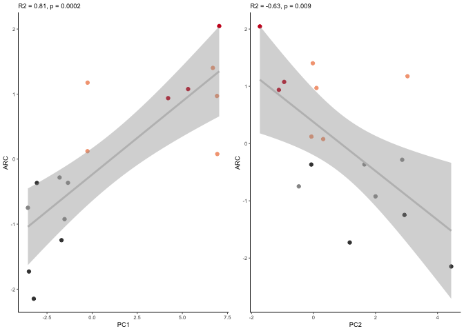

    library(tidyverse)
    library(corrr)
    library(cowplot)

    source("./figureoptions.R")

    # lists of genes that are correlated with particular genes
    ARC_associated <- read_csv("../data/02h_ARC_associated.csv")  %>% mutate_each(funs=toupper)  %>% dplyr::pull(gene) 

    ## Warning: Missing column names filled in: 'X1' [1]

    ## Parsed with column specification:
    ## cols(
    ##   X1 = col_double(),
    ##   `net$colors` = col_character(),
    ##   gene = col_character()
    ## )

    Neurod6_associated <- read_csv("../data/02h_Neurod6_associated.csv") %>% mutate_each(funs=toupper)  %>% dplyr::pull(gene) 

    ## Warning: Missing column names filled in: 'X1' [1]

    ## Parsed with column specification:
    ## cols(
    ##   X1 = col_double(),
    ##   `net$colors` = col_character(),
    ##   gene = col_character()
    ## )

    Prkcz_associated <- read_csv("../data/02h_Prkcz_associated.csv") %>% mutate_each(funs=toupper)  %>% dplyr::pull(gene) 

    ## Warning: Missing column names filled in: 'X1' [1]

    ## Parsed with column specification:
    ## cols(
    ##   X1 = col_double(),
    ##   `net$colors` = col_character(),
    ##   gene = col_character()
    ## )

    # differentially expressed gens in the DG
    DG_DEGs <- read.csv("../data/02f_DG_DEGs_vsd.csv", row.names = 1, check.names = F)
    DG_DEGs <- as.data.frame(t(DG_DEGs))
    DG_DEGs$sample <- row.names(DG_DEGs)
    DG_DEGs <- DG_DEGs %>% select(`1190002N15RIK`:ZFP869)
    DG_DEGs <- as.data.frame(t(DG_DEGs))
    DG_DEGs$gene <- row.names(DG_DEGs)

    # only look at Differentially expressed genes in the ARC module
    DG_ARC <- DG_DEGs %>% filter(gene %in% ARC_associated) %>% select(gene, everything())
    row.names(DG_ARC) <- DG_ARC$gene
    DG_ARC$gene <- NULL
    DG_ARC <- as.data.frame(t(DG_ARC))
    DG_ARC$sample  <- row.names(DG_ARC)
    DG_ARC$mouse <- sapply(strsplit(as.character(DG_ARC$sample),"\\-"), "[", 1)
    DG_ARC$ID <- paste(15, DG_ARC$mouse, sep = "")

    # read the sample data, set levels, join iwth behvior PCA data
    colData <- read.csv("../data/02a_colData.csv", row.names = 1, stringsAsFactors = T)
    colData <- colData %>% filter(subfield == "DG")
    pca.Rn <- read_csv("../data/01a_pca.all.csv") %>% filter(trialNum == 9)

    ## Parsed with column specification:
    ## cols(
    ##   ID = col_character(),
    ##   treatment = col_character(),
    ##   trialNum = col_double(),
    ##   PC1 = col_double(),
    ##   PC2 = col_double(),
    ##   PC3 = col_double(),
    ##   PC4 = col_double(),
    ##   PC5 = col_double(),
    ##   PC6 = col_double(),
    ##   PC7 = col_double(),
    ##   PC8 = col_double(),
    ##   PC9 = col_double(),
    ##   PC10 = col_double()
    ## )

    pca.Rn <- pca.Rn %>% select(ID:PC2)
    colData <- left_join(colData, pca.Rn)

    ## Joining, by = c("ID", "treatment")

    ## Warning: Column `ID` joining factor and character vector, coercing into
    ## character vector

    ## Warning: Column `treatment` joining factor and character vector, coercing
    ## into character vector

    head(colData)

    ##       ID subfield        treatment training trialNum        PC1
    ## 1 15143A       DG conflict.trained  trained        9 -0.2511636
    ## 2 15143B       DG   conflict.yoked    yoked        9 -3.5595365
    ## 3 15143D       DG   standard.yoked    yoked        9 -3.0605115
    ## 4 15144A       DG conflict.trained  trained        9  6.6921089
    ## 5 15144C       DG standard.trained  trained        9  7.0436756
    ## 6 15144D       DG   standard.yoked    yoked        9 -3.4999867
    ##           PC2
    ## 1  3.02981466
    ## 2 -0.47451513
    ## 3 -0.07227782
    ## 4 -0.02270055
    ## 5 -1.72946383
    ## 6  1.16766175

    # joing with counts and sample data, prep for correlations
    alldata <- left_join(colData, DG_ARC)

    ## Joining, by = "ID"

    forcorplots <- alldata %>% select(PC1:UBC)
    forcorplots

    ##           PC1         PC2         ACAN     ADAMTS1      AMIGO2    ANKRD33B
    ## 1  -0.2511636  3.02981466  0.668206109  0.65710384  0.26383943  0.29566530
    ## 2  -3.5595365 -0.47451513 -0.476805955  0.04940960 -0.64311051 -0.63849004
    ## 3  -3.0605115 -0.07227782 -0.493064288 -0.31580223 -0.46456630 -0.11056438
    ## 4   6.6921089 -0.02270055  0.879402143  2.18067685  0.83850384  1.06672111
    ## 5   7.0436756 -1.72946383  0.427126302  1.10227701  0.59669923  0.66265263
    ## 6  -3.4999867  1.16766175 -0.549705024 -1.54243720 -0.54390449 -0.22663682
    ## 7   6.9362884  0.31085957  0.423357460 -0.04781799 -0.22876752  0.01382627
    ## 8  -1.3375400  1.64001102 -0.151026995 -0.07788381 -0.24784913 -0.38727098
    ## 9   6.9208097  0.09483277  0.003436546  0.33952194  0.51587335  0.09253903
    ## 10 -1.5276429  1.99883979 -0.635366284 -1.12353095 -0.02790315 -1.36876889
    ## 11  4.2115795 -1.11790859  0.608736516  0.38496261 -0.20570225  0.33732802
    ## 12 -1.6965727  2.93175222 -0.547437462 -0.97526734 -0.35241770  0.07874463
    ## 13  5.3196322 -0.94691101  0.847147571  0.97808693  0.67653849  0.60593974
    ## 14 -3.2320870  4.43969435 -0.781054213 -1.39233845 -0.43823408 -0.10349100
    ## 15 -0.2562847 -0.06798772  0.216995954  0.34146475 -0.09234151  0.02759893
    ## 16 -1.8023130  2.85862823 -0.439948380 -0.55842557  0.35334230 -0.34579355
    ##            ARC      ARL4D        ARL5B      ARMCX5       ATF3       BDNF
    ## 1   1.17562233  0.4681834  0.067822811  0.27801818  0.7586906  0.3915877
    ## 2  -0.74817999 -0.2155814 -0.039355740 -0.18623845 -0.5878057 -0.2684977
    ## 3  -0.36660430 -0.4948170 -0.384427053 -0.69754370  0.1244980 -0.2591467
    ## 4   1.40236262  0.3942209  0.858375060  0.65215076  1.0747769  1.2504129
    ## 5   2.04553524  1.2733692  0.691482272  0.35508059  1.3258853  0.9842984
    ## 6  -1.72812196 -0.6156106 -0.560640227 -0.52828927 -1.7991138 -0.6390658
    ## 7   0.07810374 -0.2568645  0.001144312  0.13487602  0.2059677 -0.2944630
    ## 8  -0.36477791 -0.3644487 -0.114430641 -0.38464328 -0.2610078 -0.7185384
    ## 9   0.97078867  0.7865753  0.121064029  0.23305807  0.6311708  0.4096738
    ## 10 -0.92295520 -0.3517889 -0.814323740 -0.46803354 -0.3829362 -1.4133853
    ## 11  0.93699249  0.1830134  1.328466028  0.34927378  1.1218354  1.1550456
    ## 12 -1.24673380  0.1907881 -0.032181329  0.06109713 -0.7516159  0.3194743
    ## 13  1.07659086  0.3600600  0.497518024  0.44101944  1.0498900  0.7244882
    ## 14 -2.14716643 -0.7672235 -0.855986203 -0.16156922 -2.2087194 -0.7810252
    ## 15  0.12154655 -0.2709352 -0.061467753 -0.17913623  0.1118214 -0.3148199
    ## 16 -0.28300290 -0.3189405 -0.703059852  0.10087972 -0.4133373 -0.5460389
    ##           BTG2       CPEB4       CYP51     DBPHT2      DNAJA1      DNAJB1
    ## 1   0.65579804  0.03299804 -0.01372105  0.1930068  0.15507601  0.24765215
    ## 2  -0.09277866 -0.39128678  0.04128289 -0.4232663 -0.19334775 -0.32471931
    ## 3  -0.03401878 -0.40971951 -0.12580958 -0.2434311 -0.12529218  0.23420804
    ## 4   1.17118242  0.78585047  0.96854443  0.9585654  0.30965478  0.93491519
    ## 5   1.65423072  0.60841936  0.31816753  1.2015258  0.56295571  1.17453649
    ## 6  -1.50193972 -0.45527557 -0.47015069 -0.4774288 -0.47193721 -1.33751583
    ## 7  -0.25100169  0.07171232 -0.22794737 -0.3829963 -0.13238207 -0.14475509
    ## 8  -0.21673422 -0.26276887 -0.34755405 -0.6272620 -0.22501649 -0.92664039
    ## 9   1.18319106 -0.09883683 -0.10293494  0.3538095 -0.09710543  0.05002476
    ## 10 -0.35874034 -0.57795299 -0.58795997 -1.7778358  0.02724972 -0.89348068
    ## 11  1.35902436  0.42458777  0.85357545  1.4830277  0.27450828  1.25167797
    ## 12 -2.60021290  0.01657830 -0.20013101 -0.1232318 -0.03721121 -0.72073266
    ## 13  0.66680584  0.43706678  0.49093721  0.6472489  0.70510186  1.11812060
    ## 14 -1.34567386 -0.02083447 -0.41977649 -0.3822292 -0.68584592 -1.25921133
    ## 15  0.21277658  0.16110599  0.04186110  0.3695256  0.09426371  0.62710972
    ## 16 -0.50190886 -0.32164402 -0.21838347 -0.7690284 -0.16067183 -0.03118964
    ##          DUSP6        EGR1        EGR4      FBXO33       FLRT3
    ## 1   0.87661199  0.85220916  0.93979077  0.51256579  0.21024604
    ## 2  -0.01400436 -0.03674124  0.08292777 -0.37366641 -0.14644147
    ## 3   0.12202664 -0.13607942 -0.28304049 -0.03675185 -0.11718717
    ## 4   1.06962125  1.08423965  1.21064480  2.00754485  1.19675523
    ## 5   1.25450844  1.60215902  1.91289470  1.50453004  0.79000640
    ## 6  -1.76384040 -2.25043209 -1.90562788 -1.40429424 -0.33653632
    ## 7  -0.15443441 -0.03548392 -0.03965305 -0.20803073  0.08158802
    ## 8  -0.80148640 -0.30660431 -0.65808515 -0.98038850 -0.25058245
    ## 9   0.38202334  0.44325259  0.97201766  0.43128586  0.25966781
    ## 10  0.23594486 -0.37814542 -1.83290546 -0.71877806 -1.24206536
    ## 11  1.14176536  1.26637203  2.06277267  2.15014530  0.37546905
    ## 12 -1.53835830 -0.90050902 -1.84932697 -2.37754677 -0.14282649
    ## 13  0.58568545  0.72113090  0.98413285  1.27486465  0.03252642
    ## 14 -1.25325927 -1.89303739 -1.50842908 -1.18864316 -0.10996946
    ## 15 -0.01559003  0.48725184  0.44135210 -0.07522413 -0.34240854
    ## 16 -0.12721416 -0.51958238 -0.52946524 -0.51761263 -0.25824170
    ##             FOS       FOSB       FOSL2       FRMD6         GAD1
    ## 1   0.998364387  0.7839060  0.55249442  0.47507885  0.459224161
    ## 2   0.598665874  0.3424215 -0.23117848 -0.39359154  0.194321370
    ## 3   0.153393727  0.1298796 -0.39404897 -0.31105189 -0.172685219
    ## 4   1.250321460  1.6214484  1.91578214  1.74986710  0.594361869
    ## 5   1.481259689  1.8692541  1.56815751  1.27664554  0.277318575
    ## 6  -2.208540511 -2.6656260 -1.09995963 -1.33812490 -0.205638891
    ## 7   0.008905704 -0.2593292 -0.05666779  0.14765024 -0.006340263
    ## 8   0.195356161 -0.3650584 -0.30525550 -0.82293569 -0.536750285
    ## 9   1.160790487  1.0207451  0.48079724 -0.24257348 -0.265146519
    ## 10 -1.188991180 -1.6525035 -2.28651221 -0.96567829  0.038506853
    ## 11  1.474767993  2.1615740  1.45538263  1.92532159  0.530505217
    ## 12 -3.717544339 -2.2605099 -0.83899868 -1.14795752 -0.337560061
    ## 13  0.689608048  1.1527022  1.21126645  1.45775510  0.283107048
    ## 14 -1.386882367 -1.4036465 -1.34714357 -1.19643103 -0.471554552
    ## 15  0.733501306  0.2878280  0.03902948  0.02979769  0.016656093
    ## 16 -0.242976440 -0.7630854 -0.66314505 -0.64377178 -0.398325397
    ##         HOMER1         JUN        JUNB        JUND        KLF6        LMNA
    ## 1   0.08603002  0.49791393  0.69811918  0.55453656  0.39326153  0.60393719
    ## 2  -0.38771728 -0.19560597 -0.04927700  0.07520287  0.27268705  0.17348917
    ## 3  -0.49646959  0.19136630 -0.11241581 -0.10280388  0.12902308 -0.29267054
    ## 4   1.69867876  0.91113482  1.06717695  0.82032847  1.10434951  0.36660536
    ## 5   1.10296746  1.03414255  1.45567864  0.91573429  0.74398698  0.71922274
    ## 6  -1.38228786 -0.89185436 -1.54080532 -1.07879586 -0.71578939 -0.90635400
    ## 7  -0.52133067 -0.01829525 -0.14737643 -0.41130829 -0.04686806 -0.20172483
    ## 8  -0.91501386 -0.22371027 -0.38616315 -0.58172039 -0.27842230 -0.17859757
    ## 9   0.21733344  0.46399364  0.95813584  0.56316858  0.16873954  0.07321896
    ## 10 -0.52050284 -0.35152750 -0.08038002 -0.96111445 -0.51555435 -0.29765106
    ## 11  1.93103201  0.68355094  1.57467757  1.31382996  0.58516656  1.55274716
    ## 12 -0.37338638 -1.58412161 -2.79015159 -0.12118423 -0.84006890 -1.36227389
    ## 13  1.57673946  0.27595181  0.56810487  0.48067386  0.42751466  0.63478606
    ## 14 -1.80782666 -0.44218173 -0.86146527 -0.88491586 -0.68034736 -0.74761358
    ## 15  0.46110795  0.29077400  0.12888148 -0.11628008 -0.61336966  0.05706139
    ## 16 -0.66935398 -0.64153129 -0.48273992 -0.46535155 -0.13430890 -0.19418257
    ##          LONRF1         NAF1        NPTX2      NR4A1       NR4A2
    ## 1   0.035878263 -0.136846879  0.661891112  1.0689339  0.59182869
    ## 2  -0.004773297 -0.155059569 -0.322689725  0.3885822 -0.30032160
    ## 3   0.048155614 -0.096311504 -0.043496316 -0.2539646  0.01628180
    ## 4   1.698425007  0.644800506  1.096605962  0.9610560  1.31121551
    ## 5   1.057489579  0.388793381  1.319931570  1.6321064  1.50150326
    ## 6  -0.541860494 -0.170047274 -0.781095383 -2.2680989 -1.46516425
    ## 7  -0.014437997  0.343298759  0.012281092  0.0940701 -0.32793230
    ## 8  -0.888248329 -0.322231838 -0.328212492 -0.0256079 -0.33322136
    ## 9   0.273805118  0.005566491  0.405081443  1.0160982  0.68489268
    ## 10 -0.169413887 -0.171488698 -2.287111311 -1.6648253  0.55370998
    ## 11  0.548468986  0.293295279  1.411289292  1.2904933  1.40967026
    ## 12 -1.951879367 -0.353767928 -0.238269108 -0.5235233 -2.02394875
    ## 13  1.093186373  0.309412742  0.809671219  0.7494099  0.84740418
    ## 14 -0.914393199 -0.281655764 -0.902204969 -2.4904839 -1.93433822
    ## 15  0.192211703 -0.085265590 -0.008411474  0.4034692 -0.06747697
    ## 16 -0.462614073 -0.212492116 -0.805260910 -0.3777153 -0.46410291
    ##          NR4A3         ODC1       PELI1        PER1        PER2
    ## 1   0.92840913  0.521441603 -0.17394039  0.23276306  0.47909499
    ## 2  -0.12001455 -0.079988945 -0.32330190 -0.13381890  0.01707757
    ## 3   0.23705478  0.005441203 -0.50064757 -0.05429489 -0.15393961
    ## 4   2.03849502  0.393263752  1.18484195  0.99681165  0.91871463
    ## 5   2.16819296  0.390728217  0.58640123  0.82641422  0.36839710
    ## 6  -2.19456170 -0.419169060 -0.57757127 -0.86335281 -0.16972839
    ## 7  -0.01812882 -0.253926434 -0.09358092 -0.15053195 -0.59797509
    ## 8  -0.73234019 -0.295785642 -0.61373203  0.02841121 -0.45740496
    ## 9   0.44557194 -0.003024400 -0.03276798  0.25071037 -0.44668966
    ## 10 -1.84461773 -0.882723365  0.02192475 -0.50785964  0.23505937
    ## 11  2.09583340  1.020501049  0.96857305  1.29418527  1.30998986
    ## 12 -1.94910879 -0.522835979 -0.01759783 -0.76808237 -0.91324327
    ## 13  1.29969420  0.610255633  0.60085313  0.77497755  0.84364174
    ## 14 -2.41719728 -0.366591559 -0.53373951 -1.24082767 -1.08635644
    ## 15  0.48641956  0.305421250  0.11569848  0.03077784  0.29218548
    ## 16 -0.42370193 -0.423007322 -0.61141320 -0.71628294 -0.63882330
    ##           PLK2      POU3F3      RASD1       RGS2        RGS4        SGK1
    ## 1   0.78283711  0.38090078  0.7041275  0.5604900  0.64547884  0.92538747
    ## 2  -0.21981408  0.13887390 -0.3548618 -0.3963040 -0.10973511 -0.11381416
    ## 3  -0.25382404 -0.12286318 -0.4561860 -0.3858197 -0.37169108 -0.47104136
    ## 4   1.38501953  0.24698059  1.4370306  1.7289639  0.88899671  1.34808429
    ## 5   1.42972800  0.43814744  1.2511629  1.4681521  1.06716173  1.33516868
    ## 6  -1.40405013 -0.35399154 -0.8244306 -1.2889923 -0.61736795 -1.06817878
    ## 7   0.08189698  0.14328811  0.2012196 -0.1623962 -0.27285895  0.10911137
    ## 8  -0.51984119 -0.40066947 -0.5625164 -0.6738749 -0.49816185 -0.45649541
    ## 9   0.76991362 -0.05949441  0.4315325  1.1456443  0.32484026  0.45204443
    ## 10 -0.49241041 -0.14377553 -0.3929847 -1.3255242 -1.45541126 -0.47173725
    ## 11  1.37596041  0.66312371  0.8370042  1.3661530  1.09622967  1.55551296
    ## 12 -2.49996094 -0.55722151 -1.8764837 -0.7260714  0.07587188 -2.35272695
    ## 13  0.88498847 -0.02772541  0.5119918  1.0258224  0.75686461  0.82481382
    ## 14 -0.82366905 -0.39030390 -1.0491911 -0.9488616 -0.72944151 -0.75975607
    ## 15 -0.19378189  0.10200208 -0.2013637 -0.6665766 -0.50866225  0.05140374
    ## 16 -0.30299239 -0.05727167  0.3439490 -0.7208049 -0.29211374 -0.90777678
    ##       SLC25A25       SMAD7      SOWAHC         SRF        STMN4
    ## 1   0.41535155  1.02744508  0.71133755  0.03148348  0.456972389
    ## 2  -0.16601134 -0.40287582 -0.33897411 -0.33985053  0.049427167
    ## 3  -0.51912590 -0.97404696  0.09772174 -0.12862414  0.188894520
    ## 4   0.59692363  1.57772336  0.59327899  0.58156661  0.289153988
    ## 5   0.51068521  1.46850478  0.75004193  0.49251426  0.563772626
    ## 6  -0.28907474 -1.13640529 -0.49764493 -0.89568619 -0.105760116
    ## 7   0.01696914  0.15631241  0.19467960 -0.12878527 -0.004434922
    ## 8  -0.01862667 -0.58518537  0.17188863 -0.02049097 -0.458193498
    ## 9   0.10942747  0.63565865  0.23789535  0.22451146  0.245650655
    ## 10  0.07003554 -0.04164484  0.09999272 -0.35760107 -0.205136916
    ## 11  0.44580739  1.65643694 -0.24362913  1.02720925  0.185500309
    ## 12 -0.58802034 -2.59455641 -1.38350623  0.49127853 -0.863192801
    ## 13  0.37077450  1.01121745  0.33596657  0.31784454  0.319026025
    ## 14 -0.26789277 -0.99263046 -0.61046592 -0.55719087 -0.494117194
    ## 15 -0.27019008 -0.07614150  0.35549067 -0.20442291 -0.037003495
    ## 16 -0.41703259 -0.72981201 -0.47407343 -0.53375618 -0.130558737
    ##           SYT4       TRIB1         UBC
    ## 1   0.16671430  1.13433796  0.38690216
    ## 2  -0.58149976  0.16840311 -0.01766093
    ## 3  -0.34837424 -0.04411045 -0.22052618
    ## 4   0.86231311  1.44379122  0.71368727
    ## 5   0.79716016  1.70179194  0.78103490
    ## 6  -0.36515165 -1.84420792 -0.65022413
    ## 7   0.03294637 -0.15909122 -0.12843805
    ## 8  -0.19880461  0.05138528 -0.48580403
    ## 9   0.06093674  0.86009739  0.17293903
    ## 10 -0.33861049 -1.55393076 -0.24395130
    ## 11  0.75793382  1.16901886  0.65218103
    ## 12 -0.50960385 -1.46600194 -0.24425416
    ## 13  0.36550900  1.09480407  0.39913249
    ## 14 -0.78415199 -1.98900655 -0.63966542
    ## 15 -0.18582692 -0.04666665 -0.07858194
    ## 16  0.26851002 -0.52061434 -0.39677075

    # correlation matrix
    x <- correlate(forcorplots)

    ## 
    ## Correlation method: 'pearson'
    ## Missing treated using: 'pairwise.complete.obs'

    x %>% filter(PC1 > 0.755) %>% arrange(desc(PC1))  %>% select(rowname, PC1, PC2)

    ## # A tibble: 9 x 3
    ##   rowname   PC1    PC2
    ##   <chr>   <dbl>  <dbl>
    ## 1 NAF1    0.859 -0.694
    ## 2 RGS2    0.832 -0.605
    ## 3 ARC     0.805 -0.632
    ## 4 ACAN    0.789 -0.543
    ## 5 SYT4    0.779 -0.551
    ## 6 ARMCX5  0.777 -0.273
    ## 7 ATF3    0.770 -0.676
    ## 8 FOSL2   0.757 -0.667
    ## 9 CPEB4   0.756 -0.442

    cor.test(alldata$ARC, alldata$PC1, method = "pearson")

    ## 
    ##  Pearson's product-moment correlation
    ## 
    ## data:  alldata$ARC and alldata$PC1
    ## t = 5.0829, df = 14, p-value = 0.0001669
    ## alternative hypothesis: true correlation is not equal to 0
    ## 95 percent confidence interval:
    ##  0.5153586 0.9298379
    ## sample estimates:
    ##       cor 
    ## 0.8053296

    cor.test(alldata$ARC, alldata$PC2, method = "pearson")

    ## 
    ##  Pearson's product-moment correlation
    ## 
    ## data:  alldata$ARC and alldata$PC2
    ## t = -3.0534, df = 14, p-value = 0.008591
    ## alternative hypothesis: true correlation is not equal to 0
    ## 95 percent confidence interval:
    ##  -0.8588000 -0.1988761
    ## sample estimates:
    ##        cor 
    ## -0.6322516

    a <- ggplot(alldata, aes(x = PC1, y = ARC)) +
       geom_point(aes( color = treatment)) + 
       geom_smooth(method = "lm", color = "grey") +
       scale_color_manual(values = treatmentcolors) +
       theme_ms() +
       theme(legend.position = "none") +
      labs(subtitle = "R2 = 0.81, p = 0.0002")
      

    b <- ggplot(alldata, aes(x = PC2, y = ARC)) +
       geom_point(aes( color = treatment)) + 
       geom_smooth(method = "lm", color = "grey") +
       scale_color_manual(values = treatmentcolors) +
       theme_ms() +
       theme(legend.position = "none") +
      labs(subtitle = "R2 = -0.63, p = 0.009")

    plot_grid(a,b)

    # read all count data
    vsd <- read.csv("../data/02c_DGvsd.csv", row.names = 1, check.names = F) 
    vsd$gene <- row.names(vsd)
    vsd$gene <- toupper(vsd$gene)
    vsd <- as.data.frame(vsd)
    row.names(vsd) <- vsd$gene
    vsd$gene <- NULL
    head(vsd)

    ##               143A-DG-1 143B-DG-1 143D-DG-3 144A-DG-2 144C-DG-2 144D-DG-2
    ## 0610007P14RIK  6.381145  6.405587  6.834813  6.513173  6.401366  6.637581
    ## 0610009B22RIK  5.781124  5.661825  5.299160  5.528657  5.821796  5.670620
    ## 0610009L18RIK  5.405848  5.593055  5.422004  5.000789  5.507750  5.506319
    ## 0610009O20RIK  6.736671  6.691641  6.736719  6.530386  6.799892  6.642508
    ## 0610010F05RIK  6.603589  7.093384  7.135233  6.931921  6.907778  6.587132
    ## 0610010K14RIK  6.136536  5.949913  6.015194  5.782488  5.999853  6.084773
    ##               145A-DG-2 145B-DG-1 146A-DG-2 146B-DG-2 146C-DG-4 146D-DG-3
    ## 0610007P14RIK  6.562833  6.126760  6.298333  5.996243  6.929322  7.411893
    ## 0610009B22RIK  5.942028  5.787857  5.679794  5.996243  6.060620  5.000789
    ## 0610009L18RIK  5.256496  5.000789  5.679794  5.000789  5.000789  5.000789
    ## 0610009O20RIK  6.739906  6.623046  6.747840  6.383172  6.350262  6.793559
    ## 0610010F05RIK  6.739906  6.540236  6.765447  7.085062  7.264347  6.493162
    ## 0610010K14RIK  6.218650  6.200426  6.298333  7.252267  5.971751  5.000789
    ##               147C-DG-3 147D-DG-1 148A-DG-3 148B-DG-4
    ## 0610007P14RIK  6.298159  6.481476  6.493581  6.349976
    ## 0610009B22RIK  5.910805  5.893873  5.589261  5.492981
    ## 0610009L18RIK  5.257050  5.718223  5.505647  5.349661
    ## 0610009O20RIK  6.687072  6.631927  7.108382  6.425888
    ## 0610010F05RIK  6.880090  6.759923  6.892155  6.595557
    ## 0610010K14RIK  5.761732  6.136024  5.626697  6.081280

    # prep to join with sample colData
    vsd <- as.data.frame(t(vsd))
    vsd$sample <- row.names(vsd)
    vsd$mouse <- sapply(strsplit(as.character(vsd$sample),"\\-"), "[", 1)
    vsd$ID <- paste(15, vsd$mouse, sep = "")

    vsd <- left_join(colData, vsd)

    ## Joining, by = "ID"

    head(vsd)[17015:17020]

    ##     ZYG11B      ZYX    ZZEF1     ZZZ3    sample mouse
    ## 1 8.319205 7.203704 7.829641 7.742970 143A-DG-1  143A
    ## 2 8.118246 7.258360 7.711706 7.569642 143B-DG-1  143B
    ## 3 8.715286 6.853523 7.987434 7.135233 143D-DG-3  143D
    ## 4 9.110958 7.532625 8.240355 7.760152 144A-DG-2  144A
    ## 5 8.724875 7.128516 7.955995 7.634300 144C-DG-2  144C
    ## 6 8.814969 6.671645 7.908857 7.526267 144D-DG-2  144D

    forcorall <-  vsd %>% select(PC1:ZZZ3)
    head(forcorall)

    ##          PC1         PC2 0610007P14RIK 0610009B22RIK 0610009L18RIK
    ## 1 -0.2511636  3.02981466      6.381145      5.781124      5.405848
    ## 2 -3.5595365 -0.47451513      6.405587      5.661825      5.593055
    ## 3 -3.0605115 -0.07227782      6.834813      5.299160      5.422004
    ## 4  6.6921089 -0.02270055      6.513173      5.528657      5.000789
    ## 5  7.0436756 -1.72946383      6.401366      5.821796      5.507750
    ##   0610009O20RIK 0610010F05RIK 0610010K14RIK 0610012G03RIK 0610030E20RIK
    ## 1      6.736671      6.603589      6.136536      6.719764      6.272577
    ## 2      6.691641      7.093384      5.949913      7.006393      6.659531
    ## 3      6.736719      7.135233      6.015194      6.695140      6.560825
    ## 4      6.530386      6.931921      5.782488      6.564048      6.513173
    ## 5      6.799892      6.907778      5.999853      6.388018      6.388018
    ##   0610037L13RIK 0610040J01RIK 1110002E22RIK 1110004E09RIK 1110004F10RIK
    ## 1      6.951677      5.331879      6.114375      6.227061      7.328125
    ## 2      7.244810      5.555282      6.391924      6.626521      7.404995
    ## 3      7.276131      5.782032      6.231289      6.164589      7.585028
    ## 4      6.432259      5.609206      6.260610      6.144301      6.913454
    ## 5      6.732276      5.507750      6.274710      6.332893      7.378414
    ##   1110008F13RIK 1110008L16RIK 1110008P14RIK 1110012L19RIK 1110017D15RIK
    ## 1      6.612945      5.914151      7.159474      5.658707      5.405848
    ## 2      6.989921      5.593055      7.349520      6.391924      5.298477
    ## 3      7.089820      5.663320      6.925666      5.515766      5.000789
    ## 4      6.450757      5.855075      6.422891      5.000789      5.633666
    ## 5      6.899137      5.415426      6.771374      5.714146      5.415426
    ##   1110032A03RIK 1110032F04RIK 1110034G24RIK 1110037F02RIK 1110038F14RIK
    ## 1      6.044520      5.746684      5.865684      6.864067      6.409428
    ## 2      6.228623      5.628441      5.628441      7.077999      6.521453
    ## 3      5.973603      5.000789      5.834563      7.552784      6.092918
    ## 4      5.967744      5.609206      5.528657      7.477361      6.314070
    ## 5      5.653076      5.684343      5.684343      7.323347      6.259635
    ##   1110051M20RIK 1110059E24RIK 1110059G10RIK 1110065P20RIK 1190002N15RIK
    ## 1      7.203704      5.875619      6.003230      6.584648      7.400050
    ## 2      7.606564      6.545648      5.927803      6.458586      6.291026
    ## 3      7.150025      6.129434      6.054895      6.263031      7.026670
    ## 4      7.129605      5.855075      5.801317      6.106492      8.396389
    ## 5      7.360309      6.076501      5.653076      6.180660      8.167341
    ##   1190005I06RIK 1190007I07RIK 1300017J02RIK 1500009C09RIK 1500009L16RIK
    ## 1      5.427605      5.758354      5.000789      7.010241      5.803189
    ## 2      5.211473      6.032988      5.365060      7.108588      5.693496
    ## 3      5.000789      5.515766      5.000789      6.977174      5.663320
    ## 4      5.250706      5.395208      5.000789      6.334704      5.657159
    ## 5      5.000789      5.870182      5.000789      6.790459      5.547907
    ##   1500011B03RIK 1500011K16RIK 1500015O10RIK 1520401A03RIK 1600002H07RIK
    ## 1      7.026965      6.121820      5.192223      5.136203      5.941888
    ## 2      7.355798      6.144671      5.628441      5.000789      6.195903
    ## 3      7.135233      6.015194      5.000789      5.422004      6.231289
    ## 4      6.823462      5.782488      5.000789      5.000789      5.657159
    ## 5      7.106603      5.937570      5.415426      5.208642      6.112519
    ##   1600002K03RIK 1600012H06RIK 1600014C10RIK 1700001C19RIK 1700001K19RIK
    ## 1      5.616870      5.950929      6.570235      5.192223      5.405848
    ## 2      5.857586      6.320856      6.712577      5.298477      5.905079
    ## 3      5.299160      6.560825      6.408586      5.594399      5.515766
    ## 4      5.722771      6.314070      6.374798      5.353786      5.801317
    ## 5      5.507750      6.388018      6.440451      5.208642      5.585190
    ##   1700001L19RIK 1700001O22RIK 1700001P01RIK 1700003E16RIK 1700003F12RIK
    ## 1      5.658707      5.468005      5.000789      6.011645      5.672037
    ## 2      5.211473      5.000789      5.298477      6.391924      5.421044
    ## 3      5.725311      5.782032      5.000789      6.381034      5.663320
    ## 4      5.722771      5.609206      5.000789      6.067080      5.000789
    ## 5      5.507750      5.208642      5.000789      5.979597      5.208642
    ##   1700006E09RIK 1700007G11RIK 1700007K13RIK 1700008O03RIK 1700010I14RIK
    ## 1      5.000789      5.192223      5.303141      5.000789      5.271320
    ## 2      5.000789      5.000789      5.000789      5.211473      5.000789
    ## 3      5.000789      5.000789      5.000789      5.000789      5.422004
    ## 4      5.432586      5.000789      5.000789      5.395208      5.000789
    ## 5      5.000789      5.208642      5.000789      5.000789      5.507750
    ##   1700011E24RIK 1700011H14RIK 1700011M02RIK 1700013D24RIK 1700013F07RIK
    ## 1      5.303141      5.000789      5.000789      5.000789      5.000789
    ## 2      5.000789      5.000789      5.000789      5.000789      5.000789
    ## 3      5.000789      5.000789      5.000789      5.000789      5.422004
    ## 4      5.000789      5.000789      5.000789      5.000789      5.000789
    ## 5      5.000789      5.000789      5.000789      5.000789      5.507750
    ##   1700014D04RIK 1700015E13RIK 1700016D06RIK 1700016K19RIK 1700017B05RIK
    ## 1      5.358277      5.303141      5.271320      5.192223      6.193231
    ## 2      5.000789      5.000789      5.905079      5.000789      5.752561
    ## 3      5.000789      5.000789      5.000789      5.000789      5.663320
    ## 4      5.000789      5.000789      5.722771      5.000789      6.314070
    ## 5      5.360182      5.208642      5.507750      5.000789      6.346945
    ##   1700019A02RIK 1700019B03RIK 1700019D03RIK 1700019O17RIK 1700020A23RIK
    ## 1      5.000789      5.235161      5.835086      5.000789      5.000789
    ## 2      5.000789      5.000789      6.162052      5.000789      5.000789
    ## 3      5.000789      5.000789      5.725311      5.000789      5.000789
    ## 4      5.000789      5.000789      5.819671      5.000789      5.609206
    ## 5      5.000789      5.208642      5.821796      5.000789      5.000789
    ##   1700020D05RIK 1700020L24RIK 1700020N01RIK 1700021F05RIK 1700022I11RIK
    ## 1      5.136203      5.000789      5.000789      5.950929      5.000789
    ## 2      5.365060      5.000789      5.000789      5.905079      5.298477
    ## 3      5.725311      5.299160      5.422004      5.725311      5.000789
    ## 4      5.353786      5.353786      5.395208      6.080406      5.000789
    ## 5      5.000789      5.000789      5.000789      5.937570      5.000789
    ##   1700023F06RIK 1700024P16RIK 1700025G04RIK 1700027J19RIK 1700028J19RIK
    ## 1      5.382821      5.331879      7.921506      5.000789      5.303141
    ## 2      5.298477      5.211473      7.374459      5.000789      5.000789
    ## 3      5.000789      5.000789      7.677432      5.000789      5.000789
    ## 4      5.000789      5.000789      8.046337      5.000789      5.000789
    ## 5      5.000789      5.294484      7.916096      5.000789      5.463972
    ##   1700028K03RIK 1700028P14RIK 1700029F12RIK 1700029H14RIK 1700029I15RIK
    ## 1      5.303141      5.358277      5.000789      5.303141      5.539509
    ## 2      5.000789      5.211473      5.000789      5.000789      5.661825
    ## 3      5.299160      5.000789      5.000789      5.594399      5.782032
    ## 4      5.000789      5.000789      5.000789      5.000789      5.000789
    ## 5      5.000789      5.360182      5.000789      5.000789      5.294484
    ##   1700029J07RIK 1700030J22RIK 1700030K09RIK 1700034I23RIK 1700034J05RIK
    ## 1      5.136203      5.382821      6.076228      5.000789      5.358277
    ## 2      5.514596      5.365060      6.391924      5.365060      5.000789
    ## 3      5.515766      5.515766      5.883658      5.663320      5.000789
    ## 4      5.395208      5.432586      6.039823      5.000789      5.395208
    ## 5      5.360182      5.507750      6.274710      5.294484      5.000789
    ##   1700037C18RIK 1700037H04RIK 1700040L02RIK 1700047I17RIK2 1700048O20RIK
    ## 1      5.587216      6.099305      5.000789       5.914151      5.685088
    ## 2      5.470237      6.162052      5.000789       5.832700      5.806960
    ## 3      5.515766      5.725311      5.515766       5.594399      5.663320
    ## 4      5.250706      5.937116      5.000789       5.855075      5.801317
    ## 5      5.507750      6.180660      5.208642       5.821796      5.915729
    ##   1700057G04RIK 1700061G19RIK 1700064H15RIK 1700066B19RIK 1700066M21RIK
    ## 1      5.000789      5.427605      5.000789      5.192223      6.403830
    ## 2      5.298477      5.421044      5.000789      5.000789      6.244588
    ## 3      5.000789      5.299160      5.000789      5.422004      6.293811
    ## 4      5.000789      5.633666      5.000789      5.177617      6.477936
    ## 5      5.000789      5.620120      5.000789      5.208642      6.244332
    ##   1700067K01RIK 1700088E04RIK 1700092M07RIK 1700093K21RIK 1700102P08RIK
    ## 1      5.271320      5.697878      5.000789      5.000789      5.136203
    ## 2      5.555282      5.000789      5.514596      5.693496      5.365060
    ## 3      5.000789      5.299160      5.000789      5.594399      5.422004
    ## 4      5.000789      5.000789      5.000789      5.000789      5.556871
    ## 5      5.000789      5.000789      5.000789      5.208642      5.294484
    ##   1700109H08RIK 1700112E06RIK 1700113H08RIK 1700123K08RIK 1700123L14RIK
    ## 1      5.427605      5.000789      5.000789      5.331879      5.000789
    ## 2      5.211473      5.000789      5.000789      5.000789      5.211473
    ## 3      6.015194      5.000789      5.000789      5.000789      5.000789
    ## 4      5.556871      5.177617      5.000789      5.000789      5.000789
    ## 5      5.415426      5.208642      5.000789      5.000789      5.000789
    ##   1700123O20RIK 1700128F08RIK 1810009A15RIK 1810010H24RIK 1810011H11RIK
    ## 1      5.746684      6.028236      5.792241      6.193231      5.000789
    ## 2      6.195903      6.228623      6.144671      6.162052      5.000789
    ## 3      5.663320      6.461681      5.782032      6.293811      5.000789
    ## 4      5.763148      6.156576      5.177617      5.528657      5.000789
    ## 5      5.821796      6.213008      5.547907      6.180660      5.208642
    ##   1810011O10RIK 1810013L24RIK 1810022K09RIK 1810024B03RIK 1810026J23RIK
    ## 1      5.448275      7.153462      6.044520      5.000789      7.840556
    ## 2      5.211473      6.773278      6.212398      5.000789      7.883702
    ## 3      5.000789      6.607336      6.054895      5.000789      7.657429
    ## 4      5.177617      7.355139      5.888915      5.000789      7.385674
    ## 5      5.208642      7.360309      5.742660      5.294484      7.720848
    ##   1810030O07RIK 1810032O08RIK 1810037I17RIK 1810041L15RIK 1810043G02RIK
    ## 1      6.745036      5.769831      6.233691      8.203852      6.510693
    ## 2      6.981604      6.012956      6.378085      7.749736      6.509159
    ## 3      6.776909      5.834563      6.054895      7.905693      6.381034
    ## 4      6.282329      5.819671      5.967744      8.400545      6.564048
    ## 5      6.617653      5.653076      6.164074      8.243073      6.490492
    ##   1810043H04RIK 1810049J17RIK 1810055G02RIK 2010005H15RIK 2010107E04RIK
    ## 1      5.697878      5.658707      6.540854      5.000789      6.773865
    ## 2      6.032988      5.470237      6.032988      5.000789      6.753381
    ## 3      5.782032      5.663320      6.352754      5.000789      6.853523
    ## 4      5.432586      6.025876      6.394293      5.306683      6.131866
    ## 5      5.684343      5.870182      6.584348      5.208642      6.650032
    ##   2010107G23RIK 2010109A12RIK 2010109I03RIK 2010111I01RIK 2010300C02RIK
    ## 1      6.381145      5.000789      5.303141      6.500458      10.96760
    ## 2      6.496729      5.000789      5.752561      6.592552      10.70935
    ## 3      6.198505      5.000789      5.422004      6.815814      10.83617
    ## 4      6.053554      5.000789      5.177617      7.381355      11.09343
    ## 5      6.289566      5.000789      5.684343      7.091785      10.94946
    ##   2010315B03RIK 2200002D01RIK 2210010C04RIK 2210013O21RIK 2210016F16RIK
    ## 1      5.885429      5.331879      5.000789      6.060513      5.950929
    ## 2      5.628441      5.000789      5.000789      6.195903      5.806960
    ## 3      6.435456      5.000789      5.000789      6.293811      5.929866
    ## 4      6.324438      5.306683      5.000789      5.837581      5.921366
    ## 5      6.057947      5.463972      5.000789      6.076501      5.870182
    ##   2210016L21RIK 2210017I01RIK 2210408I21RIK 2210418O10RIK 2300009A05RIK
    ## 1      7.542334      5.000789      5.746684      5.914151      5.734812
    ## 2      7.558907      5.000789      5.000789      5.752561      5.905079
    ## 3      7.519758      5.422004      5.663320      6.054895      5.663320
    ## 4      7.259096      5.250706      5.921366      6.227132      5.583658
    ## 5      7.614302      5.415426      5.547907      5.999853      5.979597
    ##   2310009B15RIK 2310011J03RIK 2310022A10RIK 2310022B05RIK 2310030G06RIK
    ## 1      6.091677      6.328268      6.303886      7.104339      5.303141
    ## 2      5.857586      6.090523      6.275780      7.291640      5.000789
    ## 3      6.054895      6.536843      6.263031      7.193420      5.000789
    ## 4      5.633666      6.080406      6.282329      6.719107      5.000789
    ## 5      5.893282      6.076501      6.561599      6.761717      5.208642
    ##   2310033P09RIK 2310035C23RIK 2310036O22RIK 2310039H08RIK 2310057J18RIK
    ## 1      5.865684      7.298773      7.150446      5.271320      5.271320
    ## 2      6.335457      7.362048      6.904180      5.211473      5.000789
    ## 3      6.015194      7.563617      7.262701      5.515766      5.000789
    ## 4      6.238416      7.398551      6.830111      5.395208      5.000789
    ## 5      6.130018      7.348102      7.164238      5.684343      5.294484
    ##   2310057M21RIK 2310061I04RIK 2410002F23RIK 2410004B18RIK 2410004P03RIK
    ## 1      6.500458      6.904984      6.955198      6.447825      5.758354
    ## 2      6.432408      7.070237      7.231119      6.052577      5.470237
    ## 3      6.198505      6.871954      7.782532      6.231289      5.782032
    ## 4      6.796497      6.803294      6.907237      6.324438      6.053554
    ## 5      6.332893      6.712241      7.046282      6.244332      5.585190
    ##   2410015M20RIK 2410016O06RIK 2410089E03RIK 2410131K14RIK 2410141K09RIK
    ## 1      6.272577      6.340249      7.731253      6.575059      5.271320
    ## 2      6.471446      6.378085      7.782174      6.391924      5.000789
    ## 3      6.487300      6.352754      7.930722      6.129434      5.000789
    ## 4      6.067080      6.271527      7.814759      6.761932      5.000789
    ## 5      6.094686      6.526604      7.748528      6.712241      5.208642
    ##   2510002D24RIK 2510009E07RIK 2510039O18RIK 2610001J05RIK 2610002M06RIK
    ## 1      5.950929      7.126059      6.484928      6.136536      6.495305
    ## 2      6.306048      6.681034      6.260304      6.306048      6.615308
    ## 3      5.725311      6.487300      6.716110      6.129434      6.695140
    ## 4      5.952571      7.134829      6.682214      5.801317      6.733552
    ## 5      5.846374      6.881674      6.573030      6.164074      6.732276
    ##   2610008E11RIK 2610020H08RIK 2610021A01RIK 2610042L04RIK 2610044O15RIK8
    ## 1      6.392547      5.000789      6.213668      5.000789       6.490129
    ## 2      6.753381      5.000789      6.445575      5.555282       6.743309
    ## 3      6.908018      5.000789      6.629910      5.000789       6.536843
    ## 4      6.572311      5.000789      6.067080      5.353786       6.620684
    ## 5      6.617653      5.000789      6.414551      5.000789       6.573030
    ##   2610301B20RIK 2610318N02RIK 2610507B11RIK 2610524H06RIK 2610528A11RIK
    ## 1      6.809955      5.000789      9.117956      5.645083      5.136203
    ## 2      6.964805      5.000789      8.900195      6.244588      5.000789
    ## 3      6.977174      5.000789      9.318056      5.929866      5.000789
    ## 4      6.612761      5.000789      9.253651      5.722771      5.000789
    ## 5      6.691864      5.294484      9.129732      5.915729      5.000789
    ##   2700049A03RIK 2700060E02RIK 2700062C07RIK 2700081O15RIK 2700094K13RIK
    ## 1      6.076228      7.072663      6.143809      7.926626      5.697878
    ## 2      5.832700      6.939180      6.090523      7.849224      5.832700
    ## 3      5.782032      7.010384      5.929866      7.880205      5.515766
    ## 4      6.334704      6.596750      5.801317      7.675707      5.306683
    ## 5      6.130018      6.790459      5.714146      7.828390      5.415426
    ##   2700097O09RIK 2810004N23RIK 2810006K23RIK 2810021J22RIK 2810403A07RIK
    ## 1      5.539509      6.179366      6.036415      5.710420      7.209490
    ## 2      5.971451      5.971451      5.806960      6.126966      7.182048
    ## 3      5.725311      6.164589      6.015194      5.782032      7.764009
    ## 4      5.528657      5.905305      5.952571      5.982649      7.287253
    ## 5      5.585190      5.958847      5.870182      5.770031      7.372406
    ##   2810408A11RIK 2810417H13RIK 2810428I15RIK 2810459M11RIK 2810474O19RIK
    ## 1      5.000789      5.271320      6.447825      5.986150      6.028236
    ## 2      5.000789      5.000789      6.419080      6.032988      6.244588
    ## 3      5.000789      5.929866      6.695140      5.663320      6.198505
    ## 4      5.000789      5.353786      6.067080      6.025876      5.967744
    ## 5      5.000789      5.463972      6.289566      5.360182      6.196967
    ##   2900011O08RIK 2900026A02RIK 2900055J20RIK 3010026O09RIK 3110001I22RIK
    ## 1      8.312750      7.816797      6.246820      5.792241      5.769831
    ## 2      8.371252      7.564285      6.445575      5.661825      5.806960
    ## 3      7.979472      7.415555      6.293811      5.515766      5.663320
    ## 4      8.027539      7.858167      6.682214      5.556871      5.000789
    ## 5      8.230191      7.454163      6.453175      5.684343      5.463972
    ##   3110002H16RIK 3110009E18RIK 3110018I06RIK 3110021N24RIK 3110035E14RIK
    ## 1      6.680828      5.331879      5.000789      5.448275      7.088598
    ## 2      6.545648      5.000789      5.000789      5.000789      7.054572
    ## 3      6.960237      5.000789      5.000789      5.000789      7.235424
    ## 4      6.334704      5.177617      5.000789      5.000789      7.108492
    ## 5      6.332893      5.208642      5.294484      5.415426      6.899137
    ##   3110040N11RIK 3110043O21RIK 3110062M04RIK 3110070M22RIK 3110079O15RIK
    ## 1      5.616870      6.505587      5.758354      5.486907      5.000789
    ## 2      5.806960      6.849770      6.090523      5.000789      5.000789
    ## 3      5.834563      6.536843      5.422004      5.000789      5.000789
    ## 4      5.498773      6.740710      5.657159      5.306683      5.000789
    ## 5      5.585190      6.628546      5.620120      5.294484      5.294484
    ##   3110082I17RIK 3110082J24RIK 3300002I08RIK 3425401B19RIK 3632451O06RIK
    ## 1      5.950929      5.448275      5.303141      5.486907      5.358277
    ## 2      5.723682      5.421044      5.470237      5.365060      5.723682
    ## 3      5.299160      5.000789      5.000789      5.000789      5.299160
    ## 4      5.801317      5.000789      5.000789      5.466896      5.466896
    ## 5      6.414551      5.294484      5.294484      5.360182      5.000789
    ##   3830406C13RIK 3830408C21RIK 4430402I18RIK 4833420G17RIK 4833423E24RIK
    ## 1      5.914151      5.136203      5.959873      6.693949      5.000789
    ## 2      5.992454      5.421044      5.992454      7.093384      5.000789
    ## 3      5.883658      5.000789      5.782032      7.135233      5.299160
    ## 4      5.855075      5.000789      5.952571      7.319364      5.177617
    ## 5      5.915729      5.000789      5.979597      6.999105      5.463972
    ##   4833439L19RIK 4921501E09RIK 4921507P07RIK 4921509C19RIK 4921513D11RIK
    ## 1      7.648405      5.000789      5.136203      5.136203      5.136203
    ## 2      7.515098      5.000789      5.298477      5.000789      5.000789
    ## 3      7.530856      5.299160      5.000789      5.000789      5.000789
    ## 4      7.559435      5.000789      5.000789      5.000789      5.000789
    ## 5      7.557750      5.000789      5.000789      5.000789      5.294484
    ##   4921513I03RIK 4921524J17RIK 4921528I07RIK 4921530L21RIK 4921536K21RIK
    ## 1      5.235161      6.099305      5.000789      5.000789      5.382821
    ## 2      5.365060      6.162052      5.000789      5.000789      5.298477
    ## 3      5.515766      6.164589      5.422004      5.000789      5.299160
    ## 4      5.306683      5.982649      5.000789      5.000789      5.722771
    ## 5      5.000789      6.039003      5.000789      5.000789      5.294484
    ##   4922502D21RIK 4930402H24RIK 4930404N11RIK 4930415F15RIK 4930415O20RIK
    ## 1      5.000789      7.654639      5.486907      5.000789      5.000789
    ## 2      5.000789      8.044349      5.628441      5.000789      5.000789
    ## 3      5.000789      8.011051      5.782032      5.000789      5.000789
    ## 4      5.466896      7.611525      5.000789      5.000789      5.000789
    ## 5      5.000789      7.841263      5.208642      5.000789      5.000789
    ##   4930426L09RIK 4930427A07RIK 4930430A15RIK 4930430F08RIK 4930432K21RIK
    ## 1      5.136203      5.358277      5.000789      6.121820      5.331879
    ## 2      5.000789      5.555282      5.211473      6.320856      5.881691
    ## 3      5.422004      5.000789      5.000789      5.883658      5.422004
    ## 4      5.432586      5.395208      5.177617      5.872179      5.000789
    ## 5      5.000789      5.000789      5.208642      5.821796      5.653076
    ##   4930442H23RIK 4930444G20RIK 4930444P10RIK 4930447A16RIK 4930447C04RIK
    ## 1      5.000789      5.000789      5.448275      5.000789      5.885429
    ## 2      5.211473      5.000789      5.211473      5.211473      5.857586
    ## 3      5.000789      5.000789      5.422004      5.000789      5.834563
    ## 4      5.432586      5.000789      5.583658      5.000789      5.701634
    ## 5      5.000789      5.000789      5.620120      5.208642      5.294484
    ##   4930451G09RIK 4930451I11RIK 4930452B06RIK 4930453N24RIK 4930455H04RIK
    ## 1      5.539509      5.000789      5.875619      6.179366      5.192223
    ## 2      5.780281      5.365060      5.723682      6.212398      5.000789
    ## 3      5.000789      5.000789      5.663320      6.198505      5.000789
    ## 4      5.000789      5.000789      5.855075      6.324438      5.250706
    ## 5      5.507750      5.000789      5.796376      6.453175      5.000789
    ##   4930467E23RIK 4930470P17RIK 4930474N05RIK 4930486L24RIK 4930502E18RIK
    ## 1      5.000789      5.000789      5.303141      5.000789      5.000789
    ## 2      5.000789      5.298477      5.421044      5.000789      5.000789
    ## 3      5.000789      5.000789      5.000789      5.000789      5.000789
    ## 4      5.353786      5.000789      5.306683      5.000789      5.000789
    ## 5      5.000789      5.000789      5.294484      5.000789      5.360182
    ##   4930503L19RIK 4930505A04RIK 4930507D05RIK 4930512M02RIK 4930518I15RIK
    ## 1      6.334275      5.000789      5.235161      5.486907      5.000789
    ## 2      5.992454      5.000789      5.211473      5.723682      5.000789
    ## 3      6.461681      5.299160      5.000789      5.515766      5.929866
    ## 4      6.441547      5.000789      5.000789      6.011704      5.250706
    ## 5      6.346945      5.208642      5.294484      5.463972      5.294484
    ##   4930519G04RIK 4930522L14RIK 4930523C07RIK 4930524B15RIK 4930524J08RIK
    ## 1      5.000789      5.235161      5.000789      5.331879      5.271320
    ## 2      5.000789      5.298477      5.211473      5.365060      5.298477
    ## 3      5.000789      5.663320      5.000789      5.000789      5.000789
    ## 4      5.177617      5.000789      5.177617      5.000789      5.583658
    ## 5      5.360182      5.463972      5.000789      5.208642      5.208642
    ##   4930535I16RIK 4930538K18RIK 4930539E08RIK 4930544D05RIK 4930548H24RIK
    ## 1      5.000789      5.685088      5.758354      5.192223      5.358277
    ## 2      5.000789      5.514596      6.071748      5.000789      5.000789
    ## 3      5.000789      5.782032      6.092918      5.000789      5.000789
    ## 4      5.000789      5.177617      5.905305      5.000789      5.000789
    ## 5      5.000789      5.653076      5.714146      5.000789      5.000789
    ##   4930550C14RIK 4930562C15RIK 4930563I02RIK 4930578C19RIK 4930578G10RIK
    ## 1      5.000789      5.631144      5.000789      5.000789      5.672037
    ## 2      5.000789      6.391924      5.000789      5.000789      6.012956
    ## 3      5.000789      6.164589      5.000789      5.000789      5.594399
    ## 4      5.000789      6.227132      5.000789      5.000789      5.609206
    ## 5      5.208642      5.821796      5.208642      5.000789      5.547907
    ##   4930579G24RIK 4930590J08RIK 4930595D18RIK 4931406B18RIK 4931406C07RIK
    ## 1      5.358277      5.192223      5.000789      5.468005      5.977481
    ## 2      5.421044      5.000789      5.298477      5.365060      5.723682
    ## 3      5.594399      5.000789      5.000789      5.515766      6.054895
    ## 4      5.633666      5.000789      5.000789      5.583658      6.106492
    ## 5      5.000789      5.000789      5.000789      5.463972      5.742660
    ##   4931406P16RIK 4931414P19RIK 4931422A03RIK 4931423N10RIK 4931428F04RIK
    ## 1      6.867842      5.486907      5.000789      5.000789      6.172359
    ## 2      6.603986      5.211473      5.000789      5.000789      6.859005
    ## 3      7.135233      5.834563      5.000789      5.515766      6.461681
    ## 4      6.704486      5.306683      5.000789      5.000789      6.754899
    ## 5      6.561599      5.208642      5.547907      5.000789      6.502659
    ##   4931428L18RIK 4931429L15RIK 4931440F15RIK 4932411E22RIK 4932411N23RIK
    ## 1      5.555890      5.192223      5.000789      5.271320      5.303141
    ## 2      5.723682      5.000789      5.470237      5.000789      5.000789
    ## 3      6.198505      5.000789      5.663320      5.000789      5.299160
    ## 4      5.679788      5.000789      5.306683      5.000789      5.306683
    ## 5      5.463972      5.360182      5.415426      5.000789      5.360182
    ##   4932414N04RIK 4932438A13RIK 4932438H23RIK 4932443I19RIK 4933402D24RIK
    ## 1      5.331879      7.993146      5.136203      5.136203      5.382821
    ## 2      5.000789      8.005886      5.000789      5.298477      5.000789
    ## 3      5.725311      8.166087      5.000789      5.000789      5.299160
    ## 4      5.701634      8.360566      5.306683      5.000789      5.395208
    ## 5      5.653076      8.409231      5.463972      5.000789      5.208642
    ##   4933402N03RIK 4933405L10RIK 4933406P04RIK 4933407L21RIK 4933408B17RIK
    ## 1      5.000789      5.000789      5.192223      5.303141      5.000789
    ## 2      5.000789      5.000789      5.000789      5.752561      5.514596
    ## 3      5.000789      5.000789      5.000789      5.000789      5.422004
    ## 4      5.000789      5.000789      5.000789      5.000789      5.395208
    ## 5      5.208642      5.000789      5.000789      5.360182      5.000789
    ##   4933408J17RIK 4933411K16RIK 4933413G19RIK 4933415A04RIK 4933416C03RIK
    ## 1      5.303141      5.000789      5.136203      5.303141      5.000789
    ## 2      5.000789      5.000789      5.211473      5.000789      5.000789
    ## 3      5.515766      5.000789      5.000789      5.515766      5.000789
    ## 4      5.000789      5.000789      5.432586      5.556871      5.177617
    ## 5      5.000789      5.000789      5.208642      5.000789      5.000789
    ##   4933424G06RIK 4933427D14RIK 4933427I04RIK 4933428G20RIK 4933430I17RIK
    ## 1      5.468005      6.805997      5.602236      5.000789      5.000789
    ## 2      5.365060      6.859005      5.514596      5.780281      5.000789
    ## 3      5.299160      7.315624      5.422004      6.231289      5.000789
    ## 4      5.250706      7.215703      5.583658      5.701634      5.000789
    ## 5      5.208642      7.106603      5.585190      5.294484      5.360182
    ##   4933434E20RIK 5031414D18RIK 5031439G07RIK 5330417C22RIK 5430403G16RIK
    ## 1      7.069452      5.235161      8.382182      7.232383      5.427605
    ## 2      7.182048      5.365060      8.009780      7.343211      5.365060
    ## 3      6.536843      5.299160      8.293004      7.105135      5.834563
    ## 4      6.944083      5.528657      8.465428      7.048589      5.633666
    ## 5      7.084312      5.000789      8.321027      7.185211      5.714146
    ##   5430416O09RIK 5430427O19RIK 5730409E04RIK 5730455P16RIK 5730480H06RIK
    ## 1      5.405848      5.405848      7.192055      7.085427      5.865684
    ## 2      5.000789      5.000789      7.542644      7.330504      5.723682
    ## 3      5.299160      5.299160      7.150025      7.378949      5.973603
    ## 4      5.837581      5.801317      7.277933      7.170829      5.997299
    ## 5      5.653076      5.893282      7.205853      7.619329      5.821796
    ##   5730507C01RIK 5730508B09RIK 5730522E02RIK 5730559C18RIK 5830411N06RIK
    ## 1      5.427605      5.192223      5.331879      5.192223      5.136203
    ## 2      5.365060      5.000789      5.000789      5.593055      5.555282
    ## 3      5.299160      5.000789      5.299160      5.299160      5.515766
    ## 4      5.498773      5.250706      5.556871      5.395208      5.000789
    ## 5      5.000789      5.208642      5.208642      5.208642      5.208642
    ##   5830454E08RIK 5930422O12RIK 6030419C18RIK 6030445D17RIK 6030458C11RIK
    ## 1      5.235161      5.235161      9.038580      5.405848      6.740860
    ## 2      5.000789      5.470237      8.900195      5.470237      6.773278
    ## 3      5.594399      5.000789      8.780216      5.000789      6.925666
    ## 4      5.000789      5.466896      8.369077      5.000789      7.031755
    ## 5      5.208642      5.000789      8.870187      5.000789      6.722300
    ##   6030468B19RIK 6330408A02RIK 6430531B16RIK 6430548M08RIK 6430550D23RIK
    ## 1      5.331879      5.959873      5.000789      8.286633      5.271320
    ## 2      5.365060      5.806960      5.211473      8.205467      6.144671
    ## 3      5.000789      6.092918      5.000789      8.094392      5.725311
    ## 4      5.000789      5.609206      5.000789      8.279314      5.000789
    ## 5      5.294484      5.999853      5.463972      8.274773      5.463972
    ##   6430571L13RIK 6430573F11RIK 6720489N17RIK 6820408C15RIK 7530416G11RIK
    ## 1      5.382821      5.427605      5.710420      5.136203      5.000789
    ## 2      5.298477      5.000789      5.365060      5.298477      5.298477
    ## 3      5.299160      5.000789      6.198505      5.299160      5.000789
    ## 4      5.250706      5.837581      5.306683      5.177617      5.000789
    ## 5      5.547907      5.507750      5.360182      5.000789      5.000789
    ##   8030462N17RIK 8430408G22RIK 9030612E09RIK 9030617O03RIK 9030624G23RIK
    ## 1      6.626840      5.136203      5.303141      5.697878      5.405848
    ## 2      6.733152      5.470237      5.000789      5.780281      5.000789
    ## 3      6.834813      5.000789      5.000789      5.515766      5.663320
    ## 4      7.097805      5.000789      5.395208      5.583658      5.250706
    ## 5      6.836910      5.000789      5.653076      5.415426      5.360182
    ##   9030624J02RIK 9130008F23RIK 9130011E15RIK 9130019O22RIK 9130023H24RIK
    ## 1      7.209490      5.136203      6.272577      5.303141      5.405848
    ## 2      6.973232      5.000789      6.275780      6.012956      5.298477
    ## 3      6.796517      5.000789      6.408586      5.422004      5.000789
    ## 4      7.428125      5.306683      6.156576      5.498773      5.466896
    ## 5      7.304474      5.000789      6.332893      5.463972      5.463972
    ##   9130213A22RIK 9130401M01RIK 9130409I23RIK 9230019H11RIK 9230104M06RIK
    ## 1      5.000789      6.584648      5.000789      5.000789      5.136203
    ## 2      5.000789      6.763370      5.000789      5.000789      5.000789
    ## 3      5.000789      6.487300      5.299160      5.000789      5.000789
    ## 4      5.000789      6.238416      5.000789      5.177617      5.000789
    ## 5      5.000789      6.465754      5.000789      5.000789      5.000789
    ##   9230106D20RIK 9230110C19RIK 9330151L19RIK 9330159F19RIK 9330161L09RIK
    ## 1      5.000789      5.845422      6.352095      7.646320      5.405848
    ## 2      5.211473      6.090523      6.378085      7.749736      5.514596
    ## 3      5.000789      5.782032      6.736719      8.260696      5.000789
    ## 4      5.000789      5.872179      6.354941      7.651103      5.583658
    ## 5      5.000789      5.714146      6.318650      7.678255      5.415426
    ##   9330182L06RIK 9430015G10RIK 9430016H08RIK 9430020K01RIK 9430038I01RIK
    ## 1      5.977481      6.515776      6.129207      6.658633      5.235161
    ## 2      5.992454      6.391924      6.260304      6.162052      5.806960
    ## 3      5.883658      6.054895      6.129434      6.890116      5.594399
    ## 4      6.450757      6.168696      6.131866      6.997409      5.556871
    ## 5      5.796376      6.490492      6.274710      6.606657      5.294484
    ##   9430076C15RIK 9430097D07RIK 9530053A07RIK 9530068E07RIK 9530077C05RIK
    ## 1      5.427605      5.000789      5.000789      7.174384      5.968723
    ## 2      5.752561      5.000789      5.211473      7.362048      5.693496
    ## 3      5.594399      5.000789      5.000789      7.276131      5.725311
    ## 4      5.466896      5.000789      5.306683      7.129605      6.282329
    ## 5      5.294484      5.000789      5.000789      7.372406      6.112519
    ##   9830107B12RIK 9930012K11RIK 9930021J03RIK 9930111J21RIK1 9930111J21RIK2
    ## 1      5.000789      5.303141      7.194977       5.358277       6.897644
    ## 2      5.211473      5.000789      7.196256       5.211473       7.492652
    ## 3      5.000789      5.299160      7.415555       5.299160       7.552784
    ## 4      5.000789      5.000789      7.452967       5.432586       7.517063
    ## 5      5.000789      5.294484      7.239552       5.415426       6.799892
    ##          A A130010J15RIK A130051J06RIK A230046K03RIK A230050P20RIK
    ## 1 5.000789      5.602236      5.235161      6.979574      7.177346
    ## 2 5.000789      6.144671      5.000789      7.224220      7.672596
    ## 3 5.000789      5.782032      5.000789      7.026670      7.637131
    ## 4 5.000789      5.657159      5.000789      7.268548      7.249576
    ## 5 5.000789      5.684343      5.000789      7.061629      7.185211
    ##        A2M A330017A19RIK  A3GALT2 A430005L14RIK A430033K04RIK
    ## 1 5.602236      5.448275 5.000789      5.792241      6.322226
    ## 2 5.000789      5.555282 5.693496      5.211473      6.521453
    ## 3 5.663320      5.000789 5.422004      5.782032      6.435456
    ## 4 6.227132      5.722771 5.466896      5.609206      6.612761
    ## 5 5.000789      5.360182 5.360182      5.846374      6.289566
    ##   A430078G23RIK A430105I19RIK   A4GALT A530016L24RIK A530064D06RIK
    ## 1      5.685088      6.398203 5.382821      5.000789      5.000789
    ## 2      5.857586      6.212398 5.000789      5.298477      5.211473
    ## 3      5.725311      6.352754 5.000789      5.000789      5.515766
    ## 4      5.967744      6.403910 5.743258      5.000789      5.000789
    ## 5      5.620120      6.490492 5.208642      5.208642      5.294484
    ##   A530084C06RIK A530099J19RIK A630001G21RIK A630010A05RIK A630033H20RIK
    ## 1      5.427605      5.505077      5.136203      5.781124      5.000789
    ## 2      5.832700      5.365060      5.470237      6.012956      5.211473
    ## 3      5.663320      5.725311      5.000789      5.883658      5.000789
    ## 4      5.556871      5.306683      5.306683      5.679788      5.000789
    ## 5      5.653076      5.294484      5.208642      5.507750      5.000789
    ##   A630076J17RIK A730015C16RIK A730017C20RIK A730046J19RIK A730049H05RIK
    ## 1      5.000789      5.000789      6.200091      5.000789      5.000789
    ## 2      5.421044      5.628441      6.939180      5.000789      5.000789
    ## 3      5.000789      5.000789      6.560825      5.000789      5.000789
    ## 4      5.000789      5.000789      6.394293      5.000789      5.000789
    ## 5      5.000789      5.000789      6.427578      5.000789      5.000789
    ##   A730061H03RIK A730071L15RIK A830005F24RIK A830010M20RIK A830018L16RIK
    ## 1      5.271320      5.000789      5.136203      8.308863      7.986635
    ## 2      5.000789      5.000789      5.000789      7.520652      7.887952
    ## 3      5.299160      5.000789      5.000789      7.735750      7.905693
    ## 4      5.000789      5.000789      5.000789      9.364534      8.121634
    ## 5      5.294484      5.000789      5.000789      9.167085      7.916096
    ##   A830031A19RIK A830080D01RIK A930004D18RIK A930009A15RIK A930011G23RIK
    ## 1      5.000789      5.895119      5.845422      5.000789      5.803189
    ## 2      5.000789      6.090523      5.298477      5.211473      5.806960
    ## 3      5.000789      5.929866      5.000789      5.000789      5.929866
    ## 4      5.000789      6.119265      5.743258      5.000789      6.053554
    ## 5      5.000789      5.870182      5.714146      5.208642      6.289566
    ##   A930017K11RIK A930018M24RIK A930033H14RIK AA415398 AA467197 AA792892
    ## 1      5.000789      5.468005      5.448275 5.587216 5.235161 5.000789
    ## 2      5.000789      5.661825      5.298477 5.971451 5.000789 5.000789
    ## 3      5.000789      5.299160      5.000789 5.834563 5.000789 5.000789
    ## 4      5.432586      5.498773      5.395208 5.177617 5.000789 5.000789
    ## 5      5.208642      5.360182      5.294484 5.821796 5.000789 5.000789
    ##   AA986860     AAAS     AACS    AADAT    AAED1    AAGAB     AAK1    AAMDC
    ## 1 5.382821 6.083985 6.617595 5.000789 5.734812 7.779429 9.521120 6.036415
    ## 2 5.211473 6.260304 6.792853 5.000789 5.780281 7.986250 9.468234 6.012956
    ## 3 5.299160 6.408586 7.089820 5.000789 5.422004 8.173060 9.793594 5.973603
    ## 4 5.306683 6.344871 6.740710 5.250706 5.583658 7.779672 9.739082 5.967744
    ## 5 5.463972 5.979597 6.550053 5.000789 5.653076 7.702080 9.661285 5.870182
    ##       AAMP    AANAT     AAR2     AARD     AARS    AARS2   AARSD1    AASDH
    ## 1 8.082784 5.000789 6.745036 5.486907 8.114415 6.882832 6.631435 5.505077
    ## 2 7.754417 5.000789 6.648630 5.470237 7.900625 7.030709 6.859005 6.126966
    ## 3 7.626868 5.000789 6.584315 5.422004 7.827784 6.673794 6.435456 6.408586
    ## 4 7.493382 5.000789 6.468950 5.000789 8.453487 6.768924 6.782788 5.905305
    ## 5 7.547211 5.000789 6.809251 5.000789 8.036246 6.681544 6.465754 6.147198
    ##   AASDHPPT     AASS     AATF     AATK AB124611     ABAT    ABCA1   ABCA12
    ## 1 6.463879 5.382821 5.994732 8.505971 5.000789 7.595317 6.420537 5.000789
    ## 2 6.557555 5.470237 5.832700 8.453077 5.000789 7.672596 6.792853 5.000789
    ## 3 6.435456 5.299160 6.015194 8.850977 5.422004 6.943070 6.323698 5.000789
    ## 4 6.468950 5.306683 5.872179 8.601408 5.000789 7.792534 6.931921 5.177617
    ## 5 6.771374 5.294484 5.999853 8.494952 5.000789 7.128516 6.440451 5.294484
    ##     ABCA17    ABCA2    ABCA3    ABCA4    ABCA5    ABCA6    ABCA7   ABCA8A
    ## 1 5.235161 8.830628 7.658780 5.746684 7.085427 5.331879 6.626840 5.710420
    ## 2 5.000789 8.751648 7.492652 5.661825 6.904180 5.000789 6.722908 5.470237
    ## 3 5.000789 8.970929 7.687325 5.422004 6.652057 5.000789 6.054895 5.515766
    ## 4 5.177617 8.712251 7.756872 5.466896 7.855111 5.583658 6.432259 5.967744
    ## 5 5.463972 8.678466 7.998605 5.714146 7.246189 5.208642 6.196967 5.585190
    ##     ABCA8B    ABCA9   ABCB10   ABCB11   ABCB1A   ABCB1B    ABCB4    ABCB6
    ## 1 6.594157 5.722727 7.569083 5.136203 6.340249 5.555890 5.824605 6.565390
    ## 2 6.981604 5.693496 7.954248 5.000789 5.881691 5.949913 5.555282 6.637628
    ## 3 6.960237 5.515766 7.366522 5.000789 5.929866 5.834563 5.663320 6.853523
    ## 4 6.919640 5.466896 7.350719 5.528657 6.689684 5.528657 5.837581 6.521812
    ## 5 7.113948 5.547907 7.285329 5.000789 5.796376 5.684343 5.999853 6.147198
    ##      ABCB7    ABCB8    ABCB9    ABCC1   ABCC10   ABCC12    ABCC2    ABCC3
    ## 1 6.948146 6.622227 5.875619 6.334275 6.310035 5.000789 5.331879 5.358277
    ## 2 6.877273 6.773278 6.228623 6.320856 6.722908 5.298477 5.211473 5.365060
    ## 3 6.871954 6.652057 6.092918 6.716110 6.461681 5.000789 5.422004 5.000789
    ## 4 6.913454 6.628554 6.168696 6.144301 6.324438 5.000789 5.250706 5.177617
    ## 5 6.872849 6.427578 6.164074 6.019646 6.196967 5.000789 5.547907 5.415426
    ##      ABCC4    ABCC5    ABCC6    ABCC8    ABCC9    ABCD1    ABCD2    ABCD3
    ## 1 6.044520 8.293207 5.448275 7.928328 5.977481 5.968723 7.147422 7.053277
    ## 2 6.162052 8.495045 5.693496 8.188450 5.211473 6.581004 6.859005 7.231119
    ## 3 5.929866 8.533324 5.000789 8.041934 5.422004 6.293811 6.536843 6.796517
    ## 4 6.131866 8.286078 5.498773 7.737025 5.722771 6.067080 6.836725 7.150380
    ## 5 5.958847 8.160559 5.360182 7.806664 5.653076 6.057947 7.185211 6.933349
    ##      ABCD4    ABCE1    ABCF1    ABCF2    ABCF3    ABCG1    ABCG2    ABCG3
    ## 1 6.036415 7.451572 7.441909 7.384960 7.274265 7.597480 5.845422 5.000789
    ## 2 6.509159 7.440745 7.153159 7.585588 7.362048 7.237982 5.971451 5.000789
    ## 3 6.925666 7.791702 7.439416 7.315624 7.235424 7.637131 5.594399 5.000789
    ## 4 5.921366 7.811606 7.273249 7.225470 7.129605 7.296507 6.053554 5.000789
    ## 5 6.213008 7.687835 7.323347 7.396277 7.442783 7.702080 6.112519 5.360182
    ##      ABCG4    ABCG8   ABHD10   ABHD11   ABHD12  ABHD12B   ABHD13  ABHD14A
    ## 1 7.040189 5.000789 6.240277 6.060513 8.647693 5.000789 6.864067 5.986150
    ## 2 7.258360 5.000789 6.244588 5.723682 8.711964 5.000789 6.722908 6.712577
    ## 3 7.485908 5.000789 6.164589 6.092918 8.472739 5.422004 6.871954 6.435456
    ## 4 6.810053 5.395208 6.334704 6.119265 8.638738 5.000789 6.919640 6.080406
    ## 5 6.974845 5.000789 5.893282 5.999853 8.565615 5.000789 6.890436 6.440451
    ##    ABHD14B   ABHD15  ABHD16A  ABHD16B  ABHD17A  ABHD17B  ABHD17C   ABHD18
    ## 1 5.734812 5.539509 7.453977 5.000789 8.004469 6.550731 7.343866 6.186323
    ## 2 5.949913 5.000789 7.632339 5.000789 7.311214 6.670331 7.526184 6.195903
    ## 3 6.092918 5.000789 7.315624 5.000789 7.647318 6.381034 7.276131 6.263031
    ## 4 5.837581 5.250706 7.235165 5.000789 7.452967 6.604783 7.532625 6.067080
    ## 5 5.653076 5.000789 7.454163 5.000789 7.487738 6.742170 7.298123 6.289566
    ##      ABHD2    ABHD3    ABHD4    ABHD5    ABHD6    ABHD8     ABI1     ABI2
    ## 1 8.553706 6.253321 6.749197 5.932746 7.056529 8.463572 8.425852 8.881838
    ## 2 8.013664 6.244588 6.840465 6.162052 6.930521 8.167754 8.450235 8.877188
    ## 3 8.018836 5.782032 6.853523 5.663320 7.276131 8.397636 8.379725 8.893486
    ## 4 9.238736 5.952571 6.604783 5.855075 6.875681 8.119103 8.652705 9.076505
    ## 5 8.932726 5.937570 6.112519 5.846374 7.046282 8.133099 8.481471 9.148530
    ##       ABI3   ABI3BP     ABL1     ABL2   ABLIM1   ABLIM2   ABLIM3      ABR
    ## 1 5.587216 5.000789 7.192055 7.923215 7.999627 7.764195 7.362000 10.83896
    ## 2 5.905079 5.470237 7.160441 7.754417 7.849224 7.849224 7.857924 10.48800
    ## 3 5.000789 5.000789 7.637131 7.687325 7.955310 8.018836 7.606108 10.69494
    ## 4 5.000789 5.306683 7.355139 8.601408 8.030240 7.773196 7.604204 10.76239
    ## 5 5.770031 5.208642 7.437057 8.210645 8.028799 7.928186 8.047344 10.67643
    ##       ABRA   ABRACL     ABT1    ABTB1    ABTB2 AC139131.1   ACAA1A
    ## 1 5.136203 5.645083 6.303886 6.474453 5.710420   5.571779 7.325483
    ## 2 5.000789 5.661825 5.992454 6.904180 6.012956   5.470237 7.422989
    ## 3 5.000789 5.883658 5.883658 6.736719 6.231289   5.422004 7.193420
    ## 4 5.306683 5.528657 5.982649 6.432259 5.679788   5.177617 7.043002
    ## 5 5.547907 5.507750 6.164074 6.440451 5.507750   5.000789 7.038539
    ##     ACAA1B    ACAA2    ACACA    ACACB   ACAD10   ACAD11   ACAD12    ACAD8
    ## 1 5.000789 5.932746 7.150446 5.685088 5.968723 6.398203 5.781124 6.500458
    ## 2 5.211473 6.032988 7.386757 5.514596 5.555282 6.521453 5.470237 6.947779
    ## 3 5.594399 5.594399 7.595608 5.299160 5.782032 6.231289 5.725311 6.716110
    ## 4 5.000789 5.837581 7.493382 6.354941 5.782488 6.215719 5.921366 6.468950
    ## 5 5.000789 5.742660 7.278885 5.742660 5.979597 6.401366 5.742660 6.130018
    ##      ACAD9    ACADL    ACADM    ACADS   ACADSB   ACADVL     ACAN    ACAP1
    ## 1 6.937494 6.114375 6.550731 5.468005 6.979574 6.584648 7.229543 5.000789
    ## 2 7.492652 5.927803 6.405587 6.162052 6.783105 6.405587 6.144671 5.000789
    ## 3 7.552784 5.834563 6.129434 5.594399 7.276131 6.815814 6.129434 5.000789
    ## 4 7.249576 5.997299 6.303598 5.000789 7.026095 6.580515 7.432298 5.000789
    ## 5 6.999105 5.915729 6.427578 5.507750 6.999105 6.289566 6.999105 5.000789
    ##      ACAP2    ACAP3    ACAT1    ACAT2    ACAT3    ACBD3    ACBD4    ACBD5
    ## 1 8.373532 8.169902 6.890260 6.386861 5.835086 6.565390 6.375398 7.168441
    ## 2 8.666263 8.271553 7.189171 6.458586 5.593055 6.419080 6.306048 6.783105
    ## 3 8.734141 8.003223 6.977174 6.293811 5.000789 6.408586 6.461681 6.908018
    ## 4 8.514132 8.106383 6.931921 6.093541 5.000789 6.612761 6.374798 7.124358
    ## 5 8.570712 8.163954 6.855010 6.196967 5.463972 6.628546 6.318650 6.881674
    ##      ACBD6     ACCS    ACCSL      ACD      ACE     ACE2    ACER1    ACER2
    ## 1 7.063007 5.522589 5.136203 6.856480 5.631144 5.271320 5.136203 5.539509
    ## 2 7.030709 5.661825 5.211473 7.203303 5.000789 5.470237 5.514596 5.661825
    ## 3 7.058632 6.015194 5.000789 6.908018 5.000789 5.000789 5.663320 5.000789
    ## 4 6.991593 5.466896 5.000789 6.394293 5.583658 5.395208 5.353786 6.106492
    ## 5 7.106603 5.415426 5.000789 6.780954 5.463972 5.000789 5.463972 5.360182
    ##      ACER3     ACHE    ACIN1    ACKR1    ACKR2    ACKR3    ACKR4     ACLY
    ## 1 6.685218 6.535882 8.379716 6.603589 5.000789 6.044520 5.000789 7.989895
    ## 2 6.947779 6.569339 8.312907 6.753381 5.000789 5.780281 5.000789 7.900625
    ## 3 7.105135 6.607336 8.517055 6.352754 5.000789 6.198505 5.000789 7.963411
    ## 4 7.200915 6.441547 8.223995 6.580515 5.000789 6.039823 5.000789 7.914988
    ## 5 6.916360 6.180660 8.271635 6.414551 5.000789 6.332893 5.000789 7.815395
    ##      ACMSD   ACNAT1   ACNAT2     ACO1     ACO2    ACOT1   ACOT10   ACOT11
    ## 1 5.405848 5.192223 5.000789 6.436991 9.488545 6.121820 5.000789 6.570235
    ## 2 5.000789 5.000789 5.000789 6.773278 9.283764 6.144671 5.000789 6.592552
    ## 3 5.000789 5.000789 5.422004 6.871954 9.036837 5.515766 5.000789 5.929866
    ## 4 5.000789 5.250706 5.000789 6.555725 9.362420 6.422891 5.000789 6.810053
    ## 5 5.294484 5.415426 5.000789 6.196967 9.195297 5.821796 5.208642 6.346945
    ##     ACOT12   ACOT13    ACOT2    ACOT3    ACOT4    ACOT5    ACOT6    ACOT7
    ## 1 5.382821 6.926750 5.904692 5.769831 5.505077 6.003230 5.722727 8.022078
    ## 2 5.806960 7.046667 5.661825 6.012956 5.628441 5.927803 5.723682 8.129003
    ## 3 5.594399 6.487300 5.973603 5.782032 5.000789 5.725311 6.323698 7.519758
    ## 4 5.583658 6.580515 6.204173 5.432586 5.743258 6.131866 5.679788 7.448859
    ## 5 5.684343 6.818540 5.937570 5.684343 5.653076 5.585190 5.870182 7.639254
    ##      ACOT8    ACOT9    ACOX1    ACOX2    ACOX3    ACOXL     ACP1     ACP2
    ## 1 6.114375 5.824605 8.127756 5.000789 6.036415 5.271320 6.798043 7.215251
    ## 2 6.032988 5.693496 8.001981 5.000789 6.615308 5.000789 7.138471 7.411020
    ## 3 6.092918 6.092918 8.234307 5.000789 6.435456 5.000789 6.756981 7.058632
    ## 4 5.905305 5.952571 8.121634 5.000789 6.354941 5.000789 6.830111 7.129605
    ## 5 5.915729 5.979597 7.891597 5.000789 6.196967 5.000789 6.761717 7.219436
    ##       ACP5     ACP6     ACP7     ACPT      ACR    ACRBP   ACSBG1   ACSBG2
    ## 1 5.000789 6.346189 5.000789 5.427605 5.192223 5.986150 7.432176 5.505077
    ## 2 5.000789 6.349858 5.000789 5.000789 5.000789 6.012956 7.093384 5.211473
    ## 3 5.000789 5.883658 5.000789 5.000789 5.299160 6.198505 6.736719 5.000789
    ## 4 5.250706 6.131866 5.353786 5.000789 5.432586 5.633666 7.415530 5.250706
    ## 5 5.000789 6.289566 5.415426 5.000789 5.000789 5.846374 6.780954 5.208642
    ##      ACSF2    ACSF3    ACSL1    ACSL3    ACSL4    ACSL5    ACSL6    ACSM2
    ## 1 5.769831 6.172359 7.006870 8.094918 7.451572 7.174384 8.469376 5.539509
    ## 2 5.693496 6.335457 6.886306 7.982290 6.973232 6.947779 8.238897 5.470237
    ## 3 5.299160 6.890116 7.042751 7.697147 7.519758 7.164651 8.130697 5.422004
    ## 4 6.156576 6.314070 7.054151 7.726993 7.675707 6.432259 8.419095 5.583658
    ## 5 5.585190 6.346945 6.924883 7.944145 7.487738 7.185211 8.190824 5.463972
    ##      ACSM3    ACSM4    ACSM5    ACSS1    ACSS2    ACSS3    ACTA1    ACTA2
    ## 1 5.448275 5.000789 5.192223 6.420537 6.941054 5.136203 5.813975 5.235161
    ## 2 5.000789 5.000789 5.000789 6.179125 6.921802 5.000789 6.052577 5.000789
    ## 3 5.422004 5.000789 5.000789 5.834563 6.673794 5.000789 5.515766 5.000789
    ## 4 5.000789 5.000789 5.000789 5.997299 6.659515 5.000789 5.743258 6.204173
    ## 5 5.208642 5.208642 5.360182 5.742660 6.702096 5.000789 5.821796 5.208642
    ##       ACTB    ACTC1    ACTG1    ACTG2   ACTL10   ACTL6A   ACTL6B   ACTL7A
    ## 1 11.56735 5.000789 10.69378 5.000789 5.486907 6.240277 8.033169 5.000789
    ## 2 11.72597 5.000789 10.85929 5.000789 5.421044 6.228623 8.157291 5.000789
    ## 3 11.46601 5.000789 10.74087 5.000789 5.883658 6.381034 8.064657 5.000789
    ## 4 11.52103 5.000789 10.56776 5.000789 5.466896 6.053554 7.647552 5.000789
    ## 5 11.63300 5.000789 10.86596 5.360182 5.000789 6.076501 7.725500 5.208642
    ##     ACTL7B    ACTL9    ACTN1    ACTN2    ACTN3    ACTN4   ACTR10   ACTR1A
    ## 1 5.000789 5.358277 8.072080 6.886552 5.645083 8.276049 7.590979 8.178467
    ## 2 5.000789 5.000789 8.143218 6.849770 5.470237 8.215580 7.831659 8.365223
    ## 3 5.000789 5.000789 8.403557 7.315624 5.594399 8.426994 7.930722 8.247563
    ## 4 5.000789 5.000789 8.265686 7.048589 6.106492 8.332547 7.596844 7.873346
    ## 5 5.000789 5.000789 8.200769 7.015025 5.585190 8.243073 7.578587 8.184154
    ##     ACTR1B    ACTR2    ACTR3   ACTR3B    ACTR5    ACTR6    ACTR8   ACTRT3
    ## 1 9.003964 9.147074 8.983916 7.432176 5.616870 6.106871 6.689591 5.000789
    ## 2 8.949143 8.918747 8.883500 7.434852 5.992454 6.052577 6.913022 5.000789
    ## 3 8.850977 9.139186 8.910142 7.764009 6.231289 5.929866 6.381034 5.000789
    ## 4 8.629938 9.283024 9.286375 7.528751 5.855075 5.782488 6.450757 5.000789
    ## 5 8.971669 9.124562 9.103694 7.298123 5.870182 5.979597 6.818540 5.000789
    ##      ACVR1   ACVR1B   ACVR1C   ACVR2A   ACVR2B   ACVRL1     ACY1     ACY3
    ## 1 7.437051 7.768019 7.623179 7.422373 5.555890 6.028236 5.539509 5.136203
    ## 2 6.831089 7.763732 6.981604 7.330504 5.628441 5.593055 5.752561 5.421044
    ## 3 7.697147 7.637131 7.249133 7.595608 5.515766 5.515766 5.515766 5.422004
    ## 4 7.600529 8.049002 7.528751 7.720264 5.177617 6.394293 5.633666 5.177617
    ## 5 7.493254 7.912043 7.654009 7.437057 5.547907 5.294484 5.294484 5.360182
    ##      ACYP1    ACYP2      ADA    ADAD2     ADAL   ADAM10   ADAM11   ADAM12
    ## 1 5.950929 5.616870 5.136203 5.000789 6.206902 7.104339 8.604112 5.602236
    ## 2 6.012956 5.752561 5.593055 5.298477 6.195903 6.973232 8.943115 5.593055
    ## 3 5.834563 5.594399 5.000789 5.000789 6.560825 7.058632 9.345814 5.299160
    ## 4 5.306683 5.679788 5.250706 5.000789 6.260610 7.259096 8.797939 5.583658
    ## 5 5.846374 5.360182 5.463972 5.000789 6.360813 7.437057 8.767607 5.294484
    ##     ADAM15   ADAM17   ADAM18   ADAM19   ADAM1A   ADAM1B   ADAM21   ADAM22
    ## 1 7.544584 6.011645 5.000789 5.555890 6.179366 5.587216 5.235161 8.638466
    ## 2 8.066930 6.291026 5.000789 5.723682 6.921802 5.000789 5.000789 8.836555
    ## 3 8.247563 5.973603 5.422004 5.725311 6.871954 5.000789 5.515766 8.748121
    ## 4 7.517063 5.872179 5.000789 5.556871 5.837581 5.000789 5.395208 8.868356
    ## 5 7.482200 6.112519 5.000789 5.463972 6.332893 5.000789 5.360182 8.872247
    ##     ADAM23  ADAM26B   ADAM28   ADAM33    ADAM4    ADAM8    ADAM9   ADAMTS1
    ## 1 7.537825 5.235161 5.303141 5.000789 5.136203 6.246820 6.728247  8.614610
    ## 2 7.343211 5.000789 5.000789 5.211473 5.211473 6.763370 7.101008  8.021398
    ## 3 7.474434 5.000789 5.422004 5.000789 5.000789 7.120271 6.776909  7.667467
    ## 4 7.235165 5.432586 5.000789 5.000789 5.177617 5.763148 7.124358 10.118366
    ## 5 7.498747 5.415426 5.208642 5.000789 5.360182 6.332893 6.982983  9.051972
    ##   ADAMTS10 ADAMTS13 ADAMTS14 ADAMTS15 ADAMTS16 ADAMTS17 ADAMTS18 ADAMTS19
    ## 1 6.617595 5.382821 5.382821 5.303141 5.192223 6.431534 5.571779 5.271320
    ## 2 7.022655 5.693496 5.693496 5.555282 5.000789 7.101008 6.012956 5.000789
    ## 3 6.736719 5.000789 5.000789 5.299160 5.000789 6.853523 5.299160 5.000789
    ## 4 6.432259 5.177617 5.633666 5.395208 5.000789 6.636371 5.000789 5.000789
    ## 5 6.550053 5.208642 5.294484 5.620120 5.208642 6.702096 5.415426 5.000789
    ##    ADAMTS2 ADAMTS20  ADAMTS3  ADAMTS4  ADAMTS5  ADAMTS6  ADAMTS7  ADAMTS8
    ## 1 6.060513 6.453203 6.200091 6.179366 5.645083 5.734812 5.303141 5.571779
    ## 2 6.012956 6.244588 6.228623 5.421044 5.693496 5.298477 5.211473 5.514596
    ## 3 6.198505 7.179114 6.736719 5.973603 5.000789 5.299160 5.000789 5.422004
    ## 4 6.039823 7.444738 6.704486 6.726351 5.583658 5.583658 5.000789 5.722771
    ## 5 5.620120 6.916360 6.514695 6.076501 5.585190 5.463972 5.000789 5.463972
    ##    ADAMTS9 ADAMTSL1 ADAMTSL2 ADAMTSL3 ADAMTSL4 ADAMTSL5    ADAP1    ADAP2
    ## 1 5.645083 5.235161 5.885429 5.505077 5.697878 5.468005 7.590979 5.645083
    ## 2 5.421044 5.000789 6.212398 5.000789 5.555282 5.000789 7.657638 5.693496
    ## 3 5.725311 5.422004 6.015194 5.000789 5.299160 5.782032 7.667467 5.663320
    ## 4 5.701634 5.177617 5.888915 5.743258 5.905305 5.801317 7.651103 5.782488
    ## 5 5.415426 5.294484 5.870182 5.208642 5.585190 5.463972 7.476639 5.360182
    ##       ADAR   ADARB1   ADARB2    ADAT1    ADAT2    ADAT3    ADCK1    ADCK2
    ## 1 8.367321 8.469376 7.268757 6.179366 5.875619 6.179366 6.403830 6.266199
    ## 2 8.242197 8.293971 7.657638 6.126966 5.514596 6.162052 6.702155 6.592552
    ## 3 8.549408 8.472739 7.687325 6.198505 5.883658 6.408586 6.584315 5.725311
    ## 4 8.732108 8.775800 7.551829 6.354941 5.763148 6.067080 6.674696 6.324438
    ## 5 8.470594 8.683176 7.413906 6.130018 5.547907 6.019646 6.751983 6.304210
    ##      ADCK5    ADCY1   ADCY10    ADCY2    ADCY3    ADCY4    ADCY5    ADCY6
    ## 1 6.598883 12.40405 5.192223 8.525035 6.948146 5.271320 7.346472 6.923149
    ## 2 6.812120 11.61078 5.211473 8.059443 6.859005 5.298477 6.792853 7.093384
    ## 3 7.120271 11.78989 5.422004 7.971464 6.736719 5.000789 7.193420 6.993887
    ## 4 6.334704 12.85108 5.177617 8.388041 6.985751 5.657159 7.615170 6.843303
    ## 5 6.595556 12.38831 5.507750 8.666624 6.855010 5.208642 6.974845 6.991069
    ##      ADCY7    ADCY8    ADCY9 ADCYAP1R1     ADD1     ADD2     ADD3     ADGB
    ## 1 5.555890 6.594157 8.081260  8.724286 9.225593 10.17793 8.213602 5.000789
    ## 2 6.052577 6.071748 7.398943  8.747036 8.955145 10.07895 8.081784 5.000789
    ## 3 6.015194 5.883658 7.809860  8.868132 9.437516 10.24335 8.137847 5.000789
    ## 4 5.609206 5.921366 8.375427  9.135954 9.265019 10.62961 8.013956 5.177617
    ## 5 5.846374 6.019646 8.146896  9.024468 9.390144 10.49392 8.136561 5.000789
    ##     ADGRA1   ADGRA2   ADGRA3   ADGRB1   ADGRB2   ADGRB3   ADGRD1   ADGRE1
    ## 1 6.165300 6.375398 6.193231 10.42053 10.88794 7.811255 5.382821 5.382821
    ## 2 6.391924 6.052577 6.162052 10.37952 10.81175 7.311214 5.000789 5.000789
    ## 3 6.054895 6.323698 5.973603 10.59973 10.97763 7.574364 5.725311 5.299160
    ## 4 6.422891 6.768924 6.192490 10.16696 10.90839 7.710109 5.000789 5.498773
    ## 5 6.374502 6.573030 5.893282 10.27948 10.88894 7.793463 5.208642 5.360182
    ##     ADGRE5   ADGRF1   ADGRF2   ADGRF3   ADGRF4   ADGRF5   ADGRG1   ADGRG2
    ## 1 5.950929 5.000789 5.358277 5.000789 5.746684 6.484928 6.719764 5.136203
    ## 2 5.514596 5.000789 5.470237 5.000789 5.211473 5.905079 6.904180 5.211473
    ## 3 6.231289 5.000789 5.422004 5.000789 5.299160 5.594399 6.629910 5.000789
    ## 4 5.763148 5.679788 5.432586 5.000789 5.353786 6.789662 7.065204 5.353786
    ## 5 5.507750 5.000789 5.684343 5.000789 5.463972 6.130018 6.595556 5.415426
    ##     ADGRG3   ADGRG4   ADGRG6    ADGRL1   ADGRL2   ADGRL3   ADGRL4   ADGRV1
    ## 1 5.235161 5.000789 5.000789 10.191235 5.505077 7.652564 5.781124 5.685088
    ## 2 5.000789 5.514596 5.000789  9.982661 5.780281 7.380622 5.780281 6.144671
    ## 3 5.000789 5.000789 5.000789 10.272521 5.929866 7.403463 5.000789 6.015194
    ## 4 5.000789 5.000789 5.528657 10.252094 6.204173 7.946855 6.238416 5.952571
    ## 5 5.000789 5.415426 5.000789 10.319144 5.915729 7.832694 5.684343 5.585190
    ##       ADH5    ADH6B   ADHFE1     ADI1  ADIPOR1  ADIPOR2      ADK      ADM
    ## 1 6.841166 5.136203 6.060513 6.278916 7.364571 6.944605 6.798043 5.427605
    ## 2 6.792853 5.365060 5.514596 6.445575 6.981604 7.070237 6.743309 5.470237
    ## 3 6.652057 5.422004 5.422004 6.381034 6.960237 6.834813 6.943070 5.299160
    ## 4 6.314070 5.000789 5.633666 6.011704 7.065204 7.155522 6.620684 5.528657
    ## 5 6.742170 5.000789 5.585190 5.937570 7.084312 7.178257 6.514695 5.360182
    ##       ADNP    ADNP2      ADO   ADORA1  ADORA2A  ADORA2B   ADORA3    ADPGK
    ## 1 7.945237 6.728247 7.053277 8.463572 5.331879 5.486907 5.271320 6.474453
    ## 2 7.687393 6.569339 7.046667 8.238897 5.000789 5.211473 5.211473 6.260304
    ## 3 8.123511 6.487300 7.026670 8.415324 5.000789 5.000789 5.782032 6.435456
    ## 4 8.121634 7.385674 7.145217 8.585105 5.000789 5.000789 5.466896 6.249574
    ## 5 8.223706 7.022911 6.982983 8.671373 5.360182 5.294484 5.684343 6.228793
    ##      ADPRH  ADPRHL2    ADPRM   ADRA1A   ADRA1B   ADRA1D   ADRA2A   ADRA2B
    ## 1 7.119890 6.560525 5.835086 5.587216 5.000789 7.197892 5.781124 5.271320
    ## 2 7.093384 6.090523 5.780281 5.514596 5.000789 6.981604 5.211473 5.421044
    ## 3 6.925666 6.776909 6.015194 5.299160 5.000789 6.716110 5.725311 5.000789
    ## 4 6.754899 6.180666 5.819671 5.782488 5.528657 7.215703 5.701634 5.177617
    ## 5 7.030749 6.346945 5.915729 5.463972 5.208642 6.890436 5.870182 6.374502
    ##     ADRA2C    ADRB1    ADRB2    ADRB3   ADRBK1   ADRBK2    ADRM1     ADSL
    ## 1 6.833437 6.685218 5.235161 5.136203 8.435376 6.765698 7.346472 6.584648
    ## 2 6.670331 6.212398 5.000789 5.000789 8.596125 7.046667 7.265083 6.509159
    ## 3 6.584315 6.673794 5.299160 5.000789 8.522499 7.164651 7.391262 6.629910
    ## 4 6.384590 7.259096 5.498773 5.000789 8.583282 7.440604 7.160644 6.636371
    ## 5 6.490492 6.958410 5.294484 5.208642 8.510961 7.171266 7.378414 6.346945
    ##       ADSS   ADSSL1    ADTRP    AEBP1    AEBP2      AEN      AES AF366264
    ## 1 7.016957 5.448275 5.405848 5.522589 7.183249 6.151026 9.024520 5.000789
    ## 2 7.167683 5.470237 5.000789 5.881691 7.271772 5.881691 9.120873 5.211473
    ## 3 7.042751 5.515766 5.000789 5.299160 7.207571 6.231289 8.846655 5.000789
    ## 4 6.925795 5.177617 5.395208 6.067080 7.372673 6.180666 8.680235 5.000789
    ## 5 7.121253 5.742660 5.208642 5.415426 7.384395 5.958847 8.758717 5.000789
    ##   AF529169    AFAP1  AFAP1L1  AFAP1L2     AFF1     AFF2     AFF3     AFF4
    ## 1 5.468005 6.626840 5.769831 6.278916 7.063007 6.240277 6.813900 9.160701
    ## 2 5.514596 6.733152 5.470237 6.212398 6.391924 6.108923 6.956321 8.753948
    ## 3 5.515766 6.512344 5.594399 6.198505 6.673794 5.973603 7.235424 8.880865
    ## 4 5.583658 6.900990 5.466896 6.394293 7.703297 6.572311 6.823462 9.759294
    ## 5 5.360182 6.388018 5.870182 6.164074 6.809251 6.259635 7.219436 9.414329
    ##     AFG3L1   AFG3L2    AFMID    AFTPH      AGA    AGAP1    AGAP2    AGAP3
    ## 1 6.622227 7.390009 5.522589 7.893881 5.358277 8.528373 11.41220 8.951244
    ## 2 6.964805 7.278428 5.470237 7.682478 5.723682 8.096483 11.08372 9.008063
    ## 3 6.607336 7.497285 5.000789 7.782532 5.000789 8.483948 11.15073 8.942883
    ## 4 6.803294 7.341835 5.583658 7.955421 5.701634 8.818194 11.47880 8.854850
    ## 5 6.691864 7.531248 5.547907 7.940172 5.463972 8.815539 11.05528 8.880461
    ##      AGBL1    AGBL2    AGBL3    AGBL4    AGBL5     AGER    AGFG1    AGFG2
    ## 1 5.136203 5.923502 5.448275 5.382821 6.068405 5.382821 7.681332 7.606100
    ## 2 5.593055 6.012956 5.593055 5.693496 5.927803 5.470237 7.481288 7.355798
    ## 3 5.000789 6.015194 5.422004 5.000789 5.973603 5.663320 7.782532 7.745234
    ## 4 5.000789 5.801317 5.556871 5.353786 6.271527 5.000789 7.888362 7.249576
    ## 5 5.208642 6.057947 5.653076 5.000789 5.915729 5.294484 7.730136 7.285329
    ##      AGGF1      AGK      AGL    AGMAT     AGMO     AGO1     AGO2     AGO3
    ## 1 7.232383 6.530889 6.805997 5.000789 5.505077 8.096427 8.754945 7.400050
    ## 2 6.989921 6.391924 6.722908 5.000789 5.000789 8.418586 8.258581 7.464061
    ## 3 7.074320 6.323698 6.198505 5.299160 5.515766 8.426994 8.715286 7.595608
    ## 4 7.054151 6.555725 6.925795 5.000789 5.997299 8.523676 9.089362 8.008486
    ## 5 7.113948 6.465754 6.573030 5.208642 5.415426 8.429045 8.778643 7.437057
    ##       AGO4   AGPAT1   AGPAT2   AGPAT3   AGPAT4   AGPAT5   AGPAT9     AGPS
    ## 1 6.392547 7.953616 5.271320 8.571067 6.908638 7.085427 5.136203 6.879102
    ## 2 6.228623 7.946131 5.470237 8.435937 6.930521 6.989921 5.000789 6.432408
    ## 3 6.716110 7.905693 5.000789 8.318328 6.487300 6.834813 5.000789 6.993887
    ## 4 6.249574 7.737025 5.306683 8.461459 7.092428 7.054151 5.353786 6.950120
    ## 5 6.526604 7.924168 5.000789 8.557935 7.022911 6.722300 5.415426 6.924883
    ##       AGRN     AGRP      AGT  AGTPBP1   AGTR1A   AGTR1B    AGTR2   AGTRAP
    ## 1 8.382182 5.000789 6.068405 8.549333 5.000789 5.000789 5.000789 5.697878
    ## 2 9.057236 5.298477 5.628441 8.225620 5.000789 5.661825 5.000789 5.514596
    ## 3 9.228095 5.422004 5.725311 8.811606 5.000789 5.422004 5.000789 5.594399
    ## 4 8.824369 5.395208 5.679788 8.718901 5.000789 5.395208 5.000789 5.633666
    ## 5 8.787411 5.208642 5.585190 8.758717 5.294484 5.547907 5.208642 5.620120
    ##     AHCTF1     AHCY   AHCYL1    AHCYL2    AHDC1     AHI1    AHNAK   AHNAK2
    ## 1 7.451572 6.645112 8.874011  9.683221 8.210823 9.160701 6.667561 5.000789
    ## 2 7.343211 6.722908 8.900195  9.874208 8.048138 9.307381 5.780281 5.000789
    ## 3 7.403463 6.435456 8.793754  9.839821 8.173060 9.357981 5.973603 5.422004
    ## 4 7.544180 6.604783 9.218994 10.018651 8.178608 9.353930 7.031755 5.000789
    ## 5 7.692600 6.584348 8.724875  9.793969 8.187493 9.265838 6.318650 5.000789
    ##        AHR     AHRR    AHSA1    AHSA2 AI182371 AI314180 AI413582 AI429214
    ## 1 6.011645 5.000789 7.798239 6.515776 5.000789 7.878097 5.914151 5.235161
    ## 2 5.780281 5.211473 7.763732 6.545648 5.000789 7.904824 6.144671 5.000789
    ## 3 5.782032 5.000789 7.897249 7.042751 5.000789 8.367657 6.198505 5.000789
    ## 4 6.979882 5.000789 7.411306 6.726351 5.000789 8.279314 5.837581 5.000789
    ## 5 6.304210 5.415426 7.624337 6.332893 5.000789 7.994785 5.870182 5.208642
    ##   AI464131 AI467606 AI481877 AI593442 AI597479 AI606181 AI607873 AI661453
    ## 1 6.463879 5.000789 5.192223 9.414529 6.540854 5.895119 5.000789 5.192223
    ## 2 5.780281 5.000789 5.000789 9.145556 6.648630 5.693496 5.000789 5.000789
    ## 3 5.594399 5.000789 5.000789 8.829238 6.381034 5.782032 5.000789 5.000789
    ## 4 6.215719 5.000789 5.000789 9.239888 6.572311 5.801317 5.000789 5.000789
    ## 5 6.057947 5.000789 5.000789 9.336056 6.584348 5.821796 5.415426 5.000789
    ##   AI837181 AI846148 AI854703 AI987944    AICDA     AIDA     AIF1    AIF1L
    ## 1 6.965702 6.672000 6.036415 5.631144 5.000789 6.640571 5.303141 5.271320
    ## 2 7.189171 6.648630 6.179125 5.628441 5.000789 6.509159 5.421044 5.628441
    ## 3 6.890116 6.834813 6.461681 5.725311 5.000789 6.776909 5.299160 5.000789
    ## 4 6.588661 6.913454 6.011704 5.701634 5.432586 7.008961 5.177617 5.583658
    ## 5 7.121253 6.982983 5.937570 5.585190 5.000789 6.595556 5.208642 5.415426
    ##      AIFM1    AIFM2    AIFM3     AIG1     AIM1    AIM1L     AIM2    AIMP1
    ## 1 6.200091 5.658707 7.023638 6.200091 5.000789 5.136203 6.028236 6.680828
    ## 2 6.405587 5.298477 7.271772 6.126966 5.555282 5.000789 5.927803 6.733152
    ## 3 6.487300 5.299160 7.366522 6.607336 5.000789 5.000789 5.883658 6.560825
    ## 4 6.354941 5.556871 7.287253 6.053554 5.000789 5.583658 6.215719 6.530386
    ## 5 6.228793 5.000789 7.142923 6.427578 5.360182 5.360182 5.915729 6.639338
    ##      AIMP2      AIP    AIPL1     AIRE    AJAP1    AJUBA AK010878      AK1
    ## 1 5.904692 7.050018 5.331879 5.522589 6.845012 5.000789 5.672037 7.362000
    ## 2 6.405587 7.101008 5.000789 5.752561 6.484159 5.000789 5.593055 7.398943
    ## 3 6.054895 7.135233 5.000789 5.834563 6.323698 5.000789 6.015194 7.289426
    ## 4 5.801317 6.719107 5.000789 5.466896 6.572311 5.432586 5.679788 7.465219
    ## 5 5.653076 6.872849 5.507750 5.415426 6.550053 5.000789 5.958847 7.402179
    ##   AK157302      AK2      AK3      AK4      AK5      AK6      AK7      AK8
    ## 1 5.000789 6.259780 7.200801 6.091677 9.026873 7.016957 5.000789 5.303141
    ## 2 5.000789 6.521453 6.989921 6.378085 9.147303 7.203303 5.000789 5.000789
    ## 3 5.000789 6.092918 7.135233 5.973603 9.135654 7.328531 5.782032 5.725311
    ## 4 5.000789 6.180666 7.210792 6.156576 9.172651 6.973985 5.000789 5.000789
    ## 5 5.000789 5.742660 6.950111 5.915729 9.170433 6.991069 5.000789 5.000789
    ##        AK9   AKAIN1    AKAP1   AKAP10   AKAP11   AKAP12   AKAP13   AKAP14
    ## 1 5.192223 6.346189 6.540854 6.773865 8.968490 6.622227 7.113692 5.000789
    ## 2 5.211473 6.306048 6.930521 6.812120 8.613986 6.195903 6.626521 5.298477
    ## 3 5.422004 6.408586 6.871954 6.629910 8.974891 6.293811 7.058632 5.422004
    ## 4 5.000789 6.413442 6.354941 6.747825 9.574510 7.544180 6.991593 5.000789
    ## 5 5.294484 6.526604 6.836910 6.712241 9.268963 6.228793 6.881674 5.208642
    ##    AKAP17B    AKAP2    AKAP5    AKAP6    AKAP7    AKAP8   AKAP8L    AKAP9
    ## 1 6.495305 6.259780 7.165459 8.264047 6.856480 7.652564 8.411444 7.512750
    ## 2 6.626521 6.792853 6.405587 7.892189 6.989921 8.051916 8.503291 7.585588
    ## 3 6.408586 6.673794 7.249133 8.312040 6.908018 8.220924 8.724745 7.366522
    ## 4 6.869273 7.210792 7.432298 8.675114 6.775876 7.679187 7.604204 7.903217
    ## 5 6.639338 7.113948 7.113948 8.605890 7.099215 7.599110 7.875021 7.802278
    ##      AKIP1  AKIRIN1  AKIRIN2     AKNA   AKNAD1     AKP3   AKR1A1  AKR1B10
    ## 1 5.468005 7.446749 7.243682 5.448275 5.000789 5.000789 8.374771 5.587216
    ## 2 5.000789 7.278428 7.138471 5.365060 5.000789 5.000789 8.395117 5.000789
    ## 3 5.422004 7.289426 6.993887 5.422004 5.000789 5.000789 8.267217 5.929866
    ## 4 5.306683 7.658178 7.037391 5.837581 5.000789 5.000789 8.038312 5.000789
    ## 5 5.000789 7.562989 7.030749 5.585190 5.208642 5.000789 8.290360 5.000789
    ##     AKR1B3  AKR1C14  AKR1C18  AKR1C19  AKR1C21   AKR1D1   AKR1E1   AKR7A5
    ## 1 6.603589 5.448275 5.000789 5.000789 5.000789 5.136203 6.246820 6.469179
    ## 2 6.626521 5.000789 5.000789 5.000789 5.000789 5.000789 6.391924 6.108923
    ## 3 6.381034 5.000789 5.000789 5.000789 5.000789 5.299160 6.293811 6.092918
    ## 4 6.441547 5.000789 5.177617 5.000789 5.000789 5.250706 6.131866 6.180666
    ## 5 6.514695 5.463972 5.000789 5.000789 5.000789 5.000789 6.304210 5.999853
    ##       AKT1   AKT1S1     AKT2     AKT3    AKTIP     ALAD    ALAS1    ALAS2
    ## 1 8.126280 7.246492 7.705520 8.201054 7.159474 6.310035 7.171416 5.722727
    ## 2 8.111029 7.434852 7.355798 8.297145 7.174885 6.419080 6.681034 5.365060
    ## 3 7.947162 7.010384 7.341315 8.305723 7.089820 6.231289 7.058632 5.594399
    ## 4 7.997481 7.054151 7.629657 8.656175 6.973985 6.249574 7.195948 5.609206
    ## 5 8.051024 7.113948 7.285329 8.552791 6.991069 6.112519 6.881674 5.653076
    ##      ALCAM ALDH16A1 ALDH18A1  ALDH1A1  ALDH1A2  ALDH1A3  ALDH1B1  ALDH1L1
    ## 1 6.930342 5.792241 6.291476 7.063007 5.000789 5.746684 5.631144 6.426049
    ## 2 7.153159 5.971451 6.195903 6.349858 5.000789 5.514596 5.905079 6.032988
    ## 3 6.815814 5.594399 6.054895 6.263031 5.000789 5.515766 5.834563 5.973603
    ## 4 7.170829 5.722771 6.271527 7.076163 5.466896 5.837581 5.395208 6.704486
    ## 5 6.712241 5.796376 6.318650 6.039003 5.000789 6.076501 5.870182 6.057947
    ##    ALDH1L2    ALDH2  ALDH3A1  ALDH3A2  ALDH3B1  ALDH3B2  ALDH4A1  ALDH5A1
    ## 1 5.271320 6.805997 5.000789 6.495305 5.539509 5.303141 6.453203 7.608247
    ## 2 5.752561 6.648630 5.000789 6.581004 5.298477 5.365060 6.939180 7.706878
    ## 3 5.000789 6.629910 5.000789 6.293811 5.299160 5.000789 6.408586 7.862951
    ## 4 5.432586 6.894710 5.000789 6.836725 5.722771 5.000789 6.477936 7.923752
    ## 5 5.507750 6.702096 5.000789 6.561599 5.360182 5.294484 6.514695 7.668608
    ##    ALDH6A1  ALDH7A1  ALDH8A1  ALDH9A1    ALDOA ALDOART1 ALDOART2    ALDOB
    ## 1 6.829555 7.053277 5.000789 6.442422 11.29552 5.000789 5.000789 5.427605
    ## 2 6.484159 6.973232 5.693496 6.471446 11.28304 5.000789 5.211473 5.365060
    ## 3 6.352754 6.943070 5.422004 6.231289 11.14549 5.000789 5.594399 5.782032
    ## 4 6.810053 7.113802 5.000789 6.282329 10.82809 5.177617 5.000789 5.353786
    ## 5 6.617653 7.076795 5.294484 6.346945 11.23501 5.000789 5.000789 5.507750
    ##      ALDOC     ALG1   ALG10B    ALG11    ALG12    ALG13    ALG14     ALG2
    ## 1 9.169241 6.442422 6.469179 6.447825 6.003230 6.011645 5.303141 7.505831
    ## 2 8.619048 6.306048 6.471446 6.405587 6.378085 6.090523 5.555282 7.844854
    ## 3 8.379725 6.231289 6.381034 6.736719 6.164589 5.883658 5.594399 7.706900
    ## 4 8.938314 6.093541 7.108492 6.513173 5.743258 6.180666 5.722771 7.763425
    ## 5 8.311896 6.360813 6.681544 6.360813 5.846374 5.870182 5.547907 7.771178
    ##       ALG3     ALG5     ALG6     ALG8     ALG9      ALK   ALKBH1   ALKBH2
    ## 1 5.959873 5.950929 5.904692 5.697878 6.246820 5.522589 6.375398 5.331879
    ## 2 5.780281 6.471446 5.806960 6.306048 6.378085 5.000789 6.090523 5.365060
    ## 3 5.929866 5.973603 6.293811 5.422004 6.054895 5.422004 6.164589 5.782032
    ## 4 5.837581 5.905305 5.937116 5.921366 6.106492 5.177617 6.513173 5.466896
    ## 5 5.846374 5.870182 5.870182 5.870182 6.112519 5.294484 6.550053 5.463972
    ##     ALKBH3   ALKBH4   ALKBH5   ALKBH6   ALKBH7   ALKBH8     ALLC    ALMS1
    ## 1 6.036415 5.505077 7.831466 6.442422 5.722727 6.724013 5.136203 5.792241
    ## 2 5.752561 5.927803 7.730852 6.615308 5.514596 6.615308 5.000789 5.881691
    ## 3 5.834563 5.663320 7.809860 6.607336 5.515766 6.512344 5.000789 5.883658
    ## 4 5.905305 5.633666 7.989170 6.564048 5.701634 7.108492 5.000789 5.952571
    ## 5 5.770031 5.742660 7.753088 6.440451 5.507750 6.573030 5.000789 5.796376
    ##     ALOX12  ALOX12B  ALOX12E   ALOX15    ALOX5  ALOX5AP    ALOX8   ALOXE3
    ## 1 5.382821 5.000789 5.000789 5.000789 5.000789 5.486907 5.382821 5.486907
    ## 2 5.470237 5.000789 5.000789 5.000789 5.211473 5.752561 5.693496 5.905079
    ## 3 5.594399 5.422004 5.000789 5.000789 5.000789 5.515766 6.198505 5.973603
    ## 4 5.395208 5.432586 5.000789 5.000789 5.000789 5.306683 5.556871 6.039823
    ## 5 5.000789 5.208642 5.000789 5.294484 5.208642 5.415426 5.585190 5.915729
    ##      ALPK1    ALPK2    ALPK3     ALPL   ALPPL2     ALS2   ALS2CL ALS2CR12
    ## 1 5.468005 5.000789 5.555890 5.303141 5.000789 7.991521 5.865684 5.000789
    ## 2 5.832700 5.211473 5.421044 5.000789 5.000789 7.782174 5.927803 5.000789
    ## 3 5.000789 5.000789 5.834563 5.422004 5.000789 7.809860 5.725311 5.000789
    ## 4 5.701634 5.000789 5.801317 5.583658 5.000789 7.658178 6.067080 5.000789
    ## 5 5.585190 5.208642 5.742660 5.000789 5.000789 7.824072 5.620120 5.000789
    ##       ALX4   ALYREF  ALYREF2    AMACR   AMBRA1     AMD1     AMD2   AMDHD2
    ## 1 5.136203 6.769789 5.468005 6.036415 7.265994 8.156957 5.192223 6.143809
    ## 2 5.661825 6.592552 5.555282 5.857586 6.868173 8.129003 5.555282 6.244588
    ## 3 5.299160 6.815814 5.299160 5.594399 7.042751 8.173060 5.663320 5.883658
    ## 4 5.000789 6.747825 5.801317 5.982649 7.296507 8.258822 5.395208 5.837581
    ## 5 5.208642 6.799892 5.742660 5.714146 7.390349 7.987113 5.000789 5.979597
    ##      AMER1    AMER2    AMER3     AMFR      AMH    AMHR2   AMICA1   AMIGO1
    ## 1 5.769831 6.631435 7.377350 8.399325 5.587216 5.136203 5.000789 7.963604
    ## 2 6.212398 6.391924 7.298196 8.412755 5.421044 5.000789 5.000789 7.904824
    ## 3 5.422004 6.435456 7.616527 8.003223 5.422004 5.000789 5.000789 8.072150
    ## 4 6.131866 7.124358 6.985751 8.249619 5.177617 5.306683 5.466896 7.920837
    ## 5 5.742660 6.907778 7.465447 8.239864 5.714146 5.294484 5.208642 7.862458
    ##     AMIGO2   AMIGO3  AMMECR1 AMMECR1L      AMN     AMN1     AMOT   AMOTL1
    ## 1 6.658633 5.672037 5.358277 7.050018 5.000789 5.571779 6.213668 6.028236
    ## 2 5.806960 5.905079 5.211473 7.077999 5.593055 5.628441 5.628441 6.032988
    ## 3 5.973603 6.560825 5.422004 7.164651 5.594399 5.422004 6.231289 5.929866
    ## 4 7.205863 5.997299 5.432586 7.076163 5.000789 5.782488 6.441547 6.538895
    ## 5 6.974845 5.958847 5.463972 6.890436 5.415426 5.714146 6.304210 6.019646
    ##     AMOTL2    AMPD2    AMPD3     AMPH      AMT     AMY1   AMY2A2   AMY2A3
    ## 1 5.758354 7.983368 6.036415 8.478613 6.357969 5.941888 5.000789 5.000789
    ## 2 5.992454 8.089153 6.228623 8.608906 6.615308 6.509159 5.211473 5.211473
    ## 3 6.164589 7.888753 5.883658 8.026578 7.026670 6.536843 5.000789 5.000789
    ## 4 6.468950 7.629657 6.119265 8.295048 6.334704 6.039823 5.000789 5.000789
    ## 5 6.304210 8.051024 5.958847 8.500308 6.388018 5.999853 5.208642 5.208642
    ##     AMY2A4   AMY2A5     AMZ1     AMZ2   ANAPC1  ANAPC10  ANAPC11  ANAPC13
    ## 1 5.000789 5.000789 5.522589 6.845012 7.742970 6.172359 6.786014 6.036415
    ## 2 5.211473 5.000789 5.421044 6.859005 7.706878 6.458586 6.569339 5.832700
    ## 3 5.000789 5.000789 5.782032 7.026670 7.647318 6.293811 5.883658 5.594399
    ## 4 5.000789 5.000789 5.722771 6.719107 7.963935 6.144301 6.468950 5.763148
    ## 5 5.208642 5.000789 5.620120 6.681544 8.017552 6.019646 6.478192 5.620120
    ##    ANAPC15  ANAPC16   ANAPC2   ANAPC4   ANAPC5   ANAPC7      ANG   ANGEL1
    ## 1 5.885429 7.144392 7.290654 6.724013 8.105450 6.753343 5.358277 5.885429
    ## 2 6.012956 7.085714 7.304721 6.913022 8.506030 7.022655 5.211473 6.349858
    ## 3 5.663320 6.993887 7.378949 7.276131 8.467101 5.929866 5.000789 5.782032
    ## 4 5.819671 6.775876 7.205863 7.048589 8.249619 6.726351 5.395208 5.937116
    ## 5 5.870182 7.030749 7.482200 6.982983 8.153744 6.346945 5.000789 5.915729
    ##     ANGEL2   ANGPT1   ANGPT2  ANGPTL1  ANGPTL2  ANGPTL4  ANGPTL6  ANGPTL7
    ## 1 7.020302 5.571779 5.271320 5.000789 5.405848 5.539509 5.781124 5.271320
    ## 2 7.006393 5.000789 5.000789 5.000789 5.000789 5.723682 5.806960 5.593055
    ## 3 7.451190 5.000789 5.299160 5.000789 5.299160 5.000789 5.782032 5.663320
    ## 4 7.244790 5.000789 5.000789 5.395208 5.432586 5.306683 5.609206 5.306683
    ## 5 7.304474 5.507750 5.208642 5.208642 5.294484 5.415426 5.620120 5.208642
    ##    ANGPTL8      ANK     ANK1      ANK2     ANK3    ANKAR  ANKDD1A  ANKDD1B
    ## 1 5.192223 8.603058 6.129207 10.015731 10.10578 5.000789 5.235161 5.631144
    ## 2 5.000789 8.242197 5.905079  9.970897 10.01070 5.000789 5.000789 5.832700
    ## 3 5.000789 8.152038 6.015194 10.164290 10.04538 5.000789 5.834563 5.973603
    ## 4 5.000789 8.756546 5.872179 10.542348 10.28200 5.000789 5.722771 5.466896
    ## 5 5.000789 8.470594 5.915729 10.123659 10.43057 5.000789 5.958847 5.507750
    ##     ANKEF1   ANKFY1   ANKHD1   ANKIB1   ANKLE1   ANKLE2   ANKMY1   ANKMY2
    ## 1 5.000789 7.141354 7.650486 7.033594 5.303141 7.079061 5.271320 7.107464
    ## 2 5.211473 6.840465 7.795846 6.691641 5.470237 7.160441 5.000789 6.895275
    ## 3 5.000789 7.058632 8.355485 6.536843 5.883658 6.871954 5.000789 7.164651
    ## 4 5.306683 6.962109 7.952572 6.973985 5.498773 7.020409 5.000789 6.733552
    ## 5 5.415426 7.099215 7.828390 7.022911 5.000789 7.091785 5.294484 7.099215
    ##     ANKRA2  ANKRD10  ANKRD11  ANKRD12 ANKRD13A ANKRD13B ANKRD13C ANKRD13D
    ## 1 6.352095 7.397547 8.938797 6.837308 8.002857 7.584447 7.733213 7.235217
    ## 2 6.886306 7.481288 8.900195 6.904180 7.777586 7.637436 7.469828 6.998184
    ## 3 6.584315 7.955310 8.990631 7.010384 7.735750 7.914086 7.845479 7.391262
    ## 4 6.394293 7.310268 9.145832 7.119091 8.354149 7.440604 8.256527 7.070695
    ## 5 6.514695 7.291741 9.000196 7.022911 8.062006 7.425531 7.998605 7.007090
    ##    ANKRD16  ANKRD17   ANKRD2  ANKRD23  ANKRD24  ANKRD26  ANKRD27  ANKRD28
    ## 1 6.052553 8.239731 5.000789 5.710420 6.044520 5.932746 6.352095 7.427283
    ## 2 6.228623 7.970341 5.000789 5.971451 6.615308 6.052577 6.802525 6.859005
    ## 3 6.293811 8.337029 5.000789 6.461681 6.231289 6.198505 7.105135 6.834813
    ## 4 6.192490 8.822828 5.000789 5.657159 6.168696 6.119265 6.580515 7.897294
    ## 5 6.180660 8.630496 5.000789 5.684343 5.999853 6.094686 6.465754 7.442783
    ##    ANKRD29  ANKRD31 ANKRD33B ANKRD34A ANKRD34B ANKRD34C  ANKRD35  ANKRD37
    ## 1 5.722727 5.000789 8.266723 7.116795 5.331879 5.136203 5.746684 5.468005
    ## 2 5.593055 5.000789 7.362048 7.422989 5.723682 5.000789 5.832700 5.723682
    ## 3 5.594399 5.515766 7.871605 7.193420 5.422004 5.515766 5.299160 5.000789
    ## 4 5.743258 5.000789 9.022550 6.985751 5.679788 5.000789 5.763148 5.000789
    ## 5 5.415426 5.000789 8.625608 7.046282 5.585190 5.000789 5.547907 5.821796
    ##    ANKRD39  ANKRD40  ANKRD42  ANKRD44  ANKRD45  ANKRD46  ANKRD49  ANKRD50
    ## 1 5.959873 7.603951 5.722727 5.722727 7.586628 8.877495 5.845422 7.601797
    ## 2 5.881691 7.464061 6.032988 5.752561 7.716518 8.949143 5.752561 7.298196
    ## 3 6.164589 7.341315 5.594399 5.725311 7.745234 8.837973 5.782032 6.908018
    ## 4 5.657159 7.477361 5.888915 5.633666 7.699879 8.626403 5.609206 7.689572
    ## 5 5.714146 7.408055 5.870182 5.714146 7.562989 8.752012 5.796376 7.487738
    ##    ANKRD52  ANKRD53  ANKRD54  ANKRD55   ANKRD6  ANKRD61  ANKRD63   ANKRD7
    ## 1 7.053277 5.486907 6.414997 5.000789 7.729291 5.645083 5.192223 5.000789
    ## 2 7.464061 5.470237 6.335457 5.000789 7.777586 5.421044 5.000789 5.000789
    ## 3 7.485908 6.015194 6.352754 5.883658 7.809860 5.515766 5.000789 5.000789
    ## 4 7.848979 5.250706 5.905305 5.556871 7.867294 5.556871 5.177617 5.000789
    ## 5 7.205853 5.653076 6.346945 5.294484 7.471055 5.000789 5.000789 5.000789
    ##     ANKRD9    ANKS1   ANKS1B    ANKS3   ANKS4B    ANKS6   ANKUB1   ANKZF1
    ## 1 5.813975 6.490129 8.818894 7.050018 5.136203 6.640571 5.331879 6.658633
    ## 2 5.905079 7.030709 8.912590 7.182048 5.298477 6.939180 5.555282 7.182048
    ## 3 6.092918 6.853523 8.998436 7.341315 5.000789 7.026670 5.000789 7.026670
    ## 4 5.872179 6.849847 8.741934 6.849847 5.177617 7.037391 5.855075 6.504467
    ## 5 6.244332 6.628546 8.772032 7.091785 5.208642 6.346945 5.208642 6.584348
    ##       ANLN     ANO1    ANO10     ANO2     ANO3     ANO4     ANO5     ANO6
    ## 1 5.781124 5.271320 5.855620 5.468005 8.326912 5.000789 5.331879 6.802027
    ## 2 5.780281 5.470237 5.806960 5.000789 8.167754 5.832700 5.470237 6.783105
    ## 3 5.299160 5.000789 5.725311 5.299160 8.570575 5.299160 5.000789 6.993887
    ## 4 5.633666 5.177617 5.921366 5.306683 8.754930 5.250706 5.000789 7.210792
    ## 5 5.547907 5.000789 5.714146 5.415426 8.731708 5.463972 5.000789 6.941758
    ##       ANO7     ANO8   ANP32A   ANP32B   ANP32E    ANPEP   ANTXR1   ANTXR2
    ## 1 5.000789 7.362000 8.640522 7.094917 7.338640 5.331879 5.685088 5.555890
    ## 2 5.000789 7.844854 8.663817 7.167683 7.642514 5.000789 5.927803 5.000789
    ## 3 5.000789 7.800811 8.761964 6.536843 7.289426 5.000789 5.834563 5.422004
    ## 4 5.250706 7.263831 8.299512 6.979882 7.448859 5.000789 5.967744 5.306683
    ## 5 5.000789 7.053978 8.537249 7.150067 7.402179 5.000789 5.585190 5.000789
    ##      ANXA1   ANXA11    ANXA2    ANXA3    ANXA4    ANXA5    ANXA6    ANXA7
    ## 1 5.000789 8.779379 5.235161 5.685088 5.235161 6.172359 8.223285 6.663105
    ## 2 5.000789 8.747036 5.298477 5.661825 5.881691 5.693496 8.319163 6.670331
    ## 3 5.000789 8.938831 5.000789 5.422004 5.725311 6.092918 8.549408 6.695140
    ## 4 5.000789 8.445469 5.306683 5.782488 5.763148 6.450757 7.938236 6.803294
    ## 5 5.000789 8.673741 5.000789 5.796376 5.360182 5.796376 8.374606 6.584348
    ##      ANXA9     AOAH     AOC2     AOC3     AOX1     AOX3     AOX4    AP1AR
    ## 1 5.235161 5.000789 6.076228 5.271320 5.722727 5.000789 5.000789 7.392526
    ## 2 5.000789 5.211473 6.260304 5.555282 5.298477 5.000789 5.000789 7.343211
    ## 3 5.663320 5.000789 6.716110 5.000789 5.000789 5.000789 5.000789 7.530856
    ## 4 5.466896 5.000789 6.180666 5.583658 5.855075 5.000789 5.000789 7.477361
    ## 5 5.415426 5.000789 6.180660 5.415426 5.415426 5.208642 5.000789 7.285329
    ##      AP1B1    AP1G1    AP1G2    AP1M1    AP1M2    AP1S1    AP1S2    AP1S3
    ## 1 7.924921 7.800106 6.052553 7.177346 5.000789 7.956953 6.937494 6.490129
    ## 2 8.051916 7.946131 6.349858 7.622087 5.211473 7.913184 7.116123 6.349858
    ## 3 8.166087 7.854242 7.074320 7.328531 5.000789 7.845479 7.179114 7.010384
    ## 4 8.005743 8.146689 5.743258 7.113802 5.000789 7.570766 7.235165 6.572311
    ## 5 7.983261 7.793463 6.147198 7.226175 5.208642 7.784592 7.291741 6.584348
    ##      AP2A1    AP2A2    AP2B1    AP2M1    AP2S1    AP3B1    AP3B2    AP3D1
    ## 1 9.190371 8.886168 9.054042 9.291591 7.328125 7.526485 8.349784 8.448369
    ## 2 9.032861 8.805858 8.959133 9.493147 7.386757 7.642514 8.685684 8.530440
    ## 3 9.228095 8.647258 8.705765 9.251119 7.089820 7.888753 8.657178 8.517055
    ## 4 8.991368 8.952468 9.278544 9.139667 6.944083 7.848979 8.375427 8.570455
    ## 5 9.185403 8.904820 9.180430 9.222964 7.061629 7.912043 8.502979 8.600918
    ##      AP3M1    AP3M2    AP3S1    AP3S2    AP4B1    AP4E1    AP4M1    AP4S1
    ## 1 6.897644 7.458774 6.381145 7.260452 6.392547 6.414997 6.500458 6.369620
    ## 2 6.921802 7.231119 6.743309 6.904180 6.244588 6.244588 6.712577 6.581004
    ## 3 6.977174 7.221571 5.973603 7.366522 6.293811 6.834813 6.512344 6.054895
    ## 4 6.849847 7.682657 6.282329 7.436457 5.801317 6.513173 6.604783 6.067080
    ## 5 6.761717 7.437057 6.228793 7.354219 6.346945 6.453175 6.414551 6.318650
    ##      AP5B1    AP5M1    AP5S1    AP5Z1    APAF1    APBA1    APBA2    APBA3
    ## 1 5.710420 6.322226 6.193231 6.736671 6.631435 8.127756 8.290581 6.458554
    ## 2 5.000789 6.126966 5.661825 7.116123 6.195903 7.946131 8.100134 6.956321
    ## 3 5.000789 6.263031 6.323698 7.010384 6.607336 7.862951 8.349359 6.487300
    ## 4 5.395208 6.538895 6.053554 6.588661 7.108492 8.022122 8.292811 6.441547
    ## 5 5.585190 5.742660 5.821796 6.465754 6.966654 8.170720 8.465124 6.502659
    ##      APBB1  APBB1IP    APBB2      APC     APC2   APCDD1     APEH    APEX1
    ## 1 8.654829 5.722727 6.886552 8.162725 7.930028 7.094917 6.253321 6.612945
    ## 2 8.788016 5.000789 6.691641 8.481193 8.562347 6.831089 6.228623 6.877273
    ## 3 8.734141 5.594399 6.435456 8.517055 8.200610 6.943070 6.293811 6.853523
    ## 4 8.535044 5.967744 7.092428 8.735391 8.096123 6.810053 5.679788 6.564048
    ## 5 8.652283 5.415426 6.907778 8.508305 7.936189 6.639338 5.979597 6.561599
    ##      APEX2    APH1A    APH1B    APH1C     API5     APIP   APITD1     APLF
    ## 1 6.143809 7.186191 6.083985 5.758354 7.723386 5.710420 5.697878 5.792241
    ## 2 6.144671 7.077999 5.927803 5.514596 7.921494 5.905079 5.470237 5.832700
    ## 3 6.015194 7.193420 6.629910 5.834563 7.341315 5.299160 5.000789 5.725311
    ## 4 5.982649 7.165746 6.314070 5.306683 7.941115 5.701634 5.177617 5.952571
    ## 5 6.147198 7.113948 6.094686 5.821796 7.866658 5.585190 5.000789 5.821796
    ##       APLN    APLNR    APLP1    APLP2    APMAP  APOA1BP    APOA2  APOBEC1
    ## 1 6.426049 5.235161 11.33073 9.192467 7.023638 6.584648 5.448275 5.000789
    ## 2 5.514596 5.000789 11.08599 9.386368 6.722908 6.648630 5.000789 5.211473
    ## 3 5.515766 5.000789 11.13230 9.153228 6.776909 6.512344 5.000789 5.515766
    ## 4 6.025876 5.000789 10.85648 9.432625 6.997409 6.011704 5.000789 5.657159
    ## 5 5.585190 5.000789 11.09315 9.226184 7.061629 6.427578 5.000789 5.000789
    ##    APOBEC2  APOBEC3  APOBEC4    APOBR     APOD      APOE     APOF     APOH
    ## 1 5.000789 5.271320 5.000789 5.000789 5.904692 10.198884 5.000789 5.000789
    ## 2 5.000789 5.470237 5.000789 5.000789 5.752561  9.462639 5.000789 5.000789
    ## 3 5.000789 5.000789 5.000789 5.000789 5.663320  8.820450 5.422004 5.000789
    ## 4 5.000789 6.025876 5.000789 5.528657 6.555725  9.574510 5.000789 5.000789
    ## 5 5.000789 5.415426 5.208642 5.000789 5.742660  9.101942 5.000789 5.208642
    ##    APOL10B    APOL6   APOL7B    APOL8   APOLD1     APOM     APON     APOO
    ## 1 5.000789 5.235161 5.427605 5.405848 6.575059 5.136203 5.136203 6.352095
    ## 2 5.000789 5.421044 5.806960 5.593055 6.378085 5.000789 5.000789 6.405587
    ## 3 5.000789 5.515766 5.594399 5.000789 5.725311 5.299160 5.000789 6.695140
    ## 4 5.000789 5.498773 5.801317 5.432586 7.636843 5.395208 5.000789 5.982649
    ## 5 5.000789 5.000789 5.742660 5.463972 6.414551 5.000789 5.208642 6.228793
    ##    APOO-PS    APOOL   APOPT1      APP   APPBP2    APPL1    APPL2     APRT
    ## 1 5.000789 5.382821 6.328268 10.19019 7.646320 7.940186 7.508141 6.612945
    ## 2 5.000789 5.421044 6.391924 10.03914 7.217285 8.048138 7.343211 6.195903
    ## 3 5.000789 5.594399 6.129434 10.16429 7.888753 8.079603 7.897249 6.629910
    ## 4 5.000789 5.250706 5.905305 10.04851 7.879372 8.051661 7.287253 6.260610
    ## 5 5.000789 5.547907 6.289566 10.29104 7.644190 7.955995 7.278885 6.332893
    ##       APTX     AQP1    AQP11    AQP12     AQP3     AQP4     AQP6     AQP7
    ## 1 6.398203 5.000789 6.328268 5.000789 5.271320 7.595317 5.000789 5.448275
    ## 2 6.260304 5.470237 6.126966 5.000789 5.000789 6.569339 5.000789 5.211473
    ## 3 6.512344 5.000789 5.515766 5.000789 5.000789 6.164589 5.000789 5.299160
    ## 4 6.504467 5.000789 6.314070 5.250706 5.000789 7.894323 5.000789 5.528657
    ## 5 6.440451 5.000789 6.360813 5.463972 5.000789 6.907778 5.208642 5.294484
    ##       AQP9      AQR       AR     ARAF    ARAP1    ARAP2    ARAP3       ARC
    ## 1 5.271320 6.833437 6.240277 7.648405 5.734812 6.310035 5.758354 10.638372
    ## 2 5.365060 6.895275 5.857586 8.181585 6.108923 6.108923 5.661825  8.735441
    ## 3 5.782032 7.179114 6.054895 8.152038 5.834563 6.164589 5.594399  9.110682
    ## 4 5.250706 6.775876 6.628554 7.654645 6.080406 6.740710 6.025876 10.863959
    ## 5 5.714146 6.958410 6.427578 7.629328 6.039003 6.147198 5.463972 11.504671
    ##      ARCN1     AREG    AREL1     ARF1     ARF2     ARF3     ARF4     ARF5
    ## 1 7.750726 5.382821 7.945237 9.126754 6.790037 11.01856 7.918083 7.993146
    ## 2 7.596116 5.000789 8.281204 9.113741 6.859005 10.77053 7.887952 8.368241
    ## 3 7.897249 5.000789 8.064657 8.926606 6.776909 10.84050 7.800811 7.971464
    ## 4 7.848979 5.432586 8.124159 8.911030 7.087029 11.22234 7.782899 7.651103
    ## 5 7.932193 5.770031 8.170720 8.962032 6.872849 11.03848 7.614302 7.706796
    ##       ARF6  ARFGAP1  ARFGAP2  ARFGAP3  ARFGEF1  ARFGEF2  ARFGEF3   ARFIP1
    ## 1 7.147422 7.654639 7.446749 6.474453 7.911211 7.314863 8.196847 6.165300
    ## 2 7.062428 8.059443 7.642514 6.378085 7.998065 6.840465 7.745039 5.628441
    ## 3 7.193420 7.403463 7.585028 5.422004 8.011051 7.745234 7.987434 5.973603
    ## 4 7.170829 7.963935 7.501322 5.921366 8.183455 7.170829 8.772609 6.384590
    ## 5 7.402179 7.614302 7.310794 6.057947 8.187493 7.246189 8.362874 6.259635
    ##     ARFIP2   ARFRP1     ARG1     ARG2   ARGLU1  ARHGAP1 ARHGAP10 ARHGAP11A
    ## 1 7.546829 6.495305 5.000789 5.522589 7.449162 6.871607 6.060513  5.192223
    ## 2 7.564285 6.509159 5.000789 5.211473 7.994138 6.989921 6.052577  5.628441
    ## 3 7.809860 6.435456 5.000789 5.000789 8.214185 6.695140 6.015194  5.000789
    ## 4 7.341835 6.495693 5.000789 5.837581 7.824176 6.997409 6.144301  5.466896
    ## 5 7.649109 6.617653 5.000789 5.294484 7.654009 6.712241 6.147198  5.294484
    ##   ARHGAP12 ARHGAP15 ARHGAP17 ARHGAP18 ARHGAP19 ARHGAP20 ARHGAP21 ARHGAP22
    ## 1 6.867842 6.044520 6.540854 5.587216 5.505077 8.440115 9.383698 5.427605
    ## 2 7.062428 5.905079 6.545648 5.298477 5.470237 8.300311 9.505443 5.365060
    ## 3 7.289426 6.015194 7.276131 5.000789 5.782032 8.193773 9.694034 5.422004
    ## 4 7.145217 5.872179 6.697108 5.583658 5.633666 9.094473 9.733372 5.306683
    ## 5 7.142923 6.094686 6.799892 5.415426 5.684343 8.819818 9.724047 5.507750
    ##   ARHGAP23 ARHGAP24 ARHGAP25 ARHGAP26 ARHGAP27 ARHGAP28 ARHGAP29 ARHGAP30
    ## 1 7.758438 5.522589 5.136203 6.765698 6.297700 5.000789 6.297700 5.271320
    ## 2 7.672596 5.211473 5.421044 6.432408 6.533615 5.421044 5.752561 5.470237
    ## 3 7.485908 5.422004 5.000789 6.652057 5.929866 5.000789 6.293811 5.929866
    ## 4 7.611525 5.000789 5.498773 6.704486 6.106492 5.000789 6.495693 5.306683
    ## 5 7.552491 5.415426 5.208642 6.933349 6.196967 5.000789 5.979597 5.294484
    ##   ARHGAP31 ARHGAP32 ARHGAP33 ARHGAP35 ARHGAP36 ARHGAP39  ARHGAP4 ARHGAP40
    ## 1 6.136536 8.247883 6.948146 8.377246 5.000789 8.904211 5.914151 5.000789
    ## 2 5.661825 7.822792 7.046667 8.100134 5.000789 8.788016 6.052577 5.000789
    ## 3 5.782032 7.706900 7.595608 8.011051 5.000789 8.816035 6.435456 5.000789
    ## 4 6.227132 8.762993 6.925795 8.671689 5.000789 8.915373 5.801317 5.000789
    ## 5 5.979597 8.374606 7.053978 8.526792 5.208642 8.836805 5.796376 5.208642
    ##   ARHGAP42 ARHGAP44  ARHGAP5  ARHGAP6  ARHGAP8  ARHGAP9  ARHGDIA  ARHGDIB
    ## 1 5.865684 8.140972 7.621056 5.192223 5.000789 5.136203 8.516096 5.427605
    ## 2 5.832700 7.937967 7.422989 5.555282 5.000789 5.000789 8.680854 5.470237
    ## 3 5.834563 8.072150 7.193420 5.299160 5.000789 5.000789 8.391691 5.515766
    ## 4 6.168696 8.292811 7.900259 5.763148 5.000789 5.000789 8.233367 5.177617
    ## 5 5.653076 8.025060 7.402179 5.294484 5.208642 5.000789 8.025060 5.294484
    ##    ARHGDIG  ARHGEF1 ARHGEF10 ARHGEF10L ARHGEF11 ARHGEF12 ARHGEF15 ARHGEF17
    ## 1 5.959873 7.330761 6.398203  6.805997 7.453977 9.157843 5.941888 8.231532
    ## 2 5.780281 7.849224 6.615308  6.763370 7.231119 8.629119 5.949913 8.481193
    ## 3 5.883658 7.995351 6.487300  6.695140 7.530856 8.829238 6.015194 8.200610
    ## 4 5.819671 7.389980 6.106492  6.869273 7.551829 9.663017 5.855075 8.417046
    ## 5 5.653076 7.396277 6.130018  6.924883 7.366371 9.356762 5.770031 8.305777
    ##   ARHGEF18 ARHGEF19  ARHGEF2 ARHGEF25 ARHGEF26 ARHGEF28  ARHGEF3 ARHGEF33
    ## 1 6.983018 6.151026 8.767215 9.714627 6.291476 7.601797 8.075146 5.468005
    ## 2 7.116123 6.090523 9.230398 9.708124 6.212398 7.627223 7.380622 5.000789
    ## 3 7.221571 5.422004 9.308682 9.662526 5.782032 7.963411 7.626868 5.000789
    ## 4 7.555637 5.937116 8.722214 9.047807 5.837581 7.668723 8.469387 5.000789
    ## 5 7.239552 5.714146 9.145131 9.546325 5.958847 7.498747 8.356971 5.294484
    ##   ARHGEF37 ARHGEF38 ARHGEF39  ARHGEF4 ARHGEF40  ARHGEF5  ARHGEF6  ARHGEF7
    ## 1 5.448275 5.000789 5.000789 9.140574 6.083985 5.405848 5.685088 8.500315
    ## 2 5.000789 5.000789 5.000789 8.990640 5.905079 5.421044 5.832700 8.435937
    ## 3 5.594399 5.000789 5.000789 9.117861 6.231289 5.000789 5.663320 8.432794
    ## 4 5.000789 5.353786 5.000789 8.967876 6.192490 5.177617 5.679788 8.465428
    ## 5 5.208642 5.000789 5.000789 8.912849 5.620120 5.294484 5.620120 8.431853
    ##    ARHGEF9   ARID1A   ARID1B    ARID2   ARID3A   ARID3B   ARID3C   ARID4A
    ## 1 9.561637 8.645648 8.121842 7.372253 5.986150 6.172359 5.000789 6.983018
    ## 2 9.210489 8.303471 7.900625 7.374459 6.052577 6.581004 5.000789 7.054572
    ## 3 9.637811 8.391691 7.563617 7.089820 5.663320 6.408586 5.000789 7.074320
    ## 4 9.871975 8.848805 8.595994 7.540339 5.872179 6.403910 5.000789 6.659515
    ## 5 9.674294 8.694882 8.409231 7.509667 5.360182 6.147198 5.000789 7.022911
    ##     ARID4B   ARID5A   ARID5B    ARIH1    ARIH2     ARL1    ARL10    ARL11
    ## 1 7.082248 7.419911 7.417444 8.056645 7.177346 7.719436 5.875619 5.192223
    ## 2 6.904180 6.702155 6.581004 7.853581 7.244810 7.662642 5.211473 5.000789
    ## 3 7.647318 6.560825 6.756981 7.955310 7.508568 7.541864 6.092918 5.000789
    ## 4 7.235165 7.861216 7.636843 8.366954 7.377021 7.205863 5.679788 5.000789
    ## 5 7.310794 7.531248 7.541911 8.025060 7.583746 7.583746 5.770031 5.000789
    ##     ARL13A   ARL13B  ARL14EP ARL14EPL    ARL15    ARL16     ARL2   ARL2BP
    ## 1 5.000789 6.285215 6.645112 5.271320 6.403830 6.060513 6.447825 7.621056
    ## 2 5.000789 6.484159 6.773278 5.000789 6.364065 6.090523 6.212398 7.652615
    ## 3 5.000789 6.435456 7.302589 5.594399 6.560825 6.054895 6.323698 7.574364
    ## 4 5.000789 7.059689 6.486850 5.000789 6.403910 5.722771 6.039823 7.323889
    ## 5 5.000789 6.872849 7.113948 5.294484 6.639338 5.294484 6.112519 7.252793
    ##       ARL3    ARL4A    ARL4C    ARL4D    ARL5A    ARL5B    ARL5C     ARL6
    ## 1 6.897644 6.530889 6.346189 7.679297 7.549071 7.508141 5.486907 6.165300
    ## 2 6.763370 6.306048 6.569339 7.022655 7.632339 7.404995 5.470237 6.179125
    ## 3 6.815814 6.584315 6.164589 6.756981 7.207571 7.074320 5.000789 5.883658
    ## 4 6.711819 7.559435 6.227132 7.607869 7.555637 8.274786 5.000789 6.344871
    ## 5 6.660630 7.030749 5.893282 8.462381 7.493254 8.112146 5.360182 6.414551
    ##    ARL6IP1  ARL6IP4  ARL6IP5  ARL6IP6    ARL8A    ARL8B     ARL9    ARMC1
    ## 1 8.340933 6.598883 7.899102 5.792241 7.998010 8.531703 5.000789 7.317526
    ## 2 8.636626 6.335457 8.009780 5.723682 8.129003 8.331593 5.000789 7.475570
    ## 3 8.617079 6.054895 7.697147 5.929866 7.995351 8.312040 5.594399 7.530856
    ## 4 8.240355 5.905305 7.254344 5.967744 7.746984 8.358430 5.000789 7.372673
    ## 5 8.087300 6.318650 7.634300 5.937570 8.047344 8.434656 5.360182 7.317085
    ##     ARMC10    ARMC2    ARMC3    ARMC5    ARMC6    ARMC7    ARMC8    ARMC9
    ## 1 6.375398 5.950929 5.000789 6.213668 6.520836 5.505077 7.351668 6.860279
    ## 2 6.702155 6.228623 5.000789 6.349858 6.733152 5.470237 7.606564 6.886306
    ## 3 6.536843 6.198505 5.000789 6.164589 6.381034 5.725311 7.415555 6.834813
    ## 4 6.344871 5.782488 5.000789 5.855075 6.354941 5.432586 7.436457 6.843303
    ## 5 6.244332 5.893282 5.208642 6.057947 6.346945 5.958847 7.609257 6.982983
    ##     ARMCX1   ARMCX2   ARMCX3   ARMCX4   ARMCX5   ARMCX6    ARMT1     ARNT
    ## 1 6.680828 7.387486 7.223845 7.377350 6.698290 5.835086 6.398203 7.098065
    ## 2 6.378085 7.145836 7.291640 7.434852 6.260304 5.298477 6.569339 7.108588
    ## 3 6.796517 7.647318 7.439416 7.315624 5.782032 5.725311 6.925666 7.474434
    ## 4 6.334704 7.263831 7.845902 7.821044 7.054151 5.837581 6.869273 7.119091
    ## 5 6.712241 7.476639 7.482200 7.841263 6.771374 5.684343 6.401366 6.941758
    ##      ARNT2    ARNTL   ARNTL2   ARPC1A   ARPC1B    ARPC2    ARPC3    ARPC4
    ## 1 8.006079 6.490129 6.052553 8.493497 6.106871 9.623972 7.707517 8.010898
    ## 2 7.857924 6.378085 5.992454 8.562347 5.905079 9.545686 7.950196 8.009780
    ## 3 7.754654 6.487300 6.487300 8.330823 5.594399 9.231407 7.541864 7.764009
    ## 4 7.991945 6.925795 5.782488 8.024833 6.131866 9.348598 7.244790 7.710109
    ## 5 7.870846 6.650032 5.893282 8.305777 5.714146 9.451922 7.509667 7.955995
    ##      ARPC5   ARPC5L    ARPIN   ARPP19   ARPP21     ARR3    ARRB1    ARRB2
    ## 1 7.856769 7.085427 6.259780 7.330761 8.247883 5.448275 8.396889 7.226697
    ## 2 7.913184 6.998184 6.126966 7.569642 7.909011 5.723682 8.290790 7.711706
    ## 3 7.888753 7.010384 5.973603 6.834813 8.220924 6.092918 8.467101 8.011051
    ## 4 7.906169 6.843303 6.180666 7.672219 8.631702 5.937116 8.664815 7.054151
    ## 5 7.955995 6.809251 6.360813 7.599110 8.699538 5.684343 8.434656 7.121253
    ##     ARRDC1   ARRDC2   ARRDC3   ARRDC4   ARRDC5     ARSA     ARSB     ARSG
    ## 1 5.271320 5.855620 6.871607 5.855620 5.000789 6.545803 8.278702 5.835086
    ## 2 5.628441 5.971451 6.921802 6.179125 5.000789 6.592552 8.215580 5.661825
    ## 3 5.594399 6.323698 6.776909 6.015194 5.000789 6.536843 8.159080 5.782032
    ## 4 5.000789 6.106492 6.931921 5.801317 5.000789 6.403910 8.506451 6.144301
    ## 5 5.000789 5.846374 6.691864 5.979597 5.000789 6.039003 8.486879 6.180660
    ##       ARSI     ARSJ     ARSK    ART2B     ART3     ART4     ARTN     ARV1
    ## 1 5.685088 6.246820 5.616870 5.271320 5.427605 5.000789 5.000789 5.845422
    ## 2 6.052577 6.090523 5.593055 5.365060 5.000789 5.000789 5.000789 5.693496
    ## 3 5.782032 5.929866 5.515766 5.299160 5.000789 5.000789 5.515766 6.323698
    ## 4 5.763148 5.701634 5.609206 5.000789 5.000789 5.000789 5.000789 5.837581
    ## 5 5.585190 6.228793 5.507750 5.000789 5.000789 5.294484 5.000789 6.039003
    ##      ARVCF      ARX   ARXES1   ARXES2    AS3MT    ASAH1    ASAH2    ASAP1
    ## 1 6.698290 5.235161 7.183249 6.879102 5.505077 6.617595 5.645083 6.790037
    ## 2 6.419080 5.421044 7.278428 6.947779 5.365060 6.378085 5.211473 6.533615
    ## 3 6.560825 5.299160 6.560825 6.560825 5.422004 6.536843 5.594399 6.560825
    ## 4 6.682214 5.353786 7.419742 6.711819 5.609206 6.468950 5.701634 6.364916
    ## 5 6.573030 5.415426 7.504218 6.809251 5.585190 6.388018 5.507750 6.899137
    ##      ASAP2    ASAP3     ASB1    ASB10    ASB11    ASB13    ASB14    ASB16
    ## 1 6.520836 5.358277 6.983018 5.000789 6.019979 6.864067 5.235161 5.000789
    ## 2 6.509159 5.857586 6.712577 5.000789 5.806960 6.840465 5.211473 5.211473
    ## 3 6.512344 5.515766 6.925666 5.000789 5.725311 6.736719 5.000789 5.422004
    ## 4 6.354941 5.250706 6.869273 5.466896 6.067080 6.894710 5.000789 5.633666
    ## 5 6.039003 5.547907 7.038539 5.000789 5.714146 6.771374 5.000789 5.000789
    ##      ASB17    ASB18     ASB2     ASB3     ASB4     ASB5     ASB6     ASB7
    ## 1 5.000789 5.616870 5.192223 6.565390 5.136203 5.000789 6.879102 6.414997
    ## 2 5.298477 5.927803 5.000789 6.391924 5.000789 5.298477 6.320856 6.458586
    ## 3 5.000789 5.782032 5.000789 6.293811 5.000789 5.000789 7.235424 6.092918
    ## 4 5.000789 5.888915 5.395208 6.156576 5.466896 5.000789 6.580515 6.432259
    ## 5 5.000789 5.770031 5.208642 6.289566 5.208642 5.000789 6.845993 6.550053
    ##       ASB8    ASCC1    ASCC2    ASCC3    ASCL1    ASCL2    ASCL4    ASF1A
    ## 1 6.369620 6.193231 6.886552 6.636012 5.904692 5.000789 5.358277 6.011645
    ## 2 6.626521 5.971451 7.077999 6.581004 5.832700 5.000789 5.000789 6.144671
    ## 3 6.461681 5.782032 7.552784 6.198505 5.594399 5.000789 5.000789 6.129434
    ## 4 6.704486 6.192490 6.856356 6.991593 5.528657 5.000789 5.250706 5.921366
    ## 5 6.502659 5.796376 6.933349 6.671133 5.585190 5.000789 5.294484 5.846374
    ##      ASF1B    ASGR1    ASH1L    ASH2L    ASIC1    ASIC2    ASIC3    ASIC4
    ## 1 5.405848 5.000789 8.435376 6.658633 6.790037 7.524205 5.616870 5.645083
    ## 2 5.298477 5.211473 8.287602 7.160441 6.432408 7.343211 5.514596 6.445575
    ## 3 5.000789 5.000789 8.193773 6.756981 6.381034 7.764009 5.000789 6.092918
    ## 4 5.177617 5.000789 8.687035 6.682214 6.477936 7.244790 5.395208 5.609206
    ## 5 5.000789 5.000789 8.791774 7.113948 6.388018 7.378414 5.360182 5.893282
    ##        ASL     ASMT    ASNA1     ASNS   ASNSD1     ASPA    ASPDH     ASPG
    ## 1 5.914151 5.000789 7.066234 7.043474 5.824605 5.382821 5.303141 5.000789
    ## 2 6.162052 5.000789 7.167683 7.070237 5.832700 5.593055 5.881691 5.298477
    ## 3 6.164589 5.000789 7.150025 7.262701 5.000789 5.299160 5.000789 5.000789
    ## 4 5.556871 5.000789 6.726351 6.997409 5.905305 5.498773 5.000789 5.000789
    ## 5 5.870182 5.000789 6.958410 7.278885 5.893282 5.208642 5.360182 5.208642
    ##       ASPH   ASPHD1   ASPHD2     ASPM     ASPN   ASPRV1  ASPSCR1   ASRGL1
    ## 1 7.341256 6.044520 8.657876 5.331879 5.000789 5.358277 6.631435 7.961944
    ## 2 7.237982 5.971451 8.814696 5.298477 5.298477 5.000789 6.691641 7.745039
    ## 3 7.289426 6.231289 8.807164 5.725311 5.000789 5.299160 6.352754 7.150025
    ## 4 7.876362 5.837581 8.531264 5.353786 5.353786 5.000789 6.733552 7.551829
    ## 5 7.341956 5.742660 8.502979 5.000789 5.000789 5.463972 6.573030 7.341956
    ##       ASS1    ASTE1     ASTL    ASTN1    ASTN2     ASUN    ASXL1    ASXL2
    ## 1 5.959873 6.019979 5.000789 8.053537 5.845422 6.505587 7.249296 6.860279
    ## 2 5.881691 5.723682 5.000789 8.085473 6.090523 6.895275 7.131064 7.182048
    ## 3 5.973603 5.594399 5.000789 8.254145 5.782032 6.487300 7.519758 6.943070
    ## 4 6.180666 5.921366 5.000789 8.519866 5.937116 6.374798 7.428125 7.225470
    ## 5 5.620120 6.164074 5.000789 8.336115 5.821796 6.514695 7.378414 7.246189
    ##      ASXL3    ATAD1    ATAD2   ATAD2B   ATAD3A    ATAD5    ATAT1    ATCAY
    ## 1 6.322226 7.271514 5.950929 6.386861 6.941054 5.792241 6.698290 8.583950
    ## 2 6.228623 7.271772 6.032988 6.603986 7.196256 5.857586 6.981604 8.796965
    ## 3 6.652057 7.764009 5.929866 6.054895 7.289426 5.834563 6.487300 8.611986
    ## 4 6.761932 7.528751 6.271527 6.682214 6.704486 5.679788 6.659515 8.390133
    ## 5 6.855010 7.232880 5.937570 6.561599 6.845993 5.893282 6.561599 8.598425
    ##       ATE1     ATF1     ATF2     ATF3     ATF4     ATF5     ATF6    ATF6B
    ## 1 7.354259 6.414997 7.654639 8.881838 7.950270 6.745036 8.456575 7.709511
    ## 2 7.311214 5.832700 7.759082 7.569642 7.754417 6.659531 7.958289 7.782174
    ## 3 7.391262 6.512344 7.595608 8.260696 7.687325 6.231289 8.026578 8.026578
    ## 4 7.743672 6.588661 7.618806 9.193036 8.019405 6.588661 8.455484 7.585728
    ## 5 7.614302 6.289566 7.599110 9.440885 8.072902 6.401366 8.459633 7.824072
    ##       ATF7   ATF7IP    ATG10   ATG101    ATG12    ATG13    ATG14  ATG16L1
    ## 1 6.841166 7.715475 5.875619 6.740860 6.809955 7.752658 6.426049 7.451572
    ## 2 7.336873 7.611758 5.971451 6.320856 6.849770 7.730852 6.733152 7.386757
    ## 3 7.451190 7.474434 5.000789 6.834813 6.890116 7.697147 6.716110 7.427538
    ## 4 7.230327 7.938236 5.855075 6.659515 7.026095 7.551829 6.604783 7.509215
    ## 5 7.157171 7.771178 5.979597 6.650032 7.106603 7.687835 6.514695 7.547211
    ##    ATG16L2    ATG2A    ATG2B     ATG3    ATG4A ATG4A-PS    ATG4B    ATG4C
    ## 1 6.114375 7.699513 7.577884 6.897644 5.645083 5.000789 7.088598 6.875360
    ## 2 6.521453 7.585588 7.311214 6.840465 5.857586 5.000789 7.006393 6.773278
    ## 3 6.652057 7.716584 7.235424 6.461681 5.883658 5.000789 7.262701 6.756981
    ## 4 6.644136 7.626049 7.675707 6.907237 5.837581 5.000789 6.925795 7.031755
    ## 5 6.147198 7.525885 7.762163 6.899137 5.684343 5.000789 6.809251 6.991069
    ##      ATG4D     ATG5     ATG7    ATG9A    ATG9B    ATHL1     ATIC     ATL1
    ## 1 6.809955 6.392547 6.431534 8.192626 5.192223 5.468005 6.414997 7.377350
    ## 2 6.509159 6.244588 6.603986 8.111029 5.421044 5.628441 6.521453 7.475570
    ## 3 6.796517 6.512344 6.263031 8.200610 5.515766 5.299160 6.607336 7.164651
    ## 4 6.303598 6.344871 6.441547 8.030240 5.177617 5.855075 5.763148 7.381355
    ## 5 6.550053 6.289566 6.465754 8.143459 5.294484 5.684343 6.453175 7.378414
    ##       ATL2     ATL3      ATM    ATMIN     ATN1    ATOH8    ATOX1   ATP10A
    ## 1 7.119890 6.753343 6.535882 6.841166 8.654829 5.303141 6.068405 6.019979
    ## 2 7.108588 6.275780 6.364065 6.877273 8.118246 5.000789 6.179125 6.012956
    ## 3 7.235424 6.796517 6.716110 6.977174 8.152038 5.000789 5.973603 5.299160
    ## 4 6.985751 6.628554 6.413442 7.372673 8.508375 5.633666 5.583658 6.039823
    ## 5 7.360309 6.478192 6.561599 7.341956 8.440244 5.208642 6.057947 5.507750
    ##     ATP10B   ATP10D   ATP11A   ATP11B   ATP11C  ATP13A1  ATP13A2  ATP13A3
    ## 1 5.136203 5.358277 7.174384 7.470692 6.369620 7.439482 7.989895 7.623179
    ## 2 5.365060 5.365060 7.434852 7.498299 6.637628 7.677546 8.319163 7.627223
    ## 3 5.000789 5.422004 7.497285 7.415555 6.198505 7.938966 8.500598 7.403463
    ## 4 5.353786 5.679788 7.618806 7.689572 6.432259 7.423940 8.238029 7.544180
    ## 5 5.507750 5.547907 7.150067 7.272411 6.691864 7.408055 8.356971 7.644190
    ##    ATP13A4  ATP13A5   ATP1A1    ATP1A2   ATP1A3   ATP1A4   ATP1B1   ATP1B2
    ## 1 5.427605 5.835086 11.00891 10.154517 11.81770 5.358277 11.23597 9.416919
    ## 2 5.298477 5.298477 10.72343  9.267801 11.37026 5.000789 11.25706 9.169822
    ## 3 5.782032 5.000789 10.93673  8.798238 11.55636 5.000789 11.14811 9.074235
    ## 4 5.000789 5.609206 11.05605 10.037302 11.66236 5.000789 10.99709 9.402075
    ## 5 5.208642 5.585190 11.27277  8.979332 11.78500 5.000789 11.16770 9.000196
    ##     ATP1B3   ATP2A1    ATP2A2   ATP2A3    ATP2B1    ATP2B2   ATP2B3
    ## 1 7.046750 5.331879 10.166625 5.555890 10.166270  9.935991 8.447193
    ## 2 6.989921 5.365060  9.909563 5.693496  9.982661  9.667380 8.191870
    ## 3 6.263031 5.000789 10.097033 5.000789 10.146893  9.903386 8.227631
    ## 4 6.938017 5.000789 10.431950 6.053554 10.567301 10.208099 8.824369
    ## 5 6.827760 5.415426 10.171952 5.360182 10.459524 10.231526 8.749770
    ##     ATP2B4   ATP2C1   ATP2C2    ATP4A    ATP4B    ATP5A1    ATP5B   ATP5C1
    ## 1 6.530889 8.535025 5.382821 5.000789 5.000789 10.195760 10.55742 7.888639
    ## 2 7.022655 8.212217 5.211473 5.000789 5.000789  9.989479 10.58696 7.887952
    ## 3 7.058632 8.824851 5.000789 5.000789 5.000789  9.921921 10.34905 7.905693
    ## 4 7.643992 8.683639 5.466896 5.000789 5.000789  9.906450 10.32491 7.501322
    ## 5 7.431306 8.534642 5.208642 5.000789 5.000789 10.135671 10.42149 7.762163
    ##      ATP5D    ATP5E   ATP5F1   ATP5G1   ATP5G2   ATP5G3    ATP5H    ATP5J
    ## 1 8.223285 7.026965 8.419867 7.558002 7.427283 8.230161 7.537825 7.354259
    ## 2 8.215580 7.285050 8.365223 7.754417 7.503922 8.435937 7.740327 7.244810
    ## 3 7.595608 6.607336 8.072150 7.647318 7.058632 7.905693 7.164651 7.451190
    ## 4 7.873346 6.364916 7.726993 7.070695 6.894710 7.672219 7.235165 7.003198
    ## 5 7.845528 6.845993 8.094444 7.425531 7.135740 8.043655 7.285329 7.157171
    ##     ATP5J2    ATP5K    ATP5L    ATP5O    ATP5S   ATP5SL  ATP6AP1 ATP6AP1L
    ## 1 7.030284 6.698290 7.392526 7.580075 5.904692 6.636012 8.700852 5.000789
    ## 2 7.182048 6.659531 7.380622 7.558907 5.661825 6.557555 8.626608 5.000789
    ## 3 6.960237 6.536843 7.042751 7.451190 5.929866 6.536843 8.824851 5.422004
    ## 4 6.422891 6.093541 6.985751 6.913454 5.633666 6.249574 8.421142 5.000789
    ## 5 6.771374 6.628546 7.135740 7.285329 5.870182 6.440451 8.583376 5.000789
    ##    ATP6AP2  ATP6V0A1 ATP6V0A2 ATP6V0A4  ATP6V0B  ATP6V0C ATP6V0D1 ATP6V0D2
    ## 1 7.709511  9.855101 7.402549 5.235161 8.245171 9.797616 8.392004 5.000789
    ## 2 7.503922 10.024043 7.251602 5.000789 8.639119 9.847646 8.255319 5.555282
    ## 3 7.530856  9.848460 7.276131 5.000789 8.373704 9.672295 8.034277 5.000789
    ## 4 7.415530  9.836655 7.235165 5.000789 7.808445 9.429599 7.723633 5.000789
    ## 5 7.378414  9.801533 6.974845 5.000789 7.879183 9.737631 8.167341 5.294484
    ##    ATP6V0E ATP6V0E2   ATP6V1A ATP6V1B2 ATP6V1C1 ATP6V1C2  ATP6V1D ATP6V1E1
    ## 1 6.589412 8.734900  9.993510 9.587321 8.348523 5.271320 8.212214 8.502580
    ## 2 6.904180 9.088498  9.960028 9.512229 8.300311 5.555282 8.374257 8.557079
    ## 3 6.381034 8.958976  9.909591 9.542482 8.214185 5.515766 8.159080 8.495070
    ## 4 6.604783 8.477271 10.220973 9.308516 7.955421 5.000789 8.040992 7.848979
    ## 5 6.274710 8.623159 10.171118 9.562958 8.255839 5.507750 8.252658 8.354010
    ##    ATP6V1F ATP6V1G1 ATP6V1G2 ATP6V1G3  ATP6V1H    ATP7A    ATP7B   ATP8A1
    ## 1 7.040189 6.719764 8.968490 5.271320 7.677259 6.186323 5.382821 9.155696
    ## 2 6.956321 6.773278 9.367025 5.000789 7.611758 5.470237 5.514596 8.653989
    ## 3 6.736719 6.796517 9.010065 5.000789 7.595608 5.929866 5.000789 9.132113
    ## 4 6.580515 6.697108 8.431329 5.000789 7.411306 6.131866 5.743258 9.558907
    ## 5 6.584348 6.742170 8.872247 5.000789 7.568208 5.770031 5.463972 9.325589
    ##     ATP8A2   ATP8B1   ATP8B2   ATP8B3   ATP8B4   ATP8B5    ATP9A    ATP9B
    ## 1 6.253321 5.000789 7.473064 5.000789 5.136203 5.000789 8.786814 7.441909
    ## 2 5.421044 5.593055 7.611758 5.000789 5.211473 5.000789 8.711964 7.662642
    ## 3 6.129434 5.000789 7.754654 5.000789 5.299160 5.000789 8.789256 7.439416
    ## 4 6.459891 5.701634 7.938236 5.000789 5.000789 5.000789 8.996840 7.596844
    ## 5 6.671133 5.360182 7.644190 5.415426 5.547907 5.000789 8.944520 7.588887
    ##     ATPAF1   ATPAF2   ATPIF1      ATR   ATRAID    ATRIP     ATRN   ATRNL1
    ## 1 6.550731 6.463879 7.122978 6.436991 6.769789 5.968723 8.785887 8.135113
    ## 2 6.989921 6.162052 7.311214 6.335457 6.569339 6.244588 8.564974 7.917346
    ## 3 6.908018 6.198505 7.058632 6.231289 6.716110 6.323698 8.533324 7.595608
    ## 4 6.620684 6.314070 6.659515 6.459891 6.468950 7.037391 8.592374 8.341227
    ## 5 6.628546 6.490492 6.999105 6.259635 6.628546 6.702096 8.853594 8.277904
    ##       ATRX    ATXN1   ATXN10   ATXN1L    ATXN2   ATXN2L    ATXN3    ATXN7
    ## 1 8.593536 8.069006 8.814355 7.122978 7.537825 8.925399 6.340249 6.951677
    ## 2 8.733110 7.998065 8.578037 6.802525 7.422989 9.274208 6.391924 6.981604
    ## 3 8.738816 8.123511 8.483948 6.560825 7.914086 9.273780 6.198505 7.120271
    ## 4 9.145832 8.629938 8.506451 7.235165 7.693016 9.049124 6.580515 7.200915
    ## 5 8.900789 8.255839 8.526792 7.291741 7.442783 8.740768 6.561599 7.084312
    ##    ATXN7L1  ATXN7L2  ATXN7L3 ATXN7L3B AU018091 AU019823 AU021092 AU022252
    ## 1 7.129133 6.781978 8.146806 8.210823 5.000789 6.375398 5.192223 6.409428
    ## 2 6.859005 7.101008 7.958289 8.444533 5.000789 6.228623 5.000789 6.592552
    ## 3 6.607336 7.249133 8.109027 8.367657 5.000789 6.408586 5.000789 6.560825
    ## 4 7.185958 6.803294 7.906169 8.613960 5.000789 6.324438 5.583658 6.689684
    ## 5 6.991069 6.809251 8.017552 8.414921 5.415426 6.561599 5.208642 6.526604
    ##   AU022751 AU040320 AU041133      AUH    AUNIP     AUP1    AURKA AURKAIP1
    ## 1 5.192223 7.835109 5.405848 7.053277 5.000789 7.069452 5.000789 6.919537
    ## 2 5.000789 7.606564 5.693496 6.964805 5.000789 7.486982 5.628441 7.108588
    ## 3 5.000789 7.595608 5.422004 6.834813 5.000789 7.207571 5.594399 6.871954
    ## 4 5.000789 7.903217 5.306683 6.843303 5.250706 6.919640 5.000789 6.282329
    ## 5 5.000789 7.879183 5.507750 7.099215 5.360182 6.924883 5.360182 6.650032
    ##      AURKB    AURKC    AUTS2     AVEN     AVIL     AVL9      AVP    AVPI1
    ## 1 5.000789 5.331879 8.975005 6.106871 5.271320 7.026965 5.405848 5.986150
    ## 2 5.365060 5.000789 8.567596 6.144671 5.752561 7.160441 5.000789 5.752561
    ## 3 5.000789 5.000789 8.863863 6.231289 6.015194 7.415555 5.000789 5.883658
    ## 4 5.000789 5.583658 9.559829 5.872179 5.000789 7.585728 5.353786 6.011704
    ## 5 5.415426 5.585190 9.312020 5.714146 5.585190 7.239552 5.294484 5.937570
    ##     AVPR1A    AVPR2 AW011738 AW146154 AW209491 AW549877 AW551984 AW554918
    ## 1 5.427605 5.303141 5.505077 5.645083 5.781124 7.177346 5.192223 5.845422
    ## 2 5.000789 5.421044 5.421044 5.298477 5.693496 7.108588 5.000789 5.971451
    ## 3 5.515766 5.422004 5.000789 5.725311 6.015194 7.105135 5.000789 5.782032
    ## 4 5.000789 5.432586 5.801317 5.250706 5.997299 6.747825 5.395208 6.271527
    ## 5 5.000789 5.360182 5.463972 5.684343 5.979597 7.113948 5.208642 6.094686
    ##      AWAT2   AXDND1    AXIN1    AXIN2      AXL AY074887     AYM1     AZI2
    ## 1 5.672037 5.000789 7.053277 7.138310 6.672000 5.358277 5.136203 7.066234
    ## 2 5.000789 5.000789 7.006393 7.374459 6.458586 5.211473 5.365060 7.038713
    ## 3 5.594399 5.000789 6.943070 7.302589 6.584315 5.299160 5.000789 7.276131
    ## 4 5.353786 5.000789 6.667130 6.689684 6.979882 5.000789 5.000789 7.103160
    ## 5 5.507750 5.000789 6.999105 7.164238 6.039003 5.208642 5.000789 7.061629
    ##      AZIN1    AZIN2 B130006D01RIK B230104I21RIK B230118H07RIK
    ## 1 7.863915 6.530889      5.000789      5.000789      5.932746
    ## 2 8.146750 6.458586      5.514596      5.000789      6.291026
    ## 3 8.159080 5.834563      5.000789      5.000789      5.515766
    ## 4 8.308397 6.025876      5.250706      5.000789      5.997299
    ## 5 7.944145 6.274710      5.360182      5.000789      6.019646
    ##   B230217C12RIK B230219D22RIK B230307C23RIK      B2M B3GALNT1 B3GALNT2
    ## 1      6.829555      7.854977      5.358277 6.728247 6.626840 6.246820
    ## 2      6.496729      7.896414      5.628441 6.405587 6.592552 6.981604
    ## 3      6.584315      8.166087      5.594399 6.352754 6.908018 6.776909
    ## 4      6.711819      8.212192      5.679788 6.588661 6.441547 6.697108
    ## 5      6.478192      8.002415      5.620120 6.617653 6.606657 6.332893
    ##    B3GALT1  B3GALT2  B3GALT4  B3GALT5  B3GALT6   B3GAT1   B3GAT2   B3GAT3
    ## 1 6.711221 6.773865 5.358277 7.597480 6.363810 8.613564 5.977481 7.150446
    ## 2 6.509159 6.496729 5.628441 7.374459 6.349858 8.904339 5.905079 7.116123
    ## 3 6.736719 6.943070 5.422004 7.474434 6.381034 9.296089 5.834563 7.262701
    ## 4 6.782788 7.461148 5.395208 7.879372 5.556871 8.919703 5.837581 6.919640
    ## 5 6.660630 7.199008 5.547907 7.629328 6.289566 8.838915 5.870182 6.751983
    ##     B3GLCT   B3GNT2   B3GNT3   B3GNT4   B3GNT5   B3GNT6   B3GNT7   B3GNT8
    ## 1 5.865684 7.026965 5.522589 5.382821 5.405848 5.405848 5.486907 5.303141
    ## 2 5.365060 6.052577 5.628441 5.000789 5.298477 5.000789 5.000789 5.365060
    ## 3 5.299160 6.629910 5.000789 5.000789 5.000789 5.000789 5.422004 5.515766
    ## 4 5.609206 7.020409 5.395208 5.432586 5.000789 5.000789 5.000789 5.722771
    ## 5 5.893282 7.135740 5.000789 5.208642 5.000789 5.415426 5.463972 5.463972
    ##     B3GNT9  B3GNTL1 B430203G13RIK B430218F22RIK B430305J03RIK
    ## 1 5.000789 5.792241      5.271320      5.331879      5.192223
    ## 2 5.211473 5.593055      5.723682      5.000789      5.000789
    ## 3 5.663320 5.594399      5.299160      5.594399      5.000789
    ## 4 5.000789 5.701634      5.000789      5.000789      5.000789
    ## 5 5.415426 5.796376      5.000789      5.360182      6.213008
    ##   B430306N03RIK B4GALNT1 B4GALNT2 B4GALNT3 B4GALNT4  B4GALT1  B4GALT2
    ## 1      5.331879 8.161285 5.000789 5.000789 7.679297 6.689591 7.147422
    ## 2      5.555282 8.081784 5.000789 5.514596 7.978318 6.496729 7.085714
    ## 3      5.299160 8.087017 5.000789 5.000789 8.018836 6.198505 7.249133
    ## 4      5.466896 7.593149 5.000789 5.000789 7.513145 6.459891 6.761932
    ## 5      5.714146 7.887471 5.000789 5.547907 7.739363 6.346945 6.941758
    ##    B4GALT3  B4GALT4  B4GALT5  B4GALT6  B4GALT7   B4GAT1 B630019K06RIK
    ## 1 7.116795 6.663105 7.480152 8.716517 6.193231 7.879860      6.617595
    ## 2 7.189171 6.557555 7.711706 8.309769 6.032988 7.866570      6.626521
    ## 3 7.193420 6.960237 7.221571 8.868132 6.584315 7.519758      6.263031
    ## 4 7.165746 6.856356 7.845902 8.815097 6.260610 7.827300      6.303598
    ## 5 7.185211 6.671133 7.849780 8.783033 6.147198 7.916096      6.550053
    ##   B930094E09RIK     B9D1     B9D2    BAALC     BAAT   BABAM1    BACE1
    ## 1      5.000789 5.448275 5.845422 6.702616 5.136203 6.901319 8.036322
    ## 2      5.211473 6.335457 6.144671 6.509159 5.000789 7.116123 7.795846
    ## 3      5.000789 6.092918 5.834563 6.198505 5.000789 7.341315 7.782532
    ## 4      5.306683 5.633666 5.353786 6.374798 5.306683 6.810053 7.626049
    ## 5      5.000789 5.714146 6.094686 6.427578 5.000789 6.924883 7.907978
    ##      BACE2    BACH1    BACH2      BAD     BAG1     BAG2     BAG3     BAG4
    ## 1 5.000789 7.043474 5.781124 6.186323 7.364571 5.645083 6.777929 7.941872
    ## 2 5.000789 6.722908 6.179125 6.090523 7.380622 5.992454 5.857586 7.862254
    ## 3 5.000789 6.198505 5.515766 6.263031 6.716110 5.834563 6.231289 7.637131
    ## 4 5.000789 7.287253 6.131866 5.905305 6.979882 5.432586 6.204173 7.903217
    ## 5 5.208642 6.809251 5.870182 6.318650 7.007090 5.893282 6.244332 8.197462
    ##       BAG5     BAG6   BAHCC1    BAHD1    BAIAP2 BAIAP2L1 BAIAP2L2   BAIAP3
    ## 1 6.560525 9.184767 6.689591 7.737124  9.905710 5.192223 5.271320 5.697878
    ## 2 6.335457 9.110162 6.792853 7.574978 10.060574 5.000789 5.000789 5.365060
    ## 3 6.607336 9.059393 6.736719 7.508568 10.358150 5.000789 5.422004 5.663320
    ## 4 6.555725 8.859366 6.459891 7.776438  9.869747 5.000789 5.000789 5.583658
    ## 5 6.561599 9.175440 6.526604 7.858245  9.967271 5.360182 5.294484 5.208642
    ##       BAK1    BAMBI    BANF1    BANK1     BANP     BAP1    BARD1   BARHL1
    ## 1 6.375398 7.104339 6.447825 5.271320 7.030284 8.198251 5.136203 5.000789
    ## 2 6.364065 6.868173 6.648630 5.000789 7.054572 8.114642 5.628441 5.000789
    ## 3 5.834563 6.960237 6.352754 5.000789 7.249133 7.963411 5.000789 5.000789
    ## 4 6.131866 7.513145 6.459891 5.000789 6.775876 8.205063 5.000789 5.000789
    ## 5 6.057947 7.425531 6.304210 5.294484 6.899137 8.140015 5.208642 5.000789
    ##     BARHL2    BASP1     BATF    BATF2    BATF3      BAX    BAZ1A    BAZ1B
    ## 1 5.136203 9.236467 5.000789 5.000789 5.271320 6.825660 5.959873 8.654829
    ## 2 5.000789 9.198747 5.000789 5.000789 5.628441 6.753381 5.693496 8.541155
    ## 3 5.000789 8.994539 5.299160 5.000789 5.663320 6.908018 5.834563 9.051914
    ## 4 5.395208 8.955282 5.498773 5.000789 5.306683 6.314070 5.763148 8.695490
    ## 5 5.360182 9.221351 5.000789 5.000789 5.684343 6.628546 5.585190 8.481471
    ##      BAZ2A    BAZ2B     BBC3    BBIP1    BBOF1    BBOX1     BBS1    BBS10
    ## 1 7.923215 6.575059 6.253321 6.530889 5.522589 5.358277 7.226697 5.710420
    ## 2 7.866570 6.681034 6.108923 6.648630 5.514596 5.000789 7.374459 5.514596
    ## 3 8.159080 6.890116 6.293811 6.381034 6.015194 5.000789 6.993887 5.663320
    ## 4 7.955421 6.888400 5.633666 6.636371 5.905305 5.353786 7.195948 5.395208
    ## 5 7.819740 6.872849 6.244332 6.526604 5.507750 5.507750 7.150067 5.620120
    ##      BBS12     BBS2     BBS4     BBS5     BBS7     BBS9      BBX BC003331
    ## 1 5.602236 6.193231 6.702616 5.950929 6.193231 6.106871 6.848847 7.119890
    ## 2 5.470237 6.244588 6.831089 6.052577 6.496729 6.126966 6.712577 7.464061
    ## 3 5.299160 5.883658 7.010384 5.782032 6.381034 5.883658 6.381034 7.647318
    ## 4 5.432586 6.354941 6.513173 5.997299 6.106492 6.180666 7.210792 6.733552
    ## 5 5.507750 6.180660 6.514695 5.915729 6.094686 5.958847 6.991069 6.933349
    ##   BC003965 BC004004 BC005537 BC005561 BC005624 BC016579 BC017158 BC017643
    ## 1 6.303886 6.505587 8.844049 6.213668 6.955198 5.136203 6.310035 5.923502
    ## 2 6.821641 6.733152 8.749344 5.992454 7.131064 5.000789 6.533615 6.195903
    ## 3 6.673794 6.512344 8.990631 6.776909 6.960237 5.000789 6.908018 6.092918
    ## 4 6.413442 6.403910 9.228318 6.513173 6.726351 5.250706 6.303598 6.441547
    ## 5 6.440451 6.863962 8.994536 6.244332 7.192127 5.000789 6.076501 5.870182
    ##   BC021891 BC022687 BC024139 BC024978 BC025446 BC025920 BC026585 BC027072
    ## 1 5.382821 6.129207 5.000789 6.645112 5.000789 6.028236 5.448275 5.000789
    ## 2 5.593055 6.108923 5.365060 6.637628 5.000789 5.723682 5.752561 5.000789
    ## 3 5.000789 6.231289 5.000789 6.853523 5.000789 5.782032 5.515766 5.000789
    ## 4 5.000789 6.204173 5.177617 6.604783 5.000789 5.763148 5.722771 5.000789
    ## 5 5.294484 6.147198 5.000789 6.780954 5.000789 5.770031 5.585190 5.000789
    ##   BC028528 BC029214 BC029722 BC030336 BC030499 BC030500 BC030867 BC030870
    ## 1 5.235161 5.875619 6.352095 7.417444 5.587216 5.405848 5.539509 5.000789
    ## 2 5.421044 6.484159 6.275780 7.343211 5.365060 5.000789 5.365060 5.211473
    ## 3 5.000789 6.054895 6.512344 7.497285 5.000789 5.000789 5.299160 5.000789
    ## 4 5.306683 6.192490 6.364916 7.291888 5.395208 5.432586 5.000789 5.306683
    ## 5 5.360182 6.274710 6.304210 7.702080 5.507750 5.208642 5.360182 5.000789
    ##   BC031181 BC034090 BC035044 BC035947 BC037034 BC048403 BC048546 BC049352
    ## 1 7.314863 5.950929 5.303141 5.658707 7.085427 5.758354 5.571779 5.000789
    ## 2 7.203303 5.971451 5.365060 5.470237 7.030709 5.806960 5.298477 5.000789
    ## 3 6.736719 5.834563 5.000789 5.000789 7.179114 6.015194 5.834563 5.000789
    ## 4 6.991593 5.679788 5.177617 5.763148 6.950120 5.395208 5.250706 5.000789
    ## 5 7.106603 5.979597 5.000789 5.547907 6.881674 5.653076 5.547907 5.000789
    ##   BC049715 BC049762 BC051019 BC051142 BC051628 BC052040 BC053393 BC055324
    ## 1 5.331879 5.000789 5.192223 5.382821 5.000789 5.845422 5.192223 5.522589
    ## 2 5.211473 5.000789 5.000789 5.514596 5.000789 6.052577 5.000789 5.628441
    ## 3 5.422004 5.000789 5.000789 5.000789 5.000789 5.663320 5.663320 5.515766
    ## 4 5.432586 5.432586 5.556871 5.353786 5.000789 5.855075 5.000789 5.679788
    ## 5 5.294484 5.000789 5.000789 5.585190 5.000789 5.796376 5.360182 5.000789
    ##   BC067074 BC068281 BC089491 BC094916 BC106179 BC107364     BCAM     BCAN
    ## 1 5.000789 5.555890 5.000789 5.000789 5.235161 5.331879 5.885429 8.329472
    ## 2 5.000789 5.780281 5.000789 5.000789 5.628441 5.514596 5.555282 7.662642
    ## 3 5.000789 5.883658 5.000789 5.000789 5.000789 5.000789 5.000789 7.519758
    ## 4 5.763148 5.583658 5.000789 5.000789 5.177617 5.353786 5.888915 8.312818
    ## 5 5.000789 5.893282 5.000789 5.000789 5.294484 5.000789 5.846374 7.476639
    ##     BCAP29   BCAP31    BCAR1    BCAR3    BCAS1    BCAS2    BCAS3    BCAT1
    ## 1 6.253321 6.676422 8.152615 5.803189 6.805997 6.769789 7.226697 6.028236
    ## 2 6.445575 6.275780 7.564285 5.593055 6.973232 7.217285 7.093384 6.702155
    ## 3 6.381034 6.015194 7.871605 5.834563 6.629910 6.652057 7.378949 6.293811
    ## 4 6.053554 6.238416 7.946855 6.039823 6.979882 6.374798 7.215703 5.982649
    ## 5 6.440451 6.401366 8.170720 5.653076 6.465754 6.639338 7.099215 6.094686
    ##      BCAT2    BCCIP  BCDIN3D     BCHE   BCKDHA   BCKDHB    BCKDK    BCL10
    ## 1 5.734812 6.886552 5.486907 5.427605 6.749197 6.398203 6.565390 6.179366
    ## 2 6.162052 6.509159 5.661825 5.000789 6.626521 6.195903 6.733152 6.378085
    ## 3 5.883658 6.756981 5.663320 5.000789 6.512344 6.054895 7.193420 5.663320
    ## 4 5.583658 6.477936 5.528657 5.763148 6.271527 6.314070 6.667130 6.374798
    ## 5 5.821796 6.584348 5.294484 5.208642 6.332893 6.414551 6.916360 6.039003
    ##     BCL11A   BCL11B     BCL2  BCL2A1A  BCL2A1B  BCL2A1D   BCL2L1  BCL2L11
    ## 1 7.756514 9.242548 5.734812 5.192223 5.904692 5.522589 7.498876 6.500458
    ## 2 7.647574 8.875078 5.555282 5.000789 5.421044 5.421044 7.574978 6.349858
    ## 3 7.353978 8.914276 5.515766 5.299160 6.015194 5.000789 7.427538 5.725311
    ## 4 7.716887 9.482142 5.837581 5.353786 5.921366 5.395208 7.465219 6.204173
    ## 5 7.578587 9.404420 5.620120 5.000789 5.360182 5.000789 7.335782 6.346945
    ##    BCL2L12  BCL2L13  BCL2L15   BCL2L2     BCL3     BCL6    BCL6B    BCL7A
    ## 1 5.505077 7.088598 5.427605 7.491885 5.685088 8.085827 5.571779 8.062839
    ## 2 5.000789 7.131064 5.000789 7.380622 5.000789 7.601350 5.514596 8.353086
    ## 3 5.000789 6.853523 5.299160 7.552784 5.000789 7.667467 5.515766 7.955310
    ## 4 5.306683 7.287253 5.498773 7.440604 5.250706 8.163966 5.556871 7.779672
    ## 5 5.208642 7.329579 5.294484 7.185211 5.000789 8.252658 5.415426 8.039955
    ##      BCL7B    BCL7C     BCL9    BCL9L   BCLAF1     BCO1     BCO2     BCOR
    ## 1 7.132199 5.959873 6.608277 7.116795 8.072080 5.303141 5.271320 6.781978
    ## 2 6.802525 6.244588 6.998184 7.355798 8.353086 5.365060 5.514596 6.895275
    ## 3 7.120271 5.973603 6.960237 7.391262 8.591431 5.299160 5.594399 6.560825
    ## 4 6.667130 6.039823 6.644136 7.134829 8.605006 5.395208 5.000789 6.968061
    ## 5 6.999105 5.979597 6.771374 7.030749 8.377524 5.000789 5.000789 6.573030
    ##     BCORL1      BCR    BCS1L     BDH1     BDH2   BDKRB1   BDKRB2     BDNF
    ## 1 6.821752 8.079734 6.206902 7.033594 5.000789 5.000789 5.000789 8.638466
    ## 2 6.722908 8.066930 6.306048 6.840465 5.000789 5.000789 5.470237 7.994138
    ## 3 6.198505 8.220924 5.973603 6.629910 5.299160 5.000789 5.000789 8.003223
    ## 4 6.572311 8.396389 6.324438 6.555725 5.000789 5.000789 5.000789 9.484088
    ## 5 6.974845 8.157156 6.019646 6.478192 5.000789 5.000789 5.000789 9.221351
    ##       BDP1    BEAN1    BECN1   BEGAIN    BEND3    BEND4    BEND5    BEND6
    ## 1 7.254885 5.405848 7.900839 7.468317 6.060513 6.398203 5.136203 6.761594
    ## 2 6.802525 5.806960 8.001981 7.278428 6.108923 6.349858 5.211473 6.849770
    ## 3 7.341315 5.299160 7.971464 7.315624 5.515766 6.092918 5.000789 6.890116
    ## 4 8.059611 5.432586 8.116569 7.493382 6.364916 6.564048 5.000789 6.459891
    ## 5 7.568208 5.415426 7.932193 7.285329 5.893282 6.453175 5.000789 7.150067
    ##      BEND7    BEST1    BEST3     BET1    BET1L     BEX1     BEX2     BEX4
    ## 1 5.000789 5.000789 5.602236 5.959873 6.409428 6.837308 8.757786 6.206902
    ## 2 5.000789 5.628441 5.470237 6.052577 6.471446 6.722908 8.827852 6.291026
    ## 3 5.000789 5.422004 5.973603 6.015194 6.607336 5.973603 8.385720 6.164589
    ## 4 5.000789 5.000789 5.679788 5.801317 6.238416 6.555725 8.233367 6.144301
    ## 5 5.000789 5.547907 5.846374 5.770031 6.732276 6.827760 8.666624 6.213008
    ##       BFAR    BFSP1    BFSP2   BGLAP3      BGN  BHLHA15   BHLHA9   BHLHB9
    ## 1 6.773865 5.331879 5.235161 5.602236 5.587216 5.235161 5.235161 7.437051
    ## 2 6.471446 5.421044 5.211473 5.806960 5.555282 5.000789 5.661825 7.422989
    ## 3 6.796517 5.000789 5.422004 5.515766 6.054895 5.299160 5.000789 7.519758
    ## 4 6.644136 5.000789 5.000789 5.763148 5.528657 5.000789 5.306683 7.551829
    ## 5 6.427578 5.294484 5.360182 5.208642 5.620120 5.507750 5.415426 7.459817
    ##    BHLHE22  BHLHE40  BHLHE41    BHMT2    BICC1    BICD1    BICD2      BID
    ## 1 8.556978 8.280027 8.039468 5.358277 5.271320 6.680828 7.656711 5.486907
    ## 2 8.769948 8.085473 7.735598 5.211473 5.298477 6.989921 7.632339 5.470237
    ## 3 9.273780 7.687325 7.606108 5.299160 5.000789 6.943070 7.922429 5.594399
    ## 4 8.844255 8.103825 7.795731 5.177617 5.528657 6.782788 7.885372 5.583658
    ## 5 8.699538 7.845528 7.775664 5.463972 5.653076 6.639338 7.525885 5.742660
    ##       BIN1     BIN2     BIN3    BIRC2    BIRC3    BIRC5    BIRC6    BIRC7
    ## 1 8.687001 5.522589 5.855620 6.802027 5.697878 5.602236 8.476310 5.192223
    ## 2 8.774486 5.593055 6.244588 6.432408 5.470237 5.514596 8.322281 5.000789
    ## 3 9.121437 5.883658 5.929866 6.629910 6.198505 5.782032 8.757365 5.000789
    ## 4 8.673402 5.250706 6.067080 6.659515 5.657159 5.353786 9.005009 5.250706
    ## 5 8.669001 5.796376 5.958847 6.827760 5.463972 5.360182 8.774239 5.000789
    ##       BIVM    BLCAP      BLM     BLMH     BLNK  BLOC1S1  BLOC1S2  BLOC1S3
    ## 1 6.322226 6.915915 5.555890 7.463554 6.649637 6.266199 6.463879 5.968723
    ## 2 6.603986 7.077999 5.000789 7.380622 5.905079 6.320856 6.306048 5.927803
    ## 3 6.629910 6.925666 5.594399 7.164651 5.422004 5.834563 5.834563 5.834563
    ## 4 6.238416 7.054151 5.432586 7.225470 6.293018 5.855075 5.967744 6.156576
    ## 5 6.360813 7.246189 5.360182 7.568208 5.742660 5.937570 5.870182 5.620120
    ##    BLOC1S4  BLOC1S5  BLOC1S6    BLVRA    BLVRB    BLZF1      BMF     BMI1
    ## 1 6.474453 6.129207 6.346189 5.959873 5.616870 6.011645 5.136203 7.079061
    ## 2 6.445575 6.052577 6.615308 6.052577 5.470237 6.090523 5.806960 7.362048
    ## 3 6.164589 5.883658 5.594399 6.164589 5.594399 6.381034 5.000789 7.726200
    ## 4 6.394293 6.238416 5.982649 6.039823 5.743258 6.477936 5.177617 7.108492
    ## 5 6.259635 5.893282 6.318650 5.958847 5.585190 6.213008 5.463972 7.232880
    ##       BMP1     BMP2    BMP2K     BMP3     BMP4     BMP5     BMP6     BMP7
    ## 1 8.632281 5.235161 6.469179 5.448275 5.136203 5.358277 5.968723 5.746684
    ## 2 8.875078 5.000789 6.012956 5.514596 5.514596 5.752561 5.421044 5.593055
    ## 3 9.040621 5.000789 6.435456 5.782032 5.299160 5.663320 5.515766 5.594399
    ## 4 8.529371 5.498773 6.644136 5.177617 5.177617 5.583658 5.498773 5.528657
    ## 5 8.365816 5.294484 6.130018 5.415426 5.415426 5.585190 5.294484 5.360182
    ##      BMP8A    BMP8B    BMPER   BMPR1A   BMPR1B    BMPR2     BMS1     BMT2
    ## 1 5.000789 5.000789 5.505077 7.189126 5.658707 8.423461 7.050018 7.298773
    ## 2 5.211473 5.000789 5.752561 7.210312 5.806960 7.909011 6.930521 7.569642
    ## 3 5.000789 5.000789 5.663320 6.925666 5.594399 8.064657 7.179114 8.533324
    ## 4 5.000789 5.306683 5.498773 7.065204 5.967744 9.244491 6.944083 8.040992
    ## 5 5.000789 5.415426 5.208642 6.818540 5.507750 8.513612 7.323347 7.454163
    ##        BMX     BMYC     BNC2    BNIP1    BNIP2    BNIP3   BNIP3L    BNIPL
    ## 1 5.000789 6.636012 5.235161 6.121820 6.702616 7.033594 7.571289 5.000789
    ## 2 5.000789 6.648630 5.365060 6.212398 6.733152 7.153159 7.509522 5.365060
    ## 3 5.000789 6.815814 5.000789 6.231289 6.461681 7.010384 7.677432 5.000789
    ## 4 5.000789 6.282329 5.177617 5.701634 6.344871 6.830111 7.983601 5.000789
    ## 5 5.000789 6.584348 5.360182 5.870182 6.478192 6.836910 7.419731 5.208642
    ##        BOC     BOD1    BOD1L      BOK    BOLA1    BOLA2    BOLA3     BOLL
    ## 1 6.186323 7.395039 7.501198 6.769789 5.672037 6.044520 5.977481 5.000789
    ## 2 5.832700 6.956321 7.458270 6.471446 5.752561 5.949913 5.832700 5.000789
    ## 3 5.883658 7.276131 7.595608 6.263031 5.299160 5.422004 5.883658 5.663320
    ## 4 6.495693 7.150380 7.629657 6.067080 5.000789 6.144301 5.583658 5.000789
    ## 5 6.304210 7.285329 7.583746 6.094686 5.415426 6.094686 5.958847 5.208642
    ##       BOP1     BORA   BORCS5   BORCS6   BORCS7   BORCS8     BPGM     BPHL
    ## 1 7.580075 5.885429 6.328268 6.658633 6.420537 6.136536 6.654143 6.702616
    ## 2 7.716518 5.905079 6.733152 6.144671 6.291026 6.419080 6.868173 6.275780
    ## 3 7.716584 5.782032 6.512344 6.263031 6.560825 6.408586 6.536843 6.695140
    ## 4 7.544180 5.583658 6.432259 6.354941 6.238416 5.801317 6.374798 6.596750
    ## 5 7.471055 5.742660 6.502659 6.465754 6.595556 5.958847 6.526604 6.388018
    ##     BPIFB1    BPIFC    BPNT1     BPTF     BRAF     BRAP    BRAT1    BRCA1
    ## 1 5.000789 5.427605 6.852669 8.486647 8.339664 7.374804 6.044520 5.235161
    ## 2 5.000789 5.780281 7.006393 8.543822 7.970341 7.291640 6.545648 5.723682
    ## 3 5.000789 5.422004 6.815814 8.850977 8.207414 7.427538 6.776909 5.515766
    ## 4 5.000789 5.432586 6.997409 8.815097 8.828983 7.323889 6.093541 5.395208
    ## 5 5.000789 5.360182 7.053978 8.830459 8.575791 7.335782 6.094686 5.208642
    ##      BRCA2    BRCC3     BRD1     BRD2     BRD3     BRD4     BRD7     BRD8
    ## 1 5.824605 6.594157 7.526485 9.065530 6.937494 8.243813 6.769789 7.212374
    ## 2 6.012956 6.228623 7.368268 8.870849 7.330504 8.356130 7.014550 7.380622
    ## 3 5.782032 6.129434 7.845479 8.859580 7.074320 8.220924 6.584315 7.235424
    ## 4 5.763148 6.495693 7.682657 9.062228 7.180934 8.471362 6.644136 6.973985
    ## 5 5.999853 6.147198 7.629328 9.003957 7.329579 8.339113 7.113948 7.121253
    ##       BRD9     BRDT      BRE     BRF1     BRF2     BRI3   BRI3BP   BRICD5
    ## 1 7.192055 6.291476 6.765698 7.016957 6.114375 6.786014 7.818639 5.000789
    ## 2 7.291640 6.126966 6.291026 6.956321 5.949913 6.998184 7.735598 5.000789
    ## 3 7.585028 5.883658 6.487300 6.695140 6.092918 6.293811 7.971464 5.000789
    ## 4 7.108492 6.067080 6.789662 7.328398 5.952571 6.486850 8.119103 5.000789
    ## 5 7.091785 6.094686 6.712241 6.818540 5.937570 6.453175 8.062006 5.000789
    ##     BRINP1   BRINP2   BRINP3    BRIP1    BRIX1     BRK1    BRMS1   BRMS1L
    ## 1 8.807063 5.977481 5.968723 5.803189 6.179366 7.588805 6.420537 7.075866
    ## 2 8.500548 6.244588 5.881691 6.306048 6.071748 7.782174 6.419080 7.070237
    ## 3 8.946923 6.231289 6.015194 5.515766 6.560825 7.328531 6.352754 6.977174
    ## 4 8.761384 6.555725 6.271527 5.743258 6.384590 7.341835 6.354941 7.301110
    ## 5 8.981241 6.112519 6.164074 5.684343 6.112519 7.465447 6.164074 7.219436
    ##       BROX    BRPF1    BRPF3    BRSK1    BRSK2    BRWD1    BRWD3    BSCL2
    ## 1 6.986453 7.491885 6.983018 8.763451 8.287950 8.237004 6.663105 6.540854
    ## 2 7.022655 7.637436 7.038713 8.386215 8.415674 8.371252 6.419080 6.989921
    ## 3 7.353978 7.745234 7.058632 8.267217 8.522499 8.667028 6.352754 7.105135
    ## 4 7.473326 7.520970 7.585728 8.717242 8.306181 8.741934 7.150380 6.564048
    ## 5 7.171266 7.348102 7.259365 8.440244 8.314947 8.664244 6.780954 6.526604
    ##      BSDC1      BSG       BSN    BSPRY     BST1     BST2      BSX    BTAF1
    ## 1 7.351668 8.560241  9.861689 5.602236 5.000789 5.486907 5.000789 8.102449
    ## 2 7.687393 8.631626  9.245150 5.211473 5.000789 5.298477 5.365060 7.672596
    ## 3 7.164651 8.467101  9.637811 5.000789 5.000789 5.000789 5.000789 8.367657
    ## 4 7.092428 8.159052 10.300860 5.000789 5.000789 5.000789 5.000789 8.853341
    ## 5 7.219436 8.365816 10.308573 5.585190 5.000789 5.208642 5.000789 8.595928
    ##      BTBD1   BTBD10   BTBD11   BTBD16   BTBD17   BTBD18   BTBD19    BTBD2
    ## 1 7.427283 7.000101 5.235161 5.710420 6.381145 5.136203 5.781124 7.537825
    ## 2 7.343211 7.062428 5.992454 5.514596 5.992454 5.000789 5.421044 7.503922
    ## 3 7.563617 6.871954 5.782032 5.663320 6.129434 5.422004 5.782032 7.552784
    ## 4 7.363934 7.134829 5.353786 5.967744 6.604783 5.000789 5.000789 7.394273
    ## 5 7.329579 7.226175 5.653076 5.585190 6.259635 5.000789 5.684343 7.199008
    ##       BTBD3    BTBD6    BTBD7    BTBD9      BTC      BTD     BTF3   BTF3L4
    ## 1 10.130721 6.414997 6.469179 9.079195 5.427605 5.358277 7.677259 7.101206
    ## 2  9.675863 6.496729 5.949913 8.711964 5.000789 6.012956 8.205467 7.311214
    ## 3  9.793594 6.164589 5.929866 8.889291 5.000789 5.422004 7.764009 7.135233
    ## 4 10.619928 6.227132 6.477936 9.489909 5.177617 5.466896 7.600529 7.205863
    ## 5 10.150124 6.213008 6.346945 9.414329 5.294484 5.507750 7.849780 7.099215
    ##       BTG1      BTG2     BTG3      BTK     BTLA   BTN2A2   BTNL10    BTNL9
    ## 1 7.729291  9.216697 6.689591 5.000789 5.000789 5.000789 5.427605 5.522589
    ## 2 7.749736  8.481193 6.162052 5.000789 5.000789 5.000789 5.555282 5.470237
    ## 3 7.427538  8.538705 6.435456 5.000789 5.000789 5.000789 5.422004 5.663320
    ## 4 7.827300  9.725996 6.803294 5.000789 5.466896 5.177617 5.353786 5.528657
    ## 5 8.062006 10.204900 6.742170 5.000789 5.000789 5.000789 5.547907 5.507750
    ##       BTRC     BUB1    BUB1B     BUB3    BUD13    BUD31     BVES     BYSL
    ## 1 7.890389 5.405848 5.758354 7.159474 5.941888 6.495305 5.645083 6.584648
    ## 2 7.962318 5.000789 6.126966 7.038713 6.071748 6.603986 5.752561 6.557555
    ## 3 8.079603 5.000789 5.000789 7.427538 5.663320 6.435456 6.015194 6.560825
    ## 4 7.864258 5.000789 5.657159 6.913454 5.982649 6.156576 5.855075 6.754899
    ## 5 7.895710 5.000789 5.714146 6.855010 5.999853 6.584348 5.507750 6.318650
    ##      BZRAP1     BZW1     BZW2 C030005K15RIK C030048H21RIK C130026I21RIK
    ## 1  9.634275 7.930028 6.890260      5.000789      5.000789      5.000789
    ## 2 10.037264 8.129003 6.973232      5.000789      5.000789      5.365060
    ## 3 10.115039 8.200610 6.736719      5.299160      5.000789      5.594399
    ## 4  9.669013 8.247309 6.803294      5.177617      5.000789      5.000789
    ## 5  9.556583 8.025060 6.845993      5.208642      5.000789      5.000789
    ##   C130050O18RIK C130060K24RIK C130073F10RIK C130074G19RIK C130079G13RIK
    ## 1      5.000789      5.192223      5.000789      5.486907      5.235161
    ## 2      5.298477      5.000789      5.000789      6.052577      5.000789
    ## 3      5.515766      5.000789      5.000789      6.015194      5.515766
    ## 4      5.000789      5.000789      5.000789      5.583658      5.000789
    ## 5      5.208642      5.000789      5.000789      5.653076      5.000789
    ##        C1D  C1GALT1 C1GALT1C1     C1QA     C1QB    C1QBP     C1QC    C1QL1
    ## 1 6.409428 6.442422  5.923502 6.654143 6.749197 6.962210 6.484928 6.076228
    ## 2 6.670331 6.228623  5.752561 6.012956 6.306048 7.116123 6.090523 5.857586
    ## 3 6.293811 6.129434  5.883658 6.381034 6.560825 6.908018 5.973603 5.299160
    ## 4 6.180666 6.667130  5.701634 5.921366 6.204173 6.682214 6.093541 5.528657
    ## 5 5.915729 6.606657  5.893282 6.228793 6.318650 6.722300 6.360813 5.653076
    ##      C1QL2    C1QL3  C1QTNF1  C1QTNF2  C1QTNF3  C1QTNF4  C1QTNF5  C1QTNF6
    ## 1 9.202902 9.329527 5.271320 5.000789 5.235161 9.178436 5.855620 5.539509
    ## 2 9.442882 8.955145 5.000789 5.000789 5.000789 8.963110 5.365060 5.514596
    ## 3 9.382009 9.597361 5.000789 5.000789 5.000789 9.074235 5.725311 5.782032
    ## 4 9.037227 9.885276 5.395208 5.000789 5.000789 8.606801 5.801317 5.556871
    ## 5 9.628845 9.704583 5.507750 5.000789 5.208642 8.868123 5.585190 5.547907
    ##    C1QTNF7  C1QTNF9     C1RA     C1RB     C1RL     C1S1     C1S2       C2
    ## 1 5.000789 5.000789 5.000789 5.000789 5.000789 5.000789 5.000789 5.000789
    ## 2 5.000789 5.000789 5.000789 5.000789 5.000789 5.000789 5.211473 5.000789
    ## 3 5.000789 5.000789 5.000789 5.000789 5.299160 5.000789 5.000789 5.000789
    ## 4 5.250706 5.353786 5.498773 5.000789 5.177617 5.000789 5.000789 5.177617
    ## 5 5.000789 5.000789 5.294484 5.000789 5.294484 5.000789 5.000789 5.294484
    ##      C2CD2   C2CD2L    C2CD3   C2CD4A   C2CD4B   C2CD4C   C2CD4D    C2CD5
    ## 1 6.186323 9.232399 6.972657 6.246820 7.333393 6.672000 5.271320 7.648405
    ## 2 6.581004 8.908470 6.603986 6.162052 7.093384 6.831089 5.000789 7.946131
    ## 3 6.198505 8.978842 6.834813 6.129434 6.815814 6.461681 5.000789 7.938966
    ## 4 6.119265 9.193036 7.244790 6.080406 8.114029 6.314070 5.000789 7.696452
    ## 5 6.374502 9.259566 7.046282 5.870182 7.562989 6.573030 5.000789 7.390349
    ##         C3 C330007P06RIK C330018D20RIK C330021F23RIK C330027C09RIK
    ## 1 5.000789      6.757475      5.505077      5.000789      5.468005
    ## 2 5.298477      6.648630      5.000789      5.365060      5.593055
    ## 3 5.000789      6.890116      5.782032      5.594399      6.164589
    ## 4 5.000789      6.486850      5.819671      5.000789      5.395208
    ## 5 5.000789      6.639338      5.620120      5.000789      5.714146
    ##      C3AR1      C4B C530008M17RIK C530025M09RIK    C5AR1    C5AR2       C6
    ## 1 6.106871 5.845422      6.598883      5.358277 5.932746 5.587216 5.000789
    ## 2 5.723682 6.840465      6.989921      5.000789 5.470237 5.555282 5.000789
    ## 3 5.929866 5.883658      6.629910      5.000789 5.299160 5.422004 5.000789
    ## 4 6.374798 6.644136      6.628554      5.000789 5.937116 5.837581 5.306683
    ## 5 6.039003 6.164074      6.639338      5.208642 5.742660 5.742660 5.000789
    ##   C730034F03RIK   C77080   C77370   C87414   C87436   C87977      C8A
    ## 1      5.427605 5.555890 7.265994 5.271320 6.121820 5.000789 5.555890
    ## 2      5.470237 5.555282 7.217285 5.211473 6.291026 5.000789 5.365060
    ## 3      5.000789 5.515766 7.474434 5.000789 6.054895 5.000789 5.929866
    ## 4      5.466896 5.679788 8.190695 5.432586 6.067080 5.000789 5.000789
    ## 5      5.000789 5.294484 7.465447 5.294484 6.164074 5.000789 5.000789
    ##        C8G    CAAP1    CAB39   CAB39L   CABIN1  CABLES1  CABLES2    CABP1
    ## 1 5.645083 5.697878 8.304966 6.240277 7.842367 6.589412 6.316148 7.030284
    ## 2 6.126966 6.108923 8.121841 6.378085 7.970341 6.364065 6.521453 7.224220
    ## 3 5.973603 5.883658 8.018836 5.883658 8.293004 5.883658 6.293811 7.164651
    ## 4 5.250706 5.801317 8.349855 6.468950 7.946855 6.422891 6.271527 6.733552
    ## 5 5.585190 5.796376 8.302707 6.259635 8.028799 6.094686 6.538389 7.046282
    ##      CABP4    CABP5    CABP7    CABYR   CACFD1   CACHD1  CACNA1A  CACNA1B
    ## 1 5.331879 5.331879 8.501448 5.382821 6.535882 5.813975 8.600948 7.966917
    ## 2 5.298477 5.000789 8.114642 5.661825 6.496729 6.071748 8.386215 7.791304
    ## 3 5.422004 5.000789 8.079603 5.515766 6.756981 5.515766 8.467101 7.845479
    ## 4 5.395208 5.177617 8.315024 5.000789 6.823462 5.888915 8.905220 8.151647
    ## 5 5.294484 5.208642 7.967746 5.620120 6.538389 5.770031 8.625608 8.207361
    ##    CACNA1C  CACNA1D  CACNA1E  CACNA1F  CACNA1G  CACNA1H  CACNA1I CACNA2D1
    ## 1 8.869644 7.892136 10.19645 5.000789 7.349073 10.50679 6.453203 8.686007
    ## 2 8.444533 7.853581 10.18965 5.365060 7.509522 10.30421 6.405587 8.481193
    ## 3 8.780216 7.854242 10.48122 5.515766 7.415555 10.42317 6.487300 8.918398
    ## 4 8.822828 7.952572 10.73614 5.609206 7.355139 10.19036 7.065204 9.042526
    ## 5 9.195297 7.858245 10.74634 5.360182 7.454163 10.08436 6.691864 9.011450
    ##   CACNA2D2 CACNA2D3 CACNA2D4   CACNB1   CACNB2   CACNB3   CACNB4   CACNG2
    ## 1 5.781124 6.736671 5.271320 8.270727 6.955198 8.522805 7.856769 7.006870
    ## 2 5.555282 6.998184 5.555282 8.252050 7.174885 8.268321 7.827233 6.859005
    ## 3 5.594399 7.179114 5.000789 8.367657 7.058632 8.662112 7.800811 6.607336
    ## 4 5.967744 6.938017 5.000789 8.051661 7.119091 8.510297 8.035626 6.875681
    ## 5 5.742660 7.091785 5.547907 8.342105 7.360309 8.333110 8.087300 7.091785
    ##     CACNG3   CACNG4   CACNG5   CACNG6   CACNG7   CACNG8   CACTIN   CACUL1
    ## 1 7.023638 6.340249 6.193231 5.192223 7.975167 8.847607 6.856480 7.387486
    ## 2 7.054572 6.162052 5.927803 5.365060 8.017536 8.467205 6.802525 7.077999
    ## 3 7.135233 5.883658 5.883658 5.000789 8.123511 8.391691 6.536843 7.179114
    ## 4 7.129605 6.324438 6.067080 5.250706 7.756872 8.836639 6.604783 7.536487
    ## 5 7.157171 5.999853 6.332893 5.547907 7.771178 8.539851 6.691864 7.402179
    ##     CACYBP      CAD    CADM1    CADM2    CADM3    CADM4    CADPS   CADPS2
    ## 1 6.969184 6.757475 7.940186 9.081460 9.087483 7.186191 7.881620 7.000101
    ## 2 7.108588 6.783105 7.652615 8.912590 8.849512 7.251602 7.667628 7.515098
    ## 3 6.796517 6.815814 8.159080 8.966956 9.099845 6.815814 7.897249 6.756981
    ## 4 6.816776 6.726351 8.030240 9.335721 8.992738 6.830111 7.814759 6.862832
    ## 5 6.881674 6.595556 8.105092 9.173773 9.211636 6.573030 7.836985 7.007090
    ##      CAGE1    CALB1    CALB2    CALCA CALCOCO1 CALCOCO2   CALCRL    CALD1
    ## 1 5.571779 8.475156 5.855620 5.000789 7.246492 5.000789 5.427605 7.441909
    ## 2 6.090523 8.527748 6.831089 5.000789 7.657638 5.000789 5.365060 7.569642
    ## 3 6.129434 8.627210 5.834563 5.000789 7.667467 5.000789 5.929866 7.541864
    ## 4 5.701634 8.654441 5.498773 5.000789 6.925795 5.000789 5.306683 7.647552
    ## 5 5.958847 8.459633 5.937570 5.360182 7.396277 5.000789 5.208642 7.390349
    ##     CALHM1   CALHM2    CALM1     CALM2    CALM3    CALN1     CALR    CALR3
    ## 1 5.000789 5.539509 11.74789 10.448790 11.15879 7.750726 8.892208 5.000789
    ## 2 5.000789 5.000789 11.66071 10.683767 11.25383 7.622087 8.644093 5.421044
    ## 3 5.000789 5.000789 11.60300 10.527652 11.15596 7.754654 8.729451 5.000789
    ## 4 5.000789 5.177617 11.74546  9.988161 10.95815 8.098695 8.500663 5.000789
    ## 5 5.000789 5.463972 11.77352 10.351869 11.09403 8.101552 8.550213 5.000789
    ##       CALU     CALY    CAMK1   CAMK1D   CAMK1G   CAMK2A   CAMK2B   CAMK2D
    ## 1 7.453977 8.625032 6.083985 8.237004 5.331879 12.61500 12.04721 6.044520
    ## 2 7.224220 8.603807 6.144671 8.303471 6.260304 12.05279 12.09243 6.260304
    ## 3 7.474434 8.409452 5.725311 8.343207 5.000789 12.29892 12.25781 6.435456
    ## 4 7.686119 8.016684 6.053554 8.283827 5.306683 12.86604 12.11466 6.067080
    ## 5 7.454163 8.502979 5.958847 8.547630 5.208642 12.39778 12.15950 6.453175
    ##     CAMK2G  CAMK2N1  CAMK2N2    CAMK4   CAMKK1   CAMKK2   CAMKMT    CAMKV
    ## 1 8.792365 10.40198 6.375398 7.113692 9.771726 7.553544 5.468005 10.23213
    ## 2 8.866607 10.32514 6.691641 7.330504 9.759194 7.904824 5.421044 10.20312
    ## 3 8.950952 10.18489 6.584315 7.164651 9.539815 8.034277 5.663320 10.40573
    ## 4 8.916818 10.35707 6.816776 7.129605 9.482142 8.062251 5.763148 10.14010
    ## 5 9.129732 10.32515 6.274710 7.030749 9.766628 7.891597 5.893282 10.07369
    ##       CAML  CAMSAP1  CAMSAP2  CAMSAP3   CAMTA1    CAMTA2    CAND1    CAND2
    ## 1 6.381145 8.004469 8.369809 6.316148 9.345931 10.034509 7.816797 5.710420
    ## 2 6.378085 7.879439 8.255319 6.702155 9.401073 10.029724 7.569642 5.298477
    ## 3 6.943070 8.064657 8.676812 6.736719 9.563636 10.016934 7.854242 5.594399
    ## 4 6.227132 8.258822 8.652705 6.547341 9.472375  9.842729 8.124159 5.306683
    ## 5 6.561599 8.406378 8.690211 6.401366 9.636118  9.999561 8.277904 5.620120
    ##      CANT1     CANX     CAP1     CAP2     CAPG    CAPN1   CAPN10   CAPN11
    ## 1 7.174384 8.761565 9.451139 9.003964 5.000789 6.698290 6.603589 5.645083
    ## 2 7.244810 8.688093 9.294834 9.013824 5.555282 6.592552 6.603986 5.470237
    ## 3 6.776909 8.611986 9.276988 8.880865 5.594399 7.010384 6.536843 5.000789
    ## 4 6.803294 8.889117 9.366646 8.804202 5.528657 6.674696 6.991593 5.609206
    ## 5 7.171266 8.608370 9.440885 8.938635 5.360182 6.595556 6.650032 5.294484
    ##     CAPN12   CAPN13   CAPN15    CAPN2    CAPN3    CAPN5    CAPN6    CAPN7
    ## 1 5.192223 5.000789 7.794497 6.867842 6.510693 6.398203 5.235161 6.897644
    ## 2 5.628441 5.000789 7.721313 6.792853 6.391924 6.792853 5.000789 7.046667
    ## 3 5.299160 5.000789 8.299378 6.092918 6.435456 6.815814 5.299160 7.606108
    ## 4 5.000789 5.000789 7.536487 7.170829 6.432259 6.907237 5.000789 7.359544
    ## 5 5.294484 5.000789 7.784592 6.414551 6.274710 6.818540 5.000789 7.157171
    ##      CAPN8   CAPNS1   CAPNS2  CAPRIN1  CAPRIN2    CAPS2    CAPSL   CAPZA1
    ## 1 5.235161 7.644233 5.271320 8.762508 5.555890 6.575059 5.382821 6.570235
    ## 2 5.000789 7.422989 5.000789 8.656452 6.108923 6.840465 5.000789 6.471446
    ## 3 5.594399 7.462862 5.000789 8.868132 5.782032 7.105135 5.000789 6.092918
    ## 4 5.000789 7.170829 5.432586 8.889117 5.743258 6.944083 5.633666 6.636371
    ## 5 5.360182 7.425531 5.208642 8.727156 5.684343 6.401366 5.653076 6.732276
    ##     CAPZA2    CAPZB    CAR10    CAR11    CAR12    CAR13    CAR14    CAR15
    ## 1 8.743525 8.650756 6.636012 7.792623 7.056529 5.000789 5.303141 5.769831
    ## 2 8.792497 8.957141 6.521453 8.160787 7.153159 5.000789 5.000789 5.693496
    ## 3 8.622153 8.565312 6.293811 8.034277 7.391262 5.000789 5.594399 5.973603
    ## 4 8.746821 8.523676 6.564048 7.310268 7.301110 5.000789 5.583658 5.701634
    ## 5 8.664244 8.459633 6.722300 7.649109 7.520500 5.000789 5.463972 5.979597
    ##       CAR2     CAR3     CAR4    CAR5A    CAR5B     CAR7     CAR8     CAR9
    ## 1 7.101206 5.000789 6.003230 5.602236 5.405848 6.106871 5.136203 5.000789
    ## 2 6.783105 5.211473 6.032988 5.555282 5.628441 5.949913 5.593055 5.000789
    ## 3 6.695140 5.000789 6.461681 5.663320 5.834563 6.015194 5.299160 5.000789
    ## 4 7.263831 5.177617 6.260610 5.556871 5.872179 5.905305 5.000789 5.177617
    ## 5 6.318650 5.294484 6.374502 5.294484 5.846374 6.130018 5.000789 5.294484
    ##     CARD10   CARD11   CARD14   CARD19    CARD6    CARD9     CARF  CARHSP1
    ## 1 5.631144 5.235161 5.697878 5.571779 5.950929 5.331879 6.316148 6.505587
    ## 2 5.723682 5.000789 5.806960 5.211473 6.179125 5.723682 6.445575 6.484159
    ## 3 5.663320 5.000789 5.883658 5.515766 6.092918 5.929866 6.164589 6.536843
    ## 4 6.067080 5.000789 5.982649 5.432586 5.888915 5.353786 6.238416 6.521812
    ## 5 5.846374 5.000789 5.714146 5.463972 5.714146 5.620120 6.196967 6.019646
    ##      CARKD    CARM1  CARNMT1   CARNS1     CARS    CARS2   CARTPT    CASC1
    ## 1 6.769789 7.235217 6.011645 5.235161 6.790037 6.165300 5.382821 5.235161
    ## 2 6.947779 7.380622 6.212398 5.881691 7.343211 6.195903 5.000789 5.000789
    ## 3 6.796517 7.585028 6.164589 5.000789 6.815814 6.263031 5.000789 5.000789
    ## 4 6.538895 7.457064 6.106492 5.000789 6.711819 5.888915 5.583658 5.000789
    ## 5 6.514695 7.442783 6.094686 5.653076 6.809251 5.999853 5.294484 5.415426
    ##      CASC3    CASC4    CASC5    CASD1     CASK  CASKIN1  CASKIN2    CASP1
    ## 1 7.322836 7.783212 5.358277 7.669077 7.372253 8.010898 6.240277 5.000789
    ## 2 7.446612 7.515098 5.421044 7.590863 7.434852 8.092823 6.275780 5.000789
    ## 3 7.667467 7.462862 5.299160 7.262701 7.552784 8.527921 6.263031 5.000789
    ## 4 7.524866 7.769947 5.556871 7.402816 7.696452 8.200290 6.403910 5.000789
    ## 5 7.515095 7.588887 5.294484 7.459817 7.588887 7.883333 5.870182 5.000789
    ##     CASP12 CASP16-PS    CASP2    CASP3    CASP4    CASP6    CASP7    CASP8
    ## 1 5.136203  5.000789 6.083985 5.865684 5.000789 5.303141 5.405848 5.192223
    ## 2 5.365060  5.000789 5.857586 6.432408 5.000789 5.514596 5.211473 5.000789
    ## 3 5.000789  5.000789 6.198505 5.973603 5.000789 5.000789 5.000789 5.000789
    ## 4 5.000789  5.000789 6.334704 6.293018 5.306683 5.498773 5.466896 5.250706
    ## 5 5.000789  5.000789 6.076501 6.057947 5.415426 5.208642 5.294484 5.000789
    ##   CASP8AP2    CASP9    CASQ1    CASQ2     CASR    CASS4     CAST    CASZ1
    ## 1 6.068405 6.165300 5.000789 5.192223 5.427605 5.932746 5.448275 5.271320
    ## 2 6.090523 6.349858 5.211473 5.000789 5.000789 5.949913 5.723682 5.000789
    ## 3 6.435456 6.198505 5.782032 5.000789 5.000789 6.015194 5.000789 5.299160
    ## 4 6.450757 6.293018 5.583658 5.000789 5.000789 5.921366 5.679788 5.432586
    ## 5 6.180660 6.304210 5.463972 5.208642 5.000789 5.742660 5.294484 5.360182
    ##        CAT    CATIP CATSPER2 CATSPER4 CATSPERD CATSPERG1 CATSPERG2
    ## 1 7.116795 5.271320 5.382821 5.000789 5.405848  5.427605  5.136203
    ## 2 7.526184 5.000789 5.927803 5.000789 5.000789  5.298477  5.000789
    ## 3 6.834813 5.422004 5.883658 5.000789 5.782032  5.834563  5.000789
    ## 4 6.823462 5.306683 5.855075 5.000789 5.000789  5.609206  5.000789
    ## 5 7.015025 5.208642 5.770031 5.360182 5.294484  5.294484  5.000789
    ##       CAV1     CAV2    CBARP  CBFA2T2  CBFA2T3     CBFB      CBL     CBLB
    ## 1 5.602236 5.977481 8.707726 7.356844 7.727325 6.728247 8.053537 7.844175
    ## 2 5.752561 6.090523 8.406900 6.989921 7.831659 7.054572 7.542644 7.754417
    ## 3 5.663320 6.164589 8.662112 7.403463 7.563617 6.925666 8.349359 7.508568
    ## 4 5.952571 6.119265 8.059611 7.457064 7.305697 6.726351 8.286078 8.116569
    ## 5 5.463972 5.742660 8.348070 7.547211 7.583746 6.907778 8.287256 7.987113
    ##      CBLL1    CBLN1    CBLN2    CBLN3    CBLN4     CBR1     CBR2     CBR3
    ## 1 6.594157 5.000789 5.486907 5.331879 5.000789 6.612945 5.000789 5.000789
    ## 2 6.179125 5.211473 5.555282 5.723682 5.000789 6.904180 5.000789 5.806960
    ## 3 6.584315 5.000789 5.000789 5.782032 5.000789 6.629910 5.000789 5.000789
    ## 4 6.204173 5.306683 5.000789 5.432586 5.000789 6.674696 5.000789 5.633666
    ## 5 6.502659 5.000789 5.360182 5.360182 5.000789 6.561599 5.000789 5.360182
    ##       CBR4      CBS    CBWD1     CBX1     CBX2     CBX3     CBX4     CBX5
    ## 1 5.968723 6.500458 6.091677 6.745036 5.672037 7.501198 7.618930 8.733938
    ## 2 5.752561 6.228623 5.927803 6.821641 5.693496 7.883702 7.822792 8.864481
    ## 3 6.263031 5.883658 5.594399 6.834813 5.515766 7.888753 7.328531 8.724745
    ## 4 5.679788 6.334704 6.106492 6.747825 5.250706 7.501322 7.457064 9.195415
    ## 5 5.821796 6.039003 5.770031 6.639338 5.208642 7.614302 7.875021 9.057410
    ##        CBX6     CBX7     CBX8     CBY1     CBY3   CC2D1A   CC2D1B   CC2D2A
    ## 1  9.904434 7.059772 6.129207 6.278916 5.136203 7.063007 6.871607 6.447825
    ## 2 10.097104 7.355798 6.244588 6.603986 5.000789 7.754417 6.998184 6.581004
    ## 3 10.376176 7.026670 5.929866 6.323698 5.000789 7.391262 6.323698 6.943070
    ## 4 10.084822 6.985751 5.837581 6.011704 5.000789 7.150380 6.547341 6.733552
    ## 5  9.948905 6.916360 6.304210 6.259635 5.208642 7.015025 6.440451 6.660630
    ##     CC2D2B    CCAR1    CCAR2    CCBE1 CCDC102A  CCDC103  CCDC105  CCDC106
    ## 1 5.000789 7.252094 7.801970 6.165300 5.000789 5.616870 5.000789 6.773865
    ## 2 5.421044 7.452453 8.070658 6.509159 5.661825 5.298477 5.000789 7.116123
    ## 3 5.000789 7.947162 8.179998 6.323698 5.000789 5.515766 5.000789 6.943070
    ## 4 5.000789 7.113802 7.457064 6.644136 5.000789 5.782488 5.000789 6.468950
    ## 5 5.000789 7.437057 7.793463 6.259635 5.000789 5.620120 5.208642 6.702096
    ##    CCDC107  CCDC108 CCDC109B  CCDC110  CCDC112  CCDC113  CCDC114  CCDC115
    ## 1 5.986150 5.303141 5.000789 5.303141 5.932746 5.136203 5.697878 6.403830
    ## 2 6.275780 5.421044 5.000789 5.365060 6.244588 5.000789 5.780281 6.496729
    ## 3 5.834563 5.000789 5.000789 5.299160 6.164589 5.000789 5.594399 6.536843
    ## 4 5.952571 5.250706 5.000789 5.306683 6.249574 5.000789 5.633666 6.131866
    ## 5 5.821796 5.507750 5.000789 5.000789 6.076501 5.360182 5.870182 6.039003
    ##    CCDC116  CCDC117   CCDC12  CCDC120  CCDC122  CCDC124  CCDC125  CCDC126
    ## 1 5.405848 6.484928 6.584648 5.697878 5.486907 6.972657 5.000789 5.769831
    ## 2 5.555282 6.212398 6.545648 5.723682 5.365060 6.956321 5.421044 5.693496
    ## 3 5.515766 6.536843 6.607336 5.782032 5.515766 6.164589 5.000789 5.973603
    ## 4 5.679788 6.374798 5.872179 6.039823 5.000789 6.303598 5.177617 6.053554
    ## 5 5.653076 6.606657 6.388018 6.130018 5.360182 6.799892 5.000789 5.507750
    ##    CCDC127   CCDC13  CCDC130  CCDC134  CCDC136  CCDC137  CCDC138   CCDC14
    ## 1 7.351668 6.083985 6.316148 6.555639 6.724013 6.479703 5.382821 5.781124
    ## 2 6.921802 5.881691 6.126966 6.521453 7.022655 6.228623 5.555282 5.628441
    ## 3 6.925666 5.782032 6.629910 6.834813 6.487300 6.487300 5.299160 5.422004
    ## 4 7.170829 5.997299 6.131866 6.364916 6.782788 6.564048 5.743258 5.466896
    ## 5 7.185211 5.870182 6.180660 6.304210 6.671133 6.374502 5.846374 5.620120
    ##    CCDC141  CCDC142 CCDC144B  CCDC148  CCDC149   CCDC15  CCDC150  CCDC151
    ## 1 5.968723 5.000789 5.803189 6.052553 7.122978 5.616870 5.000789 5.895119
    ## 2 5.661825 6.320856 6.545648 5.806960 7.054572 5.211473 5.000789 5.752561
    ## 3 5.594399 5.000789 6.435456 5.834563 6.834813 5.725311 5.515766 5.594399
    ## 4 6.119265 5.782488 6.384590 6.011704 7.026095 5.679788 5.000789 5.583658
    ## 5 5.821796 5.000789 6.130018 5.620120 7.106603 5.770031 5.000789 5.653076
    ##    CCDC152  CCDC153  CCDC155  CCDC157  CCDC158  CCDC159  CCDC160  CCDC162
    ## 1 5.136203 5.303141 5.555890 6.530889 5.000789 6.099305 5.448275 5.000789
    ## 2 5.000789 5.000789 5.555282 6.691641 5.000789 6.052577 5.000789 5.000789
    ## 3 5.000789 5.000789 5.422004 6.461681 5.000789 6.231289 5.000789 5.000789
    ## 4 5.000789 5.000789 5.353786 6.459891 5.432586 5.855075 5.000789 5.000789
    ## 5 5.208642 5.000789 5.714146 6.401366 5.360182 5.999853 5.000789 5.000789
    ##    CCDC163  CCDC166  CCDC167  CCDC169   CCDC17  CCDC170  CCDC171  CCDC172
    ## 1 5.271320 5.555890 6.121820 5.271320 5.382821 5.192223 5.734812 5.000789
    ## 2 5.421044 5.992454 6.108923 5.211473 5.470237 5.000789 5.857586 5.000789
    ## 3 5.000789 5.973603 6.352754 5.299160 5.299160 5.000789 5.663320 5.000789
    ## 4 5.679788 5.657159 5.819671 5.000789 5.905305 5.000789 5.967744 5.306683
    ## 5 5.208642 5.360182 5.979597 5.208642 5.415426 5.208642 5.714146 5.000789
    ##    CCDC173  CCDC174  CCDC175  CCDC177   CCDC18  CCDC180  CCDC181  CCDC182
    ## 1 5.781124 6.442422 5.000789 6.303886 5.486907 5.000789 6.060513 5.000789
    ## 2 5.365060 6.626521 5.000789 6.162052 5.470237 5.000789 6.533615 5.000789
    ## 3 5.663320 6.695140 5.000789 6.263031 5.000789 5.422004 5.929866 5.000789
    ## 4 5.743258 6.682214 5.000789 5.819671 5.000789 5.000789 5.782488 5.000789
    ## 5 5.415426 6.628546 5.000789 6.076501 5.000789 5.000789 6.147198 5.000789
    ##    CCDC183  CCDC184  CCDC185  CCDC186  CCDC187  CCDC188  CCDC189  CCDC190
    ## 1 5.303141 6.322226 5.000789 7.000101 5.303141 5.769831 5.587216 5.769831
    ## 2 5.298477 6.212398 5.298477 6.753381 5.000789 5.780281 6.195903 5.514596
    ## 3 5.000789 5.834563 5.000789 7.042751 5.000789 5.973603 5.299160 5.515766
    ## 4 5.000789 6.119265 5.000789 6.900990 5.000789 5.250706 5.657159 5.743258
    ## 5 5.208642 6.196967 5.000789 6.950111 5.000789 5.870182 5.463972 5.507750
    ##    CCDC191   CCDC22   CCDC24   CCDC25  CCDC28A  CCDC28B    CCDC3   CCDC30
    ## 1 5.672037 6.860279 5.405848 6.594157 5.977481 6.479703 5.382821 6.151026
    ## 2 5.992454 7.022655 5.365060 6.306048 5.628441 6.637628 5.000789 6.445575
    ## 3 5.834563 7.221571 5.000789 6.536843 6.092918 6.231289 5.515766 6.263031
    ## 4 5.872179 6.636371 5.353786 6.636371 5.967744 6.459891 5.782488 6.324438
    ## 5 5.620120 6.550053 5.294484 6.490492 5.684343 6.374502 5.208642 6.112519
    ##     CCDC32   CCDC33   CCDC34   CCDC36   CCDC38   CCDC39   CCDC40   CCDC43
    ## 1 6.698290 5.271320 5.792241 5.672037 5.000789 6.436991 5.358277 6.420537
    ## 2 6.877273 5.000789 6.052577 5.421044 5.211473 6.691641 5.211473 6.681034
    ## 3 6.993887 5.422004 5.725311 5.725311 5.725311 6.673794 5.000789 6.584315
    ## 4 6.422891 5.000789 5.937116 5.679788 5.000789 6.354941 5.000789 6.810053
    ## 5 6.617653 5.294484 5.937570 5.415426 5.000789 6.346945 5.463972 6.538389
    ##     CCDC47   CCDC50   CCDC51   CCDC53   CCDC57   CCDC58   CCDC59    CCDC6
    ## 1 7.897364 6.505587 5.505077 5.895119 5.994732 5.734812 6.490129 7.446749
    ## 2 7.994138 7.131064 5.780281 5.949913 6.445575 5.661825 6.419080 7.196256
    ## 3 8.034277 6.943070 5.422004 5.725311 5.782032 5.883658 6.164589 7.302589
    ## 4 8.024833 7.323889 5.395208 5.609206 6.080406 5.837581 6.227132 7.570766
    ## 5 7.907978 6.836910 5.507750 5.742660 6.180660 5.653076 6.180660 7.658893
    ##     CCDC60   CCDC61   CCDC62   CCDC63   CCDC64  CCDC64B   CCDC65   CCDC66
    ## 1 5.602236 5.792241 5.405848 5.271320 7.446749 5.000789 5.331879 6.143809
    ## 2 5.693496 5.905079 5.514596 5.298477 7.440745 5.000789 5.000789 6.071748
    ## 3 6.584315 6.231289 5.663320 5.000789 7.530856 5.000789 5.422004 6.536843
    ## 4 5.837581 6.238416 5.306683 5.177617 7.003198 5.466896 5.395208 6.303598
    ## 5 6.019646 6.057947 5.415426 5.208642 7.291741 5.000789 5.208642 6.388018
    ##     CCDC67   CCDC69   CCDC71  CCDC71L   CCDC73  CCDC74A   CCDC77   CCDC78
    ## 1 5.468005 5.405848 6.363810 7.113692 5.824605 6.186323 5.968723 5.136203
    ## 2 5.298477 5.000789 6.228623 7.217285 6.432408 6.179125 5.628441 5.000789
    ## 3 5.422004 5.000789 6.054895 7.474434 6.054895 6.198505 5.782032 5.299160
    ## 4 5.353786 5.250706 6.144301 7.113802 6.093541 6.450757 6.119265 5.395208
    ## 5 5.294484 5.294484 6.130018 7.232880 6.019646 6.019646 5.547907 5.294484
    ##     CCDC7A   CCDC7B    CCDC8   CCDC80   CCDC81   CCDC82   CCDC83   CCDC84
    ## 1 5.271320 5.000789 5.555890 5.658707 5.271320 5.539509 5.000789 5.855620
    ## 2 5.000789 5.000789 5.693496 5.000789 5.000789 5.661825 5.000789 6.244588
    ## 3 5.000789 5.515766 5.594399 5.299160 5.000789 5.725311 5.000789 6.263031
    ## 4 5.000789 5.000789 6.156576 5.353786 5.000789 5.888915 5.000789 5.722771
    ## 5 5.000789 5.000789 5.585190 5.208642 5.507750 5.937570 5.000789 5.979597
    ##    CCDC85A  CCDC85B  CCDC85C   CCDC86   CCDC87  CCDC88A  CCDC88B  CCDC88C
    ## 1 8.406609 7.132199 6.403830 5.986150 5.000789 7.721413 5.645083 5.587216
    ## 2 8.711964 6.939180 6.291026 5.661825 5.211473 7.730852 5.211473 6.090523
    ## 3 8.642272 6.960237 6.487300 6.164589 5.000789 7.773302 6.015194 6.054895
    ## 4 8.868356 6.726351 6.761932 6.156576 5.000789 8.166417 5.872179 6.403910
    ## 5 8.510961 6.982983 6.514695 6.388018 5.208642 7.649109 5.796376 6.057947
    ##     CCDC89    CCDC9  CCDC90B   CCDC91   CCDC92  CCDC92B   CCDC93   CCDC94
    ## 1 5.000789 6.944605 5.697878 6.403830 7.484857 6.680828 6.579863 6.052553
    ## 2 5.000789 6.904180 5.881691 6.603986 7.503922 6.840465 6.509159 5.905079
    ## 3 5.000789 6.890116 6.263031 6.129434 7.366522 6.834813 6.652057 6.054895
    ## 4 5.000789 7.003198 5.679788 6.477936 7.436457 7.003198 6.789662 5.937116
    ## 5 5.208642 7.053978 5.507750 6.538389 7.390349 7.084312 6.836910 5.893282
    ##     CCDC96   CCDC97    CCER2   CCHCR1     CCIN      CCK    CCKAR    CCKBR
    ## 1 5.000789 7.122978 5.000789 5.587216 5.000789 6.901319 5.192223 5.000789
    ## 2 5.000789 7.077999 5.000789 5.514596 5.000789 7.014550 5.000789 5.211473
    ## 3 5.000789 6.871954 5.000789 5.000789 5.000789 6.993887 5.000789 5.000789
    ## 4 5.000789 7.008961 5.000789 5.782488 5.000789 6.144301 5.177617 5.177617
    ## 5 5.000789 6.881674 5.208642 5.208642 5.208642 6.771374 5.000789 5.208642
    ##      CCL12    CCL17    CCL19     CCL2   CCL21A   CCL21B    CCL22    CCL24
    ## 1 5.192223 5.136203 5.000789 5.136203 5.000789 5.000789 5.358277 5.522589
    ## 2 5.211473 5.000789 5.000789 5.000789 5.000789 5.000789 5.000789 5.365060
    ## 3 5.000789 5.422004 5.000789 5.000789 5.000789 5.000789 5.000789 5.594399
    ## 4 5.250706 5.000789 5.000789 5.000789 5.000789 5.498773 5.000789 5.000789
    ## 5 5.294484 5.000789 5.000789 5.000789 5.208642 5.000789 5.000789 5.360182
    ##      CCL25   CCL27A    CCL28     CCL3     CCL4     CCL5     CCL6     CCL7
    ## 1 5.697878 6.937494 5.658707 6.297700 6.179366 5.000789 5.000789 5.000789
    ## 2 5.832700 7.217285 5.723682 6.179125 5.723682 5.000789 5.000789 5.000789
    ## 3 5.883658 6.943070 5.000789 6.129434 6.015194 5.000789 5.663320 5.000789
    ## 4 5.837581 6.106492 5.782488 6.432259 6.588661 5.000789 5.000789 5.000789
    ## 5 5.714146 6.671133 5.415426 6.274710 6.130018 5.000789 5.208642 5.000789
    ##       CCL9     CCM2    CCM2L    CCNA1    CCNA2    CCNB1 CCNB1IP1    CCNB2
    ## 1 5.555890 6.626840 5.192223 5.000789 5.235161 5.271320 5.000789 5.000789
    ## 2 5.905079 6.260304 5.470237 5.298477 6.195903 5.470237 5.000789 5.211473
    ## 3 5.725311 6.512344 5.000789 5.000789 5.782032 5.422004 5.000789 5.000789
    ## 4 5.556871 6.711819 5.657159 5.000789 5.633666 5.000789 5.000789 5.000789
    ## 5 5.547907 6.440451 5.507750 5.000789 5.547907 5.000789 5.000789 5.208642
    ##       CCNC    CCND1    CCND2    CCND3  CCNDBP1    CCNE1    CCNE2     CCNF
    ## 1 6.442422 6.068405 7.377350 6.381145 6.550731 6.068405 5.645083 5.697878
    ## 2 6.626521 6.052577 7.404995 6.458586 6.592552 5.971451 5.693496 5.693496
    ## 3 6.015194 6.323698 7.637131 6.198505 6.323698 5.834563 5.929866 5.299160
    ## 4 6.477936 6.271527 7.795731 6.039823 6.168696 5.819671 5.701634 5.432586
    ## 5 6.414551 6.360813 7.711496 6.057947 6.660630 5.958847 5.742660 5.585190
    ##      CCNG1    CCNG2     CCNH     CCNI     CCNJ    CCNJL     CCNK    CCNL1
    ## 1 6.829555 7.147422 6.515776 8.621913 5.904692 6.143809 7.129133 7.824151
    ## 2 6.802525 6.812120 6.895275 8.596125 5.832700 5.949913 7.153159 7.950196
    ## 3 6.536843 6.925666 6.834813 8.072150 6.198505 6.164589 6.890116 7.862951
    ## 4 6.823462 6.530386 6.869273 8.457478 5.528657 5.722771 7.559435 8.251925
    ## 5 6.538389 6.827760 6.691864 8.368752 5.915729 6.213008 7.265904 7.987113
    ##      CCNL2     CCNO    CCNT1    CCNT2     CCNY   CCNYL1   CCP110    CCPG1
    ## 1 7.899102 6.589412 6.937494 8.039468 7.737124 6.392547 6.420537 7.669077
    ## 2 8.470014 6.162052 6.895275 8.178140 7.726091 6.364065 6.921802 7.368268
    ## 3 8.642272 5.973603 6.776909 8.565312 7.938966 6.487300 7.221571 7.716584
    ## 4 7.932461 6.538895 7.524866 8.274786 8.070140 6.588661 7.081608 7.585728
    ## 5 8.036246 6.872849 7.448485 8.174090 7.903900 6.712241 6.872849 7.793463
    ##    CCPG1OS     CCR1    CCR10     CCR2     CCR4     CCR5     CCR6     CCR7
    ## 1 5.758354 5.235161 5.358277 5.271320 5.427605 5.522589 5.000789 5.000789
    ## 2 5.693496 5.000789 5.555282 5.470237 5.298477 5.211473 5.000789 5.298477
    ## 3 5.422004 5.725311 5.000789 5.000789 5.299160 5.000789 5.422004 5.000789
    ## 4 5.250706 5.000789 5.000789 5.306683 5.000789 5.609206 5.000789 5.000789
    ## 5 5.360182 5.000789 5.000789 5.294484 5.360182 5.415426 5.000789 5.000789
    ##       CCR9    CCRL2      CCS    CCSAP   CCSER1   CCSER2     CCT2     CCT3
    ## 1 5.427605 5.448275 6.076228 7.930028 5.758354 7.569083 8.146806 7.571289
    ## 2 5.470237 5.555282 6.052577 7.813868 6.228623 7.601350 8.222281 7.813868
    ## 3 5.663320 5.000789 6.164589 7.647318 5.834563 7.871605 7.862951 7.836659
    ## 4 5.177617 5.609206 6.293018 8.190695 6.450757 7.848979 8.005743 7.332892
    ## 5 5.463972 5.507750 5.979597 8.025060 6.057947 7.702080 8.274773 7.663759
    ##       CCT4     CCT5     CCT7     CCT8   CCT8L1     CCZ1    CD101    CD109
    ## 1 7.533300 8.220525 8.069006 7.842367 5.136203 6.570235 5.000789 5.000789
    ## 2 7.606564 8.398072 8.059443 7.782174 5.514596 6.626521 5.000789 5.211473
    ## 3 7.626868 8.324589 8.144960 7.888753 5.000789 6.198505 5.000789 5.000789
    ## 4 7.532625 8.067515 7.903217 7.567000 5.353786 6.080406 5.000789 5.000789
    ## 5 7.594008 8.403519 7.952056 7.819740 5.000789 6.465754 5.000789 5.294484
    ##       CD14    CD151    CD160    CD163  CD163L1    CD164  CD164L2    CD180
    ## 1 6.392547 6.099305 5.235161 5.000789 5.427605 6.955198 5.448275 5.895119
    ## 2 6.320856 5.806960 5.000789 5.211473 5.832700 6.947779 5.000789 5.421044
    ## 3 5.834563 5.663320 5.515766 5.515766 5.515766 7.058632 5.000789 5.725311
    ## 4 6.775876 6.324438 5.177617 5.177617 5.498773 7.175891 5.000789 5.763148
    ## 5 5.684343 5.821796 5.360182 5.360182 5.360182 6.916360 5.000789 5.547907
    ##       CD19    CD1D1    CD200  CD200R2  CD200R3   CD209C     CD22    CD226
    ## 1 5.000789 5.000789 6.781978 5.382821 5.000789 5.468005 5.331879 5.235161
    ## 2 5.000789 5.555282 6.763370 5.514596 5.000789 6.032988 5.421044 5.000789
    ## 3 5.000789 5.422004 6.512344 5.594399 5.663320 5.594399 5.299160 5.000789
    ## 4 5.353786 5.000789 6.572311 5.177617 5.583658 5.819671 5.250706 5.000789
    ## 5 5.000789 5.000789 6.702096 5.507750 5.360182 5.415426 5.208642 5.000789
    ##      CD244    CD247    CD248    CD24A     CD27    CD274    CD276     CD28
    ## 1 5.000789 5.192223 5.382821 5.914151 5.136203 5.734812 6.019979 5.000789
    ## 2 5.000789 5.470237 5.298477 6.144671 5.470237 5.470237 6.391924 5.000789
    ## 3 5.594399 5.834563 5.000789 5.883658 5.299160 5.000789 6.323698 5.000789
    ## 4 5.000789 5.556871 5.353786 5.872179 5.722771 5.722771 6.093541 5.000789
    ## 5 5.000789 5.653076 5.208642 5.893282 5.000789 5.415426 6.147198 5.000789
    ##      CD2AP   CD2BP2   CD300A  CD300C2  CD300LB  CD300LD CD300LD2 CD300LD3
    ## 1 6.711221 7.621056 5.813975 5.271320 5.192223 5.000789 5.000789 5.000789
    ## 2 6.939180 7.585588 5.881691 5.000789 5.298477 5.000789 5.000789 5.000789
    ## 3 6.652057 7.451190 6.054895 5.299160 5.299160 5.000789 5.000789 5.000789
    ## 4 7.081608 7.402816 5.556871 5.395208 5.000789 5.177617 5.000789 5.000789
    ## 5 6.538389 7.378414 5.821796 5.415426 5.000789 5.360182 5.208642 5.000789
    ##   CD300LD4 CD300LD5  CD300LF  CD300LG    CD302    CD320     CD33     CD34
    ## 1 5.000789 5.000789 5.136203 5.710420 5.685088 5.932746 5.813975 5.758354
    ## 2 5.000789 5.000789 5.514596 5.693496 5.857586 6.179125 5.752561 5.514596
    ## 3 5.000789 5.000789 5.000789 5.515766 5.782032 6.263031 5.299160 5.883658
    ## 4 5.250706 5.250706 5.000789 5.353786 5.498773 6.025876 5.583658 5.819671
    ## 5 5.000789 5.000789 5.360182 5.507750 5.653076 5.893282 5.585190 5.585190
    ##       CD36     CD37     CD38     CD3D   CD3EAP      CD4     CD40     CD44
    ## 1 5.000789 5.685088 5.865684 5.539509 6.352095 5.000789 5.734812 5.382821
    ## 2 5.211473 5.365060 5.628441 5.555282 6.545648 5.211473 6.071748 5.211473
    ## 3 5.000789 5.000789 5.594399 5.299160 6.092918 5.000789 6.015194 5.000789
    ## 4 5.000789 5.306683 5.583658 5.250706 5.937116 5.177617 5.801317 5.701634
    ## 5 5.000789 5.208642 5.294484 5.653076 6.057947 5.294484 6.057947 5.360182
    ##       CD46     CD47      CD5     CD52     CD53     CD55    CD59A    CD59B
    ## 1 6.106871 8.493497 5.000789 5.271320 5.555890 5.468005 5.235161 5.571779
    ## 2 6.509159 8.337767 5.000789 5.211473 5.806960 5.298477 5.211473 5.298477
    ## 3 6.015194 8.627210 5.000789 5.000789 5.515766 5.299160 5.000789 5.782032
    ## 4 6.215719 8.887644 5.000789 5.000789 6.025876 5.395208 5.498773 5.432586
    ## 5 6.180660 8.683176 5.000789 5.208642 5.208642 5.360182 5.415426 5.294484
    ##        CD6     CD63     CD68     CD70     CD72     CD74    CD79A     CD80
    ## 1 5.192223 6.745036 5.977481 5.000789 5.235161 5.235161 5.271320 5.000789
    ## 2 5.000789 6.391924 5.857586 5.000789 5.000789 5.555282 5.000789 5.000789
    ## 3 5.000789 6.352754 5.663320 5.000789 5.000789 5.299160 5.422004 5.299160
    ## 4 5.250706 6.432259 6.067080 5.250706 5.000789 5.432586 5.000789 5.177617
    ## 5 5.208642 6.332893 5.684343 5.000789 5.000789 5.000789 5.000789 5.000789
    ##       CD81     CD82     CD83     CD84     CD86     CD8A    CD8B1      CD9
    ## 1 8.004469 5.571779 7.069452 5.672037 5.505077 5.303141 5.136203 6.186323
    ## 2 7.857924 5.752561 7.317675 5.905079 5.421044 5.514596 5.000789 6.144671
    ## 3 7.963411 5.782032 7.150025 6.129434 5.663320 5.594399 5.000789 6.716110
    ## 4 7.713502 6.039823 7.220596 5.967744 5.306683 5.395208 5.000789 6.080406
    ## 5 7.702080 5.208642 6.780954 5.870182 5.294484 5.415426 5.360182 6.057947
    ##       CD93     CD96   CD99L2      CDA   CDADC1    CDAN1   CDC123   CDC14A
    ## 1 6.220387 5.000789 7.351668 5.000789 6.732466 6.745036 7.006870 5.382821
    ## 2 5.693496 5.000789 7.434852 5.000789 6.496729 7.054572 7.123615 5.693496
    ## 3 5.299160 5.000789 7.289426 5.000789 6.776909 7.221571 7.074320 5.000789
    ## 4 6.093541 5.000789 6.704486 5.000789 6.604783 6.740710 6.628554 5.395208
    ## 5 5.770031 5.000789 7.226175 5.000789 6.863962 7.015025 7.142923 5.294484
    ##     CDC14B    CDC16    CDC20   CDC20B    CDC23   CDC25A   CDC25B   CDC25C
    ## 1 6.186323 7.000101 5.331879 5.000789 7.122978 5.555890 6.143809 5.331879
    ## 2 5.971451 7.046667 5.593055 5.000789 7.520652 5.693496 6.090523 5.000789
    ## 3 6.092918 6.815814 5.000789 5.000789 7.207571 5.663320 6.381034 5.594399
    ## 4 6.156576 6.459891 5.000789 5.000789 7.150380 5.556871 6.238416 5.000789
    ## 5 6.274710 7.157171 5.415426 5.000789 7.128516 5.770031 6.453175 5.000789
    ##      CDC26    CDC27    CDC34   CDC34B    CDC37  CDC37L1    CDC40    CDC42
    ## 1 6.340249 7.010241 6.612945 5.000789 8.037896 6.805997 7.301468 8.519454
    ## 2 6.405587 6.773278 6.405587 5.000789 7.950196 6.603986 7.398943 8.593555
    ## 3 6.461681 6.796517 6.231289 5.000789 7.563617 6.756981 7.530856 8.415324
    ## 4 6.067080 7.200915 6.719107 5.000789 7.654645 6.985751 7.180934 8.373313
    ## 5 6.196967 7.448485 6.573030 5.000789 7.841263 7.030749 7.285329 8.409231
    ##   CDC42BPA CDC42BPB CDC42BPG CDC42EP1 CDC42EP2 CDC42EP3 CDC42EP4 CDC42SE1
    ## 1 9.228320 8.500315 5.941888 5.758354 5.331879 5.672037 7.263226 6.841166
    ## 2 9.047910 8.191870 5.514596 5.365060 5.470237 5.693496 7.174885 7.196256
    ## 3 9.211420 8.337029 5.929866 5.000789 5.422004 5.422004 7.105135 7.074320
    ## 4 9.402075 8.583282 5.679788 5.353786 5.353786 5.701634 7.477361 6.862832
    ## 5 9.308987 8.451356 5.796376 5.684343 5.208642 5.415426 7.046282 6.742170
    ##   CDC42SE2    CDC45    CDC5L     CDC6     CDC7    CDC73    CDCA2    CDCA3
    ## 1 8.483210 5.331879 7.165459 5.136203 6.259780 7.206600 5.000789 5.000789
    ## 2 8.578037 5.470237 7.231119 5.211473 6.445575 6.859005 5.000789 5.000789
    ## 3 8.575817 5.299160 6.993887 5.515766 6.943070 7.415555 5.725311 5.594399
    ## 4 8.802639 5.466896 6.726351 5.000789 6.204173 7.341835 5.498773 5.000789
    ## 5 8.635366 5.415426 7.038539 5.000789 6.388018 7.246189 5.415426 5.294484
    ##      CDCA4    CDCA5    CDCA7   CDCA7L    CDCA8    CDCP1     CDH1    CDH10
    ## 1 5.587216 5.358277 5.136203 5.331879 5.555890 5.331879 5.331879 5.781124
    ## 2 5.661825 5.298477 5.000789 5.000789 5.949913 5.000789 5.000789 6.071748
    ## 3 5.663320 5.000789 5.000789 5.515766 5.000789 5.299160 5.000789 6.129434
    ## 4 5.306683 5.000789 5.432586 5.177617 5.432586 5.466896 5.000789 5.967744
    ## 5 5.684343 5.000789 5.208642 5.000789 5.415426 5.294484 5.000789 5.684343
    ##      CDH11    CDH12    CDH13    CDH15    CDH16    CDH17    CDH18    CDH19
    ## 1 7.970223 5.968723 6.711221 5.697878 5.136203 5.271320 6.044520 5.602236
    ## 2 7.909011 6.378085 6.071748 5.421044 5.000789 5.628441 5.365060 5.927803
    ## 3 8.432794 5.782032 6.560825 5.515766 5.000789 5.594399 5.515766 5.594399
    ## 4 8.341227 6.156576 6.628554 5.528657 5.556871 5.000789 5.556871 5.633666
    ## 5 8.284146 6.228793 6.691864 5.294484 5.294484 5.585190 5.684343 5.208642
    ##       CDH2    CDH20    CDH22    CDH23    CDH24    CDH26     CDH3     CDH4
    ## 1 7.938498 5.904692 5.672037 5.602236 6.136536 5.000789 5.382821 5.602236
    ## 2 7.763732 5.661825 5.211473 5.365060 6.244588 5.000789 5.514596 6.052577
    ## 3 7.485908 5.422004 5.000789 5.422004 6.054895 5.000789 5.515766 5.834563
    ## 4 7.795731 5.888915 5.528657 5.395208 5.701634 5.000789 5.395208 5.722771
    ## 5 8.058355 5.585190 5.870182 5.360182 5.415426 5.000789 5.415426 5.463972
    ##       CDH5     CDH6     CDH7     CDH8     CDH9    CDHR1    CDHR2    CDHR3
    ## 1 5.813975 5.000789 5.468005 7.549071 7.040189 5.769831 5.303141 5.382821
    ## 2 5.000789 5.000789 5.752561 7.692290 7.330504 5.661825 5.000789 5.971451
    ## 3 5.000789 5.000789 5.299160 7.637131 7.462862 6.015194 5.422004 5.515766
    ## 4 6.293018 5.306683 5.466896 7.836633 7.103160 5.952571 5.250706 5.250706
    ## 5 5.714146 5.000789 5.714146 7.697348 7.142923 6.180660 5.208642 5.000789
    ##      CDHR4    CDIP1    CDIPT     CDK1    CDK10   CDK11B    CDK12    CDK13
    ## 1 5.331879 8.836907 8.061293 5.000789 6.781978 7.362000 6.852669 7.400050
    ## 2 5.555282 8.984785 8.048138 5.421044 6.626521 6.989921 6.681034 7.224220
    ## 3 5.663320 8.775675 7.845479 5.000789 6.890116 7.150025 6.323698 7.451190
    ## 4 5.000789 8.838166 7.520970 5.000789 7.108492 7.776438 7.600529 7.827300
    ## 5 5.208642 8.988853 7.797878 5.360182 6.790459 7.716180 7.219436 7.448485
    ##      CDK14    CDK15    CDK16    CDK17    CDK18    CDK19     CDK2    CDK20
    ## 1 8.217760 5.505077 8.461243 8.474002 6.003230 7.446749 5.427605 6.068405
    ## 2 8.232274 5.298477 8.306623 8.421493 5.971451 7.380622 5.593055 6.032988
    ## 3 7.979472 5.299160 8.312040 8.766549 6.129434 7.328531 5.663320 6.129434
    ## 4 8.635224 5.583658 8.321621 8.825909 6.238416 7.548010 5.466896 6.106492
    ## 5 8.470594 5.415426 8.101552 8.772032 6.039003 7.588887 5.415426 5.958847
    ##    CDK2AP1  CDK2AP2     CDK4     CDK5   CDK5R1   CDK5R2 CDK5RAP1 CDK5RAP2
    ## 1 6.860279 6.246820 7.006870 7.417444 8.922030 8.934623 5.904692 6.550731
    ## 2 7.298196 6.432408 7.167683 7.417017 8.945127 8.478406 6.320856 6.557555
    ## 3 6.908018 6.381034 6.960237 7.637131 8.771120 8.549408 5.973603 7.058632
    ## 4 6.697108 5.921366 6.836725 6.944083 8.785330 8.635224 6.080406 6.888400
    ## 5 6.916360 6.094686 6.924883 7.150067 8.843124 8.502979 5.999853 6.836910
    ##   CDK5RAP3     CDK6     CDK7     CDK8     CDK9   CDKAL1    CDKL1    CDKL2
    ## 1 6.520836 5.845422 6.951677 6.484928 8.120360 6.151026 5.835086 6.570235
    ## 2 6.763370 5.927803 6.691641 6.783105 8.377256 6.195903 5.780281 6.691641
    ## 3 6.796517 6.293811 7.451190 7.074320 8.403557 6.164589 6.015194 6.834813
    ## 4 6.628554 6.025876 6.950120 6.689684 7.839729 6.053554 5.967744 6.394293
    ## 5 6.691864 6.094686 6.933349 6.259635 8.032528 6.360813 6.076501 6.595556
    ##      CDKL3    CDKL4    CDKL5   CDKN1A   CDKN1B   CDKN1C CDKN2AIP
    ## 1 5.885429 5.769831 7.941872 6.474453 7.206600 5.448275 6.631435
    ## 2 5.593055 5.514596 7.537179 6.306048 7.145836 5.000789 6.291026
    ## 3 5.929866 5.782032 7.687325 6.461681 7.135233 5.422004 6.293811
    ## 4 5.528657 5.679788 8.168864 6.413442 7.337371 5.000789 6.564048
    ## 5 5.742660 5.796376 8.210645 6.573030 7.128516 5.415426 6.490492
    ##   CDKN2AIPNL   CDKN2C   CDKN2D    CDKN3     CDNF     CDO1     CDON
    ## 1   6.540854 5.505077 6.540854 5.235161 5.555890 6.060513 6.603589
    ## 2   6.763370 5.298477 6.702155 5.000789 5.593055 6.306048 6.691641
    ## 3   6.652057 5.299160 6.092918 5.422004 5.663320 6.092918 7.415555
    ## 4   6.547341 5.000789 5.967744 5.000789 5.701634 5.782488 7.244790
    ## 5   6.691864 5.208642 6.289566 5.000789 5.585190 6.094686 7.192127
    ##      CDPF1     CDR1     CDR2    CDR2L     CDS1      CDS2     CDSN     CDT1
    ## 1 5.923502 6.436991 5.758354 6.617595 6.297700  9.776848 5.235161 5.382821
    ## 2 5.514596 7.244810 5.421044 6.712577 6.335457  9.483510 5.000789 5.000789
    ## 3 5.663320 6.908018 5.782032 6.908018 6.461681  9.348865 5.000789 5.299160
    ## 4 5.609206 6.403910 5.306683 6.106492 6.869273 10.206335 5.000789 5.353786
    ## 5 5.742660 6.650032 5.684343 6.660630 6.722300 10.079033 5.000789 5.294484
    ##       CDV3     CDYL    CDYL2  CEACAM1 CEACAM12 CEACAM16 CEACAM18 CEACAM19
    ## 1 7.535564 5.645083 5.271320 5.331879 5.382821 5.000789 5.192223 5.136203
    ## 2 7.657638 5.857586 5.000789 5.211473 5.000789 5.000789 5.000789 5.470237
    ## 3 7.474434 6.512344 5.973603 5.000789 5.422004 5.000789 5.422004 5.000789
    ## 4 7.795731 6.039823 5.306683 5.432586 5.000789 5.000789 5.000789 5.000789
    ## 5 7.819740 6.130018 5.547907 5.294484 5.000789 5.000789 5.000789 5.208642
    ##    CEACAM2 CEACAM20  CEACAM3  CEACAM9    CEBPA    CEBPB    CEBPD    CEBPG
    ## 1 5.303141 5.000789 5.192223 5.000789 6.672000 7.642142 7.243682 6.740860
    ## 2 5.000789 5.000789 5.365060 5.000789 6.496729 7.627223 7.123615 6.681034
    ## 3 5.000789 5.000789 5.299160 5.000789 6.560825 7.552784 7.164651 6.960237
    ## 4 5.000789 5.000789 5.528657 5.000789 6.612761 7.411306 7.268548 6.711819
    ## 5 5.000789 5.294484 5.360182 5.000789 6.628546 7.285329 7.310794 6.761717
    ##      CEBPZ  CEBPZOS    CECR2    CECR5    CECR6      CEL    CELA1    CELF1
    ## 1 6.944605 5.722727 6.540854 6.220387 6.821752 5.000789 5.000789 9.137676
    ## 2 7.054572 5.832700 6.364065 6.545648 6.947779 5.000789 5.000789 9.222136
    ## 3 7.135233 5.725311 6.993887 7.074320 6.993887 5.000789 5.000789 9.496468
    ## 4 7.020409 5.306683 6.956129 6.468950 6.644136 5.000789 5.000789 9.751244
    ## 5 7.106603 5.620120 6.855010 6.388018 6.628546 5.000789 5.000789 9.418555
    ##      CELF2    CELF3    CELF4    CELF5    CELF6   CELSR1   CELSR2   CELSR3
    ## 1 10.47908 9.177025 9.172076 9.170659 6.495305 5.824605 8.927921 8.857345
    ## 2 10.62871 9.634182 8.939083 9.533731 6.458586 6.162052 8.776750 9.269406
    ## 3 10.92556 9.431773 9.088925 9.736552 6.408586 5.883658 8.780216 9.553098
    ## 4 10.76479 9.329239 9.188266 9.245639 6.106492 5.888915 9.364534 9.037227
    ## 5 10.64497 9.415739 9.115904 9.426969 6.244332 5.915729 9.196939 9.028166
    ##      CEMIP    CEND1    CENPA    CENPB   CENPC1    CENPE    CENPF    CENPH
    ## 1 7.441909 7.754587 5.875619 7.844175 6.220387 5.303141 5.271320 5.303141
    ## 2 7.311214 7.862254 6.071748 7.831659 6.244588 5.832700 5.693496 5.298477
    ## 3 7.836659 7.552784 5.422004 7.341315 6.487300 5.594399 5.299160 5.000789
    ## 4 7.827300 6.973985 6.628554 7.914988 6.093541 5.722771 5.000789 5.000789
    ## 5 7.952056 7.354219 5.979597 7.594008 6.304210 5.463972 5.000789 5.208642
    ##      CENPI    CENPJ    CENPK    CENPL    CENPM    CENPN    CENPO    CENPP
    ## 1 5.192223 5.505077 5.000789 5.448275 5.571779 5.405848 5.734812 5.722727
    ## 2 5.298477 5.593055 5.000789 5.000789 5.000789 5.000789 5.593055 5.752561
    ## 3 5.299160 5.000789 5.000789 5.834563 5.000789 5.000789 5.594399 5.782032
    ## 4 5.250706 5.306683 5.000789 6.011704 5.000789 5.000789 5.888915 5.722771
    ## 5 5.000789 5.463972 5.000789 5.585190 5.360182 5.294484 5.585190 5.684343
    ##      CENPQ    CENPT    CENPU    CENPV    CENPW   CEP104   CEP112   CEP120
    ## 1 5.192223 6.172359 5.587216 6.398203 5.358277 7.098065 5.977481 7.132199
    ## 2 5.298477 6.126966 5.421044 6.581004 5.514596 6.581004 6.052577 6.973232
    ## 3 5.299160 6.015194 5.422004 6.560825 5.422004 6.652057 6.015194 7.207571
    ## 4 5.679788 5.819671 5.000789 6.384590 5.306683 6.740710 5.888915 7.703297
    ## 5 5.360182 5.937570 5.360182 6.514695 5.000789 6.639338 5.770031 7.448485
    ##     CEP126   CEP128   CEP131   CEP135   CEP152   CEP162   CEP164   CEP170
    ## 1 5.685088 5.602236 6.640571 5.865684 5.959873 6.565390 6.520836 7.223845
    ## 2 5.905079 5.593055 6.603986 5.905079 5.971451 6.545648 6.681034 7.428933
    ## 3 5.834563 5.782032 6.796517 5.834563 5.782032 6.461681 6.629910 7.341315
    ## 4 5.937116 5.801317 6.538895 6.204173 6.144301 6.644136 6.530386 7.394273
    ## 5 5.547907 5.796376 6.606657 5.958847 5.937570 6.274710 6.274710 7.329579
    ##    CEP170B    CEP19   CEP192   CEP250   CEP290   CEP295   CEP350    CEP41
    ## 1 8.413856 6.813900 5.875619 7.279751 6.019979 6.426049 7.212374 5.855620
    ## 2 8.188450 7.077999 6.391924 7.585588 6.212398 6.691641 7.077999 5.628441
    ## 3 7.938966 6.890116 6.461681 7.462862 5.929866 7.058632 7.403463 5.515766
    ## 4 8.705571 6.580515 5.743258 7.165746 6.682214 6.796497 7.355139 5.872179
    ## 5 8.400654 6.742170 6.228793 7.437057 6.274710 6.732276 7.341956 5.585190
    ##      CEP44    CEP55    CEP57  CEP57L1    CEP63    CEP68    CEP70    CEP72
    ## 1 6.036415 5.000789 6.278916 5.710420 6.540854 6.520836 6.352095 5.000789
    ## 2 6.071748 5.000789 6.419080 5.593055 6.509159 6.521453 6.753381 5.000789
    ## 3 6.129434 5.000789 6.607336 6.092918 5.594399 6.231289 6.815814 5.594399
    ## 4 5.905305 5.000789 6.450757 5.556871 6.564048 6.747825 6.604783 5.722771
    ## 5 5.796376 5.000789 6.490492 5.714146 6.360813 6.526604 6.606657 5.208642
    ##      CEP76    CEP78    CEP83    CEP85   CEP85L    CEP89    CEP95    CEP97
    ## 1 6.091677 6.099305 6.420537 6.495305 5.932746 6.272577 6.310035 6.598883
    ## 2 5.905079 6.458586 6.603986 6.471446 5.857586 6.545648 6.275780 6.670331
    ## 3 6.092918 6.536843 6.352754 6.487300 5.929866 7.058632 6.629910 7.276131
    ## 4 5.937116 6.249574 6.580515 6.711819 6.238416 6.039823 5.819671 6.830111
    ## 5 5.870182 6.147198 6.213008 6.274710 6.164074 6.274710 6.019646 6.606657
    ##      CEPT1     CER1   CERCAM     CERK    CERKL    CERS1    CERS2    CERS3
    ## 1 6.151026 5.235161 5.486907 7.000101 5.571779 7.904305 6.693949 5.235161
    ## 2 6.592552 5.000789 6.090523 6.722908 5.000789 7.954248 6.581004 5.000789
    ## 3 6.435456 5.299160 5.834563 7.193420 5.883658 8.397636 7.135233 5.000789
    ## 4 6.119265 5.353786 5.967744 7.059689 5.633666 7.952572 6.374798 5.250706
    ## 5 6.244332 5.000789 5.653076 6.827760 5.714146 7.854019 6.573030 5.294484
    ##      CERS4    CERS5    CERS6    CES1G    CES2B    CES2F    CES2G    CES5A
    ## 1 7.727325 6.510693 7.833288 5.000789 6.011645 5.895119 5.000789 5.235161
    ## 2 7.827233 6.840465 7.870873 5.000789 6.108923 6.212398 5.000789 5.211473
    ## 3 7.818851 6.352754 8.130697 5.000789 6.487300 6.461681 5.000789 5.000789
    ## 4 7.611525 6.588661 8.263402 5.000789 6.803294 6.468950 5.466896 5.000789
    ## 5 7.588887 6.478192 8.002415 5.000789 6.130018 5.958847 5.000789 5.208642
    ##      CETN2    CETN3    CETN4  CFAP100  CFAP126  CFAP157   CFAP20  CFAP206
    ## 1 6.398203 6.431534 5.855620 5.271320 5.192223 5.303141 6.706926 5.000789
    ## 2 6.179125 6.471446 5.628441 5.661825 5.000789 5.470237 6.913022 5.000789
    ## 3 6.408586 6.461681 6.015194 6.015194 5.000789 5.000789 6.756981 5.000789
    ## 4 5.905305 6.513173 5.466896 5.353786 5.177617 5.432586 7.145217 5.000789
    ## 5 6.259635 6.453175 6.039003 5.507750 5.000789 5.714146 7.007090 5.000789
    ##     CFAP36   CFAP43   CFAP44   CFAP45   CFAP46   CFAP52   CFAP53   CFAP54
    ## 1 7.069452 5.136203 6.076228 5.000789 5.468005 5.000789 5.271320 5.602236
    ## 2 7.311214 5.628441 5.992454 5.000789 5.593055 5.000789 5.555282 5.000789
    ## 3 6.977174 5.299160 6.198505 5.422004 5.422004 5.000789 5.594399 5.883658
    ## 4 6.869273 5.583658 6.192490 5.177617 5.000789 5.177617 5.353786 5.967744
    ## 5 7.199008 5.585190 6.164074 5.294484 5.208642 5.000789 5.000789 5.507750
    ##     CFAP57   CFAP58   CFAP61   CFAP69   CFAP70   CFAP73   CFAP74   CFAP77
    ## 1 5.000789 5.000789 5.405848 5.792241 5.000789 5.000789 6.259780 5.331879
    ## 2 5.000789 5.000789 5.628441 6.032988 5.298477 5.000789 6.702155 5.470237
    ## 3 5.000789 5.000789 5.000789 6.015194 5.422004 5.000789 6.925666 5.594399
    ## 4 5.000789 5.000789 5.583658 6.168696 5.000789 5.000789 6.604783 5.353786
    ## 5 5.294484 5.415426 5.684343 5.742660 5.294484 5.000789 6.514695 5.360182
    ##     CFAP97   CFAP99      CFB     CFC1    CFDP1      CFH    CFHR1    CFHR2
    ## 1 6.598883 5.000789 5.235161 5.000789 6.626840 6.076228 5.331879 5.000789
    ## 2 6.212398 5.000789 5.723682 5.000789 6.496729 5.857586 5.000789 5.000789
    ## 3 6.815814 5.000789 5.973603 5.000789 6.560825 5.422004 5.299160 5.000789
    ## 4 6.682214 5.250706 6.025876 5.000789 6.364916 6.810053 5.250706 5.000789
    ## 5 6.440451 5.208642 5.870182 5.000789 6.712241 5.979597 5.360182 5.000789
    ##       CFL1     CFL2    CFLAR      CFP     CFTR   CGGBP1      CGN    CGNL1
    ## 1 9.478856 6.761594 6.535882 6.303886 5.303141 7.314863 5.505077 5.522589
    ## 2 9.374496 6.921802 6.496729 6.458586 5.000789 6.913022 5.555282 5.000789
    ## 3 9.051914 6.890116 6.015194 7.026670 5.000789 7.089820 5.663320 5.782032
    ## 4 8.939736 6.704486 6.477936 5.609206 5.000789 7.328398 5.782488 5.888915
    ## 5 9.356762 6.671133 6.427578 5.979597 5.000789 7.609257 5.507750 5.415426
    ##     CGREF1   CGRRF1 CH25-588N10.2    CH25H    CHAC1    CHAC2     CHAD
    ## 1 5.697878 5.555890      5.824605 5.000789 5.468005 5.672037 5.000789
    ## 2 5.365060 5.832700      5.857586 5.000789 5.365060 5.628441 5.298477
    ## 3 5.834563 5.834563      5.594399 5.000789 5.299160 5.782032 5.000789
    ## 4 5.855075 5.952571      5.679788 6.271527 5.528657 5.782488 5.000789
    ## 5 5.653076 5.870182      5.796376 5.463972 5.294484 5.547907 5.000789
    ##      CHADL   CHAF1A   CHAF1B   CHAMP1     CHAT   CHCHD1  CHCHD10   CHCHD2
    ## 1 6.165300 5.616870 5.136203 6.458554 5.136203 6.220387 7.890389 8.329472
    ## 2 6.557555 5.905079 5.000789 6.648630 5.000789 6.012956 7.386757 8.114642
    ## 3 5.834563 5.422004 5.000789 6.536843 5.000789 6.092918 7.135233 8.049549
    ## 4 5.982649 5.837581 5.353786 6.674696 5.306683 5.679788 7.026095 7.750288
    ## 5 6.130018 5.507750 5.000789 6.863962 5.360182 6.130018 7.007090 7.975525
    ##     CHCHD3   CHCHD4   CHCHD5   CHCHD6   CHCHD7     CHD1    CHD1L     CHD2
    ## 1 6.786014 6.151026 5.358277 6.594157 6.193231 7.082248 5.941888 7.773736
    ## 2 6.831089 6.521453 5.470237 6.509159 6.291026 7.006393 6.126966 7.606564
    ## 3 6.629910 6.293811 5.594399 6.015194 6.695140 7.164651 5.834563 7.585028
    ## 4 6.816776 5.921366 5.306683 6.131866 6.271527 7.665217 5.837581 7.966762
    ## 5 6.502659 6.346945 5.653076 6.550053 6.289566 7.706796 6.196967 7.784592
    ##       CHD3   CHD3OS     CHD4     CHD5     CHD6     CHD7     CHD8     CHD9
    ## 1 10.57274 6.972657 9.100941 7.809403 7.243682 6.769789 8.075146 7.463554
    ## 2 10.39207 6.859005 8.965094 7.706878 7.434852 7.014550 7.662642 7.398943
    ## 3 10.29006 6.512344 8.974891 8.173060 7.616527 7.221571 8.254145 7.508568
    ## 4 10.84481 6.674696 9.277422 7.978011 7.693016 6.913454 8.062251 7.798920
    ## 5 10.49791 6.761717 9.272082 8.028799 7.408055 6.863962 8.217191 7.771178
    ##       CHDH    CHEK1    CHEK2    CHERP     CHFR     CHGA     CHGB    CHIA1
    ## 1 5.555890 5.448275 5.303141 7.616800 6.886552 7.807549 9.265953 5.000789
    ## 2 5.780281 5.000789 5.555282 7.759082 7.131064 7.642514 8.751648 5.000789
    ## 3 5.299160 5.422004 5.594399 7.657429 7.105135 7.530856 8.522499 5.000789
    ## 4 5.556871 5.177617 5.657159 7.528751 6.271527 7.481384 8.841214 5.353786
    ## 5 5.620120 5.360182 5.294484 7.573407 6.771374 7.408055 9.089612 5.000789
    ##      CHIC1    CHIC2    CHID1    CHIL1    CHIL5     CHKA     CHKB     CHL1
    ## 1 6.979574 6.490129 6.972657 5.587216 5.000789 7.727325 6.594157 8.323064
    ## 2 6.913022 6.275780 6.831089 5.628441 5.000789 7.362048 6.378085 8.290790
    ## 3 6.890116 6.381034 6.834813 5.663320 5.000789 7.764009 6.560825 8.207414
    ## 4 7.444738 6.093541 7.124358 5.250706 5.306683 7.497357 6.344871 8.606801
    ## 5 7.298123 6.259635 7.121253 5.000789 5.208642 7.541911 6.595556 8.526792
    ##        CHM     CHML   CHMP1A   CHMP1B   CHMP2A   CHMP2B    CHMP3   CHMP4B
    ## 1 6.962210 5.746684 7.528760 6.303886 6.983018 6.757475 7.584447 8.464734
    ## 2 6.753381 5.693496 7.291640 6.144671 7.291640 7.038713 7.108588 8.447387
    ## 3 6.293811 5.515766 7.058632 6.461681 7.403463 6.607336 7.289426 8.137847
    ## 4 7.249576 5.609206 7.407068 6.504467 6.775876 6.459891 7.355139 8.083192
    ## 5 6.809251 5.821796 7.317085 6.414551 7.030749 6.761717 7.396277 8.271635
    ##     CHMP4C    CHMP5    CHMP6    CHMP7     CHN1     CHN2    CHODL  CHORDC1
    ## 1 5.602236 6.622227 6.278916 7.480152 11.16483 6.253321 5.000789 7.116795
    ## 2 5.881691 6.792853 6.521453 7.464061 11.17705 6.126966 5.000789 6.812120
    ## 3 5.782032 7.042751 6.487300 7.289426 11.19454 6.092918 5.000789 7.105135
    ## 4 5.583658 6.477936 6.504467 7.070695 10.76957 5.888915 5.000789 7.070695
    ## 5 5.585190 6.836910 6.304210 7.520500 11.10323 6.094686 5.294484 7.069234
    ##       CHP1     CHPF    CHPF2    CHPT1   CHRAC1     CHRD   CHRDL1   CHRDL2
    ## 1 7.845981 8.010898 6.852669 6.740860 5.710420 7.597480 5.746684 5.000789
    ## 2 7.434852 8.188450 7.343211 6.840465 5.470237 8.013664 5.514596 5.298477
    ## 3 7.677432 7.947162 7.391262 6.925666 6.092918 8.667028 5.782032 5.000789
    ## 4 7.756872 8.032936 6.547341 6.856356 5.250706 7.505274 5.872179 5.000789
    ## 5 7.706796 8.036246 6.809251 6.691864 5.821796 7.465447 5.684343 5.208642
    ##      CHRM1    CHRM2    CHRM3    CHRM4    CHRM5   CHRNA1   CHRNA2   CHRNA3
    ## 1 9.043236 5.000789 5.331879 5.722727 5.000789 5.710420 5.710420 5.000789
    ## 2 8.893957 5.000789 5.555282 5.593055 5.298477 5.593055 5.693496 5.365060
    ## 3 8.982783 5.299160 5.000789 5.000789 5.000789 5.929866 6.129434 5.000789
    ## 4 8.956687 5.000789 5.177617 5.177617 5.000789 5.395208 5.722771 5.000789
    ## 5 8.996425 5.000789 5.208642 5.463972 5.000789 5.714146 5.714146 5.000789
    ##     CHRNA4   CHRNA5   CHRNA7   CHRNB1   CHRNB2   CHRNB3   CHRNB4    CHRND
    ## 1 5.631144 5.555890 6.484928 5.303141 7.122978 5.271320 5.358277 5.000789
    ## 2 5.693496 5.470237 6.773278 5.661825 7.224220 5.298477 5.000789 5.000789
    ## 3 5.422004 5.515766 6.198505 5.299160 7.010384 5.000789 5.515766 5.000789
    ## 4 5.801317 5.353786 6.580515 5.722771 7.185958 5.250706 5.466896 5.000789
    ## 5 5.547907 5.415426 6.671133 5.770031 7.205853 5.415426 5.000789 5.208642
    ##      CHRNE     CHST1   CHST10   CHST11   CHST12   CHST14   CHST15    CHST2
    ## 1 5.000789 10.032954 6.672000 7.183249 6.076228 5.616870 7.748791 8.185565
    ## 2 5.421044  9.836882 6.859005 7.138471 6.052577 5.298477 7.791304 7.569642
    ## 3 5.000789  9.302399 7.193420 7.193420 6.164589 5.000789 7.530856 7.508568
    ## 4 5.000789  9.386552 6.704486 7.119091 6.011704 5.967744 7.882375 8.364828
    ## 5 5.000789  9.426969 6.881674 7.099215 5.684343 5.770031 7.766678 7.793463
    ##      CHST3    CHST5    CHST7    CHST8    CHST9    CHSY1    CHSY3   CHTF18
    ## 1 5.303141 5.427605 5.758354 5.271320 5.672037 6.431534 6.076228 5.358277
    ## 2 5.780281 5.298477 5.723682 5.000789 5.752561 6.349858 6.032988 5.365060
    ## 3 5.299160 5.000789 6.054895 5.422004 5.594399 5.973603 6.164589 5.000789
    ## 4 5.782488 5.000789 5.177617 5.000789 5.905305 6.612761 6.354941 5.000789
    ## 5 5.653076 5.294484 5.999853 5.208642 5.653076 6.213008 6.094686 5.415426
    ##      CHTF8    CHTOP     CHUK   CHURC1    CIAO1  CIAPIN1    CIART     CIB1
    ## 1 7.775636 8.103950 6.757475 6.213668 6.915915 7.162470 6.685218 5.602236
    ## 2 7.145836 8.032921 7.265083 6.405587 6.859005 6.964805 6.581004 5.555282
    ## 3 7.836659 8.349359 7.105135 5.725311 7.439416 7.179114 6.512344 5.782032
    ## 4 7.532625 8.149171 6.849847 5.905305 6.403910 7.596844 6.907237 5.395208
    ## 5 7.509667 8.160559 6.790459 5.684343 6.751983 7.291741 6.712241 5.653076
    ##       CIB2      CIC    CIDEA    CIDEB    CIDEC    CIITA     CILP    CILP2
    ## 1 5.448275 8.980682 6.172359 5.448275 5.000789 5.235161 5.000789 5.710420
    ## 2 5.780281 8.959133 5.881691 5.000789 5.000789 5.298477 5.000789 5.628441
    ## 3 5.422004 8.863863 5.973603 5.000789 5.000789 5.422004 5.000789 5.973603
    ## 4 5.657159 9.254792 6.011704 5.250706 5.000789 5.701634 5.000789 5.583658
    ## 5 5.846374 9.071811 6.147198 5.000789 5.000789 5.463972 5.208642 5.653076
    ##       CINP     CIPC     CIR1    CIRBP   CIRH1A    CISD1    CISD2    CISD3
    ## 1 6.246820 7.762279 6.463879 6.584648 7.226697 7.246492 6.886552 5.769831
    ## 2 6.306048 7.428933 7.006393 6.849770 6.712577 7.160441 6.964805 5.806960
    ## 3 6.015194 7.754654 6.323698 6.993887 7.074320 7.089820 7.221571 5.834563
    ## 4 6.238416 7.720264 6.836725 6.726351 7.145217 6.768924 6.973985 5.633666
    ## 5 6.374502 7.663759 6.650032 7.084312 7.205853 7.252793 6.681544 5.507750
    ##       CISH      CIT   CITED1   CITED2   CITED4     CIZ1 CK137956    CKAP2
    ## 1 5.631144 6.044520 5.468005 7.599640 5.658707 7.162470 5.382821 5.303141
    ## 2 5.365060 6.012956 5.421044 7.077999 5.000789 7.569642 5.593055 5.211473
    ## 3 5.422004 6.408586 5.299160 6.796517 5.422004 7.530856 5.515766 5.422004
    ## 4 5.556871 5.905305 5.583658 7.845902 5.952571 6.919640 5.000789 5.000789
    ## 5 5.294484 5.999853 5.415426 8.021311 5.653076 7.278885 5.208642 5.000789
    ##     CKAP2L    CKAP4    CKAP5       CKB     CKLF      CKM    CKMT1    CKMT2
    ## 1 5.303141 6.200091 8.047302 10.580481 5.271320 5.539509 7.783212 5.000789
    ## 2 5.365060 6.458586 7.782174 10.253337 5.365060 5.000789 7.840469 5.000789
    ## 3 5.422004 5.973603 7.880205  9.777848 5.000789 5.000789 7.735750 5.000789
    ## 4 5.306683 6.093541 7.980809  9.989530 5.609206 5.306683 7.291888 5.000789
    ## 5 5.208642 6.374502 8.327081 10.004249 5.360182 5.415426 7.854019 5.000789
    ##      CKS1B  CKS1BRT     CKS2   CLASP1   CLASP2   CLASRP    CLCA2  CLCA3A1
    ## 1 5.271320 5.000789 5.303141 7.564661 8.499181 7.410017 5.000789 5.000789
    ## 2 5.514596 5.514596 5.470237 7.596116 8.714329 7.564285 5.000789 5.992454
    ## 3 5.299160 5.515766 5.000789 8.116287 8.876634 7.818851 5.000789 5.515766
    ## 4 5.250706 5.306683 5.306683 7.909115 8.730464 6.862832 5.000789 5.353786
    ## 5 5.294484 5.000789 5.463972 7.862458 8.637795 7.007090 5.000789 5.294484
    ##    CLCA3A2   CLCA4A    CLCC1    CLCF1    CLCN1    CLCN2    CLCN3    CLCN4
    ## 1 5.358277 5.000789 6.322226 5.000789 5.427605 6.989879 8.399325 8.253291
    ## 2 5.000789 5.000789 6.432408 5.514596 5.832700 7.038713 8.248773 8.319163
    ## 3 5.000789 5.000789 6.461681 5.000789 5.515766 7.497285 7.905693 8.472739
    ## 4 5.000789 5.177617 6.156576 5.177617 5.528657 7.003198 8.868356 8.176179
    ## 5 5.000789 5.000789 6.094686 5.415426 5.415426 7.178257 8.671373 8.397783
    ##      CLCN5    CLCN6    CLCN7    CLDN1   CLDN10   CLDN11   CLDN12   CLDN14
    ## 1 5.824605 7.669077 7.147422 5.271320 5.977481 6.809955 6.901319 5.000789
    ## 2 5.806960 7.362048 7.355798 5.000789 5.661825 7.285050 6.458586 5.000789
    ## 3 6.129434 7.366522 7.497285 5.000789 5.834563 6.512344 6.756981 5.000789
    ## 4 6.053554 7.461148 7.323889 5.000789 5.528657 6.513173 7.448859 5.000789
    ## 5 5.937570 7.515095 7.007090 5.000789 5.796376 6.228793 7.335782 5.000789
    ##     CLDN15   CLDN19    CLDN2   CLDN20   CLDN23    CLDN3 CLDN34C1 CLDN34C2
    ## 1 5.358277 5.539509 5.000789 5.235161 5.000789 5.468005 5.746684 5.000789
    ## 2 5.000789 5.470237 5.000789 5.000789 5.000789 5.298477 5.555282 5.000789
    ## 3 5.000789 5.299160 5.000789 5.000789 5.000789 5.515766 5.594399 5.000789
    ## 4 5.000789 5.395208 5.000789 5.000789 5.353786 5.466896 5.657159 5.000789
    ## 5 5.294484 5.684343 5.000789 5.360182 5.000789 5.360182 5.770031 5.000789
    ##      CLDN5    CLDN6    CLDN7   CLDND1  CLEC10A  CLEC11A  CLEC14A  CLEC16A
    ## 1 6.392547 5.235161 5.000789 6.617595 5.000789 5.271320 5.331879 7.824151
    ## 2 6.012956 5.000789 5.421044 6.545648 5.000789 5.298477 5.000789 7.804887
    ## 3 5.834563 5.000789 5.299160 7.042751 5.000789 5.299160 5.000789 7.800811
    ## 4 6.144301 5.000789 5.000789 6.816776 5.000789 5.432586 5.609206 8.064885
    ## 5 5.846374 5.000789 5.000789 6.681544 5.000789 5.294484 5.360182 8.036246
    ##    CLEC18A   CLEC1A   CLEC2D   CLEC2E   CLEC2G   CLEC2H   CLEC2L   CLEC3B
    ## 1 5.331879 5.136203 5.000789 5.000789 5.000789 5.271320 6.608277 5.235161
    ## 2 5.000789 5.555282 5.000789 5.000789 5.000789 5.000789 6.840465 5.000789
    ## 3 5.299160 5.000789 5.000789 5.000789 5.000789 5.515766 6.736719 5.000789
    ## 4 5.000789 5.353786 5.000789 5.000789 5.000789 5.177617 6.682214 5.000789
    ## 5 5.294484 5.208642 5.000789 5.000789 5.000789 5.294484 6.360813 5.000789
    ##    CLEC4A1  CLEC4A2   CLEC4G   CLEC4N   CLEC5A   CLEC7A   CLEC9A     CLGN
    ## 1 5.000789 5.486907 5.000789 5.000789 5.331879 5.000789 5.271320 5.746684
    ## 2 5.000789 5.000789 5.000789 5.000789 5.000789 5.555282 5.000789 5.949913
    ## 3 5.000789 5.594399 5.000789 5.000789 5.000789 5.000789 5.000789 5.422004
    ## 4 5.000789 5.250706 5.000789 5.000789 5.306683 5.000789 5.000789 5.921366
    ## 5 5.000789 5.208642 5.000789 5.000789 5.415426 5.294484 5.294484 5.893282
    ##      CLIC1    CLIC3    CLIC4    CLIC5    CLIC6   CLINT1    CLIP1    CLIP2
    ## 1 5.587216 5.235161 6.969184 5.631144 5.000789 6.897644 7.989895 7.731253
    ## 2 5.628441 5.470237 6.626521 5.514596 5.298477 6.783105 7.942055 7.616932
    ## 3 5.422004 5.594399 6.293811 5.000789 5.000789 7.637131 7.726200 7.574364
    ## 4 5.432586 5.395208 7.423940 5.679788 5.000789 7.305697 8.114029 8.002994
    ## 5 5.620120 5.547907 6.414551 5.585190 5.000789 7.091785 8.122662 7.959923
    ##      CLIP3    CLIP4     CLK1     CLK2     CLK3     CLK4     CLMN     CLMP
    ## 1 9.383087 7.050018 7.958619 7.010241 7.424830 7.174384 8.354817 6.908638
    ## 2 9.395209 7.167683 8.212217 7.160441 7.317675 7.526184 8.125427 7.386757
    ## 3 9.299247 7.150025 8.312040 7.207571 7.637131 7.485908 7.657429 6.890116
    ## 4 9.258209 7.070695 7.477361 6.803294 7.205863 7.368311 8.200290 7.180934
    ## 5 9.535993 6.950111 7.899811 6.702096 7.310794 7.354219 8.140015 7.091785
    ##       CLN3     CLN5     CLN6     CLN8     CLNK   CLNS1A    CLOCK     CLP1
    ## 1 5.865684 5.941888 6.068405 6.631435 5.271320 7.119890 7.729291 5.616870
    ## 2 5.992454 6.126966 6.458586 6.335457 5.000789 6.743309 7.374459 5.661825
    ## 3 6.198505 6.092918 6.129434 6.381034 5.000789 6.960237 7.657429 5.883658
    ## 4 6.168696 5.782488 6.238416 6.227132 5.000789 6.956129 8.098695 6.067080
    ## 5 5.870182 5.937570 6.076501 6.584348 5.000789 6.916360 7.879183 5.742660
    ##       CLPB     CLPP   CLPTM1  CLPTM1L     CLPX    CLRN1    CLRN2    CLRN3
    ## 1 6.603589 6.912282 7.858559 7.773736 6.864067 5.658707 5.382821 5.000789
    ## 2 7.077999 6.648630 7.721313 7.740327 6.378085 5.693496 5.000789 5.000789
    ## 3 6.756981 6.487300 7.897249 7.706900 6.263031 5.929866 5.594399 5.000789
    ## 4 6.962109 6.238416 7.675707 7.528751 6.282329 5.395208 5.000789 5.000789
    ## 5 6.950111 6.274710 7.706796 7.476639 6.595556 5.463972 5.000789 5.000789
    ##      CLSPN    CLSTN1   CLSTN2   CLSTN3     CLTA     CLTB      CLTC
    ## 1 5.448275  9.735349 8.368566 8.295829 8.320492 8.291895  9.710738
    ## 2 5.000789  9.849789 8.235589 8.205467 8.139678 8.017536  9.339805
    ## 3 5.515766  9.921921 8.041934 8.299378 8.130697 8.305723  9.289750
    ## 4 5.000789  9.875682 8.743565 8.223995 8.067515 7.686119 10.004503
    ## 5 5.463972 10.008922 8.763169 8.397783 8.080119 7.663759  9.806911
    ##        CLU   CLUAP1     CLUH    CLVS1    CLVS2    CLYBL     CMAH     CMAS
    ## 1 9.752944 6.535882 7.909487 6.969184 7.369697 5.923502 6.114375 6.719764
    ## 2 9.008063 6.545648 7.862254 7.160441 7.311214 5.593055 6.364065 6.904180
    ## 3 8.478355 6.716110 8.057123 6.736719 7.353978 5.299160 6.629910 6.871954
    ## 4 9.128501 6.682214 7.802103 7.328398 7.505274 5.837581 6.168696 6.477936
    ## 5 8.392024 6.561599 7.748528 7.348102 7.113948 5.415426 6.374502 6.681544
    ##       CMBL     CMC1     CMC2     CMC4     CMIP   CMKLR1    CMPK1    CMPK2
    ## 1 5.427605 5.904692 5.505077 5.235161 8.485502 5.303141 6.530889 5.824605
    ## 2 5.470237 5.298477 5.593055 5.593055 8.208846 5.555282 6.637628 6.144671
    ## 3 5.299160 5.834563 5.782032 5.725311 8.318328 5.000789 6.977174 5.834563
    ## 4 5.701634 5.583658 5.432586 5.528657 8.642242 5.353786 6.789662 5.701634
    ## 5 5.653076 5.846374 5.684343 5.507750 8.534642 5.208642 6.691864 5.846374
    ##      CMSS1    CMTM3    CMTM4    CMTM5    CMTM6    CMTM7    CMTM8    CMTR1
    ## 1 5.522589 5.405848 7.147422 6.028236 6.179366 5.271320 5.192223 7.549071
    ## 2 5.752561 5.514596 7.160441 6.052577 6.012956 5.298477 5.000789 7.642514
    ## 3 5.000789 5.000789 7.120271 5.663320 5.834563 5.000789 5.000789 7.289426
    ## 4 5.432586 5.250706 7.766690 5.782488 6.156576 5.000789 5.000789 7.615170
    ## 5 5.653076 5.585190 7.619329 5.620120 5.979597 5.208642 5.000789 7.836985
    ##      CMTR2    CMYA5 CN725425    CNBD2     CNBP    CNDP2  CNEP1R1    CNGA2
    ## 1 5.602236 5.555890 5.271320 6.856480 8.711640 7.053277 6.200091 5.000789
    ## 2 5.927803 5.365060 5.000789 6.904180 8.619048 7.324105 6.275780 5.000789
    ## 3 5.422004 5.000789 5.000789 6.629910 8.729451 6.890116 6.993887 5.000789
    ## 4 5.888915 5.837581 5.000789 6.907237 8.431329 6.979882 6.324438 5.000789
    ## 5 5.684343 5.653076 5.294484 6.799892 8.654683 7.069234 6.164074 5.000789
    ##      CNGA3    CNGA4    CNGB1    CNIH1    CNIH2    CNIH3    CNIH4   CNKSR1
    ## 1 5.522589 5.192223 5.539509 6.753343 9.762835 8.389555 6.436991 5.235161
    ## 2 5.780281 5.421044 5.555282 7.038713 9.365526 8.467205 6.868173 5.000789
    ## 3 5.515766 5.000789 5.883658 6.908018 9.364026 7.782532 6.736719 5.000789
    ## 4 5.528657 5.000789 5.000789 6.747825 8.977596 8.075375 6.521812 5.000789
    ## 5 5.547907 5.000789 5.653076 6.809251 9.096670 7.948106 6.427578 5.360182
    ##     CNKSR2   CNKSR3     CNN1     CNN2     CNN3    CNNM1    CNNM2    CNNM3
    ## 1 8.901648 5.505077 5.192223 5.505077 7.503516 9.161415 7.223845 6.805997
    ## 2 8.549139 5.593055 5.000789 5.555282 7.298196 8.830032 6.603986 6.973232
    ## 3 8.850977 5.000789 5.000789 5.000789 6.977174 8.926606 6.977174 6.815814
    ## 4 9.332484 5.395208 5.395208 5.395208 7.805278 9.678385 7.578268 6.726351
    ## 5 9.310504 5.294484 5.000789 5.000789 7.084312 9.414329 7.278885 6.890436
    ##      CNNM4    CNOT1   CNOT10   CNOT11    CNOT2    CNOT3    CNOT4    CNOT6
    ## 1 6.728247 8.149713 7.110582 6.474453 7.215251 7.296072 6.724013 7.254885
    ## 2 6.648630 8.085473 7.258360 6.603986 7.548087 7.537179 6.947779 7.417017
    ## 3 6.584315 8.109027 7.235424 6.263031 7.519758 7.791702 6.993887 7.595608
    ## 4 6.789662 8.336894 7.124358 6.477936 7.210792 7.287253 6.555725 7.682657
    ## 5 7.015025 8.330099 7.069234 6.427578 7.487738 7.285329 7.007090 7.504218
    ##     CNOT6L    CNOT7    CNOT8    CNOT9      CNP   CNPPD1    CNPY2    CNPY3
    ## 1 7.719436 7.397547 6.919537 6.579863 7.390009 6.631435 6.484928 6.915915
    ## 2 7.077999 7.611758 7.038713 6.904180 7.271772 6.947779 6.179125 7.116123
    ## 3 7.541864 7.773302 7.276131 6.960237 7.249133 6.736719 5.883658 6.960237
    ## 4 8.195500 8.016684 6.768924 6.588661 7.239986 6.555725 5.819671 6.962109
    ## 5 7.920138 7.515095 6.941758 6.855010 6.691864 6.538389 5.958847 6.950111
    ##      CNPY4     CNR1     CNR2   CNRIP1     CNST    CNTD1     CNTF    CNTFR
    ## 1 5.977481 6.693949 5.571779 7.200801 7.177346 5.000789 5.505077 7.372253
    ## 2 5.927803 8.312907 5.298477 6.868173 7.101008 5.000789 5.514596 7.189171
    ## 3 5.515766 5.973603 5.515766 7.179114 7.302589 5.000789 5.663320 6.796517
    ## 4 5.633666 6.067080 5.353786 6.830111 7.372673 5.000789 5.000789 7.210792
    ## 5 5.937570 5.846374 5.208642 7.252793 7.246189 5.000789 5.463972 6.771374
    ##      CNTLN    CNTN1    CNTN2    CNTN3    CNTN4    CNTN5    CNTN6  CNTNAP1
    ## 1 5.697878 9.047105 6.821752 6.060513 5.672037 5.813975 5.235161 8.942958
    ## 2 5.780281 8.902268 7.038713 5.693496 5.593055 5.421044 5.470237 8.853805
    ## 3 5.594399 9.103466 6.796517 6.536843 5.000789 5.883658 5.000789 9.431773
    ## 4 5.872179 9.446663 7.220596 5.937116 5.432586 6.144301 5.250706 9.100835
    ## 5 5.915729 9.568037 6.374502 6.164074 5.507750 6.112519 5.000789 9.033695
    ##    CNTNAP2  CNTNAP3  CNTNAP4 CNTNAP5A CNTNAP5B CNTNAP5C    CNTRL   CNTROB
    ## 1 6.328268 5.382821 5.539509 7.249296 6.728247 5.136203 6.083985 6.259780
    ## 2 6.419080 5.000789 5.992454 7.116123 6.581004 5.421044 6.930521 6.419080
    ## 3 6.408586 5.000789 5.515766 7.302589 6.871954 5.000789 6.263031 6.352754
    ## 4 6.364916 5.000789 5.679788 7.337371 6.596750 5.609206 6.106492 6.192490
    ## 5 6.094686 5.208642 5.294484 7.509667 6.712241 5.000789 6.584348 6.196967
    ##       COA3     COA4     COA5     COA6     COA7    COASY     COBL   COBLL1
    ## 1 6.603589 5.405848 7.400050 6.003230 6.143809 6.044520 5.697878 5.405848
    ## 2 6.913022 5.555282 7.203303 6.126966 5.555282 6.432408 5.780281 5.693496
    ## 3 6.584315 5.000789 7.657429 6.435456 6.164589 6.673794 5.515766 5.782032
    ## 4 6.119265 5.000789 7.244790 5.837581 6.204173 6.067080 5.743258 5.609206
    ## 5 6.318650 5.360182 7.219436 5.893282 6.196967 5.999853 6.196967 5.415426
    ##       COCH     COG1     COG2     COG3     COG4     COG5     COG6     COG7
    ## 1 5.192223 7.354259 6.773865 6.757475 6.852669 6.357969 6.901319 6.983018
    ## 2 5.298477 7.311214 6.615308 6.763370 6.821641 6.228623 6.930521 7.038713
    ## 3 5.000789 7.391262 6.756981 6.908018 6.925666 6.198505 7.164651 7.391262
    ## 4 5.000789 6.816776 6.580515 6.747825 6.919640 6.719107 6.938017 6.968061
    ## 5 5.000789 7.164238 6.478192 6.899137 6.660630 6.780954 6.799892 7.232880
    ##       COG8     COIL  COL10A1  COL11A1  COL11A2  COL12A1  COL13A1  COL14A1
    ## 1 6.955198 6.186323 5.923502 5.616870 6.951677 5.000789 5.658707 5.000789
    ## 2 6.973232 5.927803 5.470237 5.555282 6.670331 5.593055 5.298477 5.000789
    ## 3 7.207571 5.929866 5.000789 5.725311 6.652057 5.000789 5.883658 5.000789
    ## 4 6.628554 6.334704 6.374798 5.432586 6.588661 5.000789 5.000789 5.000789
    ## 5 6.681544 6.147198 6.274710 5.000789 6.780954 5.000789 5.507750 5.000789
    ##    COL15A1  COL16A1  COL17A1  COL18A1  COL19A1   COL1A1   COL1A2  COL20A1
    ## 1 5.358277 5.486907 5.000789 5.427605 5.427605 5.427605 5.136203 6.352095
    ## 2 5.593055 5.593055 5.000789 5.211473 5.881691 5.593055 5.000789 6.228623
    ## 3 5.725311 5.663320 5.000789 5.000789 5.000789 5.000789 5.000789 6.263031
    ## 4 5.000789 5.782488 5.177617 5.432586 5.466896 5.679788 5.556871 6.441547
    ## 5 5.208642 5.415426 5.294484 5.000789 5.208642 5.415426 5.547907 6.228793
    ##    COL22A1  COL23A1  COL24A1  COL25A1  COL26A1  COL27A1  COL28A1   COL2A1
    ## 1 6.121820 5.486907 5.000789 6.340249 5.000789 5.758354 5.000789 5.468005
    ## 2 6.052577 5.470237 5.421044 6.868173 5.000789 5.000789 5.000789 5.555282
    ## 3 5.973603 5.299160 5.000789 6.756981 5.000789 5.422004 5.000789 5.594399
    ## 4 6.215719 5.395208 5.000789 5.997299 5.353786 5.609206 5.000789 5.556871
    ## 5 6.180660 5.796376 5.000789 6.360813 5.000789 5.585190 5.000789 5.360182
    ##     COL3A1   COL4A1   COL4A2   COL4A3 COL4A3BP   COL4A4   COL4A5   COL4A6
    ## 1 5.000789 6.453203 6.944605 5.192223 7.126059 5.331879 5.235161 5.000789
    ## 2 5.000789 6.391924 6.849770 5.000789 7.203303 5.000789 5.000789 5.000789
    ## 3 5.000789 6.584315 6.629910 5.000789 7.508568 5.422004 5.299160 5.000789
    ## 4 5.000789 7.225470 7.059689 5.000789 7.225470 5.306683 5.395208 5.306683
    ## 5 5.000789 6.550053 6.761717 5.463972 7.205853 5.208642 5.294484 5.000789
    ##     COL5A1   COL5A2   COL5A3   COL6A1   COL6A2   COL6A3   COL6A4   COL6A5
    ## 1 5.746684 5.835086 5.405848 6.083985 5.271320 5.271320 5.792241 5.000789
    ## 2 5.421044 5.421044 5.000789 5.905079 5.000789 5.000789 6.521453 5.211473
    ## 3 6.015194 5.000789 5.515766 6.231289 5.594399 5.000789 5.834563 5.299160
    ## 4 5.609206 5.250706 5.000789 5.679788 5.583658 5.528657 5.000789 5.000789
    ## 5 5.742660 5.415426 5.463972 6.147198 5.821796 5.294484 5.208642 5.000789
    ##     COL6A6   COL7A1   COL8A1   COL8A2   COL9A1   COL9A2   COL9A3  COLEC11
    ## 1 5.000789 5.845422 5.136203 5.000789 5.000789 5.734812 5.813975 5.136203
    ## 2 5.000789 6.144671 5.365060 5.211473 5.000789 5.780281 6.445575 5.365060
    ## 3 5.000789 6.092918 5.000789 5.000789 5.000789 5.000789 5.299160 5.000789
    ## 4 5.000789 5.395208 5.177617 5.000789 5.000789 5.528657 5.701634 5.000789
    ## 5 5.000789 5.915729 5.360182 5.000789 5.000789 5.507750 5.893282 5.360182
    ##    COLEC12 COLGALT1 COLGALT2     COLQ   COMMD1  COMMD10   COMMD2   COMMD3
    ## 1 5.710420 7.279751 5.697878 5.000789 6.334275 6.555639 6.083985 7.056529
    ## 2 5.693496 7.311214 5.365060 5.000789 6.162052 6.681034 5.832700 7.054572
    ## 3 5.422004 7.315624 5.000789 5.000789 6.164589 6.461681 6.607336 7.074320
    ## 4 5.937116 6.973985 5.701634 5.000789 6.039823 6.180666 6.025876 6.530386
    ## 5 5.507750 7.291741 5.547907 5.000789 6.213008 6.550053 5.999853 6.671133
    ##     COMMD4   COMMD5   COMMD6   COMMD7   COMMD8   COMMD9     COMP     COMT
    ## 1 6.617595 5.904692 6.091677 6.458554 6.833437 6.151026 5.192223 7.685393
    ## 2 6.670331 6.012956 6.162052 6.378085 6.981604 5.949913 5.000789 7.498299
    ## 3 7.150025 5.883658 6.198505 6.323698 6.815814 5.299160 5.000789 7.922429
    ## 4 6.249574 5.395208 5.888915 6.131866 6.413442 5.528657 5.000789 7.341835
    ## 5 6.595556 5.821796 6.094686 6.259635 6.958410 5.979597 5.000789 7.599110
    ##     COMTD1     COPA    COPB1    COPB2     COPE    COPG1    COPG2    COPRS
    ## 1 5.587216 8.387101 7.235217 7.501198 7.209490 8.623993 7.597480 5.914151
    ## 2 5.971451 8.412755 7.210312 7.291640 7.265083 8.836555 7.585588 5.780281
    ## 3 5.973603 8.611986 7.010384 7.497285 6.943070 8.859580 7.262701 5.883658
    ## 4 5.609206 8.429297 7.287253 7.372673 6.830111 8.730464 7.720264 5.250706
    ## 5 5.714146 8.497633 7.317085 7.614302 7.135740 8.922822 7.599110 5.547907
    ##      COPS2    COPS3    COPS4    COPS5    COPS6   COPS7A   COPS7B    COPS8
    ## 1 7.390009 7.079061 6.944605 6.612945 7.129133 7.461166 6.453203 7.419911
    ## 2 7.596116 7.014550 6.913022 6.895275 7.422989 7.324105 6.626521 7.486982
    ## 3 7.391262 6.512344 6.198505 6.756981 7.315624 7.657429 6.487300 7.415555
    ## 4 7.864258 6.761932 6.674696 6.403910 7.020409 7.124358 6.314070 7.428125
    ## 5 7.413906 6.863962 6.771374 6.722300 6.899137 7.272411 6.401366 7.285329
    ##      COPZ1    COPZ2   COQ10A   COQ10B     COQ2     COQ3     COQ4     COQ5
    ## 1 7.271514 5.505077 6.375398 6.976120 7.075866 5.904692 6.246820 6.560525
    ## 2 7.343211 5.211473 6.378085 6.792853 7.452453 5.905079 6.195903 6.821641
    ## 3 7.276131 5.000789 6.198505 6.652057 7.415555 5.594399 6.263031 6.293811
    ## 4 7.108492 5.498773 6.394293 7.509215 7.113802 5.967744 5.872179 6.413442
    ## 5 6.974845 5.208642 6.213008 7.285329 6.982983 5.620120 5.915729 6.374502
    ##       COQ6     COQ7    COQ8A    COQ8B     COQ9    CORIN   CORO1A   CORO1B
    ## 1 6.083985 6.352095 6.965702 6.545803 6.926750 5.000789 7.434616 7.285213
    ## 2 5.752561 6.032988 7.145836 6.484159 7.108588 5.000789 7.622087 7.417017
    ## 3 6.263031 5.594399 6.560825 6.796517 6.908018 5.000789 7.519758 7.164651
    ## 4 6.053554 6.080406 6.894710 6.156576 6.796497 5.000789 7.323889 7.054151
    ## 5 5.915729 6.164074 6.845993 6.057947 6.722300 5.000789 7.310794 7.239552
    ##     CORO1C   CORO2A   CORO2B    CORO6    CORO7     CORT    COTL1    COX10
    ## 1 8.138045 5.781124 8.780311 5.697878 7.470692 5.382821 8.520572 6.340249
    ## 2 8.160787 6.212398 8.744724 5.470237 7.662642 5.000789 8.383235 6.071748
    ## 3 7.552784 5.594399 8.696179 6.054895 7.809860 5.422004 7.827784 6.834813
    ## 4 7.855111 5.855075 8.678530 5.763148 7.763425 5.306683 7.737025 6.334704
    ## 5 8.021311 5.653076 8.706493 5.415426 7.552491 5.208642 7.658893 6.401366
    ##      COX11    COX14    COX15    COX16    COX17    COX18    COX19    COX20
    ## 1 6.019979 6.805997 6.649637 6.091677 6.363810 6.019979 6.535882 6.463879
    ## 2 6.126966 6.840465 6.496729 5.857586 6.521453 6.108923 6.783105 6.626521
    ## 3 5.594399 6.716110 6.487300 6.164589 6.584315 5.883658 6.487300 6.977174
    ## 4 6.204173 6.384590 6.227132 5.921366 5.997299 5.679788 6.459891 6.636371
    ## 5 5.893282 6.660630 6.584348 5.958847 6.147198 5.770031 6.660630 6.595556
    ##     COX4I1   COX4I2    COX5A    COX5B   COX6A1   COX6A2   COX6B1   COX6B2
    ## 1 8.947935 5.192223 7.705520 7.863915 8.373532 5.382821 7.705520 5.000789
    ## 2 8.740090 5.298477 7.509522 7.791304 8.350036 5.000789 7.492652 5.000789
    ## 3 8.495070 5.000789 7.519758 7.391262 7.963411 5.000789 6.925666 5.000789
    ## 4 8.364828 5.000789 7.230327 7.081608 7.548010 5.000789 6.956129 5.000789
    ## 5 8.429045 5.208642 7.091785 7.413906 7.743953 5.000789 7.304474 5.208642
    ##      COX6C   COX7A1   COX7A2  COX7A2L    COX7B   COX7B2    COX7C    COX8A
    ## 1 8.006079 5.303141 7.424830 7.931726 7.016957 5.136203 7.786984 8.443658
    ## 2 7.853581 5.000789 7.330504 8.051916 7.265083 5.000789 7.917346 8.232274
    ## 3 7.403463 5.299160 6.871954 7.647318 6.871954 5.000789 7.221571 8.079603
    ## 4 7.296507 5.000789 6.659515 7.766690 6.538895 5.000789 7.282601 7.723633
    ## 5 7.471055 5.208642 6.872849 7.766678 6.691864 5.000789 7.246189 7.944145
    ##         CP     CPA2     CPA4     CPA6     CPB1      CPD       CPE    CPEB1
    ## 1 5.539509 5.000789 5.136203 5.136203 5.000789 8.477462 10.444118 7.783212
    ## 2 5.992454 5.365060 5.000789 5.000789 5.000789 7.900625  9.689094 7.998065
    ## 3 5.000789 5.000789 5.000789 5.000789 5.000789 7.905693  9.117861 8.003223
    ## 4 5.905305 5.353786 5.432586 5.306683 5.000789 8.669974 10.001113 7.544180
    ## 5 5.415426 5.000789 5.208642 5.000789 5.000789 8.654683  9.479147 7.883333
    ##      CPEB2    CPEB3    CPEB4    CPED1    CPLX1    CPLX2    CPLX3      CPM
    ## 1 7.215251 7.159474 8.653812 5.192223 8.393226 11.57284 5.303141 5.631144
    ## 2 6.859005 6.849770 8.238897 5.470237 8.403964 11.48006 5.000789 5.832700
    ## 3 6.943070 7.150025 8.220924 5.000789 8.337029 11.34087 5.725311 6.015194
    ## 4 7.753584 7.618806 9.394852 5.000789 8.046337 11.69815 5.306683 5.701634
    ## 5 7.384395 7.402179 9.219736 5.294484 8.200769 11.69516 5.000789 5.742660
    ##       CPN2    CPNE1    CPNE2    CPNE3    CPNE4    CPNE5     CPNE6    CPNE7
    ## 1 5.000789 6.479703 5.803189 6.165300 7.773736 5.792241  9.640421 5.358277
    ## 2 5.000789 6.840465 6.032988 6.195903 7.153159 5.949913  9.809615 5.555282
    ## 3 5.000789 6.461681 5.422004 6.231289 7.439416 5.299160 10.188298 6.198505
    ## 4 5.000789 6.711819 5.782488 6.450757 7.337371 5.855075  9.494742 5.609206
    ## 5 5.000789 6.561599 5.585190 6.019646 7.634300 5.585190  9.768834 5.208642
    ##      CPNE8    CPNE9     CPOX   CPPED1      CPQ     CPS1    CPSF1    CPSF2
    ## 1 5.746684 6.028236 6.757475 6.937494 5.522589 5.235161 7.679297 7.220987
    ## 2 5.593055 6.419080 7.317675 7.006393 5.470237 5.000789 7.585588 7.258360
    ## 3 5.515766 5.973603 7.074320 6.673794 5.000789 5.000789 7.791702 7.289426
    ## 4 5.872179 5.633666 6.747825 6.733552 5.556871 5.000789 7.640422 7.185958
    ## 5 5.547907 6.414551 6.899137 6.617653 5.294484 5.208642 7.663759 6.958410
    ##      CPSF3   CPSF3L    CPSF4   CPSF4L    CPSF6    CPSF7    CPT1A    CPT1B
    ## 1 6.617595 6.622227 6.121820 5.587216 7.879860 7.623179 6.068405 5.405848
    ## 2 6.603986 6.753381 6.626521 5.365060 8.066930 7.862254 6.052577 5.000789
    ## 3 6.629910 6.607336 5.782032 6.015194 8.173060 7.947162 5.594399 6.054895
    ## 4 6.521812 6.422891 6.282329 5.353786 8.090965 7.961103 6.192490 5.250706
    ## 5 6.465754 6.809251 6.318650 5.415426 8.194147 7.858245 5.796376 5.653076
    ##      CPT1C     CPT2     CPTP    CPXM1    CPXM2     CR1L      CR2   CRABP2
    ## 1 8.045738 5.427605 5.769831 5.824605 5.000789 6.469179 5.192223 5.358277
    ## 2 8.383235 5.470237 5.949913 6.071748 5.000789 6.659531 5.365060 5.421044
    ## 3 8.260696 5.663320 5.883658 5.422004 5.000789 6.536843 5.299160 5.515766
    ## 4 8.043667 5.000789 6.080406 5.528657 5.306683 6.689684 5.466896 5.250706
    ## 5 7.903900 5.000789 5.999853 5.796376 5.000789 6.453175 5.360182 5.294484
    ##    CRACR2A  CRACR2B    CRADD  CRAMP1L     CRAT     CRB1     CRB2     CRB3
    ## 1 5.781124 5.405848 5.358277 7.287936 6.753343 5.192223 5.468005 5.271320
    ## 2 5.555282 5.000789 5.421044 7.317675 7.062428 5.470237 5.298477 5.470237
    ## 3 5.663320 5.000789 5.299160 7.164651 6.993887 5.299160 5.299160 5.299160
    ## 4 5.982649 5.306683 5.633666 7.668723 6.459891 5.250706 5.872179 5.306683
    ## 5 5.714146 5.360182 5.000789 7.335782 6.660630 5.360182 5.620120 5.208642
    ##       CRBN     CRCP    CREB1    CREB3  CREB3L1  CREB3L2  CREB3L3  CREB3L4
    ## 1 6.848847 6.550731 7.186191 6.510693 5.303141 5.792241 5.382821 5.000789
    ## 2 7.123615 6.659531 6.947779 6.533615 5.365060 5.832700 5.421044 5.000789
    ## 3 6.871954 6.716110 7.249133 6.673794 5.422004 6.054895 5.000789 5.000789
    ## 4 6.628554 6.156576 7.640422 6.547341 5.306683 6.334704 5.000789 5.000789
    ## 5 6.924883 6.274710 7.520500 6.490492 5.000789 5.742660 5.208642 5.000789
    ##     CREBBP   CREBL2   CREBRF   CREBZF    CREG1    CREG2   CRELD1   CRELD2
    ## 1 8.448369 6.825660 6.769789 7.512750 6.560525 8.362333 7.560225 6.143809
    ## 2 8.564974 6.868173 6.773278 7.590863 6.275780 7.966335 7.772984 6.162052
    ## 3 8.575817 6.871954 6.435456 7.657429 6.695140 7.897249 7.563617 6.736719
    ## 4 9.019866 6.227132 6.919640 8.008486 6.513173 8.385947 7.398551 5.937116
    ## 5 8.640220 6.465754 6.584348 7.845528 6.274710 8.502979 7.278885 5.999853
    ##       CREM      CRH    CRHBP    CRHR1    CRHR2    CRIM1    CRIP1    CRIP2
    ## 1 6.143809 5.000789 5.000789 5.602236 5.571779 7.575689 5.192223 7.279751
    ## 2 6.108923 5.661825 5.000789 5.693496 5.421044 7.304721 5.211473 6.840465
    ## 3 6.352754 5.000789 5.000789 5.883658 5.000789 7.403463 5.000789 6.560825
    ## 4 6.260610 5.000789 5.000789 5.432586 5.722771 7.827300 5.432586 6.682214
    ## 5 6.228793 5.208642 5.000789 5.870182 5.846374 7.599110 5.000789 6.855010
    ##      CRIP3    CRIPT   CRISP4 CRISPLD1 CRISPLD2      CRK     CRKL    CRLF1
    ## 1 5.405848 6.375398 5.000789 5.382821 5.358277 8.121842 6.667561 8.044173
    ## 2 5.365060 6.471446 5.000789 5.470237 5.000789 8.029090 6.691641 8.150272
    ## 3 5.834563 6.461681 5.000789 5.663320 5.000789 7.871605 7.074320 8.152038
    ## 4 5.000789 6.334704 5.000789 5.177617 6.324438 8.223995 6.644136 7.589444
    ## 5 5.000789 6.304210 5.000789 5.620120 5.208642 8.010004 6.966654 7.891597
    ##      CRLF2    CRLF3    CRLS1    CRMP1   CRNKL1    CROCC     CROT      CRP
    ## 1 6.136536 5.885429 6.398203 8.696908 6.044520 8.320492 6.357969 5.358277
    ## 2 6.108923 5.971451 6.349858 8.961123 6.445575 8.634128 6.090523 5.298477
    ## 3 5.725311 6.164589 6.536843 8.901838 6.536843 8.793754 6.198505 5.299160
    ## 4 6.249574 6.131866 6.422891 9.062228 6.260610 8.533155 6.293018 5.353786
    ## 5 6.180660 6.346945 6.228793 8.977420 6.274710 8.177453 5.870182 5.208642
    ##     CRTAC1    CRTAM    CRTAP    CRTC1    CRTC2    CRTC3      CRX    CRXOS
    ## 1 7.053277 5.136203 5.505077 9.386140 6.962210 6.813900 5.448275 5.358277
    ## 2 7.116123 5.000789 5.211473 9.176681 6.973232 7.167683 5.000789 5.365060
    ## 3 7.026670 5.000789 5.000789 9.367038 7.462862 6.736719 5.834563 5.422004
    ## 4 7.140034 5.000789 5.528657 9.560751 6.711819 7.087029 5.395208 5.633666
    ## 5 7.298123 5.000789 5.360182 9.435335 6.991069 7.076795 5.208642 5.360182
    ##       CRY1     CRY2    CRYAA    CRYAB   CRYBA1   CRYBA2   CRYBA4   CRYBB1
    ## 1 7.033594 8.706746 5.000789 6.777929 5.136203 5.235161 5.000789 5.602236
    ## 2 6.335457 8.297145 5.000789 6.471446 5.000789 5.211473 5.000789 5.000789
    ## 3 6.756981 8.267217 5.000789 6.129434 5.000789 5.299160 5.000789 5.725311
    ## 4 7.150380 8.884693 5.000789 6.468950 5.000789 5.177617 5.000789 5.556871
    ## 5 6.478192 8.928772 5.000789 6.228793 5.000789 5.208642 5.000789 5.294484
    ##     CRYBB3   CRYBG3    CRYGN    CRYL1     CRYM     CRYZ   CRYZL1       CS
    ## 1 5.192223 5.959873 5.000789 5.977481 6.825660 6.357969 6.979574 8.528373
    ## 2 5.211473 5.593055 5.000789 5.927803 6.812120 5.905079 7.285050 8.398072
    ## 3 5.515766 5.515766 5.000789 5.663320 6.536843 6.129434 7.105135 8.455757
    ## 4 5.250706 5.633666 5.000789 6.180666 6.888400 5.819671 7.225470 8.555652
    ## 5 5.507750 5.547907 5.000789 6.039003 6.561599 5.796376 6.818540 8.563060
    ##       CSAD    CSDC2    CSDE1    CSE1L     CSF1    CSF1R   CSF2RA   CSF2RB
    ## 1 6.474453 8.457744 8.456575 7.257671 6.955198 7.414973 6.955198 5.192223
    ## 2 6.496729 8.519643 8.495045 7.022655 6.783105 7.210312 7.006393 5.298477
    ## 3 6.231289 8.064657 8.483948 7.150025 7.026670 6.673794 7.150025 5.000789
    ## 4 6.192490 8.151647 9.039879 7.346284 6.979882 7.647552 6.555725 5.000789
    ## 5 6.180660 8.098002 8.926792 7.178257 6.722300 6.827760 6.780954 5.415426
    ##    CSF2RB2     CSF3    CSF3R CSGALNACT1 CSGALNACT2      CSK      CSL
    ## 1 5.405848 5.000789 5.685088   6.172359   6.019979 6.114375 5.000789
    ## 2 5.211473 5.000789 5.992454   6.306048   6.162052 6.364065 5.000789
    ## 3 5.725311 5.422004 5.422004   6.408586   6.263031 6.461681 5.000789
    ## 4 5.432586 5.177617 5.466896   6.486850   6.384590 5.982649 5.000789
    ## 5 5.000789 5.000789 5.585190   6.346945   6.228793 6.332893 5.000789
    ##      CSMD1    CSMD2    CSMD3  CSN1S2B     CSN3  CSNK1A1   CSNK1D   CSNK1E
    ## 1 7.914651 8.142432 6.761594 5.235161 5.303141 9.102429 8.085827 7.593150
    ## 2 7.809385 8.051916 6.921802 5.628441 5.000789 8.980869 7.827233 7.896414
    ## 3 7.930722 8.549408 6.736719 5.594399 5.000789 8.901838 8.220924 7.637131
    ## 4 8.244995 8.254228 7.200915 5.528657 5.000789 9.298595 8.231030 7.654645
    ## 5 8.268490 8.429045 7.030749 5.000789 5.000789 9.183747 8.317990 7.536590
    ##    CSNK1G1  CSNK1G2  CSNK1G3  CSNK2A1  CSNK2A2   CSNK2B CSNKA2IP    CSPG4
    ## 1 7.085427 8.282673 7.246492 7.909487 7.279751 7.226697 5.000789 6.106871
    ## 2 7.145836 7.866570 7.054572 8.048138 7.217285 7.317675 5.000789 5.365060
    ## 3 7.391262 7.897249 7.366522 7.955310 7.150025 7.193420 5.515766 5.000789
    ## 4 7.359544 8.080591 7.323889 8.077986 7.341835 6.803294 5.000789 6.131866
    ## 5 7.199008 7.967746 7.348102 7.907978 7.487738 6.881674 5.000789 5.770031
    ##      CSPG5    CSPP1   CSRNP1   CSRNP2   CSRNP3    CSRP1    CSRP2  CSRP2BP
    ## 1 8.020486 6.363810 7.951944 6.976120 7.590979 7.865696 5.136203 6.765698
    ## 2 7.982290 6.484159 7.475570 6.533615 7.520652 7.486982 5.470237 6.691641
    ## 3 7.637131 6.871954 6.993887 7.378949 7.657429 6.584315 5.594399 6.512344
    ## 4 8.064885 6.441547 7.864258 6.726351 8.008486 7.517063 5.872179 6.504467
    ## 5 7.552491 6.650032 7.716180 7.022911 7.789035 6.999105 5.360182 6.318650
    ##       CST3     CST6     CST7    CSTAD     CSTB    CSTF1    CSTF2   CSTF2T
    ## 1 9.951720 5.616870 5.000789 5.571779 6.036415 6.732466 7.646320 7.697505
    ## 2 9.732725 5.365060 5.000789 5.365060 6.432408 6.581004 8.139678 7.786746
    ## 3 8.637269 5.000789 5.000789 5.000789 5.782032 6.560825 8.072150 8.034277
    ## 4 8.949648 5.395208 5.000789 5.528657 5.997299 6.849847 7.668723 7.802103
    ## 5 8.994536 5.208642 5.000789 5.415426 5.770031 6.732276 7.541911 7.793463
    ##      CSTF3    CSTL1   CTAGE5    CTBP1    CTBP2     CTBS     CTC1     CTCF
    ## 1 6.458554 5.000789 6.745036 8.726222 6.463879 5.746684 6.809955 7.535564
    ## 2 6.722908 5.000789 7.182048 8.666263 7.054572 5.593055 6.681034 7.616932
    ## 3 6.736719 5.000789 7.235424 8.637269 6.977174 5.725311 6.796517 7.289426
    ## 4 6.564048 5.000789 6.816776 8.419095 6.697108 6.011704 6.651851 7.643992
    ## 5 6.502659 5.000789 7.128516 8.722590 6.628546 5.585190 6.809251 7.678255
    ##      CTCFL  CTDNEP1    CTDP1   CTDSP1   CTDSP2   CTDSPL  CTDSPL2     CTF1
    ## 1 5.914151 7.473064 6.420537 6.253321 8.387101 6.706926 6.469179 5.235161
    ## 2 6.144671 7.498299 6.458586 6.212398 8.215580 6.659531 6.626521 5.365060
    ## 3 6.164589 7.485908 6.890116 5.594399 8.761964 7.135233 7.042751 5.000789
    ## 4 6.215719 7.205863 6.856356 6.468950 8.553791 7.210792 6.555725 5.000789
    ## 5 5.870182 7.246189 6.573030 5.585190 8.481471 6.974845 6.722300 5.000789
    ##       CTF2     CTGF      CTH   CTHRC1     CTIF   CTLA2A   CTLA2B   CTNNA1
    ## 1 5.448275 5.000789 5.631144 5.000789 7.741024 5.968723 5.000789 6.555639
    ## 2 5.752561 5.000789 5.661825 5.211473 7.606564 5.723682 5.000789 6.859005
    ## 3 5.782032 5.000789 5.515766 5.000789 7.552784 6.015194 5.594399 5.834563
    ## 4 5.395208 5.466896 5.432586 5.556871 8.166417 6.303598 5.432586 6.956129
    ## 5 5.507750 5.360182 5.507750 5.000789 8.051024 5.796376 5.000789 6.561599
    ##     CTNNA2   CTNNA3  CTNNAL1   CTNNB1 CTNNBIP1  CTNNBL1   CTNND1   CTNND2
    ## 1 7.465938 5.271320 6.019979 9.543163 6.436991 6.392547 7.367136 7.813105
    ## 2 7.324105 5.000789 5.992454 9.740832 6.581004 6.509159 7.138471 7.697170
    ## 3 7.541864 5.000789 5.782032 9.539815 6.293811 6.198505 7.415555 8.018836
    ## 4 7.249576 5.000789 6.053554 9.598949 6.324438 6.620684 8.016684 8.121634
    ## 5 7.437057 5.208642 5.999853 9.661285 5.846374 6.274710 7.536590 8.115660
    ##       CTNS     CTPS    CTPS2     CTR9    CTRB1     CTRL     CTS8     CTSA
    ## 1 6.143809 6.901319 6.672000 7.200801 5.000789 5.192223 5.331879 7.535564
    ## 2 6.228623 6.877273 6.533615 7.014550 5.000789 5.298477 5.211473 7.434852
    ## 3 5.973603 7.249133 6.853523 7.193420 5.000789 5.422004 5.515766 7.474434
    ## 4 5.657159 6.944083 6.796497 7.273249 5.000789 5.000789 5.250706 7.332892
    ## 5 6.130018 7.084312 6.584348 7.304474 5.208642 5.415426 5.463972 7.192127
    ##       CTSB     CTSC     CTSD     CTSF     CTSH     CTSK     CTSL     CTSO
    ## 1 9.075413 5.835086 8.522805 6.941054 5.658707 5.616870 7.424830 6.114375
    ## 2 8.881399 5.992454 8.252050 7.131064 5.421044 5.628441 6.930521 6.090523
    ## 3 9.214770 5.299160 7.862951 7.058632 5.422004 5.422004 7.221571 5.834563
    ## 4 9.033239 5.657159 8.231030 6.862832 5.679788 5.556871 7.254344 6.293018
    ## 5 8.994536 5.684343 8.153744 6.691864 5.463972 5.463972 7.335782 5.585190
    ##       CTSS     CTSW     CTSZ     CTTN   CTTNBP2 CTTNBP2NL     CTU1
    ## 1 6.773865 5.000789 6.622227 8.519454  9.417516  6.136536 6.028236
    ## 2 6.712577 5.000789 6.275780 8.721401  9.637909  5.752561 5.723682
    ## 3 5.973603 5.000789 6.231289 8.312040 10.028381  6.231289 6.408586
    ## 4 6.538895 5.177617 6.538895 8.443458  9.368754  6.403910 5.528657
    ## 5 6.414551 5.415426 6.196967 8.456879  9.594413  5.999853 5.821796
    ##       CTU2    CTXN1    CTXN2    CTXN3     CUBN   CUEDC1   CUEDC2     CUL1
    ## 1 6.193231 9.398289 5.522589 5.358277 5.331879 6.749197 7.374804 7.771833
    ## 2 6.335457 9.442882 5.628441 5.000789 5.514596 6.419080 7.531693 7.800374
    ## 3 6.584315 9.146224 5.834563 5.000789 5.000789 6.381034 7.120271 7.955310
    ## 4 6.740710 8.851831 5.250706 5.000789 5.000789 6.394293 7.140034 7.833529
    ## 5 6.244332 9.315046 5.620120 5.360182 5.463972 6.388018 7.259365 7.753088
    ##       CUL2     CUL3    CUL4A    CUL4B     CUL5     CUL7     CUL9     CUTA
    ## 1 7.000101 8.056645 7.379891 6.829555 7.147422 6.357969 8.004469 6.510693
    ## 2 6.712577 7.672596 7.217285 6.419080 7.265083 6.419080 8.092823 6.557555
    ## 3 7.378949 7.706900 7.249133 6.673794 7.403463 5.929866 8.144960 6.352754
    ## 4 6.836725 8.330368 7.457064 6.547341 7.389980 6.271527 8.377537 6.156576
    ## 5 6.890436 8.252658 7.531248 6.732276 7.515095 6.228793 8.336115 6.453175
    ##      CUTAL     CUTC     CUX1     CUX2    CWC15    CWC22    CWC25    CWC27
    ## 1 5.000789 5.685088 6.930342 5.769831 6.667561 6.291476 7.030284 6.036415
    ## 2 5.298477 5.806960 6.722908 5.927803 6.812120 6.306048 6.670331 6.244588
    ## 3 5.000789 5.299160 6.776909 5.929866 6.584315 6.815814 6.536843 6.054895
    ## 4 5.498773 5.952571 6.303598 5.801317 6.413442 6.495693 7.411306 6.249574
    ## 5 5.000789 5.547907 6.933349 5.846374 6.346945 6.244332 7.239552 6.346945
    ##    CWF19L1  CWF19L2    CX3CL1   CX3CR1    CXADR    CXCL1   CXCL10   CXCL11
    ## 1 6.129207 5.885429  9.930153 6.765698 6.919537 5.405848 5.271320 5.136203
    ## 2 6.090523 6.032988  9.675863 6.484159 6.712577 5.000789 5.298477 5.211473
    ## 3 5.929866 6.054895  9.731889 6.293811 6.871954 5.000789 5.000789 5.299160
    ## 4 6.238416 6.180666  9.694431 6.704486 7.195948 5.353786 5.556871 5.250706
    ## 5 6.196967 6.057947 10.051215 6.057947 7.366371 5.294484 5.360182 5.000789
    ##     CXCL12   CXCL14   CXCL15   CXCL16    CXCL2    CXCL3    CXCL5    CXCL9
    ## 1 7.805692 7.229543 5.136203 5.616870 5.136203 5.235161 5.405848 5.448275
    ## 2 7.469828 7.481288 5.298477 5.806960 5.211473 5.000789 5.470237 5.470237
    ## 3 7.963411 6.015194 5.000789 5.594399 5.000789 5.000789 5.725311 5.000789
    ## 4 7.618806 6.816776 5.250706 6.011704 5.395208 5.000789 5.633666 5.609206
    ## 5 7.780136 6.374502 5.507750 5.463972 5.415426 5.000789 5.585190 5.360182
    ##      CXCR2    CXCR4    CXCR5    CXX1A    CXX1B    CXX1C    CXXC1    CXXC4
    ## 1 6.114375 5.000789 5.000789 7.306842 7.496549 6.106871 7.533300 5.602236
    ## 2 6.144671 5.421044 5.000789 7.509522 7.896414 6.592552 7.564285 5.693496
    ## 3 6.092918 5.299160 5.000789 7.289426 7.105135 6.263031 7.606108 5.000789
    ## 4 6.227132 5.609206 5.000789 6.667130 7.008961 6.260610 7.578268 5.583658
    ## 5 6.076501 5.415426 5.000789 7.022911 6.966654 6.304210 7.323347 5.620120
    ##      CXXC5   CYB561 CYB561A3 CYB561D1 CYB561D2    CYB5A    CYB5B   CYB5D1
    ## 1 7.560225 5.865684 5.813975 6.724013 5.994732 5.941888 7.941872 5.977481
    ## 2 7.740327 6.144671 6.071748 6.840465 6.195903 6.458586 7.857924 6.212398
    ## 3 7.462862 6.293811 5.594399 6.890116 6.054895 6.263031 8.109027 5.883658
    ## 4 7.389980 6.354941 5.722771 6.293018 5.466896 6.080406 8.090965 6.227132
    ## 5 7.265904 6.039003 5.714146 6.478192 5.796376 6.019646 8.098002 5.937570
    ##     CYB5D2   CYB5R1   CYB5R2   CYB5R3   CYB5R4   CYB5RL     CYBA     CYBB
    ## 1 5.977481 5.835086 5.000789 6.398203 6.612945 5.758354 5.555890 5.522589
    ## 2 5.723682 5.905079 5.000789 6.998184 6.592552 5.780281 5.628441 5.470237
    ## 3 5.973603 6.092918 5.000789 6.736719 6.381034 5.299160 5.663320 5.000789
    ## 4 5.905305 5.872179 5.000789 6.644136 6.612761 5.657159 5.177617 5.353786
    ## 5 5.821796 5.958847 5.000789 6.595556 6.639338 5.653076 5.415426 5.294484
    ##     CYBRD1     CYC1     CYCS   CYFIP1   CYFIP2     CYGB    CYHR1     CYLD
    ## 1 5.746684 7.999627 7.177346 7.849587 10.76153 7.312195 7.975167 7.553544
    ## 2 5.298477 7.800374 7.054572 7.904824 10.41684 7.900625 7.925631 7.564285
    ## 3 5.000789 8.101728 7.135233 8.166087 10.41593 7.971464 7.987434 7.754654
    ## 4 5.583658 7.852048 6.856356 8.131710 10.79366 7.465219 7.716887 7.682657
    ## 5 5.585190 7.649109 6.974845 7.955995 10.67173 7.454163 7.734757 7.588887
    ##        CYM  CYP11A1  CYP11B1  CYP19A1   CYP1A1   CYP1B1  CYP20A1  CYP21A1
    ## 1 5.192223 5.746684 5.000789 5.000789 5.303141 5.746684 6.068405 5.192223
    ## 2 5.000789 6.496729 5.000789 5.421044 5.000789 5.780281 6.291026 5.000789
    ## 3 5.000789 6.487300 5.000789 5.000789 5.000789 6.015194 5.663320 5.000789
    ## 4 5.000789 6.011704 5.000789 5.498773 5.000789 5.432586 5.888915 5.306683
    ## 5 5.000789 5.915729 5.000789 5.294484 5.000789 5.770031 6.039003 5.000789
    ##    CYP26B1  CYP26C1  CYP27A1  CYP27B1  CYP2A12  CYP2C29  CYP2C50  CYP2C68
    ## 1 5.235161 5.000789 5.136203 5.448275 5.000789 5.192223 5.000789 5.000789
    ## 2 5.000789 5.000789 5.000789 5.555282 5.000789 5.000789 5.000789 5.000789
    ## 3 5.000789 5.000789 5.000789 5.929866 5.000789 5.000789 5.000789 5.515766
    ## 4 5.000789 5.000789 5.000789 5.679788 5.306683 5.000789 5.000789 5.000789
    ## 5 5.000789 5.000789 5.208642 5.415426 5.000789 5.000789 5.000789 5.000789
    ##    CYP2D22  CYP2D26   CYP2E1   CYP2F2   CYP2G1  CYP2J12  CYP2J13   CYP2J5
    ## 1 6.272577 5.000789 5.271320 5.000789 5.235161 5.136203 5.358277 5.271320
    ## 2 5.992454 5.000789 5.000789 5.000789 5.000789 5.000789 5.514596 5.000789
    ## 3 5.594399 5.000789 5.000789 5.000789 5.000789 5.000789 5.000789 5.000789
    ## 4 6.403910 5.000789 5.306683 5.000789 5.000789 5.395208 5.633666 5.000789
    ## 5 6.112519 5.000789 5.000789 5.360182 5.000789 5.000789 5.208642 5.294484
    ##     CYP2J6   CYP2J9   CYP2R1   CYP2S1   CYP2T4   CYP2U1   CYP2W1  CYP3A13
    ## 1 5.792241 5.769831 5.358277 5.303141 5.486907 5.885429 5.000789 5.136203
    ## 2 5.780281 5.628441 5.298477 5.365060 5.000789 5.992454 5.000789 5.514596
    ## 3 5.515766 5.000789 5.299160 5.594399 5.299160 6.015194 5.000789 5.422004
    ## 4 5.763148 5.855075 5.353786 5.177617 5.466896 5.498773 5.000789 5.250706
    ## 5 5.463972 5.585190 5.547907 5.294484 5.714146 5.893282 5.000789 5.000789
    ##    CYP46A1  CYP4A29  CYP4A31   CYP4B1  CYP4F13  CYP4F14  CYP4F15  CYP4F16
    ## 1 8.404185 5.000789 5.271320 5.000789 5.769831 5.539509 5.697878 5.959873
    ## 2 8.702463 5.000789 5.000789 5.000789 5.857586 5.555282 5.881691 6.052577
    ## 3 8.918398 5.000789 5.000789 5.000789 6.092918 5.299160 5.422004 6.129434
    ## 4 8.131710 5.000789 5.250706 5.000789 6.025876 5.633666 5.888915 5.837581
    ## 5 8.311896 5.000789 5.000789 5.000789 5.585190 5.585190 5.463972 5.770031
    ##    CYP4F17  CYP4F18   CYP4V3   CYP4X1    CYP51   CYP7A1   CYP7B1    CYR61
    ## 1 5.136203 5.000789 5.645083 6.409428 7.212374 5.000789 7.238045 7.036896
    ## 2 5.661825 5.000789 5.593055 6.773278 7.265083 5.000789 6.964805 7.585588
    ## 3 5.515766 5.000789 5.515766 6.853523 7.105135 5.000789 7.302589 6.993887
    ## 4 5.177617 5.000789 5.528657 6.782788 8.161511 5.000789 7.008961 7.319364
    ## 5 5.294484 5.000789 5.000789 6.514695 7.531248 5.208642 6.982983 6.584348
    ##       CYS1  CYSLTR1  CYSLTR2   CYSTM1    CYTH1    CYTH2    CYTH3    CYTH4
    ## 1 6.363810 5.505077 5.000789 6.654143 8.353560 7.524205 7.066234 6.837308
    ## 2 6.670331 5.211473 5.000789 6.445575 8.629119 7.585588 7.298196 6.753381
    ## 3 6.487300 5.000789 5.000789 6.381034 8.724745 7.626868 7.391262 6.652057
    ## 4 6.768924 5.250706 5.250706 6.459891 8.205063 7.363934 7.155522 6.486850
    ## 5 6.502659 5.294484 5.000789 6.639338 8.083714 7.639254 7.015025 6.538389
    ##      CYTIP    CYTL1    CYYR1 D030056L22RIK D10JHU81E D10WSU102E D11WSU47E
    ## 1 5.000789 5.000789 5.845422      6.253321  7.023638   11.06930  5.895119
    ## 2 5.000789 5.000789 5.752561      6.291026  6.792853   11.60001  6.052577
    ## 3 5.000789 5.000789 5.000789      6.231289  6.960237   11.92402  5.663320
    ## 4 5.395208 5.395208 5.609206      6.249574  7.026095   11.71251  6.293018
    ## 5 5.360182 5.000789 5.620120      6.360813  6.751983   11.26069  5.846374
    ##   D130040H23RIK D130043K22RIK D130052B06RIK D16ERTD472E D17H6S53E
    ## 1      5.835086      6.976120      5.000789    6.028236  6.310035
    ## 2      5.470237      7.380622      5.000789    6.071748  6.275780
    ## 3      5.594399      7.341315      5.000789    5.883658  6.408586
    ## 4      6.144301      6.956129      5.000789    6.106492  6.215719
    ## 5      5.893282      7.038539      5.000789    6.112519  6.332893
    ##   D17WSU92E D1ERTD622E D230025D16RIK   D2HGDH D2WSU81E D330045A20RIK
    ## 1  8.597776   6.663105      6.926750 6.346189 6.346189      5.000789
    ## 2  8.274777   6.615308      6.973232 6.260304 7.153159      5.000789
    ## 3  8.517055   7.105135      7.341315 6.293811 6.461681      5.000789
    ## 4  8.439426   6.944083      6.704486 6.468950 6.293018      5.000789
    ## 5  8.494952   6.799892      6.617653 6.712241 6.465754      5.000789
    ##   D3ERTD254E D3ERTD751E D430019H16RIK D430041D05RIK D430042O09RIK
    ## 1   6.426049   5.405848      8.554798      7.701518      6.860279
    ## 2   6.179125   5.593055      8.139678      7.749736      6.783105
    ## 3   6.512344   5.725311      7.979472      8.173060      7.353978
    ## 4   6.441547   5.000789      8.788493      8.377537      7.020409
    ## 5   6.628546   5.620120      8.666624      8.197462      6.799892
    ##   D5ERTD579E D630003M21RIK D630023F18RIK D630036H23RIK D630039A03RIK
    ## 1   8.091894      5.448275      5.303141      5.000789      5.000789
    ## 2   7.632339      5.780281      5.365060      5.000789      5.000789
    ## 3   7.809860      5.299160      5.883658      5.000789      5.000789
    ## 4   8.290570      5.556871      5.000789      5.250706      5.250706
    ## 5   7.971641      5.294484      5.415426      5.585190      5.208642
    ##   D630044L22RIK D630045J12RIK D6ERTD527E D6WSU163E D7ERTD443E
    ## 1      5.303141      7.349073   5.486907  6.829555   5.192223
    ## 2      5.365060      7.520652   5.000789  7.138471   5.000789
    ## 3      5.594399      7.235424   5.000789  7.074320   5.782032
    ## 4      5.250706      7.900259   5.000789  7.092428   5.466896
    ## 5      5.620120      7.828390   5.000789  6.982983   5.547907
    ##   D830030K20RIK D830039M14RIK D830044I16RIK D8ERTD738E D8ERTD82E
    ## 1      5.000789      5.271320      5.448275   6.962210  6.200091
    ## 2      5.421044      5.365060      5.780281   6.432408  5.927803
    ## 3      5.000789      5.000789      5.299160   6.695140  5.929866
    ## 4      5.000789      5.000789      5.000789   6.053554  6.168696
    ## 5      5.000789      5.000789      5.620120   6.639338  5.979597
    ##   D930007J09RIK D930015E06RIK D930020B18RIK D930048N14RIK    DAAM1
    ## 1      5.000789      6.346189      5.136203      5.235161 6.996703
    ## 2      5.298477      6.648630      5.365060      5.298477 7.317675
    ## 3      5.299160      6.943070      5.000789      5.000789 7.105135
    ## 4      5.000789      6.486850      5.306683      5.466896 7.489394
    ## 5      5.000789      6.617653      5.208642      5.415426 7.323347
    ##      DAAM2     DAB1     DAB2   DAB2IP    DACH1    DACH2    DACT1    DACT2
    ## 1 7.263226 8.262707 5.658707 6.817833 5.427605 5.192223 7.043474 6.386861
    ## 2 7.116123 8.309769 5.298477 6.581004 5.421044 5.661825 6.615308 6.722908
    ## 3 6.756981 8.094392 5.422004 7.089820 5.000789 5.000789 6.584315 6.607336
    ## 4 6.900990 8.323813 5.679788 7.350719 5.583658 5.583658 6.979882 6.530386
    ## 5 6.722300 8.420587 5.547907 7.030749 5.547907 5.208642 7.178257 6.374502
    ##      DACT3     DAD1     DAG1    DAGLA    DAGLB   DALRD3    DAND5      DAO
    ## 1 7.993146 6.930342 7.741024 9.155696 7.075866 7.194977 5.734812 5.000789
    ## 2 7.616932 6.592552 7.637436 9.510874 6.812120 7.818337 5.298477 5.000789
    ## 3 7.626868 6.925666 7.667467 9.160198 6.977174 7.403463 5.929866 5.000789
    ## 4 7.769947 6.495693 8.032936 9.033239 6.882057 7.097805 5.609206 5.000789
    ## 5 7.562989 6.761717 7.771178 9.256420 7.291741 7.232880 5.585190 5.000789
    ##        DAP     DAP3    DAPK1    DAPK2    DAPK3    DAPP1     DARS    DARS2
    ## 1 5.303141 7.194977 8.935459 5.271320 7.030284 5.522589 6.989879 6.129207
    ## 2 5.298477 7.569642 9.261366 5.000789 6.981604 5.000789 7.116123 5.992454
    ## 3 5.663320 7.403463 9.174037 5.000789 7.089820 5.834563 6.925666 6.092918
    ## 4 5.633666 6.973985 9.140902 5.000789 6.796497 5.528657 6.856356 6.344871
    ## 5 5.415426 7.246189 9.022615 5.294484 6.780954 5.684343 6.771374 6.289566
    ##       DAXX   DAZAP1   DAZAP2     DAZL     DBF4      DBH      DBI    DBIL5
    ## 1 6.560525 6.983018 7.441909 5.192223 5.571779 5.587216 6.525874 5.000789
    ## 2 6.471446 7.537179 7.368268 5.000789 5.593055 5.752561 6.868173 5.211473
    ## 3 6.352754 7.439416 7.403463 5.929866 5.663320 5.782032 6.231289 5.000789
    ## 4 6.588661 6.856356 7.481384 5.556871 5.306683 5.556871 6.334704 5.498773
    ## 5 6.526604 7.192127 7.232880 5.620120 5.360182 5.915729 6.374502 5.294484
    ##        DBN1   DBNDD1   DBNDD2     DBNL      DBP   DBPHT2     DBR1      DBT
    ## 1  9.937240 6.052553 7.631639 7.351668 7.183249 7.872796 6.019979 6.036415
    ## 2 10.184569 5.992454 7.667628 7.291640 7.108588 7.278428 5.628441 6.244588
    ## 3 10.030281 6.054895 7.403463 7.221571 7.726200 7.451190 5.725311 6.263031
    ## 4  9.615901 6.249574 7.332892 7.070695 6.944083 8.619306 6.180666 6.168696
    ## 5  9.785276 6.094686 7.310794 7.205853 6.916360 8.857760 5.958847 5.915729
    ##       DBX1     DBX2   DCAF10   DCAF11   DCAF12 DCAF12L1 DCAF12L2   DCAF13
    ## 1 5.000789 5.904692 6.608277 7.325483 6.912282 6.463879 5.271320 6.431534
    ## 2 5.000789 5.555282 6.471446 7.189171 7.196256 6.626521 5.000789 6.659531
    ## 3 5.000789 5.515766 6.487300 7.439416 7.135233 6.736719 5.000789 6.695140
    ## 4 5.000789 5.250706 6.538895 7.225470 6.504467 6.538895 5.000789 6.450757
    ## 5 5.000789 5.742660 6.761717 6.933349 6.691864 6.872849 5.360182 6.490492
    ##     DCAF15   DCAF17    DCAF4    DCAF5    DCAF6    DCAF7    DCAF8    DCAKD
    ## 1 6.631435 6.099305 6.442422 7.874565 7.874565 8.653812 8.143892 7.200801
    ## 2 6.859005 6.291026 6.432408 7.601350 7.706878 8.546483 8.114642 7.526184
    ## 3 6.943070 6.381034 6.263031 7.845479 7.735750 8.596598 7.947162 7.800811
    ## 4 6.441547 6.271527 6.106492 7.983601 8.043667 9.077796 7.991945 7.043002
    ## 5 6.478192 6.057947 6.274710 8.039955 7.920138 9.180430 8.187493 7.232880
    ##     DCBLD1   DCBLD2      DCC   DCDC2A   DCDC2B   DCDC2C    DCHS1    DCHS2
    ## 1 6.083985 6.392547 5.813975 5.331879 5.672037 5.303141 6.220387 5.710420
    ## 2 6.090523 6.090523 6.032988 5.593055 5.806960 5.514596 6.743309 5.365060
    ## 3 5.594399 6.231289 6.231289 5.000789 6.129434 5.422004 6.977174 5.000789
    ## 4 6.204173 6.667130 6.156576 5.722771 5.306683 5.679788 5.763148 5.556871
    ## 5 6.057947 6.595556 6.039003 5.507750 5.653076 5.463972 6.332893 5.870182
    ##        DCK    DCLK1    DCLK2    DCLK3  DCLRE1A  DCLRE1B  DCLRE1C      DCN
    ## 1 5.813975 10.32369 7.851386 7.016957 5.875619 5.781124 6.253321 5.271320
    ## 2 6.179125 10.05036 7.818337 6.859005 5.780281 5.832700 6.349858 5.000789
    ## 3 6.092918 10.14864 7.508568 7.089820 5.834563 6.263031 6.461681 5.000789
    ## 4 6.039823 10.61816 7.906169 6.973985 5.997299 6.324438 6.324438 5.250706
    ## 5 5.796376 10.35260 7.573407 7.007090 6.039003 6.039003 6.289566 5.294484
    ##      DCP1A    DCP1B     DCP2     DCPS    DCST1    DCST2      DCT     DCTD
    ## 1 6.530889 6.420537 7.377350 6.129207 5.571779 5.271320 5.192223 5.235161
    ## 2 6.509159 6.509159 7.189171 5.857586 5.298477 5.000789 5.000789 5.298477
    ## 3 6.607336 5.782032 7.341315 6.323698 5.000789 5.422004 5.000789 5.299160
    ## 4 6.477936 6.612761 7.540339 5.837581 5.633666 5.177617 5.498773 5.250706
    ## 5 6.289566 6.478192 7.239552 6.213008 5.585190 5.415426 5.000789 5.000789
    ##      DCTN1    DCTN2    DCTN3    DCTN4    DCTN5    DCTN6   DCTPP1  DCUN1D1
    ## 1 9.568101 8.499181 7.104339 7.487204 6.856480 6.589412 5.658707 6.951677
    ## 2 9.626699 8.562347 7.324105 7.569642 6.802525 6.581004 5.628441 6.821641
    ## 3 9.602480 8.696179 6.853523 7.626868 7.193420 6.560825 5.594399 6.695140
    ## 4 9.723529 8.166417 6.823462 7.792534 6.651851 6.555725 5.556871 6.628554
    ## 5 9.515103 8.456879 7.053978 7.716180 7.091785 6.465754 5.714146 6.595556
    ##    DCUN1D2  DCUN1D3  DCUN1D4  DCUN1D5      DCX     DCXR     DDA1    DDAH1
    ## 1 6.736671 6.685218 7.644233 6.753343 6.083985 5.865684 7.000101 6.545803
    ## 2 6.659531 6.212398 7.702032 6.496729 7.054572 5.780281 7.160441 6.895275
    ## 3 7.164651 6.652057 7.585028 6.776909 6.908018 5.594399 7.150025 6.487300
    ## 4 6.711819 6.768924 7.661702 6.513173 6.106492 5.679788 7.205863 6.849847
    ## 5 6.722300 7.091785 7.673440 6.595556 6.514695 5.684343 7.022911 6.453175
    ##      DDAH2     DDB1     DDB2      DDC    DDHD1    DDHD2     DDI1     DDI2
    ## 1 5.697878 8.479764 5.746684 5.631144 7.314863 7.132199 5.000789 7.872796
    ## 2 6.291026 8.543822 6.179125 5.514596 7.182048 7.434852 5.000789 7.632339
    ## 3 5.834563 8.432794 6.054895 5.000789 7.289426 7.353978 5.000789 7.905693
    ## 4 5.498773 8.650966 5.743258 5.609206 7.457064 7.268548 5.000789 8.054316
    ## 5 5.463972 8.687870 5.958847 5.208642 7.482200 7.348102 5.000789 7.875021
    ##      DDIAS    DDIT3    DDIT4   DDIT4L      DDN      DDO    DDOST     DDR1
    ## 1 5.000789 6.381145 7.257671 5.539509 12.05518 5.885429 7.397547 7.681332
    ## 2 5.211473 6.391924 7.362048 5.555282 11.26390 5.628441 7.515098 7.231119
    ## 3 5.000789 6.408586 7.366522 5.663320 11.46531 5.883658 7.706900 7.403463
    ## 4 5.466896 6.394293 6.803294 5.937116 12.11183 6.025876 7.394273 7.059689
    ## 5 5.294484 6.617653 7.106603 5.208642 11.35392 5.742660 7.252793 7.265904
    ##       DDR2   DDRGK1      DDT     DDX1    DDX10    DDX11    DDX17    DDX18
    ## 1 5.358277 6.923149 6.328268 8.020486 6.129207 5.468005 9.238497 6.151026
    ## 2 5.593055 6.956321 6.592552 7.982290 6.126966 5.555282 9.661290 6.108923
    ## 3 5.000789 6.461681 6.129434 8.018836 6.054895 5.422004 9.615198 6.487300
    ## 4 5.609206 6.651851 5.872179 7.760152 6.459891 5.306683 9.604324 5.982649
    ## 5 5.770031 6.771374 5.979597 7.907978 6.274710 5.360182 9.476448 6.502659
    ##     DDX19A   DDX19B    DDX20    DDX21    DDX23    DDX24    DDX25   DDX26B
    ## 1 6.777929 6.685218 5.824605 6.724013 7.621056 8.228789 6.220387 7.186191
    ## 2 6.509159 6.939180 5.780281 6.821641 7.933867 8.044349 6.378085 7.498299
    ## 3 6.716110 6.815814 6.092918 6.652057 7.519758 7.971464 6.231289 7.519758
    ## 4 7.092428 6.830111 5.888915 6.816776 7.578268 8.417046 6.080406 7.461148
    ## 5 6.924883 6.526604 5.684343 7.142923 7.573407 8.299630 6.660630 7.128516
    ##      DDX27    DDX28    DDX31    DDX39   DDX39B    DDX3X    DDX3Y     DDX4
    ## 1 7.144392 5.914151 5.555890 6.617595 8.064383 9.012697 7.189126 5.358277
    ## 2 7.022655 5.857586 5.832700 6.405587 8.167754 8.957141 7.298196 5.780281
    ## 3 7.164651 5.782032 6.015194 5.929866 8.361584 8.710533 7.105135 5.000789
    ## 4 7.065204 5.888915 6.011704 6.271527 7.723633 9.323814 7.773196 5.528657
    ## 5 7.113948 6.019646 6.213008 6.304210 8.133099 9.273639 7.329579 5.507750
    ##      DDX41    DDX42    DDX43    DDX46    DDX47    DDX49     DDX5    DDX50
    ## 1 6.989879 7.496549 5.000789 7.555774 6.983018 6.944605 11.00792 7.314863
    ## 2 7.077999 7.768365 5.365060 7.827233 7.054572 6.821641 11.24776 7.038713
    ## 3 7.451190 7.439416 5.000789 7.745234 7.105135 6.584315 11.34087 7.026670
    ## 4 7.043002 8.002994 5.000789 7.720264 7.014698 6.636371 11.23739 7.501322
    ## 5 6.845993 7.806664 5.000789 7.811037 6.924883 6.639338 11.21049 7.192127
    ##      DDX51    DDX52    DDX54    DDX55    DDX56    DDX58    DDX59     DDX6
    ## 1 6.740860 6.303886 7.174384 6.640571 6.515776 5.303141 5.486907 8.194035
    ## 2 6.144671 6.521453 7.386757 6.763370 6.569339 5.723682 5.628441 8.118246
    ## 3 6.323698 6.015194 7.010384 7.058632 6.408586 5.000789 5.000789 8.137847
    ## 4 6.747825 5.982649 6.740710 6.394293 6.156576 5.432586 5.657159 8.548193
    ## 5 6.490492 6.478192 6.991069 6.130018 6.617653 5.507750 5.742660 8.537249
    ##      DDX60    DEAF1     DEB1    DECR1    DECR2     DEDD    DEDD2     DEF6
    ## 1 5.000789 7.069452 6.060513 5.645083 6.886552 6.458554 6.165300 5.000789
    ## 2 5.298477 7.237982 6.378085 5.806960 6.821641 6.615308 6.126966 5.211473
    ## 3 5.000789 7.120271 6.293811 5.299160 7.207571 6.834813 6.015194 5.000789
    ## 4 5.432586 7.119091 5.855075 6.080406 6.823462 6.334704 5.921366 5.432586
    ## 5 5.000789 7.007090 5.821796 5.507750 7.007090 6.550053 6.147198 5.000789
    ##       DEF8   DEFB15   DEFB20    DEGS1    DEGS2      DEK  DENND1A  DENND1B
    ## 1 6.962210 5.000789 5.235161 6.706926 5.914151 7.033594 7.271514 6.121820
    ## 2 7.046667 5.000789 5.000789 6.702155 5.593055 6.964805 7.622087 5.780281
    ## 3 6.263031 5.000789 5.000789 6.736719 6.129434 6.960237 7.415555 6.512344
    ## 4 7.054151 5.000789 5.306683 6.768924 5.432586 7.003198 7.359544 6.106492
    ## 5 6.790459 5.208642 5.000789 6.584348 5.770031 7.038539 7.573407 6.478192
    ##    DENND1C  DENND2A  DENND2C   DENND3  DENND4A  DENND4B  DENND4C  DENND5A
    ## 1 5.136203 6.912282 5.271320 5.235161 7.203704 7.277011 6.612945 8.869644
    ## 2 5.000789 7.085714 5.000789 5.298477 7.355798 7.422989 6.405587 8.658911
    ## 3 5.000789 6.960237 5.000789 5.000789 7.302589 7.616527 6.198505 8.500598
    ## 4 5.000789 6.925795 5.528657 6.053554 7.540339 7.048589 6.836725 8.978980
    ## 5 5.208642 6.890436 5.000789 5.620120 7.431306 7.239552 6.671133 8.806943
    ##    DENND5B  DENND6A  DENND6B     DENR  DEPDC1B   DEPDC5   DEPDC7   DEPTOR
    ## 1 7.669077 6.515776 7.424830 6.409428 5.000789 7.101206 5.303141 5.616870
    ## 2 7.411020 6.743309 8.017536 6.496729 5.000789 6.964805 5.211473 5.723682
    ## 3 7.616527 6.871954 8.193773 6.352754 5.000789 6.487300 5.000789 5.929866
    ## 4 8.027539 6.555725 7.363934 6.604783 5.000789 7.150380 5.000789 6.131866
    ## 5 7.780136 6.790459 7.419731 6.660630 5.000789 7.199008 5.000789 5.937570
    ##       DERA    DERL1    DERL2    DERL3      DES    DESI1    DESI2     DET1
    ## 1 5.303141 7.771833 6.386861 5.303141 5.587216 7.487204 6.833437 5.468005
    ## 2 5.298477 7.311214 6.533615 5.000789 5.000789 7.475570 6.998184 5.470237
    ## 3 5.515766 7.235424 6.908018 5.000789 5.422004 7.871605 7.120271 5.782032
    ## 4 5.000789 7.528751 6.227132 5.353786 5.466896 7.651103 6.979882 5.855075
    ## 5 5.000789 7.372406 6.274710 5.360182 5.208642 7.573407 6.606657 5.507750
    ##       DEXI     DFFA     DFFB    DFNA5   DFNB59    DGAT1    DGAT2  DGAT2L6
    ## 1 7.063007 6.649637 6.240277 6.510693 5.000789 6.484928 8.970121 5.448275
    ## 2 7.038713 6.763370 6.162052 6.432408 5.000789 6.405587 8.774486 5.832700
    ## 3 6.943070 7.042751 6.381034 6.129434 5.000789 6.652057 8.700980 5.000789
    ## 4 6.697108 6.719107 5.353786 6.364916 5.000789 6.238416 8.563073 5.353786
    ## 5 6.818540 6.671133 6.039003 6.094686 5.000789 6.827760 8.713414 5.585190
    ##     DGCR14    DGCR2    DGCR6    DGCR8     DGKA     DGKB     DGKD     DGKE
    ## 1 6.442422 7.924921 6.316148 6.912282 6.736671 7.629529 8.935459 7.656711
    ## 2 6.670331 7.768365 6.349858 7.446612 6.471446 7.116123 8.598690 7.822792
    ## 3 6.908018 7.914086 6.381034 7.626868 6.629910 7.353978 8.974891 7.938966
    ## 4 6.093541 7.795731 6.374798 7.054151 6.039823 7.773196 8.945408 7.972397
    ## 5 6.401366 8.058355 6.196967 6.827760 6.414551 7.903900 8.780840 7.819740
    ##       DGKG     DGKH     DGKI     DGKK     DGKQ      DGKZ    DGUOK   DHCR24
    ## 1 8.412651 8.402972 7.683364 5.136203 6.297700 10.275191 6.515776 7.232383
    ## 2 7.921494 8.066930 7.611758 5.000789 6.773278 10.078955 5.832700 6.981604
    ## 3 8.049549 8.500598 7.626868 5.000789 6.776909  9.999590 6.487300 7.451190
    ## 4 8.698858 9.210786 8.235700 5.177617 6.620684  9.915841 5.997299 7.119091
    ## 5 8.789594 8.813395 8.160559 5.000789 6.790459  9.999561 5.958847 7.121253
    ##      DHCR7    DHDDS     DHDH     DHFR      DHH    DHODH     DHPS    DHRS1
    ## 1 6.200091 7.218122 6.334275 5.522589 5.000789 6.193231 6.505587 6.550731
    ## 2 6.509159 7.131064 6.733152 5.365060 5.000789 6.364065 6.592552 6.533615
    ## 3 6.323698 7.262701 6.652057 5.422004 5.000789 6.512344 6.381034 6.323698
    ## 4 6.459891 7.070695 6.260610 5.855075 5.306683 6.303598 6.080406 6.334704
    ## 5 6.388018 7.205853 6.130018 5.294484 5.000789 6.259635 6.388018 6.289566
    ##     DHRS11   DHRS13    DHRS3    DHRS4    DHRS7   DHRS7B    DHRS9   DHTKD1
    ## 1 5.136203 5.331879 5.616870 5.697878 6.346189 6.106871 5.136203 5.697878
    ## 2 5.555282 5.000789 5.881691 5.555282 6.391924 6.792853 5.514596 5.992454
    ## 3 5.000789 5.299160 6.054895 5.782032 6.408586 6.435456 5.000789 6.092918
    ## 4 5.657159 5.609206 5.498773 5.905305 6.249574 6.011704 5.353786 5.967744
    ## 5 5.463972 5.208642 5.979597 5.821796 6.228793 5.999853 5.000789 5.714146
    ##      DHX15    DHX16    DHX29    DHX30    DHX32    DHX33    DHX34    DHX35
    ## 1 7.691462 6.663105 7.046750 8.039468 6.930342 8.427046 5.865684 5.746684
    ## 2 7.657638 6.904180 6.792853 8.125427 6.849770 8.572826 6.378085 6.162052
    ## 3 7.735750 6.871954 6.925666 8.087017 6.756981 8.691362 5.929866 6.092918
    ## 4 7.668723 6.413442 7.314824 8.161511 7.225470 8.136721 6.156576 6.394293
    ## 5 7.775664 6.818540 7.157171 7.899811 6.924883 8.362874 6.057947 6.180660
    ##      DHX36    DHX37    DHX38    DHX40    DHX57    DHX58     DHX8     DHX9
    ## 1 7.379891 6.540854 7.013604 7.023638 6.845012 5.505077 6.474453 7.958619
    ## 2 7.492652 6.509159 7.046667 7.217285 7.291640 5.298477 7.251602 7.896414
    ## 3 7.289426 6.408586 6.960237 6.993887 7.235424 5.000789 7.042751 7.897249
    ## 4 7.517063 6.521812 7.026095 7.065204 7.048589 5.306683 7.119091 7.991945
    ## 5 7.402179 6.388018 7.022911 6.881674 7.212662 5.000789 6.982983 8.160559
    ##     DIABLO   DIAPH1   DIAPH2   DIAPH3   DICER1    DIDO1    DIEXF    DIMT1
    ## 1 6.550731 7.669077 7.122978 5.522589 7.715475 7.387486 6.322226 6.213668
    ## 2 6.670331 7.498299 6.921802 5.514596 7.574978 7.278428 6.458586 6.592552
    ## 3 6.815814 7.955310 7.179114 5.299160 7.574364 7.616527 6.461681 6.381034
    ## 4 6.789662 7.836633 7.489394 5.000789 8.188286 7.381355 6.260610 6.282329
    ## 5 6.374502 7.771178 7.219436 5.360182 7.979398 7.498747 6.289566 6.228793
    ##       DIO2     DIO3    DIP2A    DIP2B    DIP2C   DIRAS1   DIRAS2    DIRC2
    ## 1 7.252094 5.000789 6.685218 7.480152 7.790746 7.263226 9.287023 7.410017
    ## 2 6.753381 5.000789 6.947779 7.745039 7.304721 7.553508 9.009986 7.428933
    ## 3 6.673794 5.000789 6.536843 7.341315 7.687325 7.249133 8.842321 7.105135
    ## 4 7.065204 5.000789 7.008961 7.559435 8.265686 7.070695 9.666446 7.263831
    ## 5 6.573030 5.000789 6.809251 7.639254 8.076515 6.966654 9.391578 7.360309
    ##       DIS3    DIS3L   DIS3L2    DISC1    DISP1    DISP2   DIXDC1     DKC1
    ## 1 6.259780 6.560525 6.565390 5.865684 5.448275 9.016648 8.112925 6.495305
    ## 2 6.228623 6.670331 6.681034 5.992454 5.298477 8.889783 8.066930 6.849770
    ## 3 6.408586 7.026670 6.776909 5.973603 5.422004 8.914276 8.072150 6.512344
    ## 4 6.106492 6.900990 6.704486 5.872179 5.888915 8.922582 8.093546 6.580515
    ## 5 6.112519 6.771374 6.671133 6.076501 5.620120 9.148530 8.259012 6.360813
    ##       DKK1     DKK2     DKK3     DKK4     DLAT     DLC1      DLD    DLEC1
    ## 1 5.000789 5.505077 6.463879 5.000789 7.662908 6.802027 7.429732 5.486907
    ## 2 5.000789 5.298477 6.306048 5.000789 7.786746 6.349858 7.428933 5.000789
    ## 3 5.000789 5.299160 7.179114 5.000789 7.563617 6.231289 7.541864 5.515766
    ## 4 5.395208 5.250706 6.477936 5.177617 7.411306 6.530386 7.596844 5.466896
    ## 5 5.294484 5.415426 6.478192 5.208642 7.476639 6.289566 7.573407 5.208642
    ##      DLEU7     DLG1     DLG2     DLG3     DLG4     DLG5   DLGAP1   DLGAP2
    ## 1 5.000789 7.468317 8.492358 9.316779 10.42379 7.150446 10.47622 7.703521
    ## 2 5.365060 7.711706 8.208846 9.269406 10.09530 7.030709 10.38396 7.231119
    ## 3 5.299160 7.519758 8.483948 9.420218 10.25963 7.366522 10.40426 7.378949
    ## 4 5.250706 7.570766 9.041203 9.377157 10.30416 7.031755 10.36816 8.103825
    ## 5 5.294484 7.668608 8.620704 9.436725 10.41094 7.030749 10.38674 8.017552
    ##     DLGAP3   DLGAP4   DLGAP5     DLK1     DLK2     DLL1     DLL3     DLL4
    ## 1 9.159273 8.527261 5.136203 5.000789 6.817833 5.813975 5.192223 5.645083
    ## 2 8.554437 7.962318 5.000789 5.000789 6.812120 5.832700 5.470237 6.144671
    ## 3 8.483948 8.260696 5.000789 5.000789 6.776909 6.015194 5.663320 5.663320
    ## 4 9.209609 8.238029 5.306683 5.000789 6.364916 5.967744 5.395208 5.872179
    ## 5 8.718009 8.281028 5.208642 5.000789 6.274710 5.937570 5.294484 5.507750
    ##       DLST     DLX1     DLX2     DLX5     DLX6    DMAP1    DMBX1     DMC1
    ## 1 7.886888 5.522589 5.136203 5.358277 5.427605 6.545803 5.000789 5.000789
    ## 2 7.822792 6.012956 5.514596 5.298477 5.514596 6.533615 5.211473 5.421044
    ## 3 7.862951 5.299160 5.594399 5.000789 5.422004 6.352754 5.422004 5.000789
    ## 4 7.814759 5.000789 5.353786 5.000789 5.250706 6.486850 5.000789 5.177617
    ## 5 8.051024 5.684343 5.000789 5.000789 5.463972 6.196967 5.000789 5.000789
    ##        DMD    DMGDH     DMP1     DMPK    DMRT3   DMRTA1   DMRTA2   DMRTB1
    ## 1 6.631435 5.000789 5.781124 6.453203 5.235161 5.358277 5.685088 5.000789
    ## 2 6.615308 5.000789 5.593055 6.603986 5.514596 5.514596 5.857586 5.000789
    ## 3 6.943070 5.000789 5.000789 7.415555 5.594399 5.422004 5.883658 5.000789
    ## 4 7.180934 5.000789 5.306683 6.374798 5.000789 5.556871 5.952571 5.000789
    ## 5 6.872849 5.360182 5.547907 6.561599 5.360182 5.208642 5.415426 5.000789
    ##    DMRTC1A    DMTF1     DMTN     DMWD    DMXL1    DMXL2     DNA2   DNAAF1
    ## 1 5.710420 7.116795 9.506609 8.129230 7.631639 8.866141 5.331879 5.000789
    ## 2 5.000789 7.336873 9.588690 8.195281 7.564285 8.971030 5.365060 5.000789
    ## 3 5.000789 7.415555 9.510155 7.979472 7.687325 9.142709 5.594399 5.000789
    ## 4 5.801317 7.301110 9.182280 8.381748 7.966762 9.494742 5.353786 5.000789
    ## 5 5.547907 7.226175 9.387272 8.047344 7.828390 9.218120 5.463972 5.000789
    ##     DNAAF2   DNAAF3   DNAAF5    DNAH1   DNAH10   DNAH11   DNAH14   DNAH17
    ## 1 6.068405 5.136203 5.994732 6.322226 5.000789 5.000789 5.192223 5.587216
    ## 2 6.052577 5.470237 5.470237 6.545648 5.211473 5.000789 5.211473 5.593055
    ## 3 5.834563 5.000789 6.129434 6.716110 5.000789 5.663320 5.000789 5.725311
    ## 4 6.144301 5.000789 5.782488 6.314070 5.000789 5.498773 5.000789 5.177617
    ## 5 6.414551 5.208642 5.796376 6.196967 5.463972 5.294484 5.294484 5.684343
    ##      DNAH2    DNAH3    DNAH5    DNAH6   DNAH7A   DNAH7B   DNAH7C    DNAH8
    ## 1 5.950929 5.000789 5.865684 5.000789 5.000789 5.672037 5.271320 5.000789
    ## 2 6.306048 5.000789 5.514596 5.000789 5.000789 5.881691 5.000789 5.000789
    ## 3 6.943070 5.000789 6.408586 5.000789 5.000789 5.883658 5.299160 5.000789
    ## 4 6.413442 5.000789 5.837581 5.000789 5.000789 5.250706 5.395208 5.353786
    ## 5 6.274710 5.000789 5.937570 5.294484 5.208642 5.507750 5.360182 5.208642
    ##      DNAH9   DNAIC1   DNAIC2   DNAJA1   DNAJA2   DNAJA3   DNAJA4   DNAJB1
    ## 1 6.640571 5.522589 5.000789 9.239173 8.392004 7.265994 7.813105 8.508227
    ## 2 6.930521 5.421044 5.000789 8.896039 8.438808 7.368268 7.531693 7.950196
    ## 3 7.058632 5.000789 5.422004 8.962972 8.011051 7.519758 7.657429 8.495070
    ## 4 7.170829 5.000789 5.000789 9.391745 8.242677 7.048589 8.067515 9.183479
    ## 5 6.502659 5.360182 5.208642 9.642150 8.327081 7.007090 8.112146 9.419960
    ##    DNAJB11  DNAJB12  DNAJB13  DNAJB14   DNAJB2   DNAJB3   DNAJB4   DNAJB5
    ## 1 7.059772 7.189126 5.235161 8.006079 6.948146 5.136203 7.667024 9.470252
    ## 2 6.722908 6.989921 5.000789 8.143218 6.670331 5.514596 7.343211 9.305819
    ## 3 7.120271 6.756981 5.000789 8.467101 6.943070 5.000789 7.403463 9.132113
    ## 4 6.711819 6.950120 5.000789 8.489015 7.465219 5.000789 8.256527 9.337875
    ## 5 6.799892 7.178257 5.360182 8.129629 7.053978 5.000789 8.170720 9.586927
    ##     DNAJB6   DNAJB7   DNAJB9   DNAJC1  DNAJC10  DNAJC11  DNAJC12  DNAJC13
    ## 1 8.188394 5.000789 6.761594 6.972657 6.794047 7.122978 5.602236 7.200801
    ## 2 8.171225 5.000789 6.763370 7.116123 7.038713 7.585588 5.593055 6.904180
    ## 3 7.818851 5.594399 6.536843 7.541864 7.105135 7.302589 5.782032 7.135233
    ## 4 7.760152 5.000789 6.530386 7.268548 6.925795 7.113802 5.528657 7.160644
    ## 5 8.119165 5.360182 6.742170 7.317085 6.933349 7.178257 5.620120 7.348102
    ##    DNAJC14  DNAJC15  DNAJC16  DNAJC17  DNAJC18  DNAJC19   DNAJC2  DNAJC21
    ## 1 6.908638 6.253321 7.400050 5.845422 7.432176 6.019979 6.297700 6.220387
    ## 2 6.964805 5.857586 7.374459 5.514596 7.481288 6.364065 6.260304 6.162052
    ## 3 7.427538 5.782032 7.439416 5.422004 7.497285 5.663320 6.796517 6.263031
    ## 4 6.775876 5.763148 7.740352 5.855075 7.559435 5.937116 6.486850 6.093541
    ## 5 6.845993 6.213008 7.802278 5.653076 7.578587 6.076501 6.360813 6.213008
    ##    DNAJC24  DNAJC25  DNAJC27  DNAJC28   DNAJC3  DNAJC30   DNAJC4   DNAJC5
    ## 1 5.658707 6.179366 7.309521 5.941888 6.933923 6.403830 6.099305 9.122362
    ## 2 5.593055 5.628441 7.585588 5.832700 7.153159 6.569339 5.905079 8.980869
    ## 3 5.883658 6.015194 7.451190 6.164589 7.193420 6.381034 6.560825 8.950952
    ## 4 5.498773 5.837581 7.760152 5.679788 7.596844 6.131866 5.855075 9.333563
    ## 5 5.585190 6.076501 7.378414 5.742660 7.413906 6.196967 5.915729 9.193652
    ##     DNAJC6   DNAJC7   DNAJC8   DNAJC9    DNAL1    DNAL4   DNALI1   DNASE1
    ## 1 8.093407 7.785099 7.186191 6.227061 7.584447 6.996703 5.235161 5.539509
    ## 2 8.160787 7.721313 7.077999 6.496729 7.786746 7.085714 5.000789 5.723682
    ## 3 8.349359 8.137847 7.353978 6.408586 7.827784 6.756981 5.000789 5.515766
    ## 4 8.212192 7.726993 6.796497 6.156576 7.756872 6.547341 5.000789 5.763148
    ## 5 8.420587 7.748528 7.084312 6.318650 7.836985 6.924883 5.000789 5.714146
    ##   DNASE1L1 DNASE1L2 DNASE1L3  DNASE2A  DNASE2B     DND1     DNER    DNHD1
    ## 1 5.000789 5.645083 5.271320 5.505077 5.000789 5.571779 6.904984 6.179366
    ## 2 5.000789 6.471446 5.593055 5.514596 5.000789 5.470237 7.189171 6.391924
    ## 3 5.515766 6.263031 5.515766 5.834563 5.000789 5.663320 6.487300 6.263031
    ## 4 5.000789 5.657159 5.432586 5.819671 5.000789 5.353786 6.495693 5.633666
    ## 5 5.000789 5.684343 5.547907 5.507750 5.000789 5.415426 6.164074 6.094686
    ##       DNLZ     DNM1    DNM1L     DNM2     DNM3    DNMBP    DNMT1   DNMT3A
    ## 1 6.540854 10.62166 8.367321 7.346472 7.263226 6.310035 7.156472 7.695494
    ## 2 6.964805 10.69751 8.458745 7.271772 6.981604 6.195903 6.886306 7.929755
    ## 3 6.408586 10.82309 8.657178 7.221571 7.120271 6.352754 7.647318 8.391691
    ## 4 6.504467 10.59767 8.492908 7.014698 7.457064 6.293018 7.210792 7.980809
    ## 5 6.180660 10.73905 8.605890 7.272411 7.252793 6.180660 7.205853 7.963840
    ##     DNMT3B   DNMT3L    DNPEP    DNPH1     DNTT  DNTTIP1  DNTTIP2    DOC2A
    ## 1 5.331879 5.000789 6.474453 5.522589 5.000789 6.706926 6.565390 5.616870
    ## 2 5.752561 5.000789 6.581004 5.514596 5.000789 6.496729 6.275780 5.661825
    ## 3 5.515766 5.000789 6.461681 5.422004 5.000789 6.487300 5.834563 5.782032
    ## 4 5.466896 5.000789 6.394293 5.395208 5.000789 6.422891 7.054151 5.967744
    ## 5 5.294484 5.000789 6.289566 5.507750 5.000789 6.304210 6.799892 6.019646
    ##      DOC2B    DOC2G    DOCK1   DOCK10   DOCK11    DOCK2    DOCK3    DOCK4
    ## 1 8.919498 5.803189 6.158190 8.926240 6.626840 5.486907 8.854696 8.140972
    ## 2 8.853805 5.693496 5.971451 9.161203 6.615308 5.298477 8.583228 8.228951
    ## 3 8.966956 5.594399 5.834563 9.160198 6.925666 5.663320 9.146224 8.293004
    ## 4 8.730464 5.000789 5.967744 9.377157 6.504467 5.583658 9.236427 8.345548
    ## 5 9.163729 5.620120 5.893282 9.089612 6.606657 5.294484 9.289114 8.417757
    ##      DOCK5    DOCK6    DOCK7    DOCK8    DOCK9     DOHH     DOK1     DOK2
    ## 1 5.358277 6.158190 6.745036 5.658707 7.994769 7.235217 5.192223 5.303141
    ## 2 5.593055 6.260304 6.557555 5.555282 8.100134 7.285050 5.514596 5.298477
    ## 3 5.000789 6.198505 6.871954 6.054895 7.979472 7.378949 5.000789 5.515766
    ## 4 5.872179 6.486850 6.628554 5.872179 7.958265 6.572311 5.000789 5.000789
    ## 5 5.000789 6.076501 6.950111 5.360182 7.866658 7.030749 5.294484 5.415426
    ##       DOK3     DOK4     DOK5     DOK6     DOK7     DOLK   DOLPP1   DONSON
    ## 1 6.213668 6.151026 6.136536 6.426049 6.233691 5.845422 6.136536 6.200091
    ## 2 6.306048 6.275780 6.521453 6.012956 6.349858 5.927803 5.881691 6.335457
    ## 3 6.461681 6.092918 6.129434 5.834563 5.973603 5.782032 6.129434 6.408586
    ## 4 5.921366 6.260610 6.282329 6.950120 6.067080 5.921366 5.888915 6.334704
    ## 5 6.180660 5.846374 6.057947 6.164074 6.112519 5.796376 6.304210 6.196967
    ##     DOPEY1   DOPEY2    DOT1L   DPAGT1    DPCR1    DPEP1    DPEP2     DPF1
    ## 1 7.312195 7.571289 8.934623 6.003230 5.000789 5.000789 5.000789 7.727325
    ## 2 7.730852 7.777586 9.271008 5.971451 5.000789 5.470237 5.000789 7.813868
    ## 3 7.827784 7.341315 9.471498 6.054895 5.000789 5.594399 5.000789 7.914086
    ## 4 7.567000 7.983601 9.099565 5.782488 5.250706 5.250706 5.000789 7.205863
    ## 5 7.366371 7.624337 9.050155 6.196967 5.000789 5.208642 5.208642 7.725500
    ##       DPF2     DPF3     DPH1     DPH2     DPH3     DPH5     DPH6     DPH7
    ## 1 7.144392 6.442422 6.749197 6.272577 6.044520 6.083985 6.011645 6.186323
    ## 2 7.174885 6.291026 6.509159 6.320856 6.179125 5.971451 6.275780 6.432408
    ## 3 7.179114 6.352754 6.796517 6.673794 5.883658 6.092918 6.198505 6.231289
    ## 4 7.457064 6.303598 6.293018 5.921366 6.555725 5.679788 6.106492 6.106492
    ## 5 7.128516 6.561599 6.671133 6.180660 6.213008 5.915729 6.304210 6.180660
    ##       DPM1     DPM2     DPM3    DPP10     DPP3     DPP4     DPP6     DPP7
    ## 1 6.495305 6.474453 5.845422 6.484928 6.649637 5.505077 9.656684 6.091677
    ## 2 6.484159 6.712577 5.905079 6.691641 6.545648 5.000789 9.651491 6.445575
    ## 3 6.584315 6.652057 5.782032 6.993887 6.736719 5.000789 9.431773 6.815814
    ## 4 6.364916 6.803294 5.556871 6.740710 6.260610 5.000789 9.735006 6.067080
    ## 5 6.478192 6.514695 5.360182 6.650032 6.573030 5.360182 9.702275 6.427578
    ##       DPP8     DPP9    DPPA2  DPY19L1  DPY19L3  DPY19L4    DPY30     DPYD
    ## 1 8.230161 7.675218 5.192223 6.151026 7.016957 6.398203 5.769831 6.036415
    ## 2 8.374257 7.486982 5.000789 6.144671 7.251602 6.244588 5.806960 6.071748
    ## 3 8.144960 7.677432 5.000789 5.834563 7.341315 6.408586 5.929866 5.973603
    ## 4 8.538813 7.485395 5.306683 6.260610 7.150380 6.422891 5.921366 6.364916
    ## 5 8.529414 7.547211 5.000789 6.388018 7.298123 6.514695 5.937570 6.606657
    ##      DPYSL2   DPYSL3   DPYSL4   DPYSL5     DQX1      DR1    DRAM1    DRAM2
    ## 1  9.303918 5.904692 7.186191 7.016957 5.192223 7.059772 5.468005 6.165300
    ## 2  9.432901 7.189171 7.434852 7.896414 5.514596 6.812120 5.211473 6.144671
    ## 3 10.171190 6.908018 7.415555 7.150025 5.515766 6.908018 5.000789 5.929866
    ## 4  9.915841 6.823462 7.465219 6.862832 5.177617 7.629657 5.000789 5.837581
    ## 5  9.405839 6.584348 7.192127 7.106603 5.463972 7.285329 5.415426 6.289566
    ##      DRAP1   DRAXIN     DRC1     DRD1     DRD2     DRD3     DRD4     DRD5
    ## 1 7.349073 5.303141 6.044520 6.028236 5.000789 5.000789 5.303141 6.431534
    ## 2 7.386757 6.012956 6.126966 6.144671 5.000789 5.000789 5.000789 6.195903
    ## 3 7.058632 5.883658 6.198505 5.834563 5.000789 5.000789 5.000789 6.560825
    ## 4 6.925795 5.000789 6.459891 6.025876 5.000789 5.528657 5.306683 6.093541
    ## 5 7.212662 5.620120 6.289566 6.057947 5.000789 5.000789 5.000789 6.440451
    ##       DRG1     DRG2   DROSHA     DRP2     DSC1     DSC2    DSCAM  DSCAML1
    ## 1 7.268757 6.864067 7.918083 6.757475 5.000789 5.000789 7.912932 7.981732
    ## 2 7.108588 7.251602 7.970341 6.930521 5.000789 5.000789 7.721313 8.103775
    ## 3 6.871954 6.736719 7.677432 7.074320 5.000789 5.000789 7.366522 7.905693
    ## 4 6.973985 6.782788 7.941115 7.165746 5.000789 5.000789 8.043667 8.414994
    ## 5 6.999105 6.584348 8.021311 6.933349 5.294484 5.294484 8.213922 8.002415
    ##      DSCC1    DSCR3      DSE     DSEL    DSG1B    DSG1C     DSG2     DSN1
    ## 1 5.000789 6.520836 6.310035 6.882832 5.000789 5.136203 5.885429 5.468005
    ## 2 5.000789 6.032988 5.927803 6.364065 5.211473 5.470237 6.195903 5.752561
    ## 3 5.000789 6.408586 5.725311 6.512344 5.000789 5.000789 5.883658 5.299160
    ## 4 5.000789 5.997299 6.093541 6.979882 5.000789 5.306683 6.249574 5.466896
    ## 5 5.000789 6.213008 6.164074 6.933349 5.208642 5.208642 6.130018 5.294484
    ##        DSP     DSPP      DST     DSTN    DSTYK     DTD1     DTD2      DTL
    ## 1 9.057882 5.000789 9.230361 8.041038 7.549071 6.809955 6.114375 5.672037
    ## 2 8.845206 5.000789 9.075708 7.970341 7.349520 7.258360 5.693496 5.927803
    ## 3 8.720023 5.000789 9.197939 7.922429 7.626868 7.179114 5.782032 5.000789
    ## 4 9.439661 5.000789 9.737453 8.404688 7.855111 6.862832 5.782488 5.819671
    ## 5 9.257994 5.000789 9.333073 8.047344 7.547211 6.881674 5.893282 5.653076
    ##       DTNA     DTNB   DTNBP1    DTWD1    DTWD2     DTX1     DTX2     DTX3
    ## 1 8.543847 7.697505 6.266199 5.803189 5.486907 7.699513 6.121820 9.068578
    ## 2 8.656452 7.667628 5.514596 6.212398 5.780281 7.652615 5.832700 9.378960
    ## 3 8.859580 7.897249 5.973603 5.834563 5.299160 7.508568 6.164589 9.333543
    ## 4 8.564922 7.873346 5.782488 5.498773 5.498773 7.407068 5.743258 8.500663
    ## 5 8.389136 7.832694 6.180660 5.796376 5.821796 7.578587 5.915729 9.126288
    ##      DTX3L     DTX4    DTYMK    DUOX1    DUOX2    DUPD1    DUS1L     DUS2
    ## 1 5.645083 6.948146 6.253321 5.000789 5.000789 5.405848 6.500458 6.172359
    ## 2 5.555282 7.006393 6.545648 5.000789 5.000789 5.000789 6.998184 5.949913
    ## 3 6.054895 6.834813 6.536843 5.000789 5.000789 5.000789 6.607336 6.231289
    ## 4 6.025876 7.140034 5.888915 5.000789 5.000789 5.000789 6.564048 5.872179
    ## 5 5.653076 7.113948 6.490492 5.507750 5.000789 5.294484 6.617653 6.076501
    ##      DUS3L    DUS4L    DUSP1   DUSP10   DUSP11   DUSP12   DUSP13   DUSP14
    ## 1 7.650486 5.658707 8.317916 5.923502 7.681332 5.835086 5.468005 7.451572
    ## 2 7.726091 5.857586 8.174687 6.228623 7.883702 6.275780 5.628441 6.913022
    ## 3 7.716584 5.929866 8.026578 5.883658 8.293004 6.512344 5.422004 6.796517
    ## 4 7.513145 5.701634 7.830418 5.743258 7.611525 5.782488 5.679788 7.031755
    ## 5 7.348102 5.742660 8.362874 5.620120 7.793463 6.039003 5.415426 7.061629
    ##     DUSP15   DUSP16   DUSP18   DUSP19    DUSP2   DUSP22   DUSP23   DUSP26
    ## 1 5.923502 6.555639 6.976120 6.011645 6.259780 5.710420 6.259780 6.076228
    ## 2 5.905079 6.419080 7.108588 5.971451 5.555282 5.628441 6.275780 6.212398
    ## 3 5.515766 6.092918 7.519758 5.515766 5.000789 5.782032 6.716110 6.015194
    ## 4 5.657159 7.377021 7.268548 5.722771 5.743258 5.633666 6.468950 5.306683
    ## 5 5.463972 6.660630 7.384395 5.937570 5.893282 5.684343 6.617653 6.147198
    ##     DUSP27   DUSP28    DUSP3    DUSP4    DUSP5    DUSP6    DUSP7    DUSP8
    ## 1 5.000789 5.813975 8.034746 8.413856 6.798043 8.390780 7.909487 8.708706
    ## 2 5.000789 5.949913 7.740327 7.883702 6.071748 7.526184 7.475570 8.248773
    ## 3 5.000789 6.164589 7.987434 7.706900 5.973603 7.657429 7.979472 8.511591
    ## 4 5.000789 5.701634 8.103825 8.771011 6.238416 8.579629 7.593149 9.253651
    ## 5 5.000789 5.796376 8.062006 8.595928 6.722300 8.760944 7.883333 9.234203
    ##      DUSP9      DUT   DUXBL1   DUXBL2   DUXBL3    DUXF3     DVL1     DVL2
    ## 1 5.000789 6.322226 5.000789 5.000789 5.000789 5.000789 8.020486 6.515776
    ## 2 5.000789 6.712577 5.211473 5.211473 5.211473 5.000789 8.070658 7.006393
    ## 3 5.000789 6.607336 5.000789 5.000789 5.000789 5.000789 8.280169 7.150025
    ## 4 5.000789 6.156576 5.353786 5.000789 5.306683 5.000789 7.779672 6.459891
    ## 5 5.000789 6.490492 5.000789 5.000789 5.000789 5.000789 8.013784 6.573030
    ##       DVL3  DXBAY18      DXO      DYM   DYNC1H1  DYNC1I1  DYNC1I2 DYNC1LI1
    ## 1 6.926750 5.769831 6.414997 6.790037  9.898466 7.263226 8.333302 7.407532
    ## 2 7.304721 5.470237 6.592552 6.691641  9.647800 7.492652 8.559716 7.452453
    ## 3 7.164651 5.000789 6.673794 6.756981 10.015017 7.508568 8.343207 7.276131
    ## 4 7.195948 5.000789 6.080406 6.768924 10.300309 7.180934 8.144204 7.432298
    ## 5 6.890436 5.000789 6.414551 6.966654 10.184396 7.448485 8.230191 7.310794
    ##   DYNC1LI2  DYNC2H1 DYNC2LI1   DYNLL1   DYNLL2  DYNLRB1  DYNLRB2  DYNLT1A
    ## 1 7.955285 7.171416 6.114375 8.423461 9.323804 7.268757 5.000789 5.000789
    ## 2 8.150272 6.743309 6.260304 8.723750 9.169822 7.317675 5.000789 5.000789
    ## 3 8.286601 7.164651 6.231289 8.538705 9.044395 6.871954 5.000789 5.000789
    ## 4 8.343389 7.165746 5.872179 7.867294 8.980361 6.968061 5.353786 5.432586
    ## 5 8.252658 7.157171 5.937570 8.170720 8.965894 6.991069 5.000789 5.294484
    ##    DYNLT1B  DYNLT1C  DYNLT1F   DYNLT3   DYRK1A   DYRK1B    DYRK2    DYRK3
    ## 1 5.522589 5.941888 5.136203 7.162470 7.912932 6.852669 6.702616 6.278916
    ## 2 5.000789 6.496729 5.000789 7.167683 7.601350 6.681034 5.857586 5.593055
    ## 3 5.000789 5.929866 5.515766 7.606108 7.697147 6.736719 6.231289 5.973603
    ## 4 5.000789 6.106492 5.177617 7.225470 8.151647 6.432259 6.900990 6.093541
    ## 5 5.000789 6.164074 5.000789 7.022911 8.220452 6.890436 6.606657 6.164074
    ##      DYRK4     DYSF   DYX1C1   DZANK1    DZIP1   DZIP1L    DZIP3
    ## 1 5.000789 5.486907 5.722727 7.296072 6.426049 6.535882 7.505831
    ## 2 5.000789 5.000789 5.000789 7.564285 7.123615 6.405587 7.458270
    ## 3 5.663320 5.000789 5.973603 7.249133 6.993887 6.673794 7.485908
    ## 4 5.000789 5.250706 5.466896 7.802103 6.495693 6.334704 7.643992
    ## 5 5.000789 5.684343 5.547907 7.824072 6.465754 6.628546 7.259365
    ##   E030018B13RIK E030030I06RIK E130012A19RIK E130114P18RIK E130116L18RIK
    ## 1      5.000789      5.602236      5.875619      5.571779      5.427605
    ## 2      5.298477      5.723682      5.723682      5.211473      5.211473
    ## 3      5.000789      5.725311      5.782032      5.000789      5.000789
    ## 4      5.306683      5.743258      6.204173      5.000789      5.000789
    ## 5      5.415426      5.742660      5.870182      5.294484      5.294484
    ##   E130208F15RIK E130218I03RIK E130308A19RIK E130309D02RIK E130311K13RIK
    ## 1      5.505077      5.000789      6.266199      6.719764      5.631144
    ## 2      5.000789      5.211473      6.144671      6.496729      5.905079
    ## 3      5.000789      5.000789      6.198505      6.129434      6.015194
    ## 4      5.000789      5.000789      6.555725      6.441547      5.657159
    ## 5      5.000789      5.000789      6.318650      6.780954      5.870182
    ##       E2F1     E2F2     E2F3     E2F4     E2F5     E2F6     E2F7     E2F8
    ## 1 5.539509 5.303141 7.226697 6.886552 6.011645 6.028236 6.068405 5.448275
    ## 2 5.365060 5.752561 6.592552 6.569339 5.971451 6.108923 6.126966 5.514596
    ## 3 5.929866 5.299160 6.756981 7.042751 5.515766 6.293811 6.054895 6.198505
    ## 4 5.583658 5.432586 6.810053 6.674696 6.168696 6.093541 6.238416 5.657159
    ## 5 5.507750 5.360182 6.660630 6.595556 6.019646 6.318650 5.893282 5.684343
    ##   E330009J07RIK E330021D16RIK E330034G19RIK E430018J23RIK E430025E21RIK
    ## 1      7.026965      5.813975      5.000789      6.011645      6.598883
    ## 2      6.947779      5.905079      5.365060      6.012956      6.626521
    ## 3      7.235424      5.000789      5.000789      5.834563      6.512344
    ## 4      7.119091      5.701634      5.177617      6.067080      6.612761
    ## 5      7.171266      5.684343      5.000789      6.094686      6.526604
    ##       E4F1     EAF1     EAF2     EAPP    EARS2    EBAG9     EBF1     EBF2
    ## 1 7.218122 6.560525 5.405848 6.962210 5.672037 6.179366 5.235161 5.136203
    ## 2 7.145836 6.126966 5.421044 6.763370 5.832700 6.306048 5.000789 5.000789
    ## 3 7.262701 6.263031 5.000789 6.815814 5.782032 6.129434 5.515766 5.000789
    ## 4 6.803294 6.324438 5.177617 6.588661 5.395208 5.967744 5.701634 5.177617
    ## 5 7.076795 6.502659 5.208642 6.999105 5.893282 6.388018 5.620120 5.294484
    ##       EBF3     EBF4     EBI3 EBNA1BP2      EBP     EBPL      ECD     ECE1
    ## 1 5.000789 5.758354 5.000789 6.676422 6.272577 5.631144 6.769789 7.309521
    ## 2 5.000789 5.857586 5.000789 7.101008 6.108923 5.628441 6.868173 6.973232
    ## 3 5.000789 6.293811 5.000789 7.105135 6.461681 6.198505 6.560825 7.193420
    ## 4 5.000789 5.855075 5.000789 6.862832 6.364916 5.801317 6.604783 7.310268
    ## 5 5.360182 5.796376 5.294484 6.639338 6.057947 5.463972 6.751983 6.941758
    ##       ECE2    ECEL1     ECH1   ECHDC1   ECHDC2   ECHDC3    ECHS1     ECI1
    ## 1 6.749197 5.271320 6.769789 6.392547 6.003230 5.271320 6.919537 5.923502
    ## 2 7.093384 5.723682 6.521453 6.179125 6.126966 5.000789 6.877273 5.723682
    ## 3 7.341315 5.000789 7.010384 5.929866 6.015194 5.000789 6.560825 5.782032
    ## 4 6.938017 5.250706 6.628554 6.215719 6.303598 5.177617 6.530386 5.395208
    ## 5 6.771374 5.294484 6.502659 6.019646 5.821796 5.000789 6.595556 5.507750
    ##       ECI2     ECM1     ECM2    ECSCR    ECSIT     ECT2    ECT2L      EDA
    ## 1 6.044520 5.835086 5.602236 5.331879 6.658633 5.000789 5.192223 5.645083
    ## 2 6.533615 5.723682 5.555282 5.000789 6.533615 5.000789 5.000789 5.661825
    ## 3 6.293811 6.652057 5.883658 5.000789 6.736719 5.594399 5.000789 5.782032
    ## 4 6.119265 5.432586 6.067080 5.556871 6.413442 5.528657 5.000789 5.657159
    ## 5 6.094686 5.415426 5.547907 5.000789 6.855010 5.000789 5.000789 5.714146
    ##      EDA2R     EDAR  EDARADD     EDC3     EDC4    EDEM1    EDEM2    EDEM3
    ## 1 5.000789 5.000789 5.000789 6.761594 7.779429 6.186323 6.724013 7.336019
    ## 2 5.211473 5.000789 5.470237 6.956321 8.085473 6.071748 7.138471 7.101008
    ## 3 5.422004 5.000789 5.000789 7.089820 8.159080 6.198505 6.736719 7.508568
    ## 4 5.000789 5.000789 5.000789 7.244790 8.040992 6.394293 6.180666 7.672219
    ## 5 5.000789 5.000789 5.000789 7.038539 8.062006 6.196967 6.691864 7.578587
    ##       EDF1    EDIL3     EDN1     EDN2     EDN3    EDNRA    EDNRB    EDRF1
    ## 1 7.397547 7.343866 5.303141 5.000789 5.192223 5.602236 6.833437 6.631435
    ## 2 7.244810 7.224220 5.000789 5.000789 5.000789 5.365060 6.108923 6.868173
    ## 3 6.652057 6.853523 5.299160 5.000789 5.000789 5.299160 6.054895 6.871954
    ## 4 6.875681 7.452967 5.353786 5.000789 5.353786 5.250706 6.495693 6.862832
    ## 5 7.099215 7.239552 5.000789 5.000789 5.547907 5.360182 6.196967 6.916360
    ##       EEA1      EED   EEF1A1   EEF1A2 EEF1AKMT1   EEF1B2    EEF1D   EEF1E1
    ## 1 7.309521 5.959873 11.95010 10.66396  6.200091 7.897364 7.298773 5.950929
    ## 2 6.877273 6.349858 11.97624 10.57212  6.126966 7.759082 7.368268 6.228623
    ## 3 6.943070 6.263031 11.75875 10.38362  6.198505 7.657429 7.606108 6.054895
    ## 4 7.225470 5.872179 11.69584 10.37812  5.888915 7.244790 7.319364 5.997299
    ## 5 7.150067 6.057947 11.76029 10.56668  6.039003 7.442783 7.378414 5.846374
    ##      EEF1G     EEF2    EEF2K  EEF2KMT   EEFSEC    EEPD1   EFCAB1  EFCAB10
    ## 1 8.646671 10.95103 6.969184 5.427605 6.463879 6.106871 5.382821 5.271320
    ## 2 8.704844 10.90531 7.411020 5.752561 6.052577 6.052577 5.365060 5.000789
    ## 3 8.560031 10.53569 7.235424 5.299160 6.129434 6.092918 5.299160 5.000789
    ## 4 8.551927 10.75718 7.014698 5.395208 5.633666 6.374798 5.782488 5.177617
    ## 5 8.426231 10.74185 7.272411 5.463972 6.180660 6.440451 5.585190 5.000789
    ##    EFCAB12  EFCAB14   EFCAB2   EFCAB5   EFCAB6   EFCAB7   EFCAB9    EFCC1
    ## 1 5.631144 6.941054 5.824605 5.522589 5.000789 5.571779 5.000789 5.602236
    ## 2 6.162052 6.626521 5.514596 5.593055 5.000789 5.693496 5.470237 6.052577
    ## 3 5.973603 6.487300 5.929866 5.422004 5.000789 5.000789 5.000789 5.299160
    ## 4 6.144301 6.907237 5.609206 5.395208 5.177617 5.000789 5.250706 6.271527
    ## 5 5.999853 6.827760 5.870182 5.714146 5.208642 5.463972 5.208642 5.893282
    ##     EFEMP1   EFEMP2     EFHB    EFHC1    EFHC2    EFHD1    EFHD2     EFL1
    ## 1 5.645083 5.746684 5.405848 5.192223 5.427605 5.539509 8.591411 6.346189
    ## 2 5.000789 5.832700 5.555282 5.211473 5.211473 5.470237 8.271553 6.320856
    ## 3 5.000789 5.000789 5.000789 5.000789 5.000789 5.883658 7.897249 6.198505
    ## 4 5.722771 5.633666 5.306683 5.000789 5.528657 5.937116 8.070140 6.156576
    ## 5 5.360182 5.620120 5.463972 5.463972 5.294484 5.507750 8.157156 6.318650
    ##      EFNA1    EFNA2    EFNA3    EFNA4    EFNA5    EFNB1    EFNB2    EFNB3
    ## 1 5.845422 5.697878 7.343866 5.192223 5.855620 5.895119 6.076228 7.885134
    ## 2 5.881691 5.992454 7.030709 5.365060 5.593055 5.992454 6.545648 8.171225
    ## 3 5.594399 5.663320 7.074320 5.000789 5.594399 5.725311 6.054895 8.438569
    ## 4 5.657159 5.528657 6.816776 5.000789 5.498773 6.039823 6.761932 8.085788
    ## 5 5.796376 5.893282 6.722300 5.620120 5.620120 5.979597 6.924883 8.105092
    ##      EFR3A    EFR3B      EFS   EFTUD2      EGF   EGFEM1    EGFL6    EGFL7
    ## 1 7.569083 7.006870 5.616870 7.978453 5.382821 6.200091 5.136203 6.213668
    ## 2 7.304721 7.217285 5.832700 8.013664 5.211473 6.405587 5.593055 6.144671
    ## 3 7.626868 7.235424 5.973603 8.087017 5.422004 6.487300 5.299160 6.352754
    ## 4 7.689572 7.097805 5.679788 7.958265 5.801317 6.740710 5.250706 6.293018
    ## 5 7.520500 6.890436 5.507750 8.265338 5.360182 6.147198 5.415426 6.057947
    ##      EGFL8   EGFLAM     EGFR    EGLN1    EGLN2    EGLN3     EGR1     EGR2
    ## 1 5.405848 5.192223 6.036415 7.699513 7.660845 6.322226 11.06684 8.165601
    ## 2 5.000789 5.298477 6.144671 7.652615 7.515098 5.905079 10.18287 7.464061
    ## 3 5.782032 5.000789 6.293811 7.637131 7.519758 5.594399 10.08429 7.353978
    ## 4 5.395208 5.000789 6.119265 7.716887 7.337371 5.306683 11.29798 7.607869
    ## 5 5.000789 5.000789 5.585190 7.504218 7.378414 5.999853 11.81437 8.729434
    ##       EGR3      EGR4    EHBP1  EHBP1L1     EHD1     EHD2     EHD3     EHD4
    ## 1 8.246528  9.964426 7.050018 6.278916 8.352303 5.658707 9.117956 6.003230
    ## 2 8.125427  9.117311 7.336873 6.335457 8.583228 6.228623 9.131503 5.365060
    ## 3 8.159080  8.757365 7.150025 6.323698 8.367657 5.973603 9.254379 6.231289
    ## 4 8.705571 10.233156 6.894710 6.204173 8.011224 5.855075 8.989997 6.053554
    ## 5 9.107193 10.931376 7.076795 6.401366 8.177453 5.870182 9.000196 5.937570
    ##        EHF   EHHADH    EHMT1    EHMT2     EI24     EID1     EID2    EID2B
    ## 1 5.136203 5.658707 7.156472 8.531703 7.429732 8.467057 6.769789 6.297700
    ## 2 5.000789 5.298477 7.324105 8.557079 7.469828 8.593555 6.904180 6.364065
    ## 3 5.000789 5.299160 7.249133 8.652227 7.042751 8.816035 6.776909 6.381034
    ## 4 5.250706 5.528657 7.481384 8.710584 7.301110 8.261114 6.659515 6.215719
    ## 5 5.415426 5.463972 7.448485 8.354010 7.317085 8.478760 6.617653 6.414551
    ##       EID3     EIF1    EIF1A   EIF1AD   EIF1AX    EIF1B    EIF2A  EIF2AK1
    ## 1 5.427605 9.254633 6.363810 6.505587 7.926626 7.260452 7.026965 7.296072
    ## 2 5.000789 9.198747 6.108923 6.349858 7.740327 7.616932 7.070237 7.203303
    ## 3 5.000789 9.092574 6.231289 6.890116 8.079603 7.462862 6.716110 7.378949
    ## 4 5.556871 9.021209 6.719107 5.905305 7.980809 7.277933 6.644136 7.359544
    ## 5 5.294484 9.205123 6.732276 6.180660 7.854019 7.226175 7.069234 7.335782
    ##    EIF2AK2  EIF2AK3  EIF2AK4   EIF2B1   EIF2B2   EIF2B3   EIF2B4   EIF2B5
    ## 1 6.213668 6.515776 6.761594 6.363810 6.560525 5.845422 6.736671 6.856480
    ## 2 6.364065 6.496729 6.895275 6.291026 6.419080 6.212398 6.859005 6.733152
    ## 3 6.776909 6.487300 6.756981 6.164589 6.198505 5.725311 6.164589 7.164651
    ## 4 6.441547 6.667130 6.900990 6.025876 5.982649 5.937116 6.293018 6.782788
    ## 5 6.401366 6.916360 6.771374 5.999853 6.228793 5.958847 6.595556 6.702096
    ##      EIF2D   EIF2S1   EIF2S2  EIF2S3X  EIF2S3Y    EIF3A    EIF3B    EIF3C
    ## 1 6.736671 6.495305 6.958709 7.612530 6.786014 8.342201 7.928328 8.306266
    ## 2 6.615308 6.831089 7.108588 7.590863 7.265083 8.322281 8.005886 8.136129
    ## 3 6.607336 7.042751 6.815814 7.462862 7.508568 8.330823 7.971464 8.101728
    ## 4 6.830111 6.612761 6.968061 7.839729 7.043002 8.492908 7.795731 8.358430
    ## 5 6.761717 6.514695 7.135740 7.870846 6.790459 8.605890 7.891597 8.429045
    ##      EIF3D    EIF3E    EIF3F    EIF3G    EIF3H    EIF3I   EIF3J1   EIF3J2
    ## 1 7.424830 7.183249 7.973521 6.933923 7.612530 7.119890 6.864067 6.114375
    ## 2 7.304721 7.380622 7.958289 7.054572 7.498299 6.930521 7.258360 5.000789
    ## 3 7.179114 7.474434 7.366522 6.834813 7.235424 6.960237 6.977174 5.000789
    ## 4 7.319364 7.301110 7.802103 6.726351 7.444738 6.823462 6.843303 6.354941
    ## 5 7.402179 7.493254 7.739363 6.974845 7.437057 6.974845 6.771374 6.228793
    ##      EIF3K    EIF3L    EIF3M   EIF4A1   EIF4A2   EIF4A3    EIF4B    EIF4E
    ## 1 7.354259 7.477793 6.676422 9.143467 9.760956 7.414973 8.922030 7.468317
    ## 2 7.116123 7.244810 7.101008 9.185208 9.981684 7.231119 8.883500 7.611758
    ## 3 7.341315 7.207571 6.736719 9.367038 9.759640 6.673794 8.761964 7.366522
    ## 4 7.048589 7.428125 6.843303 9.214309 9.590848 6.843303 9.079086 7.170829
    ## 5 7.232880 7.128516 7.030749 9.110684 9.721771 7.205853 8.988853 7.335782
    ##    EIF4E1B   EIF4E2   EIF4E3 EIF4EBP1 EIF4EBP2 EIF4EBP3 EIF4ENIF1   EIF4G1
    ## 1 5.685088 6.790037 6.179366 5.602236 6.316148 5.000789  7.094917 9.155696
    ## 2 5.365060 6.859005 6.144671 5.881691 6.320856 5.927803  6.981604 8.877188
    ## 3 5.422004 7.552784 6.435456 5.725311 6.435456 5.000789  7.179114 9.051914
    ## 4 5.633666 6.849847 5.801317 5.722771 6.468950 5.395208  6.931921 9.232957
    ## 5 5.796376 7.157171 6.304210 5.620120 6.374502 5.000789  7.171266 9.279849
    ##      EIF4G2   EIF4G3    EIF4H     EIF5    EIF5A   EIF5A2    EIF5B     EIF6
    ## 1  9.924710 8.995177 9.075413 8.484356 8.458911 6.490129 7.582263 6.864067
    ## 2  9.958043 8.785770 9.090316 8.430177 8.870849 6.509159 7.657638 6.659531
    ## 3  9.720166 8.954970 8.824851 8.570575 8.397636 6.584315 7.415555 7.089820
    ## 4 10.049822 9.054380 9.039879 8.886169 8.603208 6.303598 7.618806 6.441547
    ## 5  9.988247 9.057410 8.930750 8.729434 8.620704 6.427578 7.568208 6.712241
    ##      ELAC1    ELAC2   ELAVL1   ELAVL2   ELAVL3   ELAVL4     ELF1     ELF2
    ## 1 6.266199 6.525874 7.562445 5.994732 8.845829 5.571779 5.781124 6.749197
    ## 2 6.458586 6.763370 7.553508 6.260304 9.093945 6.012956 5.752561 7.054572
    ## 3 6.381034 6.776909 7.474434 6.054895 9.507428 5.299160 5.422004 7.058632
    ## 4 6.628554 6.588661 7.811606 5.657159 9.070033 5.609206 6.144301 6.925795
    ## 5 6.414551 6.440451 8.002415 5.770031 9.022615 5.294484 5.821796 6.845993
    ##       ELF3     ELF4     ELF5    ELFN1    ELFN2     ELK1     ELK3     ELK4
    ## 1 5.000789 5.271320 5.235161 5.405848 7.771833 7.876332 6.091677 7.053277
    ## 2 5.000789 5.470237 5.365060 5.806960 7.580294 7.768365 5.806960 6.659531
    ## 3 5.422004 5.515766 5.299160 5.299160 7.930722 7.947162 5.515766 7.179114
    ## 4 5.000789 5.528657 5.250706 5.000789 8.159052 7.961103 6.131866 7.314824
    ## 5 5.000789 5.684343 5.208642 5.000789 8.017552 7.854019 6.112519 7.259365
    ##        ELL     ELL2     ELL3    ELMO1    ELMO2    ELMO3   ELMOD1   ELMOD2
    ## 1 6.689591 6.136536 5.685088 6.414997 9.290288 5.722727 8.753997 5.769831
    ## 2 6.733152 6.228623 5.421044 6.509159 9.462639 5.693496 8.889783 5.832700
    ## 3 6.908018 5.834563 5.299160 6.293811 9.241297 5.000789 8.934768 5.725311
    ## 4 6.862832 6.119265 5.353786 6.131866 9.265019 5.583658 9.013132 6.039823
    ## 5 6.780954 6.196967 5.507750 6.094686 8.985052 5.507750 9.046513 6.039003
    ##     ELMOD3  ELMSAN1      ELN    ELOF1   ELOVL1   ELOVL2   ELOVL4   ELOVL5
    ## 1 6.545803 7.293366 5.303141 6.193231 6.028236 6.083985 6.875360 7.126059
    ## 2 6.405587 7.386757 5.628441 5.992454 6.615308 5.992454 6.484159 6.792853
    ## 3 6.231289 7.764009 5.000789 6.435456 6.129434 5.515766 6.536843 6.756981
    ## 4 6.204173 6.973985 6.888400 5.952571 5.466896 5.837581 6.900990 7.319364
    ## 5 6.478192 7.557750 5.000789 5.999853 6.164074 5.653076 6.991069 6.712241
    ##     ELOVL6   ELOVL7     ELP2     ELP3     ELP4     ELP5     ELP6      EMB
    ## 1 7.030284 5.813975 7.390009 7.322836 5.895119 6.893957 6.272577 5.722727
    ## 2 6.212398 5.992454 7.564285 7.330504 6.012956 6.877273 6.144671 5.752561
    ## 3 6.756981 5.883658 7.657429 7.328531 5.782032 6.629910 5.663320 5.782032
    ## 4 6.836725 5.701634 7.626049 7.363934 5.837581 6.192490 5.722771 5.466896
    ## 5 7.121253 5.796376 7.498747 7.272411 5.958847 6.427578 5.870182 5.684343
    ##       EMC1    EMC10     EMC2     EMC3     EMC4     EMC6     EMC7     EMC8
    ## 1 7.739075 8.255988 6.749197 7.282485 6.979574 6.608277 7.593150 7.135258
    ## 2 7.730852 8.238897 6.637628 6.763370 7.398943 6.445575 7.062428 7.070237
    ## 3 7.716584 8.087017 6.293811 6.776909 7.353978 6.352754 7.262701 7.328531
    ## 4 7.802103 7.760152 6.413442 6.919640 7.215703 6.344871 7.428125 7.008961
    ## 5 7.762163 8.062006 6.584348 7.150067 6.836910 6.164074 7.252793 7.205853
    ##       EMC9     EMCN      EMD     EME1     EME2     EMG1    EMID1  EMILIN1
    ## 1 6.246820 5.505077 6.525874 5.000789 6.598883 6.948146 5.427605 5.303141
    ## 2 6.032988 5.661825 6.886306 5.211473 6.859005 7.054572 5.752561 5.000789
    ## 3 5.973603 5.422004 6.461681 5.000789 6.960237 6.652057 5.000789 5.000789
    ## 4 5.432586 5.528657 7.031755 5.250706 6.450757 6.628554 5.556871 5.466896
    ## 5 6.057947 5.415426 6.771374 5.000789 6.414551 6.845993 5.294484 5.000789
    ##    EMILIN2  EMILIN3     EML1     EML2     EML3     EML4     EML5     EML6
    ## 1 5.427605 5.000789 6.879102 7.640048 5.968723 7.122978 8.516096 6.901319
    ## 2 5.421044 5.000789 6.458586 7.446612 5.514596 6.930521 9.004210 6.904180
    ## 3 5.000789 5.000789 6.629910 7.541864 6.015194 7.391262 9.036837 7.637131
    ## 4 5.250706 5.000789 6.985751 7.615170 6.119265 7.643992 9.213136 6.888400
    ## 5 5.208642 5.000789 6.712241 7.465447 5.796376 7.354219 8.866057 6.818540
    ##       EMP1     EMP2     EMP3     EMSY     EMX1     EMX2      EN2     ENAH
    ## 1 5.813975 6.386861 5.000789 7.673174 6.749197 6.579863 5.405848 8.657876
    ## 2 5.365060 6.335457 5.298477 7.933867 6.670331 6.557555 5.000789 8.559716
    ## 3 5.515766 6.796517 5.000789 8.079603 6.352754 6.435456 5.000789 8.538705
    ## 4 6.711819 6.495693 5.000789 7.766690 5.937116 6.856356 5.000789 8.794797
    ## 5 5.463972 6.196967 5.294484 7.858245 6.502659 6.681544 5.000789 8.743024
    ##       ENC1   ENDOD1    ENDOG    ENDOU    ENDOV      ENG   ENGASE     ENHO
    ## 1 10.66797 6.575059 6.172359 5.331879 6.740860 6.106871 5.968723 6.357969
    ## 2 10.43336 6.886306 6.012956 5.000789 6.831089 5.723682 5.905079 6.179125
    ## 3 10.65982 6.381034 6.092918 5.299160 6.512344 5.929866 5.782032 5.725311
    ## 4 10.75838 6.644136 6.192490 5.633666 6.882057 6.403910 5.937116 5.937116
    ## 5 11.10323 6.595556 5.821796 5.294484 6.712241 5.846374 5.915729 5.915729
    ##      ENKD1    ENKUR     ENO1    ENO1B      ENO2     ENO3     ENO4   ENOPH1
    ## 1 5.758354 5.192223 9.393442 5.000789 10.267608 5.697878 5.486907 6.736671
    ## 2 5.992454 5.421044 9.553601 5.000789 10.088965 6.012956 5.000789 6.712577
    ## 3 6.352754 5.000789 9.468697 5.000789 10.091587 6.129434 5.834563 6.461681
    ## 4 5.701634 5.250706 9.337875 5.000789  9.780017 5.498773 5.000789 6.521812
    ## 5 5.821796 5.000789 9.353822 5.294484 10.132249 5.208642 5.415426 6.606657
    ##      ENOX1    ENOX2    ENPEP    ENPP1    ENPP2    ENPP4    ENPP5    ENPP6
    ## 1 7.203704 5.685088 5.235161 5.358277 6.689591 6.698290 7.930028 5.539509
    ## 2 7.196256 5.723682 5.365060 5.593055 6.391924 6.496729 8.297145 5.628441
    ## 3 6.925666 5.782032 5.000789 5.000789 6.673794 6.231289 8.109027 5.929866
    ## 4 7.048589 5.855075 5.498773 5.722771 6.588661 6.441547 7.873346 5.395208
    ## 5 7.171266 6.196967 5.208642 5.294484 6.414551 6.304210 8.122662 5.585190
    ##       ENSA   ENTHD2   ENTPD1   ENTPD2   ENTPD3   ENTPD4   ENTPD5   ENTPD6
    ## 1 8.686007 6.436991 6.240277 5.758354 5.746684 7.203704 6.490129 7.165459
    ## 2 8.723750 6.626521 5.780281 5.661825 6.012956 7.486982 6.681034 7.062428
    ## 3 8.337029 6.263031 5.594399 5.725311 6.198505 7.415555 6.435456 7.677432
    ## 4 8.512216 5.888915 6.106492 5.633666 5.937116 7.675707 6.450757 7.014698
    ## 5 8.630496 5.979597 5.742660 5.415426 5.742660 7.448485 6.346945 7.053978
    ##     ENTPD7   ENTPD8     ENY2     EOGT    EOMES    EP300    EP400    EPAS1
    ## 1 6.246820 5.000789 6.871607 6.028236 5.358277 7.725357 8.270727 7.853183
    ## 2 5.628441 5.000789 7.116123 6.126966 5.832700 7.849224 8.092823 6.930521
    ## 3 5.725311 5.000789 6.925666 6.408586 5.515766 7.647318 8.072150 6.487300
    ## 4 5.921366 5.000789 6.667130 6.093541 5.000789 8.240355 8.590560 8.427263
    ## 5 6.346945 5.000789 6.899137 5.821796 5.360182 8.094444 8.389136 7.252793
    ##      EPB41   EPB41L1  EPB41L2  EPB41L3 EPB41L4A EPB41L4B  EPB41L5    EPB42
    ## 1 7.333393 10.127081 6.626840 6.837308 5.555890 6.484928 5.710420 5.303141
    ## 2 7.542644  9.784065 6.212398 6.904180 5.000789 6.052577 6.090523 5.857586
    ## 3 7.735750 10.206885 6.323698 6.853523 5.299160 6.776909 6.015194 5.000789
    ## 4 7.713502 10.246381 6.628554 6.775876 5.000789 6.689684 6.204173 5.528657
    ## 5 7.552491 10.082583 6.228793 6.933349 5.415426 6.606657 5.796376 5.208642
    ##       EPC1     EPC2    EPCAM    EPDR1     EPG5    EPHA1   EPHA10    EPHA2
    ## 1 7.354259 7.107464 5.000789 7.621056 7.424830 5.192223 7.998010 5.658707
    ## 2 7.278428 6.802525 5.365060 7.428933 7.145836 5.298477 7.647574 5.693496
    ## 3 7.089820 7.207571 5.000789 7.262701 7.366522 5.299160 8.581041 5.594399
    ## 4 7.551829 7.368311 5.000789 7.314824 7.457064 5.000789 8.235700 5.701634
    ## 5 7.493254 7.442783 5.294484 7.366371 7.291741 5.294484 7.858245 5.620120
    ##      EPHA3    EPHA4    EPHA5    EPHA6    EPHA7    EPHA8    EPHB1    EPHB2
    ## 1 5.734812 9.596308 7.618930 6.965702 9.406131 5.000789 6.676422 6.893957
    ## 2 5.857586 9.447139 7.574978 6.702155 9.380444 5.857586 6.712577 7.123615
    ## 3 5.725311 9.448933 7.735750 6.323698 9.234711 5.000789 6.584315 6.853523
    ## 4 6.215719 9.886011 7.842819 7.205863 9.494742 5.801317 6.604783 7.140034
    ## 5 5.821796 9.743252 8.239864 6.751983 9.387272 5.653076 6.289566 7.199008
    ##      EPHB3    EPHB4    EPHB6    EPHX1    EPHX2    EPHX3    EPHX4    EPM2A
    ## 1 5.587216 5.522589 7.410017 5.968723 5.602236 5.235161 6.825660 6.386861
    ## 2 5.514596 5.000789 7.304721 5.470237 5.298477 5.421044 7.006393 6.306048
    ## 3 5.663320 5.000789 7.193420 5.000789 5.422004 5.299160 6.629910 6.231289
    ## 4 5.701634 5.000789 6.810053 5.937116 5.888915 5.432586 6.843303 6.596750
    ## 5 5.507750 5.294484 6.966654 5.770031 5.585190 5.415426 6.863962 6.881674
    ##   EPM2AIP1     EPN1     EPN2     EPN3     EPOR     EPRS    EPS15  EPS15L1
    ## 1 7.853183 9.919668 8.476310 5.000789 6.172359 7.918083 7.803832 7.174384
    ## 2 8.066930 9.754626 8.714329 5.514596 6.419080 7.642514 7.831659 7.422989
    ## 3 7.637131 9.684413 8.789256 5.000789 6.381034 7.726200 7.791702 7.378949
    ## 4 8.531264 9.614126 8.467409 5.000789 5.583658 8.758161 7.693016 7.263831
    ## 5 8.054694 9.484531 8.563060 5.000789 5.999853 8.268490 7.390349 7.547211
    ##       EPS8   EPS8L1   EPS8L2   EPS8L3   EPSTI1     EPT1      EPX     EPYC
    ## 1 6.453203 6.114375 5.427605 6.773865 5.000789 6.955198 5.000789 5.000789
    ## 2 5.992454 6.126966 5.514596 6.733152 5.628441 6.947779 5.211473 5.000789
    ## 3 6.198505 5.973603 5.299160 6.352754 5.000789 6.871954 5.000789 5.000789
    ## 4 6.106492 6.596750 5.782488 6.733552 5.000789 6.997409 5.000789 5.000789
    ## 5 6.019646 6.057947 5.415426 6.681544 5.208642 7.061629 5.208642 5.208642
    ##       EQTN    ERAL1    ERAP1     ERAS    ERBB2    ERBB3    ERBB4    ERBIN
    ## 1 5.136203 6.106871 5.710420 5.000789 5.331879 5.571779 6.227061 7.249296
    ## 2 5.661825 6.533615 5.514596 5.211473 5.421044 5.992454 6.052577 7.569642
    ## 3 5.663320 6.695140 5.515766 5.000789 5.000789 5.422004 5.000789 7.058632
    ## 4 5.466896 5.872179 5.000789 5.000789 5.250706 5.763148 6.180666 7.802103
    ## 5 5.507750 6.196967 5.547907 5.000789 5.000789 5.463972 5.870182 7.272411
    ##       ERC1     ERC2    ERCC1    ERCC2    ERCC3    ERCC4    ERCC5    ERCC6
    ## 1 7.551309 8.987143 6.363810 6.841166 6.426049 6.560525 6.463879 7.186191
    ## 2 7.398943 8.646574 6.812120 7.116123 6.432408 6.603986 6.753381 6.840465
    ## 3 7.328531 8.662112 6.716110 6.695140 6.323698 6.512344 6.908018 7.235424
    ## 4 7.808445 9.172651 6.324438 6.667130 6.547341 6.997409 6.726351 7.008961
    ## 5 7.419731 8.977420 5.796376 6.809251 6.538389 6.799892 6.427578 7.113948
    ##     ERCC6L  ERCC6L2    ERCC8    ERDR1     EREG      ERF      ERG   ERGIC1
    ## 1 5.382821 6.375398 5.977481 9.198042 5.000789 8.392004 5.932746 7.681332
    ## 2 5.593055 6.391924 5.927803 8.676007 5.000789 8.048138 5.000789 7.590863
    ## 3 5.594399 6.352754 6.263031 9.373045 5.000789 7.706900 5.299160 7.818851
    ## 4 5.432586 5.997299 6.215719 7.903217 5.000789 8.624632 6.039823 7.651103
    ## 5 5.415426 6.374502 6.147198 8.724875 5.208642 8.731708 5.415426 7.806664
    ##     ERGIC2   ERGIC3      ERH     ERI1     ERI2     ERI3   ERICH1   ERICH2
    ## 1 6.442422 7.410017 6.565390 6.246820 6.060513 7.876332 5.855620 5.192223
    ## 2 6.569339 7.368268 6.648630 6.012956 6.012956 7.800374 6.306048 5.000789
    ## 3 6.560825 7.427538 6.834813 6.560825 6.381034 7.827784 6.352754 5.000789
    ## 4 6.938017 7.235165 6.450757 6.580515 6.249574 7.706707 5.801317 5.000789
    ## 5 6.863962 7.106603 6.650032 6.094686 6.147198 7.654009 5.846374 5.000789
    ##     ERICH3   ERICH5   ERICH6   ERLEC1   ERLIN1   ERLIN2    ERMAP   ERMARD
    ## 1 6.278916 5.631144 5.358277 6.495305 6.200091 6.698290 5.746684 6.525874
    ## 2 6.195903 5.752561 5.000789 6.484159 6.521453 6.712577 5.780281 7.189171
    ## 3 6.164589 5.515766 5.000789 6.695140 6.560825 6.815814 6.323698 7.042751
    ## 4 6.093541 5.905305 5.250706 6.628554 6.168696 6.612761 6.156576 6.513173
    ## 5 6.289566 5.463972 5.360182 6.561599 6.304210 6.761717 6.019646 6.722300
    ##       ERMN    ERMP1     ERN1    ERO1L   ERO1LB    ERP29    ERP44   ERRFI1
    ## 1 6.278916 7.752658 6.579863 6.570235 6.259780 7.437051 6.420537 8.213602
    ## 2 6.244588 7.754417 6.859005 6.812120 6.212398 7.298196 6.615308 7.531693
    ## 3 5.883658 7.987434 6.560825 6.776909 6.512344 6.890116 6.461681 7.657429
    ## 4 6.168696 7.943988 6.620684 7.350719 6.260610 7.014698 6.530386 8.965087
    ## 5 6.274710 7.928186 6.742170 7.121253 6.360813 6.890436 6.650032 8.863987
    ##       ERV3     ESAM    ESCO1    ESCO2      ESD     ESF1     ESM1     ESP6
    ## 1 5.192223 5.968723 6.495305 5.000789 6.845012 6.363810 5.136203 5.136203
    ## 2 5.000789 6.071748 6.071748 5.211473 6.722908 6.212398 5.000789 5.000789
    ## 3 5.000789 5.000789 5.929866 5.000789 6.435456 6.607336 5.000789 5.000789
    ## 4 5.000789 5.837581 6.849847 5.000789 6.588661 6.168696 5.609206 5.000789
    ## 5 5.360182 5.208642 6.440451 5.208642 6.660630 6.318650 5.684343 5.463972
    ##      ESPL1     ESPN    ESPNL     ESR1     ESR2    ESRP2    ESRRA    ESRRB
    ## 1 5.000789 5.813975 5.382821 5.000789 5.382821 5.000789 6.848847 5.358277
    ## 2 5.881691 5.927803 5.514596 5.000789 5.298477 5.000789 6.670331 5.000789
    ## 3 5.000789 5.883658 5.000789 5.000789 5.000789 5.000789 6.756981 5.000789
    ## 4 5.583658 5.177617 5.000789 5.432586 5.466896 5.000789 6.249574 5.679788
    ## 5 5.294484 5.620120 5.415426 5.000789 5.208642 5.000789 6.490492 5.294484
    ##      ESRRG     ESX1    ESYT1    ESYT2    ESYT3    ETAA1     ETF1     ETFA
    ## 1 5.824605 5.192223 5.932746 7.162470 5.746684 5.941888 7.623179 6.143809
    ## 2 5.514596 5.000789 5.593055 7.174885 5.470237 5.723682 7.548087 6.126966
    ## 3 5.929866 5.000789 5.782032 7.120271 5.782032 5.725311 7.249133 6.323698
    ## 4 5.763148 5.353786 6.303598 7.693016 5.556871 5.528657 7.926661 6.168696
    ## 5 5.958847 5.000789 5.507750 7.199008 5.653076 5.463972 7.948106 6.112519
    ##       ETFB    ETFDH    ETHE1     ETL4    ETNK1    ETNK2   ETNPPL     ETS1
    ## 1 6.414997 6.328268 5.539509 5.468005 8.938797 5.000789 5.835086 5.710420
    ## 2 6.405587 5.992454 5.628441 5.992454 8.965094 5.365060 6.162052 5.881691
    ## 3 6.092918 6.293811 5.594399 5.725311 9.314938 5.000789 5.000789 5.422004
    ## 4 5.819671 6.131866 5.395208 5.583658 9.224829 5.000789 5.609206 6.093541
    ## 5 6.244332 6.332893 5.585190 5.360182 9.101942 5.463972 5.463972 5.742660
    ##       ETS2     ETV1     ETV3     ETV4     ETV5     ETV6    EVA1A    EVA1B
    ## 1 8.382182 6.919537 7.320184 5.382821 6.908638 5.959873 5.813975 5.571779
    ## 2 8.025250 6.659531 6.964805 5.661825 6.228623 6.012956 5.806960 5.365060
    ## 3 7.836659 6.652057 6.834813 5.515766 6.487300 6.293811 5.973603 5.422004
    ## 4 8.330368 7.048589 7.633255 5.633666 7.263831 6.204173 5.679788 5.000789
    ## 5 8.521535 6.526604 7.091785 5.507750 7.046282 6.076501 5.585190 5.208642
    ##      EVA1C      EVC     EVC2    EVI2A    EVI2B     EVI5    EVI5L      EVL
    ## 1 5.448275 5.977481 5.824605 5.855620 5.000789 7.046750 7.194977 7.558002
    ## 2 5.693496 6.320856 5.780281 5.806960 5.000789 7.317675 7.542644 7.892189
    ## 3 5.299160 6.487300 5.515766 6.015194 5.000789 7.089820 7.353978 7.800811
    ## 4 5.353786 6.119265 5.997299 5.633666 5.000789 7.190963 7.381355 7.795731
    ## 5 5.547907 5.620120 5.821796 5.796376 5.000789 6.799892 7.278885 7.487738
    ##       EVPL     EVX1    EWSR1     EXD1     EXD2     EXO1     EXO5    EXOC1
    ## 1 5.235161 5.000789 8.815264 5.813975 7.582263 5.382821 5.758354 7.069452
    ## 2 5.555282 5.000789 9.008063 5.992454 7.970341 5.298477 5.514596 7.304721
    ## 3 5.422004 5.000789 9.002323 6.129434 8.049549 5.299160 6.198505 7.508568
    ## 4 5.000789 5.000789 8.579629 6.039823 7.743672 5.177617 5.250706 6.754899
    ## 5 5.208642 5.294484 8.910846 5.742660 7.668608 5.585190 5.360182 7.069234
    ##      EXOC2    EXOC3   EXOC3L  EXOC3L4    EXOC4    EXOC5    EXOC6   EXOC6B
    ## 1 6.757475 7.470692 5.781124 5.000789 7.434616 7.043474 6.856480 7.306842
    ## 2 6.659531 7.349520 5.857586 5.000789 7.077999 7.070237 6.802525 7.374459
    ## 3 7.010384 7.315624 5.000789 5.000789 6.977174 7.074320 6.584315 6.796517
    ## 4 6.682214 7.473326 5.657159 5.250706 7.672219 7.513145 6.991593 7.389980
    ## 5 6.966654 7.465447 5.846374 5.000789 7.402179 6.999105 7.015025 7.413906
    ##      EXOC7    EXOC8     EXOG   EXOSC1  EXOSC10   EXOSC2   EXOSC3   EXOSC4
    ## 1 7.177346 6.626840 6.409428 6.106871 7.200801 6.297700 5.813975 6.285215
    ## 2 7.244810 6.545648 6.581004 6.162052 7.304721 6.090523 5.806960 6.195903
    ## 3 7.315624 6.756981 6.092918 5.782032 7.010384 6.853523 5.422004 6.054895
    ## 4 7.359544 6.572311 6.384590 5.952571 7.081608 6.025876 5.905305 6.422891
    ## 5 7.360309 6.691864 6.259635 6.039003 7.157171 6.318650 5.821796 6.259635
    ##     EXOSC5   EXOSC7   EXOSC8   EXOSC9    EXPH5     EXT1     EXT2    EXTL1
    ## 1 5.835086 6.172359 6.011645 6.550731 5.235161 6.044520 6.786014 7.390009
    ## 2 5.628441 5.693496 6.052577 6.702155 5.000789 6.275780 6.432408 7.054572
    ## 3 5.594399 6.231289 6.408586 6.673794 5.000789 5.422004 6.776909 7.042751
    ## 4 5.583658 5.888915 5.967744 6.364916 5.000789 6.144301 6.775876 7.407068
    ## 5 5.915729 5.999853 6.164074 6.289566 5.208642 6.244332 6.966654 7.573407
    ##      EXTL2    EXTL3     EYA1     EYA2     EYA3     EYA4     EZH1     EZH2
    ## 1 7.369697 8.126280 5.923502 5.235161 6.570235 5.468005 7.501198 5.522589
    ## 2 7.637436 8.005886 6.212398 5.000789 6.445575 5.470237 7.831659 6.162052
    ## 3 7.249133 7.897249 5.929866 5.000789 6.815814 5.000789 7.726200 6.164589
    ## 4 7.145217 8.441444 5.937116 5.306683 6.754899 5.679788 7.914988 5.528657
    ## 5 7.459817 8.006215 5.979597 5.360182 6.628546 5.360182 7.866658 6.019646
    ##        EZR      F10     F11R      F12    F13A1      F2R    F2RL1    F2RL2
    ## 1 7.132199 5.192223 5.136203 5.000789 5.000789 5.448275 5.358277 5.192223
    ## 2 7.006393 5.470237 5.421044 5.211473 5.000789 5.000789 5.693496 5.365060
    ## 3 6.461681 6.092918 5.422004 5.725311 5.000789 5.594399 5.594399 5.515766
    ## 4 6.925795 5.763148 5.353786 5.000789 5.000789 5.177617 5.498773 5.306683
    ## 5 6.780954 5.360182 5.620120 5.000789 5.000789 5.547907 5.294484 5.620120
    ##      F2RL3       F3       F5       F7       F8 F830016B08RIK      F8A
    ## 1 5.000789 6.622227 5.000789 5.000789 5.555890      5.382821 6.490129
    ## 2 5.000789 5.971451 5.000789 5.000789 5.421044      5.421044 6.712577
    ## 3 5.594399 5.834563 5.000789 5.299160 5.725311      6.231289 6.231289
    ## 4 5.701634 5.952571 5.000789 5.177617 5.306683      6.067080 6.468950
    ## 5 5.000789 6.112519 5.208642 5.000789 5.714146      5.360182 6.228793
    ##         F9 F930015N05RIK     FA2H     FAAH  FAAP100   FAAP20   FAAP24
    ## 1 5.000789      5.192223 5.885429 8.603058 6.436991 6.285215 5.631144
    ## 2 5.000789      5.000789 5.723682 8.788016 6.244588 5.949913 5.555282
    ## 3 5.000789      5.000789 5.725311 8.863863 6.461681 6.015194 5.782032
    ## 4 5.177617      5.000789 5.855075 8.412939 6.450757 5.872179 5.000789
    ## 5 5.000789      5.000789 5.770031 8.890661 6.164074 6.213008 5.000789
    ##     FABP12    FABP3    FABP5    FABP7     FADD    FADS1    FADS2    FADS3
    ## 1 5.331879 6.200091 6.617595 5.645083 5.271320 8.510480 7.171416 5.758354
    ## 2 5.555282 6.545648 6.637628 5.780281 5.628441 8.412755 7.054572 6.212398
    ## 3 5.000789 5.834563 6.629910 5.973603 5.299160 8.079603 6.629910 6.164589
    ## 4 5.177617 5.855075 5.937116 5.466896 5.432586 8.663091 7.385674 5.952571
    ## 5 5.000789 6.180660 6.526604 5.684343 5.463972 8.105092 7.015025 6.057947
    ##      FADS6     FAF1     FAF2      FAH    FAHD1   FAHD2A     FAIM    FAIM2
    ## 1 6.028236 6.875360 7.107464 6.083985 6.165300 5.792241 6.060513 9.660721
    ## 2 5.857586 6.981604 6.840465 6.162052 6.419080 6.052577 6.349858 9.560164
    ## 3 6.092918 6.652057 6.673794 5.594399 6.198505 6.164589 6.323698 9.330459
    ## 4 6.260610 6.644136 6.803294 5.872179 5.583658 5.819671 6.384590 9.435645
    ## 5 5.915729 6.761717 6.950111 5.870182 6.019646 5.742660 6.164074 9.596900
    ##    FAM101A  FAM101B  FAM102A  FAM102B FAM103A1  FAM104A  FAM105A  FAM107A
    ## 1 5.271320 6.698290 7.931726 7.417444 6.773865 7.159474 5.950929 8.407819
    ## 2 5.365060 6.648630 7.921494 7.014550 6.733152 7.116123 6.144671 7.813868
    ## 3 5.422004 6.756981 7.862951 7.221571 6.607336 7.315624 6.323698 7.462862
    ## 4 5.353786 6.238416 8.019405 7.654645 6.403910 6.913454 5.498773 8.323813
    ## 5 5.620120 6.780954 7.797878 7.654009 6.617653 6.671133 6.147198 7.536590
    ##    FAM107B  FAM109A  FAM109B  FAM110A  FAM110B  FAM111A FAM114A1 FAM114A2
    ## 1 7.328125 6.328268 5.000789 5.710420 7.069452 5.539509 5.382821 7.122978
    ## 2 6.849770 6.335457 5.000789 5.628441 6.821641 5.365060 5.298477 7.355798
    ## 3 6.487300 5.834563 5.000789 5.663320 7.026670 5.000789 5.299160 6.977174
    ## 4 7.636843 5.801317 5.353786 5.657159 7.372673 5.000789 5.395208 7.346284
    ## 5 7.329579 6.147198 5.000789 5.507750 7.150067 5.000789 5.507750 7.084312
    ##    FAM117A  FAM117B  FAM118A  FAM118B  FAM120A  FAM120B  FAM120C  FAM122A
    ## 1 5.855620 7.642142 6.941054 6.310035 8.404185 7.144392 7.212374 6.340249
    ## 2 6.052577 7.692290 6.306048 6.349858 8.671143 7.317675 7.153159 6.071748
    ## 3 5.782032 7.353978 6.908018 6.323698 8.986712 7.135233 7.058632 5.725311
    ## 4 5.937116 8.265686 7.134829 6.334704 8.836639 7.423940 7.350719 6.238416
    ## 5 5.893282 7.987113 7.038539 6.465754 8.600918 7.259365 7.171266 6.427578
    ##    FAM122B  FAM124A  FAM124B  FAM126A  FAM126B  FAM129A  FAM129B  FAM129C
    ## 1 5.427605 6.253321 5.427605 6.414997 8.286633 5.571779 6.447825 5.685088
    ## 2 5.555282 6.179125 5.298477 6.592552 7.849224 5.298477 6.335457 5.365060
    ## 3 5.422004 6.673794 5.422004 6.408586 8.397636 5.000789 6.198505 6.323698
    ## 4 5.000789 6.260610 5.000789 6.689684 8.431329 5.250706 6.334704 5.466896
    ## 5 5.294484 6.681544 5.294484 6.617653 8.406378 5.360182 5.915729 5.770031
    ##    FAM131A  FAM131B  FAM131C  FAM132A  FAM133B  FAM134A  FAM134B  FAM134C
    ## 1 9.755777 7.849587 5.235161 5.722727 6.680828 8.770031 6.745036 7.463554
    ## 2 9.719891 7.929755 5.000789 6.052577 6.681034 8.707221 6.320856 7.392864
    ## 3 9.736552 7.782532 5.000789 5.594399 6.756981 8.570575 6.815814 7.782532
    ## 4 9.644877 8.139219 5.000789 5.609206 6.530386 8.568613 6.726351 7.310268
    ## 5 9.669577 8.054694 5.000789 5.770031 6.732276 8.605890 6.836910 7.498747
    ##    FAM135A  FAM135B  FAM136A FAM136B-PS   FAM13A   FAM13B   FAM13C
    ## 1 6.829555 7.066234 6.200091   5.000789 6.829555 7.414973 7.069452
    ## 2 6.648630 6.840465 6.306048   5.000789 7.046667 6.956321 7.398943
    ## 3 7.010384 7.530856 6.164589   5.000789 6.815814 7.353978 7.276131
    ## 4 7.314824 7.604204 5.967744   5.000789 7.337371 7.282601 7.129605
    ## 5 6.999105 7.634300 6.180660   5.000789 7.157171 7.259365 7.239552
    ##    FAM149A  FAM149B  FAM150B  FAM151B  FAM155A  FAM159B FAM160A1 FAM160A2
    ## 1 5.631144 6.598883 5.631144 5.587216 7.807549 5.000789 5.855620 7.533300
    ## 2 5.723682 6.484159 5.693496 5.470237 7.652615 5.000789 6.364065 7.611758
    ## 3 5.299160 6.796517 5.000789 5.515766 7.647318 5.000789 6.293811 7.800811
    ## 4 5.000789 6.192490 5.888915 5.609206 8.106383 5.000789 6.344871 8.002994
    ## 5 5.463972 6.196967 5.999853 5.620120 7.887471 5.360182 5.770031 8.126150
    ##   FAM160B1 FAM160B2  FAM161A  FAM161B  FAM162A  FAM163A  FAM163B  FAM166A
    ## 1 7.126059 6.693949 5.571779 5.697878 6.036415 5.645083 10.60030 5.000789
    ## 2 6.733152 7.189171 5.661825 6.212398 6.592552 5.971451 10.48387 5.000789
    ## 3 6.977174 7.026670 5.515766 5.782032 6.263031 5.594399 10.41011 5.000789
    ## 4 7.346284 6.674696 5.633666 5.556871 6.053554 5.837581 10.55442 5.000789
    ## 5 7.259365 6.799892 5.742660 5.796376 6.112519 5.000789 10.63413 5.208642
    ##    FAM166B  FAM167A  FAM167B  FAM168A  FAM168B  FAM169A  FAM169B FAM171A1
    ## 1 5.000789 5.885429 5.192223 8.848495 8.987143 7.153462 5.427605 7.766108
    ## 2 5.000789 5.593055 5.000789 8.559716 8.992587 6.886306 5.555282 7.580294
    ## 3 5.000789 5.725311 5.000789 8.766549 9.197939 7.042751 5.663320 7.485908
    ## 4 5.000789 6.025876 5.000789 9.278544 9.306317 6.747825 5.633666 7.827300
    ## 5 5.360182 5.463972 5.000789 9.064629 9.180430 7.084312 5.463972 7.841263
    ##   FAM171A2  FAM171B  FAM172A  FAM173A  FAM173B  FAM174A  FAM174B  FAM175A
    ## 1 7.652564 9.364629 6.617595 6.944605 5.539509 7.243682 6.285215 5.734812
    ## 2 8.032921 8.887692 6.592552 7.291640 5.927803 6.691641 6.702155 6.090523
    ## 3 8.079603 8.958976 6.560825 7.353978 5.973603 7.315624 6.293811 5.782032
    ## 4 7.792534 9.425555 6.862832 6.413442 5.743258 6.754899 6.394293 5.609206
    ## 5 7.824072 9.315046 6.650032 6.712241 5.958847 6.941758 6.440451 5.796376
    ##    FAM175B  FAM177A  FAM178A  FAM179B  FAM180A  FAM181A  FAM181B  FAM183B
    ## 1 6.233691 6.540854 7.625299 7.427283 5.000789 5.000789 6.540854 5.672037
    ## 2 6.179125 6.484159 8.055685 6.868173 5.000789 5.000789 5.992454 5.881691
    ## 3 6.092918 6.584315 7.905693 7.637131 5.000789 5.000789 6.092918 5.663320
    ## 4 6.572311 6.432259 7.457064 7.706707 5.000789 5.000789 6.080406 5.177617
    ## 5 6.388018 6.465754 7.683053 7.649109 5.208642 5.000789 6.332893 5.415426
    ##    FAM184A  FAM184B  FAM185A  FAM186A  FAM186B  FAM187A  FAM188A  FAM188B
    ## 1 6.346189 6.091677 5.769831 5.000789 5.192223 5.405848 7.379891 6.083985
    ## 2 6.349858 5.905079 5.881691 5.000789 5.298477 5.000789 7.311214 5.723682
    ## 3 5.929866 6.352754 6.512344 5.000789 5.000789 5.782032 7.474434 5.725311
    ## 4 6.689684 6.011704 5.763148 5.000789 5.000789 5.609206 7.689572 5.837581
    ## 5 6.346945 5.999853 5.893282 5.000789 5.000789 5.463972 7.413906 6.360813
    ##   FAM189A1 FAM189A2  FAM189B  FAM192A  FAM193A  FAM193B  FAM195A  FAM195B
    ## 1 7.153462 5.746684 6.904984 6.672000 7.168441 8.132175 5.835086 6.645112
    ## 2 7.196256 5.593055 7.038713 6.670331 7.265083 8.533126 5.470237 6.812120
    ## 3 6.834813 5.782032 6.834813 6.461681 7.249133 8.343207 5.422004 6.871954
    ## 4 7.210792 5.888915 6.628554 6.344871 7.215703 8.139219 5.763148 6.711819
    ## 5 7.402179 5.915729 6.809251 6.401366 7.259365 7.862458 5.893282 6.414551
    ##    FAM196A  FAM196B  FAM198A  FAM198B  FAM199X  FAM19A1  FAM19A2  FAM19A3
    ## 1 5.235161 5.136203 5.331879 5.616870 5.968723 5.968723 7.963604 5.271320
    ## 2 5.000789 5.000789 5.470237 5.000789 5.470237 6.592552 8.044349 5.298477
    ## 3 5.000789 5.000789 5.422004 5.725311 5.782032 6.129434 8.026578 5.422004
    ## 4 5.000789 5.000789 5.306683 5.743258 6.131866 6.364916 8.317226 5.177617
    ## 5 5.208642 5.000789 5.507750 5.620120 5.915729 6.196967 8.036246 5.000789
    ##    FAM19A4  FAM19A5  FAM204A FAM205A1 FAM205A2 FAM205A3 FAM205A4  FAM205C
    ## 1 5.000789 7.498876 6.352095 5.331879 5.000789 5.000789 6.129207 5.722727
    ## 2 5.000789 7.411020 5.971451 5.752561 5.000789 5.000789 6.090523 5.881691
    ## 3 5.000789 7.341315 6.408586 5.000789 5.000789 5.000789 6.129434 5.299160
    ## 4 5.000789 7.185958 6.249574 5.000789 5.000789 5.000789 6.106492 6.144301
    ## 5 5.000789 7.272411 6.147198 5.000789 5.360182 5.360182 5.893282 5.796376
    ##    FAM206A  FAM207A  FAM208A  FAM208B   FAM20A   FAM20B   FAM20C    FAM21
    ## 1 6.186323 6.944605 7.203704 6.794047 5.895119 6.904984 6.436991 7.829641
    ## 2 6.637628 6.921802 7.380622 6.496729 5.628441 6.496729 6.603986 7.404995
    ## 3 6.164589 6.652057 7.439416 7.249133 5.515766 6.943070 6.323698 7.827784
    ## 4 6.495693 6.413442 7.319364 7.065204 5.937116 6.810053 6.521812 7.750288
    ## 5 6.617653 6.712241 7.185211 6.991069 5.653076 6.836910 6.374502 7.734757
    ##    FAM210A  FAM210B  FAM212A  FAM212B  FAM213A  FAM213B  FAM214A  FAM214B
    ## 1 6.515776 6.672000 5.486907 7.886888 7.257671 6.500458 7.194977 6.790037
    ## 2 6.378085 6.378085 5.555282 7.954248 7.716518 6.496729 7.531693 6.930521
    ## 3 6.584315 6.231289 5.515766 7.637131 7.315624 6.381034 7.249133 6.231289
    ## 4 6.740710 6.973985 5.395208 7.845902 7.540339 6.144301 7.607869 6.620684
    ## 5 6.761717 6.490492 5.415426 7.771178 7.199008 6.374502 7.310794 6.289566
    ##    FAM216A  FAM216B  FAM217A  FAM217B  FAM219A  FAM219B  FAM220A  FAM221A
    ## 1 7.397547 5.000789 5.448275 6.886552 8.277376 6.151026 7.379891 5.000789
    ## 2 7.093384 5.000789 5.000789 6.763370 8.306623 6.244588 7.503922 5.000789
    ## 3 7.328531 5.000789 5.000789 6.607336 8.254145 6.263031 7.585028 5.422004
    ## 4 7.014698 5.432586 5.395208 6.682214 8.256527 6.119265 7.385674 5.177617
    ## 5 7.219436 5.294484 5.000789 6.401366 8.281028 6.346945 7.448485 5.000789
    ##    FAM221B  FAM222A  FAM222B  FAM227A  FAM228A  FAM228B  FAM229A  FAM229B
    ## 1 5.000789 5.769831 7.147422 6.019979 5.486907 5.587216 5.192223 5.571779
    ## 2 5.000789 5.298477 7.077999 6.090523 5.949913 5.857586 5.211473 5.470237
    ## 3 5.000789 5.299160 7.135233 6.198505 5.834563 5.594399 5.000789 5.725311
    ## 4 5.000789 5.306683 7.301110 5.722771 5.000789 5.353786 5.000789 5.498773
    ## 5 5.294484 5.585190 7.304474 5.846374 5.294484 5.620120 5.000789 5.415426
    ##    FAM234A  FAM234B   FAM24A   FAM26D   FAM26E   FAM26F   FAM32A   FAM35A
    ## 1 5.865684 8.422264 5.000789 5.358277 5.382821 5.000789 7.023638 5.792241
    ## 2 5.780281 8.205467 5.000789 5.365060 5.211473 5.000789 7.265083 5.661825
    ## 3 5.725311 8.642272 5.000789 5.422004 5.000789 5.000789 7.207571 5.973603
    ## 4 5.583658 8.096123 5.000789 5.498773 5.353786 5.000789 6.796497 5.801317
    ## 5 5.742660 8.392024 5.000789 5.620120 5.000789 5.000789 6.845993 6.112519
    ##      FAM3A    FAM3C   FAM43A   FAM43B   FAM45A   FAM46A   FAM46B   FAM46C
    ## 1 6.091677 7.642142 5.358277 6.845012 6.414997 5.136203 5.000789 5.792241
    ## 2 6.496729 7.498299 5.832700 6.840465 6.212398 5.000789 5.000789 5.470237
    ## 3 6.560825 7.497285 5.000789 6.977174 6.164589 5.000789 5.000789 5.000789
    ## 4 6.067080 7.296507 5.679788 6.324438 6.227132 5.722771 5.000789 5.801317
    ## 5 6.094686 7.425531 5.294484 6.595556 6.318650 5.294484 5.000789 5.742660
    ##     FAM47E   FAM49A   FAM49B   FAM50A   FAM53A   FAM53B   FAM53C   FAM57A
    ## 1 5.405848 8.406609 7.473064 6.291476 6.867842 7.842367 7.760360 5.923502
    ## 2 5.211473 8.453077 7.355798 6.626521 6.615308 7.285050 7.217285 5.992454
    ## 3 5.000789 8.432794 7.687325 6.408586 6.993887 7.276131 7.315624 5.782032
    ## 4 5.177617 8.523676 7.239986 6.314070 6.789662 7.249576 8.121634 6.403910
    ## 5 5.463972 8.526792 7.509667 6.304210 6.617653 7.891597 8.021311 6.244332
    ##     FAM57B   FAM58B   FAM60A   FAM63A   FAM63B   FAM64A   FAM65A   FAM65B
    ## 1 7.851386 5.932746 5.405848 6.253321 6.962210 5.192223 8.265385 7.040189
    ## 2 8.208846 5.949913 5.806960 6.032988 6.821641 5.211473 8.096483 7.585588
    ## 3 8.034277 5.663320 5.973603 6.129434 6.943070 5.299160 7.995351 7.403463
    ## 4 7.618806 5.722771 5.679788 5.937116 7.301110 5.306683 8.453487 7.134829
    ## 5 7.936189 5.870182 5.742660 5.821796 6.933349 5.208642 8.377524 7.366371
    ##     FAM65C   FAM69A   FAM69B   FAM69C   FAM71A   FAM71D  FAM71E1  FAM71E2
    ## 1 5.000789 6.278916 6.773865 5.303141 5.405848 5.192223 5.235161 5.000789
    ## 2 5.000789 6.275780 6.581004 5.514596 5.514596 5.000789 5.628441 5.000789
    ## 3 5.000789 6.352754 6.853523 5.000789 5.422004 5.663320 5.000789 5.422004
    ## 4 5.000789 6.596750 6.249574 5.000789 5.000789 5.000789 5.000789 5.000789
    ## 5 5.000789 6.502659 6.514695 5.294484 5.585190 5.294484 5.000789 5.000789
    ##    FAM71F2   FAM72A   FAM73A   FAM73B   FAM76A   FAM76B   FAM78A   FAM78B
    ## 1 5.271320 5.000789 7.833288 7.349073 7.177346 6.213668 5.769831 6.357969
    ## 2 5.000789 5.000789 7.998065 7.174885 6.989921 6.496729 5.555282 6.275780
    ## 3 5.000789 5.515766 7.979472 7.391262 7.135233 6.560825 5.929866 6.487300
    ## 4 5.000789 5.306683 8.114029 7.043002 6.962109 6.260610 5.395208 6.260610
    ## 5 5.415426 5.208642 7.983261 7.178257 7.069234 6.094686 5.360182 6.346945
    ##     FAM81A   FAM83A   FAM83C   FAM83D   FAM83E   FAM83G   FAM83H   FAM84A
    ## 1 7.769927 5.303141 5.235161 5.587216 5.000789 5.000789 5.000789 8.678026
    ## 2 7.662642 5.211473 5.000789 5.780281 5.000789 5.000789 5.365060 8.728438
    ## 3 7.854242 5.299160 5.000789 5.594399 5.000789 5.000789 5.000789 8.846655
    ## 4 7.873346 5.000789 5.000789 5.395208 5.000789 5.466896 5.000789 8.848805
    ## 5 7.678255 5.208642 5.208642 5.507750 5.360182 5.208642 5.000789 9.115904
    ##     FAM84B   FAM89A   FAM89B   FAM8A1 FAM90A1B  FAM91A1   FAM92A   FAM92B
    ## 1 7.610390 5.192223 6.381145 7.816797 5.136203 7.260452 6.540854 5.192223
    ## 2 7.652615 5.000789 6.144671 7.531693 5.470237 7.224220 6.378085 5.211473
    ## 3 7.845479 5.663320 6.054895 7.647318 5.299160 6.871954 6.323698 5.000789
    ## 4 8.072760 5.353786 6.053554 7.658178 5.306683 7.043002 6.394293 5.000789
    ## 5 7.936189 5.000789 5.620120 7.797878 5.208642 7.219436 6.771374 5.000789
    ##     FAM96A   FAM96B   FAM98A   FAM98B   FAM98C     FAN1    FANCA    FANCB
    ## 1 6.019979 5.986150 6.636012 6.969184 6.357969 5.977481 5.427605 5.405848
    ## 2 6.244588 6.458586 6.773278 6.849770 6.419080 6.108923 5.593055 5.470237
    ## 3 6.293811 5.834563 7.378949 6.695140 6.584315 5.973603 5.782032 5.000789
    ## 4 6.156576 5.905305 6.754899 6.697108 6.106492 6.204173 5.498773 5.250706
    ## 5 5.915729 6.094686 6.712241 6.799892 6.180660 6.164074 5.915729 5.547907
    ##      FANCC   FANCD2 FANCD2OS    FANCE    FANCF    FANCG    FANCI    FANCL
    ## 1 5.672037 5.405848 5.000789 6.200091 5.539509 5.824605 5.875619 5.685088
    ## 2 6.012956 5.752561 5.000789 6.291026 5.421044 6.291026 5.806960 5.905079
    ## 3 6.164589 5.973603 5.000789 6.352754 5.000789 6.198505 5.663320 5.663320
    ## 4 6.067080 5.177617 5.250706 6.394293 5.609206 5.583658 5.466896 5.855075
    ## 5 5.507750 5.653076 5.208642 6.478192 5.000789 5.870182 5.742660 5.620120
    ##      FANCM    FANK1      FAP     FAR1     FAR2    FARP1    FARP2    FARS2
    ## 1 6.068405 5.587216 5.331879 7.446749 6.052553 6.612945 5.941888 6.003230
    ## 2 6.212398 5.000789 5.000789 7.537179 5.693496 6.659531 5.661825 5.949913
    ## 3 5.663320 5.000789 5.000789 7.289426 5.663320 5.929866 5.929866 6.129434
    ## 4 6.674696 5.000789 5.000789 7.596844 6.303598 6.816776 5.921366 6.238416
    ## 5 6.039003 5.360182 5.208642 7.265904 5.937570 6.332893 6.094686 6.360813
    ##      FARSA    FARSB      FAS     FASL     FASN    FASTK  FASTKD1  FASTKD2
    ## 1 6.848847 6.829555 5.136203 5.000789 8.766275 7.402549 5.932746 6.068405
    ## 2 7.108588 6.859005 5.000789 5.000789 8.788016 7.486982 6.126966 5.806960
    ## 3 7.164651 7.089820 5.000789 5.299160 8.657178 7.697147 6.015194 6.293811
    ## 4 6.384590 6.271527 5.306683 5.000789 9.114735 6.968061 6.204173 6.011704
    ## 5 6.790459 6.761717 5.000789 5.000789 8.936668 7.310794 6.057947 6.094686
    ##    FASTKD3  FASTKD5     FAT1     FAT3     FAT4      FAU     FAXC     FBF1
    ## 1 5.875619 5.746684 6.469179 7.814952 7.660845 7.422373 6.375398 7.268757
    ## 2 6.144671 6.228623 5.832700 7.464061 7.564285 7.921494 6.306048 7.702032
    ## 3 6.129434 6.263031 6.054895 8.079603 8.041934 6.231289 6.381034 8.011051
    ## 4 5.657159 6.039823 6.271527 8.011224 8.402618 6.468950 6.816776 7.593149
    ## 5 5.846374 5.893282 5.999853 7.862458 7.936189 7.259365 6.671133 7.442783
    ##        FBL   FBLIM1    FBLL1    FBLN1    FBLN2    FBLN5    FBLN7     FBN1
    ## 1 6.715500 5.136203 6.753343 5.672037 6.106871 5.000789 5.000789 6.213668
    ## 2 6.670331 5.628441 6.722908 6.032988 6.032988 5.470237 5.211473 5.927803
    ## 3 6.716110 5.663320 6.584315 5.422004 6.776909 5.000789 5.725311 6.263031
    ## 4 6.849847 5.306683 6.564048 5.657159 6.067080 5.782488 5.306683 6.192490
    ## 5 6.761717 5.294484 6.332893 5.684343 6.147198 5.000789 5.000789 6.490492
    ##       FBN2     FBP1     FBRS   FBRSL1   FBXL12   FBXL13   FBXL14   FBXL15
    ## 1 5.000789 5.192223 7.595317 7.801970 5.895119 5.000789 6.479703 6.172359
    ## 2 5.555282 5.000789 7.469828 7.870873 6.615308 5.000789 6.320856 6.012956
    ## 3 5.929866 5.422004 7.519758 7.585028 6.629910 5.663320 6.352754 6.198505
    ## 4 5.466896 5.000789 7.867294 7.513145 6.067080 5.000789 6.314070 5.952571
    ## 5 5.653076 5.000789 7.734757 7.678255 6.019646 5.000789 6.751983 6.130018
    ##     FBXL16   FBXL17   FBXL18   FBXL19    FBXL2   FBXL20   FBXL21   FBXL22
    ## 1 10.45606 7.338640 7.437051 6.570235 6.172359 7.249296 5.192223 5.522589
    ## 2 10.19219 6.792853 7.711706 6.964805 6.509159 7.291640 5.365060 5.514596
    ## 3 10.26286 7.563617 7.836659 6.796517 6.435456 7.366522 5.000789 5.000789
    ## 4 10.61728 7.696452 7.528751 6.384590 6.067080 6.973985 5.000789 5.306683
    ## 5 10.25137 7.317085 7.573407 6.304210 6.346945 7.525885 5.360182 5.547907
    ##      FBXL3    FBXL4    FBXL5    FBXL6    FBXL7    FBXL8   FBXO10   FBXO11
    ## 1 7.487204 5.746684 7.197892 6.736671 5.303141 5.405848 7.006870 7.976811
    ## 2 7.311214 6.179125 7.153159 7.014550 5.000789 5.298477 7.108588 8.017536
    ## 3 7.862951 5.782032 7.585028 6.908018 5.000789 5.000789 7.010384 8.034277
    ## 4 7.389980 6.156576 7.368311 6.612761 5.583658 5.177617 7.398551 8.080591
    ## 5 7.541911 6.244332 7.135740 6.453175 5.294484 5.000789 7.157171 7.891597
    ##     FBXO15   FBXO16   FBXO17   FBXO18    FBXO2   FBXO21   FBXO22   FBXO24
    ## 1 5.000789 5.824605 5.571779 7.144392 6.505587 8.189806 6.193231 5.000789
    ## 2 5.000789 5.421044 5.593055 6.989921 6.212398 8.032921 5.927803 5.000789
    ## 3 5.000789 5.725311 5.422004 7.120271 5.782032 8.094392 6.512344 5.000789
    ## 4 5.000789 5.000789 5.177617 6.432259 6.588661 8.238029 6.441547 5.353786
    ## 5 5.000789 5.415426 5.294484 6.751983 5.846374 8.163954 6.304210 5.294484
    ##     FBXO25   FBXO27   FBXO28    FBXO3   FBXO30   FBXO31   FBXO32    FBXO33
    ## 1 7.402549 5.855620 7.171416 6.993295 6.019979 8.135113 6.463879  8.856463
    ## 2 7.411020 6.144671 6.904180 6.812120 5.806960 8.271553 6.581004  7.990200
    ## 3 7.120271 6.293811 6.977174 6.853523 5.725311 8.207414 6.487300  8.318328
    ## 4 7.448859 6.106492 7.407068 6.719107 6.093541 8.126681 6.227132 10.334633
    ## 5 7.310794 6.094686 7.390349 6.761717 5.653076 8.170720 6.691864  9.835611
    ##     FBXO34   FBXO36   FBXO38    FBXO4   FBXO41   FBXO42   FBXO43   FBXO44
    ## 1 8.120360 5.000789 6.749197 5.631144 8.690972 6.908638 5.486907 6.685218
    ## 2 7.844854 5.000789 7.116123 5.806960 8.619048 6.670331 5.298477 6.921802
    ## 3 7.574364 5.000789 6.943070 5.834563 8.671928 6.925666 5.594399 6.977174
    ## 4 8.168864 5.000789 7.165746 6.080406 8.865366 6.962109 5.000789 6.513173
    ## 5 8.274773 5.208642 7.335782 5.796376 8.853594 7.164238 5.294484 6.502659
    ##     FBXO45   FBXO46   FBXO47   FBXO48    FBXO5    FBXO6    FBXO7    FBXO8
    ## 1 6.951677 6.114375 5.136203 5.235161 5.000789 5.855620 7.209490 6.136536
    ## 2 7.362048 6.419080 5.000789 5.298477 5.470237 6.275780 7.108588 6.445575
    ## 3 7.341315 5.663320 5.000789 5.000789 5.422004 6.054895 6.796517 6.352754
    ## 4 7.140034 6.394293 5.000789 5.000789 5.177617 5.855075 6.925795 6.067080
    ## 5 7.259365 6.401366 5.000789 5.000789 5.360182 5.821796 7.226175 6.039003
    ##      FBXO9   FBXW10   FBXW11   FBXW14   FBXW15   FBXW17    FBXW2   FBXW21
    ## 1 7.229543 5.522589 8.658890 5.000789 5.000789 6.099305 7.171416 5.427605
    ## 2 7.189171 5.470237 8.644093 5.000789 5.000789 6.090523 7.374459 5.000789
    ## 3 6.977174 5.594399 8.330823 5.000789 5.000789 5.594399 6.993887 5.299160
    ## 4 7.291888 5.177617 8.577799 5.000789 5.000789 5.633666 7.113802 5.498773
    ## 5 7.408055 5.208642 8.557935 5.000789 5.208642 5.742660 7.185211 5.208642
    ##     FBXW27   FBXW28    FBXW4    FBXW5    FBXW7    FBXW8    FBXW9   FCER1G
    ## 1 5.000789 5.000789 6.603589 7.796369 8.394448 7.088598 6.272577 5.710420
    ## 2 5.000789 5.000789 6.496729 7.831659 8.191870 6.886306 6.405587 5.693496
    ## 3 5.000789 5.000789 6.408586 7.888753 7.955310 6.993887 6.293811 5.515766
    ## 4 5.000789 5.000789 6.659515 7.544180 8.953875 6.803294 6.106492 5.609206
    ## 5 5.000789 5.000789 6.584348 7.687835 8.749770 7.022911 6.332893 5.208642
    ##     FCER2A     FCF1    FCGBP    FCGR1   FCGR2B    FCGR3    FCGR4    FCGRT
    ## 1 5.587216 6.068405 5.000789 5.486907 5.271320 5.710420 5.000789 6.091677
    ## 2 5.693496 6.090523 5.000789 5.000789 5.628441 5.752561 5.298477 6.244588
    ## 3 5.594399 5.834563 5.000789 5.422004 5.725311 5.000789 5.000789 5.422004
    ## 4 5.466896 5.633666 5.000789 5.306683 5.395208 5.466896 5.498773 5.722771
    ## 5 5.653076 6.196967 5.360182 5.208642 5.507750 5.415426 5.360182 5.846374
    ##      FCHO1    FCHO2   FCHSD1   FCHSD2     FCNA     FCNB     FCOR    FCRL1
    ## 1 7.212374 6.560525 5.616870 6.303886 5.000789 5.000789 5.448275 5.000789
    ## 2 7.422989 6.763370 5.905079 6.244588 5.000789 5.000789 5.211473 5.593055
    ## 3 7.818851 7.074320 6.015194 6.015194 5.000789 5.000789 5.422004 5.000789
    ## 4 7.319364 6.659515 5.921366 5.921366 5.000789 5.000789 5.000789 5.000789
    ## 5 7.471055 6.550053 5.684343 6.228793 5.000789 5.000789 5.507750 5.000789
    ##      FCRL5    FCRL6    FCRLB    FCRLS    FDFT1     FDPS     FDX1    FDX1L
    ## 1 5.235161 5.271320 5.136203 6.266199 6.825660 6.732466 5.587216 6.420537
    ## 2 5.000789 5.693496 5.628441 6.260304 6.849770 6.973232 5.555282 6.419080
    ## 3 5.000789 5.834563 5.883658 5.594399 6.815814 6.871954 5.663320 6.487300
    ## 4 5.177617 5.633666 5.177617 6.156576 6.796497 6.555725 5.801317 6.249574
    ## 5 5.000789 5.294484 5.000789 5.796376 6.691864 6.538389 5.547907 6.304210
    ##    FDXACB1     FDXR     FECH    FEM1A    FEM1B    FEM1C     FEN1      FER
    ## 1 6.143809 5.792241 6.817833 7.526485 7.786984 6.777929 5.824605 6.106871
    ## 2 6.291026 6.484159 6.792853 7.265083 7.503922 6.637628 5.752561 5.832700
    ## 3 6.776909 6.487300 6.381034 7.541864 7.754654 6.408586 5.594399 6.164589
    ## 4 6.180666 5.782488 6.789662 7.679187 7.920837 7.165746 5.888915 6.156576
    ## 5 5.999853 6.164074 6.742170 7.459817 8.163954 7.007090 6.112519 5.893282
    ##     FER1L4   FER1L5   FER1L6   FERMT1   FERMT2   FERMT3      FES    FETUB
    ## 1 5.192223 6.369620 5.303141 5.235161 7.306842 5.448275 5.486907 5.000789
    ## 2 5.000789 6.306048 5.000789 5.000789 7.046667 5.298477 5.593055 5.000789
    ## 3 5.000789 6.408586 5.000789 5.515766 7.074320 5.000789 5.000789 5.000789
    ## 4 5.000789 6.477936 5.000789 5.250706 7.574522 5.952571 5.556871 5.000789
    ## 5 5.000789 6.427578 5.000789 5.208642 7.226175 5.620120 5.000789 5.000789
    ##       FEZ1     FEZ2    FEZF2    FFAR1    FFAR2      FGA     FGD1     FGD2
    ## 1 8.354817 6.291476 5.522589 5.271320 5.000789 5.000789 6.603589 5.522589
    ## 2 8.392156 6.291026 5.470237 5.211473 5.000789 5.000789 6.335457 5.661825
    ## 3 8.403557 5.663320 5.782032 5.515766 5.000789 5.000789 6.756981 5.000789
    ## 4 8.085788 5.819671 5.432586 5.466896 5.000789 5.432586 6.555725 5.353786
    ## 5 8.324057 6.346945 5.620120 5.684343 5.294484 5.000789 6.617653 5.415426
    ##       FGD3     FGD4     FGD5     FGD6     FGF1    FGF10    FGF11    FGF12
    ## 1 5.522589 6.955198 5.672037 6.278916 6.334275 5.672037 6.091677 6.469179
    ## 2 6.032988 6.964805 5.661825 5.780281 6.179125 5.000789 6.179125 6.840465
    ## 3 6.054895 6.834813 5.000789 5.299160 6.092918 5.000789 6.164589 6.487300
    ## 4 5.432586 7.398551 5.921366 5.937116 6.271527 5.855075 5.801317 6.644136
    ## 5 5.585190 7.022911 5.463972 5.893282 6.094686 5.585190 5.208642 6.617653
    ##      FGF13    FGF14    FGF16    FGF17    FGF18     FGF2    FGF21    FGF22
    ## 1 8.574299 6.698290 5.358277 5.303141 5.136203 5.875619 5.271320 5.303141
    ## 2 8.790258 6.626521 5.000789 5.000789 5.211473 5.365060 5.000789 5.000789
    ## 3 8.681678 6.560825 5.000789 5.000789 5.000789 6.092918 5.000789 5.000789
    ## 4 8.906674 7.076163 5.633666 5.250706 5.306683 5.763148 5.000789 5.000789
    ## 5 8.718009 6.991069 5.294484 5.294484 5.360182 5.507750 5.000789 5.294484
    ##      FGF23     FGF3     FGF5     FGF6     FGF7     FGF8     FGF9   FGFBP3
    ## 1 5.235161 5.000789 6.099305 5.136203 5.192223 5.000789 6.322226 5.959873
    ## 2 5.000789 5.000789 5.514596 5.628441 5.421044 5.000789 6.032988 6.228623
    ## 3 5.000789 5.000789 5.929866 5.000789 5.000789 5.000789 6.092918 6.015194
    ## 4 5.000789 5.000789 6.106492 5.250706 5.000789 5.000789 5.937116 5.982649
    ## 5 5.000789 5.000789 6.039003 5.360182 5.360182 5.000789 6.039003 6.213008
    ##      FGFR1  FGFR1OP FGFR1OP2    FGFR2    FGFR3    FGFR4   FGFRL1     FGGY
    ## 1 8.174191 6.291476 7.252094 6.121820 7.341256 5.000789 5.968723 5.382821
    ## 2 8.271553 6.405587 7.317675 6.275780 6.691641 5.421044 5.881691 5.628441
    ## 3 7.818851 6.231289 7.474434 6.015194 6.536843 5.000789 5.725311 5.973603
    ## 4 7.994716 6.293018 7.310268 6.260610 7.814759 5.000789 6.303598 5.498773
    ## 5 7.557750 6.076501 7.185211 6.076501 6.346945 5.000789 5.937570 5.770031
    ##       FGL1     FGL2      FH1    FHAD1    FHDC1     FHIT     FHL1     FHL2
    ## 1 5.000789 5.000789 7.189126 6.246820 5.631144 5.405848 7.050018 6.381145
    ## 2 5.000789 5.365060 6.877273 5.905079 5.211473 5.298477 7.030709 6.364065
    ## 3 5.000789 5.000789 6.871954 5.973603 5.000789 5.725311 7.207571 5.782032
    ## 4 5.000789 5.250706 7.287253 6.131866 5.000789 5.000789 6.733552 6.180666
    ## 5 5.000789 5.294484 7.164238 6.228793 5.463972 5.000789 6.924883 6.628546
    ##       FHL3     FHL4    FHOD1    FHOD3   FIBCD1    FIBIN     FIBP     FICD
    ## 1 5.448275 5.136203 6.213668 5.427605 7.113692 5.000789 6.392547 5.746684
    ## 2 5.365060 5.365060 6.144671 5.211473 6.569339 5.000789 6.349858 6.090523
    ## 3 5.663320 5.000789 5.782032 5.515766 6.560825 5.000789 6.536843 5.663320
    ## 4 5.306683 5.000789 5.967744 5.177617 6.644136 5.432586 6.612761 5.633666
    ## 5 5.620120 5.507750 5.585190 5.294484 6.490492 5.000789 6.164074 6.180660
    ##       FIG4     FIGN   FIGNL1   FIGNL2   FILIP1  FILIP1L   FIP1L1     FIS1
    ## 1 6.680828 5.136203 5.405848 5.427605 6.420537 5.192223 7.220987 7.212374
    ## 2 6.648630 5.000789 5.298477 5.000789 5.927803 5.211473 7.446612 7.311214
    ## 3 6.673794 5.299160 5.000789 5.663320 6.263031 5.000789 7.150025 7.193420
    ## 4 6.719107 5.177617 5.000789 5.000789 6.919640 6.131866 7.497357 6.973985
    ## 5 6.712241 5.547907 5.000789 5.360182 6.702096 5.547907 7.437057 7.007090
    ##      FITM1    FITM2     FIZ1     FJX1   FKBP10   FKBP11   FKBP14   FKBP15
    ## 1 5.000789 6.431534 6.272577 7.390009 5.587216 5.192223 6.151026 6.724013
    ## 2 5.000789 6.458586 6.212398 6.868173 5.723682 5.365060 5.593055 7.062428
    ## 3 5.000789 6.487300 6.198505 6.815814 5.973603 5.000789 5.929866 6.960237
    ## 4 5.000789 6.612761 6.364916 7.150380 5.701634 5.000789 5.583658 7.185958
    ## 5 5.294484 6.538389 6.360813 7.076795 5.463972 5.000789 5.796376 6.722300
    ##     FKBP1A   FKBP1B    FKBP2    FKBP3    FKBP4    FKBP5    FKBP6    FKBP7
    ## 1 9.557853 5.904692 6.608277 6.904984 8.382182 7.644233 5.000789 5.616870
    ## 2 9.565393 5.593055 6.458586 7.422989 8.303471 8.059443 5.211473 5.514596
    ## 3 9.345814 5.422004 6.408586 6.960237 8.049549 7.800811 5.000789 5.594399
    ## 4 9.183479 5.782488 6.249574 6.907237 7.808445 7.647552 5.000789 5.177617
    ## 5 9.548896 5.714146 6.228793 7.135740 8.187493 7.697348 5.000789 5.294484
    ##      FKBP8    FKBP9    FKBPL     FKRP     FKTN    FLAD1     FLCN      FLG
    ## 1 8.707726 5.710420 5.602236 6.864067 7.056529 6.841166 7.043474 5.000789
    ## 2 9.120873 5.971451 5.555282 6.391924 7.123615 6.792853 7.611758 5.000789
    ## 3 8.837973 6.015194 5.725311 6.908018 6.943070 6.652057 7.315624 5.000789
    ## 4 8.388041 6.441547 5.679788 6.572311 7.097805 6.830111 7.155522 5.306683
    ## 5 8.423412 5.684343 5.547907 6.818540 7.113948 6.941758 7.084312 5.000789
    ##       FLI1     FLII     FLNA     FLNB     FLNC    FLOT1    FLOT2    FLRT1
    ## 1 5.602236 6.369620 7.750726 7.924921 5.331879 7.246492 7.183249 5.645083
    ## 2 5.211473 6.989921 8.085473 8.059443 5.298477 7.006393 7.422989 6.126966
    ## 3 5.299160 6.536843 8.200610 8.247563 5.663320 7.193420 7.341315 5.725311
    ## 4 5.556871 6.513173 9.005009 8.221642 6.204173 7.003198 6.938017 6.011704
    ## 5 5.360182 6.374502 7.845528 7.789035 5.415426 6.999105 7.239552 5.937570
    ##      FLRT2    FLRT3     FLT1     FLT3    FLT3L     FLT4  FLYWCH1  FLYWCH2
    ## 1 6.711221 7.372253 6.740860 5.950929 5.645083 5.571779 8.055092 5.792241
    ## 2 6.484159 7.030709 6.670331 6.228623 5.832700 5.298477 8.287602 6.335457
    ## 3 6.584315 7.058632 6.164589 6.352754 5.929866 5.000789 8.214185 5.594399
    ## 4 6.403910 8.328186 7.436457 6.025876 5.528657 5.905305 8.288326 5.782488
    ## 5 6.584348 7.932193 6.440451 6.057947 5.463972 5.208642 8.115660 5.979597
    ##       FMC1     FMN1     FMN2    FMNL1    FMNL2    FMNL3     FMO1     FMO2
    ## 1 5.932746 5.865684 7.351668 8.280027 7.271514 5.855620 6.357969 5.448275
    ## 2 5.723682 5.723682 7.374459 8.403964 6.989921 5.752561 6.637628 5.000789
    ## 3 5.929866 5.782032 7.378949 8.495070 6.993887 5.782032 6.977174 5.000789
    ## 4 5.250706 5.657159 7.882375 8.098695 7.180934 5.952571 6.796497 5.556871
    ## 5 5.796376 5.893282 7.536590 8.302707 6.974845 5.742660 6.538389 5.000789
    ##       FMO5     FMOD     FMR1      FN1     FN3K   FN3KRP    FNBP1   FNBP1L
    ## 1 5.505077 5.000789 7.322836 6.474453 6.206902 7.429732 7.501198 5.845422
    ## 2 5.211473 5.000789 7.526184 6.212398 6.458586 7.574978 7.749736 6.364065
    ## 3 5.515766 5.000789 7.508568 5.725311 6.584315 7.862951 7.979472 5.929866
    ## 4 5.000789 5.000789 7.723633 7.087029 5.967744 7.301110 7.926661 6.314070
    ## 5 5.415426 5.000789 7.515095 6.130018 5.999853 7.498747 7.706796 5.796376
    ##      FNBP4    FNDC1   FNDC10   FNDC3A   FNDC3B    FNDC4    FNDC5    FNDC7
    ## 1 7.515049 5.722727 6.129207 7.503516 6.259780 7.274265 7.786984 5.358277
    ## 2 7.697170 6.162052 6.275780 7.380622 6.179125 7.330504 7.933867 5.000789
    ## 3 7.677432 5.782032 6.607336 7.439416 6.629910 7.378949 7.745234 5.000789
    ## 4 7.808445 6.314070 6.271527 7.505274 6.572311 6.719107 7.394273 5.250706
    ## 5 7.498747 6.147198 6.196967 7.278885 6.514695 7.232880 7.053978 5.208642
    ##      FNDC8    FNDC9    FNIP1    FNIP2     FNTA     FNTB    FOCAD    FOLH1
    ## 1 5.602236 5.769831 7.229543 7.577884 6.598883 6.584648 7.304158 5.382821
    ## 2 5.693496 5.806960 7.174885 7.108588 6.868173 6.391924 7.637436 5.298477
    ## 3 6.198505 5.422004 7.563617 7.657429 6.054895 6.584315 6.943070 5.594399
    ## 4 5.395208 5.782488 7.563223 7.833529 6.334704 6.636371 7.611525 5.000789
    ## 5 5.360182 5.770031 7.419731 7.448485 6.660630 6.346945 7.022911 5.000789
    ##      FOLR2    FOPNL       FOS     FOSB    FOSL1     FOSL2    FOXA1
    ## 1 5.000789 6.672000 10.663457 10.70261 6.044520  9.420497 5.000789
    ## 2 5.000789 6.637628 10.266224 10.26382 6.144671  8.649050 5.000789
    ## 3 5.515766 6.487300  9.824576 10.05288 6.231289  8.489520 5.000789
    ## 4 5.000789 6.364916 10.914165 11.53679 5.466896 10.772753 5.000789
    ## 5 5.000789 6.502659 11.144128 11.78391 5.958847 10.427087 5.000789
    ##      FOXA3    FOXB1    FOXB2    FOXC1    FOXC2    FOXD1    FOXD3    FOXF1
    ## 1 5.235161 5.000789 5.427605 5.486907 5.000789 5.000789 5.000789 5.405848
    ## 2 5.211473 5.000789 5.000789 5.555282 5.000789 5.000789 5.000789 5.000789
    ## 3 5.000789 5.000789 5.782032 5.000789 5.000789 5.000789 5.000789 5.515766
    ## 4 5.395208 5.177617 5.306683 5.722771 5.000789 5.000789 5.000789 5.250706
    ## 5 5.208642 5.000789 5.415426 5.000789 5.000789 5.294484 5.000789 5.208642
    ##      FOXF2    FOXG1    FOXH1    FOXJ1    FOXJ2    FOXJ3    FOXK1    FOXK2
    ## 1 5.427605 8.670000 5.000789 5.734812 7.085427 7.473064 8.371051 7.801970
    ## 2 5.470237 8.543822 5.000789 5.723682 7.428933 7.380622 8.533126 7.509522
    ## 3 5.000789 8.312040 5.000789 5.000789 7.164651 7.791702 8.293004 7.574364
    ## 4 5.250706 9.021209 5.000789 6.192490 7.555637 7.824176 9.023891 7.574522
    ## 5 5.294484 9.046513 5.000789 5.937570 7.341956 7.753088 8.769821 7.766678
    ##      FOXL1    FOXL2    FOXM1    FOXN1    FOXN2    FOXN3    FOXO1    FOXO3
    ## 1 5.000789 5.000789 5.405848 5.000789 7.026965 6.495305 8.050423 7.933422
    ## 2 5.000789 5.000789 5.000789 5.000789 6.840465 6.126966 7.580294 7.558907
    ## 3 5.000789 5.000789 5.515766 5.000789 6.960237 6.323698 7.585028 7.697147
    ## 4 5.000789 5.000789 5.306683 5.466896 7.059689 6.364916 8.743565 8.536930
    ## 5 5.208642 5.294484 5.415426 5.415426 7.106603 6.360813 8.500308 8.403519
    ##      FOXO4    FOXO6    FOXP1    FOXP2    FOXP3    FOXP4    FOXQ1    FOXR1
    ## 1 6.036415 6.447825 6.901319 5.382821 5.358277 6.545803 5.923502 5.136203
    ## 2 6.378085 6.812120 6.783105 5.421044 5.365060 7.167683 5.593055 5.211473
    ## 3 6.584315 6.461681 6.943070 5.663320 5.000789 6.629910 5.299160 5.000789
    ## 4 6.384590 6.293018 7.259096 5.432586 5.177617 6.227132 6.067080 5.000789
    ## 5 6.147198 6.318650 7.069234 5.846374 5.415426 6.732276 5.208642 5.360182
    ##      FOXR2  FOXRED1  FOXRED2    FOXS1     FPGS     FPGT     FPR1 FRA10AC1
    ## 1 5.000789 6.431534 6.316148 5.000789 6.083985 6.525874 5.000789 6.179366
    ## 2 5.000789 6.812120 6.615308 5.000789 5.806960 6.071748 5.470237 6.320856
    ## 3 5.000789 6.054895 6.607336 5.000789 5.834563 6.293811 5.000789 6.536843
    ## 4 5.609206 6.459891 6.422891 5.000789 6.131866 6.468950 5.000789 5.982649
    ## 5 5.415426 6.465754 6.228793 5.294484 5.742660 6.196967 5.000789 6.259635
    ##      FRAS1    FRAT1    FRAT2    FREM1    FREM2    FREM3     FRG1      FRK
    ## 1 5.904692 6.525874 6.121820 5.000789 5.136203 5.000789 6.083985 5.405848
    ## 2 5.881691 6.681034 6.509159 6.108923 5.832700 5.000789 6.228623 5.000789
    ## 3 6.853523 6.435456 6.092918 5.515766 5.000789 5.000789 6.092918 5.299160
    ## 4 6.227132 6.477936 5.528657 5.722771 5.722771 5.000789 6.039823 5.250706
    ## 5 6.414551 6.289566 5.870182 5.547907 5.294484 5.000789 5.937570 5.360182
    ##      FRMD3   FRMD4A   FRMD4B    FRMD5    FRMD6    FRMD7    FRMD8   FRMPD1
    ## 1 5.539509 7.312195 6.813900 6.856480 8.048863 5.303141 6.227061 6.805997
    ## 2 5.514596 7.317675 7.244810 6.956321 7.210312 5.000789 6.144671 6.471446
    ## 3 5.929866 7.574364 6.673794 7.058632 7.289426 5.000789 6.015194 6.435456
    ## 4 5.609206 7.448859 7.031755 6.659515 9.298595 5.000789 5.905305 6.260610
    ## 5 5.620120 7.757633 7.022911 6.827760 8.832577 5.000789 5.821796 6.388018
    ##     FRMPD3   FRMPD4    FRRS1   FRRS1L     FRS2     FRS3      FRY     FRYL
    ## 1 5.746684 7.387486 5.722727 9.278501 6.951677 5.923502 9.085979 7.162470
    ## 2 5.780281 7.062428 5.780281 9.066502 6.989921 6.162052 8.535808 7.271772
    ## 3 5.299160 7.089820 5.782032 8.950952 7.207571 6.054895 8.426994 7.120271
    ## 4 5.633666 7.411306 5.872179 9.561672 7.215703 5.679788 9.427578 7.389980
    ## 5 5.620120 7.128516 5.796376 9.554025 7.272411 5.714146 9.299849 7.192127
    ##       FRZB     FSBP    FSCN1    FSCN2    FSCN3     FSD1    FSD1L     FSD2
    ## 1 6.259780 5.685088 8.756840 5.427605 5.000789 6.500458 6.786014 5.000789
    ## 2 6.458586 5.514596 8.920794 5.000789 5.000789 7.022655 6.458586 5.470237
    ## 3 6.263031 5.515766 8.611986 5.000789 5.000789 6.815814 6.629910 5.000789
    ## 4 6.612761 5.353786 8.550061 5.432586 5.000789 6.293018 6.572311 5.250706
    ## 5 6.360813 5.463972 8.811247 5.000789 5.000789 6.538389 6.606657 5.000789
    ##       FSHR    FSIP1      FST    FSTL1    FSTL3    FSTL4    FSTL5     FTH1
    ## 1 5.000789 5.271320 5.932746 6.328268 5.358277 7.243682 5.571779 10.94609
    ## 2 5.000789 5.365060 5.857586 6.320856 5.000789 6.812120 5.905079 10.76657
    ## 3 5.000789 5.515766 6.231289 6.129434 5.000789 6.834813 5.422004 10.33376
    ## 4 5.000789 5.000789 6.131866 6.227132 5.609206 7.165746 5.528657 10.58687
    ## 5 5.000789 5.000789 5.893282 6.164074 5.000789 7.278885 5.846374 10.59615
    ##       FTL1 FTL1-PS1      FTO    FTSJ1    FTSJ3    FUBP1    FUBP3    FUCA1
    ## 1 8.315336 5.331879 8.243813 6.560525 6.817833 7.451572 6.813900 6.011645
    ## 2 8.424393 5.000789 8.277995 6.533615 6.545648 8.070658 6.615308 5.661825
    ## 3 8.299378 5.000789 8.273708 6.890116 6.652057 8.214185 6.716110 5.782032
    ## 4 7.861216 5.250706 8.319425 6.422891 6.689684 7.824176 6.636371 6.204173
    ## 5 7.815395 5.000789 8.412079 6.213008 6.650032 7.730136 6.881674 5.979597
    ##      FUCA2      FUK   FUNDC1   FUNDC2     FUOM    FURIN      FUS     FUT1
    ## 1 6.535882 6.890260 6.316148 6.036415 5.977481 7.171416 8.385873 5.000789
    ## 2 6.349858 6.783105 5.949913 6.179125 6.144671 7.093384 8.467205 5.000789
    ## 3 6.293811 7.341315 6.536843 6.560825 5.973603 6.993887 8.432794 5.000789
    ## 4 6.580515 6.521812 6.144301 6.227132 5.801317 6.968061 8.205063 5.177617
    ## 5 6.453175 6.628546 6.414551 6.244332 6.019646 6.881674 8.532030 5.000789
    ##      FUT10    FUT11     FUT2     FUT4     FUT7     FUT8     FUT9      FUZ
    ## 1 6.052553 6.340249 5.000789 5.000789 5.136203 7.050018 7.341256 6.285215
    ## 2 6.090523 6.458586 5.000789 5.000789 5.000789 7.145836 7.006393 5.949913
    ## 3 6.381034 6.834813 5.000789 5.594399 5.000789 6.925666 7.485908 6.435456
    ## 4 5.888915 6.364916 5.000789 5.000789 5.000789 7.155522 7.481384 6.249574
    ## 5 6.130018 6.650032 5.000789 5.360182 5.000789 7.192127 7.329579 6.164074
    ##        FV1      FXN     FXR1     FXR2    FXYD1    FXYD2    FXYD3    FXYD4
    ## 1 5.427605 5.658707 6.972657 8.078206 6.099305 5.382821 5.331879 5.303141
    ## 2 5.421044 5.857586 7.464061 8.312907 5.593055 5.593055 5.000789 5.752561
    ## 3 6.054895 5.663320 7.541864 8.064657 5.422004 5.299160 5.000789 5.594399
    ## 4 5.353786 5.633666 7.337371 8.038312 5.556871 5.250706 5.466896 5.000789
    ## 5 5.294484 5.770031 7.329579 8.143459 5.742660 5.208642 5.000789 5.294484
    ##      FXYD5    FXYD6    FXYD7      FYB    FYCO1      FYN   FYTTD1     FZD1
    ## 1 5.468005 6.068405 5.331879 5.468005 7.853183 8.112925 7.364571 6.575059
    ## 2 5.211473 6.998184 5.211473 5.365060 8.322281 8.055685 7.682478 6.432408
    ## 3 5.000789 6.231289 5.000789 5.299160 8.511591 8.130697 7.328531 5.663320
    ## 4 5.556871 6.596750 5.250706 5.633666 8.064885 8.171306 7.419742 6.344871
    ## 5 5.360182 6.346945 5.360182 5.294484 7.678255 8.090877 7.520500 6.465754
    ##      FZD10     FZD2     FZD3     FZD4     FZD5     FZD6     FZD7     FZD8
    ## 1 5.000789 5.697878 6.431534 6.575059 6.702616 5.539509 6.172359 5.941888
    ## 2 5.000789 5.693496 6.179125 5.857586 5.905079 5.211473 5.832700 5.693496
    ## 3 5.000789 5.725311 6.756981 5.782032 5.515766 5.422004 6.015194 5.663320
    ## 4 5.000789 5.905305 7.070695 7.254344 6.931921 5.306683 6.249574 5.633666
    ## 5 5.000789 5.684343 6.628546 6.809251 7.157171 5.507750 5.770031 5.684343
    ##       FZD9     FZR1     G0S2     G2E3    G3BP1    G3BP2 G430049J08RIK
    ## 1 5.824605 7.451572 5.658707 6.436991 7.458774 8.664961      5.571779
    ## 2 5.365060 7.070237 5.514596 6.712577 7.574978 8.885597      5.927803
    ## 3 5.000789 6.993887 5.000789 6.323698 7.403463 8.700980      6.015194
    ## 4 5.250706 6.913454 5.801317 6.823462 7.622433 8.703896      5.701634
    ## 5 5.360182 7.185211 5.000789 6.818540 7.619329 8.760944      5.507750
    ##   G430095P16RIK G530012D18RIK      G6B    G6PC3    G6PDX      GAA     GAB1
    ## 1      5.271320      5.000789 5.000789 6.076228 6.272577 8.423461 6.272577
    ## 2      5.000789      5.211473 5.298477 6.419080 6.244588 8.441673 6.108923
    ## 3      5.000789      5.000789 5.000789 6.054895 6.293811 8.450051 6.487300
    ## 4      5.000789      5.177617 5.000789 5.583658 6.238416 8.523676 5.997299
    ## 5      5.208642      5.360182 5.000789 6.164074 6.196967 8.505645 5.870182
    ##       GAB2     GAB3  GABARAP GABARAPL1 GABARAPL2    GABBR1   GABBR2
    ## 1 5.792241 5.405848 7.330761  9.543163  7.790746  9.985088 9.482283
    ## 2 5.555282 5.555282 7.740327  9.375985  7.777586  9.865761 8.984785
    ## 3 5.422004 5.000789 7.451190  9.257631  7.541864  9.982035 9.174037
    ## 4 5.888915 5.583658 7.244790  9.279665  7.626049 10.204568 9.465497
    ## 5 5.846374 5.620120 7.323347  9.404420  7.588887  9.996741 9.584422
    ##      GABPA   GABPB1   GABPB2   GABRA1   GABRA2   GABRA3   GABRA4   GABRA5
    ## 1 6.570235 6.560525 6.689591 8.407819 7.733213 5.486907 8.354817 8.511605
    ## 2 6.930521 6.753381 6.859005 8.377256 7.818337 5.421044 8.055685 8.274777
    ## 3 7.058632 7.074320 7.378949 8.240950 8.207414 5.000789 8.373704 8.186902
    ## 4 6.888400 6.106492 7.567000 8.228689 7.582003 5.177617 8.564922 8.106383
    ## 5 6.712241 6.401366 7.007090 8.547630 7.802278 5.294484 8.510961 8.184154
    ##     GABRB1   GABRB2   GABRB3    GABRD    GABRE   GABRG1   GABRG2   GABRG3
    ## 1 8.859109 7.754587 9.579344 7.206600 5.555890 5.616870 8.751149 5.875619
    ## 2 8.692900 7.622087 9.395209 7.317675 5.298477 5.555282 8.661366 5.905079
    ## 3 8.586245 7.809860 9.367038 7.508568 5.515766 5.834563 8.876634 5.929866
    ## 4 8.978980 8.126681 9.715276 6.919640 5.609206 6.144301 8.564922 6.039823
    ## 5 8.813395 7.866658 9.709186 7.205853 5.294484 5.547907 8.758717 5.714146
    ##      GABRQ   GABRR1   GABRR2     GAD1  GAD1-PS     GAD2  GADD45A  GADD45B
    ## 1 5.000789 5.000789 5.000789 9.351566 5.000789 6.845012 6.272577 7.116795
    ## 2 5.000789 5.421044 5.000789 9.090316 5.000789 7.203303 5.593055 6.964805
    ## 3 5.000789 5.000789 5.000789 8.729451 5.000789 6.815814 5.515766 6.607336
    ## 4 5.000789 5.000789 5.000789 9.485060 5.000789 7.054151 6.156576 6.719107
    ## 5 5.208642 5.000789 5.000789 9.172104 5.000789 6.401366 5.507750 6.650032
    ##    GADD45G GADD45GIP1    GADL1      GAK      GAL  GAL3ST1  GAL3ST2
    ## 1 8.208039   6.414997 5.382821 7.991521 5.000789 5.271320 5.000789
    ## 2 7.492652   6.458586 5.693496 8.059443 5.000789 5.514596 5.470237
    ## 3 7.827784   6.853523 5.515766 8.186902 5.299160 5.725311 5.000789
    ## 4 8.794797   6.144301 5.498773 8.035626 5.000789 5.819671 5.000789
    ## 5 8.841021   6.584348 5.463972 7.928186 5.294484 5.208642 5.000789
    ##    GAL3ST3  GAL3ST4     GALC     GALE    GALK1    GALK2     GALM    GALNS
    ## 1 7.484857 5.555890 6.680828 6.044520 5.587216 5.658707 5.192223 6.340249
    ## 2 7.324105 5.365060 6.763370 6.012956 5.752561 5.661825 5.000789 6.783105
    ## 3 7.726200 5.883658 6.716110 5.782032 5.594399 6.092918 5.883658 6.323698
    ## 4 7.555637 5.250706 7.092428 5.528657 5.432586 5.888915 5.250706 6.997409
    ## 5 7.431306 5.463972 6.639338 5.620120 5.684343 5.770031 5.000789 6.761717
    ##     GALNT1  GALNT10  GALNT11  GALNT12  GALNT13  GALNT14  GALNT15  GALNT16
    ## 1 6.915915 5.710420 6.649637 5.448275 5.977481 6.645112 5.468005 8.505971
    ## 2 6.989921 5.857586 6.792853 5.421044 6.012956 6.335457 5.806960 8.398072
    ## 3 6.908018 6.129434 6.943070 5.725311 5.929866 6.263031 5.883658 8.426994
    ## 4 6.789662 5.353786 6.441547 5.177617 6.530386 6.374798 6.067080 8.595994
    ## 5 6.440451 5.547907 6.595556 5.415426 6.414551 6.595556 5.294484 8.476043
    ##    GALNT18   GALNT2   GALNT3   GALNT4   GALNT5   GALNT6   GALNT7   GALNT9
    ## 1 7.377350 7.046750 5.631144 5.813975 5.448275 5.486907 5.602236 6.833437
    ## 2 7.160441 6.012956 5.593055 5.905079 5.555282 5.628441 5.927803 6.603986
    ## 3 7.193420 6.943070 5.515766 5.515766 5.594399 5.000789 5.299160 6.629910
    ## 4 7.440604 7.473326 5.353786 5.982649 5.177617 5.432586 5.819671 6.538895
    ## 5 7.476639 7.278885 5.620120 5.360182 5.463972 5.360182 5.684343 6.453175
    ##    GALNTL6    GALR1    GALR2     GALT     GAMT      GAN    GANAB     GANC
    ## 1 5.697878 5.000789 5.571779 6.757475 5.672037 7.356844 7.798239 5.835086
    ## 2 5.857586 5.000789 5.000789 6.702155 5.752561 6.886306 8.081784 5.421044
    ## 3 5.515766 5.000789 5.000789 6.487300 5.422004 7.207571 8.011051 5.515766
    ## 4 5.466896 5.000789 5.306683 6.555725 5.432586 7.551829 7.839729 5.353786
    ## 5 5.415426 5.294484 5.000789 6.538389 5.415426 7.285329 7.824072 5.714146
    ##      GAP43    GAPDH   GAPDHS   GAPVD1     GAR1    GAREM   GAREML   GARNL3
    ## 1 5.994732 11.18422 5.571779 7.656711 6.398203 7.343866 5.824605 6.011645
    ## 2 5.927803 11.10494 6.032988 7.759082 6.032988 7.070237 6.496729 5.832700
    ## 3 5.782032 11.03547 5.594399 7.697147 6.015194 7.026670 5.973603 6.015194
    ## 4 5.801317 10.58777 5.743258 7.833529 6.354941 7.686119 5.855075 6.144301
    ## 5 5.796376 10.80497 5.620120 7.578587 5.958847 7.609257 5.653076 5.893282
    ##       GARS     GART     GAS1     GAS2   GAS2L1   GAS2L2   GAS2L3     GAS6
    ## 1 7.695494 6.420537 5.959873 5.555890 7.715475 5.722727 5.505077 7.209490
    ## 2 7.606564 6.592552 5.992454 6.195903 7.795846 5.000789 5.421044 7.258360
    ## 3 7.439416 6.796517 6.054895 5.725311 7.667467 5.000789 5.594399 6.487300
    ## 4 7.661702 6.477936 5.855075 5.609206 7.398551 5.000789 5.250706 6.875681
    ## 5 7.858245 6.427578 5.937570 5.507750 7.396277 5.208642 5.653076 6.941758
    ##       GAS7     GAS8    GATA2    GATA3    GATA4    GATA5   GATAD1  GATAD2A
    ## 1 10.25165 6.068405 5.616870 5.448275 5.000789 5.000789 7.082248 6.897644
    ## 2 10.06611 6.533615 5.000789 5.555282 5.000789 5.211473 6.895275 6.763370
    ## 3 10.29796 6.607336 5.000789 5.422004 5.299160 5.422004 6.977174 6.673794
    ## 4 10.64272 6.192490 5.000789 5.633666 5.395208 5.583658 7.381355 6.354941
    ## 5 10.53141 6.057947 5.294484 5.893282 5.463972 5.415426 6.845993 6.671133
    ##    GATAD2B     GATB     GATC     GATM   GATSL2   GATSL3      GBA     GBA2
    ## 1 8.571067 6.453203 6.645112 6.240277 8.472847 5.192223 6.500458 8.171333
    ## 2 8.346979 6.484159 6.973232 6.306048 8.374257 5.000789 6.626521 8.362198
    ## 3 8.367657 6.198505 6.652057 6.853523 8.267217 5.515766 6.673794 7.922429
    ## 4 8.922582 6.384590 6.719107 6.719107 8.536930 5.353786 6.521812 8.056966
    ## 5 8.878412 6.289566 6.502659 6.057947 8.534642 5.000789 6.650032 8.133099
    ##       GBAS     GBE1     GBF1    GBGT1     GBP2     GBP3     GBP4     GBP5
    ## 1 6.996703 5.824605 7.644233 5.136203 5.358277 5.602236 5.136203 6.186323
    ## 2 7.108588 5.555282 7.637436 5.000789 5.365060 5.365060 5.000789 6.509159
    ## 3 7.010384 5.515766 7.726200 5.000789 5.515766 5.000789 5.000789 6.673794
    ## 4 7.124358 5.633666 7.693016 5.000789 5.353786 5.432586 5.432586 6.782788
    ## 5 6.933349 5.653076 7.793463 5.000789 5.208642 5.208642 5.000789 6.274710
    ##       GBP6     GBP7     GBP9     GBX1      GCA     GCAT     GCC1     GCC2
    ## 1 5.382821 5.571779 5.000789 5.000789 5.986150 5.824605 6.490129 7.194977
    ## 2 5.593055 5.365060 5.470237 5.000789 5.905079 5.857586 6.458586 7.492652
    ## 3 5.000789 5.594399 5.663320 5.000789 5.973603 5.929866 6.960237 7.366522
    ## 4 5.353786 5.633666 5.250706 5.000789 5.782488 5.679788 6.862832 7.305697
    ## 5 5.000789 5.620120 5.294484 5.000789 5.796376 5.742660 6.751983 6.950111
    ##       GCDH    GCFC2     GCH1      GCK     GCKR     GCLC     GCLM     GCM1
    ## 1 6.676422 6.165300 5.923502 5.468005 5.000789 7.470692 6.584648 5.192223
    ## 2 6.712577 6.306048 5.365060 5.421044 5.000789 7.291640 6.840465 5.211473
    ## 3 6.461681 5.929866 5.515766 5.594399 5.000789 7.341315 6.776909 5.422004
    ## 4 6.293018 6.067080 5.743258 5.498773 5.000789 7.235165 6.468950 5.657159
    ## 5 6.490492 5.958847 6.076501 5.653076 5.000789 7.298123 6.584348 5.208642
    ##       GCM2   GCN1L1    GCNT1    GCNT2    GCNT3    GCNT4    GCNT7    GCOM1
    ## 1 5.000789 8.227415 5.448275 6.019979 5.000789 5.468005 5.000789 5.000789
    ## 2 5.000789 8.222281 5.000789 6.275780 5.470237 5.593055 5.000789 5.000789
    ## 3 5.000789 8.200610 5.000789 5.663320 5.000789 5.000789 5.000789 5.000789
    ## 4 5.000789 8.485111 5.000789 7.081608 5.000789 5.250706 5.000789 5.000789
    ## 5 5.000789 8.177453 5.294484 6.855010 5.000789 5.208642 5.000789 5.000789
    ##      GCSAM     GCSH      GDA    GDAP1  GDAP1L1    GDAP2     GDE1     GDF1
    ## 1 5.000789 6.303886 8.330750 7.374804 6.663105 6.680828 7.858559 6.233691
    ## 2 5.000789 6.228623 8.500548 7.398943 6.956321 6.743309 7.958289 6.569339
    ## 3 5.000789 6.323698 8.349359 7.647318 6.871954 6.993887 8.186902 6.198505
    ## 4 5.177617 6.215719 8.839691 7.444738 6.588661 6.620684 7.836633 5.000789
    ## 5 5.000789 6.401366 8.657079 7.531248 6.573030 6.933349 7.639254 6.274710
    ##      GDF10    GDF11    GDF15     GDF2     GDF3     GDF6     GDF7     GDF9
    ## 1 6.003230 6.530889 5.000789 5.000789 5.000789 5.235161 5.000789 5.136203
    ## 2 5.992454 6.212398 5.000789 5.000789 5.421044 5.000789 5.365060 5.000789
    ## 3 6.054895 6.512344 5.000789 5.000789 5.000789 5.000789 5.000789 5.299160
    ## 4 6.080406 6.620684 5.466896 5.000789 5.000789 5.000789 5.000789 5.250706
    ## 5 5.742660 6.478192 5.000789 5.294484 5.208642 5.208642 5.294484 5.000789
    ##       GDI1     GDI2     GDNF    GDPD1    GDPD2    GDPD3    GDPD5   GDPGP1
    ## 1 9.434131 8.492358 5.000789 6.484928 5.631144 5.405848 6.386861 5.486907
    ## 2 9.573201 8.309769 5.000789 6.659531 6.108923 5.723682 6.335457 5.470237
    ## 3 9.607580 8.511591 5.000789 6.536843 5.000789 5.725311 6.461681 5.000789
    ## 4 9.432625 8.306181 5.306683 6.513173 5.722771 5.000789 6.513173 5.722771
    ## 5 9.438113 8.345091 5.000789 6.478192 5.507750 5.294484 6.502659 5.507750
    ##        GEM   GEMIN2   GEMIN4   GEMIN5   GEMIN6   GEMIN7   GEMIN8     GEN1
    ## 1 6.555639 5.792241 6.357969 6.594157 5.645083 5.813975 5.855620 5.000789
    ## 2 6.569339 5.832700 6.195903 6.743309 5.421044 6.275780 6.090523 5.000789
    ## 3 6.323698 6.092918 6.092918 6.560825 5.422004 6.129434 5.883658 5.000789
    ## 4 6.674696 5.556871 6.612761 6.651851 5.466896 5.837581 5.888915 5.000789
    ## 5 6.401366 5.846374 6.502659 6.681544 5.547907 5.870182 5.999853 5.208642
    ##       GET4     GFAP     GFER     GFM1     GFM2    GFOD1    GFOD2    GFPT1
    ## 1 6.864067 9.114274 6.220387 6.794047 6.882832 8.643600 6.322226 7.030284
    ## 2 7.411020 8.751648 6.012956 6.840465 6.904180 8.136129 6.521453 6.681034
    ## 3 7.221571 7.871605 5.929866 7.026670 7.042751 8.421171 6.435456 6.925666
    ## 4 6.944083 9.234115 5.952571 6.413442 6.612761 8.767809 6.215719 7.332892
    ## 5 7.285329 8.094444 6.076501 6.617653 6.702096 8.890661 6.259635 7.142923
    ##      GFPT2    GFRA1    GFRA2    GFRA4      GFY     GGA1     GGA2     GGA3
    ## 1 5.758354 6.890260 7.189126 7.116795 5.192223 7.260452 6.608277 7.635850
    ## 2 5.927803 6.275780 7.093384 7.070237 5.365060 7.386757 6.939180 7.849224
    ## 3 5.725311 7.026670 6.815814 7.074320 5.422004 7.341315 7.474434 8.057123
    ## 4 6.025876 7.411306 7.372673 6.843303 5.000789 7.076163 6.564048 7.824176
    ## 5 5.714146 6.742170 6.863962 6.991069 5.547907 7.192127 6.836910 7.692600
    ##      GGACT     GGCT     GGCX      GGH      GGN   GGNBP1   GGNBP2    GGPS1
    ## 1 5.855620 6.233691 6.200091 5.885429 5.486907 6.052553 7.341256 6.575059
    ## 2 5.628441 6.260304 6.090523 5.971451 5.000789 6.179125 7.558907 6.753381
    ## 3 5.725311 6.231289 6.536843 5.515766 5.000789 5.973603 7.726200 6.560825
    ## 4 5.583658 6.180666 6.689684 5.801317 5.306683 5.498773 7.679187 7.008961
    ## 5 5.620120 6.094686 6.289566 5.714146 5.000789 5.547907 7.604193 6.606657
    ##       GGT1     GGT5     GGT6     GGT7    GGTA1     GHDC    GHITM      GHR
    ## 1 5.235161 5.235161 5.192223 8.090380 5.303141 5.505077 8.974192 5.486907
    ## 2 5.000789 5.365060 5.365060 8.174687 5.470237 5.927803 8.889783 5.298477
    ## 3 5.000789 5.000789 5.299160 8.286601 5.000789 5.594399 8.757365 6.015194
    ## 4 5.556871 5.679788 5.872179 7.914988 5.432586 5.583658 8.722214 5.837581
    ## 5 5.000789 5.000789 5.585190 7.862458 5.415426 5.547907 8.898769 5.742660
    ##       GHRH     GHRL     GHSR     GID4     GID8      GIF   GIGYF1   GIGYF2
    ## 1 5.000789 5.235161 5.904692 7.271514 6.469179 5.331879 7.824151 7.356844
    ## 2 5.365060 5.752561 5.593055 7.285050 6.670331 5.298477 8.001981 7.428933
    ## 3 5.000789 5.299160 5.883658 7.221571 6.461681 5.000789 7.955310 7.328531
    ## 4 5.000789 5.432586 5.982649 7.520970 6.711819 5.000789 7.497357 7.244790
    ## 5 5.000789 5.415426 5.958847 7.329579 6.761717 5.000789 7.845528 7.354219
    ##     GIMAP1   GIMAP3   GIMAP4   GIMAP5   GIMAP6   GIMAP8     GIN1    GINM1
    ## 1 5.136203 5.000789 5.000789 5.192223 5.658707 5.697878 5.616870 5.895119
    ## 2 5.555282 5.000789 5.000789 5.365060 5.905079 5.365060 6.126966 5.780281
    ## 3 5.000789 5.000789 5.000789 5.000789 5.299160 5.422004 6.015194 5.515766
    ## 4 5.306683 5.250706 5.000789 5.000789 5.498773 5.905305 5.905305 5.528657
    ## 5 5.000789 5.000789 5.000789 5.000789 5.547907 5.684343 5.870182 5.463972
    ##      GINS1    GINS2    GINS3    GINS4    GIPC1    GIPC2    GIPC3     GIPR
    ## 1 5.000789 5.734812 5.505077 5.950929 6.535882 5.271320 5.000789 5.303141
    ## 2 5.723682 6.391924 5.593055 5.723682 6.702155 5.000789 5.000789 5.421044
    ## 3 5.000789 6.487300 5.782032 5.663320 6.323698 5.000789 5.000789 5.000789
    ## 4 5.000789 5.395208 5.306683 5.855075 6.303598 5.395208 5.000789 5.353786
    ## 5 5.208642 5.585190 5.463972 5.653076 6.440451 5.000789 5.000789 5.294484
    ##       GIT1     GIT2     GJA1     GJA4     GJA5     GJA6     GJA8     GJB1
    ## 1 9.314216 7.200801 8.010898 5.405848 5.539509 5.136203 5.192223 5.792241
    ## 2 8.590980 6.821641 7.398943 5.000789 5.514596 5.000789 5.421044 5.752561
    ## 3 8.657178 7.058632 7.120271 5.000789 5.000789 5.000789 5.000789 5.299160
    ## 4 9.030574 7.076163 7.805278 5.679788 5.679788 5.000789 5.395208 5.556871
    ## 5 8.851506 7.106603 7.022911 5.208642 5.742660 5.000789 5.415426 5.360182
    ##       GJB2     GJB3     GJB6     GJC1     GJC2     GJC3     GJD2     GJD3
    ## 1 5.522589 5.000789 6.813900 5.539509 5.697878 6.036415 5.405848 5.303141
    ## 2 5.000789 5.298477 6.391924 5.555282 5.365060 6.432408 5.365060 5.421044
    ## 3 5.000789 5.000789 6.054895 5.000789 5.422004 5.973603 5.000789 5.000789
    ## 4 5.432586 5.000789 6.538895 5.982649 5.250706 6.314070 5.000789 5.000789
    ## 5 5.415426 5.000789 6.112519 5.415426 5.360182 5.796376 5.208642 5.208642
    ##       GJD4     GJE1       GK      GK5    GKAP1     GKN1     GKN3      GLA
    ## 1 5.271320 5.000789 6.479703 5.382821 5.792241 5.000789 5.000789 6.291476
    ## 2 5.211473 5.470237 6.557555 5.661825 5.971451 5.000789 5.000789 6.052577
    ## 3 5.299160 5.594399 6.323698 5.515766 6.015194 5.000789 5.000789 6.607336
    ## 4 5.466896 5.528657 6.450757 5.855075 5.556871 5.000789 5.528657 6.667130
    ## 5 5.000789 5.000789 6.244332 5.585190 5.585190 5.000789 5.000789 6.722300
    ##       GLB1    GLB1L   GLB1L2   GLB1L3   GLCCI1     GLCE     GLDC     GLDN
    ## 1 5.875619 5.824605 5.303141 5.000789 7.496549 6.833437 6.579863 5.486907
    ## 2 5.949913 5.661825 5.000789 5.000789 7.440745 6.821641 6.275780 5.298477
    ## 3 5.782032 5.929866 5.000789 5.000789 7.328531 6.584315 6.560825 5.000789
    ## 4 5.498773 5.801317 5.000789 5.000789 8.131710 6.913454 6.588661 5.000789
    ## 5 5.958847 5.821796 5.208642 5.000789 7.899811 6.827760 5.846374 5.620120
    ##       GLE1     GLG1     GLI1     GLI2     GLI3   GLIPR1 GLIPR1L2   GLIPR2
    ## 1 6.821752 8.907623 5.000789 5.824605 5.845422 5.331879 5.136203 5.331879
    ## 2 7.038713 8.685684 5.555282 5.723682 5.000789 5.000789 5.000789 5.723682
    ## 3 6.993887 8.247563 5.663320 5.515766 5.515766 5.000789 5.000789 5.000789
    ## 4 6.768924 9.068735 5.306683 5.937116 5.782488 5.000789 5.306683 5.432586
    ## 5 7.015025 9.105445 5.507750 5.360182 5.415426 5.000789 5.208642 5.000789
    ##      GLIS1    GLIS2    GLIS3     GLMN     GLMP     GLO1    GLOD4    GLP2R
    ## 1 5.448275 6.060513 7.249296 5.697878 6.357969 8.099441 6.584648 5.405848
    ## 2 5.000789 6.320856 7.452453 5.949913 6.592552 8.334684 6.868173 5.693496
    ## 3 5.725311 5.883658 7.415555 5.594399 6.381034 7.716584 6.231289 5.782032
    ## 4 5.000789 6.215719 7.658178 5.952571 6.403910 7.746984 6.513173 5.583658
    ## 5 5.294484 6.130018 7.552491 5.821796 6.453175 7.789035 6.639338 5.547907
    ##      GLRA2    GLRA3    GLRA4     GLRB    GLRP1     GLRX    GLRX2    GLRX3
    ## 1 5.968723 5.000789 5.000789 7.912932 5.136203 6.200091 7.271514 6.575059
    ## 2 5.832700 5.211473 5.000789 7.887952 5.000789 6.108923 7.362048 6.743309
    ## 3 6.054895 5.000789 5.000789 7.800811 5.422004 5.000789 7.754654 7.105135
    ## 4 5.763148 5.000789 5.000789 7.817905 5.000789 6.080406 7.113802 6.422891
    ## 5 5.770031 5.000789 5.000789 7.883333 5.000789 6.019646 7.192127 6.427578
    ##      GLRX5      GLS     GLS2   GLT1D1  GLT28D2   GLT8D1   GLT8D2     GLTP
    ## 1 6.745036 8.922030 6.310035 6.732466 5.645083 6.965702 6.028236 5.986150
    ## 2 6.681034 9.032861 6.212398 6.753381 5.421044 7.077999 5.555282 6.626521
    ## 3 6.607336 9.384985 6.487300 6.815814 5.422004 7.353978 6.054895 5.422004
    ## 4 6.260610 9.043848 6.215719 6.459891 5.306683 6.588661 5.982649 5.872179
    ## 5 6.780954 9.136596 6.465754 6.465754 5.294484 6.514695 6.112519 5.821796
    ##    GLTSCR1 GLTSCR1L  GLTSCR2    GLUD1      GLUL    GLYAT  GLYCAM1   GLYCTK
    ## 1 6.937494 7.862132 7.614667 8.401757 10.404684 5.192223 5.000789 5.382821
    ## 2 6.849770 7.942055 7.772984 8.268321  9.801887 5.470237 5.000789 5.421044
    ## 3 7.341315 7.574364 7.193420 8.305723  9.167134 5.000789 5.000789 5.663320
    ## 4 6.747825 7.943988 7.633255 8.270243 10.468716 5.000789 5.000789 5.888915
    ## 5 7.205853 7.887471 7.748528 7.971641  9.319574 5.208642 5.000789 5.653076
    ##      GLYR1   GM1000  GM10020  GM10031  GM10032  GM10036  GM10037  GM10053
    ## 1 8.363581 5.000789 5.303141 5.000789 5.235161 5.000789 5.271320 7.059772
    ## 2 8.383235 5.298477 5.000789 5.000789 5.000789 5.000789 5.421044 7.030709
    ## 3 8.426994 5.000789 5.000789 5.000789 5.000789 5.000789 5.000789 6.673794
    ## 4 8.274786 5.000789 5.000789 5.000789 5.250706 5.000789 5.177617 6.789662
    ## 5 8.259012 5.208642 5.507750 6.112519 5.208642 5.000789 5.360182 6.845993
    ##    GM10073  GM10093  GM10097  GM10110  GM10113  GM10118  GM10128  GM10130
    ## 1 5.000789 5.000789 5.235161 5.571779 5.000789 5.303141 5.000789 5.271320
    ## 2 5.000789 5.000789 5.000789 5.000789 5.000789 5.000789 5.000789 5.000789
    ## 3 5.000789 5.000789 5.000789 5.422004 5.000789 5.000789 5.000789 5.000789
    ## 4 5.000789 5.000789 5.250706 5.250706 5.306683 5.306683 5.000789 5.000789
    ## 5 5.000789 5.000789 5.208642 5.208642 5.360182 5.360182 5.000789 5.000789
    ##    GM10131  GM10134  GM10139  GM10146  GM10153  GM10160  GM10184  GM10192
    ## 1 5.427605 5.235161 5.192223 5.685088 5.192223 5.000789 5.000789 5.000789
    ## 2 5.470237 5.000789 5.000789 6.702155 5.000789 5.470237 5.000789 5.000789
    ## 3 5.000789 5.515766 5.000789 5.000789 5.000789 5.515766 5.000789 5.000789
    ## 4 5.701634 5.395208 5.000789 6.067080 5.000789 5.000789 5.000789 5.000789
    ## 5 5.000789 5.294484 5.208642 5.979597 5.000789 5.208642 5.000789 5.000789
    ##    GM10197  GM10203  GM10217  GM10226  GM10250  GM10251  GM10260  GM10263
    ## 1 5.192223 5.000789 5.000789 5.000789 5.427605 5.000789 5.192223 5.000789
    ## 2 5.000789 5.211473 5.365060 5.000789 5.298477 5.000789 5.000789 5.421044
    ## 3 5.000789 5.299160 5.422004 5.000789 5.725311 5.000789 5.000789 5.000789
    ## 4 5.633666 5.000789 5.177617 5.000789 5.432586 5.000789 5.000789 5.000789
    ## 5 5.507750 5.000789 5.208642 5.000789 5.000789 5.000789 5.208642 5.000789
    ##    GM10269  GM10271  GM10273  GM10277  GM10282  GM10295  GM10300  GM10308
    ## 1 5.192223 5.000789 5.427605 5.136203 5.192223 5.000789 5.271320 5.331879
    ## 2 5.000789 5.298477 5.000789 5.000789 5.470237 5.000789 5.000789 5.421044
    ## 3 5.000789 5.000789 5.000789 5.000789 5.000789 5.000789 5.000789 5.000789
    ## 4 5.432586 5.000789 5.000789 5.000789 5.306683 5.000789 5.000789 5.701634
    ## 5 5.208642 5.000789 5.463972 5.463972 5.294484 5.000789 5.000789 5.000789
    ##    GM10309  GM10322  GM10323  GM10330  GM10337  GM10340  GM10382  GM10392
    ## 1 5.000789 5.271320 5.271320 5.427605 5.468005 5.000789 5.734812 5.000789
    ## 2 5.514596 5.000789 5.000789 5.857586 5.555282 5.000789 5.593055 5.000789
    ## 3 5.000789 5.000789 5.000789 5.422004 5.422004 5.000789 5.782032 5.000789
    ## 4 5.000789 5.000789 5.000789 5.306683 5.000789 5.000789 5.432586 5.000789
    ## 5 5.208642 5.000789 5.000789 5.294484 5.000789 5.294484 5.585190 5.000789
    ##    GM10401  GM10406  GM10409  GM10428   GM1043  GM10447  GM10451  GM10477
    ## 1 5.000789 5.000789 5.000789 5.000789 6.510693 5.136203 5.192223 5.000789
    ## 2 5.000789 5.000789 5.000789 5.000789 6.195903 5.555282 5.365060 5.000789
    ## 3 5.000789 5.000789 5.422004 5.000789 6.815814 5.422004 5.299160 5.422004
    ## 4 5.000789 5.000789 5.395208 5.000789 6.238416 5.701634 5.353786 5.000789
    ## 5 5.000789 5.000789 5.000789 5.000789 6.681544 5.684343 5.653076 5.000789
    ##    GM10479  GM10490  GM10491  GM10518  GM10521  GM10563  GM10570  GM10591
    ## 1 5.000789 5.000789 5.192223 5.136203 5.405848 5.136203 5.235161 5.000789
    ## 2 5.000789 5.000789 5.000789 5.000789 5.421044 5.000789 5.365060 5.000789
    ## 3 5.000789 5.000789 5.000789 5.000789 5.299160 5.299160 5.422004 5.000789
    ## 4 5.000789 5.250706 5.353786 5.000789 5.306683 5.000789 5.000789 5.498773
    ## 5 5.000789 5.000789 5.000789 5.000789 5.620120 5.585190 5.000789 5.000789
    ##    GM10600  GM10604  GM10608  GM10638  GM10639  GM10642  GM10643  GM10644
    ## 1 7.869250 5.271320 5.000789 5.522589 5.136203 5.331879 5.427605 5.331879
    ## 2 8.619048 5.000789 5.211473 5.000789 5.365060 5.000789 6.032988 5.470237
    ## 3 8.011051 5.000789 5.515766 5.594399 5.515766 5.000789 5.663320 5.883658
    ## 4 7.983601 5.000789 5.306683 5.432586 5.000789 5.000789 5.466896 5.000789
    ## 5 7.552491 5.294484 5.000789 5.360182 5.000789 5.000789 5.415426 5.507750
    ##    GM10645  GM10647  GM10662  GM10668  GM10681  GM10696  GM10709  GM10717
    ## 1 5.587216 5.235161 5.382821 5.000789 5.000789 5.192223 5.000789 5.136203
    ## 2 5.000789 5.000789 5.000789 5.000789 5.365060 5.000789 5.421044 5.000789
    ## 3 5.663320 5.000789 5.000789 5.299160 5.000789 5.000789 5.515766 5.000789
    ## 4 5.609206 5.395208 5.000789 5.000789 5.000789 5.000789 5.000789 5.177617
    ## 5 5.796376 5.000789 5.000789 5.000789 5.000789 5.000789 5.208642 5.000789
    ##    GM10718  GM10719  GM10720  GM10721  GM10722  GM10750  GM10762  GM10767
    ## 1 5.000789 5.000789 5.136203 5.358277 5.000789 5.136203 5.722727 5.486907
    ## 2 5.000789 5.000789 5.000789 5.211473 5.000789 5.555282 5.555282 5.470237
    ## 3 5.000789 5.000789 5.000789 5.299160 5.000789 5.000789 5.000789 5.663320
    ## 4 5.000789 5.000789 5.306683 5.000789 5.000789 5.177617 5.722771 5.395208
    ## 5 5.000789 5.000789 5.000789 5.507750 5.000789 5.294484 5.415426 5.620120
    ##    GM10775  GM10778  GM10797  GM10800  GM10837  GM10840  GM10842  GM10845
    ## 1 5.271320 5.235161 5.000789 5.468005 5.000789 5.000789 5.000789 5.000789
    ## 2 5.298477 5.723682 5.211473 5.211473 5.000789 5.000789 5.000789 5.000789
    ## 3 5.000789 5.299160 5.000789 5.594399 5.000789 5.000789 5.000789 5.000789
    ## 4 5.000789 5.177617 5.306683 5.000789 5.000789 5.000789 5.000789 5.353786
    ## 5 5.360182 5.463972 5.507750 5.585190 5.000789 5.000789 5.000789 5.000789
    ##    GM10912  GM10941  GM10964  GM10974  GM10985  GM11011  GM11027  GM11032
    ## 1 5.000789 5.486907 5.192223 5.000789 5.136203 5.136203 5.136203 5.192223
    ## 2 5.514596 5.211473 5.000789 5.000789 5.298477 5.000789 5.000789 5.365060
    ## 3 5.515766 5.000789 5.299160 5.000789 5.299160 5.000789 5.422004 5.000789
    ## 4 5.528657 5.395208 5.000789 5.250706 5.000789 5.353786 5.177617 5.000789
    ## 5 5.208642 5.463972 5.000789 5.208642 5.360182 5.000789 5.294484 5.208642
    ##    GM11042  GM11060  GM11110  GM11127  GM11149  GM11213  GM11214   GM1123
    ## 1 5.000789 5.000789 5.192223 5.192223 5.486907 5.000789 5.235161 5.000789
    ## 2 5.000789 5.000789 5.000789 5.555282 5.661825 5.000789 5.298477 5.000789
    ## 3 5.515766 5.000789 5.000789 5.000789 5.000789 5.000789 5.000789 5.000789
    ## 4 5.000789 5.000789 5.722771 5.306683 5.498773 5.000789 5.000789 5.000789
    ## 5 5.000789 5.000789 5.463972 5.415426 5.415426 5.000789 5.360182 5.000789
    ##    GM11273   GM1141  GM11437  GM11444  GM11541  GM11559  GM11627  GM11733
    ## 1 5.000789 5.192223 5.000789 5.000789 5.000789 5.000789 5.000789 5.000789
    ## 2 5.000789 5.000789 5.211473 5.000789 5.000789 5.000789 5.000789 5.000789
    ## 3 5.000789 5.515766 5.000789 5.000789 5.000789 5.000789 5.000789 5.000789
    ## 4 5.000789 5.000789 5.000789 5.498773 5.000789 5.000789 5.000789 5.000789
    ## 5 5.000789 5.000789 5.000789 5.000789 5.000789 5.294484 5.000789 5.000789
    ##    GM11744  GM11808  GM11985  GM11992  GM12057  GM12166  GM12184  GM12185
    ## 1 5.427605 7.766108 5.448275 5.000789 5.000789 5.000789 5.000789 5.000789
    ## 2 5.470237 7.818337 5.693496 5.000789 5.000789 5.000789 5.000789 5.000789
    ## 3 5.725311 7.508568 5.299160 5.000789 5.000789 5.000789 5.000789 5.000789
    ## 4 5.466896 7.355139 5.353786 5.000789 5.000789 5.000789 5.000789 5.000789
    ## 5 5.585190 7.493254 5.208642 5.000789 5.000789 5.000789 5.000789 5.000789
    ##    GM12216  GM12253  GM12258  GM12353  GM12394  GM12689  GM12789  GM12790
    ## 1 5.555890 5.405848 5.941888 5.000789 7.020302 5.303141 5.192223 5.136203
    ## 2 5.971451 5.298477 6.592552 5.421044 7.210312 5.593055 5.470237 5.000789
    ## 3 5.725311 5.000789 6.993887 5.000789 7.074320 5.000789 5.422004 5.000789
    ## 4 5.432586 5.353786 6.119265 5.000789 6.894710 5.000789 5.432586 5.000789
    ## 5 5.770031 5.208642 5.684343 5.000789 6.950111 5.294484 5.294484 5.000789
    ##      GM128   GM1305  GM13083  GM13090  GM13199  GM13212  GM13272  GM13304
    ## 1 5.000789 5.136203 5.192223 5.271320 5.505077 5.000789 5.000789 5.000789
    ## 2 5.000789 5.000789 5.000789 5.000789 5.000789 5.000789 5.000789 5.000789
    ## 3 5.000789 5.000789 5.000789 5.299160 5.000789 5.000789 5.000789 6.323698
    ## 4 5.000789 5.432586 5.000789 5.000789 5.466896 5.000789 5.000789 5.528657
    ## 5 5.000789 5.000789 5.294484 5.000789 5.294484 5.000789 5.000789 5.000789
    ##    GM13305  GM13306  GM13420  GM13547   GM13889  GM14025  GM14137  GM14139
    ## 1 5.571779 5.631144 5.331879 5.136203  9.331429 5.000789 5.505077 5.271320
    ## 2 5.365060 5.555282 5.211473 5.000789  8.421493 5.661825 5.365060 5.000789
    ## 3 5.000789 5.834563 5.000789 5.000789  8.041934 5.000789 5.594399 5.000789
    ## 4 5.395208 5.000789 5.679788 5.306683  9.531892 5.583658 5.819671 5.000789
    ## 5 5.000789 5.360182 5.415426 5.294484 10.023774 5.294484 5.463972 5.000789
    ##    GM14214  GM14226  GM14288  GM14295  GM14296  GM14305  GM14306  GM14308
    ## 1 5.000789 5.539509 6.129207 6.136536 6.890260 6.253321 5.769831 5.358277
    ## 2 5.000789 5.927803 5.000789 5.971451 6.904180 6.391924 5.628441 5.905079
    ## 3 5.000789 5.594399 5.000789 6.231289 7.249133 6.164589 6.054895 5.000789
    ## 4 5.000789 5.782488 5.000789 6.131866 6.468950 6.354941 5.395208 5.000789
    ## 5 5.000789 5.653076 5.000789 5.714146 6.899137 6.346945 5.620120 5.000789
    ##    GM14322  GM14325  GM14326  GM14327  GM14391  GM14393  GM14399  GM14401
    ## 1 5.235161 5.758354 6.259780 5.522589 6.091677 5.235161 5.895119 5.000789
    ## 2 5.000789 6.071748 6.179125 5.593055 5.832700 5.000789 5.881691 5.000789
    ## 3 5.515766 6.054895 6.323698 5.883658 6.129434 5.000789 6.323698 5.000789
    ## 4 5.177617 5.937116 6.282329 5.353786 5.609206 5.000789 6.053554 5.000789
    ## 5 5.507750 5.547907 6.388018 5.463972 6.019646 5.294484 6.019646 5.000789
    ##    GM14403  GM14406  GM14409  GM14410  GM14412  GM14418  GM14419  GM14434
    ## 1 5.382821 5.000789 5.192223 5.932746 5.331879 5.505077 5.505077 5.000789
    ## 2 5.555282 5.000789 5.000789 5.211473 5.000789 5.780281 5.514596 5.000789
    ## 3 5.000789 5.000789 5.000789 5.973603 5.000789 6.512344 5.422004 5.000789
    ## 4 5.657159 5.000789 5.000789 5.556871 5.395208 5.763148 5.466896 5.000789
    ## 5 5.547907 5.360182 5.000789 5.547907 5.360182 5.796376 5.208642 5.000789
    ##    GM14435  GM14440  GM14443  GM14444  GM14569  GM14685  GM14698  GM14862
    ## 1 5.468005 5.358277 5.571779 5.000789 5.136203 5.000789 6.310035 5.136203
    ## 2 5.470237 6.291026 5.857586 5.000789 5.000789 5.470237 6.126966 5.470237
    ## 3 5.299160 6.756981 5.883658 5.000789 5.000789 5.299160 5.973603 5.000789
    ## 4 5.679788 6.156576 5.855075 5.395208 5.306683 6.039823 6.282329 5.000789
    ## 5 5.208642 6.259635 5.770031 5.000789 5.000789 5.893282 6.094686 5.294484
    ##    GM15013  GM15128  GM15319  GM15440  GM15446  GM15557    GM156  GM15737
    ## 1 5.000789 5.000789 5.685088 5.994732 6.386861 5.000789 5.000789 5.382821
    ## 2 5.000789 5.000789 5.000789 5.971451 6.603986 5.000789 5.000789 5.000789
    ## 3 5.000789 5.000789 5.422004 6.408586 6.512344 5.000789 5.000789 5.663320
    ## 4 5.000789 5.000789 5.306683 6.067080 6.580515 5.000789 5.000789 5.353786
    ## 5 5.000789 5.000789 5.000789 5.958847 6.414551 5.000789 5.000789 5.507750
    ##    GM15800  GM1604A  GM1604B  GM16181  GM16223  GM16253  GM16286  GM16314
    ## 1 9.410336 5.505077 5.000789 5.303141 5.555890 5.522589 7.673174 5.571779
    ## 2 9.356501 5.723682 5.000789 5.298477 5.628441 5.365060 7.386757 5.000789
    ## 3 9.672295 5.299160 5.000789 5.594399 5.422004 5.973603 7.687325 5.422004
    ## 4 9.782389 5.528657 5.000789 5.177617 5.395208 5.000789 7.259096 5.633666
    ## 5 9.848185 5.547907 5.208642 5.208642 5.415426 5.208642 7.520500 5.415426
    ##    GM16427  GM16432  GM16485  GM16494  GM16503  GM16505  GM16513   GM1673
    ## 1 5.136203 5.505077 5.448275 5.000789 5.192223 5.000789 5.000789 5.855620
    ## 2 5.000789 5.593055 5.780281 5.000789 5.211473 5.000789 5.000789 6.228623
    ## 3 5.000789 5.515766 5.299160 5.000789 5.000789 5.000789 5.000789 6.092918
    ## 4 5.177617 5.306683 5.583658 5.000789 5.000789 5.000789 5.000789 5.556871
    ## 5 5.000789 5.415426 5.463972 5.000789 5.000789 5.294484 5.000789 5.742660
    ##    GM16867  GM17018  GM17067  GM17174  GM17190  GM17305  GM17324  GM17333
    ## 1 6.036415 6.220387 5.271320 5.271320 5.000789 5.235161 5.000789 5.136203
    ## 2 7.038713 6.126966 5.000789 5.000789 5.000789 5.000789 5.000789 5.298477
    ## 3 6.584315 6.584315 5.000789 5.000789 5.000789 5.000789 5.000789 5.000789
    ## 4 6.354941 5.888915 5.466896 5.177617 5.000789 5.000789 5.556871 5.466896
    ## 5 6.228793 6.019646 5.000789 5.000789 5.000789 5.294484 5.294484 5.000789
    ##    GM17334  GM17349  GM17359  GM17374  GM17402  GM17409  GM17482  GM17509
    ## 1 5.468005 5.382821 5.522589 5.271320 5.303141 5.271320 5.000789 5.331879
    ## 2 5.661825 5.298477 5.000789 5.555282 5.514596 5.000789 5.000789 5.693496
    ## 3 5.299160 5.000789 5.000789 5.663320 5.422004 5.299160 5.000789 5.000789
    ## 4 5.306683 5.306683 5.177617 5.250706 5.000789 5.306683 5.000789 5.000789
    ## 5 5.620120 5.463972 5.000789 5.415426 5.415426 5.208642 5.000789 5.547907
    ##    GM17541  GM17546  GM17555  GM17567  GM17571  GM17604  GM17606  GM17615
    ## 1 5.000789 5.000789 6.143809 5.000789 5.405848 5.000789 5.427605 5.555890
    ## 2 5.298477 5.000789 6.071748 5.000789 5.514596 5.000789 5.555282 5.780281
    ## 3 5.000789 5.000789 7.042751 5.000789 5.299160 5.422004 5.422004 6.015194
    ## 4 5.000789 5.353786 6.682214 5.000789 5.000789 5.177617 5.177617 5.701634
    ## 5 5.208642 5.000789 6.304210 5.000789 5.294484 5.000789 5.000789 5.684343
    ##    GM17631  GM17641  GM17655  GM17660  GM17669  GM17732  GM18025   GM1818
    ## 1 5.000789 5.382821 5.486907 5.000789 5.000789 5.192223 5.235161 5.358277
    ## 2 5.000789 5.211473 5.000789 5.000789 5.000789 5.000789 5.365060 5.693496
    ## 3 5.299160 5.000789 5.000789 5.000789 5.000789 5.000789 5.422004 5.883658
    ## 4 5.000789 5.000789 5.466896 5.306683 5.583658 5.000789 5.306683 5.000789
    ## 5 5.000789 5.463972 5.463972 5.208642 5.000789 5.208642 5.208642 5.000789
    ##    GM19345  GM19410  GM19426   GM1968  GM19684   GM2000   GM2004   GM2026
    ## 1 5.358277 5.000789 5.000789 5.192223 5.136203 5.875619 5.000789 5.672037
    ## 2 5.000789 5.000789 5.000789 5.000789 5.000789 6.391924 5.211473 5.971451
    ## 3 5.000789 5.000789 5.000789 5.000789 5.515766 5.663320 5.422004 6.408586
    ## 4 5.000789 5.250706 5.556871 5.000789 5.000789 5.837581 5.250706 5.000789
    ## 5 5.000789 5.294484 5.208642 5.208642 5.000789 5.796376 5.000789 5.999853
    ##    GM20379  GM20388  GM20390  GM20403  GM20422  GM20425  GM20431  GM20449
    ## 1 5.000789 6.560525 6.769789 5.382821 5.405848 5.994732 5.000789 5.685088
    ## 2 5.555282 7.531693 5.000789 5.000789 5.693496 5.000789 5.000789 5.514596
    ## 3 5.725311 6.960237 6.925666 5.000789 5.515766 5.000789 5.000789 6.092918
    ## 4 5.177617 6.192490 6.504467 5.000789 5.177617 5.000789 6.747825 5.466896
    ## 5 5.294484 6.440451 6.440451 5.000789 5.000789 5.000789 6.318650 5.684343
    ##    GM20458  GM20479  GM20489  GM20498  GM20499  GM20503  GM20509  GM20517
    ## 1 5.000789 5.382821 5.000789 5.486907 5.331879 5.000789 5.000789 5.000789
    ## 2 5.000789 5.000789 5.000789 5.723682 5.000789 5.000789 5.000789 5.857586
    ## 3 5.000789 5.834563 5.000789 5.000789 5.000789 5.000789 5.000789 5.000789
    ## 4 5.801317 5.250706 5.000789 5.801317 5.000789 5.000789 5.000789 5.432586
    ## 5 5.979597 5.620120 5.000789 5.507750 5.360182 5.684343 5.000789 5.463972
    ##    GM20518  GM20521  GM20537  GM20547  GM20594  GM20604  GM20605  GM20661
    ## 1 6.019979 5.000789 5.192223 5.192223 9.752471 5.865684 7.232383 5.192223
    ## 2 6.012956 5.000789 5.000789 5.000789 9.217156 6.378085 7.231119 5.000789
    ## 3 6.164589 5.000789 5.000789 5.663320 8.657178 6.164589 7.782532 5.000789
    ## 4 5.000789 5.000789 5.000789 5.556871 9.583610 6.580515 5.000789 5.000789
    ## 5 5.846374 5.000789 5.000789 5.000789 8.697212 6.304210 7.185211 5.000789
    ##    GM20662  GM20671  GM20683  GM20695  GM20696  GM20708  GM20715  GM20716
    ## 1 5.000789 5.000789 6.777929 5.331879 5.486907 5.000789 5.271320 7.597480
    ## 2 5.514596 5.470237 6.877273 5.000789 5.298477 5.421044 5.421044 7.481288
    ## 3 5.000789 5.000789 7.179114 5.000789 5.000789 5.422004 5.000789 7.302589
    ## 4 5.432586 5.801317 6.704486 5.177617 5.000789 5.498773 5.177617 7.341835
    ## 5 5.000789 5.000789 6.332893 5.000789 5.507750 5.294484 5.653076 7.246189
    ##    GM20721  GM20726  GM20878  GM20939  GM21093  GM21119   GM2115  GM21244
    ## 1 5.734812 5.000789 5.986150 5.192223 6.436991 5.382821 6.151026 6.240277
    ## 2 5.470237 5.000789 6.179125 5.365060 6.648630 5.593055 5.905079 6.733152
    ## 3 5.000789 5.000789 6.512344 5.594399 6.756981 5.422004 5.594399 6.853523
    ## 4 5.855075 5.000789 5.952571 5.432586 6.314070 6.131866 5.888915 6.768924
    ## 5 5.653076 5.000789 5.915729 5.360182 6.180660 5.714146 5.742660 6.639338
    ##    GM21319  GM21541  GM21560  GM21586   GM2163  GM21685  GM21738   GM2174
    ## 1 5.358277 6.322226 5.000789 5.000789 7.088598 6.919537 5.000789 5.000789
    ## 2 5.000789 6.930521 5.000789 5.000789 7.548087 6.349858 5.000789 5.000789
    ## 3 5.422004 6.293811 5.000789 5.422004 6.960237 6.323698 5.000789 5.000789
    ## 4 5.395208 5.000789 5.000789 5.250706 7.235165 7.108492 5.000789 5.000789
    ## 5 5.208642 6.259635 5.000789 5.000789 7.015025 6.966654 5.000789 5.000789
    ##    GM21748  GM21750  GM21778   GM2178  GM21798  GM21830  GM21833  GM21854
    ## 1 5.405848 6.761594 5.192223 5.000789 5.303141 5.000789 5.813975 5.358277
    ## 2 5.421044 7.123615 5.000789 5.000789 5.421044 5.000789 5.555282 5.365060
    ## 3 5.000789 7.235424 5.299160 5.000789 5.299160 5.422004 6.164589 5.299160
    ## 4 5.395208 7.457064 5.177617 5.000789 5.000789 5.000789 5.782488 5.250706
    ## 5 5.360182 6.790459 5.000789 5.000789 5.208642 5.000789 5.893282 5.208642
    ##    GM21860  GM21887  GM21897  GM21949  GM21953  GM21958  GM21961  GM21962
    ## 1 5.405848 6.278916 7.809403 5.000789 5.000789 5.303141 5.303141 6.773865
    ## 2 5.421044 6.849770 8.472817 5.000789 5.000789 5.000789 5.000789 7.070237
    ## 3 5.000789 7.179114 8.696179 6.352754 5.422004 5.000789 5.000789 7.328531
    ## 4 5.395208 6.836725 8.406755 5.000789 5.250706 5.000789 5.466896 7.567000
    ## 5 5.360182 6.259635 7.963840 6.019646 5.000789 5.294484 5.000789 6.999105
    ##    GM21967  GM21969  GM21970  GM21972  GM21974  GM21975  GM21976  GM21981
    ## 1 6.369620 5.697878 5.000789 5.000789 5.000789 5.000789 5.235161 5.746684
    ## 2 6.032988 5.555282 5.000789 5.000789 5.000789 5.000789 5.000789 5.857586
    ## 3 6.198505 5.422004 5.000789 5.000789 5.000789 5.000789 5.000789 5.929866
    ## 4 6.156576 5.000789 5.000789 5.000789 5.000789 5.000789 5.466896 5.967744
    ## 5 6.388018 5.000789 5.000789 5.000789 5.000789 5.463972 5.294484 5.294484
    ##    GM21983  GM21985  GM21988  GM21992  GM21994   GM2237   GM2244   GM2381
    ## 1 5.555890 6.036415 6.003230 6.200091 5.136203 5.000789 5.000789 5.000789
    ## 2 6.032988 5.000789 6.144671 6.108923 5.470237 5.514596 5.000789 5.000789
    ## 3 6.015194 5.000789 6.092918 6.352754 5.000789 5.422004 5.000789 5.000789
    ## 4 5.000789 5.782488 5.583658 5.432586 5.466896 5.000789 5.000789 5.000789
    ## 5 5.000789 5.714146 5.653076 5.870182 5.294484 5.000789 5.360182 5.360182
    ##     GM2564  GM26558  GM26566  GM26571  GM26596    GM266  GM26602  GM26620
    ## 1 5.382821 5.358277 5.000789 5.427605 5.382821 5.405848 5.192223 5.000789
    ## 2 5.000789 5.000789 5.723682 5.000789 5.211473 5.298477 5.693496 5.000789
    ## 3 5.000789 5.000789 5.422004 5.000789 5.000789 5.594399 5.000789 5.000789
    ## 4 5.000789 5.395208 5.921366 5.000789 5.000789 5.633666 6.053554 5.000789
    ## 5 5.294484 5.208642 5.507750 5.294484 5.294484 5.208642 5.507750 5.000789
    ##    GM26657  GM26727  GM26920  GM26965  GM27021  GM27027  GM27029  GM28035
    ## 1 5.000789 5.136203 5.571779 5.000789 5.427605 5.000789 5.824605 6.426049
    ## 2 5.000789 5.000789 5.000789 5.000789 5.000789 5.628441 5.593055 6.432408
    ## 3 5.000789 5.515766 5.000789 5.000789 5.000789 5.000789 5.000789 5.000789
    ## 4 5.250706 5.000789 5.000789 5.000789 5.498773 5.583658 5.498773 6.459891
    ## 5 5.208642 5.415426 5.000789 5.000789 5.000789 5.000789 5.000789 6.478192
    ##    GM28036  GM28041  GM28042  GM28043  GM28044  GM28047  GM28048  GM28168
    ## 1 6.560525 5.000789 5.824605 6.833437 5.136203 5.505077 5.000789 5.382821
    ## 2 5.927803 5.000789 6.012956 6.773278 5.000789 5.000789 6.349858 5.000789
    ## 3 6.323698 5.000789 6.381034 6.054895 5.000789 5.000789 5.000789 5.000789
    ## 4 5.679788 5.000789 6.131866 6.504467 5.000789 5.000789 5.801317 5.353786
    ## 5 6.771374 5.000789 6.164074 6.606657 5.294484 5.294484 5.000789 5.000789
    ##    GM28285  GM28360  GM28372  GM28374  GM28465  GM28539  GM28551  GM28557
    ## 1 5.505077 5.000789 5.000789 5.136203 5.235161 5.271320 5.271320 5.522589
    ## 2 5.555282 5.000789 5.000789 5.661825 5.000789 6.108923 5.000789 5.000789
    ## 3 5.000789 5.000789 5.515766 5.000789 5.000789 5.000789 5.725311 5.000789
    ## 4 5.633666 5.000789 5.000789 5.000789 5.000789 5.000789 5.000789 5.000789
    ## 5 5.620120 5.000789 5.360182 5.000789 5.000789 5.000789 5.000789 5.294484
    ##    GM28635  GM28778   GM2897  GM29094  GM29096  GM29106   GM2916  GM29394
    ## 1 6.011645 5.468005 5.000789 5.000789 5.000789 5.000789 5.000789 5.271320
    ## 2 5.000789 5.000789 5.000789 5.470237 5.000789 5.000789 5.000789 5.365060
    ## 3 5.000789 5.000789 5.000789 5.000789 5.000789 5.000789 5.422004 5.000789
    ## 4 6.344871 5.679788 5.000789 5.000789 5.306683 5.000789 5.000789 5.528657
    ## 5 5.915729 5.000789 5.000789 5.000789 5.000789 5.000789 5.000789 5.000789
    ##    GM29423  GM29427   GM2956  GM29609  GM29666   GM2974  GM29797     GM2A
    ## 1 5.000789 5.427605 5.000789 5.539509 6.068405 5.468005 5.522589 6.886552
    ## 2 5.000789 5.470237 5.000789 5.470237 6.877273 5.365060 5.000789 6.930521
    ## 3 5.000789 5.000789 5.000789 5.929866 6.231289 5.834563 5.000789 6.164589
    ## 4 5.000789 5.177617 5.801317 6.303598 6.344871 5.306683 5.000789 6.651851
    ## 5 5.208642 5.000789 5.000789 5.821796 6.039003 5.415426 5.208642 6.617653
    ##     GM3002   GM3005   GM3020   GM3029   GM3033   GM3055   GM3086   GM3095
    ## 1 5.382821 5.136203 5.000789 5.000789 5.192223 5.522589 5.405848 5.000789
    ## 2 5.000789 5.000789 5.000789 5.000789 5.000789 5.470237 5.298477 5.470237
    ## 3 5.000789 5.782032 5.422004 5.000789 5.000789 5.515766 5.000789 5.000789
    ## 4 5.000789 5.395208 5.395208 5.000789 5.000789 5.763148 5.000789 5.000789
    ## 5 5.360182 5.000789 5.000789 5.000789 5.000789 5.000789 5.294484 5.000789
    ##     GM3173   GM3194   GM3239   GM3248   GM3298   GM3336   GM3383    GM340
    ## 1 5.000789 5.000789 5.000789 5.136203 5.000789 5.000789 5.000789 5.769831
    ## 2 5.000789 5.211473 5.000789 5.000789 5.000789 5.000789 5.211473 5.470237
    ## 3 5.000789 5.422004 5.000789 5.299160 5.000789 5.000789 5.422004 6.129434
    ## 4 5.000789 5.432586 5.000789 5.000789 5.000789 5.000789 5.432586 6.067080
    ## 5 5.000789 5.000789 5.000789 5.000789 5.000789 5.000789 5.000789 5.979597
    ##     GM3411   GM3448   GM3468   GM3488  GM35060   GM3512  GM35339   GM3550
    ## 1 5.000789 5.000789 5.658707 5.000789 5.235161 5.331879 6.352095 5.235161
    ## 2 5.000789 5.000789 5.000789 5.000789 5.211473 5.365060 7.014550 5.421044
    ## 3 5.000789 5.299160 5.000789 5.000789 5.000789 5.000789 7.105135 5.515766
    ## 4 5.000789 5.000789 5.306683 5.000789 5.000789 5.395208 6.761932 5.395208
    ## 5 5.000789 5.000789 5.463972 5.360182 5.000789 5.463972 6.595556 5.415426
    ##    GM35549   GM3558   GM3591  GM35911  GM36028   GM3604   GM3636   GM3667
    ## 1 5.235161 5.235161 5.000789 5.000789 5.303141 5.192223 5.571779 5.192223
    ## 2 5.000789 5.000789 5.000789 5.000789 5.000789 5.514596 5.752561 5.000789
    ## 3 5.515766 5.000789 5.000789 5.000789 5.000789 5.000789 5.594399 5.000789
    ## 4 5.498773 5.000789 5.250706 5.000789 5.000789 5.250706 5.556871 5.000789
    ## 5 5.208642 5.000789 5.000789 5.000789 5.294484 5.294484 5.547907 5.000789
    ##     GM3696  GM37013  GM37240  GM37388   GM3739  GM37419   GM3752   GM3755
    ## 1 5.192223 5.000789 5.000789 5.000789 5.000789 5.000789 5.382821 5.505077
    ## 2 5.211473 5.000789 5.000789 5.000789 5.211473 5.000789 5.298477 5.000789
    ## 3 5.422004 5.000789 5.000789 5.000789 5.000789 5.000789 5.000789 5.299160
    ## 4 5.177617 5.000789 5.000789 5.466896 5.177617 5.000789 5.000789 5.657159
    ## 5 5.000789 5.000789 5.000789 5.208642 5.000789 5.000789 5.000789 5.415426
    ##    GM37988   GM3839  GM38393  GM38394   GM3854   GM3893   GM4070  GM42372
    ## 1 5.000789 5.685088 5.631144 7.705520 5.645083 6.253321 5.672037 7.489546
    ## 2 5.000789 5.000789 5.211473 7.827233 5.905079 6.581004 5.421044 7.574978
    ## 3 5.000789 5.422004 5.000789 8.144960 5.725311 7.249133 5.594399 7.474434
    ## 4 5.000789 5.855075 5.432586 8.059611 5.952571 5.819671 5.000789 8.035626
    ## 5 5.000789 5.742660 5.547907 7.568208 5.415426 6.039003 5.415426 7.806664
    ##    GM42416  GM42417  GM42420  GM42421  GM42641  GM42669  GM42674  GM42688
    ## 1 5.000789 5.271320 5.000789 5.000789 6.540854 8.385873 5.000789 6.447825
    ## 2 5.000789 5.000789 5.000789 5.000789 5.806960 8.588401 5.000789 6.260304
    ## 3 5.594399 5.000789 5.973603 5.000789 6.607336 8.905996 5.000789 6.890116
    ## 4 6.119265 5.000789 5.000789 5.353786 5.000789 8.988625 5.000789 5.952571
    ## 5 5.000789 5.507750 5.000789 5.000789 5.714146 8.708803 5.000789 6.318650
    ##    GM42715  GM42742  GM42791  GM42878  GM42906  GM42957   GM4297   GM4301
    ## 1 6.560525 7.446749 5.000789 6.052553 5.000789 5.000789 5.136203 5.000789
    ## 2 5.555282 7.875162 5.000789 6.260304 5.000789 5.000789 5.298477 5.000789
    ## 3 6.536843 7.462862 5.782032 6.487300 5.000789 5.782032 5.000789 5.000789
    ## 4 6.651851 6.697108 5.250706 6.204173 5.000789 5.000789 5.306683 5.000789
    ## 5 6.916360 7.135740 5.000789 6.440451 5.000789 5.000789 5.000789 5.000789
    ##     GM4303   GM4305  GM43064   GM4308   GM4312  GM43191  GM43337  GM43517
    ## 1 5.000789 5.000789 5.000789 5.000789 5.000789 5.271320 6.028236 5.468005
    ## 2 5.000789 5.000789 5.000789 5.000789 5.000789 5.000789 5.832700 5.806960
    ## 3 5.000789 5.000789 5.000789 5.000789 5.000789 5.000789 5.725311 6.015194
    ## 4 5.000789 5.000789 5.000789 5.000789 5.000789 5.000789 5.528657 5.819671
    ## 5 5.000789 5.000789 5.000789 5.000789 5.000789 5.000789 5.294484 5.547907
    ##    GM43518   GM4353  GM43720  GM43738  GM43786  GM43796  GM43951   GM4450
    ## 1 5.000789 5.000789 5.427605 5.000789 5.000789 5.769831 6.036415 5.000789
    ## 2 5.000789 5.000789 5.470237 5.000789 5.000789 5.992454 5.905079 5.000789
    ## 3 5.000789 5.000789 5.000789 5.000789 5.000789 5.000789 6.560825 5.000789
    ## 4 5.000789 5.000789 5.000789 5.000789 5.000789 5.722771 6.144301 5.000789
    ## 5 5.208642 5.000789 5.000789 5.000789 5.000789 5.415426 6.304210 5.294484
    ##    GM44503  GM44596   GM4461  GM44790  GM44965  GM44973  GM45015  GM45062
    ## 1 5.000789 5.000789 5.000789 5.000789 5.192223 5.000789 5.331879 5.824605
    ## 2 5.000789 5.000789 5.000789 5.000789 5.000789 5.000789 5.365060 5.000789
    ## 3 5.000789 5.000789 5.000789 5.725311 5.000789 5.000789 5.834563 6.054895
    ## 4 5.000789 5.000789 5.000789 5.000789 5.000789 5.000789 5.000789 5.000789
    ## 5 5.000789 5.000789 5.208642 5.000789 5.000789 5.000789 5.360182 5.000789
    ##    GM45140  GM45208  GM45233  GM45234   GM4567   GM4631   GM4707   GM4724
    ## 1 5.358277 5.000789 5.000789 5.602236 5.000789 7.147422 5.303141 5.914151
    ## 2 5.000789 5.298477 5.000789 6.802525 5.000789 7.368268 5.661825 5.949913
    ## 3 5.000789 5.000789 5.000789 6.925666 5.299160 7.415555 5.663320 5.929866
    ## 4 5.000789 5.250706 5.000789 5.000789 5.000789 7.398551 5.466896 5.952571
    ## 5 5.463972 5.000789 5.000789 6.595556 5.000789 7.298123 5.653076 6.039003
    ##     GM4737   GM4756   GM4767   GM4779   GM4787   GM4791   GM4841   GM4847
    ## 1 5.000789 5.000789 5.468005 5.331879 5.000789 5.358277 5.192223 5.000789
    ## 2 5.000789 5.365060 5.000789 5.365060 5.298477 5.421044 5.555282 5.000789
    ## 3 5.000789 5.515766 5.663320 5.000789 5.000789 5.422004 5.663320 5.000789
    ## 4 5.000789 5.177617 5.498773 5.000789 5.000789 5.000789 5.000789 5.000789
    ## 5 5.000789 5.463972 5.893282 5.360182 5.208642 5.000789 5.463972 5.000789
    ##     GM4858   GM4869   GM4884   GM4922   GM4924   GM4950   GM4951   GM4952
    ## 1 5.000789 5.000789 5.000789 5.192223 5.968723 5.000789 5.136203 5.000789
    ## 2 5.365060 5.000789 5.365060 5.470237 6.090523 5.000789 5.628441 5.000789
    ## 3 5.000789 5.000789 5.000789 5.000789 6.164589 5.000789 5.299160 5.000789
    ## 4 5.000789 5.000789 5.000789 5.000789 5.743258 5.000789 5.177617 5.000789
    ## 5 5.000789 5.000789 5.000789 5.208642 6.019646 5.000789 5.208642 5.000789
    ##     GM4955   GM4969   GM4978   GM5084   GM5089   GM5093   GM5105   GM5108
    ## 1 5.271320 5.000789 5.000789 5.000789 5.000789 5.271320 5.136203 5.448275
    ## 2 5.000789 5.000789 5.000789 5.000789 5.000789 5.000789 5.000789 5.806960
    ## 3 5.000789 5.000789 5.422004 5.000789 5.299160 5.515766 5.000789 5.973603
    ## 4 5.000789 5.000789 5.306683 5.000789 5.353786 5.000789 5.000789 5.679788
    ## 5 5.000789 5.000789 5.294484 5.000789 5.208642 5.000789 5.000789 5.415426
    ##     GM5113   GM5127   GM5134   GM5141   GM5148   GM5160    GM527   GM5294
    ## 1 5.977481 5.271320 5.448275 5.571779 5.710420 5.000789 5.710420 5.000789
    ## 2 6.212398 5.298477 5.365060 5.514596 5.723682 5.298477 5.661825 5.000789
    ## 3 6.231289 5.000789 5.000789 5.000789 5.422004 5.000789 5.515766 5.000789
    ## 4 6.303598 5.000789 5.000789 5.177617 5.722771 5.000789 5.498773 5.000789
    ## 5 6.057947 5.000789 5.000789 5.547907 5.958847 5.000789 5.620120 5.000789
    ##     GM5415   GM5422   GM5431   GM5434   GM5444   GM5460   GM5464   GM5468
    ## 1 5.486907 5.000789 5.000789 5.000789 5.382821 5.303141 5.331879 5.192223
    ## 2 5.832700 5.000789 5.514596 5.000789 5.211473 5.421044 5.421044 5.000789
    ## 3 6.092918 5.000789 5.725311 5.000789 5.299160 5.299160 6.092918 5.000789
    ## 4 5.432586 5.000789 5.498773 5.000789 5.250706 5.000789 5.306683 5.000789
    ## 5 5.870182 5.000789 5.294484 5.208642 5.294484 5.294484 5.620120 5.000789
    ##     GM5475   GM5493   GM5519   GM5565   GM5591    GM561   GM5615   GM5617
    ## 1 5.303141 5.271320 5.000789 5.000789 5.000789 5.855620 5.000789 5.192223
    ## 2 5.000789 5.000789 5.000789 5.000789 5.000789 5.832700 5.298477 5.365060
    ## 3 5.000789 5.000789 5.000789 5.000789 5.000789 5.782032 5.299160 5.000789
    ## 4 5.000789 5.353786 5.000789 5.000789 5.000789 5.177617 5.306683 5.250706
    ## 5 5.000789 5.000789 5.000789 5.000789 5.000789 5.796376 5.208642 5.507750
    ##     GM5640   GM5678   GM5737   GM5741   GM5751   GM5784   GM5786   GM5819
    ## 1 5.000789 5.235161 5.358277 5.271320 5.000789 5.602236 5.000789 5.000789
    ## 2 5.211473 5.298477 5.298477 5.514596 5.000789 5.470237 5.000789 5.211473
    ## 3 5.000789 5.515766 5.663320 5.299160 5.422004 5.000789 5.000789 5.000789
    ## 4 5.872179 5.000789 5.000789 5.000789 5.633666 5.395208 5.000789 5.000789
    ## 5 5.415426 5.000789 5.208642 5.208642 5.208642 5.653076 5.000789 5.000789
    ##     GM5868   GM5878   GM5891    GM590   GM5901   GM5934   GM5936   GM5941
    ## 1 5.000789 5.000789 5.382821 5.000789 5.000789 5.136203 5.192223 5.000789
    ## 2 5.000789 5.365060 5.000789 5.000789 5.000789 5.000789 5.298477 5.000789
    ## 3 5.000789 5.000789 5.000789 5.000789 5.000789 5.299160 5.000789 5.000789
    ## 4 5.000789 5.000789 5.000789 5.000789 5.000789 5.177617 5.432586 5.000789
    ## 5 5.000789 5.000789 5.000789 5.294484 5.000789 5.208642 5.208642 5.360182
    ##     GM6086    GM609   GM6096   GM6133   GM6176   GM6377   GM6408   GM6525
    ## 1 5.658707 5.382821 5.000789 5.192223 5.000789 5.000789 5.000789 5.555890
    ## 2 5.832700 5.000789 5.365060 5.000789 5.000789 5.000789 5.000789 5.628441
    ## 3 5.973603 5.000789 5.000789 5.299160 5.299160 5.299160 5.000789 5.663320
    ## 4 5.952571 5.000789 5.000789 5.306683 5.000789 5.000789 5.000789 5.000789
    ## 5 5.620120 5.294484 5.294484 5.208642 5.000789 5.294484 5.000789 5.714146
    ##     GM6563   GM6569   GM6576   GM6583   GM6588   GM6592   GM6594   GM6614
    ## 1 5.000789 5.000789 5.000789 5.192223 5.522589 5.000789 5.000789 5.000789
    ## 2 5.000789 5.000789 5.211473 5.000789 5.857586 5.000789 5.000789 5.000789
    ## 3 5.000789 5.000789 5.000789 5.515766 5.299160 5.000789 5.000789 5.000789
    ## 4 5.000789 5.000789 5.000789 5.395208 5.609206 5.000789 5.000789 5.250706
    ## 5 5.000789 5.000789 5.000789 5.415426 5.585190 5.000789 5.208642 5.000789
    ##     GM6685   GM6710   GM6741   GM6768   GM6793    GM684   GM6871   GM6882
    ## 1 5.136203 5.271320 5.382821 5.000789 5.000789 5.235161 5.000789 5.645083
    ## 2 5.000789 6.071748 5.949913 5.000789 5.949913 5.000789 5.000789 6.195903
    ## 3 5.000789 5.000789 5.000789 5.000789 6.054895 5.000789 5.422004 6.323698
    ## 4 5.432586 5.701634 5.000789 5.000789 5.633666 5.395208 5.306683 6.227132
    ## 5 5.294484 5.653076 5.000789 5.000789 5.294484 5.000789 5.000789 6.228793
    ##     GM6890   GM6902   GM6904    GM694   GM6970   GM7008   GM7030   GM7102
    ## 1 5.000789 5.000789 5.000789 5.331879 5.000789 5.486907 5.000789 5.358277
    ## 2 5.000789 5.298477 5.000789 5.000789 5.000789 5.628441 5.000789 5.298477
    ## 3 5.000789 5.299160 5.000789 5.000789 5.422004 5.000789 5.000789 5.000789
    ## 4 5.000789 5.000789 5.000789 5.353786 5.000789 5.701634 5.306683 5.395208
    ## 5 5.000789 5.000789 5.000789 5.000789 5.415426 5.547907 5.000789 5.360182
    ##     GM7145   GM7173   GM7276   GM7293   GM7334   GM7361   GM7535   GM7694
    ## 1 5.235161 5.427605 5.235161 5.427605 5.000789 5.000789 5.235161 5.631144
    ## 2 5.000789 5.593055 5.298477 5.628441 5.000789 5.000789 5.000789 5.661825
    ## 3 5.000789 5.663320 5.000789 5.663320 5.000789 5.000789 5.000789 5.725311
    ## 4 5.000789 5.583658 5.000789 5.722771 5.000789 5.000789 5.177617 5.609206
    ## 5 5.000789 5.360182 5.000789 5.547907 5.000789 5.208642 5.000789 5.585190
    ##     GM8050   GM8108   GM8113   GM8186   GM8206   GM8225   GM8251   GM8281
    ## 1 5.000789 5.000789 5.658707 5.941888 5.000789 5.000789 5.000789 5.382821
    ## 2 5.000789 5.000789 5.949913 5.881691 5.000789 5.000789 5.000789 5.000789
    ## 3 5.000789 5.000789 5.515766 5.663320 5.000789 5.515766 5.515766 5.000789
    ## 4 5.000789 5.000789 5.801317 5.657159 5.000789 5.000789 5.000789 5.000789
    ## 5 5.000789 5.000789 5.653076 5.870182 5.000789 5.000789 5.000789 5.000789
    ##     GM8369   GM8444    GM853   GM8773   GM8797   GM9047   GM9242   GM9493
    ## 1 5.000789 5.192223 5.000789 5.136203 5.136203 5.136203 5.000789 5.000789
    ## 2 5.000789 5.000789 5.000789 5.211473 5.000789 5.000789 5.000789 5.000789
    ## 3 5.000789 5.000789 5.000789 5.000789 5.000789 5.000789 5.000789 5.000789
    ## 4 5.177617 5.306683 5.000789 5.000789 5.177617 5.000789 5.000789 5.000789
    ## 5 5.463972 5.000789 5.000789 5.208642 5.208642 5.360182 5.000789 5.507750
    ##     GM9495    GM960   GM9726    GM973   GM9745   GM9747   GM9772   GM9774
    ## 1 5.000789 5.427605 5.000789 5.382821 5.136203 5.875619 5.271320 5.235161
    ## 2 5.000789 5.832700 5.000789 5.000789 5.000789 5.000789 5.000789 5.000789
    ## 3 5.000789 5.299160 5.299160 5.000789 5.000789 5.782032 5.000789 5.000789
    ## 4 5.000789 5.701634 5.921366 5.000789 5.000789 5.000789 5.000789 5.466896
    ## 5 5.000789 5.507750 5.000789 5.000789 5.294484 5.000789 5.000789 5.000789
    ##     GM9776   GM9780   GM9797   GM9803   GM9804   GM9817   GM9821   GM9830
    ## 1 5.769831 5.271320 5.000789 5.000789 5.000789 5.136203 6.052553 5.382821
    ## 2 5.992454 5.211473 5.000789 5.000789 5.470237 5.555282 6.364065 5.752561
    ## 3 5.929866 5.000789 5.000789 5.594399 5.000789 5.000789 6.293811 5.594399
    ## 4 6.080406 5.466896 5.000789 5.937116 5.000789 5.395208 5.722771 5.556871
    ## 5 5.958847 5.000789 5.000789 5.208642 5.294484 5.000789 5.979597 5.620120
    ##     GM9843   GM9847   GM9857   GM9881   GM9887   GM9903   GM9913   GM9918
    ## 1 7.362000 5.271320 5.331879 5.427605 5.331879 5.271320 5.000789 5.235161
    ## 2 7.038713 5.000789 5.000789 5.593055 5.000789 5.000789 5.000789 5.298477
    ## 3 7.519758 5.000789 5.000789 5.422004 5.422004 5.000789 5.929866 5.000789
    ## 4 6.973985 5.000789 5.000789 5.432586 5.528657 5.000789 5.000789 5.250706
    ## 5 6.950111 5.000789 5.000789 5.415426 5.684343 5.000789 5.000789 5.208642
    ##     GM9920   GM9922   GM9923   GM9925   GM9930   GM9936   GM9938   GM9945
    ## 1 5.192223 5.192223 5.000789 5.769831 5.000789 5.235161 5.941888 5.303141
    ## 2 5.000789 5.000789 5.000789 5.693496 5.298477 5.298477 5.832700 5.298477
    ## 3 5.515766 5.000789 5.515766 5.594399 5.000789 5.000789 5.299160 5.000789
    ## 4 5.000789 5.000789 5.000789 5.819671 5.000789 5.000789 5.701634 5.306683
    ## 5 5.000789 5.000789 5.000789 5.915729 5.000789 5.208642 5.958847 5.000789
    ##     GM9949   GM9956   GM9958    GM996   GM9964   GM9970   GM9978   GM9992
    ## 1 5.000789 5.000789 5.192223 8.631248 5.235161 5.405848 5.571779 5.000789
    ## 2 5.000789 5.000789 5.000789 8.756245 5.000789 5.211473 5.555282 5.000789
    ## 3 5.000789 5.000789 5.000789 9.036837 5.422004 5.000789 5.663320 5.000789
    ## 4 5.000789 5.000789 5.000789 8.687035 5.000789 5.000789 5.763148 5.000789
    ## 5 5.000789 5.294484 5.000789 8.671373 5.653076 5.000789 5.585190 5.000789
    ##     GM9994   GM9996   GM9999    GMCL1     GMDS    GMEB1    GMEB2     GMFB
    ## 1 5.000789 5.382821 5.000789 6.165300 5.555890 6.530889 6.745036 8.380950
    ## 2 5.000789 5.000789 5.000789 6.228623 5.555282 6.904180 6.840465 8.096483
    ## 3 5.422004 5.000789 5.000789 6.560825 5.782032 5.929866 6.629910 8.522499
    ## 4 5.177617 5.432586 5.000789 6.144301 5.432586 6.704486 7.175891 7.991945
    ## 5 5.208642 5.208642 5.294484 6.094686 5.620120 6.742170 7.121253 8.351043
    ##       GMFG     GMIP     GMNC     GMNN    GMPPA    GMPPB     GMPR    GMPR2
    ## 1 5.271320 5.885429 5.914151 5.136203 7.165459 6.083985 6.915915 6.099305
    ## 2 5.000789 6.244588 5.723682 5.365060 7.123615 6.162052 6.603986 6.228623
    ## 3 5.000789 6.352754 5.782032 5.000789 7.221571 6.164589 6.461681 6.129434
    ## 4 5.000789 5.982649 6.249574 5.000789 7.059689 6.215719 6.039823 6.324438
    ## 5 5.000789 6.112519 5.585190 5.294484 6.966654 6.465754 6.550053 6.180660
    ##       GMPS    GNA11    GNA12    GNA13    GNA15    GNAI1    GNAI2    GNAI3
    ## 1 7.521922 8.034746 7.364571 7.359425 5.522589 7.392526 7.571289 6.867842
    ## 2 7.422989 7.929755 7.265083 6.973232 5.211473 7.404995 7.782174 6.648630
    ## 3 7.657429 8.220924 7.042751 6.908018 5.663320 7.403463 7.451190 6.536843
    ## 4 7.845902 8.163966 7.385674 7.119091 5.250706 7.296507 7.305697 6.768924
    ## 5 7.588887 8.080119 7.232880 7.038539 5.415426 7.372406 7.171266 6.702096
    ##       GNAL    GNAO1     GNAQ      GNAS    GNAT1    GNAT2      GNAZ
    ## 1 8.513852 9.438255 8.751149 10.304166 5.136203 5.000789  8.971751
    ## 2 8.383235 9.138547 8.533126 10.205630 5.000789 5.000789  9.258138
    ## 3 8.560031 9.092574 8.293004  9.897154 5.299160 5.000789 10.385104
    ## 4 8.688730 9.360302 8.988625  9.947180 5.000789 5.000789  9.875682
    ## 5 8.625608 9.055600 8.934698 10.014509 5.294484 5.000789  8.632933
    ##       GNB1    GNB1L     GNB2     GNB3     GNB4     GNB5      GNE    GNG10
    ## 1 9.512207 5.555890 9.010320 5.331879 5.813975 7.156472 6.753343 6.809955
    ## 2 9.539057 5.000789 9.305819 5.000789 6.144671 6.904180 6.378085 6.840465
    ## 3 9.460260 5.299160 9.146224 5.000789 6.323698 7.289426 6.015194 7.026670
    ## 4 9.519615 5.743258 8.666536 5.177617 5.888915 7.070695 7.497357 6.836725
    ## 5 9.529497 5.547907 8.817680 5.000789 5.796376 7.171266 6.836910 6.639338
    ##      GNG11    GNG12    GNG13     GNG2     GNG3     GNG4     GNG5     GNG7
    ## 1 5.303141 6.598883 5.792241 8.820706 6.266199 5.427605 6.083985 8.941295
    ## 2 5.421044 6.648630 5.661825 9.147303 6.569339 5.661825 5.723682 8.538484
    ## 3 5.000789 6.408586 5.515766 8.657178 6.198505 5.000789 5.725311 8.581041
    ## 4 5.250706 6.620684 5.432586 9.064834 6.747825 5.177617 5.872179 9.191845
    ## 5 5.360182 6.130018 5.653076 9.071811 6.360813 5.463972 5.620120 8.699538
    ##       GNG8    GNGT1    GNGT2     GNL1     GNL2     GNL3    GNL3L     GNMT
    ## 1 5.192223 5.448275 5.303141 8.094918 7.243682 6.879102 8.184148 5.539509
    ## 2 5.000789 5.470237 5.470237 7.994138 7.123615 6.090523 8.252050 5.421044
    ## 3 5.000789 5.782032 5.299160 7.922429 7.451190 6.925666 8.601746 5.000789
    ## 4 5.000789 5.466896 5.000789 8.040992 7.600529 6.580515 8.575966 5.000789
    ## 5 5.208642 5.415426 5.360182 7.739363 7.431306 6.388018 8.336115 5.415426
    ##      GNPAT   GNPDA1   GNPDA2  GNPNAT1   GNPTAB    GNPTG    GNRH1      GNS
    ## 1 7.159474 6.220387 6.052553 5.941888 7.238045 7.566874 5.000789 7.362000
    ## 2 7.304721 6.228623 5.723682 5.949913 7.285050 7.958289 5.000789 7.657638
    ## 3 7.415555 6.231289 5.929866 6.129434 6.736719 7.947162 5.000789 7.497285
    ## 4 7.310268 5.967744 6.093541 5.743258 6.979882 7.477361 5.000789 7.473326
    ## 5 7.061629 5.979597 6.057947 5.742660 7.113948 7.408055 5.294484 7.408055
    ##     GOLGA1   GOLGA2   GOLGA3   GOLGA4   GOLGA5   GOLGA7  GOLGA7B   GOLGB1
    ## 1 6.719764 7.606100 7.301468 7.437051 6.272577 7.059772 7.101206 7.849587
    ## 2 6.712577 7.642514 7.101008 7.498299 6.335457 7.224220 6.981604 7.909011
    ## 3 6.652057 7.871605 7.415555 7.427538 6.015194 6.853523 6.960237 8.064657
    ## 4 6.682214 7.548010 7.263831 7.909115 6.486850 7.054151 6.768924 7.943988
    ## 5 6.502659 7.668608 7.304474 7.649109 6.414551 6.691864 6.809251 7.819740
    ##     GOLIM4    GOLM1   GOLPH3  GOLPH3L   GOLT1A   GOLT1B    GON4L     GOPC
    ## 1 6.179366 7.813105 7.444331 6.136536 5.000789 6.240277 8.354817 7.274265
    ## 2 5.723682 7.982290 7.537179 6.335457 5.365060 6.521453 8.527748 6.913022
    ## 3 6.512344 7.888753 7.328531 5.973603 5.000789 6.231289 8.367657 6.890116
    ## 4 6.314070 8.093546 7.710109 5.657159 5.000789 6.513173 8.612174 7.254344
    ## 5 6.196967 7.624337 7.562989 6.039003 5.000789 6.453175 8.271635 7.212662
    ##      GORAB  GORASP1  GORASP2    GOSR1    GOSR2     GOT1     GOT2    GP1BA
    ## 1 5.845422 6.781978 7.906034 6.972657 7.473064 8.610420 8.535025 5.136203
    ## 2 6.179125 6.895275 8.029090 6.956321 7.355798 8.412755 8.284407 5.365060
    ## 3 5.725311 6.695140 7.836659 6.834813 7.341315 8.267217 8.426994 5.299160
    ## 4 5.872179 6.450757 8.027539 6.816776 7.205863 8.388041 8.408819 5.837581
    ## 5 5.796376 6.958410 7.815395 6.855010 7.128516 8.470594 8.412079 5.507750
    ##      GP1BB      GP5      GP6      GP9    GPAA1  GPALPP1     GPAM   GPANK1
    ## 1 6.645112 5.000789 5.000789 5.358277 6.736671 6.711221 6.933923 6.068405
    ## 2 6.722908 5.421044 5.298477 5.298477 6.391924 6.821641 6.753381 5.421044
    ## 3 6.487300 5.663320 5.000789 5.000789 6.607336 7.207571 6.673794 6.164589
    ## 4 6.156576 5.306683 5.432586 5.000789 6.604783 7.155522 6.956129 6.093541
    ## 5 6.318650 5.294484 5.360182 5.000789 6.660630 6.991069 6.414551 5.770031
    ##      GPAT2    GPAT4  GPATCH1 GPATCH11  GPATCH2 GPATCH2L  GPATCH3  GPATCH4
    ## 1 5.000789 7.577884 6.431534 6.436991 6.490129 6.923149 5.813975 5.977481
    ## 2 5.000789 7.458270 6.681034 6.320856 6.162052 7.160441 5.971451 6.432408
    ## 3 5.000789 7.403463 6.652057 6.796517 6.776909 6.815814 5.422004 5.782032
    ## 4 5.000789 7.544180 6.011704 6.521812 6.344871 7.048589 5.801317 5.967744
    ## 5 5.000789 7.465447 6.490492 6.414551 6.318650 6.855010 5.770031 5.893282
    ##    GPATCH8   GPBAR1    GPBP1  GPBP1L1     GPC1     GPC2     GPC3     GPC4
    ## 1 7.642142 5.000789 7.432176 6.798043 8.048863 5.602236 5.358277 7.849587
    ## 2 7.498299 5.000789 7.667628 6.349858 8.013664 5.752561 5.211473 7.647574
    ## 3 7.782532 5.000789 7.726200 6.815814 7.800811 5.422004 5.725311 8.109027
    ## 4 7.750288 5.000789 7.830418 6.564048 7.980809 5.000789 5.609206 8.022122
    ## 5 7.887471 5.000789 7.588887 6.780954 8.054694 5.620120 5.742660 8.268490
    ##       GPC5     GPC6   GPCPD1     GPD1    GPD1L     GPD2    GPER1    GPHB5
    ## 1 6.381145 5.672037 7.501198 8.945449 7.496549 8.525035 5.658707 5.000789
    ## 2 6.405587 5.555282 7.498299 8.885597 7.520652 8.337767 5.211473 5.000789
    ## 3 5.515766 5.663320 7.637131 8.715286 7.378949 8.517055 5.663320 5.000789
    ## 4 6.314070 5.498773 7.517063 8.209820 7.368311 8.838166 5.701634 5.000789
    ## 5 6.130018 5.547907 7.471055 8.600918 7.471055 8.620704 5.360182 5.000789
    ##       GPHN     GPI1    GPKOW    GPLD1    GPM6A    GPM6B     GPN1     GPN2
    ## 1 6.955198 9.321892 6.941054 6.724013 10.51544 9.655673 6.200091 5.555890
    ## 2 7.434852 9.547009 6.964805 7.271772 10.42189 9.466838 6.419080 5.723682
    ## 3 7.289426 9.594794 7.249133 7.074320 10.57263 9.804735 6.352754 5.725311
    ## 4 7.097805 9.137193 6.950120 7.103160 10.37812 9.796540 6.459891 5.819671
    ## 5 7.425531 9.328587 6.790459 6.836910 10.48389 9.491233 6.465754 5.937570
    ##       GPN3    GPNMB     GPR1   GPR101   GPR107   GPR108    GPR12   GPR132
    ## 1 6.565390 6.901319 5.448275 5.000789 6.948146 6.570235 6.052553 5.000789
    ## 2 6.432408 6.521453 5.000789 5.000789 7.054572 6.244588 5.723682 5.365060
    ## 3 6.231289 6.560825 5.000789 5.000789 7.105135 6.352754 6.054895 5.000789
    ## 4 6.144301 6.733552 5.000789 5.000789 6.836725 6.324438 6.025876 5.353786
    ## 5 6.196967 6.863962 5.000789 5.000789 7.192127 6.374502 6.289566 5.000789
    ##     GPR135   GPR137  GPR137B  GPR137C   GPR139   GPR141   GPR146   GPR149
    ## 1 6.328268 7.177346 6.044520 6.453203 5.000789 5.303141 6.220387 5.000789
    ## 2 6.195903 7.093384 6.670331 6.071748 5.000789 5.000789 5.857586 5.000789
    ## 3 6.231289 7.451190 6.461681 6.231289 5.000789 5.000789 5.834563 5.000789
    ## 4 6.227132 7.031755 5.855075 6.651851 5.583658 5.000789 6.564048 5.395208
    ## 5 6.440451 6.818540 5.979597 6.360813 5.360182 5.208642 6.318650 5.000789
    ##     GPR150   GPR151   GPR152   GPR153   GPR155   GPR156   GPR157   GPR158
    ## 1 5.616870 5.448275 5.000789 5.734812 7.422373 5.427605 5.555890 6.986453
    ## 2 5.593055 5.000789 5.000789 5.832700 7.265083 5.000789 5.806960 7.030709
    ## 3 5.663320 5.000789 5.000789 6.054895 7.439416 5.000789 5.299160 7.366522
    ## 4 5.432586 5.395208 5.000789 5.837581 7.596844 5.432586 5.000789 7.720264
    ## 5 5.208642 5.000789 5.000789 5.870182 7.335782 5.463972 5.507750 7.232880
    ##     GPR160   GPR161   GPR162   GPR165    GPR17   GPR173   GPR174   GPR176
    ## 1 5.000789 5.427605 8.479764 5.697878 5.950929 6.316148 5.303141 6.233691
    ## 2 5.470237 5.628441 8.481193 5.000789 6.032988 6.335457 5.365060 5.723682
    ## 3 5.299160 5.515766 8.438569 5.000789 6.293811 5.973603 5.299160 5.422004
    ## 4 5.000789 5.837581 8.103825 5.250706 5.633666 6.314070 5.556871 6.080406
    ## 5 5.360182 5.893282 8.174090 5.463972 5.958847 6.490492 5.294484 6.057947
    ##     GPR179    GPR18   GPR180   GPR182   GPR183    GPR19    GPR21    GPR22
    ## 1 5.000789 5.271320 6.500458 5.000789 5.192223 6.879102 5.405848 7.603951
    ## 2 5.000789 5.000789 6.320856 5.000789 5.514596 6.496729 5.000789 7.458270
    ## 3 5.000789 5.000789 6.560825 5.000789 5.299160 6.560825 5.299160 7.955310
    ## 4 5.466896 5.177617 5.819671 5.000789 5.306683 7.200915 5.609206 8.479235
    ## 5 5.208642 5.208642 6.228793 5.000789 5.294484 7.142923 5.507750 8.333110
    ##      GPR25    GPR26    GPR27     GPR3   GPR31B    GPR34    GPR35    GPR37
    ## 1 5.672037 6.143809 7.330761 5.855620 5.271320 5.865684 5.486907 7.098065
    ## 2 5.752561 6.306048 7.374459 5.470237 5.000789 6.052577 5.365060 7.093384
    ## 3 5.725311 6.487300 7.221571 5.515766 5.000789 5.782032 5.929866 7.427538
    ## 4 5.801317 6.754899 7.277933 5.819671 5.000789 6.119265 5.556871 7.452967
    ## 5 5.846374 6.502659 7.150067 5.846374 5.000789 5.463972 5.547907 6.999105
    ##    GPR37L1    GPR39     GPR4    GPR45    GPR50    GPR55     GPR6    GPR61
    ## 1 8.185565 5.000789 5.722727 5.950929 5.000789 5.358277 5.000789 6.469179
    ## 2 7.428933 5.000789 5.514596 5.905079 5.211473 5.000789 5.000789 6.545648
    ## 3 6.736719 5.000789 5.000789 5.422004 5.000789 5.000789 5.000789 6.293811
    ## 4 7.626049 5.000789 5.763148 5.609206 5.000789 5.000789 5.177617 6.324438
    ## 5 6.982983 5.000789 5.585190 5.937570 5.000789 5.000789 5.294484 6.228793
    ##      GPR62    GPR63    GPR65    GPR68    GPR75    GPR82    GPR83    GPR84
    ## 1 5.781124 5.539509 5.000789 6.603589 6.028236 5.000789 6.106871 6.200091
    ## 2 5.555282 5.365060 5.000789 6.930521 6.228623 5.000789 5.832700 6.012956
    ## 3 5.725311 5.000789 5.000789 6.925666 5.883658 5.000789 5.422004 5.834563
    ## 4 5.528657 6.053554 5.000789 6.682214 6.156576 5.000789 5.937116 6.719107
    ## 5 5.684343 5.547907 5.000789 6.742170 6.076501 5.294484 6.213008 6.130018
    ##      GPR85    GPR88    GPR89  GPRASP1  GPRASP2   GPRC5A   GPRC5B   GPRC5C
    ## 1 6.663105 5.000789 6.398203 9.474847 7.144392 5.616870 9.141298 5.539509
    ## 2 6.569339 5.000789 6.722908 9.461237 7.434852 5.000789 9.243519 5.949913
    ## 3 6.890116 5.000789 6.584315 9.617728 7.451190 5.000789 8.974891 5.515766
    ## 4 6.596750 5.000789 6.364916 9.709470 7.593149 5.000789 9.034569 5.743258
    ## 5 6.628546 5.000789 6.771374 9.590675 7.604193 5.620120 9.086069 5.714146
    ##     GPRC5D   GPRIN1   GPRIN2   GPRIN3     GPS1     GPS2    GPSM1    GPSM2
    ## 1 5.000789 8.833323 5.000789 5.192223 7.935116 6.693949 6.266199 6.749197
    ## 2 5.000789 8.928951 5.000789 5.000789 7.853581 6.792853 7.022655 6.419080
    ## 3 5.000789 8.859580 5.000789 5.000789 7.854242 6.231289 6.673794 6.652057
    ## 4 5.000789 8.832050 5.000789 5.000789 7.870324 6.324438 6.612761 6.682214
    ## 5 5.000789 8.908840 5.208642 5.000789 7.771178 6.660630 6.702096 6.845993
    ##      GPSM3      GPT     GPT2     GPX1     GPX2     GPX3     GPX4     GPX7
    ## 1 5.303141 5.855620 7.304158 6.724013 5.448275 5.192223 7.742970 5.571779
    ## 2 5.000789 5.857586 6.956321 6.378085 5.000789 5.298477 7.896414 5.661825
    ## 3 5.000789 5.782032 7.262701 6.323698 5.000789 5.422004 7.378949 5.299160
    ## 4 5.000789 5.657159 6.956129 6.789662 5.000789 5.583658 7.140034 5.000789
    ## 5 5.547907 5.796376 7.212662 6.259635 5.208642 5.208642 7.431306 5.360182
    ##       GPX8  GRAMD1A  GRAMD1B  GRAMD1C   GRAMD2   GRAMD3   GRAMD4     GRAP
    ## 1 5.358277 7.988266 8.606218 5.235161 5.658707 5.959873 6.745036 5.602236
    ## 2 5.000789 8.386215 8.412755 5.723682 5.857586 5.971451 6.733152 5.298477
    ## 3 5.000789 8.286601 8.214185 5.834563 5.594399 5.725311 6.943070 5.594399
    ## 4 5.395208 7.668723 8.429297 5.250706 5.583658 6.039823 6.775876 5.395208
    ## 5 5.000789 7.725500 8.635366 5.547907 5.684343 5.547907 6.742170 5.360182
    ##      GRASP    GRB10    GRB14     GRB2     GRB7   GRCC10    GREB1   GREB1L
    ## 1 7.811255 6.555639 6.340249 8.430622 5.000789 7.374804 5.271320 5.382821
    ## 2 7.745039 6.648630 6.071748 8.374257 5.000789 7.411020 5.000789 5.780281
    ## 3 7.791702 6.716110 6.293811 8.391691 5.000789 6.776909 5.000789 5.000789
    ## 4 7.773196 6.293018 6.530386 7.997481 5.000789 6.504467 5.177617 5.353786
    ## 5 8.098002 6.414551 6.478192 8.296547 5.000789 7.205853 5.208642 5.360182
    ##      GREM1    GREM2    GRHL1    GRHL2    GRHL3    GRHPR    GRIA1    GRIA2
    ## 1 5.382821 6.165300 6.790037 5.358277 5.000789 5.855620 10.92151 10.21337
    ## 2 5.806960 6.032988 6.802525 5.365060 5.000789 6.260304 10.84165 10.63369
    ## 3 5.594399 6.461681 6.908018 5.000789 5.000789 6.129434 11.03263 10.82309
    ## 4 5.997299 6.413442 6.775876 5.466896 5.000789 5.982649 11.15079 10.60751
    ## 5 5.714146 6.244332 6.916360 5.653076 5.000789 5.893282 11.05121 10.43474
    ##      GRIA3    GRIA4    GRID1    GRID2  GRID2IP    GRIK1    GRIK2    GRIK3
    ## 1 8.328192 6.172359 7.384960 5.895119 5.136203 5.486907 7.590979 6.817833
    ## 2 8.346979 6.521453 7.070237 5.593055 5.470237 5.514596 7.520652 7.265083
    ## 3 8.267217 6.263031 7.353978 5.725311 5.000789 5.000789 7.754654 7.289426
    ## 4 8.531264 5.997299 7.273249 5.997299 5.250706 5.466896 7.855111 7.103160
    ## 5 8.397783 6.130018 7.329579 5.620120 5.208642 5.294484 7.775664 7.265904
    ##      GRIK4    GRIK5    GRIN1    GRIN2A    GRIN2B   GRIN2C   GRIN2D
    ## 1 6.640571 9.294845 10.06451  9.709765 10.049973 7.458774 5.977481
    ## 2 6.964805 9.336748 10.21147  9.513582  9.495888 6.886306 6.484159
    ## 3 7.074320 9.518305 10.22025  9.759640  9.612663 6.536843 6.461681
    ## 4 7.108492 9.119756 10.09057 10.196295 10.830000 6.907237 6.324438
    ## 5 7.022911 9.234203 10.10632  9.924378 10.584311 6.639338 6.147198
    ##     GRIN3A   GRIN3B     GRINA    GRIP1    GRIP2  GRIPAP1     GRK1     GRK4
    ## 1 6.206902 5.885429  9.896756 6.044520 8.860870 7.703521 6.206902 6.612945
    ## 2 6.291026 5.693496 10.057797 6.244588 9.093945 7.726091 6.603986 7.054572
    ## 3 5.515766 5.299160  9.871954 5.973603 9.348865 8.273708 6.607336 7.026670
    ## 4 6.080406 5.353786  9.638779 6.238416 9.442666 7.861216 5.872179 6.925795
    ## 5 6.244332 5.846374  9.890336 6.440451 9.349401 7.806664 6.112519 6.573030
    ##       GRK5     GRK6     GRM1     GRM2     GRM3     GRM4     GRM5     GRM6
    ## 1 5.672037 7.392526 7.999627 9.024520 6.711221 5.505077 8.683019 5.271320
    ## 2 5.298477 7.537179 7.782174 8.916698 6.378085 5.421044 8.212217 5.000789
    ## 3 5.834563 7.541864 7.745234 8.775675 5.834563 5.663320 8.500598 5.299160
    ## 4 5.801317 7.513145 8.119103 8.818194 6.843303 5.801317 9.064834 5.000789
    ## 5 5.620120 7.192127 8.226952 8.815539 6.318650 5.714146 8.985052 5.208642
    ##       GRM7     GRM8      GRN      GRP   GRPEL1   GRPEL2     GRPR    GRRP1
    ## 1 7.595317 5.792241 6.702616 5.136203 6.724013 6.420537 5.358277 5.602236
    ## 2 7.265083 5.470237 6.773278 5.000789 6.712577 6.364065 5.211473 5.421044
    ## 3 7.474434 5.000789 7.105135 5.515766 6.198505 5.883658 5.000789 5.000789
    ## 4 7.792534 5.743258 6.888400 5.432586 6.726351 6.344871 5.000789 5.556871
    ## 5 7.378414 5.796376 6.660630 5.653076 6.595556 6.502659 5.000789 5.000789
    ##      GRSF1    GRTP1    GRWD1     GSAP    GSDMA   GSDMA2    GSDMD     GSE1
    ## 1 7.263226 5.658707 6.083985 5.631144 5.271320 5.000789 5.000789 9.120895
    ## 2 7.224220 5.593055 6.533615 5.661825 5.000789 5.000789 5.555282 8.792497
    ## 3 7.366522 5.973603 6.408586 5.725311 5.594399 5.000789 5.515766 8.863863
    ## 4 7.477361 5.701634 6.374798 5.556871 5.528657 5.000789 5.609206 8.857862
    ## 5 7.298123 5.463972 6.244332 5.585190 5.000789 5.000789 5.208642 8.996425
    ##       GSG1    GSG1L     GSG2    GSK3A    GSK3B    GSKIP      GSN    GSPT1
    ## 1 5.000789 7.533300 5.000789 8.364829 8.177043 6.259780 6.381145 7.560225
    ## 2 5.000789 7.520652 5.000789 8.377256 8.063192 6.071748 6.108923 7.285050
    ## 3 5.000789 7.791702 5.299160 8.586245 8.159080 6.512344 5.725311 7.391262
    ## 4 5.000789 7.963935 5.000789 8.205063 8.469387 5.952571 6.156576 7.668723
    ## 5 5.000789 7.841263 5.208642 8.342105 8.486879 6.039003 5.915729 7.583746
    ##      GSPT2      GSR      GSS    GSTA3    GSTA4    GSTCD    GSTK1    GSTM1
    ## 1 6.654143 6.310035 6.500458 5.427605 5.505077 5.645083 5.746684 7.748791
    ## 2 6.702155 6.557555 6.648630 5.661825 5.927803 5.881691 5.211473 7.662642
    ## 3 6.834813 6.796517 6.560825 5.422004 5.834563 5.299160 5.000789 6.993887
    ## 4 6.782788 6.384590 6.830111 5.306683 6.067080 5.306683 5.498773 7.185958
    ## 5 6.827760 6.502659 6.490492 5.463972 5.463972 5.821796 5.360182 7.285329
    ##      GSTM2    GSTM4    GSTM5    GSTM6    GSTM7    GSTO1    GSTO2    GSTP1
    ## 1 5.000789 5.672037 7.601797 5.758354 6.272577 6.715500 5.192223 7.473064
    ## 2 5.000789 5.723682 7.330504 5.971451 6.637628 6.432408 5.365060 7.622087
    ## 3 5.000789 5.929866 7.302589 5.883658 6.487300 6.695140 5.594399 7.341315
    ## 4 5.000789 5.353786 6.836725 5.528657 6.067080 6.513173 5.000789 6.740710
    ## 5 5.000789 5.796376 7.069234 5.585190 6.274710 6.401366 5.208642 7.239552
    ##      GSTP2    GSTT1    GSTT2    GSTT3    GSTZ1     GSX1     GSX2    GTDC1
    ## 1 5.192223 5.192223 5.303141 5.303141 6.186323 5.000789 5.000789 6.525874
    ## 2 5.000789 5.000789 5.000789 5.000789 6.681034 5.000789 5.298477 6.569339
    ## 3 5.000789 5.299160 5.000789 6.263031 6.461681 5.000789 5.000789 6.054895
    ## 4 5.000789 5.000789 5.466896 5.528657 6.119265 5.000789 5.000789 6.697108
    ## 5 5.000789 5.360182 5.000789 5.415426 6.130018 5.000789 5.294484 6.427578
    ##     GTF2A1  GTF2A1L   GTF2A2    GTF2B   GTF2E1   GTF2E2   GTF2F1   GTF2F2
    ## 1 6.753343 5.000789 5.994732 6.622227 6.091677 6.278916 7.268757 6.091677
    ## 2 7.258360 5.000789 6.349858 6.419080 6.071748 6.260304 7.398943 6.712577
    ## 3 7.235424 5.000789 5.929866 6.352754 6.293811 6.293811 7.302589 5.782032
    ## 4 7.277933 5.000789 6.180666 6.227132 5.937116 6.144301 7.394273 6.067080
    ## 5 7.285329 5.000789 6.147198 6.526604 6.274710 5.937570 7.278885 6.228793
    ##     GTF2H1   GTF2H2   GTF2H3   GTF2H4   GTF2H5    GTF2I GTF2IRD1 GTF2IRD2
    ## 1 6.794047 6.584648 6.099305 6.099305 7.183249 9.022949 6.158190 6.375398
    ## 2 7.022655 6.712577 6.533615 6.126966 7.317675 9.173256 6.144671 6.364065
    ## 3 6.943070 6.164589 6.092918 6.381034 7.427538 9.088925 6.381034 6.352754
    ## 4 6.894710 6.547341 5.743258 6.093541 6.931921 9.113477 5.722771 6.754899
    ## 5 7.084312 6.414551 6.147198 6.057947 7.046282 9.187057 6.196967 6.332893
    ##      GTF3A   GTF3C1   GTF3C2   GTF3C3   GTF3C4   GTF3C5   GTF3C6   GTPBP1
    ## 1 6.334275 8.394448 7.623179 6.575059 7.320184 6.200091 5.658707 7.287936
    ## 2 5.832700 8.516930 7.795846 6.581004 6.581004 6.364065 5.693496 7.520652
    ## 3 5.883658 8.565312 7.971464 6.925666 6.736719 5.883658 5.725311 7.207571
    ## 4 6.093541 8.592374 7.368311 6.823462 7.611525 6.227132 5.701634 7.319364
    ## 5 6.039003 8.578324 7.372406 6.440451 7.471055 5.846374 5.714146 7.465447
    ##    GTPBP10   GTPBP2   GTPBP3   GTPBP4   GTPBP6   GTPBP8    GTSE1   GUCA1A
    ## 1 5.658707 7.588805 6.565390 6.915915 6.821752 6.285215 5.331879 5.000789
    ## 2 5.927803 7.822792 6.615308 7.062428 6.637628 6.378085 5.470237 5.000789
    ## 3 5.663320 7.987434 6.352754 6.736719 6.943070 6.560825 5.515766 5.000789
    ## 4 5.722771 6.843303 6.271527 7.440604 6.651851 6.747825 5.000789 5.000789
    ## 5 5.742660 7.278885 6.374502 7.038539 6.671133 6.595556 5.208642 5.000789
    ##     GUCA1B    GUCD1  GUCY1A2  GUCY1A3  GUCY1B2  GUCY1B3   GUCY2C   GUCY2D
    ## 1 5.235161 6.346189 6.003230 6.186323 5.000789 8.182730 5.000789 5.000789
    ## 2 5.421044 6.521453 6.126966 6.458586 5.000789 7.822792 5.000789 5.000789
    ## 3 5.422004 6.871954 6.323698 6.129434 5.000789 7.995351 5.000789 5.000789
    ## 4 5.250706 6.334704 6.538895 6.215719 5.000789 7.946855 5.000789 5.000789
    ## 5 5.463972 6.502659 6.478192 6.374502 5.000789 8.065647 5.294484 5.000789
    ##     GUCY2E   GUCY2F   GUCY2G     GUF1     GUK1    GULP1     GUSB    GVIN1
    ## 1 5.885429 5.235161 6.106871 6.520836 6.864067 5.271320 5.631144 5.672037
    ## 2 5.555282 5.000789 5.992454 6.733152 6.753381 5.628441 6.108923 5.421044
    ## 3 5.422004 5.000789 5.929866 6.629910 6.381034 5.000789 5.883658 5.594399
    ## 4 5.306683 5.306683 5.997299 6.875681 6.674696 5.250706 5.701634 6.168696
    ## 5 5.653076 5.000789 6.244332 6.414551 6.465754 5.360182 5.547907 5.415426
    ##     GXYLT1   GXYLT2      GYG  GYLTL1B     GYPC     GYS1     GYS2     GZF1
    ## 1 6.594157 5.781124 5.968723 5.000789 5.468005 6.003230 5.235161 7.033594
    ## 2 6.712577 5.992454 6.592552 5.211473 5.470237 6.162052 5.000789 6.859005
    ## 3 6.629910 6.015194 5.973603 5.000789 5.782032 5.594399 5.000789 7.135233
    ## 4 6.704486 5.701634 5.801317 5.306683 5.556871 6.080406 5.000789 6.869273
    ## 5 6.780954 6.112519 5.893282 5.000789 5.507750 5.999853 5.360182 6.933349
    ##       GZMK     GZMM      H13     H1F0     H1FX    H2-AA    H2-D1   H2-DMA
    ## 1 5.000789 5.522589 7.156472 7.341256 7.560225 5.000789 6.584648 5.865684
    ## 2 5.000789 5.514596 7.182048 7.558907 7.840469 5.000789 6.712577 5.992454
    ## 3 5.000789 5.594399 6.695140 7.439416 7.585028 5.000789 6.487300 5.929866
    ## 4 5.353786 5.556871 7.140034 6.997409 7.020409 5.000789 6.636371 6.025876
    ## 5 5.294484 5.294484 7.121253 7.106603 7.239552 5.000789 6.573030 6.019646
    ##    H2-DMB1  H2-DMB2   H2-EB1    H2-K1   H2-KE6 H2-M10.1 H2-M10.2    H2-M2
    ## 1 5.235161 5.192223 5.000789 6.565390 6.786014 5.000789 5.000789 5.000789
    ## 2 5.365060 5.000789 5.000789 6.458586 6.626521 5.000789 5.421044 5.000789
    ## 3 5.000789 5.000789 5.000789 6.092918 7.026670 5.000789 5.515766 5.000789
    ## 4 5.000789 5.000789 5.000789 6.667130 6.555725 5.000789 5.000789 5.353786
    ## 5 5.000789 5.000789 5.000789 6.039003 6.465754 5.000789 5.294484 5.208642
    ##      H2-M3    H2-M5    H2-OA    H2-OB    H2-Q1   H2-Q10    H2-Q2    H2-Q4
    ## 1 5.192223 5.192223 5.000789 5.405848 5.000789 5.000789 5.271320 6.453203
    ## 2 5.000789 5.365060 5.298477 5.000789 5.000789 5.000789 5.000789 6.126966
    ## 3 5.000789 5.422004 5.000789 5.000789 5.000789 5.000789 5.000789 6.092918
    ## 4 5.250706 5.000789 5.000789 5.000789 5.000789 5.000789 5.000789 6.789662
    ## 5 5.208642 5.360182 5.000789 5.000789 5.000789 5.000789 5.000789 5.915729
    ##      H2-Q6    H2-Q7   H2-T10   H2-T22   H2-T23   H2-T24    H2-T3   H2AFB3
    ## 1 5.358277 5.303141 5.000789 5.746684 5.505077 5.505077 5.000789 5.000789
    ## 2 5.470237 5.000789 5.000789 6.126966 5.857586 5.905079 5.000789 5.000789
    ## 3 5.000789 5.422004 5.000789 6.054895 5.000789 5.929866 5.000789 5.000789
    ## 4 5.782488 5.432586 5.000789 5.921366 5.905305 5.722771 5.000789 5.000789
    ## 5 5.294484 5.208642 5.208642 6.076501 5.000789 5.714146 5.294484 5.000789
    ##      H2AFJ    H2AFV    H2AFX    H2AFY   H2AFY2    H2AFZ    H3F3A    H3F3B
    ## 1 6.663105 6.463879 6.773865 7.290654 5.885429 8.048863 8.209432 8.850269
    ## 2 6.886306 6.260304 6.868173 7.380622 6.108923 8.029090 8.726096 9.059094
    ## 3 6.890116 6.487300 6.908018 7.193420 6.323698 7.836659 8.286601 8.676812
    ## 4 6.119265 6.293018 6.925795 7.314824 5.609206 7.710109 7.966762 9.348598
    ## 5 6.732276 6.259635 6.617653 7.335782 5.770031 7.879183 8.017552 9.011450
    ##       H6PD    HABP4    HACD1    HACD2    HACD3    HACD4    HACE1    HACL1
    ## 1 5.977481 7.933422 5.845422 6.227061 7.658780 5.303141 7.174384 5.616870
    ## 2 5.971451 8.107407 6.335457 6.291026 7.606564 5.806960 7.070237 5.881691
    ## 3 5.594399 7.897249 5.663320 6.435456 7.930722 5.594399 7.427538 6.198505
    ## 4 6.403910 7.906169 5.855075 6.651851 7.958265 5.819671 7.129605 5.763148
    ## 5 5.870182 7.757633 5.585190 6.427578 7.654009 5.547907 7.192127 5.770031
    ##       HADH    HADHA    HADHB     HAGH    HAGHL      HAL    HAND2     HAO1
    ## 1 6.028236 6.972657 6.845012 7.542334 6.933923 5.813975 5.000789 5.271320
    ## 2 6.195903 6.886306 6.391924 7.481288 6.981604 5.832700 5.000789 5.000789
    ## 3 5.422004 7.391262 6.323698 7.315624 7.042751 5.973603 5.000789 5.000789
    ## 4 5.937116 6.979882 6.754899 7.385674 6.962109 6.156576 5.000789 5.000789
    ## 5 5.821796 7.084312 6.318650 7.372406 6.722300 5.653076 5.000789 5.208642
    ##       HAP1   HAPLN1   HAPLN2   HAPLN3   HAPLN4   HARBI1     HARS    HARS2
    ## 1 7.899102 6.114375 5.746684 5.405848 6.003230 5.758354 7.369697 6.495305
    ## 2 8.438808 6.032988 5.593055 5.723682 6.052577 5.881691 7.217285 6.391924
    ## 3 8.575817 5.834563 5.782032 5.000789 6.673794 5.834563 6.925666 6.776909
    ## 4 8.277051 5.982649 5.801317 5.000789 5.982649 5.556871 7.065204 6.215719
    ## 5 8.394907 5.821796 5.360182 5.294484 6.076501 5.208642 7.053978 6.617653
    ##       HAS1     HAS2     HAS3     HAT1    HAUS1    HAUS2    HAUS3    HAUS4
    ## 1 5.192223 5.192223 5.555890 6.233691 5.405848 6.253321 5.672037 5.555890
    ## 2 5.000789 5.421044 5.927803 6.032988 5.365060 6.144671 5.555282 5.000789
    ## 3 5.000789 5.000789 5.663320 5.929866 5.000789 6.054895 5.515766 5.422004
    ## 4 5.306683 5.000789 5.872179 5.888915 5.250706 6.344871 5.937116 5.000789
    ## 5 5.208642 5.000789 5.684343 5.915729 5.415426 6.039003 5.620120 5.360182
    ##      HAUS5    HAUS6    HAUS7    HAUS8   HAVCR2     HAX1   HBA-A1   HBA-A2
    ## 1 5.824605 5.602236 5.587216 6.340249 5.522589 6.821752 6.663105 7.186191
    ## 2 5.752561 6.052577 5.365060 6.821641 5.470237 6.763370 5.881691 6.702155
    ## 3 5.422004 6.015194 5.515766 6.993887 5.663320 6.607336 5.000789 5.422004
    ## 4 5.657159 5.657159 5.701634 7.165746 5.353786 6.612761 7.087029 7.750288
    ## 5 5.620120 5.714146 5.714146 6.681544 5.294484 6.639338 6.228793 6.244332
    ##     HBB-BS   HBB-BT    HBEGF     HBP1    HBQ1A    HBQ1B    HBS1L    HCAR1
    ## 1 7.126059 5.734812 6.409428 6.612945 5.000789 5.522589 7.330761 5.000789
    ## 2 6.445575 5.661825 5.832700 6.831089 5.000789 5.000789 7.452453 5.000789
    ## 3 5.299160 5.000789 5.422004 6.584315 5.000789 5.000789 6.960237 5.000789
    ## 4 7.528751 6.719107 5.997299 6.768924 5.000789 5.000789 7.230327 5.177617
    ## 5 6.213008 5.714146 5.620120 6.401366 5.000789 5.208642 7.310794 5.000789
    ##      HCAR2     HCCS    HCFC1  HCFC1R1    HCFC2      HCK    HCLS1     HCN1
    ## 1 5.000789 6.259780 8.139509 6.848847 6.893957 5.505077 5.555890 5.968723
    ## 2 5.000789 6.378085 8.208846 6.378085 6.849770 5.298477 5.421044 5.752561
    ## 3 5.000789 6.015194 8.343207 6.756981 7.042751 5.000789 5.000789 5.515766
    ## 4 5.000789 6.344871 8.461459 6.168696 6.775876 5.177617 5.250706 5.633666
    ## 5 5.415426 6.374502 8.420587 6.465754 6.827760 5.000789 5.360182 5.585190
    ##       HCN2     HCN3     HCN4   HCRTR1   HCRTR2    HDAC1   HDAC10   HDAC11
    ## 1 7.989895 5.895119 5.000789 5.331879 5.303141 6.893957 6.310035 7.652564
    ## 2 7.324105 6.052577 5.000789 5.555282 5.000789 7.046667 6.626521 7.404995
    ## 3 7.530856 6.293811 5.000789 5.000789 5.000789 7.276131 6.584315 7.541864
    ## 4 7.726993 5.782488 5.250706 5.250706 5.000789 7.070695 6.011704 7.155522
    ## 5 7.541911 5.714146 5.000789 5.208642 5.000789 6.890436 6.274710 7.562989
    ##      HDAC2    HDAC3    HDAC4    HDAC5    HDAC6    HDAC7    HDAC8    HDAC9
    ## 1 7.814952 7.162470 6.890260 8.749247 7.274265 7.531032 5.855620 6.505587
    ## 2 7.726091 7.498299 6.702155 8.350036 7.224220 7.657638 5.971451 6.691641
    ## 3 7.697147 7.120271 6.871954 8.247563 7.262701 7.930722 5.973603 5.929866
    ## 4 7.461148 7.065204 6.711819 8.473334 7.282601 7.170829 5.905305 6.803294
    ## 5 7.552491 7.199008 6.742170 8.140015 7.239552 7.278885 5.979597 6.863962
    ##        HDC    HDDC2    HDDC3     HDGF   HDGFL1  HDGFRP2  HDGFRP3    HDHD2
    ## 1 5.382821 5.672037 6.689591 7.989895 5.000789 7.739075 7.412497 6.886552
    ## 2 5.000789 5.806960 6.802525 7.840469 5.000789 7.768365 7.469828 6.722908
    ## 3 5.000789 5.782032 6.834813 8.034277 5.000789 8.144960 7.415555 6.736719
    ## 4 5.000789 5.722771 6.441547 7.870324 5.000789 7.703297 7.448859 6.596750
    ## 5 5.294484 5.620120 6.453175 7.862458 5.000789 7.994785 7.493254 7.007090
    ##      HDHD3    HDLBP      HDX   HEATR1   HEATR3   HEATR4  HEATR5A  HEATR5B
    ## 1 5.616870 8.184148 6.036415 6.856480 6.689591 5.000789 6.044520 7.138310
    ## 2 5.470237 7.986250 6.052577 7.131064 6.335457 5.000789 5.927803 6.712577
    ## 3 5.000789 7.963411 6.129434 6.776909 6.871954 5.000789 6.435456 7.089820
    ## 4 5.633666 8.433358 6.282329 6.907237 6.403910 5.000789 6.180666 7.287253
    ## 5 5.294484 8.317990 6.076501 6.863962 6.863962 5.000789 6.112519 7.298123
    ##     HEATR6   HEATR9    HEBP1    HEBP2     HECA   HECTD1   HECTD2   HECTD3
    ## 1 6.469179 5.000789 7.107464 5.136203 6.875360 8.404185 8.004469 7.156472
    ## 2 6.964805 5.000789 6.802525 5.000789 6.659531 8.111029 7.813868 7.153159
    ## 3 7.262701 5.000789 7.135233 5.000789 6.408586 8.034277 7.667467 7.764009
    ## 4 6.869273 5.000789 6.538895 5.000789 7.129605 8.433358 8.035626 7.092428
    ## 5 6.374502 5.294484 6.881674 5.208642 7.084312 8.524166 7.757633 7.084312
    ##      HECW1    HECW2     HEG1     HELB    HELLS     HELQ     HELZ    HELZ2
    ## 1 7.333393 6.246820 6.540854 5.468005 5.758354 6.028236 7.349073 5.986150
    ## 2 7.298196 5.905079 6.581004 5.752561 5.514596 6.052577 7.386757 5.514596
    ## 3 7.595608 6.323698 6.198505 5.422004 5.594399 6.815814 7.606108 5.299160
    ## 4 7.654645 6.249574 7.020409 5.306683 5.801317 6.093541 8.114029 5.583658
    ## 5 7.854019 6.388018 6.502659 5.360182 5.770031 6.440451 7.775664 5.979597
    ##      HEMGN    HEMK1   HENMT1  HEPACAM     HEPH    HERC1    HERC2    HERC3
    ## 1 5.235161 6.060513 5.555890 7.246492 5.382821 8.728155 9.529978 8.538340
    ## 2 5.298477 6.275780 5.514596 7.101008 5.000789 8.908470 9.432901 8.447387
    ## 3 5.000789 5.929866 5.422004 6.815814 5.000789 8.926606 9.539815 8.455757
    ## 4 5.609206 5.921366 5.177617 7.385674 5.395208 9.263887 9.899184 9.079086
    ## 5 5.000789 6.112519 5.415426 6.478192 5.208642 8.932726 9.615417 8.608370
    ##      HERC4    HERC6  HERPUD1  HERPUD2     HES1     HES2     HES5     HES6
    ## 1 6.398203 5.303141 7.126059 6.860279 6.151026 5.000789 5.271320 5.914151
    ## 2 6.592552 5.298477 6.895275 6.930521 6.108923 5.365060 6.032988 5.927803
    ## 3 6.736719 5.000789 6.993887 6.435456 5.515766 5.000789 5.299160 5.973603
    ## 4 6.775876 5.679788 7.225470 6.768924 5.657159 5.250706 5.701634 5.657159
    ## 5 6.595556 5.294484 7.272411 6.899137 5.294484 5.000789 5.000789 5.796376
    ##       HES7     HEXA     HEXB    HEXDC   HEXIM1   HEXIM2     HEY1     HEY2
    ## 1 5.303141 6.640571 7.444331 5.950929 7.498876 5.855620 6.972657 5.192223
    ## 2 5.421044 6.981604 7.237982 6.913022 7.224220 5.752561 7.014550 5.298477
    ## 3 5.515766 7.302589 6.993887 6.815814 7.341315 5.515766 6.461681 5.594399
    ## 4 5.701634 6.354941 6.931921 6.644136 7.134829 5.466896 6.761932 5.556871
    ## 5 5.585190 6.490492 6.863962 6.526604 7.232880 5.547907 6.845993 5.415426
    ##       HEYL      HFE     HFM1      HGD      HGF    HGFAC     HGH1      HGS
    ## 1 5.000789 5.539509 5.468005 5.000789 5.000789 5.000789 5.734812 7.189126
    ## 2 5.000789 5.298477 5.752561 5.000789 5.000789 5.000789 6.521453 7.469828
    ## 3 5.515766 5.299160 5.973603 5.000789 5.000789 5.000789 6.323698 7.415555
    ## 4 5.556871 5.657159 5.782488 5.000789 5.000789 5.000789 5.937116 6.830111
    ## 5 5.208642 5.415426 5.770031 5.208642 5.000789 5.000789 6.244332 7.396277
    ##     HGSNAT     HHAT    HHATL     HHEX     HHIP   HHIPL1   HHIPL2   HIBADH
    ## 1 6.672000 5.331879 6.357969 5.235161 5.571779 5.448275 5.303141 6.649637
    ## 2 6.956321 5.298477 5.780281 5.470237 5.298477 5.365060 5.365060 6.763370
    ## 3 6.756981 5.000789 5.834563 5.000789 5.000789 5.000789 5.000789 6.015194
    ## 4 6.991593 5.583658 6.168696 5.000789 6.039823 5.306683 5.000789 6.249574
    ## 5 6.933349 5.360182 6.039003 5.000789 5.463972 5.360182 5.415426 6.147198
    ##      HIBCH     HIC1     HIC2     HID1    HIF1A   HIF1AN    HIF3A   HIGD1A
    ## 1 6.129207 5.331879 6.206902 8.242454 7.314863 7.150446 5.486907 6.919537
    ## 2 6.405587 5.000789 6.306048 8.215580 7.298196 7.217285 5.211473 7.174885
    ## 3 5.782032 5.000789 6.293811 8.280169 7.366522 7.262701 5.000789 6.736719
    ## 4 6.106492 5.498773 6.384590 7.879372 7.596844 7.140034 5.498773 6.521812
    ## 5 6.147198 5.463972 6.228793 8.167341 7.378414 7.046282 5.585190 6.924883
    ##     HIGD1B   HIGD2A   HILPDA    HINFP    HINT1    HINT2    HINT3     HIP1
    ## 1 5.000789 6.636012 5.658707 6.099305 7.013604 6.028236 5.602236 6.598883
    ## 2 5.000789 6.802525 5.628441 6.405587 7.210312 5.832700 5.661825 6.722908
    ## 3 5.000789 6.716110 5.000789 6.092918 7.164651 6.015194 5.299160 6.629910
    ## 4 5.000789 6.580515 5.395208 6.324438 6.604783 5.528657 5.498773 6.689684
    ## 5 5.000789 6.780954 5.294484 6.374502 6.790459 5.547907 5.620120 6.732276
    ##      HIP1R    HIPK1    HIPK2    HIPK3    HIPK4     HIRA   HIRIP3 HIST1H1A
    ## 1 7.098065 8.372292 7.119890 8.045738 7.110582 7.382428 6.469179 5.000789
    ## 2 7.108588 8.103775 7.046667 7.672596 7.022655 7.077999 6.615308 5.000789
    ## 3 7.089820 8.101728 6.834813 8.034277 7.328531 7.193420 7.302589 5.000789
    ## 4 6.740710 8.835111 7.220596 8.668256 7.622433 7.225470 6.538895 5.177617
    ## 5 6.855010 8.552791 6.790459 8.308840 7.487738 7.654009 6.388018 5.294484
    ##   HIST1H1B HIST1H1C HIST1H1D HIST1H1E HIST1H2AB HIST1H2AC HIST1H2AD
    ## 1 5.000789 6.689591 5.000789 5.303141  5.000789  5.382821  5.000789
    ## 2 5.000789 6.260304 5.000789 5.000789  5.000789  5.000789  5.000789
    ## 3 5.000789 5.834563 5.000789 5.000789  5.000789  5.000789  5.299160
    ## 4 5.353786 6.711819 5.743258 5.306683  5.000789  5.395208  5.466896
    ## 5 5.294484 6.039003 5.360182 5.000789  5.000789  5.000789  5.000789
    ##   HIST1H2AE HIST1H2AF HIST1H2AI HIST1H2AK HIST1H2AN HIST1H2AP HIST1H2BB
    ## 1  5.303141  5.000789  5.000789  5.303141  5.000789  5.000789  5.136203
    ## 2  5.470237  5.000789  5.000789  5.000789  5.000789  5.000789  5.000789
    ## 3  5.000789  5.000789  5.000789  5.000789  5.000789  5.000789  5.000789
    ## 4  5.000789  5.000789  5.000789  5.000789  5.000789  5.000789  5.177617
    ## 5  5.000789  5.000789  5.415426  5.000789  5.000789  5.000789  5.000789
    ##   HIST1H2BC HIST1H2BE HIST1H2BG HIST1H2BH HIST1H2BJ HIST1H2BM HIST1H2BN
    ## 1  7.343866  5.824605  5.571779  5.000789  5.192223  5.000789  5.271320
    ## 2  7.304721  5.752561  5.555282  5.000789  5.298477  5.000789  5.000789
    ## 3  6.943070  6.092918  5.000789  5.000789  5.000789  5.000789  5.299160
    ## 4  7.170829  5.872179  5.837581  5.250706  5.432586  5.000789  5.000789
    ## 5  6.799892  5.958847  5.294484  5.463972  5.000789  5.294484  5.000789
    ##   HIST1H2BP HIST1H2BQ HIST1H2BR HIST1H3B HIST1H3D HIST1H3E HIST1H3F
    ## 1  5.000789  5.136203  5.000789 5.000789 5.555890 5.000789 5.000789
    ## 2  5.000789  5.000789  5.000789 5.000789 5.365060 5.000789 5.000789
    ## 3  5.000789  5.515766  5.000789 5.000789 5.000789 5.000789 5.000789
    ## 4  5.000789  5.250706  5.306683 5.000789 5.801317 5.583658 5.000789
    ## 5  5.000789  5.000789  5.360182 5.000789 5.714146 5.415426 5.000789
    ##   HIST1H3G HIST1H3H HIST1H3I HIST1H4A HIST1H4B HIST1H4C HIST1H4D HIST1H4F
    ## 1 5.000789 5.000789 5.000789 5.271320 5.000789 5.000789 5.136203 5.000789
    ## 2 5.000789 5.000789 5.000789 5.421044 5.555282 5.211473 5.000789 5.000789
    ## 3 5.515766 5.000789 5.000789 5.000789 5.000789 5.000789 5.422004 5.000789
    ## 4 5.000789 5.000789 5.583658 5.556871 5.000789 5.000789 5.306683 5.000789
    ## 5 5.000789 5.000789 5.585190 5.000789 5.000789 5.000789 5.000789 5.294484
    ##   HIST1H4H HIST1H4I HIST1H4J HIST1H4K HIST1H4M HIST1H4N HIST2H2AA1
    ## 1 5.000789 5.555890 5.000789 5.382821 5.000789 5.505077   5.000789
    ## 2 5.000789 5.593055 5.298477 5.593055 5.000789 5.000789   5.752561
    ## 3 5.000789 5.782032 5.000789 5.000789 5.000789 5.000789   5.782032
    ## 4 5.657159 5.801317 5.000789 5.743258 5.432586 5.000789   5.000789
    ## 5 5.000789 5.684343 5.000789 5.463972 5.000789 5.000789   5.770031
    ##   HIST2H2AA2 HIST2H2AB HIST2H2BE HIST2H3B HIST2H3C1 HIST2H3C2  HIST2H4
    ## 1   6.352095  5.000789  5.914151 5.000789  5.885429  6.003230 5.235161
    ## 2   6.364065  5.000789  5.514596 5.806960  5.971451  5.514596 5.470237
    ## 3   5.000789  5.000789  5.834563 5.663320  5.594399  5.663320 5.515766
    ## 4   6.204173  5.000789  5.556871 5.000789  5.609206  6.025876 5.556871
    ## 5   5.915729  5.000789  5.684343 5.208642  5.360182  5.999853 5.463972
    ##   HIST3H2A HIST3H2BA  HIST4H4   HIVEP1   HIVEP2   HIVEP3    HJURP      HK1
    ## 1 6.745036  6.278916 5.382821 6.091677 8.796974 7.320184 7.094917 9.020590
    ## 2 7.464061  6.603986 5.949913 5.881691 8.585817 7.330504 7.160441 9.042285
    ## 3 6.993887  6.408586 5.973603 5.782032 8.632248 7.207571 7.026670 8.798238
    ## 4 7.020409  6.106492 5.306683 6.168696 9.082948 8.062251 6.682214 8.952468
    ## 5 6.881674  6.164074 5.937570 5.742660 8.815539 7.924168 6.881674 9.129732
    ##        HK2      HK3    HKDC1     HLCS      HLF     HLTF      HLX   HMBOX1
    ## 1 5.522589 5.235161 5.571779 6.193231 8.192626 6.303886 5.000789 7.608247
    ## 2 5.628441 5.298477 5.593055 5.927803 7.978318 6.545648 5.000789 7.531693
    ## 3 5.299160 5.000789 6.054895 6.198505 8.591431 6.536843 5.000789 7.735750
    ## 4 5.937116 5.177617 5.556871 6.053554 8.369077 6.093541 5.395208 7.524866
    ## 5 5.585190 5.415426 5.585190 6.019646 8.136561 6.332893 5.000789 7.649109
    ##       HMBS    HMCES    HMCN1    HMCN2   HMG20A   HMG20B    HMGA1    HMGA2
    ## 1 6.369620 5.959873 5.571779 5.555890 7.713489 6.392547 7.000101 5.192223
    ## 2 6.773278 6.144671 5.298477 5.421044 7.795846 6.195903 6.659531 5.421044
    ## 3 6.629910 6.015194 5.299160 5.422004 7.366522 6.092918 6.756981 5.594399
    ## 4 6.215719 6.093541 5.701634 5.000789 7.686119 5.982649 7.081608 5.609206
    ## 5 6.112519 6.057947 5.620120 5.208642 7.599110 5.999853 6.827760 5.360182
    ##      HMGB1    HMGB2    HMGB3    HMGB4    HMGCL  HMGCLL1    HMGCR   HMGCS1
    ## 1 8.512729 5.685088 5.904692 5.000789 6.240277 5.697878 7.980093 7.586628
    ## 2 8.776750 5.927803 6.291026 5.000789 6.228623 5.806960 8.143218 8.143218
    ## 3 8.681678 5.299160 5.929866 5.000789 5.929866 6.352754 7.637131 7.938966
    ## 4 8.481196 5.801317 5.819671 5.000789 6.119265 6.227132 8.878774 8.449484
    ## 5 8.412079 5.770031 5.714146 5.360182 5.937570 5.979597 8.397783 7.870846
    ##     HMGCS2    HMGN1    HMGN2    HMGN3    HMGN5   HMGXB3   HMGXB4    HMHA1
    ## 1 5.136203 7.030284 7.419911 6.926750 6.114375 7.165459 5.885429 5.658707
    ## 2 5.000789 7.422989 7.933867 7.189171 5.927803 6.831089 5.832700 5.000789
    ## 3 5.000789 7.120271 7.888753 7.120271 5.663320 7.221571 6.129434 5.663320
    ## 4 5.177617 7.065204 7.385674 6.422891 6.168696 7.185958 5.967744 5.000789
    ## 5 5.000789 7.205853 7.562989 6.790459 5.937570 7.310794 6.019646 5.463972
    ##       HMMR    HMOX1    HMOX2     HMX2      HN1     HN1L    HNF1A    HNF1B
    ## 1 5.803189 5.932746 7.223845 5.000789 7.104339 5.539509 5.000789 5.000789
    ## 2 6.306048 5.470237 7.189171 5.000789 7.632339 5.661825 5.000789 5.000789
    ## 3 5.973603 5.834563 7.042751 5.422004 7.249133 5.663320 5.000789 5.000789
    ## 4 5.609206 6.495693 6.862832 5.177617 6.882057 5.306683 5.000789 5.498773
    ## 5 6.019646 6.039003 7.192127 5.000789 7.252793 5.796376 5.360182 5.415426
    ##      HNF4G     HNMT  HNRNPA0  HNRNPA1 HNRNPA2B1  HNRNPA3  HNRNPAB   HNRNPC
    ## 1 5.136203 5.685088 8.615656 8.736821  9.377574 9.318699 8.232902 8.588218
    ## 2 5.000789 5.881691 8.578037 9.143807  9.738521 9.558854 8.261835 8.711964
    ## 3 5.000789 5.834563 8.472739 8.893486  9.587068 9.474294 8.193773 8.489520
    ## 4 5.306683 5.872179 8.635224 8.661365  9.529068 9.394852 8.008486 7.867294
    ## 5 5.208642 5.547907 8.652283 8.908840  9.581914 9.628845 8.327081 8.317990
    ##     HNRNPD  HNRNPDL   HNRNPF  HNRNPH1  HNRNPH2  HNRNPH3   HNRNPK   HNRNPL
    ## 1 8.238368 8.654829 7.775636 8.994376 7.858559 7.010241 8.975818 8.965221
    ## 2 8.380249 8.763113 7.697170 9.286936 7.954248 7.116123 9.064654 9.143807
    ## 3 8.324589 9.051914 7.871605 9.218113 7.647318 7.089820 9.184329 8.897668
    ## 4 8.267966 8.659637 8.119103 8.786913 7.716887 7.008961 8.874319 8.952468
    ## 5 8.403519 8.659472 7.971641 8.948430 7.899811 7.157171 9.190358 8.965894
    ##    HNRNPLL   HNRNPM   HNRNPR    HNRNPU HNRNPUL1 HNRNPUL2    HOGA1
    ## 1 7.395039 8.290581 7.721413  9.785191 7.869250 8.874011 5.505077
    ## 2 7.434852 8.690499 7.982290  9.898219 8.114642 8.760827 5.555282
    ## 3 6.776909 8.581041 8.034277  9.846305 7.626868 8.611986 5.000789
    ## 4 7.505274 7.943988 7.658178 10.179005 7.997481 8.848805 5.432586
    ## 5 7.323347 8.249470 7.866658 10.028384 7.948106 9.096670 5.463972
    ##      HOMER1   HOMER2   HOMER3    HOMEZ    HOOK1    HOOK2    HOOK3     HOPX
    ## 1  9.220125 7.122978 7.006870 6.143809 7.135258 5.710420 7.197892 6.442422
    ## 2  8.753948 6.378085 6.998184 6.195903 7.244810 6.244588 7.687393 6.849770
    ## 3  8.647258 6.560825 7.120271 5.725311 7.508568 6.198505 7.541864 6.607336
    ## 4 10.818885 7.097805 6.754899 5.937116 7.520970 5.952571 7.753584 6.704486
    ## 5 10.226721 6.742170 6.845993 5.870182 7.272411 6.130018 7.157171 6.274710
    ##    HORMAD2    HOXA1   HOXA10   HOXA13    HOXA5    HOXA7    HOXB1    HOXB2
    ## 1 5.000789 5.136203 5.000789 5.331879 5.000789 5.000789 5.358277 5.000789
    ## 2 5.000789 5.298477 5.000789 5.000789 5.000789 5.000789 5.211473 5.000789
    ## 3 5.000789 5.000789 5.000789 5.000789 5.000789 5.000789 5.299160 5.000789
    ## 4 5.466896 5.701634 5.000789 5.000789 5.000789 5.250706 5.177617 5.000789
    ## 5 5.000789 5.294484 5.360182 5.000789 5.294484 5.360182 5.463972 5.000789
    ##      HOXB3    HOXB4    HOXB6    HOXB9    HOXC4    HOXC6    HOXC8    HOXC9
    ## 1 5.136203 5.000789 5.000789 5.000789 5.000789 5.000789 5.192223 5.271320
    ## 2 5.000789 5.000789 5.000789 5.000789 5.000789 5.000789 5.000789 5.298477
    ## 3 5.515766 5.299160 5.000789 5.000789 5.000789 5.000789 5.000789 5.594399
    ## 4 5.000789 5.000789 5.000789 5.000789 5.763148 5.000789 5.000789 5.306683
    ## 5 5.000789 5.294484 5.208642 5.208642 5.547907 5.294484 5.208642 5.547907
    ##      HOXD3    HOXD4    HOXD9       HP   HP1BP3     HPCA   HPCAL1    HPCAL4
    ## 1 5.000789 5.000789 5.000789 5.271320 8.603058 11.11813 6.193231 10.330989
    ## 2 5.000789 5.000789 5.000789 5.000789 8.585817 11.10897 6.831089  9.814013
    ## 3 5.000789 5.000789 5.725311 5.000789 8.880865 10.84805 6.776909  9.915769
    ## 4 5.000789 5.000789 5.609206 5.000789 8.551927 10.45887 6.944083 10.565926
    ## 5 5.415426 5.000789 5.208642 5.000789 8.747525 10.69045 6.671133 10.174449
    ##       HPDL     HPF1     HPGD    HPGDS      HPN     HPRT     HPS1     HPS3
    ## 1 6.220387 6.442422 5.486907 5.672037 5.631144 7.135258 6.227061 6.083985
    ## 2 6.212398 6.405587 5.555282 5.365060 5.752561 7.392864 6.364065 6.162052
    ## 3 6.129434 6.092918 5.299160 6.092918 5.594399 7.262701 6.629910 6.164589
    ## 4 5.855075 6.384590 5.000789 5.872179 5.306683 6.704486 6.080406 6.486850
    ## 5 5.585190 6.617653 5.208642 5.684343 5.208642 7.046282 6.427578 6.228793
    ##       HPS4     HPS5     HPS6     HPSE      HPX       HR     HRAS   HRASLS
    ## 1 6.719764 6.584648 5.722727 5.271320 5.303141 6.608277 7.783212 5.658707
    ## 2 6.802525 6.195903 5.752561 5.000789 5.000789 6.228623 7.777586 5.555282
    ## 3 7.074320 6.652057 5.422004 5.000789 5.000789 6.015194 7.971464 5.594399
    ## 4 6.271527 6.374798 5.679788 5.000789 5.000789 6.227132 6.973985 5.395208
    ## 5 6.818540 6.388018 5.507750 5.000789 5.000789 6.094686 7.178257 5.000789
    ##        HRC    HRCT1     HRH1     HRH2     HRH3     HRH4      HRK   HS1BP3
    ## 1 5.136203 5.000789 5.505077 5.571779 5.904692 5.000789 7.662908 5.792241
    ## 2 5.421044 5.000789 5.365060 5.298477 6.228623 5.000789 7.153159 6.195903
    ## 3 5.000789 5.000789 5.000789 5.594399 5.834563 5.000789 7.497285 5.782032
    ## 4 5.609206 5.000789 5.250706 5.466896 5.556871 5.000789 7.622433 5.528657
    ## 5 5.463972 5.000789 5.208642 5.415426 5.547907 5.415426 7.771178 5.742660
    ##     HS2ST1   HS3ST1   HS3ST2 HS3ST3A1 HS3ST3B1   HS3ST4   HS3ST5   HS3ST6
    ## 1 7.512750 6.272577 5.382821 5.000789 5.000789 6.530889 5.235161 5.192223
    ## 2 7.196256 6.012956 5.000789 5.298477 5.000789 5.905079 5.000789 5.000789
    ## 3 7.074320 6.263031 5.000789 5.000789 5.000789 6.054895 5.000789 5.000789
    ## 4 7.716887 5.583658 5.000789 5.000789 5.000789 5.855075 5.177617 5.000789
    ## 5 7.408055 5.893282 5.000789 5.000789 5.294484 6.094686 5.360182 5.000789
    ##     HS6ST1   HS6ST2   HS6ST3    HSBP1  HSBP1L1     HSCB  HSD11B1  HSD11B2
    ## 1 7.916368 5.539509 5.685088 8.064383 5.000789 5.803189 6.495305 5.000789
    ## 2 7.422989 5.298477 5.555282 8.001981 5.298477 6.012956 6.335457 5.365060
    ## 3 7.439416 5.782032 5.515766 7.657429 5.515766 5.299160 5.725311 5.000789
    ## 4 8.013956 6.011704 5.888915 7.986388 5.395208 5.498773 5.967744 5.000789
    ## 5 7.815395 5.742660 5.846374 7.912043 5.000789 5.770031 6.094686 5.000789
    ##    HSD17B1 HSD17B10 HSD17B11 HSD17B12 HSD17B13 HSD17B14  HSD17B2  HSD17B4
    ## 1 5.468005 6.490129 6.667561 6.702616 5.136203 5.000789 5.000789 7.153462
    ## 2 5.000789 6.432408 6.445575 6.592552 5.628441 5.000789 5.000789 7.153159
    ## 3 5.000789 5.973603 6.054895 5.929866 5.834563 5.000789 5.000789 6.925666
    ## 4 5.000789 5.997299 6.495693 6.459891 5.306683 5.306683 5.000789 6.733552
    ## 5 5.208642 6.094686 6.213008 6.289566 5.463972 5.000789 5.000789 6.855010
    ##    HSD17B7   HSD3B1   HSD3B2   HSD3B3   HSD3B4   HSD3B6   HSD3B7    HSDL1
    ## 1 6.044520 5.000789 6.316148 5.000789 5.000789 5.000789 6.129207 6.608277
    ## 2 5.949913 5.000789 6.722908 5.000789 5.365060 5.000789 5.857586 6.792853
    ## 3 6.263031 5.000789 6.834813 5.299160 5.000789 5.000789 6.231289 6.716110
    ## 4 6.249574 5.000789 6.775876 5.000789 5.000789 5.000789 5.801317 6.836725
    ## 5 6.228793 5.208642 6.514695 5.000789 5.000789 5.000789 6.076501 6.845993
    ##      HSDL2     HSF1     HSF2   HSF2BP     HSF4     HSF5    HSH2D HSP90AA1
    ## 1 5.986150 7.240867 6.740860 5.382821 5.539509 5.303141 5.303141 10.41337
    ## 2 5.927803 7.349520 6.753381 5.723682 5.693496 5.000789 5.000789 10.08624
    ## 3 5.663320 7.164651 6.853523 5.299160 5.883658 5.594399 5.000789 10.21024
    ## 4 6.364916 6.962109 6.979882 5.528657 5.633666 5.000789 5.250706 10.73533
    ## 5 5.999853 7.084312 6.845993 5.742660 5.821796 5.000789 5.000789 10.79473
    ##   HSP90AB1  HSP90B1  HSPA12A  HSPA12B   HSPA13   HSPA14   HSPA1A   HSPA1B
    ## 1 11.22478 8.750198 8.237004 5.405848 6.640571 7.107464 9.050192 8.872266
    ## 2 10.97513 8.881399 8.171225 5.365060 6.496729 7.174885 7.160441 6.702155
    ## 3 10.90191 9.006199 8.450051 5.000789 6.834813 7.150025 7.427538 7.764009
    ## 4 11.00388 8.717242 8.690423 5.743258 6.588661 7.651103 9.295272 9.352865
    ## 5 11.18101 8.649878 8.704178 5.415426 6.742170 7.536590 9.408675 9.261137
    ##     HSPA1L    HSPA2    HSPA4   HSPA4L    HSPA5    HSPA8    HSPA9    HSPB1
    ## 1 5.824605 7.658780 8.732013 7.675218 9.057115 11.64253 8.436562 6.352095
    ## 2 6.090523 7.537179 8.639119 7.434852 8.598690 11.14907 8.297145 5.593055
    ## 3 5.725311 7.697147 8.647258 7.474434 9.526409 11.26795 8.330823 5.422004
    ## 4 6.282329 8.043667 8.938314 7.636843 9.155643 11.64858 8.463445 6.651851
    ## 5 6.130018 7.797878 8.747525 7.716180 9.119374 11.80070 8.356971 6.019646
    ##     HSPB11    HSPB2    HSPB3    HSPB6    HSPB7    HSPB8    HSPB9  HSPBAP1
    ## 1 5.781124 5.136203 5.358277 5.448275 5.000789 5.855620 5.192223 5.658707
    ## 2 5.661825 5.000789 5.000789 5.514596 5.000789 5.752561 5.000789 5.693496
    ## 3 5.594399 5.000789 5.000789 5.782032 5.000789 5.594399 5.000789 6.323698
    ## 4 5.679788 5.000789 5.528657 5.306683 5.177617 5.921366 5.000789 5.722771
    ## 5 5.742660 5.208642 5.208642 5.547907 5.208642 5.653076 5.208642 5.999853
    ##     HSPBP1    HSPD1    HSPE1    HSPG2     HSPH1  HTATIP2  HTATSF1    HTR1A
    ## 1 7.023638 8.151165 6.986453 5.941888  9.623455 5.658707 7.482507 5.697878
    ## 2 7.085714 8.150272 6.956321 5.298477  9.280586 5.000789 7.503922 6.108923
    ## 3 7.105135 8.034277 6.977174 5.000789  9.191150 5.000789 6.993887 5.782032
    ## 4 6.830111 8.221642 6.900990 5.763148 10.168168 5.177617 7.205863 6.156576
    ## 5 6.799892 8.210645 6.907778 5.684343 10.083469 5.507750 7.354219 5.742660
    ##      HTR1B    HTR1D    HTR2A    HTR2B    HTR2C    HTR3A    HTR3B     HTR4
    ## 1 5.000789 5.136203 5.710420 5.235161 5.235161 5.658707 5.000789 6.879102
    ## 2 5.298477 5.365060 5.000789 5.000789 5.514596 5.832700 5.000789 6.496729
    ## 3 5.422004 5.000789 5.000789 5.000789 5.000789 5.000789 5.000789 6.756981
    ## 4 5.177617 5.306683 5.528657 5.000789 5.177617 5.000789 5.000789 7.113802
    ## 5 5.000789 5.208642 5.000789 5.360182 5.294484 5.463972 5.000789 6.907778
    ##      HTR5A    HTR5B     HTR6     HTR7    HTRA1    HTRA2    HTRA3    HTRA4
    ## 1 5.904692 5.358277 5.486907 5.235161 7.785099 6.346189 5.271320 6.667561
    ## 2 5.470237 5.000789 5.298477 5.000789 6.981604 6.471446 5.211473 6.783105
    ## 3 5.725311 5.000789 5.973603 5.000789 6.607336 6.461681 5.000789 6.293811
    ## 4 5.872179 5.000789 5.528657 5.177617 7.665217 6.119265 5.498773 6.119265
    ## 5 5.870182 5.000789 5.620120 5.360182 7.106603 6.346945 5.208642 6.388018
    ##        HTT     HUNK     HUS1    HUS1B    HUWE1    HVCN1    HYAL1    HYAL2
    ## 1 8.924558 5.522589 5.427605 5.000789 9.579877 5.522589 5.271320 5.427605
    ## 2 8.916698 6.032988 5.992454 5.000789 9.491774 5.421044 5.211473 5.927803
    ## 3 8.586245 5.663320 5.515766 5.000789 9.515594 5.000789 5.000789 5.725311
    ## 4 9.317278 5.498773 5.888915 5.466896 9.951402 5.000789 5.498773 5.395208
    ## 5 8.985052 5.360182 5.893282 5.000789 9.691846 5.742660 5.000789 5.360182
    ##      HYAL3    HYDIN      HYI     HYKK    HYLS1    HYOU1     HYPK
    ## 1 5.192223 5.000789 5.672037 5.448275 5.522589 8.023668 6.172359
    ## 2 5.000789 5.298477 5.927803 5.421044 5.780281 7.791304 6.228623
    ## 3 5.000789 5.515766 5.663320 5.000789 5.299160 8.227631 6.231289
    ## 4 5.000789 5.000789 5.432586 5.466896 5.872179 7.952572 6.011704
    ## 5 5.000789 5.208642 5.684343 5.796376 5.714146 7.903900 5.937570
    ##   I0C0044D17RIK I830077J02RIK     IAH1     IARS    IARS2    IBA57     IBSP
    ## 1      5.192223      5.271320 5.136203 7.066234 7.235217 5.977481 5.000789
    ## 2      5.000789      5.000789 5.211473 6.989921 7.174885 5.752561 5.000789
    ## 3      5.594399      5.422004 5.000789 7.366522 7.497285 5.663320 5.000789
    ## 4      5.466896      5.432586 5.583658 6.810053 7.611525 5.937116 5.000789
    ## 5      5.294484      5.294484 5.208642 7.142923 7.310794 5.684343 5.000789
    ##       IBTK     ICA1    ICA1L    ICAM1    ICAM2    ICAM4     ICAM5     ICE1
    ## 1 6.398203 7.091762 7.000101 6.685218 5.303141 5.000789  9.813564 8.151165
    ## 2 6.306048 7.070237 6.939180 6.195903 5.000789 5.806960  9.904418 8.343915
    ## 3 6.652057 7.042751 7.042751 5.725311 5.000789 5.782032 10.026480 8.710533
    ## 4 6.204173 7.097805 6.513173 6.919640 5.498773 5.000789  9.682625 8.467409
    ## 5 6.490492 7.246189 7.053978 6.094686 5.415426 5.463972  9.977797 8.305777
    ##       ICE2      ICK     ICMT     ICOS    ICOSL     ICT1      ID1      ID2
    ## 1 5.792241 6.272577 7.098065 5.000789 5.448275 6.442422 5.885429 7.043474
    ## 2 5.992454 6.244588 7.153159 5.000789 5.628441 6.569339 5.927803 6.859005
    ## 3 6.092918 6.776909 7.341315 5.000789 6.129434 6.584315 5.594399 6.716110
    ## 4 5.967744 6.011704 6.985751 5.000789 5.782488 6.227132 5.701634 6.768924
    ## 5 6.076501 6.304210 7.178257 5.000789 5.547907 6.076501 5.585190 6.855010
    ##        ID3      ID4      IDE     IDH1     IDH2    IDH3A    IDH3B    IDH3G
    ## 1 6.213668 6.463879 7.496549 6.129207 6.736671 8.084306 8.547141 7.924921
    ## 2 6.108923 6.179125 7.662642 6.364065 6.973232 7.954248 8.374257 8.059443
    ## 3 5.594399 6.487300 7.302589 6.198505 6.461681 7.987434 8.343207 8.049549
    ## 4 5.633666 6.334704 7.355139 5.921366 6.106492 7.517063 8.197897 7.665217
    ## 5 5.585190 6.019646 7.471055 6.147198 6.332893 7.979398 8.210645 7.583746
    ##       IDI1     IDI2     IDNK     IDO1     IDO2      IDS     IDUA     IER2
    ## 1 6.841166 5.000789 5.950929 5.000789 5.000789 8.665970 6.136536 7.906034
    ## 2 7.271772 5.000789 5.927803 5.421044 5.000789 8.472817 6.179125 7.464061
    ## 3 6.512344 5.000789 5.594399 5.000789 5.299160 8.738816 6.198505 7.427538
    ## 4 7.092428 5.583658 5.633666 5.250706 5.528657 8.999569 5.937116 7.140034
    ## 5 6.671133 5.208642 5.653076 5.000789 5.000789 8.680823 6.304210 8.076515
    ##       IER3  IER3IP1     IER5    IER5L    IFFO1    IFFO2   IFI203    IFI27
    ## 1 5.758354 6.381145 8.278702 6.680828 7.010241 6.579863 5.000789 5.555890
    ## 2 5.752561 6.364065 7.892189 6.868173 7.203303 6.162052 5.470237 5.857586
    ## 3 5.000789 6.352754 7.706900 6.381034 7.289426 6.652057 5.515766 5.422004
    ## 4 6.192490 6.227132 8.000240 6.144301 6.991593 6.521812 5.000789 5.657159
    ## 5 5.937570 6.573030 8.220452 6.584348 7.030749 6.490492 5.360182 5.770031
    ##   IFI27L2B    IFI30    IFI35    IFI44    IFI47    IFIH1    IFIT1 IFIT1BL1
    ## 1 5.000789 5.710420 5.000789 5.000789 5.000789 5.602236 5.235161 5.000789
    ## 2 5.000789 5.661825 5.298477 5.000789 5.000789 5.421044 5.000789 5.000789
    ## 3 5.000789 6.015194 5.000789 5.594399 5.000789 5.000789 5.000789 5.000789
    ## 4 5.000789 5.743258 5.000789 5.000789 5.177617 5.395208 5.000789 5.000789
    ## 5 5.000789 5.507750 5.294484 5.000789 5.000789 5.415426 5.208642 5.294484
    ##   IFIT1BL2    IFIT2    IFIT3   IFIT3B   IFITM1  IFITM10   IFITM2   IFITM3
    ## 1 5.427605 5.468005 5.271320 5.382821 5.271320 5.758354 5.427605 5.658707
    ## 2 5.514596 5.555282 5.000789 5.211473 5.000789 5.992454 5.000789 5.211473
    ## 3 5.000789 5.299160 5.515766 5.299160 5.000789 5.883658 5.000789 5.000789
    ## 4 5.466896 5.657159 5.306683 5.000789 5.000789 5.633666 5.701634 5.556871
    ## 5 5.547907 5.415426 5.000789 5.000789 5.000789 5.770031 5.360182 5.360182
    ##     IFITM7   IFNA16   IFNAR1   IFNAR2   IFNGR1   IFNGR2   IFNLR1    IFRD1
    ## 1 5.331879 5.000789 6.798043 6.278916 5.645083 6.821752 5.000789 7.562445
    ## 2 5.593055 5.000789 6.998184 5.806960 5.211473 6.947779 5.000789 7.317675
    ## 3 6.435456 5.000789 6.925666 6.435456 5.834563 6.796517 5.000789 6.977174
    ## 4 5.819671 5.353786 6.950120 5.855075 5.583658 6.726351 5.353786 8.136721
    ## 5 5.507750 5.000789 6.836910 6.147198 5.653076 7.007090 5.415426 7.552491
    ##      IFRD2   IFT122   IFT140   IFT172    IFT20    IFT22    IFT27    IFT43
    ## 1 5.941888 7.082248 6.715500 7.147422 6.856480 6.897644 6.060513 5.616870
    ## 2 6.212398 7.054572 6.637628 7.637436 6.545648 6.521453 6.126966 5.628441
    ## 3 6.164589 7.026670 7.026670 7.403463 6.993887 6.607336 5.782032 5.663320
    ## 4 5.921366 7.423940 6.719107 7.665217 6.644136 6.303598 5.837581 5.498773
    ## 5 5.821796 7.298123 7.150067 7.232880 6.639338 6.490492 5.796376 5.846374
    ##      IFT46    IFT52    IFT57    IFT74    IFT80    IFT81    IFT88    IGBP1
    ## 1 6.495305 6.346189 7.186191 6.044520 6.626840 6.375398 6.259780 6.291476
    ## 2 6.557555 6.545648 7.174885 6.244588 6.432408 6.691641 6.419080 5.992454
    ## 3 6.736719 6.323698 7.193420 6.198505 6.129434 6.487300 6.164589 6.408586
    ## 4 6.538895 6.303598 6.810053 6.119265 6.530386 6.564048 6.293018 6.303598
    ## 5 6.318650 6.478192 6.933349 5.999853 6.465754 6.712241 6.274710 6.388018
    ##     IGBP1B   IGDCC3   IGDCC4     IGF1    IGF1R     IGF2  IGF2BP1   IGF2BP2
    ## 1 5.192223 5.672037 7.026965 5.555890 7.631639 5.358277 5.000789  8.917808
    ## 2 5.000789 6.012956 6.877273 6.126966 7.138471 5.000789 5.000789  9.662510
    ## 3 5.000789 5.782032 6.853523 5.000789 7.391262 5.000789 5.000789 11.061682
    ## 4 5.000789 5.609206 6.991593 5.000789 7.658178 5.701634 5.000789 10.571418
    ## 5 5.208642 6.112519 6.526604 5.415426 7.482200 5.846374 5.000789  7.471055
    ##    IGF2BP3    IGF2R   IGFBP1   IGFBP2   IGFBP3   IGFBP4   IGFBP5   IGFBP6
    ## 1 5.505077 7.098065 5.448275 5.769831 5.792241 6.179366 8.747342 6.011645
    ## 2 5.555282 7.038713 5.470237 5.780281 5.555282 6.212398 8.583228 5.298477
    ## 3 5.299160 7.042751 5.515766 5.299160 5.299160 6.323698 8.247563 6.054895
    ## 4 5.353786 7.432298 5.000789 6.119265 5.782488 6.334704 8.819740 5.353786
    ## 5 5.742660 7.437057 5.000789 5.937570 5.684343 5.915729 8.397783 5.979597
    ##     IGFBP7  IGFBPL1   IGFLR1    IGFN1     IGHD     IGHM  IGHMBP2 IGHV1-39
    ## 1 5.672037 5.448275 5.923502 5.468005 5.000789 7.088598 6.099305 5.000789
    ## 2 5.628441 7.153159 6.179125 5.000789 5.000789 6.904180 6.378085 5.000789
    ## 3 5.000789 6.092918 5.782032 5.000789 5.000789 6.512344 6.352754 5.000789
    ## 4 5.888915 5.432586 5.000789 5.000789 5.306683 5.819671 6.486850 5.000789
    ## 5 5.585190 5.958847 5.770031 5.415426 5.208642 6.147198 6.180660 5.000789
    ##   IGHV1-69 IGHV1-74 IGHV14-2  IGHV2-3  IGHV3-6  IGHV4-1 IGHV5-15 IGHV5-17
    ## 1 5.000789 5.000789 5.000789 5.000789 5.000789 5.235161 5.000789 5.000789
    ## 2 5.298477 5.000789 5.000789 5.000789 5.000789 5.000789 5.000789 5.211473
    ## 3 5.000789 5.000789 5.000789 5.000789 5.000789 5.000789 5.000789 5.000789
    ## 4 5.000789 5.250706 5.000789 5.432586 5.000789 5.000789 5.000789 5.000789
    ## 5 5.000789 5.000789 5.000789 5.000789 5.000789 5.000789 5.000789 5.000789
    ##    IGHV5-6  IGHV7-2  IGHV7-3     IGIP     IGKC IGKV1-99 IGKV14-126
    ## 1 5.000789 5.000789 5.000789 6.706926 5.000789 5.000789   5.000789
    ## 2 5.000789 5.000789 5.000789 6.521453 5.000789 5.000789   5.000789
    ## 3 5.000789 5.000789 5.000789 7.089820 5.000789 5.000789   5.000789
    ## 4 5.000789 5.000789 5.000789 6.768924 5.000789 5.000789   5.353786
    ## 5 5.000789 5.208642 5.000789 6.722300 5.000789 5.000789   5.000789
    ##   IGKV9-129    IGLC1    IGLL1   IGLON5    IGLV1    IGLV2    IGSF1   IGSF10
    ## 1  5.000789 5.000789 5.000789 7.277011 5.331879 5.000789 6.303886 6.193231
    ## 2  5.000789 5.000789 5.000789 7.392864 5.000789 5.000789 6.533615 6.162052
    ## 3  5.000789 5.000789 5.663320 7.519758 5.000789 5.000789 6.198505 6.129434
    ## 4  5.306683 5.000789 5.000789 7.282601 5.000789 5.000789 6.156576 5.967744
    ## 5  5.000789 5.000789 5.000789 7.084312 5.000789 5.000789 6.130018 6.244332
    ##     IGSF11   IGSF21   IGSF23    IGSF3    IGSF6    IGSF8    IGSF9   IGSF9B
    ## 1 6.622227 5.923502 5.769831 7.349073 5.427605 8.985530 6.172359 5.758354
    ## 2 6.545648 5.992454 5.470237 7.632339 5.555282 8.801418 6.335457 5.470237
    ## 3 6.629910 5.725311 5.725311 7.519758 5.422004 8.901838 5.663320 5.782032
    ## 4 6.689684 5.000789 5.583658 8.166417 5.353786 8.425225 6.011704 5.763148
    ## 5 6.691864 5.360182 5.507750 7.975525 5.463972 8.687870 6.304210 5.870182
    ##       IGTP      IHH    IIGP1       IK    IKBIP   IKBKAP    IKBKB    IKBKE
    ## 1 5.235161 5.000789 5.616870 7.419911 6.011645 7.317526 7.183249 5.235161
    ## 2 5.000789 5.421044 5.514596 7.836071 5.780281 7.386757 7.046667 5.000789
    ## 3 5.000789 5.515766 5.834563 7.328531 6.054895 7.773302 7.089820 5.299160
    ## 4 5.432586 5.353786 5.395208 7.489394 5.498773 7.536487 6.836725 5.498773
    ## 5 5.000789 5.000789 5.507750 7.378414 5.915729 7.390349 6.941758 5.000789
    ##      IKBKG    IKZF1    IKZF2    IKZF4    IKZF5   IL10RA   IL10RB     IL11
    ## 1 6.740860 5.358277 5.672037 6.151026 6.663105 5.685088 5.645083 5.136203
    ## 2 6.904180 5.593055 5.628441 6.195903 6.320856 5.421044 5.628441 5.000789
    ## 3 6.695140 5.000789 5.299160 6.352754 6.352754 5.422004 5.929866 5.299160
    ## 4 6.747825 5.250706 5.801317 5.905305 6.468950 5.498773 5.801317 5.000789
    ## 5 6.950111 5.415426 5.507750 6.244332 6.761717 5.463972 5.360182 5.360182
    ##    IL11RA1  IL11RA2    IL12A    IL12B  IL12RB1  IL12RB2  IL13RA1  IL13RA2
    ## 1 7.180301 5.000789 5.192223 5.000789 5.192223 5.358277 5.645083 5.000789
    ## 2 6.981604 5.470237 5.365060 5.000789 5.211473 5.000789 5.365060 5.365060
    ## 3 6.560825 5.422004 5.000789 5.000789 5.000789 5.000789 5.000789 5.000789
    ## 4 6.504467 5.000789 5.000789 5.395208 5.250706 5.353786 5.556871 5.000789
    ## 5 6.606657 5.208642 5.208642 5.000789 5.000789 5.294484 5.294484 5.000789
    ##       IL15   IL15RA     IL16    IL17B    IL17C    IL17D    IL17F   IL17RA
    ## 1 5.136203 5.382821 7.521922 5.000789 5.000789 6.019979 5.358277 5.824605
    ## 2 5.000789 5.723682 7.189171 5.000789 5.000789 6.052577 5.000789 6.052577
    ## 3 5.000789 5.000789 7.105135 5.000789 5.000789 6.129434 5.299160 5.000789
    ## 4 5.000789 5.353786 7.501322 5.000789 5.000789 5.701634 5.177617 6.215719
    ## 5 5.208642 5.507750 7.471055 5.000789 5.000789 6.076501 5.000789 5.770031
    ##     IL17RB   IL17RC   IL17RD   IL17RE     IL18   IL18BP   IL18R1     IL1A
    ## 1 5.000789 5.710420 5.685088 5.000789 5.722727 6.076228 5.136203 6.579863
    ## 2 5.000789 5.881691 6.052577 5.000789 6.144671 6.419080 5.365060 6.930521
    ## 3 5.000789 5.422004 5.725311 5.000789 5.883658 6.263031 5.515766 6.352754
    ## 4 5.000789 5.353786 5.888915 5.000789 5.982649 5.905305 5.583658 7.497357
    ## 5 5.507750 5.463972 6.057947 5.294484 5.714146 5.915729 5.415426 6.414551
    ##       IL1B    IL1F9    IL1R1    IL1R2   IL1RAP IL1RAPL1 IL1RAPL2   IL1RL1
    ## 1 5.941888 5.468005 6.864067 5.000789 8.382182 6.099305 5.235161 5.539509
    ## 2 5.905079 5.000789 6.964805 5.298477 8.334684 5.881691 5.470237 5.806960
    ## 3 5.929866 5.663320 6.716110 5.000789 8.586245 6.015194 5.725311 5.782032
    ## 4 6.604783 5.432586 6.968061 5.177617 8.535044 6.521812 5.250706 5.498773
    ## 5 5.893282 5.463972 7.171266 5.208642 8.431853 6.346945 5.294484 5.585190
    ##     IL1RL2    IL1RN   IL20RB     IL21    IL21R    IL23R     IL27   IL27RA
    ## 1 5.235161 5.382821 6.044520 5.000789 5.405848 5.235161 5.000789 5.722727
    ## 2 5.000789 5.421044 6.162052 5.298477 5.421044 5.628441 5.000789 5.806960
    ## 3 5.000789 5.000789 6.323698 5.299160 5.299160 5.000789 5.000789 5.422004
    ## 4 5.000789 5.250706 5.937116 5.000789 5.801317 5.000789 5.432586 5.657159
    ## 5 5.000789 5.000789 5.770031 5.208642 5.547907 5.360182 5.000789 5.796376
    ##      IL2RA    IL2RB    IL2RG   IL31RA     IL33     IL34    IL3RA      IL4
    ## 1 5.000789 5.000789 5.000789 5.000789 6.172359 5.616870 5.631144 5.000789
    ## 2 5.211473 5.000789 5.421044 5.000789 6.244588 5.470237 5.298477 5.000789
    ## 3 5.422004 5.000789 5.000789 5.000789 5.834563 5.663320 5.782032 5.000789
    ## 4 5.306683 5.000789 5.000789 5.000789 5.763148 5.000789 5.528657 5.000789
    ## 5 5.360182 5.000789 5.000789 5.000789 5.714146 5.000789 5.547907 5.000789
    ##      IL4I1    IL4RA      IL5    IL5RA      IL6    IL6RA    IL6ST      IL7
    ## 1 5.136203 5.616870 5.235161 5.835086 5.000789 6.193231 7.642142 5.136203
    ## 2 5.661825 5.806960 5.000789 5.593055 5.000789 6.260304 7.291640 5.628441
    ## 3 5.299160 5.422004 5.000789 5.834563 5.000789 5.929866 7.391262 5.663320
    ## 4 5.432586 5.872179 5.000789 5.633666 5.000789 6.344871 8.085788 5.763148
    ## 5 5.653076 5.415426 5.294484 5.653076 5.000789 6.374502 7.515095 5.294484
    ##       IL7R     IL9R    ILDR1    ILDR2     ILF2     ILF3      ILK    ILKAP
    ## 1 5.000789 5.000789 5.000789 8.841375 7.162470 7.737124 7.336019 6.680828
    ## 2 5.000789 5.000789 5.000789 8.268321 7.374459 7.904824 7.317675 6.812120
    ## 3 5.000789 5.299160 5.000789 8.373704 7.262701 7.809860 7.341315 7.089820
    ## 4 5.000789 5.000789 5.000789 9.170234 7.081608 7.958265 6.888400 6.628554
    ## 5 5.000789 5.000789 5.000789 8.956218 7.272411 7.824072 7.192127 6.550053
    ##      ILVBL   IMMP1L   IMMP2L     IMMT     IMP3     IMP4    IMPA1    IMPA2
    ## 1 6.028236 6.083985 5.631144 7.544584 6.352095 6.555639 7.110582 5.427605
    ## 2 5.723682 6.162052 5.421044 7.404995 6.722908 7.046667 7.014550 5.365060
    ## 3 5.725311 5.834563 5.000789 7.451190 6.323698 6.381034 6.925666 5.000789
    ## 4 5.905305 5.657159 5.466896 7.461148 6.547341 6.384590 7.190963 5.466896
    ## 5 5.893282 5.979597 5.415426 7.604193 5.979597 6.639338 7.150067 5.507750
    ##     IMPACT   IMPAD1   IMPDH1   IMPDH2    IMPG1    IMPG2      INA    INADL
    ## 1 7.711501 7.658780 6.944605 7.246492 5.000789 5.587216 8.976629 5.722727
    ## 2 7.745039 7.224220 7.174885 7.503922 5.000789 5.421044 8.497799 5.832700
    ## 3 8.079603 7.585028 6.381034 7.315624 5.422004 5.299160 8.500598 6.231289
    ## 4 8.161511 7.720264 6.513173 7.402816 5.177617 5.000789 9.039879 5.000789
    ## 5 7.916096 7.573407 6.855010 7.246189 5.000789 5.000789 9.141723 5.684343
    ##     INAFM1    INCA1   INCENP     INF2     ING1     ING2     ING3     ING4
    ## 1 6.431534 5.271320 5.803189 9.643994 6.420537 6.672000 6.246820 6.802027
    ## 2 6.320856 5.661825 6.471446 9.629198 6.773278 6.349858 6.792853 6.783105
    ## 3 6.584315 5.725311 6.015194 9.125005 6.943070 6.408586 5.834563 7.541864
    ## 4 6.180666 5.000789 5.937116 9.149519 6.293018 7.065204 6.334704 6.689684
    ## 5 6.304210 5.000789 5.958847 9.321080 6.289566 7.030749 6.702096 6.332893
    ##       ING5     INHA    INHBA    INHBB     INIP     INMT    INO80   INO80B
    ## 1 5.986150 6.121820 6.028236 5.271320 6.334275 5.000789 6.852669 6.227061
    ## 2 6.032988 6.557555 5.927803 5.298477 6.405587 5.000789 7.167683 6.212398
    ## 3 6.129434 6.943070 6.129434 5.000789 6.352754 5.000789 7.089820 6.129434
    ## 4 6.156576 6.364916 6.131866 5.000789 6.249574 5.000789 7.165746 5.872179
    ## 5 6.304210 6.259635 6.039003 5.208642 6.374502 5.000789 7.061629 5.915729
    ##     INO80C   INO80D   INO80E    INPP1   INPP4A   INPP4B   INPP5A   INPP5B
    ## 1 6.253321 6.962210 6.749197 6.340249 8.552614 6.158190 6.598883 6.886552
    ## 2 6.335457 7.304721 6.840465 6.471446 8.392156 5.927803 6.581004 6.681034
    ## 3 6.015194 7.235424 6.536843 6.231289 8.591431 6.015194 6.673794 7.105135
    ## 4 6.093541 7.436457 6.816776 6.538895 8.939736 6.374798 6.919640 6.682214
    ## 5 6.112519 7.360309 6.639338 6.550053 8.880461 6.332893 6.999105 6.845993
    ##     INPP5D   INPP5E   INPP5F   INPP5J   INPP5K   INPPL1     INSC   INSIG1
    ## 1 5.769831 6.310035 7.654639 8.738740 6.972657 6.266199 5.468005 7.328125
    ## 2 5.555282 6.445575 7.601350 8.551791 7.224220 6.179125 5.628441 7.772984
    ## 3 5.834563 6.796517 7.415555 8.724745 6.960237 5.883658 5.000789 6.993887
    ## 4 6.080406 6.596750 7.582003 8.286078 7.215703 6.119265 5.000789 7.693016
    ## 5 5.796376 6.401366 7.806664 8.377524 6.924883 5.893282 5.463972 7.304474
    ##     INSIG2    INSL3    INSL5    INSL6    INSM1    INSM2     INSR    INSRR
    ## 1 6.584648 5.000789 5.000789 5.000789 5.000789 5.587216 7.356844 5.000789
    ## 2 6.291026 5.000789 5.421044 5.000789 6.052577 5.000789 7.422989 5.000789
    ## 3 6.796517 5.000789 5.000789 5.000789 5.299160 5.000789 7.074320 5.000789
    ## 4 6.956129 5.000789 5.395208 5.000789 5.177617 5.250706 7.570766 5.000789
    ## 5 7.030749 5.000789 5.208642 5.000789 5.507750 5.463972 7.498747 5.360182
    ##      INTS1   INTS10   INTS12    INTS2    INTS3    INTS4    INTS5    INTS6
    ## 1 7.862132 7.235217 5.986150 6.420537 7.526485 6.442422 6.259780 6.781978
    ## 2 8.412755 7.515098 5.514596 6.877273 7.380622 6.545648 6.162052 6.973232
    ## 3 8.432794 7.745234 5.663320 7.026670 7.427538 6.381034 6.560825 6.716110
    ## 4 8.151647 7.381355 6.168696 6.925795 7.513145 6.215719 6.495693 6.604783
    ## 5 8.058355 7.536590 6.076501 6.617653 7.828390 6.401366 6.573030 7.053978
    ##      INTS7    INTS8    INTS9     INTU     INVS    IP6K1    IP6K2    IP6K3
    ## 1 6.937494 6.352095 6.106871 6.099305 6.253321 9.159273 8.277376 5.303141
    ## 2 7.006393 6.378085 6.244588 5.780281 6.521453 9.097565 8.153786 5.000789
    ## 3 6.977174 6.381034 6.263031 5.663320 6.352754 9.351910 8.385720 5.000789
    ## 4 7.043002 6.422891 6.334704 5.763148 6.733552 9.019866 8.043667 5.177617
    ## 5 7.192127 6.595556 6.057947 5.893282 6.318650 9.156994 8.265338 5.000789
    ##     IPCEF1     IPMK    IPO11    IPO13     IPO4     IPO5     IPO7     IPO8
    ## 1 7.551309 7.263226 6.809955 7.535564 7.719436 8.102449 8.034746 6.965702
    ## 2 7.404995 7.108588 6.895275 7.662642 7.836071 8.096483 7.950196 7.131064
    ## 3 7.221571 7.026670 7.150025 8.011051 7.836659 8.379725 8.247563 7.150025
    ## 4 7.407068 7.640422 7.254344 7.814759 7.626049 8.080591 8.159052 6.950120
    ## 5 7.588887 7.552491 7.030749 7.683053 7.730136 8.167341 8.122662 7.030749
    ##       IPO9      IPP     IPPK     IQCA    IQCB1     IQCC     IQCD     IQCE
    ## 1 7.739075 5.959873 7.192055 5.192223 6.316148 6.060513 5.303141 6.550731
    ## 2 8.274777 5.927803 6.904180 5.000789 6.432408 6.179125 5.365060 6.821641
    ## 3 7.836659 5.929866 6.993887 5.000789 6.293811 6.231289 5.000789 6.853523
    ## 4 8.064885 6.168696 7.244790 5.000789 6.403910 5.855075 5.353786 6.486850
    ## 5 8.065647 5.770031 7.252793 5.294484 6.538389 5.937570 5.547907 6.732276
    ##      IQCF6     IQCG     IQCH     IQCJ     IQCK   IQGAP1   IQGAP2   IQGAP3
    ## 1 5.000789 5.192223 5.235161 5.303141 5.672037 6.654143 8.409029 5.000789
    ## 2 5.000789 5.593055 5.000789 5.000789 6.335457 6.722908 8.092823 5.000789
    ## 3 5.000789 5.515766 5.000789 5.299160 6.092918 6.487300 8.622153 5.000789
    ## 4 5.000789 5.432586 5.000789 5.353786 5.177617 6.968061 8.412939 5.000789
    ## 5 5.208642 5.415426 5.000789 5.000789 5.684343 6.827760 8.502979 5.208642
    ##     IQSEC1   IQSEC2   IQSEC3     IQUB    IRAK1 IRAK1BP1    IRAK2    IRAK3
    ## 1 8.917808 9.417516 8.064383 5.587216 7.304158 6.346189 6.240277 5.000789
    ## 2 8.678432 9.245150 7.831659 5.298477 7.492652 6.378085 6.090523 5.000789
    ## 3 8.570575 9.308682 8.018836 5.000789 7.773302 6.461681 5.973603 5.000789
    ## 4 8.828983 9.672428 8.247309 5.498773 7.363934 6.053554 6.282329 5.000789
    ## 5 8.853594 9.636118 7.887471 5.000789 7.219436 6.465754 5.796376 5.294484
    ##      IRAK4    IREB2     IRF1     IRF2  IRF2BP1  IRF2BP2  IRF2BPL     IRF3
    ## 1 5.505077 7.226697 6.322226 6.631435 7.215251 8.001243 8.241093 6.463879
    ## 2 5.514596 7.271772 5.949913 6.291026 7.271772 7.682478 7.962318 6.868173
    ## 3 5.000789 7.315624 6.487300 6.231289 6.925666 7.854242 7.697147 6.736719
    ## 4 5.633666 7.225470 6.644136 6.521812 6.931921 8.392221 7.949717 6.249574
    ## 5 5.620120 7.192127 5.893282 6.639338 7.142923 8.236647 8.028799 6.244332
    ##       IRF4     IRF5     IRF6     IRF7     IRF8     IRF9    IRGC1    IRGM1
    ## 1 5.000789 5.382821 5.000789 5.486907 5.895119 6.121820 5.000789 5.895119
    ## 2 5.000789 5.593055 5.000789 5.298477 5.723682 6.228623 5.000789 5.832700
    ## 3 5.000789 5.515766 5.000789 5.000789 5.929866 6.834813 5.000789 5.834563
    ## 4 5.353786 5.872179 5.250706 5.000789 5.801317 6.067080 5.000789 5.583658
    ## 5 5.463972 5.684343 5.000789 5.415426 5.893282 5.915729 5.208642 5.507750
    ##      IRGM2     IRGQ     IRS1     IRS2     IRS4     IRX2     IRX3     IRX6
    ## 1 5.235161 7.658780 7.569083 9.224911 5.000789 5.000789 5.555890 5.303141
    ## 2 5.000789 7.777586 7.022655 8.646574 5.000789 5.000789 5.000789 5.000789
    ## 3 5.000789 7.827784 6.776909 8.293004 5.000789 5.000789 5.422004 5.000789
    ## 4 5.306683 8.002994 8.408819 9.497634 5.000789 5.000789 5.000789 5.000789
    ## 5 5.208642 7.845528 8.098002 9.846097 5.208642 5.000789 5.294484 5.294484
    ##      ISCA1    ISCA2     ISCU    ISG15    ISG20  ISG20L2     ISL1     ISLR
    ## 1 7.879860 6.036415 7.036896 5.331879 5.303141 6.253321 5.000789 6.484928
    ## 2 7.786746 5.723682 7.231119 5.000789 5.555282 6.179125 5.000789 6.195903
    ## 3 7.880205 6.231289 6.853523 5.515766 5.000789 5.973603 5.000789 6.871954
    ## 4 7.782899 6.314070 6.422891 5.528657 5.000789 6.344871 5.000789 6.394293
    ## 5 7.811037 5.958847 6.628546 5.507750 5.208642 6.019646 5.000789 6.274710
    ##      ISLR2     ISM1     ISM2    ISOC1   ISOC2A   ISOC2B     ISPD     IST1
    ## 1 8.668994 6.560525 5.000789 6.640571 5.932746 5.631144 5.968723 7.773736
    ## 2 8.825667 6.364065 5.000789 6.930521 6.162052 5.555282 5.971451 7.677546
    ## 3 8.901838 6.560825 5.594399 6.736719 6.129434 5.834563 5.299160 8.101728
    ## 4 8.441444 6.468950 5.633666 6.869273 6.364916 5.432586 5.905305 7.528751
    ## 5 8.593426 6.401366 5.294484 6.818540 6.039003 5.742660 5.796376 7.793463
    ##       ISY1   ISYNA1     ITCH    ITFG1    ITFG2    ITGA1   ITGA10   ITGA11
    ## 1 6.357969 6.206902 7.229543 7.878097 6.469179 5.697878 6.158190 6.495305
    ## 2 6.484159 6.378085 7.231119 7.857924 6.868173 5.298477 6.275780 6.306048
    ## 3 6.629910 5.725311 6.993887 7.938966 6.673794 5.000789 6.487300 6.231289
    ## 4 6.810053 5.997299 7.081608 7.528751 6.495693 5.250706 5.701634 6.468950
    ## 5 6.712241 5.796376 7.135740 7.912043 6.465754 5.294484 5.714146 6.318650
    ##      ITGA2   ITGA2B    ITGA3    ITGA4    ITGA5    ITGA6    ITGA7    ITGA8
    ## 1 5.000789 5.331879 5.746684 6.565390 6.206902 6.266199 7.727325 6.955198
    ## 2 5.000789 5.514596 5.211473 7.116123 6.012956 5.365060 7.849224 6.939180
    ## 3 5.000789 5.422004 5.422004 7.366522 5.725311 5.929866 7.888753 6.977174
    ## 4 5.353786 5.466896 5.905305 7.108492 6.271527 6.620684 7.319364 7.291888
    ## 5 5.000789 5.208642 5.463972 6.974845 5.937570 6.196967 7.384395 7.239552
    ##      ITGA9    ITGAD    ITGAE    ITGAL    ITGAM    ITGAV    ITGAX    ITGB1
    ## 1 5.405848 5.000789 5.000789 5.331879 5.977481 7.562445 5.000789 6.550731
    ## 2 5.628441 5.000789 5.000789 5.000789 5.780281 6.509159 5.000789 6.637628
    ## 3 5.834563 5.000789 5.000789 5.000789 6.408586 7.451190 5.000789 5.883658
    ## 4 5.556871 5.000789 5.498773 5.000789 6.422891 8.056966 5.000789 6.875681
    ## 5 5.208642 5.000789 5.000789 5.000789 6.213008 7.482200 5.000789 6.550053
    ##   ITGB1BP1 ITGB1BP2    ITGB2    ITGB3  ITGB3BP    ITGB4    ITGB5    ITGB6
    ## 1 6.213668 5.271320 5.468005 5.382821 5.000789 5.136203 6.904984 5.235161
    ## 2 6.108923 5.365060 5.881691 5.000789 5.470237 5.628441 6.722908 5.365060
    ## 3 6.092918 5.299160 6.054895 5.299160 5.973603 5.663320 6.536843 5.000789
    ## 4 6.215719 5.000789 5.466896 5.177617 5.609206 5.679788 6.495693 5.306683
    ## 5 5.979597 5.000789 5.507750 5.415426 5.360182 5.294484 6.057947 5.294484
    ##      ITGB7    ITGB8   ITGBL1    ITIH2    ITIH3    ITIH4    ITIH5      ITK
    ## 1 5.136203 7.544584 5.555890 5.000789 5.697878 5.000789 6.060513 5.468005
    ## 2 5.421044 7.101008 5.365060 5.000789 5.832700 5.000789 5.421044 5.000789
    ## 3 5.515766 7.353978 5.883658 5.000789 5.834563 5.000789 5.929866 5.000789
    ## 4 5.000789 7.792534 6.039823 5.000789 5.250706 5.000789 6.413442 5.498773
    ## 5 5.208642 7.520500 5.507750 5.294484 5.915729 5.000789 5.979597 5.000789
    ##      ITM2A    ITM2B    ITM2C     ITPA    ITPK1    ITPKA    ITPKB    ITPKC
    ## 1 6.227061 9.628618 9.702440 6.805997 7.203704 8.957015 7.147422 6.068405
    ## 2 5.780281 9.535064 9.708124 7.160441 7.492652 8.891872 7.428933 6.364065
    ## 3 5.422004 9.370045 9.655156 6.736719 7.150025 8.914276 6.435456 5.883658
    ## 4 6.374798 9.211961 9.487971 6.588661 7.160644 8.725520 7.532625 5.633666
    ## 5 6.057947 9.471034 9.594413 6.933349 7.113948 8.802625 7.157171 6.019646
    ##      ITPR1    ITPR2    ITPR3 ITPRIPL1 ITPRIPL2    ITSN1    ITSN2      IVD
    ## 1 9.026873 6.213668 5.192223 5.000789 5.358277 8.625032 7.359425 7.441909
    ## 2 8.788016 5.780281 5.365060 5.000789 5.780281 8.836555 7.244810 7.657638
    ## 3 8.467101 6.054895 5.000789 5.422004 5.725311 9.033043 7.221571 7.871605
    ## 4 9.397952 6.204173 5.583658 5.306683 6.011704 8.949648 7.716887 7.501322
    ## 5 9.066428 5.958847 5.360182 5.360182 5.547907 8.956218 7.329579 7.402179
    ##   IVNS1ABP     IWS1      IYD   IZUMO1  IZUMO1R   IZUMO4    JADE1    JADE2
    ## 1 8.065926 6.901319 5.192223 5.000789 5.000789 5.923502 6.463879 6.875360
    ## 2 7.950196 7.203303 5.470237 5.000789 5.000789 6.260304 6.335457 7.030709
    ## 3 8.026578 7.530856 5.929866 5.000789 5.000789 5.973603 6.652057 6.629910
    ## 4 8.151647 7.296507 5.395208 5.498773 5.000789 5.763148 6.620684 6.856356
    ## 5 8.252658 7.113948 5.360182 5.000789 5.208642 5.770031 6.924883 6.974845
    ##      JADE3     JAG1     JAG2    JAGN1     JAK1     JAK2     JAK3  JAKMIP1
    ## 1 6.121820 6.589412 6.622227 6.272577 8.210823 6.879102 5.448275 7.387486
    ## 2 5.881691 6.291026 6.712577 6.195903 7.950196 6.626521 5.514596 7.374459
    ## 3 6.054895 6.408586 6.652057 5.883658 8.130697 6.607336 5.515766 7.235424
    ## 4 6.293018 7.359544 6.530386 5.782488 8.445469 6.894710 5.679788 7.555637
    ## 5 6.332893 6.991069 6.453175 5.846374 8.374606 6.751983 5.463972 7.536590
    ##    JAKMIP2  JAKMIP3     JAM2     JAM3   JARID2    JAZF1   JCHAIN     JDP2
    ## 1 7.162470 6.825660 6.555639 6.392547 6.715500 6.565390 5.136203 7.798239
    ## 2 7.231119 6.743309 6.868173 5.992454 6.603986 6.212398 5.000789 6.947779
    ## 3 6.796517 7.353978 6.560825 6.381034 6.834813 6.198505 5.422004 6.607336
    ## 4 7.440604 6.747825 6.547341 6.334704 6.875681 6.468950 5.000789 7.377021
    ## 5 7.310794 6.712241 6.346945 5.999853 6.732276 6.440451 5.415426 7.498747
    ##      JKAMP   JMJD1C    JMJD4    JMJD6    JMJD7    JMJD8      JMY    JOSD1
    ## 1 6.479703 8.609371 6.626840 6.570235 5.616870 7.101206 7.226697 7.364571
    ## 2 6.545648 8.356130 6.930521 6.349858 5.555282 7.116123 7.108588 7.145836
    ## 3 6.890116 8.472739 6.435456 6.756981 5.725311 7.089820 7.135233 7.042751
    ## 4 6.636371 9.091920 6.620684 6.364916 5.000789 6.726351 7.842819 7.489394
    ## 5 6.502659 8.680823 6.702096 6.514695 5.294484 7.030749 7.498747 7.205853
    ##      JOSD2     JPH1     JPH2     JPH3     JPH4      JRK     JRKL    JSRP1
    ## 1 6.603589 7.924921 5.000789 9.284406 9.586260 5.904692 5.571779 5.448275
    ## 2 6.753381 8.118246 5.000789 9.029073 9.778451 5.298477 5.752561 5.470237
    ## 3 6.231289 7.938966 5.000789 9.048159 9.777848 6.092918 5.299160 5.422004
    ## 4 5.982649 8.449484 5.000789 9.486031 9.851038 6.106492 5.872179 5.395208
    ## 5 6.401366 8.065647 5.000789 9.193652 9.822926 5.796376 5.796376 5.585190
    ##        JTB       JUN      JUNB      JUND      JUP K230010J24RIK    KALRN
    ## 1 6.431534 10.472213  9.882573  9.996306 6.158190      5.539509 10.74501
    ## 2 6.496729  9.784065  9.143807  9.521676 6.603986      5.000789 10.77954
    ## 3 6.408586 10.167744  9.081599  9.345814 6.487300      5.000789 10.69972
    ## 4 6.432259 10.883222 10.248669 10.260054 6.403910      5.000789 10.75517
    ## 5 6.196967 11.005680 10.634738 10.354808 6.147198      5.000789 10.96829
    ##      KANK1    KANK2    KANK3    KANK4   KANSL1  KANSL1L   KANSL2   KANSL3
    ## 1 5.986150 5.271320 6.193231 5.136203 7.709511 6.375398 7.162470 7.412497
    ## 2 5.514596 5.628441 5.927803 5.555282 7.831659 6.320856 7.160441 7.662642
    ## 3 5.834563 5.725311 6.293811 5.422004 7.888753 6.435456 7.302589 7.754654
    ## 4 6.324438 5.432586 6.106492 5.000789 8.154120 6.580515 6.882057 7.600529
    ## 5 5.507750 5.360182 6.057947 5.000789 8.006215 6.538389 7.121253 7.573407
    ##       KARS    KAT2A    KAT2B     KAT5    KAT6A    KAT6B     KAT7     KAT8
    ## 1 6.919537 7.171416 6.011645 6.837308 7.633746 7.958619 7.546829 6.352095
    ## 2 6.956321 7.509522 5.949913 6.859005 7.574978 7.862254 7.652615 6.260304
    ## 3 7.150025 7.754654 6.015194 6.629910 7.289426 7.836659 7.427538 6.164589
    ## 4 7.065204 7.291888 6.156576 6.740710 8.190695 8.171306 7.743672 5.888915
    ## 5 6.933349 7.360309 5.979597 6.584348 7.883333 7.983261 7.678255 5.979597
    ##     KATNA1  KATNAL1  KATNAL2   KATNB1  KATNBL1  KAZALD1     KAZN  KBTBD11
    ## 1 5.986150 7.369697 5.587216 7.098065 5.959873 5.271320 6.535882 9.666254
    ## 2 6.144671 7.224220 5.593055 6.973232 5.723682 5.628441 6.306048 9.579675
    ## 3 6.293811 7.415555 5.834563 6.853523 5.782032 5.782032 6.652057 9.657617
    ## 4 6.106492 7.524866 5.306683 6.843303 5.872179 5.395208 6.450757 9.593554
    ## 5 6.019646 7.515095 5.547907 6.827760 5.714146 5.294484 6.490492 9.639740
    ##    KBTBD12  KBTBD13   KBTBD2   KBTBD3   KBTBD4   KBTBD6   KBTBD7   KBTBD8
    ## 1 5.192223 5.000789 6.933923 5.769831 6.259780 5.358277 6.958709 5.746684
    ## 2 5.470237 5.000789 6.432408 5.857586 6.260304 5.514596 6.792853 6.071748
    ## 3 5.000789 5.000789 6.853523 5.834563 6.977174 5.299160 6.716110 5.422004
    ## 4 5.000789 5.000789 7.129605 5.722771 6.580515 5.609206 6.862832 5.466896
    ## 5 5.208642 5.208642 6.899137 5.547907 6.595556 5.463972 7.061629 5.770031
    ##      KCMF1    KCNA1    KCNA2    KCNA3    KCNA4    KCNA5    KCNA6   KCNAB1
    ## 1 7.088598 7.878097 7.746853 6.328268 7.648405 5.358277 6.908638 8.084306
    ## 2 7.189171 7.749736 7.749736 5.780281 6.904180 5.000789 6.691641 7.958289
    ## 3 7.042751 7.508568 7.791702 6.381034 7.378949 5.000789 6.015194 7.987434
    ## 4 7.124358 8.111485 7.544180 6.477936 8.523676 5.528657 6.968061 7.975207
    ## 5 7.038539 8.058355 7.673440 6.617653 8.167341 5.360182 6.836910 8.314947
    ##      KCNAB2   KCNAB3    KCNB1    KCNB2    KCNC1    KCNC2     KCNC3
    ## 1 10.166979 5.950929 8.683019 6.303886 8.431812 5.616870  9.795782
    ## 2 10.054085 6.349858 8.500548 6.260304 8.325392 6.275780  9.864702
    ## 3  9.911653 6.352754 8.601746 6.560825 8.789256 5.299160 10.148642
    ## 4 10.165143 5.801317 8.815097 6.580515 8.780573 5.722771  9.866024
    ## 5  9.917435 6.076501 8.916847 6.982983 8.659472 5.507750  9.894383
    ##      KCNC4    KCND1    KCND2    KCND3   KCNE1L    KCNE4    KCNF1    KCNG1
    ## 1 8.401757 5.923502 8.276049 8.082784 5.427605 5.427605 8.093407 7.695494
    ## 2 8.157291 5.628441 7.950196 7.933867 5.628441 5.593055 6.626521 7.349520
    ## 3 8.343207 5.834563 7.754654 7.585028 5.299160 5.000789 7.042751 7.462862
    ## 4 8.396389 5.801317 8.502595 8.176179 5.528657 5.395208 8.612174 7.160644
    ## 5 8.271635 6.039003 8.236647 8.129629 5.208642 5.547907 8.133099 7.573407
    ##      KCNG2    KCNG3    KCNG4    KCNH1    KCNH2    KCNH3    KCNH4    KCNH5
    ## 1 7.524205 5.382821 5.994732 7.575689 6.158190 8.143892 5.994732 5.602236
    ## 2 7.822792 5.806960 5.421044 7.486982 6.090523 8.029090 5.661825 5.365060
    ## 3 7.606108 6.129434 5.515766 7.809860 5.834563 8.784743 6.129434 5.299160
    ## 4 7.703297 6.053554 5.498773 8.043667 5.177617 8.274786 5.657159 5.498773
    ## 5 7.578587 5.915729 5.979597 7.793463 5.846374 8.397783 6.196967 5.742660
    ##      KCNH6    KCNH7    KCNH8   KCNIP1   KCNIP2   KCNIP3   KCNIP4    KCNJ1
    ## 1 5.427605 6.240277 5.000789 5.914151 9.078440 8.135113 7.194977 5.000789
    ## 2 5.421044 6.126966 5.000789 6.090523 9.301121 7.849224 7.189171 5.000789
    ## 3 5.782032 6.164589 5.000789 5.000789 9.197939 7.987434 7.249133 5.299160
    ## 4 5.000789 6.572311 5.000789 5.177617 8.676823 7.517063 7.411306 5.250706
    ## 5 5.208642 6.388018 5.000789 5.415426 8.824084 7.883333 7.164238 5.000789
    ##     KCNJ10   KCNJ11   KCNJ12   KCNJ13   KCNJ14   KCNJ15   KCNJ16    KCNJ2
    ## 1 7.533300 7.271514 5.136203 5.000789 5.672037 5.303141 5.758354 8.090380
    ## 2 7.481288 7.231119 5.000789 5.000789 5.000789 5.211473 5.905079 7.251602
    ## 3 7.235424 7.497285 5.594399 5.000789 5.515766 5.000789 5.000789 7.552784
    ## 4 7.444738 6.938017 5.583658 5.498773 5.306683 5.250706 5.921366 9.042526
    ## 5 7.038539 7.265904 5.208642 5.208642 5.620120 5.208642 5.915729 8.819818
    ##      KCNJ3    KCNJ4    KCNJ5    KCNJ6    KCNJ8    KCNJ9    KCNK1   KCNK10
    ## 1 8.502580 8.430622 5.405848 7.936808 5.192223 8.002857 8.333302 5.658707
    ## 2 8.401021 8.212217 5.000789 7.123615 5.365060 7.862254 8.290790 5.514596
    ## 3 8.533324 8.130697 5.422004 7.403463 5.000789 8.094392 7.947162 5.422004
    ## 4 8.786913 8.592374 5.556871 8.427263 5.250706 7.920837 8.103825 6.282329
    ## 5 8.912849 8.625608 5.000789 8.076515 5.000789 8.223706 8.230191 6.057947
    ##     KCNK12   KCNK13   KCNK15    KCNK2    KCNK3    KCNK4    KCNK5    KCNK6
    ## 1 6.246820 5.405848 5.000789 6.809955 6.052553 5.555890 5.000789 5.792241
    ## 2 5.832700 5.000789 5.000789 7.251602 5.949913 5.555282 5.000789 5.927803
    ## 3 6.092918 5.422004 5.000789 6.908018 5.883658 5.299160 5.000789 5.515766
    ## 4 6.495693 5.498773 5.000789 6.789662 6.422891 5.395208 5.000789 5.819671
    ## 5 6.346945 5.208642 5.000789 6.617653 5.846374 5.463972 5.208642 5.742660
    ##      KCNK7    KCNK9   KCNMA1   KCNMB1   KCNMB2   KCNMB3   KCNMB4    KCNN1
    ## 1 5.000789 5.986150 7.691462 5.271320 5.522589 5.136203 6.919537 6.278916
    ## 2 5.000789 6.335457 7.116123 5.365060 5.365060 5.211473 7.062428 6.012956
    ## 3 5.000789 6.015194 7.657429 5.663320 5.000789 5.000789 6.960237 5.973603
    ## 4 5.000789 6.486850 7.969582 5.466896 5.000789 5.000789 6.555725 5.982649
    ## 5 5.000789 6.478192 8.072902 5.294484 5.000789 5.000789 6.809251 6.094686
    ##      KCNN2    KCNN3    KCNN4    KCNQ1    KCNQ2    KCNQ3    KCNQ4    KCNQ5
    ## 1 6.431534 5.968723 5.000789 5.000789 9.628618 8.802486 5.824605 5.271320
    ## 2 6.763370 5.752561 5.000789 5.421044 9.691487 8.541155 5.752561 5.593055
    ## 3 6.381034 5.663320 5.000789 5.515766 9.798061 8.611986 5.000789 5.000789
    ## 4 6.697108 5.888915 5.177617 5.000789 9.907898 9.279665 5.921366 5.837581
    ## 5 6.259635 5.684343 5.000789 5.000789 9.759988 9.245355 5.770031 5.415426
    ##      KCNRG    KCNS1    KCNS2    KCNS3    KCNT1    KCNT2    KCNU1    KCNV1
    ## 1 5.382821 5.710420 6.736671 5.672037 5.539509 6.926750 5.539509 6.689591
    ## 2 5.365060 5.593055 6.592552 5.905079 5.514596 6.773278 5.000789 6.144671
    ## 3 5.000789 5.973603 6.925666 5.515766 5.834563 6.815814 5.883658 6.560825
    ## 4 5.000789 5.782488 7.129605 5.177617 5.633666 6.925795 5.395208 7.220596
    ## 5 5.415426 5.870182 7.106603 5.294484 5.507750 7.038539 5.463972 6.863962
    ##      KCNV2      KCP    KCTD1   KCTD10   KCTD11    KCTD12  KCTD12B   KCTD13
    ## 1 5.000789 5.192223 7.013604 6.757475 5.448275  9.495911 5.358277 8.344733
    ## 2 5.000789 5.000789 6.458586 6.691641 5.000789  8.855946 5.298477 8.245489
    ## 3 5.000789 5.000789 6.908018 6.834813 5.422004  9.017765 5.000789 8.094392
    ## 4 5.000789 5.000789 6.991593 7.113802 5.250706 10.244090 5.250706 8.106383
    ## 5 5.000789 5.294484 6.881674 6.809251 5.415426  9.938165 5.208642 8.062006
    ##     KCTD14   KCTD15   KCTD16   KCTD17   KCTD18   KCTD19    KCTD2   KCTD20
    ## 1 5.616870 6.011645 6.821752 7.650486 5.658707 5.000789 6.886552 7.521922
    ## 2 5.211473 6.260304 6.821641 7.896414 5.857586 5.000789 6.877273 7.520652
    ## 3 5.422004 6.015194 7.089820 7.947162 6.293811 5.000789 7.179114 7.845479
    ## 4 5.000789 5.743258 7.394273 7.675707 5.837581 5.000789 6.754899 7.277933
    ## 5 5.294484 5.360182 7.239552 7.541911 5.463972 5.000789 6.818540 7.578587
    ##     KCTD21    KCTD3    KCTD4    KCTD5    KCTD6    KCTD7    KCTD8    KCTD9
    ## 1 5.746684 7.644233 7.629529 6.233691 7.220987 6.068405 5.486907 5.697878
    ## 2 6.032988 7.244810 7.759082 6.275780 7.417017 6.291026 5.211473 5.470237
    ## 3 5.594399 7.530856 7.971464 6.129434 7.328531 5.929866 5.000789 5.929866
    ## 4 5.657159 7.485395 7.943988 6.364916 7.394273 5.819671 5.000789 5.657159
    ## 5 5.870182 7.649109 7.706796 5.937570 7.135740 5.958847 5.000789 5.294484
    ##     KDELC1   KDELC2   KDELR1   KDELR2   KDELR3     KDF1    KDM1A    KDM1B
    ## 1 5.697878 5.555890 6.848847 6.099305 5.192223 5.000789 7.183249 6.060513
    ## 2 5.752561 5.593055 7.182048 5.927803 5.000789 5.000789 7.509522 6.419080
    ## 3 5.594399 5.883658 6.293811 6.129434 5.000789 5.299160 7.657429 6.164589
    ## 4 5.905305 5.782488 6.572311 6.093541 5.000789 5.000789 7.411306 6.025876
    ## 5 5.653076 5.770031 6.742170 6.039003 5.294484 5.415426 7.259365 6.244332
    ##      KDM2A    KDM2B    KDM3A    KDM3B    KDM4A    KDM4B    KDM4C    KDM4D
    ## 1 7.849587 6.753343 7.000101 7.249296 7.606100 7.717457 6.728247 5.000789
    ## 2 7.818337 7.014550 6.868173 7.486982 7.652615 7.896414 6.831089 5.000789
    ## 3 7.800811 6.652057 6.756981 7.341315 7.508568 8.144960 6.776909 5.000789
    ## 4 8.254228 6.636371 6.344871 7.381355 7.436457 7.805278 7.323889 5.000789
    ## 5 8.200769 6.999105 6.702096 7.578587 7.310794 7.711496 6.799892 5.294484
    ##      KDM5A    KDM5B    KDM5C    KDM5D    KDM6A    KDM6B    KDM7A     KDM8
    ## 1 7.277011 7.512750 7.549071 6.965702 6.732466 8.635377 8.537236 5.855620
    ## 2 7.108588 7.509522 7.298196 6.981604 6.496729 8.601251 8.205467 5.806960
    ## 3 7.150025 7.403463 7.667467 7.818851 6.925666 8.299378 8.207414 5.594399
    ## 4 7.444738 7.821044 7.607869 6.823462 7.134829 8.931184 8.936891 5.801317
    ## 5 7.448485 7.557750 7.678255 6.950111 6.742170 8.685525 8.828337 5.684343
    ##        KDR     KDSR    KEAP1   KHDC1A    KHDC3  KHDRBS1  KHDRBS2  KHDRBS3
    ## 1 5.631144 6.860279 7.171416 5.000789 5.448275 8.304966 6.386861 6.555639
    ## 2 5.365060 6.821641 7.265083 5.000789 5.593055 8.356130 6.195903 6.405587
    ## 3 5.000789 7.135233 7.179114 5.000789 5.834563 8.611986 6.293811 6.381034
    ## 4 6.011704 6.682214 7.070695 5.000789 5.633666 8.475304 6.394293 5.888915
    ## 5 5.360182 6.650032 7.046282 5.000789 5.507750 8.333110 6.453175 6.094686
    ##        KHK    KHNYN    KHSRP KIAA1683 KIDINS220    KIF11   KIF13A   KIF13B
    ## 1 5.959873 6.114375 8.632281 5.555890  9.052503 5.505077 6.584648 6.469179
    ## 2 5.723682 5.927803 8.912590 5.752561  9.025276 5.628441 6.419080 6.886306
    ## 3 5.973603 6.352754 8.775675 6.015194  9.260875 5.929866 6.584315 6.796517
    ## 4 5.679788 6.344871 8.529371 5.353786  9.347530 5.177617 6.843303 6.530386
    ## 5 5.360182 5.870182 8.666624 5.360182  9.282944 5.463972 6.502659 6.440451
    ##      KIF14    KIF15   KIF16B    KIF17   KIF18A   KIF18B   KIF19A    KIF1A
    ## 1 5.303141 5.331879 5.941888 7.165459 5.658707 5.000789 5.448275 10.38227
    ## 2 5.806960 5.365060 5.628441 7.278428 5.421044 5.000789 5.000789 10.24604
    ## 3 5.883658 5.422004 5.883658 7.276131 5.929866 5.000789 5.594399 10.30425
    ## 4 5.657159 5.000789 5.837581 6.789662 6.144301 5.000789 5.250706 10.53861
    ## 5 5.463972 5.463972 6.076501 7.099215 5.999853 5.000789 5.585190 10.46157
    ##       KIF1B   KIF1BP    KIF1C   KIF20A   KIF20B   KIF21A   KIF21B    KIF22
    ## 1  9.928480 8.264047 8.103950 5.358277 5.271320 8.120360 6.555639 5.645083
    ## 2  9.612879 8.430177 7.657638 5.298477 5.000789 8.353086 7.368268 5.593055
    ## 3  9.529101 8.438569 7.745234 5.663320 5.000789 8.343207 7.353978 5.725311
    ## 4 10.384893 8.286078 7.929564 5.353786 5.306683 8.375427 6.547341 5.306683
    ## 5 10.181088 8.371682 7.858245 5.208642 5.000789 8.371682 7.076795 5.360182
    ##      KIF23    KIF24   KIF26A   KIF26B    KIF27    KIF2A    KIF2C    KIF3A
    ## 1 5.303141 5.427605 5.587216 7.456377 5.271320 7.285213 5.000789 7.881620
    ## 2 5.211473 5.365060 5.000789 7.498299 5.593055 7.210312 5.365060 8.139678
    ## 3 5.000789 5.515766 5.000789 7.439416 5.834563 7.276131 5.000789 8.094392
    ## 4 5.609206 6.119265 5.982649 7.958265 5.609206 7.509215 5.000789 8.035626
    ## 5 5.547907 5.507750 5.463972 7.644190 5.620120 7.498747 5.208642 7.916096
    ##      KIF3B    KIF3C     KIF4    KIF5A    KIF5B     KIF5C     KIF6     KIF7
    ## 1 7.429732 8.369809 5.192223 9.063240 8.177043  9.767521 5.000789 5.746684
    ## 2 7.458270 8.527748 5.298477 9.711664 8.362198 10.453213 5.365060 5.298477
    ## 3 7.403463 8.367657 5.000789 9.402709 8.254145 10.009251 5.000789 5.000789
    ## 4 7.651103 8.827447 5.306683 9.283024 8.214561 10.062234 5.306683 5.353786
    ## 5 7.619329 8.769821 5.360182 9.195297 8.194147 10.010787 5.000789 5.463972
    ##       KIF9   KIFAP3    KIFC1    KIFC2    KIFC3   KIFC5B      KIN   KIRREL
    ## 1 5.427605 8.265385 5.136203 9.471402 6.749197 5.486907 5.895119 5.382821
    ## 2 5.693496 8.228951 5.298477 9.489025 6.471446 5.555282 5.927803 5.211473
    ## 3 5.594399 8.247563 5.000789 9.617728 6.408586 5.663320 5.782032 5.422004
    ## 4 5.432586 8.400545 5.000789 9.571769 6.468950 5.679788 5.837581 5.250706
    ## 5 5.547907 8.467862 5.415426 9.108940 6.799892 5.585190 5.653076 5.547907
    ##    KIRREL2  KIRREL3   KISS1R      KIT     KITL      KIZ       KL      KLB
    ## 1 5.904692 7.709511 5.631144 5.382821 6.979574 5.895119 6.044520 5.382821
    ## 2 6.052577 7.542644 5.421044 5.780281 6.195903 6.391924 6.012956 5.421044
    ## 3 5.834563 7.249133 5.000789 5.663320 6.716110 5.782032 6.129434 5.000789
    ## 4 5.743258 7.493382 5.679788 6.011704 7.949717 6.180666 5.872179 5.000789
    ## 5 5.821796 7.687835 5.620120 5.547907 7.372406 6.112519 5.958847 5.294484
    ##       KLC1     KLC2     KLC3     KLC4    KLF10    KLF11    KLF12    KLF13
    ## 1 9.524448 8.410237 5.136203 6.398203 6.837308 5.672037 6.019979 9.869120
    ## 2 9.571903 8.583228 5.298477 6.032988 7.231119 6.144671 6.108923 9.573201
    ## 3 9.703592 8.293004 5.000789 6.352754 7.105135 6.164589 6.092918 9.537144
    ## 4 9.358181 8.226344 5.556871 5.952571 5.937116 6.192490 6.459891 9.940118
    ## 5 9.539876 8.146896 5.000789 5.958847 6.899137 5.915729 6.147198 9.919422
    ##      KLF15    KLF16    KLF17     KLF2     KLF3     KLF4     KLF5     KLF6
    ## 1 6.036415 7.679297 5.000789 7.333393 6.948146 7.367136 5.382821 7.246492
    ## 2 6.071748 7.380622 5.000789 6.763370 6.981604 7.336873 5.211473 7.131064
    ## 3 6.054895 7.249133 5.000789 7.042751 6.487300 6.977174 5.299160 6.993887
    ## 4 5.466896 7.509215 5.306683 7.377021 6.747825 7.254344 5.498773 7.932461
    ## 5 5.846374 7.697348 5.000789 7.793463 6.966654 7.663759 5.360182 7.583746
    ##       KLF7     KLF8     KLF9   KLHDC1  KLHDC10   KLHDC2   KLHDC3   KLHDC4
    ## 1 7.223845 5.587216 8.800651 5.835086 8.120360 7.637950 8.169902 6.584648
    ## 2 6.956321 5.421044 8.656452 5.593055 7.937967 7.580294 8.368241 6.702155
    ## 3 6.796517 5.515766 8.748121 5.929866 8.057123 7.497285 8.179998 6.435456
    ## 4 7.760152 5.657159 9.108434 5.997299 8.212192 7.548010 8.046337 6.293018
    ## 5 7.644190 5.507750 9.033695 6.289566 8.348070 7.402179 8.187493 6.573030
    ##    KLHDC7A  KLHDC7B  KLHDC8A  KLHDC8B   KLHDC9   KLHL10   KLHL11   KLHL12
    ## 1 5.977481 5.235161 5.331879 6.186323 5.331879 5.192223 6.856480 6.631435
    ## 2 5.857586 5.000789 5.365060 6.484159 5.211473 5.365060 6.859005 6.557555
    ## 3 5.663320 5.299160 5.000789 6.536843 5.000789 5.000789 6.796517 6.925666
    ## 4 5.872179 5.250706 5.679788 6.119265 5.432586 5.177617 7.268548 7.020409
    ## 5 5.684343 5.294484 5.507750 6.289566 5.653076 5.415426 7.278885 7.015025
    ##     KLHL13   KLHL15   KLHL17   KLHL18    KLHL2   KLHL20   KLHL21   KLHL22
    ## 1 6.285215 6.520836 7.016957 6.540854 9.373272 6.369620 6.570235 7.593150
    ## 2 6.162052 6.471446 7.537179 6.496729 9.291680 6.405587 6.859005 7.580294
    ## 3 5.883658 6.198505 7.249133 6.164589 9.224775 6.560825 7.058632 7.415555
    ## 4 6.025876 6.324438 6.950120 6.521812 9.196604 6.334704 6.156576 7.555637
    ## 5 6.213008 6.845993 7.199008 6.855010 9.466960 6.213008 6.180660 7.298123
    ##     KLHL23   KLHL24   KLHL25   KLHL26   KLHL28   KLHL29    KLHL3   KLHL30
    ## 1 7.356844 7.387486 5.522589 7.820478 6.129207 7.769927 7.132199 5.000789
    ## 2 7.217285 7.298196 5.514596 7.558907 5.661825 7.531693 6.592552 5.000789
    ## 3 7.403463 7.626868 5.515766 7.880205 5.782032 7.378949 6.908018 5.000789
    ## 4 7.811606 7.081608 5.743258 7.763425 6.314070 7.782899 7.282601 5.000789
    ## 5 7.716180 7.246189 5.893282 7.624337 5.915729 7.936189 7.232880 5.000789
    ##     KLHL31   KLHL32   KLHL33   KLHL34   KLHL35   KLHL36   KLHL38    KLHL4
    ## 1 5.192223 6.463879 5.697878 7.317526 5.587216 5.555890 5.136203 5.685088
    ## 2 5.514596 6.306048 5.971451 6.831089 5.514596 5.470237 5.000789 5.211473
    ## 3 5.422004 6.695140 6.129434 7.262701 5.299160 5.515766 5.000789 5.000789
    ## 4 5.556871 6.555725 5.395208 7.585728 5.306683 5.556871 5.000789 5.722771
    ## 5 5.463972 6.732276 5.585190 7.531248 5.360182 5.821796 5.000789 5.684343
    ##     KLHL40   KLHL41   KLHL42    KLHL5    KLHL6    KLHL7    KLHL8    KLHL9
    ## 1 6.114375 5.235161 6.453203 6.852669 5.331879 7.298773 6.649637 7.427283
    ## 2 6.212398 5.298477 6.533615 7.054572 5.470237 7.428933 6.722908 7.291640
    ## 3 6.461681 5.299160 6.776909 6.796517 5.000789 7.574364 6.815814 7.773302
    ## 4 6.144301 5.250706 6.547341 6.894710 5.000789 7.713502 6.747825 7.827300
    ## 5 6.039003 5.208642 6.573030 6.606657 5.208642 7.578587 6.702096 7.609257
    ##      KLK13    KLK14     KLK8     KLK9    KLKB1    KLRA2   KLRB1A   KLRB1C
    ## 1 5.000789 5.000789 5.303141 5.000789 5.486907 5.358277 5.192223 5.000789
    ## 2 5.000789 5.000789 5.000789 5.000789 5.593055 5.211473 5.000789 5.000789
    ## 3 5.000789 5.000789 5.000789 5.000789 5.883658 5.000789 5.000789 5.000789
    ## 4 5.000789 5.000789 5.000789 5.000789 5.528657 5.000789 5.000789 5.000789
    ## 5 5.000789 5.000789 5.294484 5.000789 5.620120 5.463972 5.000789 5.000789
    ##      KLRE1    KLRG2    KLRK1      KMO    KMT2A    KMT2B    KMT2C    KMT2D
    ## 1 5.136203 5.000789 5.000789 5.271320 9.018226 7.867474 8.317916 9.340274
    ## 2 5.000789 5.421044 5.000789 5.593055 8.866607 8.146750 8.111029 9.554916
    ## 3 5.000789 5.000789 5.000789 5.000789 9.299247 8.273708 8.379725 9.844147
    ## 4 5.353786 5.177617 5.000789 5.982649 9.203712 7.894323 8.626403 9.930884
    ## 5 5.000789 5.360182 5.000789 5.653076 9.231001 8.119165 8.333110 9.735376
    ##      KMT2E    KMT5A     KNCN    KNDC1    KNOP1   KNSTRN    KNTC1    KPNA1
    ## 1 8.154064 7.453977 5.000789 7.844175 6.409428 5.358277 5.468005 8.354817
    ## 2 8.444533 7.167683 5.000789 7.548087 6.648630 5.628441 5.211473 8.021398
    ## 3 8.461440 7.773302 5.000789 8.273708 6.925666 5.515766 5.515766 8.220924
    ## 4 8.559367 7.048589 5.000789 7.805278 6.477936 5.306683 5.000789 8.544448
    ## 5 8.386242 7.384395 5.000789 8.062006 6.346945 5.714146 5.507750 8.451356
    ##      KPNA2    KPNA3    KPNA4    KPNA6    KPNB1     KPTN     KRAS    KRBA1
    ## 1 6.495305 7.232383 8.030009 7.741024 8.537236 6.525874 7.800106 7.446749
    ## 2 6.783105 7.244810 7.937967 7.434852 8.287602 6.569339 7.237982 7.818337
    ## 3 6.756981 7.315624 7.726200 7.541864 8.385720 6.695140 7.637131 7.735750
    ## 4 6.282329 7.746984 8.297282 7.509215 8.586926 6.697108 7.906169 7.570766
    ## 5 6.388018 7.413906 8.017552 7.663759 8.593426 6.147198 7.815395 7.515095
    ##      KRCC1  KREMEN1  KREMEN2     KRI1    KRIT1     KRR1     KRT1    KRT10
    ## 1 5.758354 6.158190 5.427605 6.790037 6.944605 6.983018 5.358277 6.091677
    ## 2 5.832700 6.432408 5.211473 6.877273 7.123615 7.108588 5.298477 6.032988
    ## 3 5.594399 6.673794 5.299160 7.315624 6.943070 7.164651 5.000789 6.323698
    ## 4 5.353786 6.384590 5.432586 7.070695 7.081608 6.991593 5.177617 5.498773
    ## 5 5.585190 6.213008 5.415426 6.780954 7.007090 6.845993 5.294484 6.039003
    ##      KRT12    KRT16    KRT19     KRT2    KRT20   KRT222    KRT23    KRT26
    ## 1 6.259780 5.000789 5.000789 5.505077 5.303141 6.114375 5.000789 5.000789
    ## 2 5.593055 5.000789 5.000789 5.421044 5.421044 6.291026 5.000789 5.000789
    ## 3 6.776909 5.000789 5.000789 5.000789 5.299160 6.231289 5.000789 5.000789
    ## 4 6.238416 5.000789 5.000789 5.657159 5.528657 5.855075 5.000789 5.000789
    ## 5 6.039003 5.294484 5.000789 5.585190 5.742660 5.846374 5.000789 5.000789
    ##      KRT28    KRT32   KRT33B     KRT5     KRT7    KRT73    KRT75    KRT77
    ## 1 5.136203 5.192223 5.000789 5.000789 5.192223 5.000789 5.000789 5.845422
    ## 2 5.000789 5.000789 5.000789 5.000789 5.000789 5.000789 5.000789 5.470237
    ## 3 5.000789 5.000789 5.000789 5.000789 5.000789 5.000789 5.000789 5.299160
    ## 4 5.000789 5.000789 5.000789 5.000789 5.353786 5.000789 5.000789 5.819671
    ## 5 5.000789 5.000789 5.360182 5.000789 5.000789 5.000789 5.294484 5.547907
    ##       KRT8    KRT82    KRT83    KRT87     KRT9    KRT90 KRTAP11-1
    ## 1 5.358277 5.000789 5.000789 5.271320 6.213668 5.303141  5.000789
    ## 2 5.000789 5.000789 5.000789 5.000789 6.162052 5.298477  5.000789
    ## 3 5.000789 5.000789 5.000789 5.000789 6.960237 5.000789  5.000789
    ## 4 5.000789 5.000789 5.000789 5.000789 6.538895 5.000789  5.000789
    ## 5 5.294484 5.000789 5.360182 5.415426 6.388018 5.000789  5.000789
    ##   KRTAP28-13 KRTAP4-6 KRTAP6-2  KRTCAP2  KRTCAP3     KSR1     KSR2
    ## 1   5.000789 5.000789 5.000789 6.193231 5.522589 9.028439 7.833288
    ## 2   5.555282 5.000789 5.000789 5.806960 5.723682 8.779010 7.611758
    ## 3   5.515766 5.000789 5.299160 5.883658 5.782032 8.793754 7.530856
    ## 4   5.000789 5.000789 5.177617 5.921366 5.528657 8.916818 8.240355
    ## 5   5.208642 5.294484 5.000789 5.937570 5.585190 8.942561 7.849780
    ##      KTI12     KTN1     KXD1       KY    KYAT1    KYAT3     KYNU    L1CAM
    ## 1 6.291476 7.240867 6.310035 5.855620 5.685088 5.486907 5.271320 6.693949
    ## 2 6.496729 6.913022 6.228623 6.275780 5.927803 5.780281 5.000789 6.877273
    ## 3 6.092918 7.637131 6.381034 5.515766 5.725311 5.594399 5.000789 6.231289
    ## 4 5.819671 7.239986 6.293018 5.701634 5.466896 5.306683 5.000789 6.067080
    ## 5 6.244332 7.232880 6.453175 5.620120 5.684343 5.463972 5.360182 6.274710
    ##      L1TD1   L2HGDH  L3HYPDH  L3MBTL1  L3MBTL2  L3MBTL3    L7RN6    LACC1
    ## 1 5.136203 6.213668 5.382821 5.734812 6.765698 6.550731 6.719764 5.986150
    ## 2 5.000789 6.108923 5.421044 6.071748 6.840465 6.378085 6.484159 6.228623
    ## 3 5.422004 6.293811 5.000789 6.015194 7.074320 6.323698 6.673794 5.594399
    ## 4 5.000789 5.937116 5.306683 5.967744 6.636371 6.775876 6.215719 6.293018
    ## 5 5.000789 6.130018 5.294484 5.585190 6.899137 6.440451 6.639338 6.228793
    ##      LACE1    LACTB   LACTB2     LAD1     LAG3    LAGE3    LAIR1    LALBA
    ## 1 6.036415 5.734812 6.044520 5.000789 5.813975 5.824605 5.505077 5.000789
    ## 2 5.949913 6.071748 6.162052 5.000789 5.593055 6.052577 5.661825 5.000789
    ## 3 6.129434 5.834563 6.408586 5.000789 5.973603 6.015194 5.973603 5.000789
    ## 4 6.156576 5.701634 6.334704 5.250706 5.782488 5.466896 5.819671 5.395208
    ## 5 6.112519 5.893282 6.318650 5.000789 5.208642 5.620120 5.684343 5.000789
    ##      LAMA1    LAMA2    LAMA3    LAMA4    LAMA5    LAMB1    LAMB2    LAMB3
    ## 1 5.000789 6.099305 5.486907 5.192223 6.240277 6.923149 6.291476 5.427605
    ## 2 5.000789 5.927803 5.000789 5.470237 6.831089 6.603986 6.108923 5.421044
    ## 3 5.000789 6.323698 5.725311 5.000789 6.652057 7.026670 5.515766 5.515766
    ## 4 5.967744 5.556871 5.432586 5.657159 6.823462 7.282601 6.862832 5.657159
    ## 5 5.000789 5.893282 5.507750 5.547907 6.660630 7.232880 5.821796 5.684343
    ##      LAMC1    LAMC2    LAMC3    LAMP1    LAMP2    LAMP5  LAMTOR1  LAMTOR2
    ## 1 7.085427 5.000789 5.697878 8.356072 7.171416 6.316148 6.882832 6.291476
    ## 2 6.859005 5.000789 5.421044 8.395117 7.038713 6.052577 6.783105 6.349858
    ## 3 6.993887 5.515766 5.000789 8.064657 7.105135 5.973603 6.736719 6.323698
    ## 4 7.604204 5.633666 5.466896 8.439426 7.008961 6.039823 6.596750 5.967744
    ## 5 7.205853 5.463972 5.507750 8.136561 7.199008 6.039003 6.836910 6.318650
    ##    LAMTOR3  LAMTOR4  LAMTOR5   LANCL1   LANCL2   LANCL3     LAO1     LAP3
    ## 1 6.458554 6.426049 6.392547 8.087346 7.209490 5.000789 5.000789 6.570235
    ## 2 7.085714 6.557555 6.802525 8.111029 7.101008 5.421044 5.298477 6.179125
    ## 3 6.925666 6.198505 6.323698 8.049549 6.960237 5.000789 5.422004 6.435456
    ## 4 6.450757 5.952571 5.679788 8.154120 7.296507 5.353786 5.000789 6.282329
    ## 5 6.514695 6.019646 6.332893 8.146896 7.007090 5.000789 5.208642 6.164074
    ##    LAPTM4A  LAPTM4B   LAPTM5    LARGE    LARP1   LARP1B    LARP4   LARP4B
    ## 1 7.897364 6.749197 6.781978 8.462408 8.121842 5.865684 6.962210 7.503516
    ## 2 7.946131 6.981604 6.533615 8.114642 8.248773 5.661825 6.763370 7.740327
    ## 3 7.845479 6.352754 6.435456 8.116287 7.955310 6.015194 6.652057 7.845479
    ## 4 7.477361 6.726351 6.719107 8.341227 8.062251 6.131866 7.675707 7.675707
    ## 5 7.583746 6.818540 6.584348 8.620704 8.153744 5.893282 7.265904 7.692600
    ##      LARP6    LARP7     LARS    LARS2    LAS1L    LASP1      LAT     LAT2
    ## 1 6.715500 6.246820 7.192055 10.54574 6.745036 7.229543 5.405848 5.271320
    ## 2 6.743309 6.179125 6.930521 10.34805 6.691641 7.386757 5.421044 5.211473
    ## 3 6.560825 6.231289 6.890116 11.10824 6.960237 7.150025 5.594399 5.299160
    ## 4 6.403910 6.354941 6.830111 10.89349 6.768924 7.054151 5.000789 5.432586
    ## 5 6.639338 6.318650 7.142923 10.40245 7.022911 7.053978 5.360182 5.415426
    ##      LATS1    LATS2     LAX1     LAYN      LBH    LBHD1      LBP      LBR
    ## 1 7.206600 6.381145 5.000789 5.331879 6.560525 5.539509 5.382821 6.392547
    ## 2 7.196256 6.212398 5.000789 5.470237 6.378085 5.593055 5.628441 6.212398
    ## 3 7.042751 5.883658 5.000789 5.000789 6.536843 5.299160 5.000789 6.092918
    ## 4 7.589444 6.093541 5.306683 5.250706 7.301110 5.905305 5.395208 6.344871
    ## 5 7.487738 5.770031 5.208642 5.208642 7.121253 5.620120 5.208642 6.147198
    ##       LBX1     LBX2     LCA5    LCA5L     LCAT    LCE1F    LCE1K      LCK
    ## 1 5.000789 5.235161 5.781124 5.448275 6.403830 5.000789 5.000789 5.331879
    ## 2 5.000789 5.000789 6.637628 5.661825 5.927803 5.000789 5.000789 5.780281
    ## 3 5.000789 5.000789 6.461681 6.129434 6.015194 5.000789 5.000789 5.515766
    ## 4 5.306683 5.000789 6.192490 5.000789 6.441547 5.000789 5.000789 5.177617
    ## 5 5.000789 5.000789 6.130018 5.585190 5.846374 5.000789 5.294484 5.000789
    ##     LCLAT1    LCMT1    LCMT2     LCN2     LCOR    LCORL     LCP1     LCP2
    ## 1 6.654143 7.314863 6.186323 5.000789 6.340249 6.052553 5.824605 5.658707
    ## 2 6.349858 7.217285 5.881691 5.000789 6.244588 5.661825 5.857586 5.593055
    ## 3 6.323698 7.328531 6.231289 5.000789 6.293811 6.198505 5.515766 5.515766
    ## 4 6.900990 6.704486 6.580515 5.306683 5.837581 6.293018 5.982649 5.498773
    ## 5 6.732276 6.916360 6.213008 5.000789 6.374502 5.915729 5.463972 5.415426
    ##        LCT     LCTL     LDAH     LDB1     LDB2     LDB3     LDHA  LDHAL6B
    ## 1 8.916962 5.000789 6.322226 7.783212 5.000789 5.950929 7.849587 5.000789
    ## 2 9.044162 5.000789 6.877273 7.791304 5.298477 5.752561 8.171225 5.365060
    ## 3 9.025425 5.000789 6.323698 7.735750 5.000789 5.000789 7.745234 5.782032
    ## 4 8.764600 5.000789 6.733552 7.675707 5.657159 5.722771 7.817905 5.000789
    ## 5 9.035533 5.000789 6.360813 7.887471 5.000789 5.360182 7.920138 5.415426
    ##       LDHB     LDHD     LDLR  LDLRAD3  LDLRAD4  LDLRAP1    LDOC1   LDOC1L
    ## 1 8.405398 5.824605 6.579863 6.068405 6.622227 5.303141 5.136203 7.465938
    ## 2 8.430177 5.365060 6.722908 6.484159 6.275780 5.211473 5.000789 7.108588
    ## 3 7.888753 5.594399 6.092918 6.129434 6.487300 5.000789 5.000789 7.552784
    ## 4 8.054316 5.743258 6.882057 6.131866 6.513173 5.952571 5.000789 7.287253
    ## 5 8.143459 5.684343 6.196967 6.094686 6.872849 5.360182 5.000789 7.212662
    ##      LEAP2    LECT1     LEF1   LEFTY1   LEFTY2    LEKR1    LEMD1    LEMD2
    ## 1 5.235161 5.000789 5.845422 5.000789 5.331879 5.235161 5.235161 7.150446
    ## 2 5.000789 5.000789 5.211473 5.000789 5.000789 5.628441 5.421044 7.585588
    ## 3 5.000789 5.000789 5.299160 5.000789 5.299160 5.422004 5.000789 7.519758
    ## 4 5.000789 5.000789 5.872179 5.177617 5.395208 5.432586 5.306683 6.836725
    ## 5 5.294484 5.360182 5.415426 5.294484 5.294484 5.684343 5.360182 6.809251
    ##      LEMD3    LENEP    LENG1    LENG8    LENG9     LEO1     LEPR   LEPROT
    ## 1 7.285213 5.000789 5.914151 8.930438 5.555890 6.310035 5.555890 6.626840
    ## 2 7.093384 5.514596 6.090523 9.597649 5.905079 6.349858 5.365060 6.569339
    ## 3 7.026670 5.000789 6.129434 9.587068 5.000789 6.716110 5.515766 6.231289
    ## 4 7.743672 5.556871 5.782488 9.447660 5.583658 5.701634 5.498773 6.282329
    ## 5 7.578587 5.547907 5.893282 9.061024 5.796376 6.180660 5.000789 6.332893
    ##   LEPROTL1    LETM1    LETM2   LETMD1     LEXM     LFNG   LGALS1  LGALS12
    ## 1 7.119890 7.766108 5.959873 6.848847 5.000789 6.151026 5.486907 5.000789
    ## 2 6.831089 7.271772 6.471446 7.380622 5.000789 6.228623 5.298477 5.000789
    ## 3 7.105135 7.667467 6.536843 6.853523 5.000789 5.422004 5.000789 5.000789
    ## 4 7.124358 7.607869 6.053554 7.037391 5.000789 5.633666 5.000789 5.000789
    ## 5 6.991069 7.390349 6.259635 7.030749 5.294484 5.547907 5.000789 5.208642
    ##     LGALS2   LGALS3 LGALS3BP   LGALS4   LGALS7   LGALS8   LGALS9   LGALSL
    ## 1 5.000789 5.382821 5.571779 5.448275 5.235161 6.044520 5.468005 7.150446
    ## 2 5.000789 5.421044 5.555282 5.628441 5.000789 6.195903 5.000789 7.108588
    ## 3 5.000789 5.422004 5.834563 5.299160 5.000789 6.231289 5.299160 7.427538
    ## 4 5.000789 5.000789 5.837581 5.466896 5.000789 6.093541 5.888915 7.215703
    ## 5 5.294484 5.294484 5.684343 5.415426 5.000789 6.213008 5.294484 7.557750
    ##       LGI1     LGI2     LGI3     LGI4     LGMN     LGR4     LGR5     LGR6
    ## 1 9.200821 6.285215 7.911211 6.346189 6.904984 6.944605 5.000789 5.631144
    ## 2 9.290100 5.881691 7.804887 6.391924 6.681034 6.840465 5.000789 5.752561
    ## 3 9.167134 6.323698 8.087017 5.000789 6.776909 6.977174 5.299160 6.129434
    ## 4 9.297488 5.967744 7.795731 6.039823 6.596750 7.273249 5.000789 6.025876
    ## 5 9.216502 6.147198 7.683053 6.076501 6.584348 7.106603 5.360182 5.742660
    ##        LHB    LHCGR     LHFP   LHFPL2   LHFPL3   LHFPL4   LHFPL5     LHPP
    ## 1 5.000789 5.000789 6.172359 7.362000 5.602236 7.831466 5.382821 5.792241
    ## 2 5.000789 5.000789 6.032988 7.553508 5.555282 7.866570 5.000789 5.661825
    ## 3 5.422004 5.000789 5.515766 6.716110 5.000789 7.791702 5.000789 6.054895
    ## 4 5.000789 5.000789 6.039823 7.436457 5.819671 8.190695 5.000789 5.855075
    ## 5 5.000789 5.294484 5.742660 7.317085 5.585190 8.115660 5.208642 6.164074
    ##       LHX1     LHX2     LHX4     LHX5     LHX6     LHX8     LHX9     LIAS
    ## 1 5.235161 7.338640 5.405848 5.645083 5.865684 5.000789 6.500458 6.479703
    ## 2 5.211473 7.531693 5.211473 5.211473 5.514596 5.000789 6.260304 6.260304
    ## 3 5.000789 7.403463 5.000789 5.000789 5.422004 5.000789 6.293811 6.231289
    ## 4 5.528657 7.407068 5.000789 5.000789 5.250706 5.353786 6.667130 6.450757
    ## 5 5.208642 7.448485 5.294484 5.360182 5.415426 5.208642 6.771374 6.414551
    ##        LIF     LIFR     LIG1     LIG3     LIG4   LILRA5   LILRA6  LILRB4A
    ## 1 5.000789 6.706926 5.505077 6.719764 5.895119 5.000789 5.000789 5.448275
    ## 2 5.000789 6.712577 5.752561 6.812120 6.162052 5.000789 5.000789 5.000789
    ## 3 5.834563 6.695140 6.129434 7.026670 5.594399 5.000789 5.000789 5.000789
    ## 4 5.498773 7.244790 5.177617 6.761932 6.039823 5.000789 5.000789 5.177617
    ## 5 5.507750 6.780954 5.507750 6.606657 5.821796 5.000789 5.000789 5.360182
    ##      LIMA1   LIMCH1    LIMD1    LIMD2    LIME1    LIMK1    LIMK2    LIMS1
    ## 1 5.977481 8.358580 5.968723 8.333302 6.860279 5.959873 7.614667 6.121820
    ## 2 5.971451 8.653989 5.971451 8.511491 7.196256 6.108923 7.795846 6.012956
    ## 3 5.422004 8.570575 5.883658 8.152038 7.415555 6.352754 7.947162 5.883658
    ## 4 6.314070 8.577799 6.080406 7.679187 6.689684 5.782488 7.622433 6.604783
    ## 5 5.714146 8.426231 5.796376 7.963840 6.660630 6.019646 7.644190 5.846374
    ##      LIMS2   LIN28B    LIN37    LIN52    LIN54    LIN7A    LIN7B    LIN7C
    ## 1 5.845422 5.358277 6.121820 6.114375 6.220387 6.890260 6.937494 8.340933
    ## 2 5.949913 5.365060 6.320856 6.179125 6.228623 6.712577 7.070237 8.232274
    ## 3 5.883658 5.422004 6.092918 6.129434 5.834563 6.815814 7.207571 8.293004
    ## 4 5.819671 5.353786 5.679788 5.905305 5.982649 6.682214 6.667130 8.577799
    ## 5 5.415426 5.360182 6.180660 5.958847 6.094686 6.855010 6.671133 8.481471
    ##       LIN9   LINGO1   LINGO2   LINGO3   LINGO4    LINS1     LIPA     LIPC
    ## 1 5.685088 8.488934 6.926750 8.087346 5.645083 6.099305 6.172359 5.000789
    ## 2 5.365060 7.458270 6.458586 7.458270 5.593055 5.857586 5.971451 5.000789
    ## 3 5.515766 7.955310 6.435456 8.003223 5.725311 6.408586 6.352754 5.000789
    ## 4 5.679788 8.323813 6.997409 7.319364 5.743258 6.354941 5.888915 5.000789
    ## 5 5.653076 8.268490 7.091785 7.573407 5.742660 6.180660 6.057947 5.208642
    ##       LIPE     LIPG     LIPH    LIPO2    LIPO3    LIPO4    LIPT1    LIPT2
    ## 1 5.865684 5.136203 5.427605 5.000789 5.758354 5.235161 5.486907 5.539509
    ## 2 5.949913 5.000789 5.298477 5.000789 5.905079 5.000789 5.514596 5.693496
    ## 3 5.834563 5.000789 5.299160 5.000789 5.782032 5.000789 5.299160 5.299160
    ## 4 5.872179 5.000789 5.177617 5.395208 5.657159 5.000789 5.679788 5.432586
    ## 5 5.742660 5.360182 5.463972 5.415426 5.684343 5.000789 5.870182 5.770031
    ##      LITAF     LIX1    LIX1L    LLGL1    LLGL2     LLPH    LMAN1    LMAN2
    ## 1 6.143809 6.965702 6.200091 7.010241 5.382821 6.193231 6.381145 7.524205
    ## 2 5.949913 6.648630 6.144671 7.285050 5.470237 6.260304 6.592552 7.392864
    ## 3 5.515766 6.871954 6.381034 7.585028 5.000789 6.536843 6.815814 7.415555
    ## 4 6.039823 6.938017 6.495693 7.113802 5.000789 6.025876 6.384590 7.444738
    ## 5 5.653076 6.681544 6.180660 7.061629 5.415426 6.360813 6.388018 7.482200
    ##     LMAN2L    LMBR1   LMBR1L   LMBRD1   LMBRD2    LMCD1     LMF1     LMF2
    ## 1 7.232383 6.363810 6.076228 7.660845 6.346189 5.658707 6.158190 6.121820
    ## 2 7.481288 6.260304 6.212398 7.970341 6.306048 5.806960 6.545648 6.012956
    ## 3 7.179114 6.461681 6.323698 7.773302 6.629910 5.422004 5.834563 5.929866
    ## 4 7.346284 6.985751 6.354941 8.256527 6.768924 5.432586 5.952571 6.156576
    ## 5 7.482200 6.538389 6.228793 7.762163 6.818540 5.415426 6.147198 6.196967
    ##       LMLN     LMNA    LMNB1    LMNB2   LMNTD1     LMO1     LMO2     LMO3
    ## 1 6.186323 7.953616 5.914151 6.809955 5.468005 6.608277 6.316148 8.164164
    ## 2 6.533615 7.537179 6.179125 7.077999 5.593055 6.670331 6.275780 8.271553
    ## 3 6.815814 7.089820 5.782032 7.302589 5.000789 6.263031 5.929866 8.193773
    ## 4 6.486850 7.723633 6.204173 6.192490 5.432586 6.384590 6.459891 8.328186
    ## 5 6.712241 8.065647 6.228793 6.526604 5.294484 6.514695 6.039003 8.308840
    ##       LMO4     LMO7    LMOD1    LMOD2    LMTK2     LMTK3    LMX1A    LMX1B
    ## 1 7.923215 8.652794 5.405848 5.000789 7.687419  9.972564 5.000789 5.382821
    ## 2 7.622087 8.575434 5.000789 5.000789 7.258360 10.068875 5.000789 5.000789
    ## 3 7.995351 8.798238 5.000789 5.000789 7.403463 10.485380 5.299160 5.000789
    ## 4 7.604204 9.235271 5.466896 5.000789 8.098695  9.789482 5.000789 5.000789
    ## 5 7.730136 8.988853 5.507750 5.000789 7.936189 10.033897 5.000789 5.000789
    ##       LNP1    LNPEP    LNPK1     LNX1     LNX2    LONP1    LONP2   LONRF1
    ## 1 5.000789 6.777929 6.346189 5.358277 5.845422 7.362000 7.424830 6.860279
    ## 2 5.000789 6.773278 6.275780 5.593055 5.806960 7.883702 7.153159 6.821641
    ## 3 5.299160 6.736719 6.381034 5.422004 5.594399 7.647318 7.089820 6.871954
    ## 4 5.395208 7.092428 6.413442 5.432586 5.921366 7.682657 7.020409 8.465428
    ## 5 5.000789 7.226175 6.617653 5.000789 5.915729 7.604193 7.454163 7.841263
    ##     LONRF2   LONRF3      LOR      LOX    LOXL1    LOXL2    LOXL3    LOXL4
    ## 1 8.513852 7.040189 6.266199 5.000789 5.448275 5.405848 5.672037 5.000789
    ## 2 8.118246 6.722908 6.349858 5.000789 5.000789 5.365060 5.752561 5.000789
    ## 3 8.337029 6.977174 6.129434 5.000789 5.515766 5.299160 5.422004 5.000789
    ## 4 8.516046 7.559435 6.204173 5.466896 5.000789 5.177617 5.556871 5.000789
    ## 5 8.537249 7.135740 6.057947 5.000789 5.507750 5.821796 5.000789 5.415426
    ##      LPAR1    LPAR2    LPAR3    LPAR4    LPAR5    LPAR6   LPCAT1   LPCAT2
    ## 1 5.645083 5.522589 5.000789 5.468005 5.522589 6.099305 6.575059 5.977481
    ## 2 5.555282 5.470237 5.000789 5.693496 5.000789 5.780281 6.821641 5.905079
    ## 3 5.973603 5.299160 5.000789 5.422004 5.000789 5.973603 7.026670 5.929866
    ## 4 5.528657 5.395208 5.000789 5.633666 5.000789 5.837581 6.513173 6.144301
    ## 5 5.796376 5.585190 5.208642 5.463972 5.000789 5.360182 6.671133 5.870182
    ##    LPCAT2B   LPCAT3   LPCAT4   LPGAT1    LPIN1    LPIN2    LPIN3      LPL
    ## 1 5.427605 5.950929 7.252094 7.742970 6.398203 7.886888 5.192223 5.697878
    ## 2 5.628441 5.832700 7.475570 7.652615 6.812120 7.749736 5.298477 5.470237
    ## 3 5.725311 5.782032 7.667467 7.530856 6.776909 8.152038 5.000789 5.594399
    ## 4 5.353786 5.888915 7.520970 8.212192 6.761932 7.766690 5.657159 5.657159
    ## 5 5.415426 5.893282 7.341956 7.955995 6.780954 7.687835 5.360182 5.796376
    ##        LPP     LPXN     LRAT     LRBA    LRCH1    LRCH2    LRCH3    LRCH4
    ## 1 6.303886 5.136203 5.136203 6.848847 6.525874 6.369620 6.993295 5.835086
    ## 2 6.162052 5.211473 5.514596 6.921802 6.763370 6.831089 7.138471 6.012956
    ## 3 5.725311 5.000789 5.000789 6.943070 6.092918 6.607336 7.415555 5.299160
    ## 4 6.604783 5.177617 5.395208 7.249576 6.555725 6.441547 7.170829 6.168696
    ## 5 6.244332 5.360182 5.208642 7.226175 6.550053 6.465754 6.958410 5.742660
    ##     LRCOL1    LRFN1    LRFN2    LRFN3    LRFN4    LRFN5     LRG1    LRGUK
    ## 1 5.000789 6.649637 6.612945 6.540854 7.016957 7.333393 5.587216 5.000789
    ## 2 5.000789 6.998184 6.702155 6.626521 7.224220 7.022655 5.470237 5.211473
    ## 3 5.000789 6.834813 6.796517 6.584315 6.908018 7.427538 5.725311 5.000789
    ## 4 5.000789 7.124358 7.419742 6.761932 6.740710 7.505274 5.679788 5.466896
    ## 5 5.208642 7.053978 6.924883 6.561599 6.958410 7.471055 5.294484 5.208642
    ##      LRIF1    LRIG1    LRIG2    LRIG3    LRIT1    LRIT2    LRIT3     LRMP
    ## 1 5.781124 5.959873 7.006870 5.358277 5.000789 5.000789 5.000789 5.303141
    ## 2 5.992454 6.212398 6.831089 5.000789 5.000789 5.000789 5.298477 5.211473
    ## 3 5.725311 5.663320 7.164651 5.000789 5.000789 5.000789 5.000789 5.000789
    ## 4 5.633666 6.364916 7.282601 5.177617 5.000789 5.306683 5.000789 5.000789
    ## 5 5.585190 5.958847 7.291741 5.000789 5.000789 5.294484 5.294484 5.208642
    ##        LRP1    LRP10    LRP11    LRP12    LRP1B     LRP2   LRP2BP     LRP3
    ## 1  9.639398 6.757475 8.958660 7.742970 7.729291 5.405848 5.136203 7.627416
    ## 2  9.241885 6.195903 8.774486 7.278428 7.446612 5.298477 5.000789 7.745039
    ## 3  9.534468 6.231289 8.833613 7.341315 8.087017 5.663320 5.422004 7.519758
    ## 4 10.071958 6.324438 8.911030 7.517063 8.323813 5.556871 5.556871 7.737025
    ## 5  9.938165 6.639338 8.936668 7.619329 8.146896 5.360182 5.000789 7.482200
    ##       LRP4     LRP5     LRP6     LRP8   LRPAP1   LRPPRC    LRRC1   LRRC10
    ## 1 6.904984 5.792241 7.379891 7.840556 8.477462 7.356844 5.587216 5.271320
    ## 2 6.432408 5.806960 7.108588 7.827233 8.424393 7.304721 6.405587 5.000789
    ## 3 6.231289 6.129434 7.221571 8.049549 8.173060 7.276131 6.164589 5.000789
    ## 4 7.389980 6.314070 7.423940 7.733689 8.019405 7.210792 5.937116 5.000789
    ## 5 6.244332 5.958847 7.205853 7.832694 8.336115 7.437057 5.796376 5.208642
    ##    LRRC10B   LRRC14  LRRC14B   LRRC15  LRRC16A  LRRC16B   LRRC17   LRRC18
    ## 1 7.750726 6.736671 5.000789 5.000789 6.955198 6.636012 5.914151 5.136203
    ## 2 7.913184 6.364065 5.000789 5.000789 7.244810 7.174885 5.723682 5.000789
    ## 3 7.403463 6.352754 5.000789 5.000789 7.353978 7.010384 5.000789 5.000789
    ## 4 7.350719 6.513173 5.000789 5.000789 6.985751 6.636371 5.633666 5.000789
    ## 5 7.425531 6.809251 5.000789 5.000789 6.924883 6.628546 5.684343 5.000789
    ##     LRRC19    LRRC2   LRRC20   LRRC23   LRRC24   LRRC25   LRRC26   LRRC27
    ## 1 5.000789 5.746684 6.525874 5.000789 6.233691 5.192223 5.758354 5.405848
    ## 2 5.000789 5.470237 6.458586 5.000789 6.260304 5.000789 5.949913 5.000789
    ## 3 5.000789 5.000789 6.925666 5.000789 6.536843 5.299160 5.422004 5.782032
    ## 4 5.000789 5.177617 6.572311 5.000789 6.168696 5.000789 5.872179 5.306683
    ## 5 5.000789 5.463972 6.502659 5.415426 6.019646 5.000789 5.742660 5.547907
    ##     LRRC28   LRRC29    LRRC3   LRRC31   LRRC32   LRRC34   LRRC36   LRRC39
    ## 1 6.297700 5.505077 5.271320 5.000789 5.358277 5.271320 5.448275 5.697878
    ## 2 6.320856 5.211473 5.514596 5.000789 5.470237 5.000789 5.421044 5.421044
    ## 3 6.352754 6.092918 5.000789 5.000789 5.000789 5.000789 5.000789 5.000789
    ## 4 6.555725 5.583658 5.498773 5.000789 6.039823 5.000789 5.000789 5.609206
    ## 5 6.573030 5.585190 5.360182 5.000789 5.684343 5.000789 5.208642 5.360182
    ##     LRRC3B    LRRC4   LRRC40   LRRC41   LRRC42   LRRC43   LRRC45   LRRC46
    ## 1 5.758354 8.171333 7.036896 7.003490 6.458554 5.000789 7.410017 5.000789
    ## 2 5.661825 8.111029 6.868173 6.840465 6.521453 5.000789 7.954248 5.000789
    ## 3 5.973603 7.905693 7.276131 6.925666 6.536843 5.000789 8.286601 5.000789
    ## 4 5.855075 8.548193 6.997409 6.782788 6.192490 5.000789 7.150380 5.000789
    ## 5 6.130018 8.420587 7.091785 7.121253 6.318650 5.000789 7.487738 5.000789
    ##     LRRC47   LRRC48   LRRC49   LRRC4B   LRRC4C   LRRC51   LRRC55   LRRC56
    ## 1 7.349073 5.672037 6.649637 8.242454 7.192055 5.448275 6.442422 5.587216
    ## 2 7.355798 5.927803 7.014550 8.306623 7.046667 5.000789 6.471446 5.780281
    ## 3 7.773302 5.663320 6.756981 8.527921 6.736719 5.000789 6.092918 5.299160
    ## 4 7.528751 5.583658 6.761932 8.381748 6.875681 5.528657 6.596750 5.432586
    ## 5 7.372406 5.796376 6.872849 8.339113 7.091785 5.415426 6.332893 5.360182
    ##     LRRC57   LRRC58   LRRC59    LRRC6   LRRC61   LRRC63    LRRC7   LRRC71
    ## 1 6.106871 7.872796 7.468317 5.587216 6.328268 5.192223 7.907762 5.271320
    ## 2 6.956321 7.721313 7.452453 5.421044 6.260304 5.000789 7.637436 5.000789
    ## 3 6.512344 7.403463 7.595608 5.515766 5.973603 5.000789 7.791702 5.834563
    ## 4 6.249574 8.352004 7.489394 5.000789 6.441547 5.000789 8.267966 5.000789
    ## 5 6.228793 7.687835 7.348102 5.714146 6.346945 5.000789 8.239864 5.547907
    ##     LRRC72   LRRC73  LRRC74B  LRRC75A  LRRC75B   LRRC8A   LRRC8B   LRRC8C
    ## 1 5.000789 6.886552 5.271320 5.875619 5.813975 6.841166 7.564661 6.409428
    ## 2 5.000789 7.108588 5.593055 5.971451 5.832700 6.886306 7.138471 5.881691
    ## 3 5.000789 7.010384 5.929866 5.000789 5.515766 7.378949 7.010384 6.015194
    ## 4 5.000789 7.277933 5.743258 5.609206 5.997299 7.134829 7.958265 6.869273
    ## 5 5.000789 6.799892 5.208642 5.714146 5.653076 6.933349 7.845528 6.076501
    ##     LRRC8D   LRRC8E    LRRC9   LRRCC1    LRRD1  LRRFIP1  LRRFIP2   LRRIQ1
    ## 1 6.612945 5.136203 5.405848 6.381145 5.271320 7.277011 6.555639 5.235161
    ## 2 6.391924 5.000789 5.000789 6.090523 5.000789 7.336873 6.670331 5.628441
    ## 3 6.263031 5.515766 5.000789 6.756981 5.422004 7.716584 7.058632 5.000789
    ## 4 6.513173 5.819671 5.498773 6.803294 5.000789 7.124358 6.612761 5.583658
    ## 5 6.771374 5.000789 5.294484 6.427578 5.294484 7.291741 6.722300 5.360182
    ##     LRRIQ3    LRRK1    LRRK2    LRRN1    LRRN2    LRRN3    LRRN4  LRRN4CL
    ## 1 5.192223 5.000789 6.680828 7.902573 8.529484 7.384960 5.000789 5.405848
    ## 2 5.211473 5.000789 6.335457 7.958289 8.293971 7.131064 5.470237 5.421044
    ## 3 5.000789 5.000789 6.673794 8.041934 8.234307 6.796517 5.299160 5.663320
    ## 4 5.177617 5.905305 6.450757 8.502595 8.566769 7.415530 5.306683 5.250706
    ## 5 5.208642 5.360182 6.502659 8.002415 8.521535 7.419731 5.415426 5.547907
    ##     LRRTM1   LRRTM2   LRRTM3   LRRTM4   LRSAM1    LRTM1    LRTM2    LRWD1
    ## 1 7.741024 7.369697 6.253321 7.825983 6.165300 5.303141 7.703521 6.297700
    ## 2 7.553508 7.417017 6.648630 8.066930 6.144671 5.211473 7.486982 6.659531
    ## 3 7.595608 6.925666 6.323698 7.930722 5.929866 5.000789 7.626868 6.129434
    ## 4 7.643992 7.730345 6.612761 8.642242 6.374798 5.000789 7.469278 5.937116
    ## 5 7.644190 7.854019 6.318650 8.409231 6.332893 5.000789 7.629328 5.979597
    ##      LSAMP     LSG1     LSM1    LSM10    LSM11    LSM12   LSM14A   LSM14B
    ## 1 8.544946 6.076228 6.083985 5.631144 5.950929 6.962210 7.200801 7.675218
    ## 2 8.464391 6.162052 5.857586 5.723682 5.992454 6.802525 7.070237 7.754417
    ## 3 8.305723 5.725311 6.487300 5.515766 6.054895 6.960237 6.925666 7.922429
    ## 4 8.890588 6.067080 5.722771 5.556871 5.952571 7.008961 6.979882 7.567000
    ## 5 8.724875 6.076501 6.039003 5.415426 5.770031 6.890436 7.278885 7.903900
    ##       LSM2     LSM3     LSM4     LSM5     LSM6     LSM7     LSM8   LSMEM1
    ## 1 5.914151 5.968723 6.711221 5.358277 6.479703 6.099305 5.813975 5.358277
    ## 2 5.971451 6.071748 6.603986 5.211473 6.877273 5.780281 5.971451 5.211473
    ## 3 5.422004 6.015194 6.263031 5.422004 6.015194 6.435456 5.515766 5.000789
    ## 4 5.888915 5.722771 6.384590 5.177617 6.119265 5.000789 5.837581 5.306683
    ## 5 5.585190 5.684343 6.388018 5.684343 6.388018 5.770031 5.653076 5.415426
    ##       LSP1      LSR      LSS     LST1      LTA    LTA4H      LTB   LTB4R1
    ## 1 5.271320 5.792241 6.584648 5.382821 5.000789 6.654143 5.000789 5.303141
    ## 2 5.211473 5.365060 6.569339 5.000789 5.000789 7.085714 5.000789 5.000789
    ## 3 5.515766 5.000789 6.512344 5.000789 5.000789 7.135233 5.000789 5.000789
    ## 4 5.000789 6.106492 6.486850 5.000789 5.000789 6.894710 5.250706 5.000789
    ## 5 5.294484 5.360182 6.538389 5.000789 5.000789 6.780954 5.000789 5.000789
    ##     LTB4R2    LTBP1    LTBP2    LTBP3    LTBP4     LTBR    LTC4S      LTF
    ## 1 5.000789 5.271320 5.192223 6.352095 7.586628 5.486907 5.235161 5.000789
    ## 2 5.000789 5.421044 5.298477 6.445575 7.892189 5.927803 5.470237 5.000789
    ## 3 5.000789 5.929866 5.515766 6.293811 8.034277 5.000789 5.000789 5.000789
    ## 4 5.000789 5.872179 5.633666 6.192490 8.088379 5.679788 5.353786 5.000789
    ## 5 5.000789 5.507750 5.294484 6.360813 7.766678 5.653076 5.000789 5.415426
    ##        LTK     LTN1     LTV1    LUC7L   LUC7L2   LUC7L3      LUM   LURAP1
    ## 1 6.044520 7.165459 6.068405 8.028426 8.556978 8.056645 5.382821 6.663105
    ## 2 6.212398 7.006393 6.364065 8.040550 8.916698 8.763113 5.000789 6.545648
    ## 3 6.323698 7.595608 6.536843 8.159080 8.946923 8.752750 5.422004 6.776909
    ## 4 5.997299 7.282601 6.156576 8.410881 8.936891 8.214561 5.177617 6.997409
    ## 5 6.244332 7.192127 6.076501 8.043655 8.497633 8.223706 5.000789 7.178257
    ##    LURAP1L    LUZP1    LUZP2      LXN     LY6A    LY6C1     LY6E   LY6G5B
    ## 1 6.598883 8.069006 6.570235 6.003230 5.645083 5.968723 7.249296 5.000789
    ## 2 6.533615 7.590863 6.783105 6.364065 5.661825 5.832700 7.642514 5.211473
    ## 3 7.058632 7.667467 6.673794 5.515766 5.299160 5.299160 7.328531 5.594399
    ## 4 6.025876 8.341227 6.719107 5.583658 5.837581 6.204173 6.925795 5.000789
    ## 5 6.465754 7.998605 6.639338 5.547907 5.742660 5.796376 6.799892 5.000789
    ##     LY6G6C   LY6G6D   LY6G6E     LY6H     LY75     LY86      LY9     LY96
    ## 1 5.192223 5.000789 5.468005 7.535564 5.000789 5.672037 5.000789 5.358277
    ## 2 5.000789 5.365060 5.752561 7.836071 5.000789 5.661825 5.000789 5.000789
    ## 3 5.422004 5.000789 5.594399 7.880205 5.000789 5.422004 5.000789 5.000789
    ## 4 5.556871 5.000789 5.000789 7.593149 5.306683 5.967744 5.000789 5.177617
    ## 5 5.208642 5.000789 5.294484 7.378414 5.208642 5.684343 5.294484 5.294484
    ##       LYAR     LYL1      LYN    LYNX1    LYPD1    LYPD5    LYPD6   LYPD6B
    ## 1 5.672037 5.468005 5.758354 8.161285 7.505831 5.331879 5.631144 5.271320
    ## 2 5.593055 5.000789 5.693496 8.271553 7.754417 5.211473 5.421044 5.211473
    ## 3 5.782032 5.000789 5.725311 7.914086 7.451190 5.515766 5.663320 5.000789
    ## 4 5.743258 5.633666 5.801317 7.958265 7.699879 5.306683 5.763148 5.000789
    ## 5 5.958847 5.463972 5.714146 7.952056 7.493254 5.294484 5.360182 5.000789
    ##      LYPD8   LYPLA1   LYPLA2  LYPLAL1    LYRM1    LYRM2    LYRM4    LYRM5
    ## 1 5.235161 6.143809 6.442422 5.000789 6.099305 5.865684 5.845422 5.895119
    ## 2 5.000789 6.306048 6.603986 5.298477 6.275780 5.514596 5.949913 6.126966
    ## 3 5.000789 6.263031 6.925666 5.594399 6.323698 6.129434 5.929866 5.663320
    ## 4 5.000789 6.011704 6.468950 5.782488 6.374798 5.679788 5.498773 5.937116
    ## 5 5.000789 6.147198 6.289566 5.294484 6.076501 5.796376 5.937570 6.019646
    ##      LYRM7    LYRM9   LYSMD1   LYSMD2   LYSMD3   LYSMD4     LYST    LYVE1
    ## 1 6.052553 6.598883 5.845422 6.598883 6.220387 6.172359 8.577523 5.136203
    ## 2 6.471446 6.557555 6.144671 6.533615 5.992454 6.626521 8.139678 5.000789
    ## 3 6.015194 6.461681 6.129434 6.408586 5.663320 6.695140 8.305723 5.000789
    ## 4 5.743258 6.823462 5.466896 6.403910 6.459891 6.282329 9.064834 5.000789
    ## 5 5.846374 6.414551 6.019646 6.440451 6.453175 6.332893 8.975505 5.000789
    ##       LYZ2    LYZL4     LZIC   LZTFL1    LZTR1    LZTS1    LZTS2    LZTS3
    ## 1 5.303141 5.000789 5.781124 6.589412 7.960282 7.407532 6.172359 9.171368
    ## 2 5.806960 5.000789 5.806960 6.306048 8.181585 6.973232 5.905079 9.205468
    ## 3 5.299160 5.000789 5.883658 6.871954 8.318328 7.315624 5.834563 9.715450
    ## 4 5.000789 5.000789 5.782488 6.580515 7.805278 7.532625 5.855075 9.299701
    ## 5 5.208642 5.000789 5.958847 6.573030 7.802278 7.498747 6.019646 9.405839
    ##       M1AP     M6PR   MAATS1  MAB21L1    MACF1  MACROD1  MACROD2   MAD1L1
    ## 1 5.000789 7.263226 5.587216 5.136203 8.906771 6.749197 6.645112 5.722727
    ## 2 5.000789 6.947779 5.661825 5.693496 8.912590 7.123615 6.603986 6.364065
    ## 3 5.000789 6.890116 6.381034 5.594399 9.201321 6.584315 6.323698 6.015194
    ## 4 5.000789 7.065204 5.679788 5.432586 9.668158 6.413442 6.962109 6.324438
    ## 5 5.000789 7.007090 5.796376 5.415426 9.107193 6.465754 6.827760 5.999853
    ##     MAD2L1 MAD2L1BP   MAD2L2  MADCAM1     MADD     MAEA      MAF     MAF1
    ## 1 5.986150 5.645083 5.758354 5.000789 8.491218 7.468317 5.895119 7.475431
    ## 2 5.971451 5.661825 5.752561 5.000789 8.403964 7.411020 6.012956 7.735598
    ## 3 6.015194 5.422004 5.299160 5.000789 8.833613 7.462862 6.015194 7.474434
    ## 4 6.192490 5.743258 5.888915 5.556871 8.797939 6.925795 5.743258 6.956129
    ## 5 5.846374 5.796376 5.294484 5.208642 8.778643 7.199008 5.547907 7.007090
    ##       MAFA     MAFB     MAFF     MAFG     MAFK      MAG  MAGEB16  MAGEB18
    ## 1 5.405848 5.932746 6.944605 7.503516 6.565390 6.719764 5.235161 5.136203
    ## 2 5.421044 5.780281 6.812120 7.687393 6.445575 6.831089 5.000789 5.000789
    ## 3 5.299160 6.323698 6.352754 7.706900 5.929866 6.695140 5.422004 5.422004
    ## 4 5.000789 6.119265 6.704486 7.726993 6.227132 6.711819 5.306683 5.000789
    ## 5 5.294484 5.714146 6.809251 7.310794 6.360813 6.639338 5.000789 5.000789
    ##     MAGEB3   MAGED1   MAGED2   MAGEE1   MAGEE2   MAGEH1   MAGEL2    MAGI1
    ## 1 5.000789 9.984685 6.474453 7.616800 6.003230 6.409428 5.303141 8.138045
    ## 2 5.000789 9.780699 6.391924 7.324105 6.260304 6.615308 5.000789 8.258581
    ## 3 5.000789 9.997650 6.695140 7.706900 6.408586 6.560825 5.422004 8.057123
    ## 4 5.000789 9.903548 6.282329 8.116569 5.905305 6.422891 5.250706 8.083192
    ## 5 5.000789 9.956667 6.526604 7.955995 5.846374 6.490492 5.000789 8.133099
    ##      MAGI2    MAGI3    MAGOH   MAGOHB    MAGT1    MAJIN      MAK    MAK16
    ## 1 8.304966 6.114375 6.060513 5.792241 5.941888 5.271320 5.331879 6.658633
    ## 2 8.032921 6.090523 6.195903 5.211473 5.949913 5.000789 5.365060 6.291026
    ## 3 8.337029 6.015194 6.092918 5.834563 6.381034 5.000789 5.000789 7.010384
    ## 4 8.425225 6.080406 5.872179 5.888915 5.997299 5.000789 5.633666 6.334704
    ## 5 8.239864 6.274710 6.130018 5.463972 5.742660 5.000789 5.415426 6.702096
    ##        MAL     MAL2     MALL   MALSU1    MALT1   MAMDC2   MAMDC4    MAML1
    ## 1 6.930342 7.590979 5.000789 5.986150 5.855620 5.136203 5.672037 6.403830
    ## 2 7.108588 7.818337 5.000789 5.857586 6.012956 5.365060 5.949913 6.090523
    ## 3 6.673794 7.845479 5.000789 5.782032 6.536843 5.000789 5.000789 6.487300
    ## 4 7.076163 7.938236 5.250706 5.921366 6.344871 5.432586 5.528657 6.689684
    ## 5 6.228793 7.687835 5.000789 6.057947 6.196967 5.000789 5.620120 6.502659
    ##      MAML2    MAML3   MAMLD1   MAMSTR    MAN1A   MAN1A2   MAN1B1   MAN1C1
    ## 1 7.456377 6.706926 7.588805 5.271320 5.571779 7.544584 7.274265 6.969184
    ## 2 6.592552 6.378085 7.711706 5.000789 5.593055 7.601350 7.374459 7.265083
    ## 3 6.853523 6.536843 7.541864 5.000789 5.594399 7.726200 7.415555 7.150025
    ## 4 7.833529 7.282601 7.963935 5.395208 5.701634 7.949717 7.419742 7.436457
    ## 5 7.644190 7.007090 7.990954 5.208642 5.208642 7.692600 7.164238 7.212662
    ##     MAN2A1   MAN2A2   MAN2B1   MAN2B2   MAN2C1    MANBA   MANBAL    MANEA
    ## 1 5.758354 8.848495 6.875360 6.278916 7.555774 5.658707 6.490129 6.278916
    ## 2 5.514596 8.912590 6.722908 6.335457 7.950196 5.365060 6.496729 6.533615
    ## 3 6.092918 8.905996 7.120271 6.231289 7.888753 5.515766 6.293811 6.487300
    ## 4 5.997299 9.122260 6.659515 6.740710 7.287253 5.782488 6.260610 6.689684
    ## 5 6.374502 8.894721 6.742170 6.427578 7.442783 5.870182 6.606657 6.318650
    ##     MANEAL     MANF   MANSC1   MANSC4     MAOA     MAOB    MAP10    MAP1A
    ## 1 7.277011 6.765698 5.855620 5.000789 6.500458 6.083985 5.303141 10.86475
    ## 2 7.038713 6.763370 5.881691 5.000789 6.458586 5.992454 5.555282 10.30108
    ## 3 7.235424 6.871954 5.929866 5.422004 6.512344 5.663320 5.663320 10.45178
    ## 4 7.195948 6.192490 6.039823 5.432586 6.564048 5.583658 5.000789 11.26108
    ## 5 7.199008 6.561599 5.653076 5.585190 6.147198 5.547907 5.714146 10.93874
    ##      MAP1B MAP1LC3A MAP1LC3B    MAP1S      MAP2   MAP2K1   MAP2K2   MAP2K3
    ## 1 11.36665 7.434616 8.335851 7.717457  9.992310 9.498170 7.629529 6.352095
    ## 2 10.95588 7.458270 8.430177 7.849224  9.560164 9.509518 7.304721 6.012956
    ## 3 10.91635 7.179114 8.220924 7.353978  9.880403 9.677154 6.943070 6.092918
    ## 4 11.68026 7.230327 7.842819 7.912055 10.102640 9.236427 7.185958 5.937116
    ## 5 11.59563 7.390349 7.891597 7.730136  9.898419 9.505867 7.178257 5.979597
    ##     MAP2K4   MAP2K5   MAP2K6   MAP2K7   MAP3K1  MAP3K10  MAP3K11  MAP3K12
    ## 1 7.981732 6.837308 6.545803 7.660845 6.303886 8.380950 6.381145 8.020486
    ## 2 8.174687 6.521453 6.364065 7.966335 6.533615 7.974335 6.195903 8.242197
    ## 3 8.094392 6.736719 6.164589 7.862951 6.796517 8.343207 6.323698 8.305723
    ## 4 8.216925 6.644136 6.689684 7.582003 6.682214 8.433358 6.314070 8.075375
    ## 5 7.936189 6.606657 6.660630 7.916096 6.761717 7.849780 6.076501 8.094444
    ##    MAP3K13  MAP3K14  MAP3K15  MAP3K19   MAP3K2   MAP3K3   MAP3K4   MAP3K5
    ## 1 6.698290 6.240277 5.136203 5.331879 7.020302 7.006870 7.805692 6.951677
    ## 2 6.445575 5.971451 5.000789 5.000789 7.116123 6.921802 7.925631 6.792853
    ## 3 6.815814 6.263031 5.663320 5.515766 6.815814 7.302589 8.207414 7.105135
    ## 4 7.296507 6.168696 5.353786 5.177617 7.585728 7.180934 8.161511 7.165746
    ## 5 7.007090 6.360813 5.770031 5.360182 7.278885 6.991069 7.841263 6.933349
    ##     MAP3K6   MAP3K7 MAP3K7CL   MAP3K8   MAP3K9     MAP4   MAP4K1   MAP4K2
    ## 1 5.522589 7.437051 5.000789 5.468005 6.749197 9.083722 5.382821 6.749197
    ## 2 5.000789 7.174885 5.000789 5.752561 6.648630 8.840887 5.000789 7.251602
    ## 3 5.299160 7.289426 5.000789 5.725311 6.607336 9.006199 5.299160 6.815814
    ## 4 6.131866 7.582003 5.556871 5.633666 6.674696 9.391745 5.000789 6.985751
    ## 5 5.507750 7.226175 5.000789 5.415426 6.639338 9.024468 5.294484 6.712241
    ##     MAP4K3   MAP4K4   MAP4K5     MAP6   MAP6D1     MAP7   MAP7D1   MAP7D2
    ## 1 6.969184 7.851386 7.206600 8.090380 7.000101 7.437051 9.267279 7.610390
    ## 2 7.244810 7.892189 7.569642 7.692290 6.753381 7.622087 9.222136 7.189171
    ## 3 7.616527 8.144960 7.687325 7.809860 6.756981 7.474434 9.264112 7.626868
    ## 4 7.175891 8.131710 7.540339 7.852048 6.816776 7.643992 9.239888 7.497357
    ## 5 7.232880 7.952056 7.762163 8.025060 6.845993 7.425531 9.224575 7.541911
    ##       MAP9    MAPK1   MAPK10   MAPK11   MAPK12   MAPK13   MAPK14   MAPK15
    ## 1 7.612530 10.21303 8.387101 5.658707 5.522589 5.000789 7.998010 5.000789
    ## 2 7.777586 10.27581 8.522350 6.496729 5.628441 5.000789 8.017536 5.000789
    ## 3 7.585028 10.24499 8.637269 6.164589 6.092918 5.000789 8.186902 5.000789
    ## 4 8.049002 10.39732 8.577799 5.819671 5.819671 5.000789 7.912055 5.000789
    ## 5 7.983261 10.53982 8.481471 6.094686 5.653076 5.000789 8.083714 5.000789
    ##   MAPK1IP1 MAPK1IP1L    MAPK3    MAPK4    MAPK6    MAPK7    MAPK8 MAPK8IP1
    ## 1 6.805997  7.197892 8.050423 7.827813 6.535882 6.663105 7.285213 8.966039
    ## 2 7.014550  7.224220 8.248773 7.667628 6.648630 7.217285 7.330504 8.920794
    ## 3 7.262701  6.943070 8.522499 7.677432 6.435456 6.925666 6.960237 9.013920
    ## 4 6.816776  7.377021 7.986388 7.888362 6.604783 6.394293 7.501322 8.479235
    ## 5 6.761717  7.536590 8.197462 7.702080 6.550053 6.660630 7.259365 8.851506
    ##   MAPK8IP2 MAPK8IP3    MAPK9  MAPKAP1 MAPKAPK2 MAPKAPK3 MAPKAPK5  MAPKBP1
    ## 1 9.109844 9.661728 8.097935 6.955198 7.050018 5.539509 6.825660 7.364571
    ## 2 8.933012 9.761473 8.415674 6.840465 6.939180 5.421044 6.913022 7.896414
    ## 3 9.354949 9.650222 8.227631 6.908018 7.010384 5.000789 7.026670 7.606108
    ## 4 9.158085 9.730918 8.326001 6.659515 7.359544 5.000789 7.124358 7.689572
    ## 5 9.240586 9.667212 8.197462 6.863962 7.128516 5.360182 6.732276 7.547211
    ##     MAPRE1   MAPRE2   MAPRE3     MAPT    MARC1    MARC2   MARCH1  MARCH10
    ## 1 7.537825 8.678026 8.615656 9.332696 5.000789 6.200091 6.028236 5.271320
    ## 2 7.452453 8.668705 8.656452 9.448555 5.000789 6.533615 6.144671 5.000789
    ## 3 7.341315 8.720023 8.705765 9.672295 5.000789 6.381034 6.408586 5.000789
    ## 4 8.046337 8.856357 8.392221 9.148291 5.000789 6.215719 6.271527 5.000789
    ## 5 7.658893 8.687870 8.529414 9.456039 5.000789 6.318650 6.164074 5.000789
    ##    MARCH11   MARCH2   MARCH3   MARCH4   MARCH5   MARCH6   MARCH7   MARCH8
    ## 1 6.044520 6.915915 5.000789 6.841166 7.515049 8.948763 7.135258 6.719764
    ## 2 5.470237 6.712577 5.514596 6.681034 7.464061 8.816897 6.877273 6.753381
    ## 3 5.834563 6.890116 5.000789 6.834813 7.315624 8.846655 7.058632 6.293811
    ## 4 6.215719 6.816776 5.432586 6.651851 7.497357 9.093197 7.629657 6.572311
    ## 5 6.617653 6.671133 5.463972 6.732276 7.459817 9.177106 7.341956 6.465754
    ##     MARCH9   MARCKS MARCKSL1    MARF1    MARK1    MARK2    MARK3    MARK4
    ## 1 6.689591 8.486647 8.228789 8.606218 7.540081 8.419867 7.768019 7.470692
    ## 2 6.763370 8.570214 8.658911 8.514213 7.509522 8.293971 7.759082 7.569642
    ## 3 6.925666 8.455757 8.517055 8.752750 7.341315 8.379725 7.827784 7.135233
    ## 4 6.156576 8.471362 8.339062 8.942575 7.555637 8.533155 8.016684 7.448859
    ## 5 6.289566 8.440244 8.354010 8.785224 7.402179 8.448586 7.858245 7.678255
    ##       MARS    MARS2 MARVELD1 MARVELD2 MARVELD3     MAS1    MASP1    MASP2
    ## 1 7.013604 6.545803 5.895119 5.000789 5.000789 7.215251 5.448275 5.505077
    ## 2 7.077999 6.405587 5.555282 5.000789 5.000789 7.475570 5.211473 5.470237
    ## 3 7.276131 6.796517 5.515766 5.000789 5.000789 7.249133 5.000789 5.000789
    ## 4 7.008961 6.968061 6.192490 5.000789 5.000789 6.843303 5.306683 5.000789
    ## 5 7.015025 6.991069 5.547907 5.585190 5.000789 6.761717 5.000789 5.000789
    ##      MAST1    MAST2    MAST3    MAST4    MASTL    MAT2A    MAT2B     MATK
    ## 1 7.165459 7.648405 10.20304 7.777534 5.192223 8.339664 7.660845 8.829729
    ## 2 7.503922 7.726091 10.26462 7.763732 5.000789 8.728438 7.813868 9.324456
    ## 3 7.754654 7.773302 10.25639 7.328531 5.725311 8.705765 7.716584 9.208061
    ## 4 7.108492 7.760152 10.15298 8.254228 5.763148 8.251925 7.477361 8.435383
    ## 5 7.157171 7.525885 10.30174 7.866658 5.415426 8.187493 7.663759 8.729434
    ##      MATN2    MATN4    MATR3     MAU2     MAVS      MAX      MAZ   MB21D1
    ## 1 6.520836 5.734812 9.551343 7.909487 5.522589 7.030284 8.650756 5.645083
    ## 2 6.509159 5.000789 9.621689 7.827233 5.514596 6.821641 8.611448 5.905079
    ## 3 6.092918 6.408586 9.451773 8.130697 6.015194 7.164651 8.622153 5.515766
    ## 4 6.761932 5.432586 9.588138 7.897294 5.609206 6.888400 8.494851 5.921366
    ## 5 6.660630 5.846374 9.645757 7.963840 5.463972 6.863962 8.489575 5.846374
    ##     MB21D2     MBD1     MBD2     MBD3   MBD3L2     MBD4     MBD5     MBD6
    ## 1 6.328268 6.658633 7.098065 7.325483 5.000789 6.246820 7.558002 7.317526
    ## 2 6.603986 7.101008 6.557555 7.622087 5.000789 6.090523 7.475570 7.950196
    ## 3 5.834563 6.908018 7.074320 7.315624 5.000789 6.487300 7.764009 8.179998
    ## 4 6.364916 7.220596 7.230327 7.398551 5.250706 6.106492 7.882375 6.796497
    ## 5 6.478192 6.881674 7.106603 7.644190 5.000789 6.440451 7.944145 7.402179
    ##       MBIP   MBLAC1   MBLAC2    MBNL1    MBNL2    MBNL3   MBOAT1   MBOAT2
    ## 1 6.233691 5.710420 6.479703 7.395039 8.379716 5.000789 5.000789 6.346189
    ## 2 6.260304 5.421044 6.743309 7.108588 8.409831 5.000789 5.000789 6.743309
    ## 3 6.512344 5.000789 6.736719 7.462862 8.575817 5.000789 5.000789 6.231289
    ## 4 6.011704 5.000789 6.477936 7.760152 8.808881 5.000789 5.000789 6.344871
    ## 5 6.180660 5.507750 6.606657 7.348102 8.473321 5.000789 5.000789 6.228793
    ##     MBOAT4   MBOAT7      MBP    MBTD1   MBTPS1   MBTPS2     MC1R     MC3R
    ## 1 5.192223 7.050018 9.630677 6.879102 7.625299 6.757475 5.950929 5.000789
    ## 2 5.000789 7.077999 9.666164 7.189171 7.362048 6.895275 5.470237 5.000789
    ## 3 5.594399 6.960237 9.777848 7.026670 7.647318 7.207571 6.015194 5.000789
    ## 4 5.000789 7.087029 9.470413 7.124358 7.607869 6.894710 5.556871 5.000789
    ## 5 5.415426 7.157171 9.242177 7.157171 7.482200 6.584348 5.620120 5.000789
    ##       MC4R     MC5R     MCAM     MCAT      MCC    MCCC1    MCCC2     MCEE
    ## 1 5.658707 5.000789 5.845422 6.083985 6.740860 6.436991 6.227061 6.044520
    ## 2 5.723682 5.000789 5.693496 6.378085 6.364065 6.722908 6.144671 6.032988
    ## 3 5.299160 5.000789 5.299160 5.594399 6.815814 6.263031 6.198505 5.422004
    ## 4 5.432586 5.000789 6.249574 6.039823 7.103160 6.271527 6.025876 6.080406
    ## 5 5.846374 5.208642 5.770031 6.274710 6.771374 6.360813 6.130018 6.112519
    ##     MCEMP1     MCF2    MCF2L    MCFD2    MCHR1   MCIDAS     MCL1    MCM10
    ## 1 5.000789 5.235161 8.640522 6.919537 5.672037 5.000789 8.214990 5.000789
    ## 2 5.000789 5.298477 9.044162 6.913022 5.000789 5.298477 8.036740 5.211473
    ## 3 5.000789 5.000789 9.063118 6.908018 5.422004 5.000789 7.955310 5.594399
    ## 4 5.000789 5.000789 8.557511 6.733552 5.556871 5.000789 8.412939 5.000789
    ## 5 5.000789 5.360182 8.722590 6.771374 5.360182 5.463972 8.403519 5.208642
    ##       MCM2     MCM3   MCM3AP     MCM4     MCM5     MCM6     MCM7     MCM8
    ## 1 5.835086 5.468005 7.496549 5.885429 6.044520 6.603589 6.151026 5.571779
    ## 2 5.421044 5.693496 7.585588 5.927803 5.693496 7.054572 6.349858 5.555282
    ## 3 5.000789 5.000789 7.773302 5.834563 6.129434 7.074320 6.381034 5.299160
    ## 4 5.466896 5.583658 7.570766 6.204173 5.837581 7.180934 6.106492 5.701634
    ## 5 5.770031 5.585190 7.748528 6.130018 5.770031 7.226175 6.147198 5.415426
    ##       MCM9    MCMBP   MCMDC2   MCOLN1    MCPH1    MCRS1    MCTP1    MCTP2
    ## 1 5.555890 6.864067 5.722727 7.085427 5.977481 7.279751 7.713489 5.271320
    ## 2 5.555282 6.849770 6.162052 7.362048 6.260304 7.244810 7.486982 5.000789
    ## 3 5.663320 6.960237 6.536843 7.745234 6.054895 6.943070 7.845479 5.000789
    ## 4 5.937116 6.667130 6.422891 7.205863 6.495693 7.124358 7.983601 5.000789
    ## 5 5.585190 6.691864 6.147198 7.317085 6.213008 7.246189 8.017552 5.000789
    ##      MCTS1    MCTS2      MCU    MCUR1     MDC1     MDFI    MDFIC    MDGA1
    ## 1 6.213668 5.616870 7.026965 6.381145 6.420537 5.000789 5.303141 5.813975
    ## 2 6.391924 5.927803 7.046667 6.126966 6.557555 5.211473 5.000789 6.702155
    ## 3 6.560825 5.782032 6.815814 6.512344 6.560825 5.000789 5.000789 6.198505
    ## 4 6.215719 5.937116 6.888400 6.620684 6.364916 5.000789 5.306683 6.682214
    ## 5 6.490492 5.893282 6.941758 6.346945 6.606657 5.000789 5.585190 6.414551
    ##      MDGA2     MDH1    MDH1B     MDH2      MDK     MDM1     MDM2     MDM4
    ## 1 6.979574 9.064004 5.136203 8.660917 5.875619 5.192223 7.135258 7.590979
    ## 2 7.203303 8.834384 5.211473 8.714329 6.052577 5.514596 7.116123 7.836071
    ## 3 7.474434 8.771120 5.000789 8.632248 5.973603 5.663320 7.451190 7.963411
    ## 4 7.263831 8.661365 5.000789 8.124159 5.528657 5.000789 7.593149 7.891346
    ## 5 7.157171 8.778643 5.000789 8.440244 5.821796 5.547907 7.329579 7.784592
    ##       MDN1     MDP1      ME1      ME2      ME3     MEA1    MEAF6    MECOM
    ## 1 7.377350 6.640571 6.091677 5.923502 6.948146 6.381145 7.515049 5.405848
    ## 2 7.574978 6.840465 6.162052 6.228623 6.904180 6.509159 7.398943 5.470237
    ## 3 7.888753 6.776909 5.515766 6.293811 7.451190 6.853523 7.508568 5.000789
    ## 4 7.811606 6.334704 6.025876 6.168696 7.249576 6.192490 7.607869 5.250706
    ## 5 7.907978 6.440451 5.620120 5.979597 7.091785 6.076501 7.291741 5.208642
    ##      MECP2     MECR     MED1    MED10    MED11    MED12   MED12L    MED13
    ## 1 8.023668 6.233691 7.489546 6.426049 5.865684 7.252094 7.377350 8.237004
    ## 2 7.735598 6.545648 7.398943 6.471446 5.470237 7.349520 7.606564 7.749736
    ## 3 8.166087 6.536843 7.249133 6.560825 5.663320 7.497285 7.687325 8.072150
    ## 4 8.536930 5.997299 7.570766 6.572311 5.528657 7.070695 8.062251 8.681938
    ## 5 8.500308 6.289566 7.624337 6.440451 5.742660 7.541911 7.396277 8.336115
    ##     MED13L    MED14    MED15    MED16    MED17    MED18    MED19    MED20
    ## 1 8.323064 7.606100 7.998010 7.254885 6.500458 5.645083 6.398203 6.186323
    ## 2 7.933867 7.553508 7.706878 7.258360 6.637628 5.752561 6.859005 6.581004
    ## 3 8.152038 7.403463 7.791702 7.164651 6.776909 5.663320 6.293811 6.231289
    ## 4 8.551927 7.929564 7.756872 7.398551 6.271527 5.498773 6.719107 6.344871
    ## 5 8.397783 7.557750 7.862458 7.402179 6.514695 5.714146 6.453175 6.374502
    ##      MED21    MED22    MED23    MED24    MED25    MED26    MED27    MED28
    ## 1 5.758354 7.059772 7.104339 7.818639 8.149713 6.409428 6.603589 7.116795
    ## 2 5.832700 6.859005 7.531693 8.009780 8.340844 6.090523 6.821641 7.304721
    ## 3 5.515766 6.776909 7.341315 7.963411 8.227631 6.408586 6.560825 7.341315
    ## 4 5.982649 6.572311 7.097805 7.626049 7.817905 6.468950 6.823462 7.026095
    ## 5 5.915729 6.722300 7.106603 7.673440 7.994785 6.561599 6.595556 6.916360
    ##      MED29    MED30    MED31     MED4     MED6     MED7     MED8     MED9
    ## 1 6.083985 5.932746 5.645083 6.172359 6.186323 6.520836 6.340249 6.769789
    ## 2 6.012956 5.881691 5.927803 6.212398 6.052577 5.992454 6.244588 6.521453
    ## 3 6.129434 5.834563 5.422004 6.198505 5.725311 6.323698 6.263031 6.584315
    ## 4 5.701634 5.837581 5.722771 6.249574 6.180666 6.572311 6.384590 6.486850
    ## 5 6.147198 5.653076 5.294484 6.259635 5.893282 6.526604 6.228793 6.374502
    ##      MEDAG    MEF2A    MEF2B    MEF2C    MEF2D     MEFV   MEGF10   MEGF11
    ## 1 5.941888 8.135113 5.000789 8.862629 9.496476 5.000789 6.381145 6.442422
    ## 2 5.593055 8.271553 5.000789 8.514213 9.238612 5.000789 6.052577 6.212398
    ## 3 5.299160 8.273708 5.000789 8.816035 9.408569 5.000789 5.594399 5.725311
    ## 4 5.556871 8.475304 5.000789 9.222498 9.636158 5.000789 6.282329 6.204173
    ## 5 5.507750 8.299630 5.000789 9.003957 9.513787 5.294484 5.979597 5.870182
    ##      MEGF6    MEGF8    MEGF9     MEI1     MEI4    MEIG1    MEIOC    MEIS1
    ## 1 5.672037 8.526149 8.059745 5.631144 5.000789 5.000789 5.136203 5.235161
    ## 2 5.298477 8.406900 7.998065 5.555282 5.000789 5.000789 5.211473 5.000789
    ## 3 5.834563 8.570575 7.519758 5.663320 5.000789 5.000789 5.000789 5.000789
    ## 4 5.583658 8.487064 8.207443 5.432586 5.250706 5.000789 5.000789 5.177617
    ## 5 5.653076 8.497633 8.210645 5.653076 5.585190 5.000789 5.208642 5.360182
    ##      MEIS2    MEIS3     MELK    MEMO1     MEN1    MEOX1    MEOX2    MEPCE
    ## 1 5.303141 6.852669 5.000789 6.328268 7.150446 5.358277 5.000789 6.944605
    ## 2 5.298477 7.167683 5.000789 6.569339 7.386757 5.298477 5.000789 6.659531
    ## 3 5.782032 6.629910 5.000789 6.716110 7.179114 5.000789 5.000789 7.074320
    ## 4 5.633666 6.477936 5.000789 6.733552 7.259096 5.000789 5.177617 6.882057
    ## 5 5.463972 6.660630 5.208642 6.660630 7.046282 5.463972 5.294484 6.836910
    ##      MERTK   MESDC1   MESDC2    MESP1    MESP2     MEST      MET   METAP1
    ## 1 6.495305 6.736671 6.875360 5.235161 5.427605 6.663105 5.427605 6.749197
    ## 2 6.445575 6.753381 6.812120 5.000789 5.593055 6.545648 5.421044 6.989921
    ## 3 6.487300 6.435456 6.487300 5.000789 5.000789 6.435456 5.594399 6.834813
    ## 4 6.900990 6.651851 6.580515 5.000789 5.556871 7.855111 5.177617 6.733552
    ## 5 5.937570 6.606657 7.076795 5.000789 5.208642 7.673440 5.294484 6.681544
    ##    METAP1D   METAP2    METRN   METRNL   METTL1  METTL10 METTL11B  METTL13
    ## 1 6.334275 7.629529 6.589412 5.792241 5.813975 5.855620 5.136203 6.186323
    ## 2 6.432408 7.446612 6.557555 5.211473 5.905079 5.881691 5.298477 6.458586
    ## 3 6.629910 7.341315 6.198505 5.663320 6.323698 5.973603 5.000789 6.536843
    ## 4 6.039823 7.268548 6.324438 5.177617 5.763148 5.855075 5.000789 5.952571
    ## 5 5.999853 7.716180 5.937570 5.714146 5.979597 6.076501 5.000789 6.213008
    ##    METTL14  METTL15  METTL16  METTL17  METTL18   METTL2  METTL20 METTL21A
    ## 1 6.357969 5.522589 6.757475 6.745036 5.734812 6.121820 5.192223 5.722727
    ## 2 6.391924 5.752561 6.681034 7.030709 5.421044 5.857586 5.211473 5.780281
    ## 3 6.756981 6.164589 7.089820 6.993887 5.422004 6.512344 5.515766 5.422004
    ## 4 6.227132 5.498773 6.682214 6.293018 5.000789 6.530386 5.000789 5.743258
    ## 5 6.196967 5.821796 6.617653 6.244332 5.000789 6.453175 5.000789 5.620120
    ##   METTL21B METTL21C METTL21E  METTL22  METTL23  METTL24  METTL25  METTL26
    ## 1 5.382821 5.405848 5.769831 6.158190 6.381145 5.382821 5.505077 6.227061
    ## 2 5.365060 5.000789 5.693496 6.320856 6.212398 5.211473 5.628441 6.144671
    ## 3 5.515766 5.000789 5.929866 5.725311 6.092918 5.000789 5.663320 6.352754
    ## 4 5.657159 5.000789 5.466896 5.701634 6.106492 5.000789 5.306683 5.801317
    ## 5 5.294484 5.000789 5.821796 5.742660 6.213008 5.415426 5.620120 6.346945
    ##     METTL3   METTL4   METTL5   METTL6 METTL7A1 METTL7A3  METTL7B   METTL8
    ## 1 6.431534 5.813975 5.616870 6.227061 6.495305 5.000789 5.000789 6.011645
    ## 2 6.545648 5.514596 5.514596 6.012956 6.670331 5.000789 5.000789 6.052577
    ## 3 6.629910 5.515766 5.834563 6.293811 7.010384 5.000789 5.000789 6.512344
    ## 4 6.468950 6.039823 5.633666 6.282329 6.459891 5.177617 5.000789 5.905305
    ## 5 6.550053 5.653076 5.620120 6.213008 6.318650 5.208642 5.000789 6.274710
    ##     METTL9    MEX3A    MEX3B    MEX3C    MEX3D   MFAP1A   MFAP1B    MFAP2
    ## 1 7.043474 5.986150 7.033594 6.941054 5.904692 6.871607 6.825660 5.448275
    ## 2 7.022655 6.291026 7.030709 7.054572 6.306048 6.260304 7.108588 6.144671
    ## 3 7.249133 6.198505 6.925666 6.871954 6.352754 7.074320 7.249133 5.725311
    ## 4 6.856356 5.466896 7.477361 6.538895 6.394293 6.504467 7.160644 5.701634
    ## 5 7.199008 6.112519 7.408055 6.881674 6.213008 6.606657 6.899137 5.742660
    ##      MFAP3   MFAP3L    MFAP4    MFAP5      MFF    MFGE8   MFHAS1     MFI2
    ## 1 6.919537 7.429732 6.076228 5.468005 7.881620 7.192055 7.290654 5.000789
    ## 2 6.913022 6.681034 6.260304 5.000789 7.716518 7.434852 6.681034 5.000789
    ## 3 7.519758 6.381034 5.594399 5.299160 7.971464 7.415555 6.943070 5.000789
    ## 4 7.175891 8.124159 5.837581 5.000789 7.710109 7.505274 8.119103 5.000789
    ## 5 7.069234 7.335782 5.893282 5.208642 7.720848 6.526604 7.431306 5.294484
    ##       MFN1     MFN2     MFNG     MFRP    MFSD1   MFSD10   MFSD11   MFSD12
    ## 1 6.833437 8.831527 5.631144 5.136203 6.409428 6.555639 6.769789 7.505831
    ## 2 7.317675 8.692900 5.723682 5.752561 6.378085 6.712577 6.812120 7.108588
    ## 3 7.164651 8.757365 5.663320 5.000789 6.164589 6.853523 7.120271 7.328531
    ## 4 6.950120 9.062228 5.633666 5.000789 6.364916 6.344871 6.538895 7.540339
    ## 5 6.732276 8.912849 5.360182 5.796376 6.526604 6.617653 6.771374 7.396277
    ##    MFSD13A  MFSD13B  MFSD14A  MFSD14B   MFSD2A   MFSD2B    MFSD3   MFSD4A
    ## 1 6.463879 5.331879 6.719764 6.676422 6.431534 5.235161 5.192223 8.015700
    ## 2 6.691641 5.555282 6.792853 7.085714 6.144671 5.211473 5.593055 8.160787
    ## 3 6.129434 5.000789 6.960237 6.993887 6.092918 5.515766 6.129434 8.049549
    ## 4 6.168696 5.556871 7.489394 7.043002 6.364916 5.657159 5.395208 8.431329
    ## 5 6.346945 5.742660 7.199008 6.809251 6.094686 5.360182 5.742660 8.377524
    ##    MFSD4B1  MFSD4B2  MFSD4B4  MFSD4B5    MFSD5    MFSD6   MFSD7A   MFSD7B
    ## 1 5.303141 5.271320 5.710420 5.875619 6.303886 7.701518 5.000789 6.297700
    ## 2 5.000789 5.000789 5.628441 5.780281 6.378085 7.682478 5.000789 6.419080
    ## 3 5.000789 5.000789 5.929866 5.515766 6.054895 7.616527 5.725311 6.323698
    ## 4 5.306683 5.000789 5.801317 5.679788 6.293018 7.864258 5.395208 6.572311
    ## 5 5.360182 5.000789 5.937570 5.742660 6.196967 7.757633 5.000789 6.318650
    ##     MFSD7C    MFSD8    MFSD9      MGA    MGARP    MGAT1    MGAT2    MGAT3
    ## 1 5.468005 6.099305 5.448275 7.419911 5.000789 6.841166 6.845012 8.418666
    ## 2 5.000789 6.212398 5.000789 7.672596 5.000789 6.615308 6.458586 8.470014
    ## 3 5.422004 6.652057 5.000789 7.947162 5.299160 6.323698 6.263031 8.391691
    ## 4 5.177617 6.468950 5.466896 8.173745 5.000789 7.070695 6.761932 8.375427
    ## 5 5.000789 6.289566 5.684343 7.854019 5.000789 6.712241 6.318650 8.476043
    ##     MGAT4A   MGAT4B   MGAT4C   MGAT4E    MGAT5   MGAT5B    MGEA5     MGL2
    ## 1 6.875360 7.088598 5.331879 5.000789 7.290654 7.631639 9.000775 5.000789
    ## 2 6.753381 7.291640 5.000789 5.000789 6.913022 7.469828 9.068348 5.000789
    ## 3 6.435456 7.193420 5.299160 5.000789 7.328531 7.415555 8.934768 5.299160
    ## 4 7.341835 7.014698 5.306683 5.177617 7.359544 7.763425 9.045169 5.466896
    ## 5 6.890436 7.212662 5.208642 5.000789 7.378414 7.639254 9.009580 5.000789
    ##       MGLL    MGME1     MGMT      MGP    MGRN1    MGST1    MGST3      MIA
    ## 1 8.651775 5.875619 5.235161 5.486907 8.358580 5.631144 6.246820 5.192223
    ## 2 8.546483 5.881691 5.211473 5.000789 8.596125 5.421044 6.405587 5.000789
    ## 3 8.444322 6.263031 5.299160 5.515766 8.299378 5.299160 6.352754 5.000789
    ## 4 8.866862 5.679788 5.000789 6.260610 8.274786 5.000789 5.556871 5.000789
    ## 5 8.305777 5.846374 5.294484 5.000789 8.348070 5.208642 5.958847 5.000789
    ##       MIA3     MIB1     MIB2   MICAL1   MICAL2   MICAL3  MICALCL  MICALL1
    ## 1 7.582263 8.957015 7.885134 5.587216 9.490248 7.796369 5.331879 7.876332
    ## 2 7.632339 8.415674 8.274777 6.260304 9.582257 7.380622 5.780281 7.763732
    ## 3 7.726200 8.889291 8.421171 6.015194 9.681997 7.930722 5.515766 7.667467
    ## 4 8.008486 9.262753 8.072760 5.609206 9.679234 7.906169 5.583658 7.891346
    ## 5 7.811037 9.156994 8.233423 5.796376 9.764418 7.771178 5.547907 7.793463
    ##    MICALL2    MICU1    MICU2    MICU3     MID1  MID1IP1     MID2     MIDN
    ## 1 5.136203 7.212374 6.206902 7.349073 8.090380 6.693949 6.603589 7.879860
    ## 2 5.298477 7.386757 6.071748 7.687393 7.702032 6.895275 6.071748 7.772984
    ## 3 5.000789 7.302589 6.293811 7.249133 8.094392 6.560825 5.929866 7.585028
    ## 4 5.701634 7.031755 6.204173 7.497357 7.894323 6.636371 6.636371 7.906169
    ## 5 5.208642 7.232880 6.147198 7.335782 7.702080 6.538389 6.799892 7.678255
    ##      MIEF1    MIEF2    MIEN1    MIER1    MIER2    MIER3      MIF   MIF4GD
    ## 1 6.392547 6.114375 6.463879 6.848847 6.951677 6.715500 7.586628 5.616870
    ## 2 6.670331 6.052577 6.458586 6.670331 7.343211 6.378085 7.548087 5.949913
    ## 3 6.461681 6.487300 6.352754 6.908018 7.427538 6.461681 7.341315 5.594399
    ## 4 6.486850 6.131866 5.952571 7.244790 6.604783 6.782788 6.747825 5.583658
    ## 5 6.836910 6.147198 6.057947 6.780954 7.084312 6.732276 7.038539 5.620120
    ##       MIIP    MILL2    MILR1     MINA    MINK1   MINOS1   MINPP1     MIOS
    ## 1 6.520836 5.427605 5.331879 5.587216 9.783804 7.144392 7.260452 6.608277
    ## 2 6.691641 5.298477 5.555282 6.108923 9.745445 7.030709 7.251602 6.637628
    ## 3 6.716110 5.000789 5.299160 6.092918 9.850612 7.010384 7.179114 6.435456
    ## 4 6.053554 5.498773 5.353786 6.204173 9.747201 6.862832 7.730345 6.900990
    ## 5 6.228793 5.000789 5.294484 5.770031 9.831395 7.232880 7.766678 6.478192
    ##        MIP    MIPEP   MIPOL1    MIS12   MIS18A MIS18BP1     MISP    MITD1
    ## 1 5.136203 6.584648 5.505077 6.334275 5.645083 5.000789 5.505077 5.710420
    ## 2 5.365060 6.792853 5.365060 5.881691 5.470237 5.365060 5.000789 5.905079
    ## 3 5.000789 6.584315 5.594399 6.435456 5.725311 5.000789 5.422004 5.594399
    ## 4 5.000789 6.612761 5.609206 6.180666 5.395208 5.000789 5.000789 5.528657
    ## 5 5.000789 6.916360 5.620120 6.147198 5.620120 5.000789 5.360182 5.742660
    ##       MITF    MKI67     MKKS     MKL1      MKL2    MKLN1    MKNK1    MKNK2
    ## 1 6.114375 5.950929 6.680828 8.015700  9.985490 7.644233 7.043474 7.336019
    ## 2 6.052577 5.992454 6.557555 8.185022  9.979729 7.298196 7.054572 7.564285
    ## 3 5.929866 6.231289 6.435456 7.987434  9.822385 8.049549 6.853523 6.871954
    ## 4 6.011704 6.260610 6.282329 8.088379 10.387490 8.046337 6.900990 7.355139
    ## 5 5.870182 6.332893 6.440451 8.356971 10.121072 7.806664 6.809251 7.378414
    ##      MKRN1    MKRN2  MKRN2OS    MKRN3     MKS1      MKX     MLC1     MLEC
    ## 1 7.960282 7.033594 5.571779 5.136203 5.427605 6.908638 7.405043 7.697505
    ## 2 7.978318 6.895275 5.723682 5.000789 5.806960 6.821641 7.062428 7.464061
    ## 3 7.914086 7.135233 5.422004 5.422004 5.663320 7.179114 6.890116 7.827784
    ## 4 8.056966 6.973985 5.872179 5.000789 5.679788 7.452967 7.372673 7.760152
    ## 5 8.157156 6.836910 5.870182 5.000789 5.415426 7.030749 6.595556 7.663759
    ##       MLF1     MLF2     MLH1     MLH3     MLIP     MLKL    MLLT1   MLLT10
    ## 1 5.000789 9.365867 6.091677 6.463879 6.398203 5.000789 7.517344 6.948146
    ## 2 5.000789 9.424290 6.349858 6.496729 6.320856 5.000789 7.231119 7.182048
    ## 3 5.000789 9.187744 6.164589 6.092918 6.352754 5.000789 7.427538 7.010384
    ## 4 5.872179 9.026568 5.782488 6.659515 6.816776 5.000789 7.452967 6.843303
    ## 5 5.796376 9.108940 5.893282 6.561599 6.274710 5.000789 7.568208 6.966654
    ##     MLLT11    MLLT3    MLLT4    MLLT6     MLPH    MLST8      MLX    MLXIP
    ## 1 7.970223 6.431534 7.844175 8.687001 5.555890 6.941054 6.463879 6.871607
    ## 2 8.248773 6.405587 7.632339 8.503291 5.555282 6.886306 6.712577 7.189171
    ## 3 7.791702 6.560825 8.200610 8.705765 5.663320 7.462862 6.129434 7.089820
    ## 4 7.626049 6.816776 8.254228 9.086800 5.395208 6.931921 6.119265 7.043002
    ## 5 7.975525 6.722300 8.072902 8.481471 5.463972 6.573030 6.332893 6.809251
    ##     MLXIPL    MLYCD     MMAA     MMAB   MMACHC   MMADHC      MMD     MMD2
    ## 1 5.616870 6.328268 6.540854 6.363810 6.246820 6.749197 9.223545 8.138045
    ## 2 5.693496 6.432408 6.733152 6.335457 6.162052 6.670331 9.077542 8.238897
    ## 3 5.663320 5.973603 6.834813 6.435456 6.293811 6.293811 9.163670 7.987434
    ## 4 5.633666 6.413442 6.761932 6.131866 6.067080 6.334704 9.318369 8.013956
    ## 5 5.463972 6.318650 6.427578 5.979597 6.164074 6.550053 9.316557 8.187493
    ##        MME    MMEL1    MMGT1    MMGT2    MMP11    MMP12    MMP14    MMP15
    ## 1 5.835086 5.000789 6.594157 5.734812 5.405848 5.000789 5.710420 6.220387
    ## 2 5.723682 5.211473 6.702155 5.723682 5.421044 5.000789 5.832700 5.992454
    ## 3 5.515766 5.725311 6.853523 5.515766 5.000789 5.000789 5.594399 5.973603
    ## 4 6.011704 5.722771 6.938017 5.722771 5.177617 5.000789 5.722771 6.093541
    ## 5 5.684343 5.294484 6.671133 5.585190 5.000789 5.000789 5.653076 5.714146
    ##      MMP16    MMP17    MMP19     MMP2    MMP20    MMP21    MMP23    MMP24
    ## 1 7.113692 9.582540 5.468005 5.303141 5.136203 5.271320 5.427605 7.463554
    ## 2 7.006393 9.386368 5.661825 5.000789 5.000789 5.555282 5.806960 6.956321
    ## 3 6.756981 9.650222 5.663320 5.000789 5.000789 5.515766 5.515766 6.776909
    ## 4 7.618806 9.272924 5.583658 5.000789 5.177617 5.528657 5.583658 7.563223
    ## 5 7.378414 9.559136 5.796376 5.000789 5.208642 5.000789 5.547907 7.157171
    ##      MMP25    MMP27    MMP28     MMP9    MMRN2    MMS19   MMS22L      MN1
    ## 1 5.000789 5.000789 5.658707 5.358277 5.685088 7.220987 5.587216 8.006079
    ## 2 5.000789 5.000789 5.421044 5.421044 5.000789 7.509522 5.593055 7.217285
    ## 3 5.000789 5.000789 5.299160 5.883658 5.594399 7.289426 5.594399 6.853523
    ## 4 5.000789 5.000789 5.177617 5.000789 5.967744 6.810053 5.306683 8.606801
    ## 5 5.208642 5.208642 5.294484 5.000789 5.585190 7.323347 5.294484 8.268490
    ##      MNAT1     MND1    MNDAL     MNS1      MNT    MOAP1    MOB1A    MOB1B
    ## 1 6.469179 5.136203 5.192223 5.792241 7.429732 5.602236 6.291476 6.833437
    ## 2 6.603986 5.000789 5.780281 5.555282 7.596116 6.032988 6.405587 6.405587
    ## 3 5.834563 5.299160 5.000789 5.000789 7.207571 6.092918 6.408586 6.776909
    ## 4 5.921366 5.000789 5.000789 5.353786 7.249576 5.000789 6.374798 7.205863
    ## 5 6.130018 5.294484 5.415426 5.653076 7.335782 6.196967 6.374502 6.514695
    ##       MOB2    MOB3A    MOB3B    MOB3C     MOB4     MOBP    MOCOS    MOCS1
    ## 1 6.392547 5.968723 5.710420 6.099305 6.962210 7.909487 5.781124 5.631144
    ## 2 6.126966 5.927803 5.628441 5.927803 7.324105 8.412755 5.693496 5.693496
    ## 3 6.381034 5.725311 5.782032 6.461681 7.315624 7.995351 5.725311 6.015194
    ## 4 6.249574 5.353786 5.583658 6.067080 6.944083 8.116569 5.837581 5.722771
    ## 5 6.259635 5.770031 5.585190 6.039003 7.150067 7.687835 5.915729 5.937570
    ##      MOCS2    MOCS3      MOG     MOGS      MOK    MON1A    MON1B     MON2
    ## 1 6.897644 6.381145 6.328268 6.495305 5.904692 6.340249 6.685218 8.179889
    ## 2 6.821641 6.306048 6.090523 6.405587 5.780281 6.108923 6.626521 7.925631
    ## 3 6.977174 6.054895 6.164589 6.607336 5.594399 6.652057 6.796517 7.862951
    ## 4 7.113802 5.997299 6.344871 6.441547 6.025876 6.025876 6.555725 8.356291
    ## 5 6.722300 6.289566 5.958847 6.771374 6.039003 6.453175 6.671133 8.220452
    ##     MORC2A   MORC2B    MORC3    MORC4  MORF4L1  MORF4L2    MORN1    MORN2
    ## 1 7.209490 5.895119 6.398203 5.895119 9.263962 8.343468 5.855620 5.769831
    ## 2 7.498299 5.927803 6.306048 6.012956 9.095756 8.386215 5.514596 5.555282
    ## 3 7.563617 5.422004 6.776909 5.515766 9.231407 8.227631 5.973603 5.299160
    ## 4 7.273249 5.872179 6.413442 5.872179 9.086800 8.481196 6.011704 5.763148
    ## 5 7.348102 5.684343 6.427578 5.893282 9.138307 8.563060 6.094686 5.507750
    ##      MORN3    MORN4    MORN5      MOS   MOSPD1   MOSPD2   MOSPD3    MOV10
    ## 1 5.000789 6.882832 5.000789 5.000789 5.645083 6.028236 6.259780 6.575059
    ## 2 5.000789 6.569339 5.000789 5.000789 5.949913 5.949913 6.032988 6.681034
    ## 3 5.000789 6.796517 5.000789 5.000789 6.164589 6.054895 5.973603 6.536843
    ## 4 5.000789 6.572311 5.000789 5.000789 5.633666 5.967744 5.967744 6.093541
    ## 5 5.000789 6.514695 5.000789 5.000789 5.463972 5.620120 6.228793 6.440451
    ##    MOV10L1    MOXD1     MPC1     MPC2    MPDU1     MPDZ    MPEG1      MPG
    ## 1 5.000789 5.994732 7.304158 7.174384 6.622227 7.733213 6.357969 6.278916
    ## 2 5.000789 6.162052 7.355798 7.167683 6.260304 7.469828 6.179125 5.881691
    ## 3 5.000789 5.663320 7.677432 6.925666 6.129434 7.888753 5.725311 6.198505
    ## 4 5.000789 6.039823 7.618806 6.830111 6.303598 7.952572 6.324438 5.997299
    ## 5 5.000789 5.770031 7.354219 6.836910 6.196967 7.789035 6.112519 6.130018
    ##   MPHOSPH10 MPHOSPH6 MPHOSPH8 MPHOSPH9      MPI      MPL   MPLKIP     MPND
    ## 1  6.044520 5.769831 6.575059 6.852669 7.026965 5.000789 5.914151 7.336019
    ## 2  6.275780 5.971451 6.886306 7.174885 6.886306 5.000789 6.244588 7.569642
    ## 3  5.929866 5.883658 6.871954 7.010384 6.993887 5.000789 5.725311 7.276131
    ## 4  6.644136 5.722771 6.900990 7.140034 6.803294 5.000789 6.067080 7.097805
    ## 5  6.164074 5.870182 7.030749 6.872849 6.751983 5.000789 5.979597 7.259365
    ##        MPO     MPP1     MPP2     MPP3     MPP4     MPP5     MPP6     MPP7
    ## 1 5.136203 6.525874 8.334577 7.285213 5.331879 6.790037 6.369620 5.685088
    ## 2 5.000789 6.484159 8.472817 7.251602 5.661825 6.859005 5.949913 5.555282
    ## 3 5.663320 6.776909 8.312040 7.497285 5.422004 6.871954 6.164589 5.515766
    ## 4 5.000789 6.344871 8.527475 7.394273 5.000789 7.076163 6.486850 5.921366
    ## 5 5.000789 6.660630 8.423412 7.199008 5.415426 7.157171 6.650032 5.796376
    ##      MPPE1   MPPED1   MPPED2    MPRIP     MPST    MPV17   MPV17L  MPV17L2
    ## 1 6.136536 5.845422 6.841166 9.626039 6.278916 6.761594 7.265994 5.875619
    ## 2 5.857586 5.927803 6.812120 9.389321 6.615308 6.868173 7.062428 5.971451
    ## 3 6.381034 5.782032 6.776909 9.531787 6.231289 6.943070 7.302589 5.929866
    ## 4 6.271527 6.011704 6.962109 9.926602 6.495693 6.900990 7.381355 5.952571
    ## 5 6.076501 5.294484 6.863962 9.771037 6.244332 6.660630 7.226175 5.915729
    ##      MPZL1    MPZL2    MPZL3      MR1    MRAP2     MRAS     MRC1     MRC2
    ## 1 6.060513 5.427605 5.358277 5.555890 5.358277 8.592474 5.192223 5.941888
    ## 2 6.445575 5.365060 5.555282 5.211473 5.514596 8.334684 5.000789 5.780281
    ## 3 6.512344 5.000789 5.663320 5.594399 5.000789 8.409452 5.000789 5.515766
    ## 4 6.093541 5.432586 5.000789 5.306683 5.250706 8.574131 5.000789 5.306683
    ## 5 6.057947 5.585190 5.846374 5.000789 5.294484 8.699538 5.208642 5.742660
    ##     MRE11A     MREG   MRFAP1    MRGBP  MRGPRB1   MRGPRE   MRGPRF     MRI1
    ## 1 6.186323 5.358277 9.781953 6.114375 5.331879 5.734812 5.136203 6.316148
    ## 2 5.971451 5.555282 9.880510 6.126966 5.000789 5.470237 5.000789 6.458586
    ## 3 6.607336 5.594399 9.584483 6.629910 5.000789 5.834563 5.000789 6.890116
    ## 4 5.763148 5.763148 9.592652 5.722771 5.250706 5.432586 5.000789 6.334704
    ## 5 6.228793 5.463972 9.615417 6.112519 5.294484 5.796376 5.000789 6.289566
    ##       MRM1     MRM2      MRO    MROH1   MROH2A    MROH3    MROH5    MROH6
    ## 1 5.710420 5.758354 5.914151 7.168441 5.616870 5.136203 5.271320 5.303141
    ## 2 5.832700 5.905079 6.052577 7.210312 5.628441 5.000789 5.000789 5.000789
    ## 3 5.725311 5.422004 6.015194 7.026670 5.594399 5.000789 5.000789 5.000789
    ## 4 5.306683 5.432586 6.354941 6.862832 5.466896 5.498773 5.000789 5.000789
    ## 5 5.958847 5.208642 5.958847 6.742170 5.360182 5.208642 5.000789 5.294484
    ##      MROH7    MROH8    MRPL1   MRPL10   MRPL11   MRPL12   MRPL13   MRPL14
    ## 1 5.758354 5.405848 6.328268 6.813900 6.565390 6.972657 5.986150 5.758354
    ## 2 5.832700 5.000789 6.162052 6.783105 6.533615 6.509159 6.052577 5.905079
    ## 3 5.422004 5.000789 5.973603 6.716110 6.461681 6.652057 5.973603 5.725311
    ## 4 5.763148 5.306683 5.997299 6.538895 6.039823 6.282329 6.238416 5.888915
    ## 5 5.684343 5.208642 5.893282 6.890436 6.465754 6.502659 6.039003 5.821796
    ##     MRPL15   MRPL16   MRPL17   MRPL18   MRPL19    MRPL2   MRPL20   MRPL21
    ## 1 6.246820 6.121820 6.322226 6.340249 6.420537 6.227061 6.550731 6.165300
    ## 2 6.378085 6.162052 5.949913 6.592552 6.581004 6.615308 6.592552 6.144671
    ## 3 6.536843 5.883658 6.263031 6.323698 6.890116 6.323698 6.323698 5.929866
    ## 4 6.119265 6.249574 6.093541 6.204173 6.513173 6.384590 6.354941 5.743258
    ## 5 6.388018 5.893282 6.360813 6.304210 6.478192 6.388018 6.453175 5.870182
    ##     MRPL22   MRPL23   MRPL24   MRPL27   MRPL28    MRPL3   MRPL30   MRPL32
    ## 1 5.758354 6.213668 6.702616 6.052553 6.560525 7.122978 6.598883 5.904692
    ## 2 6.195903 6.071748 6.733152 6.320856 6.773278 7.304721 6.702155 6.012956
    ## 3 5.594399 6.015194 6.695140 6.381034 6.695140 7.089820 6.756981 6.198505
    ## 4 5.701634 5.888915 6.441547 6.227132 6.314070 7.113802 6.334704 5.819671
    ## 5 5.547907 6.057947 6.388018 6.244332 6.465754 7.205853 6.742170 5.915729
    ##     MRPL33   MRPL34   MRPL35   MRPL36   MRPL37   MRPL38   MRPL39    MRPL4
    ## 1 5.941888 5.895119 6.530889 6.193231 6.617595 6.879102 6.346189 7.030284
    ## 2 6.445575 6.179125 6.364065 6.471446 7.022655 7.085714 6.581004 7.116123
    ## 3 6.607336 6.352754 6.323698 6.164589 6.560825 6.461681 6.652057 7.328531
    ## 4 5.782488 5.432586 6.168696 6.131866 6.432259 6.588661 6.521812 6.504467
    ## 5 5.846374 5.870182 6.440451 5.846374 6.780954 6.907778 6.332893 6.639338
    ##     MRPL40   MRPL41   MRPL42   MRPL43   MRPL44   MRPL45   MRPL46   MRPL47
    ## 1 6.253321 6.510693 6.352095 6.560525 5.923502 6.622227 6.386861 6.386861
    ## 2 5.661825 6.648630 6.432408 6.533615 6.445575 6.895275 5.881691 6.126966
    ## 3 5.883658 6.487300 6.487300 6.512344 5.883658 6.461681 6.263031 6.092918
    ## 4 5.466896 6.303598 6.131866 6.384590 5.633666 6.344871 5.743258 5.583658
    ## 5 5.846374 6.490492 6.019646 6.274710 6.164074 6.196967 5.893282 5.846374
    ##     MRPL48   MRPL49   MRPL50   MRPL51   MRPL52   MRPL53   MRPL54   MRPL55
    ## 1 7.091762 6.479703 6.363810 6.316148 6.068405 6.227061 5.658707 6.028236
    ## 2 7.224220 6.496729 6.162052 6.458586 5.949913 6.886306 5.832700 5.992454
    ## 3 6.796517 6.198505 6.381034 6.776909 6.054895 6.263031 6.352754 6.231289
    ## 4 6.719107 6.384590 6.144301 6.106492 5.837581 6.249574 5.937116 6.080406
    ## 5 7.007090 6.244332 6.304210 6.490492 5.742660 6.112519 5.893282 5.915729
    ##     MRPL57    MRPL9   MRPS10   MRPS11   MRPS12   MRPS14   MRPS15   MRPS16
    ## 1 6.114375 6.761594 6.200091 6.259780 6.479703 6.316148 6.603589 5.645083
    ## 2 6.921802 6.763370 6.228623 6.391924 6.405587 6.557555 6.291026 5.971451
    ## 3 6.129434 6.461681 6.263031 5.834563 6.607336 6.323698 6.435456 5.515766
    ## 4 6.168696 6.810053 5.763148 5.872179 6.477936 6.119265 6.324438 5.657159
    ## 5 6.196967 6.799892 6.147198 5.979597 6.374502 6.318650 6.259635 5.653076
    ##     MRPS17  MRPS18A  MRPS18B  MRPS18C    MRPS2   MRPS21   MRPS22   MRPS23
    ## 1 7.180301 6.484928 6.172359 6.091677 6.179366 6.535882 6.259780 6.303886
    ## 2 7.304721 6.496729 5.949913 6.615308 6.126966 6.603986 5.992454 6.637628
    ## 3 6.871954 6.352754 5.725311 5.929866 6.512344 6.673794 5.973603 6.381034
    ## 4 7.180934 6.192490 6.053554 5.937116 6.106492 5.679788 6.131866 6.450757
    ## 5 7.171266 6.213008 6.019646 6.164074 6.228793 6.180660 5.870182 5.999853
    ##     MRPS24   MRPS25   MRPS26   MRPS27   MRPS28   MRPS30   MRPS31   MRPS33
    ## 1 6.076228 6.698290 7.599640 6.121820 5.824605 6.186323 5.792241 6.654143
    ## 2 6.509159 7.336873 7.632339 5.971451 5.992454 6.306048 6.378085 6.545648
    ## 3 6.652057 7.026670 7.262701 6.323698 5.663320 6.164589 6.352754 6.536843
    ## 4 6.374798 6.843303 7.165746 6.067080 5.177617 6.468950 5.937116 6.394293
    ## 5 6.130018 6.346945 7.030749 6.318650 5.208642 6.289566 5.821796 6.453175
    ##     MRPS34   MRPS35   MRPS36    MRPS5    MRPS6    MRPS7    MRPS9     MRRF
    ## 1 6.890260 6.114375 6.357969 6.817833 5.977481 6.886552 6.530889 6.278916
    ## 2 6.981604 5.971451 6.291026 7.030709 5.693496 6.753381 6.733152 6.391924
    ## 3 6.381034 6.293811 6.092918 7.105135 5.929866 6.129434 6.512344 5.929866
    ## 4 6.459891 6.119265 5.819671 6.495693 6.249574 6.620684 6.588661 6.249574
    ## 5 6.401366 6.057947 6.076501 6.845993 5.915729 6.809251 6.561599 6.304210
    ##       MRS2    MRTO4    MRVI1    MS4A1   MS4A15    MS4A2   MS4A4C   MS4A6B
    ## 1 6.474453 6.278916 5.271320 5.000789 5.136203 5.000789 5.405848 5.000789
    ## 2 6.378085 6.545648 5.000789 5.298477 5.000789 5.000789 5.000789 5.000789
    ## 3 6.652057 6.435456 5.000789 5.000789 5.000789 5.594399 5.299160 5.000789
    ## 4 6.555725 6.011704 5.556871 5.000789 5.177617 5.000789 5.306683 5.000789
    ## 5 6.712241 6.453175 5.000789 5.000789 5.208642 5.000789 5.000789 5.000789
    ##     MS4A6C   MS4A6D  MSANTD1  MSANTD2  MSANTD3  MSANTD4      MSC     MSH2
    ## 1 5.505077 5.235161 5.697878 6.136536 5.950929 6.845012 5.000789 6.099305
    ## 2 5.421044 5.421044 5.971451 6.405587 6.162052 6.496729 5.298477 6.648630
    ## 3 5.000789 5.725311 5.515766 6.408586 5.782032 6.352754 5.000789 6.607336
    ## 4 5.609206 5.556871 5.498773 6.144301 6.249574 6.344871 5.353786 6.156576
    ## 5 5.208642 5.463972 5.893282 6.057947 6.228793 6.453175 5.000789 6.478192
    ##       MSH3     MSH4     MSH5     MSH6     MSI1     MSI2     MSL1     MSL2
    ## 1 6.310035 5.331879 5.271320 6.426049 6.545803 7.059772 8.394448 7.807549
    ## 2 6.569339 5.000789 5.298477 6.071748 6.733152 6.964805 8.500548 7.336873
    ## 3 5.929866 5.000789 5.834563 6.736719 6.092918 6.853523 8.766549 7.302589
    ## 4 6.450757 5.000789 5.250706 6.249574 6.547341 7.239986 8.579629 8.396389
    ## 5 6.465754 5.208642 5.294484 6.374502 6.318650 6.982983 8.532030 8.136561
    ##       MSL3   MSL3L2     MSLN    MSLNL     MSMB    MSMO1     MSMP      MSN
    ## 1 6.253321 5.923502 5.235161 5.539509 5.000789 6.589412 5.000789 6.019979
    ## 2 6.335457 5.971451 5.000789 5.752561 5.000789 6.626521 5.000789 6.108923
    ## 3 6.164589 5.883658 5.594399 5.663320 5.000789 6.512344 5.000789 5.594399
    ## 4 6.314070 5.952571 5.395208 5.000789 5.000789 7.043002 5.177617 6.271527
    ## 5 6.244332 6.164074 5.000789 5.360182 5.000789 6.780954 5.000789 6.039003
    ##       MSRA    MSRB1    MSRB2    MSRB3    MSS51     MST1    MST1R     MSTN
    ## 1 6.841166 6.272577 5.792241 5.468005 5.136203 5.427605 5.235161 5.136203
    ## 2 6.691641 6.228623 5.881691 5.365060 5.000789 5.555282 5.298477 5.000789
    ## 3 6.652057 5.725311 5.782032 5.594399 5.663320 5.000789 5.000789 5.000789
    ## 4 6.486850 5.763148 5.801317 5.722771 5.556871 5.000789 5.000789 5.306683
    ## 5 6.809251 6.147198 5.684343 5.360182 5.294484 5.000789 5.294484 5.000789
    ##      MSTO1     MSX1     MSX2     MSX3  MT-ATP6  MT-ATP8   MT-CO1   MT-CO2
    ## 1 6.179366 5.271320 5.000789 5.000789 13.14390 9.256637 14.39672 13.01025
    ## 2 6.557555 5.298477 5.514596 5.000789 12.64247 8.749344 13.86314 12.54412
    ## 3 6.015194 5.000789 5.000789 5.000789 12.41820 8.905996 13.76902 12.22547
    ## 4 5.982649 5.306683 5.000789 5.000789 12.58294 8.713917 13.97980 12.24448
    ## 5 5.999853 5.294484 5.294484 5.000789 12.09202 8.470594 13.35177 11.98425
    ##     MT-CO3  MT-CYTB   MT-ND1   MT-ND2   MT-ND3   MT-ND4  MT-ND4L   MT-ND5
    ## 1 13.07695 13.07105 12.60483 12.11038 9.672765 12.91359 9.856861 11.56211
    ## 2 12.45588 12.57404 12.22037 11.59268 9.215492 12.45816 9.421409 11.20408
    ## 3 12.24561 12.41892 11.93165 11.34469 9.021600 12.40802 9.311814 10.84050
    ## 4 12.31708 12.56459 11.98730 11.47783 8.824369 12.57226 9.491844 11.68238
    ## 5 11.93285 12.06784 11.68440 11.06831 8.595928 11.92002 9.087841 10.80013
    ##     MT-ND6      MT1      MT2      MT3     MTA1     MTA2     MTA3     MTAP
    ## 1 9.908682 8.368566 7.625299 8.755893 7.588805 7.544584 7.159474 5.539509
    ## 2 9.393739 8.059443 7.203303 8.801418 7.498299 7.697170 6.895275 6.126966
    ## 3 9.276988 7.530856 6.461681 8.544067 7.552784 7.552784 7.462862 5.422004
    ## 4 9.977162 7.517063 6.711819 8.030240 7.440604 7.726993 7.394273 5.528657
    ## 5 9.226184 7.702080 6.639338 8.180808 7.547211 7.649109 7.291741 5.821796
    ##    MTAP7D3     MTBP    MTCH1    MTCH2    MTCL1    MTCP1     MTDH  MTERF1A
    ## 1 5.000789 5.000789 9.401914 7.621056 7.544584 5.555890 7.637950 5.505077
    ## 2 5.000789 5.365060 9.365526 7.509522 7.153159 5.555282 7.662642 5.555282
    ## 3 5.000789 5.000789 9.017765 7.836659 6.834813 5.883658 7.800811 5.782032
    ## 4 5.000789 5.528657 8.822828 7.092428 7.469278 5.306683 8.439426 5.250706
    ## 5 5.000789 5.360182 9.153614 7.536590 7.541911 5.360182 7.784592 5.208642
    ##    MTERF1B   MTERF2   MTERF3   MTERF4     MTF1     MTF2    MTFMT    MTFP1
    ## 1 5.235161 6.044520 6.143809 6.019979 6.941054 6.617595 5.904692 6.790037
    ## 2 5.832700 6.012956 6.012956 6.179125 6.802525 7.368268 6.108923 6.973232
    ## 3 5.422004 5.883658 6.164589 6.015194 6.756981 7.164651 6.435456 6.736719
    ## 4 5.432586 5.633666 5.921366 6.119265 7.145217 7.108492 6.067080 6.667130
    ## 5 5.294484 6.130018 6.147198 6.180660 7.038539 6.872849 6.076501 6.742170
    ##      MTFR1   MTFR1L    MTFR2     MTG1     MTG2   MTHFD1  MTHFD1L   MTHFD2
    ## 1 5.769831 7.156472 5.000789 6.474453 6.297700 6.841166 5.950929 5.792241
    ## 2 5.832700 7.458270 5.752561 6.569339 6.391924 6.792853 5.857586 5.628441
    ## 3 5.299160 7.262701 5.000789 6.352754 6.231289 7.058632 6.015194 5.515766
    ## 4 5.837581 7.355139 5.000789 6.344871 5.837581 6.900990 5.952571 5.872179
    ## 5 5.507750 7.150067 5.463972 6.332893 5.915729 6.974845 5.796376 5.585190
    ##    MTHFD2L    MTHFR    MTHFS   MTHFSD   MTHFSL    MTIF2    MTIF3     MTL5
    ## 1 5.616870 6.965702 5.271320 6.798043 5.468005 6.458554 5.923502 5.000789
    ## 2 5.470237 7.380622 5.000789 7.123615 5.470237 6.471446 6.228623 5.000789
    ## 3 5.594399 7.179114 5.000789 7.074320 5.299160 6.607336 6.129434 5.000789
    ## 4 5.872179 6.572311 5.466896 6.796497 5.250706 6.495693 5.633666 5.000789
    ## 5 5.684343 6.991069 5.415426 6.845993 5.507750 6.453175 6.130018 5.000789
    ##       MTM1    MTMR1   MTMR10   MTMR11   MTMR12   MTMR14    MTMR2    MTMR3
    ## 1 5.587216 7.285213 6.442422 5.522589 8.100946 5.865684 6.882832 7.938498
    ## 2 5.752561 7.251602 6.419080 5.752561 7.962318 5.806960 6.802525 7.667628
    ## 3 5.422004 7.637131 6.231289 5.515766 7.647318 5.834563 6.977174 7.745234
    ## 4 5.657159 7.337371 6.238416 5.466896 8.126681 6.204173 6.796497 7.827300
    ## 5 5.620120 7.360309 5.999853 5.360182 8.281028 5.958847 6.958410 7.944145
    ##      MTMR4    MTMR6    MTMR7    MTMR9     MTO1     MTOR    MTPAP     MTPN
    ## 1 7.505831 7.851386 6.535882 6.923149 6.172359 8.096427 6.316148 8.649736
    ## 2 7.298196 7.749736 6.405587 6.831089 6.391924 7.958289 6.364065 8.631626
    ## 3 7.606108 7.995351 6.381034 6.756981 6.487300 7.764009 6.536843 8.622153
    ## 4 7.440604 7.980809 6.944083 7.368311 6.513173 8.035626 6.796497 8.661365
    ## 5 7.739363 7.944145 6.872849 7.323347 6.332893 8.090877 6.401366 8.718009
    ##        MTR    MTRF1   MTRF1L     MTRR    MTSS1   MTSS1L     MTTP    MTURN
    ## 1 6.186323 5.571779 5.813975 6.392547 6.083985 7.862132 5.923502 7.309521
    ## 2 6.320856 5.555282 5.780281 6.419080 6.921802 7.754417 5.661825 7.840469
    ## 3 6.435456 5.299160 5.663320 6.512344 6.231289 7.302589 5.725311 7.782532
    ## 4 6.450757 5.556871 6.144301 6.180666 6.303598 8.016684 5.855075 7.517063
    ## 5 6.401366 5.714146 5.821796 6.526604 6.244332 7.634300 6.147198 7.629328
    ##      MTUS1    MTUS2     MTX1     MTX2     MTX3     MUC1    MUC13    MUC15
    ## 1 6.143809 6.765698 6.505587 6.322226 6.352095 5.303141 5.000789 5.000789
    ## 2 6.260304 6.763370 6.812120 6.496729 6.998184 5.421044 5.298477 5.000789
    ## 3 5.515766 7.249133 6.293811 6.536843 6.629910 5.422004 5.594399 5.299160
    ## 4 6.215719 7.150380 6.324438 6.441547 6.596750 5.432586 5.000789 5.000789
    ## 5 6.147198 7.212662 6.818540 6.228793 6.526604 5.000789 5.000789 5.360182
    ##      MUC16     MUC2    MUC3A    MUC5B     MUC6     MUL1     MUM1   MUM1L1
    ## 1 5.000789 5.000789 6.099305 5.000789 5.427605 7.156472 6.833437 5.539509
    ## 2 5.000789 5.211473 6.637628 5.000789 5.881691 6.743309 6.702155 5.780281
    ## 3 5.000789 5.000789 6.435456 5.000789 5.000789 6.977174 6.776909 5.515766
    ## 4 5.000789 5.177617 6.053554 5.177617 5.782488 7.119091 6.303598 5.633666
    ## 5 5.294484 5.294484 6.228793 5.208642 5.000789 7.246189 6.836910 5.684343
    ##       MURC    MUS81     MUSK   MUSTN1      MUT    MUTYH   MVB12A   MVB12B
    ## 1 5.358277 6.693949 5.000789 5.000789 6.278916 5.427605 6.220387 8.042607
    ## 2 5.752561 6.722908 5.000789 5.000789 6.126966 5.000789 6.228623 7.786746
    ## 3 5.000789 6.776909 5.000789 5.000789 6.293811 5.515766 5.973603 7.773302
    ## 4 5.353786 6.025876 5.000789 5.177617 6.604783 5.498773 6.053554 8.008486
    ## 5 5.294484 6.374502 5.208642 5.000789 6.360813 5.463972 5.979597 7.990954
    ##        MVD      MVK      MVP      MX1      MX2     MXD1     MXD3     MXD4
    ## 1 5.959873 6.114375 5.781124 5.382821 5.000789 6.594157 5.331879 7.978453
    ## 2 6.244588 6.291026 6.108923 5.211473 5.000789 6.868173 5.365060 7.657638
    ## 3 5.594399 6.164589 5.782032 5.594399 5.000789 6.871954 5.000789 7.914086
    ## 4 6.119265 6.011704 5.432586 5.353786 5.000789 6.789662 5.250706 7.852048
    ## 5 5.893282 5.937570 5.770031 5.585190 5.000789 6.872849 5.000789 7.753088
    ##       MXI1    MXRA7    MXRA8    MYADM  MYADML2      MYB  MYBBP1A    MYBL1
    ## 1 7.535564 5.923502 5.000789 6.420537 5.486907 5.136203 7.531032 5.587216
    ## 2 7.258360 6.090523 5.514596 6.458586 5.693496 5.593055 7.386757 5.421044
    ## 3 7.193420 5.883658 5.515766 6.231289 5.000789 5.000789 7.687325 5.422004
    ## 4 7.205863 5.855075 5.743258 6.564048 5.353786 5.000789 7.786118 5.633666
    ## 5 7.341956 5.684343 5.585190 6.259635 5.360182 5.294484 7.541911 5.585190
    ##      MYBL2   MYBPC1   MYBPC2   MYBPC3    MYBPH   MYBPHL      MYC    MYCBP
    ## 1 5.000789 5.000789 5.000789 5.136203 5.382821 5.000789 6.923149 5.505077
    ## 2 5.723682 5.000789 5.514596 5.000789 5.000789 5.000789 6.378085 5.857586
    ## 3 5.594399 5.000789 5.000789 5.000789 5.000789 5.000789 6.629910 5.782032
    ## 4 5.000789 5.000789 5.556871 5.306683 5.000789 5.000789 6.836725 5.177617
    ## 5 5.294484 5.208642 5.208642 5.507750 5.000789 5.208642 6.818540 5.294484
    ##     MYCBP2  MYCBPAP     MYCL     MYCN    MYCT1    MYD88    MYDGF    MYEF2
    ## 1 10.27880 5.000789 7.098065 6.213668 5.000789 5.746684 6.469179 7.746853
    ## 2 10.18965 5.000789 7.298196 5.628441 5.000789 5.211473 6.581004 8.036740
    ## 3 10.52496 5.000789 7.427538 5.782032 5.000789 5.515766 6.323698 7.726200
    ## 4 10.63443 5.000789 7.185958 6.192490 5.177617 5.801317 6.422891 7.469278
    ## 5 10.76468 5.000789 7.099215 5.999853 5.000789 5.684343 6.388018 7.828390
    ##     MYEOV2     MYG1     MYH1    MYH10    MYH11    MYH13    MYH14    MYH15
    ## 1 6.603589 6.392547 5.000789 8.597776 5.331879 5.000789 6.474453 5.448275
    ## 2 6.691641 6.391924 5.000789 8.395117 5.000789 5.000789 6.432408 5.000789
    ## 3 6.015194 6.487300 5.299160 8.467101 5.000789 5.000789 6.796517 5.000789
    ## 4 6.260610 6.324438 5.177617 9.073920 6.334704 5.000789 6.513173 5.000789
    ## 5 6.289566 6.228793 5.000789 8.906832 5.208642 5.415426 6.094686 5.294484
    ##       MYH2     MYH3     MYH4     MYH6     MYH7    MYH7B     MYH8     MYH9
    ## 1 5.000789 5.000789 5.000789 5.685088 5.271320 5.685088 5.136203 8.674019
    ## 2 5.000789 5.000789 5.000789 5.593055 5.211473 5.470237 5.298477 8.554437
    ## 3 5.000789 5.299160 5.000789 5.725311 5.000789 5.725311 5.000789 8.094392
    ## 4 5.000789 5.000789 5.177617 5.556871 5.000789 5.763148 5.498773 8.758161
    ## 5 5.208642 5.294484 5.208642 5.585190 5.463972 5.770031 5.000789 8.293457
    ##       MYL1   MYL12A   MYL12B     MYL2     MYL4     MYL6    MYL6B     MYL7
    ## 1 5.235161 5.959873 7.856769 5.000789 5.271320 8.082784 5.977481 5.000789
    ## 2 5.470237 6.228623 7.990200 5.000789 5.752561 8.235589 5.628441 5.000789
    ## 3 5.000789 6.408586 7.809860 5.000789 5.299160 7.353978 5.515766 5.299160
    ## 4 5.000789 6.227132 7.540339 5.250706 5.583658 7.696452 5.250706 5.000789
    ## 5 5.000789 6.289566 7.619329 5.000789 5.000789 7.887471 5.415426 5.000789
    ##       MYL9    MYLIP     MYLK    MYLK2    MYLK3    MYLK4    MYLPF     MYNN
    ## 1 5.803189 6.121820 5.923502 5.000789 6.926750 5.192223 5.192223 6.540854
    ## 2 5.211473 5.992454 5.000789 5.000789 6.722908 5.000789 5.000789 6.090523
    ## 3 5.000789 5.422004 5.422004 5.000789 6.293811 5.422004 5.000789 5.929866
    ## 4 6.260610 6.067080 6.238416 5.177617 6.644136 5.395208 5.000789 6.740710
    ## 5 5.294484 5.937570 5.208642 5.000789 6.453175 5.585190 5.208642 6.465754
    ##      MYO10    MYO15   MYO15B    MYO16   MYO18A   MYO18B    MYO19    MYO1A
    ## 1 6.805997 5.000789 5.000789 5.358277 8.583950 5.235161 6.083985 5.427605
    ## 2 6.260304 5.000789 5.000789 6.052577 8.470014 5.211473 6.071748 5.298477
    ## 3 6.925666 5.000789 5.000789 5.782032 8.748121 5.663320 6.512344 5.663320
    ## 4 6.530386 5.000789 5.000789 5.583658 8.996840 5.177617 6.249574 5.000789
    ## 5 6.244332 5.000789 5.000789 5.714146 8.671373 5.294484 5.915729 5.294484
    ##      MYO1B    MYO1C    MYO1D    MYO1E    MYO1F    MYO1G    MYO1H    MYO3B
    ## 1 5.587216 5.986150 5.845422 5.746684 5.448275 5.000789 5.382821 5.000789
    ## 2 6.032988 6.144671 5.905079 5.470237 5.470237 5.298477 5.421044 5.000789
    ## 3 5.299160 5.929866 5.725311 5.000789 5.973603 5.000789 5.422004 5.000789
    ## 4 6.106492 6.106492 5.982649 5.997299 5.353786 5.306683 5.000789 5.000789
    ## 5 5.821796 5.870182 5.463972 5.684343 5.000789 5.000789 5.000789 5.294484
    ##      MYO5A    MYO5B    MYO5C     MYO6    MYO7A    MYO9A    MYO9B     MYOC
    ## 1 9.015069 7.689442 5.235161 7.197892 6.028236 7.656711 7.865696 5.000789
    ## 2 8.644093 7.368268 5.000789 7.030709 6.306048 7.569642 7.883702 5.000789
    ## 3 8.798238 7.497285 5.000789 6.560825 6.435456 7.871605 8.227631 5.000789
    ## 4 9.254792 7.743672 5.000789 6.836725 6.422891 8.062251 7.740352 6.564048
    ## 5 9.234203 7.734757 5.208642 6.732276 6.318650 8.072902 7.841263 5.000789
    ##      MYOCD     MYOF    MYOM1    MYOM3     MYOT    MYOZ1    MYOZ3     MYPN
    ## 1 5.000789 5.136203 5.235161 5.192223 5.000789 5.000789 5.136203 5.000789
    ## 2 5.000789 5.421044 5.000789 5.365060 5.000789 5.000789 5.000789 5.000789
    ## 3 5.422004 5.000789 5.000789 5.000789 5.000789 5.000789 5.000789 5.000789
    ## 4 5.306683 5.679788 5.250706 5.432586 5.000789 5.000789 5.000789 5.000789
    ## 5 5.208642 5.208642 5.294484 5.000789 5.360182 5.000789 5.000789 5.000789
    ##      MYPOP     MYRF    MYRFL    MYRIP    MYSM1     MYT1    MYT1L     MZF1
    ## 1 7.026965 6.253321 5.000789 7.265994 7.016957 6.447825 8.850269 6.003230
    ## 2 6.615308 6.144671 5.000789 6.998184 7.077999 6.783105 8.753948 6.052577
    ## 3 6.584315 6.652057 5.000789 6.977174 6.960237 6.629910 8.761964 5.422004
    ## 4 6.782788 6.580515 5.000789 7.310268 7.355139 6.596750 9.144601 6.227132
    ## 5 6.702096 5.796376 5.294484 7.099215 6.845993 6.818540 9.129732 6.076501
    ##       MZT1     MZT2    N4BP1    N4BP2  N4BP2L1  N4BP2L2    N4BP3   N6AMT1
    ## 1 7.257671 6.220387 7.304158 6.520836 6.969184 6.904984 5.885429 6.019979
    ## 2 7.526184 6.275780 7.189171 6.712577 6.973232 6.581004 5.593055 6.378085
    ## 3 7.276131 5.594399 7.262701 6.323698 6.461681 7.135233 5.594399 6.487300
    ## 4 7.092428 5.801317 7.368311 6.538895 6.862832 7.675707 5.306683 6.659515
    ## 5 7.128516 6.289566 7.378414 6.427578 6.845993 7.150067 5.547907 6.440451
    ##      NAA10    NAA11    NAA15    NAA16    NAA20    NAA25    NAA30    NAA35
    ## 1 6.530889 5.000789 7.263226 5.994732 6.676422 7.053277 7.013604 7.003490
    ## 2 6.445575 5.000789 7.123615 5.927803 6.378085 7.062428 6.859005 6.989921
    ## 3 6.487300 5.000789 7.353978 6.164589 6.512344 7.120271 6.977174 7.135233
    ## 4 6.477936 5.000789 7.626049 5.801317 6.538895 7.165746 7.037391 6.900990
    ## 5 6.228793 5.000789 7.304474 5.915729 6.440451 7.142923 7.205853 6.881674
    ##      NAA38    NAA40    NAA50    NAA60     NAAA  NAALAD2 NAALADL1 NAALADL2
    ## 1 6.346189 6.777929 7.564661 7.614667 6.346189 5.405848 5.192223 5.192223
    ## 2 6.260304 7.153159 7.475570 7.422989 6.244588 5.000789 5.000789 5.211473
    ## 3 6.054895 7.341315 7.735750 7.519758 6.263031 5.000789 5.000789 5.000789
    ## 4 6.011704 6.869273 7.873346 7.444738 6.441547 5.633666 5.250706 5.679788
    ## 5 6.147198 6.907778 7.952056 7.604193 6.259635 5.208642 5.208642 5.360182
    ##       NAB1     NAB2    NABP1    NABP2     NACA    NACAD    NACC1    NACC2
    ## 1 6.453203 7.257671 5.865684 7.232383 7.963604 6.926750 8.079734 7.013604
    ## 2 6.419080 7.330504 5.628441 7.258360 8.009780 6.802525 8.150272 6.998184
    ## 3 6.461681 7.262701 5.883658 6.776909 7.930722 6.695140 8.240950 6.853523
    ## 4 7.020409 6.612761 5.801317 6.796497 7.782899 6.888400 7.870324 7.190963
    ## 5 6.628546 7.232880 5.770031 7.061629 7.903900 6.761717 7.994785 6.836910
    ##       NADK    NADK2  NADSYN1     NAE1     NAF1     NAGA     NAGK    NAGLU
    ## 1 7.098065 7.006870 5.672037 6.753343 6.698290 6.143809 6.076228 5.895119
    ## 2 7.217285 6.763370 5.365060 6.484159 6.681034 6.195903 6.012956 5.780281
    ## 3 6.871954 6.352754 5.725311 6.652057 6.736719 6.129434 6.015194 5.000789
    ## 4 7.259096 6.888400 5.306683 6.530386 7.444738 6.131866 5.921366 5.583658
    ## 5 7.298123 7.007090 5.742660 6.346945 7.199008 6.180660 6.039003 5.653076
    ##      NAGPA     NAGS    NAIF1    NAIP1    NAIP2    NAIP5    NAIP6    NALCN
    ## 1 5.835086 5.235161 5.932746 5.358277 5.000789 5.382821 5.000789 7.618930
    ## 2 5.693496 5.000789 5.927803 5.000789 5.000789 5.661825 5.514596 7.404995
    ## 3 5.594399 5.000789 5.725311 5.000789 5.515766 5.299160 5.000789 7.427538
    ## 4 5.722771 5.000789 6.180666 5.000789 5.432586 5.353786 5.000789 8.178608
    ## 5 5.585190 5.000789 5.796376 5.208642 5.360182 5.000789 5.000789 7.702080
    ##      NAMPT    NANOG   NANOS1   NANOS2   NANOS3     NANP     NANS   NAP1L1
    ## 1 7.183249 5.539509 6.540854 5.000789 5.303141 5.813975 6.011645 7.936808
    ## 2 7.062428 5.365060 6.471446 5.211473 5.000789 5.000789 6.144671 7.862254
    ## 3 7.135233 5.422004 6.263031 5.000789 5.000789 6.408586 5.299160 7.922429
    ## 4 7.145217 5.353786 6.495693 5.353786 5.000789 6.119265 5.583658 7.949717
    ## 5 7.246189 5.360182 6.617653 5.415426 5.208642 5.796376 5.620120 7.879183
    ##     NAP1L2   NAP1L3   NAP1L4   NAP1L5     NAPA     NAPB  NAPEPLD     NAPG
    ## 1 6.965702 6.363810 7.465938 7.893881 9.560017 9.017438 7.192055 8.136580
    ## 2 7.251602 6.445575 7.642514 8.185022 9.380444 9.099371 7.237982 7.909011
    ## 3 6.908018 5.883658 7.519758 7.836659 9.405642 9.107079 7.706900 7.905693
    ## 4 7.129605 6.768924 7.372673 8.586926 8.941156 9.073920 7.368311 8.121634
    ## 5 7.171266 6.691864 7.536590 8.568166 9.246941 9.270523 7.493254 8.017552
    ##      NAPRT    NAPSA     NARF    NARFL     NARS    NARS2     NASP     NAT1
    ## 1 5.781124 5.405848 6.612945 6.809955 8.039468 5.914151 6.603589 5.192223
    ## 2 6.349858 5.298477 6.964805 7.062428 8.059443 6.071748 6.821641 5.000789
    ## 3 5.973603 5.000789 7.289426 7.262701 7.987434 6.092918 6.925666 5.000789
    ## 4 5.528657 5.000789 6.555725 6.394293 7.978011 6.025876 6.495693 5.000789
    ## 5 5.547907 5.294484 6.845993 6.933349 8.126150 5.958847 6.751983 5.463972
    ##      NAT10    NAT14     NAT2     NAT6     NAT8   NAT8F1   NAT8F2   NAT8F3
    ## 1 6.825660 7.254885 5.271320 5.835086 5.000789 5.941888 5.000789 5.000789
    ## 2 7.324105 7.030709 5.000789 5.365060 5.000789 5.421044 5.000789 5.000789
    ## 3 7.249133 7.105135 5.515766 6.293811 5.000789 5.000789 5.000789 5.000789
    ## 4 6.689684 6.711819 5.000789 5.528657 5.000789 5.353786 5.000789 5.177617
    ## 5 7.007090 7.030749 5.000789 5.742660 5.208642 5.585190 5.000789 5.000789
    ##     NAT8F4   NAT8F5   NAT8F6   NAT8F7    NAT8L     NAT9    NATD1     NAV1
    ## 1 5.758354 5.271320 5.000789 5.303141 8.916962 5.710420 5.602236 8.199653
    ## 2 5.661825 5.000789 5.298477 5.000789 8.769948 5.949913 5.693496 8.719047
    ## 3 5.000789 5.000789 5.000789 5.000789 8.606875 6.198505 5.663320 8.560031
    ## 4 5.782488 5.000789 5.250706 5.000789 8.771011 5.837581 6.168696 8.869849
    ## 5 5.742660 5.000789 5.000789 5.000789 9.041034 5.585190 5.742660 8.623159
    ##       NAV2     NAV3     NBAS      NBEA   NBEAL1   NBEAL2     NBL1      NBN
    ## 1 7.893881 6.962210 7.046750  9.697537 6.310035 7.116795 6.930342 5.865684
    ## 2 7.892189 6.637628 6.783105  9.345898 6.052577 7.251602 6.637628 5.971451
    ## 3 7.955310 6.487300 6.716110  9.437516 6.381034 7.616527 6.352754 5.663320
    ## 4 8.096123 6.938017 7.003198 10.323282 6.651851 6.564048 7.031755 5.888915
    ## 5 8.112146 6.933349 6.881674 10.064742 6.196967 6.924883 6.561599 6.112519
    ##       NBR1    NCALD    NCAM1    NCAM2     NCAN   NCAPD2   NCAPD3    NCAPG
    ## 1 8.351044 10.53480 9.153545 7.414973 9.053273 6.685218 6.505587 5.448275
    ## 2 8.255319 10.42907 9.190300 6.930521 8.744724 6.849770 6.733152 5.000789
    ## 3 8.293004 10.43181 9.254379 7.089820 8.632248 7.302589 7.328531 5.000789
    ## 4 8.500663 10.41066 9.462540 7.737025 9.348598 6.580515 6.740710 5.000789
    ## 5 8.534642 10.49591 9.576883 7.629328 8.936668 6.771374 7.061629 5.294484
    ##     NCAPG2    NCAPH   NCAPH2    NCBP1    NCBP2    NCBP3   NCCRP1     NCDN
    ## 1 5.448275 5.000789 7.727325 7.268757 6.794047 6.463879 5.000789 13.25126
    ## 2 5.555282 5.000789 7.840469 7.108588 6.509159 6.831089 5.000789 13.13451
    ## 3 5.000789 5.000789 7.697147 7.439416 7.120271 6.263031 5.000789 13.14821
    ## 4 5.801317 5.000789 7.505274 7.341835 6.761932 6.604783 5.000789 13.08656
    ## 5 5.821796 5.208642 7.819740 7.465447 7.053978 6.916360 5.000789 13.23050
    ##      NCEH1     NCF1     NCF2     NCF4     NCK1     NCK2   NCKAP1  NCKAP1L
    ## 1 7.614667 5.959873 5.685088 5.405848 6.495305 7.382428 10.44879 5.539509
    ## 2 7.492652 6.378085 5.693496 5.000789 6.071748 7.101008 10.29716 5.628441
    ## 3 7.657429 6.164589 5.594399 5.422004 6.198505 7.235424 10.37618 5.000789
    ## 4 7.836633 6.249574 5.967744 5.000789 6.249574 7.210792 10.66043 5.763148
    ## 5 7.697348 5.915729 5.463972 5.000789 6.628546 7.259365 10.54883 5.870182
    ##     NCKAP5  NCKAP5L  NCKIPSD      NCL     NCLN    NCMAP    NCOA1    NCOA2
    ## 1 5.331879 6.805997 7.367136 8.783102 7.537825 5.000789 8.615656 7.897364
    ## 2 5.628441 6.753381 7.349520 8.794733 7.616932 5.000789 8.271553 7.606564
    ## 3 5.422004 6.977174 7.955310 8.676812 7.716584 5.000789 8.611986 7.687325
    ## 4 5.609206 6.667130 7.323889 9.055691 7.037391 5.250706 9.113477 8.244995
    ## 5 5.208642 6.999105 7.265904 9.022615 7.348102 5.684343 8.678466 8.010004
    ##      NCOA3    NCOA4    NCOA5    NCOA6    NCOA7    NCOR1    NCOR2     NCS1
    ## 1 7.138310 7.593150 7.571289 7.750726 7.013604 9.115011 9.729115 9.394049
    ## 2 7.203303 7.392864 7.368268 7.380622 7.030709 8.910532 9.524363 8.883500
    ## 3 7.508568 7.508568 7.574364 7.782532 7.193420 9.367038 9.645270 9.103466
    ## 4 7.473326 7.703297 7.310268 7.842819 7.190963 9.525294 9.711961 9.450649
    ## 5 7.185211 7.541911 7.454163 7.870846 7.402179 9.471034 9.645757 9.044689
    ##      NCSTN     NDC1    NDC80     NDE1    NDEL1   NDFIP1   NDFIP2      NDN
    ## 1 7.132199 6.398203 5.405848 5.950929 7.580075 8.639494 7.328125 7.994769
    ## 2 7.298196 6.432408 5.470237 5.905079 7.258360 8.598690 6.886306 7.836071
    ## 3 7.574364 6.435456 5.000789 5.422004 7.179114 8.489520 7.462862 7.207571
    ## 4 7.180934 6.856356 5.177617 5.633666 7.497357 8.221642 7.706707 7.578268
    ## 5 7.185211 6.526604 5.000789 5.547907 7.431306 8.565615 7.673440 7.509667
    ##       NDNF    NDNL2    NDOR1      NDP    NDRG1    NDRG2    NDRG3    NDRG4
    ## 1 6.297700 6.976120 6.912282 5.448275 6.667561 9.067055 9.629133 11.14734
    ## 2 6.090523 6.812120 7.085714 5.661825 6.320856 8.546483 9.644098 11.27629
    ## 3 5.883658 6.607336 7.403463 5.299160 6.352754 7.764009 9.257631 11.25989
    ## 4 6.486850 7.551829 7.225470 5.819671 6.968061 8.615744 9.267282 11.07872
    ## 5 6.112519 7.091785 7.113948 5.415426 6.076501 8.157156 9.440885 11.18266
    ##      NDST1    NDST2    NDST3    NDST4   NDUFA1  NDUFA10  NDUFA11  NDUFA12
    ## 1 7.330761 6.068405 5.522589 7.040189 6.706926 7.709511 6.845012 6.882832
    ## 2 7.231119 6.012956 5.661825 6.615308 6.904180 7.464061 7.022655 6.670331
    ## 3 7.341315 6.231289 5.422004 6.890116 6.198505 7.637131 6.871954 6.736719
    ## 4 7.640422 6.067080 5.679788 7.314824 6.344871 7.215703 6.711819 6.596750
    ## 5 7.525885 5.846374 5.547907 6.899137 6.374502 7.509667 6.660630 6.526604
    ##    NDUFA13   NDUFA2   NDUFA3   NDUFA4 NDUFA4L2   NDUFA5   NDUFA6   NDUFA7
    ## 1 7.220987 6.773865 6.886552 7.721413 5.405848 6.594157 6.926750 6.510693
    ## 2 7.145836 6.773278 6.840465 7.706878 5.628441 6.802525 6.868173 6.681034
    ## 3 6.796517 6.607336 6.263031 7.657429 5.000789 6.695140 7.249133 6.164589
    ## 4 6.547341 6.422891 6.538895 7.003198 5.000789 6.144301 6.711819 6.106492
    ## 5 6.845993 6.374502 6.836910 7.298123 5.000789 6.490492 6.650032 6.514695
    ##     NDUFA8   NDUFA9  NDUFAB1  NDUFAF1  NDUFAF2  NDUFAF3  NDUFAF4  NDUFAF5
    ## 1 7.243682 7.354259 6.893957 5.959873 5.835086 6.469179 6.291476 6.011645
    ## 2 7.054572 7.291640 7.116123 5.905079 5.949913 6.419080 6.320856 6.090523
    ## 3 6.435456 7.262701 7.058632 6.263031 5.299160 6.461681 6.607336 5.782032
    ## 4 6.354941 7.268548 6.823462 5.633666 5.528657 6.459891 6.394293 5.782488
    ## 5 6.916360 7.310794 6.628546 6.019646 5.507750 5.937570 6.259635 6.057947
    ##    NDUFAF6  NDUFAF7  NDUFB10  NDUFB11   NDUFB2   NDUFB3   NDUFB4   NDUFB5
    ## 1 5.571779 6.431534 7.510448 6.941054 6.996703 6.732466 6.864067 7.141354
    ## 2 5.365060 6.458586 7.392864 6.904180 7.244810 6.637628 6.981604 7.398943
    ## 3 5.000789 6.435456 7.235424 6.536843 7.193420 6.487300 6.461681 6.815814
    ## 4 5.722771 6.364916 7.076163 6.495693 6.843303 6.303598 6.580515 6.754899
    ## 5 5.684343 6.502659 7.142923 6.639338 6.827760 6.332893 6.650032 6.780954
    ##     NDUFB6   NDUFB7   NDUFB8   NDUFB9   NDUFC1   NDUFC2   NDUFS1   NDUFS2
    ## 1 6.608277 6.409428 7.126059 7.660845 6.570235 6.955198 7.809403 8.191217
    ## 2 6.557555 6.702155 7.237982 7.627223 6.569339 7.224220 7.840469 8.096483
    ## 3 6.263031 6.487300 6.776909 6.695140 6.512344 7.164651 7.888753 7.871605
    ## 4 6.374798 6.394293 6.931921 7.081608 6.344871 6.413442 7.626049 7.845902
    ## 5 6.561599 6.019646 7.121253 7.226175 6.374502 6.702096 7.959923 7.907978
    ##     NDUFS3   NDUFS4   NDUFS5   NDUFS6   NDUFS7   NDUFS8   NDUFV1   NDUFV2
    ## 1 7.562445 6.986453 6.983018 6.447825 7.293366 7.006870 8.064383 7.463554
    ## 2 7.492652 7.265083 7.167683 6.445575 7.411020 7.038713 8.274777 7.374459
    ## 3 7.677432 6.853523 6.736719 6.381034 7.221571 6.736719 7.922429 6.756981
    ## 4 7.180934 6.604783 6.555725 6.192490 6.612761 6.513173 7.672219 7.014698
    ## 5 7.515095 6.650032 6.691864 6.228793 6.982983 6.573030 7.870846 7.038539
    ##     NDUFV3      NEB     NEBL   NECAB1   NECAB2   NECAB3   NECAP1   NECAP2
    ## 1 6.926750 5.382821 8.194035 5.914151 6.584648 6.937494 8.258679 6.636012
    ## 2 7.014550 5.000789 8.074377 6.195903 6.753381 7.077999 8.225620 6.291026
    ## 3 6.560825 5.515766 8.267217 5.299160 6.629910 7.403463 8.200610 6.607336
    ## 4 6.747825 5.000789 8.546322 5.801317 6.282329 6.682214 8.030240 6.334704
    ## 5 6.550053 5.415426 8.184154 5.714146 6.196967 7.360309 8.017552 6.346945
    ##    NECTIN1  NECTIN2  NECTIN3  NECTIN4    NEDD1    NEDD4   NEDD4L    NEDD8
    ## 1 7.209490 5.331879 6.346189 5.710420 5.358277 9.681732 9.139125 6.852669
    ## 2 7.138471 5.470237 6.244588 5.806960 5.298477 9.708124 9.325998 6.939180
    ## 3 7.276131 5.883658 6.054895 5.782032 5.663320 9.804735 9.063118 6.796517
    ## 4 7.244790 5.498773 6.384590 5.395208 5.583658 9.803564 9.395886 6.644136
    ## 5 7.298123 5.507750 6.289566 5.870182 5.360182 9.885261 9.328587 6.742170
    ##      NEDD9     NEFH      NEFL     NEFM    NEGR1    NEIL1    NEIL2    NEIL3
    ## 1 6.278916 6.291476 10.332254 9.762835 8.306266 5.986150 5.448275 5.136203
    ## 2 5.723682 6.195903  9.773943 8.737767 7.777586 6.349858 5.723682 5.000789
    ## 3 5.000789 6.164589  9.625292 8.846655 7.955310 6.560825 5.000789 5.000789
    ## 4 6.564048 6.168696 10.173596 9.507232 8.481196 6.238416 5.250706 5.000789
    ## 5 6.076501 6.147198 10.323650 9.828225 8.262178 5.999853 5.360182 5.208642
    ##       NEK1    NEK10    NEK11     NEK2     NEK3     NEK4     NEK6     NEK7
    ## 1 6.303886 5.658707 5.192223 5.000789 5.522589 6.028236 7.566874 6.340249
    ## 2 6.545648 5.421044 5.365060 5.000789 5.628441 5.752561 7.716518 6.471446
    ## 3 6.652057 6.015194 5.929866 5.000789 5.299160 5.782032 7.706900 6.323698
    ## 4 6.468950 6.067080 5.498773 5.000789 5.395208 6.180666 7.582003 6.547341
    ## 5 6.453175 5.999853 5.463972 5.208642 5.294484 6.039003 7.683053 6.244332
    ##       NEK8     NEK9    NELFA    NELFB   NELFCD    NELFE    NELL1    NELL2
    ## 1 5.405848 7.282485 6.179366 6.649637 6.689591 6.246820 5.734812 10.60004
    ## 2 5.693496 7.580294 6.320856 7.014550 6.868173 6.179125 5.927803 10.42333
    ## 3 5.000789 7.150025 6.536843 7.058632 6.834813 6.129434 5.000789 10.27412
    ## 4 5.353786 7.291888 6.067080 6.636371 6.324438 5.556871 5.432586 10.36868
    ## 5 5.208642 7.304474 6.130018 6.639338 6.561599 6.076501 5.000789 10.42289
    ##       NEMF    NEMP1    NEMP2     NENF     NEO1    NEPRO      NES     NET1
    ## 1 6.769789 5.758354 5.658707 6.328268 7.542334 5.950929 5.994732 7.988266
    ## 2 6.831089 6.144671 5.661825 6.291026 7.840469 5.992454 5.555282 7.763732
    ## 3 7.135233 5.663320 5.663320 6.198505 7.462862 6.263031 5.594399 7.574364
    ## 4 6.907237 5.801317 5.905305 6.238416 8.022122 6.293018 5.763148 8.678530
    ## 5 6.941758 5.770031 5.684343 6.244332 7.819740 6.130018 5.684343 8.277904
    ##      NETO1    NETO2     NEU1     NEU2     NEU3     NEU4  NEURL1A  NEURL1B
    ## 1 7.480152 6.044520 6.825660 5.235161 5.631144 5.571779 8.547141 7.094917
    ## 2 7.330504 5.927803 7.070237 5.000789 5.470237 5.723682 8.334684 7.251602
    ## 3 7.074320 6.092918 7.353978 5.000789 5.782032 5.422004 8.305723 7.179114
    ## 4 7.555637 5.701634 6.789662 5.353786 5.982649 5.819671 8.963690 7.359544
    ## 5 7.547211 5.714146 6.872849 5.208642 5.653076 5.415426 8.557935 6.907778
    ##     NEURL2   NEURL3   NEURL4  NEUROD1  NEUROD2  NEUROD4  NEUROD6  NEUROG2
    ## 1 5.505077 5.941888 8.282673 6.565390 9.247260 5.000789 5.382821 5.000789
    ## 2 5.661825 6.458586 8.228951 7.085714 9.471024 5.211473 5.971451 5.211473
    ## 3 5.422004 6.381034 8.137847 6.993887 9.221448 5.000789 5.834563 5.663320
    ## 4 5.528657 6.215719 8.075375 6.432259 9.010429 5.609206 5.528657 5.000789
    ## 5 5.463972 6.019646 8.072902 6.650032 8.878412 5.000789 5.463972 5.463972
    ##       NEXN      NF1      NF2    NFAM1    NFASC    NFAT5   NFATC1   NFATC2
    ## 1 5.358277 7.671127 7.914651 5.000789 8.847607 8.239731 5.932746 6.484928
    ## 2 5.000789 7.452453 7.716518 5.298477 8.830032 7.768365 5.628441 6.364065
    ## 3 5.000789 7.530856 7.616527 5.299160 9.074235 8.379725 5.725311 6.673794
    ## 4 5.609206 8.171306 7.689572 5.000789 8.788493 8.563073 5.657159 6.628554
    ## 5 5.294484 7.887471 7.815395 5.000789 8.733978 8.470594 5.507750 6.401366
    ##   NFATC2IP   NFATC3   NFATC4     NFE2   NFE2L1   NFE2L2   NFE2L3     NFIA
    ## 1 5.658707 5.941888 5.405848 5.331879 8.316627 6.028236 5.505077 7.923215
    ## 2 5.780281 6.275780 5.000789 5.000789 7.970341 5.905079 5.421044 8.238897
    ## 3 6.198505 5.299160 5.000789 5.000789 7.782532 6.054895 5.594399 8.286601
    ## 4 6.192490 6.131866 5.000789 5.000789 8.195500 6.459891 5.819671 8.621084
    ## 5 5.870182 5.937570 5.000789 5.000789 8.317990 5.770031 5.415426 8.262178
    ##       NFIB     NFIC    NFIL3      NFIX    NFKB1    NFKB2   NFKBIA   NFKBIB
    ## 1 9.570786 7.212374 8.090380  9.820345 6.996703 6.143809 6.693949 6.420537
    ## 2 9.552285 7.131064 7.014550  9.911616 6.859005 5.693496 6.659531 6.557555
    ## 3 9.488193 6.943070 7.164651  9.722518 6.629910 6.129434 6.231289 6.461681
    ## 4 9.716103 7.175891 8.608594 10.123362 7.200915 5.855075 6.856356 6.334704
    ## 5 9.771037 7.226175 8.386242 10.059347 6.855010 5.463972 6.164074 6.388018
    ##     NFKBID   NFKBIE  NFKBIL1   NFKBIZ    NFRKB     NFS1     NFU1     NFX1
    ## 1 5.904692 5.448275 6.114375 6.773865 7.203704 6.848847 6.246820 7.936808
    ## 2 5.857586 5.693496 6.090523 6.615308 6.921802 6.637628 6.090523 7.844854
    ## 3 6.054895 5.929866 6.129434 6.871954 7.135233 6.960237 6.129434 7.922429
    ## 4 6.131866 5.837581 5.967744 7.485395 7.239986 6.674696 6.067080 7.961103
    ## 5 5.915729 6.881674 6.019646 6.790459 7.304474 6.742170 6.332893 7.912043
    ##      NFXL1     NFYA     NFYB     NFYC      NGB     NGDN     NGEF      NGF
    ## 1 6.044520 6.676422 6.919537 6.996703 5.000789 6.076228 8.270727 5.448275
    ## 2 6.484159 6.773278 7.182048 7.298196 5.365060 5.832700 8.489520 5.365060
    ## 3 6.164589 7.058632 6.871954 6.993887 5.299160 6.293811 8.467101 5.515766
    ## 4 6.604783 6.830111 6.931921 6.962109 5.000789 5.763148 8.139219 5.000789
    ## 5 6.550053 6.751983 6.890436 7.128516 5.000789 6.057947 8.265338 5.463972
    ##       NGFR  NGFRAP1    NGLY1     NGRN    NHEJ1    NHLH1    NHLH2   NHLRC1
    ## 1 5.358277 7.999627 6.206902 6.303886 5.136203 6.106871 5.587216 6.303886
    ## 2 5.298477 7.970341 6.378085 6.144671 5.693496 6.244588 5.000789 6.071748
    ## 3 5.000789 7.735750 6.198505 6.736719 5.000789 6.015194 5.000789 5.782032
    ## 4 5.177617 7.782899 6.459891 6.080406 5.498773 5.722771 5.000789 6.282329
    ## 5 5.294484 8.043655 6.164074 6.196967 5.415426 6.057947 5.294484 6.274710
    ##     NHLRC2   NHLRC3   NHLRC4     NHP2   NHP2L1      NHS    NHSL1    NHSL2
    ## 1 6.114375 6.151026 5.136203 5.923502 7.439482 5.587216 6.972657 8.037896
    ## 2 5.806960 6.179125 5.211473 6.545648 7.145836 5.421044 6.947779 8.032921
    ## 3 6.092918 5.515766 5.000789 5.725311 7.249133 5.000789 7.328531 7.647318
    ## 4 6.324438 6.067080 5.177617 5.921366 7.048589 5.583658 7.020409 8.608594
    ## 5 6.057947 6.289566 5.000789 6.130018 7.205853 5.507750 7.239552 8.277904
    ##      NICN1     NID1     NID2   NIF3L1     NIFK    NIM1K      NIN    NINJ1
    ## 1 7.088598 5.571779 5.539509 6.193231 6.612945 6.594157 7.218122 6.028236
    ## 2 7.224220 5.365060 5.211473 6.162052 6.335457 6.484159 7.687393 5.927803
    ## 3 7.105135 5.000789 5.000789 6.323698 6.584315 6.231289 7.616527 5.000789
    ## 4 6.950120 5.701634 5.701634 5.982649 6.810053 6.628554 7.485395 5.466896
    ## 5 7.185211 5.208642 5.000789 5.893282 6.465754 6.502659 7.739363 5.547907
    ##      NINJ2     NINL     NIP7    NIPA1    NIPA2   NIPAL1   NIPAL2   NIPAL3
    ## 1 5.645083 5.645083 6.649637 6.972657 6.706926 5.000789 5.000789 7.537825
    ## 2 5.000789 5.857586 6.557555 6.886306 6.733152 5.211473 5.470237 7.464061
    ## 3 5.000789 6.323698 6.512344 6.871954 6.560825 5.000789 5.422004 7.427538
    ## 4 5.306683 5.952571 6.862832 7.124358 6.580515 5.000789 5.353786 7.716887
    ## 5 5.000789 5.870182 6.660630 7.030749 6.780954 5.000789 5.360182 7.541911
    ##     NIPAL4    NIPBL NIPSNAP1 NIPSNAP3B     NISCH     NIT1     NIT2
    ## 1 5.000789 7.540081 6.871607  5.722727  9.748209 6.719764 5.672037
    ## 2 5.000789 7.182048 6.930521  5.693496  9.869991 6.733152 5.832700
    ## 3 5.299160 7.135233 6.776909  5.725311  9.956293 7.074320 5.594399
    ## 4 5.306683 7.779672 6.768924  5.395208 10.030004 6.555725 5.633666
    ## 5 5.208642 7.706796 6.872849  5.846374  9.845052 6.628546 5.821796
    ##     NKAIN1   NKAIN2   NKAIN3   NKAIN4     NKAP    NKAPL     NKD1     NKD2
    ## 1 6.052553 6.986453 5.959873 5.986150 6.172359 5.000789 5.803189 5.382821
    ## 2 6.162052 7.108588 5.514596 5.992454 6.458586 5.514596 5.992454 5.514596
    ## 3 5.929866 7.366522 6.381034 5.782032 6.629910 5.000789 5.725311 5.422004
    ## 4 6.144301 7.081608 6.477936 5.782488 6.384590 5.250706 5.997299 5.177617
    ## 5 6.180660 7.135740 6.112519 5.507750 6.076501 5.000789 5.821796 5.000789
    ##    NKIRAS1  NKIRAS2    NKPD1     NKRF     NKTR   NKX1-1   NKX1-2   NKX2-1
    ## 1 7.132199 5.734812 5.303141 6.584648 8.278702 5.000789 5.235161 5.136203
    ## 2 7.237982 5.555282 5.421044 6.405587 8.700079 5.000789 5.000789 5.000789
    ## 3 7.058632 5.594399 5.000789 6.796517 8.560031 5.000789 5.000789 5.000789
    ## 4 6.689684 5.855075 5.250706 7.087029 8.581456 5.395208 5.353786 5.000789
    ## 5 7.007090 5.846374 5.208642 7.046282 8.217191 5.000789 5.208642 5.208642
    ##     NKX2-2   NKX2-3   NKX2-9   NKX3-1   NKX3-2   NKX6-1   NKX6-2   NKX6-3
    ## 1 5.235161 5.000789 5.000789 5.192223 5.235161 5.192223 5.602236 5.000789
    ## 2 5.298477 5.000789 5.000789 5.000789 5.000789 5.211473 5.298477 5.000789
    ## 3 5.299160 5.000789 5.299160 5.299160 5.000789 5.299160 5.515766 5.000789
    ## 4 5.177617 5.000789 5.000789 5.000789 5.000789 5.177617 5.583658 5.000789
    ## 5 5.000789 5.360182 5.208642 5.415426 5.294484 5.208642 5.208642 5.000789
    ##       NLE1    NLGN1    NLGN2    NLGN3      NLK      NLN    NLRC3    NLRC4
    ## 1 5.994732 7.104339 9.007940 8.447193 6.933923 6.328268 5.358277 5.522589
    ## 2 6.419080 6.733152 8.803640 8.309769 6.581004 6.557555 5.593055 5.628441
    ## 3 6.323698 6.756981 8.876634 8.729451 6.960237 6.381034 5.594399 5.299160
    ## 4 6.215719 7.200915 8.912479 8.483155 6.733552 6.271527 5.306683 5.466896
    ## 5 6.196967 6.991069 9.177106 8.731708 6.966654 6.259635 5.415426 5.507750
    ##      NLRC5   NLRP10   NLRP12   NLRP1B    NLRP2    NLRP3   NLRP4A   NLRP4C
    ## 1 5.405848 5.000789 5.136203 5.000789 5.000789 6.398203 5.000789 5.136203
    ## 2 5.421044 5.000789 5.000789 5.000789 5.000789 6.291026 5.000789 5.000789
    ## 3 5.000789 5.000789 5.515766 5.000789 5.299160 5.422004 5.000789 5.000789
    ## 4 5.556871 5.177617 5.000789 5.177617 5.679788 6.384590 5.000789 5.000789
    ## 5 5.000789 5.294484 5.000789 5.000789 5.463972 5.893282 5.208642 5.000789
    ##     NLRP4F    NLRP5    NLRP6   NLRP9B   NLRP9C    NLRX1      NMB     NMBR
    ## 1 5.000789 5.000789 5.331879 5.192223 5.235161 5.792241 5.427605 5.331879
    ## 2 5.000789 5.000789 5.000789 5.000789 5.593055 5.806960 5.857586 5.211473
    ## 3 5.000789 5.000789 5.422004 5.000789 5.299160 5.000789 5.422004 5.000789
    ## 4 5.306683 5.000789 5.819671 5.177617 5.353786 5.657159 5.177617 5.306683
    ## 5 5.208642 5.415426 5.294484 5.294484 5.000789 5.653076 5.360182 5.208642
    ##       NMD3     NME1     NME2     NME3     NME4     NME5     NME6     NME7
    ## 1 6.608277 7.135258 6.414997 6.186323 5.235161 5.539509 5.468005 6.151026
    ## 2 6.557555 7.174885 7.285050 6.108923 5.514596 5.514596 5.628441 5.752561
    ## 3 6.536843 7.462862 6.263031 5.973603 5.515766 5.929866 5.422004 5.725311
    ## 4 7.026095 6.547341 6.789662 5.633666 5.000789 5.395208 5.306683 5.722771
    ## 5 6.617653 6.991069 6.414551 5.937570 5.585190 5.547907 5.360182 5.958847
    ##       NME8      NMI   NMNAT1   NMNAT2   NMNAT3   NMRAL1    NMRK1    NMRK2
    ## 1 5.000789 5.000789 5.631144 7.956953 5.405848 5.722727 5.486907 5.192223
    ## 2 5.000789 5.211473 5.927803 7.974335 5.000789 6.108923 5.693496 5.211473
    ## 3 5.000789 5.000789 5.000789 7.987434 5.663320 6.435456 5.929866 5.515766
    ## 4 5.000789 5.000789 5.921366 8.149171 5.395208 5.763148 5.395208 5.000789
    ## 5 5.294484 5.000789 5.893282 8.200769 5.360182 6.057947 5.684343 5.208642
    ##       NMT1     NMT2     NNAT     NNMT      NNT     NOA1     NOB1    NOC2L
    ## 1 8.935459 7.463554 6.246820 5.000789 6.106871 6.322226 6.802027 7.750726
    ## 2 9.073872 7.515098 7.526184 5.298477 6.432408 6.432408 6.939180 7.827233
    ## 3 9.081599 7.519758 6.487300 5.000789 5.663320 6.673794 7.042751 8.049549
    ## 4 9.017176 8.011224 6.384590 5.000789 6.413442 6.394293 6.215719 7.882375
    ## 5 9.151922 7.583746 6.790459 5.000789 6.332893 6.388018 6.907778 7.845528
    ##      NOC3L    NOC4L      NOCT     NOD1     NOD2    NODAL      NOG    NOL10
    ## 1 6.083985 6.698290  9.224911 5.382821 5.539509 5.235161 5.658707 6.240277
    ## 2 6.320856 5.992454  9.596373 5.000789 5.298477 5.000789 5.421044 6.445575
    ## 3 6.408586 6.487300  9.640302 5.515766 5.594399 5.594399 5.594399 6.164589
    ## 4 6.260610 6.403910 10.103273 5.432586 5.609206 5.000789 5.395208 6.271527
    ## 5 5.958847 6.514695  9.499234 5.463972 5.463972 5.000789 5.507750 6.332893
    ##      NOL11    NOL12     NOL3     NOL4    NOL4L     NOL6     NOL7     NOL8
    ## 1 6.352095 6.535882 6.520836 7.569083 7.274265 8.031590 6.685218 6.458554
    ## 2 6.496729 6.364065 6.445575 7.548087 7.330504 8.089153 6.773278 6.471446
    ## 3 6.164589 6.231289 5.973603 7.353978 7.074320 8.003223 7.135233 6.323698
    ## 4 6.620684 6.053554 5.801317 7.551829 7.259096 8.231030 6.555725 6.238416
    ## 5 6.617653 6.332893 5.846374 7.547211 7.372406 8.129629 6.639338 6.318650
    ##       NOL9    NOLC1     NOM1    NOMO1     NONO    NOP10    NOP14    NOP16
    ## 1 6.794047 7.356844 7.043474 7.754587 8.237004 6.036415 6.151026 5.994732
    ## 2 6.722908 7.515098 7.153159 7.702032 8.519643 5.927803 6.557555 6.335457
    ## 3 6.716110 7.552784 7.403463 7.353978 7.888753 5.929866 6.129434 6.129434
    ## 4 6.697108 7.760152 7.469278 7.795731 8.016684 5.967744 6.271527 6.450757
    ## 5 6.639338 7.734757 7.099215 7.654009 8.348070 6.019646 6.526604 6.130018
    ##       NOP2    NOP56    NOP58     NOP9     NOS1   NOS1AP     NOS2     NOS3
    ## 1 6.555639 7.397547 7.515049 6.028236 7.238045 7.088598 5.000789 5.602236
    ## 2 6.831089 7.687393 6.913022 6.458586 7.006393 7.189171 5.000789 5.752561
    ## 3 6.584315 7.791702 7.315624 6.263031 7.010384 7.221571 5.000789 5.594399
    ## 4 6.651851 7.481384 7.760152 6.282329 7.750288 7.448859 5.000789 6.697108
    ## 5 6.427578 7.509667 7.317085 6.304210 7.824072 7.341956 5.000789 5.796376
    ##      NOSIP  NOSTRIN   NOTCH1   NOTCH2   NOTCH3   NOTCH4    NOTUM      NOV
    ## 1 6.724013 5.645083 7.183249 6.882832 5.977481 5.710420 5.427605 5.468005
    ## 2 7.030709 5.421044 6.545648 6.821641 5.752561 5.211473 5.365060 5.000789
    ## 3 6.487300 5.000789 6.925666 7.105135 5.515766 5.000789 5.000789 5.422004
    ## 4 6.504467 5.353786 7.054151 7.524866 5.609206 5.556871 5.000789 5.353786
    ## 5 6.818540 5.415426 6.924883 7.171266 5.547907 5.620120 5.294484 5.294484
    ##      NOVA1    NOVA2     NOX1    NOXO1  NOXRED1    NPAS1    NPAS2    NPAS3
    ## 1 7.138310 8.446015 5.000789 5.271320 5.505077 5.658707 6.172359 5.845422
    ## 2 7.174885 8.274777 5.000789 5.421044 5.421044 6.260304 5.555282 5.661825
    ## 3 7.563617 8.478355 5.000789 5.000789 5.663320 5.515766 5.929866 5.834563
    ## 4 6.919640 8.746821 5.250706 5.000789 5.000789 5.679788 6.168696 5.679788
    ## 5 6.899137 8.787411 5.360182 5.208642 5.208642 5.653076 6.244332 5.714146
    ##       NPAS4     NPAT      NPB   NPBWR1     NPC1   NPC1L1     NPC2     NPCD
    ## 1 11.100804 6.369620 5.000789 5.000789 7.088598 5.734812 6.479703 5.000789
    ## 2  9.285351 6.763370 5.470237 5.000789 6.981604 5.723682 6.496729 5.000789
    ## 3  9.434647 6.815814 5.000789 5.000789 6.925666 5.299160 6.293811 5.000789
    ## 4 12.139355 6.789662 5.000789 5.177617 7.087029 5.432586 6.168696 5.657159
    ## 5 12.013585 6.502659 5.294484 5.415426 6.863962 5.208642 6.180660 6.213008
    ##      NPDC1   NPEPL1   NPEPPS     NPFF   NPFFR1    NPHP1    NPHP3    NPHP4
    ## 1 8.564582 5.959873 8.145349 5.358277 7.338640 6.447825 5.792241 7.177346
    ## 2 8.500548 6.090523 8.212217 5.365060 7.138471 6.391924 6.052577 7.386757
    ## 3 8.816035 5.299160 8.094392 5.515766 8.049549 6.293811 6.293811 7.563617
    ## 4 7.958265 5.782488 8.238029 5.432586 7.776438 6.067080 5.888915 7.145217
    ## 5 8.314947 5.684343 8.072902 5.000789 7.265904 6.289566 5.770031 7.164238
    ##      NPHS1      NPL   NPLOC4     NPM1     NPM2     NPM3     NPNT     NPPA
    ## 1 5.631144 5.672037 7.439482 7.911211 5.000789 5.697878 7.783212 5.192223
    ## 2 5.693496 5.211473 7.392864 8.074377 5.555282 5.723682 7.616932 5.000789
    ## 3 6.092918 5.000789 7.862951 7.995351 5.000789 6.015194 7.754654 5.000789
    ## 4 6.303598 5.306683 7.582003 7.726993 5.306683 5.921366 8.385947 5.306683
    ## 5 5.415426 5.585190 7.520500 8.032528 5.000789 5.620120 7.720848 5.360182
    ##       NPPC     NPR1     NPR2     NPR3    NPRL2    NPRL3     NPTN    NPTX1
    ## 1 5.914151 5.486907 7.461166 5.468005 6.594157 6.745036 9.533836 10.82241
    ## 2 5.514596 5.723682 7.677546 5.661825 6.592552 6.691641 9.667380 10.66139
    ## 3 5.000789 5.299160 7.905693 5.000789 6.993887 6.890116 9.647748 10.70567
    ## 4 6.168696 5.701634 7.452967 5.528657 6.011704 6.422891 9.309614 10.63793
    ## 5 5.937570 5.620120 7.348102 5.463972 6.196967 6.742170 9.664844 10.83579
    ##      NPTX2     NPTXR      NPY    NPY1R    NPY2R    NPY5R     NQO1     NQO2
    ## 1 8.827929 10.019271 6.663105 7.320184 6.584648 6.028236 5.405848 5.486907
    ## 2 7.866570  9.799672 6.144671 7.138471 6.496729 6.195903 5.365060 5.211473
    ## 3 8.137847 10.367191 5.725311 7.302589 7.328531 6.293811 5.515766 5.422004
    ## 4 9.255932 10.333017 5.905305 7.661702 6.580515 5.905305 5.000789 5.722771
    ## 5 9.476448 10.524247 5.870182 7.594008 6.836910 5.958847 5.507750 5.547907
    ##      NR0B2    NR1D1    NR1D2    NR1H2    NR1H3    NR1H4    NR1H5    NR1I3
    ## 1 5.235161 7.546829 7.750726 6.649637 5.672037 5.000789 5.136203 5.000789
    ## 2 5.000789 7.330504 7.866570 6.557555 5.365060 5.000789 5.000789 5.211473
    ## 3 5.000789 7.637131 7.995351 6.695140 5.594399 5.000789 5.000789 5.000789
    ## 4 5.000789 7.124358 7.611525 6.689684 5.000789 5.000789 5.177617 5.000789
    ## 5 5.000789 7.360309 7.687835 6.228793 5.294484 5.000789 5.000789 5.208642
    ##      NR2C1    NR2C2  NR2C2AP    NR2E1    NR2F1    NR2F2    NR2F6    NR3C1
    ## 1 6.285215 7.707517 5.977481 6.206902 7.132199 5.602236 6.612945 7.387486
    ## 2 5.593055 7.580294 6.291026 6.032988 7.324105 5.881691 6.691641 7.153159
    ## 3 5.883658 7.677432 5.422004 6.129434 6.960237 5.883658 6.834813 7.289426
    ## 4 6.144301 7.983601 5.583658 6.144301 7.808445 6.093541 6.659515 7.750288
    ## 5 6.244332 8.051024 5.979597 5.821796 7.578587 5.360182 6.790459 7.547211
    ##      NR3C2     NR4A1    NR4A2     NR4A3    NR5A1    NR5A2    NR6A1
    ## 1 9.059415 10.342020 9.020590  9.592086 5.000789 5.000789 5.885429
    ## 2 8.619048  9.667380 8.146750  8.559716 5.470237 5.000789 5.780281
    ## 3 8.842321  9.033043 8.455757  8.910142 5.000789 5.000789 5.725311
    ## 4 9.195415 10.234888 9.730918 10.693546 5.000789 5.000789 6.093541
    ## 5 9.107193 10.902055 9.919422 10.822588 5.208642 5.000789 5.714146
    ##      NRADD     NRAP    NRARP     NRAS    NRBF2    NRBP1    NRBP2    NRCAM
    ## 1 5.587216 5.000789 6.525874 6.346189 6.240277 7.309521 6.773865 9.335227
    ## 2 5.514596 5.000789 6.349858 6.886306 6.260304 7.317675 7.196256 9.145556
    ## 3 5.725311 5.000789 6.381034 6.908018 6.293811 7.626868 7.415555 9.273780
    ## 4 5.432586 5.000789 6.334704 6.938017 6.521812 7.070695 6.711819 9.956311
    ## 5 5.294484 5.208642 6.057947 6.761717 6.514695 7.402179 6.809251 9.676646
    ##       NRD1    NRDE2     NREP     NRF1     NRG1     NRG2     NRG3     NRG4
    ## 1 7.953616 7.036896 6.955198 6.715500 5.746684 6.749197 7.531032 5.486907
    ## 2 8.218934 6.592552 7.411020 6.419080 5.211473 6.939180 7.355798 5.298477
    ## 3 8.318328 6.129434 7.585028 6.695140 5.663320 6.993887 7.262701 5.725311
    ## 4 8.517957 6.364916 7.081608 6.504467 6.192490 7.048589 7.346284 5.722771
    ## 5 8.268490 6.427578 7.291741 6.453175 5.770031 7.030749 7.402179 5.463972
    ##       NRGN    NRIP1    NRIP2    NRIP3      NRK      NRL      NRM     NRN1
    ## 1 12.06081 7.240867 6.923149 6.897644 5.000789 5.000789 5.136203 9.195257
    ## 2 12.13737 6.702155 6.964805 6.956321 5.000789 5.000789 5.000789 9.150791
    ## 3 11.72107 6.756981 7.089820 6.652057 5.000789 5.299160 5.594399 8.942883
    ## 4 11.16297 7.385674 6.564048 6.991593 5.000789 5.000789 5.498773 9.091920
    ## 5 11.80070 7.360309 6.712241 6.650032 5.000789 5.294484 5.208642 9.151922
    ##      NRN1L     NRP1     NRP2    NRROS    NRSN1    NRSN2     NRTN    NRXN1
    ## 1 5.271320 8.084306 7.945237 5.941888 7.673174 5.722727 5.427605 8.833323
    ## 2 5.661825 7.887952 7.672596 6.012956 7.380622 6.012956 5.365060 9.030968
    ## 3 5.000789 8.461440 7.508568 5.725311 7.179114 5.782032 5.000789 8.842321
    ## 4 5.000789 8.166417 8.233367 5.982649 7.497357 6.011704 5.466896 9.311808
    ## 5 5.208642 8.090877 8.150324 5.684343 6.999105 5.846374 5.000789 9.041034
    ##      NRXN2    NRXN3     NSA2     NSD1    NSDHL      NSF   NSFL1C     NSG1
    ## 1 9.430587 7.533300 7.144392 8.471691 6.246820 10.88794 7.277011 8.140972
    ## 2 9.365526 7.759082 7.077999 8.549139 6.244588 10.84111 6.964805 8.290790
    ## 3 9.228095 7.403463 6.908018 8.549408 6.164589 10.80879 7.415555 8.034277
    ## 4 9.545928 7.244790 6.913454 8.675114 5.782488 11.01298 6.849847 7.737025
    ## 5 9.284489 7.573407 7.061629 8.866057 5.653076 11.00568 7.053978 8.054694
    ##       NSG2     NSL1    NSMAF   NSMCE1   NSMCE2  NSMCE4A      NSMF    NSRP1
    ## 1 9.884731 5.571779 6.841166 5.571779 5.803189 6.926750 10.530672 6.490129
    ## 2 9.804099 5.000789 7.062428 5.693496 5.470237 6.378085  9.966954 6.071748
    ## 3 9.820191 5.725311 7.328531 5.782032 5.725311 6.695140 10.129283 6.198505
    ## 4 9.844243 5.556871 6.604783 5.763148 6.180666 6.441547 10.466261 6.260610
    ## 5 9.868901 5.684343 6.761717 5.684343 5.999853 6.827760 10.045769 6.478192
    ##      NSUN2    NSUN3    NSUN4    NSUN5    NSUN6    NSUN7     NT5C   NT5C1A
    ## 1 7.192055 5.645083 5.845422 6.213668 5.539509 6.732466 6.240277 6.106871
    ## 2 7.196256 6.071748 6.228623 6.733152 5.211473 6.743309 6.637628 5.723682
    ## 3 7.378949 5.594399 6.231289 6.381034 5.883658 7.276131 6.054895 6.435456
    ## 4 7.346284 5.937116 5.888915 5.997299 5.888915 6.659515 5.855075 6.441547
    ## 5 7.185211 5.770031 5.915729 6.057947 5.714146 6.751983 6.538389 6.228793
    ##      NT5C2    NT5C3   NT5C3B   NT5DC1   NT5DC2   NT5DC3     NT5E     NT5M
    ## 1 7.296072 6.346189 6.495305 5.000789 5.875619 9.357802 5.781124 6.510693
    ## 2 7.336873 6.090523 6.569339 5.000789 5.881691 8.688093 5.628441 6.349858
    ## 3 7.541864 6.198505 6.943070 5.299160 5.883658 9.036837 5.422004 6.815814
    ## 4 7.668723 6.432259 6.468950 5.498773 5.722771 9.280786 5.498773 6.144301
    ## 5 7.419731 6.076501 6.414551 5.507750 5.653076 9.318066 5.507750 6.681544
    ##      NTAN1     NTF3     NTF5    NTHL1      NTM    NTMT1     NTN1     NTN4
    ## 1 6.291476 6.253321 5.000789 5.571779 6.392547 6.019979 5.968723 5.486907
    ## 2 6.432408 6.228623 5.000789 5.000789 6.291026 6.260304 5.628441 5.421044
    ## 3 6.352754 5.834563 5.000789 5.422004 6.198505 6.092918 5.299160 5.000789
    ## 4 6.039823 6.067080 5.000789 5.000789 6.477936 6.215719 6.067080 5.679788
    ## 5 6.057947 5.893282 5.000789 5.294484 5.999853 6.147198 5.653076 5.463972
    ##       NTN5    NTNG1    NTNG2    NTPCR    NTRK1    NTRK2     NTRK3      NTS
    ## 1 5.000789 7.458774 7.603951 6.179366 5.235161 9.039357  9.394655 5.303141
    ## 2 5.000789 6.859005 7.258360 6.032988 5.211473 8.546483  9.327539 5.000789
    ## 3 5.299160 7.462862 7.897249 6.015194 5.299160 8.652227  9.280189 5.000789
    ## 4 5.657159 7.337371 8.242677 6.260610 5.250706 9.488941 10.003148 5.000789
    ## 5 5.294484 7.525885 7.870846 6.039003 5.208642 8.896747  9.593168 5.208642
    ##      NTSR2    NUAK1    NUAK2     NUB1    NUBP1    NUBP2    NUBPL    NUCB1
    ## 1 7.088598 7.586628 5.303141 7.390009 6.028236 6.469179 5.734812 7.240867
    ## 2 7.054572 7.231119 5.514596 7.759082 6.378085 6.349858 5.298477 7.006393
    ## 3 6.776909 7.207571 5.000789 7.276131 6.512344 6.716110 5.883658 7.193420
    ## 4 6.968061 7.622433 5.000789 7.291888 5.888915 6.394293 5.583658 6.882057
    ## 5 6.401366 7.730136 5.208642 7.498747 6.094686 6.130018 5.796376 7.053978
    ##      NUCB2   NUCKS1     NUDC   NUDCD1   NUDCD2   NUDCD3    NUDT1   NUDT10
    ## 1 6.052553 8.031590 7.633746 6.266199 5.914151 7.912932 5.405848 6.560525
    ## 2 5.628441 8.021398 7.271772 6.484159 5.905079 7.809385 5.298477 6.484159
    ## 3 5.973603 8.144960 7.105135 6.198505 5.782032 8.116287 5.000789 6.629910
    ## 4 5.937116 8.431329 7.140034 6.324438 5.801317 8.159052 5.395208 6.925795
    ## 5 5.821796 8.160559 7.378414 6.318650 5.620120 8.136561 5.294484 6.538389
    ##     NUDT11   NUDT12   NUDT13   NUDT14   NUDT15   NUDT16 NUDT16L1   NUDT17
    ## 1 7.000101 5.932746 6.285215 5.645083 5.685088 5.959873 6.890260 5.427605
    ## 2 7.062428 5.421044 6.569339 5.470237 5.881691 6.212398 7.131064 5.949913
    ## 3 6.695140 5.663320 6.673794 5.663320 5.515766 6.164589 7.105135 5.725311
    ## 4 6.394293 5.801317 6.238416 5.000789 5.353786 5.722771 6.704486 5.250706
    ## 5 6.732276 6.094686 6.274710 5.208642 5.770031 5.999853 6.790459 5.684343
    ##     NUDT18   NUDT19    NUDT2   NUDT21   NUDT22    NUDT3    NUDT4    NUDT5
    ## 1 6.334275 6.794047 5.722727 7.412497 5.405848 8.914421 7.359425 6.240277
    ## 2 6.195903 6.670331 5.971451 7.458270 5.628441 8.953147 7.189171 6.859005
    ## 3 6.164589 6.943070 5.422004 6.977174 5.782032 8.775675 7.150025 6.536843
    ## 4 6.144301 6.495693 5.937116 7.548010 5.353786 8.745194 7.155522 6.093541
    ## 5 6.259635 6.538389 5.585190 7.372406 5.463972 8.963964 7.378414 6.112519
    ##      NUDT6    NUDT7    NUDT8    NUDT9     NUF2   NUFIP1   NUFIP2    NUMA1
    ## 1 5.271320 5.587216 6.136536 6.841166 5.235161 6.352095 7.079061 7.966917
    ## 2 5.421044 5.514596 6.195903 6.812120 5.470237 6.052577 7.108588 8.139678
    ## 3 5.515766 5.000789 5.883658 6.461681 5.000789 6.584315 7.302589 8.286601
    ## 4 5.000789 5.395208 5.556871 6.620684 5.000789 6.432259 7.368311 8.205063
    ## 5 5.714146 5.360182 6.039003 6.671133 5.000789 6.414551 7.552491 8.157156
    ##       NUMB    NUMBL   NUP107   NUP133   NUP153   NUP155   NUP160   NUP188
    ## 1 6.515776 8.600948 6.121820 6.753343 7.451572 6.297700 5.977481 6.463879
    ## 2 6.648630 8.225620 6.320856 7.131064 7.189171 6.509159 5.992454 6.981604
    ## 3 6.584315 7.854242 6.461681 6.890116 7.530856 6.716110 6.776909 6.629910
    ## 4 6.719107 8.256527 6.354941 6.888400 7.909115 6.477936 6.192490 6.450757
    ## 5 6.427578 8.290360 6.147198 6.584348 7.824072 6.639338 6.213008 6.628546
    ##     NUP205   NUP210  NUP210L   NUP214    NUP35    NUP37    NUP43    NUP50
    ## 1 6.645112 6.809955 5.235161 7.229543 6.091677 5.405848 5.271320 7.016957
    ## 2 6.921802 6.981604 5.514596 7.355798 6.244588 5.693496 5.298477 7.022655
    ## 3 6.871954 7.105135 5.663320 7.074320 6.231289 5.422004 5.973603 6.584315
    ## 4 6.344871 7.291888 5.000789 7.113802 6.344871 5.000789 5.000789 6.973985
    ## 5 6.907778 6.845993 5.294484 7.402179 5.937570 5.360182 5.507750 7.323347
    ##      NUP54    NUP62  NUP62CL    NUP85    NUP88    NUP93    NUP98    NUPL1
    ## 1 6.340249 7.088598 5.000789 6.640571 7.122978 7.033594 7.218122 7.069452
    ## 2 6.445575 7.138471 5.000789 6.802525 7.251602 7.123615 7.265083 7.167683
    ## 3 6.015194 7.135233 5.000789 6.796517 7.302589 6.853523 7.563617 6.853523
    ## 4 6.422891 6.843303 5.000789 6.740710 7.180934 6.950120 7.882375 7.509215
    ## 5 6.346945 6.681544 5.360182 6.780954 7.091785 7.106603 7.594008 7.291741
    ##      NUPL2    NUPR1   NUPR1L     NUS1   NUSAP1    NUTF2 NUTF2-PS1    NUTM1
    ## 1 6.091677 5.427605 5.000789 7.135258 5.505077 6.278916  5.000789 5.303141
    ## 2 6.012956 5.211473 5.514596 7.542644 5.470237 6.592552  5.000789 5.000789
    ## 3 6.231289 5.000789 5.000789 7.179114 5.515766 6.487300  5.883658 5.000789
    ## 4 5.782488 5.353786 5.466896 7.394273 5.583658 5.556871  6.119265 5.306683
    ## 5 6.112519 5.294484 5.463972 7.199008 5.821796 6.147198  5.463972 5.000789
    ##        NVL     NWD1     NWD2     NXF1     NXF2     NXF7      NXN    NXNL1
    ## 1 7.707517 7.517344 6.068405 7.820478 5.000789 5.136203 5.923502 5.358277
    ## 2 8.040550 7.336873 5.857586 8.337767 5.000789 5.211473 6.032988 5.365060
    ## 3 8.361584 7.120271 6.487300 8.455757 5.000789 5.000789 5.594399 5.594399
    ## 4 8.070140 7.436457 6.441547 7.682657 5.000789 5.743258 5.855075 5.498773
    ## 5 7.832694 6.890436 6.401366 7.858245 5.000789 5.653076 5.585190 5.507750
    ##      NXPE2    NXPE3    NXPE4    NXPE5    NXPH1    NXPH2    NXPH3    NXPH4
    ## 1 5.000789 6.386861 5.555890 5.303141 5.914151 5.000789 5.192223 5.405848
    ## 2 5.211473 6.545648 5.905079 5.593055 5.661825 5.000789 5.298477 5.470237
    ## 3 5.000789 6.408586 5.929866 5.782032 5.973603 5.000789 5.000789 5.000789
    ## 4 5.000789 6.271527 5.997299 5.353786 5.905305 5.000789 5.177617 5.000789
    ## 5 5.000789 6.274710 5.547907 5.415426 5.360182 5.208642 5.208642 5.463972
    ##       NXT1     NXT2    NYAP1    NYAP2   NYNRIN      NYX    OACYL      OAF
    ## 1 5.631144 6.303886 7.194977 5.505077 5.192223 5.405848 5.192223 5.994732
    ## 2 5.628441 6.144671 7.196256 5.470237 5.780281 5.421044 5.514596 5.723682
    ## 3 5.663320 6.129434 7.315624 5.299160 5.782032 6.015194 5.000789 5.663320
    ## 4 6.025876 6.303598 7.341835 5.556871 5.855075 5.782488 5.466896 5.905305
    ## 5 5.585190 5.937570 7.135740 5.653076 5.000789 5.585190 5.360182 5.415426
    ##      OARD1    OAS1B    OAS1C     OAS2     OAS3    OASL2      OAT     OAZ1
    ## 1 5.602236 5.522589 5.000789 5.000789 5.303141 5.000789 7.235217 8.581811
    ## 2 5.593055 6.071748 5.000789 5.555282 5.555282 5.421044 7.022655 8.629119
    ## 3 5.929866 5.834563 5.000789 5.000789 5.515766 5.515766 7.451190 8.421171
    ## 4 5.967744 5.556871 5.000789 5.250706 5.466896 5.528657 6.875681 8.339062
    ## 5 5.796376 5.714146 5.000789 5.000789 5.294484 5.000789 6.966654 8.434656
    ##       OAZ2     OAZ3    OBFC1    OBOX3    OBOX7    OBOX8    OBSCN    OBSL1
    ## 1 7.788866 5.331879 6.143809 5.382821 5.000789 5.000789 5.895119 6.769789
    ## 2 7.531693 5.211473 5.752561 5.514596 5.000789 5.000789 5.927803 7.428933
    ## 3 7.193420 5.422004 5.725311 5.515766 5.000789 5.000789 6.164589 7.120271
    ## 4 7.465219 5.177617 5.937116 5.395208 5.000789 5.000789 6.303598 6.900990
    ## 5 7.476639 5.208642 5.979597 5.208642 5.000789 5.000789 5.999853 6.712241
    ##       OC90     OCA2    OCEL1   OCIAD1   OCIAD2     OCLN     OCRL  OCSTAMP
    ## 1 5.000789 5.000789 6.297700 8.435376 6.099305 6.172359 6.871607 5.505077
    ## 2 5.000789 5.298477 6.378085 8.334684 6.052577 5.593055 7.278428 5.000789
    ## 3 5.515766 5.515766 6.408586 8.349359 6.381034 6.461681 7.105135 5.299160
    ## 4 5.000789 5.000789 6.144301 8.516046 6.227132 6.249574 7.301110 5.556871
    ## 5 5.000789 5.360182 6.094686 8.451356 5.979597 6.259635 7.317085 5.507750
    ##       ODC1     ODF2    ODF2L     ODF3    ODF3B   ODF3L2     ODF4     OFD1
    ## 1 8.246528 7.725357 5.941888 5.000789 5.000789 5.382821 5.000789 5.781124
    ## 2 7.662642 7.909011 6.195903 5.000789 5.000789 5.000789 5.000789 5.905079
    ## 3 7.745234 8.467101 5.883658 5.000789 5.000789 5.000789 5.000789 5.725311
    ## 4 8.121634 7.897294 5.888915 5.306683 5.000789 5.000789 5.000789 5.763148
    ## 5 8.119165 7.725500 6.019646 5.000789 5.294484 5.000789 5.000789 5.684343
    ##       OGDH    OGDHL   OGFOD1   OGFOD2   OGFOD3     OGFR   OGFRL1     OGG1
    ## 1 8.609371 7.553544 7.876332 6.453203 5.468005 7.069452 8.449544 5.571779
    ## 2 8.464391 7.251602 7.553508 6.626521 5.365060 7.153159 8.458745 5.780281
    ## 3 8.041934 7.378949 8.123511 6.512344 5.000789 6.796517 8.565312 5.725311
    ## 4 8.427263 7.465219 7.710109 6.282329 5.177617 7.180934 8.364828 5.395208
    ## 5 8.437453 7.413906 7.862458 6.427578 5.000789 7.076795 8.429045 5.585190
    ##        OGN      OGT     OIP5     OIT1     OIT3     OLA1    OLFM1    OLFM2
    ## 1 5.331879 8.644624 5.000789 5.192223 5.271320 7.468317 11.48889 6.036415
    ## 2 5.555282 9.083031 5.000789 5.365060 5.365060 7.422989 11.53597 6.509159
    ## 3 5.929866 9.283383 5.000789 5.515766 5.000789 7.302589 11.61443 5.834563
    ## 4 5.432586 9.007722 5.000789 5.353786 5.353786 7.544180 11.27853 6.156576
    ## 5 5.294484 8.809097 5.000789 5.294484 5.294484 7.663759 11.53962 5.770031
    ##      OLFM3    OLFM4   OLFML1  OLFML2A  OLFML2B   OLFML3 OLFR1012 OLFR1013
    ## 1 5.950929 6.340249 5.468005 5.382821 7.673174 6.278916 5.000789 5.000789
    ## 2 5.881691 6.244588 5.514596 5.593055 7.481288 6.244588 5.000789 5.000789
    ## 3 6.198505 6.231289 5.594399 5.000789 7.497285 5.782032 5.000789 5.000789
    ## 4 5.556871 5.952571 5.466896 5.657159 7.830418 6.271527 5.000789 5.000789
    ## 5 5.684343 6.478192 5.415426 5.585190 7.739363 6.057947 5.000789 5.294484
    ##   OLFR1055 OLFR1286 OLFR1306 OLFR1307  OLFR133 OLFR1344 OLFR1346 OLFR1347
    ## 1 5.192223 5.235161 5.000789 5.000789 5.000789 5.000789 5.136203 5.000789
    ## 2 5.298477 5.000789 5.000789 5.000789 5.000789 5.000789 5.211473 5.000789
    ## 3 5.000789 5.000789 5.000789 5.000789 5.663320 5.422004 5.000789 5.299160
    ## 4 5.000789 5.000789 5.000789 5.000789 5.000789 5.000789 5.000789 5.000789
    ## 5 5.208642 5.208642 5.294484 5.294484 5.000789 5.000789 5.000789 5.000789
    ##   OLFR1348 OLFR1349 OLFR1350 OLFR1366 OLFR1388 OLFR1417 OLFR1443 OLFR1465
    ## 1 5.303141 5.358277 5.000789 5.000789 5.000789 5.192223 5.136203 5.000789
    ## 2 5.593055 5.000789 5.000789 5.000789 5.000789 5.365060 5.000789 5.000789
    ## 3 5.000789 5.000789 5.000789 5.000789 5.000789 5.000789 5.000789 5.000789
    ## 4 5.306683 5.528657 5.000789 5.000789 5.000789 5.000789 5.000789 5.000789
    ## 5 5.463972 5.000789 5.000789 5.000789 5.000789 5.208642 5.000789 5.415426
    ##     OLFR15   OLFR18  OLFR221  OLFR267  OLFR287  OLFR317  OLFR371   OLFR45
    ## 1 5.000789 5.000789 5.555890 5.303141 5.448275 5.000789 5.000789 5.000789
    ## 2 5.000789 5.000789 5.628441 5.000789 5.555282 5.000789 5.000789 5.000789
    ## 3 5.000789 5.000789 5.515766 5.000789 5.422004 5.000789 5.000789 5.000789
    ## 4 5.000789 5.000789 5.801317 5.000789 5.609206 5.000789 5.000789 5.395208
    ## 5 5.000789 5.000789 5.585190 5.294484 5.547907 5.000789 5.208642 5.000789
    ##     OLFR46  OLFR461    OLFR5  OLFR523  OLFR524  OLFR527   OLFR53  OLFR536
    ## 1 5.448275 5.235161 5.000789 5.271320 5.000789 5.000789 5.271320 5.631144
    ## 2 5.000789 5.000789 5.000789 5.000789 5.000789 5.000789 5.211473 5.555282
    ## 3 5.000789 5.299160 5.000789 5.000789 5.000789 5.000789 5.000789 6.015194
    ## 4 5.177617 5.000789 5.000789 5.000789 5.000789 5.000789 5.250706 6.119265
    ## 5 5.000789 5.000789 5.000789 5.294484 5.000789 5.000789 5.294484 5.770031
    ##    OLFR538  OLFR539  OLFR541  OLFR543  OLFR544  OLFR545  OLFR550   OLFR56
    ## 1 5.000789 5.192223 5.000789 5.000789 5.000789 5.000789 5.000789 5.000789
    ## 2 5.000789 5.000789 5.000789 5.000789 5.365060 5.000789 5.000789 5.000789
    ## 3 5.000789 5.000789 5.000789 5.000789 5.000789 5.000789 5.000789 5.000789
    ## 4 5.000789 5.177617 5.000789 5.000789 5.000789 5.000789 5.000789 5.306683
    ## 5 5.000789 5.000789 5.000789 5.360182 5.000789 5.208642 5.000789 5.000789
    ##    OLFR592   OLFR61  OLFR613  OLFR628  OLFR629  OLFR635  OLFR652  OLFR657
    ## 1 5.192223 5.331879 5.722727 5.358277 5.192223 5.000789 5.000789 5.000789
    ## 2 5.000789 5.298477 5.971451 5.298477 5.000789 5.000789 5.000789 5.000789
    ## 3 5.000789 5.000789 6.673794 5.299160 5.000789 5.422004 5.000789 5.000789
    ## 4 5.000789 5.432586 6.119265 5.000789 5.250706 5.000789 5.000789 5.498773
    ## 5 5.000789 5.360182 6.164074 5.463972 5.208642 5.000789 5.294484 5.000789
    ##    OLFR658  OLFR667   OLFR67  OLFR684  OLFR689  OLFR690  OLFR692   OLFR70
    ## 1 5.000789 5.000789 5.000789 5.000789 5.000789 5.000789 5.000789 5.303141
    ## 2 5.000789 5.000789 5.000789 5.000789 5.000789 5.000789 5.365060 5.000789
    ## 3 5.515766 5.000789 5.000789 5.000789 5.000789 5.000789 5.000789 5.000789
    ## 4 5.000789 5.000789 5.000789 5.000789 5.000789 5.000789 5.000789 5.498773
    ## 5 5.208642 5.000789 5.360182 5.000789 5.000789 5.000789 5.000789 5.000789
    ##    OLFR701   OLFR71  OLFR716  OLFR726  OLFR734  OLFR887   OLFR90   OLFR91
    ## 1 5.000789 5.136203 5.000789 5.000789 5.000789 5.000789 5.192223 5.000789
    ## 2 5.000789 5.000789 5.000789 5.000789 5.000789 5.000789 5.365060 5.000789
    ## 3 5.000789 5.000789 5.000789 5.000789 5.000789 5.000789 5.000789 5.000789
    ## 4 5.306683 5.000789 5.000789 5.353786 5.000789 5.000789 5.000789 5.000789
    ## 5 5.000789 5.000789 5.000789 5.000789 5.294484 5.294484 5.294484 5.208642
    ##     OLFR94  OLFR963  OLFR992    OLIG1    OLIG2    OLIG3     OLR1     OMA1
    ## 1 5.000789 5.000789 5.000789 7.066234 5.932746 5.000789 5.271320 5.505077
    ## 2 5.421044 5.000789 5.000789 6.947779 5.927803 5.000789 5.298477 5.000789
    ## 3 5.000789 5.000789 5.000789 6.607336 5.299160 5.299160 5.000789 5.594399
    ## 4 5.395208 5.000789 5.000789 7.043002 5.855075 5.250706 5.000789 5.353786
    ## 5 5.000789 5.000789 5.000789 6.346945 5.653076 5.000789 5.208642 5.547907
    ##        OMD      OMG      OMP  ONECUT1  ONECUT2  ONECUT3     OOEP    OOSP1
    ## 1 5.192223 6.715500 5.000789 5.486907 6.426049 5.358277 5.505077 5.000789
    ## 2 5.000789 6.930521 5.000789 5.298477 6.179125 5.555282 5.470237 5.000789
    ## 3 5.000789 6.890116 5.000789 5.834563 6.381034 5.594399 5.725311 5.000789
    ## 4 5.000789 6.869273 5.306683 5.609206 6.080406 5.306683 5.657159 5.306683
    ## 5 5.000789 6.982983 5.000789 5.653076 6.244332 5.585190 5.415426 5.000789
    ##       OPA1     OPA3   OPALIN    OPCML    OPHN1    OPLAH   OPN1SW     OPN3
    ## 1 7.946917 7.226697 5.734812 8.050423 6.845012 6.555639 5.000789 5.303141
    ## 2 7.946131 7.054572 5.806960 7.611758 7.006393 6.306048 5.000789 5.000789
    ## 3 7.552784 7.249133 5.422004 7.637131 6.776909 6.231289 5.000789 5.000789
    ## 4 8.051661 7.398551 5.395208 8.514132 7.215703 6.704486 5.000789 5.395208
    ## 5 8.101552 7.246189 5.360182 8.431853 6.991069 6.196967 5.294484 5.000789
    ##       OPN4     OPN5    OPRD1    OPRL1    OPRM1     OPTC     OPTN    ORAI1
    ## 1 5.136203 5.000789 6.297700 6.028236 5.192223 5.136203 5.505077 5.959873
    ## 2 5.000789 5.000789 6.335457 5.723682 5.000789 5.211473 5.298477 5.857586
    ## 3 5.000789 5.000789 6.435456 6.129434 5.000789 5.000789 5.299160 5.834563
    ## 4 5.000789 5.000789 5.921366 6.106492 5.000789 5.353786 5.701634 5.679788
    ## 5 5.208642 5.360182 6.318650 5.893282 5.208642 5.294484 5.463972 5.714146
    ##      ORAI2    ORAI3   ORAOV1     ORC1     ORC2     ORC3     ORC4     ORC5
    ## 1 9.787500 6.165300 5.977481 5.405848 6.505587 6.841166 7.016957 6.011645
    ## 2 9.570603 5.881691 6.364065 5.298477 6.471446 6.956321 7.022655 6.052577
    ## 3 9.727211 5.782032 6.015194 5.515766 6.536843 6.960237 7.089820 6.129434
    ## 4 9.393817 6.271527 6.180666 5.722771 6.477936 6.674696 7.185958 6.156576
    ## 5 9.584422 6.147198 6.289566 5.294484 6.751983 6.863962 7.091785 6.332893
    ##       ORC6   ORMDL1   ORMDL2   ORMDL3      OS9     OSBP    OSBP2  OSBPL10
    ## 1 6.340249 5.645083 5.486907 7.082248 7.650486 7.249296 8.201054 5.941888
    ## 2 6.405587 6.032988 5.000789 7.285050 7.735598 7.434852 8.374257 6.162052
    ## 3 6.461681 5.422004 5.515766 7.302589 7.667467 7.391262 8.173060 6.054895
    ## 4 6.260610 5.855075 5.177617 7.081608 7.643992 7.699879 8.564922 6.344871
    ## 5 6.440451 5.770031 5.294484 7.061629 7.658893 7.437057 8.481471 6.274710
    ##    OSBPL11  OSBPL1A   OSBPL2   OSBPL3   OSBPL5   OSBPL6   OSBPL7   OSBPL8
    ## 1 6.612945 6.369620 6.875360 6.515776 6.409428 7.349073 6.667561 7.419911
    ## 2 6.419080 6.090523 7.203303 6.432408 6.212398 7.258360 6.275780 7.244810
    ## 3 6.736719 6.129434 6.736719 6.796517 5.782032 7.637131 6.584315 7.637131
    ## 4 6.204173 6.282329 6.704486 6.761932 5.921366 7.419742 6.513173 7.879372
    ## 5 6.561599 6.304210 6.712241 6.465754 6.076501 7.599110 6.427578 7.509667
    ##     OSBPL9    OSCAR    OSCP1    OSER1    OSGEP  OSGEPL1   OSGIN1   OSGIN2
    ## 1 6.912282 5.382821 7.020302 6.233691 6.645112 6.068405 5.382821 6.636012
    ## 2 6.802525 5.780281 6.956321 6.195903 6.939180 6.349858 5.752561 6.349858
    ## 3 6.908018 5.782032 6.943070 5.883658 6.908018 5.782032 5.000789 6.487300
    ## 4 7.165746 5.657159 7.092428 5.633666 6.441547 5.763148 5.000789 6.830111
    ## 5 7.171266 5.000789 7.084312 6.019646 6.617653 5.585190 5.360182 6.818540
    ##        OSM     OSMR     OSR1     OST4     OSTC    OSTF1    OSTM1     OSTN
    ## 1 5.358277 5.835086 5.000789 6.076228 6.409428 6.052553 6.845012 5.136203
    ## 2 5.298477 5.211473 5.000789 6.228623 6.521453 5.971451 7.030709 5.000789
    ## 3 5.000789 5.515766 5.000789 5.929866 6.352754 6.381034 6.695140 5.000789
    ## 4 5.395208 6.374798 5.177617 5.967744 6.106492 6.180666 7.145217 5.000789
    ## 5 5.547907 5.585190 5.208642 5.770031 6.180660 6.180660 7.113948 5.000789
    ##        OTC     OTOA     OTOF     OTOG    OTOGL    OTOP1    OTOP2    OTOP3
    ## 1 5.000789 5.192223 5.486907 5.331879 5.000789 5.000789 5.136203 5.192223
    ## 2 5.000789 5.000789 5.211473 5.000789 5.000789 5.000789 5.000789 5.421044
    ## 3 5.515766 5.000789 5.515766 5.000789 5.000789 5.000789 5.000789 5.000789
    ## 4 5.306683 5.000789 5.583658 5.177617 5.000789 5.000789 5.432586 5.000789
    ## 5 5.000789 5.360182 5.415426 5.294484 5.208642 5.208642 5.000789 5.000789
    ##       OTOS      OTP    OTUB1    OTUB2    OTUD1    OTUD3    OTUD4    OTUD5
    ## 1 5.000789 5.000789 8.281351 7.296072 7.422373 6.083985 7.571289 8.093407
    ## 2 5.000789 5.000789 8.287602 7.311214 6.391924 5.832700 7.697170 7.716518
    ## 3 5.000789 5.000789 8.312040 7.462862 6.352754 6.054895 7.930722 8.003223
    ## 4 5.000789 5.000789 8.101262 7.180934 7.235165 6.053554 7.733689 8.000240
    ## 5 5.000789 5.208642 8.287256 7.520500 7.654009 5.846374 7.720848 7.963840
    ##     OTUD6A   OTUD6B   OTUD7A   OTUD7B   OTULIN     OTX1     OTX2    OVCA2
    ## 1 5.000789 7.072663 7.110582 6.933923 6.297700 5.697878 5.136203 7.119890
    ## 2 5.000789 7.022655 7.054572 7.237982 6.071748 5.723682 5.000789 7.038713
    ## 3 5.000789 6.890116 7.058632 7.179114 6.381034 5.000789 5.000789 7.315624
    ## 4 5.000789 7.239986 7.323889 7.113802 6.039823 5.782488 5.000789 7.244790
    ## 5 5.294484 7.091785 7.091785 7.053978 6.164074 5.507750 5.208642 7.291741
    ##      OVGP1    OVOL1    OVOL3    OXA1L    OXCT1   OXCT2B    OXGR1    OXLD1
    ## 1 5.758354 5.235161 5.000789 6.958709 8.849382 5.136203 5.303141 5.824605
    ## 2 6.144671 5.000789 5.000789 6.947779 8.751648 5.752561 5.000789 5.992454
    ## 3 6.408586 5.000789 5.000789 6.673794 8.757365 5.000789 5.000789 5.299160
    ## 4 6.067080 5.306683 5.000789 6.667130 8.608594 5.466896 5.000789 5.000789
    ## 5 5.893282 5.294484 5.000789 6.941758 8.593426 5.294484 5.208642 5.360182
    ##     OXNAD1     OXR1     OXSM    OXSR1      OXT     OXTR    P2RX3    P2RX4
    ## 1 5.835086 7.555774 5.792241 6.781978 5.000789 5.000789 5.448275 5.555890
    ## 2 5.806960 7.564285 6.012956 6.956321 5.211473 5.365060 5.000789 5.421044
    ## 3 5.663320 7.315624 5.782032 6.890116 5.299160 5.515766 5.422004 5.594399
    ## 4 5.701634 7.129605 5.952571 7.119091 5.177617 5.528657 5.000789 5.701634
    ## 5 5.620120 7.171266 5.463972 6.863962 5.208642 5.684343 5.547907 5.958847
    ##      P2RX5    P2RX6    P2RX7    P2RY1   P2RY12   P2RY13   P2RY14    P2RY2
    ## 1 5.448275 6.136536 5.448275 5.382821 6.083985 5.697878 5.271320 5.136203
    ## 2 5.421044 5.927803 5.832700 5.000789 5.949913 5.470237 5.298477 5.000789
    ## 3 5.422004 6.129434 5.422004 5.000789 5.594399 5.000789 5.000789 5.000789
    ## 4 5.250706 5.967744 5.466896 5.000789 6.215719 5.801317 5.722771 5.000789
    ## 5 5.547907 6.039003 5.547907 5.208642 5.870182 5.507750 5.000789 5.208642
    ##      P2RY4    P2RY6     P3H1     P3H2     P3H3     P3H4    P4HA1    P4HA2
    ## 1 5.271320 5.382821 6.129207 5.235161 6.617595 5.824605 7.904305 5.855620
    ## 2 5.365060 5.365060 6.090523 5.514596 7.030709 5.881691 7.716518 5.806960
    ## 3 5.422004 5.782032 6.435456 5.000789 7.089820 5.000789 7.606108 5.973603
    ## 4 5.000789 5.000789 6.080406 5.000789 6.403910 5.872179 7.769947 6.293018
    ## 5 5.000789 5.415426 6.164074 5.415426 6.780954 5.653076 7.928186 5.893282
    ##      P4HA3     P4HB    P4HTM    PA2G4   PABPC1  PABPC1L   PABPC2   PABPC4
    ## 1 5.505077 7.555774 7.412497 7.503516 8.819800 5.602236 5.000789 7.494219
    ## 2 5.470237 7.601350 7.569642 7.652615 8.593555 5.593055 5.000789 7.251602
    ## 3 5.000789 7.519758 7.391262 7.366522 8.642272 5.000789 5.000789 7.462862
    ## 4 5.432586 7.328398 7.268548 7.432298 8.844255 5.498773 5.000789 7.440604
    ## 5 5.208642 7.604193 7.378414 7.604193 8.731708 5.620120 5.000789 7.053978
    ##    PABPC4L   PABPC5   PABPN1  PABPN1L    PACRG    PACS1    PACS2  PACSIN1
    ## 1 5.136203 5.192223 8.294519 5.136203 5.539509 7.094917 7.268757 9.182660
    ## 2 5.211473 5.555282 8.872965 5.514596 5.298477 7.469828 7.368268 8.883500
    ## 3 5.000789 5.422004 8.905996 5.000789 5.594399 7.193420 7.042751 8.998436
    ## 4 5.000789 5.466896 8.075375 5.000789 5.701634 7.341835 7.444738 9.156864
    ## 5 5.208642 5.000789 8.101552 5.000789 5.415426 7.448485 7.298123 9.059218
    ##    PACSIN2  PACSIN3    PADI2    PADI3    PADI6     PAF1 PAFAH1B1 PAFAH1B2
    ## 1 8.117390 5.977481 6.550731 5.235161 5.000789 7.194977 9.510530 8.286633
    ## 2 7.553508 5.661825 6.545648 5.421044 5.000789 7.531693 9.235332 8.063192
    ## 3 7.726200 5.973603 6.408586 5.000789 5.000789 7.541864 9.257631 8.101728
    ## 4 7.842819 5.657159 6.816776 5.395208 5.000789 7.385674 9.772878 8.358430
    ## 5 7.824072 5.770031 6.076501 5.208642 5.208642 7.329579 9.743252 8.420587
    ##   PAFAH1B3   PAFAH2     PAG1   PAGR1A    PAICS    PAIP1    PAIP2   PAIP2B
    ## 1 5.571779 5.885429 6.777929 5.382821 7.194977 7.608247 7.119890 6.765698
    ## 2 5.780281 5.470237 6.458586 5.661825 7.446612 7.590863 7.804887 6.947779
    ## 3 5.422004 6.164589 6.323698 5.929866 7.276131 7.530856 7.637131 7.105135
    ## 4 5.395208 5.609206 7.026095 5.657159 7.239986 7.428125 7.065204 6.925795
    ## 5 5.653076 5.937570 6.732276 5.547907 7.285329 7.425531 7.069234 6.924883
    ##       PAK1  PAK1IP1     PAK2     PAK3     PAK4     PAK6     PAK7    PAKAP
    ## 1 8.108445 6.833437 7.043474 7.677259 6.530889 8.118876 6.545803 7.306842
    ## 2 7.942055 6.886306 7.054572 7.749736 6.763370 7.697170 6.244588 5.949913
    ## 3 7.971464 6.736719 7.328531 7.626868 5.834563 7.706900 6.408586 5.725311
    ## 4 8.283827 6.754899 7.259096 8.173745 6.495693 8.830517 6.636371 6.682214
    ## 5 8.230191 6.761717 7.099215 8.065647 6.550053 8.451356 6.855010 6.147198
    ##      PALB2    PALD1    PALLD     PALM    PALM2    PALM3    PALMD      PAM
    ## 1 5.405848 6.083985 5.331879 8.990362 6.612945 5.505077 6.398203 8.303664
    ## 2 5.514596 6.335457 5.555282 8.634128 6.533615 5.470237 6.320856 7.844854
    ## 3 5.515766 6.054895 5.000789 8.752750 6.815814 5.594399 6.054895 8.426994
    ## 4 5.657159 6.468950 5.801317 8.633464 7.145217 5.701634 7.180934 8.343389
    ## 5 5.360182 5.870182 5.463972 8.666624 6.966654 5.415426 6.639338 7.866658
    ##      PAM16    PAMR1     PAN2     PAN3    PANK1    PANK2    PANK3    PANK4
    ## 1 6.253321 5.000789 6.802027 7.560225 6.303886 6.821752 7.026965 6.805997
    ## 2 6.195903 5.000789 7.123615 7.862254 6.071748 6.581004 6.998184 7.160441
    ## 3 5.929866 5.299160 6.756981 7.462862 6.263031 7.315624 6.943070 6.871954
    ## 4 5.952571 5.353786 6.667130 7.585728 6.495693 6.495693 6.950120 6.682214
    ## 5 6.196967 5.000789 6.650032 7.757633 6.274710 6.982983 6.712241 6.388018
    ##      PANX1    PANX2    PANX3     PAOX    PAPD4    PAPD5    PAPD7    PAPLN
    ## 1 5.803189 7.888639 5.000789 6.019979 6.099305 7.094917 7.328125 5.000789
    ## 2 5.971451 8.013664 5.000789 6.144671 6.212398 6.998184 7.006393 5.000789
    ## 3 6.536843 8.186902 5.000789 6.054895 6.231289 7.042751 6.908018 5.000789
    ## 4 5.782488 8.002994 5.000789 5.679788 6.106492 7.310268 7.477361 5.177617
    ## 5 5.915729 7.802278 5.360182 5.915729 6.094686 6.845993 7.323347 5.000789
    ##     PAPOLA   PAPOLB   PAPOLG    PAPPA   PAPPA2   PAPSS1   PAPSS2    PAQR3
    ## 1 8.178467 5.192223 6.414997 5.645083 5.358277 7.437051 5.813975 6.495305
    ## 2 7.962318 5.365060 6.445575 5.000789 6.162052 7.251602 5.693496 6.569339
    ## 3 8.432794 5.299160 6.584315 5.299160 5.663320 7.179114 5.663320 6.652057
    ## 4 8.349855 5.000789 6.596750 5.306683 5.395208 7.065204 5.743258 6.991593
    ## 5 8.087300 5.000789 6.427578 5.653076 5.585190 7.259365 5.415426 6.916360
    ##      PAQR4    PAQR5    PAQR6    PAQR7    PAQR8    PAQR9    PARD3   PARD3B
    ## 1 6.901319 5.522589 5.555890 7.212374 8.010898 8.359832 7.180301 5.358277
    ## 2 6.831089 5.661825 5.752561 7.343211 7.542644 8.281204 6.981604 5.693496
    ## 3 6.890116 5.000789 5.594399 7.328531 7.089820 8.478355 6.815814 5.299160
    ## 4 6.689684 5.657159 5.556871 7.092428 8.126681 8.746821 6.973985 5.722771
    ## 5 6.751983 5.360182 5.620120 6.836910 7.402179 8.904820 6.950111 5.620120
    ##     PARD6A   PARD6B   PARD6G     PARG    PARK2    PARK7     PARL    PARM1
    ## 1 6.165300 5.824605 5.235161 6.912282 5.904692 7.446749 6.297700 6.375398
    ## 2 5.661825 5.927803 5.661825 6.659531 6.108923 7.398943 6.052577 6.626521
    ## 3 5.929866 5.594399 5.000789 6.925666 6.293811 7.827784 6.164589 6.487300
    ## 4 6.303598 5.498773 5.657159 6.856356 5.701634 7.140034 6.131866 6.962109
    ## 5 6.332893 5.463972 5.463972 6.907778 5.958847 7.471055 6.180660 7.007090
    ##       PARN    PARP1   PARP10   PARP11   PARP12   PARP14   PARP16    PARP2
    ## 1 6.398203 8.151165 5.358277 6.076228 5.235161 5.331879 5.522589 6.291476
    ## 2 6.432408 8.242197 5.000789 6.126966 5.421044 5.365060 5.593055 6.378085
    ## 3 6.381034 8.273708 5.299160 6.129434 5.725311 5.000789 5.834563 6.756981
    ## 4 6.495693 8.251925 5.528657 6.334704 5.432586 5.353786 5.556871 6.477936
    ## 5 6.502659 8.058355 5.547907 6.164074 5.463972 5.547907 5.208642 6.304210
    ##      PARP3    PARP4    PARP6    PARP8    PARP9   PARPBP    PARS2    PARVA
    ## 1 5.631144 5.555890 7.803832 6.575059 5.645083 5.000789 5.904692 6.908638
    ## 2 5.470237 5.723682 7.887952 6.670331 5.298477 5.000789 5.780281 7.123615
    ## 3 5.663320 5.834563 7.963411 6.960237 5.663320 5.515766 5.725311 7.276131
    ## 4 5.466896 5.528657 7.693016 6.354941 5.801317 5.000789 5.250706 7.268548
    ## 5 5.585190 5.653076 7.899811 6.550053 5.294484 5.208642 5.463972 7.402179
    ##      PARVB    PARVG     PASK    PATE2    PATL1    PATL2    PATZ1     PAWR
    ## 1 7.010241 6.693949 5.587216 5.000789 6.757475 5.000789 6.904984 5.571779
    ## 2 6.783105 6.260304 5.723682 5.000789 6.712577 5.000789 6.849770 5.723682
    ## 3 7.089820 6.584315 5.515766 5.000789 6.381034 5.000789 7.207571 5.594399
    ## 4 6.754899 6.636371 5.872179 5.000789 6.894710 5.000789 7.301110 5.466896
    ## 5 6.982983 6.660630 5.620120 5.208642 6.799892 5.000789 6.761717 5.360182
    ##       PAX1     PAX2     PAX3     PAX6     PAX8     PAX9   PAXBP1   PAXIP1
    ## 1 5.000789 5.555890 5.271320 5.904692 5.000789 5.000789 7.508141 7.144392
    ## 2 5.000789 5.000789 5.211473 5.927803 5.365060 5.000789 7.677546 7.574978
    ## 3 5.000789 5.000789 5.000789 5.299160 5.000789 5.000789 7.647318 7.726200
    ## 4 5.000789 5.177617 5.000789 5.801317 5.000789 5.000789 7.394273 7.254344
    ## 5 5.208642 5.000789 5.000789 5.547907 5.000789 5.000789 7.239552 7.178257
    ##      PBDC1      PBK    PBLD2    PBRM1     PBX1     PBX2     PBX3     PBX4
    ## 1 5.697878 5.000789 5.235161 7.053277 7.603951 7.053277 5.136203 5.235161
    ## 2 6.179125 5.298477 5.421044 7.548087 7.831659 6.956321 5.000789 5.470237
    ## 3 6.381034 5.725311 5.299160 7.193420 7.971464 7.150025 5.000789 5.663320
    ## 4 6.080406 5.000789 5.177617 7.428125 7.932461 6.513173 5.306683 5.177617
    ## 5 6.112519 5.208642 5.415426 7.459817 8.094444 6.982983 5.000789 5.463972
    ##     PBXIP1    PCBD1    PCBD2    PCBP1    PCBP2    PCBP3    PCBP4     PCCA
    ## 1 6.603589 5.271320 5.658707 8.443658 8.763451 7.113692 7.226697 6.386861
    ## 2 6.260304 5.514596 5.752561 8.319163 8.649050 7.046667 7.217285 6.615308
    ## 3 6.198505 5.000789 5.299160 8.312040 8.705765 7.235424 7.328531 6.352754
    ## 4 6.913454 5.000789 5.306683 8.564922 8.563073 6.849847 7.402816 6.403910
    ## 5 6.318650 5.208642 5.937570 8.314947 8.671373 6.991069 7.265904 6.427578
    ##       PCCB    PCDH1   PCDH10  PCDH11X   PCDH12   PCDH15   PCDH17   PCDH18
    ## 1 6.867842 9.211195 7.094917 5.792241 5.382821 5.835086 8.654829 5.555890
    ## 2 6.886306 9.004210 6.722908 5.555282 5.000789 5.593055 8.212217 5.000789
    ## 3 6.943070 8.771120 6.323698 5.000789 5.000789 6.536843 7.938966 5.000789
    ## 4 6.836725 9.102105 7.081608 5.556871 5.000789 6.215719 9.041203 5.177617
    ## 5 6.855010 9.153614 6.453175 5.463972 5.000789 5.585190 8.990750 5.000789
    ##     PCDH19   PCDH20    PCDH7     PCDH8    PCDH9   PCDHA1  PCDHA11  PCDHA12
    ## 1 7.971873 8.512729 7.336019  9.992710 7.540081 5.631144 6.172359 5.950929
    ## 2 7.822792 8.325392 6.626521  9.191993 7.174885 5.000789 6.032988 5.000789
    ## 3 7.782532 8.438569 6.536843  9.318056 6.853523 5.000789 6.164589 5.973603
    ## 4 8.371197 8.893526 7.647552 10.999808 8.431329 5.837581 6.192490 5.819671
    ## 5 8.146896 8.857760 7.354219 10.668780 7.920138 5.507750 5.770031 6.164074
    ##     PCDHA2   PCDHA3   PCDHA4   PCDHA5   PCDHA6   PCDHA7   PCDHA8   PCDHA9
    ## 1 5.468005 5.645083 5.855620 5.803189 5.405848 5.968723 5.505077 6.011645
    ## 2 5.000789 5.298477 6.405587 5.723682 6.260304 5.470237 5.000789 5.298477
    ## 3 6.323698 5.422004 5.000789 5.000789 6.607336 5.663320 5.000789 5.000789
    ## 4 5.000789 5.679788 5.466896 5.819671 5.657159 6.215719 5.000789 5.952571
    ## 5 5.979597 5.415426 5.915729 5.796376 5.796376 6.094686 5.294484 5.821796
    ##    PCDHAC1  PCDHAC2  PCDHB10  PCDHB11  PCDHB12  PCDHB13  PCDHB14  PCDHB15
    ## 1 5.672037 6.794047 5.571779 5.486907 5.486907 5.645083 5.950929 5.539509
    ## 2 6.032988 6.569339 5.211473 5.514596 5.780281 5.927803 6.108923 5.470237
    ## 3 5.000789 6.890116 5.000789 5.725311 5.000789 5.594399 6.487300 5.422004
    ## 4 6.344871 7.259096 5.466896 5.937116 5.743258 6.093541 5.952571 5.395208
    ## 5 5.653076 7.178257 5.415426 5.846374 5.714146 5.999853 6.039003 5.770031
    ##    PCDHB16  PCDHB17  PCDHB18  PCDHB19   PCDHB2  PCDHB20  PCDHB21  PCDHB22
    ## 1 6.099305 6.179366 5.885429 6.019979 5.697878 5.685088 5.631144 5.895119
    ## 2 6.212398 6.144671 5.593055 5.881691 5.661825 5.723682 5.593055 5.661825
    ## 3 5.515766 6.584315 5.929866 5.299160 5.000789 5.973603 5.000789 6.092918
    ## 4 5.967744 6.238416 6.131866 5.722771 5.556871 6.011704 6.119265 5.701634
    ## 5 6.304210 6.289566 5.653076 6.094686 5.937570 5.870182 5.796376 5.958847
    ##     PCDHB3   PCDHB4   PCDHB5   PCDHB6   PCDHB7   PCDHB8   PCDHB9  PCDHGA1
    ## 1 5.616870 5.448275 5.769831 5.192223 5.923502 5.734812 6.259780 6.453203
    ## 2 6.212398 5.661825 5.927803 5.780281 6.320856 5.628441 6.320856 6.405587
    ## 3 5.515766 5.973603 6.092918 5.000789 6.435456 5.663320 6.015194 5.883658
    ## 4 5.609206 5.432586 5.997299 5.466896 6.334704 5.250706 6.704486 6.303598
    ## 5 5.770031 5.684343 5.821796 5.507750 6.228793 5.547907 6.289566 5.846374
    ##   PCDHGA10 PCDHGA11 PCDHGA12  PCDHGA2  PCDHGA3  PCDHGA4  PCDHGA5  PCDHGA6
    ## 1 6.121820 6.773865 6.930342 6.310035 6.645112 6.227061 6.233691 6.220387
    ## 2 6.648630 6.904180 6.681034 6.405587 6.496729 6.533615 6.195903 5.992454
    ## 3 6.352754 6.853523 7.235424 5.000789 6.408586 5.883658 5.883658 6.408586
    ## 4 6.067080 7.540339 6.547341 6.596750 6.521812 6.354941 5.763148 5.952571
    ## 5 6.453175 6.974845 6.855010 6.244332 6.742170 6.401366 6.112519 6.617653
    ##    PCDHGA7  PCDHGA8  PCDHGA9  PCDHGB1  PCDHGB2  PCDHGB4  PCDHGB5  PCDHGB6
    ## 1 6.052553 6.545803 5.895119 6.322226 6.303886 6.044520 5.792241 6.685218
    ## 2 6.228623 6.802525 5.992454 5.780281 6.212398 5.992454 5.881691 6.792853
    ## 3 6.352754 7.474434 5.594399 5.725311 6.560825 5.834563 5.725311 6.263031
    ## 4 5.952571 6.620684 6.119265 6.039823 6.314070 5.679788 6.293018 6.504467
    ## 5 6.057947 6.671133 6.164074 6.360813 6.244332 6.130018 6.164074 6.742170
    ##    PCDHGB7  PCDHGB8  PCDHGC3  PCDHGC5   PCED1A   PCED1B    PCF11    PCGF1
    ## 1 6.500458 5.658707 8.002857 8.559154 6.233691 5.803189 7.341256 5.959873
    ## 2 6.126966 5.881691 8.222281 7.887952 5.992454 5.752561 7.469828 6.275780
    ## 3 5.594399 5.929866 7.519758 8.130697 6.015194 6.092918 7.276131 5.929866
    ## 4 6.119265 5.657159 8.019405 8.743565 6.168696 5.952571 7.385674 5.609206
    ## 5 6.332893 5.294484 7.793463 8.598425 6.147198 5.979597 7.335782 6.019646
    ##      PCGF2    PCGF3    PCGF5    PCGF6    PCID2    PCIF1     PCK1     PCK2
    ## 1 5.923502 6.937494 5.914151 6.447825 6.431534 7.549071 5.405848 5.769831
    ## 2 6.162052 7.116123 5.555282 6.592552 6.557555 7.475570 5.421044 6.012956
    ## 3 6.815814 7.302589 5.782032 6.977174 6.890116 7.366522 5.422004 5.782032
    ## 4 6.067080 7.493382 5.395208 6.271527 6.521812 7.473326 5.395208 5.556871
    ## 5 6.076501 7.099215 5.620120 6.561599 6.650032 7.402179 5.208642 5.999853
    ##       PCLO     PCM1    PCMT1   PCMTD1   PCMTD2     PCNA PCNA-PS2     PCNP
    ## 1 8.934623 7.640048 7.746853 7.616800 7.494219 6.937494 5.000789 7.709511
    ## 2 8.580635 7.336873 7.711706 7.564285 7.537179 6.773278 5.000789 7.687393
    ## 3 8.846655 7.391262 7.800811 7.415555 7.854242 7.058632 5.000789 7.782532
    ## 4 9.485060 7.980809 7.640422 7.505274 7.190963 6.651851 5.000789 7.776438
    ## 5 9.234203 7.806664 7.609257 7.609257 7.531248 6.780954 5.294484 7.614302
    ##       PCNT     PCNX    PCNX2    PCNX3    PCNX4   PCOLCE  PCOLCE2     PCP2
    ## 1 6.369620 8.731049 6.453203 7.501198 6.706926 5.303141 5.792241 5.136203
    ## 2 6.637628 8.598690 6.569339 7.879439 6.445575 5.000789 6.052577 5.000789
    ## 3 6.381034 8.662112 6.629910 7.677432 6.736719 5.000789 5.299160 5.000789
    ## 4 6.651851 9.128501 6.334704 7.593149 6.747825 5.250706 5.583658 5.000789
    ## 5 6.722300 8.857760 6.453175 7.541911 6.606657 5.208642 5.653076 5.208642
    ##       PCP4   PCP4L1    PCSK1    PCSK1N    PCSK2    PCSK4    PCSK5    PCSK6
    ## 1 8.297138 5.914151 5.875619 10.152728 8.660917 5.271320 6.594157 6.106871
    ## 2 8.392156 6.179125 5.971451  9.604015 8.478406 5.000789 6.773278 6.071748
    ## 3 8.130697 5.422004 5.883658  9.273780 8.361584 5.000789 6.695140 6.164589
    ## 4 7.215703 6.144301 6.260610  9.132233 8.226344 5.000789 6.849847 6.080406
    ## 5 7.775664 5.620120 6.147198  9.319574 8.715713 5.000789 6.818540 5.846374
    ##      PCSK7    PCSK9     PCTP      PCX   PCYOX1  PCYOX1L   PCYT1A   PCYT1B
    ## 1 6.798043 5.522589 5.539509 6.893957 7.268757 6.179366 6.617595 6.584648
    ## 2 6.831089 5.000789 5.211473 7.014550 7.434852 6.032988 6.615308 6.783105
    ## 3 6.925666 5.000789 5.000789 6.977174 7.626868 6.408586 6.716110 6.408586
    ## 4 6.810053 5.743258 5.395208 7.259096 7.440604 6.168696 6.468950 6.882057
    ## 5 6.899137 5.294484 5.000789 6.671133 7.348102 6.094686 6.845993 6.790459
    ##      PCYT2    PDAP1    PDCD1   PDCD10   PDCD11    PDCD2   PDCD2L    PDCD4
    ## 1 7.189126 7.218122 5.000789 6.220387 6.993295 5.835086 6.091677 7.673174
    ## 2 7.417017 7.481288 5.000789 6.162052 6.763370 5.806960 6.126966 7.862254
    ## 3 7.818851 7.485908 5.000789 6.263031 7.497285 6.231289 5.929866 7.791702
    ## 4 6.747825 6.810053 5.000789 6.131866 6.991593 5.872179 6.180666 7.789330
    ## 5 7.061629 7.219436 5.000789 6.076501 6.845993 5.937570 6.401366 8.058355
    ##      PDCD5    PDCD6  PDCD6IP    PDCD7     PDCL    PDCL3    PDDC1   PDE10A
    ## 1 6.240277 6.631435 7.293366 6.479703 6.200091 6.240277 6.297700 7.432176
    ## 2 6.260304 6.581004 7.291640 6.637628 5.881691 5.949913 6.179125 7.606564
    ## 3 5.782032 6.381034 7.541864 6.408586 6.381034 6.263031 6.164589 7.552784
    ## 4 5.937116 6.754899 7.520970 6.093541 6.249574 5.763148 6.168696 7.779672
    ## 5 6.289566 6.561599 7.599110 6.304210 5.937570 5.937570 6.440451 7.702080
    ##     PDE11A    PDE12    PDE1A    PDE1B    PDE1C    PDE2A    PDE3A    PDE3B
    ## 1 5.505077 6.993295 5.571779 8.803403 5.331879 7.760360 5.303141 6.414997
    ## 2 5.593055 6.545648 5.421044 8.969054 5.000789 8.085473 5.806960 6.391924
    ## 3 5.422004 6.796517 5.422004 9.351910 5.000789 8.478355 5.000789 6.435456
    ## 4 5.177617 6.944083 6.168696 8.969269 5.000789 8.188286 5.633666 6.628554
    ## 5 5.208642 6.991069 5.714146 9.124562 5.415426 8.184154 5.547907 6.440451
    ##      PDE4A    PDE4B    PDE4C    PDE4D  PDE4DIP    PDE5A     PDE6A    PDE6B
    ## 1 8.405398 7.569083 5.781124 6.303886 9.398894 5.855620 11.087949 5.271320
    ## 2 8.085473 6.859005 5.593055 5.927803 9.044162 5.780281 11.719253 5.000789
    ## 3 8.676812 6.512344 5.515766 6.487300 9.571489 6.015194 11.571423 5.000789
    ## 4 7.885372 7.200915 5.556871 6.215719 9.587234 5.905305 12.084096 5.556871
    ## 5 8.025060 7.121253 5.684343 6.465754 9.500563 5.714146  9.712629 5.000789
    ##      PDE6C    PDE6D    PDE6G    PDE6H    PDE7A    PDE7B    PDE8A    PDE8B
    ## 1 5.000789 6.310035 5.271320 5.427605 7.072663 7.135258 5.813975 7.847785
    ## 2 5.000789 6.603986 5.000789 5.628441 7.138471 6.886306 5.514596 7.520652
    ## 3 5.000789 6.461681 5.000789 6.015194 7.221571 6.925666 5.000789 7.687325
    ## 4 5.000789 6.432259 5.000789 5.432586 7.003198 6.667130 6.324438 7.802103
    ## 5 5.000789 6.196967 5.208642 5.547907 7.135740 6.999105 5.714146 7.916096
    ##      PDE9A      PDF    PDGFA    PDGFB    PDGFC    PDGFD   PDGFRA   PDGFRB
    ## 1 5.382821 6.172359 7.050018 6.570235 5.781124 5.448275 6.158190 6.200091
    ## 2 5.723682 6.108923 7.030709 6.615308 5.971451 5.000789 6.581004 5.780281
    ## 3 5.834563 6.129434 6.993887 6.231289 5.515766 5.725311 6.352754 5.663320
    ## 4 5.701634 6.119265 7.026095 6.733552 5.743258 5.306683 6.422891 6.011704
    ## 5 5.821796 6.196967 7.007090 6.346945 5.547907 5.208642 6.244332 5.547907
    ##     PDGFRL    PDHA1     PDHB     PDHX    PDIA2    PDIA3    PDIA4    PDIA5
    ## 1 5.000789 8.065926 7.606100 6.860279 5.000789 8.142432 6.631435 5.697878
    ## 2 5.000789 8.048138 7.616932 6.831089 5.000789 7.892189 6.802525 6.032988
    ## 3 5.000789 7.995351 7.791702 6.853523 5.000789 8.152038 7.135233 6.092918
    ## 4 5.250706 8.124159 7.150380 6.364916 5.000789 8.000240 6.293018 5.177617
    ## 5 5.000789 7.730136 7.341956 6.732276 5.000789 7.824072 6.526604 5.463972
    ##      PDIA6   PDIK1L     PDK1     PDK2     PDK3     PDK4   PDLIM1   PDLIM2
    ## 1 7.648405 5.792241 6.757475 7.424830 6.680828 5.977481 5.331879 5.382821
    ## 2 7.509522 5.927803 6.626521 7.601350 6.419080 5.628441 5.661825 5.555282
    ## 3 7.508568 5.782032 7.289426 7.010384 6.584315 5.782032 5.594399 5.594399
    ## 4 7.501322 5.905305 6.823462 7.341835 6.938017 5.679788 5.743258 5.177617
    ## 5 7.442783 5.893282 6.924883 7.128516 6.526604 5.742660 5.000789 5.000789
    ##     PDLIM3   PDLIM4   PDLIM5   PDLIM7     PDP1     PDP2    PDPK1     PDPN
    ## 1 5.331879 5.486907 6.091677 7.304158 7.498876 6.068405 8.406609 5.959873
    ## 2 5.628441 6.012956 6.471446 7.716518 7.422989 5.857586 8.519643 5.628441
    ## 3 5.000789 5.725311 6.263031 7.403463 7.552784 5.515766 8.254145 5.422004
    ## 4 5.837581 5.395208 6.495693 7.014698 7.949717 6.238416 8.608594 5.743258
    ## 5 5.000789 5.000789 6.094686 6.916360 7.757633 5.796376 8.595928 5.653076
    ##       PDPR    PDRG1    PDS5A    PDS5B    PDSS1    PDSS2   PDXDC1     PDXK
    ## 1 6.479703 6.728247 7.741024 7.965261 5.803189 6.083985 7.359425 8.059745
    ## 2 6.545648 6.783105 7.531693 7.970341 5.661825 6.260304 7.520652 7.896414
    ## 3 7.089820 6.560825 7.616527 7.726200 6.164589 6.231289 7.800811 8.116287
    ## 4 6.950120 6.394293 7.789330 8.114029 5.743258 5.997299 7.108492 8.161511
    ## 5 6.790459 6.453175 7.725500 8.101552 5.821796 6.274710 7.323347 8.174090
    ##       PDYN   PDZD11    PDZD2    PDZD3    PDZD4    PDZD7    PDZD8    PDZD9
    ## 1 7.405043 6.352095 8.828829 5.539509 7.847785 5.697878 7.697505 5.405848
    ## 2 6.681034 6.291026 8.541155 5.298477 8.040550 5.000789 7.642514 5.365060
    ## 3 7.026670 5.782032 8.391691 5.299160 7.818851 5.000789 7.574364 5.663320
    ## 4 7.244790 6.144301 8.827447 5.466896 7.963935 5.432586 7.817905 5.000789
    ## 5 7.061629 5.937570 8.623159 5.415426 7.975525 5.585190 7.963840 5.208642
    ##      PDZK1   PDZPH1   PDZRN3   PDZRN4   PEA15A    PEAK1    PEAR1    PEBP1
    ## 1 5.000789 5.000789 5.697878 5.824605 8.950417 6.640571 5.602236 9.042461
    ## 2 5.000789 5.000789 5.421044 5.806960 8.982828 6.592552 5.211473 9.075708
    ## 3 5.000789 5.000789 5.422004 5.422004 8.994539 6.352754 5.422004 8.926606
    ## 4 5.000789 5.177617 5.743258 5.763148 9.045169 6.991593 5.432586 8.429297
    ## 5 5.000789 5.000789 5.585190 5.463972 9.214882 6.660630 5.360182 8.834693
    ##      PEBP4   PECAM1     PECR     PEF1    PEG10    PEG12     PEG3    PELI1
    ## 1 5.405848 5.950929 5.587216 6.845012 7.218122 5.000789 8.961944 7.681332
    ## 2 5.000789 5.780281 5.211473 6.964805 6.939180 5.000789 8.885597 7.537179
    ## 3 5.000789 5.000789 5.663320 6.536843 6.776909 5.000789 8.868132 7.366522
    ## 4 5.000789 6.413442 5.528657 6.620684 7.760152 5.000789 9.390708 9.007722
    ## 5 5.208642 5.821796 5.620120 6.863962 7.619329 5.000789 9.281397 8.420587
    ##      PELI2    PELI3     PELO    PELP1     PEMT     PENK     PEO1     PEPD
    ## 1 7.091762 6.129207 6.213668 7.232383 5.405848 6.856480 6.165300 6.520836
    ## 2 6.947779 5.971451 5.857586 7.046667 5.000789 7.054572 6.012956 6.405587
    ## 3 6.815814 5.834563 5.663320 7.302589 5.000789 7.462862 5.883658 5.834563
    ## 4 7.026095 6.080406 5.921366 6.950120 5.432586 7.043002 5.982649 6.144301
    ## 5 7.106603 6.019646 6.196967 7.205853 5.208642 7.649109 6.076501 6.039003
    ##       PER1     PER2     PER3    PERM1     PERP     PES1   PET100   PET117
    ## 1 9.229681 8.379716 7.379891 5.769831 5.358277 6.798043 5.950929 5.000789
    ## 2 8.868729 7.929755 7.966335 5.881691 5.000789 6.496729 5.752561 5.000789
    ## 3 8.946923 7.764009 7.897249 6.461681 5.000789 6.487300 5.663320 5.000789
    ## 4 9.985419 8.810438 7.969582 5.997299 5.000789 6.477936 5.528657 5.250706
    ## 5 9.816541 8.271635 7.583746 6.019646 5.000789 6.573030 5.915729 5.463972
    ##       PEX1    PEX10   PEX11A   PEX11B   PEX11G    PEX12    PEX13    PEX14
    ## 1 6.453203 5.950929 6.091677 6.334275 5.555890 5.875619 6.322226 6.680828
    ## 2 6.335457 5.949913 6.052577 6.702155 5.000789 6.126966 6.378085 6.763370
    ## 3 6.512344 5.663320 6.198505 6.461681 5.422004 6.129434 6.323698 6.536843
    ## 4 6.564048 5.722771 6.168696 6.422891 5.432586 5.819671 6.513173 6.726351
    ## 5 6.453175 5.653076 5.870182 6.550053 5.415426 5.846374 6.388018 6.628546
    ##      PEX16    PEX19     PEX2    PEX26     PEX3     PEX5    PEX5L     PEX6
    ## 1 6.453203 7.235217 5.977481 6.172359 6.240277 7.458774 7.549071 7.599640
    ## 2 6.569339 7.682478 6.032988 5.992454 6.484159 7.258360 7.265083 7.735598
    ## 3 6.352754 7.235424 5.973603 6.164589 6.461681 7.074320 7.026670 7.687325
    ## 4 6.249574 7.081608 5.743258 5.952571 6.354941 7.582003 7.287253 7.054151
    ## 5 6.360813 7.157171 5.714146 6.094686 6.561599 7.185211 7.291741 7.354219
    ##       PEX7      PF4     PFAS    PFDN1    PFDN2    PFDN4    PFDN5    PFDN6
    ## 1 5.885429 5.136203 7.003490 6.520836 7.030284 5.505077 7.287936 6.535882
    ## 2 6.228623 5.000789 7.217285 6.419080 6.904180 5.723682 7.374459 6.998184
    ## 3 5.594399 5.000789 6.925666 6.323698 6.536843 5.422004 7.262701 6.607336
    ## 4 5.633666 5.000789 6.882057 6.204173 6.580515 5.609206 6.604783 6.106492
    ## 5 5.937570 5.000789 6.890436 6.453175 6.991069 5.360182 7.007090 6.346945
    ##     PFKFB1   PFKFB2   PFKFB3   PFKFB4     PFKL     PFKM     PFKP     PFN1
    ## 1 5.000789 6.689591 6.757475 5.986150 8.899079 9.157127 7.953616 8.091894
    ## 2 5.000789 7.231119 6.733152 6.228623 8.883500 9.133268 8.100134 8.188450
    ## 3 5.000789 7.120271 6.756981 5.834563 8.802708 9.260875 7.574364 7.552784
    ## 4 5.000789 6.968061 6.894710 5.921366 8.366954 9.013132 7.773196 7.268548
    ## 5 5.000789 6.916360 6.526604 5.999853 8.940599 9.033695 7.891597 7.552491
    ##       PFN2     PFN4    PGAM1    PGAM2    PGAM5    PGAP1    PGAP2    PGAP3
    ## 1 9.121628 5.539509 8.867017 5.769831 6.976120 6.266199 5.977481 6.083985
    ## 2 9.274208 5.298477 8.980869 6.228623 7.022655 6.260304 6.212398 6.012956
    ## 3 9.311814 5.515766 8.934768 5.663320 7.164651 6.487300 6.673794 5.663320
    ## 4 8.758161 5.679788 8.683639 5.782488 6.580515 6.260610 6.538895 5.982649
    ## 5 9.017043 5.208642 8.920833 5.937570 6.907778 6.374502 5.937570 5.821796
    ##      PGBD1    PGBD5      PGD      PGF   PGGT1B     PGK1 PGK1-RS7     PGLS
    ## 1 5.427605 9.948011 6.525874 5.382821 6.285215 8.853812 5.000789 6.447825
    ## 2 5.365060 9.925905 6.195903 5.628441 6.052577 8.666263 5.000789 6.581004
    ## 3 5.782032 9.915769 6.054895 5.000789 5.725311 8.349359 5.000789 6.323698
    ## 4 5.000789 9.784757 6.413442 5.000789 6.495693 8.400545 5.000789 6.168696
    ## 5 5.360182 9.686019 6.274710 5.208642 5.979597 8.516258 5.000789 6.244332
    ##    PGLYRP1  PGLYRP2     PGM1     PGM2   PGM2L1     PGM3     PGM5      PGP
    ## 1 5.303141 5.136203 6.003230 7.141354 8.430622 5.885429 5.658707 6.698290
    ## 2 5.211473 5.000789 5.971451 7.116123 8.118246 5.693496 5.365060 6.802525
    ## 3 5.422004 5.000789 6.054895 7.120271 8.780216 5.782032 5.929866 6.607336
    ## 4 5.000789 5.000789 6.011704 6.882057 9.323814 5.657159 5.466896 6.588661
    ## 5 5.294484 5.000789 5.893282 7.091785 9.022615 5.714146 5.958847 6.401366
    ##     PGPEP1  PGPEP1L      PGR   PGR15L   PGRMC1   PGRMC2     PGS1  PHACTR1
    ## 1 6.121820 5.486907 6.213668 5.331879 8.220525 7.243682 7.515049 8.642575
    ## 2 6.320856 5.723682 6.260304 5.000789 8.371252 7.231119 7.486982 8.365223
    ## 3 6.092918 5.000789 6.198505 5.000789 8.517055 6.716110 7.207571 8.461440
    ## 4 5.921366 5.000789 6.324438 5.000789 8.238029 6.919640 7.037391 8.657907
    ## 5 6.164074 5.507750 5.870182 5.415426 8.368752 6.899137 7.285329 8.568166
    ##    PHACTR2  PHACTR3  PHACTR4     PHAX      PHB     PHB2     PHC1     PHC2
    ## 1 5.813975 7.153462 5.875619 6.860279 7.144392 7.226697 7.484857 7.553544
    ## 2 5.555282 6.947779 5.992454 6.821641 7.131064 7.123615 7.336873 7.537179
    ## 3 5.000789 6.796517 5.725311 6.584315 6.908018 7.427538 7.474434 7.809860
    ## 4 5.888915 7.268548 5.722771 6.555725 6.843303 7.070695 7.452967 7.402816
    ## 5 5.870182 7.099215 5.653076 6.681544 6.881674 7.157171 7.128516 7.757633
    ##       PHC3     PHEX     PHF1    PHF10   PHF11A   PHF11B   PHF11C   PHF11D
    ## 1 7.658780 5.468005 6.420537 6.979574 5.000789 5.000789 5.136203 5.000789
    ## 2 7.336873 5.365060 6.179125 6.840465 5.000789 5.000789 5.000789 5.298477
    ## 3 7.657429 5.663320 6.129434 7.010384 5.000789 5.000789 5.000789 5.000789
    ## 4 7.903217 5.000789 6.215719 7.359544 5.000789 5.000789 5.000789 5.000789
    ## 5 7.739363 5.653076 6.094686 7.171266 5.000789 5.000789 5.208642 5.000789
    ##      PHF12    PHF13    PHF14    PHF19     PHF2    PHF20  PHF20L1   PHF21A
    ## 1 7.417444 6.680828 6.829555 5.136203 7.432176 7.477793 7.758438 7.215251
    ## 2 7.481288 6.306048 6.592552 5.000789 7.564285 7.355798 7.994138 7.123615
    ## 3 7.827784 6.231289 6.536843 5.422004 7.606108 7.378949 7.897249 7.378949
    ## 4 7.277933 6.547341 7.059689 5.250706 7.509215 7.932461 7.693016 7.377021
    ## 5 7.419731 6.702096 6.881674 5.000789 7.629328 7.649109 7.802278 7.192127
    ##     PHF21B    PHF23    PHF24     PHF3    PHF5A     PHF6     PHF7     PHF8
    ## 1 6.965702 6.937494 8.645648 7.752658 6.285215 6.715500 5.697878 6.654143
    ## 2 6.840465 6.868173 8.912590 7.754417 6.291026 6.569339 5.693496 6.581004
    ## 3 7.010384 6.736719 8.766549 8.049549 6.512344 6.890116 5.422004 6.756981
    ## 4 6.768924 6.740710 9.041203 8.027539 6.238416 7.220596 5.250706 6.588661
    ## 5 6.950111 7.046282 8.906832 7.866658 6.094686 6.809251 5.360182 6.761717
    ##      PHGDH     PHIP    PHKA1    PHKA2     PHKB    PHKG1    PHKG2   PHLDA1
    ## 1 6.933923 7.159474 6.052553 7.200801 6.259780 5.895119 6.845012 6.886552
    ## 2 6.753381 7.417017 6.320856 7.210312 6.419080 5.949913 6.998184 6.108923
    ## 3 6.435456 7.391262 6.487300 7.462862 6.015194 5.834563 6.993887 5.973603
    ## 4 6.973985 7.291888 6.192490 7.254344 6.293018 5.609206 6.803294 6.803294
    ## 5 6.863962 7.734757 6.019646 7.164238 6.164074 5.507750 6.628546 6.490492
    ##     PHLDA3   PHLDB1   PHLDB2   PHLDB3   PHLPP1   PHLPP2 PHOSPHO1 PHOSPHO2
    ## 1 5.602236 7.075866 5.303141 5.136203 7.858559 7.333393 7.298773 6.490129
    ## 2 5.806960 7.244810 5.593055 5.000789 7.692290 7.417017 7.145836 6.592552
    ## 3 5.299160 6.487300 5.515766 5.000789 7.616527 7.451190 6.796517 6.293811
    ## 4 5.937116 7.436457 5.855075 5.000789 7.980809 7.355139 7.054151 6.869273
    ## 5 5.463972 7.106603 5.507750 5.000789 7.673440 7.360309 6.691864 6.617653
    ##     PHOX2A    PHPT1    PHRF1    PHTF1    PHTF2    PHXR2    PHXR4     PHYH
    ## 1 5.000789 6.598883 7.147422 6.886552 6.114375 5.522589 5.271320 6.091677
    ## 2 5.000789 6.471446 7.258360 7.030709 6.195903 5.000789 5.593055 6.090523
    ## 3 5.000789 6.512344 7.249133 7.058632 6.673794 5.000789 5.883658 5.725311
    ## 4 5.000789 6.314070 7.570766 6.789662 6.314070 5.177617 5.679788 6.204173
    ## 5 5.208642 6.374502 7.246189 6.899137 6.514695 5.000789 5.360182 5.979597
    ##     PHYHD1   PHYHIP  PHYHIPL   PHYKPL     PI15     PI16   PI4K2A   PI4K2B
    ## 1 5.968723 10.25699 8.351044 5.722727 5.914151 5.271320 7.827813 5.192223
    ## 2 6.071748 10.29873 8.303471 5.857586 5.971451 5.000789 7.428933 5.298477
    ## 3 5.883658 10.55955 8.101728 5.725311 6.487300 5.000789 7.439416 5.299160
    ## 4 6.093541 10.02801 8.051661 6.249574 6.271527 5.466896 7.776438 5.353786
    ## 5 5.796376 10.40741 8.371682 5.585190 6.130018 5.000789 7.639254 5.000789
    ##      PI4KA    PI4KB    PIANP    PIAS1    PIAS2    PIAS3    PIAS4    PIBF1
    ## 1 9.340274 7.322836 7.994769 6.969184 7.434616 5.959873 6.724013 5.904692
    ## 2 8.918747 7.355798 8.040550 6.989921 6.989921 5.832700 6.753381 5.992454
    ## 3 8.974891 6.908018 7.845479 6.871954 7.353978 6.054895 6.231289 5.515766
    ## 4 9.353930 6.931921 7.259096 7.239986 7.287253 6.168696 6.374798 6.180666
    ## 5 9.187057 7.259365 7.819740 6.999105 7.285329 5.915729 6.561599 5.846374
    ##     PICALM    PICK1     PID1    PIDD1   PIEZO1   PIEZO2     PIF1     PIGA
    ## 1 8.235638 6.790037 5.672037 5.448275 5.895119 5.000789 5.000789 6.357969
    ## 2 8.328496 6.581004 5.693496 5.514596 5.555282 5.000789 5.000789 6.260304
    ## 3 8.200610 6.993887 5.594399 5.515766 5.782032 5.299160 5.000789 6.231289
    ## 4 8.408819 6.733552 5.395208 5.177617 6.271527 5.000789 5.000789 6.875681
    ## 5 8.190824 6.502659 5.714146 5.208642 5.463972 5.000789 5.000789 6.650032
    ##       PIGB     PIGC     PIGF     PIGG     PIGH     PIGK     PIGL     PIGM
    ## 1 6.979574 5.602236 5.950929 5.824605 5.602236 7.085427 5.914151 6.328268
    ## 2 7.265083 5.514596 5.628441 5.752561 5.693496 7.278428 5.780281 6.090523
    ## 3 7.249133 5.782032 5.834563 6.293811 6.293811 7.519758 5.929866 5.515766
    ## 4 6.644136 5.498773 5.921366 6.344871 5.633666 7.328398 6.025876 6.674696
    ## 5 6.660630 5.620120 5.620120 6.304210 5.714146 7.390349 5.742660 6.514695
    ##       PIGN     PIGO     PIGP     PIGQ     PIGR     PIGS     PIGT     PIGU
    ## 1 6.091677 6.550731 5.994732 7.528760 5.000789 6.948146 7.505831 6.233691
    ## 2 6.458586 6.743309 6.349858 7.904824 5.000789 7.085714 7.446612 5.780281
    ## 3 6.293811 6.908018 6.164589 7.677432 5.000789 7.135233 7.497285 6.198505
    ## 4 6.334704 6.422891 6.053554 7.448859 5.000789 6.667130 7.493382 5.872179
    ## 5 6.374502 6.628546 6.057947 7.442783 5.294484 6.950111 7.272411 6.076501
    ##       PIGV     PIGW     PIGX    PIGYL     PIGZ   PIH1D1   PIH1D2  PIK3AP1
    ## 1 5.813975 5.602236 5.813975 6.044520 5.587216 6.186323 5.235161 5.658707
    ## 2 5.628441 5.211473 5.752561 6.275780 5.752561 6.306048 5.365060 5.421044
    ## 3 6.015194 6.129434 5.725311 6.092918 5.594399 5.663320 5.299160 5.834563
    ## 4 6.011704 5.395208 5.763148 5.556871 5.395208 6.131866 5.528657 5.905305
    ## 5 5.714146 5.585190 5.415426 5.821796 5.585190 6.019646 5.208642 5.415426
    ##    PIK3C2A  PIK3C2B  PIK3C2G   PIK3C3   PIK3CA   PIK3CB   PIK3CD   PIK3CG
    ## 1 6.765698 6.948146 5.000789 6.724013 7.200801 7.235217 6.357969 5.358277
    ## 2 6.592552 6.659531 5.000789 6.921802 7.336873 7.108588 6.458586 5.857586
    ## 3 6.815814 7.089820 5.000789 6.736719 7.074320 7.616527 6.512344 5.000789
    ## 4 7.291888 6.477936 5.000789 6.849847 7.389980 7.578268 6.354941 5.250706
    ## 5 6.514695 6.751983 5.000789 6.722300 7.310794 7.541911 6.490492 5.208642
    ##    PIK3IP1   PIK3R1   PIK3R2   PIK3R3   PIK3R4   PIK3R5   PIK3R6  PIKFYVE
    ## 1 6.535882 7.243682 8.326912 7.159474 6.933923 5.710420 5.271320 7.367136
    ## 2 6.802525 7.434852 8.365223 6.904180 6.831089 5.555282 5.211473 7.085714
    ## 3 6.560825 7.120271 8.324589 7.235424 6.853523 5.973603 5.000789 7.315624
    ## 4 6.733552 7.419742 8.062251 7.145217 6.682214 5.872179 5.395208 7.651103
    ## 5 6.606657 7.408055 7.971641 6.899137 6.966654 5.415426 5.000789 7.239552
    ##      PILRA     PIM1     PIM2     PIM3     PIN1     PIN4    PINK1    PINX1
    ## 1 5.192223 6.715500 7.243682 7.215251 7.159474 5.904692 8.955369 5.855620
    ## 2 5.298477 6.733152 7.145836 7.077999 7.196256 6.126966 8.916698 5.992454
    ## 3 5.000789 6.536843 7.462862 6.756981 7.026670 5.663320 8.622153 5.834563
    ## 4 5.000789 6.441547 7.150380 7.287253 6.733552 5.556871 8.527475 5.583658
    ## 5 5.000789 6.916360 6.974845 6.863962 6.916360 5.821796 8.826212 5.294484
    ##    PIP4K2A  PIP4K2B  PIP4K2C  PIP5K1A  PIP5K1B  PIP5K1C  PIP5KL1    PIPOX
    ## 1 7.162470 8.026842 7.338640 8.167036 7.343866 9.165689 5.235161 5.000789
    ## 2 7.428933 7.892189 7.108588 8.188450 7.368268 9.240250 5.000789 5.593055
    ## 3 7.120271 7.657429 6.960237 7.897249 7.315624 9.499216 5.000789 5.000789
    ## 4 7.180934 7.980809 7.076163 8.332547 7.363934 9.245639 5.000789 5.000789
    ## 5 7.171266 8.177453 7.448485 8.255839 7.413906 9.167085 5.000789 5.208642
    ##        PIR    PIRA2     PIRB     PIRT      PISD   PITHD1   PITPNA   PITPNB
    ## 1 5.303141 5.000789 5.000789 5.136203  9.530530 7.135258 8.586086 7.290654
    ## 2 5.593055 5.000789 5.365060 5.211473 10.129206 7.123615 8.554437 7.258360
    ## 3 5.422004 5.000789 5.000789 5.422004 10.188298 7.353978 8.373704 6.943070
    ## 4 5.432586 5.000789 5.000789 5.250706  9.316186 6.888400 8.827447 7.076163
    ## 5 5.208642 5.000789 5.360182 5.585190  9.115904 6.999105 8.545041 7.348102
    ##    PITPNC1  PITPNM1  PITPNM2  PITPNM3   PITRM1    PITX1    PITX3   PIWIL1
    ## 1 8.169902 7.473064 11.03458 6.363810 6.809955 5.235161 5.000789 5.000789
    ## 2 8.059443 7.721313 10.90067 6.458586 7.085714 5.000789 5.000789 5.298477
    ## 3 7.773302 7.963411 11.01357 6.198505 7.089820 5.000789 5.000789 5.000789
    ## 4 8.077986 7.730345 11.11050 6.689684 6.733552 5.000789 5.000789 5.306683
    ## 5 8.290360 7.493254 11.00428 6.742170 6.790459 5.000789 5.000789 5.360182
    ##     PIWIL2   PIWIL4     PJA1     PJA2     PKD1   PKD1L1   PKD1L2   PKD1L3
    ## 1 5.571779 5.000789 8.232902 9.556770 9.281785 5.000789 5.000789 5.658707
    ## 2 5.421044 5.000789 8.377256 9.490400 9.213826 5.000789 5.000789 6.052577
    ## 3 5.299160 5.000789 8.094392 9.599922 9.568876 5.000789 5.000789 6.092918
    ## 4 5.763148 5.250706 8.131710 9.959807 9.303013 5.000789 5.000789 5.997299
    ## 5 5.620120 5.208642 8.526792 9.595657 9.290653 5.000789 5.294484 5.585190
    ##       PKD2   PKD2L1   PKD2L2    PKDCC   PKDREJ  PKHD1L1     PKIA     PKIB
    ## 1 7.254885 5.000789 5.986150 5.845422 5.136203 5.235161 8.826127 5.824605
    ## 2 7.434852 5.000789 6.071748 6.306048 5.000789 5.000789 8.889783 5.905079
    ## 3 7.657429 5.000789 5.973603 5.929866 5.422004 5.000789 8.829238 5.663320
    ## 4 6.968061 5.000789 5.937116 5.782488 5.395208 5.743258 8.967876 6.053554
    ## 5 7.121253 5.000789 6.019646 5.796376 5.208642 5.000789 8.938635 5.507750
    ##       PKIG     PKLR      PKM   PKMYT1     PKN1     PKN2     PKN3   PKNOX1
    ## 1 7.911211 5.000789 10.66170 5.571779 7.362000 6.724013 5.000789 6.019979
    ## 2 7.434852 5.000789 10.63431 5.949913 7.574978 6.783105 5.211473 6.126966
    ## 3 7.276131 5.000789 10.44894 5.725311 7.827784 6.629910 5.000789 5.594399
    ## 4 7.419742 5.000789 10.38437 5.353786 7.465219 7.155522 5.395208 6.011704
    ## 5 7.828390 5.000789 10.46565 5.415426 7.408055 6.526604 5.208642 6.259635
    ##     PKNOX2     PKP1     PKP2     PKP3     PKP4    PLA1A  PLA2G10 PLA2G12A
    ## 1 6.777929 5.000789 6.676422 5.000789 8.629179 5.303141 5.000789 6.474453
    ## 2 6.569339 5.000789 6.569339 5.000789 8.716690 5.000789 5.000789 6.702155
    ## 3 6.977174 5.000789 7.089820 5.000789 8.426994 5.000789 5.000789 6.487300
    ## 4 7.230327 5.000789 6.919640 5.000789 8.741934 5.000789 5.000789 6.204173
    ## 5 6.933349 5.000789 6.790459 5.000789 8.529414 5.000789 5.294484 6.164074
    ##    PLA2G15  PLA2G16  PLA2G2C  PLA2G2D  PLA2G2E  PLA2G2F   PLA2G3  PLA2G4A
    ## 1 6.291476 5.645083 5.271320 5.685088 5.000789 6.777929 5.746684 5.235161
    ## 2 6.364065 5.752561 5.211473 5.365060 5.000789 6.904180 6.126966 5.000789
    ## 3 6.092918 5.422004 5.663320 5.299160 5.000789 6.381034 6.512344 5.000789
    ## 4 6.249574 6.293018 5.000789 5.000789 5.000789 6.168696 5.801317 5.466896
    ## 5 6.259635 5.684343 5.415426 5.620120 5.000789 6.584348 5.653076 5.208642
    ##    PLA2G4B  PLA2G4C  PLA2G4E  PLA2G4F   PLA2G6   PLA2G7   PLA2R1     PLAA
    ## 1 5.331879 5.000789 6.179366 5.000789 6.213668 7.566874 5.235161 6.781978
    ## 2 5.555282 5.211473 5.555282 5.211473 5.832700 7.054572 5.000789 6.445575
    ## 3 5.000789 5.000789 5.973603 5.000789 6.054895 6.560825 5.515766 6.815814
    ## 4 5.000789 5.000789 6.538895 5.000789 6.131866 7.190963 5.000789 6.925795
    ## 5 5.000789 5.000789 6.374502 5.000789 6.130018 6.732276 5.000789 6.722300
    ##     PLAC9B    PLAG1   PLAGL1   PLAGL2     PLAT     PLAU    PLAUR     PLB1
    ## 1 5.645083 5.616870 6.680828 5.959873 7.026965 6.143809 5.645083 5.448275
    ## 2 5.514596 5.514596 6.557555 5.881691 6.743309 5.806960 5.752561 5.365060
    ## 3 5.000789 6.129434 6.129434 5.422004 7.042751 5.782032 5.299160 5.663320
    ## 4 5.000789 5.633666 7.185958 6.053554 6.538895 6.334704 5.657159 5.819671
    ## 5 5.000789 5.585190 6.742170 5.999853 6.863962 5.893282 5.620120 5.547907
    ##      PLBD1    PLBD2    PLCB1    PLCB2    PLCB3    PLCB4    PLCD1    PLCD3
    ## 1 5.271320 8.741613 8.708706 5.000789 6.091677 5.448275 6.129207 5.192223
    ## 2 5.000789 8.847361 8.297145 5.470237 6.335457 5.514596 5.661825 5.365060
    ## 3 5.000789 8.647258 8.527921 5.422004 5.663320 5.000789 5.594399 5.422004
    ## 4 5.000789 8.242677 8.802639 5.306683 6.039823 5.432586 6.093541 5.801317
    ## 5 5.000789 8.230191 8.898769 5.360182 5.893282 5.653076 5.937570 5.547907
    ##      PLCD4    PLCE1    PLCG1    PLCG2    PLCH1    PLCH2    PLCL1    PLCL2
    ## 1 6.106871 5.932746 7.679297 5.824605 5.539509 6.334275 7.470692 6.676422
    ## 2 6.108923 6.012956 7.870873 6.195903 5.661825 6.545648 7.336873 6.162052
    ## 3 6.015194 5.422004 7.938966 5.663320 5.000789 6.129434 7.341315 6.512344
    ## 4 5.782488 5.801317 7.726993 6.227132 5.466896 6.334704 7.563223 6.754899
    ## 5 5.547907 5.742660 7.568208 5.999853 5.507750 5.742660 7.614302 6.691864
    ##     PLCXD1   PLCXD2   PLCXD3    PLCZ1     PLD1     PLD2     PLD3     PLD4
    ## 1 5.959873 5.382821 5.505077 5.000789 5.539509 6.291476 8.955369 5.658707
    ## 2 6.419080 5.555282 5.000789 5.000789 5.365060 6.012956 8.636626 5.661825
    ## 3 5.834563 5.883658 5.000789 5.000789 5.422004 6.323698 9.299247 5.000789
    ## 4 6.168696 6.053554 5.306683 5.000789 5.177617 6.156576 8.965087 5.250706
    ## 5 5.937570 5.547907 5.208642 5.000789 5.360182 6.213008 9.156994 5.507750
    ##       PLD5     PLD6     PLEC     PLEK  PLEKHA1  PLEKHA2  PLEKHA3  PLEKHA4
    ## 1 5.303141 5.303141 8.745435 6.867842 7.491885 8.996779 7.138310 5.303141
    ## 2 5.211473 5.211473 8.838723 6.913022 7.291640 8.588401 6.691641 5.421044
    ## 3 5.299160 5.515766 9.257631 6.487300 7.462862 8.312040 6.908018 5.594399
    ## 4 5.250706 5.000789 9.245639 7.008961 7.473326 8.758161 6.956129 5.000789
    ## 5 5.294484 5.000789 8.944520 6.691864 7.599110 8.610846 6.933349 5.000789
    ##    PLEKHA5  PLEKHA6  PLEKHA7  PLEKHA8  PLEKHB1  PLEKHB2  PLEKHD1  PLEKHF1
    ## 1 8.192626 7.633746 5.448275 6.303886 7.501198 8.062839 5.602236 5.539509
    ## 2 8.271553 7.970341 5.693496 6.162052 7.386757 8.389188 5.211473 5.000789
    ## 3 8.267217 8.072150 5.594399 6.512344 7.105135 8.186902 5.973603 5.782032
    ## 4 8.083192 7.517063 5.657159 6.354941 7.372673 8.469387 5.855075 5.583658
    ## 5 7.944145 7.784592 5.507750 6.388018 6.933349 8.284146 5.620120 5.208642
    ##    PLEKHF2  PLEKHG1  PLEKHG2  PLEKHG3  PLEKHG4   PLEKHG5  PLEKHG6  PLEKHH1
    ## 1 5.505077 5.865684 5.769831 5.865684 6.193231  9.806751 5.331879 5.986150
    ## 2 5.723682 6.144671 6.032988 6.162052 6.432408 10.012614 5.000789 5.905079
    ## 3 5.422004 5.515766 5.000789 5.834563 6.054895 10.073283 5.000789 6.164589
    ## 4 5.498773 6.080406 6.025876 6.144301 5.837581  9.742335 5.000789 5.782488
    ## 5 5.714146 5.547907 5.653076 5.870182 5.958847  9.834558 5.000789 5.653076
    ##    PLEKHH2  PLEKHH3  PLEKHJ1  PLEKHM1  PLEKHM2  PLEKHM3  PLEKHN1  PLEKHO1
    ## 1 6.193231 6.436991 6.786014 7.026965 7.771833 7.162470 6.227061 6.545803
    ## 2 6.445575 6.648630 6.753381 7.271772 7.667628 7.054572 6.364065 6.291026
    ## 3 6.164589 6.908018 6.756981 7.697147 7.764009 7.105135 6.584315 6.323698
    ## 4 7.037391 6.547341 6.067080 7.323889 7.821044 7.461148 5.701634 6.944083
    ## 5 6.304210 6.164074 6.628546 6.982983 7.454163 7.348102 5.915729 6.790459
    ##    PLEKHO2  PLEKHS1    PLET1   PLGRKT    PLIN1    PLIN2    PLIN3    PLIN4
    ## 1 6.381145 5.000789 5.000789 5.792241 5.522589 5.468005 5.697878 5.331879
    ## 2 6.364065 5.000789 5.000789 5.857586 5.000789 5.905079 5.514596 6.144671
    ## 3 5.515766 5.000789 5.000789 5.929866 5.000789 5.422004 6.092918 5.883658
    ## 4 6.180666 5.000789 5.000789 5.743258 5.177617 5.763148 5.000789 6.324438
    ## 5 5.937570 5.000789 5.415426 5.585190 5.360182 5.000789 5.360182 5.507750
    ##      PLIN5     PLK1      PLK2     PLK3     PLK4     PLK5     PLLP      PLN
    ## 1 5.000789 5.000789 10.244278 6.565390 5.271320 8.120360 6.091677 5.136203
    ## 2 5.421044 5.421044  9.251659 6.260304 5.421044 8.447387 5.661825 5.514596
    ## 3 5.725311 5.515766  9.218113 6.015194 5.299160 8.373704 5.725311 5.663320
    ## 4 5.432586 5.466896 10.842923 6.354941 5.633666 7.833529 6.334704 5.000789
    ## 5 5.585190 5.547907 10.887421 6.388018 5.463972 8.371682 5.999853 5.463972
    ##      PLOD1    PLOD2    PLOD3     PLP1     PLP2    PLPP1    PLPP2    PLPP3
    ## 1 6.121820 6.570235 6.490129 9.063240 5.331879 6.179366 5.331879 8.039468
    ## 2 6.179125 6.557555 6.592552 9.120873 5.752561 5.806960 5.514596 7.795846
    ## 3 5.000789 6.908018 6.054895 9.006199 5.929866 5.883658 5.000789 7.042751
    ## 4 6.238416 6.925795 6.238416 8.915373 5.000789 6.495693 5.250706 7.750288
    ## 5 6.274710 6.606657 6.289566 8.473321 5.585190 5.958847 5.415426 6.966654
    ##      PLPP4    PLPP5    PLPP6    PLPP7   PLPPR1   PLPPR2   PLPPR3    PLPPR4
    ## 1 5.904692 6.172359 6.328268 6.206902 6.068405 9.359045 6.028236  9.554059
    ## 2 5.470237 6.659531 6.432408 6.569339 5.949913 9.457022 7.070237  9.384890
    ## 3 6.164589 6.263031 6.129434 6.560825 6.629910 9.607580 6.776909  9.691635
    ## 4 5.722771 6.413442 6.521812 6.271527 6.192490 9.453631 6.227132 10.102640
    ## 5 5.714146 6.388018 6.164074 6.164074 6.213008 9.637326 6.401366  9.873008
    ##     PLPPR5    PLRG1     PLS1     PLS3   PLSCR1   PLSCR2   PLSCR3   PLSCR4
    ## 1 7.215251 7.003490 5.977481 7.881620 5.271320 5.192223 6.036415 5.331879
    ## 2 7.231119 6.691641 5.905079 8.380249 5.000789 5.000789 6.032988 5.365060
    ## 3 7.302589 6.834813 5.594399 8.286601 5.000789 5.000789 5.973603 5.594399
    ## 4 7.493382 6.719107 5.982649 8.154120 5.782488 5.000789 6.067080 5.498773
    ## 5 7.317085 7.091785 5.684343 7.990954 5.208642 5.000789 5.870182 5.547907
    ##     PLSCR5     PLTP    PLVAP   PLXDC1   PLXDC2   PLXNA1   PLXNA2   PLXNA3
    ## 1 5.000789 6.515776 5.645083 5.000789 6.711221 6.761594 7.948595 6.667561
    ## 2 5.000789 6.162052 6.032988 5.593055 6.521453 7.108588 7.962318 6.981604
    ## 3 5.000789 5.422004 5.883658 5.000789 6.629910 6.993887 8.200610 6.890116
    ## 4 5.000789 6.486850 6.025876 5.306683 6.775876 7.432298 8.390133 6.596750
    ## 5 5.294484 5.915729 6.039003 5.294484 6.453175 7.038539 8.187493 6.671133
    ##     PLXNA4   PLXNB1   PLXNB2   PLXNB3   PLXNC1   PLXND1   PM20D1   PM20D2
    ## 1 10.08154 7.220987 7.165459 5.904692 6.129207 6.220387 5.486907 6.044520
    ## 2  9.58612 6.821641 7.231119 5.661825 6.533615 5.992454 5.514596 5.832700
    ## 3  9.64527 6.993887 7.403463 5.594399 6.408586 6.092918 5.725311 6.129434
    ## 4 10.33678 7.230327 7.254344 5.952571 6.303598 5.997299 5.905305 6.011704
    ## 5 10.43405 6.628546 7.091785 5.796376 6.259635 6.196967 5.463972 6.019646
    ##     PMAIP1     PMCH     PMEL   PMEPA1     PMF1   PMFBP1      PML     PMM1
    ## 1 5.448275 5.000789 5.000789 7.505831 5.235161 5.000789 6.322226 8.001243
    ## 2 5.298477 5.000789 5.298477 6.886306 5.000789 5.000789 5.661825 7.672596
    ## 3 5.515766 5.000789 5.000789 6.607336 5.299160 5.000789 6.584315 7.697147
    ## 4 5.609206 5.000789 5.000789 7.155522 5.432586 5.000789 5.905305 7.737025
    ## 5 5.415426 5.000789 5.000789 6.855010 5.463972 5.000789 6.180660 7.716180
    ##       PMM2    PMP22    PMPCA    PMPCB     PMS1     PMS2     PMVK     PNCK
    ## 1 6.375398 5.803189 7.282485 6.979574 5.505077 6.240277 6.442422 7.320184
    ## 2 6.484159 5.470237 7.606564 6.930521 5.661825 6.244588 6.484159 7.343211
    ## 3 6.512344 5.000789 7.647318 6.536843 6.129434 5.725311 6.293811 7.836659
    ## 4 6.238416 6.067080 7.249576 6.919640 5.583658 6.168696 6.477936 7.140034
    ## 5 6.057947 5.547907 7.431306 6.639338 5.585190 6.130018 6.213008 7.164238
    ##      PNISR     PNKD     PNKP   PNLDC1    PNLIP PNLIPRP2    PNMA1    PNMA2
    ## 1 8.378482 7.667024 6.745036 5.235161 5.235161 5.192223 5.505077 6.886552
    ## 2 9.113741 7.464061 6.821641 5.000789 5.000789 5.421044 5.365060 6.615308
    ## 3 9.208061 7.773302 6.435456 5.299160 5.000789 5.000789 5.000789 6.853523
    ## 4 8.678530 7.440604 6.572311 5.000789 5.000789 5.000789 5.528657 7.043002
    ## 5 8.400654 7.278885 6.440451 5.208642 5.000789 5.000789 5.000789 6.702096
    ##      PNMA3    PNMA5   PNMAL1   PNMAL2     PNMT      PNN     PNO1     PNOC
    ## 1 6.631435 5.000789 8.377246 10.14086 5.000789 7.553544 6.357969 5.658707
    ## 2 7.038713 5.000789 8.461571 10.15542 5.365060 7.958289 6.637628 5.752561
    ## 3 7.328531 5.000789 7.971464 10.09522 5.000789 7.827784 5.883658 5.000789
    ## 4 6.882057 5.000789 8.326001 10.13082 5.395208 7.668723 6.521812 5.353786
    ## 5 6.845993 5.208642 8.673741 10.30630 5.000789 7.692600 6.799892 5.294484
    ##        PNP     PNP2   PNPLA1   PNPLA2   PNPLA3   PNPLA6   PNPLA7   PNPLA8
    ## 1 6.060513 5.405848 5.448275 6.220387 5.658707 7.107464 5.959873 7.122978
    ## 2 6.162052 5.298477 5.593055 6.108923 6.032988 7.330504 5.905079 7.174885
    ## 3 5.929866 5.000789 5.594399 5.422004 6.198505 7.353978 6.198505 7.530856
    ## 4 5.782488 5.000789 5.763148 5.952571 5.679788 6.747825 6.131866 7.230327
    ## 5 5.770031 5.208642 5.684343 5.742660 5.714146 7.135740 5.937570 7.482200
    ##       PNPO    PNPT1    PNRC1    PNRC2    POC1A    POC1B     POC5     PODN
    ## 1 6.193231 6.403830 7.150446 6.545803 5.758354 5.855620 6.724013 5.000789
    ## 2 6.275780 6.244588 7.062428 6.773278 6.071748 5.752561 6.378085 5.421044
    ## 3 6.293811 6.352754 6.776909 7.074320 5.725311 5.782032 6.512344 5.000789
    ## 4 5.952571 6.374798 6.726351 6.384590 5.395208 5.466896 6.580515 5.000789
    ## 5 6.057947 6.332893 6.836910 6.712241 5.653076 5.742660 6.606657 5.000789
    ##     PODNL1    PODXL   PODXL2    POF1B   POFUT1   POFUT2     POGK  POGLUT1
    ## 1 5.136203 6.151026 7.697505 5.136203 6.143809 6.786014 6.676422 6.667561
    ## 2 5.000789 5.723682 8.032921 5.298477 6.569339 6.405587 6.569339 7.101008
    ## 3 5.000789 5.725311 7.947162 5.000789 6.435456 6.834813 6.960237 6.536843
    ## 4 5.000789 6.495693 7.398551 5.250706 6.538895 6.293018 6.973985 6.354941
    ## 5 5.415426 6.057947 7.562989 5.000789 6.440451 6.595556 6.845993 6.780954
    ##       POGZ    POLA1    POLA2     POLB    POLD1    POLD2    POLD3    POLD4
    ## 1 7.689442 5.672037 5.587216 7.040189 6.011645 6.052553 6.420537 5.769831
    ## 2 7.844854 6.090523 5.971451 7.278428 6.162052 6.012956 6.509159 5.593055
    ## 3 7.552784 5.515766 6.054895 7.353978 5.834563 5.973603 6.673794 5.515766
    ## 4 7.938236 5.679788 5.609206 7.200915 5.905305 6.011704 6.628554 5.819671
    ## 5 7.862458 5.653076 5.714146 6.991069 6.112519 6.057947 6.346945 5.585190
    ##    POLDIP2  POLDIP3     POLE    POLE2    POLE3    POLE4     POLG    POLG2
    ## 1 7.156472 7.503516 5.486907 5.303141 6.200091 6.143809 7.958619 5.758354
    ## 2 7.054572 7.548087 5.723682 5.298477 6.275780 6.162052 8.032921 5.857586
    ## 3 7.074320 7.221571 5.594399 5.515766 6.092918 6.352754 8.247563 5.973603
    ## 4 6.803294 7.661702 5.801317 5.609206 5.982649 6.025876 7.786118 5.679788
    ## 5 7.099215 7.609257 5.360182 5.000789 6.213008 6.147198 7.802278 5.999853
    ##       POLH     POLI     POLK     POLL     POLM     POLN     POLQ   POLR1A
    ## 1 5.522589 5.994732 6.151026 5.734812 5.895119 5.405848 5.855620 6.897644
    ## 2 5.470237 6.702155 6.291026 5.905079 6.179125 5.000789 6.012956 6.753381
    ## 3 5.594399 6.323698 6.263031 6.129434 6.198505 5.000789 6.408586 7.302589
    ## 4 5.432586 5.556871 5.905305 5.679788 5.701634 5.466896 5.679788 7.155522
    ## 5 5.620120 6.274710 5.742660 5.796376 5.870182 5.000789 5.870182 7.113948
    ##     POLR1B   POLR1C   POLR1D   POLR1E   POLR2A   POLR2B   POLR2C   POLR2D
    ## 1 6.099305 6.322226 6.732466 5.734812 8.158401 6.948146 7.026965 5.835086
    ## 2 6.032988 6.569339 6.144671 5.628441 7.763732 7.265083 6.930521 6.162052
    ## 3 6.164589 6.435456 6.381034 5.515766 7.888753 7.391262 7.235424 6.092918
    ## 4 5.855075 6.538895 6.572311 5.633666 8.315024 7.031755 7.054151 5.528657
    ## 5 6.180660 6.514695 6.639338 5.870182 8.302707 6.809251 7.022911 5.870182
    ##     POLR2E   POLR2F   POLR2G   POLR2H   POLR2I   POLR2J   POLR2K   POLR2L
    ## 1 6.923149 6.469179 6.845012 5.986150 5.914151 5.950929 6.068405 6.099305
    ## 2 7.160441 6.378085 6.783105 6.144671 5.949913 6.349858 6.260304 6.071748
    ## 3 6.736719 6.607336 7.042751 5.883658 6.323698 6.015194 6.092918 6.054895
    ## 4 6.796497 6.144301 6.636371 5.395208 5.743258 6.011704 6.011704 5.888915
    ## 5 6.855010 6.360813 6.650032 5.893282 6.147198 6.304210 5.958847 6.147198
    ##     POLR2M   POLR3A   POLR3B   POLR3C   POLR3D   POLR3E   POLR3F   POLR3G
    ## 1 7.595317 6.469179 6.083985 6.233691 6.179366 6.821752 6.375398 5.941888
    ## 2 7.558907 6.691641 6.195903 6.320856 6.615308 6.783105 6.659531 5.806960
    ## 3 7.637131 6.890116 6.323698 6.629910 6.293811 6.607336 6.960237 5.929866
    ## 4 7.842819 6.504467 6.314070 6.314070 5.982649 6.973985 6.823462 5.000789
    ## 5 7.634300 6.881674 6.039003 6.112519 6.304210 6.761717 6.712241 5.714146
    ##    POLR3GL   POLR3H   POLR3K   POLRMT   POM121     POMC  POMGNT1  POMGNT2
    ## 1 6.490129 6.560525 6.206902 6.969184 7.650486 5.000789 7.023638 6.266199
    ## 2 6.930521 6.509159 6.320856 6.831089 7.782174 5.000789 6.859005 6.581004
    ## 3 6.736719 6.695140 6.487300 6.776909 7.697147 5.000789 7.415555 6.584315
    ## 4 6.282329 6.580515 6.719107 6.719107 7.733689 5.000789 7.230327 6.572311
    ## 5 6.414551 6.650032 6.304210 6.771374 7.706796 5.000789 7.402179 6.550053
    ##       POMK     POMP    POMT1    POMT2     PON1     PON2     PON3     POP1
    ## 1 6.612945 7.059772 5.986150 6.328268 5.000789 6.316148 5.331879 5.855620
    ## 2 7.006393 7.006393 6.052577 6.733152 5.000789 5.806960 5.000789 6.162052
    ## 3 6.512344 6.871954 6.231289 6.512344 5.000789 5.594399 5.000789 5.725311
    ## 4 6.192490 6.394293 6.025876 6.564048 5.000789 6.215719 5.466896 5.763148
    ## 5 6.502659 6.958410 6.130018 6.550053 5.000789 5.893282 5.000789 6.112519
    ##       POP4     POP5     POP7   POPDC2   POPDC3      POR    PORCN    POSTN
    ## 1 6.213668 6.886552 6.310035 5.000789 5.000789 7.377350 7.945237 5.000789
    ## 2 6.637628 6.998184 5.905079 5.000789 5.211473 7.434852 8.164275 5.000789
    ## 3 5.725311 6.716110 5.725311 5.000789 5.000789 7.289426 7.754654 5.000789
    ## 4 6.628554 6.882057 5.801317 5.000789 5.250706 7.389980 7.273249 5.250706
    ## 5 6.094686 6.958410 6.019646 5.208642 5.000789 7.402179 7.588887 5.360182
    ##      POT1A    POT1B   POU1F1  POU2AF1   POU2F1   POU2F2   POU2F3   POU3F1
    ## 1 6.322226 6.453203 5.136203 5.000789 6.904984 6.510693 5.235161 5.994732
    ## 2 5.992454 6.603986 5.514596 5.365060 6.432408 6.545648 5.000789 6.179125
    ## 3 5.663320 7.150025 5.782032 5.000789 6.536843 6.435456 5.299160 5.299160
    ## 4 6.168696 6.869273 5.466896 5.000789 7.150380 6.227132 5.000789 5.498773
    ## 5 6.180660 6.538389 5.000789 5.000789 6.702096 6.440451 5.208642 5.846374
    ##     POU3F2   POU3F3   POU3F4   POU4F1   POU4F2   POU5F1   POU5F2   POU6F1
    ## 1 5.792241 8.478613 5.505077 5.000789 5.000789 5.136203 5.405848 7.918083
    ## 2 5.593055 8.242197 5.693496 5.211473 5.000789 5.000789 5.000789 7.896414
    ## 3 6.015194 7.987434 5.000789 5.299160 5.000789 5.422004 5.299160 7.697147
    ## 4 5.609206 8.347703 5.657159 5.177617 5.000789 5.000789 5.395208 8.088379
    ## 5 5.770031 8.534642 5.585190 5.208642 5.360182 5.000789 5.000789 7.924168
    ##     POU6F2    PP2D1     PPA1     PPA2     PPAN    PPARA    PPARD    PPARG
    ## 1 5.427605 5.136203 6.845012 6.136536 6.761594 5.358277 6.732466 5.000789
    ## 2 5.211473 5.470237 6.956321 5.992454 6.712577 5.470237 6.458586 5.693496
    ## 3 5.663320 5.725311 6.776909 6.263031 6.834813 5.422004 6.129434 5.299160
    ## 4 5.306683 5.306683 6.856356 5.937116 6.394293 5.306683 6.689684 5.306683
    ## 5 5.585190 5.507750 6.890436 6.057947 7.053978 5.360182 6.628546 5.653076
    ##   PPARGC1A PPARGC1B     PPAT    PPCDC     PPCS    PPDPF    PPEF1    PPEF2
    ## 1 6.392547 6.083985 6.403830 5.734812 5.602236 6.825660 5.358277 5.303141
    ## 2 6.432408 6.032988 6.391924 5.881691 5.421044 7.085714 5.000789 5.365060
    ## 3 6.512344 6.054895 6.381034 6.092918 5.000789 6.943070 5.663320 5.422004
    ## 4 6.754899 5.982649 7.092428 5.609206 5.633666 7.048589 5.466896 5.657159
    ## 5 6.502659 6.147198 6.427578 5.915729 5.360182 6.780954 5.463972 5.208642
    ##     PPFIA1   PPFIA2   PPFIA3   PPFIA4  PPFIBP1  PPFIBP2   PPHLN1      PPIA
    ## 1 7.063007 9.271250 8.213602 8.010898 6.151026 5.571779 6.753343  9.948011
    ## 2 7.108588 9.332151 8.377256 8.198685 6.484159 5.628441 6.712577 10.078955
    ## 3 7.328531 9.531787 8.627210 8.438569 6.408586 5.663320 6.871954  9.752753
    ## 4 7.254344 9.427578 8.200290 8.465428 6.894710 5.498773 6.644136  9.294163
    ## 5 6.845993 9.583168 8.150324 8.552791 6.440451 5.507750 6.722300  9.569304
    ##       PPIB     PPIC     PPID     PPIE     PPIF     PPIG     PPIH    PPIL1
    ## 1 7.764195 5.587216 7.263226 6.011645 6.879102 7.372253 5.845422 5.697878
    ## 2 7.580294 5.365060 7.116123 5.971451 6.792853 7.548087 6.349858 5.806960
    ## 3 7.427538 5.000789 7.135233 6.435456 7.276131 7.262701 5.883658 6.512344
    ## 4 7.076163 5.679788 7.076163 5.872179 6.156576 7.622433 5.466896 5.855075
    ## 5 7.437057 5.684343 7.113948 5.979597 6.771374 7.525885 5.684343 5.999853
    ##      PPIL2    PPIL3    PPIL4    PPIL6  PPIP5K1  PPIP5K2      PPL    PPM1A
    ## 1 7.260452 5.977481 7.110582 5.722727 7.874565 6.328268 6.052553 8.136580
    ## 2 7.632339 6.012956 7.138471 5.555282 8.114642 6.496729 6.637628 7.954248
    ## 3 7.637131 6.054895 7.058632 5.299160 8.166087 6.925666 6.323698 7.735750
    ## 4 7.273249 5.801317 7.359544 5.583658 7.679187 6.768924 6.314070 8.013956
    ## 5 7.402179 5.714146 7.199008 5.684343 8.036246 6.863962 6.318650 7.994785
    ##      PPM1B    PPM1D    PPM1E    PPM1F    PPM1G    PPM1H    PPM1J    PPM1K
    ## 1 7.537825 6.545803 8.890485 7.338640 7.564661 8.205249 5.271320 7.132199
    ## 2 7.537179 6.349858 8.709595 7.469828 7.217285 7.662642 5.000789 7.054572
    ## 3 7.262701 6.673794 9.146224 7.677432 7.451190 7.854242 5.000789 7.391262
    ## 4 7.917916 7.140034 9.162957 7.150380 7.377021 8.168864 5.000789 7.789330
    ## 5 7.573407 6.950111 9.000196 7.525885 7.454163 8.098002 5.000789 7.644190
    ##      PPM1L    PPM1M    PPM1N    PPME1     PPOX   PPP1CA   PPP1CB   PPP1CC
    ## 1 8.235638 5.792241 5.000789 8.219144 6.510693 8.111433 9.400707 8.227415
    ## 2 7.386757 5.806960 5.000789 8.139678 6.930521 8.092823 9.531061 8.511491
    ## 3 7.800811 5.782032 5.000789 7.914086 7.026670 8.247563 9.324271 8.373704
    ## 4 8.345548 5.801317 5.000789 8.190695 6.513173 7.852048 9.419466 8.297282
    ## 5 8.025060 5.846374 5.000789 8.177453 6.388018 8.010004 9.293725 8.333110
    ##    PPP1R10  PPP1R11 PPP1R12A PPP1R12B PPP1R12C PPP1R13B PPP1R13L PPP1R14A
    ## 1 7.517344 6.740860 7.343866 8.273390 8.212214 8.560241 5.658707 5.658707
    ## 2 7.632339 6.956321 6.792853 8.160787 8.150272 8.495045 5.628441 5.628441
    ## 3 7.439416 6.536843 7.585028 7.914086 8.379725 8.403557 5.515766 5.594399
    ## 4 7.596844 6.620684 7.753584 8.429297 8.072760 8.603208 5.432586 5.556871
    ## 5 7.476639 6.933349 7.552491 8.412079 8.032528 8.743024 5.507750 5.294484
    ##   PPP1R14B PPP1R14C PPP1R15A PPP1R15B PPP1R16A PPP1R16B  PPP1R17  PPP1R18
    ## 1 6.121820 6.200091 7.813105 7.723386 7.162470 9.172076 5.000789 6.060513
    ## 2 6.471446 6.691641 7.569642 7.196256 7.422989 8.851660 5.000789 6.291026
    ## 3 5.782032 6.584315 6.993887 7.497285 7.207571 8.729451 5.000789 5.663320
    ## 4 5.982649 6.053554 7.983601 7.989170 7.301110 9.713619 5.250706 6.282329
    ## 5 6.130018 6.427578 8.032528 7.955995 6.958410 9.124562 5.208642 5.893282
    ##    PPP1R1A  PPP1R1B   PPP1R2  PPP1R21  PPP1R26  PPP1R27  PPP1R32  PPP1R35
    ## 1 8.269394 6.603589 7.546829 7.238045 5.781124 5.358277 5.331879 6.019979
    ## 2 8.238897 6.445575 7.632339 7.224220 5.661825 5.000789 5.000789 5.881691
    ## 3 8.173060 6.293811 7.595608 7.235424 5.883658 5.000789 5.000789 6.129434
    ## 4 7.842819 5.937116 7.723633 7.355139 5.855075 5.000789 5.000789 5.743258
    ## 5 8.220452 6.561599 7.323347 7.372406 5.620120 5.000789 5.415426 5.979597
    ##    PPP1R36  PPP1R37  PPP1R3B  PPP1R3C  PPP1R3D  PPP1R3E  PPP1R3F  PPP1R3G
    ## 1 5.000789 8.354817 5.448275 6.693949 5.746684 6.114375 6.106871 5.672037
    ## 2 5.211473 8.208846 5.421044 6.244588 5.593055 6.162052 6.275780 5.555282
    ## 3 5.000789 8.343207 5.000789 6.263031 5.663320 6.129434 6.293811 5.594399
    ## 4 5.000789 8.124159 5.306683 6.354941 5.921366 5.921366 6.192490 5.000789
    ## 5 5.000789 8.287256 5.415426 5.796376 5.208642 6.057947 6.427578 5.294484
    ##    PPP1R42   PPP1R7   PPP1R8  PPP1R9A  PPP1R9B   PPP2CA   PPP2CB  PPP2R1A
    ## 1 5.000789 7.658780 6.463879 9.352191 10.96557 9.194560 7.510448 9.332696
    ## 2 5.000789 7.509522 6.956321 9.104777 10.38692 9.200430 7.258360 9.458428
    ## 3 5.000789 7.574364 6.092918 9.273780 10.19847 9.214770 7.193420 9.264112
    ## 4 5.000789 7.743672 6.413442 9.858551 10.97792 9.144601 7.263831 9.374012
    ## 5 5.208642 7.858245 6.751983 9.735376 10.29027 9.304425 7.372406 9.240586
    ##    PPP2R1B  PPP2R2A  PPP2R2B  PPP2R2C  PPP2R2D  PPP2R3A  PPP2R3C  PPP2R3D
    ## 1 6.272577 7.809403 6.463879 9.610468 6.933923 6.510693 6.285215 6.369620
    ## 2 6.545648 7.368268 6.637628 9.435760 7.062428 6.792853 6.569339 7.054572
    ## 3 6.231289 7.637131 6.164589 9.474294 6.736719 6.716110 6.461681 6.487300
    ## 4 6.459891 8.046337 6.227132 9.615901 6.907237 6.843303 5.982649 6.644136
    ## 5 6.427578 8.043655 6.213008 9.552745 6.899137 6.712241 6.244332 6.502659
    ##    PPP2R5A  PPP2R5B  PPP2R5C  PPP2R5D  PPP2R5E   PPP3CA   PPP3CB   PPP3CC
    ## 1 7.277011 7.675218 7.914651 7.633746 7.397547 12.24350 8.824322 6.003230
    ## 2 7.404995 7.875162 7.362048 7.800374 7.324105 12.44619 9.060950 6.260304
    ## 3 6.977174 7.979472 7.595608 7.519758 7.105135 12.53906 8.850977 5.929866
    ## 4 7.559435 7.505274 7.423940 7.505274 7.385674 12.31858 8.965087 6.180666
    ## 5 7.265904 7.583746 7.573407 7.588887 7.493254 12.43398 8.890661 6.147198
    ##     PPP3R1   PPP3R2    PPP4C   PPP4R1   PPP4R2   PPP4R4    PPP5C    PPP6C
    ## 1 10.50399 5.000789 6.821752 6.403830 7.699513 7.085427 7.400050 7.153462
    ## 2 10.40305 5.211473 6.792853 6.569339 7.548087 7.085714 7.428933 7.138471
    ## 3 10.55296 5.000789 6.629910 6.584315 7.616527 6.925666 7.221571 7.378949
    ## 4 10.50600 5.000789 6.334704 6.450757 7.830418 7.254344 7.215703 7.726993
    ## 5 10.55523 5.000789 6.617653 6.478192 7.766678 7.128516 7.541911 7.413906
    ##     PPP6R1   PPP6R2   PPP6R3    PPRC1     PPT1     PPT2    PPTC7    PPWD1
    ## 1 8.518336 7.933422 7.711501 7.036896 7.177346 6.809955 7.218122 5.792241
    ## 2 8.427288 7.870873 7.677546 7.167683 7.189171 6.939180 6.947779 5.806960
    ## 3 8.591431 7.697147 7.706900 6.815814 7.415555 6.853523 7.105135 5.834563
    ## 4 8.425225 7.894323 7.864258 7.282601 7.277933 6.271527 7.249576 5.498773
    ## 5 8.380436 7.903900 7.706796 7.459817 7.185211 6.780954 7.164238 6.019646
    ##      PQBP1    PQLC1    PQLC2    PQLC3   PRADC1    PRAF2    PRAM1  PRAMEF8
    ## 1 6.871607 7.254885 5.994732 5.448275 5.555890 6.879102 5.448275 5.781124
    ## 2 7.336873 7.070237 5.992454 5.211473 5.211473 7.108588 5.752561 5.992454
    ## 3 6.736719 7.010384 6.435456 5.725311 5.725311 6.756981 5.834563 5.663320
    ## 4 6.547341 7.175891 5.782488 5.498773 5.743258 6.659515 5.837581 5.819671
    ## 5 6.999105 7.061629 6.318650 5.360182 5.684343 6.836910 5.294484 6.401366
    ##    PRAMEL4  PRAMEL5  PRAMEL7    PRAP1     PRC1     PRCC     PRCP    PRDM1
    ## 1 5.000789 5.000789 5.000789 5.000789 5.539509 7.066234 6.165300 5.235161
    ## 2 5.000789 5.000789 5.000789 5.000789 5.593055 7.324105 5.949913 5.470237
    ## 3 5.299160 5.000789 5.000789 5.000789 5.782032 7.179114 5.834563 5.299160
    ## 4 5.000789 5.000789 5.306683 5.000789 5.583658 6.931921 5.782488 5.701634
    ## 5 5.000789 5.000789 5.000789 5.208642 5.415426 7.099215 5.770031 5.000789
    ##     PRDM10   PRDM11   PRDM12   PRDM14   PRDM15   PRDM16    PRDM2    PRDM4
    ## 1 6.540854 6.626840 5.136203 5.000789 6.893957 5.959873 7.705520 6.698290
    ## 2 6.335457 6.812120 5.211473 5.000789 6.521453 5.949913 7.687393 6.557555
    ## 3 6.673794 6.776909 5.000789 5.000789 7.378949 6.352754 8.166087 6.695140
    ## 4 6.441547 7.020409 5.000789 5.000789 6.604783 6.039823 8.054316 6.227132
    ## 5 6.595556 7.128516 5.360182 5.294484 6.855010 5.585190 7.990954 6.360813
    ##      PRDM5    PRDM8    PRDM9    PRDX1    PRDX2    PRDX3    PRDX4    PRDX5
    ## 1 6.398203 8.571067 5.631144 7.223845 7.863915 6.636012 5.303141 8.082784
    ## 2 6.126966 8.503291 5.470237 7.160441 8.191870 6.849770 5.470237 8.107407
    ## 3 6.584315 8.554729 6.129434 7.276131 7.854242 6.435456 5.000789 7.809860
    ## 4 6.761932 8.277051 5.528657 7.134829 7.277933 6.364916 5.743258 7.604204
    ## 5 6.671133 8.547630 5.463972 6.872849 7.609257 6.595556 5.360182 7.748528
    ##      PRDX6     PREB  PRELID1  PRELID2    PRELP     PREP    PREPL    PREX1
    ## 1 7.886888 7.540081 7.434616 5.000789 5.505077 6.266199 8.663951 8.133645
    ## 2 7.647574 7.711706 7.434852 5.000789 5.555282 6.126966 8.714329 7.768365
    ## 3 7.328531 7.179114 7.120271 5.000789 5.515766 6.092918 8.570575 7.403463
    ## 4 7.773196 7.532625 6.588661 5.000789 5.801317 6.403910 8.952468 8.212192
    ## 5 7.171266 7.928186 6.999105 5.000789 5.796376 6.490492 8.990750 7.552491
    ##      PREX2     PRF1     PRG4 PRICKLE1 PRICKLE2 PRICKLE3 PRICKLE4    PRIM1
    ## 1 7.030284 5.271320 5.358277 8.372292 9.317419 5.000789 5.571779 5.427605
    ## 2 6.753381 5.000789 5.000789 8.111029 8.668705 5.000789 5.000789 5.298477
    ## 3 6.673794 5.515766 5.000789 8.144960 8.793754 5.000789 5.000789 5.663320
    ## 4 7.220596 5.000789 5.250706 8.064885 9.393817 5.000789 5.000789 5.679788
    ## 5 6.761717 5.000789 5.294484 8.311896 9.454668 5.208642 5.796376 5.585190
    ##      PRIM2   PRIMA1  PRIMPOL   PRKAA1   PRKAA2   PRKAB1   PRKAB2   PRKACA
    ## 1 5.555890 5.235161 5.587216 6.672000 6.431534 6.114375 7.026965 8.413856
    ## 2 5.780281 5.000789 5.723682 6.569339 6.126966 6.306048 6.998184 8.624093
    ## 3 5.973603 5.000789 5.663320 6.834813 5.929866 5.929866 7.120271 8.855285
    ## 4 5.395208 5.177617 5.997299 6.938017 6.674696 5.905305 7.469278 8.410881
    ## 5 5.620120 5.000789 5.507750 6.639338 6.427578 6.039003 7.366371 8.200769
    ##     PRKACB   PRKAG1   PRKAG2   PRKAG3   PRKAR1A  PRKAR1B  PRKAR2A  PRKAR2B
    ## 1 9.289635 6.941054 8.042607 5.000789  9.748209 9.288330 7.446749 7.091762
    ## 2 9.232045 7.210312 8.055685 5.000789  9.777325 9.135030 7.258360 7.324105
    ## 3 9.251119 6.756981 8.011051 5.000789  9.789112 8.872389 7.519758 7.552784
    ## 4 9.787122 6.704486 7.912055 5.000789 10.007208 8.317226 7.636843 7.065204
    ## 5 9.730855 7.076795 7.849780 5.415426  9.885261 8.841021 7.557750 7.323347
    ##      PRKCA    PRKCB    PRKCD  PRKCDBP    PRKCE    PRKCG    PRKCH    PRKCI
    ## 1 8.654829 7.811255 5.813975 5.950929 10.99959 8.295829 5.303141 6.993295
    ## 2 8.059443 7.585588 5.881691 6.012956 10.54990 8.464391 5.470237 6.821641
    ## 3 7.930722 7.585028 5.299160 5.422004 10.71868 8.622153 5.000789 7.302589
    ## 4 8.392221 8.377537 5.763148 5.855075 11.18940 8.740301 5.250706 7.140034
    ## 5 8.371682 7.959923 5.547907 5.770031 11.13433 8.462381 5.463972 7.164238
    ##      PRKCQ   PRKCSH    PRKCZ    PRKD1    PRKD2    PRKD3    PRKDC    PRKG1
    ## 1 5.405848 7.521922 8.398107 6.761594 5.855620 6.151026 6.871607 6.076228
    ## 2 5.470237 7.324105 8.281204 6.753381 5.949913 6.212398 6.763370 5.593055
    ## 3 5.000789 7.809860 8.409452 6.815814 5.834563 5.782032 6.673794 5.663320
    ## 4 5.466896 7.244790 8.354149 6.504467 5.583658 5.701634 6.950120 6.495693
    ## 5 5.294484 7.509667 8.230191 6.872849 6.039003 5.415426 6.974845 5.999853
    ##      PRKG2    PRKRA  PRKRIP1   PRKRIR     PRKX      PRL   PRL8A1     PRLR
    ## 1 5.405848 5.904692 6.545803 6.993295 6.645112 5.000789 6.246820 6.193231
    ## 2 5.211473 5.555282 6.458586 7.062428 6.648630 5.000789 6.162052 5.723682
    ## 3 5.000789 6.293811 6.293811 6.263031 6.352754 5.000789 6.461681 5.883658
    ## 4 5.466896 5.743258 6.324438 7.113802 7.108492 5.000789 6.260610 5.855075
    ## 5 5.653076 5.620120 6.628546 7.378414 6.890436 5.000789 5.870182 6.076501
    ##       PRM2     PRM3    PRMT1    PRMT2    PRMT3    PRMT5    PRMT6    PRMT7
    ## 1 5.000789 5.136203 7.282485 6.310035 6.500458 6.654143 6.227061 6.848847
    ## 2 5.000789 5.211473 7.469828 6.840465 6.306048 6.712577 6.691641 6.849770
    ## 3 5.000789 5.000789 7.508568 6.536843 6.164589 7.058632 6.435456 6.993887
    ## 4 5.000789 5.000789 6.782788 5.982649 6.530386 6.697108 6.547341 6.869273
    ## 5 5.000789 5.000789 7.212662 6.259635 6.440451 6.453175 6.550053 6.809251
    ##      PRMT8    PRMT9      PRN     PRND     PRNP    PROB1   PROCA1    PROCR
    ## 1 8.058196 6.381145 5.000789 5.235161 9.960340 5.722727 5.697878 5.271320
    ## 2 7.844854 6.615308 5.000789 5.298477 9.760334 5.555282 5.514596 5.298477
    ## 3 7.637131 6.408586 5.000789 5.000789 9.784617 6.129434 5.299160 5.000789
    ## 4 7.756872 6.636371 5.466896 5.000789 9.821358 5.722771 5.000789 5.306683
    ## 5 7.887471 6.332893 5.000789 5.463972 9.886278 5.507750 5.547907 5.360182
    ##      PRODH   PRODH2    PROK1   PROKR1   PROKR2    PROM1    PROM2    PROP1
    ## 1 6.346189 5.271320 5.382821 5.000789 5.803189 5.950929 5.000789 5.136203
    ## 2 6.228623 5.661825 5.514596 5.000789 5.693496 5.832700 5.000789 5.000789
    ## 3 5.515766 5.594399 5.422004 5.000789 5.594399 6.129434 5.000789 5.000789
    ## 4 6.384590 5.498773 5.000789 5.000789 5.782488 5.763148 5.000789 5.250706
    ## 5 5.846374 5.360182 5.000789 5.000789 5.893282 5.846374 5.000789 5.360182
    ##    PRORSD1    PROS1    PROSC  PROSER1  PROSER2  PROSER3    PROX1    PROX2
    ## 1 5.382821 5.813975 7.268757 6.829555 5.303141 5.448275 9.409136 5.813975
    ## 2 6.052577 6.052577 7.317675 6.773278 5.000789 5.949913 9.441461 5.992454
    ## 3 5.515766 5.725311 7.626868 6.716110 5.000789 5.515766 9.632816 6.352754
    ## 4 5.466896 5.782488 7.372673 6.761932 5.000789 5.353786 9.739896 5.000789
    ## 5 5.585190 5.714146 7.239552 6.780954 5.000789 5.507750 9.616643 5.294484
    ##       PROZ   PRPF18   PRPF19    PRPF3   PRPF31  PRPF38A  PRPF38B   PRPF39
    ## 1 6.227061 7.243682 8.154064 6.505587 6.272577 6.403830 7.813105 7.162470
    ## 2 6.108923 7.108588 8.306623 6.320856 6.812120 6.228623 7.875162 7.446612
    ## 3 6.129434 6.977174 8.267217 6.536843 6.323698 6.487300 7.667467 7.585028
    ## 4 6.468950 6.816776 7.894323 6.620684 6.513173 6.620684 8.244995 7.180934
    ## 5 6.147198 7.099215 8.136561 6.550053 6.259635 6.490492 8.087300 7.199008
    ##      PRPF4  PRPF40A  PRPF40B   PRPF4B    PRPF6    PRPF8   PRPMP5    PRPS1
    ## 1 6.579863 7.229543 7.395039 7.687419 7.186191 8.725254 5.000789 6.933923
    ## 2 6.306048 7.324105 7.697170 8.051916 7.116123 8.723750 5.421044 7.022655
    ## 3 6.853523 6.853523 7.754654 8.064657 6.756981 8.500598 5.000789 6.815814
    ## 4 6.238416 7.528751 7.014698 7.827300 7.756872 8.818194 5.177617 6.875681
    ## 5 6.490492 7.205853 7.609257 7.629328 7.212662 8.884549 5.415426 6.991069
    ##    PRPS1L3    PRPS2  PRPSAP1  PRPSAP2    PRR11    PRR12    PRR13    PRR14
    ## 1 5.792241 6.565390 6.693949 6.409428 5.331879 7.912932 6.442422 6.505587
    ## 2 5.693496 6.626521 7.101008 6.895275 5.661825 7.896414 6.126966 6.802525
    ## 3 5.725311 6.673794 7.042751 6.695140 5.000789 7.995351 6.607336 6.408586
    ## 4 5.763148 6.468950 6.354941 6.394293 5.583658 7.824176 6.011704 6.422891
    ## 5 5.796376 6.722300 6.761717 6.388018 5.507750 8.058355 6.414551 6.751983
    ##     PRR14L    PRR15   PRR15L    PRR16    PRR18    PRR19    PRR22     PRR3
    ## 1 7.422373 5.358277 5.235161 5.136203 5.986150 5.000789 5.427605 6.689591
    ## 2 7.145836 5.211473 5.000789 5.555282 6.405587 5.000789 5.365060 7.174885
    ## 3 7.897249 5.422004 5.000789 5.422004 5.725311 5.000789 5.000789 6.776909
    ## 4 7.743672 5.306683 5.000789 5.498773 6.293018 5.000789 5.432586 6.131866
    ## 5 7.557750 5.507750 5.000789 5.294484 5.653076 5.000789 5.294484 6.660630
    ##      PRR36     PRR5    PRR5L     PRR7    PRRC1    PRRC2A    PRRC2B
    ## 1 6.565390 5.505077 5.331879 7.918083 6.151026  9.900173 10.311881
    ## 2 6.930521 5.211473 5.555282 7.672596 6.012956  9.865761 10.022144
    ## 3 6.652057 5.973603 5.663320 7.716584 6.092918  9.897154  9.911653
    ## 4 6.968061 5.306683 5.528657 7.419742 6.249574 10.080333 10.728378
    ## 5 6.845993 5.620120 5.360182 7.634300 5.821796 10.023774 10.568579
    ##     PRRC2C    PRRG1    PRRG2    PRRG3    PRRG4    PRRT1    PRRT2    PRRT3
    ## 1 8.846718 5.571779 5.697878 6.019979 5.331879 9.269928 9.552430 7.006870
    ## 2 8.723750 5.298477 5.661825 6.364065 5.000789 9.250034 9.612879 7.138471
    ## 3 8.789256 5.594399 5.834563 5.929866 5.299160 9.434647 9.523713 6.908018
    ## 4 9.359242 5.250706 5.633666 6.413442 5.000789 8.877291 9.079086 6.973985
    ## 5 9.042863 5.463972 5.294484 6.112519 5.415426 8.920833 9.464237 6.899137
    ##      PRRT4    PRRX1    PRRX2   PRRXL1   PRSS12   PRSS22   PRSS23   PRSS30
    ## 1 5.136203 5.486907 5.000789 5.000789 6.179366 5.192223 6.129207 5.405848
    ## 2 5.514596 5.514596 5.365060 5.211473 6.012956 5.000789 5.780281 5.470237
    ## 3 5.929866 5.663320 5.000789 5.000789 5.973603 5.000789 6.015194 5.000789
    ## 4 5.657159 5.633666 5.000789 5.000789 6.215719 5.000789 5.888915 5.556871
    ## 5 5.360182 5.463972 5.000789 5.000789 6.259635 5.000789 5.714146 5.294484
    ##     PRSS35   PRSS36   PRSS38   PRSS41   PRSS42   PRSS43   PRSS45   PRSS50
    ## 1 5.303141 5.571779 5.000789 5.136203 5.000789 5.331879 5.000789 5.000789
    ## 2 5.298477 5.832700 5.000789 5.211473 5.000789 5.298477 5.000789 5.000789
    ## 3 5.422004 5.782032 5.000789 5.663320 5.299160 5.000789 5.594399 5.000789
    ## 4 5.528657 5.633666 5.250706 5.498773 5.000789 5.177617 5.000789 5.000789
    ## 5 5.684343 5.770031 5.294484 5.547907 5.000789 5.958847 5.000789 5.000789
    ##     PRSS52   PRSS53   PRSS54   PRSS57    PRSS8     PRTG    PRTN3    PRUNE
    ## 1 5.000789 5.950929 5.000789 5.645083 5.000789 6.060513 5.271320 6.076228
    ## 2 5.000789 5.857586 5.000789 5.000789 5.421044 6.521453 5.000789 6.419080
    ## 3 5.515766 5.299160 5.000789 5.000789 5.000789 6.536843 5.000789 6.352754
    ## 4 5.000789 5.556871 5.000789 5.000789 5.000789 5.855075 5.000789 6.156576
    ## 5 5.000789 5.620120 5.000789 5.360182 5.208642 6.388018 5.208642 6.130018
    ##     PRUNE2      PRX     PSAP   PSAPL1    PSAT1       PSD     PSD2     PSD3
    ## 1 6.979574 5.235161 10.95103 5.000789 7.180301 10.151654 6.852669 8.535025
    ## 2 6.904180 5.832700 10.84969 5.000789 7.138471  9.802994 6.349858 7.883702
    ## 3 7.462862 5.973603 10.73506 5.000789 6.853523  9.917823 6.512344 8.478355
    ## 4 7.268548 5.000789 10.62961 5.000789 7.048589 10.008559 6.612761 8.577799
    ## 5 7.465447 5.620120 10.76909 5.000789 7.061629  9.809057 6.244332 8.423412
    ##       PSD4    PSEN1    PSEN2   PSENEN    PSG16    PSG19    PSG23    PSG25
    ## 1 5.382821 7.362000 5.994732 6.316148 7.449162 5.000789 5.587216 5.427605
    ## 2 5.365060 7.422989 5.857586 6.626521 7.849224 5.000789 5.211473 5.000789
    ## 3 5.000789 7.328531 5.663320 6.435456 8.026578 5.000789 5.594399 5.973603
    ## 4 5.177617 7.465219 5.763148 6.282329 7.668723 5.177617 5.177617 5.306683
    ## 5 5.000789 7.766678 5.846374 6.164074 7.431306 5.294484 5.208642 5.000789
    ##      PSG27    PSG28    PSG29    PSIP1    PSKH1    PSMA1    PSMA2    PSMA3
    ## 1 5.000789 5.427605 5.405848 8.310160 5.710420 7.156472 7.104339 7.226697
    ## 2 5.000789 5.365060 5.661825 8.300311 5.857586 7.093384 7.189171 7.585588
    ## 3 5.000789 5.725311 5.834563 8.444322 5.594399 7.193420 6.853523 7.439416
    ## 4 5.000789 5.556871 5.395208 8.161511 5.782488 7.200915 6.956129 7.363934
    ## 5 5.000789 5.547907 5.208642 8.259012 5.893282 7.142923 6.660630 7.239552
    ##      PSMA4    PSMA5    PSMA6    PSMA7    PSMA8    PSMB1   PSMB10   PSMB11
    ## 1 7.215251 7.066234 7.066234 7.098065 5.235161 7.631639 5.959873 5.522589
    ## 2 6.989921 6.973232 7.085714 7.116123 5.000789 7.580294 5.832700 5.723682
    ## 3 6.960237 7.074320 7.074320 7.302589 5.000789 7.378949 6.293811 6.092918
    ## 4 6.604783 6.547341 6.882057 6.862832 5.000789 7.092428 5.782488 5.556871
    ## 5 6.907778 6.941758 6.827760 6.999105 5.000789 7.178257 5.714146 5.547907
    ##      PSMB2    PSMB3    PSMB4    PSMB5    PSMB6    PSMB7    PSMB8    PSMB9
    ## 1 6.879102 7.122978 7.860347 7.249296 7.424830 7.444331 5.448275 5.136203
    ## 2 6.712577 6.913022 7.933867 7.298196 7.203303 7.844854 5.211473 5.000789
    ## 3 6.435456 6.560825 7.552784 6.943070 6.776909 7.289426 5.000789 5.000789
    ## 4 6.782788 6.740710 7.119091 6.938017 6.849847 7.341835 5.000789 5.250706
    ## 5 6.584348 6.712241 7.568208 7.239552 6.999105 7.482200 5.000789 5.208642
    ##      PSMC1    PSMC2    PSMC3  PSMC3IP    PSMC4    PSMC5    PSMC6    PSMD1
    ## 1 7.820478 7.480152 7.935116 5.505077 7.387486 7.845981 7.056529 7.717457
    ## 2 7.647574 7.580294 8.096483 5.832700 7.632339 7.827233 7.224220 7.564285
    ## 3 7.782532 6.960237 7.905693 5.000789 7.519758 7.706900 6.673794 7.519758
    ## 4 7.611525 7.220596 7.737025 5.395208 7.210792 7.103160 6.836725 7.654645
    ## 5 7.832694 7.454163 7.552491 5.415426 7.402179 7.459817 6.890436 7.766678
    ##     PSMD10   PSMD11   PSMD12   PSMD13   PSMD14    PSMD2    PSMD3    PSMD4
    ## 1 5.824605 7.588805 6.864067 7.263226 7.306842 8.179889 8.020486 7.449162
    ## 2 5.752561 7.647574 6.763370 7.509522 7.574978 8.580635 7.994138 7.486982
    ## 3 5.299160 7.827784 7.074320 7.462862 7.427538 8.467101 7.697147 7.235424
    ## 4 5.701634 7.686119 6.991593 7.059689 7.350719 8.163966 7.909115 7.368311
    ## 5 6.039003 7.604193 7.038539 7.128516 7.178257 8.434656 7.841263 7.239552
    ##      PSMD5    PSMD6    PSMD7    PSMD8    PSMD9    PSME1    PSME2   PSME2B
    ## 1 6.813900 7.232383 7.153462 7.515049 6.540854 6.297700 5.941888 5.000789
    ## 2 7.022655 7.380622 7.085714 7.251602 6.275780 6.071748 5.723682 5.000789
    ## 3 7.235424 7.026670 7.391262 7.135233 6.461681 6.198505 5.515766 5.000789
    ## 4 6.956129 6.956129 6.836725 6.956129 6.144301 5.872179 5.466896 5.250706
    ## 5 7.113948 7.046282 7.030749 7.135740 6.374502 6.019646 5.547907 5.000789
    ##      PSME3    PSME4    PSMF1    PSMG1    PSMG2    PSMG3    PSMG4 PSORS1C2
    ## 1 7.667024 7.400050 6.369620 5.865684 6.291476 5.781124 5.331879 5.000789
    ## 2 7.813868 7.237982 6.432408 5.905079 5.971451 6.144671 5.857586 5.000789
    ## 3 7.726200 7.595608 6.629910 6.129434 6.198505 6.015194 5.663320 5.000789
    ## 4 7.991945 7.536487 6.354941 6.093541 5.466896 5.583658 5.250706 5.000789
    ## 5 7.793463 7.232880 6.401366 6.130018 6.244332 5.360182 5.870182 5.000789
    ##      PSPC1     PSPH     PSPN    PSRC1     PSTK  PSTPIP1  PSTPIP2    PTAFR
    ## 1 6.745036 6.114375 5.000789 5.781124 6.068405 5.571779 5.616870 5.710420
    ## 2 6.964805 6.162052 5.000789 6.291026 6.195903 5.470237 5.806960 5.000789
    ## 3 7.179114 6.293811 5.000789 6.129434 6.323698 5.000789 5.973603 5.299160
    ## 4 6.849847 5.921366 5.000789 5.722771 5.952571 5.000789 6.156576 5.657159
    ## 5 6.761717 6.057947 5.208642 6.039003 5.796376 5.507750 5.846374 5.463972
    ##      PTAR1    PTBP1    PTBP2    PTBP3    PTCD1    PTCD2    PTCD3    PTCH1
    ## 1 5.977481 7.379891 7.482507 6.941054 6.711221 6.213668 6.882832 7.382428
    ## 2 5.421044 7.537179 7.682478 6.743309 6.592552 6.228623 7.054572 7.398943
    ## 3 5.973603 7.249133 7.574364 7.249133 6.198505 5.973603 7.074320 7.164651
    ## 4 5.763148 7.448859 7.693016 7.423940 6.882057 6.080406 7.113802 7.469278
    ## 5 5.653076 7.476639 7.573407 6.899137 6.671133 6.274710 6.863962 7.437057
    ##      PTCH2   PTCHD1   PTCHD2   PTCHD4    PTCRA   PTDSS1   PTDSS2     PTEN
    ## 1 5.000789 5.932746 7.498876 6.852669 5.522589 7.098065 6.781978 8.434189
    ## 2 5.298477 5.992454 7.469828 6.378085 5.000789 6.733152 6.868173 8.316039
    ## 3 5.000789 6.198505 7.809860 6.607336 5.299160 6.871954 7.249133 8.305723
    ## 4 5.000789 6.938017 7.658178 7.415530 5.000789 7.129605 6.740710 8.859366
    ## 5 5.000789 6.514695 7.552491 6.855010 5.000789 7.022911 6.827760 8.513612
    ##       PTER    PTGDR   PTGDR2    PTGDS   PTGER1   PTGER2   PTGER3   PTGER4
    ## 1 8.566747 5.000789 5.192223 7.341256 5.865684 5.405848 5.000789 5.959873
    ## 2 8.583228 5.000789 5.000789 6.964805 5.365060 5.000789 5.000789 5.514596
    ## 3 8.910142 5.000789 5.000789 6.977174 5.515766 5.000789 5.000789 5.422004
    ## 4 9.072625 5.000789 5.000789 7.753584 5.250706 5.000789 5.306683 5.937116
    ## 5 8.802625 5.208642 5.415426 6.761717 5.463972 5.000789 5.000789 6.094686
    ##      PTGES   PTGES2   PTGES3  PTGES3L    PTGFR   PTGFRN    PTGIR    PTGIS
    ## 1 5.602236 6.584648 7.800106 5.539509 5.000789 6.003230 5.000789 5.522589
    ## 2 5.470237 6.812120 7.422989 5.470237 5.000789 6.108923 5.000789 5.693496
    ## 3 5.594399 6.673794 7.716584 5.299160 5.000789 5.594399 5.000789 5.000789
    ## 4 5.583658 6.394293 7.643992 5.353786 5.000789 6.168696 5.000789 5.498773
    ## 5 5.620120 6.374502 7.673440 5.415426 5.208642 5.846374 5.000789 5.463972
    ##      PTGR1    PTGR2    PTGS1    PTGS2    PTH1R     PTH2    PTH2R    PTHLH
    ## 1 6.114375 6.414997 5.781124 8.255988 5.235161 5.000789 5.000789 5.722727
    ## 2 6.108923 6.260304 6.012956 6.930521 5.211473 5.000789 5.000789 5.421044
    ## 3 5.883658 6.231289 5.782032 7.595608 5.000789 5.000789 5.000789 5.000789
    ## 4 5.872179 6.293018 5.701634 9.598051 5.000789 5.000789 5.177617 5.177617
    ## 5 5.742660 6.244332 5.653076 9.262706 5.294484 5.000789 5.000789 6.147198
    ##       PTK2    PTK2B     PTK6     PTK7     PTMA     PTMS      PTN    PTOV1
    ## 1 8.334577 11.36557 5.616870 5.941888 9.243222 10.33099 7.279751 8.525035
    ## 2 8.132570 11.21740 5.421044 6.052577 9.434331 10.37804 7.046667 8.774486
    ## 3 7.914086 11.23130 5.725311 5.725311 9.463078 10.02076 6.716110 8.455757
    ## 4 8.421142 11.34469 5.782488 5.837581 8.911030  9.71279 7.287253 8.151647
    ## 5 8.426231 11.41640 5.294484 5.870182 9.089612 10.00892 6.742170 8.494952
    ##     PTP4A1   PTP4A2   PTP4A3     PTPA   PTPDC1    PTPN1   PTPN11   PTPN12
    ## 1 8.138045 8.069006 6.612945 8.143892 6.129207 7.429732 8.543847 7.098065
    ## 2 8.205467 7.929755 7.038713 8.160787 6.670331 7.251602 8.368241 6.391924
    ## 3 7.827784 7.530856 6.673794 7.836659 6.716110 7.626868 8.409452 6.853523
    ## 4 8.390133 8.181034 6.119265 7.723633 6.588661 7.113802 8.592374 7.081608
    ## 5 8.210645 7.824072 6.304210 8.090877 6.244332 7.413906 8.600918 6.751983
    ##     PTPN13   PTPN14   PTPN18    PTPN2   PTPN20   PTPN21   PTPN22   PTPN23
    ## 1 5.758354 5.448275 5.235161 6.550731 5.000789 5.977481 5.616870 7.621056
    ## 2 5.514596 5.000789 5.000789 6.275780 5.000789 5.832700 5.661825 7.772984
    ## 3 6.015194 5.515766 5.422004 6.198505 5.000789 6.323698 5.299160 8.018836
    ## 4 5.982649 5.982649 5.000789 6.459891 5.000789 6.025876 5.000789 7.903217
    ## 5 5.999853 5.360182 5.208642 6.478192 5.000789 5.915729 5.294484 7.784592
    ##      PTPN3    PTPN4    PTPN5    PTPN6    PTPN7    PTPN9    PTPRA    PTPRB
    ## 1 7.542334 7.082248 7.030284 5.616870 5.303141 6.965702 8.855579 6.636012
    ## 2 7.657638 7.182048 7.077999 5.365060 5.000789 6.702155 8.980869 5.857586
    ## 3 7.541864 6.925666 7.221571 5.594399 5.000789 6.908018 8.729451 5.000789
    ## 4 7.555637 7.282601 6.907237 5.432586 5.353786 6.711819 8.690423 7.372673
    ## 5 7.743953 7.205853 6.890436 5.585190 5.360182 6.650032 8.603406 6.213008
    ##      PTPRC  PTPRCAP    PTPRD    PTPRE    PTPRF    PTPRG    PTPRH    PTPRJ
    ## 1 5.427605 5.136203 7.503516 7.470692 7.209490 6.845012 5.000789 9.342162
    ## 2 5.365060 5.211473 7.706878 7.627223 7.054572 6.956321 5.000789 9.283764
    ## 3 5.422004 5.000789 7.888753 7.754654 7.207571 6.461681 5.000789 9.197939
    ## 4 5.353786 5.000789 8.000240 7.808445 7.119091 7.402816 5.250706 9.227156
    ## 5 5.547907 5.000789 7.419731 7.552491 7.099215 6.899137 5.208642 9.148530
    ##      PTPRK    PTPRM     PTPRN   PTPRN2    PTPRO    PTPRQ    PTPRR
    ## 1 7.257671 5.865684 10.099483 7.369697 7.577884 5.000789 5.950929
    ## 2 7.336873 5.723682  9.767155 7.298196 7.574978 5.365060 5.752561
    ## 3 7.474434 5.834563  9.923966 7.328531 7.462862 5.000789 5.725311
    ## 4 7.559435 6.025876  9.962598 7.520970 7.675707 5.000789 6.106492
    ## 5 7.583746 5.821796 10.040301 7.265904 7.594008 5.000789 5.999853
    ##       PTPRS    PTPRT    PTPRU   PTPRZ1     PTRF    PTRH1    PTRH2   PTRHD1
    ## 1  9.938902 6.328268 5.331879 8.258679 5.986150 5.382821 6.253321 5.865684
    ## 2 10.014525 6.349858 5.693496 8.297145 5.971451 5.000789 6.471446 5.927803
    ## 3 10.218589 6.736719 5.663320 8.349359 5.000789 5.663320 6.461681 5.973603
    ## 4  9.976472 6.659515 5.306683 8.707244 6.495693 5.556871 6.651851 5.905305
    ## 5  9.916441 6.094686 5.547907 8.051024 5.684343 5.208642 6.259635 6.039003
    ##        PTS    PTTG1  PTTG1IP     PTX3     PTX4    PUF60     PUM1     PUM2
    ## 1 5.895119 6.179366 6.983018 5.382821 5.235161 7.892136 8.081260 8.312750
    ## 2 5.927803 5.881691 6.458586 5.881691 5.000789 8.074377 8.078085 8.198685
    ## 3 5.973603 5.834563 6.776909 5.000789 5.000789 7.764009 8.079603 7.947162
    ## 4 5.888915 5.801317 6.782788 6.011704 5.306683 7.559435 8.085788 8.431329
    ## 5 5.870182 5.620120 6.478192 5.893282 5.208642 7.789035 8.105092 8.383342
    ##       PUM3     PURA     PURB     PURG     PUS1    PUS10     PUS3     PUS7
    ## 1 6.603589 7.322836 9.466796 6.220387 5.914151 5.803189 5.813975 6.143809
    ## 2 6.432408 7.182048 9.168103 6.090523 5.881691 6.090523 5.857586 5.905079
    ## 3 6.629910 7.207571 9.218113 6.293811 6.015194 6.015194 5.834563 7.042751
    ## 4 6.816776 7.589444 9.936573 6.271527 5.888915 6.204173 6.303598 6.441547
    ## 5 6.722300 7.239552 9.604335 6.112519 6.130018 5.958847 5.796376 6.196967
    ##      PUS7L    PUSL1    PVALB      PVR     PWP1     PWP2   PWWP2A   PWWP2B
    ## 1 5.845422 6.121820 5.587216 6.136536 6.253321 6.829555 6.765698 6.266199
    ## 2 5.298477 6.260304 5.555282 6.378085 6.144671 6.981604 6.569339 6.144671
    ## 3 5.422004 6.560825 5.515766 6.293811 6.129434 7.120271 6.756981 6.164589
    ## 4 5.679788 6.144301 5.250706 6.282329 6.384590 6.931921 6.931921 6.334704
    ## 5 5.620120 6.147198 5.463972 6.414551 6.304210 6.863962 7.046282 6.561599
    ##      PXDC1     PXDN      PXK    PXMP2    PXMP4      PXN   PXYLP1   PYCARD
    ## 1 6.436991 7.883378 6.525874 5.505077 5.792241 7.119890 6.589412 5.448275
    ## 2 6.484159 8.248773 6.419080 5.514596 5.927803 7.822792 6.637628 5.470237
    ## 3 6.129434 8.116287 7.042751 5.000789 6.129434 7.585028 7.074320 5.663320
    ## 4 6.495693 8.008486 6.674696 5.000789 5.679788 7.140034 6.334704 5.432586
    ## 5 6.346945 8.006215 6.628546 5.208642 6.094686 7.061629 6.761717 5.360182
    ##      PYCR1    PYCR2    PYCRL    PYDC3    PYDC4     PYGB     PYGL     PYGM
    ## 1 5.539509 6.530889 5.986150 5.303141 5.000789 8.756840 5.136203 5.923502
    ## 2 6.162052 6.849770 5.905079 5.661825 5.000789 8.511491 5.421044 6.179125
    ## 3 5.834563 6.652057 6.092918 5.782032 5.515766 8.254145 5.000789 5.834563
    ## 4 5.722771 6.303598 5.982649 5.353786 5.000789 8.890588 5.583658 5.782488
    ## 5 5.547907 6.259635 5.796376 5.507750 5.208642 8.420587 5.208642 5.821796
    ##      PYGO1    PYGO2     PYM1  PYROXD1  PYROXD2    PYURF      PZP     QARS
    ## 1 7.212374 7.063007 5.977481 6.091677 5.522589 5.865684 5.000789 6.598883
    ## 2 7.330504 7.160441 6.349858 6.162052 5.211473 5.971451 5.298477 6.840465
    ## 3 7.235424 6.890116 5.515766 6.015194 5.000789 5.834563 5.000789 6.871954
    ## 4 7.870324 7.355139 5.801317 6.450757 5.250706 6.080406 5.498773 6.580515
    ## 5 7.419731 7.259365 6.039003 5.958847 5.463972 5.893282 5.000789 6.950111
    ##       QDPR       QK     QPCT    QPCTL     QPRT    QRFPR   QRICH1   QRICH2
    ## 1 7.439482 8.562413 5.631144 6.431534 5.136203 5.000789 7.816797 5.303141
    ## 2 7.564285 8.500548 5.514596 6.581004 5.000789 5.000789 8.081784 5.211473
    ## 3 7.427538 8.575817 5.725311 6.381034 5.000789 5.000789 7.818851 5.299160
    ## 4 7.054151 9.064834 5.633666 6.334704 5.177617 5.000789 7.994716 5.000789
    ## 5 6.974845 8.197462 5.463972 6.514695 5.208642 5.000789 8.115660 5.000789
    ##      QRSL1    QSER1    QSOX1    QSOX2    QTRT1   QTRTD1   R3HCC1  R3HCC1L
    ## 1 6.052553 6.099305 6.357969 6.923149 6.259780 6.622227 5.986150 6.233691
    ## 2 6.071748 6.320856 6.659531 6.821641 6.291026 6.702155 5.949913 5.832700
    ## 3 5.594399 5.299160 6.015194 6.352754 6.815814 6.834813 5.929866 6.408586
    ## 4 5.722771 6.271527 6.314070 6.394293 6.025876 6.403910 6.144301 5.997299
    ## 5 5.821796 6.360813 6.332893 6.478192 6.057947 6.332893 5.770031 6.112519
    ##     R3HDM1   R3HDM2   R3HDM4    RAB10   RAB11A   RAB11B RAB11FIP1
    ## 1 8.315336 8.042607 8.944619 8.392004 7.263226 8.181310  5.672037
    ## 2 8.475614 7.822792 9.277400 8.293971 7.428933 8.371252  5.661825
    ## 3 8.642272 7.845479 9.156717 8.324589 7.341315 8.179998  5.929866
    ## 4 8.408819 8.277051 8.827447 8.144204 7.119091 7.636843  5.905305
    ## 5 8.265338 8.080119 8.938635 8.348070 7.178257 8.094444  5.653076
    ##   RAB11FIP2 RAB11FIP3 RAB11FIP4 RAB11FIP5    RAB12    RAB13    RAB14
    ## 1  7.441909  8.278702  8.896506  6.598883 7.444331 5.136203 8.535025
    ## 2  7.077999  8.218934  8.772219  6.859005 7.520652 5.211473 8.453077
    ## 3  7.474434  8.637269  8.720023  6.673794 7.552784 5.000789 8.691362
    ## 4  7.824176  8.379644  9.097021  7.059689 7.350719 5.000789 8.500663
    ## 5  7.673440  8.374606  8.963964  6.966654 7.366371 5.415426 8.539851
    ##      RAB15    RAB18    RAB1A    RAB1B    RAB20    RAB21   RAB22A    RAB23
    ## 1 7.200801 7.528760 7.958619 7.777534 5.658707 6.845012 7.116795 6.453203
    ## 2 7.108588 7.637436 7.721313 7.917346 5.555282 6.670331 6.904180 6.521453
    ## 3 7.341315 7.754654 8.152038 7.726200 5.000789 6.796517 6.993887 6.834813
    ## 4 7.134829 7.398551 7.870324 7.585728 5.633666 6.913454 7.155522 6.384590
    ## 5 7.360309 7.568208 8.058355 7.624337 5.463972 6.950111 6.827760 6.453175
    ##      RAB24    RAB25    RAB26   RAB27A   RAB27B    RAB28    RAB29    RAB2A
    ## 1 7.088598 5.000789 5.855620 6.106871 6.490129 7.088598 5.358277 8.896506
    ## 2 7.317675 5.298477 6.090523 6.144671 6.108923 7.014550 5.593055 9.060950
    ## 3 7.474434 5.000789 6.536843 5.782032 6.129434 6.716110 5.000789 9.006199
    ## 4 6.962109 5.000789 5.837581 6.314070 6.394293 6.588661 5.306683 8.601408
    ## 5 7.015025 5.000789 5.870182 6.164074 6.573030 6.836910 5.208642 8.863987
    ##      RAB2B    RAB30    RAB31    RAB32   RAB33A   RAB33B    RAB34    RAB35
    ## 1 6.458554 6.833437 6.672000 5.271320 5.710420 6.310035 6.732466 7.223845
    ## 2 6.733152 6.792853 6.391924 5.421044 5.992454 6.052577 6.648630 7.404995
    ## 3 6.607336 7.221571 6.673794 5.834563 5.973603 6.381034 6.977174 7.497285
    ## 4 6.441547 7.282601 6.530386 5.498773 6.354941 6.697108 6.156576 7.259096
    ## 5 6.617653 7.030749 6.346945 5.714146 5.415426 6.228793 6.130018 7.298123
    ##      RAB36    RAB37    RAB38    RAB39   RAB39B    RAB3A    RAB3B    RAB3C
    ## 1 6.821752 5.000789 5.000789 5.303141 6.798043 9.036246 5.875619 7.510448
    ## 2 6.545648 5.000789 5.000789 5.000789 6.533615 9.354991 6.260304 7.374459
    ## 3 6.925666 5.000789 5.000789 5.000789 6.716110 8.793754 5.883658 7.353978
    ## 4 6.875681 5.000789 5.000789 5.000789 6.740710 8.746821 5.657159 7.622433
    ## 5 6.924883 5.000789 5.000789 5.000789 6.863962 8.926792 5.294484 7.015025
    ##      RAB3D RAB3GAP1 RAB3GAP2  RAB3IL1   RAB3IP   RAB40B   RAB40C    RAB42
    ## 1 6.458554 7.290654 7.390009 5.427605 7.212374 7.685393 7.382428 5.000789
    ## 2 6.648630 7.304721 7.317675 5.927803 7.231119 7.942055 7.182048 5.365060
    ## 3 6.629910 7.485908 7.366522 5.000789 7.042751 8.049549 7.105135 5.299160
    ## 4 6.441547 7.436457 8.011224 5.556871 6.944083 7.485395 6.882057 5.000789
    ## 5 6.346945 7.341956 7.639254 5.620120 7.304474 7.739363 7.298123 5.000789
    ##      RAB43    RAB4A    RAB4B    RAB5A    RAB5B    RAB5C    RAB6A    RAB6B
    ## 1 6.658633 6.414997 6.575059 7.287936 8.017297 7.760360 9.287023 9.743460
    ## 2 6.144671 6.228623 6.432408 7.271772 7.970341 7.849224 9.218818 9.493147
    ## 3 6.629910 6.408586 6.435456 7.193420 7.995351 7.637131 9.051914 9.490957
    ## 4 6.422891 6.344871 6.303598 7.419742 7.782899 7.501322 9.308516 9.777641
    ## 5 6.761717 6.274710 6.617653 7.471055 7.683053 7.552491 9.160366 9.820801
    ##       RAB7    RAB7B    RAB8A    RAB8B     RAB9    RAB9B   RABAC1   RABEP1
    ## 1 8.689981 5.000789 6.689591 6.777929 6.193231 6.172359 7.306842 7.631639
    ## 2 8.585817 5.211473 6.947779 6.849770 5.832700 6.484159 7.336873 7.440745
    ## 3 8.954970 5.000789 6.461681 6.381034 6.164589 6.198505 7.328531 7.391262
    ## 4 8.465428 5.250706 6.674696 6.651851 6.106492 6.521812 6.888400 7.574522
    ## 5 8.625608 5.208642 6.722300 6.916360 6.213008 6.228793 7.038539 7.811037
    ##     RABEP2   RABEPK  RABGAP1 RABGAP1L  RABGEF1  RABGGTA  RABGGTB    RABIF
    ## 1 6.091677 6.227061 7.317526 8.178467 6.761594 6.732466 6.886552 6.436991
    ## 2 5.927803 6.391924 7.590863 8.074377 6.763370 6.712577 7.077999 6.349858
    ## 3 6.015194 6.381034 7.462862 8.247563 6.461681 6.834813 6.756981 6.198505
    ## 4 6.011704 6.156576 7.363934 8.173745 6.689684 6.374798 6.651851 5.905305
    ## 5 5.870182 6.346945 7.437057 8.451356 6.414551 6.722300 6.966654 6.228793
    ##      RABL2    RABL3    RABL6     RAC1     RAC2     RAC3  RACGAP1    RACK1
    ## 1 6.114375 5.672037 8.494636 8.949590 5.658707 5.895119 5.941888 8.502580
    ## 2 6.320856 5.661825 8.306623 9.051648 5.628441 5.905079 5.992454 8.328496
    ## 3 6.323698 5.515766 8.299378 8.729451 5.782032 6.352754 5.663320 8.227631
    ## 4 6.260610 5.466896 8.390133 8.853341 5.466896 5.556871 5.633666 7.941115
    ## 5 6.019646 5.770031 8.281028 8.922822 5.463972 5.937570 6.039003 8.150324
    ##       RAD1    RAD17    RAD18    RAD21   RAD23A   RAD23B    RAD50    RAD51
    ## 1 5.904692 5.722727 5.587216 7.616800 6.802027 8.422264 6.060513 5.331879
    ## 2 6.391924 5.857586 5.661825 7.763732 7.054572 8.398072 6.471446 5.421044
    ## 3 6.293811 5.973603 5.594399 7.341315 6.908018 8.517055 6.054895 5.000789
    ## 4 5.905305 5.967744 5.997299 7.532625 6.530386 8.116569 6.215719 5.000789
    ## 5 6.076501 6.019646 5.999853 7.644190 6.809251 8.445811 6.304210 5.294484
    ##   RAD51AP1 RAD51AP2   RAD51C   RAD51D    RAD52   RAD54B   RAD54L  RAD54L2
    ## 1 5.448275 5.616870 5.781124 6.151026 6.479703 5.405848 5.000789 7.141354
    ## 2 5.000789 5.000789 5.723682 5.806960 6.681034 5.555282 5.365060 6.930521
    ## 3 5.000789 5.299160 5.929866 6.015194 6.560825 5.000789 5.000789 7.378949
    ## 4 5.000789 5.528657 5.609206 5.937116 6.521812 5.000789 5.905305 7.469278
    ## 5 5.415426 5.294484 5.796376 6.213008 6.514695 5.585190 5.000789 7.171266
    ##      RAD9A    RAD9B    RADIL     RAE1     RAF1     RAG1     RAG2     RAI1
    ## 1 6.044520 5.697878 5.835086 6.983018 7.422373 5.000789 5.331879 8.090380
    ## 2 5.927803 5.832700 5.806960 7.101008 7.531693 5.000789 5.298477 8.001981
    ## 3 6.129434 6.054895 6.512344 7.120271 7.530856 5.422004 5.782032 8.026578
    ## 4 5.679788 5.722771 5.967744 6.810053 7.682657 5.000789 5.177617 7.882375
    ## 5 5.937570 5.870182 5.684343 7.084312 7.644190 5.000789 5.294484 7.990954
    ##      RAI14     RAI2     RALA     RALB   RALBP1 RALGAPA1 RALGAPA2  RALGAPB
    ## 1 5.331879 6.603589 6.983018 6.044520 7.156472 8.516096 7.006870 7.811255
    ## 2 5.470237 6.521453 6.763370 6.012956 6.956321 8.559716 6.886306 7.844854
    ## 3 5.000789 6.129434 6.908018 5.299160 6.993887 8.455757 7.235424 7.914086
    ## 4 5.353786 6.913454 6.651851 5.657159 6.979882 8.794797 7.465219 8.134217
    ## 5 5.360182 6.751983 6.958410 5.463972 6.907778 8.623159 7.390349 7.932193
    ##     RALGDS  RALGPS1  RALGPS2     RALY    RALYL    RAMP1    RAMP2    RAMP3
    ## 1 7.480152 7.562445 7.364571 7.079061 6.453203 7.453977 6.442422 5.658707
    ## 2 7.682478 7.749736 7.601350 6.947779 6.659531 7.167683 6.306048 5.806960
    ## 3 7.563617 7.854242 7.302589 6.834813 6.512344 7.249133 6.584315 5.782032
    ## 4 7.423940 7.946855 7.452967 6.667130 6.192490 7.108492 5.888915 5.528657
    ## 5 7.402179 7.771178 7.578587 6.818540 6.538389 7.372406 6.039003 5.742660
    ##        RAN   RANBP1  RANBP10  RANBP17    RANBP2   RANBP3  RANBP3L   RANBP6
    ## 1 8.295829 6.757475 7.033594 5.522589  8.645648 7.608247 5.602236 6.993295
    ## 2 8.245489 6.921802 6.973232 5.514596  8.185022 7.386757 5.421044 6.743309
    ## 3 8.173060 6.796517 7.249133 5.725311  8.606875 7.647318 5.000789 6.756981
    ## 4 8.163966 6.413442 7.059689 5.905305 10.523581 7.489394 5.722771 7.081608
    ## 5 8.153744 6.360813 6.999105 6.039003  9.713775 7.431306 5.547907 6.991069
    ##     RANBP9  RANGAP1   RANGRF    RAP1A    RAP1B  RAP1GAP RAP1GAP2 RAP1GDS1
    ## 1 7.606100 8.213602 6.036415 6.890260 7.069452 8.676024 7.555774 7.833288
    ## 2 7.469828 7.970341 5.832700 6.763370 6.921802 8.543822 7.145836 7.662642
    ## 3 7.164651 7.987434 5.834563 6.871954 6.756981 8.738816 7.922429 8.026578
    ## 4 7.776438 7.817905 5.466896 7.108492 7.398551 8.315024 8.496791 7.943988
    ## 5 7.482200 8.204069 5.585190 6.872849 7.091785 8.220452 8.076515 8.115660
    ##      RAP2A    RAP2B    RAP2C  RAPGEF1  RAPGEF2  RAPGEF3  RAPGEF4  RAPGEF5
    ## 1 7.844175 7.439482 6.179366 8.143892 8.727189 6.303886 8.085827 8.441297
    ## 2 7.809385 7.224220 6.391924 8.281204 8.644093 6.032988 8.150272 7.763732
    ## 3 7.706900 6.834813 6.461681 8.409452 8.409452 5.515766 8.260696 8.305723
    ## 4 8.728818 7.548010 6.495693 8.717242 9.251366 6.486850 8.207443 8.673402
    ## 5 8.177453 7.323347 6.595556 8.336115 8.988853 5.684343 7.936189 8.437453
    ##    RAPGEF6 RAPGEFL1    RAPH1    RAPSN     RARA     RARB     RARG  RARRES1
    ## 1 7.063007 9.639910 6.676422 5.271320 6.076228 5.587216 5.672037 5.358277
    ## 2 7.196256 9.671022 6.484159 5.000789 5.927803 5.723682 6.126966 5.000789
    ## 3 7.179114 9.775585 6.815814 5.000789 5.422004 5.000789 5.594399 5.000789
    ## 4 7.140034 9.672428 7.026095 5.177617 5.763148 5.556871 6.025876 5.000789
    ## 5 7.030749 9.704583 6.974845 5.000789 5.684343 5.415426 5.585190 5.000789
    ##    RARRES2     RARS    RARS2    RASA1    RASA2    RASA3    RASA4   RASAL1
    ## 1 5.382821 6.773865 5.875619 7.566874 6.856480 7.717457 5.271320 6.328268
    ## 2 5.211473 6.733152 6.291026 7.486982 6.533615 7.564285 5.470237 6.659531
    ## 3 5.000789 6.796517 6.293811 7.947162 6.815814 7.341315 5.299160 6.890116
    ## 4 5.000789 6.572311 6.067080 8.051661 6.477936 7.428125 5.353786 6.711819
    ## 5 5.415426 6.924883 5.979597 7.990954 6.761717 7.504218 5.463972 6.502659
    ##     RASAL2   RASAL3    RASD1    RASD2    RASEF RASGEF1A RASGEF1C  RASGRF1
    ## 1 8.638466 5.405848 7.427283 7.240867 5.000789 8.830628 5.331879 10.48989
    ## 2 8.580635 5.211473 6.419080 7.251602 5.000789 8.636626 5.000789 10.45603
    ## 3 8.627210 5.594399 6.323698 6.716110 5.000789 8.720023 5.000789 10.58431
    ## 4 9.051754 5.466896 8.136721 7.520970 5.000789 8.774205 5.177617 10.75033
    ## 5 8.942561 5.294484 7.955995 7.317085 5.208642 8.676106 5.208642 10.64137
    ##    RASGRF2  RASGRP1  RASGRP2  RASGRP3  RASGRP4   RASIP1  RASL10A  RASL10B
    ## 1 8.625032 9.288330 5.448275 5.710420 5.616870 5.835086 7.754587 8.818894
    ## 2 8.346979 8.767673 5.000789 5.555282 5.421044 5.752561 8.048138 8.205467
    ## 3 8.379725 8.824851 5.299160 5.883658 5.594399 5.663320 7.574364 8.260696
    ## 4 9.234115 9.247933 5.466896 5.997299 5.556871 6.106492 7.054151 8.932613
    ## 5 8.793951 9.503217 5.360182 5.821796 5.585190 5.999853 7.366371 8.293457
    ##    RASL11A  RASL11B   RASL12  RASL2-9   RASSF1  RASSF10   RASSF2   RASSF3
    ## 1 6.363810 7.729291 5.382821 5.000789 6.458554 5.000789 6.259780 6.068405
    ## 2 5.661825 6.032988 5.857586 5.000789 6.364065 5.000789 6.335457 5.905079
    ## 3 5.663320 6.943070 5.782032 5.000789 6.352754 5.515766 6.352754 6.461681
    ## 4 6.039823 7.389980 5.888915 5.000789 6.733552 5.306683 6.504467 6.227132
    ## 5 6.388018 7.697348 5.294484 5.000789 6.490492 5.000789 6.180660 6.453175
    ##     RASSF4   RASSF5   RASSF6   RASSF7   RASSF8   RASSF9   RAVER1   RAVER2
    ## 1 5.587216 5.875619 5.000789 5.000789 6.649637 5.000789 7.271514 6.272577
    ## 2 5.593055 5.857586 5.000789 5.298477 6.228623 5.000789 7.404995 6.364065
    ## 3 5.000789 6.054895 5.422004 5.000789 6.560825 5.000789 7.606108 6.092918
    ## 4 5.000789 5.395208 5.000789 5.250706 6.644136 5.000789 7.259096 6.238416
    ## 5 5.208642 5.821796 5.000789 5.000789 6.490492 5.000789 7.487738 6.374502
    ##        RB1   RB1CC1     RBAK    RBBP4    RBBP5    RBBP6    RBBP7    RBBP8
    ## 1 6.676422 7.564661 5.672037 7.975167 7.577884 7.695494 8.253291 5.555890
    ## 2 6.821641 7.182048 6.032988 7.875162 7.740327 8.129003 8.171225 5.628441
    ## 3 6.908018 7.089820 6.129434 8.003223 7.341315 7.845479 8.159080 5.594399
    ## 4 7.043002 7.903217 5.905305 7.792534 7.254344 7.746984 8.265686 5.353786
    ## 5 6.855010 7.702080 6.259635 7.819740 7.372406 7.766678 8.374606 5.360182
    ##      RBBP9    RBCK1     RBFA   RBFOX1   RBFOX2   RBFOX3     RBKS     RBL1
    ## 1 6.303886 7.519635 6.060513 10.14986 8.367321 9.435311 5.331879 5.192223
    ## 2 6.637628 7.711706 6.032988 10.16233 8.546483 9.459833 5.421044 5.000789
    ## 3 6.756981 7.508568 6.054895 10.17119 8.652227 9.364026 5.000789 5.594399
    ## 4 6.364916 7.448859 5.967744 10.34963 8.936891 9.455615 5.000789 5.306683
    ## 5 6.228793 7.702080 6.094686 10.32215 8.685525 9.614190 5.463972 5.294484
    ##       RBL2    RBM10    RBM11    RBM12  RBM12B1  RBM12B2    RBM14    RBM15
    ## 1 7.063007 7.395039 5.382821 6.732466 6.136536 6.693949 6.749197 6.414997
    ## 2 6.939180 7.862254 5.661825 7.285050 6.320856 6.615308 6.904180 6.458586
    ## 3 6.736719 7.955310 5.422004 6.652057 6.536843 7.042751 6.993887 6.607336
    ## 4 7.277933 7.497357 5.633666 7.076163 6.620684 6.674696 7.014698 6.747825
    ## 5 6.916360 7.644190 5.714146 6.966654 6.440451 6.681544 7.113948 6.561599
    ##     RBM15B    RBM17    RBM18    RBM19    RBM20    RBM22    RBM24    RBM25
    ## 1 7.542334 6.875360 7.113692 5.994732 5.331879 7.293366 6.845012 7.731253
    ## 2 7.085714 6.973232 7.006393 6.071748 5.593055 7.398943 6.840465 7.962318
    ## 3 7.179114 6.977174 6.736719 6.198505 5.663320 7.391262 6.943070 8.018836
    ## 4 7.328398 6.979882 6.651851 5.997299 5.000789 7.372673 6.950120 7.654645
    ## 5 7.178257 6.845993 6.855010 5.979597 5.360182 7.360309 7.192127 7.983261
    ##      RBM26    RBM27    RBM28     RBM3    RBM33    RBM34    RBM38    RBM39
    ## 1 7.277011 7.063007 7.150446 7.397547 8.308863 6.106871 5.923502 8.804318
    ## 2 7.800374 6.802525 7.531693 8.078085 8.447387 6.052577 5.832700 9.053513
    ## 3 7.773302 7.221571 6.925666 7.677432 8.686528 6.263031 5.929866 8.934768
    ## 4 7.917916 7.277933 7.485395 7.520970 8.188286 6.011704 5.528657 9.129746
    ## 5 7.425531 7.061629 7.212662 7.720848 8.374606 6.259635 5.547907 8.926792
    ##       RBM4    RBM41    RBM42    RBM43    RBM45    RBM46    RBM47    RBM48
    ## 1 6.363810 5.959873 7.662908 5.271320 6.579863 5.331879 5.382821 5.813975
    ## 2 6.405587 5.470237 7.417017 5.693496 6.877273 5.298477 5.365060 5.806960
    ## 3 6.487300 6.164589 7.353978 5.000789 6.560825 5.725311 5.000789 6.092918
    ## 4 6.468950 6.215719 7.481384 5.609206 6.495693 5.000789 5.306683 5.722771
    ## 5 6.440451 6.094686 7.562989 5.585190 6.318650 5.415426 5.294484 6.147198
    ##      RBM4B     RBM5     RBM6     RBM7    RBM8A   RBM8A2    RBMS1    RBMS2
    ## 1 6.340249 7.725357 7.197892 6.711221 6.753343 5.000789 5.722727 5.885429
    ## 2 6.581004 8.277995 7.174885 6.895275 6.921802 5.298477 6.012956 5.857586
    ## 3 6.263031 8.159080 7.276131 6.890116 6.871954 5.000789 5.663320 5.515766
    ## 4 6.555725 7.983601 7.291888 6.796497 6.564048 5.000789 6.080406 6.204173
    ## 5 6.639338 7.912043 7.069234 6.573030 6.561599 5.000789 5.893282 5.796376
    ##      RBMS3     RBMX    RBMX2   RBMXL1   RBMXL2     RBP1     RBP4     RBP7
    ## 1 5.803189 7.122978 5.571779 6.848847 5.000789 5.427605 5.571779 5.000789
    ## 2 6.195903 7.537179 5.365060 6.859005 5.000789 5.000789 5.421044 5.000789
    ## 3 5.834563 7.415555 5.299160 6.652057 5.000789 5.000789 5.000789 5.422004
    ## 4 5.763148 7.003198 5.782488 7.003198 5.000789 5.353786 5.657159 5.000789
    ## 5 5.585190 7.348102 5.770031 7.084312 5.000789 5.415426 5.547907 5.208642
    ##       RBPJ    RBPJL    RBPMS   RBPMS2     RBSN     RBX1    RC3H1    RC3H2
    ## 1 6.798043 5.000789 5.192223 5.427605 7.194977 7.197892 7.330761 7.872796
    ## 2 6.581004 5.000789 5.470237 5.000789 6.981604 7.224220 7.038713 7.611758
    ## 3 6.461681 5.299160 5.000789 5.000789 7.058632 7.150025 7.485908 7.328531
    ## 4 7.026095 5.000789 5.657159 5.306683 7.524866 7.081608 8.072760 8.111485
    ## 5 6.722300 5.000789 5.000789 5.000789 7.390349 7.246189 7.990954 7.932193
    ##      RCAN1    RCAN2    RCAN3   RCBTB1   RCBTB2     RCC1     RCC2    RCCD1
    ## 1 7.758438 6.893957 6.114375 6.011645 6.484928 5.977481 8.477462 5.895119
    ## 2 7.458270 6.802525 6.581004 6.670331 6.320856 5.832700 8.716690 6.349858
    ## 3 7.058632 6.435456 6.129434 6.129434 6.263031 5.834563 8.444322 6.015194
    ## 4 7.368311 6.796497 6.282329 6.238416 6.580515 6.144301 8.533155 6.168696
    ## 5 7.212662 6.274710 6.076501 6.196967 6.228793 5.893282 8.685525 6.213008
    ##       RCE1    RCHY1     RCL1     RCN1     RCN2     RCN3    RCOR1    RCOR2
    ## 1 6.479703 6.781978 6.550731 5.658707 7.053277 5.358277 7.218122 6.979574
    ## 2 6.391924 6.973232 6.702155 5.832700 7.116123 5.806960 7.258360 7.153159
    ## 3 6.461681 7.262701 6.323698 5.725311 6.890116 5.594399 7.074320 6.943070
    ## 4 6.180666 6.564048 6.486850 5.937116 6.968061 5.466896 7.108492 6.504467
    ## 5 6.304210 7.091785 6.639338 5.714146 6.561599 5.415426 7.135740 6.907778
    ##      RCOR3    RCSD1    RCVRN     RDH1    RDH10    RDH11    RDH12    RDH13
    ## 1 6.809955 5.616870 5.000789 6.091677 6.206902 6.052553 5.271320 6.352095
    ## 2 6.998184 5.832700 5.000789 6.052577 6.275780 6.291026 5.555282 6.569339
    ## 3 6.716110 5.594399 5.000789 6.198505 6.352754 6.487300 5.000789 6.560825
    ## 4 6.733552 6.053554 5.395208 6.468950 6.192490 6.180666 5.250706 6.530386
    ## 5 6.514695 5.742660 5.294484 6.112519 5.915729 6.274710 5.360182 6.374502
    ##      RDH14    RDH16    RDH19     RDH5     RDH9     RDM1      RDX   REC114
    ## 1 6.550731 5.331879 5.000789 5.427605 5.382821 5.672037 7.189126 5.468005
    ## 2 6.521453 5.555282 5.000789 5.000789 5.421044 5.365060 7.131064 5.000789
    ## 3 6.293811 5.515766 5.000789 5.422004 5.725311 5.422004 7.353978 5.594399
    ## 4 6.067080 5.466896 5.177617 5.353786 5.000789 5.177617 7.097805 5.000789
    ## 5 6.502659 5.294484 5.000789 5.000789 5.585190 5.000789 7.329579 5.208642
    ##       REC8     RECK    RECQL   RECQL4   RECQL5    REEP1    REEP2    REEP3
    ## 1 5.192223 5.758354 6.431534 6.019979 6.948146 7.397547 7.762279 6.856480
    ## 2 5.000789 5.857586 6.702155 5.693496 7.362048 7.428933 7.520652 6.812120
    ## 3 5.422004 6.352754 6.487300 5.000789 7.366522 7.451190 8.018836 6.487300
    ## 4 5.000789 6.067080 6.180666 5.905305 7.003198 7.368311 7.622433 6.830111
    ## 5 5.000789 5.999853 6.304210 5.796376 7.226175 7.232880 7.599110 6.584348
    ##      REEP4    REEP5    REEP6     REG1     REG2      REL     RELA     RELB
    ## 1 5.358277 8.320492 5.792241 5.000789 7.138310 6.227061 6.817833 5.448275
    ## 2 5.555282 8.389188 5.752561 5.000789 7.622087 6.212398 6.783105 5.693496
    ## 3 5.000789 7.963411 5.663320 5.000789 7.764009 6.652057 6.629910 5.834563
    ## 4 5.000789 8.286078 5.872179 5.306683 7.888362 6.888400 7.140034 5.701634
    ## 5 5.415426 8.299630 5.415426 5.000789 7.304474 6.573030 6.872849 5.415426
    ##      RELL1    RELL2     RELN     RELT     REM1     REM2     REN1    RENBP
    ## 1 6.052553 6.841166 7.309521 5.977481 5.136203 5.734812 5.192223 5.000789
    ## 2 5.992454 7.022655 6.162052 5.949913 5.000789 5.752561 5.000789 5.211473
    ## 3 6.164589 7.074320 6.015194 5.594399 5.000789 5.663320 5.000789 5.000789
    ## 4 6.238416 6.919640 7.291888 5.837581 5.000789 5.306683 5.000789 5.395208
    ## 5 6.057947 6.890436 5.684343 5.937570 5.000789 5.870182 5.000789 5.294484
    ##      REP15   REPIN1    REPS1    REPS2     RER1     RERE     RERG    RERGL
    ## 1 5.405848 6.912282 7.126059 8.115903 6.837308 8.748295 6.246820 5.000789
    ## 2 5.628441 6.956321 6.930521 7.509522 7.038713 8.781267 6.032988 5.000789
    ## 3 5.000789 7.276131 7.391262 7.922429 6.695140 9.010065 6.323698 5.000789
    ## 4 5.000789 6.869273 7.103160 8.414994 6.667130 9.080374 6.025876 5.000789
    ## 5 5.294484 6.761717 7.205853 8.076515 6.881674 9.140016 6.130018 5.000789
    ##     RESP18     REST      RET     RETN   RETSAT     REV1    REV3L    REXO1
    ## 1 5.571779 5.885429 5.303141 5.672037 5.895119 6.809955 7.642142 7.603951
    ## 2 5.593055 6.032988 5.000789 5.555282 5.780281 7.131064 7.317675 7.574978
    ## 3 5.594399 5.663320 5.000789 5.299160 5.929866 7.262701 7.773302 7.827784
    ## 4 5.657159 5.763148 5.353786 5.395208 5.819671 7.054151 7.935351 7.389980
    ## 5 5.547907 5.893282 5.000789 5.208642 5.893282 7.142923 7.725500 7.634300
    ##      REXO2    REXO4     RFC1     RFC2     RFC3     RFC4     RFC5    RFESD
    ## 1 6.584648 6.972657 6.565390 6.540854 5.505077 5.303141 6.346189 5.468005
    ## 2 6.921802 7.006393 6.783105 6.320856 5.421044 5.555282 6.212398 5.780281
    ## 3 6.461681 7.089820 6.435456 6.871954 5.594399 5.000789 6.092918 5.782032
    ## 4 6.364916 6.314070 7.026095 6.659515 5.657159 5.000789 6.260610 5.837581
    ## 5 6.681544 6.863962 7.030749 6.274710 5.463972 5.208642 6.374502 5.714146
    ##       RFFL      RFK     RFNG    RFPL4     RFT1    RFTN1    RFTN2    RFWD2
    ## 1 5.722727 6.833437 7.709511 5.000789 5.895119 5.382821 6.186323 7.569083
    ## 2 5.693496 6.947779 7.866570 5.000789 5.832700 5.365060 6.364065 7.311214
    ## 3 5.725311 6.652057 8.193773 5.000789 5.929866 5.299160 5.929866 7.378949
    ## 4 5.952571 7.124358 7.389980 5.000789 5.921366 6.080406 6.293018 7.407068
    ## 5 5.937570 6.660630 7.673440 5.000789 5.742660 5.463972 5.821796 7.448485
    ##      RFWD3     RFX1     RFX2     RFX3     RFX4     RFX5     RFX7     RFX8
    ## 1 6.375398 6.962210 6.227061 8.927081 5.792241 6.328268 6.897644 5.000789
    ## 2 6.405587 7.258360 5.905079 9.004210 5.971451 6.557555 6.989921 5.000789
    ## 3 6.890116 6.607336 5.782032 9.184329 5.299160 6.908018 7.164651 5.000789
    ## 4 6.620684 6.726351 6.997409 9.422514 5.782488 6.674696 6.644136 5.000789
    ## 5 6.809251 6.974845 6.502659 9.188708 5.507750 6.490492 6.671133 5.000789
    ##     RFXANK    RFXAP    RGAG1    RGAG4     RGCC     RGL1     RGL2     RGL3
    ## 1 6.011645 6.833437 5.000789 6.091677 5.845422 8.015700 7.265994 5.505077
    ## 2 5.905079 6.743309 5.555282 5.992454 5.927803 7.879439 7.791304 5.421044
    ## 3 5.663320 6.890116 5.422004 6.129434 5.834563 8.214185 7.637131 5.000789
    ## 4 5.952571 6.468950 5.432586 5.967744 5.528657 8.146689 6.849847 5.498773
    ## 5 5.999853 6.617653 5.507750 6.057947 5.979597 8.330099 7.038539 5.294484
    ##       RGMA     RGMB     RGP1     RGS1    RGS10    RGS11    RGS12    RGS13
    ## 1 6.777929 7.257671 6.640571 5.000789 6.179366 6.328268 6.200091 5.358277
    ## 2 6.637628 6.877273 6.648630 5.514596 6.244588 7.210312 6.743309 5.211473
    ## 3 6.381034 6.776909 6.925666 5.000789 6.231289 6.908018 5.594399 5.299160
    ## 4 6.803294 8.347703 7.026095 5.000789 5.722771 6.555725 5.837581 5.743258
    ## 5 6.112519 7.493254 6.639338 5.000789 5.742660 6.414551 5.821796 5.463972
    ##      RGS14    RGS16    RGS17    RGS19     RGS2    RGS20    RGS22     RGS3
    ## 1 7.104339 5.855620 6.594157 6.052553 8.483210 6.060513 5.235161 5.845422
    ## 2 6.913022 5.752561 6.545648 6.228623 7.553508 5.514596 5.365060 5.693496
    ## 3 7.519758 5.663320 6.815814 6.231289 7.563617 5.834563 5.000789 5.515766
    ## 4 7.200915 5.888915 6.733552 6.080406 9.633532 6.354941 5.466896 5.921366
    ## 5 7.205853 5.770031 6.966654 6.318650 9.375725 5.620120 5.208642 5.620120
    ##       RGS4     RGS5     RGS6     RGS7   RGS7BP     RGS8     RGS9   RGS9BP
    ## 1 9.127484 6.334275 6.143809 7.285213 9.422283 7.727325 6.291476 5.136203
    ## 2 8.386215 6.471446 6.743309 7.362048 9.115527 7.716518 6.521453 5.298477
    ## 3 8.130697 5.725311 6.015194 7.164651 9.211420 8.049549 6.487300 5.000789
    ## 4 9.367701 6.997409 6.011704 7.513145 9.829027 7.679187 6.547341 5.432586
    ## 5 9.543749 6.112519 6.076501 7.634300 9.344966 7.716180 6.671133 5.208642
    ##      RGSL1     RHAG   RHBDD1   RHBDD2   RHBDD3   RHBDF1   RHBDF2   RHBDL1
    ## 1 5.271320 5.303141 5.758354 7.010241 6.266199 6.044520 5.631144 6.879102
    ## 2 5.661825 5.000789 5.365060 6.783105 6.228623 6.712577 5.000789 7.217285
    ## 3 5.000789 5.000789 5.422004 6.993887 6.129434 6.652057 5.000789 6.977174
    ## 4 5.000789 5.177617 5.722771 6.704486 6.180666 6.156576 5.000789 6.572311
    ## 5 5.000789 5.000789 5.620120 6.790459 5.821796 6.039003 5.000789 6.702096
    ##     RHBDL2   RHBDL3     RHCG     RHEB   RHEBL1    RHNO1      RHO     RHOA
    ## 1 5.000789 6.303886 5.000789 7.731253 5.468005 6.253321 5.405848 8.033169
    ## 2 5.470237 6.012956 5.000789 7.697170 5.593055 6.670331 5.421044 8.025250
    ## 3 5.000789 5.973603 5.422004 7.667467 5.515766 6.584315 5.594399 7.754654
    ## 4 5.177617 6.719107 5.250706 8.080591 5.177617 6.659515 5.395208 7.723633
    ## 5 5.294484 6.274710 5.000789 7.932193 5.415426 6.274710 5.208642 7.948106
    ##       RHOB  RHOBTB1  RHOBTB2  RHOBTB3     RHOC     RHOD     RHOF     RHOG
    ## 1 9.549710 5.824605 7.667024 6.028236 5.803189 5.192223 6.680828 6.060513
    ## 2 9.632937 5.298477 7.520652 6.533615 5.661825 5.000789 6.773278 5.905079
    ## 3 9.537144 5.725311 7.366522 6.164589 5.663320 5.000789 6.834813 6.263031
    ## 4 9.508189 5.432586 7.737025 6.080406 6.039823 5.000789 6.513173 6.093541
    ## 5 9.485874 5.507750 7.697348 6.019646 5.507750 5.000789 6.771374 5.547907
    ##       RHOH     RHOJ     RHOQ    RHOT1    RHOT2     RHOU     RHOV   RHOX2C
    ## 1 5.000789 5.555890 6.495305 7.510448 7.705520 6.560525 5.000789 5.000789
    ## 2 5.000789 5.000789 6.320856 7.298196 7.921494 6.877273 5.000789 5.211473
    ## 3 5.299160 5.000789 6.164589 7.193420 8.260696 6.607336 5.000789 5.515766
    ## 4 5.432586 5.583658 6.513173 7.239986 7.643992 7.145217 5.000789 5.000789
    ## 5 5.000789 5.463972 6.550053 7.402179 7.663759 7.084312 5.000789 5.294484
    ##      RHOX8    RHPN1    RHPN2    RIBC1    RIBC2     RIC1     RIC3    RIC8A
    ## 1 5.192223 5.835086 5.522589 5.136203 5.000789 7.505831 6.761594 7.079061
    ## 2 5.000789 5.949913 5.000789 5.298477 5.000789 8.048138 7.030709 7.349520
    ## 3 5.422004 6.796517 5.594399 5.000789 5.422004 7.606108 6.776909 7.262701
    ## 4 5.528657 5.952571 5.556871 5.000789 5.000789 7.975207 7.020409 6.789662
    ## 5 5.415426 5.937570 5.415426 5.000789 5.000789 7.706796 7.007090 7.061629
    ##      RIC8B   RICTOR     RIDA     RIF1   RIIAD1     RILP   RILPL1   RILPL2
    ## 1 6.640571 7.249296 6.193231 6.392547 5.271320 5.468005 7.993146 6.322226
    ## 2 6.849770 7.422989 5.857586 6.364065 5.514596 5.421044 8.153786 6.445575
    ## 3 7.010384 7.574364 6.164589 6.673794 5.299160 5.000789 8.018836 5.422004
    ## 4 6.689684 7.693016 5.905305 6.747825 5.556871 5.432586 7.604204 5.937116
    ## 5 6.966654 7.329579 6.076501 6.550053 5.000789 5.208642 7.994785 5.958847
    ##     RIMBP2   RIMBP3   RIMKLA   RIMKLB    RIMS1    RIMS2    RIMS3    RIMS4
    ## 1 9.400103 5.746684 5.697878 6.143809 7.955285 6.414997 5.875619 6.303886
    ## 2 9.617920 5.927803 6.032988 6.445575 7.827233 6.432408 6.445575 6.306048
    ## 3 9.789112 6.408586 5.883658 6.652057 7.677432 6.736719 5.834563 6.164589
    ## 4 9.225993 5.633666 6.354941 6.403910 8.437406 6.620684 5.967744 6.394293
    ## 5 9.408675 5.547907 6.076501 6.388018 8.167341 6.650032 5.463972 6.332893
    ##       RIN1     RIN2     RIN3    RING1     RINL    RINT1    RIOK1    RIOK3
    ## 1 8.188394 6.622227 5.331879 6.937494 5.000789 6.403830 6.240277 7.612530
    ## 2 8.208846 6.378085 5.693496 7.368268 5.000789 6.569339 6.071748 7.542644
    ## 3 7.963411 6.408586 5.725311 7.276131 5.000789 6.584315 6.092918 7.485908
    ## 4 8.146689 6.374798 5.395208 6.521812 5.306683 6.413442 5.997299 7.341835
    ## 5 8.094444 6.742170 5.415426 6.790459 5.415426 6.584348 6.228793 7.465447
    ##      RIPK1    RIPK2    RIPK3    RIPK4  RIPPLY2  RIPPLY3     RIT1     RIT2
    ## 1 6.019979 6.143809 5.000789 5.000789 5.271320 5.358277 6.346189 6.680828
    ## 2 5.905079 6.228623 5.000789 5.000789 5.555282 5.971451 6.228623 6.743309
    ## 3 5.973603 5.973603 5.000789 5.000789 5.000789 5.000789 6.198505 6.607336
    ## 4 6.067080 5.872179 5.000789 5.353786 5.000789 5.000789 5.657159 6.314070
    ## 5 5.958847 6.164074 5.000789 5.000789 5.415426 5.000789 6.076501 6.681544
    ##      RITA1    RLBP1      RLF     RLIM     RLN1     RLN3    RLTPR    RMDN1
    ## 1 5.895119 5.959873 7.669077 7.432176 5.000789 5.382821 6.848847 6.044520
    ## 2 5.905079 5.514596 7.486982 7.398943 5.000789 5.000789 6.615308 6.071748
    ## 3 5.834563 5.422004 7.341315 7.315624 5.000789 5.000789 6.834813 5.834563
    ## 4 6.271527 5.872179 7.582003 8.054316 5.000789 5.000789 6.596750 5.952571
    ## 5 5.915729 5.684343 7.748528 7.702080 5.000789 5.208642 6.950111 5.714146
    ##      RMDN2    RMDN3     RMI1     RMI2    RMND1   RMND5A   RMND5B  RNASE2B
    ## 1 5.539509 6.765698 6.186323 5.448275 6.458554 8.103950 7.354259 5.000789
    ## 2 5.628441 6.681034 5.881691 5.806960 6.681034 8.198685 7.475570 5.000789
    ## 3 5.594399 6.776909 6.129434 5.725311 6.776909 8.267217 6.943070 5.000789
    ## 4 5.000789 6.682214 6.260610 5.837581 6.293018 8.508375 7.054151 5.000789
    ## 5 5.585190 6.790459 6.076501 5.585190 6.332893 8.389136 6.958410 5.000789
    ##     RNASE4   RNASE6  RNASEH1 RNASEH2A RNASEH2B RNASEH2C   RNASEK   RNASEL
    ## 1 5.865684 5.235161 5.769831 6.233691 5.303141 6.143809 7.709511 5.000789
    ## 2 6.052577 5.000789 6.179125 5.971451 5.752561 5.971451 7.726091 5.905079
    ## 3 5.422004 5.000789 6.323698 5.782032 5.000789 6.129434 7.697147 5.725311
    ## 4 5.872179 5.000789 5.819671 6.324438 5.498773 5.657159 6.973985 5.395208
    ## 5 5.684343 5.000789 5.684343 6.076501 5.507750 5.958847 7.226175 5.796376
    ##   RNASET2A RNASET2B     RND1     RND2     RND3    RNF10   RNF103    RNF11
    ## 1 6.099305 5.855620 5.813975 6.392547 6.310035 8.841375 6.740860 8.006079
    ## 2 5.000789 6.228623 5.628441 6.419080 6.195903 8.690499 6.964805 8.178140
    ## 3 5.000789 6.408586 5.594399 6.015194 5.973603 8.738816 6.607336 8.130697
    ## 4 5.000789 6.106492 6.374798 6.180666 6.144301 8.862369 6.985751 8.249619
    ## 5 5.846374 5.547907 5.893282 6.039003 6.244332 8.529414 6.991069 8.105092
    ##     RNF111   RNF112 RNF113A1 RNF113A2   RNF114   RNF115   RNF121   RNF122
    ## 1 7.144392 10.59425 5.522589 5.950929 6.882832 6.809955 6.579863 5.950929
    ## 2 6.821641 11.05941 5.628441 5.806960 6.886306 7.123615 6.615308 5.905079
    ## 3 6.960237 11.00104 5.299160 6.092918 6.834813 6.716110 6.512344 5.883658
    ## 4 7.314824 10.13948 5.395208 6.168696 6.882057 7.119091 6.823462 5.763148
    ## 5 7.164238 10.34819 5.958847 6.039003 7.007090 6.872849 6.401366 5.684343
    ##     RNF123   RNF125   RNF126   RNF128    RNF13   RNF130   RNF133   RNF135
    ## 1 7.346472 5.000789 7.606100 7.020302 7.040189 6.636012 5.000789 5.000789
    ## 2 7.160441 5.000789 7.657638 6.445575 6.964805 6.484159 5.000789 5.000789
    ## 3 7.427538 5.000789 7.315624 6.716110 6.776909 5.834563 5.000789 5.000789
    ## 4 7.509215 5.250706 7.661702 6.907237 7.008961 6.782788 5.000789 5.306683
    ## 5 7.454163 5.208642 7.448485 7.084312 6.660630 6.881674 5.000789 5.000789
    ##     RNF138 RNF138RT1   RNF139    RNF14   RNF141  RNF144A  RNF144B   RNF145
    ## 1 5.950929  5.358277 6.617595 8.478613 7.317526 6.076228 5.555890 7.721413
    ## 2 5.927803  5.298477 6.405587 8.570214 7.054572 6.195903 5.628441 7.428933
    ## 3 6.263031  5.299160 6.263031 8.403557 7.403463 6.129434 5.594399 7.716584
    ## 4 6.131866  5.250706 6.888400 8.402618 7.372673 6.282329 5.888915 8.038312
    ## 5 6.196967  5.714146 6.440451 8.204069 7.278885 6.039003 5.684343 7.815395
    ##     RNF146   RNF149   RNF150   RNF151   RNF152   RNF157   RNF165   RNF166
    ## 1 7.119890 6.579863 7.343866 5.000789 5.875619 8.817988 6.962210 7.033594
    ## 2 6.859005 6.545648 7.237982 5.000789 5.832700 8.792497 6.998184 6.877273
    ## 3 6.960237 6.584315 7.451190 5.000789 5.834563 7.897249 6.890116 6.871954
    ## 4 6.950120 6.394293 7.897294 5.000789 5.905305 9.067436 7.200915 6.697108
    ## 5 7.219436 6.526604 7.649109 5.000789 5.742660 8.809097 7.069234 6.761717
    ##     RNF167   RNF168   RNF169    RNF17   RNF170   RNF180   RNF181   RNF182
    ## 1 7.336019 6.530889 6.941054 5.000789 6.535882 5.672037 6.680828 6.745036
    ## 2 7.258360 6.659531 6.989921 5.000789 6.592552 5.470237 6.877273 6.458586
    ## 3 7.235424 6.536843 7.089820 5.000789 6.853523 5.000789 6.871954 6.129434
    ## 4 6.719107 6.925795 7.239986 5.000789 6.564048 5.498773 6.612761 6.956129
    ## 5 7.135740 6.681544 7.246189 5.208642 6.595556 5.585190 6.401366 6.478192
    ##     RNF185   RNF187   RNF19A   RNF19B     RNF2    RNF20   RNF207   RNF208
    ## 1 7.066234 9.202208 7.863915 7.174384 6.845012 7.282485 5.358277 7.816797
    ## 2 6.648630 9.164657 7.503922 6.921802 6.859005 7.392864 6.052577 7.677546
    ## 3 6.871954 8.910142 7.485908 6.408586 7.150025 7.897249 6.231289 7.782532
    ## 4 6.441547 8.708915 8.151647 6.697108 6.733552 7.310268 5.855075 7.489394
    ## 5 6.827760 8.969747 7.879183 6.863962 6.890436 7.408055 5.684343 7.614302
    ##     RNF212   RNF213   RNF214   RNF215   RNF216   RNF217   RNF219   RNF220
    ## 1 5.000789 6.036415 6.886552 6.206902 7.238045 7.449162 5.746684 7.953616
    ## 2 5.000789 6.032988 6.868173 6.763370 7.380622 7.046667 6.335457 7.879439
    ## 3 5.000789 5.422004 7.289426 6.293811 7.439416 6.834813 5.782032 7.800811
    ## 4 5.000789 5.657159 7.268548 5.982649 7.273249 8.774205 5.498773 7.753584
    ## 5 5.463972 5.684343 6.958410 6.332893 7.354219 7.811037 6.057947 7.692600
    ##     RNF222   RNF223   RNF225    RNF24    RNF25    RNF26    RNF31    RNF32
    ## 1 5.136203 5.331879 5.405848 6.631435 6.631435 6.594157 6.919537 5.923502
    ## 2 5.000789 5.211473 5.421044 6.743309 6.956321 6.471446 6.895275 6.521453
    ## 3 5.000789 5.973603 5.515766 6.652057 6.560825 6.198505 6.853523 6.293811
    ## 4 5.250706 5.000789 5.466896 7.014698 6.547341 6.260610 6.612761 6.011704
    ## 5 5.360182 5.585190 5.653076 7.022911 6.650032 6.712241 6.991069 6.094686
    ##      RNF34    RNF38    RNF39     RNF4    RNF40    RNF41    RNF43    RNF44
    ## 1 7.072663 6.989879 5.941888 7.274265 7.599640 7.156472 5.136203 7.935116
    ## 2 6.973232 7.244810 6.364065 7.251602 7.763732 7.062428 5.470237 7.929755
    ## 3 7.026670 6.673794 5.515766 7.427538 7.764009 6.993887 5.422004 8.072150
    ## 4 6.931921 7.428125 5.801317 7.385674 7.703297 7.065204 5.306683 8.088379
    ## 5 6.890436 6.712241 5.937570 7.547211 7.828390 7.246189 5.208642 7.975525
    ##       RNF5     RNF6     RNF7     RNF8    RNFT1    RNFT2    RNGTT     RNH1
    ## 1 6.680828 6.757475 6.658633 6.179366 6.479703 7.351668 6.555639 6.856480
    ## 2 6.681034 6.989921 6.659531 6.320856 6.557555 7.153159 6.557555 6.792853
    ## 3 6.263031 6.943070 6.673794 6.323698 6.736719 6.993887 6.629910 6.736719
    ## 4 6.450757 6.843303 6.596750 6.682214 7.134829 7.150380 6.768924 6.564048
    ## 5 6.401366 7.157171 6.660630 6.538389 6.691864 7.205853 6.584348 6.702096
    ##       RNLS     RNMT   RNMTL1    RNPC3    RNPEP  RNPEPL1    RNPS1    ROBO1
    ## 1 5.448275 7.144392 5.813975 6.442422 7.465938 7.085427 7.790746 6.381145
    ## 2 5.298477 7.085714 5.806960 6.802525 7.022655 7.167683 7.994138 6.921802
    ## 3 5.422004 7.353978 5.663320 6.584315 7.207571 6.853523 8.152038 6.129434
    ## 4 5.306683 7.113802 5.819671 6.106492 7.906169 6.913454 7.723633 6.856356
    ## 5 5.507750 7.246189 5.979597 6.196967 7.775664 6.991069 7.955995 6.526604
    ##      ROBO2    ROBO3    ROBO4    ROCK1    ROCK2    ROGDI     ROM1    ROMO1
    ## 1 7.813105 8.359832 5.781124 6.867842 8.479764 9.270589 5.382821 6.346189
    ## 2 7.509522 8.986740 5.723682 7.046667 8.306623 9.282176 5.470237 6.260304
    ## 3 8.144960 9.231407 5.515766 6.853523 8.144960 9.512877 5.422004 6.054895
    ## 4 8.146689 8.334722 5.556871 7.540339 8.998205 8.666536 5.395208 6.156576
    ## 5 7.990954 8.374606 5.547907 7.038539 8.878412 9.009580 5.000789 6.094686
    ##     ROPN1L     ROR1     RORA     RORB     RORC      RP1      RP2
    ## 1 5.331879 5.427605 7.119890 6.469179 5.382821 5.000789 6.036415
    ## 2 5.000789 5.421044 6.291026 5.971451 5.365060 5.000789 6.244588
    ## 3 5.000789 5.515766 6.263031 6.129434 5.299160 5.000789 5.973603
    ## 4 5.000789 6.271527 7.786118 6.384590 5.466896 5.000789 6.011704
    ## 5 5.000789 5.714146 7.099215 6.180660 5.000789 5.000789 5.846374
    ##   RP23-112I20.5 RP23-114A6.7 RP23-145I16.3 RP23-202K1.1 RP23-220F20.2
    ## 1      5.000789     5.000789      5.000789     5.192223      6.352095
    ## 2      5.365060     5.000789      5.000789     5.365060      5.992454
    ## 3      5.000789     5.000789      5.000789     5.000789      6.487300
    ## 4      5.000789     5.000789      5.498773     5.000789      6.477936
    ## 5      5.000789     5.000789      5.000789     5.360182      6.414551
    ##   RP23-234F23.1 RP23-281F13.1 RP23-288O12.2 RP23-313J14.7 RP23-316L10.2
    ## 1      5.331879      5.587216      5.845422      5.000789      5.331879
    ## 2      5.000789      5.832700      5.752561      5.000789      5.211473
    ## 3      5.422004      5.000789      5.000789      5.000789      5.000789
    ## 4      5.000789      5.937116      5.432586      5.000789      5.177617
    ## 5      5.000789      5.796376      5.796376      5.000789      5.360182
    ##   RP23-325D10.3 RP23-328F3.4 RP23-359P19.1 RP23-411I6.1 RP23-414I24.11
    ## 1      5.000789     6.099305      5.000789     5.000789       5.000789
    ## 2      5.971451     6.108923      5.000789     5.000789       5.000789
    ## 3      5.000789     6.607336      5.299160     5.422004       5.000789
    ## 4      5.528657     5.782488      5.177617     5.000789       5.000789
    ## 5      5.000789     6.244332      5.000789     5.360182       5.000789
    ##   RP23-422L16.28 RP23-62O7.9 RP24-160I20.1 RP24-243J4.5 RP24-267I21.3
    ## 1       5.000789    5.358277      5.235161     5.000789      5.271320
    ## 2       5.000789    5.000789      5.000789     5.365060      5.365060
    ## 3       5.000789    5.000789      5.000789     5.000789      5.299160
    ## 4       5.000789    5.000789      5.395208     5.000789      5.250706
    ## 5       5.294484    5.547907      5.000789     5.000789      5.000789
    ##   RP24-344F2.1 RP24-77E13.10      RP9     RPA1     RPA2     RPA3    RPAIN
    ## 1     5.000789      6.060513 6.426049 7.359425 6.036415 5.505077 5.722727
    ## 2     5.000789      6.126966 6.275780 7.368268 5.832700 5.752561 6.320856
    ## 3     5.000789      5.594399 5.834563 6.756981 5.834563 5.725311 5.663320
    ## 4     5.000789      6.025876 6.119265 7.291888 5.837581 5.000789 5.609206
    ## 5     5.000789      5.821796 6.289566 7.030749 6.039003 5.360182 5.893282
    ##      RPAP1    RPAP2    RPAP3      RPE     RPF1     RPF2     RPGR  RPGRIP1
    ## 1 6.565390 5.986150 6.091677 6.386861 5.813975 6.011645 6.114375 5.382821
    ## 2 6.509159 6.144671 5.752561 6.521453 5.832700 6.090523 5.971451 5.593055
    ## 3 6.834813 5.663320 6.015194 6.536843 6.461681 5.929866 6.512344 5.000789
    ## 4 6.422891 6.067080 6.227132 6.156576 5.763148 5.819671 5.921366 5.466896
    ## 5 6.561599 6.039003 6.213008 6.228793 5.585190 5.915729 6.304210 5.294484
    ##   RPGRIP1L    RPH3A   RPH3AL     RPIA    RPL10 RPL10-PS3   RPL10A    RPL11
    ## 1 6.193231 9.880844 5.986150 5.658707 7.372253  7.800106 8.076677 8.168470
    ## 2 6.275780 9.897184 5.752561 5.752561 7.304721  7.929755 8.353086 8.232274
    ## 3 6.560825 9.871954 6.198505 6.092918 7.074320  7.809860 7.922429 7.626868
    ## 4 6.215719 9.899184 5.782488 5.905305 7.359544  7.596844 7.766690 7.461148
    ## 5 6.164074 9.919422 6.196967 5.821796 7.046282  7.639254 7.883333 7.944145
    ##      RPL12    RPL13 RPL13-PS3   RPL13A    RPL14    RPL15    RPL17    RPL18
    ## 1 7.945237 9.006351  5.000789 9.109844 8.345998 8.409029 8.642575 7.890389
    ## 2 8.040550 8.663817  5.000789 8.935039 8.380249 8.559716 8.380249 7.831659
    ## 3 7.519758 8.247563  5.000789 8.533324 7.888753 8.173060 8.137847 7.574364
    ## 4 7.544180 8.419095  5.000789 8.512216 7.548010 7.980809 8.207443 7.355139
    ## 5 7.588887 8.440244  5.000789 8.654683 8.098002 8.200769 8.239864 7.649109
    ##     RPL18A    RPL19    RPL21 RPL21-PS4    RPL22  RPL22L1    RPL23   RPL23A
    ## 1 8.567828 8.605166 8.563498  5.000789 7.510448 7.016957 8.223285 8.085827
    ## 2 8.441673 8.503291 8.634128  5.000789 7.786746 7.062428 8.188450 8.132570
    ## 3 8.254145 7.979472 8.415324  5.000789 7.427538 6.834813 8.123511 7.541864
    ## 4 8.183455 7.473326 8.328186  5.000789 7.205863 6.843303 7.753584 7.716887
    ## 5 8.420587 8.330099 8.510961  5.000789 7.442783 7.030749 7.866658 7.706796
    ##   RPL23A-PS3    RPL24    RPL26    RPL27 RPL27-PS3   RPL27A    RPL28
    ## 1   5.000789 7.918083 8.373532 6.028236  7.384960 8.342201 7.991521
    ## 2   5.000789 8.121841 8.356130 6.012956  7.355798 8.500548 8.078085
    ## 3   5.515766 7.563617 7.735750 5.973603  7.193420 8.011051 7.871605
    ## 4   5.000789 7.381355 7.943988 5.952571  6.894710 7.949717 7.611525
    ## 5   5.000789 7.720848 7.920138 6.019646  6.974845 8.213922 7.948106
    ##      RPL29     RPL3    RPL30    RPL31    RPL32    RPL34    RPL35   RPL35A
    ## 1 8.394448 9.607856 7.886888 8.017297 7.766108 7.362000 7.475431 7.766108
    ## 2 8.248773 9.607820 8.089153 7.913184 7.913184 7.754417 7.317675 7.498299
    ## 3 7.947162 9.463078 7.391262 7.697147 7.289426 6.993887 6.925666 7.315624
    ## 4 7.852048 9.492811 7.259096 7.517063 7.037391 6.796497 6.796497 7.287253
    ## 5 7.944145 9.548896 7.716180 7.711496 7.552491 7.171266 7.061629 7.442783
    ##      RPL36 RPL36-PS3   RPL36A  RPL36AL    RPL37   RPL37A    RPL38    RPL39
    ## 1 7.206600  5.000789 7.010241 6.958709 8.078206 7.825983 7.449162 7.020302
    ## 2 7.368268  5.421044 7.101008 7.077999 7.844854 7.740327 7.138471 7.054572
    ## 3 7.276131  5.000789 6.871954 5.929866 7.585028 7.235424 7.120271 6.977174
    ## 4 6.849847  5.000789 6.719107 6.432259 7.394273 7.195948 7.037391 6.432259
    ## 5 7.259365  5.208642 6.827760 6.722300 7.845528 7.536590 7.199008 6.863962
    ##     RPL39L     RPL4    RPL41     RPL5     RPL6    RPL6L     RPL7    RPL7A
    ## 1 5.303141 9.812657 8.605166 8.652794 8.891346 5.271320 8.740656 8.700852
    ## 2 5.000789 9.678278 8.830032 8.860220 8.939083 5.000789 8.644093 8.472817
    ## 3 5.000789 9.345814 8.130697 8.355485 8.293004 5.000789 8.312040 8.137847
    ## 4 5.000789 9.488941 8.134217 8.510297 8.553791 5.000789 8.070140 8.032936
    ## 5 5.000789 9.625195 8.345091 8.542449 8.733978 5.463972 8.311896 8.365816
    ##   RPL7A-PS3 RPL7A-PS5   RPL7L1     RPL8     RPL9 RPL9-PS1 RPL9-PS6
    ## 1  5.000789  5.000789 6.500458 8.910176 8.622953 5.000789 5.235161
    ## 2  5.000789  5.000789 6.637628 8.794733 8.676007 5.000789 5.593055
    ## 3  5.834563  5.299160 6.487300 8.642272 8.455757 5.000789 5.000789
    ## 4  5.000789  5.000789 6.477936 8.425225 8.343389 5.000789 5.000789
    ## 5  5.000789  5.000789 6.650032 8.722590 8.494952 5.000789 5.000789
    ##      RPLP0    RPLP1    RPLP2     RPN1     RPN2    RPP14    RPP21    RPP25
    ## 1 8.562413 9.371425 7.935116 7.412497 7.825983 6.303886 5.865684 5.468005
    ## 2 8.634128 9.036638 7.892189 7.446612 7.849224 6.378085 6.052577 5.628441
    ## 3 8.570575 8.926606 7.657429 7.289426 7.616527 6.435456 6.231289 5.422004
    ## 4 8.400545 8.678530 7.319364 7.509215 7.469278 6.644136 5.177617 5.498773
    ## 5 8.317990 8.813395 7.706796 7.335782 7.654009 6.374502 5.770031 5.463972
    ##     RPP25L    RPP30    RPP38    RPP40   RPRD1A   RPRD1B    RPRD2     RPRM
    ## 1 6.052553 5.539509 5.885429 5.977481 8.282673 6.328268 7.510448 6.962210
    ## 2 6.052577 6.032988 5.806960 5.752561 8.380249 6.533615 7.515098 6.743309
    ## 3 5.929866 5.663320 5.782032 6.015194 8.200610 6.536843 7.276131 7.105135
    ## 4 6.144301 5.782488 5.432586 5.609206 8.402618 6.039823 7.713502 6.775876
    ## 5 5.714146 5.653076 5.714146 5.547907 8.327081 6.628546 7.552491 7.454163
    ##      RPRML    RPS10    RPS11    RPS12 RPS12-PS3    RPS13    RPS14    RPS15
    ## 1 7.189126 7.945237 7.835109 5.000789  7.883378 7.754587 8.500315 8.760621
    ## 2 7.145836 7.942055 7.900625 5.000789  7.978318 7.896414 8.525051 8.334684
    ## 3 6.695140 7.289426 7.207571 6.015194  7.221571 7.745234 8.011051 8.166087
    ## 4 7.160644 7.723633 7.277933 5.000789  7.682657 7.428125 7.932461 8.188286
    ## 5 6.872849 7.687835 7.583746 5.000789  7.557750 7.629328 8.126150 8.230191
    ##     RPS15A    RPS16    RPS17    RPS18    RPS19 RPS19BP1     RPS2 RPS2-PS6
    ## 1 7.849587 8.145349 8.103950 7.941872 8.026842 6.316148 9.431769 5.722727
    ## 2 8.032921 8.132570 7.611758 7.677546 8.036740 5.949913 9.409823 5.000789
    ## 3 7.995351 7.791702 7.706900 7.563617 7.485908 6.293811 9.208061 5.000789
    ## 4 7.909115 7.811606 7.328398 7.643992 7.432298 5.583658 9.015829 5.353786
    ## 5 7.983261 7.583746 7.793463 7.762163 7.431306 6.164074 9.150227 5.547907
    ##      RPS20    RPS21    RPS23    RPS24    RPS25    RPS26    RPS27   RPS27A
    ## 1 7.512750 8.073614 8.235638 7.919796 7.965261 7.569083 7.564661 8.181310
    ## 2 7.735598 8.089153 8.171225 7.831659 8.078085 7.735598 7.498299 8.136129
    ## 3 7.474434 7.427538 7.735750 7.754654 7.773302 7.485908 6.925666 7.905693
    ## 4 7.578268 7.411306 7.852048 7.615170 7.477361 6.907237 7.310268 7.654645
    ## 5 7.317085 7.678255 7.845528 7.739363 7.619329 7.437057 7.459817 7.875021
    ##     RPS27L  RPS27RT    RPS28    RPS29     RPS3   RPS3A1    RPS4X     RPS5
    ## 1 5.950929 5.000789 7.494219 8.118876 8.783102 8.732976 8.525035 8.155511
    ## 2 5.752561 5.000789 7.647574 7.917346 8.849512 8.941100 8.733110 8.483974
    ## 3 5.663320 5.000789 7.462862 7.249133 8.361584 8.538705 8.438569 7.754654
    ## 4 5.701634 5.000789 7.259096 7.341835 8.209820 8.281572 8.108936 7.824176
    ## 5 5.742660 5.714146 7.402179 7.959923 8.588410 8.652283 8.409231 7.971641
    ##       RPS6  RPS6KA1  RPS6KA2  RPS6KA3  RPS6KA4  RPS6KA5  RPS6KA6  RPS6KB1
    ## 1 8.675022 5.697878 7.849587 7.033594 6.805997 6.036415 5.522589 7.043474
    ## 2 8.639119 5.971451 7.900625 6.753381 6.812120 6.108923 5.780281 7.231119
    ## 3 8.379725 5.725311 8.193773 6.815814 7.378949 5.422004 5.000789 7.058632
    ## 4 8.141714 5.528657 8.093546 7.282601 6.925795 6.303598 5.657159 7.249576
    ## 5 8.537249 5.979597 7.928186 6.702096 6.933349 6.147198 5.585190 7.192127
    ##    RPS6KB2  RPS6KC1  RPS6KL1     RPS7     RPS8     RPS9     RPSA    RPTOR
    ## 1 6.833437 6.871607 6.794047 8.388328 8.574299 8.440115 9.195954 7.801970
    ## 2 7.311214 6.947779 6.930521 8.433060 8.306623 8.274777 9.251659 7.362048
    ## 3 7.341315 7.026670 6.815814 8.144960 8.403557 7.626868 8.752750 7.880205
    ## 4 6.782788 7.054151 6.925795 7.879372 7.830418 7.833529 8.836639 7.713502
    ## 5 6.827760 6.941758 6.890436 8.174090 8.274773 8.036246 8.857760 7.775664
    ##     RPUSD1   RPUSD2   RPUSD3   RPUSD4     RRAD    RRAGA    RRAGB    RRAGC
    ## 1 6.951677 5.722727 6.083985 5.914151 5.977481 7.322836 6.948146 6.969184
    ## 2 7.070237 5.298477 6.275780 5.693496 5.723682 7.138471 7.298196 6.868173
    ## 3 6.960237 5.515766 6.263031 5.834563 5.782032 7.179114 7.179114 7.315624
    ## 4 6.674696 6.039823 6.271527 5.763148 5.819671 7.328398 7.190963 7.003198
    ## 5 7.164238 5.893282 6.332893 6.164074 5.958847 7.239552 7.061629 6.595556
    ##      RRAGD     RRAS    RRAS2    RRBP1    RREB1      RRH     RRM1     RRM2
    ## 1 8.329472 5.658707 7.010241 6.622227 8.900792 5.000789 6.220387 5.522589
    ## 2 8.040550 5.421044 6.973232 6.275780 8.692900 5.000789 5.971451 5.555282
    ## 3 8.397636 5.663320 7.058632 6.231289 9.311814 5.299160 5.973603 5.000789
    ## 4 8.383849 5.633666 7.150380 6.651851 9.228318 5.000789 6.364916 5.633666
    ## 5 8.657079 5.463972 6.933349 6.213008 8.481471 5.000789 6.374502 5.653076
    ##      RRM2B     RRN3   RRNAD1     RRP1    RRP12    RRP15    RRP1B    RRP36
    ## 1 6.515776 7.330761 6.761594 8.999977 6.983018 5.895119 6.363810 6.091677
    ## 2 6.702155 7.368268 6.981604 8.965094 6.712577 5.780281 6.840465 5.949913
    ## 3 6.925666 7.415555 7.262701 8.930693 7.026670 5.973603 6.607336 5.929866
    ## 4 6.830111 7.314824 6.596750 9.010429 7.210792 5.921366 6.459891 5.763148
    ## 5 6.872849 7.378414 6.751983 9.002078 7.278885 6.019646 6.304210 5.714146
    ##      RRP7A     RRP8     RRP9     RRS1      RS1    RSAD1    RSAD2    RSBN1
    ## 1 7.508141 5.994732 6.398203 6.640571 5.235161 5.923502 5.000789 6.852669
    ## 2 7.458270 6.179125 6.626521 6.458586 5.211473 6.291026 5.000789 6.802525
    ## 3 7.276131 5.973603 6.381034 6.435456 5.000789 6.293811 5.422004 6.943070
    ## 4 6.979882 5.763148 5.855075 6.403910 5.498773 5.921366 5.177617 7.113802
    ## 5 7.515095 6.076501 6.388018 6.502659 5.208642 6.057947 5.360182 6.790459
    ##     RSBN1L   RSC1A1     RSF1     RSG1     RSL1   RSL1D1  RSL24D1 RSLCAN18
    ## 1 6.955198 5.672037 7.569083 5.358277 5.136203 6.996703 6.711221 5.000789
    ## 2 6.812120 5.992454 7.203303 5.298477 5.000789 7.203303 6.921802 5.000789
    ## 3 6.736719 6.164589 6.695140 5.594399 5.422004 7.451190 6.796517 5.000789
    ## 4 6.803294 5.250706 7.760152 5.306683 5.679788 6.925795 6.612761 5.000789
    ## 5 7.053978 5.294484 7.639254 5.653076 5.208642 7.192127 6.751983 5.000789
    ##      RSPH1  RSPH10B   RSPH14   RSPH3A   RSPH3B   RSPH4A    RSPH9    RSPO1
    ## 1 5.000789 5.571779 5.136203 6.328268 6.129207 5.000789 6.019979 5.000789
    ## 2 5.365060 5.555282 5.000789 6.722908 5.857586 5.593055 5.661825 5.000789
    ## 3 5.299160 5.422004 5.515766 6.536843 5.725311 5.594399 5.834563 5.000789
    ## 4 5.395208 5.250706 5.000789 6.364916 6.238416 5.000789 5.967744 5.250706
    ## 5 5.000789 5.294484 5.000789 6.514695 6.147198 5.547907 5.507750 5.000789
    ##      RSPO2    RSPO3   RSPRY1    RSRC1    RSRC2    RSRP1     RSU1    RTBDN
    ## 1 5.000789 5.968723 6.099305 6.608277 7.640048 8.228789 5.845422 5.505077
    ## 2 5.514596 5.555282 5.806960 6.592552 7.836071 8.653989 6.108923 5.000789
    ## 3 5.594399 5.422004 6.381034 6.487300 7.637131 8.766549 5.929866 5.515766
    ## 4 5.000789 6.025876 6.344871 6.704486 7.555637 8.005743 6.119265 5.583658
    ## 5 5.294484 6.039003 6.346945 6.809251 7.793463 8.170720 5.585190 5.507750
    ##       RTCA     RTCB    RTEL1     RTF1   RTFDC1     RTKN    RTKN2     RTL1
    ## 1 6.848847 7.461166 6.719764 7.437051 7.314863 6.955198 5.271320 6.129207
    ## 2 6.691641 7.697170 7.108588 7.417017 7.237982 6.859005 5.470237 6.162052
    ## 3 6.231289 7.135233 6.993887 7.302589 7.089820 6.756981 5.422004 5.834563
    ## 4 6.620684 7.175891 6.538895 7.672219 7.268548 6.659515 5.722771 6.555725
    ## 5 6.712241 7.442783 6.617653 7.739363 7.272411 6.941758 5.360182 6.304210
    ##       RTN1     RTN2     RTN3     RTN4  RTN4IP1    RTN4R  RTN4RL1  RTN4RL2
    ## 1 10.74951 7.510448 10.01809 9.123827 6.200091 8.130703 7.933422 7.437051
    ## 2 10.70758 7.203303 10.05130 9.232045 5.806960 7.990200 7.537179 6.670331
    ## 3 10.61372 7.302589 10.04350 9.085267 5.725311 7.637131 7.754654 6.871954
    ## 4 10.41219 7.031755 10.00586 9.214309 6.144301 7.501322 7.882375 7.323889
    ## 5 10.69857 7.246189 10.11848 9.251688 6.076501 7.573407 7.866658 7.226175
    ##       RTP2     RTP3     RTP4     RTTN    RUBCN    RUFY1    RUFY2    RUFY3
    ## 1 5.000789 5.331879 5.405848 5.986150 7.174384 6.447825 7.050018 8.169902
    ## 2 5.000789 5.421044 5.000789 5.555282 7.304721 6.533615 7.231119 8.287602
    ## 3 5.000789 5.299160 5.000789 5.515766 7.497285 6.652057 7.315624 8.438569
    ## 4 5.306683 5.722771 5.000789 5.466896 7.323889 6.547341 7.301110 8.139219
    ## 5 5.000789 5.415426 5.000789 5.507750 7.683053 6.827760 7.142923 8.274773
    ##     RUNDC1  RUNDC3A  RUNDC3B    RUNX1  RUNX1T1    RUNX2    RUNX3    RUSC1
    ## 1 7.304158 9.134771 6.852669 5.813975 5.271320 6.882832 5.000789 7.473064
    ## 2 7.077999 9.135030 6.947779 5.593055 5.723682 6.753381 5.211473 7.464061
    ## 3 6.925666 9.010065 7.120271 5.515766 5.422004 7.010384 5.422004 7.845479
    ## 4 7.385674 8.830517 6.704486 5.466896 5.000789 6.968061 5.177617 7.314824
    ## 5 7.408055 8.802625 6.916360 5.463972 5.547907 6.991069 5.360182 7.568208
    ##      RUSC2   RUVBL1   RUVBL2    RWDD1   RWDD2A   RWDD2B    RWDD3   RWDD4A
    ## 1 7.993146 6.505587 6.463879 6.649637 5.769831 6.052553 5.803189 6.076228
    ## 2 7.883702 6.592552 6.521453 6.859005 5.421044 5.971451 6.108923 6.071748
    ## 3 7.574364 6.695140 6.129434 6.487300 5.515766 6.092918 6.198505 6.435456
    ## 4 7.894323 6.495693 6.039823 6.719107 5.466896 6.011704 5.872179 6.711819
    ## 5 8.163954 6.147198 6.414551 6.453175 5.846374 5.846374 5.821796 6.502659
    ##      RXFP1    RXFP3    RXFP4     RXRA     RXRB     RXRG     RYBP      RYK
    ## 1 5.000789 5.192223 5.000789 6.083985 7.427283 5.192223 7.298773 6.893957
    ## 2 5.365060 5.470237 5.000789 6.496729 7.498299 5.000789 7.509522 6.802525
    ## 3 5.000789 5.299160 5.000789 6.231289 6.943070 5.000789 7.089820 6.977174
    ## 4 5.177617 5.306683 5.000789 6.119265 7.268548 5.177617 7.753584 6.997409
    ## 5 5.360182 5.208642 5.000789 6.259635 7.493254 5.000789 7.396277 6.881674
    ##       RYR1      RYR2     RYR3   S100A1  S100A10  S100A11  S100A13  S100A14
    ## 1 8.121842 10.093526 7.517344 6.151026 5.710420 5.358277 5.303141 5.000789
    ## 2 8.611448  9.743141 7.574978 5.806960 5.555282 5.365060 5.470237 5.000789
    ## 3 8.596598 10.116827 7.677432 5.594399 5.000789 5.422004 5.000789 5.000789
    ## 4 8.064885 10.532056 7.485395 6.334704 5.432586 5.498773 5.395208 5.000789
    ## 5 7.753088 10.601729 7.252793 5.585190 5.547907 5.000789 5.000789 5.000789
    ##    S100A16   S100A4   S100A6  S100A7A    S100B  S100PBP    S1PR1    S1PR2
    ## 1 6.136536 5.235161 5.522589 5.382821 6.640571 6.813900 7.723386 5.448275
    ## 2 6.052577 5.000789 5.298477 5.000789 6.179125 7.108588 7.070237 5.470237
    ## 3 5.834563 5.299160 5.000789 5.000789 6.231289 7.221571 6.408586 5.299160
    ## 4 5.952571 5.000789 5.528657 5.000789 6.238416 6.944083 6.768924 5.000789
    ## 5 6.019646 5.000789 5.208642 5.000789 6.164074 6.958410 6.722300 5.208642
    ##      S1PR3    S1PR4    S1PR5     SAA2     SAA3     SAA4    SAAL1   SAC3D1
    ## 1 5.448275 5.505077 5.616870 5.000789 5.522589 5.235161 6.227061 5.932746
    ## 2 5.628441 5.000789 5.723682 5.000789 5.298477 5.211473 6.458586 6.012956
    ## 3 5.299160 5.000789 5.515766 5.000789 5.834563 5.299160 6.323698 5.515766
    ## 4 5.801317 5.000789 5.801317 5.000789 5.353786 5.583658 6.011704 5.982649
    ## 5 5.653076 5.208642 5.585190 5.000789 5.415426 5.294484 6.318650 5.893282
    ##     SACM1L     SACS     SAE1     SAFB    SAFB2      SAG    SALL1    SALL2
    ## 1 6.860279 8.569988 7.101206 8.446015 8.017297 5.331879 6.028236 7.082248
    ## 2 6.773278 8.478406 6.930521 8.398072 8.365223 5.298477 5.949913 7.458270
    ## 3 7.026670 8.671928 7.378949 8.385720 8.179998 5.299160 5.299160 7.626868
    ## 4 7.359544 8.649226 7.008961 8.277051 8.200290 5.000789 6.093541 7.175891
    ## 5 6.950111 8.817680 7.142923 8.262178 7.940172 5.415426 5.547907 7.372406
    ##      SALL3    SALL4    SAMD1   SAMD10   SAMD11   SAMD12   SAMD13   SAMD14
    ## 1 5.405848 5.000789 6.829555 5.658707 5.192223 6.019979 5.136203 6.266199
    ## 2 5.000789 5.000789 6.659531 5.881691 5.000789 5.881691 5.421044 6.545648
    ## 3 5.000789 5.000789 6.695140 6.352754 5.725311 5.782032 5.000789 6.408586
    ## 4 5.000789 5.353786 6.495693 5.466896 5.000789 6.067080 5.432586 6.441547
    ## 5 5.415426 5.208642 6.606657 5.742660 5.000789 6.196967 5.360182 6.039003
    ##     SAMD15    SAMD3    SAMD4   SAMD4B    SAMD5    SAMD8   SAMD9L   SAMHD1
    ## 1 5.000789 5.000789 6.193231 7.489546 5.136203 8.048863 5.303141 6.447825
    ## 2 5.365060 5.000789 6.052577 7.380622 5.365060 7.682478 5.000789 6.419080
    ## 3 5.299160 5.000789 6.323698 7.262701 5.782032 7.677432 5.000789 6.408586
    ## 4 5.306683 5.000789 6.106492 7.929564 5.679788 8.642242 5.000789 5.855075
    ## 5 5.294484 5.000789 6.076501 7.845528 5.000789 8.465124 5.360182 6.274710
    ##     SAMM50   SAMSN1   SAP130    SAP18   SAP18B    SAP25    SAP30  SAP30BP
    ## 1 7.226697 5.448275 6.948146 6.852669 6.672000 5.885429 6.165300 7.085427
    ## 2 7.417017 5.365060 7.203303 6.648630 7.108588 6.012956 5.723682 6.702155
    ## 3 7.289426 5.299160 6.815814 6.560825 6.054895 5.973603 5.725311 6.756981
    ## 4 7.031755 5.306683 7.195948 6.441547 6.711819 5.432586 6.227132 7.230327
    ## 5 7.091785 5.294484 7.128516 6.780954 6.890436 5.000789 6.057947 7.069234
    ##     SAP30L   SAPCD1   SAPCD2    SAR1A    SAR1B    SARAF    SARDH    SARM1
    ## 1 6.386861 5.192223 5.405848 7.919796 7.010241 8.809802 6.227061 6.474453
    ## 2 6.419080 5.000789 5.000789 7.836071 6.691641 8.475614 6.012956 7.054572
    ## 3 6.129434 5.000789 5.299160 7.626868 6.977174 8.527921 5.299160 6.352754
    ## 4 6.106492 5.000789 5.177617 7.991945 6.468950 8.821285 6.168696 6.682214
    ## 5 6.478192 5.000789 5.208642 7.828390 6.617653 8.855678 6.057947 6.722300
    ##      SARNP     SARS    SARS2    SART1    SART3    SASH1    SASH3    SASS6
    ## 1 6.474453 7.958619 5.977481 7.644233 7.372253 6.829555 5.358277 5.645083
    ## 2 6.592552 7.870873 6.228623 7.966335 7.637436 6.743309 5.000789 5.628441
    ## 3 6.461681 7.207571 6.092918 7.764009 7.530856 6.890116 5.725311 5.725311
    ## 4 6.282329 7.582003 5.722771 7.341835 7.622433 7.070695 5.177617 5.763148
    ## 5 6.374502 7.658893 5.915729 7.552491 7.493254 6.514695 5.360182 5.796376
    ##       SAT1     SAT2    SATB1    SATB2     SAV1    SAXO2   SAYSD1     SBDS
    ## 1 7.023638 5.587216 6.392547 5.303141 6.206902 5.672037 5.781124 6.745036
    ## 2 6.592552 5.971451 7.022655 5.211473 6.320856 5.000789 5.905079 6.868173
    ## 3 6.607336 5.422004 6.408586 5.000789 6.461681 5.594399 6.198505 6.629910
    ## 4 6.991593 5.528657 6.973985 5.306683 6.504467 5.743258 6.011704 7.003198
    ## 5 6.890436 5.846374 6.933349 5.684343 5.958847 5.507750 5.821796 7.069234
    ##       SBF1     SBF2     SBK1     SBK2     SBK3    SBNO1    SBNO2     SBSN
    ## 1 9.793027 7.521922 7.387486 5.000789 5.271320 8.315336 7.030284 5.769831
    ## 2 9.854065 7.627223 7.386757 5.000789 5.555282 8.268321 7.189171 5.881691
    ## 3 9.909591 7.474434 7.179114 5.000789 5.422004 8.855285 7.302589 5.973603
    ## 4 9.835133 7.713502 6.882057 5.000789 5.306683 8.636982 7.607869 5.701634
    ## 5 9.804762 7.654009 7.091785 5.294484 5.507750 8.708803 6.453175 6.057947
    ##     SBSPON     SC5D    SCAF1   SCAF11    SCAF4    SCAF8     SCAI   SCAMP1
    ## 1 5.000789 6.790037 8.149713 7.379891 7.215251 7.531032 7.246492 8.155511
    ## 2 5.298477 6.569339 8.300311 7.368268 7.217285 7.380622 7.085714 8.181585
    ## 3 5.515766 6.925666 8.267217 7.474434 7.249133 7.530856 7.403463 8.330823
    ## 4 5.498773 7.291888 8.205063 7.585728 7.244790 7.876362 7.513145 8.183455
    ## 5 5.000789 6.732276 8.190824 7.390349 6.809251 7.687835 7.046282 8.311896
    ##     SCAMP2   SCAMP3   SCAMP4   SCAMP5   SCAND1     SCAP   SCAPER   SCARA3
    ## 1 6.233691 6.773865 6.640571 8.569988 6.962210 7.858559 6.649637 6.106871
    ## 2 6.306048 6.458586 6.306048 8.792497 6.722908 7.791304 6.445575 5.857586
    ## 3 6.381034 6.584315 6.607336 8.793754 6.461681 7.497285 6.736719 6.092918
    ## 4 5.967744 6.754899 6.364916 8.617526 6.271527 7.805278 6.538895 5.722771
    ## 5 6.019646 6.855010 6.526604 8.632933 6.691864 7.875021 6.751983 5.870182
    ##     SCARA5   SCARB1   SCARB2   SCARF1   SCARF2   SCCPDH     SCD1      SCD2
    ## 1 5.000789 6.996703 7.510448 5.486907 5.405848 6.179366 7.582263 10.119040
    ## 2 5.000789 7.108588 7.458270 5.661825 5.470237 6.228623 7.054572  9.692681
    ## 3 5.000789 6.716110 7.585028 5.299160 5.299160 5.929866 6.092918  9.280189
    ## 4 5.000789 6.810053 7.643992 5.528657 5.498773 6.344871 7.394273 10.033326
    ## 5 5.000789 6.761717 7.552491 5.507750 5.208642 6.147198 6.881674  9.497903
    ##       SCD3     SCD4     SCEL    SCFD1    SCFD2      SCG2     SCG3     SCG5
    ## 1 5.616870 5.271320 5.303141 6.220387 6.436991  9.536036 8.169902 6.711221
    ## 2 5.832700 5.628441 5.555282 6.291026 6.052577  8.875078 7.642514 6.773278
    ## 3 5.782032 5.299160 5.422004 6.231289 6.092918  8.880865 7.687325 7.010384
    ## 4 5.556871 5.000789 5.000789 6.334704 6.354941 10.084822 8.161511 6.403910
    ## 5 5.653076 5.208642 5.294484 6.244332 6.076501 10.054835 7.987113 6.671133
    ##   SCGB1B30     SCGN   SCHIP1    SCIMP     SCIN    SCLT1     SCLY    SCMH1
    ## 1 5.000789 5.303141 8.121842 5.000789 5.382821 5.710420 6.003230 7.026965
    ## 2 5.000789 5.298477 8.274777 5.000789 5.723682 5.555282 6.108923 6.930521
    ## 3 5.000789 5.663320 8.018836 5.515766 5.299160 5.834563 6.198505 6.796517
    ## 4 5.000789 5.679788 7.943988 5.000789 5.353786 5.722771 5.967744 6.636371
    ## 5 5.000789 5.463972 7.987113 5.000789 5.415426 5.742660 6.057947 6.809251
    ##      SCML2    SCML4    SCN1A    SCN1B   SCN2A1    SCN2B    SCN3A    SCN3B
    ## 1 5.000789 5.271320 7.260452 9.167821 8.931276 8.324348 7.936808 8.804318
    ## 2 5.365060 5.365060 7.231119 8.990640 8.928951 8.438808 8.139678 9.256521
    ## 3 5.000789 5.834563 7.074320 9.006199 8.958976 8.705765 8.179998 8.982783
    ## 4 5.432586 5.498773 7.087029 8.467409 9.469431 8.141714 8.381748 9.029240
    ## 5 5.208642 5.547907 7.252793 8.813395 9.131451 8.545041 8.013784 9.122835
    ##      SCN4A    SCN4B    SCN5A    SCN7A     SCN8A    SCN9A    SCNM1   SCNN1A
    ## 1 5.192223 5.382821 5.539509 5.000789  9.905284 5.000789 6.328268 5.758354
    ## 2 5.000789 5.211473 5.000789 5.000789  9.776198 5.000789 6.195903 5.881691
    ## 3 5.000789 5.782032 5.663320 5.000789 10.127510 5.000789 6.164589 6.164589
    ## 4 5.000789 5.528657 5.177617 5.000789 10.107061 5.701634 5.921366 6.067080
    ## 5 5.000789 5.463972 5.547907 5.000789 10.073690 5.360182 6.112519 6.039003
    ##     SCNN1G     SCO1     SCO2     SCOC     SCP2   SCPEP1    SCRG1    SCRIB
    ## 1 5.000789 5.994732 5.824605 7.113692 7.424830 5.781124 6.076228 7.243682
    ## 2 5.000789 5.881691 5.927803 7.553508 7.085714 6.032988 5.927803 7.596116
    ## 3 5.000789 6.164589 5.515766 7.179114 7.485908 5.782032 5.883658 7.403463
    ## 4 5.000789 5.872179 5.633666 7.124358 7.014698 6.039823 6.025876 7.108492
    ## 5 5.000789 5.714146 5.585190 7.192127 7.030749 5.770031 5.714146 7.022911
    ##      SCRN1    SCRN2    SCRN3    SCRT1    SCRT2     SCTR   SCUBE1   SCUBE2
    ## 1 7.742970 5.486907 6.363810 7.405043 6.848847 5.000789 5.192223 5.192223
    ## 2 7.978318 5.000789 6.626521 7.526184 7.174885 5.000789 5.000789 5.000789
    ## 3 7.782532 5.299160 6.293811 7.249133 6.487300 5.000789 5.883658 5.000789
    ## 4 7.720264 5.306683 6.726351 6.997409 6.039823 5.000789 5.528657 5.306683
    ## 5 7.471055 5.415426 6.289566 7.084312 6.836910 5.294484 5.208642 5.000789
    ##     SCUBE3      SCX    SCYL1    SCYL2    SCYL3    SDAD1     SDC1     SDC2
    ## 1 5.781124 5.382821 7.379891 6.871607 6.403830 6.060513 5.331879 6.106871
    ## 2 5.881691 5.514596 7.038713 6.603986 6.722908 6.275780 5.365060 6.126966
    ## 3 5.422004 5.299160 6.871954 6.943070 6.834813 6.487300 5.000789 6.092918
    ## 4 5.432586 5.000789 7.008961 7.008961 6.894710 6.413442 5.000789 6.733552
    ## 5 5.463972 5.208642 7.046282 7.142923 6.502659 6.164074 5.208642 5.915729
    ##       SDC3     SDC4    SDCBP   SDCBP2  SDCCAG3  SDCCAG8     SDE2     SDF2
    ## 1 7.986635 6.965702 8.927081 5.710420 7.537825 6.458554 6.886552 6.570235
    ## 2 8.235589 6.930521 8.624093 5.421044 7.786746 6.557555 6.681034 6.821641
    ## 3 7.955310 6.435456 8.657178 5.422004 8.072150 6.756981 6.198505 6.461681
    ## 4 8.328186 6.875681 9.095747 5.432586 7.555637 6.227132 7.452967 6.192490
    ## 5 7.990954 6.304210 9.073601 5.415426 7.562989 6.514695 7.272411 6.606657
    ##     SDF2L1     SDF4     SDHA   SDHAF1   SDHAF2   SDHAF3   SDHAF4     SDHB
    ## 1 6.165300 8.639494 9.015859 5.977481 6.622227 5.685088 5.781124 7.364571
    ## 2 6.144671 8.328496 8.794733 6.090523 6.712577 5.905079 5.881691 7.167683
    ## 3 6.293811 8.305723 8.771120 5.422004 6.584315 5.834563 5.929866 7.235424
    ## 4 5.763148 8.525577 8.877291 5.921366 6.303598 5.855075 5.528657 6.747825
    ## 5 5.999853 8.518899 8.946477 5.958847 6.660630 5.893282 5.893282 7.135740
    ##       SDHC     SDHD     SDK1     SDK2     SDPR  SDR39U1  SDR42E1      SDS
    ## 1 7.232383 7.126059 5.331879 6.246820 5.746684 6.375398 5.710420 5.427605
    ## 2 7.160441 6.939180 5.365060 6.733152 5.723682 6.753381 5.693496 5.752561
    ## 3 7.042751 7.042751 5.515766 5.834563 5.594399 6.560825 5.515766 5.422004
    ## 4 7.097805 6.711819 5.633666 6.282329 5.633666 5.937116 5.819671 5.556871
    ## 5 6.702096 6.671133 5.585190 6.213008 5.547907 6.478192 5.653076 5.360182
    ##       SDSL    SEBOX     SEC1   SEC11A   SEC11C    SEC13  SEC14L1  SEC14L2
    ## 1 5.358277 5.192223 5.382821 6.213668 6.278916 6.809955 9.294195 7.441909
    ## 2 5.211473 5.000789 5.211473 6.405587 6.637628 7.224220 9.124425 7.711706
    ## 3 5.000789 5.000789 6.129434 6.054895 6.231289 6.834813 8.930693 7.657429
    ## 4 5.306683 5.000789 5.395208 6.344871 5.982649 6.580515 9.073920 7.323889
    ## 5 5.000789 5.000789 5.000789 6.094686 6.414551 6.771374 9.100187 7.384395
    ##    SEC14L3  SEC14L4  SEC14L5   SEC16A   SEC16B   SEC22A   SEC22B   SEC22C
    ## 1 5.000789 5.136203 5.358277 7.660845 5.235161 5.865684 7.098065 7.013604
    ## 2 5.000789 5.000789 5.593055 7.590863 5.421044 6.244588 7.503922 6.812120
    ## 3 5.515766 5.000789 5.422004 8.227631 5.299160 5.973603 7.451190 7.164651
    ## 4 5.306683 5.000789 5.498773 8.116569 5.306683 5.855075 7.037391 7.301110
    ## 5 5.000789 5.415426 5.620120 8.281028 5.294484 5.979597 7.272411 6.982983
    ##     SEC23A   SEC23B  SEC23IP   SEC24A   SEC24B   SEC24C   SEC24D   SEC31A
    ## 1 7.623179 6.672000 7.515049 6.680828 7.317526 7.737124 7.374804 7.754587
    ## 2 7.574978 6.260304 7.392864 6.831089 7.434852 7.662642 6.886306 7.687393
    ## 3 8.041934 6.673794 7.328531 6.461681 7.378949 7.854242 7.207571 7.791702
    ## 4 7.808445 6.726351 7.769947 6.888400 7.618806 7.540339 7.145217 7.882375
    ## 5 7.806664 6.722300 7.557750 6.702096 7.360309 7.849780 7.178257 7.811037
    ##     SEC31B  SEC61A1  SEC61A2   SEC61B   SEC61G    SEC62    SEC63 SECISBP2
    ## 1 5.000789 7.798239 6.912282 5.977481 6.179366 7.946917 7.333393 6.442422
    ## 2 5.000789 7.278428 7.515098 6.378085 6.626521 7.879439 7.569642 6.592552
    ## 3 5.000789 7.391262 7.415555 6.293811 6.054895 7.485908 7.353978 6.673794
    ## 4 5.000789 7.394273 7.452967 5.679788 6.293018 7.811606 7.419742 6.495693
    ## 5 5.000789 7.408055 7.317085 5.714146 6.304210 7.702080 7.298123 6.550053
    ##   SECISBP2L    SEH1L    SEL1L   SEL1L3     SELE SELENBP1 SELENBP2     SELK
    ## 1  7.856769 6.728247 8.030009 5.875619 5.000789 5.645083 5.000789 7.082248
    ## 2  7.763732 6.973232 8.005886 6.391924 5.000789 5.752561 5.365060 6.792853
    ## 3  8.041934 6.993887 8.101728 6.381034 5.000789 5.594399 5.000789 7.105135
    ## 4  8.427263 7.014698 7.845902 6.093541 5.000789 5.701634 5.000789 6.789662
    ## 5  8.140015 6.890436 8.013784 6.164074 5.000789 5.208642 5.000789 6.732276
    ##       SELL     SELM     SELO     SELP   SELPLG     SELT   SEMA3A   SEMA3B
    ## 1 5.303141 7.741024 6.060513 5.000789 6.334275 8.025256 5.448275 5.235161
    ## 2 5.000789 7.795846 6.212398 5.000789 6.291026 7.962318 5.514596 5.000789
    ## 3 5.000789 7.791702 6.776909 5.000789 5.782032 7.485908 5.515766 5.000789
    ## 4 5.250706 6.968061 6.384590 5.855075 6.180666 7.920837 5.000789 5.432586
    ## 5 5.294484 7.178257 6.094686 5.208642 5.915729 7.784592 5.294484 5.000789
    ##     SEMA3C   SEMA3D   SEMA3E   SEMA3F   SEMA3G   SEMA4A   SEMA4B   SEMA4C
    ## 1 6.575059 5.571779 6.246820 5.539509 5.136203 5.885429 6.603589 6.603589
    ## 2 7.278428 5.723682 5.780281 5.780281 5.000789 5.857586 5.992454 6.419080
    ## 3 6.834813 5.594399 5.422004 6.129434 5.000789 5.515766 6.652057 6.323698
    ## 4 6.238416 5.353786 6.039823 5.556871 5.921366 5.432586 6.364916 6.215719
    ## 5 6.628546 5.360182 6.130018 5.463972 5.463972 5.547907 6.289566 5.870182
    ##     SEMA4D   SEMA4F   SEMA4G    SEMA5A   SEMA5B   SEMA6A   SEMA6B   SEMA6C
    ## 1 6.904984 7.271514 6.083985  9.807206 6.019979 6.240277 8.270727 6.340249
    ## 2 7.258360 7.475570 6.179125  9.664947 6.569339 5.806960 8.202080 6.831089
    ## 3 7.193420 7.791702 6.092918  9.650222 6.198505 5.883658 8.049549 6.487300
    ## 4 7.119091 7.150380 5.837581 10.262886 6.477936 5.982649 8.149171 6.238416
    ## 5 6.974845 7.226175 5.653076 10.340055 6.289566 5.979597 8.025060 6.550053
    ##     SEMA6D   SEMA7A    SENP1    SENP2    SENP3    SENP5    SENP6    SENP7
    ## 1 7.994769 8.542747 6.220387 7.677259 7.614667 6.813900 7.584447 7.107464
    ## 2 8.059443 8.683271 6.126966 7.791304 7.677546 6.212398 7.217285 7.210312
    ## 3 7.905693 8.438569 6.512344 7.800811 7.657429 6.408586 7.563617 7.403463
    ## 4 8.129197 8.379644 6.697108 7.802103 7.672219 6.422891 7.461148 7.452967
    ## 5 8.177453 8.510961 6.274710 7.624337 7.493254 6.681544 7.780136 7.341956
    ##      SENP8    SEP15   SEPHS1   SEPHS2    SEPN1    SEPP1  SEPSECS    SEPT1
    ## 1 5.616870 7.588805 6.352095 6.765698 6.442422 7.271514 6.136536 5.331879
    ## 2 5.628441 7.622087 6.521453 6.743309 6.419080 7.167683 6.364065 5.365060
    ## 3 5.725311 7.474434 6.408586 6.673794 7.120271 6.736719 5.782032 5.000789
    ## 4 5.466896 7.428125 6.441547 6.644136 6.547341 7.350719 5.782488 5.498773
    ## 5 5.620120 7.487738 6.453175 6.691864 6.502659 6.573030 6.274710 5.294484
    ##     SEPT10   SEPT11   SEPT12   SEPT14    SEPT2    SEPT3    SEPT4    SEPT5
    ## 1 5.505077 7.707517 5.000789 5.000789 6.685218 10.11867 6.612945 10.50847
    ## 2 5.514596 7.921494 5.298477 5.000789 7.101008 10.13097 6.320856 10.36237
    ## 3 5.299160 8.220924 5.000789 5.000789 7.193420 10.10065 5.929866 10.43325
    ## 4 5.633666 8.075375 5.306683 5.000789 7.124358 10.29534 6.344871 10.20280
    ## 5 5.507750 7.789035 5.000789 5.000789 7.022911 10.06564 6.039003 10.32964
    ##      SEPT6    SEPT7    SEPT8    SEPT9    SEPW1   SERAC1   SERBP1    SERF1
    ## 1 6.266199 7.883378 7.985003 6.901319 9.169950 6.375398 8.736821 5.382821
    ## 2 5.971451 8.096483 8.277995 6.773278 9.073872 6.592552 8.646574 5.832700
    ## 3 5.663320 7.616527 8.330823 6.925666 8.676812 6.536843 8.743476 5.515766
    ## 4 6.093541 7.864258 8.163966 7.070695 8.485111 6.900990 8.890588 5.000789
    ## 5 5.937570 8.039955 8.098002 6.845993 8.708803 6.514695 8.902806 5.620120
    ##      SERF2   SERGEF    SERHL  SERINC1  SERINC2  SERINC3  SERINC4  SERINC5
    ## 1 7.872796 6.076228 5.427605 9.854220 6.334275 8.614610 5.000789 7.254885
    ## 2 8.025250 5.905079 5.211473 9.831470 6.391924 8.271553 5.000789 7.611758
    ## 3 7.415555 6.129434 5.299160 9.905457 6.015194 8.234307 5.000789 7.818851
    ## 4 7.346284 6.260610 5.657159 9.760097 5.722771 8.647483 5.000789 7.551829
    ## 5 7.531248 6.076501 5.507750 9.980654 6.057947 8.529414 5.000789 7.291741
    ##      SERP1    SERP2 SERPINA10 SERPINA12 SERPINA3A SERPINA3F SERPINA3G
    ## 1 6.989879 6.617595  5.522589  5.000789  5.000789  5.000789  5.000789
    ## 2 6.702155 6.670331  5.514596  5.000789  5.000789  5.000789  5.000789
    ## 3 6.164589 6.293811  5.725311  5.000789  5.000789  5.000789  5.000789
    ## 4 7.097805 6.450757  5.583658  5.000789  5.000789  5.000789  5.000789
    ## 5 6.924883 6.606657  5.846374  5.000789  5.000789  5.000789  5.000789
    ##   SERPINA3N SERPINA9 SERPINB13 SERPINB1A SERPINB1B SERPINB6A SERPINB6B
    ## 1  7.320184 5.000789  5.136203  5.427605  5.000789  6.068405  5.000789
    ## 2  7.343211 5.000789  5.211473  5.211473  5.000789  6.032988  5.000789
    ## 3  6.853523 5.000789  5.515766  5.299160  5.299160  6.092918  5.000789
    ## 4  6.888400 5.000789  5.000789  5.000789  5.177617  6.354941  5.000789
    ## 5  6.780954 5.360182  5.208642  5.294484  5.000789  6.112519  5.000789
    ##   SERPINB6C SERPINB6E SERPINB8 SERPINB9 SERPINB9B SERPINC1 SERPIND1
    ## 1  5.000789  5.000789 5.331879 5.358277  5.000789 5.000789 5.468005
    ## 2  5.000789  5.000789 5.470237 5.470237  5.298477 5.211473 5.514596
    ## 3  5.000789  5.299160 5.782032 5.422004  5.000789 5.422004 5.000789
    ## 4  5.000789  5.000789 5.556871 5.306683  5.000789 5.000789 5.177617
    ## 5  5.000789  5.000789 5.585190 5.463972  5.294484 5.893282 5.208642
    ##   SERPINE1 SERPINE2 SERPINE3 SERPINF1 SERPINF2 SERPING1 SERPINH1 SERPINI1
    ## 1 5.734812 7.356844 5.136203 5.486907 5.555890 5.271320 6.011645 7.046750
    ## 2 5.992454 6.973232 5.000789 5.365060 5.693496 5.881691 5.723682 6.681034
    ## 3 5.725311 6.695140 5.299160 5.299160 5.663320 5.000789 5.422004 6.536843
    ## 4 5.872179 7.350719 5.306683 5.872179 5.528657 5.583658 6.144301 6.588661
    ## 5 5.547907 6.671133 5.294484 5.770031 5.463972 5.585190 5.547907 6.440451
    ##    SERTAD1  SERTAD2  SERTAD3  SERTAD4   SERTM1    SESN1    SESN2    SESN3
    ## 1 6.636012 6.728247 5.697878 6.941054 7.540081 7.456377 6.565390 7.816797
    ## 2 6.364065 6.702155 5.555282 7.145836 7.343211 7.564285 6.162052 7.411020
    ## 3 6.092918 6.231289 5.782032 6.695140 7.706900 7.606108 6.352754 7.519758
    ## 4 6.789662 6.740710 5.000789 7.048589 7.958265 7.917916 6.538895 8.178608
    ## 5 6.702096 6.780954 5.585190 6.907778 7.824072 7.775664 6.650032 7.899811
    ##     SESTD1      SET   SETBP1   SETD1A   SETD1B    SETD2    SETD3    SETD4
    ## 1 6.923149 8.419867 7.427283 7.790746 7.405043 7.840556 7.794497 5.959873
    ## 2 7.160441 8.401021 7.231119 7.763732 7.520652 7.520652 7.917346 5.752561
    ## 3 7.150025 8.324589 7.439416 7.606108 7.193420 7.687325 7.451190 6.461681
    ## 4 7.235165 8.183455 7.923752 7.798920 7.341835 8.038312 7.845902 5.657159
    ## 5 7.265904 8.539851 7.654009 7.757633 7.396277 8.122662 7.687835 6.130018
    ##      SETD5    SETD6    SETD7   SETDB1   SETDB2   SETMAR     SETX     SEZ6
    ## 1 7.739075 6.179366 8.645648 6.955198 5.855620 5.781124 7.586628 7.141354
    ## 2 8.005886 6.306048 8.218934 7.362048 5.514596 5.514596 7.362048 7.446612
    ## 3 8.214185 6.054895 8.179998 7.563617 5.782032 5.515766 7.353978 6.652057
    ## 4 8.000240 5.855075 8.871341 7.160644 5.633666 5.722771 7.505274 6.843303
    ## 5 7.928186 6.019646 8.600918 7.239552 5.620120 5.770031 7.594008 6.790459
    ##       SEZ6L   SEZ6L2      SF1    SF3A1    SF3A2    SF3A3    SF3B1    SF3B2
    ## 1 10.003075 9.652635 8.687995 7.642142 7.451572 6.786014 9.270589 8.614610
    ## 2  9.368522 9.570603 8.922838 7.349520 7.580294 6.592552 9.142056 8.658911
    ## 3  9.777848 9.468697 8.837973 7.764009 6.871954 6.853523 9.376040 8.710533
    ## 4 10.180204 9.579067 8.994107 7.310268 7.254344 6.521812 9.683472 8.490963
    ## 5 10.080809 9.745495 8.888627 7.668608 7.164238 6.606657 9.513787 8.711110
    ##      SF3B3    SF3B4    SF3B5    SF3B6     SFI1   SFMBT1   SFMBT2      SFN
    ## 1 8.047302 7.417444 6.645112 6.463879 7.180301 7.098065 5.710420 5.710420
    ## 2 8.160787 7.398943 6.260304 6.615308 7.627223 7.101008 5.555282 5.365060
    ## 3 8.152038 7.328531 6.092918 6.129434 7.276131 6.890116 6.054895 5.973603
    ## 4 8.101262 6.856356 6.238416 6.039823 6.997409 6.894710 6.192490 5.306683
    ## 5 8.265338 7.437057 6.346945 6.374502 7.171266 7.128516 5.999853 5.507750
    ##       SFPQ     SFR1    SFRP1    SFRP2    SFRP4   SFSWAP   SFT2D1   SFT2D2
    ## 1 9.022949 7.135258 5.448275 5.000789 5.855620 8.023668 6.381145 6.285215
    ## 2 8.976941 7.145836 5.628441 5.000789 5.555282 8.255319 6.349858 6.244588
    ## 3 9.308682 7.289426 5.883658 5.000789 5.000789 8.200610 6.736719 6.198505
    ## 4 9.164172 7.076163 5.000789 5.000789 5.177617 7.861216 6.260610 6.513173
    ## 5 9.059218 7.298123 5.653076 5.000789 5.796376 7.932193 6.414551 5.958847
    ##     SFT2D3    SFTA2    SFTPB    SFTPC    SFXN1    SFXN2    SFXN3    SFXN4
    ## 1 5.845422 5.000789 5.136203 5.000789 6.965702 5.865684 7.066234 5.824605
    ## 2 6.071748 5.000789 5.000789 5.298477 6.792853 6.364065 7.343211 5.905079
    ## 3 5.883658 5.000789 5.000789 5.000789 6.925666 6.164589 7.026670 6.054895
    ## 4 5.633666 5.000789 5.000789 5.000789 7.268548 5.982649 6.979882 5.888915
    ## 5 5.684343 5.000789 5.208642 5.463972 6.941758 5.937570 6.855010 5.870182
    ##      SFXN5     SGCB     SGCD     SGCE     SGCZ    SGF29    SGIP1     SGK1
    ## 1 7.980093 6.867842 5.358277 6.291476 5.000789 5.746684 8.519454 9.238497
    ## 2 7.622087 6.998184 5.298477 6.773278 5.000789 5.905079 8.185022 8.218934
    ## 3 7.595608 7.105135 5.000789 6.164589 5.299160 5.929866 8.478355 7.871605
    ## 4 7.682657 6.968061 5.000789 6.303598 5.000789 6.039823 8.559367 9.656133
    ## 5 7.278885 6.958410 5.415426 6.346945 5.360182 6.094686 8.454120 9.643353
    ##       SGK2     SGK3    SGMS1    SGMS2   SGOL2A    SGPL1    SGPP1    SGPP2
    ## 1 5.331879 5.645083 6.316148 5.855620 5.000789 6.626840 6.829555 5.427605
    ## 2 5.514596 5.723682 6.244588 5.628441 5.000789 6.432408 6.603986 5.514596
    ## 3 5.299160 6.015194 6.198505 5.725311 5.000789 6.381034 7.010384 5.883658
    ## 4 5.250706 5.657159 6.530386 6.192490 5.000789 7.031755 6.768924 5.609206
    ## 5 5.415426 5.870182 6.259635 5.714146 5.360182 6.502659 6.681544 5.620120
    ##       SGSH    SGSM1    SGSM2    SGSM3     SGTA     SGTB    SH2B1    SH2B2
    ## 1 5.616870 7.229543 8.730085 7.279751 8.108445 7.079061 7.491885 5.571779
    ## 2 5.628441 7.343211 8.651522 7.611758 8.125427 6.956321 7.526184 5.905079
    ## 3 5.000789 7.221571 8.606875 7.726200 7.827784 7.120271 7.415555 5.973603
    ## 4 5.837581 7.381355 8.666536 6.968061 7.903217 7.205863 7.419742 5.432586
    ## 5 5.684343 7.265904 8.580852 7.246189 7.819740 7.291741 7.824072 5.000789
    ##      SH2B3   SH2D1A   SH2D2A   SH2D3C   SH2D4A   SH2D4B    SH2D5   SH3BGR
    ## 1 6.495305 5.235161 5.235161 5.932746 5.136203 5.000789 7.941872 5.824605
    ## 2 6.090523 5.211473 5.211473 6.162052 5.780281 5.298477 8.036740 6.108923
    ## 3 6.756981 5.299160 5.000789 5.883658 5.000789 5.000789 8.116287 5.594399
    ## 4 6.674696 5.000789 5.395208 6.768924 5.395208 5.177617 7.411306 5.395208
    ## 5 6.244332 5.000789 5.000789 6.196967 5.714146 5.294484 7.975525 5.653076
    ##    SH3BGRL SH3BGRL2 SH3BGRL3   SH3BP1   SH3BP2   SH3BP4   SH3BP5  SH3BP5L
    ## 1 7.238045 6.676422 7.941872 8.456575 6.003230 5.986150 8.268059 6.790037
    ## 2 7.355798 6.212398 8.096483 8.733110 5.927803 5.992454 8.178140 7.085714
    ## 3 7.058632 6.054895 7.647318 8.876634 5.422004 5.594399 8.152038 6.908018
    ## 4 7.070695 6.667130 6.979882 8.171306 6.053554 5.921366 8.098695 6.513173
    ## 5 6.881674 6.561599 7.730136 8.351043 5.870182 5.742660 8.354010 6.573030
    ##     SH3D19   SH3D21   SH3GL1   SH3GL2   SH3GL3  SH3GLB1  SH3GLB2  SH3KBP1
    ## 1 6.019979 5.192223 7.397547 7.888639 6.259780 7.192055 8.374771 6.856480
    ## 2 6.349858 5.211473 7.800374 8.125427 6.603986 7.038713 8.646574 6.670331
    ## 3 6.461681 5.000789 7.427538 7.888753 6.323698 7.193420 8.489520 7.207571
    ## 4 6.555725 5.556871 7.170829 8.111485 6.156576 6.882057 7.852048 6.938017
    ## 5 5.999853 5.208642 7.178257 7.987113 6.094686 6.950111 8.423412 7.038539
    ##   SH3PXD2A SH3PXD2B   SH3RF1   SH3RF2   SH3RF3   SH3TC1   SH3TC2   SH3YL1
    ## 1 7.392526 6.322226 6.165300 5.271320 6.698290 5.382821 5.271320 5.631144
    ## 2 7.469828 6.733152 5.949913 5.000789 7.062428 5.365060 5.000789 5.905079
    ## 3 7.667467 6.092918 6.584315 5.000789 7.207571 5.299160 5.000789 6.054895
    ## 4 7.983601 6.364916 6.636371 5.000789 7.268548 5.395208 5.498773 5.837581
    ## 5 7.716180 6.289566 5.999853 5.000789 6.958410 5.294484 5.360182 5.620120
    ##      SHANK1   SHANK2   SHANK3  SHARPIN      SHB     SHC1     SHC2     SHC3
    ## 1  9.906134 8.593536 8.645648 6.654143 5.977481 5.769831 7.494219 5.835086
    ## 2  9.715196 8.297145 8.516930 6.939180 6.032988 6.162052 7.564285 5.593055
    ## 3 10.174628 8.889291 8.455757 6.960237 5.515766 5.725311 7.754654 5.782032
    ## 4 10.206923 9.034569 9.281905 6.620684 5.855075 5.855075 7.239986 6.131866
    ## 5  9.674294 8.811247 8.575791 6.681544 5.821796 5.360182 7.226175 5.714146
    ##       SHC4   SHCBP1  SHCBP1L      SHD      SHE      SHF    SHFM1      SHH
    ## 1 5.522589 5.382821 5.658707 5.539509 5.486907 6.479703 6.114375 5.000789
    ## 2 5.298477 5.211473 5.661825 5.832700 5.298477 6.364065 6.471446 5.000789
    ## 3 5.299160 5.422004 6.092918 5.725311 5.000789 6.381034 6.092918 5.299160
    ## 4 5.819671 5.000789 5.952571 5.583658 6.106492 6.314070 6.215719 5.177617
    ## 5 5.507750 5.415426 5.714146 5.742660 5.000789 6.660630 6.164074 5.208642
    ##     SHISA2   SHISA3   SHISA4   SHISA5   SHISA6   SHISA7   SHISA8   SHISA9
    ## 1 5.192223 5.382821 7.229543 6.076228 8.106948 8.731049 5.448275 7.621056
    ## 2 5.211473 5.211473 7.392864 6.244588 7.782174 8.935039 5.628441 7.611758
    ## 3 5.000789 5.515766 7.135233 6.352754 8.072150 9.088925 5.515766 7.827784
    ## 4 5.432586 5.609206 7.273249 6.053554 8.666536 8.905220 5.583658 8.139219
    ## 5 5.294484 5.547907 7.272411 6.360813 8.293457 8.861914 5.547907 8.010004
    ##     SHKBP1    SHMT1    SHMT2    SHOC2     SHPK    SHPRH     SHQ1  SHROOM1
    ## 1 6.545803 5.539509 6.420537 6.711221 5.631144 7.046750 6.019979 5.571779
    ## 2 6.496729 6.052577 6.533615 6.712577 5.555282 7.108588 6.052577 5.628441
    ## 3 7.058632 6.198505 6.925666 6.736719 5.929866 7.519758 5.973603 5.299160
    ## 4 6.354941 5.556871 6.271527 6.900990 5.306683 7.389980 5.556871 5.921366
    ## 5 6.414551 5.915729 6.147198 6.712241 5.507750 7.076795 6.019646 5.870182
    ##    SHROOM2  SHROOM3  SHROOM4    SHTN1     SIAE   SIAH1A   SIAH1B    SIAH2
    ## 1 7.203704 5.235161 5.746684 6.579863 6.165300 6.515776 5.710420 6.979574
    ## 2 7.123615 5.555282 5.470237 6.886306 6.349858 6.592552 5.365060 6.533615
    ## 3 7.366522 5.663320 5.000789 6.776909 6.652057 6.054895 5.834563 6.408586
    ## 4 7.548010 5.250706 5.556871 6.495693 5.801317 6.747825 5.982649 7.180934
    ## 5 7.366371 5.000789 5.684343 6.751983 6.228793 6.478192 5.893282 7.298123
    ##      SIAH3    SIDT1    SIDT2   SIGIRR  SIGLEC1  SIGLECE  SIGLECF  SIGLECG
    ## 1 5.405848 7.803832 7.612530 5.136203 5.303141 5.382821 5.000789 5.000789
    ## 2 5.971451 7.900625 7.569642 5.000789 5.000789 5.211473 5.000789 5.000789
    ## 3 5.000789 7.818851 7.773302 5.000789 5.663320 5.000789 5.000789 5.000789
    ## 4 5.250706 8.008486 7.808445 5.306683 5.353786 5.528657 5.306683 5.000789
    ## 5 5.547907 7.716180 7.629328 5.000789 5.000789 5.294484 5.000789 5.000789
    ##    SIGLECH  SIGMAR1     SIK1     SIK2     SIK3    SIKE1     SIL1     SIM1
    ## 1 5.835086 5.746684 7.813105 6.845012 8.427046 7.010241 6.151026 5.000789
    ## 2 5.832700 6.195903 7.569642 6.364065 8.167754 6.964805 6.320856 5.298477
    ## 3 5.834563 6.381034 7.164651 7.010384 8.247563 7.193420 6.198505 5.000789
    ## 4 6.039823 5.609206 7.861216 7.346284 8.514132 7.350719 5.982649 5.000789
    ## 5 5.796376 5.958847 7.841263 6.941758 8.243073 7.272411 6.057947 5.000789
    ##       SIM2    SIMC1    SIN3A    SIN3B    SIPA1  SIPA1L1  SIPA1L2  SIPA1L3
    ## 1 5.192223 6.278916 6.575059 7.986635 6.179366 9.491383 8.806149 9.266616
    ## 2 5.000789 6.320856 6.615308 8.287602 6.108923 8.951147 8.255319 8.980869
    ## 3 5.000789 6.652057 6.381034 8.173060 5.515766 9.218113 8.500598 9.387954
    ## 4 5.000789 6.314070 7.037391 8.005743 5.837581 9.519615 9.135954 9.416412
    ## 5 5.000789 6.414551 6.771374 8.174090 5.915729 9.609271 8.760944 9.346446
    ##      SIRPA    SIRT1    SIRT2    SIRT3    SIRT4    SIRT5    SIRT6    SIRT7
    ## 1 8.668994 6.757475 7.494219 6.706926 6.206902 5.710420 6.240277 6.821752
    ## 2 8.481193 6.569339 7.446612 6.981604 6.877273 5.857586 6.364065 6.981604
    ## 3 8.775675 6.560825 7.378949 6.652057 6.352754 5.299160 6.164589 7.508568
    ## 4 8.934041 6.354941 7.301110 6.888400 6.334704 5.722771 6.293018 6.432259
    ## 5 8.769821 6.671133 7.113948 6.691864 5.958847 5.958847 6.274710 6.863962
    ##        SIS    SIVA1     SIX2     SIX3     SIX4     SIX5     SIX6     SKA1
    ## 1 5.235161 5.697878 5.192223 5.000789 5.427605 5.382821 5.271320 5.235161
    ## 2 5.514596 6.195903 5.000789 5.000789 5.752561 5.000789 5.298477 5.000789
    ## 3 5.000789 5.663320 5.000789 5.000789 5.725311 5.000789 5.725311 5.299160
    ## 4 5.000789 5.763148 5.000789 5.250706 5.432586 5.466896 5.395208 5.000789
    ## 5 5.294484 5.915729 5.294484 5.208642 5.360182 5.000789 5.360182 5.000789
    ##       SKA2     SKA3    SKAP1    SKAP2      SKI   SKIDA1     SKIL   SKINT2
    ## 1 6.143809 5.000789 5.000789 5.845422 9.429995 6.200091 8.412651 5.000789
    ## 2 6.108923 5.780281 5.000789 5.211473 8.939083 6.275780 8.081784 5.000789
    ## 3 6.435456 5.663320 5.422004 5.782032 8.859580 6.054895 7.971464 5.000789
    ## 4 6.080406 5.000789 5.353786 5.556871 9.568105 5.937116 8.467409 5.000789
    ## 5 5.742660 5.360182 5.000789 5.585190 9.432552 6.213008 8.354010 5.000789
    ##     SKINT3   SKINT4   SKINT7   SKIV2L  SKIV2L2    SKOR1    SKP1A     SKP2
    ## 1 5.000789 5.914151 5.000789 7.703521 7.333393 5.000789 8.553706 5.631144
    ## 2 5.000789 5.971451 5.298477 8.089153 7.498299 5.000789 8.678432 6.032988
    ## 3 5.000789 6.231289 5.000789 8.101728 7.179114 5.000789 8.538705 5.883658
    ## 4 5.395208 5.657159 5.000789 7.679187 7.461148 5.000789 8.022122 5.952571
    ## 5 5.000789 6.019646 5.000789 7.654009 7.091785 5.000789 8.213922 5.846374
    ##        SLA     SLA2   SLAIN1   SLAIN2   SLAMF6   SLAMF7   SLAMF8   SLAMF9
    ## 1 5.331879 5.427605 6.915915 6.316148 5.192223 5.136203 5.000789 5.235161
    ## 2 5.298477 5.555282 6.947779 6.496729 5.000789 5.000789 5.000789 5.000789
    ## 3 5.000789 5.000789 6.925666 6.536843 5.000789 5.000789 5.000789 5.000789
    ## 4 5.177617 5.000789 6.894710 6.547341 5.000789 5.306683 5.528657 5.000789
    ## 5 5.208642 5.000789 6.991069 6.346945 5.415426 5.000789 5.208642 5.294484
    ##       SLBP  SLC10A1  SLC10A2  SLC10A3  SLC10A4  SLC10A5  SLC10A6  SLC10A7
    ## 1 6.240277 5.136203 5.303141 5.587216 5.235161 5.000789 5.303141 5.405848
    ## 2 6.032988 5.211473 5.693496 5.000789 5.298477 5.211473 5.000789 5.661825
    ## 3 6.092918 5.000789 5.515766 5.000789 5.000789 5.000789 5.000789 5.515766
    ## 4 6.572311 5.395208 5.556871 5.498773 5.306683 5.000789 5.000789 5.888915
    ## 5 5.958847 5.294484 5.821796 5.294484 5.208642 5.000789 5.000789 5.770031
    ##    SLC11A1  SLC11A2  SLC12A1  SLC12A2  SLC12A3  SLC12A4  SLC12A5  SLC12A6
    ## 1 5.658707 7.147422 5.000789 7.491885 5.486907 6.510693 9.820796 8.042607
    ## 2 5.470237 7.317675 5.000789 7.101008 5.298477 6.195903 9.673445 7.962318
    ## 3 5.000789 7.563617 5.000789 7.391262 5.663320 5.594399 9.795829 8.549408
    ## 4 5.306683 7.296507 5.000789 7.696452 5.498773 6.324438 9.903548 8.321621
    ## 5 5.684343 6.933349 5.415426 7.091785 5.208642 6.094686 9.906456 8.299630
    ##    SLC12A7  SLC12A8  SLC12A9  SLC13A2  SLC13A3  SLC13A4  SLC13A5  SLC14A1
    ## 1 5.505077 5.405848 6.654143 5.235161 5.923502 5.000789 5.555890 6.426049
    ## 2 5.593055 5.211473 6.877273 5.000789 5.780281 5.298477 5.365060 5.752561
    ## 3 5.000789 5.515766 6.853523 5.000789 5.299160 5.422004 5.299160 5.782032
    ## 4 6.039823 5.528657 6.572311 5.000789 5.395208 5.250706 5.466896 6.192490
    ## 5 5.547907 5.507750 6.628546 5.000789 5.684343 5.000789 5.415426 5.796376
    ##    SLC15A1  SLC15A2  SLC15A3  SLC15A4  SLC15A5  SLC16A1 SLC16A10 SLC16A11
    ## 1 5.303141 6.908638 6.028236 6.698290 5.192223 7.088598 6.259780 6.570235
    ## 2 5.365060 7.237982 5.832700 6.545648 5.000789 6.195903 5.857586 6.930521
    ## 3 5.515766 6.607336 5.663320 6.993887 5.000789 6.461681 5.883658 6.977174
    ## 4 5.855075 6.836725 6.053554 6.823462 5.177617 7.753584 6.513173 6.711819
    ## 5 5.415426 6.702096 5.770031 6.606657 5.000789 7.310794 6.490492 6.526604
    ##   SLC16A12 SLC16A13 SLC16A14  SLC16A2  SLC16A3  SLC16A4  SLC16A5  SLC16A6
    ## 1 5.000789 5.555890 5.427605 6.608277 5.271320 5.505077 5.136203 5.758354
    ## 2 5.000789 5.628441 5.470237 6.509159 5.555282 5.780281 5.000789 5.593055
    ## 3 5.000789 5.782032 5.000789 6.908018 5.422004 5.515766 5.422004 5.973603
    ## 4 5.250706 5.466896 5.528657 7.220596 5.000789 5.583658 5.000789 6.667130
    ## 5 5.208642 5.620120 5.620120 7.106603 5.415426 5.653076 5.360182 6.196967
    ##    SLC16A7  SLC16A8  SLC16A9  SLC17A2  SLC17A5  SLC17A6  SLC17A7  SLC17A8
    ## 1 7.153462 5.448275 5.331879 5.271320 6.143809 5.235161 11.05941 5.602236
    ## 2 7.145836 5.211473 5.000789 5.000789 6.052577 5.555282 10.91557 6.071748
    ## 3 7.135233 5.000789 5.422004 5.000789 6.652057 5.299160 11.06075 5.422004
    ## 4 7.235165 5.609206 5.000789 5.000789 6.441547 5.000789 10.81040 5.466896
    ## 5 7.348102 5.360182 5.000789 5.360182 6.388018 5.360182 10.99159 5.415426
    ##    SLC17A9  SLC18A1  SLC18A2  SLC18A3  SLC18B1  SLC19A1  SLC19A2  SLC19A3
    ## 1 5.358277 5.192223 5.855620 5.235161 6.227061 6.106871 6.011645 5.000789
    ## 2 5.211473 5.421044 5.693496 5.000789 6.521453 6.228623 6.090523 5.000789
    ## 3 5.299160 5.000789 5.000789 5.299160 6.776909 5.834563 5.782032 5.299160
    ## 4 5.177617 5.000789 5.763148 5.000789 6.293018 6.039823 6.204173 5.000789
    ## 5 5.000789 5.000789 5.915729 5.000789 6.453175 5.915729 5.958847 5.000789
    ##     SLC1A1   SLC1A2   SLC1A3   SLC1A4   SLC1A5   SLC1A6   SLC1A7  SLC20A1
    ## 1 8.265385 11.35146 8.774713 6.676422 5.427605 5.539509 5.136203 7.410017
    ## 2 8.174687 10.42189 8.726096 6.626521 5.365060 5.298477 5.211473 7.374459
    ## 3 8.483948 10.32914 8.455757 6.834813 5.000789 5.594399 5.422004 7.164651
    ## 4 8.349855 11.55075 9.260483 6.644136 5.000789 5.609206 5.000789 7.513145
    ## 5 8.255839 10.49924 8.032528 6.346945 5.463972 5.360182 5.294484 7.157171
    ##    SLC20A2  SLC22A1 SLC22A12 SLC22A13 SLC22A15  SLC22A17 SLC22A21 SLC22A23
    ## 1 6.640571 5.271320 5.448275 5.358277 6.083985 10.020449 5.136203 6.769789
    ## 2 6.419080 5.000789 5.211473 5.211473 5.806960 10.097104 5.000789 7.108588
    ## 3 6.695140 5.000789 5.000789 5.515766 6.164589 10.179770 5.422004 6.977174
    ## 4 6.907237 5.250706 5.000789 5.177617 5.888915  9.827497 5.583658 6.796497
    ## 5 6.899137 5.208642 5.360182 5.000789 6.147198  9.882208 5.208642 6.681544
    ##    SLC22A3 SLC22A30  SLC22A4  SLC22A5  SLC22A6  SLC22A8  SLC23A1  SLC23A2
    ## 1 5.358277 5.331879 5.571779 6.186323 5.000789 5.587216 5.602236 8.610420
    ## 2 5.000789 5.365060 5.421044 6.445575 5.000789 5.806960 5.593055 8.300311
    ## 3 5.299160 5.000789 5.299160 6.435456 5.000789 5.422004 5.515766 8.506105
    ## 4 5.177617 5.250706 5.498773 6.192490 5.000789 5.466896 5.000789 8.872831
    ## 5 5.208642 5.208642 5.208642 6.147198 5.000789 5.360182 5.547907 8.448586
    ##    SLC23A3  SLC23A4  SLC24A1  SLC24A2  SLC24A3  SLC24A4  SLC24A5  SLC25A1
    ## 1 5.136203 5.427605 5.000789 9.429995 7.792623 7.279751 6.019979 6.297700
    ## 2 5.000789 5.470237 5.000789 8.719047 7.672596 7.138471 5.857586 6.405587
    ## 3 5.000789 5.594399 5.000789 9.167134 7.922429 7.105135 6.352754 5.929866
    ## 4 5.000789 5.000789 5.466896 9.689384 8.027539 7.570766 6.227132 6.384590
    ## 5 5.000789 5.208642 5.000789 9.640945 7.854019 7.509667 5.870182 6.304210
    ##   SLC25A10 SLC25A11 SLC25A12 SLC25A13 SLC25A14 SLC25A15 SLC25A16 SLC25A17
    ## 1 6.246820 7.122978 7.919796 5.000789 6.919537 5.792241 6.649637 6.740860
    ## 2 6.052577 7.492652 8.212217 5.000789 6.712577 5.949913 6.521453 6.783105
    ## 3 6.054895 7.439416 7.574364 5.299160 6.756981 5.883658 6.908018 6.695140
    ## 4 6.053554 6.950120 8.075375 5.353786 6.620684 5.997299 6.775876 6.620684
    ## 5 6.076501 6.966654 8.133099 5.208642 6.573030 5.770031 6.606657 6.440451
    ##   SLC25A18 SLC25A19  SLC25A2 SLC25A20 SLC25A21 SLC25A22 SLC25A23 SLC25A24
    ## 1 6.414997 6.689591 5.331879 6.044520 5.136203 8.421066 9.444712 5.468005
    ## 2 6.445575 7.304721 5.000789 5.971451 5.000789 8.742409 9.411277 5.365060
    ## 3 6.263031 6.461681 5.000789 6.129434 5.000789 8.549408 9.561008 5.663320
    ## 4 6.324438 6.106492 5.000789 5.921366 5.000789 7.830418 9.568105 5.000789
    ## 5 6.180660 6.702096 5.000789 5.999853 5.000789 8.354010 9.270523 5.360182
    ##   SLC25A25 SLC25A26 SLC25A27 SLC25A28 SLC25A29  SLC25A3 SLC25A30 SLC25A31
    ## 1 8.206645 6.052553 6.728247 6.805997 6.179366 9.323167 6.083985 5.000789
    ## 2 7.642514 6.108923 6.877273 7.070237 6.108923 9.274208 6.032988 5.000789
    ## 3 7.302589 6.092918 7.042751 7.010384 6.263031 9.167134 5.929866 5.000789
    ## 4 8.383849 6.093541 6.944083 6.719107 6.039823 9.184677 5.982649 5.000789
    ## 5 8.299630 5.846374 6.941758 6.606657 6.304210 9.205123 5.915729 5.294484
    ##   SLC25A32 SLC25A33 SLC25A34 SLC25A35 SLC25A36 SLC25A37 SLC25A38 SLC25A39
    ## 1 5.845422 6.983018 5.645083 6.165300 7.197892 6.206902 6.129207 6.728247
    ## 2 5.780281 6.877273 5.470237 5.628441 7.596116 5.832700 5.971451 6.521453
    ## 3 6.129434 6.716110 5.000789 5.663320 7.451190 6.536843 6.164589 6.629910
    ## 4 5.888915 6.856356 5.250706 5.177617 7.501322 6.119265 6.334704 6.432259
    ## 5 5.915729 7.007090 5.360182 5.415426 7.265904 6.228793 6.244332 6.388018
    ##    SLC25A4 SLC25A40 SLC25A41 SLC25A42 SLC25A44 SLC25A45 SLC25A46 SLC25A47
    ## 1 9.437078 5.587216 5.000789 7.387486 7.744913 5.000789 7.168441 5.235161
    ## 2 9.437187 6.032988 5.470237 7.481288 7.386757 5.000789 7.324105 5.857586
    ## 3 9.251119 5.594399 5.422004 7.485908 7.415555 5.000789 7.302589 5.000789
    ## 4 9.119756 6.053554 5.250706 6.919640 7.465219 5.498773 7.513145 5.353786
    ## 5 9.124562 5.653076 5.208642 6.881674 7.739363 5.000789 7.076795 5.770031
    ##   SLC25A48  SLC25A5 SLC25A51 SLC25A53  SLC26A1 SLC26A10 SLC26A11  SLC26A2
    ## 1 5.000789 8.266723 8.103950 5.658707 5.192223 7.512750 5.602236 6.099305
    ## 2 5.000789 8.121841 7.986250 5.000789 5.593055 8.245489 5.857586 6.391924
    ## 3 5.515766 7.726200 8.116287 5.000789 5.422004 8.186902 5.883658 6.293811
    ## 4 5.000789 7.636843 8.121634 5.432586 5.306683 7.654645 5.967744 6.271527
    ## 5 5.294484 8.153744 8.028799 5.585190 5.208642 7.372406 5.684343 6.094686
    ##    SLC26A3  SLC26A4  SLC26A6  SLC26A8  SLC26A9  SLC27A1  SLC27A2  SLC27A3
    ## 1 5.235161 6.447825 5.885429 5.813975 5.000789 7.489546 5.555890 6.068405
    ## 2 5.000789 6.306048 6.052577 5.593055 5.000789 7.836071 5.555282 6.071748
    ## 3 5.000789 6.536843 5.725311 6.198505 5.000789 7.782532 6.164589 6.796517
    ## 4 5.466896 6.119265 5.819671 5.679788 5.000789 7.473326 5.967744 5.921366
    ## 5 5.208642 6.130018 6.019646 5.770031 5.415426 7.298123 5.507750 5.893282
    ##    SLC27A4  SLC27A5  SLC28A3  SLC29A1  SLC29A2  SLC29A3  SLC29A4   SLC2A1
    ## 1 7.341256 5.235161 5.303141 6.584648 6.083985 6.091677 8.148260 7.701518
    ## 2 7.116123 5.000789 5.514596 7.116123 5.949913 6.162052 8.293971 7.160441
    ## 3 7.697147 5.594399 5.299160 6.673794 6.054895 5.725311 8.240950 6.908018
    ## 4 7.103160 5.000789 5.000789 6.334704 5.657159 6.011704 8.139219 7.792534
    ## 5 7.310794 5.208642 5.000789 6.453175 5.979597 5.684343 7.948106 7.298123
    ##    SLC2A10  SLC2A12  SLC2A13   SLC2A2   SLC2A3   SLC2A4   SLC2A5   SLC2A6
    ## 1 5.000789 5.505077 8.803403 5.271320 8.158401 5.000789 5.571779 6.515776
    ## 2 5.555282 5.211473 8.287602 5.000789 7.827233 5.000789 5.514596 6.904180
    ## 3 5.422004 5.515766 8.299378 5.515766 8.026578 5.000789 5.000789 7.235424
    ## 4 5.679788 5.000789 8.718901 5.498773 8.463445 5.000789 5.528657 6.596750
    ## 5 5.360182 5.714146 8.603406 5.000789 8.420587 5.208642 5.294484 6.465754
    ##     SLC2A8   SLC2A9  SLC30A1 SLC30A10  SLC30A2  SLC30A3  SLC30A4  SLC30A5
    ## 1 6.165300 5.959873 7.186191 6.106871 5.486907 8.120360 7.059772 6.649637
    ## 2 6.419080 5.000789 6.753381 5.949913 5.421044 8.570214 6.743309 6.831089
    ## 3 5.929866 5.883658 6.815814 6.164589 5.725311 8.657178 7.221571 7.010384
    ## 4 5.722771 5.633666 7.254344 6.080406 5.306683 8.096123 7.359544 7.346284
    ## 5 5.742660 5.821796 7.219436 5.770031 5.547907 8.409231 7.239552 6.966654
    ##    SLC30A6  SLC30A7  SLC30A8  SLC30A9  SLC31A1  SLC31A2  SLC32A1  SLC33A1
    ## 1 5.923502 6.186323 5.271320 7.691462 6.172359 5.845422 6.530889 6.436991
    ## 2 5.661825 6.126966 5.000789 7.564285 6.012956 6.228623 6.626521 6.581004
    ## 3 5.834563 6.198505 5.000789 7.563617 6.198505 6.435456 5.883658 6.408586
    ## 4 6.215719 6.547341 5.000789 7.661702 6.192490 5.498773 6.271527 6.156576
    ## 5 5.796376 6.526604 5.294484 7.663759 6.213008 5.796376 5.415426 6.388018
    ##    SLC34A1  SLC35A1  SLC35A2  SLC35A3  SLC35A4  SLC35A5  SLC35B1  SLC35B2
    ## 1 5.000789 6.003230 6.381145 5.923502 6.886552 6.469179 6.689591 6.322226
    ## 2 5.000789 6.052577 6.378085 6.557555 6.956321 6.195903 7.006393 6.496729
    ## 3 5.000789 5.422004 6.584315 6.323698 6.871954 6.776909 7.010384 6.536843
    ## 4 5.000789 6.039823 6.572311 6.384590 6.538895 6.204173 6.521812 6.106492
    ## 5 5.000789 5.846374 6.332893 6.057947 6.573030 6.388018 6.561599 6.414551
    ##    SLC35B3  SLC35B4  SLC35C1  SLC35C2  SLC35D1  SLC35D2  SLC35D3  SLC35E1
    ## 1 5.710420 7.153462 6.259780 6.908638 6.398203 5.405848 5.000789 7.374804
    ## 2 5.905079 7.014550 6.090523 7.251602 6.445575 5.593055 5.000789 7.590863
    ## 3 5.422004 7.276131 5.725311 6.796517 6.834813 5.299160 5.000789 6.925666
    ## 4 5.905305 7.155522 6.422891 6.596750 6.459891 5.000789 5.000789 7.350719
    ## 5 5.714146 7.298123 6.112519 6.514695 6.660630 5.360182 5.208642 7.310794
    ##    SLC35E2  SLC35E3  SLC35E4  SLC35F1  SLC35F2  SLC35F3  SLC35F4  SLC35F5
    ## 1 7.085427 6.316148 6.622227 6.253321 5.722727 6.969184 6.158190 5.792241
    ## 2 7.153159 6.391924 6.445575 6.378085 5.723682 7.108588 5.927803 5.661825
    ## 3 7.341315 6.560825 6.381034 6.015194 5.000789 6.993887 6.408586 5.834563
    ## 4 7.350719 6.459891 6.521812 6.394293 5.657159 7.134829 5.967744 6.422891
    ## 5 7.291741 6.827760 6.289566 6.244332 5.796376 7.298123 6.057947 6.332893
    ##    SLC35F6  SLC35G1  SLC35G2  SLC35G3  SLC36A1  SLC36A4  SLC37A1  SLC37A2
    ## 1 6.805997 5.746684 6.233691 5.271320 6.227061 7.243682 5.746684 5.331879
    ## 2 6.458586 5.514596 5.514596 5.000789 6.144671 7.237982 5.857586 5.593055
    ## 3 6.736719 5.782032 5.973603 5.000789 6.652057 6.943070 6.164589 5.000789
    ## 4 6.979882 5.722771 5.921366 5.000789 6.761932 7.419742 5.819671 5.921366
    ## 5 6.702096 5.547907 6.076501 5.000789 6.274710 7.178257 6.057947 5.742660
    ##    SLC37A3  SLC37A4  SLC38A1 SLC38A10 SLC38A11  SLC38A2  SLC38A3  SLC38A4
    ## 1 7.153462 5.865684 7.836927 7.719436 5.303141 8.362333 6.829555 5.000789
    ## 2 6.895275 6.032988 7.745039 7.925631 5.000789 8.334684 6.108923 5.000789
    ## 3 7.026670 6.198505 7.616527 7.616527 5.000789 7.897249 5.973603 5.000789
    ## 4 6.782788 6.334704 7.509215 7.497357 5.583658 8.235700 6.869273 5.000789
    ## 5 6.881674 6.164074 7.743953 7.739363 5.000789 8.403519 5.821796 5.000789
    ##    SLC38A5  SLC38A6  SLC38A7  SLC38A8  SLC38A9  SLC39A1 SLC39A10 SLC39A11
    ## 1 6.515776 8.453064 6.575059 5.382821 6.363810 6.919537 7.695494 6.233691
    ## 2 6.603986 8.808072 6.812120 5.000789 6.521453 7.093384 7.398943 6.162052
    ## 3 5.594399 8.837973 6.908018 5.000789 6.584315 6.461681 7.366522 5.973603
    ## 4 6.204173 8.827447 6.704486 5.000789 6.282329 6.985751 7.622433 6.119265
    ## 5 5.937570 8.524166 6.780954 5.294484 6.771374 6.650032 7.588887 6.478192
    ##   SLC39A12 SLC39A13 SLC39A14  SLC39A2  SLC39A3  SLC39A4  SLC39A5  SLC39A6
    ## 1 6.490129 6.083985 6.882832 6.340249 7.465938 5.000789 5.000789 8.079734
    ## 2 5.421044 6.032988 7.304721 6.581004 7.469828 5.000789 5.000789 7.836071
    ## 3 6.231289 5.883658 7.074320 7.010384 7.606108 5.000789 5.000789 8.260696
    ## 4 6.119265 6.106492 7.155522 5.306683 7.119091 5.000789 5.000789 8.398468
    ## 5 5.999853 6.164074 7.121253 5.979597 7.654009 5.000789 5.208642 8.290360
    ##    SLC39A7  SLC39A8  SLC39A9   SLC3A1   SLC3A2  SLC40A1  SLC41A1  SLC41A2
    ## 1 7.599640 5.192223 6.890260 5.000789 7.646320 5.631144 7.528760 6.346189
    ## 2 7.446612 5.593055 6.812120 5.000789 7.606564 5.514596 6.859005 6.419080
    ## 3 7.164651 5.663320 7.120271 5.000789 7.439416 5.299160 7.289426 6.231289
    ## 4 7.377021 5.556871 7.054151 5.000789 7.008961 5.466896 7.489394 6.334704
    ## 5 7.515095 5.208642 7.069234 5.000789 7.341956 5.585190 7.171266 6.514695
    ##    SLC41A3  SLC43A1  SLC43A2  SLC43A3  SLC44A1  SLC44A2  SLC44A3  SLC44A4
    ## 1 5.000789 5.000789 7.354259 5.136203 7.480152 6.442422 5.000789 5.000789
    ## 2 5.298477 5.421044 7.210312 5.211473 7.285050 6.533615 5.000789 5.000789
    ## 3 5.000789 5.000789 7.235424 5.422004 7.179114 6.607336 5.000789 5.000789
    ## 4 5.000789 5.000789 7.611525 5.000789 7.113802 6.580515 5.000789 5.000789
    ## 5 5.360182 5.000789 7.629328 5.294484 7.335782 6.628546 5.208642 5.294484
    ##    SLC44A5  SLC45A1  SLC45A3  SLC45A4  SLC46A1  SLC46A3  SLC47A1  SLC48A1
    ## 1 6.328268 7.094917 5.136203 7.249296 6.083985 5.769831 5.000789 7.397547
    ## 2 6.496729 7.160441 5.000789 6.753381 6.012956 5.514596 5.000789 7.706878
    ## 3 6.776909 7.150025 5.299160 6.695140 5.663320 6.092918 5.000789 7.451190
    ## 4 6.768924 6.422891 5.000789 7.291888 5.763148 5.679788 5.000789 7.355139
    ## 5 6.617653 6.881674 5.000789 7.113948 5.684343 5.620120 5.000789 7.437057
    ##     SLC4A1  SLC4A10  SLC4A11 SLC4A1AP   SLC4A2   SLC4A3   SLC4A4   SLC4A5
    ## 1 5.000789 8.586086 5.303141 6.458554 6.310035 7.719436 8.970936 5.000789
    ## 2 5.000789 8.392156 5.421044 6.471446 6.378085 8.325392 8.430177 5.000789
    ## 3 5.000789 8.391691 6.015194 6.736719 6.352754 8.367657 8.495070 5.000789
    ## 4 5.000789 8.842735 5.306683 6.413442 5.872179 7.963935 9.299701 5.000789
    ## 5 5.208642 8.772032 5.208642 6.660630 6.094686 7.967746 8.776443 5.208642
    ##     SLC4A7   SLC4A8   SLC4A9  SLC50A1  SLC52A2  SLC52A3  SLC5A10  SLC5A11
    ## 1 7.482507 7.654639 5.136203 6.227061 6.227061 5.000789 5.000789 5.303141
    ## 2 7.452453 7.475570 5.000789 6.533615 5.905079 5.000789 5.000789 5.470237
    ## 3 8.011051 7.439416 5.000789 6.323698 6.092918 5.000789 5.000789 5.422004
    ## 4 7.983601 7.611525 5.000789 6.119265 6.156576 5.250706 5.000789 5.000789
    ## 5 7.583746 7.824072 5.294484 6.147198 5.999853 5.000789 5.000789 5.000789
    ##    SLC5A12   SLC5A2   SLC5A3  SLC5A4B   SLC5A5   SLC5A6   SLC5A7   SLC5A8
    ## 1 5.486907 5.000789 7.091762 5.235161 5.271320 6.121820 5.136203 5.000789
    ## 2 5.470237 5.000789 6.521453 5.000789 5.927803 5.806960 5.211473 5.000789
    ## 3 5.973603 5.000789 7.042751 5.299160 5.594399 6.198505 5.299160 5.000789
    ## 4 5.743258 5.000789 7.517063 5.528657 5.000789 5.952571 5.306683 5.609206
    ## 5 5.547907 5.000789 7.531248 5.294484 5.684343 6.076501 5.360182 5.000789
    ##     SLC5A9   SLC6A1  SLC6A11  SLC6A12  SLC6A13  SLC6A15  SLC6A17  SLC6A18
    ## 1 5.136203 8.333302 6.996703 5.000789 5.427605 7.437051 9.438255 5.303141
    ## 2 5.000789 8.225620 7.330504 5.000789 5.000789 7.452453 9.296408 5.514596
    ## 3 5.000789 7.626868 6.198505 5.299160 5.000789 7.415555 9.270565 5.000789
    ## 4 5.000789 8.251925 6.768924 5.000789 5.000789 7.938236 9.283024 5.000789
    ## 5 5.208642 7.396277 6.671133 5.000789 5.415426 7.614302 9.499234 5.000789
    ##     SLC6A2 SLC6A20A SLC6A20B  SLC6A21   SLC6A3   SLC6A5   SLC6A6   SLC6A7
    ## 1 5.000789 5.136203 5.000789 5.000789 5.136203 5.136203 8.605166 5.769831
    ## 2 5.000789 5.000789 5.000789 5.000789 5.000789 5.211473 8.403964 6.032988
    ## 3 5.515766 5.000789 5.000789 5.594399 5.515766 5.515766 8.489520 5.782032
    ## 4 5.000789 5.498773 5.000789 5.000789 5.000789 5.000789 8.669974 5.921366
    ## 5 5.000789 5.507750 5.000789 5.000789 5.294484 5.507750 8.568166 5.870182
    ##     SLC6A8   SLC6A9   SLC7A1  SLC7A10  SLC7A11  SLC7A13  SLC7A14  SLC7A15
    ## 1 7.798239 6.003230 6.732466 5.941888 6.213668 5.136203 9.547531 5.271320
    ## 2 7.791304 6.349858 6.569339 5.661825 5.780281 5.211473 9.217156 5.000789
    ## 3 7.963411 6.054895 6.408586 5.834563 5.594399 5.299160 9.504696 5.000789
    ## 4 8.088379 6.093541 6.997409 6.011704 6.080406 5.000789 9.807451 5.000789
    ## 5 7.952056 5.870182 7.022911 5.821796 5.585190 5.208642 9.957634 5.000789
    ##     SLC7A2   SLC7A3   SLC7A4   SLC7A5   SLC7A6 SLC7A6OS   SLC7A7   SLC7A8
    ## 1 6.431534 5.672037 7.652564 7.165459 6.698290 6.612945 5.645083 6.649637
    ## 2 6.032988 5.211473 7.386757 7.349520 6.998184 6.557555 5.211473 7.077999
    ## 3 6.198505 5.000789 7.782532 7.074320 7.341315 6.584315 5.725311 6.536843
    ## 4 6.555725 5.466896 6.950120 7.570766 6.931921 6.604783 5.306683 7.517063
    ## 5 5.937570 5.463972 7.419731 6.863962 6.907778 6.360813 5.360182 7.454163
    ##     SLC7A9   SLC8A1   SLC8A2   SLC8A3   SLC8B1   SLC9A1   SLC9A2 SLC9A3R1
    ## 1 5.192223 5.875619 10.70725 5.950929 5.539509 6.933923 5.235161 6.912282
    ## 2 5.000789 5.628441 10.56432 6.144671 5.628441 6.930521 5.421044 6.557555
    ## 3 5.000789 5.782032 10.40280 5.663320 5.883658 6.756981 5.594399 5.834563
    ## 4 5.000789 5.583658 10.74102 5.997299 5.679788 7.220596 5.609206 6.719107
    ## 5 5.000789 5.415426 10.91902 6.094686 5.620120 6.809251 5.000789 6.228793
    ##   SLC9A3R2   SLC9A4   SLC9A5   SLC9A6   SLC9A7   SLC9A8   SLC9A9   SLC9B1
    ## 1 5.722727 5.331879 7.553544 7.494219 6.636012 6.879102 6.172359 5.235161
    ## 2 6.291026 5.000789 7.368268 7.428933 6.032988 6.849770 5.693496 5.000789
    ## 3 5.834563 5.973603 6.776909 7.606108 6.015194 6.652057 6.352754 5.000789
    ## 4 5.905305 5.395208 6.726351 7.686119 6.919640 6.849847 6.238416 5.000789
    ## 5 5.742660 5.294484 6.742170 7.629328 6.702096 6.881674 6.112519 5.000789
    ##     SLC9B2  SLCO1A1  SLCO1A4  SLCO1A6  SLCO1C1  SLCO2A1  SLCO2B1  SLCO3A1
    ## 1 5.685088 5.000789 6.165300 5.000789 6.603589 5.631144 5.658707 6.510693
    ## 2 5.593055 5.211473 6.458586 5.000789 6.179125 5.211473 6.108923 6.615308
    ## 3 5.973603 5.000789 5.725311 5.000789 6.054895 6.164589 6.487300 6.776909
    ## 4 5.819671 5.250706 6.651851 5.000789 6.659515 5.801317 6.293018 6.682214
    ## 5 5.653076 5.000789 5.893282 5.000789 6.374502 5.821796 5.463972 6.650032
    ##    SLCO4A1  SLCO4C1  SLCO5A1  SLCO6C1     SLF1    SLFN2    SLFN3    SLFN4
    ## 1 5.382821 5.358277 5.734812 5.271320 5.904692 5.448275 5.000789 5.000789
    ## 2 5.211473 5.421044 5.365060 5.661825 5.857586 5.628441 5.211473 5.000789
    ## 3 5.000789 5.422004 5.834563 5.422004 6.015194 5.725311 5.000789 5.000789
    ## 4 5.000789 5.633666 5.743258 5.801317 5.528657 5.498773 5.000789 5.000789
    ## 5 5.208642 5.360182 5.846374 5.585190 5.937570 5.463972 5.000789 5.000789
    ##      SLFN5    SLFN8    SLFN9   SLFNL1    SLIRP     SLIT1    SLIT2    SLIT3
    ## 1 5.658707 5.331879 6.357969 5.000789 6.240277  9.902731 5.803189 7.881620
    ## 2 5.593055 5.000789 6.484159 5.211473 6.592552  9.729236 6.108923 7.203303
    ## 3 5.299160 5.725311 6.756981 5.000789 6.584315 10.049135 6.198505 7.773302
    ## 4 6.039823 5.498773 6.849847 5.000789 5.395208 10.225045 6.504467 8.315024
    ## 5 5.463972 5.000789 6.490492 5.000789 6.196967 10.023774 6.490492 8.006215
    ##    SLITRK1  SLITRK2  SLITRK3  SLITRK4  SLITRK5      SLK    SLMAP    SLMO1
    ## 1 7.662908 7.422373 7.893881 6.790037 7.890389 8.266723 7.777534 7.138310
    ## 2 7.123615 7.440745 7.481288 6.471446 7.558907 7.726091 7.503922 6.964805
    ## 3 7.221571 7.164651 7.800811 5.834563 7.439416 7.827784 7.764009 6.908018
    ## 4 7.814759 8.306181 8.601408 7.415530 8.465428 8.240355 7.929564 7.170829
    ## 5 7.716180 7.828390 8.184154 7.232880 8.167341 8.249470 7.766678 6.982983
    ##      SLMO2      SLN     SLTM     SLU7   SLURP1    SLX1B     SLX4   SLX4IP
    ## 1 6.409428 5.000789 7.263226 6.882832 5.000789 6.584648 6.757475 5.824605
    ## 2 6.496729 5.593055 7.925631 6.849770 5.000789 7.265083 6.615308 5.593055
    ## 3 6.231289 5.000789 8.179998 6.736719 5.000789 7.074320 6.834813 5.725311
    ## 4 6.468950 5.250706 7.551829 6.580515 5.000789 6.604783 6.689684 6.119265
    ## 5 6.164074 5.000789 7.448485 6.924883 5.000789 6.274710 6.761717 6.228793
    ##      SMAD1    SMAD2    SMAD3    SMAD4    SMAD5    SMAD6    SMAD7    SMAD9
    ## 1 6.579863 6.285215 8.575374 7.229543 6.728247 5.571779 8.437747 6.129207
    ## 2 6.349858 6.260304 8.350036 6.956321 6.419080 5.000789 7.054572 5.593055
    ## 3 6.015194 6.408586 8.667028 7.089820 6.231289 5.000789 6.512344 6.054895
    ## 4 6.689684 6.168696 8.915373 7.720264 6.733552 5.000789 8.977596 5.855075
    ## 5 6.974845 6.196967 8.754251 7.619329 6.617653 5.000789 8.870187 5.999853
    ##      SMAGP    SMAP1    SMAP2  SMARCA1  SMARCA2  SMARCA4  SMARCA5 SMARCAD1
    ## 1 5.382821 7.468317 8.925399 6.322226 8.952895 8.652794 7.709511 6.724013
    ## 2 5.365060 7.244810 8.747036 6.533615 8.855946 8.583228 7.537179 6.615308
    ## 3 5.000789 7.341315 8.738816 6.736719 9.010065 8.057123 7.474434 7.058632
    ## 4 5.177617 7.363934 8.894993 6.530386 9.301910 8.700540 7.817905 6.651851
    ## 5 5.000789 7.246189 8.934698 6.660630 9.136596 8.718009 7.784592 6.550053
    ##   SMARCAL1  SMARCB1  SMARCC1  SMARCC2  SMARCD1  SMARCD2  SMARCD3  SMARCE1
    ## 1 7.285213 7.194977 6.955198 8.919498 8.067467 6.663105 6.667561 6.761594
    ## 2 7.311214 7.392864 7.349520 9.102977 7.809385 7.153159 6.144671 6.964805
    ## 3 6.890116 6.796517 7.221571 9.174037 8.123511 6.853523 6.461681 7.164651
    ## 4 7.244790 7.230327 7.385674 8.912479 7.975207 6.477936 6.413442 7.140034
    ## 5 7.378414 7.199008 7.259365 9.150227 7.990954 6.628546 6.440451 6.702096
    ##      SMC1A    SMC1B     SMC2     SMC3     SMC4     SMC5     SMC6   SMCHD1
    ## 1 7.601797 5.405848 6.213668 7.417444 6.028236 6.745036 7.040189 7.218122
    ## 2 7.772984 5.000789 5.905079 7.138471 5.628441 6.802525 6.956321 7.368268
    ## 3 7.378949 5.000789 6.263031 7.378949 5.663320 7.164651 6.925666 7.120271
    ## 4 7.607869 5.353786 6.580515 7.165746 6.334704 7.165746 7.097805 7.305697
    ## 5 7.862458 5.507750 6.057947 7.323347 6.147198 6.863962 7.265904 7.150067
    ##      SMCO1    SMCO2    SMCO3    SMCO4    SMCR8    SMDT1    SMEK1    SMEK2
    ## 1 5.303141 5.000789 5.000789 5.468005 7.215251 6.622227 7.113692 7.101206
    ## 2 5.555282 5.000789 5.000789 5.628441 6.783105 6.802525 7.145836 6.973232
    ## 3 5.422004 5.000789 5.594399 5.515766 7.150025 6.408586 7.179114 6.834813
    ## 4 5.633666 5.306683 5.528657 5.250706 7.301110 6.156576 7.686119 7.263831
    ## 5 5.294484 5.000789 5.294484 5.463972 6.907778 6.671133 7.285329 7.226175
    ##       SMG1     SMG5     SMG6     SMG7     SMG8     SMG9    SMIM1 SMIM10L1
    ## 1 8.966856 7.586628 7.030284 8.316627 5.950929 6.495305 5.448275 7.794497
    ## 2 8.707221 7.677546 6.973232 8.005886 5.806960 6.733152 5.298477 7.998065
    ## 3 9.066833 7.519758 7.262701 8.057123 6.263031 6.716110 5.515766 7.735750
    ## 4 9.344319 7.629657 7.372673 8.735391 6.384590 6.260610 5.250706 7.753584
    ## 5 9.151922 7.562989 7.239552 8.462381 6.259635 6.427578 5.620120 7.541911
    ##   SMIM10L2A   SMIM11   SMIM12   SMIM13   SMIM14   SMIM15   SMIM17   SMIM18
    ## 1  5.923502 5.486907 6.303886 7.803832 7.775636 6.500458 5.813975 5.271320
    ## 2  6.335457 5.780281 5.832700 7.735598 7.768365 6.471446 6.090523 5.211473
    ## 3  5.883658 5.515766 5.834563 8.123511 7.574364 6.198505 5.834563 5.000789
    ## 4  6.168696 5.556871 6.039823 8.131710 7.798920 6.180666 5.583658 5.177617
    ## 5  6.244332 5.653076 6.076501 8.054694 7.692600 6.112519 5.796376 5.000789
    ##     SMIM19   SMIM20   SMIM24    SMIM3    SMIM4    SMIM5    SMIM6    SMIM7
    ## 1 6.136536 6.036415 5.000789 6.575059 5.539509 5.000789 5.192223 7.282485
    ## 2 6.391924 6.179125 5.514596 6.496729 5.752561 5.000789 5.000789 7.481288
    ## 3 6.054895 6.129434 5.000789 6.512344 5.000789 5.422004 5.000789 7.451190
    ## 4 6.334704 5.888915 5.000789 6.227132 5.250706 5.000789 5.000789 7.108492
    ## 5 6.112519 6.039003 5.000789 6.490492 5.585190 5.208642 5.507750 7.329579
    ##      SMIM8     SMN1   SMNDC1      SMO    SMOC1    SMOC2   SMOK3A     SMOX
    ## 1 5.865684 6.272577 6.753343 6.011645 5.468005 7.314863 5.000789 6.626840
    ## 2 5.661825 6.458586 6.496729 6.496729 5.593055 7.380622 5.000789 6.545648
    ## 3 5.834563 6.408586 6.652057 5.929866 5.000789 7.451190 5.000789 6.925666
    ## 4 5.633666 6.384590 6.775876 6.441547 5.432586 7.452967 5.000789 6.303598
    ## 5 5.796376 6.213008 6.780954 5.958847 5.208642 7.329579 5.360182 6.130018
    ##      SMPD1    SMPD2    SMPD3    SMPD4    SMPD5  SMPDL3A  SMPDL3B      SMS
    ## 1 7.159474 6.172359 7.298773 7.367136 5.303141 5.994732 5.505077 7.482507
    ## 2 7.291640 6.496729 7.440745 7.542644 5.000789 5.723682 5.298477 7.153159
    ## 3 7.378949 6.092918 7.626868 8.026578 5.000789 5.663320 5.782032 7.637131
    ## 4 7.559435 6.067080 7.753584 7.346284 5.000789 5.743258 5.306683 7.461148
    ## 5 7.076795 6.332893 7.599110 7.396277 5.208642 5.684343 5.000789 7.594008
    ##       SMTN   SMTNL2     SMU1    SMUG1   SMURF1   SMURF2    SMYD2    SMYD3
    ## 1 5.672037 5.000789 7.174384 6.136536 6.833437 6.983018 7.082248 6.626840
    ## 2 5.693496 5.365060 7.224220 6.335457 6.753381 6.964805 7.285050 6.921802
    ## 3 6.015194 5.422004 6.815814 6.054895 7.089820 7.207571 7.249133 6.198505
    ## 4 6.053554 5.432586 7.003198 5.819671 7.210792 6.919640 7.014698 6.659515
    ## 5 5.653076 5.208642 6.958410 6.164074 6.751983 6.890436 7.106603 6.465754
    ##      SMYD4    SMYD5    SNAI1    SNAI2   SNAP23   SNAP25   SNAP29   SNAP47
    ## 1 6.369620 6.926750 5.235161 5.192223 6.091677 10.52045 6.179366 8.463572
    ## 2 6.291026 6.802525 5.000789 5.298477 6.569339 10.68136 5.992454 8.441673
    ## 3 6.231289 6.716110 5.000789 6.054895 6.756981 10.59332 6.015194 8.647258
    ## 4 6.080406 6.413442 5.000789 5.498773 6.364916 10.41982 6.067080 8.498728
    ## 5 6.259635 6.681544 5.000789 5.208642 6.196967 10.64677 6.112519 8.524166
    ##     SNAP91   SNAPC1   SNAPC2   SNAPC3   SNAPC4   SNAPC5   SNAPIN     SNCA
    ## 1 8.816173 6.316148 6.386861 6.334275 7.374804 5.959873 6.357969 8.303664
    ## 2 8.849512 6.032988 6.670331 6.592552 7.606564 5.949913 6.603986 8.519643
    ## 3 8.467101 6.408586 6.487300 6.834813 7.947162 5.663320 6.435456 8.444322
    ## 4 8.976212 6.422891 6.282329 6.067080 7.140034 5.466896 6.572311 8.103825
    ## 5 8.940599 6.304210 6.490492 6.180660 7.310794 5.585190 6.289566 8.210645
    ##     SNCAIP     SNCB     SNCG     SND1    SNED1     SNF8   SNHG11    SNIP1
    ## 1 5.885429 8.677025 5.000789 7.397547 6.028236 6.813900 8.623993 6.186323
    ## 2 6.071748 9.068348 5.000789 7.336873 6.071748 6.702155 9.544363 5.949913
    ## 3 6.263031 8.647258 5.000789 7.105135 6.015194 6.584315 9.846305 5.973603
    ## 4 5.466896 8.617526 5.177617 7.291888 6.604783 6.667130 9.147062 6.106492
    ## 5 5.999853 8.724875 5.208642 7.515095 5.893282 6.526604 9.143428 6.180660
    ##        SNN     SNPH     SNRK SNRNP200  SNRNP25  SNRNP27  SNRNP35  SNRNP40
    ## 1 7.656711 9.319338 7.484857 8.367321 5.813975 6.044520 6.028236 6.649637
    ## 2 8.025250 8.767673 7.446612 8.111029 5.693496 6.592552 6.012956 6.603986
    ## 3 7.791702 8.982783 7.485908 8.318328 5.663320 6.695140 5.782032 6.943070
    ## 4 7.839729 9.450649 7.548010 8.392221 5.952571 6.293018 5.819671 6.667130
    ## 5 7.936189 9.050155 7.285329 8.478760 5.620120 6.147198 5.653076 6.440451
    ##    SNRNP48  SNRNP70    SNRPA   SNRPA1    SNRPB   SNRPB2    SNRPC   SNRPD1
    ## 1 6.129207 8.610420 7.238045 6.352095 7.526485 6.272577 6.555639 6.612945
    ## 2 6.212398 9.055376 7.278428 6.364065 7.531693 6.291026 6.592552 6.509159
    ## 3 6.323698 9.139186 7.164651 6.092918 7.726200 6.352754 6.461681 6.716110
    ## 4 5.937116 8.546322 7.037391 6.374798 7.305697 5.997299 6.477936 6.271527
    ## 5 6.130018 8.454120 7.007090 6.196967 7.673440 6.213008 6.414551 6.465754
    ##     SNRPD2   SNRPD3    SNRPE    SNRPF    SNRPG    SNRPN    SNTA1    SNTB1
    ## 1 6.798043 7.104339 6.129207 6.106871 5.941888 9.671265 7.183249 5.427605
    ## 2 7.022655 7.298196 5.992454 6.212398 6.012956 9.938041 6.773278 5.211473
    ## 3 6.629910 7.164651 6.092918 5.725311 5.594399 9.286570 6.652057 5.663320
    ## 4 6.572311 6.856356 5.952571 5.722771 5.556871 9.166600 6.450757 5.000789
    ## 5 6.573030 7.205853 5.915729 5.846374 5.507750 9.660096 6.712241 5.415426
    ##      SNTB2    SNTG1    SNTG2    SNUPN    SNURF     SNW1     SNX1    SNX10
    ## 1 7.794497 6.233691 5.331879 6.044520 6.291476 7.023638 6.833437 7.343866
    ## 2 7.486982 6.260304 5.421044 6.090523 5.514596 7.231119 7.145836 7.647574
    ## 3 7.800811 6.092918 5.299160 5.663320 5.000789 6.607336 7.089820 7.415555
    ## 4 7.808445 6.931921 5.722771 5.855075 5.888915 6.931921 6.394293 7.210792
    ## 5 7.920138 6.414551 5.463972 5.796376 5.821796 7.076795 6.890436 7.408055
    ##      SNX11    SNX12    SNX13    SNX14    SNX15    SNX16    SNX17    SNX18
    ## 1 6.649637 6.915915 7.220987 6.535882 6.479703 6.530889 7.328125 7.343866
    ## 2 7.123615 6.763370 6.930521 6.364065 6.581004 6.228623 7.392864 6.496729
    ## 3 7.179114 6.461681 7.249133 6.871954 6.435456 6.408586 7.391262 6.756981
    ## 4 6.875681 6.719107 7.520970 6.875681 6.704486 6.973985 7.150380 7.593149
    ## 5 6.958410 6.550053 7.298123 6.584348 6.761717 6.550053 7.192127 7.725500
    ##      SNX19     SNX2    SNX20    SNX21    SNX22    SNX24    SNX25    SNX27
    ## 1 7.174384 6.736671 5.000789 6.436991 5.994732 6.240277 6.976120 7.775636
    ## 2 6.947779 7.108588 5.000789 6.603986 6.144671 5.881691 7.014550 7.822792
    ## 3 6.977174 6.890116 5.000789 6.607336 6.435456 6.487300 7.026670 8.087017
    ## 4 7.385674 6.830111 5.250706 6.324438 5.498773 5.937116 6.836725 7.958265
    ## 5 7.402179 6.966654 5.208642 6.427578 5.821796 6.147198 7.022911 7.955995
    ##      SNX29     SNX3    SNX30    SNX31    SNX32    SNX33     SNX4     SNX5
    ## 1 6.136536 7.807549 7.528760 5.000789 7.147422 5.522589 6.575059 7.162470
    ## 2 5.832700 7.804887 7.515098 5.000789 7.349520 5.211473 6.458586 6.753381
    ## 3 6.092918 7.697147 7.207571 5.000789 7.637131 5.000789 5.973603 6.716110
    ## 4 6.441547 7.296507 7.230327 5.000789 6.882057 5.000789 5.888915 7.048589
    ## 5 6.019646 7.504218 7.504218 5.000789 7.091785 5.000789 6.650032 6.780954
    ##       SNX6     SNX7     SNX8     SNX9    SOAT1    SOAT2     SOBP    SOCS1
    ## 1 6.158190 5.895119 5.405848 6.076228 6.649637 5.000789 7.919796 5.427605
    ## 2 6.592552 5.693496 5.780281 5.949913 6.592552 5.470237 8.092823 5.000789
    ## 3 6.716110 5.663320 5.299160 6.054895 6.815814 5.422004 8.361584 5.000789
    ## 4 6.374798 6.011704 5.177617 6.168696 6.775876 5.000789 8.527475 5.000789
    ## 5 6.514695 6.057947 5.000789 6.057947 6.401366 5.000789 8.321027 5.208642
    ##      SOCS2    SOCS3    SOCS4    SOCS5    SOCS6    SOCS7     SOD1     SOD2
    ## 1 5.486907 6.915915 6.346189 7.948595 6.357969 8.138045 7.717457 7.786984
    ## 2 5.806960 7.224220 6.349858 7.933867 6.195903 7.818337 7.687393 7.642514
    ## 3 5.663320 7.595608 6.164589 7.764009 6.263031 8.415324 7.221571 7.677432
    ## 4 5.801317 7.448859 6.192490 7.929564 6.628554 8.410881 7.200915 7.879372
    ## 5 5.360182 6.771374 6.538389 8.129629 6.427578 8.333110 7.454163 7.663759
    ##       SOD3    SOGA1    SOGA3      SON   SORBS1   SORBS2   SORBS3   SORCS1
    ## 1 5.977481 7.364571 7.689442 9.509971 7.588805 8.658890 6.044520 5.835086
    ## 2 5.514596 7.167683 7.278428 9.881558 7.131064 8.325392 5.949913 5.723682
    ## 3 5.000789 7.353978 7.207571 9.698821 7.221571 8.691362 5.515766 5.594399
    ## 4 5.763148 7.600529 7.989170 9.894075 7.972397 8.775800 6.168696 5.743258
    ## 5 5.547907 7.594008 7.797878 9.728589 7.743953 8.595928 5.653076 5.770031
    ##     SORCS2   SORCS3     SORD     SORL1     SORT1     SOS1     SOS2
    ## 1 7.773736 6.919537 6.340249  9.788423  9.737261 7.432176 6.565390
    ## 2 7.355798 6.603986 6.212398  9.403995  9.218818 7.258360 6.773278
    ## 3 7.150025 6.231289 5.834563  9.267342  9.579299 7.235424 7.042751
    ## 4 7.254344 6.334704 6.156576 10.121490 10.075829 7.578268 6.775876
    ## 5 7.178257 6.712241 6.259635  9.789629  9.994857 7.547211 6.907778
    ##    SOSTDC1   SOWAHA   SOWAHB   SOWAHC     SOX1    SOX10    SOX11    SOX12
    ## 1 5.235161 8.844049 5.602236 6.962210 5.631144 5.959873 7.249296 6.790037
    ## 2 5.000789 8.653989 5.298477 5.971451 5.992454 6.228623 7.622087 6.773278
    ## 3 5.000789 8.581041 5.594399 6.381034 6.054895 6.129434 7.773302 6.695140
    ## 4 5.250706 8.931184 5.763148 6.849847 5.583658 6.192490 7.249576 5.921366
    ## 5 5.463972 8.821952 5.714146 6.999105 5.585190 5.846374 7.663759 6.732276
    ##      SOX13    SOX15    SOX17    SOX18     SOX2    SOX21     SOX3    SOX30
    ## 1 5.358277 5.192223 5.358277 5.358277 6.436991 6.240277 5.539509 5.000789
    ## 2 5.514596 5.000789 5.000789 5.365060 6.419080 5.949913 5.000789 5.000789
    ## 3 5.725311 5.299160 5.000789 5.725311 6.164589 5.782032 5.515766 5.000789
    ## 4 5.250706 5.000789 5.801317 5.177617 6.354941 5.952571 5.498773 5.000789
    ## 5 5.585190 5.000789 5.000789 5.547907 5.915729 5.821796 5.463972 5.294484
    ##       SOX4     SOX5     SOX6     SOX7     SOX8     SOX9      SP1    SP100
    ## 1 7.341256 5.616870 6.036415 5.824605 6.143809 7.110582 6.484928 5.555890
    ## 2 7.392864 5.628441 5.881691 5.421044 6.659531 6.840465 6.405587 5.780281
    ## 3 6.584315 5.594399 5.515766 5.000789 6.054895 6.871954 6.231289 5.725311
    ## 4 7.190963 5.583658 5.888915 5.921366 6.156576 7.457064 6.754899 5.583658
    ## 5 7.053978 5.415426 5.653076 5.507750 6.019646 7.219436 6.076501 5.585190
    ##      SP110    SP140      SP2      SP3      SP4      SP5      SP6      SP7
    ## 1 5.192223 5.000789 6.193231 7.451572 6.640571 5.331879 5.192223 5.427605
    ## 2 5.000789 5.298477 6.405587 7.167683 6.471446 5.000789 5.555282 5.628441
    ## 3 5.000789 5.515766 6.487300 7.179114 6.736719 5.000789 5.000789 5.000789
    ## 4 5.306683 5.306683 6.495693 7.210792 6.888400 5.000789 5.000789 5.353786
    ## 5 5.000789 5.000789 6.304210 7.164238 6.771374 5.000789 5.208642 5.000789
    ##        SP8      SP9    SPA17   SPACA1   SPACA4   SPACA6   SPACA9    SPAG1
    ## 1 5.427605 5.331879 5.235161 5.000789 5.000789 5.885429 5.235161 6.179366
    ## 2 5.298477 5.555282 5.211473 5.000789 5.000789 6.244588 5.000789 6.179125
    ## 3 5.725311 5.782032 5.299160 5.000789 5.000789 6.461681 5.000789 6.652057
    ## 4 5.306683 5.556871 5.250706 5.000789 5.000789 6.131866 5.000789 6.271527
    ## 5 5.208642 5.507750 5.415426 5.000789 5.415426 6.147198 5.000789 6.228793
    ##     SPAG16   SPAG17    SPAG4    SPAG5    SPAG6   SPAG6L    SPAG7    SPAG8
    ## 1 5.271320 5.000789 5.522589 5.875619 5.448275 5.950929 6.398203 5.382821
    ## 2 5.470237 5.298477 5.514596 6.052577 5.211473 6.090523 6.405587 5.000789
    ## 3 5.782032 5.299160 5.883658 6.263031 5.000789 5.422004 6.129434 5.000789
    ## 4 5.177617 5.000789 5.250706 6.271527 5.395208 6.080406 6.394293 5.177617
    ## 5 5.415426 5.000789 5.463972 5.846374 5.294484 5.937570 6.584348 5.208642
    ##      SPAG9    SPARC  SPARCL1    SPAST   SPATA1  SPATA13   SPATA2  SPATA21
    ## 1 8.767215 7.727325 10.93843 7.082248 5.382821 6.773865 7.833288 5.303141
    ## 2 8.810284 7.827233 10.50577 7.153159 5.555282 7.434852 7.909011 5.000789
    ## 3 8.734141 7.403463 10.20184 7.302589 5.725311 7.508568 7.963411 5.000789
    ## 4 9.075213 7.103160 10.62522 7.230327 5.000789 7.626049 7.713502 5.000789
    ## 5 8.940599 7.164238 10.47108 7.113948 5.360182 7.212662 8.115660 5.294484
    ##    SPATA22  SPATA24  SPATA25  SPATA2L   SPATA3 SPATA31D1D  SPATA32
    ## 1 5.000789 5.539509 5.000789 7.727325 5.358277   5.000789 5.000789
    ## 2 5.000789 5.365060 5.000789 7.374459 5.000789   5.000789 5.000789
    ## 3 5.000789 5.299160 5.000789 7.687325 5.000789   5.000789 5.000789
    ## 4 5.000789 5.528657 5.000789 8.049002 5.000789   5.306683 5.701634
    ## 5 5.208642 5.360182 5.208642 7.907978 5.000789   5.000789 5.000789
    ##    SPATA33   SPATA4  SPATA45   SPATA5   SPATA6   SPATA7   SPATA9  SPATC1L
    ## 1 5.722727 5.000789 5.000789 6.060513 5.271320 6.036415 5.303141 5.000789
    ## 2 6.032988 5.000789 5.470237 5.628441 5.000789 6.244588 5.365060 5.000789
    ## 3 5.725311 5.000789 5.299160 6.015194 5.000789 6.408586 5.000789 5.000789
    ## 4 5.937116 5.000789 5.177617 6.260610 5.177617 6.249574 5.000789 5.000789
    ## 5 5.979597 5.000789 5.208642 6.401366 5.000789 6.289566 5.294484 5.000789
    ##     SPATS1   SPATS2  SPATS2L    SPC24    SPC25    SPCS1    SPCS2    SPCS3
    ## 1 5.331879 6.484928 5.722727 5.587216 5.000789 7.085427 7.050018 6.941054
    ## 2 5.421044 6.691641 5.593055 5.514596 5.365060 7.070237 7.145836 6.812120
    ## 3 5.000789 6.890116 5.663320 6.015194 5.000789 7.074320 7.105135 6.977174
    ## 4 5.000789 6.667130 5.432586 5.556871 5.306683 6.495693 6.711819 7.319364
    ## 5 5.415426 6.650032 5.507750 5.653076 5.000789 6.780954 6.890436 7.084312
    ##      SPDEF    SPDL1    SPDYA  SPDYE4C   SPECC1  SPECC1L  SPEER4A  SPEER4B
    ## 1 5.192223 5.000789 5.835086 5.000789 7.496549 7.192055 5.000789 5.000789
    ## 2 5.514596 5.000789 6.071748 5.000789 7.077999 7.046667 5.000789 5.000789
    ## 3 5.000789 5.000789 5.422004 5.000789 7.150025 7.207571 5.000789 5.515766
    ## 4 5.000789 5.000789 5.997299 5.000789 7.551829 7.359544 5.000789 5.498773
    ## 5 5.360182 5.000789 5.684343 5.000789 7.272411 7.425531 5.000789 5.360182
    ##      SPEF1    SPEF2     SPEG    SPEM1     SPEN    SPG11    SPG20    SPG21
    ## 1 5.895119 5.448275 8.662940 5.000789 7.888639 6.570235 6.719764 6.654143
    ## 2 6.108923 5.000789 8.945127 5.298477 7.892189 6.349858 6.445575 6.471446
    ## 3 6.231289 5.299160 9.107079 5.000789 7.657429 6.323698 6.853523 6.736719
    ## 4 5.763148 5.177617 8.912479 5.000789 8.173745 6.555725 6.726351 6.422891
    ## 5 6.244332 5.000789 8.932726 5.208642 8.065647 6.650032 6.360813 6.639338
    ##       SPG7    SPHK1    SPHK2    SPHKAP     SPI1     SPIB     SPIC   SPICE1
    ## 1 7.030284 5.427605 7.026965  9.818991 5.977481 5.000789 5.000789 6.186323
    ## 2 7.085714 5.298477 7.330504  9.640388 5.661825 5.421044 5.000789 6.349858
    ## 3 7.315624 5.594399 7.105135  9.789112 5.000789 5.299160 5.422004 6.381034
    ## 4 7.170829 5.528657 6.782788 10.120866 5.432586 5.177617 5.000789 6.080406
    ## 5 6.751983 5.360182 7.046282  9.836663 5.415426 5.000789 5.360182 6.318650
    ##      SPIDR    SPIN1   SPIN2C    SPIN4  SPINK10   SPINK4   SPINK6   SPINK8
    ## 1 5.505077 8.396889 5.427605 5.271320 5.192223 5.000789 5.000789 5.136203
    ## 2 5.905079 8.228951 5.000789 5.470237 5.000789 5.000789 5.000789 5.470237
    ## 3 5.299160 8.193773 5.422004 5.000789 5.000789 5.000789 5.000789 5.000789
    ## 4 5.952571 8.447478 5.633666 5.432586 5.000789 5.000789 5.000789 5.000789
    ## 5 5.415426 8.608370 5.507750 5.208642 5.294484 5.000789 5.000789 5.360182
    ##     SPINT1   SPINT2   SPINT3   SPIRE1   SPIRE2      SPN    SPNS1    SPNS2
    ## 1 5.000789 5.885429 5.000789 7.842367 5.746684 5.271320 7.223845 8.393226
    ## 2 5.593055 5.298477 5.000789 7.791304 6.090523 5.514596 7.492652 8.340844
    ## 3 5.000789 6.293811 5.000789 7.862951 5.663320 5.000789 7.530856 8.570575
    ## 4 5.000789 6.180666 5.000789 8.326001 6.053554 5.250706 6.810053 8.475304
    ## 5 5.208642 6.112519 5.000789 7.916096 6.094686 5.463972 7.199008 8.423412
    ##     SPOCD1   SPOCK1   SPOCK2   SPOCK3    SPON1     SPOP    SPOPL     SPP1
    ## 1 5.382821 6.560525 9.504925 7.491885 7.229543 8.281351 6.253321 5.000789
    ## 2 5.365060 6.378085 9.561473 7.515098 7.203303 8.157291 5.857586 5.000789
    ## 3 5.000789 6.408586 9.443235 7.328531 7.726200 8.072150 6.512344 5.000789
    ## 4 5.528657 6.413442 9.571769 7.385674 8.016684 8.161511 6.282329 5.177617
    ## 5 5.714146 6.076501 9.701120 7.372406 7.431306 8.327081 6.259635 5.208642
    ##     SPPL2A   SPPL2B    SPPL3      SPR   SPRED1   SPRED2   SPRED3     SPRN
    ## 1 6.724013 6.798043 7.333393 6.303886 7.965261 8.186980 6.631435 8.700852
    ## 2 7.014550 7.046667 7.380622 6.244588 7.711706 8.129003 6.670331 8.624093
    ## 3 7.485908 6.815814 7.366522 6.293811 7.971464 8.214185 6.435456 8.549408
    ## 4 6.956129 6.513173 7.310268 6.227132 8.292811 8.088379 6.450757 8.149171
    ## 5 6.890436 6.941758 7.335782 6.304210 7.766678 8.400654 6.304210 8.431853
    ##     SPRR1A  SPRR2A2    SPRTN    SPRY1    SPRY2    SPRY4   SPRYD3   SPRYD4
    ## 1 5.000789 5.192223 6.099305 7.301468 9.313575 6.246820 7.936808 5.448275
    ## 2 5.000789 5.000789 6.581004 6.868173 9.347418 6.052577 7.791304 5.593055
    ## 3 5.000789 5.000789 6.796517 6.607336 8.662112 5.299160 7.637131 5.515766
    ## 4 5.000789 5.000789 6.215719 7.076163 9.766501 6.144301 7.481384 5.177617
    ## 5 5.000789 5.000789 6.650032 7.265904 9.668395 5.846374 7.757633 5.585190
    ##     SPRYD7    SPSB1    SPSB2    SPSB3    SPSB4   SPTAN1     SPTB   SPTBN1
    ## 1 6.640571 7.658780 5.358277 6.749197 5.555890 10.86147 9.490816 10.31636
    ## 2 6.802525 7.311214 5.211473 6.637628 5.365060 10.94641 9.321367 10.21480
    ## 3 6.815814 6.908018 5.422004 6.890116 5.000789 10.98254 9.280189 10.40280
    ## 4 6.747825 7.097805 5.395208 6.761932 5.466896 11.30432 9.981984 10.65699
    ## 5 6.526604 7.459817 5.208642 6.771374 5.208642 11.25519 9.766628 10.52425
    ##     SPTBN2   SPTBN4   SPTBN5   SPTLC1   SPTLC2   SPTSSA   SPTSSB  SPTY2D1
    ## 1 10.79951 9.425848 5.000789 6.575059 6.346189 6.179366 5.000789 6.996703
    ## 2 10.67232 9.702204 5.000789 6.659531 6.320856 6.212398 5.000789 6.743309
    ## 3 10.75815 9.795829 5.000789 6.461681 6.560825 6.129434 5.000789 6.607336
    ## 4 10.89056 9.621213 5.000789 6.495693 6.260610 5.952571 5.000789 7.891346
    ## 5 10.74129 9.534696 5.000789 6.259635 5.937570 5.870182 5.000789 7.525885
    ##        SPX     SQLE    SQRDL   SQSTM1     SRA1    SRBD1      SRC    SRCAP
    ## 1 5.358277 6.689591 5.522589 9.503239 7.369697 6.114375 8.551521 8.767215
    ## 2 5.298477 6.681034 5.421044 9.497257 7.735598 6.108923 8.636626 8.821289
    ## 3 5.299160 6.871954 5.000789 9.333543 7.403463 6.015194 8.652227 8.710533
    ## 4 5.000789 6.888400 5.250706 9.285259 7.465219 6.144301 8.666536 9.251366
    ## 5 5.294484 6.751983 5.294484 9.501891 7.285329 6.274710 8.652283 8.924808
    ##     SRCIN1   SRD5A1   SRD5A3   SREBF1   SREBF2    SREK1 SREK1IP1      SRF
    ## 1 8.585018 5.571779 6.044520 6.612945 8.509354 8.007687 6.328268 8.436562
    ## 2 8.742409 5.752561 5.992454 6.763370 8.533126 8.191870 6.432408 8.074377
    ## 3 9.033043 5.594399 6.263031 6.695140 8.179998 8.652227 6.381034 8.280169
    ## 4 8.952468 5.921366 6.119265 6.314070 8.469387 8.032936 6.354941 8.976212
    ## 5 8.769821 6.057947 6.112519 6.414551 8.610846 8.039955 6.164074 8.888627
    ##     SRFBP1   SRGAP1   SRGAP2   SRGAP3     SRGN      SRI      SRL      SRM
    ## 1 5.792241 5.631144 6.864067 9.370808 5.813975 6.908638 6.728247 7.171416
    ## 2 6.032988 5.593055 6.702155 9.060950 5.661825 6.947779 6.792853 7.038713
    ## 3 6.015194 6.607336 7.207571 9.679578 5.422004 6.960237 6.198505 6.716110
    ## 4 6.011704 5.701634 7.054151 9.790268 5.837581 7.287253 6.459891 7.014698
    ## 5 5.999853 5.714146 7.015025 9.722910 5.742660 7.113948 6.401366 6.974845
    ##       SRMS    SRP14    SRP19   SRP54A   SRP54B    SRP68    SRP72     SRP9
    ## 1 5.000789 7.150446 6.426049 6.860279 7.744913 7.338640 7.637950 7.050018
    ## 2 5.000789 7.189171 6.291026 5.927803 8.125427 7.498299 7.492652 7.077999
    ## 3 5.000789 6.736719 5.973603 6.716110 7.854242 7.276131 7.616527 6.853523
    ## 4 5.000789 6.913454 5.837581 6.674696 7.682657 7.249576 7.699879 6.726351
    ## 5 5.000789 7.212662 6.019646 6.561599 7.875021 7.419731 7.547211 6.722300
    ##      SRPK1    SRPK2    SRPK3     SRPR    SRPRB     SRPX    SRPX2      SRR
    ## 1 7.356844 8.172763 5.358277 7.232383 6.584648 5.000789 5.000789 7.618930
    ## 2 7.160441 8.383235 5.365060 7.189171 6.648630 5.000789 5.000789 7.657638
    ## 3 7.626868 8.214185 5.834563 7.249133 6.815814 5.000789 5.000789 7.791702
    ## 4 7.215703 8.228689 5.782488 7.394273 6.572311 5.000789 5.000789 7.629657
    ## 5 7.298123 7.924168 5.463972 7.192127 6.606657 5.000789 5.208642 7.673440
    ##       SRRD    SRRM1    SRRM2    SRRM3    SRRM4     SRRT    SRSF1   SRSF10
    ## 1 5.845422 7.926626 10.24797 7.402549 7.306842 8.175618 8.410237 7.424830
    ## 2 6.162052 8.340844 10.59017 7.492652 7.574978 8.225620 8.760827 7.682478
    ## 3 5.834563 8.240950 10.82964 7.800811 7.164651 8.549408 8.974891 7.667467
    ## 4 6.168696 8.390133 10.87584 7.520970 7.668723 7.651103 8.274786 7.536487
    ## 5 6.289566 8.190824 10.46701 7.562989 7.459817 8.150324 8.550213 7.354219
    ##     SRSF11   SRSF12    SRSF2    SRSF3    SRSF4    SRSF5    SRSF6    SRSF7
    ## 1 8.290581 6.220387 8.260023 7.976811 7.468317 8.374771 8.106948 7.854977
    ## 2 8.730776 6.260304 8.511491 8.013664 7.596116 8.756245 8.438808 7.896414
    ## 3 8.734141 6.536843 8.254145 8.220924 7.697147 8.715286 8.438569 7.773302
    ## 4 8.349855 6.513173 8.038312 8.030240 7.524866 8.449484 8.064885 7.980809
    ## 5 8.184154 6.465754 8.105092 7.967746 7.614302 8.645057 8.290360 7.824072
    ##      SRSF9    SRXN1      SRY     SS18   SS18L1      SSB    SSBP1    SSBP2
    ## 1 7.498876 7.911211 5.000789 7.328125 7.268757 7.590979 5.835086 7.279751
    ## 2 7.642514 7.475570 5.000789 7.317675 7.553508 7.726091 5.905079 7.330504
    ## 3 7.563617 7.439416 5.000789 7.647318 7.497285 7.880205 6.054895 7.403463
    ## 4 7.210792 7.305697 5.000789 7.328398 7.520970 7.428125 5.633666 7.200915
    ## 5 7.291741 7.504218 5.208642 7.285329 7.252793 7.442783 5.770031 7.178257
    ##      SSBP3    SSBP4    SSC4D    SSC5D    SSFA2     SSH1     SSH2     SSH3
    ## 1 8.028426 8.260023 5.331879 5.468005 7.138310 6.484928 7.053277 6.948146
    ## 2 8.032921 8.319163 5.000789 5.298477 6.753381 6.659531 6.659531 7.324105
    ## 3 8.130697 8.034277 5.000789 6.015194 6.960237 6.293811 6.908018 7.193420
    ## 4 7.786118 7.842819 5.306683 5.000789 7.517063 6.689684 7.461148 6.775876
    ## 5 7.932193 7.771178 5.208642 5.585190 7.142923 6.790459 6.924883 6.573030
    ##      SSNA1     SSPN     SSPO     SSR1     SSR2     SSR3     SSR4    SSRP1
    ## 1 6.469179 5.835086 5.000789 8.133645 6.745036 7.938498 6.346189 7.723386
    ## 2 6.557555 5.421044 5.000789 8.081784 6.783105 7.844854 6.509159 7.749736
    ## 3 6.435456 5.782032 5.515766 7.995351 6.756981 7.963411 6.584315 8.011051
    ## 4 6.119265 5.498773 5.000789 8.360566 6.422891 7.563223 6.039823 7.750288
    ## 5 6.164074 5.507750 5.360182 8.098002 6.289566 7.789035 6.388018 7.854019
    ##     SSSCA1      SST    SSTR1    SSTR2    SSTR3    SSTR4     SSU2    SSU72
    ## 1 6.375398 5.555890 5.855620 6.375398 6.233691 5.904692 5.000789 7.153462
    ## 2 6.484159 5.000789 5.628441 6.291026 5.806960 5.470237 5.298477 6.989921
    ## 3 6.607336 5.000789 5.515766 6.756981 5.929866 5.422004 5.000789 6.716110
    ## 4 6.344871 5.177617 6.106492 5.855075 5.819671 6.314070 5.000789 6.768924
    ## 5 6.573030 5.208642 6.057947 6.164074 6.019646 5.507750 5.000789 6.899137
    ##     SSX2IP    SSXB1    SSXB2     ST13     ST14     ST18  ST3GAL1  ST3GAL2
    ## 1 7.290654 5.000789 5.000789 7.849587 5.000789 7.405043 6.612945 7.847785
    ## 2 7.093384 5.000789 5.211473 8.300311 5.000789 7.278428 6.831089 7.503922
    ## 3 7.302589 5.000789 5.000789 7.922429 5.000789 7.595608 6.164589 7.497285
    ## 4 7.520970 5.000789 5.000789 7.824176 5.000789 7.675707 6.504467 7.912055
    ## 5 7.520500 5.000789 5.000789 7.757633 5.000789 7.557750 6.855010 7.706796
    ##    ST3GAL3  ST3GAL4  ST3GAL5  ST3GAL6      ST5  ST6GAL1  ST6GAL2
    ## 1 7.082248 6.083985 7.827813 5.303141 6.622227 5.845422 5.994732
    ## 2 6.533615 6.052577 7.772984 5.628441 6.783105 6.071748 5.693496
    ## 3 7.249133 6.129434 7.667467 5.725311 6.993887 5.515766 6.054895
    ## 4 6.547341 6.156576 7.861216 5.855075 6.875681 6.119265 6.106492
    ## 5 6.818540 5.870182 8.039955 5.463972 6.702096 5.415426 6.147198
    ##   ST6GALNAC1 ST6GALNAC2 ST6GALNAC3 ST6GALNAC4 ST6GALNAC5 ST6GALNAC6
    ## 1   5.000789   5.235161   6.158190   6.381145   8.230161   7.349073
    ## 2   5.000789   5.593055   5.992454   6.569339   8.415674   7.324105
    ## 3   5.000789   5.000789   6.381034   6.652057   8.200610   7.135233
    ## 4   5.000789   5.701634   6.754899   6.227132   8.168864   7.277933
    ## 5   5.208642   5.360182   6.502659   6.304210   8.356971   7.205853
    ##        ST7     ST7L  ST8SIA1  ST8SIA2  ST8SIA3  ST8SIA4  ST8SIA5  ST8SIA6
    ## 1 6.685218 6.555639 6.724013 5.000789 7.271514 6.322226 5.358277 5.382821
    ## 2 6.895275 6.349858 6.849770 5.470237 7.590863 6.484159 5.881691 5.211473
    ## 3 6.756981 6.461681 6.435456 5.515766 7.058632 7.026670 5.663320 5.299160
    ## 4 6.782788 6.596750 7.282601 5.432586 7.065204 6.513173 5.679788 5.528657
    ## 5 6.845993 6.440451 6.974845 5.507750 7.310794 6.712241 5.360182 5.000789
    ##      STAB1    STAB2     STAC    STAC2    STAC3    STAG1    STAG2    STAG3
    ## 1 6.011645 5.505077 5.000789 5.555890 5.235161 7.144392 7.351668 5.136203
    ## 2 5.832700 5.693496 5.000789 5.832700 5.298477 7.291640 7.580294 5.857586
    ## 3 5.929866 5.000789 5.000789 5.883658 5.929866 7.563617 7.508568 5.515766
    ## 4 6.249574 5.498773 5.250706 6.011704 5.250706 7.170829 7.461148 5.306683
    ## 5 5.585190 5.620120 5.360182 5.585190 5.547907 7.384395 7.493254 5.294484
    ##       STAM    STAM2   STAMBP STAMBPL1    STAP1    STAP2     STAR  STARD10
    ## 1 7.053277 6.381145 6.463879 6.019979 5.734812 5.000789 5.758354 6.143809
    ## 2 6.973232 6.144671 6.405587 5.971451 5.723682 5.365060 6.228623 6.458586
    ## 3 7.462862 6.435456 6.263031 5.515766 5.594399 5.000789 6.352754 6.092918
    ## 4 7.129605 6.180666 6.459891 5.701634 5.432586 5.000789 5.701634 6.530386
    ## 5 7.069234 6.213008 6.360813 5.915729 5.547907 5.294484 6.019646 6.360813
    ##    STARD13   STARD3 STARD3NL   STARD4   STARD5   STARD6   STARD7   STARD8
    ## 1 6.540854 6.555639 6.631435 5.824605 6.165300 5.000789 7.820478 6.781978
    ## 2 6.364065 6.432408 6.496729 5.752561 6.162052 5.514596 7.791304 6.378085
    ## 3 6.231289 6.381034 6.607336 5.663320 6.198505 5.725311 8.049549 6.435456
    ## 4 6.944083 6.249574 6.413442 5.921366 6.513173 5.000789 7.753584 6.754899
    ## 5 6.671133 6.057947 6.346945 5.620120 6.164074 5.000789 7.793463 6.722300
    ##     STARD9    STAT1    STAT2    STAT3    STAT4   STAT5A   STAT5B    STAT6
    ## 1 6.019979 6.357969 6.469179 7.971873 5.000789 5.631144 6.266199 5.697878
    ## 2 6.291026 6.320856 7.085714 7.831659 5.000789 5.628441 6.071748 5.470237
    ## 3 6.560825 6.487300 7.235424 7.764009 5.000789 5.663320 6.092918 5.299160
    ## 4 6.477936 6.374798 6.726351 7.975207 5.000789 5.763148 5.967744 5.306683
    ## 5 6.346945 6.514695 6.845993 7.963840 5.000789 5.000789 5.958847 5.208642
    ##      STAU1    STAU2    STBD1     STC1     STC2   STEAP1   STEAP2   STEAP3
    ## 1 7.186191 7.475431 5.000789 5.645083 6.121820 5.000789 5.555890 5.758354
    ## 2 6.998184 7.145836 5.000789 5.470237 5.857586 5.000789 5.832700 5.661825
    ## 3 7.249133 7.585028 5.000789 5.000789 5.883658 5.000789 5.299160 6.054895
    ## 4 7.134829 8.096123 5.000789 5.722771 5.556871 5.000789 5.000789 5.657159
    ## 5 7.212662 7.793463 5.000789 5.684343 5.893282 5.000789 5.714146 5.742660
    ##     STEAP4     STIL    STIM1    STIM2    STIP1    STK10    STK11  STK11IP
    ## 1 5.000789 5.192223 7.405043 8.451892 8.073614 6.303886 7.322836 6.447825
    ## 2 5.000789 5.723682 7.542644 8.212217 8.021398 5.693496 7.108588 6.773278
    ## 3 5.000789 6.129434 7.179114 8.299378 7.871605 5.299160 7.193420 6.796517
    ## 4 5.432586 5.395208 7.629657 8.437406 8.070140 6.324438 7.076163 6.238416
    ## 5 5.000789 5.463972 7.658893 8.470594 8.255839 6.360813 7.121253 6.538389
    ##      STK16   STK17B    STK19    STK24    STK25    STK26     STK3   STK32A
    ## 1 6.926750 5.505077 6.706926 7.023638 8.293207 5.734812 5.845422 5.136203
    ## 2 6.840465 5.470237 6.637628 6.895275 8.663817 5.971451 6.212398 5.211473
    ## 3 6.977174 5.594399 6.607336 6.960237 8.403557 6.323698 5.973603 5.299160
    ## 4 6.810053 5.583658 6.530386 7.113802 8.195500 6.156576 6.282329 5.177617
    ## 5 6.809251 5.360182 6.401366 7.164238 8.207361 6.019646 6.019646 5.208642
    ##     STK32B   STK32C    STK33    STK35    STK36    STK38   STK38L    STK39
    ## 1 5.235161 8.520572 5.192223 7.235217 5.587216 6.702616 6.414997 6.802027
    ## 2 5.365060 8.554437 5.000789 6.773278 5.628441 6.753381 6.445575 6.471446
    ## 3 5.299160 8.667028 5.000789 6.908018 5.834563 6.908018 6.629910 6.560825
    ## 4 5.306683 8.451487 5.000789 7.626049 5.743258 6.644136 6.997409 6.697108
    ## 5 5.208642 8.649878 5.208642 7.649109 5.507750 6.595556 6.681544 6.702096
    ##       STK4    STK40   STKLD1    STMN1    STMN2    STMN3    STMN4     STOM
    ## 1 6.825660 7.212374 5.000789 7.571289 6.083985 8.297138 8.516096 5.192223
    ## 2 7.077999 6.989921 5.298477 8.153786 6.626521 8.455914 8.118246 5.723682
    ## 3 6.695140 6.716110 5.000789 7.451190 6.129434 8.527921 8.254145 5.000789
    ## 4 7.026095 6.796497 5.000789 7.287253 6.131866 7.786118 8.352004 6.067080
    ## 5 6.999105 7.150067 5.000789 7.493254 6.130018 8.002415 8.620704 5.294484
    ##     STOML1   STOML2   STOML3    STON1    STON2    STOX1     STOX2    STPG1
    ## 1 6.794047 6.474453 5.000789 5.722727 6.458554 5.000789  8.169902 5.685088
    ## 2 6.763370 6.681034 5.000789 5.365060 6.244588 5.593055  9.790774 5.514596
    ## 3 6.673794 7.042751 5.000789 5.422004 6.054895 5.000789 10.973689 5.422004
    ## 4 6.775876 6.572311 5.000789 5.997299 6.726351 5.250706  9.105905 5.782488
    ## 5 6.742170 6.453175 5.415426 5.585190 6.809251 5.208642  8.826212 5.585190
    ##      STPG2    STPG3   STRA13    STRA6    STRA8   STRADA   STRADB    STRAP
    ## 1 5.000789 5.271320 5.914151 6.469179 5.000789 7.046750 6.431534 7.931726
    ## 2 5.000789 5.000789 5.752561 6.179125 5.000789 7.167683 6.691641 8.085473
    ## 3 5.000789 5.299160 5.594399 6.435456 5.000789 7.207571 6.673794 7.871605
    ## 4 5.000789 5.000789 5.855075 6.374798 5.000789 6.628554 6.441547 8.223995
    ## 5 5.208642 5.000789 5.742660 6.401366 5.000789 6.924883 6.550053 8.047344
    ##      STRBP     STRC   STRIP1   STRIP2     STRN    STRN3    STRN4    STT3A
    ## 1 7.750726 5.505077 7.220987 5.710420 7.601797 7.309521 9.022163 6.530889
    ## 2 7.827233 5.298477 7.070237 5.365060 7.515098 7.542644 9.029073 6.895275
    ## 3 7.922429 5.883658 7.726200 5.299160 7.403463 7.193420 9.092574 6.607336
    ## 4 7.789330 5.000789 6.968061 5.609206 7.958265 7.629657 8.830517 7.031755
    ## 5 8.006215 5.415426 7.265904 5.507750 7.875021 7.541911 8.926792 6.751983
    ##      STT3B    STUB1     STUM    STX11    STX12    STX16    STX17    STX18
    ## 1 7.699513 7.660845 9.370808 5.271320 7.644233 7.627416 6.328268 6.129207
    ## 2 7.642514 8.025250 9.131503 5.298477 7.862254 7.492652 6.335457 6.126966
    ## 3 7.735750 7.687325 9.088925 5.000789 7.897249 7.922429 6.408586 6.536843
    ## 4 7.972397 7.520970 9.485060 5.306683 7.882375 7.808445 6.314070 6.282329
    ## 5 7.692600 7.841263 9.299849 5.208642 7.879183 7.866658 6.561599 6.147198
    ##      STX19    STX1A    STX1B     STX2     STX3    STX4A    STX5A     STX6
    ## 1 5.486907 6.732466 9.593671 6.414997 7.226697 6.745036 7.209490 8.017297
    ## 2 5.365060 6.569339 9.691487 6.743309 7.203303 6.659531 7.258360 8.063192
    ## 3 5.299160 6.607336 9.705971 6.756981 7.328531 6.487300 7.289426 8.109027
    ## 4 5.498773 6.477936 9.792623 5.819671 7.310268 6.564048 7.081608 7.710109
    ## 5 5.415426 6.681544 9.755544 6.304210 7.142923 6.671133 7.212662 7.955995
    ##       STX7     STX8   STXBP1   STXBP2   STXBP3   STXBP4   STXBP5  STXBP5L
    ## 1 7.301468 6.233691 9.800363 6.369620 6.285215 6.165300 8.820706 7.317526
    ## 2 7.526184 5.949913 9.940054 7.285050 6.108923 6.557555 8.636626 7.469828
    ## 3 7.462862 6.015194 9.620254 7.315624 5.973603 6.629910 8.361584 7.508568
    ## 4 7.305697 5.937116 9.654407 6.674696 6.422891 6.334704 8.811992 7.795731
    ## 5 7.372406 6.332893 9.853392 6.639338 6.180660 6.478192 8.783033 7.903900
    ##     STXBP6    STYK1     STYX   STYXL1     SUB1   SUCLA2   SUCLG1   SUCLG2
    ## 1 9.107623 5.000789 5.000789 5.303141 7.914651 7.648405 7.402549 5.845422
    ## 2 9.220478 5.000789 5.555282 5.000789 7.706878 7.374459 7.077999 5.971451
    ## 3 9.414405 5.000789 5.000789 5.000789 7.800811 7.439416 7.164651 5.299160
    ## 4 9.358181 5.000789 5.000789 5.000789 7.972397 7.563223 7.165746 5.498773
    ## 5 9.519043 5.000789 5.000789 5.000789 8.032528 7.504218 7.239552 5.742660
    ##       SUCO    SUDS3     SUFU    SUGCT    SUGP1    SUGP2    SUGT1    SULF1
    ## 1 6.658633 7.699513 6.560525 5.303141 7.040189 7.820478 6.821752 5.734812
    ## 2 6.947779 7.585588 6.364065 5.000789 7.231119 8.153786 6.802525 5.593055
    ## 3 6.673794 7.706900 6.435456 5.000789 6.908018 8.130697 6.164589 5.929866
    ## 4 7.108492 7.389980 6.697108 5.306683 6.651851 7.776438 6.580515 5.250706
    ## 5 6.818540 7.437057 6.660630 5.000789 7.091785 8.032528 6.966654 6.019646
    ##      SULF2  SULT1A1  SULT2A7  SULT2A8  SULT2B1  SULT4A1  SULT5A1  SULT6B1
    ## 1 6.253321 5.697878 5.000789 5.758354 6.246820 8.852927 5.792241 5.000789
    ## 2 6.335457 6.090523 5.000789 6.071748 5.881691 8.646574 6.275780 5.000789
    ## 3 5.834563 5.422004 5.000789 6.231289 6.092918 8.554729 6.435456 5.000789
    ## 4 6.314070 5.837581 5.306683 5.982649 6.293018 8.542572 5.967744 5.000789
    ## 5 5.770031 5.415426 5.208642 5.770031 5.893282 8.518899 5.821796 5.000789
    ##    SULT6B2    SUMF1    SUMF2    SUMO1    SUMO2    SUMO3     SUN1     SUN2
    ## 1 5.000789 6.420537 6.011645 7.153462 8.033169 7.719436 7.519635 6.676422
    ## 2 5.000789 6.244588 5.881691 7.531693 8.013664 7.909011 7.637436 7.085714
    ## 3 5.000789 6.512344 6.198505 7.353978 7.854242 7.508568 7.574364 6.673794
    ## 4 5.000789 6.413442 5.633666 7.407068 7.661702 7.629657 7.689572 6.768924
    ## 5 5.000789 6.259635 5.821796 7.053978 7.775664 7.609257 7.619329 6.712241
    ##       SUN5     SUOX   SUPT16   SUPT20    SUPT3   SUPT4A    SUPT5    SUPT6
    ## 1 5.000789 5.710420 7.528760 6.993295 5.769831 6.794047 8.618788 8.981491
    ## 2 5.000789 5.780281 7.258360 7.038713 6.306048 6.432408 8.616519 8.855946
    ## 3 5.000789 5.422004 7.647318 7.193420 5.515766 6.487300 8.897668 8.962972
    ## 4 5.000789 5.701634 7.485395 6.843303 6.025876 6.180666 8.419095 9.486031
    ## 5 5.000789 5.821796 7.515095 7.113948 5.870182 6.164074 8.348070 9.235801
    ##     SUPT7L  SUPV3L1    SURF1    SURF2    SURF4    SURF6    SUSD1    SUSD2
    ## 1 6.165300 6.121820 6.676422 6.340249 7.441909 6.346189 6.375398 5.486907
    ## 2 6.179125 6.569339 6.626521 6.291026 7.160441 6.445575 6.763370 5.000789
    ## 3 6.129434 6.695140 6.673794 6.293811 7.328531 6.231289 6.560825 5.000789
    ## 4 6.314070 6.303598 6.468950 6.080406 7.097805 6.504467 6.238416 5.306683
    ## 5 6.147198 6.289566 6.671133 6.228793 7.053978 6.414551 6.702096 5.208642
    ##      SUSD3    SUSD4    SUSD5    SUSD6  SUV39H1  SUV39H2 SUV420H1 SUV420H2
    ## 1 5.331879 8.817080 5.405848 7.156472 6.392547 6.076228 7.693480 6.403830
    ## 2 5.000789 8.776750 5.723682 6.998184 6.445575 5.780281 7.475570 6.877273
    ## 3 5.000789 8.954970 5.000789 6.560825 6.293811 5.515766 7.328531 6.853523
    ## 4 5.000789 8.748447 5.395208 7.377021 6.131866 5.888915 7.210792 6.334704
    ## 5 5.000789 8.942561 5.360182 7.298123 5.999853 6.039003 7.396277 6.440451
    ##      SUZ12     SV2A     SV2B     SV2C     SVBP    SVEP1     SVIL     SVIP
    ## 1 7.301468 9.091234 5.616870 8.064383 5.941888 5.000789 6.363810 6.579863
    ## 2 6.849770 9.008063 5.593055 7.611758 5.927803 5.000789 6.275780 6.753381
    ## 3 7.105135 9.036837 5.515766 8.026578 5.782032 5.000789 6.293811 6.629910
    ## 4 7.436457 9.293053 5.872179 8.299512 5.657159 5.000789 6.334704 6.636371
    ## 5 7.425531 9.148530 5.547907 8.386242 5.547907 5.000789 6.274710 6.514695
    ##       SVOP    SVOPL   SWAP70     SWI5   SWSAP1     SWT1    SYAP1     SYBU
    ## 1 8.400542 5.331879 5.986150 6.813900 6.052553 5.835086 6.431534 7.956953
    ## 2 8.572826 5.000789 5.723682 7.123615 6.320856 5.949913 6.445575 8.153786
    ## 3 8.771120 5.000789 5.725311 6.652057 5.663320 6.536843 5.973603 8.186902
    ## 4 8.459470 5.000789 6.374798 6.334704 5.937116 5.782488 6.604783 8.046337
    ## 5 8.628054 5.000789 5.684343 6.790459 5.821796 5.770031 6.514695 7.983261
    ##     SYCE1L    SYCE2    SYCE3    SYCP2    SYCP3    SYDE1    SYDE2     SYF2
    ## 1 5.192223 5.303141 5.000789 5.235161 5.505077 5.539509 5.824605 6.570235
    ## 2 5.000789 5.661825 5.000789 5.211473 5.470237 5.000789 6.335457 6.335457
    ## 3 5.000789 5.299160 5.000789 5.000789 5.299160 5.515766 5.299160 6.487300
    ## 4 5.000789 5.000789 5.000789 5.000789 5.177617 5.633666 5.819671 6.067080
    ## 5 5.294484 5.463972 5.000789 5.000789 5.547907 5.463972 5.742660 6.332893
    ##        SYK    SYMPK     SYN1     SYN2     SYN3     SYNA     SYNB     SYNC
    ## 1 5.505077 8.146806 9.726229 9.261968 6.765698 5.835086 5.000789 5.000789
    ## 2 5.555282 8.150272 9.589974 9.307381 6.648630 5.949913 5.555282 5.000789
    ## 3 5.725311 8.637269 9.457436 9.434647 6.695140 5.883658 5.594399 5.000789
    ## 4 5.395208 7.929564 9.808227 9.507232 6.704486 5.763148 5.177617 5.000789
    ## 5 5.294484 8.177453 9.910458 9.560411 7.157171 5.714146 5.415426 5.463972
    ##    SYNCRIP  SYNDIG1 SYNDIG1L    SYNE1    SYNE2    SYNE3    SYNE4   SYNGAP1
    ## 1 7.526485 7.192055 6.186323 10.65540 6.121820 5.486907 5.697878  9.736783
    ## 2 7.740327 6.981604 5.661825 10.38692 6.179125 5.905079 6.012956  9.747746
    ## 3 7.519758 6.925666 5.782032 10.61878 6.015194 5.515766 5.725311 10.060331
    ## 4 7.827300 6.674696 5.679788 10.76159 6.093541 5.701634 5.743258  9.869747
    ## 5 7.895710 7.030749 5.463972 10.76357 6.332893 5.547907 5.620120  9.778722
    ##     SYNGR1   SYNGR2   SYNGR3    SYNJ1    SYNJ2  SYNJ2BP     SYNM    SYNPO
    ## 1 8.226040 5.486907 7.627416 8.916115 5.865684 6.510693 6.560525 9.457538
    ## 2 8.514213 5.365060 8.029090 9.075708 5.555282 6.783105 6.670331 8.825667
    ## 3 8.254145 5.594399 7.552784 8.978842 5.299160 6.977174 6.323698 8.905996
    ## 4 8.202678 5.633666 7.563223 9.220163 5.997299 6.564048 6.422891 9.772082
    ## 5 8.356971 5.796376 7.771178 9.126288 5.684343 6.702096 6.427578 9.593168
    ##     SYNPO2  SYNPO2L    SYNPR    SYNRG       SYP     SYPL    SYPL2     SYS1
    ## 1 5.792241 5.382821 8.677025 8.010898 10.237880 6.706926 5.792241 6.867842
    ## 2 5.470237 5.365060 8.937062 8.040550 10.208971 6.743309 5.661825 6.913022
    ## 3 5.299160 5.594399 9.156717 7.880205 10.367191 6.607336 5.883658 6.461681
    ## 4 5.952571 5.000789 8.669974 8.308397  9.928744 7.081608 5.888915 6.719107
    ## 5 5.796376 5.000789 8.890661 8.160559 10.198370 6.761717 5.915729 6.289566
    ##        SYT1    SYT10    SYT11    SYT12    SYT13    SYT14    SYT15    SYT16
    ## 1 10.050357 6.233691 10.17969 5.941888 9.128215 6.790037 5.331879 6.915915
    ## 2  9.945073 5.723682 10.19387 5.927803 8.992587 6.802525 5.693496 7.258360
    ## 3  9.761929 5.594399 10.50599 6.054895 8.990631 6.776909 5.299160 6.925666
    ## 4 10.026674 6.588661 10.10011 5.982649 8.844255 7.520970 5.583658 7.244790
    ## 5 10.071905 6.196967 10.07280 5.958847 9.018903 7.372406 5.208642 7.076795
    ##      SYT17     SYT2     SYT3     SYT4     SYT5     SYT6     SYT7     SYT9
    ## 1 7.777534 5.427605 7.122978 7.888639 8.055092 5.941888 10.48762 5.303141
    ## 2 7.818337 5.780281 7.174885 7.167683 7.921494 5.693496 10.65956 5.470237
    ## 3 7.818851 5.515766 6.977174 7.391262 8.041934 5.000789 10.73622 5.663320
    ## 4 7.926661 5.997299 6.894710 8.566769 7.654645 5.000789 10.86023 5.177617
    ## 5 7.624337 5.415426 7.061629 8.502979 8.054694 5.208642 10.61220 5.415426
    ##      SYTL1    SYTL2    SYTL4    SYTL5    SYVN1    SZRD1     SZT2     TAB1
    ## 1 5.486907 5.468005 5.468005 5.468005 7.312195 6.890260 7.551309 6.724013
    ## 2 5.000789 5.593055 5.555282 5.470237 7.355798 6.557555 8.111029 6.581004
    ## 3 5.299160 5.663320 5.422004 5.000789 7.462862 6.560825 8.373704 6.512344
    ## 4 5.000789 5.888915 5.556871 5.905305 6.913454 6.985751 8.163966 6.119265
    ## 5 5.294484 5.000789 5.294484 5.714146 7.459817 6.863962 7.912043 6.259635
    ##       TAB2     TAB3     TAC1     TAC2    TACC1    TACC2    TACC3    TACO1
    ## 1 7.374804 6.200091 5.522589 5.271320 8.840483 7.945237 5.427605 6.019979
    ## 2 7.464061 6.108923 5.000789 5.971451 8.629119 7.804887 5.693496 6.378085
    ## 3 7.179114 6.652057 5.000789 5.515766 8.914276 7.862951 5.663320 5.725311
    ## 4 7.589444 6.944083 5.556871 5.177617 9.162957 8.064885 5.782488 6.238416
    ## 5 7.360309 6.742170 5.000789 5.360182 9.078958 7.975525 5.585190 5.821796
    ##      TACR1    TACR2    TACR3    TADA1   TADA2A   TADA2B    TADA3     TAF1
    ## 1 5.685088 5.000789 5.000789 6.790037 6.165300 6.933923 6.640571 7.206600
    ## 2 5.723682 5.000789 5.211473 6.722908 6.592552 6.849770 6.763370 7.046667
    ## 3 5.782032 5.000789 5.000789 6.652057 6.092918 6.607336 6.435456 7.378949
    ## 4 5.701634 5.000789 5.000789 6.875681 6.697108 7.070695 6.441547 7.582003
    ## 5 5.507750 5.000789 5.208642 6.809251 6.332893 7.053978 6.732276 7.272411
    ##      TAF10    TAF11    TAF12    TAF13    TAF15    TAF1A    TAF1B    TAF1C
    ## 1 6.790037 6.680828 6.068405 6.165300 7.343866 6.172359 6.409428 6.505587
    ## 2 7.355798 6.320856 6.052577 6.052577 7.434852 6.291026 6.260304 6.496729
    ## 3 6.629910 6.293811 6.198505 6.092918 7.249133 6.756981 6.652057 6.871954
    ## 4 7.087029 6.504467 6.025876 6.334704 6.925795 6.168696 6.521812 6.215719
    ## 5 6.974845 6.550053 6.196967 5.958847 7.178257 5.937570 6.388018 6.401366
    ##      TAF1D     TAF2     TAF3     TAF4    TAF4B     TAF5    TAF5L     TAF6
    ## 1 5.977481 6.757475 6.193231 7.053277 5.658707 6.106871 6.490129 6.658633
    ## 2 5.971451 6.763370 6.533615 6.753381 5.298477 6.275780 6.712577 6.733152
    ## 3 5.883658 6.607336 6.352754 7.074320 5.515766 6.054895 6.092918 6.652057
    ## 4 6.039823 6.538895 6.204173 6.719107 5.583658 5.952571 6.789662 6.260610
    ## 5 6.196967 6.702096 6.617653 6.890436 5.742660 5.770031 6.761717 6.502659
    ##      TAF6L     TAF7    TAF7L     TAF8     TAF9    TAF9B    TAGAP   TAGAP1
    ## 1 6.233691 5.746684 5.136203 6.278916 6.340249 6.220387 5.468005 6.272577
    ## 2 6.306048 5.470237 5.000789 6.445575 5.905079 6.212398 5.000789 6.432408
    ## 3 5.663320 5.663320 5.000789 6.435456 5.594399 6.092918 5.000789 6.461681
    ## 4 5.743258 6.067080 5.177617 6.413442 5.905305 6.422891 5.000789 6.364916
    ## 5 6.019646 5.821796 5.360182 6.130018 5.937570 6.228793 5.000789 6.304210
    ##      TAGLN   TAGLN2   TAGLN3     TAL1     TAL2   TALDO1   TAMM41    TANC1
    ## 1 5.645083 6.357969 8.195441 5.136203 5.000789 7.528760 5.722727 9.231041
    ## 2 5.211473 5.881691 8.297145 5.000789 5.298477 7.509522 5.661825 8.749344
    ## 3 5.299160 5.515766 7.947162 5.299160 5.000789 7.497285 5.782032 9.096214
    ## 4 6.144301 6.144301 7.675707 5.701634 5.000789 7.008961 5.633666 9.449653
    ## 5 5.870182 5.915729 7.924168 5.360182 5.000789 7.226175 5.714146 9.583168
    ##      TANC2   TANGO2   TANGO6     TANK    TAOK1    TAOK2    TAOK3     TAP1
    ## 1 8.390780 7.000101 5.923502 6.453203 8.541647 8.479764 7.254885 5.505077
    ## 2 8.100134 6.877273 5.905079 6.432408 8.325392 8.464391 7.123615 5.514596
    ## 3 8.622153 7.179114 5.782032 6.352754 8.041934 8.495070 7.120271 5.000789
    ## 4 9.060923 6.667130 5.952571 6.572311 8.908128 8.256527 7.346284 5.353786
    ## 5 8.763169 7.192127 5.999853 6.374502 8.647470 8.299630 7.246189 5.000789
    ##       TAP2    TAPBP   TAPBPL    TAPT1   TARBP1   TARBP2   TARDBP    TARM1
    ## 1 5.602236 6.206902 5.427605 6.958709 6.240277 6.083985 8.368566 5.192223
    ## 2 5.593055 6.306048 5.593055 6.648630 6.802525 6.722908 8.737767 5.000789
    ## 3 5.515766 6.352754 5.515766 7.074320 7.262701 6.584315 8.780216 5.515766
    ## 4 5.967744 6.156576 5.722771 7.377021 6.477936 6.204173 8.116569 5.000789
    ## 5 5.208642 6.164074 5.547907 7.106603 6.401366 6.427578 8.470594 5.208642
    ##       TARS    TARS2   TARSL2   TAS1R1   TAS1R2   TAS1R3 TAS2R135    TASP1
    ## 1 6.867842 6.711221 6.346189 5.136203 5.136203 5.522589 5.000789 6.151026
    ## 2 6.521453 6.849770 6.405587 5.421044 5.000789 5.421044 5.000789 5.949913
    ## 3 6.629910 6.890116 6.607336 6.054895 5.000789 5.422004 5.000789 6.352754
    ## 4 6.620684 6.761932 6.271527 5.528657 5.000789 5.528657 5.000789 5.888915
    ## 5 6.228793 6.742170 6.228793 5.000789 5.000789 5.360182 5.000789 6.164074
    ##        TAT   TATDN1   TATDN2   TATDN3  TAX1BP1  TAX1BP3      TAZ    TBATA
    ## 1 5.000789 5.895119 6.937494 6.398203 7.503516 5.448275 6.469179 5.555890
    ## 2 5.000789 6.052577 6.432408 6.557555 7.324105 5.628441 6.722908 5.628441
    ## 3 5.000789 5.929866 6.584315 6.352754 7.328531 5.422004 7.221571 5.515766
    ## 4 5.000789 5.701634 6.875681 6.403910 7.505274 5.000789 6.644136 5.395208
    ## 5 5.000789 5.653076 6.771374 5.999853 7.520500 5.463972 6.722300 5.620120
    ##     TBC1D1 TBC1D10A TBC1D10B TBC1D10C  TBC1D12  TBC1D13  TBC1D14  TBC1D15
    ## 1 6.220387 6.608277 7.531032 5.000789 6.172359 7.033594 7.919796 6.658633
    ## 2 5.927803 6.471446 7.632339 5.000789 6.391924 6.947779 8.070658 6.670331
    ## 3 5.725311 6.435456 7.880205 5.000789 5.973603 7.207571 8.179998 7.105135
    ## 4 6.441547 6.628554 7.485395 5.306683 6.227132 6.775876 7.682657 6.856356
    ## 5 6.414551 6.561599 7.832694 5.000789 6.112519 6.809251 7.789035 6.974845
    ##    TBC1D16  TBC1D17  TBC1D19   TBC1D2  TBC1D20  TBC1D21 TBC1D22A TBC1D22B
    ## 1 7.533300 6.969184 6.213668 5.555890 7.558002 5.000789 6.732466 7.330761
    ## 2 6.859005 7.093384 6.179125 5.628441 7.596116 5.000789 6.306048 7.258360
    ## 3 7.249133 6.960237 6.293811 6.352754 7.585028 5.000789 6.560825 7.415555
    ## 4 7.830418 6.628554 6.604783 5.306683 7.766690 5.177617 6.796497 7.570766
    ## 5 7.520500 6.855010 6.259635 5.684343 7.789035 5.000789 6.751983 7.531248
    ##    TBC1D23  TBC1D24  TBC1D25  TBC1D2B  TBC1D30  TBC1D31  TBC1D32   TBC1D4
    ## 1 6.484928 7.618930 6.172359 5.758354 7.183249 6.233691 5.914151 5.781124
    ## 2 6.335457 7.759082 6.179125 5.881691 6.964805 6.032988 6.275780 6.012956
    ## 3 6.652057 7.854242 5.973603 5.929866 7.089820 6.198505 6.487300 5.515766
    ## 4 6.384590 7.629657 6.344871 6.011704 7.432298 5.952571 6.636371 5.498773
    ## 5 6.681544 7.815395 5.999853 5.620120 7.431306 6.244332 6.180660 5.821796
    ##     TBC1D5   TBC1D7   TBC1D8  TBC1D8B   TBC1D9  TBC1D9B     TBCA     TBCB
    ## 1 6.886552 6.003230 6.158190 6.893957 7.168441 7.733213 6.369620 6.545803
    ## 2 6.533615 6.052577 5.949913 7.101008 6.989921 8.178140 6.753381 6.432408
    ## 3 7.010384 5.782032 6.129434 6.960237 7.120271 7.462862 6.629910 6.716110
    ## 4 6.754899 5.952571 6.249574 7.689572 6.913454 7.912055 5.888915 6.249574
    ## 5 6.845993 5.915729 5.846374 7.171266 7.272411 7.866658 6.561599 6.671133
    ##       TBCC   TBCCD1     TBCD     TBCE    TBCEL     TBCK     TBK1   TBKBP1
    ## 1 6.369620 5.932746 6.790037 6.930342 7.362000 6.667561 7.268757 8.006079
    ## 2 6.108923 6.195903 7.138471 7.145836 7.637436 6.802525 7.014550 8.103775
    ## 3 5.663320 5.663320 7.010384 7.585028 7.647318 6.890116 7.439416 8.227631
    ## 4 5.997299 5.782488 7.150380 6.830111 7.359544 7.155522 6.875681 7.885372
    ## 5 6.274710 5.915729 6.827760 7.015025 7.329579 7.106603 7.015025 7.706796
    ##      TBL1X  TBL1XR1     TBL2     TBL3      TBP    TBPL1     TBR1    TBRG1
    ## 1 6.392547 7.524205 6.626840 6.745036 6.719764 7.189126 7.586628 6.829555
    ## 2 6.615308 7.355798 6.998184 7.046667 6.939180 7.217285 7.564285 7.062428
    ## 3 6.263031 7.474434 6.695140 7.010384 7.135233 7.403463 6.736719 6.756981
    ## 4 6.521812 7.740352 6.944083 7.070695 6.869273 7.394273 7.879372 6.192490
    ## 5 6.244332 7.706796 6.881674 6.650032 6.836910 7.390349 7.711496 6.722300
    ##      TBRG4     TBX1    TBX15    TBX18     TBX2    TBX20    TBX21    TBX22
    ## 1 6.841166 5.192223 5.000789 5.271320 5.000789 5.136203 5.136203 5.000789
    ## 2 6.743309 5.693496 5.211473 5.365060 5.000789 5.365060 5.555282 5.000789
    ## 3 6.607336 5.000789 5.422004 5.422004 5.515766 5.000789 5.000789 5.000789
    ## 4 6.796497 5.000789 5.177617 5.466896 5.000789 5.395208 5.353786 5.000789
    ## 5 6.799892 5.000789 5.294484 5.294484 5.208642 5.585190 5.208642 5.000789
    ##       TBX3     TBX4     TBX5     TBX6   TBXA2R   TBXAS1     TC2N    TCAF1
    ## 1 5.505077 5.136203 5.522589 5.448275 5.000789 5.486907 5.792241 8.701836
    ## 2 5.000789 5.000789 5.365060 5.661825 5.211473 5.298477 5.365060 8.492285
    ## 3 5.000789 5.000789 5.000789 5.725311 5.000789 5.594399 5.299160 8.565312
    ## 4 5.528657 5.000789 5.395208 5.633666 5.000789 5.353786 5.528657 8.777393
    ## 5 5.360182 5.294484 5.714146 5.294484 5.000789 5.415426 5.507750 8.745276
    ##      TCAF2    TCAIM    TCAM1     TCAP    TCEA1    TCEA2   TCEAL1   TCEAL3
    ## 1 5.000789 6.099305 5.136203 5.000789 7.501198 6.693949 6.083985 7.660845
    ## 2 5.000789 6.012956 5.365060 5.000789 7.777586 6.792853 6.291026 7.580294
    ## 3 5.000789 6.015194 5.000789 5.000789 7.485908 7.026670 5.782032 7.221571
    ## 4 5.528657 6.324438 5.353786 5.000789 7.215703 6.144301 5.872179 7.205863
    ## 5 5.208642 6.213008 5.000789 5.208642 7.504218 6.584348 6.039003 7.442783
    ##     TCEAL5   TCEAL6   TCEAL7   TCEAL8   TCEANC  TCEANC2    TCEB1    TCEB2
    ## 1 7.101206 6.951677 5.271320 6.777929 5.235161 6.278916 7.282485 7.147422
    ## 2 7.131064 7.038713 5.000789 6.391924 5.661825 6.432408 7.434852 7.481288
    ## 3 6.695140 7.164651 5.000789 6.853523 5.299160 6.629910 6.853523 7.164651
    ## 4 6.997409 6.726351 5.000789 6.697108 5.177617 5.801317 7.444738 6.689684
    ## 5 7.007090 6.845993 5.294484 6.490492 5.360182 6.228793 7.157171 7.121253
    ##      TCEB3   TCERG1  TCERG1L    TCF12    TCF15    TCF19    TCF20    TCF23
    ## 1 6.802027 7.392526 5.616870 7.122978 5.781124 5.448275 7.948595 5.000789
    ## 2 6.458586 7.386757 5.693496 7.458270 5.470237 5.365060 7.772984 5.000789
    ## 3 6.673794 7.164651 5.000789 7.647318 5.422004 5.725311 7.800811 5.000789
    ## 4 6.836725 7.567000 5.528657 7.582003 5.177617 5.250706 8.096123 5.000789
    ## 5 6.722300 7.396277 5.208642 7.298123 5.415426 5.360182 8.065647 5.000789
    ##      TCF24    TCF25     TCF3     TCF4     TCF7   TCF7L1   TCF7L2    TCFL5
    ## 1 5.448275 9.294195 6.636012 9.529426 5.587216 5.555890 5.616870 5.000789
    ## 2 5.514596 9.381928 6.956321 9.770553 5.000789 5.470237 5.514596 5.000789
    ## 3 5.299160 9.264112 6.695140 9.833307 5.000789 5.782032 5.594399 5.594399
    ## 4 5.000789 9.493777 6.354941 9.871975 5.395208 5.432586 5.743258 5.000789
    ## 5 5.000789 9.340518 6.440451 9.785276 5.463972 5.360182 5.796376 5.000789
    ##       TCHH     TCHP   TCIRG1     TCN2    TCOF1     TCP1   TCP10B    TCP11
    ## 1 5.855620 6.259780 6.052553 6.179366 6.165300 8.129230 5.000789 5.271320
    ## 2 6.228623 6.090523 6.458586 5.971451 6.260304 8.290790 5.000789 5.000789
    ## 3 5.422004 6.263031 5.973603 5.594399 6.352754 8.144960 5.000789 5.000789
    ## 4 6.204173 6.053554 6.053554 6.131866 6.293018 7.991945 5.000789 5.250706
    ## 5 6.164074 5.979597 6.039003 5.714146 6.595556 8.314947 5.000789 5.208642
    ##    TCP11L1  TCP11L2     TCTA    TCTE1    TCTE2    TCTE3 TCTEX1D2    TCTN1
    ## 1 6.278916 6.612945 6.129207 5.358277 5.382821 5.000789 5.986150 7.091762
    ## 2 6.320856 6.603986 6.670331 5.000789 5.365060 5.365060 5.514596 7.380622
    ## 3 6.695140 7.026670 6.487300 5.000789 5.883658 5.000789 5.299160 7.010384
    ## 4 6.282329 6.080406 6.067080 5.000789 5.306683 5.000789 5.583658 7.059689
    ## 5 6.228793 6.818540 6.057947 5.208642 5.507750 5.000789 5.846374 7.061629
    ##      TCTN3      TDG    TDGF1     TDO2     TDP1     TDP2    TDRD1   TDRD12
    ## 1 6.565390 7.098065 5.000789 6.409428 5.959873 6.409428 5.136203 5.136203
    ## 2 6.743309 7.422989 5.298477 6.545648 5.949913 6.592552 5.421044 5.421044
    ## 3 6.487300 7.221571 5.000789 6.756981 6.461681 6.129434 5.000789 5.422004
    ## 4 6.521812 7.282601 5.000789 6.768924 6.513173 6.495693 5.000789 5.306683
    ## 5 6.360813 7.278885 5.000789 6.732276 6.244332 6.244332 5.000789 5.360182
    ##      TDRD3    TDRD5    TDRD6    TDRD7    TDRD9    TDRKH     TDRP    TEAD1
    ## 1 6.253321 5.602236 5.271320 6.565390 5.000789 6.484928 6.781978 6.761594
    ## 2 6.521453 5.514596 5.000789 6.648630 5.000789 6.812120 6.419080 7.285050
    ## 3 5.883658 5.725311 5.000789 6.736719 5.000789 6.834813 6.198505 7.328531
    ## 4 6.564048 5.353786 5.177617 6.704486 5.000789 6.521812 7.419742 6.894710
    ## 5 6.628546 5.360182 5.000789 6.538389 5.294484 6.899137 7.384395 7.178257
    ##      TEAD2    TEAD3    TEAD4      TEC   TECPR1   TECPR2     TECR    TECRL
    ## 1 5.271320 5.539509 5.271320 5.271320 8.246528 7.359425 8.650756 5.000789
    ## 2 5.298477 5.298477 5.211473 5.000789 8.328496 7.553508 8.559716 5.000789
    ## 3 5.000789 5.000789 5.000789 5.000789 8.500598 7.541864 8.421171 5.000789
    ## 4 5.498773 5.722771 5.250706 5.250706 7.935351 7.563223 8.139219 5.250706
    ## 5 5.294484 5.463972 5.000789 5.208642 8.184154 7.594008 8.500308 5.000789
    ##      TECTA    TECTB  TEDDM1A  TEDDM1B   TEDDM2      TEF     TEFM      TEK
    ## 1 5.192223 5.000789 5.000789 5.303141 5.303141 9.334594 5.631144 5.803189
    ## 2 5.000789 5.421044 5.000789 5.298477 5.365060 9.131503 5.857586 5.514596
    ## 3 5.422004 5.594399 5.000789 5.422004 5.000789 9.507428 5.000789 5.299160
    ## 4 5.000789 5.763148 5.000789 5.250706 5.353786 9.320550 5.937116 5.905305
    ## 5 5.360182 5.463972 5.000789 5.294484 5.547907 9.330084 5.653076 5.507750
    ##      TEKT1    TEKT2    TEKT4    TEKT5    TELO2     TEN1    TENM1    TENM2
    ## 1 5.000789 5.405848 5.000789 6.011645 7.030284 6.172359 7.341256 7.040189
    ## 2 5.000789 5.000789 5.000789 5.514596 7.217285 6.212398 6.904180 6.670331
    ## 3 5.000789 5.299160 5.000789 5.000789 7.042751 5.973603 7.427538 7.249133
    ## 4 5.395208 5.000789 5.000789 5.000789 6.862832 6.067080 7.938236 8.011224
    ## 5 5.000789 5.360182 5.208642 5.653076 6.836910 5.893282 7.573407 7.487738
    ##      TENM3    TENM4     TEP1     TEPP    TERB1    TERF1    TERF2  TERF2IP
    ## 1 6.809955 6.068405 5.758354 5.000789 5.000789 6.083985 6.649637 7.033594
    ## 2 6.364065 6.032988 5.211473 5.000789 5.421044 5.881691 7.046667 7.244810
    ## 3 6.293811 5.929866 5.000789 5.000789 5.299160 6.323698 6.736719 6.960237
    ## 4 6.956129 6.011704 5.679788 5.000789 5.306683 5.609206 6.636371 7.170829
    ## 5 7.113948 6.130018 5.507750 5.000789 5.360182 6.164074 6.660630 7.259365
    ##       TERT      TES     TESC    TESK1    TESK2   TESPA1     TET1     TET2
    ## 1 5.555890 5.331879 6.979574 7.551309 5.505077 5.000789 5.941888 7.183249
    ## 2 5.723682 5.000789 6.792853 7.481288 5.628441 5.000789 6.533615 7.224220
    ## 3 5.594399 5.000789 6.736719 7.164651 5.973603 5.000789 5.594399 7.302589
    ## 4 5.250706 5.498773 6.422891 7.544180 5.609206 5.306683 6.282329 7.559435
    ## 5 5.208642 5.294484 6.742170 7.525885 5.770031 5.000789 6.180660 7.015025
    ##       TET3    TEX10    TEX13    TEX14    TEX15     TEX2   TEX261   TEX264
    ## 1 7.827813 6.334275 5.192223 5.271320 5.136203 7.935116 6.933923 7.023638
    ## 2 7.990200 6.405587 5.421044 5.000789 5.421044 7.921494 6.763370 7.077999
    ## 3 8.116287 6.293811 5.000789 5.000789 5.000789 7.637131 6.716110 6.890116
    ## 4 7.811606 6.547341 5.000789 5.466896 5.353786 8.242677 6.547341 6.789662
    ## 5 7.766678 6.617653 5.294484 5.547907 5.000789 8.122662 6.465754 6.799892
    ##      TEX29    TEX30    TEX35    TEX38    TEX40     TEX9     TFAM   TFAP2A
    ## 1 5.136203 5.835086 5.000789 5.000789 5.000789 5.382821 6.560525 5.448275
    ## 2 5.000789 5.661825 5.000789 5.000789 5.593055 5.000789 6.603986 5.421044
    ## 3 5.000789 5.782032 5.000789 5.000789 5.000789 5.782032 6.487300 5.299160
    ## 4 5.000789 5.743258 5.000789 5.250706 5.466896 5.679788 6.422891 5.306683
    ## 5 5.000789 5.796376 5.415426 5.000789 5.000789 5.463972 6.907778 5.294484
    ##     TFAP2B   TFAP2C   TFAP2D   TFAP2E    TFAP4    TFB1M    TFB2M    TFCP2
    ## 1 5.192223 5.000789 5.000789 5.000789 5.555890 5.382821 6.285215 6.179366
    ## 2 5.211473 5.000789 5.000789 5.000789 5.470237 5.298477 6.432408 6.228623
    ## 3 5.000789 5.000789 5.000789 5.000789 5.663320 5.422004 5.883658 6.512344
    ## 4 5.177617 5.000789 5.000789 5.000789 5.353786 5.801317 6.689684 6.324438
    ## 5 5.507750 5.208642 5.360182 5.208642 5.742660 5.846374 6.360813 6.112519
    ##    TFCP2L1    TFDP1    TFDP2     TFE3     TFEB     TFF3      TFG   TFIP11
    ## 1 5.758354 7.362000 6.732466 6.745036 5.885429 5.000789 6.879102 7.268757
    ## 2 5.514596 7.298196 6.831089 6.509159 5.593055 5.000789 6.877273 7.368268
    ## 3 5.299160 7.552784 6.736719 6.607336 5.299160 5.000789 6.796517 7.135233
    ## 4 5.921366 7.301110 7.103160 6.944083 5.609206 5.000789 6.604783 7.263831
    ## 5 5.742660 7.246189 6.681544 7.007090 5.415426 5.000789 6.836910 7.442783
    ##       TFPI     TFPT     TFR2     TFRC     TGDS     TGFA    TGFB1  TGFB1I1
    ## 1 5.427605 6.246820 5.697878 7.610390 5.539509 7.235217 5.855620 5.405848
    ## 2 5.298477 6.335457 6.228623 7.203303 5.949913 6.989921 5.628441 5.752561
    ## 3 5.000789 6.607336 5.929866 7.026670 5.594399 6.652057 5.000789 5.000789
    ## 4 5.177617 5.967744 5.967744 7.600529 5.633666 7.310268 6.080406 5.306683
    ## 5 5.000789 6.164074 5.714146 7.725500 5.463972 7.226175 5.547907 5.360182
    ##      TGFB2    TGFB3    TGFBI   TGFBR1   TGFBR2   TGFBR3  TGFBR3L TGFBRAP1
    ## 1 6.989879 6.490129 5.405848 6.702616 6.099305 6.334275 5.734812 7.220987
    ## 2 6.904180 5.992454 5.000789 6.626521 5.832700 6.071748 6.032988 7.687393
    ## 3 6.853523 6.054895 5.000789 6.381034 5.782032 6.435456 5.929866 6.890116
    ## 4 7.489394 6.314070 5.000789 7.277933 5.722771 6.659515 5.000789 7.215703
    ## 5 7.205853 6.274710 5.208642 7.030749 6.057947 6.346945 5.000789 7.199008
    ##      TGIF1    TGIF2     TGM1     TGM2     TGM3     TGM4     TGM5     TGM7
    ## 1 5.468005 6.036415 5.358277 5.885429 5.616870 5.000789 5.000789 5.136203
    ## 2 5.555282 6.052577 5.298477 5.628441 5.555282 5.000789 5.000789 5.365060
    ## 3 5.725311 5.725311 5.000789 5.000789 5.515766 5.834563 5.000789 5.594399
    ## 4 5.609206 5.395208 5.000789 6.344871 5.466896 5.177617 5.000789 5.466896
    ## 5 5.714146 5.958847 5.000789 5.684343 5.870182 5.000789 5.208642 5.208642
    ##     TGOLN1     TGS1    TGTP1    TGTP2       TH     THA1    THADA    THAP1
    ## 1 8.044173 6.535882 5.000789 5.000789 5.136203 5.631144 6.172359 5.835086
    ## 2 7.749736 6.895275 5.000789 5.000789 5.211473 5.693496 6.126966 5.661825
    ## 3 8.026578 6.815814 5.000789 5.000789 5.000789 5.663320 6.323698 5.883658
    ## 4 8.080591 6.789662 5.000789 5.000789 5.306683 5.556871 6.364916 6.011704
    ## 5 8.069279 6.722300 5.000789 5.000789 5.000789 5.620120 6.228793 5.958847
    ##     THAP11    THAP2    THAP3    THAP4    THAP7    THAP8     THBD    THBS1
    ## 1 6.753343 5.865684 6.253321 6.172359 6.392547 5.000789 5.941888 6.322226
    ## 2 6.212398 6.052577 6.432408 6.052577 6.162052 5.000789 5.365060 5.000789
    ## 3 6.695140 5.422004 6.129434 6.092918 6.293811 5.000789 5.782032 5.000789
    ## 4 6.547341 6.025876 5.982649 5.921366 6.011704 5.000789 6.131866 6.106492
    ## 5 6.573030 6.130018 6.019646 6.244332 6.274710 5.294484 5.653076 6.478192
    ##      THBS2    THBS3    THBS4     THEG    THEGL    THEM4    THEM6   THEMIS
    ## 1 5.000789 6.860279 5.000789 5.235161 5.000789 6.220387 7.268757 5.331879
    ## 2 5.514596 7.123615 5.000789 5.000789 5.000789 6.126966 7.167683 5.628441
    ## 3 5.000789 7.485908 5.000789 5.000789 5.000789 5.929866 7.427538 5.000789
    ## 4 5.000789 6.754899 5.395208 5.000789 5.000789 6.067080 6.956129 5.395208
    ## 5 5.000789 6.742170 5.463972 5.208642 5.294484 6.180660 7.150067 5.360182
    ##    THEMIS2    THG1L   THNSL1   THNSL2    THOC1    THOC2    THOC3    THOC5
    ## 1 5.000789 5.672037 6.285215 5.448275 7.000101 7.197892 6.431534 6.515776
    ## 2 5.000789 5.628441 6.275780 5.421044 7.349520 7.203303 6.496729 6.783105
    ## 3 5.422004 5.973603 6.560825 5.883658 6.673794 7.637131 6.015194 6.756981
    ## 4 5.353786 5.498773 6.403910 5.000789 6.888400 7.540339 7.065204 6.282329
    ## 5 5.294484 5.585190 6.550053 5.294484 6.999105 7.454163 6.414551 6.681544
    ##      THOC6    THOC7    THOP1     THPO     THRA   THRAP3     THRB    THRSP
    ## 1 5.602236 6.612945 7.254885 5.932746 10.32179 8.151165 6.392547 6.689591
    ## 2 6.052577 6.691641 7.469828 6.391924 10.34198 8.070658 6.179125 6.783105
    ## 3 5.594399 6.716110 7.341315 6.512344 10.21859 8.079603 6.293811 6.560825
    ## 4 5.395208 6.344871 7.087029 6.156576 10.33086 8.207443 6.588661 6.782788
    ## 5 5.846374 6.478192 7.226175 6.147198 10.25610 8.140015 6.453175 6.360813
    ##      THSD1    THSD4   THSD7A   THSD7B    THTPA  THUMPD1  THUMPD2  THUMPD3
    ## 1 5.710420 6.398203 7.521922 5.405848 6.510693 6.926750 5.571779 6.316148
    ## 2 5.365060 5.365060 7.349520 5.000789 6.670331 6.886306 5.298477 6.335457
    ## 3 5.299160 5.299160 7.782532 5.929866 6.487300 6.815814 6.129434 6.323698
    ## 4 5.353786 5.657159 8.000240 5.633666 6.530386 6.931921 5.395208 6.354941
    ## 5 5.653076 5.979597 7.824072 5.547907 6.790459 7.091785 5.620120 6.332893
    ##       THY1    THYN1     TIA1    TIAL1    TIAM1    TIAM2   TICAM1   TICAM2
    ## 1 9.724302 6.500458 7.390009 7.786984 9.605763 7.677259 5.555890 5.000789
    ## 2 9.584834 6.569339 8.174687 8.171225 9.365526 7.464061 5.857586 5.298477
    ## 3 9.599922 6.607336 8.234307 8.293004 9.414405 7.541864 5.725311 5.299160
    ## 4 8.998205 6.106492 7.570766 7.894323 9.955610 7.938236 5.997299 5.000789
    ## 5 9.471034 6.401366 7.562989 7.757633 9.698807 8.021311 5.585190 5.000789
    ##      TICRR     TIE1     TIFA    TIFAB    TIGAR    TIGD2    TIGD3    TIGD4
    ## 1 5.136203 5.792241 5.994732 5.192223 6.689591 6.206902 5.571779 5.331879
    ## 2 5.693496 5.752561 5.365060 5.211473 7.070237 6.052577 5.723682 5.470237
    ## 3 5.299160 5.299160 5.973603 5.422004 7.026670 6.323698 5.663320 6.164589
    ## 4 5.250706 6.168696 6.106492 5.177617 6.422891 6.384590 5.633666 5.556871
    ## 5 5.547907 5.620120 5.653076 5.208642 6.827760 6.289566 5.714146 5.294484
    ##      TIGD5    TIGIT    TIMD2 TIMELESS   TIMM10  TIMM10B   TIMM13  TIMM17A
    ## 1 5.468005 5.271320 5.136203 5.645083 5.977481 6.565390 7.023638 7.238045
    ## 2 5.780281 5.514596 5.365060 5.857586 6.471446 6.792853 6.712577 7.196256
    ## 3 5.834563 5.000789 5.000789 5.299160 6.015194 6.673794 6.512344 7.207571
    ## 4 5.583658 5.000789 5.306683 5.679788 5.528657 6.432259 6.354941 7.092428
    ## 5 5.796376 5.684343 5.294484 5.294484 6.019646 6.465754 6.958410 7.317085
    ##    TIMM17B   TIMM21   TIMM22   TIMM23   TIMM44   TIMM50  TIMM8A1  TIMM8A2
    ## 1 6.246820 5.824605 6.227061 7.056529 6.711221 6.510693 5.865684 5.235161
    ## 2 5.806960 6.364065 6.071748 6.973232 7.030709 6.378085 6.108923 5.000789
    ## 3 5.782032 6.487300 5.663320 6.853523 7.302589 6.381034 6.054895 5.299160
    ## 4 5.997299 5.353786 6.106492 6.823462 6.882057 6.547341 5.837581 5.000789
    ## 5 6.244332 5.714146 6.076501 6.809251 6.916360 6.440451 5.979597 5.000789
    ##     TIMM8B    TIMM9  TIMMDC1    TIMP1    TIMP2    TIMP3    TIMP4  TINAGL1
    ## 1 6.926750 6.091677 6.114375 5.000789 6.608277 6.969184 6.398203 5.710420
    ## 2 6.773278 6.432408 6.195903 5.470237 6.868173 6.484159 6.349858 5.421044
    ## 3 6.435456 6.198505 6.054895 5.515766 6.736719 6.231289 5.929866 5.000789
    ## 4 6.374798 6.314070 6.192490 5.000789 6.513173 7.567000 6.271527 5.743258
    ## 5 6.318650 6.076501 5.870182 5.208642 6.453175 6.414551 6.112519 5.507750
    ##      TINCR    TINF2   TIPARP    TIPIN    TIPRL    TIRAP    TJAP1     TJP1
    ## 1 5.602236 5.855620 8.196847 5.950929 6.667561 5.571779 6.206902 7.524205
    ## 2 5.723682 6.335457 7.585588 6.162052 6.702155 5.514596 6.545648 7.330504
    ## 3 5.782032 6.054895 7.058632 5.782032 6.925666 5.515766 7.089820 7.552784
    ## 4 5.498773 6.354941 8.525577 5.855075 6.303598 5.609206 6.620684 7.929564
    ## 5 5.547907 6.213008 8.659472 5.547907 6.639338 5.463972 6.538389 7.459817
    ##       TJP2     TJP3      TK1      TK2     TKFC      TKT    TKTL1    TKTL2
    ## 1 6.233691 5.000789 5.235161 6.091677 6.052553 7.491885 5.000789 5.000789
    ## 2 6.306048 5.000789 5.000789 6.291026 6.032988 7.355798 5.000789 5.000789
    ## 3 5.594399 5.000789 5.782032 5.973603 6.015194 7.378949 5.000789 5.000789
    ## 4 6.039823 5.000789 5.000789 6.215719 5.657159 7.314824 5.000789 5.000789
    ## 5 6.147198 5.000789 5.208642 6.427578 5.915729 7.199008 5.000789 5.000789
    ##      TLCD1    TLCD2    TLDC1    TLDC2     TLE1     TLE2     TLE3     TLE4
    ## 1 5.968723 5.448275 6.129207 5.000789 8.162725 6.381145 6.253321 7.625299
    ## 2 5.752561 5.211473 5.832700 5.000789 8.160787 6.849770 6.496729 7.196256
    ## 3 5.594399 5.000789 6.323698 5.000789 8.087017 6.560825 5.663320 7.451190
    ## 4 5.556871 5.177617 5.743258 5.000789 7.938236 5.872179 6.011704 7.540339
    ## 5 5.507750 5.547907 5.958847 5.000789 8.036246 6.180660 5.547907 7.720848
    ##       TLE6     TLK1     TLK2     TLL1     TLN1     TLN2     TLR1    TLR12
    ## 1 5.000789 7.458774 7.094917 5.803189 6.790037 7.781322 5.000789 5.192223
    ## 2 5.000789 7.317675 6.626521 5.593055 6.877273 7.745039 5.000789 5.000789
    ## 3 5.000789 7.508568 6.993887 5.000789 6.716110 7.315624 5.594399 5.000789
    ## 4 5.000789 7.593149 7.235165 5.872179 6.733552 8.166417 5.000789 5.177617
    ## 5 5.000789 7.471055 7.142923 5.585190 6.584348 7.967746 5.000789 5.000789
    ##      TLR13     TLR2     TLR3     TLR4     TLR6     TLR7     TLR9     TLX3
    ## 1 5.645083 6.060513 6.036415 5.136203 5.000789 5.835086 5.448275 5.000789
    ## 2 5.211473 5.693496 5.723682 5.000789 5.000789 5.723682 5.000789 5.000789
    ## 3 5.000789 5.594399 5.834563 5.299160 5.000789 5.000789 5.422004 5.000789
    ## 4 5.432586 6.215719 6.011704 5.000789 5.000789 5.609206 5.000789 5.306683
    ## 5 5.415426 5.870182 5.684343 5.415426 5.000789 5.294484 5.208642 5.000789
    ##      TM2D1    TM2D2    TM2D3   TM4SF1   TM6SF1   TM6SF2   TM7SF2   TM7SF3
    ## 1 6.143809 6.833437 6.099305 5.959873 5.382821 5.941888 6.003230 6.769789
    ## 2 6.126966 6.681034 6.162052 5.593055 5.470237 5.628441 6.419080 7.022655
    ## 3 6.164589 6.512344 5.973603 5.000789 5.299160 5.834563 6.487300 7.120271
    ## 4 6.080406 6.572311 6.011704 6.364916 5.633666 5.306683 5.888915 6.913454
    ## 5 6.094686 6.401366 5.979597 5.684343 5.208642 5.653076 5.796376 6.845993
    ##     TM9SF1   TM9SF2   TM9SF3   TM9SF4    TMA16     TMA7   TMBIM1   TMBIM4
    ## 1 6.626840 7.829641 8.028426 7.101206 5.986150 6.745036 6.711221 6.386861
    ## 2 6.615308 7.311214 8.070658 7.174885 6.405587 6.939180 6.849770 6.052577
    ## 3 6.736719 7.366522 8.018836 7.378949 6.695140 7.010384 6.796517 6.198505
    ## 4 6.761932 7.672219 8.231030 7.411306 6.882057 6.422891 7.076163 6.131866
    ## 5 6.691864 7.588887 8.036246 7.390349 6.244332 6.595556 6.863962 6.274710
    ##     TMBIM6   TMBIM7     TMC1     TMC2     TMC3     TMC4     TMC5     TMC6
    ## 1 8.637437 5.331879 5.000789 5.000789 5.875619 5.658707 5.427605 5.781124
    ## 2 8.653989 5.514596 5.298477 5.000789 6.071748 6.052577 5.000789 5.514596
    ## 3 8.403557 5.782032 5.000789 5.000789 6.129434 5.973603 5.515766 6.092918
    ## 4 8.624632 5.353786 5.000789 5.000789 5.556871 5.921366 5.353786 5.722771
    ## 5 8.420587 5.360182 5.294484 5.360182 5.893282 5.742660 5.294484 5.796376
    ##       TMC7     TMC8    TMCC1    TMCC2    TMCC3    TMCO1    TMCO2    TMCO3
    ## 1 6.044520 5.303141 7.805692 8.621913 6.996703 6.479703 5.192223 6.469179
    ## 2 6.126966 5.211473 7.763732 8.100134 6.895275 6.391924 5.000789 6.484159
    ## 3 5.883658 5.594399 7.880205 8.207414 6.652057 6.198505 5.000789 6.673794
    ## 4 6.495693 5.466896 7.485395 8.459470 6.789662 6.282329 5.000789 6.513173
    ## 5 6.019646 5.208642 7.583746 8.140015 6.982983 6.244332 5.000789 6.228793
    ##      TMCO4    TMCO5    TMCO6    TMED1   TMED10    TMED2    TMED3    TMED4
    ## 1 5.602236 5.505077 5.977481 5.522589 7.892136 7.407532 6.266199 7.177346
    ## 2 5.298477 5.298477 6.012956 5.806960 7.822792 7.526184 5.555282 7.667628
    ## 3 5.000789 5.000789 6.092918 6.015194 7.221571 7.595608 5.929866 7.302589
    ## 4 5.743258 5.000789 5.837581 5.466896 7.949717 7.501322 6.039823 7.003198
    ## 5 5.000789 5.000789 5.958847 5.585190 7.673440 7.285329 5.999853 7.113948
    ##      TMED5    TMED6    TMED7    TMED8    TMED9   TMEFF1   TMEFF2  TMEM100
    ## 1 6.680828 5.000789 6.996703 6.904984 7.463554 7.016957 7.314863 5.792241
    ## 2 6.753381 5.421044 6.802525 7.014550 7.813868 7.386757 7.311214 5.661825
    ## 3 6.756981 5.000789 7.120271 7.221571 7.353978 7.462862 7.289426 5.725311
    ## 4 6.836725 5.000789 6.913454 7.323889 7.220596 7.103160 7.220596 5.921366
    ## 5 6.780954 5.000789 7.015025 7.046282 7.425531 7.121253 7.329579 5.463972
    ##    TMEM101  TMEM102  TMEM104 TMEM106A TMEM106B TMEM106C  TMEM107  TMEM108
    ## 1 5.835086 5.000789 6.060513 5.000789 8.433001 6.479703 5.792241 7.312195
    ## 2 6.179125 5.298477 6.533615 5.555282 8.297145 6.419080 5.832700 7.601350
    ## 3 5.929866 5.000789 6.512344 5.594399 8.330823 5.929866 6.231289 7.595608
    ## 4 5.353786 5.000789 6.227132 5.000789 8.332547 6.180666 5.921366 7.524866
    ## 5 5.870182 5.000789 6.180660 5.000789 8.336115 6.076501 5.770031 7.568208
    ##    TMEM109   TMEM11  TMEM110  TMEM114  TMEM115  TMEM116  TMEM117  TMEM119
    ## 1 6.919537 6.560525 6.259780 5.136203 6.740860 5.865684 5.697878 6.259780
    ## 2 7.030709 6.012956 6.275780 5.365060 6.603986 5.661825 5.555282 5.832700
    ## 3 7.089820 6.293811 6.015194 5.422004 6.323698 5.515766 5.422004 5.883658
    ## 4 6.667130 5.997299 6.403910 5.000789 6.604783 5.250706 5.982649 5.743258
    ## 5 6.950111 6.465754 6.304210 5.000789 6.414551 5.893282 5.770031 5.770031
    ##   TMEM120A TMEM120B  TMEM121  TMEM123  TMEM125 TMEM126A TMEM126B  TMEM127
    ## 1 5.781124 6.129207 5.950929 5.923502 5.331879 6.099305 6.253321 7.482507
    ## 2 6.335457 6.012956 5.752561 6.012956 5.806960 6.090523 6.581004 7.131064
    ## 3 6.129434 5.834563 6.198505 5.422004 5.422004 6.092918 6.716110 7.193420
    ## 4 5.657159 6.293018 5.679788 5.872179 5.466896 6.093541 6.249574 7.493382
    ## 5 5.870182 6.196967 5.653076 5.796376 5.294484 6.039003 6.244332 7.442783
    ##    TMEM128  TMEM129  TMEM130  TMEM131 TMEM132A TMEM132B TMEM132C TMEM132D
    ## 1 6.272577 6.447825 7.285213 8.428239 8.816173 8.961124 5.271320 5.855620
    ## 2 6.032988 6.162052 7.374459 8.208846 8.825667 8.435937 5.000789 5.992454
    ## 3 6.408586 6.263031 7.403463 8.962972 9.033043 8.565312 5.422004 6.263031
    ## 4 5.872179 6.180666 7.170829 8.475304 8.827447 9.207253 5.466896 6.080406
    ## 5 5.714146 5.714146 7.310794 8.513612 9.028166 8.918841 5.208642 5.770031
    ##   TMEM132E  TMEM135  TMEM136  TMEM138  TMEM140  TMEM141  TMEM143  TMEM144
    ## 1 5.505077 6.930342 6.420537 5.885429 5.000789 5.358277 6.165300 6.322226
    ## 2 6.071748 6.831089 6.831089 5.832700 5.000789 5.514596 6.458586 6.364065
    ## 3 5.594399 7.010384 7.207571 6.231289 5.000789 5.422004 6.198505 6.536843
    ## 4 5.657159 7.394273 6.547341 5.556871 5.000789 5.466896 5.679788 6.168696
    ## 5 5.821796 7.128516 6.550053 5.893282 5.294484 5.294484 6.164074 6.453175
    ##    TMEM145  TMEM147  TMEM14A  TMEM14C TMEM150A TMEM150B TMEM150C TMEM151A
    ## 1 6.719764 6.676422 5.855620 6.369620 6.220387 5.192223 7.707517 8.301057
    ## 2 7.271772 6.773278 6.244588 6.545648 5.806960 5.211473 7.716518 8.268321
    ## 3 7.497285 6.584315 5.929866 6.652057 6.293811 5.834563 7.914086 7.862951
    ## 4 6.689684 5.743258 5.743258 6.674696 5.937116 5.801317 7.513145 8.341227
    ## 5 7.038539 6.671133 5.937570 6.514695 5.893282 5.360182 7.634300 7.948106
    ##   TMEM151B  TMEM156  TMEM158  TMEM159  TMEM160 TMEM161A TMEM161B  TMEM163
    ## 1 7.771833 5.486907 6.129207 5.539509 6.442422 6.515776 6.680828 5.382821
    ## 2 7.687393 5.000789 6.471446 5.470237 6.349858 6.228623 6.913022 5.365060
    ## 3 7.552784 5.000789 6.536843 5.000789 6.198505 6.164589 6.925666 5.000789
    ## 4 7.310268 5.000789 5.819671 5.556871 6.364916 6.215719 6.775876 5.000789
    ## 5 7.354219 5.000789 6.164074 5.360182 6.039003 6.440451 6.702096 5.208642
    ##    TMEM164  TMEM165  TMEM167 TMEM167B  TMEM168  TMEM169   TMEM17  TMEM170
    ## 1 5.914151 6.003230 6.617595 7.153462 6.003230 6.246820 5.136203 5.994732
    ## 2 5.992454 6.626521 7.182048 7.237982 6.071748 5.992454 5.298477 6.484159
    ## 3 6.584315 6.607336 7.164651 7.508568 5.725311 5.883658 5.299160 6.536843
    ## 4 6.450757 6.271527 6.761932 7.532625 5.743258 5.888915 5.466896 6.644136
    ## 5 6.164074 6.346945 6.916360 7.493254 5.979597 5.653076 5.463972 9.024468
    ##   TMEM170B  TMEM171  TMEM173  TMEM175 TMEM176A TMEM176B  TMEM177  TMEM178
    ## 1 7.397547 5.303141 5.522589 6.769789 5.486907 5.885429 5.781124 7.473064
    ## 2 7.611758 5.000789 5.000789 6.471446 5.470237 6.195903 5.298477 7.244810
    ## 3 7.497285 5.299160 5.000789 6.834813 5.000789 5.782032 5.594399 7.541864
    ## 4 8.040992 5.000789 5.722771 6.394293 5.657159 5.837581 5.583658 7.505274
    ## 5 7.734757 5.208642 5.208642 6.514695 5.958847 5.684343 5.585190 7.509667
    ##   TMEM178B  TMEM179   TMEM18 TMEM181A  TMEM182 TMEM183A TMEM184A TMEM184B
    ## 1 5.803189 7.212374 6.447825 7.953616 5.000789 6.958709 5.000789 7.050018
    ## 2 5.927803 6.821641 7.014550 8.601251 5.000789 7.116123 5.000789 6.904180
    ## 3 6.054895 7.026670 7.010384 8.771120 5.000789 7.235424 5.000789 6.673794
    ## 4 6.168696 7.103160 6.856356 8.379644 5.000789 7.282601 5.000789 6.894710
    ## 5 6.196967 7.232880 6.538389 8.299630 5.000789 7.291741 5.000789 6.863962
    ##   TMEM184C TMEM185A TMEM185B  TMEM186  TMEM189   TMEM19  TMEM190 TMEM191C
    ## 1 7.030284 6.817833 6.003230 5.824605 6.728247 6.622227 5.000789 7.601797
    ## 2 6.783105 6.681034 5.628441 5.881691 7.116123 6.743309 5.000789 7.831659
    ## 3 6.977174 7.120271 5.663320 6.015194 7.058632 6.408586 5.422004 8.049549
    ## 4 7.249576 6.956129 6.025876 5.395208 6.513173 6.144301 5.000789 7.287253
    ## 5 6.836910 6.702096 5.770031 6.019646 6.401366 6.427578 5.000789 7.408055
    ##    TMEM192  TMEM196  TMEM198 TMEM198B  TMEM199    TMEM2 TMEM200A TMEM200B
    ## 1 5.539509 5.000789 8.012500 5.722727 6.484928 6.765698 5.405848 5.000789
    ## 2 5.780281 5.211473 8.125427 6.228623 6.291026 6.947779 5.421044 5.421044
    ## 3 5.725311 5.000789 7.697147 6.054895 6.129434 6.381034 5.000789 5.000789
    ## 4 5.633666 5.498773 7.730345 5.782488 5.701634 6.962109 5.177617 5.306683
    ## 5 5.821796 5.208642 7.936189 5.846374 6.401366 6.809251 5.000789 5.000789
    ##   TMEM200C  TMEM201  TMEM203  TMEM204  TMEM205  TMEM206  TMEM207  TMEM208
    ## 1 5.382821 7.616800 5.941888 5.587216 6.447825 5.710420 5.000789 6.193231
    ## 2 5.211473 7.754417 5.514596 5.470237 6.126966 5.723682 5.000789 6.320856
    ## 3 5.000789 7.818851 5.782032 5.000789 5.834563 5.834563 5.000789 6.536843
    ## 4 5.432586 7.501322 5.306683 5.000789 5.701634 5.609206 5.000789 5.937116
    ## 5 5.507750 7.378414 5.684343 5.415426 5.796376 5.915729 5.294484 5.937570
    ##    TMEM209  TMEM210  TMEM213  TMEM214  TMEM215  TMEM216  TMEM218  TMEM219
    ## 1 6.431534 5.405848 5.192223 7.473064 5.448275 5.571779 5.486907 6.003230
    ## 2 6.626521 5.211473 5.000789 7.317675 5.298477 5.421044 5.752561 5.661825
    ## 3 6.607336 5.663320 5.000789 7.880205 5.000789 5.515766 5.834563 5.973603
    ## 4 6.215719 5.000789 5.000789 7.210792 5.556871 5.657159 5.609206 5.556871
    ## 5 6.414551 5.360182 5.000789 7.178257 5.585190 5.463972 5.714146 5.958847
    ##    TMEM220  TMEM222 TMEM229A TMEM229B TMEM229B-PS  TMEM230  TMEM231
    ## 1 5.136203 7.268757 6.996703 6.357969    5.000789 6.322226 6.363810
    ## 2 5.000789 7.153159 6.306048 6.484159    5.000789 6.260304 6.032988
    ## 3 5.299160 7.135233 6.652057 6.263031    5.000789 6.352754 6.293811
    ## 4 5.395208 6.740710 6.674696 6.564048    5.000789 6.271527 6.394293
    ## 5 5.294484 6.958410 6.550053 6.584348    5.000789 6.244332 6.039003
    ##    TMEM232  TMEM234  TMEM236  TMEM237  TMEM238  TMEM239  TMEM240  TMEM241
    ## 1 5.000789 7.056529 5.000789 6.316148 5.587216 5.303141 6.386861 5.845422
    ## 2 5.000789 7.311214 5.000789 6.179125 5.752561 5.211473 6.471446 5.723682
    ## 3 5.000789 7.221571 5.000789 6.092918 5.299160 5.000789 6.536843 5.515766
    ## 4 5.177617 6.968061 5.000789 6.156576 5.250706 5.498773 6.106492 5.609206
    ## 5 5.000789 7.053978 5.000789 6.259635 5.415426 5.415426 6.561599 6.164074
    ##    TMEM242  TMEM243  TMEM245  TMEM246  TMEM248   TMEM25  TMEM251  TMEM252
    ## 1 6.291476 5.697878 7.835109 7.023638 6.993295 6.919537 6.036415 5.685088
    ## 2 6.349858 5.949913 7.324105 7.108588 6.913022 7.258360 6.144671 5.421044
    ## 3 6.198505 5.515766 7.595608 6.796517 7.193420 7.276131 5.663320 5.834563
    ## 4 6.450757 5.905305 7.958265 7.428125 7.215703 6.925795 6.156576 5.837581
    ## 5 6.019646 5.770031 7.845528 7.099215 6.950111 7.038539 6.019646 5.620120
    ##    TMEM253 TMEM254A TMEM254B TMEM254C TMEM255A TMEM255B  TMEM256  TMEM258
    ## 1 5.000789 6.106871 6.106871 5.769831 6.003230 5.382821 6.158190 6.099305
    ## 2 5.298477 6.032988 6.032988 5.000789 6.032988 5.365060 6.108923 5.832700
    ## 3 5.000789 6.263031 6.263031 5.594399 6.054895 5.000789 5.663320 6.054895
    ## 4 5.000789 5.583658 5.583658 6.067080 6.282329 5.432586 5.801317 5.657159
    ## 5 5.000789 6.147198 6.147198 5.742660 6.274710 5.294484 5.821796 6.039003
    ##    TMEM259   TMEM26  TMEM260  TMEM261  TMEM262  TMEM263  TMEM265  TMEM266
    ## 1 8.072080 5.331879 6.495305 6.186323 5.000789 6.575059 5.303141 5.427605
    ## 2 8.048138 5.000789 6.212398 6.032988 5.000789 6.670331 5.514596 5.628441
    ## 3 8.011051 5.000789 6.381034 6.054895 5.000789 6.652057 5.515766 5.929866
    ## 4 7.540339 5.000789 6.144301 5.888915 5.000789 6.931921 5.498773 5.250706
    ## 5 8.140015 5.000789 6.057947 6.130018 5.000789 6.742170 5.000789 5.870182
    ##    TMEM267  TMEM268   TMEM28   TMEM29  TMEM30A  TMEM30C   TMEM33  TMEM35A
    ## 1 6.121820 5.845422 6.986453 6.003230 8.690972 5.358277 7.144392 6.976120
    ## 2 5.752561 5.905079 7.077999 5.470237 8.543822 5.421044 6.886306 6.877273
    ## 3 6.129434 5.422004 6.908018 5.834563 8.647258 5.594399 7.179114 7.179114
    ## 4 6.067080 5.556871 6.997409 5.782488 8.902305 5.498773 7.259096 6.907237
    ## 5 6.094686 5.547907 6.916360 6.039003 8.769821 5.585190 7.232880 6.780954
    ##    TMEM35B  TMEM38A  TMEM38B  TMEM39A  TMEM39B   TMEM40  TMEM41A  TMEM41B
    ## 1 5.539509 7.892136 6.303886 6.151026 5.977481 5.000789 6.220387 6.579863
    ## 2 5.832700 7.749736 6.195903 5.806960 5.927803 5.000789 5.949913 6.533615
    ## 3 5.000789 8.179998 6.487300 5.973603 6.164589 5.000789 5.834563 6.993887
    ## 4 5.466896 7.769947 6.168696 6.025876 5.819671 5.000789 5.819671 6.761932
    ## 5 5.620120 7.819740 6.289566 6.180660 5.999853 5.000789 5.770031 6.606657
    ##     TMEM42   TMEM43   TMEM44  TMEM45A TMEM45A2  TMEM45B   TMEM47    TMEM5
    ## 1 5.555890 6.626840 5.875619 5.000789 5.000789 5.235161 7.687419 6.136536
    ## 2 5.949913 6.378085 5.881691 5.000789 5.000789 5.421044 7.542644 6.471446
    ## 3 5.515766 6.815814 5.725311 5.000789 5.000789 5.594399 7.697147 5.834563
    ## 4 5.498773 6.364916 6.093541 5.000789 5.000789 5.000789 8.270243 6.215719
    ## 5 5.796376 6.584348 6.039003 5.000789 5.000789 5.208642 7.879183 5.999853
    ##    TMEM50A  TMEM50B   TMEM51   TMEM52  TMEM52B   TMEM53   TMEM54  TMEM55A
    ## 1 6.871607 7.325483 5.427605 5.486907 5.000789 5.000789 5.235161 6.706926
    ## 2 7.101008 7.131064 5.470237 5.298477 5.421044 5.298477 5.000789 6.545648
    ## 3 7.042751 7.179114 5.000789 5.000789 5.299160 5.000789 5.000789 6.736719
    ## 4 6.324438 6.823462 5.556871 5.395208 5.395208 5.000789 5.000789 6.432259
    ## 5 6.550053 6.941758 5.208642 5.000789 5.360182 5.208642 5.000789 6.628546
    ##    TMEM55B   TMEM56   TMEM57   TMEM59  TMEM59L   TMEM60   TMEM62  TMEM63A
    ## 1 7.088598 6.698290 7.346472 7.911211 8.803403 5.746684 6.603589 5.855620
    ## 2 7.251602 6.320856 7.509522 7.804887 8.661366 5.949913 6.405587 6.320856
    ## 3 7.353978 6.381034 7.262701 7.827784 8.793754 5.299160 6.560825 5.929866
    ## 4 7.037391 6.596750 7.567000 7.789330 8.529371 5.722771 6.238416 5.905305
    ## 5 6.881674 6.502659 7.471055 7.967746 8.676106 5.979597 6.388018 5.742660
    ##    TMEM63B  TMEM63C   TMEM64   TMEM65   TMEM67   TMEM68   TMEM69   TMEM70
    ## 1 7.981732 6.680828 7.030284 6.535882 6.165300 6.749197 5.672037 6.813900
    ## 2 8.096483 6.681034 6.753381 6.921802 6.162052 6.659531 5.780281 6.484159
    ## 3 8.260696 6.695140 6.925666 6.652057 6.323698 6.352754 6.164589 6.716110
    ## 4 7.935351 6.862832 6.882057 6.441547 5.937116 6.726351 5.609206 6.596750
    ## 5 8.101552 6.628546 6.702096 6.751983 6.196967 6.595556 5.684343 6.702096
    ##     TMEM71   TMEM72   TMEM74  TMEM74B   TMEM79    TMEM8   TMEM80   TMEM81
    ## 1 5.000789 8.416263 6.193231 5.000789 5.192223 6.589412 6.083985 5.959873
    ## 2 5.000789 8.666263 5.806960 5.421044 5.000789 7.030709 6.126966 5.752561
    ## 3 5.000789 8.811606 6.092918 5.782032 5.594399 6.908018 6.164589 6.231289
    ## 4 5.000789 9.018521 6.521812 5.609206 5.000789 6.238416 5.679788 5.633666
    ## 5 5.000789 8.642641 6.526604 5.507750 5.000789 6.490492 5.870182 5.653076
    ##     TMEM82  TMEM86A  TMEM86B  TMEM87A  TMEM87B   TMEM88  TMEM88B   TMEM89
    ## 1 5.405848 5.813975 6.114375 6.676422 6.436991 5.522589 6.821752 5.000789
    ## 2 5.723682 5.881691 6.349858 6.691641 6.659531 5.593055 6.670331 5.000789
    ## 3 5.000789 5.000789 6.408586 6.853523 7.010384 5.299160 6.695140 5.000789
    ## 4 5.353786 5.937116 6.238416 6.719107 6.973985 5.395208 6.733552 5.000789
    ## 5 5.208642 5.547907 6.076501 7.076795 6.502659 5.415426 6.130018 5.208642
    ##     TMEM8B   TMEM8C    TMEM9   TMEM91   TMEM92   TMEM94   TMEM97   TMEM98
    ## 1 7.601797 5.000789 6.986453 5.136203 5.000789 7.059772 6.036415 5.331879
    ## 2 7.291640 5.000789 6.702155 5.298477 5.000789 6.956321 5.593055 5.298477
    ## 3 7.378949 5.299160 6.560825 5.000789 5.000789 7.439416 5.834563 5.422004
    ## 4 7.903217 5.000789 6.282329 5.250706 5.000789 7.059689 5.306683 5.872179
    ## 5 7.849780 5.360182 6.836910 5.294484 5.000789 7.164238 5.684343 5.208642
    ##     TMEM9B     TMF1     TMIE    TMOD1    TMOD2    TMOD3    TMOD4     TMPO
    ## 1 7.293366 6.856480 5.358277 7.582263 9.064767 6.091677 5.331879 6.667561
    ## 2 7.046667 6.868173 5.000789 7.616932 8.898119 6.228623 5.000789 6.681034
    ## 3 7.378949 7.120271 5.000789 7.854242 8.986712 6.198505 5.000789 6.871954
    ## 4 7.291888 7.215703 5.395208 7.481384 9.438658 6.215719 5.000789 6.968061
    ## 5 6.881674 7.099215 5.000789 7.639254 9.180430 6.228793 5.000789 6.950111
    ##      TMPPE TMPRSS11A TMPRSS11B TMPRSS11D TMPRSS11G TMPRSS13  TMPRSS2
    ## 1 6.220387  5.000789  5.685088  5.192223  5.136203 5.235161 5.000789
    ## 2 6.364065  5.000789  6.032988  5.298477  5.470237 5.000789 5.000789
    ## 3 6.652057  5.000789  6.323698  5.725311  5.000789 5.000789 5.000789
    ## 4 5.937116  5.000789  6.344871  5.000789  5.000789 5.250706 5.466896
    ## 5 6.130018  5.000789  5.684343  5.547907  5.294484 5.000789 5.000789
    ##    TMPRSS5  TMPRSS6  TMPRSS7  TMPRSS9   TMSB10 TMSB15B1 TMSB15B2  TMSB15L
    ## 1 5.000789 5.505077 5.448275 5.427605 6.520836 5.000789 5.271320 5.235161
    ## 2 5.000789 5.000789 5.555282 5.780281 6.831089 5.000789 5.000789 5.470237
    ## 3 5.000789 5.000789 5.663320 6.015194 6.512344 5.515766 5.299160 5.594399
    ## 4 5.000789 5.498773 5.395208 5.177617 6.334704 5.528657 5.306683 5.000789
    ## 5 5.000789 5.294484 5.463972 5.463972 6.526604 5.000789 5.000789 5.415426
    ##      TMSB4X    TMTC1    TMTC2    TMTC3    TMTC4    TMUB1    TMUB2     TMX1
    ## 1  9.731516 8.223285 5.865684 6.036415 5.571779 6.003230 7.147422 6.520836
    ## 2 10.018340 7.601350 5.514596 5.927803 5.298477 6.162052 7.108588 6.569339
    ## 3  9.674726 7.716584 5.929866 6.164589 5.422004 5.422004 6.890116 7.010384
    ## 4  9.173858 8.347703 5.801317 6.025876 5.556871 5.306683 7.014698 6.968061
    ## 5  9.356762 7.920138 5.620120 6.130018 5.742660 5.846374 6.809251 6.702096
    ##       TMX2     TMX3     TMX4      TNC      TNF  TNFAIP1  TNFAIP2  TNFAIP3
    ## 1 7.833288 6.555639 8.748295 5.505077 5.758354 6.882832 6.028236 6.143809
    ## 2 7.809385 6.681034 8.322281 6.260304 5.470237 6.432408 5.421044 6.032988
    ## 3 7.955310 7.010384 8.455757 5.929866 5.594399 7.058632 5.000789 5.663320
    ## 4 7.600529 6.803294 9.236427 6.080406 6.168696 6.604783 5.801317 6.374798
    ## 5 7.644190 6.681544 9.153614 5.585190 5.796376 6.890436 5.547907 5.999853
    ##    TNFAIP6  TNFAIP8 TNFAIP8L1 TNFAIP8L2 TNFAIP8L3 TNFRSF10B TNFRSF11A
    ## 1 5.950929 5.427605  5.631144  5.331879  5.602236  6.076228  5.486907
    ## 2 5.992454 5.000789  5.723682  5.421044  5.555282  6.052577  5.593055
    ## 3 5.973603 5.422004  5.299160  5.663320  5.000789  6.164589  5.422004
    ## 4 5.583658 5.353786  5.395208  5.000789  5.353786  5.937116  5.722771
    ## 5 5.893282 5.294484  5.360182  5.208642  5.208642  6.076501  5.979597
    ##   TNFRSF12A TNFRSF13B TNFRSF13C TNFRSF14 TNFRSF18 TNFRSF19 TNFRSF1A
    ## 1  6.091677  5.303141  5.192223 5.000789 5.331879 7.343866 5.865684
    ## 2  6.032988  5.365060  5.000789 5.000789 5.661825 6.773278 5.752561
    ## 3  6.381034  5.000789  5.000789 5.000789 5.929866 7.135233 5.515766
    ## 4  5.967744  5.353786  5.177617 5.000789 5.000789 7.337371 6.344871
    ## 5  6.076501  5.294484  5.620120 5.000789 5.208642 6.933349 5.547907
    ##   TNFRSF1B TNFRSF21 TNFRSF22 TNFRSF23 TNFRSF25 TNFRSF26  TNFRSF4  TNFRSF8
    ## 1 5.758354 7.379891 5.645083 5.505077 7.515049 5.522589 5.358277 5.235161
    ## 2 5.723682 7.291640 5.949913 5.000789 8.185022 5.780281 5.593055 5.000789
    ## 3 5.725311 7.249133 6.461681 5.000789 8.586245 5.725311 5.000789 5.000789
    ## 4 5.306683 7.647552 5.763148 5.353786 6.334704 5.498773 5.353786 5.000789
    ## 5 5.415426 7.482200 5.915729 5.620120 7.239552 5.547907 5.463972 5.000789
    ##    TNFRSF9  TNFSF10  TNFSF12  TNFSF13 TNFSF13B  TNFSF15  TNFSF18   TNFSF9
    ## 1 5.331879 5.235161 5.555890 5.000789 5.405848 5.192223 5.000789 5.235161
    ## 2 5.365060 5.000789 5.593055 5.000789 5.000789 5.365060 5.000789 5.421044
    ## 3 5.000789 5.299160 5.594399 5.000789 5.000789 5.000789 5.000789 5.000789
    ## 4 5.306683 5.498773 5.250706 5.250706 5.000789 5.306683 5.000789 5.609206
    ## 5 5.507750 5.000789 5.796376 5.000789 5.208642 5.294484 5.000789 5.415426
    ##   TNFSFM13     TNIK    TNIP1    TNIP2     TNK1     TNK2     TNKS TNKS1BP1
    ## 1 5.192223 9.015069 6.310035 7.410017 5.000789 8.965221 8.338394 8.139509
    ## 2 5.298477 8.973003 6.335457 7.231119 5.000789 8.751648 8.157291 8.261835
    ## 3 5.594399 8.926606 6.164589 7.276131 5.000789 9.059393 8.260696 8.467101
    ## 4 5.609206 9.579977 6.504467 7.710109 5.000789 8.805764 9.112218 8.388041
    ## 5 5.000789 9.481842 6.414551 7.644190 5.000789 8.828337 8.743024 8.502979
    ##      TNKS2      TNN    TNNC1    TNNC2    TNNI1    TNNI3    TNNT1    TNNT2
    ## 1 8.633314 5.000789 5.192223 5.000789 5.192223 5.000789 5.000789 6.158190
    ## 2 8.303471 5.000789 5.298477 5.000789 5.000789 5.514596 5.000789 6.126966
    ## 3 8.729451 5.000789 5.515766 5.000789 5.000789 5.000789 5.000789 6.435456
    ## 4 9.103373 5.000789 5.395208 5.000789 5.177617 5.000789 5.000789 5.556871
    ## 5 8.847321 5.000789 5.000789 5.000789 5.000789 5.208642 5.000789 5.547907
    ##      TNPO1    TNPO2    TNPO3      TNR   TNRC18   TNRC6A   TNRC6B   TNRC6C
    ## 1 7.794497 8.132175 7.681332 9.455796 8.257334 7.936808 8.045738 8.576449
    ## 2 7.702032 8.303471 7.515098 8.976941 8.596125 8.195281 8.297145 8.676007
    ## 3 8.101728 8.478355 7.403463 9.273780 8.343207 8.367657 8.305723 8.775675
    ## 4 8.083192 8.159052 7.536487 9.384469 8.568613 8.205063 8.461459 8.900846
    ## 5 7.870846 8.354010 7.789035 9.489895 8.484178 7.932193 8.262178 8.950381
    ##       TNS1     TNS2     TNS3     TNS4     TNXB     TOB1     TOB2     TOE1
    ## 1 6.060513 5.941888 6.833437 5.271320 6.781978 7.116795 7.026965 6.028236
    ## 2 5.949913 5.780281 6.886306 5.211473 7.108588 7.336873 6.981604 5.927803
    ## 3 6.435456 5.929866 6.736719 5.000789 7.193420 7.089820 6.834813 5.725311
    ## 4 6.604783 6.156576 6.580515 5.000789 6.768924 7.020409 7.185958 5.395208
    ## 5 5.821796 5.714146 6.360813 5.294484 7.135740 7.113948 7.212662 5.821796
    ##     TOLLIP     TOM1   TOM1L1   TOM1L2   TOMM20   TOMM22   TOMM34   TOMM40
    ## 1 8.226040 6.297700 6.158190 8.896506 9.003167 6.979574 7.023638 7.505831
    ## 2 8.114642 6.405587 6.071748 8.580635 8.986740 6.895275 7.138471 7.469828
    ## 3 8.337029 6.943070 6.352754 8.724745 8.752750 6.487300 7.289426 7.042751
    ## 4 8.364828 6.459891 5.967744 8.722214 9.380296 6.604783 7.097805 7.411306
    ## 5 8.371682 6.289566 6.244332 8.918841 9.211636 6.732276 7.022911 7.310794
    ##    TOMM40L    TOMM5    TOMM6    TOMM7  TOMM70A     TOMT    TONSL     TOP1
    ## 1 7.104339 5.932746 7.144392 6.579863 8.118876 5.192223 7.298773 7.735170
    ## 2 7.336873 6.179125 7.203303 6.419080 8.208846 5.470237 7.311214 7.520652
    ## 3 7.289426 6.231289 6.796517 6.054895 8.011051 5.299160 6.536843 7.706900
    ## 4 6.862832 5.609206 6.875681 6.039823 8.202678 5.000789 6.747825 7.983601
    ## 5 6.691864 6.094686 6.924883 6.427578 8.213922 5.294484 6.966654 8.054694
    ##     TOP1MT    TOP2A    TOP2B    TOP3A    TOP3B   TOPBP1   TOPORS TOPORSOS
    ## 1 6.285215 5.539509 7.783212 5.616870 6.825660 6.375398 6.608277 5.448275
    ## 2 6.179125 5.905079 7.716518 5.780281 7.285050 6.831089 6.648630 5.000789
    ## 3 6.164589 5.422004 7.836659 5.000789 7.179114 6.129434 6.487300 5.000789
    ## 4 6.374798 5.000789 8.279314 6.093541 6.973985 6.025876 6.950120 5.000789
    ## 5 6.019646 5.585190 8.157156 5.653076 6.999105 6.304210 6.742170 5.415426
    ##      TOR1A TOR1AIP1 TOR1AIP2    TOR1B    TOR2A    TOR3A    TOR4A      TOX
    ## 1 6.829555 6.431534 7.171416 6.753343 6.334275 5.968723 5.486907 5.468005
    ## 2 6.812120 6.545648 6.956321 7.116123 6.681034 5.593055 5.628441 5.000789
    ## 3 6.890116 6.487300 7.221571 7.249133 6.673794 5.782032 5.422004 5.299160
    ## 4 6.477936 6.674696 7.124358 7.103160 6.538895 5.801317 5.556871 5.556871
    ## 5 6.639338 6.440451 7.022911 7.084312 6.628546 5.463972 5.360182 5.360182
    ##       TOX2     TOX3     TOX4     TPBG    TPBGL    TPCN1    TPCN2    TPD52
    ## 1 5.813975 5.486907 7.618930 5.468005 5.405848 7.243682 5.722727 6.495305
    ## 2 5.211473 5.661825 7.362048 5.421044 5.555282 7.304721 5.470237 6.722908
    ## 3 5.515766 5.422004 7.341315 5.515766 6.092918 7.302589 5.663320 6.352754
    ## 4 5.466896 5.921366 7.909115 5.000789 5.657159 7.031755 5.177617 6.513173
    ## 5 5.620120 5.415426 7.541911 5.294484 5.846374 6.924883 5.742660 6.427578
    ##    TPD52L1  TPD52L2    TPGS1    TPGS2     TPH1     TPH2     TPI1     TPK1
    ## 1 6.490129 6.773865 7.030284 6.886552 5.000789 5.758354 9.429404 5.358277
    ## 2 6.179125 6.533615 6.733152 6.956321 5.000789 5.514596 9.401073 5.298477
    ## 3 6.293811 6.652057 6.629910 6.695140 5.000789 5.000789 8.938831 5.000789
    ## 4 6.555725 6.888400 6.432259 6.856356 5.177617 5.722771 8.762993 5.528657
    ## 5 6.573030 6.526604 6.712241 6.890436 5.000789 5.208642 8.985052 5.000789
    ##       TPM1     TPM2     TPM3 TPM3-RS7     TPM4     TPMT      TPO     TPP1
    ## 1 8.161285 5.136203 7.978453 5.000789 6.540854 5.303141 5.000789 7.101206
    ## 2 8.319163 5.365060 8.215580 5.000789 6.733152 5.514596 5.000789 7.244810
    ## 3 8.367657 5.594399 8.461440 5.000789 6.512344 5.299160 5.000789 7.262701
    ## 4 8.188286 6.053554 8.008486 5.657159 6.719107 5.583658 5.000789 7.195948
    ## 5 8.207361 5.208642 7.967746 5.208642 6.346945 5.208642 5.360182 7.106603
    ##       TPP2     TPPP    TPPP3      TPR    TPRA1    TPRGL    TPRKB     TPRN
    ## 1 7.232383 8.698881 6.845012 7.707517 6.409428 7.800106 7.162470 6.052553
    ## 2 7.336873 8.546483 6.603986 7.813868 6.733152 7.548087 6.753381 6.545648
    ## 3 6.834813 8.533324 6.716110 8.214185 6.560825 7.530856 6.834813 6.231289
    ## 4 7.647552 8.963690 6.572311 8.334722 6.293018 7.643992 6.803294 6.039823
    ## 5 7.259365 8.847321 6.514695 8.051024 6.180660 7.471055 6.550053 5.999853
    ##      TPSB2    TPSG1    TPST1    TPST2     TPT1     TPTE     TPX2    TRA2A
    ## 1 5.000789 5.235161 6.933923 6.409428 9.289635 5.000789 5.427605 7.656711
    ## 2 5.470237 5.470237 6.702155 6.228623 9.386368 5.000789 5.514596 7.596116
    ## 3 5.000789 5.515766 7.026670 6.776909 8.990631 5.000789 5.299160 7.606108
    ## 4 5.000789 5.000789 6.775876 6.572311 9.109696 5.306683 5.701634 7.574522
    ## 5 5.208642 5.208642 6.827760 6.360813 9.411504 5.000789 5.360182 7.702080
    ##      TRA2B    TRABD  TRABD2B     TRAC    TRADD    TRAF1    TRAF2    TRAF3
    ## 1 7.963604 6.702616 5.331879 5.000789 6.036415 5.235161 6.068405 6.617595
    ## 2 7.804887 6.659531 5.555282 5.000789 5.752561 5.000789 6.108923 6.615308
    ## 3 7.716584 6.629910 5.000789 5.000789 5.782032 5.000789 6.408586 6.796517
    ## 4 8.134217 6.450757 5.657159 5.528657 5.763148 5.177617 5.872179 7.124358
    ## 5 8.098002 6.465754 5.507750 5.000789 5.821796 5.294484 5.937570 6.722300
    ##   TRAF3IP1 TRAF3IP2 TRAF3IP3    TRAF4    TRAF5    TRAF6    TRAF7   TRAFD1
    ## 1 6.316148 5.950929 5.271320 5.813975 5.505077 6.612945 7.372253 7.309521
    ## 2 6.071748 6.320856 5.000789 6.108923 5.000789 6.419080 7.398943 7.569642
    ## 3 6.015194 6.512344 5.000789 5.782032 5.000789 6.487300 7.637131 7.439416
    ## 4 6.521812 6.227132 5.000789 5.679788 5.250706 7.054151 7.310268 7.457064
    ## 5 6.196967 5.870182 5.000789 5.770031 5.415426 6.671133 7.246189 7.317085
    ##      TRAIP    TRAK1    TRAK2    TRAM1  TRAM1L1    TRAM2   TRANK1    TRAP1
    ## 1 6.272577 8.784959 8.002857 6.213668 5.904692 5.000789 10.48847 7.147422
    ## 2 6.981604 8.700079 8.756245 6.335457 6.260304 5.000789 10.86777 7.434852
    ## 3 7.105135 8.560031 8.057123 6.263031 6.352754 5.000789 11.16116 7.563617
    ## 4 6.547341 9.047807 8.283827 6.882057 5.952571 5.528657 10.79405 6.612761
    ## 5 6.427578 9.055600 8.259012 6.388018 6.112519 5.208642 10.46429 6.982983
    ##     TRAP1A  TRAPPC1 TRAPPC10 TRAPPC11 TRAPPC12 TRAPPC13  TRAPPC2 TRAPPC2L
    ## 1 5.136203 6.233691 7.831466 7.392526 7.215251 6.926750 6.510693 6.608277
    ## 2 5.000789 6.569339 7.526184 7.558907 7.093384 6.496729 6.773278 6.947779
    ## 3 5.000789 5.594399 7.485908 7.403463 7.289426 6.756981 6.560825 6.054895
    ## 4 5.000789 5.763148 7.651103 7.210792 7.031755 6.538895 6.354941 6.282329
    ## 5 5.000789 6.228793 7.944145 7.372406 7.482200 6.950111 6.332893 6.213008
    ##    TRAPPC3  TRAPPC4  TRAPPC5 TRAPPC6A TRAPPC6B  TRAPPC8  TRAPPC9 TRAV15N-1
    ## 1 6.837308 6.565390 6.740860 5.685088 6.867842 6.897644 7.400050  5.000789
    ## 2 6.626521 6.569339 6.773278 5.555282 6.913022 7.251602 7.131064  5.000789
    ## 3 6.293811 6.198505 6.925666 6.198505 7.010384 7.276131 7.249133  5.000789
    ## 4 6.768924 6.344871 6.192490 5.306683 6.303598 7.097805 7.524866  5.000789
    ## 5 6.818540 6.502659 6.712241 5.742660 6.863962 7.046282 7.360309  5.000789
    ##      TRBC2  TRBJ2-7    TRCG1     TRDC   TRDMT1     TREH    TREM1    TREM2
    ## 1 5.192223 5.000789 5.235161 5.358277 5.486907 5.000789 5.000789 5.895119
    ## 2 5.211473 5.000789 5.000789 5.365060 5.661825 5.000789 5.365060 5.992454
    ## 3 5.000789 5.000789 5.000789 5.000789 5.515766 5.000789 5.594399 5.000789
    ## 4 5.353786 5.000789 5.000789 5.000789 5.528657 5.000789 5.583658 5.872179
    ## 5 5.000789 5.000789 5.000789 5.000789 5.846374 5.000789 5.208642 5.585190
    ##     TREML2   TREML4    TREX1    TREX2      TRF      TRH    TRHDE     TRHR
    ## 1 5.192223 5.000789 5.803189 5.000789 7.599640 5.405848 6.151026 5.271320
    ## 2 5.365060 5.000789 5.927803 5.000789 7.298196 5.421044 5.806960 5.298477
    ## 3 5.000789 5.000789 6.293811 5.000789 6.673794 5.000789 5.973603 5.725311
    ## 4 5.583658 5.000789 5.888915 5.000789 7.563223 5.000789 5.701634 5.498773
    ## 5 5.360182 5.000789 5.846374 5.294484 7.015025 5.360182 6.094686 5.208642
    ##      TRHR2   TRIAP1    TRIB1    TRIB2    TRIB3     TRIL   TRIM11  TRIM12A
    ## 1 5.000789 6.019979 8.572145 7.444331 5.000789 6.706926 6.711221 5.303141
    ## 2 5.000789 6.090523 7.632339 7.174885 5.298477 6.545648 6.981604 5.000789
    ## 3 5.000789 5.834563 7.427538 7.074320 5.000789 6.015194 7.058632 5.000789
    ## 4 5.000789 5.937116 8.875806 6.991593 5.000789 6.521812 6.667130 5.250706
    ## 5 5.000789 6.213008 9.129732 7.106603 5.000789 5.958847 6.899137 5.000789
    ##    TRIM12C   TRIM13   TRIM14   TRIM15   TRIM16   TRIM17    TRIM2   TRIM21
    ## 1 5.331879 5.865684 5.271320 5.271320 5.758354 6.340249 9.798074 5.358277
    ## 2 5.628441 5.298477 5.421044 5.000789 5.421044 6.212398 9.878412 5.000789
    ## 3 5.663320 5.725311 5.515766 5.000789 5.782032 6.129434 9.921921 5.000789
    ## 4 5.837581 5.177617 5.250706 5.000789 5.395208 5.905305 9.967469 5.000789
    ## 5 5.507750 5.360182 5.294484 5.208642 5.360182 6.147198 9.898419 5.000789
    ##     TRIM23   TRIM24   TRIM25   TRIM26   TRIM27   TRIM28   TRIM29    TRIM3
    ## 1 7.020302 6.719764 5.685088 6.106871 6.490129 8.603058 5.000789 7.429732
    ## 2 6.895275 6.471446 5.421044 6.244588 6.681034 8.580635 5.365060 8.063192
    ## 3 6.776909 7.221571 5.299160 6.092918 6.607336 8.637269 5.000789 7.657429
    ## 4 6.956129 7.092428 5.819671 6.180666 6.651851 8.559367 5.000789 7.626049
    ## 5 6.899137 7.076795 5.507750 6.360813 6.732276 8.568166 5.000789 7.372406
    ##    TRIM30A  TRIM30B  TRIM30D   TRIM32   TRIM33  TRIM34A  TRIM34B   TRIM35
    ## 1 5.000789 5.192223 5.000789 8.491218 7.573491 5.271320 5.000789 8.536131
    ## 2 5.000789 5.365060 5.000789 8.478406 7.590863 5.470237 5.000789 8.562347
    ## 3 5.000789 5.973603 5.000789 8.397636 7.888753 5.000789 5.000789 8.930693
    ## 4 5.498773 5.743258 5.000789 8.347703 7.833529 5.000789 5.000789 8.613960
    ## 5 5.000789 5.294484 5.000789 8.478760 7.697348 5.208642 5.000789 8.657079
    ##     TRIM36   TRIM37   TRIM38   TRIM39   TRIM41  TRIM43A  TRIM43B  TRIM43C
    ## 1 5.486907 8.462408 5.000789 6.555639 7.132199 5.235161 5.427605 5.000789
    ## 2 5.470237 8.508763 5.555282 6.998184 7.374459 5.298477 5.857586 5.000789
    ## 3 5.000789 8.467101 5.000789 6.584315 7.508568 5.594399 5.663320 5.000789
    ## 4 5.528657 8.924019 5.000789 6.956129 7.054151 5.395208 5.432586 5.000789
    ## 5 5.507750 8.649878 5.360182 6.514695 7.164238 5.415426 5.463972 5.000789
    ##     TRIM44   TRIM45   TRIM46   TRIM47    TRIM5   TRIM50   TRIM56   TRIM58
    ## 1 9.037802 5.835086 8.059745 5.522589 5.000789 5.192223 5.792241 5.000789
    ## 2 8.834384 5.514596 8.245489 5.555282 5.298477 5.000789 5.421044 5.000789
    ## 3 9.051914 5.594399 8.596598 5.000789 5.000789 5.000789 5.834563 5.000789
    ## 4 9.421499 5.466896 8.022122 5.000789 5.250706 5.177617 5.905305 5.000789
    ## 5 9.213260 5.620120 8.108624 5.415426 5.294484 5.208642 5.770031 5.208642
    ##     TRIM59    TRIM6   TRIM62   TRIM63   TRIM65   TRIM66   TRIM67   TRIM68
    ## 1 5.746684 5.000789 5.734812 5.331879 6.158190 5.932746 5.631144 5.875619
    ## 2 5.780281 5.000789 5.780281 5.000789 5.949913 6.228623 6.195903 5.723682
    ## 3 5.515766 5.000789 5.725311 5.000789 5.663320 6.015194 6.435456 5.422004
    ## 4 5.353786 5.000789 5.888915 5.000789 5.855075 6.080406 5.177617 5.609206
    ## 5 5.620120 5.208642 5.585190 5.208642 5.770031 6.180660 5.684343 5.585190
    ##      TRIM7   TRIM71   TRIM72   TRIM75    TRIM8   TRIM80    TRIM9     TRIO
    ## 1 5.192223 5.645083 5.000789 5.000789 7.412497 5.000789 9.362770 8.843158
    ## 2 5.593055 5.421044 5.470237 5.000789 7.580294 5.000789 9.412728 8.453077
    ## 3 5.422004 5.782032 5.515766 5.000789 7.353978 5.000789 9.296089 8.570575
    ## 4 5.657159 5.556871 5.466896 5.000789 7.485395 5.000789 9.498597 9.193036
    ## 5 5.684343 5.585190 5.294484 5.208642 7.413906 5.000789 9.585675 9.140016
    ##     TRIOBP   TRIP10   TRIP11   TRIP12   TRIP13    TRIP4    TRIP6    TRIQK
    ## 1 5.722727 6.028236 7.000101 8.472847 5.000789 6.886552 5.875619 5.631144
    ## 2 6.090523 6.306048 7.108588 8.040550 5.421044 7.101008 6.335457 5.298477
    ## 3 5.422004 5.834563 6.908018 8.432794 5.000789 7.235424 6.015194 5.299160
    ## 4 5.905305 5.701634 7.419742 8.869849 5.000789 6.882057 5.395208 5.679788
    ## 5 5.770031 6.164074 7.150067 8.654683 5.294484 7.142923 5.915729 5.770031
    ##      TRIT1     TRMO    TRMT1  TRMT10A  TRMT10B  TRMT10C   TRMT11  TRMT112
    ## 1 6.375398 5.136203 7.531032 5.602236 5.941888 5.968723 5.813975 6.316148
    ## 2 6.773278 5.365060 7.687393 5.905079 6.108923 5.752561 5.723682 6.162052
    ## 3 6.716110 5.515766 7.677432 5.515766 5.883658 5.422004 5.883658 6.231289
    ## 4 6.293018 5.000789 7.332892 5.657159 5.657159 5.937116 6.080406 6.011704
    ## 5 6.538389 5.507750 7.219436 5.999853 5.846374 5.915729 5.893282 6.180660
    ##     TRMT12   TRMT13   TRMT1L   TRMT2A   TRMT2B   TRMT44    TRMT5    TRMT6
    ## 1 5.885429 5.602236 6.794047 6.724013 6.278916 5.792241 5.845422 6.732466
    ## 2 5.555282 5.992454 6.840465 7.196256 6.335457 5.693496 5.555282 6.592552
    ## 3 5.929866 5.422004 6.853523 7.403463 6.815814 5.663320 5.973603 6.871954
    ## 4 5.353786 6.080406 6.651851 6.754899 6.704486 5.782488 5.306683 6.900990
    ## 5 5.796376 5.846374 6.836910 6.881674 6.414551 5.937570 5.653076 6.606657
    ##    TRMT61A     TRMU TRNAU1AP    TRNP1    TRNT1      TRO    TROAP   TROVE2
    ## 1 6.322226 6.011645 6.200091 7.914651 6.829555 8.833323 5.000789 7.206600
    ## 2 6.419080 6.509159 5.927803 7.398943 6.921802 8.908470 5.000789 7.458270
    ## 3 6.263031 6.512344 6.129434 7.626868 7.010384 8.766549 5.299160 7.235424
    ## 4 6.354941 6.144301 5.498773 7.319364 6.862832 8.894993 5.000789 7.703297
    ## 5 6.360813 5.937570 5.821796 7.335782 7.015025 8.962032 5.208642 7.366371
    ##      TRP53 TRP53BP1 TRP53BP2 TRP53I11 TRP53I13 TRP53INP1 TRP53INP2
    ## 1 6.570235 7.971873 7.020302 7.733213 5.855620  6.060513  8.100946
    ## 2 6.471446 8.427288 6.592552 8.036740 5.992454  6.179125  7.662642
    ## 3 6.408586 8.859580 6.607336 7.657429 5.000789  5.782032  7.667467
    ## 4 6.364916 8.570455 6.733552 7.658178 5.701634  6.413442  8.427263
    ## 5 6.538389 8.412079 6.660630 7.753088 5.294484  5.979597  8.043655
    ##   TRP53RKA TRP53RKB TRP53TG5    TRP63    TRP73    TRPC1    TRPC2    TRPC3
    ## 1 6.346189 5.734812 5.136203 5.235161 5.602236 7.023638 5.000789 5.303141
    ## 2 6.419080 6.052577 5.000789 5.211473 5.628441 6.691641 5.000789 5.365060
    ## 3 5.929866 5.663320 5.000789 5.000789 5.000789 7.193420 5.000789 5.000789
    ## 4 6.204173 5.395208 5.250706 5.250706 5.528657 7.665217 5.000789 5.556871
    ## 5 5.893282 5.893282 5.000789 5.620120 5.294484 7.335782 5.000789 5.463972
    ##      TRPC4  TRPC4AP    TRPC5  TRPC5OS    TRPC6    TRPC7    TRPM1    TRPM2
    ## 1 7.063007 8.087346 6.114375 5.000789 7.206600 5.000789 5.000789 5.803189
    ## 2 6.868173 8.281204 6.071748 5.000789 7.189171 5.000789 5.000789 5.971451
    ## 3 7.010384 7.667467 6.129434 5.000789 7.366522 5.000789 5.000789 6.536843
    ## 4 7.048589 8.093546 6.580515 5.609206 7.273249 5.000789 5.000789 5.498773
    ## 5 7.069234 8.069279 6.346945 5.000789 7.619329 5.415426 5.294484 5.893282
    ##      TRPM3    TRPM4    TRPM5    TRPM6    TRPM7    TRPS1    TRPT1    TRPV1
    ## 1 8.258679 5.769831 5.358277 5.192223 7.171416 6.220387 5.813975 5.000789
    ## 2 8.017536 5.927803 5.000789 5.000789 7.336873 5.992454 5.661825 5.000789
    ## 3 7.862951 5.422004 5.000789 5.000789 8.041934 5.663320 5.299160 5.000789
    ## 4 8.490963 5.657159 5.000789 5.000789 7.618806 6.271527 5.432586 5.000789
    ## 5 8.204069 5.742660 5.000789 5.000789 7.594008 6.180660 5.653076 5.000789
    ##      TRPV2    TRPV3    TRPV4    TRPV6    TRRAP    TRUB1    TRUB2     TRY5
    ## 1 5.505077 5.136203 5.192223 5.136203 9.047105 6.640571 6.505587 5.235161
    ## 2 6.244588 5.211473 5.000789 5.298477 9.070191 6.743309 6.320856 5.000789
    ## 3 5.782032 5.000789 5.000789 5.594399 9.411490 7.262701 6.231289 5.000789
    ## 4 6.192490 5.000789 5.000789 5.000789 9.321639 6.962109 6.413442 5.000789
    ## 5 6.094686 5.208642 5.360182 5.415426 9.256420 7.076795 6.561599 5.000789
    ##      TSACC     TSC1     TSC2  TSC22D1  TSC22D2  TSC22D3  TSC22D4   TSEN15
    ## 1 5.000789 7.422373 8.625032 9.433541 8.181310 6.420537 6.757475 6.052553
    ## 2 5.000789 7.677546 8.967075 9.220478 7.153159 6.592552 6.521453 6.012956
    ## 3 5.000789 7.341315 8.793754 8.889291 7.439416 5.782032 5.883658 6.054895
    ## 4 5.000789 7.452967 8.740301 9.332484 8.695490 6.413442 6.324438 5.872179
    ## 5 5.000789 7.654009 8.756485 9.257994 8.486879 6.388018 6.094686 6.332893
    ##      TSEN2   TSEN34   TSEN54     TSFM   TSG101   TSGA10     TSHB     TSHR
    ## 1 6.392547 7.159474 5.914151 6.011645 6.969184 6.773865 5.000789 5.000789
    ## 2 6.405587 7.224220 6.378085 5.881691 7.182048 6.659531 5.298477 5.000789
    ## 3 6.231289 7.378949 6.408586 6.263031 6.776909 6.993887 5.000789 5.000789
    ## 4 6.053554 6.747825 5.763148 6.067080 6.644136 6.973985 5.000789 5.000789
    ## 5 6.414551 6.941758 5.846374 6.019646 6.790459 6.732276 5.000789 5.000789
    ##      TSHZ1    TSHZ2    TSHZ3     TSKS     TSKU     TSLP      TSN    TSNAX
    ## 1 7.132199 5.486907 6.213668 5.136203 5.000789 5.235161 7.296072 8.221906
    ## 2 6.939180 5.298477 5.832700 5.000789 5.905079 5.000789 7.498299 8.319163
    ## 3 7.302589 5.834563 6.198505 5.000789 5.000789 5.000789 7.667467 8.293004
    ## 4 7.180934 5.466896 6.227132 5.000789 5.306683 5.000789 7.346284 8.019405
    ## 5 7.252793 5.415426 6.639338 5.000789 5.294484 5.000789 7.609257 8.268490
    ##   TSNAXIP1   TSPAN1  TSPAN10  TSPAN11  TSPAN12  TSPAN13  TSPAN14  TSPAN15
    ## 1 5.000789 5.000789 5.000789 5.235161 5.835086 8.161285 6.114375 6.143809
    ## 2 5.000789 5.000789 5.000789 5.000789 5.857586 7.990200 6.509159 6.349858
    ## 3 5.000789 5.000789 5.000789 5.000789 5.725311 7.809860 5.515766 6.629910
    ## 4 5.000789 5.000789 5.177617 5.000789 5.937116 8.240355 5.997299 6.403910
    ## 5 5.000789 5.000789 5.000789 5.000789 5.846374 8.051024 6.130018 6.478192
    ##    TSPAN17  TSPAN18   TSPAN2   TSPAN3  TSPAN31  TSPAN33   TSPAN4   TSPAN5
    ## 1 6.193231 7.159474 6.436991 8.479764 6.989879 6.829555 5.994732 8.844939
    ## 2 5.693496 7.138471 6.886306 8.409831 6.812120 6.821641 5.806960 8.340844
    ## 3 5.422004 7.089820 6.461681 8.049549 6.796517 6.815814 6.054895 8.137847
    ## 4 5.679788 7.205863 6.612761 8.163966 6.682214 6.682214 5.905305 8.323813
    ## 5 5.547907 7.142923 5.958847 8.296547 6.318650 6.933349 5.937570 8.557935
    ##     TSPAN6   TSPAN7   TSPAN9     TSPO   TSPYL1   TSPYL2   TSPYL3   TSPYL4
    ## 1 5.781124 10.38257 6.200091 5.331879 8.676024 7.553544 6.011645 9.034688
    ## 2 5.693496 10.30343 5.832700 5.211473 8.380249 8.013664 6.162052 9.193685
    ## 3 5.515766 10.20521 5.594399 5.422004 8.227631 8.064657 6.607336 9.153228
    ## 4 5.583658 10.01462 5.982649 5.528657 8.974826 7.833529 5.937116 9.601639
    ## 5 5.620120 10.00331 5.684343 5.294484 8.836805 7.594008 6.057947 9.310504
    ##     TSPYL5     TSR1     TSR2     TSR3    TSSC1    TSSC4    TSSK1    TSSK2
    ## 1 6.753343 7.189126 7.020302 6.381145 6.706926 6.463879 5.000789 5.000789
    ## 2 6.603986 7.145836 6.981604 6.391924 6.445575 6.162052 5.000789 5.000789
    ## 3 6.815814 6.834813 6.776909 6.263031 6.629910 6.461681 5.000789 5.000789
    ## 4 7.140034 7.239986 6.869273 5.921366 6.555725 6.384590 5.000789 5.000789
    ## 5 6.916360 7.493254 7.265904 6.076501 6.916360 6.490492 5.000789 5.000789
    ##      TSSK3    TSSK4    TSSK5    TSSK6      TST    TSTA3    TSTD1    TSTD2
    ## 1 5.192223 5.000789 5.000789 5.303141 6.346189 6.636012 5.405848 6.392547
    ## 2 5.000789 5.000789 5.000789 5.298477 6.244588 6.626521 5.211473 5.752561
    ## 3 5.000789 5.000789 5.000789 5.299160 5.594399 6.584315 5.515766 5.973603
    ## 4 5.000789 5.000789 5.000789 5.000789 5.937116 6.271527 5.000789 6.192490
    ## 5 5.000789 5.000789 5.000789 5.000789 5.742660 6.244332 5.208642 6.346945
    ##      TSTD3      TSX    TTBK1    TTBK2     TTC1    TTC12    TTC13    TTC14
    ## 1 5.746684 5.192223 7.973521 7.301468 6.386861 5.271320 6.649637 8.015700
    ## 2 6.126966 5.000789 7.652615 6.913022 6.458586 5.470237 6.904180 8.714329
    ## 3 6.323698 5.000789 7.836659 7.366522 6.164589 5.000789 6.756981 8.691362
    ## 4 6.011704 5.000789 8.139219 7.743672 6.667130 5.177617 6.843303 8.379644
    ## 5 5.915729 5.000789 8.243073 7.408055 6.514695 5.000789 6.606657 8.223706
    ##      TTC16    TTC17    TTC19   TTC21A   TTC21B    TTC22    TTC23   TTC23L
    ## 1 5.522589 7.082248 7.359425 5.000789 6.044520 5.358277 5.358277 5.000789
    ## 2 5.593055 6.670331 7.311214 5.000789 6.162052 5.000789 5.365060 5.000789
    ## 3 5.782032 7.058632 7.541864 5.000789 6.198505 5.299160 5.000789 5.594399
    ## 4 5.556871 6.907237 7.615170 5.000789 6.144301 5.177617 5.609206 5.000789
    ## 5 5.507750 7.232880 7.341956 5.000789 5.979597 5.415426 5.360182 5.000789
    ##      TTC25    TTC26    TTC27    TTC28    TTC29      TTC3  TTC30A1  TTC30A2
    ## 1 5.792241 6.297700 6.240277 6.761594 5.000789  9.965650 5.000789 5.405848
    ## 2 5.298477 6.557555 5.881691 6.868173 5.000789  9.957049 5.628441 5.000789
    ## 3 5.834563 6.871954 6.129434 6.673794 5.000789 10.056609 5.000789 5.299160
    ## 4 5.556871 6.354941 6.131866 6.962109 5.000789 10.385932 5.466896 5.000789
    ## 5 5.585190 6.147198 6.332893 7.007090 5.294484 10.255312 5.208642 5.000789
    ##     TTC30B    TTC32    TTC33    TTC34    TTC36    TTC37    TTC38   TTC39A
    ## 1 5.845422 5.136203 6.794047 5.405848 5.000789 6.316148 5.845422 5.000789
    ## 2 5.992454 5.628441 6.445575 5.421044 5.000789 6.733152 5.780281 5.365060
    ## 3 5.782032 5.594399 6.381034 5.725311 5.299160 6.015194 5.663320 5.663320
    ## 4 5.819671 5.306683 6.620684 5.701634 5.000789 6.394293 5.701634 5.000789
    ## 5 5.770031 5.294484 6.691864 5.742660 5.000789 6.702096 5.870182 5.415426
    ##     TTC39B   TTC39C   TTC39D     TTC4    TTC41     TTC5     TTC7    TTC7B
    ## 1 6.310035 7.223845 5.136203 7.200801 5.235161 6.589412 6.091677 8.045738
    ## 2 6.545648 7.022655 5.000789 7.085714 5.000789 7.123615 5.723682 8.100134
    ## 3 6.756981 7.026670 5.000789 7.474434 5.782032 7.276131 6.323698 8.144960
    ## 4 6.486850 6.704486 5.000789 6.900990 5.000789 6.530386 5.763148 7.983601
    ## 5 6.427578 6.818540 5.360182 6.999105 5.294484 6.863962 5.937570 8.163954
    ##       TTC8     TTC9    TTC9B    TTC9C     TTF1     TTF2     TTI1     TTI2
    ## 1 6.442422 5.986150 6.636012 6.649637 5.941888 5.192223 6.129207 6.259780
    ## 2 6.432408 5.470237 6.840465 6.868173 6.260304 5.661825 6.306048 6.458586
    ## 3 6.435456 5.929866 6.736719 6.776909 6.092918 5.594399 5.663320 6.352754
    ## 4 6.238416 5.952571 6.271527 6.931921 6.249574 5.466896 6.588661 6.796497
    ## 5 6.490492 6.076501 6.304210 6.573030 5.893282 5.653076 6.414551 6.346945
    ##        TTK      TTL    TTLL1   TTLL10   TTLL11   TTLL12   TTLL13    TTLL2
    ## 1 5.000789 6.357969 6.663105 5.000789 6.930342 6.213668 5.000789 5.000789
    ## 2 5.000789 6.275780 6.637628 5.000789 7.285050 5.949913 5.298477 5.000789
    ## 3 5.000789 6.381034 6.736719 5.000789 6.925666 6.231289 5.422004 5.000789
    ## 4 5.000789 6.588661 6.459891 5.000789 7.394273 6.080406 5.000789 5.000789
    ## 5 5.294484 6.584348 6.751983 5.547907 7.061629 6.196967 5.360182 5.208642
    ##      TTLL3    TTLL4    TTLL5    TTLL7    TTLL8    TTLL9      TTN     TTPA
    ## 1 6.375398 7.088598 6.640571 7.603951 5.358277 5.136203 5.835086 5.358277
    ## 2 6.998184 7.217285 6.773278 7.520652 5.000789 5.000789 5.780281 5.000789
    ## 3 6.977174 7.262701 6.352754 7.667467 5.000789 5.594399 5.725311 5.000789
    ## 4 6.249574 7.277933 6.761932 7.932461 5.000789 5.000789 5.466896 5.353786
    ## 5 6.453175 6.982983 6.374502 7.936189 5.360182 5.000789 5.846374 5.360182
    ##      TTPAL      TTR    TTYH1    TTYH2    TTYH3      TUB    TUBA1A   TUBA1B
    ## 1 7.046750 5.382821 9.265290 6.136536 9.060946 8.865264  9.592086 8.581811
    ## 2 6.989921 5.857586 9.040405 6.052577 9.004210 9.181803 10.307329 8.976941
    ## 3 7.315624 5.000789 9.117861 5.973603 9.096214 9.457436  9.547800 8.220924
    ## 4 7.332892 5.000789 9.070033 5.801317 9.110958 9.047807  9.368754 8.181034
    ## 5 7.219436 5.000789 8.872247 6.076501 8.998312 9.041034  9.625195 8.386242
    ##     TUBA1C   TUBA3A   TUBA4A    TUBA8   TUBAL3   TUBB2A   TUBB2B    TUBB3
    ## 1 5.792241 5.000789 8.825225 5.235161 5.000789 9.159987 8.217760 6.809955
    ## 2 5.723682 5.000789 9.166381 5.298477 5.365060 9.321367 8.788016 7.355798
    ## 3 5.422004 5.000789 8.715286 5.725311 5.000789 9.139186 8.367657 6.695140
    ## 4 5.528657 5.250706 8.613960 5.177617 5.306683 8.896459 7.885372 6.682214
    ## 5 5.360182 5.000789 8.727156 5.000789 5.208642 9.028166 8.170720 6.958410
    ##     TUBB4A   TUBB4B    TUBB5    TUBB6    TUBD1    TUBE1    TUBG1    TUBG2
    ## 1 8.475156 7.364571 8.078206 6.083985 5.616870 5.000789 6.575059 6.626840
    ## 2 8.747036 7.446612 8.733110 5.555282 5.723682 5.661825 6.391924 6.763370
    ## 3 8.391691 7.541864 8.247563 5.929866 5.883658 5.663320 6.695140 6.461681
    ## 4 8.310609 7.180934 8.088379 6.324438 5.921366 5.432586 6.651851 6.450757
    ## 5 8.058355 7.150067 8.351043 5.585190 5.714146 5.507750 6.538389 6.573030
    ##    TUBGCP2  TUBGCP3  TUBGCP4  TUBGCP5  TUBGCP6     TUFM    TUFT1    TULP1
    ## 1 7.475431 6.805997 6.715500 6.458554 7.441909 7.107464 5.303141 5.000789
    ## 2 7.355798 6.743309 6.484159 6.419080 7.167683 6.921802 5.000789 5.000789
    ## 3 7.462862 6.652057 6.584315 5.782032 7.451190 6.993887 5.000789 5.000789
    ## 4 7.287253 6.495693 6.413442 6.168696 7.249576 6.907237 5.000789 5.000789
    ## 5 7.246189 6.966654 6.526604 6.076501 7.157171 6.966654 5.208642 5.000789
    ##      TULP2    TULP3    TULP4    TUNAR    TUSC1    TUSC2    TUSC3    TUSC5
    ## 1 5.235161 6.904984 8.440115 7.343866 5.631144 6.879102 7.904305 5.136203
    ## 2 5.000789 6.432408 8.215580 6.763370 5.780281 7.014550 7.831659 5.000789
    ## 3 5.000789 6.560825 8.152038 7.179114 5.663320 6.834813 7.854242 5.000789
    ## 4 5.000789 7.263831 9.023891 6.913454 5.395208 6.674696 7.481384 5.000789
    ## 5 5.208642 6.941758 8.787411 6.863962 5.507750 6.771374 7.687835 5.294484
    ##       TUT1   TVP23A   TVP23B     TWF1     TWF2   TWIST1   TWIST2  TWISTNB
    ## 1 6.520836 6.560525 6.227061 7.320184 6.490129 5.000789 5.000789 5.968723
    ## 2 6.445575 6.533615 6.126966 7.324105 6.939180 5.000789 5.000789 6.012956
    ## 3 6.756981 6.853523 5.663320 7.289426 6.925666 5.000789 5.000789 5.929866
    ## 4 6.644136 6.711819 6.106492 7.328398 6.441547 5.306683 5.177617 5.997299
    ## 5 6.360813 6.671133 5.770031 7.150067 6.453175 5.000789 5.208642 6.147198
    ##      TWSG1    TXLNA    TXLNB    TXLNG     TXN1     TXN2  TXNDC11  TXNDC12
    ## 1 6.841166 7.122978 5.448275 6.658633 6.555639 7.648405 7.003490 6.158190
    ## 2 6.681034 6.973232 5.365060 6.812120 6.783105 7.336873 7.160441 6.108923
    ## 3 6.054895 7.302589 5.299160 6.853523 6.993887 7.519758 6.736719 5.973603
    ## 4 6.849847 6.740710 5.000789 7.014698 6.314070 7.239986 6.900990 6.156576
    ## 5 6.845993 6.907778 5.208642 6.890436 6.304210 6.999105 6.991069 6.147198
    ##    TXNDC15  TXNDC16  TXNDC17   TXNDC2   TXNDC5   TXNDC9    TXNIP    TXNL1
    ## 1 6.715500 6.829555 5.875619 5.000789 6.969184 6.930342 5.602236 7.059772
    ## 2 6.998184 6.637628 5.593055 5.000789 7.085714 6.930521 6.162052 6.998184
    ## 3 7.010384 7.105135 5.834563 5.000789 6.993887 6.584315 5.515766 7.135233
    ## 4 6.726351 7.026095 5.583658 5.000789 6.682214 6.768924 5.782488 6.704486
    ## 5 6.799892 6.899137 5.653076 5.000789 7.007090 6.780954 5.294484 7.171266
    ##     TXNL4A   TXNL4B   TXNRD1   TXNRD2   TXNRD3     TYK2     TYMP     TYMS
    ## 1 6.151026 5.813975 7.531032 6.068405 5.271320 6.926750 5.697878 6.479703
    ## 2 5.927803 5.723682 7.590863 6.144671 5.000789 7.182048 5.365060 6.521453
    ## 3 6.352754 6.164589 7.773302 6.198505 5.594399 7.626868 5.973603 6.796517
    ## 4 6.192490 5.466896 7.842819 6.106492 5.000789 7.076163 6.080406 6.344871
    ## 5 6.332893 6.094686 7.614302 5.958847 5.360182 6.974845 5.415426 6.318650
    ##        TYR    TYRO3   TYROBP   TYSND1     TYW1     TYW3     TYW5    U2AF1
    ## 1 5.192223 5.932746 6.036415 6.386861 6.068405 6.091677 5.769831 6.777929
    ## 2 5.421044 6.260304 5.628441 6.496729 6.275780 5.971451 5.752561 6.989921
    ## 3 5.000789 5.299160 5.594399 6.487300 6.853523 5.663320 6.129434 6.993887
    ## 4 5.353786 5.657159 5.583658 6.468950 6.067080 6.053554 6.131866 6.682214
    ## 5 5.360182 5.770031 5.507750 6.346945 6.244332 5.770031 5.870182 6.827760
    ##    U2AF1L4    U2AF2   U2SURP   U90926     UACA     UAP1   UAP1L1     UBA1
    ## 1 6.944605 8.226040 7.621056 5.136203 6.028236 6.706926 5.645083 9.241874
    ## 2 7.167683 8.051916 7.667628 5.211473 5.365060 5.857586 5.881691 9.305819
    ## 3 7.451190 8.260696 7.716584 5.000789 5.725311 5.929866 5.782032 9.254379
    ## 4 6.931921 8.116569 7.906169 5.000789 6.260610 6.697108 5.701634 9.160523
    ## 5 6.845993 8.277904 7.706796 5.000789 5.714146 6.490492 5.547907 9.372824
    ##      UBA1Y     UBA2     UBA3     UBA5    UBA52     UBA6     UBA7    UBAC1
    ## 1 5.616870 7.410017 7.094917 6.753343 8.202454 6.266199 5.672037 6.689591
    ## 2 5.421044 7.580294 6.904180 6.904180 8.225620 6.458586 5.628441 6.581004
    ## 3 5.594399 7.687325 6.943070 6.871954 7.585028 6.323698 5.515766 6.977174
    ## 4 5.432586 7.350719 6.869273 6.894710 7.501322 7.048589 5.498773 6.441547
    ## 5 5.585190 7.419731 6.818540 6.771374 7.639254 6.440451 5.415426 6.427578
    ##      UBAC2   UBALD1   UBALD2    UBAP1   UBAP1L    UBAP2   UBAP2L  UBASH3B
    ## 1 6.663105 8.100946 6.886552 6.781978 5.192223 6.926750 7.906034 7.243682
    ## 2 6.733152 8.406900 7.244810 6.659531 5.365060 6.849770 7.937967 7.398943
    ## 3 6.560825 7.836659 6.695140 6.796517 5.000789 6.943070 8.247563 6.977174
    ## 4 6.596750 8.002994 6.596750 6.588661 5.000789 7.235165 8.030240 7.210792
    ## 5 6.780954 8.207361 6.872849 6.790459 5.000789 6.982983 8.101552 7.205853
    ##        UBB      UBC    UBE2A    UBE2B    UBE2C  UBE2CBP   UBE2D1  UBE2D2A
    ## 1 11.05979 10.86191 6.745036 7.946917 5.358277 5.358277 6.663105 8.184148
    ## 2 11.01479 10.45954 6.913022 8.225620 5.211473 5.470237 6.930521 8.150272
    ## 3 10.72338 10.25801 6.815814 7.947162 5.725311 5.299160 6.977174 8.361584
    ## 4 10.48821 11.18731 6.659515 7.548010 5.353786 5.177617 6.856356 8.119103
    ## 5 11.12748 11.25441 6.671133 7.663759 5.653076 5.294484 6.881674 8.062006
    ##     UBE2D3   UBE2D4   UBE2E1   UBE2E2   UBE2E3    UBE2F   UBE2G1   UBE2G2
    ## 1 8.649736 5.522589 7.165459 7.177346 7.621056 6.649637 7.129133 7.487204
    ## 2 8.300311 5.365060 7.182048 7.224220 7.244810 6.458586 7.189171 7.398943
    ## 3 8.461440 5.834563 7.105135 7.353978 7.552784 6.652057 7.427538 7.474434
    ## 4 8.722214 5.609206 6.782788 6.962109 7.287253 6.477936 6.803294 7.081608
    ## 5 8.708803 5.463972 6.872849 7.354219 7.372406 6.639338 6.890436 7.304474
    ##      UBE2H    UBE2I   UBE2J1   UBE2J2    UBE2K   UBE2L3   UBE2L6    UBE2M
    ## 1 8.234271 7.888639 7.351668 6.848847 7.623179 7.827813 6.114375 7.781322
    ## 2 8.153786 7.804887 7.368268 6.981604 7.702032 8.085473 6.306048 7.652615
    ## 3 8.041934 8.159080 7.637131 6.461681 7.541864 7.606108 6.352754 7.726200
    ## 4 8.475304 7.983601 7.363934 6.733552 7.730345 7.640422 6.106492 7.155522
    ## 5 8.287256 7.948106 7.226175 6.702096 7.531248 7.711496 5.893282 7.408055
    ##      UBE2N    UBE2O   UBE2Q1   UBE2Q2  UBE2QL1   UBE2R2    UBE2S    UBE2T
    ## 1 8.129230 8.184148 7.387486 7.046750 8.660917 7.637950 7.249296 5.303141
    ## 2 8.205467 8.164275 7.800374 7.368268 8.386215 7.809385 7.085714 5.000789
    ## 3 8.200610 8.260696 7.764009 7.058632 8.349359 7.574364 7.235424 5.299160
    ## 4 7.855111 8.292811 7.287253 7.160644 8.523676 7.394273 7.059689 5.432586
    ## 5 8.143459 8.356971 7.341956 7.038539 8.615784 7.683053 7.061629 5.208642
    ##      UBE2U   UBE2V1   UBE2V2    UBE2W    UBE2Z    UBE3A    UBE3B    UBE3C
    ## 1 5.000789 8.220525 7.066234 7.235217 7.558002 7.994769 7.816797 7.580075
    ## 2 5.421044 8.160787 7.285050 7.304721 7.526184 7.857924 7.711706 7.492652
    ## 3 5.299160 8.137847 6.853523 7.378949 7.403463 8.293004 7.880205 7.854242
    ## 4 5.177617 7.779672 7.287253 7.180934 7.559435 8.561221 7.858167 7.643992
    ## 5 5.294484 7.948106 7.069234 7.084312 7.454163 8.302707 7.875021 7.734757
    ##      UBE4A    UBE4B    UBFD1   UBIAD1     UBL3    UBL4A     UBL5     UBL7
    ## 1 7.046750 7.918083 7.085427 5.710420 8.291895 7.003490 7.059772 7.304158
    ## 2 6.812120 7.827233 7.054572 5.514596 8.371252 6.840465 6.859005 6.973232
    ## 3 7.150025 7.827784 6.890116 5.834563 8.179998 6.977174 6.695140 6.925666
    ## 4 7.296507 8.075375 7.389980 5.633666 8.221642 6.314070 6.596750 6.782788
    ## 5 7.396277 8.153744 6.881674 5.742660 8.213922 6.974845 6.845993 7.178257
    ##     UBLCP1     UBN1     UBN2    UBOX5     UBP1   UBQLN1   UBQLN2   UBQLN4
    ## 1 6.463879 7.709511 7.999627 6.106871 8.162725 8.449544 8.563498 8.152615
    ## 2 6.722908 7.809385 7.958289 6.126966 8.356130 8.287602 8.519643 7.917346
    ## 3 6.461681 8.064657 8.444322 6.381034 8.461440 8.207414 8.409452 7.809860
    ## 4 6.459891 7.870324 8.561221 6.403910 8.427263 8.702219 8.563073 8.016684
    ## 5 6.244332 7.841263 8.080119 5.893282 8.083714 8.557935 8.526792 7.920138
    ##       UBR1     UBR2     UBR3     UBR4     UBR5     UBR7    UBTD1    UBTD2
    ## 1 7.407532 7.623179 8.517216 9.005555 8.235638 6.510693 6.334275 5.941888
    ## 2 7.343211 7.759082 8.212217 8.749344 8.470014 6.886306 6.090523 5.971451
    ## 3 7.541864 7.854242 8.343207 9.070539 8.820450 6.776909 6.231289 6.198505
    ## 4 7.760152 8.059611 8.866862 9.308516 8.759773 6.843303 6.039823 6.119265
    ## 5 7.541911 7.711496 8.669001 9.382953 8.539851 6.514695 5.979597 5.893282
    ##       UBTF   UBTFL1    UBXN1   UBXN10   UBXN11   UBXN2A   UBXN2B    UBXN4
    ## 1 8.458911 5.000789 6.923149 5.486907 6.253321 6.636012 7.206600 7.296072
    ## 2 8.726096 5.000789 7.203303 5.470237 6.071748 6.722908 7.085714 7.189171
    ## 3 8.581041 5.000789 6.776909 5.782032 6.352754 6.461681 6.796517 7.626868
    ## 4 8.439426 5.177617 7.205863 5.722771 6.156576 6.869273 7.432298 7.254344
    ## 5 8.431853 5.294484 6.974845 5.415426 5.937570 6.639338 7.157171 7.390349
    ##      UBXN6    UBXN7    UBXN8    UCHL1    UCHL3    UCHL4    UCHL5     UCK1
    ## 1 7.192055 7.171416 6.266199 8.942126 6.310035 5.427605 6.200091 7.050018
    ## 2 7.336873 6.702155 6.108923 8.803640 6.496729 5.000789 6.496729 6.603986
    ## 3 6.993887 7.315624 6.408586 8.642272 5.725311 5.000789 6.054895 7.026670
    ## 4 6.973985 7.633255 6.394293 8.364828 5.982649 5.306683 6.547341 6.495693
    ## 5 7.272411 7.291741 6.490492 8.724875 6.332893 5.360182 6.374502 6.681544
    ##       UCK2    UCKL1      UCN     UCN2     UCP2     UCP3    UEVLD     UFC1
    ## 1 6.864067 6.352095 5.000789 5.000789 6.227061 5.271320 6.266199 6.879102
    ## 2 7.070237 6.405587 5.000789 5.000789 6.569339 5.298477 6.291026 6.831089
    ## 3 6.960237 6.461681 5.000789 5.725311 6.015194 5.000789 6.536843 7.207571
    ## 4 6.856356 6.106492 5.000789 5.250706 6.384590 5.000789 6.238416 6.422891
    ## 5 6.863962 6.332893 5.000789 5.294484 6.228793 5.000789 6.289566 6.681544
    ##      UFD1L     UFL1     UFM1    UFSP1    UFSP2     UGCG     UGDH    UGGT1
    ## 1 7.374804 6.193231 6.972657 5.587216 6.346189 7.263226 6.028236 7.309521
    ## 2 7.380622 6.603986 6.840465 5.470237 6.722908 7.085714 6.405587 6.521453
    ## 3 7.485908 6.263031 6.673794 5.000789 6.015194 7.497285 6.352754 7.026670
    ## 4 7.277933 6.513173 7.020409 5.466896 5.921366 7.640422 6.039823 7.689572
    ## 5 7.091785 6.401366 6.561599 5.463972 6.196967 7.541911 6.304210 7.413906
    ##      UGGT2     UGP2  UGT1A6A  UGT1A7C   UGT1A9   UGT3A1    UGT8A    UHMK1
    ## 1 6.334275 6.809955 5.192223 5.136203 5.000789 5.331879 6.019979 8.090380
    ## 2 6.930521 6.335457 5.000789 5.000789 5.000789 5.211473 6.012956 7.925631
    ## 3 6.756981 6.607336 5.000789 5.299160 5.000789 5.000789 5.515766 8.109027
    ## 4 6.782788 6.538895 5.353786 5.000789 5.000789 5.000789 5.855075 8.362698
    ## 5 6.414551 6.259635 5.000789 5.463972 5.000789 5.208642 5.821796 8.160559
    ##      UHRF1 UHRF1BP1 UHRF1BP1L    UHRF2    UIMC1     ULK1     ULK2     ULK3
    ## 1 5.192223 6.612945  7.346472 7.268757 6.484928 7.955285 7.796369 6.584648
    ## 2 5.365060 6.432408  7.324105 7.203303 6.244588 7.749736 7.520652 6.364065
    ## 3 5.299160 6.695140  7.508568 7.315624 6.054895 8.207414 7.451190 6.736719
    ## 4 5.657159 6.711819  7.782899 7.259096 6.260610 7.912055 7.842819 6.394293
    ## 5 5.547907 6.751983  7.687835 7.150067 6.244332 7.711496 7.697348 6.304210
    ##       ULK4    UMAD1   UMODL1     UMPS   UNC119  UNC119B    UNC13A   UNC13B
    ## 1 5.968723 6.409428 5.555890 6.495305 5.895119 6.860279  9.916718 6.941054
    ## 2 5.881691 6.722908 5.723682 6.306048 6.052577 6.773278 10.141500 6.733152
    ## 3 5.973603 6.461681 5.000789 6.834813 5.973603 6.716110 10.307386 7.378949
    ## 4 6.106492 6.413442 5.466896 6.168696 5.657159 6.747825 10.135777 7.160644
    ## 5 5.915729 6.490492 5.770031 6.440451 5.846374 6.818540  9.978750 7.113948
    ##     UNC13C   UNC13D   UNC45A   UNC45B    UNC50    UNC5A    UNC5B    UNC5C
    ## 1 5.136203 5.468005 7.293366 5.235161 6.757475 9.030004 5.994732 6.794047
    ## 2 5.806960 5.555282 7.606564 5.514596 6.419080 9.006138 5.971451 6.659531
    ## 3 5.000789 5.725311 7.179114 5.000789 6.977174 9.021600 5.883658 6.652057
    ## 4 5.633666 5.432586 7.574522 5.250706 6.747825 8.921143 6.303598 6.991593
    ## 5 5.360182 5.208642 7.402179 5.000789 6.346945 8.969747 6.039003 6.722300
    ##     UNC5CL    UNC5D    UNC79    UNC80   UNC93A  UNC93B1     UNCX      UNG
    ## 1 5.000789 7.150446 7.856769 9.395868 5.271320 5.734812 5.000789 5.235161
    ## 2 5.000789 6.496729 7.777586 9.150791 5.000789 5.806960 5.000789 5.000789
    ## 3 5.000789 7.341315 8.049549 9.454607 5.515766 5.594399 5.422004 5.000789
    ## 4 5.000789 6.689684 8.002994 9.958409 5.466896 6.204173 5.353786 5.306683
    ## 5 5.000789 7.046282 8.072902 9.524279 5.585190 5.796376 5.415426 5.585190
    ##        UNK     UNKL     UPB1     UPF1     UPF2    UPF3A    UPF3B    UPK1A
    ## 1 6.631435 6.845012 5.781124 8.476310 7.309521 6.893957 6.328268 5.000789
    ## 2 6.895275 7.271772 5.881691 8.051916 7.271772 6.973232 6.581004 5.000789
    ## 3 6.943070 7.353978 5.782032 8.642272 7.042751 7.042751 6.796517 5.299160
    ## 4 6.900990 6.810053 5.306683 8.443458 7.509215 6.894710 6.334704 5.000789
    ## 5 6.595556 6.966654 5.463972 8.467862 7.493254 6.799892 6.440451 5.360182
    ##      UPK1B     UPP1     UPP2     UPRT    UQCC1    UQCC2    UQCC3   UQCR10
    ## 1 5.000789 5.136203 5.522589 6.129207 6.904984 6.667561 5.941888 7.091762
    ## 2 5.000789 5.298477 5.723682 5.555282 6.681034 6.895275 6.144671 7.062428
    ## 3 5.000789 5.000789 5.422004 5.422004 6.536843 6.977174 6.129434 7.042751
    ## 4 5.722771 5.177617 5.782488 5.997299 6.628554 6.282329 5.782488 6.303598
    ## 5 5.000789 5.000789 5.463972 5.846374 6.890436 6.478192 5.870182 6.628546
    ##     UQCR11    UQCRB   UQCRC1   UQCRC2  UQCRFS1    UQCRH    UQCRQ     URAH
    ## 1 7.271514 6.636012 8.347261 8.270727 7.519635 7.444331 7.147422 5.192223
    ## 2 7.404995 6.840465 8.450235 8.252050 7.509522 7.380622 7.304721 5.000789
    ## 3 6.695140 6.652057 8.318328 8.324589 7.302589 7.058632 7.207571 5.000789
    ## 4 6.580515 6.119265 8.195500 7.814759 7.200915 6.919640 6.612761 5.000789
    ## 5 6.722300 6.374502 8.223706 8.025060 7.402179 6.999105 6.761717 5.294484
    ##       URB1     URB2    URGCP     URI1     URM1    UROC1     UROD     UROS
    ## 1 6.535882 6.172359 7.359425 6.955198 6.608277 5.136203 6.409428 6.545803
    ## 2 6.691641 5.806960 6.947779 7.116123 6.722908 5.211473 6.533615 6.212398
    ## 3 6.560825 6.129434 7.574364 6.756981 6.231289 5.000789 6.584315 6.293811
    ## 4 6.364916 6.459891 7.551829 7.059689 6.238416 5.000789 6.441547 6.504467
    ## 5 6.332893 6.374502 7.378414 6.916360 6.388018 5.208642 6.401366 6.360813
    ##       USB1     USE1     USF1     USF2     USF3    USH1C    USH1G    USH2A
    ## 1 5.522589 6.769789 7.171416 7.695494 7.601797 5.000789 5.136203 5.303141
    ## 2 5.693496 7.038713 7.131064 7.970341 7.475570 5.000789 5.593055 5.000789
    ## 3 5.782032 6.560825 7.485908 7.773302 7.485908 5.000789 5.000789 5.000789
    ## 4 5.722771 6.513173 6.674696 7.372673 7.983601 5.395208 5.250706 5.000789
    ## 5 5.415426 6.702096 7.128516 7.354219 7.845528 5.360182 5.208642 5.000789
    ##     USHBP1    USMG5     USO1     USP1    USP10    USP11    USP12    USP13
    ## 1 5.769831 7.468317 7.306842 6.680828 7.374804 8.031590 7.558002 6.749197
    ## 2 5.881691 7.210312 7.355798 7.138471 7.542644 8.044349 7.368268 6.533615
    ## 3 5.515766 7.262701 7.235424 6.584315 7.353978 8.144960 7.519758 7.315624
    ## 4 5.905305 6.754899 7.407068 6.636371 7.059689 8.098695 8.011224 7.190963
    ## 5 5.742660 6.966654 7.178257 6.872849 7.205853 8.133099 7.858245 6.780954
    ##      USP14    USP15    USP16  USP17LA  USP17LC    USP18    USP19     USP2
    ## 1 7.395039 7.138310 6.658633 5.685088 5.000789 5.271320 8.577523 8.085827
    ## 2 7.574978 6.921802 6.702155 5.723682 5.000789 5.000789 8.676007 8.268321
    ## 3 7.403463 7.427538 6.695140 5.834563 5.000789 5.000789 8.622153 8.220924
    ## 4 7.513145 7.225470 7.140034 5.782488 5.000789 5.000789 8.457478 8.292811
    ## 5 7.341956 7.663759 6.845993 5.620120 5.000789 5.000789 8.534642 8.302707
    ##      USP20    USP21    USP22    USP24    USP25    USP26   USP27X    USP28
    ## 1 7.320184 6.672000 8.945449 7.656711 6.757475 5.000789 6.505587 6.420537
    ## 2 7.569642 7.038713 8.978906 7.647574 6.432408 5.000789 6.405587 6.670331
    ## 3 7.922429 7.074320 8.676812 7.836659 6.435456 5.000789 5.663320 6.673794
    ## 4 7.654645 6.768924 9.268413 7.737025 6.747825 5.250706 7.263831 6.796497
    ## 5 7.706796 6.702096 9.114166 7.793463 6.809251 5.000789 6.827760 6.332893
    ##      USP29     USP3    USP30    USP31    USP32    USP33    USP34    USP35
    ## 1 6.672000 6.436991 6.732466 7.879860 7.551309 8.167036 8.395669 6.068405
    ## 2 6.849770 6.419080 6.659531 7.569642 7.682478 8.389188 8.252050 5.832700
    ## 3 7.074320 6.536843 7.508568 7.955310 7.626868 8.409452 8.240950 5.883658
    ## 4 6.862832 6.384590 6.704486 7.986388 8.083192 8.385947 8.690423 6.144301
    ## 5 6.836910 6.691864 6.660630 7.959923 7.841263 8.268490 8.694882 6.039003
    ##      USP36    USP37    USP38    USP39     USP4    USP40    USP42    USP43
    ## 1 7.491885 6.728247 6.979574 6.732466 7.748791 6.328268 6.941054 5.235161
    ## 2 7.492652 6.722908 7.138471 6.904180 7.763732 6.712577 6.670331 5.000789
    ## 3 7.687325 6.853523 7.105135 6.487300 8.064657 6.607336 6.560825 5.000789
    ## 4 7.710109 7.314824 7.555637 6.796497 8.221642 6.704486 7.020409 5.000789
    ## 5 7.692600 6.941758 7.348102 6.855010 7.784592 6.691864 6.941758 5.000789
    ##      USP44    USP45    USP46    USP47    USP48    USP49     USP5    USP50
    ## 1 5.000789 6.841166 7.503516 8.245171 7.935116 6.151026 8.133645 5.758354
    ## 2 5.000789 7.116123 7.317675 8.129003 8.238897 6.419080 8.139678 6.349858
    ## 3 5.299160 7.439416 7.026670 8.041934 8.247563 6.871954 7.979472 6.054895
    ## 4 5.177617 7.103160 7.003198 8.265686 7.949717 6.192490 8.002994 5.556871
    ## 5 5.294484 6.950111 7.504218 8.243073 8.032528 6.289566 8.287256 5.770031
    ##      USP51    USP53    USP54   USP6NL     USP7     USP8    USP9X    USPL1
    ## 1 5.571779 6.798043 6.901319 5.845422 8.398107 6.951677 8.787741 7.226697
    ## 2 5.661825 6.458586 6.753381 6.071748 8.585817 7.046667 8.514213 6.812120
    ## 3 5.000789 6.695140 7.403463 5.594399 8.637269 7.010384 8.859580 6.993887
    ## 4 5.395208 6.674696 6.830111 6.039823 8.693803 7.607869 9.278544 7.461148
    ## 5 5.360182 6.691864 6.584348 5.870182 8.409231 7.252793 9.002078 7.360309
    ##        UST     UTF1   UTP11L   UTP14A   UTP14B    UTP15    UTP18    UTP20
    ## 1 7.560225 5.000789 5.855620 6.403830 6.291476 7.020302 6.463879 6.833437
    ## 2 7.422989 5.000789 6.162052 6.391924 6.557555 6.405587 5.905079 6.859005
    ## 3 7.120271 5.000789 5.782032 6.352754 6.815814 6.673794 6.607336 7.164651
    ## 4 7.640422 5.000789 6.192490 6.477936 6.956129 6.726351 6.394293 6.931921
    ## 5 7.604193 5.000789 6.228793 6.550053 6.606657 6.899137 6.388018 6.855010
    ##      UTP23     UTP3     UTP6     UTRN     UTS2      UTY    UVRAG    UVSSA
    ## 1 6.253321 6.398203 6.773865 6.297700 5.303141 6.186323 6.848847 5.758354
    ## 2 6.212398 6.349858 6.733152 5.949913 5.000789 5.971451 6.956321 6.032988
    ## 3 6.560825 6.381034 6.890116 5.725311 5.515766 5.973603 6.776909 6.129434
    ## 4 5.782488 6.689684 6.950120 6.810053 5.000789 6.555725 7.444738 6.227132
    ## 5 6.057947 6.722300 6.595556 6.076501 5.000789 5.937570 7.278885 6.130018
    ##       UXS1      UXT    VAC14    VAMP1     VAMP2    VAMP3    VAMP4    VAMP5
    ## 1 6.948146 5.539509 6.530889 6.904984 10.187745 6.357969 7.119890 5.000789
    ## 2 6.868173 5.806960 6.603986 7.291640 10.037264 6.052577 7.062428 5.000789
    ## 3 6.512344 5.594399 6.673794 7.302589  9.804735 6.263031 7.207571 5.000789
    ## 4 7.008961 5.528657 6.547341 6.674696  9.869003 6.354941 7.048589 5.000789
    ## 5 7.061629 5.653076 6.742170 6.863962 10.100205 6.289566 7.099215 5.208642
    ##      VAMP8   VANGL1   VANGL2     VAPA     VAPB     VARS    VARS2    VASH1
    ## 1 5.616870 5.602236 6.495305 7.709511 7.991521 7.277011 6.626840 7.212374
    ## 2 5.365060 5.832700 6.603986 7.662642 7.515098 7.458270 6.947779 7.093384
    ## 3 5.663320 5.515766 6.560825 7.754654 7.871605 8.116287 7.135233 7.262701
    ## 4 5.722771 5.466896 6.384590 7.567000 7.955421 7.225470 6.334704 6.856356
    ## 5 5.742660 5.770031 6.691864 7.793463 7.711496 7.246189 6.478192 7.150067
    ##      VASH2     VASN     VASP     VAT1    VAT1L     VAV1     VAV2     VAV3
    ## 1 5.358277 5.865684 6.303886 5.845422 5.486907 5.522589 5.602236 6.414997
    ## 2 5.000789 5.752561 6.335457 6.659531 5.365060 5.555282 6.108923 6.581004
    ## 3 6.054895 5.515766 6.015194 6.198505 5.000789 5.000789 5.299160 6.853523
    ## 4 5.306683 5.905305 6.384590 6.303598 5.395208 5.498773 5.609206 6.538895
    ## 5 5.294484 5.821796 6.094686 5.893282 5.360182 5.360182 5.547907 6.818540
    ##       VAX1     VAX2     VBP1    VCAM1     VCAN      VCL      VCP   VCPIP1
    ## 1 5.405848 5.136203 6.490129 5.932746 6.052553 6.821752 8.960303 7.429732
    ## 2 5.421044 5.514596 6.557555 5.470237 5.752561 6.913022 8.763113 7.231119
    ## 3 5.000789 5.515766 6.871954 5.594399 6.054895 6.461681 8.606875 7.541864
    ## 4 5.177617 5.306683 6.204173 6.495693 6.039823 7.489394 8.788493 8.085788
    ## 5 5.000789 5.294484 6.465754 5.463972 5.870182 6.916360 8.963964 7.649109
    ##     VCPKMT    VDAC1    VDAC2    VDAC3 VDAC3-PS1      VDR    VEGFA    VEGFB
    ## 1 5.855620 8.823419 8.047302 7.330761  5.235161 5.000789 7.006870 6.757475
    ## 2 6.108923 9.099371 7.900625 7.777586  5.000789 5.000789 6.743309 6.886306
    ## 3 6.198505 8.901838 7.854242 7.235424  5.000789 5.000789 6.908018 6.231289
    ## 4 5.888915 8.551927 7.716887 7.436457  5.000789 5.000789 6.620684 6.334704
    ## 5 6.039003 8.855678 7.891597 7.454163  5.294484 5.000789 6.628546 6.213008
    ##      VEGFC    VEGFD    VEPH1    VEZF1     VEZT      VGF    VGLL2    VGLL3
    ## 1 5.522589 5.382821 5.468005 6.469179 7.177346 8.859109 5.000789 5.000789
    ## 2 5.628441 5.470237 5.593055 6.615308 7.291640 8.048138 5.000789 5.000789
    ## 3 5.000789 5.000789 5.663320 6.323698 7.439416 7.905693 5.000789 5.000789
    ## 4 6.106492 5.250706 5.583658 6.504467 7.611525 8.197897 5.000789 5.250706
    ## 5 5.507750 5.000789 5.585190 6.401366 7.219436 8.456879 5.000789 5.000789
    ##      VGLL4      VHL     VIL1     VILL      VIM     VIMP      VIP  VIPAS39
    ## 1 6.479703 6.598883 5.382821 5.271320 6.414997 6.951677 5.136203 6.860279
    ## 2 6.592552 6.956321 5.000789 5.000789 6.126966 7.006393 5.593055 7.101008
    ## 3 6.293811 6.736719 5.000789 5.000789 6.015194 6.736719 5.000789 7.207571
    ## 4 6.282329 7.008961 5.306683 5.000789 6.761932 6.530386 5.000789 6.925795
    ## 5 6.514695 6.561599 5.000789 5.360182 6.112519 6.595556 5.000789 6.890436
    ##      VIPR1    VIPR2      VIT   VKORC1 VKORC1L1    VLDLR    VMA21     VMAC
    ## 1 6.545803 5.271320 5.192223 5.658707 7.066234 7.320184 6.882832 5.746684
    ## 2 6.681034 5.000789 5.000789 6.162052 6.712577 7.285050 6.956321 5.752561
    ## 3 7.010384 5.000789 5.299160 6.015194 7.026670 6.796517 6.834813 5.725311
    ## 4 6.384590 5.000789 5.466896 5.306683 6.697108 7.200915 7.003198 5.819671
    ## 5 6.360813 5.000789 5.294484 5.714146 6.916360 7.614302 7.038539 5.585190
    ##     VMN1R1 VMN1R213   VMN1R4  VMN1R58  VMN1R61  VMN1R63  VMN1R65  VMN1R90
    ## 1 5.000789 5.136203 5.000789 6.297700 5.136203 5.331879 5.136203 5.303141
    ## 2 5.000789 5.000789 5.000789 6.260304 5.000789 5.000789 5.365060 5.000789
    ## 3 5.000789 5.000789 5.000789 6.408586 5.299160 5.000789 5.000789 5.000789
    ## 4 5.000789 5.000789 5.000789 6.538895 5.000789 5.306683 5.177617 5.000789
    ## 5 5.208642 5.000789 5.000789 6.388018 5.547907 5.415426 5.294484 5.000789
    ##     VMN2R1  VMN2R10 VMN2R118  VMN2R18  VMN2R28  VMN2R29  VMN2R30  VMN2R34
    ## 1 5.192223 5.000789 5.000789 5.000789 5.000789 5.000789 5.136203 5.000789
    ## 2 5.000789 5.000789 5.000789 5.000789 5.000789 5.593055 5.211473 5.000789
    ## 3 5.000789 5.000789 5.000789 5.299160 5.000789 5.422004 5.000789 5.000789
    ## 4 5.353786 5.000789 5.000789 5.000789 5.000789 5.000789 5.000789 5.000789
    ## 5 5.294484 5.000789 5.000789 5.208642 5.000789 5.208642 5.000789 5.000789
    ##    VMN2R38  VMN2R42  VMN2R46  VMN2R52  VMN2R55  VMN2R57  VMN2R84  VMN2R85
    ## 1 5.000789 5.000789 5.427605 5.000789 5.000789 5.192223 5.000789 5.000789
    ## 2 5.000789 5.000789 5.000789 5.000789 5.470237 5.000789 5.000789 5.000789
    ## 3 5.000789 5.000789 5.000789 5.000789 5.725311 5.000789 5.422004 5.000789
    ## 4 5.000789 5.000789 5.000789 5.000789 5.177617 5.000789 5.466896 5.000789
    ## 5 5.000789 5.000789 5.208642 5.000789 5.294484 5.000789 5.000789 5.000789
    ##    VMN2R87  VMN2R88     VMP1    VOPP1    VPRBP   VPREB3    VPS11   VPS13A
    ## 1 5.192223 5.000789 7.138310 6.986453 6.933923 5.271320 7.343866 7.197892
    ## 2 5.421044 5.000789 7.458270 6.964805 6.509159 5.000789 7.258360 7.349520
    ## 3 5.422004 5.000789 7.042751 7.058632 6.716110 5.000789 7.221571 7.497285
    ## 4 5.498773 5.000789 7.119091 6.973985 7.263831 5.000789 7.160644 7.798920
    ## 5 5.620120 5.000789 7.053978 6.974845 7.046282 5.000789 7.341956 7.498747
    ##     VPS13B   VPS13C   VPS13D    VPS16    VPS18    VPS25   VPS26A   VPS26B
    ## 1 7.941872 8.995177 8.145349 7.501198 6.860279 6.278916 6.719764 8.310160
    ## 2 7.182048 9.060950 7.879439 7.616932 7.014550 6.637628 6.849770 8.325392
    ## 3 7.745234 8.914276 7.626868 7.415555 6.871954 6.054895 6.695140 8.299378
    ## 4 8.067515 9.583610 8.312818 7.134829 6.636371 6.204173 6.689684 8.270243
    ## 5 8.006215 9.185403 8.180808 7.178257 6.958410 6.606657 6.790459 8.311896
    ##      VPS29   VPS33A   VPS33B    VPS35    VPS36   VPS37A   VPS37B   VPS37C
    ## 1 7.501198 7.885134 6.676422 7.931726 6.375398 7.194977 7.818639 6.392547
    ## 2 7.622087 7.647574 6.405587 8.036740 6.458586 6.956321 7.726091 6.391924
    ## 3 7.773302 7.764009 6.925666 7.677432 6.756981 7.010384 7.508568 6.652057
    ## 4 7.337371 7.626049 6.564048 7.766690 6.495693 7.548010 7.567000 6.168696
    ## 5 7.323347 7.757633 6.691864 7.932193 6.427578 7.199008 7.883333 6.289566
    ##     VPS37D    VPS39    VPS41    VPS45    VPS4A    VPS4B    VPS50    VPS51
    ## 1 6.136536 7.582263 7.918083 6.749197 7.374804 6.951677 7.189126 7.215251
    ## 2 6.509159 7.362048 8.167754 6.812120 7.336873 6.763370 7.251602 7.285050
    ## 3 6.408586 7.403463 7.862951 6.853523 7.403463 7.058632 7.403463 7.366522
    ## 4 6.271527 7.346284 7.876362 6.644136 7.323889 6.782788 7.170829 6.985751
    ## 5 6.244332 7.437057 7.854019 6.790459 7.354219 6.855010 7.239552 7.396277
    ##      VPS52    VPS53    VPS54    VPS72     VPS8   VPS9D1     VRK1     VRK2
    ## 1 7.593150 7.296072 6.436991 6.474453 6.781978 7.075866 6.555639 5.405848
    ## 2 7.840469 7.652615 6.306048 6.626521 6.626521 7.224220 6.733152 5.470237
    ## 3 7.563617 7.474434 6.381034 6.512344 6.871954 7.235424 6.960237 5.422004
    ## 4 7.452967 7.604204 6.913454 6.344871 7.134829 7.003198 6.555725 5.000789
    ## 5 7.372406 7.531248 6.650032 6.228793 7.030749 6.924883 6.453175 5.415426
    ##       VRK3   VSIG10  VSIG10L    VSIG2    VSIG8     VSIR    VSNL1   VSTM2A
    ## 1 6.375398 5.358277 5.448275 5.835086 5.722727 6.121820 8.096427 8.048863
    ## 2 6.592552 5.421044 5.000789 5.881691 5.470237 6.212398 8.013664 7.883702
    ## 3 6.323698 5.422004 5.515766 6.231289 5.515766 6.015194 7.782532 8.101728
    ## 4 6.747825 5.000789 5.432586 6.282329 5.250706 5.855075 7.389980 8.219286
    ## 5 6.490492 5.360182 5.415426 5.999853 5.415426 5.796376 7.940172 8.002415
    ##     VSTM2B   VSTM2L    VSTM4    VSTM5     VSX1     VSX2     VTA1    VTI1A
    ## 1 6.663105 6.099305 5.136203 5.710420 5.000789 5.468005 6.612945 7.141354
    ## 2 6.702155 6.615308 5.000789 5.000789 5.000789 5.000789 6.162052 7.046667
    ## 3 7.164651 6.815814 5.000789 5.000789 5.000789 5.663320 6.381034 6.629910
    ## 4 6.894710 6.249574 5.250706 5.743258 5.177617 5.528657 6.260610 6.862832
    ## 5 6.974845 6.318650 5.000789 5.547907 5.000789 5.585190 6.573030 7.076795
    ##      VTI1B      VTN     VWA1    VWA3A    VWA3B    VWA5A   VWA5B1   VWA5B2
    ## 1 7.417444 6.560525 6.303886 6.369620 7.279751 5.746684 5.672037 6.535882
    ## 2 7.440745 5.881691 6.162052 6.391924 7.145836 5.298477 5.857586 6.521453
    ## 3 7.105135 5.422004 5.515766 6.776909 7.341315 5.594399 5.000789 6.890116
    ## 4 6.925795 6.468950 6.303598 6.875681 7.014698 5.952571 5.722771 6.495693
    ## 5 7.396277 6.076501 5.937570 6.742170 6.974845 5.684343 5.415426 6.502659
    ##       VWA7     VWA8     VWA9     VWC2    VWC2L     VWCE      VWF      WAC
    ## 1 5.448275 7.168441 6.685218 5.136203 5.000789 5.303141 5.672037 7.950270
    ## 2 5.365060 7.304721 6.521453 5.000789 5.000789 5.211473 5.806960 8.290790
    ## 3 5.515766 7.289426 6.015194 5.000789 5.000789 5.422004 5.929866 7.963411
    ## 4 5.395208 7.249576 6.504467 5.466896 5.000789 5.466896 7.821044 8.366954
    ## 5 5.415426 6.974845 6.490492 5.208642 5.208642 5.415426 5.585190 8.065647
    ##       WAPL     WARS    WARS2      WAS    WASF1    WASF2    WASF3    WASH1
    ## 1 7.362000 7.174384 5.932746 5.271320 9.639910 5.986150 8.053537 6.833437
    ## 2 7.131064 7.174885 5.971451 5.000789 9.508161 6.244588 7.870873 6.691641
    ## 3 7.391262 7.508568 5.883658 5.594399 9.635316 5.929866 7.735750 7.074320
    ## 4 7.716887 7.113802 6.067080 5.000789 9.579067 6.495693 8.144204 6.314070
    ## 5 7.454163 7.232880 6.180660 5.360182 9.775434 6.019646 7.849780 6.660630
    ##       WASL     WBP1    WBP11    WBP1L     WBP2     WBP4     WBP5  WBSCR16
    ## 1 8.478613 6.409428 7.593150 6.901319 9.277843 6.951677 7.287936 6.316148
    ## 2 8.287602 6.763370 7.386757 6.722908 9.498625 7.108588 7.251602 6.179125
    ## 3 8.130697 6.695140 7.716584 7.164651 9.135654 7.058632 7.276131 6.198505
    ## 4 8.390133 6.260610 8.056966 6.944083 8.810438 6.894710 7.268548 6.080406
    ## 5 8.336115 6.039003 7.775664 6.950111 9.096670 6.966654 7.310794 5.937570
    ##     WBSCR17  WBSCR22  WBSCR27    WDFY1    WDFY2    WDFY3    WDFY4    WDHD1
    ## 1  9.832024 6.352095 5.522589 6.706926 5.950929 8.640522 5.192223 6.011645
    ## 2  9.725739 6.291026 5.211473 6.783105 5.365060 8.374257 5.000789 6.275780
    ## 3 10.005394 6.263031 5.422004 6.815814 5.929866 8.057123 5.000789 5.973603
    ## 4  9.956311 6.580515 5.679788 6.882057 6.180666 8.862369 5.498773 6.238416
    ## 5  9.658907 6.427578 5.360182 6.732276 6.164074 8.724875 5.000789 6.196967
    ##      WDPCP     WDR1    WDR11    WDR12    WDR13    WDR17    WDR18    WDR19
    ## 1 5.845422 8.402972 7.066234 6.813900 8.476310 5.977481 6.864067 6.579863
    ## 2 5.780281 8.447387 7.196256 7.189171 8.398072 6.228623 7.006393 6.637628
    ## 3 5.725311 8.533324 6.943070 7.058632 8.837973 6.164589 7.010384 6.960237
    ## 4 5.701634 8.688730 7.103160 6.711819 8.875806 6.131866 7.160644 6.682214
    ## 5 5.770031 8.603406 7.205853 6.950111 8.467862 6.274710 6.899137 6.809251
    ##      WDR20    WDR24    WDR25    WDR26    WDR27     WDR3    WDR31    WDR33
    ## 1 6.431534 6.654143 5.522589 8.554798 5.358277 6.272577 5.522589 7.066234
    ## 2 6.244588 6.904180 5.806960 8.048138 5.000789 6.458586 5.723682 7.153159
    ## 3 6.408586 6.487300 5.929866 8.193773 5.000789 6.263031 5.299160 7.026670
    ## 4 6.555725 6.580515 5.982649 8.650966 5.000789 6.704486 5.657159 7.220596
    ## 5 6.304210 6.401366 6.057947 8.462381 5.208642 6.538389 5.507750 7.285329
    ##      WDR34    WDR35    WDR36    WDR37    WDR38     WDR4    WDR41    WDR43
    ## 1 6.474453 6.821752 6.392547 7.364571 5.000789 6.579863 6.837308 6.626840
    ## 2 6.773278 7.101008 6.615308 7.203303 5.000789 6.335457 6.702155 6.545648
    ## 3 6.560825 7.427538 7.135233 7.378949 5.663320 6.381034 6.908018 6.756981
    ## 4 6.334704 6.907237 6.403910 7.411306 5.000789 6.374798 6.768924 6.719107
    ## 5 6.440451 6.974845 6.478192 7.509667 5.208642 6.573030 6.907778 6.440451
    ##      WDR44    WDR45   WDR45B    WDR46    WDR47    WDR48     WDR5    WDR53
    ## 1 6.220387 6.584648 7.129133 6.151026 7.885134 7.177346 6.711221 5.885429
    ## 2 6.405587 6.859005 6.877273 6.108923 8.350036 7.217285 6.405587 5.881691
    ## 3 6.293811 6.776909 6.993887 5.929866 8.072150 7.508568 6.607336 5.973603
    ## 4 6.080406 6.384590 7.423940 5.801317 8.054316 7.254344 6.441547 5.743258
    ## 5 6.414551 6.660630 7.022911 5.937570 8.036246 7.061629 6.628546 5.585190
    ##      WDR54    WDR55    WDR59    WDR5B     WDR6    WDR60    WDR61    WDR62
    ## 1 6.322226 5.734812 6.860279 5.645083 6.979574 6.369620 6.575059 5.271320
    ## 2 6.533615 5.723682 6.557555 5.661825 7.475570 6.306048 6.581004 5.000789
    ## 3 6.977174 5.929866 6.435456 5.663320 7.366522 6.263031 6.993887 5.000789
    ## 4 6.144301 5.250706 6.856356 5.000789 7.273249 6.303598 6.521812 5.000789
    ## 5 6.628546 5.999853 6.628546 5.653076 7.291741 6.147198 6.561599 5.360182
    ##      WDR66     WDR7    WDR70    WDR73    WDR74    WDR75    WDR76    WDR77
    ## 1 5.587216 8.201054 5.865684 6.259780 6.474453 6.500458 5.855620 6.923149
    ## 2 5.693496 7.970341 5.857586 6.626521 6.753381 6.812120 6.012956 7.251602
    ## 3 6.092918 8.267217 6.352754 6.092918 6.993887 6.487300 5.422004 7.574364
    ## 4 5.657159 8.652705 5.952571 6.413442 6.394293 6.962109 5.583658 7.328398
    ## 5 5.742660 8.557935 6.094686 6.346945 6.346945 6.538389 5.742660 7.150067
    ##      WDR78    WDR81    WDR82    WDR83  WDR83OS    WDR86    WDR89    WDR90
    ## 1 5.769831 6.845012 8.383414 6.403830 6.414997 5.000789 5.192223 6.904984
    ## 2 6.012956 6.840465 8.516930 6.533615 6.989921 5.000789 5.421044 6.981604
    ## 3 5.834563 6.560825 8.444322 6.695140 6.381034 5.000789 5.883658 7.262701
    ## 4 5.466896 6.985751 8.449484 6.314070 6.344871 5.000789 5.633666 6.324438
    ## 5 5.937570 6.933349 8.585895 6.401366 6.561599 5.294484 5.294484 7.053978
    ##      WDR91    WDR92    WDR93    WDR95   WDSUB1    WDTC1   WDYHV1     WEE1
    ## 1 6.636012 5.932746 5.000789 5.000789 5.792241 7.689442 5.587216 6.941054
    ## 2 6.592552 5.992454 5.000789 5.000789 5.881691 7.687393 5.470237 6.691641
    ## 3 6.381034 6.435456 5.000789 5.000789 6.092918 7.552784 6.198505 6.487300
    ## 4 6.938017 6.106492 5.000789 5.353786 5.952571 7.839729 6.039823 6.925795
    ## 5 6.742170 5.999853 5.000789 5.415426 6.039003 7.525885 5.893282 6.982983
    ##      WFDC1   WFDC12   WFDC13   WFDC18    WFDC2    WFDC3    WFDC8  WFIKKN1
    ## 1 5.631144 5.192223 5.235161 5.000789 5.000789 5.000789 5.000789 5.271320
    ## 2 5.514596 5.298477 5.000789 5.000789 5.000789 5.000789 5.000789 5.780281
    ## 3 5.299160 5.000789 5.422004 5.000789 5.000789 5.000789 5.000789 5.422004
    ## 4 5.177617 5.353786 5.000789 5.000789 5.000789 5.000789 5.000789 5.000789
    ## 5 5.294484 5.000789 5.000789 5.208642 5.000789 5.000789 5.360182 5.547907
    ##    WFIKKN2     WFS1    WHAMM     WHRN    WHSC1  WHSC1L1     WIF1    WIPF1
    ## 1 5.000789 6.233691 6.654143 5.769831 7.277011 7.955285 5.000789 5.835086
    ## 2 5.000789 6.335457 6.557555 5.927803 7.509522 7.978318 5.000789 5.832700
    ## 3 5.000789 5.515766 6.536843 5.973603 7.827784 8.186902 5.000789 5.883658
    ## 4 5.250706 6.039823 5.997299 5.872179 7.585728 7.879372 5.000789 5.498773
    ## 5 5.208642 6.440451 6.304210 5.507750 7.515095 8.226952 5.000789 5.620120
    ##      WIPF2    WIPF3    WIPI1    WIPI2    WISP1    WISP2    WISP3      WIZ
    ## 1 7.540081 11.02249 6.266199 7.863915 5.000789 5.271320 5.303141 6.930342
    ## 2 7.804887 10.88144 6.432408 7.677546 5.661825 5.000789 5.000789 7.203303
    ## 3 7.764009 10.71632 6.435456 7.706900 5.594399 5.000789 5.000789 7.207571
    ## 4 8.019405 10.76877 6.882057 7.980809 5.250706 5.000789 5.000789 7.145217
    ## 5 8.054694 10.67055 6.318650 7.832694 5.000789 5.360182 5.208642 7.150067
    ##        WLS     WNK1     WNK2     WNK3     WNK4     WNT1   WNT10A   WNT10B
    ## 1 5.616870 8.301057 8.247883 6.291476 6.206902 5.136203 5.382821 5.136203
    ## 2 5.514596 8.044349 8.178140 6.108923 6.743309 5.000789 5.752561 5.000789
    ## 3 5.515766 8.373704 7.979472 6.381034 6.853523 5.725311 5.515766 5.422004
    ## 4 5.763148 8.502595 8.675114 6.384590 6.422891 5.177617 5.701634 5.000789
    ## 5 5.463972 8.129629 8.122662 6.742170 6.999105 5.585190 5.547907 5.000789
    ##      WNT11    WNT16     WNT2    WNT2B     WNT3     WNT4    WNT5A    WNT5B
    ## 1 5.136203 5.448275 5.000789 5.539509 5.303141 5.448275 5.358277 5.000789
    ## 2 5.000789 5.555282 5.000789 5.211473 5.000789 5.211473 5.661825 5.470237
    ## 3 5.000789 5.422004 5.299160 5.515766 5.000789 5.422004 5.515766 5.000789
    ## 4 5.000789 5.556871 5.000789 5.353786 5.250706 5.633666 5.782488 5.000789
    ## 5 5.547907 5.547907 5.000789 5.585190 5.360182 5.415426 5.684343 5.000789
    ##       WNT6    WNT7A    WNT7B    WNT8A    WNT8B    WNT9A    WNT9B   WRAP53
    ## 1 5.000789 5.539509 7.417444 5.000789 5.192223 6.136536 5.000789 6.165300
    ## 2 5.000789 5.752561 7.224220 5.298477 5.000789 6.179125 5.514596 6.291026
    ## 3 5.000789 5.515766 6.908018 5.000789 5.299160 5.929866 5.000789 6.487300
    ## 4 5.722771 5.528657 7.706707 5.000789 5.000789 6.612761 5.000789 6.080406
    ## 5 5.208642 5.547907 7.091785 5.000789 5.000789 5.979597 5.000789 6.213008
    ##     WRAP73      WRB      WRN   WRNIP1     WSB1     WSB2    WSCD1    WSCD2
    ## 1 6.645112 6.798043 5.824605 7.325483 7.260452 8.772842 7.662908 7.691462
    ## 2 6.733152 6.783105 5.780281 7.475570 7.434852 8.570214 7.446612 7.564285
    ## 3 6.629910 6.716110 6.381034 7.249133 7.474434 8.361584 7.530856 7.302589
    ## 4 6.413442 6.913454 6.011704 6.674696 7.497357 8.235700 7.532625 7.750288
    ## 5 6.478192 6.809251 6.164074 7.192127 7.226175 8.400654 7.212662 7.604193
    ##       WTAP     WTIP     WWC1     WWC2     WWOX     WWP1     WWP2    WWTR1
    ## 1 7.016957 6.019979 7.612530 6.603589 5.932746 6.809955 6.398203 6.143809
    ## 2 7.189171 6.090523 7.537179 6.691641 5.421044 7.054572 6.592552 5.593055
    ## 3 6.908018 6.198505 7.667467 6.263031 5.299160 6.871954 6.560825 5.725311
    ## 4 7.175891 5.395208 7.776438 6.985751 5.819671 6.956129 6.504467 6.282329
    ## 5 7.069234 5.742660 7.716180 6.907778 5.653076 6.702096 6.538389 5.620120
    ##       XAB2     XAF1     XBP1     XCR1      XDH     XIAP    XIRP1       XK
    ## 1 7.010241 5.235161 7.377350 5.405848 5.685088 7.098065 5.000789 6.253321
    ## 2 6.973232 5.514596 7.386757 5.593055 5.000789 7.285050 5.000789 6.244588
    ## 3 7.249133 5.594399 7.647318 5.929866 5.299160 7.462862 5.000789 6.092918
    ## 4 7.108492 5.177617 7.540339 5.306683 5.657159 7.528751 5.306683 6.459891
    ## 5 7.135740 5.294484 7.317085 5.684343 5.415426 7.099215 5.208642 6.427578
    ##       XKR4     XKR5     XKR6     XKR7     XKR8     XKRX      XLR    XLR3A
    ## 1 6.186323 5.000789 6.654143 5.331879 5.235161 5.405848 5.000789 5.000789
    ## 2 6.212398 5.421044 6.981604 5.661825 5.000789 5.365060 5.000789 5.365060
    ## 3 6.015194 5.000789 6.943070 5.663320 5.000789 5.594399 5.000789 5.000789
    ## 4 6.580515 5.000789 6.719107 5.432586 5.353786 5.177617 5.250706 5.000789
    ## 5 6.538389 5.000789 6.790459 5.507750 5.000789 5.360182 5.208642 5.000789
    ##      XLR3B    XLR4A    XLR4B    XLR4C    XNDC1   XNTRPC      XPA      XPC
    ## 1 5.616870 5.000789 5.192223 5.405848 6.352095 5.769831 5.746684 6.240277
    ## 2 5.628441 5.000789 5.000789 5.000789 6.320856 5.857586 6.195903 6.615308
    ## 3 5.000789 5.000789 5.000789 5.000789 6.853523 5.973603 5.515766 6.461681
    ## 4 5.743258 5.250706 5.000789 5.000789 6.053554 6.314070 6.025876 6.204173
    ## 5 5.463972 5.000789 5.000789 5.415426 6.401366 5.846374 5.979597 5.979597
    ##    XPNPEP1  XPNPEP2  XPNPEP3     XPO1     XPO4     XPO5     XPO6     XPO7
    ## 1 7.006870 5.505077 6.129207 7.646320 6.114375 7.107464 7.766108 7.899102
    ## 2 7.054572 5.421044 6.533615 7.844854 6.012956 7.077999 7.509522 8.032921
    ## 3 7.289426 5.782032 6.652057 7.677432 6.231289 7.042751 7.735750 7.871605
    ## 4 7.622433 5.609206 6.441547 8.159052 6.180666 7.031755 7.821044 7.782899
    ## 5 7.128516 5.294484 6.346945 7.806664 6.228793 7.076795 7.762163 8.098002
    ##       XPOT     XPR1    XRCC1    XRCC2    XRCC3    XRCC4    XRCC5    XRCC6
    ## 1 7.229543 8.682022 6.530889 5.977481 5.885429 5.824605 6.060513 6.068405
    ## 2 7.386757 8.613986 6.783105 6.052577 6.162052 6.052577 6.260304 6.291026
    ## 3 7.552784 8.438569 6.487300 5.422004 6.231289 6.054895 6.092918 6.231289
    ## 4 7.618806 9.135954 6.403910 5.905305 6.053554 6.168696 5.967744 6.215719
    ## 5 7.552491 8.813395 6.671133 5.742660 5.653076 6.147198 5.979597 6.076501
    ##   XRCC6BP1     XRN1     XRN2    XRRA1   XXYLT1     XYLB    XYLT1    XYLT2
    ## 1 5.792241 7.346472 7.000101 5.555890 6.193231 5.932746 6.805997 6.545803
    ## 2 5.000789 7.145836 7.054572 5.780281 6.126966 5.857586 6.162052 6.484159
    ## 3 5.422004 7.497285 6.834813 5.000789 6.323698 5.973603 6.054895 5.725311
    ## 4 5.679788 7.428125 7.341835 5.395208 6.334704 5.657159 6.816776 6.168696
    ## 5 5.684343 7.482200 7.121253 5.208642 6.346945 5.653076 6.427578 6.650032
    ##     YAE1D1     YAF2     YAP1     YARS    YARS2     YBEY     YBX1     YBX2
    ## 1 6.414997 7.226697 6.143809 7.277011 6.158190 5.813975 8.564582 5.904692
    ## 2 5.971451 7.182048 5.992454 7.558907 5.905079 5.949913 8.695297 6.144671
    ## 3 6.293811 7.135233 6.092918 7.530856 5.929866 6.323698 8.575817 6.673794
    ## 4 6.204173 7.310268 6.612761 7.087029 5.888915 5.837581 8.131710 5.837581
    ## 5 6.304210 7.038539 5.870182 7.259365 6.196967 5.846374 8.412079 5.937570
    ##       YBX3     YDJC   YEATS2   YEATS4     YES1    YIF1A    YIF1B    YIPF1
    ## 1 6.490129 6.246820 6.944605 6.414997 5.968723 5.865684 6.431534 6.761594
    ## 2 6.849770 6.108923 7.182048 6.615308 5.832700 5.927803 6.637628 6.802525
    ## 3 6.435456 6.834813 7.462862 6.381034 5.883658 6.015194 6.164589 6.776909
    ## 4 6.651851 5.801317 7.195948 6.039823 6.168696 5.952571 6.204173 6.530386
    ## 5 6.414551 5.979597 7.113948 6.289566 5.979597 5.742660 6.427578 6.440451
    ##      YIPF2    YIPF3    YIPF4    YIPF5    YIPF6   YJEFN3     YKT6    YLPM1
    ## 1 6.340249 7.192055 6.715500 6.698290 6.732466 6.019979 7.119890 8.184148
    ## 2 6.445575 7.054572 6.773278 6.840465 6.831089 6.521453 7.182048 7.849224
    ## 3 6.015194 6.834813 6.756981 6.629910 7.089820 6.435456 7.451190 8.286601
    ## 4 5.782488 7.119091 6.555725 6.747825 7.031755 6.180666 6.754899 8.650966
    ## 5 6.039003 7.135740 6.639338 6.671133 6.999105 5.893282 7.076795 8.473321
    ##     YME1L1     YOD1    YPEL1    YPEL2    YPEL3    YPEL4    YPEL5     YRDC
    ## 1 7.354259 6.740860 6.560525 6.540854 8.499181 7.693480 7.705520 6.790037
    ## 2 7.904824 7.093384 6.496729 6.792853 8.658911 8.181585 7.657638 6.659531
    ## 3 7.764009 6.560825 6.560825 7.120271 8.478355 7.987434 7.179114 6.381034
    ## 4 7.710109 6.938017 6.238416 6.968061 7.876362 7.359544 7.746984 6.843303
    ## 5 7.802278 6.872849 6.490492 6.941758 8.246275 7.739363 7.678255 6.863962
    ##     YTHDC1   YTHDC2   YTHDF1   YTHDF2   YTHDF3     YWHAB    YWHAE    YWHAG
    ## 1 7.735170 6.579863 7.564661 7.033594 7.285213  9.974591 9.948423 10.48904
    ## 2 7.721313 6.592552 7.244810 7.101008 7.386757 10.074382 9.935017 10.39574
    ## 3 8.137847 7.221571 7.042751 6.908018 7.914086 10.248257 9.991814 10.31519
    ## 4 8.216925 6.931921 7.551829 7.282601 7.524866  9.920873 9.713619 10.38697
    ## 5 7.990954 7.121253 7.531248 7.259365 7.171266  9.996741 9.874034 10.40953
    ##       YWHAH    YWHAQ    YWHAZ      YY1      YY2    ZADH2      ZAK      ZAN
    ## 1 10.215432 8.523921 10.78734 7.282485 5.616870 6.403830 6.091677 5.192223
    ## 2 10.173494 8.546483 10.96579 7.014550 5.000789 6.349858 5.992454 5.000789
    ## 3 10.047261 8.617079 10.76158 7.485908 5.515766 6.461681 6.092918 5.299160
    ## 4  9.877162 8.352004 10.86917 7.087029 5.000789 6.093541 6.053554 5.000789
    ## 5 10.145888 8.555365 11.01824 7.178257 5.585190 6.502659 6.164074 5.000789
    ##      ZAP70     ZAR1     ZBBX    ZBED3    ZBED4    ZBED5    ZBED6     ZBP1
    ## 1 5.358277 5.382821 5.235161 6.106871 5.855620 5.522589 5.000789 5.000789
    ## 2 5.470237 5.000789 5.000789 5.905079 6.291026 5.365060 5.000789 5.000789
    ## 3 5.299160 5.000789 5.000789 5.725311 6.164589 5.515766 5.422004 5.000789
    ## 4 5.395208 5.000789 5.000789 5.905305 5.921366 5.177617 6.260610 5.000789
    ## 5 5.294484 5.000789 5.000789 5.870182 6.465754 5.208642 6.094686 5.000789
    ##      ZBTB1   ZBTB10   ZBTB11   ZBTB12   ZBTB14   ZBTB16   ZBTB17   ZBTB18
    ## 1 6.948146 6.129207 7.612530 5.587216 6.500458 7.998010 7.119890 9.849808
    ## 2 6.712577 5.365060 7.174885 6.162052 6.228623 7.942055 6.973232 9.983637
    ## 3 7.289426 5.883658 7.677432 5.834563 6.560825 8.267217 6.908018 9.607580
    ## 4 7.205863 6.547341 8.077986 5.855075 6.432259 8.425225 6.768924 9.809003
    ## 5 7.015025 6.318650 8.013784 5.846374 6.650032 8.010004 7.121253 9.849228
    ##      ZBTB2   ZBTB20   ZBTB21   ZBTB22   ZBTB24   ZBTB25   ZBTB26    ZBTB3
    ## 1 6.745036 10.65135 6.926750 6.403830 6.143809 5.895119 5.539509 5.672037
    ## 2 6.405587 10.78850 6.802525 6.364065 6.179125 6.052577 5.971451 5.000789
    ## 3 6.796517 10.84482 7.207571 5.973603 6.015194 5.883658 5.299160 5.422004
    ## 4 6.761932 11.35878 7.665217 6.403910 6.374798 6.192490 5.633666 5.528657
    ## 5 7.135740 11.01824 7.099215 6.374502 6.228793 6.112519 5.821796 5.620120
    ##     ZBTB32   ZBTB33   ZBTB34   ZBTB37   ZBTB38   ZBTB39    ZBTB4   ZBTB40
    ## 1 5.468005 6.798043 6.129207 6.841166 7.777534 5.932746 8.081260 6.369620
    ## 2 5.000789 6.364065 6.108923 7.153159 7.189171 6.244588 7.526184 6.484159
    ## 3 5.515766 6.435456 5.973603 7.235424 7.378949 5.725311 8.186902 6.461681
    ## 4 5.000789 6.956129 6.080406 7.103160 8.011224 5.722771 8.392221 6.238416
    ## 5 5.360182 7.099215 6.147198 6.863962 7.924168 6.374502 7.975525 6.228793
    ##     ZBTB41   ZBTB42   ZBTB43   ZBTB44   ZBTB45   ZBTB46   ZBTB48   ZBTB49
    ## 1 6.658633 5.000789 6.484928 6.972657 6.458554 5.303141 5.977481 6.193231
    ## 2 6.335457 5.000789 6.763370 6.521453 6.626521 5.000789 6.349858 6.569339
    ## 3 6.673794 5.000789 6.890116 6.461681 6.796517 5.000789 6.560825 6.293811
    ## 4 7.113802 5.000789 6.789662 7.008961 6.413442 5.466896 5.657159 5.819671
    ## 5 6.761717 5.294484 6.650032 6.845993 6.259635 5.507750 6.112519 5.999853
    ##      ZBTB5    ZBTB6   ZBTB7A   ZBTB7B   ZBTB7C   ZBTB8A   ZBTB8B  ZBTB8OS
    ## 1 5.923502 6.076228 8.607270 5.904692 5.000789 5.904692 5.427605 6.143809
    ## 2 5.905079 6.032988 8.421493 5.992454 5.000789 6.071748 5.000789 6.108923
    ## 3 5.834563 6.560825 8.438569 5.929866 5.000789 5.594399 5.422004 6.435456
    ## 4 5.937116 6.354941 8.570455 5.782488 5.177617 5.609206 5.609206 6.168696
    ## 5 6.130018 6.465754 8.640220 5.893282 5.415426 5.846374 5.415426 5.999853
    ##      ZBTB9  ZC2HC1A  ZC2HC1C   ZC3H10  ZC3H11A  ZC3H12A  ZC3H12B  ZC3H12C
    ## 1 5.835086 6.649637 5.192223 6.409428 7.836927 5.865684 6.749197 6.736671
    ## 2 5.298477 6.886306 5.780281 5.971451 7.768365 5.752561 6.378085 6.378085
    ## 3 6.015194 6.993887 5.663320 5.782032 7.754654 5.929866 6.853523 5.883658
    ## 4 6.067080 6.979882 5.395208 6.394293 7.980809 5.905305 7.026095 7.626049
    ## 5 6.360813 6.732276 5.585190 6.259635 7.967746 5.585190 6.855010 7.142923
    ##    ZC3H12D   ZC3H13   ZC3H14   ZC3H15   ZC3H18    ZC3H3    ZC3H4    ZC3H6
    ## 1 5.000789 7.562445 7.693480 7.429732 7.085427 7.091762 7.274265 6.083985
    ## 2 5.470237 7.362048 7.574978 7.251602 7.278428 7.160441 7.580294 6.445575
    ## 3 5.000789 7.697147 7.809860 7.726200 6.871954 7.026670 7.262701 6.536843
    ## 4 5.177617 8.024833 7.760152 7.411306 7.310268 6.968061 7.686119 6.025876
    ## 5 5.000789 7.802278 7.748528 7.515095 7.329579 7.157171 7.360309 6.076501
    ##     ZC3H7A   ZC3H7B    ZC3H8  ZC3HAV1 ZC3HAV1L   ZC3HC1    ZC4H2  ZCCHC10
    ## 1 7.075866 8.339664 5.758354 5.932746 5.845422 6.636012 6.060513 5.427605
    ## 2 7.558907 7.950196 5.555282 5.723682 5.806960 6.195903 5.832700 5.593055
    ## 3 7.782532 7.773302 5.782032 5.782032 6.015194 6.560825 5.973603 5.422004
    ## 4 7.119091 8.238029 5.722771 5.921366 5.855075 6.344871 5.937116 5.353786
    ## 5 6.933349 8.305777 5.507750 6.130018 5.915729 6.346945 6.112519 5.742660
    ##    ZCCHC11  ZCCHC12  ZCCHC14  ZCCHC16  ZCCHC17  ZCCHC18   ZCCHC2  ZCCHC24
    ## 1 6.645112 6.469179 8.367321 5.746684 7.144392 7.945237 6.680828 7.056529
    ## 2 6.840465 6.626521 8.380249 5.000789 6.973232 8.258581 6.581004 6.904180
    ## 3 6.584315 6.890116 8.324589 5.422004 6.776909 8.432794 7.026670 6.834813
    ## 4 6.919640 6.468950 8.788493 5.657159 6.888400 7.975207 7.076163 6.888400
    ## 5 6.722300 6.304210 8.484178 5.547907 6.595556 8.140015 6.818540 6.346945
    ##     ZCCHC3   ZCCHC4   ZCCHC5   ZCCHC6   ZCCHC7   ZCCHC8   ZCCHC9    ZCRB1
    ## 1 5.875619 5.895119 5.781124 7.094917 7.218122 6.761594 5.977481 6.458554
    ## 2 6.126966 5.881691 5.693496 6.895275 7.657638 7.123615 5.992454 6.432408
    ## 3 5.973603 6.198505 5.782032 7.058632 7.647318 7.276131 5.929866 6.560825
    ## 4 5.763148 5.952571 6.667130 7.350719 7.332892 6.651851 5.937116 6.364916
    ## 5 6.164074 5.796376 6.180660 7.226175 7.408055 6.732276 6.289566 6.490492
    ##     ZCWPW1    ZDBF2   ZDHHC1  ZDHHC12  ZDHHC13  ZDHHC14  ZDHHC15  ZDHHC16
    ## 1 5.769831 7.582263 7.107464 5.685088 6.186323 6.515776 5.769831 6.322226
    ## 2 5.593055 6.521453 7.224220 5.661825 6.108923 6.291026 5.857586 6.108923
    ## 3 5.929866 6.776909 7.451190 5.299160 6.435456 6.536843 6.054895 6.231289
    ## 4 5.498773 7.750288 6.726351 5.353786 6.215719 6.477936 6.215719 6.432259
    ## 5 5.585190 7.819740 7.038539 5.294484 5.770031 6.228793 6.259635 6.180660
    ##    ZDHHC17  ZDHHC18   ZDHHC2  ZDHHC20  ZDHHC21  ZDHHC22  ZDHHC23  ZDHHC24
    ## 1 7.296072 6.867842 6.213668 6.769789 6.969184 5.539509 6.028236 6.316148
    ## 2 7.428933 6.773278 6.320856 6.849770 6.947779 5.628441 6.260304 6.615308
    ## 3 7.697147 7.249133 6.092918 7.193420 7.193420 5.299160 6.164589 6.512344
    ## 4 7.372673 7.160644 6.192490 7.026095 6.894710 5.633666 6.215719 6.025876
    ## 5 7.396277 6.950111 6.039003 6.863962 7.007090 5.415426 5.937570 6.244332
    ##     ZDHHC3   ZDHHC4   ZDHHC5   ZDHHC6   ZDHHC7   ZDHHC8   ZDHHC9     ZEB1
    ## 1 7.271514 6.392547 7.249296 6.233691 6.453203 8.106948 6.303886 7.240867
    ## 2 7.380622 6.471446 6.615308 5.949913 6.320856 7.831659 6.509159 7.271772
    ## 3 7.328531 6.461681 7.249133 6.512344 6.323698 8.109027 6.487300 7.135233
    ## 4 7.190963 6.238416 7.287253 6.168696 6.459891 8.369077 6.636371 7.582003
    ## 5 7.192127 6.304210 7.348102 6.584348 6.780954 8.213922 6.538389 7.164238
    ##       ZEB2     ZER1   ZFAND1  ZFAND2A  ZFAND2B   ZFAND3   ZFAND4   ZFAND5
    ## 1 8.843158 8.677025 6.091677 7.135258 6.426049 7.304158 5.303141 9.070100
    ## 2 8.858085 8.546483 6.126966 7.486982 6.886306 7.380622 5.555282 8.823480
    ## 3 8.918398 8.842321 5.929866 7.105135 6.487300 7.541864 5.594399 8.757365
    ## 4 9.030574 8.473334 6.093541 7.798920 6.303598 7.415530 5.528657 9.779226
    ## 5 9.295258 8.657079 6.057947 7.317085 6.639338 7.310794 5.585190 9.603099
    ##     ZFAND6     ZFAT   ZFC3H1    ZFHX2    ZFHX3    ZFHX4     ZFP1   ZFP101
    ## 1 7.006870 6.253321 7.189126 7.973521 6.240277 6.392547 6.484928 6.151026
    ## 2 6.973232 6.144671 7.422989 8.365223 5.927803 6.533615 6.783105 6.195903
    ## 3 6.943070 6.092918 7.519758 8.397636 6.408586 6.512344 6.092918 5.834563
    ## 4 6.882057 5.679788 6.913454 7.938236 6.156576 6.667130 6.394293 5.679788
    ## 5 6.799892 5.821796 7.265904 8.180808 6.076501 6.660630 6.502659 6.019646
    ##     ZFP105   ZFP106   ZFP108   ZFP109    ZFP11   ZFP110   ZFP111   ZFP112
    ## 1 5.505077 8.911875 5.631144 6.068405 5.885429 5.914151 5.875619 6.106871
    ## 2 5.628441 8.570214 5.780281 5.514596 6.195903 6.162052 5.905079 6.126966
    ## 3 5.299160 8.455757 5.515766 5.725311 5.929866 5.594399 6.129434 5.663320
    ## 4 5.855075 9.191845 5.722771 5.657159 5.763148 6.119265 5.395208 5.743258
    ## 5 5.463972 9.080739 5.714146 5.770031 5.915729 5.979597 6.244332 5.796376
    ##     ZFP113   ZFP114  ZFP119A  ZFP119B    ZFP12   ZFP120   ZFP128    ZFP13
    ## 1 5.986150 5.505077 5.539509 5.505077 7.110582 5.994732 5.672037 6.403830
    ## 2 6.509159 5.514596 5.421044 5.555282 6.681034 5.971451 5.752561 6.419080
    ## 3 6.512344 5.663320 5.000789 5.422004 6.673794 6.015194 6.092918 6.487300
    ## 4 6.530386 5.937116 5.782488 5.743258 6.620684 6.156576 5.177617 6.144301
    ## 5 6.147198 5.770031 5.770031 5.360182 6.916360 6.039003 5.507750 6.332893
    ##     ZFP131    ZFP14   ZFP141   ZFP142   ZFP143   ZFP146   ZFP148   ZFP157
    ## 1 6.979574 5.758354 6.165300 7.356844 6.099305 6.740860 8.174191 6.303886
    ## 2 6.895275 5.806960 6.419080 6.895275 6.244588 7.054572 7.759082 6.831089
    ## 3 7.378949 5.834563 6.263031 7.773302 5.973603 6.435456 8.049549 7.010384
    ## 4 7.489394 5.743258 6.215719 7.513145 6.293018 6.495693 8.263402 6.384590
    ## 5 7.199008 5.653076 6.076501 7.573407 5.653076 6.863962 8.160559 6.360813
    ##     ZFP160   ZFP169   ZFP174   ZFP180   ZFP182   ZFP184   ZFP185   ZFP189
    ## 1 6.068405 6.091677 5.855620 7.197892 5.994732 5.672037 5.192223 6.392547
    ## 2 6.244588 5.971451 5.514596 7.116123 6.126966 5.365060 5.000789 6.545648
    ## 3 6.263031 6.512344 5.299160 6.943070 6.263031 5.000789 5.515766 6.871954
    ## 4 6.271527 5.967744 6.131866 6.830111 5.888915 5.353786 5.306683 6.374798
    ## 5 6.164074 6.244332 5.958847 7.329579 6.274710 5.360182 5.714146 6.639338
    ##       ZFP2   ZFP202   ZFP207   ZFP212   ZFP213   ZFP217   ZFP219   ZFP229
    ## 1 5.885429 5.271320 7.881620 6.193231 5.835086 5.645083 6.798043 5.539509
    ## 2 6.052577 5.593055 8.337767 6.445575 6.179125 5.421044 6.973232 5.927803
    ## 3 6.487300 5.973603 8.273708 6.435456 6.231289 5.000789 6.943070 5.834563
    ## 4 6.119265 5.395208 8.043667 6.612761 6.039823 5.000789 6.504467 5.633666
    ## 5 5.893282 5.958847 7.944145 6.318650 5.742660 5.208642 6.650032 5.653076
    ##     ZFP235   ZFP236   ZFP239    ZFP24   ZFP248   ZFP251    ZFP26   ZFP260
    ## 1 6.386861 7.268757 6.530889 7.023638 5.895119 7.427283 6.340249 6.860279
    ## 2 6.212398 7.475570 6.670331 6.702155 5.905079 7.730852 6.783105 6.947779
    ## 3 6.054895 7.366522 6.815814 6.652057 6.198505 7.235424 6.736719 7.164651
    ## 4 6.450757 7.119091 6.303598 7.145217 5.937116 7.411306 6.697108 7.195948
    ## 5 6.164074 7.366371 6.818540 7.199008 5.915729 7.348102 6.573030 6.982983
    ##     ZFP263   ZFP266    ZFP27   ZFP273   ZFP275   ZFP276   ZFP277    ZFP28
    ## 1 6.303886 6.781978 5.824605 5.235161 6.777929 6.436991 6.790037 5.722727
    ## 2 6.792853 6.895275 6.291026 5.514596 6.648630 6.691641 6.964805 5.832700
    ## 3 6.629910 6.960237 5.782032 5.663320 6.977174 7.026670 6.890116 5.973603
    ## 4 6.803294 7.394273 6.227132 5.801317 7.769947 6.486850 7.124358 5.952571
    ## 5 6.526604 6.818540 6.196967 5.360182 7.341956 6.606657 6.863962 5.870182
    ##    ZFP280B  ZFP280C  ZFP280D   ZFP281   ZFP282   ZFP286   ZFP287   ZFP292
    ## 1 6.278916 6.352095 6.676422 7.725357 6.143809 6.129207 6.143809 7.144392
    ## 2 6.405587 6.521453 6.802525 7.174885 6.432408 6.212398 6.071748 6.939180
    ## 3 6.198505 6.293811 6.834813 7.552784 6.796517 6.129434 6.015194 7.120271
    ## 4 5.997299 6.271527 6.956129 8.242677 5.967744 5.982649 6.354941 7.528751
    ## 5 6.130018 6.304210 7.022911 8.083714 6.401366 6.076501 6.228793 7.310794
    ##     ZFP296     ZFP3    ZFP30   ZFP300   ZFP316   ZFP317   ZFP318   ZFP319
    ## 1 5.192223 6.227061 5.746684 5.746684 6.837308 6.420537 7.356844 6.882832
    ## 2 5.000789 6.275780 5.927803 6.012956 6.691641 6.615308 7.311214 6.320856
    ## 3 5.000789 6.164589 6.607336 5.663320 7.074320 6.461681 7.193420 6.716110
    ## 4 5.000789 6.080406 5.701634 5.432586 6.962109 6.384590 7.428125 6.555725
    ## 5 5.000789 6.147198 5.796376 5.547907 6.732276 6.374502 7.634300 6.907778
    ##    ZFP322A   ZFP324   ZFP326   ZFP329   ZFP330   ZFP334   ZFP335   ZFP341
    ## 1 6.322226 6.240277 6.381145 6.617595 6.403830 6.689591 7.107464 5.904692
    ## 2 6.659531 6.012956 6.212398 6.648630 6.306048 6.859005 7.380622 6.108923
    ## 3 6.293811 6.584315 6.092918 6.834813 6.198505 6.607336 7.519758 6.293811
    ## 4 6.651851 6.204173 6.459891 6.843303 6.314070 6.768924 7.220596 5.888915
    ## 5 6.490492 5.893282 6.374502 6.982983 6.289566 6.799892 7.317085 6.196967
    ##     ZFP345   ZFP346    ZFP35  ZFP354A  ZFP354B  ZFP354C   ZFP358    ZFP36
    ## 1 5.192223 6.540854 6.220387 6.136536 5.505077 7.079061 6.369620 7.116795
    ## 2 5.693496 6.981604 6.195903 5.971451 5.298477 6.930521 6.391924 7.596116
    ## 3 5.299160 6.015194 6.673794 6.293811 5.299160 6.960237 5.725311 7.249133
    ## 4 5.819671 6.726351 6.364916 5.837581 5.432586 6.888400 6.204173 7.792534
    ## 5 5.294484 6.550053 6.147198 5.846374 5.463972 6.780954 6.414551 7.185211
    ##     ZFP362   ZFP365   ZFP366   ZFP367   ZFP369  ZFP36L1  ZFP36L2    ZFP37
    ## 1 6.505587 8.700852 5.000789 5.722727 6.500458 6.969184 6.689591 6.392547
    ## 2 6.691641 8.274777 5.000789 5.555282 6.592552 6.998184 6.670331 6.306048
    ## 3 6.673794 8.373704 5.000789 5.299160 6.323698 6.652057 6.461681 6.129434
    ## 4 6.459891 9.235271 5.395208 5.177617 6.486850 7.328398 6.293018 6.364916
    ## 5 6.427578 9.011450 5.208642 5.585190 6.374502 6.617653 6.112519 6.228793
    ##     ZFP382   ZFP383   ZFP384  ZFP385A  ZFP385B  ZFP385C   ZFP386    ZFP39
    ## 1 6.003230 5.994732 7.132199 6.420537 5.914151 5.000789 6.044520 5.914151
    ## 2 6.012956 5.927803 7.616932 6.432408 6.144671 5.000789 6.090523 5.905079
    ## 3 6.198505 5.929866 7.193420 6.487300 6.092918 5.422004 6.198505 5.663320
    ## 4 6.612761 5.722771 7.087029 6.324438 5.782488 5.000789 6.344871 5.395208
    ## 5 6.112519 6.019646 7.252793 6.414551 5.770031 5.000789 6.180660 5.893282
    ##     ZFP395   ZFP397   ZFP398    ZFP40   ZFP407   ZFP408    ZFP41   ZFP410
    ## 1 5.959873 6.711221 6.667561 6.213668 6.520836 6.357969 5.602236 6.369620
    ## 2 6.090523 6.681034 6.659531 6.445575 5.806960 5.927803 5.593055 6.032988
    ## 3 5.725311 6.815814 7.010384 6.487300 6.198505 5.725311 5.515766 6.352754
    ## 4 5.937116 7.200915 7.259096 6.093541 6.192490 6.282329 5.743258 6.422891
    ## 5 6.180660 7.022911 6.916360 6.318650 6.346945 6.180660 5.547907 6.304210
    ##     ZFP414   ZFP418   ZFP420   ZFP422   ZFP423   ZFP426   ZFP428   ZFP429
    ## 1 6.414997 5.468005 6.253321 6.685218 5.781124 6.631435 6.398203 5.405848
    ## 2 6.637628 5.628441 6.012956 6.753381 5.514596 6.432408 6.260304 5.593055
    ## 3 6.652057 5.000789 5.973603 6.652057 5.299160 6.461681 5.663320 5.422004
    ## 4 6.215719 5.432586 6.053554 6.192490 5.609206 6.628554 5.982649 5.609206
    ## 5 6.130018 5.463972 5.958847 6.881674 5.208642 6.606657 6.228793 5.653076
    ##     ZFP433   ZFP438   ZFP442   ZFP444   ZFP445   ZFP446   ZFP449   ZFP451
    ## 1 5.923502 5.405848 5.539509 6.769789 7.463554 6.291476 5.602236 7.482507
    ## 2 6.275780 5.298477 5.661825 7.182048 7.763732 6.126966 5.421044 7.531693
    ## 3 6.092918 5.594399 5.515766 6.925666 7.677432 6.164589 5.973603 7.585028
    ## 4 6.106492 5.177617 5.609206 6.913454 7.903217 6.053554 5.306683 7.328398
    ## 5 6.039003 5.620120 5.742660 7.113948 7.716180 6.502659 5.547907 7.806664
    ##     ZFP454   ZFP455   ZFP456   ZFP457   ZFP458   ZFP459    ZFP46   ZFP462
    ## 1 5.192223 5.136203 5.382821 5.331879 5.555890 5.539509 7.229543 5.895119
    ## 2 5.693496 5.514596 5.000789 5.470237 5.752561 5.298477 7.368268 5.832700
    ## 3 5.515766 5.000789 5.422004 5.663320 5.299160 5.834563 7.026670 5.422004
    ## 4 5.743258 5.250706 5.306683 5.782488 5.872179 5.701634 7.268548 5.701634
    ## 5 5.000789 5.360182 5.000789 5.620120 5.796376 5.742660 7.178257 5.547907
    ##     ZFP467   ZFP472   ZFP473   ZFP488   ZFP493   ZFP503   ZFP507    ZFP51
    ## 1 5.685088 5.875619 5.358277 7.265994 5.303141 5.555890 6.706926 5.539509
    ## 2 5.881691 5.211473 5.365060 7.542644 5.514596 5.470237 6.471446 5.723682
    ## 3 6.164589 5.782032 6.164589 7.827784 5.782032 5.929866 6.536843 5.883658
    ## 4 6.025876 5.250706 5.679788 7.540339 5.000789 6.180666 6.620684 5.177617
    ## 5 5.742660 5.653076 5.463972 7.329579 5.507750 5.547907 6.722300 5.547907
    ##     ZFP511   ZFP512  ZFP512B   ZFP513   ZFP516  ZFP518A  ZFP518B    ZFP52
    ## 1 6.233691 6.781978 7.945237 6.689591 6.904984 6.060513 6.143809 5.710420
    ## 2 6.733152 6.722908 8.453077 6.722908 6.405587 6.090523 6.126966 5.514596
    ## 3 6.461681 6.943070 8.324589 6.323698 6.352754 6.293811 5.515766 5.663320
    ## 4 6.039823 6.768924 7.615170 6.704486 7.155522 5.872179 6.260610 5.177617
    ## 5 6.550053 7.022911 8.119165 6.584348 6.732276 5.846374 5.796376 5.294484
    ##     ZFP521   ZFP523   ZFP524   ZFP526    ZFP53   ZFP532   ZFP536    ZFP54
    ## 1 5.803189 7.783212 5.539509 6.129207 5.468005 7.402549 6.901319 5.358277
    ## 2 6.195903 7.298196 5.992454 5.857586 5.298477 7.374459 6.445575 5.000789
    ## 3 5.422004 7.845479 6.054895 6.164589 5.594399 7.791702 6.092918 5.000789
    ## 4 5.353786 7.615170 5.432586 5.250706 5.000789 7.805278 7.140034 5.000789
    ## 5 5.770031 7.702080 5.463972 5.770031 5.796376 7.687835 7.212662 5.000789
    ##     ZFP541   ZFP551   ZFP553   ZFP558   ZFP560   ZFP563   ZFP566   ZFP568
    ## 1 5.539509 5.616870 6.575059 5.303141 5.710420 5.486907 5.468005 5.672037
    ## 2 5.470237 5.555282 6.592552 5.555282 5.927803 5.971451 5.752561 5.752561
    ## 3 5.000789 5.594399 6.736719 5.000789 5.883658 5.883658 5.299160 5.973603
    ## 4 5.177617 5.250706 6.572311 5.000789 5.528657 5.952571 5.250706 5.177617
    ## 5 5.000789 5.360182 6.440451 5.000789 5.714146 5.742660 5.585190 5.463972
    ##      ZFP57   ZFP574   ZFP575   ZFP579    ZFP58   ZFP580   ZFP583    ZFP59
    ## 1 5.555890 6.965702 5.994732 6.589412 5.448275 6.291476 5.672037 5.331879
    ## 2 5.992454 7.070237 6.032988 6.712577 5.905079 6.195903 5.723682 5.593055
    ## 3 6.231289 6.607336 5.834563 6.560825 5.883658 6.408586 6.231289 5.299160
    ## 4 5.466896 6.636371 5.583658 6.384590 5.997299 6.119265 5.395208 5.657159
    ## 5 5.620120 6.818540 5.796376 6.360813 5.770031 5.714146 5.893282 5.653076
    ##     ZFP592   ZFP593   ZFP595   ZFP597   ZFP598   ZFP599    ZFP60   ZFP600
    ## 1 7.072663 5.885429 5.722727 6.233691 7.439482 5.722727 6.420537 5.000789
    ## 2 6.753381 6.090523 5.628441 6.195903 7.601350 5.693496 6.509159 5.000789
    ## 3 6.756981 5.594399 5.299160 6.381034 7.563617 6.054895 7.235424 5.000789
    ## 4 7.225470 5.982649 5.306683 6.238416 7.323889 5.583658 6.555725 5.000789
    ## 5 7.076795 6.228793 5.463972 6.550053 7.199008 5.796376 6.639338 5.000789
    ##     ZFP605   ZFP606  ZFP607A  ZFP607B   ZFP608   ZFP609    ZFP61   ZFP612
    ## 1 5.824605 5.803189 5.885429 6.036415 7.475431 7.392526 6.076228 6.636012
    ## 2 6.195903 5.806960 6.012956 6.212398 7.355798 7.735598 6.090523 6.603986
    ## 3 6.092918 5.834563 6.536843 5.929866 7.026670 7.497285 6.092918 6.435456
    ## 4 6.530386 5.395208 6.156576 6.441547 7.756872 7.932461 5.997299 6.782788
    ## 5 6.130018 5.796376 5.821796 6.039003 7.252793 8.177453 6.259635 6.584348
    ##     ZFP617   ZFP618   ZFP619    ZFP62   ZFP622   ZFP623   ZFP626   ZFP628
    ## 1 6.206902 5.271320 5.792241 6.757475 7.412497 6.068405 5.923502 6.598883
    ## 2 6.509159 5.593055 5.881691 6.681034 7.062428 5.949913 5.857586 6.471446
    ## 3 6.584315 5.299160 5.594399 6.776909 6.756981 5.973603 6.092918 6.487300
    ## 4 6.441547 5.000789 6.344871 7.259096 7.407068 6.053554 6.053554 6.682214
    ## 5 6.213008 5.620120 5.742660 7.061629 7.298123 6.213008 5.796376 6.561599
    ##     ZFP629   ZFP637   ZFP638   ZFP639    ZFP64   ZFP640   ZFP641   ZFP644
    ## 1 6.469179 6.398203 7.703521 6.136536 6.490129 5.000789 5.986150 6.875360
    ## 2 6.458586 6.244588 7.569642 6.432408 6.648630 5.000789 6.179125 6.840465
    ## 3 6.716110 6.293811 7.995351 6.487300 6.164589 5.000789 5.883658 7.276131
    ## 4 6.271527 6.093541 7.885372 6.249574 6.131866 5.000789 6.314070 7.346284
    ## 5 6.639338 6.244332 7.903900 6.360813 6.502659 5.000789 5.714146 7.199008
    ##     ZFP646   ZFP647   ZFP648    ZFP65   ZFP651   ZFP652   ZFP653   ZFP654
    ## 1 7.033594 5.522589 5.303141 6.240277 7.816797 7.439482 6.724013 6.469179
    ## 2 7.203303 5.000789 5.000789 6.306048 7.813868 7.786746 6.877273 6.090523
    ## 3 6.736719 5.515766 5.000789 6.536843 8.041934 7.315624 6.487300 6.652057
    ## 4 6.364916 5.177617 5.353786 6.260610 7.882375 7.574522 6.249574 6.843303
    ## 5 6.991069 5.415426 5.000789 6.228793 7.944145 7.658893 6.628546 6.761717
    ##     ZFP655   ZFP658   ZFP661   ZFP663   ZFP664   ZFP667   ZFP668   ZFP672
    ## 1 6.983018 5.895119 5.758354 5.271320 7.662908 6.603589 6.608277 6.728247
    ## 2 6.702155 6.162052 5.806960 5.421044 7.822792 6.659531 7.046667 6.802525
    ## 3 6.263031 6.054895 6.408586 5.000789 7.657429 6.408586 6.871954 7.120271
    ## 4 7.070695 5.395208 5.657159 5.353786 7.532625 6.991593 6.580515 6.659515
    ## 5 7.030749 5.846374 5.979597 5.208642 7.609257 6.595556 6.671133 6.818540
    ##     ZFP677    ZFP68   ZFP687   ZFP688   ZFP689    ZFP69   ZFP691   ZFP692
    ## 1 5.405848 6.702616 6.663105 5.522589 5.904692 5.271320 5.746684 6.897644
    ## 2 5.555282 6.496729 6.831089 5.661825 6.052577 5.365060 5.555282 7.258360
    ## 3 5.000789 6.853523 6.716110 5.663320 6.512344 5.000789 5.000789 7.179114
    ## 4 5.306683 6.856356 6.754899 5.306683 5.952571 5.556871 5.353786 6.441547
    ## 5 5.208642 6.799892 7.022911 5.415426 5.870182 5.415426 5.507750 6.722300
    ##     ZFP697     ZFP7   ZFP703   ZFP704   ZFP706   ZFP707   ZFP708   ZFP709
    ## 1 6.278916 5.539509 6.769789 7.116795 8.383414 6.044520 5.000789 6.328268
    ## 2 6.144671 5.752561 6.702155 7.324105 8.380249 6.144671 5.593055 6.335457
    ## 3 6.716110 5.725311 6.381034 7.677432 8.227631 5.725311 5.422004 6.198505
    ## 4 6.555725 5.872179 6.636371 8.064885 8.195500 6.025876 5.250706 6.271527
    ## 5 6.490492 5.893282 6.702096 7.448485 8.287256 5.999853 5.360182 6.057947
    ##     ZFP710   ZFP711   ZFP712   ZFP715   ZFP719    ZFP72  ZFP729A  ZFP729B
    ## 1 6.500458 6.213668 5.835086 6.676422 6.106871 5.468005 5.968723 5.845422
    ## 2 6.521453 6.032988 5.298477 6.521453 6.012956 5.000789 6.052577 5.806960
    ## 3 6.584315 6.231289 5.663320 6.584315 6.198505 5.000789 6.164589 5.515766
    ## 4 6.374798 6.697108 5.353786 6.144301 6.238416 5.657159 5.982649 6.119265
    ## 5 6.538389 6.440451 5.463972 6.573030 6.244332 5.208642 6.019646 5.870182
    ##     ZFP738    ZFP74   ZFP740   ZFP746   ZFP747   ZFP748   ZFP758   ZFP759
    ## 1 6.186323 6.052553 6.993295 6.790037 5.672037 5.672037 5.813975 5.382821
    ## 2 6.275780 6.391924 7.343211 6.521453 5.806960 5.628441 5.881691 5.514596
    ## 3 6.323698 6.092918 7.315624 6.908018 5.834563 5.834563 5.883658 5.883658
    ## 4 6.432259 6.628554 7.087029 6.413442 5.583658 5.982649 5.997299 5.353786
    ## 5 6.147198 6.130018 7.205853 6.999105 5.770031 6.147198 6.112519 5.294484
    ##     ZFP760   ZFP763   ZFP764   ZFP768   ZFP770   ZFP771   ZFP772   ZFP773
    ## 1 5.792241 5.895119 5.303141 5.855620 6.240277 6.698290 6.386861 5.571779
    ## 2 5.881691 6.291026 5.723682 5.298477 6.659531 6.603986 6.458586 5.298477
    ## 3 6.015194 5.929866 5.594399 5.000789 6.092918 6.607336 6.381034 5.515766
    ## 4 5.763148 6.011704 5.250706 5.395208 6.227132 6.869273 6.441547 5.743258
    ## 5 5.870182 5.870182 5.507750 5.653076 6.289566 6.502659 6.346945 5.415426
    ##     ZFP775   ZFP777    ZFP78  ZFP780B   ZFP781   ZFP784   ZFP786   ZFP787
    ## 1 6.129207 6.658633 5.571779 6.193231 5.000789 5.000789 5.645083 6.172359
    ## 2 5.832700 6.691641 5.752561 6.702155 5.000789 5.000789 5.593055 6.496729
    ## 3 5.973603 6.536843 5.725311 6.512344 5.000789 5.594399 5.000789 6.054895
    ## 4 5.583658 6.907237 5.250706 5.982649 5.000789 5.000789 5.722771 6.204173
    ## 5 5.547907 6.845993 5.620120 6.076501 5.000789 5.000789 5.415426 5.915729
    ##     ZFP788   ZFP790   ZFP791   ZFP799   ZFP800  ZFP804A  ZFP804B   ZFP808
    ## 1 6.603589 6.278916 5.505077 6.316148 6.036415 6.645112 5.000789 5.486907
    ## 2 6.592552 5.661825 6.090523 6.743309 6.032988 6.458586 5.000789 5.365060
    ## 3 6.890116 6.293811 5.834563 6.652057 6.560825 6.487300 5.000789 5.000789
    ## 4 6.636371 6.271527 5.952571 6.432259 6.667130 6.260610 5.250706 5.306683
    ## 5 6.584348 5.915729 5.620120 6.660630 6.514695 6.628546 5.415426 5.208642
    ##     ZFP809    ZFP81   ZFP810   ZFP811   ZFP819    ZFP82   ZFP821   ZFP825
    ## 1 5.522589 6.728247 6.285215 5.865684 5.192223 5.000789 6.867842 5.587216
    ## 2 5.927803 6.733152 6.260304 6.012956 5.000789 5.514596 7.189171 5.832700
    ## 3 5.594399 6.695140 6.293811 6.164589 5.000789 5.299160 7.341315 5.883658
    ## 4 5.679788 6.682214 6.260610 5.967744 5.000789 5.250706 6.991593 5.701634
    ## 5 5.796376 6.966654 6.196967 6.019646 5.000789 5.507750 7.099215 5.714146
    ##     ZFP827   ZFP830   ZFP831   ZFP839    ZFP84   ZFP846    ZFP85   ZFP850
    ## 1 7.122978 6.068405 7.390009 6.044520 6.019979 6.186323 5.486907 5.950929
    ## 2 7.368268 5.693496 6.904180 5.752561 5.905079 5.927803 5.905079 5.723682
    ## 3 7.302589 5.422004 7.497285 5.594399 6.323698 6.054895 5.663320 5.299160
    ## 4 7.282601 5.937116 7.760152 6.468950 5.967744 5.609206 5.000789 5.657159
    ## 5 7.354219 5.620120 7.716180 5.999853 6.388018 5.979597 5.000789 5.999853
    ##     ZFP853   ZFP865   ZFP866   ZFP867   ZFP868   ZFP869    ZFP87   ZFP870
    ## 1 5.539509 7.094917 6.442422 5.855620 5.895119 6.083985 6.083985 5.734812
    ## 2 5.806960 6.964805 6.521453 6.071748 6.012956 5.752561 6.032988 5.780281
    ## 3 5.929866 7.315624 6.716110 5.883658 6.054895 5.594399 5.929866 6.092918
    ## 4 6.011704 7.200915 6.422891 5.937116 6.344871 6.303598 5.872179 5.819671
    ## 5 5.463972 7.178257 6.360813 5.937570 6.388018 6.332893 5.846374 5.870182
    ##     ZFP871   ZFP872   ZFP873  ZFP874A  ZFP874B   ZFP879   ZFP882     ZFP9
    ## 1 7.407532 5.235161 5.505077 6.076228 6.253321 5.645083 5.855620 6.328268
    ## 2 7.131064 5.000789 5.470237 6.090523 5.992454 5.555282 5.555282 6.012956
    ## 3 7.328531 5.000789 5.725311 6.461681 6.560825 6.054895 6.054895 6.054895
    ## 4 7.713502 5.395208 6.039823 5.722771 5.583658 5.556871 5.921366 6.168696
    ## 5 7.562989 5.208642 5.585190 5.979597 6.164074 5.547907 5.846374 6.130018
    ##      ZFP90    ZFP91    ZFP92    ZFP93   ZFP930   ZFP931   ZFP932   ZFP933
    ## 1 5.986150 8.232902 5.555890 5.803189 5.781124 5.803189 6.594157 6.375398
    ## 2 5.992454 8.059443 5.593055 5.905079 5.806960 5.971451 7.217285 6.306048
    ## 3 6.164589 8.409452 5.973603 5.834563 5.834563 5.422004 6.834813 6.993887
    ## 4 5.921366 8.483155 5.782488 5.872179 5.763148 6.131866 6.604783 6.168696
    ## 5 5.870182 8.293457 5.714146 6.019646 5.585190 5.653076 6.526604 6.453175
    ##     ZFP934   ZFP935   ZFP936   ZFP937   ZFP938    ZFP94   ZFP940   ZFP941
    ## 1 5.235161 5.813975 5.000789 6.028236 6.220387 5.734812 6.240277 5.522589
    ## 2 5.000789 5.514596 5.211473 6.212398 5.992454 6.052577 6.260304 5.661825
    ## 3 5.000789 5.299160 5.000789 5.883658 6.129434 6.015194 6.352754 5.594399
    ## 4 5.432586 5.583658 5.000789 5.556871 6.314070 5.937116 6.334704 5.888915
    ## 5 5.360182 5.770031 5.000789 5.620120 6.076501 5.770031 6.453175 6.019646
    ##     ZFP942   ZFP943   ZFP944   ZFP945   ZFP946   ZFP947   ZFP948   ZFP949
    ## 1 5.959873 6.193231 6.044520 5.734812 6.114375 5.382821 6.083985 6.151026
    ## 2 6.405587 6.592552 5.992454 5.555282 6.228623 5.421044 6.071748 6.228623
    ## 3 6.015194 6.198505 6.015194 5.515766 5.973603 5.299160 6.695140 6.756981
    ## 4 5.921366 6.441547 5.872179 5.801317 5.722771 5.657159 5.937116 6.293018
    ## 5 6.332893 6.112519 5.937570 5.796376 5.714146 5.294484 6.196967 6.164074
    ##     ZFP950   ZFP951   ZFP952   ZFP953   ZFP954  ZFP955A  ZFP955B   ZFP956
    ## 1 7.059772 5.803189 5.968723 5.382821 6.099305 5.855620 6.076228 6.706926
    ## 2 7.411020 5.949913 6.260304 5.514596 6.244588 5.593055 5.806960 6.753381
    ## 3 7.716584 5.973603 6.198505 5.663320 6.231289 5.000789 5.929866 7.135233
    ## 4 6.836725 5.872179 6.131866 5.177617 5.801317 5.937116 6.025876 6.747825
    ## 5 6.907778 5.937570 5.937570 5.415426 5.915729 5.821796 6.196967 6.465754
    ##     ZFP957   ZFP958   ZFP959   ZFP960   ZFP961   ZFP963   ZFP964   ZFP965
    ## 1 5.000789 5.875619 5.539509 5.331879 6.036415 5.468005 5.875619 5.824605
    ## 2 5.421044 5.857586 5.949913 5.421044 6.320856 5.298477 5.806960 5.693496
    ## 3 5.000789 6.129434 5.422004 5.000789 5.834563 5.883658 5.834563 5.782032
    ## 4 5.000789 5.657159 5.556871 5.837581 6.180666 5.498773 6.039823 5.763148
    ## 5 5.000789 5.620120 5.620120 5.585190 5.999853 5.979597 5.937570 5.547907
    ##     ZFP966   ZFP967   ZFP968   ZFP969    ZFP97   ZFP970   ZFP971   ZFP972
    ## 1 5.986150 5.000789 5.486907 5.235161 5.855620 6.114375 5.587216 5.746684
    ## 2 6.052577 5.211473 5.298477 5.211473 6.012956 6.144671 5.421044 6.179125
    ## 3 6.629910 5.000789 5.000789 5.000789 6.015194 6.323698 6.164589 6.352754
    ## 4 5.997299 5.000789 5.583658 5.000789 5.782488 5.872179 5.782488 6.156576
    ## 5 5.915729 5.000789 5.000789 5.000789 5.979597 6.244332 5.620120 5.742660
    ##     ZFP974   ZFP975   ZFP976   ZFP977   ZFP978   ZFP982   ZFP983   ZFP984
    ## 1 5.885429 5.697878 5.555890 5.448275 5.000789 5.303141 5.382821 5.271320
    ## 2 6.291026 6.090523 5.628441 5.514596 5.000789 5.593055 6.090523 5.365060
    ## 3 6.092918 5.973603 5.422004 5.422004 5.000789 5.000789 5.299160 5.422004
    ## 4 5.952571 6.168696 5.498773 5.528657 5.000789 5.306683 5.353786 5.609206
    ## 5 6.228793 5.893282 5.585190 5.294484 5.000789 5.294484 5.547907 5.415426
    ##     ZFP986   ZFP987   ZFP988   ZFP990   ZFP991   ZFP992   ZFP993   ZFP994
    ## 1 5.000789 5.000789 5.000789 5.235161 5.271320 5.769831 5.192223 6.129207
    ## 2 5.000789 5.000789 5.000789 5.000789 5.365060 5.857586 5.000789 6.090523
    ## 3 5.000789 5.000789 5.000789 5.422004 5.883658 5.725311 5.422004 6.164589
    ## 4 5.000789 5.353786 5.000789 5.000789 5.000789 5.872179 5.306683 5.905305
    ## 5 5.208642 5.000789 5.000789 5.000789 5.294484 5.796376 5.507750 5.796376
    ##     ZFP995    ZFPL1    ZFPM1    ZFPM2      ZFR     ZFR2      ZFX   ZFYVE1
    ## 1 5.555890 6.352095 6.099305 7.573491 8.931276 7.066234 6.603589 6.937494
    ## 2 5.927803 6.349858 6.306048 7.386757 8.812492 7.244810 6.603986 6.895275
    ## 3 5.299160 6.776909 5.834563 7.026670 8.622153 7.716584 6.756981 7.276131
    ## 4 5.466896 5.952571 6.080406 7.858167 8.842735 7.155522 6.979882 6.997409
    ## 5 5.684343 6.374502 6.057947 7.870846 8.902806 7.091785 6.595556 7.454163
    ##    ZFYVE16  ZFYVE19  ZFYVE21  ZFYVE26  ZFYVE27  ZFYVE28   ZFYVE9    ZGLP1
    ## 1 6.121820 6.136536 5.631144 6.672000 7.551309 7.110582 7.362000 5.271320
    ## 2 5.992454 5.949913 5.992454 6.812120 7.711706 6.792853 7.182048 5.832700
    ## 3 6.716110 5.782032 6.092918 7.150025 7.403463 6.993887 6.943070 5.782032
    ## 4 6.344871 5.819671 5.905305 6.636371 7.501322 6.979882 7.776438 5.395208
    ## 5 6.180660 6.213008 5.620120 6.761717 7.482200 6.742170 7.547211 5.653076
    ##      ZGPAT    ZGRF1     ZHX1     ZHX2     ZHX3     ZIC1     ZIC2     ZIC3
    ## 1 7.818639 5.539509 7.293366 7.091762 7.814952 5.941888 5.813975 5.303141
    ## 2 8.297145 6.052577 7.542644 6.998184 7.368268 6.335457 6.126966 5.000789
    ## 3 7.947162 6.015194 7.541864 6.871954 7.995351 5.883658 5.000789 5.000789
    ## 4 7.640422 6.572311 7.385674 7.268548 8.323813 5.872179 5.997299 5.000789
    ## 5 7.639254 6.112519 7.360309 7.099215 7.955995 5.684343 5.684343 5.294484
    ##       ZIC4     ZIC5     ZIK1     ZIM1  ZKSCAN1 ZKSCAN14 ZKSCAN16 ZKSCAN17
    ## 1 5.271320 5.722727 6.179366 5.781124 7.306842 5.602236 6.278916 6.278916
    ## 2 5.000789 6.052577 6.670331 5.593055 7.153159 5.927803 6.509159 6.712577
    ## 3 5.515766 5.834563 6.015194 6.263031 6.960237 5.663320 6.716110 6.323698
    ## 4 5.498773 5.556871 5.837581 6.314070 7.319364 5.583658 6.836725 6.555725
    ## 5 5.415426 5.684343 6.076501 6.228793 7.583746 5.714146 6.414551 6.360813
    ##    ZKSCAN2  ZKSCAN3  ZKSCAN4  ZKSCAN5  ZKSCAN6  ZKSCAN7  ZKSCAN8    ZMAT1
    ## 1 6.693949 7.194977 5.602236 6.099305 6.458554 5.427605 6.525874 6.083985
    ## 2 6.939180 7.244810 5.470237 5.752561 6.471446 5.365060 6.812120 6.275780
    ## 3 6.198505 7.773302 5.000789 6.092918 6.756981 5.663320 6.487300 5.929866
    ## 4 6.644136 7.235165 5.000789 5.609206 6.394293 5.000789 6.644136 5.701634
    ## 5 6.650032 7.007090 5.360182 6.318650 6.360813 5.294484 6.573030 5.684343
    ##      ZMAT2    ZMAT3    ZMAT4    ZMAT5    ZMIZ1    ZMIZ2 ZMPSTE24    ZMYM1
    ## 1 8.033169 7.016957 7.069452 6.193231 8.650756 8.852042 6.328268 7.260452
    ## 2 8.121841 7.101008 6.831089 6.108923 8.074377 8.781267 6.162052 7.411020
    ## 3 7.963411 7.276131 6.908018 6.015194 8.260696 8.833613 6.129434 8.011051
    ## 4 7.563223 6.796497 7.273249 5.801317 8.510297 8.778984 6.204173 6.747825
    ## 5 8.006215 7.150067 7.185211 5.937570 8.526792 8.752012 6.478192 7.084312
    ##      ZMYM2    ZMYM3    ZMYM4    ZMYM5    ZMYM6  ZMYND10  ZMYND11  ZMYND12
    ## 1 7.461166 8.209432 7.126059 6.962210 6.693949 5.331879 8.916962 5.000789
    ## 2 7.374459 8.619048 7.231119 6.998184 7.108588 5.421044 9.191993 5.365060
    ## 3 7.880205 8.330823 7.541864 7.120271 7.427538 5.422004 9.228095 5.000789
    ## 4 7.827300 8.226344 7.372673 7.043002 6.962109 5.000789 9.234115 5.000789
    ## 5 7.824072 8.265338 7.668608 7.128516 7.022911 5.507750 8.880461 5.294484
    ##    ZMYND15  ZMYND19   ZMYND8    ZNFX1   ZNHIT1   ZNHIT2   ZNHIT3   ZNHIT6
    ## 1 5.000789 6.340249 7.996391 6.986453 6.500458 6.346189 6.091677 5.710420
    ## 2 5.365060 6.603986 8.139678 6.964805 6.557555 6.364065 6.244588 5.971451
    ## 3 5.000789 6.381034 8.409452 6.871954 6.435456 6.323698 6.164589 5.883658
    ## 4 5.000789 6.711819 8.207443 7.428125 5.967744 6.227132 5.782488 5.997299
    ## 5 5.000789 6.660630 7.987113 7.185211 6.196967 6.228793 6.019646 5.714146
    ##      ZNRD1  ZNRD1AS    ZNRF1    ZNRF2    ZNRF3      ZP3     ZPBP    ZPLD1
    ## 1 5.994732 5.427605 8.036322 6.431534 6.882832 5.192223 5.192223 5.000789
    ## 2 5.927803 5.628441 7.998065 6.545648 6.753381 5.000789 5.000789 5.000789
    ## 3 5.594399 5.000789 7.914086 7.089820 7.042751 5.000789 5.000789 5.000789
    ## 4 6.260610 5.000789 7.991945 6.882057 7.129605 5.000789 5.679788 5.432586
    ## 5 6.019646 5.360182 7.849780 6.751983 6.742170 5.000789 5.294484 5.360182
    ##       ZPR1   ZRANB1   ZRANB2   ZRANB3    ZRSR1    ZRSR2  ZSCAN10  ZSCAN12
    ## 1 6.689591 7.971873 7.916368 5.746684 6.636012 6.765698 5.192223 5.941888
    ## 2 6.831089 7.745039 8.132570 5.421044 6.659531 6.849770 5.000789 5.421044
    ## 3 7.026670 8.116287 8.455757 5.663320 6.716110 6.776909 5.000789 5.594399
    ## 4 6.477936 7.926661 7.830418 5.679788 6.962109 7.037391 5.000789 5.763148
    ## 5 6.550053 8.177453 7.983261 5.714146 7.157171 6.780954 5.360182 5.742660
    ##    ZSCAN18   ZSCAN2  ZSCAN20  ZSCAN21  ZSCAN22  ZSCAN25  ZSCAN26  ZSCAN29
    ## 1 6.403830 5.824605 5.722727 6.179366 5.959873 6.060513 7.717457 6.091677
    ## 2 6.659531 5.881691 5.780281 6.126966 5.780281 6.306048 7.870873 6.179125
    ## 3 5.782032 5.782032 5.834563 6.487300 6.015194 6.323698 7.647318 5.663320
    ## 4 6.604783 5.701634 5.905305 6.119265 5.763148 6.486850 7.448859 5.801317
    ## 5 6.514695 5.870182 5.979597 6.164074 5.714146 6.196967 7.609257 5.999853
    ##    ZSCAN30  ZSCAN4D  ZSCAN5B   ZSWIM1   ZSWIM2   ZSWIM3   ZSWIM4   ZSWIM5
    ## 1 5.000789 5.235161 5.468005 6.436991 5.000789 5.672037 7.232383 6.702616
    ## 2 5.000789 5.000789 5.000789 6.445575 5.000789 5.514596 7.324105 6.569339
    ## 3 5.000789 5.000789 5.594399 6.164589 5.000789 5.422004 7.026670 6.408586
    ## 4 5.498773 5.395208 5.466896 6.659515 5.000789 5.967744 7.108492 6.674696
    ## 5 5.360182 5.000789 5.294484 6.490492 5.000789 5.714146 7.413906 6.872849
    ##     ZSWIM6   ZSWIM7   ZSWIM8    ZUFSP     ZW10   ZWILCH    ZWINT     ZXDB
    ## 1 6.414997 5.505077 8.802486 5.855620 6.398203 5.358277 9.485133 6.923149
    ## 2 6.090523 5.211473 8.988691 6.090523 6.557555 5.555282 9.421409 6.458586
    ## 3 6.352754 5.725311 9.174037 5.973603 6.435456 5.422004 9.515594 6.054895
    ## 4 6.782788 5.432586 9.206074 6.093541 6.334704 5.679788 9.393817 6.836725
    ## 5 6.584348 5.620120 9.075389 5.999853 6.440451 5.415426 9.491233 6.702096
    ##       ZXDC   ZYG11B      ZYX    ZZEF1     ZZZ3
    ## 1 6.579863 8.319205 7.203704 7.829641 7.742970
    ## 2 6.626521 8.118246 7.258360 7.711706 7.569642
    ## 3 6.695140 8.715286 6.853523 7.987434 7.135233
    ## 4 6.816776 9.110958 7.532625 8.240355 7.760152
    ## 5 7.219436 8.724875 7.128516 7.955995 7.634300
    ##  [ reached 'max' / getOption("max.print") -- omitted 1 rows ]

    corrrmat <- correlate(forcorall, diagonal = 1) 

    ## 
    ## Correlation method: 'pearson'
    ## Missing treated using: 'pairwise.complete.obs'

    head(corrrmat)

    ## # A tibble: 6 x 17,014
    ##   rowname     PC1     PC2 `0610007P14RIK` `0610009B22RIK` `0610009L18RIK`
    ##   <chr>     <dbl>   <dbl>           <dbl>           <dbl>           <dbl>
    ## 1 PC1      1      -0.589          -0.0955          0.331          -0.146 
    ## 2 PC2     -0.589   1               0.0157         -0.199           0.0177
    ## 3 061000… -0.0955  0.0157          1              -0.595          -0.173 
    ## 4 061000…  0.331  -0.199          -0.595           1               0.0266
    ## 5 061000… -0.146   0.0177         -0.173           0.0266          1     
    ## 6 061000…  0.0325 -0.163           0.164          -0.342           0.465 
    ## # … with 17,008 more variables: `0610009O20RIK` <dbl>,
    ## #   `0610010F05RIK` <dbl>, `0610010K14RIK` <dbl>, `0610012G03RIK` <dbl>,
    ## #   `0610030E20RIK` <dbl>, `0610037L13RIK` <dbl>, `0610040J01RIK` <dbl>,
    ## #   `1110002E22RIK` <dbl>, `1110004E09RIK` <dbl>, `1110004F10RIK` <dbl>,
    ## #   `1110008F13RIK` <dbl>, `1110008L16RIK` <dbl>, `1110008P14RIK` <dbl>,
    ## #   `1110012L19RIK` <dbl>, `1110017D15RIK` <dbl>, `1110032A03RIK` <dbl>,
    ## #   `1110032F04RIK` <dbl>, `1110034G24RIK` <dbl>, `1110037F02RIK` <dbl>,
    ## #   `1110038F14RIK` <dbl>, `1110051M20RIK` <dbl>, `1110059E24RIK` <dbl>,
    ## #   `1110059G10RIK` <dbl>, `1110065P20RIK` <dbl>, `1190002N15RIK` <dbl>,
    ## #   `1190005I06RIK` <dbl>, `1190007I07RIK` <dbl>, `1300017J02RIK` <dbl>,
    ## #   `1500009C09RIK` <dbl>, `1500009L16RIK` <dbl>, `1500011B03RIK` <dbl>,
    ## #   `1500011K16RIK` <dbl>, `1500015O10RIK` <dbl>, `1520401A03RIK` <dbl>,
    ## #   `1600002H07RIK` <dbl>, `1600002K03RIK` <dbl>, `1600012H06RIK` <dbl>,
    ## #   `1600014C10RIK` <dbl>, `1700001C19RIK` <dbl>, `1700001K19RIK` <dbl>,
    ## #   `1700001L19RIK` <dbl>, `1700001O22RIK` <dbl>, `1700001P01RIK` <dbl>,
    ## #   `1700003E16RIK` <dbl>, `1700003F12RIK` <dbl>, `1700006E09RIK` <dbl>,
    ## #   `1700007G11RIK` <dbl>, `1700007K13RIK` <dbl>, `1700008O03RIK` <dbl>,
    ## #   `1700010I14RIK` <dbl>, `1700011E24RIK` <dbl>, `1700011H14RIK` <dbl>,
    ## #   `1700011M02RIK` <dbl>, `1700013D24RIK` <dbl>, `1700013F07RIK` <dbl>,
    ## #   `1700014D04RIK` <dbl>, `1700015E13RIK` <dbl>, `1700016D06RIK` <dbl>,
    ## #   `1700016K19RIK` <dbl>, `1700017B05RIK` <dbl>, `1700019A02RIK` <dbl>,
    ## #   `1700019B03RIK` <dbl>, `1700019D03RIK` <dbl>, `1700019O17RIK` <dbl>,
    ## #   `1700020A23RIK` <dbl>, `1700020D05RIK` <dbl>, `1700020L24RIK` <dbl>,
    ## #   `1700020N01RIK` <dbl>, `1700021F05RIK` <dbl>, `1700022I11RIK` <dbl>,
    ## #   `1700023F06RIK` <dbl>, `1700024P16RIK` <dbl>, `1700025G04RIK` <dbl>,
    ## #   `1700027J19RIK` <dbl>, `1700028J19RIK` <dbl>, `1700028K03RIK` <dbl>,
    ## #   `1700028P14RIK` <dbl>, `1700029F12RIK` <dbl>, `1700029H14RIK` <dbl>,
    ## #   `1700029I15RIK` <dbl>, `1700029J07RIK` <dbl>, `1700030J22RIK` <dbl>,
    ## #   `1700030K09RIK` <dbl>, `1700034I23RIK` <dbl>, `1700034J05RIK` <dbl>,
    ## #   `1700037C18RIK` <dbl>, `1700037H04RIK` <dbl>, `1700040L02RIK` <dbl>,
    ## #   `1700047I17RIK2` <dbl>, `1700048O20RIK` <dbl>, `1700057G04RIK` <dbl>,
    ## #   `1700061G19RIK` <dbl>, `1700064H15RIK` <dbl>, `1700066B19RIK` <dbl>,
    ## #   `1700066M21RIK` <dbl>, `1700067K01RIK` <dbl>, `1700088E04RIK` <dbl>,
    ## #   `1700092M07RIK` <dbl>, `1700093K21RIK` <dbl>, `1700102P08RIK` <dbl>, …

    summary(lm( PC1 ~ ARC, data = vsd))

    ## 
    ## Call:
    ## lm(formula = PC1 ~ ARC, data = vsd)
    ## 
    ## Residuals:
    ##     Min      1Q  Median      3Q     Max 
    ## -4.6977 -1.7429  0.2442  1.2672  5.6700 
    ## 
    ## Coefficients:
    ##             Estimate Std. Error t value Pr(>|t|)    
    ## (Intercept) -26.6287     5.4718  -4.867 0.000249 ***
    ## ARC           2.9210     0.5732   5.096 0.000163 ***
    ## ---
    ## Signif. codes:  0 '***' 0.001 '**' 0.01 '*' 0.05 '.' 0.1 ' ' 1
    ## 
    ## Residual standard error: 2.617 on 14 degrees of freedom
    ## Multiple R-squared:  0.6497, Adjusted R-squared:  0.6247 
    ## F-statistic: 25.97 on 1 and 14 DF,  p-value: 0.0001629

    summary(lm( PC2 ~ ARC, data = vsd))

    ## 
    ## Call:
    ## lm(formula = PC2 ~ ARC, data = vsd)
    ## 
    ## Residuals:
    ##     Min      1Q  Median      3Q     Max 
    ## -2.0549 -0.9078 -0.1875  0.5348  3.2513 
    ## 
    ## Coefficients:
    ##             Estimate Std. Error t value Pr(>|t|)   
    ## (Intercept)   9.8519     2.9665   3.321  0.00505 **
    ## ARC          -0.9469     0.3107  -3.047  0.00870 **
    ## ---
    ## Signif. codes:  0 '***' 0.001 '**' 0.01 '*' 0.05 '.' 0.1 ' ' 1
    ## 
    ## Residual standard error: 1.419 on 14 degrees of freedom
    ## Multiple R-squared:  0.3988, Adjusted R-squared:  0.3558 
    ## F-statistic: 9.285 on 1 and 14 DF,  p-value: 0.008699

    cor.test(vsd$PC1, vsd$ARC, method = c("pearson"))

    ## 
    ##  Pearson's product-moment correlation
    ## 
    ## data:  vsd$PC1 and vsd$ARC
    ## t = 5.0961, df = 14, p-value = 0.0001629
    ## alternative hypothesis: true correlation is not equal to 0
    ## 95 percent confidence interval:
    ##  0.5168971 0.9301213
    ## sample estimates:
    ##       cor 
    ## 0.8060654

    cor.test(vsd$PC2, vsd$ARC, method = c("pearson"))

    ## 
    ##  Pearson's product-moment correlation
    ## 
    ## data:  vsd$PC2 and vsd$ARC
    ## t = -3.0471, df = 14, p-value = 0.008699
    ## alternative hypothesis: true correlation is not equal to 0
    ## 95 percent confidence interval:
    ##  -0.8584581 -0.1976259
    ## sample estimates:
    ##        cor 
    ## -0.6314698

    a <- ggplot(vsd, aes(x = PC1, y = ARC)) +
       geom_point(aes( color = treatment)) + 
       geom_smooth(method = "lm", color = "grey") +
       scale_color_manual(values = treatmentcolors) +
      theme_ms() +
       theme(legend.position = "none")  +
       annotate("text", x = 0, y = 11.5, label = "R2 = 0.81, p = 0.0002") +
      labs(subtitle = " ")
    b <- ggplot(vsd, aes(x = PC2, y = ARC)) +
       geom_point(aes( color = treatment)) + 
       geom_smooth(method = "lm", color = "grey") +
       scale_color_manual(values = treatmentcolors) +
      theme_ms() +
       theme(legend.position = "none",
             axis.text.y = element_blank(), axis.title.y = element_blank())  +
       annotate("text", x = 2, y = 11.5, label = "R2 = -0.63, p = 0.009") +
      labs(subtitle = " ")

    top <- plot_grid(a,b, nrow = 1, labels = c("a","b"), label_size = 8)
    top

    slim <- corrrmat %>% 
      focus(PC1, PC2)  %>% 
      arrange(desc(PC1)) %>% 
      filter(PC1 > 0.78) 
    slim

    ## # A tibble: 11 x 3
    ##    rowname    PC1    PC2
    ##    <chr>    <dbl>  <dbl>
    ##  1 NAF1     0.859 -0.693
    ##  2 PTGS2    0.839 -0.640
    ##  3 RGS2     0.833 -0.605
    ##  4 HIST1H1D 0.818 -0.539
    ##  5 COL10A1  0.813 -0.574
    ##  6 ARC      0.806 -0.631
    ##  7 HSPB3    0.801 -0.277
    ##  8 NPAS4    0.798 -0.637
    ##  9 FZD5     0.797 -0.666
    ## 10 ACAN     0.789 -0.542
    ## 11 AREG     0.784 -0.432

    topcorrrs <- slim$rowname

    p1 <- corrrmat %>% 
      focus(PC1, PC2, topcorrrs,  mirror = TRUE) %>% 
       focus(PC1, PC2) %>%
      mutate(rowname = reorder(rowname, PC1)) %>%
      ggplot(aes(rowname, PC1, fill = PC1)) +
        geom_col() + coord_flip() +
      scale_fill_gradient2(low = "#67a9cf",  high = "#ef8a62", midpoint = 0) +
      theme_ms() +
      theme(legend.position = "none") +
      #ylim(-1,1) +
      labs(x = NULL, y = "Correlation to PC1") +
      geom_hline(yintercept=0.6, linetype="dashed", color = "black") +
      labs(subtitle = " ")
    p1 

    p2 <- corrrmat %>% 
      focus(PC1, PC2, topcorrrs,  mirror = TRUE) %>% 
      rearrange() %>% 
      network_plot(colors = c("#67a9cf", "white", "#ef8a62"),
                   min_cor = .6, curved = T, legend = T,
                   repel = TRUE) + 
      theme(legend.position = "bottom") +
      labs(subtitle = " ")

    ## Registered S3 method overwritten by 'seriation':
    ##   method         from 
    ##   reorder.hclust gclus

    p2 

    bottom <- plot_grid(p1,p2,  nrow = 1, labels = c("c","d"), label_size = 8)
    bottom

    fig4 <- plot_grid(top, bottom, nrow = 2, rel_heights = c(0.4,0.6))
    fig4

what genes genes correlated with PC1? what gene are correlated with PC1 and are differentially epxressed
--------------------------------------------------------------------------------------------------------

    PC1corrs <- corrrmat %>% 
      focus(PC1)  %>% 
      arrange(desc(PC1)) %>% 
      filter(PC1 > .7) %>%
       mutate_each(funs=toupper) %>%
      mutate(gene = rowname) %>% 
      arrange(gene)
    PC1corrs

    ## # A tibble: 57 x 3
    ##    rowname PC1               gene   
    ##    <chr>   <chr>             <chr>  
    ##  1 ABRA    0.766199307141836 ABRA   
    ##  2 ACAN    0.7886430116776   ACAN   
    ##  3 ADAMTS1 0.727284638538301 ADAMTS1
    ##  4 AIM1L   0.705801036494659 AIM1L  
    ##  5 AMIGO2  0.718116159173985 AMIGO2 
    ##  6 ARC     0.806065379799369 ARC    
    ##  7 AREG    0.784308269494737 AREG   
    ##  8 ARL4D   0.737404219089855 ARL4D  
    ##  9 ARL5B   0.725283806300672 ARL5B  
    ## 10 ARMCX5  0.777883220000291 ARMCX5 
    ## # … with 47 more rows

    # 217 DEGs in DG
    str(DG_DEGs)

    ## 'data.frame':    214 obs. of  17 variables:
    ##  $ 143A-DG-1: num  0.377 0.332 0.437 0.668 0.657 ...
    ##  $ 143B-DG-1: num  -0.7901 -0.4803 -0.1164 -0.4768 0.0494 ...
    ##  $ 143D-DG-3: num  -0.0132 -0.2575 -0.1111 -0.4931 -0.3158 ...
    ##  $ 144A-DG-2: num  1.404 1.407 1.134 0.879 2.181 ...
    ##  $ 144C-DG-2: num  1.169 1.207 0.823 0.427 1.102 ...
    ##  $ 144D-DG-2: num  -0.476 -0.293 0.128 -0.55 -1.542 ...
    ##  $ 145A-DG-2: num  0.1549 0.0599 0.4258 0.4234 -0.0478 ...
    ##  $ 145B-DG-1: num  -0.2947 -0.3189 0.1284 -0.151 -0.0779 ...
    ##  $ 146A-DG-2: num  0.32995 0.45756 0.18733 0.00344 0.33952 ...
    ##  $ 146B-DG-2: num  0.7577 -0.0188 -0.9051 -0.6354 -1.1235 ...
    ##  $ 146C-DG-4: num  0.722 1.337 0.653 0.609 0.385 ...
    ##  $ 146D-DG-3: num  -2.176 -3.158 -3.303 -0.547 -0.975 ...
    ##  $ 147C-DG-3: num  0.583 0.834 0.663 0.847 0.978 ...
    ##  $ 147D-DG-1: num  -0.526 -0.557 0.297 -0.781 -1.392 ...
    ##  $ 148A-DG-3: num  -0.09148 0.00179 0.02937 0.217 0.34146 ...
    ##  $ 148B-DG-4: num  -1.131 -0.554 -0.469 -0.44 -0.558 ...
    ##  $ gene     : chr  "1190002N15RIK" "A830010M20RIK" "ABHD2" "ACAN" ...

    head(DG_DEGs$gene)

    ## [1] "1190002N15RIK" "A830010M20RIK" "ABHD2"         "ACAN"         
    ## [5] "ADAMTS1"       "ADRB1"

    # 41 found  in both correlate and deg datasets
    PC1corrsDEGS <- inner_join(PC1corrs, DG_DEGs) %>% arrange(gene)

    ## Joining, by = "gene"

    length(PC1corrsDEGS$gene)

    ## [1] 41

    PC1corrsDEGS$gene

    ##  [1] "ACAN"     "ADAMTS1"  "AMIGO2"   "ARC"      "ARL4D"    "ARL5B"   
    ##  [7] "ARMCX5"   "ATF3"     "BDNF"     "BTG2"     "CPEB4"    "DUSP8"   
    ## [13] "EGR1"     "EGR4"     "ERRFI1"   "FBXO33"   "FOSL2"    "FRMD6"   
    ## [19] "FZD5"     "HOMER1"   "MEST"     "NAF1"     "NFIL3"    "NPAS4"   
    ## [25] "NR4A3"    "PCDH8"    "PELI1"    "PER1"     "PLK2"     "PTGS2"   
    ## [31] "RASD1"    "RGS2"     "SGK1"     "SLC16A1"  "SLC25A25" "SMAD7"   
    ## [37] "SPTY2D1"  "SYT4"     "TIPARP"   "TRIB1"    "UBC"

    # these 40 genes have a top go hit for 

    #Enrichment FDR Genes in list   Total genes Functional Category
    #2.0E-07    8   145 Memory
    #2.6E-07    23  3205    Response to organic substance
    #3.3E-07    18  1855    Tissue development
    #3.4E-07    14  1003    Response to organic cyclic compound
    #3.9E-07    9   286 Learning or memory
    #4.1E-07    12  693 Behavior
    #6.9E-07    9   317 Cognition
    #4.8E-06    10  545 Cellular response to organic cyclic compound
    #8.1E-06    7   201 Regulation of synaptic plasticity
    #1.3E-05    15  1687    Response to oxygen-containing compound

    #Enrichment FDR Genes in list   Total genes Functional Category
    #9.3E-04    12  1486    Neuron projection
    #1.7E-03    8   736 Dendrite
    #1.7E-03    8   738 Dendritic tree
    #1.9E-03    9   1095    Cell junction
    #1.9E-03    9   1035    Somatodendritic compartment
    #1.9E-03    10  1341    Synapse
    #1.9E-03    12  1933    Neuron part
    #2.6E-03    6   472 Glutamatergic synapse
    #3.5E-03    7   723 Postsynapse
    #5.4E-03    12  2260    Plasma membrane bounded cell projection

    # Enrichment FDR    Genes in list   Total genes Functional Category
    #2.5E-04    10  949 Regulatory region nucleic acid binding
    #2.5E-04    10  946 Transcription regulatory region DNA binding
    #1.1E-03    8   782 RNA polymerase II regulatory region sequence-specific DNA binding
    #1.1E-03    8   738 DNA-binding transcription factor activity, RNA polymerase II-specific
    #31.1E-03   8   788 RNA polymerase II regulatory region DNA binding
    #1.1E-03    9   1010    DNA-binding transcription factor activity
    #1.4E-03    8   837 Transcription regulatory region sequence-specific DNA binding
    #1.6E-03    8   874 Sequence-specific double-stranded DNA binding
    #2.2E-03    5   310 Ubiquitin protein ligase binding
    #2.3E-03    8   959 Double-stranded DNA binding

    citation("corrr")

    ## 
    ## To cite package 'corrr' in publications use:
    ## 
    ##   Edgar Ruiz, Simon Jackson and Jorge Cimentada (2019). corrr:
    ##   Correlations in R. R package version 0.4.0.
    ##   https://CRAN.R-project.org/package=corrr
    ## 
    ## A BibTeX entry for LaTeX users is
    ## 
    ##   @Manual{,
    ##     title = {corrr: Correlations in R},
    ##     author = {Edgar Ruiz and Simon Jackson and Jorge Cimentada},
    ##     year = {2019},
    ##     note = {R package version 0.4.0},
    ##     url = {https://CRAN.R-project.org/package=corrr},
    ##   }

    write.csv(slim, "../data/02e_top10PC1correlations.csv", row.names = F)
    write.csv(PC1corrsDEGS, "../data/02e_PC1correlationsDEGs.csv", row.names = F)
