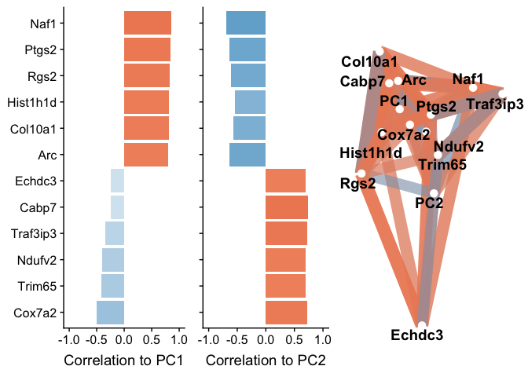
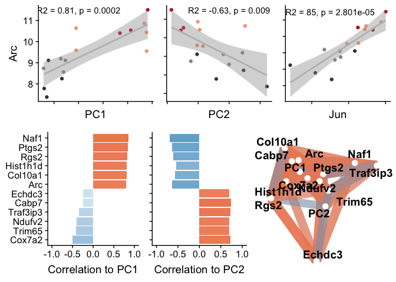

    library(tidyverse)
    library(corrr)
    library(cowplot)
    library(ggrepel)

    source("./figureoptions.R")

    # lists of genes that are correlated with particular genes
    ARC_associated <- read_csv("../data/02h_ARC_associated.csv")  %>% mutate_each(funs=toupper)  %>% dplyr::pull(gene) 

    ## Warning: Missing column names filled in: 'X1' [1]

    ## Parsed with column specification:
    ## cols(
    ##   X1 = col_double(),
    ##   `net$colors` = col_character(),
    ##   gene = col_character()
    ## )

    Neurod6_associated <- read_csv("../data/02h_Neurod6_associated.csv") %>% mutate_each(funs=toupper)  %>% dplyr::pull(gene) 

    ## Warning: Missing column names filled in: 'X1' [1]

    ## Parsed with column specification:
    ## cols(
    ##   X1 = col_double(),
    ##   `net$colors` = col_character(),
    ##   gene = col_character()
    ## )

    Prkcz_associated <- read_csv("../data/02h_Prkcz_associated.csv") %>% mutate_each(funs=toupper)  %>% dplyr::pull(gene) 

    ## Warning: Missing column names filled in: 'X1' [1]

    ## Parsed with column specification:
    ## cols(
    ##   X1 = col_double(),
    ##   `net$colors` = col_character(),
    ##   gene = col_character()
    ## )

    # differentially expressed gens in the DG
    DG_DEGs <- read.csv("../data/02f_DG_DEGs_vsd.csv", row.names = 1, check.names = F)
    DG_DEGs <- as.data.frame(t(DG_DEGs))
    DG_DEGs$sample <- row.names(DG_DEGs)
    DG_DEGs <- DG_DEGs %>% select(`1190002N15RIK`:ZFP869)
    DG_DEGs <- as.data.frame(t(DG_DEGs))
    DG_DEGs$gene <- row.names(DG_DEGs)

    # only look at Differentially expressed genes in the ARC module
    DG_ARC <- DG_DEGs %>% filter(gene %in% ARC_associated) %>% select(gene, everything())
    row.names(DG_ARC) <- DG_ARC$gene
    DG_ARC$gene <- NULL
    DG_ARC <- as.data.frame(t(DG_ARC))
    DG_ARC$sample  <- row.names(DG_ARC)
    DG_ARC$mouse <- sapply(strsplit(as.character(DG_ARC$sample),"\\-"), "[", 1)
    DG_ARC$ID <- paste(15, DG_ARC$mouse, sep = "")

    # read the sample data, set levels, join iwth behvior PCA data
    colData <- read.csv("../data/02a_colData.csv", row.names = 1, stringsAsFactors = T)
    colData <- colData %>% filter(subfield == "DG")
    pca.Rn <- read_csv("../data/01a_pca.all.csv") %>% filter(TrainSessionComboNum == 9)

    ## Parsed with column specification:
    ## cols(
    ##   ID = col_character(),
    ##   treatment = col_character(),
    ##   TrainSessionComboNum = col_double(),
    ##   PC1 = col_double(),
    ##   PC2 = col_double(),
    ##   PC3 = col_double(),
    ##   PC4 = col_double(),
    ##   PC5 = col_double(),
    ##   PC6 = col_double(),
    ##   PC7 = col_double(),
    ##   PC8 = col_double(),
    ##   PC9 = col_double(),
    ##   PC10 = col_double()
    ## )

    pca.Rn <- pca.Rn %>% select(ID:PC2)
    colData <- left_join(colData, pca.Rn)

    ## Joining, by = c("ID", "treatment")

    ## Warning: Column `ID` joining factor and character vector, coercing into
    ## character vector

    ## Warning: Column `treatment` joining factor and character vector, coercing
    ## into character vector

    head(colData)

    ##       ID subfield        treatment training TrainSessionComboNum
    ## 1 15143A       DG conflict.trained  trained                    9
    ## 2 15143B       DG   conflict.yoked    yoked                    9
    ## 3 15143D       DG   standard.yoked    yoked                    9
    ## 4 15144A       DG conflict.trained  trained                    9
    ## 5 15144C       DG standard.trained  trained                    9
    ## 6 15144D       DG   standard.yoked    yoked                    9
    ##          PC1         PC2
    ## 1 -0.2511636  3.02981466
    ## 2 -3.5595365 -0.47451513
    ## 3 -3.0605115 -0.07227782
    ## 4  6.6921089 -0.02270055
    ## 5  7.0436756 -1.72946383
    ## 6 -3.4999867  1.16766175

    # joing with counts and sample data, prep for correlations
    alldata <- left_join(colData, DG_ARC)

    ## Joining, by = "ID"

    forcorplots <- alldata %>% select(PC1:UBC)
    forcorplots

    ##           PC1         PC2         ACAN     ADAMTS1      AMIGO2    ANKRD33B
    ## 1  -0.2511636  3.02981466  0.668206109  0.65710384  0.26383943  0.29566530
    ## 2  -3.5595365 -0.47451513 -0.476805955  0.04940960 -0.64311051 -0.63849004
    ## 3  -3.0605115 -0.07227782 -0.493064288 -0.31580223 -0.46456630 -0.11056438
    ## 4   6.6921089 -0.02270055  0.879402143  2.18067685  0.83850384  1.06672111
    ## 5   7.0436756 -1.72946383  0.427126302  1.10227701  0.59669923  0.66265263
    ## 6  -3.4999867  1.16766175 -0.549705024 -1.54243720 -0.54390449 -0.22663682
    ## 7   6.9362884  0.31085957  0.423357460 -0.04781799 -0.22876752  0.01382627
    ## 8  -1.3375400  1.64001102 -0.151026995 -0.07788381 -0.24784913 -0.38727098
    ## 9   6.9208097  0.09483277  0.003436546  0.33952194  0.51587335  0.09253903
    ## 10 -1.5276429  1.99883979 -0.635366284 -1.12353095 -0.02790315 -1.36876889
    ## 11  4.2115795 -1.11790859  0.608736516  0.38496261 -0.20570225  0.33732802
    ## 12 -1.6965727  2.93175222 -0.547437462 -0.97526734 -0.35241770  0.07874463
    ## 13  5.3196322 -0.94691101  0.847147571  0.97808693  0.67653849  0.60593974
    ## 14 -3.2320870  4.43969435 -0.781054213 -1.39233845 -0.43823408 -0.10349100
    ## 15 -0.2562847 -0.06798772  0.216995954  0.34146475 -0.09234151  0.02759893
    ## 16 -1.8023130  2.85862823 -0.439948380 -0.55842557  0.35334230 -0.34579355
    ##            ARC      ARL4D        ARL5B      ARMCX5       ATF3       BDNF
    ## 1   1.17562233  0.4681834  0.067822811  0.27801818  0.7586906  0.3915877
    ## 2  -0.74817999 -0.2155814 -0.039355740 -0.18623845 -0.5878057 -0.2684977
    ## 3  -0.36660430 -0.4948170 -0.384427053 -0.69754370  0.1244980 -0.2591467
    ## 4   1.40236262  0.3942209  0.858375060  0.65215076  1.0747769  1.2504129
    ## 5   2.04553524  1.2733692  0.691482272  0.35508059  1.3258853  0.9842984
    ## 6  -1.72812196 -0.6156106 -0.560640227 -0.52828927 -1.7991138 -0.6390658
    ## 7   0.07810374 -0.2568645  0.001144312  0.13487602  0.2059677 -0.2944630
    ## 8  -0.36477791 -0.3644487 -0.114430641 -0.38464328 -0.2610078 -0.7185384
    ## 9   0.97078867  0.7865753  0.121064029  0.23305807  0.6311708  0.4096738
    ## 10 -0.92295520 -0.3517889 -0.814323740 -0.46803354 -0.3829362 -1.4133853
    ## 11  0.93699249  0.1830134  1.328466028  0.34927378  1.1218354  1.1550456
    ## 12 -1.24673380  0.1907881 -0.032181329  0.06109713 -0.7516159  0.3194743
    ## 13  1.07659086  0.3600600  0.497518024  0.44101944  1.0498900  0.7244882
    ## 14 -2.14716643 -0.7672235 -0.855986203 -0.16156922 -2.2087194 -0.7810252
    ## 15  0.12154655 -0.2709352 -0.061467753 -0.17913623  0.1118214 -0.3148199
    ## 16 -0.28300290 -0.3189405 -0.703059852  0.10087972 -0.4133373 -0.5460389
    ##           BTG2       CPEB4       CYP51     DBPHT2      DNAJA1      DNAJB1
    ## 1   0.65579804  0.03299804 -0.01372105  0.1930068  0.15507601  0.24765215
    ## 2  -0.09277866 -0.39128678  0.04128289 -0.4232663 -0.19334775 -0.32471931
    ## 3  -0.03401878 -0.40971951 -0.12580958 -0.2434311 -0.12529218  0.23420804
    ## 4   1.17118242  0.78585047  0.96854443  0.9585654  0.30965478  0.93491519
    ## 5   1.65423072  0.60841936  0.31816753  1.2015258  0.56295571  1.17453649
    ## 6  -1.50193972 -0.45527557 -0.47015069 -0.4774288 -0.47193721 -1.33751583
    ## 7  -0.25100169  0.07171232 -0.22794737 -0.3829963 -0.13238207 -0.14475509
    ## 8  -0.21673422 -0.26276887 -0.34755405 -0.6272620 -0.22501649 -0.92664039
    ## 9   1.18319106 -0.09883683 -0.10293494  0.3538095 -0.09710543  0.05002476
    ## 10 -0.35874034 -0.57795299 -0.58795997 -1.7778358  0.02724972 -0.89348068
    ## 11  1.35902436  0.42458777  0.85357545  1.4830277  0.27450828  1.25167797
    ## 12 -2.60021290  0.01657830 -0.20013101 -0.1232318 -0.03721121 -0.72073266
    ## 13  0.66680584  0.43706678  0.49093721  0.6472489  0.70510186  1.11812060
    ## 14 -1.34567386 -0.02083447 -0.41977649 -0.3822292 -0.68584592 -1.25921133
    ## 15  0.21277658  0.16110599  0.04186110  0.3695256  0.09426371  0.62710972
    ## 16 -0.50190886 -0.32164402 -0.21838347 -0.7690284 -0.16067183 -0.03118964
    ##          DUSP6        EGR1        EGR4      FBXO33       FLRT3
    ## 1   0.87661199  0.85220916  0.93979077  0.51256579  0.21024604
    ## 2  -0.01400436 -0.03674124  0.08292777 -0.37366641 -0.14644147
    ## 3   0.12202664 -0.13607942 -0.28304049 -0.03675185 -0.11718717
    ## 4   1.06962125  1.08423965  1.21064480  2.00754485  1.19675523
    ## 5   1.25450844  1.60215902  1.91289470  1.50453004  0.79000640
    ## 6  -1.76384040 -2.25043209 -1.90562788 -1.40429424 -0.33653632
    ## 7  -0.15443441 -0.03548392 -0.03965305 -0.20803073  0.08158802
    ## 8  -0.80148640 -0.30660431 -0.65808515 -0.98038850 -0.25058245
    ## 9   0.38202334  0.44325259  0.97201766  0.43128586  0.25966781
    ## 10  0.23594486 -0.37814542 -1.83290546 -0.71877806 -1.24206536
    ## 11  1.14176536  1.26637203  2.06277267  2.15014530  0.37546905
    ## 12 -1.53835830 -0.90050902 -1.84932697 -2.37754677 -0.14282649
    ## 13  0.58568545  0.72113090  0.98413285  1.27486465  0.03252642
    ## 14 -1.25325927 -1.89303739 -1.50842908 -1.18864316 -0.10996946
    ## 15 -0.01559003  0.48725184  0.44135210 -0.07522413 -0.34240854
    ## 16 -0.12721416 -0.51958238 -0.52946524 -0.51761263 -0.25824170
    ##             FOS       FOSB       FOSL2       FRMD6         GAD1
    ## 1   0.998364387  0.7839060  0.55249442  0.47507885  0.459224161
    ## 2   0.598665874  0.3424215 -0.23117848 -0.39359154  0.194321370
    ## 3   0.153393727  0.1298796 -0.39404897 -0.31105189 -0.172685219
    ## 4   1.250321460  1.6214484  1.91578214  1.74986710  0.594361869
    ## 5   1.481259689  1.8692541  1.56815751  1.27664554  0.277318575
    ## 6  -2.208540511 -2.6656260 -1.09995963 -1.33812490 -0.205638891
    ## 7   0.008905704 -0.2593292 -0.05666779  0.14765024 -0.006340263
    ## 8   0.195356161 -0.3650584 -0.30525550 -0.82293569 -0.536750285
    ## 9   1.160790487  1.0207451  0.48079724 -0.24257348 -0.265146519
    ## 10 -1.188991180 -1.6525035 -2.28651221 -0.96567829  0.038506853
    ## 11  1.474767993  2.1615740  1.45538263  1.92532159  0.530505217
    ## 12 -3.717544339 -2.2605099 -0.83899868 -1.14795752 -0.337560061
    ## 13  0.689608048  1.1527022  1.21126645  1.45775510  0.283107048
    ## 14 -1.386882367 -1.4036465 -1.34714357 -1.19643103 -0.471554552
    ## 15  0.733501306  0.2878280  0.03902948  0.02979769  0.016656093
    ## 16 -0.242976440 -0.7630854 -0.66314505 -0.64377178 -0.398325397
    ##         HOMER1         JUN        JUNB        JUND        KLF6        LMNA
    ## 1   0.08603002  0.49791393  0.69811918  0.55453656  0.39326153  0.60393719
    ## 2  -0.38771728 -0.19560597 -0.04927700  0.07520287  0.27268705  0.17348917
    ## 3  -0.49646959  0.19136630 -0.11241581 -0.10280388  0.12902308 -0.29267054
    ## 4   1.69867876  0.91113482  1.06717695  0.82032847  1.10434951  0.36660536
    ## 5   1.10296746  1.03414255  1.45567864  0.91573429  0.74398698  0.71922274
    ## 6  -1.38228786 -0.89185436 -1.54080532 -1.07879586 -0.71578939 -0.90635400
    ## 7  -0.52133067 -0.01829525 -0.14737643 -0.41130829 -0.04686806 -0.20172483
    ## 8  -0.91501386 -0.22371027 -0.38616315 -0.58172039 -0.27842230 -0.17859757
    ## 9   0.21733344  0.46399364  0.95813584  0.56316858  0.16873954  0.07321896
    ## 10 -0.52050284 -0.35152750 -0.08038002 -0.96111445 -0.51555435 -0.29765106
    ## 11  1.93103201  0.68355094  1.57467757  1.31382996  0.58516656  1.55274716
    ## 12 -0.37338638 -1.58412161 -2.79015159 -0.12118423 -0.84006890 -1.36227389
    ## 13  1.57673946  0.27595181  0.56810487  0.48067386  0.42751466  0.63478606
    ## 14 -1.80782666 -0.44218173 -0.86146527 -0.88491586 -0.68034736 -0.74761358
    ## 15  0.46110795  0.29077400  0.12888148 -0.11628008 -0.61336966  0.05706139
    ## 16 -0.66935398 -0.64153129 -0.48273992 -0.46535155 -0.13430890 -0.19418257
    ##          LONRF1         NAF1        NPTX2      NR4A1       NR4A2
    ## 1   0.035878263 -0.136846879  0.661891112  1.0689339  0.59182869
    ## 2  -0.004773297 -0.155059569 -0.322689725  0.3885822 -0.30032160
    ## 3   0.048155614 -0.096311504 -0.043496316 -0.2539646  0.01628180
    ## 4   1.698425007  0.644800506  1.096605962  0.9610560  1.31121551
    ## 5   1.057489579  0.388793381  1.319931570  1.6321064  1.50150326
    ## 6  -0.541860494 -0.170047274 -0.781095383 -2.2680989 -1.46516425
    ## 7  -0.014437997  0.343298759  0.012281092  0.0940701 -0.32793230
    ## 8  -0.888248329 -0.322231838 -0.328212492 -0.0256079 -0.33322136
    ## 9   0.273805118  0.005566491  0.405081443  1.0160982  0.68489268
    ## 10 -0.169413887 -0.171488698 -2.287111311 -1.6648253  0.55370998
    ## 11  0.548468986  0.293295279  1.411289292  1.2904933  1.40967026
    ## 12 -1.951879367 -0.353767928 -0.238269108 -0.5235233 -2.02394875
    ## 13  1.093186373  0.309412742  0.809671219  0.7494099  0.84740418
    ## 14 -0.914393199 -0.281655764 -0.902204969 -2.4904839 -1.93433822
    ## 15  0.192211703 -0.085265590 -0.008411474  0.4034692 -0.06747697
    ## 16 -0.462614073 -0.212492116 -0.805260910 -0.3777153 -0.46410291
    ##          NR4A3         ODC1       PELI1        PER1        PER2
    ## 1   0.92840913  0.521441603 -0.17394039  0.23276306  0.47909499
    ## 2  -0.12001455 -0.079988945 -0.32330190 -0.13381890  0.01707757
    ## 3   0.23705478  0.005441203 -0.50064757 -0.05429489 -0.15393961
    ## 4   2.03849502  0.393263752  1.18484195  0.99681165  0.91871463
    ## 5   2.16819296  0.390728217  0.58640123  0.82641422  0.36839710
    ## 6  -2.19456170 -0.419169060 -0.57757127 -0.86335281 -0.16972839
    ## 7  -0.01812882 -0.253926434 -0.09358092 -0.15053195 -0.59797509
    ## 8  -0.73234019 -0.295785642 -0.61373203  0.02841121 -0.45740496
    ## 9   0.44557194 -0.003024400 -0.03276798  0.25071037 -0.44668966
    ## 10 -1.84461773 -0.882723365  0.02192475 -0.50785964  0.23505937
    ## 11  2.09583340  1.020501049  0.96857305  1.29418527  1.30998986
    ## 12 -1.94910879 -0.522835979 -0.01759783 -0.76808237 -0.91324327
    ## 13  1.29969420  0.610255633  0.60085313  0.77497755  0.84364174
    ## 14 -2.41719728 -0.366591559 -0.53373951 -1.24082767 -1.08635644
    ## 15  0.48641956  0.305421250  0.11569848  0.03077784  0.29218548
    ## 16 -0.42370193 -0.423007322 -0.61141320 -0.71628294 -0.63882330
    ##           PLK2      POU3F3      RASD1       RGS2        RGS4        SGK1
    ## 1   0.78283711  0.38090078  0.7041275  0.5604900  0.64547884  0.92538747
    ## 2  -0.21981408  0.13887390 -0.3548618 -0.3963040 -0.10973511 -0.11381416
    ## 3  -0.25382404 -0.12286318 -0.4561860 -0.3858197 -0.37169108 -0.47104136
    ## 4   1.38501953  0.24698059  1.4370306  1.7289639  0.88899671  1.34808429
    ## 5   1.42972800  0.43814744  1.2511629  1.4681521  1.06716173  1.33516868
    ## 6  -1.40405013 -0.35399154 -0.8244306 -1.2889923 -0.61736795 -1.06817878
    ## 7   0.08189698  0.14328811  0.2012196 -0.1623962 -0.27285895  0.10911137
    ## 8  -0.51984119 -0.40066947 -0.5625164 -0.6738749 -0.49816185 -0.45649541
    ## 9   0.76991362 -0.05949441  0.4315325  1.1456443  0.32484026  0.45204443
    ## 10 -0.49241041 -0.14377553 -0.3929847 -1.3255242 -1.45541126 -0.47173725
    ## 11  1.37596041  0.66312371  0.8370042  1.3661530  1.09622967  1.55551296
    ## 12 -2.49996094 -0.55722151 -1.8764837 -0.7260714  0.07587188 -2.35272695
    ## 13  0.88498847 -0.02772541  0.5119918  1.0258224  0.75686461  0.82481382
    ## 14 -0.82366905 -0.39030390 -1.0491911 -0.9488616 -0.72944151 -0.75975607
    ## 15 -0.19378189  0.10200208 -0.2013637 -0.6665766 -0.50866225  0.05140374
    ## 16 -0.30299239 -0.05727167  0.3439490 -0.7208049 -0.29211374 -0.90777678
    ##       SLC25A25       SMAD7      SOWAHC         SRF        STMN4
    ## 1   0.41535155  1.02744508  0.71133755  0.03148348  0.456972389
    ## 2  -0.16601134 -0.40287582 -0.33897411 -0.33985053  0.049427167
    ## 3  -0.51912590 -0.97404696  0.09772174 -0.12862414  0.188894520
    ## 4   0.59692363  1.57772336  0.59327899  0.58156661  0.289153988
    ## 5   0.51068521  1.46850478  0.75004193  0.49251426  0.563772626
    ## 6  -0.28907474 -1.13640529 -0.49764493 -0.89568619 -0.105760116
    ## 7   0.01696914  0.15631241  0.19467960 -0.12878527 -0.004434922
    ## 8  -0.01862667 -0.58518537  0.17188863 -0.02049097 -0.458193498
    ## 9   0.10942747  0.63565865  0.23789535  0.22451146  0.245650655
    ## 10  0.07003554 -0.04164484  0.09999272 -0.35760107 -0.205136916
    ## 11  0.44580739  1.65643694 -0.24362913  1.02720925  0.185500309
    ## 12 -0.58802034 -2.59455641 -1.38350623  0.49127853 -0.863192801
    ## 13  0.37077450  1.01121745  0.33596657  0.31784454  0.319026025
    ## 14 -0.26789277 -0.99263046 -0.61046592 -0.55719087 -0.494117194
    ## 15 -0.27019008 -0.07614150  0.35549067 -0.20442291 -0.037003495
    ## 16 -0.41703259 -0.72981201 -0.47407343 -0.53375618 -0.130558737
    ##           SYT4       TRIB1         UBC
    ## 1   0.16671430  1.13433796  0.38690216
    ## 2  -0.58149976  0.16840311 -0.01766093
    ## 3  -0.34837424 -0.04411045 -0.22052618
    ## 4   0.86231311  1.44379122  0.71368727
    ## 5   0.79716016  1.70179194  0.78103490
    ## 6  -0.36515165 -1.84420792 -0.65022413
    ## 7   0.03294637 -0.15909122 -0.12843805
    ## 8  -0.19880461  0.05138528 -0.48580403
    ## 9   0.06093674  0.86009739  0.17293903
    ## 10 -0.33861049 -1.55393076 -0.24395130
    ## 11  0.75793382  1.16901886  0.65218103
    ## 12 -0.50960385 -1.46600194 -0.24425416
    ## 13  0.36550900  1.09480407  0.39913249
    ## 14 -0.78415199 -1.98900655 -0.63966542
    ## 15 -0.18582692 -0.04666665 -0.07858194
    ## 16  0.26851002 -0.52061434 -0.39677075

    # correlation matrix
    x <- correlate(forcorplots)

    ## 
    ## Correlation method: 'pearson'
    ## Missing treated using: 'pairwise.complete.obs'

    x %>% filter(PC1 > 0.755) %>% arrange(desc(PC1))  %>% select(rowname, PC1, PC2)

    ## # A tibble: 9 x 3
    ##   rowname   PC1    PC2
    ##   <chr>   <dbl>  <dbl>
    ## 1 NAF1    0.859 -0.694
    ## 2 RGS2    0.832 -0.605
    ## 3 ARC     0.805 -0.632
    ## 4 ACAN    0.789 -0.543
    ## 5 SYT4    0.779 -0.551
    ## 6 ARMCX5  0.777 -0.273
    ## 7 ATF3    0.770 -0.676
    ## 8 FOSL2   0.757 -0.667
    ## 9 CPEB4   0.756 -0.442

    cor.test(alldata$ARC, alldata$PC1, method = "pearson")

    ## 
    ##  Pearson's product-moment correlation
    ## 
    ## data:  alldata$ARC and alldata$PC1
    ## t = 5.0829, df = 14, p-value = 0.0001669
    ## alternative hypothesis: true correlation is not equal to 0
    ## 95 percent confidence interval:
    ##  0.5153586 0.9298379
    ## sample estimates:
    ##       cor 
    ## 0.8053296

    cor.test(alldata$ARC, alldata$PC2, method = "pearson")

    ## 
    ##  Pearson's product-moment correlation
    ## 
    ## data:  alldata$ARC and alldata$PC2
    ## t = -3.0534, df = 14, p-value = 0.008591
    ## alternative hypothesis: true correlation is not equal to 0
    ## 95 percent confidence interval:
    ##  -0.8588000 -0.1988761
    ## sample estimates:
    ##        cor 
    ## -0.6322516

    a <- ggplot(alldata, aes(x = PC1, y = ARC)) +
       geom_point(aes( color = treatment)) + 
       geom_smooth(method = "lm", color = "grey") +
       scale_color_manual(values = treatmentcolors) +
       theme_ms() +
       theme(legend.position = "none") +
      labs(subtitle = "R2 = 0.81, p = 0.0002")
      

    b <- ggplot(alldata, aes(x = PC2, y = ARC)) +
       geom_point(aes( color = treatment)) + 
       geom_smooth(method = "lm", color = "grey") +
       scale_color_manual(values = treatmentcolors) +
       theme_ms() +
       theme(legend.position = "none") +
      labs(subtitle = "R2 = -0.63, p = 0.009")

    plot_grid(a,b)

    # read all count data
    vsd <- read.csv("../data/02c_DGvsd.csv", row.names = 1, check.names = F)

    # prep to join with sample colData
    vsd <- as.data.frame(t(vsd))
    vsd$sample <- row.names(vsd)
    vsd$mouse <- sapply(strsplit(as.character(vsd$sample),"\\-"), "[", 1)
    vsd$ID <- paste(15, vsd$mouse, sep = "")

    vsd <- left_join(colData, vsd)

    ## Joining, by = "ID"

    head(vsd)[17015:17020]

    ##     Zyg11b      Zyx    Zzef1     Zzz3    sample mouse
    ## 1 8.319205 7.203704 7.829641 7.742970 143A-DG-1  143A
    ## 2 8.118246 7.258360 7.711706 7.569642 143B-DG-1  143B
    ## 3 8.715286 6.853523 7.987434 7.135233 143D-DG-3  143D
    ## 4 9.110958 7.532625 8.240355 7.760152 144A-DG-2  144A
    ## 5 8.724875 7.128516 7.955995 7.634300 144C-DG-2  144C
    ## 6 8.814969 6.671645 7.908857 7.526267 144D-DG-2  144D

    forcorall <-  vsd %>% select(PC1:Zzz3)
    head(forcorall)

    ##          PC1         PC2 0610007P14Rik 0610009B22Rik 0610009L18Rik
    ## 1 -0.2511636  3.02981466      6.381145      5.781124      5.405848
    ## 2 -3.5595365 -0.47451513      6.405587      5.661825      5.593055
    ## 3 -3.0605115 -0.07227782      6.834813      5.299160      5.422004
    ## 4  6.6921089 -0.02270055      6.513173      5.528657      5.000789
    ## 5  7.0436756 -1.72946383      6.401366      5.821796      5.507750
    ##   0610009O20Rik 0610010F05Rik 0610010K14Rik 0610012G03Rik 0610030E20Rik
    ## 1      6.736671      6.603589      6.136536      6.719764      6.272577
    ## 2      6.691641      7.093384      5.949913      7.006393      6.659531
    ## 3      6.736719      7.135233      6.015194      6.695140      6.560825
    ## 4      6.530386      6.931921      5.782488      6.564048      6.513173
    ## 5      6.799892      6.907778      5.999853      6.388018      6.388018
    ##   0610037L13Rik 0610040J01Rik 1110002E22Rik 1110004E09Rik 1110004F10Rik
    ## 1      6.951677      5.331879      6.114375      6.227061      7.328125
    ## 2      7.244810      5.555282      6.391924      6.626521      7.404995
    ## 3      7.276131      5.782032      6.231289      6.164589      7.585028
    ## 4      6.432259      5.609206      6.260610      6.144301      6.913454
    ## 5      6.732276      5.507750      6.274710      6.332893      7.378414
    ##   1110008F13Rik 1110008L16Rik 1110008P14Rik 1110012L19Rik 1110017D15Rik
    ## 1      6.612945      5.914151      7.159474      5.658707      5.405848
    ## 2      6.989921      5.593055      7.349520      6.391924      5.298477
    ## 3      7.089820      5.663320      6.925666      5.515766      5.000789
    ## 4      6.450757      5.855075      6.422891      5.000789      5.633666
    ## 5      6.899137      5.415426      6.771374      5.714146      5.415426
    ##   1110032A03Rik 1110032F04Rik 1110034G24Rik 1110037F02Rik 1110038F14Rik
    ## 1      6.044520      5.746684      5.865684      6.864067      6.409428
    ## 2      6.228623      5.628441      5.628441      7.077999      6.521453
    ## 3      5.973603      5.000789      5.834563      7.552784      6.092918
    ## 4      5.967744      5.609206      5.528657      7.477361      6.314070
    ## 5      5.653076      5.684343      5.684343      7.323347      6.259635
    ##   1110051M20Rik 1110059E24Rik 1110059G10Rik 1110065P20Rik 1190002N15Rik
    ## 1      7.203704      5.875619      6.003230      6.584648      7.400050
    ## 2      7.606564      6.545648      5.927803      6.458586      6.291026
    ## 3      7.150025      6.129434      6.054895      6.263031      7.026670
    ## 4      7.129605      5.855075      5.801317      6.106492      8.396389
    ## 5      7.360309      6.076501      5.653076      6.180660      8.167341
    ##   1190005I06Rik 1190007I07Rik 1300017J02Rik 1500009C09Rik 1500009L16Rik
    ## 1      5.427605      5.758354      5.000789      7.010241      5.803189
    ## 2      5.211473      6.032988      5.365060      7.108588      5.693496
    ## 3      5.000789      5.515766      5.000789      6.977174      5.663320
    ## 4      5.250706      5.395208      5.000789      6.334704      5.657159
    ## 5      5.000789      5.870182      5.000789      6.790459      5.547907
    ##   1500011B03Rik 1500011K16Rik 1500015O10Rik 1520401A03Rik 1600002H07Rik
    ## 1      7.026965      6.121820      5.192223      5.136203      5.941888
    ## 2      7.355798      6.144671      5.628441      5.000789      6.195903
    ## 3      7.135233      6.015194      5.000789      5.422004      6.231289
    ## 4      6.823462      5.782488      5.000789      5.000789      5.657159
    ## 5      7.106603      5.937570      5.415426      5.208642      6.112519
    ##   1600002K03Rik 1600012H06Rik 1600014C10Rik 1700001C19Rik 1700001K19Rik
    ## 1      5.616870      5.950929      6.570235      5.192223      5.405848
    ## 2      5.857586      6.320856      6.712577      5.298477      5.905079
    ## 3      5.299160      6.560825      6.408586      5.594399      5.515766
    ## 4      5.722771      6.314070      6.374798      5.353786      5.801317
    ## 5      5.507750      6.388018      6.440451      5.208642      5.585190
    ##   1700001L19Rik 1700001O22Rik 1700001P01Rik 1700003E16Rik 1700003F12Rik
    ## 1      5.658707      5.468005      5.000789      6.011645      5.672037
    ## 2      5.211473      5.000789      5.298477      6.391924      5.421044
    ## 3      5.725311      5.782032      5.000789      6.381034      5.663320
    ## 4      5.722771      5.609206      5.000789      6.067080      5.000789
    ## 5      5.507750      5.208642      5.000789      5.979597      5.208642
    ##   1700006E09Rik 1700007G11Rik 1700007K13Rik 1700008O03Rik 1700010I14Rik
    ## 1      5.000789      5.192223      5.303141      5.000789      5.271320
    ## 2      5.000789      5.000789      5.000789      5.211473      5.000789
    ## 3      5.000789      5.000789      5.000789      5.000789      5.422004
    ## 4      5.432586      5.000789      5.000789      5.395208      5.000789
    ## 5      5.000789      5.208642      5.000789      5.000789      5.507750
    ##   1700011E24Rik 1700011H14Rik 1700011M02Rik 1700013D24Rik 1700013F07Rik
    ## 1      5.303141      5.000789      5.000789      5.000789      5.000789
    ## 2      5.000789      5.000789      5.000789      5.000789      5.000789
    ## 3      5.000789      5.000789      5.000789      5.000789      5.422004
    ## 4      5.000789      5.000789      5.000789      5.000789      5.000789
    ## 5      5.000789      5.000789      5.000789      5.000789      5.507750
    ##   1700014D04Rik 1700015E13Rik 1700016D06Rik 1700016K19Rik 1700017B05Rik
    ## 1      5.358277      5.303141      5.271320      5.192223      6.193231
    ## 2      5.000789      5.000789      5.905079      5.000789      5.752561
    ## 3      5.000789      5.000789      5.000789      5.000789      5.663320
    ## 4      5.000789      5.000789      5.722771      5.000789      6.314070
    ## 5      5.360182      5.208642      5.507750      5.000789      6.346945
    ##   1700019A02Rik 1700019B03Rik 1700019D03Rik 1700019O17Rik 1700020A23Rik
    ## 1      5.000789      5.235161      5.835086      5.000789      5.000789
    ## 2      5.000789      5.000789      6.162052      5.000789      5.000789
    ## 3      5.000789      5.000789      5.725311      5.000789      5.000789
    ## 4      5.000789      5.000789      5.819671      5.000789      5.609206
    ## 5      5.000789      5.208642      5.821796      5.000789      5.000789
    ##   1700020D05Rik 1700020L24Rik 1700020N01Rik 1700021F05Rik 1700022I11Rik
    ## 1      5.136203      5.000789      5.000789      5.950929      5.000789
    ## 2      5.365060      5.000789      5.000789      5.905079      5.298477
    ## 3      5.725311      5.299160      5.422004      5.725311      5.000789
    ## 4      5.353786      5.353786      5.395208      6.080406      5.000789
    ## 5      5.000789      5.000789      5.000789      5.937570      5.000789
    ##   1700023F06Rik 1700024P16Rik 1700025G04Rik 1700027J19Rik 1700028J19Rik
    ## 1      5.382821      5.331879      7.921506      5.000789      5.303141
    ## 2      5.298477      5.211473      7.374459      5.000789      5.000789
    ## 3      5.000789      5.000789      7.677432      5.000789      5.000789
    ## 4      5.000789      5.000789      8.046337      5.000789      5.000789
    ## 5      5.000789      5.294484      7.916096      5.000789      5.463972
    ##   1700028K03Rik 1700028P14Rik 1700029F12Rik 1700029H14Rik 1700029I15Rik
    ## 1      5.303141      5.358277      5.000789      5.303141      5.539509
    ## 2      5.000789      5.211473      5.000789      5.000789      5.661825
    ## 3      5.299160      5.000789      5.000789      5.594399      5.782032
    ## 4      5.000789      5.000789      5.000789      5.000789      5.000789
    ## 5      5.000789      5.360182      5.000789      5.000789      5.294484
    ##   1700029J07Rik 1700030J22Rik 1700030K09Rik 1700034I23Rik 1700034J05Rik
    ## 1      5.136203      5.382821      6.076228      5.000789      5.358277
    ## 2      5.514596      5.365060      6.391924      5.365060      5.000789
    ## 3      5.515766      5.515766      5.883658      5.663320      5.000789
    ## 4      5.395208      5.432586      6.039823      5.000789      5.395208
    ## 5      5.360182      5.507750      6.274710      5.294484      5.000789
    ##   1700037C18Rik 1700037H04Rik 1700040L02Rik 1700047I17Rik2 1700048O20Rik
    ## 1      5.587216      6.099305      5.000789       5.914151      5.685088
    ## 2      5.470237      6.162052      5.000789       5.832700      5.806960
    ## 3      5.515766      5.725311      5.515766       5.594399      5.663320
    ## 4      5.250706      5.937116      5.000789       5.855075      5.801317
    ## 5      5.507750      6.180660      5.208642       5.821796      5.915729
    ##   1700057G04Rik 1700061G19Rik 1700064H15Rik 1700066B19Rik 1700066M21Rik
    ## 1      5.000789      5.427605      5.000789      5.192223      6.403830
    ## 2      5.298477      5.421044      5.000789      5.000789      6.244588
    ## 3      5.000789      5.299160      5.000789      5.422004      6.293811
    ## 4      5.000789      5.633666      5.000789      5.177617      6.477936
    ## 5      5.000789      5.620120      5.000789      5.208642      6.244332
    ##   1700067K01Rik 1700088E04Rik 1700092M07Rik 1700093K21Rik 1700102P08Rik
    ## 1      5.271320      5.697878      5.000789      5.000789      5.136203
    ## 2      5.555282      5.000789      5.514596      5.693496      5.365060
    ## 3      5.000789      5.299160      5.000789      5.594399      5.422004
    ## 4      5.000789      5.000789      5.000789      5.000789      5.556871
    ## 5      5.000789      5.000789      5.000789      5.208642      5.294484
    ##   1700109H08Rik 1700112E06Rik 1700113H08Rik 1700123K08Rik 1700123L14Rik
    ## 1      5.427605      5.000789      5.000789      5.331879      5.000789
    ## 2      5.211473      5.000789      5.000789      5.000789      5.211473
    ## 3      6.015194      5.000789      5.000789      5.000789      5.000789
    ## 4      5.556871      5.177617      5.000789      5.000789      5.000789
    ## 5      5.415426      5.208642      5.000789      5.000789      5.000789
    ##   1700123O20Rik 1700128F08Rik 1810009A15Rik 1810010H24Rik 1810011H11Rik
    ## 1      5.746684      6.028236      5.792241      6.193231      5.000789
    ## 2      6.195903      6.228623      6.144671      6.162052      5.000789
    ## 3      5.663320      6.461681      5.782032      6.293811      5.000789
    ## 4      5.763148      6.156576      5.177617      5.528657      5.000789
    ## 5      5.821796      6.213008      5.547907      6.180660      5.208642
    ##   1810011O10Rik 1810013L24Rik 1810022K09Rik 1810024B03Rik 1810026J23Rik
    ## 1      5.448275      7.153462      6.044520      5.000789      7.840556
    ## 2      5.211473      6.773278      6.212398      5.000789      7.883702
    ## 3      5.000789      6.607336      6.054895      5.000789      7.657429
    ## 4      5.177617      7.355139      5.888915      5.000789      7.385674
    ## 5      5.208642      7.360309      5.742660      5.294484      7.720848
    ##   1810030O07Rik 1810032O08Rik 1810037I17Rik 1810041L15Rik 1810043G02Rik
    ## 1      6.745036      5.769831      6.233691      8.203852      6.510693
    ## 2      6.981604      6.012956      6.378085      7.749736      6.509159
    ## 3      6.776909      5.834563      6.054895      7.905693      6.381034
    ## 4      6.282329      5.819671      5.967744      8.400545      6.564048
    ## 5      6.617653      5.653076      6.164074      8.243073      6.490492
    ##   1810043H04Rik 1810049J17Rik 1810055G02Rik 2010005H15Rik 2010107E04Rik
    ## 1      5.697878      5.658707      6.540854      5.000789      6.773865
    ## 2      6.032988      5.470237      6.032988      5.000789      6.753381
    ## 3      5.782032      5.663320      6.352754      5.000789      6.853523
    ## 4      5.432586      6.025876      6.394293      5.306683      6.131866
    ## 5      5.684343      5.870182      6.584348      5.208642      6.650032
    ##   2010107G23Rik 2010109A12Rik 2010109I03Rik 2010111I01Rik 2010300C02Rik
    ## 1      6.381145      5.000789      5.303141      6.500458      10.96760
    ## 2      6.496729      5.000789      5.752561      6.592552      10.70935
    ## 3      6.198505      5.000789      5.422004      6.815814      10.83617
    ## 4      6.053554      5.000789      5.177617      7.381355      11.09343
    ## 5      6.289566      5.000789      5.684343      7.091785      10.94946
    ##   2010315B03Rik 2200002D01Rik 2210010C04Rik 2210013O21Rik 2210016F16Rik
    ## 1      5.885429      5.331879      5.000789      6.060513      5.950929
    ## 2      5.628441      5.000789      5.000789      6.195903      5.806960
    ## 3      6.435456      5.000789      5.000789      6.293811      5.929866
    ## 4      6.324438      5.306683      5.000789      5.837581      5.921366
    ## 5      6.057947      5.463972      5.000789      6.076501      5.870182
    ##   2210016L21Rik 2210017I01Rik 2210408I21Rik 2210418O10Rik 2300009A05Rik
    ## 1      7.542334      5.000789      5.746684      5.914151      5.734812
    ## 2      7.558907      5.000789      5.000789      5.752561      5.905079
    ## 3      7.519758      5.422004      5.663320      6.054895      5.663320
    ## 4      7.259096      5.250706      5.921366      6.227132      5.583658
    ## 5      7.614302      5.415426      5.547907      5.999853      5.979597
    ##   2310009B15Rik 2310011J03Rik 2310022A10Rik 2310022B05Rik 2310030G06Rik
    ## 1      6.091677      6.328268      6.303886      7.104339      5.303141
    ## 2      5.857586      6.090523      6.275780      7.291640      5.000789
    ## 3      6.054895      6.536843      6.263031      7.193420      5.000789
    ## 4      5.633666      6.080406      6.282329      6.719107      5.000789
    ## 5      5.893282      6.076501      6.561599      6.761717      5.208642
    ##   2310033P09Rik 2310035C23Rik 2310036O22Rik 2310039H08Rik 2310057J18Rik
    ## 1      5.865684      7.298773      7.150446      5.271320      5.271320
    ## 2      6.335457      7.362048      6.904180      5.211473      5.000789
    ## 3      6.015194      7.563617      7.262701      5.515766      5.000789
    ## 4      6.238416      7.398551      6.830111      5.395208      5.000789
    ## 5      6.130018      7.348102      7.164238      5.684343      5.294484
    ##   2310057M21Rik 2310061I04Rik 2410002F23Rik 2410004B18Rik 2410004P03Rik
    ## 1      6.500458      6.904984      6.955198      6.447825      5.758354
    ## 2      6.432408      7.070237      7.231119      6.052577      5.470237
    ## 3      6.198505      6.871954      7.782532      6.231289      5.782032
    ## 4      6.796497      6.803294      6.907237      6.324438      6.053554
    ## 5      6.332893      6.712241      7.046282      6.244332      5.585190
    ##   2410015M20Rik 2410016O06Rik 2410089E03Rik 2410131K14Rik 2410141K09Rik
    ## 1      6.272577      6.340249      7.731253      6.575059      5.271320
    ## 2      6.471446      6.378085      7.782174      6.391924      5.000789
    ## 3      6.487300      6.352754      7.930722      6.129434      5.000789
    ## 4      6.067080      6.271527      7.814759      6.761932      5.000789
    ## 5      6.094686      6.526604      7.748528      6.712241      5.208642
    ##   2510002D24Rik 2510009E07Rik 2510039O18Rik 2610001J05Rik 2610002M06Rik
    ## 1      5.950929      7.126059      6.484928      6.136536      6.495305
    ## 2      6.306048      6.681034      6.260304      6.306048      6.615308
    ## 3      5.725311      6.487300      6.716110      6.129434      6.695140
    ## 4      5.952571      7.134829      6.682214      5.801317      6.733552
    ## 5      5.846374      6.881674      6.573030      6.164074      6.732276
    ##   2610008E11Rik 2610020H08Rik 2610021A01Rik 2610042L04Rik 2610044O15Rik8
    ## 1      6.392547      5.000789      6.213668      5.000789       6.490129
    ## 2      6.753381      5.000789      6.445575      5.555282       6.743309
    ## 3      6.908018      5.000789      6.629910      5.000789       6.536843
    ## 4      6.572311      5.000789      6.067080      5.353786       6.620684
    ## 5      6.617653      5.000789      6.414551      5.000789       6.573030
    ##   2610301B20Rik 2610318N02Rik 2610507B11Rik 2610524H06Rik 2610528A11Rik
    ## 1      6.809955      5.000789      9.117956      5.645083      5.136203
    ## 2      6.964805      5.000789      8.900195      6.244588      5.000789
    ## 3      6.977174      5.000789      9.318056      5.929866      5.000789
    ## 4      6.612761      5.000789      9.253651      5.722771      5.000789
    ## 5      6.691864      5.294484      9.129732      5.915729      5.000789
    ##   2700049A03Rik 2700060E02Rik 2700062C07Rik 2700081O15Rik 2700094K13Rik
    ## 1      6.076228      7.072663      6.143809      7.926626      5.697878
    ## 2      5.832700      6.939180      6.090523      7.849224      5.832700
    ## 3      5.782032      7.010384      5.929866      7.880205      5.515766
    ## 4      6.334704      6.596750      5.801317      7.675707      5.306683
    ## 5      6.130018      6.790459      5.714146      7.828390      5.415426
    ##   2700097O09Rik 2810004N23Rik 2810006K23Rik 2810021J22Rik 2810403A07Rik
    ## 1      5.539509      6.179366      6.036415      5.710420      7.209490
    ## 2      5.971451      5.971451      5.806960      6.126966      7.182048
    ## 3      5.725311      6.164589      6.015194      5.782032      7.764009
    ## 4      5.528657      5.905305      5.952571      5.982649      7.287253
    ## 5      5.585190      5.958847      5.870182      5.770031      7.372406
    ##   2810408A11Rik 2810417H13Rik 2810428I15Rik 2810459M11Rik 2810474O19Rik
    ## 1      5.000789      5.271320      6.447825      5.986150      6.028236
    ## 2      5.000789      5.000789      6.419080      6.032988      6.244588
    ## 3      5.000789      5.929866      6.695140      5.663320      6.198505
    ## 4      5.000789      5.353786      6.067080      6.025876      5.967744
    ## 5      5.000789      5.463972      6.289566      5.360182      6.196967
    ##   2900011O08Rik 2900026A02Rik 2900055J20Rik 3010026O09Rik 3110001I22Rik
    ## 1      8.312750      7.816797      6.246820      5.792241      5.769831
    ## 2      8.371252      7.564285      6.445575      5.661825      5.806960
    ## 3      7.979472      7.415555      6.293811      5.515766      5.663320
    ## 4      8.027539      7.858167      6.682214      5.556871      5.000789
    ## 5      8.230191      7.454163      6.453175      5.684343      5.463972
    ##   3110002H16Rik 3110009E18Rik 3110018I06Rik 3110021N24Rik 3110035E14Rik
    ## 1      6.680828      5.331879      5.000789      5.448275      7.088598
    ## 2      6.545648      5.000789      5.000789      5.000789      7.054572
    ## 3      6.960237      5.000789      5.000789      5.000789      7.235424
    ## 4      6.334704      5.177617      5.000789      5.000789      7.108492
    ## 5      6.332893      5.208642      5.294484      5.415426      6.899137
    ##   3110040N11Rik 3110043O21Rik 3110062M04Rik 3110070M22Rik 3110079O15Rik
    ## 1      5.616870      6.505587      5.758354      5.486907      5.000789
    ## 2      5.806960      6.849770      6.090523      5.000789      5.000789
    ## 3      5.834563      6.536843      5.422004      5.000789      5.000789
    ## 4      5.498773      6.740710      5.657159      5.306683      5.000789
    ## 5      5.585190      6.628546      5.620120      5.294484      5.294484
    ##   3110082I17Rik 3110082J24Rik 3300002I08Rik 3425401B19Rik 3632451O06Rik
    ## 1      5.950929      5.448275      5.303141      5.486907      5.358277
    ## 2      5.723682      5.421044      5.470237      5.365060      5.723682
    ## 3      5.299160      5.000789      5.000789      5.000789      5.299160
    ## 4      5.801317      5.000789      5.000789      5.466896      5.466896
    ## 5      6.414551      5.294484      5.294484      5.360182      5.000789
    ##   3830406C13Rik 3830408C21Rik 4430402I18Rik 4833420G17Rik 4833423E24Rik
    ## 1      5.914151      5.136203      5.959873      6.693949      5.000789
    ## 2      5.992454      5.421044      5.992454      7.093384      5.000789
    ## 3      5.883658      5.000789      5.782032      7.135233      5.299160
    ## 4      5.855075      5.000789      5.952571      7.319364      5.177617
    ## 5      5.915729      5.000789      5.979597      6.999105      5.463972
    ##   4833439L19Rik 4921501E09Rik 4921507P07Rik 4921509C19Rik 4921513D11Rik
    ## 1      7.648405      5.000789      5.136203      5.136203      5.136203
    ## 2      7.515098      5.000789      5.298477      5.000789      5.000789
    ## 3      7.530856      5.299160      5.000789      5.000789      5.000789
    ## 4      7.559435      5.000789      5.000789      5.000789      5.000789
    ## 5      7.557750      5.000789      5.000789      5.000789      5.294484
    ##   4921513I03Rik 4921524J17Rik 4921528I07Rik 4921530L21Rik 4921536K21Rik
    ## 1      5.235161      6.099305      5.000789      5.000789      5.382821
    ## 2      5.365060      6.162052      5.000789      5.000789      5.298477
    ## 3      5.515766      6.164589      5.422004      5.000789      5.299160
    ## 4      5.306683      5.982649      5.000789      5.000789      5.722771
    ## 5      5.000789      6.039003      5.000789      5.000789      5.294484
    ##   4922502D21Rik 4930402H24Rik 4930404N11Rik 4930415F15Rik 4930415O20Rik
    ## 1      5.000789      7.654639      5.486907      5.000789      5.000789
    ## 2      5.000789      8.044349      5.628441      5.000789      5.000789
    ## 3      5.000789      8.011051      5.782032      5.000789      5.000789
    ## 4      5.466896      7.611525      5.000789      5.000789      5.000789
    ## 5      5.000789      7.841263      5.208642      5.000789      5.000789
    ##   4930426L09Rik 4930427A07Rik 4930430A15Rik 4930430F08Rik 4930432K21Rik
    ## 1      5.136203      5.358277      5.000789      6.121820      5.331879
    ## 2      5.000789      5.555282      5.211473      6.320856      5.881691
    ## 3      5.422004      5.000789      5.000789      5.883658      5.422004
    ## 4      5.432586      5.395208      5.177617      5.872179      5.000789
    ## 5      5.000789      5.000789      5.208642      5.821796      5.653076
    ##   4930442H23Rik 4930444G20Rik 4930444P10Rik 4930447A16Rik 4930447C04Rik
    ## 1      5.000789      5.000789      5.448275      5.000789      5.885429
    ## 2      5.211473      5.000789      5.211473      5.211473      5.857586
    ## 3      5.000789      5.000789      5.422004      5.000789      5.834563
    ## 4      5.432586      5.000789      5.583658      5.000789      5.701634
    ## 5      5.000789      5.000789      5.620120      5.208642      5.294484
    ##   4930451G09Rik 4930451I11Rik 4930452B06Rik 4930453N24Rik 4930455H04Rik
    ## 1      5.539509      5.000789      5.875619      6.179366      5.192223
    ## 2      5.780281      5.365060      5.723682      6.212398      5.000789
    ## 3      5.000789      5.000789      5.663320      6.198505      5.000789
    ## 4      5.000789      5.000789      5.855075      6.324438      5.250706
    ## 5      5.507750      5.000789      5.796376      6.453175      5.000789
    ##   4930467E23Rik 4930470P17Rik 4930474N05Rik 4930486L24Rik 4930502E18Rik
    ## 1      5.000789      5.000789      5.303141      5.000789      5.000789
    ## 2      5.000789      5.298477      5.421044      5.000789      5.000789
    ## 3      5.000789      5.000789      5.000789      5.000789      5.000789
    ## 4      5.353786      5.000789      5.306683      5.000789      5.000789
    ## 5      5.000789      5.000789      5.294484      5.000789      5.360182
    ##   4930503L19Rik 4930505A04Rik 4930507D05Rik 4930512M02Rik 4930518I15Rik
    ## 1      6.334275      5.000789      5.235161      5.486907      5.000789
    ## 2      5.992454      5.000789      5.211473      5.723682      5.000789
    ## 3      6.461681      5.299160      5.000789      5.515766      5.929866
    ## 4      6.441547      5.000789      5.000789      6.011704      5.250706
    ## 5      6.346945      5.208642      5.294484      5.463972      5.294484
    ##   4930519G04Rik 4930522L14Rik 4930523C07Rik 4930524B15Rik 4930524J08Rik
    ## 1      5.000789      5.235161      5.000789      5.331879      5.271320
    ## 2      5.000789      5.298477      5.211473      5.365060      5.298477
    ## 3      5.000789      5.663320      5.000789      5.000789      5.000789
    ## 4      5.177617      5.000789      5.177617      5.000789      5.583658
    ## 5      5.360182      5.463972      5.000789      5.208642      5.208642
    ##   4930535I16Rik 4930538K18Rik 4930539E08Rik 4930544D05Rik 4930548H24Rik
    ## 1      5.000789      5.685088      5.758354      5.192223      5.358277
    ## 2      5.000789      5.514596      6.071748      5.000789      5.000789
    ## 3      5.000789      5.782032      6.092918      5.000789      5.000789
    ## 4      5.000789      5.177617      5.905305      5.000789      5.000789
    ## 5      5.000789      5.653076      5.714146      5.000789      5.000789
    ##   4930550C14Rik 4930562C15Rik 4930563I02Rik 4930578C19Rik 4930578G10Rik
    ## 1      5.000789      5.631144      5.000789      5.000789      5.672037
    ## 2      5.000789      6.391924      5.000789      5.000789      6.012956
    ## 3      5.000789      6.164589      5.000789      5.000789      5.594399
    ## 4      5.000789      6.227132      5.000789      5.000789      5.609206
    ## 5      5.208642      5.821796      5.208642      5.000789      5.547907
    ##   4930579G24Rik 4930590J08Rik 4930595D18Rik 4931406B18Rik 4931406C07Rik
    ## 1      5.358277      5.192223      5.000789      5.468005      5.977481
    ## 2      5.421044      5.000789      5.298477      5.365060      5.723682
    ## 3      5.594399      5.000789      5.000789      5.515766      6.054895
    ## 4      5.633666      5.000789      5.000789      5.583658      6.106492
    ## 5      5.000789      5.000789      5.000789      5.463972      5.742660
    ##   4931406P16Rik 4931414P19Rik 4931422A03Rik 4931423N10Rik 4931428F04Rik
    ## 1      6.867842      5.486907      5.000789      5.000789      6.172359
    ## 2      6.603986      5.211473      5.000789      5.000789      6.859005
    ## 3      7.135233      5.834563      5.000789      5.515766      6.461681
    ## 4      6.704486      5.306683      5.000789      5.000789      6.754899
    ## 5      6.561599      5.208642      5.547907      5.000789      6.502659
    ##   4931428L18Rik 4931429L15Rik 4931440F15Rik 4932411E22Rik 4932411N23Rik
    ## 1      5.555890      5.192223      5.000789      5.271320      5.303141
    ## 2      5.723682      5.000789      5.470237      5.000789      5.000789
    ## 3      6.198505      5.000789      5.663320      5.000789      5.299160
    ## 4      5.679788      5.000789      5.306683      5.000789      5.306683
    ## 5      5.463972      5.360182      5.415426      5.000789      5.360182
    ##   4932414N04Rik 4932438A13Rik 4932438H23Rik 4932443I19Rik 4933402D24Rik
    ## 1      5.331879      7.993146      5.136203      5.136203      5.382821
    ## 2      5.000789      8.005886      5.000789      5.298477      5.000789
    ## 3      5.725311      8.166087      5.000789      5.000789      5.299160
    ## 4      5.701634      8.360566      5.306683      5.000789      5.395208
    ## 5      5.653076      8.409231      5.463972      5.000789      5.208642
    ##   4933402N03Rik 4933405L10Rik 4933406P04Rik 4933407L21Rik 4933408B17Rik
    ## 1      5.000789      5.000789      5.192223      5.303141      5.000789
    ## 2      5.000789      5.000789      5.000789      5.752561      5.514596
    ## 3      5.000789      5.000789      5.000789      5.000789      5.422004
    ## 4      5.000789      5.000789      5.000789      5.000789      5.395208
    ## 5      5.208642      5.000789      5.000789      5.360182      5.000789
    ##   4933408J17Rik 4933411K16Rik 4933413G19Rik 4933415A04Rik 4933416C03Rik
    ## 1      5.303141      5.000789      5.136203      5.303141      5.000789
    ## 2      5.000789      5.000789      5.211473      5.000789      5.000789
    ## 3      5.515766      5.000789      5.000789      5.515766      5.000789
    ## 4      5.000789      5.000789      5.432586      5.556871      5.177617
    ## 5      5.000789      5.000789      5.208642      5.000789      5.000789
    ##   4933424G06Rik 4933427D14Rik 4933427I04Rik 4933428G20Rik 4933430I17Rik
    ## 1      5.468005      6.805997      5.602236      5.000789      5.000789
    ## 2      5.365060      6.859005      5.514596      5.780281      5.000789
    ## 3      5.299160      7.315624      5.422004      6.231289      5.000789
    ## 4      5.250706      7.215703      5.583658      5.701634      5.000789
    ## 5      5.208642      7.106603      5.585190      5.294484      5.360182
    ##   4933434E20Rik 5031414D18Rik 5031439G07Rik 5330417C22Rik 5430403G16Rik
    ## 1      7.069452      5.235161      8.382182      7.232383      5.427605
    ## 2      7.182048      5.365060      8.009780      7.343211      5.365060
    ## 3      6.536843      5.299160      8.293004      7.105135      5.834563
    ## 4      6.944083      5.528657      8.465428      7.048589      5.633666
    ## 5      7.084312      5.000789      8.321027      7.185211      5.714146
    ##   5430416O09Rik 5430427O19Rik 5730409E04Rik 5730455P16Rik 5730480H06Rik
    ## 1      5.405848      5.405848      7.192055      7.085427      5.865684
    ## 2      5.000789      5.000789      7.542644      7.330504      5.723682
    ## 3      5.299160      5.299160      7.150025      7.378949      5.973603
    ## 4      5.837581      5.801317      7.277933      7.170829      5.997299
    ## 5      5.653076      5.893282      7.205853      7.619329      5.821796
    ##   5730507C01Rik 5730508B09Rik 5730522E02Rik 5730559C18Rik 5830411N06Rik
    ## 1      5.427605      5.192223      5.331879      5.192223      5.136203
    ## 2      5.365060      5.000789      5.000789      5.593055      5.555282
    ## 3      5.299160      5.000789      5.299160      5.299160      5.515766
    ## 4      5.498773      5.250706      5.556871      5.395208      5.000789
    ## 5      5.000789      5.208642      5.208642      5.208642      5.208642
    ##   5830454E08Rik 5930422O12Rik 6030419C18Rik 6030445D17Rik 6030458C11Rik
    ## 1      5.235161      5.235161      9.038580      5.405848      6.740860
    ## 2      5.000789      5.470237      8.900195      5.470237      6.773278
    ## 3      5.594399      5.000789      8.780216      5.000789      6.925666
    ## 4      5.000789      5.466896      8.369077      5.000789      7.031755
    ## 5      5.208642      5.000789      8.870187      5.000789      6.722300
    ##   6030468B19Rik 6330408A02Rik 6430531B16Rik 6430548M08Rik 6430550D23Rik
    ## 1      5.331879      5.959873      5.000789      8.286633      5.271320
    ## 2      5.365060      5.806960      5.211473      8.205467      6.144671
    ## 3      5.000789      6.092918      5.000789      8.094392      5.725311
    ## 4      5.000789      5.609206      5.000789      8.279314      5.000789
    ## 5      5.294484      5.999853      5.463972      8.274773      5.463972
    ##   6430571L13Rik 6430573F11Rik 6720489N17Rik 6820408C15Rik 7530416G11Rik
    ## 1      5.382821      5.427605      5.710420      5.136203      5.000789
    ## 2      5.298477      5.000789      5.365060      5.298477      5.298477
    ## 3      5.299160      5.000789      6.198505      5.299160      5.000789
    ## 4      5.250706      5.837581      5.306683      5.177617      5.000789
    ## 5      5.547907      5.507750      5.360182      5.000789      5.000789
    ##   8030462N17Rik 8430408G22Rik 9030612E09Rik 9030617O03Rik 9030624G23Rik
    ## 1      6.626840      5.136203      5.303141      5.697878      5.405848
    ## 2      6.733152      5.470237      5.000789      5.780281      5.000789
    ## 3      6.834813      5.000789      5.000789      5.515766      5.663320
    ## 4      7.097805      5.000789      5.395208      5.583658      5.250706
    ## 5      6.836910      5.000789      5.653076      5.415426      5.360182
    ##   9030624J02Rik 9130008F23Rik 9130011E15Rik 9130019O22Rik 9130023H24Rik
    ## 1      7.209490      5.136203      6.272577      5.303141      5.405848
    ## 2      6.973232      5.000789      6.275780      6.012956      5.298477
    ## 3      6.796517      5.000789      6.408586      5.422004      5.000789
    ## 4      7.428125      5.306683      6.156576      5.498773      5.466896
    ## 5      7.304474      5.000789      6.332893      5.463972      5.463972
    ##   9130213A22Rik 9130401M01Rik 9130409I23Rik 9230019H11Rik 9230104M06Rik
    ## 1      5.000789      6.584648      5.000789      5.000789      5.136203
    ## 2      5.000789      6.763370      5.000789      5.000789      5.000789
    ## 3      5.000789      6.487300      5.299160      5.000789      5.000789
    ## 4      5.000789      6.238416      5.000789      5.177617      5.000789
    ## 5      5.000789      6.465754      5.000789      5.000789      5.000789
    ##   9230106D20Rik 9230110C19Rik 9330151L19Rik 9330159F19Rik 9330161L09Rik
    ## 1      5.000789      5.845422      6.352095      7.646320      5.405848
    ## 2      5.211473      6.090523      6.378085      7.749736      5.514596
    ## 3      5.000789      5.782032      6.736719      8.260696      5.000789
    ## 4      5.000789      5.872179      6.354941      7.651103      5.583658
    ## 5      5.000789      5.714146      6.318650      7.678255      5.415426
    ##   9330182L06Rik 9430015G10Rik 9430016H08Rik 9430020K01Rik 9430038I01Rik
    ## 1      5.977481      6.515776      6.129207      6.658633      5.235161
    ## 2      5.992454      6.391924      6.260304      6.162052      5.806960
    ## 3      5.883658      6.054895      6.129434      6.890116      5.594399
    ## 4      6.450757      6.168696      6.131866      6.997409      5.556871
    ## 5      5.796376      6.490492      6.274710      6.606657      5.294484
    ##   9430076C15Rik 9430097D07Rik 9530053A07Rik 9530068E07Rik 9530077C05Rik
    ## 1      5.427605      5.000789      5.000789      7.174384      5.968723
    ## 2      5.752561      5.000789      5.211473      7.362048      5.693496
    ## 3      5.594399      5.000789      5.000789      7.276131      5.725311
    ## 4      5.466896      5.000789      5.306683      7.129605      6.282329
    ## 5      5.294484      5.000789      5.000789      7.372406      6.112519
    ##   9830107B12Rik 9930012K11Rik 9930021J03Rik 9930111J21Rik1 9930111J21Rik2
    ## 1      5.000789      5.303141      7.194977       5.358277       6.897644
    ## 2      5.211473      5.000789      7.196256       5.211473       7.492652
    ## 3      5.000789      5.299160      7.415555       5.299160       7.552784
    ## 4      5.000789      5.000789      7.452967       5.432586       7.517063
    ## 5      5.000789      5.294484      7.239552       5.415426       6.799892
    ##          a A130010J15Rik A130051J06Rik A230046K03Rik A230050P20Rik
    ## 1 5.000789      5.602236      5.235161      6.979574      7.177346
    ## 2 5.000789      6.144671      5.000789      7.224220      7.672596
    ## 3 5.000789      5.782032      5.000789      7.026670      7.637131
    ## 4 5.000789      5.657159      5.000789      7.268548      7.249576
    ## 5 5.000789      5.684343      5.000789      7.061629      7.185211
    ##        A2m A330017A19Rik  A3galt2 A430005L14Rik A430033K04Rik
    ## 1 5.602236      5.448275 5.000789      5.792241      6.322226
    ## 2 5.000789      5.555282 5.693496      5.211473      6.521453
    ## 3 5.663320      5.000789 5.422004      5.782032      6.435456
    ## 4 6.227132      5.722771 5.466896      5.609206      6.612761
    ## 5 5.000789      5.360182 5.360182      5.846374      6.289566
    ##   A430078G23Rik A430105I19Rik   A4galt A530016L24Rik A530064D06Rik
    ## 1      5.685088      6.398203 5.382821      5.000789      5.000789
    ## 2      5.857586      6.212398 5.000789      5.298477      5.211473
    ## 3      5.725311      6.352754 5.000789      5.000789      5.515766
    ## 4      5.967744      6.403910 5.743258      5.000789      5.000789
    ## 5      5.620120      6.490492 5.208642      5.208642      5.294484
    ##   A530084C06Rik A530099J19Rik A630001G21Rik A630010A05Rik A630033H20Rik
    ## 1      5.427605      5.505077      5.136203      5.781124      5.000789
    ## 2      5.832700      5.365060      5.470237      6.012956      5.211473
    ## 3      5.663320      5.725311      5.000789      5.883658      5.000789
    ## 4      5.556871      5.306683      5.306683      5.679788      5.000789
    ## 5      5.653076      5.294484      5.208642      5.507750      5.000789
    ##   A630076J17Rik A730015C16Rik A730017C20Rik A730046J19Rik A730049H05Rik
    ## 1      5.000789      5.000789      6.200091      5.000789      5.000789
    ## 2      5.421044      5.628441      6.939180      5.000789      5.000789
    ## 3      5.000789      5.000789      6.560825      5.000789      5.000789
    ## 4      5.000789      5.000789      6.394293      5.000789      5.000789
    ## 5      5.000789      5.000789      6.427578      5.000789      5.000789
    ##   A730061H03Rik A730071L15Rik A830005F24Rik A830010M20Rik A830018L16Rik
    ## 1      5.271320      5.000789      5.136203      8.308863      7.986635
    ## 2      5.000789      5.000789      5.000789      7.520652      7.887952
    ## 3      5.299160      5.000789      5.000789      7.735750      7.905693
    ## 4      5.000789      5.000789      5.000789      9.364534      8.121634
    ## 5      5.294484      5.000789      5.000789      9.167085      7.916096
    ##   A830031A19Rik A830080D01Rik A930004D18Rik A930009A15Rik A930011G23Rik
    ## 1      5.000789      5.895119      5.845422      5.000789      5.803189
    ## 2      5.000789      6.090523      5.298477      5.211473      5.806960
    ## 3      5.000789      5.929866      5.000789      5.000789      5.929866
    ## 4      5.000789      6.119265      5.743258      5.000789      6.053554
    ## 5      5.000789      5.870182      5.714146      5.208642      6.289566
    ##   A930017K11Rik A930018M24Rik A930033H14Rik AA415398 AA467197 AA792892
    ## 1      5.000789      5.468005      5.448275 5.587216 5.235161 5.000789
    ## 2      5.000789      5.661825      5.298477 5.971451 5.000789 5.000789
    ## 3      5.000789      5.299160      5.000789 5.834563 5.000789 5.000789
    ## 4      5.432586      5.498773      5.395208 5.177617 5.000789 5.000789
    ## 5      5.208642      5.360182      5.294484 5.821796 5.000789 5.000789
    ##   AA986860     Aaas     Aacs    Aadat    Aaed1    Aagab     Aak1    Aamdc
    ## 1 5.382821 6.083985 6.617595 5.000789 5.734812 7.779429 9.521120 6.036415
    ## 2 5.211473 6.260304 6.792853 5.000789 5.780281 7.986250 9.468234 6.012956
    ## 3 5.299160 6.408586 7.089820 5.000789 5.422004 8.173060 9.793594 5.973603
    ## 4 5.306683 6.344871 6.740710 5.250706 5.583658 7.779672 9.739082 5.967744
    ## 5 5.463972 5.979597 6.550053 5.000789 5.653076 7.702080 9.661285 5.870182
    ##       Aamp    Aanat     Aar2     Aard     Aars    Aars2   Aarsd1    Aasdh
    ## 1 8.082784 5.000789 6.745036 5.486907 8.114415 6.882832 6.631435 5.505077
    ## 2 7.754417 5.000789 6.648630 5.470237 7.900625 7.030709 6.859005 6.126966
    ## 3 7.626868 5.000789 6.584315 5.422004 7.827784 6.673794 6.435456 6.408586
    ## 4 7.493382 5.000789 6.468950 5.000789 8.453487 6.768924 6.782788 5.905305
    ## 5 7.547211 5.000789 6.809251 5.000789 8.036246 6.681544 6.465754 6.147198
    ##   Aasdhppt     Aass     Aatf     Aatk AB124611     Abat    Abca1   Abca12
    ## 1 6.463879 5.382821 5.994732 8.505971 5.000789 7.595317 6.420537 5.000789
    ## 2 6.557555 5.470237 5.832700 8.453077 5.000789 7.672596 6.792853 5.000789
    ## 3 6.435456 5.299160 6.015194 8.850977 5.422004 6.943070 6.323698 5.000789
    ## 4 6.468950 5.306683 5.872179 8.601408 5.000789 7.792534 6.931921 5.177617
    ## 5 6.771374 5.294484 5.999853 8.494952 5.000789 7.128516 6.440451 5.294484
    ##     Abca17    Abca2    Abca3    Abca4    Abca5    Abca6    Abca7   Abca8a
    ## 1 5.235161 8.830628 7.658780 5.746684 7.085427 5.331879 6.626840 5.710420
    ## 2 5.000789 8.751648 7.492652 5.661825 6.904180 5.000789 6.722908 5.470237
    ## 3 5.000789 8.970929 7.687325 5.422004 6.652057 5.000789 6.054895 5.515766
    ## 4 5.177617 8.712251 7.756872 5.466896 7.855111 5.583658 6.432259 5.967744
    ## 5 5.463972 8.678466 7.998605 5.714146 7.246189 5.208642 6.196967 5.585190
    ##     Abca8b    Abca9   Abcb10   Abcb11   Abcb1a   Abcb1b    Abcb4    Abcb6
    ## 1 6.594157 5.722727 7.569083 5.136203 6.340249 5.555890 5.824605 6.565390
    ## 2 6.981604 5.693496 7.954248 5.000789 5.881691 5.949913 5.555282 6.637628
    ## 3 6.960237 5.515766 7.366522 5.000789 5.929866 5.834563 5.663320 6.853523
    ## 4 6.919640 5.466896 7.350719 5.528657 6.689684 5.528657 5.837581 6.521812
    ## 5 7.113948 5.547907 7.285329 5.000789 5.796376 5.684343 5.999853 6.147198
    ##      Abcb7    Abcb8    Abcb9    Abcc1   Abcc10   Abcc12    Abcc2    Abcc3
    ## 1 6.948146 6.622227 5.875619 6.334275 6.310035 5.000789 5.331879 5.358277
    ## 2 6.877273 6.773278 6.228623 6.320856 6.722908 5.298477 5.211473 5.365060
    ## 3 6.871954 6.652057 6.092918 6.716110 6.461681 5.000789 5.422004 5.000789
    ## 4 6.913454 6.628554 6.168696 6.144301 6.324438 5.000789 5.250706 5.177617
    ## 5 6.872849 6.427578 6.164074 6.019646 6.196967 5.000789 5.547907 5.415426
    ##      Abcc4    Abcc5    Abcc6    Abcc8    Abcc9    Abcd1    Abcd2    Abcd3
    ## 1 6.044520 8.293207 5.448275 7.928328 5.977481 5.968723 7.147422 7.053277
    ## 2 6.162052 8.495045 5.693496 8.188450 5.211473 6.581004 6.859005 7.231119
    ## 3 5.929866 8.533324 5.000789 8.041934 5.422004 6.293811 6.536843 6.796517
    ## 4 6.131866 8.286078 5.498773 7.737025 5.722771 6.067080 6.836725 7.150380
    ## 5 5.958847 8.160559 5.360182 7.806664 5.653076 6.057947 7.185211 6.933349
    ##      Abcd4    Abce1    Abcf1    Abcf2    Abcf3    Abcg1    Abcg2    Abcg3
    ## 1 6.036415 7.451572 7.441909 7.384960 7.274265 7.597480 5.845422 5.000789
    ## 2 6.509159 7.440745 7.153159 7.585588 7.362048 7.237982 5.971451 5.000789
    ## 3 6.925666 7.791702 7.439416 7.315624 7.235424 7.637131 5.594399 5.000789
    ## 4 5.921366 7.811606 7.273249 7.225470 7.129605 7.296507 6.053554 5.000789
    ## 5 6.213008 7.687835 7.323347 7.396277 7.442783 7.702080 6.112519 5.360182
    ##      Abcg4    Abcg8   Abhd10   Abhd11   Abhd12  Abhd12b   Abhd13  Abhd14a
    ## 1 7.040189 5.000789 6.240277 6.060513 8.647693 5.000789 6.864067 5.986150
    ## 2 7.258360 5.000789 6.244588 5.723682 8.711964 5.000789 6.722908 6.712577
    ## 3 7.485908 5.000789 6.164589 6.092918 8.472739 5.422004 6.871954 6.435456
    ## 4 6.810053 5.395208 6.334704 6.119265 8.638738 5.000789 6.919640 6.080406
    ## 5 6.974845 5.000789 5.893282 5.999853 8.565615 5.000789 6.890436 6.440451
    ##    Abhd14b   Abhd15  Abhd16a  Abhd16b  Abhd17a  Abhd17b  Abhd17c   Abhd18
    ## 1 5.734812 5.539509 7.453977 5.000789 8.004469 6.550731 7.343866 6.186323
    ## 2 5.949913 5.000789 7.632339 5.000789 7.311214 6.670331 7.526184 6.195903
    ## 3 6.092918 5.000789 7.315624 5.000789 7.647318 6.381034 7.276131 6.263031
    ## 4 5.837581 5.250706 7.235165 5.000789 7.452967 6.604783 7.532625 6.067080
    ## 5 5.653076 5.000789 7.454163 5.000789 7.487738 6.742170 7.298123 6.289566
    ##      Abhd2    Abhd3    Abhd4    Abhd5    Abhd6    Abhd8     Abi1     Abi2
    ## 1 8.553706 6.253321 6.749197 5.932746 7.056529 8.463572 8.425852 8.881838
    ## 2 8.013664 6.244588 6.840465 6.162052 6.930521 8.167754 8.450235 8.877188
    ## 3 8.018836 5.782032 6.853523 5.663320 7.276131 8.397636 8.379725 8.893486
    ## 4 9.238736 5.952571 6.604783 5.855075 6.875681 8.119103 8.652705 9.076505
    ## 5 8.932726 5.937570 6.112519 5.846374 7.046282 8.133099 8.481471 9.148530
    ##       Abi3   Abi3bp     Abl1     Abl2   Ablim1   Ablim2   Ablim3      Abr
    ## 1 5.587216 5.000789 7.192055 7.923215 7.999627 7.764195 7.362000 10.83896
    ## 2 5.905079 5.470237 7.160441 7.754417 7.849224 7.849224 7.857924 10.48800
    ## 3 5.000789 5.000789 7.637131 7.687325 7.955310 8.018836 7.606108 10.69494
    ## 4 5.000789 5.306683 7.355139 8.601408 8.030240 7.773196 7.604204 10.76239
    ## 5 5.770031 5.208642 7.437057 8.210645 8.028799 7.928186 8.047344 10.67643
    ##       Abra   Abracl     Abt1    Abtb1    Abtb2 AC139131.1   Acaa1a
    ## 1 5.136203 5.645083 6.303886 6.474453 5.710420   5.571779 7.325483
    ## 2 5.000789 5.661825 5.992454 6.904180 6.012956   5.470237 7.422989
    ## 3 5.000789 5.883658 5.883658 6.736719 6.231289   5.422004 7.193420
    ## 4 5.306683 5.528657 5.982649 6.432259 5.679788   5.177617 7.043002
    ## 5 5.547907 5.507750 6.164074 6.440451 5.507750   5.000789 7.038539
    ##     Acaa1b    Acaa2    Acaca    Acacb   Acad10   Acad11   Acad12    Acad8
    ## 1 5.000789 5.932746 7.150446 5.685088 5.968723 6.398203 5.781124 6.500458
    ## 2 5.211473 6.032988 7.386757 5.514596 5.555282 6.521453 5.470237 6.947779
    ## 3 5.594399 5.594399 7.595608 5.299160 5.782032 6.231289 5.725311 6.716110
    ## 4 5.000789 5.837581 7.493382 6.354941 5.782488 6.215719 5.921366 6.468950
    ## 5 5.000789 5.742660 7.278885 5.742660 5.979597 6.401366 5.742660 6.130018
    ##      Acad9    Acadl    Acadm    Acads   Acadsb   Acadvl     Acan    Acap1
    ## 1 6.937494 6.114375 6.550731 5.468005 6.979574 6.584648 7.229543 5.000789
    ## 2 7.492652 5.927803 6.405587 6.162052 6.783105 6.405587 6.144671 5.000789
    ## 3 7.552784 5.834563 6.129434 5.594399 7.276131 6.815814 6.129434 5.000789
    ## 4 7.249576 5.997299 6.303598 5.000789 7.026095 6.580515 7.432298 5.000789
    ## 5 6.999105 5.915729 6.427578 5.507750 6.999105 6.289566 6.999105 5.000789
    ##      Acap2    Acap3    Acat1    Acat2    Acat3    Acbd3    Acbd4    Acbd5
    ## 1 8.373532 8.169902 6.890260 6.386861 5.835086 6.565390 6.375398 7.168441
    ## 2 8.666263 8.271553 7.189171 6.458586 5.593055 6.419080 6.306048 6.783105
    ## 3 8.734141 8.003223 6.977174 6.293811 5.000789 6.408586 6.461681 6.908018
    ## 4 8.514132 8.106383 6.931921 6.093541 5.000789 6.612761 6.374798 7.124358
    ## 5 8.570712 8.163954 6.855010 6.196967 5.463972 6.628546 6.318650 6.881674
    ##      Acbd6     Accs    Accsl      Acd      Ace     Ace2    Acer1    Acer2
    ## 1 7.063007 5.522589 5.136203 6.856480 5.631144 5.271320 5.136203 5.539509
    ## 2 7.030709 5.661825 5.211473 7.203303 5.000789 5.470237 5.514596 5.661825
    ## 3 7.058632 6.015194 5.000789 6.908018 5.000789 5.000789 5.663320 5.000789
    ## 4 6.991593 5.466896 5.000789 6.394293 5.583658 5.395208 5.353786 6.106492
    ## 5 7.106603 5.415426 5.000789 6.780954 5.463972 5.000789 5.463972 5.360182
    ##      Acer3     Ache    Acin1    Ackr1    Ackr2    Ackr3    Ackr4     Acly
    ## 1 6.685218 6.535882 8.379716 6.603589 5.000789 6.044520 5.000789 7.989895
    ## 2 6.947779 6.569339 8.312907 6.753381 5.000789 5.780281 5.000789 7.900625
    ## 3 7.105135 6.607336 8.517055 6.352754 5.000789 6.198505 5.000789 7.963411
    ## 4 7.200915 6.441547 8.223995 6.580515 5.000789 6.039823 5.000789 7.914988
    ## 5 6.916360 6.180660 8.271635 6.414551 5.000789 6.332893 5.000789 7.815395
    ##      Acmsd   Acnat1   Acnat2     Aco1     Aco2    Acot1   Acot10   Acot11
    ## 1 5.405848 5.192223 5.000789 6.436991 9.488545 6.121820 5.000789 6.570235
    ## 2 5.000789 5.000789 5.000789 6.773278 9.283764 6.144671 5.000789 6.592552
    ## 3 5.000789 5.000789 5.422004 6.871954 9.036837 5.515766 5.000789 5.929866
    ## 4 5.000789 5.250706 5.000789 6.555725 9.362420 6.422891 5.000789 6.810053
    ## 5 5.294484 5.415426 5.000789 6.196967 9.195297 5.821796 5.208642 6.346945
    ##     Acot12   Acot13    Acot2    Acot3    Acot4    Acot5    Acot6    Acot7
    ## 1 5.382821 6.926750 5.904692 5.769831 5.505077 6.003230 5.722727 8.022078
    ## 2 5.806960 7.046667 5.661825 6.012956 5.628441 5.927803 5.723682 8.129003
    ## 3 5.594399 6.487300 5.973603 5.782032 5.000789 5.725311 6.323698 7.519758
    ## 4 5.583658 6.580515 6.204173 5.432586 5.743258 6.131866 5.679788 7.448859
    ## 5 5.684343 6.818540 5.937570 5.684343 5.653076 5.585190 5.870182 7.639254
    ##      Acot8    Acot9    Acox1    Acox2    Acox3    Acoxl     Acp1     Acp2
    ## 1 6.114375 5.824605 8.127756 5.000789 6.036415 5.271320 6.798043 7.215251
    ## 2 6.032988 5.693496 8.001981 5.000789 6.615308 5.000789 7.138471 7.411020
    ## 3 6.092918 6.092918 8.234307 5.000789 6.435456 5.000789 6.756981 7.058632
    ## 4 5.905305 5.952571 8.121634 5.000789 6.354941 5.000789 6.830111 7.129605
    ## 5 5.915729 5.979597 7.891597 5.000789 6.196967 5.000789 6.761717 7.219436
    ##       Acp5     Acp6     Acp7     Acpt      Acr    Acrbp   Acsbg1   Acsbg2
    ## 1 5.000789 6.346189 5.000789 5.427605 5.192223 5.986150 7.432176 5.505077
    ## 2 5.000789 6.349858 5.000789 5.000789 5.000789 6.012956 7.093384 5.211473
    ## 3 5.000789 5.883658 5.000789 5.000789 5.299160 6.198505 6.736719 5.000789
    ## 4 5.250706 6.131866 5.353786 5.000789 5.432586 5.633666 7.415530 5.250706
    ## 5 5.000789 6.289566 5.415426 5.000789 5.000789 5.846374 6.780954 5.208642
    ##      Acsf2    Acsf3    Acsl1    Acsl3    Acsl4    Acsl5    Acsl6    Acsm2
    ## 1 5.769831 6.172359 7.006870 8.094918 7.451572 7.174384 8.469376 5.539509
    ## 2 5.693496 6.335457 6.886306 7.982290 6.973232 6.947779 8.238897 5.470237
    ## 3 5.299160 6.890116 7.042751 7.697147 7.519758 7.164651 8.130697 5.422004
    ## 4 6.156576 6.314070 7.054151 7.726993 7.675707 6.432259 8.419095 5.583658
    ## 5 5.585190 6.346945 6.924883 7.944145 7.487738 7.185211 8.190824 5.463972
    ##      Acsm3    Acsm4    Acsm5    Acss1    Acss2    Acss3    Acta1    Acta2
    ## 1 5.448275 5.000789 5.192223 6.420537 6.941054 5.136203 5.813975 5.235161
    ## 2 5.000789 5.000789 5.000789 6.179125 6.921802 5.000789 6.052577 5.000789
    ## 3 5.422004 5.000789 5.000789 5.834563 6.673794 5.000789 5.515766 5.000789
    ## 4 5.000789 5.000789 5.000789 5.997299 6.659515 5.000789 5.743258 6.204173
    ## 5 5.208642 5.208642 5.360182 5.742660 6.702096 5.000789 5.821796 5.208642
    ##       Actb    Actc1    Actg1    Actg2   Actl10   Actl6a   Actl6b   Actl7a
    ## 1 11.56735 5.000789 10.69378 5.000789 5.486907 6.240277 8.033169 5.000789
    ## 2 11.72597 5.000789 10.85929 5.000789 5.421044 6.228623 8.157291 5.000789
    ## 3 11.46601 5.000789 10.74087 5.000789 5.883658 6.381034 8.064657 5.000789
    ## 4 11.52103 5.000789 10.56776 5.000789 5.466896 6.053554 7.647552 5.000789
    ## 5 11.63300 5.000789 10.86596 5.360182 5.000789 6.076501 7.725500 5.208642
    ##     Actl7b    Actl9    Actn1    Actn2    Actn3    Actn4   Actr10   Actr1a
    ## 1 5.000789 5.358277 8.072080 6.886552 5.645083 8.276049 7.590979 8.178467
    ## 2 5.000789 5.000789 8.143218 6.849770 5.470237 8.215580 7.831659 8.365223
    ## 3 5.000789 5.000789 8.403557 7.315624 5.594399 8.426994 7.930722 8.247563
    ## 4 5.000789 5.000789 8.265686 7.048589 6.106492 8.332547 7.596844 7.873346
    ## 5 5.000789 5.000789 8.200769 7.015025 5.585190 8.243073 7.578587 8.184154
    ##     Actr1b    Actr2    Actr3   Actr3b    Actr5    Actr6    Actr8   Actrt3
    ## 1 9.003964 9.147074 8.983916 7.432176 5.616870 6.106871 6.689591 5.000789
    ## 2 8.949143 8.918747 8.883500 7.434852 5.992454 6.052577 6.913022 5.000789
    ## 3 8.850977 9.139186 8.910142 7.764009 6.231289 5.929866 6.381034 5.000789
    ## 4 8.629938 9.283024 9.286375 7.528751 5.855075 5.782488 6.450757 5.000789
    ## 5 8.971669 9.124562 9.103694 7.298123 5.870182 5.979597 6.818540 5.000789
    ##      Acvr1   Acvr1b   Acvr1c   Acvr2a   Acvr2b   Acvrl1     Acy1     Acy3
    ## 1 7.437051 7.768019 7.623179 7.422373 5.555890 6.028236 5.539509 5.136203
    ## 2 6.831089 7.763732 6.981604 7.330504 5.628441 5.593055 5.752561 5.421044
    ## 3 7.697147 7.637131 7.249133 7.595608 5.515766 5.515766 5.515766 5.422004
    ## 4 7.600529 8.049002 7.528751 7.720264 5.177617 6.394293 5.633666 5.177617
    ## 5 7.493254 7.912043 7.654009 7.437057 5.547907 5.294484 5.294484 5.360182
    ##      Acyp1    Acyp2      Ada    Adad2     Adal   Adam10   Adam11   Adam12
    ## 1 5.950929 5.616870 5.136203 5.000789 6.206902 7.104339 8.604112 5.602236
    ## 2 6.012956 5.752561 5.593055 5.298477 6.195903 6.973232 8.943115 5.593055
    ## 3 5.834563 5.594399 5.000789 5.000789 6.560825 7.058632 9.345814 5.299160
    ## 4 5.306683 5.679788 5.250706 5.000789 6.260610 7.259096 8.797939 5.583658
    ## 5 5.846374 5.360182 5.463972 5.000789 6.360813 7.437057 8.767607 5.294484
    ##     Adam15   Adam17   Adam18   Adam19   Adam1a   Adam1b   Adam21   Adam22
    ## 1 7.544584 6.011645 5.000789 5.555890 6.179366 5.587216 5.235161 8.638466
    ## 2 8.066930 6.291026 5.000789 5.723682 6.921802 5.000789 5.000789 8.836555
    ## 3 8.247563 5.973603 5.422004 5.725311 6.871954 5.000789 5.515766 8.748121
    ## 4 7.517063 5.872179 5.000789 5.556871 5.837581 5.000789 5.395208 8.868356
    ## 5 7.482200 6.112519 5.000789 5.463972 6.332893 5.000789 5.360182 8.872247
    ##     Adam23  Adam26b   Adam28   Adam33    Adam4    Adam8    Adam9   Adamts1
    ## 1 7.537825 5.235161 5.303141 5.000789 5.136203 6.246820 6.728247  8.614610
    ## 2 7.343211 5.000789 5.000789 5.211473 5.211473 6.763370 7.101008  8.021398
    ## 3 7.474434 5.000789 5.422004 5.000789 5.000789 7.120271 6.776909  7.667467
    ## 4 7.235165 5.432586 5.000789 5.000789 5.177617 5.763148 7.124358 10.118366
    ## 5 7.498747 5.415426 5.208642 5.000789 5.360182 6.332893 6.982983  9.051972
    ##   Adamts10 Adamts13 Adamts14 Adamts15 Adamts16 Adamts17 Adamts18 Adamts19
    ## 1 6.617595 5.382821 5.382821 5.303141 5.192223 6.431534 5.571779 5.271320
    ## 2 7.022655 5.693496 5.693496 5.555282 5.000789 7.101008 6.012956 5.000789
    ## 3 6.736719 5.000789 5.000789 5.299160 5.000789 6.853523 5.299160 5.000789
    ## 4 6.432259 5.177617 5.633666 5.395208 5.000789 6.636371 5.000789 5.000789
    ## 5 6.550053 5.208642 5.294484 5.620120 5.208642 6.702096 5.415426 5.000789
    ##    Adamts2 Adamts20  Adamts3  Adamts4  Adamts5  Adamts6  Adamts7  Adamts8
    ## 1 6.060513 6.453203 6.200091 6.179366 5.645083 5.734812 5.303141 5.571779
    ## 2 6.012956 6.244588 6.228623 5.421044 5.693496 5.298477 5.211473 5.514596
    ## 3 6.198505 7.179114 6.736719 5.973603 5.000789 5.299160 5.000789 5.422004
    ## 4 6.039823 7.444738 6.704486 6.726351 5.583658 5.583658 5.000789 5.722771
    ## 5 5.620120 6.916360 6.514695 6.076501 5.585190 5.463972 5.000789 5.463972
    ##    Adamts9 Adamtsl1 Adamtsl2 Adamtsl3 Adamtsl4 Adamtsl5    Adap1    Adap2
    ## 1 5.645083 5.235161 5.885429 5.505077 5.697878 5.468005 7.590979 5.645083
    ## 2 5.421044 5.000789 6.212398 5.000789 5.555282 5.000789 7.657638 5.693496
    ## 3 5.725311 5.422004 6.015194 5.000789 5.299160 5.782032 7.667467 5.663320
    ## 4 5.701634 5.177617 5.888915 5.743258 5.905305 5.801317 7.651103 5.782488
    ## 5 5.415426 5.294484 5.870182 5.208642 5.585190 5.463972 7.476639 5.360182
    ##       Adar   Adarb1   Adarb2    Adat1    Adat2    Adat3    Adck1    Adck2
    ## 1 8.367321 8.469376 7.268757 6.179366 5.875619 6.179366 6.403830 6.266199
    ## 2 8.242197 8.293971 7.657638 6.126966 5.514596 6.162052 6.702155 6.592552
    ## 3 8.549408 8.472739 7.687325 6.198505 5.883658 6.408586 6.584315 5.725311
    ## 4 8.732108 8.775800 7.551829 6.354941 5.763148 6.067080 6.674696 6.324438
    ## 5 8.470594 8.683176 7.413906 6.130018 5.547907 6.019646 6.751983 6.304210
    ##      Adck5    Adcy1   Adcy10    Adcy2    Adcy3    Adcy4    Adcy5    Adcy6
    ## 1 6.598883 12.40405 5.192223 8.525035 6.948146 5.271320 7.346472 6.923149
    ## 2 6.812120 11.61078 5.211473 8.059443 6.859005 5.298477 6.792853 7.093384
    ## 3 7.120271 11.78989 5.422004 7.971464 6.736719 5.000789 7.193420 6.993887
    ## 4 6.334704 12.85108 5.177617 8.388041 6.985751 5.657159 7.615170 6.843303
    ## 5 6.595556 12.38831 5.507750 8.666624 6.855010 5.208642 6.974845 6.991069
    ##      Adcy7    Adcy8    Adcy9 Adcyap1r1     Add1     Add2     Add3     Adgb
    ## 1 5.555890 6.594157 8.081260  8.724286 9.225593 10.17793 8.213602 5.000789
    ## 2 6.052577 6.071748 7.398943  8.747036 8.955145 10.07895 8.081784 5.000789
    ## 3 6.015194 5.883658 7.809860  8.868132 9.437516 10.24335 8.137847 5.000789
    ## 4 5.609206 5.921366 8.375427  9.135954 9.265019 10.62961 8.013956 5.177617
    ## 5 5.846374 6.019646 8.146896  9.024468 9.390144 10.49392 8.136561 5.000789
    ##     Adgra1   Adgra2   Adgra3   Adgrb1   Adgrb2   Adgrb3   Adgrd1   Adgre1
    ## 1 6.165300 6.375398 6.193231 10.42053 10.88794 7.811255 5.382821 5.382821
    ## 2 6.391924 6.052577 6.162052 10.37952 10.81175 7.311214 5.000789 5.000789
    ## 3 6.054895 6.323698 5.973603 10.59973 10.97763 7.574364 5.725311 5.299160
    ## 4 6.422891 6.768924 6.192490 10.16696 10.90839 7.710109 5.000789 5.498773
    ## 5 6.374502 6.573030 5.893282 10.27948 10.88894 7.793463 5.208642 5.360182
    ##     Adgre5   Adgrf1   Adgrf2   Adgrf3   Adgrf4   Adgrf5   Adgrg1   Adgrg2
    ## 1 5.950929 5.000789 5.358277 5.000789 5.746684 6.484928 6.719764 5.136203
    ## 2 5.514596 5.000789 5.470237 5.000789 5.211473 5.905079 6.904180 5.211473
    ## 3 6.231289 5.000789 5.422004 5.000789 5.299160 5.594399 6.629910 5.000789
    ## 4 5.763148 5.679788 5.432586 5.000789 5.353786 6.789662 7.065204 5.353786
    ## 5 5.507750 5.000789 5.684343 5.000789 5.463972 6.130018 6.595556 5.415426
    ##     Adgrg3   Adgrg4   Adgrg6    Adgrl1   Adgrl2   Adgrl3   Adgrl4   Adgrv1
    ## 1 5.235161 5.000789 5.000789 10.191235 5.505077 7.652564 5.781124 5.685088
    ## 2 5.000789 5.514596 5.000789  9.982661 5.780281 7.380622 5.780281 6.144671
    ## 3 5.000789 5.000789 5.000789 10.272521 5.929866 7.403463 5.000789 6.015194
    ## 4 5.000789 5.000789 5.528657 10.252094 6.204173 7.946855 6.238416 5.952571
    ## 5 5.000789 5.415426 5.000789 10.319144 5.915729 7.832694 5.684343 5.585190
    ##       Adh5    Adh6b   Adhfe1     Adi1  Adipor1  Adipor2      Adk      Adm
    ## 1 6.841166 5.136203 6.060513 6.278916 7.364571 6.944605 6.798043 5.427605
    ## 2 6.792853 5.365060 5.514596 6.445575 6.981604 7.070237 6.743309 5.470237
    ## 3 6.652057 5.422004 5.422004 6.381034 6.960237 6.834813 6.943070 5.299160
    ## 4 6.314070 5.000789 5.633666 6.011704 7.065204 7.155522 6.620684 5.528657
    ## 5 6.742170 5.000789 5.585190 5.937570 7.084312 7.178257 6.514695 5.360182
    ##       Adnp    Adnp2      Ado   Adora1  Adora2a  Adora2b   Adora3    Adpgk
    ## 1 7.945237 6.728247 7.053277 8.463572 5.331879 5.486907 5.271320 6.474453
    ## 2 7.687393 6.569339 7.046667 8.238897 5.000789 5.211473 5.211473 6.260304
    ## 3 8.123511 6.487300 7.026670 8.415324 5.000789 5.000789 5.782032 6.435456
    ## 4 8.121634 7.385674 7.145217 8.585105 5.000789 5.000789 5.466896 6.249574
    ## 5 8.223706 7.022911 6.982983 8.671373 5.360182 5.294484 5.684343 6.228793
    ##      Adprh  Adprhl2    Adprm   Adra1a   Adra1b   Adra1d   Adra2a   Adra2b
    ## 1 7.119890 6.560525 5.835086 5.587216 5.000789 7.197892 5.781124 5.271320
    ## 2 7.093384 6.090523 5.780281 5.514596 5.000789 6.981604 5.211473 5.421044
    ## 3 6.925666 6.776909 6.015194 5.299160 5.000789 6.716110 5.725311 5.000789
    ## 4 6.754899 6.180666 5.819671 5.782488 5.528657 7.215703 5.701634 5.177617
    ## 5 7.030749 6.346945 5.915729 5.463972 5.208642 6.890436 5.870182 6.374502
    ##     Adra2c    Adrb1    Adrb2    Adrb3   Adrbk1   Adrbk2    Adrm1     Adsl
    ## 1 6.833437 6.685218 5.235161 5.136203 8.435376 6.765698 7.346472 6.584648
    ## 2 6.670331 6.212398 5.000789 5.000789 8.596125 7.046667 7.265083 6.509159
    ## 3 6.584315 6.673794 5.299160 5.000789 8.522499 7.164651 7.391262 6.629910
    ## 4 6.384590 7.259096 5.498773 5.000789 8.583282 7.440604 7.160644 6.636371
    ## 5 6.490492 6.958410 5.294484 5.208642 8.510961 7.171266 7.378414 6.346945
    ##       Adss   Adssl1    Adtrp    Aebp1    Aebp2      Aen      Aes AF366264
    ## 1 7.016957 5.448275 5.405848 5.522589 7.183249 6.151026 9.024520 5.000789
    ## 2 7.167683 5.470237 5.000789 5.881691 7.271772 5.881691 9.120873 5.211473
    ## 3 7.042751 5.515766 5.000789 5.299160 7.207571 6.231289 8.846655 5.000789
    ## 4 6.925795 5.177617 5.395208 6.067080 7.372673 6.180666 8.680235 5.000789
    ## 5 7.121253 5.742660 5.208642 5.415426 7.384395 5.958847 8.758717 5.000789
    ##   AF529169    Afap1  Afap1l1  Afap1l2     Aff1     Aff2     Aff3     Aff4
    ## 1 5.468005 6.626840 5.769831 6.278916 7.063007 6.240277 6.813900 9.160701
    ## 2 5.514596 6.733152 5.470237 6.212398 6.391924 6.108923 6.956321 8.753948
    ## 3 5.515766 6.512344 5.594399 6.198505 6.673794 5.973603 7.235424 8.880865
    ## 4 5.583658 6.900990 5.466896 6.394293 7.703297 6.572311 6.823462 9.759294
    ## 5 5.360182 6.388018 5.870182 6.164074 6.809251 6.259635 7.219436 9.414329
    ##     Afg3l1   Afg3l2    Afmid    Aftph      Aga    Agap1    Agap2    Agap3
    ## 1 6.622227 7.390009 5.522589 7.893881 5.358277 8.528373 11.41220 8.951244
    ## 2 6.964805 7.278428 5.470237 7.682478 5.723682 8.096483 11.08372 9.008063
    ## 3 6.607336 7.497285 5.000789 7.782532 5.000789 8.483948 11.15073 8.942883
    ## 4 6.803294 7.341835 5.583658 7.955421 5.701634 8.818194 11.47880 8.854850
    ## 5 6.691864 7.531248 5.547907 7.940172 5.463972 8.815539 11.05528 8.880461
    ##      Agbl1    Agbl2    Agbl3    Agbl4    Agbl5     Ager    Agfg1    Agfg2
    ## 1 5.136203 5.923502 5.448275 5.382821 6.068405 5.382821 7.681332 7.606100
    ## 2 5.593055 6.012956 5.593055 5.693496 5.927803 5.470237 7.481288 7.355798
    ## 3 5.000789 6.015194 5.422004 5.000789 5.973603 5.663320 7.782532 7.745234
    ## 4 5.000789 5.801317 5.556871 5.353786 6.271527 5.000789 7.888362 7.249576
    ## 5 5.208642 6.057947 5.653076 5.000789 5.915729 5.294484 7.730136 7.285329
    ##      Aggf1      Agk      Agl    Agmat     Agmo     Ago1     Ago2     Ago3
    ## 1 7.232383 6.530889 6.805997 5.000789 5.505077 8.096427 8.754945 7.400050
    ## 2 6.989921 6.391924 6.722908 5.000789 5.000789 8.418586 8.258581 7.464061
    ## 3 7.074320 6.323698 6.198505 5.299160 5.515766 8.426994 8.715286 7.595608
    ## 4 7.054151 6.555725 6.925795 5.000789 5.997299 8.523676 9.089362 8.008486
    ## 5 7.113948 6.465754 6.573030 5.208642 5.415426 8.429045 8.778643 7.437057
    ##       Ago4   Agpat1   Agpat2   Agpat3   Agpat4   Agpat5   Agpat9     Agps
    ## 1 6.392547 7.953616 5.271320 8.571067 6.908638 7.085427 5.136203 6.879102
    ## 2 6.228623 7.946131 5.470237 8.435937 6.930521 6.989921 5.000789 6.432408
    ## 3 6.716110 7.905693 5.000789 8.318328 6.487300 6.834813 5.000789 6.993887
    ## 4 6.249574 7.737025 5.306683 8.461459 7.092428 7.054151 5.353786 6.950120
    ## 5 6.526604 7.924168 5.000789 8.557935 7.022911 6.722300 5.415426 6.924883
    ##       Agrn     Agrp      Agt  Agtpbp1   Agtr1a   Agtr1b    Agtr2   Agtrap
    ## 1 8.382182 5.000789 6.068405 8.549333 5.000789 5.000789 5.000789 5.697878
    ## 2 9.057236 5.298477 5.628441 8.225620 5.000789 5.661825 5.000789 5.514596
    ## 3 9.228095 5.422004 5.725311 8.811606 5.000789 5.422004 5.000789 5.594399
    ## 4 8.824369 5.395208 5.679788 8.718901 5.000789 5.395208 5.000789 5.633666
    ## 5 8.787411 5.208642 5.585190 8.758717 5.294484 5.547907 5.208642 5.620120
    ##     Ahctf1     Ahcy   Ahcyl1    Ahcyl2    Ahdc1     Ahi1    Ahnak   Ahnak2
    ## 1 7.451572 6.645112 8.874011  9.683221 8.210823 9.160701 6.667561 5.000789
    ## 2 7.343211 6.722908 8.900195  9.874208 8.048138 9.307381 5.780281 5.000789
    ## 3 7.403463 6.435456 8.793754  9.839821 8.173060 9.357981 5.973603 5.422004
    ## 4 7.544180 6.604783 9.218994 10.018651 8.178608 9.353930 7.031755 5.000789
    ## 5 7.692600 6.584348 8.724875  9.793969 8.187493 9.265838 6.318650 5.000789
    ##        Ahr     Ahrr    Ahsa1    Ahsa2 AI182371 AI314180 AI413582 AI429214
    ## 1 6.011645 5.000789 7.798239 6.515776 5.000789 7.878097 5.914151 5.235161
    ## 2 5.780281 5.211473 7.763732 6.545648 5.000789 7.904824 6.144671 5.000789
    ## 3 5.782032 5.000789 7.897249 7.042751 5.000789 8.367657 6.198505 5.000789
    ## 4 6.979882 5.000789 7.411306 6.726351 5.000789 8.279314 5.837581 5.000789
    ## 5 6.304210 5.415426 7.624337 6.332893 5.000789 7.994785 5.870182 5.208642
    ##   AI464131 AI467606 AI481877 AI593442 AI597479 AI606181 AI607873 AI661453
    ## 1 6.463879 5.000789 5.192223 9.414529 6.540854 5.895119 5.000789 5.192223
    ## 2 5.780281 5.000789 5.000789 9.145556 6.648630 5.693496 5.000789 5.000789
    ## 3 5.594399 5.000789 5.000789 8.829238 6.381034 5.782032 5.000789 5.000789
    ## 4 6.215719 5.000789 5.000789 9.239888 6.572311 5.801317 5.000789 5.000789
    ## 5 6.057947 5.000789 5.000789 9.336056 6.584348 5.821796 5.415426 5.000789
    ##   AI837181 AI846148 AI854703 AI987944    Aicda     Aida     Aif1    Aif1l
    ## 1 6.965702 6.672000 6.036415 5.631144 5.000789 6.640571 5.303141 5.271320
    ## 2 7.189171 6.648630 6.179125 5.628441 5.000789 6.509159 5.421044 5.628441
    ## 3 6.890116 6.834813 6.461681 5.725311 5.000789 6.776909 5.299160 5.000789
    ## 4 6.588661 6.913454 6.011704 5.701634 5.432586 7.008961 5.177617 5.583658
    ## 5 7.121253 6.982983 5.937570 5.585190 5.000789 6.595556 5.208642 5.415426
    ##      Aifm1    Aifm2    Aifm3     Aig1     Aim1    Aim1l     Aim2    Aimp1
    ## 1 6.200091 5.658707 7.023638 6.200091 5.000789 5.136203 6.028236 6.680828
    ## 2 6.405587 5.298477 7.271772 6.126966 5.555282 5.000789 5.927803 6.733152
    ## 3 6.487300 5.299160 7.366522 6.607336 5.000789 5.000789 5.883658 6.560825
    ## 4 6.354941 5.556871 7.287253 6.053554 5.000789 5.583658 6.215719 6.530386
    ## 5 6.228793 5.000789 7.142923 6.427578 5.360182 5.360182 5.915729 6.639338
    ##      Aimp2      Aip    Aipl1     Aire    Ajap1    Ajuba AK010878      Ak1
    ## 1 5.904692 7.050018 5.331879 5.522589 6.845012 5.000789 5.672037 7.362000
    ## 2 6.405587 7.101008 5.000789 5.752561 6.484159 5.000789 5.593055 7.398943
    ## 3 6.054895 7.135233 5.000789 5.834563 6.323698 5.000789 6.015194 7.289426
    ## 4 5.801317 6.719107 5.000789 5.466896 6.572311 5.432586 5.679788 7.465219
    ## 5 5.653076 6.872849 5.507750 5.415426 6.550053 5.000789 5.958847 7.402179
    ##   AK157302      Ak2      Ak3      Ak4      Ak5      Ak6      Ak7      Ak8
    ## 1 5.000789 6.259780 7.200801 6.091677 9.026873 7.016957 5.000789 5.303141
    ## 2 5.000789 6.521453 6.989921 6.378085 9.147303 7.203303 5.000789 5.000789
    ## 3 5.000789 6.092918 7.135233 5.973603 9.135654 7.328531 5.782032 5.725311
    ## 4 5.000789 6.180666 7.210792 6.156576 9.172651 6.973985 5.000789 5.000789
    ## 5 5.000789 5.742660 6.950111 5.915729 9.170433 6.991069 5.000789 5.000789
    ##        Ak9   Akain1    Akap1   Akap10   Akap11   Akap12   Akap13   Akap14
    ## 1 5.192223 6.346189 6.540854 6.773865 8.968490 6.622227 7.113692 5.000789
    ## 2 5.211473 6.306048 6.930521 6.812120 8.613986 6.195903 6.626521 5.298477
    ## 3 5.422004 6.408586 6.871954 6.629910 8.974891 6.293811 7.058632 5.422004
    ## 4 5.000789 6.413442 6.354941 6.747825 9.574510 7.544180 6.991593 5.000789
    ## 5 5.294484 6.526604 6.836910 6.712241 9.268963 6.228793 6.881674 5.208642
    ##    Akap17b    Akap2    Akap5    Akap6    Akap7    Akap8   Akap8l    Akap9
    ## 1 6.495305 6.259780 7.165459 8.264047 6.856480 7.652564 8.411444 7.512750
    ## 2 6.626521 6.792853 6.405587 7.892189 6.989921 8.051916 8.503291 7.585588
    ## 3 6.408586 6.673794 7.249133 8.312040 6.908018 8.220924 8.724745 7.366522
    ## 4 6.869273 7.210792 7.432298 8.675114 6.775876 7.679187 7.604204 7.903217
    ## 5 6.639338 7.113948 7.113948 8.605890 7.099215 7.599110 7.875021 7.802278
    ##      Akip1  Akirin1  Akirin2     Akna   Aknad1     Akp3   Akr1a1  Akr1b10
    ## 1 5.468005 7.446749 7.243682 5.448275 5.000789 5.000789 8.374771 5.587216
    ## 2 5.000789 7.278428 7.138471 5.365060 5.000789 5.000789 8.395117 5.000789
    ## 3 5.422004 7.289426 6.993887 5.422004 5.000789 5.000789 8.267217 5.929866
    ## 4 5.306683 7.658178 7.037391 5.837581 5.000789 5.000789 8.038312 5.000789
    ## 5 5.000789 7.562989 7.030749 5.585190 5.208642 5.000789 8.290360 5.000789
    ##     Akr1b3  Akr1c14  Akr1c18  Akr1c19  Akr1c21   Akr1d1   Akr1e1   Akr7a5
    ## 1 6.603589 5.448275 5.000789 5.000789 5.000789 5.136203 6.246820 6.469179
    ## 2 6.626521 5.000789 5.000789 5.000789 5.000789 5.000789 6.391924 6.108923
    ## 3 6.381034 5.000789 5.000789 5.000789 5.000789 5.299160 6.293811 6.092918
    ## 4 6.441547 5.000789 5.177617 5.000789 5.000789 5.250706 6.131866 6.180666
    ## 5 6.514695 5.463972 5.000789 5.000789 5.000789 5.000789 6.304210 5.999853
    ##       Akt1   Akt1s1     Akt2     Akt3    Aktip     Alad    Alas1    Alas2
    ## 1 8.126280 7.246492 7.705520 8.201054 7.159474 6.310035 7.171416 5.722727
    ## 2 8.111029 7.434852 7.355798 8.297145 7.174885 6.419080 6.681034 5.365060
    ## 3 7.947162 7.010384 7.341315 8.305723 7.089820 6.231289 7.058632 5.594399
    ## 4 7.997481 7.054151 7.629657 8.656175 6.973985 6.249574 7.195948 5.609206
    ## 5 8.051024 7.113948 7.285329 8.552791 6.991069 6.112519 6.881674 5.653076
    ##      Alcam Aldh16a1 Aldh18a1  Aldh1a1  Aldh1a2  Aldh1a3  Aldh1b1  Aldh1l1
    ## 1 6.930342 5.792241 6.291476 7.063007 5.000789 5.746684 5.631144 6.426049
    ## 2 7.153159 5.971451 6.195903 6.349858 5.000789 5.514596 5.905079 6.032988
    ## 3 6.815814 5.594399 6.054895 6.263031 5.000789 5.515766 5.834563 5.973603
    ## 4 7.170829 5.722771 6.271527 7.076163 5.466896 5.837581 5.395208 6.704486
    ## 5 6.712241 5.796376 6.318650 6.039003 5.000789 6.076501 5.870182 6.057947
    ##    Aldh1l2    Aldh2  Aldh3a1  Aldh3a2  Aldh3b1  Aldh3b2  Aldh4a1  Aldh5a1
    ## 1 5.271320 6.805997 5.000789 6.495305 5.539509 5.303141 6.453203 7.608247
    ## 2 5.752561 6.648630 5.000789 6.581004 5.298477 5.365060 6.939180 7.706878
    ## 3 5.000789 6.629910 5.000789 6.293811 5.299160 5.000789 6.408586 7.862951
    ## 4 5.432586 6.894710 5.000789 6.836725 5.722771 5.000789 6.477936 7.923752
    ## 5 5.507750 6.702096 5.000789 6.561599 5.360182 5.294484 6.514695 7.668608
    ##    Aldh6a1  Aldh7a1  Aldh8a1  Aldh9a1    Aldoa Aldoart1 Aldoart2    Aldob
    ## 1 6.829555 7.053277 5.000789 6.442422 11.29552 5.000789 5.000789 5.427605
    ## 2 6.484159 6.973232 5.693496 6.471446 11.28304 5.000789 5.211473 5.365060
    ## 3 6.352754 6.943070 5.422004 6.231289 11.14549 5.000789 5.594399 5.782032
    ## 4 6.810053 7.113802 5.000789 6.282329 10.82809 5.177617 5.000789 5.353786
    ## 5 6.617653 7.076795 5.294484 6.346945 11.23501 5.000789 5.000789 5.507750
    ##      Aldoc     Alg1   Alg10b    Alg11    Alg12    Alg13    Alg14     Alg2
    ## 1 9.169241 6.442422 6.469179 6.447825 6.003230 6.011645 5.303141 7.505831
    ## 2 8.619048 6.306048 6.471446 6.405587 6.378085 6.090523 5.555282 7.844854
    ## 3 8.379725 6.231289 6.381034 6.736719 6.164589 5.883658 5.594399 7.706900
    ## 4 8.938314 6.093541 7.108492 6.513173 5.743258 6.180666 5.722771 7.763425
    ## 5 8.311896 6.360813 6.681544 6.360813 5.846374 5.870182 5.547907 7.771178
    ##       Alg3     Alg5     Alg6     Alg8     Alg9      Alk   Alkbh1   Alkbh2
    ## 1 5.959873 5.950929 5.904692 5.697878 6.246820 5.522589 6.375398 5.331879
    ## 2 5.780281 6.471446 5.806960 6.306048 6.378085 5.000789 6.090523 5.365060
    ## 3 5.929866 5.973603 6.293811 5.422004 6.054895 5.422004 6.164589 5.782032
    ## 4 5.837581 5.905305 5.937116 5.921366 6.106492 5.177617 6.513173 5.466896
    ## 5 5.846374 5.870182 5.870182 5.870182 6.112519 5.294484 6.550053 5.463972
    ##     Alkbh3   Alkbh4   Alkbh5   Alkbh6   Alkbh7   Alkbh8     Allc    Alms1
    ## 1 6.036415 5.505077 7.831466 6.442422 5.722727 6.724013 5.136203 5.792241
    ## 2 5.752561 5.927803 7.730852 6.615308 5.514596 6.615308 5.000789 5.881691
    ## 3 5.834563 5.663320 7.809860 6.607336 5.515766 6.512344 5.000789 5.883658
    ## 4 5.905305 5.633666 7.989170 6.564048 5.701634 7.108492 5.000789 5.952571
    ## 5 5.770031 5.742660 7.753088 6.440451 5.507750 6.573030 5.000789 5.796376
    ##     Alox12  Alox12b  Alox12e   Alox15    Alox5  Alox5ap    Alox8   Aloxe3
    ## 1 5.382821 5.000789 5.000789 5.000789 5.000789 5.486907 5.382821 5.486907
    ## 2 5.470237 5.000789 5.000789 5.000789 5.211473 5.752561 5.693496 5.905079
    ## 3 5.594399 5.422004 5.000789 5.000789 5.000789 5.515766 6.198505 5.973603
    ## 4 5.395208 5.432586 5.000789 5.000789 5.000789 5.306683 5.556871 6.039823
    ## 5 5.000789 5.208642 5.000789 5.294484 5.208642 5.415426 5.585190 5.915729
    ##      Alpk1    Alpk2    Alpk3     Alpl   Alppl2     Als2   Als2cl Als2cr12
    ## 1 5.468005 5.000789 5.555890 5.303141 5.000789 7.991521 5.865684 5.000789
    ## 2 5.832700 5.211473 5.421044 5.000789 5.000789 7.782174 5.927803 5.000789
    ## 3 5.000789 5.000789 5.834563 5.422004 5.000789 7.809860 5.725311 5.000789
    ## 4 5.701634 5.000789 5.801317 5.583658 5.000789 7.658178 6.067080 5.000789
    ## 5 5.585190 5.208642 5.742660 5.000789 5.000789 7.824072 5.620120 5.000789
    ##       Alx4   Alyref  Alyref2    Amacr   Ambra1     Amd1     Amd2   Amdhd2
    ## 1 5.136203 6.769789 5.468005 6.036415 7.265994 8.156957 5.192223 6.143809
    ## 2 5.661825 6.592552 5.555282 5.857586 6.868173 8.129003 5.555282 6.244588
    ## 3 5.299160 6.815814 5.299160 5.594399 7.042751 8.173060 5.663320 5.883658
    ## 4 5.000789 6.747825 5.801317 5.982649 7.296507 8.258822 5.395208 5.837581
    ## 5 5.208642 6.799892 5.742660 5.714146 7.390349 7.987113 5.000789 5.979597
    ##      Amer1    Amer2    Amer3     Amfr      Amh    Amhr2   Amica1   Amigo1
    ## 1 5.769831 6.631435 7.377350 8.399325 5.587216 5.136203 5.000789 7.963604
    ## 2 6.212398 6.391924 7.298196 8.412755 5.421044 5.000789 5.000789 7.904824
    ## 3 5.422004 6.435456 7.616527 8.003223 5.422004 5.000789 5.000789 8.072150
    ## 4 6.131866 7.124358 6.985751 8.249619 5.177617 5.306683 5.466896 7.920837
    ## 5 5.742660 6.907778 7.465447 8.239864 5.714146 5.294484 5.208642 7.862458
    ##     Amigo2   Amigo3  Ammecr1 Ammecr1l      Amn     Amn1     Amot   Amotl1
    ## 1 6.658633 5.672037 5.358277 7.050018 5.000789 5.571779 6.213668 6.028236
    ## 2 5.806960 5.905079 5.211473 7.077999 5.593055 5.628441 5.628441 6.032988
    ## 3 5.973603 6.560825 5.422004 7.164651 5.594399 5.422004 6.231289 5.929866
    ## 4 7.205863 5.997299 5.432586 7.076163 5.000789 5.782488 6.441547 6.538895
    ## 5 6.974845 5.958847 5.463972 6.890436 5.415426 5.714146 6.304210 6.019646
    ##     Amotl2    Ampd2    Ampd3     Amph      Amt     Amy1   Amy2a2   Amy2a3
    ## 1 5.758354 7.983368 6.036415 8.478613 6.357969 5.941888 5.000789 5.000789
    ## 2 5.992454 8.089153 6.228623 8.608906 6.615308 6.509159 5.211473 5.211473
    ## 3 6.164589 7.888753 5.883658 8.026578 7.026670 6.536843 5.000789 5.000789
    ## 4 6.468950 7.629657 6.119265 8.295048 6.334704 6.039823 5.000789 5.000789
    ## 5 6.304210 8.051024 5.958847 8.500308 6.388018 5.999853 5.208642 5.208642
    ##     Amy2a4   Amy2a5     Amz1     Amz2   Anapc1  Anapc10  Anapc11  Anapc13
    ## 1 5.000789 5.000789 5.522589 6.845012 7.742970 6.172359 6.786014 6.036415
    ## 2 5.211473 5.000789 5.421044 6.859005 7.706878 6.458586 6.569339 5.832700
    ## 3 5.000789 5.000789 5.782032 7.026670 7.647318 6.293811 5.883658 5.594399
    ## 4 5.000789 5.000789 5.722771 6.719107 7.963935 6.144301 6.468950 5.763148
    ## 5 5.208642 5.000789 5.620120 6.681544 8.017552 6.019646 6.478192 5.620120
    ##    Anapc15  Anapc16   Anapc2   Anapc4   Anapc5   Anapc7      Ang   Angel1
    ## 1 5.885429 7.144392 7.290654 6.724013 8.105450 6.753343 5.358277 5.885429
    ## 2 6.012956 7.085714 7.304721 6.913022 8.506030 7.022655 5.211473 6.349858
    ## 3 5.663320 6.993887 7.378949 7.276131 8.467101 5.929866 5.000789 5.782032
    ## 4 5.819671 6.775876 7.205863 7.048589 8.249619 6.726351 5.395208 5.937116
    ## 5 5.870182 7.030749 7.482200 6.982983 8.153744 6.346945 5.000789 5.915729
    ##     Angel2   Angpt1   Angpt2  Angptl1  Angptl2  Angptl4  Angptl6  Angptl7
    ## 1 7.020302 5.571779 5.271320 5.000789 5.405848 5.539509 5.781124 5.271320
    ## 2 7.006393 5.000789 5.000789 5.000789 5.000789 5.723682 5.806960 5.593055
    ## 3 7.451190 5.000789 5.299160 5.000789 5.299160 5.000789 5.782032 5.663320
    ## 4 7.244790 5.000789 5.000789 5.395208 5.432586 5.306683 5.609206 5.306683
    ## 5 7.304474 5.507750 5.208642 5.208642 5.294484 5.415426 5.620120 5.208642
    ##    Angptl8      Ank     Ank1      Ank2     Ank3    Ankar  Ankdd1a  Ankdd1b
    ## 1 5.192223 8.603058 6.129207 10.015731 10.10578 5.000789 5.235161 5.631144
    ## 2 5.000789 8.242197 5.905079  9.970897 10.01070 5.000789 5.000789 5.832700
    ## 3 5.000789 8.152038 6.015194 10.164290 10.04538 5.000789 5.834563 5.973603
    ## 4 5.000789 8.756546 5.872179 10.542348 10.28200 5.000789 5.722771 5.466896
    ## 5 5.000789 8.470594 5.915729 10.123659 10.43057 5.000789 5.958847 5.507750
    ##     Ankef1   Ankfy1   Ankhd1   Ankib1   Ankle1   Ankle2   Ankmy1   Ankmy2
    ## 1 5.000789 7.141354 7.650486 7.033594 5.303141 7.079061 5.271320 7.107464
    ## 2 5.211473 6.840465 7.795846 6.691641 5.470237 7.160441 5.000789 6.895275
    ## 3 5.000789 7.058632 8.355485 6.536843 5.883658 6.871954 5.000789 7.164651
    ## 4 5.306683 6.962109 7.952572 6.973985 5.498773 7.020409 5.000789 6.733552
    ## 5 5.415426 7.099215 7.828390 7.022911 5.000789 7.091785 5.294484 7.099215
    ##     Ankra2  Ankrd10  Ankrd11  Ankrd12 Ankrd13a Ankrd13b Ankrd13c Ankrd13d
    ## 1 6.352095 7.397547 8.938797 6.837308 8.002857 7.584447 7.733213 7.235217
    ## 2 6.886306 7.481288 8.900195 6.904180 7.777586 7.637436 7.469828 6.998184
    ## 3 6.584315 7.955310 8.990631 7.010384 7.735750 7.914086 7.845479 7.391262
    ## 4 6.394293 7.310268 9.145832 7.119091 8.354149 7.440604 8.256527 7.070695
    ## 5 6.514695 7.291741 9.000196 7.022911 8.062006 7.425531 7.998605 7.007090
    ##    Ankrd16  Ankrd17   Ankrd2  Ankrd23  Ankrd24  Ankrd26  Ankrd27  Ankrd28
    ## 1 6.052553 8.239731 5.000789 5.710420 6.044520 5.932746 6.352095 7.427283
    ## 2 6.228623 7.970341 5.000789 5.971451 6.615308 6.052577 6.802525 6.859005
    ## 3 6.293811 8.337029 5.000789 6.461681 6.231289 6.198505 7.105135 6.834813
    ## 4 6.192490 8.822828 5.000789 5.657159 6.168696 6.119265 6.580515 7.897294
    ## 5 6.180660 8.630496 5.000789 5.684343 5.999853 6.094686 6.465754 7.442783
    ##    Ankrd29  Ankrd31 Ankrd33b Ankrd34a Ankrd34b Ankrd34c  Ankrd35  Ankrd37
    ## 1 5.722727 5.000789 8.266723 7.116795 5.331879 5.136203 5.746684 5.468005
    ## 2 5.593055 5.000789 7.362048 7.422989 5.723682 5.000789 5.832700 5.723682
    ## 3 5.594399 5.515766 7.871605 7.193420 5.422004 5.515766 5.299160 5.000789
    ## 4 5.743258 5.000789 9.022550 6.985751 5.679788 5.000789 5.763148 5.000789
    ## 5 5.415426 5.000789 8.625608 7.046282 5.585190 5.000789 5.547907 5.821796
    ##    Ankrd39  Ankrd40  Ankrd42  Ankrd44  Ankrd45  Ankrd46  Ankrd49  Ankrd50
    ## 1 5.959873 7.603951 5.722727 5.722727 7.586628 8.877495 5.845422 7.601797
    ## 2 5.881691 7.464061 6.032988 5.752561 7.716518 8.949143 5.752561 7.298196
    ## 3 6.164589 7.341315 5.594399 5.725311 7.745234 8.837973 5.782032 6.908018
    ## 4 5.657159 7.477361 5.888915 5.633666 7.699879 8.626403 5.609206 7.689572
    ## 5 5.714146 7.408055 5.870182 5.714146 7.562989 8.752012 5.796376 7.487738
    ##    Ankrd52  Ankrd53  Ankrd54  Ankrd55   Ankrd6  Ankrd61  Ankrd63   Ankrd7
    ## 1 7.053277 5.486907 6.414997 5.000789 7.729291 5.645083 5.192223 5.000789
    ## 2 7.464061 5.470237 6.335457 5.000789 7.777586 5.421044 5.000789 5.000789
    ## 3 7.485908 6.015194 6.352754 5.883658 7.809860 5.515766 5.000789 5.000789
    ## 4 7.848979 5.250706 5.905305 5.556871 7.867294 5.556871 5.177617 5.000789
    ## 5 7.205853 5.653076 6.346945 5.294484 7.471055 5.000789 5.000789 5.000789
    ##     Ankrd9    Anks1   Anks1b    Anks3   Anks4b    Anks6   Ankub1   Ankzf1
    ## 1 5.813975 6.490129 8.818894 7.050018 5.136203 6.640571 5.331879 6.658633
    ## 2 5.905079 7.030709 8.912590 7.182048 5.298477 6.939180 5.555282 7.182048
    ## 3 6.092918 6.853523 8.998436 7.341315 5.000789 7.026670 5.000789 7.026670
    ## 4 5.872179 6.849847 8.741934 6.849847 5.177617 7.037391 5.855075 6.504467
    ## 5 6.244332 6.628546 8.772032 7.091785 5.208642 6.346945 5.208642 6.584348
    ##       Anln     Ano1    Ano10     Ano2     Ano3     Ano4     Ano5     Ano6
    ## 1 5.781124 5.271320 5.855620 5.468005 8.326912 5.000789 5.331879 6.802027
    ## 2 5.780281 5.470237 5.806960 5.000789 8.167754 5.832700 5.470237 6.783105
    ## 3 5.299160 5.000789 5.725311 5.299160 8.570575 5.299160 5.000789 6.993887
    ## 4 5.633666 5.177617 5.921366 5.306683 8.754930 5.250706 5.000789 7.210792
    ## 5 5.547907 5.000789 5.714146 5.415426 8.731708 5.463972 5.000789 6.941758
    ##       Ano7     Ano8   Anp32a   Anp32b   Anp32e    Anpep   Antxr1   Antxr2
    ## 1 5.000789 7.362000 8.640522 7.094917 7.338640 5.331879 5.685088 5.555890
    ## 2 5.000789 7.844854 8.663817 7.167683 7.642514 5.000789 5.927803 5.000789
    ## 3 5.000789 7.800811 8.761964 6.536843 7.289426 5.000789 5.834563 5.422004
    ## 4 5.250706 7.263831 8.299512 6.979882 7.448859 5.000789 5.967744 5.306683
    ## 5 5.000789 7.053978 8.537249 7.150067 7.402179 5.000789 5.585190 5.000789
    ##      Anxa1   Anxa11    Anxa2    Anxa3    Anxa4    Anxa5    Anxa6    Anxa7
    ## 1 5.000789 8.779379 5.235161 5.685088 5.235161 6.172359 8.223285 6.663105
    ## 2 5.000789 8.747036 5.298477 5.661825 5.881691 5.693496 8.319163 6.670331
    ## 3 5.000789 8.938831 5.000789 5.422004 5.725311 6.092918 8.549408 6.695140
    ## 4 5.000789 8.445469 5.306683 5.782488 5.763148 6.450757 7.938236 6.803294
    ## 5 5.000789 8.673741 5.000789 5.796376 5.360182 5.796376 8.374606 6.584348
    ##      Anxa9     Aoah     Aoc2     Aoc3     Aox1     Aox3     Aox4    Ap1ar
    ## 1 5.235161 5.000789 6.076228 5.271320 5.722727 5.000789 5.000789 7.392526
    ## 2 5.000789 5.211473 6.260304 5.555282 5.298477 5.000789 5.000789 7.343211
    ## 3 5.663320 5.000789 6.716110 5.000789 5.000789 5.000789 5.000789 7.530856
    ## 4 5.466896 5.000789 6.180666 5.583658 5.855075 5.000789 5.000789 7.477361
    ## 5 5.415426 5.000789 6.180660 5.415426 5.415426 5.208642 5.000789 7.285329
    ##      Ap1b1    Ap1g1    Ap1g2    Ap1m1    Ap1m2    Ap1s1    Ap1s2    Ap1s3
    ## 1 7.924921 7.800106 6.052553 7.177346 5.000789 7.956953 6.937494 6.490129
    ## 2 8.051916 7.946131 6.349858 7.622087 5.211473 7.913184 7.116123 6.349858
    ## 3 8.166087 7.854242 7.074320 7.328531 5.000789 7.845479 7.179114 7.010384
    ## 4 8.005743 8.146689 5.743258 7.113802 5.000789 7.570766 7.235165 6.572311
    ## 5 7.983261 7.793463 6.147198 7.226175 5.208642 7.784592 7.291741 6.584348
    ##      Ap2a1    Ap2a2    Ap2b1    Ap2m1    Ap2s1    Ap3b1    Ap3b2    Ap3d1
    ## 1 9.190371 8.886168 9.054042 9.291591 7.328125 7.526485 8.349784 8.448369
    ## 2 9.032861 8.805858 8.959133 9.493147 7.386757 7.642514 8.685684 8.530440
    ## 3 9.228095 8.647258 8.705765 9.251119 7.089820 7.888753 8.657178 8.517055
    ## 4 8.991368 8.952468 9.278544 9.139667 6.944083 7.848979 8.375427 8.570455
    ## 5 9.185403 8.904820 9.180430 9.222964 7.061629 7.912043 8.502979 8.600918
    ##      Ap3m1    Ap3m2    Ap3s1    Ap3s2    Ap4b1    Ap4e1    Ap4m1    Ap4s1
    ## 1 6.897644 7.458774 6.381145 7.260452 6.392547 6.414997 6.500458 6.369620
    ## 2 6.921802 7.231119 6.743309 6.904180 6.244588 6.244588 6.712577 6.581004
    ## 3 6.977174 7.221571 5.973603 7.366522 6.293811 6.834813 6.512344 6.054895
    ## 4 6.849847 7.682657 6.282329 7.436457 5.801317 6.513173 6.604783 6.067080
    ## 5 6.761717 7.437057 6.228793 7.354219 6.346945 6.453175 6.414551 6.318650
    ##      Ap5b1    Ap5m1    Ap5s1    Ap5z1    Apaf1    Apba1    Apba2    Apba3
    ## 1 5.710420 6.322226 6.193231 6.736671 6.631435 8.127756 8.290581 6.458554
    ## 2 5.000789 6.126966 5.661825 7.116123 6.195903 7.946131 8.100134 6.956321
    ## 3 5.000789 6.263031 6.323698 7.010384 6.607336 7.862951 8.349359 6.487300
    ## 4 5.395208 6.538895 6.053554 6.588661 7.108492 8.022122 8.292811 6.441547
    ## 5 5.585190 5.742660 5.821796 6.465754 6.966654 8.170720 8.465124 6.502659
    ##      Apbb1  Apbb1ip    Apbb2      Apc     Apc2   Apcdd1     Apeh    Apex1
    ## 1 8.654829 5.722727 6.886552 8.162725 7.930028 7.094917 6.253321 6.612945
    ## 2 8.788016 5.000789 6.691641 8.481193 8.562347 6.831089 6.228623 6.877273
    ## 3 8.734141 5.594399 6.435456 8.517055 8.200610 6.943070 6.293811 6.853523
    ## 4 8.535044 5.967744 7.092428 8.735391 8.096123 6.810053 5.679788 6.564048
    ## 5 8.652283 5.415426 6.907778 8.508305 7.936189 6.639338 5.979597 6.561599
    ##      Apex2    Aph1a    Aph1b    Aph1c     Api5     Apip   Apitd1     Aplf
    ## 1 6.143809 7.186191 6.083985 5.758354 7.723386 5.710420 5.697878 5.792241
    ## 2 6.144671 7.077999 5.927803 5.514596 7.921494 5.905079 5.470237 5.832700
    ## 3 6.015194 7.193420 6.629910 5.834563 7.341315 5.299160 5.000789 5.725311
    ## 4 5.982649 7.165746 6.314070 5.306683 7.941115 5.701634 5.177617 5.952571
    ## 5 6.147198 7.113948 6.094686 5.821796 7.866658 5.585190 5.000789 5.821796
    ##       Apln    Aplnr    Aplp1    Aplp2    Apmap  Apoa1bp    Apoa2  Apobec1
    ## 1 6.426049 5.235161 11.33073 9.192467 7.023638 6.584648 5.448275 5.000789
    ## 2 5.514596 5.000789 11.08599 9.386368 6.722908 6.648630 5.000789 5.211473
    ## 3 5.515766 5.000789 11.13230 9.153228 6.776909 6.512344 5.000789 5.515766
    ## 4 6.025876 5.000789 10.85648 9.432625 6.997409 6.011704 5.000789 5.657159
    ## 5 5.585190 5.000789 11.09315 9.226184 7.061629 6.427578 5.000789 5.000789
    ##    Apobec2  Apobec3  Apobec4    Apobr     Apod      Apoe     Apof     Apoh
    ## 1 5.000789 5.271320 5.000789 5.000789 5.904692 10.198884 5.000789 5.000789
    ## 2 5.000789 5.470237 5.000789 5.000789 5.752561  9.462639 5.000789 5.000789
    ## 3 5.000789 5.000789 5.000789 5.000789 5.663320  8.820450 5.422004 5.000789
    ## 4 5.000789 6.025876 5.000789 5.528657 6.555725  9.574510 5.000789 5.000789
    ## 5 5.000789 5.415426 5.208642 5.000789 5.742660  9.101942 5.000789 5.208642
    ##    Apol10b    Apol6   Apol7b    Apol8   Apold1     Apom     Apon     Apoo
    ## 1 5.000789 5.235161 5.427605 5.405848 6.575059 5.136203 5.136203 6.352095
    ## 2 5.000789 5.421044 5.806960 5.593055 6.378085 5.000789 5.000789 6.405587
    ## 3 5.000789 5.515766 5.594399 5.000789 5.725311 5.299160 5.000789 6.695140
    ## 4 5.000789 5.498773 5.801317 5.432586 7.636843 5.395208 5.000789 5.982649
    ## 5 5.000789 5.000789 5.742660 5.463972 6.414551 5.000789 5.208642 6.228793
    ##    Apoo-ps    Apool   Apopt1      App   Appbp2    Appl1    Appl2     Aprt
    ## 1 5.000789 5.382821 6.328268 10.19019 7.646320 7.940186 7.508141 6.612945
    ## 2 5.000789 5.421044 6.391924 10.03914 7.217285 8.048138 7.343211 6.195903
    ## 3 5.000789 5.594399 6.129434 10.16429 7.888753 8.079603 7.897249 6.629910
    ## 4 5.000789 5.250706 5.905305 10.04851 7.879372 8.051661 7.287253 6.260610
    ## 5 5.000789 5.547907 6.289566 10.29104 7.644190 7.955995 7.278885 6.332893
    ##       Aptx     Aqp1    Aqp11    Aqp12     Aqp3     Aqp4     Aqp6     Aqp7
    ## 1 6.398203 5.000789 6.328268 5.000789 5.271320 7.595317 5.000789 5.448275
    ## 2 6.260304 5.470237 6.126966 5.000789 5.000789 6.569339 5.000789 5.211473
    ## 3 6.512344 5.000789 5.515766 5.000789 5.000789 6.164589 5.000789 5.299160
    ## 4 6.504467 5.000789 6.314070 5.250706 5.000789 7.894323 5.000789 5.528657
    ## 5 6.440451 5.000789 6.360813 5.463972 5.000789 6.907778 5.208642 5.294484
    ##       Aqp9      Aqr       Ar     Araf    Arap1    Arap2    Arap3       Arc
    ## 1 5.271320 6.833437 6.240277 7.648405 5.734812 6.310035 5.758354 10.638372
    ## 2 5.365060 6.895275 5.857586 8.181585 6.108923 6.108923 5.661825  8.735441
    ## 3 5.782032 7.179114 6.054895 8.152038 5.834563 6.164589 5.594399  9.110682
    ## 4 5.250706 6.775876 6.628554 7.654645 6.080406 6.740710 6.025876 10.863959
    ## 5 5.714146 6.958410 6.427578 7.629328 6.039003 6.147198 5.463972 11.504671
    ##      Arcn1     Areg    Arel1     Arf1     Arf2     Arf3     Arf4     Arf5
    ## 1 7.750726 5.382821 7.945237 9.126754 6.790037 11.01856 7.918083 7.993146
    ## 2 7.596116 5.000789 8.281204 9.113741 6.859005 10.77053 7.887952 8.368241
    ## 3 7.897249 5.000789 8.064657 8.926606 6.776909 10.84050 7.800811 7.971464
    ## 4 7.848979 5.432586 8.124159 8.911030 7.087029 11.22234 7.782899 7.651103
    ## 5 7.932193 5.770031 8.170720 8.962032 6.872849 11.03848 7.614302 7.706796
    ##       Arf6  Arfgap1  Arfgap2  Arfgap3  Arfgef1  Arfgef2  Arfgef3   Arfip1
    ## 1 7.147422 7.654639 7.446749 6.474453 7.911211 7.314863 8.196847 6.165300
    ## 2 7.062428 8.059443 7.642514 6.378085 7.998065 6.840465 7.745039 5.628441
    ## 3 7.193420 7.403463 7.585028 5.422004 8.011051 7.745234 7.987434 5.973603
    ## 4 7.170829 7.963935 7.501322 5.921366 8.183455 7.170829 8.772609 6.384590
    ## 5 7.402179 7.614302 7.310794 6.057947 8.187493 7.246189 8.362874 6.259635
    ##     Arfip2   Arfrp1     Arg1     Arg2   Arglu1  Arhgap1 Arhgap10 Arhgap11a
    ## 1 7.546829 6.495305 5.000789 5.522589 7.449162 6.871607 6.060513  5.192223
    ## 2 7.564285 6.509159 5.000789 5.211473 7.994138 6.989921 6.052577  5.628441
    ## 3 7.809860 6.435456 5.000789 5.000789 8.214185 6.695140 6.015194  5.000789
    ## 4 7.341835 6.495693 5.000789 5.837581 7.824176 6.997409 6.144301  5.466896
    ## 5 7.649109 6.617653 5.000789 5.294484 7.654009 6.712241 6.147198  5.294484
    ##   Arhgap12 Arhgap15 Arhgap17 Arhgap18 Arhgap19 Arhgap20 Arhgap21 Arhgap22
    ## 1 6.867842 6.044520 6.540854 5.587216 5.505077 8.440115 9.383698 5.427605
    ## 2 7.062428 5.905079 6.545648 5.298477 5.470237 8.300311 9.505443 5.365060
    ## 3 7.289426 6.015194 7.276131 5.000789 5.782032 8.193773 9.694034 5.422004
    ## 4 7.145217 5.872179 6.697108 5.583658 5.633666 9.094473 9.733372 5.306683
    ## 5 7.142923 6.094686 6.799892 5.415426 5.684343 8.819818 9.724047 5.507750
    ##   Arhgap23 Arhgap24 Arhgap25 Arhgap26 Arhgap27 Arhgap28 Arhgap29 Arhgap30
    ## 1 7.758438 5.522589 5.136203 6.765698 6.297700 5.000789 6.297700 5.271320
    ## 2 7.672596 5.211473 5.421044 6.432408 6.533615 5.421044 5.752561 5.470237
    ## 3 7.485908 5.422004 5.000789 6.652057 5.929866 5.000789 6.293811 5.929866
    ## 4 7.611525 5.000789 5.498773 6.704486 6.106492 5.000789 6.495693 5.306683
    ## 5 7.552491 5.415426 5.208642 6.933349 6.196967 5.000789 5.979597 5.294484
    ##   Arhgap31 Arhgap32 Arhgap33 Arhgap35 Arhgap36 Arhgap39  Arhgap4 Arhgap40
    ## 1 6.136536 8.247883 6.948146 8.377246 5.000789 8.904211 5.914151 5.000789
    ## 2 5.661825 7.822792 7.046667 8.100134 5.000789 8.788016 6.052577 5.000789
    ## 3 5.782032 7.706900 7.595608 8.011051 5.000789 8.816035 6.435456 5.000789
    ## 4 6.227132 8.762993 6.925795 8.671689 5.000789 8.915373 5.801317 5.000789
    ## 5 5.979597 8.374606 7.053978 8.526792 5.208642 8.836805 5.796376 5.208642
    ##   Arhgap42 Arhgap44  Arhgap5  Arhgap6  Arhgap8  Arhgap9  Arhgdia  Arhgdib
    ## 1 5.865684 8.140972 7.621056 5.192223 5.000789 5.136203 8.516096 5.427605
    ## 2 5.832700 7.937967 7.422989 5.555282 5.000789 5.000789 8.680854 5.470237
    ## 3 5.834563 8.072150 7.193420 5.299160 5.000789 5.000789 8.391691 5.515766
    ## 4 6.168696 8.292811 7.900259 5.763148 5.000789 5.000789 8.233367 5.177617
    ## 5 5.653076 8.025060 7.402179 5.294484 5.208642 5.000789 8.025060 5.294484
    ##    Arhgdig  Arhgef1 Arhgef10 Arhgef10l Arhgef11 Arhgef12 Arhgef15 Arhgef17
    ## 1 5.959873 7.330761 6.398203  6.805997 7.453977 9.157843 5.941888 8.231532
    ## 2 5.780281 7.849224 6.615308  6.763370 7.231119 8.629119 5.949913 8.481193
    ## 3 5.883658 7.995351 6.487300  6.695140 7.530856 8.829238 6.015194 8.200610
    ## 4 5.819671 7.389980 6.106492  6.869273 7.551829 9.663017 5.855075 8.417046
    ## 5 5.653076 7.396277 6.130018  6.924883 7.366371 9.356762 5.770031 8.305777
    ##   Arhgef18 Arhgef19  Arhgef2 Arhgef25 Arhgef26 Arhgef28  Arhgef3 Arhgef33
    ## 1 6.983018 6.151026 8.767215 9.714627 6.291476 7.601797 8.075146 5.468005
    ## 2 7.116123 6.090523 9.230398 9.708124 6.212398 7.627223 7.380622 5.000789
    ## 3 7.221571 5.422004 9.308682 9.662526 5.782032 7.963411 7.626868 5.000789
    ## 4 7.555637 5.937116 8.722214 9.047807 5.837581 7.668723 8.469387 5.000789
    ## 5 7.239552 5.714146 9.145131 9.546325 5.958847 7.498747 8.356971 5.294484
    ##   Arhgef37 Arhgef38 Arhgef39  Arhgef4 Arhgef40  Arhgef5  Arhgef6  Arhgef7
    ## 1 5.448275 5.000789 5.000789 9.140574 6.083985 5.405848 5.685088 8.500315
    ## 2 5.000789 5.000789 5.000789 8.990640 5.905079 5.421044 5.832700 8.435937
    ## 3 5.594399 5.000789 5.000789 9.117861 6.231289 5.000789 5.663320 8.432794
    ## 4 5.000789 5.353786 5.000789 8.967876 6.192490 5.177617 5.679788 8.465428
    ## 5 5.208642 5.000789 5.000789 8.912849 5.620120 5.294484 5.620120 8.431853
    ##    Arhgef9   Arid1a   Arid1b    Arid2   Arid3a   Arid3b   Arid3c   Arid4a
    ## 1 9.561637 8.645648 8.121842 7.372253 5.986150 6.172359 5.000789 6.983018
    ## 2 9.210489 8.303471 7.900625 7.374459 6.052577 6.581004 5.000789 7.054572
    ## 3 9.637811 8.391691 7.563617 7.089820 5.663320 6.408586 5.000789 7.074320
    ## 4 9.871975 8.848805 8.595994 7.540339 5.872179 6.403910 5.000789 6.659515
    ## 5 9.674294 8.694882 8.409231 7.509667 5.360182 6.147198 5.000789 7.022911
    ##     Arid4b   Arid5a   Arid5b    Arih1    Arih2     Arl1    Arl10    Arl11
    ## 1 7.082248 7.419911 7.417444 8.056645 7.177346 7.719436 5.875619 5.192223
    ## 2 6.904180 6.702155 6.581004 7.853581 7.244810 7.662642 5.211473 5.000789
    ## 3 7.647318 6.560825 6.756981 7.955310 7.508568 7.541864 6.092918 5.000789
    ## 4 7.235165 7.861216 7.636843 8.366954 7.377021 7.205863 5.679788 5.000789
    ## 5 7.310794 7.531248 7.541911 8.025060 7.583746 7.583746 5.770031 5.000789
    ##     Arl13a   Arl13b  Arl14ep Arl14epl    Arl15    Arl16     Arl2   Arl2bp
    ## 1 5.000789 6.285215 6.645112 5.271320 6.403830 6.060513 6.447825 7.621056
    ## 2 5.000789 6.484159 6.773278 5.000789 6.364065 6.090523 6.212398 7.652615
    ## 3 5.000789 6.435456 7.302589 5.594399 6.560825 6.054895 6.323698 7.574364
    ## 4 5.000789 7.059689 6.486850 5.000789 6.403910 5.722771 6.039823 7.323889
    ## 5 5.000789 6.872849 7.113948 5.294484 6.639338 5.294484 6.112519 7.252793
    ##       Arl3    Arl4a    Arl4c    Arl4d    Arl5a    Arl5b    Arl5c     Arl6
    ## 1 6.897644 6.530889 6.346189 7.679297 7.549071 7.508141 5.486907 6.165300
    ## 2 6.763370 6.306048 6.569339 7.022655 7.632339 7.404995 5.470237 6.179125
    ## 3 6.815814 6.584315 6.164589 6.756981 7.207571 7.074320 5.000789 5.883658
    ## 4 6.711819 7.559435 6.227132 7.607869 7.555637 8.274786 5.000789 6.344871
    ## 5 6.660630 7.030749 5.893282 8.462381 7.493254 8.112146 5.360182 6.414551
    ##    Arl6ip1  Arl6ip4  Arl6ip5  Arl6ip6    Arl8a    Arl8b     Arl9    Armc1
    ## 1 8.340933 6.598883 7.899102 5.792241 7.998010 8.531703 5.000789 7.317526
    ## 2 8.636626 6.335457 8.009780 5.723682 8.129003 8.331593 5.000789 7.475570
    ## 3 8.617079 6.054895 7.697147 5.929866 7.995351 8.312040 5.594399 7.530856
    ## 4 8.240355 5.905305 7.254344 5.967744 7.746984 8.358430 5.000789 7.372673
    ## 5 8.087300 6.318650 7.634300 5.937570 8.047344 8.434656 5.360182 7.317085
    ##     Armc10    Armc2    Armc3    Armc5    Armc6    Armc7    Armc8    Armc9
    ## 1 6.375398 5.950929 5.000789 6.213668 6.520836 5.505077 7.351668 6.860279
    ## 2 6.702155 6.228623 5.000789 6.349858 6.733152 5.470237 7.606564 6.886306
    ## 3 6.536843 6.198505 5.000789 6.164589 6.381034 5.725311 7.415555 6.834813
    ## 4 6.344871 5.782488 5.000789 5.855075 6.354941 5.432586 7.436457 6.843303
    ## 5 6.244332 5.893282 5.208642 6.057947 6.346945 5.958847 7.609257 6.982983
    ##     Armcx1   Armcx2   Armcx3   Armcx4   Armcx5   Armcx6    Armt1     Arnt
    ## 1 6.680828 7.387486 7.223845 7.377350 6.698290 5.835086 6.398203 7.098065
    ## 2 6.378085 7.145836 7.291640 7.434852 6.260304 5.298477 6.569339 7.108588
    ## 3 6.796517 7.647318 7.439416 7.315624 5.782032 5.725311 6.925666 7.474434
    ## 4 6.334704 7.263831 7.845902 7.821044 7.054151 5.837581 6.869273 7.119091
    ## 5 6.712241 7.476639 7.482200 7.841263 6.771374 5.684343 6.401366 6.941758
    ##      Arnt2    Arntl   Arntl2   Arpc1a   Arpc1b    Arpc2    Arpc3    Arpc4
    ## 1 8.006079 6.490129 6.052553 8.493497 6.106871 9.623972 7.707517 8.010898
    ## 2 7.857924 6.378085 5.992454 8.562347 5.905079 9.545686 7.950196 8.009780
    ## 3 7.754654 6.487300 6.487300 8.330823 5.594399 9.231407 7.541864 7.764009
    ## 4 7.991945 6.925795 5.782488 8.024833 6.131866 9.348598 7.244790 7.710109
    ## 5 7.870846 6.650032 5.893282 8.305777 5.714146 9.451922 7.509667 7.955995
    ##      Arpc5   Arpc5l    Arpin   Arpp19   Arpp21     Arr3    Arrb1    Arrb2
    ## 1 7.856769 7.085427 6.259780 7.330761 8.247883 5.448275 8.396889 7.226697
    ## 2 7.913184 6.998184 6.126966 7.569642 7.909011 5.723682 8.290790 7.711706
    ## 3 7.888753 7.010384 5.973603 6.834813 8.220924 6.092918 8.467101 8.011051
    ## 4 7.906169 6.843303 6.180666 7.672219 8.631702 5.937116 8.664815 7.054151
    ## 5 7.955995 6.809251 6.360813 7.599110 8.699538 5.684343 8.434656 7.121253
    ##     Arrdc1   Arrdc2   Arrdc3   Arrdc4   Arrdc5     Arsa     Arsb     Arsg
    ## 1 5.271320 5.855620 6.871607 5.855620 5.000789 6.545803 8.278702 5.835086
    ## 2 5.628441 5.971451 6.921802 6.179125 5.000789 6.592552 8.215580 5.661825
    ## 3 5.594399 6.323698 6.776909 6.015194 5.000789 6.536843 8.159080 5.782032
    ## 4 5.000789 6.106492 6.931921 5.801317 5.000789 6.403910 8.506451 6.144301
    ## 5 5.000789 5.846374 6.691864 5.979597 5.000789 6.039003 8.486879 6.180660
    ##       Arsi     Arsj     Arsk    Art2b     Art3     Art4     Artn     Arv1
    ## 1 5.685088 6.246820 5.616870 5.271320 5.427605 5.000789 5.000789 5.845422
    ## 2 6.052577 6.090523 5.593055 5.365060 5.000789 5.000789 5.000789 5.693496
    ## 3 5.782032 5.929866 5.515766 5.299160 5.000789 5.000789 5.515766 6.323698
    ## 4 5.763148 5.701634 5.609206 5.000789 5.000789 5.000789 5.000789 5.837581
    ## 5 5.585190 6.228793 5.507750 5.000789 5.000789 5.294484 5.000789 6.039003
    ##      Arvcf      Arx   Arxes1   Arxes2    As3mt    Asah1    Asah2    Asap1
    ## 1 6.698290 5.235161 7.183249 6.879102 5.505077 6.617595 5.645083 6.790037
    ## 2 6.419080 5.421044 7.278428 6.947779 5.365060 6.378085 5.211473 6.533615
    ## 3 6.560825 5.299160 6.560825 6.560825 5.422004 6.536843 5.594399 6.560825
    ## 4 6.682214 5.353786 7.419742 6.711819 5.609206 6.468950 5.701634 6.364916
    ## 5 6.573030 5.415426 7.504218 6.809251 5.585190 6.388018 5.507750 6.899137
    ##      Asap2    Asap3     Asb1    Asb10    Asb11    Asb13    Asb14    Asb16
    ## 1 6.520836 5.358277 6.983018 5.000789 6.019979 6.864067 5.235161 5.000789
    ## 2 6.509159 5.857586 6.712577 5.000789 5.806960 6.840465 5.211473 5.211473
    ## 3 6.512344 5.515766 6.925666 5.000789 5.725311 6.736719 5.000789 5.422004
    ## 4 6.354941 5.250706 6.869273 5.466896 6.067080 6.894710 5.000789 5.633666
    ## 5 6.039003 5.547907 7.038539 5.000789 5.714146 6.771374 5.000789 5.000789
    ##      Asb17    Asb18     Asb2     Asb3     Asb4     Asb5     Asb6     Asb7
    ## 1 5.000789 5.616870 5.192223 6.565390 5.136203 5.000789 6.879102 6.414997
    ## 2 5.298477 5.927803 5.000789 6.391924 5.000789 5.298477 6.320856 6.458586
    ## 3 5.000789 5.782032 5.000789 6.293811 5.000789 5.000789 7.235424 6.092918
    ## 4 5.000789 5.888915 5.395208 6.156576 5.466896 5.000789 6.580515 6.432259
    ## 5 5.000789 5.770031 5.208642 6.289566 5.208642 5.000789 6.845993 6.550053
    ##       Asb8    Ascc1    Ascc2    Ascc3    Ascl1    Ascl2    Ascl4    Asf1a
    ## 1 6.369620 6.193231 6.886552 6.636012 5.904692 5.000789 5.358277 6.011645
    ## 2 6.626521 5.971451 7.077999 6.581004 5.832700 5.000789 5.000789 6.144671
    ## 3 6.461681 5.782032 7.552784 6.198505 5.594399 5.000789 5.000789 6.129434
    ## 4 6.704486 6.192490 6.856356 6.991593 5.528657 5.000789 5.250706 5.921366
    ## 5 6.502659 5.796376 6.933349 6.671133 5.585190 5.000789 5.294484 5.846374
    ##      Asf1b    Asgr1    Ash1l    Ash2l    Asic1    Asic2    Asic3    Asic4
    ## 1 5.405848 5.000789 8.435376 6.658633 6.790037 7.524205 5.616870 5.645083
    ## 2 5.298477 5.211473 8.287602 7.160441 6.432408 7.343211 5.514596 6.445575
    ## 3 5.000789 5.000789 8.193773 6.756981 6.381034 7.764009 5.000789 6.092918
    ## 4 5.177617 5.000789 8.687035 6.682214 6.477936 7.244790 5.395208 5.609206
    ## 5 5.000789 5.000789 8.791774 7.113948 6.388018 7.378414 5.360182 5.893282
    ##        Asl     Asmt    Asna1     Asns   Asnsd1     Aspa    Aspdh     Aspg
    ## 1 5.914151 5.000789 7.066234 7.043474 5.824605 5.382821 5.303141 5.000789
    ## 2 6.162052 5.000789 7.167683 7.070237 5.832700 5.593055 5.881691 5.298477
    ## 3 6.164589 5.000789 7.150025 7.262701 5.000789 5.299160 5.000789 5.000789
    ## 4 5.556871 5.000789 6.726351 6.997409 5.905305 5.498773 5.000789 5.000789
    ## 5 5.870182 5.000789 6.958410 7.278885 5.893282 5.208642 5.360182 5.208642
    ##       Asph   Asphd1   Asphd2     Aspm     Aspn   Asprv1  Aspscr1   Asrgl1
    ## 1 7.341256 6.044520 8.657876 5.331879 5.000789 5.358277 6.631435 7.961944
    ## 2 7.237982 5.971451 8.814696 5.298477 5.298477 5.000789 6.691641 7.745039
    ## 3 7.289426 6.231289 8.807164 5.725311 5.000789 5.299160 6.352754 7.150025
    ## 4 7.876362 5.837581 8.531264 5.353786 5.353786 5.000789 6.733552 7.551829
    ## 5 7.341956 5.742660 8.502979 5.000789 5.000789 5.463972 6.573030 7.341956
    ##       Ass1    Aste1     Astl    Astn1    Astn2     Asun    Asxl1    Asxl2
    ## 1 5.959873 6.019979 5.000789 8.053537 5.845422 6.505587 7.249296 6.860279
    ## 2 5.881691 5.723682 5.000789 8.085473 6.090523 6.895275 7.131064 7.182048
    ## 3 5.973603 5.594399 5.000789 8.254145 5.782032 6.487300 7.519758 6.943070
    ## 4 6.180666 5.921366 5.000789 8.519866 5.937116 6.374798 7.428125 7.225470
    ## 5 5.620120 6.164074 5.000789 8.336115 5.821796 6.514695 7.378414 7.246189
    ##      Asxl3    Atad1    Atad2   Atad2b   Atad3a    Atad5    Atat1    Atcay
    ## 1 6.322226 7.271514 5.950929 6.386861 6.941054 5.792241 6.698290 8.583950
    ## 2 6.228623 7.271772 6.032988 6.603986 7.196256 5.857586 6.981604 8.796965
    ## 3 6.652057 7.764009 5.929866 6.054895 7.289426 5.834563 6.487300 8.611986
    ## 4 6.761932 7.528751 6.271527 6.682214 6.704486 5.679788 6.659515 8.390133
    ## 5 6.855010 7.232880 5.937570 6.561599 6.845993 5.893282 6.561599 8.598425
    ##       Ate1     Atf1     Atf2     Atf3     Atf4     Atf5     Atf6    Atf6b
    ## 1 7.354259 6.414997 7.654639 8.881838 7.950270 6.745036 8.456575 7.709511
    ## 2 7.311214 5.832700 7.759082 7.569642 7.754417 6.659531 7.958289 7.782174
    ## 3 7.391262 6.512344 7.595608 8.260696 7.687325 6.231289 8.026578 8.026578
    ## 4 7.743672 6.588661 7.618806 9.193036 8.019405 6.588661 8.455484 7.585728
    ## 5 7.614302 6.289566 7.599110 9.440885 8.072902 6.401366 8.459633 7.824072
    ##       Atf7   Atf7ip    Atg10   Atg101    Atg12    Atg13    Atg14  Atg16l1
    ## 1 6.841166 7.715475 5.875619 6.740860 6.809955 7.752658 6.426049 7.451572
    ## 2 7.336873 7.611758 5.971451 6.320856 6.849770 7.730852 6.733152 7.386757
    ## 3 7.451190 7.474434 5.000789 6.834813 6.890116 7.697147 6.716110 7.427538
    ## 4 7.230327 7.938236 5.855075 6.659515 7.026095 7.551829 6.604783 7.509215
    ## 5 7.157171 7.771178 5.979597 6.650032 7.106603 7.687835 6.514695 7.547211
    ##    Atg16l2    Atg2a    Atg2b     Atg3    Atg4a Atg4a-ps    Atg4b    Atg4c
    ## 1 6.114375 7.699513 7.577884 6.897644 5.645083 5.000789 7.088598 6.875360
    ## 2 6.521453 7.585588 7.311214 6.840465 5.857586 5.000789 7.006393 6.773278
    ## 3 6.652057 7.716584 7.235424 6.461681 5.883658 5.000789 7.262701 6.756981
    ## 4 6.644136 7.626049 7.675707 6.907237 5.837581 5.000789 6.925795 7.031755
    ## 5 6.147198 7.525885 7.762163 6.899137 5.684343 5.000789 6.809251 6.991069
    ##      Atg4d     Atg5     Atg7    Atg9a    Atg9b    Athl1     Atic     Atl1
    ## 1 6.809955 6.392547 6.431534 8.192626 5.192223 5.468005 6.414997 7.377350
    ## 2 6.509159 6.244588 6.603986 8.111029 5.421044 5.628441 6.521453 7.475570
    ## 3 6.796517 6.512344 6.263031 8.200610 5.515766 5.299160 6.607336 7.164651
    ## 4 6.303598 6.344871 6.441547 8.030240 5.177617 5.855075 5.763148 7.381355
    ## 5 6.550053 6.289566 6.465754 8.143459 5.294484 5.684343 6.453175 7.378414
    ##       Atl2     Atl3      Atm    Atmin     Atn1    Atoh8    Atox1   Atp10a
    ## 1 7.119890 6.753343 6.535882 6.841166 8.654829 5.303141 6.068405 6.019979
    ## 2 7.108588 6.275780 6.364065 6.877273 8.118246 5.000789 6.179125 6.012956
    ## 3 7.235424 6.796517 6.716110 6.977174 8.152038 5.000789 5.973603 5.299160
    ## 4 6.985751 6.628554 6.413442 7.372673 8.508375 5.633666 5.583658 6.039823
    ## 5 7.360309 6.478192 6.561599 7.341956 8.440244 5.208642 6.057947 5.507750
    ##     Atp10b   Atp10d   Atp11a   Atp11b   Atp11c  Atp13a1  Atp13a2  Atp13a3
    ## 1 5.136203 5.358277 7.174384 7.470692 6.369620 7.439482 7.989895 7.623179
    ## 2 5.365060 5.365060 7.434852 7.498299 6.637628 7.677546 8.319163 7.627223
    ## 3 5.000789 5.422004 7.497285 7.415555 6.198505 7.938966 8.500598 7.403463
    ## 4 5.353786 5.679788 7.618806 7.689572 6.432259 7.423940 8.238029 7.544180
    ## 5 5.507750 5.547907 7.150067 7.272411 6.691864 7.408055 8.356971 7.644190
    ##    Atp13a4  Atp13a5   Atp1a1    Atp1a2   Atp1a3   Atp1a4   Atp1b1   Atp1b2
    ## 1 5.427605 5.835086 11.00891 10.154517 11.81770 5.358277 11.23597 9.416919
    ## 2 5.298477 5.298477 10.72343  9.267801 11.37026 5.000789 11.25706 9.169822
    ## 3 5.782032 5.000789 10.93673  8.798238 11.55636 5.000789 11.14811 9.074235
    ## 4 5.000789 5.609206 11.05605 10.037302 11.66236 5.000789 10.99709 9.402075
    ## 5 5.208642 5.585190 11.27277  8.979332 11.78500 5.000789 11.16770 9.000196
    ##     Atp1b3   Atp2a1    Atp2a2   Atp2a3    Atp2b1    Atp2b2   Atp2b3
    ## 1 7.046750 5.331879 10.166625 5.555890 10.166270  9.935991 8.447193
    ## 2 6.989921 5.365060  9.909563 5.693496  9.982661  9.667380 8.191870
    ## 3 6.263031 5.000789 10.097033 5.000789 10.146893  9.903386 8.227631
    ## 4 6.938017 5.000789 10.431950 6.053554 10.567301 10.208099 8.824369
    ## 5 6.827760 5.415426 10.171952 5.360182 10.459524 10.231526 8.749770
    ##     Atp2b4   Atp2c1   Atp2c2    Atp4a    Atp4b    Atp5a1    Atp5b   Atp5c1
    ## 1 6.530889 8.535025 5.382821 5.000789 5.000789 10.195760 10.55742 7.888639
    ## 2 7.022655 8.212217 5.211473 5.000789 5.000789  9.989479 10.58696 7.887952
    ## 3 7.058632 8.824851 5.000789 5.000789 5.000789  9.921921 10.34905 7.905693
    ## 4 7.643992 8.683639 5.466896 5.000789 5.000789  9.906450 10.32491 7.501322
    ## 5 7.431306 8.534642 5.208642 5.000789 5.000789 10.135671 10.42149 7.762163
    ##      Atp5d    Atp5e   Atp5f1   Atp5g1   Atp5g2   Atp5g3    Atp5h    Atp5j
    ## 1 8.223285 7.026965 8.419867 7.558002 7.427283 8.230161 7.537825 7.354259
    ## 2 8.215580 7.285050 8.365223 7.754417 7.503922 8.435937 7.740327 7.244810
    ## 3 7.595608 6.607336 8.072150 7.647318 7.058632 7.905693 7.164651 7.451190
    ## 4 7.873346 6.364916 7.726993 7.070695 6.894710 7.672219 7.235165 7.003198
    ## 5 7.845528 6.845993 8.094444 7.425531 7.135740 8.043655 7.285329 7.157171
    ##     Atp5j2    Atp5k    Atp5l    Atp5o    Atp5s   Atp5sl  Atp6ap1 Atp6ap1l
    ## 1 7.030284 6.698290 7.392526 7.580075 5.904692 6.636012 8.700852 5.000789
    ## 2 7.182048 6.659531 7.380622 7.558907 5.661825 6.557555 8.626608 5.000789
    ## 3 6.960237 6.536843 7.042751 7.451190 5.929866 6.536843 8.824851 5.422004
    ## 4 6.422891 6.093541 6.985751 6.913454 5.633666 6.249574 8.421142 5.000789
    ## 5 6.771374 6.628546 7.135740 7.285329 5.870182 6.440451 8.583376 5.000789
    ##    Atp6ap2  Atp6v0a1 Atp6v0a2 Atp6v0a4  Atp6v0b  Atp6v0c Atp6v0d1 Atp6v0d2
    ## 1 7.709511  9.855101 7.402549 5.235161 8.245171 9.797616 8.392004 5.000789
    ## 2 7.503922 10.024043 7.251602 5.000789 8.639119 9.847646 8.255319 5.555282
    ## 3 7.530856  9.848460 7.276131 5.000789 8.373704 9.672295 8.034277 5.000789
    ## 4 7.415530  9.836655 7.235165 5.000789 7.808445 9.429599 7.723633 5.000789
    ## 5 7.378414  9.801533 6.974845 5.000789 7.879183 9.737631 8.167341 5.294484
    ##    Atp6v0e Atp6v0e2   Atp6v1a Atp6v1b2 Atp6v1c1 Atp6v1c2  Atp6v1d Atp6v1e1
    ## 1 6.589412 8.734900  9.993510 9.587321 8.348523 5.271320 8.212214 8.502580
    ## 2 6.904180 9.088498  9.960028 9.512229 8.300311 5.555282 8.374257 8.557079
    ## 3 6.381034 8.958976  9.909591 9.542482 8.214185 5.515766 8.159080 8.495070
    ## 4 6.604783 8.477271 10.220973 9.308516 7.955421 5.000789 8.040992 7.848979
    ## 5 6.274710 8.623159 10.171118 9.562958 8.255839 5.507750 8.252658 8.354010
    ##    Atp6v1f Atp6v1g1 Atp6v1g2 Atp6v1g3  Atp6v1h    Atp7a    Atp7b   Atp8a1
    ## 1 7.040189 6.719764 8.968490 5.271320 7.677259 6.186323 5.382821 9.155696
    ## 2 6.956321 6.773278 9.367025 5.000789 7.611758 5.470237 5.514596 8.653989
    ## 3 6.736719 6.796517 9.010065 5.000789 7.595608 5.929866 5.000789 9.132113
    ## 4 6.580515 6.697108 8.431329 5.000789 7.411306 6.131866 5.743258 9.558907
    ## 5 6.584348 6.742170 8.872247 5.000789 7.568208 5.770031 5.463972 9.325589
    ##     Atp8a2   Atp8b1   Atp8b2   Atp8b3   Atp8b4   Atp8b5    Atp9a    Atp9b
    ## 1 6.253321 5.000789 7.473064 5.000789 5.136203 5.000789 8.786814 7.441909
    ## 2 5.421044 5.593055 7.611758 5.000789 5.211473 5.000789 8.711964 7.662642
    ## 3 6.129434 5.000789 7.754654 5.000789 5.299160 5.000789 8.789256 7.439416
    ## 4 6.459891 5.701634 7.938236 5.000789 5.000789 5.000789 8.996840 7.596844
    ## 5 6.671133 5.360182 7.644190 5.415426 5.547907 5.000789 8.944520 7.588887
    ##     Atpaf1   Atpaf2   Atpif1      Atr   Atraid    Atrip     Atrn   Atrnl1
    ## 1 6.550731 6.463879 7.122978 6.436991 6.769789 5.968723 8.785887 8.135113
    ## 2 6.989921 6.162052 7.311214 6.335457 6.569339 6.244588 8.564974 7.917346
    ## 3 6.908018 6.198505 7.058632 6.231289 6.716110 6.323698 8.533324 7.595608
    ## 4 6.620684 6.314070 6.659515 6.459891 6.468950 7.037391 8.592374 8.341227
    ## 5 6.628546 6.490492 6.999105 6.259635 6.628546 6.702096 8.853594 8.277904
    ##       Atrx    Atxn1   Atxn10   Atxn1l    Atxn2   Atxn2l    Atxn3    Atxn7
    ## 1 8.593536 8.069006 8.814355 7.122978 7.537825 8.925399 6.340249 6.951677
    ## 2 8.733110 7.998065 8.578037 6.802525 7.422989 9.274208 6.391924 6.981604
    ## 3 8.738816 8.123511 8.483948 6.560825 7.914086 9.273780 6.198505 7.120271
    ## 4 9.145832 8.629938 8.506451 7.235165 7.693016 9.049124 6.580515 7.200915
    ## 5 8.900789 8.255839 8.526792 7.291741 7.442783 8.740768 6.561599 7.084312
    ##    Atxn7l1  Atxn7l2  Atxn7l3 Atxn7l3b AU018091 AU019823 AU021092 AU022252
    ## 1 7.129133 6.781978 8.146806 8.210823 5.000789 6.375398 5.192223 6.409428
    ## 2 6.859005 7.101008 7.958289 8.444533 5.000789 6.228623 5.000789 6.592552
    ## 3 6.607336 7.249133 8.109027 8.367657 5.000789 6.408586 5.000789 6.560825
    ## 4 7.185958 6.803294 7.906169 8.613960 5.000789 6.324438 5.583658 6.689684
    ## 5 6.991069 6.809251 8.017552 8.414921 5.415426 6.561599 5.208642 6.526604
    ##   AU022751 AU040320 AU041133      Auh    Aunip     Aup1    Aurka Aurkaip1
    ## 1 5.192223 7.835109 5.405848 7.053277 5.000789 7.069452 5.000789 6.919537
    ## 2 5.000789 7.606564 5.693496 6.964805 5.000789 7.486982 5.628441 7.108588
    ## 3 5.000789 7.595608 5.422004 6.834813 5.000789 7.207571 5.594399 6.871954
    ## 4 5.000789 7.903217 5.306683 6.843303 5.250706 6.919640 5.000789 6.282329
    ## 5 5.000789 7.879183 5.507750 7.099215 5.360182 6.924883 5.360182 6.650032
    ##      Aurkb    Aurkc    Auts2     Aven     Avil     Avl9      Avp    Avpi1
    ## 1 5.000789 5.331879 8.975005 6.106871 5.271320 7.026965 5.405848 5.986150
    ## 2 5.365060 5.000789 8.567596 6.144671 5.752561 7.160441 5.000789 5.752561
    ## 3 5.000789 5.000789 8.863863 6.231289 6.015194 7.415555 5.000789 5.883658
    ## 4 5.000789 5.583658 9.559829 5.872179 5.000789 7.585728 5.353786 6.011704
    ## 5 5.415426 5.585190 9.312020 5.714146 5.585190 7.239552 5.294484 5.937570
    ##     Avpr1a    Avpr2 AW011738 AW146154 AW209491 AW549877 AW551984 AW554918
    ## 1 5.427605 5.303141 5.505077 5.645083 5.781124 7.177346 5.192223 5.845422
    ## 2 5.000789 5.421044 5.421044 5.298477 5.693496 7.108588 5.000789 5.971451
    ## 3 5.515766 5.422004 5.000789 5.725311 6.015194 7.105135 5.000789 5.782032
    ## 4 5.000789 5.432586 5.801317 5.250706 5.997299 6.747825 5.395208 6.271527
    ## 5 5.000789 5.360182 5.463972 5.684343 5.979597 7.113948 5.208642 6.094686
    ##      Awat2   Axdnd1    Axin1    Axin2      Axl AY074887     Aym1     Azi2
    ## 1 5.672037 5.000789 7.053277 7.138310 6.672000 5.358277 5.136203 7.066234
    ## 2 5.000789 5.000789 7.006393 7.374459 6.458586 5.211473 5.365060 7.038713
    ## 3 5.594399 5.000789 6.943070 7.302589 6.584315 5.299160 5.000789 7.276131
    ## 4 5.353786 5.000789 6.667130 6.689684 6.979882 5.000789 5.000789 7.103160
    ## 5 5.507750 5.000789 6.999105 7.164238 6.039003 5.208642 5.000789 7.061629
    ##      Azin1    Azin2 B130006D01Rik B230104I21Rik B230118H07Rik
    ## 1 7.863915 6.530889      5.000789      5.000789      5.932746
    ## 2 8.146750 6.458586      5.514596      5.000789      6.291026
    ## 3 8.159080 5.834563      5.000789      5.000789      5.515766
    ## 4 8.308397 6.025876      5.250706      5.000789      5.997299
    ## 5 7.944145 6.274710      5.360182      5.000789      6.019646
    ##   B230217C12Rik B230219D22Rik B230307C23Rik      B2m B3galnt1 B3galnt2
    ## 1      6.829555      7.854977      5.358277 6.728247 6.626840 6.246820
    ## 2      6.496729      7.896414      5.628441 6.405587 6.592552 6.981604
    ## 3      6.584315      8.166087      5.594399 6.352754 6.908018 6.776909
    ## 4      6.711819      8.212192      5.679788 6.588661 6.441547 6.697108
    ## 5      6.478192      8.002415      5.620120 6.617653 6.606657 6.332893
    ##    B3galt1  B3galt2  B3galt4  B3galt5  B3galt6   B3gat1   B3gat2   B3gat3
    ## 1 6.711221 6.773865 5.358277 7.597480 6.363810 8.613564 5.977481 7.150446
    ## 2 6.509159 6.496729 5.628441 7.374459 6.349858 8.904339 5.905079 7.116123
    ## 3 6.736719 6.943070 5.422004 7.474434 6.381034 9.296089 5.834563 7.262701
    ## 4 6.782788 7.461148 5.395208 7.879372 5.556871 8.919703 5.837581 6.919640
    ## 5 6.660630 7.199008 5.547907 7.629328 6.289566 8.838915 5.870182 6.751983
    ##     B3glct   B3gnt2   B3gnt3   B3gnt4   B3gnt5   B3gnt6   B3gnt7   B3gnt8
    ## 1 5.865684 7.026965 5.522589 5.382821 5.405848 5.405848 5.486907 5.303141
    ## 2 5.365060 6.052577 5.628441 5.000789 5.298477 5.000789 5.000789 5.365060
    ## 3 5.299160 6.629910 5.000789 5.000789 5.000789 5.000789 5.422004 5.515766
    ## 4 5.609206 7.020409 5.395208 5.432586 5.000789 5.000789 5.000789 5.722771
    ## 5 5.893282 7.135740 5.000789 5.208642 5.000789 5.415426 5.463972 5.463972
    ##     B3gnt9  B3gntl1 B430203G13Rik B430218F22Rik B430305J03Rik
    ## 1 5.000789 5.792241      5.271320      5.331879      5.192223
    ## 2 5.211473 5.593055      5.723682      5.000789      5.000789
    ## 3 5.663320 5.594399      5.299160      5.594399      5.000789
    ## 4 5.000789 5.701634      5.000789      5.000789      5.000789
    ## 5 5.415426 5.796376      5.000789      5.360182      6.213008
    ##   B430306N03Rik B4galnt1 B4galnt2 B4galnt3 B4galnt4  B4galt1  B4galt2
    ## 1      5.331879 8.161285 5.000789 5.000789 7.679297 6.689591 7.147422
    ## 2      5.555282 8.081784 5.000789 5.514596 7.978318 6.496729 7.085714
    ## 3      5.299160 8.087017 5.000789 5.000789 8.018836 6.198505 7.249133
    ## 4      5.466896 7.593149 5.000789 5.000789 7.513145 6.459891 6.761932
    ## 5      5.714146 7.887471 5.000789 5.547907 7.739363 6.346945 6.941758
    ##    B4galt3  B4galt4  B4galt5  B4galt6  B4galt7   B4gat1 B630019K06Rik
    ## 1 7.116795 6.663105 7.480152 8.716517 6.193231 7.879860      6.617595
    ## 2 7.189171 6.557555 7.711706 8.309769 6.032988 7.866570      6.626521
    ## 3 7.193420 6.960237 7.221571 8.868132 6.584315 7.519758      6.263031
    ## 4 7.165746 6.856356 7.845902 8.815097 6.260610 7.827300      6.303598
    ## 5 7.185211 6.671133 7.849780 8.783033 6.147198 7.916096      6.550053
    ##   B930094E09Rik     B9d1     B9d2    Baalc     Baat   Babam1    Bace1
    ## 1      5.000789 5.448275 5.845422 6.702616 5.136203 6.901319 8.036322
    ## 2      5.211473 6.335457 6.144671 6.509159 5.000789 7.116123 7.795846
    ## 3      5.000789 6.092918 5.834563 6.198505 5.000789 7.341315 7.782532
    ## 4      5.306683 5.633666 5.353786 6.374798 5.306683 6.810053 7.626049
    ## 5      5.000789 5.714146 6.094686 6.427578 5.000789 6.924883 7.907978
    ##      Bace2    Bach1    Bach2      Bad     Bag1     Bag2     Bag3     Bag4
    ## 1 5.000789 7.043474 5.781124 6.186323 7.364571 5.645083 6.777929 7.941872
    ## 2 5.000789 6.722908 6.179125 6.090523 7.380622 5.992454 5.857586 7.862254
    ## 3 5.000789 6.198505 5.515766 6.263031 6.716110 5.834563 6.231289 7.637131
    ## 4 5.000789 7.287253 6.131866 5.905305 6.979882 5.432586 6.204173 7.903217
    ## 5 5.208642 6.809251 5.870182 6.318650 7.007090 5.893282 6.244332 8.197462
    ##       Bag5     Bag6   Bahcc1    Bahd1    Baiap2 Baiap2l1 Baiap2l2   Baiap3
    ## 1 6.560525 9.184767 6.689591 7.737124  9.905710 5.192223 5.271320 5.697878
    ## 2 6.335457 9.110162 6.792853 7.574978 10.060574 5.000789 5.000789 5.365060
    ## 3 6.607336 9.059393 6.736719 7.508568 10.358150 5.000789 5.422004 5.663320
    ## 4 6.555725 8.859366 6.459891 7.776438  9.869747 5.000789 5.000789 5.583658
    ## 5 6.561599 9.175440 6.526604 7.858245  9.967271 5.360182 5.294484 5.208642
    ##       Bak1    Bambi    Banf1    Bank1     Banp     Bap1    Bard1   Barhl1
    ## 1 6.375398 7.104339 6.447825 5.271320 7.030284 8.198251 5.136203 5.000789
    ## 2 6.364065 6.868173 6.648630 5.000789 7.054572 8.114642 5.628441 5.000789
    ## 3 5.834563 6.960237 6.352754 5.000789 7.249133 7.963411 5.000789 5.000789
    ## 4 6.131866 7.513145 6.459891 5.000789 6.775876 8.205063 5.000789 5.000789
    ## 5 6.057947 7.425531 6.304210 5.294484 6.899137 8.140015 5.208642 5.000789
    ##     Barhl2    Basp1     Batf    Batf2    Batf3      Bax    Baz1a    Baz1b
    ## 1 5.136203 9.236467 5.000789 5.000789 5.271320 6.825660 5.959873 8.654829
    ## 2 5.000789 9.198747 5.000789 5.000789 5.628441 6.753381 5.693496 8.541155
    ## 3 5.000789 8.994539 5.299160 5.000789 5.663320 6.908018 5.834563 9.051914
    ## 4 5.395208 8.955282 5.498773 5.000789 5.306683 6.314070 5.763148 8.695490
    ## 5 5.360182 9.221351 5.000789 5.000789 5.684343 6.628546 5.585190 8.481471
    ##      Baz2a    Baz2b     Bbc3    Bbip1    Bbof1    Bbox1     Bbs1    Bbs10
    ## 1 7.923215 6.575059 6.253321 6.530889 5.522589 5.358277 7.226697 5.710420
    ## 2 7.866570 6.681034 6.108923 6.648630 5.514596 5.000789 7.374459 5.514596
    ## 3 8.159080 6.890116 6.293811 6.381034 6.015194 5.000789 6.993887 5.663320
    ## 4 7.955421 6.888400 5.633666 6.636371 5.905305 5.353786 7.195948 5.395208
    ## 5 7.819740 6.872849 6.244332 6.526604 5.507750 5.507750 7.150067 5.620120
    ##      Bbs12     Bbs2     Bbs4     Bbs5     Bbs7     Bbs9      Bbx BC003331
    ## 1 5.602236 6.193231 6.702616 5.950929 6.193231 6.106871 6.848847 7.119890
    ## 2 5.470237 6.244588 6.831089 6.052577 6.496729 6.126966 6.712577 7.464061
    ## 3 5.299160 5.883658 7.010384 5.782032 6.381034 5.883658 6.381034 7.647318
    ## 4 5.432586 6.354941 6.513173 5.997299 6.106492 6.180666 7.210792 6.733552
    ## 5 5.507750 6.180660 6.514695 5.915729 6.094686 5.958847 6.991069 6.933349
    ##   BC003965 BC004004 BC005537 BC005561 BC005624 BC016579 BC017158 BC017643
    ## 1 6.303886 6.505587 8.844049 6.213668 6.955198 5.136203 6.310035 5.923502
    ## 2 6.821641 6.733152 8.749344 5.992454 7.131064 5.000789 6.533615 6.195903
    ## 3 6.673794 6.512344 8.990631 6.776909 6.960237 5.000789 6.908018 6.092918
    ## 4 6.413442 6.403910 9.228318 6.513173 6.726351 5.250706 6.303598 6.441547
    ## 5 6.440451 6.863962 8.994536 6.244332 7.192127 5.000789 6.076501 5.870182
    ##   BC021891 BC022687 BC024139 BC024978 BC025446 BC025920 BC026585 BC027072
    ## 1 5.382821 6.129207 5.000789 6.645112 5.000789 6.028236 5.448275 5.000789
    ## 2 5.593055 6.108923 5.365060 6.637628 5.000789 5.723682 5.752561 5.000789
    ## 3 5.000789 6.231289 5.000789 6.853523 5.000789 5.782032 5.515766 5.000789
    ## 4 5.000789 6.204173 5.177617 6.604783 5.000789 5.763148 5.722771 5.000789
    ## 5 5.294484 6.147198 5.000789 6.780954 5.000789 5.770031 5.585190 5.000789
    ##   BC028528 BC029214 BC029722 BC030336 BC030499 BC030500 BC030867 BC030870
    ## 1 5.235161 5.875619 6.352095 7.417444 5.587216 5.405848 5.539509 5.000789
    ## 2 5.421044 6.484159 6.275780 7.343211 5.365060 5.000789 5.365060 5.211473
    ## 3 5.000789 6.054895 6.512344 7.497285 5.000789 5.000789 5.299160 5.000789
    ## 4 5.306683 6.192490 6.364916 7.291888 5.395208 5.432586 5.000789 5.306683
    ## 5 5.360182 6.274710 6.304210 7.702080 5.507750 5.208642 5.360182 5.000789
    ##   BC031181 BC034090 BC035044 BC035947 BC037034 BC048403 BC048546 BC049352
    ## 1 7.314863 5.950929 5.303141 5.658707 7.085427 5.758354 5.571779 5.000789
    ## 2 7.203303 5.971451 5.365060 5.470237 7.030709 5.806960 5.298477 5.000789
    ## 3 6.736719 5.834563 5.000789 5.000789 7.179114 6.015194 5.834563 5.000789
    ## 4 6.991593 5.679788 5.177617 5.763148 6.950120 5.395208 5.250706 5.000789
    ## 5 7.106603 5.979597 5.000789 5.547907 6.881674 5.653076 5.547907 5.000789
    ##   BC049715 BC049762 BC051019 BC051142 BC051628 BC052040 BC053393 BC055324
    ## 1 5.331879 5.000789 5.192223 5.382821 5.000789 5.845422 5.192223 5.522589
    ## 2 5.211473 5.000789 5.000789 5.514596 5.000789 6.052577 5.000789 5.628441
    ## 3 5.422004 5.000789 5.000789 5.000789 5.000789 5.663320 5.663320 5.515766
    ## 4 5.432586 5.432586 5.556871 5.353786 5.000789 5.855075 5.000789 5.679788
    ## 5 5.294484 5.000789 5.000789 5.585190 5.000789 5.796376 5.360182 5.000789
    ##   BC067074 BC068281 BC089491 BC094916 BC106179 BC107364     Bcam     Bcan
    ## 1 5.000789 5.555890 5.000789 5.000789 5.235161 5.331879 5.885429 8.329472
    ## 2 5.000789 5.780281 5.000789 5.000789 5.628441 5.514596 5.555282 7.662642
    ## 3 5.000789 5.883658 5.000789 5.000789 5.000789 5.000789 5.000789 7.519758
    ## 4 5.763148 5.583658 5.000789 5.000789 5.177617 5.353786 5.888915 8.312818
    ## 5 5.000789 5.893282 5.000789 5.000789 5.294484 5.000789 5.846374 7.476639
    ##     Bcap29   Bcap31    Bcar1    Bcar3    Bcas1    Bcas2    Bcas3    Bcat1
    ## 1 6.253321 6.676422 8.152615 5.803189 6.805997 6.769789 7.226697 6.028236
    ## 2 6.445575 6.275780 7.564285 5.593055 6.973232 7.217285 7.093384 6.702155
    ## 3 6.381034 6.015194 7.871605 5.834563 6.629910 6.652057 7.378949 6.293811
    ## 4 6.053554 6.238416 7.946855 6.039823 6.979882 6.374798 7.215703 5.982649
    ## 5 6.440451 6.401366 8.170720 5.653076 6.465754 6.639338 7.099215 6.094686
    ##      Bcat2    Bccip  Bcdin3d     Bche   Bckdha   Bckdhb    Bckdk    Bcl10
    ## 1 5.734812 6.886552 5.486907 5.427605 6.749197 6.398203 6.565390 6.179366
    ## 2 6.162052 6.509159 5.661825 5.000789 6.626521 6.195903 6.733152 6.378085
    ## 3 5.883658 6.756981 5.663320 5.000789 6.512344 6.054895 7.193420 5.663320
    ## 4 5.583658 6.477936 5.528657 5.763148 6.271527 6.314070 6.667130 6.374798
    ## 5 5.821796 6.584348 5.294484 5.208642 6.332893 6.414551 6.916360 6.039003
    ##     Bcl11a   Bcl11b     Bcl2  Bcl2a1a  Bcl2a1b  Bcl2a1d   Bcl2l1  Bcl2l11
    ## 1 7.756514 9.242548 5.734812 5.192223 5.904692 5.522589 7.498876 6.500458
    ## 2 7.647574 8.875078 5.555282 5.000789 5.421044 5.421044 7.574978 6.349858
    ## 3 7.353978 8.914276 5.515766 5.299160 6.015194 5.000789 7.427538 5.725311
    ## 4 7.716887 9.482142 5.837581 5.353786 5.921366 5.395208 7.465219 6.204173
    ## 5 7.578587 9.404420 5.620120 5.000789 5.360182 5.000789 7.335782 6.346945
    ##    Bcl2l12  Bcl2l13  Bcl2l15   Bcl2l2     Bcl3     Bcl6    Bcl6b    Bcl7a
    ## 1 5.505077 7.088598 5.427605 7.491885 5.685088 8.085827 5.571779 8.062839
    ## 2 5.000789 7.131064 5.000789 7.380622 5.000789 7.601350 5.514596 8.353086
    ## 3 5.000789 6.853523 5.299160 7.552784 5.000789 7.667467 5.515766 7.955310
    ## 4 5.306683 7.287253 5.498773 7.440604 5.250706 8.163966 5.556871 7.779672
    ## 5 5.208642 7.329579 5.294484 7.185211 5.000789 8.252658 5.415426 8.039955
    ##      Bcl7b    Bcl7c     Bcl9    Bcl9l   Bclaf1     Bco1     Bco2     Bcor
    ## 1 7.132199 5.959873 6.608277 7.116795 8.072080 5.303141 5.271320 6.781978
    ## 2 6.802525 6.244588 6.998184 7.355798 8.353086 5.365060 5.514596 6.895275
    ## 3 7.120271 5.973603 6.960237 7.391262 8.591431 5.299160 5.594399 6.560825
    ## 4 6.667130 6.039823 6.644136 7.134829 8.605006 5.395208 5.000789 6.968061
    ## 5 6.999105 5.979597 6.771374 7.030749 8.377524 5.000789 5.000789 6.573030
    ##     Bcorl1      Bcr    Bcs1l     Bdh1     Bdh2   Bdkrb1   Bdkrb2     Bdnf
    ## 1 6.821752 8.079734 6.206902 7.033594 5.000789 5.000789 5.000789 8.638466
    ## 2 6.722908 8.066930 6.306048 6.840465 5.000789 5.000789 5.470237 7.994138
    ## 3 6.198505 8.220924 5.973603 6.629910 5.299160 5.000789 5.000789 8.003223
    ## 4 6.572311 8.396389 6.324438 6.555725 5.000789 5.000789 5.000789 9.484088
    ## 5 6.974845 8.157156 6.019646 6.478192 5.000789 5.000789 5.000789 9.221351
    ##       Bdp1    Bean1    Becn1   Begain    Bend3    Bend4    Bend5    Bend6
    ## 1 7.254885 5.405848 7.900839 7.468317 6.060513 6.398203 5.136203 6.761594
    ## 2 6.802525 5.806960 8.001981 7.278428 6.108923 6.349858 5.211473 6.849770
    ## 3 7.341315 5.299160 7.971464 7.315624 5.515766 6.092918 5.000789 6.890116
    ## 4 8.059611 5.432586 8.116569 7.493382 6.364916 6.564048 5.000789 6.459891
    ## 5 7.568208 5.415426 7.932193 7.285329 5.893282 6.453175 5.000789 7.150067
    ##      Bend7    Best1    Best3     Bet1    Bet1l     Bex1     Bex2     Bex4
    ## 1 5.000789 5.000789 5.602236 5.959873 6.409428 6.837308 8.757786 6.206902
    ## 2 5.000789 5.628441 5.470237 6.052577 6.471446 6.722908 8.827852 6.291026
    ## 3 5.000789 5.422004 5.973603 6.015194 6.607336 5.973603 8.385720 6.164589
    ## 4 5.000789 5.000789 5.679788 5.801317 6.238416 6.555725 8.233367 6.144301
    ## 5 5.000789 5.547907 5.846374 5.770031 6.732276 6.827760 8.666624 6.213008
    ##       Bfar    Bfsp1    Bfsp2   Bglap3      Bgn  Bhlha15   Bhlha9   Bhlhb9
    ## 1 6.773865 5.331879 5.235161 5.602236 5.587216 5.235161 5.235161 7.437051
    ## 2 6.471446 5.421044 5.211473 5.806960 5.555282 5.000789 5.661825 7.422989
    ## 3 6.796517 5.000789 5.422004 5.515766 6.054895 5.299160 5.000789 7.519758
    ## 4 6.644136 5.000789 5.000789 5.763148 5.528657 5.000789 5.306683 7.551829
    ## 5 6.427578 5.294484 5.360182 5.208642 5.620120 5.507750 5.415426 7.459817
    ##    Bhlhe22  Bhlhe40  Bhlhe41    Bhmt2    Bicc1    Bicd1    Bicd2      Bid
    ## 1 8.556978 8.280027 8.039468 5.358277 5.271320 6.680828 7.656711 5.486907
    ## 2 8.769948 8.085473 7.735598 5.211473 5.298477 6.989921 7.632339 5.470237
    ## 3 9.273780 7.687325 7.606108 5.299160 5.000789 6.943070 7.922429 5.594399
    ## 4 8.844255 8.103825 7.795731 5.177617 5.528657 6.782788 7.885372 5.583658
    ## 5 8.699538 7.845528 7.775664 5.463972 5.653076 6.639338 7.525885 5.742660
    ##       Bin1     Bin2     Bin3    Birc2    Birc3    Birc5    Birc6    Birc7
    ## 1 8.687001 5.522589 5.855620 6.802027 5.697878 5.602236 8.476310 5.192223
    ## 2 8.774486 5.593055 6.244588 6.432408 5.470237 5.514596 8.322281 5.000789
    ## 3 9.121437 5.883658 5.929866 6.629910 6.198505 5.782032 8.757365 5.000789
    ## 4 8.673402 5.250706 6.067080 6.659515 5.657159 5.353786 9.005009 5.250706
    ## 5 8.669001 5.796376 5.958847 6.827760 5.463972 5.360182 8.774239 5.000789
    ##       Bivm    Blcap      Blm     Blmh     Blnk  Bloc1s1  Bloc1s2  Bloc1s3
    ## 1 6.322226 6.915915 5.555890 7.463554 6.649637 6.266199 6.463879 5.968723
    ## 2 6.603986 7.077999 5.000789 7.380622 5.905079 6.320856 6.306048 5.927803
    ## 3 6.629910 6.925666 5.594399 7.164651 5.422004 5.834563 5.834563 5.834563
    ## 4 6.238416 7.054151 5.432586 7.225470 6.293018 5.855075 5.967744 6.156576
    ## 5 6.360813 7.246189 5.360182 7.568208 5.742660 5.937570 5.870182 5.620120
    ##    Bloc1s4  Bloc1s5  Bloc1s6    Blvra    Blvrb    Blzf1      Bmf     Bmi1
    ## 1 6.474453 6.129207 6.346189 5.959873 5.616870 6.011645 5.136203 7.079061
    ## 2 6.445575 6.052577 6.615308 6.052577 5.470237 6.090523 5.806960 7.362048
    ## 3 6.164589 5.883658 5.594399 6.164589 5.594399 6.381034 5.000789 7.726200
    ## 4 6.394293 6.238416 5.982649 6.039823 5.743258 6.477936 5.177617 7.108492
    ## 5 6.259635 5.893282 6.318650 5.958847 5.585190 6.213008 5.463972 7.232880
    ##       Bmp1     Bmp2    Bmp2k     Bmp3     Bmp4     Bmp5     Bmp6     Bmp7
    ## 1 8.632281 5.235161 6.469179 5.448275 5.136203 5.358277 5.968723 5.746684
    ## 2 8.875078 5.000789 6.012956 5.514596 5.514596 5.752561 5.421044 5.593055
    ## 3 9.040621 5.000789 6.435456 5.782032 5.299160 5.663320 5.515766 5.594399
    ## 4 8.529371 5.498773 6.644136 5.177617 5.177617 5.583658 5.498773 5.528657
    ## 5 8.365816 5.294484 6.130018 5.415426 5.415426 5.585190 5.294484 5.360182
    ##      Bmp8a    Bmp8b    Bmper   Bmpr1a   Bmpr1b    Bmpr2     Bms1     Bmt2
    ## 1 5.000789 5.000789 5.505077 7.189126 5.658707 8.423461 7.050018 7.298773
    ## 2 5.211473 5.000789 5.752561 7.210312 5.806960 7.909011 6.930521 7.569642
    ## 3 5.000789 5.000789 5.663320 6.925666 5.594399 8.064657 7.179114 8.533324
    ## 4 5.000789 5.306683 5.498773 7.065204 5.967744 9.244491 6.944083 8.040992
    ## 5 5.000789 5.415426 5.208642 6.818540 5.507750 8.513612 7.323347 7.454163
    ##        Bmx     Bmyc     Bnc2    Bnip1    Bnip2    Bnip3   Bnip3l    Bnipl
    ## 1 5.000789 6.636012 5.235161 6.121820 6.702616 7.033594 7.571289 5.000789
    ## 2 5.000789 6.648630 5.365060 6.212398 6.733152 7.153159 7.509522 5.365060
    ## 3 5.000789 6.815814 5.000789 6.231289 6.461681 7.010384 7.677432 5.000789
    ## 4 5.000789 6.282329 5.177617 5.701634 6.344871 6.830111 7.983601 5.000789
    ## 5 5.000789 6.584348 5.360182 5.870182 6.478192 6.836910 7.419731 5.208642
    ##        Boc     Bod1    Bod1l      Bok    Bola1    Bola2    Bola3     Boll
    ## 1 6.186323 7.395039 7.501198 6.769789 5.672037 6.044520 5.977481 5.000789
    ## 2 5.832700 6.956321 7.458270 6.471446 5.752561 5.949913 5.832700 5.000789
    ## 3 5.883658 7.276131 7.595608 6.263031 5.299160 5.422004 5.883658 5.663320
    ## 4 6.495693 7.150380 7.629657 6.067080 5.000789 6.144301 5.583658 5.000789
    ## 5 6.304210 7.285329 7.583746 6.094686 5.415426 6.094686 5.958847 5.208642
    ##       Bop1     Bora   Borcs5   Borcs6   Borcs7   Borcs8     Bpgm     Bphl
    ## 1 7.580075 5.885429 6.328268 6.658633 6.420537 6.136536 6.654143 6.702616
    ## 2 7.716518 5.905079 6.733152 6.144671 6.291026 6.419080 6.868173 6.275780
    ## 3 7.716584 5.782032 6.512344 6.263031 6.560825 6.408586 6.536843 6.695140
    ## 4 7.544180 5.583658 6.432259 6.354941 6.238416 5.801317 6.374798 6.596750
    ## 5 7.471055 5.742660 6.502659 6.465754 6.595556 5.958847 6.526604 6.388018
    ##     Bpifb1    Bpifc    Bpnt1     Bptf     Braf     Brap    Brat1    Brca1
    ## 1 5.000789 5.427605 6.852669 8.486647 8.339664 7.374804 6.044520 5.235161
    ## 2 5.000789 5.780281 7.006393 8.543822 7.970341 7.291640 6.545648 5.723682
    ## 3 5.000789 5.422004 6.815814 8.850977 8.207414 7.427538 6.776909 5.515766
    ## 4 5.000789 5.432586 6.997409 8.815097 8.828983 7.323889 6.093541 5.395208
    ## 5 5.000789 5.360182 7.053978 8.830459 8.575791 7.335782 6.094686 5.208642
    ##      Brca2    Brcc3     Brd1     Brd2     Brd3     Brd4     Brd7     Brd8
    ## 1 5.824605 6.594157 7.526485 9.065530 6.937494 8.243813 6.769789 7.212374
    ## 2 6.012956 6.228623 7.368268 8.870849 7.330504 8.356130 7.014550 7.380622
    ## 3 5.782032 6.129434 7.845479 8.859580 7.074320 8.220924 6.584315 7.235424
    ## 4 5.763148 6.495693 7.682657 9.062228 7.180934 8.471362 6.644136 6.973985
    ## 5 5.999853 6.147198 7.629328 9.003957 7.329579 8.339113 7.113948 7.121253
    ##       Brd9     Brdt      Bre     Brf1     Brf2     Bri3   Bri3bp   Bricd5
    ## 1 7.192055 6.291476 6.765698 7.016957 6.114375 6.786014 7.818639 5.000789
    ## 2 7.291640 6.126966 6.291026 6.956321 5.949913 6.998184 7.735598 5.000789
    ## 3 7.585028 5.883658 6.487300 6.695140 6.092918 6.293811 7.971464 5.000789
    ## 4 7.108492 6.067080 6.789662 7.328398 5.952571 6.486850 8.119103 5.000789
    ## 5 7.091785 6.094686 6.712241 6.818540 5.937570 6.453175 8.062006 5.000789
    ##     Brinp1   Brinp2   Brinp3    Brip1    Brix1     Brk1    Brms1   Brms1l
    ## 1 8.807063 5.977481 5.968723 5.803189 6.179366 7.588805 6.420537 7.075866
    ## 2 8.500548 6.244588 5.881691 6.306048 6.071748 7.782174 6.419080 7.070237
    ## 3 8.946923 6.231289 6.015194 5.515766 6.560825 7.328531 6.352754 6.977174
    ## 4 8.761384 6.555725 6.271527 5.743258 6.384590 7.341835 6.354941 7.301110
    ## 5 8.981241 6.112519 6.164074 5.684343 6.112519 7.465447 6.164074 7.219436
    ##       Brox    Brpf1    Brpf3    Brsk1    Brsk2    Brwd1    Brwd3    Bscl2
    ## 1 6.986453 7.491885 6.983018 8.763451 8.287950 8.237004 6.663105 6.540854
    ## 2 7.022655 7.637436 7.038713 8.386215 8.415674 8.371252 6.419080 6.989921
    ## 3 7.353978 7.745234 7.058632 8.267217 8.522499 8.667028 6.352754 7.105135
    ## 4 7.473326 7.520970 7.585728 8.717242 8.306181 8.741934 7.150380 6.564048
    ## 5 7.171266 7.348102 7.259365 8.440244 8.314947 8.664244 6.780954 6.526604
    ##      Bsdc1      Bsg       Bsn    Bspry     Bst1     Bst2      Bsx    Btaf1
    ## 1 7.351668 8.560241  9.861689 5.602236 5.000789 5.486907 5.000789 8.102449
    ## 2 7.687393 8.631626  9.245150 5.211473 5.000789 5.298477 5.365060 7.672596
    ## 3 7.164651 8.467101  9.637811 5.000789 5.000789 5.000789 5.000789 8.367657
    ## 4 7.092428 8.159052 10.300860 5.000789 5.000789 5.000789 5.000789 8.853341
    ## 5 7.219436 8.365816 10.308573 5.585190 5.000789 5.208642 5.000789 8.595928
    ##      Btbd1   Btbd10   Btbd11   Btbd16   Btbd17   Btbd18   Btbd19    Btbd2
    ## 1 7.427283 7.000101 5.235161 5.710420 6.381145 5.136203 5.781124 7.537825
    ## 2 7.343211 7.062428 5.992454 5.514596 5.992454 5.000789 5.421044 7.503922
    ## 3 7.563617 6.871954 5.782032 5.663320 6.129434 5.422004 5.782032 7.552784
    ## 4 7.363934 7.134829 5.353786 5.967744 6.604783 5.000789 5.000789 7.394273
    ## 5 7.329579 7.226175 5.653076 5.585190 6.259635 5.000789 5.684343 7.199008
    ##       Btbd3    Btbd6    Btbd7    Btbd9      Btc      Btd     Btf3   Btf3l4
    ## 1 10.130721 6.414997 6.469179 9.079195 5.427605 5.358277 7.677259 7.101206
    ## 2  9.675863 6.496729 5.949913 8.711964 5.000789 6.012956 8.205467 7.311214
    ## 3  9.793594 6.164589 5.929866 8.889291 5.000789 5.422004 7.764009 7.135233
    ## 4 10.619928 6.227132 6.477936 9.489909 5.177617 5.466896 7.600529 7.205863
    ## 5 10.150124 6.213008 6.346945 9.414329 5.294484 5.507750 7.849780 7.099215
    ##       Btg1      Btg2     Btg3      Btk     Btla   Btn2a2   Btnl10    Btnl9
    ## 1 7.729291  9.216697 6.689591 5.000789 5.000789 5.000789 5.427605 5.522589
    ## 2 7.749736  8.481193 6.162052 5.000789 5.000789 5.000789 5.555282 5.470237
    ## 3 7.427538  8.538705 6.435456 5.000789 5.000789 5.000789 5.422004 5.663320
    ## 4 7.827300  9.725996 6.803294 5.000789 5.466896 5.177617 5.353786 5.528657
    ## 5 8.062006 10.204900 6.742170 5.000789 5.000789 5.000789 5.547907 5.507750
    ##       Btrc     Bub1    Bub1b     Bub3    Bud13    Bud31     Bves     Bysl
    ## 1 7.890389 5.405848 5.758354 7.159474 5.941888 6.495305 5.645083 6.584648
    ## 2 7.962318 5.000789 6.126966 7.038713 6.071748 6.603986 5.752561 6.557555
    ## 3 8.079603 5.000789 5.000789 7.427538 5.663320 6.435456 6.015194 6.560825
    ## 4 7.864258 5.000789 5.657159 6.913454 5.982649 6.156576 5.855075 6.754899
    ## 5 7.895710 5.000789 5.714146 6.855010 5.999853 6.584348 5.507750 6.318650
    ##      Bzrap1     Bzw1     Bzw2 C030005K15Rik C030048H21Rik C130026I21Rik
    ## 1  9.634275 7.930028 6.890260      5.000789      5.000789      5.000789
    ## 2 10.037264 8.129003 6.973232      5.000789      5.000789      5.365060
    ## 3 10.115039 8.200610 6.736719      5.299160      5.000789      5.594399
    ## 4  9.669013 8.247309 6.803294      5.177617      5.000789      5.000789
    ## 5  9.556583 8.025060 6.845993      5.208642      5.000789      5.000789
    ##   C130050O18Rik C130060K24Rik C130073F10Rik C130074G19Rik C130079G13Rik
    ## 1      5.000789      5.192223      5.000789      5.486907      5.235161
    ## 2      5.298477      5.000789      5.000789      6.052577      5.000789
    ## 3      5.515766      5.000789      5.000789      6.015194      5.515766
    ## 4      5.000789      5.000789      5.000789      5.583658      5.000789
    ## 5      5.208642      5.000789      5.000789      5.653076      5.000789
    ##        C1d  C1galt1 C1galt1c1     C1qa     C1qb    C1qbp     C1qc    C1ql1
    ## 1 6.409428 6.442422  5.923502 6.654143 6.749197 6.962210 6.484928 6.076228
    ## 2 6.670331 6.228623  5.752561 6.012956 6.306048 7.116123 6.090523 5.857586
    ## 3 6.293811 6.129434  5.883658 6.381034 6.560825 6.908018 5.973603 5.299160
    ## 4 6.180666 6.667130  5.701634 5.921366 6.204173 6.682214 6.093541 5.528657
    ## 5 5.915729 6.606657  5.893282 6.228793 6.318650 6.722300 6.360813 5.653076
    ##      C1ql2    C1ql3  C1qtnf1  C1qtnf2  C1qtnf3  C1qtnf4  C1qtnf5  C1qtnf6
    ## 1 9.202902 9.329527 5.271320 5.000789 5.235161 9.178436 5.855620 5.539509
    ## 2 9.442882 8.955145 5.000789 5.000789 5.000789 8.963110 5.365060 5.514596
    ## 3 9.382009 9.597361 5.000789 5.000789 5.000789 9.074235 5.725311 5.782032
    ## 4 9.037227 9.885276 5.395208 5.000789 5.000789 8.606801 5.801317 5.556871
    ## 5 9.628845 9.704583 5.507750 5.000789 5.208642 8.868123 5.585190 5.547907
    ##    C1qtnf7  C1qtnf9     C1ra     C1rb     C1rl     C1s1     C1s2       C2
    ## 1 5.000789 5.000789 5.000789 5.000789 5.000789 5.000789 5.000789 5.000789
    ## 2 5.000789 5.000789 5.000789 5.000789 5.000789 5.000789 5.211473 5.000789
    ## 3 5.000789 5.000789 5.000789 5.000789 5.299160 5.000789 5.000789 5.000789
    ## 4 5.250706 5.353786 5.498773 5.000789 5.177617 5.000789 5.000789 5.177617
    ## 5 5.000789 5.000789 5.294484 5.000789 5.294484 5.000789 5.000789 5.294484
    ##      C2cd2   C2cd2l    C2cd3   C2cd4a   C2cd4b   C2cd4c   C2cd4d    C2cd5
    ## 1 6.186323 9.232399 6.972657 6.246820 7.333393 6.672000 5.271320 7.648405
    ## 2 6.581004 8.908470 6.603986 6.162052 7.093384 6.831089 5.000789 7.946131
    ## 3 6.198505 8.978842 6.834813 6.129434 6.815814 6.461681 5.000789 7.938966
    ## 4 6.119265 9.193036 7.244790 6.080406 8.114029 6.314070 5.000789 7.696452
    ## 5 6.374502 9.259566 7.046282 5.870182 7.562989 6.573030 5.000789 7.390349
    ##         C3 C330007P06Rik C330018D20Rik C330021F23Rik C330027C09Rik
    ## 1 5.000789      6.757475      5.505077      5.000789      5.468005
    ## 2 5.298477      6.648630      5.000789      5.365060      5.593055
    ## 3 5.000789      6.890116      5.782032      5.594399      6.164589
    ## 4 5.000789      6.486850      5.819671      5.000789      5.395208
    ## 5 5.000789      6.639338      5.620120      5.000789      5.714146
    ##      C3ar1      C4b C530008M17Rik C530025M09Rik    C5ar1    C5ar2       C6
    ## 1 6.106871 5.845422      6.598883      5.358277 5.932746 5.587216 5.000789
    ## 2 5.723682 6.840465      6.989921      5.000789 5.470237 5.555282 5.000789
    ## 3 5.929866 5.883658      6.629910      5.000789 5.299160 5.422004 5.000789
    ## 4 6.374798 6.644136      6.628554      5.000789 5.937116 5.837581 5.306683
    ## 5 6.039003 6.164074      6.639338      5.208642 5.742660 5.742660 5.000789
    ##   C730034F03Rik   C77080   C77370   C87414   C87436   C87977      C8a
    ## 1      5.427605 5.555890 7.265994 5.271320 6.121820 5.000789 5.555890
    ## 2      5.470237 5.555282 7.217285 5.211473 6.291026 5.000789 5.365060
    ## 3      5.000789 5.515766 7.474434 5.000789 6.054895 5.000789 5.929866
    ## 4      5.466896 5.679788 8.190695 5.432586 6.067080 5.000789 5.000789
    ## 5      5.000789 5.294484 7.465447 5.294484 6.164074 5.000789 5.000789
    ##        C8g    Caap1    Cab39   Cab39l   Cabin1  Cables1  Cables2    Cabp1
    ## 1 5.645083 5.697878 8.304966 6.240277 7.842367 6.589412 6.316148 7.030284
    ## 2 6.126966 6.108923 8.121841 6.378085 7.970341 6.364065 6.521453 7.224220
    ## 3 5.973603 5.883658 8.018836 5.883658 8.293004 5.883658 6.293811 7.164651
    ## 4 5.250706 5.801317 8.349855 6.468950 7.946855 6.422891 6.271527 6.733552
    ## 5 5.585190 5.796376 8.302707 6.259635 8.028799 6.094686 6.538389 7.046282
    ##      Cabp4    Cabp5    Cabp7    Cabyr   Cacfd1   Cachd1  Cacna1a  Cacna1b
    ## 1 5.331879 5.331879 8.501448 5.382821 6.535882 5.813975 8.600948 7.966917
    ## 2 5.298477 5.000789 8.114642 5.661825 6.496729 6.071748 8.386215 7.791304
    ## 3 5.422004 5.000789 8.079603 5.515766 6.756981 5.515766 8.467101 7.845479
    ## 4 5.395208 5.177617 8.315024 5.000789 6.823462 5.888915 8.905220 8.151647
    ## 5 5.294484 5.208642 7.967746 5.620120 6.538389 5.770031 8.625608 8.207361
    ##    Cacna1c  Cacna1d  Cacna1e  Cacna1f  Cacna1g  Cacna1h  Cacna1i Cacna2d1
    ## 1 8.869644 7.892136 10.19645 5.000789 7.349073 10.50679 6.453203 8.686007
    ## 2 8.444533 7.853581 10.18965 5.365060 7.509522 10.30421 6.405587 8.481193
    ## 3 8.780216 7.854242 10.48122 5.515766 7.415555 10.42317 6.487300 8.918398
    ## 4 8.822828 7.952572 10.73614 5.609206 7.355139 10.19036 7.065204 9.042526
    ## 5 9.195297 7.858245 10.74634 5.360182 7.454163 10.08436 6.691864 9.011450
    ##   Cacna2d2 Cacna2d3 Cacna2d4   Cacnb1   Cacnb2   Cacnb3   Cacnb4   Cacng2
    ## 1 5.781124 6.736671 5.271320 8.270727 6.955198 8.522805 7.856769 7.006870
    ## 2 5.555282 6.998184 5.555282 8.252050 7.174885 8.268321 7.827233 6.859005
    ## 3 5.594399 7.179114 5.000789 8.367657 7.058632 8.662112 7.800811 6.607336
    ## 4 5.967744 6.938017 5.000789 8.051661 7.119091 8.510297 8.035626 6.875681
    ## 5 5.742660 7.091785 5.547907 8.342105 7.360309 8.333110 8.087300 7.091785
    ##     Cacng3   Cacng4   Cacng5   Cacng6   Cacng7   Cacng8   Cactin   Cacul1
    ## 1 7.023638 6.340249 6.193231 5.192223 7.975167 8.847607 6.856480 7.387486
    ## 2 7.054572 6.162052 5.927803 5.365060 8.017536 8.467205 6.802525 7.077999
    ## 3 7.135233 5.883658 5.883658 5.000789 8.123511 8.391691 6.536843 7.179114
    ## 4 7.129605 6.324438 6.067080 5.250706 7.756872 8.836639 6.604783 7.536487
    ## 5 7.157171 5.999853 6.332893 5.547907 7.771178 8.539851 6.691864 7.402179
    ##     Cacybp      Cad    Cadm1    Cadm2    Cadm3    Cadm4    Cadps   Cadps2
    ## 1 6.969184 6.757475 7.940186 9.081460 9.087483 7.186191 7.881620 7.000101
    ## 2 7.108588 6.783105 7.652615 8.912590 8.849512 7.251602 7.667628 7.515098
    ## 3 6.796517 6.815814 8.159080 8.966956 9.099845 6.815814 7.897249 6.756981
    ## 4 6.816776 6.726351 8.030240 9.335721 8.992738 6.830111 7.814759 6.862832
    ## 5 6.881674 6.595556 8.105092 9.173773 9.211636 6.573030 7.836985 7.007090
    ##      Cage1    Calb1    Calb2    Calca Calcoco1 Calcoco2   Calcrl    Cald1
    ## 1 5.571779 8.475156 5.855620 5.000789 7.246492 5.000789 5.427605 7.441909
    ## 2 6.090523 8.527748 6.831089 5.000789 7.657638 5.000789 5.365060 7.569642
    ## 3 6.129434 8.627210 5.834563 5.000789 7.667467 5.000789 5.929866 7.541864
    ## 4 5.701634 8.654441 5.498773 5.000789 6.925795 5.000789 5.306683 7.647552
    ## 5 5.958847 8.459633 5.937570 5.360182 7.396277 5.000789 5.208642 7.390349
    ##     Calhm1   Calhm2    Calm1     Calm2    Calm3    Caln1     Calr    Calr3
    ## 1 5.000789 5.539509 11.74789 10.448790 11.15879 7.750726 8.892208 5.000789
    ## 2 5.000789 5.000789 11.66071 10.683767 11.25383 7.622087 8.644093 5.421044
    ## 3 5.000789 5.000789 11.60300 10.527652 11.15596 7.754654 8.729451 5.000789
    ## 4 5.000789 5.177617 11.74546  9.988161 10.95815 8.098695 8.500663 5.000789
    ## 5 5.000789 5.463972 11.77352 10.351869 11.09403 8.101552 8.550213 5.000789
    ##       Calu     Caly    Camk1   Camk1d   Camk1g   Camk2a   Camk2b   Camk2d
    ## 1 7.453977 8.625032 6.083985 8.237004 5.331879 12.61500 12.04721 6.044520
    ## 2 7.224220 8.603807 6.144671 8.303471 6.260304 12.05279 12.09243 6.260304
    ## 3 7.474434 8.409452 5.725311 8.343207 5.000789 12.29892 12.25781 6.435456
    ## 4 7.686119 8.016684 6.053554 8.283827 5.306683 12.86604 12.11466 6.067080
    ## 5 7.454163 8.502979 5.958847 8.547630 5.208642 12.39778 12.15950 6.453175
    ##     Camk2g  Camk2n1  Camk2n2    Camk4   Camkk1   Camkk2   Camkmt    Camkv
    ## 1 8.792365 10.40198 6.375398 7.113692 9.771726 7.553544 5.468005 10.23213
    ## 2 8.866607 10.32514 6.691641 7.330504 9.759194 7.904824 5.421044 10.20312
    ## 3 8.950952 10.18489 6.584315 7.164651 9.539815 8.034277 5.663320 10.40573
    ## 4 8.916818 10.35707 6.816776 7.129605 9.482142 8.062251 5.763148 10.14010
    ## 5 9.129732 10.32515 6.274710 7.030749 9.766628 7.891597 5.893282 10.07369
    ##       Caml  Camsap1  Camsap2  Camsap3   Camta1    Camta2    Cand1    Cand2
    ## 1 6.381145 8.004469 8.369809 6.316148 9.345931 10.034509 7.816797 5.710420
    ## 2 6.378085 7.879439 8.255319 6.702155 9.401073 10.029724 7.569642 5.298477
    ## 3 6.943070 8.064657 8.676812 6.736719 9.563636 10.016934 7.854242 5.594399
    ## 4 6.227132 8.258822 8.652705 6.547341 9.472375  9.842729 8.124159 5.306683
    ## 5 6.561599 8.406378 8.690211 6.401366 9.636118  9.999561 8.277904 5.620120
    ##      Cant1     Canx     Cap1     Cap2     Capg    Capn1   Capn10   Capn11
    ## 1 7.174384 8.761565 9.451139 9.003964 5.000789 6.698290 6.603589 5.645083
    ## 2 7.244810 8.688093 9.294834 9.013824 5.555282 6.592552 6.603986 5.470237
    ## 3 6.776909 8.611986 9.276988 8.880865 5.594399 7.010384 6.536843 5.000789
    ## 4 6.803294 8.889117 9.366646 8.804202 5.528657 6.674696 6.991593 5.609206
    ## 5 7.171266 8.608370 9.440885 8.938635 5.360182 6.595556 6.650032 5.294484
    ##     Capn12   Capn13   Capn15    Capn2    Capn3    Capn5    Capn6    Capn7
    ## 1 5.192223 5.000789 7.794497 6.867842 6.510693 6.398203 5.235161 6.897644
    ## 2 5.628441 5.000789 7.721313 6.792853 6.391924 6.792853 5.000789 7.046667
    ## 3 5.299160 5.000789 8.299378 6.092918 6.435456 6.815814 5.299160 7.606108
    ## 4 5.000789 5.000789 7.536487 7.170829 6.432259 6.907237 5.000789 7.359544
    ## 5 5.294484 5.000789 7.784592 6.414551 6.274710 6.818540 5.000789 7.157171
    ##      Capn8   Capns1   Capns2  Caprin1  Caprin2    Caps2    Capsl   Capza1
    ## 1 5.235161 7.644233 5.271320 8.762508 5.555890 6.575059 5.382821 6.570235
    ## 2 5.000789 7.422989 5.000789 8.656452 6.108923 6.840465 5.000789 6.471446
    ## 3 5.594399 7.462862 5.000789 8.868132 5.782032 7.105135 5.000789 6.092918
    ## 4 5.000789 7.170829 5.432586 8.889117 5.743258 6.944083 5.633666 6.636371
    ## 5 5.360182 7.425531 5.208642 8.727156 5.684343 6.401366 5.653076 6.732276
    ##     Capza2    Capzb    Car10    Car11    Car12    Car13    Car14    Car15
    ## 1 8.743525 8.650756 6.636012 7.792623 7.056529 5.000789 5.303141 5.769831
    ## 2 8.792497 8.957141 6.521453 8.160787 7.153159 5.000789 5.000789 5.693496
    ## 3 8.622153 8.565312 6.293811 8.034277 7.391262 5.000789 5.594399 5.973603
    ## 4 8.746821 8.523676 6.564048 7.310268 7.301110 5.000789 5.583658 5.701634
    ## 5 8.664244 8.459633 6.722300 7.649109 7.520500 5.000789 5.463972 5.979597
    ##       Car2     Car3     Car4    Car5a    Car5b     Car7     Car8     Car9
    ## 1 7.101206 5.000789 6.003230 5.602236 5.405848 6.106871 5.136203 5.000789
    ## 2 6.783105 5.211473 6.032988 5.555282 5.628441 5.949913 5.593055 5.000789
    ## 3 6.695140 5.000789 6.461681 5.663320 5.834563 6.015194 5.299160 5.000789
    ## 4 7.263831 5.177617 6.260610 5.556871 5.872179 5.905305 5.000789 5.177617
    ## 5 6.318650 5.294484 6.374502 5.294484 5.846374 6.130018 5.000789 5.294484
    ##     Card10   Card11   Card14   Card19    Card6    Card9     Carf  Carhsp1
    ## 1 5.631144 5.235161 5.697878 5.571779 5.950929 5.331879 6.316148 6.505587
    ## 2 5.723682 5.000789 5.806960 5.211473 6.179125 5.723682 6.445575 6.484159
    ## 3 5.663320 5.000789 5.883658 5.515766 6.092918 5.929866 6.164589 6.536843
    ## 4 6.067080 5.000789 5.982649 5.432586 5.888915 5.353786 6.238416 6.521812
    ## 5 5.846374 5.000789 5.714146 5.463972 5.714146 5.620120 6.196967 6.019646
    ##      Carkd    Carm1  Carnmt1   Carns1     Cars    Cars2   Cartpt    Casc1
    ## 1 6.769789 7.235217 6.011645 5.235161 6.790037 6.165300 5.382821 5.235161
    ## 2 6.947779 7.380622 6.212398 5.881691 7.343211 6.195903 5.000789 5.000789
    ## 3 6.796517 7.585028 6.164589 5.000789 6.815814 6.263031 5.000789 5.000789
    ## 4 6.538895 7.457064 6.106492 5.000789 6.711819 5.888915 5.583658 5.000789
    ## 5 6.514695 7.442783 6.094686 5.653076 6.809251 5.999853 5.294484 5.415426
    ##      Casc3    Casc4    Casc5    Casd1     Cask  Caskin1  Caskin2    Casp1
    ## 1 7.322836 7.783212 5.358277 7.669077 7.372253 8.010898 6.240277 5.000789
    ## 2 7.446612 7.515098 5.421044 7.590863 7.434852 8.092823 6.275780 5.000789
    ## 3 7.667467 7.462862 5.299160 7.262701 7.552784 8.527921 6.263031 5.000789
    ## 4 7.524866 7.769947 5.556871 7.402816 7.696452 8.200290 6.403910 5.000789
    ## 5 7.515095 7.588887 5.294484 7.459817 7.588887 7.883333 5.870182 5.000789
    ##     Casp12 Casp16-ps    Casp2    Casp3    Casp4    Casp6    Casp7    Casp8
    ## 1 5.136203  5.000789 6.083985 5.865684 5.000789 5.303141 5.405848 5.192223
    ## 2 5.365060  5.000789 5.857586 6.432408 5.000789 5.514596 5.211473 5.000789
    ## 3 5.000789  5.000789 6.198505 5.973603 5.000789 5.000789 5.000789 5.000789
    ## 4 5.000789  5.000789 6.334704 6.293018 5.306683 5.498773 5.466896 5.250706
    ## 5 5.000789  5.000789 6.076501 6.057947 5.415426 5.208642 5.294484 5.000789
    ##   Casp8ap2    Casp9    Casq1    Casq2     Casr    Cass4     Cast    Casz1
    ## 1 6.068405 6.165300 5.000789 5.192223 5.427605 5.932746 5.448275 5.271320
    ## 2 6.090523 6.349858 5.211473 5.000789 5.000789 5.949913 5.723682 5.000789
    ## 3 6.435456 6.198505 5.782032 5.000789 5.000789 6.015194 5.000789 5.299160
    ## 4 6.450757 6.293018 5.583658 5.000789 5.000789 5.921366 5.679788 5.432586
    ## 5 6.180660 6.304210 5.463972 5.208642 5.000789 5.742660 5.294484 5.360182
    ##        Cat    Catip Catsper2 Catsper4 Catsperd Catsperg1 Catsperg2
    ## 1 7.116795 5.271320 5.382821 5.000789 5.405848  5.427605  5.136203
    ## 2 7.526184 5.000789 5.927803 5.000789 5.000789  5.298477  5.000789
    ## 3 6.834813 5.422004 5.883658 5.000789 5.782032  5.834563  5.000789
    ## 4 6.823462 5.306683 5.855075 5.000789 5.000789  5.609206  5.000789
    ## 5 7.015025 5.208642 5.770031 5.360182 5.294484  5.294484  5.000789
    ##       Cav1     Cav2    Cbarp  Cbfa2t2  Cbfa2t3     Cbfb      Cbl     Cblb
    ## 1 5.602236 5.977481 8.707726 7.356844 7.727325 6.728247 8.053537 7.844175
    ## 2 5.752561 6.090523 8.406900 6.989921 7.831659 7.054572 7.542644 7.754417
    ## 3 5.663320 6.164589 8.662112 7.403463 7.563617 6.925666 8.349359 7.508568
    ## 4 5.952571 6.119265 8.059611 7.457064 7.305697 6.726351 8.286078 8.116569
    ## 5 5.463972 5.742660 8.348070 7.547211 7.583746 6.907778 8.287256 7.987113
    ##      Cbll1    Cbln1    Cbln2    Cbln3    Cbln4     Cbr1     Cbr2     Cbr3
    ## 1 6.594157 5.000789 5.486907 5.331879 5.000789 6.612945 5.000789 5.000789
    ## 2 6.179125 5.211473 5.555282 5.723682 5.000789 6.904180 5.000789 5.806960
    ## 3 6.584315 5.000789 5.000789 5.782032 5.000789 6.629910 5.000789 5.000789
    ## 4 6.204173 5.306683 5.000789 5.432586 5.000789 6.674696 5.000789 5.633666
    ## 5 6.502659 5.000789 5.360182 5.360182 5.000789 6.561599 5.000789 5.360182
    ##       Cbr4      Cbs    Cbwd1     Cbx1     Cbx2     Cbx3     Cbx4     Cbx5
    ## 1 5.968723 6.500458 6.091677 6.745036 5.672037 7.501198 7.618930 8.733938
    ## 2 5.752561 6.228623 5.927803 6.821641 5.693496 7.883702 7.822792 8.864481
    ## 3 6.263031 5.883658 5.594399 6.834813 5.515766 7.888753 7.328531 8.724745
    ## 4 5.679788 6.334704 6.106492 6.747825 5.250706 7.501322 7.457064 9.195415
    ## 5 5.821796 6.039003 5.770031 6.639338 5.208642 7.614302 7.875021 9.057410
    ##        Cbx6     Cbx7     Cbx8     Cby1     Cby3   Cc2d1a   Cc2d1b   Cc2d2a
    ## 1  9.904434 7.059772 6.129207 6.278916 5.136203 7.063007 6.871607 6.447825
    ## 2 10.097104 7.355798 6.244588 6.603986 5.000789 7.754417 6.998184 6.581004
    ## 3 10.376176 7.026670 5.929866 6.323698 5.000789 7.391262 6.323698 6.943070
    ## 4 10.084822 6.985751 5.837581 6.011704 5.000789 7.150380 6.547341 6.733552
    ## 5  9.948905 6.916360 6.304210 6.259635 5.208642 7.015025 6.440451 6.660630
    ##     Cc2d2b    Ccar1    Ccar2    Ccbe1 Ccdc102a  Ccdc103  Ccdc105  Ccdc106
    ## 1 5.000789 7.252094 7.801970 6.165300 5.000789 5.616870 5.000789 6.773865
    ## 2 5.421044 7.452453 8.070658 6.509159 5.661825 5.298477 5.000789 7.116123
    ## 3 5.000789 7.947162 8.179998 6.323698 5.000789 5.515766 5.000789 6.943070
    ## 4 5.000789 7.113802 7.457064 6.644136 5.000789 5.782488 5.000789 6.468950
    ## 5 5.000789 7.437057 7.793463 6.259635 5.000789 5.620120 5.208642 6.702096
    ##    Ccdc107  Ccdc108 Ccdc109b  Ccdc110  Ccdc112  Ccdc113  Ccdc114  Ccdc115
    ## 1 5.986150 5.303141 5.000789 5.303141 5.932746 5.136203 5.697878 6.403830
    ## 2 6.275780 5.421044 5.000789 5.365060 6.244588 5.000789 5.780281 6.496729
    ## 3 5.834563 5.000789 5.000789 5.299160 6.164589 5.000789 5.594399 6.536843
    ## 4 5.952571 5.250706 5.000789 5.306683 6.249574 5.000789 5.633666 6.131866
    ## 5 5.821796 5.507750 5.000789 5.000789 6.076501 5.360182 5.870182 6.039003
    ##    Ccdc116  Ccdc117   Ccdc12  Ccdc120  Ccdc122  Ccdc124  Ccdc125  Ccdc126
    ## 1 5.405848 6.484928 6.584648 5.697878 5.486907 6.972657 5.000789 5.769831
    ## 2 5.555282 6.212398 6.545648 5.723682 5.365060 6.956321 5.421044 5.693496
    ## 3 5.515766 6.536843 6.607336 5.782032 5.515766 6.164589 5.000789 5.973603
    ## 4 5.679788 6.374798 5.872179 6.039823 5.000789 6.303598 5.177617 6.053554
    ## 5 5.653076 6.606657 6.388018 6.130018 5.360182 6.799892 5.000789 5.507750
    ##    Ccdc127   Ccdc13  Ccdc130  Ccdc134  Ccdc136  Ccdc137  Ccdc138   Ccdc14
    ## 1 7.351668 6.083985 6.316148 6.555639 6.724013 6.479703 5.382821 5.781124
    ## 2 6.921802 5.881691 6.126966 6.521453 7.022655 6.228623 5.555282 5.628441
    ## 3 6.925666 5.782032 6.629910 6.834813 6.487300 6.487300 5.299160 5.422004
    ## 4 7.170829 5.997299 6.131866 6.364916 6.782788 6.564048 5.743258 5.466896
    ## 5 7.185211 5.870182 6.180660 6.304210 6.671133 6.374502 5.846374 5.620120
    ##    Ccdc141  Ccdc142 Ccdc144b  Ccdc148  Ccdc149   Ccdc15  Ccdc150  Ccdc151
    ## 1 5.968723 5.000789 5.803189 6.052553 7.122978 5.616870 5.000789 5.895119
    ## 2 5.661825 6.320856 6.545648 5.806960 7.054572 5.211473 5.000789 5.752561
    ## 3 5.594399 5.000789 6.435456 5.834563 6.834813 5.725311 5.515766 5.594399
    ## 4 6.119265 5.782488 6.384590 6.011704 7.026095 5.679788 5.000789 5.583658
    ## 5 5.821796 5.000789 6.130018 5.620120 7.106603 5.770031 5.000789 5.653076
    ##    Ccdc152  Ccdc153  Ccdc155  Ccdc157  Ccdc158  Ccdc159  Ccdc160  Ccdc162
    ## 1 5.136203 5.303141 5.555890 6.530889 5.000789 6.099305 5.448275 5.000789
    ## 2 5.000789 5.000789 5.555282 6.691641 5.000789 6.052577 5.000789 5.000789
    ## 3 5.000789 5.000789 5.422004 6.461681 5.000789 6.231289 5.000789 5.000789
    ## 4 5.000789 5.000789 5.353786 6.459891 5.432586 5.855075 5.000789 5.000789
    ## 5 5.208642 5.000789 5.714146 6.401366 5.360182 5.999853 5.000789 5.000789
    ##    Ccdc163  Ccdc166  Ccdc167  Ccdc169   Ccdc17  Ccdc170  Ccdc171  Ccdc172
    ## 1 5.271320 5.555890 6.121820 5.271320 5.382821 5.192223 5.734812 5.000789
    ## 2 5.421044 5.992454 6.108923 5.211473 5.470237 5.000789 5.857586 5.000789
    ## 3 5.000789 5.973603 6.352754 5.299160 5.299160 5.000789 5.663320 5.000789
    ## 4 5.679788 5.657159 5.819671 5.000789 5.905305 5.000789 5.967744 5.306683
    ## 5 5.208642 5.360182 5.979597 5.208642 5.415426 5.208642 5.714146 5.000789
    ##    Ccdc173  Ccdc174  Ccdc175  Ccdc177   Ccdc18  Ccdc180  Ccdc181  Ccdc182
    ## 1 5.781124 6.442422 5.000789 6.303886 5.486907 5.000789 6.060513 5.000789
    ## 2 5.365060 6.626521 5.000789 6.162052 5.470237 5.000789 6.533615 5.000789
    ## 3 5.663320 6.695140 5.000789 6.263031 5.000789 5.422004 5.929866 5.000789
    ## 4 5.743258 6.682214 5.000789 5.819671 5.000789 5.000789 5.782488 5.000789
    ## 5 5.415426 6.628546 5.000789 6.076501 5.000789 5.000789 6.147198 5.000789
    ##    Ccdc183  Ccdc184  Ccdc185  Ccdc186  Ccdc187  Ccdc188  Ccdc189  Ccdc190
    ## 1 5.303141 6.322226 5.000789 7.000101 5.303141 5.769831 5.587216 5.769831
    ## 2 5.298477 6.212398 5.298477 6.753381 5.000789 5.780281 6.195903 5.514596
    ## 3 5.000789 5.834563 5.000789 7.042751 5.000789 5.973603 5.299160 5.515766
    ## 4 5.000789 6.119265 5.000789 6.900990 5.000789 5.250706 5.657159 5.743258
    ## 5 5.208642 6.196967 5.000789 6.950111 5.000789 5.870182 5.463972 5.507750
    ##    Ccdc191   Ccdc22   Ccdc24   Ccdc25  Ccdc28a  Ccdc28b    Ccdc3   Ccdc30
    ## 1 5.672037 6.860279 5.405848 6.594157 5.977481 6.479703 5.382821 6.151026
    ## 2 5.992454 7.022655 5.365060 6.306048 5.628441 6.637628 5.000789 6.445575
    ## 3 5.834563 7.221571 5.000789 6.536843 6.092918 6.231289 5.515766 6.263031
    ## 4 5.872179 6.636371 5.353786 6.636371 5.967744 6.459891 5.782488 6.324438
    ## 5 5.620120 6.550053 5.294484 6.490492 5.684343 6.374502 5.208642 6.112519
    ##     Ccdc32   Ccdc33   Ccdc34   Ccdc36   Ccdc38   Ccdc39   Ccdc40   Ccdc43
    ## 1 6.698290 5.271320 5.792241 5.672037 5.000789 6.436991 5.358277 6.420537
    ## 2 6.877273 5.000789 6.052577 5.421044 5.211473 6.691641 5.211473 6.681034
    ## 3 6.993887 5.422004 5.725311 5.725311 5.725311 6.673794 5.000789 6.584315
    ## 4 6.422891 5.000789 5.937116 5.679788 5.000789 6.354941 5.000789 6.810053
    ## 5 6.617653 5.294484 5.937570 5.415426 5.000789 6.346945 5.463972 6.538389
    ##     Ccdc47   Ccdc50   Ccdc51   Ccdc53   Ccdc57   Ccdc58   Ccdc59    Ccdc6
    ## 1 7.897364 6.505587 5.505077 5.895119 5.994732 5.734812 6.490129 7.446749
    ## 2 7.994138 7.131064 5.780281 5.949913 6.445575 5.661825 6.419080 7.196256
    ## 3 8.034277 6.943070 5.422004 5.725311 5.782032 5.883658 6.164589 7.302589
    ## 4 8.024833 7.323889 5.395208 5.609206 6.080406 5.837581 6.227132 7.570766
    ## 5 7.907978 6.836910 5.507750 5.742660 6.180660 5.653076 6.180660 7.658893
    ##     Ccdc60   Ccdc61   Ccdc62   Ccdc63   Ccdc64  Ccdc64b   Ccdc65   Ccdc66
    ## 1 5.602236 5.792241 5.405848 5.271320 7.446749 5.000789 5.331879 6.143809
    ## 2 5.693496 5.905079 5.514596 5.298477 7.440745 5.000789 5.000789 6.071748
    ## 3 6.584315 6.231289 5.663320 5.000789 7.530856 5.000789 5.422004 6.536843
    ## 4 5.837581 6.238416 5.306683 5.177617 7.003198 5.466896 5.395208 6.303598
    ## 5 6.019646 6.057947 5.415426 5.208642 7.291741 5.000789 5.208642 6.388018
    ##     Ccdc67   Ccdc69   Ccdc71  Ccdc71l   Ccdc73  Ccdc74a   Ccdc77   Ccdc78
    ## 1 5.468005 5.405848 6.363810 7.113692 5.824605 6.186323 5.968723 5.136203
    ## 2 5.298477 5.000789 6.228623 7.217285 6.432408 6.179125 5.628441 5.000789
    ## 3 5.422004 5.000789 6.054895 7.474434 6.054895 6.198505 5.782032 5.299160
    ## 4 5.353786 5.250706 6.144301 7.113802 6.093541 6.450757 6.119265 5.395208
    ## 5 5.294484 5.294484 6.130018 7.232880 6.019646 6.019646 5.547907 5.294484
    ##     Ccdc7a   Ccdc7b    Ccdc8   Ccdc80   Ccdc81   Ccdc82   Ccdc83   Ccdc84
    ## 1 5.271320 5.000789 5.555890 5.658707 5.271320 5.539509 5.000789 5.855620
    ## 2 5.000789 5.000789 5.693496 5.000789 5.000789 5.661825 5.000789 6.244588
    ## 3 5.000789 5.515766 5.594399 5.299160 5.000789 5.725311 5.000789 6.263031
    ## 4 5.000789 5.000789 6.156576 5.353786 5.000789 5.888915 5.000789 5.722771
    ## 5 5.000789 5.000789 5.585190 5.208642 5.507750 5.937570 5.000789 5.979597
    ##    Ccdc85a  Ccdc85b  Ccdc85c   Ccdc86   Ccdc87  Ccdc88a  Ccdc88b  Ccdc88c
    ## 1 8.406609 7.132199 6.403830 5.986150 5.000789 7.721413 5.645083 5.587216
    ## 2 8.711964 6.939180 6.291026 5.661825 5.211473 7.730852 5.211473 6.090523
    ## 3 8.642272 6.960237 6.487300 6.164589 5.000789 7.773302 6.015194 6.054895
    ## 4 8.868356 6.726351 6.761932 6.156576 5.000789 8.166417 5.872179 6.403910
    ## 5 8.510961 6.982983 6.514695 6.388018 5.208642 7.649109 5.796376 6.057947
    ##     Ccdc89    Ccdc9  Ccdc90b   Ccdc91   Ccdc92  Ccdc92b   Ccdc93   Ccdc94
    ## 1 5.000789 6.944605 5.697878 6.403830 7.484857 6.680828 6.579863 6.052553
    ## 2 5.000789 6.904180 5.881691 6.603986 7.503922 6.840465 6.509159 5.905079
    ## 3 5.000789 6.890116 6.263031 6.129434 7.366522 6.834813 6.652057 6.054895
    ## 4 5.000789 7.003198 5.679788 6.477936 7.436457 7.003198 6.789662 5.937116
    ## 5 5.208642 7.053978 5.507750 6.538389 7.390349 7.084312 6.836910 5.893282
    ##     Ccdc96   Ccdc97    Ccer2   Cchcr1     Ccin      Cck    Cckar    Cckbr
    ## 1 5.000789 7.122978 5.000789 5.587216 5.000789 6.901319 5.192223 5.000789
    ## 2 5.000789 7.077999 5.000789 5.514596 5.000789 7.014550 5.000789 5.211473
    ## 3 5.000789 6.871954 5.000789 5.000789 5.000789 6.993887 5.000789 5.000789
    ## 4 5.000789 7.008961 5.000789 5.782488 5.000789 6.144301 5.177617 5.177617
    ## 5 5.000789 6.881674 5.208642 5.208642 5.208642 6.771374 5.000789 5.208642
    ##      Ccl12    Ccl17    Ccl19     Ccl2   Ccl21a   Ccl21b    Ccl22    Ccl24
    ## 1 5.192223 5.136203 5.000789 5.136203 5.000789 5.000789 5.358277 5.522589
    ## 2 5.211473 5.000789 5.000789 5.000789 5.000789 5.000789 5.000789 5.365060
    ## 3 5.000789 5.422004 5.000789 5.000789 5.000789 5.000789 5.000789 5.594399
    ## 4 5.250706 5.000789 5.000789 5.000789 5.000789 5.498773 5.000789 5.000789
    ## 5 5.294484 5.000789 5.000789 5.000789 5.208642 5.000789 5.000789 5.360182
    ##      Ccl25   Ccl27a    Ccl28     Ccl3     Ccl4     Ccl5     Ccl6     Ccl7
    ## 1 5.697878 6.937494 5.658707 6.297700 6.179366 5.000789 5.000789 5.000789
    ## 2 5.832700 7.217285 5.723682 6.179125 5.723682 5.000789 5.000789 5.000789
    ## 3 5.883658 6.943070 5.000789 6.129434 6.015194 5.000789 5.663320 5.000789
    ## 4 5.837581 6.106492 5.782488 6.432259 6.588661 5.000789 5.000789 5.000789
    ## 5 5.714146 6.671133 5.415426 6.274710 6.130018 5.000789 5.208642 5.000789
    ##       Ccl9     Ccm2    Ccm2l    Ccna1    Ccna2    Ccnb1 Ccnb1ip1    Ccnb2
    ## 1 5.555890 6.626840 5.192223 5.000789 5.235161 5.271320 5.000789 5.000789
    ## 2 5.905079 6.260304 5.470237 5.298477 6.195903 5.470237 5.000789 5.211473
    ## 3 5.725311 6.512344 5.000789 5.000789 5.782032 5.422004 5.000789 5.000789
    ## 4 5.556871 6.711819 5.657159 5.000789 5.633666 5.000789 5.000789 5.000789
    ## 5 5.547907 6.440451 5.507750 5.000789 5.547907 5.000789 5.000789 5.208642
    ##       Ccnc    Ccnd1    Ccnd2    Ccnd3  Ccndbp1    Ccne1    Ccne2     Ccnf
    ## 1 6.442422 6.068405 7.377350 6.381145 6.550731 6.068405 5.645083 5.697878
    ## 2 6.626521 6.052577 7.404995 6.458586 6.592552 5.971451 5.693496 5.693496
    ## 3 6.015194 6.323698 7.637131 6.198505 6.323698 5.834563 5.929866 5.299160
    ## 4 6.477936 6.271527 7.795731 6.039823 6.168696 5.819671 5.701634 5.432586
    ## 5 6.414551 6.360813 7.711496 6.057947 6.660630 5.958847 5.742660 5.585190
    ##      Ccng1    Ccng2     Ccnh     Ccni     Ccnj    Ccnjl     Ccnk    Ccnl1
    ## 1 6.829555 7.147422 6.515776 8.621913 5.904692 6.143809 7.129133 7.824151
    ## 2 6.802525 6.812120 6.895275 8.596125 5.832700 5.949913 7.153159 7.950196
    ## 3 6.536843 6.925666 6.834813 8.072150 6.198505 6.164589 6.890116 7.862951
    ## 4 6.823462 6.530386 6.869273 8.457478 5.528657 5.722771 7.559435 8.251925
    ## 5 6.538389 6.827760 6.691864 8.368752 5.915729 6.213008 7.265904 7.987113
    ##      Ccnl2     Ccno    Ccnt1    Ccnt2     Ccny   Ccnyl1   Ccp110    Ccpg1
    ## 1 7.899102 6.589412 6.937494 8.039468 7.737124 6.392547 6.420537 7.669077
    ## 2 8.470014 6.162052 6.895275 8.178140 7.726091 6.364065 6.921802 7.368268
    ## 3 8.642272 5.973603 6.776909 8.565312 7.938966 6.487300 7.221571 7.716584
    ## 4 7.932461 6.538895 7.524866 8.274786 8.070140 6.588661 7.081608 7.585728
    ## 5 8.036246 6.872849 7.448485 8.174090 7.903900 6.712241 6.872849 7.793463
    ##    Ccpg1os     Ccr1    Ccr10     Ccr2     Ccr4     Ccr5     Ccr6     Ccr7
    ## 1 5.758354 5.235161 5.358277 5.271320 5.427605 5.522589 5.000789 5.000789
    ## 2 5.693496 5.000789 5.555282 5.470237 5.298477 5.211473 5.000789 5.298477
    ## 3 5.422004 5.725311 5.000789 5.000789 5.299160 5.000789 5.422004 5.000789
    ## 4 5.250706 5.000789 5.000789 5.306683 5.000789 5.609206 5.000789 5.000789
    ## 5 5.360182 5.000789 5.000789 5.294484 5.360182 5.415426 5.000789 5.000789
    ##       Ccr9    Ccrl2      Ccs    Ccsap   Ccser1   Ccser2     Cct2     Cct3
    ## 1 5.427605 5.448275 6.076228 7.930028 5.758354 7.569083 8.146806 7.571289
    ## 2 5.470237 5.555282 6.052577 7.813868 6.228623 7.601350 8.222281 7.813868
    ## 3 5.663320 5.000789 6.164589 7.647318 5.834563 7.871605 7.862951 7.836659
    ## 4 5.177617 5.609206 6.293018 8.190695 6.450757 7.848979 8.005743 7.332892
    ## 5 5.463972 5.507750 5.979597 8.025060 6.057947 7.702080 8.274773 7.663759
    ##       Cct4     Cct5     Cct7     Cct8   Cct8l1     Ccz1    Cd101    Cd109
    ## 1 7.533300 8.220525 8.069006 7.842367 5.136203 6.570235 5.000789 5.000789
    ## 2 7.606564 8.398072 8.059443 7.782174 5.514596 6.626521 5.000789 5.211473
    ## 3 7.626868 8.324589 8.144960 7.888753 5.000789 6.198505 5.000789 5.000789
    ## 4 7.532625 8.067515 7.903217 7.567000 5.353786 6.080406 5.000789 5.000789
    ## 5 7.594008 8.403519 7.952056 7.819740 5.000789 6.465754 5.000789 5.294484
    ##       Cd14    Cd151    Cd160    Cd163  Cd163l1    Cd164  Cd164l2    Cd180
    ## 1 6.392547 6.099305 5.235161 5.000789 5.427605 6.955198 5.448275 5.895119
    ## 2 6.320856 5.806960 5.000789 5.211473 5.832700 6.947779 5.000789 5.421044
    ## 3 5.834563 5.663320 5.515766 5.515766 5.515766 7.058632 5.000789 5.725311
    ## 4 6.775876 6.324438 5.177617 5.177617 5.498773 7.175891 5.000789 5.763148
    ## 5 5.684343 5.821796 5.360182 5.360182 5.360182 6.916360 5.000789 5.547907
    ##       Cd19    Cd1d1    Cd200  Cd200r2  Cd200r3   Cd209c     Cd22    Cd226
    ## 1 5.000789 5.000789 6.781978 5.382821 5.000789 5.468005 5.331879 5.235161
    ## 2 5.000789 5.555282 6.763370 5.514596 5.000789 6.032988 5.421044 5.000789
    ## 3 5.000789 5.422004 6.512344 5.594399 5.663320 5.594399 5.299160 5.000789
    ## 4 5.353786 5.000789 6.572311 5.177617 5.583658 5.819671 5.250706 5.000789
    ## 5 5.000789 5.000789 6.702096 5.507750 5.360182 5.415426 5.208642 5.000789
    ##      Cd244    Cd247    Cd248    Cd24a     Cd27    Cd274    Cd276     Cd28
    ## 1 5.000789 5.192223 5.382821 5.914151 5.136203 5.734812 6.019979 5.000789
    ## 2 5.000789 5.470237 5.298477 6.144671 5.470237 5.470237 6.391924 5.000789
    ## 3 5.594399 5.834563 5.000789 5.883658 5.299160 5.000789 6.323698 5.000789
    ## 4 5.000789 5.556871 5.353786 5.872179 5.722771 5.722771 6.093541 5.000789
    ## 5 5.000789 5.653076 5.208642 5.893282 5.000789 5.415426 6.147198 5.000789
    ##      Cd2ap   Cd2bp2   Cd300a  Cd300c2  Cd300lb  Cd300ld Cd300ld2 Cd300ld3
    ## 1 6.711221 7.621056 5.813975 5.271320 5.192223 5.000789 5.000789 5.000789
    ## 2 6.939180 7.585588 5.881691 5.000789 5.298477 5.000789 5.000789 5.000789
    ## 3 6.652057 7.451190 6.054895 5.299160 5.299160 5.000789 5.000789 5.000789
    ## 4 7.081608 7.402816 5.556871 5.395208 5.000789 5.177617 5.000789 5.000789
    ## 5 6.538389 7.378414 5.821796 5.415426 5.000789 5.360182 5.208642 5.000789
    ##   Cd300ld4 Cd300ld5  Cd300lf  Cd300lg    Cd302    Cd320     Cd33     Cd34
    ## 1 5.000789 5.000789 5.136203 5.710420 5.685088 5.932746 5.813975 5.758354
    ## 2 5.000789 5.000789 5.514596 5.693496 5.857586 6.179125 5.752561 5.514596
    ## 3 5.000789 5.000789 5.000789 5.515766 5.782032 6.263031 5.299160 5.883658
    ## 4 5.250706 5.250706 5.000789 5.353786 5.498773 6.025876 5.583658 5.819671
    ## 5 5.000789 5.000789 5.360182 5.507750 5.653076 5.893282 5.585190 5.585190
    ##       Cd36     Cd37     Cd38     Cd3d   Cd3eap      Cd4     Cd40     Cd44
    ## 1 5.000789 5.685088 5.865684 5.539509 6.352095 5.000789 5.734812 5.382821
    ## 2 5.211473 5.365060 5.628441 5.555282 6.545648 5.211473 6.071748 5.211473
    ## 3 5.000789 5.000789 5.594399 5.299160 6.092918 5.000789 6.015194 5.000789
    ## 4 5.000789 5.306683 5.583658 5.250706 5.937116 5.177617 5.801317 5.701634
    ## 5 5.000789 5.208642 5.294484 5.653076 6.057947 5.294484 6.057947 5.360182
    ##       Cd46     Cd47      Cd5     Cd52     Cd53     Cd55    Cd59a    Cd59b
    ## 1 6.106871 8.493497 5.000789 5.271320 5.555890 5.468005 5.235161 5.571779
    ## 2 6.509159 8.337767 5.000789 5.211473 5.806960 5.298477 5.211473 5.298477
    ## 3 6.015194 8.627210 5.000789 5.000789 5.515766 5.299160 5.000789 5.782032
    ## 4 6.215719 8.887644 5.000789 5.000789 6.025876 5.395208 5.498773 5.432586
    ## 5 6.180660 8.683176 5.000789 5.208642 5.208642 5.360182 5.415426 5.294484
    ##        Cd6     Cd63     Cd68     Cd70     Cd72     Cd74    Cd79a     Cd80
    ## 1 5.192223 6.745036 5.977481 5.000789 5.235161 5.235161 5.271320 5.000789
    ## 2 5.000789 6.391924 5.857586 5.000789 5.000789 5.555282 5.000789 5.000789
    ## 3 5.000789 6.352754 5.663320 5.000789 5.000789 5.299160 5.422004 5.299160
    ## 4 5.250706 6.432259 6.067080 5.250706 5.000789 5.432586 5.000789 5.177617
    ## 5 5.208642 6.332893 5.684343 5.000789 5.000789 5.000789 5.000789 5.000789
    ##       Cd81     Cd82     Cd83     Cd84     Cd86     Cd8a    Cd8b1      Cd9
    ## 1 8.004469 5.571779 7.069452 5.672037 5.505077 5.303141 5.136203 6.186323
    ## 2 7.857924 5.752561 7.317675 5.905079 5.421044 5.514596 5.000789 6.144671
    ## 3 7.963411 5.782032 7.150025 6.129434 5.663320 5.594399 5.000789 6.716110
    ## 4 7.713502 6.039823 7.220596 5.967744 5.306683 5.395208 5.000789 6.080406
    ## 5 7.702080 5.208642 6.780954 5.870182 5.294484 5.415426 5.360182 6.057947
    ##       Cd93     Cd96   Cd99l2      Cda   Cdadc1    Cdan1   Cdc123   Cdc14a
    ## 1 6.220387 5.000789 7.351668 5.000789 6.732466 6.745036 7.006870 5.382821
    ## 2 5.693496 5.000789 7.434852 5.000789 6.496729 7.054572 7.123615 5.693496
    ## 3 5.299160 5.000789 7.289426 5.000789 6.776909 7.221571 7.074320 5.000789
    ## 4 6.093541 5.000789 6.704486 5.000789 6.604783 6.740710 6.628554 5.395208
    ## 5 5.770031 5.000789 7.226175 5.000789 6.863962 7.015025 7.142923 5.294484
    ##     Cdc14b    Cdc16    Cdc20   Cdc20b    Cdc23   Cdc25a   Cdc25b   Cdc25c
    ## 1 6.186323 7.000101 5.331879 5.000789 7.122978 5.555890 6.143809 5.331879
    ## 2 5.971451 7.046667 5.593055 5.000789 7.520652 5.693496 6.090523 5.000789
    ## 3 6.092918 6.815814 5.000789 5.000789 7.207571 5.663320 6.381034 5.594399
    ## 4 6.156576 6.459891 5.000789 5.000789 7.150380 5.556871 6.238416 5.000789
    ## 5 6.274710 7.157171 5.415426 5.000789 7.128516 5.770031 6.453175 5.000789
    ##      Cdc26    Cdc27    Cdc34   Cdc34b    Cdc37  Cdc37l1    Cdc40    Cdc42
    ## 1 6.340249 7.010241 6.612945 5.000789 8.037896 6.805997 7.301468 8.519454
    ## 2 6.405587 6.773278 6.405587 5.000789 7.950196 6.603986 7.398943 8.593555
    ## 3 6.461681 6.796517 6.231289 5.000789 7.563617 6.756981 7.530856 8.415324
    ## 4 6.067080 7.200915 6.719107 5.000789 7.654645 6.985751 7.180934 8.373313
    ## 5 6.196967 7.448485 6.573030 5.000789 7.841263 7.030749 7.285329 8.409231
    ##   Cdc42bpa Cdc42bpb Cdc42bpg Cdc42ep1 Cdc42ep2 Cdc42ep3 Cdc42ep4 Cdc42se1
    ## 1 9.228320 8.500315 5.941888 5.758354 5.331879 5.672037 7.263226 6.841166
    ## 2 9.047910 8.191870 5.514596 5.365060 5.470237 5.693496 7.174885 7.196256
    ## 3 9.211420 8.337029 5.929866 5.000789 5.422004 5.422004 7.105135 7.074320
    ## 4 9.402075 8.583282 5.679788 5.353786 5.353786 5.701634 7.477361 6.862832
    ## 5 9.308987 8.451356 5.796376 5.684343 5.208642 5.415426 7.046282 6.742170
    ##   Cdc42se2    Cdc45    Cdc5l     Cdc6     Cdc7    Cdc73    Cdca2    Cdca3
    ## 1 8.483210 5.331879 7.165459 5.136203 6.259780 7.206600 5.000789 5.000789
    ## 2 8.578037 5.470237 7.231119 5.211473 6.445575 6.859005 5.000789 5.000789
    ## 3 8.575817 5.299160 6.993887 5.515766 6.943070 7.415555 5.725311 5.594399
    ## 4 8.802639 5.466896 6.726351 5.000789 6.204173 7.341835 5.498773 5.000789
    ## 5 8.635366 5.415426 7.038539 5.000789 6.388018 7.246189 5.415426 5.294484
    ##      Cdca4    Cdca5    Cdca7   Cdca7l    Cdca8    Cdcp1     Cdh1    Cdh10
    ## 1 5.587216 5.358277 5.136203 5.331879 5.555890 5.331879 5.331879 5.781124
    ## 2 5.661825 5.298477 5.000789 5.000789 5.949913 5.000789 5.000789 6.071748
    ## 3 5.663320 5.000789 5.000789 5.515766 5.000789 5.299160 5.000789 6.129434
    ## 4 5.306683 5.000789 5.432586 5.177617 5.432586 5.466896 5.000789 5.967744
    ## 5 5.684343 5.000789 5.208642 5.000789 5.415426 5.294484 5.000789 5.684343
    ##      Cdh11    Cdh12    Cdh13    Cdh15    Cdh16    Cdh17    Cdh18    Cdh19
    ## 1 7.970223 5.968723 6.711221 5.697878 5.136203 5.271320 6.044520 5.602236
    ## 2 7.909011 6.378085 6.071748 5.421044 5.000789 5.628441 5.365060 5.927803
    ## 3 8.432794 5.782032 6.560825 5.515766 5.000789 5.594399 5.515766 5.594399
    ## 4 8.341227 6.156576 6.628554 5.528657 5.556871 5.000789 5.556871 5.633666
    ## 5 8.284146 6.228793 6.691864 5.294484 5.294484 5.585190 5.684343 5.208642
    ##       Cdh2    Cdh20    Cdh22    Cdh23    Cdh24    Cdh26     Cdh3     Cdh4
    ## 1 7.938498 5.904692 5.672037 5.602236 6.136536 5.000789 5.382821 5.602236
    ## 2 7.763732 5.661825 5.211473 5.365060 6.244588 5.000789 5.514596 6.052577
    ## 3 7.485908 5.422004 5.000789 5.422004 6.054895 5.000789 5.515766 5.834563
    ## 4 7.795731 5.888915 5.528657 5.395208 5.701634 5.000789 5.395208 5.722771
    ## 5 8.058355 5.585190 5.870182 5.360182 5.415426 5.000789 5.415426 5.463972
    ##       Cdh5     Cdh6     Cdh7     Cdh8     Cdh9    Cdhr1    Cdhr2    Cdhr3
    ## 1 5.813975 5.000789 5.468005 7.549071 7.040189 5.769831 5.303141 5.382821
    ## 2 5.000789 5.000789 5.752561 7.692290 7.330504 5.661825 5.000789 5.971451
    ## 3 5.000789 5.000789 5.299160 7.637131 7.462862 6.015194 5.422004 5.515766
    ## 4 6.293018 5.306683 5.466896 7.836633 7.103160 5.952571 5.250706 5.250706
    ## 5 5.714146 5.000789 5.714146 7.697348 7.142923 6.180660 5.208642 5.000789
    ##      Cdhr4    Cdip1    Cdipt     Cdk1    Cdk10   Cdk11b    Cdk12    Cdk13
    ## 1 5.331879 8.836907 8.061293 5.000789 6.781978 7.362000 6.852669 7.400050
    ## 2 5.555282 8.984785 8.048138 5.421044 6.626521 6.989921 6.681034 7.224220
    ## 3 5.663320 8.775675 7.845479 5.000789 6.890116 7.150025 6.323698 7.451190
    ## 4 5.000789 8.838166 7.520970 5.000789 7.108492 7.776438 7.600529 7.827300
    ## 5 5.208642 8.988853 7.797878 5.360182 6.790459 7.716180 7.219436 7.448485
    ##      Cdk14    Cdk15    Cdk16    Cdk17    Cdk18    Cdk19     Cdk2    Cdk20
    ## 1 8.217760 5.505077 8.461243 8.474002 6.003230 7.446749 5.427605 6.068405
    ## 2 8.232274 5.298477 8.306623 8.421493 5.971451 7.380622 5.593055 6.032988
    ## 3 7.979472 5.299160 8.312040 8.766549 6.129434 7.328531 5.663320 6.129434
    ## 4 8.635224 5.583658 8.321621 8.825909 6.238416 7.548010 5.466896 6.106492
    ## 5 8.470594 5.415426 8.101552 8.772032 6.039003 7.588887 5.415426 5.958847
    ##    Cdk2ap1  Cdk2ap2     Cdk4     Cdk5   Cdk5r1   Cdk5r2 Cdk5rap1 Cdk5rap2
    ## 1 6.860279 6.246820 7.006870 7.417444 8.922030 8.934623 5.904692 6.550731
    ## 2 7.298196 6.432408 7.167683 7.417017 8.945127 8.478406 6.320856 6.557555
    ## 3 6.908018 6.381034 6.960237 7.637131 8.771120 8.549408 5.973603 7.058632
    ## 4 6.697108 5.921366 6.836725 6.944083 8.785330 8.635224 6.080406 6.888400
    ## 5 6.916360 6.094686 6.924883 7.150067 8.843124 8.502979 5.999853 6.836910
    ##   Cdk5rap3     Cdk6     Cdk7     Cdk8     Cdk9   Cdkal1    Cdkl1    Cdkl2
    ## 1 6.520836 5.845422 6.951677 6.484928 8.120360 6.151026 5.835086 6.570235
    ## 2 6.763370 5.927803 6.691641 6.783105 8.377256 6.195903 5.780281 6.691641
    ## 3 6.796517 6.293811 7.451190 7.074320 8.403557 6.164589 6.015194 6.834813
    ## 4 6.628554 6.025876 6.950120 6.689684 7.839729 6.053554 5.967744 6.394293
    ## 5 6.691864 6.094686 6.933349 6.259635 8.032528 6.360813 6.076501 6.595556
    ##      Cdkl3    Cdkl4    Cdkl5   Cdkn1a   Cdkn1b   Cdkn1c Cdkn2aip
    ## 1 5.885429 5.769831 7.941872 6.474453 7.206600 5.448275 6.631435
    ## 2 5.593055 5.514596 7.537179 6.306048 7.145836 5.000789 6.291026
    ## 3 5.929866 5.782032 7.687325 6.461681 7.135233 5.422004 6.293811
    ## 4 5.528657 5.679788 8.168864 6.413442 7.337371 5.000789 6.564048
    ## 5 5.742660 5.796376 8.210645 6.573030 7.128516 5.415426 6.490492
    ##   Cdkn2aipnl   Cdkn2c   Cdkn2d    Cdkn3     Cdnf     Cdo1     Cdon
    ## 1   6.540854 5.505077 6.540854 5.235161 5.555890 6.060513 6.603589
    ## 2   6.763370 5.298477 6.702155 5.000789 5.593055 6.306048 6.691641
    ## 3   6.652057 5.299160 6.092918 5.422004 5.663320 6.092918 7.415555
    ## 4   6.547341 5.000789 5.967744 5.000789 5.701634 5.782488 7.244790
    ## 5   6.691864 5.208642 6.289566 5.000789 5.585190 6.094686 7.192127
    ##      Cdpf1     Cdr1     Cdr2    Cdr2l     Cds1      Cds2     Cdsn     Cdt1
    ## 1 5.923502 6.436991 5.758354 6.617595 6.297700  9.776848 5.235161 5.382821
    ## 2 5.514596 7.244810 5.421044 6.712577 6.335457  9.483510 5.000789 5.000789
    ## 3 5.663320 6.908018 5.782032 6.908018 6.461681  9.348865 5.000789 5.299160
    ## 4 5.609206 6.403910 5.306683 6.106492 6.869273 10.206335 5.000789 5.353786
    ## 5 5.742660 6.650032 5.684343 6.660630 6.722300 10.079033 5.000789 5.294484
    ##       Cdv3     Cdyl    Cdyl2  Ceacam1 Ceacam12 Ceacam16 Ceacam18 Ceacam19
    ## 1 7.535564 5.645083 5.271320 5.331879 5.382821 5.000789 5.192223 5.136203
    ## 2 7.657638 5.857586 5.000789 5.211473 5.000789 5.000789 5.000789 5.470237
    ## 3 7.474434 6.512344 5.973603 5.000789 5.422004 5.000789 5.422004 5.000789
    ## 4 7.795731 6.039823 5.306683 5.432586 5.000789 5.000789 5.000789 5.000789
    ## 5 7.819740 6.130018 5.547907 5.294484 5.000789 5.000789 5.000789 5.208642
    ##    Ceacam2 Ceacam20  Ceacam3  Ceacam9    Cebpa    Cebpb    Cebpd    Cebpg
    ## 1 5.303141 5.000789 5.192223 5.000789 6.672000 7.642142 7.243682 6.740860
    ## 2 5.000789 5.000789 5.365060 5.000789 6.496729 7.627223 7.123615 6.681034
    ## 3 5.000789 5.000789 5.299160 5.000789 6.560825 7.552784 7.164651 6.960237
    ## 4 5.000789 5.000789 5.528657 5.000789 6.612761 7.411306 7.268548 6.711819
    ## 5 5.000789 5.294484 5.360182 5.000789 6.628546 7.285329 7.310794 6.761717
    ##      Cebpz  Cebpzos    Cecr2    Cecr5    Cecr6      Cel    Cela1    Celf1
    ## 1 6.944605 5.722727 6.540854 6.220387 6.821752 5.000789 5.000789 9.137676
    ## 2 7.054572 5.832700 6.364065 6.545648 6.947779 5.000789 5.000789 9.222136
    ## 3 7.135233 5.725311 6.993887 7.074320 6.993887 5.000789 5.000789 9.496468
    ## 4 7.020409 5.306683 6.956129 6.468950 6.644136 5.000789 5.000789 9.751244
    ## 5 7.106603 5.620120 6.855010 6.388018 6.628546 5.000789 5.000789 9.418555
    ##      Celf2    Celf3    Celf4    Celf5    Celf6   Celsr1   Celsr2   Celsr3
    ## 1 10.47908 9.177025 9.172076 9.170659 6.495305 5.824605 8.927921 8.857345
    ## 2 10.62871 9.634182 8.939083 9.533731 6.458586 6.162052 8.776750 9.269406
    ## 3 10.92556 9.431773 9.088925 9.736552 6.408586 5.883658 8.780216 9.553098
    ## 4 10.76479 9.329239 9.188266 9.245639 6.106492 5.888915 9.364534 9.037227
    ## 5 10.64497 9.415739 9.115904 9.426969 6.244332 5.915729 9.196939 9.028166
    ##      Cemip    Cend1    Cenpa    Cenpb   Cenpc1    Cenpe    Cenpf    Cenph
    ## 1 7.441909 7.754587 5.875619 7.844175 6.220387 5.303141 5.271320 5.303141
    ## 2 7.311214 7.862254 6.071748 7.831659 6.244588 5.832700 5.693496 5.298477
    ## 3 7.836659 7.552784 5.422004 7.341315 6.487300 5.594399 5.299160 5.000789
    ## 4 7.827300 6.973985 6.628554 7.914988 6.093541 5.722771 5.000789 5.000789
    ## 5 7.952056 7.354219 5.979597 7.594008 6.304210 5.463972 5.000789 5.208642
    ##      Cenpi    Cenpj    Cenpk    Cenpl    Cenpm    Cenpn    Cenpo    Cenpp
    ## 1 5.192223 5.505077 5.000789 5.448275 5.571779 5.405848 5.734812 5.722727
    ## 2 5.298477 5.593055 5.000789 5.000789 5.000789 5.000789 5.593055 5.752561
    ## 3 5.299160 5.000789 5.000789 5.834563 5.000789 5.000789 5.594399 5.782032
    ## 4 5.250706 5.306683 5.000789 6.011704 5.000789 5.000789 5.888915 5.722771
    ## 5 5.000789 5.463972 5.000789 5.585190 5.360182 5.294484 5.585190 5.684343
    ##      Cenpq    Cenpt    Cenpu    Cenpv    Cenpw   Cep104   Cep112   Cep120
    ## 1 5.192223 6.172359 5.587216 6.398203 5.358277 7.098065 5.977481 7.132199
    ## 2 5.298477 6.126966 5.421044 6.581004 5.514596 6.581004 6.052577 6.973232
    ## 3 5.299160 6.015194 5.422004 6.560825 5.422004 6.652057 6.015194 7.207571
    ## 4 5.679788 5.819671 5.000789 6.384590 5.306683 6.740710 5.888915 7.703297
    ## 5 5.360182 5.937570 5.360182 6.514695 5.000789 6.639338 5.770031 7.448485
    ##     Cep126   Cep128   Cep131   Cep135   Cep152   Cep162   Cep164   Cep170
    ## 1 5.685088 5.602236 6.640571 5.865684 5.959873 6.565390 6.520836 7.223845
    ## 2 5.905079 5.593055 6.603986 5.905079 5.971451 6.545648 6.681034 7.428933
    ## 3 5.834563 5.782032 6.796517 5.834563 5.782032 6.461681 6.629910 7.341315
    ## 4 5.937116 5.801317 6.538895 6.204173 6.144301 6.644136 6.530386 7.394273
    ## 5 5.547907 5.796376 6.606657 5.958847 5.937570 6.274710 6.274710 7.329579
    ##    Cep170b    Cep19   Cep192   Cep250   Cep290   Cep295   Cep350    Cep41
    ## 1 8.413856 6.813900 5.875619 7.279751 6.019979 6.426049 7.212374 5.855620
    ## 2 8.188450 7.077999 6.391924 7.585588 6.212398 6.691641 7.077999 5.628441
    ## 3 7.938966 6.890116 6.461681 7.462862 5.929866 7.058632 7.403463 5.515766
    ## 4 8.705571 6.580515 5.743258 7.165746 6.682214 6.796497 7.355139 5.872179
    ## 5 8.400654 6.742170 6.228793 7.437057 6.274710 6.732276 7.341956 5.585190
    ##      Cep44    Cep55    Cep57  Cep57l1    Cep63    Cep68    Cep70    Cep72
    ## 1 6.036415 5.000789 6.278916 5.710420 6.540854 6.520836 6.352095 5.000789
    ## 2 6.071748 5.000789 6.419080 5.593055 6.509159 6.521453 6.753381 5.000789
    ## 3 6.129434 5.000789 6.607336 6.092918 5.594399 6.231289 6.815814 5.594399
    ## 4 5.905305 5.000789 6.450757 5.556871 6.564048 6.747825 6.604783 5.722771
    ## 5 5.796376 5.000789 6.490492 5.714146 6.360813 6.526604 6.606657 5.208642
    ##      Cep76    Cep78    Cep83    Cep85   Cep85l    Cep89    Cep95    Cep97
    ## 1 6.091677 6.099305 6.420537 6.495305 5.932746 6.272577 6.310035 6.598883
    ## 2 5.905079 6.458586 6.603986 6.471446 5.857586 6.545648 6.275780 6.670331
    ## 3 6.092918 6.536843 6.352754 6.487300 5.929866 7.058632 6.629910 7.276131
    ## 4 5.937116 6.249574 6.580515 6.711819 6.238416 6.039823 5.819671 6.830111
    ## 5 5.870182 6.147198 6.213008 6.274710 6.164074 6.274710 6.019646 6.606657
    ##      Cept1     Cer1   Cercam     Cerk    Cerkl    Cers1    Cers2    Cers3
    ## 1 6.151026 5.235161 5.486907 7.000101 5.571779 7.904305 6.693949 5.235161
    ## 2 6.592552 5.000789 6.090523 6.722908 5.000789 7.954248 6.581004 5.000789
    ## 3 6.435456 5.299160 5.834563 7.193420 5.883658 8.397636 7.135233 5.000789
    ## 4 6.119265 5.353786 5.967744 7.059689 5.633666 7.952572 6.374798 5.250706
    ## 5 6.244332 5.000789 5.653076 6.827760 5.714146 7.854019 6.573030 5.294484
    ##      Cers4    Cers5    Cers6    Ces1g    Ces2b    Ces2f    Ces2g    Ces5a
    ## 1 7.727325 6.510693 7.833288 5.000789 6.011645 5.895119 5.000789 5.235161
    ## 2 7.827233 6.840465 7.870873 5.000789 6.108923 6.212398 5.000789 5.211473
    ## 3 7.818851 6.352754 8.130697 5.000789 6.487300 6.461681 5.000789 5.000789
    ## 4 7.611525 6.588661 8.263402 5.000789 6.803294 6.468950 5.466896 5.000789
    ## 5 7.588887 6.478192 8.002415 5.000789 6.130018 5.958847 5.000789 5.208642
    ##      Cetn2    Cetn3    Cetn4  Cfap100  Cfap126  Cfap157   Cfap20  Cfap206
    ## 1 6.398203 6.431534 5.855620 5.271320 5.192223 5.303141 6.706926 5.000789
    ## 2 6.179125 6.471446 5.628441 5.661825 5.000789 5.470237 6.913022 5.000789
    ## 3 6.408586 6.461681 6.015194 6.015194 5.000789 5.000789 6.756981 5.000789
    ## 4 5.905305 6.513173 5.466896 5.353786 5.177617 5.432586 7.145217 5.000789
    ## 5 6.259635 6.453175 6.039003 5.507750 5.000789 5.714146 7.007090 5.000789
    ##     Cfap36   Cfap43   Cfap44   Cfap45   Cfap46   Cfap52   Cfap53   Cfap54
    ## 1 7.069452 5.136203 6.076228 5.000789 5.468005 5.000789 5.271320 5.602236
    ## 2 7.311214 5.628441 5.992454 5.000789 5.593055 5.000789 5.555282 5.000789
    ## 3 6.977174 5.299160 6.198505 5.422004 5.422004 5.000789 5.594399 5.883658
    ## 4 6.869273 5.583658 6.192490 5.177617 5.000789 5.177617 5.353786 5.967744
    ## 5 7.199008 5.585190 6.164074 5.294484 5.208642 5.000789 5.000789 5.507750
    ##     Cfap57   Cfap58   Cfap61   Cfap69   Cfap70   Cfap73   Cfap74   Cfap77
    ## 1 5.000789 5.000789 5.405848 5.792241 5.000789 5.000789 6.259780 5.331879
    ## 2 5.000789 5.000789 5.628441 6.032988 5.298477 5.000789 6.702155 5.470237
    ## 3 5.000789 5.000789 5.000789 6.015194 5.422004 5.000789 6.925666 5.594399
    ## 4 5.000789 5.000789 5.583658 6.168696 5.000789 5.000789 6.604783 5.353786
    ## 5 5.294484 5.415426 5.684343 5.742660 5.294484 5.000789 6.514695 5.360182
    ##     Cfap97   Cfap99      Cfb     Cfc1    Cfdp1      Cfh    Cfhr1    Cfhr2
    ## 1 6.598883 5.000789 5.235161 5.000789 6.626840 6.076228 5.331879 5.000789
    ## 2 6.212398 5.000789 5.723682 5.000789 6.496729 5.857586 5.000789 5.000789
    ## 3 6.815814 5.000789 5.973603 5.000789 6.560825 5.422004 5.299160 5.000789
    ## 4 6.682214 5.250706 6.025876 5.000789 6.364916 6.810053 5.250706 5.000789
    ## 5 6.440451 5.208642 5.870182 5.000789 6.712241 5.979597 5.360182 5.000789
    ##       Cfl1     Cfl2    Cflar      Cfp     Cftr   Cggbp1      Cgn    Cgnl1
    ## 1 9.478856 6.761594 6.535882 6.303886 5.303141 7.314863 5.505077 5.522589
    ## 2 9.374496 6.921802 6.496729 6.458586 5.000789 6.913022 5.555282 5.000789
    ## 3 9.051914 6.890116 6.015194 7.026670 5.000789 7.089820 5.663320 5.782032
    ## 4 8.939736 6.704486 6.477936 5.609206 5.000789 7.328398 5.782488 5.888915
    ## 5 9.356762 6.671133 6.427578 5.979597 5.000789 7.609257 5.507750 5.415426
    ##     Cgref1   Cgrrf1 CH25-588N10.2    Ch25h    Chac1    Chac2     Chad
    ## 1 5.697878 5.555890      5.824605 5.000789 5.468005 5.672037 5.000789
    ## 2 5.365060 5.832700      5.857586 5.000789 5.365060 5.628441 5.298477
    ## 3 5.834563 5.834563      5.594399 5.000789 5.299160 5.782032 5.000789
    ## 4 5.855075 5.952571      5.679788 6.271527 5.528657 5.782488 5.000789
    ## 5 5.653076 5.870182      5.796376 5.463972 5.294484 5.547907 5.000789
    ##      Chadl   Chaf1a   Chaf1b   Champ1     Chat   Chchd1  Chchd10   Chchd2
    ## 1 6.165300 5.616870 5.136203 6.458554 5.136203 6.220387 7.890389 8.329472
    ## 2 6.557555 5.905079 5.000789 6.648630 5.000789 6.012956 7.386757 8.114642
    ## 3 5.834563 5.422004 5.000789 6.536843 5.000789 6.092918 7.135233 8.049549
    ## 4 5.982649 5.837581 5.353786 6.674696 5.306683 5.679788 7.026095 7.750288
    ## 5 6.130018 5.507750 5.000789 6.863962 5.360182 6.130018 7.007090 7.975525
    ##     Chchd3   Chchd4   Chchd5   Chchd6   Chchd7     Chd1    Chd1l     Chd2
    ## 1 6.786014 6.151026 5.358277 6.594157 6.193231 7.082248 5.941888 7.773736
    ## 2 6.831089 6.521453 5.470237 6.509159 6.291026 7.006393 6.126966 7.606564
    ## 3 6.629910 6.293811 5.594399 6.015194 6.695140 7.164651 5.834563 7.585028
    ## 4 6.816776 5.921366 5.306683 6.131866 6.271527 7.665217 5.837581 7.966762
    ## 5 6.502659 6.346945 5.653076 6.550053 6.289566 7.706796 6.196967 7.784592
    ##       Chd3   Chd3os     Chd4     Chd5     Chd6     Chd7     Chd8     Chd9
    ## 1 10.57274 6.972657 9.100941 7.809403 7.243682 6.769789 8.075146 7.463554
    ## 2 10.39207 6.859005 8.965094 7.706878 7.434852 7.014550 7.662642 7.398943
    ## 3 10.29006 6.512344 8.974891 8.173060 7.616527 7.221571 8.254145 7.508568
    ## 4 10.84481 6.674696 9.277422 7.978011 7.693016 6.913454 8.062251 7.798920
    ## 5 10.49791 6.761717 9.272082 8.028799 7.408055 6.863962 8.217191 7.771178
    ##       Chdh    Chek1    Chek2    Cherp     Chfr     Chga     Chgb    Chia1
    ## 1 5.555890 5.448275 5.303141 7.616800 6.886552 7.807549 9.265953 5.000789
    ## 2 5.780281 5.000789 5.555282 7.759082 7.131064 7.642514 8.751648 5.000789
    ## 3 5.299160 5.422004 5.594399 7.657429 7.105135 7.530856 8.522499 5.000789
    ## 4 5.556871 5.177617 5.657159 7.528751 6.271527 7.481384 8.841214 5.353786
    ## 5 5.620120 5.360182 5.294484 7.573407 6.771374 7.408055 9.089612 5.000789
    ##      Chic1    Chic2    Chid1    Chil1    Chil5     Chka     Chkb     Chl1
    ## 1 6.979574 6.490129 6.972657 5.587216 5.000789 7.727325 6.594157 8.323064
    ## 2 6.913022 6.275780 6.831089 5.628441 5.000789 7.362048 6.378085 8.290790
    ## 3 6.890116 6.381034 6.834813 5.663320 5.000789 7.764009 6.560825 8.207414
    ## 4 7.444738 6.093541 7.124358 5.250706 5.306683 7.497357 6.344871 8.606801
    ## 5 7.298123 6.259635 7.121253 5.000789 5.208642 7.541911 6.595556 8.526792
    ##        Chm     Chml   Chmp1a   Chmp1b   Chmp2a   Chmp2b    Chmp3   Chmp4b
    ## 1 6.962210 5.746684 7.528760 6.303886 6.983018 6.757475 7.584447 8.464734
    ## 2 6.753381 5.693496 7.291640 6.144671 7.291640 7.038713 7.108588 8.447387
    ## 3 6.293811 5.515766 7.058632 6.461681 7.403463 6.607336 7.289426 8.137847
    ## 4 7.249576 5.609206 7.407068 6.504467 6.775876 6.459891 7.355139 8.083192
    ## 5 6.809251 5.821796 7.317085 6.414551 7.030749 6.761717 7.396277 8.271635
    ##     Chmp4c    Chmp5    Chmp6    Chmp7     Chn1     Chn2    Chodl  Chordc1
    ## 1 5.602236 6.622227 6.278916 7.480152 11.16483 6.253321 5.000789 7.116795
    ## 2 5.881691 6.792853 6.521453 7.464061 11.17705 6.126966 5.000789 6.812120
    ## 3 5.782032 7.042751 6.487300 7.289426 11.19454 6.092918 5.000789 7.105135
    ## 4 5.583658 6.477936 6.504467 7.070695 10.76957 5.888915 5.000789 7.070695
    ## 5 5.585190 6.836910 6.304210 7.520500 11.10323 6.094686 5.294484 7.069234
    ##       Chp1     Chpf    Chpf2    Chpt1   Chrac1     Chrd   Chrdl1   Chrdl2
    ## 1 7.845981 8.010898 6.852669 6.740860 5.710420 7.597480 5.746684 5.000789
    ## 2 7.434852 8.188450 7.343211 6.840465 5.470237 8.013664 5.514596 5.298477
    ## 3 7.677432 7.947162 7.391262 6.925666 6.092918 8.667028 5.782032 5.000789
    ## 4 7.756872 8.032936 6.547341 6.856356 5.250706 7.505274 5.872179 5.000789
    ## 5 7.706796 8.036246 6.809251 6.691864 5.821796 7.465447 5.684343 5.208642
    ##      Chrm1    Chrm2    Chrm3    Chrm4    Chrm5   Chrna1   Chrna2   Chrna3
    ## 1 9.043236 5.000789 5.331879 5.722727 5.000789 5.710420 5.710420 5.000789
    ## 2 8.893957 5.000789 5.555282 5.593055 5.298477 5.593055 5.693496 5.365060
    ## 3 8.982783 5.299160 5.000789 5.000789 5.000789 5.929866 6.129434 5.000789
    ## 4 8.956687 5.000789 5.177617 5.177617 5.000789 5.395208 5.722771 5.000789
    ## 5 8.996425 5.000789 5.208642 5.463972 5.000789 5.714146 5.714146 5.000789
    ##     Chrna4   Chrna5   Chrna7   Chrnb1   Chrnb2   Chrnb3   Chrnb4    Chrnd
    ## 1 5.631144 5.555890 6.484928 5.303141 7.122978 5.271320 5.358277 5.000789
    ## 2 5.693496 5.470237 6.773278 5.661825 7.224220 5.298477 5.000789 5.000789
    ## 3 5.422004 5.515766 6.198505 5.299160 7.010384 5.000789 5.515766 5.000789
    ## 4 5.801317 5.353786 6.580515 5.722771 7.185958 5.250706 5.466896 5.000789
    ## 5 5.547907 5.415426 6.671133 5.770031 7.205853 5.415426 5.000789 5.208642
    ##      Chrne     Chst1   Chst10   Chst11   Chst12   Chst14   Chst15    Chst2
    ## 1 5.000789 10.032954 6.672000 7.183249 6.076228 5.616870 7.748791 8.185565
    ## 2 5.421044  9.836882 6.859005 7.138471 6.052577 5.298477 7.791304 7.569642
    ## 3 5.000789  9.302399 7.193420 7.193420 6.164589 5.000789 7.530856 7.508568
    ## 4 5.000789  9.386552 6.704486 7.119091 6.011704 5.967744 7.882375 8.364828
    ## 5 5.000789  9.426969 6.881674 7.099215 5.684343 5.770031 7.766678 7.793463
    ##      Chst3    Chst5    Chst7    Chst8    Chst9    Chsy1    Chsy3   Chtf18
    ## 1 5.303141 5.427605 5.758354 5.271320 5.672037 6.431534 6.076228 5.358277
    ## 2 5.780281 5.298477 5.723682 5.000789 5.752561 6.349858 6.032988 5.365060
    ## 3 5.299160 5.000789 6.054895 5.422004 5.594399 5.973603 6.164589 5.000789
    ## 4 5.782488 5.000789 5.177617 5.000789 5.905305 6.612761 6.354941 5.000789
    ## 5 5.653076 5.294484 5.999853 5.208642 5.653076 6.213008 6.094686 5.415426
    ##      Chtf8    Chtop     Chuk   Churc1    Ciao1  Ciapin1    Ciart     Cib1
    ## 1 7.775636 8.103950 6.757475 6.213668 6.915915 7.162470 6.685218 5.602236
    ## 2 7.145836 8.032921 7.265083 6.405587 6.859005 6.964805 6.581004 5.555282
    ## 3 7.836659 8.349359 7.105135 5.725311 7.439416 7.179114 6.512344 5.782032
    ## 4 7.532625 8.149171 6.849847 5.905305 6.403910 7.596844 6.907237 5.395208
    ## 5 7.509667 8.160559 6.790459 5.684343 6.751983 7.291741 6.712241 5.653076
    ##       Cib2      Cic    Cidea    Cideb    Cidec    Ciita     Cilp    Cilp2
    ## 1 5.448275 8.980682 6.172359 5.448275 5.000789 5.235161 5.000789 5.710420
    ## 2 5.780281 8.959133 5.881691 5.000789 5.000789 5.298477 5.000789 5.628441
    ## 3 5.422004 8.863863 5.973603 5.000789 5.000789 5.422004 5.000789 5.973603
    ## 4 5.657159 9.254792 6.011704 5.250706 5.000789 5.701634 5.000789 5.583658
    ## 5 5.846374 9.071811 6.147198 5.000789 5.000789 5.463972 5.208642 5.653076
    ##       Cinp     Cipc     Cir1    Cirbp   Cirh1a    Cisd1    Cisd2    Cisd3
    ## 1 6.246820 7.762279 6.463879 6.584648 7.226697 7.246492 6.886552 5.769831
    ## 2 6.306048 7.428933 7.006393 6.849770 6.712577 7.160441 6.964805 5.806960
    ## 3 6.015194 7.754654 6.323698 6.993887 7.074320 7.089820 7.221571 5.834563
    ## 4 6.238416 7.720264 6.836725 6.726351 7.145217 6.768924 6.973985 5.633666
    ## 5 6.374502 7.663759 6.650032 7.084312 7.205853 7.252793 6.681544 5.507750
    ##       Cish      Cit   Cited1   Cited2   Cited4     Ciz1 CK137956    Ckap2
    ## 1 5.631144 6.044520 5.468005 7.599640 5.658707 7.162470 5.382821 5.303141
    ## 2 5.365060 6.012956 5.421044 7.077999 5.000789 7.569642 5.593055 5.211473
    ## 3 5.422004 6.408586 5.299160 6.796517 5.422004 7.530856 5.515766 5.422004
    ## 4 5.556871 5.905305 5.583658 7.845902 5.952571 6.919640 5.000789 5.000789
    ## 5 5.294484 5.999853 5.415426 8.021311 5.653076 7.278885 5.208642 5.000789
    ##     Ckap2l    Ckap4    Ckap5       Ckb     Cklf      Ckm    Ckmt1    Ckmt2
    ## 1 5.303141 6.200091 8.047302 10.580481 5.271320 5.539509 7.783212 5.000789
    ## 2 5.365060 6.458586 7.782174 10.253337 5.365060 5.000789 7.840469 5.000789
    ## 3 5.422004 5.973603 7.880205  9.777848 5.000789 5.000789 7.735750 5.000789
    ## 4 5.306683 6.093541 7.980809  9.989530 5.609206 5.306683 7.291888 5.000789
    ## 5 5.208642 6.374502 8.327081 10.004249 5.360182 5.415426 7.854019 5.000789
    ##      Cks1b  Cks1brt     Cks2   Clasp1   Clasp2   Clasrp    Clca2  Clca3a1
    ## 1 5.271320 5.000789 5.303141 7.564661 8.499181 7.410017 5.000789 5.000789
    ## 2 5.514596 5.514596 5.470237 7.596116 8.714329 7.564285 5.000789 5.992454
    ## 3 5.299160 5.515766 5.000789 8.116287 8.876634 7.818851 5.000789 5.515766
    ## 4 5.250706 5.306683 5.306683 7.909115 8.730464 6.862832 5.000789 5.353786
    ## 5 5.294484 5.000789 5.463972 7.862458 8.637795 7.007090 5.000789 5.294484
    ##    Clca3a2   Clca4a    Clcc1    Clcf1    Clcn1    Clcn2    Clcn3    Clcn4
    ## 1 5.358277 5.000789 6.322226 5.000789 5.427605 6.989879 8.399325 8.253291
    ## 2 5.000789 5.000789 6.432408 5.514596 5.832700 7.038713 8.248773 8.319163
    ## 3 5.000789 5.000789 6.461681 5.000789 5.515766 7.497285 7.905693 8.472739
    ## 4 5.000789 5.177617 6.156576 5.177617 5.528657 7.003198 8.868356 8.176179
    ## 5 5.000789 5.000789 6.094686 5.415426 5.415426 7.178257 8.671373 8.397783
    ##      Clcn5    Clcn6    Clcn7    Cldn1   Cldn10   Cldn11   Cldn12   Cldn14
    ## 1 5.824605 7.669077 7.147422 5.271320 5.977481 6.809955 6.901319 5.000789
    ## 2 5.806960 7.362048 7.355798 5.000789 5.661825 7.285050 6.458586 5.000789
    ## 3 6.129434 7.366522 7.497285 5.000789 5.834563 6.512344 6.756981 5.000789
    ## 4 6.053554 7.461148 7.323889 5.000789 5.528657 6.513173 7.448859 5.000789
    ## 5 5.937570 7.515095 7.007090 5.000789 5.796376 6.228793 7.335782 5.000789
    ##     Cldn15   Cldn19    Cldn2   Cldn20   Cldn23    Cldn3 Cldn34c1 Cldn34c2
    ## 1 5.358277 5.539509 5.000789 5.235161 5.000789 5.468005 5.746684 5.000789
    ## 2 5.000789 5.470237 5.000789 5.000789 5.000789 5.298477 5.555282 5.000789
    ## 3 5.000789 5.299160 5.000789 5.000789 5.000789 5.515766 5.594399 5.000789
    ## 4 5.000789 5.395208 5.000789 5.000789 5.353786 5.466896 5.657159 5.000789
    ## 5 5.294484 5.684343 5.000789 5.360182 5.000789 5.360182 5.770031 5.000789
    ##      Cldn5    Cldn6    Cldn7   Cldnd1  Clec10a  Clec11a  Clec14a  Clec16a
    ## 1 6.392547 5.235161 5.000789 6.617595 5.000789 5.271320 5.331879 7.824151
    ## 2 6.012956 5.000789 5.421044 6.545648 5.000789 5.298477 5.000789 7.804887
    ## 3 5.834563 5.000789 5.299160 7.042751 5.000789 5.299160 5.000789 7.800811
    ## 4 6.144301 5.000789 5.000789 6.816776 5.000789 5.432586 5.609206 8.064885
    ## 5 5.846374 5.000789 5.000789 6.681544 5.000789 5.294484 5.360182 8.036246
    ##    Clec18a   Clec1a   Clec2d   Clec2e   Clec2g   Clec2h   Clec2l   Clec3b
    ## 1 5.331879 5.136203 5.000789 5.000789 5.000789 5.271320 6.608277 5.235161
    ## 2 5.000789 5.555282 5.000789 5.000789 5.000789 5.000789 6.840465 5.000789
    ## 3 5.299160 5.000789 5.000789 5.000789 5.000789 5.515766 6.736719 5.000789
    ## 4 5.000789 5.353786 5.000789 5.000789 5.000789 5.177617 6.682214 5.000789
    ## 5 5.294484 5.208642 5.000789 5.000789 5.000789 5.294484 6.360813 5.000789
    ##    Clec4a1  Clec4a2   Clec4g   Clec4n   Clec5a   Clec7a   Clec9a     Clgn
    ## 1 5.000789 5.486907 5.000789 5.000789 5.331879 5.000789 5.271320 5.746684
    ## 2 5.000789 5.000789 5.000789 5.000789 5.000789 5.555282 5.000789 5.949913
    ## 3 5.000789 5.594399 5.000789 5.000789 5.000789 5.000789 5.000789 5.422004
    ## 4 5.000789 5.250706 5.000789 5.000789 5.306683 5.000789 5.000789 5.921366
    ## 5 5.000789 5.208642 5.000789 5.000789 5.415426 5.294484 5.294484 5.893282
    ##      Clic1    Clic3    Clic4    Clic5    Clic6   Clint1    Clip1    Clip2
    ## 1 5.587216 5.235161 6.969184 5.631144 5.000789 6.897644 7.989895 7.731253
    ## 2 5.628441 5.470237 6.626521 5.514596 5.298477 6.783105 7.942055 7.616932
    ## 3 5.422004 5.594399 6.293811 5.000789 5.000789 7.637131 7.726200 7.574364
    ## 4 5.432586 5.395208 7.423940 5.679788 5.000789 7.305697 8.114029 8.002994
    ## 5 5.620120 5.547907 6.414551 5.585190 5.000789 7.091785 8.122662 7.959923
    ##      Clip3    Clip4     Clk1     Clk2     Clk3     Clk4     Clmn     Clmp
    ## 1 9.383087 7.050018 7.958619 7.010241 7.424830 7.174384 8.354817 6.908638
    ## 2 9.395209 7.167683 8.212217 7.160441 7.317675 7.526184 8.125427 7.386757
    ## 3 9.299247 7.150025 8.312040 7.207571 7.637131 7.485908 7.657429 6.890116
    ## 4 9.258209 7.070695 7.477361 6.803294 7.205863 7.368311 8.200290 7.180934
    ## 5 9.535993 6.950111 7.899811 6.702096 7.310794 7.354219 8.140015 7.091785
    ##       Cln3     Cln5     Cln6     Cln8     Clnk   Clns1a    Clock     Clp1
    ## 1 5.865684 5.941888 6.068405 6.631435 5.271320 7.119890 7.729291 5.616870
    ## 2 5.992454 6.126966 6.458586 6.335457 5.000789 6.743309 7.374459 5.661825
    ## 3 6.198505 6.092918 6.129434 6.381034 5.000789 6.960237 7.657429 5.883658
    ## 4 6.168696 5.782488 6.238416 6.227132 5.000789 6.956129 8.098695 6.067080
    ## 5 5.870182 5.937570 6.076501 6.584348 5.000789 6.916360 7.879183 5.742660
    ##       Clpb     Clpp   Clptm1  Clptm1l     Clpx    Clrn1    Clrn2    Clrn3
    ## 1 6.603589 6.912282 7.858559 7.773736 6.864067 5.658707 5.382821 5.000789
    ## 2 7.077999 6.648630 7.721313 7.740327 6.378085 5.693496 5.000789 5.000789
    ## 3 6.756981 6.487300 7.897249 7.706900 6.263031 5.929866 5.594399 5.000789
    ## 4 6.962109 6.238416 7.675707 7.528751 6.282329 5.395208 5.000789 5.000789
    ## 5 6.950111 6.274710 7.706796 7.476639 6.595556 5.463972 5.000789 5.000789
    ##      Clspn    Clstn1   Clstn2   Clstn3     Clta     Cltb      Cltc
    ## 1 5.448275  9.735349 8.368566 8.295829 8.320492 8.291895  9.710738
    ## 2 5.000789  9.849789 8.235589 8.205467 8.139678 8.017536  9.339805
    ## 3 5.515766  9.921921 8.041934 8.299378 8.130697 8.305723  9.289750
    ## 4 5.000789  9.875682 8.743565 8.223995 8.067515 7.686119 10.004503
    ## 5 5.463972 10.008922 8.763169 8.397783 8.080119 7.663759  9.806911
    ##        Clu   Cluap1     Cluh    Clvs1    Clvs2    Clybl     Cmah     Cmas
    ## 1 9.752944 6.535882 7.909487 6.969184 7.369697 5.923502 6.114375 6.719764
    ## 2 9.008063 6.545648 7.862254 7.160441 7.311214 5.593055 6.364065 6.904180
    ## 3 8.478355 6.716110 8.057123 6.736719 7.353978 5.299160 6.629910 6.871954
    ## 4 9.128501 6.682214 7.802103 7.328398 7.505274 5.837581 6.168696 6.477936
    ## 5 8.392024 6.561599 7.748528 7.348102 7.113948 5.415426 6.374502 6.681544
    ##       Cmbl     Cmc1     Cmc2     Cmc4     Cmip   Cmklr1    Cmpk1    Cmpk2
    ## 1 5.427605 5.904692 5.505077 5.235161 8.485502 5.303141 6.530889 5.824605
    ## 2 5.470237 5.298477 5.593055 5.593055 8.208846 5.555282 6.637628 6.144671
    ## 3 5.299160 5.834563 5.782032 5.725311 8.318328 5.000789 6.977174 5.834563
    ## 4 5.701634 5.583658 5.432586 5.528657 8.642242 5.353786 6.789662 5.701634
    ## 5 5.653076 5.846374 5.684343 5.507750 8.534642 5.208642 6.691864 5.846374
    ##      Cmss1    Cmtm3    Cmtm4    Cmtm5    Cmtm6    Cmtm7    Cmtm8    Cmtr1
    ## 1 5.522589 5.405848 7.147422 6.028236 6.179366 5.271320 5.192223 7.549071
    ## 2 5.752561 5.514596 7.160441 6.052577 6.012956 5.298477 5.000789 7.642514
    ## 3 5.000789 5.000789 7.120271 5.663320 5.834563 5.000789 5.000789 7.289426
    ## 4 5.432586 5.250706 7.766690 5.782488 6.156576 5.000789 5.000789 7.615170
    ## 5 5.653076 5.585190 7.619329 5.620120 5.979597 5.208642 5.000789 7.836985
    ##      Cmtr2    Cmya5 CN725425    Cnbd2     Cnbp    Cndp2  Cnep1r1    Cnga2
    ## 1 5.602236 5.555890 5.271320 6.856480 8.711640 7.053277 6.200091 5.000789
    ## 2 5.927803 5.365060 5.000789 6.904180 8.619048 7.324105 6.275780 5.000789
    ## 3 5.422004 5.000789 5.000789 6.629910 8.729451 6.890116 6.993887 5.000789
    ## 4 5.888915 5.837581 5.000789 6.907237 8.431329 6.979882 6.324438 5.000789
    ## 5 5.684343 5.653076 5.294484 6.799892 8.654683 7.069234 6.164074 5.000789
    ##      Cnga3    Cnga4    Cngb1    Cnih1    Cnih2    Cnih3    Cnih4   Cnksr1
    ## 1 5.522589 5.192223 5.539509 6.753343 9.762835 8.389555 6.436991 5.235161
    ## 2 5.780281 5.421044 5.555282 7.038713 9.365526 8.467205 6.868173 5.000789
    ## 3 5.515766 5.000789 5.883658 6.908018 9.364026 7.782532 6.736719 5.000789
    ## 4 5.528657 5.000789 5.000789 6.747825 8.977596 8.075375 6.521812 5.000789
    ## 5 5.547907 5.000789 5.653076 6.809251 9.096670 7.948106 6.427578 5.360182
    ##     Cnksr2   Cnksr3     Cnn1     Cnn2     Cnn3    Cnnm1    Cnnm2    Cnnm3
    ## 1 8.901648 5.505077 5.192223 5.505077 7.503516 9.161415 7.223845 6.805997
    ## 2 8.549139 5.593055 5.000789 5.555282 7.298196 8.830032 6.603986 6.973232
    ## 3 8.850977 5.000789 5.000789 5.000789 6.977174 8.926606 6.977174 6.815814
    ## 4 9.332484 5.395208 5.395208 5.395208 7.805278 9.678385 7.578268 6.726351
    ## 5 9.310504 5.294484 5.000789 5.000789 7.084312 9.414329 7.278885 6.890436
    ##      Cnnm4    Cnot1   Cnot10   Cnot11    Cnot2    Cnot3    Cnot4    Cnot6
    ## 1 6.728247 8.149713 7.110582 6.474453 7.215251 7.296072 6.724013 7.254885
    ## 2 6.648630 8.085473 7.258360 6.603986 7.548087 7.537179 6.947779 7.417017
    ## 3 6.584315 8.109027 7.235424 6.263031 7.519758 7.791702 6.993887 7.595608
    ## 4 6.789662 8.336894 7.124358 6.477936 7.210792 7.287253 6.555725 7.682657
    ## 5 7.015025 8.330099 7.069234 6.427578 7.487738 7.285329 7.007090 7.504218
    ##     Cnot6l    Cnot7    Cnot8    Cnot9      Cnp   Cnppd1    Cnpy2    Cnpy3
    ## 1 7.719436 7.397547 6.919537 6.579863 7.390009 6.631435 6.484928 6.915915
    ## 2 7.077999 7.611758 7.038713 6.904180 7.271772 6.947779 6.179125 7.116123
    ## 3 7.541864 7.773302 7.276131 6.960237 7.249133 6.736719 5.883658 6.960237
    ## 4 8.195500 8.016684 6.768924 6.588661 7.239986 6.555725 5.819671 6.962109
    ## 5 7.920138 7.515095 6.941758 6.855010 6.691864 6.538389 5.958847 6.950111
    ##      Cnpy4     Cnr1     Cnr2   Cnrip1     Cnst    Cntd1     Cntf    Cntfr
    ## 1 5.977481 6.693949 5.571779 7.200801 7.177346 5.000789 5.505077 7.372253
    ## 2 5.927803 8.312907 5.298477 6.868173 7.101008 5.000789 5.514596 7.189171
    ## 3 5.515766 5.973603 5.515766 7.179114 7.302589 5.000789 5.663320 6.796517
    ## 4 5.633666 6.067080 5.353786 6.830111 7.372673 5.000789 5.000789 7.210792
    ## 5 5.937570 5.846374 5.208642 7.252793 7.246189 5.000789 5.463972 6.771374
    ##      Cntln    Cntn1    Cntn2    Cntn3    Cntn4    Cntn5    Cntn6  Cntnap1
    ## 1 5.697878 9.047105 6.821752 6.060513 5.672037 5.813975 5.235161 8.942958
    ## 2 5.780281 8.902268 7.038713 5.693496 5.593055 5.421044 5.470237 8.853805
    ## 3 5.594399 9.103466 6.796517 6.536843 5.000789 5.883658 5.000789 9.431773
    ## 4 5.872179 9.446663 7.220596 5.937116 5.432586 6.144301 5.250706 9.100835
    ## 5 5.915729 9.568037 6.374502 6.164074 5.507750 6.112519 5.000789 9.033695
    ##    Cntnap2  Cntnap3  Cntnap4 Cntnap5a Cntnap5b Cntnap5c    Cntrl   Cntrob
    ## 1 6.328268 5.382821 5.539509 7.249296 6.728247 5.136203 6.083985 6.259780
    ## 2 6.419080 5.000789 5.992454 7.116123 6.581004 5.421044 6.930521 6.419080
    ## 3 6.408586 5.000789 5.515766 7.302589 6.871954 5.000789 6.263031 6.352754
    ## 4 6.364916 5.000789 5.679788 7.337371 6.596750 5.609206 6.106492 6.192490
    ## 5 6.094686 5.208642 5.294484 7.509667 6.712241 5.000789 6.584348 6.196967
    ##       Coa3     Coa4     Coa5     Coa6     Coa7    Coasy     Cobl   Cobll1
    ## 1 6.603589 5.405848 7.400050 6.003230 6.143809 6.044520 5.697878 5.405848
    ## 2 6.913022 5.555282 7.203303 6.126966 5.555282 6.432408 5.780281 5.693496
    ## 3 6.584315 5.000789 7.657429 6.435456 6.164589 6.673794 5.515766 5.782032
    ## 4 6.119265 5.000789 7.244790 5.837581 6.204173 6.067080 5.743258 5.609206
    ## 5 6.318650 5.360182 7.219436 5.893282 6.196967 5.999853 6.196967 5.415426
    ##       Coch     Cog1     Cog2     Cog3     Cog4     Cog5     Cog6     Cog7
    ## 1 5.192223 7.354259 6.773865 6.757475 6.852669 6.357969 6.901319 6.983018
    ## 2 5.298477 7.311214 6.615308 6.763370 6.821641 6.228623 6.930521 7.038713
    ## 3 5.000789 7.391262 6.756981 6.908018 6.925666 6.198505 7.164651 7.391262
    ## 4 5.000789 6.816776 6.580515 6.747825 6.919640 6.719107 6.938017 6.968061
    ## 5 5.000789 7.164238 6.478192 6.899137 6.660630 6.780954 6.799892 7.232880
    ##       Cog8     Coil  Col10a1  Col11a1  Col11a2  Col12a1  Col13a1  Col14a1
    ## 1 6.955198 6.186323 5.923502 5.616870 6.951677 5.000789 5.658707 5.000789
    ## 2 6.973232 5.927803 5.470237 5.555282 6.670331 5.593055 5.298477 5.000789
    ## 3 7.207571 5.929866 5.000789 5.725311 6.652057 5.000789 5.883658 5.000789
    ## 4 6.628554 6.334704 6.374798 5.432586 6.588661 5.000789 5.000789 5.000789
    ## 5 6.681544 6.147198 6.274710 5.000789 6.780954 5.000789 5.507750 5.000789
    ##    Col15a1  Col16a1  Col17a1  Col18a1  Col19a1   Col1a1   Col1a2  Col20a1
    ## 1 5.358277 5.486907 5.000789 5.427605 5.427605 5.427605 5.136203 6.352095
    ## 2 5.593055 5.593055 5.000789 5.211473 5.881691 5.593055 5.000789 6.228623
    ## 3 5.725311 5.663320 5.000789 5.000789 5.000789 5.000789 5.000789 6.263031
    ## 4 5.000789 5.782488 5.177617 5.432586 5.466896 5.679788 5.556871 6.441547
    ## 5 5.208642 5.415426 5.294484 5.000789 5.208642 5.415426 5.547907 6.228793
    ##    Col22a1  Col23a1  Col24a1  Col25a1  Col26a1  Col27a1  Col28a1   Col2a1
    ## 1 6.121820 5.486907 5.000789 6.340249 5.000789 5.758354 5.000789 5.468005
    ## 2 6.052577 5.470237 5.421044 6.868173 5.000789 5.000789 5.000789 5.555282
    ## 3 5.973603 5.299160 5.000789 6.756981 5.000789 5.422004 5.000789 5.594399
    ## 4 6.215719 5.395208 5.000789 5.997299 5.353786 5.609206 5.000789 5.556871
    ## 5 6.180660 5.796376 5.000789 6.360813 5.000789 5.585190 5.000789 5.360182
    ##     Col3a1   Col4a1   Col4a2   Col4a3 Col4a3bp   Col4a4   Col4a5   Col4a6
    ## 1 5.000789 6.453203 6.944605 5.192223 7.126059 5.331879 5.235161 5.000789
    ## 2 5.000789 6.391924 6.849770 5.000789 7.203303 5.000789 5.000789 5.000789
    ## 3 5.000789 6.584315 6.629910 5.000789 7.508568 5.422004 5.299160 5.000789
    ## 4 5.000789 7.225470 7.059689 5.000789 7.225470 5.306683 5.395208 5.306683
    ## 5 5.000789 6.550053 6.761717 5.463972 7.205853 5.208642 5.294484 5.000789
    ##     Col5a1   Col5a2   Col5a3   Col6a1   Col6a2   Col6a3   Col6a4   Col6a5
    ## 1 5.746684 5.835086 5.405848 6.083985 5.271320 5.271320 5.792241 5.000789
    ## 2 5.421044 5.421044 5.000789 5.905079 5.000789 5.000789 6.521453 5.211473
    ## 3 6.015194 5.000789 5.515766 6.231289 5.594399 5.000789 5.834563 5.299160
    ## 4 5.609206 5.250706 5.000789 5.679788 5.583658 5.528657 5.000789 5.000789
    ## 5 5.742660 5.415426 5.463972 6.147198 5.821796 5.294484 5.208642 5.000789
    ##     Col6a6   Col7a1   Col8a1   Col8a2   Col9a1   Col9a2   Col9a3  Colec11
    ## 1 5.000789 5.845422 5.136203 5.000789 5.000789 5.734812 5.813975 5.136203
    ## 2 5.000789 6.144671 5.365060 5.211473 5.000789 5.780281 6.445575 5.365060
    ## 3 5.000789 6.092918 5.000789 5.000789 5.000789 5.000789 5.299160 5.000789
    ## 4 5.000789 5.395208 5.177617 5.000789 5.000789 5.528657 5.701634 5.000789
    ## 5 5.000789 5.915729 5.360182 5.000789 5.000789 5.507750 5.893282 5.360182
    ##    Colec12 Colgalt1 Colgalt2     Colq   Commd1  Commd10   Commd2   Commd3
    ## 1 5.710420 7.279751 5.697878 5.000789 6.334275 6.555639 6.083985 7.056529
    ## 2 5.693496 7.311214 5.365060 5.000789 6.162052 6.681034 5.832700 7.054572
    ## 3 5.422004 7.315624 5.000789 5.000789 6.164589 6.461681 6.607336 7.074320
    ## 4 5.937116 6.973985 5.701634 5.000789 6.039823 6.180666 6.025876 6.530386
    ## 5 5.507750 7.291741 5.547907 5.000789 6.213008 6.550053 5.999853 6.671133
    ##     Commd4   Commd5   Commd6   Commd7   Commd8   Commd9     Comp     Comt
    ## 1 6.617595 5.904692 6.091677 6.458554 6.833437 6.151026 5.192223 7.685393
    ## 2 6.670331 6.012956 6.162052 6.378085 6.981604 5.949913 5.000789 7.498299
    ## 3 7.150025 5.883658 6.198505 6.323698 6.815814 5.299160 5.000789 7.922429
    ## 4 6.249574 5.395208 5.888915 6.131866 6.413442 5.528657 5.000789 7.341835
    ## 5 6.595556 5.821796 6.094686 6.259635 6.958410 5.979597 5.000789 7.599110
    ##     Comtd1     Copa    Copb1    Copb2     Cope    Copg1    Copg2    Coprs
    ## 1 5.587216 8.387101 7.235217 7.501198 7.209490 8.623993 7.597480 5.914151
    ## 2 5.971451 8.412755 7.210312 7.291640 7.265083 8.836555 7.585588 5.780281
    ## 3 5.973603 8.611986 7.010384 7.497285 6.943070 8.859580 7.262701 5.883658
    ## 4 5.609206 8.429297 7.287253 7.372673 6.830111 8.730464 7.720264 5.250706
    ## 5 5.714146 8.497633 7.317085 7.614302 7.135740 8.922822 7.599110 5.547907
    ##      Cops2    Cops3    Cops4    Cops5    Cops6   Cops7a   Cops7b    Cops8
    ## 1 7.390009 7.079061 6.944605 6.612945 7.129133 7.461166 6.453203 7.419911
    ## 2 7.596116 7.014550 6.913022 6.895275 7.422989 7.324105 6.626521 7.486982
    ## 3 7.391262 6.512344 6.198505 6.756981 7.315624 7.657429 6.487300 7.415555
    ## 4 7.864258 6.761932 6.674696 6.403910 7.020409 7.124358 6.314070 7.428125
    ## 5 7.413906 6.863962 6.771374 6.722300 6.899137 7.272411 6.401366 7.285329
    ##      Copz1    Copz2   Coq10a   Coq10b     Coq2     Coq3     Coq4     Coq5
    ## 1 7.271514 5.505077 6.375398 6.976120 7.075866 5.904692 6.246820 6.560525
    ## 2 7.343211 5.211473 6.378085 6.792853 7.452453 5.905079 6.195903 6.821641
    ## 3 7.276131 5.000789 6.198505 6.652057 7.415555 5.594399 6.263031 6.293811
    ## 4 7.108492 5.498773 6.394293 7.509215 7.113802 5.967744 5.872179 6.413442
    ## 5 6.974845 5.208642 6.213008 7.285329 6.982983 5.620120 5.915729 6.374502
    ##       Coq6     Coq7    Coq8a    Coq8b     Coq9    Corin   Coro1a   Coro1b
    ## 1 6.083985 6.352095 6.965702 6.545803 6.926750 5.000789 7.434616 7.285213
    ## 2 5.752561 6.032988 7.145836 6.484159 7.108588 5.000789 7.622087 7.417017
    ## 3 6.263031 5.594399 6.560825 6.796517 6.908018 5.000789 7.519758 7.164651
    ## 4 6.053554 6.080406 6.894710 6.156576 6.796497 5.000789 7.323889 7.054151
    ## 5 5.915729 6.164074 6.845993 6.057947 6.722300 5.000789 7.310794 7.239552
    ##     Coro1c   Coro2a   Coro2b    Coro6    Coro7     Cort    Cotl1    Cox10
    ## 1 8.138045 5.781124 8.780311 5.697878 7.470692 5.382821 8.520572 6.340249
    ## 2 8.160787 6.212398 8.744724 5.470237 7.662642 5.000789 8.383235 6.071748
    ## 3 7.552784 5.594399 8.696179 6.054895 7.809860 5.422004 7.827784 6.834813
    ## 4 7.855111 5.855075 8.678530 5.763148 7.763425 5.306683 7.737025 6.334704
    ## 5 8.021311 5.653076 8.706493 5.415426 7.552491 5.208642 7.658893 6.401366
    ##      Cox11    Cox14    Cox15    Cox16    Cox17    Cox18    Cox19    Cox20
    ## 1 6.019979 6.805997 6.649637 6.091677 6.363810 6.019979 6.535882 6.463879
    ## 2 6.126966 6.840465 6.496729 5.857586 6.521453 6.108923 6.783105 6.626521
    ## 3 5.594399 6.716110 6.487300 6.164589 6.584315 5.883658 6.487300 6.977174
    ## 4 6.204173 6.384590 6.227132 5.921366 5.997299 5.679788 6.459891 6.636371
    ## 5 5.893282 6.660630 6.584348 5.958847 6.147198 5.770031 6.660630 6.595556
    ##     Cox4i1   Cox4i2    Cox5a    Cox5b   Cox6a1   Cox6a2   Cox6b1   Cox6b2
    ## 1 8.947935 5.192223 7.705520 7.863915 8.373532 5.382821 7.705520 5.000789
    ## 2 8.740090 5.298477 7.509522 7.791304 8.350036 5.000789 7.492652 5.000789
    ## 3 8.495070 5.000789 7.519758 7.391262 7.963411 5.000789 6.925666 5.000789
    ## 4 8.364828 5.000789 7.230327 7.081608 7.548010 5.000789 6.956129 5.000789
    ## 5 8.429045 5.208642 7.091785 7.413906 7.743953 5.000789 7.304474 5.208642
    ##      Cox6c   Cox7a1   Cox7a2  Cox7a2l    Cox7b   Cox7b2    Cox7c    Cox8a
    ## 1 8.006079 5.303141 7.424830 7.931726 7.016957 5.136203 7.786984 8.443658
    ## 2 7.853581 5.000789 7.330504 8.051916 7.265083 5.000789 7.917346 8.232274
    ## 3 7.403463 5.299160 6.871954 7.647318 6.871954 5.000789 7.221571 8.079603
    ## 4 7.296507 5.000789 6.659515 7.766690 6.538895 5.000789 7.282601 7.723633
    ## 5 7.471055 5.208642 6.872849 7.766678 6.691864 5.000789 7.246189 7.944145
    ##         Cp     Cpa2     Cpa4     Cpa6     Cpb1      Cpd       Cpe    Cpeb1
    ## 1 5.539509 5.000789 5.136203 5.136203 5.000789 8.477462 10.444118 7.783212
    ## 2 5.992454 5.365060 5.000789 5.000789 5.000789 7.900625  9.689094 7.998065
    ## 3 5.000789 5.000789 5.000789 5.000789 5.000789 7.905693  9.117861 8.003223
    ## 4 5.905305 5.353786 5.432586 5.306683 5.000789 8.669974 10.001113 7.544180
    ## 5 5.415426 5.000789 5.208642 5.000789 5.000789 8.654683  9.479147 7.883333
    ##      Cpeb2    Cpeb3    Cpeb4    Cped1    Cplx1    Cplx2    Cplx3      Cpm
    ## 1 7.215251 7.159474 8.653812 5.192223 8.393226 11.57284 5.303141 5.631144
    ## 2 6.859005 6.849770 8.238897 5.470237 8.403964 11.48006 5.000789 5.832700
    ## 3 6.943070 7.150025 8.220924 5.000789 8.337029 11.34087 5.725311 6.015194
    ## 4 7.753584 7.618806 9.394852 5.000789 8.046337 11.69815 5.306683 5.701634
    ## 5 7.384395 7.402179 9.219736 5.294484 8.200769 11.69516 5.000789 5.742660
    ##       Cpn2    Cpne1    Cpne2    Cpne3    Cpne4    Cpne5     Cpne6    Cpne7
    ## 1 5.000789 6.479703 5.803189 6.165300 7.773736 5.792241  9.640421 5.358277
    ## 2 5.000789 6.840465 6.032988 6.195903 7.153159 5.949913  9.809615 5.555282
    ## 3 5.000789 6.461681 5.422004 6.231289 7.439416 5.299160 10.188298 6.198505
    ## 4 5.000789 6.711819 5.782488 6.450757 7.337371 5.855075  9.494742 5.609206
    ## 5 5.000789 6.561599 5.585190 6.019646 7.634300 5.585190  9.768834 5.208642
    ##      Cpne8    Cpne9     Cpox   Cpped1      Cpq     Cps1    Cpsf1    Cpsf2
    ## 1 5.746684 6.028236 6.757475 6.937494 5.522589 5.235161 7.679297 7.220987
    ## 2 5.593055 6.419080 7.317675 7.006393 5.470237 5.000789 7.585588 7.258360
    ## 3 5.515766 5.973603 7.074320 6.673794 5.000789 5.000789 7.791702 7.289426
    ## 4 5.872179 5.633666 6.747825 6.733552 5.556871 5.000789 7.640422 7.185958
    ## 5 5.547907 6.414551 6.899137 6.617653 5.294484 5.208642 7.663759 6.958410
    ##      Cpsf3   Cpsf3l    Cpsf4   Cpsf4l    Cpsf6    Cpsf7    Cpt1a    Cpt1b
    ## 1 6.617595 6.622227 6.121820 5.587216 7.879860 7.623179 6.068405 5.405848
    ## 2 6.603986 6.753381 6.626521 5.365060 8.066930 7.862254 6.052577 5.000789
    ## 3 6.629910 6.607336 5.782032 6.015194 8.173060 7.947162 5.594399 6.054895
    ## 4 6.521812 6.422891 6.282329 5.353786 8.090965 7.961103 6.192490 5.250706
    ## 5 6.465754 6.809251 6.318650 5.415426 8.194147 7.858245 5.796376 5.653076
    ##      Cpt1c     Cpt2     Cptp    Cpxm1    Cpxm2     Cr1l      Cr2   Crabp2
    ## 1 8.045738 5.427605 5.769831 5.824605 5.000789 6.469179 5.192223 5.358277
    ## 2 8.383235 5.470237 5.949913 6.071748 5.000789 6.659531 5.365060 5.421044
    ## 3 8.260696 5.663320 5.883658 5.422004 5.000789 6.536843 5.299160 5.515766
    ## 4 8.043667 5.000789 6.080406 5.528657 5.306683 6.689684 5.466896 5.250706
    ## 5 7.903900 5.000789 5.999853 5.796376 5.000789 6.453175 5.360182 5.294484
    ##    Cracr2a  Cracr2b    Cradd  Cramp1l     Crat     Crb1     Crb2     Crb3
    ## 1 5.781124 5.405848 5.358277 7.287936 6.753343 5.192223 5.468005 5.271320
    ## 2 5.555282 5.000789 5.421044 7.317675 7.062428 5.470237 5.298477 5.470237
    ## 3 5.663320 5.000789 5.299160 7.164651 6.993887 5.299160 5.299160 5.299160
    ## 4 5.982649 5.306683 5.633666 7.668723 6.459891 5.250706 5.872179 5.306683
    ## 5 5.714146 5.360182 5.000789 7.335782 6.660630 5.360182 5.620120 5.208642
    ##       Crbn     Crcp    Creb1    Creb3  Creb3l1  Creb3l2  Creb3l3  Creb3l4
    ## 1 6.848847 6.550731 7.186191 6.510693 5.303141 5.792241 5.382821 5.000789
    ## 2 7.123615 6.659531 6.947779 6.533615 5.365060 5.832700 5.421044 5.000789
    ## 3 6.871954 6.716110 7.249133 6.673794 5.422004 6.054895 5.000789 5.000789
    ## 4 6.628554 6.156576 7.640422 6.547341 5.306683 6.334704 5.000789 5.000789
    ## 5 6.924883 6.274710 7.520500 6.490492 5.000789 5.742660 5.208642 5.000789
    ##     Crebbp   Crebl2   Crebrf   Crebzf    Creg1    Creg2   Creld1   Creld2
    ## 1 8.448369 6.825660 6.769789 7.512750 6.560525 8.362333 7.560225 6.143809
    ## 2 8.564974 6.868173 6.773278 7.590863 6.275780 7.966335 7.772984 6.162052
    ## 3 8.575817 6.871954 6.435456 7.657429 6.695140 7.897249 7.563617 6.736719
    ## 4 9.019866 6.227132 6.919640 8.008486 6.513173 8.385947 7.398551 5.937116
    ## 5 8.640220 6.465754 6.584348 7.845528 6.274710 8.502979 7.278885 5.999853
    ##       Crem      Crh    Crhbp    Crhr1    Crhr2    Crim1    Crip1    Crip2
    ## 1 6.143809 5.000789 5.000789 5.602236 5.571779 7.575689 5.192223 7.279751
    ## 2 6.108923 5.661825 5.000789 5.693496 5.421044 7.304721 5.211473 6.840465
    ## 3 6.352754 5.000789 5.000789 5.883658 5.000789 7.403463 5.000789 6.560825
    ## 4 6.260610 5.000789 5.000789 5.432586 5.722771 7.827300 5.432586 6.682214
    ## 5 6.228793 5.208642 5.000789 5.870182 5.846374 7.599110 5.000789 6.855010
    ##      Crip3    Cript   Crisp4 Crispld1 Crispld2      Crk     Crkl    Crlf1
    ## 1 5.405848 6.375398 5.000789 5.382821 5.358277 8.121842 6.667561 8.044173
    ## 2 5.365060 6.471446 5.000789 5.470237 5.000789 8.029090 6.691641 8.150272
    ## 3 5.834563 6.461681 5.000789 5.663320 5.000789 7.871605 7.074320 8.152038
    ## 4 5.000789 6.334704 5.000789 5.177617 6.324438 8.223995 6.644136 7.589444
    ## 5 5.000789 6.304210 5.000789 5.620120 5.208642 8.010004 6.966654 7.891597
    ##      Crlf2    Crlf3    Crls1    Crmp1   Crnkl1    Crocc     Crot      Crp
    ## 1 6.136536 5.885429 6.398203 8.696908 6.044520 8.320492 6.357969 5.358277
    ## 2 6.108923 5.971451 6.349858 8.961123 6.445575 8.634128 6.090523 5.298477
    ## 3 5.725311 6.164589 6.536843 8.901838 6.536843 8.793754 6.198505 5.299160
    ## 4 6.249574 6.131866 6.422891 9.062228 6.260610 8.533155 6.293018 5.353786
    ## 5 6.180660 6.346945 6.228793 8.977420 6.274710 8.177453 5.870182 5.208642
    ##     Crtac1    Crtam    Crtap    Crtc1    Crtc2    Crtc3      Crx    Crxos
    ## 1 7.053277 5.136203 5.505077 9.386140 6.962210 6.813900 5.448275 5.358277
    ## 2 7.116123 5.000789 5.211473 9.176681 6.973232 7.167683 5.000789 5.365060
    ## 3 7.026670 5.000789 5.000789 9.367038 7.462862 6.736719 5.834563 5.422004
    ## 4 7.140034 5.000789 5.528657 9.560751 6.711819 7.087029 5.395208 5.633666
    ## 5 7.298123 5.000789 5.360182 9.435335 6.991069 7.076795 5.208642 5.360182
    ##       Cry1     Cry2    Cryaa    Cryab   Cryba1   Cryba2   Cryba4   Crybb1
    ## 1 7.033594 8.706746 5.000789 6.777929 5.136203 5.235161 5.000789 5.602236
    ## 2 6.335457 8.297145 5.000789 6.471446 5.000789 5.211473 5.000789 5.000789
    ## 3 6.756981 8.267217 5.000789 6.129434 5.000789 5.299160 5.000789 5.725311
    ## 4 7.150380 8.884693 5.000789 6.468950 5.000789 5.177617 5.000789 5.556871
    ## 5 6.478192 8.928772 5.000789 6.228793 5.000789 5.208642 5.000789 5.294484
    ##     Crybb3   Crybg3    Crygn    Cryl1     Crym     Cryz   Cryzl1       Cs
    ## 1 5.192223 5.959873 5.000789 5.977481 6.825660 6.357969 6.979574 8.528373
    ## 2 5.211473 5.593055 5.000789 5.927803 6.812120 5.905079 7.285050 8.398072
    ## 3 5.515766 5.515766 5.000789 5.663320 6.536843 6.129434 7.105135 8.455757
    ## 4 5.250706 5.633666 5.000789 6.180666 6.888400 5.819671 7.225470 8.555652
    ## 5 5.507750 5.547907 5.000789 6.039003 6.561599 5.796376 6.818540 8.563060
    ##       Csad    Csdc2    Csde1    Cse1l     Csf1    Csf1r   Csf2ra   Csf2rb
    ## 1 6.474453 8.457744 8.456575 7.257671 6.955198 7.414973 6.955198 5.192223
    ## 2 6.496729 8.519643 8.495045 7.022655 6.783105 7.210312 7.006393 5.298477
    ## 3 6.231289 8.064657 8.483948 7.150025 7.026670 6.673794 7.150025 5.000789
    ## 4 6.192490 8.151647 9.039879 7.346284 6.979882 7.647552 6.555725 5.000789
    ## 5 6.180660 8.098002 8.926792 7.178257 6.722300 6.827760 6.780954 5.415426
    ##    Csf2rb2     Csf3    Csf3r Csgalnact1 Csgalnact2      Csk      Csl
    ## 1 5.405848 5.000789 5.685088   6.172359   6.019979 6.114375 5.000789
    ## 2 5.211473 5.000789 5.992454   6.306048   6.162052 6.364065 5.000789
    ## 3 5.725311 5.422004 5.422004   6.408586   6.263031 6.461681 5.000789
    ## 4 5.432586 5.177617 5.466896   6.486850   6.384590 5.982649 5.000789
    ## 5 5.000789 5.000789 5.585190   6.346945   6.228793 6.332893 5.000789
    ##      Csmd1    Csmd2    Csmd3  Csn1s2b     Csn3  Csnk1a1   Csnk1d   Csnk1e
    ## 1 7.914651 8.142432 6.761594 5.235161 5.303141 9.102429 8.085827 7.593150
    ## 2 7.809385 8.051916 6.921802 5.628441 5.000789 8.980869 7.827233 7.896414
    ## 3 7.930722 8.549408 6.736719 5.594399 5.000789 8.901838 8.220924 7.637131
    ## 4 8.244995 8.254228 7.200915 5.528657 5.000789 9.298595 8.231030 7.654645
    ## 5 8.268490 8.429045 7.030749 5.000789 5.000789 9.183747 8.317990 7.536590
    ##    Csnk1g1  Csnk1g2  Csnk1g3  Csnk2a1  Csnk2a2   Csnk2b Csnka2ip    Cspg4
    ## 1 7.085427 8.282673 7.246492 7.909487 7.279751 7.226697 5.000789 6.106871
    ## 2 7.145836 7.866570 7.054572 8.048138 7.217285 7.317675 5.000789 5.365060
    ## 3 7.391262 7.897249 7.366522 7.955310 7.150025 7.193420 5.515766 5.000789
    ## 4 7.359544 8.080591 7.323889 8.077986 7.341835 6.803294 5.000789 6.131866
    ## 5 7.199008 7.967746 7.348102 7.907978 7.487738 6.881674 5.000789 5.770031
    ##      Cspg5    Cspp1   Csrnp1   Csrnp2   Csrnp3    Csrp1    Csrp2  Csrp2bp
    ## 1 8.020486 6.363810 7.951944 6.976120 7.590979 7.865696 5.136203 6.765698
    ## 2 7.982290 6.484159 7.475570 6.533615 7.520652 7.486982 5.470237 6.691641
    ## 3 7.637131 6.871954 6.993887 7.378949 7.657429 6.584315 5.594399 6.512344
    ## 4 8.064885 6.441547 7.864258 6.726351 8.008486 7.517063 5.872179 6.504467
    ## 5 7.552491 6.650032 7.716180 7.022911 7.789035 6.999105 5.360182 6.318650
    ##       Cst3     Cst6     Cst7    Cstad     Cstb    Cstf1    Cstf2   Cstf2t
    ## 1 9.951720 5.616870 5.000789 5.571779 6.036415 6.732466 7.646320 7.697505
    ## 2 9.732725 5.365060 5.000789 5.365060 6.432408 6.581004 8.139678 7.786746
    ## 3 8.637269 5.000789 5.000789 5.000789 5.782032 6.560825 8.072150 8.034277
    ## 4 8.949648 5.395208 5.000789 5.528657 5.997299 6.849847 7.668723 7.802103
    ## 5 8.994536 5.208642 5.000789 5.415426 5.770031 6.732276 7.541911 7.793463
    ##      Cstf3    Cstl1   Ctage5    Ctbp1    Ctbp2     Ctbs     Ctc1     Ctcf
    ## 1 6.458554 5.000789 6.745036 8.726222 6.463879 5.746684 6.809955 7.535564
    ## 2 6.722908 5.000789 7.182048 8.666263 7.054572 5.593055 6.681034 7.616932
    ## 3 6.736719 5.000789 7.235424 8.637269 6.977174 5.725311 6.796517 7.289426
    ## 4 6.564048 5.000789 6.816776 8.419095 6.697108 6.011704 6.651851 7.643992
    ## 5 6.502659 5.000789 7.128516 8.722590 6.628546 5.585190 6.809251 7.678255
    ##      Ctcfl  Ctdnep1    Ctdp1   Ctdsp1   Ctdsp2   Ctdspl  Ctdspl2     Ctf1
    ## 1 5.914151 7.473064 6.420537 6.253321 8.387101 6.706926 6.469179 5.235161
    ## 2 6.144671 7.498299 6.458586 6.212398 8.215580 6.659531 6.626521 5.365060
    ## 3 6.164589 7.485908 6.890116 5.594399 8.761964 7.135233 7.042751 5.000789
    ## 4 6.215719 7.205863 6.856356 6.468950 8.553791 7.210792 6.555725 5.000789
    ## 5 5.870182 7.246189 6.573030 5.585190 8.481471 6.974845 6.722300 5.000789
    ##       Ctf2     Ctgf      Cth   Cthrc1     Ctif   Ctla2a   Ctla2b   Ctnna1
    ## 1 5.448275 5.000789 5.631144 5.000789 7.741024 5.968723 5.000789 6.555639
    ## 2 5.752561 5.000789 5.661825 5.211473 7.606564 5.723682 5.000789 6.859005
    ## 3 5.782032 5.000789 5.515766 5.000789 7.552784 6.015194 5.594399 5.834563
    ## 4 5.395208 5.466896 5.432586 5.556871 8.166417 6.303598 5.432586 6.956129
    ## 5 5.507750 5.360182 5.507750 5.000789 8.051024 5.796376 5.000789 6.561599
    ##     Ctnna2   Ctnna3  Ctnnal1   Ctnnb1 Ctnnbip1  Ctnnbl1   Ctnnd1   Ctnnd2
    ## 1 7.465938 5.271320 6.019979 9.543163 6.436991 6.392547 7.367136 7.813105
    ## 2 7.324105 5.000789 5.992454 9.740832 6.581004 6.509159 7.138471 7.697170
    ## 3 7.541864 5.000789 5.782032 9.539815 6.293811 6.198505 7.415555 8.018836
    ## 4 7.249576 5.000789 6.053554 9.598949 6.324438 6.620684 8.016684 8.121634
    ## 5 7.437057 5.208642 5.999853 9.661285 5.846374 6.274710 7.536590 8.115660
    ##       Ctns     Ctps    Ctps2     Ctr9    Ctrb1     Ctrl     Cts8     Ctsa
    ## 1 6.143809 6.901319 6.672000 7.200801 5.000789 5.192223 5.331879 7.535564
    ## 2 6.228623 6.877273 6.533615 7.014550 5.000789 5.298477 5.211473 7.434852
    ## 3 5.973603 7.249133 6.853523 7.193420 5.000789 5.422004 5.515766 7.474434
    ## 4 5.657159 6.944083 6.796497 7.273249 5.000789 5.000789 5.250706 7.332892
    ## 5 6.130018 7.084312 6.584348 7.304474 5.208642 5.415426 5.463972 7.192127
    ##       Ctsb     Ctsc     Ctsd     Ctsf     Ctsh     Ctsk     Ctsl     Ctso
    ## 1 9.075413 5.835086 8.522805 6.941054 5.658707 5.616870 7.424830 6.114375
    ## 2 8.881399 5.992454 8.252050 7.131064 5.421044 5.628441 6.930521 6.090523
    ## 3 9.214770 5.299160 7.862951 7.058632 5.422004 5.422004 7.221571 5.834563
    ## 4 9.033239 5.657159 8.231030 6.862832 5.679788 5.556871 7.254344 6.293018
    ## 5 8.994536 5.684343 8.153744 6.691864 5.463972 5.463972 7.335782 5.585190
    ##       Ctss     Ctsw     Ctsz     Cttn   Cttnbp2 Cttnbp2nl     Ctu1
    ## 1 6.773865 5.000789 6.622227 8.519454  9.417516  6.136536 6.028236
    ## 2 6.712577 5.000789 6.275780 8.721401  9.637909  5.752561 5.723682
    ## 3 5.973603 5.000789 6.231289 8.312040 10.028381  6.231289 6.408586
    ## 4 6.538895 5.177617 6.538895 8.443458  9.368754  6.403910 5.528657
    ## 5 6.414551 5.415426 6.196967 8.456879  9.594413  5.999853 5.821796
    ##       Ctu2    Ctxn1    Ctxn2    Ctxn3     Cubn   Cuedc1   Cuedc2     Cul1
    ## 1 6.193231 9.398289 5.522589 5.358277 5.331879 6.749197 7.374804 7.771833
    ## 2 6.335457 9.442882 5.628441 5.000789 5.514596 6.419080 7.531693 7.800374
    ## 3 6.584315 9.146224 5.834563 5.000789 5.000789 6.381034 7.120271 7.955310
    ## 4 6.740710 8.851831 5.250706 5.000789 5.000789 6.394293 7.140034 7.833529
    ## 5 6.244332 9.315046 5.620120 5.360182 5.463972 6.388018 7.259365 7.753088
    ##       Cul2     Cul3    Cul4a    Cul4b     Cul5     Cul7     Cul9     Cuta
    ## 1 7.000101 8.056645 7.379891 6.829555 7.147422 6.357969 8.004469 6.510693
    ## 2 6.712577 7.672596 7.217285 6.419080 7.265083 6.419080 8.092823 6.557555
    ## 3 7.378949 7.706900 7.249133 6.673794 7.403463 5.929866 8.144960 6.352754
    ## 4 6.836725 8.330368 7.457064 6.547341 7.389980 6.271527 8.377537 6.156576
    ## 5 6.890436 8.252658 7.531248 6.732276 7.515095 6.228793 8.336115 6.453175
    ##      Cutal     Cutc     Cux1     Cux2    Cwc15    Cwc22    Cwc25    Cwc27
    ## 1 5.000789 5.685088 6.930342 5.769831 6.667561 6.291476 7.030284 6.036415
    ## 2 5.298477 5.806960 6.722908 5.927803 6.812120 6.306048 6.670331 6.244588
    ## 3 5.000789 5.299160 6.776909 5.929866 6.584315 6.815814 6.536843 6.054895
    ## 4 5.498773 5.952571 6.303598 5.801317 6.413442 6.495693 7.411306 6.249574
    ## 5 5.000789 5.547907 6.933349 5.846374 6.346945 6.244332 7.239552 6.346945
    ##    Cwf19l1  Cwf19l2    Cx3cl1   Cx3cr1    Cxadr    Cxcl1   Cxcl10   Cxcl11
    ## 1 6.129207 5.885429  9.930153 6.765698 6.919537 5.405848 5.271320 5.136203
    ## 2 6.090523 6.032988  9.675863 6.484159 6.712577 5.000789 5.298477 5.211473
    ## 3 5.929866 6.054895  9.731889 6.293811 6.871954 5.000789 5.000789 5.299160
    ## 4 6.238416 6.180666  9.694431 6.704486 7.195948 5.353786 5.556871 5.250706
    ## 5 6.196967 6.057947 10.051215 6.057947 7.366371 5.294484 5.360182 5.000789
    ##     Cxcl12   Cxcl14   Cxcl15   Cxcl16    Cxcl2    Cxcl3    Cxcl5    Cxcl9
    ## 1 7.805692 7.229543 5.136203 5.616870 5.136203 5.235161 5.405848 5.448275
    ## 2 7.469828 7.481288 5.298477 5.806960 5.211473 5.000789 5.470237 5.470237
    ## 3 7.963411 6.015194 5.000789 5.594399 5.000789 5.000789 5.725311 5.000789
    ## 4 7.618806 6.816776 5.250706 6.011704 5.395208 5.000789 5.633666 5.609206
    ## 5 7.780136 6.374502 5.507750 5.463972 5.415426 5.000789 5.585190 5.360182
    ##      Cxcr2    Cxcr4    Cxcr5    Cxx1a    Cxx1b    Cxx1c    Cxxc1    Cxxc4
    ## 1 6.114375 5.000789 5.000789 7.306842 7.496549 6.106871 7.533300 5.602236
    ## 2 6.144671 5.421044 5.000789 7.509522 7.896414 6.592552 7.564285 5.693496
    ## 3 6.092918 5.299160 5.000789 7.289426 7.105135 6.263031 7.606108 5.000789
    ## 4 6.227132 5.609206 5.000789 6.667130 7.008961 6.260610 7.578268 5.583658
    ## 5 6.076501 5.415426 5.000789 7.022911 6.966654 6.304210 7.323347 5.620120
    ##      Cxxc5   Cyb561 Cyb561a3 Cyb561d1 Cyb561d2    Cyb5a    Cyb5b   Cyb5d1
    ## 1 7.560225 5.865684 5.813975 6.724013 5.994732 5.941888 7.941872 5.977481
    ## 2 7.740327 6.144671 6.071748 6.840465 6.195903 6.458586 7.857924 6.212398
    ## 3 7.462862 6.293811 5.594399 6.890116 6.054895 6.263031 8.109027 5.883658
    ## 4 7.389980 6.354941 5.722771 6.293018 5.466896 6.080406 8.090965 6.227132
    ## 5 7.265904 6.039003 5.714146 6.478192 5.796376 6.019646 8.098002 5.937570
    ##     Cyb5d2   Cyb5r1   Cyb5r2   Cyb5r3   Cyb5r4   Cyb5rl     Cyba     Cybb
    ## 1 5.977481 5.835086 5.000789 6.398203 6.612945 5.758354 5.555890 5.522589
    ## 2 5.723682 5.905079 5.000789 6.998184 6.592552 5.780281 5.628441 5.470237
    ## 3 5.973603 6.092918 5.000789 6.736719 6.381034 5.299160 5.663320 5.000789
    ## 4 5.905305 5.872179 5.000789 6.644136 6.612761 5.657159 5.177617 5.353786
    ## 5 5.821796 5.958847 5.000789 6.595556 6.639338 5.653076 5.415426 5.294484
    ##     Cybrd1     Cyc1     Cycs   Cyfip1   Cyfip2     Cygb    Cyhr1     Cyld
    ## 1 5.746684 7.999627 7.177346 7.849587 10.76153 7.312195 7.975167 7.553544
    ## 2 5.298477 7.800374 7.054572 7.904824 10.41684 7.900625 7.925631 7.564285
    ## 3 5.000789 8.101728 7.135233 8.166087 10.41593 7.971464 7.987434 7.754654
    ## 4 5.583658 7.852048 6.856356 8.131710 10.79366 7.465219 7.716887 7.682657
    ## 5 5.585190 7.649109 6.974845 7.955995 10.67173 7.454163 7.734757 7.588887
    ##        Cym  Cyp11a1  Cyp11b1  Cyp19a1   Cyp1a1   Cyp1b1  Cyp20a1  Cyp21a1
    ## 1 5.192223 5.746684 5.000789 5.000789 5.303141 5.746684 6.068405 5.192223
    ## 2 5.000789 6.496729 5.000789 5.421044 5.000789 5.780281 6.291026 5.000789
    ## 3 5.000789 6.487300 5.000789 5.000789 5.000789 6.015194 5.663320 5.000789
    ## 4 5.000789 6.011704 5.000789 5.498773 5.000789 5.432586 5.888915 5.306683
    ## 5 5.000789 5.915729 5.000789 5.294484 5.000789 5.770031 6.039003 5.000789
    ##    Cyp26b1  Cyp26c1  Cyp27a1  Cyp27b1  Cyp2a12  Cyp2c29  Cyp2c50  Cyp2c68
    ## 1 5.235161 5.000789 5.136203 5.448275 5.000789 5.192223 5.000789 5.000789
    ## 2 5.000789 5.000789 5.000789 5.555282 5.000789 5.000789 5.000789 5.000789
    ## 3 5.000789 5.000789 5.000789 5.929866 5.000789 5.000789 5.000789 5.515766
    ## 4 5.000789 5.000789 5.000789 5.679788 5.306683 5.000789 5.000789 5.000789
    ## 5 5.000789 5.000789 5.208642 5.415426 5.000789 5.000789 5.000789 5.000789
    ##    Cyp2d22  Cyp2d26   Cyp2e1   Cyp2f2   Cyp2g1  Cyp2j12  Cyp2j13   Cyp2j5
    ## 1 6.272577 5.000789 5.271320 5.000789 5.235161 5.136203 5.358277 5.271320
    ## 2 5.992454 5.000789 5.000789 5.000789 5.000789 5.000789 5.514596 5.000789
    ## 3 5.594399 5.000789 5.000789 5.000789 5.000789 5.000789 5.000789 5.000789
    ## 4 6.403910 5.000789 5.306683 5.000789 5.000789 5.395208 5.633666 5.000789
    ## 5 6.112519 5.000789 5.000789 5.360182 5.000789 5.000789 5.208642 5.294484
    ##     Cyp2j6   Cyp2j9   Cyp2r1   Cyp2s1   Cyp2t4   Cyp2u1   Cyp2w1  Cyp3a13
    ## 1 5.792241 5.769831 5.358277 5.303141 5.486907 5.885429 5.000789 5.136203
    ## 2 5.780281 5.628441 5.298477 5.365060 5.000789 5.992454 5.000789 5.514596
    ## 3 5.515766 5.000789 5.299160 5.594399 5.299160 6.015194 5.000789 5.422004
    ## 4 5.763148 5.855075 5.353786 5.177617 5.466896 5.498773 5.000789 5.250706
    ## 5 5.463972 5.585190 5.547907 5.294484 5.714146 5.893282 5.000789 5.000789
    ##    Cyp46a1  Cyp4a29  Cyp4a31   Cyp4b1  Cyp4f13  Cyp4f14  Cyp4f15  Cyp4f16
    ## 1 8.404185 5.000789 5.271320 5.000789 5.769831 5.539509 5.697878 5.959873
    ## 2 8.702463 5.000789 5.000789 5.000789 5.857586 5.555282 5.881691 6.052577
    ## 3 8.918398 5.000789 5.000789 5.000789 6.092918 5.299160 5.422004 6.129434
    ## 4 8.131710 5.000789 5.250706 5.000789 6.025876 5.633666 5.888915 5.837581
    ## 5 8.311896 5.000789 5.000789 5.000789 5.585190 5.585190 5.463972 5.770031
    ##    Cyp4f17  Cyp4f18   Cyp4v3   Cyp4x1    Cyp51   Cyp7a1   Cyp7b1    Cyr61
    ## 1 5.136203 5.000789 5.645083 6.409428 7.212374 5.000789 7.238045 7.036896
    ## 2 5.661825 5.000789 5.593055 6.773278 7.265083 5.000789 6.964805 7.585588
    ## 3 5.515766 5.000789 5.515766 6.853523 7.105135 5.000789 7.302589 6.993887
    ## 4 5.177617 5.000789 5.528657 6.782788 8.161511 5.000789 7.008961 7.319364
    ## 5 5.294484 5.000789 5.000789 6.514695 7.531248 5.208642 6.982983 6.584348
    ##       Cys1  Cysltr1  Cysltr2   Cystm1    Cyth1    Cyth2    Cyth3    Cyth4
    ## 1 6.363810 5.505077 5.000789 6.654143 8.353560 7.524205 7.066234 6.837308
    ## 2 6.670331 5.211473 5.000789 6.445575 8.629119 7.585588 7.298196 6.753381
    ## 3 6.487300 5.000789 5.000789 6.381034 8.724745 7.626868 7.391262 6.652057
    ## 4 6.768924 5.250706 5.250706 6.459891 8.205063 7.363934 7.155522 6.486850
    ## 5 6.502659 5.294484 5.000789 6.639338 8.083714 7.639254 7.015025 6.538389
    ##      Cytip    Cytl1    Cyyr1 D030056L22Rik D10Jhu81e D10Wsu102e D11Wsu47e
    ## 1 5.000789 5.000789 5.845422      6.253321  7.023638   11.06930  5.895119
    ## 2 5.000789 5.000789 5.752561      6.291026  6.792853   11.60001  6.052577
    ## 3 5.000789 5.000789 5.000789      6.231289  6.960237   11.92402  5.663320
    ## 4 5.395208 5.395208 5.609206      6.249574  7.026095   11.71251  6.293018
    ## 5 5.360182 5.000789 5.620120      6.360813  6.751983   11.26069  5.846374
    ##   D130040H23Rik D130043K22Rik D130052B06Rik D16Ertd472e D17H6S53E
    ## 1      5.835086      6.976120      5.000789    6.028236  6.310035
    ## 2      5.470237      7.380622      5.000789    6.071748  6.275780
    ## 3      5.594399      7.341315      5.000789    5.883658  6.408586
    ## 4      6.144301      6.956129      5.000789    6.106492  6.215719
    ## 5      5.893282      7.038539      5.000789    6.112519  6.332893
    ##   D17Wsu92e D1Ertd622e D230025D16Rik   D2hgdh D2Wsu81e D330045A20Rik
    ## 1  8.597776   6.663105      6.926750 6.346189 6.346189      5.000789
    ## 2  8.274777   6.615308      6.973232 6.260304 7.153159      5.000789
    ## 3  8.517055   7.105135      7.341315 6.293811 6.461681      5.000789
    ## 4  8.439426   6.944083      6.704486 6.468950 6.293018      5.000789
    ## 5  8.494952   6.799892      6.617653 6.712241 6.465754      5.000789
    ##   D3Ertd254e D3Ertd751e D430019H16Rik D430041D05Rik D430042O09Rik
    ## 1   6.426049   5.405848      8.554798      7.701518      6.860279
    ## 2   6.179125   5.593055      8.139678      7.749736      6.783105
    ## 3   6.512344   5.725311      7.979472      8.173060      7.353978
    ## 4   6.441547   5.000789      8.788493      8.377537      7.020409
    ## 5   6.628546   5.620120      8.666624      8.197462      6.799892
    ##   D5Ertd579e D630003M21Rik D630023F18Rik D630036H23Rik D630039A03Rik
    ## 1   8.091894      5.448275      5.303141      5.000789      5.000789
    ## 2   7.632339      5.780281      5.365060      5.000789      5.000789
    ## 3   7.809860      5.299160      5.883658      5.000789      5.000789
    ## 4   8.290570      5.556871      5.000789      5.250706      5.250706
    ## 5   7.971641      5.294484      5.415426      5.585190      5.208642
    ##   D630044L22Rik D630045J12Rik D6Ertd527e D6Wsu163e D7Ertd443e
    ## 1      5.303141      7.349073   5.486907  6.829555   5.192223
    ## 2      5.365060      7.520652   5.000789  7.138471   5.000789
    ## 3      5.594399      7.235424   5.000789  7.074320   5.782032
    ## 4      5.250706      7.900259   5.000789  7.092428   5.466896
    ## 5      5.620120      7.828390   5.000789  6.982983   5.547907
    ##   D830030K20Rik D830039M14Rik D830044I16Rik D8Ertd738e D8Ertd82e
    ## 1      5.000789      5.271320      5.448275   6.962210  6.200091
    ## 2      5.421044      5.365060      5.780281   6.432408  5.927803
    ## 3      5.000789      5.000789      5.299160   6.695140  5.929866
    ## 4      5.000789      5.000789      5.000789   6.053554  6.168696
    ## 5      5.000789      5.000789      5.620120   6.639338  5.979597
    ##   D930007J09Rik D930015E06Rik D930020B18Rik D930048N14Rik    Daam1
    ## 1      5.000789      6.346189      5.136203      5.235161 6.996703
    ## 2      5.298477      6.648630      5.365060      5.298477 7.317675
    ## 3      5.299160      6.943070      5.000789      5.000789 7.105135
    ## 4      5.000789      6.486850      5.306683      5.466896 7.489394
    ## 5      5.000789      6.617653      5.208642      5.415426 7.323347
    ##      Daam2     Dab1     Dab2   Dab2ip    Dach1    Dach2    Dact1    Dact2
    ## 1 7.263226 8.262707 5.658707 6.817833 5.427605 5.192223 7.043474 6.386861
    ## 2 7.116123 8.309769 5.298477 6.581004 5.421044 5.661825 6.615308 6.722908
    ## 3 6.756981 8.094392 5.422004 7.089820 5.000789 5.000789 6.584315 6.607336
    ## 4 6.900990 8.323813 5.679788 7.350719 5.583658 5.583658 6.979882 6.530386
    ## 5 6.722300 8.420587 5.547907 7.030749 5.547907 5.208642 7.178257 6.374502
    ##      Dact3     Dad1     Dag1    Dagla    Daglb   Dalrd3    Dand5      Dao
    ## 1 7.993146 6.930342 7.741024 9.155696 7.075866 7.194977 5.734812 5.000789
    ## 2 7.616932 6.592552 7.637436 9.510874 6.812120 7.818337 5.298477 5.000789
    ## 3 7.626868 6.925666 7.667467 9.160198 6.977174 7.403463 5.929866 5.000789
    ## 4 7.769947 6.495693 8.032936 9.033239 6.882057 7.097805 5.609206 5.000789
    ## 5 7.562989 6.761717 7.771178 9.256420 7.291741 7.232880 5.585190 5.000789
    ##        Dap     Dap3    Dapk1    Dapk2    Dapk3    Dapp1     Dars    Dars2
    ## 1 5.303141 7.194977 8.935459 5.271320 7.030284 5.522589 6.989879 6.129207
    ## 2 5.298477 7.569642 9.261366 5.000789 6.981604 5.000789 7.116123 5.992454
    ## 3 5.663320 7.403463 9.174037 5.000789 7.089820 5.834563 6.925666 6.092918
    ## 4 5.633666 6.973985 9.140902 5.000789 6.796497 5.528657 6.856356 6.344871
    ## 5 5.415426 7.246189 9.022615 5.294484 6.780954 5.684343 6.771374 6.289566
    ##       Daxx   Dazap1   Dazap2     Dazl     Dbf4      Dbh      Dbi    Dbil5
    ## 1 6.560525 6.983018 7.441909 5.192223 5.571779 5.587216 6.525874 5.000789
    ## 2 6.471446 7.537179 7.368268 5.000789 5.593055 5.752561 6.868173 5.211473
    ## 3 6.352754 7.439416 7.403463 5.929866 5.663320 5.782032 6.231289 5.000789
    ## 4 6.588661 6.856356 7.481384 5.556871 5.306683 5.556871 6.334704 5.498773
    ## 5 6.526604 7.192127 7.232880 5.620120 5.360182 5.915729 6.374502 5.294484
    ##        Dbn1   Dbndd1   Dbndd2     Dbnl      Dbp   Dbpht2     Dbr1      Dbt
    ## 1  9.937240 6.052553 7.631639 7.351668 7.183249 7.872796 6.019979 6.036415
    ## 2 10.184569 5.992454 7.667628 7.291640 7.108588 7.278428 5.628441 6.244588
    ## 3 10.030281 6.054895 7.403463 7.221571 7.726200 7.451190 5.725311 6.263031
    ## 4  9.615901 6.249574 7.332892 7.070695 6.944083 8.619306 6.180666 6.168696
    ## 5  9.785276 6.094686 7.310794 7.205853 6.916360 8.857760 5.958847 5.915729
    ##       Dbx1     Dbx2   Dcaf10   Dcaf11   Dcaf12 Dcaf12l1 Dcaf12l2   Dcaf13
    ## 1 5.000789 5.904692 6.608277 7.325483 6.912282 6.463879 5.271320 6.431534
    ## 2 5.000789 5.555282 6.471446 7.189171 7.196256 6.626521 5.000789 6.659531
    ## 3 5.000789 5.515766 6.487300 7.439416 7.135233 6.736719 5.000789 6.695140
    ## 4 5.000789 5.250706 6.538895 7.225470 6.504467 6.538895 5.000789 6.450757
    ## 5 5.000789 5.742660 6.761717 6.933349 6.691864 6.872849 5.360182 6.490492
    ##     Dcaf15   Dcaf17    Dcaf4    Dcaf5    Dcaf6    Dcaf7    Dcaf8    Dcakd
    ## 1 6.631435 6.099305 6.442422 7.874565 7.874565 8.653812 8.143892 7.200801
    ## 2 6.859005 6.291026 6.432408 7.601350 7.706878 8.546483 8.114642 7.526184
    ## 3 6.943070 6.381034 6.263031 7.845479 7.735750 8.596598 7.947162 7.800811
    ## 4 6.441547 6.271527 6.106492 7.983601 8.043667 9.077796 7.991945 7.043002
    ## 5 6.478192 6.057947 6.274710 8.039955 7.920138 9.180430 8.187493 7.232880
    ##     Dcbld1   Dcbld2      Dcc   Dcdc2a   Dcdc2b   Dcdc2c    Dchs1    Dchs2
    ## 1 6.083985 6.392547 5.813975 5.331879 5.672037 5.303141 6.220387 5.710420
    ## 2 6.090523 6.090523 6.032988 5.593055 5.806960 5.514596 6.743309 5.365060
    ## 3 5.594399 6.231289 6.231289 5.000789 6.129434 5.422004 6.977174 5.000789
    ## 4 6.204173 6.667130 6.156576 5.722771 5.306683 5.679788 5.763148 5.556871
    ## 5 6.057947 6.595556 6.039003 5.507750 5.653076 5.463972 6.332893 5.870182
    ##        Dck    Dclk1    Dclk2    Dclk3  Dclre1a  Dclre1b  Dclre1c      Dcn
    ## 1 5.813975 10.32369 7.851386 7.016957 5.875619 5.781124 6.253321 5.271320
    ## 2 6.179125 10.05036 7.818337 6.859005 5.780281 5.832700 6.349858 5.000789
    ## 3 6.092918 10.14864 7.508568 7.089820 5.834563 6.263031 6.461681 5.000789
    ## 4 6.039823 10.61816 7.906169 6.973985 5.997299 6.324438 6.324438 5.250706
    ## 5 5.796376 10.35260 7.573407 7.007090 6.039003 6.039003 6.289566 5.294484
    ##      Dcp1a    Dcp1b     Dcp2     Dcps    Dcst1    Dcst2      Dct     Dctd
    ## 1 6.530889 6.420537 7.377350 6.129207 5.571779 5.271320 5.192223 5.235161
    ## 2 6.509159 6.509159 7.189171 5.857586 5.298477 5.000789 5.000789 5.298477
    ## 3 6.607336 5.782032 7.341315 6.323698 5.000789 5.422004 5.000789 5.299160
    ## 4 6.477936 6.612761 7.540339 5.837581 5.633666 5.177617 5.498773 5.250706
    ## 5 6.289566 6.478192 7.239552 6.213008 5.585190 5.415426 5.000789 5.000789
    ##      Dctn1    Dctn2    Dctn3    Dctn4    Dctn5    Dctn6   Dctpp1  Dcun1d1
    ## 1 9.568101 8.499181 7.104339 7.487204 6.856480 6.589412 5.658707 6.951677
    ## 2 9.626699 8.562347 7.324105 7.569642 6.802525 6.581004 5.628441 6.821641
    ## 3 9.602480 8.696179 6.853523 7.626868 7.193420 6.560825 5.594399 6.695140
    ## 4 9.723529 8.166417 6.823462 7.792534 6.651851 6.555725 5.556871 6.628554
    ## 5 9.515103 8.456879 7.053978 7.716180 7.091785 6.465754 5.714146 6.595556
    ##    Dcun1d2  Dcun1d3  Dcun1d4  Dcun1d5      Dcx     Dcxr     Dda1    Ddah1
    ## 1 6.736671 6.685218 7.644233 6.753343 6.083985 5.865684 7.000101 6.545803
    ## 2 6.659531 6.212398 7.702032 6.496729 7.054572 5.780281 7.160441 6.895275
    ## 3 7.164651 6.652057 7.585028 6.776909 6.908018 5.594399 7.150025 6.487300
    ## 4 6.711819 6.768924 7.661702 6.513173 6.106492 5.679788 7.205863 6.849847
    ## 5 6.722300 7.091785 7.673440 6.595556 6.514695 5.684343 7.022911 6.453175
    ##      Ddah2     Ddb1     Ddb2      Ddc    Ddhd1    Ddhd2     Ddi1     Ddi2
    ## 1 5.697878 8.479764 5.746684 5.631144 7.314863 7.132199 5.000789 7.872796
    ## 2 6.291026 8.543822 6.179125 5.514596 7.182048 7.434852 5.000789 7.632339
    ## 3 5.834563 8.432794 6.054895 5.000789 7.289426 7.353978 5.000789 7.905693
    ## 4 5.498773 8.650966 5.743258 5.609206 7.457064 7.268548 5.000789 8.054316
    ## 5 5.463972 8.687870 5.958847 5.208642 7.482200 7.348102 5.000789 7.875021
    ##      Ddias    Ddit3    Ddit4   Ddit4l      Ddn      Ddo    Ddost     Ddr1
    ## 1 5.000789 6.381145 7.257671 5.539509 12.05518 5.885429 7.397547 7.681332
    ## 2 5.211473 6.391924 7.362048 5.555282 11.26390 5.628441 7.515098 7.231119
    ## 3 5.000789 6.408586 7.366522 5.663320 11.46531 5.883658 7.706900 7.403463
    ## 4 5.466896 6.394293 6.803294 5.937116 12.11183 6.025876 7.394273 7.059689
    ## 5 5.294484 6.617653 7.106603 5.208642 11.35392 5.742660 7.252793 7.265904
    ##       Ddr2   Ddrgk1      Ddt     Ddx1    Ddx10    Ddx11    Ddx17    Ddx18
    ## 1 5.358277 6.923149 6.328268 8.020486 6.129207 5.468005 9.238497 6.151026
    ## 2 5.593055 6.956321 6.592552 7.982290 6.126966 5.555282 9.661290 6.108923
    ## 3 5.000789 6.461681 6.129434 8.018836 6.054895 5.422004 9.615198 6.487300
    ## 4 5.609206 6.651851 5.872179 7.760152 6.459891 5.306683 9.604324 5.982649
    ## 5 5.770031 6.771374 5.979597 7.907978 6.274710 5.360182 9.476448 6.502659
    ##     Ddx19a   Ddx19b    Ddx20    Ddx21    Ddx23    Ddx24    Ddx25   Ddx26b
    ## 1 6.777929 6.685218 5.824605 6.724013 7.621056 8.228789 6.220387 7.186191
    ## 2 6.509159 6.939180 5.780281 6.821641 7.933867 8.044349 6.378085 7.498299
    ## 3 6.716110 6.815814 6.092918 6.652057 7.519758 7.971464 6.231289 7.519758
    ## 4 7.092428 6.830111 5.888915 6.816776 7.578268 8.417046 6.080406 7.461148
    ## 5 6.924883 6.526604 5.684343 7.142923 7.573407 8.299630 6.660630 7.128516
    ##      Ddx27    Ddx28    Ddx31    Ddx39   Ddx39b    Ddx3x    Ddx3y     Ddx4
    ## 1 7.144392 5.914151 5.555890 6.617595 8.064383 9.012697 7.189126 5.358277
    ## 2 7.022655 5.857586 5.832700 6.405587 8.167754 8.957141 7.298196 5.780281
    ## 3 7.164651 5.782032 6.015194 5.929866 8.361584 8.710533 7.105135 5.000789
    ## 4 7.065204 5.888915 6.011704 6.271527 7.723633 9.323814 7.773196 5.528657
    ## 5 7.113948 6.019646 6.213008 6.304210 8.133099 9.273639 7.329579 5.507750
    ##      Ddx41    Ddx42    Ddx43    Ddx46    Ddx47    Ddx49     Ddx5    Ddx50
    ## 1 6.989879 7.496549 5.000789 7.555774 6.983018 6.944605 11.00792 7.314863
    ## 2 7.077999 7.768365 5.365060 7.827233 7.054572 6.821641 11.24776 7.038713
    ## 3 7.451190 7.439416 5.000789 7.745234 7.105135 6.584315 11.34087 7.026670
    ## 4 7.043002 8.002994 5.000789 7.720264 7.014698 6.636371 11.23739 7.501322
    ## 5 6.845993 7.806664 5.000789 7.811037 6.924883 6.639338 11.21049 7.192127
    ##      Ddx51    Ddx52    Ddx54    Ddx55    Ddx56    Ddx58    Ddx59     Ddx6
    ## 1 6.740860 6.303886 7.174384 6.640571 6.515776 5.303141 5.486907 8.194035
    ## 2 6.144671 6.521453 7.386757 6.763370 6.569339 5.723682 5.628441 8.118246
    ## 3 6.323698 6.015194 7.010384 7.058632 6.408586 5.000789 5.000789 8.137847
    ## 4 6.747825 5.982649 6.740710 6.394293 6.156576 5.432586 5.657159 8.548193
    ## 5 6.490492 6.478192 6.991069 6.130018 6.617653 5.507750 5.742660 8.537249
    ##      Ddx60    Deaf1     Deb1    Decr1    Decr2     Dedd    Dedd2     Def6
    ## 1 5.000789 7.069452 6.060513 5.645083 6.886552 6.458554 6.165300 5.000789
    ## 2 5.298477 7.237982 6.378085 5.806960 6.821641 6.615308 6.126966 5.211473
    ## 3 5.000789 7.120271 6.293811 5.299160 7.207571 6.834813 6.015194 5.000789
    ## 4 5.432586 7.119091 5.855075 6.080406 6.823462 6.334704 5.921366 5.432586
    ## 5 5.000789 7.007090 5.821796 5.507750 7.007090 6.550053 6.147198 5.000789
    ##       Def8   Defb15   Defb20    Degs1    Degs2      Dek  Dennd1a  Dennd1b
    ## 1 6.962210 5.000789 5.235161 6.706926 5.914151 7.033594 7.271514 6.121820
    ## 2 7.046667 5.000789 5.000789 6.702155 5.593055 6.964805 7.622087 5.780281
    ## 3 6.263031 5.000789 5.000789 6.736719 6.129434 6.960237 7.415555 6.512344
    ## 4 7.054151 5.000789 5.306683 6.768924 5.432586 7.003198 7.359544 6.106492
    ## 5 6.790459 5.208642 5.000789 6.584348 5.770031 7.038539 7.573407 6.478192
    ##    Dennd1c  Dennd2a  Dennd2c   Dennd3  Dennd4a  Dennd4b  Dennd4c  Dennd5a
    ## 1 5.136203 6.912282 5.271320 5.235161 7.203704 7.277011 6.612945 8.869644
    ## 2 5.000789 7.085714 5.000789 5.298477 7.355798 7.422989 6.405587 8.658911
    ## 3 5.000789 6.960237 5.000789 5.000789 7.302589 7.616527 6.198505 8.500598
    ## 4 5.000789 6.925795 5.528657 6.053554 7.540339 7.048589 6.836725 8.978980
    ## 5 5.208642 6.890436 5.000789 5.620120 7.431306 7.239552 6.671133 8.806943
    ##    Dennd5b  Dennd6a  Dennd6b     Denr  Depdc1b   Depdc5   Depdc7   Deptor
    ## 1 7.669077 6.515776 7.424830 6.409428 5.000789 7.101206 5.303141 5.616870
    ## 2 7.411020 6.743309 8.017536 6.496729 5.000789 6.964805 5.211473 5.723682
    ## 3 7.616527 6.871954 8.193773 6.352754 5.000789 6.487300 5.000789 5.929866
    ## 4 8.027539 6.555725 7.363934 6.604783 5.000789 7.150380 5.000789 6.131866
    ## 5 7.780136 6.790459 7.419731 6.660630 5.000789 7.199008 5.000789 5.937570
    ##       Dera    Derl1    Derl2    Derl3      Des    Desi1    Desi2     Det1
    ## 1 5.303141 7.771833 6.386861 5.303141 5.587216 7.487204 6.833437 5.468005
    ## 2 5.298477 7.311214 6.533615 5.000789 5.000789 7.475570 6.998184 5.470237
    ## 3 5.515766 7.235424 6.908018 5.000789 5.422004 7.871605 7.120271 5.782032
    ## 4 5.000789 7.528751 6.227132 5.353786 5.466896 7.651103 6.979882 5.855075
    ## 5 5.000789 7.372406 6.274710 5.360182 5.208642 7.573407 6.606657 5.507750
    ##       Dexi     Dffa     Dffb    Dfna5   Dfnb59    Dgat1    Dgat2  Dgat2l6
    ## 1 7.063007 6.649637 6.240277 6.510693 5.000789 6.484928 8.970121 5.448275
    ## 2 7.038713 6.763370 6.162052 6.432408 5.000789 6.405587 8.774486 5.832700
    ## 3 6.943070 7.042751 6.381034 6.129434 5.000789 6.652057 8.700980 5.000789
    ## 4 6.697108 6.719107 5.353786 6.364916 5.000789 6.238416 8.563073 5.353786
    ## 5 6.818540 6.671133 6.039003 6.094686 5.000789 6.827760 8.713414 5.585190
    ##     Dgcr14    Dgcr2    Dgcr6    Dgcr8     Dgka     Dgkb     Dgkd     Dgke
    ## 1 6.442422 7.924921 6.316148 6.912282 6.736671 7.629529 8.935459 7.656711
    ## 2 6.670331 7.768365 6.349858 7.446612 6.471446 7.116123 8.598690 7.822792
    ## 3 6.908018 7.914086 6.381034 7.626868 6.629910 7.353978 8.974891 7.938966
    ## 4 6.093541 7.795731 6.374798 7.054151 6.039823 7.773196 8.945408 7.972397
    ## 5 6.401366 8.058355 6.196967 6.827760 6.414551 7.903900 8.780840 7.819740
    ##       Dgkg     Dgkh     Dgki     Dgkk     Dgkq      Dgkz    Dguok   Dhcr24
    ## 1 8.412651 8.402972 7.683364 5.136203 6.297700 10.275191 6.515776 7.232383
    ## 2 7.921494 8.066930 7.611758 5.000789 6.773278 10.078955 5.832700 6.981604
    ## 3 8.049549 8.500598 7.626868 5.000789 6.776909  9.999590 6.487300 7.451190
    ## 4 8.698858 9.210786 8.235700 5.177617 6.620684  9.915841 5.997299 7.119091
    ## 5 8.789594 8.813395 8.160559 5.000789 6.790459  9.999561 5.958847 7.121253
    ##      Dhcr7    Dhdds     Dhdh     Dhfr      Dhh    Dhodh     Dhps    Dhrs1
    ## 1 6.200091 7.218122 6.334275 5.522589 5.000789 6.193231 6.505587 6.550731
    ## 2 6.509159 7.131064 6.733152 5.365060 5.000789 6.364065 6.592552 6.533615
    ## 3 6.323698 7.262701 6.652057 5.422004 5.000789 6.512344 6.381034 6.323698
    ## 4 6.459891 7.070695 6.260610 5.855075 5.306683 6.303598 6.080406 6.334704
    ## 5 6.388018 7.205853 6.130018 5.294484 5.000789 6.259635 6.388018 6.289566
    ##     Dhrs11   Dhrs13    Dhrs3    Dhrs4    Dhrs7   Dhrs7b    Dhrs9   Dhtkd1
    ## 1 5.136203 5.331879 5.616870 5.697878 6.346189 6.106871 5.136203 5.697878
    ## 2 5.555282 5.000789 5.881691 5.555282 6.391924 6.792853 5.514596 5.992454
    ## 3 5.000789 5.299160 6.054895 5.782032 6.408586 6.435456 5.000789 6.092918
    ## 4 5.657159 5.609206 5.498773 5.905305 6.249574 6.011704 5.353786 5.967744
    ## 5 5.463972 5.208642 5.979597 5.821796 6.228793 5.999853 5.000789 5.714146
    ##      Dhx15    Dhx16    Dhx29    Dhx30    Dhx32    Dhx33    Dhx34    Dhx35
    ## 1 7.691462 6.663105 7.046750 8.039468 6.930342 8.427046 5.865684 5.746684
    ## 2 7.657638 6.904180 6.792853 8.125427 6.849770 8.572826 6.378085 6.162052
    ## 3 7.735750 6.871954 6.925666 8.087017 6.756981 8.691362 5.929866 6.092918
    ## 4 7.668723 6.413442 7.314824 8.161511 7.225470 8.136721 6.156576 6.394293
    ## 5 7.775664 6.818540 7.157171 7.899811 6.924883 8.362874 6.057947 6.180660
    ##      Dhx36    Dhx37    Dhx38    Dhx40    Dhx57    Dhx58     Dhx8     Dhx9
    ## 1 7.379891 6.540854 7.013604 7.023638 6.845012 5.505077 6.474453 7.958619
    ## 2 7.492652 6.509159 7.046667 7.217285 7.291640 5.298477 7.251602 7.896414
    ## 3 7.289426 6.408586 6.960237 6.993887 7.235424 5.000789 7.042751 7.897249
    ## 4 7.517063 6.521812 7.026095 7.065204 7.048589 5.306683 7.119091 7.991945
    ## 5 7.402179 6.388018 7.022911 6.881674 7.212662 5.000789 6.982983 8.160559
    ##     Diablo   Diaph1   Diaph2   Diaph3   Dicer1    Dido1    Diexf    Dimt1
    ## 1 6.550731 7.669077 7.122978 5.522589 7.715475 7.387486 6.322226 6.213668
    ## 2 6.670331 7.498299 6.921802 5.514596 7.574978 7.278428 6.458586 6.592552
    ## 3 6.815814 7.955310 7.179114 5.299160 7.574364 7.616527 6.461681 6.381034
    ## 4 6.789662 7.836633 7.489394 5.000789 8.188286 7.381355 6.260610 6.282329
    ## 5 6.374502 7.771178 7.219436 5.360182 7.979398 7.498747 6.289566 6.228793
    ##       Dio2     Dio3    Dip2a    Dip2b    Dip2c   Diras1   Diras2    Dirc2
    ## 1 7.252094 5.000789 6.685218 7.480152 7.790746 7.263226 9.287023 7.410017
    ## 2 6.753381 5.000789 6.947779 7.745039 7.304721 7.553508 9.009986 7.428933
    ## 3 6.673794 5.000789 6.536843 7.341315 7.687325 7.249133 8.842321 7.105135
    ## 4 7.065204 5.000789 7.008961 7.559435 8.265686 7.070695 9.666446 7.263831
    ## 5 6.573030 5.000789 6.809251 7.639254 8.076515 6.966654 9.391578 7.360309
    ##       Dis3    Dis3l   Dis3l2    Disc1    Disp1    Disp2   Dixdc1     Dkc1
    ## 1 6.259780 6.560525 6.565390 5.865684 5.448275 9.016648 8.112925 6.495305
    ## 2 6.228623 6.670331 6.681034 5.992454 5.298477 8.889783 8.066930 6.849770
    ## 3 6.408586 7.026670 6.776909 5.973603 5.422004 8.914276 8.072150 6.512344
    ## 4 6.106492 6.900990 6.704486 5.872179 5.888915 8.922582 8.093546 6.580515
    ## 5 6.112519 6.771374 6.671133 6.076501 5.620120 9.148530 8.259012 6.360813
    ##       Dkk1     Dkk2     Dkk3     Dkk4     Dlat     Dlc1      Dld    Dlec1
    ## 1 5.000789 5.505077 6.463879 5.000789 7.662908 6.802027 7.429732 5.486907
    ## 2 5.000789 5.298477 6.306048 5.000789 7.786746 6.349858 7.428933 5.000789
    ## 3 5.000789 5.299160 7.179114 5.000789 7.563617 6.231289 7.541864 5.515766
    ## 4 5.395208 5.250706 6.477936 5.177617 7.411306 6.530386 7.596844 5.466896
    ## 5 5.294484 5.415426 6.478192 5.208642 7.476639 6.289566 7.573407 5.208642
    ##      Dleu7     Dlg1     Dlg2     Dlg3     Dlg4     Dlg5   Dlgap1   Dlgap2
    ## 1 5.000789 7.468317 8.492358 9.316779 10.42379 7.150446 10.47622 7.703521
    ## 2 5.365060 7.711706 8.208846 9.269406 10.09530 7.030709 10.38396 7.231119
    ## 3 5.299160 7.519758 8.483948 9.420218 10.25963 7.366522 10.40426 7.378949
    ## 4 5.250706 7.570766 9.041203 9.377157 10.30416 7.031755 10.36816 8.103825
    ## 5 5.294484 7.668608 8.620704 9.436725 10.41094 7.030749 10.38674 8.017552
    ##     Dlgap3   Dlgap4   Dlgap5     Dlk1     Dlk2     Dll1     Dll3     Dll4
    ## 1 9.159273 8.527261 5.136203 5.000789 6.817833 5.813975 5.192223 5.645083
    ## 2 8.554437 7.962318 5.000789 5.000789 6.812120 5.832700 5.470237 6.144671
    ## 3 8.483948 8.260696 5.000789 5.000789 6.776909 6.015194 5.663320 5.663320
    ## 4 9.209609 8.238029 5.306683 5.000789 6.364916 5.967744 5.395208 5.872179
    ## 5 8.718009 8.281028 5.208642 5.000789 6.274710 5.937570 5.294484 5.507750
    ##       Dlst     Dlx1     Dlx2     Dlx5     Dlx6    Dmap1    Dmbx1     Dmc1
    ## 1 7.886888 5.522589 5.136203 5.358277 5.427605 6.545803 5.000789 5.000789
    ## 2 7.822792 6.012956 5.514596 5.298477 5.514596 6.533615 5.211473 5.421044
    ## 3 7.862951 5.299160 5.594399 5.000789 5.422004 6.352754 5.422004 5.000789
    ## 4 7.814759 5.000789 5.353786 5.000789 5.250706 6.486850 5.000789 5.177617
    ## 5 8.051024 5.684343 5.000789 5.000789 5.463972 6.196967 5.000789 5.000789
    ##        Dmd    Dmgdh     Dmp1     Dmpk    Dmrt3   Dmrta1   Dmrta2   Dmrtb1
    ## 1 6.631435 5.000789 5.781124 6.453203 5.235161 5.358277 5.685088 5.000789
    ## 2 6.615308 5.000789 5.593055 6.603986 5.514596 5.514596 5.857586 5.000789
    ## 3 6.943070 5.000789 5.000789 7.415555 5.594399 5.422004 5.883658 5.000789
    ## 4 7.180934 5.000789 5.306683 6.374798 5.000789 5.556871 5.952571 5.000789
    ## 5 6.872849 5.360182 5.547907 6.561599 5.360182 5.208642 5.415426 5.000789
    ##    Dmrtc1a    Dmtf1     Dmtn     Dmwd    Dmxl1    Dmxl2     Dna2   Dnaaf1
    ## 1 5.710420 7.116795 9.506609 8.129230 7.631639 8.866141 5.331879 5.000789
    ## 2 5.000789 7.336873 9.588690 8.195281 7.564285 8.971030 5.365060 5.000789
    ## 3 5.000789 7.415555 9.510155 7.979472 7.687325 9.142709 5.594399 5.000789
    ## 4 5.801317 7.301110 9.182280 8.381748 7.966762 9.494742 5.353786 5.000789
    ## 5 5.547907 7.226175 9.387272 8.047344 7.828390 9.218120 5.463972 5.000789
    ##     Dnaaf2   Dnaaf3   Dnaaf5    Dnah1   Dnah10   Dnah11   Dnah14   Dnah17
    ## 1 6.068405 5.136203 5.994732 6.322226 5.000789 5.000789 5.192223 5.587216
    ## 2 6.052577 5.470237 5.470237 6.545648 5.211473 5.000789 5.211473 5.593055
    ## 3 5.834563 5.000789 6.129434 6.716110 5.000789 5.663320 5.000789 5.725311
    ## 4 6.144301 5.000789 5.782488 6.314070 5.000789 5.498773 5.000789 5.177617
    ## 5 6.414551 5.208642 5.796376 6.196967 5.463972 5.294484 5.294484 5.684343
    ##      Dnah2    Dnah3    Dnah5    Dnah6   Dnah7a   Dnah7b   Dnah7c    Dnah8
    ## 1 5.950929 5.000789 5.865684 5.000789 5.000789 5.672037 5.271320 5.000789
    ## 2 6.306048 5.000789 5.514596 5.000789 5.000789 5.881691 5.000789 5.000789
    ## 3 6.943070 5.000789 6.408586 5.000789 5.000789 5.883658 5.299160 5.000789
    ## 4 6.413442 5.000789 5.837581 5.000789 5.000789 5.250706 5.395208 5.353786
    ## 5 6.274710 5.000789 5.937570 5.294484 5.208642 5.507750 5.360182 5.208642
    ##      Dnah9   Dnaic1   Dnaic2   Dnaja1   Dnaja2   Dnaja3   Dnaja4   Dnajb1
    ## 1 6.640571 5.522589 5.000789 9.239173 8.392004 7.265994 7.813105 8.508227
    ## 2 6.930521 5.421044 5.000789 8.896039 8.438808 7.368268 7.531693 7.950196
    ## 3 7.058632 5.000789 5.422004 8.962972 8.011051 7.519758 7.657429 8.495070
    ## 4 7.170829 5.000789 5.000789 9.391745 8.242677 7.048589 8.067515 9.183479
    ## 5 6.502659 5.360182 5.208642 9.642150 8.327081 7.007090 8.112146 9.419960
    ##    Dnajb11  Dnajb12  Dnajb13  Dnajb14   Dnajb2   Dnajb3   Dnajb4   Dnajb5
    ## 1 7.059772 7.189126 5.235161 8.006079 6.948146 5.136203 7.667024 9.470252
    ## 2 6.722908 6.989921 5.000789 8.143218 6.670331 5.514596 7.343211 9.305819
    ## 3 7.120271 6.756981 5.000789 8.467101 6.943070 5.000789 7.403463 9.132113
    ## 4 6.711819 6.950120 5.000789 8.489015 7.465219 5.000789 8.256527 9.337875
    ## 5 6.799892 7.178257 5.360182 8.129629 7.053978 5.000789 8.170720 9.586927
    ##     Dnajb6   Dnajb7   Dnajb9   Dnajc1  Dnajc10  Dnajc11  Dnajc12  Dnajc13
    ## 1 8.188394 5.000789 6.761594 6.972657 6.794047 7.122978 5.602236 7.200801
    ## 2 8.171225 5.000789 6.763370 7.116123 7.038713 7.585588 5.593055 6.904180
    ## 3 7.818851 5.594399 6.536843 7.541864 7.105135 7.302589 5.782032 7.135233
    ## 4 7.760152 5.000789 6.530386 7.268548 6.925795 7.113802 5.528657 7.160644
    ## 5 8.119165 5.360182 6.742170 7.317085 6.933349 7.178257 5.620120 7.348102
    ##    Dnajc14  Dnajc15  Dnajc16  Dnajc17  Dnajc18  Dnajc19   Dnajc2  Dnajc21
    ## 1 6.908638 6.253321 7.400050 5.845422 7.432176 6.019979 6.297700 6.220387
    ## 2 6.964805 5.857586 7.374459 5.514596 7.481288 6.364065 6.260304 6.162052
    ## 3 7.427538 5.782032 7.439416 5.422004 7.497285 5.663320 6.796517 6.263031
    ## 4 6.775876 5.763148 7.740352 5.855075 7.559435 5.937116 6.486850 6.093541
    ## 5 6.845993 6.213008 7.802278 5.653076 7.578587 6.076501 6.360813 6.213008
    ##    Dnajc24  Dnajc25  Dnajc27  Dnajc28   Dnajc3  Dnajc30   Dnajc4   Dnajc5
    ## 1 5.658707 6.179366 7.309521 5.941888 6.933923 6.403830 6.099305 9.122362
    ## 2 5.593055 5.628441 7.585588 5.832700 7.153159 6.569339 5.905079 8.980869
    ## 3 5.883658 6.015194 7.451190 6.164589 7.193420 6.381034 6.560825 8.950952
    ## 4 5.498773 5.837581 7.760152 5.679788 7.596844 6.131866 5.855075 9.333563
    ## 5 5.585190 6.076501 7.378414 5.742660 7.413906 6.196967 5.915729 9.193652
    ##     Dnajc6   Dnajc7   Dnajc8   Dnajc9    Dnal1    Dnal4   Dnali1   Dnase1
    ## 1 8.093407 7.785099 7.186191 6.227061 7.584447 6.996703 5.235161 5.539509
    ## 2 8.160787 7.721313 7.077999 6.496729 7.786746 7.085714 5.000789 5.723682
    ## 3 8.349359 8.137847 7.353978 6.408586 7.827784 6.756981 5.000789 5.515766
    ## 4 8.212192 7.726993 6.796497 6.156576 7.756872 6.547341 5.000789 5.763148
    ## 5 8.420587 7.748528 7.084312 6.318650 7.836985 6.924883 5.000789 5.714146
    ##   Dnase1l1 Dnase1l2 Dnase1l3  Dnase2a  Dnase2b     Dnd1     Dner    Dnhd1
    ## 1 5.000789 5.645083 5.271320 5.505077 5.000789 5.571779 6.904984 6.179366
    ## 2 5.000789 6.471446 5.593055 5.514596 5.000789 5.470237 7.189171 6.391924
    ## 3 5.515766 6.263031 5.515766 5.834563 5.000789 5.663320 6.487300 6.263031
    ## 4 5.000789 5.657159 5.432586 5.819671 5.000789 5.353786 6.495693 5.633666
    ## 5 5.000789 5.684343 5.547907 5.507750 5.000789 5.415426 6.164074 6.094686
    ##       Dnlz     Dnm1    Dnm1l     Dnm2     Dnm3    Dnmbp    Dnmt1   Dnmt3a
    ## 1 6.540854 10.62166 8.367321 7.346472 7.263226 6.310035 7.156472 7.695494
    ## 2 6.964805 10.69751 8.458745 7.271772 6.981604 6.195903 6.886306 7.929755
    ## 3 6.408586 10.82309 8.657178 7.221571 7.120271 6.352754 7.647318 8.391691
    ## 4 6.504467 10.59767 8.492908 7.014698 7.457064 6.293018 7.210792 7.980809
    ## 5 6.180660 10.73905 8.605890 7.272411 7.252793 6.180660 7.205853 7.963840
    ##     Dnmt3b   Dnmt3l    Dnpep    Dnph1     Dntt  Dnttip1  Dnttip2    Doc2a
    ## 1 5.331879 5.000789 6.474453 5.522589 5.000789 6.706926 6.565390 5.616870
    ## 2 5.752561 5.000789 6.581004 5.514596 5.000789 6.496729 6.275780 5.661825
    ## 3 5.515766 5.000789 6.461681 5.422004 5.000789 6.487300 5.834563 5.782032
    ## 4 5.466896 5.000789 6.394293 5.395208 5.000789 6.422891 7.054151 5.967744
    ## 5 5.294484 5.000789 6.289566 5.507750 5.000789 6.304210 6.799892 6.019646
    ##      Doc2b    Doc2g    Dock1   Dock10   Dock11    Dock2    Dock3    Dock4
    ## 1 8.919498 5.803189 6.158190 8.926240 6.626840 5.486907 8.854696 8.140972
    ## 2 8.853805 5.693496 5.971451 9.161203 6.615308 5.298477 8.583228 8.228951
    ## 3 8.966956 5.594399 5.834563 9.160198 6.925666 5.663320 9.146224 8.293004
    ## 4 8.730464 5.000789 5.967744 9.377157 6.504467 5.583658 9.236427 8.345548
    ## 5 9.163729 5.620120 5.893282 9.089612 6.606657 5.294484 9.289114 8.417757
    ##      Dock5    Dock6    Dock7    Dock8    Dock9     Dohh     Dok1     Dok2
    ## 1 5.358277 6.158190 6.745036 5.658707 7.994769 7.235217 5.192223 5.303141
    ## 2 5.593055 6.260304 6.557555 5.555282 8.100134 7.285050 5.514596 5.298477
    ## 3 5.000789 6.198505 6.871954 6.054895 7.979472 7.378949 5.000789 5.515766
    ## 4 5.872179 6.486850 6.628554 5.872179 7.958265 6.572311 5.000789 5.000789
    ## 5 5.000789 6.076501 6.950111 5.360182 7.866658 7.030749 5.294484 5.415426
    ##       Dok3     Dok4     Dok5     Dok6     Dok7     Dolk   Dolpp1   Donson
    ## 1 6.213668 6.151026 6.136536 6.426049 6.233691 5.845422 6.136536 6.200091
    ## 2 6.306048 6.275780 6.521453 6.012956 6.349858 5.927803 5.881691 6.335457
    ## 3 6.461681 6.092918 6.129434 5.834563 5.973603 5.782032 6.129434 6.408586
    ## 4 5.921366 6.260610 6.282329 6.950120 6.067080 5.921366 5.888915 6.334704
    ## 5 6.180660 5.846374 6.057947 6.164074 6.112519 5.796376 6.304210 6.196967
    ##     Dopey1   Dopey2    Dot1l   Dpagt1    Dpcr1    Dpep1    Dpep2     Dpf1
    ## 1 7.312195 7.571289 8.934623 6.003230 5.000789 5.000789 5.000789 7.727325
    ## 2 7.730852 7.777586 9.271008 5.971451 5.000789 5.470237 5.000789 7.813868
    ## 3 7.827784 7.341315 9.471498 6.054895 5.000789 5.594399 5.000789 7.914086
    ## 4 7.567000 7.983601 9.099565 5.782488 5.250706 5.250706 5.000789 7.205863
    ## 5 7.366371 7.624337 9.050155 6.196967 5.000789 5.208642 5.208642 7.725500
    ##       Dpf2     Dpf3     Dph1     Dph2     Dph3     Dph5     Dph6     Dph7
    ## 1 7.144392 6.442422 6.749197 6.272577 6.044520 6.083985 6.011645 6.186323
    ## 2 7.174885 6.291026 6.509159 6.320856 6.179125 5.971451 6.275780 6.432408
    ## 3 7.179114 6.352754 6.796517 6.673794 5.883658 6.092918 6.198505 6.231289
    ## 4 7.457064 6.303598 6.293018 5.921366 6.555725 5.679788 6.106492 6.106492
    ## 5 7.128516 6.561599 6.671133 6.180660 6.213008 5.915729 6.304210 6.180660
    ##       Dpm1     Dpm2     Dpm3    Dpp10     Dpp3     Dpp4     Dpp6     Dpp7
    ## 1 6.495305 6.474453 5.845422 6.484928 6.649637 5.505077 9.656684 6.091677
    ## 2 6.484159 6.712577 5.905079 6.691641 6.545648 5.000789 9.651491 6.445575
    ## 3 6.584315 6.652057 5.782032 6.993887 6.736719 5.000789 9.431773 6.815814
    ## 4 6.364916 6.803294 5.556871 6.740710 6.260610 5.000789 9.735006 6.067080
    ## 5 6.478192 6.514695 5.360182 6.650032 6.573030 5.360182 9.702275 6.427578
    ##       Dpp8     Dpp9    Dppa2  Dpy19l1  Dpy19l3  Dpy19l4    Dpy30     Dpyd
    ## 1 8.230161 7.675218 5.192223 6.151026 7.016957 6.398203 5.769831 6.036415
    ## 2 8.374257 7.486982 5.000789 6.144671 7.251602 6.244588 5.806960 6.071748
    ## 3 8.144960 7.677432 5.000789 5.834563 7.341315 6.408586 5.929866 5.973603
    ## 4 8.538813 7.485395 5.306683 6.260610 7.150380 6.422891 5.921366 6.364916
    ## 5 8.529414 7.547211 5.000789 6.388018 7.298123 6.514695 5.937570 6.606657
    ##      Dpysl2   Dpysl3   Dpysl4   Dpysl5     Dqx1      Dr1    Dram1    Dram2
    ## 1  9.303918 5.904692 7.186191 7.016957 5.192223 7.059772 5.468005 6.165300
    ## 2  9.432901 7.189171 7.434852 7.896414 5.514596 6.812120 5.211473 6.144671
    ## 3 10.171190 6.908018 7.415555 7.150025 5.515766 6.908018 5.000789 5.929866
    ## 4  9.915841 6.823462 7.465219 6.862832 5.177617 7.629657 5.000789 5.837581
    ## 5  9.405839 6.584348 7.192127 7.106603 5.463972 7.285329 5.415426 6.289566
    ##      Drap1   Draxin     Drc1     Drd1     Drd2     Drd3     Drd4     Drd5
    ## 1 7.349073 5.303141 6.044520 6.028236 5.000789 5.000789 5.303141 6.431534
    ## 2 7.386757 6.012956 6.126966 6.144671 5.000789 5.000789 5.000789 6.195903
    ## 3 7.058632 5.883658 6.198505 5.834563 5.000789 5.000789 5.000789 6.560825
    ## 4 6.925795 5.000789 6.459891 6.025876 5.000789 5.528657 5.306683 6.093541
    ## 5 7.212662 5.620120 6.289566 6.057947 5.000789 5.000789 5.000789 6.440451
    ##       Drg1     Drg2   Drosha     Drp2     Dsc1     Dsc2    Dscam  Dscaml1
    ## 1 7.268757 6.864067 7.918083 6.757475 5.000789 5.000789 7.912932 7.981732
    ## 2 7.108588 7.251602 7.970341 6.930521 5.000789 5.000789 7.721313 8.103775
    ## 3 6.871954 6.736719 7.677432 7.074320 5.000789 5.000789 7.366522 7.905693
    ## 4 6.973985 6.782788 7.941115 7.165746 5.000789 5.000789 8.043667 8.414994
    ## 5 6.999105 6.584348 8.021311 6.933349 5.294484 5.294484 8.213922 8.002415
    ##      Dscc1    Dscr3      Dse     Dsel    Dsg1b    Dsg1c     Dsg2     Dsn1
    ## 1 5.000789 6.520836 6.310035 6.882832 5.000789 5.136203 5.885429 5.468005
    ## 2 5.000789 6.032988 5.927803 6.364065 5.211473 5.470237 6.195903 5.752561
    ## 3 5.000789 6.408586 5.725311 6.512344 5.000789 5.000789 5.883658 5.299160
    ## 4 5.000789 5.997299 6.093541 6.979882 5.000789 5.306683 6.249574 5.466896
    ## 5 5.000789 6.213008 6.164074 6.933349 5.208642 5.208642 6.130018 5.294484
    ##        Dsp     Dspp      Dst     Dstn    Dstyk     Dtd1     Dtd2      Dtl
    ## 1 9.057882 5.000789 9.230361 8.041038 7.549071 6.809955 6.114375 5.672037
    ## 2 8.845206 5.000789 9.075708 7.970341 7.349520 7.258360 5.693496 5.927803
    ## 3 8.720023 5.000789 9.197939 7.922429 7.626868 7.179114 5.782032 5.000789
    ## 4 9.439661 5.000789 9.737453 8.404688 7.855111 6.862832 5.782488 5.819671
    ## 5 9.257994 5.000789 9.333073 8.047344 7.547211 6.881674 5.893282 5.653076
    ##       Dtna     Dtnb   Dtnbp1    Dtwd1    Dtwd2     Dtx1     Dtx2     Dtx3
    ## 1 8.543847 7.697505 6.266199 5.803189 5.486907 7.699513 6.121820 9.068578
    ## 2 8.656452 7.667628 5.514596 6.212398 5.780281 7.652615 5.832700 9.378960
    ## 3 8.859580 7.897249 5.973603 5.834563 5.299160 7.508568 6.164589 9.333543
    ## 4 8.564922 7.873346 5.782488 5.498773 5.498773 7.407068 5.743258 8.500663
    ## 5 8.389136 7.832694 6.180660 5.796376 5.821796 7.578587 5.915729 9.126288
    ##      Dtx3l     Dtx4    Dtymk    Duox1    Duox2    Dupd1    Dus1l     Dus2
    ## 1 5.645083 6.948146 6.253321 5.000789 5.000789 5.405848 6.500458 6.172359
    ## 2 5.555282 7.006393 6.545648 5.000789 5.000789 5.000789 6.998184 5.949913
    ## 3 6.054895 6.834813 6.536843 5.000789 5.000789 5.000789 6.607336 6.231289
    ## 4 6.025876 7.140034 5.888915 5.000789 5.000789 5.000789 6.564048 5.872179
    ## 5 5.653076 7.113948 6.490492 5.507750 5.000789 5.294484 6.617653 6.076501
    ##      Dus3l    Dus4l    Dusp1   Dusp10   Dusp11   Dusp12   Dusp13   Dusp14
    ## 1 7.650486 5.658707 8.317916 5.923502 7.681332 5.835086 5.468005 7.451572
    ## 2 7.726091 5.857586 8.174687 6.228623 7.883702 6.275780 5.628441 6.913022
    ## 3 7.716584 5.929866 8.026578 5.883658 8.293004 6.512344 5.422004 6.796517
    ## 4 7.513145 5.701634 7.830418 5.743258 7.611525 5.782488 5.679788 7.031755
    ## 5 7.348102 5.742660 8.362874 5.620120 7.793463 6.039003 5.415426 7.061629
    ##     Dusp15   Dusp16   Dusp18   Dusp19    Dusp2   Dusp22   Dusp23   Dusp26
    ## 1 5.923502 6.555639 6.976120 6.011645 6.259780 5.710420 6.259780 6.076228
    ## 2 5.905079 6.419080 7.108588 5.971451 5.555282 5.628441 6.275780 6.212398
    ## 3 5.515766 6.092918 7.519758 5.515766 5.000789 5.782032 6.716110 6.015194
    ## 4 5.657159 7.377021 7.268548 5.722771 5.743258 5.633666 6.468950 5.306683
    ## 5 5.463972 6.660630 7.384395 5.937570 5.893282 5.684343 6.617653 6.147198
    ##     Dusp27   Dusp28    Dusp3    Dusp4    Dusp5    Dusp6    Dusp7    Dusp8
    ## 1 5.000789 5.813975 8.034746 8.413856 6.798043 8.390780 7.909487 8.708706
    ## 2 5.000789 5.949913 7.740327 7.883702 6.071748 7.526184 7.475570 8.248773
    ## 3 5.000789 6.164589 7.987434 7.706900 5.973603 7.657429 7.979472 8.511591
    ## 4 5.000789 5.701634 8.103825 8.771011 6.238416 8.579629 7.593149 9.253651
    ## 5 5.000789 5.796376 8.062006 8.595928 6.722300 8.760944 7.883333 9.234203
    ##      Dusp9      Dut   Duxbl1   Duxbl2   Duxbl3    Duxf3     Dvl1     Dvl2
    ## 1 5.000789 6.322226 5.000789 5.000789 5.000789 5.000789 8.020486 6.515776
    ## 2 5.000789 6.712577 5.211473 5.211473 5.211473 5.000789 8.070658 7.006393
    ## 3 5.000789 6.607336 5.000789 5.000789 5.000789 5.000789 8.280169 7.150025
    ## 4 5.000789 6.156576 5.353786 5.000789 5.306683 5.000789 7.779672 6.459891
    ## 5 5.000789 6.490492 5.000789 5.000789 5.000789 5.000789 8.013784 6.573030
    ##       Dvl3  DXBay18      Dxo      Dym   Dync1h1  Dync1i1  Dync1i2 Dync1li1
    ## 1 6.926750 5.769831 6.414997 6.790037  9.898466 7.263226 8.333302 7.407532
    ## 2 7.304721 5.470237 6.592552 6.691641  9.647800 7.492652 8.559716 7.452453
    ## 3 7.164651 5.000789 6.673794 6.756981 10.015017 7.508568 8.343207 7.276131
    ## 4 7.195948 5.000789 6.080406 6.768924 10.300309 7.180934 8.144204 7.432298
    ## 5 6.890436 5.000789 6.414551 6.966654 10.184396 7.448485 8.230191 7.310794
    ##   Dync1li2  Dync2h1 Dync2li1   Dynll1   Dynll2  Dynlrb1  Dynlrb2  Dynlt1a
    ## 1 7.955285 7.171416 6.114375 8.423461 9.323804 7.268757 5.000789 5.000789
    ## 2 8.150272 6.743309 6.260304 8.723750 9.169822 7.317675 5.000789 5.000789
    ## 3 8.286601 7.164651 6.231289 8.538705 9.044395 6.871954 5.000789 5.000789
    ## 4 8.343389 7.165746 5.872179 7.867294 8.980361 6.968061 5.353786 5.432586
    ## 5 8.252658 7.157171 5.937570 8.170720 8.965894 6.991069 5.000789 5.294484
    ##    Dynlt1b  Dynlt1c  Dynlt1f   Dynlt3   Dyrk1a   Dyrk1b    Dyrk2    Dyrk3
    ## 1 5.522589 5.941888 5.136203 7.162470 7.912932 6.852669 6.702616 6.278916
    ## 2 5.000789 6.496729 5.000789 7.167683 7.601350 6.681034 5.857586 5.593055
    ## 3 5.000789 5.929866 5.515766 7.606108 7.697147 6.736719 6.231289 5.973603
    ## 4 5.000789 6.106492 5.177617 7.225470 8.151647 6.432259 6.900990 6.093541
    ## 5 5.000789 6.164074 5.000789 7.022911 8.220452 6.890436 6.606657 6.164074
    ##      Dyrk4     Dysf   Dyx1c1   Dzank1    Dzip1   Dzip1l    Dzip3
    ## 1 5.000789 5.486907 5.722727 7.296072 6.426049 6.535882 7.505831
    ## 2 5.000789 5.000789 5.000789 7.564285 7.123615 6.405587 7.458270
    ## 3 5.663320 5.000789 5.973603 7.249133 6.993887 6.673794 7.485908
    ## 4 5.000789 5.250706 5.466896 7.802103 6.495693 6.334704 7.643992
    ## 5 5.000789 5.684343 5.547907 7.824072 6.465754 6.628546 7.259365
    ##   E030018B13Rik E030030I06Rik E130012A19Rik E130114P18Rik E130116L18Rik
    ## 1      5.000789      5.602236      5.875619      5.571779      5.427605
    ## 2      5.298477      5.723682      5.723682      5.211473      5.211473
    ## 3      5.000789      5.725311      5.782032      5.000789      5.000789
    ## 4      5.306683      5.743258      6.204173      5.000789      5.000789
    ## 5      5.415426      5.742660      5.870182      5.294484      5.294484
    ##   E130208F15Rik E130218I03Rik E130308A19Rik E130309D02Rik E130311K13Rik
    ## 1      5.505077      5.000789      6.266199      6.719764      5.631144
    ## 2      5.000789      5.211473      6.144671      6.496729      5.905079
    ## 3      5.000789      5.000789      6.198505      6.129434      6.015194
    ## 4      5.000789      5.000789      6.555725      6.441547      5.657159
    ## 5      5.000789      5.000789      6.318650      6.780954      5.870182
    ##       E2f1     E2f2     E2f3     E2f4     E2f5     E2f6     E2f7     E2f8
    ## 1 5.539509 5.303141 7.226697 6.886552 6.011645 6.028236 6.068405 5.448275
    ## 2 5.365060 5.752561 6.592552 6.569339 5.971451 6.108923 6.126966 5.514596
    ## 3 5.929866 5.299160 6.756981 7.042751 5.515766 6.293811 6.054895 6.198505
    ## 4 5.583658 5.432586 6.810053 6.674696 6.168696 6.093541 6.238416 5.657159
    ## 5 5.507750 5.360182 6.660630 6.595556 6.019646 6.318650 5.893282 5.684343
    ##   E330009J07Rik E330021D16Rik E330034G19Rik E430018J23Rik E430025E21Rik
    ## 1      7.026965      5.813975      5.000789      6.011645      6.598883
    ## 2      6.947779      5.905079      5.365060      6.012956      6.626521
    ## 3      7.235424      5.000789      5.000789      5.834563      6.512344
    ## 4      7.119091      5.701634      5.177617      6.067080      6.612761
    ## 5      7.171266      5.684343      5.000789      6.094686      6.526604
    ##       E4f1     Eaf1     Eaf2     Eapp    Ears2    Ebag9     Ebf1     Ebf2
    ## 1 7.218122 6.560525 5.405848 6.962210 5.672037 6.179366 5.235161 5.136203
    ## 2 7.145836 6.126966 5.421044 6.763370 5.832700 6.306048 5.000789 5.000789
    ## 3 7.262701 6.263031 5.000789 6.815814 5.782032 6.129434 5.515766 5.000789
    ## 4 6.803294 6.324438 5.177617 6.588661 5.395208 5.967744 5.701634 5.177617
    ## 5 7.076795 6.502659 5.208642 6.999105 5.893282 6.388018 5.620120 5.294484
    ##       Ebf3     Ebf4     Ebi3 Ebna1bp2      Ebp     Ebpl      Ecd     Ece1
    ## 1 5.000789 5.758354 5.000789 6.676422 6.272577 5.631144 6.769789 7.309521
    ## 2 5.000789 5.857586 5.000789 7.101008 6.108923 5.628441 6.868173 6.973232
    ## 3 5.000789 6.293811 5.000789 7.105135 6.461681 6.198505 6.560825 7.193420
    ## 4 5.000789 5.855075 5.000789 6.862832 6.364916 5.801317 6.604783 7.310268
    ## 5 5.360182 5.796376 5.294484 6.639338 6.057947 5.463972 6.751983 6.941758
    ##       Ece2    Ecel1     Ech1   Echdc1   Echdc2   Echdc3    Echs1     Eci1
    ## 1 6.749197 5.271320 6.769789 6.392547 6.003230 5.271320 6.919537 5.923502
    ## 2 7.093384 5.723682 6.521453 6.179125 6.126966 5.000789 6.877273 5.723682
    ## 3 7.341315 5.000789 7.010384 5.929866 6.015194 5.000789 6.560825 5.782032
    ## 4 6.938017 5.250706 6.628554 6.215719 6.303598 5.177617 6.530386 5.395208
    ## 5 6.771374 5.294484 6.502659 6.019646 5.821796 5.000789 6.595556 5.507750
    ##       Eci2     Ecm1     Ecm2    Ecscr    Ecsit     Ect2    Ect2l      Eda
    ## 1 6.044520 5.835086 5.602236 5.331879 6.658633 5.000789 5.192223 5.645083
    ## 2 6.533615 5.723682 5.555282 5.000789 6.533615 5.000789 5.000789 5.661825
    ## 3 6.293811 6.652057 5.883658 5.000789 6.736719 5.594399 5.000789 5.782032
    ## 4 6.119265 5.432586 6.067080 5.556871 6.413442 5.528657 5.000789 5.657159
    ## 5 6.094686 5.415426 5.547907 5.000789 6.855010 5.000789 5.000789 5.714146
    ##      Eda2r     Edar  Edaradd     Edc3     Edc4    Edem1    Edem2    Edem3
    ## 1 5.000789 5.000789 5.000789 6.761594 7.779429 6.186323 6.724013 7.336019
    ## 2 5.211473 5.000789 5.470237 6.956321 8.085473 6.071748 7.138471 7.101008
    ## 3 5.422004 5.000789 5.000789 7.089820 8.159080 6.198505 6.736719 7.508568
    ## 4 5.000789 5.000789 5.000789 7.244790 8.040992 6.394293 6.180666 7.672219
    ## 5 5.000789 5.000789 5.000789 7.038539 8.062006 6.196967 6.691864 7.578587
    ##       Edf1    Edil3     Edn1     Edn2     Edn3    Ednra    Ednrb    Edrf1
    ## 1 7.397547 7.343866 5.303141 5.000789 5.192223 5.602236 6.833437 6.631435
    ## 2 7.244810 7.224220 5.000789 5.000789 5.000789 5.365060 6.108923 6.868173
    ## 3 6.652057 6.853523 5.299160 5.000789 5.000789 5.299160 6.054895 6.871954
    ## 4 6.875681 7.452967 5.353786 5.000789 5.353786 5.250706 6.495693 6.862832
    ## 5 7.099215 7.239552 5.000789 5.000789 5.547907 5.360182 6.196967 6.916360
    ##       Eea1      Eed   Eef1a1   Eef1a2 Eef1akmt1   Eef1b2    Eef1d   Eef1e1
    ## 1 7.309521 5.959873 11.95010 10.66396  6.200091 7.897364 7.298773 5.950929
    ## 2 6.877273 6.349858 11.97624 10.57212  6.126966 7.759082 7.368268 6.228623
    ## 3 6.943070 6.263031 11.75875 10.38362  6.198505 7.657429 7.606108 6.054895
    ## 4 7.225470 5.872179 11.69584 10.37812  5.888915 7.244790 7.319364 5.997299
    ## 5 7.150067 6.057947 11.76029 10.56668  6.039003 7.442783 7.378414 5.846374
    ##      Eef1g     Eef2    Eef2k  Eef2kmt   Eefsec    Eepd1   Efcab1  Efcab10
    ## 1 8.646671 10.95103 6.969184 5.427605 6.463879 6.106871 5.382821 5.271320
    ## 2 8.704844 10.90531 7.411020 5.752561 6.052577 6.052577 5.365060 5.000789
    ## 3 8.560031 10.53569 7.235424 5.299160 6.129434 6.092918 5.299160 5.000789
    ## 4 8.551927 10.75718 7.014698 5.395208 5.633666 6.374798 5.782488 5.177617
    ## 5 8.426231 10.74185 7.272411 5.463972 6.180660 6.440451 5.585190 5.000789
    ##    Efcab12  Efcab14   Efcab2   Efcab5   Efcab6   Efcab7   Efcab9    Efcc1
    ## 1 5.631144 6.941054 5.824605 5.522589 5.000789 5.571779 5.000789 5.602236
    ## 2 6.162052 6.626521 5.514596 5.593055 5.000789 5.693496 5.470237 6.052577
    ## 3 5.973603 6.487300 5.929866 5.422004 5.000789 5.000789 5.000789 5.299160
    ## 4 6.144301 6.907237 5.609206 5.395208 5.177617 5.000789 5.250706 6.271527
    ## 5 5.999853 6.827760 5.870182 5.714146 5.208642 5.463972 5.208642 5.893282
    ##     Efemp1   Efemp2     Efhb    Efhc1    Efhc2    Efhd1    Efhd2     Efl1
    ## 1 5.645083 5.746684 5.405848 5.192223 5.427605 5.539509 8.591411 6.346189
    ## 2 5.000789 5.832700 5.555282 5.211473 5.211473 5.470237 8.271553 6.320856
    ## 3 5.000789 5.000789 5.000789 5.000789 5.000789 5.883658 7.897249 6.198505
    ## 4 5.722771 5.633666 5.306683 5.000789 5.528657 5.937116 8.070140 6.156576
    ## 5 5.360182 5.620120 5.463972 5.463972 5.294484 5.507750 8.157156 6.318650
    ##      Efna1    Efna2    Efna3    Efna4    Efna5    Efnb1    Efnb2    Efnb3
    ## 1 5.845422 5.697878 7.343866 5.192223 5.855620 5.895119 6.076228 7.885134
    ## 2 5.881691 5.992454 7.030709 5.365060 5.593055 5.992454 6.545648 8.171225
    ## 3 5.594399 5.663320 7.074320 5.000789 5.594399 5.725311 6.054895 8.438569
    ## 4 5.657159 5.528657 6.816776 5.000789 5.498773 6.039823 6.761932 8.085788
    ## 5 5.796376 5.893282 6.722300 5.620120 5.620120 5.979597 6.924883 8.105092
    ##      Efr3a    Efr3b      Efs   Eftud2      Egf   Egfem1    Egfl6    Egfl7
    ## 1 7.569083 7.006870 5.616870 7.978453 5.382821 6.200091 5.136203 6.213668
    ## 2 7.304721 7.217285 5.832700 8.013664 5.211473 6.405587 5.593055 6.144671
    ## 3 7.626868 7.235424 5.973603 8.087017 5.422004 6.487300 5.299160 6.352754
    ## 4 7.689572 7.097805 5.679788 7.958265 5.801317 6.740710 5.250706 6.293018
    ## 5 7.520500 6.890436 5.507750 8.265338 5.360182 6.147198 5.415426 6.057947
    ##      Egfl8   Egflam     Egfr    Egln1    Egln2    Egln3     Egr1     Egr2
    ## 1 5.405848 5.192223 6.036415 7.699513 7.660845 6.322226 11.06684 8.165601
    ## 2 5.000789 5.298477 6.144671 7.652615 7.515098 5.905079 10.18287 7.464061
    ## 3 5.782032 5.000789 6.293811 7.637131 7.519758 5.594399 10.08429 7.353978
    ## 4 5.395208 5.000789 6.119265 7.716887 7.337371 5.306683 11.29798 7.607869
    ## 5 5.000789 5.000789 5.585190 7.504218 7.378414 5.999853 11.81437 8.729434
    ##       Egr3      Egr4    Ehbp1  Ehbp1l1     Ehd1     Ehd2     Ehd3     Ehd4
    ## 1 8.246528  9.964426 7.050018 6.278916 8.352303 5.658707 9.117956 6.003230
    ## 2 8.125427  9.117311 7.336873 6.335457 8.583228 6.228623 9.131503 5.365060
    ## 3 8.159080  8.757365 7.150025 6.323698 8.367657 5.973603 9.254379 6.231289
    ## 4 8.705571 10.233156 6.894710 6.204173 8.011224 5.855075 8.989997 6.053554
    ## 5 9.107193 10.931376 7.076795 6.401366 8.177453 5.870182 9.000196 5.937570
    ##        Ehf   Ehhadh    Ehmt1    Ehmt2     Ei24     Eid1     Eid2    Eid2b
    ## 1 5.136203 5.658707 7.156472 8.531703 7.429732 8.467057 6.769789 6.297700
    ## 2 5.000789 5.298477 7.324105 8.557079 7.469828 8.593555 6.904180 6.364065
    ## 3 5.000789 5.299160 7.249133 8.652227 7.042751 8.816035 6.776909 6.381034
    ## 4 5.250706 5.528657 7.481384 8.710584 7.301110 8.261114 6.659515 6.215719
    ## 5 5.415426 5.463972 7.448485 8.354010 7.317085 8.478760 6.617653 6.414551
    ##       Eid3     Eif1    Eif1a   Eif1ad   Eif1ax    Eif1b    Eif2a  Eif2ak1
    ## 1 5.427605 9.254633 6.363810 6.505587 7.926626 7.260452 7.026965 7.296072
    ## 2 5.000789 9.198747 6.108923 6.349858 7.740327 7.616932 7.070237 7.203303
    ## 3 5.000789 9.092574 6.231289 6.890116 8.079603 7.462862 6.716110 7.378949
    ## 4 5.556871 9.021209 6.719107 5.905305 7.980809 7.277933 6.644136 7.359544
    ## 5 5.294484 9.205123 6.732276 6.180660 7.854019 7.226175 7.069234 7.335782
    ##    Eif2ak2  Eif2ak3  Eif2ak4   Eif2b1   Eif2b2   Eif2b3   Eif2b4   Eif2b5
    ## 1 6.213668 6.515776 6.761594 6.363810 6.560525 5.845422 6.736671 6.856480
    ## 2 6.364065 6.496729 6.895275 6.291026 6.419080 6.212398 6.859005 6.733152
    ## 3 6.776909 6.487300 6.756981 6.164589 6.198505 5.725311 6.164589 7.164651
    ## 4 6.441547 6.667130 6.900990 6.025876 5.982649 5.937116 6.293018 6.782788
    ## 5 6.401366 6.916360 6.771374 5.999853 6.228793 5.958847 6.595556 6.702096
    ##      Eif2d   Eif2s1   Eif2s2  Eif2s3x  Eif2s3y    Eif3a    Eif3b    Eif3c
    ## 1 6.736671 6.495305 6.958709 7.612530 6.786014 8.342201 7.928328 8.306266
    ## 2 6.615308 6.831089 7.108588 7.590863 7.265083 8.322281 8.005886 8.136129
    ## 3 6.607336 7.042751 6.815814 7.462862 7.508568 8.330823 7.971464 8.101728
    ## 4 6.830111 6.612761 6.968061 7.839729 7.043002 8.492908 7.795731 8.358430
    ## 5 6.761717 6.514695 7.135740 7.870846 6.790459 8.605890 7.891597 8.429045
    ##      Eif3d    Eif3e    Eif3f    Eif3g    Eif3h    Eif3i   Eif3j1   Eif3j2
    ## 1 7.424830 7.183249 7.973521 6.933923 7.612530 7.119890 6.864067 6.114375
    ## 2 7.304721 7.380622 7.958289 7.054572 7.498299 6.930521 7.258360 5.000789
    ## 3 7.179114 7.474434 7.366522 6.834813 7.235424 6.960237 6.977174 5.000789
    ## 4 7.319364 7.301110 7.802103 6.726351 7.444738 6.823462 6.843303 6.354941
    ## 5 7.402179 7.493254 7.739363 6.974845 7.437057 6.974845 6.771374 6.228793
    ##      Eif3k    Eif3l    Eif3m   Eif4a1   Eif4a2   Eif4a3    Eif4b    Eif4e
    ## 1 7.354259 7.477793 6.676422 9.143467 9.760956 7.414973 8.922030 7.468317
    ## 2 7.116123 7.244810 7.101008 9.185208 9.981684 7.231119 8.883500 7.611758
    ## 3 7.341315 7.207571 6.736719 9.367038 9.759640 6.673794 8.761964 7.366522
    ## 4 7.048589 7.428125 6.843303 9.214309 9.590848 6.843303 9.079086 7.170829
    ## 5 7.232880 7.128516 7.030749 9.110684 9.721771 7.205853 8.988853 7.335782
    ##    Eif4e1b   Eif4e2   Eif4e3 Eif4ebp1 Eif4ebp2 Eif4ebp3 Eif4enif1   Eif4g1
    ## 1 5.685088 6.790037 6.179366 5.602236 6.316148 5.000789  7.094917 9.155696
    ## 2 5.365060 6.859005 6.144671 5.881691 6.320856 5.927803  6.981604 8.877188
    ## 3 5.422004 7.552784 6.435456 5.725311 6.435456 5.000789  7.179114 9.051914
    ## 4 5.633666 6.849847 5.801317 5.722771 6.468950 5.395208  6.931921 9.232957
    ## 5 5.796376 7.157171 6.304210 5.620120 6.374502 5.000789  7.171266 9.279849
    ##      Eif4g2   Eif4g3    Eif4h     Eif5    Eif5a   Eif5a2    Eif5b     Eif6
    ## 1  9.924710 8.995177 9.075413 8.484356 8.458911 6.490129 7.582263 6.864067
    ## 2  9.958043 8.785770 9.090316 8.430177 8.870849 6.509159 7.657638 6.659531
    ## 3  9.720166 8.954970 8.824851 8.570575 8.397636 6.584315 7.415555 7.089820
    ## 4 10.049822 9.054380 9.039879 8.886169 8.603208 6.303598 7.618806 6.441547
    ## 5  9.988247 9.057410 8.930750 8.729434 8.620704 6.427578 7.568208 6.712241
    ##      Elac1    Elac2   Elavl1   Elavl2   Elavl3   Elavl4     Elf1     Elf2
    ## 1 6.266199 6.525874 7.562445 5.994732 8.845829 5.571779 5.781124 6.749197
    ## 2 6.458586 6.763370 7.553508 6.260304 9.093945 6.012956 5.752561 7.054572
    ## 3 6.381034 6.776909 7.474434 6.054895 9.507428 5.299160 5.422004 7.058632
    ## 4 6.628554 6.588661 7.811606 5.657159 9.070033 5.609206 6.144301 6.925795
    ## 5 6.414551 6.440451 8.002415 5.770031 9.022615 5.294484 5.821796 6.845993
    ##       Elf3     Elf4     Elf5    Elfn1    Elfn2     Elk1     Elk3     Elk4
    ## 1 5.000789 5.271320 5.235161 5.405848 7.771833 7.876332 6.091677 7.053277
    ## 2 5.000789 5.470237 5.365060 5.806960 7.580294 7.768365 5.806960 6.659531
    ## 3 5.422004 5.515766 5.299160 5.299160 7.930722 7.947162 5.515766 7.179114
    ## 4 5.000789 5.528657 5.250706 5.000789 8.159052 7.961103 6.131866 7.314824
    ## 5 5.000789 5.684343 5.208642 5.000789 8.017552 7.854019 6.112519 7.259365
    ##        Ell     Ell2     Ell3    Elmo1    Elmo2    Elmo3   Elmod1   Elmod2
    ## 1 6.689591 6.136536 5.685088 6.414997 9.290288 5.722727 8.753997 5.769831
    ## 2 6.733152 6.228623 5.421044 6.509159 9.462639 5.693496 8.889783 5.832700
    ## 3 6.908018 5.834563 5.299160 6.293811 9.241297 5.000789 8.934768 5.725311
    ## 4 6.862832 6.119265 5.353786 6.131866 9.265019 5.583658 9.013132 6.039823
    ## 5 6.780954 6.196967 5.507750 6.094686 8.985052 5.507750 9.046513 6.039003
    ##     Elmod3  Elmsan1      Eln    Elof1   Elovl1   Elovl2   Elovl4   Elovl5
    ## 1 6.545803 7.293366 5.303141 6.193231 6.028236 6.083985 6.875360 7.126059
    ## 2 6.405587 7.386757 5.628441 5.992454 6.615308 5.992454 6.484159 6.792853
    ## 3 6.231289 7.764009 5.000789 6.435456 6.129434 5.515766 6.536843 6.756981
    ## 4 6.204173 6.973985 6.888400 5.952571 5.466896 5.837581 6.900990 7.319364
    ## 5 6.478192 7.557750 5.000789 5.999853 6.164074 5.653076 6.991069 6.712241
    ##     Elovl6   Elovl7     Elp2     Elp3     Elp4     Elp5     Elp6      Emb
    ## 1 7.030284 5.813975 7.390009 7.322836 5.895119 6.893957 6.272577 5.722727
    ## 2 6.212398 5.992454 7.564285 7.330504 6.012956 6.877273 6.144671 5.752561
    ## 3 6.756981 5.883658 7.657429 7.328531 5.782032 6.629910 5.663320 5.782032
    ## 4 6.836725 5.701634 7.626049 7.363934 5.837581 6.192490 5.722771 5.466896
    ## 5 7.121253 5.796376 7.498747 7.272411 5.958847 6.427578 5.870182 5.684343
    ##       Emc1    Emc10     Emc2     Emc3     Emc4     Emc6     Emc7     Emc8
    ## 1 7.739075 8.255988 6.749197 7.282485 6.979574 6.608277 7.593150 7.135258
    ## 2 7.730852 8.238897 6.637628 6.763370 7.398943 6.445575 7.062428 7.070237
    ## 3 7.716584 8.087017 6.293811 6.776909 7.353978 6.352754 7.262701 7.328531
    ## 4 7.802103 7.760152 6.413442 6.919640 7.215703 6.344871 7.428125 7.008961
    ## 5 7.762163 8.062006 6.584348 7.150067 6.836910 6.164074 7.252793 7.205853
    ##       Emc9     Emcn      Emd     Eme1     Eme2     Emg1    Emid1  Emilin1
    ## 1 6.246820 5.505077 6.525874 5.000789 6.598883 6.948146 5.427605 5.303141
    ## 2 6.032988 5.661825 6.886306 5.211473 6.859005 7.054572 5.752561 5.000789
    ## 3 5.973603 5.422004 6.461681 5.000789 6.960237 6.652057 5.000789 5.000789
    ## 4 5.432586 5.528657 7.031755 5.250706 6.450757 6.628554 5.556871 5.466896
    ## 5 6.057947 5.415426 6.771374 5.000789 6.414551 6.845993 5.294484 5.000789
    ##    Emilin2  Emilin3     Eml1     Eml2     Eml3     Eml4     Eml5     Eml6
    ## 1 5.427605 5.000789 6.879102 7.640048 5.968723 7.122978 8.516096 6.901319
    ## 2 5.421044 5.000789 6.458586 7.446612 5.514596 6.930521 9.004210 6.904180
    ## 3 5.000789 5.000789 6.629910 7.541864 6.015194 7.391262 9.036837 7.637131
    ## 4 5.250706 5.000789 6.985751 7.615170 6.119265 7.643992 9.213136 6.888400
    ## 5 5.208642 5.000789 6.712241 7.465447 5.796376 7.354219 8.866057 6.818540
    ##       Emp1     Emp2     Emp3     Emsy     Emx1     Emx2      En2     Enah
    ## 1 5.813975 6.386861 5.000789 7.673174 6.749197 6.579863 5.405848 8.657876
    ## 2 5.365060 6.335457 5.298477 7.933867 6.670331 6.557555 5.000789 8.559716
    ## 3 5.515766 6.796517 5.000789 8.079603 6.352754 6.435456 5.000789 8.538705
    ## 4 6.711819 6.495693 5.000789 7.766690 5.937116 6.856356 5.000789 8.794797
    ## 5 5.463972 6.196967 5.294484 7.858245 6.502659 6.681544 5.000789 8.743024
    ##       Enc1   Endod1    Endog    Endou    Endov      Eng   Engase     Enho
    ## 1 10.66797 6.575059 6.172359 5.331879 6.740860 6.106871 5.968723 6.357969
    ## 2 10.43336 6.886306 6.012956 5.000789 6.831089 5.723682 5.905079 6.179125
    ## 3 10.65982 6.381034 6.092918 5.299160 6.512344 5.929866 5.782032 5.725311
    ## 4 10.75838 6.644136 6.192490 5.633666 6.882057 6.403910 5.937116 5.937116
    ## 5 11.10323 6.595556 5.821796 5.294484 6.712241 5.846374 5.915729 5.915729
    ##      Enkd1    Enkur     Eno1    Eno1b      Eno2     Eno3     Eno4   Enoph1
    ## 1 5.758354 5.192223 9.393442 5.000789 10.267608 5.697878 5.486907 6.736671
    ## 2 5.992454 5.421044 9.553601 5.000789 10.088965 6.012956 5.000789 6.712577
    ## 3 6.352754 5.000789 9.468697 5.000789 10.091587 6.129434 5.834563 6.461681
    ## 4 5.701634 5.250706 9.337875 5.000789  9.780017 5.498773 5.000789 6.521812
    ## 5 5.821796 5.000789 9.353822 5.294484 10.132249 5.208642 5.415426 6.606657
    ##      Enox1    Enox2    Enpep    Enpp1    Enpp2    Enpp4    Enpp5    Enpp6
    ## 1 7.203704 5.685088 5.235161 5.358277 6.689591 6.698290 7.930028 5.539509
    ## 2 7.196256 5.723682 5.365060 5.593055 6.391924 6.496729 8.297145 5.628441
    ## 3 6.925666 5.782032 5.000789 5.000789 6.673794 6.231289 8.109027 5.929866
    ## 4 7.048589 5.855075 5.498773 5.722771 6.588661 6.441547 7.873346 5.395208
    ## 5 7.171266 6.196967 5.208642 5.294484 6.414551 6.304210 8.122662 5.585190
    ##       Ensa   Enthd2   Entpd1   Entpd2   Entpd3   Entpd4   Entpd5   Entpd6
    ## 1 8.686007 6.436991 6.240277 5.758354 5.746684 7.203704 6.490129 7.165459
    ## 2 8.723750 6.626521 5.780281 5.661825 6.012956 7.486982 6.681034 7.062428
    ## 3 8.337029 6.263031 5.594399 5.725311 6.198505 7.415555 6.435456 7.677432
    ## 4 8.512216 5.888915 6.106492 5.633666 5.937116 7.675707 6.450757 7.014698
    ## 5 8.630496 5.979597 5.742660 5.415426 5.742660 7.448485 6.346945 7.053978
    ##     Entpd7   Entpd8     Eny2     Eogt    Eomes    Ep300    Ep400    Epas1
    ## 1 6.246820 5.000789 6.871607 6.028236 5.358277 7.725357 8.270727 7.853183
    ## 2 5.628441 5.000789 7.116123 6.126966 5.832700 7.849224 8.092823 6.930521
    ## 3 5.725311 5.000789 6.925666 6.408586 5.515766 7.647318 8.072150 6.487300
    ## 4 5.921366 5.000789 6.667130 6.093541 5.000789 8.240355 8.590560 8.427263
    ## 5 6.346945 5.000789 6.899137 5.821796 5.360182 8.094444 8.389136 7.252793
    ##      Epb41   Epb41l1  Epb41l2  Epb41l3 Epb41l4a Epb41l4b  Epb41l5    Epb42
    ## 1 7.333393 10.127081 6.626840 6.837308 5.555890 6.484928 5.710420 5.303141
    ## 2 7.542644  9.784065 6.212398 6.904180 5.000789 6.052577 6.090523 5.857586
    ## 3 7.735750 10.206885 6.323698 6.853523 5.299160 6.776909 6.015194 5.000789
    ## 4 7.713502 10.246381 6.628554 6.775876 5.000789 6.689684 6.204173 5.528657
    ## 5 7.552491 10.082583 6.228793 6.933349 5.415426 6.606657 5.796376 5.208642
    ##       Epc1     Epc2    Epcam    Epdr1     Epg5    Epha1   Epha10    Epha2
    ## 1 7.354259 7.107464 5.000789 7.621056 7.424830 5.192223 7.998010 5.658707
    ## 2 7.278428 6.802525 5.365060 7.428933 7.145836 5.298477 7.647574 5.693496
    ## 3 7.089820 7.207571 5.000789 7.262701 7.366522 5.299160 8.581041 5.594399
    ## 4 7.551829 7.368311 5.000789 7.314824 7.457064 5.000789 8.235700 5.701634
    ## 5 7.493254 7.442783 5.294484 7.366371 7.291741 5.294484 7.858245 5.620120
    ##      Epha3    Epha4    Epha5    Epha6    Epha7    Epha8    Ephb1    Ephb2
    ## 1 5.734812 9.596308 7.618930 6.965702 9.406131 5.000789 6.676422 6.893957
    ## 2 5.857586 9.447139 7.574978 6.702155 9.380444 5.857586 6.712577 7.123615
    ## 3 5.725311 9.448933 7.735750 6.323698 9.234711 5.000789 6.584315 6.853523
    ## 4 6.215719 9.886011 7.842819 7.205863 9.494742 5.801317 6.604783 7.140034
    ## 5 5.821796 9.743252 8.239864 6.751983 9.387272 5.653076 6.289566 7.199008
    ##      Ephb3    Ephb4    Ephb6    Ephx1    Ephx2    Ephx3    Ephx4    Epm2a
    ## 1 5.587216 5.522589 7.410017 5.968723 5.602236 5.235161 6.825660 6.386861
    ## 2 5.514596 5.000789 7.304721 5.470237 5.298477 5.421044 7.006393 6.306048
    ## 3 5.663320 5.000789 7.193420 5.000789 5.422004 5.299160 6.629910 6.231289
    ## 4 5.701634 5.000789 6.810053 5.937116 5.888915 5.432586 6.843303 6.596750
    ## 5 5.507750 5.294484 6.966654 5.770031 5.585190 5.415426 6.863962 6.881674
    ##   Epm2aip1     Epn1     Epn2     Epn3     Epor     Eprs    Eps15  Eps15l1
    ## 1 7.853183 9.919668 8.476310 5.000789 6.172359 7.918083 7.803832 7.174384
    ## 2 8.066930 9.754626 8.714329 5.514596 6.419080 7.642514 7.831659 7.422989
    ## 3 7.637131 9.684413 8.789256 5.000789 6.381034 7.726200 7.791702 7.378949
    ## 4 8.531264 9.614126 8.467409 5.000789 5.583658 8.758161 7.693016 7.263831
    ## 5 8.054694 9.484531 8.563060 5.000789 5.999853 8.268490 7.390349 7.547211
    ##       Eps8   Eps8l1   Eps8l2   Eps8l3   Epsti1     Ept1      Epx     Epyc
    ## 1 6.453203 6.114375 5.427605 6.773865 5.000789 6.955198 5.000789 5.000789
    ## 2 5.992454 6.126966 5.514596 6.733152 5.628441 6.947779 5.211473 5.000789
    ## 3 6.198505 5.973603 5.299160 6.352754 5.000789 6.871954 5.000789 5.000789
    ## 4 6.106492 6.596750 5.782488 6.733552 5.000789 6.997409 5.000789 5.000789
    ## 5 6.019646 6.057947 5.415426 6.681544 5.208642 7.061629 5.208642 5.208642
    ##       Eqtn    Eral1    Erap1     Eras    Erbb2    Erbb3    Erbb4    Erbin
    ## 1 5.136203 6.106871 5.710420 5.000789 5.331879 5.571779 6.227061 7.249296
    ## 2 5.661825 6.533615 5.514596 5.211473 5.421044 5.992454 6.052577 7.569642
    ## 3 5.663320 6.695140 5.515766 5.000789 5.000789 5.422004 5.000789 7.058632
    ## 4 5.466896 5.872179 5.000789 5.000789 5.250706 5.763148 6.180666 7.802103
    ## 5 5.507750 6.196967 5.547907 5.000789 5.000789 5.463972 5.870182 7.272411
    ##       Erc1     Erc2    Ercc1    Ercc2    Ercc3    Ercc4    Ercc5    Ercc6
    ## 1 7.551309 8.987143 6.363810 6.841166 6.426049 6.560525 6.463879 7.186191
    ## 2 7.398943 8.646574 6.812120 7.116123 6.432408 6.603986 6.753381 6.840465
    ## 3 7.328531 8.662112 6.716110 6.695140 6.323698 6.512344 6.908018 7.235424
    ## 4 7.808445 9.172651 6.324438 6.667130 6.547341 6.997409 6.726351 7.008961
    ## 5 7.419731 8.977420 5.796376 6.809251 6.538389 6.799892 6.427578 7.113948
    ##     Ercc6l  Ercc6l2    Ercc8    Erdr1     Ereg      Erf      Erg   Ergic1
    ## 1 5.382821 6.375398 5.977481 9.198042 5.000789 8.392004 5.932746 7.681332
    ## 2 5.593055 6.391924 5.927803 8.676007 5.000789 8.048138 5.000789 7.590863
    ## 3 5.594399 6.352754 6.263031 9.373045 5.000789 7.706900 5.299160 7.818851
    ## 4 5.432586 5.997299 6.215719 7.903217 5.000789 8.624632 6.039823 7.651103
    ## 5 5.415426 6.374502 6.147198 8.724875 5.208642 8.731708 5.415426 7.806664
    ##     Ergic2   Ergic3      Erh     Eri1     Eri2     Eri3   Erich1   Erich2
    ## 1 6.442422 7.410017 6.565390 6.246820 6.060513 7.876332 5.855620 5.192223
    ## 2 6.569339 7.368268 6.648630 6.012956 6.012956 7.800374 6.306048 5.000789
    ## 3 6.560825 7.427538 6.834813 6.560825 6.381034 7.827784 6.352754 5.000789
    ## 4 6.938017 7.235165 6.450757 6.580515 6.249574 7.706707 5.801317 5.000789
    ## 5 6.863962 7.106603 6.650032 6.094686 6.147198 7.654009 5.846374 5.000789
    ##     Erich3   Erich5   Erich6   Erlec1   Erlin1   Erlin2    Ermap   Ermard
    ## 1 6.278916 5.631144 5.358277 6.495305 6.200091 6.698290 5.746684 6.525874
    ## 2 6.195903 5.752561 5.000789 6.484159 6.521453 6.712577 5.780281 7.189171
    ## 3 6.164589 5.515766 5.000789 6.695140 6.560825 6.815814 6.323698 7.042751
    ## 4 6.093541 5.905305 5.250706 6.628554 6.168696 6.612761 6.156576 6.513173
    ## 5 6.289566 5.463972 5.360182 6.561599 6.304210 6.761717 6.019646 6.722300
    ##       Ermn    Ermp1     Ern1    Ero1l   Ero1lb    Erp29    Erp44   Errfi1
    ## 1 6.278916 7.752658 6.579863 6.570235 6.259780 7.437051 6.420537 8.213602
    ## 2 6.244588 7.754417 6.859005 6.812120 6.212398 7.298196 6.615308 7.531693
    ## 3 5.883658 7.987434 6.560825 6.776909 6.512344 6.890116 6.461681 7.657429
    ## 4 6.168696 7.943988 6.620684 7.350719 6.260610 7.014698 6.530386 8.965087
    ## 5 6.274710 7.928186 6.742170 7.121253 6.360813 6.890436 6.650032 8.863987
    ##       Erv3     Esam    Esco1    Esco2      Esd     Esf1     Esm1     Esp6
    ## 1 5.192223 5.968723 6.495305 5.000789 6.845012 6.363810 5.136203 5.136203
    ## 2 5.000789 6.071748 6.071748 5.211473 6.722908 6.212398 5.000789 5.000789
    ## 3 5.000789 5.000789 5.929866 5.000789 6.435456 6.607336 5.000789 5.000789
    ## 4 5.000789 5.837581 6.849847 5.000789 6.588661 6.168696 5.609206 5.000789
    ## 5 5.360182 5.208642 6.440451 5.208642 6.660630 6.318650 5.684343 5.463972
    ##      Espl1     Espn    Espnl     Esr1     Esr2    Esrp2    Esrra    Esrrb
    ## 1 5.000789 5.813975 5.382821 5.000789 5.382821 5.000789 6.848847 5.358277
    ## 2 5.881691 5.927803 5.514596 5.000789 5.298477 5.000789 6.670331 5.000789
    ## 3 5.000789 5.883658 5.000789 5.000789 5.000789 5.000789 6.756981 5.000789
    ## 4 5.583658 5.177617 5.000789 5.432586 5.466896 5.000789 6.249574 5.679788
    ## 5 5.294484 5.620120 5.415426 5.000789 5.208642 5.000789 6.490492 5.294484
    ##      Esrrg     Esx1    Esyt1    Esyt2    Esyt3    Etaa1     Etf1     Etfa
    ## 1 5.824605 5.192223 5.932746 7.162470 5.746684 5.941888 7.623179 6.143809
    ## 2 5.514596 5.000789 5.593055 7.174885 5.470237 5.723682 7.548087 6.126966
    ## 3 5.929866 5.000789 5.782032 7.120271 5.782032 5.725311 7.249133 6.323698
    ## 4 5.763148 5.353786 6.303598 7.693016 5.556871 5.528657 7.926661 6.168696
    ## 5 5.958847 5.000789 5.507750 7.199008 5.653076 5.463972 7.948106 6.112519
    ##       Etfb    Etfdh    Ethe1     Etl4    Etnk1    Etnk2   Etnppl     Ets1
    ## 1 6.414997 6.328268 5.539509 5.468005 8.938797 5.000789 5.835086 5.710420
    ## 2 6.405587 5.992454 5.628441 5.992454 8.965094 5.365060 6.162052 5.881691
    ## 3 6.092918 6.293811 5.594399 5.725311 9.314938 5.000789 5.000789 5.422004
    ## 4 5.819671 6.131866 5.395208 5.583658 9.224829 5.000789 5.609206 6.093541
    ## 5 6.244332 6.332893 5.585190 5.360182 9.101942 5.463972 5.463972 5.742660
    ##       Ets2     Etv1     Etv3     Etv4     Etv5     Etv6    Eva1a    Eva1b
    ## 1 8.382182 6.919537 7.320184 5.382821 6.908638 5.959873 5.813975 5.571779
    ## 2 8.025250 6.659531 6.964805 5.661825 6.228623 6.012956 5.806960 5.365060
    ## 3 7.836659 6.652057 6.834813 5.515766 6.487300 6.293811 5.973603 5.422004
    ## 4 8.330368 7.048589 7.633255 5.633666 7.263831 6.204173 5.679788 5.000789
    ## 5 8.521535 6.526604 7.091785 5.507750 7.046282 6.076501 5.585190 5.208642
    ##      Eva1c      Evc     Evc2    Evi2a    Evi2b     Evi5    Evi5l      Evl
    ## 1 5.448275 5.977481 5.824605 5.855620 5.000789 7.046750 7.194977 7.558002
    ## 2 5.693496 6.320856 5.780281 5.806960 5.000789 7.317675 7.542644 7.892189
    ## 3 5.299160 6.487300 5.515766 6.015194 5.000789 7.089820 7.353978 7.800811
    ## 4 5.353786 6.119265 5.997299 5.633666 5.000789 7.190963 7.381355 7.795731
    ## 5 5.547907 5.620120 5.821796 5.796376 5.000789 6.799892 7.278885 7.487738
    ##       Evpl     Evx1    Ewsr1     Exd1     Exd2     Exo1     Exo5    Exoc1
    ## 1 5.235161 5.000789 8.815264 5.813975 7.582263 5.382821 5.758354 7.069452
    ## 2 5.555282 5.000789 9.008063 5.992454 7.970341 5.298477 5.514596 7.304721
    ## 3 5.422004 5.000789 9.002323 6.129434 8.049549 5.299160 6.198505 7.508568
    ## 4 5.000789 5.000789 8.579629 6.039823 7.743672 5.177617 5.250706 6.754899
    ## 5 5.208642 5.294484 8.910846 5.742660 7.668608 5.585190 5.360182 7.069234
    ##      Exoc2    Exoc3   Exoc3l  Exoc3l4    Exoc4    Exoc5    Exoc6   Exoc6b
    ## 1 6.757475 7.470692 5.781124 5.000789 7.434616 7.043474 6.856480 7.306842
    ## 2 6.659531 7.349520 5.857586 5.000789 7.077999 7.070237 6.802525 7.374459
    ## 3 7.010384 7.315624 5.000789 5.000789 6.977174 7.074320 6.584315 6.796517
    ## 4 6.682214 7.473326 5.657159 5.250706 7.672219 7.513145 6.991593 7.389980
    ## 5 6.966654 7.465447 5.846374 5.000789 7.402179 6.999105 7.015025 7.413906
    ##      Exoc7    Exoc8     Exog   Exosc1  Exosc10   Exosc2   Exosc3   Exosc4
    ## 1 7.177346 6.626840 6.409428 6.106871 7.200801 6.297700 5.813975 6.285215
    ## 2 7.244810 6.545648 6.581004 6.162052 7.304721 6.090523 5.806960 6.195903
    ## 3 7.315624 6.756981 6.092918 5.782032 7.010384 6.853523 5.422004 6.054895
    ## 4 7.359544 6.572311 6.384590 5.952571 7.081608 6.025876 5.905305 6.422891
    ## 5 7.360309 6.691864 6.259635 6.039003 7.157171 6.318650 5.821796 6.259635
    ##     Exosc5   Exosc7   Exosc8   Exosc9    Exph5     Ext1     Ext2    Extl1
    ## 1 5.835086 6.172359 6.011645 6.550731 5.235161 6.044520 6.786014 7.390009
    ## 2 5.628441 5.693496 6.052577 6.702155 5.000789 6.275780 6.432408 7.054572
    ## 3 5.594399 6.231289 6.408586 6.673794 5.000789 5.422004 6.776909 7.042751
    ## 4 5.583658 5.888915 5.967744 6.364916 5.000789 6.144301 6.775876 7.407068
    ## 5 5.915729 5.999853 6.164074 6.289566 5.208642 6.244332 6.966654 7.573407
    ##      Extl2    Extl3     Eya1     Eya2     Eya3     Eya4     Ezh1     Ezh2
    ## 1 7.369697 8.126280 5.923502 5.235161 6.570235 5.468005 7.501198 5.522589
    ## 2 7.637436 8.005886 6.212398 5.000789 6.445575 5.470237 7.831659 6.162052
    ## 3 7.249133 7.897249 5.929866 5.000789 6.815814 5.000789 7.726200 6.164589
    ## 4 7.145217 8.441444 5.937116 5.306683 6.754899 5.679788 7.914988 5.528657
    ## 5 7.459817 8.006215 5.979597 5.360182 6.628546 5.360182 7.866658 6.019646
    ##        Ezr      F10     F11r      F12    F13a1      F2r    F2rl1    F2rl2
    ## 1 7.132199 5.192223 5.136203 5.000789 5.000789 5.448275 5.358277 5.192223
    ## 2 7.006393 5.470237 5.421044 5.211473 5.000789 5.000789 5.693496 5.365060
    ## 3 6.461681 6.092918 5.422004 5.725311 5.000789 5.594399 5.594399 5.515766
    ## 4 6.925795 5.763148 5.353786 5.000789 5.000789 5.177617 5.498773 5.306683
    ## 5 6.780954 5.360182 5.620120 5.000789 5.000789 5.547907 5.294484 5.620120
    ##      F2rl3       F3       F5       F7       F8 F830016B08Rik      F8a
    ## 1 5.000789 6.622227 5.000789 5.000789 5.555890      5.382821 6.490129
    ## 2 5.000789 5.971451 5.000789 5.000789 5.421044      5.421044 6.712577
    ## 3 5.594399 5.834563 5.000789 5.299160 5.725311      6.231289 6.231289
    ## 4 5.701634 5.952571 5.000789 5.177617 5.306683      6.067080 6.468950
    ## 5 5.000789 6.112519 5.208642 5.000789 5.714146      5.360182 6.228793
    ##         F9 F930015N05Rik     Fa2h     Faah  Faap100   Faap20   Faap24
    ## 1 5.000789      5.192223 5.885429 8.603058 6.436991 6.285215 5.631144
    ## 2 5.000789      5.000789 5.723682 8.788016 6.244588 5.949913 5.555282
    ## 3 5.000789      5.000789 5.725311 8.863863 6.461681 6.015194 5.782032
    ## 4 5.177617      5.000789 5.855075 8.412939 6.450757 5.872179 5.000789
    ## 5 5.000789      5.000789 5.770031 8.890661 6.164074 6.213008 5.000789
    ##     Fabp12    Fabp3    Fabp5    Fabp7     Fadd    Fads1    Fads2    Fads3
    ## 1 5.331879 6.200091 6.617595 5.645083 5.271320 8.510480 7.171416 5.758354
    ## 2 5.555282 6.545648 6.637628 5.780281 5.628441 8.412755 7.054572 6.212398
    ## 3 5.000789 5.834563 6.629910 5.973603 5.299160 8.079603 6.629910 6.164589
    ## 4 5.177617 5.855075 5.937116 5.466896 5.432586 8.663091 7.385674 5.952571
    ## 5 5.000789 6.180660 6.526604 5.684343 5.463972 8.105092 7.015025 6.057947
    ##      Fads6     Faf1     Faf2      Fah    Fahd1   Fahd2a     Faim    Faim2
    ## 1 6.028236 6.875360 7.107464 6.083985 6.165300 5.792241 6.060513 9.660721
    ## 2 5.857586 6.981604 6.840465 6.162052 6.419080 6.052577 6.349858 9.560164
    ## 3 6.092918 6.652057 6.673794 5.594399 6.198505 6.164589 6.323698 9.330459
    ## 4 6.260610 6.644136 6.803294 5.872179 5.583658 5.819671 6.384590 9.435645
    ## 5 5.915729 6.761717 6.950111 5.870182 6.019646 5.742660 6.164074 9.596900
    ##    Fam101a  Fam101b  Fam102a  Fam102b Fam103a1  Fam104a  Fam105a  Fam107a
    ## 1 5.271320 6.698290 7.931726 7.417444 6.773865 7.159474 5.950929 8.407819
    ## 2 5.365060 6.648630 7.921494 7.014550 6.733152 7.116123 6.144671 7.813868
    ## 3 5.422004 6.756981 7.862951 7.221571 6.607336 7.315624 6.323698 7.462862
    ## 4 5.353786 6.238416 8.019405 7.654645 6.403910 6.913454 5.498773 8.323813
    ## 5 5.620120 6.780954 7.797878 7.654009 6.617653 6.671133 6.147198 7.536590
    ##    Fam107b  Fam109a  Fam109b  Fam110a  Fam110b  Fam111a Fam114a1 Fam114a2
    ## 1 7.328125 6.328268 5.000789 5.710420 7.069452 5.539509 5.382821 7.122978
    ## 2 6.849770 6.335457 5.000789 5.628441 6.821641 5.365060 5.298477 7.355798
    ## 3 6.487300 5.834563 5.000789 5.663320 7.026670 5.000789 5.299160 6.977174
    ## 4 7.636843 5.801317 5.353786 5.657159 7.372673 5.000789 5.395208 7.346284
    ## 5 7.329579 6.147198 5.000789 5.507750 7.150067 5.000789 5.507750 7.084312
    ##    Fam117a  Fam117b  Fam118a  Fam118b  Fam120a  Fam120b  Fam120c  Fam122a
    ## 1 5.855620 7.642142 6.941054 6.310035 8.404185 7.144392 7.212374 6.340249
    ## 2 6.052577 7.692290 6.306048 6.349858 8.671143 7.317675 7.153159 6.071748
    ## 3 5.782032 7.353978 6.908018 6.323698 8.986712 7.135233 7.058632 5.725311
    ## 4 5.937116 8.265686 7.134829 6.334704 8.836639 7.423940 7.350719 6.238416
    ## 5 5.893282 7.987113 7.038539 6.465754 8.600918 7.259365 7.171266 6.427578
    ##    Fam122b  Fam124a  Fam124b  Fam126a  Fam126b  Fam129a  Fam129b  Fam129c
    ## 1 5.427605 6.253321 5.427605 6.414997 8.286633 5.571779 6.447825 5.685088
    ## 2 5.555282 6.179125 5.298477 6.592552 7.849224 5.298477 6.335457 5.365060
    ## 3 5.422004 6.673794 5.422004 6.408586 8.397636 5.000789 6.198505 6.323698
    ## 4 5.000789 6.260610 5.000789 6.689684 8.431329 5.250706 6.334704 5.466896
    ## 5 5.294484 6.681544 5.294484 6.617653 8.406378 5.360182 5.915729 5.770031
    ##    Fam131a  Fam131b  Fam131c  Fam132a  Fam133b  Fam134a  Fam134b  Fam134c
    ## 1 9.755777 7.849587 5.235161 5.722727 6.680828 8.770031 6.745036 7.463554
    ## 2 9.719891 7.929755 5.000789 6.052577 6.681034 8.707221 6.320856 7.392864
    ## 3 9.736552 7.782532 5.000789 5.594399 6.756981 8.570575 6.815814 7.782532
    ## 4 9.644877 8.139219 5.000789 5.609206 6.530386 8.568613 6.726351 7.310268
    ## 5 9.669577 8.054694 5.000789 5.770031 6.732276 8.605890 6.836910 7.498747
    ##    Fam135a  Fam135b  Fam136a Fam136b-ps   Fam13a   Fam13b   Fam13c
    ## 1 6.829555 7.066234 6.200091   5.000789 6.829555 7.414973 7.069452
    ## 2 6.648630 6.840465 6.306048   5.000789 7.046667 6.956321 7.398943
    ## 3 7.010384 7.530856 6.164589   5.000789 6.815814 7.353978 7.276131
    ## 4 7.314824 7.604204 5.967744   5.000789 7.337371 7.282601 7.129605
    ## 5 6.999105 7.634300 6.180660   5.000789 7.157171 7.259365 7.239552
    ##    Fam149a  Fam149b  Fam150b  Fam151b  Fam155a  Fam159b Fam160a1 Fam160a2
    ## 1 5.631144 6.598883 5.631144 5.587216 7.807549 5.000789 5.855620 7.533300
    ## 2 5.723682 6.484159 5.693496 5.470237 7.652615 5.000789 6.364065 7.611758
    ## 3 5.299160 6.796517 5.000789 5.515766 7.647318 5.000789 6.293811 7.800811
    ## 4 5.000789 6.192490 5.888915 5.609206 8.106383 5.000789 6.344871 8.002994
    ## 5 5.463972 6.196967 5.999853 5.620120 7.887471 5.360182 5.770031 8.126150
    ##   Fam160b1 Fam160b2  Fam161a  Fam161b  Fam162a  Fam163a  Fam163b  Fam166a
    ## 1 7.126059 6.693949 5.571779 5.697878 6.036415 5.645083 10.60030 5.000789
    ## 2 6.733152 7.189171 5.661825 6.212398 6.592552 5.971451 10.48387 5.000789
    ## 3 6.977174 7.026670 5.515766 5.782032 6.263031 5.594399 10.41011 5.000789
    ## 4 7.346284 6.674696 5.633666 5.556871 6.053554 5.837581 10.55442 5.000789
    ## 5 7.259365 6.799892 5.742660 5.796376 6.112519 5.000789 10.63413 5.208642
    ##    Fam166b  Fam167a  Fam167b  Fam168a  Fam168b  Fam169a  Fam169b Fam171a1
    ## 1 5.000789 5.885429 5.192223 8.848495 8.987143 7.153462 5.427605 7.766108
    ## 2 5.000789 5.593055 5.000789 8.559716 8.992587 6.886306 5.555282 7.580294
    ## 3 5.000789 5.725311 5.000789 8.766549 9.197939 7.042751 5.663320 7.485908
    ## 4 5.000789 6.025876 5.000789 9.278544 9.306317 6.747825 5.633666 7.827300
    ## 5 5.360182 5.463972 5.000789 9.064629 9.180430 7.084312 5.463972 7.841263
    ##   Fam171a2  Fam171b  Fam172a  Fam173a  Fam173b  Fam174a  Fam174b  Fam175a
    ## 1 7.652564 9.364629 6.617595 6.944605 5.539509 7.243682 6.285215 5.734812
    ## 2 8.032921 8.887692 6.592552 7.291640 5.927803 6.691641 6.702155 6.090523
    ## 3 8.079603 8.958976 6.560825 7.353978 5.973603 7.315624 6.293811 5.782032
    ## 4 7.792534 9.425555 6.862832 6.413442 5.743258 6.754899 6.394293 5.609206
    ## 5 7.824072 9.315046 6.650032 6.712241 5.958847 6.941758 6.440451 5.796376
    ##    Fam175b  Fam177a  Fam178a  Fam179b  Fam180a  Fam181a  Fam181b  Fam183b
    ## 1 6.233691 6.540854 7.625299 7.427283 5.000789 5.000789 6.540854 5.672037
    ## 2 6.179125 6.484159 8.055685 6.868173 5.000789 5.000789 5.992454 5.881691
    ## 3 6.092918 6.584315 7.905693 7.637131 5.000789 5.000789 6.092918 5.663320
    ## 4 6.572311 6.432259 7.457064 7.706707 5.000789 5.000789 6.080406 5.177617
    ## 5 6.388018 6.465754 7.683053 7.649109 5.208642 5.000789 6.332893 5.415426
    ##    Fam184a  Fam184b  Fam185a  Fam186a  Fam186b  Fam187a  Fam188a  Fam188b
    ## 1 6.346189 6.091677 5.769831 5.000789 5.192223 5.405848 7.379891 6.083985
    ## 2 6.349858 5.905079 5.881691 5.000789 5.298477 5.000789 7.311214 5.723682
    ## 3 5.929866 6.352754 6.512344 5.000789 5.000789 5.782032 7.474434 5.725311
    ## 4 6.689684 6.011704 5.763148 5.000789 5.000789 5.609206 7.689572 5.837581
    ## 5 6.346945 5.999853 5.893282 5.000789 5.000789 5.463972 7.413906 6.360813
    ##   Fam189a1 Fam189a2  Fam189b  Fam192a  Fam193a  Fam193b  Fam195a  Fam195b
    ## 1 7.153462 5.746684 6.904984 6.672000 7.168441 8.132175 5.835086 6.645112
    ## 2 7.196256 5.593055 7.038713 6.670331 7.265083 8.533126 5.470237 6.812120
    ## 3 6.834813 5.782032 6.834813 6.461681 7.249133 8.343207 5.422004 6.871954
    ## 4 7.210792 5.888915 6.628554 6.344871 7.215703 8.139219 5.763148 6.711819
    ## 5 7.402179 5.915729 6.809251 6.401366 7.259365 7.862458 5.893282 6.414551
    ##    Fam196a  Fam196b  Fam198a  Fam198b  Fam199x  Fam19a1  Fam19a2  Fam19a3
    ## 1 5.235161 5.136203 5.331879 5.616870 5.968723 5.968723 7.963604 5.271320
    ## 2 5.000789 5.000789 5.470237 5.000789 5.470237 6.592552 8.044349 5.298477
    ## 3 5.000789 5.000789 5.422004 5.725311 5.782032 6.129434 8.026578 5.422004
    ## 4 5.000789 5.000789 5.306683 5.743258 6.131866 6.364916 8.317226 5.177617
    ## 5 5.208642 5.000789 5.507750 5.620120 5.915729 6.196967 8.036246 5.000789
    ##    Fam19a4  Fam19a5  Fam204a Fam205a1 Fam205a2 Fam205a3 Fam205a4  Fam205c
    ## 1 5.000789 7.498876 6.352095 5.331879 5.000789 5.000789 6.129207 5.722727
    ## 2 5.000789 7.411020 5.971451 5.752561 5.000789 5.000789 6.090523 5.881691
    ## 3 5.000789 7.341315 6.408586 5.000789 5.000789 5.000789 6.129434 5.299160
    ## 4 5.000789 7.185958 6.249574 5.000789 5.000789 5.000789 6.106492 6.144301
    ## 5 5.000789 7.272411 6.147198 5.000789 5.360182 5.360182 5.893282 5.796376
    ##    Fam206a  Fam207a  Fam208a  Fam208b   Fam20a   Fam20b   Fam20c    Fam21
    ## 1 6.186323 6.944605 7.203704 6.794047 5.895119 6.904984 6.436991 7.829641
    ## 2 6.637628 6.921802 7.380622 6.496729 5.628441 6.496729 6.603986 7.404995
    ## 3 6.164589 6.652057 7.439416 7.249133 5.515766 6.943070 6.323698 7.827784
    ## 4 6.495693 6.413442 7.319364 7.065204 5.937116 6.810053 6.521812 7.750288
    ## 5 6.617653 6.712241 7.185211 6.991069 5.653076 6.836910 6.374502 7.734757
    ##    Fam210a  Fam210b  Fam212a  Fam212b  Fam213a  Fam213b  Fam214a  Fam214b
    ## 1 6.515776 6.672000 5.486907 7.886888 7.257671 6.500458 7.194977 6.790037
    ## 2 6.378085 6.378085 5.555282 7.954248 7.716518 6.496729 7.531693 6.930521
    ## 3 6.584315 6.231289 5.515766 7.637131 7.315624 6.381034 7.249133 6.231289
    ## 4 6.740710 6.973985 5.395208 7.845902 7.540339 6.144301 7.607869 6.620684
    ## 5 6.761717 6.490492 5.415426 7.771178 7.199008 6.374502 7.310794 6.289566
    ##    Fam216a  Fam216b  Fam217a  Fam217b  Fam219a  Fam219b  Fam220a  Fam221a
    ## 1 7.397547 5.000789 5.448275 6.886552 8.277376 6.151026 7.379891 5.000789
    ## 2 7.093384 5.000789 5.000789 6.763370 8.306623 6.244588 7.503922 5.000789
    ## 3 7.328531 5.000789 5.000789 6.607336 8.254145 6.263031 7.585028 5.422004
    ## 4 7.014698 5.432586 5.395208 6.682214 8.256527 6.119265 7.385674 5.177617
    ## 5 7.219436 5.294484 5.000789 6.401366 8.281028 6.346945 7.448485 5.000789
    ##    Fam221b  Fam222a  Fam222b  Fam227a  Fam228a  Fam228b  Fam229a  Fam229b
    ## 1 5.000789 5.769831 7.147422 6.019979 5.486907 5.587216 5.192223 5.571779
    ## 2 5.000789 5.298477 7.077999 6.090523 5.949913 5.857586 5.211473 5.470237
    ## 3 5.000789 5.299160 7.135233 6.198505 5.834563 5.594399 5.000789 5.725311
    ## 4 5.000789 5.306683 7.301110 5.722771 5.000789 5.353786 5.000789 5.498773
    ## 5 5.294484 5.585190 7.304474 5.846374 5.294484 5.620120 5.000789 5.415426
    ##    Fam234a  Fam234b   Fam24a   Fam26d   Fam26e   Fam26f   Fam32a   Fam35a
    ## 1 5.865684 8.422264 5.000789 5.358277 5.382821 5.000789 7.023638 5.792241
    ## 2 5.780281 8.205467 5.000789 5.365060 5.211473 5.000789 7.265083 5.661825
    ## 3 5.725311 8.642272 5.000789 5.422004 5.000789 5.000789 7.207571 5.973603
    ## 4 5.583658 8.096123 5.000789 5.498773 5.353786 5.000789 6.796497 5.801317
    ## 5 5.742660 8.392024 5.000789 5.620120 5.000789 5.000789 6.845993 6.112519
    ##      Fam3a    Fam3c   Fam43a   Fam43b   Fam45a   Fam46a   Fam46b   Fam46c
    ## 1 6.091677 7.642142 5.358277 6.845012 6.414997 5.136203 5.000789 5.792241
    ## 2 6.496729 7.498299 5.832700 6.840465 6.212398 5.000789 5.000789 5.470237
    ## 3 6.560825 7.497285 5.000789 6.977174 6.164589 5.000789 5.000789 5.000789
    ## 4 6.067080 7.296507 5.679788 6.324438 6.227132 5.722771 5.000789 5.801317
    ## 5 6.094686 7.425531 5.294484 6.595556 6.318650 5.294484 5.000789 5.742660
    ##     Fam47e   Fam49a   Fam49b   Fam50a   Fam53a   Fam53b   Fam53c   Fam57a
    ## 1 5.405848 8.406609 7.473064 6.291476 6.867842 7.842367 7.760360 5.923502
    ## 2 5.211473 8.453077 7.355798 6.626521 6.615308 7.285050 7.217285 5.992454
    ## 3 5.000789 8.432794 7.687325 6.408586 6.993887 7.276131 7.315624 5.782032
    ## 4 5.177617 8.523676 7.239986 6.314070 6.789662 7.249576 8.121634 6.403910
    ## 5 5.463972 8.526792 7.509667 6.304210 6.617653 7.891597 8.021311 6.244332
    ##     Fam57b   Fam58b   Fam60a   Fam63a   Fam63b   Fam64a   Fam65a   Fam65b
    ## 1 7.851386 5.932746 5.405848 6.253321 6.962210 5.192223 8.265385 7.040189
    ## 2 8.208846 5.949913 5.806960 6.032988 6.821641 5.211473 8.096483 7.585588
    ## 3 8.034277 5.663320 5.973603 6.129434 6.943070 5.299160 7.995351 7.403463
    ## 4 7.618806 5.722771 5.679788 5.937116 7.301110 5.306683 8.453487 7.134829
    ## 5 7.936189 5.870182 5.742660 5.821796 6.933349 5.208642 8.377524 7.366371
    ##     Fam65c   Fam69a   Fam69b   Fam69c   Fam71a   Fam71d  Fam71e1  Fam71e2
    ## 1 5.000789 6.278916 6.773865 5.303141 5.405848 5.192223 5.235161 5.000789
    ## 2 5.000789 6.275780 6.581004 5.514596 5.514596 5.000789 5.628441 5.000789
    ## 3 5.000789 6.352754 6.853523 5.000789 5.422004 5.663320 5.000789 5.422004
    ## 4 5.000789 6.596750 6.249574 5.000789 5.000789 5.000789 5.000789 5.000789
    ## 5 5.000789 6.502659 6.514695 5.294484 5.585190 5.294484 5.000789 5.000789
    ##    Fam71f2   Fam72a   Fam73a   Fam73b   Fam76a   Fam76b   Fam78a   Fam78b
    ## 1 5.271320 5.000789 7.833288 7.349073 7.177346 6.213668 5.769831 6.357969
    ## 2 5.000789 5.000789 7.998065 7.174885 6.989921 6.496729 5.555282 6.275780
    ## 3 5.000789 5.515766 7.979472 7.391262 7.135233 6.560825 5.929866 6.487300
    ## 4 5.000789 5.306683 8.114029 7.043002 6.962109 6.260610 5.395208 6.260610
    ## 5 5.415426 5.208642 7.983261 7.178257 7.069234 6.094686 5.360182 6.346945
    ##     Fam81a   Fam83a   Fam83c   Fam83d   Fam83e   Fam83g   Fam83h   Fam84a
    ## 1 7.769927 5.303141 5.235161 5.587216 5.000789 5.000789 5.000789 8.678026
    ## 2 7.662642 5.211473 5.000789 5.780281 5.000789 5.000789 5.365060 8.728438
    ## 3 7.854242 5.299160 5.000789 5.594399 5.000789 5.000789 5.000789 8.846655
    ## 4 7.873346 5.000789 5.000789 5.395208 5.000789 5.466896 5.000789 8.848805
    ## 5 7.678255 5.208642 5.208642 5.507750 5.360182 5.208642 5.000789 9.115904
    ##     Fam84b   Fam89a   Fam89b   Fam8a1 Fam90a1b  Fam91a1   Fam92a   Fam92b
    ## 1 7.610390 5.192223 6.381145 7.816797 5.136203 7.260452 6.540854 5.192223
    ## 2 7.652615 5.000789 6.144671 7.531693 5.470237 7.224220 6.378085 5.211473
    ## 3 7.845479 5.663320 6.054895 7.647318 5.299160 6.871954 6.323698 5.000789
    ## 4 8.072760 5.353786 6.053554 7.658178 5.306683 7.043002 6.394293 5.000789
    ## 5 7.936189 5.000789 5.620120 7.797878 5.208642 7.219436 6.771374 5.000789
    ##     Fam96a   Fam96b   Fam98a   Fam98b   Fam98c     Fan1    Fanca    Fancb
    ## 1 6.019979 5.986150 6.636012 6.969184 6.357969 5.977481 5.427605 5.405848
    ## 2 6.244588 6.458586 6.773278 6.849770 6.419080 6.108923 5.593055 5.470237
    ## 3 6.293811 5.834563 7.378949 6.695140 6.584315 5.973603 5.782032 5.000789
    ## 4 6.156576 5.905305 6.754899 6.697108 6.106492 6.204173 5.498773 5.250706
    ## 5 5.915729 6.094686 6.712241 6.799892 6.180660 6.164074 5.915729 5.547907
    ##      Fancc   Fancd2 Fancd2os    Fance    Fancf    Fancg    Fanci    Fancl
    ## 1 5.672037 5.405848 5.000789 6.200091 5.539509 5.824605 5.875619 5.685088
    ## 2 6.012956 5.752561 5.000789 6.291026 5.421044 6.291026 5.806960 5.905079
    ## 3 6.164589 5.973603 5.000789 6.352754 5.000789 6.198505 5.663320 5.663320
    ## 4 6.067080 5.177617 5.250706 6.394293 5.609206 5.583658 5.466896 5.855075
    ## 5 5.507750 5.653076 5.208642 6.478192 5.000789 5.870182 5.742660 5.620120
    ##      Fancm    Fank1      Fap     Far1     Far2    Farp1    Farp2    Fars2
    ## 1 6.068405 5.587216 5.331879 7.446749 6.052553 6.612945 5.941888 6.003230
    ## 2 6.212398 5.000789 5.000789 7.537179 5.693496 6.659531 5.661825 5.949913
    ## 3 5.663320 5.000789 5.000789 7.289426 5.663320 5.929866 5.929866 6.129434
    ## 4 6.674696 5.000789 5.000789 7.596844 6.303598 6.816776 5.921366 6.238416
    ## 5 6.039003 5.360182 5.208642 7.265904 5.937570 6.332893 6.094686 6.360813
    ##      Farsa    Farsb      Fas     Fasl     Fasn    Fastk  Fastkd1  Fastkd2
    ## 1 6.848847 6.829555 5.136203 5.000789 8.766275 7.402549 5.932746 6.068405
    ## 2 7.108588 6.859005 5.000789 5.000789 8.788016 7.486982 6.126966 5.806960
    ## 3 7.164651 7.089820 5.000789 5.299160 8.657178 7.697147 6.015194 6.293811
    ## 4 6.384590 6.271527 5.306683 5.000789 9.114735 6.968061 6.204173 6.011704
    ## 5 6.790459 6.761717 5.000789 5.000789 8.936668 7.310794 6.057947 6.094686
    ##    Fastkd3  Fastkd5     Fat1     Fat3     Fat4      Fau     Faxc     Fbf1
    ## 1 5.875619 5.746684 6.469179 7.814952 7.660845 7.422373 6.375398 7.268757
    ## 2 6.144671 6.228623 5.832700 7.464061 7.564285 7.921494 6.306048 7.702032
    ## 3 6.129434 6.263031 6.054895 8.079603 8.041934 6.231289 6.381034 8.011051
    ## 4 5.657159 6.039823 6.271527 8.011224 8.402618 6.468950 6.816776 7.593149
    ## 5 5.846374 5.893282 5.999853 7.862458 7.936189 7.259365 6.671133 7.442783
    ##        Fbl   Fblim1    Fbll1    Fbln1    Fbln2    Fbln5    Fbln7     Fbn1
    ## 1 6.715500 5.136203 6.753343 5.672037 6.106871 5.000789 5.000789 6.213668
    ## 2 6.670331 5.628441 6.722908 6.032988 6.032988 5.470237 5.211473 5.927803
    ## 3 6.716110 5.663320 6.584315 5.422004 6.776909 5.000789 5.725311 6.263031
    ## 4 6.849847 5.306683 6.564048 5.657159 6.067080 5.782488 5.306683 6.192490
    ## 5 6.761717 5.294484 6.332893 5.684343 6.147198 5.000789 5.000789 6.490492
    ##       Fbn2     Fbp1     Fbrs   Fbrsl1   Fbxl12   Fbxl13   Fbxl14   Fbxl15
    ## 1 5.000789 5.192223 7.595317 7.801970 5.895119 5.000789 6.479703 6.172359
    ## 2 5.555282 5.000789 7.469828 7.870873 6.615308 5.000789 6.320856 6.012956
    ## 3 5.929866 5.422004 7.519758 7.585028 6.629910 5.663320 6.352754 6.198505
    ## 4 5.466896 5.000789 7.867294 7.513145 6.067080 5.000789 6.314070 5.952571
    ## 5 5.653076 5.000789 7.734757 7.678255 6.019646 5.000789 6.751983 6.130018
    ##     Fbxl16   Fbxl17   Fbxl18   Fbxl19    Fbxl2   Fbxl20   Fbxl21   Fbxl22
    ## 1 10.45606 7.338640 7.437051 6.570235 6.172359 7.249296 5.192223 5.522589
    ## 2 10.19219 6.792853 7.711706 6.964805 6.509159 7.291640 5.365060 5.514596
    ## 3 10.26286 7.563617 7.836659 6.796517 6.435456 7.366522 5.000789 5.000789
    ## 4 10.61728 7.696452 7.528751 6.384590 6.067080 6.973985 5.000789 5.306683
    ## 5 10.25137 7.317085 7.573407 6.304210 6.346945 7.525885 5.360182 5.547907
    ##      Fbxl3    Fbxl4    Fbxl5    Fbxl6    Fbxl7    Fbxl8   Fbxo10   Fbxo11
    ## 1 7.487204 5.746684 7.197892 6.736671 5.303141 5.405848 7.006870 7.976811
    ## 2 7.311214 6.179125 7.153159 7.014550 5.000789 5.298477 7.108588 8.017536
    ## 3 7.862951 5.782032 7.585028 6.908018 5.000789 5.000789 7.010384 8.034277
    ## 4 7.389980 6.156576 7.368311 6.612761 5.583658 5.177617 7.398551 8.080591
    ## 5 7.541911 6.244332 7.135740 6.453175 5.294484 5.000789 7.157171 7.891597
    ##     Fbxo15   Fbxo16   Fbxo17   Fbxo18    Fbxo2   Fbxo21   Fbxo22   Fbxo24
    ## 1 5.000789 5.824605 5.571779 7.144392 6.505587 8.189806 6.193231 5.000789
    ## 2 5.000789 5.421044 5.593055 6.989921 6.212398 8.032921 5.927803 5.000789
    ## 3 5.000789 5.725311 5.422004 7.120271 5.782032 8.094392 6.512344 5.000789
    ## 4 5.000789 5.000789 5.177617 6.432259 6.588661 8.238029 6.441547 5.353786
    ## 5 5.000789 5.415426 5.294484 6.751983 5.846374 8.163954 6.304210 5.294484
    ##     Fbxo25   Fbxo27   Fbxo28    Fbxo3   Fbxo30   Fbxo31   Fbxo32    Fbxo33
    ## 1 7.402549 5.855620 7.171416 6.993295 6.019979 8.135113 6.463879  8.856463
    ## 2 7.411020 6.144671 6.904180 6.812120 5.806960 8.271553 6.581004  7.990200
    ## 3 7.120271 6.293811 6.977174 6.853523 5.725311 8.207414 6.487300  8.318328
    ## 4 7.448859 6.106492 7.407068 6.719107 6.093541 8.126681 6.227132 10.334633
    ## 5 7.310794 6.094686 7.390349 6.761717 5.653076 8.170720 6.691864  9.835611
    ##     Fbxo34   Fbxo36   Fbxo38    Fbxo4   Fbxo41   Fbxo42   Fbxo43   Fbxo44
    ## 1 8.120360 5.000789 6.749197 5.631144 8.690972 6.908638 5.486907 6.685218
    ## 2 7.844854 5.000789 7.116123 5.806960 8.619048 6.670331 5.298477 6.921802
    ## 3 7.574364 5.000789 6.943070 5.834563 8.671928 6.925666 5.594399 6.977174
    ## 4 8.168864 5.000789 7.165746 6.080406 8.865366 6.962109 5.000789 6.513173
    ## 5 8.274773 5.208642 7.335782 5.796376 8.853594 7.164238 5.294484 6.502659
    ##     Fbxo45   Fbxo46   Fbxo47   Fbxo48    Fbxo5    Fbxo6    Fbxo7    Fbxo8
    ## 1 6.951677 6.114375 5.136203 5.235161 5.000789 5.855620 7.209490 6.136536
    ## 2 7.362048 6.419080 5.000789 5.298477 5.470237 6.275780 7.108588 6.445575
    ## 3 7.341315 5.663320 5.000789 5.000789 5.422004 6.054895 6.796517 6.352754
    ## 4 7.140034 6.394293 5.000789 5.000789 5.177617 5.855075 6.925795 6.067080
    ## 5 7.259365 6.401366 5.000789 5.000789 5.360182 5.821796 7.226175 6.039003
    ##      Fbxo9   Fbxw10   Fbxw11   Fbxw14   Fbxw15   Fbxw17    Fbxw2   Fbxw21
    ## 1 7.229543 5.522589 8.658890 5.000789 5.000789 6.099305 7.171416 5.427605
    ## 2 7.189171 5.470237 8.644093 5.000789 5.000789 6.090523 7.374459 5.000789
    ## 3 6.977174 5.594399 8.330823 5.000789 5.000789 5.594399 6.993887 5.299160
    ## 4 7.291888 5.177617 8.577799 5.000789 5.000789 5.633666 7.113802 5.498773
    ## 5 7.408055 5.208642 8.557935 5.000789 5.208642 5.742660 7.185211 5.208642
    ##     Fbxw27   Fbxw28    Fbxw4    Fbxw5    Fbxw7    Fbxw8    Fbxw9   Fcer1g
    ## 1 5.000789 5.000789 6.603589 7.796369 8.394448 7.088598 6.272577 5.710420
    ## 2 5.000789 5.000789 6.496729 7.831659 8.191870 6.886306 6.405587 5.693496
    ## 3 5.000789 5.000789 6.408586 7.888753 7.955310 6.993887 6.293811 5.515766
    ## 4 5.000789 5.000789 6.659515 7.544180 8.953875 6.803294 6.106492 5.609206
    ## 5 5.000789 5.000789 6.584348 7.687835 8.749770 7.022911 6.332893 5.208642
    ##     Fcer2a     Fcf1    Fcgbp    Fcgr1   Fcgr2b    Fcgr3    Fcgr4    Fcgrt
    ## 1 5.587216 6.068405 5.000789 5.486907 5.271320 5.710420 5.000789 6.091677
    ## 2 5.693496 6.090523 5.000789 5.000789 5.628441 5.752561 5.298477 6.244588
    ## 3 5.594399 5.834563 5.000789 5.422004 5.725311 5.000789 5.000789 5.422004
    ## 4 5.466896 5.633666 5.000789 5.306683 5.395208 5.466896 5.498773 5.722771
    ## 5 5.653076 6.196967 5.360182 5.208642 5.507750 5.415426 5.360182 5.846374
    ##      Fcho1    Fcho2   Fchsd1   Fchsd2     Fcna     Fcnb     Fcor    Fcrl1
    ## 1 7.212374 6.560525 5.616870 6.303886 5.000789 5.000789 5.448275 5.000789
    ## 2 7.422989 6.763370 5.905079 6.244588 5.000789 5.000789 5.211473 5.593055
    ## 3 7.818851 7.074320 6.015194 6.015194 5.000789 5.000789 5.422004 5.000789
    ## 4 7.319364 6.659515 5.921366 5.921366 5.000789 5.000789 5.000789 5.000789
    ## 5 7.471055 6.550053 5.684343 6.228793 5.000789 5.000789 5.507750 5.000789
    ##      Fcrl5    Fcrl6    Fcrlb    Fcrls    Fdft1     Fdps     Fdx1    Fdx1l
    ## 1 5.235161 5.271320 5.136203 6.266199 6.825660 6.732466 5.587216 6.420537
    ## 2 5.000789 5.693496 5.628441 6.260304 6.849770 6.973232 5.555282 6.419080
    ## 3 5.000789 5.834563 5.883658 5.594399 6.815814 6.871954 5.663320 6.487300
    ## 4 5.177617 5.633666 5.177617 6.156576 6.796497 6.555725 5.801317 6.249574
    ## 5 5.000789 5.294484 5.000789 5.796376 6.691864 6.538389 5.547907 6.304210
    ##    Fdxacb1     Fdxr     Fech    Fem1a    Fem1b    Fem1c     Fen1      Fer
    ## 1 6.143809 5.792241 6.817833 7.526485 7.786984 6.777929 5.824605 6.106871
    ## 2 6.291026 6.484159 6.792853 7.265083 7.503922 6.637628 5.752561 5.832700
    ## 3 6.776909 6.487300 6.381034 7.541864 7.754654 6.408586 5.594399 6.164589
    ## 4 6.180666 5.782488 6.789662 7.679187 7.920837 7.165746 5.888915 6.156576
    ## 5 5.999853 6.164074 6.742170 7.459817 8.163954 7.007090 6.112519 5.893282
    ##     Fer1l4   Fer1l5   Fer1l6   Fermt1   Fermt2   Fermt3      Fes    Fetub
    ## 1 5.192223 6.369620 5.303141 5.235161 7.306842 5.448275 5.486907 5.000789
    ## 2 5.000789 6.306048 5.000789 5.000789 7.046667 5.298477 5.593055 5.000789
    ## 3 5.000789 6.408586 5.000789 5.515766 7.074320 5.000789 5.000789 5.000789
    ## 4 5.000789 6.477936 5.000789 5.250706 7.574522 5.952571 5.556871 5.000789
    ## 5 5.000789 6.427578 5.000789 5.208642 7.226175 5.620120 5.000789 5.000789
    ##       Fez1     Fez2    Fezf2    Ffar1    Ffar2      Fga     Fgd1     Fgd2
    ## 1 8.354817 6.291476 5.522589 5.271320 5.000789 5.000789 6.603589 5.522589
    ## 2 8.392156 6.291026 5.470237 5.211473 5.000789 5.000789 6.335457 5.661825
    ## 3 8.403557 5.663320 5.782032 5.515766 5.000789 5.000789 6.756981 5.000789
    ## 4 8.085788 5.819671 5.432586 5.466896 5.000789 5.432586 6.555725 5.353786
    ## 5 8.324057 6.346945 5.620120 5.684343 5.294484 5.000789 6.617653 5.415426
    ##       Fgd3     Fgd4     Fgd5     Fgd6     Fgf1    Fgf10    Fgf11    Fgf12
    ## 1 5.522589 6.955198 5.672037 6.278916 6.334275 5.672037 6.091677 6.469179
    ## 2 6.032988 6.964805 5.661825 5.780281 6.179125 5.000789 6.179125 6.840465
    ## 3 6.054895 6.834813 5.000789 5.299160 6.092918 5.000789 6.164589 6.487300
    ## 4 5.432586 7.398551 5.921366 5.937116 6.271527 5.855075 5.801317 6.644136
    ## 5 5.585190 7.022911 5.463972 5.893282 6.094686 5.585190 5.208642 6.617653
    ##      Fgf13    Fgf14    Fgf16    Fgf17    Fgf18     Fgf2    Fgf21    Fgf22
    ## 1 8.574299 6.698290 5.358277 5.303141 5.136203 5.875619 5.271320 5.303141
    ## 2 8.790258 6.626521 5.000789 5.000789 5.211473 5.365060 5.000789 5.000789
    ## 3 8.681678 6.560825 5.000789 5.000789 5.000789 6.092918 5.000789 5.000789
    ## 4 8.906674 7.076163 5.633666 5.250706 5.306683 5.763148 5.000789 5.000789
    ## 5 8.718009 6.991069 5.294484 5.294484 5.360182 5.507750 5.000789 5.294484
    ##      Fgf23     Fgf3     Fgf5     Fgf6     Fgf7     Fgf8     Fgf9   Fgfbp3
    ## 1 5.235161 5.000789 6.099305 5.136203 5.192223 5.000789 6.322226 5.959873
    ## 2 5.000789 5.000789 5.514596 5.628441 5.421044 5.000789 6.032988 6.228623
    ## 3 5.000789 5.000789 5.929866 5.000789 5.000789 5.000789 6.092918 6.015194
    ## 4 5.000789 5.000789 6.106492 5.250706 5.000789 5.000789 5.937116 5.982649
    ## 5 5.000789 5.000789 6.039003 5.360182 5.360182 5.000789 6.039003 6.213008
    ##      Fgfr1  Fgfr1op Fgfr1op2    Fgfr2    Fgfr3    Fgfr4   Fgfrl1     Fggy
    ## 1 8.174191 6.291476 7.252094 6.121820 7.341256 5.000789 5.968723 5.382821
    ## 2 8.271553 6.405587 7.317675 6.275780 6.691641 5.421044 5.881691 5.628441
    ## 3 7.818851 6.231289 7.474434 6.015194 6.536843 5.000789 5.725311 5.973603
    ## 4 7.994716 6.293018 7.310268 6.260610 7.814759 5.000789 6.303598 5.498773
    ## 5 7.557750 6.076501 7.185211 6.076501 6.346945 5.000789 5.937570 5.770031
    ##       Fgl1     Fgl2      Fh1    Fhad1    Fhdc1     Fhit     Fhl1     Fhl2
    ## 1 5.000789 5.000789 7.189126 6.246820 5.631144 5.405848 7.050018 6.381145
    ## 2 5.000789 5.365060 6.877273 5.905079 5.211473 5.298477 7.030709 6.364065
    ## 3 5.000789 5.000789 6.871954 5.973603 5.000789 5.725311 7.207571 5.782032
    ## 4 5.000789 5.250706 7.287253 6.131866 5.000789 5.000789 6.733552 6.180666
    ## 5 5.000789 5.294484 7.164238 6.228793 5.463972 5.000789 6.924883 6.628546
    ##       Fhl3     Fhl4    Fhod1    Fhod3   Fibcd1    Fibin     Fibp     Ficd
    ## 1 5.448275 5.136203 6.213668 5.427605 7.113692 5.000789 6.392547 5.746684
    ## 2 5.365060 5.365060 6.144671 5.211473 6.569339 5.000789 6.349858 6.090523
    ## 3 5.663320 5.000789 5.782032 5.515766 6.560825 5.000789 6.536843 5.663320
    ## 4 5.306683 5.000789 5.967744 5.177617 6.644136 5.432586 6.612761 5.633666
    ## 5 5.620120 5.507750 5.585190 5.294484 6.490492 5.000789 6.164074 6.180660
    ##       Fig4     Fign   Fignl1   Fignl2   Filip1  Filip1l   Fip1l1     Fis1
    ## 1 6.680828 5.136203 5.405848 5.427605 6.420537 5.192223 7.220987 7.212374
    ## 2 6.648630 5.000789 5.298477 5.000789 5.927803 5.211473 7.446612 7.311214
    ## 3 6.673794 5.299160 5.000789 5.663320 6.263031 5.000789 7.150025 7.193420
    ## 4 6.719107 5.177617 5.000789 5.000789 6.919640 6.131866 7.497357 6.973985
    ## 5 6.712241 5.547907 5.000789 5.360182 6.702096 5.547907 7.437057 7.007090
    ##      Fitm1    Fitm2     Fiz1     Fjx1   Fkbp10   Fkbp11   Fkbp14   Fkbp15
    ## 1 5.000789 6.431534 6.272577 7.390009 5.587216 5.192223 6.151026 6.724013
    ## 2 5.000789 6.458586 6.212398 6.868173 5.723682 5.365060 5.593055 7.062428
    ## 3 5.000789 6.487300 6.198505 6.815814 5.973603 5.000789 5.929866 6.960237
    ## 4 5.000789 6.612761 6.364916 7.150380 5.701634 5.000789 5.583658 7.185958
    ## 5 5.294484 6.538389 6.360813 7.076795 5.463972 5.000789 5.796376 6.722300
    ##     Fkbp1a   Fkbp1b    Fkbp2    Fkbp3    Fkbp4    Fkbp5    Fkbp6    Fkbp7
    ## 1 9.557853 5.904692 6.608277 6.904984 8.382182 7.644233 5.000789 5.616870
    ## 2 9.565393 5.593055 6.458586 7.422989 8.303471 8.059443 5.211473 5.514596
    ## 3 9.345814 5.422004 6.408586 6.960237 8.049549 7.800811 5.000789 5.594399
    ## 4 9.183479 5.782488 6.249574 6.907237 7.808445 7.647552 5.000789 5.177617
    ## 5 9.548896 5.714146 6.228793 7.135740 8.187493 7.697348 5.000789 5.294484
    ##      Fkbp8    Fkbp9    Fkbpl     Fkrp     Fktn    Flad1     Flcn      Flg
    ## 1 8.707726 5.710420 5.602236 6.864067 7.056529 6.841166 7.043474 5.000789
    ## 2 9.120873 5.971451 5.555282 6.391924 7.123615 6.792853 7.611758 5.000789
    ## 3 8.837973 6.015194 5.725311 6.908018 6.943070 6.652057 7.315624 5.000789
    ## 4 8.388041 6.441547 5.679788 6.572311 7.097805 6.830111 7.155522 5.306683
    ## 5 8.423412 5.684343 5.547907 6.818540 7.113948 6.941758 7.084312 5.000789
    ##       Fli1     Flii     Flna     Flnb     Flnc    Flot1    Flot2    Flrt1
    ## 1 5.602236 6.369620 7.750726 7.924921 5.331879 7.246492 7.183249 5.645083
    ## 2 5.211473 6.989921 8.085473 8.059443 5.298477 7.006393 7.422989 6.126966
    ## 3 5.299160 6.536843 8.200610 8.247563 5.663320 7.193420 7.341315 5.725311
    ## 4 5.556871 6.513173 9.005009 8.221642 6.204173 7.003198 6.938017 6.011704
    ## 5 5.360182 6.374502 7.845528 7.789035 5.415426 6.999105 7.239552 5.937570
    ##      Flrt2    Flrt3     Flt1     Flt3    Flt3l     Flt4  Flywch1  Flywch2
    ## 1 6.711221 7.372253 6.740860 5.950929 5.645083 5.571779 8.055092 5.792241
    ## 2 6.484159 7.030709 6.670331 6.228623 5.832700 5.298477 8.287602 6.335457
    ## 3 6.584315 7.058632 6.164589 6.352754 5.929866 5.000789 8.214185 5.594399
    ## 4 6.403910 8.328186 7.436457 6.025876 5.528657 5.905305 8.288326 5.782488
    ## 5 6.584348 7.932193 6.440451 6.057947 5.463972 5.208642 8.115660 5.979597
    ##       Fmc1     Fmn1     Fmn2    Fmnl1    Fmnl2    Fmnl3     Fmo1     Fmo2
    ## 1 5.932746 5.865684 7.351668 8.280027 7.271514 5.855620 6.357969 5.448275
    ## 2 5.723682 5.723682 7.374459 8.403964 6.989921 5.752561 6.637628 5.000789
    ## 3 5.929866 5.782032 7.378949 8.495070 6.993887 5.782032 6.977174 5.000789
    ## 4 5.250706 5.657159 7.882375 8.098695 7.180934 5.952571 6.796497 5.556871
    ## 5 5.796376 5.893282 7.536590 8.302707 6.974845 5.742660 6.538389 5.000789
    ##       Fmo5     Fmod     Fmr1      Fn1     Fn3k   Fn3krp    Fnbp1   Fnbp1l
    ## 1 5.505077 5.000789 7.322836 6.474453 6.206902 7.429732 7.501198 5.845422
    ## 2 5.211473 5.000789 7.526184 6.212398 6.458586 7.574978 7.749736 6.364065
    ## 3 5.515766 5.000789 7.508568 5.725311 6.584315 7.862951 7.979472 5.929866
    ## 4 5.000789 5.000789 7.723633 7.087029 5.967744 7.301110 7.926661 6.314070
    ## 5 5.415426 5.000789 7.515095 6.130018 5.999853 7.498747 7.706796 5.796376
    ##      Fnbp4    Fndc1   Fndc10   Fndc3a   Fndc3b    Fndc4    Fndc5    Fndc7
    ## 1 7.515049 5.722727 6.129207 7.503516 6.259780 7.274265 7.786984 5.358277
    ## 2 7.697170 6.162052 6.275780 7.380622 6.179125 7.330504 7.933867 5.000789
    ## 3 7.677432 5.782032 6.607336 7.439416 6.629910 7.378949 7.745234 5.000789
    ## 4 7.808445 6.314070 6.271527 7.505274 6.572311 6.719107 7.394273 5.250706
    ## 5 7.498747 6.147198 6.196967 7.278885 6.514695 7.232880 7.053978 5.208642
    ##      Fndc8    Fndc9    Fnip1    Fnip2     Fnta     Fntb    Focad    Folh1
    ## 1 5.602236 5.769831 7.229543 7.577884 6.598883 6.584648 7.304158 5.382821
    ## 2 5.693496 5.806960 7.174885 7.108588 6.868173 6.391924 7.637436 5.298477
    ## 3 6.198505 5.422004 7.563617 7.657429 6.054895 6.584315 6.943070 5.594399
    ## 4 5.395208 5.782488 7.563223 7.833529 6.334704 6.636371 7.611525 5.000789
    ## 5 5.360182 5.770031 7.419731 7.448485 6.660630 6.346945 7.022911 5.000789
    ##      Folr2    Fopnl       Fos     Fosb    Fosl1     Fosl2    Foxa1
    ## 1 5.000789 6.672000 10.663457 10.70261 6.044520  9.420497 5.000789
    ## 2 5.000789 6.637628 10.266224 10.26382 6.144671  8.649050 5.000789
    ## 3 5.515766 6.487300  9.824576 10.05288 6.231289  8.489520 5.000789
    ## 4 5.000789 6.364916 10.914165 11.53679 5.466896 10.772753 5.000789
    ## 5 5.000789 6.502659 11.144128 11.78391 5.958847 10.427087 5.000789
    ##      Foxa3    Foxb1    Foxb2    Foxc1    Foxc2    Foxd1    Foxd3    Foxf1
    ## 1 5.235161 5.000789 5.427605 5.486907 5.000789 5.000789 5.000789 5.405848
    ## 2 5.211473 5.000789 5.000789 5.555282 5.000789 5.000789 5.000789 5.000789
    ## 3 5.000789 5.000789 5.782032 5.000789 5.000789 5.000789 5.000789 5.515766
    ## 4 5.395208 5.177617 5.306683 5.722771 5.000789 5.000789 5.000789 5.250706
    ## 5 5.208642 5.000789 5.415426 5.000789 5.000789 5.294484 5.000789 5.208642
    ##      Foxf2    Foxg1    Foxh1    Foxj1    Foxj2    Foxj3    Foxk1    Foxk2
    ## 1 5.427605 8.670000 5.000789 5.734812 7.085427 7.473064 8.371051 7.801970
    ## 2 5.470237 8.543822 5.000789 5.723682 7.428933 7.380622 8.533126 7.509522
    ## 3 5.000789 8.312040 5.000789 5.000789 7.164651 7.791702 8.293004 7.574364
    ## 4 5.250706 9.021209 5.000789 6.192490 7.555637 7.824176 9.023891 7.574522
    ## 5 5.294484 9.046513 5.000789 5.937570 7.341956 7.753088 8.769821 7.766678
    ##      Foxl1    Foxl2    Foxm1    Foxn1    Foxn2    Foxn3    Foxo1    Foxo3
    ## 1 5.000789 5.000789 5.405848 5.000789 7.026965 6.495305 8.050423 7.933422
    ## 2 5.000789 5.000789 5.000789 5.000789 6.840465 6.126966 7.580294 7.558907
    ## 3 5.000789 5.000789 5.515766 5.000789 6.960237 6.323698 7.585028 7.697147
    ## 4 5.000789 5.000789 5.306683 5.466896 7.059689 6.364916 8.743565 8.536930
    ## 5 5.208642 5.294484 5.415426 5.415426 7.106603 6.360813 8.500308 8.403519
    ##      Foxo4    Foxo6    Foxp1    Foxp2    Foxp3    Foxp4    Foxq1    Foxr1
    ## 1 6.036415 6.447825 6.901319 5.382821 5.358277 6.545803 5.923502 5.136203
    ## 2 6.378085 6.812120 6.783105 5.421044 5.365060 7.167683 5.593055 5.211473
    ## 3 6.584315 6.461681 6.943070 5.663320 5.000789 6.629910 5.299160 5.000789
    ## 4 6.384590 6.293018 7.259096 5.432586 5.177617 6.227132 6.067080 5.000789
    ## 5 6.147198 6.318650 7.069234 5.846374 5.415426 6.732276 5.208642 5.360182
    ##      Foxr2  Foxred1  Foxred2    Foxs1     Fpgs     Fpgt     Fpr1 Fra10ac1
    ## 1 5.000789 6.431534 6.316148 5.000789 6.083985 6.525874 5.000789 6.179366
    ## 2 5.000789 6.812120 6.615308 5.000789 5.806960 6.071748 5.470237 6.320856
    ## 3 5.000789 6.054895 6.607336 5.000789 5.834563 6.293811 5.000789 6.536843
    ## 4 5.609206 6.459891 6.422891 5.000789 6.131866 6.468950 5.000789 5.982649
    ## 5 5.415426 6.465754 6.228793 5.294484 5.742660 6.196967 5.000789 6.259635
    ##      Fras1    Frat1    Frat2    Frem1    Frem2    Frem3     Frg1      Frk
    ## 1 5.904692 6.525874 6.121820 5.000789 5.136203 5.000789 6.083985 5.405848
    ## 2 5.881691 6.681034 6.509159 6.108923 5.832700 5.000789 6.228623 5.000789
    ## 3 6.853523 6.435456 6.092918 5.515766 5.000789 5.000789 6.092918 5.299160
    ## 4 6.227132 6.477936 5.528657 5.722771 5.722771 5.000789 6.039823 5.250706
    ## 5 6.414551 6.289566 5.870182 5.547907 5.294484 5.000789 5.937570 5.360182
    ##      Frmd3   Frmd4a   Frmd4b    Frmd5    Frmd6    Frmd7    Frmd8   Frmpd1
    ## 1 5.539509 7.312195 6.813900 6.856480 8.048863 5.303141 6.227061 6.805997
    ## 2 5.514596 7.317675 7.244810 6.956321 7.210312 5.000789 6.144671 6.471446
    ## 3 5.929866 7.574364 6.673794 7.058632 7.289426 5.000789 6.015194 6.435456
    ## 4 5.609206 7.448859 7.031755 6.659515 9.298595 5.000789 5.905305 6.260610
    ## 5 5.620120 7.757633 7.022911 6.827760 8.832577 5.000789 5.821796 6.388018
    ##     Frmpd3   Frmpd4    Frrs1   Frrs1l     Frs2     Frs3      Fry     Fryl
    ## 1 5.746684 7.387486 5.722727 9.278501 6.951677 5.923502 9.085979 7.162470
    ## 2 5.780281 7.062428 5.780281 9.066502 6.989921 6.162052 8.535808 7.271772
    ## 3 5.299160 7.089820 5.782032 8.950952 7.207571 6.054895 8.426994 7.120271
    ## 4 5.633666 7.411306 5.872179 9.561672 7.215703 5.679788 9.427578 7.389980
    ## 5 5.620120 7.128516 5.796376 9.554025 7.272411 5.714146 9.299849 7.192127
    ##       Frzb     Fsbp    Fscn1    Fscn2    Fscn3     Fsd1    Fsd1l     Fsd2
    ## 1 6.259780 5.685088 8.756840 5.427605 5.000789 6.500458 6.786014 5.000789
    ## 2 6.458586 5.514596 8.920794 5.000789 5.000789 7.022655 6.458586 5.470237
    ## 3 6.263031 5.515766 8.611986 5.000789 5.000789 6.815814 6.629910 5.000789
    ## 4 6.612761 5.353786 8.550061 5.432586 5.000789 6.293018 6.572311 5.250706
    ## 5 6.360813 5.463972 8.811247 5.000789 5.000789 6.538389 6.606657 5.000789
    ##       Fshr    Fsip1      Fst    Fstl1    Fstl3    Fstl4    Fstl5     Fth1
    ## 1 5.000789 5.271320 5.932746 6.328268 5.358277 7.243682 5.571779 10.94609
    ## 2 5.000789 5.365060 5.857586 6.320856 5.000789 6.812120 5.905079 10.76657
    ## 3 5.000789 5.515766 6.231289 6.129434 5.000789 6.834813 5.422004 10.33376
    ## 4 5.000789 5.000789 6.131866 6.227132 5.609206 7.165746 5.528657 10.58687
    ## 5 5.000789 5.000789 5.893282 6.164074 5.000789 7.278885 5.846374 10.59615
    ##       Ftl1 Ftl1-ps1      Fto    Ftsj1    Ftsj3    Fubp1    Fubp3    Fuca1
    ## 1 8.315336 5.331879 8.243813 6.560525 6.817833 7.451572 6.813900 6.011645
    ## 2 8.424393 5.000789 8.277995 6.533615 6.545648 8.070658 6.615308 5.661825
    ## 3 8.299378 5.000789 8.273708 6.890116 6.652057 8.214185 6.716110 5.782032
    ## 4 7.861216 5.250706 8.319425 6.422891 6.689684 7.824176 6.636371 6.204173
    ## 5 7.815395 5.000789 8.412079 6.213008 6.650032 7.730136 6.881674 5.979597
    ##      Fuca2      Fuk   Fundc1   Fundc2     Fuom    Furin      Fus     Fut1
    ## 1 6.535882 6.890260 6.316148 6.036415 5.977481 7.171416 8.385873 5.000789
    ## 2 6.349858 6.783105 5.949913 6.179125 6.144671 7.093384 8.467205 5.000789
    ## 3 6.293811 7.341315 6.536843 6.560825 5.973603 6.993887 8.432794 5.000789
    ## 4 6.580515 6.521812 6.144301 6.227132 5.801317 6.968061 8.205063 5.177617
    ## 5 6.453175 6.628546 6.414551 6.244332 6.019646 6.881674 8.532030 5.000789
    ##      Fut10    Fut11     Fut2     Fut4     Fut7     Fut8     Fut9      Fuz
    ## 1 6.052553 6.340249 5.000789 5.000789 5.136203 7.050018 7.341256 6.285215
    ## 2 6.090523 6.458586 5.000789 5.000789 5.000789 7.145836 7.006393 5.949913
    ## 3 6.381034 6.834813 5.000789 5.594399 5.000789 6.925666 7.485908 6.435456
    ## 4 5.888915 6.364916 5.000789 5.000789 5.000789 7.155522 7.481384 6.249574
    ## 5 6.130018 6.650032 5.000789 5.360182 5.000789 7.192127 7.329579 6.164074
    ##        Fv1      Fxn     Fxr1     Fxr2    Fxyd1    Fxyd2    Fxyd3    Fxyd4
    ## 1 5.427605 5.658707 6.972657 8.078206 6.099305 5.382821 5.331879 5.303141
    ## 2 5.421044 5.857586 7.464061 8.312907 5.593055 5.593055 5.000789 5.752561
    ## 3 6.054895 5.663320 7.541864 8.064657 5.422004 5.299160 5.000789 5.594399
    ## 4 5.353786 5.633666 7.337371 8.038312 5.556871 5.250706 5.466896 5.000789
    ## 5 5.294484 5.770031 7.329579 8.143459 5.742660 5.208642 5.000789 5.294484
    ##      Fxyd5    Fxyd6    Fxyd7      Fyb    Fyco1      Fyn   Fyttd1     Fzd1
    ## 1 5.468005 6.068405 5.331879 5.468005 7.853183 8.112925 7.364571 6.575059
    ## 2 5.211473 6.998184 5.211473 5.365060 8.322281 8.055685 7.682478 6.432408
    ## 3 5.000789 6.231289 5.000789 5.299160 8.511591 8.130697 7.328531 5.663320
    ## 4 5.556871 6.596750 5.250706 5.633666 8.064885 8.171306 7.419742 6.344871
    ## 5 5.360182 6.346945 5.360182 5.294484 7.678255 8.090877 7.520500 6.465754
    ##      Fzd10     Fzd2     Fzd3     Fzd4     Fzd5     Fzd6     Fzd7     Fzd8
    ## 1 5.000789 5.697878 6.431534 6.575059 6.702616 5.539509 6.172359 5.941888
    ## 2 5.000789 5.693496 6.179125 5.857586 5.905079 5.211473 5.832700 5.693496
    ## 3 5.000789 5.725311 6.756981 5.782032 5.515766 5.422004 6.015194 5.663320
    ## 4 5.000789 5.905305 7.070695 7.254344 6.931921 5.306683 6.249574 5.633666
    ## 5 5.000789 5.684343 6.628546 6.809251 7.157171 5.507750 5.770031 5.684343
    ##       Fzd9     Fzr1     G0s2     G2e3    G3bp1    G3bp2 G430049J08Rik
    ## 1 5.824605 7.451572 5.658707 6.436991 7.458774 8.664961      5.571779
    ## 2 5.365060 7.070237 5.514596 6.712577 7.574978 8.885597      5.927803
    ## 3 5.000789 6.993887 5.000789 6.323698 7.403463 8.700980      6.015194
    ## 4 5.250706 6.913454 5.801317 6.823462 7.622433 8.703896      5.701634
    ## 5 5.360182 7.185211 5.000789 6.818540 7.619329 8.760944      5.507750
    ##   G430095P16Rik G530012D18Rik      G6b    G6pc3    G6pdx      Gaa     Gab1
    ## 1      5.271320      5.000789 5.000789 6.076228 6.272577 8.423461 6.272577
    ## 2      5.000789      5.211473 5.298477 6.419080 6.244588 8.441673 6.108923
    ## 3      5.000789      5.000789 5.000789 6.054895 6.293811 8.450051 6.487300
    ## 4      5.000789      5.177617 5.000789 5.583658 6.238416 8.523676 5.997299
    ## 5      5.208642      5.360182 5.000789 6.164074 6.196967 8.505645 5.870182
    ##       Gab2     Gab3  Gabarap Gabarapl1 Gabarapl2    Gabbr1   Gabbr2
    ## 1 5.792241 5.405848 7.330761  9.543163  7.790746  9.985088 9.482283
    ## 2 5.555282 5.555282 7.740327  9.375985  7.777586  9.865761 8.984785
    ## 3 5.422004 5.000789 7.451190  9.257631  7.541864  9.982035 9.174037
    ## 4 5.888915 5.583658 7.244790  9.279665  7.626049 10.204568 9.465497
    ## 5 5.846374 5.620120 7.323347  9.404420  7.588887  9.996741 9.584422
    ##      Gabpa   Gabpb1   Gabpb2   Gabra1   Gabra2   Gabra3   Gabra4   Gabra5
    ## 1 6.570235 6.560525 6.689591 8.407819 7.733213 5.486907 8.354817 8.511605
    ## 2 6.930521 6.753381 6.859005 8.377256 7.818337 5.421044 8.055685 8.274777
    ## 3 7.058632 7.074320 7.378949 8.240950 8.207414 5.000789 8.373704 8.186902
    ## 4 6.888400 6.106492 7.567000 8.228689 7.582003 5.177617 8.564922 8.106383
    ## 5 6.712241 6.401366 7.007090 8.547630 7.802278 5.294484 8.510961 8.184154
    ##     Gabrb1   Gabrb2   Gabrb3    Gabrd    Gabre   Gabrg1   Gabrg2   Gabrg3
    ## 1 8.859109 7.754587 9.579344 7.206600 5.555890 5.616870 8.751149 5.875619
    ## 2 8.692900 7.622087 9.395209 7.317675 5.298477 5.555282 8.661366 5.905079
    ## 3 8.586245 7.809860 9.367038 7.508568 5.515766 5.834563 8.876634 5.929866
    ## 4 8.978980 8.126681 9.715276 6.919640 5.609206 6.144301 8.564922 6.039823
    ## 5 8.813395 7.866658 9.709186 7.205853 5.294484 5.547907 8.758717 5.714146
    ##      Gabrq   Gabrr1   Gabrr2     Gad1  Gad1-ps     Gad2  Gadd45a  Gadd45b
    ## 1 5.000789 5.000789 5.000789 9.351566 5.000789 6.845012 6.272577 7.116795
    ## 2 5.000789 5.421044 5.000789 9.090316 5.000789 7.203303 5.593055 6.964805
    ## 3 5.000789 5.000789 5.000789 8.729451 5.000789 6.815814 5.515766 6.607336
    ## 4 5.000789 5.000789 5.000789 9.485060 5.000789 7.054151 6.156576 6.719107
    ## 5 5.208642 5.000789 5.000789 9.172104 5.000789 6.401366 5.507750 6.650032
    ##    Gadd45g Gadd45gip1    Gadl1      Gak      Gal  Gal3st1  Gal3st2
    ## 1 8.208039   6.414997 5.382821 7.991521 5.000789 5.271320 5.000789
    ## 2 7.492652   6.458586 5.693496 8.059443 5.000789 5.514596 5.470237
    ## 3 7.827784   6.853523 5.515766 8.186902 5.299160 5.725311 5.000789
    ## 4 8.794797   6.144301 5.498773 8.035626 5.000789 5.819671 5.000789
    ## 5 8.841021   6.584348 5.463972 7.928186 5.294484 5.208642 5.000789
    ##    Gal3st3  Gal3st4     Galc     Gale    Galk1    Galk2     Galm    Galns
    ## 1 7.484857 5.555890 6.680828 6.044520 5.587216 5.658707 5.192223 6.340249
    ## 2 7.324105 5.365060 6.763370 6.012956 5.752561 5.661825 5.000789 6.783105
    ## 3 7.726200 5.883658 6.716110 5.782032 5.594399 6.092918 5.883658 6.323698
    ## 4 7.555637 5.250706 7.092428 5.528657 5.432586 5.888915 5.250706 6.997409
    ## 5 7.431306 5.463972 6.639338 5.620120 5.684343 5.770031 5.000789 6.761717
    ##     Galnt1  Galnt10  Galnt11  Galnt12  Galnt13  Galnt14  Galnt15  Galnt16
    ## 1 6.915915 5.710420 6.649637 5.448275 5.977481 6.645112 5.468005 8.505971
    ## 2 6.989921 5.857586 6.792853 5.421044 6.012956 6.335457 5.806960 8.398072
    ## 3 6.908018 6.129434 6.943070 5.725311 5.929866 6.263031 5.883658 8.426994
    ## 4 6.789662 5.353786 6.441547 5.177617 6.530386 6.374798 6.067080 8.595994
    ## 5 6.440451 5.547907 6.595556 5.415426 6.414551 6.595556 5.294484 8.476043
    ##    Galnt18   Galnt2   Galnt3   Galnt4   Galnt5   Galnt6   Galnt7   Galnt9
    ## 1 7.377350 7.046750 5.631144 5.813975 5.448275 5.486907 5.602236 6.833437
    ## 2 7.160441 6.012956 5.593055 5.905079 5.555282 5.628441 5.927803 6.603986
    ## 3 7.193420 6.943070 5.515766 5.515766 5.594399 5.000789 5.299160 6.629910
    ## 4 7.440604 7.473326 5.353786 5.982649 5.177617 5.432586 5.819671 6.538895
    ## 5 7.476639 7.278885 5.620120 5.360182 5.463972 5.360182 5.684343 6.453175
    ##    Galntl6    Galr1    Galr2     Galt     Gamt      Gan    Ganab     Ganc
    ## 1 5.697878 5.000789 5.571779 6.757475 5.672037 7.356844 7.798239 5.835086
    ## 2 5.857586 5.000789 5.000789 6.702155 5.752561 6.886306 8.081784 5.421044
    ## 3 5.515766 5.000789 5.000789 6.487300 5.422004 7.207571 8.011051 5.515766
    ## 4 5.466896 5.000789 5.306683 6.555725 5.432586 7.551829 7.839729 5.353786
    ## 5 5.415426 5.294484 5.000789 6.538389 5.415426 7.285329 7.824072 5.714146
    ##      Gap43    Gapdh   Gapdhs   Gapvd1     Gar1    Garem   Gareml   Garnl3
    ## 1 5.994732 11.18422 5.571779 7.656711 6.398203 7.343866 5.824605 6.011645
    ## 2 5.927803 11.10494 6.032988 7.759082 6.032988 7.070237 6.496729 5.832700
    ## 3 5.782032 11.03547 5.594399 7.697147 6.015194 7.026670 5.973603 6.015194
    ## 4 5.801317 10.58777 5.743258 7.833529 6.354941 7.686119 5.855075 6.144301
    ## 5 5.796376 10.80497 5.620120 7.578587 5.958847 7.609257 5.653076 5.893282
    ##       Gars     Gart     Gas1     Gas2   Gas2l1   Gas2l2   Gas2l3     Gas6
    ## 1 7.695494 6.420537 5.959873 5.555890 7.715475 5.722727 5.505077 7.209490
    ## 2 7.606564 6.592552 5.992454 6.195903 7.795846 5.000789 5.421044 7.258360
    ## 3 7.439416 6.796517 6.054895 5.725311 7.667467 5.000789 5.594399 6.487300
    ## 4 7.661702 6.477936 5.855075 5.609206 7.398551 5.000789 5.250706 6.875681
    ## 5 7.858245 6.427578 5.937570 5.507750 7.396277 5.208642 5.653076 6.941758
    ##       Gas7     Gas8    Gata2    Gata3    Gata4    Gata5   Gatad1  Gatad2a
    ## 1 10.25165 6.068405 5.616870 5.448275 5.000789 5.000789 7.082248 6.897644
    ## 2 10.06611 6.533615 5.000789 5.555282 5.000789 5.211473 6.895275 6.763370
    ## 3 10.29796 6.607336 5.000789 5.422004 5.299160 5.422004 6.977174 6.673794
    ## 4 10.64272 6.192490 5.000789 5.633666 5.395208 5.583658 7.381355 6.354941
    ## 5 10.53141 6.057947 5.294484 5.893282 5.463972 5.415426 6.845993 6.671133
    ##    Gatad2b     Gatb     Gatc     Gatm   Gatsl2   Gatsl3      Gba     Gba2
    ## 1 8.571067 6.453203 6.645112 6.240277 8.472847 5.192223 6.500458 8.171333
    ## 2 8.346979 6.484159 6.973232 6.306048 8.374257 5.000789 6.626521 8.362198
    ## 3 8.367657 6.198505 6.652057 6.853523 8.267217 5.515766 6.673794 7.922429
    ## 4 8.922582 6.384590 6.719107 6.719107 8.536930 5.353786 6.521812 8.056966
    ## 5 8.878412 6.289566 6.502659 6.057947 8.534642 5.000789 6.650032 8.133099
    ##       Gbas     Gbe1     Gbf1    Gbgt1     Gbp2     Gbp3     Gbp4     Gbp5
    ## 1 6.996703 5.824605 7.644233 5.136203 5.358277 5.602236 5.136203 6.186323
    ## 2 7.108588 5.555282 7.637436 5.000789 5.365060 5.365060 5.000789 6.509159
    ## 3 7.010384 5.515766 7.726200 5.000789 5.515766 5.000789 5.000789 6.673794
    ## 4 7.124358 5.633666 7.693016 5.000789 5.353786 5.432586 5.432586 6.782788
    ## 5 6.933349 5.653076 7.793463 5.000789 5.208642 5.208642 5.000789 6.274710
    ##       Gbp6     Gbp7     Gbp9     Gbx1      Gca     Gcat     Gcc1     Gcc2
    ## 1 5.382821 5.571779 5.000789 5.000789 5.986150 5.824605 6.490129 7.194977
    ## 2 5.593055 5.365060 5.470237 5.000789 5.905079 5.857586 6.458586 7.492652
    ## 3 5.000789 5.594399 5.663320 5.000789 5.973603 5.929866 6.960237 7.366522
    ## 4 5.353786 5.633666 5.250706 5.000789 5.782488 5.679788 6.862832 7.305697
    ## 5 5.000789 5.620120 5.294484 5.000789 5.796376 5.742660 6.751983 6.950111
    ##       Gcdh    Gcfc2     Gch1      Gck     Gckr     Gclc     Gclm     Gcm1
    ## 1 6.676422 6.165300 5.923502 5.468005 5.000789 7.470692 6.584648 5.192223
    ## 2 6.712577 6.306048 5.365060 5.421044 5.000789 7.291640 6.840465 5.211473
    ## 3 6.461681 5.929866 5.515766 5.594399 5.000789 7.341315 6.776909 5.422004
    ## 4 6.293018 6.067080 5.743258 5.498773 5.000789 7.235165 6.468950 5.657159
    ## 5 6.490492 5.958847 6.076501 5.653076 5.000789 7.298123 6.584348 5.208642
    ##       Gcm2   Gcn1l1    Gcnt1    Gcnt2    Gcnt3    Gcnt4    Gcnt7    Gcom1
    ## 1 5.000789 8.227415 5.448275 6.019979 5.000789 5.468005 5.000789 5.000789
    ## 2 5.000789 8.222281 5.000789 6.275780 5.470237 5.593055 5.000789 5.000789
    ## 3 5.000789 8.200610 5.000789 5.663320 5.000789 5.000789 5.000789 5.000789
    ## 4 5.000789 8.485111 5.000789 7.081608 5.000789 5.250706 5.000789 5.000789
    ## 5 5.000789 8.177453 5.294484 6.855010 5.000789 5.208642 5.000789 5.000789
    ##      Gcsam     Gcsh      Gda    Gdap1  Gdap1l1    Gdap2     Gde1     Gdf1
    ## 1 5.000789 6.303886 8.330750 7.374804 6.663105 6.680828 7.858559 6.233691
    ## 2 5.000789 6.228623 8.500548 7.398943 6.956321 6.743309 7.958289 6.569339
    ## 3 5.000789 6.323698 8.349359 7.647318 6.871954 6.993887 8.186902 6.198505
    ## 4 5.177617 6.215719 8.839691 7.444738 6.588661 6.620684 7.836633 5.000789
    ## 5 5.000789 6.401366 8.657079 7.531248 6.573030 6.933349 7.639254 6.274710
    ##      Gdf10    Gdf11    Gdf15     Gdf2     Gdf3     Gdf6     Gdf7     Gdf9
    ## 1 6.003230 6.530889 5.000789 5.000789 5.000789 5.235161 5.000789 5.136203
    ## 2 5.992454 6.212398 5.000789 5.000789 5.421044 5.000789 5.365060 5.000789
    ## 3 6.054895 6.512344 5.000789 5.000789 5.000789 5.000789 5.000789 5.299160
    ## 4 6.080406 6.620684 5.466896 5.000789 5.000789 5.000789 5.000789 5.250706
    ## 5 5.742660 6.478192 5.000789 5.294484 5.208642 5.208642 5.294484 5.000789
    ##       Gdi1     Gdi2     Gdnf    Gdpd1    Gdpd2    Gdpd3    Gdpd5   Gdpgp1
    ## 1 9.434131 8.492358 5.000789 6.484928 5.631144 5.405848 6.386861 5.486907
    ## 2 9.573201 8.309769 5.000789 6.659531 6.108923 5.723682 6.335457 5.470237
    ## 3 9.607580 8.511591 5.000789 6.536843 5.000789 5.725311 6.461681 5.000789
    ## 4 9.432625 8.306181 5.306683 6.513173 5.722771 5.000789 6.513173 5.722771
    ## 5 9.438113 8.345091 5.000789 6.478192 5.507750 5.294484 6.502659 5.507750
    ##        Gem   Gemin2   Gemin4   Gemin5   Gemin6   Gemin7   Gemin8     Gen1
    ## 1 6.555639 5.792241 6.357969 6.594157 5.645083 5.813975 5.855620 5.000789
    ## 2 6.569339 5.832700 6.195903 6.743309 5.421044 6.275780 6.090523 5.000789
    ## 3 6.323698 6.092918 6.092918 6.560825 5.422004 6.129434 5.883658 5.000789
    ## 4 6.674696 5.556871 6.612761 6.651851 5.466896 5.837581 5.888915 5.000789
    ## 5 6.401366 5.846374 6.502659 6.681544 5.547907 5.870182 5.999853 5.208642
    ##       Get4     Gfap     Gfer     Gfm1     Gfm2    Gfod1    Gfod2    Gfpt1
    ## 1 6.864067 9.114274 6.220387 6.794047 6.882832 8.643600 6.322226 7.030284
    ## 2 7.411020 8.751648 6.012956 6.840465 6.904180 8.136129 6.521453 6.681034
    ## 3 7.221571 7.871605 5.929866 7.026670 7.042751 8.421171 6.435456 6.925666
    ## 4 6.944083 9.234115 5.952571 6.413442 6.612761 8.767809 6.215719 7.332892
    ## 5 7.285329 8.094444 6.076501 6.617653 6.702096 8.890661 6.259635 7.142923
    ##      Gfpt2    Gfra1    Gfra2    Gfra4      Gfy     Gga1     Gga2     Gga3
    ## 1 5.758354 6.890260 7.189126 7.116795 5.192223 7.260452 6.608277 7.635850
    ## 2 5.927803 6.275780 7.093384 7.070237 5.365060 7.386757 6.939180 7.849224
    ## 3 5.725311 7.026670 6.815814 7.074320 5.422004 7.341315 7.474434 8.057123
    ## 4 6.025876 7.411306 7.372673 6.843303 5.000789 7.076163 6.564048 7.824176
    ## 5 5.714146 6.742170 6.863962 6.991069 5.547907 7.192127 6.836910 7.692600
    ##      Ggact     Ggct     Ggcx      Ggh      Ggn   Ggnbp1   Ggnbp2    Ggps1
    ## 1 5.855620 6.233691 6.200091 5.885429 5.486907 6.052553 7.341256 6.575059
    ## 2 5.628441 6.260304 6.090523 5.971451 5.000789 6.179125 7.558907 6.753381
    ## 3 5.725311 6.231289 6.536843 5.515766 5.000789 5.973603 7.726200 6.560825
    ## 4 5.583658 6.180666 6.689684 5.801317 5.306683 5.498773 7.679187 7.008961
    ## 5 5.620120 6.094686 6.289566 5.714146 5.000789 5.547907 7.604193 6.606657
    ##       Ggt1     Ggt5     Ggt6     Ggt7    Ggta1     Ghdc    Ghitm      Ghr
    ## 1 5.235161 5.235161 5.192223 8.090380 5.303141 5.505077 8.974192 5.486907
    ## 2 5.000789 5.365060 5.365060 8.174687 5.470237 5.927803 8.889783 5.298477
    ## 3 5.000789 5.000789 5.299160 8.286601 5.000789 5.594399 8.757365 6.015194
    ## 4 5.556871 5.679788 5.872179 7.914988 5.432586 5.583658 8.722214 5.837581
    ## 5 5.000789 5.000789 5.585190 7.862458 5.415426 5.547907 8.898769 5.742660
    ##       Ghrh     Ghrl     Ghsr     Gid4     Gid8      Gif   Gigyf1   Gigyf2
    ## 1 5.000789 5.235161 5.904692 7.271514 6.469179 5.331879 7.824151 7.356844
    ## 2 5.365060 5.752561 5.593055 7.285050 6.670331 5.298477 8.001981 7.428933
    ## 3 5.000789 5.299160 5.883658 7.221571 6.461681 5.000789 7.955310 7.328531
    ## 4 5.000789 5.432586 5.982649 7.520970 6.711819 5.000789 7.497357 7.244790
    ## 5 5.000789 5.415426 5.958847 7.329579 6.761717 5.000789 7.845528 7.354219
    ##     Gimap1   Gimap3   Gimap4   Gimap5   Gimap6   Gimap8     Gin1    Ginm1
    ## 1 5.136203 5.000789 5.000789 5.192223 5.658707 5.697878 5.616870 5.895119
    ## 2 5.555282 5.000789 5.000789 5.365060 5.905079 5.365060 6.126966 5.780281
    ## 3 5.000789 5.000789 5.000789 5.000789 5.299160 5.422004 6.015194 5.515766
    ## 4 5.306683 5.250706 5.000789 5.000789 5.498773 5.905305 5.905305 5.528657
    ## 5 5.000789 5.000789 5.000789 5.000789 5.547907 5.684343 5.870182 5.463972
    ##      Gins1    Gins2    Gins3    Gins4    Gipc1    Gipc2    Gipc3     Gipr
    ## 1 5.000789 5.734812 5.505077 5.950929 6.535882 5.271320 5.000789 5.303141
    ## 2 5.723682 6.391924 5.593055 5.723682 6.702155 5.000789 5.000789 5.421044
    ## 3 5.000789 6.487300 5.782032 5.663320 6.323698 5.000789 5.000789 5.000789
    ## 4 5.000789 5.395208 5.306683 5.855075 6.303598 5.395208 5.000789 5.353786
    ## 5 5.208642 5.585190 5.463972 5.653076 6.440451 5.000789 5.000789 5.294484
    ##       Git1     Git2     Gja1     Gja4     Gja5     Gja6     Gja8     Gjb1
    ## 1 9.314216 7.200801 8.010898 5.405848 5.539509 5.136203 5.192223 5.792241
    ## 2 8.590980 6.821641 7.398943 5.000789 5.514596 5.000789 5.421044 5.752561
    ## 3 8.657178 7.058632 7.120271 5.000789 5.000789 5.000789 5.000789 5.299160
    ## 4 9.030574 7.076163 7.805278 5.679788 5.679788 5.000789 5.395208 5.556871
    ## 5 8.851506 7.106603 7.022911 5.208642 5.742660 5.000789 5.415426 5.360182
    ##       Gjb2     Gjb3     Gjb6     Gjc1     Gjc2     Gjc3     Gjd2     Gjd3
    ## 1 5.522589 5.000789 6.813900 5.539509 5.697878 6.036415 5.405848 5.303141
    ## 2 5.000789 5.298477 6.391924 5.555282 5.365060 6.432408 5.365060 5.421044
    ## 3 5.000789 5.000789 6.054895 5.000789 5.422004 5.973603 5.000789 5.000789
    ## 4 5.432586 5.000789 6.538895 5.982649 5.250706 6.314070 5.000789 5.000789
    ## 5 5.415426 5.000789 6.112519 5.415426 5.360182 5.796376 5.208642 5.208642
    ##       Gjd4     Gje1       Gk      Gk5    Gkap1     Gkn1     Gkn3      Gla
    ## 1 5.271320 5.000789 6.479703 5.382821 5.792241 5.000789 5.000789 6.291476
    ## 2 5.211473 5.470237 6.557555 5.661825 5.971451 5.000789 5.000789 6.052577
    ## 3 5.299160 5.594399 6.323698 5.515766 6.015194 5.000789 5.000789 6.607336
    ## 4 5.466896 5.528657 6.450757 5.855075 5.556871 5.000789 5.528657 6.667130
    ## 5 5.000789 5.000789 6.244332 5.585190 5.585190 5.000789 5.000789 6.722300
    ##       Glb1    Glb1l   Glb1l2   Glb1l3   Glcci1     Glce     Gldc     Gldn
    ## 1 5.875619 5.824605 5.303141 5.000789 7.496549 6.833437 6.579863 5.486907
    ## 2 5.949913 5.661825 5.000789 5.000789 7.440745 6.821641 6.275780 5.298477
    ## 3 5.782032 5.929866 5.000789 5.000789 7.328531 6.584315 6.560825 5.000789
    ## 4 5.498773 5.801317 5.000789 5.000789 8.131710 6.913454 6.588661 5.000789
    ## 5 5.958847 5.821796 5.208642 5.000789 7.899811 6.827760 5.846374 5.620120
    ##       Gle1     Glg1     Gli1     Gli2     Gli3   Glipr1 Glipr1l2   Glipr2
    ## 1 6.821752 8.907623 5.000789 5.824605 5.845422 5.331879 5.136203 5.331879
    ## 2 7.038713 8.685684 5.555282 5.723682 5.000789 5.000789 5.000789 5.723682
    ## 3 6.993887 8.247563 5.663320 5.515766 5.515766 5.000789 5.000789 5.000789
    ## 4 6.768924 9.068735 5.306683 5.937116 5.782488 5.000789 5.306683 5.432586
    ## 5 7.015025 9.105445 5.507750 5.360182 5.415426 5.000789 5.208642 5.000789
    ##      Glis1    Glis2    Glis3     Glmn     Glmp     Glo1    Glod4    Glp2r
    ## 1 5.448275 6.060513 7.249296 5.697878 6.357969 8.099441 6.584648 5.405848
    ## 2 5.000789 6.320856 7.452453 5.949913 6.592552 8.334684 6.868173 5.693496
    ## 3 5.725311 5.883658 7.415555 5.594399 6.381034 7.716584 6.231289 5.782032
    ## 4 5.000789 6.215719 7.658178 5.952571 6.403910 7.746984 6.513173 5.583658
    ## 5 5.294484 6.130018 7.552491 5.821796 6.453175 7.789035 6.639338 5.547907
    ##      Glra2    Glra3    Glra4     Glrb    Glrp1     Glrx    Glrx2    Glrx3
    ## 1 5.968723 5.000789 5.000789 7.912932 5.136203 6.200091 7.271514 6.575059
    ## 2 5.832700 5.211473 5.000789 7.887952 5.000789 6.108923 7.362048 6.743309
    ## 3 6.054895 5.000789 5.000789 7.800811 5.422004 5.000789 7.754654 7.105135
    ## 4 5.763148 5.000789 5.000789 7.817905 5.000789 6.080406 7.113802 6.422891
    ## 5 5.770031 5.000789 5.000789 7.883333 5.000789 6.019646 7.192127 6.427578
    ##      Glrx5      Gls     Gls2   Glt1d1  Glt28d2   Glt8d1   Glt8d2     Gltp
    ## 1 6.745036 8.922030 6.310035 6.732466 5.645083 6.965702 6.028236 5.986150
    ## 2 6.681034 9.032861 6.212398 6.753381 5.421044 7.077999 5.555282 6.626521
    ## 3 6.607336 9.384985 6.487300 6.815814 5.422004 7.353978 6.054895 5.422004
    ## 4 6.260610 9.043848 6.215719 6.459891 5.306683 6.588661 5.982649 5.872179
    ## 5 6.780954 9.136596 6.465754 6.465754 5.294484 6.514695 6.112519 5.821796
    ##    Gltscr1 Gltscr1l  Gltscr2    Glud1      Glul    Glyat  Glycam1   Glyctk
    ## 1 6.937494 7.862132 7.614667 8.401757 10.404684 5.192223 5.000789 5.382821
    ## 2 6.849770 7.942055 7.772984 8.268321  9.801887 5.470237 5.000789 5.421044
    ## 3 7.341315 7.574364 7.193420 8.305723  9.167134 5.000789 5.000789 5.663320
    ## 4 6.747825 7.943988 7.633255 8.270243 10.468716 5.000789 5.000789 5.888915
    ## 5 7.205853 7.887471 7.748528 7.971641  9.319574 5.208642 5.000789 5.653076
    ##      Glyr1   Gm1000  Gm10020  Gm10031  Gm10032  Gm10036  Gm10037  Gm10053
    ## 1 8.363581 5.000789 5.303141 5.000789 5.235161 5.000789 5.271320 7.059772
    ## 2 8.383235 5.298477 5.000789 5.000789 5.000789 5.000789 5.421044 7.030709
    ## 3 8.426994 5.000789 5.000789 5.000789 5.000789 5.000789 5.000789 6.673794
    ## 4 8.274786 5.000789 5.000789 5.000789 5.250706 5.000789 5.177617 6.789662
    ## 5 8.259012 5.208642 5.507750 6.112519 5.208642 5.000789 5.360182 6.845993
    ##    Gm10073  Gm10093  Gm10097  Gm10110  Gm10113  Gm10118  Gm10128  Gm10130
    ## 1 5.000789 5.000789 5.235161 5.571779 5.000789 5.303141 5.000789 5.271320
    ## 2 5.000789 5.000789 5.000789 5.000789 5.000789 5.000789 5.000789 5.000789
    ## 3 5.000789 5.000789 5.000789 5.422004 5.000789 5.000789 5.000789 5.000789
    ## 4 5.000789 5.000789 5.250706 5.250706 5.306683 5.306683 5.000789 5.000789
    ## 5 5.000789 5.000789 5.208642 5.208642 5.360182 5.360182 5.000789 5.000789
    ##    Gm10131  Gm10134  Gm10139  Gm10146  Gm10153  Gm10160  Gm10184  Gm10192
    ## 1 5.427605 5.235161 5.192223 5.685088 5.192223 5.000789 5.000789 5.000789
    ## 2 5.470237 5.000789 5.000789 6.702155 5.000789 5.470237 5.000789 5.000789
    ## 3 5.000789 5.515766 5.000789 5.000789 5.000789 5.515766 5.000789 5.000789
    ## 4 5.701634 5.395208 5.000789 6.067080 5.000789 5.000789 5.000789 5.000789
    ## 5 5.000789 5.294484 5.208642 5.979597 5.000789 5.208642 5.000789 5.000789
    ##    Gm10197  Gm10203  Gm10217  Gm10226  Gm10250  Gm10251  Gm10260  Gm10263
    ## 1 5.192223 5.000789 5.000789 5.000789 5.427605 5.000789 5.192223 5.000789
    ## 2 5.000789 5.211473 5.365060 5.000789 5.298477 5.000789 5.000789 5.421044
    ## 3 5.000789 5.299160 5.422004 5.000789 5.725311 5.000789 5.000789 5.000789
    ## 4 5.633666 5.000789 5.177617 5.000789 5.432586 5.000789 5.000789 5.000789
    ## 5 5.507750 5.000789 5.208642 5.000789 5.000789 5.000789 5.208642 5.000789
    ##    Gm10269  Gm10271  Gm10273  Gm10277  Gm10282  Gm10295  Gm10300  Gm10308
    ## 1 5.192223 5.000789 5.427605 5.136203 5.192223 5.000789 5.271320 5.331879
    ## 2 5.000789 5.298477 5.000789 5.000789 5.470237 5.000789 5.000789 5.421044
    ## 3 5.000789 5.000789 5.000789 5.000789 5.000789 5.000789 5.000789 5.000789
    ## 4 5.432586 5.000789 5.000789 5.000789 5.306683 5.000789 5.000789 5.701634
    ## 5 5.208642 5.000789 5.463972 5.463972 5.294484 5.000789 5.000789 5.000789
    ##    Gm10309  Gm10322  Gm10323  Gm10330  Gm10337  Gm10340  Gm10382  Gm10392
    ## 1 5.000789 5.271320 5.271320 5.427605 5.468005 5.000789 5.734812 5.000789
    ## 2 5.514596 5.000789 5.000789 5.857586 5.555282 5.000789 5.593055 5.000789
    ## 3 5.000789 5.000789 5.000789 5.422004 5.422004 5.000789 5.782032 5.000789
    ## 4 5.000789 5.000789 5.000789 5.306683 5.000789 5.000789 5.432586 5.000789
    ## 5 5.208642 5.000789 5.000789 5.294484 5.000789 5.294484 5.585190 5.000789
    ##    Gm10401  Gm10406  Gm10409  Gm10428   Gm1043  Gm10447  Gm10451  Gm10477
    ## 1 5.000789 5.000789 5.000789 5.000789 6.510693 5.136203 5.192223 5.000789
    ## 2 5.000789 5.000789 5.000789 5.000789 6.195903 5.555282 5.365060 5.000789
    ## 3 5.000789 5.000789 5.422004 5.000789 6.815814 5.422004 5.299160 5.422004
    ## 4 5.000789 5.000789 5.395208 5.000789 6.238416 5.701634 5.353786 5.000789
    ## 5 5.000789 5.000789 5.000789 5.000789 6.681544 5.684343 5.653076 5.000789
    ##    Gm10479  Gm10490  Gm10491  Gm10518  Gm10521  Gm10563  Gm10570  Gm10591
    ## 1 5.000789 5.000789 5.192223 5.136203 5.405848 5.136203 5.235161 5.000789
    ## 2 5.000789 5.000789 5.000789 5.000789 5.421044 5.000789 5.365060 5.000789
    ## 3 5.000789 5.000789 5.000789 5.000789 5.299160 5.299160 5.422004 5.000789
    ## 4 5.000789 5.250706 5.353786 5.000789 5.306683 5.000789 5.000789 5.498773
    ## 5 5.000789 5.000789 5.000789 5.000789 5.620120 5.585190 5.000789 5.000789
    ##    Gm10600  Gm10604  Gm10608  Gm10638  Gm10639  Gm10642  Gm10643  Gm10644
    ## 1 7.869250 5.271320 5.000789 5.522589 5.136203 5.331879 5.427605 5.331879
    ## 2 8.619048 5.000789 5.211473 5.000789 5.365060 5.000789 6.032988 5.470237
    ## 3 8.011051 5.000789 5.515766 5.594399 5.515766 5.000789 5.663320 5.883658
    ## 4 7.983601 5.000789 5.306683 5.432586 5.000789 5.000789 5.466896 5.000789
    ## 5 7.552491 5.294484 5.000789 5.360182 5.000789 5.000789 5.415426 5.507750
    ##    Gm10645  Gm10647  Gm10662  Gm10668  Gm10681  Gm10696  Gm10709  Gm10717
    ## 1 5.587216 5.235161 5.382821 5.000789 5.000789 5.192223 5.000789 5.136203
    ## 2 5.000789 5.000789 5.000789 5.000789 5.365060 5.000789 5.421044 5.000789
    ## 3 5.663320 5.000789 5.000789 5.299160 5.000789 5.000789 5.515766 5.000789
    ## 4 5.609206 5.395208 5.000789 5.000789 5.000789 5.000789 5.000789 5.177617
    ## 5 5.796376 5.000789 5.000789 5.000789 5.000789 5.000789 5.208642 5.000789
    ##    Gm10718  Gm10719  Gm10720  Gm10721  Gm10722  Gm10750  Gm10762  Gm10767
    ## 1 5.000789 5.000789 5.136203 5.358277 5.000789 5.136203 5.722727 5.486907
    ## 2 5.000789 5.000789 5.000789 5.211473 5.000789 5.555282 5.555282 5.470237
    ## 3 5.000789 5.000789 5.000789 5.299160 5.000789 5.000789 5.000789 5.663320
    ## 4 5.000789 5.000789 5.306683 5.000789 5.000789 5.177617 5.722771 5.395208
    ## 5 5.000789 5.000789 5.000789 5.507750 5.000789 5.294484 5.415426 5.620120
    ##    Gm10775  Gm10778  Gm10797  Gm10800  Gm10837  Gm10840  Gm10842  Gm10845
    ## 1 5.271320 5.235161 5.000789 5.468005 5.000789 5.000789 5.000789 5.000789
    ## 2 5.298477 5.723682 5.211473 5.211473 5.000789 5.000789 5.000789 5.000789
    ## 3 5.000789 5.299160 5.000789 5.594399 5.000789 5.000789 5.000789 5.000789
    ## 4 5.000789 5.177617 5.306683 5.000789 5.000789 5.000789 5.000789 5.353786
    ## 5 5.360182 5.463972 5.507750 5.585190 5.000789 5.000789 5.000789 5.000789
    ##    Gm10912  Gm10941  Gm10964  Gm10974  Gm10985  Gm11011  Gm11027  Gm11032
    ## 1 5.000789 5.486907 5.192223 5.000789 5.136203 5.136203 5.136203 5.192223
    ## 2 5.514596 5.211473 5.000789 5.000789 5.298477 5.000789 5.000789 5.365060
    ## 3 5.515766 5.000789 5.299160 5.000789 5.299160 5.000789 5.422004 5.000789
    ## 4 5.528657 5.395208 5.000789 5.250706 5.000789 5.353786 5.177617 5.000789
    ## 5 5.208642 5.463972 5.000789 5.208642 5.360182 5.000789 5.294484 5.208642
    ##    Gm11042  Gm11060  Gm11110  Gm11127  Gm11149  Gm11213  Gm11214   Gm1123
    ## 1 5.000789 5.000789 5.192223 5.192223 5.486907 5.000789 5.235161 5.000789
    ## 2 5.000789 5.000789 5.000789 5.555282 5.661825 5.000789 5.298477 5.000789
    ## 3 5.515766 5.000789 5.000789 5.000789 5.000789 5.000789 5.000789 5.000789
    ## 4 5.000789 5.000789 5.722771 5.306683 5.498773 5.000789 5.000789 5.000789
    ## 5 5.000789 5.000789 5.463972 5.415426 5.415426 5.000789 5.360182 5.000789
    ##    Gm11273   Gm1141  Gm11437  Gm11444  Gm11541  Gm11559  Gm11627  Gm11733
    ## 1 5.000789 5.192223 5.000789 5.000789 5.000789 5.000789 5.000789 5.000789
    ## 2 5.000789 5.000789 5.211473 5.000789 5.000789 5.000789 5.000789 5.000789
    ## 3 5.000789 5.515766 5.000789 5.000789 5.000789 5.000789 5.000789 5.000789
    ## 4 5.000789 5.000789 5.000789 5.498773 5.000789 5.000789 5.000789 5.000789
    ## 5 5.000789 5.000789 5.000789 5.000789 5.000789 5.294484 5.000789 5.000789
    ##    Gm11744  Gm11808  Gm11985  Gm11992  Gm12057  Gm12166  Gm12184  Gm12185
    ## 1 5.427605 7.766108 5.448275 5.000789 5.000789 5.000789 5.000789 5.000789
    ## 2 5.470237 7.818337 5.693496 5.000789 5.000789 5.000789 5.000789 5.000789
    ## 3 5.725311 7.508568 5.299160 5.000789 5.000789 5.000789 5.000789 5.000789
    ## 4 5.466896 7.355139 5.353786 5.000789 5.000789 5.000789 5.000789 5.000789
    ## 5 5.585190 7.493254 5.208642 5.000789 5.000789 5.000789 5.000789 5.000789
    ##    Gm12216  Gm12253  Gm12258  Gm12353  Gm12394  Gm12689  Gm12789  Gm12790
    ## 1 5.555890 5.405848 5.941888 5.000789 7.020302 5.303141 5.192223 5.136203
    ## 2 5.971451 5.298477 6.592552 5.421044 7.210312 5.593055 5.470237 5.000789
    ## 3 5.725311 5.000789 6.993887 5.000789 7.074320 5.000789 5.422004 5.000789
    ## 4 5.432586 5.353786 6.119265 5.000789 6.894710 5.000789 5.432586 5.000789
    ## 5 5.770031 5.208642 5.684343 5.000789 6.950111 5.294484 5.294484 5.000789
    ##      Gm128   Gm1305  Gm13083  Gm13090  Gm13199  Gm13212  Gm13272  Gm13304
    ## 1 5.000789 5.136203 5.192223 5.271320 5.505077 5.000789 5.000789 5.000789
    ## 2 5.000789 5.000789 5.000789 5.000789 5.000789 5.000789 5.000789 5.000789
    ## 3 5.000789 5.000789 5.000789 5.299160 5.000789 5.000789 5.000789 6.323698
    ## 4 5.000789 5.432586 5.000789 5.000789 5.466896 5.000789 5.000789 5.528657
    ## 5 5.000789 5.000789 5.294484 5.000789 5.294484 5.000789 5.000789 5.000789
    ##    Gm13305  Gm13306  Gm13420  Gm13547   Gm13889  Gm14025  Gm14137  Gm14139
    ## 1 5.571779 5.631144 5.331879 5.136203  9.331429 5.000789 5.505077 5.271320
    ## 2 5.365060 5.555282 5.211473 5.000789  8.421493 5.661825 5.365060 5.000789
    ## 3 5.000789 5.834563 5.000789 5.000789  8.041934 5.000789 5.594399 5.000789
    ## 4 5.395208 5.000789 5.679788 5.306683  9.531892 5.583658 5.819671 5.000789
    ## 5 5.000789 5.360182 5.415426 5.294484 10.023774 5.294484 5.463972 5.000789
    ##    Gm14214  Gm14226  Gm14288  Gm14295  Gm14296  Gm14305  Gm14306  Gm14308
    ## 1 5.000789 5.539509 6.129207 6.136536 6.890260 6.253321 5.769831 5.358277
    ## 2 5.000789 5.927803 5.000789 5.971451 6.904180 6.391924 5.628441 5.905079
    ## 3 5.000789 5.594399 5.000789 6.231289 7.249133 6.164589 6.054895 5.000789
    ## 4 5.000789 5.782488 5.000789 6.131866 6.468950 6.354941 5.395208 5.000789
    ## 5 5.000789 5.653076 5.000789 5.714146 6.899137 6.346945 5.620120 5.000789
    ##    Gm14322  Gm14325  Gm14326  Gm14327  Gm14391  Gm14393  Gm14399  Gm14401
    ## 1 5.235161 5.758354 6.259780 5.522589 6.091677 5.235161 5.895119 5.000789
    ## 2 5.000789 6.071748 6.179125 5.593055 5.832700 5.000789 5.881691 5.000789
    ## 3 5.515766 6.054895 6.323698 5.883658 6.129434 5.000789 6.323698 5.000789
    ## 4 5.177617 5.937116 6.282329 5.353786 5.609206 5.000789 6.053554 5.000789
    ## 5 5.507750 5.547907 6.388018 5.463972 6.019646 5.294484 6.019646 5.000789
    ##    Gm14403  Gm14406  Gm14409  Gm14410  Gm14412  Gm14418  Gm14419  Gm14434
    ## 1 5.382821 5.000789 5.192223 5.932746 5.331879 5.505077 5.505077 5.000789
    ## 2 5.555282 5.000789 5.000789 5.211473 5.000789 5.780281 5.514596 5.000789
    ## 3 5.000789 5.000789 5.000789 5.973603 5.000789 6.512344 5.422004 5.000789
    ## 4 5.657159 5.000789 5.000789 5.556871 5.395208 5.763148 5.466896 5.000789
    ## 5 5.547907 5.360182 5.000789 5.547907 5.360182 5.796376 5.208642 5.000789
    ##    Gm14435  Gm14440  Gm14443  Gm14444  Gm14569  Gm14685  Gm14698  Gm14862
    ## 1 5.468005 5.358277 5.571779 5.000789 5.136203 5.000789 6.310035 5.136203
    ## 2 5.470237 6.291026 5.857586 5.000789 5.000789 5.470237 6.126966 5.470237
    ## 3 5.299160 6.756981 5.883658 5.000789 5.000789 5.299160 5.973603 5.000789
    ## 4 5.679788 6.156576 5.855075 5.395208 5.306683 6.039823 6.282329 5.000789
    ## 5 5.208642 6.259635 5.770031 5.000789 5.000789 5.893282 6.094686 5.294484
    ##    Gm15013  Gm15128  Gm15319  Gm15440  Gm15446  Gm15557    Gm156  Gm15737
    ## 1 5.000789 5.000789 5.685088 5.994732 6.386861 5.000789 5.000789 5.382821
    ## 2 5.000789 5.000789 5.000789 5.971451 6.603986 5.000789 5.000789 5.000789
    ## 3 5.000789 5.000789 5.422004 6.408586 6.512344 5.000789 5.000789 5.663320
    ## 4 5.000789 5.000789 5.306683 6.067080 6.580515 5.000789 5.000789 5.353786
    ## 5 5.000789 5.000789 5.000789 5.958847 6.414551 5.000789 5.000789 5.507750
    ##    Gm15800  Gm1604a  Gm1604b  Gm16181  Gm16223  Gm16253  Gm16286  Gm16314
    ## 1 9.410336 5.505077 5.000789 5.303141 5.555890 5.522589 7.673174 5.571779
    ## 2 9.356501 5.723682 5.000789 5.298477 5.628441 5.365060 7.386757 5.000789
    ## 3 9.672295 5.299160 5.000789 5.594399 5.422004 5.973603 7.687325 5.422004
    ## 4 9.782389 5.528657 5.000789 5.177617 5.395208 5.000789 7.259096 5.633666
    ## 5 9.848185 5.547907 5.208642 5.208642 5.415426 5.208642 7.520500 5.415426
    ##    Gm16427  Gm16432  Gm16485  Gm16494  Gm16503  Gm16505  Gm16513   Gm1673
    ## 1 5.136203 5.505077 5.448275 5.000789 5.192223 5.000789 5.000789 5.855620
    ## 2 5.000789 5.593055 5.780281 5.000789 5.211473 5.000789 5.000789 6.228623
    ## 3 5.000789 5.515766 5.299160 5.000789 5.000789 5.000789 5.000789 6.092918
    ## 4 5.177617 5.306683 5.583658 5.000789 5.000789 5.000789 5.000789 5.556871
    ## 5 5.000789 5.415426 5.463972 5.000789 5.000789 5.294484 5.000789 5.742660
    ##    Gm16867  Gm17018  Gm17067  Gm17174  Gm17190  Gm17305  Gm17324  Gm17333
    ## 1 6.036415 6.220387 5.271320 5.271320 5.000789 5.235161 5.000789 5.136203
    ## 2 7.038713 6.126966 5.000789 5.000789 5.000789 5.000789 5.000789 5.298477
    ## 3 6.584315 6.584315 5.000789 5.000789 5.000789 5.000789 5.000789 5.000789
    ## 4 6.354941 5.888915 5.466896 5.177617 5.000789 5.000789 5.556871 5.466896
    ## 5 6.228793 6.019646 5.000789 5.000789 5.000789 5.294484 5.294484 5.000789
    ##    Gm17334  Gm17349  Gm17359  Gm17374  Gm17402  Gm17409  Gm17482  Gm17509
    ## 1 5.468005 5.382821 5.522589 5.271320 5.303141 5.271320 5.000789 5.331879
    ## 2 5.661825 5.298477 5.000789 5.555282 5.514596 5.000789 5.000789 5.693496
    ## 3 5.299160 5.000789 5.000789 5.663320 5.422004 5.299160 5.000789 5.000789
    ## 4 5.306683 5.306683 5.177617 5.250706 5.000789 5.306683 5.000789 5.000789
    ## 5 5.620120 5.463972 5.000789 5.415426 5.415426 5.208642 5.000789 5.547907
    ##    Gm17541  Gm17546  Gm17555  Gm17567  Gm17571  Gm17604  Gm17606  Gm17615
    ## 1 5.000789 5.000789 6.143809 5.000789 5.405848 5.000789 5.427605 5.555890
    ## 2 5.298477 5.000789 6.071748 5.000789 5.514596 5.000789 5.555282 5.780281
    ## 3 5.000789 5.000789 7.042751 5.000789 5.299160 5.422004 5.422004 6.015194
    ## 4 5.000789 5.353786 6.682214 5.000789 5.000789 5.177617 5.177617 5.701634
    ## 5 5.208642 5.000789 6.304210 5.000789 5.294484 5.000789 5.000789 5.684343
    ##    Gm17631  Gm17641  Gm17655  Gm17660  Gm17669  Gm17732  Gm18025   Gm1818
    ## 1 5.000789 5.382821 5.486907 5.000789 5.000789 5.192223 5.235161 5.358277
    ## 2 5.000789 5.211473 5.000789 5.000789 5.000789 5.000789 5.365060 5.693496
    ## 3 5.299160 5.000789 5.000789 5.000789 5.000789 5.000789 5.422004 5.883658
    ## 4 5.000789 5.000789 5.466896 5.306683 5.583658 5.000789 5.306683 5.000789
    ## 5 5.000789 5.463972 5.463972 5.208642 5.000789 5.208642 5.208642 5.000789
    ##    Gm19345  Gm19410  Gm19426   Gm1968  Gm19684   Gm2000   Gm2004   Gm2026
    ## 1 5.358277 5.000789 5.000789 5.192223 5.136203 5.875619 5.000789 5.672037
    ## 2 5.000789 5.000789 5.000789 5.000789 5.000789 6.391924 5.211473 5.971451
    ## 3 5.000789 5.000789 5.000789 5.000789 5.515766 5.663320 5.422004 6.408586
    ## 4 5.000789 5.250706 5.556871 5.000789 5.000789 5.837581 5.250706 5.000789
    ## 5 5.000789 5.294484 5.208642 5.208642 5.000789 5.796376 5.000789 5.999853
    ##    Gm20379  Gm20388  Gm20390  Gm20403  Gm20422  Gm20425  Gm20431  Gm20449
    ## 1 5.000789 6.560525 6.769789 5.382821 5.405848 5.994732 5.000789 5.685088
    ## 2 5.555282 7.531693 5.000789 5.000789 5.693496 5.000789 5.000789 5.514596
    ## 3 5.725311 6.960237 6.925666 5.000789 5.515766 5.000789 5.000789 6.092918
    ## 4 5.177617 6.192490 6.504467 5.000789 5.177617 5.000789 6.747825 5.466896
    ## 5 5.294484 6.440451 6.440451 5.000789 5.000789 5.000789 6.318650 5.684343
    ##    Gm20458  Gm20479  Gm20489  Gm20498  Gm20499  Gm20503  Gm20509  Gm20517
    ## 1 5.000789 5.382821 5.000789 5.486907 5.331879 5.000789 5.000789 5.000789
    ## 2 5.000789 5.000789 5.000789 5.723682 5.000789 5.000789 5.000789 5.857586
    ## 3 5.000789 5.834563 5.000789 5.000789 5.000789 5.000789 5.000789 5.000789
    ## 4 5.801317 5.250706 5.000789 5.801317 5.000789 5.000789 5.000789 5.432586
    ## 5 5.979597 5.620120 5.000789 5.507750 5.360182 5.684343 5.000789 5.463972
    ##    Gm20518  Gm20521  Gm20537  Gm20547  Gm20594  Gm20604  Gm20605  Gm20661
    ## 1 6.019979 5.000789 5.192223 5.192223 9.752471 5.865684 7.232383 5.192223
    ## 2 6.012956 5.000789 5.000789 5.000789 9.217156 6.378085 7.231119 5.000789
    ## 3 6.164589 5.000789 5.000789 5.663320 8.657178 6.164589 7.782532 5.000789
    ## 4 5.000789 5.000789 5.000789 5.556871 9.583610 6.580515 5.000789 5.000789
    ## 5 5.846374 5.000789 5.000789 5.000789 8.697212 6.304210 7.185211 5.000789
    ##    Gm20662  Gm20671  Gm20683  Gm20695  Gm20696  Gm20708  Gm20715  Gm20716
    ## 1 5.000789 5.000789 6.777929 5.331879 5.486907 5.000789 5.271320 7.597480
    ## 2 5.514596 5.470237 6.877273 5.000789 5.298477 5.421044 5.421044 7.481288
    ## 3 5.000789 5.000789 7.179114 5.000789 5.000789 5.422004 5.000789 7.302589
    ## 4 5.432586 5.801317 6.704486 5.177617 5.000789 5.498773 5.177617 7.341835
    ## 5 5.000789 5.000789 6.332893 5.000789 5.507750 5.294484 5.653076 7.246189
    ##    Gm20721  Gm20726  Gm20878  Gm20939  Gm21093  Gm21119   Gm2115  Gm21244
    ## 1 5.734812 5.000789 5.986150 5.192223 6.436991 5.382821 6.151026 6.240277
    ## 2 5.470237 5.000789 6.179125 5.365060 6.648630 5.593055 5.905079 6.733152
    ## 3 5.000789 5.000789 6.512344 5.594399 6.756981 5.422004 5.594399 6.853523
    ## 4 5.855075 5.000789 5.952571 5.432586 6.314070 6.131866 5.888915 6.768924
    ## 5 5.653076 5.000789 5.915729 5.360182 6.180660 5.714146 5.742660 6.639338
    ##    Gm21319  Gm21541  Gm21560  Gm21586   Gm2163  Gm21685  Gm21738   Gm2174
    ## 1 5.358277 6.322226 5.000789 5.000789 7.088598 6.919537 5.000789 5.000789
    ## 2 5.000789 6.930521 5.000789 5.000789 7.548087 6.349858 5.000789 5.000789
    ## 3 5.422004 6.293811 5.000789 5.422004 6.960237 6.323698 5.000789 5.000789
    ## 4 5.395208 5.000789 5.000789 5.250706 7.235165 7.108492 5.000789 5.000789
    ## 5 5.208642 6.259635 5.000789 5.000789 7.015025 6.966654 5.000789 5.000789
    ##    Gm21748  Gm21750  Gm21778   Gm2178  Gm21798  Gm21830  Gm21833  Gm21854
    ## 1 5.405848 6.761594 5.192223 5.000789 5.303141 5.000789 5.813975 5.358277
    ## 2 5.421044 7.123615 5.000789 5.000789 5.421044 5.000789 5.555282 5.365060
    ## 3 5.000789 7.235424 5.299160 5.000789 5.299160 5.422004 6.164589 5.299160
    ## 4 5.395208 7.457064 5.177617 5.000789 5.000789 5.000789 5.782488 5.250706
    ## 5 5.360182 6.790459 5.000789 5.000789 5.208642 5.000789 5.893282 5.208642
    ##    Gm21860  Gm21887  Gm21897  Gm21949  Gm21953  Gm21958  Gm21961  Gm21962
    ## 1 5.405848 6.278916 7.809403 5.000789 5.000789 5.303141 5.303141 6.773865
    ## 2 5.421044 6.849770 8.472817 5.000789 5.000789 5.000789 5.000789 7.070237
    ## 3 5.000789 7.179114 8.696179 6.352754 5.422004 5.000789 5.000789 7.328531
    ## 4 5.395208 6.836725 8.406755 5.000789 5.250706 5.000789 5.466896 7.567000
    ## 5 5.360182 6.259635 7.963840 6.019646 5.000789 5.294484 5.000789 6.999105
    ##    Gm21967  Gm21969  Gm21970  Gm21972  Gm21974  Gm21975  Gm21976  Gm21981
    ## 1 6.369620 5.697878 5.000789 5.000789 5.000789 5.000789 5.235161 5.746684
    ## 2 6.032988 5.555282 5.000789 5.000789 5.000789 5.000789 5.000789 5.857586
    ## 3 6.198505 5.422004 5.000789 5.000789 5.000789 5.000789 5.000789 5.929866
    ## 4 6.156576 5.000789 5.000789 5.000789 5.000789 5.000789 5.466896 5.967744
    ## 5 6.388018 5.000789 5.000789 5.000789 5.000789 5.463972 5.294484 5.294484
    ##    Gm21983  Gm21985  Gm21988  Gm21992  Gm21994   Gm2237   Gm2244   Gm2381
    ## 1 5.555890 6.036415 6.003230 6.200091 5.136203 5.000789 5.000789 5.000789
    ## 2 6.032988 5.000789 6.144671 6.108923 5.470237 5.514596 5.000789 5.000789
    ## 3 6.015194 5.000789 6.092918 6.352754 5.000789 5.422004 5.000789 5.000789
    ## 4 5.000789 5.782488 5.583658 5.432586 5.466896 5.000789 5.000789 5.000789
    ## 5 5.000789 5.714146 5.653076 5.870182 5.294484 5.000789 5.360182 5.360182
    ##     Gm2564  Gm26558  Gm26566  Gm26571  Gm26596    Gm266  Gm26602  Gm26620
    ## 1 5.382821 5.358277 5.000789 5.427605 5.382821 5.405848 5.192223 5.000789
    ## 2 5.000789 5.000789 5.723682 5.000789 5.211473 5.298477 5.693496 5.000789
    ## 3 5.000789 5.000789 5.422004 5.000789 5.000789 5.594399 5.000789 5.000789
    ## 4 5.000789 5.395208 5.921366 5.000789 5.000789 5.633666 6.053554 5.000789
    ## 5 5.294484 5.208642 5.507750 5.294484 5.294484 5.208642 5.507750 5.000789
    ##    Gm26657  Gm26727  Gm26920  Gm26965  Gm27021  Gm27027  Gm27029  Gm28035
    ## 1 5.000789 5.136203 5.571779 5.000789 5.427605 5.000789 5.824605 6.426049
    ## 2 5.000789 5.000789 5.000789 5.000789 5.000789 5.628441 5.593055 6.432408
    ## 3 5.000789 5.515766 5.000789 5.000789 5.000789 5.000789 5.000789 5.000789
    ## 4 5.250706 5.000789 5.000789 5.000789 5.498773 5.583658 5.498773 6.459891
    ## 5 5.208642 5.415426 5.000789 5.000789 5.000789 5.000789 5.000789 6.478192
    ##    Gm28036  Gm28041  Gm28042  Gm28043  Gm28044  Gm28047  Gm28048  Gm28168
    ## 1 6.560525 5.000789 5.824605 6.833437 5.136203 5.505077 5.000789 5.382821
    ## 2 5.927803 5.000789 6.012956 6.773278 5.000789 5.000789 6.349858 5.000789
    ## 3 6.323698 5.000789 6.381034 6.054895 5.000789 5.000789 5.000789 5.000789
    ## 4 5.679788 5.000789 6.131866 6.504467 5.000789 5.000789 5.801317 5.353786
    ## 5 6.771374 5.000789 6.164074 6.606657 5.294484 5.294484 5.000789 5.000789
    ##    Gm28285  Gm28360  Gm28372  Gm28374  Gm28465  Gm28539  Gm28551  Gm28557
    ## 1 5.505077 5.000789 5.000789 5.136203 5.235161 5.271320 5.271320 5.522589
    ## 2 5.555282 5.000789 5.000789 5.661825 5.000789 6.108923 5.000789 5.000789
    ## 3 5.000789 5.000789 5.515766 5.000789 5.000789 5.000789 5.725311 5.000789
    ## 4 5.633666 5.000789 5.000789 5.000789 5.000789 5.000789 5.000789 5.000789
    ## 5 5.620120 5.000789 5.360182 5.000789 5.000789 5.000789 5.000789 5.294484
    ##    Gm28635  Gm28778   Gm2897  Gm29094  Gm29096  Gm29106   Gm2916  Gm29394
    ## 1 6.011645 5.468005 5.000789 5.000789 5.000789 5.000789 5.000789 5.271320
    ## 2 5.000789 5.000789 5.000789 5.470237 5.000789 5.000789 5.000789 5.365060
    ## 3 5.000789 5.000789 5.000789 5.000789 5.000789 5.000789 5.422004 5.000789
    ## 4 6.344871 5.679788 5.000789 5.000789 5.306683 5.000789 5.000789 5.528657
    ## 5 5.915729 5.000789 5.000789 5.000789 5.000789 5.000789 5.000789 5.000789
    ##    Gm29423  Gm29427   Gm2956  Gm29609  Gm29666   Gm2974  Gm29797     Gm2a
    ## 1 5.000789 5.427605 5.000789 5.539509 6.068405 5.468005 5.522589 6.886552
    ## 2 5.000789 5.470237 5.000789 5.470237 6.877273 5.365060 5.000789 6.930521
    ## 3 5.000789 5.000789 5.000789 5.929866 6.231289 5.834563 5.000789 6.164589
    ## 4 5.000789 5.177617 5.801317 6.303598 6.344871 5.306683 5.000789 6.651851
    ## 5 5.208642 5.000789 5.000789 5.821796 6.039003 5.415426 5.208642 6.617653
    ##     Gm3002   Gm3005   Gm3020   Gm3029   Gm3033   Gm3055   Gm3086   Gm3095
    ## 1 5.382821 5.136203 5.000789 5.000789 5.192223 5.522589 5.405848 5.000789
    ## 2 5.000789 5.000789 5.000789 5.000789 5.000789 5.470237 5.298477 5.470237
    ## 3 5.000789 5.782032 5.422004 5.000789 5.000789 5.515766 5.000789 5.000789
    ## 4 5.000789 5.395208 5.395208 5.000789 5.000789 5.763148 5.000789 5.000789
    ## 5 5.360182 5.000789 5.000789 5.000789 5.000789 5.000789 5.294484 5.000789
    ##     Gm3173   Gm3194   Gm3239   Gm3248   Gm3298   Gm3336   Gm3383    Gm340
    ## 1 5.000789 5.000789 5.000789 5.136203 5.000789 5.000789 5.000789 5.769831
    ## 2 5.000789 5.211473 5.000789 5.000789 5.000789 5.000789 5.211473 5.470237
    ## 3 5.000789 5.422004 5.000789 5.299160 5.000789 5.000789 5.422004 6.129434
    ## 4 5.000789 5.432586 5.000789 5.000789 5.000789 5.000789 5.432586 6.067080
    ## 5 5.000789 5.000789 5.000789 5.000789 5.000789 5.000789 5.000789 5.979597
    ##     Gm3411   Gm3448   Gm3468   Gm3488  Gm35060   Gm3512  Gm35339   Gm3550
    ## 1 5.000789 5.000789 5.658707 5.000789 5.235161 5.331879 6.352095 5.235161
    ## 2 5.000789 5.000789 5.000789 5.000789 5.211473 5.365060 7.014550 5.421044
    ## 3 5.000789 5.299160 5.000789 5.000789 5.000789 5.000789 7.105135 5.515766
    ## 4 5.000789 5.000789 5.306683 5.000789 5.000789 5.395208 6.761932 5.395208
    ## 5 5.000789 5.000789 5.463972 5.360182 5.000789 5.463972 6.595556 5.415426
    ##    Gm35549   Gm3558   Gm3591  Gm35911  Gm36028   Gm3604   Gm3636   Gm3667
    ## 1 5.235161 5.235161 5.000789 5.000789 5.303141 5.192223 5.571779 5.192223
    ## 2 5.000789 5.000789 5.000789 5.000789 5.000789 5.514596 5.752561 5.000789
    ## 3 5.515766 5.000789 5.000789 5.000789 5.000789 5.000789 5.594399 5.000789
    ## 4 5.498773 5.000789 5.250706 5.000789 5.000789 5.250706 5.556871 5.000789
    ## 5 5.208642 5.000789 5.000789 5.000789 5.294484 5.294484 5.547907 5.000789
    ##     Gm3696  Gm37013  Gm37240  Gm37388   Gm3739  Gm37419   Gm3752   Gm3755
    ## 1 5.192223 5.000789 5.000789 5.000789 5.000789 5.000789 5.382821 5.505077
    ## 2 5.211473 5.000789 5.000789 5.000789 5.211473 5.000789 5.298477 5.000789
    ## 3 5.422004 5.000789 5.000789 5.000789 5.000789 5.000789 5.000789 5.299160
    ## 4 5.177617 5.000789 5.000789 5.466896 5.177617 5.000789 5.000789 5.657159
    ## 5 5.000789 5.000789 5.000789 5.208642 5.000789 5.000789 5.000789 5.415426
    ##    Gm37988   Gm3839  Gm38393  Gm38394   Gm3854   Gm3893   Gm4070  Gm42372
    ## 1 5.000789 5.685088 5.631144 7.705520 5.645083 6.253321 5.672037 7.489546
    ## 2 5.000789 5.000789 5.211473 7.827233 5.905079 6.581004 5.421044 7.574978
    ## 3 5.000789 5.422004 5.000789 8.144960 5.725311 7.249133 5.594399 7.474434
    ## 4 5.000789 5.855075 5.432586 8.059611 5.952571 5.819671 5.000789 8.035626
    ## 5 5.000789 5.742660 5.547907 7.568208 5.415426 6.039003 5.415426 7.806664
    ##    Gm42416  Gm42417  Gm42420  Gm42421  Gm42641  Gm42669  Gm42674  Gm42688
    ## 1 5.000789 5.271320 5.000789 5.000789 6.540854 8.385873 5.000789 6.447825
    ## 2 5.000789 5.000789 5.000789 5.000789 5.806960 8.588401 5.000789 6.260304
    ## 3 5.594399 5.000789 5.973603 5.000789 6.607336 8.905996 5.000789 6.890116
    ## 4 6.119265 5.000789 5.000789 5.353786 5.000789 8.988625 5.000789 5.952571
    ## 5 5.000789 5.507750 5.000789 5.000789 5.714146 8.708803 5.000789 6.318650
    ##    Gm42715  Gm42742  Gm42791  Gm42878  Gm42906  Gm42957   Gm4297   Gm4301
    ## 1 6.560525 7.446749 5.000789 6.052553 5.000789 5.000789 5.136203 5.000789
    ## 2 5.555282 7.875162 5.000789 6.260304 5.000789 5.000789 5.298477 5.000789
    ## 3 6.536843 7.462862 5.782032 6.487300 5.000789 5.782032 5.000789 5.000789
    ## 4 6.651851 6.697108 5.250706 6.204173 5.000789 5.000789 5.306683 5.000789
    ## 5 6.916360 7.135740 5.000789 6.440451 5.000789 5.000789 5.000789 5.000789
    ##     Gm4303   Gm4305  Gm43064   Gm4308   Gm4312  Gm43191  Gm43337  Gm43517
    ## 1 5.000789 5.000789 5.000789 5.000789 5.000789 5.271320 6.028236 5.468005
    ## 2 5.000789 5.000789 5.000789 5.000789 5.000789 5.000789 5.832700 5.806960
    ## 3 5.000789 5.000789 5.000789 5.000789 5.000789 5.000789 5.725311 6.015194
    ## 4 5.000789 5.000789 5.000789 5.000789 5.000789 5.000789 5.528657 5.819671
    ## 5 5.000789 5.000789 5.000789 5.000789 5.000789 5.000789 5.294484 5.547907
    ##    Gm43518   Gm4353  Gm43720  Gm43738  Gm43786  Gm43796  Gm43951   Gm4450
    ## 1 5.000789 5.000789 5.427605 5.000789 5.000789 5.769831 6.036415 5.000789
    ## 2 5.000789 5.000789 5.470237 5.000789 5.000789 5.992454 5.905079 5.000789
    ## 3 5.000789 5.000789 5.000789 5.000789 5.000789 5.000789 6.560825 5.000789
    ## 4 5.000789 5.000789 5.000789 5.000789 5.000789 5.722771 6.144301 5.000789
    ## 5 5.208642 5.000789 5.000789 5.000789 5.000789 5.415426 6.304210 5.294484
    ##    Gm44503  Gm44596   Gm4461  Gm44790  Gm44965  Gm44973  Gm45015  Gm45062
    ## 1 5.000789 5.000789 5.000789 5.000789 5.192223 5.000789 5.331879 5.824605
    ## 2 5.000789 5.000789 5.000789 5.000789 5.000789 5.000789 5.365060 5.000789
    ## 3 5.000789 5.000789 5.000789 5.725311 5.000789 5.000789 5.834563 6.054895
    ## 4 5.000789 5.000789 5.000789 5.000789 5.000789 5.000789 5.000789 5.000789
    ## 5 5.000789 5.000789 5.208642 5.000789 5.000789 5.000789 5.360182 5.000789
    ##    Gm45140  Gm45208  Gm45233  Gm45234   Gm4567   Gm4631   Gm4707   Gm4724
    ## 1 5.358277 5.000789 5.000789 5.602236 5.000789 7.147422 5.303141 5.914151
    ## 2 5.000789 5.298477 5.000789 6.802525 5.000789 7.368268 5.661825 5.949913
    ## 3 5.000789 5.000789 5.000789 6.925666 5.299160 7.415555 5.663320 5.929866
    ## 4 5.000789 5.250706 5.000789 5.000789 5.000789 7.398551 5.466896 5.952571
    ## 5 5.463972 5.000789 5.000789 6.595556 5.000789 7.298123 5.653076 6.039003
    ##     Gm4737   Gm4756   Gm4767   Gm4779   Gm4787   Gm4791   Gm4841   Gm4847
    ## 1 5.000789 5.000789 5.468005 5.331879 5.000789 5.358277 5.192223 5.000789
    ## 2 5.000789 5.365060 5.000789 5.365060 5.298477 5.421044 5.555282 5.000789
    ## 3 5.000789 5.515766 5.663320 5.000789 5.000789 5.422004 5.663320 5.000789
    ## 4 5.000789 5.177617 5.498773 5.000789 5.000789 5.000789 5.000789 5.000789
    ## 5 5.000789 5.463972 5.893282 5.360182 5.208642 5.000789 5.463972 5.000789
    ##     Gm4858   Gm4869   Gm4884   Gm4922   Gm4924   Gm4950   Gm4951   Gm4952
    ## 1 5.000789 5.000789 5.000789 5.192223 5.968723 5.000789 5.136203 5.000789
    ## 2 5.365060 5.000789 5.365060 5.470237 6.090523 5.000789 5.628441 5.000789
    ## 3 5.000789 5.000789 5.000789 5.000789 6.164589 5.000789 5.299160 5.000789
    ## 4 5.000789 5.000789 5.000789 5.000789 5.743258 5.000789 5.177617 5.000789
    ## 5 5.000789 5.000789 5.000789 5.208642 6.019646 5.000789 5.208642 5.000789
    ##     Gm4955   Gm4969   Gm4978   Gm5084   Gm5089   Gm5093   Gm5105   Gm5108
    ## 1 5.271320 5.000789 5.000789 5.000789 5.000789 5.271320 5.136203 5.448275
    ## 2 5.000789 5.000789 5.000789 5.000789 5.000789 5.000789 5.000789 5.806960
    ## 3 5.000789 5.000789 5.422004 5.000789 5.299160 5.515766 5.000789 5.973603
    ## 4 5.000789 5.000789 5.306683 5.000789 5.353786 5.000789 5.000789 5.679788
    ## 5 5.000789 5.000789 5.294484 5.000789 5.208642 5.000789 5.000789 5.415426
    ##     Gm5113   Gm5127   Gm5134   Gm5141   Gm5148   Gm5160    Gm527   Gm5294
    ## 1 5.977481 5.271320 5.448275 5.571779 5.710420 5.000789 5.710420 5.000789
    ## 2 6.212398 5.298477 5.365060 5.514596 5.723682 5.298477 5.661825 5.000789
    ## 3 6.231289 5.000789 5.000789 5.000789 5.422004 5.000789 5.515766 5.000789
    ## 4 6.303598 5.000789 5.000789 5.177617 5.722771 5.000789 5.498773 5.000789
    ## 5 6.057947 5.000789 5.000789 5.547907 5.958847 5.000789 5.620120 5.000789
    ##     Gm5415   Gm5422   Gm5431   Gm5434   Gm5444   Gm5460   Gm5464   Gm5468
    ## 1 5.486907 5.000789 5.000789 5.000789 5.382821 5.303141 5.331879 5.192223
    ## 2 5.832700 5.000789 5.514596 5.000789 5.211473 5.421044 5.421044 5.000789
    ## 3 6.092918 5.000789 5.725311 5.000789 5.299160 5.299160 6.092918 5.000789
    ## 4 5.432586 5.000789 5.498773 5.000789 5.250706 5.000789 5.306683 5.000789
    ## 5 5.870182 5.000789 5.294484 5.208642 5.294484 5.294484 5.620120 5.000789
    ##     Gm5475   Gm5493   Gm5519   Gm5565   Gm5591    Gm561   Gm5615   Gm5617
    ## 1 5.303141 5.271320 5.000789 5.000789 5.000789 5.855620 5.000789 5.192223
    ## 2 5.000789 5.000789 5.000789 5.000789 5.000789 5.832700 5.298477 5.365060
    ## 3 5.000789 5.000789 5.000789 5.000789 5.000789 5.782032 5.299160 5.000789
    ## 4 5.000789 5.353786 5.000789 5.000789 5.000789 5.177617 5.306683 5.250706
    ## 5 5.000789 5.000789 5.000789 5.000789 5.000789 5.796376 5.208642 5.507750
    ##     Gm5640   Gm5678   Gm5737   Gm5741   Gm5751   Gm5784   Gm5786   Gm5819
    ## 1 5.000789 5.235161 5.358277 5.271320 5.000789 5.602236 5.000789 5.000789
    ## 2 5.211473 5.298477 5.298477 5.514596 5.000789 5.470237 5.000789 5.211473
    ## 3 5.000789 5.515766 5.663320 5.299160 5.422004 5.000789 5.000789 5.000789
    ## 4 5.872179 5.000789 5.000789 5.000789 5.633666 5.395208 5.000789 5.000789
    ## 5 5.415426 5.000789 5.208642 5.208642 5.208642 5.653076 5.000789 5.000789
    ##     Gm5868   Gm5878   Gm5891    Gm590   Gm5901   Gm5934   Gm5936   Gm5941
    ## 1 5.000789 5.000789 5.382821 5.000789 5.000789 5.136203 5.192223 5.000789
    ## 2 5.000789 5.365060 5.000789 5.000789 5.000789 5.000789 5.298477 5.000789
    ## 3 5.000789 5.000789 5.000789 5.000789 5.000789 5.299160 5.000789 5.000789
    ## 4 5.000789 5.000789 5.000789 5.000789 5.000789 5.177617 5.432586 5.000789
    ## 5 5.000789 5.000789 5.000789 5.294484 5.000789 5.208642 5.208642 5.360182
    ##     Gm6086    Gm609   Gm6096   Gm6133   Gm6176   Gm6377   Gm6408   Gm6525
    ## 1 5.658707 5.382821 5.000789 5.192223 5.000789 5.000789 5.000789 5.555890
    ## 2 5.832700 5.000789 5.365060 5.000789 5.000789 5.000789 5.000789 5.628441
    ## 3 5.973603 5.000789 5.000789 5.299160 5.299160 5.299160 5.000789 5.663320
    ## 4 5.952571 5.000789 5.000789 5.306683 5.000789 5.000789 5.000789 5.000789
    ## 5 5.620120 5.294484 5.294484 5.208642 5.000789 5.294484 5.000789 5.714146
    ##     Gm6563   Gm6569   Gm6576   Gm6583   Gm6588   Gm6592   Gm6594   Gm6614
    ## 1 5.000789 5.000789 5.000789 5.192223 5.522589 5.000789 5.000789 5.000789
    ## 2 5.000789 5.000789 5.211473 5.000789 5.857586 5.000789 5.000789 5.000789
    ## 3 5.000789 5.000789 5.000789 5.515766 5.299160 5.000789 5.000789 5.000789
    ## 4 5.000789 5.000789 5.000789 5.395208 5.609206 5.000789 5.000789 5.250706
    ## 5 5.000789 5.000789 5.000789 5.415426 5.585190 5.000789 5.208642 5.000789
    ##     Gm6685   Gm6710   Gm6741   Gm6768   Gm6793    Gm684   Gm6871   Gm6882
    ## 1 5.136203 5.271320 5.382821 5.000789 5.000789 5.235161 5.000789 5.645083
    ## 2 5.000789 6.071748 5.949913 5.000789 5.949913 5.000789 5.000789 6.195903
    ## 3 5.000789 5.000789 5.000789 5.000789 6.054895 5.000789 5.422004 6.323698
    ## 4 5.432586 5.701634 5.000789 5.000789 5.633666 5.395208 5.306683 6.227132
    ## 5 5.294484 5.653076 5.000789 5.000789 5.294484 5.000789 5.000789 6.228793
    ##     Gm6890   Gm6902   Gm6904    Gm694   Gm6970   Gm7008   Gm7030   Gm7102
    ## 1 5.000789 5.000789 5.000789 5.331879 5.000789 5.486907 5.000789 5.358277
    ## 2 5.000789 5.298477 5.000789 5.000789 5.000789 5.628441 5.000789 5.298477
    ## 3 5.000789 5.299160 5.000789 5.000789 5.422004 5.000789 5.000789 5.000789
    ## 4 5.000789 5.000789 5.000789 5.353786 5.000789 5.701634 5.306683 5.395208
    ## 5 5.000789 5.000789 5.000789 5.000789 5.415426 5.547907 5.000789 5.360182
    ##     Gm7145   Gm7173   Gm7276   Gm7293   Gm7334   Gm7361   Gm7535   Gm7694
    ## 1 5.235161 5.427605 5.235161 5.427605 5.000789 5.000789 5.235161 5.631144
    ## 2 5.000789 5.593055 5.298477 5.628441 5.000789 5.000789 5.000789 5.661825
    ## 3 5.000789 5.663320 5.000789 5.663320 5.000789 5.000789 5.000789 5.725311
    ## 4 5.000789 5.583658 5.000789 5.722771 5.000789 5.000789 5.177617 5.609206
    ## 5 5.000789 5.360182 5.000789 5.547907 5.000789 5.208642 5.000789 5.585190
    ##     Gm8050   Gm8108   Gm8113   Gm8186   Gm8206   Gm8225   Gm8251   Gm8281
    ## 1 5.000789 5.000789 5.658707 5.941888 5.000789 5.000789 5.000789 5.382821
    ## 2 5.000789 5.000789 5.949913 5.881691 5.000789 5.000789 5.000789 5.000789
    ## 3 5.000789 5.000789 5.515766 5.663320 5.000789 5.515766 5.515766 5.000789
    ## 4 5.000789 5.000789 5.801317 5.657159 5.000789 5.000789 5.000789 5.000789
    ## 5 5.000789 5.000789 5.653076 5.870182 5.000789 5.000789 5.000789 5.000789
    ##     Gm8369   Gm8444    Gm853   Gm8773   Gm8797   Gm9047   Gm9242   Gm9493
    ## 1 5.000789 5.192223 5.000789 5.136203 5.136203 5.136203 5.000789 5.000789
    ## 2 5.000789 5.000789 5.000789 5.211473 5.000789 5.000789 5.000789 5.000789
    ## 3 5.000789 5.000789 5.000789 5.000789 5.000789 5.000789 5.000789 5.000789
    ## 4 5.177617 5.306683 5.000789 5.000789 5.177617 5.000789 5.000789 5.000789
    ## 5 5.463972 5.000789 5.000789 5.208642 5.208642 5.360182 5.000789 5.507750
    ##     Gm9495    Gm960   Gm9726    Gm973   Gm9745   Gm9747   Gm9772   Gm9774
    ## 1 5.000789 5.427605 5.000789 5.382821 5.136203 5.875619 5.271320 5.235161
    ## 2 5.000789 5.832700 5.000789 5.000789 5.000789 5.000789 5.000789 5.000789
    ## 3 5.000789 5.299160 5.299160 5.000789 5.000789 5.782032 5.000789 5.000789
    ## 4 5.000789 5.701634 5.921366 5.000789 5.000789 5.000789 5.000789 5.466896
    ## 5 5.000789 5.507750 5.000789 5.000789 5.294484 5.000789 5.000789 5.000789
    ##     Gm9776   Gm9780   Gm9797   Gm9803   Gm9804   Gm9817   Gm9821   Gm9830
    ## 1 5.769831 5.271320 5.000789 5.000789 5.000789 5.136203 6.052553 5.382821
    ## 2 5.992454 5.211473 5.000789 5.000789 5.470237 5.555282 6.364065 5.752561
    ## 3 5.929866 5.000789 5.000789 5.594399 5.000789 5.000789 6.293811 5.594399
    ## 4 6.080406 5.466896 5.000789 5.937116 5.000789 5.395208 5.722771 5.556871
    ## 5 5.958847 5.000789 5.000789 5.208642 5.294484 5.000789 5.979597 5.620120
    ##     Gm9843   Gm9847   Gm9857   Gm9881   Gm9887   Gm9903   Gm9913   Gm9918
    ## 1 7.362000 5.271320 5.331879 5.427605 5.331879 5.271320 5.000789 5.235161
    ## 2 7.038713 5.000789 5.000789 5.593055 5.000789 5.000789 5.000789 5.298477
    ## 3 7.519758 5.000789 5.000789 5.422004 5.422004 5.000789 5.929866 5.000789
    ## 4 6.973985 5.000789 5.000789 5.432586 5.528657 5.000789 5.000789 5.250706
    ## 5 6.950111 5.000789 5.000789 5.415426 5.684343 5.000789 5.000789 5.208642
    ##     Gm9920   Gm9922   Gm9923   Gm9925   Gm9930   Gm9936   Gm9938   Gm9945
    ## 1 5.192223 5.192223 5.000789 5.769831 5.000789 5.235161 5.941888 5.303141
    ## 2 5.000789 5.000789 5.000789 5.693496 5.298477 5.298477 5.832700 5.298477
    ## 3 5.515766 5.000789 5.515766 5.594399 5.000789 5.000789 5.299160 5.000789
    ## 4 5.000789 5.000789 5.000789 5.819671 5.000789 5.000789 5.701634 5.306683
    ## 5 5.000789 5.000789 5.000789 5.915729 5.000789 5.208642 5.958847 5.000789
    ##     Gm9949   Gm9956   Gm9958    Gm996   Gm9964   Gm9970   Gm9978   Gm9992
    ## 1 5.000789 5.000789 5.192223 8.631248 5.235161 5.405848 5.571779 5.000789
    ## 2 5.000789 5.000789 5.000789 8.756245 5.000789 5.211473 5.555282 5.000789
    ## 3 5.000789 5.000789 5.000789 9.036837 5.422004 5.000789 5.663320 5.000789
    ## 4 5.000789 5.000789 5.000789 8.687035 5.000789 5.000789 5.763148 5.000789
    ## 5 5.000789 5.294484 5.000789 8.671373 5.653076 5.000789 5.585190 5.000789
    ##     Gm9994   Gm9996   Gm9999    Gmcl1     Gmds    Gmeb1    Gmeb2     Gmfb
    ## 1 5.000789 5.382821 5.000789 6.165300 5.555890 6.530889 6.745036 8.380950
    ## 2 5.000789 5.000789 5.000789 6.228623 5.555282 6.904180 6.840465 8.096483
    ## 3 5.422004 5.000789 5.000789 6.560825 5.782032 5.929866 6.629910 8.522499
    ## 4 5.177617 5.432586 5.000789 6.144301 5.432586 6.704486 7.175891 7.991945
    ## 5 5.208642 5.208642 5.294484 6.094686 5.620120 6.742170 7.121253 8.351043
    ##       Gmfg     Gmip     Gmnc     Gmnn    Gmppa    Gmppb     Gmpr    Gmpr2
    ## 1 5.271320 5.885429 5.914151 5.136203 7.165459 6.083985 6.915915 6.099305
    ## 2 5.000789 6.244588 5.723682 5.365060 7.123615 6.162052 6.603986 6.228623
    ## 3 5.000789 6.352754 5.782032 5.000789 7.221571 6.164589 6.461681 6.129434
    ## 4 5.000789 5.982649 6.249574 5.000789 7.059689 6.215719 6.039823 6.324438
    ## 5 5.000789 6.112519 5.585190 5.294484 6.966654 6.465754 6.550053 6.180660
    ##       Gmps    Gna11    Gna12    Gna13    Gna15    Gnai1    Gnai2    Gnai3
    ## 1 7.521922 8.034746 7.364571 7.359425 5.522589 7.392526 7.571289 6.867842
    ## 2 7.422989 7.929755 7.265083 6.973232 5.211473 7.404995 7.782174 6.648630
    ## 3 7.657429 8.220924 7.042751 6.908018 5.663320 7.403463 7.451190 6.536843
    ## 4 7.845902 8.163966 7.385674 7.119091 5.250706 7.296507 7.305697 6.768924
    ## 5 7.588887 8.080119 7.232880 7.038539 5.415426 7.372406 7.171266 6.702096
    ##       Gnal    Gnao1     Gnaq      Gnas    Gnat1    Gnat2      Gnaz
    ## 1 8.513852 9.438255 8.751149 10.304166 5.136203 5.000789  8.971751
    ## 2 8.383235 9.138547 8.533126 10.205630 5.000789 5.000789  9.258138
    ## 3 8.560031 9.092574 8.293004  9.897154 5.299160 5.000789 10.385104
    ## 4 8.688730 9.360302 8.988625  9.947180 5.000789 5.000789  9.875682
    ## 5 8.625608 9.055600 8.934698 10.014509 5.294484 5.000789  8.632933
    ##       Gnb1    Gnb1l     Gnb2     Gnb3     Gnb4     Gnb5      Gne    Gng10
    ## 1 9.512207 5.555890 9.010320 5.331879 5.813975 7.156472 6.753343 6.809955
    ## 2 9.539057 5.000789 9.305819 5.000789 6.144671 6.904180 6.378085 6.840465
    ## 3 9.460260 5.299160 9.146224 5.000789 6.323698 7.289426 6.015194 7.026670
    ## 4 9.519615 5.743258 8.666536 5.177617 5.888915 7.070695 7.497357 6.836725
    ## 5 9.529497 5.547907 8.817680 5.000789 5.796376 7.171266 6.836910 6.639338
    ##      Gng11    Gng12    Gng13     Gng2     Gng3     Gng4     Gng5     Gng7
    ## 1 5.303141 6.598883 5.792241 8.820706 6.266199 5.427605 6.083985 8.941295
    ## 2 5.421044 6.648630 5.661825 9.147303 6.569339 5.661825 5.723682 8.538484
    ## 3 5.000789 6.408586 5.515766 8.657178 6.198505 5.000789 5.725311 8.581041
    ## 4 5.250706 6.620684 5.432586 9.064834 6.747825 5.177617 5.872179 9.191845
    ## 5 5.360182 6.130018 5.653076 9.071811 6.360813 5.463972 5.620120 8.699538
    ##       Gng8    Gngt1    Gngt2     Gnl1     Gnl2     Gnl3    Gnl3l     Gnmt
    ## 1 5.192223 5.448275 5.303141 8.094918 7.243682 6.879102 8.184148 5.539509
    ## 2 5.000789 5.470237 5.470237 7.994138 7.123615 6.090523 8.252050 5.421044
    ## 3 5.000789 5.782032 5.299160 7.922429 7.451190 6.925666 8.601746 5.000789
    ## 4 5.000789 5.466896 5.000789 8.040992 7.600529 6.580515 8.575966 5.000789
    ## 5 5.208642 5.415426 5.360182 7.739363 7.431306 6.388018 8.336115 5.415426
    ##      Gnpat   Gnpda1   Gnpda2  Gnpnat1   Gnptab    Gnptg    Gnrh1      Gns
    ## 1 7.159474 6.220387 6.052553 5.941888 7.238045 7.566874 5.000789 7.362000
    ## 2 7.304721 6.228623 5.723682 5.949913 7.285050 7.958289 5.000789 7.657638
    ## 3 7.415555 6.231289 5.929866 6.129434 6.736719 7.947162 5.000789 7.497285
    ## 4 7.310268 5.967744 6.093541 5.743258 6.979882 7.477361 5.000789 7.473326
    ## 5 7.061629 5.979597 6.057947 5.742660 7.113948 7.408055 5.294484 7.408055
    ##     Golga1   Golga2   Golga3   Golga4   Golga5   Golga7  Golga7b   Golgb1
    ## 1 6.719764 7.606100 7.301468 7.437051 6.272577 7.059772 7.101206 7.849587
    ## 2 6.712577 7.642514 7.101008 7.498299 6.335457 7.224220 6.981604 7.909011
    ## 3 6.652057 7.871605 7.415555 7.427538 6.015194 6.853523 6.960237 8.064657
    ## 4 6.682214 7.548010 7.263831 7.909115 6.486850 7.054151 6.768924 7.943988
    ## 5 6.502659 7.668608 7.304474 7.649109 6.414551 6.691864 6.809251 7.819740
    ##     Golim4    Golm1   Golph3  Golph3l   Golt1a   Golt1b    Gon4l     Gopc
    ## 1 6.179366 7.813105 7.444331 6.136536 5.000789 6.240277 8.354817 7.274265
    ## 2 5.723682 7.982290 7.537179 6.335457 5.365060 6.521453 8.527748 6.913022
    ## 3 6.512344 7.888753 7.328531 5.973603 5.000789 6.231289 8.367657 6.890116
    ## 4 6.314070 8.093546 7.710109 5.657159 5.000789 6.513173 8.612174 7.254344
    ## 5 6.196967 7.624337 7.562989 6.039003 5.000789 6.453175 8.271635 7.212662
    ##      Gorab  Gorasp1  Gorasp2    Gosr1    Gosr2     Got1     Got2    Gp1ba
    ## 1 5.845422 6.781978 7.906034 6.972657 7.473064 8.610420 8.535025 5.136203
    ## 2 6.179125 6.895275 8.029090 6.956321 7.355798 8.412755 8.284407 5.365060
    ## 3 5.725311 6.695140 7.836659 6.834813 7.341315 8.267217 8.426994 5.299160
    ## 4 5.872179 6.450757 8.027539 6.816776 7.205863 8.388041 8.408819 5.837581
    ## 5 5.796376 6.958410 7.815395 6.855010 7.128516 8.470594 8.412079 5.507750
    ##      Gp1bb      Gp5      Gp6      Gp9    Gpaa1  Gpalpp1     Gpam   Gpank1
    ## 1 6.645112 5.000789 5.000789 5.358277 6.736671 6.711221 6.933923 6.068405
    ## 2 6.722908 5.421044 5.298477 5.298477 6.391924 6.821641 6.753381 5.421044
    ## 3 6.487300 5.663320 5.000789 5.000789 6.607336 7.207571 6.673794 6.164589
    ## 4 6.156576 5.306683 5.432586 5.000789 6.604783 7.155522 6.956129 6.093541
    ## 5 6.318650 5.294484 5.360182 5.000789 6.660630 6.991069 6.414551 5.770031
    ##      Gpat2    Gpat4  Gpatch1 Gpatch11  Gpatch2 Gpatch2l  Gpatch3  Gpatch4
    ## 1 5.000789 7.577884 6.431534 6.436991 6.490129 6.923149 5.813975 5.977481
    ## 2 5.000789 7.458270 6.681034 6.320856 6.162052 7.160441 5.971451 6.432408
    ## 3 5.000789 7.403463 6.652057 6.796517 6.776909 6.815814 5.422004 5.782032
    ## 4 5.000789 7.544180 6.011704 6.521812 6.344871 7.048589 5.801317 5.967744
    ## 5 5.000789 7.465447 6.490492 6.414551 6.318650 6.855010 5.770031 5.893282
    ##    Gpatch8   Gpbar1    Gpbp1  Gpbp1l1     Gpc1     Gpc2     Gpc3     Gpc4
    ## 1 7.642142 5.000789 7.432176 6.798043 8.048863 5.602236 5.358277 7.849587
    ## 2 7.498299 5.000789 7.667628 6.349858 8.013664 5.752561 5.211473 7.647574
    ## 3 7.782532 5.000789 7.726200 6.815814 7.800811 5.422004 5.725311 8.109027
    ## 4 7.750288 5.000789 7.830418 6.564048 7.980809 5.000789 5.609206 8.022122
    ## 5 7.887471 5.000789 7.588887 6.780954 8.054694 5.620120 5.742660 8.268490
    ##       Gpc5     Gpc6   Gpcpd1     Gpd1    Gpd1l     Gpd2    Gper1    Gphb5
    ## 1 6.381145 5.672037 7.501198 8.945449 7.496549 8.525035 5.658707 5.000789
    ## 2 6.405587 5.555282 7.498299 8.885597 7.520652 8.337767 5.211473 5.000789
    ## 3 5.515766 5.663320 7.637131 8.715286 7.378949 8.517055 5.663320 5.000789
    ## 4 6.314070 5.498773 7.517063 8.209820 7.368311 8.838166 5.701634 5.000789
    ## 5 6.130018 5.547907 7.471055 8.600918 7.471055 8.620704 5.360182 5.000789
    ##       Gphn     Gpi1    Gpkow    Gpld1    Gpm6a    Gpm6b     Gpn1     Gpn2
    ## 1 6.955198 9.321892 6.941054 6.724013 10.51544 9.655673 6.200091 5.555890
    ## 2 7.434852 9.547009 6.964805 7.271772 10.42189 9.466838 6.419080 5.723682
    ## 3 7.289426 9.594794 7.249133 7.074320 10.57263 9.804735 6.352754 5.725311
    ## 4 7.097805 9.137193 6.950120 7.103160 10.37812 9.796540 6.459891 5.819671
    ## 5 7.425531 9.328587 6.790459 6.836910 10.48389 9.491233 6.465754 5.937570
    ##       Gpn3    Gpnmb     Gpr1   Gpr101   Gpr107   Gpr108    Gpr12   Gpr132
    ## 1 6.565390 6.901319 5.448275 5.000789 6.948146 6.570235 6.052553 5.000789
    ## 2 6.432408 6.521453 5.000789 5.000789 7.054572 6.244588 5.723682 5.365060
    ## 3 6.231289 6.560825 5.000789 5.000789 7.105135 6.352754 6.054895 5.000789
    ## 4 6.144301 6.733552 5.000789 5.000789 6.836725 6.324438 6.025876 5.353786
    ## 5 6.196967 6.863962 5.000789 5.000789 7.192127 6.374502 6.289566 5.000789
    ##     Gpr135   Gpr137  Gpr137b  Gpr137c   Gpr139   Gpr141   Gpr146   Gpr149
    ## 1 6.328268 7.177346 6.044520 6.453203 5.000789 5.303141 6.220387 5.000789
    ## 2 6.195903 7.093384 6.670331 6.071748 5.000789 5.000789 5.857586 5.000789
    ## 3 6.231289 7.451190 6.461681 6.231289 5.000789 5.000789 5.834563 5.000789
    ## 4 6.227132 7.031755 5.855075 6.651851 5.583658 5.000789 6.564048 5.395208
    ## 5 6.440451 6.818540 5.979597 6.360813 5.360182 5.208642 6.318650 5.000789
    ##     Gpr150   Gpr151   Gpr152   Gpr153   Gpr155   Gpr156   Gpr157   Gpr158
    ## 1 5.616870 5.448275 5.000789 5.734812 7.422373 5.427605 5.555890 6.986453
    ## 2 5.593055 5.000789 5.000789 5.832700 7.265083 5.000789 5.806960 7.030709
    ## 3 5.663320 5.000789 5.000789 6.054895 7.439416 5.000789 5.299160 7.366522
    ## 4 5.432586 5.395208 5.000789 5.837581 7.596844 5.432586 5.000789 7.720264
    ## 5 5.208642 5.000789 5.000789 5.870182 7.335782 5.463972 5.507750 7.232880
    ##     Gpr160   Gpr161   Gpr162   Gpr165    Gpr17   Gpr173   Gpr174   Gpr176
    ## 1 5.000789 5.427605 8.479764 5.697878 5.950929 6.316148 5.303141 6.233691
    ## 2 5.470237 5.628441 8.481193 5.000789 6.032988 6.335457 5.365060 5.723682
    ## 3 5.299160 5.515766 8.438569 5.000789 6.293811 5.973603 5.299160 5.422004
    ## 4 5.000789 5.837581 8.103825 5.250706 5.633666 6.314070 5.556871 6.080406
    ## 5 5.360182 5.893282 8.174090 5.463972 5.958847 6.490492 5.294484 6.057947
    ##     Gpr179    Gpr18   Gpr180   Gpr182   Gpr183    Gpr19    Gpr21    Gpr22
    ## 1 5.000789 5.271320 6.500458 5.000789 5.192223 6.879102 5.405848 7.603951
    ## 2 5.000789 5.000789 6.320856 5.000789 5.514596 6.496729 5.000789 7.458270
    ## 3 5.000789 5.000789 6.560825 5.000789 5.299160 6.560825 5.299160 7.955310
    ## 4 5.466896 5.177617 5.819671 5.000789 5.306683 7.200915 5.609206 8.479235
    ## 5 5.208642 5.208642 6.228793 5.000789 5.294484 7.142923 5.507750 8.333110
    ##      Gpr25    Gpr26    Gpr27     Gpr3   Gpr31b    Gpr34    Gpr35    Gpr37
    ## 1 5.672037 6.143809 7.330761 5.855620 5.271320 5.865684 5.486907 7.098065
    ## 2 5.752561 6.306048 7.374459 5.470237 5.000789 6.052577 5.365060 7.093384
    ## 3 5.725311 6.487300 7.221571 5.515766 5.000789 5.782032 5.929866 7.427538
    ## 4 5.801317 6.754899 7.277933 5.819671 5.000789 6.119265 5.556871 7.452967
    ## 5 5.846374 6.502659 7.150067 5.846374 5.000789 5.463972 5.547907 6.999105
    ##    Gpr37l1    Gpr39     Gpr4    Gpr45    Gpr50    Gpr55     Gpr6    Gpr61
    ## 1 8.185565 5.000789 5.722727 5.950929 5.000789 5.358277 5.000789 6.469179
    ## 2 7.428933 5.000789 5.514596 5.905079 5.211473 5.000789 5.000789 6.545648
    ## 3 6.736719 5.000789 5.000789 5.422004 5.000789 5.000789 5.000789 6.293811
    ## 4 7.626049 5.000789 5.763148 5.609206 5.000789 5.000789 5.177617 6.324438
    ## 5 6.982983 5.000789 5.585190 5.937570 5.000789 5.000789 5.294484 6.228793
    ##      Gpr62    Gpr63    Gpr65    Gpr68    Gpr75    Gpr82    Gpr83    Gpr84
    ## 1 5.781124 5.539509 5.000789 6.603589 6.028236 5.000789 6.106871 6.200091
    ## 2 5.555282 5.365060 5.000789 6.930521 6.228623 5.000789 5.832700 6.012956
    ## 3 5.725311 5.000789 5.000789 6.925666 5.883658 5.000789 5.422004 5.834563
    ## 4 5.528657 6.053554 5.000789 6.682214 6.156576 5.000789 5.937116 6.719107
    ## 5 5.684343 5.547907 5.000789 6.742170 6.076501 5.294484 6.213008 6.130018
    ##      Gpr85    Gpr88    Gpr89  Gprasp1  Gprasp2   Gprc5a   Gprc5b   Gprc5c
    ## 1 6.663105 5.000789 6.398203 9.474847 7.144392 5.616870 9.141298 5.539509
    ## 2 6.569339 5.000789 6.722908 9.461237 7.434852 5.000789 9.243519 5.949913
    ## 3 6.890116 5.000789 6.584315 9.617728 7.451190 5.000789 8.974891 5.515766
    ## 4 6.596750 5.000789 6.364916 9.709470 7.593149 5.000789 9.034569 5.743258
    ## 5 6.628546 5.000789 6.771374 9.590675 7.604193 5.620120 9.086069 5.714146
    ##     Gprc5d   Gprin1   Gprin2   Gprin3     Gps1     Gps2    Gpsm1    Gpsm2
    ## 1 5.000789 8.833323 5.000789 5.192223 7.935116 6.693949 6.266199 6.749197
    ## 2 5.000789 8.928951 5.000789 5.000789 7.853581 6.792853 7.022655 6.419080
    ## 3 5.000789 8.859580 5.000789 5.000789 7.854242 6.231289 6.673794 6.652057
    ## 4 5.000789 8.832050 5.000789 5.000789 7.870324 6.324438 6.612761 6.682214
    ## 5 5.000789 8.908840 5.208642 5.000789 7.771178 6.660630 6.702096 6.845993
    ##      Gpsm3      Gpt     Gpt2     Gpx1     Gpx2     Gpx3     Gpx4     Gpx7
    ## 1 5.303141 5.855620 7.304158 6.724013 5.448275 5.192223 7.742970 5.571779
    ## 2 5.000789 5.857586 6.956321 6.378085 5.000789 5.298477 7.896414 5.661825
    ## 3 5.000789 5.782032 7.262701 6.323698 5.000789 5.422004 7.378949 5.299160
    ## 4 5.000789 5.657159 6.956129 6.789662 5.000789 5.583658 7.140034 5.000789
    ## 5 5.547907 5.796376 7.212662 6.259635 5.208642 5.208642 7.431306 5.360182
    ##       Gpx8  Gramd1a  Gramd1b  Gramd1c   Gramd2   Gramd3   Gramd4     Grap
    ## 1 5.358277 7.988266 8.606218 5.235161 5.658707 5.959873 6.745036 5.602236
    ## 2 5.000789 8.386215 8.412755 5.723682 5.857586 5.971451 6.733152 5.298477
    ## 3 5.000789 8.286601 8.214185 5.834563 5.594399 5.725311 6.943070 5.594399
    ## 4 5.395208 7.668723 8.429297 5.250706 5.583658 6.039823 6.775876 5.395208
    ## 5 5.000789 7.725500 8.635366 5.547907 5.684343 5.547907 6.742170 5.360182
    ##      Grasp    Grb10    Grb14     Grb2     Grb7   Grcc10    Greb1   Greb1l
    ## 1 7.811255 6.555639 6.340249 8.430622 5.000789 7.374804 5.271320 5.382821
    ## 2 7.745039 6.648630 6.071748 8.374257 5.000789 7.411020 5.000789 5.780281
    ## 3 7.791702 6.716110 6.293811 8.391691 5.000789 6.776909 5.000789 5.000789
    ## 4 7.773196 6.293018 6.530386 7.997481 5.000789 6.504467 5.177617 5.353786
    ## 5 8.098002 6.414551 6.478192 8.296547 5.000789 7.205853 5.208642 5.360182
    ##      Grem1    Grem2    Grhl1    Grhl2    Grhl3    Grhpr    Gria1    Gria2
    ## 1 5.382821 6.165300 6.790037 5.358277 5.000789 5.855620 10.92151 10.21337
    ## 2 5.806960 6.032988 6.802525 5.365060 5.000789 6.260304 10.84165 10.63369
    ## 3 5.594399 6.461681 6.908018 5.000789 5.000789 6.129434 11.03263 10.82309
    ## 4 5.997299 6.413442 6.775876 5.466896 5.000789 5.982649 11.15079 10.60751
    ## 5 5.714146 6.244332 6.916360 5.653076 5.000789 5.893282 11.05121 10.43474
    ##      Gria3    Gria4    Grid1    Grid2  Grid2ip    Grik1    Grik2    Grik3
    ## 1 8.328192 6.172359 7.384960 5.895119 5.136203 5.486907 7.590979 6.817833
    ## 2 8.346979 6.521453 7.070237 5.593055 5.470237 5.514596 7.520652 7.265083
    ## 3 8.267217 6.263031 7.353978 5.725311 5.000789 5.000789 7.754654 7.289426
    ## 4 8.531264 5.997299 7.273249 5.997299 5.250706 5.466896 7.855111 7.103160
    ## 5 8.397783 6.130018 7.329579 5.620120 5.208642 5.294484 7.775664 7.265904
    ##      Grik4    Grik5    Grin1    Grin2a    Grin2b   Grin2c   Grin2d
    ## 1 6.640571 9.294845 10.06451  9.709765 10.049973 7.458774 5.977481
    ## 2 6.964805 9.336748 10.21147  9.513582  9.495888 6.886306 6.484159
    ## 3 7.074320 9.518305 10.22025  9.759640  9.612663 6.536843 6.461681
    ## 4 7.108492 9.119756 10.09057 10.196295 10.830000 6.907237 6.324438
    ## 5 7.022911 9.234203 10.10632  9.924378 10.584311 6.639338 6.147198
    ##     Grin3a   Grin3b     Grina    Grip1    Grip2  Gripap1     Grk1     Grk4
    ## 1 6.206902 5.885429  9.896756 6.044520 8.860870 7.703521 6.206902 6.612945
    ## 2 6.291026 5.693496 10.057797 6.244588 9.093945 7.726091 6.603986 7.054572
    ## 3 5.515766 5.299160  9.871954 5.973603 9.348865 8.273708 6.607336 7.026670
    ## 4 6.080406 5.353786  9.638779 6.238416 9.442666 7.861216 5.872179 6.925795
    ## 5 6.244332 5.846374  9.890336 6.440451 9.349401 7.806664 6.112519 6.573030
    ##       Grk5     Grk6     Grm1     Grm2     Grm3     Grm4     Grm5     Grm6
    ## 1 5.672037 7.392526 7.999627 9.024520 6.711221 5.505077 8.683019 5.271320
    ## 2 5.298477 7.537179 7.782174 8.916698 6.378085 5.421044 8.212217 5.000789
    ## 3 5.834563 7.541864 7.745234 8.775675 5.834563 5.663320 8.500598 5.299160
    ## 4 5.801317 7.513145 8.119103 8.818194 6.843303 5.801317 9.064834 5.000789
    ## 5 5.620120 7.192127 8.226952 8.815539 6.318650 5.714146 8.985052 5.208642
    ##       Grm7     Grm8      Grn      Grp   Grpel1   Grpel2     Grpr    Grrp1
    ## 1 7.595317 5.792241 6.702616 5.136203 6.724013 6.420537 5.358277 5.602236
    ## 2 7.265083 5.470237 6.773278 5.000789 6.712577 6.364065 5.211473 5.421044
    ## 3 7.474434 5.000789 7.105135 5.515766 6.198505 5.883658 5.000789 5.000789
    ## 4 7.792534 5.743258 6.888400 5.432586 6.726351 6.344871 5.000789 5.556871
    ## 5 7.378414 5.796376 6.660630 5.653076 6.595556 6.502659 5.000789 5.000789
    ##      Grsf1    Grtp1    Grwd1     Gsap    Gsdma   Gsdma2    Gsdmd     Gse1
    ## 1 7.263226 5.658707 6.083985 5.631144 5.271320 5.000789 5.000789 9.120895
    ## 2 7.224220 5.593055 6.533615 5.661825 5.000789 5.000789 5.555282 8.792497
    ## 3 7.366522 5.973603 6.408586 5.725311 5.594399 5.000789 5.515766 8.863863
    ## 4 7.477361 5.701634 6.374798 5.556871 5.528657 5.000789 5.609206 8.857862
    ## 5 7.298123 5.463972 6.244332 5.585190 5.000789 5.000789 5.208642 8.996425
    ##       Gsg1    Gsg1l     Gsg2    Gsk3a    Gsk3b    Gskip      Gsn    Gspt1
    ## 1 5.000789 7.533300 5.000789 8.364829 8.177043 6.259780 6.381145 7.560225
    ## 2 5.000789 7.520652 5.000789 8.377256 8.063192 6.071748 6.108923 7.285050
    ## 3 5.000789 7.791702 5.299160 8.586245 8.159080 6.512344 5.725311 7.391262
    ## 4 5.000789 7.963935 5.000789 8.205063 8.469387 5.952571 6.156576 7.668723
    ## 5 5.000789 7.841263 5.208642 8.342105 8.486879 6.039003 5.915729 7.583746
    ##      Gspt2      Gsr      Gss    Gsta3    Gsta4    Gstcd    Gstk1    Gstm1
    ## 1 6.654143 6.310035 6.500458 5.427605 5.505077 5.645083 5.746684 7.748791
    ## 2 6.702155 6.557555 6.648630 5.661825 5.927803 5.881691 5.211473 7.662642
    ## 3 6.834813 6.796517 6.560825 5.422004 5.834563 5.299160 5.000789 6.993887
    ## 4 6.782788 6.384590 6.830111 5.306683 6.067080 5.306683 5.498773 7.185958
    ## 5 6.827760 6.502659 6.490492 5.463972 5.463972 5.821796 5.360182 7.285329
    ##      Gstm2    Gstm4    Gstm5    Gstm6    Gstm7    Gsto1    Gsto2    Gstp1
    ## 1 5.000789 5.672037 7.601797 5.758354 6.272577 6.715500 5.192223 7.473064
    ## 2 5.000789 5.723682 7.330504 5.971451 6.637628 6.432408 5.365060 7.622087
    ## 3 5.000789 5.929866 7.302589 5.883658 6.487300 6.695140 5.594399 7.341315
    ## 4 5.000789 5.353786 6.836725 5.528657 6.067080 6.513173 5.000789 6.740710
    ## 5 5.000789 5.796376 7.069234 5.585190 6.274710 6.401366 5.208642 7.239552
    ##      Gstp2    Gstt1    Gstt2    Gstt3    Gstz1     Gsx1     Gsx2    Gtdc1
    ## 1 5.192223 5.192223 5.303141 5.303141 6.186323 5.000789 5.000789 6.525874
    ## 2 5.000789 5.000789 5.000789 5.000789 6.681034 5.000789 5.298477 6.569339
    ## 3 5.000789 5.299160 5.000789 6.263031 6.461681 5.000789 5.000789 6.054895
    ## 4 5.000789 5.000789 5.466896 5.528657 6.119265 5.000789 5.000789 6.697108
    ## 5 5.000789 5.360182 5.000789 5.415426 6.130018 5.000789 5.294484 6.427578
    ##     Gtf2a1  Gtf2a1l   Gtf2a2    Gtf2b   Gtf2e1   Gtf2e2   Gtf2f1   Gtf2f2
    ## 1 6.753343 5.000789 5.994732 6.622227 6.091677 6.278916 7.268757 6.091677
    ## 2 7.258360 5.000789 6.349858 6.419080 6.071748 6.260304 7.398943 6.712577
    ## 3 7.235424 5.000789 5.929866 6.352754 6.293811 6.293811 7.302589 5.782032
    ## 4 7.277933 5.000789 6.180666 6.227132 5.937116 6.144301 7.394273 6.067080
    ## 5 7.285329 5.000789 6.147198 6.526604 6.274710 5.937570 7.278885 6.228793
    ##     Gtf2h1   Gtf2h2   Gtf2h3   Gtf2h4   Gtf2h5    Gtf2i Gtf2ird1 Gtf2ird2
    ## 1 6.794047 6.584648 6.099305 6.099305 7.183249 9.022949 6.158190 6.375398
    ## 2 7.022655 6.712577 6.533615 6.126966 7.317675 9.173256 6.144671 6.364065
    ## 3 6.943070 6.164589 6.092918 6.381034 7.427538 9.088925 6.381034 6.352754
    ## 4 6.894710 6.547341 5.743258 6.093541 6.931921 9.113477 5.722771 6.754899
    ## 5 7.084312 6.414551 6.147198 6.057947 7.046282 9.187057 6.196967 6.332893
    ##      Gtf3a   Gtf3c1   Gtf3c2   Gtf3c3   Gtf3c4   Gtf3c5   Gtf3c6   Gtpbp1
    ## 1 6.334275 8.394448 7.623179 6.575059 7.320184 6.200091 5.658707 7.287936
    ## 2 5.832700 8.516930 7.795846 6.581004 6.581004 6.364065 5.693496 7.520652
    ## 3 5.883658 8.565312 7.971464 6.925666 6.736719 5.883658 5.725311 7.207571
    ## 4 6.093541 8.592374 7.368311 6.823462 7.611525 6.227132 5.701634 7.319364
    ## 5 6.039003 8.578324 7.372406 6.440451 7.471055 5.846374 5.714146 7.465447
    ##    Gtpbp10   Gtpbp2   Gtpbp3   Gtpbp4   Gtpbp6   Gtpbp8    Gtse1   Guca1a
    ## 1 5.658707 7.588805 6.565390 6.915915 6.821752 6.285215 5.331879 5.000789
    ## 2 5.927803 7.822792 6.615308 7.062428 6.637628 6.378085 5.470237 5.000789
    ## 3 5.663320 7.987434 6.352754 6.736719 6.943070 6.560825 5.515766 5.000789
    ## 4 5.722771 6.843303 6.271527 7.440604 6.651851 6.747825 5.000789 5.000789
    ## 5 5.742660 7.278885 6.374502 7.038539 6.671133 6.595556 5.208642 5.000789
    ##     Guca1b    Gucd1  Gucy1a2  Gucy1a3  Gucy1b2  Gucy1b3   Gucy2c   Gucy2d
    ## 1 5.235161 6.346189 6.003230 6.186323 5.000789 8.182730 5.000789 5.000789
    ## 2 5.421044 6.521453 6.126966 6.458586 5.000789 7.822792 5.000789 5.000789
    ## 3 5.422004 6.871954 6.323698 6.129434 5.000789 7.995351 5.000789 5.000789
    ## 4 5.250706 6.334704 6.538895 6.215719 5.000789 7.946855 5.000789 5.000789
    ## 5 5.463972 6.502659 6.478192 6.374502 5.000789 8.065647 5.294484 5.000789
    ##     Gucy2e   Gucy2f   Gucy2g     Guf1     Guk1    Gulp1     Gusb    Gvin1
    ## 1 5.885429 5.235161 6.106871 6.520836 6.864067 5.271320 5.631144 5.672037
    ## 2 5.555282 5.000789 5.992454 6.733152 6.753381 5.628441 6.108923 5.421044
    ## 3 5.422004 5.000789 5.929866 6.629910 6.381034 5.000789 5.883658 5.594399
    ## 4 5.306683 5.306683 5.997299 6.875681 6.674696 5.250706 5.701634 6.168696
    ## 5 5.653076 5.000789 6.244332 6.414551 6.465754 5.360182 5.547907 5.415426
    ##     Gxylt1   Gxylt2      Gyg  Gyltl1b     Gypc     Gys1     Gys2     Gzf1
    ## 1 6.594157 5.781124 5.968723 5.000789 5.468005 6.003230 5.235161 7.033594
    ## 2 6.712577 5.992454 6.592552 5.211473 5.470237 6.162052 5.000789 6.859005
    ## 3 6.629910 6.015194 5.973603 5.000789 5.782032 5.594399 5.000789 7.135233
    ## 4 6.704486 5.701634 5.801317 5.306683 5.556871 6.080406 5.000789 6.869273
    ## 5 6.780954 6.112519 5.893282 5.000789 5.507750 5.999853 5.360182 6.933349
    ##       Gzmk     Gzmm      H13     H1f0     H1fx    H2-Aa    H2-D1   H2-DMa
    ## 1 5.000789 5.522589 7.156472 7.341256 7.560225 5.000789 6.584648 5.865684
    ## 2 5.000789 5.514596 7.182048 7.558907 7.840469 5.000789 6.712577 5.992454
    ## 3 5.000789 5.594399 6.695140 7.439416 7.585028 5.000789 6.487300 5.929866
    ## 4 5.353786 5.556871 7.140034 6.997409 7.020409 5.000789 6.636371 6.025876
    ## 5 5.294484 5.294484 7.121253 7.106603 7.239552 5.000789 6.573030 6.019646
    ##    H2-DMb1  H2-DMb2   H2-Eb1    H2-K1   H2-Ke6 H2-M10.1 H2-M10.2    H2-M2
    ## 1 5.235161 5.192223 5.000789 6.565390 6.786014 5.000789 5.000789 5.000789
    ## 2 5.365060 5.000789 5.000789 6.458586 6.626521 5.000789 5.421044 5.000789
    ## 3 5.000789 5.000789 5.000789 6.092918 7.026670 5.000789 5.515766 5.000789
    ## 4 5.000789 5.000789 5.000789 6.667130 6.555725 5.000789 5.000789 5.353786
    ## 5 5.000789 5.000789 5.000789 6.039003 6.465754 5.000789 5.294484 5.208642
    ##      H2-M3    H2-M5    H2-Oa    H2-Ob    H2-Q1   H2-Q10    H2-Q2    H2-Q4
    ## 1 5.192223 5.192223 5.000789 5.405848 5.000789 5.000789 5.271320 6.453203
    ## 2 5.000789 5.365060 5.298477 5.000789 5.000789 5.000789 5.000789 6.126966
    ## 3 5.000789 5.422004 5.000789 5.000789 5.000789 5.000789 5.000789 6.092918
    ## 4 5.250706 5.000789 5.000789 5.000789 5.000789 5.000789 5.000789 6.789662
    ## 5 5.208642 5.360182 5.000789 5.000789 5.000789 5.000789 5.000789 5.915729
    ##      H2-Q6    H2-Q7   H2-T10   H2-T22   H2-T23   H2-T24    H2-T3   H2afb3
    ## 1 5.358277 5.303141 5.000789 5.746684 5.505077 5.505077 5.000789 5.000789
    ## 2 5.470237 5.000789 5.000789 6.126966 5.857586 5.905079 5.000789 5.000789
    ## 3 5.000789 5.422004 5.000789 6.054895 5.000789 5.929866 5.000789 5.000789
    ## 4 5.782488 5.432586 5.000789 5.921366 5.905305 5.722771 5.000789 5.000789
    ## 5 5.294484 5.208642 5.208642 6.076501 5.000789 5.714146 5.294484 5.000789
    ##      H2afj    H2afv    H2afx    H2afy   H2afy2    H2afz    H3f3a    H3f3b
    ## 1 6.663105 6.463879 6.773865 7.290654 5.885429 8.048863 8.209432 8.850269
    ## 2 6.886306 6.260304 6.868173 7.380622 6.108923 8.029090 8.726096 9.059094
    ## 3 6.890116 6.487300 6.908018 7.193420 6.323698 7.836659 8.286601 8.676812
    ## 4 6.119265 6.293018 6.925795 7.314824 5.609206 7.710109 7.966762 9.348598
    ## 5 6.732276 6.259635 6.617653 7.335782 5.770031 7.879183 8.017552 9.011450
    ##       H6pd    Habp4    Hacd1    Hacd2    Hacd3    Hacd4    Hace1    Hacl1
    ## 1 5.977481 7.933422 5.845422 6.227061 7.658780 5.303141 7.174384 5.616870
    ## 2 5.971451 8.107407 6.335457 6.291026 7.606564 5.806960 7.070237 5.881691
    ## 3 5.594399 7.897249 5.663320 6.435456 7.930722 5.594399 7.427538 6.198505
    ## 4 6.403910 7.906169 5.855075 6.651851 7.958265 5.819671 7.129605 5.763148
    ## 5 5.870182 7.757633 5.585190 6.427578 7.654009 5.547907 7.192127 5.770031
    ##       Hadh    Hadha    Hadhb     Hagh    Haghl      Hal    Hand2     Hao1
    ## 1 6.028236 6.972657 6.845012 7.542334 6.933923 5.813975 5.000789 5.271320
    ## 2 6.195903 6.886306 6.391924 7.481288 6.981604 5.832700 5.000789 5.000789
    ## 3 5.422004 7.391262 6.323698 7.315624 7.042751 5.973603 5.000789 5.000789
    ## 4 5.937116 6.979882 6.754899 7.385674 6.962109 6.156576 5.000789 5.000789
    ## 5 5.821796 7.084312 6.318650 7.372406 6.722300 5.653076 5.000789 5.208642
    ##       Hap1   Hapln1   Hapln2   Hapln3   Hapln4   Harbi1     Hars    Hars2
    ## 1 7.899102 6.114375 5.746684 5.405848 6.003230 5.758354 7.369697 6.495305
    ## 2 8.438808 6.032988 5.593055 5.723682 6.052577 5.881691 7.217285 6.391924
    ## 3 8.575817 5.834563 5.782032 5.000789 6.673794 5.834563 6.925666 6.776909
    ## 4 8.277051 5.982649 5.801317 5.000789 5.982649 5.556871 7.065204 6.215719
    ## 5 8.394907 5.821796 5.360182 5.294484 6.076501 5.208642 7.053978 6.617653
    ##       Has1     Has2     Has3     Hat1    Haus1    Haus2    Haus3    Haus4
    ## 1 5.192223 5.192223 5.555890 6.233691 5.405848 6.253321 5.672037 5.555890
    ## 2 5.000789 5.421044 5.927803 6.032988 5.365060 6.144671 5.555282 5.000789
    ## 3 5.000789 5.000789 5.663320 5.929866 5.000789 6.054895 5.515766 5.422004
    ## 4 5.306683 5.000789 5.872179 5.888915 5.250706 6.344871 5.937116 5.000789
    ## 5 5.208642 5.000789 5.684343 5.915729 5.415426 6.039003 5.620120 5.360182
    ##      Haus5    Haus6    Haus7    Haus8   Havcr2     Hax1   Hba-a1   Hba-a2
    ## 1 5.824605 5.602236 5.587216 6.340249 5.522589 6.821752 6.663105 7.186191
    ## 2 5.752561 6.052577 5.365060 6.821641 5.470237 6.763370 5.881691 6.702155
    ## 3 5.422004 6.015194 5.515766 6.993887 5.663320 6.607336 5.000789 5.422004
    ## 4 5.657159 5.657159 5.701634 7.165746 5.353786 6.612761 7.087029 7.750288
    ## 5 5.620120 5.714146 5.714146 6.681544 5.294484 6.639338 6.228793 6.244332
    ##     Hbb-bs   Hbb-bt    Hbegf     Hbp1    Hbq1a    Hbq1b    Hbs1l    Hcar1
    ## 1 7.126059 5.734812 6.409428 6.612945 5.000789 5.522589 7.330761 5.000789
    ## 2 6.445575 5.661825 5.832700 6.831089 5.000789 5.000789 7.452453 5.000789
    ## 3 5.299160 5.000789 5.422004 6.584315 5.000789 5.000789 6.960237 5.000789
    ## 4 7.528751 6.719107 5.997299 6.768924 5.000789 5.000789 7.230327 5.177617
    ## 5 6.213008 5.714146 5.620120 6.401366 5.000789 5.208642 7.310794 5.000789
    ##      Hcar2     Hccs    Hcfc1  Hcfc1r1    Hcfc2      Hck    Hcls1     Hcn1
    ## 1 5.000789 6.259780 8.139509 6.848847 6.893957 5.505077 5.555890 5.968723
    ## 2 5.000789 6.378085 8.208846 6.378085 6.849770 5.298477 5.421044 5.752561
    ## 3 5.000789 6.015194 8.343207 6.756981 7.042751 5.000789 5.000789 5.515766
    ## 4 5.000789 6.344871 8.461459 6.168696 6.775876 5.177617 5.250706 5.633666
    ## 5 5.415426 6.374502 8.420587 6.465754 6.827760 5.000789 5.360182 5.585190
    ##       Hcn2     Hcn3     Hcn4   Hcrtr1   Hcrtr2    Hdac1   Hdac10   Hdac11
    ## 1 7.989895 5.895119 5.000789 5.331879 5.303141 6.893957 6.310035 7.652564
    ## 2 7.324105 6.052577 5.000789 5.555282 5.000789 7.046667 6.626521 7.404995
    ## 3 7.530856 6.293811 5.000789 5.000789 5.000789 7.276131 6.584315 7.541864
    ## 4 7.726993 5.782488 5.250706 5.250706 5.000789 7.070695 6.011704 7.155522
    ## 5 7.541911 5.714146 5.000789 5.208642 5.000789 6.890436 6.274710 7.562989
    ##      Hdac2    Hdac3    Hdac4    Hdac5    Hdac6    Hdac7    Hdac8    Hdac9
    ## 1 7.814952 7.162470 6.890260 8.749247 7.274265 7.531032 5.855620 6.505587
    ## 2 7.726091 7.498299 6.702155 8.350036 7.224220 7.657638 5.971451 6.691641
    ## 3 7.697147 7.120271 6.871954 8.247563 7.262701 7.930722 5.973603 5.929866
    ## 4 7.461148 7.065204 6.711819 8.473334 7.282601 7.170829 5.905305 6.803294
    ## 5 7.552491 7.199008 6.742170 8.140015 7.239552 7.278885 5.979597 6.863962
    ##        Hdc    Hddc2    Hddc3     Hdgf   Hdgfl1  Hdgfrp2  Hdgfrp3    Hdhd2
    ## 1 5.382821 5.672037 6.689591 7.989895 5.000789 7.739075 7.412497 6.886552
    ## 2 5.000789 5.806960 6.802525 7.840469 5.000789 7.768365 7.469828 6.722908
    ## 3 5.000789 5.782032 6.834813 8.034277 5.000789 8.144960 7.415555 6.736719
    ## 4 5.000789 5.722771 6.441547 7.870324 5.000789 7.703297 7.448859 6.596750
    ## 5 5.294484 5.620120 6.453175 7.862458 5.000789 7.994785 7.493254 7.007090
    ##      Hdhd3    Hdlbp      Hdx   Heatr1   Heatr3   Heatr4  Heatr5a  Heatr5b
    ## 1 5.616870 8.184148 6.036415 6.856480 6.689591 5.000789 6.044520 7.138310
    ## 2 5.470237 7.986250 6.052577 7.131064 6.335457 5.000789 5.927803 6.712577
    ## 3 5.000789 7.963411 6.129434 6.776909 6.871954 5.000789 6.435456 7.089820
    ## 4 5.633666 8.433358 6.282329 6.907237 6.403910 5.000789 6.180666 7.287253
    ## 5 5.294484 8.317990 6.076501 6.863962 6.863962 5.000789 6.112519 7.298123
    ##     Heatr6   Heatr9    Hebp1    Hebp2     Heca   Hectd1   Hectd2   Hectd3
    ## 1 6.469179 5.000789 7.107464 5.136203 6.875360 8.404185 8.004469 7.156472
    ## 2 6.964805 5.000789 6.802525 5.000789 6.659531 8.111029 7.813868 7.153159
    ## 3 7.262701 5.000789 7.135233 5.000789 6.408586 8.034277 7.667467 7.764009
    ## 4 6.869273 5.000789 6.538895 5.000789 7.129605 8.433358 8.035626 7.092428
    ## 5 6.374502 5.294484 6.881674 5.208642 7.084312 8.524166 7.757633 7.084312
    ##      Hecw1    Hecw2     Heg1     Helb    Hells     Helq     Helz    Helz2
    ## 1 7.333393 6.246820 6.540854 5.468005 5.758354 6.028236 7.349073 5.986150
    ## 2 7.298196 5.905079 6.581004 5.752561 5.514596 6.052577 7.386757 5.514596
    ## 3 7.595608 6.323698 6.198505 5.422004 5.594399 6.815814 7.606108 5.299160
    ## 4 7.654645 6.249574 7.020409 5.306683 5.801317 6.093541 8.114029 5.583658
    ## 5 7.854019 6.388018 6.502659 5.360182 5.770031 6.440451 7.775664 5.979597
    ##      Hemgn    Hemk1   Henmt1  Hepacam     Heph    Herc1    Herc2    Herc3
    ## 1 5.235161 6.060513 5.555890 7.246492 5.382821 8.728155 9.529978 8.538340
    ## 2 5.298477 6.275780 5.514596 7.101008 5.000789 8.908470 9.432901 8.447387
    ## 3 5.000789 5.929866 5.422004 6.815814 5.000789 8.926606 9.539815 8.455757
    ## 4 5.609206 5.921366 5.177617 7.385674 5.395208 9.263887 9.899184 9.079086
    ## 5 5.000789 6.112519 5.415426 6.478192 5.208642 8.932726 9.615417 8.608370
    ##      Herc4    Herc6  Herpud1  Herpud2     Hes1     Hes2     Hes5     Hes6
    ## 1 6.398203 5.303141 7.126059 6.860279 6.151026 5.000789 5.271320 5.914151
    ## 2 6.592552 5.298477 6.895275 6.930521 6.108923 5.365060 6.032988 5.927803
    ## 3 6.736719 5.000789 6.993887 6.435456 5.515766 5.000789 5.299160 5.973603
    ## 4 6.775876 5.679788 7.225470 6.768924 5.657159 5.250706 5.701634 5.657159
    ## 5 6.595556 5.294484 7.272411 6.899137 5.294484 5.000789 5.000789 5.796376
    ##       Hes7     Hexa     Hexb    Hexdc   Hexim1   Hexim2     Hey1     Hey2
    ## 1 5.303141 6.640571 7.444331 5.950929 7.498876 5.855620 6.972657 5.192223
    ## 2 5.421044 6.981604 7.237982 6.913022 7.224220 5.752561 7.014550 5.298477
    ## 3 5.515766 7.302589 6.993887 6.815814 7.341315 5.515766 6.461681 5.594399
    ## 4 5.701634 6.354941 6.931921 6.644136 7.134829 5.466896 6.761932 5.556871
    ## 5 5.585190 6.490492 6.863962 6.526604 7.232880 5.547907 6.845993 5.415426
    ##       Heyl      Hfe     Hfm1      Hgd      Hgf    Hgfac     Hgh1      Hgs
    ## 1 5.000789 5.539509 5.468005 5.000789 5.000789 5.000789 5.734812 7.189126
    ## 2 5.000789 5.298477 5.752561 5.000789 5.000789 5.000789 6.521453 7.469828
    ## 3 5.515766 5.299160 5.973603 5.000789 5.000789 5.000789 6.323698 7.415555
    ## 4 5.556871 5.657159 5.782488 5.000789 5.000789 5.000789 5.937116 6.830111
    ## 5 5.208642 5.415426 5.770031 5.208642 5.000789 5.000789 6.244332 7.396277
    ##     Hgsnat     Hhat    Hhatl     Hhex     Hhip   Hhipl1   Hhipl2   Hibadh
    ## 1 6.672000 5.331879 6.357969 5.235161 5.571779 5.448275 5.303141 6.649637
    ## 2 6.956321 5.298477 5.780281 5.470237 5.298477 5.365060 5.365060 6.763370
    ## 3 6.756981 5.000789 5.834563 5.000789 5.000789 5.000789 5.000789 6.015194
    ## 4 6.991593 5.583658 6.168696 5.000789 6.039823 5.306683 5.000789 6.249574
    ## 5 6.933349 5.360182 6.039003 5.000789 5.463972 5.360182 5.415426 6.147198
    ##      Hibch     Hic1     Hic2     Hid1    Hif1a   Hif1an    Hif3a   Higd1a
    ## 1 6.129207 5.331879 6.206902 8.242454 7.314863 7.150446 5.486907 6.919537
    ## 2 6.405587 5.000789 6.306048 8.215580 7.298196 7.217285 5.211473 7.174885
    ## 3 5.782032 5.000789 6.293811 8.280169 7.366522 7.262701 5.000789 6.736719
    ## 4 6.106492 5.498773 6.384590 7.879372 7.596844 7.140034 5.498773 6.521812
    ## 5 6.147198 5.463972 6.228793 8.167341 7.378414 7.046282 5.585190 6.924883
    ##     Higd1b   Higd2a   Hilpda    Hinfp    Hint1    Hint2    Hint3     Hip1
    ## 1 5.000789 6.636012 5.658707 6.099305 7.013604 6.028236 5.602236 6.598883
    ## 2 5.000789 6.802525 5.628441 6.405587 7.210312 5.832700 5.661825 6.722908
    ## 3 5.000789 6.716110 5.000789 6.092918 7.164651 6.015194 5.299160 6.629910
    ## 4 5.000789 6.580515 5.395208 6.324438 6.604783 5.528657 5.498773 6.689684
    ## 5 5.000789 6.780954 5.294484 6.374502 6.790459 5.547907 5.620120 6.732276
    ##      Hip1r    Hipk1    Hipk2    Hipk3    Hipk4     Hira   Hirip3 Hist1h1a
    ## 1 7.098065 8.372292 7.119890 8.045738 7.110582 7.382428 6.469179 5.000789
    ## 2 7.108588 8.103775 7.046667 7.672596 7.022655 7.077999 6.615308 5.000789
    ## 3 7.089820 8.101728 6.834813 8.034277 7.328531 7.193420 7.302589 5.000789
    ## 4 6.740710 8.835111 7.220596 8.668256 7.622433 7.225470 6.538895 5.177617
    ## 5 6.855010 8.552791 6.790459 8.308840 7.487738 7.654009 6.388018 5.294484
    ##   Hist1h1b Hist1h1c Hist1h1d Hist1h1e Hist1h2ab Hist1h2ac Hist1h2ad
    ## 1 5.000789 6.689591 5.000789 5.303141  5.000789  5.382821  5.000789
    ## 2 5.000789 6.260304 5.000789 5.000789  5.000789  5.000789  5.000789
    ## 3 5.000789 5.834563 5.000789 5.000789  5.000789  5.000789  5.299160
    ## 4 5.353786 6.711819 5.743258 5.306683  5.000789  5.395208  5.466896
    ## 5 5.294484 6.039003 5.360182 5.000789  5.000789  5.000789  5.000789
    ##   Hist1h2ae Hist1h2af Hist1h2ai Hist1h2ak Hist1h2an Hist1h2ap Hist1h2bb
    ## 1  5.303141  5.000789  5.000789  5.303141  5.000789  5.000789  5.136203
    ## 2  5.470237  5.000789  5.000789  5.000789  5.000789  5.000789  5.000789
    ## 3  5.000789  5.000789  5.000789  5.000789  5.000789  5.000789  5.000789
    ## 4  5.000789  5.000789  5.000789  5.000789  5.000789  5.000789  5.177617
    ## 5  5.000789  5.000789  5.415426  5.000789  5.000789  5.000789  5.000789
    ##   Hist1h2bc Hist1h2be Hist1h2bg Hist1h2bh Hist1h2bj Hist1h2bm Hist1h2bn
    ## 1  7.343866  5.824605  5.571779  5.000789  5.192223  5.000789  5.271320
    ## 2  7.304721  5.752561  5.555282  5.000789  5.298477  5.000789  5.000789
    ## 3  6.943070  6.092918  5.000789  5.000789  5.000789  5.000789  5.299160
    ## 4  7.170829  5.872179  5.837581  5.250706  5.432586  5.000789  5.000789
    ## 5  6.799892  5.958847  5.294484  5.463972  5.000789  5.294484  5.000789
    ##   Hist1h2bp Hist1h2bq Hist1h2br Hist1h3b Hist1h3d Hist1h3e Hist1h3f
    ## 1  5.000789  5.136203  5.000789 5.000789 5.555890 5.000789 5.000789
    ## 2  5.000789  5.000789  5.000789 5.000789 5.365060 5.000789 5.000789
    ## 3  5.000789  5.515766  5.000789 5.000789 5.000789 5.000789 5.000789
    ## 4  5.000789  5.250706  5.306683 5.000789 5.801317 5.583658 5.000789
    ## 5  5.000789  5.000789  5.360182 5.000789 5.714146 5.415426 5.000789
    ##   Hist1h3g Hist1h3h Hist1h3i Hist1h4a Hist1h4b Hist1h4c Hist1h4d Hist1h4f
    ## 1 5.000789 5.000789 5.000789 5.271320 5.000789 5.000789 5.136203 5.000789
    ## 2 5.000789 5.000789 5.000789 5.421044 5.555282 5.211473 5.000789 5.000789
    ## 3 5.515766 5.000789 5.000789 5.000789 5.000789 5.000789 5.422004 5.000789
    ## 4 5.000789 5.000789 5.583658 5.556871 5.000789 5.000789 5.306683 5.000789
    ## 5 5.000789 5.000789 5.585190 5.000789 5.000789 5.000789 5.000789 5.294484
    ##   Hist1h4h Hist1h4i Hist1h4j Hist1h4k Hist1h4m Hist1h4n Hist2h2aa1
    ## 1 5.000789 5.555890 5.000789 5.382821 5.000789 5.505077   5.000789
    ## 2 5.000789 5.593055 5.298477 5.593055 5.000789 5.000789   5.752561
    ## 3 5.000789 5.782032 5.000789 5.000789 5.000789 5.000789   5.782032
    ## 4 5.657159 5.801317 5.000789 5.743258 5.432586 5.000789   5.000789
    ## 5 5.000789 5.684343 5.000789 5.463972 5.000789 5.000789   5.770031
    ##   Hist2h2aa2 Hist2h2ab Hist2h2be Hist2h3b Hist2h3c1 Hist2h3c2  Hist2h4
    ## 1   6.352095  5.000789  5.914151 5.000789  5.885429  6.003230 5.235161
    ## 2   6.364065  5.000789  5.514596 5.806960  5.971451  5.514596 5.470237
    ## 3   5.000789  5.000789  5.834563 5.663320  5.594399  5.663320 5.515766
    ## 4   6.204173  5.000789  5.556871 5.000789  5.609206  6.025876 5.556871
    ## 5   5.915729  5.000789  5.684343 5.208642  5.360182  5.999853 5.463972
    ##   Hist3h2a Hist3h2ba  Hist4h4   Hivep1   Hivep2   Hivep3    Hjurp      Hk1
    ## 1 6.745036  6.278916 5.382821 6.091677 8.796974 7.320184 7.094917 9.020590
    ## 2 7.464061  6.603986 5.949913 5.881691 8.585817 7.330504 7.160441 9.042285
    ## 3 6.993887  6.408586 5.973603 5.782032 8.632248 7.207571 7.026670 8.798238
    ## 4 7.020409  6.106492 5.306683 6.168696 9.082948 8.062251 6.682214 8.952468
    ## 5 6.881674  6.164074 5.937570 5.742660 8.815539 7.924168 6.881674 9.129732
    ##        Hk2      Hk3    Hkdc1     Hlcs      Hlf     Hltf      Hlx   Hmbox1
    ## 1 5.522589 5.235161 5.571779 6.193231 8.192626 6.303886 5.000789 7.608247
    ## 2 5.628441 5.298477 5.593055 5.927803 7.978318 6.545648 5.000789 7.531693
    ## 3 5.299160 5.000789 6.054895 6.198505 8.591431 6.536843 5.000789 7.735750
    ## 4 5.937116 5.177617 5.556871 6.053554 8.369077 6.093541 5.395208 7.524866
    ## 5 5.585190 5.415426 5.585190 6.019646 8.136561 6.332893 5.000789 7.649109
    ##       Hmbs    Hmces    Hmcn1    Hmcn2   Hmg20a   Hmg20b    Hmga1    Hmga2
    ## 1 6.369620 5.959873 5.571779 5.555890 7.713489 6.392547 7.000101 5.192223
    ## 2 6.773278 6.144671 5.298477 5.421044 7.795846 6.195903 6.659531 5.421044
    ## 3 6.629910 6.015194 5.299160 5.422004 7.366522 6.092918 6.756981 5.594399
    ## 4 6.215719 6.093541 5.701634 5.000789 7.686119 5.982649 7.081608 5.609206
    ## 5 6.112519 6.057947 5.620120 5.208642 7.599110 5.999853 6.827760 5.360182
    ##      Hmgb1    Hmgb2    Hmgb3    Hmgb4    Hmgcl  Hmgcll1    Hmgcr   Hmgcs1
    ## 1 8.512729 5.685088 5.904692 5.000789 6.240277 5.697878 7.980093 7.586628
    ## 2 8.776750 5.927803 6.291026 5.000789 6.228623 5.806960 8.143218 8.143218
    ## 3 8.681678 5.299160 5.929866 5.000789 5.929866 6.352754 7.637131 7.938966
    ## 4 8.481196 5.801317 5.819671 5.000789 6.119265 6.227132 8.878774 8.449484
    ## 5 8.412079 5.770031 5.714146 5.360182 5.937570 5.979597 8.397783 7.870846
    ##     Hmgcs2    Hmgn1    Hmgn2    Hmgn3    Hmgn5   Hmgxb3   Hmgxb4    Hmha1
    ## 1 5.136203 7.030284 7.419911 6.926750 6.114375 7.165459 5.885429 5.658707
    ## 2 5.000789 7.422989 7.933867 7.189171 5.927803 6.831089 5.832700 5.000789
    ## 3 5.000789 7.120271 7.888753 7.120271 5.663320 7.221571 6.129434 5.663320
    ## 4 5.177617 7.065204 7.385674 6.422891 6.168696 7.185958 5.967744 5.000789
    ## 5 5.000789 7.205853 7.562989 6.790459 5.937570 7.310794 6.019646 5.463972
    ##       Hmmr    Hmox1    Hmox2     Hmx2      Hn1     Hn1l    Hnf1a    Hnf1b
    ## 1 5.803189 5.932746 7.223845 5.000789 7.104339 5.539509 5.000789 5.000789
    ## 2 6.306048 5.470237 7.189171 5.000789 7.632339 5.661825 5.000789 5.000789
    ## 3 5.973603 5.834563 7.042751 5.422004 7.249133 5.663320 5.000789 5.000789
    ## 4 5.609206 6.495693 6.862832 5.177617 6.882057 5.306683 5.000789 5.498773
    ## 5 6.019646 6.039003 7.192127 5.000789 7.252793 5.796376 5.360182 5.415426
    ##      Hnf4g     Hnmt  Hnrnpa0  Hnrnpa1 Hnrnpa2b1  Hnrnpa3  Hnrnpab   Hnrnpc
    ## 1 5.136203 5.685088 8.615656 8.736821  9.377574 9.318699 8.232902 8.588218
    ## 2 5.000789 5.881691 8.578037 9.143807  9.738521 9.558854 8.261835 8.711964
    ## 3 5.000789 5.834563 8.472739 8.893486  9.587068 9.474294 8.193773 8.489520
    ## 4 5.306683 5.872179 8.635224 8.661365  9.529068 9.394852 8.008486 7.867294
    ## 5 5.208642 5.547907 8.652283 8.908840  9.581914 9.628845 8.327081 8.317990
    ##     Hnrnpd  Hnrnpdl   Hnrnpf  Hnrnph1  Hnrnph2  Hnrnph3   Hnrnpk   Hnrnpl
    ## 1 8.238368 8.654829 7.775636 8.994376 7.858559 7.010241 8.975818 8.965221
    ## 2 8.380249 8.763113 7.697170 9.286936 7.954248 7.116123 9.064654 9.143807
    ## 3 8.324589 9.051914 7.871605 9.218113 7.647318 7.089820 9.184329 8.897668
    ## 4 8.267966 8.659637 8.119103 8.786913 7.716887 7.008961 8.874319 8.952468
    ## 5 8.403519 8.659472 7.971641 8.948430 7.899811 7.157171 9.190358 8.965894
    ##    Hnrnpll   Hnrnpm   Hnrnpr    Hnrnpu Hnrnpul1 Hnrnpul2    Hoga1
    ## 1 7.395039 8.290581 7.721413  9.785191 7.869250 8.874011 5.505077
    ## 2 7.434852 8.690499 7.982290  9.898219 8.114642 8.760827 5.555282
    ## 3 6.776909 8.581041 8.034277  9.846305 7.626868 8.611986 5.000789
    ## 4 7.505274 7.943988 7.658178 10.179005 7.997481 8.848805 5.432586
    ## 5 7.323347 8.249470 7.866658 10.028384 7.948106 9.096670 5.463972
    ##      Homer1   Homer2   Homer3    Homez    Hook1    Hook2    Hook3     Hopx
    ## 1  9.220125 7.122978 7.006870 6.143809 7.135258 5.710420 7.197892 6.442422
    ## 2  8.753948 6.378085 6.998184 6.195903 7.244810 6.244588 7.687393 6.849770
    ## 3  8.647258 6.560825 7.120271 5.725311 7.508568 6.198505 7.541864 6.607336
    ## 4 10.818885 7.097805 6.754899 5.937116 7.520970 5.952571 7.753584 6.704486
    ## 5 10.226721 6.742170 6.845993 5.870182 7.272411 6.130018 7.157171 6.274710
    ##    Hormad2    Hoxa1   Hoxa10   Hoxa13    Hoxa5    Hoxa7    Hoxb1    Hoxb2
    ## 1 5.000789 5.136203 5.000789 5.331879 5.000789 5.000789 5.358277 5.000789
    ## 2 5.000789 5.298477 5.000789 5.000789 5.000789 5.000789 5.211473 5.000789
    ## 3 5.000789 5.000789 5.000789 5.000789 5.000789 5.000789 5.299160 5.000789
    ## 4 5.466896 5.701634 5.000789 5.000789 5.000789 5.250706 5.177617 5.000789
    ## 5 5.000789 5.294484 5.360182 5.000789 5.294484 5.360182 5.463972 5.000789
    ##      Hoxb3    Hoxb4    Hoxb6    Hoxb9    Hoxc4    Hoxc6    Hoxc8    Hoxc9
    ## 1 5.136203 5.000789 5.000789 5.000789 5.000789 5.000789 5.192223 5.271320
    ## 2 5.000789 5.000789 5.000789 5.000789 5.000789 5.000789 5.000789 5.298477
    ## 3 5.515766 5.299160 5.000789 5.000789 5.000789 5.000789 5.000789 5.594399
    ## 4 5.000789 5.000789 5.000789 5.000789 5.763148 5.000789 5.000789 5.306683
    ## 5 5.000789 5.294484 5.208642 5.208642 5.547907 5.294484 5.208642 5.547907
    ##      Hoxd3    Hoxd4    Hoxd9       Hp   Hp1bp3     Hpca   Hpcal1    Hpcal4
    ## 1 5.000789 5.000789 5.000789 5.271320 8.603058 11.11813 6.193231 10.330989
    ## 2 5.000789 5.000789 5.000789 5.000789 8.585817 11.10897 6.831089  9.814013
    ## 3 5.000789 5.000789 5.725311 5.000789 8.880865 10.84805 6.776909  9.915769
    ## 4 5.000789 5.000789 5.609206 5.000789 8.551927 10.45887 6.944083 10.565926
    ## 5 5.415426 5.000789 5.208642 5.000789 8.747525 10.69045 6.671133 10.174449
    ##       Hpdl     Hpf1     Hpgd    Hpgds      Hpn     Hprt     Hps1     Hps3
    ## 1 6.220387 6.442422 5.486907 5.672037 5.631144 7.135258 6.227061 6.083985
    ## 2 6.212398 6.405587 5.555282 5.365060 5.752561 7.392864 6.364065 6.162052
    ## 3 6.129434 6.092918 5.299160 6.092918 5.594399 7.262701 6.629910 6.164589
    ## 4 5.855075 6.384590 5.000789 5.872179 5.306683 6.704486 6.080406 6.486850
    ## 5 5.585190 6.617653 5.208642 5.684343 5.208642 7.046282 6.427578 6.228793
    ##       Hps4     Hps5     Hps6     Hpse      Hpx       Hr     Hras   Hrasls
    ## 1 6.719764 6.584648 5.722727 5.271320 5.303141 6.608277 7.783212 5.658707
    ## 2 6.802525 6.195903 5.752561 5.000789 5.000789 6.228623 7.777586 5.555282
    ## 3 7.074320 6.652057 5.422004 5.000789 5.000789 6.015194 7.971464 5.594399
    ## 4 6.271527 6.374798 5.679788 5.000789 5.000789 6.227132 6.973985 5.395208
    ## 5 6.818540 6.388018 5.507750 5.000789 5.000789 6.094686 7.178257 5.000789
    ##        Hrc    Hrct1     Hrh1     Hrh2     Hrh3     Hrh4      Hrk   Hs1bp3
    ## 1 5.136203 5.000789 5.505077 5.571779 5.904692 5.000789 7.662908 5.792241
    ## 2 5.421044 5.000789 5.365060 5.298477 6.228623 5.000789 7.153159 6.195903
    ## 3 5.000789 5.000789 5.000789 5.594399 5.834563 5.000789 7.497285 5.782032
    ## 4 5.609206 5.000789 5.250706 5.466896 5.556871 5.000789 7.622433 5.528657
    ## 5 5.463972 5.000789 5.208642 5.415426 5.547907 5.415426 7.771178 5.742660
    ##     Hs2st1   Hs3st1   Hs3st2 Hs3st3a1 Hs3st3b1   Hs3st4   Hs3st5   Hs3st6
    ## 1 7.512750 6.272577 5.382821 5.000789 5.000789 6.530889 5.235161 5.192223
    ## 2 7.196256 6.012956 5.000789 5.298477 5.000789 5.905079 5.000789 5.000789
    ## 3 7.074320 6.263031 5.000789 5.000789 5.000789 6.054895 5.000789 5.000789
    ## 4 7.716887 5.583658 5.000789 5.000789 5.000789 5.855075 5.177617 5.000789
    ## 5 7.408055 5.893282 5.000789 5.000789 5.294484 6.094686 5.360182 5.000789
    ##     Hs6st1   Hs6st2   Hs6st3    Hsbp1  Hsbp1l1     Hscb  Hsd11b1  Hsd11b2
    ## 1 7.916368 5.539509 5.685088 8.064383 5.000789 5.803189 6.495305 5.000789
    ## 2 7.422989 5.298477 5.555282 8.001981 5.298477 6.012956 6.335457 5.365060
    ## 3 7.439416 5.782032 5.515766 7.657429 5.515766 5.299160 5.725311 5.000789
    ## 4 8.013956 6.011704 5.888915 7.986388 5.395208 5.498773 5.967744 5.000789
    ## 5 7.815395 5.742660 5.846374 7.912043 5.000789 5.770031 6.094686 5.000789
    ##    Hsd17b1 Hsd17b10 Hsd17b11 Hsd17b12 Hsd17b13 Hsd17b14  Hsd17b2  Hsd17b4
    ## 1 5.468005 6.490129 6.667561 6.702616 5.136203 5.000789 5.000789 7.153462
    ## 2 5.000789 6.432408 6.445575 6.592552 5.628441 5.000789 5.000789 7.153159
    ## 3 5.000789 5.973603 6.054895 5.929866 5.834563 5.000789 5.000789 6.925666
    ## 4 5.000789 5.997299 6.495693 6.459891 5.306683 5.306683 5.000789 6.733552
    ## 5 5.208642 6.094686 6.213008 6.289566 5.463972 5.000789 5.000789 6.855010
    ##    Hsd17b7   Hsd3b1   Hsd3b2   Hsd3b3   Hsd3b4   Hsd3b6   Hsd3b7    Hsdl1
    ## 1 6.044520 5.000789 6.316148 5.000789 5.000789 5.000789 6.129207 6.608277
    ## 2 5.949913 5.000789 6.722908 5.000789 5.365060 5.000789 5.857586 6.792853
    ## 3 6.263031 5.000789 6.834813 5.299160 5.000789 5.000789 6.231289 6.716110
    ## 4 6.249574 5.000789 6.775876 5.000789 5.000789 5.000789 5.801317 6.836725
    ## 5 6.228793 5.208642 6.514695 5.000789 5.000789 5.000789 6.076501 6.845993
    ##      Hsdl2     Hsf1     Hsf2   Hsf2bp     Hsf4     Hsf5    Hsh2d Hsp90aa1
    ## 1 5.986150 7.240867 6.740860 5.382821 5.539509 5.303141 5.303141 10.41337
    ## 2 5.927803 7.349520 6.753381 5.723682 5.693496 5.000789 5.000789 10.08624
    ## 3 5.663320 7.164651 6.853523 5.299160 5.883658 5.594399 5.000789 10.21024
    ## 4 6.364916 6.962109 6.979882 5.528657 5.633666 5.000789 5.250706 10.73533
    ## 5 5.999853 7.084312 6.845993 5.742660 5.821796 5.000789 5.000789 10.79473
    ##   Hsp90ab1  Hsp90b1  Hspa12a  Hspa12b   Hspa13   Hspa14   Hspa1a   Hspa1b
    ## 1 11.22478 8.750198 8.237004 5.405848 6.640571 7.107464 9.050192 8.872266
    ## 2 10.97513 8.881399 8.171225 5.365060 6.496729 7.174885 7.160441 6.702155
    ## 3 10.90191 9.006199 8.450051 5.000789 6.834813 7.150025 7.427538 7.764009
    ## 4 11.00388 8.717242 8.690423 5.743258 6.588661 7.651103 9.295272 9.352865
    ## 5 11.18101 8.649878 8.704178 5.415426 6.742170 7.536590 9.408675 9.261137
    ##     Hspa1l    Hspa2    Hspa4   Hspa4l    Hspa5    Hspa8    Hspa9    Hspb1
    ## 1 5.824605 7.658780 8.732013 7.675218 9.057115 11.64253 8.436562 6.352095
    ## 2 6.090523 7.537179 8.639119 7.434852 8.598690 11.14907 8.297145 5.593055
    ## 3 5.725311 7.697147 8.647258 7.474434 9.526409 11.26795 8.330823 5.422004
    ## 4 6.282329 8.043667 8.938314 7.636843 9.155643 11.64858 8.463445 6.651851
    ## 5 6.130018 7.797878 8.747525 7.716180 9.119374 11.80070 8.356971 6.019646
    ##     Hspb11    Hspb2    Hspb3    Hspb6    Hspb7    Hspb8    Hspb9  Hspbap1
    ## 1 5.781124 5.136203 5.358277 5.448275 5.000789 5.855620 5.192223 5.658707
    ## 2 5.661825 5.000789 5.000789 5.514596 5.000789 5.752561 5.000789 5.693496
    ## 3 5.594399 5.000789 5.000789 5.782032 5.000789 5.594399 5.000789 6.323698
    ## 4 5.679788 5.000789 5.528657 5.306683 5.177617 5.921366 5.000789 5.722771
    ## 5 5.742660 5.208642 5.208642 5.547907 5.208642 5.653076 5.208642 5.999853
    ##     Hspbp1    Hspd1    Hspe1    Hspg2     Hsph1  Htatip2  Htatsf1    Htr1a
    ## 1 7.023638 8.151165 6.986453 5.941888  9.623455 5.658707 7.482507 5.697878
    ## 2 7.085714 8.150272 6.956321 5.298477  9.280586 5.000789 7.503922 6.108923
    ## 3 7.105135 8.034277 6.977174 5.000789  9.191150 5.000789 6.993887 5.782032
    ## 4 6.830111 8.221642 6.900990 5.763148 10.168168 5.177617 7.205863 6.156576
    ## 5 6.799892 8.210645 6.907778 5.684343 10.083469 5.507750 7.354219 5.742660
    ##      Htr1b    Htr1d    Htr2a    Htr2b    Htr2c    Htr3a    Htr3b     Htr4
    ## 1 5.000789 5.136203 5.710420 5.235161 5.235161 5.658707 5.000789 6.879102
    ## 2 5.298477 5.365060 5.000789 5.000789 5.514596 5.832700 5.000789 6.496729
    ## 3 5.422004 5.000789 5.000789 5.000789 5.000789 5.000789 5.000789 6.756981
    ## 4 5.177617 5.306683 5.528657 5.000789 5.177617 5.000789 5.000789 7.113802
    ## 5 5.000789 5.208642 5.000789 5.360182 5.294484 5.463972 5.000789 6.907778
    ##      Htr5a    Htr5b     Htr6     Htr7    Htra1    Htra2    Htra3    Htra4
    ## 1 5.904692 5.358277 5.486907 5.235161 7.785099 6.346189 5.271320 6.667561
    ## 2 5.470237 5.000789 5.298477 5.000789 6.981604 6.471446 5.211473 6.783105
    ## 3 5.725311 5.000789 5.973603 5.000789 6.607336 6.461681 5.000789 6.293811
    ## 4 5.872179 5.000789 5.528657 5.177617 7.665217 6.119265 5.498773 6.119265
    ## 5 5.870182 5.000789 5.620120 5.360182 7.106603 6.346945 5.208642 6.388018
    ##        Htt     Hunk     Hus1    Hus1b    Huwe1    Hvcn1    Hyal1    Hyal2
    ## 1 8.924558 5.522589 5.427605 5.000789 9.579877 5.522589 5.271320 5.427605
    ## 2 8.916698 6.032988 5.992454 5.000789 9.491774 5.421044 5.211473 5.927803
    ## 3 8.586245 5.663320 5.515766 5.000789 9.515594 5.000789 5.000789 5.725311
    ## 4 9.317278 5.498773 5.888915 5.466896 9.951402 5.000789 5.498773 5.395208
    ## 5 8.985052 5.360182 5.893282 5.000789 9.691846 5.742660 5.000789 5.360182
    ##      Hyal3    Hydin      Hyi     Hykk    Hyls1    Hyou1     Hypk
    ## 1 5.192223 5.000789 5.672037 5.448275 5.522589 8.023668 6.172359
    ## 2 5.000789 5.298477 5.927803 5.421044 5.780281 7.791304 6.228623
    ## 3 5.000789 5.515766 5.663320 5.000789 5.299160 8.227631 6.231289
    ## 4 5.000789 5.000789 5.432586 5.466896 5.872179 7.952572 6.011704
    ## 5 5.000789 5.208642 5.684343 5.796376 5.714146 7.903900 5.937570
    ##   I0C0044D17Rik I830077J02Rik     Iah1     Iars    Iars2    Iba57     Ibsp
    ## 1      5.192223      5.271320 5.136203 7.066234 7.235217 5.977481 5.000789
    ## 2      5.000789      5.000789 5.211473 6.989921 7.174885 5.752561 5.000789
    ## 3      5.594399      5.422004 5.000789 7.366522 7.497285 5.663320 5.000789
    ## 4      5.466896      5.432586 5.583658 6.810053 7.611525 5.937116 5.000789
    ## 5      5.294484      5.294484 5.208642 7.142923 7.310794 5.684343 5.000789
    ##       Ibtk     Ica1    Ica1l    Icam1    Icam2    Icam4     Icam5     Ice1
    ## 1 6.398203 7.091762 7.000101 6.685218 5.303141 5.000789  9.813564 8.151165
    ## 2 6.306048 7.070237 6.939180 6.195903 5.000789 5.806960  9.904418 8.343915
    ## 3 6.652057 7.042751 7.042751 5.725311 5.000789 5.782032 10.026480 8.710533
    ## 4 6.204173 7.097805 6.513173 6.919640 5.498773 5.000789  9.682625 8.467409
    ## 5 6.490492 7.246189 7.053978 6.094686 5.415426 5.463972  9.977797 8.305777
    ##       Ice2      Ick     Icmt     Icos    Icosl     Ict1      Id1      Id2
    ## 1 5.792241 6.272577 7.098065 5.000789 5.448275 6.442422 5.885429 7.043474
    ## 2 5.992454 6.244588 7.153159 5.000789 5.628441 6.569339 5.927803 6.859005
    ## 3 6.092918 6.776909 7.341315 5.000789 6.129434 6.584315 5.594399 6.716110
    ## 4 5.967744 6.011704 6.985751 5.000789 5.782488 6.227132 5.701634 6.768924
    ## 5 6.076501 6.304210 7.178257 5.000789 5.547907 6.076501 5.585190 6.855010
    ##        Id3      Id4      Ide     Idh1     Idh2    Idh3a    Idh3b    Idh3g
    ## 1 6.213668 6.463879 7.496549 6.129207 6.736671 8.084306 8.547141 7.924921
    ## 2 6.108923 6.179125 7.662642 6.364065 6.973232 7.954248 8.374257 8.059443
    ## 3 5.594399 6.487300 7.302589 6.198505 6.461681 7.987434 8.343207 8.049549
    ## 4 5.633666 6.334704 7.355139 5.921366 6.106492 7.517063 8.197897 7.665217
    ## 5 5.585190 6.019646 7.471055 6.147198 6.332893 7.979398 8.210645 7.583746
    ##       Idi1     Idi2     Idnk     Ido1     Ido2      Ids     Idua     Ier2
    ## 1 6.841166 5.000789 5.950929 5.000789 5.000789 8.665970 6.136536 7.906034
    ## 2 7.271772 5.000789 5.927803 5.421044 5.000789 8.472817 6.179125 7.464061
    ## 3 6.512344 5.000789 5.594399 5.000789 5.299160 8.738816 6.198505 7.427538
    ## 4 7.092428 5.583658 5.633666 5.250706 5.528657 8.999569 5.937116 7.140034
    ## 5 6.671133 5.208642 5.653076 5.000789 5.000789 8.680823 6.304210 8.076515
    ##       Ier3  Ier3ip1     Ier5    Ier5l    Iffo1    Iffo2   Ifi203    Ifi27
    ## 1 5.758354 6.381145 8.278702 6.680828 7.010241 6.579863 5.000789 5.555890
    ## 2 5.752561 6.364065 7.892189 6.868173 7.203303 6.162052 5.470237 5.857586
    ## 3 5.000789 6.352754 7.706900 6.381034 7.289426 6.652057 5.515766 5.422004
    ## 4 6.192490 6.227132 8.000240 6.144301 6.991593 6.521812 5.000789 5.657159
    ## 5 5.937570 6.573030 8.220452 6.584348 7.030749 6.490492 5.360182 5.770031
    ##   Ifi27l2b    Ifi30    Ifi35    Ifi44    Ifi47    Ifih1    Ifit1 Ifit1bl1
    ## 1 5.000789 5.710420 5.000789 5.000789 5.000789 5.602236 5.235161 5.000789
    ## 2 5.000789 5.661825 5.298477 5.000789 5.000789 5.421044 5.000789 5.000789
    ## 3 5.000789 6.015194 5.000789 5.594399 5.000789 5.000789 5.000789 5.000789
    ## 4 5.000789 5.743258 5.000789 5.000789 5.177617 5.395208 5.000789 5.000789
    ## 5 5.000789 5.507750 5.294484 5.000789 5.000789 5.415426 5.208642 5.294484
    ##   Ifit1bl2    Ifit2    Ifit3   Ifit3b   Ifitm1  Ifitm10   Ifitm2   Ifitm3
    ## 1 5.427605 5.468005 5.271320 5.382821 5.271320 5.758354 5.427605 5.658707
    ## 2 5.514596 5.555282 5.000789 5.211473 5.000789 5.992454 5.000789 5.211473
    ## 3 5.000789 5.299160 5.515766 5.299160 5.000789 5.883658 5.000789 5.000789
    ## 4 5.466896 5.657159 5.306683 5.000789 5.000789 5.633666 5.701634 5.556871
    ## 5 5.547907 5.415426 5.000789 5.000789 5.000789 5.770031 5.360182 5.360182
    ##     Ifitm7   Ifna16   Ifnar1   Ifnar2   Ifngr1   Ifngr2   Ifnlr1    Ifrd1
    ## 1 5.331879 5.000789 6.798043 6.278916 5.645083 6.821752 5.000789 7.562445
    ## 2 5.593055 5.000789 6.998184 5.806960 5.211473 6.947779 5.000789 7.317675
    ## 3 6.435456 5.000789 6.925666 6.435456 5.834563 6.796517 5.000789 6.977174
    ## 4 5.819671 5.353786 6.950120 5.855075 5.583658 6.726351 5.353786 8.136721
    ## 5 5.507750 5.000789 6.836910 6.147198 5.653076 7.007090 5.415426 7.552491
    ##      Ifrd2   Ift122   Ift140   Ift172    Ift20    Ift22    Ift27    Ift43
    ## 1 5.941888 7.082248 6.715500 7.147422 6.856480 6.897644 6.060513 5.616870
    ## 2 6.212398 7.054572 6.637628 7.637436 6.545648 6.521453 6.126966 5.628441
    ## 3 6.164589 7.026670 7.026670 7.403463 6.993887 6.607336 5.782032 5.663320
    ## 4 5.921366 7.423940 6.719107 7.665217 6.644136 6.303598 5.837581 5.498773
    ## 5 5.821796 7.298123 7.150067 7.232880 6.639338 6.490492 5.796376 5.846374
    ##      Ift46    Ift52    Ift57    Ift74    Ift80    Ift81    Ift88    Igbp1
    ## 1 6.495305 6.346189 7.186191 6.044520 6.626840 6.375398 6.259780 6.291476
    ## 2 6.557555 6.545648 7.174885 6.244588 6.432408 6.691641 6.419080 5.992454
    ## 3 6.736719 6.323698 7.193420 6.198505 6.129434 6.487300 6.164589 6.408586
    ## 4 6.538895 6.303598 6.810053 6.119265 6.530386 6.564048 6.293018 6.303598
    ## 5 6.318650 6.478192 6.933349 5.999853 6.465754 6.712241 6.274710 6.388018
    ##     Igbp1b   Igdcc3   Igdcc4     Igf1    Igf1r     Igf2  Igf2bp1   Igf2bp2
    ## 1 5.192223 5.672037 7.026965 5.555890 7.631639 5.358277 5.000789  8.917808
    ## 2 5.000789 6.012956 6.877273 6.126966 7.138471 5.000789 5.000789  9.662510
    ## 3 5.000789 5.782032 6.853523 5.000789 7.391262 5.000789 5.000789 11.061682
    ## 4 5.000789 5.609206 6.991593 5.000789 7.658178 5.701634 5.000789 10.571418
    ## 5 5.208642 6.112519 6.526604 5.415426 7.482200 5.846374 5.000789  7.471055
    ##    Igf2bp3    Igf2r   Igfbp1   Igfbp2   Igfbp3   Igfbp4   Igfbp5   Igfbp6
    ## 1 5.505077 7.098065 5.448275 5.769831 5.792241 6.179366 8.747342 6.011645
    ## 2 5.555282 7.038713 5.470237 5.780281 5.555282 6.212398 8.583228 5.298477
    ## 3 5.299160 7.042751 5.515766 5.299160 5.299160 6.323698 8.247563 6.054895
    ## 4 5.353786 7.432298 5.000789 6.119265 5.782488 6.334704 8.819740 5.353786
    ## 5 5.742660 7.437057 5.000789 5.937570 5.684343 5.915729 8.397783 5.979597
    ##     Igfbp7  Igfbpl1   Igflr1    Igfn1     Ighd     Ighm  Ighmbp2 Ighv1-39
    ## 1 5.672037 5.448275 5.923502 5.468005 5.000789 7.088598 6.099305 5.000789
    ## 2 5.628441 7.153159 6.179125 5.000789 5.000789 6.904180 6.378085 5.000789
    ## 3 5.000789 6.092918 5.782032 5.000789 5.000789 6.512344 6.352754 5.000789
    ## 4 5.888915 5.432586 5.000789 5.000789 5.306683 5.819671 6.486850 5.000789
    ## 5 5.585190 5.958847 5.770031 5.415426 5.208642 6.147198 6.180660 5.000789
    ##   Ighv1-69 Ighv1-74 Ighv14-2  Ighv2-3  Ighv3-6  Ighv4-1 Ighv5-15 Ighv5-17
    ## 1 5.000789 5.000789 5.000789 5.000789 5.000789 5.235161 5.000789 5.000789
    ## 2 5.298477 5.000789 5.000789 5.000789 5.000789 5.000789 5.000789 5.211473
    ## 3 5.000789 5.000789 5.000789 5.000789 5.000789 5.000789 5.000789 5.000789
    ## 4 5.000789 5.250706 5.000789 5.432586 5.000789 5.000789 5.000789 5.000789
    ## 5 5.000789 5.000789 5.000789 5.000789 5.000789 5.000789 5.000789 5.000789
    ##    Ighv5-6  Ighv7-2  Ighv7-3     Igip     Igkc Igkv1-99 Igkv14-126
    ## 1 5.000789 5.000789 5.000789 6.706926 5.000789 5.000789   5.000789
    ## 2 5.000789 5.000789 5.000789 6.521453 5.000789 5.000789   5.000789
    ## 3 5.000789 5.000789 5.000789 7.089820 5.000789 5.000789   5.000789
    ## 4 5.000789 5.000789 5.000789 6.768924 5.000789 5.000789   5.353786
    ## 5 5.000789 5.208642 5.000789 6.722300 5.000789 5.000789   5.000789
    ##   Igkv9-129    Iglc1    Igll1   Iglon5    Iglv1    Iglv2    Igsf1   Igsf10
    ## 1  5.000789 5.000789 5.000789 7.277011 5.331879 5.000789 6.303886 6.193231
    ## 2  5.000789 5.000789 5.000789 7.392864 5.000789 5.000789 6.533615 6.162052
    ## 3  5.000789 5.000789 5.663320 7.519758 5.000789 5.000789 6.198505 6.129434
    ## 4  5.306683 5.000789 5.000789 7.282601 5.000789 5.000789 6.156576 5.967744
    ## 5  5.000789 5.000789 5.000789 7.084312 5.000789 5.000789 6.130018 6.244332
    ##     Igsf11   Igsf21   Igsf23    Igsf3    Igsf6    Igsf8    Igsf9   Igsf9b
    ## 1 6.622227 5.923502 5.769831 7.349073 5.427605 8.985530 6.172359 5.758354
    ## 2 6.545648 5.992454 5.470237 7.632339 5.555282 8.801418 6.335457 5.470237
    ## 3 6.629910 5.725311 5.725311 7.519758 5.422004 8.901838 5.663320 5.782032
    ## 4 6.689684 5.000789 5.583658 8.166417 5.353786 8.425225 6.011704 5.763148
    ## 5 6.691864 5.360182 5.507750 7.975525 5.463972 8.687870 6.304210 5.870182
    ##       Igtp      Ihh    Iigp1       Ik    Ikbip   Ikbkap    Ikbkb    Ikbke
    ## 1 5.235161 5.000789 5.616870 7.419911 6.011645 7.317526 7.183249 5.235161
    ## 2 5.000789 5.421044 5.514596 7.836071 5.780281 7.386757 7.046667 5.000789
    ## 3 5.000789 5.515766 5.834563 7.328531 6.054895 7.773302 7.089820 5.299160
    ## 4 5.432586 5.353786 5.395208 7.489394 5.498773 7.536487 6.836725 5.498773
    ## 5 5.000789 5.000789 5.507750 7.378414 5.915729 7.390349 6.941758 5.000789
    ##      Ikbkg    Ikzf1    Ikzf2    Ikzf4    Ikzf5   Il10ra   Il10rb     Il11
    ## 1 6.740860 5.358277 5.672037 6.151026 6.663105 5.685088 5.645083 5.136203
    ## 2 6.904180 5.593055 5.628441 6.195903 6.320856 5.421044 5.628441 5.000789
    ## 3 6.695140 5.000789 5.299160 6.352754 6.352754 5.422004 5.929866 5.299160
    ## 4 6.747825 5.250706 5.801317 5.905305 6.468950 5.498773 5.801317 5.000789
    ## 5 6.950111 5.415426 5.507750 6.244332 6.761717 5.463972 5.360182 5.360182
    ##    Il11ra1  Il11ra2    Il12a    Il12b  Il12rb1  Il12rb2  Il13ra1  Il13ra2
    ## 1 7.180301 5.000789 5.192223 5.000789 5.192223 5.358277 5.645083 5.000789
    ## 2 6.981604 5.470237 5.365060 5.000789 5.211473 5.000789 5.365060 5.365060
    ## 3 6.560825 5.422004 5.000789 5.000789 5.000789 5.000789 5.000789 5.000789
    ## 4 6.504467 5.000789 5.000789 5.395208 5.250706 5.353786 5.556871 5.000789
    ## 5 6.606657 5.208642 5.208642 5.000789 5.000789 5.294484 5.294484 5.000789
    ##       Il15   Il15ra     Il16    Il17b    Il17c    Il17d    Il17f   Il17ra
    ## 1 5.136203 5.382821 7.521922 5.000789 5.000789 6.019979 5.358277 5.824605
    ## 2 5.000789 5.723682 7.189171 5.000789 5.000789 6.052577 5.000789 6.052577
    ## 3 5.000789 5.000789 7.105135 5.000789 5.000789 6.129434 5.299160 5.000789
    ## 4 5.000789 5.353786 7.501322 5.000789 5.000789 5.701634 5.177617 6.215719
    ## 5 5.208642 5.507750 7.471055 5.000789 5.000789 6.076501 5.000789 5.770031
    ##     Il17rb   Il17rc   Il17rd   Il17re     Il18   Il18bp   Il18r1     Il1a
    ## 1 5.000789 5.710420 5.685088 5.000789 5.722727 6.076228 5.136203 6.579863
    ## 2 5.000789 5.881691 6.052577 5.000789 6.144671 6.419080 5.365060 6.930521
    ## 3 5.000789 5.422004 5.725311 5.000789 5.883658 6.263031 5.515766 6.352754
    ## 4 5.000789 5.353786 5.888915 5.000789 5.982649 5.905305 5.583658 7.497357
    ## 5 5.507750 5.463972 6.057947 5.294484 5.714146 5.915729 5.415426 6.414551
    ##       Il1b    Il1f9    Il1r1    Il1r2   Il1rap Il1rapl1 Il1rapl2   Il1rl1
    ## 1 5.941888 5.468005 6.864067 5.000789 8.382182 6.099305 5.235161 5.539509
    ## 2 5.905079 5.000789 6.964805 5.298477 8.334684 5.881691 5.470237 5.806960
    ## 3 5.929866 5.663320 6.716110 5.000789 8.586245 6.015194 5.725311 5.782032
    ## 4 6.604783 5.432586 6.968061 5.177617 8.535044 6.521812 5.250706 5.498773
    ## 5 5.893282 5.463972 7.171266 5.208642 8.431853 6.346945 5.294484 5.585190
    ##     Il1rl2    Il1rn   Il20rb     Il21    Il21r    Il23r     Il27   Il27ra
    ## 1 5.235161 5.382821 6.044520 5.000789 5.405848 5.235161 5.000789 5.722727
    ## 2 5.000789 5.421044 6.162052 5.298477 5.421044 5.628441 5.000789 5.806960
    ## 3 5.000789 5.000789 6.323698 5.299160 5.299160 5.000789 5.000789 5.422004
    ## 4 5.000789 5.250706 5.937116 5.000789 5.801317 5.000789 5.432586 5.657159
    ## 5 5.000789 5.000789 5.770031 5.208642 5.547907 5.360182 5.000789 5.796376
    ##      Il2ra    Il2rb    Il2rg   Il31ra     Il33     Il34    Il3ra      Il4
    ## 1 5.000789 5.000789 5.000789 5.000789 6.172359 5.616870 5.631144 5.000789
    ## 2 5.211473 5.000789 5.421044 5.000789 6.244588 5.470237 5.298477 5.000789
    ## 3 5.422004 5.000789 5.000789 5.000789 5.834563 5.663320 5.782032 5.000789
    ## 4 5.306683 5.000789 5.000789 5.000789 5.763148 5.000789 5.528657 5.000789
    ## 5 5.360182 5.000789 5.000789 5.000789 5.714146 5.000789 5.547907 5.000789
    ##      Il4i1    Il4ra      Il5    Il5ra      Il6    Il6ra    Il6st      Il7
    ## 1 5.136203 5.616870 5.235161 5.835086 5.000789 6.193231 7.642142 5.136203
    ## 2 5.661825 5.806960 5.000789 5.593055 5.000789 6.260304 7.291640 5.628441
    ## 3 5.299160 5.422004 5.000789 5.834563 5.000789 5.929866 7.391262 5.663320
    ## 4 5.432586 5.872179 5.000789 5.633666 5.000789 6.344871 8.085788 5.763148
    ## 5 5.653076 5.415426 5.294484 5.653076 5.000789 6.374502 7.515095 5.294484
    ##       Il7r     Il9r    Ildr1    Ildr2     Ilf2     Ilf3      Ilk    Ilkap
    ## 1 5.000789 5.000789 5.000789 8.841375 7.162470 7.737124 7.336019 6.680828
    ## 2 5.000789 5.000789 5.000789 8.268321 7.374459 7.904824 7.317675 6.812120
    ## 3 5.000789 5.299160 5.000789 8.373704 7.262701 7.809860 7.341315 7.089820
    ## 4 5.000789 5.000789 5.000789 9.170234 7.081608 7.958265 6.888400 6.628554
    ## 5 5.000789 5.000789 5.000789 8.956218 7.272411 7.824072 7.192127 6.550053
    ##      Ilvbl   Immp1l   Immp2l     Immt     Imp3     Imp4    Impa1    Impa2
    ## 1 6.028236 6.083985 5.631144 7.544584 6.352095 6.555639 7.110582 5.427605
    ## 2 5.723682 6.162052 5.421044 7.404995 6.722908 7.046667 7.014550 5.365060
    ## 3 5.725311 5.834563 5.000789 7.451190 6.323698 6.381034 6.925666 5.000789
    ## 4 5.905305 5.657159 5.466896 7.461148 6.547341 6.384590 7.190963 5.466896
    ## 5 5.893282 5.979597 5.415426 7.604193 5.979597 6.639338 7.150067 5.507750
    ##     Impact   Impad1   Impdh1   Impdh2    Impg1    Impg2      Ina    Inadl
    ## 1 7.711501 7.658780 6.944605 7.246492 5.000789 5.587216 8.976629 5.722727
    ## 2 7.745039 7.224220 7.174885 7.503922 5.000789 5.421044 8.497799 5.832700
    ## 3 8.079603 7.585028 6.381034 7.315624 5.422004 5.299160 8.500598 6.231289
    ## 4 8.161511 7.720264 6.513173 7.402816 5.177617 5.000789 9.039879 5.000789
    ## 5 7.916096 7.573407 6.855010 7.246189 5.000789 5.000789 9.141723 5.684343
    ##     Inafm1    Inca1   Incenp     Inf2     Ing1     Ing2     Ing3     Ing4
    ## 1 6.431534 5.271320 5.803189 9.643994 6.420537 6.672000 6.246820 6.802027
    ## 2 6.320856 5.661825 6.471446 9.629198 6.773278 6.349858 6.792853 6.783105
    ## 3 6.584315 5.725311 6.015194 9.125005 6.943070 6.408586 5.834563 7.541864
    ## 4 6.180666 5.000789 5.937116 9.149519 6.293018 7.065204 6.334704 6.689684
    ## 5 6.304210 5.000789 5.958847 9.321080 6.289566 7.030749 6.702096 6.332893
    ##       Ing5     Inha    Inhba    Inhbb     Inip     Inmt    Ino80   Ino80b
    ## 1 5.986150 6.121820 6.028236 5.271320 6.334275 5.000789 6.852669 6.227061
    ## 2 6.032988 6.557555 5.927803 5.298477 6.405587 5.000789 7.167683 6.212398
    ## 3 6.129434 6.943070 6.129434 5.000789 6.352754 5.000789 7.089820 6.129434
    ## 4 6.156576 6.364916 6.131866 5.000789 6.249574 5.000789 7.165746 5.872179
    ## 5 6.304210 6.259635 6.039003 5.208642 6.374502 5.000789 7.061629 5.915729
    ##     Ino80c   Ino80d   Ino80e    Inpp1   Inpp4a   Inpp4b   Inpp5a   Inpp5b
    ## 1 6.253321 6.962210 6.749197 6.340249 8.552614 6.158190 6.598883 6.886552
    ## 2 6.335457 7.304721 6.840465 6.471446 8.392156 5.927803 6.581004 6.681034
    ## 3 6.015194 7.235424 6.536843 6.231289 8.591431 6.015194 6.673794 7.105135
    ## 4 6.093541 7.436457 6.816776 6.538895 8.939736 6.374798 6.919640 6.682214
    ## 5 6.112519 7.360309 6.639338 6.550053 8.880461 6.332893 6.999105 6.845993
    ##     Inpp5d   Inpp5e   Inpp5f   Inpp5j   Inpp5k   Inppl1     Insc   Insig1
    ## 1 5.769831 6.310035 7.654639 8.738740 6.972657 6.266199 5.468005 7.328125
    ## 2 5.555282 6.445575 7.601350 8.551791 7.224220 6.179125 5.628441 7.772984
    ## 3 5.834563 6.796517 7.415555 8.724745 6.960237 5.883658 5.000789 6.993887
    ## 4 6.080406 6.596750 7.582003 8.286078 7.215703 6.119265 5.000789 7.693016
    ## 5 5.796376 6.401366 7.806664 8.377524 6.924883 5.893282 5.463972 7.304474
    ##     Insig2    Insl3    Insl5    Insl6    Insm1    Insm2     Insr    Insrr
    ## 1 6.584648 5.000789 5.000789 5.000789 5.000789 5.587216 7.356844 5.000789
    ## 2 6.291026 5.000789 5.421044 5.000789 6.052577 5.000789 7.422989 5.000789
    ## 3 6.796517 5.000789 5.000789 5.000789 5.299160 5.000789 7.074320 5.000789
    ## 4 6.956129 5.000789 5.395208 5.000789 5.177617 5.250706 7.570766 5.000789
    ## 5 7.030749 5.000789 5.208642 5.000789 5.507750 5.463972 7.498747 5.360182
    ##      Ints1   Ints10   Ints12    Ints2    Ints3    Ints4    Ints5    Ints6
    ## 1 7.862132 7.235217 5.986150 6.420537 7.526485 6.442422 6.259780 6.781978
    ## 2 8.412755 7.515098 5.514596 6.877273 7.380622 6.545648 6.162052 6.973232
    ## 3 8.432794 7.745234 5.663320 7.026670 7.427538 6.381034 6.560825 6.716110
    ## 4 8.151647 7.381355 6.168696 6.925795 7.513145 6.215719 6.495693 6.604783
    ## 5 8.058355 7.536590 6.076501 6.617653 7.828390 6.401366 6.573030 7.053978
    ##      Ints7    Ints8    Ints9     Intu     Invs    Ip6k1    Ip6k2    Ip6k3
    ## 1 6.937494 6.352095 6.106871 6.099305 6.253321 9.159273 8.277376 5.303141
    ## 2 7.006393 6.378085 6.244588 5.780281 6.521453 9.097565 8.153786 5.000789
    ## 3 6.977174 6.381034 6.263031 5.663320 6.352754 9.351910 8.385720 5.000789
    ## 4 7.043002 6.422891 6.334704 5.763148 6.733552 9.019866 8.043667 5.177617
    ## 5 7.192127 6.595556 6.057947 5.893282 6.318650 9.156994 8.265338 5.000789
    ##     Ipcef1     Ipmk    Ipo11    Ipo13     Ipo4     Ipo5     Ipo7     Ipo8
    ## 1 7.551309 7.263226 6.809955 7.535564 7.719436 8.102449 8.034746 6.965702
    ## 2 7.404995 7.108588 6.895275 7.662642 7.836071 8.096483 7.950196 7.131064
    ## 3 7.221571 7.026670 7.150025 8.011051 7.836659 8.379725 8.247563 7.150025
    ## 4 7.407068 7.640422 7.254344 7.814759 7.626049 8.080591 8.159052 6.950120
    ## 5 7.588887 7.552491 7.030749 7.683053 7.730136 8.167341 8.122662 7.030749
    ##       Ipo9      Ipp     Ippk     Iqca    Iqcb1     Iqcc     Iqcd     Iqce
    ## 1 7.739075 5.959873 7.192055 5.192223 6.316148 6.060513 5.303141 6.550731
    ## 2 8.274777 5.927803 6.904180 5.000789 6.432408 6.179125 5.365060 6.821641
    ## 3 7.836659 5.929866 6.993887 5.000789 6.293811 6.231289 5.000789 6.853523
    ## 4 8.064885 6.168696 7.244790 5.000789 6.403910 5.855075 5.353786 6.486850
    ## 5 8.065647 5.770031 7.252793 5.294484 6.538389 5.937570 5.547907 6.732276
    ##      Iqcf6     Iqcg     Iqch     Iqcj     Iqck   Iqgap1   Iqgap2   Iqgap3
    ## 1 5.000789 5.192223 5.235161 5.303141 5.672037 6.654143 8.409029 5.000789
    ## 2 5.000789 5.593055 5.000789 5.000789 6.335457 6.722908 8.092823 5.000789
    ## 3 5.000789 5.515766 5.000789 5.299160 6.092918 6.487300 8.622153 5.000789
    ## 4 5.000789 5.432586 5.000789 5.353786 5.177617 6.968061 8.412939 5.000789
    ## 5 5.208642 5.415426 5.000789 5.000789 5.684343 6.827760 8.502979 5.208642
    ##     Iqsec1   Iqsec2   Iqsec3     Iqub    Irak1 Irak1bp1    Irak2    Irak3
    ## 1 8.917808 9.417516 8.064383 5.587216 7.304158 6.346189 6.240277 5.000789
    ## 2 8.678432 9.245150 7.831659 5.298477 7.492652 6.378085 6.090523 5.000789
    ## 3 8.570575 9.308682 8.018836 5.000789 7.773302 6.461681 5.973603 5.000789
    ## 4 8.828983 9.672428 8.247309 5.498773 7.363934 6.053554 6.282329 5.000789
    ## 5 8.853594 9.636118 7.887471 5.000789 7.219436 6.465754 5.796376 5.294484
    ##      Irak4    Ireb2     Irf1     Irf2  Irf2bp1  Irf2bp2  Irf2bpl     Irf3
    ## 1 5.505077 7.226697 6.322226 6.631435 7.215251 8.001243 8.241093 6.463879
    ## 2 5.514596 7.271772 5.949913 6.291026 7.271772 7.682478 7.962318 6.868173
    ## 3 5.000789 7.315624 6.487300 6.231289 6.925666 7.854242 7.697147 6.736719
    ## 4 5.633666 7.225470 6.644136 6.521812 6.931921 8.392221 7.949717 6.249574
    ## 5 5.620120 7.192127 5.893282 6.639338 7.142923 8.236647 8.028799 6.244332
    ##       Irf4     Irf5     Irf6     Irf7     Irf8     Irf9    Irgc1    Irgm1
    ## 1 5.000789 5.382821 5.000789 5.486907 5.895119 6.121820 5.000789 5.895119
    ## 2 5.000789 5.593055 5.000789 5.298477 5.723682 6.228623 5.000789 5.832700
    ## 3 5.000789 5.515766 5.000789 5.000789 5.929866 6.834813 5.000789 5.834563
    ## 4 5.353786 5.872179 5.250706 5.000789 5.801317 6.067080 5.000789 5.583658
    ## 5 5.463972 5.684343 5.000789 5.415426 5.893282 5.915729 5.208642 5.507750
    ##      Irgm2     Irgq     Irs1     Irs2     Irs4     Irx2     Irx3     Irx6
    ## 1 5.235161 7.658780 7.569083 9.224911 5.000789 5.000789 5.555890 5.303141
    ## 2 5.000789 7.777586 7.022655 8.646574 5.000789 5.000789 5.000789 5.000789
    ## 3 5.000789 7.827784 6.776909 8.293004 5.000789 5.000789 5.422004 5.000789
    ## 4 5.306683 8.002994 8.408819 9.497634 5.000789 5.000789 5.000789 5.000789
    ## 5 5.208642 7.845528 8.098002 9.846097 5.208642 5.000789 5.294484 5.294484
    ##      Isca1    Isca2     Iscu    Isg15    Isg20  Isg20l2     Isl1     Islr
    ## 1 7.879860 6.036415 7.036896 5.331879 5.303141 6.253321 5.000789 6.484928
    ## 2 7.786746 5.723682 7.231119 5.000789 5.555282 6.179125 5.000789 6.195903
    ## 3 7.880205 6.231289 6.853523 5.515766 5.000789 5.973603 5.000789 6.871954
    ## 4 7.782899 6.314070 6.422891 5.528657 5.000789 6.344871 5.000789 6.394293
    ## 5 7.811037 5.958847 6.628546 5.507750 5.208642 6.019646 5.000789 6.274710
    ##      Islr2     Ism1     Ism2    Isoc1   Isoc2a   Isoc2b     Ispd     Ist1
    ## 1 8.668994 6.560525 5.000789 6.640571 5.932746 5.631144 5.968723 7.773736
    ## 2 8.825667 6.364065 5.000789 6.930521 6.162052 5.555282 5.971451 7.677546
    ## 3 8.901838 6.560825 5.594399 6.736719 6.129434 5.834563 5.299160 8.101728
    ## 4 8.441444 6.468950 5.633666 6.869273 6.364916 5.432586 5.905305 7.528751
    ## 5 8.593426 6.401366 5.294484 6.818540 6.039003 5.742660 5.796376 7.793463
    ##       Isy1   Isyna1     Itch    Itfg1    Itfg2    Itga1   Itga10   Itga11
    ## 1 6.357969 6.206902 7.229543 7.878097 6.469179 5.697878 6.158190 6.495305
    ## 2 6.484159 6.378085 7.231119 7.857924 6.868173 5.298477 6.275780 6.306048
    ## 3 6.629910 5.725311 6.993887 7.938966 6.673794 5.000789 6.487300 6.231289
    ## 4 6.810053 5.997299 7.081608 7.528751 6.495693 5.250706 5.701634 6.468950
    ## 5 6.712241 5.796376 7.135740 7.912043 6.465754 5.294484 5.714146 6.318650
    ##      Itga2   Itga2b    Itga3    Itga4    Itga5    Itga6    Itga7    Itga8
    ## 1 5.000789 5.331879 5.746684 6.565390 6.206902 6.266199 7.727325 6.955198
    ## 2 5.000789 5.514596 5.211473 7.116123 6.012956 5.365060 7.849224 6.939180
    ## 3 5.000789 5.422004 5.422004 7.366522 5.725311 5.929866 7.888753 6.977174
    ## 4 5.353786 5.466896 5.905305 7.108492 6.271527 6.620684 7.319364 7.291888
    ## 5 5.000789 5.208642 5.463972 6.974845 5.937570 6.196967 7.384395 7.239552
    ##      Itga9    Itgad    Itgae    Itgal    Itgam    Itgav    Itgax    Itgb1
    ## 1 5.405848 5.000789 5.000789 5.331879 5.977481 7.562445 5.000789 6.550731
    ## 2 5.628441 5.000789 5.000789 5.000789 5.780281 6.509159 5.000789 6.637628
    ## 3 5.834563 5.000789 5.000789 5.000789 6.408586 7.451190 5.000789 5.883658
    ## 4 5.556871 5.000789 5.498773 5.000789 6.422891 8.056966 5.000789 6.875681
    ## 5 5.208642 5.000789 5.000789 5.000789 6.213008 7.482200 5.000789 6.550053
    ##   Itgb1bp1 Itgb1bp2    Itgb2    Itgb3  Itgb3bp    Itgb4    Itgb5    Itgb6
    ## 1 6.213668 5.271320 5.468005 5.382821 5.000789 5.136203 6.904984 5.235161
    ## 2 6.108923 5.365060 5.881691 5.000789 5.470237 5.628441 6.722908 5.365060
    ## 3 6.092918 5.299160 6.054895 5.299160 5.973603 5.663320 6.536843 5.000789
    ## 4 6.215719 5.000789 5.466896 5.177617 5.609206 5.679788 6.495693 5.306683
    ## 5 5.979597 5.000789 5.507750 5.415426 5.360182 5.294484 6.057947 5.294484
    ##      Itgb7    Itgb8   Itgbl1    Itih2    Itih3    Itih4    Itih5      Itk
    ## 1 5.136203 7.544584 5.555890 5.000789 5.697878 5.000789 6.060513 5.468005
    ## 2 5.421044 7.101008 5.365060 5.000789 5.832700 5.000789 5.421044 5.000789
    ## 3 5.515766 7.353978 5.883658 5.000789 5.834563 5.000789 5.929866 5.000789
    ## 4 5.000789 7.792534 6.039823 5.000789 5.250706 5.000789 6.413442 5.498773
    ## 5 5.208642 7.520500 5.507750 5.294484 5.915729 5.000789 5.979597 5.000789
    ##      Itm2a    Itm2b    Itm2c     Itpa    Itpk1    Itpka    Itpkb    Itpkc
    ## 1 6.227061 9.628618 9.702440 6.805997 7.203704 8.957015 7.147422 6.068405
    ## 2 5.780281 9.535064 9.708124 7.160441 7.492652 8.891872 7.428933 6.364065
    ## 3 5.422004 9.370045 9.655156 6.736719 7.150025 8.914276 6.435456 5.883658
    ## 4 6.374798 9.211961 9.487971 6.588661 7.160644 8.725520 7.532625 5.633666
    ## 5 6.057947 9.471034 9.594413 6.933349 7.113948 8.802625 7.157171 6.019646
    ##      Itpr1    Itpr2    Itpr3 Itpripl1 Itpripl2    Itsn1    Itsn2      Ivd
    ## 1 9.026873 6.213668 5.192223 5.000789 5.358277 8.625032 7.359425 7.441909
    ## 2 8.788016 5.780281 5.365060 5.000789 5.780281 8.836555 7.244810 7.657638
    ## 3 8.467101 6.054895 5.000789 5.422004 5.725311 9.033043 7.221571 7.871605
    ## 4 9.397952 6.204173 5.583658 5.306683 6.011704 8.949648 7.716887 7.501322
    ## 5 9.066428 5.958847 5.360182 5.360182 5.547907 8.956218 7.329579 7.402179
    ##   Ivns1abp     Iws1      Iyd   Izumo1  Izumo1r   Izumo4    Jade1    Jade2
    ## 1 8.065926 6.901319 5.192223 5.000789 5.000789 5.923502 6.463879 6.875360
    ## 2 7.950196 7.203303 5.470237 5.000789 5.000789 6.260304 6.335457 7.030709
    ## 3 8.026578 7.530856 5.929866 5.000789 5.000789 5.973603 6.652057 6.629910
    ## 4 8.151647 7.296507 5.395208 5.498773 5.000789 5.763148 6.620684 6.856356
    ## 5 8.252658 7.113948 5.360182 5.000789 5.208642 5.770031 6.924883 6.974845
    ##      Jade3     Jag1     Jag2    Jagn1     Jak1     Jak2     Jak3  Jakmip1
    ## 1 6.121820 6.589412 6.622227 6.272577 8.210823 6.879102 5.448275 7.387486
    ## 2 5.881691 6.291026 6.712577 6.195903 7.950196 6.626521 5.514596 7.374459
    ## 3 6.054895 6.408586 6.652057 5.883658 8.130697 6.607336 5.515766 7.235424
    ## 4 6.293018 7.359544 6.530386 5.782488 8.445469 6.894710 5.679788 7.555637
    ## 5 6.332893 6.991069 6.453175 5.846374 8.374606 6.751983 5.463972 7.536590
    ##    Jakmip2  Jakmip3     Jam2     Jam3   Jarid2    Jazf1   Jchain     Jdp2
    ## 1 7.162470 6.825660 6.555639 6.392547 6.715500 6.565390 5.136203 7.798239
    ## 2 7.231119 6.743309 6.868173 5.992454 6.603986 6.212398 5.000789 6.947779
    ## 3 6.796517 7.353978 6.560825 6.381034 6.834813 6.198505 5.422004 6.607336
    ## 4 7.440604 6.747825 6.547341 6.334704 6.875681 6.468950 5.000789 7.377021
    ## 5 7.310794 6.712241 6.346945 5.999853 6.732276 6.440451 5.415426 7.498747
    ##      Jkamp   Jmjd1c    Jmjd4    Jmjd6    Jmjd7    Jmjd8      Jmy    Josd1
    ## 1 6.479703 8.609371 6.626840 6.570235 5.616870 7.101206 7.226697 7.364571
    ## 2 6.545648 8.356130 6.930521 6.349858 5.555282 7.116123 7.108588 7.145836
    ## 3 6.890116 8.472739 6.435456 6.756981 5.725311 7.089820 7.135233 7.042751
    ## 4 6.636371 9.091920 6.620684 6.364916 5.000789 6.726351 7.842819 7.489394
    ## 5 6.502659 8.680823 6.702096 6.514695 5.294484 7.030749 7.498747 7.205853
    ##      Josd2     Jph1     Jph2     Jph3     Jph4      Jrk     Jrkl    Jsrp1
    ## 1 6.603589 7.924921 5.000789 9.284406 9.586260 5.904692 5.571779 5.448275
    ## 2 6.753381 8.118246 5.000789 9.029073 9.778451 5.298477 5.752561 5.470237
    ## 3 6.231289 7.938966 5.000789 9.048159 9.777848 6.092918 5.299160 5.422004
    ## 4 5.982649 8.449484 5.000789 9.486031 9.851038 6.106492 5.872179 5.395208
    ## 5 6.401366 8.065647 5.000789 9.193652 9.822926 5.796376 5.796376 5.585190
    ##        Jtb       Jun      Junb      Jund      Jup K230010J24Rik    Kalrn
    ## 1 6.431534 10.472213  9.882573  9.996306 6.158190      5.539509 10.74501
    ## 2 6.496729  9.784065  9.143807  9.521676 6.603986      5.000789 10.77954
    ## 3 6.408586 10.167744  9.081599  9.345814 6.487300      5.000789 10.69972
    ## 4 6.432259 10.883222 10.248669 10.260054 6.403910      5.000789 10.75517
    ## 5 6.196967 11.005680 10.634738 10.354808 6.147198      5.000789 10.96829
    ##      Kank1    Kank2    Kank3    Kank4   Kansl1  Kansl1l   Kansl2   Kansl3
    ## 1 5.986150 5.271320 6.193231 5.136203 7.709511 6.375398 7.162470 7.412497
    ## 2 5.514596 5.628441 5.927803 5.555282 7.831659 6.320856 7.160441 7.662642
    ## 3 5.834563 5.725311 6.293811 5.422004 7.888753 6.435456 7.302589 7.754654
    ## 4 6.324438 5.432586 6.106492 5.000789 8.154120 6.580515 6.882057 7.600529
    ## 5 5.507750 5.360182 6.057947 5.000789 8.006215 6.538389 7.121253 7.573407
    ##       Kars    Kat2a    Kat2b     Kat5    Kat6a    Kat6b     Kat7     Kat8
    ## 1 6.919537 7.171416 6.011645 6.837308 7.633746 7.958619 7.546829 6.352095
    ## 2 6.956321 7.509522 5.949913 6.859005 7.574978 7.862254 7.652615 6.260304
    ## 3 7.150025 7.754654 6.015194 6.629910 7.289426 7.836659 7.427538 6.164589
    ## 4 7.065204 7.291888 6.156576 6.740710 8.190695 8.171306 7.743672 5.888915
    ## 5 6.933349 7.360309 5.979597 6.584348 7.883333 7.983261 7.678255 5.979597
    ##     Katna1  Katnal1  Katnal2   Katnb1  Katnbl1  Kazald1     Kazn  Kbtbd11
    ## 1 5.986150 7.369697 5.587216 7.098065 5.959873 5.271320 6.535882 9.666254
    ## 2 6.144671 7.224220 5.593055 6.973232 5.723682 5.628441 6.306048 9.579675
    ## 3 6.293811 7.415555 5.834563 6.853523 5.782032 5.782032 6.652057 9.657617
    ## 4 6.106492 7.524866 5.306683 6.843303 5.872179 5.395208 6.450757 9.593554
    ## 5 6.019646 7.515095 5.547907 6.827760 5.714146 5.294484 6.490492 9.639740
    ##    Kbtbd12  Kbtbd13   Kbtbd2   Kbtbd3   Kbtbd4   Kbtbd6   Kbtbd7   Kbtbd8
    ## 1 5.192223 5.000789 6.933923 5.769831 6.259780 5.358277 6.958709 5.746684
    ## 2 5.470237 5.000789 6.432408 5.857586 6.260304 5.514596 6.792853 6.071748
    ## 3 5.000789 5.000789 6.853523 5.834563 6.977174 5.299160 6.716110 5.422004
    ## 4 5.000789 5.000789 7.129605 5.722771 6.580515 5.609206 6.862832 5.466896
    ## 5 5.208642 5.208642 6.899137 5.547907 6.595556 5.463972 7.061629 5.770031
    ##      Kcmf1    Kcna1    Kcna2    Kcna3    Kcna4    Kcna5    Kcna6   Kcnab1
    ## 1 7.088598 7.878097 7.746853 6.328268 7.648405 5.358277 6.908638 8.084306
    ## 2 7.189171 7.749736 7.749736 5.780281 6.904180 5.000789 6.691641 7.958289
    ## 3 7.042751 7.508568 7.791702 6.381034 7.378949 5.000789 6.015194 7.987434
    ## 4 7.124358 8.111485 7.544180 6.477936 8.523676 5.528657 6.968061 7.975207
    ## 5 7.038539 8.058355 7.673440 6.617653 8.167341 5.360182 6.836910 8.314947
    ##      Kcnab2   Kcnab3    Kcnb1    Kcnb2    Kcnc1    Kcnc2     Kcnc3
    ## 1 10.166979 5.950929 8.683019 6.303886 8.431812 5.616870  9.795782
    ## 2 10.054085 6.349858 8.500548 6.260304 8.325392 6.275780  9.864702
    ## 3  9.911653 6.352754 8.601746 6.560825 8.789256 5.299160 10.148642
    ## 4 10.165143 5.801317 8.815097 6.580515 8.780573 5.722771  9.866024
    ## 5  9.917435 6.076501 8.916847 6.982983 8.659472 5.507750  9.894383
    ##      Kcnc4    Kcnd1    Kcnd2    Kcnd3   Kcne1l    Kcne4    Kcnf1    Kcng1
    ## 1 8.401757 5.923502 8.276049 8.082784 5.427605 5.427605 8.093407 7.695494
    ## 2 8.157291 5.628441 7.950196 7.933867 5.628441 5.593055 6.626521 7.349520
    ## 3 8.343207 5.834563 7.754654 7.585028 5.299160 5.000789 7.042751 7.462862
    ## 4 8.396389 5.801317 8.502595 8.176179 5.528657 5.395208 8.612174 7.160644
    ## 5 8.271635 6.039003 8.236647 8.129629 5.208642 5.547907 8.133099 7.573407
    ##      Kcng2    Kcng3    Kcng4    Kcnh1    Kcnh2    Kcnh3    Kcnh4    Kcnh5
    ## 1 7.524205 5.382821 5.994732 7.575689 6.158190 8.143892 5.994732 5.602236
    ## 2 7.822792 5.806960 5.421044 7.486982 6.090523 8.029090 5.661825 5.365060
    ## 3 7.606108 6.129434 5.515766 7.809860 5.834563 8.784743 6.129434 5.299160
    ## 4 7.703297 6.053554 5.498773 8.043667 5.177617 8.274786 5.657159 5.498773
    ## 5 7.578587 5.915729 5.979597 7.793463 5.846374 8.397783 6.196967 5.742660
    ##      Kcnh6    Kcnh7    Kcnh8   Kcnip1   Kcnip2   Kcnip3   Kcnip4    Kcnj1
    ## 1 5.427605 6.240277 5.000789 5.914151 9.078440 8.135113 7.194977 5.000789
    ## 2 5.421044 6.126966 5.000789 6.090523 9.301121 7.849224 7.189171 5.000789
    ## 3 5.782032 6.164589 5.000789 5.000789 9.197939 7.987434 7.249133 5.299160
    ## 4 5.000789 6.572311 5.000789 5.177617 8.676823 7.517063 7.411306 5.250706
    ## 5 5.208642 6.388018 5.000789 5.415426 8.824084 7.883333 7.164238 5.000789
    ##     Kcnj10   Kcnj11   Kcnj12   Kcnj13   Kcnj14   Kcnj15   Kcnj16    Kcnj2
    ## 1 7.533300 7.271514 5.136203 5.000789 5.672037 5.303141 5.758354 8.090380
    ## 2 7.481288 7.231119 5.000789 5.000789 5.000789 5.211473 5.905079 7.251602
    ## 3 7.235424 7.497285 5.594399 5.000789 5.515766 5.000789 5.000789 7.552784
    ## 4 7.444738 6.938017 5.583658 5.498773 5.306683 5.250706 5.921366 9.042526
    ## 5 7.038539 7.265904 5.208642 5.208642 5.620120 5.208642 5.915729 8.819818
    ##      Kcnj3    Kcnj4    Kcnj5    Kcnj6    Kcnj8    Kcnj9    Kcnk1   Kcnk10
    ## 1 8.502580 8.430622 5.405848 7.936808 5.192223 8.002857 8.333302 5.658707
    ## 2 8.401021 8.212217 5.000789 7.123615 5.365060 7.862254 8.290790 5.514596
    ## 3 8.533324 8.130697 5.422004 7.403463 5.000789 8.094392 7.947162 5.422004
    ## 4 8.786913 8.592374 5.556871 8.427263 5.250706 7.920837 8.103825 6.282329
    ## 5 8.912849 8.625608 5.000789 8.076515 5.000789 8.223706 8.230191 6.057947
    ##     Kcnk12   Kcnk13   Kcnk15    Kcnk2    Kcnk3    Kcnk4    Kcnk5    Kcnk6
    ## 1 6.246820 5.405848 5.000789 6.809955 6.052553 5.555890 5.000789 5.792241
    ## 2 5.832700 5.000789 5.000789 7.251602 5.949913 5.555282 5.000789 5.927803
    ## 3 6.092918 5.422004 5.000789 6.908018 5.883658 5.299160 5.000789 5.515766
    ## 4 6.495693 5.498773 5.000789 6.789662 6.422891 5.395208 5.000789 5.819671
    ## 5 6.346945 5.208642 5.000789 6.617653 5.846374 5.463972 5.208642 5.742660
    ##      Kcnk7    Kcnk9   Kcnma1   Kcnmb1   Kcnmb2   Kcnmb3   Kcnmb4    Kcnn1
    ## 1 5.000789 5.986150 7.691462 5.271320 5.522589 5.136203 6.919537 6.278916
    ## 2 5.000789 6.335457 7.116123 5.365060 5.365060 5.211473 7.062428 6.012956
    ## 3 5.000789 6.015194 7.657429 5.663320 5.000789 5.000789 6.960237 5.973603
    ## 4 5.000789 6.486850 7.969582 5.466896 5.000789 5.000789 6.555725 5.982649
    ## 5 5.000789 6.478192 8.072902 5.294484 5.000789 5.000789 6.809251 6.094686
    ##      Kcnn2    Kcnn3    Kcnn4    Kcnq1    Kcnq2    Kcnq3    Kcnq4    Kcnq5
    ## 1 6.431534 5.968723 5.000789 5.000789 9.628618 8.802486 5.824605 5.271320
    ## 2 6.763370 5.752561 5.000789 5.421044 9.691487 8.541155 5.752561 5.593055
    ## 3 6.381034 5.663320 5.000789 5.515766 9.798061 8.611986 5.000789 5.000789
    ## 4 6.697108 5.888915 5.177617 5.000789 9.907898 9.279665 5.921366 5.837581
    ## 5 6.259635 5.684343 5.000789 5.000789 9.759988 9.245355 5.770031 5.415426
    ##      Kcnrg    Kcns1    Kcns2    Kcns3    Kcnt1    Kcnt2    Kcnu1    Kcnv1
    ## 1 5.382821 5.710420 6.736671 5.672037 5.539509 6.926750 5.539509 6.689591
    ## 2 5.365060 5.593055 6.592552 5.905079 5.514596 6.773278 5.000789 6.144671
    ## 3 5.000789 5.973603 6.925666 5.515766 5.834563 6.815814 5.883658 6.560825
    ## 4 5.000789 5.782488 7.129605 5.177617 5.633666 6.925795 5.395208 7.220596
    ## 5 5.415426 5.870182 7.106603 5.294484 5.507750 7.038539 5.463972 6.863962
    ##      Kcnv2      Kcp    Kctd1   Kctd10   Kctd11    Kctd12  Kctd12b   Kctd13
    ## 1 5.000789 5.192223 7.013604 6.757475 5.448275  9.495911 5.358277 8.344733
    ## 2 5.000789 5.000789 6.458586 6.691641 5.000789  8.855946 5.298477 8.245489
    ## 3 5.000789 5.000789 6.908018 6.834813 5.422004  9.017765 5.000789 8.094392
    ## 4 5.000789 5.000789 6.991593 7.113802 5.250706 10.244090 5.250706 8.106383
    ## 5 5.000789 5.294484 6.881674 6.809251 5.415426  9.938165 5.208642 8.062006
    ##     Kctd14   Kctd15   Kctd16   Kctd17   Kctd18   Kctd19    Kctd2   Kctd20
    ## 1 5.616870 6.011645 6.821752 7.650486 5.658707 5.000789 6.886552 7.521922
    ## 2 5.211473 6.260304 6.821641 7.896414 5.857586 5.000789 6.877273 7.520652
    ## 3 5.422004 6.015194 7.089820 7.947162 6.293811 5.000789 7.179114 7.845479
    ## 4 5.000789 5.743258 7.394273 7.675707 5.837581 5.000789 6.754899 7.277933
    ## 5 5.294484 5.360182 7.239552 7.541911 5.463972 5.000789 6.818540 7.578587
    ##     Kctd21    Kctd3    Kctd4    Kctd5    Kctd6    Kctd7    Kctd8    Kctd9
    ## 1 5.746684 7.644233 7.629529 6.233691 7.220987 6.068405 5.486907 5.697878
    ## 2 6.032988 7.244810 7.759082 6.275780 7.417017 6.291026 5.211473 5.470237
    ## 3 5.594399 7.530856 7.971464 6.129434 7.328531 5.929866 5.000789 5.929866
    ## 4 5.657159 7.485395 7.943988 6.364916 7.394273 5.819671 5.000789 5.657159
    ## 5 5.870182 7.649109 7.706796 5.937570 7.135740 5.958847 5.000789 5.294484
    ##     Kdelc1   Kdelc2   Kdelr1   Kdelr2   Kdelr3     Kdf1    Kdm1a    Kdm1b
    ## 1 5.697878 5.555890 6.848847 6.099305 5.192223 5.000789 7.183249 6.060513
    ## 2 5.752561 5.593055 7.182048 5.927803 5.000789 5.000789 7.509522 6.419080
    ## 3 5.594399 5.883658 6.293811 6.129434 5.000789 5.299160 7.657429 6.164589
    ## 4 5.905305 5.782488 6.572311 6.093541 5.000789 5.000789 7.411306 6.025876
    ## 5 5.653076 5.770031 6.742170 6.039003 5.294484 5.415426 7.259365 6.244332
    ##      Kdm2a    Kdm2b    Kdm3a    Kdm3b    Kdm4a    Kdm4b    Kdm4c    Kdm4d
    ## 1 7.849587 6.753343 7.000101 7.249296 7.606100 7.717457 6.728247 5.000789
    ## 2 7.818337 7.014550 6.868173 7.486982 7.652615 7.896414 6.831089 5.000789
    ## 3 7.800811 6.652057 6.756981 7.341315 7.508568 8.144960 6.776909 5.000789
    ## 4 8.254228 6.636371 6.344871 7.381355 7.436457 7.805278 7.323889 5.000789
    ## 5 8.200769 6.999105 6.702096 7.578587 7.310794 7.711496 6.799892 5.294484
    ##      Kdm5a    Kdm5b    Kdm5c    Kdm5d    Kdm6a    Kdm6b    Kdm7a     Kdm8
    ## 1 7.277011 7.512750 7.549071 6.965702 6.732466 8.635377 8.537236 5.855620
    ## 2 7.108588 7.509522 7.298196 6.981604 6.496729 8.601251 8.205467 5.806960
    ## 3 7.150025 7.403463 7.667467 7.818851 6.925666 8.299378 8.207414 5.594399
    ## 4 7.444738 7.821044 7.607869 6.823462 7.134829 8.931184 8.936891 5.801317
    ## 5 7.448485 7.557750 7.678255 6.950111 6.742170 8.685525 8.828337 5.684343
    ##        Kdr     Kdsr    Keap1   Khdc1a    Khdc3  Khdrbs1  Khdrbs2  Khdrbs3
    ## 1 5.631144 6.860279 7.171416 5.000789 5.448275 8.304966 6.386861 6.555639
    ## 2 5.365060 6.821641 7.265083 5.000789 5.593055 8.356130 6.195903 6.405587
    ## 3 5.000789 7.135233 7.179114 5.000789 5.834563 8.611986 6.293811 6.381034
    ## 4 6.011704 6.682214 7.070695 5.000789 5.633666 8.475304 6.394293 5.888915
    ## 5 5.360182 6.650032 7.046282 5.000789 5.507750 8.333110 6.453175 6.094686
    ##        Khk    Khnyn    Khsrp KIAA1683 Kidins220    Kif11   Kif13a   Kif13b
    ## 1 5.959873 6.114375 8.632281 5.555890  9.052503 5.505077 6.584648 6.469179
    ## 2 5.723682 5.927803 8.912590 5.752561  9.025276 5.628441 6.419080 6.886306
    ## 3 5.973603 6.352754 8.775675 6.015194  9.260875 5.929866 6.584315 6.796517
    ## 4 5.679788 6.344871 8.529371 5.353786  9.347530 5.177617 6.843303 6.530386
    ## 5 5.360182 5.870182 8.666624 5.360182  9.282944 5.463972 6.502659 6.440451
    ##      Kif14    Kif15   Kif16b    Kif17   Kif18a   Kif18b   Kif19a    Kif1a
    ## 1 5.303141 5.331879 5.941888 7.165459 5.658707 5.000789 5.448275 10.38227
    ## 2 5.806960 5.365060 5.628441 7.278428 5.421044 5.000789 5.000789 10.24604
    ## 3 5.883658 5.422004 5.883658 7.276131 5.929866 5.000789 5.594399 10.30425
    ## 4 5.657159 5.000789 5.837581 6.789662 6.144301 5.000789 5.250706 10.53861
    ## 5 5.463972 5.463972 6.076501 7.099215 5.999853 5.000789 5.585190 10.46157
    ##       Kif1b   Kif1bp    Kif1c   Kif20a   Kif20b   Kif21a   Kif21b    Kif22
    ## 1  9.928480 8.264047 8.103950 5.358277 5.271320 8.120360 6.555639 5.645083
    ## 2  9.612879 8.430177 7.657638 5.298477 5.000789 8.353086 7.368268 5.593055
    ## 3  9.529101 8.438569 7.745234 5.663320 5.000789 8.343207 7.353978 5.725311
    ## 4 10.384893 8.286078 7.929564 5.353786 5.306683 8.375427 6.547341 5.306683
    ## 5 10.181088 8.371682 7.858245 5.208642 5.000789 8.371682 7.076795 5.360182
    ##      Kif23    Kif24   Kif26a   Kif26b    Kif27    Kif2a    Kif2c    Kif3a
    ## 1 5.303141 5.427605 5.587216 7.456377 5.271320 7.285213 5.000789 7.881620
    ## 2 5.211473 5.365060 5.000789 7.498299 5.593055 7.210312 5.365060 8.139678
    ## 3 5.000789 5.515766 5.000789 7.439416 5.834563 7.276131 5.000789 8.094392
    ## 4 5.609206 6.119265 5.982649 7.958265 5.609206 7.509215 5.000789 8.035626
    ## 5 5.547907 5.507750 5.463972 7.644190 5.620120 7.498747 5.208642 7.916096
    ##      Kif3b    Kif3c     Kif4    Kif5a    Kif5b     Kif5c     Kif6     Kif7
    ## 1 7.429732 8.369809 5.192223 9.063240 8.177043  9.767521 5.000789 5.746684
    ## 2 7.458270 8.527748 5.298477 9.711664 8.362198 10.453213 5.365060 5.298477
    ## 3 7.403463 8.367657 5.000789 9.402709 8.254145 10.009251 5.000789 5.000789
    ## 4 7.651103 8.827447 5.306683 9.283024 8.214561 10.062234 5.306683 5.353786
    ## 5 7.619329 8.769821 5.360182 9.195297 8.194147 10.010787 5.000789 5.463972
    ##       Kif9   Kifap3    Kifc1    Kifc2    Kifc3   Kifc5b      Kin   Kirrel
    ## 1 5.427605 8.265385 5.136203 9.471402 6.749197 5.486907 5.895119 5.382821
    ## 2 5.693496 8.228951 5.298477 9.489025 6.471446 5.555282 5.927803 5.211473
    ## 3 5.594399 8.247563 5.000789 9.617728 6.408586 5.663320 5.782032 5.422004
    ## 4 5.432586 8.400545 5.000789 9.571769 6.468950 5.679788 5.837581 5.250706
    ## 5 5.547907 8.467862 5.415426 9.108940 6.799892 5.585190 5.653076 5.547907
    ##    Kirrel2  Kirrel3   Kiss1r      Kit     Kitl      Kiz       Kl      Klb
    ## 1 5.904692 7.709511 5.631144 5.382821 6.979574 5.895119 6.044520 5.382821
    ## 2 6.052577 7.542644 5.421044 5.780281 6.195903 6.391924 6.012956 5.421044
    ## 3 5.834563 7.249133 5.000789 5.663320 6.716110 5.782032 6.129434 5.000789
    ## 4 5.743258 7.493382 5.679788 6.011704 7.949717 6.180666 5.872179 5.000789
    ## 5 5.821796 7.687835 5.620120 5.547907 7.372406 6.112519 5.958847 5.294484
    ##       Klc1     Klc2     Klc3     Klc4    Klf10    Klf11    Klf12    Klf13
    ## 1 9.524448 8.410237 5.136203 6.398203 6.837308 5.672037 6.019979 9.869120
    ## 2 9.571903 8.583228 5.298477 6.032988 7.231119 6.144671 6.108923 9.573201
    ## 3 9.703592 8.293004 5.000789 6.352754 7.105135 6.164589 6.092918 9.537144
    ## 4 9.358181 8.226344 5.556871 5.952571 5.937116 6.192490 6.459891 9.940118
    ## 5 9.539876 8.146896 5.000789 5.958847 6.899137 5.915729 6.147198 9.919422
    ##      Klf15    Klf16    Klf17     Klf2     Klf3     Klf4     Klf5     Klf6
    ## 1 6.036415 7.679297 5.000789 7.333393 6.948146 7.367136 5.382821 7.246492
    ## 2 6.071748 7.380622 5.000789 6.763370 6.981604 7.336873 5.211473 7.131064
    ## 3 6.054895 7.249133 5.000789 7.042751 6.487300 6.977174 5.299160 6.993887
    ## 4 5.466896 7.509215 5.306683 7.377021 6.747825 7.254344 5.498773 7.932461
    ## 5 5.846374 7.697348 5.000789 7.793463 6.966654 7.663759 5.360182 7.583746
    ##       Klf7     Klf8     Klf9   Klhdc1  Klhdc10   Klhdc2   Klhdc3   Klhdc4
    ## 1 7.223845 5.587216 8.800651 5.835086 8.120360 7.637950 8.169902 6.584648
    ## 2 6.956321 5.421044 8.656452 5.593055 7.937967 7.580294 8.368241 6.702155
    ## 3 6.796517 5.515766 8.748121 5.929866 8.057123 7.497285 8.179998 6.435456
    ## 4 7.760152 5.657159 9.108434 5.997299 8.212192 7.548010 8.046337 6.293018
    ## 5 7.644190 5.507750 9.033695 6.289566 8.348070 7.402179 8.187493 6.573030
    ##    Klhdc7a  Klhdc7b  Klhdc8a  Klhdc8b   Klhdc9   Klhl10   Klhl11   Klhl12
    ## 1 5.977481 5.235161 5.331879 6.186323 5.331879 5.192223 6.856480 6.631435
    ## 2 5.857586 5.000789 5.365060 6.484159 5.211473 5.365060 6.859005 6.557555
    ## 3 5.663320 5.299160 5.000789 6.536843 5.000789 5.000789 6.796517 6.925666
    ## 4 5.872179 5.250706 5.679788 6.119265 5.432586 5.177617 7.268548 7.020409
    ## 5 5.684343 5.294484 5.507750 6.289566 5.653076 5.415426 7.278885 7.015025
    ##     Klhl13   Klhl15   Klhl17   Klhl18    Klhl2   Klhl20   Klhl21   Klhl22
    ## 1 6.285215 6.520836 7.016957 6.540854 9.373272 6.369620 6.570235 7.593150
    ## 2 6.162052 6.471446 7.537179 6.496729 9.291680 6.405587 6.859005 7.580294
    ## 3 5.883658 6.198505 7.249133 6.164589 9.224775 6.560825 7.058632 7.415555
    ## 4 6.025876 6.324438 6.950120 6.521812 9.196604 6.334704 6.156576 7.555637
    ## 5 6.213008 6.845993 7.199008 6.855010 9.466960 6.213008 6.180660 7.298123
    ##     Klhl23   Klhl24   Klhl25   Klhl26   Klhl28   Klhl29    Klhl3   Klhl30
    ## 1 7.356844 7.387486 5.522589 7.820478 6.129207 7.769927 7.132199 5.000789
    ## 2 7.217285 7.298196 5.514596 7.558907 5.661825 7.531693 6.592552 5.000789
    ## 3 7.403463 7.626868 5.515766 7.880205 5.782032 7.378949 6.908018 5.000789
    ## 4 7.811606 7.081608 5.743258 7.763425 6.314070 7.782899 7.282601 5.000789
    ## 5 7.716180 7.246189 5.893282 7.624337 5.915729 7.936189 7.232880 5.000789
    ##     Klhl31   Klhl32   Klhl33   Klhl34   Klhl35   Klhl36   Klhl38    Klhl4
    ## 1 5.192223 6.463879 5.697878 7.317526 5.587216 5.555890 5.136203 5.685088
    ## 2 5.514596 6.306048 5.971451 6.831089 5.514596 5.470237 5.000789 5.211473
    ## 3 5.422004 6.695140 6.129434 7.262701 5.299160 5.515766 5.000789 5.000789
    ## 4 5.556871 6.555725 5.395208 7.585728 5.306683 5.556871 5.000789 5.722771
    ## 5 5.463972 6.732276 5.585190 7.531248 5.360182 5.821796 5.000789 5.684343
    ##     Klhl40   Klhl41   Klhl42    Klhl5    Klhl6    Klhl7    Klhl8    Klhl9
    ## 1 6.114375 5.235161 6.453203 6.852669 5.331879 7.298773 6.649637 7.427283
    ## 2 6.212398 5.298477 6.533615 7.054572 5.470237 7.428933 6.722908 7.291640
    ## 3 6.461681 5.299160 6.776909 6.796517 5.000789 7.574364 6.815814 7.773302
    ## 4 6.144301 5.250706 6.547341 6.894710 5.000789 7.713502 6.747825 7.827300
    ## 5 6.039003 5.208642 6.573030 6.606657 5.208642 7.578587 6.702096 7.609257
    ##      Klk13    Klk14     Klk8     Klk9    Klkb1    Klra2   Klrb1a   Klrb1c
    ## 1 5.000789 5.000789 5.303141 5.000789 5.486907 5.358277 5.192223 5.000789
    ## 2 5.000789 5.000789 5.000789 5.000789 5.593055 5.211473 5.000789 5.000789
    ## 3 5.000789 5.000789 5.000789 5.000789 5.883658 5.000789 5.000789 5.000789
    ## 4 5.000789 5.000789 5.000789 5.000789 5.528657 5.000789 5.000789 5.000789
    ## 5 5.000789 5.000789 5.294484 5.000789 5.620120 5.463972 5.000789 5.000789
    ##      Klre1    Klrg2    Klrk1      Kmo    Kmt2a    Kmt2b    Kmt2c    Kmt2d
    ## 1 5.136203 5.000789 5.000789 5.271320 9.018226 7.867474 8.317916 9.340274
    ## 2 5.000789 5.421044 5.000789 5.593055 8.866607 8.146750 8.111029 9.554916
    ## 3 5.000789 5.000789 5.000789 5.000789 9.299247 8.273708 8.379725 9.844147
    ## 4 5.353786 5.177617 5.000789 5.982649 9.203712 7.894323 8.626403 9.930884
    ## 5 5.000789 5.360182 5.000789 5.653076 9.231001 8.119165 8.333110 9.735376
    ##      Kmt2e    Kmt5a     Kncn    Kndc1    Knop1   Knstrn    Kntc1    Kpna1
    ## 1 8.154064 7.453977 5.000789 7.844175 6.409428 5.358277 5.468005 8.354817
    ## 2 8.444533 7.167683 5.000789 7.548087 6.648630 5.628441 5.211473 8.021398
    ## 3 8.461440 7.773302 5.000789 8.273708 6.925666 5.515766 5.515766 8.220924
    ## 4 8.559367 7.048589 5.000789 7.805278 6.477936 5.306683 5.000789 8.544448
    ## 5 8.386242 7.384395 5.000789 8.062006 6.346945 5.714146 5.507750 8.451356
    ##      Kpna2    Kpna3    Kpna4    Kpna6    Kpnb1     Kptn     Kras    Krba1
    ## 1 6.495305 7.232383 8.030009 7.741024 8.537236 6.525874 7.800106 7.446749
    ## 2 6.783105 7.244810 7.937967 7.434852 8.287602 6.569339 7.237982 7.818337
    ## 3 6.756981 7.315624 7.726200 7.541864 8.385720 6.695140 7.637131 7.735750
    ## 4 6.282329 7.746984 8.297282 7.509215 8.586926 6.697108 7.906169 7.570766
    ## 5 6.388018 7.413906 8.017552 7.663759 8.593426 6.147198 7.815395 7.515095
    ##      Krcc1  Kremen1  Kremen2     Kri1    Krit1     Krr1     Krt1    Krt10
    ## 1 5.758354 6.158190 5.427605 6.790037 6.944605 6.983018 5.358277 6.091677
    ## 2 5.832700 6.432408 5.211473 6.877273 7.123615 7.108588 5.298477 6.032988
    ## 3 5.594399 6.673794 5.299160 7.315624 6.943070 7.164651 5.000789 6.323698
    ## 4 5.353786 6.384590 5.432586 7.070695 7.081608 6.991593 5.177617 5.498773
    ## 5 5.585190 6.213008 5.415426 6.780954 7.007090 6.845993 5.294484 6.039003
    ##      Krt12    Krt16    Krt19     Krt2    Krt20   Krt222    Krt23    Krt26
    ## 1 6.259780 5.000789 5.000789 5.505077 5.303141 6.114375 5.000789 5.000789
    ## 2 5.593055 5.000789 5.000789 5.421044 5.421044 6.291026 5.000789 5.000789
    ## 3 6.776909 5.000789 5.000789 5.000789 5.299160 6.231289 5.000789 5.000789
    ## 4 6.238416 5.000789 5.000789 5.657159 5.528657 5.855075 5.000789 5.000789
    ## 5 6.039003 5.294484 5.000789 5.585190 5.742660 5.846374 5.000789 5.000789
    ##      Krt28    Krt32   Krt33b     Krt5     Krt7    Krt73    Krt75    Krt77
    ## 1 5.136203 5.192223 5.000789 5.000789 5.192223 5.000789 5.000789 5.845422
    ## 2 5.000789 5.000789 5.000789 5.000789 5.000789 5.000789 5.000789 5.470237
    ## 3 5.000789 5.000789 5.000789 5.000789 5.000789 5.000789 5.000789 5.299160
    ## 4 5.000789 5.000789 5.000789 5.000789 5.353786 5.000789 5.000789 5.819671
    ## 5 5.000789 5.000789 5.360182 5.000789 5.000789 5.000789 5.294484 5.547907
    ##       Krt8    Krt82    Krt83    Krt87     Krt9    Krt90 Krtap11-1
    ## 1 5.358277 5.000789 5.000789 5.271320 6.213668 5.303141  5.000789
    ## 2 5.000789 5.000789 5.000789 5.000789 6.162052 5.298477  5.000789
    ## 3 5.000789 5.000789 5.000789 5.000789 6.960237 5.000789  5.000789
    ## 4 5.000789 5.000789 5.000789 5.000789 6.538895 5.000789  5.000789
    ## 5 5.294484 5.000789 5.360182 5.415426 6.388018 5.000789  5.000789
    ##   Krtap28-13 Krtap4-6 Krtap6-2  Krtcap2  Krtcap3     Ksr1     Ksr2
    ## 1   5.000789 5.000789 5.000789 6.193231 5.522589 9.028439 7.833288
    ## 2   5.555282 5.000789 5.000789 5.806960 5.723682 8.779010 7.611758
    ## 3   5.515766 5.000789 5.299160 5.883658 5.782032 8.793754 7.530856
    ## 4   5.000789 5.000789 5.177617 5.921366 5.528657 8.916818 8.240355
    ## 5   5.208642 5.294484 5.000789 5.937570 5.585190 8.942561 7.849780
    ##      Kti12     Ktn1     Kxd1       Ky    Kyat1    Kyat3     Kynu    L1cam
    ## 1 6.291476 7.240867 6.310035 5.855620 5.685088 5.486907 5.271320 6.693949
    ## 2 6.496729 6.913022 6.228623 6.275780 5.927803 5.780281 5.000789 6.877273
    ## 3 6.092918 7.637131 6.381034 5.515766 5.725311 5.594399 5.000789 6.231289
    ## 4 5.819671 7.239986 6.293018 5.701634 5.466896 5.306683 5.000789 6.067080
    ## 5 6.244332 7.232880 6.453175 5.620120 5.684343 5.463972 5.360182 6.274710
    ##      L1td1   L2hgdh  L3hypdh  L3mbtl1  L3mbtl2  L3mbtl3    l7Rn6    Lacc1
    ## 1 5.136203 6.213668 5.382821 5.734812 6.765698 6.550731 6.719764 5.986150
    ## 2 5.000789 6.108923 5.421044 6.071748 6.840465 6.378085 6.484159 6.228623
    ## 3 5.422004 6.293811 5.000789 6.015194 7.074320 6.323698 6.673794 5.594399
    ## 4 5.000789 5.937116 5.306683 5.967744 6.636371 6.775876 6.215719 6.293018
    ## 5 5.000789 6.130018 5.294484 5.585190 6.899137 6.440451 6.639338 6.228793
    ##      Lace1    Lactb   Lactb2     Lad1     Lag3    Lage3    Lair1    Lalba
    ## 1 6.036415 5.734812 6.044520 5.000789 5.813975 5.824605 5.505077 5.000789
    ## 2 5.949913 6.071748 6.162052 5.000789 5.593055 6.052577 5.661825 5.000789
    ## 3 6.129434 5.834563 6.408586 5.000789 5.973603 6.015194 5.973603 5.000789
    ## 4 6.156576 5.701634 6.334704 5.250706 5.782488 5.466896 5.819671 5.395208
    ## 5 6.112519 5.893282 6.318650 5.000789 5.208642 5.620120 5.684343 5.000789
    ##      Lama1    Lama2    Lama3    Lama4    Lama5    Lamb1    Lamb2    Lamb3
    ## 1 5.000789 6.099305 5.486907 5.192223 6.240277 6.923149 6.291476 5.427605
    ## 2 5.000789 5.927803 5.000789 5.470237 6.831089 6.603986 6.108923 5.421044
    ## 3 5.000789 6.323698 5.725311 5.000789 6.652057 7.026670 5.515766 5.515766
    ## 4 5.967744 5.556871 5.432586 5.657159 6.823462 7.282601 6.862832 5.657159
    ## 5 5.000789 5.893282 5.507750 5.547907 6.660630 7.232880 5.821796 5.684343
    ##      Lamc1    Lamc2    Lamc3    Lamp1    Lamp2    Lamp5  Lamtor1  Lamtor2
    ## 1 7.085427 5.000789 5.697878 8.356072 7.171416 6.316148 6.882832 6.291476
    ## 2 6.859005 5.000789 5.421044 8.395117 7.038713 6.052577 6.783105 6.349858
    ## 3 6.993887 5.515766 5.000789 8.064657 7.105135 5.973603 6.736719 6.323698
    ## 4 7.604204 5.633666 5.466896 8.439426 7.008961 6.039823 6.596750 5.967744
    ## 5 7.205853 5.463972 5.507750 8.136561 7.199008 6.039003 6.836910 6.318650
    ##    Lamtor3  Lamtor4  Lamtor5   Lancl1   Lancl2   Lancl3     Lao1     Lap3
    ## 1 6.458554 6.426049 6.392547 8.087346 7.209490 5.000789 5.000789 6.570235
    ## 2 7.085714 6.557555 6.802525 8.111029 7.101008 5.421044 5.298477 6.179125
    ## 3 6.925666 6.198505 6.323698 8.049549 6.960237 5.000789 5.422004 6.435456
    ## 4 6.450757 5.952571 5.679788 8.154120 7.296507 5.353786 5.000789 6.282329
    ## 5 6.514695 6.019646 6.332893 8.146896 7.007090 5.000789 5.208642 6.164074
    ##    Laptm4a  Laptm4b   Laptm5    Large    Larp1   Larp1b    Larp4   Larp4b
    ## 1 7.897364 6.749197 6.781978 8.462408 8.121842 5.865684 6.962210 7.503516
    ## 2 7.946131 6.981604 6.533615 8.114642 8.248773 5.661825 6.763370 7.740327
    ## 3 7.845479 6.352754 6.435456 8.116287 7.955310 6.015194 6.652057 7.845479
    ## 4 7.477361 6.726351 6.719107 8.341227 8.062251 6.131866 7.675707 7.675707
    ## 5 7.583746 6.818540 6.584348 8.620704 8.153744 5.893282 7.265904 7.692600
    ##      Larp6    Larp7     Lars    Lars2    Las1l    Lasp1      Lat     Lat2
    ## 1 6.715500 6.246820 7.192055 10.54574 6.745036 7.229543 5.405848 5.271320
    ## 2 6.743309 6.179125 6.930521 10.34805 6.691641 7.386757 5.421044 5.211473
    ## 3 6.560825 6.231289 6.890116 11.10824 6.960237 7.150025 5.594399 5.299160
    ## 4 6.403910 6.354941 6.830111 10.89349 6.768924 7.054151 5.000789 5.432586
    ## 5 6.639338 6.318650 7.142923 10.40245 7.022911 7.053978 5.360182 5.415426
    ##      Lats1    Lats2     Lax1     Layn      Lbh    Lbhd1      Lbp      Lbr
    ## 1 7.206600 6.381145 5.000789 5.331879 6.560525 5.539509 5.382821 6.392547
    ## 2 7.196256 6.212398 5.000789 5.470237 6.378085 5.593055 5.628441 6.212398
    ## 3 7.042751 5.883658 5.000789 5.000789 6.536843 5.299160 5.000789 6.092918
    ## 4 7.589444 6.093541 5.306683 5.250706 7.301110 5.905305 5.395208 6.344871
    ## 5 7.487738 5.770031 5.208642 5.208642 7.121253 5.620120 5.208642 6.147198
    ##       Lbx1     Lbx2     Lca5    Lca5l     Lcat    Lce1f    Lce1k      Lck
    ## 1 5.000789 5.235161 5.781124 5.448275 6.403830 5.000789 5.000789 5.331879
    ## 2 5.000789 5.000789 6.637628 5.661825 5.927803 5.000789 5.000789 5.780281
    ## 3 5.000789 5.000789 6.461681 6.129434 6.015194 5.000789 5.000789 5.515766
    ## 4 5.306683 5.000789 6.192490 5.000789 6.441547 5.000789 5.000789 5.177617
    ## 5 5.000789 5.000789 6.130018 5.585190 5.846374 5.000789 5.294484 5.000789
    ##     Lclat1    Lcmt1    Lcmt2     Lcn2     Lcor    Lcorl     Lcp1     Lcp2
    ## 1 6.654143 7.314863 6.186323 5.000789 6.340249 6.052553 5.824605 5.658707
    ## 2 6.349858 7.217285 5.881691 5.000789 6.244588 5.661825 5.857586 5.593055
    ## 3 6.323698 7.328531 6.231289 5.000789 6.293811 6.198505 5.515766 5.515766
    ## 4 6.900990 6.704486 6.580515 5.306683 5.837581 6.293018 5.982649 5.498773
    ## 5 6.732276 6.916360 6.213008 5.000789 6.374502 5.915729 5.463972 5.415426
    ##        Lct     Lctl     Ldah     Ldb1     Ldb2     Ldb3     Ldha  Ldhal6b
    ## 1 8.916962 5.000789 6.322226 7.783212 5.000789 5.950929 7.849587 5.000789
    ## 2 9.044162 5.000789 6.877273 7.791304 5.298477 5.752561 8.171225 5.365060
    ## 3 9.025425 5.000789 6.323698 7.735750 5.000789 5.000789 7.745234 5.782032
    ## 4 8.764600 5.000789 6.733552 7.675707 5.657159 5.722771 7.817905 5.000789
    ## 5 9.035533 5.000789 6.360813 7.887471 5.000789 5.360182 7.920138 5.415426
    ##       Ldhb     Ldhd     Ldlr  Ldlrad3  Ldlrad4  Ldlrap1    Ldoc1   Ldoc1l
    ## 1 8.405398 5.824605 6.579863 6.068405 6.622227 5.303141 5.136203 7.465938
    ## 2 8.430177 5.365060 6.722908 6.484159 6.275780 5.211473 5.000789 7.108588
    ## 3 7.888753 5.594399 6.092918 6.129434 6.487300 5.000789 5.000789 7.552784
    ## 4 8.054316 5.743258 6.882057 6.131866 6.513173 5.952571 5.000789 7.287253
    ## 5 8.143459 5.684343 6.196967 6.094686 6.872849 5.360182 5.000789 7.212662
    ##      Leap2    Lect1     Lef1   Lefty1   Lefty2    Lekr1    Lemd1    Lemd2
    ## 1 5.235161 5.000789 5.845422 5.000789 5.331879 5.235161 5.235161 7.150446
    ## 2 5.000789 5.000789 5.211473 5.000789 5.000789 5.628441 5.421044 7.585588
    ## 3 5.000789 5.000789 5.299160 5.000789 5.299160 5.422004 5.000789 7.519758
    ## 4 5.000789 5.000789 5.872179 5.177617 5.395208 5.432586 5.306683 6.836725
    ## 5 5.294484 5.360182 5.415426 5.294484 5.294484 5.684343 5.360182 6.809251
    ##      Lemd3    Lenep    Leng1    Leng8    Leng9     Leo1     Lepr   Leprot
    ## 1 7.285213 5.000789 5.914151 8.930438 5.555890 6.310035 5.555890 6.626840
    ## 2 7.093384 5.514596 6.090523 9.597649 5.905079 6.349858 5.365060 6.569339
    ## 3 7.026670 5.000789 6.129434 9.587068 5.000789 6.716110 5.515766 6.231289
    ## 4 7.743672 5.556871 5.782488 9.447660 5.583658 5.701634 5.498773 6.282329
    ## 5 7.578587 5.547907 5.893282 9.061024 5.796376 6.180660 5.000789 6.332893
    ##   Leprotl1    Letm1    Letm2   Letmd1     Lexm     Lfng   Lgals1  Lgals12
    ## 1 7.119890 7.766108 5.959873 6.848847 5.000789 6.151026 5.486907 5.000789
    ## 2 6.831089 7.271772 6.471446 7.380622 5.000789 6.228623 5.298477 5.000789
    ## 3 7.105135 7.667467 6.536843 6.853523 5.000789 5.422004 5.000789 5.000789
    ## 4 7.124358 7.607869 6.053554 7.037391 5.000789 5.633666 5.000789 5.000789
    ## 5 6.991069 7.390349 6.259635 7.030749 5.294484 5.547907 5.000789 5.208642
    ##     Lgals2   Lgals3 Lgals3bp   Lgals4   Lgals7   Lgals8   Lgals9   Lgalsl
    ## 1 5.000789 5.382821 5.571779 5.448275 5.235161 6.044520 5.468005 7.150446
    ## 2 5.000789 5.421044 5.555282 5.628441 5.000789 6.195903 5.000789 7.108588
    ## 3 5.000789 5.422004 5.834563 5.299160 5.000789 6.231289 5.299160 7.427538
    ## 4 5.000789 5.000789 5.837581 5.466896 5.000789 6.093541 5.888915 7.215703
    ## 5 5.294484 5.294484 5.684343 5.415426 5.000789 6.213008 5.294484 7.557750
    ##       Lgi1     Lgi2     Lgi3     Lgi4     Lgmn     Lgr4     Lgr5     Lgr6
    ## 1 9.200821 6.285215 7.911211 6.346189 6.904984 6.944605 5.000789 5.631144
    ## 2 9.290100 5.881691 7.804887 6.391924 6.681034 6.840465 5.000789 5.752561
    ## 3 9.167134 6.323698 8.087017 5.000789 6.776909 6.977174 5.299160 6.129434
    ## 4 9.297488 5.967744 7.795731 6.039823 6.596750 7.273249 5.000789 6.025876
    ## 5 9.216502 6.147198 7.683053 6.076501 6.584348 7.106603 5.360182 5.742660
    ##        Lhb    Lhcgr     Lhfp   Lhfpl2   Lhfpl3   Lhfpl4   Lhfpl5     Lhpp
    ## 1 5.000789 5.000789 6.172359 7.362000 5.602236 7.831466 5.382821 5.792241
    ## 2 5.000789 5.000789 6.032988 7.553508 5.555282 7.866570 5.000789 5.661825
    ## 3 5.422004 5.000789 5.515766 6.716110 5.000789 7.791702 5.000789 6.054895
    ## 4 5.000789 5.000789 6.039823 7.436457 5.819671 8.190695 5.000789 5.855075
    ## 5 5.000789 5.294484 5.742660 7.317085 5.585190 8.115660 5.208642 6.164074
    ##       Lhx1     Lhx2     Lhx4     Lhx5     Lhx6     Lhx8     Lhx9     Lias
    ## 1 5.235161 7.338640 5.405848 5.645083 5.865684 5.000789 6.500458 6.479703
    ## 2 5.211473 7.531693 5.211473 5.211473 5.514596 5.000789 6.260304 6.260304
    ## 3 5.000789 7.403463 5.000789 5.000789 5.422004 5.000789 6.293811 6.231289
    ## 4 5.528657 7.407068 5.000789 5.000789 5.250706 5.353786 6.667130 6.450757
    ## 5 5.208642 7.448485 5.294484 5.360182 5.415426 5.208642 6.771374 6.414551
    ##        Lif     Lifr     Lig1     Lig3     Lig4   Lilra5   Lilra6  Lilrb4a
    ## 1 5.000789 6.706926 5.505077 6.719764 5.895119 5.000789 5.000789 5.448275
    ## 2 5.000789 6.712577 5.752561 6.812120 6.162052 5.000789 5.000789 5.000789
    ## 3 5.834563 6.695140 6.129434 7.026670 5.594399 5.000789 5.000789 5.000789
    ## 4 5.498773 7.244790 5.177617 6.761932 6.039823 5.000789 5.000789 5.177617
    ## 5 5.507750 6.780954 5.507750 6.606657 5.821796 5.000789 5.000789 5.360182
    ##      Lima1   Limch1    Limd1    Limd2    Lime1    Limk1    Limk2    Lims1
    ## 1 5.977481 8.358580 5.968723 8.333302 6.860279 5.959873 7.614667 6.121820
    ## 2 5.971451 8.653989 5.971451 8.511491 7.196256 6.108923 7.795846 6.012956
    ## 3 5.422004 8.570575 5.883658 8.152038 7.415555 6.352754 7.947162 5.883658
    ## 4 6.314070 8.577799 6.080406 7.679187 6.689684 5.782488 7.622433 6.604783
    ## 5 5.714146 8.426231 5.796376 7.963840 6.660630 6.019646 7.644190 5.846374
    ##      Lims2   Lin28b    Lin37    Lin52    Lin54    Lin7a    Lin7b    Lin7c
    ## 1 5.845422 5.358277 6.121820 6.114375 6.220387 6.890260 6.937494 8.340933
    ## 2 5.949913 5.365060 6.320856 6.179125 6.228623 6.712577 7.070237 8.232274
    ## 3 5.883658 5.422004 6.092918 6.129434 5.834563 6.815814 7.207571 8.293004
    ## 4 5.819671 5.353786 5.679788 5.905305 5.982649 6.682214 6.667130 8.577799
    ## 5 5.415426 5.360182 6.180660 5.958847 6.094686 6.855010 6.671133 8.481471
    ##       Lin9   Lingo1   Lingo2   Lingo3   Lingo4    Lins1     Lipa     Lipc
    ## 1 5.685088 8.488934 6.926750 8.087346 5.645083 6.099305 6.172359 5.000789
    ## 2 5.365060 7.458270 6.458586 7.458270 5.593055 5.857586 5.971451 5.000789
    ## 3 5.515766 7.955310 6.435456 8.003223 5.725311 6.408586 6.352754 5.000789
    ## 4 5.679788 8.323813 6.997409 7.319364 5.743258 6.354941 5.888915 5.000789
    ## 5 5.653076 8.268490 7.091785 7.573407 5.742660 6.180660 6.057947 5.208642
    ##       Lipe     Lipg     Liph    Lipo2    Lipo3    Lipo4    Lipt1    Lipt2
    ## 1 5.865684 5.136203 5.427605 5.000789 5.758354 5.235161 5.486907 5.539509
    ## 2 5.949913 5.000789 5.298477 5.000789 5.905079 5.000789 5.514596 5.693496
    ## 3 5.834563 5.000789 5.299160 5.000789 5.782032 5.000789 5.299160 5.299160
    ## 4 5.872179 5.000789 5.177617 5.395208 5.657159 5.000789 5.679788 5.432586
    ## 5 5.742660 5.360182 5.463972 5.415426 5.684343 5.000789 5.870182 5.770031
    ##      Litaf     Lix1    Lix1l    Llgl1    Llgl2     Llph    Lman1    Lman2
    ## 1 6.143809 6.965702 6.200091 7.010241 5.382821 6.193231 6.381145 7.524205
    ## 2 5.949913 6.648630 6.144671 7.285050 5.470237 6.260304 6.592552 7.392864
    ## 3 5.515766 6.871954 6.381034 7.585028 5.000789 6.536843 6.815814 7.415555
    ## 4 6.039823 6.938017 6.495693 7.113802 5.000789 6.025876 6.384590 7.444738
    ## 5 5.653076 6.681544 6.180660 7.061629 5.415426 6.360813 6.388018 7.482200
    ##     Lman2l    Lmbr1   Lmbr1l   Lmbrd1   Lmbrd2    Lmcd1     Lmf1     Lmf2
    ## 1 7.232383 6.363810 6.076228 7.660845 6.346189 5.658707 6.158190 6.121820
    ## 2 7.481288 6.260304 6.212398 7.970341 6.306048 5.806960 6.545648 6.012956
    ## 3 7.179114 6.461681 6.323698 7.773302 6.629910 5.422004 5.834563 5.929866
    ## 4 7.346284 6.985751 6.354941 8.256527 6.768924 5.432586 5.952571 6.156576
    ## 5 7.482200 6.538389 6.228793 7.762163 6.818540 5.415426 6.147198 6.196967
    ##       Lmln     Lmna    Lmnb1    Lmnb2   Lmntd1     Lmo1     Lmo2     Lmo3
    ## 1 6.186323 7.953616 5.914151 6.809955 5.468005 6.608277 6.316148 8.164164
    ## 2 6.533615 7.537179 6.179125 7.077999 5.593055 6.670331 6.275780 8.271553
    ## 3 6.815814 7.089820 5.782032 7.302589 5.000789 6.263031 5.929866 8.193773
    ## 4 6.486850 7.723633 6.204173 6.192490 5.432586 6.384590 6.459891 8.328186
    ## 5 6.712241 8.065647 6.228793 6.526604 5.294484 6.514695 6.039003 8.308840
    ##       Lmo4     Lmo7    Lmod1    Lmod2    Lmtk2     Lmtk3    Lmx1a    Lmx1b
    ## 1 7.923215 8.652794 5.405848 5.000789 7.687419  9.972564 5.000789 5.382821
    ## 2 7.622087 8.575434 5.000789 5.000789 7.258360 10.068875 5.000789 5.000789
    ## 3 7.995351 8.798238 5.000789 5.000789 7.403463 10.485380 5.299160 5.000789
    ## 4 7.604204 9.235271 5.466896 5.000789 8.098695  9.789482 5.000789 5.000789
    ## 5 7.730136 8.988853 5.507750 5.000789 7.936189 10.033897 5.000789 5.000789
    ##       Lnp1    Lnpep    Lnpk1     Lnx1     Lnx2    Lonp1    Lonp2   Lonrf1
    ## 1 5.000789 6.777929 6.346189 5.358277 5.845422 7.362000 7.424830 6.860279
    ## 2 5.000789 6.773278 6.275780 5.593055 5.806960 7.883702 7.153159 6.821641
    ## 3 5.299160 6.736719 6.381034 5.422004 5.594399 7.647318 7.089820 6.871954
    ## 4 5.395208 7.092428 6.413442 5.432586 5.921366 7.682657 7.020409 8.465428
    ## 5 5.000789 7.226175 6.617653 5.000789 5.915729 7.604193 7.454163 7.841263
    ##     Lonrf2   Lonrf3      Lor      Lox    Loxl1    Loxl2    Loxl3    Loxl4
    ## 1 8.513852 7.040189 6.266199 5.000789 5.448275 5.405848 5.672037 5.000789
    ## 2 8.118246 6.722908 6.349858 5.000789 5.000789 5.365060 5.752561 5.000789
    ## 3 8.337029 6.977174 6.129434 5.000789 5.515766 5.299160 5.422004 5.000789
    ## 4 8.516046 7.559435 6.204173 5.466896 5.000789 5.177617 5.556871 5.000789
    ## 5 8.537249 7.135740 6.057947 5.000789 5.507750 5.821796 5.000789 5.415426
    ##      Lpar1    Lpar2    Lpar3    Lpar4    Lpar5    Lpar6   Lpcat1   Lpcat2
    ## 1 5.645083 5.522589 5.000789 5.468005 5.522589 6.099305 6.575059 5.977481
    ## 2 5.555282 5.470237 5.000789 5.693496 5.000789 5.780281 6.821641 5.905079
    ## 3 5.973603 5.299160 5.000789 5.422004 5.000789 5.973603 7.026670 5.929866
    ## 4 5.528657 5.395208 5.000789 5.633666 5.000789 5.837581 6.513173 6.144301
    ## 5 5.796376 5.585190 5.208642 5.463972 5.000789 5.360182 6.671133 5.870182
    ##    Lpcat2b   Lpcat3   Lpcat4   Lpgat1    Lpin1    Lpin2    Lpin3      Lpl
    ## 1 5.427605 5.950929 7.252094 7.742970 6.398203 7.886888 5.192223 5.697878
    ## 2 5.628441 5.832700 7.475570 7.652615 6.812120 7.749736 5.298477 5.470237
    ## 3 5.725311 5.782032 7.667467 7.530856 6.776909 8.152038 5.000789 5.594399
    ## 4 5.353786 5.888915 7.520970 8.212192 6.761932 7.766690 5.657159 5.657159
    ## 5 5.415426 5.893282 7.341956 7.955995 6.780954 7.687835 5.360182 5.796376
    ##        Lpp     Lpxn     Lrat     Lrba    Lrch1    Lrch2    Lrch3    Lrch4
    ## 1 6.303886 5.136203 5.136203 6.848847 6.525874 6.369620 6.993295 5.835086
    ## 2 6.162052 5.211473 5.514596 6.921802 6.763370 6.831089 7.138471 6.012956
    ## 3 5.725311 5.000789 5.000789 6.943070 6.092918 6.607336 7.415555 5.299160
    ## 4 6.604783 5.177617 5.395208 7.249576 6.555725 6.441547 7.170829 6.168696
    ## 5 6.244332 5.360182 5.208642 7.226175 6.550053 6.465754 6.958410 5.742660
    ##     Lrcol1    Lrfn1    Lrfn2    Lrfn3    Lrfn4    Lrfn5     Lrg1    Lrguk
    ## 1 5.000789 6.649637 6.612945 6.540854 7.016957 7.333393 5.587216 5.000789
    ## 2 5.000789 6.998184 6.702155 6.626521 7.224220 7.022655 5.470237 5.211473
    ## 3 5.000789 6.834813 6.796517 6.584315 6.908018 7.427538 5.725311 5.000789
    ## 4 5.000789 7.124358 7.419742 6.761932 6.740710 7.505274 5.679788 5.466896
    ## 5 5.208642 7.053978 6.924883 6.561599 6.958410 7.471055 5.294484 5.208642
    ##      Lrif1    Lrig1    Lrig2    Lrig3    Lrit1    Lrit2    Lrit3     Lrmp
    ## 1 5.781124 5.959873 7.006870 5.358277 5.000789 5.000789 5.000789 5.303141
    ## 2 5.992454 6.212398 6.831089 5.000789 5.000789 5.000789 5.298477 5.211473
    ## 3 5.725311 5.663320 7.164651 5.000789 5.000789 5.000789 5.000789 5.000789
    ## 4 5.633666 6.364916 7.282601 5.177617 5.000789 5.306683 5.000789 5.000789
    ## 5 5.585190 5.958847 7.291741 5.000789 5.000789 5.294484 5.294484 5.208642
    ##        Lrp1    Lrp10    Lrp11    Lrp12    Lrp1b     Lrp2   Lrp2bp     Lrp3
    ## 1  9.639398 6.757475 8.958660 7.742970 7.729291 5.405848 5.136203 7.627416
    ## 2  9.241885 6.195903 8.774486 7.278428 7.446612 5.298477 5.000789 7.745039
    ## 3  9.534468 6.231289 8.833613 7.341315 8.087017 5.663320 5.422004 7.519758
    ## 4 10.071958 6.324438 8.911030 7.517063 8.323813 5.556871 5.556871 7.737025
    ## 5  9.938165 6.639338 8.936668 7.619329 8.146896 5.360182 5.000789 7.482200
    ##       Lrp4     Lrp5     Lrp6     Lrp8   Lrpap1   Lrpprc    Lrrc1   Lrrc10
    ## 1 6.904984 5.792241 7.379891 7.840556 8.477462 7.356844 5.587216 5.271320
    ## 2 6.432408 5.806960 7.108588 7.827233 8.424393 7.304721 6.405587 5.000789
    ## 3 6.231289 6.129434 7.221571 8.049549 8.173060 7.276131 6.164589 5.000789
    ## 4 7.389980 6.314070 7.423940 7.733689 8.019405 7.210792 5.937116 5.000789
    ## 5 6.244332 5.958847 7.205853 7.832694 8.336115 7.437057 5.796376 5.208642
    ##    Lrrc10b   Lrrc14  Lrrc14b   Lrrc15  Lrrc16a  Lrrc16b   Lrrc17   Lrrc18
    ## 1 7.750726 6.736671 5.000789 5.000789 6.955198 6.636012 5.914151 5.136203
    ## 2 7.913184 6.364065 5.000789 5.000789 7.244810 7.174885 5.723682 5.000789
    ## 3 7.403463 6.352754 5.000789 5.000789 7.353978 7.010384 5.000789 5.000789
    ## 4 7.350719 6.513173 5.000789 5.000789 6.985751 6.636371 5.633666 5.000789
    ## 5 7.425531 6.809251 5.000789 5.000789 6.924883 6.628546 5.684343 5.000789
    ##     Lrrc19    Lrrc2   Lrrc20   Lrrc23   Lrrc24   Lrrc25   Lrrc26   Lrrc27
    ## 1 5.000789 5.746684 6.525874 5.000789 6.233691 5.192223 5.758354 5.405848
    ## 2 5.000789 5.470237 6.458586 5.000789 6.260304 5.000789 5.949913 5.000789
    ## 3 5.000789 5.000789 6.925666 5.000789 6.536843 5.299160 5.422004 5.782032
    ## 4 5.000789 5.177617 6.572311 5.000789 6.168696 5.000789 5.872179 5.306683
    ## 5 5.000789 5.463972 6.502659 5.415426 6.019646 5.000789 5.742660 5.547907
    ##     Lrrc28   Lrrc29    Lrrc3   Lrrc31   Lrrc32   Lrrc34   Lrrc36   Lrrc39
    ## 1 6.297700 5.505077 5.271320 5.000789 5.358277 5.271320 5.448275 5.697878
    ## 2 6.320856 5.211473 5.514596 5.000789 5.470237 5.000789 5.421044 5.421044
    ## 3 6.352754 6.092918 5.000789 5.000789 5.000789 5.000789 5.000789 5.000789
    ## 4 6.555725 5.583658 5.498773 5.000789 6.039823 5.000789 5.000789 5.609206
    ## 5 6.573030 5.585190 5.360182 5.000789 5.684343 5.000789 5.208642 5.360182
    ##     Lrrc3b    Lrrc4   Lrrc40   Lrrc41   Lrrc42   Lrrc43   Lrrc45   Lrrc46
    ## 1 5.758354 8.171333 7.036896 7.003490 6.458554 5.000789 7.410017 5.000789
    ## 2 5.661825 8.111029 6.868173 6.840465 6.521453 5.000789 7.954248 5.000789
    ## 3 5.973603 7.905693 7.276131 6.925666 6.536843 5.000789 8.286601 5.000789
    ## 4 5.855075 8.548193 6.997409 6.782788 6.192490 5.000789 7.150380 5.000789
    ## 5 6.130018 8.420587 7.091785 7.121253 6.318650 5.000789 7.487738 5.000789
    ##     Lrrc47   Lrrc48   Lrrc49   Lrrc4b   Lrrc4c   Lrrc51   Lrrc55   Lrrc56
    ## 1 7.349073 5.672037 6.649637 8.242454 7.192055 5.448275 6.442422 5.587216
    ## 2 7.355798 5.927803 7.014550 8.306623 7.046667 5.000789 6.471446 5.780281
    ## 3 7.773302 5.663320 6.756981 8.527921 6.736719 5.000789 6.092918 5.299160
    ## 4 7.528751 5.583658 6.761932 8.381748 6.875681 5.528657 6.596750 5.432586
    ## 5 7.372406 5.796376 6.872849 8.339113 7.091785 5.415426 6.332893 5.360182
    ##     Lrrc57   Lrrc58   Lrrc59    Lrrc6   Lrrc61   Lrrc63    Lrrc7   Lrrc71
    ## 1 6.106871 7.872796 7.468317 5.587216 6.328268 5.192223 7.907762 5.271320
    ## 2 6.956321 7.721313 7.452453 5.421044 6.260304 5.000789 7.637436 5.000789
    ## 3 6.512344 7.403463 7.595608 5.515766 5.973603 5.000789 7.791702 5.834563
    ## 4 6.249574 8.352004 7.489394 5.000789 6.441547 5.000789 8.267966 5.000789
    ## 5 6.228793 7.687835 7.348102 5.714146 6.346945 5.000789 8.239864 5.547907
    ##     Lrrc72   Lrrc73  Lrrc74b  Lrrc75a  Lrrc75b   Lrrc8a   Lrrc8b   Lrrc8c
    ## 1 5.000789 6.886552 5.271320 5.875619 5.813975 6.841166 7.564661 6.409428
    ## 2 5.000789 7.108588 5.593055 5.971451 5.832700 6.886306 7.138471 5.881691
    ## 3 5.000789 7.010384 5.929866 5.000789 5.515766 7.378949 7.010384 6.015194
    ## 4 5.000789 7.277933 5.743258 5.609206 5.997299 7.134829 7.958265 6.869273
    ## 5 5.000789 6.799892 5.208642 5.714146 5.653076 6.933349 7.845528 6.076501
    ##     Lrrc8d   Lrrc8e    Lrrc9   Lrrcc1    Lrrd1  Lrrfip1  Lrrfip2   Lrriq1
    ## 1 6.612945 5.136203 5.405848 6.381145 5.271320 7.277011 6.555639 5.235161
    ## 2 6.391924 5.000789 5.000789 6.090523 5.000789 7.336873 6.670331 5.628441
    ## 3 6.263031 5.515766 5.000789 6.756981 5.422004 7.716584 7.058632 5.000789
    ## 4 6.513173 5.819671 5.498773 6.803294 5.000789 7.124358 6.612761 5.583658
    ## 5 6.771374 5.000789 5.294484 6.427578 5.294484 7.291741 6.722300 5.360182
    ##     Lrriq3    Lrrk1    Lrrk2    Lrrn1    Lrrn2    Lrrn3    Lrrn4  Lrrn4cl
    ## 1 5.192223 5.000789 6.680828 7.902573 8.529484 7.384960 5.000789 5.405848
    ## 2 5.211473 5.000789 6.335457 7.958289 8.293971 7.131064 5.470237 5.421044
    ## 3 5.000789 5.000789 6.673794 8.041934 8.234307 6.796517 5.299160 5.663320
    ## 4 5.177617 5.905305 6.450757 8.502595 8.566769 7.415530 5.306683 5.250706
    ## 5 5.208642 5.360182 6.502659 8.002415 8.521535 7.419731 5.415426 5.547907
    ##     Lrrtm1   Lrrtm2   Lrrtm3   Lrrtm4   Lrsam1    Lrtm1    Lrtm2    Lrwd1
    ## 1 7.741024 7.369697 6.253321 7.825983 6.165300 5.303141 7.703521 6.297700
    ## 2 7.553508 7.417017 6.648630 8.066930 6.144671 5.211473 7.486982 6.659531
    ## 3 7.595608 6.925666 6.323698 7.930722 5.929866 5.000789 7.626868 6.129434
    ## 4 7.643992 7.730345 6.612761 8.642242 6.374798 5.000789 7.469278 5.937116
    ## 5 7.644190 7.854019 6.318650 8.409231 6.332893 5.000789 7.629328 5.979597
    ##      Lsamp     Lsg1     Lsm1    Lsm10    Lsm11    Lsm12   Lsm14a   Lsm14b
    ## 1 8.544946 6.076228 6.083985 5.631144 5.950929 6.962210 7.200801 7.675218
    ## 2 8.464391 6.162052 5.857586 5.723682 5.992454 6.802525 7.070237 7.754417
    ## 3 8.305723 5.725311 6.487300 5.515766 6.054895 6.960237 6.925666 7.922429
    ## 4 8.890588 6.067080 5.722771 5.556871 5.952571 7.008961 6.979882 7.567000
    ## 5 8.724875 6.076501 6.039003 5.415426 5.770031 6.890436 7.278885 7.903900
    ##       Lsm2     Lsm3     Lsm4     Lsm5     Lsm6     Lsm7     Lsm8   Lsmem1
    ## 1 5.914151 5.968723 6.711221 5.358277 6.479703 6.099305 5.813975 5.358277
    ## 2 5.971451 6.071748 6.603986 5.211473 6.877273 5.780281 5.971451 5.211473
    ## 3 5.422004 6.015194 6.263031 5.422004 6.015194 6.435456 5.515766 5.000789
    ## 4 5.888915 5.722771 6.384590 5.177617 6.119265 5.000789 5.837581 5.306683
    ## 5 5.585190 5.684343 6.388018 5.684343 6.388018 5.770031 5.653076 5.415426
    ##       Lsp1      Lsr      Lss     Lst1      Lta    Lta4h      Ltb   Ltb4r1
    ## 1 5.271320 5.792241 6.584648 5.382821 5.000789 6.654143 5.000789 5.303141
    ## 2 5.211473 5.365060 6.569339 5.000789 5.000789 7.085714 5.000789 5.000789
    ## 3 5.515766 5.000789 6.512344 5.000789 5.000789 7.135233 5.000789 5.000789
    ## 4 5.000789 6.106492 6.486850 5.000789 5.000789 6.894710 5.250706 5.000789
    ## 5 5.294484 5.360182 6.538389 5.000789 5.000789 6.780954 5.000789 5.000789
    ##     Ltb4r2    Ltbp1    Ltbp2    Ltbp3    Ltbp4     Ltbr    Ltc4s      Ltf
    ## 1 5.000789 5.271320 5.192223 6.352095 7.586628 5.486907 5.235161 5.000789
    ## 2 5.000789 5.421044 5.298477 6.445575 7.892189 5.927803 5.470237 5.000789
    ## 3 5.000789 5.929866 5.515766 6.293811 8.034277 5.000789 5.000789 5.000789
    ## 4 5.000789 5.872179 5.633666 6.192490 8.088379 5.679788 5.353786 5.000789
    ## 5 5.000789 5.507750 5.294484 6.360813 7.766678 5.653076 5.000789 5.415426
    ##        Ltk     Ltn1     Ltv1    Luc7l   Luc7l2   Luc7l3      Lum   Lurap1
    ## 1 6.044520 7.165459 6.068405 8.028426 8.556978 8.056645 5.382821 6.663105
    ## 2 6.212398 7.006393 6.364065 8.040550 8.916698 8.763113 5.000789 6.545648
    ## 3 6.323698 7.595608 6.536843 8.159080 8.946923 8.752750 5.422004 6.776909
    ## 4 5.997299 7.282601 6.156576 8.410881 8.936891 8.214561 5.177617 6.997409
    ## 5 6.244332 7.192127 6.076501 8.043655 8.497633 8.223706 5.000789 7.178257
    ##    Lurap1l    Luzp1    Luzp2      Lxn     Ly6a    Ly6c1     Ly6e   Ly6g5b
    ## 1 6.598883 8.069006 6.570235 6.003230 5.645083 5.968723 7.249296 5.000789
    ## 2 6.533615 7.590863 6.783105 6.364065 5.661825 5.832700 7.642514 5.211473
    ## 3 7.058632 7.667467 6.673794 5.515766 5.299160 5.299160 7.328531 5.594399
    ## 4 6.025876 8.341227 6.719107 5.583658 5.837581 6.204173 6.925795 5.000789
    ## 5 6.465754 7.998605 6.639338 5.547907 5.742660 5.796376 6.799892 5.000789
    ##     Ly6g6c   Ly6g6d   Ly6g6e     Ly6h     Ly75     Ly86      Ly9     Ly96
    ## 1 5.192223 5.000789 5.468005 7.535564 5.000789 5.672037 5.000789 5.358277
    ## 2 5.000789 5.365060 5.752561 7.836071 5.000789 5.661825 5.000789 5.000789
    ## 3 5.422004 5.000789 5.594399 7.880205 5.000789 5.422004 5.000789 5.000789
    ## 4 5.556871 5.000789 5.000789 7.593149 5.306683 5.967744 5.000789 5.177617
    ## 5 5.208642 5.000789 5.294484 7.378414 5.208642 5.684343 5.294484 5.294484
    ##       Lyar     Lyl1      Lyn    Lynx1    Lypd1    Lypd5    Lypd6   Lypd6b
    ## 1 5.672037 5.468005 5.758354 8.161285 7.505831 5.331879 5.631144 5.271320
    ## 2 5.593055 5.000789 5.693496 8.271553 7.754417 5.211473 5.421044 5.211473
    ## 3 5.782032 5.000789 5.725311 7.914086 7.451190 5.515766 5.663320 5.000789
    ## 4 5.743258 5.633666 5.801317 7.958265 7.699879 5.306683 5.763148 5.000789
    ## 5 5.958847 5.463972 5.714146 7.952056 7.493254 5.294484 5.360182 5.000789
    ##      Lypd8   Lypla1   Lypla2  Lyplal1    Lyrm1    Lyrm2    Lyrm4    Lyrm5
    ## 1 5.235161 6.143809 6.442422 5.000789 6.099305 5.865684 5.845422 5.895119
    ## 2 5.000789 6.306048 6.603986 5.298477 6.275780 5.514596 5.949913 6.126966
    ## 3 5.000789 6.263031 6.925666 5.594399 6.323698 6.129434 5.929866 5.663320
    ## 4 5.000789 6.011704 6.468950 5.782488 6.374798 5.679788 5.498773 5.937116
    ## 5 5.000789 6.147198 6.289566 5.294484 6.076501 5.796376 5.937570 6.019646
    ##      Lyrm7    Lyrm9   Lysmd1   Lysmd2   Lysmd3   Lysmd4     Lyst    Lyve1
    ## 1 6.052553 6.598883 5.845422 6.598883 6.220387 6.172359 8.577523 5.136203
    ## 2 6.471446 6.557555 6.144671 6.533615 5.992454 6.626521 8.139678 5.000789
    ## 3 6.015194 6.461681 6.129434 6.408586 5.663320 6.695140 8.305723 5.000789
    ## 4 5.743258 6.823462 5.466896 6.403910 6.459891 6.282329 9.064834 5.000789
    ## 5 5.846374 6.414551 6.019646 6.440451 6.453175 6.332893 8.975505 5.000789
    ##       Lyz2    Lyzl4     Lzic   Lztfl1    Lztr1    Lzts1    Lzts2    Lzts3
    ## 1 5.303141 5.000789 5.781124 6.589412 7.960282 7.407532 6.172359 9.171368
    ## 2 5.806960 5.000789 5.806960 6.306048 8.181585 6.973232 5.905079 9.205468
    ## 3 5.299160 5.000789 5.883658 6.871954 8.318328 7.315624 5.834563 9.715450
    ## 4 5.000789 5.000789 5.782488 6.580515 7.805278 7.532625 5.855075 9.299701
    ## 5 5.208642 5.000789 5.958847 6.573030 7.802278 7.498747 6.019646 9.405839
    ##       M1ap     M6pr   Maats1  Mab21l1    Macf1  Macrod1  Macrod2   Mad1l1
    ## 1 5.000789 7.263226 5.587216 5.136203 8.906771 6.749197 6.645112 5.722727
    ## 2 5.000789 6.947779 5.661825 5.693496 8.912590 7.123615 6.603986 6.364065
    ## 3 5.000789 6.890116 6.381034 5.594399 9.201321 6.584315 6.323698 6.015194
    ## 4 5.000789 7.065204 5.679788 5.432586 9.668158 6.413442 6.962109 6.324438
    ## 5 5.000789 7.007090 5.796376 5.415426 9.107193 6.465754 6.827760 5.999853
    ##     Mad2l1 Mad2l1bp   Mad2l2  Madcam1     Madd     Maea      Maf     Maf1
    ## 1 5.986150 5.645083 5.758354 5.000789 8.491218 7.468317 5.895119 7.475431
    ## 2 5.971451 5.661825 5.752561 5.000789 8.403964 7.411020 6.012956 7.735598
    ## 3 6.015194 5.422004 5.299160 5.000789 8.833613 7.462862 6.015194 7.474434
    ## 4 6.192490 5.743258 5.888915 5.556871 8.797939 6.925795 5.743258 6.956129
    ## 5 5.846374 5.796376 5.294484 5.208642 8.778643 7.199008 5.547907 7.007090
    ##       Mafa     Mafb     Maff     Mafg     Mafk      Mag  Mageb16  Mageb18
    ## 1 5.405848 5.932746 6.944605 7.503516 6.565390 6.719764 5.235161 5.136203
    ## 2 5.421044 5.780281 6.812120 7.687393 6.445575 6.831089 5.000789 5.000789
    ## 3 5.299160 6.323698 6.352754 7.706900 5.929866 6.695140 5.422004 5.422004
    ## 4 5.000789 6.119265 6.704486 7.726993 6.227132 6.711819 5.306683 5.000789
    ## 5 5.294484 5.714146 6.809251 7.310794 6.360813 6.639338 5.000789 5.000789
    ##     Mageb3   Maged1   Maged2   Magee1   Magee2   Mageh1   Magel2    Magi1
    ## 1 5.000789 9.984685 6.474453 7.616800 6.003230 6.409428 5.303141 8.138045
    ## 2 5.000789 9.780699 6.391924 7.324105 6.260304 6.615308 5.000789 8.258581
    ## 3 5.000789 9.997650 6.695140 7.706900 6.408586 6.560825 5.422004 8.057123
    ## 4 5.000789 9.903548 6.282329 8.116569 5.905305 6.422891 5.250706 8.083192
    ## 5 5.000789 9.956667 6.526604 7.955995 5.846374 6.490492 5.000789 8.133099
    ##      Magi2    Magi3    Magoh   Magohb    Magt1    Majin      Mak    Mak16
    ## 1 8.304966 6.114375 6.060513 5.792241 5.941888 5.271320 5.331879 6.658633
    ## 2 8.032921 6.090523 6.195903 5.211473 5.949913 5.000789 5.365060 6.291026
    ## 3 8.337029 6.015194 6.092918 5.834563 6.381034 5.000789 5.000789 7.010384
    ## 4 8.425225 6.080406 5.872179 5.888915 5.997299 5.000789 5.633666 6.334704
    ## 5 8.239864 6.274710 6.130018 5.463972 5.742660 5.000789 5.415426 6.702096
    ##        Mal     Mal2     Mall   Malsu1    Malt1   Mamdc2   Mamdc4    Maml1
    ## 1 6.930342 7.590979 5.000789 5.986150 5.855620 5.136203 5.672037 6.403830
    ## 2 7.108588 7.818337 5.000789 5.857586 6.012956 5.365060 5.949913 6.090523
    ## 3 6.673794 7.845479 5.000789 5.782032 6.536843 5.000789 5.000789 6.487300
    ## 4 7.076163 7.938236 5.250706 5.921366 6.344871 5.432586 5.528657 6.689684
    ## 5 6.228793 7.687835 5.000789 6.057947 6.196967 5.000789 5.620120 6.502659
    ##      Maml2    Maml3   Mamld1   Mamstr    Man1a   Man1a2   Man1b1   Man1c1
    ## 1 7.456377 6.706926 7.588805 5.271320 5.571779 7.544584 7.274265 6.969184
    ## 2 6.592552 6.378085 7.711706 5.000789 5.593055 7.601350 7.374459 7.265083
    ## 3 6.853523 6.536843 7.541864 5.000789 5.594399 7.726200 7.415555 7.150025
    ## 4 7.833529 7.282601 7.963935 5.395208 5.701634 7.949717 7.419742 7.436457
    ## 5 7.644190 7.007090 7.990954 5.208642 5.208642 7.692600 7.164238 7.212662
    ##     Man2a1   Man2a2   Man2b1   Man2b2   Man2c1    Manba   Manbal    Manea
    ## 1 5.758354 8.848495 6.875360 6.278916 7.555774 5.658707 6.490129 6.278916
    ## 2 5.514596 8.912590 6.722908 6.335457 7.950196 5.365060 6.496729 6.533615
    ## 3 6.092918 8.905996 7.120271 6.231289 7.888753 5.515766 6.293811 6.487300
    ## 4 5.997299 9.122260 6.659515 6.740710 7.287253 5.782488 6.260610 6.689684
    ## 5 6.374502 8.894721 6.742170 6.427578 7.442783 5.870182 6.606657 6.318650
    ##     Maneal     Manf   Mansc1   Mansc4     Maoa     Maob    Map10    Map1a
    ## 1 7.277011 6.765698 5.855620 5.000789 6.500458 6.083985 5.303141 10.86475
    ## 2 7.038713 6.763370 5.881691 5.000789 6.458586 5.992454 5.555282 10.30108
    ## 3 7.235424 6.871954 5.929866 5.422004 6.512344 5.663320 5.663320 10.45178
    ## 4 7.195948 6.192490 6.039823 5.432586 6.564048 5.583658 5.000789 11.26108
    ## 5 7.199008 6.561599 5.653076 5.585190 6.147198 5.547907 5.714146 10.93874
    ##      Map1b Map1lc3a Map1lc3b    Map1s      Map2   Map2k1   Map2k2   Map2k3
    ## 1 11.36665 7.434616 8.335851 7.717457  9.992310 9.498170 7.629529 6.352095
    ## 2 10.95588 7.458270 8.430177 7.849224  9.560164 9.509518 7.304721 6.012956
    ## 3 10.91635 7.179114 8.220924 7.353978  9.880403 9.677154 6.943070 6.092918
    ## 4 11.68026 7.230327 7.842819 7.912055 10.102640 9.236427 7.185958 5.937116
    ## 5 11.59563 7.390349 7.891597 7.730136  9.898419 9.505867 7.178257 5.979597
    ##     Map2k4   Map2k5   Map2k6   Map2k7   Map3k1  Map3k10  Map3k11  Map3k12
    ## 1 7.981732 6.837308 6.545803 7.660845 6.303886 8.380950 6.381145 8.020486
    ## 2 8.174687 6.521453 6.364065 7.966335 6.533615 7.974335 6.195903 8.242197
    ## 3 8.094392 6.736719 6.164589 7.862951 6.796517 8.343207 6.323698 8.305723
    ## 4 8.216925 6.644136 6.689684 7.582003 6.682214 8.433358 6.314070 8.075375
    ## 5 7.936189 6.606657 6.660630 7.916096 6.761717 7.849780 6.076501 8.094444
    ##    Map3k13  Map3k14  Map3k15  Map3k19   Map3k2   Map3k3   Map3k4   Map3k5
    ## 1 6.698290 6.240277 5.136203 5.331879 7.020302 7.006870 7.805692 6.951677
    ## 2 6.445575 5.971451 5.000789 5.000789 7.116123 6.921802 7.925631 6.792853
    ## 3 6.815814 6.263031 5.663320 5.515766 6.815814 7.302589 8.207414 7.105135
    ## 4 7.296507 6.168696 5.353786 5.177617 7.585728 7.180934 8.161511 7.165746
    ## 5 7.007090 6.360813 5.770031 5.360182 7.278885 6.991069 7.841263 6.933349
    ##     Map3k6   Map3k7 Map3k7cl   Map3k8   Map3k9     Map4   Map4k1   Map4k2
    ## 1 5.522589 7.437051 5.000789 5.468005 6.749197 9.083722 5.382821 6.749197
    ## 2 5.000789 7.174885 5.000789 5.752561 6.648630 8.840887 5.000789 7.251602
    ## 3 5.299160 7.289426 5.000789 5.725311 6.607336 9.006199 5.299160 6.815814
    ## 4 6.131866 7.582003 5.556871 5.633666 6.674696 9.391745 5.000789 6.985751
    ## 5 5.507750 7.226175 5.000789 5.415426 6.639338 9.024468 5.294484 6.712241
    ##     Map4k3   Map4k4   Map4k5     Map6   Map6d1     Map7   Map7d1   Map7d2
    ## 1 6.969184 7.851386 7.206600 8.090380 7.000101 7.437051 9.267279 7.610390
    ## 2 7.244810 7.892189 7.569642 7.692290 6.753381 7.622087 9.222136 7.189171
    ## 3 7.616527 8.144960 7.687325 7.809860 6.756981 7.474434 9.264112 7.626868
    ## 4 7.175891 8.131710 7.540339 7.852048 6.816776 7.643992 9.239888 7.497357
    ## 5 7.232880 7.952056 7.762163 8.025060 6.845993 7.425531 9.224575 7.541911
    ##       Map9    Mapk1   Mapk10   Mapk11   Mapk12   Mapk13   Mapk14   Mapk15
    ## 1 7.612530 10.21303 8.387101 5.658707 5.522589 5.000789 7.998010 5.000789
    ## 2 7.777586 10.27581 8.522350 6.496729 5.628441 5.000789 8.017536 5.000789
    ## 3 7.585028 10.24499 8.637269 6.164589 6.092918 5.000789 8.186902 5.000789
    ## 4 8.049002 10.39732 8.577799 5.819671 5.819671 5.000789 7.912055 5.000789
    ## 5 7.983261 10.53982 8.481471 6.094686 5.653076 5.000789 8.083714 5.000789
    ##   Mapk1ip1 Mapk1ip1l    Mapk3    Mapk4    Mapk6    Mapk7    Mapk8 Mapk8ip1
    ## 1 6.805997  7.197892 8.050423 7.827813 6.535882 6.663105 7.285213 8.966039
    ## 2 7.014550  7.224220 8.248773 7.667628 6.648630 7.217285 7.330504 8.920794
    ## 3 7.262701  6.943070 8.522499 7.677432 6.435456 6.925666 6.960237 9.013920
    ## 4 6.816776  7.377021 7.986388 7.888362 6.604783 6.394293 7.501322 8.479235
    ## 5 6.761717  7.536590 8.197462 7.702080 6.550053 6.660630 7.259365 8.851506
    ##   Mapk8ip2 Mapk8ip3    Mapk9  Mapkap1 Mapkapk2 Mapkapk3 Mapkapk5  Mapkbp1
    ## 1 9.109844 9.661728 8.097935 6.955198 7.050018 5.539509 6.825660 7.364571
    ## 2 8.933012 9.761473 8.415674 6.840465 6.939180 5.421044 6.913022 7.896414
    ## 3 9.354949 9.650222 8.227631 6.908018 7.010384 5.000789 7.026670 7.606108
    ## 4 9.158085 9.730918 8.326001 6.659515 7.359544 5.000789 7.124358 7.689572
    ## 5 9.240586 9.667212 8.197462 6.863962 7.128516 5.360182 6.732276 7.547211
    ##     Mapre1   Mapre2   Mapre3     Mapt    Marc1    Marc2   March1  March10
    ## 1 7.537825 8.678026 8.615656 9.332696 5.000789 6.200091 6.028236 5.271320
    ## 2 7.452453 8.668705 8.656452 9.448555 5.000789 6.533615 6.144671 5.000789
    ## 3 7.341315 8.720023 8.705765 9.672295 5.000789 6.381034 6.408586 5.000789
    ## 4 8.046337 8.856357 8.392221 9.148291 5.000789 6.215719 6.271527 5.000789
    ## 5 7.658893 8.687870 8.529414 9.456039 5.000789 6.318650 6.164074 5.000789
    ##    March11   March2   March3   March4   March5   March6   March7   March8
    ## 1 6.044520 6.915915 5.000789 6.841166 7.515049 8.948763 7.135258 6.719764
    ## 2 5.470237 6.712577 5.514596 6.681034 7.464061 8.816897 6.877273 6.753381
    ## 3 5.834563 6.890116 5.000789 6.834813 7.315624 8.846655 7.058632 6.293811
    ## 4 6.215719 6.816776 5.432586 6.651851 7.497357 9.093197 7.629657 6.572311
    ## 5 6.617653 6.671133 5.463972 6.732276 7.459817 9.177106 7.341956 6.465754
    ##     March9   Marcks Marcksl1    Marf1    Mark1    Mark2    Mark3    Mark4
    ## 1 6.689591 8.486647 8.228789 8.606218 7.540081 8.419867 7.768019 7.470692
    ## 2 6.763370 8.570214 8.658911 8.514213 7.509522 8.293971 7.759082 7.569642
    ## 3 6.925666 8.455757 8.517055 8.752750 7.341315 8.379725 7.827784 7.135233
    ## 4 6.156576 8.471362 8.339062 8.942575 7.555637 8.533155 8.016684 7.448859
    ## 5 6.289566 8.440244 8.354010 8.785224 7.402179 8.448586 7.858245 7.678255
    ##       Mars    Mars2 Marveld1 Marveld2 Marveld3     Mas1    Masp1    Masp2
    ## 1 7.013604 6.545803 5.895119 5.000789 5.000789 7.215251 5.448275 5.505077
    ## 2 7.077999 6.405587 5.555282 5.000789 5.000789 7.475570 5.211473 5.470237
    ## 3 7.276131 6.796517 5.515766 5.000789 5.000789 7.249133 5.000789 5.000789
    ## 4 7.008961 6.968061 6.192490 5.000789 5.000789 6.843303 5.306683 5.000789
    ## 5 7.015025 6.991069 5.547907 5.585190 5.000789 6.761717 5.000789 5.000789
    ##      Mast1    Mast2    Mast3    Mast4    Mastl    Mat2a    Mat2b     Matk
    ## 1 7.165459 7.648405 10.20304 7.777534 5.192223 8.339664 7.660845 8.829729
    ## 2 7.503922 7.726091 10.26462 7.763732 5.000789 8.728438 7.813868 9.324456
    ## 3 7.754654 7.773302 10.25639 7.328531 5.725311 8.705765 7.716584 9.208061
    ## 4 7.108492 7.760152 10.15298 8.254228 5.763148 8.251925 7.477361 8.435383
    ## 5 7.157171 7.525885 10.30174 7.866658 5.415426 8.187493 7.663759 8.729434
    ##      Matn2    Matn4    Matr3     Mau2     Mavs      Max      Maz   Mb21d1
    ## 1 6.520836 5.734812 9.551343 7.909487 5.522589 7.030284 8.650756 5.645083
    ## 2 6.509159 5.000789 9.621689 7.827233 5.514596 6.821641 8.611448 5.905079
    ## 3 6.092918 6.408586 9.451773 8.130697 6.015194 7.164651 8.622153 5.515766
    ## 4 6.761932 5.432586 9.588138 7.897294 5.609206 6.888400 8.494851 5.921366
    ## 5 6.660630 5.846374 9.645757 7.963840 5.463972 6.863962 8.489575 5.846374
    ##     Mb21d2     Mbd1     Mbd2     Mbd3   Mbd3l2     Mbd4     Mbd5     Mbd6
    ## 1 6.328268 6.658633 7.098065 7.325483 5.000789 6.246820 7.558002 7.317526
    ## 2 6.603986 7.101008 6.557555 7.622087 5.000789 6.090523 7.475570 7.950196
    ## 3 5.834563 6.908018 7.074320 7.315624 5.000789 6.487300 7.764009 8.179998
    ## 4 6.364916 7.220596 7.230327 7.398551 5.250706 6.106492 7.882375 6.796497
    ## 5 6.478192 6.881674 7.106603 7.644190 5.000789 6.440451 7.944145 7.402179
    ##       Mbip   Mblac1   Mblac2    Mbnl1    Mbnl2    Mbnl3   Mboat1   Mboat2
    ## 1 6.233691 5.710420 6.479703 7.395039 8.379716 5.000789 5.000789 6.346189
    ## 2 6.260304 5.421044 6.743309 7.108588 8.409831 5.000789 5.000789 6.743309
    ## 3 6.512344 5.000789 6.736719 7.462862 8.575817 5.000789 5.000789 6.231289
    ## 4 6.011704 5.000789 6.477936 7.760152 8.808881 5.000789 5.000789 6.344871
    ## 5 6.180660 5.507750 6.606657 7.348102 8.473321 5.000789 5.000789 6.228793
    ##     Mboat4   Mboat7      Mbp    Mbtd1   Mbtps1   Mbtps2     Mc1r     Mc3r
    ## 1 5.192223 7.050018 9.630677 6.879102 7.625299 6.757475 5.950929 5.000789
    ## 2 5.000789 7.077999 9.666164 7.189171 7.362048 6.895275 5.470237 5.000789
    ## 3 5.594399 6.960237 9.777848 7.026670 7.647318 7.207571 6.015194 5.000789
    ## 4 5.000789 7.087029 9.470413 7.124358 7.607869 6.894710 5.556871 5.000789
    ## 5 5.415426 7.157171 9.242177 7.157171 7.482200 6.584348 5.620120 5.000789
    ##       Mc4r     Mc5r     Mcam     Mcat      Mcc    Mccc1    Mccc2     Mcee
    ## 1 5.658707 5.000789 5.845422 6.083985 6.740860 6.436991 6.227061 6.044520
    ## 2 5.723682 5.000789 5.693496 6.378085 6.364065 6.722908 6.144671 6.032988
    ## 3 5.299160 5.000789 5.299160 5.594399 6.815814 6.263031 6.198505 5.422004
    ## 4 5.432586 5.000789 6.249574 6.039823 7.103160 6.271527 6.025876 6.080406
    ## 5 5.846374 5.208642 5.770031 6.274710 6.771374 6.360813 6.130018 6.112519
    ##     Mcemp1     Mcf2    Mcf2l    Mcfd2    Mchr1   Mcidas     Mcl1    Mcm10
    ## 1 5.000789 5.235161 8.640522 6.919537 5.672037 5.000789 8.214990 5.000789
    ## 2 5.000789 5.298477 9.044162 6.913022 5.000789 5.298477 8.036740 5.211473
    ## 3 5.000789 5.000789 9.063118 6.908018 5.422004 5.000789 7.955310 5.594399
    ## 4 5.000789 5.000789 8.557511 6.733552 5.556871 5.000789 8.412939 5.000789
    ## 5 5.000789 5.360182 8.722590 6.771374 5.360182 5.463972 8.403519 5.208642
    ##       Mcm2     Mcm3   Mcm3ap     Mcm4     Mcm5     Mcm6     Mcm7     Mcm8
    ## 1 5.835086 5.468005 7.496549 5.885429 6.044520 6.603589 6.151026 5.571779
    ## 2 5.421044 5.693496 7.585588 5.927803 5.693496 7.054572 6.349858 5.555282
    ## 3 5.000789 5.000789 7.773302 5.834563 6.129434 7.074320 6.381034 5.299160
    ## 4 5.466896 5.583658 7.570766 6.204173 5.837581 7.180934 6.106492 5.701634
    ## 5 5.770031 5.585190 7.748528 6.130018 5.770031 7.226175 6.147198 5.415426
    ##       Mcm9    Mcmbp   Mcmdc2   Mcoln1    Mcph1    Mcrs1    Mctp1    Mctp2
    ## 1 5.555890 6.864067 5.722727 7.085427 5.977481 7.279751 7.713489 5.271320
    ## 2 5.555282 6.849770 6.162052 7.362048 6.260304 7.244810 7.486982 5.000789
    ## 3 5.663320 6.960237 6.536843 7.745234 6.054895 6.943070 7.845479 5.000789
    ## 4 5.937116 6.667130 6.422891 7.205863 6.495693 7.124358 7.983601 5.000789
    ## 5 5.585190 6.691864 6.147198 7.317085 6.213008 7.246189 8.017552 5.000789
    ##      Mcts1    Mcts2      Mcu    Mcur1     Mdc1     Mdfi    Mdfic    Mdga1
    ## 1 6.213668 5.616870 7.026965 6.381145 6.420537 5.000789 5.303141 5.813975
    ## 2 6.391924 5.927803 7.046667 6.126966 6.557555 5.211473 5.000789 6.702155
    ## 3 6.560825 5.782032 6.815814 6.512344 6.560825 5.000789 5.000789 6.198505
    ## 4 6.215719 5.937116 6.888400 6.620684 6.364916 5.000789 5.306683 6.682214
    ## 5 6.490492 5.893282 6.941758 6.346945 6.606657 5.000789 5.585190 6.414551
    ##      Mdga2     Mdh1    Mdh1b     Mdh2      Mdk     Mdm1     Mdm2     Mdm4
    ## 1 6.979574 9.064004 5.136203 8.660917 5.875619 5.192223 7.135258 7.590979
    ## 2 7.203303 8.834384 5.211473 8.714329 6.052577 5.514596 7.116123 7.836071
    ## 3 7.474434 8.771120 5.000789 8.632248 5.973603 5.663320 7.451190 7.963411
    ## 4 7.263831 8.661365 5.000789 8.124159 5.528657 5.000789 7.593149 7.891346
    ## 5 7.157171 8.778643 5.000789 8.440244 5.821796 5.547907 7.329579 7.784592
    ##       Mdn1     Mdp1      Me1      Me2      Me3     Mea1    Meaf6    Mecom
    ## 1 7.377350 6.640571 6.091677 5.923502 6.948146 6.381145 7.515049 5.405848
    ## 2 7.574978 6.840465 6.162052 6.228623 6.904180 6.509159 7.398943 5.470237
    ## 3 7.888753 6.776909 5.515766 6.293811 7.451190 6.853523 7.508568 5.000789
    ## 4 7.811606 6.334704 6.025876 6.168696 7.249576 6.192490 7.607869 5.250706
    ## 5 7.907978 6.440451 5.620120 5.979597 7.091785 6.076501 7.291741 5.208642
    ##      Mecp2     Mecr     Med1    Med10    Med11    Med12   Med12l    Med13
    ## 1 8.023668 6.233691 7.489546 6.426049 5.865684 7.252094 7.377350 8.237004
    ## 2 7.735598 6.545648 7.398943 6.471446 5.470237 7.349520 7.606564 7.749736
    ## 3 8.166087 6.536843 7.249133 6.560825 5.663320 7.497285 7.687325 8.072150
    ## 4 8.536930 5.997299 7.570766 6.572311 5.528657 7.070695 8.062251 8.681938
    ## 5 8.500308 6.289566 7.624337 6.440451 5.742660 7.541911 7.396277 8.336115
    ##     Med13l    Med14    Med15    Med16    Med17    Med18    Med19    Med20
    ## 1 8.323064 7.606100 7.998010 7.254885 6.500458 5.645083 6.398203 6.186323
    ## 2 7.933867 7.553508 7.706878 7.258360 6.637628 5.752561 6.859005 6.581004
    ## 3 8.152038 7.403463 7.791702 7.164651 6.776909 5.663320 6.293811 6.231289
    ## 4 8.551927 7.929564 7.756872 7.398551 6.271527 5.498773 6.719107 6.344871
    ## 5 8.397783 7.557750 7.862458 7.402179 6.514695 5.714146 6.453175 6.374502
    ##      Med21    Med22    Med23    Med24    Med25    Med26    Med27    Med28
    ## 1 5.758354 7.059772 7.104339 7.818639 8.149713 6.409428 6.603589 7.116795
    ## 2 5.832700 6.859005 7.531693 8.009780 8.340844 6.090523 6.821641 7.304721
    ## 3 5.515766 6.776909 7.341315 7.963411 8.227631 6.408586 6.560825 7.341315
    ## 4 5.982649 6.572311 7.097805 7.626049 7.817905 6.468950 6.823462 7.026095
    ## 5 5.915729 6.722300 7.106603 7.673440 7.994785 6.561599 6.595556 6.916360
    ##      Med29    Med30    Med31     Med4     Med6     Med7     Med8     Med9
    ## 1 6.083985 5.932746 5.645083 6.172359 6.186323 6.520836 6.340249 6.769789
    ## 2 6.012956 5.881691 5.927803 6.212398 6.052577 5.992454 6.244588 6.521453
    ## 3 6.129434 5.834563 5.422004 6.198505 5.725311 6.323698 6.263031 6.584315
    ## 4 5.701634 5.837581 5.722771 6.249574 6.180666 6.572311 6.384590 6.486850
    ## 5 6.147198 5.653076 5.294484 6.259635 5.893282 6.526604 6.228793 6.374502
    ##      Medag    Mef2a    Mef2b    Mef2c    Mef2d     Mefv   Megf10   Megf11
    ## 1 5.941888 8.135113 5.000789 8.862629 9.496476 5.000789 6.381145 6.442422
    ## 2 5.593055 8.271553 5.000789 8.514213 9.238612 5.000789 6.052577 6.212398
    ## 3 5.299160 8.273708 5.000789 8.816035 9.408569 5.000789 5.594399 5.725311
    ## 4 5.556871 8.475304 5.000789 9.222498 9.636158 5.000789 6.282329 6.204173
    ## 5 5.507750 8.299630 5.000789 9.003957 9.513787 5.294484 5.979597 5.870182
    ##      Megf6    Megf8    Megf9     Mei1     Mei4    Meig1    Meioc    Meis1
    ## 1 5.672037 8.526149 8.059745 5.631144 5.000789 5.000789 5.136203 5.235161
    ## 2 5.298477 8.406900 7.998065 5.555282 5.000789 5.000789 5.211473 5.000789
    ## 3 5.834563 8.570575 7.519758 5.663320 5.000789 5.000789 5.000789 5.000789
    ## 4 5.583658 8.487064 8.207443 5.432586 5.250706 5.000789 5.000789 5.177617
    ## 5 5.653076 8.497633 8.210645 5.653076 5.585190 5.000789 5.208642 5.360182
    ##      Meis2    Meis3     Melk    Memo1     Men1    Meox1    Meox2    Mepce
    ## 1 5.303141 6.852669 5.000789 6.328268 7.150446 5.358277 5.000789 6.944605
    ## 2 5.298477 7.167683 5.000789 6.569339 7.386757 5.298477 5.000789 6.659531
    ## 3 5.782032 6.629910 5.000789 6.716110 7.179114 5.000789 5.000789 7.074320
    ## 4 5.633666 6.477936 5.000789 6.733552 7.259096 5.000789 5.177617 6.882057
    ## 5 5.463972 6.660630 5.208642 6.660630 7.046282 5.463972 5.294484 6.836910
    ##      Mertk   Mesdc1   Mesdc2    Mesp1    Mesp2     Mest      Met   Metap1
    ## 1 6.495305 6.736671 6.875360 5.235161 5.427605 6.663105 5.427605 6.749197
    ## 2 6.445575 6.753381 6.812120 5.000789 5.593055 6.545648 5.421044 6.989921
    ## 3 6.487300 6.435456 6.487300 5.000789 5.000789 6.435456 5.594399 6.834813
    ## 4 6.900990 6.651851 6.580515 5.000789 5.556871 7.855111 5.177617 6.733552
    ## 5 5.937570 6.606657 7.076795 5.000789 5.208642 7.673440 5.294484 6.681544
    ##    Metap1d   Metap2    Metrn   Metrnl   Mettl1  Mettl10 Mettl11b  Mettl13
    ## 1 6.334275 7.629529 6.589412 5.792241 5.813975 5.855620 5.136203 6.186323
    ## 2 6.432408 7.446612 6.557555 5.211473 5.905079 5.881691 5.298477 6.458586
    ## 3 6.629910 7.341315 6.198505 5.663320 6.323698 5.973603 5.000789 6.536843
    ## 4 6.039823 7.268548 6.324438 5.177617 5.763148 5.855075 5.000789 5.952571
    ## 5 5.999853 7.716180 5.937570 5.714146 5.979597 6.076501 5.000789 6.213008
    ##    Mettl14  Mettl15  Mettl16  Mettl17  Mettl18   Mettl2  Mettl20 Mettl21a
    ## 1 6.357969 5.522589 6.757475 6.745036 5.734812 6.121820 5.192223 5.722727
    ## 2 6.391924 5.752561 6.681034 7.030709 5.421044 5.857586 5.211473 5.780281
    ## 3 6.756981 6.164589 7.089820 6.993887 5.422004 6.512344 5.515766 5.422004
    ## 4 6.227132 5.498773 6.682214 6.293018 5.000789 6.530386 5.000789 5.743258
    ## 5 6.196967 5.821796 6.617653 6.244332 5.000789 6.453175 5.000789 5.620120
    ##   Mettl21b Mettl21c Mettl21e  Mettl22  Mettl23  Mettl24  Mettl25  Mettl26
    ## 1 5.382821 5.405848 5.769831 6.158190 6.381145 5.382821 5.505077 6.227061
    ## 2 5.365060 5.000789 5.693496 6.320856 6.212398 5.211473 5.628441 6.144671
    ## 3 5.515766 5.000789 5.929866 5.725311 6.092918 5.000789 5.663320 6.352754
    ## 4 5.657159 5.000789 5.466896 5.701634 6.106492 5.000789 5.306683 5.801317
    ## 5 5.294484 5.000789 5.821796 5.742660 6.213008 5.415426 5.620120 6.346945
    ##     Mettl3   Mettl4   Mettl5   Mettl6 Mettl7a1 Mettl7a3  Mettl7b   Mettl8
    ## 1 6.431534 5.813975 5.616870 6.227061 6.495305 5.000789 5.000789 6.011645
    ## 2 6.545648 5.514596 5.514596 6.012956 6.670331 5.000789 5.000789 6.052577
    ## 3 6.629910 5.515766 5.834563 6.293811 7.010384 5.000789 5.000789 6.512344
    ## 4 6.468950 6.039823 5.633666 6.282329 6.459891 5.177617 5.000789 5.905305
    ## 5 6.550053 5.653076 5.620120 6.213008 6.318650 5.208642 5.000789 6.274710
    ##     Mettl9    Mex3a    Mex3b    Mex3c    Mex3d   Mfap1a   Mfap1b    Mfap2
    ## 1 7.043474 5.986150 7.033594 6.941054 5.904692 6.871607 6.825660 5.448275
    ## 2 7.022655 6.291026 7.030709 7.054572 6.306048 6.260304 7.108588 6.144671
    ## 3 7.249133 6.198505 6.925666 6.871954 6.352754 7.074320 7.249133 5.725311
    ## 4 6.856356 5.466896 7.477361 6.538895 6.394293 6.504467 7.160644 5.701634
    ## 5 7.199008 6.112519 7.408055 6.881674 6.213008 6.606657 6.899137 5.742660
    ##      Mfap3   Mfap3l    Mfap4    Mfap5      Mff    Mfge8   Mfhas1     Mfi2
    ## 1 6.919537 7.429732 6.076228 5.468005 7.881620 7.192055 7.290654 5.000789
    ## 2 6.913022 6.681034 6.260304 5.000789 7.716518 7.434852 6.681034 5.000789
    ## 3 7.519758 6.381034 5.594399 5.299160 7.971464 7.415555 6.943070 5.000789
    ## 4 7.175891 8.124159 5.837581 5.000789 7.710109 7.505274 8.119103 5.000789
    ## 5 7.069234 7.335782 5.893282 5.208642 7.720848 6.526604 7.431306 5.294484
    ##       Mfn1     Mfn2     Mfng     Mfrp    Mfsd1   Mfsd10   Mfsd11   Mfsd12
    ## 1 6.833437 8.831527 5.631144 5.136203 6.409428 6.555639 6.769789 7.505831
    ## 2 7.317675 8.692900 5.723682 5.752561 6.378085 6.712577 6.812120 7.108588
    ## 3 7.164651 8.757365 5.663320 5.000789 6.164589 6.853523 7.120271 7.328531
    ## 4 6.950120 9.062228 5.633666 5.000789 6.364916 6.344871 6.538895 7.540339
    ## 5 6.732276 8.912849 5.360182 5.796376 6.526604 6.617653 6.771374 7.396277
    ##    Mfsd13a  Mfsd13b  Mfsd14a  Mfsd14b   Mfsd2a   Mfsd2b    Mfsd3   Mfsd4a
    ## 1 6.463879 5.331879 6.719764 6.676422 6.431534 5.235161 5.192223 8.015700
    ## 2 6.691641 5.555282 6.792853 7.085714 6.144671 5.211473 5.593055 8.160787
    ## 3 6.129434 5.000789 6.960237 6.993887 6.092918 5.515766 6.129434 8.049549
    ## 4 6.168696 5.556871 7.489394 7.043002 6.364916 5.657159 5.395208 8.431329
    ## 5 6.346945 5.742660 7.199008 6.809251 6.094686 5.360182 5.742660 8.377524
    ##    Mfsd4b1  Mfsd4b2  Mfsd4b4  Mfsd4b5    Mfsd5    Mfsd6   Mfsd7a   Mfsd7b
    ## 1 5.303141 5.271320 5.710420 5.875619 6.303886 7.701518 5.000789 6.297700
    ## 2 5.000789 5.000789 5.628441 5.780281 6.378085 7.682478 5.000789 6.419080
    ## 3 5.000789 5.000789 5.929866 5.515766 6.054895 7.616527 5.725311 6.323698
    ## 4 5.306683 5.000789 5.801317 5.679788 6.293018 7.864258 5.395208 6.572311
    ## 5 5.360182 5.000789 5.937570 5.742660 6.196967 7.757633 5.000789 6.318650
    ##     Mfsd7c    Mfsd8    Mfsd9      Mga    Mgarp    Mgat1    Mgat2    Mgat3
    ## 1 5.468005 6.099305 5.448275 7.419911 5.000789 6.841166 6.845012 8.418666
    ## 2 5.000789 6.212398 5.000789 7.672596 5.000789 6.615308 6.458586 8.470014
    ## 3 5.422004 6.652057 5.000789 7.947162 5.299160 6.323698 6.263031 8.391691
    ## 4 5.177617 6.468950 5.466896 8.173745 5.000789 7.070695 6.761932 8.375427
    ## 5 5.000789 6.289566 5.684343 7.854019 5.000789 6.712241 6.318650 8.476043
    ##     Mgat4a   Mgat4b   Mgat4c   Mgat4e    Mgat5   Mgat5b    Mgea5     Mgl2
    ## 1 6.875360 7.088598 5.331879 5.000789 7.290654 7.631639 9.000775 5.000789
    ## 2 6.753381 7.291640 5.000789 5.000789 6.913022 7.469828 9.068348 5.000789
    ## 3 6.435456 7.193420 5.299160 5.000789 7.328531 7.415555 8.934768 5.299160
    ## 4 7.341835 7.014698 5.306683 5.177617 7.359544 7.763425 9.045169 5.466896
    ## 5 6.890436 7.212662 5.208642 5.000789 7.378414 7.639254 9.009580 5.000789
    ##       Mgll    Mgme1     Mgmt      Mgp    Mgrn1    Mgst1    Mgst3      Mia
    ## 1 8.651775 5.875619 5.235161 5.486907 8.358580 5.631144 6.246820 5.192223
    ## 2 8.546483 5.881691 5.211473 5.000789 8.596125 5.421044 6.405587 5.000789
    ## 3 8.444322 6.263031 5.299160 5.515766 8.299378 5.299160 6.352754 5.000789
    ## 4 8.866862 5.679788 5.000789 6.260610 8.274786 5.000789 5.556871 5.000789
    ## 5 8.305777 5.846374 5.294484 5.000789 8.348070 5.208642 5.958847 5.000789
    ##       Mia3     Mib1     Mib2   Mical1   Mical2   Mical3  Micalcl  Micall1
    ## 1 7.582263 8.957015 7.885134 5.587216 9.490248 7.796369 5.331879 7.876332
    ## 2 7.632339 8.415674 8.274777 6.260304 9.582257 7.380622 5.780281 7.763732
    ## 3 7.726200 8.889291 8.421171 6.015194 9.681997 7.930722 5.515766 7.667467
    ## 4 8.008486 9.262753 8.072760 5.609206 9.679234 7.906169 5.583658 7.891346
    ## 5 7.811037 9.156994 8.233423 5.796376 9.764418 7.771178 5.547907 7.793463
    ##    Micall2    Micu1    Micu2    Micu3     Mid1  Mid1ip1     Mid2     Midn
    ## 1 5.136203 7.212374 6.206902 7.349073 8.090380 6.693949 6.603589 7.879860
    ## 2 5.298477 7.386757 6.071748 7.687393 7.702032 6.895275 6.071748 7.772984
    ## 3 5.000789 7.302589 6.293811 7.249133 8.094392 6.560825 5.929866 7.585028
    ## 4 5.701634 7.031755 6.204173 7.497357 7.894323 6.636371 6.636371 7.906169
    ## 5 5.208642 7.232880 6.147198 7.335782 7.702080 6.538389 6.799892 7.678255
    ##      Mief1    Mief2    Mien1    Mier1    Mier2    Mier3      Mif   Mif4gd
    ## 1 6.392547 6.114375 6.463879 6.848847 6.951677 6.715500 7.586628 5.616870
    ## 2 6.670331 6.052577 6.458586 6.670331 7.343211 6.378085 7.548087 5.949913
    ## 3 6.461681 6.487300 6.352754 6.908018 7.427538 6.461681 7.341315 5.594399
    ## 4 6.486850 6.131866 5.952571 7.244790 6.604783 6.782788 6.747825 5.583658
    ## 5 6.836910 6.147198 6.057947 6.780954 7.084312 6.732276 7.038539 5.620120
    ##       Miip    Mill2    Milr1     Mina    Mink1   Minos1   Minpp1     Mios
    ## 1 6.520836 5.427605 5.331879 5.587216 9.783804 7.144392 7.260452 6.608277
    ## 2 6.691641 5.298477 5.555282 6.108923 9.745445 7.030709 7.251602 6.637628
    ## 3 6.716110 5.000789 5.299160 6.092918 9.850612 7.010384 7.179114 6.435456
    ## 4 6.053554 5.498773 5.353786 6.204173 9.747201 6.862832 7.730345 6.900990
    ## 5 6.228793 5.000789 5.294484 5.770031 9.831395 7.232880 7.766678 6.478192
    ##        Mip    Mipep   Mipol1    Mis12   Mis18a Mis18bp1     Misp    Mitd1
    ## 1 5.136203 6.584648 5.505077 6.334275 5.645083 5.000789 5.505077 5.710420
    ## 2 5.365060 6.792853 5.365060 5.881691 5.470237 5.365060 5.000789 5.905079
    ## 3 5.000789 6.584315 5.594399 6.435456 5.725311 5.000789 5.422004 5.594399
    ## 4 5.000789 6.612761 5.609206 6.180666 5.395208 5.000789 5.000789 5.528657
    ## 5 5.000789 6.916360 5.620120 6.147198 5.620120 5.000789 5.360182 5.742660
    ##       Mitf    Mki67     Mkks     Mkl1      Mkl2    Mkln1    Mknk1    Mknk2
    ## 1 6.114375 5.950929 6.680828 8.015700  9.985490 7.644233 7.043474 7.336019
    ## 2 6.052577 5.992454 6.557555 8.185022  9.979729 7.298196 7.054572 7.564285
    ## 3 5.929866 6.231289 6.435456 7.987434  9.822385 8.049549 6.853523 6.871954
    ## 4 6.011704 6.260610 6.282329 8.088379 10.387490 8.046337 6.900990 7.355139
    ## 5 5.870182 6.332893 6.440451 8.356971 10.121072 7.806664 6.809251 7.378414
    ##      Mkrn1    Mkrn2  Mkrn2os    Mkrn3     Mks1      Mkx     Mlc1     Mlec
    ## 1 7.960282 7.033594 5.571779 5.136203 5.427605 6.908638 7.405043 7.697505
    ## 2 7.978318 6.895275 5.723682 5.000789 5.806960 6.821641 7.062428 7.464061
    ## 3 7.914086 7.135233 5.422004 5.422004 5.663320 7.179114 6.890116 7.827784
    ## 4 8.056966 6.973985 5.872179 5.000789 5.679788 7.452967 7.372673 7.760152
    ## 5 8.157156 6.836910 5.870182 5.000789 5.415426 7.030749 6.595556 7.663759
    ##       Mlf1     Mlf2     Mlh1     Mlh3     Mlip     Mlkl    Mllt1   Mllt10
    ## 1 5.000789 9.365867 6.091677 6.463879 6.398203 5.000789 7.517344 6.948146
    ## 2 5.000789 9.424290 6.349858 6.496729 6.320856 5.000789 7.231119 7.182048
    ## 3 5.000789 9.187744 6.164589 6.092918 6.352754 5.000789 7.427538 7.010384
    ## 4 5.872179 9.026568 5.782488 6.659515 6.816776 5.000789 7.452967 6.843303
    ## 5 5.796376 9.108940 5.893282 6.561599 6.274710 5.000789 7.568208 6.966654
    ##     Mllt11    Mllt3    Mllt4    Mllt6     Mlph    Mlst8      Mlx    Mlxip
    ## 1 7.970223 6.431534 7.844175 8.687001 5.555890 6.941054 6.463879 6.871607
    ## 2 8.248773 6.405587 7.632339 8.503291 5.555282 6.886306 6.712577 7.189171
    ## 3 7.791702 6.560825 8.200610 8.705765 5.663320 7.462862 6.129434 7.089820
    ## 4 7.626049 6.816776 8.254228 9.086800 5.395208 6.931921 6.119265 7.043002
    ## 5 7.975525 6.722300 8.072902 8.481471 5.463972 6.573030 6.332893 6.809251
    ##     Mlxipl    Mlycd     Mmaa     Mmab   Mmachc   Mmadhc      Mmd     Mmd2
    ## 1 5.616870 6.328268 6.540854 6.363810 6.246820 6.749197 9.223545 8.138045
    ## 2 5.693496 6.432408 6.733152 6.335457 6.162052 6.670331 9.077542 8.238897
    ## 3 5.663320 5.973603 6.834813 6.435456 6.293811 6.293811 9.163670 7.987434
    ## 4 5.633666 6.413442 6.761932 6.131866 6.067080 6.334704 9.318369 8.013956
    ## 5 5.463972 6.318650 6.427578 5.979597 6.164074 6.550053 9.316557 8.187493
    ##        Mme    Mmel1    Mmgt1    Mmgt2    Mmp11    Mmp12    Mmp14    Mmp15
    ## 1 5.835086 5.000789 6.594157 5.734812 5.405848 5.000789 5.710420 6.220387
    ## 2 5.723682 5.211473 6.702155 5.723682 5.421044 5.000789 5.832700 5.992454
    ## 3 5.515766 5.725311 6.853523 5.515766 5.000789 5.000789 5.594399 5.973603
    ## 4 6.011704 5.722771 6.938017 5.722771 5.177617 5.000789 5.722771 6.093541
    ## 5 5.684343 5.294484 6.671133 5.585190 5.000789 5.000789 5.653076 5.714146
    ##      Mmp16    Mmp17    Mmp19     Mmp2    Mmp20    Mmp21    Mmp23    Mmp24
    ## 1 7.113692 9.582540 5.468005 5.303141 5.136203 5.271320 5.427605 7.463554
    ## 2 7.006393 9.386368 5.661825 5.000789 5.000789 5.555282 5.806960 6.956321
    ## 3 6.756981 9.650222 5.663320 5.000789 5.000789 5.515766 5.515766 6.776909
    ## 4 7.618806 9.272924 5.583658 5.000789 5.177617 5.528657 5.583658 7.563223
    ## 5 7.378414 9.559136 5.796376 5.000789 5.208642 5.000789 5.547907 7.157171
    ##      Mmp25    Mmp27    Mmp28     Mmp9    Mmrn2    Mms19   Mms22l      Mn1
    ## 1 5.000789 5.000789 5.658707 5.358277 5.685088 7.220987 5.587216 8.006079
    ## 2 5.000789 5.000789 5.421044 5.421044 5.000789 7.509522 5.593055 7.217285
    ## 3 5.000789 5.000789 5.299160 5.883658 5.594399 7.289426 5.594399 6.853523
    ## 4 5.000789 5.000789 5.177617 5.000789 5.967744 6.810053 5.306683 8.606801
    ## 5 5.208642 5.208642 5.294484 5.000789 5.585190 7.323347 5.294484 8.268490
    ##      Mnat1     Mnd1    Mndal     Mns1      Mnt    Moap1    Mob1a    Mob1b
    ## 1 6.469179 5.136203 5.192223 5.792241 7.429732 5.602236 6.291476 6.833437
    ## 2 6.603986 5.000789 5.780281 5.555282 7.596116 6.032988 6.405587 6.405587
    ## 3 5.834563 5.299160 5.000789 5.000789 7.207571 6.092918 6.408586 6.776909
    ## 4 5.921366 5.000789 5.000789 5.353786 7.249576 5.000789 6.374798 7.205863
    ## 5 6.130018 5.294484 5.415426 5.653076 7.335782 6.196967 6.374502 6.514695
    ##       Mob2    Mob3a    Mob3b    Mob3c     Mob4     Mobp    Mocos    Mocs1
    ## 1 6.392547 5.968723 5.710420 6.099305 6.962210 7.909487 5.781124 5.631144
    ## 2 6.126966 5.927803 5.628441 5.927803 7.324105 8.412755 5.693496 5.693496
    ## 3 6.381034 5.725311 5.782032 6.461681 7.315624 7.995351 5.725311 6.015194
    ## 4 6.249574 5.353786 5.583658 6.067080 6.944083 8.116569 5.837581 5.722771
    ## 5 6.259635 5.770031 5.585190 6.039003 7.150067 7.687835 5.915729 5.937570
    ##      Mocs2    Mocs3      Mog     Mogs      Mok    Mon1a    Mon1b     Mon2
    ## 1 6.897644 6.381145 6.328268 6.495305 5.904692 6.340249 6.685218 8.179889
    ## 2 6.821641 6.306048 6.090523 6.405587 5.780281 6.108923 6.626521 7.925631
    ## 3 6.977174 6.054895 6.164589 6.607336 5.594399 6.652057 6.796517 7.862951
    ## 4 7.113802 5.997299 6.344871 6.441547 6.025876 6.025876 6.555725 8.356291
    ## 5 6.722300 6.289566 5.958847 6.771374 6.039003 6.453175 6.671133 8.220452
    ##     Morc2a   Morc2b    Morc3    Morc4  Morf4l1  Morf4l2    Morn1    Morn2
    ## 1 7.209490 5.895119 6.398203 5.895119 9.263962 8.343468 5.855620 5.769831
    ## 2 7.498299 5.927803 6.306048 6.012956 9.095756 8.386215 5.514596 5.555282
    ## 3 7.563617 5.422004 6.776909 5.515766 9.231407 8.227631 5.973603 5.299160
    ## 4 7.273249 5.872179 6.413442 5.872179 9.086800 8.481196 6.011704 5.763148
    ## 5 7.348102 5.684343 6.427578 5.893282 9.138307 8.563060 6.094686 5.507750
    ##      Morn3    Morn4    Morn5      Mos   Mospd1   Mospd2   Mospd3    Mov10
    ## 1 5.000789 6.882832 5.000789 5.000789 5.645083 6.028236 6.259780 6.575059
    ## 2 5.000789 6.569339 5.000789 5.000789 5.949913 5.949913 6.032988 6.681034
    ## 3 5.000789 6.796517 5.000789 5.000789 6.164589 6.054895 5.973603 6.536843
    ## 4 5.000789 6.572311 5.000789 5.000789 5.633666 5.967744 5.967744 6.093541
    ## 5 5.000789 6.514695 5.000789 5.000789 5.463972 5.620120 6.228793 6.440451
    ##    Mov10l1    Moxd1     Mpc1     Mpc2    Mpdu1     Mpdz    Mpeg1      Mpg
    ## 1 5.000789 5.994732 7.304158 7.174384 6.622227 7.733213 6.357969 6.278916
    ## 2 5.000789 6.162052 7.355798 7.167683 6.260304 7.469828 6.179125 5.881691
    ## 3 5.000789 5.663320 7.677432 6.925666 6.129434 7.888753 5.725311 6.198505
    ## 4 5.000789 6.039823 7.618806 6.830111 6.303598 7.952572 6.324438 5.997299
    ## 5 5.000789 5.770031 7.354219 6.836910 6.196967 7.789035 6.112519 6.130018
    ##   Mphosph10 Mphosph6 Mphosph8 Mphosph9      Mpi      Mpl   Mplkip     Mpnd
    ## 1  6.044520 5.769831 6.575059 6.852669 7.026965 5.000789 5.914151 7.336019
    ## 2  6.275780 5.971451 6.886306 7.174885 6.886306 5.000789 6.244588 7.569642
    ## 3  5.929866 5.883658 6.871954 7.010384 6.993887 5.000789 5.725311 7.276131
    ## 4  6.644136 5.722771 6.900990 7.140034 6.803294 5.000789 6.067080 7.097805
    ## 5  6.164074 5.870182 7.030749 6.872849 6.751983 5.000789 5.979597 7.259365
    ##        Mpo     Mpp1     Mpp2     Mpp3     Mpp4     Mpp5     Mpp6     Mpp7
    ## 1 5.136203 6.525874 8.334577 7.285213 5.331879 6.790037 6.369620 5.685088
    ## 2 5.000789 6.484159 8.472817 7.251602 5.661825 6.859005 5.949913 5.555282
    ## 3 5.663320 6.776909 8.312040 7.497285 5.422004 6.871954 6.164589 5.515766
    ## 4 5.000789 6.344871 8.527475 7.394273 5.000789 7.076163 6.486850 5.921366
    ## 5 5.000789 6.660630 8.423412 7.199008 5.415426 7.157171 6.650032 5.796376
    ##      Mppe1   Mpped1   Mpped2    Mprip     Mpst    Mpv17   Mpv17l  Mpv17l2
    ## 1 6.136536 5.845422 6.841166 9.626039 6.278916 6.761594 7.265994 5.875619
    ## 2 5.857586 5.927803 6.812120 9.389321 6.615308 6.868173 7.062428 5.971451
    ## 3 6.381034 5.782032 6.776909 9.531787 6.231289 6.943070 7.302589 5.929866
    ## 4 6.271527 6.011704 6.962109 9.926602 6.495693 6.900990 7.381355 5.952571
    ## 5 6.076501 5.294484 6.863962 9.771037 6.244332 6.660630 7.226175 5.915729
    ##      Mpzl1    Mpzl2    Mpzl3      Mr1    Mrap2     Mras     Mrc1     Mrc2
    ## 1 6.060513 5.427605 5.358277 5.555890 5.358277 8.592474 5.192223 5.941888
    ## 2 6.445575 5.365060 5.555282 5.211473 5.514596 8.334684 5.000789 5.780281
    ## 3 6.512344 5.000789 5.663320 5.594399 5.000789 8.409452 5.000789 5.515766
    ## 4 6.093541 5.432586 5.000789 5.306683 5.250706 8.574131 5.000789 5.306683
    ## 5 6.057947 5.585190 5.846374 5.000789 5.294484 8.699538 5.208642 5.742660
    ##     Mre11a     Mreg   Mrfap1    Mrgbp  Mrgprb1   Mrgpre   Mrgprf     Mri1
    ## 1 6.186323 5.358277 9.781953 6.114375 5.331879 5.734812 5.136203 6.316148
    ## 2 5.971451 5.555282 9.880510 6.126966 5.000789 5.470237 5.000789 6.458586
    ## 3 6.607336 5.594399 9.584483 6.629910 5.000789 5.834563 5.000789 6.890116
    ## 4 5.763148 5.763148 9.592652 5.722771 5.250706 5.432586 5.000789 6.334704
    ## 5 6.228793 5.463972 9.615417 6.112519 5.294484 5.796376 5.000789 6.289566
    ##       Mrm1     Mrm2      Mro    Mroh1   Mroh2a    Mroh3    Mroh5    Mroh6
    ## 1 5.710420 5.758354 5.914151 7.168441 5.616870 5.136203 5.271320 5.303141
    ## 2 5.832700 5.905079 6.052577 7.210312 5.628441 5.000789 5.000789 5.000789
    ## 3 5.725311 5.422004 6.015194 7.026670 5.594399 5.000789 5.000789 5.000789
    ## 4 5.306683 5.432586 6.354941 6.862832 5.466896 5.498773 5.000789 5.000789
    ## 5 5.958847 5.208642 5.958847 6.742170 5.360182 5.208642 5.000789 5.294484
    ##      Mroh7    Mroh8    Mrpl1   Mrpl10   Mrpl11   Mrpl12   Mrpl13   Mrpl14
    ## 1 5.758354 5.405848 6.328268 6.813900 6.565390 6.972657 5.986150 5.758354
    ## 2 5.832700 5.000789 6.162052 6.783105 6.533615 6.509159 6.052577 5.905079
    ## 3 5.422004 5.000789 5.973603 6.716110 6.461681 6.652057 5.973603 5.725311
    ## 4 5.763148 5.306683 5.997299 6.538895 6.039823 6.282329 6.238416 5.888915
    ## 5 5.684343 5.208642 5.893282 6.890436 6.465754 6.502659 6.039003 5.821796
    ##     Mrpl15   Mrpl16   Mrpl17   Mrpl18   Mrpl19    Mrpl2   Mrpl20   Mrpl21
    ## 1 6.246820 6.121820 6.322226 6.340249 6.420537 6.227061 6.550731 6.165300
    ## 2 6.378085 6.162052 5.949913 6.592552 6.581004 6.615308 6.592552 6.144671
    ## 3 6.536843 5.883658 6.263031 6.323698 6.890116 6.323698 6.323698 5.929866
    ## 4 6.119265 6.249574 6.093541 6.204173 6.513173 6.384590 6.354941 5.743258
    ## 5 6.388018 5.893282 6.360813 6.304210 6.478192 6.388018 6.453175 5.870182
    ##     Mrpl22   Mrpl23   Mrpl24   Mrpl27   Mrpl28    Mrpl3   Mrpl30   Mrpl32
    ## 1 5.758354 6.213668 6.702616 6.052553 6.560525 7.122978 6.598883 5.904692
    ## 2 6.195903 6.071748 6.733152 6.320856 6.773278 7.304721 6.702155 6.012956
    ## 3 5.594399 6.015194 6.695140 6.381034 6.695140 7.089820 6.756981 6.198505
    ## 4 5.701634 5.888915 6.441547 6.227132 6.314070 7.113802 6.334704 5.819671
    ## 5 5.547907 6.057947 6.388018 6.244332 6.465754 7.205853 6.742170 5.915729
    ##     Mrpl33   Mrpl34   Mrpl35   Mrpl36   Mrpl37   Mrpl38   Mrpl39    Mrpl4
    ## 1 5.941888 5.895119 6.530889 6.193231 6.617595 6.879102 6.346189 7.030284
    ## 2 6.445575 6.179125 6.364065 6.471446 7.022655 7.085714 6.581004 7.116123
    ## 3 6.607336 6.352754 6.323698 6.164589 6.560825 6.461681 6.652057 7.328531
    ## 4 5.782488 5.432586 6.168696 6.131866 6.432259 6.588661 6.521812 6.504467
    ## 5 5.846374 5.870182 6.440451 5.846374 6.780954 6.907778 6.332893 6.639338
    ##     Mrpl40   Mrpl41   Mrpl42   Mrpl43   Mrpl44   Mrpl45   Mrpl46   Mrpl47
    ## 1 6.253321 6.510693 6.352095 6.560525 5.923502 6.622227 6.386861 6.386861
    ## 2 5.661825 6.648630 6.432408 6.533615 6.445575 6.895275 5.881691 6.126966
    ## 3 5.883658 6.487300 6.487300 6.512344 5.883658 6.461681 6.263031 6.092918
    ## 4 5.466896 6.303598 6.131866 6.384590 5.633666 6.344871 5.743258 5.583658
    ## 5 5.846374 6.490492 6.019646 6.274710 6.164074 6.196967 5.893282 5.846374
    ##     Mrpl48   Mrpl49   Mrpl50   Mrpl51   Mrpl52   Mrpl53   Mrpl54   Mrpl55
    ## 1 7.091762 6.479703 6.363810 6.316148 6.068405 6.227061 5.658707 6.028236
    ## 2 7.224220 6.496729 6.162052 6.458586 5.949913 6.886306 5.832700 5.992454
    ## 3 6.796517 6.198505 6.381034 6.776909 6.054895 6.263031 6.352754 6.231289
    ## 4 6.719107 6.384590 6.144301 6.106492 5.837581 6.249574 5.937116 6.080406
    ## 5 7.007090 6.244332 6.304210 6.490492 5.742660 6.112519 5.893282 5.915729
    ##     Mrpl57    Mrpl9   Mrps10   Mrps11   Mrps12   Mrps14   Mrps15   Mrps16
    ## 1 6.114375 6.761594 6.200091 6.259780 6.479703 6.316148 6.603589 5.645083
    ## 2 6.921802 6.763370 6.228623 6.391924 6.405587 6.557555 6.291026 5.971451
    ## 3 6.129434 6.461681 6.263031 5.834563 6.607336 6.323698 6.435456 5.515766
    ## 4 6.168696 6.810053 5.763148 5.872179 6.477936 6.119265 6.324438 5.657159
    ## 5 6.196967 6.799892 6.147198 5.979597 6.374502 6.318650 6.259635 5.653076
    ##     Mrps17  Mrps18a  Mrps18b  Mrps18c    Mrps2   Mrps21   Mrps22   Mrps23
    ## 1 7.180301 6.484928 6.172359 6.091677 6.179366 6.535882 6.259780 6.303886
    ## 2 7.304721 6.496729 5.949913 6.615308 6.126966 6.603986 5.992454 6.637628
    ## 3 6.871954 6.352754 5.725311 5.929866 6.512344 6.673794 5.973603 6.381034
    ## 4 7.180934 6.192490 6.053554 5.937116 6.106492 5.679788 6.131866 6.450757
    ## 5 7.171266 6.213008 6.019646 6.164074 6.228793 6.180660 5.870182 5.999853
    ##     Mrps24   Mrps25   Mrps26   Mrps27   Mrps28   Mrps30   Mrps31   Mrps33
    ## 1 6.076228 6.698290 7.599640 6.121820 5.824605 6.186323 5.792241 6.654143
    ## 2 6.509159 7.336873 7.632339 5.971451 5.992454 6.306048 6.378085 6.545648
    ## 3 6.652057 7.026670 7.262701 6.323698 5.663320 6.164589 6.352754 6.536843
    ## 4 6.374798 6.843303 7.165746 6.067080 5.177617 6.468950 5.937116 6.394293
    ## 5 6.130018 6.346945 7.030749 6.318650 5.208642 6.289566 5.821796 6.453175
    ##     Mrps34   Mrps35   Mrps36    Mrps5    Mrps6    Mrps7    Mrps9     Mrrf
    ## 1 6.890260 6.114375 6.357969 6.817833 5.977481 6.886552 6.530889 6.278916
    ## 2 6.981604 5.971451 6.291026 7.030709 5.693496 6.753381 6.733152 6.391924
    ## 3 6.381034 6.293811 6.092918 7.105135 5.929866 6.129434 6.512344 5.929866
    ## 4 6.459891 6.119265 5.819671 6.495693 6.249574 6.620684 6.588661 6.249574
    ## 5 6.401366 6.057947 6.076501 6.845993 5.915729 6.809251 6.561599 6.304210
    ##       Mrs2    Mrto4    Mrvi1    Ms4a1   Ms4a15    Ms4a2   Ms4a4c   Ms4a6b
    ## 1 6.474453 6.278916 5.271320 5.000789 5.136203 5.000789 5.405848 5.000789
    ## 2 6.378085 6.545648 5.000789 5.298477 5.000789 5.000789 5.000789 5.000789
    ## 3 6.652057 6.435456 5.000789 5.000789 5.000789 5.594399 5.299160 5.000789
    ## 4 6.555725 6.011704 5.556871 5.000789 5.177617 5.000789 5.306683 5.000789
    ## 5 6.712241 6.453175 5.000789 5.000789 5.208642 5.000789 5.000789 5.000789
    ##     Ms4a6c   Ms4a6d  Msantd1  Msantd2  Msantd3  Msantd4      Msc     Msh2
    ## 1 5.505077 5.235161 5.697878 6.136536 5.950929 6.845012 5.000789 6.099305
    ## 2 5.421044 5.421044 5.971451 6.405587 6.162052 6.496729 5.298477 6.648630
    ## 3 5.000789 5.725311 5.515766 6.408586 5.782032 6.352754 5.000789 6.607336
    ## 4 5.609206 5.556871 5.498773 6.144301 6.249574 6.344871 5.353786 6.156576
    ## 5 5.208642 5.463972 5.893282 6.057947 6.228793 6.453175 5.000789 6.478192
    ##       Msh3     Msh4     Msh5     Msh6     Msi1     Msi2     Msl1     Msl2
    ## 1 6.310035 5.331879 5.271320 6.426049 6.545803 7.059772 8.394448 7.807549
    ## 2 6.569339 5.000789 5.298477 6.071748 6.733152 6.964805 8.500548 7.336873
    ## 3 5.929866 5.000789 5.834563 6.736719 6.092918 6.853523 8.766549 7.302589
    ## 4 6.450757 5.000789 5.250706 6.249574 6.547341 7.239986 8.579629 8.396389
    ## 5 6.465754 5.208642 5.294484 6.374502 6.318650 6.982983 8.532030 8.136561
    ##       Msl3   Msl3l2     Msln    Mslnl     Msmb    Msmo1     Msmp      Msn
    ## 1 6.253321 5.923502 5.235161 5.539509 5.000789 6.589412 5.000789 6.019979
    ## 2 6.335457 5.971451 5.000789 5.752561 5.000789 6.626521 5.000789 6.108923
    ## 3 6.164589 5.883658 5.594399 5.663320 5.000789 6.512344 5.000789 5.594399
    ## 4 6.314070 5.952571 5.395208 5.000789 5.000789 7.043002 5.177617 6.271527
    ## 5 6.244332 6.164074 5.000789 5.360182 5.000789 6.780954 5.000789 6.039003
    ##       Msra    Msrb1    Msrb2    Msrb3    Mss51     Mst1    Mst1r     Mstn
    ## 1 6.841166 6.272577 5.792241 5.468005 5.136203 5.427605 5.235161 5.136203
    ## 2 6.691641 6.228623 5.881691 5.365060 5.000789 5.555282 5.298477 5.000789
    ## 3 6.652057 5.725311 5.782032 5.594399 5.663320 5.000789 5.000789 5.000789
    ## 4 6.486850 5.763148 5.801317 5.722771 5.556871 5.000789 5.000789 5.306683
    ## 5 6.809251 6.147198 5.684343 5.360182 5.294484 5.000789 5.294484 5.000789
    ##      Msto1     Msx1     Msx2     Msx3  mt-Atp6  mt-Atp8   mt-Co1   mt-Co2
    ## 1 6.179366 5.271320 5.000789 5.000789 13.14390 9.256637 14.39672 13.01025
    ## 2 6.557555 5.298477 5.514596 5.000789 12.64247 8.749344 13.86314 12.54412
    ## 3 6.015194 5.000789 5.000789 5.000789 12.41820 8.905996 13.76902 12.22547
    ## 4 5.982649 5.306683 5.000789 5.000789 12.58294 8.713917 13.97980 12.24448
    ## 5 5.999853 5.294484 5.294484 5.000789 12.09202 8.470594 13.35177 11.98425
    ##     mt-Co3  mt-Cytb   mt-Nd1   mt-Nd2   mt-Nd3   mt-Nd4  mt-Nd4l   mt-Nd5
    ## 1 13.07695 13.07105 12.60483 12.11038 9.672765 12.91359 9.856861 11.56211
    ## 2 12.45588 12.57404 12.22037 11.59268 9.215492 12.45816 9.421409 11.20408
    ## 3 12.24561 12.41892 11.93165 11.34469 9.021600 12.40802 9.311814 10.84050
    ## 4 12.31708 12.56459 11.98730 11.47783 8.824369 12.57226 9.491844 11.68238
    ## 5 11.93285 12.06784 11.68440 11.06831 8.595928 11.92002 9.087841 10.80013
    ##     mt-Nd6      Mt1      Mt2      Mt3     Mta1     Mta2     Mta3     Mtap
    ## 1 9.908682 8.368566 7.625299 8.755893 7.588805 7.544584 7.159474 5.539509
    ## 2 9.393739 8.059443 7.203303 8.801418 7.498299 7.697170 6.895275 6.126966
    ## 3 9.276988 7.530856 6.461681 8.544067 7.552784 7.552784 7.462862 5.422004
    ## 4 9.977162 7.517063 6.711819 8.030240 7.440604 7.726993 7.394273 5.528657
    ## 5 9.226184 7.702080 6.639338 8.180808 7.547211 7.649109 7.291741 5.821796
    ##    Mtap7d3     Mtbp    Mtch1    Mtch2    Mtcl1    Mtcp1     Mtdh  Mterf1a
    ## 1 5.000789 5.000789 9.401914 7.621056 7.544584 5.555890 7.637950 5.505077
    ## 2 5.000789 5.365060 9.365526 7.509522 7.153159 5.555282 7.662642 5.555282
    ## 3 5.000789 5.000789 9.017765 7.836659 6.834813 5.883658 7.800811 5.782032
    ## 4 5.000789 5.528657 8.822828 7.092428 7.469278 5.306683 8.439426 5.250706
    ## 5 5.000789 5.360182 9.153614 7.536590 7.541911 5.360182 7.784592 5.208642
    ##    Mterf1b   Mterf2   Mterf3   Mterf4     Mtf1     Mtf2    Mtfmt    Mtfp1
    ## 1 5.235161 6.044520 6.143809 6.019979 6.941054 6.617595 5.904692 6.790037
    ## 2 5.832700 6.012956 6.012956 6.179125 6.802525 7.368268 6.108923 6.973232
    ## 3 5.422004 5.883658 6.164589 6.015194 6.756981 7.164651 6.435456 6.736719
    ## 4 5.432586 5.633666 5.921366 6.119265 7.145217 7.108492 6.067080 6.667130
    ## 5 5.294484 6.130018 6.147198 6.180660 7.038539 6.872849 6.076501 6.742170
    ##      Mtfr1   Mtfr1l    Mtfr2     Mtg1     Mtg2   Mthfd1  Mthfd1l   Mthfd2
    ## 1 5.769831 7.156472 5.000789 6.474453 6.297700 6.841166 5.950929 5.792241
    ## 2 5.832700 7.458270 5.752561 6.569339 6.391924 6.792853 5.857586 5.628441
    ## 3 5.299160 7.262701 5.000789 6.352754 6.231289 7.058632 6.015194 5.515766
    ## 4 5.837581 7.355139 5.000789 6.344871 5.837581 6.900990 5.952571 5.872179
    ## 5 5.507750 7.150067 5.463972 6.332893 5.915729 6.974845 5.796376 5.585190
    ##    Mthfd2l    Mthfr    Mthfs   Mthfsd   Mthfsl    Mtif2    Mtif3     Mtl5
    ## 1 5.616870 6.965702 5.271320 6.798043 5.468005 6.458554 5.923502 5.000789
    ## 2 5.470237 7.380622 5.000789 7.123615 5.470237 6.471446 6.228623 5.000789
    ## 3 5.594399 7.179114 5.000789 7.074320 5.299160 6.607336 6.129434 5.000789
    ## 4 5.872179 6.572311 5.466896 6.796497 5.250706 6.495693 5.633666 5.000789
    ## 5 5.684343 6.991069 5.415426 6.845993 5.507750 6.453175 6.130018 5.000789
    ##       Mtm1    Mtmr1   Mtmr10   Mtmr11   Mtmr12   Mtmr14    Mtmr2    Mtmr3
    ## 1 5.587216 7.285213 6.442422 5.522589 8.100946 5.865684 6.882832 7.938498
    ## 2 5.752561 7.251602 6.419080 5.752561 7.962318 5.806960 6.802525 7.667628
    ## 3 5.422004 7.637131 6.231289 5.515766 7.647318 5.834563 6.977174 7.745234
    ## 4 5.657159 7.337371 6.238416 5.466896 8.126681 6.204173 6.796497 7.827300
    ## 5 5.620120 7.360309 5.999853 5.360182 8.281028 5.958847 6.958410 7.944145
    ##      Mtmr4    Mtmr6    Mtmr7    Mtmr9     Mto1     Mtor    Mtpap     Mtpn
    ## 1 7.505831 7.851386 6.535882 6.923149 6.172359 8.096427 6.316148 8.649736
    ## 2 7.298196 7.749736 6.405587 6.831089 6.391924 7.958289 6.364065 8.631626
    ## 3 7.606108 7.995351 6.381034 6.756981 6.487300 7.764009 6.536843 8.622153
    ## 4 7.440604 7.980809 6.944083 7.368311 6.513173 8.035626 6.796497 8.661365
    ## 5 7.739363 7.944145 6.872849 7.323347 6.332893 8.090877 6.401366 8.718009
    ##        Mtr    Mtrf1   Mtrf1l     Mtrr    Mtss1   Mtss1l     Mttp    Mturn
    ## 1 6.186323 5.571779 5.813975 6.392547 6.083985 7.862132 5.923502 7.309521
    ## 2 6.320856 5.555282 5.780281 6.419080 6.921802 7.754417 5.661825 7.840469
    ## 3 6.435456 5.299160 5.663320 6.512344 6.231289 7.302589 5.725311 7.782532
    ## 4 6.450757 5.556871 6.144301 6.180666 6.303598 8.016684 5.855075 7.517063
    ## 5 6.401366 5.714146 5.821796 6.526604 6.244332 7.634300 6.147198 7.629328
    ##      Mtus1    Mtus2     Mtx1     Mtx2     Mtx3     Muc1    Muc13    Muc15
    ## 1 6.143809 6.765698 6.505587 6.322226 6.352095 5.303141 5.000789 5.000789
    ## 2 6.260304 6.763370 6.812120 6.496729 6.998184 5.421044 5.298477 5.000789
    ## 3 5.515766 7.249133 6.293811 6.536843 6.629910 5.422004 5.594399 5.299160
    ## 4 6.215719 7.150380 6.324438 6.441547 6.596750 5.432586 5.000789 5.000789
    ## 5 6.147198 7.212662 6.818540 6.228793 6.526604 5.000789 5.000789 5.360182
    ##      Muc16     Muc2    Muc3a    Muc5b     Muc6     Mul1     Mum1   Mum1l1
    ## 1 5.000789 5.000789 6.099305 5.000789 5.427605 7.156472 6.833437 5.539509
    ## 2 5.000789 5.211473 6.637628 5.000789 5.881691 6.743309 6.702155 5.780281
    ## 3 5.000789 5.000789 6.435456 5.000789 5.000789 6.977174 6.776909 5.515766
    ## 4 5.000789 5.177617 6.053554 5.177617 5.782488 7.119091 6.303598 5.633666
    ## 5 5.294484 5.294484 6.228793 5.208642 5.000789 7.246189 6.836910 5.684343
    ##       Murc    Mus81     Musk   Mustn1      Mut    Mutyh   Mvb12a   Mvb12b
    ## 1 5.358277 6.693949 5.000789 5.000789 6.278916 5.427605 6.220387 8.042607
    ## 2 5.752561 6.722908 5.000789 5.000789 6.126966 5.000789 6.228623 7.786746
    ## 3 5.000789 6.776909 5.000789 5.000789 6.293811 5.515766 5.973603 7.773302
    ## 4 5.353786 6.025876 5.000789 5.177617 6.604783 5.498773 6.053554 8.008486
    ## 5 5.294484 6.374502 5.208642 5.000789 6.360813 5.463972 5.979597 7.990954
    ##        Mvd      Mvk      Mvp      Mx1      Mx2     Mxd1     Mxd3     Mxd4
    ## 1 5.959873 6.114375 5.781124 5.382821 5.000789 6.594157 5.331879 7.978453
    ## 2 6.244588 6.291026 6.108923 5.211473 5.000789 6.868173 5.365060 7.657638
    ## 3 5.594399 6.164589 5.782032 5.594399 5.000789 6.871954 5.000789 7.914086
    ## 4 6.119265 6.011704 5.432586 5.353786 5.000789 6.789662 5.250706 7.852048
    ## 5 5.893282 5.937570 5.770031 5.585190 5.000789 6.872849 5.000789 7.753088
    ##       Mxi1    Mxra7    Mxra8    Myadm  Myadml2      Myb  Mybbp1a    Mybl1
    ## 1 7.535564 5.923502 5.000789 6.420537 5.486907 5.136203 7.531032 5.587216
    ## 2 7.258360 6.090523 5.514596 6.458586 5.693496 5.593055 7.386757 5.421044
    ## 3 7.193420 5.883658 5.515766 6.231289 5.000789 5.000789 7.687325 5.422004
    ## 4 7.205863 5.855075 5.743258 6.564048 5.353786 5.000789 7.786118 5.633666
    ## 5 7.341956 5.684343 5.585190 6.259635 5.360182 5.294484 7.541911 5.585190
    ##      Mybl2   Mybpc1   Mybpc2   Mybpc3    Mybph   Mybphl      Myc    Mycbp
    ## 1 5.000789 5.000789 5.000789 5.136203 5.382821 5.000789 6.923149 5.505077
    ## 2 5.723682 5.000789 5.514596 5.000789 5.000789 5.000789 6.378085 5.857586
    ## 3 5.594399 5.000789 5.000789 5.000789 5.000789 5.000789 6.629910 5.782032
    ## 4 5.000789 5.000789 5.556871 5.306683 5.000789 5.000789 6.836725 5.177617
    ## 5 5.294484 5.208642 5.208642 5.507750 5.000789 5.208642 6.818540 5.294484
    ##     Mycbp2  Mycbpap     Mycl     Mycn    Myct1    Myd88    Mydgf    Myef2
    ## 1 10.27880 5.000789 7.098065 6.213668 5.000789 5.746684 6.469179 7.746853
    ## 2 10.18965 5.000789 7.298196 5.628441 5.000789 5.211473 6.581004 8.036740
    ## 3 10.52496 5.000789 7.427538 5.782032 5.000789 5.515766 6.323698 7.726200
    ## 4 10.63443 5.000789 7.185958 6.192490 5.177617 5.801317 6.422891 7.469278
    ## 5 10.76468 5.000789 7.099215 5.999853 5.000789 5.684343 6.388018 7.828390
    ##     Myeov2     Myg1     Myh1    Myh10    Myh11    Myh13    Myh14    Myh15
    ## 1 6.603589 6.392547 5.000789 8.597776 5.331879 5.000789 6.474453 5.448275
    ## 2 6.691641 6.391924 5.000789 8.395117 5.000789 5.000789 6.432408 5.000789
    ## 3 6.015194 6.487300 5.299160 8.467101 5.000789 5.000789 6.796517 5.000789
    ## 4 6.260610 6.324438 5.177617 9.073920 6.334704 5.000789 6.513173 5.000789
    ## 5 6.289566 6.228793 5.000789 8.906832 5.208642 5.415426 6.094686 5.294484
    ##       Myh2     Myh3     Myh4     Myh6     Myh7    Myh7b     Myh8     Myh9
    ## 1 5.000789 5.000789 5.000789 5.685088 5.271320 5.685088 5.136203 8.674019
    ## 2 5.000789 5.000789 5.000789 5.593055 5.211473 5.470237 5.298477 8.554437
    ## 3 5.000789 5.299160 5.000789 5.725311 5.000789 5.725311 5.000789 8.094392
    ## 4 5.000789 5.000789 5.177617 5.556871 5.000789 5.763148 5.498773 8.758161
    ## 5 5.208642 5.294484 5.208642 5.585190 5.463972 5.770031 5.000789 8.293457
    ##       Myl1   Myl12a   Myl12b     Myl2     Myl4     Myl6    Myl6b     Myl7
    ## 1 5.235161 5.959873 7.856769 5.000789 5.271320 8.082784 5.977481 5.000789
    ## 2 5.470237 6.228623 7.990200 5.000789 5.752561 8.235589 5.628441 5.000789
    ## 3 5.000789 6.408586 7.809860 5.000789 5.299160 7.353978 5.515766 5.299160
    ## 4 5.000789 6.227132 7.540339 5.250706 5.583658 7.696452 5.250706 5.000789
    ## 5 5.000789 6.289566 7.619329 5.000789 5.000789 7.887471 5.415426 5.000789
    ##       Myl9    Mylip     Mylk    Mylk2    Mylk3    Mylk4    Mylpf     Mynn
    ## 1 5.803189 6.121820 5.923502 5.000789 6.926750 5.192223 5.192223 6.540854
    ## 2 5.211473 5.992454 5.000789 5.000789 6.722908 5.000789 5.000789 6.090523
    ## 3 5.000789 5.422004 5.422004 5.000789 6.293811 5.422004 5.000789 5.929866
    ## 4 6.260610 6.067080 6.238416 5.177617 6.644136 5.395208 5.000789 6.740710
    ## 5 5.294484 5.937570 5.208642 5.000789 6.453175 5.585190 5.208642 6.465754
    ##      Myo10    Myo15   Myo15b    Myo16   Myo18a   Myo18b    Myo19    Myo1a
    ## 1 6.805997 5.000789 5.000789 5.358277 8.583950 5.235161 6.083985 5.427605
    ## 2 6.260304 5.000789 5.000789 6.052577 8.470014 5.211473 6.071748 5.298477
    ## 3 6.925666 5.000789 5.000789 5.782032 8.748121 5.663320 6.512344 5.663320
    ## 4 6.530386 5.000789 5.000789 5.583658 8.996840 5.177617 6.249574 5.000789
    ## 5 6.244332 5.000789 5.000789 5.714146 8.671373 5.294484 5.915729 5.294484
    ##      Myo1b    Myo1c    Myo1d    Myo1e    Myo1f    Myo1g    Myo1h    Myo3b
    ## 1 5.587216 5.986150 5.845422 5.746684 5.448275 5.000789 5.382821 5.000789
    ## 2 6.032988 6.144671 5.905079 5.470237 5.470237 5.298477 5.421044 5.000789
    ## 3 5.299160 5.929866 5.725311 5.000789 5.973603 5.000789 5.422004 5.000789
    ## 4 6.106492 6.106492 5.982649 5.997299 5.353786 5.306683 5.000789 5.000789
    ## 5 5.821796 5.870182 5.463972 5.684343 5.000789 5.000789 5.000789 5.294484
    ##      Myo5a    Myo5b    Myo5c     Myo6    Myo7a    Myo9a    Myo9b     Myoc
    ## 1 9.015069 7.689442 5.235161 7.197892 6.028236 7.656711 7.865696 5.000789
    ## 2 8.644093 7.368268 5.000789 7.030709 6.306048 7.569642 7.883702 5.000789
    ## 3 8.798238 7.497285 5.000789 6.560825 6.435456 7.871605 8.227631 5.000789
    ## 4 9.254792 7.743672 5.000789 6.836725 6.422891 8.062251 7.740352 6.564048
    ## 5 9.234203 7.734757 5.208642 6.732276 6.318650 8.072902 7.841263 5.000789
    ##      Myocd     Myof    Myom1    Myom3     Myot    Myoz1    Myoz3     Mypn
    ## 1 5.000789 5.136203 5.235161 5.192223 5.000789 5.000789 5.136203 5.000789
    ## 2 5.000789 5.421044 5.000789 5.365060 5.000789 5.000789 5.000789 5.000789
    ## 3 5.422004 5.000789 5.000789 5.000789 5.000789 5.000789 5.000789 5.000789
    ## 4 5.306683 5.679788 5.250706 5.432586 5.000789 5.000789 5.000789 5.000789
    ## 5 5.208642 5.208642 5.294484 5.000789 5.360182 5.000789 5.000789 5.000789
    ##      Mypop     Myrf    Myrfl    Myrip    Mysm1     Myt1    Myt1l     Mzf1
    ## 1 7.026965 6.253321 5.000789 7.265994 7.016957 6.447825 8.850269 6.003230
    ## 2 6.615308 6.144671 5.000789 6.998184 7.077999 6.783105 8.753948 6.052577
    ## 3 6.584315 6.652057 5.000789 6.977174 6.960237 6.629910 8.761964 5.422004
    ## 4 6.782788 6.580515 5.000789 7.310268 7.355139 6.596750 9.144601 6.227132
    ## 5 6.702096 5.796376 5.294484 7.099215 6.845993 6.818540 9.129732 6.076501
    ##       Mzt1     Mzt2    N4bp1    N4bp2  N4bp2l1  N4bp2l2    N4bp3   N6amt1
    ## 1 7.257671 6.220387 7.304158 6.520836 6.969184 6.904984 5.885429 6.019979
    ## 2 7.526184 6.275780 7.189171 6.712577 6.973232 6.581004 5.593055 6.378085
    ## 3 7.276131 5.594399 7.262701 6.323698 6.461681 7.135233 5.594399 6.487300
    ## 4 7.092428 5.801317 7.368311 6.538895 6.862832 7.675707 5.306683 6.659515
    ## 5 7.128516 6.289566 7.378414 6.427578 6.845993 7.150067 5.547907 6.440451
    ##      Naa10    Naa11    Naa15    Naa16    Naa20    Naa25    Naa30    Naa35
    ## 1 6.530889 5.000789 7.263226 5.994732 6.676422 7.053277 7.013604 7.003490
    ## 2 6.445575 5.000789 7.123615 5.927803 6.378085 7.062428 6.859005 6.989921
    ## 3 6.487300 5.000789 7.353978 6.164589 6.512344 7.120271 6.977174 7.135233
    ## 4 6.477936 5.000789 7.626049 5.801317 6.538895 7.165746 7.037391 6.900990
    ## 5 6.228793 5.000789 7.304474 5.915729 6.440451 7.142923 7.205853 6.881674
    ##      Naa38    Naa40    Naa50    Naa60     Naaa  Naalad2 Naaladl1 Naaladl2
    ## 1 6.346189 6.777929 7.564661 7.614667 6.346189 5.405848 5.192223 5.192223
    ## 2 6.260304 7.153159 7.475570 7.422989 6.244588 5.000789 5.000789 5.211473
    ## 3 6.054895 7.341315 7.735750 7.519758 6.263031 5.000789 5.000789 5.000789
    ## 4 6.011704 6.869273 7.873346 7.444738 6.441547 5.633666 5.250706 5.679788
    ## 5 6.147198 6.907778 7.952056 7.604193 6.259635 5.208642 5.208642 5.360182
    ##       Nab1     Nab2    Nabp1    Nabp2     Naca    Nacad    Nacc1    Nacc2
    ## 1 6.453203 7.257671 5.865684 7.232383 7.963604 6.926750 8.079734 7.013604
    ## 2 6.419080 7.330504 5.628441 7.258360 8.009780 6.802525 8.150272 6.998184
    ## 3 6.461681 7.262701 5.883658 6.776909 7.930722 6.695140 8.240950 6.853523
    ## 4 7.020409 6.612761 5.801317 6.796497 7.782899 6.888400 7.870324 7.190963
    ## 5 6.628546 7.232880 5.770031 7.061629 7.903900 6.761717 7.994785 6.836910
    ##       Nadk    Nadk2  Nadsyn1     Nae1     Naf1     Naga     Nagk    Naglu
    ## 1 7.098065 7.006870 5.672037 6.753343 6.698290 6.143809 6.076228 5.895119
    ## 2 7.217285 6.763370 5.365060 6.484159 6.681034 6.195903 6.012956 5.780281
    ## 3 6.871954 6.352754 5.725311 6.652057 6.736719 6.129434 6.015194 5.000789
    ## 4 7.259096 6.888400 5.306683 6.530386 7.444738 6.131866 5.921366 5.583658
    ## 5 7.298123 7.007090 5.742660 6.346945 7.199008 6.180660 6.039003 5.653076
    ##      Nagpa     Nags    Naif1    Naip1    Naip2    Naip5    Naip6    Nalcn
    ## 1 5.835086 5.235161 5.932746 5.358277 5.000789 5.382821 5.000789 7.618930
    ## 2 5.693496 5.000789 5.927803 5.000789 5.000789 5.661825 5.514596 7.404995
    ## 3 5.594399 5.000789 5.725311 5.000789 5.515766 5.299160 5.000789 7.427538
    ## 4 5.722771 5.000789 6.180666 5.000789 5.432586 5.353786 5.000789 8.178608
    ## 5 5.585190 5.000789 5.796376 5.208642 5.360182 5.000789 5.000789 7.702080
    ##      Nampt    Nanog   Nanos1   Nanos2   Nanos3     Nanp     Nans   Nap1l1
    ## 1 7.183249 5.539509 6.540854 5.000789 5.303141 5.813975 6.011645 7.936808
    ## 2 7.062428 5.365060 6.471446 5.211473 5.000789 5.000789 6.144671 7.862254
    ## 3 7.135233 5.422004 6.263031 5.000789 5.000789 6.408586 5.299160 7.922429
    ## 4 7.145217 5.353786 6.495693 5.353786 5.000789 6.119265 5.583658 7.949717
    ## 5 7.246189 5.360182 6.617653 5.415426 5.208642 5.796376 5.620120 7.879183
    ##     Nap1l2   Nap1l3   Nap1l4   Nap1l5     Napa     Napb  Napepld     Napg
    ## 1 6.965702 6.363810 7.465938 7.893881 9.560017 9.017438 7.192055 8.136580
    ## 2 7.251602 6.445575 7.642514 8.185022 9.380444 9.099371 7.237982 7.909011
    ## 3 6.908018 5.883658 7.519758 7.836659 9.405642 9.107079 7.706900 7.905693
    ## 4 7.129605 6.768924 7.372673 8.586926 8.941156 9.073920 7.368311 8.121634
    ## 5 7.171266 6.691864 7.536590 8.568166 9.246941 9.270523 7.493254 8.017552
    ##      Naprt    Napsa     Narf    Narfl     Nars    Nars2     Nasp     Nat1
    ## 1 5.781124 5.405848 6.612945 6.809955 8.039468 5.914151 6.603589 5.192223
    ## 2 6.349858 5.298477 6.964805 7.062428 8.059443 6.071748 6.821641 5.000789
    ## 3 5.973603 5.000789 7.289426 7.262701 7.987434 6.092918 6.925666 5.000789
    ## 4 5.528657 5.000789 6.555725 6.394293 7.978011 6.025876 6.495693 5.000789
    ## 5 5.547907 5.294484 6.845993 6.933349 8.126150 5.958847 6.751983 5.463972
    ##      Nat10    Nat14     Nat2     Nat6     Nat8   Nat8f1   Nat8f2   Nat8f3
    ## 1 6.825660 7.254885 5.271320 5.835086 5.000789 5.941888 5.000789 5.000789
    ## 2 7.324105 7.030709 5.000789 5.365060 5.000789 5.421044 5.000789 5.000789
    ## 3 7.249133 7.105135 5.515766 6.293811 5.000789 5.000789 5.000789 5.000789
    ## 4 6.689684 6.711819 5.000789 5.528657 5.000789 5.353786 5.000789 5.177617
    ## 5 7.007090 7.030749 5.000789 5.742660 5.208642 5.585190 5.000789 5.000789
    ##     Nat8f4   Nat8f5   Nat8f6   Nat8f7    Nat8l     Nat9    Natd1     Nav1
    ## 1 5.758354 5.271320 5.000789 5.303141 8.916962 5.710420 5.602236 8.199653
    ## 2 5.661825 5.000789 5.298477 5.000789 8.769948 5.949913 5.693496 8.719047
    ## 3 5.000789 5.000789 5.000789 5.000789 8.606875 6.198505 5.663320 8.560031
    ## 4 5.782488 5.000789 5.250706 5.000789 8.771011 5.837581 6.168696 8.869849
    ## 5 5.742660 5.000789 5.000789 5.000789 9.041034 5.585190 5.742660 8.623159
    ##       Nav2     Nav3     Nbas      Nbea   Nbeal1   Nbeal2     Nbl1      Nbn
    ## 1 7.893881 6.962210 7.046750  9.697537 6.310035 7.116795 6.930342 5.865684
    ## 2 7.892189 6.637628 6.783105  9.345898 6.052577 7.251602 6.637628 5.971451
    ## 3 7.955310 6.487300 6.716110  9.437516 6.381034 7.616527 6.352754 5.663320
    ## 4 8.096123 6.938017 7.003198 10.323282 6.651851 6.564048 7.031755 5.888915
    ## 5 8.112146 6.933349 6.881674 10.064742 6.196967 6.924883 6.561599 6.112519
    ##       Nbr1    Ncald    Ncam1    Ncam2     Ncan   Ncapd2   Ncapd3    Ncapg
    ## 1 8.351044 10.53480 9.153545 7.414973 9.053273 6.685218 6.505587 5.448275
    ## 2 8.255319 10.42907 9.190300 6.930521 8.744724 6.849770 6.733152 5.000789
    ## 3 8.293004 10.43181 9.254379 7.089820 8.632248 7.302589 7.328531 5.000789
    ## 4 8.500663 10.41066 9.462540 7.737025 9.348598 6.580515 6.740710 5.000789
    ## 5 8.534642 10.49591 9.576883 7.629328 8.936668 6.771374 7.061629 5.294484
    ##     Ncapg2    Ncaph   Ncaph2    Ncbp1    Ncbp2    Ncbp3   Nccrp1     Ncdn
    ## 1 5.448275 5.000789 7.727325 7.268757 6.794047 6.463879 5.000789 13.25126
    ## 2 5.555282 5.000789 7.840469 7.108588 6.509159 6.831089 5.000789 13.13451
    ## 3 5.000789 5.000789 7.697147 7.439416 7.120271 6.263031 5.000789 13.14821
    ## 4 5.801317 5.000789 7.505274 7.341835 6.761932 6.604783 5.000789 13.08656
    ## 5 5.821796 5.208642 7.819740 7.465447 7.053978 6.916360 5.000789 13.23050
    ##      Nceh1     Ncf1     Ncf2     Ncf4     Nck1     Nck2   Nckap1  Nckap1l
    ## 1 7.614667 5.959873 5.685088 5.405848 6.495305 7.382428 10.44879 5.539509
    ## 2 7.492652 6.378085 5.693496 5.000789 6.071748 7.101008 10.29716 5.628441
    ## 3 7.657429 6.164589 5.594399 5.422004 6.198505 7.235424 10.37618 5.000789
    ## 4 7.836633 6.249574 5.967744 5.000789 6.249574 7.210792 10.66043 5.763148
    ## 5 7.697348 5.915729 5.463972 5.000789 6.628546 7.259365 10.54883 5.870182
    ##     Nckap5  Nckap5l  Nckipsd      Ncl     Ncln    Ncmap    Ncoa1    Ncoa2
    ## 1 5.331879 6.805997 7.367136 8.783102 7.537825 5.000789 8.615656 7.897364
    ## 2 5.628441 6.753381 7.349520 8.794733 7.616932 5.000789 8.271553 7.606564
    ## 3 5.422004 6.977174 7.955310 8.676812 7.716584 5.000789 8.611986 7.687325
    ## 4 5.609206 6.667130 7.323889 9.055691 7.037391 5.250706 9.113477 8.244995
    ## 5 5.208642 6.999105 7.265904 9.022615 7.348102 5.684343 8.678466 8.010004
    ##      Ncoa3    Ncoa4    Ncoa5    Ncoa6    Ncoa7    Ncor1    Ncor2     Ncs1
    ## 1 7.138310 7.593150 7.571289 7.750726 7.013604 9.115011 9.729115 9.394049
    ## 2 7.203303 7.392864 7.368268 7.380622 7.030709 8.910532 9.524363 8.883500
    ## 3 7.508568 7.508568 7.574364 7.782532 7.193420 9.367038 9.645270 9.103466
    ## 4 7.473326 7.703297 7.310268 7.842819 7.190963 9.525294 9.711961 9.450649
    ## 5 7.185211 7.541911 7.454163 7.870846 7.402179 9.471034 9.645757 9.044689
    ##      Ncstn     Ndc1    Ndc80     Nde1    Ndel1   Ndfip1   Ndfip2      Ndn
    ## 1 7.132199 6.398203 5.405848 5.950929 7.580075 8.639494 7.328125 7.994769
    ## 2 7.298196 6.432408 5.470237 5.905079 7.258360 8.598690 6.886306 7.836071
    ## 3 7.574364 6.435456 5.000789 5.422004 7.179114 8.489520 7.462862 7.207571
    ## 4 7.180934 6.856356 5.177617 5.633666 7.497357 8.221642 7.706707 7.578268
    ## 5 7.185211 6.526604 5.000789 5.547907 7.431306 8.565615 7.673440 7.509667
    ##       Ndnf    Ndnl2    Ndor1      Ndp    Ndrg1    Ndrg2    Ndrg3    Ndrg4
    ## 1 6.297700 6.976120 6.912282 5.448275 6.667561 9.067055 9.629133 11.14734
    ## 2 6.090523 6.812120 7.085714 5.661825 6.320856 8.546483 9.644098 11.27629
    ## 3 5.883658 6.607336 7.403463 5.299160 6.352754 7.764009 9.257631 11.25989
    ## 4 6.486850 7.551829 7.225470 5.819671 6.968061 8.615744 9.267282 11.07872
    ## 5 6.112519 7.091785 7.113948 5.415426 6.076501 8.157156 9.440885 11.18266
    ##      Ndst1    Ndst2    Ndst3    Ndst4   Ndufa1  Ndufa10  Ndufa11  Ndufa12
    ## 1 7.330761 6.068405 5.522589 7.040189 6.706926 7.709511 6.845012 6.882832
    ## 2 7.231119 6.012956 5.661825 6.615308 6.904180 7.464061 7.022655 6.670331
    ## 3 7.341315 6.231289 5.422004 6.890116 6.198505 7.637131 6.871954 6.736719
    ## 4 7.640422 6.067080 5.679788 7.314824 6.344871 7.215703 6.711819 6.596750
    ## 5 7.525885 5.846374 5.547907 6.899137 6.374502 7.509667 6.660630 6.526604
    ##    Ndufa13   Ndufa2   Ndufa3   Ndufa4 Ndufa4l2   Ndufa5   Ndufa6   Ndufa7
    ## 1 7.220987 6.773865 6.886552 7.721413 5.405848 6.594157 6.926750 6.510693
    ## 2 7.145836 6.773278 6.840465 7.706878 5.628441 6.802525 6.868173 6.681034
    ## 3 6.796517 6.607336 6.263031 7.657429 5.000789 6.695140 7.249133 6.164589
    ## 4 6.547341 6.422891 6.538895 7.003198 5.000789 6.144301 6.711819 6.106492
    ## 5 6.845993 6.374502 6.836910 7.298123 5.000789 6.490492 6.650032 6.514695
    ##     Ndufa8   Ndufa9  Ndufab1  Ndufaf1  Ndufaf2  Ndufaf3  Ndufaf4  Ndufaf5
    ## 1 7.243682 7.354259 6.893957 5.959873 5.835086 6.469179 6.291476 6.011645
    ## 2 7.054572 7.291640 7.116123 5.905079 5.949913 6.419080 6.320856 6.090523
    ## 3 6.435456 7.262701 7.058632 6.263031 5.299160 6.461681 6.607336 5.782032
    ## 4 6.354941 7.268548 6.823462 5.633666 5.528657 6.459891 6.394293 5.782488
    ## 5 6.916360 7.310794 6.628546 6.019646 5.507750 5.937570 6.259635 6.057947
    ##    Ndufaf6  Ndufaf7  Ndufb10  Ndufb11   Ndufb2   Ndufb3   Ndufb4   Ndufb5
    ## 1 5.571779 6.431534 7.510448 6.941054 6.996703 6.732466 6.864067 7.141354
    ## 2 5.365060 6.458586 7.392864 6.904180 7.244810 6.637628 6.981604 7.398943
    ## 3 5.000789 6.435456 7.235424 6.536843 7.193420 6.487300 6.461681 6.815814
    ## 4 5.722771 6.364916 7.076163 6.495693 6.843303 6.303598 6.580515 6.754899
    ## 5 5.684343 6.502659 7.142923 6.639338 6.827760 6.332893 6.650032 6.780954
    ##     Ndufb6   Ndufb7   Ndufb8   Ndufb9   Ndufc1   Ndufc2   Ndufs1   Ndufs2
    ## 1 6.608277 6.409428 7.126059 7.660845 6.570235 6.955198 7.809403 8.191217
    ## 2 6.557555 6.702155 7.237982 7.627223 6.569339 7.224220 7.840469 8.096483
    ## 3 6.263031 6.487300 6.776909 6.695140 6.512344 7.164651 7.888753 7.871605
    ## 4 6.374798 6.394293 6.931921 7.081608 6.344871 6.413442 7.626049 7.845902
    ## 5 6.561599 6.019646 7.121253 7.226175 6.374502 6.702096 7.959923 7.907978
    ##     Ndufs3   Ndufs4   Ndufs5   Ndufs6   Ndufs7   Ndufs8   Ndufv1   Ndufv2
    ## 1 7.562445 6.986453 6.983018 6.447825 7.293366 7.006870 8.064383 7.463554
    ## 2 7.492652 7.265083 7.167683 6.445575 7.411020 7.038713 8.274777 7.374459
    ## 3 7.677432 6.853523 6.736719 6.381034 7.221571 6.736719 7.922429 6.756981
    ## 4 7.180934 6.604783 6.555725 6.192490 6.612761 6.513173 7.672219 7.014698
    ## 5 7.515095 6.650032 6.691864 6.228793 6.982983 6.573030 7.870846 7.038539
    ##     Ndufv3      Neb     Nebl   Necab1   Necab2   Necab3   Necap1   Necap2
    ## 1 6.926750 5.382821 8.194035 5.914151 6.584648 6.937494 8.258679 6.636012
    ## 2 7.014550 5.000789 8.074377 6.195903 6.753381 7.077999 8.225620 6.291026
    ## 3 6.560825 5.515766 8.267217 5.299160 6.629910 7.403463 8.200610 6.607336
    ## 4 6.747825 5.000789 8.546322 5.801317 6.282329 6.682214 8.030240 6.334704
    ## 5 6.550053 5.415426 8.184154 5.714146 6.196967 7.360309 8.017552 6.346945
    ##    Nectin1  Nectin2  Nectin3  Nectin4    Nedd1    Nedd4   Nedd4l    Nedd8
    ## 1 7.209490 5.331879 6.346189 5.710420 5.358277 9.681732 9.139125 6.852669
    ## 2 7.138471 5.470237 6.244588 5.806960 5.298477 9.708124 9.325998 6.939180
    ## 3 7.276131 5.883658 6.054895 5.782032 5.663320 9.804735 9.063118 6.796517
    ## 4 7.244790 5.498773 6.384590 5.395208 5.583658 9.803564 9.395886 6.644136
    ## 5 7.298123 5.507750 6.289566 5.870182 5.360182 9.885261 9.328587 6.742170
    ##      Nedd9     Nefh      Nefl     Nefm    Negr1    Neil1    Neil2    Neil3
    ## 1 6.278916 6.291476 10.332254 9.762835 8.306266 5.986150 5.448275 5.136203
    ## 2 5.723682 6.195903  9.773943 8.737767 7.777586 6.349858 5.723682 5.000789
    ## 3 5.000789 6.164589  9.625292 8.846655 7.955310 6.560825 5.000789 5.000789
    ## 4 6.564048 6.168696 10.173596 9.507232 8.481196 6.238416 5.250706 5.000789
    ## 5 6.076501 6.147198 10.323650 9.828225 8.262178 5.999853 5.360182 5.208642
    ##       Nek1    Nek10    Nek11     Nek2     Nek3     Nek4     Nek6     Nek7
    ## 1 6.303886 5.658707 5.192223 5.000789 5.522589 6.028236 7.566874 6.340249
    ## 2 6.545648 5.421044 5.365060 5.000789 5.628441 5.752561 7.716518 6.471446
    ## 3 6.652057 6.015194 5.929866 5.000789 5.299160 5.782032 7.706900 6.323698
    ## 4 6.468950 6.067080 5.498773 5.000789 5.395208 6.180666 7.582003 6.547341
    ## 5 6.453175 5.999853 5.463972 5.208642 5.294484 6.039003 7.683053 6.244332
    ##       Nek8     Nek9    Nelfa    Nelfb   Nelfcd    Nelfe    Nell1    Nell2
    ## 1 5.405848 7.282485 6.179366 6.649637 6.689591 6.246820 5.734812 10.60004
    ## 2 5.693496 7.580294 6.320856 7.014550 6.868173 6.179125 5.927803 10.42333
    ## 3 5.000789 7.150025 6.536843 7.058632 6.834813 6.129434 5.000789 10.27412
    ## 4 5.353786 7.291888 6.067080 6.636371 6.324438 5.556871 5.432586 10.36868
    ## 5 5.208642 7.304474 6.130018 6.639338 6.561599 6.076501 5.000789 10.42289
    ##       Nemf    Nemp1    Nemp2     Nenf     Neo1    Nepro      Nes     Net1
    ## 1 6.769789 5.758354 5.658707 6.328268 7.542334 5.950929 5.994732 7.988266
    ## 2 6.831089 6.144671 5.661825 6.291026 7.840469 5.992454 5.555282 7.763732
    ## 3 7.135233 5.663320 5.663320 6.198505 7.462862 6.263031 5.594399 7.574364
    ## 4 6.907237 5.801317 5.905305 6.238416 8.022122 6.293018 5.763148 8.678530
    ## 5 6.941758 5.770031 5.684343 6.244332 7.819740 6.130018 5.684343 8.277904
    ##      Neto1    Neto2     Neu1     Neu2     Neu3     Neu4  Neurl1a  Neurl1b
    ## 1 7.480152 6.044520 6.825660 5.235161 5.631144 5.571779 8.547141 7.094917
    ## 2 7.330504 5.927803 7.070237 5.000789 5.470237 5.723682 8.334684 7.251602
    ## 3 7.074320 6.092918 7.353978 5.000789 5.782032 5.422004 8.305723 7.179114
    ## 4 7.555637 5.701634 6.789662 5.353786 5.982649 5.819671 8.963690 7.359544
    ## 5 7.547211 5.714146 6.872849 5.208642 5.653076 5.415426 8.557935 6.907778
    ##     Neurl2   Neurl3   Neurl4  Neurod1  Neurod2  Neurod4  Neurod6  Neurog2
    ## 1 5.505077 5.941888 8.282673 6.565390 9.247260 5.000789 5.382821 5.000789
    ## 2 5.661825 6.458586 8.228951 7.085714 9.471024 5.211473 5.971451 5.211473
    ## 3 5.422004 6.381034 8.137847 6.993887 9.221448 5.000789 5.834563 5.663320
    ## 4 5.528657 6.215719 8.075375 6.432259 9.010429 5.609206 5.528657 5.000789
    ## 5 5.463972 6.019646 8.072902 6.650032 8.878412 5.000789 5.463972 5.463972
    ##       Nexn      Nf1      Nf2    Nfam1    Nfasc    Nfat5   Nfatc1   Nfatc2
    ## 1 5.358277 7.671127 7.914651 5.000789 8.847607 8.239731 5.932746 6.484928
    ## 2 5.000789 7.452453 7.716518 5.298477 8.830032 7.768365 5.628441 6.364065
    ## 3 5.000789 7.530856 7.616527 5.299160 9.074235 8.379725 5.725311 6.673794
    ## 4 5.609206 8.171306 7.689572 5.000789 8.788493 8.563073 5.657159 6.628554
    ## 5 5.294484 7.887471 7.815395 5.000789 8.733978 8.470594 5.507750 6.401366
    ##   Nfatc2ip   Nfatc3   Nfatc4     Nfe2   Nfe2l1   Nfe2l2   Nfe2l3     Nfia
    ## 1 5.658707 5.941888 5.405848 5.331879 8.316627 6.028236 5.505077 7.923215
    ## 2 5.780281 6.275780 5.000789 5.000789 7.970341 5.905079 5.421044 8.238897
    ## 3 6.198505 5.299160 5.000789 5.000789 7.782532 6.054895 5.594399 8.286601
    ## 4 6.192490 6.131866 5.000789 5.000789 8.195500 6.459891 5.819671 8.621084
    ## 5 5.870182 5.937570 5.000789 5.000789 8.317990 5.770031 5.415426 8.262178
    ##       Nfib     Nfic    Nfil3      Nfix    Nfkb1    Nfkb2   Nfkbia   Nfkbib
    ## 1 9.570786 7.212374 8.090380  9.820345 6.996703 6.143809 6.693949 6.420537
    ## 2 9.552285 7.131064 7.014550  9.911616 6.859005 5.693496 6.659531 6.557555
    ## 3 9.488193 6.943070 7.164651  9.722518 6.629910 6.129434 6.231289 6.461681
    ## 4 9.716103 7.175891 8.608594 10.123362 7.200915 5.855075 6.856356 6.334704
    ## 5 9.771037 7.226175 8.386242 10.059347 6.855010 5.463972 6.164074 6.388018
    ##     Nfkbid   Nfkbie  Nfkbil1   Nfkbiz    Nfrkb     Nfs1     Nfu1     Nfx1
    ## 1 5.904692 5.448275 6.114375 6.773865 7.203704 6.848847 6.246820 7.936808
    ## 2 5.857586 5.693496 6.090523 6.615308 6.921802 6.637628 6.090523 7.844854
    ## 3 6.054895 5.929866 6.129434 6.871954 7.135233 6.960237 6.129434 7.922429
    ## 4 6.131866 5.837581 5.967744 7.485395 7.239986 6.674696 6.067080 7.961103
    ## 5 5.915729 6.881674 6.019646 6.790459 7.304474 6.742170 6.332893 7.912043
    ##      Nfxl1     Nfya     Nfyb     Nfyc      Ngb     Ngdn     Ngef      Ngf
    ## 1 6.044520 6.676422 6.919537 6.996703 5.000789 6.076228 8.270727 5.448275
    ## 2 6.484159 6.773278 7.182048 7.298196 5.365060 5.832700 8.489520 5.365060
    ## 3 6.164589 7.058632 6.871954 6.993887 5.299160 6.293811 8.467101 5.515766
    ## 4 6.604783 6.830111 6.931921 6.962109 5.000789 5.763148 8.139219 5.000789
    ## 5 6.550053 6.751983 6.890436 7.128516 5.000789 6.057947 8.265338 5.463972
    ##       Ngfr  Ngfrap1    Ngly1     Ngrn    Nhej1    Nhlh1    Nhlh2   Nhlrc1
    ## 1 5.358277 7.999627 6.206902 6.303886 5.136203 6.106871 5.587216 6.303886
    ## 2 5.298477 7.970341 6.378085 6.144671 5.693496 6.244588 5.000789 6.071748
    ## 3 5.000789 7.735750 6.198505 6.736719 5.000789 6.015194 5.000789 5.782032
    ## 4 5.177617 7.782899 6.459891 6.080406 5.498773 5.722771 5.000789 6.282329
    ## 5 5.294484 8.043655 6.164074 6.196967 5.415426 6.057947 5.294484 6.274710
    ##     Nhlrc2   Nhlrc3   Nhlrc4     Nhp2   Nhp2l1      Nhs    Nhsl1    Nhsl2
    ## 1 6.114375 6.151026 5.136203 5.923502 7.439482 5.587216 6.972657 8.037896
    ## 2 5.806960 6.179125 5.211473 6.545648 7.145836 5.421044 6.947779 8.032921
    ## 3 6.092918 5.515766 5.000789 5.725311 7.249133 5.000789 7.328531 7.647318
    ## 4 6.324438 6.067080 5.177617 5.921366 7.048589 5.583658 7.020409 8.608594
    ## 5 6.057947 6.289566 5.000789 6.130018 7.205853 5.507750 7.239552 8.277904
    ##      Nicn1     Nid1     Nid2   Nif3l1     Nifk    Nim1k      Nin    Ninj1
    ## 1 7.088598 5.571779 5.539509 6.193231 6.612945 6.594157 7.218122 6.028236
    ## 2 7.224220 5.365060 5.211473 6.162052 6.335457 6.484159 7.687393 5.927803
    ## 3 7.105135 5.000789 5.000789 6.323698 6.584315 6.231289 7.616527 5.000789
    ## 4 6.950120 5.701634 5.701634 5.982649 6.810053 6.628554 7.485395 5.466896
    ## 5 7.185211 5.208642 5.000789 5.893282 6.465754 6.502659 7.739363 5.547907
    ##      Ninj2     Ninl     Nip7    Nipa1    Nipa2   Nipal1   Nipal2   Nipal3
    ## 1 5.645083 5.645083 6.649637 6.972657 6.706926 5.000789 5.000789 7.537825
    ## 2 5.000789 5.857586 6.557555 6.886306 6.733152 5.211473 5.470237 7.464061
    ## 3 5.000789 6.323698 6.512344 6.871954 6.560825 5.000789 5.422004 7.427538
    ## 4 5.306683 5.952571 6.862832 7.124358 6.580515 5.000789 5.353786 7.716887
    ## 5 5.000789 5.870182 6.660630 7.030749 6.780954 5.000789 5.360182 7.541911
    ##     Nipal4    Nipbl Nipsnap1 Nipsnap3b     Nisch     Nit1     Nit2
    ## 1 5.000789 7.540081 6.871607  5.722727  9.748209 6.719764 5.672037
    ## 2 5.000789 7.182048 6.930521  5.693496  9.869991 6.733152 5.832700
    ## 3 5.299160 7.135233 6.776909  5.725311  9.956293 7.074320 5.594399
    ## 4 5.306683 7.779672 6.768924  5.395208 10.030004 6.555725 5.633666
    ## 5 5.208642 7.706796 6.872849  5.846374  9.845052 6.628546 5.821796
    ##     Nkain1   Nkain2   Nkain3   Nkain4     Nkap    Nkapl     Nkd1     Nkd2
    ## 1 6.052553 6.986453 5.959873 5.986150 6.172359 5.000789 5.803189 5.382821
    ## 2 6.162052 7.108588 5.514596 5.992454 6.458586 5.514596 5.992454 5.514596
    ## 3 5.929866 7.366522 6.381034 5.782032 6.629910 5.000789 5.725311 5.422004
    ## 4 6.144301 7.081608 6.477936 5.782488 6.384590 5.250706 5.997299 5.177617
    ## 5 6.180660 7.135740 6.112519 5.507750 6.076501 5.000789 5.821796 5.000789
    ##    Nkiras1  Nkiras2    Nkpd1     Nkrf     Nktr   Nkx1-1   Nkx1-2   Nkx2-1
    ## 1 7.132199 5.734812 5.303141 6.584648 8.278702 5.000789 5.235161 5.136203
    ## 2 7.237982 5.555282 5.421044 6.405587 8.700079 5.000789 5.000789 5.000789
    ## 3 7.058632 5.594399 5.000789 6.796517 8.560031 5.000789 5.000789 5.000789
    ## 4 6.689684 5.855075 5.250706 7.087029 8.581456 5.395208 5.353786 5.000789
    ## 5 7.007090 5.846374 5.208642 7.046282 8.217191 5.000789 5.208642 5.208642
    ##     Nkx2-2   Nkx2-3   Nkx2-9   Nkx3-1   Nkx3-2   Nkx6-1   Nkx6-2   Nkx6-3
    ## 1 5.235161 5.000789 5.000789 5.192223 5.235161 5.192223 5.602236 5.000789
    ## 2 5.298477 5.000789 5.000789 5.000789 5.000789 5.211473 5.298477 5.000789
    ## 3 5.299160 5.000789 5.299160 5.299160 5.000789 5.299160 5.515766 5.000789
    ## 4 5.177617 5.000789 5.000789 5.000789 5.000789 5.177617 5.583658 5.000789
    ## 5 5.000789 5.360182 5.208642 5.415426 5.294484 5.208642 5.208642 5.000789
    ##       Nle1    Nlgn1    Nlgn2    Nlgn3      Nlk      Nln    Nlrc3    Nlrc4
    ## 1 5.994732 7.104339 9.007940 8.447193 6.933923 6.328268 5.358277 5.522589
    ## 2 6.419080 6.733152 8.803640 8.309769 6.581004 6.557555 5.593055 5.628441
    ## 3 6.323698 6.756981 8.876634 8.729451 6.960237 6.381034 5.594399 5.299160
    ## 4 6.215719 7.200915 8.912479 8.483155 6.733552 6.271527 5.306683 5.466896
    ## 5 6.196967 6.991069 9.177106 8.731708 6.966654 6.259635 5.415426 5.507750
    ##      Nlrc5   Nlrp10   Nlrp12   Nlrp1b    Nlrp2    Nlrp3   Nlrp4a   Nlrp4c
    ## 1 5.405848 5.000789 5.136203 5.000789 5.000789 6.398203 5.000789 5.136203
    ## 2 5.421044 5.000789 5.000789 5.000789 5.000789 6.291026 5.000789 5.000789
    ## 3 5.000789 5.000789 5.515766 5.000789 5.299160 5.422004 5.000789 5.000789
    ## 4 5.556871 5.177617 5.000789 5.177617 5.679788 6.384590 5.000789 5.000789
    ## 5 5.000789 5.294484 5.000789 5.000789 5.463972 5.893282 5.208642 5.000789
    ##     Nlrp4f    Nlrp5    Nlrp6   Nlrp9b   Nlrp9c    Nlrx1      Nmb     Nmbr
    ## 1 5.000789 5.000789 5.331879 5.192223 5.235161 5.792241 5.427605 5.331879
    ## 2 5.000789 5.000789 5.000789 5.000789 5.593055 5.806960 5.857586 5.211473
    ## 3 5.000789 5.000789 5.422004 5.000789 5.299160 5.000789 5.422004 5.000789
    ## 4 5.306683 5.000789 5.819671 5.177617 5.353786 5.657159 5.177617 5.306683
    ## 5 5.208642 5.415426 5.294484 5.294484 5.000789 5.653076 5.360182 5.208642
    ##       Nmd3     Nme1     Nme2     Nme3     Nme4     Nme5     Nme6     Nme7
    ## 1 6.608277 7.135258 6.414997 6.186323 5.235161 5.539509 5.468005 6.151026
    ## 2 6.557555 7.174885 7.285050 6.108923 5.514596 5.514596 5.628441 5.752561
    ## 3 6.536843 7.462862 6.263031 5.973603 5.515766 5.929866 5.422004 5.725311
    ## 4 7.026095 6.547341 6.789662 5.633666 5.000789 5.395208 5.306683 5.722771
    ## 5 6.617653 6.991069 6.414551 5.937570 5.585190 5.547907 5.360182 5.958847
    ##       Nme8      Nmi   Nmnat1   Nmnat2   Nmnat3   Nmral1    Nmrk1    Nmrk2
    ## 1 5.000789 5.000789 5.631144 7.956953 5.405848 5.722727 5.486907 5.192223
    ## 2 5.000789 5.211473 5.927803 7.974335 5.000789 6.108923 5.693496 5.211473
    ## 3 5.000789 5.000789 5.000789 7.987434 5.663320 6.435456 5.929866 5.515766
    ## 4 5.000789 5.000789 5.921366 8.149171 5.395208 5.763148 5.395208 5.000789
    ## 5 5.294484 5.000789 5.893282 8.200769 5.360182 6.057947 5.684343 5.208642
    ##       Nmt1     Nmt2     Nnat     Nnmt      Nnt     Noa1     Nob1    Noc2l
    ## 1 8.935459 7.463554 6.246820 5.000789 6.106871 6.322226 6.802027 7.750726
    ## 2 9.073872 7.515098 7.526184 5.298477 6.432408 6.432408 6.939180 7.827233
    ## 3 9.081599 7.519758 6.487300 5.000789 5.663320 6.673794 7.042751 8.049549
    ## 4 9.017176 8.011224 6.384590 5.000789 6.413442 6.394293 6.215719 7.882375
    ## 5 9.151922 7.583746 6.790459 5.000789 6.332893 6.388018 6.907778 7.845528
    ##      Noc3l    Noc4l      Noct     Nod1     Nod2    Nodal      Nog    Nol10
    ## 1 6.083985 6.698290  9.224911 5.382821 5.539509 5.235161 5.658707 6.240277
    ## 2 6.320856 5.992454  9.596373 5.000789 5.298477 5.000789 5.421044 6.445575
    ## 3 6.408586 6.487300  9.640302 5.515766 5.594399 5.594399 5.594399 6.164589
    ## 4 6.260610 6.403910 10.103273 5.432586 5.609206 5.000789 5.395208 6.271527
    ## 5 5.958847 6.514695  9.499234 5.463972 5.463972 5.000789 5.507750 6.332893
    ##      Nol11    Nol12     Nol3     Nol4    Nol4l     Nol6     Nol7     Nol8
    ## 1 6.352095 6.535882 6.520836 7.569083 7.274265 8.031590 6.685218 6.458554
    ## 2 6.496729 6.364065 6.445575 7.548087 7.330504 8.089153 6.773278 6.471446
    ## 3 6.164589 6.231289 5.973603 7.353978 7.074320 8.003223 7.135233 6.323698
    ## 4 6.620684 6.053554 5.801317 7.551829 7.259096 8.231030 6.555725 6.238416
    ## 5 6.617653 6.332893 5.846374 7.547211 7.372406 8.129629 6.639338 6.318650
    ##       Nol9    Nolc1     Nom1    Nomo1     Nono    Nop10    Nop14    Nop16
    ## 1 6.794047 7.356844 7.043474 7.754587 8.237004 6.036415 6.151026 5.994732
    ## 2 6.722908 7.515098 7.153159 7.702032 8.519643 5.927803 6.557555 6.335457
    ## 3 6.716110 7.552784 7.403463 7.353978 7.888753 5.929866 6.129434 6.129434
    ## 4 6.697108 7.760152 7.469278 7.795731 8.016684 5.967744 6.271527 6.450757
    ## 5 6.639338 7.734757 7.099215 7.654009 8.348070 6.019646 6.526604 6.130018
    ##       Nop2    Nop56    Nop58     Nop9     Nos1   Nos1ap     Nos2     Nos3
    ## 1 6.555639 7.397547 7.515049 6.028236 7.238045 7.088598 5.000789 5.602236
    ## 2 6.831089 7.687393 6.913022 6.458586 7.006393 7.189171 5.000789 5.752561
    ## 3 6.584315 7.791702 7.315624 6.263031 7.010384 7.221571 5.000789 5.594399
    ## 4 6.651851 7.481384 7.760152 6.282329 7.750288 7.448859 5.000789 6.697108
    ## 5 6.427578 7.509667 7.317085 6.304210 7.824072 7.341956 5.000789 5.796376
    ##      Nosip  Nostrin   Notch1   Notch2   Notch3   Notch4    Notum      Nov
    ## 1 6.724013 5.645083 7.183249 6.882832 5.977481 5.710420 5.427605 5.468005
    ## 2 7.030709 5.421044 6.545648 6.821641 5.752561 5.211473 5.365060 5.000789
    ## 3 6.487300 5.000789 6.925666 7.105135 5.515766 5.000789 5.000789 5.422004
    ## 4 6.504467 5.353786 7.054151 7.524866 5.609206 5.556871 5.000789 5.353786
    ## 5 6.818540 5.415426 6.924883 7.171266 5.547907 5.620120 5.294484 5.294484
    ##      Nova1    Nova2     Nox1    Noxo1  Noxred1    Npas1    Npas2    Npas3
    ## 1 7.138310 8.446015 5.000789 5.271320 5.505077 5.658707 6.172359 5.845422
    ## 2 7.174885 8.274777 5.000789 5.421044 5.421044 6.260304 5.555282 5.661825
    ## 3 7.563617 8.478355 5.000789 5.000789 5.663320 5.515766 5.929866 5.834563
    ## 4 6.919640 8.746821 5.250706 5.000789 5.000789 5.679788 6.168696 5.679788
    ## 5 6.899137 8.787411 5.360182 5.208642 5.208642 5.653076 6.244332 5.714146
    ##       Npas4     Npat      Npb   Npbwr1     Npc1   Npc1l1     Npc2     Npcd
    ## 1 11.100804 6.369620 5.000789 5.000789 7.088598 5.734812 6.479703 5.000789
    ## 2  9.285351 6.763370 5.470237 5.000789 6.981604 5.723682 6.496729 5.000789
    ## 3  9.434647 6.815814 5.000789 5.000789 6.925666 5.299160 6.293811 5.000789
    ## 4 12.139355 6.789662 5.000789 5.177617 7.087029 5.432586 6.168696 5.657159
    ## 5 12.013585 6.502659 5.294484 5.415426 6.863962 5.208642 6.180660 6.213008
    ##      Npdc1   Npepl1   Npepps     Npff   Npffr1    Nphp1    Nphp3    Nphp4
    ## 1 8.564582 5.959873 8.145349 5.358277 7.338640 6.447825 5.792241 7.177346
    ## 2 8.500548 6.090523 8.212217 5.365060 7.138471 6.391924 6.052577 7.386757
    ## 3 8.816035 5.299160 8.094392 5.515766 8.049549 6.293811 6.293811 7.563617
    ## 4 7.958265 5.782488 8.238029 5.432586 7.776438 6.067080 5.888915 7.145217
    ## 5 8.314947 5.684343 8.072902 5.000789 7.265904 6.289566 5.770031 7.164238
    ##      Nphs1      Npl   Nploc4     Npm1     Npm2     Npm3     Npnt     Nppa
    ## 1 5.631144 5.672037 7.439482 7.911211 5.000789 5.697878 7.783212 5.192223
    ## 2 5.693496 5.211473 7.392864 8.074377 5.555282 5.723682 7.616932 5.000789
    ## 3 6.092918 5.000789 7.862951 7.995351 5.000789 6.015194 7.754654 5.000789
    ## 4 6.303598 5.306683 7.582003 7.726993 5.306683 5.921366 8.385947 5.306683
    ## 5 5.415426 5.585190 7.520500 8.032528 5.000789 5.620120 7.720848 5.360182
    ##       Nppc     Npr1     Npr2     Npr3    Nprl2    Nprl3     Nptn    Nptx1
    ## 1 5.914151 5.486907 7.461166 5.468005 6.594157 6.745036 9.533836 10.82241
    ## 2 5.514596 5.723682 7.677546 5.661825 6.592552 6.691641 9.667380 10.66139
    ## 3 5.000789 5.299160 7.905693 5.000789 6.993887 6.890116 9.647748 10.70567
    ## 4 6.168696 5.701634 7.452967 5.528657 6.011704 6.422891 9.309614 10.63793
    ## 5 5.937570 5.620120 7.348102 5.463972 6.196967 6.742170 9.664844 10.83579
    ##      Nptx2     Nptxr      Npy    Npy1r    Npy2r    Npy5r     Nqo1     Nqo2
    ## 1 8.827929 10.019271 6.663105 7.320184 6.584648 6.028236 5.405848 5.486907
    ## 2 7.866570  9.799672 6.144671 7.138471 6.496729 6.195903 5.365060 5.211473
    ## 3 8.137847 10.367191 5.725311 7.302589 7.328531 6.293811 5.515766 5.422004
    ## 4 9.255932 10.333017 5.905305 7.661702 6.580515 5.905305 5.000789 5.722771
    ## 5 9.476448 10.524247 5.870182 7.594008 6.836910 5.958847 5.507750 5.547907
    ##      Nr0b2    Nr1d1    Nr1d2    Nr1h2    Nr1h3    Nr1h4    Nr1h5    Nr1i3
    ## 1 5.235161 7.546829 7.750726 6.649637 5.672037 5.000789 5.136203 5.000789
    ## 2 5.000789 7.330504 7.866570 6.557555 5.365060 5.000789 5.000789 5.211473
    ## 3 5.000789 7.637131 7.995351 6.695140 5.594399 5.000789 5.000789 5.000789
    ## 4 5.000789 7.124358 7.611525 6.689684 5.000789 5.000789 5.177617 5.000789
    ## 5 5.000789 7.360309 7.687835 6.228793 5.294484 5.000789 5.000789 5.208642
    ##      Nr2c1    Nr2c2  Nr2c2ap    Nr2e1    Nr2f1    Nr2f2    Nr2f6    Nr3c1
    ## 1 6.285215 7.707517 5.977481 6.206902 7.132199 5.602236 6.612945 7.387486
    ## 2 5.593055 7.580294 6.291026 6.032988 7.324105 5.881691 6.691641 7.153159
    ## 3 5.883658 7.677432 5.422004 6.129434 6.960237 5.883658 6.834813 7.289426
    ## 4 6.144301 7.983601 5.583658 6.144301 7.808445 6.093541 6.659515 7.750288
    ## 5 6.244332 8.051024 5.979597 5.821796 7.578587 5.360182 6.790459 7.547211
    ##      Nr3c2     Nr4a1    Nr4a2     Nr4a3    Nr5a1    Nr5a2    Nr6a1
    ## 1 9.059415 10.342020 9.020590  9.592086 5.000789 5.000789 5.885429
    ## 2 8.619048  9.667380 8.146750  8.559716 5.470237 5.000789 5.780281
    ## 3 8.842321  9.033043 8.455757  8.910142 5.000789 5.000789 5.725311
    ## 4 9.195415 10.234888 9.730918 10.693546 5.000789 5.000789 6.093541
    ## 5 9.107193 10.902055 9.919422 10.822588 5.208642 5.000789 5.714146
    ##      Nradd     Nrap    Nrarp     Nras    Nrbf2    Nrbp1    Nrbp2    Nrcam
    ## 1 5.587216 5.000789 6.525874 6.346189 6.240277 7.309521 6.773865 9.335227
    ## 2 5.514596 5.000789 6.349858 6.886306 6.260304 7.317675 7.196256 9.145556
    ## 3 5.725311 5.000789 6.381034 6.908018 6.293811 7.626868 7.415555 9.273780
    ## 4 5.432586 5.000789 6.334704 6.938017 6.521812 7.070695 6.711819 9.956311
    ## 5 5.294484 5.208642 6.057947 6.761717 6.514695 7.402179 6.809251 9.676646
    ##       Nrd1    Nrde2     Nrep     Nrf1     Nrg1     Nrg2     Nrg3     Nrg4
    ## 1 7.953616 7.036896 6.955198 6.715500 5.746684 6.749197 7.531032 5.486907
    ## 2 8.218934 6.592552 7.411020 6.419080 5.211473 6.939180 7.355798 5.298477
    ## 3 8.318328 6.129434 7.585028 6.695140 5.663320 6.993887 7.262701 5.725311
    ## 4 8.517957 6.364916 7.081608 6.504467 6.192490 7.048589 7.346284 5.722771
    ## 5 8.268490 6.427578 7.291741 6.453175 5.770031 7.030749 7.402179 5.463972
    ##       Nrgn    Nrip1    Nrip2    Nrip3      Nrk      Nrl      Nrm     Nrn1
    ## 1 12.06081 7.240867 6.923149 6.897644 5.000789 5.000789 5.136203 9.195257
    ## 2 12.13737 6.702155 6.964805 6.956321 5.000789 5.000789 5.000789 9.150791
    ## 3 11.72107 6.756981 7.089820 6.652057 5.000789 5.299160 5.594399 8.942883
    ## 4 11.16297 7.385674 6.564048 6.991593 5.000789 5.000789 5.498773 9.091920
    ## 5 11.80070 7.360309 6.712241 6.650032 5.000789 5.294484 5.208642 9.151922
    ##      Nrn1l     Nrp1     Nrp2    Nrros    Nrsn1    Nrsn2     Nrtn    Nrxn1
    ## 1 5.271320 8.084306 7.945237 5.941888 7.673174 5.722727 5.427605 8.833323
    ## 2 5.661825 7.887952 7.672596 6.012956 7.380622 6.012956 5.365060 9.030968
    ## 3 5.000789 8.461440 7.508568 5.725311 7.179114 5.782032 5.000789 8.842321
    ## 4 5.000789 8.166417 8.233367 5.982649 7.497357 6.011704 5.466896 9.311808
    ## 5 5.208642 8.090877 8.150324 5.684343 6.999105 5.846374 5.000789 9.041034
    ##      Nrxn2    Nrxn3     Nsa2     Nsd1    Nsdhl      Nsf   Nsfl1c     Nsg1
    ## 1 9.430587 7.533300 7.144392 8.471691 6.246820 10.88794 7.277011 8.140972
    ## 2 9.365526 7.759082 7.077999 8.549139 6.244588 10.84111 6.964805 8.290790
    ## 3 9.228095 7.403463 6.908018 8.549408 6.164589 10.80879 7.415555 8.034277
    ## 4 9.545928 7.244790 6.913454 8.675114 5.782488 11.01298 6.849847 7.737025
    ## 5 9.284489 7.573407 7.061629 8.866057 5.653076 11.00568 7.053978 8.054694
    ##       Nsg2     Nsl1    Nsmaf   Nsmce1   Nsmce2  Nsmce4a      Nsmf    Nsrp1
    ## 1 9.884731 5.571779 6.841166 5.571779 5.803189 6.926750 10.530672 6.490129
    ## 2 9.804099 5.000789 7.062428 5.693496 5.470237 6.378085  9.966954 6.071748
    ## 3 9.820191 5.725311 7.328531 5.782032 5.725311 6.695140 10.129283 6.198505
    ## 4 9.844243 5.556871 6.604783 5.763148 6.180666 6.441547 10.466261 6.260610
    ## 5 9.868901 5.684343 6.761717 5.684343 5.999853 6.827760 10.045769 6.478192
    ##      Nsun2    Nsun3    Nsun4    Nsun5    Nsun6    Nsun7     Nt5c   Nt5c1a
    ## 1 7.192055 5.645083 5.845422 6.213668 5.539509 6.732466 6.240277 6.106871
    ## 2 7.196256 6.071748 6.228623 6.733152 5.211473 6.743309 6.637628 5.723682
    ## 3 7.378949 5.594399 6.231289 6.381034 5.883658 7.276131 6.054895 6.435456
    ## 4 7.346284 5.937116 5.888915 5.997299 5.888915 6.659515 5.855075 6.441547
    ## 5 7.185211 5.770031 5.915729 6.057947 5.714146 6.751983 6.538389 6.228793
    ##      Nt5c2    Nt5c3   Nt5c3b   Nt5dc1   Nt5dc2   Nt5dc3     Nt5e     Nt5m
    ## 1 7.296072 6.346189 6.495305 5.000789 5.875619 9.357802 5.781124 6.510693
    ## 2 7.336873 6.090523 6.569339 5.000789 5.881691 8.688093 5.628441 6.349858
    ## 3 7.541864 6.198505 6.943070 5.299160 5.883658 9.036837 5.422004 6.815814
    ## 4 7.668723 6.432259 6.468950 5.498773 5.722771 9.280786 5.498773 6.144301
    ## 5 7.419731 6.076501 6.414551 5.507750 5.653076 9.318066 5.507750 6.681544
    ##      Ntan1     Ntf3     Ntf5    Nthl1      Ntm    Ntmt1     Ntn1     Ntn4
    ## 1 6.291476 6.253321 5.000789 5.571779 6.392547 6.019979 5.968723 5.486907
    ## 2 6.432408 6.228623 5.000789 5.000789 6.291026 6.260304 5.628441 5.421044
    ## 3 6.352754 5.834563 5.000789 5.422004 6.198505 6.092918 5.299160 5.000789
    ## 4 6.039823 6.067080 5.000789 5.000789 6.477936 6.215719 6.067080 5.679788
    ## 5 6.057947 5.893282 5.000789 5.294484 5.999853 6.147198 5.653076 5.463972
    ##       Ntn5    Ntng1    Ntng2    Ntpcr    Ntrk1    Ntrk2     Ntrk3      Nts
    ## 1 5.000789 7.458774 7.603951 6.179366 5.235161 9.039357  9.394655 5.303141
    ## 2 5.000789 6.859005 7.258360 6.032988 5.211473 8.546483  9.327539 5.000789
    ## 3 5.299160 7.462862 7.897249 6.015194 5.299160 8.652227  9.280189 5.000789
    ## 4 5.657159 7.337371 8.242677 6.260610 5.250706 9.488941 10.003148 5.000789
    ## 5 5.294484 7.525885 7.870846 6.039003 5.208642 8.896747  9.593168 5.208642
    ##      Ntsr2    Nuak1    Nuak2     Nub1    Nubp1    Nubp2    Nubpl    Nucb1
    ## 1 7.088598 7.586628 5.303141 7.390009 6.028236 6.469179 5.734812 7.240867
    ## 2 7.054572 7.231119 5.514596 7.759082 6.378085 6.349858 5.298477 7.006393
    ## 3 6.776909 7.207571 5.000789 7.276131 6.512344 6.716110 5.883658 7.193420
    ## 4 6.968061 7.622433 5.000789 7.291888 5.888915 6.394293 5.583658 6.882057
    ## 5 6.401366 7.730136 5.208642 7.498747 6.094686 6.130018 5.796376 7.053978
    ##      Nucb2   Nucks1     Nudc   Nudcd1   Nudcd2   Nudcd3    Nudt1   Nudt10
    ## 1 6.052553 8.031590 7.633746 6.266199 5.914151 7.912932 5.405848 6.560525
    ## 2 5.628441 8.021398 7.271772 6.484159 5.905079 7.809385 5.298477 6.484159
    ## 3 5.973603 8.144960 7.105135 6.198505 5.782032 8.116287 5.000789 6.629910
    ## 4 5.937116 8.431329 7.140034 6.324438 5.801317 8.159052 5.395208 6.925795
    ## 5 5.821796 8.160559 7.378414 6.318650 5.620120 8.136561 5.294484 6.538389
    ##     Nudt11   Nudt12   Nudt13   Nudt14   Nudt15   Nudt16 Nudt16l1   Nudt17
    ## 1 7.000101 5.932746 6.285215 5.645083 5.685088 5.959873 6.890260 5.427605
    ## 2 7.062428 5.421044 6.569339 5.470237 5.881691 6.212398 7.131064 5.949913
    ## 3 6.695140 5.663320 6.673794 5.663320 5.515766 6.164589 7.105135 5.725311
    ## 4 6.394293 5.801317 6.238416 5.000789 5.353786 5.722771 6.704486 5.250706
    ## 5 6.732276 6.094686 6.274710 5.208642 5.770031 5.999853 6.790459 5.684343
    ##     Nudt18   Nudt19    Nudt2   Nudt21   Nudt22    Nudt3    Nudt4    Nudt5
    ## 1 6.334275 6.794047 5.722727 7.412497 5.405848 8.914421 7.359425 6.240277
    ## 2 6.195903 6.670331 5.971451 7.458270 5.628441 8.953147 7.189171 6.859005
    ## 3 6.164589 6.943070 5.422004 6.977174 5.782032 8.775675 7.150025 6.536843
    ## 4 6.144301 6.495693 5.937116 7.548010 5.353786 8.745194 7.155522 6.093541
    ## 5 6.259635 6.538389 5.585190 7.372406 5.463972 8.963964 7.378414 6.112519
    ##      Nudt6    Nudt7    Nudt8    Nudt9     Nuf2   Nufip1   Nufip2    Numa1
    ## 1 5.271320 5.587216 6.136536 6.841166 5.235161 6.352095 7.079061 7.966917
    ## 2 5.421044 5.514596 6.195903 6.812120 5.470237 6.052577 7.108588 8.139678
    ## 3 5.515766 5.000789 5.883658 6.461681 5.000789 6.584315 7.302589 8.286601
    ## 4 5.000789 5.395208 5.556871 6.620684 5.000789 6.432259 7.368311 8.205063
    ## 5 5.714146 5.360182 6.039003 6.671133 5.000789 6.414551 7.552491 8.157156
    ##       Numb    Numbl   Nup107   Nup133   Nup153   Nup155   Nup160   Nup188
    ## 1 6.515776 8.600948 6.121820 6.753343 7.451572 6.297700 5.977481 6.463879
    ## 2 6.648630 8.225620 6.320856 7.131064 7.189171 6.509159 5.992454 6.981604
    ## 3 6.584315 7.854242 6.461681 6.890116 7.530856 6.716110 6.776909 6.629910
    ## 4 6.719107 8.256527 6.354941 6.888400 7.909115 6.477936 6.192490 6.450757
    ## 5 6.427578 8.290360 6.147198 6.584348 7.824072 6.639338 6.213008 6.628546
    ##     Nup205   Nup210  Nup210l   Nup214    Nup35    Nup37    Nup43    Nup50
    ## 1 6.645112 6.809955 5.235161 7.229543 6.091677 5.405848 5.271320 7.016957
    ## 2 6.921802 6.981604 5.514596 7.355798 6.244588 5.693496 5.298477 7.022655
    ## 3 6.871954 7.105135 5.663320 7.074320 6.231289 5.422004 5.973603 6.584315
    ## 4 6.344871 7.291888 5.000789 7.113802 6.344871 5.000789 5.000789 6.973985
    ## 5 6.907778 6.845993 5.294484 7.402179 5.937570 5.360182 5.507750 7.323347
    ##      Nup54    Nup62  Nup62cl    Nup85    Nup88    Nup93    Nup98    Nupl1
    ## 1 6.340249 7.088598 5.000789 6.640571 7.122978 7.033594 7.218122 7.069452
    ## 2 6.445575 7.138471 5.000789 6.802525 7.251602 7.123615 7.265083 7.167683
    ## 3 6.015194 7.135233 5.000789 6.796517 7.302589 6.853523 7.563617 6.853523
    ## 4 6.422891 6.843303 5.000789 6.740710 7.180934 6.950120 7.882375 7.509215
    ## 5 6.346945 6.681544 5.360182 6.780954 7.091785 7.106603 7.594008 7.291741
    ##      Nupl2    Nupr1   Nupr1l     Nus1   Nusap1    Nutf2 Nutf2-ps1    Nutm1
    ## 1 6.091677 5.427605 5.000789 7.135258 5.505077 6.278916  5.000789 5.303141
    ## 2 6.012956 5.211473 5.514596 7.542644 5.470237 6.592552  5.000789 5.000789
    ## 3 6.231289 5.000789 5.000789 7.179114 5.515766 6.487300  5.883658 5.000789
    ## 4 5.782488 5.353786 5.466896 7.394273 5.583658 5.556871  6.119265 5.306683
    ## 5 6.112519 5.294484 5.463972 7.199008 5.821796 6.147198  5.463972 5.000789
    ##        Nvl     Nwd1     Nwd2     Nxf1     Nxf2     Nxf7      Nxn    Nxnl1
    ## 1 7.707517 7.517344 6.068405 7.820478 5.000789 5.136203 5.923502 5.358277
    ## 2 8.040550 7.336873 5.857586 8.337767 5.000789 5.211473 6.032988 5.365060
    ## 3 8.361584 7.120271 6.487300 8.455757 5.000789 5.000789 5.594399 5.594399
    ## 4 8.070140 7.436457 6.441547 7.682657 5.000789 5.743258 5.855075 5.498773
    ## 5 7.832694 6.890436 6.401366 7.858245 5.000789 5.653076 5.585190 5.507750
    ##      Nxpe2    Nxpe3    Nxpe4    Nxpe5    Nxph1    Nxph2    Nxph3    Nxph4
    ## 1 5.000789 6.386861 5.555890 5.303141 5.914151 5.000789 5.192223 5.405848
    ## 2 5.211473 6.545648 5.905079 5.593055 5.661825 5.000789 5.298477 5.470237
    ## 3 5.000789 6.408586 5.929866 5.782032 5.973603 5.000789 5.000789 5.000789
    ## 4 5.000789 6.271527 5.997299 5.353786 5.905305 5.000789 5.177617 5.000789
    ## 5 5.000789 6.274710 5.547907 5.415426 5.360182 5.208642 5.208642 5.463972
    ##       Nxt1     Nxt2    Nyap1    Nyap2   Nynrin      Nyx    Oacyl      Oaf
    ## 1 5.631144 6.303886 7.194977 5.505077 5.192223 5.405848 5.192223 5.994732
    ## 2 5.628441 6.144671 7.196256 5.470237 5.780281 5.421044 5.514596 5.723682
    ## 3 5.663320 6.129434 7.315624 5.299160 5.782032 6.015194 5.000789 5.663320
    ## 4 6.025876 6.303598 7.341835 5.556871 5.855075 5.782488 5.466896 5.905305
    ## 5 5.585190 5.937570 7.135740 5.653076 5.000789 5.585190 5.360182 5.415426
    ##      Oard1    Oas1b    Oas1c     Oas2     Oas3    Oasl2      Oat     Oaz1
    ## 1 5.602236 5.522589 5.000789 5.000789 5.303141 5.000789 7.235217 8.581811
    ## 2 5.593055 6.071748 5.000789 5.555282 5.555282 5.421044 7.022655 8.629119
    ## 3 5.929866 5.834563 5.000789 5.000789 5.515766 5.515766 7.451190 8.421171
    ## 4 5.967744 5.556871 5.000789 5.250706 5.466896 5.528657 6.875681 8.339062
    ## 5 5.796376 5.714146 5.000789 5.000789 5.294484 5.000789 6.966654 8.434656
    ##       Oaz2     Oaz3    Obfc1    Obox3    Obox7    Obox8    Obscn    Obsl1
    ## 1 7.788866 5.331879 6.143809 5.382821 5.000789 5.000789 5.895119 6.769789
    ## 2 7.531693 5.211473 5.752561 5.514596 5.000789 5.000789 5.927803 7.428933
    ## 3 7.193420 5.422004 5.725311 5.515766 5.000789 5.000789 6.164589 7.120271
    ## 4 7.465219 5.177617 5.937116 5.395208 5.000789 5.000789 6.303598 6.900990
    ## 5 7.476639 5.208642 5.979597 5.208642 5.000789 5.000789 5.999853 6.712241
    ##       Oc90     Oca2    Ocel1   Ociad1   Ociad2     Ocln     Ocrl  Ocstamp
    ## 1 5.000789 5.000789 6.297700 8.435376 6.099305 6.172359 6.871607 5.505077
    ## 2 5.000789 5.298477 6.378085 8.334684 6.052577 5.593055 7.278428 5.000789
    ## 3 5.515766 5.515766 6.408586 8.349359 6.381034 6.461681 7.105135 5.299160
    ## 4 5.000789 5.000789 6.144301 8.516046 6.227132 6.249574 7.301110 5.556871
    ## 5 5.000789 5.360182 6.094686 8.451356 5.979597 6.259635 7.317085 5.507750
    ##       Odc1     Odf2    Odf2l     Odf3    Odf3b   Odf3l2     Odf4     Ofd1
    ## 1 8.246528 7.725357 5.941888 5.000789 5.000789 5.382821 5.000789 5.781124
    ## 2 7.662642 7.909011 6.195903 5.000789 5.000789 5.000789 5.000789 5.905079
    ## 3 7.745234 8.467101 5.883658 5.000789 5.000789 5.000789 5.000789 5.725311
    ## 4 8.121634 7.897294 5.888915 5.306683 5.000789 5.000789 5.000789 5.763148
    ## 5 8.119165 7.725500 6.019646 5.000789 5.294484 5.000789 5.000789 5.684343
    ##       Ogdh    Ogdhl   Ogfod1   Ogfod2   Ogfod3     Ogfr   Ogfrl1     Ogg1
    ## 1 8.609371 7.553544 7.876332 6.453203 5.468005 7.069452 8.449544 5.571779
    ## 2 8.464391 7.251602 7.553508 6.626521 5.365060 7.153159 8.458745 5.780281
    ## 3 8.041934 7.378949 8.123511 6.512344 5.000789 6.796517 8.565312 5.725311
    ## 4 8.427263 7.465219 7.710109 6.282329 5.177617 7.180934 8.364828 5.395208
    ## 5 8.437453 7.413906 7.862458 6.427578 5.000789 7.076795 8.429045 5.585190
    ##        Ogn      Ogt     Oip5     Oit1     Oit3     Ola1    Olfm1    Olfm2
    ## 1 5.331879 8.644624 5.000789 5.192223 5.271320 7.468317 11.48889 6.036415
    ## 2 5.555282 9.083031 5.000789 5.365060 5.365060 7.422989 11.53597 6.509159
    ## 3 5.929866 9.283383 5.000789 5.515766 5.000789 7.302589 11.61443 5.834563
    ## 4 5.432586 9.007722 5.000789 5.353786 5.353786 7.544180 11.27853 6.156576
    ## 5 5.294484 8.809097 5.000789 5.294484 5.294484 7.663759 11.53962 5.770031
    ##      Olfm3    Olfm4   Olfml1  Olfml2a  Olfml2b   Olfml3 Olfr1012 Olfr1013
    ## 1 5.950929 6.340249 5.468005 5.382821 7.673174 6.278916 5.000789 5.000789
    ## 2 5.881691 6.244588 5.514596 5.593055 7.481288 6.244588 5.000789 5.000789
    ## 3 6.198505 6.231289 5.594399 5.000789 7.497285 5.782032 5.000789 5.000789
    ## 4 5.556871 5.952571 5.466896 5.657159 7.830418 6.271527 5.000789 5.000789
    ## 5 5.684343 6.478192 5.415426 5.585190 7.739363 6.057947 5.000789 5.294484
    ##   Olfr1055 Olfr1286 Olfr1306 Olfr1307  Olfr133 Olfr1344 Olfr1346 Olfr1347
    ## 1 5.192223 5.235161 5.000789 5.000789 5.000789 5.000789 5.136203 5.000789
    ## 2 5.298477 5.000789 5.000789 5.000789 5.000789 5.000789 5.211473 5.000789
    ## 3 5.000789 5.000789 5.000789 5.000789 5.663320 5.422004 5.000789 5.299160
    ## 4 5.000789 5.000789 5.000789 5.000789 5.000789 5.000789 5.000789 5.000789
    ## 5 5.208642 5.208642 5.294484 5.294484 5.000789 5.000789 5.000789 5.000789
    ##   Olfr1348 Olfr1349 Olfr1350 Olfr1366 Olfr1388 Olfr1417 Olfr1443 Olfr1465
    ## 1 5.303141 5.358277 5.000789 5.000789 5.000789 5.192223 5.136203 5.000789
    ## 2 5.593055 5.000789 5.000789 5.000789 5.000789 5.365060 5.000789 5.000789
    ## 3 5.000789 5.000789 5.000789 5.000789 5.000789 5.000789 5.000789 5.000789
    ## 4 5.306683 5.528657 5.000789 5.000789 5.000789 5.000789 5.000789 5.000789
    ## 5 5.463972 5.000789 5.000789 5.000789 5.000789 5.208642 5.000789 5.415426
    ##     Olfr15   Olfr18  Olfr221  Olfr267  Olfr287  Olfr317  Olfr371   Olfr45
    ## 1 5.000789 5.000789 5.555890 5.303141 5.448275 5.000789 5.000789 5.000789
    ## 2 5.000789 5.000789 5.628441 5.000789 5.555282 5.000789 5.000789 5.000789
    ## 3 5.000789 5.000789 5.515766 5.000789 5.422004 5.000789 5.000789 5.000789
    ## 4 5.000789 5.000789 5.801317 5.000789 5.609206 5.000789 5.000789 5.395208
    ## 5 5.000789 5.000789 5.585190 5.294484 5.547907 5.000789 5.208642 5.000789
    ##     Olfr46  Olfr461    Olfr5  Olfr523  Olfr524  Olfr527   Olfr53  Olfr536
    ## 1 5.448275 5.235161 5.000789 5.271320 5.000789 5.000789 5.271320 5.631144
    ## 2 5.000789 5.000789 5.000789 5.000789 5.000789 5.000789 5.211473 5.555282
    ## 3 5.000789 5.299160 5.000789 5.000789 5.000789 5.000789 5.000789 6.015194
    ## 4 5.177617 5.000789 5.000789 5.000789 5.000789 5.000789 5.250706 6.119265
    ## 5 5.000789 5.000789 5.000789 5.294484 5.000789 5.000789 5.294484 5.770031
    ##    Olfr538  Olfr539  Olfr541  Olfr543  Olfr544  Olfr545  Olfr550   Olfr56
    ## 1 5.000789 5.192223 5.000789 5.000789 5.000789 5.000789 5.000789 5.000789
    ## 2 5.000789 5.000789 5.000789 5.000789 5.365060 5.000789 5.000789 5.000789
    ## 3 5.000789 5.000789 5.000789 5.000789 5.000789 5.000789 5.000789 5.000789
    ## 4 5.000789 5.177617 5.000789 5.000789 5.000789 5.000789 5.000789 5.306683
    ## 5 5.000789 5.000789 5.000789 5.360182 5.000789 5.208642 5.000789 5.000789
    ##    Olfr592   Olfr61  Olfr613  Olfr628  Olfr629  Olfr635  Olfr652  Olfr657
    ## 1 5.192223 5.331879 5.722727 5.358277 5.192223 5.000789 5.000789 5.000789
    ## 2 5.000789 5.298477 5.971451 5.298477 5.000789 5.000789 5.000789 5.000789
    ## 3 5.000789 5.000789 6.673794 5.299160 5.000789 5.422004 5.000789 5.000789
    ## 4 5.000789 5.432586 6.119265 5.000789 5.250706 5.000789 5.000789 5.498773
    ## 5 5.000789 5.360182 6.164074 5.463972 5.208642 5.000789 5.294484 5.000789
    ##    Olfr658  Olfr667   Olfr67  Olfr684  Olfr689  Olfr690  Olfr692   Olfr70
    ## 1 5.000789 5.000789 5.000789 5.000789 5.000789 5.000789 5.000789 5.303141
    ## 2 5.000789 5.000789 5.000789 5.000789 5.000789 5.000789 5.365060 5.000789
    ## 3 5.515766 5.000789 5.000789 5.000789 5.000789 5.000789 5.000789 5.000789
    ## 4 5.000789 5.000789 5.000789 5.000789 5.000789 5.000789 5.000789 5.498773
    ## 5 5.208642 5.000789 5.360182 5.000789 5.000789 5.000789 5.000789 5.000789
    ##    Olfr701   Olfr71  Olfr716  Olfr726  Olfr734  Olfr887   Olfr90   Olfr91
    ## 1 5.000789 5.136203 5.000789 5.000789 5.000789 5.000789 5.192223 5.000789
    ## 2 5.000789 5.000789 5.000789 5.000789 5.000789 5.000789 5.365060 5.000789
    ## 3 5.000789 5.000789 5.000789 5.000789 5.000789 5.000789 5.000789 5.000789
    ## 4 5.306683 5.000789 5.000789 5.353786 5.000789 5.000789 5.000789 5.000789
    ## 5 5.000789 5.000789 5.000789 5.000789 5.294484 5.294484 5.294484 5.208642
    ##     Olfr94  Olfr963  Olfr992    Olig1    Olig2    Olig3     Olr1     Oma1
    ## 1 5.000789 5.000789 5.000789 7.066234 5.932746 5.000789 5.271320 5.505077
    ## 2 5.421044 5.000789 5.000789 6.947779 5.927803 5.000789 5.298477 5.000789
    ## 3 5.000789 5.000789 5.000789 6.607336 5.299160 5.299160 5.000789 5.594399
    ## 4 5.395208 5.000789 5.000789 7.043002 5.855075 5.250706 5.000789 5.353786
    ## 5 5.000789 5.000789 5.000789 6.346945 5.653076 5.000789 5.208642 5.547907
    ##        Omd      Omg      Omp  Onecut1  Onecut2  Onecut3     Ooep    Oosp1
    ## 1 5.192223 6.715500 5.000789 5.486907 6.426049 5.358277 5.505077 5.000789
    ## 2 5.000789 6.930521 5.000789 5.298477 6.179125 5.555282 5.470237 5.000789
    ## 3 5.000789 6.890116 5.000789 5.834563 6.381034 5.594399 5.725311 5.000789
    ## 4 5.000789 6.869273 5.306683 5.609206 6.080406 5.306683 5.657159 5.306683
    ## 5 5.000789 6.982983 5.000789 5.653076 6.244332 5.585190 5.415426 5.000789
    ##       Opa1     Opa3   Opalin    Opcml    Ophn1    Oplah   Opn1sw     Opn3
    ## 1 7.946917 7.226697 5.734812 8.050423 6.845012 6.555639 5.000789 5.303141
    ## 2 7.946131 7.054572 5.806960 7.611758 7.006393 6.306048 5.000789 5.000789
    ## 3 7.552784 7.249133 5.422004 7.637131 6.776909 6.231289 5.000789 5.000789
    ## 4 8.051661 7.398551 5.395208 8.514132 7.215703 6.704486 5.000789 5.395208
    ## 5 8.101552 7.246189 5.360182 8.431853 6.991069 6.196967 5.294484 5.000789
    ##       Opn4     Opn5    Oprd1    Oprl1    Oprm1     Optc     Optn    Orai1
    ## 1 5.136203 5.000789 6.297700 6.028236 5.192223 5.136203 5.505077 5.959873
    ## 2 5.000789 5.000789 6.335457 5.723682 5.000789 5.211473 5.298477 5.857586
    ## 3 5.000789 5.000789 6.435456 6.129434 5.000789 5.000789 5.299160 5.834563
    ## 4 5.000789 5.000789 5.921366 6.106492 5.000789 5.353786 5.701634 5.679788
    ## 5 5.208642 5.360182 6.318650 5.893282 5.208642 5.294484 5.463972 5.714146
    ##      Orai2    Orai3   Oraov1     Orc1     Orc2     Orc3     Orc4     Orc5
    ## 1 9.787500 6.165300 5.977481 5.405848 6.505587 6.841166 7.016957 6.011645
    ## 2 9.570603 5.881691 6.364065 5.298477 6.471446 6.956321 7.022655 6.052577
    ## 3 9.727211 5.782032 6.015194 5.515766 6.536843 6.960237 7.089820 6.129434
    ## 4 9.393817 6.271527 6.180666 5.722771 6.477936 6.674696 7.185958 6.156576
    ## 5 9.584422 6.147198 6.289566 5.294484 6.751983 6.863962 7.091785 6.332893
    ##       Orc6   Ormdl1   Ormdl2   Ormdl3      Os9     Osbp    Osbp2  Osbpl10
    ## 1 6.340249 5.645083 5.486907 7.082248 7.650486 7.249296 8.201054 5.941888
    ## 2 6.405587 6.032988 5.000789 7.285050 7.735598 7.434852 8.374257 6.162052
    ## 3 6.461681 5.422004 5.515766 7.302589 7.667467 7.391262 8.173060 6.054895
    ## 4 6.260610 5.855075 5.177617 7.081608 7.643992 7.699879 8.564922 6.344871
    ## 5 6.440451 5.770031 5.294484 7.061629 7.658893 7.437057 8.481471 6.274710
    ##    Osbpl11  Osbpl1a   Osbpl2   Osbpl3   Osbpl5   Osbpl6   Osbpl7   Osbpl8
    ## 1 6.612945 6.369620 6.875360 6.515776 6.409428 7.349073 6.667561 7.419911
    ## 2 6.419080 6.090523 7.203303 6.432408 6.212398 7.258360 6.275780 7.244810
    ## 3 6.736719 6.129434 6.736719 6.796517 5.782032 7.637131 6.584315 7.637131
    ## 4 6.204173 6.282329 6.704486 6.761932 5.921366 7.419742 6.513173 7.879372
    ## 5 6.561599 6.304210 6.712241 6.465754 6.076501 7.599110 6.427578 7.509667
    ##     Osbpl9    Oscar    Oscp1    Oser1    Osgep  Osgepl1   Osgin1   Osgin2
    ## 1 6.912282 5.382821 7.020302 6.233691 6.645112 6.068405 5.382821 6.636012
    ## 2 6.802525 5.780281 6.956321 6.195903 6.939180 6.349858 5.752561 6.349858
    ## 3 6.908018 5.782032 6.943070 5.883658 6.908018 5.782032 5.000789 6.487300
    ## 4 7.165746 5.657159 7.092428 5.633666 6.441547 5.763148 5.000789 6.830111
    ## 5 7.171266 5.000789 7.084312 6.019646 6.617653 5.585190 5.360182 6.818540
    ##        Osm     Osmr     Osr1     Ost4     Ostc    Ostf1    Ostm1     Ostn
    ## 1 5.358277 5.835086 5.000789 6.076228 6.409428 6.052553 6.845012 5.136203
    ## 2 5.298477 5.211473 5.000789 6.228623 6.521453 5.971451 7.030709 5.000789
    ## 3 5.000789 5.515766 5.000789 5.929866 6.352754 6.381034 6.695140 5.000789
    ## 4 5.395208 6.374798 5.177617 5.967744 6.106492 6.180666 7.145217 5.000789
    ## 5 5.547907 5.585190 5.208642 5.770031 6.180660 6.180660 7.113948 5.000789
    ##        Otc     Otoa     Otof     Otog    Otogl    Otop1    Otop2    Otop3
    ## 1 5.000789 5.192223 5.486907 5.331879 5.000789 5.000789 5.136203 5.192223
    ## 2 5.000789 5.000789 5.211473 5.000789 5.000789 5.000789 5.000789 5.421044
    ## 3 5.515766 5.000789 5.515766 5.000789 5.000789 5.000789 5.000789 5.000789
    ## 4 5.306683 5.000789 5.583658 5.177617 5.000789 5.000789 5.432586 5.000789
    ## 5 5.000789 5.360182 5.415426 5.294484 5.208642 5.208642 5.000789 5.000789
    ##       Otos      Otp    Otub1    Otub2    Otud1    Otud3    Otud4    Otud5
    ## 1 5.000789 5.000789 8.281351 7.296072 7.422373 6.083985 7.571289 8.093407
    ## 2 5.000789 5.000789 8.287602 7.311214 6.391924 5.832700 7.697170 7.716518
    ## 3 5.000789 5.000789 8.312040 7.462862 6.352754 6.054895 7.930722 8.003223
    ## 4 5.000789 5.000789 8.101262 7.180934 7.235165 6.053554 7.733689 8.000240
    ## 5 5.000789 5.208642 8.287256 7.520500 7.654009 5.846374 7.720848 7.963840
    ##     Otud6a   Otud6b   Otud7a   Otud7b   Otulin     Otx1     Otx2    Ovca2
    ## 1 5.000789 7.072663 7.110582 6.933923 6.297700 5.697878 5.136203 7.119890
    ## 2 5.000789 7.022655 7.054572 7.237982 6.071748 5.723682 5.000789 7.038713
    ## 3 5.000789 6.890116 7.058632 7.179114 6.381034 5.000789 5.000789 7.315624
    ## 4 5.000789 7.239986 7.323889 7.113802 6.039823 5.782488 5.000789 7.244790
    ## 5 5.294484 7.091785 7.091785 7.053978 6.164074 5.507750 5.208642 7.291741
    ##      Ovgp1    Ovol1    Ovol3    Oxa1l    Oxct1   Oxct2b    Oxgr1    Oxld1
    ## 1 5.758354 5.235161 5.000789 6.958709 8.849382 5.136203 5.303141 5.824605
    ## 2 6.144671 5.000789 5.000789 6.947779 8.751648 5.752561 5.000789 5.992454
    ## 3 6.408586 5.000789 5.000789 6.673794 8.757365 5.000789 5.000789 5.299160
    ## 4 6.067080 5.306683 5.000789 6.667130 8.608594 5.466896 5.000789 5.000789
    ## 5 5.893282 5.294484 5.000789 6.941758 8.593426 5.294484 5.208642 5.360182
    ##     Oxnad1     Oxr1     Oxsm    Oxsr1      Oxt     Oxtr    P2rx3    P2rx4
    ## 1 5.835086 7.555774 5.792241 6.781978 5.000789 5.000789 5.448275 5.555890
    ## 2 5.806960 7.564285 6.012956 6.956321 5.211473 5.365060 5.000789 5.421044
    ## 3 5.663320 7.315624 5.782032 6.890116 5.299160 5.515766 5.422004 5.594399
    ## 4 5.701634 7.129605 5.952571 7.119091 5.177617 5.528657 5.000789 5.701634
    ## 5 5.620120 7.171266 5.463972 6.863962 5.208642 5.684343 5.547907 5.958847
    ##      P2rx5    P2rx6    P2rx7    P2ry1   P2ry12   P2ry13   P2ry14    P2ry2
    ## 1 5.448275 6.136536 5.448275 5.382821 6.083985 5.697878 5.271320 5.136203
    ## 2 5.421044 5.927803 5.832700 5.000789 5.949913 5.470237 5.298477 5.000789
    ## 3 5.422004 6.129434 5.422004 5.000789 5.594399 5.000789 5.000789 5.000789
    ## 4 5.250706 5.967744 5.466896 5.000789 6.215719 5.801317 5.722771 5.000789
    ## 5 5.547907 6.039003 5.547907 5.208642 5.870182 5.507750 5.000789 5.208642
    ##      P2ry4    P2ry6     P3h1     P3h2     P3h3     P3h4    P4ha1    P4ha2
    ## 1 5.271320 5.382821 6.129207 5.235161 6.617595 5.824605 7.904305 5.855620
    ## 2 5.365060 5.365060 6.090523 5.514596 7.030709 5.881691 7.716518 5.806960
    ## 3 5.422004 5.782032 6.435456 5.000789 7.089820 5.000789 7.606108 5.973603
    ## 4 5.000789 5.000789 6.080406 5.000789 6.403910 5.872179 7.769947 6.293018
    ## 5 5.000789 5.415426 6.164074 5.415426 6.780954 5.653076 7.928186 5.893282
    ##      P4ha3     P4hb    P4htm    Pa2g4   Pabpc1  Pabpc1l   Pabpc2   Pabpc4
    ## 1 5.505077 7.555774 7.412497 7.503516 8.819800 5.602236 5.000789 7.494219
    ## 2 5.470237 7.601350 7.569642 7.652615 8.593555 5.593055 5.000789 7.251602
    ## 3 5.000789 7.519758 7.391262 7.366522 8.642272 5.000789 5.000789 7.462862
    ## 4 5.432586 7.328398 7.268548 7.432298 8.844255 5.498773 5.000789 7.440604
    ## 5 5.208642 7.604193 7.378414 7.604193 8.731708 5.620120 5.000789 7.053978
    ##    Pabpc4l   Pabpc5   Pabpn1  Pabpn1l    Pacrg    Pacs1    Pacs2  Pacsin1
    ## 1 5.136203 5.192223 8.294519 5.136203 5.539509 7.094917 7.268757 9.182660
    ## 2 5.211473 5.555282 8.872965 5.514596 5.298477 7.469828 7.368268 8.883500
    ## 3 5.000789 5.422004 8.905996 5.000789 5.594399 7.193420 7.042751 8.998436
    ## 4 5.000789 5.466896 8.075375 5.000789 5.701634 7.341835 7.444738 9.156864
    ## 5 5.208642 5.000789 8.101552 5.000789 5.415426 7.448485 7.298123 9.059218
    ##    Pacsin2  Pacsin3    Padi2    Padi3    Padi6     Paf1 Pafah1b1 Pafah1b2
    ## 1 8.117390 5.977481 6.550731 5.235161 5.000789 7.194977 9.510530 8.286633
    ## 2 7.553508 5.661825 6.545648 5.421044 5.000789 7.531693 9.235332 8.063192
    ## 3 7.726200 5.973603 6.408586 5.000789 5.000789 7.541864 9.257631 8.101728
    ## 4 7.842819 5.657159 6.816776 5.395208 5.000789 7.385674 9.772878 8.358430
    ## 5 7.824072 5.770031 6.076501 5.208642 5.208642 7.329579 9.743252 8.420587
    ##   Pafah1b3   Pafah2     Pag1   Pagr1a    Paics    Paip1    Paip2   Paip2b
    ## 1 5.571779 5.885429 6.777929 5.382821 7.194977 7.608247 7.119890 6.765698
    ## 2 5.780281 5.470237 6.458586 5.661825 7.446612 7.590863 7.804887 6.947779
    ## 3 5.422004 6.164589 6.323698 5.929866 7.276131 7.530856 7.637131 7.105135
    ## 4 5.395208 5.609206 7.026095 5.657159 7.239986 7.428125 7.065204 6.925795
    ## 5 5.653076 5.937570 6.732276 5.547907 7.285329 7.425531 7.069234 6.924883
    ##       Pak1  Pak1ip1     Pak2     Pak3     Pak4     Pak6     Pak7    Pakap
    ## 1 8.108445 6.833437 7.043474 7.677259 6.530889 8.118876 6.545803 7.306842
    ## 2 7.942055 6.886306 7.054572 7.749736 6.763370 7.697170 6.244588 5.949913
    ## 3 7.971464 6.736719 7.328531 7.626868 5.834563 7.706900 6.408586 5.725311
    ## 4 8.283827 6.754899 7.259096 8.173745 6.495693 8.830517 6.636371 6.682214
    ## 5 8.230191 6.761717 7.099215 8.065647 6.550053 8.451356 6.855010 6.147198
    ##      Palb2    Pald1    Palld     Palm    Palm2    Palm3    Palmd      Pam
    ## 1 5.405848 6.083985 5.331879 8.990362 6.612945 5.505077 6.398203 8.303664
    ## 2 5.514596 6.335457 5.555282 8.634128 6.533615 5.470237 6.320856 7.844854
    ## 3 5.515766 6.054895 5.000789 8.752750 6.815814 5.594399 6.054895 8.426994
    ## 4 5.657159 6.468950 5.801317 8.633464 7.145217 5.701634 7.180934 8.343389
    ## 5 5.360182 5.870182 5.463972 8.666624 6.966654 5.415426 6.639338 7.866658
    ##      Pam16    Pamr1     Pan2     Pan3    Pank1    Pank2    Pank3    Pank4
    ## 1 6.253321 5.000789 6.802027 7.560225 6.303886 6.821752 7.026965 6.805997
    ## 2 6.195903 5.000789 7.123615 7.862254 6.071748 6.581004 6.998184 7.160441
    ## 3 5.929866 5.299160 6.756981 7.462862 6.263031 7.315624 6.943070 6.871954
    ## 4 5.952571 5.353786 6.667130 7.585728 6.495693 6.495693 6.950120 6.682214
    ## 5 6.196967 5.000789 6.650032 7.757633 6.274710 6.982983 6.712241 6.388018
    ##      Panx1    Panx2    Panx3     Paox    Papd4    Papd5    Papd7    Papln
    ## 1 5.803189 7.888639 5.000789 6.019979 6.099305 7.094917 7.328125 5.000789
    ## 2 5.971451 8.013664 5.000789 6.144671 6.212398 6.998184 7.006393 5.000789
    ## 3 6.536843 8.186902 5.000789 6.054895 6.231289 7.042751 6.908018 5.000789
    ## 4 5.782488 8.002994 5.000789 5.679788 6.106492 7.310268 7.477361 5.177617
    ## 5 5.915729 7.802278 5.360182 5.915729 6.094686 6.845993 7.323347 5.000789
    ##     Papola   Papolb   Papolg    Pappa   Pappa2   Papss1   Papss2    Paqr3
    ## 1 8.178467 5.192223 6.414997 5.645083 5.358277 7.437051 5.813975 6.495305
    ## 2 7.962318 5.365060 6.445575 5.000789 6.162052 7.251602 5.693496 6.569339
    ## 3 8.432794 5.299160 6.584315 5.299160 5.663320 7.179114 5.663320 6.652057
    ## 4 8.349855 5.000789 6.596750 5.306683 5.395208 7.065204 5.743258 6.991593
    ## 5 8.087300 5.000789 6.427578 5.653076 5.585190 7.259365 5.415426 6.916360
    ##      Paqr4    Paqr5    Paqr6    Paqr7    Paqr8    Paqr9    Pard3   Pard3b
    ## 1 6.901319 5.522589 5.555890 7.212374 8.010898 8.359832 7.180301 5.358277
    ## 2 6.831089 5.661825 5.752561 7.343211 7.542644 8.281204 6.981604 5.693496
    ## 3 6.890116 5.000789 5.594399 7.328531 7.089820 8.478355 6.815814 5.299160
    ## 4 6.689684 5.657159 5.556871 7.092428 8.126681 8.746821 6.973985 5.722771
    ## 5 6.751983 5.360182 5.620120 6.836910 7.402179 8.904820 6.950111 5.620120
    ##     Pard6a   Pard6b   Pard6g     Parg    Park2    Park7     Parl    Parm1
    ## 1 6.165300 5.824605 5.235161 6.912282 5.904692 7.446749 6.297700 6.375398
    ## 2 5.661825 5.927803 5.661825 6.659531 6.108923 7.398943 6.052577 6.626521
    ## 3 5.929866 5.594399 5.000789 6.925666 6.293811 7.827784 6.164589 6.487300
    ## 4 6.303598 5.498773 5.657159 6.856356 5.701634 7.140034 6.131866 6.962109
    ## 5 6.332893 5.463972 5.463972 6.907778 5.958847 7.471055 6.180660 7.007090
    ##       Parn    Parp1   Parp10   Parp11   Parp12   Parp14   Parp16    Parp2
    ## 1 6.398203 8.151165 5.358277 6.076228 5.235161 5.331879 5.522589 6.291476
    ## 2 6.432408 8.242197 5.000789 6.126966 5.421044 5.365060 5.593055 6.378085
    ## 3 6.381034 8.273708 5.299160 6.129434 5.725311 5.000789 5.834563 6.756981
    ## 4 6.495693 8.251925 5.528657 6.334704 5.432586 5.353786 5.556871 6.477936
    ## 5 6.502659 8.058355 5.547907 6.164074 5.463972 5.547907 5.208642 6.304210
    ##      Parp3    Parp4    Parp6    Parp8    Parp9   Parpbp    Pars2    Parva
    ## 1 5.631144 5.555890 7.803832 6.575059 5.645083 5.000789 5.904692 6.908638
    ## 2 5.470237 5.723682 7.887952 6.670331 5.298477 5.000789 5.780281 7.123615
    ## 3 5.663320 5.834563 7.963411 6.960237 5.663320 5.515766 5.725311 7.276131
    ## 4 5.466896 5.528657 7.693016 6.354941 5.801317 5.000789 5.250706 7.268548
    ## 5 5.585190 5.653076 7.899811 6.550053 5.294484 5.208642 5.463972 7.402179
    ##      Parvb    Parvg     Pask    Pate2    Patl1    Patl2    Patz1     Pawr
    ## 1 7.010241 6.693949 5.587216 5.000789 6.757475 5.000789 6.904984 5.571779
    ## 2 6.783105 6.260304 5.723682 5.000789 6.712577 5.000789 6.849770 5.723682
    ## 3 7.089820 6.584315 5.515766 5.000789 6.381034 5.000789 7.207571 5.594399
    ## 4 6.754899 6.636371 5.872179 5.000789 6.894710 5.000789 7.301110 5.466896
    ## 5 6.982983 6.660630 5.620120 5.208642 6.799892 5.000789 6.761717 5.360182
    ##       Pax1     Pax2     Pax3     Pax6     Pax8     Pax9   Paxbp1   Paxip1
    ## 1 5.000789 5.555890 5.271320 5.904692 5.000789 5.000789 7.508141 7.144392
    ## 2 5.000789 5.000789 5.211473 5.927803 5.365060 5.000789 7.677546 7.574978
    ## 3 5.000789 5.000789 5.000789 5.299160 5.000789 5.000789 7.647318 7.726200
    ## 4 5.000789 5.177617 5.000789 5.801317 5.000789 5.000789 7.394273 7.254344
    ## 5 5.208642 5.000789 5.000789 5.547907 5.000789 5.000789 7.239552 7.178257
    ##      Pbdc1      Pbk    Pbld2    Pbrm1     Pbx1     Pbx2     Pbx3     Pbx4
    ## 1 5.697878 5.000789 5.235161 7.053277 7.603951 7.053277 5.136203 5.235161
    ## 2 6.179125 5.298477 5.421044 7.548087 7.831659 6.956321 5.000789 5.470237
    ## 3 6.381034 5.725311 5.299160 7.193420 7.971464 7.150025 5.000789 5.663320
    ## 4 6.080406 5.000789 5.177617 7.428125 7.932461 6.513173 5.306683 5.177617
    ## 5 6.112519 5.208642 5.415426 7.459817 8.094444 6.982983 5.000789 5.463972
    ##     Pbxip1    Pcbd1    Pcbd2    Pcbp1    Pcbp2    Pcbp3    Pcbp4     Pcca
    ## 1 6.603589 5.271320 5.658707 8.443658 8.763451 7.113692 7.226697 6.386861
    ## 2 6.260304 5.514596 5.752561 8.319163 8.649050 7.046667 7.217285 6.615308
    ## 3 6.198505 5.000789 5.299160 8.312040 8.705765 7.235424 7.328531 6.352754
    ## 4 6.913454 5.000789 5.306683 8.564922 8.563073 6.849847 7.402816 6.403910
    ## 5 6.318650 5.208642 5.937570 8.314947 8.671373 6.991069 7.265904 6.427578
    ##       Pccb    Pcdh1   Pcdh10  Pcdh11x   Pcdh12   Pcdh15   Pcdh17   Pcdh18
    ## 1 6.867842 9.211195 7.094917 5.792241 5.382821 5.835086 8.654829 5.555890
    ## 2 6.886306 9.004210 6.722908 5.555282 5.000789 5.593055 8.212217 5.000789
    ## 3 6.943070 8.771120 6.323698 5.000789 5.000789 6.536843 7.938966 5.000789
    ## 4 6.836725 9.102105 7.081608 5.556871 5.000789 6.215719 9.041203 5.177617
    ## 5 6.855010 9.153614 6.453175 5.463972 5.000789 5.585190 8.990750 5.000789
    ##     Pcdh19   Pcdh20    Pcdh7     Pcdh8    Pcdh9   Pcdha1  Pcdha11  Pcdha12
    ## 1 7.971873 8.512729 7.336019  9.992710 7.540081 5.631144 6.172359 5.950929
    ## 2 7.822792 8.325392 6.626521  9.191993 7.174885 5.000789 6.032988 5.000789
    ## 3 7.782532 8.438569 6.536843  9.318056 6.853523 5.000789 6.164589 5.973603
    ## 4 8.371197 8.893526 7.647552 10.999808 8.431329 5.837581 6.192490 5.819671
    ## 5 8.146896 8.857760 7.354219 10.668780 7.920138 5.507750 5.770031 6.164074
    ##     Pcdha2   Pcdha3   Pcdha4   Pcdha5   Pcdha6   Pcdha7   Pcdha8   Pcdha9
    ## 1 5.468005 5.645083 5.855620 5.803189 5.405848 5.968723 5.505077 6.011645
    ## 2 5.000789 5.298477 6.405587 5.723682 6.260304 5.470237 5.000789 5.298477
    ## 3 6.323698 5.422004 5.000789 5.000789 6.607336 5.663320 5.000789 5.000789
    ## 4 5.000789 5.679788 5.466896 5.819671 5.657159 6.215719 5.000789 5.952571
    ## 5 5.979597 5.415426 5.915729 5.796376 5.796376 6.094686 5.294484 5.821796
    ##    Pcdhac1  Pcdhac2  Pcdhb10  Pcdhb11  Pcdhb12  Pcdhb13  Pcdhb14  Pcdhb15
    ## 1 5.672037 6.794047 5.571779 5.486907 5.486907 5.645083 5.950929 5.539509
    ## 2 6.032988 6.569339 5.211473 5.514596 5.780281 5.927803 6.108923 5.470237
    ## 3 5.000789 6.890116 5.000789 5.725311 5.000789 5.594399 6.487300 5.422004
    ## 4 6.344871 7.259096 5.466896 5.937116 5.743258 6.093541 5.952571 5.395208
    ## 5 5.653076 7.178257 5.415426 5.846374 5.714146 5.999853 6.039003 5.770031
    ##    Pcdhb16  Pcdhb17  Pcdhb18  Pcdhb19   Pcdhb2  Pcdhb20  Pcdhb21  Pcdhb22
    ## 1 6.099305 6.179366 5.885429 6.019979 5.697878 5.685088 5.631144 5.895119
    ## 2 6.212398 6.144671 5.593055 5.881691 5.661825 5.723682 5.593055 5.661825
    ## 3 5.515766 6.584315 5.929866 5.299160 5.000789 5.973603 5.000789 6.092918
    ## 4 5.967744 6.238416 6.131866 5.722771 5.556871 6.011704 6.119265 5.701634
    ## 5 6.304210 6.289566 5.653076 6.094686 5.937570 5.870182 5.796376 5.958847
    ##     Pcdhb3   Pcdhb4   Pcdhb5   Pcdhb6   Pcdhb7   Pcdhb8   Pcdhb9  Pcdhga1
    ## 1 5.616870 5.448275 5.769831 5.192223 5.923502 5.734812 6.259780 6.453203
    ## 2 6.212398 5.661825 5.927803 5.780281 6.320856 5.628441 6.320856 6.405587
    ## 3 5.515766 5.973603 6.092918 5.000789 6.435456 5.663320 6.015194 5.883658
    ## 4 5.609206 5.432586 5.997299 5.466896 6.334704 5.250706 6.704486 6.303598
    ## 5 5.770031 5.684343 5.821796 5.507750 6.228793 5.547907 6.289566 5.846374
    ##   Pcdhga10 Pcdhga11 Pcdhga12  Pcdhga2  Pcdhga3  Pcdhga4  Pcdhga5  Pcdhga6
    ## 1 6.121820 6.773865 6.930342 6.310035 6.645112 6.227061 6.233691 6.220387
    ## 2 6.648630 6.904180 6.681034 6.405587 6.496729 6.533615 6.195903 5.992454
    ## 3 6.352754 6.853523 7.235424 5.000789 6.408586 5.883658 5.883658 6.408586
    ## 4 6.067080 7.540339 6.547341 6.596750 6.521812 6.354941 5.763148 5.952571
    ## 5 6.453175 6.974845 6.855010 6.244332 6.742170 6.401366 6.112519 6.617653
    ##    Pcdhga7  Pcdhga8  Pcdhga9  Pcdhgb1  Pcdhgb2  Pcdhgb4  Pcdhgb5  Pcdhgb6
    ## 1 6.052553 6.545803 5.895119 6.322226 6.303886 6.044520 5.792241 6.685218
    ## 2 6.228623 6.802525 5.992454 5.780281 6.212398 5.992454 5.881691 6.792853
    ## 3 6.352754 7.474434 5.594399 5.725311 6.560825 5.834563 5.725311 6.263031
    ## 4 5.952571 6.620684 6.119265 6.039823 6.314070 5.679788 6.293018 6.504467
    ## 5 6.057947 6.671133 6.164074 6.360813 6.244332 6.130018 6.164074 6.742170
    ##    Pcdhgb7  Pcdhgb8  Pcdhgc3  Pcdhgc5   Pced1a   Pced1b    Pcf11    Pcgf1
    ## 1 6.500458 5.658707 8.002857 8.559154 6.233691 5.803189 7.341256 5.959873
    ## 2 6.126966 5.881691 8.222281 7.887952 5.992454 5.752561 7.469828 6.275780
    ## 3 5.594399 5.929866 7.519758 8.130697 6.015194 6.092918 7.276131 5.929866
    ## 4 6.119265 5.657159 8.019405 8.743565 6.168696 5.952571 7.385674 5.609206
    ## 5 6.332893 5.294484 7.793463 8.598425 6.147198 5.979597 7.335782 6.019646
    ##      Pcgf2    Pcgf3    Pcgf5    Pcgf6    Pcid2    Pcif1     Pck1     Pck2
    ## 1 5.923502 6.937494 5.914151 6.447825 6.431534 7.549071 5.405848 5.769831
    ## 2 6.162052 7.116123 5.555282 6.592552 6.557555 7.475570 5.421044 6.012956
    ## 3 6.815814 7.302589 5.782032 6.977174 6.890116 7.366522 5.422004 5.782032
    ## 4 6.067080 7.493382 5.395208 6.271527 6.521812 7.473326 5.395208 5.556871
    ## 5 6.076501 7.099215 5.620120 6.561599 6.650032 7.402179 5.208642 5.999853
    ##       Pclo     Pcm1    Pcmt1   Pcmtd1   Pcmtd2     Pcna Pcna-ps2     Pcnp
    ## 1 8.934623 7.640048 7.746853 7.616800 7.494219 6.937494 5.000789 7.709511
    ## 2 8.580635 7.336873 7.711706 7.564285 7.537179 6.773278 5.000789 7.687393
    ## 3 8.846655 7.391262 7.800811 7.415555 7.854242 7.058632 5.000789 7.782532
    ## 4 9.485060 7.980809 7.640422 7.505274 7.190963 6.651851 5.000789 7.776438
    ## 5 9.234203 7.806664 7.609257 7.609257 7.531248 6.780954 5.294484 7.614302
    ##       Pcnt     Pcnx    Pcnx2    Pcnx3    Pcnx4   Pcolce  Pcolce2     Pcp2
    ## 1 6.369620 8.731049 6.453203 7.501198 6.706926 5.303141 5.792241 5.136203
    ## 2 6.637628 8.598690 6.569339 7.879439 6.445575 5.000789 6.052577 5.000789
    ## 3 6.381034 8.662112 6.629910 7.677432 6.736719 5.000789 5.299160 5.000789
    ## 4 6.651851 9.128501 6.334704 7.593149 6.747825 5.250706 5.583658 5.000789
    ## 5 6.722300 8.857760 6.453175 7.541911 6.606657 5.208642 5.653076 5.208642
    ##       Pcp4   Pcp4l1    Pcsk1    Pcsk1n    Pcsk2    Pcsk4    Pcsk5    Pcsk6
    ## 1 8.297138 5.914151 5.875619 10.152728 8.660917 5.271320 6.594157 6.106871
    ## 2 8.392156 6.179125 5.971451  9.604015 8.478406 5.000789 6.773278 6.071748
    ## 3 8.130697 5.422004 5.883658  9.273780 8.361584 5.000789 6.695140 6.164589
    ## 4 7.215703 6.144301 6.260610  9.132233 8.226344 5.000789 6.849847 6.080406
    ## 5 7.775664 5.620120 6.147198  9.319574 8.715713 5.000789 6.818540 5.846374
    ##      Pcsk7    Pcsk9     Pctp      Pcx   Pcyox1  Pcyox1l   Pcyt1a   Pcyt1b
    ## 1 6.798043 5.522589 5.539509 6.893957 7.268757 6.179366 6.617595 6.584648
    ## 2 6.831089 5.000789 5.211473 7.014550 7.434852 6.032988 6.615308 6.783105
    ## 3 6.925666 5.000789 5.000789 6.977174 7.626868 6.408586 6.716110 6.408586
    ## 4 6.810053 5.743258 5.395208 7.259096 7.440604 6.168696 6.468950 6.882057
    ## 5 6.899137 5.294484 5.000789 6.671133 7.348102 6.094686 6.845993 6.790459
    ##      Pcyt2    Pdap1    Pdcd1   Pdcd10   Pdcd11    Pdcd2   Pdcd2l    Pdcd4
    ## 1 7.189126 7.218122 5.000789 6.220387 6.993295 5.835086 6.091677 7.673174
    ## 2 7.417017 7.481288 5.000789 6.162052 6.763370 5.806960 6.126966 7.862254
    ## 3 7.818851 7.485908 5.000789 6.263031 7.497285 6.231289 5.929866 7.791702
    ## 4 6.747825 6.810053 5.000789 6.131866 6.991593 5.872179 6.180666 7.789330
    ## 5 7.061629 7.219436 5.000789 6.076501 6.845993 5.937570 6.401366 8.058355
    ##      Pdcd5    Pdcd6  Pdcd6ip    Pdcd7     Pdcl    Pdcl3    Pddc1   Pde10a
    ## 1 6.240277 6.631435 7.293366 6.479703 6.200091 6.240277 6.297700 7.432176
    ## 2 6.260304 6.581004 7.291640 6.637628 5.881691 5.949913 6.179125 7.606564
    ## 3 5.782032 6.381034 7.541864 6.408586 6.381034 6.263031 6.164589 7.552784
    ## 4 5.937116 6.754899 7.520970 6.093541 6.249574 5.763148 6.168696 7.779672
    ## 5 6.289566 6.561599 7.599110 6.304210 5.937570 5.937570 6.440451 7.702080
    ##     Pde11a    Pde12    Pde1a    Pde1b    Pde1c    Pde2a    Pde3a    Pde3b
    ## 1 5.505077 6.993295 5.571779 8.803403 5.331879 7.760360 5.303141 6.414997
    ## 2 5.593055 6.545648 5.421044 8.969054 5.000789 8.085473 5.806960 6.391924
    ## 3 5.422004 6.796517 5.422004 9.351910 5.000789 8.478355 5.000789 6.435456
    ## 4 5.177617 6.944083 6.168696 8.969269 5.000789 8.188286 5.633666 6.628554
    ## 5 5.208642 6.991069 5.714146 9.124562 5.415426 8.184154 5.547907 6.440451
    ##      Pde4a    Pde4b    Pde4c    Pde4d  Pde4dip    Pde5a     Pde6a    Pde6b
    ## 1 8.405398 7.569083 5.781124 6.303886 9.398894 5.855620 11.087949 5.271320
    ## 2 8.085473 6.859005 5.593055 5.927803 9.044162 5.780281 11.719253 5.000789
    ## 3 8.676812 6.512344 5.515766 6.487300 9.571489 6.015194 11.571423 5.000789
    ## 4 7.885372 7.200915 5.556871 6.215719 9.587234 5.905305 12.084096 5.556871
    ## 5 8.025060 7.121253 5.684343 6.465754 9.500563 5.714146  9.712629 5.000789
    ##      Pde6c    Pde6d    Pde6g    Pde6h    Pde7a    Pde7b    Pde8a    Pde8b
    ## 1 5.000789 6.310035 5.271320 5.427605 7.072663 7.135258 5.813975 7.847785
    ## 2 5.000789 6.603986 5.000789 5.628441 7.138471 6.886306 5.514596 7.520652
    ## 3 5.000789 6.461681 5.000789 6.015194 7.221571 6.925666 5.000789 7.687325
    ## 4 5.000789 6.432259 5.000789 5.432586 7.003198 6.667130 6.324438 7.802103
    ## 5 5.000789 6.196967 5.208642 5.547907 7.135740 6.999105 5.714146 7.916096
    ##      Pde9a      Pdf    Pdgfa    Pdgfb    Pdgfc    Pdgfd   Pdgfra   Pdgfrb
    ## 1 5.382821 6.172359 7.050018 6.570235 5.781124 5.448275 6.158190 6.200091
    ## 2 5.723682 6.108923 7.030709 6.615308 5.971451 5.000789 6.581004 5.780281
    ## 3 5.834563 6.129434 6.993887 6.231289 5.515766 5.725311 6.352754 5.663320
    ## 4 5.701634 6.119265 7.026095 6.733552 5.743258 5.306683 6.422891 6.011704
    ## 5 5.821796 6.196967 7.007090 6.346945 5.547907 5.208642 6.244332 5.547907
    ##     Pdgfrl    Pdha1     Pdhb     Pdhx    Pdia2    Pdia3    Pdia4    Pdia5
    ## 1 5.000789 8.065926 7.606100 6.860279 5.000789 8.142432 6.631435 5.697878
    ## 2 5.000789 8.048138 7.616932 6.831089 5.000789 7.892189 6.802525 6.032988
    ## 3 5.000789 7.995351 7.791702 6.853523 5.000789 8.152038 7.135233 6.092918
    ## 4 5.250706 8.124159 7.150380 6.364916 5.000789 8.000240 6.293018 5.177617
    ## 5 5.000789 7.730136 7.341956 6.732276 5.000789 7.824072 6.526604 5.463972
    ##      Pdia6   Pdik1l     Pdk1     Pdk2     Pdk3     Pdk4   Pdlim1   Pdlim2
    ## 1 7.648405 5.792241 6.757475 7.424830 6.680828 5.977481 5.331879 5.382821
    ## 2 7.509522 5.927803 6.626521 7.601350 6.419080 5.628441 5.661825 5.555282
    ## 3 7.508568 5.782032 7.289426 7.010384 6.584315 5.782032 5.594399 5.594399
    ## 4 7.501322 5.905305 6.823462 7.341835 6.938017 5.679788 5.743258 5.177617
    ## 5 7.442783 5.893282 6.924883 7.128516 6.526604 5.742660 5.000789 5.000789
    ##     Pdlim3   Pdlim4   Pdlim5   Pdlim7     Pdp1     Pdp2    Pdpk1     Pdpn
    ## 1 5.331879 5.486907 6.091677 7.304158 7.498876 6.068405 8.406609 5.959873
    ## 2 5.628441 6.012956 6.471446 7.716518 7.422989 5.857586 8.519643 5.628441
    ## 3 5.000789 5.725311 6.263031 7.403463 7.552784 5.515766 8.254145 5.422004
    ## 4 5.837581 5.395208 6.495693 7.014698 7.949717 6.238416 8.608594 5.743258
    ## 5 5.000789 5.000789 6.094686 6.916360 7.757633 5.796376 8.595928 5.653076
    ##       Pdpr    Pdrg1    Pds5a    Pds5b    Pdss1    Pdss2   Pdxdc1     Pdxk
    ## 1 6.479703 6.728247 7.741024 7.965261 5.803189 6.083985 7.359425 8.059745
    ## 2 6.545648 6.783105 7.531693 7.970341 5.661825 6.260304 7.520652 7.896414
    ## 3 7.089820 6.560825 7.616527 7.726200 6.164589 6.231289 7.800811 8.116287
    ## 4 6.950120 6.394293 7.789330 8.114029 5.743258 5.997299 7.108492 8.161511
    ## 5 6.790459 6.453175 7.725500 8.101552 5.821796 6.274710 7.323347 8.174090
    ##       Pdyn   Pdzd11    Pdzd2    Pdzd3    Pdzd4    Pdzd7    Pdzd8    Pdzd9
    ## 1 7.405043 6.352095 8.828829 5.539509 7.847785 5.697878 7.697505 5.405848
    ## 2 6.681034 6.291026 8.541155 5.298477 8.040550 5.000789 7.642514 5.365060
    ## 3 7.026670 5.782032 8.391691 5.299160 7.818851 5.000789 7.574364 5.663320
    ## 4 7.244790 6.144301 8.827447 5.466896 7.963935 5.432586 7.817905 5.000789
    ## 5 7.061629 5.937570 8.623159 5.415426 7.975525 5.585190 7.963840 5.208642
    ##      Pdzk1   Pdzph1   Pdzrn3   Pdzrn4   Pea15a    Peak1    Pear1    Pebp1
    ## 1 5.000789 5.000789 5.697878 5.824605 8.950417 6.640571 5.602236 9.042461
    ## 2 5.000789 5.000789 5.421044 5.806960 8.982828 6.592552 5.211473 9.075708
    ## 3 5.000789 5.000789 5.422004 5.422004 8.994539 6.352754 5.422004 8.926606
    ## 4 5.000789 5.177617 5.743258 5.763148 9.045169 6.991593 5.432586 8.429297
    ## 5 5.000789 5.000789 5.585190 5.463972 9.214882 6.660630 5.360182 8.834693
    ##      Pebp4   Pecam1     Pecr     Pef1    Peg10    Peg12     Peg3    Peli1
    ## 1 5.405848 5.950929 5.587216 6.845012 7.218122 5.000789 8.961944 7.681332
    ## 2 5.000789 5.780281 5.211473 6.964805 6.939180 5.000789 8.885597 7.537179
    ## 3 5.000789 5.000789 5.663320 6.536843 6.776909 5.000789 8.868132 7.366522
    ## 4 5.000789 6.413442 5.528657 6.620684 7.760152 5.000789 9.390708 9.007722
    ## 5 5.208642 5.821796 5.620120 6.863962 7.619329 5.000789 9.281397 8.420587
    ##      Peli2    Peli3     Pelo    Pelp1     Pemt     Penk     Peo1     Pepd
    ## 1 7.091762 6.129207 6.213668 7.232383 5.405848 6.856480 6.165300 6.520836
    ## 2 6.947779 5.971451 5.857586 7.046667 5.000789 7.054572 6.012956 6.405587
    ## 3 6.815814 5.834563 5.663320 7.302589 5.000789 7.462862 5.883658 5.834563
    ## 4 7.026095 6.080406 5.921366 6.950120 5.432586 7.043002 5.982649 6.144301
    ## 5 7.106603 6.019646 6.196967 7.205853 5.208642 7.649109 6.076501 6.039003
    ##       Per1     Per2     Per3    Perm1     Perp     Pes1   Pet100   Pet117
    ## 1 9.229681 8.379716 7.379891 5.769831 5.358277 6.798043 5.950929 5.000789
    ## 2 8.868729 7.929755 7.966335 5.881691 5.000789 6.496729 5.752561 5.000789
    ## 3 8.946923 7.764009 7.897249 6.461681 5.000789 6.487300 5.663320 5.000789
    ## 4 9.985419 8.810438 7.969582 5.997299 5.000789 6.477936 5.528657 5.250706
    ## 5 9.816541 8.271635 7.583746 6.019646 5.000789 6.573030 5.915729 5.463972
    ##       Pex1    Pex10   Pex11a   Pex11b   Pex11g    Pex12    Pex13    Pex14
    ## 1 6.453203 5.950929 6.091677 6.334275 5.555890 5.875619 6.322226 6.680828
    ## 2 6.335457 5.949913 6.052577 6.702155 5.000789 6.126966 6.378085 6.763370
    ## 3 6.512344 5.663320 6.198505 6.461681 5.422004 6.129434 6.323698 6.536843
    ## 4 6.564048 5.722771 6.168696 6.422891 5.432586 5.819671 6.513173 6.726351
    ## 5 6.453175 5.653076 5.870182 6.550053 5.415426 5.846374 6.388018 6.628546
    ##      Pex16    Pex19     Pex2    Pex26     Pex3     Pex5    Pex5l     Pex6
    ## 1 6.453203 7.235217 5.977481 6.172359 6.240277 7.458774 7.549071 7.599640
    ## 2 6.569339 7.682478 6.032988 5.992454 6.484159 7.258360 7.265083 7.735598
    ## 3 6.352754 7.235424 5.973603 6.164589 6.461681 7.074320 7.026670 7.687325
    ## 4 6.249574 7.081608 5.743258 5.952571 6.354941 7.582003 7.287253 7.054151
    ## 5 6.360813 7.157171 5.714146 6.094686 6.561599 7.185211 7.291741 7.354219
    ##       Pex7      Pf4     Pfas    Pfdn1    Pfdn2    Pfdn4    Pfdn5    Pfdn6
    ## 1 5.885429 5.136203 7.003490 6.520836 7.030284 5.505077 7.287936 6.535882
    ## 2 6.228623 5.000789 7.217285 6.419080 6.904180 5.723682 7.374459 6.998184
    ## 3 5.594399 5.000789 6.925666 6.323698 6.536843 5.422004 7.262701 6.607336
    ## 4 5.633666 5.000789 6.882057 6.204173 6.580515 5.609206 6.604783 6.106492
    ## 5 5.937570 5.000789 6.890436 6.453175 6.991069 5.360182 7.007090 6.346945
    ##     Pfkfb1   Pfkfb2   Pfkfb3   Pfkfb4     Pfkl     Pfkm     Pfkp     Pfn1
    ## 1 5.000789 6.689591 6.757475 5.986150 8.899079 9.157127 7.953616 8.091894
    ## 2 5.000789 7.231119 6.733152 6.228623 8.883500 9.133268 8.100134 8.188450
    ## 3 5.000789 7.120271 6.756981 5.834563 8.802708 9.260875 7.574364 7.552784
    ## 4 5.000789 6.968061 6.894710 5.921366 8.366954 9.013132 7.773196 7.268548
    ## 5 5.000789 6.916360 6.526604 5.999853 8.940599 9.033695 7.891597 7.552491
    ##       Pfn2     Pfn4    Pgam1    Pgam2    Pgam5    Pgap1    Pgap2    Pgap3
    ## 1 9.121628 5.539509 8.867017 5.769831 6.976120 6.266199 5.977481 6.083985
    ## 2 9.274208 5.298477 8.980869 6.228623 7.022655 6.260304 6.212398 6.012956
    ## 3 9.311814 5.515766 8.934768 5.663320 7.164651 6.487300 6.673794 5.663320
    ## 4 8.758161 5.679788 8.683639 5.782488 6.580515 6.260610 6.538895 5.982649
    ## 5 9.017043 5.208642 8.920833 5.937570 6.907778 6.374502 5.937570 5.821796
    ##      Pgbd1    Pgbd5      Pgd      Pgf   Pggt1b     Pgk1 Pgk1-rs7     Pgls
    ## 1 5.427605 9.948011 6.525874 5.382821 6.285215 8.853812 5.000789 6.447825
    ## 2 5.365060 9.925905 6.195903 5.628441 6.052577 8.666263 5.000789 6.581004
    ## 3 5.782032 9.915769 6.054895 5.000789 5.725311 8.349359 5.000789 6.323698
    ## 4 5.000789 9.784757 6.413442 5.000789 6.495693 8.400545 5.000789 6.168696
    ## 5 5.360182 9.686019 6.274710 5.208642 5.979597 8.516258 5.000789 6.244332
    ##    Pglyrp1  Pglyrp2     Pgm1     Pgm2   Pgm2l1     Pgm3     Pgm5      Pgp
    ## 1 5.303141 5.136203 6.003230 7.141354 8.430622 5.885429 5.658707 6.698290
    ## 2 5.211473 5.000789 5.971451 7.116123 8.118246 5.693496 5.365060 6.802525
    ## 3 5.422004 5.000789 6.054895 7.120271 8.780216 5.782032 5.929866 6.607336
    ## 4 5.000789 5.000789 6.011704 6.882057 9.323814 5.657159 5.466896 6.588661
    ## 5 5.294484 5.000789 5.893282 7.091785 9.022615 5.714146 5.958847 6.401366
    ##     Pgpep1  Pgpep1l      Pgr   Pgr15l   Pgrmc1   Pgrmc2     Pgs1  Phactr1
    ## 1 6.121820 5.486907 6.213668 5.331879 8.220525 7.243682 7.515049 8.642575
    ## 2 6.320856 5.723682 6.260304 5.000789 8.371252 7.231119 7.486982 8.365223
    ## 3 6.092918 5.000789 6.198505 5.000789 8.517055 6.716110 7.207571 8.461440
    ## 4 5.921366 5.000789 6.324438 5.000789 8.238029 6.919640 7.037391 8.657907
    ## 5 6.164074 5.507750 5.870182 5.415426 8.368752 6.899137 7.285329 8.568166
    ##    Phactr2  Phactr3  Phactr4     Phax      Phb     Phb2     Phc1     Phc2
    ## 1 5.813975 7.153462 5.875619 6.860279 7.144392 7.226697 7.484857 7.553544
    ## 2 5.555282 6.947779 5.992454 6.821641 7.131064 7.123615 7.336873 7.537179
    ## 3 5.000789 6.796517 5.725311 6.584315 6.908018 7.427538 7.474434 7.809860
    ## 4 5.888915 7.268548 5.722771 6.555725 6.843303 7.070695 7.452967 7.402816
    ## 5 5.870182 7.099215 5.653076 6.681544 6.881674 7.157171 7.128516 7.757633
    ##       Phc3     Phex     Phf1    Phf10   Phf11a   Phf11b   Phf11c   Phf11d
    ## 1 7.658780 5.468005 6.420537 6.979574 5.000789 5.000789 5.136203 5.000789
    ## 2 7.336873 5.365060 6.179125 6.840465 5.000789 5.000789 5.000789 5.298477
    ## 3 7.657429 5.663320 6.129434 7.010384 5.000789 5.000789 5.000789 5.000789
    ## 4 7.903217 5.000789 6.215719 7.359544 5.000789 5.000789 5.000789 5.000789
    ## 5 7.739363 5.653076 6.094686 7.171266 5.000789 5.000789 5.208642 5.000789
    ##      Phf12    Phf13    Phf14    Phf19     Phf2    Phf20  Phf20l1   Phf21a
    ## 1 7.417444 6.680828 6.829555 5.136203 7.432176 7.477793 7.758438 7.215251
    ## 2 7.481288 6.306048 6.592552 5.000789 7.564285 7.355798 7.994138 7.123615
    ## 3 7.827784 6.231289 6.536843 5.422004 7.606108 7.378949 7.897249 7.378949
    ## 4 7.277933 6.547341 7.059689 5.250706 7.509215 7.932461 7.693016 7.377021
    ## 5 7.419731 6.702096 6.881674 5.000789 7.629328 7.649109 7.802278 7.192127
    ##     Phf21b    Phf23    Phf24     Phf3    Phf5a     Phf6     Phf7     Phf8
    ## 1 6.965702 6.937494 8.645648 7.752658 6.285215 6.715500 5.697878 6.654143
    ## 2 6.840465 6.868173 8.912590 7.754417 6.291026 6.569339 5.693496 6.581004
    ## 3 7.010384 6.736719 8.766549 8.049549 6.512344 6.890116 5.422004 6.756981
    ## 4 6.768924 6.740710 9.041203 8.027539 6.238416 7.220596 5.250706 6.588661
    ## 5 6.950111 7.046282 8.906832 7.866658 6.094686 6.809251 5.360182 6.761717
    ##      Phgdh     Phip    Phka1    Phka2     Phkb    Phkg1    Phkg2   Phlda1
    ## 1 6.933923 7.159474 6.052553 7.200801 6.259780 5.895119 6.845012 6.886552
    ## 2 6.753381 7.417017 6.320856 7.210312 6.419080 5.949913 6.998184 6.108923
    ## 3 6.435456 7.391262 6.487300 7.462862 6.015194 5.834563 6.993887 5.973603
    ## 4 6.973985 7.291888 6.192490 7.254344 6.293018 5.609206 6.803294 6.803294
    ## 5 6.863962 7.734757 6.019646 7.164238 6.164074 5.507750 6.628546 6.490492
    ##     Phlda3   Phldb1   Phldb2   Phldb3   Phlpp1   Phlpp2 Phospho1 Phospho2
    ## 1 5.602236 7.075866 5.303141 5.136203 7.858559 7.333393 7.298773 6.490129
    ## 2 5.806960 7.244810 5.593055 5.000789 7.692290 7.417017 7.145836 6.592552
    ## 3 5.299160 6.487300 5.515766 5.000789 7.616527 7.451190 6.796517 6.293811
    ## 4 5.937116 7.436457 5.855075 5.000789 7.980809 7.355139 7.054151 6.869273
    ## 5 5.463972 7.106603 5.507750 5.000789 7.673440 7.360309 6.691864 6.617653
    ##     Phox2a    Phpt1    Phrf1    Phtf1    Phtf2    Phxr2    Phxr4     Phyh
    ## 1 5.000789 6.598883 7.147422 6.886552 6.114375 5.522589 5.271320 6.091677
    ## 2 5.000789 6.471446 7.258360 7.030709 6.195903 5.000789 5.593055 6.090523
    ## 3 5.000789 6.512344 7.249133 7.058632 6.673794 5.000789 5.883658 5.725311
    ## 4 5.000789 6.314070 7.570766 6.789662 6.314070 5.177617 5.679788 6.204173
    ## 5 5.208642 6.374502 7.246189 6.899137 6.514695 5.000789 5.360182 5.979597
    ##     Phyhd1   Phyhip  Phyhipl   Phykpl     Pi15     Pi16   Pi4k2a   Pi4k2b
    ## 1 5.968723 10.25699 8.351044 5.722727 5.914151 5.271320 7.827813 5.192223
    ## 2 6.071748 10.29873 8.303471 5.857586 5.971451 5.000789 7.428933 5.298477
    ## 3 5.883658 10.55955 8.101728 5.725311 6.487300 5.000789 7.439416 5.299160
    ## 4 6.093541 10.02801 8.051661 6.249574 6.271527 5.466896 7.776438 5.353786
    ## 5 5.796376 10.40741 8.371682 5.585190 6.130018 5.000789 7.639254 5.000789
    ##      Pi4ka    Pi4kb    Pianp    Pias1    Pias2    Pias3    Pias4    Pibf1
    ## 1 9.340274 7.322836 7.994769 6.969184 7.434616 5.959873 6.724013 5.904692
    ## 2 8.918747 7.355798 8.040550 6.989921 6.989921 5.832700 6.753381 5.992454
    ## 3 8.974891 6.908018 7.845479 6.871954 7.353978 6.054895 6.231289 5.515766
    ## 4 9.353930 6.931921 7.259096 7.239986 7.287253 6.168696 6.374798 6.180666
    ## 5 9.187057 7.259365 7.819740 6.999105 7.285329 5.915729 6.561599 5.846374
    ##     Picalm    Pick1     Pid1    Pidd1   Piezo1   Piezo2     Pif1     Piga
    ## 1 8.235638 6.790037 5.672037 5.448275 5.895119 5.000789 5.000789 6.357969
    ## 2 8.328496 6.581004 5.693496 5.514596 5.555282 5.000789 5.000789 6.260304
    ## 3 8.200610 6.993887 5.594399 5.515766 5.782032 5.299160 5.000789 6.231289
    ## 4 8.408819 6.733552 5.395208 5.177617 6.271527 5.000789 5.000789 6.875681
    ## 5 8.190824 6.502659 5.714146 5.208642 5.463972 5.000789 5.000789 6.650032
    ##       Pigb     Pigc     Pigf     Pigg     Pigh     Pigk     Pigl     Pigm
    ## 1 6.979574 5.602236 5.950929 5.824605 5.602236 7.085427 5.914151 6.328268
    ## 2 7.265083 5.514596 5.628441 5.752561 5.693496 7.278428 5.780281 6.090523
    ## 3 7.249133 5.782032 5.834563 6.293811 6.293811 7.519758 5.929866 5.515766
    ## 4 6.644136 5.498773 5.921366 6.344871 5.633666 7.328398 6.025876 6.674696
    ## 5 6.660630 5.620120 5.620120 6.304210 5.714146 7.390349 5.742660 6.514695
    ##       Pign     Pigo     Pigp     Pigq     Pigr     Pigs     Pigt     Pigu
    ## 1 6.091677 6.550731 5.994732 7.528760 5.000789 6.948146 7.505831 6.233691
    ## 2 6.458586 6.743309 6.349858 7.904824 5.000789 7.085714 7.446612 5.780281
    ## 3 6.293811 6.908018 6.164589 7.677432 5.000789 7.135233 7.497285 6.198505
    ## 4 6.334704 6.422891 6.053554 7.448859 5.000789 6.667130 7.493382 5.872179
    ## 5 6.374502 6.628546 6.057947 7.442783 5.294484 6.950111 7.272411 6.076501
    ##       Pigv     Pigw     Pigx    Pigyl     Pigz   Pih1d1   Pih1d2  Pik3ap1
    ## 1 5.813975 5.602236 5.813975 6.044520 5.587216 6.186323 5.235161 5.658707
    ## 2 5.628441 5.211473 5.752561 6.275780 5.752561 6.306048 5.365060 5.421044
    ## 3 6.015194 6.129434 5.725311 6.092918 5.594399 5.663320 5.299160 5.834563
    ## 4 6.011704 5.395208 5.763148 5.556871 5.395208 6.131866 5.528657 5.905305
    ## 5 5.714146 5.585190 5.415426 5.821796 5.585190 6.019646 5.208642 5.415426
    ##    Pik3c2a  Pik3c2b  Pik3c2g   Pik3c3   Pik3ca   Pik3cb   Pik3cd   Pik3cg
    ## 1 6.765698 6.948146 5.000789 6.724013 7.200801 7.235217 6.357969 5.358277
    ## 2 6.592552 6.659531 5.000789 6.921802 7.336873 7.108588 6.458586 5.857586
    ## 3 6.815814 7.089820 5.000789 6.736719 7.074320 7.616527 6.512344 5.000789
    ## 4 7.291888 6.477936 5.000789 6.849847 7.389980 7.578268 6.354941 5.250706
    ## 5 6.514695 6.751983 5.000789 6.722300 7.310794 7.541911 6.490492 5.208642
    ##    Pik3ip1   Pik3r1   Pik3r2   Pik3r3   Pik3r4   Pik3r5   Pik3r6  Pikfyve
    ## 1 6.535882 7.243682 8.326912 7.159474 6.933923 5.710420 5.271320 7.367136
    ## 2 6.802525 7.434852 8.365223 6.904180 6.831089 5.555282 5.211473 7.085714
    ## 3 6.560825 7.120271 8.324589 7.235424 6.853523 5.973603 5.000789 7.315624
    ## 4 6.733552 7.419742 8.062251 7.145217 6.682214 5.872179 5.395208 7.651103
    ## 5 6.606657 7.408055 7.971641 6.899137 6.966654 5.415426 5.000789 7.239552
    ##      Pilra     Pim1     Pim2     Pim3     Pin1     Pin4    Pink1    Pinx1
    ## 1 5.192223 6.715500 7.243682 7.215251 7.159474 5.904692 8.955369 5.855620
    ## 2 5.298477 6.733152 7.145836 7.077999 7.196256 6.126966 8.916698 5.992454
    ## 3 5.000789 6.536843 7.462862 6.756981 7.026670 5.663320 8.622153 5.834563
    ## 4 5.000789 6.441547 7.150380 7.287253 6.733552 5.556871 8.527475 5.583658
    ## 5 5.000789 6.916360 6.974845 6.863962 6.916360 5.821796 8.826212 5.294484
    ##    Pip4k2a  Pip4k2b  Pip4k2c  Pip5k1a  Pip5k1b  Pip5k1c  Pip5kl1    Pipox
    ## 1 7.162470 8.026842 7.338640 8.167036 7.343866 9.165689 5.235161 5.000789
    ## 2 7.428933 7.892189 7.108588 8.188450 7.368268 9.240250 5.000789 5.593055
    ## 3 7.120271 7.657429 6.960237 7.897249 7.315624 9.499216 5.000789 5.000789
    ## 4 7.180934 7.980809 7.076163 8.332547 7.363934 9.245639 5.000789 5.000789
    ## 5 7.171266 8.177453 7.448485 8.255839 7.413906 9.167085 5.000789 5.208642
    ##        Pir    Pira2     Pirb     Pirt      Pisd   Pithd1   Pitpna   Pitpnb
    ## 1 5.303141 5.000789 5.000789 5.136203  9.530530 7.135258 8.586086 7.290654
    ## 2 5.593055 5.000789 5.365060 5.211473 10.129206 7.123615 8.554437 7.258360
    ## 3 5.422004 5.000789 5.000789 5.422004 10.188298 7.353978 8.373704 6.943070
    ## 4 5.432586 5.000789 5.000789 5.250706  9.316186 6.888400 8.827447 7.076163
    ## 5 5.208642 5.000789 5.360182 5.585190  9.115904 6.999105 8.545041 7.348102
    ##    Pitpnc1  Pitpnm1  Pitpnm2  Pitpnm3   Pitrm1    Pitx1    Pitx3   Piwil1
    ## 1 8.169902 7.473064 11.03458 6.363810 6.809955 5.235161 5.000789 5.000789
    ## 2 8.059443 7.721313 10.90067 6.458586 7.085714 5.000789 5.000789 5.298477
    ## 3 7.773302 7.963411 11.01357 6.198505 7.089820 5.000789 5.000789 5.000789
    ## 4 8.077986 7.730345 11.11050 6.689684 6.733552 5.000789 5.000789 5.306683
    ## 5 8.290360 7.493254 11.00428 6.742170 6.790459 5.000789 5.000789 5.360182
    ##     Piwil2   Piwil4     Pja1     Pja2     Pkd1   Pkd1l1   Pkd1l2   Pkd1l3
    ## 1 5.571779 5.000789 8.232902 9.556770 9.281785 5.000789 5.000789 5.658707
    ## 2 5.421044 5.000789 8.377256 9.490400 9.213826 5.000789 5.000789 6.052577
    ## 3 5.299160 5.000789 8.094392 9.599922 9.568876 5.000789 5.000789 6.092918
    ## 4 5.763148 5.250706 8.131710 9.959807 9.303013 5.000789 5.000789 5.997299
    ## 5 5.620120 5.208642 8.526792 9.595657 9.290653 5.000789 5.294484 5.585190
    ##       Pkd2   Pkd2l1   Pkd2l2    Pkdcc   Pkdrej  Pkhd1l1     Pkia     Pkib
    ## 1 7.254885 5.000789 5.986150 5.845422 5.136203 5.235161 8.826127 5.824605
    ## 2 7.434852 5.000789 6.071748 6.306048 5.000789 5.000789 8.889783 5.905079
    ## 3 7.657429 5.000789 5.973603 5.929866 5.422004 5.000789 8.829238 5.663320
    ## 4 6.968061 5.000789 5.937116 5.782488 5.395208 5.743258 8.967876 6.053554
    ## 5 7.121253 5.000789 6.019646 5.796376 5.208642 5.000789 8.938635 5.507750
    ##       Pkig     Pklr      Pkm   Pkmyt1     Pkn1     Pkn2     Pkn3   Pknox1
    ## 1 7.911211 5.000789 10.66170 5.571779 7.362000 6.724013 5.000789 6.019979
    ## 2 7.434852 5.000789 10.63431 5.949913 7.574978 6.783105 5.211473 6.126966
    ## 3 7.276131 5.000789 10.44894 5.725311 7.827784 6.629910 5.000789 5.594399
    ## 4 7.419742 5.000789 10.38437 5.353786 7.465219 7.155522 5.395208 6.011704
    ## 5 7.828390 5.000789 10.46565 5.415426 7.408055 6.526604 5.208642 6.259635
    ##     Pknox2     Pkp1     Pkp2     Pkp3     Pkp4    Pla1a  Pla2g10 Pla2g12a
    ## 1 6.777929 5.000789 6.676422 5.000789 8.629179 5.303141 5.000789 6.474453
    ## 2 6.569339 5.000789 6.569339 5.000789 8.716690 5.000789 5.000789 6.702155
    ## 3 6.977174 5.000789 7.089820 5.000789 8.426994 5.000789 5.000789 6.487300
    ## 4 7.230327 5.000789 6.919640 5.000789 8.741934 5.000789 5.000789 6.204173
    ## 5 6.933349 5.000789 6.790459 5.000789 8.529414 5.000789 5.294484 6.164074
    ##    Pla2g15  Pla2g16  Pla2g2c  Pla2g2d  Pla2g2e  Pla2g2f   Pla2g3  Pla2g4a
    ## 1 6.291476 5.645083 5.271320 5.685088 5.000789 6.777929 5.746684 5.235161
    ## 2 6.364065 5.752561 5.211473 5.365060 5.000789 6.904180 6.126966 5.000789
    ## 3 6.092918 5.422004 5.663320 5.299160 5.000789 6.381034 6.512344 5.000789
    ## 4 6.249574 6.293018 5.000789 5.000789 5.000789 6.168696 5.801317 5.466896
    ## 5 6.259635 5.684343 5.415426 5.620120 5.000789 6.584348 5.653076 5.208642
    ##    Pla2g4b  Pla2g4c  Pla2g4e  Pla2g4f   Pla2g6   Pla2g7   Pla2r1     Plaa
    ## 1 5.331879 5.000789 6.179366 5.000789 6.213668 7.566874 5.235161 6.781978
    ## 2 5.555282 5.211473 5.555282 5.211473 5.832700 7.054572 5.000789 6.445575
    ## 3 5.000789 5.000789 5.973603 5.000789 6.054895 6.560825 5.515766 6.815814
    ## 4 5.000789 5.000789 6.538895 5.000789 6.131866 7.190963 5.000789 6.925795
    ## 5 5.000789 5.000789 6.374502 5.000789 6.130018 6.732276 5.000789 6.722300
    ##     Plac9b    Plag1   Plagl1   Plagl2     Plat     Plau    Plaur     Plb1
    ## 1 5.645083 5.616870 6.680828 5.959873 7.026965 6.143809 5.645083 5.448275
    ## 2 5.514596 5.514596 6.557555 5.881691 6.743309 5.806960 5.752561 5.365060
    ## 3 5.000789 6.129434 6.129434 5.422004 7.042751 5.782032 5.299160 5.663320
    ## 4 5.000789 5.633666 7.185958 6.053554 6.538895 6.334704 5.657159 5.819671
    ## 5 5.000789 5.585190 6.742170 5.999853 6.863962 5.893282 5.620120 5.547907
    ##      Plbd1    Plbd2    Plcb1    Plcb2    Plcb3    Plcb4    Plcd1    Plcd3
    ## 1 5.271320 8.741613 8.708706 5.000789 6.091677 5.448275 6.129207 5.192223
    ## 2 5.000789 8.847361 8.297145 5.470237 6.335457 5.514596 5.661825 5.365060
    ## 3 5.000789 8.647258 8.527921 5.422004 5.663320 5.000789 5.594399 5.422004
    ## 4 5.000789 8.242677 8.802639 5.306683 6.039823 5.432586 6.093541 5.801317
    ## 5 5.000789 8.230191 8.898769 5.360182 5.893282 5.653076 5.937570 5.547907
    ##      Plcd4    Plce1    Plcg1    Plcg2    Plch1    Plch2    Plcl1    Plcl2
    ## 1 6.106871 5.932746 7.679297 5.824605 5.539509 6.334275 7.470692 6.676422
    ## 2 6.108923 6.012956 7.870873 6.195903 5.661825 6.545648 7.336873 6.162052
    ## 3 6.015194 5.422004 7.938966 5.663320 5.000789 6.129434 7.341315 6.512344
    ## 4 5.782488 5.801317 7.726993 6.227132 5.466896 6.334704 7.563223 6.754899
    ## 5 5.547907 5.742660 7.568208 5.999853 5.507750 5.742660 7.614302 6.691864
    ##     Plcxd1   Plcxd2   Plcxd3    Plcz1     Pld1     Pld2     Pld3     Pld4
    ## 1 5.959873 5.382821 5.505077 5.000789 5.539509 6.291476 8.955369 5.658707
    ## 2 6.419080 5.555282 5.000789 5.000789 5.365060 6.012956 8.636626 5.661825
    ## 3 5.834563 5.883658 5.000789 5.000789 5.422004 6.323698 9.299247 5.000789
    ## 4 6.168696 6.053554 5.306683 5.000789 5.177617 6.156576 8.965087 5.250706
    ## 5 5.937570 5.547907 5.208642 5.000789 5.360182 6.213008 9.156994 5.507750
    ##       Pld5     Pld6     Plec     Plek  Plekha1  Plekha2  Plekha3  Plekha4
    ## 1 5.303141 5.303141 8.745435 6.867842 7.491885 8.996779 7.138310 5.303141
    ## 2 5.211473 5.211473 8.838723 6.913022 7.291640 8.588401 6.691641 5.421044
    ## 3 5.299160 5.515766 9.257631 6.487300 7.462862 8.312040 6.908018 5.594399
    ## 4 5.250706 5.000789 9.245639 7.008961 7.473326 8.758161 6.956129 5.000789
    ## 5 5.294484 5.000789 8.944520 6.691864 7.599110 8.610846 6.933349 5.000789
    ##    Plekha5  Plekha6  Plekha7  Plekha8  Plekhb1  Plekhb2  Plekhd1  Plekhf1
    ## 1 8.192626 7.633746 5.448275 6.303886 7.501198 8.062839 5.602236 5.539509
    ## 2 8.271553 7.970341 5.693496 6.162052 7.386757 8.389188 5.211473 5.000789
    ## 3 8.267217 8.072150 5.594399 6.512344 7.105135 8.186902 5.973603 5.782032
    ## 4 8.083192 7.517063 5.657159 6.354941 7.372673 8.469387 5.855075 5.583658
    ## 5 7.944145 7.784592 5.507750 6.388018 6.933349 8.284146 5.620120 5.208642
    ##    Plekhf2  Plekhg1  Plekhg2  Plekhg3  Plekhg4   Plekhg5  Plekhg6  Plekhh1
    ## 1 5.505077 5.865684 5.769831 5.865684 6.193231  9.806751 5.331879 5.986150
    ## 2 5.723682 6.144671 6.032988 6.162052 6.432408 10.012614 5.000789 5.905079
    ## 3 5.422004 5.515766 5.000789 5.834563 6.054895 10.073283 5.000789 6.164589
    ## 4 5.498773 6.080406 6.025876 6.144301 5.837581  9.742335 5.000789 5.782488
    ## 5 5.714146 5.547907 5.653076 5.870182 5.958847  9.834558 5.000789 5.653076
    ##    Plekhh2  Plekhh3  Plekhj1  Plekhm1  Plekhm2  Plekhm3  Plekhn1  Plekho1
    ## 1 6.193231 6.436991 6.786014 7.026965 7.771833 7.162470 6.227061 6.545803
    ## 2 6.445575 6.648630 6.753381 7.271772 7.667628 7.054572 6.364065 6.291026
    ## 3 6.164589 6.908018 6.756981 7.697147 7.764009 7.105135 6.584315 6.323698
    ## 4 7.037391 6.547341 6.067080 7.323889 7.821044 7.461148 5.701634 6.944083
    ## 5 6.304210 6.164074 6.628546 6.982983 7.454163 7.348102 5.915729 6.790459
    ##    Plekho2  Plekhs1    Plet1   Plgrkt    Plin1    Plin2    Plin3    Plin4
    ## 1 6.381145 5.000789 5.000789 5.792241 5.522589 5.468005 5.697878 5.331879
    ## 2 6.364065 5.000789 5.000789 5.857586 5.000789 5.905079 5.514596 6.144671
    ## 3 5.515766 5.000789 5.000789 5.929866 5.000789 5.422004 6.092918 5.883658
    ## 4 6.180666 5.000789 5.000789 5.743258 5.177617 5.763148 5.000789 6.324438
    ## 5 5.937570 5.000789 5.415426 5.585190 5.360182 5.000789 5.360182 5.507750
    ##      Plin5     Plk1      Plk2     Plk3     Plk4     Plk5     Pllp      Pln
    ## 1 5.000789 5.000789 10.244278 6.565390 5.271320 8.120360 6.091677 5.136203
    ## 2 5.421044 5.421044  9.251659 6.260304 5.421044 8.447387 5.661825 5.514596
    ## 3 5.725311 5.515766  9.218113 6.015194 5.299160 8.373704 5.725311 5.663320
    ## 4 5.432586 5.466896 10.842923 6.354941 5.633666 7.833529 6.334704 5.000789
    ## 5 5.585190 5.547907 10.887421 6.388018 5.463972 8.371682 5.999853 5.463972
    ##      Plod1    Plod2    Plod3     Plp1     Plp2    Plpp1    Plpp2    Plpp3
    ## 1 6.121820 6.570235 6.490129 9.063240 5.331879 6.179366 5.331879 8.039468
    ## 2 6.179125 6.557555 6.592552 9.120873 5.752561 5.806960 5.514596 7.795846
    ## 3 5.000789 6.908018 6.054895 9.006199 5.929866 5.883658 5.000789 7.042751
    ## 4 6.238416 6.925795 6.238416 8.915373 5.000789 6.495693 5.250706 7.750288
    ## 5 6.274710 6.606657 6.289566 8.473321 5.585190 5.958847 5.415426 6.966654
    ##      Plpp4    Plpp5    Plpp6    Plpp7   Plppr1   Plppr2   Plppr3    Plppr4
    ## 1 5.904692 6.172359 6.328268 6.206902 6.068405 9.359045 6.028236  9.554059
    ## 2 5.470237 6.659531 6.432408 6.569339 5.949913 9.457022 7.070237  9.384890
    ## 3 6.164589 6.263031 6.129434 6.560825 6.629910 9.607580 6.776909  9.691635
    ## 4 5.722771 6.413442 6.521812 6.271527 6.192490 9.453631 6.227132 10.102640
    ## 5 5.714146 6.388018 6.164074 6.164074 6.213008 9.637326 6.401366  9.873008
    ##     Plppr5    Plrg1     Pls1     Pls3   Plscr1   Plscr2   Plscr3   Plscr4
    ## 1 7.215251 7.003490 5.977481 7.881620 5.271320 5.192223 6.036415 5.331879
    ## 2 7.231119 6.691641 5.905079 8.380249 5.000789 5.000789 6.032988 5.365060
    ## 3 7.302589 6.834813 5.594399 8.286601 5.000789 5.000789 5.973603 5.594399
    ## 4 7.493382 6.719107 5.982649 8.154120 5.782488 5.000789 6.067080 5.498773
    ## 5 7.317085 7.091785 5.684343 7.990954 5.208642 5.000789 5.870182 5.547907
    ##     Plscr5     Pltp    Plvap   Plxdc1   Plxdc2   Plxna1   Plxna2   Plxna3
    ## 1 5.000789 6.515776 5.645083 5.000789 6.711221 6.761594 7.948595 6.667561
    ## 2 5.000789 6.162052 6.032988 5.593055 6.521453 7.108588 7.962318 6.981604
    ## 3 5.000789 5.422004 5.883658 5.000789 6.629910 6.993887 8.200610 6.890116
    ## 4 5.000789 6.486850 6.025876 5.306683 6.775876 7.432298 8.390133 6.596750
    ## 5 5.294484 5.915729 6.039003 5.294484 6.453175 7.038539 8.187493 6.671133
    ##     Plxna4   Plxnb1   Plxnb2   Plxnb3   Plxnc1   Plxnd1   Pm20d1   Pm20d2
    ## 1 10.08154 7.220987 7.165459 5.904692 6.129207 6.220387 5.486907 6.044520
    ## 2  9.58612 6.821641 7.231119 5.661825 6.533615 5.992454 5.514596 5.832700
    ## 3  9.64527 6.993887 7.403463 5.594399 6.408586 6.092918 5.725311 6.129434
    ## 4 10.33678 7.230327 7.254344 5.952571 6.303598 5.997299 5.905305 6.011704
    ## 5 10.43405 6.628546 7.091785 5.796376 6.259635 6.196967 5.463972 6.019646
    ##     Pmaip1     Pmch     Pmel   Pmepa1     Pmf1   Pmfbp1      Pml     Pmm1
    ## 1 5.448275 5.000789 5.000789 7.505831 5.235161 5.000789 6.322226 8.001243
    ## 2 5.298477 5.000789 5.298477 6.886306 5.000789 5.000789 5.661825 7.672596
    ## 3 5.515766 5.000789 5.000789 6.607336 5.299160 5.000789 6.584315 7.697147
    ## 4 5.609206 5.000789 5.000789 7.155522 5.432586 5.000789 5.905305 7.737025
    ## 5 5.415426 5.000789 5.000789 6.855010 5.463972 5.000789 6.180660 7.716180
    ##       Pmm2    Pmp22    Pmpca    Pmpcb     Pms1     Pms2     Pmvk     Pnck
    ## 1 6.375398 5.803189 7.282485 6.979574 5.505077 6.240277 6.442422 7.320184
    ## 2 6.484159 5.470237 7.606564 6.930521 5.661825 6.244588 6.484159 7.343211
    ## 3 6.512344 5.000789 7.647318 6.536843 6.129434 5.725311 6.293811 7.836659
    ## 4 6.238416 6.067080 7.249576 6.919640 5.583658 6.168696 6.477936 7.140034
    ## 5 6.057947 5.547907 7.431306 6.639338 5.585190 6.130018 6.213008 7.164238
    ##      Pnisr     Pnkd     Pnkp   Pnldc1    Pnlip Pnliprp2    Pnma1    Pnma2
    ## 1 8.378482 7.667024 6.745036 5.235161 5.235161 5.192223 5.505077 6.886552
    ## 2 9.113741 7.464061 6.821641 5.000789 5.000789 5.421044 5.365060 6.615308
    ## 3 9.208061 7.773302 6.435456 5.299160 5.000789 5.000789 5.000789 6.853523
    ## 4 8.678530 7.440604 6.572311 5.000789 5.000789 5.000789 5.528657 7.043002
    ## 5 8.400654 7.278885 6.440451 5.208642 5.000789 5.000789 5.000789 6.702096
    ##      Pnma3    Pnma5   Pnmal1   Pnmal2     Pnmt      Pnn     Pno1     Pnoc
    ## 1 6.631435 5.000789 8.377246 10.14086 5.000789 7.553544 6.357969 5.658707
    ## 2 7.038713 5.000789 8.461571 10.15542 5.365060 7.958289 6.637628 5.752561
    ## 3 7.328531 5.000789 7.971464 10.09522 5.000789 7.827784 5.883658 5.000789
    ## 4 6.882057 5.000789 8.326001 10.13082 5.395208 7.668723 6.521812 5.353786
    ## 5 6.845993 5.208642 8.673741 10.30630 5.000789 7.692600 6.799892 5.294484
    ##        Pnp     Pnp2   Pnpla1   Pnpla2   Pnpla3   Pnpla6   Pnpla7   Pnpla8
    ## 1 6.060513 5.405848 5.448275 6.220387 5.658707 7.107464 5.959873 7.122978
    ## 2 6.162052 5.298477 5.593055 6.108923 6.032988 7.330504 5.905079 7.174885
    ## 3 5.929866 5.000789 5.594399 5.422004 6.198505 7.353978 6.198505 7.530856
    ## 4 5.782488 5.000789 5.763148 5.952571 5.679788 6.747825 6.131866 7.230327
    ## 5 5.770031 5.208642 5.684343 5.742660 5.714146 7.135740 5.937570 7.482200
    ##       Pnpo    Pnpt1    Pnrc1    Pnrc2    Poc1a    Poc1b     Poc5     Podn
    ## 1 6.193231 6.403830 7.150446 6.545803 5.758354 5.855620 6.724013 5.000789
    ## 2 6.275780 6.244588 7.062428 6.773278 6.071748 5.752561 6.378085 5.421044
    ## 3 6.293811 6.352754 6.776909 7.074320 5.725311 5.782032 6.512344 5.000789
    ## 4 5.952571 6.374798 6.726351 6.384590 5.395208 5.466896 6.580515 5.000789
    ## 5 6.057947 6.332893 6.836910 6.712241 5.653076 5.742660 6.606657 5.000789
    ##     Podnl1    Podxl   Podxl2    Pof1b   Pofut1   Pofut2     Pogk  Poglut1
    ## 1 5.136203 6.151026 7.697505 5.136203 6.143809 6.786014 6.676422 6.667561
    ## 2 5.000789 5.723682 8.032921 5.298477 6.569339 6.405587 6.569339 7.101008
    ## 3 5.000789 5.725311 7.947162 5.000789 6.435456 6.834813 6.960237 6.536843
    ## 4 5.000789 6.495693 7.398551 5.250706 6.538895 6.293018 6.973985 6.354941
    ## 5 5.415426 6.057947 7.562989 5.000789 6.440451 6.595556 6.845993 6.780954
    ##       Pogz    Pola1    Pola2     Polb    Pold1    Pold2    Pold3    Pold4
    ## 1 7.689442 5.672037 5.587216 7.040189 6.011645 6.052553 6.420537 5.769831
    ## 2 7.844854 6.090523 5.971451 7.278428 6.162052 6.012956 6.509159 5.593055
    ## 3 7.552784 5.515766 6.054895 7.353978 5.834563 5.973603 6.673794 5.515766
    ## 4 7.938236 5.679788 5.609206 7.200915 5.905305 6.011704 6.628554 5.819671
    ## 5 7.862458 5.653076 5.714146 6.991069 6.112519 6.057947 6.346945 5.585190
    ##    Poldip2  Poldip3     Pole    Pole2    Pole3    Pole4     Polg    Polg2
    ## 1 7.156472 7.503516 5.486907 5.303141 6.200091 6.143809 7.958619 5.758354
    ## 2 7.054572 7.548087 5.723682 5.298477 6.275780 6.162052 8.032921 5.857586
    ## 3 7.074320 7.221571 5.594399 5.515766 6.092918 6.352754 8.247563 5.973603
    ## 4 6.803294 7.661702 5.801317 5.609206 5.982649 6.025876 7.786118 5.679788
    ## 5 7.099215 7.609257 5.360182 5.000789 6.213008 6.147198 7.802278 5.999853
    ##       Polh     Poli     Polk     Poll     Polm     Poln     Polq   Polr1a
    ## 1 5.522589 5.994732 6.151026 5.734812 5.895119 5.405848 5.855620 6.897644
    ## 2 5.470237 6.702155 6.291026 5.905079 6.179125 5.000789 6.012956 6.753381
    ## 3 5.594399 6.323698 6.263031 6.129434 6.198505 5.000789 6.408586 7.302589
    ## 4 5.432586 5.556871 5.905305 5.679788 5.701634 5.466896 5.679788 7.155522
    ## 5 5.620120 6.274710 5.742660 5.796376 5.870182 5.000789 5.870182 7.113948
    ##     Polr1b   Polr1c   Polr1d   Polr1e   Polr2a   Polr2b   Polr2c   Polr2d
    ## 1 6.099305 6.322226 6.732466 5.734812 8.158401 6.948146 7.026965 5.835086
    ## 2 6.032988 6.569339 6.144671 5.628441 7.763732 7.265083 6.930521 6.162052
    ## 3 6.164589 6.435456 6.381034 5.515766 7.888753 7.391262 7.235424 6.092918
    ## 4 5.855075 6.538895 6.572311 5.633666 8.315024 7.031755 7.054151 5.528657
    ## 5 6.180660 6.514695 6.639338 5.870182 8.302707 6.809251 7.022911 5.870182
    ##     Polr2e   Polr2f   Polr2g   Polr2h   Polr2i   Polr2j   Polr2k   Polr2l
    ## 1 6.923149 6.469179 6.845012 5.986150 5.914151 5.950929 6.068405 6.099305
    ## 2 7.160441 6.378085 6.783105 6.144671 5.949913 6.349858 6.260304 6.071748
    ## 3 6.736719 6.607336 7.042751 5.883658 6.323698 6.015194 6.092918 6.054895
    ## 4 6.796497 6.144301 6.636371 5.395208 5.743258 6.011704 6.011704 5.888915
    ## 5 6.855010 6.360813 6.650032 5.893282 6.147198 6.304210 5.958847 6.147198
    ##     Polr2m   Polr3a   Polr3b   Polr3c   Polr3d   Polr3e   Polr3f   Polr3g
    ## 1 7.595317 6.469179 6.083985 6.233691 6.179366 6.821752 6.375398 5.941888
    ## 2 7.558907 6.691641 6.195903 6.320856 6.615308 6.783105 6.659531 5.806960
    ## 3 7.637131 6.890116 6.323698 6.629910 6.293811 6.607336 6.960237 5.929866
    ## 4 7.842819 6.504467 6.314070 6.314070 5.982649 6.973985 6.823462 5.000789
    ## 5 7.634300 6.881674 6.039003 6.112519 6.304210 6.761717 6.712241 5.714146
    ##    Polr3gl   Polr3h   Polr3k   Polrmt   Pom121     Pomc  Pomgnt1  Pomgnt2
    ## 1 6.490129 6.560525 6.206902 6.969184 7.650486 5.000789 7.023638 6.266199
    ## 2 6.930521 6.509159 6.320856 6.831089 7.782174 5.000789 6.859005 6.581004
    ## 3 6.736719 6.695140 6.487300 6.776909 7.697147 5.000789 7.415555 6.584315
    ## 4 6.282329 6.580515 6.719107 6.719107 7.733689 5.000789 7.230327 6.572311
    ## 5 6.414551 6.650032 6.304210 6.771374 7.706796 5.000789 7.402179 6.550053
    ##       Pomk     Pomp    Pomt1    Pomt2     Pon1     Pon2     Pon3     Pop1
    ## 1 6.612945 7.059772 5.986150 6.328268 5.000789 6.316148 5.331879 5.855620
    ## 2 7.006393 7.006393 6.052577 6.733152 5.000789 5.806960 5.000789 6.162052
    ## 3 6.512344 6.871954 6.231289 6.512344 5.000789 5.594399 5.000789 5.725311
    ## 4 6.192490 6.394293 6.025876 6.564048 5.000789 6.215719 5.466896 5.763148
    ## 5 6.502659 6.958410 6.130018 6.550053 5.000789 5.893282 5.000789 6.112519
    ##       Pop4     Pop5     Pop7   Popdc2   Popdc3      Por    Porcn    Postn
    ## 1 6.213668 6.886552 6.310035 5.000789 5.000789 7.377350 7.945237 5.000789
    ## 2 6.637628 6.998184 5.905079 5.000789 5.211473 7.434852 8.164275 5.000789
    ## 3 5.725311 6.716110 5.725311 5.000789 5.000789 7.289426 7.754654 5.000789
    ## 4 6.628554 6.882057 5.801317 5.000789 5.250706 7.389980 7.273249 5.250706
    ## 5 6.094686 6.958410 6.019646 5.208642 5.000789 7.402179 7.588887 5.360182
    ##      Pot1a    Pot1b   Pou1f1  Pou2af1   Pou2f1   Pou2f2   Pou2f3   Pou3f1
    ## 1 6.322226 6.453203 5.136203 5.000789 6.904984 6.510693 5.235161 5.994732
    ## 2 5.992454 6.603986 5.514596 5.365060 6.432408 6.545648 5.000789 6.179125
    ## 3 5.663320 7.150025 5.782032 5.000789 6.536843 6.435456 5.299160 5.299160
    ## 4 6.168696 6.869273 5.466896 5.000789 7.150380 6.227132 5.000789 5.498773
    ## 5 6.180660 6.538389 5.000789 5.000789 6.702096 6.440451 5.208642 5.846374
    ##     Pou3f2   Pou3f3   Pou3f4   Pou4f1   Pou4f2   Pou5f1   Pou5f2   Pou6f1
    ## 1 5.792241 8.478613 5.505077 5.000789 5.000789 5.136203 5.405848 7.918083
    ## 2 5.593055 8.242197 5.693496 5.211473 5.000789 5.000789 5.000789 7.896414
    ## 3 6.015194 7.987434 5.000789 5.299160 5.000789 5.422004 5.299160 7.697147
    ## 4 5.609206 8.347703 5.657159 5.177617 5.000789 5.000789 5.395208 8.088379
    ## 5 5.770031 8.534642 5.585190 5.208642 5.360182 5.000789 5.000789 7.924168
    ##     Pou6f2    Pp2d1     Ppa1     Ppa2     Ppan    Ppara    Ppard    Pparg
    ## 1 5.427605 5.136203 6.845012 6.136536 6.761594 5.358277 6.732466 5.000789
    ## 2 5.211473 5.470237 6.956321 5.992454 6.712577 5.470237 6.458586 5.693496
    ## 3 5.663320 5.725311 6.776909 6.263031 6.834813 5.422004 6.129434 5.299160
    ## 4 5.306683 5.306683 6.856356 5.937116 6.394293 5.306683 6.689684 5.306683
    ## 5 5.585190 5.507750 6.890436 6.057947 7.053978 5.360182 6.628546 5.653076
    ##   Ppargc1a Ppargc1b     Ppat    Ppcdc     Ppcs    Ppdpf    Ppef1    Ppef2
    ## 1 6.392547 6.083985 6.403830 5.734812 5.602236 6.825660 5.358277 5.303141
    ## 2 6.432408 6.032988 6.391924 5.881691 5.421044 7.085714 5.000789 5.365060
    ## 3 6.512344 6.054895 6.381034 6.092918 5.000789 6.943070 5.663320 5.422004
    ## 4 6.754899 5.982649 7.092428 5.609206 5.633666 7.048589 5.466896 5.657159
    ## 5 6.502659 6.147198 6.427578 5.915729 5.360182 6.780954 5.463972 5.208642
    ##     Ppfia1   Ppfia2   Ppfia3   Ppfia4  Ppfibp1  Ppfibp2   Pphln1      Ppia
    ## 1 7.063007 9.271250 8.213602 8.010898 6.151026 5.571779 6.753343  9.948011
    ## 2 7.108588 9.332151 8.377256 8.198685 6.484159 5.628441 6.712577 10.078955
    ## 3 7.328531 9.531787 8.627210 8.438569 6.408586 5.663320 6.871954  9.752753
    ## 4 7.254344 9.427578 8.200290 8.465428 6.894710 5.498773 6.644136  9.294163
    ## 5 6.845993 9.583168 8.150324 8.552791 6.440451 5.507750 6.722300  9.569304
    ##       Ppib     Ppic     Ppid     Ppie     Ppif     Ppig     Ppih    Ppil1
    ## 1 7.764195 5.587216 7.263226 6.011645 6.879102 7.372253 5.845422 5.697878
    ## 2 7.580294 5.365060 7.116123 5.971451 6.792853 7.548087 6.349858 5.806960
    ## 3 7.427538 5.000789 7.135233 6.435456 7.276131 7.262701 5.883658 6.512344
    ## 4 7.076163 5.679788 7.076163 5.872179 6.156576 7.622433 5.466896 5.855075
    ## 5 7.437057 5.684343 7.113948 5.979597 6.771374 7.525885 5.684343 5.999853
    ##      Ppil2    Ppil3    Ppil4    Ppil6  Ppip5k1  Ppip5k2      Ppl    Ppm1a
    ## 1 7.260452 5.977481 7.110582 5.722727 7.874565 6.328268 6.052553 8.136580
    ## 2 7.632339 6.012956 7.138471 5.555282 8.114642 6.496729 6.637628 7.954248
    ## 3 7.637131 6.054895 7.058632 5.299160 8.166087 6.925666 6.323698 7.735750
    ## 4 7.273249 5.801317 7.359544 5.583658 7.679187 6.768924 6.314070 8.013956
    ## 5 7.402179 5.714146 7.199008 5.684343 8.036246 6.863962 6.318650 7.994785
    ##      Ppm1b    Ppm1d    Ppm1e    Ppm1f    Ppm1g    Ppm1h    Ppm1j    Ppm1k
    ## 1 7.537825 6.545803 8.890485 7.338640 7.564661 8.205249 5.271320 7.132199
    ## 2 7.537179 6.349858 8.709595 7.469828 7.217285 7.662642 5.000789 7.054572
    ## 3 7.262701 6.673794 9.146224 7.677432 7.451190 7.854242 5.000789 7.391262
    ## 4 7.917916 7.140034 9.162957 7.150380 7.377021 8.168864 5.000789 7.789330
    ## 5 7.573407 6.950111 9.000196 7.525885 7.454163 8.098002 5.000789 7.644190
    ##      Ppm1l    Ppm1m    Ppm1n    Ppme1     Ppox   Ppp1ca   Ppp1cb   Ppp1cc
    ## 1 8.235638 5.792241 5.000789 8.219144 6.510693 8.111433 9.400707 8.227415
    ## 2 7.386757 5.806960 5.000789 8.139678 6.930521 8.092823 9.531061 8.511491
    ## 3 7.800811 5.782032 5.000789 7.914086 7.026670 8.247563 9.324271 8.373704
    ## 4 8.345548 5.801317 5.000789 8.190695 6.513173 7.852048 9.419466 8.297282
    ## 5 8.025060 5.846374 5.000789 8.177453 6.388018 8.010004 9.293725 8.333110
    ##    Ppp1r10  Ppp1r11 Ppp1r12a Ppp1r12b Ppp1r12c Ppp1r13b Ppp1r13l Ppp1r14a
    ## 1 7.517344 6.740860 7.343866 8.273390 8.212214 8.560241 5.658707 5.658707
    ## 2 7.632339 6.956321 6.792853 8.160787 8.150272 8.495045 5.628441 5.628441
    ## 3 7.439416 6.536843 7.585028 7.914086 8.379725 8.403557 5.515766 5.594399
    ## 4 7.596844 6.620684 7.753584 8.429297 8.072760 8.603208 5.432586 5.556871
    ## 5 7.476639 6.933349 7.552491 8.412079 8.032528 8.743024 5.507750 5.294484
    ##   Ppp1r14b Ppp1r14c Ppp1r15a Ppp1r15b Ppp1r16a Ppp1r16b  Ppp1r17  Ppp1r18
    ## 1 6.121820 6.200091 7.813105 7.723386 7.162470 9.172076 5.000789 6.060513
    ## 2 6.471446 6.691641 7.569642 7.196256 7.422989 8.851660 5.000789 6.291026
    ## 3 5.782032 6.584315 6.993887 7.497285 7.207571 8.729451 5.000789 5.663320
    ## 4 5.982649 6.053554 7.983601 7.989170 7.301110 9.713619 5.250706 6.282329
    ## 5 6.130018 6.427578 8.032528 7.955995 6.958410 9.124562 5.208642 5.893282
    ##    Ppp1r1a  Ppp1r1b   Ppp1r2  Ppp1r21  Ppp1r26  Ppp1r27  Ppp1r32  Ppp1r35
    ## 1 8.269394 6.603589 7.546829 7.238045 5.781124 5.358277 5.331879 6.019979
    ## 2 8.238897 6.445575 7.632339 7.224220 5.661825 5.000789 5.000789 5.881691
    ## 3 8.173060 6.293811 7.595608 7.235424 5.883658 5.000789 5.000789 6.129434
    ## 4 7.842819 5.937116 7.723633 7.355139 5.855075 5.000789 5.000789 5.743258
    ## 5 8.220452 6.561599 7.323347 7.372406 5.620120 5.000789 5.415426 5.979597
    ##    Ppp1r36  Ppp1r37  Ppp1r3b  Ppp1r3c  Ppp1r3d  Ppp1r3e  Ppp1r3f  Ppp1r3g
    ## 1 5.000789 8.354817 5.448275 6.693949 5.746684 6.114375 6.106871 5.672037
    ## 2 5.211473 8.208846 5.421044 6.244588 5.593055 6.162052 6.275780 5.555282
    ## 3 5.000789 8.343207 5.000789 6.263031 5.663320 6.129434 6.293811 5.594399
    ## 4 5.000789 8.124159 5.306683 6.354941 5.921366 5.921366 6.192490 5.000789
    ## 5 5.000789 8.287256 5.415426 5.796376 5.208642 6.057947 6.427578 5.294484
    ##    Ppp1r42   Ppp1r7   Ppp1r8  Ppp1r9a  Ppp1r9b   Ppp2ca   Ppp2cb  Ppp2r1a
    ## 1 5.000789 7.658780 6.463879 9.352191 10.96557 9.194560 7.510448 9.332696
    ## 2 5.000789 7.509522 6.956321 9.104777 10.38692 9.200430 7.258360 9.458428
    ## 3 5.000789 7.574364 6.092918 9.273780 10.19847 9.214770 7.193420 9.264112
    ## 4 5.000789 7.743672 6.413442 9.858551 10.97792 9.144601 7.263831 9.374012
    ## 5 5.208642 7.858245 6.751983 9.735376 10.29027 9.304425 7.372406 9.240586
    ##    Ppp2r1b  Ppp2r2a  Ppp2r2b  Ppp2r2c  Ppp2r2d  Ppp2r3a  Ppp2r3c  Ppp2r3d
    ## 1 6.272577 7.809403 6.463879 9.610468 6.933923 6.510693 6.285215 6.369620
    ## 2 6.545648 7.368268 6.637628 9.435760 7.062428 6.792853 6.569339 7.054572
    ## 3 6.231289 7.637131 6.164589 9.474294 6.736719 6.716110 6.461681 6.487300
    ## 4 6.459891 8.046337 6.227132 9.615901 6.907237 6.843303 5.982649 6.644136
    ## 5 6.427578 8.043655 6.213008 9.552745 6.899137 6.712241 6.244332 6.502659
    ##    Ppp2r5a  Ppp2r5b  Ppp2r5c  Ppp2r5d  Ppp2r5e   Ppp3ca   Ppp3cb   Ppp3cc
    ## 1 7.277011 7.675218 7.914651 7.633746 7.397547 12.24350 8.824322 6.003230
    ## 2 7.404995 7.875162 7.362048 7.800374 7.324105 12.44619 9.060950 6.260304
    ## 3 6.977174 7.979472 7.595608 7.519758 7.105135 12.53906 8.850977 5.929866
    ## 4 7.559435 7.505274 7.423940 7.505274 7.385674 12.31858 8.965087 6.180666
    ## 5 7.265904 7.583746 7.573407 7.588887 7.493254 12.43398 8.890661 6.147198
    ##     Ppp3r1   Ppp3r2    Ppp4c   Ppp4r1   Ppp4r2   Ppp4r4    Ppp5c    Ppp6c
    ## 1 10.50399 5.000789 6.821752 6.403830 7.699513 7.085427 7.400050 7.153462
    ## 2 10.40305 5.211473 6.792853 6.569339 7.548087 7.085714 7.428933 7.138471
    ## 3 10.55296 5.000789 6.629910 6.584315 7.616527 6.925666 7.221571 7.378949
    ## 4 10.50600 5.000789 6.334704 6.450757 7.830418 7.254344 7.215703 7.726993
    ## 5 10.55523 5.000789 6.617653 6.478192 7.766678 7.128516 7.541911 7.413906
    ##     Ppp6r1   Ppp6r2   Ppp6r3    Pprc1     Ppt1     Ppt2    Pptc7    Ppwd1
    ## 1 8.518336 7.933422 7.711501 7.036896 7.177346 6.809955 7.218122 5.792241
    ## 2 8.427288 7.870873 7.677546 7.167683 7.189171 6.939180 6.947779 5.806960
    ## 3 8.591431 7.697147 7.706900 6.815814 7.415555 6.853523 7.105135 5.834563
    ## 4 8.425225 7.894323 7.864258 7.282601 7.277933 6.271527 7.249576 5.498773
    ## 5 8.380436 7.903900 7.706796 7.459817 7.185211 6.780954 7.164238 6.019646
    ##      Pqbp1    Pqlc1    Pqlc2    Pqlc3   Pradc1    Praf2    Pram1  Pramef8
    ## 1 6.871607 7.254885 5.994732 5.448275 5.555890 6.879102 5.448275 5.781124
    ## 2 7.336873 7.070237 5.992454 5.211473 5.211473 7.108588 5.752561 5.992454
    ## 3 6.736719 7.010384 6.435456 5.725311 5.725311 6.756981 5.834563 5.663320
    ## 4 6.547341 7.175891 5.782488 5.498773 5.743258 6.659515 5.837581 5.819671
    ## 5 6.999105 7.061629 6.318650 5.360182 5.684343 6.836910 5.294484 6.401366
    ##    Pramel4  Pramel5  Pramel7    Prap1     Prc1     Prcc     Prcp    Prdm1
    ## 1 5.000789 5.000789 5.000789 5.000789 5.539509 7.066234 6.165300 5.235161
    ## 2 5.000789 5.000789 5.000789 5.000789 5.593055 7.324105 5.949913 5.470237
    ## 3 5.299160 5.000789 5.000789 5.000789 5.782032 7.179114 5.834563 5.299160
    ## 4 5.000789 5.000789 5.306683 5.000789 5.583658 6.931921 5.782488 5.701634
    ## 5 5.000789 5.000789 5.000789 5.208642 5.415426 7.099215 5.770031 5.000789
    ##     Prdm10   Prdm11   Prdm12   Prdm14   Prdm15   Prdm16    Prdm2    Prdm4
    ## 1 6.540854 6.626840 5.136203 5.000789 6.893957 5.959873 7.705520 6.698290
    ## 2 6.335457 6.812120 5.211473 5.000789 6.521453 5.949913 7.687393 6.557555
    ## 3 6.673794 6.776909 5.000789 5.000789 7.378949 6.352754 8.166087 6.695140
    ## 4 6.441547 7.020409 5.000789 5.000789 6.604783 6.039823 8.054316 6.227132
    ## 5 6.595556 7.128516 5.360182 5.294484 6.855010 5.585190 7.990954 6.360813
    ##      Prdm5    Prdm8    Prdm9    Prdx1    Prdx2    Prdx3    Prdx4    Prdx5
    ## 1 6.398203 8.571067 5.631144 7.223845 7.863915 6.636012 5.303141 8.082784
    ## 2 6.126966 8.503291 5.470237 7.160441 8.191870 6.849770 5.470237 8.107407
    ## 3 6.584315 8.554729 6.129434 7.276131 7.854242 6.435456 5.000789 7.809860
    ## 4 6.761932 8.277051 5.528657 7.134829 7.277933 6.364916 5.743258 7.604204
    ## 5 6.671133 8.547630 5.463972 6.872849 7.609257 6.595556 5.360182 7.748528
    ##      Prdx6     Preb  Prelid1  Prelid2    Prelp     Prep    Prepl    Prex1
    ## 1 7.886888 7.540081 7.434616 5.000789 5.505077 6.266199 8.663951 8.133645
    ## 2 7.647574 7.711706 7.434852 5.000789 5.555282 6.126966 8.714329 7.768365
    ## 3 7.328531 7.179114 7.120271 5.000789 5.515766 6.092918 8.570575 7.403463
    ## 4 7.773196 7.532625 6.588661 5.000789 5.801317 6.403910 8.952468 8.212192
    ## 5 7.171266 7.928186 6.999105 5.000789 5.796376 6.490492 8.990750 7.552491
    ##      Prex2     Prf1     Prg4 Prickle1 Prickle2 Prickle3 Prickle4    Prim1
    ## 1 7.030284 5.271320 5.358277 8.372292 9.317419 5.000789 5.571779 5.427605
    ## 2 6.753381 5.000789 5.000789 8.111029 8.668705 5.000789 5.000789 5.298477
    ## 3 6.673794 5.515766 5.000789 8.144960 8.793754 5.000789 5.000789 5.663320
    ## 4 7.220596 5.000789 5.250706 8.064885 9.393817 5.000789 5.000789 5.679788
    ## 5 6.761717 5.000789 5.294484 8.311896 9.454668 5.208642 5.796376 5.585190
    ##      Prim2   Prima1  Primpol   Prkaa1   Prkaa2   Prkab1   Prkab2   Prkaca
    ## 1 5.555890 5.235161 5.587216 6.672000 6.431534 6.114375 7.026965 8.413856
    ## 2 5.780281 5.000789 5.723682 6.569339 6.126966 6.306048 6.998184 8.624093
    ## 3 5.973603 5.000789 5.663320 6.834813 5.929866 5.929866 7.120271 8.855285
    ## 4 5.395208 5.177617 5.997299 6.938017 6.674696 5.905305 7.469278 8.410881
    ## 5 5.620120 5.000789 5.507750 6.639338 6.427578 6.039003 7.366371 8.200769
    ##     Prkacb   Prkag1   Prkag2   Prkag3   Prkar1a  Prkar1b  Prkar2a  Prkar2b
    ## 1 9.289635 6.941054 8.042607 5.000789  9.748209 9.288330 7.446749 7.091762
    ## 2 9.232045 7.210312 8.055685 5.000789  9.777325 9.135030 7.258360 7.324105
    ## 3 9.251119 6.756981 8.011051 5.000789  9.789112 8.872389 7.519758 7.552784
    ## 4 9.787122 6.704486 7.912055 5.000789 10.007208 8.317226 7.636843 7.065204
    ## 5 9.730855 7.076795 7.849780 5.415426  9.885261 8.841021 7.557750 7.323347
    ##      Prkca    Prkcb    Prkcd  Prkcdbp    Prkce    Prkcg    Prkch    Prkci
    ## 1 8.654829 7.811255 5.813975 5.950929 10.99959 8.295829 5.303141 6.993295
    ## 2 8.059443 7.585588 5.881691 6.012956 10.54990 8.464391 5.470237 6.821641
    ## 3 7.930722 7.585028 5.299160 5.422004 10.71868 8.622153 5.000789 7.302589
    ## 4 8.392221 8.377537 5.763148 5.855075 11.18940 8.740301 5.250706 7.140034
    ## 5 8.371682 7.959923 5.547907 5.770031 11.13433 8.462381 5.463972 7.164238
    ##      Prkcq   Prkcsh    Prkcz    Prkd1    Prkd2    Prkd3    Prkdc    Prkg1
    ## 1 5.405848 7.521922 8.398107 6.761594 5.855620 6.151026 6.871607 6.076228
    ## 2 5.470237 7.324105 8.281204 6.753381 5.949913 6.212398 6.763370 5.593055
    ## 3 5.000789 7.809860 8.409452 6.815814 5.834563 5.782032 6.673794 5.663320
    ## 4 5.466896 7.244790 8.354149 6.504467 5.583658 5.701634 6.950120 6.495693
    ## 5 5.294484 7.509667 8.230191 6.872849 6.039003 5.415426 6.974845 5.999853
    ##      Prkg2    Prkra  Prkrip1   Prkrir     Prkx      Prl   Prl8a1     Prlr
    ## 1 5.405848 5.904692 6.545803 6.993295 6.645112 5.000789 6.246820 6.193231
    ## 2 5.211473 5.555282 6.458586 7.062428 6.648630 5.000789 6.162052 5.723682
    ## 3 5.000789 6.293811 6.293811 6.263031 6.352754 5.000789 6.461681 5.883658
    ## 4 5.466896 5.743258 6.324438 7.113802 7.108492 5.000789 6.260610 5.855075
    ## 5 5.653076 5.620120 6.628546 7.378414 6.890436 5.000789 5.870182 6.076501
    ##       Prm2     Prm3    Prmt1    Prmt2    Prmt3    Prmt5    Prmt6    Prmt7
    ## 1 5.000789 5.136203 7.282485 6.310035 6.500458 6.654143 6.227061 6.848847
    ## 2 5.000789 5.211473 7.469828 6.840465 6.306048 6.712577 6.691641 6.849770
    ## 3 5.000789 5.000789 7.508568 6.536843 6.164589 7.058632 6.435456 6.993887
    ## 4 5.000789 5.000789 6.782788 5.982649 6.530386 6.697108 6.547341 6.869273
    ## 5 5.000789 5.000789 7.212662 6.259635 6.440451 6.453175 6.550053 6.809251
    ##      Prmt8    Prmt9      Prn     Prnd     Prnp    Prob1   Proca1    Procr
    ## 1 8.058196 6.381145 5.000789 5.235161 9.960340 5.722727 5.697878 5.271320
    ## 2 7.844854 6.615308 5.000789 5.298477 9.760334 5.555282 5.514596 5.298477
    ## 3 7.637131 6.408586 5.000789 5.000789 9.784617 6.129434 5.299160 5.000789
    ## 4 7.756872 6.636371 5.466896 5.000789 9.821358 5.722771 5.000789 5.306683
    ## 5 7.887471 6.332893 5.000789 5.463972 9.886278 5.507750 5.547907 5.360182
    ##      Prodh   Prodh2    Prok1   Prokr1   Prokr2    Prom1    Prom2    Prop1
    ## 1 6.346189 5.271320 5.382821 5.000789 5.803189 5.950929 5.000789 5.136203
    ## 2 6.228623 5.661825 5.514596 5.000789 5.693496 5.832700 5.000789 5.000789
    ## 3 5.515766 5.594399 5.422004 5.000789 5.594399 6.129434 5.000789 5.000789
    ## 4 6.384590 5.498773 5.000789 5.000789 5.782488 5.763148 5.000789 5.250706
    ## 5 5.846374 5.360182 5.000789 5.000789 5.893282 5.846374 5.000789 5.360182
    ##    Prorsd1    Pros1    Prosc  Proser1  Proser2  Proser3    Prox1    Prox2
    ## 1 5.382821 5.813975 7.268757 6.829555 5.303141 5.448275 9.409136 5.813975
    ## 2 6.052577 6.052577 7.317675 6.773278 5.000789 5.949913 9.441461 5.992454
    ## 3 5.515766 5.725311 7.626868 6.716110 5.000789 5.515766 9.632816 6.352754
    ## 4 5.466896 5.782488 7.372673 6.761932 5.000789 5.353786 9.739896 5.000789
    ## 5 5.585190 5.714146 7.239552 6.780954 5.000789 5.507750 9.616643 5.294484
    ##       Proz   Prpf18   Prpf19    Prpf3   Prpf31  Prpf38a  Prpf38b   Prpf39
    ## 1 6.227061 7.243682 8.154064 6.505587 6.272577 6.403830 7.813105 7.162470
    ## 2 6.108923 7.108588 8.306623 6.320856 6.812120 6.228623 7.875162 7.446612
    ## 3 6.129434 6.977174 8.267217 6.536843 6.323698 6.487300 7.667467 7.585028
    ## 4 6.468950 6.816776 7.894323 6.620684 6.513173 6.620684 8.244995 7.180934
    ## 5 6.147198 7.099215 8.136561 6.550053 6.259635 6.490492 8.087300 7.199008
    ##      Prpf4  Prpf40a  Prpf40b   Prpf4b    Prpf6    Prpf8   Prpmp5    Prps1
    ## 1 6.579863 7.229543 7.395039 7.687419 7.186191 8.725254 5.000789 6.933923
    ## 2 6.306048 7.324105 7.697170 8.051916 7.116123 8.723750 5.421044 7.022655
    ## 3 6.853523 6.853523 7.754654 8.064657 6.756981 8.500598 5.000789 6.815814
    ## 4 6.238416 7.528751 7.014698 7.827300 7.756872 8.818194 5.177617 6.875681
    ## 5 6.490492 7.205853 7.609257 7.629328 7.212662 8.884549 5.415426 6.991069
    ##    Prps1l3    Prps2  Prpsap1  Prpsap2    Prr11    Prr12    Prr13    Prr14
    ## 1 5.792241 6.565390 6.693949 6.409428 5.331879 7.912932 6.442422 6.505587
    ## 2 5.693496 6.626521 7.101008 6.895275 5.661825 7.896414 6.126966 6.802525
    ## 3 5.725311 6.673794 7.042751 6.695140 5.000789 7.995351 6.607336 6.408586
    ## 4 5.763148 6.468950 6.354941 6.394293 5.583658 7.824176 6.011704 6.422891
    ## 5 5.796376 6.722300 6.761717 6.388018 5.507750 8.058355 6.414551 6.751983
    ##     Prr14l    Prr15   Prr15l    Prr16    Prr18    Prr19    Prr22     Prr3
    ## 1 7.422373 5.358277 5.235161 5.136203 5.986150 5.000789 5.427605 6.689591
    ## 2 7.145836 5.211473 5.000789 5.555282 6.405587 5.000789 5.365060 7.174885
    ## 3 7.897249 5.422004 5.000789 5.422004 5.725311 5.000789 5.000789 6.776909
    ## 4 7.743672 5.306683 5.000789 5.498773 6.293018 5.000789 5.432586 6.131866
    ## 5 7.557750 5.507750 5.000789 5.294484 5.653076 5.000789 5.294484 6.660630
    ##      Prr36     Prr5    Prr5l     Prr7    Prrc1    Prrc2a    Prrc2b
    ## 1 6.565390 5.505077 5.331879 7.918083 6.151026  9.900173 10.311881
    ## 2 6.930521 5.211473 5.555282 7.672596 6.012956  9.865761 10.022144
    ## 3 6.652057 5.973603 5.663320 7.716584 6.092918  9.897154  9.911653
    ## 4 6.968061 5.306683 5.528657 7.419742 6.249574 10.080333 10.728378
    ## 5 6.845993 5.620120 5.360182 7.634300 5.821796 10.023774 10.568579
    ##     Prrc2c    Prrg1    Prrg2    Prrg3    Prrg4    Prrt1    Prrt2    Prrt3
    ## 1 8.846718 5.571779 5.697878 6.019979 5.331879 9.269928 9.552430 7.006870
    ## 2 8.723750 5.298477 5.661825 6.364065 5.000789 9.250034 9.612879 7.138471
    ## 3 8.789256 5.594399 5.834563 5.929866 5.299160 9.434647 9.523713 6.908018
    ## 4 9.359242 5.250706 5.633666 6.413442 5.000789 8.877291 9.079086 6.973985
    ## 5 9.042863 5.463972 5.294484 6.112519 5.415426 8.920833 9.464237 6.899137
    ##      Prrt4    Prrx1    Prrx2   Prrxl1   Prss12   Prss22   Prss23   Prss30
    ## 1 5.136203 5.486907 5.000789 5.000789 6.179366 5.192223 6.129207 5.405848
    ## 2 5.514596 5.514596 5.365060 5.211473 6.012956 5.000789 5.780281 5.470237
    ## 3 5.929866 5.663320 5.000789 5.000789 5.973603 5.000789 6.015194 5.000789
    ## 4 5.657159 5.633666 5.000789 5.000789 6.215719 5.000789 5.888915 5.556871
    ## 5 5.360182 5.463972 5.000789 5.000789 6.259635 5.000789 5.714146 5.294484
    ##     Prss35   Prss36   Prss38   Prss41   Prss42   Prss43   Prss45   Prss50
    ## 1 5.303141 5.571779 5.000789 5.136203 5.000789 5.331879 5.000789 5.000789
    ## 2 5.298477 5.832700 5.000789 5.211473 5.000789 5.298477 5.000789 5.000789
    ## 3 5.422004 5.782032 5.000789 5.663320 5.299160 5.000789 5.594399 5.000789
    ## 4 5.528657 5.633666 5.250706 5.498773 5.000789 5.177617 5.000789 5.000789
    ## 5 5.684343 5.770031 5.294484 5.547907 5.000789 5.958847 5.000789 5.000789
    ##     Prss52   Prss53   Prss54   Prss57    Prss8     Prtg    Prtn3    Prune
    ## 1 5.000789 5.950929 5.000789 5.645083 5.000789 6.060513 5.271320 6.076228
    ## 2 5.000789 5.857586 5.000789 5.000789 5.421044 6.521453 5.000789 6.419080
    ## 3 5.515766 5.299160 5.000789 5.000789 5.000789 6.536843 5.000789 6.352754
    ## 4 5.000789 5.556871 5.000789 5.000789 5.000789 5.855075 5.000789 6.156576
    ## 5 5.000789 5.620120 5.000789 5.360182 5.208642 6.388018 5.208642 6.130018
    ##     Prune2      Prx     Psap   Psapl1    Psat1       Psd     Psd2     Psd3
    ## 1 6.979574 5.235161 10.95103 5.000789 7.180301 10.151654 6.852669 8.535025
    ## 2 6.904180 5.832700 10.84969 5.000789 7.138471  9.802994 6.349858 7.883702
    ## 3 7.462862 5.973603 10.73506 5.000789 6.853523  9.917823 6.512344 8.478355
    ## 4 7.268548 5.000789 10.62961 5.000789 7.048589 10.008559 6.612761 8.577799
    ## 5 7.465447 5.620120 10.76909 5.000789 7.061629  9.809057 6.244332 8.423412
    ##       Psd4    Psen1    Psen2   Psenen    Psg16    Psg19    Psg23    Psg25
    ## 1 5.382821 7.362000 5.994732 6.316148 7.449162 5.000789 5.587216 5.427605
    ## 2 5.365060 7.422989 5.857586 6.626521 7.849224 5.000789 5.211473 5.000789
    ## 3 5.000789 7.328531 5.663320 6.435456 8.026578 5.000789 5.594399 5.973603
    ## 4 5.177617 7.465219 5.763148 6.282329 7.668723 5.177617 5.177617 5.306683
    ## 5 5.000789 7.766678 5.846374 6.164074 7.431306 5.294484 5.208642 5.000789
    ##      Psg27    Psg28    Psg29    Psip1    Pskh1    Psma1    Psma2    Psma3
    ## 1 5.000789 5.427605 5.405848 8.310160 5.710420 7.156472 7.104339 7.226697
    ## 2 5.000789 5.365060 5.661825 8.300311 5.857586 7.093384 7.189171 7.585588
    ## 3 5.000789 5.725311 5.834563 8.444322 5.594399 7.193420 6.853523 7.439416
    ## 4 5.000789 5.556871 5.395208 8.161511 5.782488 7.200915 6.956129 7.363934
    ## 5 5.000789 5.547907 5.208642 8.259012 5.893282 7.142923 6.660630 7.239552
    ##      Psma4    Psma5    Psma6    Psma7    Psma8    Psmb1   Psmb10   Psmb11
    ## 1 7.215251 7.066234 7.066234 7.098065 5.235161 7.631639 5.959873 5.522589
    ## 2 6.989921 6.973232 7.085714 7.116123 5.000789 7.580294 5.832700 5.723682
    ## 3 6.960237 7.074320 7.074320 7.302589 5.000789 7.378949 6.293811 6.092918
    ## 4 6.604783 6.547341 6.882057 6.862832 5.000789 7.092428 5.782488 5.556871
    ## 5 6.907778 6.941758 6.827760 6.999105 5.000789 7.178257 5.714146 5.547907
    ##      Psmb2    Psmb3    Psmb4    Psmb5    Psmb6    Psmb7    Psmb8    Psmb9
    ## 1 6.879102 7.122978 7.860347 7.249296 7.424830 7.444331 5.448275 5.136203
    ## 2 6.712577 6.913022 7.933867 7.298196 7.203303 7.844854 5.211473 5.000789
    ## 3 6.435456 6.560825 7.552784 6.943070 6.776909 7.289426 5.000789 5.000789
    ## 4 6.782788 6.740710 7.119091 6.938017 6.849847 7.341835 5.000789 5.250706
    ## 5 6.584348 6.712241 7.568208 7.239552 6.999105 7.482200 5.000789 5.208642
    ##      Psmc1    Psmc2    Psmc3  Psmc3ip    Psmc4    Psmc5    Psmc6    Psmd1
    ## 1 7.820478 7.480152 7.935116 5.505077 7.387486 7.845981 7.056529 7.717457
    ## 2 7.647574 7.580294 8.096483 5.832700 7.632339 7.827233 7.224220 7.564285
    ## 3 7.782532 6.960237 7.905693 5.000789 7.519758 7.706900 6.673794 7.519758
    ## 4 7.611525 7.220596 7.737025 5.395208 7.210792 7.103160 6.836725 7.654645
    ## 5 7.832694 7.454163 7.552491 5.415426 7.402179 7.459817 6.890436 7.766678
    ##     Psmd10   Psmd11   Psmd12   Psmd13   Psmd14    Psmd2    Psmd3    Psmd4
    ## 1 5.824605 7.588805 6.864067 7.263226 7.306842 8.179889 8.020486 7.449162
    ## 2 5.752561 7.647574 6.763370 7.509522 7.574978 8.580635 7.994138 7.486982
    ## 3 5.299160 7.827784 7.074320 7.462862 7.427538 8.467101 7.697147 7.235424
    ## 4 5.701634 7.686119 6.991593 7.059689 7.350719 8.163966 7.909115 7.368311
    ## 5 6.039003 7.604193 7.038539 7.128516 7.178257 8.434656 7.841263 7.239552
    ##      Psmd5    Psmd6    Psmd7    Psmd8    Psmd9    Psme1    Psme2   Psme2b
    ## 1 6.813900 7.232383 7.153462 7.515049 6.540854 6.297700 5.941888 5.000789
    ## 2 7.022655 7.380622 7.085714 7.251602 6.275780 6.071748 5.723682 5.000789
    ## 3 7.235424 7.026670 7.391262 7.135233 6.461681 6.198505 5.515766 5.000789
    ## 4 6.956129 6.956129 6.836725 6.956129 6.144301 5.872179 5.466896 5.250706
    ## 5 7.113948 7.046282 7.030749 7.135740 6.374502 6.019646 5.547907 5.000789
    ##      Psme3    Psme4    Psmf1    Psmg1    Psmg2    Psmg3    Psmg4 Psors1c2
    ## 1 7.667024 7.400050 6.369620 5.865684 6.291476 5.781124 5.331879 5.000789
    ## 2 7.813868 7.237982 6.432408 5.905079 5.971451 6.144671 5.857586 5.000789
    ## 3 7.726200 7.595608 6.629910 6.129434 6.198505 6.015194 5.663320 5.000789
    ## 4 7.991945 7.536487 6.354941 6.093541 5.466896 5.583658 5.250706 5.000789
    ## 5 7.793463 7.232880 6.401366 6.130018 6.244332 5.360182 5.870182 5.000789
    ##      Pspc1     Psph     Pspn    Psrc1     Pstk  Pstpip1  Pstpip2    Ptafr
    ## 1 6.745036 6.114375 5.000789 5.781124 6.068405 5.571779 5.616870 5.710420
    ## 2 6.964805 6.162052 5.000789 6.291026 6.195903 5.470237 5.806960 5.000789
    ## 3 7.179114 6.293811 5.000789 6.129434 6.323698 5.000789 5.973603 5.299160
    ## 4 6.849847 5.921366 5.000789 5.722771 5.952571 5.000789 6.156576 5.657159
    ## 5 6.761717 6.057947 5.208642 6.039003 5.796376 5.507750 5.846374 5.463972
    ##      Ptar1    Ptbp1    Ptbp2    Ptbp3    Ptcd1    Ptcd2    Ptcd3    Ptch1
    ## 1 5.977481 7.379891 7.482507 6.941054 6.711221 6.213668 6.882832 7.382428
    ## 2 5.421044 7.537179 7.682478 6.743309 6.592552 6.228623 7.054572 7.398943
    ## 3 5.973603 7.249133 7.574364 7.249133 6.198505 5.973603 7.074320 7.164651
    ## 4 5.763148 7.448859 7.693016 7.423940 6.882057 6.080406 7.113802 7.469278
    ## 5 5.653076 7.476639 7.573407 6.899137 6.671133 6.274710 6.863962 7.437057
    ##      Ptch2   Ptchd1   Ptchd2   Ptchd4    Ptcra   Ptdss1   Ptdss2     Pten
    ## 1 5.000789 5.932746 7.498876 6.852669 5.522589 7.098065 6.781978 8.434189
    ## 2 5.298477 5.992454 7.469828 6.378085 5.000789 6.733152 6.868173 8.316039
    ## 3 5.000789 6.198505 7.809860 6.607336 5.299160 6.871954 7.249133 8.305723
    ## 4 5.000789 6.938017 7.658178 7.415530 5.000789 7.129605 6.740710 8.859366
    ## 5 5.000789 6.514695 7.552491 6.855010 5.000789 7.022911 6.827760 8.513612
    ##       Pter    Ptgdr   Ptgdr2    Ptgds   Ptger1   Ptger2   Ptger3   Ptger4
    ## 1 8.566747 5.000789 5.192223 7.341256 5.865684 5.405848 5.000789 5.959873
    ## 2 8.583228 5.000789 5.000789 6.964805 5.365060 5.000789 5.000789 5.514596
    ## 3 8.910142 5.000789 5.000789 6.977174 5.515766 5.000789 5.000789 5.422004
    ## 4 9.072625 5.000789 5.000789 7.753584 5.250706 5.000789 5.306683 5.937116
    ## 5 8.802625 5.208642 5.415426 6.761717 5.463972 5.000789 5.000789 6.094686
    ##      Ptges   Ptges2   Ptges3  Ptges3l    Ptgfr   Ptgfrn    Ptgir    Ptgis
    ## 1 5.602236 6.584648 7.800106 5.539509 5.000789 6.003230 5.000789 5.522589
    ## 2 5.470237 6.812120 7.422989 5.470237 5.000789 6.108923 5.000789 5.693496
    ## 3 5.594399 6.673794 7.716584 5.299160 5.000789 5.594399 5.000789 5.000789
    ## 4 5.583658 6.394293 7.643992 5.353786 5.000789 6.168696 5.000789 5.498773
    ## 5 5.620120 6.374502 7.673440 5.415426 5.208642 5.846374 5.000789 5.463972
    ##      Ptgr1    Ptgr2    Ptgs1    Ptgs2    Pth1r     Pth2    Pth2r    Pthlh
    ## 1 6.114375 6.414997 5.781124 8.255988 5.235161 5.000789 5.000789 5.722727
    ## 2 6.108923 6.260304 6.012956 6.930521 5.211473 5.000789 5.000789 5.421044
    ## 3 5.883658 6.231289 5.782032 7.595608 5.000789 5.000789 5.000789 5.000789
    ## 4 5.872179 6.293018 5.701634 9.598051 5.000789 5.000789 5.177617 5.177617
    ## 5 5.742660 6.244332 5.653076 9.262706 5.294484 5.000789 5.000789 6.147198
    ##       Ptk2    Ptk2b     Ptk6     Ptk7     Ptma     Ptms      Ptn    Ptov1
    ## 1 8.334577 11.36557 5.616870 5.941888 9.243222 10.33099 7.279751 8.525035
    ## 2 8.132570 11.21740 5.421044 6.052577 9.434331 10.37804 7.046667 8.774486
    ## 3 7.914086 11.23130 5.725311 5.725311 9.463078 10.02076 6.716110 8.455757
    ## 4 8.421142 11.34469 5.782488 5.837581 8.911030  9.71279 7.287253 8.151647
    ## 5 8.426231 11.41640 5.294484 5.870182 9.089612 10.00892 6.742170 8.494952
    ##     Ptp4a1   Ptp4a2   Ptp4a3     Ptpa   Ptpdc1    Ptpn1   Ptpn11   Ptpn12
    ## 1 8.138045 8.069006 6.612945 8.143892 6.129207 7.429732 8.543847 7.098065
    ## 2 8.205467 7.929755 7.038713 8.160787 6.670331 7.251602 8.368241 6.391924
    ## 3 7.827784 7.530856 6.673794 7.836659 6.716110 7.626868 8.409452 6.853523
    ## 4 8.390133 8.181034 6.119265 7.723633 6.588661 7.113802 8.592374 7.081608
    ## 5 8.210645 7.824072 6.304210 8.090877 6.244332 7.413906 8.600918 6.751983
    ##     Ptpn13   Ptpn14   Ptpn18    Ptpn2   Ptpn20   Ptpn21   Ptpn22   Ptpn23
    ## 1 5.758354 5.448275 5.235161 6.550731 5.000789 5.977481 5.616870 7.621056
    ## 2 5.514596 5.000789 5.000789 6.275780 5.000789 5.832700 5.661825 7.772984
    ## 3 6.015194 5.515766 5.422004 6.198505 5.000789 6.323698 5.299160 8.018836
    ## 4 5.982649 5.982649 5.000789 6.459891 5.000789 6.025876 5.000789 7.903217
    ## 5 5.999853 5.360182 5.208642 6.478192 5.000789 5.915729 5.294484 7.784592
    ##      Ptpn3    Ptpn4    Ptpn5    Ptpn6    Ptpn7    Ptpn9    Ptpra    Ptprb
    ## 1 7.542334 7.082248 7.030284 5.616870 5.303141 6.965702 8.855579 6.636012
    ## 2 7.657638 7.182048 7.077999 5.365060 5.000789 6.702155 8.980869 5.857586
    ## 3 7.541864 6.925666 7.221571 5.594399 5.000789 6.908018 8.729451 5.000789
    ## 4 7.555637 7.282601 6.907237 5.432586 5.353786 6.711819 8.690423 7.372673
    ## 5 7.743953 7.205853 6.890436 5.585190 5.360182 6.650032 8.603406 6.213008
    ##      Ptprc  Ptprcap    Ptprd    Ptpre    Ptprf    Ptprg    Ptprh    Ptprj
    ## 1 5.427605 5.136203 7.503516 7.470692 7.209490 6.845012 5.000789 9.342162
    ## 2 5.365060 5.211473 7.706878 7.627223 7.054572 6.956321 5.000789 9.283764
    ## 3 5.422004 5.000789 7.888753 7.754654 7.207571 6.461681 5.000789 9.197939
    ## 4 5.353786 5.000789 8.000240 7.808445 7.119091 7.402816 5.250706 9.227156
    ## 5 5.547907 5.000789 7.419731 7.552491 7.099215 6.899137 5.208642 9.148530
    ##      Ptprk    Ptprm     Ptprn   Ptprn2    Ptpro    Ptprq    Ptprr
    ## 1 7.257671 5.865684 10.099483 7.369697 7.577884 5.000789 5.950929
    ## 2 7.336873 5.723682  9.767155 7.298196 7.574978 5.365060 5.752561
    ## 3 7.474434 5.834563  9.923966 7.328531 7.462862 5.000789 5.725311
    ## 4 7.559435 6.025876  9.962598 7.520970 7.675707 5.000789 6.106492
    ## 5 7.583746 5.821796 10.040301 7.265904 7.594008 5.000789 5.999853
    ##       Ptprs    Ptprt    Ptpru   Ptprz1     Ptrf    Ptrh1    Ptrh2   Ptrhd1
    ## 1  9.938902 6.328268 5.331879 8.258679 5.986150 5.382821 6.253321 5.865684
    ## 2 10.014525 6.349858 5.693496 8.297145 5.971451 5.000789 6.471446 5.927803
    ## 3 10.218589 6.736719 5.663320 8.349359 5.000789 5.663320 6.461681 5.973603
    ## 4  9.976472 6.659515 5.306683 8.707244 6.495693 5.556871 6.651851 5.905305
    ## 5  9.916441 6.094686 5.547907 8.051024 5.684343 5.208642 6.259635 6.039003
    ##        Pts    Pttg1  Pttg1ip     Ptx3     Ptx4    Puf60     Pum1     Pum2
    ## 1 5.895119 6.179366 6.983018 5.382821 5.235161 7.892136 8.081260 8.312750
    ## 2 5.927803 5.881691 6.458586 5.881691 5.000789 8.074377 8.078085 8.198685
    ## 3 5.973603 5.834563 6.776909 5.000789 5.000789 7.764009 8.079603 7.947162
    ## 4 5.888915 5.801317 6.782788 6.011704 5.306683 7.559435 8.085788 8.431329
    ## 5 5.870182 5.620120 6.478192 5.893282 5.208642 7.789035 8.105092 8.383342
    ##       Pum3     Pura     Purb     Purg     Pus1    Pus10     Pus3     Pus7
    ## 1 6.603589 7.322836 9.466796 6.220387 5.914151 5.803189 5.813975 6.143809
    ## 2 6.432408 7.182048 9.168103 6.090523 5.881691 6.090523 5.857586 5.905079
    ## 3 6.629910 7.207571 9.218113 6.293811 6.015194 6.015194 5.834563 7.042751
    ## 4 6.816776 7.589444 9.936573 6.271527 5.888915 6.204173 6.303598 6.441547
    ## 5 6.722300 7.239552 9.604335 6.112519 6.130018 5.958847 5.796376 6.196967
    ##      Pus7l    Pusl1    Pvalb      Pvr     Pwp1     Pwp2   Pwwp2a   Pwwp2b
    ## 1 5.845422 6.121820 5.587216 6.136536 6.253321 6.829555 6.765698 6.266199
    ## 2 5.298477 6.260304 5.555282 6.378085 6.144671 6.981604 6.569339 6.144671
    ## 3 5.422004 6.560825 5.515766 6.293811 6.129434 7.120271 6.756981 6.164589
    ## 4 5.679788 6.144301 5.250706 6.282329 6.384590 6.931921 6.931921 6.334704
    ## 5 5.620120 6.147198 5.463972 6.414551 6.304210 6.863962 7.046282 6.561599
    ##      Pxdc1     Pxdn      Pxk    Pxmp2    Pxmp4      Pxn   Pxylp1   Pycard
    ## 1 6.436991 7.883378 6.525874 5.505077 5.792241 7.119890 6.589412 5.448275
    ## 2 6.484159 8.248773 6.419080 5.514596 5.927803 7.822792 6.637628 5.470237
    ## 3 6.129434 8.116287 7.042751 5.000789 6.129434 7.585028 7.074320 5.663320
    ## 4 6.495693 8.008486 6.674696 5.000789 5.679788 7.140034 6.334704 5.432586
    ## 5 6.346945 8.006215 6.628546 5.208642 6.094686 7.061629 6.761717 5.360182
    ##      Pycr1    Pycr2    Pycrl    Pydc3    Pydc4     Pygb     Pygl     Pygm
    ## 1 5.539509 6.530889 5.986150 5.303141 5.000789 8.756840 5.136203 5.923502
    ## 2 6.162052 6.849770 5.905079 5.661825 5.000789 8.511491 5.421044 6.179125
    ## 3 5.834563 6.652057 6.092918 5.782032 5.515766 8.254145 5.000789 5.834563
    ## 4 5.722771 6.303598 5.982649 5.353786 5.000789 8.890588 5.583658 5.782488
    ## 5 5.547907 6.259635 5.796376 5.507750 5.208642 8.420587 5.208642 5.821796
    ##      Pygo1    Pygo2     Pym1  Pyroxd1  Pyroxd2    Pyurf      Pzp     Qars
    ## 1 7.212374 7.063007 5.977481 6.091677 5.522589 5.865684 5.000789 6.598883
    ## 2 7.330504 7.160441 6.349858 6.162052 5.211473 5.971451 5.298477 6.840465
    ## 3 7.235424 6.890116 5.515766 6.015194 5.000789 5.834563 5.000789 6.871954
    ## 4 7.870324 7.355139 5.801317 6.450757 5.250706 6.080406 5.498773 6.580515
    ## 5 7.419731 7.259365 6.039003 5.958847 5.463972 5.893282 5.000789 6.950111
    ##       Qdpr       Qk     Qpct    Qpctl     Qprt    Qrfpr   Qrich1   Qrich2
    ## 1 7.439482 8.562413 5.631144 6.431534 5.136203 5.000789 7.816797 5.303141
    ## 2 7.564285 8.500548 5.514596 6.581004 5.000789 5.000789 8.081784 5.211473
    ## 3 7.427538 8.575817 5.725311 6.381034 5.000789 5.000789 7.818851 5.299160
    ## 4 7.054151 9.064834 5.633666 6.334704 5.177617 5.000789 7.994716 5.000789
    ## 5 6.974845 8.197462 5.463972 6.514695 5.208642 5.000789 8.115660 5.000789
    ##      Qrsl1    Qser1    Qsox1    Qsox2    Qtrt1   Qtrtd1   R3hcc1  R3hcc1l
    ## 1 6.052553 6.099305 6.357969 6.923149 6.259780 6.622227 5.986150 6.233691
    ## 2 6.071748 6.320856 6.659531 6.821641 6.291026 6.702155 5.949913 5.832700
    ## 3 5.594399 5.299160 6.015194 6.352754 6.815814 6.834813 5.929866 6.408586
    ## 4 5.722771 6.271527 6.314070 6.394293 6.025876 6.403910 6.144301 5.997299
    ## 5 5.821796 6.360813 6.332893 6.478192 6.057947 6.332893 5.770031 6.112519
    ##     R3hdm1   R3hdm2   R3hdm4    Rab10   Rab11a   Rab11b Rab11fip1
    ## 1 8.315336 8.042607 8.944619 8.392004 7.263226 8.181310  5.672037
    ## 2 8.475614 7.822792 9.277400 8.293971 7.428933 8.371252  5.661825
    ## 3 8.642272 7.845479 9.156717 8.324589 7.341315 8.179998  5.929866
    ## 4 8.408819 8.277051 8.827447 8.144204 7.119091 7.636843  5.905305
    ## 5 8.265338 8.080119 8.938635 8.348070 7.178257 8.094444  5.653076
    ##   Rab11fip2 Rab11fip3 Rab11fip4 Rab11fip5    Rab12    Rab13    Rab14
    ## 1  7.441909  8.278702  8.896506  6.598883 7.444331 5.136203 8.535025
    ## 2  7.077999  8.218934  8.772219  6.859005 7.520652 5.211473 8.453077
    ## 3  7.474434  8.637269  8.720023  6.673794 7.552784 5.000789 8.691362
    ## 4  7.824176  8.379644  9.097021  7.059689 7.350719 5.000789 8.500663
    ## 5  7.673440  8.374606  8.963964  6.966654 7.366371 5.415426 8.539851
    ##      Rab15    Rab18    Rab1a    Rab1b    Rab20    Rab21   Rab22a    Rab23
    ## 1 7.200801 7.528760 7.958619 7.777534 5.658707 6.845012 7.116795 6.453203
    ## 2 7.108588 7.637436 7.721313 7.917346 5.555282 6.670331 6.904180 6.521453
    ## 3 7.341315 7.754654 8.152038 7.726200 5.000789 6.796517 6.993887 6.834813
    ## 4 7.134829 7.398551 7.870324 7.585728 5.633666 6.913454 7.155522 6.384590
    ## 5 7.360309 7.568208 8.058355 7.624337 5.463972 6.950111 6.827760 6.453175
    ##      Rab24    Rab25    Rab26   Rab27a   Rab27b    Rab28    Rab29    Rab2a
    ## 1 7.088598 5.000789 5.855620 6.106871 6.490129 7.088598 5.358277 8.896506
    ## 2 7.317675 5.298477 6.090523 6.144671 6.108923 7.014550 5.593055 9.060950
    ## 3 7.474434 5.000789 6.536843 5.782032 6.129434 6.716110 5.000789 9.006199
    ## 4 6.962109 5.000789 5.837581 6.314070 6.394293 6.588661 5.306683 8.601408
    ## 5 7.015025 5.000789 5.870182 6.164074 6.573030 6.836910 5.208642 8.863987
    ##      Rab2b    Rab30    Rab31    Rab32   Rab33a   Rab33b    Rab34    Rab35
    ## 1 6.458554 6.833437 6.672000 5.271320 5.710420 6.310035 6.732466 7.223845
    ## 2 6.733152 6.792853 6.391924 5.421044 5.992454 6.052577 6.648630 7.404995
    ## 3 6.607336 7.221571 6.673794 5.834563 5.973603 6.381034 6.977174 7.497285
    ## 4 6.441547 7.282601 6.530386 5.498773 6.354941 6.697108 6.156576 7.259096
    ## 5 6.617653 7.030749 6.346945 5.714146 5.415426 6.228793 6.130018 7.298123
    ##      Rab36    Rab37    Rab38    Rab39   Rab39b    Rab3a    Rab3b    Rab3c
    ## 1 6.821752 5.000789 5.000789 5.303141 6.798043 9.036246 5.875619 7.510448
    ## 2 6.545648 5.000789 5.000789 5.000789 6.533615 9.354991 6.260304 7.374459
    ## 3 6.925666 5.000789 5.000789 5.000789 6.716110 8.793754 5.883658 7.353978
    ## 4 6.875681 5.000789 5.000789 5.000789 6.740710 8.746821 5.657159 7.622433
    ## 5 6.924883 5.000789 5.000789 5.000789 6.863962 8.926792 5.294484 7.015025
    ##      Rab3d Rab3gap1 Rab3gap2  Rab3il1   Rab3ip   Rab40b   Rab40c    Rab42
    ## 1 6.458554 7.290654 7.390009 5.427605 7.212374 7.685393 7.382428 5.000789
    ## 2 6.648630 7.304721 7.317675 5.927803 7.231119 7.942055 7.182048 5.365060
    ## 3 6.629910 7.485908 7.366522 5.000789 7.042751 8.049549 7.105135 5.299160
    ## 4 6.441547 7.436457 8.011224 5.556871 6.944083 7.485395 6.882057 5.000789
    ## 5 6.346945 7.341956 7.639254 5.620120 7.304474 7.739363 7.298123 5.000789
    ##      Rab43    Rab4a    Rab4b    Rab5a    Rab5b    Rab5c    Rab6a    Rab6b
    ## 1 6.658633 6.414997 6.575059 7.287936 8.017297 7.760360 9.287023 9.743460
    ## 2 6.144671 6.228623 6.432408 7.271772 7.970341 7.849224 9.218818 9.493147
    ## 3 6.629910 6.408586 6.435456 7.193420 7.995351 7.637131 9.051914 9.490957
    ## 4 6.422891 6.344871 6.303598 7.419742 7.782899 7.501322 9.308516 9.777641
    ## 5 6.761717 6.274710 6.617653 7.471055 7.683053 7.552491 9.160366 9.820801
    ##       Rab7    Rab7b    Rab8a    Rab8b     Rab9    Rab9b   Rabac1   Rabep1
    ## 1 8.689981 5.000789 6.689591 6.777929 6.193231 6.172359 7.306842 7.631639
    ## 2 8.585817 5.211473 6.947779 6.849770 5.832700 6.484159 7.336873 7.440745
    ## 3 8.954970 5.000789 6.461681 6.381034 6.164589 6.198505 7.328531 7.391262
    ## 4 8.465428 5.250706 6.674696 6.651851 6.106492 6.521812 6.888400 7.574522
    ## 5 8.625608 5.208642 6.722300 6.916360 6.213008 6.228793 7.038539 7.811037
    ##     Rabep2   Rabepk  Rabgap1 Rabgap1l  Rabgef1  Rabggta  Rabggtb    Rabif
    ## 1 6.091677 6.227061 7.317526 8.178467 6.761594 6.732466 6.886552 6.436991
    ## 2 5.927803 6.391924 7.590863 8.074377 6.763370 6.712577 7.077999 6.349858
    ## 3 6.015194 6.381034 7.462862 8.247563 6.461681 6.834813 6.756981 6.198505
    ## 4 6.011704 6.156576 7.363934 8.173745 6.689684 6.374798 6.651851 5.905305
    ## 5 5.870182 6.346945 7.437057 8.451356 6.414551 6.722300 6.966654 6.228793
    ##      Rabl2    Rabl3    Rabl6     Rac1     Rac2     Rac3  Racgap1    Rack1
    ## 1 6.114375 5.672037 8.494636 8.949590 5.658707 5.895119 5.941888 8.502580
    ## 2 6.320856 5.661825 8.306623 9.051648 5.628441 5.905079 5.992454 8.328496
    ## 3 6.323698 5.515766 8.299378 8.729451 5.782032 6.352754 5.663320 8.227631
    ## 4 6.260610 5.466896 8.390133 8.853341 5.466896 5.556871 5.633666 7.941115
    ## 5 6.019646 5.770031 8.281028 8.922822 5.463972 5.937570 6.039003 8.150324
    ##       Rad1    Rad17    Rad18    Rad21   Rad23a   Rad23b    Rad50    Rad51
    ## 1 5.904692 5.722727 5.587216 7.616800 6.802027 8.422264 6.060513 5.331879
    ## 2 6.391924 5.857586 5.661825 7.763732 7.054572 8.398072 6.471446 5.421044
    ## 3 6.293811 5.973603 5.594399 7.341315 6.908018 8.517055 6.054895 5.000789
    ## 4 5.905305 5.967744 5.997299 7.532625 6.530386 8.116569 6.215719 5.000789
    ## 5 6.076501 6.019646 5.999853 7.644190 6.809251 8.445811 6.304210 5.294484
    ##   Rad51ap1 Rad51ap2   Rad51c   Rad51d    Rad52   Rad54b   Rad54l  Rad54l2
    ## 1 5.448275 5.616870 5.781124 6.151026 6.479703 5.405848 5.000789 7.141354
    ## 2 5.000789 5.000789 5.723682 5.806960 6.681034 5.555282 5.365060 6.930521
    ## 3 5.000789 5.299160 5.929866 6.015194 6.560825 5.000789 5.000789 7.378949
    ## 4 5.000789 5.528657 5.609206 5.937116 6.521812 5.000789 5.905305 7.469278
    ## 5 5.415426 5.294484 5.796376 6.213008 6.514695 5.585190 5.000789 7.171266
    ##      Rad9a    Rad9b    Radil     Rae1     Raf1     Rag1     Rag2     Rai1
    ## 1 6.044520 5.697878 5.835086 6.983018 7.422373 5.000789 5.331879 8.090380
    ## 2 5.927803 5.832700 5.806960 7.101008 7.531693 5.000789 5.298477 8.001981
    ## 3 6.129434 6.054895 6.512344 7.120271 7.530856 5.422004 5.782032 8.026578
    ## 4 5.679788 5.722771 5.967744 6.810053 7.682657 5.000789 5.177617 7.882375
    ## 5 5.937570 5.870182 5.684343 7.084312 7.644190 5.000789 5.294484 7.990954
    ##      Rai14     Rai2     Rala     Ralb   Ralbp1 Ralgapa1 Ralgapa2  Ralgapb
    ## 1 5.331879 6.603589 6.983018 6.044520 7.156472 8.516096 7.006870 7.811255
    ## 2 5.470237 6.521453 6.763370 6.012956 6.956321 8.559716 6.886306 7.844854
    ## 3 5.000789 6.129434 6.908018 5.299160 6.993887 8.455757 7.235424 7.914086
    ## 4 5.353786 6.913454 6.651851 5.657159 6.979882 8.794797 7.465219 8.134217
    ## 5 5.360182 6.751983 6.958410 5.463972 6.907778 8.623159 7.390349 7.932193
    ##     Ralgds  Ralgps1  Ralgps2     Raly    Ralyl    Ramp1    Ramp2    Ramp3
    ## 1 7.480152 7.562445 7.364571 7.079061 6.453203 7.453977 6.442422 5.658707
    ## 2 7.682478 7.749736 7.601350 6.947779 6.659531 7.167683 6.306048 5.806960
    ## 3 7.563617 7.854242 7.302589 6.834813 6.512344 7.249133 6.584315 5.782032
    ## 4 7.423940 7.946855 7.452967 6.667130 6.192490 7.108492 5.888915 5.528657
    ## 5 7.402179 7.771178 7.578587 6.818540 6.538389 7.372406 6.039003 5.742660
    ##        Ran   Ranbp1  Ranbp10  Ranbp17    Ranbp2   Ranbp3  Ranbp3l   Ranbp6
    ## 1 8.295829 6.757475 7.033594 5.522589  8.645648 7.608247 5.602236 6.993295
    ## 2 8.245489 6.921802 6.973232 5.514596  8.185022 7.386757 5.421044 6.743309
    ## 3 8.173060 6.796517 7.249133 5.725311  8.606875 7.647318 5.000789 6.756981
    ## 4 8.163966 6.413442 7.059689 5.905305 10.523581 7.489394 5.722771 7.081608
    ## 5 8.153744 6.360813 6.999105 6.039003  9.713775 7.431306 5.547907 6.991069
    ##     Ranbp9  Rangap1   Rangrf    Rap1a    Rap1b  Rap1gap Rap1gap2 Rap1gds1
    ## 1 7.606100 8.213602 6.036415 6.890260 7.069452 8.676024 7.555774 7.833288
    ## 2 7.469828 7.970341 5.832700 6.763370 6.921802 8.543822 7.145836 7.662642
    ## 3 7.164651 7.987434 5.834563 6.871954 6.756981 8.738816 7.922429 8.026578
    ## 4 7.776438 7.817905 5.466896 7.108492 7.398551 8.315024 8.496791 7.943988
    ## 5 7.482200 8.204069 5.585190 6.872849 7.091785 8.220452 8.076515 8.115660
    ##      Rap2a    Rap2b    Rap2c  Rapgef1  Rapgef2  Rapgef3  Rapgef4  Rapgef5
    ## 1 7.844175 7.439482 6.179366 8.143892 8.727189 6.303886 8.085827 8.441297
    ## 2 7.809385 7.224220 6.391924 8.281204 8.644093 6.032988 8.150272 7.763732
    ## 3 7.706900 6.834813 6.461681 8.409452 8.409452 5.515766 8.260696 8.305723
    ## 4 8.728818 7.548010 6.495693 8.717242 9.251366 6.486850 8.207443 8.673402
    ## 5 8.177453 7.323347 6.595556 8.336115 8.988853 5.684343 7.936189 8.437453
    ##    Rapgef6 Rapgefl1    Raph1    Rapsn     Rara     Rarb     Rarg  Rarres1
    ## 1 7.063007 9.639910 6.676422 5.271320 6.076228 5.587216 5.672037 5.358277
    ## 2 7.196256 9.671022 6.484159 5.000789 5.927803 5.723682 6.126966 5.000789
    ## 3 7.179114 9.775585 6.815814 5.000789 5.422004 5.000789 5.594399 5.000789
    ## 4 7.140034 9.672428 7.026095 5.177617 5.763148 5.556871 6.025876 5.000789
    ## 5 7.030749 9.704583 6.974845 5.000789 5.684343 5.415426 5.585190 5.000789
    ##    Rarres2     Rars    Rars2    Rasa1    Rasa2    Rasa3    Rasa4   Rasal1
    ## 1 5.382821 6.773865 5.875619 7.566874 6.856480 7.717457 5.271320 6.328268
    ## 2 5.211473 6.733152 6.291026 7.486982 6.533615 7.564285 5.470237 6.659531
    ## 3 5.000789 6.796517 6.293811 7.947162 6.815814 7.341315 5.299160 6.890116
    ## 4 5.000789 6.572311 6.067080 8.051661 6.477936 7.428125 5.353786 6.711819
    ## 5 5.415426 6.924883 5.979597 7.990954 6.761717 7.504218 5.463972 6.502659
    ##     Rasal2   Rasal3    Rasd1    Rasd2    Rasef Rasgef1a Rasgef1c  Rasgrf1
    ## 1 8.638466 5.405848 7.427283 7.240867 5.000789 8.830628 5.331879 10.48989
    ## 2 8.580635 5.211473 6.419080 7.251602 5.000789 8.636626 5.000789 10.45603
    ## 3 8.627210 5.594399 6.323698 6.716110 5.000789 8.720023 5.000789 10.58431
    ## 4 9.051754 5.466896 8.136721 7.520970 5.000789 8.774205 5.177617 10.75033
    ## 5 8.942561 5.294484 7.955995 7.317085 5.208642 8.676106 5.208642 10.64137
    ##    Rasgrf2  Rasgrp1  Rasgrp2  Rasgrp3  Rasgrp4   Rasip1  Rasl10a  Rasl10b
    ## 1 8.625032 9.288330 5.448275 5.710420 5.616870 5.835086 7.754587 8.818894
    ## 2 8.346979 8.767673 5.000789 5.555282 5.421044 5.752561 8.048138 8.205467
    ## 3 8.379725 8.824851 5.299160 5.883658 5.594399 5.663320 7.574364 8.260696
    ## 4 9.234115 9.247933 5.466896 5.997299 5.556871 6.106492 7.054151 8.932613
    ## 5 8.793951 9.503217 5.360182 5.821796 5.585190 5.999853 7.366371 8.293457
    ##    Rasl11a  Rasl11b   Rasl12  Rasl2-9   Rassf1  Rassf10   Rassf2   Rassf3
    ## 1 6.363810 7.729291 5.382821 5.000789 6.458554 5.000789 6.259780 6.068405
    ## 2 5.661825 6.032988 5.857586 5.000789 6.364065 5.000789 6.335457 5.905079
    ## 3 5.663320 6.943070 5.782032 5.000789 6.352754 5.515766 6.352754 6.461681
    ## 4 6.039823 7.389980 5.888915 5.000789 6.733552 5.306683 6.504467 6.227132
    ## 5 6.388018 7.697348 5.294484 5.000789 6.490492 5.000789 6.180660 6.453175
    ##     Rassf4   Rassf5   Rassf6   Rassf7   Rassf8   Rassf9   Raver1   Raver2
    ## 1 5.587216 5.875619 5.000789 5.000789 6.649637 5.000789 7.271514 6.272577
    ## 2 5.593055 5.857586 5.000789 5.298477 6.228623 5.000789 7.404995 6.364065
    ## 3 5.000789 6.054895 5.422004 5.000789 6.560825 5.000789 7.606108 6.092918
    ## 4 5.000789 5.395208 5.000789 5.250706 6.644136 5.000789 7.259096 6.238416
    ## 5 5.208642 5.821796 5.000789 5.000789 6.490492 5.000789 7.487738 6.374502
    ##        Rb1   Rb1cc1     Rbak    Rbbp4    Rbbp5    Rbbp6    Rbbp7    Rbbp8
    ## 1 6.676422 7.564661 5.672037 7.975167 7.577884 7.695494 8.253291 5.555890
    ## 2 6.821641 7.182048 6.032988 7.875162 7.740327 8.129003 8.171225 5.628441
    ## 3 6.908018 7.089820 6.129434 8.003223 7.341315 7.845479 8.159080 5.594399
    ## 4 7.043002 7.903217 5.905305 7.792534 7.254344 7.746984 8.265686 5.353786
    ## 5 6.855010 7.702080 6.259635 7.819740 7.372406 7.766678 8.374606 5.360182
    ##      Rbbp9    Rbck1     Rbfa   Rbfox1   Rbfox2   Rbfox3     Rbks     Rbl1
    ## 1 6.303886 7.519635 6.060513 10.14986 8.367321 9.435311 5.331879 5.192223
    ## 2 6.637628 7.711706 6.032988 10.16233 8.546483 9.459833 5.421044 5.000789
    ## 3 6.756981 7.508568 6.054895 10.17119 8.652227 9.364026 5.000789 5.594399
    ## 4 6.364916 7.448859 5.967744 10.34963 8.936891 9.455615 5.000789 5.306683
    ## 5 6.228793 7.702080 6.094686 10.32215 8.685525 9.614190 5.463972 5.294484
    ##       Rbl2    Rbm10    Rbm11    Rbm12  Rbm12b1  Rbm12b2    Rbm14    Rbm15
    ## 1 7.063007 7.395039 5.382821 6.732466 6.136536 6.693949 6.749197 6.414997
    ## 2 6.939180 7.862254 5.661825 7.285050 6.320856 6.615308 6.904180 6.458586
    ## 3 6.736719 7.955310 5.422004 6.652057 6.536843 7.042751 6.993887 6.607336
    ## 4 7.277933 7.497357 5.633666 7.076163 6.620684 6.674696 7.014698 6.747825
    ## 5 6.916360 7.644190 5.714146 6.966654 6.440451 6.681544 7.113948 6.561599
    ##     Rbm15b    Rbm17    Rbm18    Rbm19    Rbm20    Rbm22    Rbm24    Rbm25
    ## 1 7.542334 6.875360 7.113692 5.994732 5.331879 7.293366 6.845012 7.731253
    ## 2 7.085714 6.973232 7.006393 6.071748 5.593055 7.398943 6.840465 7.962318
    ## 3 7.179114 6.977174 6.736719 6.198505 5.663320 7.391262 6.943070 8.018836
    ## 4 7.328398 6.979882 6.651851 5.997299 5.000789 7.372673 6.950120 7.654645
    ## 5 7.178257 6.845993 6.855010 5.979597 5.360182 7.360309 7.192127 7.983261
    ##      Rbm26    Rbm27    Rbm28     Rbm3    Rbm33    Rbm34    Rbm38    Rbm39
    ## 1 7.277011 7.063007 7.150446 7.397547 8.308863 6.106871 5.923502 8.804318
    ## 2 7.800374 6.802525 7.531693 8.078085 8.447387 6.052577 5.832700 9.053513
    ## 3 7.773302 7.221571 6.925666 7.677432 8.686528 6.263031 5.929866 8.934768
    ## 4 7.917916 7.277933 7.485395 7.520970 8.188286 6.011704 5.528657 9.129746
    ## 5 7.425531 7.061629 7.212662 7.720848 8.374606 6.259635 5.547907 8.926792
    ##       Rbm4    Rbm41    Rbm42    Rbm43    Rbm45    Rbm46    Rbm47    Rbm48
    ## 1 6.363810 5.959873 7.662908 5.271320 6.579863 5.331879 5.382821 5.813975
    ## 2 6.405587 5.470237 7.417017 5.693496 6.877273 5.298477 5.365060 5.806960
    ## 3 6.487300 6.164589 7.353978 5.000789 6.560825 5.725311 5.000789 6.092918
    ## 4 6.468950 6.215719 7.481384 5.609206 6.495693 5.000789 5.306683 5.722771
    ## 5 6.440451 6.094686 7.562989 5.585190 6.318650 5.415426 5.294484 6.147198
    ##      Rbm4b     Rbm5     Rbm6     Rbm7    Rbm8a   Rbm8a2    Rbms1    Rbms2
    ## 1 6.340249 7.725357 7.197892 6.711221 6.753343 5.000789 5.722727 5.885429
    ## 2 6.581004 8.277995 7.174885 6.895275 6.921802 5.298477 6.012956 5.857586
    ## 3 6.263031 8.159080 7.276131 6.890116 6.871954 5.000789 5.663320 5.515766
    ## 4 6.555725 7.983601 7.291888 6.796497 6.564048 5.000789 6.080406 6.204173
    ## 5 6.639338 7.912043 7.069234 6.573030 6.561599 5.000789 5.893282 5.796376
    ##      Rbms3     Rbmx    Rbmx2   Rbmxl1   Rbmxl2     Rbp1     Rbp4     Rbp7
    ## 1 5.803189 7.122978 5.571779 6.848847 5.000789 5.427605 5.571779 5.000789
    ## 2 6.195903 7.537179 5.365060 6.859005 5.000789 5.000789 5.421044 5.000789
    ## 3 5.834563 7.415555 5.299160 6.652057 5.000789 5.000789 5.000789 5.422004
    ## 4 5.763148 7.003198 5.782488 7.003198 5.000789 5.353786 5.657159 5.000789
    ## 5 5.585190 7.348102 5.770031 7.084312 5.000789 5.415426 5.547907 5.208642
    ##       Rbpj    Rbpjl    Rbpms   Rbpms2     Rbsn     Rbx1    Rc3h1    Rc3h2
    ## 1 6.798043 5.000789 5.192223 5.427605 7.194977 7.197892 7.330761 7.872796
    ## 2 6.581004 5.000789 5.470237 5.000789 6.981604 7.224220 7.038713 7.611758
    ## 3 6.461681 5.299160 5.000789 5.000789 7.058632 7.150025 7.485908 7.328531
    ## 4 7.026095 5.000789 5.657159 5.306683 7.524866 7.081608 8.072760 8.111485
    ## 5 6.722300 5.000789 5.000789 5.000789 7.390349 7.246189 7.990954 7.932193
    ##      Rcan1    Rcan2    Rcan3   Rcbtb1   Rcbtb2     Rcc1     Rcc2    Rccd1
    ## 1 7.758438 6.893957 6.114375 6.011645 6.484928 5.977481 8.477462 5.895119
    ## 2 7.458270 6.802525 6.581004 6.670331 6.320856 5.832700 8.716690 6.349858
    ## 3 7.058632 6.435456 6.129434 6.129434 6.263031 5.834563 8.444322 6.015194
    ## 4 7.368311 6.796497 6.282329 6.238416 6.580515 6.144301 8.533155 6.168696
    ## 5 7.212662 6.274710 6.076501 6.196967 6.228793 5.893282 8.685525 6.213008
    ##       Rce1    Rchy1     Rcl1     Rcn1     Rcn2     Rcn3    Rcor1    Rcor2
    ## 1 6.479703 6.781978 6.550731 5.658707 7.053277 5.358277 7.218122 6.979574
    ## 2 6.391924 6.973232 6.702155 5.832700 7.116123 5.806960 7.258360 7.153159
    ## 3 6.461681 7.262701 6.323698 5.725311 6.890116 5.594399 7.074320 6.943070
    ## 4 6.180666 6.564048 6.486850 5.937116 6.968061 5.466896 7.108492 6.504467
    ## 5 6.304210 7.091785 6.639338 5.714146 6.561599 5.415426 7.135740 6.907778
    ##      Rcor3    Rcsd1    Rcvrn     Rdh1    Rdh10    Rdh11    Rdh12    Rdh13
    ## 1 6.809955 5.616870 5.000789 6.091677 6.206902 6.052553 5.271320 6.352095
    ## 2 6.998184 5.832700 5.000789 6.052577 6.275780 6.291026 5.555282 6.569339
    ## 3 6.716110 5.594399 5.000789 6.198505 6.352754 6.487300 5.000789 6.560825
    ## 4 6.733552 6.053554 5.395208 6.468950 6.192490 6.180666 5.250706 6.530386
    ## 5 6.514695 5.742660 5.294484 6.112519 5.915729 6.274710 5.360182 6.374502
    ##      Rdh14    Rdh16    Rdh19     Rdh5     Rdh9     Rdm1      Rdx   Rec114
    ## 1 6.550731 5.331879 5.000789 5.427605 5.382821 5.672037 7.189126 5.468005
    ## 2 6.521453 5.555282 5.000789 5.000789 5.421044 5.365060 7.131064 5.000789
    ## 3 6.293811 5.515766 5.000789 5.422004 5.725311 5.422004 7.353978 5.594399
    ## 4 6.067080 5.466896 5.177617 5.353786 5.000789 5.177617 7.097805 5.000789
    ## 5 6.502659 5.294484 5.000789 5.000789 5.585190 5.000789 7.329579 5.208642
    ##       Rec8     Reck    Recql   Recql4   Recql5    Reep1    Reep2    Reep3
    ## 1 5.192223 5.758354 6.431534 6.019979 6.948146 7.397547 7.762279 6.856480
    ## 2 5.000789 5.857586 6.702155 5.693496 7.362048 7.428933 7.520652 6.812120
    ## 3 5.422004 6.352754 6.487300 5.000789 7.366522 7.451190 8.018836 6.487300
    ## 4 5.000789 6.067080 6.180666 5.905305 7.003198 7.368311 7.622433 6.830111
    ## 5 5.000789 5.999853 6.304210 5.796376 7.226175 7.232880 7.599110 6.584348
    ##      Reep4    Reep5    Reep6     Reg1     Reg2      Rel     Rela     Relb
    ## 1 5.358277 8.320492 5.792241 5.000789 7.138310 6.227061 6.817833 5.448275
    ## 2 5.555282 8.389188 5.752561 5.000789 7.622087 6.212398 6.783105 5.693496
    ## 3 5.000789 7.963411 5.663320 5.000789 7.764009 6.652057 6.629910 5.834563
    ## 4 5.000789 8.286078 5.872179 5.306683 7.888362 6.888400 7.140034 5.701634
    ## 5 5.415426 8.299630 5.415426 5.000789 7.304474 6.573030 6.872849 5.415426
    ##      Rell1    Rell2     Reln     Relt     Rem1     Rem2     Ren1    Renbp
    ## 1 6.052553 6.841166 7.309521 5.977481 5.136203 5.734812 5.192223 5.000789
    ## 2 5.992454 7.022655 6.162052 5.949913 5.000789 5.752561 5.000789 5.211473
    ## 3 6.164589 7.074320 6.015194 5.594399 5.000789 5.663320 5.000789 5.000789
    ## 4 6.238416 6.919640 7.291888 5.837581 5.000789 5.306683 5.000789 5.395208
    ## 5 6.057947 6.890436 5.684343 5.937570 5.000789 5.870182 5.000789 5.294484
    ##      Rep15   Repin1    Reps1    Reps2     Rer1     Rere     Rerg    Rergl
    ## 1 5.405848 6.912282 7.126059 8.115903 6.837308 8.748295 6.246820 5.000789
    ## 2 5.628441 6.956321 6.930521 7.509522 7.038713 8.781267 6.032988 5.000789
    ## 3 5.000789 7.276131 7.391262 7.922429 6.695140 9.010065 6.323698 5.000789
    ## 4 5.000789 6.869273 7.103160 8.414994 6.667130 9.080374 6.025876 5.000789
    ## 5 5.294484 6.761717 7.205853 8.076515 6.881674 9.140016 6.130018 5.000789
    ##     Resp18     Rest      Ret     Retn   Retsat     Rev1    Rev3l    Rexo1
    ## 1 5.571779 5.885429 5.303141 5.672037 5.895119 6.809955 7.642142 7.603951
    ## 2 5.593055 6.032988 5.000789 5.555282 5.780281 7.131064 7.317675 7.574978
    ## 3 5.594399 5.663320 5.000789 5.299160 5.929866 7.262701 7.773302 7.827784
    ## 4 5.657159 5.763148 5.353786 5.395208 5.819671 7.054151 7.935351 7.389980
    ## 5 5.547907 5.893282 5.000789 5.208642 5.893282 7.142923 7.725500 7.634300
    ##      Rexo2    Rexo4     Rfc1     Rfc2     Rfc3     Rfc4     Rfc5    Rfesd
    ## 1 6.584648 6.972657 6.565390 6.540854 5.505077 5.303141 6.346189 5.468005
    ## 2 6.921802 7.006393 6.783105 6.320856 5.421044 5.555282 6.212398 5.780281
    ## 3 6.461681 7.089820 6.435456 6.871954 5.594399 5.000789 6.092918 5.782032
    ## 4 6.364916 6.314070 7.026095 6.659515 5.657159 5.000789 6.260610 5.837581
    ## 5 6.681544 6.863962 7.030749 6.274710 5.463972 5.208642 6.374502 5.714146
    ##       Rffl      Rfk     Rfng    Rfpl4     Rft1    Rftn1    Rftn2    Rfwd2
    ## 1 5.722727 6.833437 7.709511 5.000789 5.895119 5.382821 6.186323 7.569083
    ## 2 5.693496 6.947779 7.866570 5.000789 5.832700 5.365060 6.364065 7.311214
    ## 3 5.725311 6.652057 8.193773 5.000789 5.929866 5.299160 5.929866 7.378949
    ## 4 5.952571 7.124358 7.389980 5.000789 5.921366 6.080406 6.293018 7.407068
    ## 5 5.937570 6.660630 7.673440 5.000789 5.742660 5.463972 5.821796 7.448485
    ##      Rfwd3     Rfx1     Rfx2     Rfx3     Rfx4     Rfx5     Rfx7     Rfx8
    ## 1 6.375398 6.962210 6.227061 8.927081 5.792241 6.328268 6.897644 5.000789
    ## 2 6.405587 7.258360 5.905079 9.004210 5.971451 6.557555 6.989921 5.000789
    ## 3 6.890116 6.607336 5.782032 9.184329 5.299160 6.908018 7.164651 5.000789
    ## 4 6.620684 6.726351 6.997409 9.422514 5.782488 6.674696 6.644136 5.000789
    ## 5 6.809251 6.974845 6.502659 9.188708 5.507750 6.490492 6.671133 5.000789
    ##     Rfxank    Rfxap    Rgag1    Rgag4     Rgcc     Rgl1     Rgl2     Rgl3
    ## 1 6.011645 6.833437 5.000789 6.091677 5.845422 8.015700 7.265994 5.505077
    ## 2 5.905079 6.743309 5.555282 5.992454 5.927803 7.879439 7.791304 5.421044
    ## 3 5.663320 6.890116 5.422004 6.129434 5.834563 8.214185 7.637131 5.000789
    ## 4 5.952571 6.468950 5.432586 5.967744 5.528657 8.146689 6.849847 5.498773
    ## 5 5.999853 6.617653 5.507750 6.057947 5.979597 8.330099 7.038539 5.294484
    ##       Rgma     Rgmb     Rgp1     Rgs1    Rgs10    Rgs11    Rgs12    Rgs13
    ## 1 6.777929 7.257671 6.640571 5.000789 6.179366 6.328268 6.200091 5.358277
    ## 2 6.637628 6.877273 6.648630 5.514596 6.244588 7.210312 6.743309 5.211473
    ## 3 6.381034 6.776909 6.925666 5.000789 6.231289 6.908018 5.594399 5.299160
    ## 4 6.803294 8.347703 7.026095 5.000789 5.722771 6.555725 5.837581 5.743258
    ## 5 6.112519 7.493254 6.639338 5.000789 5.742660 6.414551 5.821796 5.463972
    ##      Rgs14    Rgs16    Rgs17    Rgs19     Rgs2    Rgs20    Rgs22     Rgs3
    ## 1 7.104339 5.855620 6.594157 6.052553 8.483210 6.060513 5.235161 5.845422
    ## 2 6.913022 5.752561 6.545648 6.228623 7.553508 5.514596 5.365060 5.693496
    ## 3 7.519758 5.663320 6.815814 6.231289 7.563617 5.834563 5.000789 5.515766
    ## 4 7.200915 5.888915 6.733552 6.080406 9.633532 6.354941 5.466896 5.921366
    ## 5 7.205853 5.770031 6.966654 6.318650 9.375725 5.620120 5.208642 5.620120
    ##       Rgs4     Rgs5     Rgs6     Rgs7   Rgs7bp     Rgs8     Rgs9   Rgs9bp
    ## 1 9.127484 6.334275 6.143809 7.285213 9.422283 7.727325 6.291476 5.136203
    ## 2 8.386215 6.471446 6.743309 7.362048 9.115527 7.716518 6.521453 5.298477
    ## 3 8.130697 5.725311 6.015194 7.164651 9.211420 8.049549 6.487300 5.000789
    ## 4 9.367701 6.997409 6.011704 7.513145 9.829027 7.679187 6.547341 5.432586
    ## 5 9.543749 6.112519 6.076501 7.634300 9.344966 7.716180 6.671133 5.208642
    ##      Rgsl1     Rhag   Rhbdd1   Rhbdd2   Rhbdd3   Rhbdf1   Rhbdf2   Rhbdl1
    ## 1 5.271320 5.303141 5.758354 7.010241 6.266199 6.044520 5.631144 6.879102
    ## 2 5.661825 5.000789 5.365060 6.783105 6.228623 6.712577 5.000789 7.217285
    ## 3 5.000789 5.000789 5.422004 6.993887 6.129434 6.652057 5.000789 6.977174
    ## 4 5.000789 5.177617 5.722771 6.704486 6.180666 6.156576 5.000789 6.572311
    ## 5 5.000789 5.000789 5.620120 6.790459 5.821796 6.039003 5.000789 6.702096
    ##     Rhbdl2   Rhbdl3     Rhcg     Rheb   Rhebl1    Rhno1      Rho     Rhoa
    ## 1 5.000789 6.303886 5.000789 7.731253 5.468005 6.253321 5.405848 8.033169
    ## 2 5.470237 6.012956 5.000789 7.697170 5.593055 6.670331 5.421044 8.025250
    ## 3 5.000789 5.973603 5.422004 7.667467 5.515766 6.584315 5.594399 7.754654
    ## 4 5.177617 6.719107 5.250706 8.080591 5.177617 6.659515 5.395208 7.723633
    ## 5 5.294484 6.274710 5.000789 7.932193 5.415426 6.274710 5.208642 7.948106
    ##       Rhob  Rhobtb1  Rhobtb2  Rhobtb3     Rhoc     Rhod     Rhof     Rhog
    ## 1 9.549710 5.824605 7.667024 6.028236 5.803189 5.192223 6.680828 6.060513
    ## 2 9.632937 5.298477 7.520652 6.533615 5.661825 5.000789 6.773278 5.905079
    ## 3 9.537144 5.725311 7.366522 6.164589 5.663320 5.000789 6.834813 6.263031
    ## 4 9.508189 5.432586 7.737025 6.080406 6.039823 5.000789 6.513173 6.093541
    ## 5 9.485874 5.507750 7.697348 6.019646 5.507750 5.000789 6.771374 5.547907
    ##       Rhoh     Rhoj     Rhoq    Rhot1    Rhot2     Rhou     Rhov   Rhox2c
    ## 1 5.000789 5.555890 6.495305 7.510448 7.705520 6.560525 5.000789 5.000789
    ## 2 5.000789 5.000789 6.320856 7.298196 7.921494 6.877273 5.000789 5.211473
    ## 3 5.299160 5.000789 6.164589 7.193420 8.260696 6.607336 5.000789 5.515766
    ## 4 5.432586 5.583658 6.513173 7.239986 7.643992 7.145217 5.000789 5.000789
    ## 5 5.000789 5.463972 6.550053 7.402179 7.663759 7.084312 5.000789 5.294484
    ##      Rhox8    Rhpn1    Rhpn2    Ribc1    Ribc2     Ric1     Ric3    Ric8a
    ## 1 5.192223 5.835086 5.522589 5.136203 5.000789 7.505831 6.761594 7.079061
    ## 2 5.000789 5.949913 5.000789 5.298477 5.000789 8.048138 7.030709 7.349520
    ## 3 5.422004 6.796517 5.594399 5.000789 5.422004 7.606108 6.776909 7.262701
    ## 4 5.528657 5.952571 5.556871 5.000789 5.000789 7.975207 7.020409 6.789662
    ## 5 5.415426 5.937570 5.415426 5.000789 5.000789 7.706796 7.007090 7.061629
    ##      Ric8b   Rictor     Rida     Rif1   Riiad1     Rilp   Rilpl1   Rilpl2
    ## 1 6.640571 7.249296 6.193231 6.392547 5.271320 5.468005 7.993146 6.322226
    ## 2 6.849770 7.422989 5.857586 6.364065 5.514596 5.421044 8.153786 6.445575
    ## 3 7.010384 7.574364 6.164589 6.673794 5.299160 5.000789 8.018836 5.422004
    ## 4 6.689684 7.693016 5.905305 6.747825 5.556871 5.432586 7.604204 5.937116
    ## 5 6.966654 7.329579 6.076501 6.550053 5.000789 5.208642 7.994785 5.958847
    ##     Rimbp2   Rimbp3   Rimkla   Rimklb    Rims1    Rims2    Rims3    Rims4
    ## 1 9.400103 5.746684 5.697878 6.143809 7.955285 6.414997 5.875619 6.303886
    ## 2 9.617920 5.927803 6.032988 6.445575 7.827233 6.432408 6.445575 6.306048
    ## 3 9.789112 6.408586 5.883658 6.652057 7.677432 6.736719 5.834563 6.164589
    ## 4 9.225993 5.633666 6.354941 6.403910 8.437406 6.620684 5.967744 6.394293
    ## 5 9.408675 5.547907 6.076501 6.388018 8.167341 6.650032 5.463972 6.332893
    ##       Rin1     Rin2     Rin3    Ring1     Rinl    Rint1    Riok1    Riok3
    ## 1 8.188394 6.622227 5.331879 6.937494 5.000789 6.403830 6.240277 7.612530
    ## 2 8.208846 6.378085 5.693496 7.368268 5.000789 6.569339 6.071748 7.542644
    ## 3 7.963411 6.408586 5.725311 7.276131 5.000789 6.584315 6.092918 7.485908
    ## 4 8.146689 6.374798 5.395208 6.521812 5.306683 6.413442 5.997299 7.341835
    ## 5 8.094444 6.742170 5.415426 6.790459 5.415426 6.584348 6.228793 7.465447
    ##      Ripk1    Ripk2    Ripk3    Ripk4  Ripply2  Ripply3     Rit1     Rit2
    ## 1 6.019979 6.143809 5.000789 5.000789 5.271320 5.358277 6.346189 6.680828
    ## 2 5.905079 6.228623 5.000789 5.000789 5.555282 5.971451 6.228623 6.743309
    ## 3 5.973603 5.973603 5.000789 5.000789 5.000789 5.000789 6.198505 6.607336
    ## 4 6.067080 5.872179 5.000789 5.353786 5.000789 5.000789 5.657159 6.314070
    ## 5 5.958847 6.164074 5.000789 5.000789 5.415426 5.000789 6.076501 6.681544
    ##      Rita1    Rlbp1      Rlf     Rlim     Rln1     Rln3    Rltpr    Rmdn1
    ## 1 5.895119 5.959873 7.669077 7.432176 5.000789 5.382821 6.848847 6.044520
    ## 2 5.905079 5.514596 7.486982 7.398943 5.000789 5.000789 6.615308 6.071748
    ## 3 5.834563 5.422004 7.341315 7.315624 5.000789 5.000789 6.834813 5.834563
    ## 4 6.271527 5.872179 7.582003 8.054316 5.000789 5.000789 6.596750 5.952571
    ## 5 5.915729 5.684343 7.748528 7.702080 5.000789 5.208642 6.950111 5.714146
    ##      Rmdn2    Rmdn3     Rmi1     Rmi2    Rmnd1   Rmnd5a   Rmnd5b  Rnase2b
    ## 1 5.539509 6.765698 6.186323 5.448275 6.458554 8.103950 7.354259 5.000789
    ## 2 5.628441 6.681034 5.881691 5.806960 6.681034 8.198685 7.475570 5.000789
    ## 3 5.594399 6.776909 6.129434 5.725311 6.776909 8.267217 6.943070 5.000789
    ## 4 5.000789 6.682214 6.260610 5.837581 6.293018 8.508375 7.054151 5.000789
    ## 5 5.585190 6.790459 6.076501 5.585190 6.332893 8.389136 6.958410 5.000789
    ##     Rnase4   Rnase6  Rnaseh1 Rnaseh2a Rnaseh2b Rnaseh2c   Rnasek   Rnasel
    ## 1 5.865684 5.235161 5.769831 6.233691 5.303141 6.143809 7.709511 5.000789
    ## 2 6.052577 5.000789 6.179125 5.971451 5.752561 5.971451 7.726091 5.905079
    ## 3 5.422004 5.000789 6.323698 5.782032 5.000789 6.129434 7.697147 5.725311
    ## 4 5.872179 5.000789 5.819671 6.324438 5.498773 5.657159 6.973985 5.395208
    ## 5 5.684343 5.000789 5.684343 6.076501 5.507750 5.958847 7.226175 5.796376
    ##   Rnaset2a Rnaset2b     Rnd1     Rnd2     Rnd3    Rnf10   Rnf103    Rnf11
    ## 1 6.099305 5.855620 5.813975 6.392547 6.310035 8.841375 6.740860 8.006079
    ## 2 5.000789 6.228623 5.628441 6.419080 6.195903 8.690499 6.964805 8.178140
    ## 3 5.000789 6.408586 5.594399 6.015194 5.973603 8.738816 6.607336 8.130697
    ## 4 5.000789 6.106492 6.374798 6.180666 6.144301 8.862369 6.985751 8.249619
    ## 5 5.846374 5.547907 5.893282 6.039003 6.244332 8.529414 6.991069 8.105092
    ##     Rnf111   Rnf112 Rnf113a1 Rnf113a2   Rnf114   Rnf115   Rnf121   Rnf122
    ## 1 7.144392 10.59425 5.522589 5.950929 6.882832 6.809955 6.579863 5.950929
    ## 2 6.821641 11.05941 5.628441 5.806960 6.886306 7.123615 6.615308 5.905079
    ## 3 6.960237 11.00104 5.299160 6.092918 6.834813 6.716110 6.512344 5.883658
    ## 4 7.314824 10.13948 5.395208 6.168696 6.882057 7.119091 6.823462 5.763148
    ## 5 7.164238 10.34819 5.958847 6.039003 7.007090 6.872849 6.401366 5.684343
    ##     Rnf123   Rnf125   Rnf126   Rnf128    Rnf13   Rnf130   Rnf133   Rnf135
    ## 1 7.346472 5.000789 7.606100 7.020302 7.040189 6.636012 5.000789 5.000789
    ## 2 7.160441 5.000789 7.657638 6.445575 6.964805 6.484159 5.000789 5.000789
    ## 3 7.427538 5.000789 7.315624 6.716110 6.776909 5.834563 5.000789 5.000789
    ## 4 7.509215 5.250706 7.661702 6.907237 7.008961 6.782788 5.000789 5.306683
    ## 5 7.454163 5.208642 7.448485 7.084312 6.660630 6.881674 5.000789 5.000789
    ##     Rnf138 Rnf138rt1   Rnf139    Rnf14   Rnf141  Rnf144a  Rnf144b   Rnf145
    ## 1 5.950929  5.358277 6.617595 8.478613 7.317526 6.076228 5.555890 7.721413
    ## 2 5.927803  5.298477 6.405587 8.570214 7.054572 6.195903 5.628441 7.428933
    ## 3 6.263031  5.299160 6.263031 8.403557 7.403463 6.129434 5.594399 7.716584
    ## 4 6.131866  5.250706 6.888400 8.402618 7.372673 6.282329 5.888915 8.038312
    ## 5 6.196967  5.714146 6.440451 8.204069 7.278885 6.039003 5.684343 7.815395
    ##     Rnf146   Rnf149   Rnf150   Rnf151   Rnf152   Rnf157   Rnf165   Rnf166
    ## 1 7.119890 6.579863 7.343866 5.000789 5.875619 8.817988 6.962210 7.033594
    ## 2 6.859005 6.545648 7.237982 5.000789 5.832700 8.792497 6.998184 6.877273
    ## 3 6.960237 6.584315 7.451190 5.000789 5.834563 7.897249 6.890116 6.871954
    ## 4 6.950120 6.394293 7.897294 5.000789 5.905305 9.067436 7.200915 6.697108
    ## 5 7.219436 6.526604 7.649109 5.000789 5.742660 8.809097 7.069234 6.761717
    ##     Rnf167   Rnf168   Rnf169    Rnf17   Rnf170   Rnf180   Rnf181   Rnf182
    ## 1 7.336019 6.530889 6.941054 5.000789 6.535882 5.672037 6.680828 6.745036
    ## 2 7.258360 6.659531 6.989921 5.000789 6.592552 5.470237 6.877273 6.458586
    ## 3 7.235424 6.536843 7.089820 5.000789 6.853523 5.000789 6.871954 6.129434
    ## 4 6.719107 6.925795 7.239986 5.000789 6.564048 5.498773 6.612761 6.956129
    ## 5 7.135740 6.681544 7.246189 5.208642 6.595556 5.585190 6.401366 6.478192
    ##     Rnf185   Rnf187   Rnf19a   Rnf19b     Rnf2    Rnf20   Rnf207   Rnf208
    ## 1 7.066234 9.202208 7.863915 7.174384 6.845012 7.282485 5.358277 7.816797
    ## 2 6.648630 9.164657 7.503922 6.921802 6.859005 7.392864 6.052577 7.677546
    ## 3 6.871954 8.910142 7.485908 6.408586 7.150025 7.897249 6.231289 7.782532
    ## 4 6.441547 8.708915 8.151647 6.697108 6.733552 7.310268 5.855075 7.489394
    ## 5 6.827760 8.969747 7.879183 6.863962 6.890436 7.408055 5.684343 7.614302
    ##     Rnf212   Rnf213   Rnf214   Rnf215   Rnf216   Rnf217   Rnf219   Rnf220
    ## 1 5.000789 6.036415 6.886552 6.206902 7.238045 7.449162 5.746684 7.953616
    ## 2 5.000789 6.032988 6.868173 6.763370 7.380622 7.046667 6.335457 7.879439
    ## 3 5.000789 5.422004 7.289426 6.293811 7.439416 6.834813 5.782032 7.800811
    ## 4 5.000789 5.657159 7.268548 5.982649 7.273249 8.774205 5.498773 7.753584
    ## 5 5.463972 5.684343 6.958410 6.332893 7.354219 7.811037 6.057947 7.692600
    ##     Rnf222   Rnf223   Rnf225    Rnf24    Rnf25    Rnf26    Rnf31    Rnf32
    ## 1 5.136203 5.331879 5.405848 6.631435 6.631435 6.594157 6.919537 5.923502
    ## 2 5.000789 5.211473 5.421044 6.743309 6.956321 6.471446 6.895275 6.521453
    ## 3 5.000789 5.973603 5.515766 6.652057 6.560825 6.198505 6.853523 6.293811
    ## 4 5.250706 5.000789 5.466896 7.014698 6.547341 6.260610 6.612761 6.011704
    ## 5 5.360182 5.585190 5.653076 7.022911 6.650032 6.712241 6.991069 6.094686
    ##      Rnf34    Rnf38    Rnf39     Rnf4    Rnf40    Rnf41    Rnf43    Rnf44
    ## 1 7.072663 6.989879 5.941888 7.274265 7.599640 7.156472 5.136203 7.935116
    ## 2 6.973232 7.244810 6.364065 7.251602 7.763732 7.062428 5.470237 7.929755
    ## 3 7.026670 6.673794 5.515766 7.427538 7.764009 6.993887 5.422004 8.072150
    ## 4 6.931921 7.428125 5.801317 7.385674 7.703297 7.065204 5.306683 8.088379
    ## 5 6.890436 6.712241 5.937570 7.547211 7.828390 7.246189 5.208642 7.975525
    ##       Rnf5     Rnf6     Rnf7     Rnf8    Rnft1    Rnft2    Rngtt     Rnh1
    ## 1 6.680828 6.757475 6.658633 6.179366 6.479703 7.351668 6.555639 6.856480
    ## 2 6.681034 6.989921 6.659531 6.320856 6.557555 7.153159 6.557555 6.792853
    ## 3 6.263031 6.943070 6.673794 6.323698 6.736719 6.993887 6.629910 6.736719
    ## 4 6.450757 6.843303 6.596750 6.682214 7.134829 7.150380 6.768924 6.564048
    ## 5 6.401366 7.157171 6.660630 6.538389 6.691864 7.205853 6.584348 6.702096
    ##       Rnls     Rnmt   Rnmtl1    Rnpc3    Rnpep  Rnpepl1    Rnps1    Robo1
    ## 1 5.448275 7.144392 5.813975 6.442422 7.465938 7.085427 7.790746 6.381145
    ## 2 5.298477 7.085714 5.806960 6.802525 7.022655 7.167683 7.994138 6.921802
    ## 3 5.422004 7.353978 5.663320 6.584315 7.207571 6.853523 8.152038 6.129434
    ## 4 5.306683 7.113802 5.819671 6.106492 7.906169 6.913454 7.723633 6.856356
    ## 5 5.507750 7.246189 5.979597 6.196967 7.775664 6.991069 7.955995 6.526604
    ##      Robo2    Robo3    Robo4    Rock1    Rock2    Rogdi     Rom1    Romo1
    ## 1 7.813105 8.359832 5.781124 6.867842 8.479764 9.270589 5.382821 6.346189
    ## 2 7.509522 8.986740 5.723682 7.046667 8.306623 9.282176 5.470237 6.260304
    ## 3 8.144960 9.231407 5.515766 6.853523 8.144960 9.512877 5.422004 6.054895
    ## 4 8.146689 8.334722 5.556871 7.540339 8.998205 8.666536 5.395208 6.156576
    ## 5 7.990954 8.374606 5.547907 7.038539 8.878412 9.009580 5.000789 6.094686
    ##     Ropn1l     Ror1     Rora     Rorb     Rorc      Rp1      Rp2
    ## 1 5.331879 5.427605 7.119890 6.469179 5.382821 5.000789 6.036415
    ## 2 5.000789 5.421044 6.291026 5.971451 5.365060 5.000789 6.244588
    ## 3 5.000789 5.515766 6.263031 6.129434 5.299160 5.000789 5.973603
    ## 4 5.000789 6.271527 7.786118 6.384590 5.466896 5.000789 6.011704
    ## 5 5.000789 5.714146 7.099215 6.180660 5.000789 5.000789 5.846374
    ##   RP23-112I20.5 RP23-114A6.7 RP23-145I16.3 RP23-202K1.1 RP23-220F20.2
    ## 1      5.000789     5.000789      5.000789     5.192223      6.352095
    ## 2      5.365060     5.000789      5.000789     5.365060      5.992454
    ## 3      5.000789     5.000789      5.000789     5.000789      6.487300
    ## 4      5.000789     5.000789      5.498773     5.000789      6.477936
    ## 5      5.000789     5.000789      5.000789     5.360182      6.414551
    ##   RP23-234F23.1 RP23-281F13.1 RP23-288O12.2 RP23-313J14.7 RP23-316L10.2
    ## 1      5.331879      5.587216      5.845422      5.000789      5.331879
    ## 2      5.000789      5.832700      5.752561      5.000789      5.211473
    ## 3      5.422004      5.000789      5.000789      5.000789      5.000789
    ## 4      5.000789      5.937116      5.432586      5.000789      5.177617
    ## 5      5.000789      5.796376      5.796376      5.000789      5.360182
    ##   RP23-325D10.3 RP23-328F3.4 RP23-359P19.1 RP23-411I6.1 RP23-414I24.11
    ## 1      5.000789     6.099305      5.000789     5.000789       5.000789
    ## 2      5.971451     6.108923      5.000789     5.000789       5.000789
    ## 3      5.000789     6.607336      5.299160     5.422004       5.000789
    ## 4      5.528657     5.782488      5.177617     5.000789       5.000789
    ## 5      5.000789     6.244332      5.000789     5.360182       5.000789
    ##   RP23-422L16.28 RP23-62O7.9 RP24-160I20.1 RP24-243J4.5 RP24-267I21.3
    ## 1       5.000789    5.358277      5.235161     5.000789      5.271320
    ## 2       5.000789    5.000789      5.000789     5.365060      5.365060
    ## 3       5.000789    5.000789      5.000789     5.000789      5.299160
    ## 4       5.000789    5.000789      5.395208     5.000789      5.250706
    ## 5       5.294484    5.547907      5.000789     5.000789      5.000789
    ##   RP24-344F2.1 RP24-77E13.10      Rp9     Rpa1     Rpa2     Rpa3    Rpain
    ## 1     5.000789      6.060513 6.426049 7.359425 6.036415 5.505077 5.722727
    ## 2     5.000789      6.126966 6.275780 7.368268 5.832700 5.752561 6.320856
    ## 3     5.000789      5.594399 5.834563 6.756981 5.834563 5.725311 5.663320
    ## 4     5.000789      6.025876 6.119265 7.291888 5.837581 5.000789 5.609206
    ## 5     5.000789      5.821796 6.289566 7.030749 6.039003 5.360182 5.893282
    ##      Rpap1    Rpap2    Rpap3      Rpe     Rpf1     Rpf2     Rpgr  Rpgrip1
    ## 1 6.565390 5.986150 6.091677 6.386861 5.813975 6.011645 6.114375 5.382821
    ## 2 6.509159 6.144671 5.752561 6.521453 5.832700 6.090523 5.971451 5.593055
    ## 3 6.834813 5.663320 6.015194 6.536843 6.461681 5.929866 6.512344 5.000789
    ## 4 6.422891 6.067080 6.227132 6.156576 5.763148 5.819671 5.921366 5.466896
    ## 5 6.561599 6.039003 6.213008 6.228793 5.585190 5.915729 6.304210 5.294484
    ##   Rpgrip1l    Rph3a   Rph3al     Rpia    Rpl10 Rpl10-ps3   Rpl10a    Rpl11
    ## 1 6.193231 9.880844 5.986150 5.658707 7.372253  7.800106 8.076677 8.168470
    ## 2 6.275780 9.897184 5.752561 5.752561 7.304721  7.929755 8.353086 8.232274
    ## 3 6.560825 9.871954 6.198505 6.092918 7.074320  7.809860 7.922429 7.626868
    ## 4 6.215719 9.899184 5.782488 5.905305 7.359544  7.596844 7.766690 7.461148
    ## 5 6.164074 9.919422 6.196967 5.821796 7.046282  7.639254 7.883333 7.944145
    ##      Rpl12    Rpl13 Rpl13-ps3   Rpl13a    Rpl14    Rpl15    Rpl17    Rpl18
    ## 1 7.945237 9.006351  5.000789 9.109844 8.345998 8.409029 8.642575 7.890389
    ## 2 8.040550 8.663817  5.000789 8.935039 8.380249 8.559716 8.380249 7.831659
    ## 3 7.519758 8.247563  5.000789 8.533324 7.888753 8.173060 8.137847 7.574364
    ## 4 7.544180 8.419095  5.000789 8.512216 7.548010 7.980809 8.207443 7.355139
    ## 5 7.588887 8.440244  5.000789 8.654683 8.098002 8.200769 8.239864 7.649109
    ##     Rpl18a    Rpl19    Rpl21 Rpl21-ps4    Rpl22  Rpl22l1    Rpl23   Rpl23a
    ## 1 8.567828 8.605166 8.563498  5.000789 7.510448 7.016957 8.223285 8.085827
    ## 2 8.441673 8.503291 8.634128  5.000789 7.786746 7.062428 8.188450 8.132570
    ## 3 8.254145 7.979472 8.415324  5.000789 7.427538 6.834813 8.123511 7.541864
    ## 4 8.183455 7.473326 8.328186  5.000789 7.205863 6.843303 7.753584 7.716887
    ## 5 8.420587 8.330099 8.510961  5.000789 7.442783 7.030749 7.866658 7.706796
    ##   Rpl23a-ps3    Rpl24    Rpl26    Rpl27 Rpl27-ps3   Rpl27a    Rpl28
    ## 1   5.000789 7.918083 8.373532 6.028236  7.384960 8.342201 7.991521
    ## 2   5.000789 8.121841 8.356130 6.012956  7.355798 8.500548 8.078085
    ## 3   5.515766 7.563617 7.735750 5.973603  7.193420 8.011051 7.871605
    ## 4   5.000789 7.381355 7.943988 5.952571  6.894710 7.949717 7.611525
    ## 5   5.000789 7.720848 7.920138 6.019646  6.974845 8.213922 7.948106
    ##      Rpl29     Rpl3    Rpl30    Rpl31    Rpl32    Rpl34    Rpl35   Rpl35a
    ## 1 8.394448 9.607856 7.886888 8.017297 7.766108 7.362000 7.475431 7.766108
    ## 2 8.248773 9.607820 8.089153 7.913184 7.913184 7.754417 7.317675 7.498299
    ## 3 7.947162 9.463078 7.391262 7.697147 7.289426 6.993887 6.925666 7.315624
    ## 4 7.852048 9.492811 7.259096 7.517063 7.037391 6.796497 6.796497 7.287253
    ## 5 7.944145 9.548896 7.716180 7.711496 7.552491 7.171266 7.061629 7.442783
    ##      Rpl36 Rpl36-ps3   Rpl36a  Rpl36al    Rpl37   Rpl37a    Rpl38    Rpl39
    ## 1 7.206600  5.000789 7.010241 6.958709 8.078206 7.825983 7.449162 7.020302
    ## 2 7.368268  5.421044 7.101008 7.077999 7.844854 7.740327 7.138471 7.054572
    ## 3 7.276131  5.000789 6.871954 5.929866 7.585028 7.235424 7.120271 6.977174
    ## 4 6.849847  5.000789 6.719107 6.432259 7.394273 7.195948 7.037391 6.432259
    ## 5 7.259365  5.208642 6.827760 6.722300 7.845528 7.536590 7.199008 6.863962
    ##     Rpl39l     Rpl4    Rpl41     Rpl5     Rpl6    Rpl6l     Rpl7    Rpl7a
    ## 1 5.303141 9.812657 8.605166 8.652794 8.891346 5.271320 8.740656 8.700852
    ## 2 5.000789 9.678278 8.830032 8.860220 8.939083 5.000789 8.644093 8.472817
    ## 3 5.000789 9.345814 8.130697 8.355485 8.293004 5.000789 8.312040 8.137847
    ## 4 5.000789 9.488941 8.134217 8.510297 8.553791 5.000789 8.070140 8.032936
    ## 5 5.000789 9.625195 8.345091 8.542449 8.733978 5.463972 8.311896 8.365816
    ##   Rpl7a-ps3 Rpl7a-ps5   Rpl7l1     Rpl8     Rpl9 Rpl9-ps1 Rpl9-ps6
    ## 1  5.000789  5.000789 6.500458 8.910176 8.622953 5.000789 5.235161
    ## 2  5.000789  5.000789 6.637628 8.794733 8.676007 5.000789 5.593055
    ## 3  5.834563  5.299160 6.487300 8.642272 8.455757 5.000789 5.000789
    ## 4  5.000789  5.000789 6.477936 8.425225 8.343389 5.000789 5.000789
    ## 5  5.000789  5.000789 6.650032 8.722590 8.494952 5.000789 5.000789
    ##      Rplp0    Rplp1    Rplp2     Rpn1     Rpn2    Rpp14    Rpp21    Rpp25
    ## 1 8.562413 9.371425 7.935116 7.412497 7.825983 6.303886 5.865684 5.468005
    ## 2 8.634128 9.036638 7.892189 7.446612 7.849224 6.378085 6.052577 5.628441
    ## 3 8.570575 8.926606 7.657429 7.289426 7.616527 6.435456 6.231289 5.422004
    ## 4 8.400545 8.678530 7.319364 7.509215 7.469278 6.644136 5.177617 5.498773
    ## 5 8.317990 8.813395 7.706796 7.335782 7.654009 6.374502 5.770031 5.463972
    ##     Rpp25l    Rpp30    Rpp38    Rpp40   Rprd1a   Rprd1b    Rprd2     Rprm
    ## 1 6.052553 5.539509 5.885429 5.977481 8.282673 6.328268 7.510448 6.962210
    ## 2 6.052577 6.032988 5.806960 5.752561 8.380249 6.533615 7.515098 6.743309
    ## 3 5.929866 5.663320 5.782032 6.015194 8.200610 6.536843 7.276131 7.105135
    ## 4 6.144301 5.782488 5.432586 5.609206 8.402618 6.039823 7.713502 6.775876
    ## 5 5.714146 5.653076 5.714146 5.547907 8.327081 6.628546 7.552491 7.454163
    ##      Rprml    Rps10    Rps11    Rps12 Rps12-ps3    Rps13    Rps14    Rps15
    ## 1 7.189126 7.945237 7.835109 5.000789  7.883378 7.754587 8.500315 8.760621
    ## 2 7.145836 7.942055 7.900625 5.000789  7.978318 7.896414 8.525051 8.334684
    ## 3 6.695140 7.289426 7.207571 6.015194  7.221571 7.745234 8.011051 8.166087
    ## 4 7.160644 7.723633 7.277933 5.000789  7.682657 7.428125 7.932461 8.188286
    ## 5 6.872849 7.687835 7.583746 5.000789  7.557750 7.629328 8.126150 8.230191
    ##     Rps15a    Rps16    Rps17    Rps18    Rps19 Rps19bp1     Rps2 Rps2-ps6
    ## 1 7.849587 8.145349 8.103950 7.941872 8.026842 6.316148 9.431769 5.722727
    ## 2 8.032921 8.132570 7.611758 7.677546 8.036740 5.949913 9.409823 5.000789
    ## 3 7.995351 7.791702 7.706900 7.563617 7.485908 6.293811 9.208061 5.000789
    ## 4 7.909115 7.811606 7.328398 7.643992 7.432298 5.583658 9.015829 5.353786
    ## 5 7.983261 7.583746 7.793463 7.762163 7.431306 6.164074 9.150227 5.547907
    ##      Rps20    Rps21    Rps23    Rps24    Rps25    Rps26    Rps27   Rps27a
    ## 1 7.512750 8.073614 8.235638 7.919796 7.965261 7.569083 7.564661 8.181310
    ## 2 7.735598 8.089153 8.171225 7.831659 8.078085 7.735598 7.498299 8.136129
    ## 3 7.474434 7.427538 7.735750 7.754654 7.773302 7.485908 6.925666 7.905693
    ## 4 7.578268 7.411306 7.852048 7.615170 7.477361 6.907237 7.310268 7.654645
    ## 5 7.317085 7.678255 7.845528 7.739363 7.619329 7.437057 7.459817 7.875021
    ##     Rps27l  Rps27rt    Rps28    Rps29     Rps3   Rps3a1    Rps4x     Rps5
    ## 1 5.950929 5.000789 7.494219 8.118876 8.783102 8.732976 8.525035 8.155511
    ## 2 5.752561 5.000789 7.647574 7.917346 8.849512 8.941100 8.733110 8.483974
    ## 3 5.663320 5.000789 7.462862 7.249133 8.361584 8.538705 8.438569 7.754654
    ## 4 5.701634 5.000789 7.259096 7.341835 8.209820 8.281572 8.108936 7.824176
    ## 5 5.742660 5.714146 7.402179 7.959923 8.588410 8.652283 8.409231 7.971641
    ##       Rps6  Rps6ka1  Rps6ka2  Rps6ka3  Rps6ka4  Rps6ka5  Rps6ka6  Rps6kb1
    ## 1 8.675022 5.697878 7.849587 7.033594 6.805997 6.036415 5.522589 7.043474
    ## 2 8.639119 5.971451 7.900625 6.753381 6.812120 6.108923 5.780281 7.231119
    ## 3 8.379725 5.725311 8.193773 6.815814 7.378949 5.422004 5.000789 7.058632
    ## 4 8.141714 5.528657 8.093546 7.282601 6.925795 6.303598 5.657159 7.249576
    ## 5 8.537249 5.979597 7.928186 6.702096 6.933349 6.147198 5.585190 7.192127
    ##    Rps6kb2  Rps6kc1  Rps6kl1     Rps7     Rps8     Rps9     Rpsa    Rptor
    ## 1 6.833437 6.871607 6.794047 8.388328 8.574299 8.440115 9.195954 7.801970
    ## 2 7.311214 6.947779 6.930521 8.433060 8.306623 8.274777 9.251659 7.362048
    ## 3 7.341315 7.026670 6.815814 8.144960 8.403557 7.626868 8.752750 7.880205
    ## 4 6.782788 7.054151 6.925795 7.879372 7.830418 7.833529 8.836639 7.713502
    ## 5 6.827760 6.941758 6.890436 8.174090 8.274773 8.036246 8.857760 7.775664
    ##     Rpusd1   Rpusd2   Rpusd3   Rpusd4     Rrad    Rraga    Rragb    Rragc
    ## 1 6.951677 5.722727 6.083985 5.914151 5.977481 7.322836 6.948146 6.969184
    ## 2 7.070237 5.298477 6.275780 5.693496 5.723682 7.138471 7.298196 6.868173
    ## 3 6.960237 5.515766 6.263031 5.834563 5.782032 7.179114 7.179114 7.315624
    ## 4 6.674696 6.039823 6.271527 5.763148 5.819671 7.328398 7.190963 7.003198
    ## 5 7.164238 5.893282 6.332893 6.164074 5.958847 7.239552 7.061629 6.595556
    ##      Rragd     Rras    Rras2    Rrbp1    Rreb1      Rrh     Rrm1     Rrm2
    ## 1 8.329472 5.658707 7.010241 6.622227 8.900792 5.000789 6.220387 5.522589
    ## 2 8.040550 5.421044 6.973232 6.275780 8.692900 5.000789 5.971451 5.555282
    ## 3 8.397636 5.663320 7.058632 6.231289 9.311814 5.299160 5.973603 5.000789
    ## 4 8.383849 5.633666 7.150380 6.651851 9.228318 5.000789 6.364916 5.633666
    ## 5 8.657079 5.463972 6.933349 6.213008 8.481471 5.000789 6.374502 5.653076
    ##      Rrm2b     Rrn3   Rrnad1     Rrp1    Rrp12    Rrp15    Rrp1b    Rrp36
    ## 1 6.515776 7.330761 6.761594 8.999977 6.983018 5.895119 6.363810 6.091677
    ## 2 6.702155 7.368268 6.981604 8.965094 6.712577 5.780281 6.840465 5.949913
    ## 3 6.925666 7.415555 7.262701 8.930693 7.026670 5.973603 6.607336 5.929866
    ## 4 6.830111 7.314824 6.596750 9.010429 7.210792 5.921366 6.459891 5.763148
    ## 5 6.872849 7.378414 6.751983 9.002078 7.278885 6.019646 6.304210 5.714146
    ##      Rrp7a     Rrp8     Rrp9     Rrs1      Rs1    Rsad1    Rsad2    Rsbn1
    ## 1 7.508141 5.994732 6.398203 6.640571 5.235161 5.923502 5.000789 6.852669
    ## 2 7.458270 6.179125 6.626521 6.458586 5.211473 6.291026 5.000789 6.802525
    ## 3 7.276131 5.973603 6.381034 6.435456 5.000789 6.293811 5.422004 6.943070
    ## 4 6.979882 5.763148 5.855075 6.403910 5.498773 5.921366 5.177617 7.113802
    ## 5 7.515095 6.076501 6.388018 6.502659 5.208642 6.057947 5.360182 6.790459
    ##     Rsbn1l   Rsc1a1     Rsf1     Rsg1     Rsl1   Rsl1d1  Rsl24d1 Rslcan18
    ## 1 6.955198 5.672037 7.569083 5.358277 5.136203 6.996703 6.711221 5.000789
    ## 2 6.812120 5.992454 7.203303 5.298477 5.000789 7.203303 6.921802 5.000789
    ## 3 6.736719 6.164589 6.695140 5.594399 5.422004 7.451190 6.796517 5.000789
    ## 4 6.803294 5.250706 7.760152 5.306683 5.679788 6.925795 6.612761 5.000789
    ## 5 7.053978 5.294484 7.639254 5.653076 5.208642 7.192127 6.751983 5.000789
    ##      Rsph1  Rsph10b   Rsph14   Rsph3a   Rsph3b   Rsph4a    Rsph9    Rspo1
    ## 1 5.000789 5.571779 5.136203 6.328268 6.129207 5.000789 6.019979 5.000789
    ## 2 5.365060 5.555282 5.000789 6.722908 5.857586 5.593055 5.661825 5.000789
    ## 3 5.299160 5.422004 5.515766 6.536843 5.725311 5.594399 5.834563 5.000789
    ## 4 5.395208 5.250706 5.000789 6.364916 6.238416 5.000789 5.967744 5.250706
    ## 5 5.000789 5.294484 5.000789 6.514695 6.147198 5.547907 5.507750 5.000789
    ##      Rspo2    Rspo3   Rspry1    Rsrc1    Rsrc2    Rsrp1     Rsu1    Rtbdn
    ## 1 5.000789 5.968723 6.099305 6.608277 7.640048 8.228789 5.845422 5.505077
    ## 2 5.514596 5.555282 5.806960 6.592552 7.836071 8.653989 6.108923 5.000789
    ## 3 5.594399 5.422004 6.381034 6.487300 7.637131 8.766549 5.929866 5.515766
    ## 4 5.000789 6.025876 6.344871 6.704486 7.555637 8.005743 6.119265 5.583658
    ## 5 5.294484 6.039003 6.346945 6.809251 7.793463 8.170720 5.585190 5.507750
    ##       Rtca     Rtcb    Rtel1     Rtf1   Rtfdc1     Rtkn    Rtkn2     Rtl1
    ## 1 6.848847 7.461166 6.719764 7.437051 7.314863 6.955198 5.271320 6.129207
    ## 2 6.691641 7.697170 7.108588 7.417017 7.237982 6.859005 5.470237 6.162052
    ## 3 6.231289 7.135233 6.993887 7.302589 7.089820 6.756981 5.422004 5.834563
    ## 4 6.620684 7.175891 6.538895 7.672219 7.268548 6.659515 5.722771 6.555725
    ## 5 6.712241 7.442783 6.617653 7.739363 7.272411 6.941758 5.360182 6.304210
    ##       Rtn1     Rtn2     Rtn3     Rtn4  Rtn4ip1    Rtn4r  Rtn4rl1  Rtn4rl2
    ## 1 10.74951 7.510448 10.01809 9.123827 6.200091 8.130703 7.933422 7.437051
    ## 2 10.70758 7.203303 10.05130 9.232045 5.806960 7.990200 7.537179 6.670331
    ## 3 10.61372 7.302589 10.04350 9.085267 5.725311 7.637131 7.754654 6.871954
    ## 4 10.41219 7.031755 10.00586 9.214309 6.144301 7.501322 7.882375 7.323889
    ## 5 10.69857 7.246189 10.11848 9.251688 6.076501 7.573407 7.866658 7.226175
    ##       Rtp2     Rtp3     Rtp4     Rttn    Rubcn    Rufy1    Rufy2    Rufy3
    ## 1 5.000789 5.331879 5.405848 5.986150 7.174384 6.447825 7.050018 8.169902
    ## 2 5.000789 5.421044 5.000789 5.555282 7.304721 6.533615 7.231119 8.287602
    ## 3 5.000789 5.299160 5.000789 5.515766 7.497285 6.652057 7.315624 8.438569
    ## 4 5.306683 5.722771 5.000789 5.466896 7.323889 6.547341 7.301110 8.139219
    ## 5 5.000789 5.415426 5.000789 5.507750 7.683053 6.827760 7.142923 8.274773
    ##     Rundc1  Rundc3a  Rundc3b    Runx1  Runx1t1    Runx2    Runx3    Rusc1
    ## 1 7.304158 9.134771 6.852669 5.813975 5.271320 6.882832 5.000789 7.473064
    ## 2 7.077999 9.135030 6.947779 5.593055 5.723682 6.753381 5.211473 7.464061
    ## 3 6.925666 9.010065 7.120271 5.515766 5.422004 7.010384 5.422004 7.845479
    ## 4 7.385674 8.830517 6.704486 5.466896 5.000789 6.968061 5.177617 7.314824
    ## 5 7.408055 8.802625 6.916360 5.463972 5.547907 6.991069 5.360182 7.568208
    ##      Rusc2   Ruvbl1   Ruvbl2    Rwdd1   Rwdd2a   Rwdd2b    Rwdd3   Rwdd4a
    ## 1 7.993146 6.505587 6.463879 6.649637 5.769831 6.052553 5.803189 6.076228
    ## 2 7.883702 6.592552 6.521453 6.859005 5.421044 5.971451 6.108923 6.071748
    ## 3 7.574364 6.695140 6.129434 6.487300 5.515766 6.092918 6.198505 6.435456
    ## 4 7.894323 6.495693 6.039823 6.719107 5.466896 6.011704 5.872179 6.711819
    ## 5 8.163954 6.147198 6.414551 6.453175 5.846374 5.846374 5.821796 6.502659
    ##      Rxfp1    Rxfp3    Rxfp4     Rxra     Rxrb     Rxrg     Rybp      Ryk
    ## 1 5.000789 5.192223 5.000789 6.083985 7.427283 5.192223 7.298773 6.893957
    ## 2 5.365060 5.470237 5.000789 6.496729 7.498299 5.000789 7.509522 6.802525
    ## 3 5.000789 5.299160 5.000789 6.231289 6.943070 5.000789 7.089820 6.977174
    ## 4 5.177617 5.306683 5.000789 6.119265 7.268548 5.177617 7.753584 6.997409
    ## 5 5.360182 5.208642 5.000789 6.259635 7.493254 5.000789 7.396277 6.881674
    ##       Ryr1      Ryr2     Ryr3   S100a1  S100a10  S100a11  S100a13  S100a14
    ## 1 8.121842 10.093526 7.517344 6.151026 5.710420 5.358277 5.303141 5.000789
    ## 2 8.611448  9.743141 7.574978 5.806960 5.555282 5.365060 5.470237 5.000789
    ## 3 8.596598 10.116827 7.677432 5.594399 5.000789 5.422004 5.000789 5.000789
    ## 4 8.064885 10.532056 7.485395 6.334704 5.432586 5.498773 5.395208 5.000789
    ## 5 7.753088 10.601729 7.252793 5.585190 5.547907 5.000789 5.000789 5.000789
    ##    S100a16   S100a4   S100a6  S100a7a    S100b  S100pbp    S1pr1    S1pr2
    ## 1 6.136536 5.235161 5.522589 5.382821 6.640571 6.813900 7.723386 5.448275
    ## 2 6.052577 5.000789 5.298477 5.000789 6.179125 7.108588 7.070237 5.470237
    ## 3 5.834563 5.299160 5.000789 5.000789 6.231289 7.221571 6.408586 5.299160
    ## 4 5.952571 5.000789 5.528657 5.000789 6.238416 6.944083 6.768924 5.000789
    ## 5 6.019646 5.000789 5.208642 5.000789 6.164074 6.958410 6.722300 5.208642
    ##      S1pr3    S1pr4    S1pr5     Saa2     Saa3     Saa4    Saal1   Sac3d1
    ## 1 5.448275 5.505077 5.616870 5.000789 5.522589 5.235161 6.227061 5.932746
    ## 2 5.628441 5.000789 5.723682 5.000789 5.298477 5.211473 6.458586 6.012956
    ## 3 5.299160 5.000789 5.515766 5.000789 5.834563 5.299160 6.323698 5.515766
    ## 4 5.801317 5.000789 5.801317 5.000789 5.353786 5.583658 6.011704 5.982649
    ## 5 5.653076 5.208642 5.585190 5.000789 5.415426 5.294484 6.318650 5.893282
    ##     Sacm1l     Sacs     Sae1     Safb    Safb2      Sag    Sall1    Sall2
    ## 1 6.860279 8.569988 7.101206 8.446015 8.017297 5.331879 6.028236 7.082248
    ## 2 6.773278 8.478406 6.930521 8.398072 8.365223 5.298477 5.949913 7.458270
    ## 3 7.026670 8.671928 7.378949 8.385720 8.179998 5.299160 5.299160 7.626868
    ## 4 7.359544 8.649226 7.008961 8.277051 8.200290 5.000789 6.093541 7.175891
    ## 5 6.950111 8.817680 7.142923 8.262178 7.940172 5.415426 5.547907 7.372406
    ##      Sall3    Sall4    Samd1   Samd10   Samd11   Samd12   Samd13   Samd14
    ## 1 5.405848 5.000789 6.829555 5.658707 5.192223 6.019979 5.136203 6.266199
    ## 2 5.000789 5.000789 6.659531 5.881691 5.000789 5.881691 5.421044 6.545648
    ## 3 5.000789 5.000789 6.695140 6.352754 5.725311 5.782032 5.000789 6.408586
    ## 4 5.000789 5.353786 6.495693 5.466896 5.000789 6.067080 5.432586 6.441547
    ## 5 5.415426 5.208642 6.606657 5.742660 5.000789 6.196967 5.360182 6.039003
    ##     Samd15    Samd3    Samd4   Samd4b    Samd5    Samd8   Samd9l   Samhd1
    ## 1 5.000789 5.000789 6.193231 7.489546 5.136203 8.048863 5.303141 6.447825
    ## 2 5.365060 5.000789 6.052577 7.380622 5.365060 7.682478 5.000789 6.419080
    ## 3 5.299160 5.000789 6.323698 7.262701 5.782032 7.677432 5.000789 6.408586
    ## 4 5.306683 5.000789 6.106492 7.929564 5.679788 8.642242 5.000789 5.855075
    ## 5 5.294484 5.000789 6.076501 7.845528 5.000789 8.465124 5.360182 6.274710
    ##     Samm50   Samsn1   Sap130    Sap18   Sap18b    Sap25    Sap30  Sap30bp
    ## 1 7.226697 5.448275 6.948146 6.852669 6.672000 5.885429 6.165300 7.085427
    ## 2 7.417017 5.365060 7.203303 6.648630 7.108588 6.012956 5.723682 6.702155
    ## 3 7.289426 5.299160 6.815814 6.560825 6.054895 5.973603 5.725311 6.756981
    ## 4 7.031755 5.306683 7.195948 6.441547 6.711819 5.432586 6.227132 7.230327
    ## 5 7.091785 5.294484 7.128516 6.780954 6.890436 5.000789 6.057947 7.069234
    ##     Sap30l   Sapcd1   Sapcd2    Sar1a    Sar1b    Saraf    Sardh    Sarm1
    ## 1 6.386861 5.192223 5.405848 7.919796 7.010241 8.809802 6.227061 6.474453
    ## 2 6.419080 5.000789 5.000789 7.836071 6.691641 8.475614 6.012956 7.054572
    ## 3 6.129434 5.000789 5.299160 7.626868 6.977174 8.527921 5.299160 6.352754
    ## 4 6.106492 5.000789 5.177617 7.991945 6.468950 8.821285 6.168696 6.682214
    ## 5 6.478192 5.000789 5.208642 7.828390 6.617653 8.855678 6.057947 6.722300
    ##      Sarnp     Sars    Sars2    Sart1    Sart3    Sash1    Sash3    Sass6
    ## 1 6.474453 7.958619 5.977481 7.644233 7.372253 6.829555 5.358277 5.645083
    ## 2 6.592552 7.870873 6.228623 7.966335 7.637436 6.743309 5.000789 5.628441
    ## 3 6.461681 7.207571 6.092918 7.764009 7.530856 6.890116 5.725311 5.725311
    ## 4 6.282329 7.582003 5.722771 7.341835 7.622433 7.070695 5.177617 5.763148
    ## 5 6.374502 7.658893 5.915729 7.552491 7.493254 6.514695 5.360182 5.796376
    ##       Sat1     Sat2    Satb1    Satb2     Sav1    Saxo2   Saysd1     Sbds
    ## 1 7.023638 5.587216 6.392547 5.303141 6.206902 5.672037 5.781124 6.745036
    ## 2 6.592552 5.971451 7.022655 5.211473 6.320856 5.000789 5.905079 6.868173
    ## 3 6.607336 5.422004 6.408586 5.000789 6.461681 5.594399 6.198505 6.629910
    ## 4 6.991593 5.528657 6.973985 5.306683 6.504467 5.743258 6.011704 7.003198
    ## 5 6.890436 5.846374 6.933349 5.684343 5.958847 5.507750 5.821796 7.069234
    ##       Sbf1     Sbf2     Sbk1     Sbk2     Sbk3    Sbno1    Sbno2     Sbsn
    ## 1 9.793027 7.521922 7.387486 5.000789 5.271320 8.315336 7.030284 5.769831
    ## 2 9.854065 7.627223 7.386757 5.000789 5.555282 8.268321 7.189171 5.881691
    ## 3 9.909591 7.474434 7.179114 5.000789 5.422004 8.855285 7.302589 5.973603
    ## 4 9.835133 7.713502 6.882057 5.000789 5.306683 8.636982 7.607869 5.701634
    ## 5 9.804762 7.654009 7.091785 5.294484 5.507750 8.708803 6.453175 6.057947
    ##     Sbspon     Sc5d    Scaf1   Scaf11    Scaf4    Scaf8     Scai   Scamp1
    ## 1 5.000789 6.790037 8.149713 7.379891 7.215251 7.531032 7.246492 8.155511
    ## 2 5.298477 6.569339 8.300311 7.368268 7.217285 7.380622 7.085714 8.181585
    ## 3 5.515766 6.925666 8.267217 7.474434 7.249133 7.530856 7.403463 8.330823
    ## 4 5.498773 7.291888 8.205063 7.585728 7.244790 7.876362 7.513145 8.183455
    ## 5 5.000789 6.732276 8.190824 7.390349 6.809251 7.687835 7.046282 8.311896
    ##     Scamp2   Scamp3   Scamp4   Scamp5   Scand1     Scap   Scaper   Scara3
    ## 1 6.233691 6.773865 6.640571 8.569988 6.962210 7.858559 6.649637 6.106871
    ## 2 6.306048 6.458586 6.306048 8.792497 6.722908 7.791304 6.445575 5.857586
    ## 3 6.381034 6.584315 6.607336 8.793754 6.461681 7.497285 6.736719 6.092918
    ## 4 5.967744 6.754899 6.364916 8.617526 6.271527 7.805278 6.538895 5.722771
    ## 5 6.019646 6.855010 6.526604 8.632933 6.691864 7.875021 6.751983 5.870182
    ##     Scara5   Scarb1   Scarb2   Scarf1   Scarf2   Sccpdh     Scd1      Scd2
    ## 1 5.000789 6.996703 7.510448 5.486907 5.405848 6.179366 7.582263 10.119040
    ## 2 5.000789 7.108588 7.458270 5.661825 5.470237 6.228623 7.054572  9.692681
    ## 3 5.000789 6.716110 7.585028 5.299160 5.299160 5.929866 6.092918  9.280189
    ## 4 5.000789 6.810053 7.643992 5.528657 5.498773 6.344871 7.394273 10.033326
    ## 5 5.000789 6.761717 7.552491 5.507750 5.208642 6.147198 6.881674  9.497903
    ##       Scd3     Scd4     Scel    Scfd1    Scfd2      Scg2     Scg3     Scg5
    ## 1 5.616870 5.271320 5.303141 6.220387 6.436991  9.536036 8.169902 6.711221
    ## 2 5.832700 5.628441 5.555282 6.291026 6.052577  8.875078 7.642514 6.773278
    ## 3 5.782032 5.299160 5.422004 6.231289 6.092918  8.880865 7.687325 7.010384
    ## 4 5.556871 5.000789 5.000789 6.334704 6.354941 10.084822 8.161511 6.403910
    ## 5 5.653076 5.208642 5.294484 6.244332 6.076501 10.054835 7.987113 6.671133
    ##   Scgb1b30     Scgn   Schip1    Scimp     Scin    Sclt1     Scly    Scmh1
    ## 1 5.000789 5.303141 8.121842 5.000789 5.382821 5.710420 6.003230 7.026965
    ## 2 5.000789 5.298477 8.274777 5.000789 5.723682 5.555282 6.108923 6.930521
    ## 3 5.000789 5.663320 8.018836 5.515766 5.299160 5.834563 6.198505 6.796517
    ## 4 5.000789 5.679788 7.943988 5.000789 5.353786 5.722771 5.967744 6.636371
    ## 5 5.000789 5.463972 7.987113 5.000789 5.415426 5.742660 6.057947 6.809251
    ##      Scml2    Scml4    Scn1a    Scn1b   Scn2a1    Scn2b    Scn3a    Scn3b
    ## 1 5.000789 5.271320 7.260452 9.167821 8.931276 8.324348 7.936808 8.804318
    ## 2 5.365060 5.365060 7.231119 8.990640 8.928951 8.438808 8.139678 9.256521
    ## 3 5.000789 5.834563 7.074320 9.006199 8.958976 8.705765 8.179998 8.982783
    ## 4 5.432586 5.498773 7.087029 8.467409 9.469431 8.141714 8.381748 9.029240
    ## 5 5.208642 5.547907 7.252793 8.813395 9.131451 8.545041 8.013784 9.122835
    ##      Scn4a    Scn4b    Scn5a    Scn7a     Scn8a    Scn9a    Scnm1   Scnn1a
    ## 1 5.192223 5.382821 5.539509 5.000789  9.905284 5.000789 6.328268 5.758354
    ## 2 5.000789 5.211473 5.000789 5.000789  9.776198 5.000789 6.195903 5.881691
    ## 3 5.000789 5.782032 5.663320 5.000789 10.127510 5.000789 6.164589 6.164589
    ## 4 5.000789 5.528657 5.177617 5.000789 10.107061 5.701634 5.921366 6.067080
    ## 5 5.000789 5.463972 5.547907 5.000789 10.073690 5.360182 6.112519 6.039003
    ##     Scnn1g     Sco1     Sco2     Scoc     Scp2   Scpep1    Scrg1    Scrib
    ## 1 5.000789 5.994732 5.824605 7.113692 7.424830 5.781124 6.076228 7.243682
    ## 2 5.000789 5.881691 5.927803 7.553508 7.085714 6.032988 5.927803 7.596116
    ## 3 5.000789 6.164589 5.515766 7.179114 7.485908 5.782032 5.883658 7.403463
    ## 4 5.000789 5.872179 5.633666 7.124358 7.014698 6.039823 6.025876 7.108492
    ## 5 5.000789 5.714146 5.585190 7.192127 7.030749 5.770031 5.714146 7.022911
    ##      Scrn1    Scrn2    Scrn3    Scrt1    Scrt2     Sctr   Scube1   Scube2
    ## 1 7.742970 5.486907 6.363810 7.405043 6.848847 5.000789 5.192223 5.192223
    ## 2 7.978318 5.000789 6.626521 7.526184 7.174885 5.000789 5.000789 5.000789
    ## 3 7.782532 5.299160 6.293811 7.249133 6.487300 5.000789 5.883658 5.000789
    ## 4 7.720264 5.306683 6.726351 6.997409 6.039823 5.000789 5.528657 5.306683
    ## 5 7.471055 5.415426 6.289566 7.084312 6.836910 5.294484 5.208642 5.000789
    ##     Scube3      Scx    Scyl1    Scyl2    Scyl3    Sdad1     Sdc1     Sdc2
    ## 1 5.781124 5.382821 7.379891 6.871607 6.403830 6.060513 5.331879 6.106871
    ## 2 5.881691 5.514596 7.038713 6.603986 6.722908 6.275780 5.365060 6.126966
    ## 3 5.422004 5.299160 6.871954 6.943070 6.834813 6.487300 5.000789 6.092918
    ## 4 5.432586 5.000789 7.008961 7.008961 6.894710 6.413442 5.000789 6.733552
    ## 5 5.463972 5.208642 7.046282 7.142923 6.502659 6.164074 5.208642 5.915729
    ##       Sdc3     Sdc4    Sdcbp   Sdcbp2  Sdccag3  Sdccag8     Sde2     Sdf2
    ## 1 7.986635 6.965702 8.927081 5.710420 7.537825 6.458554 6.886552 6.570235
    ## 2 8.235589 6.930521 8.624093 5.421044 7.786746 6.557555 6.681034 6.821641
    ## 3 7.955310 6.435456 8.657178 5.422004 8.072150 6.756981 6.198505 6.461681
    ## 4 8.328186 6.875681 9.095747 5.432586 7.555637 6.227132 7.452967 6.192490
    ## 5 7.990954 6.304210 9.073601 5.415426 7.562989 6.514695 7.272411 6.606657
    ##     Sdf2l1     Sdf4     Sdha   Sdhaf1   Sdhaf2   Sdhaf3   Sdhaf4     Sdhb
    ## 1 6.165300 8.639494 9.015859 5.977481 6.622227 5.685088 5.781124 7.364571
    ## 2 6.144671 8.328496 8.794733 6.090523 6.712577 5.905079 5.881691 7.167683
    ## 3 6.293811 8.305723 8.771120 5.422004 6.584315 5.834563 5.929866 7.235424
    ## 4 5.763148 8.525577 8.877291 5.921366 6.303598 5.855075 5.528657 6.747825
    ## 5 5.999853 8.518899 8.946477 5.958847 6.660630 5.893282 5.893282 7.135740
    ##       Sdhc     Sdhd     Sdk1     Sdk2     Sdpr  Sdr39u1  Sdr42e1      Sds
    ## 1 7.232383 7.126059 5.331879 6.246820 5.746684 6.375398 5.710420 5.427605
    ## 2 7.160441 6.939180 5.365060 6.733152 5.723682 6.753381 5.693496 5.752561
    ## 3 7.042751 7.042751 5.515766 5.834563 5.594399 6.560825 5.515766 5.422004
    ## 4 7.097805 6.711819 5.633666 6.282329 5.633666 5.937116 5.819671 5.556871
    ## 5 6.702096 6.671133 5.585190 6.213008 5.547907 6.478192 5.653076 5.360182
    ##       Sdsl    Sebox     Sec1   Sec11a   Sec11c    Sec13  Sec14l1  Sec14l2
    ## 1 5.358277 5.192223 5.382821 6.213668 6.278916 6.809955 9.294195 7.441909
    ## 2 5.211473 5.000789 5.211473 6.405587 6.637628 7.224220 9.124425 7.711706
    ## 3 5.000789 5.000789 6.129434 6.054895 6.231289 6.834813 8.930693 7.657429
    ## 4 5.306683 5.000789 5.395208 6.344871 5.982649 6.580515 9.073920 7.323889
    ## 5 5.000789 5.000789 5.000789 6.094686 6.414551 6.771374 9.100187 7.384395
    ##    Sec14l3  Sec14l4  Sec14l5   Sec16a   Sec16b   Sec22a   Sec22b   Sec22c
    ## 1 5.000789 5.136203 5.358277 7.660845 5.235161 5.865684 7.098065 7.013604
    ## 2 5.000789 5.000789 5.593055 7.590863 5.421044 6.244588 7.503922 6.812120
    ## 3 5.515766 5.000789 5.422004 8.227631 5.299160 5.973603 7.451190 7.164651
    ## 4 5.306683 5.000789 5.498773 8.116569 5.306683 5.855075 7.037391 7.301110
    ## 5 5.000789 5.415426 5.620120 8.281028 5.294484 5.979597 7.272411 6.982983
    ##     Sec23a   Sec23b  Sec23ip   Sec24a   Sec24b   Sec24c   Sec24d   Sec31a
    ## 1 7.623179 6.672000 7.515049 6.680828 7.317526 7.737124 7.374804 7.754587
    ## 2 7.574978 6.260304 7.392864 6.831089 7.434852 7.662642 6.886306 7.687393
    ## 3 8.041934 6.673794 7.328531 6.461681 7.378949 7.854242 7.207571 7.791702
    ## 4 7.808445 6.726351 7.769947 6.888400 7.618806 7.540339 7.145217 7.882375
    ## 5 7.806664 6.722300 7.557750 6.702096 7.360309 7.849780 7.178257 7.811037
    ##     Sec31b  Sec61a1  Sec61a2   Sec61b   Sec61g    Sec62    Sec63 Secisbp2
    ## 1 5.000789 7.798239 6.912282 5.977481 6.179366 7.946917 7.333393 6.442422
    ## 2 5.000789 7.278428 7.515098 6.378085 6.626521 7.879439 7.569642 6.592552
    ## 3 5.000789 7.391262 7.415555 6.293811 6.054895 7.485908 7.353978 6.673794
    ## 4 5.000789 7.394273 7.452967 5.679788 6.293018 7.811606 7.419742 6.495693
    ## 5 5.000789 7.408055 7.317085 5.714146 6.304210 7.702080 7.298123 6.550053
    ##   Secisbp2l    Seh1l    Sel1l   Sel1l3     Sele Selenbp1 Selenbp2     Selk
    ## 1  7.856769 6.728247 8.030009 5.875619 5.000789 5.645083 5.000789 7.082248
    ## 2  7.763732 6.973232 8.005886 6.391924 5.000789 5.752561 5.365060 6.792853
    ## 3  8.041934 6.993887 8.101728 6.381034 5.000789 5.594399 5.000789 7.105135
    ## 4  8.427263 7.014698 7.845902 6.093541 5.000789 5.701634 5.000789 6.789662
    ## 5  8.140015 6.890436 8.013784 6.164074 5.000789 5.208642 5.000789 6.732276
    ##       Sell     Selm     Selo     Selp   Selplg     Selt   Sema3a   Sema3b
    ## 1 5.303141 7.741024 6.060513 5.000789 6.334275 8.025256 5.448275 5.235161
    ## 2 5.000789 7.795846 6.212398 5.000789 6.291026 7.962318 5.514596 5.000789
    ## 3 5.000789 7.791702 6.776909 5.000789 5.782032 7.485908 5.515766 5.000789
    ## 4 5.250706 6.968061 6.384590 5.855075 6.180666 7.920837 5.000789 5.432586
    ## 5 5.294484 7.178257 6.094686 5.208642 5.915729 7.784592 5.294484 5.000789
    ##     Sema3c   Sema3d   Sema3e   Sema3f   Sema3g   Sema4a   Sema4b   Sema4c
    ## 1 6.575059 5.571779 6.246820 5.539509 5.136203 5.885429 6.603589 6.603589
    ## 2 7.278428 5.723682 5.780281 5.780281 5.000789 5.857586 5.992454 6.419080
    ## 3 6.834813 5.594399 5.422004 6.129434 5.000789 5.515766 6.652057 6.323698
    ## 4 6.238416 5.353786 6.039823 5.556871 5.921366 5.432586 6.364916 6.215719
    ## 5 6.628546 5.360182 6.130018 5.463972 5.463972 5.547907 6.289566 5.870182
    ##     Sema4d   Sema4f   Sema4g    Sema5a   Sema5b   Sema6a   Sema6b   Sema6c
    ## 1 6.904984 7.271514 6.083985  9.807206 6.019979 6.240277 8.270727 6.340249
    ## 2 7.258360 7.475570 6.179125  9.664947 6.569339 5.806960 8.202080 6.831089
    ## 3 7.193420 7.791702 6.092918  9.650222 6.198505 5.883658 8.049549 6.487300
    ## 4 7.119091 7.150380 5.837581 10.262886 6.477936 5.982649 8.149171 6.238416
    ## 5 6.974845 7.226175 5.653076 10.340055 6.289566 5.979597 8.025060 6.550053
    ##     Sema6d   Sema7a    Senp1    Senp2    Senp3    Senp5    Senp6    Senp7
    ## 1 7.994769 8.542747 6.220387 7.677259 7.614667 6.813900 7.584447 7.107464
    ## 2 8.059443 8.683271 6.126966 7.791304 7.677546 6.212398 7.217285 7.210312
    ## 3 7.905693 8.438569 6.512344 7.800811 7.657429 6.408586 7.563617 7.403463
    ## 4 8.129197 8.379644 6.697108 7.802103 7.672219 6.422891 7.461148 7.452967
    ## 5 8.177453 8.510961 6.274710 7.624337 7.493254 6.681544 7.780136 7.341956
    ##      Senp8    Sep15   Sephs1   Sephs2    Sepn1    Sepp1  Sepsecs    Sept1
    ## 1 5.616870 7.588805 6.352095 6.765698 6.442422 7.271514 6.136536 5.331879
    ## 2 5.628441 7.622087 6.521453 6.743309 6.419080 7.167683 6.364065 5.365060
    ## 3 5.725311 7.474434 6.408586 6.673794 7.120271 6.736719 5.782032 5.000789
    ## 4 5.466896 7.428125 6.441547 6.644136 6.547341 7.350719 5.782488 5.498773
    ## 5 5.620120 7.487738 6.453175 6.691864 6.502659 6.573030 6.274710 5.294484
    ##     Sept10   Sept11   Sept12   Sept14    Sept2    Sept3    Sept4    Sept5
    ## 1 5.505077 7.707517 5.000789 5.000789 6.685218 10.11867 6.612945 10.50847
    ## 2 5.514596 7.921494 5.298477 5.000789 7.101008 10.13097 6.320856 10.36237
    ## 3 5.299160 8.220924 5.000789 5.000789 7.193420 10.10065 5.929866 10.43325
    ## 4 5.633666 8.075375 5.306683 5.000789 7.124358 10.29534 6.344871 10.20280
    ## 5 5.507750 7.789035 5.000789 5.000789 7.022911 10.06564 6.039003 10.32964
    ##      Sept6    Sept7    Sept8    Sept9    Sepw1   Serac1   Serbp1    Serf1
    ## 1 6.266199 7.883378 7.985003 6.901319 9.169950 6.375398 8.736821 5.382821
    ## 2 5.971451 8.096483 8.277995 6.773278 9.073872 6.592552 8.646574 5.832700
    ## 3 5.663320 7.616527 8.330823 6.925666 8.676812 6.536843 8.743476 5.515766
    ## 4 6.093541 7.864258 8.163966 7.070695 8.485111 6.900990 8.890588 5.000789
    ## 5 5.937570 8.039955 8.098002 6.845993 8.708803 6.514695 8.902806 5.620120
    ##      Serf2   Sergef    Serhl  Serinc1  Serinc2  Serinc3  Serinc4  Serinc5
    ## 1 7.872796 6.076228 5.427605 9.854220 6.334275 8.614610 5.000789 7.254885
    ## 2 8.025250 5.905079 5.211473 9.831470 6.391924 8.271553 5.000789 7.611758
    ## 3 7.415555 6.129434 5.299160 9.905457 6.015194 8.234307 5.000789 7.818851
    ## 4 7.346284 6.260610 5.657159 9.760097 5.722771 8.647483 5.000789 7.551829
    ## 5 7.531248 6.076501 5.507750 9.980654 6.057947 8.529414 5.000789 7.291741
    ##      Serp1    Serp2 Serpina10 Serpina12 Serpina3a Serpina3f Serpina3g
    ## 1 6.989879 6.617595  5.522589  5.000789  5.000789  5.000789  5.000789
    ## 2 6.702155 6.670331  5.514596  5.000789  5.000789  5.000789  5.000789
    ## 3 6.164589 6.293811  5.725311  5.000789  5.000789  5.000789  5.000789
    ## 4 7.097805 6.450757  5.583658  5.000789  5.000789  5.000789  5.000789
    ## 5 6.924883 6.606657  5.846374  5.000789  5.000789  5.000789  5.000789
    ##   Serpina3n Serpina9 Serpinb13 Serpinb1a Serpinb1b Serpinb6a Serpinb6b
    ## 1  7.320184 5.000789  5.136203  5.427605  5.000789  6.068405  5.000789
    ## 2  7.343211 5.000789  5.211473  5.211473  5.000789  6.032988  5.000789
    ## 3  6.853523 5.000789  5.515766  5.299160  5.299160  6.092918  5.000789
    ## 4  6.888400 5.000789  5.000789  5.000789  5.177617  6.354941  5.000789
    ## 5  6.780954 5.360182  5.208642  5.294484  5.000789  6.112519  5.000789
    ##   Serpinb6c Serpinb6e Serpinb8 Serpinb9 Serpinb9b Serpinc1 Serpind1
    ## 1  5.000789  5.000789 5.331879 5.358277  5.000789 5.000789 5.468005
    ## 2  5.000789  5.000789 5.470237 5.470237  5.298477 5.211473 5.514596
    ## 3  5.000789  5.299160 5.782032 5.422004  5.000789 5.422004 5.000789
    ## 4  5.000789  5.000789 5.556871 5.306683  5.000789 5.000789 5.177617
    ## 5  5.000789  5.000789 5.585190 5.463972  5.294484 5.893282 5.208642
    ##   Serpine1 Serpine2 Serpine3 Serpinf1 Serpinf2 Serping1 Serpinh1 Serpini1
    ## 1 5.734812 7.356844 5.136203 5.486907 5.555890 5.271320 6.011645 7.046750
    ## 2 5.992454 6.973232 5.000789 5.365060 5.693496 5.881691 5.723682 6.681034
    ## 3 5.725311 6.695140 5.299160 5.299160 5.663320 5.000789 5.422004 6.536843
    ## 4 5.872179 7.350719 5.306683 5.872179 5.528657 5.583658 6.144301 6.588661
    ## 5 5.547907 6.671133 5.294484 5.770031 5.463972 5.585190 5.547907 6.440451
    ##    Sertad1  Sertad2  Sertad3  Sertad4   Sertm1    Sesn1    Sesn2    Sesn3
    ## 1 6.636012 6.728247 5.697878 6.941054 7.540081 7.456377 6.565390 7.816797
    ## 2 6.364065 6.702155 5.555282 7.145836 7.343211 7.564285 6.162052 7.411020
    ## 3 6.092918 6.231289 5.782032 6.695140 7.706900 7.606108 6.352754 7.519758
    ## 4 6.789662 6.740710 5.000789 7.048589 7.958265 7.917916 6.538895 8.178608
    ## 5 6.702096 6.780954 5.585190 6.907778 7.824072 7.775664 6.650032 7.899811
    ##     Sestd1      Set   Setbp1   Setd1a   Setd1b    Setd2    Setd3    Setd4
    ## 1 6.923149 8.419867 7.427283 7.790746 7.405043 7.840556 7.794497 5.959873
    ## 2 7.160441 8.401021 7.231119 7.763732 7.520652 7.520652 7.917346 5.752561
    ## 3 7.150025 8.324589 7.439416 7.606108 7.193420 7.687325 7.451190 6.461681
    ## 4 7.235165 8.183455 7.923752 7.798920 7.341835 8.038312 7.845902 5.657159
    ## 5 7.265904 8.539851 7.654009 7.757633 7.396277 8.122662 7.687835 6.130018
    ##      Setd5    Setd6    Setd7   Setdb1   Setdb2   Setmar     Setx     Sez6
    ## 1 7.739075 6.179366 8.645648 6.955198 5.855620 5.781124 7.586628 7.141354
    ## 2 8.005886 6.306048 8.218934 7.362048 5.514596 5.514596 7.362048 7.446612
    ## 3 8.214185 6.054895 8.179998 7.563617 5.782032 5.515766 7.353978 6.652057
    ## 4 8.000240 5.855075 8.871341 7.160644 5.633666 5.722771 7.505274 6.843303
    ## 5 7.928186 6.019646 8.600918 7.239552 5.620120 5.770031 7.594008 6.790459
    ##       Sez6l   Sez6l2      Sf1    Sf3a1    Sf3a2    Sf3a3    Sf3b1    Sf3b2
    ## 1 10.003075 9.652635 8.687995 7.642142 7.451572 6.786014 9.270589 8.614610
    ## 2  9.368522 9.570603 8.922838 7.349520 7.580294 6.592552 9.142056 8.658911
    ## 3  9.777848 9.468697 8.837973 7.764009 6.871954 6.853523 9.376040 8.710533
    ## 4 10.180204 9.579067 8.994107 7.310268 7.254344 6.521812 9.683472 8.490963
    ## 5 10.080809 9.745495 8.888627 7.668608 7.164238 6.606657 9.513787 8.711110
    ##      Sf3b3    Sf3b4    Sf3b5    Sf3b6     Sfi1   Sfmbt1   Sfmbt2      Sfn
    ## 1 8.047302 7.417444 6.645112 6.463879 7.180301 7.098065 5.710420 5.710420
    ## 2 8.160787 7.398943 6.260304 6.615308 7.627223 7.101008 5.555282 5.365060
    ## 3 8.152038 7.328531 6.092918 6.129434 7.276131 6.890116 6.054895 5.973603
    ## 4 8.101262 6.856356 6.238416 6.039823 6.997409 6.894710 6.192490 5.306683
    ## 5 8.265338 7.437057 6.346945 6.374502 7.171266 7.128516 5.999853 5.507750
    ##       Sfpq     Sfr1    Sfrp1    Sfrp2    Sfrp4   Sfswap   Sft2d1   Sft2d2
    ## 1 9.022949 7.135258 5.448275 5.000789 5.855620 8.023668 6.381145 6.285215
    ## 2 8.976941 7.145836 5.628441 5.000789 5.555282 8.255319 6.349858 6.244588
    ## 3 9.308682 7.289426 5.883658 5.000789 5.000789 8.200610 6.736719 6.198505
    ## 4 9.164172 7.076163 5.000789 5.000789 5.177617 7.861216 6.260610 6.513173
    ## 5 9.059218 7.298123 5.653076 5.000789 5.796376 7.932193 6.414551 5.958847
    ##     Sft2d3    Sfta2    Sftpb    Sftpc    Sfxn1    Sfxn2    Sfxn3    Sfxn4
    ## 1 5.845422 5.000789 5.136203 5.000789 6.965702 5.865684 7.066234 5.824605
    ## 2 6.071748 5.000789 5.000789 5.298477 6.792853 6.364065 7.343211 5.905079
    ## 3 5.883658 5.000789 5.000789 5.000789 6.925666 6.164589 7.026670 6.054895
    ## 4 5.633666 5.000789 5.000789 5.000789 7.268548 5.982649 6.979882 5.888915
    ## 5 5.684343 5.000789 5.208642 5.463972 6.941758 5.937570 6.855010 5.870182
    ##      Sfxn5     Sgcb     Sgcd     Sgce     Sgcz    Sgf29    Sgip1     Sgk1
    ## 1 7.980093 6.867842 5.358277 6.291476 5.000789 5.746684 8.519454 9.238497
    ## 2 7.622087 6.998184 5.298477 6.773278 5.000789 5.905079 8.185022 8.218934
    ## 3 7.595608 7.105135 5.000789 6.164589 5.299160 5.929866 8.478355 7.871605
    ## 4 7.682657 6.968061 5.000789 6.303598 5.000789 6.039823 8.559367 9.656133
    ## 5 7.278885 6.958410 5.415426 6.346945 5.360182 6.094686 8.454120 9.643353
    ##       Sgk2     Sgk3    Sgms1    Sgms2   Sgol2a    Sgpl1    Sgpp1    Sgpp2
    ## 1 5.331879 5.645083 6.316148 5.855620 5.000789 6.626840 6.829555 5.427605
    ## 2 5.514596 5.723682 6.244588 5.628441 5.000789 6.432408 6.603986 5.514596
    ## 3 5.299160 6.015194 6.198505 5.725311 5.000789 6.381034 7.010384 5.883658
    ## 4 5.250706 5.657159 6.530386 6.192490 5.000789 7.031755 6.768924 5.609206
    ## 5 5.415426 5.870182 6.259635 5.714146 5.360182 6.502659 6.681544 5.620120
    ##       Sgsh    Sgsm1    Sgsm2    Sgsm3     Sgta     Sgtb    Sh2b1    Sh2b2
    ## 1 5.616870 7.229543 8.730085 7.279751 8.108445 7.079061 7.491885 5.571779
    ## 2 5.628441 7.343211 8.651522 7.611758 8.125427 6.956321 7.526184 5.905079
    ## 3 5.000789 7.221571 8.606875 7.726200 7.827784 7.120271 7.415555 5.973603
    ## 4 5.837581 7.381355 8.666536 6.968061 7.903217 7.205863 7.419742 5.432586
    ## 5 5.684343 7.265904 8.580852 7.246189 7.819740 7.291741 7.824072 5.000789
    ##      Sh2b3   Sh2d1a   Sh2d2a   Sh2d3c   Sh2d4a   Sh2d4b    Sh2d5   Sh3bgr
    ## 1 6.495305 5.235161 5.235161 5.932746 5.136203 5.000789 7.941872 5.824605
    ## 2 6.090523 5.211473 5.211473 6.162052 5.780281 5.298477 8.036740 6.108923
    ## 3 6.756981 5.299160 5.000789 5.883658 5.000789 5.000789 8.116287 5.594399
    ## 4 6.674696 5.000789 5.395208 6.768924 5.395208 5.177617 7.411306 5.395208
    ## 5 6.244332 5.000789 5.000789 6.196967 5.714146 5.294484 7.975525 5.653076
    ##    Sh3bgrl Sh3bgrl2 Sh3bgrl3   Sh3bp1   Sh3bp2   Sh3bp4   Sh3bp5  Sh3bp5l
    ## 1 7.238045 6.676422 7.941872 8.456575 6.003230 5.986150 8.268059 6.790037
    ## 2 7.355798 6.212398 8.096483 8.733110 5.927803 5.992454 8.178140 7.085714
    ## 3 7.058632 6.054895 7.647318 8.876634 5.422004 5.594399 8.152038 6.908018
    ## 4 7.070695 6.667130 6.979882 8.171306 6.053554 5.921366 8.098695 6.513173
    ## 5 6.881674 6.561599 7.730136 8.351043 5.870182 5.742660 8.354010 6.573030
    ##     Sh3d19   Sh3d21   Sh3gl1   Sh3gl2   Sh3gl3  Sh3glb1  Sh3glb2  Sh3kbp1
    ## 1 6.019979 5.192223 7.397547 7.888639 6.259780 7.192055 8.374771 6.856480
    ## 2 6.349858 5.211473 7.800374 8.125427 6.603986 7.038713 8.646574 6.670331
    ## 3 6.461681 5.000789 7.427538 7.888753 6.323698 7.193420 8.489520 7.207571
    ## 4 6.555725 5.556871 7.170829 8.111485 6.156576 6.882057 7.852048 6.938017
    ## 5 5.999853 5.208642 7.178257 7.987113 6.094686 6.950111 8.423412 7.038539
    ##   Sh3pxd2a Sh3pxd2b   Sh3rf1   Sh3rf2   Sh3rf3   Sh3tc1   Sh3tc2   Sh3yl1
    ## 1 7.392526 6.322226 6.165300 5.271320 6.698290 5.382821 5.271320 5.631144
    ## 2 7.469828 6.733152 5.949913 5.000789 7.062428 5.365060 5.000789 5.905079
    ## 3 7.667467 6.092918 6.584315 5.000789 7.207571 5.299160 5.000789 6.054895
    ## 4 7.983601 6.364916 6.636371 5.000789 7.268548 5.395208 5.498773 5.837581
    ## 5 7.716180 6.289566 5.999853 5.000789 6.958410 5.294484 5.360182 5.620120
    ##      Shank1   Shank2   Shank3  Sharpin      Shb     Shc1     Shc2     Shc3
    ## 1  9.906134 8.593536 8.645648 6.654143 5.977481 5.769831 7.494219 5.835086
    ## 2  9.715196 8.297145 8.516930 6.939180 6.032988 6.162052 7.564285 5.593055
    ## 3 10.174628 8.889291 8.455757 6.960237 5.515766 5.725311 7.754654 5.782032
    ## 4 10.206923 9.034569 9.281905 6.620684 5.855075 5.855075 7.239986 6.131866
    ## 5  9.674294 8.811247 8.575791 6.681544 5.821796 5.360182 7.226175 5.714146
    ##       Shc4   Shcbp1  Shcbp1l      Shd      She      Shf    Shfm1      Shh
    ## 1 5.522589 5.382821 5.658707 5.539509 5.486907 6.479703 6.114375 5.000789
    ## 2 5.298477 5.211473 5.661825 5.832700 5.298477 6.364065 6.471446 5.000789
    ## 3 5.299160 5.422004 6.092918 5.725311 5.000789 6.381034 6.092918 5.299160
    ## 4 5.819671 5.000789 5.952571 5.583658 6.106492 6.314070 6.215719 5.177617
    ## 5 5.507750 5.415426 5.714146 5.742660 5.000789 6.660630 6.164074 5.208642
    ##     Shisa2   Shisa3   Shisa4   Shisa5   Shisa6   Shisa7   Shisa8   Shisa9
    ## 1 5.192223 5.382821 7.229543 6.076228 8.106948 8.731049 5.448275 7.621056
    ## 2 5.211473 5.211473 7.392864 6.244588 7.782174 8.935039 5.628441 7.611758
    ## 3 5.000789 5.515766 7.135233 6.352754 8.072150 9.088925 5.515766 7.827784
    ## 4 5.432586 5.609206 7.273249 6.053554 8.666536 8.905220 5.583658 8.139219
    ## 5 5.294484 5.547907 7.272411 6.360813 8.293457 8.861914 5.547907 8.010004
    ##     Shkbp1    Shmt1    Shmt2    Shoc2     Shpk    Shprh     Shq1  Shroom1
    ## 1 6.545803 5.539509 6.420537 6.711221 5.631144 7.046750 6.019979 5.571779
    ## 2 6.496729 6.052577 6.533615 6.712577 5.555282 7.108588 6.052577 5.628441
    ## 3 7.058632 6.198505 6.925666 6.736719 5.929866 7.519758 5.973603 5.299160
    ## 4 6.354941 5.556871 6.271527 6.900990 5.306683 7.389980 5.556871 5.921366
    ## 5 6.414551 5.915729 6.147198 6.712241 5.507750 7.076795 6.019646 5.870182
    ##    Shroom2  Shroom3  Shroom4    Shtn1     Siae   Siah1a   Siah1b    Siah2
    ## 1 7.203704 5.235161 5.746684 6.579863 6.165300 6.515776 5.710420 6.979574
    ## 2 7.123615 5.555282 5.470237 6.886306 6.349858 6.592552 5.365060 6.533615
    ## 3 7.366522 5.663320 5.000789 6.776909 6.652057 6.054895 5.834563 6.408586
    ## 4 7.548010 5.250706 5.556871 6.495693 5.801317 6.747825 5.982649 7.180934
    ## 5 7.366371 5.000789 5.684343 6.751983 6.228793 6.478192 5.893282 7.298123
    ##      Siah3    Sidt1    Sidt2   Sigirr  Siglec1  Siglece  Siglecf  Siglecg
    ## 1 5.405848 7.803832 7.612530 5.136203 5.303141 5.382821 5.000789 5.000789
    ## 2 5.971451 7.900625 7.569642 5.000789 5.000789 5.211473 5.000789 5.000789
    ## 3 5.000789 7.818851 7.773302 5.000789 5.663320 5.000789 5.000789 5.000789
    ## 4 5.250706 8.008486 7.808445 5.306683 5.353786 5.528657 5.306683 5.000789
    ## 5 5.547907 7.716180 7.629328 5.000789 5.000789 5.294484 5.000789 5.000789
    ##    Siglech  Sigmar1     Sik1     Sik2     Sik3    Sike1     Sil1     Sim1
    ## 1 5.835086 5.746684 7.813105 6.845012 8.427046 7.010241 6.151026 5.000789
    ## 2 5.832700 6.195903 7.569642 6.364065 8.167754 6.964805 6.320856 5.298477
    ## 3 5.834563 6.381034 7.164651 7.010384 8.247563 7.193420 6.198505 5.000789
    ## 4 6.039823 5.609206 7.861216 7.346284 8.514132 7.350719 5.982649 5.000789
    ## 5 5.796376 5.958847 7.841263 6.941758 8.243073 7.272411 6.057947 5.000789
    ##       Sim2    Simc1    Sin3a    Sin3b    Sipa1  Sipa1l1  Sipa1l2  Sipa1l3
    ## 1 5.192223 6.278916 6.575059 7.986635 6.179366 9.491383 8.806149 9.266616
    ## 2 5.000789 6.320856 6.615308 8.287602 6.108923 8.951147 8.255319 8.980869
    ## 3 5.000789 6.652057 6.381034 8.173060 5.515766 9.218113 8.500598 9.387954
    ## 4 5.000789 6.314070 7.037391 8.005743 5.837581 9.519615 9.135954 9.416412
    ## 5 5.000789 6.414551 6.771374 8.174090 5.915729 9.609271 8.760944 9.346446
    ##      Sirpa    Sirt1    Sirt2    Sirt3    Sirt4    Sirt5    Sirt6    Sirt7
    ## 1 8.668994 6.757475 7.494219 6.706926 6.206902 5.710420 6.240277 6.821752
    ## 2 8.481193 6.569339 7.446612 6.981604 6.877273 5.857586 6.364065 6.981604
    ## 3 8.775675 6.560825 7.378949 6.652057 6.352754 5.299160 6.164589 7.508568
    ## 4 8.934041 6.354941 7.301110 6.888400 6.334704 5.722771 6.293018 6.432259
    ## 5 8.769821 6.671133 7.113948 6.691864 5.958847 5.958847 6.274710 6.863962
    ##        Sis    Siva1     Six2     Six3     Six4     Six5     Six6     Ska1
    ## 1 5.235161 5.697878 5.192223 5.000789 5.427605 5.382821 5.271320 5.235161
    ## 2 5.514596 6.195903 5.000789 5.000789 5.752561 5.000789 5.298477 5.000789
    ## 3 5.000789 5.663320 5.000789 5.000789 5.725311 5.000789 5.725311 5.299160
    ## 4 5.000789 5.763148 5.000789 5.250706 5.432586 5.466896 5.395208 5.000789
    ## 5 5.294484 5.915729 5.294484 5.208642 5.360182 5.000789 5.360182 5.000789
    ##       Ska2     Ska3    Skap1    Skap2      Ski   Skida1     Skil   Skint2
    ## 1 6.143809 5.000789 5.000789 5.845422 9.429995 6.200091 8.412651 5.000789
    ## 2 6.108923 5.780281 5.000789 5.211473 8.939083 6.275780 8.081784 5.000789
    ## 3 6.435456 5.663320 5.422004 5.782032 8.859580 6.054895 7.971464 5.000789
    ## 4 6.080406 5.000789 5.353786 5.556871 9.568105 5.937116 8.467409 5.000789
    ## 5 5.742660 5.360182 5.000789 5.585190 9.432552 6.213008 8.354010 5.000789
    ##     Skint3   Skint4   Skint7   Skiv2l  Skiv2l2    Skor1    Skp1a     Skp2
    ## 1 5.000789 5.914151 5.000789 7.703521 7.333393 5.000789 8.553706 5.631144
    ## 2 5.000789 5.971451 5.298477 8.089153 7.498299 5.000789 8.678432 6.032988
    ## 3 5.000789 6.231289 5.000789 8.101728 7.179114 5.000789 8.538705 5.883658
    ## 4 5.395208 5.657159 5.000789 7.679187 7.461148 5.000789 8.022122 5.952571
    ## 5 5.000789 6.019646 5.000789 7.654009 7.091785 5.000789 8.213922 5.846374
    ##        Sla     Sla2   Slain1   Slain2   Slamf6   Slamf7   Slamf8   Slamf9
    ## 1 5.331879 5.427605 6.915915 6.316148 5.192223 5.136203 5.000789 5.235161
    ## 2 5.298477 5.555282 6.947779 6.496729 5.000789 5.000789 5.000789 5.000789
    ## 3 5.000789 5.000789 6.925666 6.536843 5.000789 5.000789 5.000789 5.000789
    ## 4 5.177617 5.000789 6.894710 6.547341 5.000789 5.306683 5.528657 5.000789
    ## 5 5.208642 5.000789 6.991069 6.346945 5.415426 5.000789 5.208642 5.294484
    ##       Slbp  Slc10a1  Slc10a2  Slc10a3  Slc10a4  Slc10a5  Slc10a6  Slc10a7
    ## 1 6.240277 5.136203 5.303141 5.587216 5.235161 5.000789 5.303141 5.405848
    ## 2 6.032988 5.211473 5.693496 5.000789 5.298477 5.211473 5.000789 5.661825
    ## 3 6.092918 5.000789 5.515766 5.000789 5.000789 5.000789 5.000789 5.515766
    ## 4 6.572311 5.395208 5.556871 5.498773 5.306683 5.000789 5.000789 5.888915
    ## 5 5.958847 5.294484 5.821796 5.294484 5.208642 5.000789 5.000789 5.770031
    ##    Slc11a1  Slc11a2  Slc12a1  Slc12a2  Slc12a3  Slc12a4  Slc12a5  Slc12a6
    ## 1 5.658707 7.147422 5.000789 7.491885 5.486907 6.510693 9.820796 8.042607
    ## 2 5.470237 7.317675 5.000789 7.101008 5.298477 6.195903 9.673445 7.962318
    ## 3 5.000789 7.563617 5.000789 7.391262 5.663320 5.594399 9.795829 8.549408
    ## 4 5.306683 7.296507 5.000789 7.696452 5.498773 6.324438 9.903548 8.321621
    ## 5 5.684343 6.933349 5.415426 7.091785 5.208642 6.094686 9.906456 8.299630
    ##    Slc12a7  Slc12a8  Slc12a9  Slc13a2  Slc13a3  Slc13a4  Slc13a5  Slc14a1
    ## 1 5.505077 5.405848 6.654143 5.235161 5.923502 5.000789 5.555890 6.426049
    ## 2 5.593055 5.211473 6.877273 5.000789 5.780281 5.298477 5.365060 5.752561
    ## 3 5.000789 5.515766 6.853523 5.000789 5.299160 5.422004 5.299160 5.782032
    ## 4 6.039823 5.528657 6.572311 5.000789 5.395208 5.250706 5.466896 6.192490
    ## 5 5.547907 5.507750 6.628546 5.000789 5.684343 5.000789 5.415426 5.796376
    ##    Slc15a1  Slc15a2  Slc15a3  Slc15a4  Slc15a5  Slc16a1 Slc16a10 Slc16a11
    ## 1 5.303141 6.908638 6.028236 6.698290 5.192223 7.088598 6.259780 6.570235
    ## 2 5.365060 7.237982 5.832700 6.545648 5.000789 6.195903 5.857586 6.930521
    ## 3 5.515766 6.607336 5.663320 6.993887 5.000789 6.461681 5.883658 6.977174
    ## 4 5.855075 6.836725 6.053554 6.823462 5.177617 7.753584 6.513173 6.711819
    ## 5 5.415426 6.702096 5.770031 6.606657 5.000789 7.310794 6.490492 6.526604
    ##   Slc16a12 Slc16a13 Slc16a14  Slc16a2  Slc16a3  Slc16a4  Slc16a5  Slc16a6
    ## 1 5.000789 5.555890 5.427605 6.608277 5.271320 5.505077 5.136203 5.758354
    ## 2 5.000789 5.628441 5.470237 6.509159 5.555282 5.780281 5.000789 5.593055
    ## 3 5.000789 5.782032 5.000789 6.908018 5.422004 5.515766 5.422004 5.973603
    ## 4 5.250706 5.466896 5.528657 7.220596 5.000789 5.583658 5.000789 6.667130
    ## 5 5.208642 5.620120 5.620120 7.106603 5.415426 5.653076 5.360182 6.196967
    ##    Slc16a7  Slc16a8  Slc16a9  Slc17a2  Slc17a5  Slc17a6  Slc17a7  Slc17a8
    ## 1 7.153462 5.448275 5.331879 5.271320 6.143809 5.235161 11.05941 5.602236
    ## 2 7.145836 5.211473 5.000789 5.000789 6.052577 5.555282 10.91557 6.071748
    ## 3 7.135233 5.000789 5.422004 5.000789 6.652057 5.299160 11.06075 5.422004
    ## 4 7.235165 5.609206 5.000789 5.000789 6.441547 5.000789 10.81040 5.466896
    ## 5 7.348102 5.360182 5.000789 5.360182 6.388018 5.360182 10.99159 5.415426
    ##    Slc17a9  Slc18a1  Slc18a2  Slc18a3  Slc18b1  Slc19a1  Slc19a2  Slc19a3
    ## 1 5.358277 5.192223 5.855620 5.235161 6.227061 6.106871 6.011645 5.000789
    ## 2 5.211473 5.421044 5.693496 5.000789 6.521453 6.228623 6.090523 5.000789
    ## 3 5.299160 5.000789 5.000789 5.299160 6.776909 5.834563 5.782032 5.299160
    ## 4 5.177617 5.000789 5.763148 5.000789 6.293018 6.039823 6.204173 5.000789
    ## 5 5.000789 5.000789 5.915729 5.000789 6.453175 5.915729 5.958847 5.000789
    ##     Slc1a1   Slc1a2   Slc1a3   Slc1a4   Slc1a5   Slc1a6   Slc1a7  Slc20a1
    ## 1 8.265385 11.35146 8.774713 6.676422 5.427605 5.539509 5.136203 7.410017
    ## 2 8.174687 10.42189 8.726096 6.626521 5.365060 5.298477 5.211473 7.374459
    ## 3 8.483948 10.32914 8.455757 6.834813 5.000789 5.594399 5.422004 7.164651
    ## 4 8.349855 11.55075 9.260483 6.644136 5.000789 5.609206 5.000789 7.513145
    ## 5 8.255839 10.49924 8.032528 6.346945 5.463972 5.360182 5.294484 7.157171
    ##    Slc20a2  Slc22a1 Slc22a12 Slc22a13 Slc22a15  Slc22a17 Slc22a21 Slc22a23
    ## 1 6.640571 5.271320 5.448275 5.358277 6.083985 10.020449 5.136203 6.769789
    ## 2 6.419080 5.000789 5.211473 5.211473 5.806960 10.097104 5.000789 7.108588
    ## 3 6.695140 5.000789 5.000789 5.515766 6.164589 10.179770 5.422004 6.977174
    ## 4 6.907237 5.250706 5.000789 5.177617 5.888915  9.827497 5.583658 6.796497
    ## 5 6.899137 5.208642 5.360182 5.000789 6.147198  9.882208 5.208642 6.681544
    ##    Slc22a3 Slc22a30  Slc22a4  Slc22a5  Slc22a6  Slc22a8  Slc23a1  Slc23a2
    ## 1 5.358277 5.331879 5.571779 6.186323 5.000789 5.587216 5.602236 8.610420
    ## 2 5.000789 5.365060 5.421044 6.445575 5.000789 5.806960 5.593055 8.300311
    ## 3 5.299160 5.000789 5.299160 6.435456 5.000789 5.422004 5.515766 8.506105
    ## 4 5.177617 5.250706 5.498773 6.192490 5.000789 5.466896 5.000789 8.872831
    ## 5 5.208642 5.208642 5.208642 6.147198 5.000789 5.360182 5.547907 8.448586
    ##    Slc23a3  Slc23a4  Slc24a1  Slc24a2  Slc24a3  Slc24a4  Slc24a5  Slc25a1
    ## 1 5.136203 5.427605 5.000789 9.429995 7.792623 7.279751 6.019979 6.297700
    ## 2 5.000789 5.470237 5.000789 8.719047 7.672596 7.138471 5.857586 6.405587
    ## 3 5.000789 5.594399 5.000789 9.167134 7.922429 7.105135 6.352754 5.929866
    ## 4 5.000789 5.000789 5.466896 9.689384 8.027539 7.570766 6.227132 6.384590
    ## 5 5.000789 5.208642 5.000789 9.640945 7.854019 7.509667 5.870182 6.304210
    ##   Slc25a10 Slc25a11 Slc25a12 Slc25a13 Slc25a14 Slc25a15 Slc25a16 Slc25a17
    ## 1 6.246820 7.122978 7.919796 5.000789 6.919537 5.792241 6.649637 6.740860
    ## 2 6.052577 7.492652 8.212217 5.000789 6.712577 5.949913 6.521453 6.783105
    ## 3 6.054895 7.439416 7.574364 5.299160 6.756981 5.883658 6.908018 6.695140
    ## 4 6.053554 6.950120 8.075375 5.353786 6.620684 5.997299 6.775876 6.620684
    ## 5 6.076501 6.966654 8.133099 5.208642 6.573030 5.770031 6.606657 6.440451
    ##   Slc25a18 Slc25a19  Slc25a2 Slc25a20 Slc25a21 Slc25a22 Slc25a23 Slc25a24
    ## 1 6.414997 6.689591 5.331879 6.044520 5.136203 8.421066 9.444712 5.468005
    ## 2 6.445575 7.304721 5.000789 5.971451 5.000789 8.742409 9.411277 5.365060
    ## 3 6.263031 6.461681 5.000789 6.129434 5.000789 8.549408 9.561008 5.663320
    ## 4 6.324438 6.106492 5.000789 5.921366 5.000789 7.830418 9.568105 5.000789
    ## 5 6.180660 6.702096 5.000789 5.999853 5.000789 8.354010 9.270523 5.360182
    ##   Slc25a25 Slc25a26 Slc25a27 Slc25a28 Slc25a29  Slc25a3 Slc25a30 Slc25a31
    ## 1 8.206645 6.052553 6.728247 6.805997 6.179366 9.323167 6.083985 5.000789
    ## 2 7.642514 6.108923 6.877273 7.070237 6.108923 9.274208 6.032988 5.000789
    ## 3 7.302589 6.092918 7.042751 7.010384 6.263031 9.167134 5.929866 5.000789
    ## 4 8.383849 6.093541 6.944083 6.719107 6.039823 9.184677 5.982649 5.000789
    ## 5 8.299630 5.846374 6.941758 6.606657 6.304210 9.205123 5.915729 5.294484
    ##   Slc25a32 Slc25a33 Slc25a34 Slc25a35 Slc25a36 Slc25a37 Slc25a38 Slc25a39
    ## 1 5.845422 6.983018 5.645083 6.165300 7.197892 6.206902 6.129207 6.728247
    ## 2 5.780281 6.877273 5.470237 5.628441 7.596116 5.832700 5.971451 6.521453
    ## 3 6.129434 6.716110 5.000789 5.663320 7.451190 6.536843 6.164589 6.629910
    ## 4 5.888915 6.856356 5.250706 5.177617 7.501322 6.119265 6.334704 6.432259
    ## 5 5.915729 7.007090 5.360182 5.415426 7.265904 6.228793 6.244332 6.388018
    ##    Slc25a4 Slc25a40 Slc25a41 Slc25a42 Slc25a44 Slc25a45 Slc25a46 Slc25a47
    ## 1 9.437078 5.587216 5.000789 7.387486 7.744913 5.000789 7.168441 5.235161
    ## 2 9.437187 6.032988 5.470237 7.481288 7.386757 5.000789 7.324105 5.857586
    ## 3 9.251119 5.594399 5.422004 7.485908 7.415555 5.000789 7.302589 5.000789
    ## 4 9.119756 6.053554 5.250706 6.919640 7.465219 5.498773 7.513145 5.353786
    ## 5 9.124562 5.653076 5.208642 6.881674 7.739363 5.000789 7.076795 5.770031
    ##   Slc25a48  Slc25a5 Slc25a51 Slc25a53  Slc26a1 Slc26a10 Slc26a11  Slc26a2
    ## 1 5.000789 8.266723 8.103950 5.658707 5.192223 7.512750 5.602236 6.099305
    ## 2 5.000789 8.121841 7.986250 5.000789 5.593055 8.245489 5.857586 6.391924
    ## 3 5.515766 7.726200 8.116287 5.000789 5.422004 8.186902 5.883658 6.293811
    ## 4 5.000789 7.636843 8.121634 5.432586 5.306683 7.654645 5.967744 6.271527
    ## 5 5.294484 8.153744 8.028799 5.585190 5.208642 7.372406 5.684343 6.094686
    ##    Slc26a3  Slc26a4  Slc26a6  Slc26a8  Slc26a9  Slc27a1  Slc27a2  Slc27a3
    ## 1 5.235161 6.447825 5.885429 5.813975 5.000789 7.489546 5.555890 6.068405
    ## 2 5.000789 6.306048 6.052577 5.593055 5.000789 7.836071 5.555282 6.071748
    ## 3 5.000789 6.536843 5.725311 6.198505 5.000789 7.782532 6.164589 6.796517
    ## 4 5.466896 6.119265 5.819671 5.679788 5.000789 7.473326 5.967744 5.921366
    ## 5 5.208642 6.130018 6.019646 5.770031 5.415426 7.298123 5.507750 5.893282
    ##    Slc27a4  Slc27a5  Slc28a3  Slc29a1  Slc29a2  Slc29a3  Slc29a4   Slc2a1
    ## 1 7.341256 5.235161 5.303141 6.584648 6.083985 6.091677 8.148260 7.701518
    ## 2 7.116123 5.000789 5.514596 7.116123 5.949913 6.162052 8.293971 7.160441
    ## 3 7.697147 5.594399 5.299160 6.673794 6.054895 5.725311 8.240950 6.908018
    ## 4 7.103160 5.000789 5.000789 6.334704 5.657159 6.011704 8.139219 7.792534
    ## 5 7.310794 5.208642 5.000789 6.453175 5.979597 5.684343 7.948106 7.298123
    ##    Slc2a10  Slc2a12  Slc2a13   Slc2a2   Slc2a3   Slc2a4   Slc2a5   Slc2a6
    ## 1 5.000789 5.505077 8.803403 5.271320 8.158401 5.000789 5.571779 6.515776
    ## 2 5.555282 5.211473 8.287602 5.000789 7.827233 5.000789 5.514596 6.904180
    ## 3 5.422004 5.515766 8.299378 5.515766 8.026578 5.000789 5.000789 7.235424
    ## 4 5.679788 5.000789 8.718901 5.498773 8.463445 5.000789 5.528657 6.596750
    ## 5 5.360182 5.714146 8.603406 5.000789 8.420587 5.208642 5.294484 6.465754
    ##     Slc2a8   Slc2a9  Slc30a1 Slc30a10  Slc30a2  Slc30a3  Slc30a4  Slc30a5
    ## 1 6.165300 5.959873 7.186191 6.106871 5.486907 8.120360 7.059772 6.649637
    ## 2 6.419080 5.000789 6.753381 5.949913 5.421044 8.570214 6.743309 6.831089
    ## 3 5.929866 5.883658 6.815814 6.164589 5.725311 8.657178 7.221571 7.010384
    ## 4 5.722771 5.633666 7.254344 6.080406 5.306683 8.096123 7.359544 7.346284
    ## 5 5.742660 5.821796 7.219436 5.770031 5.547907 8.409231 7.239552 6.966654
    ##    Slc30a6  Slc30a7  Slc30a8  Slc30a9  Slc31a1  Slc31a2  Slc32a1  Slc33a1
    ## 1 5.923502 6.186323 5.271320 7.691462 6.172359 5.845422 6.530889 6.436991
    ## 2 5.661825 6.126966 5.000789 7.564285 6.012956 6.228623 6.626521 6.581004
    ## 3 5.834563 6.198505 5.000789 7.563617 6.198505 6.435456 5.883658 6.408586
    ## 4 6.215719 6.547341 5.000789 7.661702 6.192490 5.498773 6.271527 6.156576
    ## 5 5.796376 6.526604 5.294484 7.663759 6.213008 5.796376 5.415426 6.388018
    ##    Slc34a1  Slc35a1  Slc35a2  Slc35a3  Slc35a4  Slc35a5  Slc35b1  Slc35b2
    ## 1 5.000789 6.003230 6.381145 5.923502 6.886552 6.469179 6.689591 6.322226
    ## 2 5.000789 6.052577 6.378085 6.557555 6.956321 6.195903 7.006393 6.496729
    ## 3 5.000789 5.422004 6.584315 6.323698 6.871954 6.776909 7.010384 6.536843
    ## 4 5.000789 6.039823 6.572311 6.384590 6.538895 6.204173 6.521812 6.106492
    ## 5 5.000789 5.846374 6.332893 6.057947 6.573030 6.388018 6.561599 6.414551
    ##    Slc35b3  Slc35b4  Slc35c1  Slc35c2  Slc35d1  Slc35d2  Slc35d3  Slc35e1
    ## 1 5.710420 7.153462 6.259780 6.908638 6.398203 5.405848 5.000789 7.374804
    ## 2 5.905079 7.014550 6.090523 7.251602 6.445575 5.593055 5.000789 7.590863
    ## 3 5.422004 7.276131 5.725311 6.796517 6.834813 5.299160 5.000789 6.925666
    ## 4 5.905305 7.155522 6.422891 6.596750 6.459891 5.000789 5.000789 7.350719
    ## 5 5.714146 7.298123 6.112519 6.514695 6.660630 5.360182 5.208642 7.310794
    ##    Slc35e2  Slc35e3  Slc35e4  Slc35f1  Slc35f2  Slc35f3  Slc35f4  Slc35f5
    ## 1 7.085427 6.316148 6.622227 6.253321 5.722727 6.969184 6.158190 5.792241
    ## 2 7.153159 6.391924 6.445575 6.378085 5.723682 7.108588 5.927803 5.661825
    ## 3 7.341315 6.560825 6.381034 6.015194 5.000789 6.993887 6.408586 5.834563
    ## 4 7.350719 6.459891 6.521812 6.394293 5.657159 7.134829 5.967744 6.422891
    ## 5 7.291741 6.827760 6.289566 6.244332 5.796376 7.298123 6.057947 6.332893
    ##    Slc35f6  Slc35g1  Slc35g2  Slc35g3  Slc36a1  Slc36a4  Slc37a1  Slc37a2
    ## 1 6.805997 5.746684 6.233691 5.271320 6.227061 7.243682 5.746684 5.331879
    ## 2 6.458586 5.514596 5.514596 5.000789 6.144671 7.237982 5.857586 5.593055
    ## 3 6.736719 5.782032 5.973603 5.000789 6.652057 6.943070 6.164589 5.000789
    ## 4 6.979882 5.722771 5.921366 5.000789 6.761932 7.419742 5.819671 5.921366
    ## 5 6.702096 5.547907 6.076501 5.000789 6.274710 7.178257 6.057947 5.742660
    ##    Slc37a3  Slc37a4  Slc38a1 Slc38a10 Slc38a11  Slc38a2  Slc38a3  Slc38a4
    ## 1 7.153462 5.865684 7.836927 7.719436 5.303141 8.362333 6.829555 5.000789
    ## 2 6.895275 6.032988 7.745039 7.925631 5.000789 8.334684 6.108923 5.000789
    ## 3 7.026670 6.198505 7.616527 7.616527 5.000789 7.897249 5.973603 5.000789
    ## 4 6.782788 6.334704 7.509215 7.497357 5.583658 8.235700 6.869273 5.000789
    ## 5 6.881674 6.164074 7.743953 7.739363 5.000789 8.403519 5.821796 5.000789
    ##    Slc38a5  Slc38a6  Slc38a7  Slc38a8  Slc38a9  Slc39a1 Slc39a10 Slc39a11
    ## 1 6.515776 8.453064 6.575059 5.382821 6.363810 6.919537 7.695494 6.233691
    ## 2 6.603986 8.808072 6.812120 5.000789 6.521453 7.093384 7.398943 6.162052
    ## 3 5.594399 8.837973 6.908018 5.000789 6.584315 6.461681 7.366522 5.973603
    ## 4 6.204173 8.827447 6.704486 5.000789 6.282329 6.985751 7.622433 6.119265
    ## 5 5.937570 8.524166 6.780954 5.294484 6.771374 6.650032 7.588887 6.478192
    ##   Slc39a12 Slc39a13 Slc39a14  Slc39a2  Slc39a3  Slc39a4  Slc39a5  Slc39a6
    ## 1 6.490129 6.083985 6.882832 6.340249 7.465938 5.000789 5.000789 8.079734
    ## 2 5.421044 6.032988 7.304721 6.581004 7.469828 5.000789 5.000789 7.836071
    ## 3 6.231289 5.883658 7.074320 7.010384 7.606108 5.000789 5.000789 8.260696
    ## 4 6.119265 6.106492 7.155522 5.306683 7.119091 5.000789 5.000789 8.398468
    ## 5 5.999853 6.164074 7.121253 5.979597 7.654009 5.000789 5.208642 8.290360
    ##    Slc39a7  Slc39a8  Slc39a9   Slc3a1   Slc3a2  Slc40a1  Slc41a1  Slc41a2
    ## 1 7.599640 5.192223 6.890260 5.000789 7.646320 5.631144 7.528760 6.346189
    ## 2 7.446612 5.593055 6.812120 5.000789 7.606564 5.514596 6.859005 6.419080
    ## 3 7.164651 5.663320 7.120271 5.000789 7.439416 5.299160 7.289426 6.231289
    ## 4 7.377021 5.556871 7.054151 5.000789 7.008961 5.466896 7.489394 6.334704
    ## 5 7.515095 5.208642 7.069234 5.000789 7.341956 5.585190 7.171266 6.514695
    ##    Slc41a3  Slc43a1  Slc43a2  Slc43a3  Slc44a1  Slc44a2  Slc44a3  Slc44a4
    ## 1 5.000789 5.000789 7.354259 5.136203 7.480152 6.442422 5.000789 5.000789
    ## 2 5.298477 5.421044 7.210312 5.211473 7.285050 6.533615 5.000789 5.000789
    ## 3 5.000789 5.000789 7.235424 5.422004 7.179114 6.607336 5.000789 5.000789
    ## 4 5.000789 5.000789 7.611525 5.000789 7.113802 6.580515 5.000789 5.000789
    ## 5 5.360182 5.000789 7.629328 5.294484 7.335782 6.628546 5.208642 5.294484
    ##    Slc44a5  Slc45a1  Slc45a3  Slc45a4  Slc46a1  Slc46a3  Slc47a1  Slc48a1
    ## 1 6.328268 7.094917 5.136203 7.249296 6.083985 5.769831 5.000789 7.397547
    ## 2 6.496729 7.160441 5.000789 6.753381 6.012956 5.514596 5.000789 7.706878
    ## 3 6.776909 7.150025 5.299160 6.695140 5.663320 6.092918 5.000789 7.451190
    ## 4 6.768924 6.422891 5.000789 7.291888 5.763148 5.679788 5.000789 7.355139
    ## 5 6.617653 6.881674 5.000789 7.113948 5.684343 5.620120 5.000789 7.437057
    ##     Slc4a1  Slc4a10  Slc4a11 Slc4a1ap   Slc4a2   Slc4a3   Slc4a4   Slc4a5
    ## 1 5.000789 8.586086 5.303141 6.458554 6.310035 7.719436 8.970936 5.000789
    ## 2 5.000789 8.392156 5.421044 6.471446 6.378085 8.325392 8.430177 5.000789
    ## 3 5.000789 8.391691 6.015194 6.736719 6.352754 8.367657 8.495070 5.000789
    ## 4 5.000789 8.842735 5.306683 6.413442 5.872179 7.963935 9.299701 5.000789
    ## 5 5.208642 8.772032 5.208642 6.660630 6.094686 7.967746 8.776443 5.208642
    ##     Slc4a7   Slc4a8   Slc4a9  Slc50a1  Slc52a2  Slc52a3  Slc5a10  Slc5a11
    ## 1 7.482507 7.654639 5.136203 6.227061 6.227061 5.000789 5.000789 5.303141
    ## 2 7.452453 7.475570 5.000789 6.533615 5.905079 5.000789 5.000789 5.470237
    ## 3 8.011051 7.439416 5.000789 6.323698 6.092918 5.000789 5.000789 5.422004
    ## 4 7.983601 7.611525 5.000789 6.119265 6.156576 5.250706 5.000789 5.000789
    ## 5 7.583746 7.824072 5.294484 6.147198 5.999853 5.000789 5.000789 5.000789
    ##    Slc5a12   Slc5a2   Slc5a3  Slc5a4b   Slc5a5   Slc5a6   Slc5a7   Slc5a8
    ## 1 5.486907 5.000789 7.091762 5.235161 5.271320 6.121820 5.136203 5.000789
    ## 2 5.470237 5.000789 6.521453 5.000789 5.927803 5.806960 5.211473 5.000789
    ## 3 5.973603 5.000789 7.042751 5.299160 5.594399 6.198505 5.299160 5.000789
    ## 4 5.743258 5.000789 7.517063 5.528657 5.000789 5.952571 5.306683 5.609206
    ## 5 5.547907 5.000789 7.531248 5.294484 5.684343 6.076501 5.360182 5.000789
    ##     Slc5a9   Slc6a1  Slc6a11  Slc6a12  Slc6a13  Slc6a15  Slc6a17  Slc6a18
    ## 1 5.136203 8.333302 6.996703 5.000789 5.427605 7.437051 9.438255 5.303141
    ## 2 5.000789 8.225620 7.330504 5.000789 5.000789 7.452453 9.296408 5.514596
    ## 3 5.000789 7.626868 6.198505 5.299160 5.000789 7.415555 9.270565 5.000789
    ## 4 5.000789 8.251925 6.768924 5.000789 5.000789 7.938236 9.283024 5.000789
    ## 5 5.208642 7.396277 6.671133 5.000789 5.415426 7.614302 9.499234 5.000789
    ##     Slc6a2 Slc6a20a Slc6a20b  Slc6a21   Slc6a3   Slc6a5   Slc6a6   Slc6a7
    ## 1 5.000789 5.136203 5.000789 5.000789 5.136203 5.136203 8.605166 5.769831
    ## 2 5.000789 5.000789 5.000789 5.000789 5.000789 5.211473 8.403964 6.032988
    ## 3 5.515766 5.000789 5.000789 5.594399 5.515766 5.515766 8.489520 5.782032
    ## 4 5.000789 5.498773 5.000789 5.000789 5.000789 5.000789 8.669974 5.921366
    ## 5 5.000789 5.507750 5.000789 5.000789 5.294484 5.507750 8.568166 5.870182
    ##     Slc6a8   Slc6a9   Slc7a1  Slc7a10  Slc7a11  Slc7a13  Slc7a14  Slc7a15
    ## 1 7.798239 6.003230 6.732466 5.941888 6.213668 5.136203 9.547531 5.271320
    ## 2 7.791304 6.349858 6.569339 5.661825 5.780281 5.211473 9.217156 5.000789
    ## 3 7.963411 6.054895 6.408586 5.834563 5.594399 5.299160 9.504696 5.000789
    ## 4 8.088379 6.093541 6.997409 6.011704 6.080406 5.000789 9.807451 5.000789
    ## 5 7.952056 5.870182 7.022911 5.821796 5.585190 5.208642 9.957634 5.000789
    ##     Slc7a2   Slc7a3   Slc7a4   Slc7a5   Slc7a6 Slc7a6os   Slc7a7   Slc7a8
    ## 1 6.431534 5.672037 7.652564 7.165459 6.698290 6.612945 5.645083 6.649637
    ## 2 6.032988 5.211473 7.386757 7.349520 6.998184 6.557555 5.211473 7.077999
    ## 3 6.198505 5.000789 7.782532 7.074320 7.341315 6.584315 5.725311 6.536843
    ## 4 6.555725 5.466896 6.950120 7.570766 6.931921 6.604783 5.306683 7.517063
    ## 5 5.937570 5.463972 7.419731 6.863962 6.907778 6.360813 5.360182 7.454163
    ##     Slc7a9   Slc8a1   Slc8a2   Slc8a3   Slc8b1   Slc9a1   Slc9a2 Slc9a3r1
    ## 1 5.192223 5.875619 10.70725 5.950929 5.539509 6.933923 5.235161 6.912282
    ## 2 5.000789 5.628441 10.56432 6.144671 5.628441 6.930521 5.421044 6.557555
    ## 3 5.000789 5.782032 10.40280 5.663320 5.883658 6.756981 5.594399 5.834563
    ## 4 5.000789 5.583658 10.74102 5.997299 5.679788 7.220596 5.609206 6.719107
    ## 5 5.000789 5.415426 10.91902 6.094686 5.620120 6.809251 5.000789 6.228793
    ##   Slc9a3r2   Slc9a4   Slc9a5   Slc9a6   Slc9a7   Slc9a8   Slc9a9   Slc9b1
    ## 1 5.722727 5.331879 7.553544 7.494219 6.636012 6.879102 6.172359 5.235161
    ## 2 6.291026 5.000789 7.368268 7.428933 6.032988 6.849770 5.693496 5.000789
    ## 3 5.834563 5.973603 6.776909 7.606108 6.015194 6.652057 6.352754 5.000789
    ## 4 5.905305 5.395208 6.726351 7.686119 6.919640 6.849847 6.238416 5.000789
    ## 5 5.742660 5.294484 6.742170 7.629328 6.702096 6.881674 6.112519 5.000789
    ##     Slc9b2  Slco1a1  Slco1a4  Slco1a6  Slco1c1  Slco2a1  Slco2b1  Slco3a1
    ## 1 5.685088 5.000789 6.165300 5.000789 6.603589 5.631144 5.658707 6.510693
    ## 2 5.593055 5.211473 6.458586 5.000789 6.179125 5.211473 6.108923 6.615308
    ## 3 5.973603 5.000789 5.725311 5.000789 6.054895 6.164589 6.487300 6.776909
    ## 4 5.819671 5.250706 6.651851 5.000789 6.659515 5.801317 6.293018 6.682214
    ## 5 5.653076 5.000789 5.893282 5.000789 6.374502 5.821796 5.463972 6.650032
    ##    Slco4a1  Slco4c1  Slco5a1  Slco6c1     Slf1    Slfn2    Slfn3    Slfn4
    ## 1 5.382821 5.358277 5.734812 5.271320 5.904692 5.448275 5.000789 5.000789
    ## 2 5.211473 5.421044 5.365060 5.661825 5.857586 5.628441 5.211473 5.000789
    ## 3 5.000789 5.422004 5.834563 5.422004 6.015194 5.725311 5.000789 5.000789
    ## 4 5.000789 5.633666 5.743258 5.801317 5.528657 5.498773 5.000789 5.000789
    ## 5 5.208642 5.360182 5.846374 5.585190 5.937570 5.463972 5.000789 5.000789
    ##      Slfn5    Slfn8    Slfn9   Slfnl1    Slirp     Slit1    Slit2    Slit3
    ## 1 5.658707 5.331879 6.357969 5.000789 6.240277  9.902731 5.803189 7.881620
    ## 2 5.593055 5.000789 6.484159 5.211473 6.592552  9.729236 6.108923 7.203303
    ## 3 5.299160 5.725311 6.756981 5.000789 6.584315 10.049135 6.198505 7.773302
    ## 4 6.039823 5.498773 6.849847 5.000789 5.395208 10.225045 6.504467 8.315024
    ## 5 5.463972 5.000789 6.490492 5.000789 6.196967 10.023774 6.490492 8.006215
    ##    Slitrk1  Slitrk2  Slitrk3  Slitrk4  Slitrk5      Slk    Slmap    Slmo1
    ## 1 7.662908 7.422373 7.893881 6.790037 7.890389 8.266723 7.777534 7.138310
    ## 2 7.123615 7.440745 7.481288 6.471446 7.558907 7.726091 7.503922 6.964805
    ## 3 7.221571 7.164651 7.800811 5.834563 7.439416 7.827784 7.764009 6.908018
    ## 4 7.814759 8.306181 8.601408 7.415530 8.465428 8.240355 7.929564 7.170829
    ## 5 7.716180 7.828390 8.184154 7.232880 8.167341 8.249470 7.766678 6.982983
    ##      Slmo2      Sln     Sltm     Slu7   Slurp1    Slx1b     Slx4   Slx4ip
    ## 1 6.409428 5.000789 7.263226 6.882832 5.000789 6.584648 6.757475 5.824605
    ## 2 6.496729 5.593055 7.925631 6.849770 5.000789 7.265083 6.615308 5.593055
    ## 3 6.231289 5.000789 8.179998 6.736719 5.000789 7.074320 6.834813 5.725311
    ## 4 6.468950 5.250706 7.551829 6.580515 5.000789 6.604783 6.689684 6.119265
    ## 5 6.164074 5.000789 7.448485 6.924883 5.000789 6.274710 6.761717 6.228793
    ##      Smad1    Smad2    Smad3    Smad4    Smad5    Smad6    Smad7    Smad9
    ## 1 6.579863 6.285215 8.575374 7.229543 6.728247 5.571779 8.437747 6.129207
    ## 2 6.349858 6.260304 8.350036 6.956321 6.419080 5.000789 7.054572 5.593055
    ## 3 6.015194 6.408586 8.667028 7.089820 6.231289 5.000789 6.512344 6.054895
    ## 4 6.689684 6.168696 8.915373 7.720264 6.733552 5.000789 8.977596 5.855075
    ## 5 6.974845 6.196967 8.754251 7.619329 6.617653 5.000789 8.870187 5.999853
    ##      Smagp    Smap1    Smap2  Smarca1  Smarca2  Smarca4  Smarca5 Smarcad1
    ## 1 5.382821 7.468317 8.925399 6.322226 8.952895 8.652794 7.709511 6.724013
    ## 2 5.365060 7.244810 8.747036 6.533615 8.855946 8.583228 7.537179 6.615308
    ## 3 5.000789 7.341315 8.738816 6.736719 9.010065 8.057123 7.474434 7.058632
    ## 4 5.177617 7.363934 8.894993 6.530386 9.301910 8.700540 7.817905 6.651851
    ## 5 5.000789 7.246189 8.934698 6.660630 9.136596 8.718009 7.784592 6.550053
    ##   Smarcal1  Smarcb1  Smarcc1  Smarcc2  Smarcd1  Smarcd2  Smarcd3  Smarce1
    ## 1 7.285213 7.194977 6.955198 8.919498 8.067467 6.663105 6.667561 6.761594
    ## 2 7.311214 7.392864 7.349520 9.102977 7.809385 7.153159 6.144671 6.964805
    ## 3 6.890116 6.796517 7.221571 9.174037 8.123511 6.853523 6.461681 7.164651
    ## 4 7.244790 7.230327 7.385674 8.912479 7.975207 6.477936 6.413442 7.140034
    ## 5 7.378414 7.199008 7.259365 9.150227 7.990954 6.628546 6.440451 6.702096
    ##      Smc1a    Smc1b     Smc2     Smc3     Smc4     Smc5     Smc6   Smchd1
    ## 1 7.601797 5.405848 6.213668 7.417444 6.028236 6.745036 7.040189 7.218122
    ## 2 7.772984 5.000789 5.905079 7.138471 5.628441 6.802525 6.956321 7.368268
    ## 3 7.378949 5.000789 6.263031 7.378949 5.663320 7.164651 6.925666 7.120271
    ## 4 7.607869 5.353786 6.580515 7.165746 6.334704 7.165746 7.097805 7.305697
    ## 5 7.862458 5.507750 6.057947 7.323347 6.147198 6.863962 7.265904 7.150067
    ##      Smco1    Smco2    Smco3    Smco4    Smcr8    Smdt1    Smek1    Smek2
    ## 1 5.303141 5.000789 5.000789 5.468005 7.215251 6.622227 7.113692 7.101206
    ## 2 5.555282 5.000789 5.000789 5.628441 6.783105 6.802525 7.145836 6.973232
    ## 3 5.422004 5.000789 5.594399 5.515766 7.150025 6.408586 7.179114 6.834813
    ## 4 5.633666 5.306683 5.528657 5.250706 7.301110 6.156576 7.686119 7.263831
    ## 5 5.294484 5.000789 5.294484 5.463972 6.907778 6.671133 7.285329 7.226175
    ##       Smg1     Smg5     Smg6     Smg7     Smg8     Smg9    Smim1 Smim10l1
    ## 1 8.966856 7.586628 7.030284 8.316627 5.950929 6.495305 5.448275 7.794497
    ## 2 8.707221 7.677546 6.973232 8.005886 5.806960 6.733152 5.298477 7.998065
    ## 3 9.066833 7.519758 7.262701 8.057123 6.263031 6.716110 5.515766 7.735750
    ## 4 9.344319 7.629657 7.372673 8.735391 6.384590 6.260610 5.250706 7.753584
    ## 5 9.151922 7.562989 7.239552 8.462381 6.259635 6.427578 5.620120 7.541911
    ##   Smim10l2a   Smim11   Smim12   Smim13   Smim14   Smim15   Smim17   Smim18
    ## 1  5.923502 5.486907 6.303886 7.803832 7.775636 6.500458 5.813975 5.271320
    ## 2  6.335457 5.780281 5.832700 7.735598 7.768365 6.471446 6.090523 5.211473
    ## 3  5.883658 5.515766 5.834563 8.123511 7.574364 6.198505 5.834563 5.000789
    ## 4  6.168696 5.556871 6.039823 8.131710 7.798920 6.180666 5.583658 5.177617
    ## 5  6.244332 5.653076 6.076501 8.054694 7.692600 6.112519 5.796376 5.000789
    ##     Smim19   Smim20   Smim24    Smim3    Smim4    Smim5    Smim6    Smim7
    ## 1 6.136536 6.036415 5.000789 6.575059 5.539509 5.000789 5.192223 7.282485
    ## 2 6.391924 6.179125 5.514596 6.496729 5.752561 5.000789 5.000789 7.481288
    ## 3 6.054895 6.129434 5.000789 6.512344 5.000789 5.422004 5.000789 7.451190
    ## 4 6.334704 5.888915 5.000789 6.227132 5.250706 5.000789 5.000789 7.108492
    ## 5 6.112519 6.039003 5.000789 6.490492 5.585190 5.208642 5.507750 7.329579
    ##      Smim8     Smn1   Smndc1      Smo    Smoc1    Smoc2   Smok3a     Smox
    ## 1 5.865684 6.272577 6.753343 6.011645 5.468005 7.314863 5.000789 6.626840
    ## 2 5.661825 6.458586 6.496729 6.496729 5.593055 7.380622 5.000789 6.545648
    ## 3 5.834563 6.408586 6.652057 5.929866 5.000789 7.451190 5.000789 6.925666
    ## 4 5.633666 6.384590 6.775876 6.441547 5.432586 7.452967 5.000789 6.303598
    ## 5 5.796376 6.213008 6.780954 5.958847 5.208642 7.329579 5.360182 6.130018
    ##      Smpd1    Smpd2    Smpd3    Smpd4    Smpd5  Smpdl3a  Smpdl3b      Sms
    ## 1 7.159474 6.172359 7.298773 7.367136 5.303141 5.994732 5.505077 7.482507
    ## 2 7.291640 6.496729 7.440745 7.542644 5.000789 5.723682 5.298477 7.153159
    ## 3 7.378949 6.092918 7.626868 8.026578 5.000789 5.663320 5.782032 7.637131
    ## 4 7.559435 6.067080 7.753584 7.346284 5.000789 5.743258 5.306683 7.461148
    ## 5 7.076795 6.332893 7.599110 7.396277 5.208642 5.684343 5.000789 7.594008
    ##       Smtn   Smtnl2     Smu1    Smug1   Smurf1   Smurf2    Smyd2    Smyd3
    ## 1 5.672037 5.000789 7.174384 6.136536 6.833437 6.983018 7.082248 6.626840
    ## 2 5.693496 5.365060 7.224220 6.335457 6.753381 6.964805 7.285050 6.921802
    ## 3 6.015194 5.422004 6.815814 6.054895 7.089820 7.207571 7.249133 6.198505
    ## 4 6.053554 5.432586 7.003198 5.819671 7.210792 6.919640 7.014698 6.659515
    ## 5 5.653076 5.208642 6.958410 6.164074 6.751983 6.890436 7.106603 6.465754
    ##      Smyd4    Smyd5    Snai1    Snai2   Snap23   Snap25   Snap29   Snap47
    ## 1 6.369620 6.926750 5.235161 5.192223 6.091677 10.52045 6.179366 8.463572
    ## 2 6.291026 6.802525 5.000789 5.298477 6.569339 10.68136 5.992454 8.441673
    ## 3 6.231289 6.716110 5.000789 6.054895 6.756981 10.59332 6.015194 8.647258
    ## 4 6.080406 6.413442 5.000789 5.498773 6.364916 10.41982 6.067080 8.498728
    ## 5 6.259635 6.681544 5.000789 5.208642 6.196967 10.64677 6.112519 8.524166
    ##     Snap91   Snapc1   Snapc2   Snapc3   Snapc4   Snapc5   Snapin     Snca
    ## 1 8.816173 6.316148 6.386861 6.334275 7.374804 5.959873 6.357969 8.303664
    ## 2 8.849512 6.032988 6.670331 6.592552 7.606564 5.949913 6.603986 8.519643
    ## 3 8.467101 6.408586 6.487300 6.834813 7.947162 5.663320 6.435456 8.444322
    ## 4 8.976212 6.422891 6.282329 6.067080 7.140034 5.466896 6.572311 8.103825
    ## 5 8.940599 6.304210 6.490492 6.180660 7.310794 5.585190 6.289566 8.210645
    ##     Sncaip     Sncb     Sncg     Snd1    Sned1     Snf8   Snhg11    Snip1
    ## 1 5.885429 8.677025 5.000789 7.397547 6.028236 6.813900 8.623993 6.186323
    ## 2 6.071748 9.068348 5.000789 7.336873 6.071748 6.702155 9.544363 5.949913
    ## 3 6.263031 8.647258 5.000789 7.105135 6.015194 6.584315 9.846305 5.973603
    ## 4 5.466896 8.617526 5.177617 7.291888 6.604783 6.667130 9.147062 6.106492
    ## 5 5.999853 8.724875 5.208642 7.515095 5.893282 6.526604 9.143428 6.180660
    ##        Snn     Snph     Snrk Snrnp200  Snrnp25  Snrnp27  Snrnp35  Snrnp40
    ## 1 7.656711 9.319338 7.484857 8.367321 5.813975 6.044520 6.028236 6.649637
    ## 2 8.025250 8.767673 7.446612 8.111029 5.693496 6.592552 6.012956 6.603986
    ## 3 7.791702 8.982783 7.485908 8.318328 5.663320 6.695140 5.782032 6.943070
    ## 4 7.839729 9.450649 7.548010 8.392221 5.952571 6.293018 5.819671 6.667130
    ## 5 7.936189 9.050155 7.285329 8.478760 5.620120 6.147198 5.653076 6.440451
    ##    Snrnp48  Snrnp70    Snrpa   Snrpa1    Snrpb   Snrpb2    Snrpc   Snrpd1
    ## 1 6.129207 8.610420 7.238045 6.352095 7.526485 6.272577 6.555639 6.612945
    ## 2 6.212398 9.055376 7.278428 6.364065 7.531693 6.291026 6.592552 6.509159
    ## 3 6.323698 9.139186 7.164651 6.092918 7.726200 6.352754 6.461681 6.716110
    ## 4 5.937116 8.546322 7.037391 6.374798 7.305697 5.997299 6.477936 6.271527
    ## 5 6.130018 8.454120 7.007090 6.196967 7.673440 6.213008 6.414551 6.465754
    ##     Snrpd2   Snrpd3    Snrpe    Snrpf    Snrpg    Snrpn    Snta1    Sntb1
    ## 1 6.798043 7.104339 6.129207 6.106871 5.941888 9.671265 7.183249 5.427605
    ## 2 7.022655 7.298196 5.992454 6.212398 6.012956 9.938041 6.773278 5.211473
    ## 3 6.629910 7.164651 6.092918 5.725311 5.594399 9.286570 6.652057 5.663320
    ## 4 6.572311 6.856356 5.952571 5.722771 5.556871 9.166600 6.450757 5.000789
    ## 5 6.573030 7.205853 5.915729 5.846374 5.507750 9.660096 6.712241 5.415426
    ##      Sntb2    Sntg1    Sntg2    Snupn    Snurf     Snw1     Snx1    Snx10
    ## 1 7.794497 6.233691 5.331879 6.044520 6.291476 7.023638 6.833437 7.343866
    ## 2 7.486982 6.260304 5.421044 6.090523 5.514596 7.231119 7.145836 7.647574
    ## 3 7.800811 6.092918 5.299160 5.663320 5.000789 6.607336 7.089820 7.415555
    ## 4 7.808445 6.931921 5.722771 5.855075 5.888915 6.931921 6.394293 7.210792
    ## 5 7.920138 6.414551 5.463972 5.796376 5.821796 7.076795 6.890436 7.408055
    ##      Snx11    Snx12    Snx13    Snx14    Snx15    Snx16    Snx17    Snx18
    ## 1 6.649637 6.915915 7.220987 6.535882 6.479703 6.530889 7.328125 7.343866
    ## 2 7.123615 6.763370 6.930521 6.364065 6.581004 6.228623 7.392864 6.496729
    ## 3 7.179114 6.461681 7.249133 6.871954 6.435456 6.408586 7.391262 6.756981
    ## 4 6.875681 6.719107 7.520970 6.875681 6.704486 6.973985 7.150380 7.593149
    ## 5 6.958410 6.550053 7.298123 6.584348 6.761717 6.550053 7.192127 7.725500
    ##      Snx19     Snx2    Snx20    Snx21    Snx22    Snx24    Snx25    Snx27
    ## 1 7.174384 6.736671 5.000789 6.436991 5.994732 6.240277 6.976120 7.775636
    ## 2 6.947779 7.108588 5.000789 6.603986 6.144671 5.881691 7.014550 7.822792
    ## 3 6.977174 6.890116 5.000789 6.607336 6.435456 6.487300 7.026670 8.087017
    ## 4 7.385674 6.830111 5.250706 6.324438 5.498773 5.937116 6.836725 7.958265
    ## 5 7.402179 6.966654 5.208642 6.427578 5.821796 6.147198 7.022911 7.955995
    ##      Snx29     Snx3    Snx30    Snx31    Snx32    Snx33     Snx4     Snx5
    ## 1 6.136536 7.807549 7.528760 5.000789 7.147422 5.522589 6.575059 7.162470
    ## 2 5.832700 7.804887 7.515098 5.000789 7.349520 5.211473 6.458586 6.753381
    ## 3 6.092918 7.697147 7.207571 5.000789 7.637131 5.000789 5.973603 6.716110
    ## 4 6.441547 7.296507 7.230327 5.000789 6.882057 5.000789 5.888915 7.048589
    ## 5 6.019646 7.504218 7.504218 5.000789 7.091785 5.000789 6.650032 6.780954
    ##       Snx6     Snx7     Snx8     Snx9    Soat1    Soat2     Sobp    Socs1
    ## 1 6.158190 5.895119 5.405848 6.076228 6.649637 5.000789 7.919796 5.427605
    ## 2 6.592552 5.693496 5.780281 5.949913 6.592552 5.470237 8.092823 5.000789
    ## 3 6.716110 5.663320 5.299160 6.054895 6.815814 5.422004 8.361584 5.000789
    ## 4 6.374798 6.011704 5.177617 6.168696 6.775876 5.000789 8.527475 5.000789
    ## 5 6.514695 6.057947 5.000789 6.057947 6.401366 5.000789 8.321027 5.208642
    ##      Socs2    Socs3    Socs4    Socs5    Socs6    Socs7     Sod1     Sod2
    ## 1 5.486907 6.915915 6.346189 7.948595 6.357969 8.138045 7.717457 7.786984
    ## 2 5.806960 7.224220 6.349858 7.933867 6.195903 7.818337 7.687393 7.642514
    ## 3 5.663320 7.595608 6.164589 7.764009 6.263031 8.415324 7.221571 7.677432
    ## 4 5.801317 7.448859 6.192490 7.929564 6.628554 8.410881 7.200915 7.879372
    ## 5 5.360182 6.771374 6.538389 8.129629 6.427578 8.333110 7.454163 7.663759
    ##       Sod3    Soga1    Soga3      Son   Sorbs1   Sorbs2   Sorbs3   Sorcs1
    ## 1 5.977481 7.364571 7.689442 9.509971 7.588805 8.658890 6.044520 5.835086
    ## 2 5.514596 7.167683 7.278428 9.881558 7.131064 8.325392 5.949913 5.723682
    ## 3 5.000789 7.353978 7.207571 9.698821 7.221571 8.691362 5.515766 5.594399
    ## 4 5.763148 7.600529 7.989170 9.894075 7.972397 8.775800 6.168696 5.743258
    ## 5 5.547907 7.594008 7.797878 9.728589 7.743953 8.595928 5.653076 5.770031
    ##     Sorcs2   Sorcs3     Sord     Sorl1     Sort1     Sos1     Sos2
    ## 1 7.773736 6.919537 6.340249  9.788423  9.737261 7.432176 6.565390
    ## 2 7.355798 6.603986 6.212398  9.403995  9.218818 7.258360 6.773278
    ## 3 7.150025 6.231289 5.834563  9.267342  9.579299 7.235424 7.042751
    ## 4 7.254344 6.334704 6.156576 10.121490 10.075829 7.578268 6.775876
    ## 5 7.178257 6.712241 6.259635  9.789629  9.994857 7.547211 6.907778
    ##    Sostdc1   Sowaha   Sowahb   Sowahc     Sox1    Sox10    Sox11    Sox12
    ## 1 5.235161 8.844049 5.602236 6.962210 5.631144 5.959873 7.249296 6.790037
    ## 2 5.000789 8.653989 5.298477 5.971451 5.992454 6.228623 7.622087 6.773278
    ## 3 5.000789 8.581041 5.594399 6.381034 6.054895 6.129434 7.773302 6.695140
    ## 4 5.250706 8.931184 5.763148 6.849847 5.583658 6.192490 7.249576 5.921366
    ## 5 5.463972 8.821952 5.714146 6.999105 5.585190 5.846374 7.663759 6.732276
    ##      Sox13    Sox15    Sox17    Sox18     Sox2    Sox21     Sox3    Sox30
    ## 1 5.358277 5.192223 5.358277 5.358277 6.436991 6.240277 5.539509 5.000789
    ## 2 5.514596 5.000789 5.000789 5.365060 6.419080 5.949913 5.000789 5.000789
    ## 3 5.725311 5.299160 5.000789 5.725311 6.164589 5.782032 5.515766 5.000789
    ## 4 5.250706 5.000789 5.801317 5.177617 6.354941 5.952571 5.498773 5.000789
    ## 5 5.585190 5.000789 5.000789 5.547907 5.915729 5.821796 5.463972 5.294484
    ##       Sox4     Sox5     Sox6     Sox7     Sox8     Sox9      Sp1    Sp100
    ## 1 7.341256 5.616870 6.036415 5.824605 6.143809 7.110582 6.484928 5.555890
    ## 2 7.392864 5.628441 5.881691 5.421044 6.659531 6.840465 6.405587 5.780281
    ## 3 6.584315 5.594399 5.515766 5.000789 6.054895 6.871954 6.231289 5.725311
    ## 4 7.190963 5.583658 5.888915 5.921366 6.156576 7.457064 6.754899 5.583658
    ## 5 7.053978 5.415426 5.653076 5.507750 6.019646 7.219436 6.076501 5.585190
    ##      Sp110    Sp140      Sp2      Sp3      Sp4      Sp5      Sp6      Sp7
    ## 1 5.192223 5.000789 6.193231 7.451572 6.640571 5.331879 5.192223 5.427605
    ## 2 5.000789 5.298477 6.405587 7.167683 6.471446 5.000789 5.555282 5.628441
    ## 3 5.000789 5.515766 6.487300 7.179114 6.736719 5.000789 5.000789 5.000789
    ## 4 5.306683 5.306683 6.495693 7.210792 6.888400 5.000789 5.000789 5.353786
    ## 5 5.000789 5.000789 6.304210 7.164238 6.771374 5.000789 5.208642 5.000789
    ##        Sp8      Sp9    Spa17   Spaca1   Spaca4   Spaca6   Spaca9    Spag1
    ## 1 5.427605 5.331879 5.235161 5.000789 5.000789 5.885429 5.235161 6.179366
    ## 2 5.298477 5.555282 5.211473 5.000789 5.000789 6.244588 5.000789 6.179125
    ## 3 5.725311 5.782032 5.299160 5.000789 5.000789 6.461681 5.000789 6.652057
    ## 4 5.306683 5.556871 5.250706 5.000789 5.000789 6.131866 5.000789 6.271527
    ## 5 5.208642 5.507750 5.415426 5.000789 5.415426 6.147198 5.000789 6.228793
    ##     Spag16   Spag17    Spag4    Spag5    Spag6   Spag6l    Spag7    Spag8
    ## 1 5.271320 5.000789 5.522589 5.875619 5.448275 5.950929 6.398203 5.382821
    ## 2 5.470237 5.298477 5.514596 6.052577 5.211473 6.090523 6.405587 5.000789
    ## 3 5.782032 5.299160 5.883658 6.263031 5.000789 5.422004 6.129434 5.000789
    ## 4 5.177617 5.000789 5.250706 6.271527 5.395208 6.080406 6.394293 5.177617
    ## 5 5.415426 5.000789 5.463972 5.846374 5.294484 5.937570 6.584348 5.208642
    ##      Spag9    Sparc  Sparcl1    Spast   Spata1  Spata13   Spata2  Spata21
    ## 1 8.767215 7.727325 10.93843 7.082248 5.382821 6.773865 7.833288 5.303141
    ## 2 8.810284 7.827233 10.50577 7.153159 5.555282 7.434852 7.909011 5.000789
    ## 3 8.734141 7.403463 10.20184 7.302589 5.725311 7.508568 7.963411 5.000789
    ## 4 9.075213 7.103160 10.62522 7.230327 5.000789 7.626049 7.713502 5.000789
    ## 5 8.940599 7.164238 10.47108 7.113948 5.360182 7.212662 8.115660 5.294484
    ##    Spata22  Spata24  Spata25  Spata2l   Spata3 Spata31d1d  Spata32
    ## 1 5.000789 5.539509 5.000789 7.727325 5.358277   5.000789 5.000789
    ## 2 5.000789 5.365060 5.000789 7.374459 5.000789   5.000789 5.000789
    ## 3 5.000789 5.299160 5.000789 7.687325 5.000789   5.000789 5.000789
    ## 4 5.000789 5.528657 5.000789 8.049002 5.000789   5.306683 5.701634
    ## 5 5.208642 5.360182 5.208642 7.907978 5.000789   5.000789 5.000789
    ##    Spata33   Spata4  Spata45   Spata5   Spata6   Spata7   Spata9  Spatc1l
    ## 1 5.722727 5.000789 5.000789 6.060513 5.271320 6.036415 5.303141 5.000789
    ## 2 6.032988 5.000789 5.470237 5.628441 5.000789 6.244588 5.365060 5.000789
    ## 3 5.725311 5.000789 5.299160 6.015194 5.000789 6.408586 5.000789 5.000789
    ## 4 5.937116 5.000789 5.177617 6.260610 5.177617 6.249574 5.000789 5.000789
    ## 5 5.979597 5.000789 5.208642 6.401366 5.000789 6.289566 5.294484 5.000789
    ##     Spats1   Spats2  Spats2l    Spc24    Spc25    Spcs1    Spcs2    Spcs3
    ## 1 5.331879 6.484928 5.722727 5.587216 5.000789 7.085427 7.050018 6.941054
    ## 2 5.421044 6.691641 5.593055 5.514596 5.365060 7.070237 7.145836 6.812120
    ## 3 5.000789 6.890116 5.663320 6.015194 5.000789 7.074320 7.105135 6.977174
    ## 4 5.000789 6.667130 5.432586 5.556871 5.306683 6.495693 6.711819 7.319364
    ## 5 5.415426 6.650032 5.507750 5.653076 5.000789 6.780954 6.890436 7.084312
    ##      Spdef    Spdl1    Spdya  Spdye4c   Specc1  Specc1l  Speer4a  Speer4b
    ## 1 5.192223 5.000789 5.835086 5.000789 7.496549 7.192055 5.000789 5.000789
    ## 2 5.514596 5.000789 6.071748 5.000789 7.077999 7.046667 5.000789 5.000789
    ## 3 5.000789 5.000789 5.422004 5.000789 7.150025 7.207571 5.000789 5.515766
    ## 4 5.000789 5.000789 5.997299 5.000789 7.551829 7.359544 5.000789 5.498773
    ## 5 5.360182 5.000789 5.684343 5.000789 7.272411 7.425531 5.000789 5.360182
    ##      Spef1    Spef2     Speg    Spem1     Spen    Spg11    Spg20    Spg21
    ## 1 5.895119 5.448275 8.662940 5.000789 7.888639 6.570235 6.719764 6.654143
    ## 2 6.108923 5.000789 8.945127 5.298477 7.892189 6.349858 6.445575 6.471446
    ## 3 6.231289 5.299160 9.107079 5.000789 7.657429 6.323698 6.853523 6.736719
    ## 4 5.763148 5.177617 8.912479 5.000789 8.173745 6.555725 6.726351 6.422891
    ## 5 6.244332 5.000789 8.932726 5.208642 8.065647 6.650032 6.360813 6.639338
    ##       Spg7    Sphk1    Sphk2    Sphkap     Spi1     Spib     Spic   Spice1
    ## 1 7.030284 5.427605 7.026965  9.818991 5.977481 5.000789 5.000789 6.186323
    ## 2 7.085714 5.298477 7.330504  9.640388 5.661825 5.421044 5.000789 6.349858
    ## 3 7.315624 5.594399 7.105135  9.789112 5.000789 5.299160 5.422004 6.381034
    ## 4 7.170829 5.528657 6.782788 10.120866 5.432586 5.177617 5.000789 6.080406
    ## 5 6.751983 5.360182 7.046282  9.836663 5.415426 5.000789 5.360182 6.318650
    ##      Spidr    Spin1   Spin2c    Spin4  Spink10   Spink4   Spink6   Spink8
    ## 1 5.505077 8.396889 5.427605 5.271320 5.192223 5.000789 5.000789 5.136203
    ## 2 5.905079 8.228951 5.000789 5.470237 5.000789 5.000789 5.000789 5.470237
    ## 3 5.299160 8.193773 5.422004 5.000789 5.000789 5.000789 5.000789 5.000789
    ## 4 5.952571 8.447478 5.633666 5.432586 5.000789 5.000789 5.000789 5.000789
    ## 5 5.415426 8.608370 5.507750 5.208642 5.294484 5.000789 5.000789 5.360182
    ##     Spint1   Spint2   Spint3   Spire1   Spire2      Spn    Spns1    Spns2
    ## 1 5.000789 5.885429 5.000789 7.842367 5.746684 5.271320 7.223845 8.393226
    ## 2 5.593055 5.298477 5.000789 7.791304 6.090523 5.514596 7.492652 8.340844
    ## 3 5.000789 6.293811 5.000789 7.862951 5.663320 5.000789 7.530856 8.570575
    ## 4 5.000789 6.180666 5.000789 8.326001 6.053554 5.250706 6.810053 8.475304
    ## 5 5.208642 6.112519 5.000789 7.916096 6.094686 5.463972 7.199008 8.423412
    ##     Spocd1   Spock1   Spock2   Spock3    Spon1     Spop    Spopl     Spp1
    ## 1 5.382821 6.560525 9.504925 7.491885 7.229543 8.281351 6.253321 5.000789
    ## 2 5.365060 6.378085 9.561473 7.515098 7.203303 8.157291 5.857586 5.000789
    ## 3 5.000789 6.408586 9.443235 7.328531 7.726200 8.072150 6.512344 5.000789
    ## 4 5.528657 6.413442 9.571769 7.385674 8.016684 8.161511 6.282329 5.177617
    ## 5 5.714146 6.076501 9.701120 7.372406 7.431306 8.327081 6.259635 5.208642
    ##     Sppl2a   Sppl2b    Sppl3      Spr   Spred1   Spred2   Spred3     Sprn
    ## 1 6.724013 6.798043 7.333393 6.303886 7.965261 8.186980 6.631435 8.700852
    ## 2 7.014550 7.046667 7.380622 6.244588 7.711706 8.129003 6.670331 8.624093
    ## 3 7.485908 6.815814 7.366522 6.293811 7.971464 8.214185 6.435456 8.549408
    ## 4 6.956129 6.513173 7.310268 6.227132 8.292811 8.088379 6.450757 8.149171
    ## 5 6.890436 6.941758 7.335782 6.304210 7.766678 8.400654 6.304210 8.431853
    ##     Sprr1a  Sprr2a2    Sprtn    Spry1    Spry2    Spry4   Spryd3   Spryd4
    ## 1 5.000789 5.192223 6.099305 7.301468 9.313575 6.246820 7.936808 5.448275
    ## 2 5.000789 5.000789 6.581004 6.868173 9.347418 6.052577 7.791304 5.593055
    ## 3 5.000789 5.000789 6.796517 6.607336 8.662112 5.299160 7.637131 5.515766
    ## 4 5.000789 5.000789 6.215719 7.076163 9.766501 6.144301 7.481384 5.177617
    ## 5 5.000789 5.000789 6.650032 7.265904 9.668395 5.846374 7.757633 5.585190
    ##     Spryd7    Spsb1    Spsb2    Spsb3    Spsb4   Sptan1     Sptb   Sptbn1
    ## 1 6.640571 7.658780 5.358277 6.749197 5.555890 10.86147 9.490816 10.31636
    ## 2 6.802525 7.311214 5.211473 6.637628 5.365060 10.94641 9.321367 10.21480
    ## 3 6.815814 6.908018 5.422004 6.890116 5.000789 10.98254 9.280189 10.40280
    ## 4 6.747825 7.097805 5.395208 6.761932 5.466896 11.30432 9.981984 10.65699
    ## 5 6.526604 7.459817 5.208642 6.771374 5.208642 11.25519 9.766628 10.52425
    ##     Sptbn2   Sptbn4   Sptbn5   Sptlc1   Sptlc2   Sptssa   Sptssb  Spty2d1
    ## 1 10.79951 9.425848 5.000789 6.575059 6.346189 6.179366 5.000789 6.996703
    ## 2 10.67232 9.702204 5.000789 6.659531 6.320856 6.212398 5.000789 6.743309
    ## 3 10.75815 9.795829 5.000789 6.461681 6.560825 6.129434 5.000789 6.607336
    ## 4 10.89056 9.621213 5.000789 6.495693 6.260610 5.952571 5.000789 7.891346
    ## 5 10.74129 9.534696 5.000789 6.259635 5.937570 5.870182 5.000789 7.525885
    ##        Spx     Sqle    Sqrdl   Sqstm1     Sra1    Srbd1      Src    Srcap
    ## 1 5.358277 6.689591 5.522589 9.503239 7.369697 6.114375 8.551521 8.767215
    ## 2 5.298477 6.681034 5.421044 9.497257 7.735598 6.108923 8.636626 8.821289
    ## 3 5.299160 6.871954 5.000789 9.333543 7.403463 6.015194 8.652227 8.710533
    ## 4 5.000789 6.888400 5.250706 9.285259 7.465219 6.144301 8.666536 9.251366
    ## 5 5.294484 6.751983 5.294484 9.501891 7.285329 6.274710 8.652283 8.924808
    ##     Srcin1   Srd5a1   Srd5a3   Srebf1   Srebf2    Srek1 Srek1ip1      Srf
    ## 1 8.585018 5.571779 6.044520 6.612945 8.509354 8.007687 6.328268 8.436562
    ## 2 8.742409 5.752561 5.992454 6.763370 8.533126 8.191870 6.432408 8.074377
    ## 3 9.033043 5.594399 6.263031 6.695140 8.179998 8.652227 6.381034 8.280169
    ## 4 8.952468 5.921366 6.119265 6.314070 8.469387 8.032936 6.354941 8.976212
    ## 5 8.769821 6.057947 6.112519 6.414551 8.610846 8.039955 6.164074 8.888627
    ##     Srfbp1   Srgap1   Srgap2   Srgap3     Srgn      Sri      Srl      Srm
    ## 1 5.792241 5.631144 6.864067 9.370808 5.813975 6.908638 6.728247 7.171416
    ## 2 6.032988 5.593055 6.702155 9.060950 5.661825 6.947779 6.792853 7.038713
    ## 3 6.015194 6.607336 7.207571 9.679578 5.422004 6.960237 6.198505 6.716110
    ## 4 6.011704 5.701634 7.054151 9.790268 5.837581 7.287253 6.459891 7.014698
    ## 5 5.999853 5.714146 7.015025 9.722910 5.742660 7.113948 6.401366 6.974845
    ##       Srms    Srp14    Srp19   Srp54a   Srp54b    Srp68    Srp72     Srp9
    ## 1 5.000789 7.150446 6.426049 6.860279 7.744913 7.338640 7.637950 7.050018
    ## 2 5.000789 7.189171 6.291026 5.927803 8.125427 7.498299 7.492652 7.077999
    ## 3 5.000789 6.736719 5.973603 6.716110 7.854242 7.276131 7.616527 6.853523
    ## 4 5.000789 6.913454 5.837581 6.674696 7.682657 7.249576 7.699879 6.726351
    ## 5 5.000789 7.212662 6.019646 6.561599 7.875021 7.419731 7.547211 6.722300
    ##      Srpk1    Srpk2    Srpk3     Srpr    Srprb     Srpx    Srpx2      Srr
    ## 1 7.356844 8.172763 5.358277 7.232383 6.584648 5.000789 5.000789 7.618930
    ## 2 7.160441 8.383235 5.365060 7.189171 6.648630 5.000789 5.000789 7.657638
    ## 3 7.626868 8.214185 5.834563 7.249133 6.815814 5.000789 5.000789 7.791702
    ## 4 7.215703 8.228689 5.782488 7.394273 6.572311 5.000789 5.000789 7.629657
    ## 5 7.298123 7.924168 5.463972 7.192127 6.606657 5.000789 5.208642 7.673440
    ##       Srrd    Srrm1    Srrm2    Srrm3    Srrm4     Srrt    Srsf1   Srsf10
    ## 1 5.845422 7.926626 10.24797 7.402549 7.306842 8.175618 8.410237 7.424830
    ## 2 6.162052 8.340844 10.59017 7.492652 7.574978 8.225620 8.760827 7.682478
    ## 3 5.834563 8.240950 10.82964 7.800811 7.164651 8.549408 8.974891 7.667467
    ## 4 6.168696 8.390133 10.87584 7.520970 7.668723 7.651103 8.274786 7.536487
    ## 5 6.289566 8.190824 10.46701 7.562989 7.459817 8.150324 8.550213 7.354219
    ##     Srsf11   Srsf12    Srsf2    Srsf3    Srsf4    Srsf5    Srsf6    Srsf7
    ## 1 8.290581 6.220387 8.260023 7.976811 7.468317 8.374771 8.106948 7.854977
    ## 2 8.730776 6.260304 8.511491 8.013664 7.596116 8.756245 8.438808 7.896414
    ## 3 8.734141 6.536843 8.254145 8.220924 7.697147 8.715286 8.438569 7.773302
    ## 4 8.349855 6.513173 8.038312 8.030240 7.524866 8.449484 8.064885 7.980809
    ## 5 8.184154 6.465754 8.105092 7.967746 7.614302 8.645057 8.290360 7.824072
    ##      Srsf9    Srxn1      Sry     Ss18   Ss18l1      Ssb    Ssbp1    Ssbp2
    ## 1 7.498876 7.911211 5.000789 7.328125 7.268757 7.590979 5.835086 7.279751
    ## 2 7.642514 7.475570 5.000789 7.317675 7.553508 7.726091 5.905079 7.330504
    ## 3 7.563617 7.439416 5.000789 7.647318 7.497285 7.880205 6.054895 7.403463
    ## 4 7.210792 7.305697 5.000789 7.328398 7.520970 7.428125 5.633666 7.200915
    ## 5 7.291741 7.504218 5.208642 7.285329 7.252793 7.442783 5.770031 7.178257
    ##      Ssbp3    Ssbp4    Ssc4d    Ssc5d    Ssfa2     Ssh1     Ssh2     Ssh3
    ## 1 8.028426 8.260023 5.331879 5.468005 7.138310 6.484928 7.053277 6.948146
    ## 2 8.032921 8.319163 5.000789 5.298477 6.753381 6.659531 6.659531 7.324105
    ## 3 8.130697 8.034277 5.000789 6.015194 6.960237 6.293811 6.908018 7.193420
    ## 4 7.786118 7.842819 5.306683 5.000789 7.517063 6.689684 7.461148 6.775876
    ## 5 7.932193 7.771178 5.208642 5.585190 7.142923 6.790459 6.924883 6.573030
    ##      Ssna1     Sspn     Sspo     Ssr1     Ssr2     Ssr3     Ssr4    Ssrp1
    ## 1 6.469179 5.835086 5.000789 8.133645 6.745036 7.938498 6.346189 7.723386
    ## 2 6.557555 5.421044 5.000789 8.081784 6.783105 7.844854 6.509159 7.749736
    ## 3 6.435456 5.782032 5.515766 7.995351 6.756981 7.963411 6.584315 8.011051
    ## 4 6.119265 5.498773 5.000789 8.360566 6.422891 7.563223 6.039823 7.750288
    ## 5 6.164074 5.507750 5.360182 8.098002 6.289566 7.789035 6.388018 7.854019
    ##     Sssca1      Sst    Sstr1    Sstr2    Sstr3    Sstr4     Ssu2    Ssu72
    ## 1 6.375398 5.555890 5.855620 6.375398 6.233691 5.904692 5.000789 7.153462
    ## 2 6.484159 5.000789 5.628441 6.291026 5.806960 5.470237 5.298477 6.989921
    ## 3 6.607336 5.000789 5.515766 6.756981 5.929866 5.422004 5.000789 6.716110
    ## 4 6.344871 5.177617 6.106492 5.855075 5.819671 6.314070 5.000789 6.768924
    ## 5 6.573030 5.208642 6.057947 6.164074 6.019646 5.507750 5.000789 6.899137
    ##     Ssx2ip    Ssxb1    Ssxb2     St13     St14     St18  St3gal1  St3gal2
    ## 1 7.290654 5.000789 5.000789 7.849587 5.000789 7.405043 6.612945 7.847785
    ## 2 7.093384 5.000789 5.211473 8.300311 5.000789 7.278428 6.831089 7.503922
    ## 3 7.302589 5.000789 5.000789 7.922429 5.000789 7.595608 6.164589 7.497285
    ## 4 7.520970 5.000789 5.000789 7.824176 5.000789 7.675707 6.504467 7.912055
    ## 5 7.520500 5.000789 5.000789 7.757633 5.000789 7.557750 6.855010 7.706796
    ##    St3gal3  St3gal4  St3gal5  St3gal6      St5  St6gal1  St6gal2
    ## 1 7.082248 6.083985 7.827813 5.303141 6.622227 5.845422 5.994732
    ## 2 6.533615 6.052577 7.772984 5.628441 6.783105 6.071748 5.693496
    ## 3 7.249133 6.129434 7.667467 5.725311 6.993887 5.515766 6.054895
    ## 4 6.547341 6.156576 7.861216 5.855075 6.875681 6.119265 6.106492
    ## 5 6.818540 5.870182 8.039955 5.463972 6.702096 5.415426 6.147198
    ##   St6galnac1 St6galnac2 St6galnac3 St6galnac4 St6galnac5 St6galnac6
    ## 1   5.000789   5.235161   6.158190   6.381145   8.230161   7.349073
    ## 2   5.000789   5.593055   5.992454   6.569339   8.415674   7.324105
    ## 3   5.000789   5.000789   6.381034   6.652057   8.200610   7.135233
    ## 4   5.000789   5.701634   6.754899   6.227132   8.168864   7.277933
    ## 5   5.208642   5.360182   6.502659   6.304210   8.356971   7.205853
    ##        St7     St7l  St8sia1  St8sia2  St8sia3  St8sia4  St8sia5  St8sia6
    ## 1 6.685218 6.555639 6.724013 5.000789 7.271514 6.322226 5.358277 5.382821
    ## 2 6.895275 6.349858 6.849770 5.470237 7.590863 6.484159 5.881691 5.211473
    ## 3 6.756981 6.461681 6.435456 5.515766 7.058632 7.026670 5.663320 5.299160
    ## 4 6.782788 6.596750 7.282601 5.432586 7.065204 6.513173 5.679788 5.528657
    ## 5 6.845993 6.440451 6.974845 5.507750 7.310794 6.712241 5.360182 5.000789
    ##      Stab1    Stab2     Stac    Stac2    Stac3    Stag1    Stag2    Stag3
    ## 1 6.011645 5.505077 5.000789 5.555890 5.235161 7.144392 7.351668 5.136203
    ## 2 5.832700 5.693496 5.000789 5.832700 5.298477 7.291640 7.580294 5.857586
    ## 3 5.929866 5.000789 5.000789 5.883658 5.929866 7.563617 7.508568 5.515766
    ## 4 6.249574 5.498773 5.250706 6.011704 5.250706 7.170829 7.461148 5.306683
    ## 5 5.585190 5.620120 5.360182 5.585190 5.547907 7.384395 7.493254 5.294484
    ##       Stam    Stam2   Stambp Stambpl1    Stap1    Stap2     Star  Stard10
    ## 1 7.053277 6.381145 6.463879 6.019979 5.734812 5.000789 5.758354 6.143809
    ## 2 6.973232 6.144671 6.405587 5.971451 5.723682 5.365060 6.228623 6.458586
    ## 3 7.462862 6.435456 6.263031 5.515766 5.594399 5.000789 6.352754 6.092918
    ## 4 7.129605 6.180666 6.459891 5.701634 5.432586 5.000789 5.701634 6.530386
    ## 5 7.069234 6.213008 6.360813 5.915729 5.547907 5.294484 6.019646 6.360813
    ##    Stard13   Stard3 Stard3nl   Stard4   Stard5   Stard6   Stard7   Stard8
    ## 1 6.540854 6.555639 6.631435 5.824605 6.165300 5.000789 7.820478 6.781978
    ## 2 6.364065 6.432408 6.496729 5.752561 6.162052 5.514596 7.791304 6.378085
    ## 3 6.231289 6.381034 6.607336 5.663320 6.198505 5.725311 8.049549 6.435456
    ## 4 6.944083 6.249574 6.413442 5.921366 6.513173 5.000789 7.753584 6.754899
    ## 5 6.671133 6.057947 6.346945 5.620120 6.164074 5.000789 7.793463 6.722300
    ##     Stard9    Stat1    Stat2    Stat3    Stat4   Stat5a   Stat5b    Stat6
    ## 1 6.019979 6.357969 6.469179 7.971873 5.000789 5.631144 6.266199 5.697878
    ## 2 6.291026 6.320856 7.085714 7.831659 5.000789 5.628441 6.071748 5.470237
    ## 3 6.560825 6.487300 7.235424 7.764009 5.000789 5.663320 6.092918 5.299160
    ## 4 6.477936 6.374798 6.726351 7.975207 5.000789 5.763148 5.967744 5.306683
    ## 5 6.346945 6.514695 6.845993 7.963840 5.000789 5.000789 5.958847 5.208642
    ##      Stau1    Stau2    Stbd1     Stc1     Stc2   Steap1   Steap2   Steap3
    ## 1 7.186191 7.475431 5.000789 5.645083 6.121820 5.000789 5.555890 5.758354
    ## 2 6.998184 7.145836 5.000789 5.470237 5.857586 5.000789 5.832700 5.661825
    ## 3 7.249133 7.585028 5.000789 5.000789 5.883658 5.000789 5.299160 6.054895
    ## 4 7.134829 8.096123 5.000789 5.722771 5.556871 5.000789 5.000789 5.657159
    ## 5 7.212662 7.793463 5.000789 5.684343 5.893282 5.000789 5.714146 5.742660
    ##     Steap4     Stil    Stim1    Stim2    Stip1    Stk10    Stk11  Stk11ip
    ## 1 5.000789 5.192223 7.405043 8.451892 8.073614 6.303886 7.322836 6.447825
    ## 2 5.000789 5.723682 7.542644 8.212217 8.021398 5.693496 7.108588 6.773278
    ## 3 5.000789 6.129434 7.179114 8.299378 7.871605 5.299160 7.193420 6.796517
    ## 4 5.432586 5.395208 7.629657 8.437406 8.070140 6.324438 7.076163 6.238416
    ## 5 5.000789 5.463972 7.658893 8.470594 8.255839 6.360813 7.121253 6.538389
    ##      Stk16   Stk17b    Stk19    Stk24    Stk25    Stk26     Stk3   Stk32a
    ## 1 6.926750 5.505077 6.706926 7.023638 8.293207 5.734812 5.845422 5.136203
    ## 2 6.840465 5.470237 6.637628 6.895275 8.663817 5.971451 6.212398 5.211473
    ## 3 6.977174 5.594399 6.607336 6.960237 8.403557 6.323698 5.973603 5.299160
    ## 4 6.810053 5.583658 6.530386 7.113802 8.195500 6.156576 6.282329 5.177617
    ## 5 6.809251 5.360182 6.401366 7.164238 8.207361 6.019646 6.019646 5.208642
    ##     Stk32b   Stk32c    Stk33    Stk35    Stk36    Stk38   Stk38l    Stk39
    ## 1 5.235161 8.520572 5.192223 7.235217 5.587216 6.702616 6.414997 6.802027
    ## 2 5.365060 8.554437 5.000789 6.773278 5.628441 6.753381 6.445575 6.471446
    ## 3 5.299160 8.667028 5.000789 6.908018 5.834563 6.908018 6.629910 6.560825
    ## 4 5.306683 8.451487 5.000789 7.626049 5.743258 6.644136 6.997409 6.697108
    ## 5 5.208642 8.649878 5.208642 7.649109 5.507750 6.595556 6.681544 6.702096
    ##       Stk4    Stk40   Stkld1    Stmn1    Stmn2    Stmn3    Stmn4     Stom
    ## 1 6.825660 7.212374 5.000789 7.571289 6.083985 8.297138 8.516096 5.192223
    ## 2 7.077999 6.989921 5.298477 8.153786 6.626521 8.455914 8.118246 5.723682
    ## 3 6.695140 6.716110 5.000789 7.451190 6.129434 8.527921 8.254145 5.000789
    ## 4 7.026095 6.796497 5.000789 7.287253 6.131866 7.786118 8.352004 6.067080
    ## 5 6.999105 7.150067 5.000789 7.493254 6.130018 8.002415 8.620704 5.294484
    ##     Stoml1   Stoml2   Stoml3    Ston1    Ston2    Stox1     Stox2    Stpg1
    ## 1 6.794047 6.474453 5.000789 5.722727 6.458554 5.000789  8.169902 5.685088
    ## 2 6.763370 6.681034 5.000789 5.365060 6.244588 5.593055  9.790774 5.514596
    ## 3 6.673794 7.042751 5.000789 5.422004 6.054895 5.000789 10.973689 5.422004
    ## 4 6.775876 6.572311 5.000789 5.997299 6.726351 5.250706  9.105905 5.782488
    ## 5 6.742170 6.453175 5.415426 5.585190 6.809251 5.208642  8.826212 5.585190
    ##      Stpg2    Stpg3   Stra13    Stra6    Stra8   Strada   Stradb    Strap
    ## 1 5.000789 5.271320 5.914151 6.469179 5.000789 7.046750 6.431534 7.931726
    ## 2 5.000789 5.000789 5.752561 6.179125 5.000789 7.167683 6.691641 8.085473
    ## 3 5.000789 5.299160 5.594399 6.435456 5.000789 7.207571 6.673794 7.871605
    ## 4 5.000789 5.000789 5.855075 6.374798 5.000789 6.628554 6.441547 8.223995
    ## 5 5.208642 5.000789 5.742660 6.401366 5.000789 6.924883 6.550053 8.047344
    ##      Strbp     Strc   Strip1   Strip2     Strn    Strn3    Strn4    Stt3a
    ## 1 7.750726 5.505077 7.220987 5.710420 7.601797 7.309521 9.022163 6.530889
    ## 2 7.827233 5.298477 7.070237 5.365060 7.515098 7.542644 9.029073 6.895275
    ## 3 7.922429 5.883658 7.726200 5.299160 7.403463 7.193420 9.092574 6.607336
    ## 4 7.789330 5.000789 6.968061 5.609206 7.958265 7.629657 8.830517 7.031755
    ## 5 8.006215 5.415426 7.265904 5.507750 7.875021 7.541911 8.926792 6.751983
    ##      Stt3b    Stub1     Stum    Stx11    Stx12    Stx16    Stx17    Stx18
    ## 1 7.699513 7.660845 9.370808 5.271320 7.644233 7.627416 6.328268 6.129207
    ## 2 7.642514 8.025250 9.131503 5.298477 7.862254 7.492652 6.335457 6.126966
    ## 3 7.735750 7.687325 9.088925 5.000789 7.897249 7.922429 6.408586 6.536843
    ## 4 7.972397 7.520970 9.485060 5.306683 7.882375 7.808445 6.314070 6.282329
    ## 5 7.692600 7.841263 9.299849 5.208642 7.879183 7.866658 6.561599 6.147198
    ##      Stx19    Stx1a    Stx1b     Stx2     Stx3    Stx4a    Stx5a     Stx6
    ## 1 5.486907 6.732466 9.593671 6.414997 7.226697 6.745036 7.209490 8.017297
    ## 2 5.365060 6.569339 9.691487 6.743309 7.203303 6.659531 7.258360 8.063192
    ## 3 5.299160 6.607336 9.705971 6.756981 7.328531 6.487300 7.289426 8.109027
    ## 4 5.498773 6.477936 9.792623 5.819671 7.310268 6.564048 7.081608 7.710109
    ## 5 5.415426 6.681544 9.755544 6.304210 7.142923 6.671133 7.212662 7.955995
    ##       Stx7     Stx8   Stxbp1   Stxbp2   Stxbp3   Stxbp4   Stxbp5  Stxbp5l
    ## 1 7.301468 6.233691 9.800363 6.369620 6.285215 6.165300 8.820706 7.317526
    ## 2 7.526184 5.949913 9.940054 7.285050 6.108923 6.557555 8.636626 7.469828
    ## 3 7.462862 6.015194 9.620254 7.315624 5.973603 6.629910 8.361584 7.508568
    ## 4 7.305697 5.937116 9.654407 6.674696 6.422891 6.334704 8.811992 7.795731
    ## 5 7.372406 6.332893 9.853392 6.639338 6.180660 6.478192 8.783033 7.903900
    ##     Stxbp6    Styk1     Styx   Styxl1     Sub1   Sucla2   Suclg1   Suclg2
    ## 1 9.107623 5.000789 5.000789 5.303141 7.914651 7.648405 7.402549 5.845422
    ## 2 9.220478 5.000789 5.555282 5.000789 7.706878 7.374459 7.077999 5.971451
    ## 3 9.414405 5.000789 5.000789 5.000789 7.800811 7.439416 7.164651 5.299160
    ## 4 9.358181 5.000789 5.000789 5.000789 7.972397 7.563223 7.165746 5.498773
    ## 5 9.519043 5.000789 5.000789 5.000789 8.032528 7.504218 7.239552 5.742660
    ##       Suco    Suds3     Sufu    Sugct    Sugp1    Sugp2    Sugt1    Sulf1
    ## 1 6.658633 7.699513 6.560525 5.303141 7.040189 7.820478 6.821752 5.734812
    ## 2 6.947779 7.585588 6.364065 5.000789 7.231119 8.153786 6.802525 5.593055
    ## 3 6.673794 7.706900 6.435456 5.000789 6.908018 8.130697 6.164589 5.929866
    ## 4 7.108492 7.389980 6.697108 5.306683 6.651851 7.776438 6.580515 5.250706
    ## 5 6.818540 7.437057 6.660630 5.000789 7.091785 8.032528 6.966654 6.019646
    ##      Sulf2  Sult1a1  Sult2a7  Sult2a8  Sult2b1  Sult4a1  Sult5a1  Sult6b1
    ## 1 6.253321 5.697878 5.000789 5.758354 6.246820 8.852927 5.792241 5.000789
    ## 2 6.335457 6.090523 5.000789 6.071748 5.881691 8.646574 6.275780 5.000789
    ## 3 5.834563 5.422004 5.000789 6.231289 6.092918 8.554729 6.435456 5.000789
    ## 4 6.314070 5.837581 5.306683 5.982649 6.293018 8.542572 5.967744 5.000789
    ## 5 5.770031 5.415426 5.208642 5.770031 5.893282 8.518899 5.821796 5.000789
    ##    Sult6b2    Sumf1    Sumf2    Sumo1    Sumo2    Sumo3     Sun1     Sun2
    ## 1 5.000789 6.420537 6.011645 7.153462 8.033169 7.719436 7.519635 6.676422
    ## 2 5.000789 6.244588 5.881691 7.531693 8.013664 7.909011 7.637436 7.085714
    ## 3 5.000789 6.512344 6.198505 7.353978 7.854242 7.508568 7.574364 6.673794
    ## 4 5.000789 6.413442 5.633666 7.407068 7.661702 7.629657 7.689572 6.768924
    ## 5 5.000789 6.259635 5.821796 7.053978 7.775664 7.609257 7.619329 6.712241
    ##       Sun5     Suox   Supt16   Supt20    Supt3   Supt4a    Supt5    Supt6
    ## 1 5.000789 5.710420 7.528760 6.993295 5.769831 6.794047 8.618788 8.981491
    ## 2 5.000789 5.780281 7.258360 7.038713 6.306048 6.432408 8.616519 8.855946
    ## 3 5.000789 5.422004 7.647318 7.193420 5.515766 6.487300 8.897668 8.962972
    ## 4 5.000789 5.701634 7.485395 6.843303 6.025876 6.180666 8.419095 9.486031
    ## 5 5.000789 5.821796 7.515095 7.113948 5.870182 6.164074 8.348070 9.235801
    ##     Supt7l  Supv3l1    Surf1    Surf2    Surf4    Surf6    Susd1    Susd2
    ## 1 6.165300 6.121820 6.676422 6.340249 7.441909 6.346189 6.375398 5.486907
    ## 2 6.179125 6.569339 6.626521 6.291026 7.160441 6.445575 6.763370 5.000789
    ## 3 6.129434 6.695140 6.673794 6.293811 7.328531 6.231289 6.560825 5.000789
    ## 4 6.314070 6.303598 6.468950 6.080406 7.097805 6.504467 6.238416 5.306683
    ## 5 6.147198 6.289566 6.671133 6.228793 7.053978 6.414551 6.702096 5.208642
    ##      Susd3    Susd4    Susd5    Susd6  Suv39h1  Suv39h2 Suv420h1 Suv420h2
    ## 1 5.331879 8.817080 5.405848 7.156472 6.392547 6.076228 7.693480 6.403830
    ## 2 5.000789 8.776750 5.723682 6.998184 6.445575 5.780281 7.475570 6.877273
    ## 3 5.000789 8.954970 5.000789 6.560825 6.293811 5.515766 7.328531 6.853523
    ## 4 5.000789 8.748447 5.395208 7.377021 6.131866 5.888915 7.210792 6.334704
    ## 5 5.000789 8.942561 5.360182 7.298123 5.999853 6.039003 7.396277 6.440451
    ##      Suz12     Sv2a     Sv2b     Sv2c     Svbp    Svep1     Svil     Svip
    ## 1 7.301468 9.091234 5.616870 8.064383 5.941888 5.000789 6.363810 6.579863
    ## 2 6.849770 9.008063 5.593055 7.611758 5.927803 5.000789 6.275780 6.753381
    ## 3 7.105135 9.036837 5.515766 8.026578 5.782032 5.000789 6.293811 6.629910
    ## 4 7.436457 9.293053 5.872179 8.299512 5.657159 5.000789 6.334704 6.636371
    ## 5 7.425531 9.148530 5.547907 8.386242 5.547907 5.000789 6.274710 6.514695
    ##       Svop    Svopl   Swap70     Swi5   Swsap1     Swt1    Syap1     Sybu
    ## 1 8.400542 5.331879 5.986150 6.813900 6.052553 5.835086 6.431534 7.956953
    ## 2 8.572826 5.000789 5.723682 7.123615 6.320856 5.949913 6.445575 8.153786
    ## 3 8.771120 5.000789 5.725311 6.652057 5.663320 6.536843 5.973603 8.186902
    ## 4 8.459470 5.000789 6.374798 6.334704 5.937116 5.782488 6.604783 8.046337
    ## 5 8.628054 5.000789 5.684343 6.790459 5.821796 5.770031 6.514695 7.983261
    ##     Syce1l    Syce2    Syce3    Sycp2    Sycp3    Syde1    Syde2     Syf2
    ## 1 5.192223 5.303141 5.000789 5.235161 5.505077 5.539509 5.824605 6.570235
    ## 2 5.000789 5.661825 5.000789 5.211473 5.470237 5.000789 6.335457 6.335457
    ## 3 5.000789 5.299160 5.000789 5.000789 5.299160 5.515766 5.299160 6.487300
    ## 4 5.000789 5.000789 5.000789 5.000789 5.177617 5.633666 5.819671 6.067080
    ## 5 5.294484 5.463972 5.000789 5.000789 5.547907 5.463972 5.742660 6.332893
    ##        Syk    Sympk     Syn1     Syn2     Syn3     Syna     Synb     Sync
    ## 1 5.505077 8.146806 9.726229 9.261968 6.765698 5.835086 5.000789 5.000789
    ## 2 5.555282 8.150272 9.589974 9.307381 6.648630 5.949913 5.555282 5.000789
    ## 3 5.725311 8.637269 9.457436 9.434647 6.695140 5.883658 5.594399 5.000789
    ## 4 5.395208 7.929564 9.808227 9.507232 6.704486 5.763148 5.177617 5.000789
    ## 5 5.294484 8.177453 9.910458 9.560411 7.157171 5.714146 5.415426 5.463972
    ##    Syncrip  Syndig1 Syndig1l    Syne1    Syne2    Syne3    Syne4   Syngap1
    ## 1 7.526485 7.192055 6.186323 10.65540 6.121820 5.486907 5.697878  9.736783
    ## 2 7.740327 6.981604 5.661825 10.38692 6.179125 5.905079 6.012956  9.747746
    ## 3 7.519758 6.925666 5.782032 10.61878 6.015194 5.515766 5.725311 10.060331
    ## 4 7.827300 6.674696 5.679788 10.76159 6.093541 5.701634 5.743258  9.869747
    ## 5 7.895710 7.030749 5.463972 10.76357 6.332893 5.547907 5.620120  9.778722
    ##     Syngr1   Syngr2   Syngr3    Synj1    Synj2  Synj2bp     Synm    Synpo
    ## 1 8.226040 5.486907 7.627416 8.916115 5.865684 6.510693 6.560525 9.457538
    ## 2 8.514213 5.365060 8.029090 9.075708 5.555282 6.783105 6.670331 8.825667
    ## 3 8.254145 5.594399 7.552784 8.978842 5.299160 6.977174 6.323698 8.905996
    ## 4 8.202678 5.633666 7.563223 9.220163 5.997299 6.564048 6.422891 9.772082
    ## 5 8.356971 5.796376 7.771178 9.126288 5.684343 6.702096 6.427578 9.593168
    ##     Synpo2  Synpo2l    Synpr    Synrg       Syp     Sypl    Sypl2     Sys1
    ## 1 5.792241 5.382821 8.677025 8.010898 10.237880 6.706926 5.792241 6.867842
    ## 2 5.470237 5.365060 8.937062 8.040550 10.208971 6.743309 5.661825 6.913022
    ## 3 5.299160 5.594399 9.156717 7.880205 10.367191 6.607336 5.883658 6.461681
    ## 4 5.952571 5.000789 8.669974 8.308397  9.928744 7.081608 5.888915 6.719107
    ## 5 5.796376 5.000789 8.890661 8.160559 10.198370 6.761717 5.915729 6.289566
    ##        Syt1    Syt10    Syt11    Syt12    Syt13    Syt14    Syt15    Syt16
    ## 1 10.050357 6.233691 10.17969 5.941888 9.128215 6.790037 5.331879 6.915915
    ## 2  9.945073 5.723682 10.19387 5.927803 8.992587 6.802525 5.693496 7.258360
    ## 3  9.761929 5.594399 10.50599 6.054895 8.990631 6.776909 5.299160 6.925666
    ## 4 10.026674 6.588661 10.10011 5.982649 8.844255 7.520970 5.583658 7.244790
    ## 5 10.071905 6.196967 10.07280 5.958847 9.018903 7.372406 5.208642 7.076795
    ##      Syt17     Syt2     Syt3     Syt4     Syt5     Syt6     Syt7     Syt9
    ## 1 7.777534 5.427605 7.122978 7.888639 8.055092 5.941888 10.48762 5.303141
    ## 2 7.818337 5.780281 7.174885 7.167683 7.921494 5.693496 10.65956 5.470237
    ## 3 7.818851 5.515766 6.977174 7.391262 8.041934 5.000789 10.73622 5.663320
    ## 4 7.926661 5.997299 6.894710 8.566769 7.654645 5.000789 10.86023 5.177617
    ## 5 7.624337 5.415426 7.061629 8.502979 8.054694 5.208642 10.61220 5.415426
    ##      Sytl1    Sytl2    Sytl4    Sytl5    Syvn1    Szrd1     Szt2     Tab1
    ## 1 5.486907 5.468005 5.468005 5.468005 7.312195 6.890260 7.551309 6.724013
    ## 2 5.000789 5.593055 5.555282 5.470237 7.355798 6.557555 8.111029 6.581004
    ## 3 5.299160 5.663320 5.422004 5.000789 7.462862 6.560825 8.373704 6.512344
    ## 4 5.000789 5.888915 5.556871 5.905305 6.913454 6.985751 8.163966 6.119265
    ## 5 5.294484 5.000789 5.294484 5.714146 7.459817 6.863962 7.912043 6.259635
    ##       Tab2     Tab3     Tac1     Tac2    Tacc1    Tacc2    Tacc3    Taco1
    ## 1 7.374804 6.200091 5.522589 5.271320 8.840483 7.945237 5.427605 6.019979
    ## 2 7.464061 6.108923 5.000789 5.971451 8.629119 7.804887 5.693496 6.378085
    ## 3 7.179114 6.652057 5.000789 5.515766 8.914276 7.862951 5.663320 5.725311
    ## 4 7.589444 6.944083 5.556871 5.177617 9.162957 8.064885 5.782488 6.238416
    ## 5 7.360309 6.742170 5.000789 5.360182 9.078958 7.975525 5.585190 5.821796
    ##      Tacr1    Tacr2    Tacr3    Tada1   Tada2a   Tada2b    Tada3     Taf1
    ## 1 5.685088 5.000789 5.000789 6.790037 6.165300 6.933923 6.640571 7.206600
    ## 2 5.723682 5.000789 5.211473 6.722908 6.592552 6.849770 6.763370 7.046667
    ## 3 5.782032 5.000789 5.000789 6.652057 6.092918 6.607336 6.435456 7.378949
    ## 4 5.701634 5.000789 5.000789 6.875681 6.697108 7.070695 6.441547 7.582003
    ## 5 5.507750 5.000789 5.208642 6.809251 6.332893 7.053978 6.732276 7.272411
    ##      Taf10    Taf11    Taf12    Taf13    Taf15    Taf1a    Taf1b    Taf1c
    ## 1 6.790037 6.680828 6.068405 6.165300 7.343866 6.172359 6.409428 6.505587
    ## 2 7.355798 6.320856 6.052577 6.052577 7.434852 6.291026 6.260304 6.496729
    ## 3 6.629910 6.293811 6.198505 6.092918 7.249133 6.756981 6.652057 6.871954
    ## 4 7.087029 6.504467 6.025876 6.334704 6.925795 6.168696 6.521812 6.215719
    ## 5 6.974845 6.550053 6.196967 5.958847 7.178257 5.937570 6.388018 6.401366
    ##      Taf1d     Taf2     Taf3     Taf4    Taf4b     Taf5    Taf5l     Taf6
    ## 1 5.977481 6.757475 6.193231 7.053277 5.658707 6.106871 6.490129 6.658633
    ## 2 5.971451 6.763370 6.533615 6.753381 5.298477 6.275780 6.712577 6.733152
    ## 3 5.883658 6.607336 6.352754 7.074320 5.515766 6.054895 6.092918 6.652057
    ## 4 6.039823 6.538895 6.204173 6.719107 5.583658 5.952571 6.789662 6.260610
    ## 5 6.196967 6.702096 6.617653 6.890436 5.742660 5.770031 6.761717 6.502659
    ##      Taf6l     Taf7    Taf7l     Taf8     Taf9    Taf9b    Tagap   Tagap1
    ## 1 6.233691 5.746684 5.136203 6.278916 6.340249 6.220387 5.468005 6.272577
    ## 2 6.306048 5.470237 5.000789 6.445575 5.905079 6.212398 5.000789 6.432408
    ## 3 5.663320 5.663320 5.000789 6.435456 5.594399 6.092918 5.000789 6.461681
    ## 4 5.743258 6.067080 5.177617 6.413442 5.905305 6.422891 5.000789 6.364916
    ## 5 6.019646 5.821796 5.360182 6.130018 5.937570 6.228793 5.000789 6.304210
    ##      Tagln   Tagln2   Tagln3     Tal1     Tal2   Taldo1   Tamm41    Tanc1
    ## 1 5.645083 6.357969 8.195441 5.136203 5.000789 7.528760 5.722727 9.231041
    ## 2 5.211473 5.881691 8.297145 5.000789 5.298477 7.509522 5.661825 8.749344
    ## 3 5.299160 5.515766 7.947162 5.299160 5.000789 7.497285 5.782032 9.096214
    ## 4 6.144301 6.144301 7.675707 5.701634 5.000789 7.008961 5.633666 9.449653
    ## 5 5.870182 5.915729 7.924168 5.360182 5.000789 7.226175 5.714146 9.583168
    ##      Tanc2   Tango2   Tango6     Tank    Taok1    Taok2    Taok3     Tap1
    ## 1 8.390780 7.000101 5.923502 6.453203 8.541647 8.479764 7.254885 5.505077
    ## 2 8.100134 6.877273 5.905079 6.432408 8.325392 8.464391 7.123615 5.514596
    ## 3 8.622153 7.179114 5.782032 6.352754 8.041934 8.495070 7.120271 5.000789
    ## 4 9.060923 6.667130 5.952571 6.572311 8.908128 8.256527 7.346284 5.353786
    ## 5 8.763169 7.192127 5.999853 6.374502 8.647470 8.299630 7.246189 5.000789
    ##       Tap2    Tapbp   Tapbpl    Tapt1   Tarbp1   Tarbp2   Tardbp    Tarm1
    ## 1 5.602236 6.206902 5.427605 6.958709 6.240277 6.083985 8.368566 5.192223
    ## 2 5.593055 6.306048 5.593055 6.648630 6.802525 6.722908 8.737767 5.000789
    ## 3 5.515766 6.352754 5.515766 7.074320 7.262701 6.584315 8.780216 5.515766
    ## 4 5.967744 6.156576 5.722771 7.377021 6.477936 6.204173 8.116569 5.000789
    ## 5 5.208642 6.164074 5.547907 7.106603 6.401366 6.427578 8.470594 5.208642
    ##       Tars    Tars2   Tarsl2   Tas1r1   Tas1r2   Tas1r3 Tas2r135    Tasp1
    ## 1 6.867842 6.711221 6.346189 5.136203 5.136203 5.522589 5.000789 6.151026
    ## 2 6.521453 6.849770 6.405587 5.421044 5.000789 5.421044 5.000789 5.949913
    ## 3 6.629910 6.890116 6.607336 6.054895 5.000789 5.422004 5.000789 6.352754
    ## 4 6.620684 6.761932 6.271527 5.528657 5.000789 5.528657 5.000789 5.888915
    ## 5 6.228793 6.742170 6.228793 5.000789 5.000789 5.360182 5.000789 6.164074
    ##        Tat   Tatdn1   Tatdn2   Tatdn3  Tax1bp1  Tax1bp3      Taz    Tbata
    ## 1 5.000789 5.895119 6.937494 6.398203 7.503516 5.448275 6.469179 5.555890
    ## 2 5.000789 6.052577 6.432408 6.557555 7.324105 5.628441 6.722908 5.628441
    ## 3 5.000789 5.929866 6.584315 6.352754 7.328531 5.422004 7.221571 5.515766
    ## 4 5.000789 5.701634 6.875681 6.403910 7.505274 5.000789 6.644136 5.395208
    ## 5 5.000789 5.653076 6.771374 5.999853 7.520500 5.463972 6.722300 5.620120
    ##     Tbc1d1 Tbc1d10a Tbc1d10b Tbc1d10c  Tbc1d12  Tbc1d13  Tbc1d14  Tbc1d15
    ## 1 6.220387 6.608277 7.531032 5.000789 6.172359 7.033594 7.919796 6.658633
    ## 2 5.927803 6.471446 7.632339 5.000789 6.391924 6.947779 8.070658 6.670331
    ## 3 5.725311 6.435456 7.880205 5.000789 5.973603 7.207571 8.179998 7.105135
    ## 4 6.441547 6.628554 7.485395 5.306683 6.227132 6.775876 7.682657 6.856356
    ## 5 6.414551 6.561599 7.832694 5.000789 6.112519 6.809251 7.789035 6.974845
    ##    Tbc1d16  Tbc1d17  Tbc1d19   Tbc1d2  Tbc1d20  Tbc1d21 Tbc1d22a Tbc1d22b
    ## 1 7.533300 6.969184 6.213668 5.555890 7.558002 5.000789 6.732466 7.330761
    ## 2 6.859005 7.093384 6.179125 5.628441 7.596116 5.000789 6.306048 7.258360
    ## 3 7.249133 6.960237 6.293811 6.352754 7.585028 5.000789 6.560825 7.415555
    ## 4 7.830418 6.628554 6.604783 5.306683 7.766690 5.177617 6.796497 7.570766
    ## 5 7.520500 6.855010 6.259635 5.684343 7.789035 5.000789 6.751983 7.531248
    ##    Tbc1d23  Tbc1d24  Tbc1d25  Tbc1d2b  Tbc1d30  Tbc1d31  Tbc1d32   Tbc1d4
    ## 1 6.484928 7.618930 6.172359 5.758354 7.183249 6.233691 5.914151 5.781124
    ## 2 6.335457 7.759082 6.179125 5.881691 6.964805 6.032988 6.275780 6.012956
    ## 3 6.652057 7.854242 5.973603 5.929866 7.089820 6.198505 6.487300 5.515766
    ## 4 6.384590 7.629657 6.344871 6.011704 7.432298 5.952571 6.636371 5.498773
    ## 5 6.681544 7.815395 5.999853 5.620120 7.431306 6.244332 6.180660 5.821796
    ##     Tbc1d5   Tbc1d7   Tbc1d8  Tbc1d8b   Tbc1d9  Tbc1d9b     Tbca     Tbcb
    ## 1 6.886552 6.003230 6.158190 6.893957 7.168441 7.733213 6.369620 6.545803
    ## 2 6.533615 6.052577 5.949913 7.101008 6.989921 8.178140 6.753381 6.432408
    ## 3 7.010384 5.782032 6.129434 6.960237 7.120271 7.462862 6.629910 6.716110
    ## 4 6.754899 5.952571 6.249574 7.689572 6.913454 7.912055 5.888915 6.249574
    ## 5 6.845993 5.915729 5.846374 7.171266 7.272411 7.866658 6.561599 6.671133
    ##       Tbcc   Tbccd1     Tbcd     Tbce    Tbcel     Tbck     Tbk1   Tbkbp1
    ## 1 6.369620 5.932746 6.790037 6.930342 7.362000 6.667561 7.268757 8.006079
    ## 2 6.108923 6.195903 7.138471 7.145836 7.637436 6.802525 7.014550 8.103775
    ## 3 5.663320 5.663320 7.010384 7.585028 7.647318 6.890116 7.439416 8.227631
    ## 4 5.997299 5.782488 7.150380 6.830111 7.359544 7.155522 6.875681 7.885372
    ## 5 6.274710 5.915729 6.827760 7.015025 7.329579 7.106603 7.015025 7.706796
    ##      Tbl1x  Tbl1xr1     Tbl2     Tbl3      Tbp    Tbpl1     Tbr1    Tbrg1
    ## 1 6.392547 7.524205 6.626840 6.745036 6.719764 7.189126 7.586628 6.829555
    ## 2 6.615308 7.355798 6.998184 7.046667 6.939180 7.217285 7.564285 7.062428
    ## 3 6.263031 7.474434 6.695140 7.010384 7.135233 7.403463 6.736719 6.756981
    ## 4 6.521812 7.740352 6.944083 7.070695 6.869273 7.394273 7.879372 6.192490
    ## 5 6.244332 7.706796 6.881674 6.650032 6.836910 7.390349 7.711496 6.722300
    ##      Tbrg4     Tbx1    Tbx15    Tbx18     Tbx2    Tbx20    Tbx21    Tbx22
    ## 1 6.841166 5.192223 5.000789 5.271320 5.000789 5.136203 5.136203 5.000789
    ## 2 6.743309 5.693496 5.211473 5.365060 5.000789 5.365060 5.555282 5.000789
    ## 3 6.607336 5.000789 5.422004 5.422004 5.515766 5.000789 5.000789 5.000789
    ## 4 6.796497 5.000789 5.177617 5.466896 5.000789 5.395208 5.353786 5.000789
    ## 5 6.799892 5.000789 5.294484 5.294484 5.208642 5.585190 5.208642 5.000789
    ##       Tbx3     Tbx4     Tbx5     Tbx6   Tbxa2r   Tbxas1     Tc2n    Tcaf1
    ## 1 5.505077 5.136203 5.522589 5.448275 5.000789 5.486907 5.792241 8.701836
    ## 2 5.000789 5.000789 5.365060 5.661825 5.211473 5.298477 5.365060 8.492285
    ## 3 5.000789 5.000789 5.000789 5.725311 5.000789 5.594399 5.299160 8.565312
    ## 4 5.528657 5.000789 5.395208 5.633666 5.000789 5.353786 5.528657 8.777393
    ## 5 5.360182 5.294484 5.714146 5.294484 5.000789 5.415426 5.507750 8.745276
    ##      Tcaf2    Tcaim    Tcam1     Tcap    Tcea1    Tcea2   Tceal1   Tceal3
    ## 1 5.000789 6.099305 5.136203 5.000789 7.501198 6.693949 6.083985 7.660845
    ## 2 5.000789 6.012956 5.365060 5.000789 7.777586 6.792853 6.291026 7.580294
    ## 3 5.000789 6.015194 5.000789 5.000789 7.485908 7.026670 5.782032 7.221571
    ## 4 5.528657 6.324438 5.353786 5.000789 7.215703 6.144301 5.872179 7.205863
    ## 5 5.208642 6.213008 5.000789 5.208642 7.504218 6.584348 6.039003 7.442783
    ##     Tceal5   Tceal6   Tceal7   Tceal8   Tceanc  Tceanc2    Tceb1    Tceb2
    ## 1 7.101206 6.951677 5.271320 6.777929 5.235161 6.278916 7.282485 7.147422
    ## 2 7.131064 7.038713 5.000789 6.391924 5.661825 6.432408 7.434852 7.481288
    ## 3 6.695140 7.164651 5.000789 6.853523 5.299160 6.629910 6.853523 7.164651
    ## 4 6.997409 6.726351 5.000789 6.697108 5.177617 5.801317 7.444738 6.689684
    ## 5 7.007090 6.845993 5.294484 6.490492 5.360182 6.228793 7.157171 7.121253
    ##      Tceb3   Tcerg1  Tcerg1l    Tcf12    Tcf15    Tcf19    Tcf20    Tcf23
    ## 1 6.802027 7.392526 5.616870 7.122978 5.781124 5.448275 7.948595 5.000789
    ## 2 6.458586 7.386757 5.693496 7.458270 5.470237 5.365060 7.772984 5.000789
    ## 3 6.673794 7.164651 5.000789 7.647318 5.422004 5.725311 7.800811 5.000789
    ## 4 6.836725 7.567000 5.528657 7.582003 5.177617 5.250706 8.096123 5.000789
    ## 5 6.722300 7.396277 5.208642 7.298123 5.415426 5.360182 8.065647 5.000789
    ##      Tcf24    Tcf25     Tcf3     Tcf4     Tcf7   Tcf7l1   Tcf7l2    Tcfl5
    ## 1 5.448275 9.294195 6.636012 9.529426 5.587216 5.555890 5.616870 5.000789
    ## 2 5.514596 9.381928 6.956321 9.770553 5.000789 5.470237 5.514596 5.000789
    ## 3 5.299160 9.264112 6.695140 9.833307 5.000789 5.782032 5.594399 5.594399
    ## 4 5.000789 9.493777 6.354941 9.871975 5.395208 5.432586 5.743258 5.000789
    ## 5 5.000789 9.340518 6.440451 9.785276 5.463972 5.360182 5.796376 5.000789
    ##       Tchh     Tchp   Tcirg1     Tcn2    Tcof1     Tcp1   Tcp10b    Tcp11
    ## 1 5.855620 6.259780 6.052553 6.179366 6.165300 8.129230 5.000789 5.271320
    ## 2 6.228623 6.090523 6.458586 5.971451 6.260304 8.290790 5.000789 5.000789
    ## 3 5.422004 6.263031 5.973603 5.594399 6.352754 8.144960 5.000789 5.000789
    ## 4 6.204173 6.053554 6.053554 6.131866 6.293018 7.991945 5.000789 5.250706
    ## 5 6.164074 5.979597 6.039003 5.714146 6.595556 8.314947 5.000789 5.208642
    ##    Tcp11l1  Tcp11l2     Tcta    Tcte1    Tcte2    Tcte3 Tctex1d2    Tctn1
    ## 1 6.278916 6.612945 6.129207 5.358277 5.382821 5.000789 5.986150 7.091762
    ## 2 6.320856 6.603986 6.670331 5.000789 5.365060 5.365060 5.514596 7.380622
    ## 3 6.695140 7.026670 6.487300 5.000789 5.883658 5.000789 5.299160 7.010384
    ## 4 6.282329 6.080406 6.067080 5.000789 5.306683 5.000789 5.583658 7.059689
    ## 5 6.228793 6.818540 6.057947 5.208642 5.507750 5.000789 5.846374 7.061629
    ##      Tctn3      Tdg    Tdgf1     Tdo2     Tdp1     Tdp2    Tdrd1   Tdrd12
    ## 1 6.565390 7.098065 5.000789 6.409428 5.959873 6.409428 5.136203 5.136203
    ## 2 6.743309 7.422989 5.298477 6.545648 5.949913 6.592552 5.421044 5.421044
    ## 3 6.487300 7.221571 5.000789 6.756981 6.461681 6.129434 5.000789 5.422004
    ## 4 6.521812 7.282601 5.000789 6.768924 6.513173 6.495693 5.000789 5.306683
    ## 5 6.360813 7.278885 5.000789 6.732276 6.244332 6.244332 5.000789 5.360182
    ##      Tdrd3    Tdrd5    Tdrd6    Tdrd7    Tdrd9    Tdrkh     Tdrp    Tead1
    ## 1 6.253321 5.602236 5.271320 6.565390 5.000789 6.484928 6.781978 6.761594
    ## 2 6.521453 5.514596 5.000789 6.648630 5.000789 6.812120 6.419080 7.285050
    ## 3 5.883658 5.725311 5.000789 6.736719 5.000789 6.834813 6.198505 7.328531
    ## 4 6.564048 5.353786 5.177617 6.704486 5.000789 6.521812 7.419742 6.894710
    ## 5 6.628546 5.360182 5.000789 6.538389 5.294484 6.899137 7.384395 7.178257
    ##      Tead2    Tead3    Tead4      Tec   Tecpr1   Tecpr2     Tecr    Tecrl
    ## 1 5.271320 5.539509 5.271320 5.271320 8.246528 7.359425 8.650756 5.000789
    ## 2 5.298477 5.298477 5.211473 5.000789 8.328496 7.553508 8.559716 5.000789
    ## 3 5.000789 5.000789 5.000789 5.000789 8.500598 7.541864 8.421171 5.000789
    ## 4 5.498773 5.722771 5.250706 5.250706 7.935351 7.563223 8.139219 5.250706
    ## 5 5.294484 5.463972 5.000789 5.208642 8.184154 7.594008 8.500308 5.000789
    ##      Tecta    Tectb  Teddm1a  Teddm1b   Teddm2      Tef     Tefm      Tek
    ## 1 5.192223 5.000789 5.000789 5.303141 5.303141 9.334594 5.631144 5.803189
    ## 2 5.000789 5.421044 5.000789 5.298477 5.365060 9.131503 5.857586 5.514596
    ## 3 5.422004 5.594399 5.000789 5.422004 5.000789 9.507428 5.000789 5.299160
    ## 4 5.000789 5.763148 5.000789 5.250706 5.353786 9.320550 5.937116 5.905305
    ## 5 5.360182 5.463972 5.000789 5.294484 5.547907 9.330084 5.653076 5.507750
    ##      Tekt1    Tekt2    Tekt4    Tekt5    Telo2     Ten1    Tenm1    Tenm2
    ## 1 5.000789 5.405848 5.000789 6.011645 7.030284 6.172359 7.341256 7.040189
    ## 2 5.000789 5.000789 5.000789 5.514596 7.217285 6.212398 6.904180 6.670331
    ## 3 5.000789 5.299160 5.000789 5.000789 7.042751 5.973603 7.427538 7.249133
    ## 4 5.395208 5.000789 5.000789 5.000789 6.862832 6.067080 7.938236 8.011224
    ## 5 5.000789 5.360182 5.208642 5.653076 6.836910 5.893282 7.573407 7.487738
    ##      Tenm3    Tenm4     Tep1     Tepp    Terb1    Terf1    Terf2  Terf2ip
    ## 1 6.809955 6.068405 5.758354 5.000789 5.000789 6.083985 6.649637 7.033594
    ## 2 6.364065 6.032988 5.211473 5.000789 5.421044 5.881691 7.046667 7.244810
    ## 3 6.293811 5.929866 5.000789 5.000789 5.299160 6.323698 6.736719 6.960237
    ## 4 6.956129 6.011704 5.679788 5.000789 5.306683 5.609206 6.636371 7.170829
    ## 5 7.113948 6.130018 5.507750 5.000789 5.360182 6.164074 6.660630 7.259365
    ##       Tert      Tes     Tesc    Tesk1    Tesk2   Tespa1     Tet1     Tet2
    ## 1 5.555890 5.331879 6.979574 7.551309 5.505077 5.000789 5.941888 7.183249
    ## 2 5.723682 5.000789 6.792853 7.481288 5.628441 5.000789 6.533615 7.224220
    ## 3 5.594399 5.000789 6.736719 7.164651 5.973603 5.000789 5.594399 7.302589
    ## 4 5.250706 5.498773 6.422891 7.544180 5.609206 5.306683 6.282329 7.559435
    ## 5 5.208642 5.294484 6.742170 7.525885 5.770031 5.000789 6.180660 7.015025
    ##       Tet3    Tex10    Tex13    Tex14    Tex15     Tex2   Tex261   Tex264
    ## 1 7.827813 6.334275 5.192223 5.271320 5.136203 7.935116 6.933923 7.023638
    ## 2 7.990200 6.405587 5.421044 5.000789 5.421044 7.921494 6.763370 7.077999
    ## 3 8.116287 6.293811 5.000789 5.000789 5.000789 7.637131 6.716110 6.890116
    ## 4 7.811606 6.547341 5.000789 5.466896 5.353786 8.242677 6.547341 6.789662
    ## 5 7.766678 6.617653 5.294484 5.547907 5.000789 8.122662 6.465754 6.799892
    ##      Tex29    Tex30    Tex35    Tex38    Tex40     Tex9     Tfam   Tfap2a
    ## 1 5.136203 5.835086 5.000789 5.000789 5.000789 5.382821 6.560525 5.448275
    ## 2 5.000789 5.661825 5.000789 5.000789 5.593055 5.000789 6.603986 5.421044
    ## 3 5.000789 5.782032 5.000789 5.000789 5.000789 5.782032 6.487300 5.299160
    ## 4 5.000789 5.743258 5.000789 5.250706 5.466896 5.679788 6.422891 5.306683
    ## 5 5.000789 5.796376 5.415426 5.000789 5.000789 5.463972 6.907778 5.294484
    ##     Tfap2b   Tfap2c   Tfap2d   Tfap2e    Tfap4    Tfb1m    Tfb2m    Tfcp2
    ## 1 5.192223 5.000789 5.000789 5.000789 5.555890 5.382821 6.285215 6.179366
    ## 2 5.211473 5.000789 5.000789 5.000789 5.470237 5.298477 6.432408 6.228623
    ## 3 5.000789 5.000789 5.000789 5.000789 5.663320 5.422004 5.883658 6.512344
    ## 4 5.177617 5.000789 5.000789 5.000789 5.353786 5.801317 6.689684 6.324438
    ## 5 5.507750 5.208642 5.360182 5.208642 5.742660 5.846374 6.360813 6.112519
    ##    Tfcp2l1    Tfdp1    Tfdp2     Tfe3     Tfeb     Tff3      Tfg   Tfip11
    ## 1 5.758354 7.362000 6.732466 6.745036 5.885429 5.000789 6.879102 7.268757
    ## 2 5.514596 7.298196 6.831089 6.509159 5.593055 5.000789 6.877273 7.368268
    ## 3 5.299160 7.552784 6.736719 6.607336 5.299160 5.000789 6.796517 7.135233
    ## 4 5.921366 7.301110 7.103160 6.944083 5.609206 5.000789 6.604783 7.263831
    ## 5 5.742660 7.246189 6.681544 7.007090 5.415426 5.000789 6.836910 7.442783
    ##       Tfpi     Tfpt     Tfr2     Tfrc     Tgds     Tgfa    Tgfb1  Tgfb1i1
    ## 1 5.427605 6.246820 5.697878 7.610390 5.539509 7.235217 5.855620 5.405848
    ## 2 5.298477 6.335457 6.228623 7.203303 5.949913 6.989921 5.628441 5.752561
    ## 3 5.000789 6.607336 5.929866 7.026670 5.594399 6.652057 5.000789 5.000789
    ## 4 5.177617 5.967744 5.967744 7.600529 5.633666 7.310268 6.080406 5.306683
    ## 5 5.000789 6.164074 5.714146 7.725500 5.463972 7.226175 5.547907 5.360182
    ##      Tgfb2    Tgfb3    Tgfbi   Tgfbr1   Tgfbr2   Tgfbr3  Tgfbr3l Tgfbrap1
    ## 1 6.989879 6.490129 5.405848 6.702616 6.099305 6.334275 5.734812 7.220987
    ## 2 6.904180 5.992454 5.000789 6.626521 5.832700 6.071748 6.032988 7.687393
    ## 3 6.853523 6.054895 5.000789 6.381034 5.782032 6.435456 5.929866 6.890116
    ## 4 7.489394 6.314070 5.000789 7.277933 5.722771 6.659515 5.000789 7.215703
    ## 5 7.205853 6.274710 5.208642 7.030749 6.057947 6.346945 5.000789 7.199008
    ##      Tgif1    Tgif2     Tgm1     Tgm2     Tgm3     Tgm4     Tgm5     Tgm7
    ## 1 5.468005 6.036415 5.358277 5.885429 5.616870 5.000789 5.000789 5.136203
    ## 2 5.555282 6.052577 5.298477 5.628441 5.555282 5.000789 5.000789 5.365060
    ## 3 5.725311 5.725311 5.000789 5.000789 5.515766 5.834563 5.000789 5.594399
    ## 4 5.609206 5.395208 5.000789 6.344871 5.466896 5.177617 5.000789 5.466896
    ## 5 5.714146 5.958847 5.000789 5.684343 5.870182 5.000789 5.208642 5.208642
    ##     Tgoln1     Tgs1    Tgtp1    Tgtp2       Th     Tha1    Thada    Thap1
    ## 1 8.044173 6.535882 5.000789 5.000789 5.136203 5.631144 6.172359 5.835086
    ## 2 7.749736 6.895275 5.000789 5.000789 5.211473 5.693496 6.126966 5.661825
    ## 3 8.026578 6.815814 5.000789 5.000789 5.000789 5.663320 6.323698 5.883658
    ## 4 8.080591 6.789662 5.000789 5.000789 5.306683 5.556871 6.364916 6.011704
    ## 5 8.069279 6.722300 5.000789 5.000789 5.000789 5.620120 6.228793 5.958847
    ##     Thap11    Thap2    Thap3    Thap4    Thap7    Thap8     Thbd    Thbs1
    ## 1 6.753343 5.865684 6.253321 6.172359 6.392547 5.000789 5.941888 6.322226
    ## 2 6.212398 6.052577 6.432408 6.052577 6.162052 5.000789 5.365060 5.000789
    ## 3 6.695140 5.422004 6.129434 6.092918 6.293811 5.000789 5.782032 5.000789
    ## 4 6.547341 6.025876 5.982649 5.921366 6.011704 5.000789 6.131866 6.106492
    ## 5 6.573030 6.130018 6.019646 6.244332 6.274710 5.294484 5.653076 6.478192
    ##      Thbs2    Thbs3    Thbs4     Theg    Thegl    Them4    Them6   Themis
    ## 1 5.000789 6.860279 5.000789 5.235161 5.000789 6.220387 7.268757 5.331879
    ## 2 5.514596 7.123615 5.000789 5.000789 5.000789 6.126966 7.167683 5.628441
    ## 3 5.000789 7.485908 5.000789 5.000789 5.000789 5.929866 7.427538 5.000789
    ## 4 5.000789 6.754899 5.395208 5.000789 5.000789 6.067080 6.956129 5.395208
    ## 5 5.000789 6.742170 5.463972 5.208642 5.294484 6.180660 7.150067 5.360182
    ##    Themis2    Thg1l   Thnsl1   Thnsl2    Thoc1    Thoc2    Thoc3    Thoc5
    ## 1 5.000789 5.672037 6.285215 5.448275 7.000101 7.197892 6.431534 6.515776
    ## 2 5.000789 5.628441 6.275780 5.421044 7.349520 7.203303 6.496729 6.783105
    ## 3 5.422004 5.973603 6.560825 5.883658 6.673794 7.637131 6.015194 6.756981
    ## 4 5.353786 5.498773 6.403910 5.000789 6.888400 7.540339 7.065204 6.282329
    ## 5 5.294484 5.585190 6.550053 5.294484 6.999105 7.454163 6.414551 6.681544
    ##      Thoc6    Thoc7    Thop1     Thpo     Thra   Thrap3     Thrb    Thrsp
    ## 1 5.602236 6.612945 7.254885 5.932746 10.32179 8.151165 6.392547 6.689591
    ## 2 6.052577 6.691641 7.469828 6.391924 10.34198 8.070658 6.179125 6.783105
    ## 3 5.594399 6.716110 7.341315 6.512344 10.21859 8.079603 6.293811 6.560825
    ## 4 5.395208 6.344871 7.087029 6.156576 10.33086 8.207443 6.588661 6.782788
    ## 5 5.846374 6.478192 7.226175 6.147198 10.25610 8.140015 6.453175 6.360813
    ##      Thsd1    Thsd4   Thsd7a   Thsd7b    Thtpa  Thumpd1  Thumpd2  Thumpd3
    ## 1 5.710420 6.398203 7.521922 5.405848 6.510693 6.926750 5.571779 6.316148
    ## 2 5.365060 5.365060 7.349520 5.000789 6.670331 6.886306 5.298477 6.335457
    ## 3 5.299160 5.299160 7.782532 5.929866 6.487300 6.815814 6.129434 6.323698
    ## 4 5.353786 5.657159 8.000240 5.633666 6.530386 6.931921 5.395208 6.354941
    ## 5 5.653076 5.979597 7.824072 5.547907 6.790459 7.091785 5.620120 6.332893
    ##       Thy1    Thyn1     Tia1    Tial1    Tiam1    Tiam2   Ticam1   Ticam2
    ## 1 9.724302 6.500458 7.390009 7.786984 9.605763 7.677259 5.555890 5.000789
    ## 2 9.584834 6.569339 8.174687 8.171225 9.365526 7.464061 5.857586 5.298477
    ## 3 9.599922 6.607336 8.234307 8.293004 9.414405 7.541864 5.725311 5.299160
    ## 4 8.998205 6.106492 7.570766 7.894323 9.955610 7.938236 5.997299 5.000789
    ## 5 9.471034 6.401366 7.562989 7.757633 9.698807 8.021311 5.585190 5.000789
    ##      Ticrr     Tie1     Tifa    Tifab    Tigar    Tigd2    Tigd3    Tigd4
    ## 1 5.136203 5.792241 5.994732 5.192223 6.689591 6.206902 5.571779 5.331879
    ## 2 5.693496 5.752561 5.365060 5.211473 7.070237 6.052577 5.723682 5.470237
    ## 3 5.299160 5.299160 5.973603 5.422004 7.026670 6.323698 5.663320 6.164589
    ## 4 5.250706 6.168696 6.106492 5.177617 6.422891 6.384590 5.633666 5.556871
    ## 5 5.547907 5.620120 5.653076 5.208642 6.827760 6.289566 5.714146 5.294484
    ##      Tigd5    Tigit    Timd2 Timeless   Timm10  Timm10b   Timm13  Timm17a
    ## 1 5.468005 5.271320 5.136203 5.645083 5.977481 6.565390 7.023638 7.238045
    ## 2 5.780281 5.514596 5.365060 5.857586 6.471446 6.792853 6.712577 7.196256
    ## 3 5.834563 5.000789 5.000789 5.299160 6.015194 6.673794 6.512344 7.207571
    ## 4 5.583658 5.000789 5.306683 5.679788 5.528657 6.432259 6.354941 7.092428
    ## 5 5.796376 5.684343 5.294484 5.294484 6.019646 6.465754 6.958410 7.317085
    ##    Timm17b   Timm21   Timm22   Timm23   Timm44   Timm50  Timm8a1  Timm8a2
    ## 1 6.246820 5.824605 6.227061 7.056529 6.711221 6.510693 5.865684 5.235161
    ## 2 5.806960 6.364065 6.071748 6.973232 7.030709 6.378085 6.108923 5.000789
    ## 3 5.782032 6.487300 5.663320 6.853523 7.302589 6.381034 6.054895 5.299160
    ## 4 5.997299 5.353786 6.106492 6.823462 6.882057 6.547341 5.837581 5.000789
    ## 5 6.244332 5.714146 6.076501 6.809251 6.916360 6.440451 5.979597 5.000789
    ##     Timm8b    Timm9  Timmdc1    Timp1    Timp2    Timp3    Timp4  Tinagl1
    ## 1 6.926750 6.091677 6.114375 5.000789 6.608277 6.969184 6.398203 5.710420
    ## 2 6.773278 6.432408 6.195903 5.470237 6.868173 6.484159 6.349858 5.421044
    ## 3 6.435456 6.198505 6.054895 5.515766 6.736719 6.231289 5.929866 5.000789
    ## 4 6.374798 6.314070 6.192490 5.000789 6.513173 7.567000 6.271527 5.743258
    ## 5 6.318650 6.076501 5.870182 5.208642 6.453175 6.414551 6.112519 5.507750
    ##      TINCR    Tinf2   Tiparp    Tipin    Tiprl    Tirap    Tjap1     Tjp1
    ## 1 5.602236 5.855620 8.196847 5.950929 6.667561 5.571779 6.206902 7.524205
    ## 2 5.723682 6.335457 7.585588 6.162052 6.702155 5.514596 6.545648 7.330504
    ## 3 5.782032 6.054895 7.058632 5.782032 6.925666 5.515766 7.089820 7.552784
    ## 4 5.498773 6.354941 8.525577 5.855075 6.303598 5.609206 6.620684 7.929564
    ## 5 5.547907 6.213008 8.659472 5.547907 6.639338 5.463972 6.538389 7.459817
    ##       Tjp2     Tjp3      Tk1      Tk2     Tkfc      Tkt    Tktl1    Tktl2
    ## 1 6.233691 5.000789 5.235161 6.091677 6.052553 7.491885 5.000789 5.000789
    ## 2 6.306048 5.000789 5.000789 6.291026 6.032988 7.355798 5.000789 5.000789
    ## 3 5.594399 5.000789 5.782032 5.973603 6.015194 7.378949 5.000789 5.000789
    ## 4 6.039823 5.000789 5.000789 6.215719 5.657159 7.314824 5.000789 5.000789
    ## 5 6.147198 5.000789 5.208642 6.427578 5.915729 7.199008 5.000789 5.000789
    ##      Tlcd1    Tlcd2    Tldc1    Tldc2     Tle1     Tle2     Tle3     Tle4
    ## 1 5.968723 5.448275 6.129207 5.000789 8.162725 6.381145 6.253321 7.625299
    ## 2 5.752561 5.211473 5.832700 5.000789 8.160787 6.849770 6.496729 7.196256
    ## 3 5.594399 5.000789 6.323698 5.000789 8.087017 6.560825 5.663320 7.451190
    ## 4 5.556871 5.177617 5.743258 5.000789 7.938236 5.872179 6.011704 7.540339
    ## 5 5.507750 5.547907 5.958847 5.000789 8.036246 6.180660 5.547907 7.720848
    ##       Tle6     Tlk1     Tlk2     Tll1     Tln1     Tln2     Tlr1    Tlr12
    ## 1 5.000789 7.458774 7.094917 5.803189 6.790037 7.781322 5.000789 5.192223
    ## 2 5.000789 7.317675 6.626521 5.593055 6.877273 7.745039 5.000789 5.000789
    ## 3 5.000789 7.508568 6.993887 5.000789 6.716110 7.315624 5.594399 5.000789
    ## 4 5.000789 7.593149 7.235165 5.872179 6.733552 8.166417 5.000789 5.177617
    ## 5 5.000789 7.471055 7.142923 5.585190 6.584348 7.967746 5.000789 5.000789
    ##      Tlr13     Tlr2     Tlr3     Tlr4     Tlr6     Tlr7     Tlr9     Tlx3
    ## 1 5.645083 6.060513 6.036415 5.136203 5.000789 5.835086 5.448275 5.000789
    ## 2 5.211473 5.693496 5.723682 5.000789 5.000789 5.723682 5.000789 5.000789
    ## 3 5.000789 5.594399 5.834563 5.299160 5.000789 5.000789 5.422004 5.000789
    ## 4 5.432586 6.215719 6.011704 5.000789 5.000789 5.609206 5.000789 5.306683
    ## 5 5.415426 5.870182 5.684343 5.415426 5.000789 5.294484 5.208642 5.000789
    ##      Tm2d1    Tm2d2    Tm2d3   Tm4sf1   Tm6sf1   Tm6sf2   Tm7sf2   Tm7sf3
    ## 1 6.143809 6.833437 6.099305 5.959873 5.382821 5.941888 6.003230 6.769789
    ## 2 6.126966 6.681034 6.162052 5.593055 5.470237 5.628441 6.419080 7.022655
    ## 3 6.164589 6.512344 5.973603 5.000789 5.299160 5.834563 6.487300 7.120271
    ## 4 6.080406 6.572311 6.011704 6.364916 5.633666 5.306683 5.888915 6.913454
    ## 5 6.094686 6.401366 5.979597 5.684343 5.208642 5.653076 5.796376 6.845993
    ##     Tm9sf1   Tm9sf2   Tm9sf3   Tm9sf4    Tma16     Tma7   Tmbim1   Tmbim4
    ## 1 6.626840 7.829641 8.028426 7.101206 5.986150 6.745036 6.711221 6.386861
    ## 2 6.615308 7.311214 8.070658 7.174885 6.405587 6.939180 6.849770 6.052577
    ## 3 6.736719 7.366522 8.018836 7.378949 6.695140 7.010384 6.796517 6.198505
    ## 4 6.761932 7.672219 8.231030 7.411306 6.882057 6.422891 7.076163 6.131866
    ## 5 6.691864 7.588887 8.036246 7.390349 6.244332 6.595556 6.863962 6.274710
    ##     Tmbim6   Tmbim7     Tmc1     Tmc2     Tmc3     Tmc4     Tmc5     Tmc6
    ## 1 8.637437 5.331879 5.000789 5.000789 5.875619 5.658707 5.427605 5.781124
    ## 2 8.653989 5.514596 5.298477 5.000789 6.071748 6.052577 5.000789 5.514596
    ## 3 8.403557 5.782032 5.000789 5.000789 6.129434 5.973603 5.515766 6.092918
    ## 4 8.624632 5.353786 5.000789 5.000789 5.556871 5.921366 5.353786 5.722771
    ## 5 8.420587 5.360182 5.294484 5.360182 5.893282 5.742660 5.294484 5.796376
    ##       Tmc7     Tmc8    Tmcc1    Tmcc2    Tmcc3    Tmco1    Tmco2    Tmco3
    ## 1 6.044520 5.303141 7.805692 8.621913 6.996703 6.479703 5.192223 6.469179
    ## 2 6.126966 5.211473 7.763732 8.100134 6.895275 6.391924 5.000789 6.484159
    ## 3 5.883658 5.594399 7.880205 8.207414 6.652057 6.198505 5.000789 6.673794
    ## 4 6.495693 5.466896 7.485395 8.459470 6.789662 6.282329 5.000789 6.513173
    ## 5 6.019646 5.208642 7.583746 8.140015 6.982983 6.244332 5.000789 6.228793
    ##      Tmco4    Tmco5    Tmco6    Tmed1   Tmed10    Tmed2    Tmed3    Tmed4
    ## 1 5.602236 5.505077 5.977481 5.522589 7.892136 7.407532 6.266199 7.177346
    ## 2 5.298477 5.298477 6.012956 5.806960 7.822792 7.526184 5.555282 7.667628
    ## 3 5.000789 5.000789 6.092918 6.015194 7.221571 7.595608 5.929866 7.302589
    ## 4 5.743258 5.000789 5.837581 5.466896 7.949717 7.501322 6.039823 7.003198
    ## 5 5.000789 5.000789 5.958847 5.585190 7.673440 7.285329 5.999853 7.113948
    ##      Tmed5    Tmed6    Tmed7    Tmed8    Tmed9   Tmeff1   Tmeff2  Tmem100
    ## 1 6.680828 5.000789 6.996703 6.904984 7.463554 7.016957 7.314863 5.792241
    ## 2 6.753381 5.421044 6.802525 7.014550 7.813868 7.386757 7.311214 5.661825
    ## 3 6.756981 5.000789 7.120271 7.221571 7.353978 7.462862 7.289426 5.725311
    ## 4 6.836725 5.000789 6.913454 7.323889 7.220596 7.103160 7.220596 5.921366
    ## 5 6.780954 5.000789 7.015025 7.046282 7.425531 7.121253 7.329579 5.463972
    ##    Tmem101  Tmem102  Tmem104 Tmem106a Tmem106b Tmem106c  Tmem107  Tmem108
    ## 1 5.835086 5.000789 6.060513 5.000789 8.433001 6.479703 5.792241 7.312195
    ## 2 6.179125 5.298477 6.533615 5.555282 8.297145 6.419080 5.832700 7.601350
    ## 3 5.929866 5.000789 6.512344 5.594399 8.330823 5.929866 6.231289 7.595608
    ## 4 5.353786 5.000789 6.227132 5.000789 8.332547 6.180666 5.921366 7.524866
    ## 5 5.870182 5.000789 6.180660 5.000789 8.336115 6.076501 5.770031 7.568208
    ##    Tmem109   Tmem11  Tmem110  Tmem114  Tmem115  Tmem116  Tmem117  Tmem119
    ## 1 6.919537 6.560525 6.259780 5.136203 6.740860 5.865684 5.697878 6.259780
    ## 2 7.030709 6.012956 6.275780 5.365060 6.603986 5.661825 5.555282 5.832700
    ## 3 7.089820 6.293811 6.015194 5.422004 6.323698 5.515766 5.422004 5.883658
    ## 4 6.667130 5.997299 6.403910 5.000789 6.604783 5.250706 5.982649 5.743258
    ## 5 6.950111 6.465754 6.304210 5.000789 6.414551 5.893282 5.770031 5.770031
    ##   Tmem120a Tmem120b  Tmem121  Tmem123  Tmem125 Tmem126a Tmem126b  Tmem127
    ## 1 5.781124 6.129207 5.950929 5.923502 5.331879 6.099305 6.253321 7.482507
    ## 2 6.335457 6.012956 5.752561 6.012956 5.806960 6.090523 6.581004 7.131064
    ## 3 6.129434 5.834563 6.198505 5.422004 5.422004 6.092918 6.716110 7.193420
    ## 4 5.657159 6.293018 5.679788 5.872179 5.466896 6.093541 6.249574 7.493382
    ## 5 5.870182 6.196967 5.653076 5.796376 5.294484 6.039003 6.244332 7.442783
    ##    Tmem128  Tmem129  Tmem130  Tmem131 Tmem132a Tmem132b Tmem132c Tmem132d
    ## 1 6.272577 6.447825 7.285213 8.428239 8.816173 8.961124 5.271320 5.855620
    ## 2 6.032988 6.162052 7.374459 8.208846 8.825667 8.435937 5.000789 5.992454
    ## 3 6.408586 6.263031 7.403463 8.962972 9.033043 8.565312 5.422004 6.263031
    ## 4 5.872179 6.180666 7.170829 8.475304 8.827447 9.207253 5.466896 6.080406
    ## 5 5.714146 5.714146 7.310794 8.513612 9.028166 8.918841 5.208642 5.770031
    ##   Tmem132e  Tmem135  Tmem136  Tmem138  Tmem140  Tmem141  Tmem143  Tmem144
    ## 1 5.505077 6.930342 6.420537 5.885429 5.000789 5.358277 6.165300 6.322226
    ## 2 6.071748 6.831089 6.831089 5.832700 5.000789 5.514596 6.458586 6.364065
    ## 3 5.594399 7.010384 7.207571 6.231289 5.000789 5.422004 6.198505 6.536843
    ## 4 5.657159 7.394273 6.547341 5.556871 5.000789 5.466896 5.679788 6.168696
    ## 5 5.821796 7.128516 6.550053 5.893282 5.294484 5.294484 6.164074 6.453175
    ##    Tmem145  Tmem147  Tmem14a  Tmem14c Tmem150a Tmem150b Tmem150c Tmem151a
    ## 1 6.719764 6.676422 5.855620 6.369620 6.220387 5.192223 7.707517 8.301057
    ## 2 7.271772 6.773278 6.244588 6.545648 5.806960 5.211473 7.716518 8.268321
    ## 3 7.497285 6.584315 5.929866 6.652057 6.293811 5.834563 7.914086 7.862951
    ## 4 6.689684 5.743258 5.743258 6.674696 5.937116 5.801317 7.513145 8.341227
    ## 5 7.038539 6.671133 5.937570 6.514695 5.893282 5.360182 7.634300 7.948106
    ##   Tmem151b  Tmem156  Tmem158  Tmem159  Tmem160 Tmem161a Tmem161b  Tmem163
    ## 1 7.771833 5.486907 6.129207 5.539509 6.442422 6.515776 6.680828 5.382821
    ## 2 7.687393 5.000789 6.471446 5.470237 6.349858 6.228623 6.913022 5.365060
    ## 3 7.552784 5.000789 6.536843 5.000789 6.198505 6.164589 6.925666 5.000789
    ## 4 7.310268 5.000789 5.819671 5.556871 6.364916 6.215719 6.775876 5.000789
    ## 5 7.354219 5.000789 6.164074 5.360182 6.039003 6.440451 6.702096 5.208642
    ##    Tmem164  Tmem165  Tmem167 Tmem167b  Tmem168  Tmem169   Tmem17  Tmem170
    ## 1 5.914151 6.003230 6.617595 7.153462 6.003230 6.246820 5.136203 5.994732
    ## 2 5.992454 6.626521 7.182048 7.237982 6.071748 5.992454 5.298477 6.484159
    ## 3 6.584315 6.607336 7.164651 7.508568 5.725311 5.883658 5.299160 6.536843
    ## 4 6.450757 6.271527 6.761932 7.532625 5.743258 5.888915 5.466896 6.644136
    ## 5 6.164074 6.346945 6.916360 7.493254 5.979597 5.653076 5.463972 9.024468
    ##   Tmem170b  Tmem171  Tmem173  Tmem175 Tmem176a Tmem176b  Tmem177  Tmem178
    ## 1 7.397547 5.303141 5.522589 6.769789 5.486907 5.885429 5.781124 7.473064
    ## 2 7.611758 5.000789 5.000789 6.471446 5.470237 6.195903 5.298477 7.244810
    ## 3 7.497285 5.299160 5.000789 6.834813 5.000789 5.782032 5.594399 7.541864
    ## 4 8.040992 5.000789 5.722771 6.394293 5.657159 5.837581 5.583658 7.505274
    ## 5 7.734757 5.208642 5.208642 6.514695 5.958847 5.684343 5.585190 7.509667
    ##   Tmem178b  Tmem179   Tmem18 Tmem181a  Tmem182 Tmem183a Tmem184a Tmem184b
    ## 1 5.803189 7.212374 6.447825 7.953616 5.000789 6.958709 5.000789 7.050018
    ## 2 5.927803 6.821641 7.014550 8.601251 5.000789 7.116123 5.000789 6.904180
    ## 3 6.054895 7.026670 7.010384 8.771120 5.000789 7.235424 5.000789 6.673794
    ## 4 6.168696 7.103160 6.856356 8.379644 5.000789 7.282601 5.000789 6.894710
    ## 5 6.196967 7.232880 6.538389 8.299630 5.000789 7.291741 5.000789 6.863962
    ##   Tmem184c Tmem185a Tmem185b  Tmem186  Tmem189   Tmem19  Tmem190 Tmem191c
    ## 1 7.030284 6.817833 6.003230 5.824605 6.728247 6.622227 5.000789 7.601797
    ## 2 6.783105 6.681034 5.628441 5.881691 7.116123 6.743309 5.000789 7.831659
    ## 3 6.977174 7.120271 5.663320 6.015194 7.058632 6.408586 5.422004 8.049549
    ## 4 7.249576 6.956129 6.025876 5.395208 6.513173 6.144301 5.000789 7.287253
    ## 5 6.836910 6.702096 5.770031 6.019646 6.401366 6.427578 5.000789 7.408055
    ##    Tmem192  Tmem196  Tmem198 Tmem198b  Tmem199    Tmem2 Tmem200a Tmem200b
    ## 1 5.539509 5.000789 8.012500 5.722727 6.484928 6.765698 5.405848 5.000789
    ## 2 5.780281 5.211473 8.125427 6.228623 6.291026 6.947779 5.421044 5.421044
    ## 3 5.725311 5.000789 7.697147 6.054895 6.129434 6.381034 5.000789 5.000789
    ## 4 5.633666 5.498773 7.730345 5.782488 5.701634 6.962109 5.177617 5.306683
    ## 5 5.821796 5.208642 7.936189 5.846374 6.401366 6.809251 5.000789 5.000789
    ##   Tmem200c  Tmem201  Tmem203  Tmem204  Tmem205  Tmem206  Tmem207  Tmem208
    ## 1 5.382821 7.616800 5.941888 5.587216 6.447825 5.710420 5.000789 6.193231
    ## 2 5.211473 7.754417 5.514596 5.470237 6.126966 5.723682 5.000789 6.320856
    ## 3 5.000789 7.818851 5.782032 5.000789 5.834563 5.834563 5.000789 6.536843
    ## 4 5.432586 7.501322 5.306683 5.000789 5.701634 5.609206 5.000789 5.937116
    ## 5 5.507750 7.378414 5.684343 5.415426 5.796376 5.915729 5.294484 5.937570
    ##    Tmem209  Tmem210  Tmem213  Tmem214  Tmem215  Tmem216  Tmem218  Tmem219
    ## 1 6.431534 5.405848 5.192223 7.473064 5.448275 5.571779 5.486907 6.003230
    ## 2 6.626521 5.211473 5.000789 7.317675 5.298477 5.421044 5.752561 5.661825
    ## 3 6.607336 5.663320 5.000789 7.880205 5.000789 5.515766 5.834563 5.973603
    ## 4 6.215719 5.000789 5.000789 7.210792 5.556871 5.657159 5.609206 5.556871
    ## 5 6.414551 5.360182 5.000789 7.178257 5.585190 5.463972 5.714146 5.958847
    ##    Tmem220  Tmem222 Tmem229a Tmem229b Tmem229b-ps  Tmem230  Tmem231
    ## 1 5.136203 7.268757 6.996703 6.357969    5.000789 6.322226 6.363810
    ## 2 5.000789 7.153159 6.306048 6.484159    5.000789 6.260304 6.032988
    ## 3 5.299160 7.135233 6.652057 6.263031    5.000789 6.352754 6.293811
    ## 4 5.395208 6.740710 6.674696 6.564048    5.000789 6.271527 6.394293
    ## 5 5.294484 6.958410 6.550053 6.584348    5.000789 6.244332 6.039003
    ##    Tmem232  Tmem234  Tmem236  Tmem237  Tmem238  Tmem239  Tmem240  Tmem241
    ## 1 5.000789 7.056529 5.000789 6.316148 5.587216 5.303141 6.386861 5.845422
    ## 2 5.000789 7.311214 5.000789 6.179125 5.752561 5.211473 6.471446 5.723682
    ## 3 5.000789 7.221571 5.000789 6.092918 5.299160 5.000789 6.536843 5.515766
    ## 4 5.177617 6.968061 5.000789 6.156576 5.250706 5.498773 6.106492 5.609206
    ## 5 5.000789 7.053978 5.000789 6.259635 5.415426 5.415426 6.561599 6.164074
    ##    Tmem242  Tmem243  Tmem245  Tmem246  Tmem248   Tmem25  Tmem251  Tmem252
    ## 1 6.291476 5.697878 7.835109 7.023638 6.993295 6.919537 6.036415 5.685088
    ## 2 6.349858 5.949913 7.324105 7.108588 6.913022 7.258360 6.144671 5.421044
    ## 3 6.198505 5.515766 7.595608 6.796517 7.193420 7.276131 5.663320 5.834563
    ## 4 6.450757 5.905305 7.958265 7.428125 7.215703 6.925795 6.156576 5.837581
    ## 5 6.019646 5.770031 7.845528 7.099215 6.950111 7.038539 6.019646 5.620120
    ##    Tmem253 Tmem254a Tmem254b Tmem254c Tmem255a Tmem255b  Tmem256  Tmem258
    ## 1 5.000789 6.106871 6.106871 5.769831 6.003230 5.382821 6.158190 6.099305
    ## 2 5.298477 6.032988 6.032988 5.000789 6.032988 5.365060 6.108923 5.832700
    ## 3 5.000789 6.263031 6.263031 5.594399 6.054895 5.000789 5.663320 6.054895
    ## 4 5.000789 5.583658 5.583658 6.067080 6.282329 5.432586 5.801317 5.657159
    ## 5 5.000789 6.147198 6.147198 5.742660 6.274710 5.294484 5.821796 6.039003
    ##    Tmem259   Tmem26  Tmem260  Tmem261  Tmem262  Tmem263  Tmem265  Tmem266
    ## 1 8.072080 5.331879 6.495305 6.186323 5.000789 6.575059 5.303141 5.427605
    ## 2 8.048138 5.000789 6.212398 6.032988 5.000789 6.670331 5.514596 5.628441
    ## 3 8.011051 5.000789 6.381034 6.054895 5.000789 6.652057 5.515766 5.929866
    ## 4 7.540339 5.000789 6.144301 5.888915 5.000789 6.931921 5.498773 5.250706
    ## 5 8.140015 5.000789 6.057947 6.130018 5.000789 6.742170 5.000789 5.870182
    ##    Tmem267  Tmem268   Tmem28   Tmem29  Tmem30a  Tmem30c   Tmem33  Tmem35a
    ## 1 6.121820 5.845422 6.986453 6.003230 8.690972 5.358277 7.144392 6.976120
    ## 2 5.752561 5.905079 7.077999 5.470237 8.543822 5.421044 6.886306 6.877273
    ## 3 6.129434 5.422004 6.908018 5.834563 8.647258 5.594399 7.179114 7.179114
    ## 4 6.067080 5.556871 6.997409 5.782488 8.902305 5.498773 7.259096 6.907237
    ## 5 6.094686 5.547907 6.916360 6.039003 8.769821 5.585190 7.232880 6.780954
    ##    Tmem35b  Tmem38a  Tmem38b  Tmem39a  Tmem39b   Tmem40  Tmem41a  Tmem41b
    ## 1 5.539509 7.892136 6.303886 6.151026 5.977481 5.000789 6.220387 6.579863
    ## 2 5.832700 7.749736 6.195903 5.806960 5.927803 5.000789 5.949913 6.533615
    ## 3 5.000789 8.179998 6.487300 5.973603 6.164589 5.000789 5.834563 6.993887
    ## 4 5.466896 7.769947 6.168696 6.025876 5.819671 5.000789 5.819671 6.761932
    ## 5 5.620120 7.819740 6.289566 6.180660 5.999853 5.000789 5.770031 6.606657
    ##     Tmem42   Tmem43   Tmem44  Tmem45a Tmem45a2  Tmem45b   Tmem47    Tmem5
    ## 1 5.555890 6.626840 5.875619 5.000789 5.000789 5.235161 7.687419 6.136536
    ## 2 5.949913 6.378085 5.881691 5.000789 5.000789 5.421044 7.542644 6.471446
    ## 3 5.515766 6.815814 5.725311 5.000789 5.000789 5.594399 7.697147 5.834563
    ## 4 5.498773 6.364916 6.093541 5.000789 5.000789 5.000789 8.270243 6.215719
    ## 5 5.796376 6.584348 6.039003 5.000789 5.000789 5.208642 7.879183 5.999853
    ##    Tmem50a  Tmem50b   Tmem51   Tmem52  Tmem52b   Tmem53   Tmem54  Tmem55a
    ## 1 6.871607 7.325483 5.427605 5.486907 5.000789 5.000789 5.235161 6.706926
    ## 2 7.101008 7.131064 5.470237 5.298477 5.421044 5.298477 5.000789 6.545648
    ## 3 7.042751 7.179114 5.000789 5.000789 5.299160 5.000789 5.000789 6.736719
    ## 4 6.324438 6.823462 5.556871 5.395208 5.395208 5.000789 5.000789 6.432259
    ## 5 6.550053 6.941758 5.208642 5.000789 5.360182 5.208642 5.000789 6.628546
    ##    Tmem55b   Tmem56   Tmem57   Tmem59  Tmem59l   Tmem60   Tmem62  Tmem63a
    ## 1 7.088598 6.698290 7.346472 7.911211 8.803403 5.746684 6.603589 5.855620
    ## 2 7.251602 6.320856 7.509522 7.804887 8.661366 5.949913 6.405587 6.320856
    ## 3 7.353978 6.381034 7.262701 7.827784 8.793754 5.299160 6.560825 5.929866
    ## 4 7.037391 6.596750 7.567000 7.789330 8.529371 5.722771 6.238416 5.905305
    ## 5 6.881674 6.502659 7.471055 7.967746 8.676106 5.979597 6.388018 5.742660
    ##    Tmem63b  Tmem63c   Tmem64   Tmem65   Tmem67   Tmem68   Tmem69   Tmem70
    ## 1 7.981732 6.680828 7.030284 6.535882 6.165300 6.749197 5.672037 6.813900
    ## 2 8.096483 6.681034 6.753381 6.921802 6.162052 6.659531 5.780281 6.484159
    ## 3 8.260696 6.695140 6.925666 6.652057 6.323698 6.352754 6.164589 6.716110
    ## 4 7.935351 6.862832 6.882057 6.441547 5.937116 6.726351 5.609206 6.596750
    ## 5 8.101552 6.628546 6.702096 6.751983 6.196967 6.595556 5.684343 6.702096
    ##     Tmem71   Tmem72   Tmem74  Tmem74b   Tmem79    Tmem8   Tmem80   Tmem81
    ## 1 5.000789 8.416263 6.193231 5.000789 5.192223 6.589412 6.083985 5.959873
    ## 2 5.000789 8.666263 5.806960 5.421044 5.000789 7.030709 6.126966 5.752561
    ## 3 5.000789 8.811606 6.092918 5.782032 5.594399 6.908018 6.164589 6.231289
    ## 4 5.000789 9.018521 6.521812 5.609206 5.000789 6.238416 5.679788 5.633666
    ## 5 5.000789 8.642641 6.526604 5.507750 5.000789 6.490492 5.870182 5.653076
    ##     Tmem82  Tmem86a  Tmem86b  Tmem87a  Tmem87b   Tmem88  Tmem88b   Tmem89
    ## 1 5.405848 5.813975 6.114375 6.676422 6.436991 5.522589 6.821752 5.000789
    ## 2 5.723682 5.881691 6.349858 6.691641 6.659531 5.593055 6.670331 5.000789
    ## 3 5.000789 5.000789 6.408586 6.853523 7.010384 5.299160 6.695140 5.000789
    ## 4 5.353786 5.937116 6.238416 6.719107 6.973985 5.395208 6.733552 5.000789
    ## 5 5.208642 5.547907 6.076501 7.076795 6.502659 5.415426 6.130018 5.208642
    ##     Tmem8b   Tmem8c    Tmem9   Tmem91   Tmem92   Tmem94   Tmem97   Tmem98
    ## 1 7.601797 5.000789 6.986453 5.136203 5.000789 7.059772 6.036415 5.331879
    ## 2 7.291640 5.000789 6.702155 5.298477 5.000789 6.956321 5.593055 5.298477
    ## 3 7.378949 5.299160 6.560825 5.000789 5.000789 7.439416 5.834563 5.422004
    ## 4 7.903217 5.000789 6.282329 5.250706 5.000789 7.059689 5.306683 5.872179
    ## 5 7.849780 5.360182 6.836910 5.294484 5.000789 7.164238 5.684343 5.208642
    ##     Tmem9b     Tmf1     Tmie    Tmod1    Tmod2    Tmod3    Tmod4     Tmpo
    ## 1 7.293366 6.856480 5.358277 7.582263 9.064767 6.091677 5.331879 6.667561
    ## 2 7.046667 6.868173 5.000789 7.616932 8.898119 6.228623 5.000789 6.681034
    ## 3 7.378949 7.120271 5.000789 7.854242 8.986712 6.198505 5.000789 6.871954
    ## 4 7.291888 7.215703 5.395208 7.481384 9.438658 6.215719 5.000789 6.968061
    ## 5 6.881674 7.099215 5.000789 7.639254 9.180430 6.228793 5.000789 6.950111
    ##      Tmppe Tmprss11a Tmprss11b Tmprss11d Tmprss11g Tmprss13  Tmprss2
    ## 1 6.220387  5.000789  5.685088  5.192223  5.136203 5.235161 5.000789
    ## 2 6.364065  5.000789  6.032988  5.298477  5.470237 5.000789 5.000789
    ## 3 6.652057  5.000789  6.323698  5.725311  5.000789 5.000789 5.000789
    ## 4 5.937116  5.000789  6.344871  5.000789  5.000789 5.250706 5.466896
    ## 5 6.130018  5.000789  5.684343  5.547907  5.294484 5.000789 5.000789
    ##    Tmprss5  Tmprss6  Tmprss7  Tmprss9   Tmsb10 Tmsb15b1 Tmsb15b2  Tmsb15l
    ## 1 5.000789 5.505077 5.448275 5.427605 6.520836 5.000789 5.271320 5.235161
    ## 2 5.000789 5.000789 5.555282 5.780281 6.831089 5.000789 5.000789 5.470237
    ## 3 5.000789 5.000789 5.663320 6.015194 6.512344 5.515766 5.299160 5.594399
    ## 4 5.000789 5.498773 5.395208 5.177617 6.334704 5.528657 5.306683 5.000789
    ## 5 5.000789 5.294484 5.463972 5.463972 6.526604 5.000789 5.000789 5.415426
    ##      Tmsb4x    Tmtc1    Tmtc2    Tmtc3    Tmtc4    Tmub1    Tmub2     Tmx1
    ## 1  9.731516 8.223285 5.865684 6.036415 5.571779 6.003230 7.147422 6.520836
    ## 2 10.018340 7.601350 5.514596 5.927803 5.298477 6.162052 7.108588 6.569339
    ## 3  9.674726 7.716584 5.929866 6.164589 5.422004 5.422004 6.890116 7.010384
    ## 4  9.173858 8.347703 5.801317 6.025876 5.556871 5.306683 7.014698 6.968061
    ## 5  9.356762 7.920138 5.620120 6.130018 5.742660 5.846374 6.809251 6.702096
    ##       Tmx2     Tmx3     Tmx4      Tnc      Tnf  Tnfaip1  Tnfaip2  Tnfaip3
    ## 1 7.833288 6.555639 8.748295 5.505077 5.758354 6.882832 6.028236 6.143809
    ## 2 7.809385 6.681034 8.322281 6.260304 5.470237 6.432408 5.421044 6.032988
    ## 3 7.955310 7.010384 8.455757 5.929866 5.594399 7.058632 5.000789 5.663320
    ## 4 7.600529 6.803294 9.236427 6.080406 6.168696 6.604783 5.801317 6.374798
    ## 5 7.644190 6.681544 9.153614 5.585190 5.796376 6.890436 5.547907 5.999853
    ##    Tnfaip6  Tnfaip8 Tnfaip8l1 Tnfaip8l2 Tnfaip8l3 Tnfrsf10b Tnfrsf11a
    ## 1 5.950929 5.427605  5.631144  5.331879  5.602236  6.076228  5.486907
    ## 2 5.992454 5.000789  5.723682  5.421044  5.555282  6.052577  5.593055
    ## 3 5.973603 5.422004  5.299160  5.663320  5.000789  6.164589  5.422004
    ## 4 5.583658 5.353786  5.395208  5.000789  5.353786  5.937116  5.722771
    ## 5 5.893282 5.294484  5.360182  5.208642  5.208642  6.076501  5.979597
    ##   Tnfrsf12a Tnfrsf13b Tnfrsf13c Tnfrsf14 Tnfrsf18 Tnfrsf19 Tnfrsf1a
    ## 1  6.091677  5.303141  5.192223 5.000789 5.331879 7.343866 5.865684
    ## 2  6.032988  5.365060  5.000789 5.000789 5.661825 6.773278 5.752561
    ## 3  6.381034  5.000789  5.000789 5.000789 5.929866 7.135233 5.515766
    ## 4  5.967744  5.353786  5.177617 5.000789 5.000789 7.337371 6.344871
    ## 5  6.076501  5.294484  5.620120 5.000789 5.208642 6.933349 5.547907
    ##   Tnfrsf1b Tnfrsf21 Tnfrsf22 Tnfrsf23 Tnfrsf25 Tnfrsf26  Tnfrsf4  Tnfrsf8
    ## 1 5.758354 7.379891 5.645083 5.505077 7.515049 5.522589 5.358277 5.235161
    ## 2 5.723682 7.291640 5.949913 5.000789 8.185022 5.780281 5.593055 5.000789
    ## 3 5.725311 7.249133 6.461681 5.000789 8.586245 5.725311 5.000789 5.000789
    ## 4 5.306683 7.647552 5.763148 5.353786 6.334704 5.498773 5.353786 5.000789
    ## 5 5.415426 7.482200 5.915729 5.620120 7.239552 5.547907 5.463972 5.000789
    ##    Tnfrsf9  Tnfsf10  Tnfsf12  Tnfsf13 Tnfsf13b  Tnfsf15  Tnfsf18   Tnfsf9
    ## 1 5.331879 5.235161 5.555890 5.000789 5.405848 5.192223 5.000789 5.235161
    ## 2 5.365060 5.000789 5.593055 5.000789 5.000789 5.365060 5.000789 5.421044
    ## 3 5.000789 5.299160 5.594399 5.000789 5.000789 5.000789 5.000789 5.000789
    ## 4 5.306683 5.498773 5.250706 5.250706 5.000789 5.306683 5.000789 5.609206
    ## 5 5.507750 5.000789 5.796376 5.000789 5.208642 5.294484 5.000789 5.415426
    ##   Tnfsfm13     Tnik    Tnip1    Tnip2     Tnk1     Tnk2     Tnks Tnks1bp1
    ## 1 5.192223 9.015069 6.310035 7.410017 5.000789 8.965221 8.338394 8.139509
    ## 2 5.298477 8.973003 6.335457 7.231119 5.000789 8.751648 8.157291 8.261835
    ## 3 5.594399 8.926606 6.164589 7.276131 5.000789 9.059393 8.260696 8.467101
    ## 4 5.609206 9.579977 6.504467 7.710109 5.000789 8.805764 9.112218 8.388041
    ## 5 5.000789 9.481842 6.414551 7.644190 5.000789 8.828337 8.743024 8.502979
    ##      Tnks2      Tnn    Tnnc1    Tnnc2    Tnni1    Tnni3    Tnnt1    Tnnt2
    ## 1 8.633314 5.000789 5.192223 5.000789 5.192223 5.000789 5.000789 6.158190
    ## 2 8.303471 5.000789 5.298477 5.000789 5.000789 5.514596 5.000789 6.126966
    ## 3 8.729451 5.000789 5.515766 5.000789 5.000789 5.000789 5.000789 6.435456
    ## 4 9.103373 5.000789 5.395208 5.000789 5.177617 5.000789 5.000789 5.556871
    ## 5 8.847321 5.000789 5.000789 5.000789 5.000789 5.208642 5.000789 5.547907
    ##      Tnpo1    Tnpo2    Tnpo3      Tnr   Tnrc18   Tnrc6a   Tnrc6b   Tnrc6c
    ## 1 7.794497 8.132175 7.681332 9.455796 8.257334 7.936808 8.045738 8.576449
    ## 2 7.702032 8.303471 7.515098 8.976941 8.596125 8.195281 8.297145 8.676007
    ## 3 8.101728 8.478355 7.403463 9.273780 8.343207 8.367657 8.305723 8.775675
    ## 4 8.083192 8.159052 7.536487 9.384469 8.568613 8.205063 8.461459 8.900846
    ## 5 7.870846 8.354010 7.789035 9.489895 8.484178 7.932193 8.262178 8.950381
    ##       Tns1     Tns2     Tns3     Tns4     Tnxb     Tob1     Tob2     Toe1
    ## 1 6.060513 5.941888 6.833437 5.271320 6.781978 7.116795 7.026965 6.028236
    ## 2 5.949913 5.780281 6.886306 5.211473 7.108588 7.336873 6.981604 5.927803
    ## 3 6.435456 5.929866 6.736719 5.000789 7.193420 7.089820 6.834813 5.725311
    ## 4 6.604783 6.156576 6.580515 5.000789 6.768924 7.020409 7.185958 5.395208
    ## 5 5.821796 5.714146 6.360813 5.294484 7.135740 7.113948 7.212662 5.821796
    ##     Tollip     Tom1   Tom1l1   Tom1l2   Tomm20   Tomm22   Tomm34   Tomm40
    ## 1 8.226040 6.297700 6.158190 8.896506 9.003167 6.979574 7.023638 7.505831
    ## 2 8.114642 6.405587 6.071748 8.580635 8.986740 6.895275 7.138471 7.469828
    ## 3 8.337029 6.943070 6.352754 8.724745 8.752750 6.487300 7.289426 7.042751
    ## 4 8.364828 6.459891 5.967744 8.722214 9.380296 6.604783 7.097805 7.411306
    ## 5 8.371682 6.289566 6.244332 8.918841 9.211636 6.732276 7.022911 7.310794
    ##    Tomm40l    Tomm5    Tomm6    Tomm7  Tomm70a     Tomt    Tonsl     Top1
    ## 1 7.104339 5.932746 7.144392 6.579863 8.118876 5.192223 7.298773 7.735170
    ## 2 7.336873 6.179125 7.203303 6.419080 8.208846 5.470237 7.311214 7.520652
    ## 3 7.289426 6.231289 6.796517 6.054895 8.011051 5.299160 6.536843 7.706900
    ## 4 6.862832 5.609206 6.875681 6.039823 8.202678 5.000789 6.747825 7.983601
    ## 5 6.691864 6.094686 6.924883 6.427578 8.213922 5.294484 6.966654 8.054694
    ##     Top1mt    Top2a    Top2b    Top3a    Top3b   Topbp1   Topors Toporsos
    ## 1 6.285215 5.539509 7.783212 5.616870 6.825660 6.375398 6.608277 5.448275
    ## 2 6.179125 5.905079 7.716518 5.780281 7.285050 6.831089 6.648630 5.000789
    ## 3 6.164589 5.422004 7.836659 5.000789 7.179114 6.129434 6.487300 5.000789
    ## 4 6.374798 5.000789 8.279314 6.093541 6.973985 6.025876 6.950120 5.000789
    ## 5 6.019646 5.585190 8.157156 5.653076 6.999105 6.304210 6.742170 5.415426
    ##      Tor1a Tor1aip1 Tor1aip2    Tor1b    Tor2a    Tor3a    Tor4a      Tox
    ## 1 6.829555 6.431534 7.171416 6.753343 6.334275 5.968723 5.486907 5.468005
    ## 2 6.812120 6.545648 6.956321 7.116123 6.681034 5.593055 5.628441 5.000789
    ## 3 6.890116 6.487300 7.221571 7.249133 6.673794 5.782032 5.422004 5.299160
    ## 4 6.477936 6.674696 7.124358 7.103160 6.538895 5.801317 5.556871 5.556871
    ## 5 6.639338 6.440451 7.022911 7.084312 6.628546 5.463972 5.360182 5.360182
    ##       Tox2     Tox3     Tox4     Tpbg    Tpbgl    Tpcn1    Tpcn2    Tpd52
    ## 1 5.813975 5.486907 7.618930 5.468005 5.405848 7.243682 5.722727 6.495305
    ## 2 5.211473 5.661825 7.362048 5.421044 5.555282 7.304721 5.470237 6.722908
    ## 3 5.515766 5.422004 7.341315 5.515766 6.092918 7.302589 5.663320 6.352754
    ## 4 5.466896 5.921366 7.909115 5.000789 5.657159 7.031755 5.177617 6.513173
    ## 5 5.620120 5.415426 7.541911 5.294484 5.846374 6.924883 5.742660 6.427578
    ##    Tpd52l1  Tpd52l2    Tpgs1    Tpgs2     Tph1     Tph2     Tpi1     Tpk1
    ## 1 6.490129 6.773865 7.030284 6.886552 5.000789 5.758354 9.429404 5.358277
    ## 2 6.179125 6.533615 6.733152 6.956321 5.000789 5.514596 9.401073 5.298477
    ## 3 6.293811 6.652057 6.629910 6.695140 5.000789 5.000789 8.938831 5.000789
    ## 4 6.555725 6.888400 6.432259 6.856356 5.177617 5.722771 8.762993 5.528657
    ## 5 6.573030 6.526604 6.712241 6.890436 5.000789 5.208642 8.985052 5.000789
    ##       Tpm1     Tpm2     Tpm3 Tpm3-rs7     Tpm4     Tpmt      Tpo     Tpp1
    ## 1 8.161285 5.136203 7.978453 5.000789 6.540854 5.303141 5.000789 7.101206
    ## 2 8.319163 5.365060 8.215580 5.000789 6.733152 5.514596 5.000789 7.244810
    ## 3 8.367657 5.594399 8.461440 5.000789 6.512344 5.299160 5.000789 7.262701
    ## 4 8.188286 6.053554 8.008486 5.657159 6.719107 5.583658 5.000789 7.195948
    ## 5 8.207361 5.208642 7.967746 5.208642 6.346945 5.208642 5.360182 7.106603
    ##       Tpp2     Tppp    Tppp3      Tpr    Tpra1    Tprgl    Tprkb     Tprn
    ## 1 7.232383 8.698881 6.845012 7.707517 6.409428 7.800106 7.162470 6.052553
    ## 2 7.336873 8.546483 6.603986 7.813868 6.733152 7.548087 6.753381 6.545648
    ## 3 6.834813 8.533324 6.716110 8.214185 6.560825 7.530856 6.834813 6.231289
    ## 4 7.647552 8.963690 6.572311 8.334722 6.293018 7.643992 6.803294 6.039823
    ## 5 7.259365 8.847321 6.514695 8.051024 6.180660 7.471055 6.550053 5.999853
    ##      Tpsb2    Tpsg1    Tpst1    Tpst2     Tpt1     Tpte     Tpx2    Tra2a
    ## 1 5.000789 5.235161 6.933923 6.409428 9.289635 5.000789 5.427605 7.656711
    ## 2 5.470237 5.470237 6.702155 6.228623 9.386368 5.000789 5.514596 7.596116
    ## 3 5.000789 5.515766 7.026670 6.776909 8.990631 5.000789 5.299160 7.606108
    ## 4 5.000789 5.000789 6.775876 6.572311 9.109696 5.306683 5.701634 7.574522
    ## 5 5.208642 5.208642 6.827760 6.360813 9.411504 5.000789 5.360182 7.702080
    ##      Tra2b    Trabd  Trabd2b     Trac    Tradd    Traf1    Traf2    Traf3
    ## 1 7.963604 6.702616 5.331879 5.000789 6.036415 5.235161 6.068405 6.617595
    ## 2 7.804887 6.659531 5.555282 5.000789 5.752561 5.000789 6.108923 6.615308
    ## 3 7.716584 6.629910 5.000789 5.000789 5.782032 5.000789 6.408586 6.796517
    ## 4 8.134217 6.450757 5.657159 5.528657 5.763148 5.177617 5.872179 7.124358
    ## 5 8.098002 6.465754 5.507750 5.000789 5.821796 5.294484 5.937570 6.722300
    ##   Traf3ip1 Traf3ip2 Traf3ip3    Traf4    Traf5    Traf6    Traf7   Trafd1
    ## 1 6.316148 5.950929 5.271320 5.813975 5.505077 6.612945 7.372253 7.309521
    ## 2 6.071748 6.320856 5.000789 6.108923 5.000789 6.419080 7.398943 7.569642
    ## 3 6.015194 6.512344 5.000789 5.782032 5.000789 6.487300 7.637131 7.439416
    ## 4 6.521812 6.227132 5.000789 5.679788 5.250706 7.054151 7.310268 7.457064
    ## 5 6.196967 5.870182 5.000789 5.770031 5.415426 6.671133 7.246189 7.317085
    ##      Traip    Trak1    Trak2    Tram1  Tram1l1    Tram2   Trank1    Trap1
    ## 1 6.272577 8.784959 8.002857 6.213668 5.904692 5.000789 10.48847 7.147422
    ## 2 6.981604 8.700079 8.756245 6.335457 6.260304 5.000789 10.86777 7.434852
    ## 3 7.105135 8.560031 8.057123 6.263031 6.352754 5.000789 11.16116 7.563617
    ## 4 6.547341 9.047807 8.283827 6.882057 5.952571 5.528657 10.79405 6.612761
    ## 5 6.427578 9.055600 8.259012 6.388018 6.112519 5.208642 10.46429 6.982983
    ##     Trap1a  Trappc1 Trappc10 Trappc11 Trappc12 Trappc13  Trappc2 Trappc2l
    ## 1 5.136203 6.233691 7.831466 7.392526 7.215251 6.926750 6.510693 6.608277
    ## 2 5.000789 6.569339 7.526184 7.558907 7.093384 6.496729 6.773278 6.947779
    ## 3 5.000789 5.594399 7.485908 7.403463 7.289426 6.756981 6.560825 6.054895
    ## 4 5.000789 5.763148 7.651103 7.210792 7.031755 6.538895 6.354941 6.282329
    ## 5 5.000789 6.228793 7.944145 7.372406 7.482200 6.950111 6.332893 6.213008
    ##    Trappc3  Trappc4  Trappc5 Trappc6a Trappc6b  Trappc8  Trappc9 Trav15n-1
    ## 1 6.837308 6.565390 6.740860 5.685088 6.867842 6.897644 7.400050  5.000789
    ## 2 6.626521 6.569339 6.773278 5.555282 6.913022 7.251602 7.131064  5.000789
    ## 3 6.293811 6.198505 6.925666 6.198505 7.010384 7.276131 7.249133  5.000789
    ## 4 6.768924 6.344871 6.192490 5.306683 6.303598 7.097805 7.524866  5.000789
    ## 5 6.818540 6.502659 6.712241 5.742660 6.863962 7.046282 7.360309  5.000789
    ##      Trbc2  Trbj2-7    Trcg1     Trdc   Trdmt1     Treh    Trem1    Trem2
    ## 1 5.192223 5.000789 5.235161 5.358277 5.486907 5.000789 5.000789 5.895119
    ## 2 5.211473 5.000789 5.000789 5.365060 5.661825 5.000789 5.365060 5.992454
    ## 3 5.000789 5.000789 5.000789 5.000789 5.515766 5.000789 5.594399 5.000789
    ## 4 5.353786 5.000789 5.000789 5.000789 5.528657 5.000789 5.583658 5.872179
    ## 5 5.000789 5.000789 5.000789 5.000789 5.846374 5.000789 5.208642 5.585190
    ##     Treml2   Treml4    Trex1    Trex2      Trf      Trh    Trhde     Trhr
    ## 1 5.192223 5.000789 5.803189 5.000789 7.599640 5.405848 6.151026 5.271320
    ## 2 5.365060 5.000789 5.927803 5.000789 7.298196 5.421044 5.806960 5.298477
    ## 3 5.000789 5.000789 6.293811 5.000789 6.673794 5.000789 5.973603 5.725311
    ## 4 5.583658 5.000789 5.888915 5.000789 7.563223 5.000789 5.701634 5.498773
    ## 5 5.360182 5.000789 5.846374 5.294484 7.015025 5.360182 6.094686 5.208642
    ##      Trhr2   Triap1    Trib1    Trib2    Trib3     Tril   Trim11  Trim12a
    ## 1 5.000789 6.019979 8.572145 7.444331 5.000789 6.706926 6.711221 5.303141
    ## 2 5.000789 6.090523 7.632339 7.174885 5.298477 6.545648 6.981604 5.000789
    ## 3 5.000789 5.834563 7.427538 7.074320 5.000789 6.015194 7.058632 5.000789
    ## 4 5.000789 5.937116 8.875806 6.991593 5.000789 6.521812 6.667130 5.250706
    ## 5 5.000789 6.213008 9.129732 7.106603 5.000789 5.958847 6.899137 5.000789
    ##    Trim12c   Trim13   Trim14   Trim15   Trim16   Trim17    Trim2   Trim21
    ## 1 5.331879 5.865684 5.271320 5.271320 5.758354 6.340249 9.798074 5.358277
    ## 2 5.628441 5.298477 5.421044 5.000789 5.421044 6.212398 9.878412 5.000789
    ## 3 5.663320 5.725311 5.515766 5.000789 5.782032 6.129434 9.921921 5.000789
    ## 4 5.837581 5.177617 5.250706 5.000789 5.395208 5.905305 9.967469 5.000789
    ## 5 5.507750 5.360182 5.294484 5.208642 5.360182 6.147198 9.898419 5.000789
    ##     Trim23   Trim24   Trim25   Trim26   Trim27   Trim28   Trim29    Trim3
    ## 1 7.020302 6.719764 5.685088 6.106871 6.490129 8.603058 5.000789 7.429732
    ## 2 6.895275 6.471446 5.421044 6.244588 6.681034 8.580635 5.365060 8.063192
    ## 3 6.776909 7.221571 5.299160 6.092918 6.607336 8.637269 5.000789 7.657429
    ## 4 6.956129 7.092428 5.819671 6.180666 6.651851 8.559367 5.000789 7.626049
    ## 5 6.899137 7.076795 5.507750 6.360813 6.732276 8.568166 5.000789 7.372406
    ##    Trim30a  Trim30b  Trim30d   Trim32   Trim33  Trim34a  Trim34b   Trim35
    ## 1 5.000789 5.192223 5.000789 8.491218 7.573491 5.271320 5.000789 8.536131
    ## 2 5.000789 5.365060 5.000789 8.478406 7.590863 5.470237 5.000789 8.562347
    ## 3 5.000789 5.973603 5.000789 8.397636 7.888753 5.000789 5.000789 8.930693
    ## 4 5.498773 5.743258 5.000789 8.347703 7.833529 5.000789 5.000789 8.613960
    ## 5 5.000789 5.294484 5.000789 8.478760 7.697348 5.208642 5.000789 8.657079
    ##     Trim36   Trim37   Trim38   Trim39   Trim41  Trim43a  Trim43b  Trim43c
    ## 1 5.486907 8.462408 5.000789 6.555639 7.132199 5.235161 5.427605 5.000789
    ## 2 5.470237 8.508763 5.555282 6.998184 7.374459 5.298477 5.857586 5.000789
    ## 3 5.000789 8.467101 5.000789 6.584315 7.508568 5.594399 5.663320 5.000789
    ## 4 5.528657 8.924019 5.000789 6.956129 7.054151 5.395208 5.432586 5.000789
    ## 5 5.507750 8.649878 5.360182 6.514695 7.164238 5.415426 5.463972 5.000789
    ##     Trim44   Trim45   Trim46   Trim47    Trim5   Trim50   Trim56   Trim58
    ## 1 9.037802 5.835086 8.059745 5.522589 5.000789 5.192223 5.792241 5.000789
    ## 2 8.834384 5.514596 8.245489 5.555282 5.298477 5.000789 5.421044 5.000789
    ## 3 9.051914 5.594399 8.596598 5.000789 5.000789 5.000789 5.834563 5.000789
    ## 4 9.421499 5.466896 8.022122 5.000789 5.250706 5.177617 5.905305 5.000789
    ## 5 9.213260 5.620120 8.108624 5.415426 5.294484 5.208642 5.770031 5.208642
    ##     Trim59    Trim6   Trim62   Trim63   Trim65   Trim66   Trim67   Trim68
    ## 1 5.746684 5.000789 5.734812 5.331879 6.158190 5.932746 5.631144 5.875619
    ## 2 5.780281 5.000789 5.780281 5.000789 5.949913 6.228623 6.195903 5.723682
    ## 3 5.515766 5.000789 5.725311 5.000789 5.663320 6.015194 6.435456 5.422004
    ## 4 5.353786 5.000789 5.888915 5.000789 5.855075 6.080406 5.177617 5.609206
    ## 5 5.620120 5.208642 5.585190 5.208642 5.770031 6.180660 5.684343 5.585190
    ##      Trim7   Trim71   Trim72   Trim75    Trim8   Trim80    Trim9     Trio
    ## 1 5.192223 5.645083 5.000789 5.000789 7.412497 5.000789 9.362770 8.843158
    ## 2 5.593055 5.421044 5.470237 5.000789 7.580294 5.000789 9.412728 8.453077
    ## 3 5.422004 5.782032 5.515766 5.000789 7.353978 5.000789 9.296089 8.570575
    ## 4 5.657159 5.556871 5.466896 5.000789 7.485395 5.000789 9.498597 9.193036
    ## 5 5.684343 5.585190 5.294484 5.208642 7.413906 5.000789 9.585675 9.140016
    ##     Triobp   Trip10   Trip11   Trip12   Trip13    Trip4    Trip6    Triqk
    ## 1 5.722727 6.028236 7.000101 8.472847 5.000789 6.886552 5.875619 5.631144
    ## 2 6.090523 6.306048 7.108588 8.040550 5.421044 7.101008 6.335457 5.298477
    ## 3 5.422004 5.834563 6.908018 8.432794 5.000789 7.235424 6.015194 5.299160
    ## 4 5.905305 5.701634 7.419742 8.869849 5.000789 6.882057 5.395208 5.679788
    ## 5 5.770031 6.164074 7.150067 8.654683 5.294484 7.142923 5.915729 5.770031
    ##      Trit1     Trmo    Trmt1  Trmt10a  Trmt10b  Trmt10c   Trmt11  Trmt112
    ## 1 6.375398 5.136203 7.531032 5.602236 5.941888 5.968723 5.813975 6.316148
    ## 2 6.773278 5.365060 7.687393 5.905079 6.108923 5.752561 5.723682 6.162052
    ## 3 6.716110 5.515766 7.677432 5.515766 5.883658 5.422004 5.883658 6.231289
    ## 4 6.293018 5.000789 7.332892 5.657159 5.657159 5.937116 6.080406 6.011704
    ## 5 6.538389 5.507750 7.219436 5.999853 5.846374 5.915729 5.893282 6.180660
    ##     Trmt12   Trmt13   Trmt1l   Trmt2a   Trmt2b   Trmt44    Trmt5    Trmt6
    ## 1 5.885429 5.602236 6.794047 6.724013 6.278916 5.792241 5.845422 6.732466
    ## 2 5.555282 5.992454 6.840465 7.196256 6.335457 5.693496 5.555282 6.592552
    ## 3 5.929866 5.422004 6.853523 7.403463 6.815814 5.663320 5.973603 6.871954
    ## 4 5.353786 6.080406 6.651851 6.754899 6.704486 5.782488 5.306683 6.900990
    ## 5 5.796376 5.846374 6.836910 6.881674 6.414551 5.937570 5.653076 6.606657
    ##    Trmt61a     Trmu Trnau1ap    Trnp1    Trnt1      Tro    Troap   Trove2
    ## 1 6.322226 6.011645 6.200091 7.914651 6.829555 8.833323 5.000789 7.206600
    ## 2 6.419080 6.509159 5.927803 7.398943 6.921802 8.908470 5.000789 7.458270
    ## 3 6.263031 6.512344 6.129434 7.626868 7.010384 8.766549 5.299160 7.235424
    ## 4 6.354941 6.144301 5.498773 7.319364 6.862832 8.894993 5.000789 7.703297
    ## 5 6.360813 5.937570 5.821796 7.335782 7.015025 8.962032 5.208642 7.366371
    ##      Trp53 Trp53bp1 Trp53bp2 Trp53i11 Trp53i13 Trp53inp1 Trp53inp2
    ## 1 6.570235 7.971873 7.020302 7.733213 5.855620  6.060513  8.100946
    ## 2 6.471446 8.427288 6.592552 8.036740 5.992454  6.179125  7.662642
    ## 3 6.408586 8.859580 6.607336 7.657429 5.000789  5.782032  7.667467
    ## 4 6.364916 8.570455 6.733552 7.658178 5.701634  6.413442  8.427263
    ## 5 6.538389 8.412079 6.660630 7.753088 5.294484  5.979597  8.043655
    ##   Trp53rka Trp53rkb Trp53tg5    Trp63    Trp73    Trpc1    Trpc2    Trpc3
    ## 1 6.346189 5.734812 5.136203 5.235161 5.602236 7.023638 5.000789 5.303141
    ## 2 6.419080 6.052577 5.000789 5.211473 5.628441 6.691641 5.000789 5.365060
    ## 3 5.929866 5.663320 5.000789 5.000789 5.000789 7.193420 5.000789 5.000789
    ## 4 6.204173 5.395208 5.250706 5.250706 5.528657 7.665217 5.000789 5.556871
    ## 5 5.893282 5.893282 5.000789 5.620120 5.294484 7.335782 5.000789 5.463972
    ##      Trpc4  Trpc4ap    Trpc5  Trpc5os    Trpc6    Trpc7    Trpm1    Trpm2
    ## 1 7.063007 8.087346 6.114375 5.000789 7.206600 5.000789 5.000789 5.803189
    ## 2 6.868173 8.281204 6.071748 5.000789 7.189171 5.000789 5.000789 5.971451
    ## 3 7.010384 7.667467 6.129434 5.000789 7.366522 5.000789 5.000789 6.536843
    ## 4 7.048589 8.093546 6.580515 5.609206 7.273249 5.000789 5.000789 5.498773
    ## 5 7.069234 8.069279 6.346945 5.000789 7.619329 5.415426 5.294484 5.893282
    ##      Trpm3    Trpm4    Trpm5    Trpm6    Trpm7    Trps1    Trpt1    Trpv1
    ## 1 8.258679 5.769831 5.358277 5.192223 7.171416 6.220387 5.813975 5.000789
    ## 2 8.017536 5.927803 5.000789 5.000789 7.336873 5.992454 5.661825 5.000789
    ## 3 7.862951 5.422004 5.000789 5.000789 8.041934 5.663320 5.299160 5.000789
    ## 4 8.490963 5.657159 5.000789 5.000789 7.618806 6.271527 5.432586 5.000789
    ## 5 8.204069 5.742660 5.000789 5.000789 7.594008 6.180660 5.653076 5.000789
    ##      Trpv2    Trpv3    Trpv4    Trpv6    Trrap    Trub1    Trub2     Try5
    ## 1 5.505077 5.136203 5.192223 5.136203 9.047105 6.640571 6.505587 5.235161
    ## 2 6.244588 5.211473 5.000789 5.298477 9.070191 6.743309 6.320856 5.000789
    ## 3 5.782032 5.000789 5.000789 5.594399 9.411490 7.262701 6.231289 5.000789
    ## 4 6.192490 5.000789 5.000789 5.000789 9.321639 6.962109 6.413442 5.000789
    ## 5 6.094686 5.208642 5.360182 5.415426 9.256420 7.076795 6.561599 5.000789
    ##      Tsacc     Tsc1     Tsc2  Tsc22d1  Tsc22d2  Tsc22d3  Tsc22d4   Tsen15
    ## 1 5.000789 7.422373 8.625032 9.433541 8.181310 6.420537 6.757475 6.052553
    ## 2 5.000789 7.677546 8.967075 9.220478 7.153159 6.592552 6.521453 6.012956
    ## 3 5.000789 7.341315 8.793754 8.889291 7.439416 5.782032 5.883658 6.054895
    ## 4 5.000789 7.452967 8.740301 9.332484 8.695490 6.413442 6.324438 5.872179
    ## 5 5.000789 7.654009 8.756485 9.257994 8.486879 6.388018 6.094686 6.332893
    ##      Tsen2   Tsen34   Tsen54     Tsfm   Tsg101   Tsga10     Tshb     Tshr
    ## 1 6.392547 7.159474 5.914151 6.011645 6.969184 6.773865 5.000789 5.000789
    ## 2 6.405587 7.224220 6.378085 5.881691 7.182048 6.659531 5.298477 5.000789
    ## 3 6.231289 7.378949 6.408586 6.263031 6.776909 6.993887 5.000789 5.000789
    ## 4 6.053554 6.747825 5.763148 6.067080 6.644136 6.973985 5.000789 5.000789
    ## 5 6.414551 6.941758 5.846374 6.019646 6.790459 6.732276 5.000789 5.000789
    ##      Tshz1    Tshz2    Tshz3     Tsks     Tsku     Tslp      Tsn    Tsnax
    ## 1 7.132199 5.486907 6.213668 5.136203 5.000789 5.235161 7.296072 8.221906
    ## 2 6.939180 5.298477 5.832700 5.000789 5.905079 5.000789 7.498299 8.319163
    ## 3 7.302589 5.834563 6.198505 5.000789 5.000789 5.000789 7.667467 8.293004
    ## 4 7.180934 5.466896 6.227132 5.000789 5.306683 5.000789 7.346284 8.019405
    ## 5 7.252793 5.415426 6.639338 5.000789 5.294484 5.000789 7.609257 8.268490
    ##   Tsnaxip1   Tspan1  Tspan10  Tspan11  Tspan12  Tspan13  Tspan14  Tspan15
    ## 1 5.000789 5.000789 5.000789 5.235161 5.835086 8.161285 6.114375 6.143809
    ## 2 5.000789 5.000789 5.000789 5.000789 5.857586 7.990200 6.509159 6.349858
    ## 3 5.000789 5.000789 5.000789 5.000789 5.725311 7.809860 5.515766 6.629910
    ## 4 5.000789 5.000789 5.177617 5.000789 5.937116 8.240355 5.997299 6.403910
    ## 5 5.000789 5.000789 5.000789 5.000789 5.846374 8.051024 6.130018 6.478192
    ##    Tspan17  Tspan18   Tspan2   Tspan3  Tspan31  Tspan33   Tspan4   Tspan5
    ## 1 6.193231 7.159474 6.436991 8.479764 6.989879 6.829555 5.994732 8.844939
    ## 2 5.693496 7.138471 6.886306 8.409831 6.812120 6.821641 5.806960 8.340844
    ## 3 5.422004 7.089820 6.461681 8.049549 6.796517 6.815814 6.054895 8.137847
    ## 4 5.679788 7.205863 6.612761 8.163966 6.682214 6.682214 5.905305 8.323813
    ## 5 5.547907 7.142923 5.958847 8.296547 6.318650 6.933349 5.937570 8.557935
    ##     Tspan6   Tspan7   Tspan9     Tspo   Tspyl1   Tspyl2   Tspyl3   Tspyl4
    ## 1 5.781124 10.38257 6.200091 5.331879 8.676024 7.553544 6.011645 9.034688
    ## 2 5.693496 10.30343 5.832700 5.211473 8.380249 8.013664 6.162052 9.193685
    ## 3 5.515766 10.20521 5.594399 5.422004 8.227631 8.064657 6.607336 9.153228
    ## 4 5.583658 10.01462 5.982649 5.528657 8.974826 7.833529 5.937116 9.601639
    ## 5 5.620120 10.00331 5.684343 5.294484 8.836805 7.594008 6.057947 9.310504
    ##     Tspyl5     Tsr1     Tsr2     Tsr3    Tssc1    Tssc4    Tssk1    Tssk2
    ## 1 6.753343 7.189126 7.020302 6.381145 6.706926 6.463879 5.000789 5.000789
    ## 2 6.603986 7.145836 6.981604 6.391924 6.445575 6.162052 5.000789 5.000789
    ## 3 6.815814 6.834813 6.776909 6.263031 6.629910 6.461681 5.000789 5.000789
    ## 4 7.140034 7.239986 6.869273 5.921366 6.555725 6.384590 5.000789 5.000789
    ## 5 6.916360 7.493254 7.265904 6.076501 6.916360 6.490492 5.000789 5.000789
    ##      Tssk3    Tssk4    Tssk5    Tssk6      Tst    Tsta3    Tstd1    Tstd2
    ## 1 5.192223 5.000789 5.000789 5.303141 6.346189 6.636012 5.405848 6.392547
    ## 2 5.000789 5.000789 5.000789 5.298477 6.244588 6.626521 5.211473 5.752561
    ## 3 5.000789 5.000789 5.000789 5.299160 5.594399 6.584315 5.515766 5.973603
    ## 4 5.000789 5.000789 5.000789 5.000789 5.937116 6.271527 5.000789 6.192490
    ## 5 5.000789 5.000789 5.000789 5.000789 5.742660 6.244332 5.208642 6.346945
    ##      Tstd3      Tsx    Ttbk1    Ttbk2     Ttc1    Ttc12    Ttc13    Ttc14
    ## 1 5.746684 5.192223 7.973521 7.301468 6.386861 5.271320 6.649637 8.015700
    ## 2 6.126966 5.000789 7.652615 6.913022 6.458586 5.470237 6.904180 8.714329
    ## 3 6.323698 5.000789 7.836659 7.366522 6.164589 5.000789 6.756981 8.691362
    ## 4 6.011704 5.000789 8.139219 7.743672 6.667130 5.177617 6.843303 8.379644
    ## 5 5.915729 5.000789 8.243073 7.408055 6.514695 5.000789 6.606657 8.223706
    ##      Ttc16    Ttc17    Ttc19   Ttc21a   Ttc21b    Ttc22    Ttc23   Ttc23l
    ## 1 5.522589 7.082248 7.359425 5.000789 6.044520 5.358277 5.358277 5.000789
    ## 2 5.593055 6.670331 7.311214 5.000789 6.162052 5.000789 5.365060 5.000789
    ## 3 5.782032 7.058632 7.541864 5.000789 6.198505 5.299160 5.000789 5.594399
    ## 4 5.556871 6.907237 7.615170 5.000789 6.144301 5.177617 5.609206 5.000789
    ## 5 5.507750 7.232880 7.341956 5.000789 5.979597 5.415426 5.360182 5.000789
    ##      Ttc25    Ttc26    Ttc27    Ttc28    Ttc29      Ttc3  Ttc30a1  Ttc30a2
    ## 1 5.792241 6.297700 6.240277 6.761594 5.000789  9.965650 5.000789 5.405848
    ## 2 5.298477 6.557555 5.881691 6.868173 5.000789  9.957049 5.628441 5.000789
    ## 3 5.834563 6.871954 6.129434 6.673794 5.000789 10.056609 5.000789 5.299160
    ## 4 5.556871 6.354941 6.131866 6.962109 5.000789 10.385932 5.466896 5.000789
    ## 5 5.585190 6.147198 6.332893 7.007090 5.294484 10.255312 5.208642 5.000789
    ##     Ttc30b    Ttc32    Ttc33    Ttc34    Ttc36    Ttc37    Ttc38   Ttc39a
    ## 1 5.845422 5.136203 6.794047 5.405848 5.000789 6.316148 5.845422 5.000789
    ## 2 5.992454 5.628441 6.445575 5.421044 5.000789 6.733152 5.780281 5.365060
    ## 3 5.782032 5.594399 6.381034 5.725311 5.299160 6.015194 5.663320 5.663320
    ## 4 5.819671 5.306683 6.620684 5.701634 5.000789 6.394293 5.701634 5.000789
    ## 5 5.770031 5.294484 6.691864 5.742660 5.000789 6.702096 5.870182 5.415426
    ##     Ttc39b   Ttc39c   Ttc39d     Ttc4    Ttc41     Ttc5     Ttc7    Ttc7b
    ## 1 6.310035 7.223845 5.136203 7.200801 5.235161 6.589412 6.091677 8.045738
    ## 2 6.545648 7.022655 5.000789 7.085714 5.000789 7.123615 5.723682 8.100134
    ## 3 6.756981 7.026670 5.000789 7.474434 5.782032 7.276131 6.323698 8.144960
    ## 4 6.486850 6.704486 5.000789 6.900990 5.000789 6.530386 5.763148 7.983601
    ## 5 6.427578 6.818540 5.360182 6.999105 5.294484 6.863962 5.937570 8.163954
    ##       Ttc8     Ttc9    Ttc9b    Ttc9c     Ttf1     Ttf2     Tti1     Tti2
    ## 1 6.442422 5.986150 6.636012 6.649637 5.941888 5.192223 6.129207 6.259780
    ## 2 6.432408 5.470237 6.840465 6.868173 6.260304 5.661825 6.306048 6.458586
    ## 3 6.435456 5.929866 6.736719 6.776909 6.092918 5.594399 5.663320 6.352754
    ## 4 6.238416 5.952571 6.271527 6.931921 6.249574 5.466896 6.588661 6.796497
    ## 5 6.490492 6.076501 6.304210 6.573030 5.893282 5.653076 6.414551 6.346945
    ##        Ttk      Ttl    Ttll1   Ttll10   Ttll11   Ttll12   Ttll13    Ttll2
    ## 1 5.000789 6.357969 6.663105 5.000789 6.930342 6.213668 5.000789 5.000789
    ## 2 5.000789 6.275780 6.637628 5.000789 7.285050 5.949913 5.298477 5.000789
    ## 3 5.000789 6.381034 6.736719 5.000789 6.925666 6.231289 5.422004 5.000789
    ## 4 5.000789 6.588661 6.459891 5.000789 7.394273 6.080406 5.000789 5.000789
    ## 5 5.294484 6.584348 6.751983 5.547907 7.061629 6.196967 5.360182 5.208642
    ##      Ttll3    Ttll4    Ttll5    Ttll7    Ttll8    Ttll9      Ttn     Ttpa
    ## 1 6.375398 7.088598 6.640571 7.603951 5.358277 5.136203 5.835086 5.358277
    ## 2 6.998184 7.217285 6.773278 7.520652 5.000789 5.000789 5.780281 5.000789
    ## 3 6.977174 7.262701 6.352754 7.667467 5.000789 5.594399 5.725311 5.000789
    ## 4 6.249574 7.277933 6.761932 7.932461 5.000789 5.000789 5.466896 5.353786
    ## 5 6.453175 6.982983 6.374502 7.936189 5.360182 5.000789 5.846374 5.360182
    ##      Ttpal      Ttr    Ttyh1    Ttyh2    Ttyh3      Tub    Tuba1a   Tuba1b
    ## 1 7.046750 5.382821 9.265290 6.136536 9.060946 8.865264  9.592086 8.581811
    ## 2 6.989921 5.857586 9.040405 6.052577 9.004210 9.181803 10.307329 8.976941
    ## 3 7.315624 5.000789 9.117861 5.973603 9.096214 9.457436  9.547800 8.220924
    ## 4 7.332892 5.000789 9.070033 5.801317 9.110958 9.047807  9.368754 8.181034
    ## 5 7.219436 5.000789 8.872247 6.076501 8.998312 9.041034  9.625195 8.386242
    ##     Tuba1c   Tuba3a   Tuba4a    Tuba8   Tubal3   Tubb2a   Tubb2b    Tubb3
    ## 1 5.792241 5.000789 8.825225 5.235161 5.000789 9.159987 8.217760 6.809955
    ## 2 5.723682 5.000789 9.166381 5.298477 5.365060 9.321367 8.788016 7.355798
    ## 3 5.422004 5.000789 8.715286 5.725311 5.000789 9.139186 8.367657 6.695140
    ## 4 5.528657 5.250706 8.613960 5.177617 5.306683 8.896459 7.885372 6.682214
    ## 5 5.360182 5.000789 8.727156 5.000789 5.208642 9.028166 8.170720 6.958410
    ##     Tubb4a   Tubb4b    Tubb5    Tubb6    Tubd1    Tube1    Tubg1    Tubg2
    ## 1 8.475156 7.364571 8.078206 6.083985 5.616870 5.000789 6.575059 6.626840
    ## 2 8.747036 7.446612 8.733110 5.555282 5.723682 5.661825 6.391924 6.763370
    ## 3 8.391691 7.541864 8.247563 5.929866 5.883658 5.663320 6.695140 6.461681
    ## 4 8.310609 7.180934 8.088379 6.324438 5.921366 5.432586 6.651851 6.450757
    ## 5 8.058355 7.150067 8.351043 5.585190 5.714146 5.507750 6.538389 6.573030
    ##    Tubgcp2  Tubgcp3  Tubgcp4  Tubgcp5  Tubgcp6     Tufm    Tuft1    Tulp1
    ## 1 7.475431 6.805997 6.715500 6.458554 7.441909 7.107464 5.303141 5.000789
    ## 2 7.355798 6.743309 6.484159 6.419080 7.167683 6.921802 5.000789 5.000789
    ## 3 7.462862 6.652057 6.584315 5.782032 7.451190 6.993887 5.000789 5.000789
    ## 4 7.287253 6.495693 6.413442 6.168696 7.249576 6.907237 5.000789 5.000789
    ## 5 7.246189 6.966654 6.526604 6.076501 7.157171 6.966654 5.208642 5.000789
    ##      Tulp2    Tulp3    Tulp4    Tunar    Tusc1    Tusc2    Tusc3    Tusc5
    ## 1 5.235161 6.904984 8.440115 7.343866 5.631144 6.879102 7.904305 5.136203
    ## 2 5.000789 6.432408 8.215580 6.763370 5.780281 7.014550 7.831659 5.000789
    ## 3 5.000789 6.560825 8.152038 7.179114 5.663320 6.834813 7.854242 5.000789
    ## 4 5.000789 7.263831 9.023891 6.913454 5.395208 6.674696 7.481384 5.000789
    ## 5 5.208642 6.941758 8.787411 6.863962 5.507750 6.771374 7.687835 5.294484
    ##       Tut1   Tvp23a   Tvp23b     Twf1     Twf2   Twist1   Twist2  Twistnb
    ## 1 6.520836 6.560525 6.227061 7.320184 6.490129 5.000789 5.000789 5.968723
    ## 2 6.445575 6.533615 6.126966 7.324105 6.939180 5.000789 5.000789 6.012956
    ## 3 6.756981 6.853523 5.663320 7.289426 6.925666 5.000789 5.000789 5.929866
    ## 4 6.644136 6.711819 6.106492 7.328398 6.441547 5.306683 5.177617 5.997299
    ## 5 6.360813 6.671133 5.770031 7.150067 6.453175 5.000789 5.208642 6.147198
    ##      Twsg1    Txlna    Txlnb    Txlng     Txn1     Txn2  Txndc11  Txndc12
    ## 1 6.841166 7.122978 5.448275 6.658633 6.555639 7.648405 7.003490 6.158190
    ## 2 6.681034 6.973232 5.365060 6.812120 6.783105 7.336873 7.160441 6.108923
    ## 3 6.054895 7.302589 5.299160 6.853523 6.993887 7.519758 6.736719 5.973603
    ## 4 6.849847 6.740710 5.000789 7.014698 6.314070 7.239986 6.900990 6.156576
    ## 5 6.845993 6.907778 5.208642 6.890436 6.304210 6.999105 6.991069 6.147198
    ##    Txndc15  Txndc16  Txndc17   Txndc2   Txndc5   Txndc9    Txnip    Txnl1
    ## 1 6.715500 6.829555 5.875619 5.000789 6.969184 6.930342 5.602236 7.059772
    ## 2 6.998184 6.637628 5.593055 5.000789 7.085714 6.930521 6.162052 6.998184
    ## 3 7.010384 7.105135 5.834563 5.000789 6.993887 6.584315 5.515766 7.135233
    ## 4 6.726351 7.026095 5.583658 5.000789 6.682214 6.768924 5.782488 6.704486
    ## 5 6.799892 6.899137 5.653076 5.000789 7.007090 6.780954 5.294484 7.171266
    ##     Txnl4a   Txnl4b   Txnrd1   Txnrd2   Txnrd3     Tyk2     Tymp     Tyms
    ## 1 6.151026 5.813975 7.531032 6.068405 5.271320 6.926750 5.697878 6.479703
    ## 2 5.927803 5.723682 7.590863 6.144671 5.000789 7.182048 5.365060 6.521453
    ## 3 6.352754 6.164589 7.773302 6.198505 5.594399 7.626868 5.973603 6.796517
    ## 4 6.192490 5.466896 7.842819 6.106492 5.000789 7.076163 6.080406 6.344871
    ## 5 6.332893 6.094686 7.614302 5.958847 5.360182 6.974845 5.415426 6.318650
    ##        Tyr    Tyro3   Tyrobp   Tysnd1     Tyw1     Tyw3     Tyw5    U2af1
    ## 1 5.192223 5.932746 6.036415 6.386861 6.068405 6.091677 5.769831 6.777929
    ## 2 5.421044 6.260304 5.628441 6.496729 6.275780 5.971451 5.752561 6.989921
    ## 3 5.000789 5.299160 5.594399 6.487300 6.853523 5.663320 6.129434 6.993887
    ## 4 5.353786 5.657159 5.583658 6.468950 6.067080 6.053554 6.131866 6.682214
    ## 5 5.360182 5.770031 5.507750 6.346945 6.244332 5.770031 5.870182 6.827760
    ##    U2af1l4    U2af2   U2surp   U90926     Uaca     Uap1   Uap1l1     Uba1
    ## 1 6.944605 8.226040 7.621056 5.136203 6.028236 6.706926 5.645083 9.241874
    ## 2 7.167683 8.051916 7.667628 5.211473 5.365060 5.857586 5.881691 9.305819
    ## 3 7.451190 8.260696 7.716584 5.000789 5.725311 5.929866 5.782032 9.254379
    ## 4 6.931921 8.116569 7.906169 5.000789 6.260610 6.697108 5.701634 9.160523
    ## 5 6.845993 8.277904 7.706796 5.000789 5.714146 6.490492 5.547907 9.372824
    ##      Uba1y     Uba2     Uba3     Uba5    Uba52     Uba6     Uba7    Ubac1
    ## 1 5.616870 7.410017 7.094917 6.753343 8.202454 6.266199 5.672037 6.689591
    ## 2 5.421044 7.580294 6.904180 6.904180 8.225620 6.458586 5.628441 6.581004
    ## 3 5.594399 7.687325 6.943070 6.871954 7.585028 6.323698 5.515766 6.977174
    ## 4 5.432586 7.350719 6.869273 6.894710 7.501322 7.048589 5.498773 6.441547
    ## 5 5.585190 7.419731 6.818540 6.771374 7.639254 6.440451 5.415426 6.427578
    ##      Ubac2   Ubald1   Ubald2    Ubap1   Ubap1l    Ubap2   Ubap2l  Ubash3b
    ## 1 6.663105 8.100946 6.886552 6.781978 5.192223 6.926750 7.906034 7.243682
    ## 2 6.733152 8.406900 7.244810 6.659531 5.365060 6.849770 7.937967 7.398943
    ## 3 6.560825 7.836659 6.695140 6.796517 5.000789 6.943070 8.247563 6.977174
    ## 4 6.596750 8.002994 6.596750 6.588661 5.000789 7.235165 8.030240 7.210792
    ## 5 6.780954 8.207361 6.872849 6.790459 5.000789 6.982983 8.101552 7.205853
    ##        Ubb      Ubc    Ube2a    Ube2b    Ube2c  Ube2cbp   Ube2d1  Ube2d2a
    ## 1 11.05979 10.86191 6.745036 7.946917 5.358277 5.358277 6.663105 8.184148
    ## 2 11.01479 10.45954 6.913022 8.225620 5.211473 5.470237 6.930521 8.150272
    ## 3 10.72338 10.25801 6.815814 7.947162 5.725311 5.299160 6.977174 8.361584
    ## 4 10.48821 11.18731 6.659515 7.548010 5.353786 5.177617 6.856356 8.119103
    ## 5 11.12748 11.25441 6.671133 7.663759 5.653076 5.294484 6.881674 8.062006
    ##     Ube2d3   Ube2d4   Ube2e1   Ube2e2   Ube2e3    Ube2f   Ube2g1   Ube2g2
    ## 1 8.649736 5.522589 7.165459 7.177346 7.621056 6.649637 7.129133 7.487204
    ## 2 8.300311 5.365060 7.182048 7.224220 7.244810 6.458586 7.189171 7.398943
    ## 3 8.461440 5.834563 7.105135 7.353978 7.552784 6.652057 7.427538 7.474434
    ## 4 8.722214 5.609206 6.782788 6.962109 7.287253 6.477936 6.803294 7.081608
    ## 5 8.708803 5.463972 6.872849 7.354219 7.372406 6.639338 6.890436 7.304474
    ##      Ube2h    Ube2i   Ube2j1   Ube2j2    Ube2k   Ube2l3   Ube2l6    Ube2m
    ## 1 8.234271 7.888639 7.351668 6.848847 7.623179 7.827813 6.114375 7.781322
    ## 2 8.153786 7.804887 7.368268 6.981604 7.702032 8.085473 6.306048 7.652615
    ## 3 8.041934 8.159080 7.637131 6.461681 7.541864 7.606108 6.352754 7.726200
    ## 4 8.475304 7.983601 7.363934 6.733552 7.730345 7.640422 6.106492 7.155522
    ## 5 8.287256 7.948106 7.226175 6.702096 7.531248 7.711496 5.893282 7.408055
    ##      Ube2n    Ube2o   Ube2q1   Ube2q2  Ube2ql1   Ube2r2    Ube2s    Ube2t
    ## 1 8.129230 8.184148 7.387486 7.046750 8.660917 7.637950 7.249296 5.303141
    ## 2 8.205467 8.164275 7.800374 7.368268 8.386215 7.809385 7.085714 5.000789
    ## 3 8.200610 8.260696 7.764009 7.058632 8.349359 7.574364 7.235424 5.299160
    ## 4 7.855111 8.292811 7.287253 7.160644 8.523676 7.394273 7.059689 5.432586
    ## 5 8.143459 8.356971 7.341956 7.038539 8.615784 7.683053 7.061629 5.208642
    ##      Ube2u   Ube2v1   Ube2v2    Ube2w    Ube2z    Ube3a    Ube3b    Ube3c
    ## 1 5.000789 8.220525 7.066234 7.235217 7.558002 7.994769 7.816797 7.580075
    ## 2 5.421044 8.160787 7.285050 7.304721 7.526184 7.857924 7.711706 7.492652
    ## 3 5.299160 8.137847 6.853523 7.378949 7.403463 8.293004 7.880205 7.854242
    ## 4 5.177617 7.779672 7.287253 7.180934 7.559435 8.561221 7.858167 7.643992
    ## 5 5.294484 7.948106 7.069234 7.084312 7.454163 8.302707 7.875021 7.734757
    ##      Ube4a    Ube4b    Ubfd1   Ubiad1     Ubl3    Ubl4a     Ubl5     Ubl7
    ## 1 7.046750 7.918083 7.085427 5.710420 8.291895 7.003490 7.059772 7.304158
    ## 2 6.812120 7.827233 7.054572 5.514596 8.371252 6.840465 6.859005 6.973232
    ## 3 7.150025 7.827784 6.890116 5.834563 8.179998 6.977174 6.695140 6.925666
    ## 4 7.296507 8.075375 7.389980 5.633666 8.221642 6.314070 6.596750 6.782788
    ## 5 7.396277 8.153744 6.881674 5.742660 8.213922 6.974845 6.845993 7.178257
    ##     Ublcp1     Ubn1     Ubn2    Ubox5     Ubp1   Ubqln1   Ubqln2   Ubqln4
    ## 1 6.463879 7.709511 7.999627 6.106871 8.162725 8.449544 8.563498 8.152615
    ## 2 6.722908 7.809385 7.958289 6.126966 8.356130 8.287602 8.519643 7.917346
    ## 3 6.461681 8.064657 8.444322 6.381034 8.461440 8.207414 8.409452 7.809860
    ## 4 6.459891 7.870324 8.561221 6.403910 8.427263 8.702219 8.563073 8.016684
    ## 5 6.244332 7.841263 8.080119 5.893282 8.083714 8.557935 8.526792 7.920138
    ##       Ubr1     Ubr2     Ubr3     Ubr4     Ubr5     Ubr7    Ubtd1    Ubtd2
    ## 1 7.407532 7.623179 8.517216 9.005555 8.235638 6.510693 6.334275 5.941888
    ## 2 7.343211 7.759082 8.212217 8.749344 8.470014 6.886306 6.090523 5.971451
    ## 3 7.541864 7.854242 8.343207 9.070539 8.820450 6.776909 6.231289 6.198505
    ## 4 7.760152 8.059611 8.866862 9.308516 8.759773 6.843303 6.039823 6.119265
    ## 5 7.541911 7.711496 8.669001 9.382953 8.539851 6.514695 5.979597 5.893282
    ##       Ubtf   Ubtfl1    Ubxn1   Ubxn10   Ubxn11   Ubxn2a   Ubxn2b    Ubxn4
    ## 1 8.458911 5.000789 6.923149 5.486907 6.253321 6.636012 7.206600 7.296072
    ## 2 8.726096 5.000789 7.203303 5.470237 6.071748 6.722908 7.085714 7.189171
    ## 3 8.581041 5.000789 6.776909 5.782032 6.352754 6.461681 6.796517 7.626868
    ## 4 8.439426 5.177617 7.205863 5.722771 6.156576 6.869273 7.432298 7.254344
    ## 5 8.431853 5.294484 6.974845 5.415426 5.937570 6.639338 7.157171 7.390349
    ##      Ubxn6    Ubxn7    Ubxn8    Uchl1    Uchl3    Uchl4    Uchl5     Uck1
    ## 1 7.192055 7.171416 6.266199 8.942126 6.310035 5.427605 6.200091 7.050018
    ## 2 7.336873 6.702155 6.108923 8.803640 6.496729 5.000789 6.496729 6.603986
    ## 3 6.993887 7.315624 6.408586 8.642272 5.725311 5.000789 6.054895 7.026670
    ## 4 6.973985 7.633255 6.394293 8.364828 5.982649 5.306683 6.547341 6.495693
    ## 5 7.272411 7.291741 6.490492 8.724875 6.332893 5.360182 6.374502 6.681544
    ##       Uck2    Uckl1      Ucn     Ucn2     Ucp2     Ucp3    Uevld     Ufc1
    ## 1 6.864067 6.352095 5.000789 5.000789 6.227061 5.271320 6.266199 6.879102
    ## 2 7.070237 6.405587 5.000789 5.000789 6.569339 5.298477 6.291026 6.831089
    ## 3 6.960237 6.461681 5.000789 5.725311 6.015194 5.000789 6.536843 7.207571
    ## 4 6.856356 6.106492 5.000789 5.250706 6.384590 5.000789 6.238416 6.422891
    ## 5 6.863962 6.332893 5.000789 5.294484 6.228793 5.000789 6.289566 6.681544
    ##      Ufd1l     Ufl1     Ufm1    Ufsp1    Ufsp2     Ugcg     Ugdh    Uggt1
    ## 1 7.374804 6.193231 6.972657 5.587216 6.346189 7.263226 6.028236 7.309521
    ## 2 7.380622 6.603986 6.840465 5.470237 6.722908 7.085714 6.405587 6.521453
    ## 3 7.485908 6.263031 6.673794 5.000789 6.015194 7.497285 6.352754 7.026670
    ## 4 7.277933 6.513173 7.020409 5.466896 5.921366 7.640422 6.039823 7.689572
    ## 5 7.091785 6.401366 6.561599 5.463972 6.196967 7.541911 6.304210 7.413906
    ##      Uggt2     Ugp2  Ugt1a6a  Ugt1a7c   Ugt1a9   Ugt3a1    Ugt8a    Uhmk1
    ## 1 6.334275 6.809955 5.192223 5.136203 5.000789 5.331879 6.019979 8.090380
    ## 2 6.930521 6.335457 5.000789 5.000789 5.000789 5.211473 6.012956 7.925631
    ## 3 6.756981 6.607336 5.000789 5.299160 5.000789 5.000789 5.515766 8.109027
    ## 4 6.782788 6.538895 5.353786 5.000789 5.000789 5.000789 5.855075 8.362698
    ## 5 6.414551 6.259635 5.000789 5.463972 5.000789 5.208642 5.821796 8.160559
    ##      Uhrf1 Uhrf1bp1 Uhrf1bp1l    Uhrf2    Uimc1     Ulk1     Ulk2     Ulk3
    ## 1 5.192223 6.612945  7.346472 7.268757 6.484928 7.955285 7.796369 6.584648
    ## 2 5.365060 6.432408  7.324105 7.203303 6.244588 7.749736 7.520652 6.364065
    ## 3 5.299160 6.695140  7.508568 7.315624 6.054895 8.207414 7.451190 6.736719
    ## 4 5.657159 6.711819  7.782899 7.259096 6.260610 7.912055 7.842819 6.394293
    ## 5 5.547907 6.751983  7.687835 7.150067 6.244332 7.711496 7.697348 6.304210
    ##       Ulk4    Umad1   Umodl1     Umps   Unc119  Unc119b    Unc13a   Unc13b
    ## 1 5.968723 6.409428 5.555890 6.495305 5.895119 6.860279  9.916718 6.941054
    ## 2 5.881691 6.722908 5.723682 6.306048 6.052577 6.773278 10.141500 6.733152
    ## 3 5.973603 6.461681 5.000789 6.834813 5.973603 6.716110 10.307386 7.378949
    ## 4 6.106492 6.413442 5.466896 6.168696 5.657159 6.747825 10.135777 7.160644
    ## 5 5.915729 6.490492 5.770031 6.440451 5.846374 6.818540  9.978750 7.113948
    ##     Unc13c   Unc13d   Unc45a   Unc45b    Unc50    Unc5a    Unc5b    Unc5c
    ## 1 5.136203 5.468005 7.293366 5.235161 6.757475 9.030004 5.994732 6.794047
    ## 2 5.806960 5.555282 7.606564 5.514596 6.419080 9.006138 5.971451 6.659531
    ## 3 5.000789 5.725311 7.179114 5.000789 6.977174 9.021600 5.883658 6.652057
    ## 4 5.633666 5.432586 7.574522 5.250706 6.747825 8.921143 6.303598 6.991593
    ## 5 5.360182 5.208642 7.402179 5.000789 6.346945 8.969747 6.039003 6.722300
    ##     Unc5cl    Unc5d    Unc79    Unc80   Unc93a  Unc93b1     Uncx      Ung
    ## 1 5.000789 7.150446 7.856769 9.395868 5.271320 5.734812 5.000789 5.235161
    ## 2 5.000789 6.496729 7.777586 9.150791 5.000789 5.806960 5.000789 5.000789
    ## 3 5.000789 7.341315 8.049549 9.454607 5.515766 5.594399 5.422004 5.000789
    ## 4 5.000789 6.689684 8.002994 9.958409 5.466896 6.204173 5.353786 5.306683
    ## 5 5.000789 7.046282 8.072902 9.524279 5.585190 5.796376 5.415426 5.585190
    ##        Unk     Unkl     Upb1     Upf1     Upf2    Upf3a    Upf3b    Upk1a
    ## 1 6.631435 6.845012 5.781124 8.476310 7.309521 6.893957 6.328268 5.000789
    ## 2 6.895275 7.271772 5.881691 8.051916 7.271772 6.973232 6.581004 5.000789
    ## 3 6.943070 7.353978 5.782032 8.642272 7.042751 7.042751 6.796517 5.299160
    ## 4 6.900990 6.810053 5.306683 8.443458 7.509215 6.894710 6.334704 5.000789
    ## 5 6.595556 6.966654 5.463972 8.467862 7.493254 6.799892 6.440451 5.360182
    ##      Upk1b     Upp1     Upp2     Uprt    Uqcc1    Uqcc2    Uqcc3   Uqcr10
    ## 1 5.000789 5.136203 5.522589 6.129207 6.904984 6.667561 5.941888 7.091762
    ## 2 5.000789 5.298477 5.723682 5.555282 6.681034 6.895275 6.144671 7.062428
    ## 3 5.000789 5.000789 5.422004 5.422004 6.536843 6.977174 6.129434 7.042751
    ## 4 5.722771 5.177617 5.782488 5.997299 6.628554 6.282329 5.782488 6.303598
    ## 5 5.000789 5.000789 5.463972 5.846374 6.890436 6.478192 5.870182 6.628546
    ##     Uqcr11    Uqcrb   Uqcrc1   Uqcrc2  Uqcrfs1    Uqcrh    Uqcrq     Urah
    ## 1 7.271514 6.636012 8.347261 8.270727 7.519635 7.444331 7.147422 5.192223
    ## 2 7.404995 6.840465 8.450235 8.252050 7.509522 7.380622 7.304721 5.000789
    ## 3 6.695140 6.652057 8.318328 8.324589 7.302589 7.058632 7.207571 5.000789
    ## 4 6.580515 6.119265 8.195500 7.814759 7.200915 6.919640 6.612761 5.000789
    ## 5 6.722300 6.374502 8.223706 8.025060 7.402179 6.999105 6.761717 5.294484
    ##       Urb1     Urb2    Urgcp     Uri1     Urm1    Uroc1     Urod     Uros
    ## 1 6.535882 6.172359 7.359425 6.955198 6.608277 5.136203 6.409428 6.545803
    ## 2 6.691641 5.806960 6.947779 7.116123 6.722908 5.211473 6.533615 6.212398
    ## 3 6.560825 6.129434 7.574364 6.756981 6.231289 5.000789 6.584315 6.293811
    ## 4 6.364916 6.459891 7.551829 7.059689 6.238416 5.000789 6.441547 6.504467
    ## 5 6.332893 6.374502 7.378414 6.916360 6.388018 5.208642 6.401366 6.360813
    ##       Usb1     Use1     Usf1     Usf2     Usf3    Ush1c    Ush1g    Ush2a
    ## 1 5.522589 6.769789 7.171416 7.695494 7.601797 5.000789 5.136203 5.303141
    ## 2 5.693496 7.038713 7.131064 7.970341 7.475570 5.000789 5.593055 5.000789
    ## 3 5.782032 6.560825 7.485908 7.773302 7.485908 5.000789 5.000789 5.000789
    ## 4 5.722771 6.513173 6.674696 7.372673 7.983601 5.395208 5.250706 5.000789
    ## 5 5.415426 6.702096 7.128516 7.354219 7.845528 5.360182 5.208642 5.000789
    ##     Ushbp1    Usmg5     Uso1     Usp1    Usp10    Usp11    Usp12    Usp13
    ## 1 5.769831 7.468317 7.306842 6.680828 7.374804 8.031590 7.558002 6.749197
    ## 2 5.881691 7.210312 7.355798 7.138471 7.542644 8.044349 7.368268 6.533615
    ## 3 5.515766 7.262701 7.235424 6.584315 7.353978 8.144960 7.519758 7.315624
    ## 4 5.905305 6.754899 7.407068 6.636371 7.059689 8.098695 8.011224 7.190963
    ## 5 5.742660 6.966654 7.178257 6.872849 7.205853 8.133099 7.858245 6.780954
    ##      Usp14    Usp15    Usp16  Usp17la  Usp17lc    Usp18    Usp19     Usp2
    ## 1 7.395039 7.138310 6.658633 5.685088 5.000789 5.271320 8.577523 8.085827
    ## 2 7.574978 6.921802 6.702155 5.723682 5.000789 5.000789 8.676007 8.268321
    ## 3 7.403463 7.427538 6.695140 5.834563 5.000789 5.000789 8.622153 8.220924
    ## 4 7.513145 7.225470 7.140034 5.782488 5.000789 5.000789 8.457478 8.292811
    ## 5 7.341956 7.663759 6.845993 5.620120 5.000789 5.000789 8.534642 8.302707
    ##      Usp20    Usp21    Usp22    Usp24    Usp25    Usp26   Usp27x    Usp28
    ## 1 7.320184 6.672000 8.945449 7.656711 6.757475 5.000789 6.505587 6.420537
    ## 2 7.569642 7.038713 8.978906 7.647574 6.432408 5.000789 6.405587 6.670331
    ## 3 7.922429 7.074320 8.676812 7.836659 6.435456 5.000789 5.663320 6.673794
    ## 4 7.654645 6.768924 9.268413 7.737025 6.747825 5.250706 7.263831 6.796497
    ## 5 7.706796 6.702096 9.114166 7.793463 6.809251 5.000789 6.827760 6.332893
    ##      Usp29     Usp3    Usp30    Usp31    Usp32    Usp33    Usp34    Usp35
    ## 1 6.672000 6.436991 6.732466 7.879860 7.551309 8.167036 8.395669 6.068405
    ## 2 6.849770 6.419080 6.659531 7.569642 7.682478 8.389188 8.252050 5.832700
    ## 3 7.074320 6.536843 7.508568 7.955310 7.626868 8.409452 8.240950 5.883658
    ## 4 6.862832 6.384590 6.704486 7.986388 8.083192 8.385947 8.690423 6.144301
    ## 5 6.836910 6.691864 6.660630 7.959923 7.841263 8.268490 8.694882 6.039003
    ##      Usp36    Usp37    Usp38    Usp39     Usp4    Usp40    Usp42    Usp43
    ## 1 7.491885 6.728247 6.979574 6.732466 7.748791 6.328268 6.941054 5.235161
    ## 2 7.492652 6.722908 7.138471 6.904180 7.763732 6.712577 6.670331 5.000789
    ## 3 7.687325 6.853523 7.105135 6.487300 8.064657 6.607336 6.560825 5.000789
    ## 4 7.710109 7.314824 7.555637 6.796497 8.221642 6.704486 7.020409 5.000789
    ## 5 7.692600 6.941758 7.348102 6.855010 7.784592 6.691864 6.941758 5.000789
    ##      Usp44    Usp45    Usp46    Usp47    Usp48    Usp49     Usp5    Usp50
    ## 1 5.000789 6.841166 7.503516 8.245171 7.935116 6.151026 8.133645 5.758354
    ## 2 5.000789 7.116123 7.317675 8.129003 8.238897 6.419080 8.139678 6.349858
    ## 3 5.299160 7.439416 7.026670 8.041934 8.247563 6.871954 7.979472 6.054895
    ## 4 5.177617 7.103160 7.003198 8.265686 7.949717 6.192490 8.002994 5.556871
    ## 5 5.294484 6.950111 7.504218 8.243073 8.032528 6.289566 8.287256 5.770031
    ##      Usp51    Usp53    Usp54   Usp6nl     Usp7     Usp8    Usp9x    Uspl1
    ## 1 5.571779 6.798043 6.901319 5.845422 8.398107 6.951677 8.787741 7.226697
    ## 2 5.661825 6.458586 6.753381 6.071748 8.585817 7.046667 8.514213 6.812120
    ## 3 5.000789 6.695140 7.403463 5.594399 8.637269 7.010384 8.859580 6.993887
    ## 4 5.395208 6.674696 6.830111 6.039823 8.693803 7.607869 9.278544 7.461148
    ## 5 5.360182 6.691864 6.584348 5.870182 8.409231 7.252793 9.002078 7.360309
    ##        Ust     Utf1   Utp11l   Utp14a   Utp14b    Utp15    Utp18    Utp20
    ## 1 7.560225 5.000789 5.855620 6.403830 6.291476 7.020302 6.463879 6.833437
    ## 2 7.422989 5.000789 6.162052 6.391924 6.557555 6.405587 5.905079 6.859005
    ## 3 7.120271 5.000789 5.782032 6.352754 6.815814 6.673794 6.607336 7.164651
    ## 4 7.640422 5.000789 6.192490 6.477936 6.956129 6.726351 6.394293 6.931921
    ## 5 7.604193 5.000789 6.228793 6.550053 6.606657 6.899137 6.388018 6.855010
    ##      Utp23     Utp3     Utp6     Utrn     Uts2      Uty    Uvrag    Uvssa
    ## 1 6.253321 6.398203 6.773865 6.297700 5.303141 6.186323 6.848847 5.758354
    ## 2 6.212398 6.349858 6.733152 5.949913 5.000789 5.971451 6.956321 6.032988
    ## 3 6.560825 6.381034 6.890116 5.725311 5.515766 5.973603 6.776909 6.129434
    ## 4 5.782488 6.689684 6.950120 6.810053 5.000789 6.555725 7.444738 6.227132
    ## 5 6.057947 6.722300 6.595556 6.076501 5.000789 5.937570 7.278885 6.130018
    ##       Uxs1      Uxt    Vac14    Vamp1     Vamp2    Vamp3    Vamp4    Vamp5
    ## 1 6.948146 5.539509 6.530889 6.904984 10.187745 6.357969 7.119890 5.000789
    ## 2 6.868173 5.806960 6.603986 7.291640 10.037264 6.052577 7.062428 5.000789
    ## 3 6.512344 5.594399 6.673794 7.302589  9.804735 6.263031 7.207571 5.000789
    ## 4 7.008961 5.528657 6.547341 6.674696  9.869003 6.354941 7.048589 5.000789
    ## 5 7.061629 5.653076 6.742170 6.863962 10.100205 6.289566 7.099215 5.208642
    ##      Vamp8   Vangl1   Vangl2     Vapa     Vapb     Vars    Vars2    Vash1
    ## 1 5.616870 5.602236 6.495305 7.709511 7.991521 7.277011 6.626840 7.212374
    ## 2 5.365060 5.832700 6.603986 7.662642 7.515098 7.458270 6.947779 7.093384
    ## 3 5.663320 5.515766 6.560825 7.754654 7.871605 8.116287 7.135233 7.262701
    ## 4 5.722771 5.466896 6.384590 7.567000 7.955421 7.225470 6.334704 6.856356
    ## 5 5.742660 5.770031 6.691864 7.793463 7.711496 7.246189 6.478192 7.150067
    ##      Vash2     Vasn     Vasp     Vat1    Vat1l     Vav1     Vav2     Vav3
    ## 1 5.358277 5.865684 6.303886 5.845422 5.486907 5.522589 5.602236 6.414997
    ## 2 5.000789 5.752561 6.335457 6.659531 5.365060 5.555282 6.108923 6.581004
    ## 3 6.054895 5.515766 6.015194 6.198505 5.000789 5.000789 5.299160 6.853523
    ## 4 5.306683 5.905305 6.384590 6.303598 5.395208 5.498773 5.609206 6.538895
    ## 5 5.294484 5.821796 6.094686 5.893282 5.360182 5.360182 5.547907 6.818540
    ##       Vax1     Vax2     Vbp1    Vcam1     Vcan      Vcl      Vcp   Vcpip1
    ## 1 5.405848 5.136203 6.490129 5.932746 6.052553 6.821752 8.960303 7.429732
    ## 2 5.421044 5.514596 6.557555 5.470237 5.752561 6.913022 8.763113 7.231119
    ## 3 5.000789 5.515766 6.871954 5.594399 6.054895 6.461681 8.606875 7.541864
    ## 4 5.177617 5.306683 6.204173 6.495693 6.039823 7.489394 8.788493 8.085788
    ## 5 5.000789 5.294484 6.465754 5.463972 5.870182 6.916360 8.963964 7.649109
    ##     Vcpkmt    Vdac1    Vdac2    Vdac3 Vdac3-ps1      Vdr    Vegfa    Vegfb
    ## 1 5.855620 8.823419 8.047302 7.330761  5.235161 5.000789 7.006870 6.757475
    ## 2 6.108923 9.099371 7.900625 7.777586  5.000789 5.000789 6.743309 6.886306
    ## 3 6.198505 8.901838 7.854242 7.235424  5.000789 5.000789 6.908018 6.231289
    ## 4 5.888915 8.551927 7.716887 7.436457  5.000789 5.000789 6.620684 6.334704
    ## 5 6.039003 8.855678 7.891597 7.454163  5.294484 5.000789 6.628546 6.213008
    ##      Vegfc    Vegfd    Veph1    Vezf1     Vezt      Vgf    Vgll2    Vgll3
    ## 1 5.522589 5.382821 5.468005 6.469179 7.177346 8.859109 5.000789 5.000789
    ## 2 5.628441 5.470237 5.593055 6.615308 7.291640 8.048138 5.000789 5.000789
    ## 3 5.000789 5.000789 5.663320 6.323698 7.439416 7.905693 5.000789 5.000789
    ## 4 6.106492 5.250706 5.583658 6.504467 7.611525 8.197897 5.000789 5.250706
    ## 5 5.507750 5.000789 5.585190 6.401366 7.219436 8.456879 5.000789 5.000789
    ##      Vgll4      Vhl     Vil1     Vill      Vim     Vimp      Vip  Vipas39
    ## 1 6.479703 6.598883 5.382821 5.271320 6.414997 6.951677 5.136203 6.860279
    ## 2 6.592552 6.956321 5.000789 5.000789 6.126966 7.006393 5.593055 7.101008
    ## 3 6.293811 6.736719 5.000789 5.000789 6.015194 6.736719 5.000789 7.207571
    ## 4 6.282329 7.008961 5.306683 5.000789 6.761932 6.530386 5.000789 6.925795
    ## 5 6.514695 6.561599 5.000789 5.360182 6.112519 6.595556 5.000789 6.890436
    ##      Vipr1    Vipr2      Vit   Vkorc1 Vkorc1l1    Vldlr    Vma21     Vmac
    ## 1 6.545803 5.271320 5.192223 5.658707 7.066234 7.320184 6.882832 5.746684
    ## 2 6.681034 5.000789 5.000789 6.162052 6.712577 7.285050 6.956321 5.752561
    ## 3 7.010384 5.000789 5.299160 6.015194 7.026670 6.796517 6.834813 5.725311
    ## 4 6.384590 5.000789 5.466896 5.306683 6.697108 7.200915 7.003198 5.819671
    ## 5 6.360813 5.000789 5.294484 5.714146 6.916360 7.614302 7.038539 5.585190
    ##     Vmn1r1 Vmn1r213   Vmn1r4  Vmn1r58  Vmn1r61  Vmn1r63  Vmn1r65  Vmn1r90
    ## 1 5.000789 5.136203 5.000789 6.297700 5.136203 5.331879 5.136203 5.303141
    ## 2 5.000789 5.000789 5.000789 6.260304 5.000789 5.000789 5.365060 5.000789
    ## 3 5.000789 5.000789 5.000789 6.408586 5.299160 5.000789 5.000789 5.000789
    ## 4 5.000789 5.000789 5.000789 6.538895 5.000789 5.306683 5.177617 5.000789
    ## 5 5.208642 5.000789 5.000789 6.388018 5.547907 5.415426 5.294484 5.000789
    ##     Vmn2r1  Vmn2r10 Vmn2r118  Vmn2r18  Vmn2r28  Vmn2r29  Vmn2r30  Vmn2r34
    ## 1 5.192223 5.000789 5.000789 5.000789 5.000789 5.000789 5.136203 5.000789
    ## 2 5.000789 5.000789 5.000789 5.000789 5.000789 5.593055 5.211473 5.000789
    ## 3 5.000789 5.000789 5.000789 5.299160 5.000789 5.422004 5.000789 5.000789
    ## 4 5.353786 5.000789 5.000789 5.000789 5.000789 5.000789 5.000789 5.000789
    ## 5 5.294484 5.000789 5.000789 5.208642 5.000789 5.208642 5.000789 5.000789
    ##    Vmn2r38  Vmn2r42  Vmn2r46  Vmn2r52  Vmn2r55  Vmn2r57  Vmn2r84  Vmn2r85
    ## 1 5.000789 5.000789 5.427605 5.000789 5.000789 5.192223 5.000789 5.000789
    ## 2 5.000789 5.000789 5.000789 5.000789 5.470237 5.000789 5.000789 5.000789
    ## 3 5.000789 5.000789 5.000789 5.000789 5.725311 5.000789 5.422004 5.000789
    ## 4 5.000789 5.000789 5.000789 5.000789 5.177617 5.000789 5.466896 5.000789
    ## 5 5.000789 5.000789 5.208642 5.000789 5.294484 5.000789 5.000789 5.000789
    ##    Vmn2r87  Vmn2r88     Vmp1    Vopp1    Vprbp   Vpreb3    Vps11   Vps13a
    ## 1 5.192223 5.000789 7.138310 6.986453 6.933923 5.271320 7.343866 7.197892
    ## 2 5.421044 5.000789 7.458270 6.964805 6.509159 5.000789 7.258360 7.349520
    ## 3 5.422004 5.000789 7.042751 7.058632 6.716110 5.000789 7.221571 7.497285
    ## 4 5.498773 5.000789 7.119091 6.973985 7.263831 5.000789 7.160644 7.798920
    ## 5 5.620120 5.000789 7.053978 6.974845 7.046282 5.000789 7.341956 7.498747
    ##     Vps13b   Vps13c   Vps13d    Vps16    Vps18    Vps25   Vps26a   Vps26b
    ## 1 7.941872 8.995177 8.145349 7.501198 6.860279 6.278916 6.719764 8.310160
    ## 2 7.182048 9.060950 7.879439 7.616932 7.014550 6.637628 6.849770 8.325392
    ## 3 7.745234 8.914276 7.626868 7.415555 6.871954 6.054895 6.695140 8.299378
    ## 4 8.067515 9.583610 8.312818 7.134829 6.636371 6.204173 6.689684 8.270243
    ## 5 8.006215 9.185403 8.180808 7.178257 6.958410 6.606657 6.790459 8.311896
    ##      Vps29   Vps33a   Vps33b    Vps35    Vps36   Vps37a   Vps37b   Vps37c
    ## 1 7.501198 7.885134 6.676422 7.931726 6.375398 7.194977 7.818639 6.392547
    ## 2 7.622087 7.647574 6.405587 8.036740 6.458586 6.956321 7.726091 6.391924
    ## 3 7.773302 7.764009 6.925666 7.677432 6.756981 7.010384 7.508568 6.652057
    ## 4 7.337371 7.626049 6.564048 7.766690 6.495693 7.548010 7.567000 6.168696
    ## 5 7.323347 7.757633 6.691864 7.932193 6.427578 7.199008 7.883333 6.289566
    ##     Vps37d    Vps39    Vps41    Vps45    Vps4a    Vps4b    Vps50    Vps51
    ## 1 6.136536 7.582263 7.918083 6.749197 7.374804 6.951677 7.189126 7.215251
    ## 2 6.509159 7.362048 8.167754 6.812120 7.336873 6.763370 7.251602 7.285050
    ## 3 6.408586 7.403463 7.862951 6.853523 7.403463 7.058632 7.403463 7.366522
    ## 4 6.271527 7.346284 7.876362 6.644136 7.323889 6.782788 7.170829 6.985751
    ## 5 6.244332 7.437057 7.854019 6.790459 7.354219 6.855010 7.239552 7.396277
    ##      Vps52    Vps53    Vps54    Vps72     Vps8   Vps9d1     Vrk1     Vrk2
    ## 1 7.593150 7.296072 6.436991 6.474453 6.781978 7.075866 6.555639 5.405848
    ## 2 7.840469 7.652615 6.306048 6.626521 6.626521 7.224220 6.733152 5.470237
    ## 3 7.563617 7.474434 6.381034 6.512344 6.871954 7.235424 6.960237 5.422004
    ## 4 7.452967 7.604204 6.913454 6.344871 7.134829 7.003198 6.555725 5.000789
    ## 5 7.372406 7.531248 6.650032 6.228793 7.030749 6.924883 6.453175 5.415426
    ##       Vrk3   Vsig10  Vsig10l    Vsig2    Vsig8     Vsir    Vsnl1   Vstm2a
    ## 1 6.375398 5.358277 5.448275 5.835086 5.722727 6.121820 8.096427 8.048863
    ## 2 6.592552 5.421044 5.000789 5.881691 5.470237 6.212398 8.013664 7.883702
    ## 3 6.323698 5.422004 5.515766 6.231289 5.515766 6.015194 7.782532 8.101728
    ## 4 6.747825 5.000789 5.432586 6.282329 5.250706 5.855075 7.389980 8.219286
    ## 5 6.490492 5.360182 5.415426 5.999853 5.415426 5.796376 7.940172 8.002415
    ##     Vstm2b   Vstm2l    Vstm4    Vstm5     Vsx1     Vsx2     Vta1    Vti1a
    ## 1 6.663105 6.099305 5.136203 5.710420 5.000789 5.468005 6.612945 7.141354
    ## 2 6.702155 6.615308 5.000789 5.000789 5.000789 5.000789 6.162052 7.046667
    ## 3 7.164651 6.815814 5.000789 5.000789 5.000789 5.663320 6.381034 6.629910
    ## 4 6.894710 6.249574 5.250706 5.743258 5.177617 5.528657 6.260610 6.862832
    ## 5 6.974845 6.318650 5.000789 5.547907 5.000789 5.585190 6.573030 7.076795
    ##      Vti1b      Vtn     Vwa1    Vwa3a    Vwa3b    Vwa5a   Vwa5b1   Vwa5b2
    ## 1 7.417444 6.560525 6.303886 6.369620 7.279751 5.746684 5.672037 6.535882
    ## 2 7.440745 5.881691 6.162052 6.391924 7.145836 5.298477 5.857586 6.521453
    ## 3 7.105135 5.422004 5.515766 6.776909 7.341315 5.594399 5.000789 6.890116
    ## 4 6.925795 6.468950 6.303598 6.875681 7.014698 5.952571 5.722771 6.495693
    ## 5 7.396277 6.076501 5.937570 6.742170 6.974845 5.684343 5.415426 6.502659
    ##       Vwa7     Vwa8     Vwa9     Vwc2    Vwc2l     Vwce      Vwf      Wac
    ## 1 5.448275 7.168441 6.685218 5.136203 5.000789 5.303141 5.672037 7.950270
    ## 2 5.365060 7.304721 6.521453 5.000789 5.000789 5.211473 5.806960 8.290790
    ## 3 5.515766 7.289426 6.015194 5.000789 5.000789 5.422004 5.929866 7.963411
    ## 4 5.395208 7.249576 6.504467 5.466896 5.000789 5.466896 7.821044 8.366954
    ## 5 5.415426 6.974845 6.490492 5.208642 5.208642 5.415426 5.585190 8.065647
    ##       Wapl     Wars    Wars2      Was    Wasf1    Wasf2    Wasf3    Wash1
    ## 1 7.362000 7.174384 5.932746 5.271320 9.639910 5.986150 8.053537 6.833437
    ## 2 7.131064 7.174885 5.971451 5.000789 9.508161 6.244588 7.870873 6.691641
    ## 3 7.391262 7.508568 5.883658 5.594399 9.635316 5.929866 7.735750 7.074320
    ## 4 7.716887 7.113802 6.067080 5.000789 9.579067 6.495693 8.144204 6.314070
    ## 5 7.454163 7.232880 6.180660 5.360182 9.775434 6.019646 7.849780 6.660630
    ##       Wasl     Wbp1    Wbp11    Wbp1l     Wbp2     Wbp4     Wbp5  Wbscr16
    ## 1 8.478613 6.409428 7.593150 6.901319 9.277843 6.951677 7.287936 6.316148
    ## 2 8.287602 6.763370 7.386757 6.722908 9.498625 7.108588 7.251602 6.179125
    ## 3 8.130697 6.695140 7.716584 7.164651 9.135654 7.058632 7.276131 6.198505
    ## 4 8.390133 6.260610 8.056966 6.944083 8.810438 6.894710 7.268548 6.080406
    ## 5 8.336115 6.039003 7.775664 6.950111 9.096670 6.966654 7.310794 5.937570
    ##     Wbscr17  Wbscr22  Wbscr27    Wdfy1    Wdfy2    Wdfy3    Wdfy4    Wdhd1
    ## 1  9.832024 6.352095 5.522589 6.706926 5.950929 8.640522 5.192223 6.011645
    ## 2  9.725739 6.291026 5.211473 6.783105 5.365060 8.374257 5.000789 6.275780
    ## 3 10.005394 6.263031 5.422004 6.815814 5.929866 8.057123 5.000789 5.973603
    ## 4  9.956311 6.580515 5.679788 6.882057 6.180666 8.862369 5.498773 6.238416
    ## 5  9.658907 6.427578 5.360182 6.732276 6.164074 8.724875 5.000789 6.196967
    ##      Wdpcp     Wdr1    Wdr11    Wdr12    Wdr13    Wdr17    Wdr18    Wdr19
    ## 1 5.845422 8.402972 7.066234 6.813900 8.476310 5.977481 6.864067 6.579863
    ## 2 5.780281 8.447387 7.196256 7.189171 8.398072 6.228623 7.006393 6.637628
    ## 3 5.725311 8.533324 6.943070 7.058632 8.837973 6.164589 7.010384 6.960237
    ## 4 5.701634 8.688730 7.103160 6.711819 8.875806 6.131866 7.160644 6.682214
    ## 5 5.770031 8.603406 7.205853 6.950111 8.467862 6.274710 6.899137 6.809251
    ##      Wdr20    Wdr24    Wdr25    Wdr26    Wdr27     Wdr3    Wdr31    Wdr33
    ## 1 6.431534 6.654143 5.522589 8.554798 5.358277 6.272577 5.522589 7.066234
    ## 2 6.244588 6.904180 5.806960 8.048138 5.000789 6.458586 5.723682 7.153159
    ## 3 6.408586 6.487300 5.929866 8.193773 5.000789 6.263031 5.299160 7.026670
    ## 4 6.555725 6.580515 5.982649 8.650966 5.000789 6.704486 5.657159 7.220596
    ## 5 6.304210 6.401366 6.057947 8.462381 5.208642 6.538389 5.507750 7.285329
    ##      Wdr34    Wdr35    Wdr36    Wdr37    Wdr38     Wdr4    Wdr41    Wdr43
    ## 1 6.474453 6.821752 6.392547 7.364571 5.000789 6.579863 6.837308 6.626840
    ## 2 6.773278 7.101008 6.615308 7.203303 5.000789 6.335457 6.702155 6.545648
    ## 3 6.560825 7.427538 7.135233 7.378949 5.663320 6.381034 6.908018 6.756981
    ## 4 6.334704 6.907237 6.403910 7.411306 5.000789 6.374798 6.768924 6.719107
    ## 5 6.440451 6.974845 6.478192 7.509667 5.208642 6.573030 6.907778 6.440451
    ##      Wdr44    Wdr45   Wdr45b    Wdr46    Wdr47    Wdr48     Wdr5    Wdr53
    ## 1 6.220387 6.584648 7.129133 6.151026 7.885134 7.177346 6.711221 5.885429
    ## 2 6.405587 6.859005 6.877273 6.108923 8.350036 7.217285 6.405587 5.881691
    ## 3 6.293811 6.776909 6.993887 5.929866 8.072150 7.508568 6.607336 5.973603
    ## 4 6.080406 6.384590 7.423940 5.801317 8.054316 7.254344 6.441547 5.743258
    ## 5 6.414551 6.660630 7.022911 5.937570 8.036246 7.061629 6.628546 5.585190
    ##      Wdr54    Wdr55    Wdr59    Wdr5b     Wdr6    Wdr60    Wdr61    Wdr62
    ## 1 6.322226 5.734812 6.860279 5.645083 6.979574 6.369620 6.575059 5.271320
    ## 2 6.533615 5.723682 6.557555 5.661825 7.475570 6.306048 6.581004 5.000789
    ## 3 6.977174 5.929866 6.435456 5.663320 7.366522 6.263031 6.993887 5.000789
    ## 4 6.144301 5.250706 6.856356 5.000789 7.273249 6.303598 6.521812 5.000789
    ## 5 6.628546 5.999853 6.628546 5.653076 7.291741 6.147198 6.561599 5.360182
    ##      Wdr66     Wdr7    Wdr70    Wdr73    Wdr74    Wdr75    Wdr76    Wdr77
    ## 1 5.587216 8.201054 5.865684 6.259780 6.474453 6.500458 5.855620 6.923149
    ## 2 5.693496 7.970341 5.857586 6.626521 6.753381 6.812120 6.012956 7.251602
    ## 3 6.092918 8.267217 6.352754 6.092918 6.993887 6.487300 5.422004 7.574364
    ## 4 5.657159 8.652705 5.952571 6.413442 6.394293 6.962109 5.583658 7.328398
    ## 5 5.742660 8.557935 6.094686 6.346945 6.346945 6.538389 5.742660 7.150067
    ##      Wdr78    Wdr81    Wdr82    Wdr83  Wdr83os    Wdr86    Wdr89    Wdr90
    ## 1 5.769831 6.845012 8.383414 6.403830 6.414997 5.000789 5.192223 6.904984
    ## 2 6.012956 6.840465 8.516930 6.533615 6.989921 5.000789 5.421044 6.981604
    ## 3 5.834563 6.560825 8.444322 6.695140 6.381034 5.000789 5.883658 7.262701
    ## 4 5.466896 6.985751 8.449484 6.314070 6.344871 5.000789 5.633666 6.324438
    ## 5 5.937570 6.933349 8.585895 6.401366 6.561599 5.294484 5.294484 7.053978
    ##      Wdr91    Wdr92    Wdr93    Wdr95   Wdsub1    Wdtc1   Wdyhv1     Wee1
    ## 1 6.636012 5.932746 5.000789 5.000789 5.792241 7.689442 5.587216 6.941054
    ## 2 6.592552 5.992454 5.000789 5.000789 5.881691 7.687393 5.470237 6.691641
    ## 3 6.381034 6.435456 5.000789 5.000789 6.092918 7.552784 6.198505 6.487300
    ## 4 6.938017 6.106492 5.000789 5.353786 5.952571 7.839729 6.039823 6.925795
    ## 5 6.742170 5.999853 5.000789 5.415426 6.039003 7.525885 5.893282 6.982983
    ##      Wfdc1   Wfdc12   Wfdc13   Wfdc18    Wfdc2    Wfdc3    Wfdc8  Wfikkn1
    ## 1 5.631144 5.192223 5.235161 5.000789 5.000789 5.000789 5.000789 5.271320
    ## 2 5.514596 5.298477 5.000789 5.000789 5.000789 5.000789 5.000789 5.780281
    ## 3 5.299160 5.000789 5.422004 5.000789 5.000789 5.000789 5.000789 5.422004
    ## 4 5.177617 5.353786 5.000789 5.000789 5.000789 5.000789 5.000789 5.000789
    ## 5 5.294484 5.000789 5.000789 5.208642 5.000789 5.000789 5.360182 5.547907
    ##    Wfikkn2     Wfs1    Whamm     Whrn    Whsc1  Whsc1l1     Wif1    Wipf1
    ## 1 5.000789 6.233691 6.654143 5.769831 7.277011 7.955285 5.000789 5.835086
    ## 2 5.000789 6.335457 6.557555 5.927803 7.509522 7.978318 5.000789 5.832700
    ## 3 5.000789 5.515766 6.536843 5.973603 7.827784 8.186902 5.000789 5.883658
    ## 4 5.250706 6.039823 5.997299 5.872179 7.585728 7.879372 5.000789 5.498773
    ## 5 5.208642 6.440451 6.304210 5.507750 7.515095 8.226952 5.000789 5.620120
    ##      Wipf2    Wipf3    Wipi1    Wipi2    Wisp1    Wisp2    Wisp3      Wiz
    ## 1 7.540081 11.02249 6.266199 7.863915 5.000789 5.271320 5.303141 6.930342
    ## 2 7.804887 10.88144 6.432408 7.677546 5.661825 5.000789 5.000789 7.203303
    ## 3 7.764009 10.71632 6.435456 7.706900 5.594399 5.000789 5.000789 7.207571
    ## 4 8.019405 10.76877 6.882057 7.980809 5.250706 5.000789 5.000789 7.145217
    ## 5 8.054694 10.67055 6.318650 7.832694 5.000789 5.360182 5.208642 7.150067
    ##        Wls     Wnk1     Wnk2     Wnk3     Wnk4     Wnt1   Wnt10a   Wnt10b
    ## 1 5.616870 8.301057 8.247883 6.291476 6.206902 5.136203 5.382821 5.136203
    ## 2 5.514596 8.044349 8.178140 6.108923 6.743309 5.000789 5.752561 5.000789
    ## 3 5.515766 8.373704 7.979472 6.381034 6.853523 5.725311 5.515766 5.422004
    ## 4 5.763148 8.502595 8.675114 6.384590 6.422891 5.177617 5.701634 5.000789
    ## 5 5.463972 8.129629 8.122662 6.742170 6.999105 5.585190 5.547907 5.000789
    ##      Wnt11    Wnt16     Wnt2    Wnt2b     Wnt3     Wnt4    Wnt5a    Wnt5b
    ## 1 5.136203 5.448275 5.000789 5.539509 5.303141 5.448275 5.358277 5.000789
    ## 2 5.000789 5.555282 5.000789 5.211473 5.000789 5.211473 5.661825 5.470237
    ## 3 5.000789 5.422004 5.299160 5.515766 5.000789 5.422004 5.515766 5.000789
    ## 4 5.000789 5.556871 5.000789 5.353786 5.250706 5.633666 5.782488 5.000789
    ## 5 5.547907 5.547907 5.000789 5.585190 5.360182 5.415426 5.684343 5.000789
    ##       Wnt6    Wnt7a    Wnt7b    Wnt8a    Wnt8b    Wnt9a    Wnt9b   Wrap53
    ## 1 5.000789 5.539509 7.417444 5.000789 5.192223 6.136536 5.000789 6.165300
    ## 2 5.000789 5.752561 7.224220 5.298477 5.000789 6.179125 5.514596 6.291026
    ## 3 5.000789 5.515766 6.908018 5.000789 5.299160 5.929866 5.000789 6.487300
    ## 4 5.722771 5.528657 7.706707 5.000789 5.000789 6.612761 5.000789 6.080406
    ## 5 5.208642 5.547907 7.091785 5.000789 5.000789 5.979597 5.000789 6.213008
    ##     Wrap73      Wrb      Wrn   Wrnip1     Wsb1     Wsb2    Wscd1    Wscd2
    ## 1 6.645112 6.798043 5.824605 7.325483 7.260452 8.772842 7.662908 7.691462
    ## 2 6.733152 6.783105 5.780281 7.475570 7.434852 8.570214 7.446612 7.564285
    ## 3 6.629910 6.716110 6.381034 7.249133 7.474434 8.361584 7.530856 7.302589
    ## 4 6.413442 6.913454 6.011704 6.674696 7.497357 8.235700 7.532625 7.750288
    ## 5 6.478192 6.809251 6.164074 7.192127 7.226175 8.400654 7.212662 7.604193
    ##       Wtap     Wtip     Wwc1     Wwc2     Wwox     Wwp1     Wwp2    Wwtr1
    ## 1 7.016957 6.019979 7.612530 6.603589 5.932746 6.809955 6.398203 6.143809
    ## 2 7.189171 6.090523 7.537179 6.691641 5.421044 7.054572 6.592552 5.593055
    ## 3 6.908018 6.198505 7.667467 6.263031 5.299160 6.871954 6.560825 5.725311
    ## 4 7.175891 5.395208 7.776438 6.985751 5.819671 6.956129 6.504467 6.282329
    ## 5 7.069234 5.742660 7.716180 6.907778 5.653076 6.702096 6.538389 5.620120
    ##       Xab2     Xaf1     Xbp1     Xcr1      Xdh     Xiap    Xirp1       Xk
    ## 1 7.010241 5.235161 7.377350 5.405848 5.685088 7.098065 5.000789 6.253321
    ## 2 6.973232 5.514596 7.386757 5.593055 5.000789 7.285050 5.000789 6.244588
    ## 3 7.249133 5.594399 7.647318 5.929866 5.299160 7.462862 5.000789 6.092918
    ## 4 7.108492 5.177617 7.540339 5.306683 5.657159 7.528751 5.306683 6.459891
    ## 5 7.135740 5.294484 7.317085 5.684343 5.415426 7.099215 5.208642 6.427578
    ##       Xkr4     Xkr5     Xkr6     Xkr7     Xkr8     Xkrx      Xlr    Xlr3a
    ## 1 6.186323 5.000789 6.654143 5.331879 5.235161 5.405848 5.000789 5.000789
    ## 2 6.212398 5.421044 6.981604 5.661825 5.000789 5.365060 5.000789 5.365060
    ## 3 6.015194 5.000789 6.943070 5.663320 5.000789 5.594399 5.000789 5.000789
    ## 4 6.580515 5.000789 6.719107 5.432586 5.353786 5.177617 5.250706 5.000789
    ## 5 6.538389 5.000789 6.790459 5.507750 5.000789 5.360182 5.208642 5.000789
    ##      Xlr3b    Xlr4a    Xlr4b    Xlr4c    Xndc1   Xntrpc      Xpa      Xpc
    ## 1 5.616870 5.000789 5.192223 5.405848 6.352095 5.769831 5.746684 6.240277
    ## 2 5.628441 5.000789 5.000789 5.000789 6.320856 5.857586 6.195903 6.615308
    ## 3 5.000789 5.000789 5.000789 5.000789 6.853523 5.973603 5.515766 6.461681
    ## 4 5.743258 5.250706 5.000789 5.000789 6.053554 6.314070 6.025876 6.204173
    ## 5 5.463972 5.000789 5.000789 5.415426 6.401366 5.846374 5.979597 5.979597
    ##    Xpnpep1  Xpnpep2  Xpnpep3     Xpo1     Xpo4     Xpo5     Xpo6     Xpo7
    ## 1 7.006870 5.505077 6.129207 7.646320 6.114375 7.107464 7.766108 7.899102
    ## 2 7.054572 5.421044 6.533615 7.844854 6.012956 7.077999 7.509522 8.032921
    ## 3 7.289426 5.782032 6.652057 7.677432 6.231289 7.042751 7.735750 7.871605
    ## 4 7.622433 5.609206 6.441547 8.159052 6.180666 7.031755 7.821044 7.782899
    ## 5 7.128516 5.294484 6.346945 7.806664 6.228793 7.076795 7.762163 8.098002
    ##       Xpot     Xpr1    Xrcc1    Xrcc2    Xrcc3    Xrcc4    Xrcc5    Xrcc6
    ## 1 7.229543 8.682022 6.530889 5.977481 5.885429 5.824605 6.060513 6.068405
    ## 2 7.386757 8.613986 6.783105 6.052577 6.162052 6.052577 6.260304 6.291026
    ## 3 7.552784 8.438569 6.487300 5.422004 6.231289 6.054895 6.092918 6.231289
    ## 4 7.618806 9.135954 6.403910 5.905305 6.053554 6.168696 5.967744 6.215719
    ## 5 7.552491 8.813395 6.671133 5.742660 5.653076 6.147198 5.979597 6.076501
    ##   Xrcc6bp1     Xrn1     Xrn2    Xrra1   Xxylt1     Xylb    Xylt1    Xylt2
    ## 1 5.792241 7.346472 7.000101 5.555890 6.193231 5.932746 6.805997 6.545803
    ## 2 5.000789 7.145836 7.054572 5.780281 6.126966 5.857586 6.162052 6.484159
    ## 3 5.422004 7.497285 6.834813 5.000789 6.323698 5.973603 6.054895 5.725311
    ## 4 5.679788 7.428125 7.341835 5.395208 6.334704 5.657159 6.816776 6.168696
    ## 5 5.684343 7.482200 7.121253 5.208642 6.346945 5.653076 6.427578 6.650032
    ##     Yae1d1     Yaf2     Yap1     Yars    Yars2     Ybey     Ybx1     Ybx2
    ## 1 6.414997 7.226697 6.143809 7.277011 6.158190 5.813975 8.564582 5.904692
    ## 2 5.971451 7.182048 5.992454 7.558907 5.905079 5.949913 8.695297 6.144671
    ## 3 6.293811 7.135233 6.092918 7.530856 5.929866 6.323698 8.575817 6.673794
    ## 4 6.204173 7.310268 6.612761 7.087029 5.888915 5.837581 8.131710 5.837581
    ## 5 6.304210 7.038539 5.870182 7.259365 6.196967 5.846374 8.412079 5.937570
    ##       Ybx3     Ydjc   Yeats2   Yeats4     Yes1    Yif1a    Yif1b    Yipf1
    ## 1 6.490129 6.246820 6.944605 6.414997 5.968723 5.865684 6.431534 6.761594
    ## 2 6.849770 6.108923 7.182048 6.615308 5.832700 5.927803 6.637628 6.802525
    ## 3 6.435456 6.834813 7.462862 6.381034 5.883658 6.015194 6.164589 6.776909
    ## 4 6.651851 5.801317 7.195948 6.039823 6.168696 5.952571 6.204173 6.530386
    ## 5 6.414551 5.979597 7.113948 6.289566 5.979597 5.742660 6.427578 6.440451
    ##      Yipf2    Yipf3    Yipf4    Yipf5    Yipf6   Yjefn3     Ykt6    Ylpm1
    ## 1 6.340249 7.192055 6.715500 6.698290 6.732466 6.019979 7.119890 8.184148
    ## 2 6.445575 7.054572 6.773278 6.840465 6.831089 6.521453 7.182048 7.849224
    ## 3 6.015194 6.834813 6.756981 6.629910 7.089820 6.435456 7.451190 8.286601
    ## 4 5.782488 7.119091 6.555725 6.747825 7.031755 6.180666 6.754899 8.650966
    ## 5 6.039003 7.135740 6.639338 6.671133 6.999105 5.893282 7.076795 8.473321
    ##     Yme1l1     Yod1    Ypel1    Ypel2    Ypel3    Ypel4    Ypel5     Yrdc
    ## 1 7.354259 6.740860 6.560525 6.540854 8.499181 7.693480 7.705520 6.790037
    ## 2 7.904824 7.093384 6.496729 6.792853 8.658911 8.181585 7.657638 6.659531
    ## 3 7.764009 6.560825 6.560825 7.120271 8.478355 7.987434 7.179114 6.381034
    ## 4 7.710109 6.938017 6.238416 6.968061 7.876362 7.359544 7.746984 6.843303
    ## 5 7.802278 6.872849 6.490492 6.941758 8.246275 7.739363 7.678255 6.863962
    ##     Ythdc1   Ythdc2   Ythdf1   Ythdf2   Ythdf3     Ywhab    Ywhae    Ywhag
    ## 1 7.735170 6.579863 7.564661 7.033594 7.285213  9.974591 9.948423 10.48904
    ## 2 7.721313 6.592552 7.244810 7.101008 7.386757 10.074382 9.935017 10.39574
    ## 3 8.137847 7.221571 7.042751 6.908018 7.914086 10.248257 9.991814 10.31519
    ## 4 8.216925 6.931921 7.551829 7.282601 7.524866  9.920873 9.713619 10.38697
    ## 5 7.990954 7.121253 7.531248 7.259365 7.171266  9.996741 9.874034 10.40953
    ##       Ywhah    Ywhaq    Ywhaz      Yy1      Yy2    Zadh2      Zak      Zan
    ## 1 10.215432 8.523921 10.78734 7.282485 5.616870 6.403830 6.091677 5.192223
    ## 2 10.173494 8.546483 10.96579 7.014550 5.000789 6.349858 5.992454 5.000789
    ## 3 10.047261 8.617079 10.76158 7.485908 5.515766 6.461681 6.092918 5.299160
    ## 4  9.877162 8.352004 10.86917 7.087029 5.000789 6.093541 6.053554 5.000789
    ## 5 10.145888 8.555365 11.01824 7.178257 5.585190 6.502659 6.164074 5.000789
    ##      Zap70     Zar1     Zbbx    Zbed3    Zbed4    Zbed5    Zbed6     Zbp1
    ## 1 5.358277 5.382821 5.235161 6.106871 5.855620 5.522589 5.000789 5.000789
    ## 2 5.470237 5.000789 5.000789 5.905079 6.291026 5.365060 5.000789 5.000789
    ## 3 5.299160 5.000789 5.000789 5.725311 6.164589 5.515766 5.422004 5.000789
    ## 4 5.395208 5.000789 5.000789 5.905305 5.921366 5.177617 6.260610 5.000789
    ## 5 5.294484 5.000789 5.000789 5.870182 6.465754 5.208642 6.094686 5.000789
    ##      Zbtb1   Zbtb10   Zbtb11   Zbtb12   Zbtb14   Zbtb16   Zbtb17   Zbtb18
    ## 1 6.948146 6.129207 7.612530 5.587216 6.500458 7.998010 7.119890 9.849808
    ## 2 6.712577 5.365060 7.174885 6.162052 6.228623 7.942055 6.973232 9.983637
    ## 3 7.289426 5.883658 7.677432 5.834563 6.560825 8.267217 6.908018 9.607580
    ## 4 7.205863 6.547341 8.077986 5.855075 6.432259 8.425225 6.768924 9.809003
    ## 5 7.015025 6.318650 8.013784 5.846374 6.650032 8.010004 7.121253 9.849228
    ##      Zbtb2   Zbtb20   Zbtb21   Zbtb22   Zbtb24   Zbtb25   Zbtb26    Zbtb3
    ## 1 6.745036 10.65135 6.926750 6.403830 6.143809 5.895119 5.539509 5.672037
    ## 2 6.405587 10.78850 6.802525 6.364065 6.179125 6.052577 5.971451 5.000789
    ## 3 6.796517 10.84482 7.207571 5.973603 6.015194 5.883658 5.299160 5.422004
    ## 4 6.761932 11.35878 7.665217 6.403910 6.374798 6.192490 5.633666 5.528657
    ## 5 7.135740 11.01824 7.099215 6.374502 6.228793 6.112519 5.821796 5.620120
    ##     Zbtb32   Zbtb33   Zbtb34   Zbtb37   Zbtb38   Zbtb39    Zbtb4   Zbtb40
    ## 1 5.468005 6.798043 6.129207 6.841166 7.777534 5.932746 8.081260 6.369620
    ## 2 5.000789 6.364065 6.108923 7.153159 7.189171 6.244588 7.526184 6.484159
    ## 3 5.515766 6.435456 5.973603 7.235424 7.378949 5.725311 8.186902 6.461681
    ## 4 5.000789 6.956129 6.080406 7.103160 8.011224 5.722771 8.392221 6.238416
    ## 5 5.360182 7.099215 6.147198 6.863962 7.924168 6.374502 7.975525 6.228793
    ##     Zbtb41   Zbtb42   Zbtb43   Zbtb44   Zbtb45   Zbtb46   Zbtb48   Zbtb49
    ## 1 6.658633 5.000789 6.484928 6.972657 6.458554 5.303141 5.977481 6.193231
    ## 2 6.335457 5.000789 6.763370 6.521453 6.626521 5.000789 6.349858 6.569339
    ## 3 6.673794 5.000789 6.890116 6.461681 6.796517 5.000789 6.560825 6.293811
    ## 4 7.113802 5.000789 6.789662 7.008961 6.413442 5.466896 5.657159 5.819671
    ## 5 6.761717 5.294484 6.650032 6.845993 6.259635 5.507750 6.112519 5.999853
    ##      Zbtb5    Zbtb6   Zbtb7a   Zbtb7b   Zbtb7c   Zbtb8a   Zbtb8b  Zbtb8os
    ## 1 5.923502 6.076228 8.607270 5.904692 5.000789 5.904692 5.427605 6.143809
    ## 2 5.905079 6.032988 8.421493 5.992454 5.000789 6.071748 5.000789 6.108923
    ## 3 5.834563 6.560825 8.438569 5.929866 5.000789 5.594399 5.422004 6.435456
    ## 4 5.937116 6.354941 8.570455 5.782488 5.177617 5.609206 5.609206 6.168696
    ## 5 6.130018 6.465754 8.640220 5.893282 5.415426 5.846374 5.415426 5.999853
    ##      Zbtb9  Zc2hc1a  Zc2hc1c   Zc3h10  Zc3h11a  Zc3h12a  Zc3h12b  Zc3h12c
    ## 1 5.835086 6.649637 5.192223 6.409428 7.836927 5.865684 6.749197 6.736671
    ## 2 5.298477 6.886306 5.780281 5.971451 7.768365 5.752561 6.378085 6.378085
    ## 3 6.015194 6.993887 5.663320 5.782032 7.754654 5.929866 6.853523 5.883658
    ## 4 6.067080 6.979882 5.395208 6.394293 7.980809 5.905305 7.026095 7.626049
    ## 5 6.360813 6.732276 5.585190 6.259635 7.967746 5.585190 6.855010 7.142923
    ##    Zc3h12d   Zc3h13   Zc3h14   Zc3h15   Zc3h18    Zc3h3    Zc3h4    Zc3h6
    ## 1 5.000789 7.562445 7.693480 7.429732 7.085427 7.091762 7.274265 6.083985
    ## 2 5.470237 7.362048 7.574978 7.251602 7.278428 7.160441 7.580294 6.445575
    ## 3 5.000789 7.697147 7.809860 7.726200 6.871954 7.026670 7.262701 6.536843
    ## 4 5.177617 8.024833 7.760152 7.411306 7.310268 6.968061 7.686119 6.025876
    ## 5 5.000789 7.802278 7.748528 7.515095 7.329579 7.157171 7.360309 6.076501
    ##     Zc3h7a   Zc3h7b    Zc3h8  Zc3hav1 Zc3hav1l   Zc3hc1    Zc4h2  Zcchc10
    ## 1 7.075866 8.339664 5.758354 5.932746 5.845422 6.636012 6.060513 5.427605
    ## 2 7.558907 7.950196 5.555282 5.723682 5.806960 6.195903 5.832700 5.593055
    ## 3 7.782532 7.773302 5.782032 5.782032 6.015194 6.560825 5.973603 5.422004
    ## 4 7.119091 8.238029 5.722771 5.921366 5.855075 6.344871 5.937116 5.353786
    ## 5 6.933349 8.305777 5.507750 6.130018 5.915729 6.346945 6.112519 5.742660
    ##    Zcchc11  Zcchc12  Zcchc14  Zcchc16  Zcchc17  Zcchc18   Zcchc2  Zcchc24
    ## 1 6.645112 6.469179 8.367321 5.746684 7.144392 7.945237 6.680828 7.056529
    ## 2 6.840465 6.626521 8.380249 5.000789 6.973232 8.258581 6.581004 6.904180
    ## 3 6.584315 6.890116 8.324589 5.422004 6.776909 8.432794 7.026670 6.834813
    ## 4 6.919640 6.468950 8.788493 5.657159 6.888400 7.975207 7.076163 6.888400
    ## 5 6.722300 6.304210 8.484178 5.547907 6.595556 8.140015 6.818540 6.346945
    ##     Zcchc3   Zcchc4   Zcchc5   Zcchc6   Zcchc7   Zcchc8   Zcchc9    Zcrb1
    ## 1 5.875619 5.895119 5.781124 7.094917 7.218122 6.761594 5.977481 6.458554
    ## 2 6.126966 5.881691 5.693496 6.895275 7.657638 7.123615 5.992454 6.432408
    ## 3 5.973603 6.198505 5.782032 7.058632 7.647318 7.276131 5.929866 6.560825
    ## 4 5.763148 5.952571 6.667130 7.350719 7.332892 6.651851 5.937116 6.364916
    ## 5 6.164074 5.796376 6.180660 7.226175 7.408055 6.732276 6.289566 6.490492
    ##     Zcwpw1    Zdbf2   Zdhhc1  Zdhhc12  Zdhhc13  Zdhhc14  Zdhhc15  Zdhhc16
    ## 1 5.769831 7.582263 7.107464 5.685088 6.186323 6.515776 5.769831 6.322226
    ## 2 5.593055 6.521453 7.224220 5.661825 6.108923 6.291026 5.857586 6.108923
    ## 3 5.929866 6.776909 7.451190 5.299160 6.435456 6.536843 6.054895 6.231289
    ## 4 5.498773 7.750288 6.726351 5.353786 6.215719 6.477936 6.215719 6.432259
    ## 5 5.585190 7.819740 7.038539 5.294484 5.770031 6.228793 6.259635 6.180660
    ##    Zdhhc17  Zdhhc18   Zdhhc2  Zdhhc20  Zdhhc21  Zdhhc22  Zdhhc23  Zdhhc24
    ## 1 7.296072 6.867842 6.213668 6.769789 6.969184 5.539509 6.028236 6.316148
    ## 2 7.428933 6.773278 6.320856 6.849770 6.947779 5.628441 6.260304 6.615308
    ## 3 7.697147 7.249133 6.092918 7.193420 7.193420 5.299160 6.164589 6.512344
    ## 4 7.372673 7.160644 6.192490 7.026095 6.894710 5.633666 6.215719 6.025876
    ## 5 7.396277 6.950111 6.039003 6.863962 7.007090 5.415426 5.937570 6.244332
    ##     Zdhhc3   Zdhhc4   Zdhhc5   Zdhhc6   Zdhhc7   Zdhhc8   Zdhhc9     Zeb1
    ## 1 7.271514 6.392547 7.249296 6.233691 6.453203 8.106948 6.303886 7.240867
    ## 2 7.380622 6.471446 6.615308 5.949913 6.320856 7.831659 6.509159 7.271772
    ## 3 7.328531 6.461681 7.249133 6.512344 6.323698 8.109027 6.487300 7.135233
    ## 4 7.190963 6.238416 7.287253 6.168696 6.459891 8.369077 6.636371 7.582003
    ## 5 7.192127 6.304210 7.348102 6.584348 6.780954 8.213922 6.538389 7.164238
    ##       Zeb2     Zer1   Zfand1  Zfand2a  Zfand2b   Zfand3   Zfand4   Zfand5
    ## 1 8.843158 8.677025 6.091677 7.135258 6.426049 7.304158 5.303141 9.070100
    ## 2 8.858085 8.546483 6.126966 7.486982 6.886306 7.380622 5.555282 8.823480
    ## 3 8.918398 8.842321 5.929866 7.105135 6.487300 7.541864 5.594399 8.757365
    ## 4 9.030574 8.473334 6.093541 7.798920 6.303598 7.415530 5.528657 9.779226
    ## 5 9.295258 8.657079 6.057947 7.317085 6.639338 7.310794 5.585190 9.603099
    ##     Zfand6     Zfat   Zfc3h1    Zfhx2    Zfhx3    Zfhx4     Zfp1   Zfp101
    ## 1 7.006870 6.253321 7.189126 7.973521 6.240277 6.392547 6.484928 6.151026
    ## 2 6.973232 6.144671 7.422989 8.365223 5.927803 6.533615 6.783105 6.195903
    ## 3 6.943070 6.092918 7.519758 8.397636 6.408586 6.512344 6.092918 5.834563
    ## 4 6.882057 5.679788 6.913454 7.938236 6.156576 6.667130 6.394293 5.679788
    ## 5 6.799892 5.821796 7.265904 8.180808 6.076501 6.660630 6.502659 6.019646
    ##     Zfp105   Zfp106   Zfp108   Zfp109    Zfp11   Zfp110   Zfp111   Zfp112
    ## 1 5.505077 8.911875 5.631144 6.068405 5.885429 5.914151 5.875619 6.106871
    ## 2 5.628441 8.570214 5.780281 5.514596 6.195903 6.162052 5.905079 6.126966
    ## 3 5.299160 8.455757 5.515766 5.725311 5.929866 5.594399 6.129434 5.663320
    ## 4 5.855075 9.191845 5.722771 5.657159 5.763148 6.119265 5.395208 5.743258
    ## 5 5.463972 9.080739 5.714146 5.770031 5.915729 5.979597 6.244332 5.796376
    ##     Zfp113   Zfp114  Zfp119a  Zfp119b    Zfp12   Zfp120   Zfp128    Zfp13
    ## 1 5.986150 5.505077 5.539509 5.505077 7.110582 5.994732 5.672037 6.403830
    ## 2 6.509159 5.514596 5.421044 5.555282 6.681034 5.971451 5.752561 6.419080
    ## 3 6.512344 5.663320 5.000789 5.422004 6.673794 6.015194 6.092918 6.487300
    ## 4 6.530386 5.937116 5.782488 5.743258 6.620684 6.156576 5.177617 6.144301
    ## 5 6.147198 5.770031 5.770031 5.360182 6.916360 6.039003 5.507750 6.332893
    ##     Zfp131    Zfp14   Zfp141   Zfp142   Zfp143   Zfp146   Zfp148   Zfp157
    ## 1 6.979574 5.758354 6.165300 7.356844 6.099305 6.740860 8.174191 6.303886
    ## 2 6.895275 5.806960 6.419080 6.895275 6.244588 7.054572 7.759082 6.831089
    ## 3 7.378949 5.834563 6.263031 7.773302 5.973603 6.435456 8.049549 7.010384
    ## 4 7.489394 5.743258 6.215719 7.513145 6.293018 6.495693 8.263402 6.384590
    ## 5 7.199008 5.653076 6.076501 7.573407 5.653076 6.863962 8.160559 6.360813
    ##     Zfp160   Zfp169   Zfp174   Zfp180   Zfp182   Zfp184   Zfp185   Zfp189
    ## 1 6.068405 6.091677 5.855620 7.197892 5.994732 5.672037 5.192223 6.392547
    ## 2 6.244588 5.971451 5.514596 7.116123 6.126966 5.365060 5.000789 6.545648
    ## 3 6.263031 6.512344 5.299160 6.943070 6.263031 5.000789 5.515766 6.871954
    ## 4 6.271527 5.967744 6.131866 6.830111 5.888915 5.353786 5.306683 6.374798
    ## 5 6.164074 6.244332 5.958847 7.329579 6.274710 5.360182 5.714146 6.639338
    ##       Zfp2   Zfp202   Zfp207   Zfp212   Zfp213   Zfp217   Zfp219   Zfp229
    ## 1 5.885429 5.271320 7.881620 6.193231 5.835086 5.645083 6.798043 5.539509
    ## 2 6.052577 5.593055 8.337767 6.445575 6.179125 5.421044 6.973232 5.927803
    ## 3 6.487300 5.973603 8.273708 6.435456 6.231289 5.000789 6.943070 5.834563
    ## 4 6.119265 5.395208 8.043667 6.612761 6.039823 5.000789 6.504467 5.633666
    ## 5 5.893282 5.958847 7.944145 6.318650 5.742660 5.208642 6.650032 5.653076
    ##     Zfp235   Zfp236   Zfp239    Zfp24   Zfp248   Zfp251    Zfp26   Zfp260
    ## 1 6.386861 7.268757 6.530889 7.023638 5.895119 7.427283 6.340249 6.860279
    ## 2 6.212398 7.475570 6.670331 6.702155 5.905079 7.730852 6.783105 6.947779
    ## 3 6.054895 7.366522 6.815814 6.652057 6.198505 7.235424 6.736719 7.164651
    ## 4 6.450757 7.119091 6.303598 7.145217 5.937116 7.411306 6.697108 7.195948
    ## 5 6.164074 7.366371 6.818540 7.199008 5.915729 7.348102 6.573030 6.982983
    ##     Zfp263   Zfp266    Zfp27   Zfp273   Zfp275   Zfp276   Zfp277    Zfp28
    ## 1 6.303886 6.781978 5.824605 5.235161 6.777929 6.436991 6.790037 5.722727
    ## 2 6.792853 6.895275 6.291026 5.514596 6.648630 6.691641 6.964805 5.832700
    ## 3 6.629910 6.960237 5.782032 5.663320 6.977174 7.026670 6.890116 5.973603
    ## 4 6.803294 7.394273 6.227132 5.801317 7.769947 6.486850 7.124358 5.952571
    ## 5 6.526604 6.818540 6.196967 5.360182 7.341956 6.606657 6.863962 5.870182
    ##    Zfp280b  Zfp280c  Zfp280d   Zfp281   Zfp282   Zfp286   Zfp287   Zfp292
    ## 1 6.278916 6.352095 6.676422 7.725357 6.143809 6.129207 6.143809 7.144392
    ## 2 6.405587 6.521453 6.802525 7.174885 6.432408 6.212398 6.071748 6.939180
    ## 3 6.198505 6.293811 6.834813 7.552784 6.796517 6.129434 6.015194 7.120271
    ## 4 5.997299 6.271527 6.956129 8.242677 5.967744 5.982649 6.354941 7.528751
    ## 5 6.130018 6.304210 7.022911 8.083714 6.401366 6.076501 6.228793 7.310794
    ##     Zfp296     Zfp3    Zfp30   Zfp300   Zfp316   Zfp317   Zfp318   Zfp319
    ## 1 5.192223 6.227061 5.746684 5.746684 6.837308 6.420537 7.356844 6.882832
    ## 2 5.000789 6.275780 5.927803 6.012956 6.691641 6.615308 7.311214 6.320856
    ## 3 5.000789 6.164589 6.607336 5.663320 7.074320 6.461681 7.193420 6.716110
    ## 4 5.000789 6.080406 5.701634 5.432586 6.962109 6.384590 7.428125 6.555725
    ## 5 5.000789 6.147198 5.796376 5.547907 6.732276 6.374502 7.634300 6.907778
    ##    Zfp322a   Zfp324   Zfp326   Zfp329   Zfp330   Zfp334   Zfp335   Zfp341
    ## 1 6.322226 6.240277 6.381145 6.617595 6.403830 6.689591 7.107464 5.904692
    ## 2 6.659531 6.012956 6.212398 6.648630 6.306048 6.859005 7.380622 6.108923
    ## 3 6.293811 6.584315 6.092918 6.834813 6.198505 6.607336 7.519758 6.293811
    ## 4 6.651851 6.204173 6.459891 6.843303 6.314070 6.768924 7.220596 5.888915
    ## 5 6.490492 5.893282 6.374502 6.982983 6.289566 6.799892 7.317085 6.196967
    ##     Zfp345   Zfp346    Zfp35  Zfp354a  Zfp354b  Zfp354c   Zfp358    Zfp36
    ## 1 5.192223 6.540854 6.220387 6.136536 5.505077 7.079061 6.369620 7.116795
    ## 2 5.693496 6.981604 6.195903 5.971451 5.298477 6.930521 6.391924 7.596116
    ## 3 5.299160 6.015194 6.673794 6.293811 5.299160 6.960237 5.725311 7.249133
    ## 4 5.819671 6.726351 6.364916 5.837581 5.432586 6.888400 6.204173 7.792534
    ## 5 5.294484 6.550053 6.147198 5.846374 5.463972 6.780954 6.414551 7.185211
    ##     Zfp362   Zfp365   Zfp366   Zfp367   Zfp369  Zfp36l1  Zfp36l2    Zfp37
    ## 1 6.505587 8.700852 5.000789 5.722727 6.500458 6.969184 6.689591 6.392547
    ## 2 6.691641 8.274777 5.000789 5.555282 6.592552 6.998184 6.670331 6.306048
    ## 3 6.673794 8.373704 5.000789 5.299160 6.323698 6.652057 6.461681 6.129434
    ## 4 6.459891 9.235271 5.395208 5.177617 6.486850 7.328398 6.293018 6.364916
    ## 5 6.427578 9.011450 5.208642 5.585190 6.374502 6.617653 6.112519 6.228793
    ##     Zfp382   Zfp383   Zfp384  Zfp385a  Zfp385b  Zfp385c   Zfp386    Zfp39
    ## 1 6.003230 5.994732 7.132199 6.420537 5.914151 5.000789 6.044520 5.914151
    ## 2 6.012956 5.927803 7.616932 6.432408 6.144671 5.000789 6.090523 5.905079
    ## 3 6.198505 5.929866 7.193420 6.487300 6.092918 5.422004 6.198505 5.663320
    ## 4 6.612761 5.722771 7.087029 6.324438 5.782488 5.000789 6.344871 5.395208
    ## 5 6.112519 6.019646 7.252793 6.414551 5.770031 5.000789 6.180660 5.893282
    ##     Zfp395   Zfp397   Zfp398    Zfp40   Zfp407   Zfp408    Zfp41   Zfp410
    ## 1 5.959873 6.711221 6.667561 6.213668 6.520836 6.357969 5.602236 6.369620
    ## 2 6.090523 6.681034 6.659531 6.445575 5.806960 5.927803 5.593055 6.032988
    ## 3 5.725311 6.815814 7.010384 6.487300 6.198505 5.725311 5.515766 6.352754
    ## 4 5.937116 7.200915 7.259096 6.093541 6.192490 6.282329 5.743258 6.422891
    ## 5 6.180660 7.022911 6.916360 6.318650 6.346945 6.180660 5.547907 6.304210
    ##     Zfp414   Zfp418   Zfp420   Zfp422   Zfp423   Zfp426   Zfp428   Zfp429
    ## 1 6.414997 5.468005 6.253321 6.685218 5.781124 6.631435 6.398203 5.405848
    ## 2 6.637628 5.628441 6.012956 6.753381 5.514596 6.432408 6.260304 5.593055
    ## 3 6.652057 5.000789 5.973603 6.652057 5.299160 6.461681 5.663320 5.422004
    ## 4 6.215719 5.432586 6.053554 6.192490 5.609206 6.628554 5.982649 5.609206
    ## 5 6.130018 5.463972 5.958847 6.881674 5.208642 6.606657 6.228793 5.653076
    ##     Zfp433   Zfp438   Zfp442   Zfp444   Zfp445   Zfp446   Zfp449   Zfp451
    ## 1 5.923502 5.405848 5.539509 6.769789 7.463554 6.291476 5.602236 7.482507
    ## 2 6.275780 5.298477 5.661825 7.182048 7.763732 6.126966 5.421044 7.531693
    ## 3 6.092918 5.594399 5.515766 6.925666 7.677432 6.164589 5.973603 7.585028
    ## 4 6.106492 5.177617 5.609206 6.913454 7.903217 6.053554 5.306683 7.328398
    ## 5 6.039003 5.620120 5.742660 7.113948 7.716180 6.502659 5.547907 7.806664
    ##     Zfp454   Zfp455   Zfp456   Zfp457   Zfp458   Zfp459    Zfp46   Zfp462
    ## 1 5.192223 5.136203 5.382821 5.331879 5.555890 5.539509 7.229543 5.895119
    ## 2 5.693496 5.514596 5.000789 5.470237 5.752561 5.298477 7.368268 5.832700
    ## 3 5.515766 5.000789 5.422004 5.663320 5.299160 5.834563 7.026670 5.422004
    ## 4 5.743258 5.250706 5.306683 5.782488 5.872179 5.701634 7.268548 5.701634
    ## 5 5.000789 5.360182 5.000789 5.620120 5.796376 5.742660 7.178257 5.547907
    ##     Zfp467   Zfp472   Zfp473   Zfp488   Zfp493   Zfp503   Zfp507    Zfp51
    ## 1 5.685088 5.875619 5.358277 7.265994 5.303141 5.555890 6.706926 5.539509
    ## 2 5.881691 5.211473 5.365060 7.542644 5.514596 5.470237 6.471446 5.723682
    ## 3 6.164589 5.782032 6.164589 7.827784 5.782032 5.929866 6.536843 5.883658
    ## 4 6.025876 5.250706 5.679788 7.540339 5.000789 6.180666 6.620684 5.177617
    ## 5 5.742660 5.653076 5.463972 7.329579 5.507750 5.547907 6.722300 5.547907
    ##     Zfp511   Zfp512  Zfp512b   Zfp513   Zfp516  Zfp518a  Zfp518b    Zfp52
    ## 1 6.233691 6.781978 7.945237 6.689591 6.904984 6.060513 6.143809 5.710420
    ## 2 6.733152 6.722908 8.453077 6.722908 6.405587 6.090523 6.126966 5.514596
    ## 3 6.461681 6.943070 8.324589 6.323698 6.352754 6.293811 5.515766 5.663320
    ## 4 6.039823 6.768924 7.615170 6.704486 7.155522 5.872179 6.260610 5.177617
    ## 5 6.550053 7.022911 8.119165 6.584348 6.732276 5.846374 5.796376 5.294484
    ##     Zfp521   Zfp523   Zfp524   Zfp526    Zfp53   Zfp532   Zfp536    Zfp54
    ## 1 5.803189 7.783212 5.539509 6.129207 5.468005 7.402549 6.901319 5.358277
    ## 2 6.195903 7.298196 5.992454 5.857586 5.298477 7.374459 6.445575 5.000789
    ## 3 5.422004 7.845479 6.054895 6.164589 5.594399 7.791702 6.092918 5.000789
    ## 4 5.353786 7.615170 5.432586 5.250706 5.000789 7.805278 7.140034 5.000789
    ## 5 5.770031 7.702080 5.463972 5.770031 5.796376 7.687835 7.212662 5.000789
    ##     Zfp541   Zfp551   Zfp553   Zfp558   Zfp560   Zfp563   Zfp566   Zfp568
    ## 1 5.539509 5.616870 6.575059 5.303141 5.710420 5.486907 5.468005 5.672037
    ## 2 5.470237 5.555282 6.592552 5.555282 5.927803 5.971451 5.752561 5.752561
    ## 3 5.000789 5.594399 6.736719 5.000789 5.883658 5.883658 5.299160 5.973603
    ## 4 5.177617 5.250706 6.572311 5.000789 5.528657 5.952571 5.250706 5.177617
    ## 5 5.000789 5.360182 6.440451 5.000789 5.714146 5.742660 5.585190 5.463972
    ##      Zfp57   Zfp574   Zfp575   Zfp579    Zfp58   Zfp580   Zfp583    Zfp59
    ## 1 5.555890 6.965702 5.994732 6.589412 5.448275 6.291476 5.672037 5.331879
    ## 2 5.992454 7.070237 6.032988 6.712577 5.905079 6.195903 5.723682 5.593055
    ## 3 6.231289 6.607336 5.834563 6.560825 5.883658 6.408586 6.231289 5.299160
    ## 4 5.466896 6.636371 5.583658 6.384590 5.997299 6.119265 5.395208 5.657159
    ## 5 5.620120 6.818540 5.796376 6.360813 5.770031 5.714146 5.893282 5.653076
    ##     Zfp592   Zfp593   Zfp595   Zfp597   Zfp598   Zfp599    Zfp60   Zfp600
    ## 1 7.072663 5.885429 5.722727 6.233691 7.439482 5.722727 6.420537 5.000789
    ## 2 6.753381 6.090523 5.628441 6.195903 7.601350 5.693496 6.509159 5.000789
    ## 3 6.756981 5.594399 5.299160 6.381034 7.563617 6.054895 7.235424 5.000789
    ## 4 7.225470 5.982649 5.306683 6.238416 7.323889 5.583658 6.555725 5.000789
    ## 5 7.076795 6.228793 5.463972 6.550053 7.199008 5.796376 6.639338 5.000789
    ##     Zfp605   Zfp606  Zfp607a  Zfp607b   Zfp608   Zfp609    Zfp61   Zfp612
    ## 1 5.824605 5.803189 5.885429 6.036415 7.475431 7.392526 6.076228 6.636012
    ## 2 6.195903 5.806960 6.012956 6.212398 7.355798 7.735598 6.090523 6.603986
    ## 3 6.092918 5.834563 6.536843 5.929866 7.026670 7.497285 6.092918 6.435456
    ## 4 6.530386 5.395208 6.156576 6.441547 7.756872 7.932461 5.997299 6.782788
    ## 5 6.130018 5.796376 5.821796 6.039003 7.252793 8.177453 6.259635 6.584348
    ##     Zfp617   Zfp618   Zfp619    Zfp62   Zfp622   Zfp623   Zfp626   Zfp628
    ## 1 6.206902 5.271320 5.792241 6.757475 7.412497 6.068405 5.923502 6.598883
    ## 2 6.509159 5.593055 5.881691 6.681034 7.062428 5.949913 5.857586 6.471446
    ## 3 6.584315 5.299160 5.594399 6.776909 6.756981 5.973603 6.092918 6.487300
    ## 4 6.441547 5.000789 6.344871 7.259096 7.407068 6.053554 6.053554 6.682214
    ## 5 6.213008 5.620120 5.742660 7.061629 7.298123 6.213008 5.796376 6.561599
    ##     Zfp629   Zfp637   Zfp638   Zfp639    Zfp64   Zfp640   Zfp641   Zfp644
    ## 1 6.469179 6.398203 7.703521 6.136536 6.490129 5.000789 5.986150 6.875360
    ## 2 6.458586 6.244588 7.569642 6.432408 6.648630 5.000789 6.179125 6.840465
    ## 3 6.716110 6.293811 7.995351 6.487300 6.164589 5.000789 5.883658 7.276131
    ## 4 6.271527 6.093541 7.885372 6.249574 6.131866 5.000789 6.314070 7.346284
    ## 5 6.639338 6.244332 7.903900 6.360813 6.502659 5.000789 5.714146 7.199008
    ##     Zfp646   Zfp647   Zfp648    Zfp65   Zfp651   Zfp652   Zfp653   Zfp654
    ## 1 7.033594 5.522589 5.303141 6.240277 7.816797 7.439482 6.724013 6.469179
    ## 2 7.203303 5.000789 5.000789 6.306048 7.813868 7.786746 6.877273 6.090523
    ## 3 6.736719 5.515766 5.000789 6.536843 8.041934 7.315624 6.487300 6.652057
    ## 4 6.364916 5.177617 5.353786 6.260610 7.882375 7.574522 6.249574 6.843303
    ## 5 6.991069 5.415426 5.000789 6.228793 7.944145 7.658893 6.628546 6.761717
    ##     Zfp655   Zfp658   Zfp661   Zfp663   Zfp664   Zfp667   Zfp668   Zfp672
    ## 1 6.983018 5.895119 5.758354 5.271320 7.662908 6.603589 6.608277 6.728247
    ## 2 6.702155 6.162052 5.806960 5.421044 7.822792 6.659531 7.046667 6.802525
    ## 3 6.263031 6.054895 6.408586 5.000789 7.657429 6.408586 6.871954 7.120271
    ## 4 7.070695 5.395208 5.657159 5.353786 7.532625 6.991593 6.580515 6.659515
    ## 5 7.030749 5.846374 5.979597 5.208642 7.609257 6.595556 6.671133 6.818540
    ##     Zfp677    Zfp68   Zfp687   Zfp688   Zfp689    Zfp69   Zfp691   Zfp692
    ## 1 5.405848 6.702616 6.663105 5.522589 5.904692 5.271320 5.746684 6.897644
    ## 2 5.555282 6.496729 6.831089 5.661825 6.052577 5.365060 5.555282 7.258360
    ## 3 5.000789 6.853523 6.716110 5.663320 6.512344 5.000789 5.000789 7.179114
    ## 4 5.306683 6.856356 6.754899 5.306683 5.952571 5.556871 5.353786 6.441547
    ## 5 5.208642 6.799892 7.022911 5.415426 5.870182 5.415426 5.507750 6.722300
    ##     Zfp697     Zfp7   Zfp703   Zfp704   Zfp706   Zfp707   Zfp708   Zfp709
    ## 1 6.278916 5.539509 6.769789 7.116795 8.383414 6.044520 5.000789 6.328268
    ## 2 6.144671 5.752561 6.702155 7.324105 8.380249 6.144671 5.593055 6.335457
    ## 3 6.716110 5.725311 6.381034 7.677432 8.227631 5.725311 5.422004 6.198505
    ## 4 6.555725 5.872179 6.636371 8.064885 8.195500 6.025876 5.250706 6.271527
    ## 5 6.490492 5.893282 6.702096 7.448485 8.287256 5.999853 5.360182 6.057947
    ##     Zfp710   Zfp711   Zfp712   Zfp715   Zfp719    Zfp72  Zfp729a  Zfp729b
    ## 1 6.500458 6.213668 5.835086 6.676422 6.106871 5.468005 5.968723 5.845422
    ## 2 6.521453 6.032988 5.298477 6.521453 6.012956 5.000789 6.052577 5.806960
    ## 3 6.584315 6.231289 5.663320 6.584315 6.198505 5.000789 6.164589 5.515766
    ## 4 6.374798 6.697108 5.353786 6.144301 6.238416 5.657159 5.982649 6.119265
    ## 5 6.538389 6.440451 5.463972 6.573030 6.244332 5.208642 6.019646 5.870182
    ##     Zfp738    Zfp74   Zfp740   Zfp746   Zfp747   Zfp748   Zfp758   Zfp759
    ## 1 6.186323 6.052553 6.993295 6.790037 5.672037 5.672037 5.813975 5.382821
    ## 2 6.275780 6.391924 7.343211 6.521453 5.806960 5.628441 5.881691 5.514596
    ## 3 6.323698 6.092918 7.315624 6.908018 5.834563 5.834563 5.883658 5.883658
    ## 4 6.432259 6.628554 7.087029 6.413442 5.583658 5.982649 5.997299 5.353786
    ## 5 6.147198 6.130018 7.205853 6.999105 5.770031 6.147198 6.112519 5.294484
    ##     Zfp760   Zfp763   Zfp764   Zfp768   Zfp770   Zfp771   Zfp772   Zfp773
    ## 1 5.792241 5.895119 5.303141 5.855620 6.240277 6.698290 6.386861 5.571779
    ## 2 5.881691 6.291026 5.723682 5.298477 6.659531 6.603986 6.458586 5.298477
    ## 3 6.015194 5.929866 5.594399 5.000789 6.092918 6.607336 6.381034 5.515766
    ## 4 5.763148 6.011704 5.250706 5.395208 6.227132 6.869273 6.441547 5.743258
    ## 5 5.870182 5.870182 5.507750 5.653076 6.289566 6.502659 6.346945 5.415426
    ##     Zfp775   Zfp777    Zfp78  Zfp780b   Zfp781   Zfp784   Zfp786   Zfp787
    ## 1 6.129207 6.658633 5.571779 6.193231 5.000789 5.000789 5.645083 6.172359
    ## 2 5.832700 6.691641 5.752561 6.702155 5.000789 5.000789 5.593055 6.496729
    ## 3 5.973603 6.536843 5.725311 6.512344 5.000789 5.594399 5.000789 6.054895
    ## 4 5.583658 6.907237 5.250706 5.982649 5.000789 5.000789 5.722771 6.204173
    ## 5 5.547907 6.845993 5.620120 6.076501 5.000789 5.000789 5.415426 5.915729
    ##     Zfp788   Zfp790   Zfp791   Zfp799   Zfp800  Zfp804a  Zfp804b   Zfp808
    ## 1 6.603589 6.278916 5.505077 6.316148 6.036415 6.645112 5.000789 5.486907
    ## 2 6.592552 5.661825 6.090523 6.743309 6.032988 6.458586 5.000789 5.365060
    ## 3 6.890116 6.293811 5.834563 6.652057 6.560825 6.487300 5.000789 5.000789
    ## 4 6.636371 6.271527 5.952571 6.432259 6.667130 6.260610 5.250706 5.306683
    ## 5 6.584348 5.915729 5.620120 6.660630 6.514695 6.628546 5.415426 5.208642
    ##     Zfp809    Zfp81   Zfp810   Zfp811   Zfp819    Zfp82   Zfp821   Zfp825
    ## 1 5.522589 6.728247 6.285215 5.865684 5.192223 5.000789 6.867842 5.587216
    ## 2 5.927803 6.733152 6.260304 6.012956 5.000789 5.514596 7.189171 5.832700
    ## 3 5.594399 6.695140 6.293811 6.164589 5.000789 5.299160 7.341315 5.883658
    ## 4 5.679788 6.682214 6.260610 5.967744 5.000789 5.250706 6.991593 5.701634
    ## 5 5.796376 6.966654 6.196967 6.019646 5.000789 5.507750 7.099215 5.714146
    ##     Zfp827   Zfp830   Zfp831   Zfp839    Zfp84   Zfp846    Zfp85   Zfp850
    ## 1 7.122978 6.068405 7.390009 6.044520 6.019979 6.186323 5.486907 5.950929
    ## 2 7.368268 5.693496 6.904180 5.752561 5.905079 5.927803 5.905079 5.723682
    ## 3 7.302589 5.422004 7.497285 5.594399 6.323698 6.054895 5.663320 5.299160
    ## 4 7.282601 5.937116 7.760152 6.468950 5.967744 5.609206 5.000789 5.657159
    ## 5 7.354219 5.620120 7.716180 5.999853 6.388018 5.979597 5.000789 5.999853
    ##     Zfp853   Zfp865   Zfp866   Zfp867   Zfp868   Zfp869    Zfp87   Zfp870
    ## 1 5.539509 7.094917 6.442422 5.855620 5.895119 6.083985 6.083985 5.734812
    ## 2 5.806960 6.964805 6.521453 6.071748 6.012956 5.752561 6.032988 5.780281
    ## 3 5.929866 7.315624 6.716110 5.883658 6.054895 5.594399 5.929866 6.092918
    ## 4 6.011704 7.200915 6.422891 5.937116 6.344871 6.303598 5.872179 5.819671
    ## 5 5.463972 7.178257 6.360813 5.937570 6.388018 6.332893 5.846374 5.870182
    ##     Zfp871   Zfp872   Zfp873  Zfp874a  Zfp874b   Zfp879   Zfp882     Zfp9
    ## 1 7.407532 5.235161 5.505077 6.076228 6.253321 5.645083 5.855620 6.328268
    ## 2 7.131064 5.000789 5.470237 6.090523 5.992454 5.555282 5.555282 6.012956
    ## 3 7.328531 5.000789 5.725311 6.461681 6.560825 6.054895 6.054895 6.054895
    ## 4 7.713502 5.395208 6.039823 5.722771 5.583658 5.556871 5.921366 6.168696
    ## 5 7.562989 5.208642 5.585190 5.979597 6.164074 5.547907 5.846374 6.130018
    ##      Zfp90    Zfp91    Zfp92    Zfp93   Zfp930   Zfp931   Zfp932   Zfp933
    ## 1 5.986150 8.232902 5.555890 5.803189 5.781124 5.803189 6.594157 6.375398
    ## 2 5.992454 8.059443 5.593055 5.905079 5.806960 5.971451 7.217285 6.306048
    ## 3 6.164589 8.409452 5.973603 5.834563 5.834563 5.422004 6.834813 6.993887
    ## 4 5.921366 8.483155 5.782488 5.872179 5.763148 6.131866 6.604783 6.168696
    ## 5 5.870182 8.293457 5.714146 6.019646 5.585190 5.653076 6.526604 6.453175
    ##     Zfp934   Zfp935   Zfp936   Zfp937   Zfp938    Zfp94   Zfp940   Zfp941
    ## 1 5.235161 5.813975 5.000789 6.028236 6.220387 5.734812 6.240277 5.522589
    ## 2 5.000789 5.514596 5.211473 6.212398 5.992454 6.052577 6.260304 5.661825
    ## 3 5.000789 5.299160 5.000789 5.883658 6.129434 6.015194 6.352754 5.594399
    ## 4 5.432586 5.583658 5.000789 5.556871 6.314070 5.937116 6.334704 5.888915
    ## 5 5.360182 5.770031 5.000789 5.620120 6.076501 5.770031 6.453175 6.019646
    ##     Zfp942   Zfp943   Zfp944   Zfp945   Zfp946   Zfp947   Zfp948   Zfp949
    ## 1 5.959873 6.193231 6.044520 5.734812 6.114375 5.382821 6.083985 6.151026
    ## 2 6.405587 6.592552 5.992454 5.555282 6.228623 5.421044 6.071748 6.228623
    ## 3 6.015194 6.198505 6.015194 5.515766 5.973603 5.299160 6.695140 6.756981
    ## 4 5.921366 6.441547 5.872179 5.801317 5.722771 5.657159 5.937116 6.293018
    ## 5 6.332893 6.112519 5.937570 5.796376 5.714146 5.294484 6.196967 6.164074
    ##     Zfp950   Zfp951   Zfp952   Zfp953   Zfp954  Zfp955a  Zfp955b   Zfp956
    ## 1 7.059772 5.803189 5.968723 5.382821 6.099305 5.855620 6.076228 6.706926
    ## 2 7.411020 5.949913 6.260304 5.514596 6.244588 5.593055 5.806960 6.753381
    ## 3 7.716584 5.973603 6.198505 5.663320 6.231289 5.000789 5.929866 7.135233
    ## 4 6.836725 5.872179 6.131866 5.177617 5.801317 5.937116 6.025876 6.747825
    ## 5 6.907778 5.937570 5.937570 5.415426 5.915729 5.821796 6.196967 6.465754
    ##     Zfp957   Zfp958   Zfp959   Zfp960   Zfp961   Zfp963   Zfp964   Zfp965
    ## 1 5.000789 5.875619 5.539509 5.331879 6.036415 5.468005 5.875619 5.824605
    ## 2 5.421044 5.857586 5.949913 5.421044 6.320856 5.298477 5.806960 5.693496
    ## 3 5.000789 6.129434 5.422004 5.000789 5.834563 5.883658 5.834563 5.782032
    ## 4 5.000789 5.657159 5.556871 5.837581 6.180666 5.498773 6.039823 5.763148
    ## 5 5.000789 5.620120 5.620120 5.585190 5.999853 5.979597 5.937570 5.547907
    ##     Zfp966   Zfp967   Zfp968   Zfp969    Zfp97   Zfp970   Zfp971   Zfp972
    ## 1 5.986150 5.000789 5.486907 5.235161 5.855620 6.114375 5.587216 5.746684
    ## 2 6.052577 5.211473 5.298477 5.211473 6.012956 6.144671 5.421044 6.179125
    ## 3 6.629910 5.000789 5.000789 5.000789 6.015194 6.323698 6.164589 6.352754
    ## 4 5.997299 5.000789 5.583658 5.000789 5.782488 5.872179 5.782488 6.156576
    ## 5 5.915729 5.000789 5.000789 5.000789 5.979597 6.244332 5.620120 5.742660
    ##     Zfp974   Zfp975   Zfp976   Zfp977   Zfp978   Zfp982   Zfp983   Zfp984
    ## 1 5.885429 5.697878 5.555890 5.448275 5.000789 5.303141 5.382821 5.271320
    ## 2 6.291026 6.090523 5.628441 5.514596 5.000789 5.593055 6.090523 5.365060
    ## 3 6.092918 5.973603 5.422004 5.422004 5.000789 5.000789 5.299160 5.422004
    ## 4 5.952571 6.168696 5.498773 5.528657 5.000789 5.306683 5.353786 5.609206
    ## 5 6.228793 5.893282 5.585190 5.294484 5.000789 5.294484 5.547907 5.415426
    ##     Zfp986   Zfp987   Zfp988   Zfp990   Zfp991   Zfp992   Zfp993   Zfp994
    ## 1 5.000789 5.000789 5.000789 5.235161 5.271320 5.769831 5.192223 6.129207
    ## 2 5.000789 5.000789 5.000789 5.000789 5.365060 5.857586 5.000789 6.090523
    ## 3 5.000789 5.000789 5.000789 5.422004 5.883658 5.725311 5.422004 6.164589
    ## 4 5.000789 5.353786 5.000789 5.000789 5.000789 5.872179 5.306683 5.905305
    ## 5 5.208642 5.000789 5.000789 5.000789 5.294484 5.796376 5.507750 5.796376
    ##     Zfp995    Zfpl1    Zfpm1    Zfpm2      Zfr     Zfr2      Zfx   Zfyve1
    ## 1 5.555890 6.352095 6.099305 7.573491 8.931276 7.066234 6.603589 6.937494
    ## 2 5.927803 6.349858 6.306048 7.386757 8.812492 7.244810 6.603986 6.895275
    ## 3 5.299160 6.776909 5.834563 7.026670 8.622153 7.716584 6.756981 7.276131
    ## 4 5.466896 5.952571 6.080406 7.858167 8.842735 7.155522 6.979882 6.997409
    ## 5 5.684343 6.374502 6.057947 7.870846 8.902806 7.091785 6.595556 7.454163
    ##    Zfyve16  Zfyve19  Zfyve21  Zfyve26  Zfyve27  Zfyve28   Zfyve9    Zglp1
    ## 1 6.121820 6.136536 5.631144 6.672000 7.551309 7.110582 7.362000 5.271320
    ## 2 5.992454 5.949913 5.992454 6.812120 7.711706 6.792853 7.182048 5.832700
    ## 3 6.716110 5.782032 6.092918 7.150025 7.403463 6.993887 6.943070 5.782032
    ## 4 6.344871 5.819671 5.905305 6.636371 7.501322 6.979882 7.776438 5.395208
    ## 5 6.180660 6.213008 5.620120 6.761717 7.482200 6.742170 7.547211 5.653076
    ##      Zgpat    Zgrf1     Zhx1     Zhx2     Zhx3     Zic1     Zic2     Zic3
    ## 1 7.818639 5.539509 7.293366 7.091762 7.814952 5.941888 5.813975 5.303141
    ## 2 8.297145 6.052577 7.542644 6.998184 7.368268 6.335457 6.126966 5.000789
    ## 3 7.947162 6.015194 7.541864 6.871954 7.995351 5.883658 5.000789 5.000789
    ## 4 7.640422 6.572311 7.385674 7.268548 8.323813 5.872179 5.997299 5.000789
    ## 5 7.639254 6.112519 7.360309 7.099215 7.955995 5.684343 5.684343 5.294484
    ##       Zic4     Zic5     Zik1     Zim1  Zkscan1 Zkscan14 Zkscan16 Zkscan17
    ## 1 5.271320 5.722727 6.179366 5.781124 7.306842 5.602236 6.278916 6.278916
    ## 2 5.000789 6.052577 6.670331 5.593055 7.153159 5.927803 6.509159 6.712577
    ## 3 5.515766 5.834563 6.015194 6.263031 6.960237 5.663320 6.716110 6.323698
    ## 4 5.498773 5.556871 5.837581 6.314070 7.319364 5.583658 6.836725 6.555725
    ## 5 5.415426 5.684343 6.076501 6.228793 7.583746 5.714146 6.414551 6.360813
    ##    Zkscan2  Zkscan3  Zkscan4  Zkscan5  Zkscan6  Zkscan7  Zkscan8    Zmat1
    ## 1 6.693949 7.194977 5.602236 6.099305 6.458554 5.427605 6.525874 6.083985
    ## 2 6.939180 7.244810 5.470237 5.752561 6.471446 5.365060 6.812120 6.275780
    ## 3 6.198505 7.773302 5.000789 6.092918 6.756981 5.663320 6.487300 5.929866
    ## 4 6.644136 7.235165 5.000789 5.609206 6.394293 5.000789 6.644136 5.701634
    ## 5 6.650032 7.007090 5.360182 6.318650 6.360813 5.294484 6.573030 5.684343
    ##      Zmat2    Zmat3    Zmat4    Zmat5    Zmiz1    Zmiz2 Zmpste24    Zmym1
    ## 1 8.033169 7.016957 7.069452 6.193231 8.650756 8.852042 6.328268 7.260452
    ## 2 8.121841 7.101008 6.831089 6.108923 8.074377 8.781267 6.162052 7.411020
    ## 3 7.963411 7.276131 6.908018 6.015194 8.260696 8.833613 6.129434 8.011051
    ## 4 7.563223 6.796497 7.273249 5.801317 8.510297 8.778984 6.204173 6.747825
    ## 5 8.006215 7.150067 7.185211 5.937570 8.526792 8.752012 6.478192 7.084312
    ##      Zmym2    Zmym3    Zmym4    Zmym5    Zmym6  Zmynd10  Zmynd11  Zmynd12
    ## 1 7.461166 8.209432 7.126059 6.962210 6.693949 5.331879 8.916962 5.000789
    ## 2 7.374459 8.619048 7.231119 6.998184 7.108588 5.421044 9.191993 5.365060
    ## 3 7.880205 8.330823 7.541864 7.120271 7.427538 5.422004 9.228095 5.000789
    ## 4 7.827300 8.226344 7.372673 7.043002 6.962109 5.000789 9.234115 5.000789
    ## 5 7.824072 8.265338 7.668608 7.128516 7.022911 5.507750 8.880461 5.294484
    ##    Zmynd15  Zmynd19   Zmynd8    Znfx1   Znhit1   Znhit2   Znhit3   Znhit6
    ## 1 5.000789 6.340249 7.996391 6.986453 6.500458 6.346189 6.091677 5.710420
    ## 2 5.365060 6.603986 8.139678 6.964805 6.557555 6.364065 6.244588 5.971451
    ## 3 5.000789 6.381034 8.409452 6.871954 6.435456 6.323698 6.164589 5.883658
    ## 4 5.000789 6.711819 8.207443 7.428125 5.967744 6.227132 5.782488 5.997299
    ## 5 5.000789 6.660630 7.987113 7.185211 6.196967 6.228793 6.019646 5.714146
    ##      Znrd1  Znrd1as    Znrf1    Znrf2    Znrf3      Zp3     Zpbp    Zpld1
    ## 1 5.994732 5.427605 8.036322 6.431534 6.882832 5.192223 5.192223 5.000789
    ## 2 5.927803 5.628441 7.998065 6.545648 6.753381 5.000789 5.000789 5.000789
    ## 3 5.594399 5.000789 7.914086 7.089820 7.042751 5.000789 5.000789 5.000789
    ## 4 6.260610 5.000789 7.991945 6.882057 7.129605 5.000789 5.679788 5.432586
    ## 5 6.019646 5.360182 7.849780 6.751983 6.742170 5.000789 5.294484 5.360182
    ##       Zpr1   Zranb1   Zranb2   Zranb3    Zrsr1    Zrsr2  Zscan10  Zscan12
    ## 1 6.689591 7.971873 7.916368 5.746684 6.636012 6.765698 5.192223 5.941888
    ## 2 6.831089 7.745039 8.132570 5.421044 6.659531 6.849770 5.000789 5.421044
    ## 3 7.026670 8.116287 8.455757 5.663320 6.716110 6.776909 5.000789 5.594399
    ## 4 6.477936 7.926661 7.830418 5.679788 6.962109 7.037391 5.000789 5.763148
    ## 5 6.550053 8.177453 7.983261 5.714146 7.157171 6.780954 5.360182 5.742660
    ##    Zscan18   Zscan2  Zscan20  Zscan21  Zscan22  Zscan25  Zscan26  Zscan29
    ## 1 6.403830 5.824605 5.722727 6.179366 5.959873 6.060513 7.717457 6.091677
    ## 2 6.659531 5.881691 5.780281 6.126966 5.780281 6.306048 7.870873 6.179125
    ## 3 5.782032 5.782032 5.834563 6.487300 6.015194 6.323698 7.647318 5.663320
    ## 4 6.604783 5.701634 5.905305 6.119265 5.763148 6.486850 7.448859 5.801317
    ## 5 6.514695 5.870182 5.979597 6.164074 5.714146 6.196967 7.609257 5.999853
    ##    Zscan30  Zscan4d  Zscan5b   Zswim1   Zswim2   Zswim3   Zswim4   Zswim5
    ## 1 5.000789 5.235161 5.468005 6.436991 5.000789 5.672037 7.232383 6.702616
    ## 2 5.000789 5.000789 5.000789 6.445575 5.000789 5.514596 7.324105 6.569339
    ## 3 5.000789 5.000789 5.594399 6.164589 5.000789 5.422004 7.026670 6.408586
    ## 4 5.498773 5.395208 5.466896 6.659515 5.000789 5.967744 7.108492 6.674696
    ## 5 5.360182 5.000789 5.294484 6.490492 5.000789 5.714146 7.413906 6.872849
    ##     Zswim6   Zswim7   Zswim8    Zufsp     Zw10   Zwilch    Zwint     Zxdb
    ## 1 6.414997 5.505077 8.802486 5.855620 6.398203 5.358277 9.485133 6.923149
    ## 2 6.090523 5.211473 8.988691 6.090523 6.557555 5.555282 9.421409 6.458586
    ## 3 6.352754 5.725311 9.174037 5.973603 6.435456 5.422004 9.515594 6.054895
    ## 4 6.782788 5.432586 9.206074 6.093541 6.334704 5.679788 9.393817 6.836725
    ## 5 6.584348 5.620120 9.075389 5.999853 6.440451 5.415426 9.491233 6.702096
    ##       Zxdc   Zyg11b      Zyx    Zzef1     Zzz3
    ## 1 6.579863 8.319205 7.203704 7.829641 7.742970
    ## 2 6.626521 8.118246 7.258360 7.711706 7.569642
    ## 3 6.695140 8.715286 6.853523 7.987434 7.135233
    ## 4 6.816776 9.110958 7.532625 8.240355 7.760152
    ## 5 7.219436 8.724875 7.128516 7.955995 7.634300
    ##  [ reached 'max' / getOption("max.print") -- omitted 1 rows ]

    corrrmat <- correlate(forcorall, diagonal = 1) 

    ## 
    ## Correlation method: 'pearson'
    ## Missing treated using: 'pairwise.complete.obs'

    head(corrrmat)

    ## # A tibble: 6 x 17,014
    ##   rowname     PC1     PC2 `0610007P14Rik` `0610009B22Rik` `0610009L18Rik`
    ##   <chr>     <dbl>   <dbl>           <dbl>           <dbl>           <dbl>
    ## 1 PC1      1      -0.589          -0.0955          0.331          -0.146 
    ## 2 PC2     -0.589   1               0.0157         -0.199           0.0177
    ## 3 061000… -0.0955  0.0157          1              -0.595          -0.173 
    ## 4 061000…  0.331  -0.199          -0.595           1               0.0266
    ## 5 061000… -0.146   0.0177         -0.173           0.0266          1     
    ## 6 061000…  0.0325 -0.163           0.164          -0.342           0.465 
    ## # … with 17,008 more variables: `0610009O20Rik` <dbl>,
    ## #   `0610010F05Rik` <dbl>, `0610010K14Rik` <dbl>, `0610012G03Rik` <dbl>,
    ## #   `0610030E20Rik` <dbl>, `0610037L13Rik` <dbl>, `0610040J01Rik` <dbl>,
    ## #   `1110002E22Rik` <dbl>, `1110004E09Rik` <dbl>, `1110004F10Rik` <dbl>,
    ## #   `1110008F13Rik` <dbl>, `1110008L16Rik` <dbl>, `1110008P14Rik` <dbl>,
    ## #   `1110012L19Rik` <dbl>, `1110017D15Rik` <dbl>, `1110032A03Rik` <dbl>,
    ## #   `1110032F04Rik` <dbl>, `1110034G24Rik` <dbl>, `1110037F02Rik` <dbl>,
    ## #   `1110038F14Rik` <dbl>, `1110051M20Rik` <dbl>, `1110059E24Rik` <dbl>,
    ## #   `1110059G10Rik` <dbl>, `1110065P20Rik` <dbl>, `1190002N15Rik` <dbl>,
    ## #   `1190005I06Rik` <dbl>, `1190007I07Rik` <dbl>, `1300017J02Rik` <dbl>,
    ## #   `1500009C09Rik` <dbl>, `1500009L16Rik` <dbl>, `1500011B03Rik` <dbl>,
    ## #   `1500011K16Rik` <dbl>, `1500015O10Rik` <dbl>, `1520401A03Rik` <dbl>,
    ## #   `1600002H07Rik` <dbl>, `1600002K03Rik` <dbl>, `1600012H06Rik` <dbl>,
    ## #   `1600014C10Rik` <dbl>, `1700001C19Rik` <dbl>, `1700001K19Rik` <dbl>,
    ## #   `1700001L19Rik` <dbl>, `1700001O22Rik` <dbl>, `1700001P01Rik` <dbl>,
    ## #   `1700003E16Rik` <dbl>, `1700003F12Rik` <dbl>, `1700006E09Rik` <dbl>,
    ## #   `1700007G11Rik` <dbl>, `1700007K13Rik` <dbl>, `1700008O03Rik` <dbl>,
    ## #   `1700010I14Rik` <dbl>, `1700011E24Rik` <dbl>, `1700011H14Rik` <dbl>,
    ## #   `1700011M02Rik` <dbl>, `1700013D24Rik` <dbl>, `1700013F07Rik` <dbl>,
    ## #   `1700014D04Rik` <dbl>, `1700015E13Rik` <dbl>, `1700016D06Rik` <dbl>,
    ## #   `1700016K19Rik` <dbl>, `1700017B05Rik` <dbl>, `1700019A02Rik` <dbl>,
    ## #   `1700019B03Rik` <dbl>, `1700019D03Rik` <dbl>, `1700019O17Rik` <dbl>,
    ## #   `1700020A23Rik` <dbl>, `1700020D05Rik` <dbl>, `1700020L24Rik` <dbl>,
    ## #   `1700020N01Rik` <dbl>, `1700021F05Rik` <dbl>, `1700022I11Rik` <dbl>,
    ## #   `1700023F06Rik` <dbl>, `1700024P16Rik` <dbl>, `1700025G04Rik` <dbl>,
    ## #   `1700027J19Rik` <dbl>, `1700028J19Rik` <dbl>, `1700028K03Rik` <dbl>,
    ## #   `1700028P14Rik` <dbl>, `1700029F12Rik` <dbl>, `1700029H14Rik` <dbl>,
    ## #   `1700029I15Rik` <dbl>, `1700029J07Rik` <dbl>, `1700030J22Rik` <dbl>,
    ## #   `1700030K09Rik` <dbl>, `1700034I23Rik` <dbl>, `1700034J05Rik` <dbl>,
    ## #   `1700037C18Rik` <dbl>, `1700037H04Rik` <dbl>, `1700040L02Rik` <dbl>,
    ## #   `1700047I17Rik2` <dbl>, `1700048O20Rik` <dbl>, `1700057G04Rik` <dbl>,
    ## #   `1700061G19Rik` <dbl>, `1700064H15Rik` <dbl>, `1700066B19Rik` <dbl>,
    ## #   `1700066M21Rik` <dbl>, `1700067K01Rik` <dbl>, `1700088E04Rik` <dbl>,
    ## #   `1700092M07Rik` <dbl>, `1700093K21Rik` <dbl>, `1700102P08Rik` <dbl>, …

    summary(lm( PC1 ~ Arc, data = vsd))

    ## 
    ## Call:
    ## lm(formula = PC1 ~ Arc, data = vsd)
    ## 
    ## Residuals:
    ##     Min      1Q  Median      3Q     Max 
    ## -4.6977 -1.7429  0.2442  1.2672  5.6700 
    ## 
    ## Coefficients:
    ##             Estimate Std. Error t value Pr(>|t|)    
    ## (Intercept) -26.6287     5.4718  -4.867 0.000249 ***
    ## Arc           2.9210     0.5732   5.096 0.000163 ***
    ## ---
    ## Signif. codes:  0 '***' 0.001 '**' 0.01 '*' 0.05 '.' 0.1 ' ' 1
    ## 
    ## Residual standard error: 2.617 on 14 degrees of freedom
    ## Multiple R-squared:  0.6497, Adjusted R-squared:  0.6247 
    ## F-statistic: 25.97 on 1 and 14 DF,  p-value: 0.0001629

    summary(lm( PC2 ~ Arc, data = vsd))

    ## 
    ## Call:
    ## lm(formula = PC2 ~ Arc, data = vsd)
    ## 
    ## Residuals:
    ##     Min      1Q  Median      3Q     Max 
    ## -2.0549 -0.9078 -0.1875  0.5348  3.2513 
    ## 
    ## Coefficients:
    ##             Estimate Std. Error t value Pr(>|t|)   
    ## (Intercept)   9.8519     2.9665   3.321  0.00505 **
    ## Arc          -0.9469     0.3107  -3.047  0.00870 **
    ## ---
    ## Signif. codes:  0 '***' 0.001 '**' 0.01 '*' 0.05 '.' 0.1 ' ' 1
    ## 
    ## Residual standard error: 1.419 on 14 degrees of freedom
    ## Multiple R-squared:  0.3988, Adjusted R-squared:  0.3558 
    ## F-statistic: 9.285 on 1 and 14 DF,  p-value: 0.008699

    cor.test(vsd$PC1, vsd$Arc, method = c("pearson"))

    ## 
    ##  Pearson's product-moment correlation
    ## 
    ## data:  vsd$PC1 and vsd$Arc
    ## t = 5.0961, df = 14, p-value = 0.0001629
    ## alternative hypothesis: true correlation is not equal to 0
    ## 95 percent confidence interval:
    ##  0.5168971 0.9301213
    ## sample estimates:
    ##       cor 
    ## 0.8060654

    cor.test(vsd$PC2, vsd$Arc, method = c("pearson"))

    ## 
    ##  Pearson's product-moment correlation
    ## 
    ## data:  vsd$PC2 and vsd$Arc
    ## t = -3.0471, df = 14, p-value = 0.008699
    ## alternative hypothesis: true correlation is not equal to 0
    ## 95 percent confidence interval:
    ##  -0.8584581 -0.1976259
    ## sample estimates:
    ##        cor 
    ## -0.6314698

    cor.test(vsd$Jun, vsd$Arc, method = c("pearson"))

    ## 
    ##  Pearson's product-moment correlation
    ## 
    ## data:  vsd$Jun and vsd$Arc
    ## t = 6.0876, df = 14, p-value = 2.801e-05
    ## alternative hypothesis: true correlation is not equal to 0
    ## 95 percent confidence interval:
    ##  0.6166601 0.9475047
    ## sample estimates:
    ##       cor 
    ## 0.8519423

    a <- ggplot(vsd, aes(x = PC1, y = Arc)) +
       geom_point(aes( color = treatment)) + 
       geom_smooth(method = "lm", color = "grey") +
       scale_color_manual(values = treatmentcolors) +
       theme(legend.position = "none", axis.text.x = element_blank())  +
       annotate("text", x = 0, y = 11.5, label = "R2 = 0.81, p = 0.0002")
    b <- ggplot(vsd, aes(x = PC2, y = Arc)) +
       geom_point(aes( color = treatment)) + 
       geom_smooth(method = "lm", color = "grey") +
       scale_color_manual(values = treatmentcolors) +
       theme(legend.position = "none", axis.text.x = element_blank(),
             axis.text.y = element_blank(), axis.title.y = element_blank())  +
       annotate("text", x = 2, y = 11.5, label = "R2 = -0.63, p = 0.009")

    c <- ggplot(vsd, aes(x = Jun, y = Arc)) +
       geom_point(aes( color = treatment)) + 
       geom_smooth(method = "lm", color = "grey") +
       scale_color_manual(values = treatmentcolors) +
       theme(legend.position = "none", 
             axis.text.x = element_blank(),
             axis.text.y = element_blank(), 
             axis.title.y = element_blank())  +
       annotate("text", x = 9.5, y = 11.5, label = "R2 = 85, p = 2.801e-05")
    c

    top <- plot_grid(a,b, c, rel_widths = c(0.4,0.3, 0.3), nrow = 1)
    top

    slim <- corrrmat %>% 
      focus(PC1, PC2)  %>% 
      arrange(desc(PC1)) %>% 
      filter(PC1 > 0.801 | PC2 > 0.69) 
    slim

    ## # A tibble: 12 x 3
    ##    rowname     PC1    PC2
    ##    <chr>     <dbl>  <dbl>
    ##  1 Naf1      0.859 -0.693
    ##  2 Ptgs2     0.839 -0.640
    ##  3 Rgs2      0.833 -0.605
    ##  4 Hist1h1d  0.818 -0.539
    ##  5 Col10a1   0.813 -0.574
    ##  6 Arc       0.806 -0.631
    ##  7 Echdc3   -0.244  0.692
    ##  8 Cabp7    -0.244  0.743
    ##  9 Traf3ip3 -0.343  0.730
    ## 10 Ndufv2   -0.397  0.697
    ## 11 Trim65   -0.422  0.693
    ## 12 Cox7a2   -0.499  0.720

    topcorrrs <- slim$rowname
    topcorrrs

    ##  [1] "Naf1"     "Ptgs2"    "Rgs2"     "Hist1h1d" "Col10a1"  "Arc"     
    ##  [7] "Echdc3"   "Cabp7"    "Traf3ip3" "Ndufv2"   "Trim65"   "Cox7a2"

    p1 <- corrrmat %>% 
      focus(PC1, PC2, topcorrrs,  mirror = TRUE) %>% 
      network_plot(colors = c("#67a9cf", "#ef8a62"),
                   min_cor = .6, curved = F, legend = F,
                   repel = TRUE) 
    p1 

    p2 <- corrrmat %>% 
      focus(PC1, PC2, topcorrrs,  mirror = TRUE) %>% 
       focus(PC1, PC2) %>%
      mutate(rowname = reorder(rowname, PC1)) %>%
      ggplot(aes(rowname, PC1, fill = PC1)) +
        geom_col() + coord_flip() +
      scale_fill_gradient2(low = "#67a9cf",  high = "#ef8a62", midpoint = 0) +
      #theme_ms() +
      theme(legend.position = "none") +
      ylim(-1,1) +
      labs(x = NULL, y = "Correlation to PC1")
    p2 

    p3 <- corrrmat %>% 
      focus(PC1, PC2,topcorrrs,  mirror = TRUE) %>% 
       focus(PC1, PC2) %>%
      mutate(rowname = reorder(rowname, PC1)) %>%
      ggplot(aes(rowname, PC2, fill = PC2)) +
        geom_col() + coord_flip() +
      scale_fill_gradient2(low = "#67a9cf",  high = "#ef8a62", midpoint = 0) +
      #theme_ms() +
      theme(legend.position = "none", axis.text.y = element_blank()) +
      ylim(-1,1) +
      labs(x = NULL, y = "Correlation to PC2")
    p3

    bottom <- plot_grid(p2,p3,p1,  nrow = 1, rel_widths = c(0.4,0.3,0.4))
    bottom

    plot_grid(top, bottom, nrow = 2, rel_heights = c(0.45,0.55))

