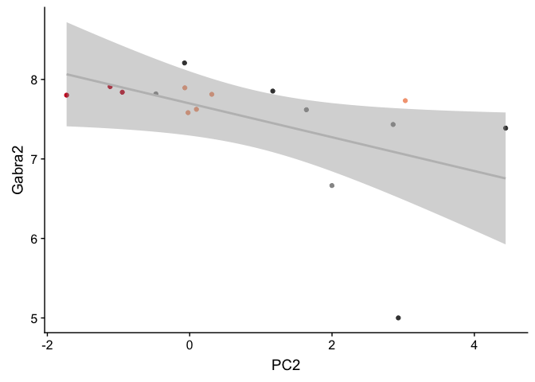
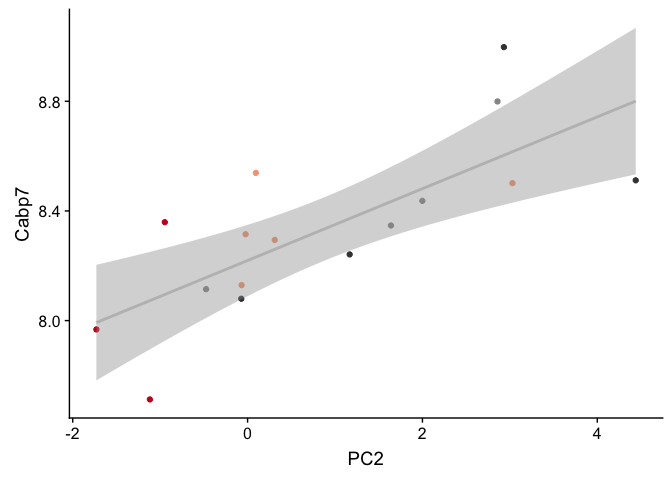
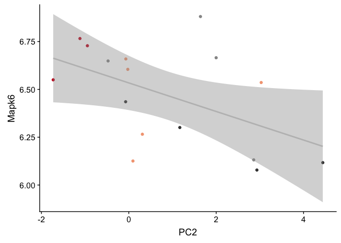

    library(tidyverse)

    ## ── Attaching packages ────────────────────────────────────────────── tidyverse 1.2.1 ──

    ## ✔ ggplot2 3.2.1     ✔ purrr   0.3.2
    ## ✔ tibble  2.1.3     ✔ dplyr   0.8.1
    ## ✔ tidyr   0.8.3     ✔ stringr 1.4.0
    ## ✔ readr   1.3.1     ✔ forcats 0.4.0

    ## ── Conflicts ───────────────────────────────────────────────── tidyverse_conflicts() ──
    ## ✖ dplyr::filter() masks stats::filter()
    ## ✖ dplyr::lag()    masks stats::lag()

    library(corrr)
    library(cowplot)

    ## 
    ## Attaching package: 'cowplot'

    ## The following object is masked from 'package:ggplot2':
    ## 
    ##     ggsave

    source("./figureoptions.R")

    ARC_associated <- read_csv("../data/02h_ARC_associated.csv")  %>% mutate_each(funs=toupper)  %>% dplyr::pull(gene) 

    ## Warning: Missing column names filled in: 'X1' [1]

    ## Parsed with column specification:
    ## cols(
    ##   X1 = col_double(),
    ##   `net$colors` = col_character(),
    ##   gene = col_character()
    ## )

    Neurod6_associated <- read_csv("../data/02h_Neurod6_associated.csv") %>% mutate_each(funs=toupper)  %>% dplyr::pull(gene) 

    ## Warning: Missing column names filled in: 'X1' [1]

    ## Parsed with column specification:
    ## cols(
    ##   X1 = col_double(),
    ##   `net$colors` = col_character(),
    ##   gene = col_character()
    ## )

    Prkcz_associated <- read_csv("../data/02h_Prkcz_associated.csv") %>% mutate_each(funs=toupper)  %>% dplyr::pull(gene) 

    ## Warning: Missing column names filled in: 'X1' [1]

    ## Parsed with column specification:
    ## cols(
    ##   X1 = col_double(),
    ##   `net$colors` = col_character(),
    ##   gene = col_character()
    ## )

    DG_DEGs <- read.csv("../data/02f_DG_DEGs_vsd.csv", row.names = 1, check.names = F)
    DG_DEGs <- as.data.frame(t(DG_DEGs))
    DG_DEGs$sample <- row.names(DG_DEGs)
    DG_DEGs <- DG_DEGs %>% select(`1190002N15RIK`:ZFP869)
    head(DG_DEGs)[1:5]

    ##           1190002N15RIK A830010M20RIK      ABHD2       ACAN    ADAMTS1
    ## 143A-DG-1    0.37666940     0.3321828  0.4370642  0.6682061  0.6571038
    ## 143B-DG-1   -0.79007413    -0.4803026 -0.1164208 -0.4768060  0.0494096
    ## 143D-DG-3   -0.01317465    -0.2575089 -0.1110985 -0.4930643 -0.3158022
    ## 144A-DG-2    1.40407413     1.4069082  1.1339066  0.8794021  2.1806769
    ## 144C-DG-2    1.16933394     1.2067769  0.8232341  0.4271263  1.1022770
    ## 144D-DG-2   -0.47594844    -0.2925787  0.1279683 -0.5497050 -1.5424372

    DG_DEGs <- as.data.frame(t(DG_DEGs))
    DG_DEGs$gene <- row.names(DG_DEGs)

    DG_ARC <- DG_DEGs %>% filter(gene %in% ARC_associated) %>% select(gene, everything())
    row.names(DG_ARC) <- DG_ARC$gene
    DG_ARC$gene <- NULL

    DG_ARC <- as.data.frame(t(DG_ARC))
    DG_ARC$sample  <- row.names(DG_ARC)
    DG_ARC$mouse <- sapply(strsplit(as.character(DG_ARC$sample),"\\-"), "[", 1)
    DG_ARC$ID <- paste(15, DG_ARC$mouse, sep = "")

    # read the sample data, set levels
    colData <- read.csv("../data/02a_colData.csv", row.names = 1, stringsAsFactors = T)
    colData <- colData %>% filter(subfield == "DG")

    # join with pca data for retention

    pca.Rn <- read_csv("../data/01a_pca.all.csv") %>% filter(TrainSessionComboNum == 9)

    ## Parsed with column specification:
    ## cols(
    ##   ID = col_character(),
    ##   treatment = col_character(),
    ##   TrainSessionComboNum = col_double(),
    ##   PC1 = col_double(),
    ##   PC2 = col_double(),
    ##   PC3 = col_double(),
    ##   PC4 = col_double(),
    ##   PC5 = col_double(),
    ##   PC6 = col_double(),
    ##   PC7 = col_double(),
    ##   PC8 = col_double(),
    ##   PC9 = col_double(),
    ##   PC10 = col_double()
    ## )

    pca.Rn <- pca.Rn %>% select(ID:PC2)
    head(pca.Rn)

    ## # A tibble: 6 x 5
    ##   ID     treatment        TrainSessionComboNum     PC1    PC2
    ##   <chr>  <chr>                           <dbl>   <dbl>  <dbl>
    ## 1 15140A conflict.trained                    9  2.24   -1.22 
    ## 2 15140B conflict.yoked                      9 -0.791  -1.60 
    ## 3 15140C standard.trained                    9  6.43    0.226
    ## 4 15140D standard.yoked                      9 -1.21    1.71 
    ## 5 15141C standard.trained                    9 -0.0494  1.12 
    ## 6 15141D standard.yoked                      9 -2.93    2.21

    colData <- left_join(colData, pca.Rn)

    ## Joining, by = c("ID", "treatment")

    ## Warning: Column `ID` joining factor and character vector, coercing into
    ## character vector

    ## Warning: Column `treatment` joining factor and character vector, coercing
    ## into character vector

    colData

    ##        ID subfield        treatment training TrainSessionComboNum
    ## 1  15143A       DG conflict.trained  trained                    9
    ## 2  15143B       DG   conflict.yoked    yoked                    9
    ## 3  15143D       DG   standard.yoked    yoked                    9
    ## 4  15144A       DG conflict.trained  trained                    9
    ## 5  15144C       DG standard.trained  trained                    9
    ## 6  15144D       DG   standard.yoked    yoked                    9
    ## 7  15145A       DG conflict.trained  trained                    9
    ## 8  15145B       DG   conflict.yoked    yoked                    9
    ## 9  15146A       DG conflict.trained  trained                    9
    ## 10 15146B       DG   conflict.yoked    yoked                    9
    ## 11 15146C       DG standard.trained  trained                    9
    ## 12 15146D       DG   standard.yoked    yoked                    9
    ## 13 15147C       DG standard.trained  trained                    9
    ## 14 15147D       DG   standard.yoked    yoked                    9
    ## 15 15148A       DG conflict.trained  trained                    9
    ## 16 15148B       DG   conflict.yoked    yoked                    9
    ##           PC1         PC2
    ## 1  -0.2511636  3.02981466
    ## 2  -3.5595365 -0.47451513
    ## 3  -3.0605115 -0.07227782
    ## 4   6.6921089 -0.02270055
    ## 5   7.0436756 -1.72946383
    ## 6  -3.4999867  1.16766175
    ## 7   6.9362884  0.31085957
    ## 8  -1.3375400  1.64001102
    ## 9   6.9208097  0.09483277
    ## 10 -1.5276429  1.99883979
    ## 11  4.2115795 -1.11790859
    ## 12 -1.6965727  2.93175222
    ## 13  5.3196322 -0.94691101
    ## 14 -3.2320870  4.43969435
    ## 15 -0.2562847 -0.06798772
    ## 16 -1.8023130  2.85862823

    alldata <- left_join(colData, DG_ARC)

    ## Joining, by = "ID"

    forcorplots <- alldata %>% select(PC1:UBC)
    forcorplots

    ##           PC1         PC2         ACAN     ADAMTS1      AMIGO2    ANKRD33B
    ## 1  -0.2511636  3.02981466  0.668206109  0.65710384  0.26383943  0.29566530
    ## 2  -3.5595365 -0.47451513 -0.476805955  0.04940960 -0.64311051 -0.63849004
    ## 3  -3.0605115 -0.07227782 -0.493064288 -0.31580223 -0.46456630 -0.11056438
    ## 4   6.6921089 -0.02270055  0.879402143  2.18067685  0.83850384  1.06672111
    ## 5   7.0436756 -1.72946383  0.427126302  1.10227701  0.59669923  0.66265263
    ## 6  -3.4999867  1.16766175 -0.549705024 -1.54243720 -0.54390449 -0.22663682
    ## 7   6.9362884  0.31085957  0.423357460 -0.04781799 -0.22876752  0.01382627
    ## 8  -1.3375400  1.64001102 -0.151026995 -0.07788381 -0.24784913 -0.38727098
    ## 9   6.9208097  0.09483277  0.003436546  0.33952194  0.51587335  0.09253903
    ## 10 -1.5276429  1.99883979 -0.635366284 -1.12353095 -0.02790315 -1.36876889
    ## 11  4.2115795 -1.11790859  0.608736516  0.38496261 -0.20570225  0.33732802
    ## 12 -1.6965727  2.93175222 -0.547437462 -0.97526734 -0.35241770  0.07874463
    ## 13  5.3196322 -0.94691101  0.847147571  0.97808693  0.67653849  0.60593974
    ## 14 -3.2320870  4.43969435 -0.781054213 -1.39233845 -0.43823408 -0.10349100
    ## 15 -0.2562847 -0.06798772  0.216995954  0.34146475 -0.09234151  0.02759893
    ## 16 -1.8023130  2.85862823 -0.439948380 -0.55842557  0.35334230 -0.34579355
    ##            ARC      ARL4D        ARL5B      ARMCX5       ATF3       BDNF
    ## 1   1.17562233  0.4681834  0.067822811  0.27801818  0.7586906  0.3915877
    ## 2  -0.74817999 -0.2155814 -0.039355740 -0.18623845 -0.5878057 -0.2684977
    ## 3  -0.36660430 -0.4948170 -0.384427053 -0.69754370  0.1244980 -0.2591467
    ## 4   1.40236262  0.3942209  0.858375060  0.65215076  1.0747769  1.2504129
    ## 5   2.04553524  1.2733692  0.691482272  0.35508059  1.3258853  0.9842984
    ## 6  -1.72812196 -0.6156106 -0.560640227 -0.52828927 -1.7991138 -0.6390658
    ## 7   0.07810374 -0.2568645  0.001144312  0.13487602  0.2059677 -0.2944630
    ## 8  -0.36477791 -0.3644487 -0.114430641 -0.38464328 -0.2610078 -0.7185384
    ## 9   0.97078867  0.7865753  0.121064029  0.23305807  0.6311708  0.4096738
    ## 10 -0.92295520 -0.3517889 -0.814323740 -0.46803354 -0.3829362 -1.4133853
    ## 11  0.93699249  0.1830134  1.328466028  0.34927378  1.1218354  1.1550456
    ## 12 -1.24673380  0.1907881 -0.032181329  0.06109713 -0.7516159  0.3194743
    ## 13  1.07659086  0.3600600  0.497518024  0.44101944  1.0498900  0.7244882
    ## 14 -2.14716643 -0.7672235 -0.855986203 -0.16156922 -2.2087194 -0.7810252
    ## 15  0.12154655 -0.2709352 -0.061467753 -0.17913623  0.1118214 -0.3148199
    ## 16 -0.28300290 -0.3189405 -0.703059852  0.10087972 -0.4133373 -0.5460389
    ##           BTG2       CPEB4       CYP51     DBPHT2      DNAJA1      DNAJB1
    ## 1   0.65579804  0.03299804 -0.01372105  0.1930068  0.15507601  0.24765215
    ## 2  -0.09277866 -0.39128678  0.04128289 -0.4232663 -0.19334775 -0.32471931
    ## 3  -0.03401878 -0.40971951 -0.12580958 -0.2434311 -0.12529218  0.23420804
    ## 4   1.17118242  0.78585047  0.96854443  0.9585654  0.30965478  0.93491519
    ## 5   1.65423072  0.60841936  0.31816753  1.2015258  0.56295571  1.17453649
    ## 6  -1.50193972 -0.45527557 -0.47015069 -0.4774288 -0.47193721 -1.33751583
    ## 7  -0.25100169  0.07171232 -0.22794737 -0.3829963 -0.13238207 -0.14475509
    ## 8  -0.21673422 -0.26276887 -0.34755405 -0.6272620 -0.22501649 -0.92664039
    ## 9   1.18319106 -0.09883683 -0.10293494  0.3538095 -0.09710543  0.05002476
    ## 10 -0.35874034 -0.57795299 -0.58795997 -1.7778358  0.02724972 -0.89348068
    ## 11  1.35902436  0.42458777  0.85357545  1.4830277  0.27450828  1.25167797
    ## 12 -2.60021290  0.01657830 -0.20013101 -0.1232318 -0.03721121 -0.72073266
    ## 13  0.66680584  0.43706678  0.49093721  0.6472489  0.70510186  1.11812060
    ## 14 -1.34567386 -0.02083447 -0.41977649 -0.3822292 -0.68584592 -1.25921133
    ## 15  0.21277658  0.16110599  0.04186110  0.3695256  0.09426371  0.62710972
    ## 16 -0.50190886 -0.32164402 -0.21838347 -0.7690284 -0.16067183 -0.03118964
    ##          DUSP6        EGR1        EGR4      FBXO33       FLRT3
    ## 1   0.87661199  0.85220916  0.93979077  0.51256579  0.21024604
    ## 2  -0.01400436 -0.03674124  0.08292777 -0.37366641 -0.14644147
    ## 3   0.12202664 -0.13607942 -0.28304049 -0.03675185 -0.11718717
    ## 4   1.06962125  1.08423965  1.21064480  2.00754485  1.19675523
    ## 5   1.25450844  1.60215902  1.91289470  1.50453004  0.79000640
    ## 6  -1.76384040 -2.25043209 -1.90562788 -1.40429424 -0.33653632
    ## 7  -0.15443441 -0.03548392 -0.03965305 -0.20803073  0.08158802
    ## 8  -0.80148640 -0.30660431 -0.65808515 -0.98038850 -0.25058245
    ## 9   0.38202334  0.44325259  0.97201766  0.43128586  0.25966781
    ## 10  0.23594486 -0.37814542 -1.83290546 -0.71877806 -1.24206536
    ## 11  1.14176536  1.26637203  2.06277267  2.15014530  0.37546905
    ## 12 -1.53835830 -0.90050902 -1.84932697 -2.37754677 -0.14282649
    ## 13  0.58568545  0.72113090  0.98413285  1.27486465  0.03252642
    ## 14 -1.25325927 -1.89303739 -1.50842908 -1.18864316 -0.10996946
    ## 15 -0.01559003  0.48725184  0.44135210 -0.07522413 -0.34240854
    ## 16 -0.12721416 -0.51958238 -0.52946524 -0.51761263 -0.25824170
    ##             FOS       FOSB       FOSL2       FRMD6         GAD1
    ## 1   0.998364387  0.7839060  0.55249442  0.47507885  0.459224161
    ## 2   0.598665874  0.3424215 -0.23117848 -0.39359154  0.194321370
    ## 3   0.153393727  0.1298796 -0.39404897 -0.31105189 -0.172685219
    ## 4   1.250321460  1.6214484  1.91578214  1.74986710  0.594361869
    ## 5   1.481259689  1.8692541  1.56815751  1.27664554  0.277318575
    ## 6  -2.208540511 -2.6656260 -1.09995963 -1.33812490 -0.205638891
    ## 7   0.008905704 -0.2593292 -0.05666779  0.14765024 -0.006340263
    ## 8   0.195356161 -0.3650584 -0.30525550 -0.82293569 -0.536750285
    ## 9   1.160790487  1.0207451  0.48079724 -0.24257348 -0.265146519
    ## 10 -1.188991180 -1.6525035 -2.28651221 -0.96567829  0.038506853
    ## 11  1.474767993  2.1615740  1.45538263  1.92532159  0.530505217
    ## 12 -3.717544339 -2.2605099 -0.83899868 -1.14795752 -0.337560061
    ## 13  0.689608048  1.1527022  1.21126645  1.45775510  0.283107048
    ## 14 -1.386882367 -1.4036465 -1.34714357 -1.19643103 -0.471554552
    ## 15  0.733501306  0.2878280  0.03902948  0.02979769  0.016656093
    ## 16 -0.242976440 -0.7630854 -0.66314505 -0.64377178 -0.398325397
    ##         HOMER1         JUN        JUNB        JUND        KLF6        LMNA
    ## 1   0.08603002  0.49791393  0.69811918  0.55453656  0.39326153  0.60393719
    ## 2  -0.38771728 -0.19560597 -0.04927700  0.07520287  0.27268705  0.17348917
    ## 3  -0.49646959  0.19136630 -0.11241581 -0.10280388  0.12902308 -0.29267054
    ## 4   1.69867876  0.91113482  1.06717695  0.82032847  1.10434951  0.36660536
    ## 5   1.10296746  1.03414255  1.45567864  0.91573429  0.74398698  0.71922274
    ## 6  -1.38228786 -0.89185436 -1.54080532 -1.07879586 -0.71578939 -0.90635400
    ## 7  -0.52133067 -0.01829525 -0.14737643 -0.41130829 -0.04686806 -0.20172483
    ## 8  -0.91501386 -0.22371027 -0.38616315 -0.58172039 -0.27842230 -0.17859757
    ## 9   0.21733344  0.46399364  0.95813584  0.56316858  0.16873954  0.07321896
    ## 10 -0.52050284 -0.35152750 -0.08038002 -0.96111445 -0.51555435 -0.29765106
    ## 11  1.93103201  0.68355094  1.57467757  1.31382996  0.58516656  1.55274716
    ## 12 -0.37338638 -1.58412161 -2.79015159 -0.12118423 -0.84006890 -1.36227389
    ## 13  1.57673946  0.27595181  0.56810487  0.48067386  0.42751466  0.63478606
    ## 14 -1.80782666 -0.44218173 -0.86146527 -0.88491586 -0.68034736 -0.74761358
    ## 15  0.46110795  0.29077400  0.12888148 -0.11628008 -0.61336966  0.05706139
    ## 16 -0.66935398 -0.64153129 -0.48273992 -0.46535155 -0.13430890 -0.19418257
    ##          LONRF1         NAF1        NPTX2      NR4A1       NR4A2
    ## 1   0.035878263 -0.136846879  0.661891112  1.0689339  0.59182869
    ## 2  -0.004773297 -0.155059569 -0.322689725  0.3885822 -0.30032160
    ## 3   0.048155614 -0.096311504 -0.043496316 -0.2539646  0.01628180
    ## 4   1.698425007  0.644800506  1.096605962  0.9610560  1.31121551
    ## 5   1.057489579  0.388793381  1.319931570  1.6321064  1.50150326
    ## 6  -0.541860494 -0.170047274 -0.781095383 -2.2680989 -1.46516425
    ## 7  -0.014437997  0.343298759  0.012281092  0.0940701 -0.32793230
    ## 8  -0.888248329 -0.322231838 -0.328212492 -0.0256079 -0.33322136
    ## 9   0.273805118  0.005566491  0.405081443  1.0160982  0.68489268
    ## 10 -0.169413887 -0.171488698 -2.287111311 -1.6648253  0.55370998
    ## 11  0.548468986  0.293295279  1.411289292  1.2904933  1.40967026
    ## 12 -1.951879367 -0.353767928 -0.238269108 -0.5235233 -2.02394875
    ## 13  1.093186373  0.309412742  0.809671219  0.7494099  0.84740418
    ## 14 -0.914393199 -0.281655764 -0.902204969 -2.4904839 -1.93433822
    ## 15  0.192211703 -0.085265590 -0.008411474  0.4034692 -0.06747697
    ## 16 -0.462614073 -0.212492116 -0.805260910 -0.3777153 -0.46410291
    ##          NR4A3         ODC1       PELI1        PER1        PER2
    ## 1   0.92840913  0.521441603 -0.17394039  0.23276306  0.47909499
    ## 2  -0.12001455 -0.079988945 -0.32330190 -0.13381890  0.01707757
    ## 3   0.23705478  0.005441203 -0.50064757 -0.05429489 -0.15393961
    ## 4   2.03849502  0.393263752  1.18484195  0.99681165  0.91871463
    ## 5   2.16819296  0.390728217  0.58640123  0.82641422  0.36839710
    ## 6  -2.19456170 -0.419169060 -0.57757127 -0.86335281 -0.16972839
    ## 7  -0.01812882 -0.253926434 -0.09358092 -0.15053195 -0.59797509
    ## 8  -0.73234019 -0.295785642 -0.61373203  0.02841121 -0.45740496
    ## 9   0.44557194 -0.003024400 -0.03276798  0.25071037 -0.44668966
    ## 10 -1.84461773 -0.882723365  0.02192475 -0.50785964  0.23505937
    ## 11  2.09583340  1.020501049  0.96857305  1.29418527  1.30998986
    ## 12 -1.94910879 -0.522835979 -0.01759783 -0.76808237 -0.91324327
    ## 13  1.29969420  0.610255633  0.60085313  0.77497755  0.84364174
    ## 14 -2.41719728 -0.366591559 -0.53373951 -1.24082767 -1.08635644
    ## 15  0.48641956  0.305421250  0.11569848  0.03077784  0.29218548
    ## 16 -0.42370193 -0.423007322 -0.61141320 -0.71628294 -0.63882330
    ##           PLK2      POU3F3      RASD1       RGS2        RGS4        SGK1
    ## 1   0.78283711  0.38090078  0.7041275  0.5604900  0.64547884  0.92538747
    ## 2  -0.21981408  0.13887390 -0.3548618 -0.3963040 -0.10973511 -0.11381416
    ## 3  -0.25382404 -0.12286318 -0.4561860 -0.3858197 -0.37169108 -0.47104136
    ## 4   1.38501953  0.24698059  1.4370306  1.7289639  0.88899671  1.34808429
    ## 5   1.42972800  0.43814744  1.2511629  1.4681521  1.06716173  1.33516868
    ## 6  -1.40405013 -0.35399154 -0.8244306 -1.2889923 -0.61736795 -1.06817878
    ## 7   0.08189698  0.14328811  0.2012196 -0.1623962 -0.27285895  0.10911137
    ## 8  -0.51984119 -0.40066947 -0.5625164 -0.6738749 -0.49816185 -0.45649541
    ## 9   0.76991362 -0.05949441  0.4315325  1.1456443  0.32484026  0.45204443
    ## 10 -0.49241041 -0.14377553 -0.3929847 -1.3255242 -1.45541126 -0.47173725
    ## 11  1.37596041  0.66312371  0.8370042  1.3661530  1.09622967  1.55551296
    ## 12 -2.49996094 -0.55722151 -1.8764837 -0.7260714  0.07587188 -2.35272695
    ## 13  0.88498847 -0.02772541  0.5119918  1.0258224  0.75686461  0.82481382
    ## 14 -0.82366905 -0.39030390 -1.0491911 -0.9488616 -0.72944151 -0.75975607
    ## 15 -0.19378189  0.10200208 -0.2013637 -0.6665766 -0.50866225  0.05140374
    ## 16 -0.30299239 -0.05727167  0.3439490 -0.7208049 -0.29211374 -0.90777678
    ##       SLC25A25       SMAD7      SOWAHC         SRF        STMN4
    ## 1   0.41535155  1.02744508  0.71133755  0.03148348  0.456972389
    ## 2  -0.16601134 -0.40287582 -0.33897411 -0.33985053  0.049427167
    ## 3  -0.51912590 -0.97404696  0.09772174 -0.12862414  0.188894520
    ## 4   0.59692363  1.57772336  0.59327899  0.58156661  0.289153988
    ## 5   0.51068521  1.46850478  0.75004193  0.49251426  0.563772626
    ## 6  -0.28907474 -1.13640529 -0.49764493 -0.89568619 -0.105760116
    ## 7   0.01696914  0.15631241  0.19467960 -0.12878527 -0.004434922
    ## 8  -0.01862667 -0.58518537  0.17188863 -0.02049097 -0.458193498
    ## 9   0.10942747  0.63565865  0.23789535  0.22451146  0.245650655
    ## 10  0.07003554 -0.04164484  0.09999272 -0.35760107 -0.205136916
    ## 11  0.44580739  1.65643694 -0.24362913  1.02720925  0.185500309
    ## 12 -0.58802034 -2.59455641 -1.38350623  0.49127853 -0.863192801
    ## 13  0.37077450  1.01121745  0.33596657  0.31784454  0.319026025
    ## 14 -0.26789277 -0.99263046 -0.61046592 -0.55719087 -0.494117194
    ## 15 -0.27019008 -0.07614150  0.35549067 -0.20442291 -0.037003495
    ## 16 -0.41703259 -0.72981201 -0.47407343 -0.53375618 -0.130558737
    ##           SYT4       TRIB1         UBC
    ## 1   0.16671430  1.13433796  0.38690216
    ## 2  -0.58149976  0.16840311 -0.01766093
    ## 3  -0.34837424 -0.04411045 -0.22052618
    ## 4   0.86231311  1.44379122  0.71368727
    ## 5   0.79716016  1.70179194  0.78103490
    ## 6  -0.36515165 -1.84420792 -0.65022413
    ## 7   0.03294637 -0.15909122 -0.12843805
    ## 8  -0.19880461  0.05138528 -0.48580403
    ## 9   0.06093674  0.86009739  0.17293903
    ## 10 -0.33861049 -1.55393076 -0.24395130
    ## 11  0.75793382  1.16901886  0.65218103
    ## 12 -0.50960385 -1.46600194 -0.24425416
    ## 13  0.36550900  1.09480407  0.39913249
    ## 14 -0.78415199 -1.98900655 -0.63966542
    ## 15 -0.18582692 -0.04666665 -0.07858194
    ## 16  0.26851002 -0.52061434 -0.39677075

    x <- correlate(forcorplots)

    ## 
    ## Correlation method: 'pearson'
    ## Missing treated using: 'pairwise.complete.obs'

    x %>% filter(PC1 > 0.755) %>% arrange(desc(PC1)) 

    ## # A tibble: 9 x 59
    ##   rowname   PC1    PC2   ACAN ADAMTS1 AMIGO2 ANKRD33B    ARC ARL4D ARL5B
    ##   <chr>   <dbl>  <dbl>  <dbl>   <dbl>  <dbl>    <dbl>  <dbl> <dbl> <dbl>
    ## 1 NAF1    0.859 -0.694  0.806   0.784  0.617    0.702  0.746 0.554 0.759
    ## 2 RGS2    0.832 -0.605  0.830   0.874  0.718    0.805  0.897 0.830 0.881
    ## 3 ARC     0.805 -0.632  0.872   0.904  0.787    0.671 NA     0.843 0.783
    ## 4 ACAN    0.789 -0.543 NA       0.875  0.672    0.765  0.872 0.638 0.821
    ## 5 SYT4    0.779 -0.551  0.824   0.792  0.772    0.689  0.881 0.698 0.789
    ## 6 ARMCX5  0.777 -0.273  0.785   0.741  0.756    0.763  0.734 0.740 0.733
    ## 7 ATF3    0.770 -0.676  0.846   0.868  0.699    0.580  0.963 0.772 0.798
    ## 8 FOSL2   0.757 -0.667  0.883   0.915  0.631    0.870  0.882 0.735 0.914
    ## 9 CPEB4   0.756 -0.442  0.818   0.784  0.633    0.896  0.713 0.654 0.819
    ## # … with 49 more variables: ARMCX5 <dbl>, ATF3 <dbl>, BDNF <dbl>,
    ## #   BTG2 <dbl>, CPEB4 <dbl>, CYP51 <dbl>, DBPHT2 <dbl>, DNAJA1 <dbl>,
    ## #   DNAJB1 <dbl>, DUSP6 <dbl>, EGR1 <dbl>, EGR4 <dbl>, FBXO33 <dbl>,
    ## #   FLRT3 <dbl>, FOS <dbl>, FOSB <dbl>, FOSL2 <dbl>, FRMD6 <dbl>,
    ## #   GAD1 <dbl>, HOMER1 <dbl>, JUN <dbl>, JUNB <dbl>, JUND <dbl>,
    ## #   KLF6 <dbl>, LMNA <dbl>, LONRF1 <dbl>, NAF1 <dbl>, NPTX2 <dbl>,
    ## #   NR4A1 <dbl>, NR4A2 <dbl>, NR4A3 <dbl>, ODC1 <dbl>, PELI1 <dbl>,
    ## #   PER1 <dbl>, PER2 <dbl>, PLK2 <dbl>, POU3F3 <dbl>, RASD1 <dbl>,
    ## #   RGS2 <dbl>, RGS4 <dbl>, SGK1 <dbl>, SLC25A25 <dbl>, SMAD7 <dbl>,
    ## #   SOWAHC <dbl>, SRF <dbl>, STMN4 <dbl>, SYT4 <dbl>, TRIB1 <dbl>,
    ## #   UBC <dbl>

    plotmycors <- function(df, whichgene, mysubtitle){
     p <- ggplot(alldata, aes(x = PC1, y = whichgene)) +
       geom_point(aes( color = treatment)) + 
       geom_smooth(method = "lm", color = "grey") +
       scale_color_manual(values = treatmentcolors) +
       labs(y = mysubtitle,  x = "PC1") +
       theme(legend.position = "none")
     return(p) 
    }  

    p1 <- plotmycors(alldata, alldata$NAF1, "NAF1")
    p2 <- plotmycors(alldata, alldata$RGS2, "RGS2")
    p3 <- plotmycors(alldata, alldata$ARC, "ARC")
    p4 <- plotmycors(alldata, alldata$ACAN, "ACAN")
    p5 <- plotmycors(alldata, alldata$SYT4, "SYT4")
    p6 <- plotmycors(alldata, alldata$ARMCX5, "ARMCX5")
    p7 <- plotmycors(alldata, alldata$ATF3, "ATF3")
    p8 <- plotmycors(alldata, alldata$FOSL2, "FOSL2")
    p9 <- plotmycors(alldata,alldata$CPEB4, "CPEB4")

    plot_grid(p1,p2,p3,p4,p5,p6,p7,p8,p9)

    ggplot(alldata, aes(x = ARC, y = FOSL2)) +
       geom_point(aes( color = treatment)) + 
       geom_smooth(method = "lm", color = "grey") +
       scale_color_manual(values = treatmentcolors) +
       theme(legend.position = "none")

    ggplot(alldata, aes(x = NAF1, y = CPEB4)) +
       geom_point(aes( color = treatment)) + 
       geom_smooth(method = "lm", color = "grey") +
       scale_color_manual(values = treatmentcolors) +
       theme(legend.position = "none")

    vsd <- read.csv("../data/02c_DGvsd.csv", row.names = 1, check.names = F)
    vsd <- as.data.frame(t(vsd))
    vsd$sample <- row.names(vsd)
    head(vsd)[1]

    ##           0610007P14Rik
    ## 143A-DG-1      6.381145
    ## 143B-DG-1      6.405587
    ## 143D-DG-3      6.834813
    ## 144A-DG-2      6.513173
    ## 144C-DG-2      6.401366
    ## 144D-DG-2      6.637581

    head(vsd)[17010]

    ##              Zzef1
    ## 143A-DG-1 7.829641
    ## 143B-DG-1 7.711706
    ## 143D-DG-3 7.987434
    ## 144A-DG-2 8.240355
    ## 144C-DG-2 7.955995
    ## 144D-DG-2 7.908857

    vsd <- vsd %>% select(`0610007P14Rik`:Zzef1)

    vsd$sample  <- row.names(vsd)
    vsd$mouse <- sapply(strsplit(as.character(vsd$sample),"\\-"), "[", 1)
    vsd$ID <- paste(15, vsd$mouse, sep = "")
    vsd <- vsd %>% select(ID, `0610007P14Rik`:Zzef1)
    head(vsd)[1:5]

    ##               ID 0610007P14Rik 0610009B22Rik 0610009L18Rik 0610009O20Rik
    ## 143A-DG-1 15143A      6.381145      5.781124      5.405848      6.736671
    ## 143B-DG-1 15143B      6.405587      5.661825      5.593055      6.691641
    ## 143D-DG-3 15143D      6.834813      5.299160      5.422004      6.736719
    ## 144A-DG-2 15144A      6.513173      5.528657      5.000789      6.530386
    ## 144C-DG-2 15144C      6.401366      5.821796      5.507750      6.799892
    ## 144D-DG-2 15144D      6.637581      5.670620      5.506319      6.642508

    vsd <- left_join(colData, vsd)

    ## Joining, by = "ID"

    forcorall <-  vsd %>% select(PC1:Zzef1)
    y <- correlate(forcorall) 

    ## 
    ## Correlation method: 'pearson'
    ## Missing treated using: 'pairwise.complete.obs'

    y %>% filter(PC1 > 0.6) %>% arrange(desc(PC1)) 

    ## # A tibble: 189 x 17,013
    ##    rowname   PC1    PC2 `0610007P14Rik` `0610009B22Rik` `0610009L18Rik`
    ##    <chr>   <dbl>  <dbl>           <dbl>           <dbl>           <dbl>
    ##  1 Naf1    0.859 -0.693         -0.0322           0.322         -0.196 
    ##  2 Ptgs2   0.839 -0.640         -0.205            0.318         -0.0816
    ##  3 Rgs2    0.833 -0.605          0.0121           0.206         -0.0871
    ##  4 Hist1h… 0.818 -0.539         -0.0489           0.390         -0.456 
    ##  5 Col10a1 0.813 -0.574         -0.0332           0.381         -0.148 
    ##  6 Arc     0.806 -0.631         -0.179            0.223         -0.123 
    ##  7 Hspb3   0.801 -0.277         -0.207            0.174          0.0138
    ##  8 Npas4   0.798 -0.637         -0.345            0.476          0.0298
    ##  9 Fzd5    0.797 -0.666         -0.122            0.407          0.0550
    ## 10 Acan    0.789 -0.542         -0.0800           0.331         -0.249 
    ## # … with 179 more rows, and 17,007 more variables: `0610009O20Rik` <dbl>,
    ## #   `0610010F05Rik` <dbl>, `0610010K14Rik` <dbl>, `0610012G03Rik` <dbl>,
    ## #   `0610030E20Rik` <dbl>, `0610037L13Rik` <dbl>, `0610040J01Rik` <dbl>,
    ## #   `1110002E22Rik` <dbl>, `1110004E09Rik` <dbl>, `1110004F10Rik` <dbl>,
    ## #   `1110008F13Rik` <dbl>, `1110008L16Rik` <dbl>, `1110008P14Rik` <dbl>,
    ## #   `1110012L19Rik` <dbl>, `1110017D15Rik` <dbl>, `1110032A03Rik` <dbl>,
    ## #   `1110032F04Rik` <dbl>, `1110034G24Rik` <dbl>, `1110037F02Rik` <dbl>,
    ## #   `1110038F14Rik` <dbl>, `1110051M20Rik` <dbl>, `1110059E24Rik` <dbl>,
    ## #   `1110059G10Rik` <dbl>, `1110065P20Rik` <dbl>, `1190002N15Rik` <dbl>,
    ## #   `1190005I06Rik` <dbl>, `1190007I07Rik` <dbl>, `1300017J02Rik` <dbl>,
    ## #   `1500009C09Rik` <dbl>, `1500009L16Rik` <dbl>, `1500011B03Rik` <dbl>,
    ## #   `1500011K16Rik` <dbl>, `1500015O10Rik` <dbl>, `1520401A03Rik` <dbl>,
    ## #   `1600002H07Rik` <dbl>, `1600002K03Rik` <dbl>, `1600012H06Rik` <dbl>,
    ## #   `1600014C10Rik` <dbl>, `1700001C19Rik` <dbl>, `1700001K19Rik` <dbl>,
    ## #   `1700001L19Rik` <dbl>, `1700001O22Rik` <dbl>, `1700001P01Rik` <dbl>,
    ## #   `1700003E16Rik` <dbl>, `1700003F12Rik` <dbl>, `1700006E09Rik` <dbl>,
    ## #   `1700007G11Rik` <dbl>, `1700007K13Rik` <dbl>, `1700008O03Rik` <dbl>,
    ## #   `1700010I14Rik` <dbl>, `1700011E24Rik` <dbl>, `1700011H14Rik` <dbl>,
    ## #   `1700011M02Rik` <dbl>, `1700013D24Rik` <dbl>, `1700013F07Rik` <dbl>,
    ## #   `1700014D04Rik` <dbl>, `1700015E13Rik` <dbl>, `1700016D06Rik` <dbl>,
    ## #   `1700016K19Rik` <dbl>, `1700017B05Rik` <dbl>, `1700019A02Rik` <dbl>,
    ## #   `1700019B03Rik` <dbl>, `1700019D03Rik` <dbl>, `1700019O17Rik` <dbl>,
    ## #   `1700020A23Rik` <dbl>, `1700020D05Rik` <dbl>, `1700020L24Rik` <dbl>,
    ## #   `1700020N01Rik` <dbl>, `1700021F05Rik` <dbl>, `1700022I11Rik` <dbl>,
    ## #   `1700023F06Rik` <dbl>, `1700024P16Rik` <dbl>, `1700025G04Rik` <dbl>,
    ## #   `1700027J19Rik` <dbl>, `1700028J19Rik` <dbl>, `1700028K03Rik` <dbl>,
    ## #   `1700028P14Rik` <dbl>, `1700029F12Rik` <dbl>, `1700029H14Rik` <dbl>,
    ## #   `1700029I15Rik` <dbl>, `1700029J07Rik` <dbl>, `1700030J22Rik` <dbl>,
    ## #   `1700030K09Rik` <dbl>, `1700034I23Rik` <dbl>, `1700034J05Rik` <dbl>,
    ## #   `1700037C18Rik` <dbl>, `1700037H04Rik` <dbl>, `1700040L02Rik` <dbl>,
    ## #   `1700047I17Rik2` <dbl>, `1700048O20Rik` <dbl>, `1700057G04Rik` <dbl>,
    ## #   `1700061G19Rik` <dbl>, `1700064H15Rik` <dbl>, `1700066B19Rik` <dbl>,
    ## #   `1700066M21Rik` <dbl>, `1700067K01Rik` <dbl>, `1700088E04Rik` <dbl>,
    ## #   `1700092M07Rik` <dbl>, `1700093K21Rik` <dbl>, `1700102P08Rik` <dbl>, …

    y %>% filter(PC1 < -0.6) %>% arrange(desc(PC1)) 

    ## # A tibble: 14 x 17,013
    ##    rowname    PC1   PC2 `0610007P14Rik` `0610009B22Rik` `0610009L18Rik`
    ##    <chr>    <dbl> <dbl>           <dbl>           <dbl>           <dbl>
    ##  1 Nme1    -0.602 0.332          0.244          -0.352          -0.237 
    ##  2 Mettl7… -0.602 0.364          0.177          -0.274          -0.470 
    ##  3 Lsm7    -0.604 0.468          0.620          -0.749           0.236 
    ##  4 Coq2    -0.606 0.471          0.482          -0.639          -0.349 
    ##  5 Uqcr11  -0.623 0.538          0.0807         -0.234           0.236 
    ##  6 Mrps23  -0.626 0.421          0.0961         -0.396          -0.403 
    ##  7 Sh3bp1  -0.629 0.349          0.220          -0.177           0.0188
    ##  8 Glyr1   -0.629 0.546         -0.233          -0.249          -0.235 
    ##  9 Mas1    -0.635 0.526          0.203          -0.0308         -0.106 
    ## 10 Gramd1a -0.642 0.236          0.235          -0.421          -0.164 
    ## 11 Thoc7   -0.663 0.474          0.494          -0.766           0.0612
    ## 12 Ube2l6  -0.670 0.413          0.440          -0.721           0.0575
    ## 13 Mtch2   -0.700 0.625          0.286          -0.409          -0.0259
    ## 14 Myl12b  -0.812 0.517          0.150          -0.211          -0.0964
    ## # … with 17,007 more variables: `0610009O20Rik` <dbl>,
    ## #   `0610010F05Rik` <dbl>, `0610010K14Rik` <dbl>, `0610012G03Rik` <dbl>,
    ## #   `0610030E20Rik` <dbl>, `0610037L13Rik` <dbl>, `0610040J01Rik` <dbl>,
    ## #   `1110002E22Rik` <dbl>, `1110004E09Rik` <dbl>, `1110004F10Rik` <dbl>,
    ## #   `1110008F13Rik` <dbl>, `1110008L16Rik` <dbl>, `1110008P14Rik` <dbl>,
    ## #   `1110012L19Rik` <dbl>, `1110017D15Rik` <dbl>, `1110032A03Rik` <dbl>,
    ## #   `1110032F04Rik` <dbl>, `1110034G24Rik` <dbl>, `1110037F02Rik` <dbl>,
    ## #   `1110038F14Rik` <dbl>, `1110051M20Rik` <dbl>, `1110059E24Rik` <dbl>,
    ## #   `1110059G10Rik` <dbl>, `1110065P20Rik` <dbl>, `1190002N15Rik` <dbl>,
    ## #   `1190005I06Rik` <dbl>, `1190007I07Rik` <dbl>, `1300017J02Rik` <dbl>,
    ## #   `1500009C09Rik` <dbl>, `1500009L16Rik` <dbl>, `1500011B03Rik` <dbl>,
    ## #   `1500011K16Rik` <dbl>, `1500015O10Rik` <dbl>, `1520401A03Rik` <dbl>,
    ## #   `1600002H07Rik` <dbl>, `1600002K03Rik` <dbl>, `1600012H06Rik` <dbl>,
    ## #   `1600014C10Rik` <dbl>, `1700001C19Rik` <dbl>, `1700001K19Rik` <dbl>,
    ## #   `1700001L19Rik` <dbl>, `1700001O22Rik` <dbl>, `1700001P01Rik` <dbl>,
    ## #   `1700003E16Rik` <dbl>, `1700003F12Rik` <dbl>, `1700006E09Rik` <dbl>,
    ## #   `1700007G11Rik` <dbl>, `1700007K13Rik` <dbl>, `1700008O03Rik` <dbl>,
    ## #   `1700010I14Rik` <dbl>, `1700011E24Rik` <dbl>, `1700011H14Rik` <dbl>,
    ## #   `1700011M02Rik` <dbl>, `1700013D24Rik` <dbl>, `1700013F07Rik` <dbl>,
    ## #   `1700014D04Rik` <dbl>, `1700015E13Rik` <dbl>, `1700016D06Rik` <dbl>,
    ## #   `1700016K19Rik` <dbl>, `1700017B05Rik` <dbl>, `1700019A02Rik` <dbl>,
    ## #   `1700019B03Rik` <dbl>, `1700019D03Rik` <dbl>, `1700019O17Rik` <dbl>,
    ## #   `1700020A23Rik` <dbl>, `1700020D05Rik` <dbl>, `1700020L24Rik` <dbl>,
    ## #   `1700020N01Rik` <dbl>, `1700021F05Rik` <dbl>, `1700022I11Rik` <dbl>,
    ## #   `1700023F06Rik` <dbl>, `1700024P16Rik` <dbl>, `1700025G04Rik` <dbl>,
    ## #   `1700027J19Rik` <dbl>, `1700028J19Rik` <dbl>, `1700028K03Rik` <dbl>,
    ## #   `1700028P14Rik` <dbl>, `1700029F12Rik` <dbl>, `1700029H14Rik` <dbl>,
    ## #   `1700029I15Rik` <dbl>, `1700029J07Rik` <dbl>, `1700030J22Rik` <dbl>,
    ## #   `1700030K09Rik` <dbl>, `1700034I23Rik` <dbl>, `1700034J05Rik` <dbl>,
    ## #   `1700037C18Rik` <dbl>, `1700037H04Rik` <dbl>, `1700040L02Rik` <dbl>,
    ## #   `1700047I17Rik2` <dbl>, `1700048O20Rik` <dbl>, `1700057G04Rik` <dbl>,
    ## #   `1700061G19Rik` <dbl>, `1700064H15Rik` <dbl>, `1700066B19Rik` <dbl>,
    ## #   `1700066M21Rik` <dbl>, `1700067K01Rik` <dbl>, `1700088E04Rik` <dbl>,
    ## #   `1700092M07Rik` <dbl>, `1700093K21Rik` <dbl>, `1700102P08Rik` <dbl>, …

    y %>% 
      focus(PC1, PC2, Naf1, Ptgs2, Rgs2, Hist1h1d, Col10a1,  Arc, 
                Nme1, Mettl7a1, Lsm7, Coq2, Uqcr11, Mrps23, 
            mirror = TRUE)  %>% 
            rplot(shape = 15, colors = c("#67a9cf", "#ef8a62") ) 

    ## Don't know how to automatically pick scale for object of type noquote. Defaulting to continuous.

    plotmycors(vsd, vsd$Arc, "ARC")

    plotmycors(vsd, vsd$Nme1, "NME1")

    y %>% filter(PC2 > 0.5) %>% arrange(desc(PC2)) 

    ## # A tibble: 234 x 17,013
    ##    rowname    PC1   PC2 `0610007P14Rik` `0610009B22Rik` `0610009L18Rik`
    ##    <chr>    <dbl> <dbl>           <dbl>           <dbl>           <dbl>
    ##  1 Cabp7   -0.244 0.743          0.0638        -0.484           -0.0667
    ##  2 Traf3i… -0.343 0.730         -0.145          0.0526           0.342 
    ##  3 Cox7a2  -0.499 0.720          0.170         -0.417           -0.0199
    ##  4 Ndufv2  -0.397 0.697          0.0729        -0.193           -0.108 
    ##  5 Trim65  -0.422 0.693         -0.0897        -0.353            0.134 
    ##  6 Echdc3  -0.244 0.692         -0.131          0.0287           0.269 
    ##  7 Frmd7   -0.310 0.679         -0.164          0.00453          0.266 
    ##  8 Akr1b3  -0.422 0.657         -0.113         -0.103           -0.195 
    ##  9 B23021… -0.392 0.656          0.245         -0.621           -0.280 
    ## 10 Nlgn1   -0.280 0.653          0.177         -0.503           -0.275 
    ## # … with 224 more rows, and 17,007 more variables: `0610009O20Rik` <dbl>,
    ## #   `0610010F05Rik` <dbl>, `0610010K14Rik` <dbl>, `0610012G03Rik` <dbl>,
    ## #   `0610030E20Rik` <dbl>, `0610037L13Rik` <dbl>, `0610040J01Rik` <dbl>,
    ## #   `1110002E22Rik` <dbl>, `1110004E09Rik` <dbl>, `1110004F10Rik` <dbl>,
    ## #   `1110008F13Rik` <dbl>, `1110008L16Rik` <dbl>, `1110008P14Rik` <dbl>,
    ## #   `1110012L19Rik` <dbl>, `1110017D15Rik` <dbl>, `1110032A03Rik` <dbl>,
    ## #   `1110032F04Rik` <dbl>, `1110034G24Rik` <dbl>, `1110037F02Rik` <dbl>,
    ## #   `1110038F14Rik` <dbl>, `1110051M20Rik` <dbl>, `1110059E24Rik` <dbl>,
    ## #   `1110059G10Rik` <dbl>, `1110065P20Rik` <dbl>, `1190002N15Rik` <dbl>,
    ## #   `1190005I06Rik` <dbl>, `1190007I07Rik` <dbl>, `1300017J02Rik` <dbl>,
    ## #   `1500009C09Rik` <dbl>, `1500009L16Rik` <dbl>, `1500011B03Rik` <dbl>,
    ## #   `1500011K16Rik` <dbl>, `1500015O10Rik` <dbl>, `1520401A03Rik` <dbl>,
    ## #   `1600002H07Rik` <dbl>, `1600002K03Rik` <dbl>, `1600012H06Rik` <dbl>,
    ## #   `1600014C10Rik` <dbl>, `1700001C19Rik` <dbl>, `1700001K19Rik` <dbl>,
    ## #   `1700001L19Rik` <dbl>, `1700001O22Rik` <dbl>, `1700001P01Rik` <dbl>,
    ## #   `1700003E16Rik` <dbl>, `1700003F12Rik` <dbl>, `1700006E09Rik` <dbl>,
    ## #   `1700007G11Rik` <dbl>, `1700007K13Rik` <dbl>, `1700008O03Rik` <dbl>,
    ## #   `1700010I14Rik` <dbl>, `1700011E24Rik` <dbl>, `1700011H14Rik` <dbl>,
    ## #   `1700011M02Rik` <dbl>, `1700013D24Rik` <dbl>, `1700013F07Rik` <dbl>,
    ## #   `1700014D04Rik` <dbl>, `1700015E13Rik` <dbl>, `1700016D06Rik` <dbl>,
    ## #   `1700016K19Rik` <dbl>, `1700017B05Rik` <dbl>, `1700019A02Rik` <dbl>,
    ## #   `1700019B03Rik` <dbl>, `1700019D03Rik` <dbl>, `1700019O17Rik` <dbl>,
    ## #   `1700020A23Rik` <dbl>, `1700020D05Rik` <dbl>, `1700020L24Rik` <dbl>,
    ## #   `1700020N01Rik` <dbl>, `1700021F05Rik` <dbl>, `1700022I11Rik` <dbl>,
    ## #   `1700023F06Rik` <dbl>, `1700024P16Rik` <dbl>, `1700025G04Rik` <dbl>,
    ## #   `1700027J19Rik` <dbl>, `1700028J19Rik` <dbl>, `1700028K03Rik` <dbl>,
    ## #   `1700028P14Rik` <dbl>, `1700029F12Rik` <dbl>, `1700029H14Rik` <dbl>,
    ## #   `1700029I15Rik` <dbl>, `1700029J07Rik` <dbl>, `1700030J22Rik` <dbl>,
    ## #   `1700030K09Rik` <dbl>, `1700034I23Rik` <dbl>, `1700034J05Rik` <dbl>,
    ## #   `1700037C18Rik` <dbl>, `1700037H04Rik` <dbl>, `1700040L02Rik` <dbl>,
    ## #   `1700047I17Rik2` <dbl>, `1700048O20Rik` <dbl>, `1700057G04Rik` <dbl>,
    ## #   `1700061G19Rik` <dbl>, `1700064H15Rik` <dbl>, `1700066B19Rik` <dbl>,
    ## #   `1700066M21Rik` <dbl>, `1700067K01Rik` <dbl>, `1700088E04Rik` <dbl>,
    ## #   `1700092M07Rik` <dbl>, `1700093K21Rik` <dbl>, `1700102P08Rik` <dbl>, …

    y %>% filter(PC2 < -0.5) %>% arrange(desc(PC2)) 

    ## # A tibble: 534 x 17,013
    ##    rowname    PC1    PC2 `0610007P14Rik` `0610009B22Rik` `0610009L18Rik`
    ##    <chr>    <dbl>  <dbl>           <dbl>           <dbl>           <dbl>
    ##  1 Mybl2   -0.167 -0.500         0.00299          0.132           0.210 
    ##  2 Gm10750  0.218 -0.501        -0.259            0.226           0.148 
    ##  3 Cluap1   0.255 -0.501        -0.514            0.634           0.288 
    ##  4 Snrpd3   0.253 -0.501        -0.353            0.394           0.641 
    ##  5 Tnks     0.436 -0.501        -0.566            0.715           0.104 
    ##  6 Itpkc    0.216 -0.501        -0.132            0.332           0.537 
    ##  7 Ngly1    0.302 -0.501         0.0815           0.0849          0.0530
    ##  8 Mapk6    0.111 -0.501        -0.368            0.435          -0.405 
    ##  9 Gabra2   0.212 -0.502        -0.424            0.484           0.413 
    ## 10 Tpt1     0.377 -0.502        -0.0116           0.208           0.319 
    ## # … with 524 more rows, and 17,007 more variables: `0610009O20Rik` <dbl>,
    ## #   `0610010F05Rik` <dbl>, `0610010K14Rik` <dbl>, `0610012G03Rik` <dbl>,
    ## #   `0610030E20Rik` <dbl>, `0610037L13Rik` <dbl>, `0610040J01Rik` <dbl>,
    ## #   `1110002E22Rik` <dbl>, `1110004E09Rik` <dbl>, `1110004F10Rik` <dbl>,
    ## #   `1110008F13Rik` <dbl>, `1110008L16Rik` <dbl>, `1110008P14Rik` <dbl>,
    ## #   `1110012L19Rik` <dbl>, `1110017D15Rik` <dbl>, `1110032A03Rik` <dbl>,
    ## #   `1110032F04Rik` <dbl>, `1110034G24Rik` <dbl>, `1110037F02Rik` <dbl>,
    ## #   `1110038F14Rik` <dbl>, `1110051M20Rik` <dbl>, `1110059E24Rik` <dbl>,
    ## #   `1110059G10Rik` <dbl>, `1110065P20Rik` <dbl>, `1190002N15Rik` <dbl>,
    ## #   `1190005I06Rik` <dbl>, `1190007I07Rik` <dbl>, `1300017J02Rik` <dbl>,
    ## #   `1500009C09Rik` <dbl>, `1500009L16Rik` <dbl>, `1500011B03Rik` <dbl>,
    ## #   `1500011K16Rik` <dbl>, `1500015O10Rik` <dbl>, `1520401A03Rik` <dbl>,
    ## #   `1600002H07Rik` <dbl>, `1600002K03Rik` <dbl>, `1600012H06Rik` <dbl>,
    ## #   `1600014C10Rik` <dbl>, `1700001C19Rik` <dbl>, `1700001K19Rik` <dbl>,
    ## #   `1700001L19Rik` <dbl>, `1700001O22Rik` <dbl>, `1700001P01Rik` <dbl>,
    ## #   `1700003E16Rik` <dbl>, `1700003F12Rik` <dbl>, `1700006E09Rik` <dbl>,
    ## #   `1700007G11Rik` <dbl>, `1700007K13Rik` <dbl>, `1700008O03Rik` <dbl>,
    ## #   `1700010I14Rik` <dbl>, `1700011E24Rik` <dbl>, `1700011H14Rik` <dbl>,
    ## #   `1700011M02Rik` <dbl>, `1700013D24Rik` <dbl>, `1700013F07Rik` <dbl>,
    ## #   `1700014D04Rik` <dbl>, `1700015E13Rik` <dbl>, `1700016D06Rik` <dbl>,
    ## #   `1700016K19Rik` <dbl>, `1700017B05Rik` <dbl>, `1700019A02Rik` <dbl>,
    ## #   `1700019B03Rik` <dbl>, `1700019D03Rik` <dbl>, `1700019O17Rik` <dbl>,
    ## #   `1700020A23Rik` <dbl>, `1700020D05Rik` <dbl>, `1700020L24Rik` <dbl>,
    ## #   `1700020N01Rik` <dbl>, `1700021F05Rik` <dbl>, `1700022I11Rik` <dbl>,
    ## #   `1700023F06Rik` <dbl>, `1700024P16Rik` <dbl>, `1700025G04Rik` <dbl>,
    ## #   `1700027J19Rik` <dbl>, `1700028J19Rik` <dbl>, `1700028K03Rik` <dbl>,
    ## #   `1700028P14Rik` <dbl>, `1700029F12Rik` <dbl>, `1700029H14Rik` <dbl>,
    ## #   `1700029I15Rik` <dbl>, `1700029J07Rik` <dbl>, `1700030J22Rik` <dbl>,
    ## #   `1700030K09Rik` <dbl>, `1700034I23Rik` <dbl>, `1700034J05Rik` <dbl>,
    ## #   `1700037C18Rik` <dbl>, `1700037H04Rik` <dbl>, `1700040L02Rik` <dbl>,
    ## #   `1700047I17Rik2` <dbl>, `1700048O20Rik` <dbl>, `1700057G04Rik` <dbl>,
    ## #   `1700061G19Rik` <dbl>, `1700064H15Rik` <dbl>, `1700066B19Rik` <dbl>,
    ## #   `1700066M21Rik` <dbl>, `1700067K01Rik` <dbl>, `1700088E04Rik` <dbl>,
    ## #   `1700092M07Rik` <dbl>, `1700093K21Rik` <dbl>, `1700102P08Rik` <dbl>, …

    y %>% 
      focus(PC1,PC2, Cabp7,  Traf3ip3, Cox7a2, Ndufv2, Trim65, Frmd7,
                Mybl2,Gm10750, Cluap1,Snrpd3,Mapk6, Gabra2,
            mirror = TRUE)  %>% 
            rplot(shape = 15, colors = c("#67a9cf", "#ef8a62") ) 

    ## Don't know how to automatically pick scale for object of type noquote. Defaulting to continuous.

    ggplot(vsd, aes(x = PC2, y = Gabra2)) +
       geom_point(aes( color = treatment)) + 
       geom_smooth(method = "lm", color = "grey") +
       scale_color_manual(values = treatmentcolors) +
       theme(legend.position = "none")

    ggplot(vsd, aes(x = PC2, y = Cabp7)) +
       geom_point(aes( color = treatment)) + 
       geom_smooth(method = "lm", color = "grey") +
       scale_color_manual(values = treatmentcolors) +
       theme(legend.position = "none")

    ggplot(vsd, aes(x = PC2, y = Mapk6)) +
       geom_point(aes( color = treatment)) + 
       geom_smooth(method = "lm", color = "grey") +
       scale_color_manual(values = treatmentcolors) +
       theme(legend.position = "none")

