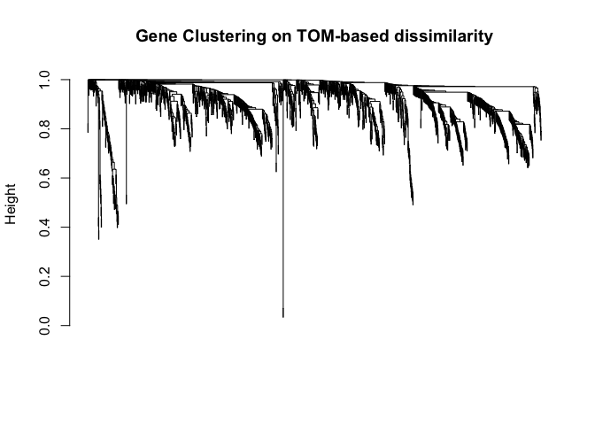
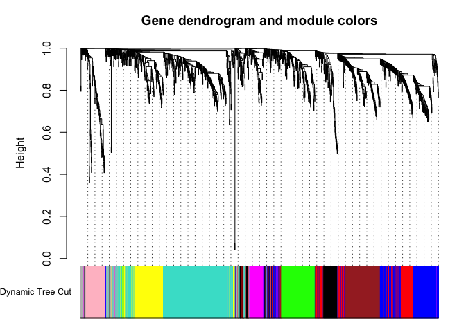
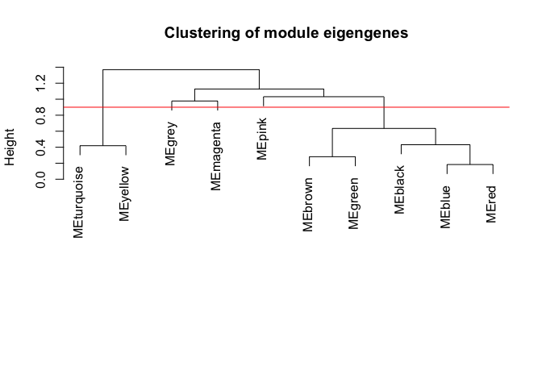
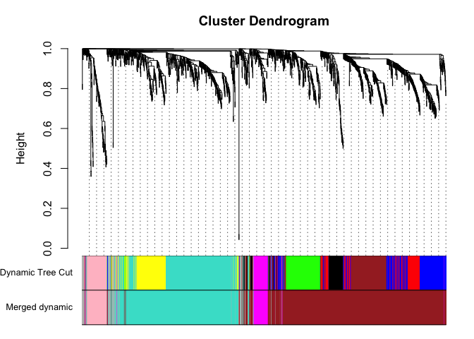

    # WGCNA ----
    # Install and Load WGCNA package
    # https://labs.genetics.ucla.edu/horvath/CoexpressionNetwork/Rpackages/WGCNA/faq.html
    #source("https://bioconductor.org/biocLite.R")
    #biocLite("DESeq2")
    #install.packages("flashClust")
    library(WGCNA)

    ## Loading required package: dynamicTreeCut

    ## Loading required package: fastcluster

    ## 
    ## Attaching package: 'fastcluster'

    ## The following object is masked from 'package:stats':
    ## 
    ##     hclust

    ## 

    ## ==========================================================================
    ## *
    ## *  Package WGCNA 1.51 loaded.
    ## *
    ## ==========================================================================

    ## 
    ## Attaching package: 'WGCNA'

    ## The following object is masked from 'package:stats':
    ## 
    ##     cor

    library(flashClust)

    ## 
    ## Attaching package: 'flashClust'

    ## The following object is masked from 'package:fastcluster':
    ## 
    ##     hclust

    ## The following object is masked from 'package:stats':
    ## 
    ##     hclust

    library(magrittr) ## to use the weird pipe
    library(dplyr)

    ## 
    ## Attaching package: 'dplyr'

    ## The following objects are masked from 'package:stats':
    ## 
    ##     filter, lag

    ## The following objects are masked from 'package:base':
    ## 
    ##     intersect, setdiff, setequal, union

    library(DESeq2) ## for gene expression analysis

    ## Loading required package: S4Vectors

    ## Loading required package: stats4

    ## Loading required package: BiocGenerics

    ## Loading required package: parallel

    ## 
    ## Attaching package: 'BiocGenerics'

    ## The following objects are masked from 'package:parallel':
    ## 
    ##     clusterApply, clusterApplyLB, clusterCall, clusterEvalQ,
    ##     clusterExport, clusterMap, parApply, parCapply, parLapply,
    ##     parLapplyLB, parRapply, parSapply, parSapplyLB

    ## The following objects are masked from 'package:dplyr':
    ## 
    ##     combine, intersect, setdiff, union

    ## The following objects are masked from 'package:stats':
    ## 
    ##     IQR, mad, xtabs

    ## The following objects are masked from 'package:base':
    ## 
    ##     anyDuplicated, append, as.data.frame, cbind, colnames,
    ##     do.call, duplicated, eval, evalq, Filter, Find, get, grep,
    ##     grepl, intersect, is.unsorted, lapply, lengths, Map, mapply,
    ##     match, mget, order, paste, pmax, pmax.int, pmin, pmin.int,
    ##     Position, rank, rbind, Reduce, rownames, sapply, setdiff,
    ##     sort, table, tapply, union, unique, unsplit, which, which.max,
    ##     which.min

    ## 
    ## Attaching package: 'S4Vectors'

    ## The following objects are masked from 'package:dplyr':
    ## 
    ##     first, rename

    ## The following objects are masked from 'package:base':
    ## 
    ##     colMeans, colSums, expand.grid, rowMeans, rowSums

    ## Loading required package: IRanges

    ## 
    ## Attaching package: 'IRanges'

    ## The following objects are masked from 'package:dplyr':
    ## 
    ##     collapse, desc, regroup, slice

    ## Loading required package: GenomicRanges

    ## Loading required package: GenomeInfoDb

    ## Loading required package: SummarizedExperiment

    ## Loading required package: Biobase

    ## Welcome to Bioconductor
    ## 
    ##     Vignettes contain introductory material; view with
    ##     'browseVignettes()'. To cite Bioconductor, see
    ##     'citation("Biobase")', and for packages 'citation("pkgname")'.

    library(viridis) # for awesome color pallette

    options(stringsAsFactors=FALSE)
    allowWGCNAThreads()

    ## Allowing multi-threading with up to 4 threads.

    ## set output file for figures 
    knitr::opts_chunk$set(fig.path = '../figures/02f_RNAseqWGCNA/')

    ########################################################    
    #        Prep Variance Stabilized Data
    ########################################################    

    datExpr0 <- read.csv("../data/02b_vsd.csv", header = T, check.names = F, row.names = 1)
    datExpr0 <- datExpr0[rowMeans(datExpr0[, -1]) > 8.5, ] ## remove rows with rowsum > some value
    datExpr0 <- t(datExpr0) ## transpose data
    datExpr0 <- as.data.frame(datExpr0)

    gsg=goodSamplesGenes(datExpr0, verbose = 1) # test that all samples good to go

    ##  Flagging genes and samples with too many missing values...
    ##   ..step 1

    gsg$allOK #If all TRUE, all genes have passed the cuts

    ## [1] TRUE

    gsg$goodSamples

    ##  [1] TRUE TRUE TRUE TRUE TRUE TRUE TRUE TRUE TRUE TRUE TRUE TRUE TRUE TRUE
    ## [15] TRUE TRUE TRUE TRUE TRUE TRUE TRUE TRUE TRUE TRUE TRUE TRUE TRUE TRUE
    ## [29] TRUE TRUE TRUE TRUE TRUE TRUE TRUE TRUE TRUE TRUE TRUE TRUE TRUE TRUE
    ## [43] TRUE TRUE

    #-----Make a trait dataframe
    datTraits <- read.csv("../data/02a_colData.csv", header = T, check.names = F, row.names = 1)

    datTraits$avoidance <- datTraits$APA2 # avoidance column
    datTraits$avoidance <- as.character(datTraits$avoidance)
    datTraits$avoidance <- ifelse(grepl("yoked_consistent", datTraits$avoidance), "control", 
                                  ifelse(grepl("yoked_conflict", datTraits$avoidance), "control", "avoidance"))
    datTraits$avoidance <- as.factor(datTraits$avoidance)
    str(datTraits)

    ## 'data.frame':    44 obs. of  8 variables:
    ##  $ Mouse    : chr  "15-143A" "15-143A" "15-143B" "15-143B" ...
    ##  $ Punch    : chr  "CA3" "DG" "CA1" "DG" ...
    ##  $ Group    : chr  "conflict" "conflict" "control" "control" ...
    ##  $ Conflict : chr  "Conflict" "Conflict" "Conflict" "Conflict" ...
    ##  $ ID       : chr  "15143A" "15143A" "15143B" "15143B" ...
    ##  $ APA      : chr  "Conflict" "Conflict" "Control" "Control" ...
    ##  $ APA2     : chr  "conflict" "conflict" "yoked_conflict" "yoked_conflict" ...
    ##  $ avoidance: Factor w/ 2 levels "avoidance","control": 1 1 2 2 1 2 2 1 1 1 ...

    datTraits <- datTraits[c(2,7,8)]

    datTraits$Punch <- as.integer(factor(datTraits$Punch))
    datTraits$APA2 <- as.integer(factor(datTraits$APA2))
    datTraits$avoidance <- as.integer(factor(datTraits$avoidance))

    datTraits$Punch <- as.numeric(factor(datTraits$Punch))
    datTraits$APA2 <- as.numeric(factor(datTraits$APA2))
    datTraits$avoidance <- as.numeric(factor(datTraits$avoidance))

    #######   #################    ################   #######    
    #                 Call sample outliers
    #######   #################    ################   #######   

    #-----Sample dendrogram and traits
    A=adjacency(t(datExpr0),type="signed")
    #-----Calculate whole network connectivity
    k=as.numeric(apply(A,2,sum))-1

    #######   #################    ################   ####### 
    #      Standardized connectivity
    #######   #################    ################   ####### 

    Z.k=scale(k)
    thresholdZ.k=-2.5 
    outlierColor=ifelse(Z.k<thresholdZ.k,"red","black")
    sampleTree = flashClust(as.dist(1-A), method = "average")
    #-----Convert traits to colors
    traitColors=data.frame(numbers2colors(datTraits,signed=FALSE))
    str(traitColors)

    ## 'data.frame':    44 obs. of  3 variables:
    ##  $ X1: chr  "#FF977D" "#FF3300" "#FFFFFF" "#FF3300" ...
    ##  $ X2: chr  "#FFFFFF" "#FFFFFF" "#FF7653" "#FF7653" ...
    ##  $ X3: chr  "#FFFFFF" "#FFFFFF" "#FF3300" "#FF3300" ...

    dimnames(traitColors)[[2]]=paste(names(datTraits))
    datColors=data.frame(outlier=outlierColor,traitColors)

    #######   #################    ################   ####### 
    #      Plot the sample dendrogram
    #######   #################    ################   ####### 

    pdf(file="../figures/02f_RNAseqWGCNA/SampleDendro.pdf", width=6, height=6)
    plotDendroAndColors(sampleTree,groupLabels=names(datColors),
                        colors=datColors,main="Sample dendrogram and trait heatmap")
    dev.off()

    ## quartz_off_screen 
    ##                 2

    # Determine cluster under the line
    clust = cutreeStatic(sampleTree, cutHeight = 0.45, minSize = 10)
    table(clust)

    ## clust
    ##  0  1  2  3 
    ##  4 14 13 13

    keepSamples = (clust==1)
    datExpr = datExpr0[keepSamples, ]
    nGenes = ncol(datExpr)
    nSamples = nrow(datExpr)

    #-----Remove outlying samples 
    remove.samples= Z.k<thresholdZ.k | is.na(Z.k)
    datExpr0=datExpr0[!remove.samples,]
    datTraits=datTraits[!remove.samples,]
    A=adjacency(t(datExpr0),type="distance")
    k=as.numeric(apply(A,2,sum))-1
    Z.k=scale(k)
    dim(datExpr0)

    ## [1]   42 1559

    dim(datTraits)

    ## [1] 42  3

    #######   #################    ################   #######    
    #                     Choose soft threshold
    #######   #################    ################   #######     

    powers= c(seq(1,10,by=1), seq(from =12, to=20, by=2)) #choosing a set of soft-thresholding powers
    sft = pickSoftThreshold(datExpr0, powerVector=powers, verbose =5,networkType="signed") #call network topology analysis function

    ## pickSoftThreshold: will use block size 1559.
    ##  pickSoftThreshold: calculating connectivity for given powers...
    ##    ..working on genes 1 through 1559 of 1559
    ##    Power SFT.R.sq   slope truncated.R.sq mean.k. median.k. max.k.
    ## 1      1 0.285000  6.0900          0.817  794.00    797.00  873.0
    ## 2      2 0.116000  2.1100          0.739  466.00    460.00  583.0
    ## 3      3 0.000294 -0.0465          0.732  300.00    297.00  438.0
    ## 4      4 0.237000 -0.8740          0.886  206.00    203.00  351.0
    ## 5      5 0.399000 -1.0300          0.905  149.00    145.00  292.0
    ## 6      6 0.454000 -1.0300          0.909  111.00    106.00  248.0
    ## 7      7 0.499000 -1.1100          0.886   85.70     79.40  214.0
    ## 8      8 0.557000 -1.1200          0.900   67.50     60.50  187.0
    ## 9      9 0.608000 -1.1900          0.919   54.20     46.70  165.0
    ## 10    10 0.643000 -1.2800          0.911   44.20     36.50  147.0
    ## 11    12 0.695000 -1.4000          0.919   30.60     23.70  118.0
    ## 12    14 0.737000 -1.4400          0.940   22.10     16.20   97.6
    ## 13    16 0.758000 -1.5100          0.940   16.40     11.20   81.7
    ## 14    18 0.765000 -1.5700          0.944   12.50      7.83   69.2
    ## 15    20 0.782000 -1.6000          0.952    9.78      5.66   59.4

    pdf(file="../figures/02f_RNAseqWGCNA/softthreshold.pdf", width=6, height=5)
    par(mfrow= c(1,2))
    cex1=0.9
    plot(sft$fitIndices[,1], -sign(sft$fitIndices[,3])*sft$fitIndices[,2], xlab= "Soft Threshold (power)", ylab="Scale Free Topology Model Fit, signed", type= "n", main= paste("Scale independence"))
    text(sft$fitIndices[,1], -sign(sft$fitIndices[,3])*sft$fitIndices[,2], labels=powers, cex=cex1, col="red")
    abline(h=0.90, col="red")
    plot(sft$fitIndices[,1], sft$fitIndices[,5], xlab= "Soft Threshold (power)", ylab="Mean Connectivity", type="n", main = paste("Mean connectivity"))
    text(sft$fitIndices[,1], sft$fitIndices[,5], labels=powers, cex=cex1, col="red")
    dev.off()

    ## quartz_off_screen 
    ##                 2

    #######   #################    ################   #######    
    #                    Construct network
    #######   #################    ################   #######     

    adjacency=adjacency(datExpr0, type="signed", power=20 )  #add  if adjusting 
    TOM= TOMsimilarity(adjacency, TOMType="signed")

    ## ..connectivity..
    ## ..matrix multiplication..
    ## ..normalization..
    ## ..done.

    dissTOM= 1-TOM
    geneTree= flashClust(as.dist(dissTOM), method="average")

    plot(geneTree, xlab="", sub="", main= "Gene Clustering on TOM-based dissimilarity", labels= FALSE, hang=0.04)

    #######   #################    ################   #######    
    #                    Make modules
    #######   #################    ################   ####### 

    minModuleSize=50
    dynamicMods= cutreeDynamic(dendro= geneTree, distM= dissTOM, deepSplit=2, pamRespectsDendro= FALSE, minClusterSize= minModuleSize)

    ##  ..cutHeight not given, setting it to 0.997  ===>  99% of the (truncated) height range in dendro.
    ##  ..done.

    table(dynamicMods)

    ## dynamicMods
    ##   0   1   2   3   4   5   6   7   8   9 
    ##  78 365 227 184 165 156 139  92  83  70

    dynamicColors= labels2colors(dynamicMods)

    plotDendroAndColors(geneTree, dynamicColors, "Dynamic Tree Cut", dendroLabels= FALSE, hang=0.03, addGuide= TRUE, guideHang= 0.05, main= "Gene dendrogram and module colors")

    #-----Merge modules whose expression profiles are very similar
    MEList= moduleEigengenes(datExpr0, colors= dynamicColors)
    MEs= MEList$eigengenes
    #Calculate dissimilarity of module eigenegenes
    MEDiss= 1-cor(MEs, use = 'pairwise.complete.obs')
    #Cluster module eigengenes
    METree= flashClust(as.dist(MEDiss), method= "average")

    plot(METree, main= "Clustering of module eigengenes", xlab= "", sub= "")
    MEDissThres= 0.9
    abline(h=MEDissThres, col="red")
    merge= mergeCloseModules(datExpr0, dynamicColors, cutHeight= MEDissThres, verbose =3)

    ##  mergeCloseModules: Merging modules whose distance is less than 0.9
    ##    multiSetMEs: Calculating module MEs.
    ##      Working on set 1 ...
    ##      moduleEigengenes: Calculating 10 module eigengenes in given set.
    ##    multiSetMEs: Calculating module MEs.
    ##      Working on set 1 ...
    ##      moduleEigengenes: Calculating 5 module eigengenes in given set.
    ##    Calculating new MEs...
    ##    multiSetMEs: Calculating module MEs.
    ##      Working on set 1 ...
    ##      moduleEigengenes: Calculating 5 module eigengenes in given set.

    mergedColors= merge$colors
    mergedMEs= merge$newMEs

    plotDendroAndColors(geneTree, cbind(dynamicColors, mergedColors), c("Dynamic Tree Cut", "Merged dynamic"), dendroLabels= FALSE, hang=0.03, addGuide= TRUE, guideHang=0.05)

    moduleColors= mergedColors
    colorOrder= c("grey", standardColors(50))
    moduleLabels= match(moduleColors, colorOrder)-1
    MEs=mergedMEs

    #######   #################    ################   #######    
    #                Relate modules to traits
    #######   #################    ################   ####### 

    datt=datExpr0

    #-----Define numbers of genes and samples
    nGenes = ncol(datt);
    nSamples = nrow(datt);
    #-----Recalculate MEs with color labels
    MEs0 = moduleEigengenes(datt, moduleColors)$eigengenes
    MEs = orderMEs(MEs0)

    #-----Correlations of genes with eigengenes
    moduleGeneCor=cor(MEs, datt)
    moduleGenePvalue = corPvalueStudent(moduleGeneCor, nSamples);

    moduleTraitCor = cor(MEs, datTraits);
    moduleTraitPvalue = corPvalueStudent(moduleTraitCor, nSamples);

    #---------------------Module-trait heatmap

    #quartz()
    textMatrix = paste(signif(moduleTraitCor, 2), "\n(",
                       signif(moduleTraitPvalue, 1), ")", sep = "");
    dim(textMatrix) = dim(moduleTraitCor)
    dev.off()

    ## null device 
    ##           1

    # Display the correlation values within a heatmap plot
    labeledHeatmap(Matrix = moduleTraitCor,
                   xLabels = names(datTraits),
                   yLabels = names(MEs),
                   ySymbols = names(MEs),
                   colorLabels = FALSE,
                   colors = viridis(50),
                   textMatrix = textMatrix,
                   xColorWidth = 0.01,
                   yColorWidth = 0.01,
                   #setStdMargins = FALSE,
                   #cex.text = 0.7,
                   #zlim = c(-1,1),
                   main = paste("Module-trait relationships"))
    ######--------------------end--------------------#######

    ################################################################

    ################ DG ######################

    ################################################################
    datExpr0 <- read.csv("../data/02c_DGvsd.csv", header = T, check.names = F, row.names = 1)
    datExpr0 <- datExpr0[rowMeans(datExpr0[, -1]) > 8.5, ] ## remove rows with rowsum > some value
    datExpr0 <- t(datExpr0) ## transpose data
    datExpr0 <- as.data.frame(datExpr0)

    gsg=goodSamplesGenes(datExpr0, verbose = 1) # test that all samples good to go

    ##  Flagging genes and samples with too many missing values...
    ##   ..step 1

    gsg$allOK #If all TRUE, all genes have passed the cuts

    ## [1] TRUE

    gsg$goodSamples

    ##  [1] TRUE TRUE TRUE TRUE TRUE TRUE TRUE TRUE TRUE TRUE TRUE TRUE TRUE TRUE
    ## [15] TRUE TRUE

    #-----Make a trait dataframe
    datTraits <- read.csv("../data/02c_DGcolData.csv", header = T, check.names = F, row.names = 1)
    datTraits$avoidance <- datTraits$APA2 # avoidance column
    datTraits$avoidance <- as.character(datTraits$avoidance)
    datTraits$avoidance <- ifelse(grepl("yoked_consistent", datTraits$avoidance), "control", 
                                  ifelse(grepl("yoked_conflict", datTraits$avoidance), "control", "avoidance"))
    datTraits$avoidance <- as.factor(datTraits$avoidance)
    datTraits <- datTraits[c(8,9)]
    datTraits$APA2 <- as.integer(factor(datTraits$APA2))
    datTraits$avoidance <- as.integer(factor(datTraits$avoidance))
    datTraits$APA2 <- as.numeric(factor(datTraits$APA2))
    datTraits$avoidance <- as.numeric(factor(datTraits$avoidance))
    str(datTraits)

    ## 'data.frame':    16 obs. of  2 variables:
    ##  $ APA2     : num  1 3 4 1 2 4 1 3 1 3 ...
    ##  $ avoidance: num  1 2 2 1 1 2 1 2 1 2 ...

    #######   #################    ################   #######    
    #                 Call sample outliers
    #######   #################    ################   #######   

    #-----Sample dendrogram and traits
    A=adjacency(t(datExpr0),type="signed")
    #-----Calculate whole network connectivity
    k=as.numeric(apply(A,2,sum))-1

    #######   #################    ################   ####### 
    #      Standardized connectivity
    #######   #################    ################   ####### 

    Z.k=scale(k)
    thresholdZ.k=-2.5 
    outlierColor=ifelse(Z.k<thresholdZ.k,"red","black")
    sampleTree = flashClust(as.dist(1-A), method = "average")
    #-----Convert traits to colors
    traitColors=data.frame(numbers2colors(datTraits,signed=FALSE))
    str(traitColors)

    ## 'data.frame':    16 obs. of  2 variables:
    ##  $ X1: chr  "#FFFFFF" "#FF7653" "#FF3300" "#FFFFFF" ...
    ##  $ X2: chr  "#FFFFFF" "#FF3300" "#FF3300" "#FFFFFF" ...

    dimnames(traitColors)[[2]]=paste(names(datTraits))
    datColors=data.frame(outlier=outlierColor,traitColors)

    #######   #################    ################   ####### 
    #      Plot the sample dendrogram
    #######   #################    ################   ####### 

    pdf(file="../figures/02f_RNAseqWGCNA/SampleDendroDG.pdf", width=6, height=6)
    plotDendroAndColors(sampleTree,groupLabels=names(datColors),
                        colors=datColors,main="Sample dendrogram and trait heatmap")
    dev.off()

    ## pdf 
    ##   2

    # Determine cluster under the line
    clust = cutreeStatic(sampleTree, cutHeight = 0.45, minSize = 10)
    table(clust)

    ## clust
    ##  0  1 
    ##  2 14

    keepSamples = (clust==1)
    datExpr = datExpr0[keepSamples, ]
    nGenes = ncol(datExpr)
    nSamples = nrow(datExpr)

    #-----Remove outlying samples 
    remove.samples= Z.k<thresholdZ.k | is.na(Z.k)
    datExpr0=datExpr0[!remove.samples,]
    datTraits=datTraits[!remove.samples,]
    A=adjacency(t(datExpr0),type="distance")
    k=as.numeric(apply(A,2,sum))-1
    Z.k=scale(k)
    dim(datExpr0)

    ## [1]   16 1290

    dim(datTraits)

    ## [1] 16  2

    #######   #################    ################   #######    
    #                     Choose soft threshold
    #######   #################    ################   #######     

    powers= c(seq(1,10,by=1), seq(from =12, to=20, by=2)) #choosing a set of soft-thresholding powers
    sft = pickSoftThreshold(datExpr0, powerVector=powers, verbose =5,networkType="signed") #call network topology analysis function

    ## pickSoftThreshold: will use block size 1290.
    ##  pickSoftThreshold: calculating connectivity for given powers...
    ##    ..working on genes 1 through 1290 of 1290
    ##    Power SFT.R.sq   slope truncated.R.sq mean.k. median.k. max.k.
    ## 1      1 0.462000 18.0000          0.893  654.00    654.00  711.0
    ## 2      2 0.278000  4.4600          0.967  386.00    385.00  465.0
    ## 3      3 0.050500  0.8480          0.957  251.00    249.00  344.0
    ## 4      4 0.000377 -0.0464          0.968  174.00    170.00  271.0
    ## 5      5 0.026800 -0.3090          0.921  127.00    121.00  221.0
    ## 6      6 0.079600 -0.4460          0.878   95.90     89.10  185.0
    ## 7      7 0.188000 -0.6410          0.836   74.60     67.50  158.0
    ## 8      8 0.299000 -0.7270          0.810   59.40     52.20  136.0
    ## 9      9 0.413000 -0.7740          0.814   48.20     40.90  119.0
    ## 10    10 0.537000 -0.7700          0.864   39.70     32.70  104.0
    ## 11    12 0.719000 -0.9660          0.901   28.10     21.60   85.6
    ## 12    14 0.855000 -1.1300          0.968   20.80     14.90   74.3
    ## 13    16 0.913000 -1.2400          0.988   15.80     10.50   66.5
    ## 14    18 0.940000 -1.3400          0.991   12.40      7.66   60.5
    ## 15    20 0.958000 -1.3900          0.981    9.96      5.68   55.7

    pdf(file="../figures/02f_RNAseqWGCNA/DGsoftthreshold.pdf", width=6, height=5)
    par(mfrow= c(1,2))
    cex1=0.9
    plot(sft$fitIndices[,1], -sign(sft$fitIndices[,3])*sft$fitIndices[,2], xlab= "Soft Threshold (power)", ylab="Scale Free Topology Model Fit, signed", type= "n", main= paste("Scale independence"))
    text(sft$fitIndices[,1], -sign(sft$fitIndices[,3])*sft$fitIndices[,2], labels=powers, cex=cex1, col="red")
    abline(h=0.90, col="red")
    plot(sft$fitIndices[,1], sft$fitIndices[,5], xlab= "Soft Threshold (power)", ylab="Mean Connectivity", type="n", main = paste("Mean connectivity"))
    text(sft$fitIndices[,1], sft$fitIndices[,5], labels=powers, cex=cex1, col="red")
    dev.off()

    ## pdf 
    ##   2

    #######   #################    ################   #######    
    #                    Construct network
    #######   #################    ################   #######     

    adjacency=adjacency(datExpr0, type="signed", power=20 )  #add  if adjusting 
    TOM= TOMsimilarity(adjacency, TOMType="signed")

    ## ..connectivity..
    ## ..matrix multiplication..
    ## ..normalization..
    ## ..done.

    dissTOM= 1-TOM
    geneTree= flashClust(as.dist(dissTOM), method="average")

    plot(geneTree, xlab="", sub="", main= "Gene Clustering on TOM-based dissimilarity", labels= FALSE, hang=0.04)

    #######   #################    ################   #######    
    #                    Make modules
    #######   #################    ################   ####### 

    minModuleSize=50
    dynamicMods= cutreeDynamic(dendro= geneTree, distM= dissTOM, deepSplit=2, pamRespectsDendro= FALSE, minClusterSize= minModuleSize)

    ##  ..cutHeight not given, setting it to 0.995  ===>  99% of the (truncated) height range in dendro.
    ##  ..done.

    table(dynamicMods)

    ## dynamicMods
    ##   0   1   2   3   4   5   6 
    ## 125 317 226 224 175 127  96

    dynamicColors= labels2colors(dynamicMods)

    plotDendroAndColors(geneTree, dynamicColors, "Dynamic Tree Cut", dendroLabels= FALSE, hang=0.03, addGuide= TRUE, guideHang= 0.05, main= "Gene dendrogram and module colors")

    #-----Merge modules whose expression profiles are very similar
    MEList= moduleEigengenes(datExpr0, colors= dynamicColors)
    MEs= MEList$eigengenes
    #Calculate dissimilarity of module eigenegenes
    MEDiss= 1-cor(MEs, use = 'pairwise.complete.obs')
    #Cluster module eigengenes
    METree= flashClust(as.dist(MEDiss), method= "average")

    plot(METree, main= "Clustering of module eigengenes", xlab= "", sub= "")
    MEDissThres= 0.5
    abline(h=MEDissThres, col="red")
    merge= mergeCloseModules(datExpr0, dynamicColors, cutHeight= MEDissThres, verbose =3)

    ##  mergeCloseModules: Merging modules whose distance is less than 0.5
    ##    multiSetMEs: Calculating module MEs.
    ##      Working on set 1 ...
    ##      moduleEigengenes: Calculating 7 module eigengenes in given set.
    ##    multiSetMEs: Calculating module MEs.
    ##      Working on set 1 ...
    ##      moduleEigengenes: Calculating 6 module eigengenes in given set.
    ##    Calculating new MEs...
    ##    multiSetMEs: Calculating module MEs.
    ##      Working on set 1 ...
    ##      moduleEigengenes: Calculating 6 module eigengenes in given set.

    mergedColors= merge$colors
    mergedMEs= merge$newMEs

    plotDendroAndColors(geneTree, cbind(dynamicColors, mergedColors), c("Dynamic Tree Cut", "Merged dynamic"), dendroLabels= FALSE, hang=0.03, addGuide= TRUE, guideHang=0.05)

    moduleColors= mergedColors
    colorOrder= c("grey", standardColors(50))
    moduleLabels= match(moduleColors, colorOrder)-1
    MEs=mergedMEs

    #######   #################    ################   #######    
    #                Relate modules to traits
    #######   #################    ################   ####### 

    datt=datExpr0

    #-----Define numbers of genes and samples
    nGenes = ncol(datt);
    nSamples = nrow(datt);
    #-----Recalculate MEs with color labels
    MEs0 = moduleEigengenes(datt, moduleColors)$eigengenes
    MEs = orderMEs(MEs0)

    #-----Correlations of genes with eigengenes
    moduleGeneCor=cor(MEs, datt)
    moduleGenePvalue = corPvalueStudent(moduleGeneCor, nSamples);

    moduleTraitCor = cor(MEs, datTraits);
    moduleTraitPvalue = corPvalueStudent(moduleTraitCor, nSamples);

    #---------------------Module-trait heatmap

    #quartz()
    textMatrix = paste(signif(moduleTraitCor, 2), "\n(",
                       signif(moduleTraitPvalue, 1), ")", sep = "");
    dim(textMatrix) = dim(moduleTraitCor)
    dev.off()

    ## null device 
    ##           1

    # Display the correlation values within a heatmap plot
    labeledHeatmap(Matrix = moduleTraitCor,
                   xLabels = names(datTraits),
                   yLabels = names(MEs),
                   ySymbols = names(MEs),
                   colorLabels = FALSE,
                   colors = viridis(50),
                   textMatrix = textMatrix,
                   xColorWidth = 0.01,
                   yColorWidth = 0.01,
                   #setStdMargins = FALSE,
                   #cex.text = 0.7,
                   #zlim = c(-1,1),
                   main = paste("Module-trait relationships"))
    ######--------------------end--------------------#######
