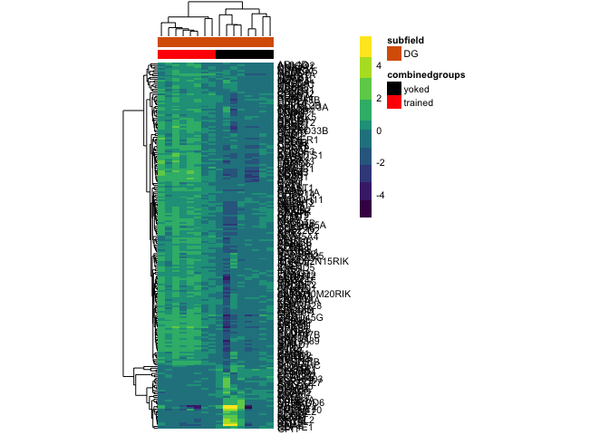
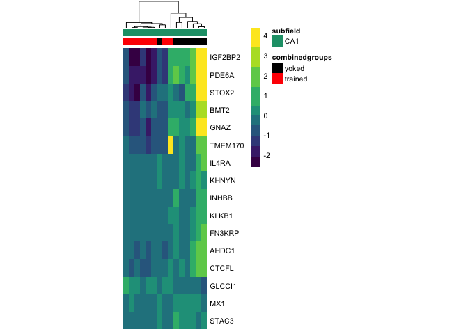
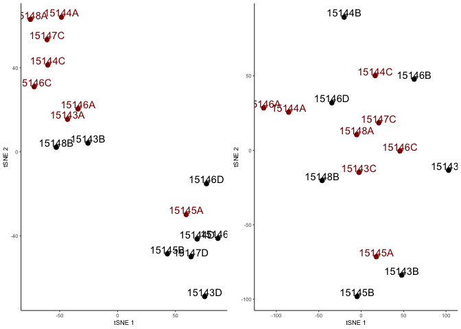
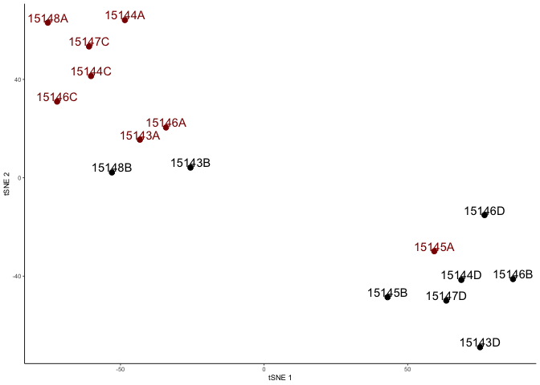

    library(tidyverse)
    library(forcats)
    library(cowplot) ## for some easy to use themes
    library(DESeq2) ## for gene expression analysis
    library(pheatmap)
    library(viridis)
    library(Rtsne) # for tSNE

    library(BiocParallel)
    register(MulticoreParam(6))

    ## load functions 
    source("figureoptions.R")
    source("functions_RNAseq.R")

    ## set output file for figures 
    knitr::opts_chunk$set(fig.path = '../figures/02f_trainedvyoked/', cache = F)

    a.countData <- read.csv("../data/02a_countData.csv", header = T, check.names = F, row.names = 1)

    a.colData <- read.csv("../data/02a_colData.csv", header = T)
    a.colData <- a.colData %>%
      mutate(combinedgroups = fct_collapse(Treatment,
                                           trained = c("conflict", "trained"),
                                           yoked = c("shocked", "yoked")),
             subfield = Punch)
    a.colData$combinedgroups <- factor(a.colData$combinedgroups, levels = c("yoked", "trained"))

    DGdds <- returndds2("DG") 

    ## [1] "DG"

    ## estimating size factors

    ## estimating dispersions

    ## gene-wise dispersion estimates: 6 workers

    ## mean-dispersion relationship

    ## final dispersion estimates, fitting model and testing: 6 workers

    ## -- replacing outliers and refitting for 54 genes
    ## -- DESeq argument 'minReplicatesForReplace' = 7 
    ## -- original counts are preserved in counts(dds)

    ## estimating dispersions

    ## fitting model and testing

    CA3dds <- returndds2("CA3") 

    ## [1] "CA3"

    ## estimating size factors

    ## estimating dispersions

    ## gene-wise dispersion estimates: 6 workers

    ## mean-dispersion relationship

    ## final dispersion estimates, fitting model and testing: 6 workers

    ## -- replacing outliers and refitting for 53 genes
    ## -- DESeq argument 'minReplicatesForReplace' = 7 
    ## -- original counts are preserved in counts(dds)

    ## estimating dispersions

    ## fitting model and testing

    CA1dds <- returndds2("CA1") 

    ## [1] "CA1"

    ## estimating size factors

    ## estimating dispersions

    ## gene-wise dispersion estimates: 6 workers

    ## mean-dispersion relationship

    ## final dispersion estimates, fitting model and testing: 6 workers

    ## -- replacing outliers and refitting for 98 genes
    ## -- DESeq argument 'minReplicatesForReplace' = 7 
    ## -- original counts are preserved in counts(dds)

    ## estimating dispersions

    ## fitting model and testing

    DGvsd <- returnvsds2(DGdds)

    ##               143A-DG-1 143B-DG-1 143D-DG-3 144A-DG-2 144C-DG-2 144D-DG-2
    ## 0610007P14Rik  6.497231  6.520310  6.927199  6.622006  6.516323  6.739843
    ## 0610009B22Rik  5.933401  5.821822  5.483341  5.697426  5.971474  5.830043
    ## 0610009L18Rik  5.582826  5.757564  5.597896  5.205323  5.677909  5.676574
    ##               145A-DG-2 145B-DG-1 146A-DG-2 146B-DG-2 146C-DG-4 146D-DG-3
    ## 0610007P14Rik  6.669012  6.257587  6.419110  6.134992  7.017216  7.479295
    ## 0610009B22Rik  6.084135  5.939702  5.838619  6.134992  6.195432  5.205323
    ## 0610009L18Rik  5.443572  5.205323  5.838619  5.205323  5.205323  5.205323
    ##               147C-DG-3 147D-DG-1 148A-DG-3 148B-DG-4
    ## 0610007P14Rik  6.418946  6.592025  6.603472  6.467815
    ## 0610009B22Rik  6.054862  6.038992  5.754020  5.664124
    ## 0610009L18Rik  5.444089  5.874552  5.675946  5.530425

    CA3vsd <- returnvsds2(CA3dds)

    ##               143A-CA3-1 144A-CA3-2 144B-CA3-1 144C-CA3-2 144D-CA3-2
    ## 0610007P14Rik   7.053774   7.561649   7.233758   6.996898   6.880131
    ## 0610009B22Rik   6.452876   6.973831   6.531009   6.908274   6.375915
    ## 0610009L18Rik   6.030451   6.670471   6.269295   6.224806   6.269568
    ##               145A-CA3-2 146A-CA3-2 146B-CA3-2 146D-CA3-3 147C-CA3-3
    ## 0610007P14Rik   6.784496   7.233784   6.757449   7.122555   7.137734
    ## 0610009B22Rik   6.879922   6.236353   6.895220   6.468228   6.353976
    ## 0610009L18Rik   5.734766   6.236353   5.991499   6.142415   6.111529
    ##               147D-CA3-1 148A-CA3-3 148B-CA3-4
    ## 0610007P14Rik   6.840862   6.923812   7.262408
    ## 0610009B22Rik   6.540744   6.532445   6.689017
    ## 0610009L18Rik   6.116202   6.169424   6.213015

    CA1vsd <- returnvsds2(CA1dds)

    ##               143B-CA1-1 143C-CA1-1 143D-CA1-3 144A-CA1-2 144B-CA1-1
    ## 0610007P14Rik   7.415967   7.026659   7.234953   7.242002   7.278148
    ## 0610009B22Rik   6.904844   6.767590   6.124712   6.819405   6.644173
    ## 0610009L18Rik   6.666449   6.334833   6.124712   6.507772   6.264241
    ##               144C-CA1-2 145A-CA1-2 145B-CA1-1 146A-CA1-2 146B-CA1-2
    ## 0610007P14Rik   7.075661   7.291669   7.252495   7.032181   6.904449
    ## 0610009B22Rik   6.595087   6.743767   6.747191   6.782460   6.657871
    ## 0610009L18Rik   6.297128   6.599020   6.404817   6.606986   6.124712
    ##               146C-CA1-4 146D-CA1-3 147C-CA1-3 148A-CA1-3 148B-CA1-4
    ## 0610007P14Rik   7.290895   7.357361   7.149545   7.213656   7.068189
    ## 0610009B22Rik   6.636289   6.782490   6.641399   6.854020   6.124712
    ## 0610009L18Rik   6.703932   6.124712   6.302770   6.507437   6.124712

    print("DG")

    ## [1] "DG"

    res_summary_subfield(DGdds, c("combinedgroups", "trained", "yoked"))

    ## [1] "combinedgroups" "trained"        "yoked"         
    ## [1] 214
    ## 
    ## out of 17006 with nonzero total read count
    ## adjusted p-value < 0.1
    ## LFC > 0 (up)       : 177, 1%
    ## LFC < 0 (down)     : 37, 0.22%
    ## outliers [1]       : 0, 0%
    ## low counts [2]     : 6929, 41%
    ## (mean count < 13)
    ## [1] see 'cooksCutoff' argument of ?results
    ## [2] see 'independentFiltering' argument of ?results
    ## 
    ## NULL
    ## log2 fold change (MLE): combinedgroups trained vs yoked 
    ## Wald test p-value: combinedgroups trained vs yoked 
    ## DataFrame with 5 rows and 6 columns
    ##                baseMean   log2FoldChange             lfcSE
    ##               <numeric>        <numeric>         <numeric>
    ## Smad7  171.392871064045 2.52915045290283 0.300055947411442
    ## Sgk1   341.089572273562 1.86437254406297  0.25434038097016
    ## Fzd5   26.8401177227407 3.21028367726372  0.45125074708102
    ## Acan   50.8597490321187 1.97329538674358  0.27993362211107
    ## Errfi1  196.30327794802  1.6626205039142 0.252431976397565
    ##                    stat               pvalue                 padj
    ##               <numeric>            <numeric>            <numeric>
    ## Smad7  8.42892958703734  3.4884140023949e-17 3.51701899721454e-13
    ## Sgk1   7.33022627768143 2.29764457026629e-13 1.15824262787124e-09
    ## Fzd5   7.11419027675832  1.1257175900809e-12 3.78316158106521e-09
    ## Acan    7.0491546240938 1.80008035791982e-12 4.53710254213691e-09
    ## Errfi1 6.58641004060308 4.50588351541571e-11 9.08566352048423e-08

    print("CA3")

    ## [1] "CA3"

    res_summary_subfield(CA3dds, c("combinedgroups", "trained", "yoked"))

    ## [1] "combinedgroups" "trained"        "yoked"         
    ## [1] 0
    ## 
    ## out of 16497 with nonzero total read count
    ## adjusted p-value < 0.1
    ## LFC > 0 (up)       : 0, 0%
    ## LFC < 0 (down)     : 0, 0%
    ## outliers [1]       : 27, 0.16%
    ## low counts [2]     : 5, 0.03%
    ## (mean count < 0)
    ## [1] see 'cooksCutoff' argument of ?results
    ## [2] see 'independentFiltering' argument of ?results
    ## 
    ## NULL
    ## log2 fold change (MLE): combinedgroups trained vs yoked 
    ## Wald test p-value: combinedgroups trained vs yoked 
    ## DataFrame with 5 rows and 6 columns
    ##                  baseMean   log2FoldChange             lfcSE
    ##                 <numeric>        <numeric>         <numeric>
    ## AW011738 9.17276939908517 2.75526103220329 0.744391234682857
    ## Ccl4     20.1742899726882 2.17694386734611 0.608574059817134
    ## Cldn11   224.152887308636 1.14258100212196 0.299522313314391
    ## Gm9830    5.2365659464215  3.8500083682701  1.07167002084399
    ## Hbb-bt   13.3724700406441 3.05189602672508 0.846081438997779
    ##                      stat               pvalue              padj
    ##                 <numeric>            <numeric>         <numeric>
    ## AW011738 3.70136146669855 0.000214445727305785 0.715204813790057
    ## Ccl4     3.57712234399252 0.000347397602326682 0.715204813790057
    ## Cldn11   3.81467740910062 0.000136360945687631 0.715204813790057
    ## Gm9830   3.59253155671748 0.000327480981566366 0.715204813790057
    ## Hbb-bt   3.60709488006283 0.000309644457522496 0.715204813790057

    print("CA1")

    ## [1] "CA1"

    res_summary_subfield(CA1dds, c("combinedgroups", "trained", "yoked"))

    ## [1] "combinedgroups" "trained"        "yoked"         
    ## [1] 16
    ## 
    ## out of 16846 with nonzero total read count
    ## adjusted p-value < 0.1
    ## LFC > 0 (up)       : 1, 0.0059%
    ## LFC < 0 (down)     : 15, 0.089%
    ## outliers [1]       : 0, 0%
    ## low counts [2]     : 2619, 16%
    ## (mean count < 1)
    ## [1] see 'cooksCutoff' argument of ?results
    ## [2] see 'independentFiltering' argument of ?results
    ## 
    ## NULL
    ## log2 fold change (MLE): combinedgroups trained vs yoked 
    ## Wald test p-value: combinedgroups trained vs yoked 
    ## DataFrame with 5 rows and 6 columns
    ##                 baseMean    log2FoldChange             lfcSE
    ##                <numeric>         <numeric>         <numeric>
    ## Glcci1  27.9431361099374  1.98275767136008  0.37236542908503
    ## Igf2bp2  8908.7711010914 -3.85162178226654 0.796911109754504
    ## Pde6a   16883.7614383138 -3.38908219974529 0.719364141096424
    ## Stox2   4433.92096042267 -3.79057173334957 0.812056110081023
    ## Gnaz    4292.66609719128 -3.11102225995498 0.674161232170265
    ##                      stat               pvalue                padj
    ##                 <numeric>            <numeric>           <numeric>
    ## Glcci1   5.32476303246537 1.01084730905324e-07 0.00143873897497547
    ## Igf2bp2 -4.83318871467743 1.34363305890186e-06 0.00956196466367509
    ## Pde6a   -4.71121926452964 2.46239128592003e-06  0.0108291598219097
    ## Stox2   -4.66786923501058  3.0433948772317e-06  0.0108291598219097
    ## Gnaz    -4.61465612601298 3.93746694525317e-06  0.0112083934063577

    contrast1 <- resvals2(DGdds, contrastvector = c("combinedgroups", "trained", "yoked"), mypval = 0.1) # 3060

    ## [1] 214

    contrast2 <- resvals2(CA1dds, contrastvector = c("combinedgroups", "trained", "yoked"), mypval = 0.1) # 2388

    ## [1] 16

    listofDEGstrainedvyoked <- function(mydds, myitssue){
      res <- results(mydds, 
                     contrast = c("combinedgroups", "trained", "yoked"), 
                     independentFiltering = T)
      
      print(paste(myitssue, "trained vs yoked", sep = " "))
      
      data <- data.frame(gene = row.names(res),
                         lfc = res$log2FoldChange,
                         padj = res$padj,
                         tissue = myitssue,
                         comparison = paste("trained", "yoked", sep = "-"))
      data <- data %>% dplyr::filter(padj < 0.1) %>% droplevels()
      print(head(data))
      return(data)
    }

    DGDEGs <- listofDEGstrainedvyoked(DGdds, "DG")

    ## [1] "DG trained vs yoked"
    ##            gene       lfc         padj tissue    comparison
    ## 1 1190002N15Rik 1.6390074 2.451662e-04     DG trained-yoked
    ## 2 A830010M20Rik 1.5256191 7.889227e-07     DG trained-yoked
    ## 3         Abhd2 0.8633871 1.533267e-02     DG trained-yoked
    ## 4          Acan 1.9732954 4.537103e-09     DG trained-yoked
    ## 5       Adamts1 1.8771209 1.877775e-03     DG trained-yoked
    ## 6         Adrb1 0.9763798 3.110123e-02     DG trained-yoked

    CA1DEGs <- listofDEGstrainedvyoked(CA1dds, "CA1")

    ## [1] "CA1 trained vs yoked"
    ##     gene       lfc        padj tissue    comparison
    ## 1  Ahdc1 -1.607378 0.065020388    CA1 trained-yoked
    ## 2   Bmt2 -2.478179 0.056625662    CA1 trained-yoked
    ## 3  Ctcfl -2.612072 0.036325436    CA1 trained-yoked
    ## 4 Fn3krp -1.427451 0.048013887    CA1 trained-yoked
    ## 5 Glcci1  1.982758 0.001438739    CA1 trained-yoked
    ## 6   Gnaz -3.111022 0.011208393    CA1 trained-yoked

    write.csv(DGDEGs, "../data/02f_DG_DEGs.csv", row.names = F)
    write.csv(CA1DEGs, "../data/02f_CA1_DEGs.csv", row.names = F)

    upDG <- DGDEGs %>% filter(lfc > 0)
    upDG <- as.vector(upDG$gene)
    upDG

    ##   [1] "1190002N15Rik" "A830010M20Rik" "Abhd2"         "Acan"         
    ##   [5] "Adamts1"       "Adrb1"         "Ahr"           "Amigo2"       
    ##   [9] "Ankrd13a"      "Ankrd28"       "Ankrd33b"      "Apaf1"        
    ##  [13] "Arc"           "Arid5b"        "Arl13b"        "Arl4a"        
    ##  [17] "Arl4d"         "Arl5b"         "Armcx5"        "Arpp21"       
    ##  [21] "Atf3"          "B3gnt2"        "Bach1"         "Bdnf"         
    ##  [25] "Btg2"          "C2cd4b"        "Ccnk"          "Ciart"        
    ##  [29] "Cited2"        "Cldn12"        "Cnnm1"         "Cpeb4"        
    ##  [33] "Ctnnd1"        "Cul3"          "Cwc25"         "Cxadr"        
    ##  [37] "Cyp51"         "Dbpht2"        "Dnaja1"        "Dnajb1"       
    ##  [41] "Dnajb4"        "Dusp14"        "Dusp16"        "Dusp4"        
    ##  [45] "Dusp6"         "Dusp8"         "Dyrk2"         "Egr1"         
    ##  [49] "Egr3"          "Egr4"          "Eif5"          "Eprs"         
    ##  [53] "Erf"           "Errfi1"        "Fam107b"       "Fam118a"      
    ##  [57] "Fbxo33"        "Fbxw7"         "Fermt2"        "Flrt3"        
    ##  [61] "Fos"           "Fosb"          "Fosl2"         "Foxg1"        
    ##  [65] "Foxo1"         "Frmd6"         "Fzd4"          "Fzd5"         
    ##  [69] "Gad1"          "Gadd45g"       "Gm13889"       "Gmeb2"        
    ##  [73] "Gpr19"         "Heca"          "Hmgcr"         "Homer1"       
    ##  [77] "Hs6st1"        "Hspa1a"        "Hsph1"         "Il16"         
    ##  [81] "Ing2"          "Irf2bp2"       "Irs1"          "Irs2"         
    ##  [85] "Jdp2"          "Jmjd1c"        "Jun"           "Junb"         
    ##  [89] "Jund"          "Kcna4"         "Kcnf1"         "Kcnj2"        
    ##  [93] "Kdm6b"         "Kdm7a"         "Kitl"          "Klf2"         
    ##  [97] "Klf6"          "Lbh"           "Lcmt2"         "Lemd3"        
    ## [101] "Lmna"          "Lonrf1"        "Lrrtm2"        "March11"      
    ## [105] "Med7"          "Mest"          "Mfap3l"        "Mn1"          
    ## [109] "Myc"           "Naf1"          "Nap1l5"        "Nedd9"        
    ## [113] "Nefm"          "Nfil3"         "Npas4"         "Nptx2"        
    ## [117] "Nr4a1"         "Nr4a2"         "Nr4a3"         "Nuak1"        
    ## [121] "Odc1"          "Olfml2b"       "Otud1"         "Pak6"         
    ## [125] "Pcdh8"         "Peg10"         "Peli1"         "Per1"         
    ## [129] "Per2"          "Phlda1"        "Piga"          "Plagl1"       
    ## [133] "Plk2"          "Plk3"          "Pou3f3"        "Ppp1r15a"     
    ## [137] "Prpf38b"       "Ptgs2"         "Ranbp2"        "Rasd1"        
    ## [141] "Rasl11a"       "Rasl11b"       "Rfx2"          "Rgmb"         
    ## [145] "Rgs2"          "Rgs4"          "Scg2"          "Sgk1"         
    ## [149] "Sh2d3c"        "Siah2"         "Slc16a1"       "Slc25a25"     
    ## [153] "Slc2a3"        "Slc45a4"       "Slitrk5"       "Smad7"        
    ## [157] "Snx18"         "Sowahc"        "Sox9"          "Spty2d1"      
    ## [161] "Srf"           "Stmn4"         "Syt4"          "Thbs1"        
    ## [165] "Tiparp"        "Tnip2"         "Tra2b"         "Trib1"        
    ## [169] "Tsc22d2"       "Ubc"           "Uspl1"         "Zbtb33"       
    ## [173] "Zdbf2"         "Zfand5"        "Zfp275"        "Zfp654"       
    ## [177] "Zfp869"

    downDG <- DGDEGs %>% filter(lfc < 0)
    downDG <- as.vector(downDG$gene)
    downDG

    ##  [1] "Ankrd27"  "BC048403" "Bmt2"     "Ccdc32"   "Cecr6"    "Coq2"    
    ##  [7] "Cpne7"    "Ctcfl"    "Dpysl2"   "Eef1e1"   "Gnaz"     "Gpi1"    
    ## [13] "Gyg"      "Igf2bp2"  "Klkb1"    "Lrrc45"   "Lysmd4"   "Mc1r"    
    ## [19] "Neurod6"  "Nxf1"     "Pde6a"    "Pgam2"    "Plch2"    "Prune2"  
    ## [25] "Pxn"      "Rbm47"    "Scoc"     "Senp8"    "Slc5a5"   "Srgap1"  
    ## [31] "Stac2"    "Sv2b"     "Tmem170"  "Tspyl3"   "Tubb4a"   "Zfp207"  
    ## [37] "Zfp668"

    upCA1 <- CA1DEGs %>% filter(lfc > 0)
    upCA1 <- as.vector(upCA1$gene)
    upCA1

    ## [1] "Glcci1"

    downCA1 <- CA1DEGs %>% filter(lfc < 0)
    downCA1 <- as.vector(downCA1$gene)
    downCA1

    ##  [1] "Ahdc1"   "Bmt2"    "Ctcfl"   "Fn3krp"  "Gnaz"    "Igf2bp2" "Il4ra"  
    ##  [8] "Inhbb"   "Khnyn"   "Klkb1"   "Mx1"     "Pde6a"   "Stac3"   "Stox2"  
    ## [15] "Tmem170"

    ## DG 
    DEGes <- assay(vst(DGdds))
    DEGes <- cbind(DEGes, contrast1)
    DEGes <- as.data.frame(DEGes) # convert matrix to dataframe

    DEGes$rownames <- rownames(DEGes)  # add the rownames to the dataframe
    DEGes$rownames <- str_to_upper(DEGes$rownames) ## uppercase gene names
    DEGes$padjmin <- with(DEGes, pmin(padjcombinedgroupstrainedyoked)) 
    DEGes <- DEGes %>% filter(padjmin < 0.1)
    rownames(DEGes) <- DEGes$rownames
    drop.cols <-colnames(DEGes[,grep("padj|pval|rownames", colnames(DEGes))])
    DEGes <- DEGes %>% dplyr::select(-one_of(drop.cols))
    DEGes <- as.matrix(DEGes)
    DEGes <- DEGes - rowMeans(DEGes)
    DEGes <- as.matrix(DEGes)

    write.csv(DEGes, "../data/02f_DG_DEGs_vsd.csv")

    paletteLength <- 10
    myBreaks <- c(seq(min(DEGes), 0, length.out=ceiling(paletteLength/2) + 1), 
                  seq(max(DEGes)/paletteLength, max(DEGes), length.out=floor(paletteLength/2)))
    df <- as.data.frame(colData(DGdds)[,c("combinedgroups")]) ## matrix to df
    rownames(df) <- row.names(colData(DGdds))
    names(df) <- c("combinedgroups")
    df$subfield <- "DG"
    levels(df$combinedgroups) <- c("yoked", "trained")

    pheatmap(DEGes, show_colnames=F, show_rownames = T,
             annotation_col=df, 
             annotation_colors = pheatmapcolors2,
             treeheight_row = 25, treeheight_col = 25,
             annotation_row = NA, 
             annotation_legend = TRUE,
             annotation_names_row = FALSE, annotation_names_col = FALSE,
             fontsize = 8, 
             border_color = NA ,
             color = viridis(10),
             cellwidth = 6, 
             clustering_method="average",
             breaks=myBreaks,
             clustering_distance_cols="correlation" ,
             clustering_distance_rows="correlation" 
             )

    pheatmap(DEGes, show_colnames=F, show_rownames = T,
             annotation_col=df, 
             annotation_colors = pheatmapcolors2,
             treeheight_row = 25, treeheight_col = 12.5,
             annotation_row = NA, 
             annotation_legend = TRUE,
             annotation_names_row = FALSE, annotation_names_col = FALSE,
             fontsize = 3, 
             border_color = NA ,
             color = viridis(10),
             cellwidth = 6, 
             cluster_rows = FALSE,
             clustering_method="average",
             breaks=myBreaks,
             clustering_distance_cols="correlation", 
             height = 7, 
             width = 2.5,
             filename = "../figures/02f_trainedvyoked/pheatmap-DG.pdf"
             )

    ### CA1

    DEGes <- assay(vst(CA1dds))
    DEGes <- cbind(DEGes, contrast2)
    DEGes <- as.data.frame(DEGes) # convert matrix to dataframe
    DEGes$rownames <- rownames(DEGes)  # add the rownames to the dataframe
    DEGes$rownames <- str_to_upper(DEGes$rownames) ## uppercase gene names
    DEGes$padjmin <- with(DEGes, pmin(padjcombinedgroupstrainedyoked)) 
    DEGes <- DEGes %>% filter(padjmin < 0.1)
    rownames(DEGes) <- DEGes$rownames
    drop.cols <-colnames(DEGes[,grep("padj|pval|rownames", colnames(DEGes))])
    DEGes <- DEGes %>% dplyr::select(-one_of(drop.cols))
    DEGes <- as.matrix(DEGes)
    DEGes <- DEGes - rowMeans(DEGes)
    DEGes <- as.matrix(DEGes) 
    paletteLength <- 10
    myBreaks <- c(seq(min(DEGes), 0, length.out=ceiling(paletteLength/2) + 1), 
                  seq(max(DEGes)/paletteLength, max(DEGes), length.out=floor(paletteLength/2)))
    df <- as.data.frame(colData(CA1dds)[,c("combinedgroups")]) ## matrix to df
    rownames(df) <- row.names(colData(CA1dds))
    names(df) <- c("combinedgroups")
    df$subfield <- "CA1"
    levels(df$combinedgroups) <- c("yoked", "trained")

    pheatmap(DEGes, show_colnames=F, show_rownames = T,
             annotation_col=df, 
             annotation_colors = pheatmapcolors3,
             treeheight_row = 0, treeheight_col = 25,
             annotation_row = NA, 
             annotation_legend = TRUE,
             annotation_names_row = FALSE, annotation_names_col = FALSE,
             fontsize = 8, 
             border_color = NA ,
             color = viridis(10),
             cellwidth = 6, 
             clustering_method="average",
             breaks=myBreaks,
             clustering_distance_cols="correlation" 
             )

    pheatmap(DEGes, show_colnames=F, show_rownames = T,
             annotation_col=df, 
             annotation_colors = pheatmapcolors3,
             treeheight_row = 25, treeheight_col = 12.5,
             annotation_row = NA, 
             annotation_legend = TRUE,
             annotation_names_row = FALSE, annotation_names_col = FALSE,
             fontsize = 3, 
             border_color = NA ,
             color = viridis(10),
             cellwidth = 6, 
             cluster_rows = FALSE,
             clustering_method="average",
             breaks=myBreaks,
             clustering_distance_cols="correlation", 
             height = 2.5, 
             width = 2.5,
             filename = "../figures/02f_trainedvyoked/pheatmap-CA1.pdf"
             )

tSNE
----

    a <- plot.tSNE.trained(DGdds, 2, "DG")
    b <- plot.tSNE.trained(CA1dds, 2, "CA1")

    plot_grid(a,b)

    a

