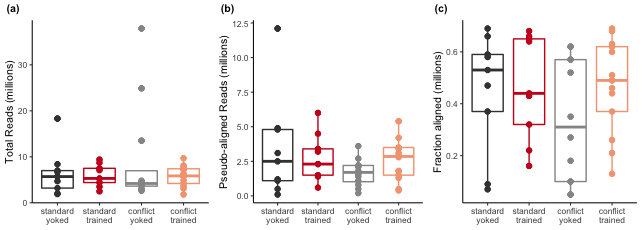
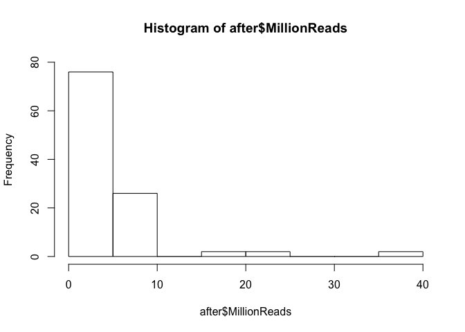
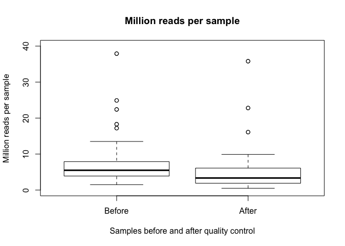
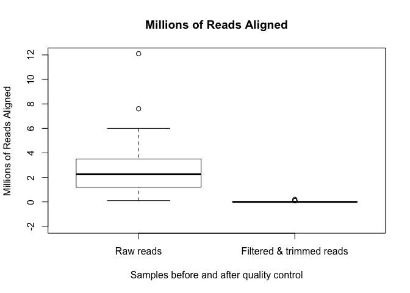

    multiqc <- read.csv(file = "../data/multiqc/multiqc_report.csv")
    summary(multiqc)

    ##                      Sample.Name       Dups              GC        
    ##  142C_CA1_S_S19_L003_R1_001:  2   Min.   :0.2100   Min.   :0.4400  
    ##  142C_CA1_S_S19_L003_R2_001:  2   1st Qu.:0.5800   1st Qu.:0.4700  
    ##  142C_DG_S_S21_L003_R1_001 :  2   Median :0.6950   Median :0.4900  
    ##  142C_DG_S_S21_L003_R2_001 :  2   Mean   :0.6859   Mean   :0.4832  
    ##  143A_CA3_1_S35_L002_R1_001:  2   3rd Qu.:0.8000   3rd Qu.:0.4900  
    ##  143A_CA3_1_S35_L002_R2_001:  2   Max.   :0.9600   Max.   :0.5500  
    ##  (Other)                   :204                                    
    ##      Length       MillionReads    QualityFiltered
    ##  Min.   :137.0   Min.   : 0.500   No :108        
    ##  1st Qu.:149.0   1st Qu.: 2.850   Yes:108        
    ##  Median :150.0   Median : 4.550                  
    ##  Mean   :149.1   Mean   : 6.087                  
    ##  3rd Qu.:150.0   3rd Qu.: 7.000                  
    ##  Max.   :150.0   Max.   :37.900                  
    ## 

    before <- multiqc[multiqc$QualityFiltered == "No",]
    after <- multiqc[multiqc$QualityFiltered == "Yes",]
    summary(before$MillionReads)

    ##    Min. 1st Qu.  Median    Mean 3rd Qu.    Max. 
    ##   1.500   3.900   5.500   7.304   7.900  37.900

    summary(after$MillionReads)

    ##    Min. 1st Qu.  Median    Mean 3rd Qu.    Max. 
    ##    0.50    1.90    3.35    4.87    6.10   35.80

    # mean before 7.3 million reads max 37 min 1.5. 
    # mean after 4.8 millino reads Max 35 min 0.5
    hist(before$MillionReads, ylim = c(0,80))

    hist(after$MillionReads, ylim = c(0,80))

    boxplot(multiqc$MillionReads ~ multiqc$QualityFiltered,
            names = c("Before", "After"),
            main = "Million reads per sample",
            xlab = "Samples before and after quality control",
            ylab = "Million reads per sample",
            ylim = c(0,40))

    boxplot(multiqc$Length ~ multiqc$QualityFiltered,
            names = c("Before", "After"),
            main = "Read Lenght",
            xlab = "Samples before and after quality control",
            ylab = "Read Length (bp)")

    multiqc <- read.csv(file = "../data/multiqc/multiqc_report_0204.csv")
    summary(multiqc)

    ##                   sample         bp          fracalign     
    ##  142C_CA1_S_S19_L003_: 2   Min.   :160.8   Min.   :0.0500  
    ##  142C_DG_S_S21_L003_ : 2   1st Qu.:196.6   1st Qu.:0.3200  
    ##  143A_CA3_1_S35_L002_: 2   Median :200.2   Median :0.5800  
    ##  143A_DG_1_S36_L002_ : 2   Mean   :200.0   Mean   :0.5062  
    ##  143B_CA1_1_S37_L002_: 2   3rd Qu.:202.6   3rd Qu.:0.6925  
    ##  143B_DG_1_S38_L002_ : 2   Max.   :220.5   Max.   :0.8300  
    ##  (Other)             :96                                   
    ##    millalign               QC    
    ##  Min.   : 0.000   filtertrim:54  
    ##  1st Qu.: 0.000   raw       :54  
    ##  Median : 0.150                  
    ##  Mean   : 1.333                  
    ##  3rd Qu.: 2.225                  
    ##  Max.   :12.100                  
    ## 

    multiqc$QC <- factor(multiqc$QC, levels = c("raw" ,"filtertrim"))
    before <- multiqc[multiqc$QC == "raw",]
    after <- multiqc[multiqc$QC == "filtertrim",]
    summary(before$millalign)

    ##    Min. 1st Qu.  Median    Mean 3rd Qu.    Max. 
    ##   0.100   1.225   2.250   2.656   3.475  12.100

    summary(after$millalign)

    ##    Min. 1st Qu.  Median    Mean 3rd Qu.    Max. 
    ## 0.00000 0.00000 0.00000 0.01111 0.00000 0.20000

    boxplot(multiqc$millalign ~ multiqc$QC,
            names = c("Raw reads", "Filtered & trimmed reads"),
            main = "Millions of Reads Aligned",
            xlab = "Samples before and after quality control",
            ylab = "Millions of Reads Aligned",
            ylim = c(-2,12))

