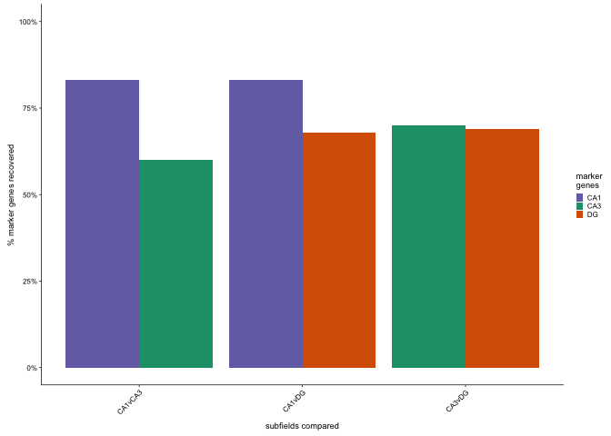

Genes from Cembrowski sublement file 1
<a href="https://elifesciences.org/articles/14997/figures" class="uri">https://elifesciences.org/articles/14997/figures</a>

    # import cembrowski markers
    cembrowskisupp <- read.table("../data/cembrowksi_markers/elife-14997-supp1-v1_dendrogram.txt", sep="\t", header = T)

    # select just columns with gene symbol and enriched column
    # then rename gene column and convert to uppercase
    cembrowskisupp <- cembrowskisupp %>% dplyr::select(gene_short_name, enriched) 
    colnames(cembrowskisupp)[1] <- "gene"
    cembrowskisupp$gene <- str_to_upper(cembrowskisupp$gene)
    head(cembrowskisupp)

    ##       gene  enriched
    ## 1   ABLIM3 dg_d-dg_v
    ## 2    AKAP7 dg_d-dg_v
    ## 3 ARHGAP20 dg_d-dg_v
    ## 4     BTG2 dg_d-dg_v
    ## 5    C1QL2 dg_d-dg_v
    ## 6    CALD1 dg_d-dg_v

    # subset my maker

    cembrowksimarkers <- function(subfields){
      mydf <- cembrowskisupp %>% 
      dplyr::filter(enriched %in% subfields) %>% 
      dplyr::select(gene)
      names(mydf) <- NULL
      mylist <- as.list(mydf[,1])
      return(mylist)
    }

    levels(cembrowskisupp$enriched)

    ##  [1] "ca1_d"                           "ca1_d-ca1_v"                    
    ##  [3] "ca1_v"                           "ca2"                            
    ##  [5] "ca3_d"                           "ca3_d-ca3_v-ca2-ca1_d-ca1_v"    
    ##  [7] "ca3_v"                           "ca4"                            
    ##  [9] "ca4-ca3_d-ca3_v-ca2-ca1_d-ca1_v" "dg_d"                           
    ## [11] "dg_d-dg_v"                       "dg_v"

    # dorsal markers 
    CA1_markers <- cembrowksimarkers(c("ca1_d", "ca1_d-ca1_v"))
    DG_markers <- cembrowksimarkers(c("dg_d", "dg_d-dg_v"))
    CA3_markers <- cembrowksimarkers(c("ca3_d",  "ca3_d-ca3_v-ca2-ca1_d-ca1_v"))

    # import subfield specific data
    wrangledata <- function(filename, mycomparison){
      mydata <- read.csv(filename, header = T)
      mydata$gene <- str_to_upper(mydata$gene)
      mydata$comparison <- mycomparison
      return(mydata)
    }

    CA1DG <- wrangledata("../data/DGvCA1.csv", "CA1-DG")
    CA1CA3 <- wrangledata("../data/CA3vCA1.csv", "CA1-CA3")
    CA3DG <- wrangledata("../data/DGvCA3.csv", "CA3-DG")

    #look for markers in each supfield
    # make data frames of genes expression results for markers 

    marker_summary <- function(mydf, markers){
        df <- mydf %>%
        dplyr::filter(gene %in% c(markers)) 
        #return((df))
        return(summary(df$direction))
    }

    # comparing all lists with a given brain region
    for(i in list(CA1DG, CA1CA3)){
      j <- marker_summary(i, CA1_markers)
      print(i[1, 6])
      print(j)
    }

    ## [1] "CA1-DG"
    ##     CA1      DG neither 
    ##      15       0       3 
    ## [1] "CA1-CA3"
    ##     CA1     CA3 neither 
    ##      15       1       2

    15/(15+3)

    ## [1] 0.8333333

    15/(15+3)

    ## [1] 0.8333333

    for(i in list(CA1CA3, CA3DG)){
      j <- marker_summary(i, CA3_markers)
      print(i[1, 6])
      print(j)
    }

    ## [1] "CA1-CA3"
    ##     CA1     CA3 neither 
    ##       0       6       4 
    ## [1] "CA3-DG"
    ##     CA3      DG neither 
    ##       7       0       3

    6/10

    ## [1] 0.6

    7/10

    ## [1] 0.7

    for(i in list(CA1DG, CA3DG)){
      j <- marker_summary(i, DG_markers)
      print(i[1, 6])
      print(j)
    }

    ## [1] "CA1-DG"
    ##     CA1      DG neither 
    ##       0      48      23 
    ## [1] "CA3-DG"
    ##     CA3      DG neither 
    ##       0      49      22

    48/(48+23)

    ## [1] 0.6760563

    49/(49+22)

    ## [1] 0.6901408

Then, I checked to see how many of the markers that Cembrowski found to
be enriched in discrete dorsal cell populations were also enriched in my
comparisons. The enriched coloumn is what percent were confirmed, the
depleted column means that the marker was experssed in the opposite
direction, and neither means that the Cembrowski marker was not
significantly different in expression between the two cell types. Here
are the results:

<table>
<thead>
<tr class="header">
<th>Maker</th>
<th>Comparison</th>
<th>Enriched</th>
<th>Depleted</th>
<th>Neither</th>
</tr>
</thead>
<tbody>
<tr class="odd">
<td>CA1</td>
<td>CA1 v DG</td>
<td>0.83</td>
<td>0.00</td>
<td>0.17</td>
</tr>
<tr class="even">
<td>CA1</td>
<td>CA1 v CA3</td>
<td>0.83</td>
<td>0.06</td>
<td>0.11</td>
</tr>
<tr class="odd">
<td>CA3</td>
<td>CA3 v DG</td>
<td>0.60</td>
<td>0.00</td>
<td>0.40</td>
</tr>
<tr class="even">
<td>CA3</td>
<td>CA3 v CA1</td>
<td>0.70</td>
<td>0.00</td>
<td>0.30</td>
</tr>
<tr class="odd">
<td>DG</td>
<td>DG v CA1</td>
<td>0.68</td>
<td>0.00</td>
<td>0.32</td>
</tr>
<tr class="even">
<td>DG</td>
<td>DG v CA3</td>
<td>0.69</td>
<td>0.00</td>
<td>0.31</td>
</tr>
</tbody>
</table>

    mybarplot <- read.csv("../data/02h_markers.csv")
    head(mybarplot)

    ##   comparison marker correct
    ## 1     CA1vDG    CA1    0.83
    ## 2    CA1vCA3    CA1    0.83
    ## 3    CA1vCA3    CA3    0.60
    ## 4     CA3vDG    CA3    0.70
    ## 5     CA1vDG     DG    0.68
    ## 6     CA3vDG     DG    0.69

    p <- ggplot(data=mybarplot, aes(x=comparison, y=correct, fill = marker)) +
      geom_bar(stat="identity", position=position_dodge()) +
      theme_cowplot(font_size = 7, line_size = 0.25) +
      scale_fill_manual(values = c( "#7570b3","#1b9e77",  "#d95f02"),
                        name = "marker\ngenes") +
      ylab("% marker genes recovered") +
      xlab("subfields compared") +
      theme(panel.grid.minor=element_blank(),
            panel.grid.major=element_blank(),
            legend.key.width =  unit(0.2, "cm"),
            legend.key.height =  unit(0.1, "cm"),
            axis.text.x = element_text(angle = 45, hjust = 1)) +
      scale_y_continuous(labels = scales::percent,
                         limits = c(0,1))
    p

    pbetter <- plot_grid(p,
               labels = c("D"),
               nrow = 1,
               label_size = 7
               )
    pbetter

    pdf(file="../figures/02h_markergenes/barplot.pdf", width=1.75, height=2)
    plot(pbetter)
    dev.off()

    ## quartz_off_screen 
    ##                 2
