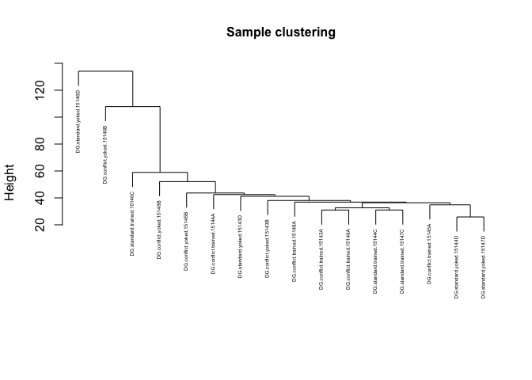
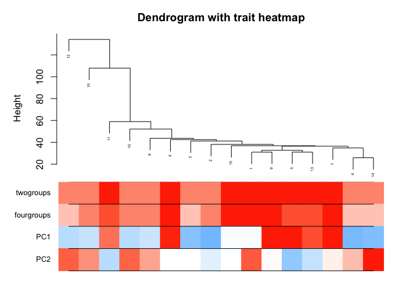
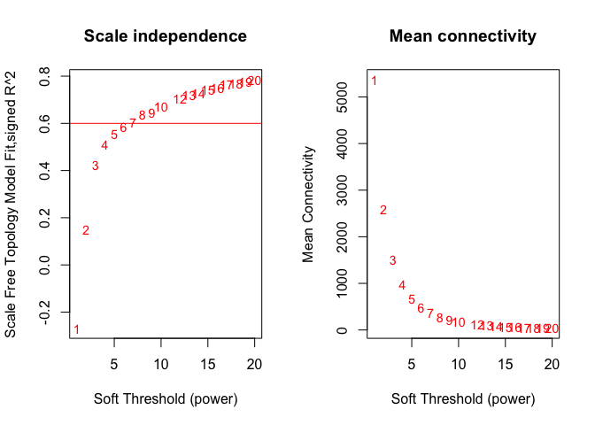
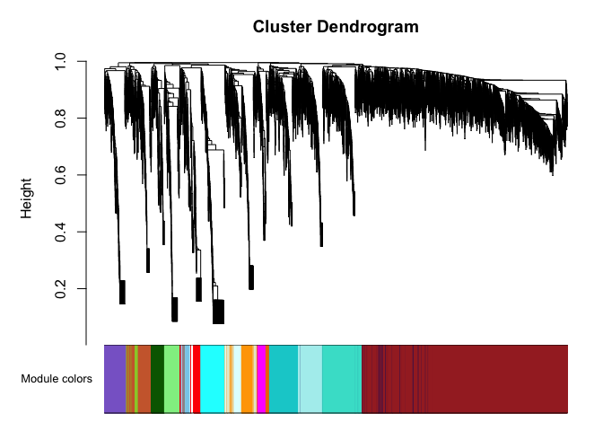
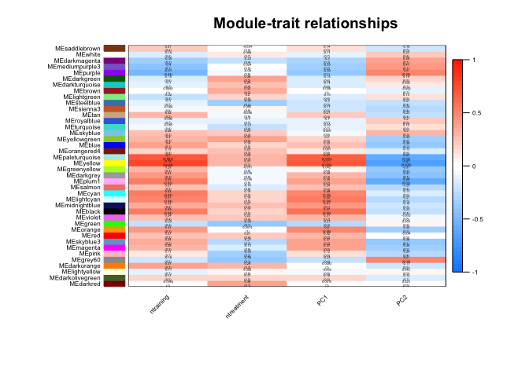

    # Load the packages
    library(tidyverse)
    library(WGCNA)
    library(dplyr)
    library(magrittr)
    library(forcats)
    library(flashClust)

    #enableWGCNAThreads()
    allowWGCNAThreads()

    ## Allowing multi-threading with up to 4 threads.

    # read the count data
    countData <- read.csv("../data/02c_DGvsd.csv", row.names = 1, check.names = F)
    head(countData)[1:3]

    ##               143A-DG-1 143B-DG-1 143D-DG-3
    ## 0610007P14Rik  6.381145  6.405587  6.834813
    ## 0610009B22Rik  5.781124  5.661825  5.299160
    ## 0610009L18Rik  5.405848  5.593055  5.422004
    ## 0610009O20Rik  6.736671  6.691641  6.736719
    ## 0610010F05Rik  6.603589  7.093384  7.135233
    ## 0610010K14Rik  6.136536  5.949913  6.015194

    # read the sample data, set levels
    colData <- read.csv("../data/02a_colData.csv", row.names = 1, stringsAsFactors = T)
    colData <- colData %>% filter(subfield == "DG")

    # join with pca data for retention

    pca.Rn <- read_csv("../data/01a_pca.all.csv") %>% 
      filter(TrainSessionComboNum == 9)

    ## Parsed with column specification:
    ## cols(
    ##   ID = col_character(),
    ##   treatment = col_character(),
    ##   TrainSessionComboNum = col_double(),
    ##   PC1 = col_double(),
    ##   PC2 = col_double(),
    ##   PC3 = col_double(),
    ##   PC4 = col_double(),
    ##   PC5 = col_double(),
    ##   PC6 = col_double(),
    ##   PC7 = col_double(),
    ##   PC8 = col_double(),
    ##   PC9 = col_double(),
    ##   PC10 = col_double()
    ## )

    pca.Rn <- pca.Rn %>% select(ID:PC2)
    head(pca.Rn)[1:4]

    ## # A tibble: 6 x 4
    ##   ID     treatment        TrainSessionComboNum     PC1
    ##   <chr>  <chr>                           <dbl>   <dbl>
    ## 1 15140A conflict.trained                    9  2.24  
    ## 2 15140B conflict.yoked                      9 -0.791 
    ## 3 15140C standard.trained                    9  6.43  
    ## 4 15140D standard.yoked                      9 -1.21  
    ## 5 15141C standard.trained                    9 -0.0494
    ## 6 15141D standard.yoked                      9 -2.93

    colData <- left_join(colData, pca.Rn)

    ## Joining, by = c("ID", "treatment")

    ## Warning: Column `ID` joining factor and character vector, coercing into
    ## character vector

    ## Warning: Column `treatment` joining factor and character vector, coercing
    ## into character vector

    # wgcna needs numeric identifiers
    colData$treatment <- factor(colData$treatment, levels = c("standard.yoked", "standard.trained", 
                                                     "conflict.yoked", "conflict.trained"))
    colData$training <- factor(colData$training, levels = c("yoked", "trained"))

    colData$ntreatment <- as.numeric(colData$treatment)
    colData$ntraining <- as.numeric(colData$training)

    # create a short sample desctiption, make it the row and columns names of colData and countData
    colData$sample <- paste(colData$subfield, colData$treatment, colData$ID, sep = ".")

    # set row and count names to be the same
    row.names(colData) <- colData$sample
    colnames(countData) <- colData$sample

    #  Code chunk 2

    datExpr0 <- as.data.frame(t(countData))
    head(rownames(datExpr0)) # rows are samples

    ## [1] "DG.conflict.trained.15143A" "DG.conflict.yoked.15143B"  
    ## [3] "DG.standard.yoked.15143D"   "DG.conflict.trained.15144A"
    ## [5] "DG.standard.trained.15144C" "DG.standard.yoked.15144D"

    #  Code chunk 3

    gsg = goodSamplesGenes(datExpr0, verbose = 0);
    gsg$allOK

    ## [1] TRUE

    #  Code chunk 4 removing genes

    if (!gsg$allOK)
    {
      # Optionally, print the gene and sample names that were removed:
      #if (sum(!gsg$goodGenes)>0) 
      #  printFlush(paste("Removing genes:", paste(names(datExpr0)[!gsg$goodGenes], collapse = ", ")));
      #if (sum(!gsg$goodSamples)>0) 
      #  printFlush(paste("Removing samples:", paste(rownames(datExpr0)[!gsg$goodSamples], collapse = ", ")));
      # Remove the offending genes and samples from the data:
      datExpr0 = datExpr0[gsg$goodSamples, gsg$goodGenes]
    }

    #  Code chunk 5
    #

    sampleTree = hclust(dist(datExpr0), method = "average");

    # Plot the sample tree: Open a graphic output window of size 12 by 9 inches
    # The user should change the dimensions if the window is too large or too small.

    plot(sampleTree, main = "Sample clustering", 
         sub="", xlab="", cex.main = 1, cex = 0.4)

    #  Code chunk 6
    # Plot a line to show the cut

    # Determine cluster under the line
    clust = cutreeStatic(sampleTree, cutHeight = 200, minSize = 3)
    table(clust)

    ## clust
    ##  1 
    ## 16

    # clust 1 contains the samples we want to keep.
    keepSamples = (clust==1)
    datExpr = datExpr0[keepSamples, ]
    nGenes = ncol(datExpr)
    nSamples = nrow(datExpr)

    #  Code chunk 7

    # keep only numberic columns
    datTraits <- colData %>% select(ntraining, ntreatment, PC1, PC2)
    datTraits

    ##                            ntraining ntreatment        PC1         PC2
    ## DG.conflict.trained.15143A         2          4 -0.2511636  3.02981466
    ## DG.conflict.yoked.15143B           1          3 -3.5595365 -0.47451513
    ## DG.standard.yoked.15143D           1          1 -3.0605115 -0.07227782
    ## DG.conflict.trained.15144A         2          4  6.6921089 -0.02270055
    ## DG.standard.trained.15144C         2          2  7.0436756 -1.72946383
    ## DG.standard.yoked.15144D           1          1 -3.4999867  1.16766175
    ## DG.conflict.trained.15145A         2          4  6.9362884  0.31085957
    ## DG.conflict.yoked.15145B           1          3 -1.3375400  1.64001102
    ## DG.conflict.trained.15146A         2          4  6.9208097  0.09483277
    ## DG.conflict.yoked.15146B           1          3 -1.5276429  1.99883979
    ## DG.standard.trained.15146C         2          2  4.2115795 -1.11790859
    ## DG.standard.yoked.15146D           1          1 -1.6965727  2.93175222
    ## DG.standard.trained.15147C         2          2  5.3196322 -0.94691101
    ## DG.standard.yoked.15147D           1          1 -3.2320870  4.43969435
    ## DG.conflict.trained.15148A         2          4 -0.2562847 -0.06798772
    ## DG.conflict.yoked.15148B           1          3 -1.8023130  2.85862823

    collectGarbage()

    # Re-cluster samples
    sampleTree2 = hclust(dist(datExpr), method = "average")
    # Convert traits to a color representation: white means low, red means high, grey means missing entry
    traitColors = numbers2colors(datTraits, signed = TRUE);
    # Plot the sample dendrogram and the colors underneath.
    plotDendroAndColors(sampleTree2, traitColors,
                        groupLabels = names(datTraits), 
                        main = "DG dendrogram with trait heatmap",
                        cex.dendroLabels = 0.4
                        )

    powers = c(c(1:10), seq(from = 12, to=20, by=1))
    # Call the network topology analysis function
    sft = pickSoftThreshold(datExpr, powerVector = powers, verbose = 5)

    ## pickSoftThreshold: will use block size 2630.
    ##  pickSoftThreshold: calculating connectivity for given powers...
    ##    ..working on genes 1 through 2630 of 17011

    ## Warning: executing %dopar% sequentially: no parallel backend registered

    ##    ..working on genes 2631 through 5260 of 17011
    ##    ..working on genes 5261 through 7890 of 17011
    ##    ..working on genes 7891 through 10520 of 17011
    ##    ..working on genes 10521 through 13150 of 17011
    ##    ..working on genes 13151 through 15780 of 17011
    ##    ..working on genes 15781 through 17011 of 17011
    ##    Power SFT.R.sq  slope truncated.R.sq mean.k. median.k. max.k.
    ## 1      1    0.269  0.627          0.614  5370.0    5510.0   8170
    ## 2      2    0.149 -0.335          0.374  2580.0    2650.0   5140
    ## 3      3    0.424 -0.750          0.538  1500.0    1470.0   3660
    ## 4      4    0.508 -0.941          0.636   969.0     888.0   2780
    ## 5      5    0.555 -1.060          0.697   669.0     566.0   2190
    ## 6      6    0.586 -1.150          0.737   485.0     376.0   1780
    ## 7      7    0.605 -1.230          0.765   364.0     258.0   1470
    ## 8      8    0.636 -1.270          0.804   280.0     181.0   1240
    ## 9      9    0.644 -1.340          0.819   220.0     130.0   1060
    ## 10    10    0.670 -1.380          0.846   177.0      97.9    923
    ## 11    12    0.703 -1.470          0.883   118.0      58.4    711
    ## 12    13    0.718 -1.500          0.899    98.8      46.5    630
    ## 13    14    0.726 -1.510          0.913    83.1      37.0    562
    ## 14    15    0.741 -1.530          0.927    70.6      29.4    503
    ## 15    16    0.750 -1.550          0.936    60.4      23.9    452
    ## 16    17    0.764 -1.560          0.948    52.1      19.7    409
    ## 17    18    0.770 -1.590          0.953    45.3      16.3    372
    ## 18    19    0.778 -1.610          0.959    39.5      13.5    341
    ## 19    20    0.785 -1.630          0.965    34.7      11.3    313

    # Plot the results:
    #sizeGrWindow(9, 5)
    par(mfrow = c(1,2));
    cex1 = 0.9;
    # Scale-free topology fit index as a function of the soft-thresholding power
    plot(sft$fitIndices[,1], -sign(sft$fitIndices[,3])*sft$fitIndices[,2],
         xlab="Soft Threshold (power)",ylab="Scale Free Topology Model Fit,signed R^2",type="n",
         main = paste("Scale independence"));
    text(sft$fitIndices[,1], -sign(sft$fitIndices[,3])*sft$fitIndices[,2],
         labels=powers,cex=cex1,col="red");
    # this line corresponds to using an R^2 cut-off of h
    abline(h=0.60,col="red")

    # Mean connectivity as a function of the soft-thresholding power
    plot(sft$fitIndices[,1], sft$fitIndices[,5],
         xlab="Soft Threshold (power)",ylab="Mean Connectivity", type="n",
         main = paste("Mean connectivity"))
    text(sft$fitIndices[,1], sft$fitIndices[,5], labels=powers, cex=cex1,col="red")

    # this is my attempt to solve an error
    datExpr %<>% mutate_if(is.integer,as.numeric)

    minModuleSize = 30

    net = blockwiseModules(datExpr, power = 6, verbose = 1)

    ##  Calculating module eigengenes block-wise from all genes

    names(net)

    ##  [1] "colors"         "unmergedColors" "MEs"            "goodSamples"   
    ##  [5] "goodGenes"      "dendrograms"    "TOMFiles"       "blockGenes"    
    ##  [9] "blocks"         "MEsOK"

    #sizeGrWindow(12, 9)
    par(mfrow = c(1,2));

    # Convert labels to colors for plotting
    moduleColors = labels2colors(net$colors)

    # Plot the dendrogram and the module colors underneath
    plotDendroAndColors(net$dendrograms[[1]], moduleColors[net$blockGenes[[1]]],
                        "Module colors",
                        dendroLabels = FALSE)

    # save data frame with genes and their module colors
    genes_modules <- as.data.frame(net$colors)
    write.csv(genes_modules, "../data/02h_genemodules.csv", row.names = F)

    genes_modules %>% 
      group_by(`net$colors`) %>%
      summarise(no_genes = length(`net$colors`))  %>%
      arrange(desc(no_genes))

    ## # A tibble: 40 x 2
    ##    `net$colors` no_genes
    ##    <fct>           <int>
    ##  1 turquoise        3547
    ##  2 blue             2931
    ##  3 brown            2337
    ##  4 yellow           2133
    ##  5 green             956
    ##  6 red               410
    ##  7 black             405
    ##  8 pink              363
    ##  9 magenta           325
    ## 10 purple            279
    ## # … with 30 more rows

    table(net$colors)

    ## 
    ##          black           blue          brown           cyan      darkgreen 
    ##            405           2931           2337            183            110 
    ##       darkgrey    darkmagenta darkolivegreen     darkorange        darkred 
    ##             98             46             48             97            110 
    ##  darkturquoise          green    greenyellow           grey         grey60 
    ##            106            956            271             88            169 
    ##      lightcyan     lightgreen    lightyellow        magenta   midnightblue 
    ##            178            166            162            325            183 
    ##         orange     orangered4  paleturquoise           pink          plum1 
    ##             97             26             55            363             29 
    ##         purple            red      royalblue    saddlebrown         salmon 
    ##            279            410            122             62            265 
    ##        sienna3        skyblue       skyblue3      steelblue            tan 
    ##             34             87             30             61            270 
    ##      turquoise         violet          white         yellow    yellowgreen 
    ##           3547             51             91           2133             30

    genes_modules$gene <- row.names(genes_modules)

    candidate_modules <- genes_modules %>%
      filter(gene %in% c("Camk2a", "Gria1", "Grin1", "Prkci", "Prkcz", 
                         "Arc", "Fosl2", "Egr1", "Npas4",
                         "Neurod6"))  %>%
      arrange(`net$colors`)

    candidate_modules

    ##    net$colors    gene
    ## 1        blue   Grin1
    ## 2       brown   Prkci
    ## 3       brown   Prkcz
    ## 4        cyan     Arc
    ## 5        cyan    Egr1
    ## 6        cyan   Fosl2
    ## 7        cyan   Npas4
    ## 8     darkred Neurod6
    ## 9   turquoise  Camk2a
    ## 10  turquoise   Gria1

    genes_modules

    ##                    net$colors           gene
    ## 0610007P14Rik           brown  0610007P14Rik
    ## 0610009B22Rik           brown  0610009B22Rik
    ## 0610009L18Rik          yellow  0610009L18Rik
    ## 0610009O20Rik          purple  0610009O20Rik
    ## 0610010F05Rik           brown  0610010F05Rik
    ## 0610010K14Rik           brown  0610010K14Rik
    ## 0610012G03Rik         darkred  0610012G03Rik
    ## 0610030E20Rik           brown  0610030E20Rik
    ## 0610037L13Rik       turquoise  0610037L13Rik
    ## 0610040J01Rik          yellow  0610040J01Rik
    ## 1110002E22Rik       turquoise  1110002E22Rik
    ## 1110004E09Rik          yellow  1110004E09Rik
    ## 1110004F10Rik           black  1110004F10Rik
    ## 1110008F13Rik            blue  1110008F13Rik
    ## 1110008L16Rik       turquoise  1110008L16Rik
    ## 1110008P14Rik       turquoise  1110008P14Rik
    ## 1110012L19Rik            blue  1110012L19Rik
    ## 1110017D15Rik           brown  1110017D15Rik
    ## 1110032A03Rik           black  1110032A03Rik
    ## 1110032F04Rik           brown  1110032F04Rik
    ## 1110034G24Rik    midnightblue  1110034G24Rik
    ## 1110037F02Rik           brown  1110037F02Rik
    ## 1110038F14Rik       turquoise  1110038F14Rik
    ## 1110051M20Rik       turquoise  1110051M20Rik
    ## 1110059E24Rik           green  1110059E24Rik
    ## 1110059G10Rik           brown  1110059G10Rik
    ## 1110065P20Rik       turquoise  1110065P20Rik
    ## 1190002N15Rik         sienna3  1190002N15Rik
    ## 1190005I06Rik            blue  1190005I06Rik
    ## 1190007I07Rik          orange  1190007I07Rik
    ## 1300017J02Rik             tan  1300017J02Rik
    ## 1500009C09Rik       turquoise  1500009C09Rik
    ## 1500009L16Rik            blue  1500009L16Rik
    ## 1500011B03Rik           brown  1500011B03Rik
    ## 1500011K16Rik            blue  1500011K16Rik
    ## 1500015O10Rik             tan  1500015O10Rik
    ## 1520401A03Rik          salmon  1520401A03Rik
    ## 1600002H07Rik            blue  1600002H07Rik
    ## 1600002K03Rik            blue  1600002K03Rik
    ## 1600012H06Rik          yellow  1600012H06Rik
    ## 1600014C10Rik       turquoise  1600014C10Rik
    ## 1700001C19Rik           white  1700001C19Rik
    ## 1700001K19Rik          yellow  1700001K19Rik
    ## 1700001L19Rik            blue  1700001L19Rik
    ## 1700001O22Rik             red  1700001O22Rik
    ## 1700001P01Rik             tan  1700001P01Rik
    ## 1700003E16Rik            blue  1700003E16Rik
    ## 1700003F12Rik          yellow  1700003F12Rik
    ## 1700006E09Rik          grey60  1700006E09Rik
    ## 1700007G11Rik      darkorange  1700007G11Rik
    ## 1700007K13Rik       royalblue  1700007K13Rik
    ## 1700008O03Rik           green  1700008O03Rik
    ## 1700010I14Rik          salmon  1700010I14Rik
    ## 1700011E24Rik      lightgreen  1700011E24Rik
    ## 1700011H14Rik     greenyellow  1700011H14Rik
    ## 1700011M02Rik      lightgreen  1700011M02Rik
    ## 1700013D24Rik         magenta  1700013D24Rik
    ## 1700013F07Rik         magenta  1700013F07Rik
    ## 1700014D04Rik          yellow  1700014D04Rik
    ## 1700015E13Rik             red  1700015E13Rik
    ## 1700016D06Rik          yellow  1700016D06Rik
    ## 1700016K19Rik          purple  1700016K19Rik
    ## 1700017B05Rik       turquoise  1700017B05Rik
    ## 1700019A02Rik        darkgrey  1700019A02Rik
    ## 1700019B03Rik          purple  1700019B03Rik
    ## 1700019D03Rik            blue  1700019D03Rik
    ## 1700019O17Rik      lightgreen  1700019O17Rik
    ## 1700020A23Rik          grey60  1700020A23Rik
    ## 1700020D05Rik          yellow  1700020D05Rik
    ## 1700020L24Rik           black  1700020L24Rik
    ## 1700020N01Rik          salmon  1700020N01Rik
    ## 1700021F05Rik            blue  1700021F05Rik
    ## 1700022I11Rik      lightgreen  1700022I11Rik
    ## 1700023F06Rik             red  1700023F06Rik
    ## 1700024P16Rik          purple  1700024P16Rik
    ## 1700025G04Rik       turquoise  1700025G04Rik
    ## 1700027J19Rik             red  1700027J19Rik
    ## 1700028J19Rik          yellow  1700028J19Rik
    ## 1700028K03Rik            pink  1700028K03Rik
    ## 1700028P14Rik          purple  1700028P14Rik
    ## 1700029F12Rik     greenyellow  1700029F12Rik
    ## 1700029H14Rik          salmon  1700029H14Rik
    ## 1700029I15Rik          yellow  1700029I15Rik
    ## 1700029J07Rik            pink  1700029J07Rik
    ## 1700030J22Rik          yellow  1700030J22Rik
    ## 1700030K09Rik           brown  1700030K09Rik
    ## 1700034I23Rik          yellow  1700034I23Rik
    ## 1700034J05Rik         magenta  1700034J05Rik
    ## 1700037C18Rik       turquoise  1700037C18Rik
    ## 1700037H04Rik            blue  1700037H04Rik
    ## 1700040L02Rik          yellow  1700040L02Rik
    ## 1700047I17Rik2      turquoise 1700047I17Rik2
    ## 1700048O20Rik            blue  1700048O20Rik
    ## 1700057G04Rik     greenyellow  1700057G04Rik
    ## 1700061G19Rik             red  1700061G19Rik
    ## 1700064H15Rik       darkgreen  1700064H15Rik
    ## 1700066B19Rik          yellow  1700066B19Rik
    ## 1700066M21Rik       turquoise  1700066M21Rik
    ## 1700067K01Rik             tan  1700067K01Rik
    ## 1700088E04Rik         magenta  1700088E04Rik
    ## 1700092M07Rik             tan  1700092M07Rik
    ## 1700093K21Rik          yellow  1700093K21Rik
    ## 1700102P08Rik          yellow  1700102P08Rik
    ## 1700109H08Rik          yellow  1700109H08Rik
    ## 1700112E06Rik           green  1700112E06Rik
    ## 1700113H08Rik            pink  1700113H08Rik
    ## 1700123K08Rik       royalblue  1700123K08Rik
    ## 1700123L14Rik             tan  1700123L14Rik
    ## 1700123O20Rik            blue  1700123O20Rik
    ## 1700128F08Rik       turquoise  1700128F08Rik
    ## 1810009A15Rik   darkturquoise  1810009A15Rik
    ## 1810010H24Rik            blue  1810010H24Rik
    ## 1810011H11Rik          violet  1810011H11Rik
    ## 1810011O10Rik             tan  1810011O10Rik
    ## 1810013L24Rik           brown  1810013L24Rik
    ## 1810022K09Rik            blue  1810022K09Rik
    ## 1810024B03Rik           plum1  1810024B03Rik
    ## 1810026J23Rik           green  1810026J23Rik
    ## 1810030O07Rik            blue  1810030O07Rik
    ## 1810032O08Rik            blue  1810032O08Rik
    ## 1810037I17Rik           brown  1810037I17Rik
    ## 1810041L15Rik           green  1810041L15Rik
    ## 1810043G02Rik       turquoise  1810043G02Rik
    ## 1810043H04Rik            blue  1810043H04Rik
    ## 1810049J17Rik            blue  1810049J17Rik
    ## 1810055G02Rik           black  1810055G02Rik
    ## 2010005H15Rik       lightcyan  2010005H15Rik
    ## 2010107E04Rik            blue  2010107E04Rik
    ## 2010107G23Rik           brown  2010107G23Rik
    ## 2010109A12Rik             red  2010109A12Rik
    ## 2010109I03Rik           brown  2010109I03Rik
    ## 2010111I01Rik           brown  2010111I01Rik
    ## 2010300C02Rik            blue  2010300C02Rik
    ## 2010315B03Rik       turquoise  2010315B03Rik
    ## 2200002D01Rik       turquoise  2200002D01Rik
    ## 2210010C04Rik            pink  2210010C04Rik
    ## 2210013O21Rik       turquoise  2210013O21Rik
    ## 2210016F16Rik           black  2210016F16Rik
    ## 2210016L21Rik           brown  2210016L21Rik
    ## 2210017I01Rik       turquoise  2210017I01Rik
    ## 2210408I21Rik            blue  2210408I21Rik
    ## 2210418O10Rik           brown  2210418O10Rik
    ## 2300009A05Rik          yellow  2300009A05Rik
    ## 2310009B15Rik            blue  2310009B15Rik
    ## 2310011J03Rik       turquoise  2310011J03Rik
    ## 2310022A10Rik           brown  2310022A10Rik
    ## 2310022B05Rik       turquoise  2310022B05Rik
    ## 2310030G06Rik       royalblue  2310030G06Rik
    ## 2310033P09Rik            blue  2310033P09Rik
    ## 2310035C23Rik       turquoise  2310035C23Rik
    ## 2310036O22Rik           brown  2310036O22Rik
    ## 2310039H08Rik          yellow  2310039H08Rik
    ## 2310057J18Rik             red  2310057J18Rik
    ## 2310057M21Rik            blue  2310057M21Rik
    ## 2310061I04Rik       turquoise  2310061I04Rik
    ## 2410002F23Rik           brown  2410002F23Rik
    ## 2410004B18Rik            blue  2410004B18Rik
    ## 2410004P03Rik       turquoise  2410004P03Rik
    ## 2410015M20Rik       turquoise  2410015M20Rik
    ## 2410016O06Rik            blue  2410016O06Rik
    ## 2410089E03Rik       turquoise  2410089E03Rik
    ## 2410131K14Rik            blue  2410131K14Rik
    ## 2410141K09Rik          yellow  2410141K09Rik
    ## 2510002D24Rik       turquoise  2510002D24Rik
    ## 2510009E07Rik       turquoise  2510009E07Rik
    ## 2510039O18Rik       turquoise  2510039O18Rik
    ## 2610001J05Rik           brown  2610001J05Rik
    ## 2610002M06Rik       turquoise  2610002M06Rik
    ## 2610008E11Rik            blue  2610008E11Rik
    ## 2610020H08Rik     greenyellow  2610020H08Rik
    ## 2610021A01Rik       turquoise  2610021A01Rik
    ## 2610042L04Rik          yellow  2610042L04Rik
    ## 2610044O15Rik8          brown 2610044O15Rik8
    ## 2610301B20Rik            blue  2610301B20Rik
    ## 2610318N02Rik  darkolivegreen  2610318N02Rik
    ## 2610507B11Rik       turquoise  2610507B11Rik
    ## 2610524H06Rik            blue  2610524H06Rik
    ## 2610528A11Rik        darkgrey  2610528A11Rik
    ## 2700049A03Rik       turquoise  2700049A03Rik
    ## 2700060E02Rik   darkturquoise  2700060E02Rik
    ## 2700062C07Rik         darkred  2700062C07Rik
    ## 2700081O15Rik           green  2700081O15Rik
    ## 2700094K13Rik          yellow  2700094K13Rik
    ## 2700097O09Rik           brown  2700097O09Rik
    ## 2810004N23Rik           brown  2810004N23Rik
    ## 2810006K23Rik            blue  2810006K23Rik
    ## 2810021J22Rik            blue  2810021J22Rik
    ## 2810403A07Rik     lightyellow  2810403A07Rik
    ## 2810408A11Rik     greenyellow  2810408A11Rik
    ## 2810417H13Rik          salmon  2810417H13Rik
    ## 2810428I15Rik           brown  2810428I15Rik
    ## 2810459M11Rik       turquoise  2810459M11Rik
    ## 2810474O19Rik          orange  2810474O19Rik
    ## 2900011O08Rik            blue  2900011O08Rik
    ## 2900026A02Rik           brown  2900026A02Rik
    ## 2900055J20Rik            blue  2900055J20Rik
    ## 3010026O09Rik            blue  3010026O09Rik
    ## 3110001I22Rik            blue  3110001I22Rik
    ## 3110002H16Rik           brown  3110002H16Rik
    ## 3110009E18Rik          yellow  3110009E18Rik
    ## 3110018I06Rik     darkmagenta  3110018I06Rik
    ## 3110021N24Rik          yellow  3110021N24Rik
    ## 3110035E14Rik             red  3110035E14Rik
    ## 3110040N11Rik          yellow  3110040N11Rik
    ## 3110043O21Rik            blue  3110043O21Rik
    ## 3110062M04Rik           black  3110062M04Rik
    ## 3110070M22Rik          yellow  3110070M22Rik
    ## 3110079O15Rik         magenta  3110079O15Rik
    ## 3110082I17Rik            blue  3110082I17Rik
    ## 3110082J24Rik          yellow  3110082J24Rik
    ## 3300002I08Rik          yellow  3300002I08Rik
    ## 3425401B19Rik          yellow  3425401B19Rik
    ## 3632451O06Rik             red  3632451O06Rik
    ## 3830406C13Rik          yellow  3830406C13Rik
    ## 3830408C21Rik         magenta  3830408C21Rik
    ## 4430402I18Rik           black  4430402I18Rik
    ## 4833420G17Rik       turquoise  4833420G17Rik
    ## 4833423E24Rik      darkorange  4833423E24Rik
    ## 4833439L19Rik       turquoise  4833439L19Rik
    ## 4921501E09Rik          salmon  4921501E09Rik
    ## 4921507P07Rik          purple  4921507P07Rik
    ## 4921509C19Rik     greenyellow  4921509C19Rik
    ## 4921513D11Rik         magenta  4921513D11Rik
    ## 4921513I03Rik          yellow  4921513I03Rik
    ## 4921524J17Rik            blue  4921524J17Rik
    ## 4921528I07Rik          salmon  4921528I07Rik
    ## 4921530L21Rik     greenyellow  4921530L21Rik
    ## 4921536K21Rik           brown  4921536K21Rik
    ## 4922502D21Rik          grey60  4922502D21Rik
    ## 4930402H24Rik           green  4930402H24Rik
    ## 4930404N11Rik           brown  4930404N11Rik
    ## 4930415F15Rik     greenyellow  4930415F15Rik
    ## 4930415O20Rik       darkgreen  4930415O20Rik
    ## 4930426L09Rik          salmon  4930426L09Rik
    ## 4930427A07Rik            grey  4930427A07Rik
    ## 4930430A15Rik          purple  4930430A15Rik
    ## 4930430F08Rik       turquoise  4930430F08Rik
    ## 4930432K21Rik          yellow  4930432K21Rik
    ## 4930442H23Rik       lightcyan  4930442H23Rik
    ## 4930444G20Rik          purple  4930444G20Rik
    ## 4930444P10Rik           brown  4930444P10Rik
    ## 4930447A16Rik             tan  4930447A16Rik
    ## 4930447C04Rik           brown  4930447C04Rik
    ## 4930451G09Rik             tan  4930451G09Rik
    ## 4930451I11Rik             tan  4930451I11Rik
    ## 4930452B06Rik            blue  4930452B06Rik
    ## 4930453N24Rik           brown  4930453N24Rik
    ## 4930455H04Rik       turquoise  4930455H04Rik
    ## 4930467E23Rik             red  4930467E23Rik
    ## 4930470P17Rik             tan  4930470P17Rik
    ## 4930474N05Rik          yellow  4930474N05Rik
    ## 4930486L24Rik     greenyellow  4930486L24Rik
    ## 4930502E18Rik           plum1  4930502E18Rik
    ## 4930503L19Rik            blue  4930503L19Rik
    ## 4930505A04Rik          salmon  4930505A04Rik
    ## 4930507D05Rik     greenyellow  4930507D05Rik
    ## 4930512M02Rik           brown  4930512M02Rik
    ## 4930518I15Rik          yellow  4930518I15Rik
    ## 4930519G04Rik     darkmagenta  4930519G04Rik
    ## 4930522L14Rik            blue  4930522L14Rik
    ## 4930523C07Rik             tan  4930523C07Rik
    ## 4930524B15Rik             tan  4930524B15Rik
    ## 4930524J08Rik          yellow  4930524J08Rik
    ## 4930535I16Rik          purple  4930535I16Rik
    ## 4930538K18Rik          yellow  4930538K18Rik
    ## 4930539E08Rik            blue  4930539E08Rik
    ## 4930544D05Rik     greenyellow  4930544D05Rik
    ## 4930548H24Rik         skyblue  4930548H24Rik
    ## 4930550C14Rik  darkolivegreen  4930550C14Rik
    ## 4930562C15Rik            blue  4930562C15Rik
    ## 4930563I02Rik         magenta  4930563I02Rik
    ## 4930578C19Rik          purple  4930578C19Rik
    ## 4930578G10Rik            blue  4930578G10Rik
    ## 4930579G24Rik     lightyellow  4930579G24Rik
    ## 4930590J08Rik     greenyellow  4930590J08Rik
    ## 4930595D18Rik             tan  4930595D18Rik
    ## 4931406B18Rik          yellow  4931406B18Rik
    ## 4931406C07Rik            blue  4931406C07Rik
    ## 4931406P16Rik       turquoise  4931406P16Rik
    ## 4931414P19Rik          yellow  4931414P19Rik
    ## 4931422A03Rik  darkolivegreen  4931422A03Rik
    ## 4931423N10Rik          yellow  4931423N10Rik
    ## 4931428F04Rik           brown  4931428F04Rik
    ## 4931428L18Rik            blue  4931428L18Rik
    ## 4931429L15Rik            pink  4931429L15Rik
    ## 4931440F15Rik          yellow  4931440F15Rik
    ## 4932411E22Rik       royalblue  4932411E22Rik
    ## 4932411N23Rik            grey  4932411N23Rik
    ## 4932414N04Rik            blue  4932414N04Rik
    ## 4932438A13Rik   darkturquoise  4932438A13Rik
    ## 4932438H23Rik       lightcyan  4932438H23Rik
    ## 4932443I19Rik             tan  4932443I19Rik
    ## 4933402D24Rik          yellow  4933402D24Rik
    ## 4933402N03Rik       darkgreen  4933402N03Rik
    ## 4933405L10Rik     greenyellow  4933405L10Rik
    ## 4933406P04Rik        darkgrey  4933406P04Rik
    ## 4933407L21Rik          yellow  4933407L21Rik
    ## 4933408B17Rik          yellow  4933408B17Rik
    ## 4933408J17Rik         magenta  4933408J17Rik
    ## 4933411K16Rik       darkgreen  4933411K16Rik
    ## 4933413G19Rik          purple  4933413G19Rik
    ## 4933415A04Rik          yellow  4933415A04Rik
    ## 4933416C03Rik       lightcyan  4933416C03Rik
    ## 4933424G06Rik            blue  4933424G06Rik
    ## 4933427D14Rik       turquoise  4933427D14Rik
    ## 4933427I04Rik         darkred  4933427I04Rik
    ## 4933428G20Rik          yellow  4933428G20Rik
    ## 4933430I17Rik           plum1  4933430I17Rik
    ## 4933434E20Rik           brown  4933434E20Rik
    ## 5031414D18Rik          yellow  5031414D18Rik
    ## 5031439G07Rik             red  5031439G07Rik
    ## 5330417C22Rik       turquoise  5330417C22Rik
    ## 5430403G16Rik            blue  5430403G16Rik
    ## 5430416O09Rik            cyan  5430416O09Rik
    ## 5430427O19Rik           green  5430427O19Rik
    ## 5730409E04Rik          yellow  5730409E04Rik
    ## 5730455P16Rik       turquoise  5730455P16Rik
    ## 5730480H06Rik       turquoise  5730480H06Rik
    ## 5730507C01Rik            blue  5730507C01Rik
    ## 5730508B09Rik          yellow  5730508B09Rik
    ## 5730522E02Rik       lightcyan  5730522E02Rik
    ## 5730559C18Rik          yellow  5730559C18Rik
    ## 5830411N06Rik          salmon  5830411N06Rik
    ## 5830454E08Rik          yellow  5830454E08Rik
    ## 5930422O12Rik          yellow  5930422O12Rik
    ## 6030419C18Rik           brown  6030419C18Rik
    ## 6030445D17Rik           white  6030445D17Rik
    ## 6030458C11Rik           brown  6030458C11Rik
    ## 6030468B19Rik             tan  6030468B19Rik
    ## 6330408A02Rik            blue  6330408A02Rik
    ## 6430531B16Rik          yellow  6430531B16Rik
    ## 6430548M08Rik           black  6430548M08Rik
    ## 6430550D23Rik          yellow  6430550D23Rik
    ## 6430571L13Rik       turquoise  6430571L13Rik
    ## 6430573F11Rik          yellow  6430573F11Rik
    ## 6720489N17Rik          yellow  6720489N17Rik
    ## 6820408C15Rik            blue  6820408C15Rik
    ## 7530416G11Rik     greenyellow  7530416G11Rik
    ## 8030462N17Rik            blue  8030462N17Rik
    ## 8430408G22Rik             red  8430408G22Rik
    ## 9030612E09Rik          yellow  9030612E09Rik
    ## 9030617O03Rik          yellow  9030617O03Rik
    ## 9030624G23Rik          salmon  9030624G23Rik
    ## 9030624J02Rik           green  9030624J02Rik
    ## 9130008F23Rik          purple  9130008F23Rik
    ## 9130011E15Rik           green  9130011E15Rik
    ## 9130019O22Rik          yellow  9130019O22Rik
    ## 9130023H24Rik            blue  9130023H24Rik
    ## 9130213A22Rik             red  9130213A22Rik
    ## 9130401M01Rik       turquoise  9130401M01Rik
    ## 9130409I23Rik         magenta  9130409I23Rik
    ## 9230019H11Rik            pink  9230019H11Rik
    ## 9230104M06Rik     greenyellow  9230104M06Rik
    ## 9230106D20Rik             tan  9230106D20Rik
    ## 9230110C19Rik            blue  9230110C19Rik
    ## 9330151L19Rik       turquoise  9330151L19Rik
    ## 9330159F19Rik       turquoise  9330159F19Rik
    ## 9330161L09Rik          yellow  9330161L09Rik
    ## 9330182L06Rik          yellow  9330182L06Rik
    ## 9430015G10Rik           green  9430015G10Rik
    ## 9430016H08Rik            blue  9430016H08Rik
    ## 9430020K01Rik           green  9430020K01Rik
    ## 9430038I01Rik            blue  9430038I01Rik
    ## 9430076C15Rik          yellow  9430076C15Rik
    ## 9430097D07Rik     greenyellow  9430097D07Rik
    ## 9530053A07Rik            pink  9530053A07Rik
    ## 9530068E07Rik       turquoise  9530068E07Rik
    ## 9530077C05Rik           brown  9530077C05Rik
    ## 9830107B12Rik       turquoise  9830107B12Rik
    ## 9930012K11Rik          salmon  9930012K11Rik
    ## 9930021J03Rik       turquoise  9930021J03Rik
    ## 9930111J21Rik1         yellow 9930111J21Rik1
    ## 9930111J21Rik2      turquoise 9930111J21Rik2
    ## a                       green              a
    ## A130010J15Rik       turquoise  A130010J15Rik
    ## A130051J06Rik        darkgrey  A130051J06Rik
    ## A230046K03Rik       turquoise  A230046K03Rik
    ## A230050P20Rik           black  A230050P20Rik
    ## A2m                 lightcyan            A2m
    ## A330017A19Rik           black  A330017A19Rik
    ## A3galt2                yellow        A3galt2
    ## A430005L14Rik           black  A430005L14Rik
    ## A430033K04Rik           brown  A430033K04Rik
    ## A430078G23Rik           black  A430078G23Rik
    ## A430105I19Rik          yellow  A430105I19Rik
    ## A4galt                 grey60         A4galt
    ## A530016L24Rik             tan  A530016L24Rik
    ## A530064D06Rik          yellow  A530064D06Rik
    ## A530084C06Rik          yellow  A530084C06Rik
    ## A530099J19Rik          yellow  A530099J19Rik
    ## A630001G21Rik             red  A630001G21Rik
    ## A630010A05Rik           brown  A630010A05Rik
    ## A630033H20Rik             red  A630033H20Rik
    ## A630076J17Rik             tan  A630076J17Rik
    ## A730015C16Rik             tan  A730015C16Rik
    ## A730017C20Rik            blue  A730017C20Rik
    ## A730046J19Rik     greenyellow  A730046J19Rik
    ## A730049H05Rik     greenyellow  A730049H05Rik
    ## A730061H03Rik           green  A730061H03Rik
    ## A730071L15Rik        darkgrey  A730071L15Rik
    ## A830005F24Rik            pink  A830005F24Rik
    ## A830010M20Rik       turquoise  A830010M20Rik
    ## A830018L16Rik       turquoise  A830018L16Rik
    ## A830031A19Rik         skyblue  A830031A19Rik
    ## A830080D01Rik           brown  A830080D01Rik
    ## A930004D18Rik            blue  A930004D18Rik
    ## A930009A15Rik             red  A930009A15Rik
    ## A930011G23Rik            blue  A930011G23Rik
    ## A930017K11Rik      lightgreen  A930017K11Rik
    ## A930018M24Rik          yellow  A930018M24Rik
    ## A930033H14Rik       lightcyan  A930033H14Rik
    ## AA415398                 blue       AA415398
    ## AA467197              magenta       AA467197
    ## AA792892               purple       AA792892
    ## AA986860                 blue       AA986860
    ## Aaas                turquoise           Aaas
    ## Aacs                turquoise           Aacs
    ## Aadat               lightcyan          Aadat
    ## Aaed1                   brown          Aaed1
    ## Aagab                   black          Aagab
    ## Aak1                    brown           Aak1
    ## Aamdc                    blue          Aamdc
    ## Aamp                steelblue           Aamp
    ## Aanat                  purple          Aanat
    ## Aar2                turquoise           Aar2
    ## Aard            darkturquoise           Aard
    ## Aars                   yellow           Aars
    ## Aars2                   black          Aars2
    ## Aarsd1            lightyellow         Aarsd1
    ## Aasdh                   brown          Aasdh
    ## Aasdhppt            turquoise       Aasdhppt
    ## Aass                   yellow           Aass
    ## Aatf                   yellow           Aatf
    ## Aatk                    green           Aatk
    ## AB124611               salmon       AB124611
    ## Abat                    brown           Abat
    ## Abca1                    blue          Abca1
    ## Abca12            darkmagenta         Abca12
    ## Abca17                 yellow         Abca17
    ## Abca2               turquoise          Abca2
    ## Abca3                   brown          Abca3
    ## Abca4                    blue          Abca4
    ## Abca5                 sienna3          Abca5
    ## Abca6                    blue          Abca6
    ## Abca7               turquoise          Abca7
    ## Abca8a                   blue         Abca8a
    ## Abca8b                   blue         Abca8b
    ## Abca9                   brown          Abca9
    ## Abcb10              turquoise         Abcb10
    ## Abcb11                 grey60         Abcb11
    ## Abcb1a              turquoise         Abcb1a
    ## Abcb1b                   blue         Abcb1b
    ## Abcb4                  yellow          Abcb4
    ## Abcb6                   brown          Abcb6
    ## Abcb7                    blue          Abcb7
    ## Abcb8                   brown          Abcb8
    ## Abcb9               turquoise          Abcb9
    ## Abcc1                   brown          Abcc1
    ## Abcc10                   blue         Abcc10
    ## Abcc12                    tan         Abcc12
    ## Abcc2                   white          Abcc2
    ## Abcc3                    blue          Abcc3
    ## Abcc4                    pink          Abcc4
    ## Abcc5            midnightblue          Abcc5
    ## Abcc6                  yellow          Abcc6
    ## Abcc8                   brown          Abcc8
    ## Abcc9                  yellow          Abcc9
    ## Abcd1                     tan          Abcd1
    ## Abcd2                    blue          Abcd2
    ## Abcd3               turquoise          Abcd3
    ## Abcd4                    blue          Abcd4
    ## Abce1                    blue          Abce1
    ## Abcf1               turquoise          Abcf1
    ## Abcf2               turquoise          Abcf2
    ## Abcf3                   brown          Abcf3
    ## Abcg1               turquoise          Abcg1
    ## Abcg2                    blue          Abcg2
    ## Abcg3              darkorange          Abcg3
    ## Abcg4                    blue          Abcg4
    ## Abcg8                  grey60          Abcg8
    ## Abhd10                   blue         Abhd10
    ## Abhd11                   blue         Abhd11
    ## Abhd12                  brown         Abhd12
    ## Abhd12b           saddlebrown        Abhd12b
    ## Abhd13                  brown         Abhd13
    ## Abhd14a                 black        Abhd14a
    ## Abhd14b                yellow        Abhd14b
    ## Abhd15              lightcyan         Abhd15
    ## Abhd16a             turquoise        Abhd16a
    ## Abhd16b               magenta        Abhd16b
    ## Abhd17a          midnightblue        Abhd17a
    ## Abhd17b                 brown        Abhd17b
    ## Abhd17c                 brown        Abhd17c
    ## Abhd18              turquoise         Abhd18
    ## Abhd2               turquoise          Abhd2
    ## Abhd3                   brown          Abhd3
    ## Abhd4                   brown          Abhd4
    ## Abhd5                    blue          Abhd5
    ## Abhd6               turquoise          Abhd6
    ## Abhd8                   black          Abhd8
    ## Abi1                turquoise           Abi1
    ## Abi2                turquoise           Abi2
    ## Abi3                   yellow           Abi3
    ## Abi3bp                 yellow         Abi3bp
    ## Abl1                turquoise           Abl1
    ## Abl2                   orange           Abl2
    ## Ablim1                  brown         Ablim1
    ## Ablim2              turquoise         Ablim2
    ## Ablim3                  green         Ablim3
    ## Abr                     black            Abr
    ## Abra                     cyan           Abra
    ## Abracl                  brown         Abracl
    ## Abt1              darkmagenta           Abt1
    ## Abtb1               turquoise          Abtb1
    ## Abtb2                   brown          Abtb2
    ## AC139131.1              brown     AC139131.1
    ## Acaa1a              turquoise         Acaa1a
    ## Acaa1b                 salmon         Acaa1b
    ## Acaa2                    blue          Acaa2
    ## Acaca                    blue          Acaca
    ## Acacb                   brown          Acacb
    ## Acad10                  brown         Acad10
    ## Acad11              turquoise         Acad11
    ## Acad12                  brown         Acad12
    ## Acad8               turquoise          Acad8
    ## Acad9                   brown          Acad9
    ## Acadl                  yellow          Acadl
    ## Acadm                   brown          Acadm
    ## Acads                   brown          Acads
    ## Acadsb                  brown         Acadsb
    ## Acadvl                   blue         Acadvl
    ## Acan                     cyan           Acan
    ## Acap1                 magenta          Acap1
    ## Acap2                  yellow          Acap2
    ## Acap3                  orange          Acap3
    ## Acat1                   brown          Acat1
    ## Acat2               turquoise          Acat2
    ## Acat3                   brown          Acat3
    ## Acbd3                   brown          Acbd3
    ## Acbd4                    blue          Acbd4
    ## Acbd5                    blue          Acbd5
    ## Acbd6                  orange          Acbd6
    ## Accs                    black           Accs
    ## Accsl                     tan          Accsl
    ## Acd                 turquoise            Acd
    ## Ace                      blue            Ace
    ## Ace2                   yellow           Ace2
    ## Acer1                    blue          Acer1
    ## Acer2                  yellow          Acer2
    ## Acer3               turquoise          Acer3
    ## Ache              lightyellow           Ache
    ## Acin1                   green          Acin1
    ## Ackr1                   black          Ackr1
    ## Ackr2                  purple          Ackr2
    ## Ackr3               turquoise          Ackr3
    ## Ackr4               turquoise          Ackr4
    ## Acly                turquoise           Acly
    ## Acmsd                    pink          Acmsd
    ## Acnat1              turquoise         Acnat1
    ## Acnat2                 salmon         Acnat2
    ## Aco1                turquoise           Aco1
    ## Aco2                    green           Aco2
    ## Acot1                    blue          Acot1
    ## Acot10            greenyellow         Acot10
    ## Acot11                  brown         Acot11
    ## Acot12                 yellow         Acot12
    ## Acot13                   blue         Acot13
    ## Acot2                    blue          Acot2
    ## Acot3                   brown          Acot3
    ## Acot4                  yellow          Acot4
    ## Acot5               turquoise          Acot5
    ## Acot6                    blue          Acot6
    ## Acot7             lightyellow          Acot7
    ## Acot8            midnightblue          Acot8
    ## Acot9                    blue          Acot9
    ## Acox1                    blue          Acox1
    ## Acox2               darkgreen          Acox2
    ## Acox3                    blue          Acox3
    ## Acoxl               royalblue          Acoxl
    ## Acp1                    brown           Acp1
    ## Acp2                turquoise           Acp2
    ## Acp5                   grey60           Acp5
    ## Acp6                  magenta           Acp6
    ## Acp7                lightcyan           Acp7
    ## Acpt                royalblue           Acpt
    ## Acr                    yellow            Acr
    ## Acrbp                   black          Acrbp
    ## Acsbg1              turquoise         Acsbg1
    ## Acsbg2                    red         Acsbg2
    ## Acsf2                   brown          Acsf2
    ## Acsf3                    blue          Acsf3
    ## Acsl1                    blue          Acsl1
    ## Acsl3                  yellow          Acsl3
    ## Acsl4               turquoise          Acsl4
    ## Acsl5                   green          Acsl5
    ## Acsl6                  yellow          Acsl6
    ## Acsm2                    blue          Acsm2
    ## Acsm3                  salmon          Acsm3
    ## Acsm4                     red          Acsm4
    ## Acsm5                  purple          Acsm5
    ## Acss1               turquoise          Acss1
    ## Acss2               turquoise          Acss2
    ## Acss3             greenyellow          Acss3
    ## Acta1                   brown          Acta1
    ## Acta2               lightcyan          Acta2
    ## Actb                  magenta           Actb
    ## Actc1               darkgreen          Actc1
    ## Actg1                 magenta          Actg1
    ## Actg2                   plum1          Actg2
    ## Actl10                  black         Actl10
    ## Actl6a                  brown         Actl6a
    ## Actl6b          paleturquoise         Actl6b
    ## Actl7a            greenyellow         Actl7a
    ## Actl7b            greenyellow         Actl7b
    ## Actl9               royalblue          Actl9
    ## Actn1            midnightblue          Actn1
    ## Actn2               turquoise          Actn2
    ## Actn3               turquoise          Actn3
    ## Actn4                    blue          Actn4
    ## Actr10                   blue         Actr10
    ## Actr1a              turquoise         Actr1a
    ## Actr1b                   blue         Actr1b
    ## Actr2                    blue          Actr2
    ## Actr3                  yellow          Actr3
    ## Actr3b                    red         Actr3b
    ## Actr5                  yellow          Actr5
    ## Actr6                    blue          Actr6
    ## Actr8               turquoise          Actr8
    ## Actrt3              darkgreen         Actrt3
    ## Acvr1                   green          Acvr1
    ## Acvr1b                 yellow         Acvr1b
    ## Acvr1c                  green         Acvr1c
    ## Acvr2a                   blue         Acvr2a
    ## Acvr2b                 yellow         Acvr2b
    ## Acvrl1              lightcyan         Acvrl1
    ## Acy1                   yellow           Acy1
    ## Acy3                    white           Acy3
    ## Acyp1               turquoise          Acyp1
    ## Acyp2                   brown          Acyp2
    ## Ada                    yellow            Ada
    ## Adad2                     tan          Adad2
    ## Adal                turquoise           Adal
    ## Adam10                   blue         Adam10
    ## Adam11              turquoise         Adam11
    ## Adam12              turquoise         Adam12
    ## Adam15                  brown         Adam15
    ## Adam17                   blue         Adam17
    ## Adam18                 salmon         Adam18
    ## Adam19                  brown         Adam19
    ## Adam1a                   cyan         Adam1a
    ## Adam1b                magenta         Adam1b
    ## Adam21                 yellow         Adam21
    ## Adam22                   blue         Adam22
    ## Adam23              turquoise         Adam23
    ## Adam26b                yellow        Adam26b
    ## Adam28                magenta         Adam28
    ## Adam33                    tan         Adam33
    ## Adam4                 magenta          Adam4
    ## Adam8               turquoise          Adam8
    ## Adam9                   brown          Adam9
    ## Adamts1                  cyan        Adamts1
    ## Adamts10                 blue       Adamts10
    ## Adamts13                  tan       Adamts13
    ## Adamts14                 blue       Adamts14
    ## Adamts15               yellow       Adamts15
    ## Adamts16                plum1       Adamts16
    ## Adamts17                black       Adamts17
    ## Adamts18                 blue       Adamts18
    ## Adamts19              magenta       Adamts19
    ## Adamts2                yellow        Adamts2
    ## Adamts20            turquoise       Adamts20
    ## Adamts3                  blue        Adamts3
    ## Adamts4             lightcyan        Adamts4
    ## Adamts5                 brown        Adamts5
    ## Adamts6                  blue        Adamts6
    ## Adamts7                   tan        Adamts7
    ## Adamts8                 brown        Adamts8
    ## Adamts9                  pink        Adamts9
    ## Adamtsl1                green       Adamtsl1
    ## Adamtsl2               yellow       Adamtsl2
    ## Adamtsl3            lightcyan       Adamtsl3
    ## Adamtsl4                brown       Adamtsl4
    ## Adamtsl5                black       Adamtsl5
    ## Adap1                   green          Adap1
    ## Adap2                  yellow          Adap2
    ## Adar                turquoise           Adar
    ## Adarb1              turquoise         Adarb1
    ## Adarb2                  brown         Adarb2
    ## Adat1               turquoise          Adat1
    ## Adat2                    blue          Adat2
    ## Adat3                    blue          Adat3
    ## Adck1            midnightblue          Adck1
    ## Adck2                    blue          Adck2
    ## Adck5               turquoise          Adck5
    ## Adcy1                  yellow          Adcy1
    ## Adcy10                  green         Adcy10
    ## Adcy2                   brown          Adcy2
    ## Adcy3               turquoise          Adcy3
    ## Adcy4                  yellow          Adcy4
    ## Adcy5             saddlebrown          Adcy5
    ## Adcy6                   green          Adcy6
    ## Adcy7                   brown          Adcy7
    ## Adcy8               turquoise          Adcy8
    ## Adcy9               turquoise          Adcy9
    ## Adcyap1r1               green      Adcyap1r1
    ## Add1                turquoise           Add1
    ## Add2                turquoise           Add2
    ## Add3                turquoise           Add3
    ## Adgb                   purple           Adgb
    ## Adgra1                  green         Adgra1
    ## Adgra2                   blue         Adgra2
    ## Adgra3                  brown         Adgra3
    ## Adgrb1              turquoise         Adgrb1
    ## Adgrb2                darkred         Adgrb2
    ## Adgrb3                   blue         Adgrb3
    ## Adgrd1                 salmon         Adgrd1
    ## Adgre1                 yellow         Adgre1
    ## Adgre5              turquoise         Adgre5
    ## Adgrf1                 grey60         Adgrf1
    ## Adgrf2                 yellow         Adgrf2
    ## Adgrf3                 purple         Adgrf3
    ## Adgrf4                 yellow         Adgrf4
    ## Adgrf5                   blue         Adgrf5
    ## Adgrg1              turquoise         Adgrg1
    ## Adgrg2                    tan         Adgrg2
    ## Adgrg3                    red         Adgrg3
    ## Adgrg4                   pink         Adgrg4
    ## Adgrg6                 yellow         Adgrg6
    ## Adgrl1                   blue         Adgrl1
    ## Adgrl2                  brown         Adgrl2
    ## Adgrl3                  brown         Adgrl3
    ## Adgrl4                   blue         Adgrl4
    ## Adgrv1                   cyan         Adgrv1
    ## Adh5                    black           Adh5
    ## Adh6b                  yellow          Adh6b
    ## Adhfe1                  brown         Adhfe1
    ## Adi1                     blue           Adi1
    ## Adipor1             turquoise        Adipor1
    ## Adipor2                 brown        Adipor2
    ## Adk                 turquoise            Adk
    ## Adm                    yellow            Adm
    ## Adnp                   yellow           Adnp
    ## Adnp2                   brown          Adnp2
    ## Ado                     brown            Ado
    ## Adora1              turquoise         Adora1
    ## Adora2a                 plum1        Adora2a
    ## Adora2b                yellow        Adora2b
    ## Adora3                   blue         Adora3
    ## Adpgk                   brown          Adpgk
    ## Adprh                     red          Adprh
    ## Adprhl2             turquoise        Adprhl2
    ## Adprm                    blue          Adprm
    ## Adra1a                 yellow         Adra1a
    ## Adra1b                  green         Adra1b
    ## Adra1d              turquoise         Adra1d
    ## Adra2a                 yellow         Adra2a
    ## Adra2b                   blue         Adra2b
    ## Adra2c              turquoise         Adra2c
    ## Adrb1               turquoise          Adrb1
    ## Adrb2                   white          Adrb2
    ## Adrb3          darkolivegreen          Adrb3
    ## Adrbk1                  brown         Adrbk1
    ## Adrbk2                  brown         Adrbk2
    ## Adrm1               turquoise          Adrm1
    ## Adsl                    brown           Adsl
    ## Adss                    green           Adss
    ## Adssl1                   blue         Adssl1
    ## Adtrp                  yellow          Adtrp
    ## Aebp1                  yellow          Aebp1
    ## Aebp2               turquoise          Aebp2
    ## Aen                 turquoise            Aen
    ## Aes                 steelblue            Aes
    ## AF366264              magenta       AF366264
    ## AF529169         midnightblue       AF529169
    ## Afap1                   green          Afap1
    ## Afap1l1          midnightblue        Afap1l1
    ## Afap1l2                  blue        Afap1l2
    ## Aff1                turquoise           Aff1
    ## Aff2                turquoise           Aff2
    ## Aff3                turquoise           Aff3
    ## Aff4                   yellow           Aff4
    ## Afg3l1                  green         Afg3l1
    ## Afg3l2                  brown         Afg3l2
    ## Afmid                  yellow          Afmid
    ## Aftph                    blue          Aftph
    ## Aga                    yellow            Aga
    ## Agap1                   green          Agap1
    ## Agap2                   brown          Agap2
    ## Agap3                   black          Agap3
    ## Agbl1                    pink          Agbl1
    ## Agbl2                    blue          Agbl2
    ## Agbl3                   black          Agbl3
    ## Agbl4                   brown          Agbl4
    ## Agbl5               turquoise          Agbl5
    ## Ager                    white           Ager
    ## Agfg1               turquoise          Agfg1
    ## Agfg2                    blue          Agfg2
    ## Aggf1                   brown          Aggf1
    ## Agk                 turquoise            Agk
    ## Agl                 turquoise            Agl
    ## Agmat               darkgreen          Agmat
    ## Agmo                   yellow           Agmo
    ## Ago1                turquoise           Ago1
    ## Ago2                     grey           Ago2
    ## Ago3                     blue           Ago3
    ## Ago4                turquoise           Ago4
    ## Agpat1                  green         Agpat1
    ## Agpat2                 yellow         Agpat2
    ## Agpat3              turquoise         Agpat3
    ## Agpat4                   blue         Agpat4
    ## Agpat5                  brown         Agpat5
    ## Agpat9                 grey60         Agpat9
    ## Agps                    green           Agps
    ## Agrn                turquoise           Agrn
    ## Agrp                      red           Agrp
    ## Agt                     brown            Agt
    ## Agtpbp1             turquoise        Agtpbp1
    ## Agtr1a             darkorange         Agtr1a
    ## Agtr1b                magenta         Agtr1b
    ## Agtr2                darkgrey          Agtr2
    ## Agtrap                   blue         Agtrap
    ## Ahctf1              turquoise         Ahctf1
    ## Ahcy                turquoise           Ahcy
    ## Ahcyl1                  brown         Ahcyl1
    ## Ahcyl2              turquoise         Ahcyl2
    ## Ahdc1                    blue          Ahdc1
    ## Ahi1                turquoise           Ahi1
    ## Ahnak                    blue          Ahnak
    ## Ahnak2                 salmon         Ahnak2
    ## Ahr                      cyan            Ahr
    ## Ahrr                   violet           Ahrr
    ## Ahsa1                   black          Ahsa1
    ## Ahsa2                   green          Ahsa2
    ## AI182371          greenyellow       AI182371
    ## AI314180                black       AI314180
    ## AI413582            turquoise       AI413582
    ## AI429214           lightgreen       AI429214
    ## AI464131                 blue       AI464131
    ## AI467606            darkgreen       AI467606
    ## AI481877            royalblue       AI481877
    ## AI593442                brown       AI593442
    ## AI597479                 blue       AI597479
    ## AI606181              darkred       AI606181
    ## AI607873          darkmagenta       AI607873
    ## AI661453                  red       AI661453
    ## AI837181            turquoise       AI837181
    ## AI846148                 blue       AI846148
    ## AI854703                 blue       AI854703
    ## AI987944                 blue       AI987944
    ## Aicda                  grey60          Aicda
    ## Aida                turquoise           Aida
    ## Aif1                      red           Aif1
    ## Aif1l                    pink          Aif1l
    ## Aifm1               turquoise          Aifm1
    ## Aifm2                    grey          Aifm2
    ## Aifm3                   brown          Aifm3
    ## Aig1                    brown           Aig1
    ## Aim1                     pink           Aim1
    ## Aim1l                  grey60          Aim1l
    ## Aim2                turquoise           Aim2
    ## Aimp1                    blue          Aimp1
    ## Aimp2                    blue          Aimp2
    ## Aip                 turquoise            Aip
    ## Aipl1          darkolivegreen          Aipl1
    ## Aire                   yellow           Aire
    ## Ajap1               turquoise          Ajap1
    ## Ajuba                  yellow          Ajuba
    ## AK010878            turquoise       AK010878
    ## Ak1                 turquoise            Ak1
    ## AK157302           lightgreen       AK157302
    ## Ak2                      blue            Ak2
    ## Ak3              midnightblue            Ak3
    ## Ak4                      blue            Ak4
    ## Ak5                      blue            Ak5
    ## Ak6                     brown            Ak6
    ## Ak7                    salmon            Ak7
    ## Ak8                    salmon            Ak8
    ## Ak9                 turquoise            Ak9
    ## Akain1                  brown         Akain1
    ## Akap1                  yellow          Akap1
    ## Akap10              turquoise         Akap10
    ## Akap11              turquoise         Akap11
    ## Akap12              turquoise         Akap12
    ## Akap13              turquoise         Akap13
    ## Akap14                 salmon         Akap14
    ## Akap17b             turquoise        Akap17b
    ## Akap2               turquoise          Akap2
    ## Akap5               turquoise          Akap5
    ## Akap6                  yellow          Akap6
    ## Akap7               turquoise          Akap7
    ## Akap8                   green          Akap8
    ## Akap8l              turquoise         Akap8l
    ## Akap9               turquoise          Akap9
    ## Akip1                    pink          Akip1
    ## Akirin1             turquoise        Akirin1
    ## Akirin2                 brown        Akirin2
    ## Akna                    brown           Akna
    ## Aknad1             lightgreen         Aknad1
    ## Akp3                      red           Akp3
    ## Akr1a1              turquoise         Akr1a1
    ## Akr1b10         darkturquoise        Akr1b10
    ## Akr1b3                   blue         Akr1b3
    ## Akr1c14            darkorange        Akr1c14
    ## Akr1c18                   red        Akr1c18
    ## Akr1c19             darkgreen        Akr1c19
    ## Akr1c21                purple        Akr1c21
    ## Akr1d1                magenta         Akr1d1
    ## Akr1e1                   blue         Akr1e1
    ## Akr7a5              turquoise         Akr7a5
    ## Akt1                turquoise           Akt1
    ## Akt1s1                magenta         Akt1s1
    ## Akt2                    brown           Akt2
    ## Akt3                    green           Akt3
    ## Aktip               turquoise          Aktip
    ## Alad                     blue           Alad
    ## Alas1               turquoise          Alas1
    ## Alas2                  yellow          Alas2
    ## Alcam               turquoise          Alcam
    ## Aldh16a1                 blue       Aldh16a1
    ## Aldh18a1            turquoise       Aldh18a1
    ## Aldh1a1             turquoise        Aldh1a1
    ## Aldh1a2             lightcyan        Aldh1a2
    ## Aldh1a3                yellow        Aldh1a3
    ## Aldh1b1                yellow        Aldh1b1
    ## Aldh1l1                 brown        Aldh1l1
    ## Aldh1l2                yellow        Aldh1l2
    ## Aldh2                   green          Aldh2
    ## Aldh3a1               magenta        Aldh3a1
    ## Aldh3a2                 brown        Aldh3a2
    ## Aldh3b1                  pink        Aldh3b1
    ## Aldh3b2                   red        Aldh3b2
    ## Aldh4a1                 green        Aldh4a1
    ## Aldh5a1             turquoise        Aldh5a1
    ## Aldh6a1             turquoise        Aldh6a1
    ## Aldh7a1             turquoise        Aldh7a1
    ## Aldh8a1                yellow        Aldh8a1
    ## Aldh9a1                  blue        Aldh9a1
    ## Aldoa               steelblue          Aldoa
    ## Aldoart1            lightcyan       Aldoart1
    ## Aldoart2               yellow       Aldoart2
    ## Aldob                    blue          Aldob
    ## Aldoc               turquoise          Aldoc
    ## Alg1                turquoise           Alg1
    ## Alg10b              turquoise         Alg10b
    ## Alg11               turquoise          Alg11
    ## Alg12               turquoise          Alg12
    ## Alg13               turquoise          Alg13
    ## Alg14                  yellow          Alg14
    ## Alg2                    brown           Alg2
    ## Alg3                     blue           Alg3
    ## Alg5                    green           Alg5
    ## Alg6                     blue           Alg6
    ## Alg8                     blue           Alg8
    ## Alg9                    brown           Alg9
    ## Alk                    yellow            Alk
    ## Alkbh1              turquoise         Alkbh1
    ## Alkbh2          darkturquoise         Alkbh2
    ## Alkbh3                   blue         Alkbh3
    ## Alkbh4                  brown         Alkbh4
    ## Alkbh5                   blue         Alkbh5
    ## Alkbh6              turquoise         Alkbh6
    ## Alkbh7                  brown         Alkbh7
    ## Alkbh8                  brown         Alkbh8
    ## Allc               lightgreen           Allc
    ## Alms1                    blue          Alms1
    ## Alox12                 yellow         Alox12
    ## Alox12b                   red        Alox12b
    ## Alox12e                purple        Alox12e
    ## Alox15                 purple         Alox15
    ## Alox5             greenyellow          Alox5
    ## Alox5ap         darkturquoise        Alox5ap
    ## Alox8                  yellow          Alox8
    ## Aloxe3                  brown         Aloxe3
    ## Alpk1                  yellow          Alpk1
    ## Alpk2                     tan          Alpk2
    ## Alpk3                    blue          Alpk3
    ## Alpl                lightcyan           Alpl
    ## Alppl2                 purple         Alppl2
    ## Als2                    brown           Als2
    ## Als2cl                  brown         Als2cl
    ## Als2cr12              magenta       Als2cr12
    ## Alx4                     pink           Alx4
    ## Alyref                   blue         Alyref
    ## Alyref2                  blue        Alyref2
    ## Amacr               turquoise          Amacr
    ## Ambra1                  brown         Ambra1
    ## Amd1                turquoise           Amd1
    ## Amd2                   yellow           Amd2
    ## Amdhd2                   blue         Amdhd2
    ## Amer1                  yellow          Amer1
    ## Amer2                    blue          Amer2
    ## Amer3                   brown          Amer3
    ## Amfr                     blue           Amfr
    ## Amh                     brown            Amh
    ## Amhr2                  purple          Amhr2
    ## Amica1                 grey60         Amica1
    ## Amigo1                  brown         Amigo1
    ## Amigo2                   cyan         Amigo2
    ## Amigo3                  brown         Amigo3
    ## Ammecr1                 brown        Ammecr1
    ## Ammecr1l                brown       Ammecr1l
    ## Amn             darkturquoise            Amn
    ## Amn1                   yellow           Amn1
    ## Amot                   yellow           Amot
    ## Amotl1              turquoise         Amotl1
    ## Amotl2              turquoise         Amotl2
    ## Ampd2                   brown          Ampd2
    ## Ampd3                    blue          Ampd3
    ## Amph                turquoise           Amph
    ## Amt                      blue            Amt
    ## Amy1                     blue           Amy1
    ## Amy2a2                    tan         Amy2a2
    ## Amy2a3                    tan         Amy2a3
    ## Amy2a4                    tan         Amy2a4
    ## Amy2a5                magenta         Amy2a5
    ## Amz1                     blue           Amz1
    ## Amz2                    green           Amz2
    ## Anapc1              turquoise         Anapc1
    ## Anapc10                  blue        Anapc10
    ## Anapc11                 black        Anapc11
    ## Anapc13                yellow        Anapc13
    ## Anapc15                orange        Anapc15
    ## Anapc16          midnightblue        Anapc16
    ## Anapc2              turquoise         Anapc2
    ## Anapc4                  brown         Anapc4
    ## Anapc5                  green         Anapc5
    ## Anapc7                  black         Anapc7
    ## Ang                    purple            Ang
    ## Angel1                  black         Angel1
    ## Angel2              turquoise         Angel2
    ## Angpt1                 yellow         Angpt1
    ## Angpt2                   pink         Angpt2
    ## Angptl1                  blue        Angptl1
    ## Angptl2                  blue        Angptl2
    ## Angptl4                yellow        Angptl4
    ## Angptl6                  blue        Angptl6
    ## Angptl7                yellow        Angptl7
    ## Angptl8            lightgreen        Angptl8
    ## Ank                 turquoise            Ank
    ## Ank1                     blue           Ank1
    ## Ank2                turquoise           Ank2
    ## Ank3                turquoise           Ank3
    ## Ankar               darkgreen          Ankar
    ## Ankdd1a                  blue        Ankdd1a
    ## Ankdd1b                 brown        Ankdd1b
    ## Ankef1                 yellow         Ankef1
    ## Ankfy1                  green         Ankfy1
    ## Ankhd1                   blue         Ankhd1
    ## Ankib1                  brown         Ankib1
    ## Ankle1                 yellow         Ankle1
    ## Ankle2              turquoise         Ankle2
    ## Ankmy1                 purple         Ankmy1
    ## Ankmy2                  green         Ankmy2
    ## Ankra2                   blue         Ankra2
    ## Ankrd10             turquoise        Ankrd10
    ## Ankrd11                 green        Ankrd11
    ## Ankrd12             turquoise        Ankrd12
    ## Ankrd13a          lightyellow       Ankrd13a
    ## Ankrd13b            turquoise       Ankrd13b
    ## Ankrd13c               yellow       Ankrd13c
    ## Ankrd13d            turquoise       Ankrd13d
    ## Ankrd16             turquoise        Ankrd16
    ## Ankrd17              skyblue3        Ankrd17
    ## Ankrd2              darkgreen         Ankrd2
    ## Ankrd23                  blue        Ankrd23
    ## Ankrd24                  pink        Ankrd24
    ## Ankrd26                  blue        Ankrd26
    ## Ankrd27             turquoise        Ankrd27
    ## Ankrd28             turquoise        Ankrd28
    ## Ankrd29                  blue        Ankrd29
    ## Ankrd31                salmon        Ankrd31
    ## Ankrd33b                 cyan       Ankrd33b
    ## Ankrd34a              sienna3       Ankrd34a
    ## Ankrd34b              darkred       Ankrd34b
    ## Ankrd34c                 pink       Ankrd34c
    ## Ankrd35                 brown        Ankrd35
    ## Ankrd37                  blue        Ankrd37
    ## Ankrd39          midnightblue        Ankrd39
    ## Ankrd40             turquoise        Ankrd40
    ## Ankrd42                 brown        Ankrd42
    ## Ankrd44                 brown        Ankrd44
    ## Ankrd45                 green        Ankrd45
    ## Ankrd46             turquoise        Ankrd46
    ## Ankrd49                orange        Ankrd49
    ## Ankrd50                 brown        Ankrd50
    ## Ankrd52             turquoise        Ankrd52
    ## Ankrd53                  blue        Ankrd53
    ## Ankrd54                  blue        Ankrd54
    ## Ankrd55                yellow        Ankrd55
    ## Ankrd6                  brown         Ankrd6
    ## Ankrd61                yellow        Ankrd61
    ## Ankrd63           lightyellow        Ankrd63
    ## Ankrd7                 purple         Ankrd7
    ## Ankrd9                 yellow         Ankrd9
    ## Anks1                   green          Anks1
    ## Anks1b                  green         Anks1b
    ## Anks3                   brown          Anks3
    ## Anks4b                   blue         Anks4b
    ## Anks6                   brown          Anks6
    ## Ankub1                  brown         Ankub1
    ## Ankzf1              turquoise         Ankzf1
    ## Anln                     blue           Anln
    ## Ano1                      tan           Ano1
    ## Ano10                    blue          Ano10
    ## Ano2                turquoise           Ano2
    ## Ano3                    green           Ano3
    ## Ano4                    brown           Ano4
    ## Ano5                      tan           Ano5
    ## Ano6                     blue           Ano6
    ## Ano7                   grey60           Ano7
    ## Ano8                     blue           Ano8
    ## Anp32a                 yellow         Anp32a
    ## Anp32b                  brown         Anp32b
    ## Anp32e              turquoise         Anp32e
    ## Anpep              lightgreen          Anpep
    ## Antxr1                 yellow         Antxr1
    ## Antxr2              turquoise         Antxr2
    ## Anxa1             greenyellow          Anxa1
    ## Anxa11                   blue         Anxa11
    ## Anxa2             greenyellow          Anxa2
    ## Anxa3                   brown          Anxa3
    ## Anxa4                  yellow          Anxa4
    ## Anxa5               turquoise          Anxa5
    ## Anxa6               turquoise          Anxa6
    ## Anxa7                   green          Anxa7
    ## Anxa9               turquoise          Anxa9
    ## Aoah                 darkgrey           Aoah
    ## Aoc2                     blue           Aoc2
    ## Aoc3                   yellow           Aoc3
    ## Aox1                     blue           Aox1
    ## Aox3                  magenta           Aox3
    ## Aox4                      red           Aox4
    ## Ap1ar                   green          Ap1ar
    ## Ap1b1                   green          Ap1b1
    ## Ap1g1               turquoise          Ap1g1
    ## Ap1g2                    blue          Ap1g2
    ## Ap1m1                   brown          Ap1m1
    ## Ap1m2                     tan          Ap1m2
    ## Ap1s1            midnightblue          Ap1s1
    ## Ap1s2                   brown          Ap1s2
    ## Ap1s3               turquoise          Ap1s3
    ## Ap2a1                    blue          Ap2a1
    ## Ap2a2                  yellow          Ap2a2
    ## Ap2b1                  yellow          Ap2b1
    ## Ap2m1           paleturquoise          Ap2m1
    ## Ap2s1             lightyellow          Ap2s1
    ## Ap3b1                  salmon          Ap3b1
    ## Ap3b2                    blue          Ap3b2
    ## Ap3d1               turquoise          Ap3d1
    ## Ap3m1               turquoise          Ap3m1
    ## Ap3m2                    blue          Ap3m2
    ## Ap3s1               turquoise          Ap3s1
    ## Ap3s2               turquoise          Ap3s2
    ## Ap4b1               turquoise          Ap4b1
    ## Ap4e1                    blue          Ap4e1
    ## Ap4m1                   white          Ap4m1
    ## Ap4s1                   black          Ap4s1
    ## Ap5b1                  yellow          Ap5b1
    ## Ap5m1                   brown          Ap5m1
    ## Ap5s1                   brown          Ap5s1
    ## Ap5z1               turquoise          Ap5z1
    ## Apaf1                    blue          Apaf1
    ## Apba1                   brown          Apba1
    ## Apba2                    blue          Apba2
    ## Apba3                   green          Apba3
    ## Apbb1               turquoise          Apbb1
    ## Apbb1ip                 black        Apbb1ip
    ## Apbb2                  salmon          Apbb2
    ## Apc                     brown            Apc
    ## Apc2                lightcyan           Apc2
    ## Apcdd1                   blue         Apcdd1
    ## Apeh                     blue           Apeh
    ## Apex1                   brown          Apex1
    ## Apex2                    blue          Apex2
    ## Aph1a               turquoise          Aph1a
    ## Aph1b                   brown          Aph1b
    ## Aph1c                   brown          Aph1c
    ## Api5                  magenta           Api5
    ## Apip                     blue           Apip
    ## Apitd1                magenta         Apitd1
    ## Aplf                    brown           Aplf
    ## Apln                turquoise           Apln
    ## Aplnr               turquoise          Aplnr
    ## Aplp1                    blue          Aplp1
    ## Aplp2               turquoise          Aplp2
    ## Apmap                   brown          Apmap
    ## Apoa1bp             turquoise        Apoa1bp
    ## Apoa2               royalblue          Apoa2
    ## Apobec1                 black        Apobec1
    ## Apobec2              darkgrey        Apobec2
    ## Apobec3                grey60        Apobec3
    ## Apobec4                purple        Apobec4
    ## Apobr                  grey60          Apobr
    ## Apod                turquoise           Apod
    ## Apoe                   yellow           Apoe
    ## Apof                   yellow           Apof
    ## Apoh                    plum1           Apoh
    ## Apol10b           greenyellow        Apol10b
    ## Apol6                    blue          Apol6
    ## Apol7b                 yellow         Apol7b
    ## Apol8                    blue          Apol8
    ## Apold1                 yellow         Apold1
    ## Apom                     pink           Apom
    ## Apon                   purple           Apon
    ## Apoo             midnightblue           Apoo
    ## Apoo-ps                  pink        Apoo-ps
    ## Apool                   brown          Apool
    ## Apopt1              turquoise         Apopt1
    ## App                orangered4            App
    ## Appbp2                  black         Appbp2
    ## Appl1               turquoise          Appl1
    ## Appl2                   brown          Appl2
    ## Aprt                    green           Aprt
    ## Aptx                turquoise           Aptx
    ## Aqp1                   yellow           Aqp1
    ## Aqp11                   brown          Aqp11
    ## Aqp12                  violet          Aqp12
    ## Aqp3                turquoise           Aqp3
    ## Aqp4                turquoise           Aqp4
    ## Aqp6                   purple           Aqp6
    ## Aqp7                turquoise           Aqp7
    ## Aqp9             midnightblue           Aqp9
    ## Aqr                 turquoise            Aqr
    ## Ar                       blue             Ar
    ## Araf                     cyan           Araf
    ## Arap1               turquoise          Arap1
    ## Arap2                    blue          Arap2
    ## Arap3                   brown          Arap3
    ## Arc                      cyan            Arc
    ## Arcn1                  yellow          Arcn1
    ## Areg                   yellow           Areg
    ## Arel1                   brown          Arel1
    ## Arf1                  darkred           Arf1
    ## Arf2                    brown           Arf2
    ## Arf3                turquoise           Arf3
    ## Arf4                    brown           Arf4
    ## Arf5              yellowgreen           Arf5
    ## Arf6                turquoise           Arf6
    ## Arfgap1                 brown        Arfgap1
    ## Arfgap2                 green        Arfgap2
    ## Arfgap3                 green        Arfgap3
    ## Arfgef1                 black        Arfgef1
    ## Arfgef2                 green        Arfgef2
    ## Arfgef3             turquoise        Arfgef3
    ## Arfip1                 yellow         Arfip1
    ## Arfip2              turquoise         Arfip2
    ## Arfrp1                  brown         Arfrp1
    ## Arg1                darkgreen           Arg1
    ## Arg2                   yellow           Arg2
    ## Arglu1                   grey         Arglu1
    ## Arhgap1                 green        Arhgap1
    ## Arhgap10                brown       Arhgap10
    ## Arhgap11a                pink      Arhgap11a
    ## Arhgap12            turquoise       Arhgap12
    ## Arhgap15                brown       Arhgap15
    ## Arhgap17            turquoise       Arhgap17
    ## Arhgap18                brown       Arhgap18
    ## Arhgap19               yellow       Arhgap19
    ## Arhgap20            turquoise       Arhgap20
    ## Arhgap21            turquoise       Arhgap21
    ## Arhgap22               yellow       Arhgap22
    ## Arhgap23            turquoise       Arhgap23
    ## Arhgap24               yellow       Arhgap24
    ## Arhgap25                 pink       Arhgap25
    ## Arhgap26               yellow       Arhgap26
    ## Arhgap27            turquoise       Arhgap27
    ## Arhgap28                  tan       Arhgap28
    ## Arhgap29               yellow       Arhgap29
    ## Arhgap30               yellow       Arhgap30
    ## Arhgap31                 blue       Arhgap31
    ## Arhgap32                green       Arhgap32
    ## Arhgap33                brown       Arhgap33
    ## Arhgap35                brown       Arhgap35
    ## Arhgap36                 blue       Arhgap36
    ## Arhgap39                 blue       Arhgap39
    ## Arhgap4                yellow        Arhgap4
    ## Arhgap40              magenta       Arhgap40
    ## Arhgap42                brown       Arhgap42
    ## Arhgap44                green       Arhgap44
    ## Arhgap5                 brown        Arhgap5
    ## Arhgap6                yellow        Arhgap6
    ## Arhgap8                violet        Arhgap8
    ## Arhgap9             royalblue        Arhgap9
    ## Arhgdia             turquoise        Arhgdia
    ## Arhgdib                yellow        Arhgdib
    ## Arhgdig          midnightblue        Arhgdig
    ## Arhgef1                 brown        Arhgef1
    ## Arhgef10                 blue       Arhgef10
    ## Arhgef10l           turquoise      Arhgef10l
    ## Arhgef11            turquoise       Arhgef11
    ## Arhgef12            lightcyan       Arhgef12
    ## Arhgef15                brown       Arhgef15
    ## Arhgef17               yellow       Arhgef17
    ## Arhgef18            turquoise       Arhgef18
    ## Arhgef19               yellow       Arhgef19
    ## Arhgef2             turquoise        Arhgef2
    ## Arhgef25                brown       Arhgef25
    ## Arhgef26         midnightblue       Arhgef26
    ## Arhgef28                  red       Arhgef28
    ## Arhgef3                yellow        Arhgef3
    ## Arhgef33               violet       Arhgef33
    ## Arhgef37               yellow       Arhgef37
    ## Arhgef38               grey60       Arhgef38
    ## Arhgef39            darkgreen       Arhgef39
    ## Arhgef4                 brown        Arhgef4
    ## Arhgef40               yellow       Arhgef40
    ## Arhgef5                   tan        Arhgef5
    ## Arhgef6             turquoise        Arhgef6
    ## Arhgef7                 green        Arhgef7
    ## Arhgef9             turquoise        Arhgef9
    ## Arid1a              turquoise         Arid1a
    ## Arid1b              turquoise         Arid1b
    ## Arid2                    blue          Arid2
    ## Arid3a                   blue         Arid3a
    ## Arid3b              turquoise         Arid3b
    ## Arid3c                    red         Arid3c
    ## Arid4a              turquoise         Arid4a
    ## Arid4b                  green         Arid4b
    ## Arid5a                   cyan         Arid5a
    ## Arid5b                   cyan         Arid5b
    ## Arih1                   brown          Arih1
    ## Arih2               turquoise          Arih2
    ## Arl1              yellowgreen           Arl1
    ## Arl10                  yellow          Arl10
    ## Arl11                 skyblue          Arl11
    ## Arl13a             lightgreen         Arl13a
    ## Arl13b              turquoise         Arl13b
    ## Arl14ep                 brown        Arl14ep
    ## Arl14epl               salmon       Arl14epl
    ## Arl15                   green          Arl15
    ## Arl16                    blue          Arl16
    ## Arl2                turquoise           Arl2
    ## Arl2bp              turquoise         Arl2bp
    ## Arl3                turquoise           Arl3
    ## Arl4a               turquoise          Arl4a
    ## Arl4c                   brown          Arl4c
    ## Arl4d                    cyan          Arl4d
    ## Arl5a                    blue          Arl5a
    ## Arl5b                    cyan          Arl5b
    ## Arl5c                   brown          Arl5c
    ## Arl6                turquoise           Arl6
    ## Arl6ip1         darkturquoise        Arl6ip1
    ## Arl6ip4             turquoise        Arl6ip4
    ## Arl6ip5                 green        Arl6ip5
    ## Arl6ip6                  blue        Arl6ip6
    ## Arl8a                   brown          Arl8a
    ## Arl8b               turquoise          Arl8b
    ## Arl9                   yellow           Arl9
    ## Armc1               turquoise          Armc1
    ## Armc10              turquoise         Armc10
    ## Armc2                   green          Armc2
    ## Armc3                 magenta          Armc3
    ## Armc5                  yellow          Armc5
    ## Armc6                   brown          Armc6
    ## Armc7               turquoise          Armc7
    ## Armc8                    blue          Armc8
    ## Armc9               turquoise          Armc9
    ## Armcx1                  brown         Armcx1
    ## Armcx2              turquoise         Armcx2
    ## Armcx3                  brown         Armcx3
    ## Armcx4              turquoise         Armcx4
    ## Armcx5                   cyan         Armcx5
    ## Armcx6                  brown         Armcx6
    ## Armt1               turquoise          Armt1
    ## Arnt              yellowgreen           Arnt
    ## Arnt2             lightyellow          Arnt2
    ## Arntl                    blue          Arntl
    ## Arntl2                   blue         Arntl2
    ## Arpc1a                  green         Arpc1a
    ## Arpc1b                  brown         Arpc1b
    ## Arpc2                     red          Arpc2
    ## Arpc3               turquoise          Arpc3
    ## Arpc4                   brown          Arpc4
    ## Arpc5               turquoise          Arpc5
    ## Arpc5l                   blue         Arpc5l
    ## Arpin               turquoise          Arpin
    ## Arpp19                  green         Arpp19
    ## Arpp21                 yellow         Arpp21
    ## Arr3                   yellow           Arr3
    ## Arrb1               turquoise          Arrb1
    ## Arrb2                   black          Arrb2
    ## Arrdc1                 yellow         Arrdc1
    ## Arrdc2           midnightblue         Arrdc2
    ## Arrdc3                   pink         Arrdc3
    ## Arrdc4                 yellow         Arrdc4
    ## Arrdc5              darkgreen         Arrdc5
    ## Arsa                turquoise           Arsa
    ## Arsb             midnightblue           Arsb
    ## Arsg                   yellow           Arsg
    ## Arsi                   yellow           Arsi
    ## Arsj                     blue           Arsj
    ## Arsk                   yellow           Arsk
    ## Art2b                  yellow          Art2b
    ## Art3                      red           Art3
    ## Art4               darkorange           Art4
    ## Artn                   salmon           Artn
    ## Arv1                     blue           Arv1
    ## Arvcf                    blue          Arvcf
    ## Arx               lightyellow            Arx
    ## Arxes1              turquoise         Arxes1
    ## Arxes2                   blue         Arxes2
    ## As3mt                    blue          As3mt
    ## Asah1                   brown          Asah1
    ## Asah2                  yellow          Asah2
    ## Asap1                   brown          Asap1
    ## Asap2                   green          Asap2
    ## Asap3                  yellow          Asap3
    ## Asb1                     pink           Asb1
    ## Asb10                  grey60          Asb10
    ## Asb11                    blue          Asb11
    ## Asb13               turquoise          Asb13
    ## Asb14                 magenta          Asb14
    ## Asb16               turquoise          Asb16
    ## Asb17                     tan          Asb17
    ## Asb18                    blue          Asb18
    ## Asb2                     blue           Asb2
    ## Asb3                turquoise           Asb3
    ## Asb4                lightcyan           Asb4
    ## Asb5                      tan           Asb5
    ## Asb6                turquoise           Asb6
    ## Asb7                     blue           Asb7
    ## Asb8                turquoise           Asb8
    ## Ascc1                   green          Ascc1
    ## Ascc2               turquoise          Ascc2
    ## Ascc3               turquoise          Ascc3
    ## Ascl1                  yellow          Ascl1
    ## Ascl2                  purple          Ascl2
    ## Ascl4                  purple          Ascl4
    ## Asf1a                    blue          Asf1a
    ## Asf1b                 magenta          Asf1b
    ## Asgr1                    pink          Asgr1
    ## Ash1l            midnightblue          Ash1l
    ## Ash2l                   brown          Ash2l
    ## Asic1               turquoise          Asic1
    ## Asic2               turquoise          Asic2
    ## Asic3                  yellow          Asic3
    ## Asic4                  yellow          Asic4
    ## Asl                     green            Asl
    ## Asmt              greenyellow           Asmt
    ## Asna1                    blue          Asna1
    ## Asns                    brown           Asns
    ## Asnsd1                   blue         Asnsd1
    ## Aspa                   yellow           Aspa
    ## Aspdh                    blue          Aspdh
    ## Aspg              greenyellow           Aspg
    ## Asph                turquoise           Asph
    ## Asphd1              turquoise         Asphd1
    ## Asphd2                   blue         Asphd2
    ## Aspm                   yellow           Aspm
    ## Aspn              greenyellow           Aspn
    ## Asprv1                 yellow         Asprv1
    ## Aspscr1             turquoise        Aspscr1
    ## Asrgl1                   grey         Asrgl1
    ## Ass1                     blue           Ass1
    ## Aste1                    blue          Aste1
    ## Astl                   purple           Astl
    ## Astn1               turquoise          Astn1
    ## Astn2               turquoise          Astn2
    ## Asun                   yellow           Asun
    ## Asxl1               turquoise          Asxl1
    ## Asxl2                   green          Asxl2
    ## Asxl3                    blue          Asxl3
    ## Atad1               turquoise          Atad1
    ## Atad2                   brown          Atad2
    ## Atad2b                   blue         Atad2b
    ## Atad3a              turquoise         Atad3a
    ## Atad5                   black          Atad5
    ## Atat1               turquoise          Atat1
    ## Atcay               turquoise          Atcay
    ## Ate1                    green           Ate1
    ## Atf1                    brown           Atf1
    ## Atf2                    brown           Atf2
    ## Atf3                     cyan           Atf3
    ## Atf4                    brown           Atf4
    ## Atf5                    brown           Atf5
    ## Atf6                  darkred           Atf6
    ## Atf6b                   green          Atf6b
    ## Atf7                turquoise           Atf7
    ## Atf7ip              turquoise         Atf7ip
    ## Atg10                  yellow          Atg10
    ## Atg101              turquoise         Atg101
    ## Atg12               turquoise          Atg12
    ## Atg13                  yellow          Atg13
    ## Atg14               turquoise          Atg14
    ## Atg16l1             turquoise        Atg16l1
    ## Atg16l2                  blue        Atg16l2
    ## Atg2a                   green          Atg2a
    ## Atg2b                   brown          Atg2b
    ## Atg3                    brown           Atg3
    ## Atg4a                  yellow          Atg4a
    ## Atg4a-ps                 pink       Atg4a-ps
    ## Atg4b                   brown          Atg4b
    ## Atg4c                   green          Atg4c
    ## Atg4d                    blue          Atg4d
    ## Atg5                   yellow           Atg5
    ## Atg7                turquoise           Atg7
    ## Atg9a                  yellow          Atg9a
    ## Atg9b           darkturquoise          Atg9b
    ## Athl1                    blue          Athl1
    ## Atic                     blue           Atic
    ## Atl1                     blue           Atl1
    ## Atl2                     blue           Atl2
    ## Atl3                turquoise           Atl3
    ## Atm                     brown            Atm
    ## Atmin               turquoise          Atmin
    ## Atn1                     pink           Atn1
    ## Atoh8               lightcyan          Atoh8
    ## Atox1                    blue          Atox1
    ## Atp10a                 yellow         Atp10a
    ## Atp10b                   blue         Atp10b
    ## Atp10d                   blue         Atp10d
    ## Atp11a                   blue         Atp11a
    ## Atp11b                  brown         Atp11b
    ## Atp11c                   blue         Atp11c
    ## Atp13a1               darkred        Atp13a1
    ## Atp13a2          midnightblue        Atp13a2
    ## Atp13a3             turquoise        Atp13a3
    ## Atp13a4                yellow        Atp13a4
    ## Atp13a5                 black        Atp13a5
    ## Atp1a1              turquoise         Atp1a1
    ## Atp1a2                 yellow         Atp1a2
    ## Atp1a3                  brown         Atp1a3
    ## Atp1a4              royalblue         Atp1a4
    ## Atp1b1          paleturquoise         Atp1b1
    ## Atp1b2                   blue         Atp1b2
    ## Atp1b3                 salmon         Atp1b3
    ## Atp2a1              turquoise         Atp2a1
    ## Atp2a2              turquoise         Atp2a2
    ## Atp2a3                   pink         Atp2a3
    ## Atp2b1              turquoise         Atp2b1
    ## Atp2b2                   blue         Atp2b2
    ## Atp2b3                  green         Atp2b3
    ## Atp2b4              turquoise         Atp2b4
    ## Atp2c1                  brown         Atp2c1
    ## Atp2c2              lightcyan         Atp2c2
    ## Atp4a                  purple          Atp4a
    ## Atp4b                    pink          Atp4b
    ## Atp5a1          paleturquoise         Atp5a1
    ## Atp5b           paleturquoise          Atp5b
    ## Atp5c1                  brown         Atp5c1
    ## Atp5d                 darkred          Atp5d
    ## Atp5e           paleturquoise          Atp5e
    ## Atp5f1            lightyellow         Atp5f1
    ## Atp5g1                    red         Atp5g1
    ## Atp5g2                  brown         Atp5g2
    ## Atp5g3               skyblue3         Atp5g3
    ## Atp5h                    blue          Atp5h
    ## Atp5j                   brown          Atp5j
    ## Atp5j2           midnightblue         Atp5j2
    ## Atp5k                   brown          Atp5k
    ## Atp5l               steelblue          Atp5l
    ## Atp5o                 darkred          Atp5o
    ## Atp5s                   brown          Atp5s
    ## Atp5sl                   blue         Atp5sl
    ## Atp6ap1             turquoise        Atp6ap1
    ## Atp6ap1l               salmon       Atp6ap1l
    ## Atp6ap2           saddlebrown        Atp6ap2
    ## Atp6v0a1            turquoise       Atp6v0a1
    ## Atp6v0a2               yellow       Atp6v0a2
    ## Atp6v0a4            turquoise       Atp6v0a4
    ## Atp6v0b             turquoise        Atp6v0b
    ## Atp6v0c         paleturquoise        Atp6v0c
    ## Atp6v0d1               yellow       Atp6v0d1
    ## Atp6v0d2                  tan       Atp6v0d2
    ## Atp6v0e                yellow        Atp6v0e
    ## Atp6v0e2            turquoise       Atp6v0e2
    ## Atp6v1a           greenyellow        Atp6v1a
    ## Atp6v1b2                 blue       Atp6v1b2
    ## Atp6v1c1              darkred       Atp6v1c1
    ## Atp6v1c2                 blue       Atp6v1c2
    ## Atp6v1d         paleturquoise        Atp6v1d
    ## Atp6v1e1            steelblue       Atp6v1e1
    ## Atp6v1f             turquoise        Atp6v1f
    ## Atp6v1g1           orangered4       Atp6v1g1
    ## Atp6v1g2                 blue       Atp6v1g2
    ## Atp6v1g3               purple       Atp6v1g3
    ## Atp6v1h                 green        Atp6v1h
    ## Atp7a                  yellow          Atp7a
    ## Atp7b                  yellow          Atp7b
    ## Atp8a1                darkred         Atp8a1
    ## Atp8a2                  green         Atp8a2
    ## Atp8b1                 yellow         Atp8b1
    ## Atp8b2              turquoise         Atp8b2
    ## Atp8b3            darkmagenta         Atp8b3
    ## Atp8b4                 yellow         Atp8b4
    ## Atp8b5                skyblue         Atp8b5
    ## Atp9a                 magenta          Atp9a
    ## Atp9b               turquoise          Atp9b
    ## Atpaf1              turquoise         Atpaf1
    ## Atpaf2                   blue         Atpaf2
    ## Atpif1                  green         Atpif1
    ## Atr                     brown            Atr
    ## Atraid                  black         Atraid
    ## Atrip                  yellow          Atrip
    ## Atrn                      red           Atrn
    ## Atrnl1              turquoise         Atrnl1
    ## Atrx                steelblue           Atrx
    ## Atxn1               turquoise          Atxn1
    ## Atxn10               skyblue3         Atxn10
    ## Atxn1l                   blue         Atxn1l
    ## Atxn2                   brown          Atxn2
    ## Atxn2l              turquoise         Atxn2l
    ## Atxn3               turquoise          Atxn3
    ## Atxn7               turquoise          Atxn7
    ## Atxn7l1             turquoise        Atxn7l1
    ## Atxn7l2                yellow        Atxn7l2
    ## Atxn7l3             turquoise        Atxn7l3
    ## Atxn7l3b            turquoise       Atxn7l3b
    ## AU018091              magenta       AU018091
    ## AU019823                brown       AU019823
    ## AU021092               yellow       AU021092
    ## AU022252                 blue       AU022252
    ## AU022751            royalblue       AU022751
    ## AU040320                green       AU040320
    ## AU041133                 blue       AU041133
    ## Auh                      blue            Auh
    ## Aunip               lightcyan          Aunip
    ## Aup1                turquoise           Aup1
    ## Aurka                    blue          Aurka
    ## Aurkaip1               yellow       Aurkaip1
    ## Aurkb                     tan          Aurkb
    ## Aurkc               lightcyan          Aurkc
    ## Auts2                   green          Auts2
    ## Aven                     blue           Aven
    ## Avil                    brown           Avil
    ## Avl9                turquoise           Avl9
    ## Avp                    yellow            Avp
    ## Avpi1                    blue          Avpi1
    ## Avpr1a                 salmon         Avpr1a
    ## Avpr2                  yellow          Avpr2
    ## AW011738                 blue       AW011738
    ## AW146154               yellow       AW146154
    ## AW209491                 blue       AW209491
    ## AW549877            turquoise       AW549877
    ## AW551984                  red       AW551984
    ## AW554918                 blue       AW554918
    ## Awat2                  yellow          Awat2
    ## Axdnd1                 purple         Axdnd1
    ## Axin1               turquoise          Axin1
    ## Axin2               turquoise          Axin2
    ## Axl                      blue            Axl
    ## AY074887               purple       AY074887
    ## Aym1                      tan           Aym1
    ## Azi2                     blue           Azi2
    ## Azin1                   brown          Azin1
    ## Azin2                    blue          Azin2
    ## B130006D01Rik          yellow  B130006D01Rik
    ## B230104I21Rik         magenta  B230104I21Rik
    ## B230118H07Rik          yellow  B230118H07Rik
    ## B230217C12Rik       turquoise  B230217C12Rik
    ## B230219D22Rik       turquoise  B230219D22Rik
    ## B230307C23Rik           brown  B230307C23Rik
    ## B2m                    yellow            B2m
    ## B3galnt1                 blue       B3galnt1
    ## B3galnt2            turquoise       B3galnt2
    ## B3galt1             turquoise        B3galt1
    ## B3galt2             turquoise        B3galt2
    ## B3galt4             turquoise        B3galt4
    ## B3galt5                  blue        B3galt5
    ## B3galt6                  blue        B3galt6
    ## B3gat1              turquoise         B3gat1
    ## B3gat2                 orange         B3gat2
    ## B3gat3          paleturquoise         B3gat3
    ## B3glct                 yellow         B3glct
    ## B3gnt2                   blue         B3gnt2
    ## B3gnt3                 yellow         B3gnt3
    ## B3gnt4              lightcyan         B3gnt4
    ## B3gnt5                 yellow         B3gnt5
    ## B3gnt6         darkolivegreen         B3gnt6
    ## B3gnt7                 yellow         B3gnt7
    ## B3gnt8                 yellow         B3gnt8
    ## B3gnt9                    red         B3gnt9
    ## B3gntl1           lightyellow        B3gntl1
    ## B430203G13Rik         magenta  B430203G13Rik
    ## B430218F22Rik           green  B430218F22Rik
    ## B430305J03Rik            pink  B430305J03Rik
    ## B430306N03Rik            blue  B430306N03Rik
    ## B4galnt1            turquoise       B4galnt1
    ## B4galnt2               purple       B4galnt2
    ## B4galnt3               yellow       B4galnt3
    ## B4galnt4            turquoise       B4galnt4
    ## B4galt1                 green        B4galt1
    ## B4galt2             turquoise        B4galt2
    ## B4galt3             turquoise        B4galt3
    ## B4galt4                  blue        B4galt4
    ## B4galt5                 brown        B4galt5
    ## B4galt6                 brown        B4galt6
    ## B4galt7                 brown        B4galt7
    ## B4gat1              turquoise         B4gat1
    ## B630019K06Rik           brown  B630019K06Rik
    ## B930094E09Rik            grey  B930094E09Rik
    ## B9d1                   yellow           B9d1
    ## B9d2                     blue           B9d2
    ## Baalc               turquoise          Baalc
    ## Baat               lightgreen           Baat
    ## Babam1                  brown         Babam1
    ## Bace1               turquoise          Bace1
    ## Bace2                     red          Bace2
    ## Bach1               turquoise          Bach1
    ## Bach2                  yellow          Bach2
    ## Bad             darkturquoise            Bad
    ## Bag1                    black           Bag1
    ## Bag2                    brown           Bag2
    ## Bag3                turquoise           Bag3
    ## Bag4                    black           Bag4
    ## Bag5                  darkred           Bag5
    ## Bag6                     blue           Bag6
    ## Bahcc1                  brown         Bahcc1
    ## Bahd1               turquoise          Bahd1
    ## Baiap2              turquoise         Baiap2
    ## Baiap2l1                green       Baiap2l1
    ## Baiap2l2        darkturquoise       Baiap2l2
    ## Baiap3                  white         Baiap3
    ## Bak1                     blue           Bak1
    ## Bambi                    blue          Bambi
    ## Banf1                   green          Banf1
    ## Bank1          darkolivegreen          Bank1
    ## Banp                    brown           Banp
    ## Bap1                turquoise           Bap1
    ## Bard1             lightyellow          Bard1
    ## Barhl1                    red         Barhl1
    ## Barhl2                 grey60         Barhl2
    ## Basp1               turquoise          Basp1
    ## Batf                lightcyan           Batf
    ## Batf2             greenyellow          Batf2
    ## Batf3                    blue          Batf3
    ## Bax              midnightblue            Bax
    ## Baz1a                    blue          Baz1a
    ## Baz1b                   brown          Baz1b
    ## Baz2a               turquoise          Baz2a
    ## Baz2b               turquoise          Baz2b
    ## Bbc3                    brown           Bbc3
    ## Bbip1               turquoise          Bbip1
    ## Bbof1                    blue          Bbof1
    ## Bbox1              darkorange          Bbox1
    ## Bbs1                turquoise           Bbs1
    ## Bbs10                   brown          Bbs10
    ## Bbs12                    blue          Bbs12
    ## Bbs2                    brown           Bbs2
    ## Bbs4                turquoise           Bbs4
    ## Bbs5             midnightblue           Bbs5
    ## Bbs7                turquoise           Bbs7
    ## Bbs9                     blue           Bbs9
    ## Bbx                 turquoise            Bbx
    ## BC003331            turquoise       BC003331
    ## BC003965               yellow       BC003965
    ## BC004004                 blue       BC004004
    ## BC005537            turquoise       BC005537
    ## BC005561               yellow       BC005561
    ## BC005624            turquoise       BC005624
    ## BC016579           lightgreen       BC016579
    ## BC017158            turquoise       BC017158
    ## BC017643            turquoise       BC017643
    ## BC021891                brown       BC021891
    ## BC022687               orange       BC022687
    ## BC024139               yellow       BC024139
    ## BC024978                white       BC024978
    ## BC025446                 pink       BC025446
    ## BC025920            turquoise       BC025920
    ## BC026585                brown       BC026585
    ## BC027072          greenyellow       BC027072
    ## BC028528               yellow       BC028528
    ## BC029214               yellow       BC029214
    ## BC029722            turquoise       BC029722
    ## BC030336                 grey       BC030336
    ## BC030499                 blue       BC030499
    ## BC030500                  red       BC030500
    ## BC030867               yellow       BC030867
    ## BC030870         midnightblue       BC030870
    ## BC031181                 blue       BC031181
    ## BC034090                 blue       BC034090
    ## BC035044               yellow       BC035044
    ## BC035947               yellow       BC035947
    ## BC037034               yellow       BC037034
    ## BC048403                brown       BC048403
    ## BC048546               yellow       BC048546
    ## BC049352           lightgreen       BC049352
    ## BC049715              magenta       BC049715
    ## BC049762               grey60       BC049762
    ## BC051019            lightcyan       BC051019
    ## BC051142               yellow       BC051142
    ## BC051628          greenyellow       BC051628
    ## BC052040                brown       BC052040
    ## BC053393               yellow       BC053393
    ## BC055324               yellow       BC055324
    ## BC067074               grey60       BC067074
    ## BC068281               yellow       BC068281
    ## BC089491              magenta       BC089491
    ## BC094916          greenyellow       BC094916
    ## BC106179               yellow       BC106179
    ## BC107364               yellow       BC107364
    ## Bcam                   yellow           Bcam
    ## Bcan                     blue           Bcan
    ## Bcap29           midnightblue         Bcap29
    ## Bcap31                   blue         Bcap31
    ## Bcar1                    blue          Bcar1
    ## Bcar3               turquoise          Bcar3
    ## Bcas1                    blue          Bcas1
    ## Bcas2                   green          Bcas2
    ## Bcas3                    pink          Bcas3
    ## Bcat1                   brown          Bcat1
    ## Bcat2                    blue          Bcat2
    ## Bccip                   green          Bccip
    ## Bcdin3d                  blue        Bcdin3d
    ## Bche                   purple           Bche
    ## Bckdha                  brown         Bckdha
    ## Bckdhb                   blue         Bckdhb
    ## Bckdk                    blue          Bckdk
    ## Bcl10                    blue          Bcl10
    ## Bcl11a                   blue         Bcl11a
    ## Bcl11b              turquoise         Bcl11b
    ## Bcl2                turquoise           Bcl2
    ## Bcl2a1a                purple        Bcl2a1a
    ## Bcl2a1b             turquoise        Bcl2a1b
    ## Bcl2a1d                 green        Bcl2a1d
    ## Bcl2l1                   blue         Bcl2l1
    ## Bcl2l11                 brown        Bcl2l11
    ## Bcl2l12                  pink        Bcl2l12
    ## Bcl2l13             turquoise        Bcl2l13
    ## Bcl2l15             turquoise        Bcl2l15
    ## Bcl2l2              turquoise         Bcl2l2
    ## Bcl3                royalblue           Bcl3
    ## Bcl6                    brown           Bcl6
    ## Bcl6b                  yellow          Bcl6b
    ## Bcl7a               turquoise          Bcl7a
    ## Bcl7b                   brown          Bcl7b
    ## Bcl7c                   brown          Bcl7c
    ## Bcl9             midnightblue           Bcl9
    ## Bcl9l               turquoise          Bcl9l
    ## Bclaf1              turquoise         Bclaf1
    ## Bco1                     blue           Bco1
    ## Bco2                   yellow           Bco2
    ## Bcor                     grey           Bcor
    ## Bcorl1              turquoise         Bcorl1
    ## Bcr                 turquoise            Bcr
    ## Bcs1l               turquoise          Bcs1l
    ## Bdh1                    green           Bdh1
    ## Bdh2                   salmon           Bdh2
    ## Bdkrb1            greenyellow         Bdkrb1
    ## Bdkrb2                  green         Bdkrb2
    ## Bdnf                     cyan           Bdnf
    ## Bdp1            paleturquoise           Bdp1
    ## Bean1             lightyellow          Bean1
    ## Becn1                   green          Becn1
    ## Begain              turquoise         Begain
    ## Bend3                    blue          Bend3
    ## Bend4               turquoise          Bend4
    ## Bend5                  yellow          Bend5
    ## Bend6                   green          Bend6
    ## Bend7             lightyellow          Bend7
    ## Best1                  yellow          Best1
    ## Best3                   brown          Best3
    ## Bet1                    brown           Bet1
    ## Bet1l               turquoise          Bet1l
    ## Bex1                turquoise           Bex1
    ## Bex2                steelblue           Bex2
    ## Bex4                    brown           Bex4
    ## Bfar                turquoise           Bfar
    ## Bfsp1                     red          Bfsp1
    ## Bfsp2                  yellow          Bfsp2
    ## Bglap3                   cyan         Bglap3
    ## Bgn                    yellow            Bgn
    ## Bhlha15                yellow        Bhlha15
    ## Bhlha9            lightyellow         Bhlha9
    ## Bhlhb9                  brown         Bhlhb9
    ## Bhlhe22             turquoise        Bhlhe22
    ## Bhlhe40                  blue        Bhlhe40
    ## Bhlhe41                 green        Bhlhe41
    ## Bhmt2                  yellow          Bhmt2
    ## Bicc1                   green          Bicc1
    ## Bicd1               turquoise          Bicd1
    ## Bicd2               turquoise          Bicd2
    ## Bid                    yellow            Bid
    ## Bin1                turquoise           Bin1
    ## Bin2                turquoise           Bin2
    ## Bin3                turquoise           Bin3
    ## Birc2             lightyellow          Birc2
    ## Birc3                  yellow          Birc3
    ## Birc5                   brown          Birc5
    ## Birc6               steelblue          Birc6
    ## Birc7                  purple          Birc7
    ## Bivm                     blue           Bivm
    ## Blcap                  yellow          Blcap
    ## Blm                     brown            Blm
    ## Blmh                    green           Blmh
    ## Blnk                    brown           Blnk
    ## Bloc1s1                  blue        Bloc1s1
    ## Bloc1s2             turquoise        Bloc1s2
    ## Bloc1s3          midnightblue        Bloc1s3
    ## Bloc1s4                  blue        Bloc1s4
    ## Bloc1s5                  blue        Bloc1s5
    ## Bloc1s6                  blue        Bloc1s6
    ## Blvra                    blue          Blvra
    ## Blvrb                    blue          Blvrb
    ## Blzf1               turquoise          Blzf1
    ## Bmf                      blue            Bmf
    ## Bmi1                turquoise           Bmi1
    ## Bmp1                   yellow           Bmp1
    ## Bmp2                lightcyan           Bmp2
    ## Bmp2k                    blue          Bmp2k
    ## Bmp3              lightyellow           Bmp3
    ## Bmp4                   yellow           Bmp4
    ## Bmp5                    brown           Bmp5
    ## Bmp6                     blue           Bmp6
    ## Bmp7                turquoise           Bmp7
    ## Bmp8a                     tan          Bmp8a
    ## Bmp8b                 magenta          Bmp8b
    ## Bmper                   brown          Bmper
    ## Bmpr1a              turquoise         Bmpr1a
    ## Bmpr1b                 yellow         Bmpr1b
    ## Bmpr2               turquoise          Bmpr2
    ## Bms1             midnightblue           Bms1
    ## Bmt2                     blue           Bmt2
    ## Bmx               greenyellow            Bmx
    ## Bmyc                     blue           Bmyc
    ## Bnc2                     blue           Bnc2
    ## Bnip1            midnightblue          Bnip1
    ## Bnip2                   brown          Bnip2
    ## Bnip3                   brown          Bnip3
    ## Bnip3l                  green         Bnip3l
    ## Bnipl                     tan          Bnipl
    ## Boc                 turquoise            Boc
    ## Bod1                    brown           Bod1
    ## Bod1l               turquoise          Bod1l
    ## Bok                   darkred            Bok
    ## Bola1                    blue          Bola1
    ## Bola2                    blue          Bola2
    ## Bola3                   black          Bola3
    ## Boll                   salmon           Boll
    ## Bop1                turquoise           Bop1
    ## Bora                     blue           Bora
    ## Borcs5                   blue         Borcs5
    ## Borcs6                  brown         Borcs6
    ## Borcs7                  brown         Borcs7
    ## Borcs8              turquoise         Borcs8
    ## Bpgm                turquoise           Bpgm
    ## Bphl                     grey           Bphl
    ## Bpifb1            greenyellow         Bpifb1
    ## Bpifc                  yellow          Bpifc
    ## Bpnt1                  yellow          Bpnt1
    ## Bptf                turquoise           Bptf
    ## Braf                turquoise           Braf
    ## Brap                turquoise           Brap
    ## Brat1                    blue          Brat1
    ## Brca1           darkturquoise          Brca1
    ## Brca2                  yellow          Brca2
    ## Brcc3               turquoise          Brcc3
    ## Brd1                     blue           Brd1
    ## Brd2                turquoise           Brd2
    ## Brd3                turquoise           Brd3
    ## Brd4                turquoise           Brd4
    ## Brd7                turquoise           Brd7
    ## Brd8                    brown           Brd8
    ## Brd9                turquoise           Brd9
    ## Brdt                turquoise           Brdt
    ## Bre                     brown            Bre
    ## Brf1                turquoise           Brf1
    ## Brf2                     blue           Brf2
    ## Bri3                turquoise           Bri3
    ## Bri3bp                   blue         Bri3bp
    ## Bricd5            greenyellow         Bricd5
    ## Brinp1                  green         Brinp1
    ## Brinp2              turquoise         Brinp2
    ## Brinp3                  green         Brinp3
    ## Brip1                  yellow          Brip1
    ## Brix1                   brown          Brix1
    ## Brk1                    green           Brk1
    ## Brms1                    blue          Brms1
    ## Brms1l                    red         Brms1l
    ## Brox                turquoise           Brox
    ## Brpf1                   green          Brpf1
    ## Brpf3                  yellow          Brpf3
    ## Brsk1               turquoise          Brsk1
    ## Brsk2                   brown          Brsk2
    ## Brwd1               turquoise          Brwd1
    ## Brwd3               steelblue          Brwd3
    ## Bscl2                  yellow          Bscl2
    ## Bsdc1               turquoise          Bsdc1
    ## Bsg             paleturquoise            Bsg
    ## Bsn                  skyblue3            Bsn
    ## Bspry             darkmagenta          Bspry
    ## Bst1              greenyellow           Bst1
    ## Bst2                      red           Bst2
    ## Bsx                       tan            Bsx
    ## Btaf1               turquoise          Btaf1
    ## Btbd1                   brown          Btbd1
    ## Btbd10              turquoise         Btbd10
    ## Btbd11                 yellow         Btbd11
    ## Btbd16                  brown         Btbd16
    ## Btbd17              turquoise         Btbd17
    ## Btbd18                 salmon         Btbd18
    ## Btbd19                  white         Btbd19
    ## Btbd2               turquoise          Btbd2
    ## Btbd3               turquoise          Btbd3
    ## Btbd6               turquoise          Btbd6
    ## Btbd7                    blue          Btbd7
    ## Btbd9                  grey60          Btbd9
    ## Btc                lightgreen            Btc
    ## Btd                     brown            Btd
    ## Btf3                turquoise           Btf3
    ## Btf3l4                  green         Btf3l4
    ## Btg1                   yellow           Btg1
    ## Btg2                     cyan           Btg2
    ## Btg3                    brown           Btg3
    ## Btk                lightgreen            Btk
    ## Btla                     pink           Btla
    ## Btn2a2              lightcyan         Btn2a2
    ## Btnl10                 yellow         Btnl10
    ## Btnl9                    blue          Btnl9
    ## Btrc                    brown           Btrc
    ## Bub1                turquoise           Bub1
    ## Bub1b            midnightblue          Bub1b
    ## Bub3                    green           Bub3
    ## Bud13                  yellow          Bud13
    ## Bud31                   brown          Bud31
    ## Bves                     blue           Bves
    ## Bysl                    green           Bysl
    ## Bzrap1              turquoise         Bzrap1
    ## Bzw1                    green           Bzw1
    ## Bzw2                turquoise           Bzw2
    ## C030005K15Rik         magenta  C030005K15Rik
    ## C030048H21Rik            pink  C030048H21Rik
    ## C130026I21Rik            grey  C130026I21Rik
    ## C130050O18Rik          yellow  C130050O18Rik
    ## C130060K24Rik       royalblue  C130060K24Rik
    ## C130073F10Rik             red  C130073F10Rik
    ## C130074G19Rik            blue  C130074G19Rik
    ## C130079G13Rik          salmon  C130079G13Rik
    ## C1d                     brown            C1d
    ## C1galt1                 brown        C1galt1
    ## C1galt1c1              yellow      C1galt1c1
    ## C1qa                    brown           C1qa
    ## C1qb                turquoise           C1qb
    ## C1qbp                    blue          C1qbp
    ## C1qc                turquoise           C1qc
    ## C1ql1                  yellow          C1ql1
    ## C1ql2                    blue          C1ql2
    ## C1ql3               turquoise          C1ql3
    ## C1qtnf1             lightcyan        C1qtnf1
    ## C1qtnf2                purple        C1qtnf2
    ## C1qtnf3           saddlebrown        C1qtnf3
    ## C1qtnf4                 brown        C1qtnf4
    ## C1qtnf5                yellow        C1qtnf5
    ## C1qtnf6         darkturquoise        C1qtnf6
    ## C1qtnf7               magenta        C1qtnf7
    ## C1qtnf9             lightcyan        C1qtnf9
    ## C1ra                    green           C1ra
    ## C1rb              greenyellow           C1rb
    ## C1rl                    black           C1rl
    ## C1s1              greenyellow           C1s1
    ## C1s2                  skyblue           C1s2
    ## C2                     yellow             C2
    ## C2cd2                    blue          C2cd2
    ## C2cd2l                  brown         C2cd2l
    ## C2cd3               turquoise          C2cd3
    ## C2cd4a              turquoise         C2cd4a
    ## C2cd4b                   blue         C2cd4b
    ## C2cd4c                  green         C2cd4c
    ## C2cd4d             lightgreen         C2cd4d
    ## C2cd5               turquoise          C2cd5
    ## C3                       pink             C3
    ## C330007P06Rik       turquoise  C330007P06Rik
    ## C330018D20Rik          yellow  C330018D20Rik
    ## C330021F23Rik          salmon  C330021F23Rik
    ## C330027C09Rik          yellow  C330027C09Rik
    ## C3ar1               turquoise          C3ar1
    ## C4b                      blue            C4b
    ## C530008M17Rik           brown  C530008M17Rik
    ## C530025M09Rik           green  C530025M09Rik
    ## C5ar1                    blue          C5ar1
    ## C5ar2                    blue          C5ar2
    ## C6                        red             C6
    ## C730034F03Rik           brown  C730034F03Rik
    ## C77080            lightyellow         C77080
    ## C77370              turquoise         C77370
    ## C87414                  green         C87414
    ## C87436            saddlebrown         C87436
    ## C87977            greenyellow         C87977
    ## C8a                      pink            C8a
    ## C8g             darkturquoise            C8g
    ## Caap1                    blue          Caap1
    ## Cab39                    pink          Cab39
    ## Cab39l                   blue         Cab39l
    ## Cabin1                  green         Cabin1
    ## Cables1                  blue        Cables1
    ## Cables2           greenyellow        Cables2
    ## Cabp1                     red          Cabp1
    ## Cabp4                  yellow          Cabp4
    ## Cabp5              lightgreen          Cabp5
    ## Cabp7               turquoise          Cabp7
    ## Cabyr                    blue          Cabyr
    ## Cacfd1                  brown         Cacfd1
    ## Cachd1                  white         Cachd1
    ## Cacna1a             turquoise        Cacna1a
    ## Cacna1b                 black        Cacna1b
    ## Cacna1c             turquoise        Cacna1c
    ## Cacna1d                  grey        Cacna1d
    ## Cacna1e             turquoise        Cacna1e
    ## Cacna1f                  blue        Cacna1f
    ## Cacna1g             turquoise        Cacna1g
    ## Cacna1h                 green        Cacna1h
    ## Cacna1i             turquoise        Cacna1i
    ## Cacna2d1            turquoise       Cacna2d1
    ## Cacna2d2               yellow       Cacna2d2
    ## Cacna2d3                 pink       Cacna2d3
    ## Cacna2d4                  tan       Cacna2d4
    ## Cacnb1              turquoise         Cacnb1
    ## Cacnb2                   blue         Cacnb2
    ## Cacnb3                   blue         Cacnb3
    ## Cacnb4                  green         Cacnb4
    ## Cacng2              turquoise         Cacng2
    ## Cacng3                   blue         Cacng3
    ## Cacng4                 yellow         Cacng4
    ## Cacng5                   blue         Cacng5
    ## Cacng6              turquoise         Cacng6
    ## Cacng7                   blue         Cacng7
    ## Cacng8              turquoise         Cacng8
    ## Cactin                   blue         Cactin
    ## Cacul1                  green         Cacul1
    ## Cacybp                   blue         Cacybp
    ## Cad                 turquoise            Cad
    ## Cadm1               turquoise          Cadm1
    ## Cadm2               turquoise          Cadm2
    ## Cadm3                  yellow          Cadm3
    ## Cadm4               turquoise          Cadm4
    ## Cadps                    blue          Cadps
    ## Cadps2                  green         Cadps2
    ## Cage1               turquoise          Cage1
    ## Calb1               turquoise          Calb1
    ## Calb2                   brown          Calb2
    ## Calca                   plum1          Calca
    ## Calcoco1            turquoise       Calcoco1
    ## Calcoco2           lightgreen       Calcoco2
    ## Calcrl                 yellow         Calcrl
    ## Cald1                   green          Cald1
    ## Calhm1                skyblue         Calhm1
    ## Calhm2              turquoise         Calhm2
    ## Calm1                  yellow          Calm1
    ## Calm2               steelblue          Calm2
    ## Calm3                    blue          Calm3
    ## Caln1                   green          Caln1
    ## Calr                turquoise           Calr
    ## Calr3                 skyblue          Calr3
    ## Calu                    green           Calu
    ## Caly                turquoise           Caly
    ## Camk1                    blue          Camk1
    ## Camk1d              turquoise         Camk1d
    ## Camk1g            lightyellow         Camk1g
    ## Camk2a              turquoise         Camk2a
    ## Camk2b            greenyellow         Camk2b
    ## Camk2d           midnightblue         Camk2d
    ## Camk2g              turquoise         Camk2g
    ## Camk2n1             turquoise        Camk2n1
    ## Camk2n2             turquoise        Camk2n2
    ## Camk4                   black          Camk4
    ## Camkk1                  brown         Camkk1
    ## Camkk2                  brown         Camkk2
    ## Camkmt                   blue         Camkmt
    ## Camkv                     red          Camkv
    ## Caml                     blue           Caml
    ## Camsap1             turquoise        Camsap1
    ## Camsap2             turquoise        Camsap2
    ## Camsap3             turquoise        Camsap3
    ## Camta1                  brown         Camta1
    ## Camta2                  brown         Camta2
    ## Cand1                    blue          Cand1
    ## Cand2            midnightblue          Cand2
    ## Cant1                    blue          Cant1
    ## Canx                turquoise           Canx
    ## Cap1                     blue           Cap1
    ## Cap2                turquoise           Cap2
    ## Capg                    white           Capg
    ## Capn1               turquoise          Capn1
    ## Capn10                 orange         Capn10
    ## Capn11                 yellow         Capn11
    ## Capn12                   blue         Capn12
    ## Capn13            greenyellow         Capn13
    ## Capn15            lightyellow         Capn15
    ## Capn2                    blue          Capn2
    ## Capn3               turquoise          Capn3
    ## Capn5               turquoise          Capn5
    ## Capn6                    pink          Capn6
    ## Capn7                    blue          Capn7
    ## Capn8                  salmon          Capn8
    ## Capns1                   blue         Capns1
    ## Capns2              lightcyan         Capns2
    ## Caprin1                yellow        Caprin1
    ## Caprin2                  blue        Caprin2
    ## Caps2               turquoise          Caps2
    ## Capsl               lightcyan          Capsl
    ## Capza1          darkturquoise         Capza1
    ## Capza2                 yellow         Capza2
    ## Capzb                 darkred          Capzb
    ## Car10                    pink          Car10
    ## Car11                 sienna3          Car11
    ## Car12                   green          Car12
    ## Car13             greenyellow          Car13
    ## Car14               turquoise          Car14
    ## Car15                    blue          Car15
    ## Car2                turquoise           Car2
    ## Car3                    green           Car3
    ## Car4                turquoise           Car4
    ## Car5a                   brown          Car5a
    ## Car5b                   brown          Car5b
    ## Car7                     pink           Car7
    ## Car8                   yellow           Car8
    ## Car9                  magenta           Car9
    ## Card10                 yellow         Card10
    ## Card11              royalblue         Card11
    ## Card14                 yellow         Card14
    ## Card19          darkturquoise         Card19
    ## Card6                    blue          Card6
    ## Card9                  yellow          Card9
    ## Carf                turquoise           Carf
    ## Carhsp1                  blue        Carhsp1
    ## Carkd                   brown          Carkd
    ## Carm1               turquoise          Carm1
    ## Carnmt1             turquoise        Carnmt1
    ## Carns1                 yellow         Carns1
    ## Cars                    green           Cars
    ## Cars2               turquoise          Cars2
    ## Cartpt                 grey60         Cartpt
    ## Casc1                     red          Casc1
    ## Casc3                   green          Casc3
    ## Casc4                   green          Casc4
    ## Casc5                 darkred          Casc5
    ## Casd1                    blue          Casd1
    ## Cask                    brown           Cask
    ## Caskin1                  blue        Caskin1
    ## Caskin2             turquoise        Caskin2
    ## Casp1                  purple          Casp1
    ## Casp12                    tan         Casp12
    ## Casp16-ps         greenyellow      Casp16-ps
    ## Casp2               steelblue          Casp2
    ## Casp3                    cyan          Casp3
    ## Casp4             saddlebrown          Casp4
    ## Casp6                    blue          Casp6
    ## Casp7                     tan          Casp7
    ## Casp8                   green          Casp8
    ## Casp8ap2                 blue       Casp8ap2
    ## Casp9             saddlebrown          Casp9
    ## Casq1                  yellow          Casq1
    ## Casq2                    pink          Casq2
    ## Casr                    green           Casr
    ## Cass4                    blue          Cass4
    ## Cast                   yellow           Cast
    ## Casz1                  purple          Casz1
    ## Cat                 turquoise            Cat
    ## Catip                  yellow          Catip
    ## Catsper2                brown       Catsper2
    ## Catsper4                  red       Catsper4
    ## Catsperd               yellow       Catsperd
    ## Catsperg1              yellow      Catsperg1
    ## Catsperg2             skyblue      Catsperg2
    ## Cav1                   yellow           Cav1
    ## Cav2                   yellow           Cav2
    ## Cbarp                  yellow          Cbarp
    ## Cbfa2t2              skyblue3        Cbfa2t2
    ## Cbfa2t3                yellow        Cbfa2t3
    ## Cbfb                    black           Cbfb
    ## Cbl                  skyblue3            Cbl
    ## Cblb              lightyellow           Cblb
    ## Cbll1                   black          Cbll1
    ## Cbln1                  yellow          Cbln1
    ## Cbln2                  yellow          Cbln2
    ## Cbln3                  yellow          Cbln3
    ## Cbln4                darkgrey          Cbln4
    ## Cbr1                    green           Cbr1
    ## Cbr2              greenyellow           Cbr2
    ## Cbr3                   yellow           Cbr3
    ## Cbr4                  darkred           Cbr4
    ## Cbs                      grey            Cbs
    ## Cbwd1                  yellow          Cbwd1
    ## Cbx1                    brown           Cbx1
    ## Cbx2                    brown           Cbx2
    ## Cbx3                    green           Cbx3
    ## Cbx4                    green           Cbx4
    ## Cbx5                    brown           Cbx5
    ## Cbx6                     pink           Cbx6
    ## Cbx7                    brown           Cbx7
    ## Cbx8                    brown           Cbx8
    ## Cby1                turquoise           Cby1
    ## Cby3                      red           Cby3
    ## Cc2d1a                  green         Cc2d1a
    ## Cc2d1b              turquoise         Cc2d1b
    ## Cc2d2a                  brown         Cc2d2a
    ## Cc2d2b                    tan         Cc2d2b
    ## Ccar1               turquoise          Ccar1
    ## Ccar2                    blue          Ccar2
    ## Ccbe1               turquoise          Ccbe1
    ## Ccdc102a                  tan       Ccdc102a
    ## Ccdc103                yellow        Ccdc103
    ## Ccdc105            darkorange        Ccdc105
    ## Ccdc106                 brown        Ccdc106
    ## Ccdc107             turquoise        Ccdc107
    ## Ccdc108                  blue        Ccdc108
    ## Ccdc109b                green       Ccdc109b
    ## Ccdc110                yellow        Ccdc110
    ## Ccdc112                  blue        Ccdc112
    ## Ccdc113                 plum1        Ccdc113
    ## Ccdc114                 brown        Ccdc114
    ## Ccdc115                  blue        Ccdc115
    ## Ccdc116                  blue        Ccdc116
    ## Ccdc117                  blue        Ccdc117
    ## Ccdc12              turquoise         Ccdc12
    ## Ccdc120             turquoise        Ccdc120
    ## Ccdc122                yellow        Ccdc122
    ## Ccdc124             turquoise        Ccdc124
    ## Ccdc125                   tan        Ccdc125
    ## Ccdc126                  pink        Ccdc126
    ## Ccdc127          midnightblue        Ccdc127
    ## Ccdc13                   blue         Ccdc13
    ## Ccdc130             turquoise        Ccdc130
    ## Ccdc134           lightyellow        Ccdc134
    ## Ccdc136             turquoise        Ccdc136
    ## Ccdc137                  blue        Ccdc137
    ## Ccdc138                  blue        Ccdc138
    ## Ccdc14                 yellow         Ccdc14
    ## Ccdc141                  blue        Ccdc141
    ## Ccdc142                   red        Ccdc142
    ## Ccdc144b            turquoise       Ccdc144b
    ## Ccdc148                 brown        Ccdc148
    ## Ccdc149             turquoise        Ccdc149
    ## Ccdc15                  white         Ccdc15
    ## Ccdc150                salmon        Ccdc150
    ## Ccdc151                 brown        Ccdc151
    ## Ccdc152        darkolivegreen        Ccdc152
    ## Ccdc153                  pink        Ccdc153
    ## Ccdc155                  blue        Ccdc155
    ## Ccdc157             turquoise        Ccdc157
    ## Ccdc158               magenta        Ccdc158
    ## Ccdc159                 black        Ccdc159
    ## Ccdc160            lightgreen        Ccdc160
    ## Ccdc162                purple        Ccdc162
    ## Ccdc163                yellow        Ccdc163
    ## Ccdc166                  blue        Ccdc166
    ## Ccdc167                 brown        Ccdc167
    ## Ccdc169                  blue        Ccdc169
    ## Ccdc17                 yellow         Ccdc17
    ## Ccdc170        darkolivegreen        Ccdc170
    ## Ccdc171                  blue        Ccdc171
    ## Ccdc172                grey60        Ccdc172
    ## Ccdc173                yellow        Ccdc173
    ## Ccdc174                 brown        Ccdc174
    ## Ccdc175           greenyellow        Ccdc175
    ## Ccdc177                 brown        Ccdc177
    ## Ccdc18                   pink         Ccdc18
    ## Ccdc180                salmon        Ccdc180
    ## Ccdc181             turquoise        Ccdc181
    ## Ccdc182           greenyellow        Ccdc182
    ## Ccdc183                yellow        Ccdc183
    ## Ccdc184                 brown        Ccdc184
    ## Ccdc185                   tan        Ccdc185
    ## Ccdc186                 green        Ccdc186
    ## Ccdc187               magenta        Ccdc187
    ## Ccdc188                yellow        Ccdc188
    ## Ccdc189                 brown        Ccdc189
    ## Ccdc190                  blue        Ccdc190
    ## Ccdc191                 brown        Ccdc191
    ## Ccdc22                   blue         Ccdc22
    ## Ccdc24                 yellow         Ccdc24
    ## Ccdc25                 yellow         Ccdc25
    ## Ccdc28a             turquoise        Ccdc28a
    ## Ccdc28b                  pink        Ccdc28b
    ## Ccdc3                    blue          Ccdc3
    ## Ccdc30                 yellow         Ccdc30
    ## Ccdc32                  brown         Ccdc32
    ## Ccdc33                 yellow         Ccdc33
    ## Ccdc34                   blue         Ccdc34
    ## Ccdc36                 yellow         Ccdc36
    ## Ccdc38                  green         Ccdc38
    ## Ccdc39                  green         Ccdc39
    ## Ccdc40                   pink         Ccdc40
    ## Ccdc43                   blue         Ccdc43
    ## Ccdc47              turquoise         Ccdc47
    ## Ccdc50                   blue         Ccdc50
    ## Ccdc51                  white         Ccdc51
    ## Ccdc53                 yellow         Ccdc53
    ## Ccdc57                  green         Ccdc57
    ## Ccdc58                   blue         Ccdc58
    ## Ccdc59              turquoise         Ccdc59
    ## Ccdc6                 darkred          Ccdc6
    ## Ccdc60                   blue         Ccdc60
    ## Ccdc61                   blue         Ccdc61
    ## Ccdc62                magenta         Ccdc62
    ## Ccdc63                 yellow         Ccdc63
    ## Ccdc64              turquoise         Ccdc64
    ## Ccdc64b                grey60        Ccdc64b
    ## Ccdc65              turquoise         Ccdc65
    ## Ccdc66                   blue         Ccdc66
    ## Ccdc67                 yellow         Ccdc67
    ## Ccdc69            darkmagenta         Ccdc69
    ## Ccdc71            lightyellow         Ccdc71
    ## Ccdc71l                 black        Ccdc71l
    ## Ccdc73                   blue         Ccdc73
    ## Ccdc74a                 brown        Ccdc74a
    ## Ccdc77              turquoise         Ccdc77
    ## Ccdc78                 yellow         Ccdc78
    ## Ccdc7a              royalblue         Ccdc7a
    ## Ccdc7b                magenta         Ccdc7b
    ## Ccdc8               turquoise          Ccdc8
    ## Ccdc80             orangered4         Ccdc80
    ## Ccdc81            darkmagenta         Ccdc81
    ## Ccdc82                  brown         Ccdc82
    ## Ccdc83            greenyellow         Ccdc83
    ## Ccdc84              turquoise         Ccdc84
    ## Ccdc85a                   red        Ccdc85a
    ## Ccdc85b                  blue        Ccdc85b
    ## Ccdc85c                  blue        Ccdc85c
    ## Ccdc86                  brown         Ccdc86
    ## Ccdc87                    red         Ccdc87
    ## Ccdc88a           yellowgreen        Ccdc88a
    ## Ccdc88b                 brown        Ccdc88b
    ## Ccdc88c                 brown        Ccdc88c
    ## Ccdc89         darkolivegreen         Ccdc89
    ## Ccdc9                   brown          Ccdc9
    ## Ccdc90b             turquoise        Ccdc90b
    ## Ccdc91              turquoise         Ccdc91
    ## Ccdc92           midnightblue         Ccdc92
    ## Ccdc92b                  blue        Ccdc92b
    ## Ccdc93                  brown         Ccdc93
    ## Ccdc94                  brown         Ccdc94
    ## Ccdc96                skyblue         Ccdc96
    ## Ccdc97              turquoise         Ccdc97
    ## Ccer2                 magenta          Ccer2
    ## Cchcr1                 yellow         Cchcr1
    ## Ccin                   violet           Ccin
    ## Cck                      blue            Cck
    ## Cckar                  purple          Cckar
    ## Cckbr                  purple          Cckbr
    ## Ccl12                  yellow          Ccl12
    ## Ccl17              lightgreen          Ccl17
    ## Ccl19                  purple          Ccl19
    ## Ccl2                  magenta           Ccl2
    ## Ccl21a            darkmagenta         Ccl21a
    ## Ccl21b                   pink         Ccl21b
    ## Ccl22               royalblue          Ccl22
    ## Ccl24                  salmon          Ccl24
    ## Ccl25                  yellow          Ccl25
    ## Ccl27a                  brown         Ccl27a
    ## Ccl28                   brown          Ccl28
    ## Ccl3                    brown           Ccl3
    ## Ccl4                turquoise           Ccl4
    ## Ccl5              greenyellow           Ccl5
    ## Ccl6                   salmon           Ccl6
    ## Ccl7                      red           Ccl7
    ## Ccl9                    brown           Ccl9
    ## Ccm2                turquoise           Ccm2
    ## Ccm2l                  yellow          Ccm2l
    ## Ccna1                 magenta          Ccna1
    ## Ccna2                   brown          Ccna2
    ## Ccnb1                  yellow          Ccnb1
    ## Ccnb1ip1               purple       Ccnb1ip1
    ## Ccnb2                  purple          Ccnb2
    ## Ccnc                     blue           Ccnc
    ## Ccnd1             lightyellow          Ccnd1
    ## Ccnd2               turquoise          Ccnd2
    ## Ccnd3                    blue          Ccnd3
    ## Ccndbp1             turquoise        Ccndbp1
    ## Ccne1                   green          Ccne1
    ## Ccne2                    blue          Ccne2
    ## Ccnf                   yellow           Ccnf
    ## Ccng1                   brown          Ccng1
    ## Ccng2                   brown          Ccng2
    ## Ccnh                    brown           Ccnh
    ## Ccni                     blue           Ccni
    ## Ccnj                   yellow           Ccnj
    ## Ccnjl               turquoise          Ccnjl
    ## Ccnk              lightyellow           Ccnk
    ## Ccnl1                  yellow          Ccnl1
    ## Ccnl2                   brown          Ccnl2
    ## Ccno                    brown           Ccno
    ## Ccnt1                    blue          Ccnt1
    ## Ccnt2               turquoise          Ccnt2
    ## Ccny                     grey           Ccny
    ## Ccnyl1                   blue         Ccnyl1
    ## Ccp110                   blue         Ccp110
    ## Ccpg1                   black          Ccpg1
    ## Ccpg1os                yellow        Ccpg1os
    ## Ccr1                   salmon           Ccr1
    ## Ccr10                     tan          Ccr10
    ## Ccr2                    brown           Ccr2
    ## Ccr4                     blue           Ccr4
    ## Ccr5                   yellow           Ccr5
    ## Ccr6                   salmon           Ccr6
    ## Ccr7                      tan           Ccr7
    ## Ccr9                   yellow           Ccr9
    ## Ccrl2                    blue          Ccrl2
    ## Ccs                     brown            Ccs
    ## Ccsap                    blue          Ccsap
    ## Ccser1                   blue         Ccser1
    ## Ccser2              turquoise         Ccser2
    ## Cct2                    green           Cct2
    ## Cct3                turquoise           Cct3
    ## Cct4                    green           Cct4
    ## Cct5                    green           Cct5
    ## Cct7                     blue           Cct7
    ## Cct8                turquoise           Cct8
    ## Cct8l1                 yellow         Cct8l1
    ## Ccz1                     blue           Ccz1
    ## Cd101             greenyellow          Cd101
    ## Cd109                     red          Cd109
    ## Cd14                   yellow           Cd14
    ## Cd151                    cyan          Cd151
    ## Cd160                     red          Cd160
    ## Cd163                  salmon          Cd163
    ## Cd163l1                  pink        Cd163l1
    ## Cd164               turquoise          Cd164
    ## Cd164l2                   red        Cd164l2
    ## Cd180                    blue          Cd180
    ## Cd19                   grey60           Cd19
    ## Cd1d1                  yellow          Cd1d1
    ## Cd200                   brown          Cd200
    ## Cd200r2                  blue        Cd200r2
    ## Cd200r3                yellow        Cd200r3
    ## Cd209c                  brown         Cd209c
    ## Cd22                     blue           Cd22
    ## Cd226             greenyellow          Cd226
    ## Cd244                  salmon          Cd244
    ## Cd247                  yellow          Cd247
    ## Cd248                  yellow          Cd248
    ## Cd24a               turquoise          Cd24a
    ## Cd27                   yellow           Cd27
    ## Cd274                    blue          Cd274
    ## Cd276                    blue          Cd276
    ## Cd28                      red           Cd28
    ## Cd2ap               turquoise          Cd2ap
    ## Cd2bp2                  brown         Cd2bp2
    ## Cd300a                  brown         Cd300a
    ## Cd300c2             turquoise        Cd300c2
    ## Cd300lb                salmon        Cd300lb
    ## Cd300ld                violet        Cd300ld
    ## Cd300ld2           darkorange       Cd300ld2
    ## Cd300ld3              magenta       Cd300ld3
    ## Cd300ld4                 grey       Cd300ld4
    ## Cd300ld5                 grey       Cd300ld5
    ## Cd300lf             turquoise        Cd300lf
    ## Cd300lg                 brown        Cd300lg
    ## Cd302                  yellow          Cd302
    ## Cd320                    blue          Cd320
    ## Cd33                    brown           Cd33
    ## Cd34                turquoise           Cd34
    ## Cd36                      tan           Cd36
    ## Cd37                   yellow           Cd37
    ## Cd38                    brown           Cd38
    ## Cd3d                   yellow           Cd3d
    ## Cd3eap                    red         Cd3eap
    ## Cd4                       red            Cd4
    ## Cd40                     blue           Cd40
    ## Cd44                   yellow           Cd44
    ## Cd46                    green           Cd46
    ## Cd47                turquoise           Cd47
    ## Cd5                lightgreen            Cd5
    ## Cd52                      tan           Cd52
    ## Cd53                turquoise           Cd53
    ## Cd55                    brown           Cd55
    ## Cd59a                   brown          Cd59a
    ## Cd59b                  yellow          Cd59b
    ## Cd6                    purple            Cd6
    ## Cd63                    brown           Cd63
    ## Cd68                     blue           Cd68
    ## Cd70                   grey60           Cd70
    ## Cd72                turquoise           Cd72
    ## Cd74                   yellow           Cd74
    ## Cd79a                 magenta          Cd79a
    ## Cd80                  magenta           Cd80
    ## Cd81            darkturquoise           Cd81
    ## Cd82                     blue           Cd82
    ## Cd83                    brown           Cd83
    ## Cd84                     blue           Cd84
    ## Cd86                   yellow           Cd86
    ## Cd8a                     blue           Cd8a
    ## Cd8b1               turquoise          Cd8b1
    ## Cd9                      blue            Cd9
    ## Cd93                turquoise           Cd93
    ## Cd96               lightgreen           Cd96
    ## Cd99l2              turquoise         Cd99l2
    ## Cda                   skyblue            Cda
    ## Cdadc1                  brown         Cdadc1
    ## Cdan1                   brown          Cdan1
    ## Cdc123              turquoise         Cdc123
    ## Cdc14a                 yellow         Cdc14a
    ## Cdc14b                 yellow         Cdc14b
    ## Cdc16                  yellow          Cdc16
    ## Cdc20                  yellow          Cdc20
    ## Cdc20b            greenyellow         Cdc20b
    ## Cdc23               turquoise          Cdc23
    ## Cdc25a                 yellow         Cdc25a
    ## Cdc25b                   blue         Cdc25b
    ## Cdc25c                 salmon         Cdc25c
    ## Cdc26                   brown          Cdc26
    ## Cdc27                   brown          Cdc27
    ## Cdc34                   brown          Cdc34
    ## Cdc34b              darkgreen         Cdc34b
    ## Cdc37               turquoise          Cdc37
    ## Cdc37l1                 brown        Cdc37l1
    ## Cdc40                    blue          Cdc40
    ## Cdc42                skyblue3          Cdc42
    ## Cdc42bpa                brown       Cdc42bpa
    ## Cdc42bpb                brown       Cdc42bpb
    ## Cdc42bpg                 blue       Cdc42bpg
    ## Cdc42ep1                 blue       Cdc42ep1
    ## Cdc42ep2               yellow       Cdc42ep2
    ## Cdc42ep3                 pink       Cdc42ep3
    ## Cdc42ep4               yellow       Cdc42ep4
    ## Cdc42se1               yellow       Cdc42se1
    ## Cdc42se2                brown       Cdc42se2
    ## Cdc45                    blue          Cdc45
    ## Cdc5l                   brown          Cdc5l
    ## Cdc6                   salmon           Cdc6
    ## Cdc7                     blue           Cdc7
    ## Cdc73                   brown          Cdc73
    ## Cdca2                   green          Cdca2
    ## Cdca3                  salmon          Cdca3
    ## Cdca4                   white          Cdca4
    ## Cdca5                     red          Cdca5
    ## Cdca7                    pink          Cdca7
    ## Cdca7l                 salmon         Cdca7l
    ## Cdca8                  yellow          Cdca8
    ## Cdcp1                  yellow          Cdcp1
    ## Cdh1                 darkgrey           Cdh1
    ## Cdh10                   brown          Cdh10
    ## Cdh11               turquoise          Cdh11
    ## Cdh12                   brown          Cdh12
    ## Cdh13               royalblue          Cdh13
    ## Cdh15                  yellow          Cdh15
    ## Cdh16                  yellow          Cdh16
    ## Cdh17                  yellow          Cdh17
    ## Cdh18                   brown          Cdh18
    ## Cdh19                  yellow          Cdh19
    ## Cdh2                turquoise           Cdh2
    ## Cdh20                    blue          Cdh20
    ## Cdh22                    blue          Cdh22
    ## Cdh23                  yellow          Cdh23
    ## Cdh24               turquoise          Cdh24
    ## Cdh26                  purple          Cdh26
    ## Cdh3                     blue           Cdh3
    ## Cdh4                turquoise           Cdh4
    ## Cdh5                   yellow           Cdh5
    ## Cdh6                      red           Cdh6
    ## Cdh7              lightyellow           Cdh7
    ## Cdh8                    brown           Cdh8
    ## Cdh9                turquoise           Cdh9
    ## Cdhr1             lightyellow          Cdhr1
    ## Cdhr2             saddlebrown          Cdhr2
    ## Cdhr3                  yellow          Cdhr3
    ## Cdhr4                  salmon          Cdhr4
    ## Cdip1               turquoise          Cdip1
    ## Cdipt               turquoise          Cdipt
    ## Cdk1                      tan           Cdk1
    ## Cdk10                     tan          Cdk10
    ## Cdk11b              turquoise         Cdk11b
    ## Cdk12                   brown          Cdk12
    ## Cdk13               turquoise          Cdk13
    ## Cdk14                   green          Cdk14
    ## Cdk15                    blue          Cdk15
    ## Cdk16               turquoise          Cdk16
    ## Cdk17                   brown          Cdk17
    ## Cdk18               turquoise          Cdk18
    ## Cdk19               turquoise          Cdk19
    ## Cdk2                   yellow           Cdk2
    ## Cdk20                   brown          Cdk20
    ## Cdk2ap1                 black        Cdk2ap1
    ## Cdk2ap2                  blue        Cdk2ap2
    ## Cdk4                    brown           Cdk4
    ## Cdk5                turquoise           Cdk5
    ## Cdk5r1              turquoise         Cdk5r1
    ## Cdk5r2              turquoise         Cdk5r2
    ## Cdk5rap1            turquoise       Cdk5rap1
    ## Cdk5rap2                 blue       Cdk5rap2
    ## Cdk5rap3            turquoise       Cdk5rap3
    ## Cdk6                   yellow           Cdk6
    ## Cdk7                    green           Cdk7
    ## Cdk8                turquoise           Cdk8
    ## Cdk9                    brown           Cdk9
    ## Cdkal1              turquoise         Cdkal1
    ## Cdkl1                    blue          Cdkl1
    ## Cdkl2                   brown          Cdkl2
    ## Cdkl3                    blue          Cdkl3
    ## Cdkl4           darkturquoise          Cdkl4
    ## Cdkl5               turquoise          Cdkl5
    ## Cdkn1a                  brown         Cdkn1a
    ## Cdkn1b              turquoise         Cdkn1b
    ## Cdkn1c                 yellow         Cdkn1c
    ## Cdkn2aip                brown       Cdkn2aip
    ## Cdkn2aipnl               blue     Cdkn2aipnl
    ## Cdkn2c            saddlebrown         Cdkn2c
    ## Cdkn2d                  black         Cdkn2d
    ## Cdkn3                  salmon          Cdkn3
    ## Cdnf                     blue           Cdnf
    ## Cdo1                     blue           Cdo1
    ## Cdon                turquoise           Cdon
    ## Cdpf1                   brown          Cdpf1
    ## Cdr1                turquoise           Cdr1
    ## Cdr2                   yellow           Cdr2
    ## Cdr2l                  yellow          Cdr2l
    ## Cds1                turquoise           Cds1
    ## Cds2                turquoise           Cds2
    ## Cdsn               lightgreen           Cdsn
    ## Cdt1                  magenta           Cdt1
    ## Cdv3                turquoise           Cdv3
    ## Cdyl                     blue           Cdyl
    ## Cdyl2                  yellow          Cdyl2
    ## Ceacam1           darkmagenta        Ceacam1
    ## Ceacam12            turquoise       Ceacam12
    ## Ceacam16          greenyellow       Ceacam16
    ## Ceacam18                 pink       Ceacam18
    ## Ceacam19               yellow       Ceacam19
    ## Ceacam2                purple        Ceacam2
    ## Ceacam20               purple       Ceacam20
    ## Ceacam3                  blue        Ceacam3
    ## Ceacam9            lightgreen        Ceacam9
    ## Cebpa                   black          Cebpa
    ## Cebpb                    blue          Cebpb
    ## Cebpd                   green          Cebpd
    ## Cebpg                   brown          Cebpg
    ## Cebpz               turquoise          Cebpz
    ## Cebpzos                yellow        Cebpzos
    ## Cecr2             yellowgreen          Cecr2
    ## Cecr5                   brown          Cecr5
    ## Cecr6                   brown          Cecr6
    ## Cel                    purple            Cel
    ## Cela1                 skyblue          Cela1
    ## Celf1             yellowgreen          Celf1
    ## Celf2                    blue          Celf2
    ## Celf3                   brown          Celf3
    ## Celf4                   white          Celf4
    ## Celf5                  yellow          Celf5
    ## Celf6               turquoise          Celf6
    ## Celsr1                   cyan         Celsr1
    ## Celsr2          darkturquoise         Celsr2
    ## Celsr3                    red         Celsr3
    ## Cemip                    blue          Cemip
    ## Cend1                 darkred          Cend1
    ## Cenpa                    cyan          Cenpa
    ## Cenpb               turquoise          Cenpb
    ## Cenpc1                  green         Cenpc1
    ## Cenpe                    cyan          Cenpe
    ## Cenpf                     tan          Cenpf
    ## Cenph                    pink          Cenph
    ## Cenpi                  yellow          Cenpi
    ## Cenpj                  yellow          Cenpj
    ## Cenpk                     red          Cenpk
    ## Cenpl                  yellow          Cenpl
    ## Cenpm                     red          Cenpm
    ## Cenpn                     red          Cenpn
    ## Cenpo                  yellow          Cenpo
    ## Cenpp                  yellow          Cenpp
    ## Cenpq                  grey60          Cenpq
    ## Cenpt                   brown          Cenpt
    ## Cenpu                   green          Cenpu
    ## Cenpv                    blue          Cenpv
    ## Cenpw                   white          Cenpw
    ## Cep104                  brown         Cep104
    ## Cep112                 yellow         Cep112
    ## Cep120                   blue         Cep120
    ## Cep126                   blue         Cep126
    ## Cep128              turquoise         Cep128
    ## Cep131              turquoise         Cep131
    ## Cep135                  green         Cep135
    ## Cep152              turquoise         Cep152
    ## Cep162                   blue         Cep162
    ## Cep164                 yellow         Cep164
    ## Cep170                  green         Cep170
    ## Cep170b                  blue        Cep170b
    ## Cep19                   brown          Cep19
    ## Cep192                   blue         Cep192
    ## Cep250                   blue         Cep250
    ## Cep290                  green         Cep290
    ## Cep295                   blue         Cep295
    ## Cep350          darkturquoise         Cep350
    ## Cep41                  yellow          Cep41
    ## Cep44                    blue          Cep44
    ## Cep55                 magenta          Cep55
    ## Cep57               turquoise          Cep57
    ## Cep57l1                yellow        Cep57l1
    ## Cep63                    blue          Cep63
    ## Cep68               turquoise          Cep68
    ## Cep70                    blue          Cep70
    ## Cep72                  yellow          Cep72
    ## Cep76                   brown          Cep76
    ## Cep78               turquoise          Cep78
    ## Cep83                    blue          Cep83
    ## Cep85               turquoise          Cep85
    ## Cep85l                   blue         Cep85l
    ## Cep89                    pink          Cep89
    ## Cep95                  yellow          Cep95
    ## Cep97               turquoise          Cep97
    ## Cept1                    blue          Cept1
    ## Cer1                   grey60           Cer1
    ## Cercam                  brown         Cercam
    ## Cerk                     blue           Cerk
    ## Cerkl                  yellow          Cerkl
    ## Cers1               turquoise          Cers1
    ## Cers2               turquoise          Cers2
    ## Cers3             darkmagenta          Cers3
    ## Cers4                   brown          Cers4
    ## Cers5               turquoise          Cers5
    ## Cers6               turquoise          Cers6
    ## Ces1g                    pink          Ces1g
    ## Ces2b                    blue          Ces2b
    ## Ces2f               turquoise          Ces2f
    ## Ces2g                  yellow          Ces2g
    ## Ces5a              lightgreen          Ces5a
    ## Cetn2               turquoise          Cetn2
    ## Cetn3               turquoise          Cetn3
    ## Cetn4                    pink          Cetn4
    ## Cfap100                yellow        Cfap100
    ## Cfap126                purple        Cfap126
    ## Cfap157                   red        Cfap157
    ## Cfap20                   blue         Cfap20
    ## Cfap206           greenyellow        Cfap206
    ## Cfap36                    tan         Cfap36
    ## Cfap43                 yellow         Cfap43
    ## Cfap44                  brown         Cfap44
    ## Cfap45                   pink         Cfap45
    ## Cfap46                 yellow         Cfap46
    ## Cfap52                 grey60         Cfap52
    ## Cfap53                 yellow         Cfap53
    ## Cfap54                 yellow         Cfap54
    ## Cfap57                  plum1         Cfap57
    ## Cfap58             darkorange         Cfap58
    ## Cfap61                   blue         Cfap61
    ## Cfap69              turquoise         Cfap69
    ## Cfap70                    red         Cfap70
    ## Cfap73            greenyellow         Cfap73
    ## Cfap74                   blue         Cfap74
    ## Cfap77                  brown         Cfap77
    ## Cfap97              turquoise         Cfap97
    ## Cfap99                 grey60         Cfap99
    ## Cfb                   magenta            Cfb
    ## Cfc1                      red           Cfc1
    ## Cfdp1                    blue          Cfdp1
    ## Cfh                      blue            Cfh
    ## Cfhr1                    blue          Cfhr1
    ## Cfhr2                darkgrey          Cfhr2
    ## Cfl1                turquoise           Cfl1
    ## Cfl2                turquoise           Cfl2
    ## Cflar               turquoise          Cflar
    ## Cfp                     brown            Cfp
    ## Cftr                royalblue           Cftr
    ## Cggbp1                  green         Cggbp1
    ## Cgn                     brown            Cgn
    ## Cgnl1                  yellow          Cgnl1
    ## Cgref1                   blue         Cgref1
    ## Cgrrf1                 yellow         Cgrrf1
    ## CH25-588N10.2          yellow  CH25-588N10.2
    ## Ch25h                  grey60          Ch25h
    ## Chac1                  yellow          Chac1
    ## Chac2                   white          Chac2
    ## Chad                      tan           Chad
    ## Chadl               turquoise          Chadl
    ## Chaf1a                   blue         Chaf1a
    ## Chaf1b                   pink         Chaf1b
    ## Champ1              turquoise         Champ1
    ## Chat                  magenta           Chat
    ## Chchd1              turquoise         Chchd1
    ## Chchd10             turquoise        Chchd10
    ## Chchd2                darkred         Chchd2
    ## Chchd3              turquoise         Chchd3
    ## Chchd4                   blue         Chchd4
    ## Chchd5                  brown         Chchd5
    ## Chchd6                  brown         Chchd6
    ## Chchd7                  green         Chchd7
    ## Chd1                     cyan           Chd1
    ## Chd1l               turquoise          Chd1l
    ## Chd2                     blue           Chd2
    ## Chd3                    black           Chd3
    ## Chd3os                  brown         Chd3os
    ## Chd4                    brown           Chd4
    ## Chd5                turquoise           Chd5
    ## Chd6            paleturquoise           Chd6
    ## Chd7                    brown           Chd7
    ## Chd8                    green           Chd8
    ## Chd9                    green           Chd9
    ## Chdh                turquoise           Chdh
    ## Chek1                  yellow          Chek1
    ## Chek2                  yellow          Chek2
    ## Cherp                   black          Cherp
    ## Chfr                turquoise           Chfr
    ## Chga                turquoise           Chga
    ## Chgb                turquoise           Chgb
    ## Chia1               steelblue          Chia1
    ## Chic1                    blue          Chic1
    ## Chic2              orangered4          Chic2
    ## Chid1               turquoise          Chid1
    ## Chil1                  yellow          Chil1
    ## Chil5                  grey60          Chil5
    ## Chka                     blue           Chka
    ## Chkb                turquoise           Chkb
    ## Chl1                  darkred           Chl1
    ## Chm                     brown            Chm
    ## Chml                     blue           Chml
    ## Chmp1a                  brown         Chmp1a
    ## Chmp1b                  brown         Chmp1b
    ## Chmp2a                   blue         Chmp2a
    ## Chmp2b              turquoise         Chmp2b
    ## Chmp3               turquoise          Chmp3
    ## Chmp4b              turquoise         Chmp4b
    ## Chmp4c                   blue         Chmp4c
    ## Chmp5               turquoise          Chmp5
    ## Chmp6                    blue          Chmp6
    ## Chmp7               turquoise          Chmp7
    ## Chn1                turquoise           Chn1
    ## Chn2                   yellow           Chn2
    ## Chodl              darkorange          Chodl
    ## Chordc1                 green        Chordc1
    ## Chp1                turquoise           Chp1
    ## Chpf                     blue           Chpf
    ## Chpf2                 sienna3          Chpf2
    ## Chpt1               turquoise          Chpt1
    ## Chrac1                   grey         Chrac1
    ## Chrd                  magenta           Chrd
    ## Chrdl1                   blue         Chrdl1
    ## Chrdl2                    red         Chrdl2
    ## Chrm1                    pink          Chrm1
    ## Chrm2                     red          Chrm2
    ## Chrm3              orangered4          Chrm3
    ## Chrm4               turquoise          Chrm4
    ## Chrm5                     tan          Chrm5
    ## Chrna1                  brown         Chrna1
    ## Chrna2                   blue         Chrna2
    ## Chrna3                    tan         Chrna3
    ## Chrna4                   blue         Chrna4
    ## Chrna5                 yellow         Chrna5
    ## Chrna7                  brown         Chrna7
    ## Chrnb1                 yellow         Chrnb1
    ## Chrnb2                  green         Chrnb2
    ## Chrnb3                  brown         Chrnb3
    ## Chrnb4              turquoise         Chrnb4
    ## Chrnd                  violet          Chrnd
    ## Chrne                     tan          Chrne
    ## Chst1                    blue          Chst1
    ## Chst10                   blue         Chst10
    ## Chst11                  green         Chst11
    ## Chst12              turquoise         Chst12
    ## Chst14                   cyan         Chst14
    ## Chst15              turquoise         Chst15
    ## Chst2               turquoise          Chst2
    ## Chst3                    blue          Chst3
    ## Chst5                     red          Chst5
    ## Chst7                  yellow          Chst7
    ## Chst8                   brown          Chst8
    ## Chst9                  yellow          Chst9
    ## Chsy1                   brown          Chsy1
    ## Chsy3                    blue          Chsy3
    ## Chtf18                 yellow         Chtf18
    ## Chtf8                   brown          Chtf8
    ## Chtop               turquoise          Chtop
    ## Chuk                    brown           Chuk
    ## Churc1              turquoise         Churc1
    ## Ciao1                   brown          Ciao1
    ## Ciapin1             turquoise        Ciapin1
    ## Ciart                   green          Ciart
    ## Cib1                     blue           Cib1
    ## Cib2                    brown           Cib2
    ## Cic                     brown            Cic
    ## Cidea                  yellow          Cidea
    ## Cideb                  yellow          Cideb
    ## Cidec             greenyellow          Cidec
    ## Ciita             yellowgreen          Ciita
    ## Cilp              greenyellow           Cilp
    ## Cilp2                   brown          Cilp2
    ## Cinp                    brown           Cinp
    ## Cipc                     blue           Cipc
    ## Cir1                   yellow           Cir1
    ## Cirbp                  orange          Cirbp
    ## Cirh1a              turquoise         Cirh1a
    ## Cisd1                    blue          Cisd1
    ## Cisd2                  orange          Cisd2
    ## Cisd3                   brown          Cisd3
    ## Cish                   yellow           Cish
    ## Cit                     brown            Cit
    ## Cited1                 yellow         Cited1
    ## Cited2              turquoise         Cited2
    ## Cited4                   cyan         Cited4
    ## Ciz1                    brown           Ciz1
    ## CK137956               salmon       CK137956
    ## Ckap2                   white          Ckap2
    ## Ckap2l                 yellow         Ckap2l
    ## Ckap4                    blue          Ckap4
    ## Ckap5                   green          Ckap5
    ## Ckb                 turquoise            Ckb
    ## Cklf                   yellow           Cklf
    ## Ckm                       red            Ckm
    ## Ckmt1                   brown          Ckmt1
    ## Ckmt2                    pink          Ckmt2
    ## Cks1b                  yellow          Cks1b
    ## Cks1brt                salmon        Cks1brt
    ## Cks2                   yellow           Cks2
    ## Clasp1              turquoise         Clasp1
    ## Clasp2              turquoise         Clasp2
    ## Clasrp                  green         Clasrp
    ## Clca2             greenyellow          Clca2
    ## Clca3a1                   tan        Clca3a1
    ## Clca3a2               magenta        Clca3a2
    ## Clca4a             lightgreen         Clca4a
    ## Clcc1                    blue          Clcc1
    ## Clcf1                  yellow          Clcf1
    ## Clcn1                  yellow          Clcn1
    ## Clcn2                  yellow          Clcn2
    ## Clcn3               turquoise          Clcn3
    ## Clcn4             lightyellow          Clcn4
    ## Clcn5            midnightblue          Clcn5
    ## Clcn6                   brown          Clcn6
    ## Clcn7               turquoise          Clcn7
    ## Cldn1               royalblue          Cldn1
    ## Cldn10                   blue         Cldn10
    ## Cldn11                 orange         Cldn11
    ## Cldn12                   cyan         Cldn12
    ## Cldn14            greenyellow         Cldn14
    ## Cldn15            greenyellow         Cldn15
    ## Cldn19              turquoise         Cldn19
    ## Cldn2             greenyellow          Cldn2
    ## Cldn20                magenta         Cldn20
    ## Cldn23              lightcyan         Cldn23
    ## Cldn3                  yellow          Cldn3
    ## Cldn34c1                 pink       Cldn34c1
    ## Cldn34c2                 pink       Cldn34c2
    ## Cldn5                    blue          Cldn5
    ## Cldn6                  purple          Cldn6
    ## Cldn7                     tan          Cldn7
    ## Cldnd1              turquoise         Cldnd1
    ## Clec10a           greenyellow        Clec10a
    ## Clec11a                 brown        Clec11a
    ## Clec14a             lightcyan        Clec14a
    ## Clec16a             turquoise        Clec16a
    ## Clec18a                yellow        Clec18a
    ## Clec1a                 yellow         Clec1a
    ## Clec2d               darkgrey         Clec2d
    ## Clec2e                skyblue         Clec2e
    ## Clec2g                 purple         Clec2g
    ## Clec2h                magenta         Clec2h
    ## Clec2l              turquoise         Clec2l
    ## Clec3b             lightgreen         Clec3b
    ## Clec4a1              darkgrey        Clec4a1
    ## Clec4a2                yellow        Clec4a2
    ## Clec4g                magenta         Clec4g
    ## Clec4n              darkgreen         Clec4n
    ## Clec5a                    red         Clec5a
    ## Clec7a                    tan         Clec7a
    ## Clec9a             darkorange         Clec9a
    ## Clgn                   yellow           Clgn
    ## Clic1           darkturquoise          Clic1
    ## Clic3                   white          Clic3
    ## Clic4               turquoise          Clic4
    ## Clic5                  yellow          Clic5
    ## Clic6                     tan          Clic6
    ## Clint1                  brown         Clint1
    ## Clip1                   green          Clip1
    ## Clip2               turquoise          Clip2
    ## Clip3                   brown          Clip3
    ## Clip4               turquoise          Clip4
    ## Clk1                     blue           Clk1
    ## Clk2                    brown           Clk2
    ## Clk3                    brown           Clk3
    ## Clk4                turquoise           Clk4
    ## Clmn                    brown           Clmn
    ## Clmp                    brown           Clmp
    ## Cln3             midnightblue           Cln3
    ## Cln5                   yellow           Cln5
    ## Cln6                   yellow           Cln6
    ## Cln8                   yellow           Cln8
    ## Clnk              greenyellow           Clnk
    ## Clns1a                  green         Clns1a
    ## Clock               turquoise          Clock
    ## Clp1                turquoise           Clp1
    ## Clpb                    brown           Clpb
    ## Clpp                turquoise           Clpp
    ## Clptm1            lightyellow         Clptm1
    ## Clptm1l             turquoise        Clptm1l
    ## Clpx                    brown           Clpx
    ## Clrn1                   brown          Clrn1
    ## Clrn2                  salmon          Clrn2
    ## Clrn3             greenyellow          Clrn3
    ## Clspn                    blue          Clspn
    ## Clstn1                   blue         Clstn1
    ## Clstn2              lightcyan         Clstn2
    ## Clstn3              turquoise         Clstn3
    ## Clta            paleturquoise           Clta
    ## Cltb                   salmon           Cltb
    ## Cltc                    brown           Cltc
    ## Clu                 turquoise            Clu
    ## Cluap1              turquoise         Cluap1
    ## Cluh                turquoise           Cluh
    ## Clvs1                 magenta          Clvs1
    ## Clvs2               turquoise          Clvs2
    ## Clybl                   brown          Clybl
    ## Cmah                turquoise           Cmah
    ## Cmas                     blue           Cmas
    ## Cmbl                    black           Cmbl
    ## Cmc1                    brown           Cmc1
    ## Cmc2                   yellow           Cmc2
    ## Cmc4                   yellow           Cmc4
    ## Cmip                   yellow           Cmip
    ## Cmklr1                 yellow         Cmklr1
    ## Cmpk1                   green          Cmpk1
    ## Cmpk2                  yellow          Cmpk2
    ## Cmss1                  yellow          Cmss1
    ## Cmtm3                  yellow          Cmtm3
    ## Cmtm4                    blue          Cmtm4
    ## Cmtm5               turquoise          Cmtm5
    ## Cmtm6               turquoise          Cmtm6
    ## Cmtm7                     tan          Cmtm7
    ## Cmtm8              lightgreen          Cmtm8
    ## Cmtr1               turquoise          Cmtr1
    ## Cmtr2               turquoise          Cmtr2
    ## Cmya5                    grey          Cmya5
    ## CN725425                  red       CN725425
    ## Cnbd2               turquoise          Cnbd2
    ## Cnbp                turquoise           Cnbp
    ## Cndp2               turquoise          Cndp2
    ## Cnep1r1                 brown        Cnep1r1
    ## Cnga2               darkgreen          Cnga2
    ## Cnga3                  yellow          Cnga3
    ## Cnga4                     tan          Cnga4
    ## Cngb1                  yellow          Cngb1
    ## Cnih1               lightcyan          Cnih1
    ## Cnih2               turquoise          Cnih2
    ## Cnih3                    grey          Cnih3
    ## Cnih4                   brown          Cnih4
    ## Cnksr1            greenyellow         Cnksr1
    ## Cnksr2                 grey60         Cnksr2
    ## Cnksr3                 yellow         Cnksr3
    ## Cnn1                lightcyan           Cnn1
    ## Cnn2                   yellow           Cnn2
    ## Cnn3                lightcyan           Cnn3
    ## Cnnm1               turquoise          Cnnm1
    ## Cnnm2               turquoise          Cnnm2
    ## Cnnm3                    cyan          Cnnm3
    ## Cnnm4               turquoise          Cnnm4
    ## Cnot1                    blue          Cnot1
    ## Cnot10                   blue         Cnot10
    ## Cnot11                   blue         Cnot11
    ## Cnot2                   brown          Cnot2
    ## Cnot3                   green          Cnot3
    ## Cnot4               turquoise          Cnot4
    ## Cnot6                   brown          Cnot6
    ## Cnot6l                  black         Cnot6l
    ## Cnot7                    blue          Cnot7
    ## Cnot8               turquoise          Cnot8
    ## Cnot9                  yellow          Cnot9
    ## Cnp                 turquoise            Cnp
    ## Cnppd1              turquoise         Cnppd1
    ## Cnpy2                    blue          Cnpy2
    ## Cnpy3                   brown          Cnpy3
    ## Cnpy4                    blue          Cnpy4
    ## Cnr1                    green           Cnr1
    ## Cnr2                   yellow           Cnr2
    ## Cnrip1                   pink         Cnrip1
    ## Cnst                    green           Cnst
    ## Cntd1                  purple          Cntd1
    ## Cntf                   yellow           Cntf
    ## Cntfr                   brown          Cntfr
    ## Cntln                    blue          Cntln
    ## Cntn1               turquoise          Cntn1
    ## Cntn2                    blue          Cntn2
    ## Cntn3                    blue          Cntn3
    ## Cntn4                    blue          Cntn4
    ## Cntn5                  yellow          Cntn5
    ## Cntn6                     tan          Cntn6
    ## Cntnap1                  blue        Cntnap1
    ## Cntnap2               darkred        Cntnap2
    ## Cntnap3             royalblue        Cntnap3
    ## Cntnap4                   red        Cntnap4
    ## Cntnap5a          lightyellow       Cntnap5a
    ## Cntnap5b                brown       Cntnap5b
    ## Cntnap5c          lightyellow       Cntnap5c
    ## Cntrl                   black          Cntrl
    ## Cntrob                   blue         Cntrob
    ## Coa3                    green           Coa3
    ## Coa4                   yellow           Coa4
    ## Coa5                    brown           Coa5
    ## Coa6                     blue           Coa6
    ## Coa7                    brown           Coa7
    ## Coasy                   black          Coasy
    ## Cobl                   yellow           Cobl
    ## Cobll1                   blue         Cobll1
    ## Coch                   yellow           Coch
    ## Cog1              lightyellow           Cog1
    ## Cog2                turquoise           Cog2
    ## Cog3                turquoise           Cog3
    ## Cog4                    green           Cog4
    ## Cog5                    brown           Cog5
    ## Cog6                     blue           Cog6
    ## Cog7                     blue           Cog7
    ## Cog8                    brown           Cog8
    ## Coil                    brown           Coil
    ## Col10a1                  cyan        Col10a1
    ## Col11a1                  blue        Col11a1
    ## Col11a2                 brown        Col11a2
    ## Col12a1                  pink        Col12a1
    ## Col13a1                yellow        Col13a1
    ## Col14a1           greenyellow        Col14a1
    ## Col15a1                yellow        Col15a1
    ## Col16a1                  blue        Col16a1
    ## Col17a1             turquoise        Col17a1
    ## Col18a1           greenyellow        Col18a1
    ## Col19a1                  blue        Col19a1
    ## Col1a1                  brown         Col1a1
    ## Col1a2                  brown         Col1a2
    ## Col20a1                  blue        Col20a1
    ## Col22a1         darkturquoise        Col22a1
    ## Col23a1                yellow        Col23a1
    ## Col24a1                   tan        Col24a1
    ## Col25a1                 brown        Col25a1
    ## Col26a1                grey60        Col26a1
    ## Col27a1                yellow        Col27a1
    ## Col28a1                purple        Col28a1
    ## Col2a1                 yellow         Col2a1
    ## Col3a1            greenyellow         Col3a1
    ## Col4a1                  brown         Col4a1
    ## Col4a2            lightyellow         Col4a2
    ## Col4a3                  brown         Col4a3
    ## Col4a3bp            turquoise       Col4a3bp
    ## Col4a4                 yellow         Col4a4
    ## Col4a5            saddlebrown         Col4a5
    ## Col4a6              darkgreen         Col4a6
    ## Col5a1          darkturquoise         Col5a1
    ## Col5a2                   blue         Col5a2
    ## Col5a3                   blue         Col5a3
    ## Col6a1                   pink         Col6a1
    ## Col6a2                   cyan         Col6a2
    ## Col6a3                 grey60         Col6a3
    ## Col6a4                 yellow         Col6a4
    ## Col6a5             lightgreen         Col6a5
    ## Col6a6                magenta         Col6a6
    ## Col7a1                   blue         Col7a1
    ## Col8a1                 yellow         Col8a1
    ## Col8a2            greenyellow         Col8a2
    ## Col9a1            greenyellow         Col9a1
    ## Col9a2                   blue         Col9a2
    ## Col9a3                   blue         Col9a3
    ## Colec11                yellow        Colec11
    ## Colec12                yellow        Colec12
    ## Colgalt1                 blue       Colgalt1
    ## Colgalt2                 blue       Colgalt2
    ## Colq                      red           Colq
    ## Commd1                   blue         Commd1
    ## Commd10                 brown        Commd10
    ## Commd2              turquoise         Commd2
    ## Commd3                  brown         Commd3
    ## Commd4                  green         Commd4
    ## Commd5              turquoise         Commd5
    ## Commd6                  brown         Commd6
    ## Commd7                  green         Commd7
    ## Commd8                  brown         Commd8
    ## Commd9                   blue         Commd9
    ## Comp                  magenta           Comp
    ## Comt                turquoise           Comt
    ## Comtd1                   blue         Comtd1
    ## Copa                    green           Copa
    ## Copb1               turquoise          Copb1
    ## Copb2                   brown          Copb2
    ## Cope              lightyellow           Cope
    ## Copg1                   green          Copg1
    ## Copg2               turquoise          Copg2
    ## Coprs                   brown          Coprs
    ## Cops2               turquoise          Cops2
    ## Cops3                   brown          Cops3
    ## Cops4           paleturquoise          Cops4
    ## Cops5               turquoise          Cops5
    ## Cops6               turquoise          Cops6
    ## Cops7a                  brown         Cops7a
    ## Cops7b              turquoise         Cops7b
    ## Cops8                    blue          Cops8
    ## Copz1                    blue          Copz1
    ## Copz2                  purple          Copz2
    ## Coq10a              turquoise         Coq10a
    ## Coq10b                   cyan         Coq10b
    ## Coq2                turquoise           Coq2
    ## Coq3                   yellow           Coq3
    ## Coq4                turquoise           Coq4
    ## Coq5                     blue           Coq5
    ## Coq6                turquoise           Coq6
    ## Coq7                    black           Coq7
    ## Coq8a               turquoise          Coq8a
    ## Coq8b                   green          Coq8b
    ## Coq9                     blue           Coq9
    ## Corin                 skyblue          Corin
    ## Coro1a              turquoise         Coro1a
    ## Coro1b                  brown         Coro1b
    ## Coro1c                   blue         Coro1c
    ## Coro2a                   blue         Coro2a
    ## Coro2b              turquoise         Coro2b
    ## Coro6                    blue          Coro6
    ## Coro7               turquoise          Coro7
    ## Cort                      red           Cort
    ## Cotl1                    blue          Cotl1
    ## Cox10                   black          Cox10
    ## Cox11               turquoise          Cox11
    ## Cox14               turquoise          Cox14
    ## Cox15                  yellow          Cox15
    ## Cox16                    blue          Cox16
    ## Cox17                    pink          Cox17
    ## Cox18                    blue          Cox18
    ## Cox19                    blue          Cox19
    ## Cox20               turquoise          Cox20
    ## Cox4i1                  black         Cox4i1
    ## Cox4i2                   pink         Cox4i2
    ## Cox5a           darkturquoise          Cox5a
    ## Cox5b               turquoise          Cox5b
    ## Cox6a1          darkturquoise         Cox6a1
    ## Cox6a2                   pink         Cox6a2
    ## Cox6b1                  black         Cox6b1
    ## Cox6b2                 purple         Cox6b2
    ## Cox6c                    blue          Cox6c
    ## Cox7a1            greenyellow         Cox7a1
    ## Cox7a2                darkred         Cox7a2
    ## Cox7a2l           lightyellow        Cox7a2l
    ## Cox7b                skyblue3          Cox7b
    ## Cox7b2                magenta         Cox7b2
    ## Cox7c                  yellow          Cox7c
    ## Cox8a                   brown          Cox8a
    ## Cp                  lightcyan             Cp
    ## Cpa2                   yellow           Cpa2
    ## Cpa4                   purple           Cpa4
    ## Cpa6                  magenta           Cpa6
    ## Cpb1                   purple           Cpb1
    ## Cpd                     black            Cpd
    ## Cpe                 turquoise            Cpe
    ## Cpeb1                   black          Cpeb1
    ## Cpeb2                  yellow          Cpeb2
    ## Cpeb3               turquoise          Cpeb3
    ## Cpeb4                    cyan          Cpeb4
    ## Cped1                   green          Cped1
    ## Cplx1                 darkred          Cplx1
    ## Cplx2                  yellow          Cplx2
    ## Cplx3                   green          Cplx3
    ## Cpm                 turquoise            Cpm
    ## Cpn2              greenyellow           Cpn2
    ## Cpne1                   brown          Cpne1
    ## Cpne2                    blue          Cpne2
    ## Cpne3               turquoise          Cpne3
    ## Cpne4                   green          Cpne4
    ## Cpne5                    blue          Cpne5
    ## Cpne6                 darkred          Cpne6
    ## Cpne7                 darkred          Cpne7
    ## Cpne8                    blue          Cpne8
    ## Cpne9               turquoise          Cpne9
    ## Cpox                     blue           Cpox
    ## Cpped1              turquoise         Cpped1
    ## Cpq                     brown            Cpq
    ## Cps1                royalblue           Cps1
    ## Cpsf1                   green          Cpsf1
    ## Cpsf2                  yellow          Cpsf2
    ## Cpsf3               turquoise          Cpsf3
    ## Cpsf3l                  brown         Cpsf3l
    ## Cpsf4           darkturquoise          Cpsf4
    ## Cpsf4l                 yellow         Cpsf4l
    ## Cpsf6               turquoise          Cpsf6
    ## Cpsf7               turquoise          Cpsf7
    ## Cpt1a                    blue          Cpt1a
    ## Cpt1b                  yellow          Cpt1b
    ## Cpt1c               turquoise          Cpt1c
    ## Cpt2                   yellow           Cpt2
    ## Cptp                     pink           Cptp
    ## Cpxm1                  yellow          Cpxm1
    ## Cpxm2                     red          Cpxm2
    ## Cr1l                    brown           Cr1l
    ## Cr2                      pink            Cr2
    ## Crabp2                 yellow         Crabp2
    ## Cracr2a                  blue        Cracr2a
    ## Cracr2b                  blue        Cracr2b
    ## Cradd                  yellow          Cradd
    ## Cramp1l                 black        Cramp1l
    ## Crat                turquoise           Crat
    ## Crb1                   yellow           Crb1
    ## Crb2                     blue           Crb2
    ## Crb3                   yellow           Crb3
    ## Crbn                    brown           Crbn
    ## Crcp                    green           Crcp
    ## Creb1                 sienna3          Creb1
    ## Creb3                   green          Creb3
    ## Creb3l1                  blue        Creb3l1
    ## Creb3l2                 brown        Creb3l2
    ## Creb3l3                yellow        Creb3l3
    ## Creb3l4                   red        Creb3l4
    ## Crebbp                  black         Crebbp
    ## Crebl2                  brown         Crebl2
    ## Crebrf                  brown         Crebrf
    ## Crebzf              turquoise         Crebzf
    ## Creg1                   brown          Creg1
    ## Creg2               turquoise          Creg2
    ## Creld1            lightyellow         Creld1
    ## Creld2                   blue         Creld2
    ## Crem                     blue           Crem
    ## Crh                       tan            Crh
    ## Crhbp             lightyellow          Crhbp
    ## Crhr1                  yellow          Crhr1
    ## Crhr2                    blue          Crhr2
    ## Crim1                    blue          Crim1
    ## Crip1                     red          Crip1
    ## Crip2                    blue          Crip2
    ## Crip3                    blue          Crip3
    ## Cript                  yellow          Cript
    ## Crisp4              darkgreen         Crisp4
    ## Crispld1        darkturquoise       Crispld1
    ## Crispld2            lightcyan       Crispld2
    ## Crk                 turquoise            Crk
    ## Crkl                     blue           Crkl
    ## Crlf1                  grey60          Crlf1
    ## Crlf2                    blue          Crlf2
    ## Crlf3                   brown          Crlf3
    ## Crls1               turquoise          Crls1
    ## Crmp1                  purple          Crmp1
    ## Crnkl1                  brown         Crnkl1
    ## Crocc                   brown          Crocc
    ## Crot                   orange           Crot
    ## Crp                 turquoise            Crp
    ## Crtac1                   pink         Crtac1
    ## Crtam               darkgreen          Crtam
    ## Crtap                  yellow          Crtap
    ## Crtc1           darkturquoise          Crtc1
    ## Crtc2                   green          Crtc2
    ## Crtc3                    blue          Crtc3
    ## Crx                      blue            Crx
    ## Crxos                  yellow          Crxos
    ## Cry1                lightcyan           Cry1
    ## Cry2                     grey           Cry2
    ## Cryaa             greenyellow          Cryaa
    ## Cryab                   green          Cryab
    ## Cryba1                magenta         Cryba1
    ## Cryba2                    red         Cryba2
    ## Cryba4              darkgreen         Cryba4
    ## Crybb1                    red         Crybb1
    ## Crybb3                 yellow         Crybb3
    ## Crybg3                   blue         Crybg3
    ## Crygn                darkgrey          Crygn
    ## Cryl1            midnightblue          Cryl1
    ## Crym                      red           Crym
    ## Cryz                     blue           Cryz
    ## Cryzl1              turquoise         Cryzl1
    ## Cs                       blue             Cs
    ## Csad                turquoise           Csad
    ## Csdc2               turquoise          Csdc2
    ## Csde1               turquoise          Csde1
    ## Cse1l                    blue          Cse1l
    ## Csf1                turquoise           Csf1
    ## Csf1r                   brown          Csf1r
    ## Csf2ra                  brown         Csf2ra
    ## Csf2rb                    red         Csf2rb
    ## Csf2rb2                yellow        Csf2rb2
    ## Csf3                   salmon           Csf3
    ## Csf3r                   black          Csf3r
    ## Csgalnact1               blue     Csgalnact1
    ## Csgalnact2               blue     Csgalnact2
    ## Csk                      blue            Csk
    ## Csl                     green            Csl
    ## Csmd1               turquoise          Csmd1
    ## Csmd2                     red          Csmd2
    ## Csmd3                  yellow          Csmd3
    ## Csn1s2b                  blue        Csn1s2b
    ## Csn3                royalblue           Csn3
    ## Csnk1a1               sienna3        Csnk1a1
    ## Csnk1d              turquoise         Csnk1d
    ## Csnk1e            lightyellow         Csnk1e
    ## Csnk1g1                 green        Csnk1g1
    ## Csnk1g2                 green        Csnk1g2
    ## Csnk1g3                  pink        Csnk1g3
    ## Csnk2a1                 brown        Csnk2a1
    ## Csnk2a2                  blue        Csnk2a2
    ## Csnk2b              lightcyan         Csnk2b
    ## Csnka2ip               salmon       Csnka2ip
    ## Cspg4                  yellow          Cspg4
    ## Cspg5               turquoise          Cspg5
    ## Cspp1               turquoise          Cspp1
    ## Csrnp1                   cyan         Csrnp1
    ## Csrnp2              turquoise         Csrnp2
    ## Csrnp3                  green         Csrnp3
    ## Csrp1               turquoise          Csrp1
    ## Csrp2                  grey60          Csrp2
    ## Csrp2bp             turquoise        Csrp2bp
    ## Cst3                     grey           Cst3
    ## Cst6                     blue           Cst6
    ## Cst7                      red           Cst7
    ## Cstad                    blue          Cstad
    ## Cstb                     blue           Cstb
    ## Cstf1                    blue          Cstf1
    ## Cstf2               turquoise          Cstf2
    ## Cstf2t                   blue         Cstf2t
    ## Cstf3                   brown          Cstf3
    ## Cstl1                 skyblue          Cstl1
    ## Ctage5              turquoise         Ctage5
    ## Ctbp1            midnightblue          Ctbp1
    ## Ctbp2               turquoise          Ctbp2
    ## Ctbs                     blue           Ctbs
    ## Ctc1                     blue           Ctc1
    ## Ctcf                   yellow           Ctcf
    ## Ctcfl                    blue          Ctcfl
    ## Ctdnep1                 green        Ctdnep1
    ## Ctdp1                    blue          Ctdp1
    ## Ctdsp1                   blue         Ctdsp1
    ## Ctdsp2              turquoise         Ctdsp2
    ## Ctdspl                   blue         Ctdspl
    ## Ctdspl2                yellow        Ctdspl2
    ## Ctf1                      red           Ctf1
    ## Ctf2                    brown           Ctf2
    ## Ctgf                lightcyan           Ctgf
    ## Cth                      blue            Cth
    ## Cthrc1              turquoise         Cthrc1
    ## Ctif                    brown           Ctif
    ## Ctla2a                 yellow         Ctla2a
    ## Ctla2b                 yellow         Ctla2b
    ## Ctnna1                   blue         Ctnna1
    ## Ctnna2                  brown         Ctnna2
    ## Ctnna3         darkolivegreen         Ctnna3
    ## Ctnnal1                  blue        Ctnnal1
    ## Ctnnb1                  brown         Ctnnb1
    ## Ctnnbip1                 blue       Ctnnbip1
    ## Ctnnbl1             turquoise        Ctnnbl1
    ## Ctnnd1              turquoise         Ctnnd1
    ## Ctnnd2                  brown         Ctnnd2
    ## Ctns                turquoise           Ctns
    ## Ctps                turquoise           Ctps
    ## Ctps2                   brown          Ctps2
    ## Ctr9                     blue           Ctr9
    ## Ctrb1                     red          Ctrb1
    ## Ctrl                   yellow           Ctrl
    ## Cts8                   yellow           Cts8
    ## Ctsa                    green           Ctsa
    ## Ctsb                   yellow           Ctsb
    ## Ctsc                    brown           Ctsc
    ## Ctsd                   yellow           Ctsd
    ## Ctsf                    green           Ctsf
    ## Ctsh                   yellow           Ctsh
    ## Ctsk                   yellow           Ctsk
    ## Ctsl                    brown           Ctsl
    ## Ctso                     blue           Ctso
    ## Ctss                   orange           Ctss
    ## Ctsw                   purple           Ctsw
    ## Ctsz                     blue           Ctsz
    ## Cttn              lightyellow           Cttn
    ## Cttnbp2             turquoise        Cttnbp2
    ## Cttnbp2nl        midnightblue      Cttnbp2nl
    ## Ctu1                    brown           Ctu1
    ## Ctu2                     blue           Ctu2
    ## Ctxn1               steelblue          Ctxn1
    ## Ctxn2           darkturquoise          Ctxn2
    ## Ctxn3          darkolivegreen          Ctxn3
    ## Cubn                      tan           Cubn
    ## Cuedc1                  brown         Cuedc1
    ## Cuedc2            lightyellow         Cuedc2
    ## Cul1                     blue           Cul1
    ## Cul2                turquoise           Cul2
    ## Cul3                  sienna3           Cul3
    ## Cul4a               turquoise          Cul4a
    ## Cul4b                   brown          Cul4b
    ## Cul5                    brown           Cul5
    ## Cul7                   yellow           Cul7
    ## Cul9                    white           Cul9
    ## Cuta                turquoise           Cuta
    ## Cutal                 magenta          Cutal
    ## Cutc                    brown           Cutc
    ## Cux1                turquoise           Cux1
    ## Cux2                    brown           Cux2
    ## Cwc15                   green          Cwc15
    ## Cwc22                   brown          Cwc22
    ## Cwc25               turquoise          Cwc25
    ## Cwc27                   brown          Cwc27
    ## Cwf19l1                 green        Cwf19l1
    ## Cwf19l2                 black        Cwf19l2
    ## Cx3cl1                   blue         Cx3cl1
    ## Cx3cr1                  brown         Cx3cr1
    ## Cxadr                    cyan          Cxadr
    ## Cxcl1                  yellow          Cxcl1
    ## Cxcl10                    red         Cxcl10
    ## Cxcl11            greenyellow         Cxcl11
    ## Cxcl12                  green         Cxcl12
    ## Cxcl14              turquoise         Cxcl14
    ## Cxcl15                   blue         Cxcl15
    ## Cxcl16                   blue         Cxcl16
    ## Cxcl2               turquoise          Cxcl2
    ## Cxcl3               royalblue          Cxcl3
    ## Cxcl5                   brown          Cxcl5
    ## Cxcl9               turquoise          Cxcl9
    ## Cxcr2                  yellow          Cxcr2
    ## Cxcr4               turquoise          Cxcr4
    ## Cxcr5                    pink          Cxcr5
    ## Cxx1a                  yellow          Cxx1a
    ## Cxx1b                   black          Cxx1b
    ## Cxx1c                   brown          Cxx1c
    ## Cxxc1                   green          Cxxc1
    ## Cxxc4                    blue          Cxxc4
    ## Cxxc5             lightyellow          Cxxc5
    ## Cyb561              turquoise         Cyb561
    ## Cyb561a3            turquoise       Cyb561a3
    ## Cyb561d1                 blue       Cyb561d1
    ## Cyb561d2                 blue       Cyb561d2
    ## Cyb5a                    blue          Cyb5a
    ## Cyb5b               turquoise          Cyb5b
    ## Cyb5d1                   blue         Cyb5d1
    ## Cyb5d2                  brown         Cyb5d2
    ## Cyb5r1                   blue         Cyb5r1
    ## Cyb5r2                magenta         Cyb5r2
    ## Cyb5r3              turquoise         Cyb5r3
    ## Cyb5r4                  black         Cyb5r4
    ## Cyb5rl                  brown         Cyb5rl
    ## Cyba            darkturquoise           Cyba
    ## Cybb                   yellow           Cybb
    ## Cybrd1                   blue         Cybrd1
    ## Cyc1                     blue           Cyc1
    ## Cycs                    black           Cycs
    ## Cyfip1              turquoise         Cyfip1
    ## Cyfip2              turquoise         Cyfip2
    ## Cygb                    brown           Cygb
    ## Cyhr1                   brown          Cyhr1
    ## Cyld                turquoise           Cyld
    ## Cym                  darkgrey            Cym
    ## Cyp11a1                 brown        Cyp11a1
    ## Cyp11b1               magenta        Cyp11b1
    ## Cyp19a1                yellow        Cyp19a1
    ## Cyp1a1              royalblue         Cyp1a1
    ## Cyp1b1                 yellow         Cyp1b1
    ## Cyp20a1                 brown        Cyp20a1
    ## Cyp21a1             lightcyan        Cyp21a1
    ## Cyp26b1                   red        Cyp26b1
    ## Cyp26c1              darkgrey        Cyp26c1
    ## Cyp27a1                   red        Cyp27a1
    ## Cyp27b1                yellow        Cyp27b1
    ## Cyp2a12                grey60        Cyp2a12
    ## Cyp2c29             darkgreen        Cyp2c29
    ## Cyp2c50           greenyellow        Cyp2c50
    ## Cyp2c68                salmon        Cyp2c68
    ## Cyp2d22                  blue        Cyp2d22
    ## Cyp2d26                purple        Cyp2d26
    ## Cyp2e1                magenta         Cyp2e1
    ## Cyp2f2             darkorange         Cyp2f2
    ## Cyp2g1              royalblue         Cyp2g1
    ## Cyp2j12                  grey        Cyp2j12
    ## Cyp2j13                yellow        Cyp2j13
    ## Cyp2j5            greenyellow         Cyp2j5
    ## Cyp2j6                   blue         Cyp2j6
    ## Cyp2j9                 yellow         Cyp2j9
    ## Cyp2r1                magenta         Cyp2r1
    ## Cyp2s1                 yellow         Cyp2s1
    ## Cyp2t4                 yellow         Cyp2t4
    ## Cyp2u1                   blue         Cyp2u1
    ## Cyp2w1                 purple         Cyp2w1
    ## Cyp3a13                yellow        Cyp3a13
    ## Cyp46a1             turquoise        Cyp46a1
    ## Cyp4a29                  pink        Cyp4a29
    ## Cyp4a31          midnightblue        Cyp4a31
    ## Cyp4b1                    red         Cyp4b1
    ## Cyp4f13                 brown        Cyp4f13
    ## Cyp4f14                 brown        Cyp4f14
    ## Cyp4f15                yellow        Cyp4f15
    ## Cyp4f16                  blue        Cyp4f16
    ## Cyp4f17                   red        Cyp4f17
    ## Cyp4f18               magenta        Cyp4f18
    ## Cyp4v3                 yellow         Cyp4v3
    ## Cyp4x1                   blue         Cyp4x1
    ## Cyp51                    cyan          Cyp51
    ## Cyp7a1         darkolivegreen         Cyp7a1
    ## Cyp7b1                   blue         Cyp7b1
    ## Cyr61               turquoise          Cyr61
    ## Cys1                turquoise           Cys1
    ## Cysltr1                yellow        Cysltr1
    ## Cysltr2                grey60        Cysltr2
    ## Cystm1                   blue         Cystm1
    ## Cyth1                  salmon          Cyth1
    ## Cyth2               turquoise          Cyth2
    ## Cyth3                   brown          Cyth3
    ## Cyth4               turquoise          Cyth4
    ## Cytip                    grey          Cytip
    ## Cytl1                  grey60          Cytl1
    ## Cyyr1                   brown          Cyyr1
    ## D030056L22Rik            blue  D030056L22Rik
    ## D10Jhu81e           turquoise      D10Jhu81e
    ## D10Wsu102e               grey     D10Wsu102e
    ## D11Wsu47e                blue      D11Wsu47e
    ## D130040H23Rik            blue  D130040H23Rik
    ## D130043K22Rik       turquoise  D130043K22Rik
    ## D130052B06Rik        darkgrey  D130052B06Rik
    ## D16Ertd472e           darkred    D16Ertd472e
    ## D17H6S53E               brown      D17H6S53E
    ## D17Wsu92e           turquoise      D17Wsu92e
    ## D1Ertd622e               pink     D1Ertd622e
    ## D230025D16Rik       turquoise  D230025D16Rik
    ## D2hgdh              turquoise         D2hgdh
    ## D2Wsu81e         midnightblue       D2Wsu81e
    ## D330045A20Rik     greenyellow  D330045A20Rik
    ## D3Ertd254e       midnightblue     D3Ertd254e
    ## D3Ertd751e             yellow     D3Ertd751e
    ## D430019H16Rik   darkturquoise  D430019H16Rik
    ## D430041D05Rik           brown  D430041D05Rik
    ## D430042O09Rik           green  D430042O09Rik
    ## D5Ertd579e               blue     D5Ertd579e
    ## D630003M21Rik           green  D630003M21Rik
    ## D630023F18Rik            blue  D630023F18Rik
    ## D630036H23Rik      darkorange  D630036H23Rik
    ## D630039A03Rik       lightcyan  D630039A03Rik
    ## D630044L22Rik            blue  D630044L22Rik
    ## D630045J12Rik    midnightblue  D630045J12Rik
    ## D6Ertd527e          royalblue     D6Ertd527e
    ## D6Wsu163e                blue      D6Wsu163e
    ## D7Ertd443e          turquoise     D7Ertd443e
    ## D830030K20Rik             tan  D830030K20Rik
    ## D830039M14Rik          yellow  D830039M14Rik
    ## D830044I16Rik            blue  D830044I16Rik
    ## D8Ertd738e        yellowgreen     D8Ertd738e
    ## D8Ertd82e                blue      D8Ertd82e
    ## D930007J09Rik          salmon  D930007J09Rik
    ## D930015E06Rik           green  D930015E06Rik
    ## D930020B18Rik             red  D930020B18Rik
    ## D930048N14Rik          yellow  D930048N14Rik
    ## Daam1                    blue          Daam1
    ## Daam2               turquoise          Daam2
    ## Dab1                     blue           Dab1
    ## Dab2                     blue           Dab2
    ## Dab2ip                   blue         Dab2ip
    ## Dach1                  yellow          Dach1
    ## Dach2                  yellow          Dach2
    ## Dact1                  yellow          Dact1
    ## Dact2                    blue          Dact2
    ## Dact3               turquoise          Dact3
    ## Dad1                turquoise           Dad1
    ## Dag1                     cyan           Dag1
    ## Dagla               turquoise          Dagla
    ## Daglb               turquoise          Daglb
    ## Dalrd3                  brown         Dalrd3
    ## Dand5                    blue          Dand5
    ## Dao               greenyellow            Dao
    ## Dap              midnightblue            Dap
    ## Dap3                    green           Dap3
    ## Dapk1                    blue          Dapk1
    ## Dapk2                     red          Dapk2
    ## Dapk3                   green          Dapk3
    ## Dapp1                  yellow          Dapp1
    ## Dars                    black           Dars
    ## Dars2                   green          Dars2
    ## Daxx                     blue           Daxx
    ## Dazap1                  green         Dazap1
    ## Dazap2                   blue         Dazap2
    ## Dazl                   yellow           Dazl
    ## Dbf4                   yellow           Dbf4
    ## Dbh                    yellow            Dbh
    ## Dbi                 turquoise            Dbi
    ## Dbil5                  grey60          Dbil5
    ## Dbn1                turquoise           Dbn1
    ## Dbndd1                   blue         Dbndd1
    ## Dbndd2                 yellow         Dbndd2
    ## Dbnl                turquoise           Dbnl
    ## Dbp                     green            Dbp
    ## Dbpht2                   cyan         Dbpht2
    ## Dbr1                     blue           Dbr1
    ## Dbt                      blue            Dbt
    ## Dbx1                  magenta           Dbx1
    ## Dbx2                   yellow           Dbx2
    ## Dcaf10                   blue         Dcaf10
    ## Dcaf11                  green         Dcaf11
    ## Dcaf12                  black         Dcaf12
    ## Dcaf12l1                 blue       Dcaf12l1
    ## Dcaf12l2               orange       Dcaf12l2
    ## Dcaf13              turquoise         Dcaf13
    ## Dcaf15                   blue         Dcaf15
    ## Dcaf17                   blue         Dcaf17
    ## Dcaf4                   green          Dcaf4
    ## Dcaf5            midnightblue          Dcaf5
    ## Dcaf6                   brown          Dcaf6
    ## Dcaf7                  orange          Dcaf7
    ## Dcaf8                   green          Dcaf8
    ## Dcakd                   green          Dcakd
    ## Dcbld1              turquoise         Dcbld1
    ## Dcbld2                  green         Dcbld2
    ## Dcc                 turquoise            Dcc
    ## Dcdc2a              turquoise         Dcdc2a
    ## Dcdc2b                  brown         Dcdc2b
    ## Dcdc2c                 yellow         Dcdc2c
    ## Dchs1                    blue          Dchs1
    ## Dchs2                  yellow          Dchs2
    ## Dck                     green            Dck
    ## Dclk1                    cyan          Dclk1
    ## Dclk2                  yellow          Dclk2
    ## Dclk3                   brown          Dclk3
    ## Dclre1a                  blue        Dclre1a
    ## Dclre1b                 brown        Dclre1b
    ## Dclre1c                  blue        Dclre1c
    ## Dcn               greenyellow            Dcn
    ## Dcp1a                    blue          Dcp1a
    ## Dcp1b                   black          Dcp1b
    ## Dcp2                turquoise           Dcp2
    ## Dcps                     blue           Dcps
    ## Dcst1                  yellow          Dcst1
    ## Dcst2                 magenta          Dcst2
    ## Dct                      pink            Dct
    ## Dctd                     blue           Dctd
    ## Dctn1               turquoise          Dctn1
    ## Dctn2               steelblue          Dctn2
    ## Dctn3                  yellow          Dctn3
    ## Dctn4                   black          Dctn4
    ## Dctn5               turquoise          Dctn5
    ## Dctn6                   brown          Dctn6
    ## Dctpp1                 yellow         Dctpp1
    ## Dcun1d1             turquoise        Dcun1d1
    ## Dcun1d2                  blue        Dcun1d2
    ## Dcun1d3                 brown        Dcun1d3
    ## Dcun1d4                  blue        Dcun1d4
    ## Dcun1d5             turquoise        Dcun1d5
    ## Dcx                     brown            Dcx
    ## Dcxr                turquoise           Dcxr
    ## Dda1                     pink           Dda1
    ## Ddah1               turquoise          Ddah1
    ## Ddah2                   white          Ddah2
    ## Ddb1                    brown           Ddb1
    ## Ddb2                    black           Ddb2
    ## Ddc                    yellow            Ddc
    ## Ddhd1                    blue          Ddhd1
    ## Ddhd2               turquoise          Ddhd2
    ## Ddi1              greenyellow           Ddi1
    ## Ddi2                   yellow           Ddi2
    ## Ddias                 magenta          Ddias
    ## Ddit3               turquoise          Ddit3
    ## Ddit4                    blue          Ddit4
    ## Ddit4l              turquoise         Ddit4l
    ## Ddn                    orange            Ddn
    ## Ddo                      blue            Ddo
    ## Ddost                    blue          Ddost
    ## Ddr1                turquoise           Ddr1
    ## Ddr2                   yellow           Ddr2
    ## Ddrgk1              turquoise         Ddrgk1
    ## Ddt                     brown            Ddt
    ## Ddx1                    brown           Ddx1
    ## Ddx10                  yellow          Ddx10
    ## Ddx11                  yellow          Ddx11
    ## Ddx17                 darkred          Ddx17
    ## Ddx18                   brown          Ddx18
    ## Ddx19a                   blue         Ddx19a
    ## Ddx19b                  green         Ddx19b
    ## Ddx20               turquoise          Ddx20
    ## Ddx21               turquoise          Ddx21
    ## Ddx23                   brown          Ddx23
    ## Ddx24                   brown          Ddx24
    ## Ddx25                    blue          Ddx25
    ## Ddx26b                  green         Ddx26b
    ## Ddx27                   white          Ddx27
    ## Ddx28                  yellow          Ddx28
    ## Ddx31                    blue          Ddx31
    ## Ddx39               turquoise          Ddx39
    ## Ddx39b                   blue         Ddx39b
    ## Ddx3x                    cyan          Ddx3x
    ## Ddx3y                   brown          Ddx3y
    ## Ddx4                   yellow           Ddx4
    ## Ddx41                   green          Ddx41
    ## Ddx42                   brown          Ddx42
    ## Ddx43                     tan          Ddx43
    ## Ddx46                   green          Ddx46
    ## Ddx47                    blue          Ddx47
    ## Ddx49               turquoise          Ddx49
    ## Ddx5                turquoise           Ddx5
    ## Ddx50             lightyellow          Ddx50
    ## Ddx51                    blue          Ddx51
    ## Ddx52                    blue          Ddx52
    ## Ddx54                   brown          Ddx54
    ## Ddx55                    blue          Ddx55
    ## Ddx56               turquoise          Ddx56
    ## Ddx58                     red          Ddx58
    ## Ddx59                     red          Ddx59
    ## Ddx6                   yellow           Ddx6
    ## Ddx60                    pink          Ddx60
    ## Deaf1               turquoise          Deaf1
    ## Deb1                turquoise           Deb1
    ## Decr1                   brown          Decr1
    ## Decr2                  purple          Decr2
    ## Dedd                    brown           Dedd
    ## Dedd2                  orange          Dedd2
    ## Def6                   yellow           Def6
    ## Def8                   yellow           Def8
    ## Defb15                   pink         Defb15
    ## Defb20                 grey60         Defb20
    ## Degs1                   brown          Degs1
    ## Degs2            midnightblue          Degs2
    ## Dek                 turquoise            Dek
    ## Dennd1a             turquoise        Dennd1a
    ## Dennd1b               darkred        Dennd1b
    ## Dennd1c        darkolivegreen        Dennd1c
    ## Dennd2a             turquoise        Dennd2a
    ## Dennd2c                  pink        Dennd2c
    ## Dennd3                 yellow         Dennd3
    ## Dennd4a                 green        Dennd4a
    ## Dennd4b             turquoise        Dennd4b
    ## Dennd4c                 green        Dennd4c
    ## Dennd5a                yellow        Dennd5a
    ## Dennd5b                 brown        Dennd5b
    ## Dennd6a                  blue        Dennd6a
    ## Dennd6b             turquoise        Dennd6b
    ## Denr                turquoise           Denr
    ## Depdc1b                purple        Depdc1b
    ## Depdc5              turquoise         Depdc5
    ## Depdc7                    red         Depdc7
    ## Deptor                   blue         Deptor
    ## Dera                   yellow           Dera
    ## Derl1                   brown          Derl1
    ## Derl2                   brown          Derl2
    ## Derl3                   white          Derl3
    ## Des               greenyellow            Des
    ## Desi1                   green          Desi1
    ## Desi2                    blue          Desi2
    ## Det1                   orange           Det1
    ## Dexi                    brown           Dexi
    ## Dffa                    brown           Dffa
    ## Dffb                     blue           Dffb
    ## Dfna5                   brown          Dfna5
    ## Dfnb59             lightgreen         Dfnb59
    ## Dgat1                   brown          Dgat1
    ## Dgat2               turquoise          Dgat2
    ## Dgat2l6                 brown        Dgat2l6
    ## Dgcr14                   blue         Dgcr14
    ## Dgcr2               turquoise          Dgcr2
    ## Dgcr6                    blue          Dgcr6
    ## Dgcr8               turquoise          Dgcr8
    ## Dgka                   yellow           Dgka
    ## Dgkb                    brown           Dgkb
    ## Dgkd                     cyan           Dgkd
    ## Dgke                turquoise           Dgke
    ## Dgkg                lightcyan           Dgkg
    ## Dgkh                turquoise           Dgkh
    ## Dgki                  darkred           Dgki
    ## Dgkk                   grey60           Dgkk
    ## Dgkq                     blue           Dgkq
    ## Dgkz                turquoise           Dgkz
    ## Dguok                    blue          Dguok
    ## Dhcr24            saddlebrown         Dhcr24
    ## Dhcr7               turquoise          Dhcr7
    ## Dhdds                    blue          Dhdds
    ## Dhdh                    brown           Dhdh
    ## Dhfr                     blue           Dhfr
    ## Dhh                 lightcyan            Dhh
    ## Dhodh                    blue          Dhodh
    ## Dhps                    brown           Dhps
    ## Dhrs1                   brown          Dhrs1
    ## Dhrs11                    red         Dhrs11
    ## Dhrs13                 yellow         Dhrs13
    ## Dhrs3                  yellow          Dhrs3
    ## Dhrs4                   brown          Dhrs4
    ## Dhrs7               turquoise          Dhrs7
    ## Dhrs7b           midnightblue         Dhrs7b
    ## Dhrs9                  yellow          Dhrs9
    ## Dhtkd1                   blue         Dhtkd1
    ## Dhx15               turquoise          Dhx15
    ## Dhx16                   green          Dhx16
    ## Dhx29                   green          Dhx29
    ## Dhx30                  yellow          Dhx30
    ## Dhx32               turquoise          Dhx32
    ## Dhx33                    blue          Dhx33
    ## Dhx34                    blue          Dhx34
    ## Dhx35                    grey          Dhx35
    ## Dhx36                    pink          Dhx36
    ## Dhx37                    blue          Dhx37
    ## Dhx38               turquoise          Dhx38
    ## Dhx40               turquoise          Dhx40
    ## Dhx57                    blue          Dhx57
    ## Dhx58                  yellow          Dhx58
    ## Dhx8                     blue           Dhx8
    ## Dhx9                    green           Dhx9
    ## Diablo              turquoise         Diablo
    ## Diaph1                magenta         Diaph1
    ## Diaph2              turquoise         Diaph2
    ## Diaph3                 yellow         Diaph3
    ## Dicer1                  black         Dicer1
    ## Dido1                    blue          Dido1
    ## Diexf                    blue          Diexf
    ## Dimt1                    blue          Dimt1
    ## Dio2                     blue           Dio2
    ## Dio3                darkgreen           Dio3
    ## Dip2a            midnightblue          Dip2a
    ## Dip2b               turquoise          Dip2b
    ## Dip2c                   brown          Dip2c
    ## Diras1                  brown         Diras1
    ## Diras2              turquoise         Diras2
    ## Dirc2               turquoise          Dirc2
    ## Dis3                turquoise           Dis3
    ## Dis3l                   brown          Dis3l
    ## Dis3l2              turquoise         Dis3l2
    ## Disc1                    blue          Disc1
    ## Disp1               lightcyan          Disp1
    ## Disp2                   brown          Disp2
    ## Dixdc1                  brown         Dixdc1
    ## Dkc1                turquoise           Dkc1
    ## Dkk1                    green           Dkk1
    ## Dkk2                turquoise           Dkk2
    ## Dkk3                  darkred           Dkk3
    ## Dkk4                lightcyan           Dkk4
    ## Dlat                    brown           Dlat
    ## Dlc1                     blue           Dlc1
    ## Dld                 turquoise            Dld
    ## Dlec1                  yellow          Dlec1
    ## Dleu7                   green          Dleu7
    ## Dlg1                     blue           Dlg1
    ## Dlg2                    brown           Dlg2
    ## Dlg3                    brown           Dlg3
    ## Dlg4                    brown           Dlg4
    ## Dlg5                turquoise           Dlg5
    ## Dlgap1                  green         Dlgap1
    ## Dlgap2              turquoise         Dlgap2
    ## Dlgap3              turquoise         Dlgap3
    ## Dlgap4                  green         Dlgap4
    ## Dlgap5                 yellow         Dlgap5
    ## Dlk1                darkgreen           Dlk1
    ## Dlk2                     blue           Dlk2
    ## Dll1                     blue           Dll1
    ## Dll3                turquoise           Dll3
    ## Dll4                     pink           Dll4
    ## Dlst                     blue           Dlst
    ## Dlx1                    brown           Dlx1
    ## Dlx2                   yellow           Dlx2
    ## Dlx5              lightyellow           Dlx5
    ## Dlx6                   yellow           Dlx6
    ## Dmap1                    blue          Dmap1
    ## Dmbx1                  salmon          Dmbx1
    ## Dmc1                     pink           Dmc1
    ## Dmd                      cyan            Dmd
    ## Dmgdh                     red          Dmgdh
    ## Dmp1                    brown           Dmp1
    ## Dmpk                turquoise           Dmpk
    ## Dmrt3           darkturquoise          Dmrt3
    ## Dmrta1                 yellow         Dmrta1
    ## Dmrta2                   blue         Dmrta2
    ## Dmrtb1             lightgreen         Dmrtb1
    ## Dmrtc1a                  blue        Dmrtc1a
    ## Dmtf1               turquoise          Dmtf1
    ## Dmtn                lightcyan           Dmtn
    ## Dmwd                turquoise           Dmwd
    ## Dmxl1                   black          Dmxl1
    ## Dmxl2           paleturquoise          Dmxl2
    ## Dna2                    green           Dna2
    ## Dnaaf1                    red         Dnaaf1
    ## Dnaaf2                   blue         Dnaaf2
    ## Dnaaf3                magenta         Dnaaf3
    ## Dnaaf5                  brown         Dnaaf5
    ## Dnah1                    blue          Dnah1
    ## Dnah10                 yellow         Dnah10
    ## Dnah11                 salmon         Dnah11
    ## Dnah14                   blue         Dnah14
    ## Dnah17                  brown         Dnah17
    ## Dnah2                    blue          Dnah2
    ## Dnah3                  purple          Dnah3
    ## Dnah5                  yellow          Dnah5
    ## Dnah6                    pink          Dnah6
    ## Dnah7a             lightgreen         Dnah7a
    ## Dnah7b                 yellow         Dnah7b
    ## Dnah7c                  brown         Dnah7c
    ## Dnah8              lightgreen          Dnah8
    ## Dnah9                  orange          Dnah9
    ## Dnaic1                 yellow         Dnaic1
    ## Dnaic2                 salmon         Dnaic2
    ## Dnaja1                   cyan         Dnaja1
    ## Dnaja2                 yellow         Dnaja2
    ## Dnaja3                 yellow         Dnaja3
    ## Dnaja4                  brown         Dnaja4
    ## Dnajb1                   cyan         Dnajb1
    ## Dnajb11                  blue        Dnajb11
    ## Dnajb12                  blue        Dnajb12
    ## Dnajb13            lightgreen        Dnajb13
    ## Dnajb14                 brown        Dnajb14
    ## Dnajb2              turquoise         Dnajb2
    ## Dnajb3                magenta         Dnajb3
    ## Dnajb4                  green         Dnajb4
    ## Dnajb5                   cyan         Dnajb5
    ## Dnajb6               skyblue3         Dnajb6
    ## Dnajb7                 salmon         Dnajb7
    ## Dnajb9                  green         Dnajb9
    ## Dnajc1                 yellow         Dnajc1
    ## Dnajc10             turquoise        Dnajc10
    ## Dnajc11                  blue        Dnajc11
    ## Dnajc12                 green        Dnajc12
    ## Dnajc13             turquoise        Dnajc13
    ## Dnajc14                 brown        Dnajc14
    ## Dnajc15                  blue        Dnajc15
    ## Dnajc16             turquoise        Dnajc16
    ## Dnajc17             turquoise        Dnajc17
    ## Dnajc18             turquoise        Dnajc18
    ## Dnajc19                  pink        Dnajc19
    ## Dnajc2                  brown         Dnajc2
    ## Dnajc21                 green        Dnajc21
    ## Dnajc24                  blue        Dnajc24
    ## Dnajc25             turquoise        Dnajc25
    ## Dnajc27                yellow        Dnajc27
    ## Dnajc28             turquoise        Dnajc28
    ## Dnajc3              turquoise         Dnajc3
    ## Dnajc30             turquoise        Dnajc30
    ## Dnajc4                  green         Dnajc4
    ## Dnajc5           midnightblue         Dnajc5
    ## Dnajc6                  green         Dnajc6
    ## Dnajc7              turquoise         Dnajc7
    ## Dnajc8                   blue         Dnajc8
    ## Dnajc9                   blue         Dnajc9
    ## Dnal1                    blue          Dnal1
    ## Dnal4                    blue          Dnal4
    ## Dnali1                magenta         Dnali1
    ## Dnase1                   blue         Dnase1
    ## Dnase1l1          saddlebrown       Dnase1l1
    ## Dnase1l2               yellow       Dnase1l2
    ## Dnase1l3                 blue       Dnase1l3
    ## Dnase2a                 brown        Dnase2a
    ## Dnase2b           greenyellow        Dnase2b
    ## Dnd1                   yellow           Dnd1
    ## Dner                    brown           Dner
    ## Dnhd1                  yellow          Dnhd1
    ## Dnlz                turquoise           Dnlz
    ## Dnm1                  darkred           Dnm1
    ## Dnm1l               turquoise          Dnm1l
    ## Dnm2                    brown           Dnm2
    ## Dnm3                turquoise           Dnm3
    ## Dnmbp               turquoise          Dnmbp
    ## Dnmt1                    blue          Dnmt1
    ## Dnmt3a                   blue         Dnmt3a
    ## Dnmt3b                 yellow         Dnmt3b
    ## Dnmt3l               darkgrey         Dnmt3l
    ## Dnpep                    blue          Dnpep
    ## Dnph1                   brown          Dnph1
    ## Dntt                 darkgrey           Dntt
    ## Dnttip1             turquoise        Dnttip1
    ## Dnttip2                  blue        Dnttip2
    ## Doc2a                    blue          Doc2a
    ## Doc2b               turquoise          Doc2b
    ## Doc2g                    blue          Doc2g
    ## Dock1                  yellow          Dock1
    ## Dock10                    red         Dock10
    ## Dock11                  brown         Dock11
    ## Dock2                  yellow          Dock2
    ## Dock3           paleturquoise          Dock3
    ## Dock4               turquoise          Dock4
    ## Dock5                    pink          Dock5
    ## Dock6                   brown          Dock6
    ## Dock7                    blue          Dock7
    ## Dock8                   black          Dock8
    ## Dock9                 darkred          Dock9
    ## Dohh                turquoise           Dohh
    ## Dok1              saddlebrown           Dok1
    ## Dok2                   yellow           Dok2
    ## Dok3                     blue           Dok3
    ## Dok4                turquoise           Dok4
    ## Dok5                turquoise           Dok5
    ## Dok6                    brown           Dok6
    ## Dok7                     blue           Dok7
    ## Dolk                    brown           Dolk
    ## Dolpp1                   blue         Dolpp1
    ## Donson              turquoise         Donson
    ## Dopey1              turquoise         Dopey1
    ## Dopey2              turquoise         Dopey2
    ## Dot1l               turquoise          Dot1l
    ## Dpagt1                   blue         Dpagt1
    ## Dpcr1               lightcyan          Dpcr1
    ## Dpep1                    pink          Dpep1
    ## Dpep2                   plum1          Dpep2
    ## Dpf1                turquoise           Dpf1
    ## Dpf2              saddlebrown           Dpf2
    ## Dpf3             midnightblue           Dpf3
    ## Dph1                    green           Dph1
    ## Dph2                     blue           Dph2
    ## Dph3                    brown           Dph3
    ## Dph5                turquoise           Dph5
    ## Dph6                    brown           Dph6
    ## Dph7                     blue           Dph7
    ## Dpm1                     blue           Dpm1
    ## Dpm2                turquoise           Dpm2
    ## Dpm3                     blue           Dpm3
    ## Dpp10               turquoise          Dpp10
    ## Dpp3                    brown           Dpp3
    ## Dpp4                    white           Dpp4
    ## Dpp6                     blue           Dpp6
    ## Dpp7                     blue           Dpp7
    ## Dpp8                turquoise           Dpp8
    ## Dpp9                turquoise           Dpp9
    ## Dppa2                  purple          Dppa2
    ## Dpy19l1                  pink        Dpy19l1
    ## Dpy19l3                 green        Dpy19l3
    ## Dpy19l4             turquoise        Dpy19l4
    ## Dpy30               turquoise          Dpy30
    ## Dpyd                     blue           Dpyd
    ## Dpysl2                   blue         Dpysl2
    ## Dpysl3               darkgrey         Dpysl3
    ## Dpysl4                   blue         Dpysl4
    ## Dpysl5                    tan         Dpysl5
    ## Dqx1                     blue           Dqx1
    ## Dr1                     brown            Dr1
    ## Dram1               turquoise          Dram1
    ## Dram2                   brown          Dram2
    ## Drap1                   brown          Drap1
    ## Draxin              turquoise         Draxin
    ## Drc1                     blue           Drc1
    ## Drd1                   yellow           Drd1
    ## Drd2              greenyellow           Drd2
    ## Drd3                   grey60           Drd3
    ## Drd4                  magenta           Drd4
    ## Drd5                turquoise           Drd5
    ## Drg1                turquoise           Drg1
    ## Drg2                turquoise           Drg2
    ## Drosha                  green         Drosha
    ## Drp2                    brown           Drp2
    ## Dsc1                     pink           Dsc1
    ## Dsc2                   violet           Dsc2
    ## Dscam                   green          Dscam
    ## Dscaml1                 brown        Dscaml1
    ## Dscc1              lightgreen          Dscc1
    ## Dscr3                  yellow          Dscr3
    ## Dse                      blue            Dse
    ## Dsel                     blue           Dsel
    ## Dsg1b                     tan          Dsg1b
    ## Dsg1c                  yellow          Dsg1c
    ## Dsg2                turquoise           Dsg2
    ## Dsn1                    white           Dsn1
    ## Dsp                 turquoise            Dsp
    ## Dspp                    green           Dspp
    ## Dst                 steelblue            Dst
    ## Dstn                    brown           Dstn
    ## Dstyk            midnightblue          Dstyk
    ## Dtd1                   yellow           Dtd1
    ## Dtd2                     blue           Dtd2
    ## Dtl                     brown            Dtl
    ## Dtna                      red           Dtna
    ## Dtnb                    green           Dtnb
    ## Dtnbp1              turquoise         Dtnbp1
    ## Dtwd1                    blue          Dtwd1
    ## Dtwd2                    blue          Dtwd2
    ## Dtx1                     blue           Dtx1
    ## Dtx2                     blue           Dtx2
    ## Dtx3                turquoise           Dtx3
    ## Dtx3l                  yellow          Dtx3l
    ## Dtx4                     blue           Dtx4
    ## Dtymk            midnightblue          Dtymk
    ## Duox1                  violet          Duox1
    ## Duox2              lightgreen          Duox2
    ## Dupd1             darkmagenta          Dupd1
    ## Dus1l               turquoise          Dus1l
    ## Dus2                turquoise           Dus2
    ## Dus3l               turquoise          Dus3l
    ## Dus4l                    blue          Dus4l
    ## Dusp1               darkgreen          Dusp1
    ## Dusp10                   blue         Dusp10
    ## Dusp11              turquoise         Dusp11
    ## Dusp12                   blue         Dusp12
    ## Dusp13                 yellow         Dusp13
    ## Dusp14                   blue         Dusp14
    ## Dusp15                   blue         Dusp15
    ## Dusp16                   cyan         Dusp16
    ## Dusp18                  green         Dusp18
    ## Dusp19                 yellow         Dusp19
    ## Dusp2                  yellow          Dusp2
    ## Dusp22                 yellow         Dusp22
    ## Dusp23                   blue         Dusp23
    ## Dusp26                 yellow         Dusp26
    ## Dusp27                skyblue         Dusp27
    ## Dusp28                   blue         Dusp28
    ## Dusp3               turquoise          Dusp3
    ## Dusp4                  yellow          Dusp4
    ## Dusp5                    grey          Dusp5
    ## Dusp6                    cyan          Dusp6
    ## Dusp7                  yellow          Dusp7
    ## Dusp8                 sienna3          Dusp8
    ## Dusp9                 magenta          Dusp9
    ## Dut                    yellow            Dut
    ## Duxbl1                 yellow         Duxbl1
    ## Duxbl2                    red         Duxbl2
    ## Duxbl3                 grey60         Duxbl3
    ## Duxf3             greenyellow          Duxf3
    ## Dvl1                    brown           Dvl1
    ## Dvl2                    green           Dvl2
    ## Dvl3                     blue           Dvl3
    ## DXBay18               magenta        DXBay18
    ## Dxo                     green            Dxo
    ## Dym                 turquoise            Dym
    ## Dync1h1             turquoise        Dync1h1
    ## Dync1i1                  blue        Dync1i1
    ## Dync1i2          midnightblue        Dync1i2
    ## Dync1li1          lightyellow       Dync1li1
    ## Dync1li2            turquoise       Dync1li2
    ## Dync2h1                 brown        Dync2h1
    ## Dync2li1                brown       Dync2li1
    ## Dynll1          paleturquoise         Dynll1
    ## Dynll2              turquoise         Dynll2
    ## Dynlrb1                 black        Dynlrb1
    ## Dynlrb2                grey60        Dynlrb2
    ## Dynlt1a            lightgreen        Dynlt1a
    ## Dynlt1b                   red        Dynlt1b
    ## Dynlt1c                  blue        Dynlt1c
    ## Dynlt1f                salmon        Dynlt1f
    ## Dynlt3                   blue         Dynlt3
    ## Dyrk1a              turquoise         Dyrk1a
    ## Dyrk1b                   blue         Dyrk1b
    ## Dyrk2                    blue          Dyrk2
    ## Dyrk3                   green          Dyrk3
    ## Dyrk4                  salmon          Dyrk4
    ## Dysf                     blue           Dysf
    ## Dyx1c1                 yellow         Dyx1c1
    ## Dzank1                magenta         Dzank1
    ## Dzip1                   brown          Dzip1
    ## Dzip1l                   pink         Dzip1l
    ## Dzip3                   green          Dzip3
    ## E030018B13Rik          yellow  E030018B13Rik
    ## E030030I06Rik          yellow  E030030I06Rik
    ## E130012A19Rik            blue  E130012A19Rik
    ## E130114P18Rik          yellow  E130114P18Rik
    ## E130116L18Rik     saddlebrown  E130116L18Rik
    ## E130208F15Rik           green  E130208F15Rik
    ## E130218I03Rik            pink  E130218I03Rik
    ## E130308A19Rik            pink  E130308A19Rik
    ## E130309D02Rik             tan  E130309D02Rik
    ## E130311K13Rik       turquoise  E130311K13Rik
    ## E2f1                    brown           E2f1
    ## E2f2                   yellow           E2f2
    ## E2f3                    brown           E2f3
    ## E2f4                    brown           E2f4
    ## E2f5                turquoise           E2f5
    ## E2f6                     pink           E2f6
    ## E2f7                     blue           E2f7
    ## E2f8                    brown           E2f8
    ## E330009J07Rik            blue  E330009J07Rik
    ## E330021D16Rik          yellow  E330021D16Rik
    ## E330034G19Rik          yellow  E330034G19Rik
    ## E430018J23Rik    midnightblue  E430018J23Rik
    ## E430025E21Rik       turquoise  E430025E21Rik
    ## E4f1                turquoise           E4f1
    ## Eaf1                turquoise           Eaf1
    ## Eaf2                   yellow           Eaf2
    ## Eapp                     blue           Eapp
    ## Ears2                    blue          Ears2
    ## Ebag9                   brown          Ebag9
    ## Ebf1                     blue           Ebf1
    ## Ebf2                    green           Ebf2
    ## Ebf3                   purple           Ebf3
    ## Ebf4                turquoise           Ebf4
    ## Ebi3                  magenta           Ebi3
    ## Ebna1bp2                green       Ebna1bp2
    ## Ebp                     brown            Ebp
    ## Ebpl            darkturquoise           Ebpl
    ## Ecd                     brown            Ecd
    ## Ece1                     blue           Ece1
    ## Ece2                   yellow           Ece2
    ## Ecel1                   green          Ecel1
    ## Ech1                     blue           Ech1
    ## Echdc1                   blue         Echdc1
    ## Echdc2                  brown         Echdc2
    ## Echdc3             lightgreen         Echdc3
    ## Echs1                   green          Echs1
    ## Eci1                   yellow           Eci1
    ## Eci2                turquoise           Eci2
    ## Ecm1                    brown           Ecm1
    ## Ecm2                     blue           Ecm2
    ## Ecscr               lightcyan          Ecscr
    ## Ecsit                    blue          Ecsit
    ## Ect2                   salmon           Ect2
    ## Ect2l              lightgreen          Ect2l
    ## Eda                    yellow            Eda
    ## Eda2r                  salmon          Eda2r
    ## Edar                      red           Edar
    ## Edaradd                   red        Edaradd
    ## Edc3                     blue           Edc3
    ## Edc4                    brown           Edc4
    ## Edem1                   brown          Edem1
    ## Edem2                    blue          Edem2
    ## Edem3           darkturquoise          Edem3
    ## Edf1                     blue           Edf1
    ## Edil3               turquoise          Edil3
    ## Edn1                  magenta           Edn1
    ## Edn2                   purple           Edn2
    ## Edn3                  magenta           Edn3
    ## Ednra                  yellow          Ednra
    ## Ednrb                    blue          Ednrb
    ## Edrf1               turquoise          Edrf1
    ## Eea1                turquoise           Eea1
    ## Eed                     brown            Eed
    ## Eef1a1              turquoise         Eef1a1
    ## Eef1a2                   blue         Eef1a2
    ## Eef1akmt1         saddlebrown      Eef1akmt1
    ## Eef1b2                   blue         Eef1b2
    ## Eef1d                   green          Eef1d
    ## Eef1e1                   blue         Eef1e1
    ## Eef1g                   brown          Eef1g
    ## Eef2                     blue           Eef2
    ## Eef2k                   brown          Eef2k
    ## Eef2kmt                  pink        Eef2kmt
    ## Eefsec                  black         Eefsec
    ## Eepd1               turquoise          Eepd1
    ## Efcab1                   blue         Efcab1
    ## Efcab10              darkgrey        Efcab10
    ## Efcab12                 brown        Efcab12
    ## Efcab14                yellow        Efcab14
    ## Efcab2                  brown         Efcab2
    ## Efcab5                 yellow         Efcab5
    ## Efcab6              lightcyan         Efcab6
    ## Efcab7            lightyellow         Efcab7
    ## Efcab9                 yellow         Efcab9
    ## Efcc1                  yellow          Efcc1
    ## Efemp1              lightcyan         Efemp1
    ## Efemp2                  brown         Efemp2
    ## Efhb                   yellow           Efhb
    ## Efhc1                  violet          Efhc1
    ## Efhc2                    blue          Efhc2
    ## Efhd1                  yellow          Efhd1
    ## Efhd2            midnightblue          Efhd2
    ## Efl1                     blue           Efl1
    ## Efna1                   brown          Efna1
    ## Efna2                  yellow          Efna2
    ## Efna3                  yellow          Efna3
    ## Efna4               turquoise          Efna4
    ## Efna5                    pink          Efna5
    ## Efnb1               turquoise          Efnb1
    ## Efnb2                    cyan          Efnb2
    ## Efnb3                   brown          Efnb3
    ## Efr3a             lightyellow          Efr3a
    ## Efr3b              orangered4          Efr3b
    ## Efs                     brown            Efs
    ## Eftud2                   pink         Eftud2
    ## Egf                      blue            Egf
    ## Egfem1              turquoise         Egfem1
    ## Egfl6                   brown          Egfl6
    ## Egfl7               turquoise          Egfl7
    ## Egfl8                 magenta          Egfl8
    ## Egflam                 yellow         Egflam
    ## Egfr                   yellow           Egfr
    ## Egln1               turquoise          Egln1
    ## Egln2               turquoise          Egln2
    ## Egln3                  yellow          Egln3
    ## Egr1                     cyan           Egr1
    ## Egr2                     cyan           Egr2
    ## Egr3                turquoise           Egr3
    ## Egr4                     cyan           Egr4
    ## Ehbp1                    blue          Ehbp1
    ## Ehbp1l1                  blue        Ehbp1l1
    ## Ehd1                    green           Ehd1
    ## Ehd2                     blue           Ehd2
    ## Ehd3                    green           Ehd3
    ## Ehd4                turquoise           Ehd4
    ## Ehf                darkorange            Ehf
    ## Ehhadh              turquoise         Ehhadh
    ## Ehmt1               turquoise          Ehmt1
    ## Ehmt2                   black          Ehmt2
    ## Ei24                turquoise           Ei24
    ## Eid1                turquoise           Eid1
    ## Eid2                turquoise           Eid2
    ## Eid2b                  yellow          Eid2b
    ## Eid3                lightcyan           Eid3
    ## Eif1                      red           Eif1
    ## Eif1a                   brown          Eif1a
    ## Eif1ad              turquoise         Eif1ad
    ## Eif1ax              turquoise         Eif1ax
    ## Eif1b                   black          Eif1b
    ## Eif2a               turquoise          Eif2a
    ## Eif2ak1             turquoise        Eif2ak1
    ## Eif2ak2             turquoise        Eif2ak2
    ## Eif2ak3             turquoise        Eif2ak3
    ## Eif2ak4             turquoise        Eif2ak4
    ## Eif2b1                  brown         Eif2b1
    ## Eif2b2              turquoise         Eif2b2
    ## Eif2b3              turquoise         Eif2b3
    ## Eif2b4              turquoise         Eif2b4
    ## Eif2b5                  brown         Eif2b5
    ## Eif2d                    blue          Eif2d
    ## Eif2s1              turquoise         Eif2s1
    ## Eif2s2                  green         Eif2s2
    ## Eif2s3x                 brown        Eif2s3x
    ## Eif2s3y                  blue        Eif2s3y
    ## Eif3a               turquoise          Eif3a
    ## Eif3b             lightyellow          Eif3b
    ## Eif3c                  yellow          Eif3c
    ## Eif3d               turquoise          Eif3d
    ## Eif3e               turquoise          Eif3e
    ## Eif3f           paleturquoise          Eif3f
    ## Eif3g               turquoise          Eif3g
    ## Eif3h                   brown          Eif3h
    ## Eif3i               turquoise          Eif3i
    ## Eif3j1              turquoise         Eif3j1
    ## Eif3j2                  brown         Eif3j2
    ## Eif3k                   brown          Eif3k
    ## Eif3l            midnightblue          Eif3l
    ## Eif3m                     red          Eif3m
    ## Eif4a1              turquoise         Eif4a1
    ## Eif4a2              turquoise         Eif4a2
    ## Eif4a3                   blue         Eif4a3
    ## Eif4b                   brown          Eif4b
    ## Eif4e               turquoise          Eif4e
    ## Eif4e1b                 brown        Eif4e1b
    ## Eif4e2              turquoise         Eif4e2
    ## Eif4e3                 yellow         Eif4e3
    ## Eif4ebp1            turquoise       Eif4ebp1
    ## Eif4ebp2            turquoise       Eif4ebp2
    ## Eif4ebp3               yellow       Eif4ebp3
    ## Eif4enif1               green      Eif4enif1
    ## Eif4g1              turquoise         Eif4g1
    ## Eif4g2                  green         Eif4g2
    ## Eif4g3                  black         Eif4g3
    ## Eif4h                   brown          Eif4h
    ## Eif5                  sienna3           Eif5
    ## Eif5a                    grey          Eif5a
    ## Eif5a2                   pink         Eif5a2
    ## Eif5b                    blue          Eif5b
    ## Eif6                    brown           Eif6
    ## Elac1               turquoise          Elac1
    ## Elac2               turquoise          Elac2
    ## Elavl1                   blue         Elavl1
    ## Elavl2                darkred         Elavl2
    ## Elavl3                 yellow         Elavl3
    ## Elavl4                   blue         Elavl4
    ## Elf1                    brown           Elf1
    ## Elf2                turquoise           Elf2
    ## Elf3                   salmon           Elf3
    ## Elf4                     blue           Elf4
    ## Elf5                     pink           Elf5
    ## Elfn1                     red          Elfn1
    ## Elfn2               turquoise          Elfn2
    ## Elk1                    green           Elk1
    ## Elk3                     blue           Elk3
    ## Elk4                turquoise           Elk4
    ## Ell                     green            Ell
    ## Ell2                    black           Ell2
    ## Ell3                    black           Ell3
    ## Elmo1                   brown          Elmo1
    ## Elmo2                     red          Elmo2
    ## Elmo3                    blue          Elmo3
    ## Elmod1                 yellow         Elmod1
    ## Elmod2              turquoise         Elmod2
    ## Elmod3              turquoise         Elmod3
    ## Elmsan1             turquoise        Elmsan1
    ## Eln                 lightcyan            Eln
    ## Elof1                    blue          Elof1
    ## Elovl1                   blue         Elovl1
    ## Elovl2                   blue         Elovl2
    ## Elovl4                magenta         Elovl4
    ## Elovl5              turquoise         Elovl5
    ## Elovl6                   blue         Elovl6
    ## Elovl7                   blue         Elovl7
    ## Elp2                    black           Elp2
    ## Elp3                    green           Elp3
    ## Elp4                     blue           Elp4
    ## Elp5            darkturquoise           Elp5
    ## Elp6             midnightblue           Elp6
    ## Emb                    yellow            Emb
    ## Emc1             midnightblue           Emc1
    ## Emc10             yellowgreen          Emc10
    ## Emc2                    green           Emc2
    ## Emc3                     blue           Emc3
    ## Emc4                    green           Emc4
    ## Emc6                    brown           Emc6
    ## Emc7                turquoise           Emc7
    ## Emc8                turquoise           Emc8
    ## Emc9                turquoise           Emc9
    ## Emcn                     blue           Emcn
    ## Emd                 turquoise            Emd
    ## Eme1                      red           Eme1
    ## Eme2                turquoise           Eme2
    ## Emg1                turquoise           Emg1
    ## Emid1                  yellow          Emid1
    ## Emilin1             lightcyan        Emilin1
    ## Emilin2                 green        Emilin2
    ## Emilin3                purple        Emilin3
    ## Eml1                    brown           Eml1
    ## Eml2                turquoise           Eml2
    ## Eml3                     blue           Eml3
    ## Eml4                     pink           Eml4
    ## Eml5                      red           Eml5
    ## Eml6                    brown           Eml6
    ## Emp1                lightcyan           Emp1
    ## Emp2                   salmon           Emp2
    ## Emp3                      red           Emp3
    ## Emsy                    green           Emsy
    ## Emx1                    green           Emx1
    ## Emx2                     blue           Emx2
    ## En2                   magenta            En2
    ## Enah                     blue           Enah
    ## Enc1           darkolivegreen           Enc1
    ## Endod1                  brown         Endod1
    ## Endog               turquoise          Endog
    ## Endou                  grey60          Endou
    ## Endov               turquoise          Endov
    ## Eng                      blue            Eng
    ## Engase              turquoise         Engase
    ## Enho                     blue           Enho
    ## Enkd1               turquoise          Enkd1
    ## Enkur                    pink          Enkur
    ## Eno1              lightyellow           Eno1
    ## Eno1b                  violet          Eno1b
    ## Eno2                turquoise           Eno2
    ## Eno3                turquoise           Eno3
    ## Eno4                   yellow           Eno4
    ## Enoph1                  green         Enoph1
    ## Enox1                   green          Enox1
    ## Enox2               turquoise          Enox2
    ## Enpep                  yellow          Enpep
    ## Enpp1                  yellow          Enpp1
    ## Enpp2                   green          Enpp2
    ## Enpp4                   brown          Enpp4
    ## Enpp5                   brown          Enpp5
    ## Enpp6                  yellow          Enpp6
    ## Ensa            paleturquoise           Ensa
    ## Enthd2                   blue         Enthd2
    ## Entpd1              turquoise         Entpd1
    ## Entpd2                 yellow         Entpd2
    ## Entpd3              turquoise         Entpd3
    ## Entpd4              turquoise         Entpd4
    ## Entpd5                  green         Entpd5
    ## Entpd6                   blue         Entpd6
    ## Entpd7                 yellow         Entpd7
    ## Entpd8            greenyellow         Entpd8
    ## Eny2                turquoise           Eny2
    ## Eogt                   yellow           Eogt
    ## Eomes                    blue          Eomes
    ## Ep300               turquoise          Ep300
    ## Ep400               turquoise          Ep400
    ## Epas1                  orange          Epas1
    ## Epb41               turquoise          Epb41
    ## Epb41l1             turquoise        Epb41l1
    ## Epb41l2                  blue        Epb41l2
    ## Epb41l3                yellow        Epb41l3
    ## Epb41l4a               yellow       Epb41l4a
    ## Epb41l4b                 blue       Epb41l4b
    ## Epb41l5                 brown        Epb41l5
    ## Epb42                  yellow          Epb42
    ## Epc1                   yellow           Epc1
    ## Epc2                    black           Epc2
    ## Epcam                     tan          Epcam
    ## Epdr1               turquoise          Epdr1
    ## Epg5                turquoise           Epg5
    ## Epha1                  yellow          Epha1
    ## Epha10          paleturquoise         Epha10
    ## Epha2                  yellow          Epha2
    ## Epha3               turquoise          Epha3
    ## Epha4                   black          Epha4
    ## Epha5           paleturquoise          Epha5
    ## Epha6                   green          Epha6
    ## Epha7                     red          Epha7
    ## Epha8                     tan          Epha8
    ## Ephb1               turquoise          Ephb1
    ## Ephb2                    blue          Ephb2
    ## Ephb3                    blue          Ephb3
    ## Ephb4             greenyellow          Ephb4
    ## Ephb6                   green          Ephb6
    ## Ephx1                   brown          Ephx1
    ## Ephx2                   brown          Ephx2
    ## Ephx3                   white          Ephx3
    ## Ephx4               turquoise          Ephx4
    ## Epm2a               turquoise          Epm2a
    ## Epm2aip1               yellow       Epm2aip1
    ## Epn1                turquoise           Epn1
    ## Epn2                    green           Epn2
    ## Epn3                      tan           Epn3
    ## Epor                    green           Epor
    ## Eprs                    green           Eprs
    ## Eps15                 darkred          Eps15
    ## Eps15l1                  blue        Eps15l1
    ## Eps8                    brown           Eps8
    ## Eps8l1              turquoise         Eps8l1
    ## Eps8l2                 yellow         Eps8l2
    ## Eps8l3                  brown         Eps8l3
    ## Epsti1                    tan         Epsti1
    ## Ept1                turquoise           Ept1
    ## Epx                       tan            Epx
    ## Epyc                      red           Epyc
    ## Eqtn                   yellow           Eqtn
    ## Eral1               turquoise          Eral1
    ## Erap1                    blue          Erap1
    ## Eras              greenyellow           Eras
    ## Erbb2                    pink          Erbb2
    ## Erbb3                   brown          Erbb3
    ## Erbb4                   brown          Erbb4
    ## Erbin                    blue          Erbin
    ## Erc1                    green           Erc1
    ## Erc2                     blue           Erc2
    ## Ercc1                skyblue3          Ercc1
    ## Ercc2                    blue          Ercc2
    ## Ercc3                    blue          Ercc3
    ## Ercc4               turquoise          Ercc4
    ## Ercc5                   green          Ercc5
    ## Ercc6                   green          Ercc6
    ## Ercc6l                   blue         Ercc6l
    ## Ercc6l2                  blue        Ercc6l2
    ## Ercc8                    blue          Ercc8
    ## Erdr1             greenyellow          Erdr1
    ## Ereg                      red           Ereg
    ## Erf                 turquoise            Erf
    ## Erg                 turquoise            Erg
    ## Ergic1                  green         Ergic1
    ## Ergic2                   blue         Ergic2
    ## Ergic3              turquoise         Ergic3
    ## Erh                     green            Erh
    ## Eri1                turquoise           Eri1
    ## Eri2                    brown           Eri2
    ## Eri3                turquoise           Eri3
    ## Erich1                  brown         Erich1
    ## Erich2              royalblue         Erich2
    ## Erich3                  brown         Erich3
    ## Erich5                   blue         Erich5
    ## Erich6                 purple         Erich6
    ## Erlec1              turquoise         Erlec1
    ## Erlin1              turquoise         Erlin1
    ## Erlin2              turquoise         Erlin2
    ## Ermap            midnightblue          Ermap
    ## Ermard                   blue         Ermard
    ## Ermn                    brown           Ermn
    ## Ermp1                   brown          Ermp1
    ## Ern1                     blue           Ern1
    ## Ero1l               turquoise          Ero1l
    ## Ero1lb                  green         Ero1lb
    ## Erp29               turquoise          Erp29
    ## Erp44                    blue          Erp44
    ## Errfi1                   cyan         Errfi1
    ## Erv3                   violet           Erv3
    ## Esam                   yellow           Esam
    ## Esco1                    blue          Esco1
    ## Esco2                     tan          Esco2
    ## Esd                 turquoise            Esd
    ## Esf1                turquoise           Esf1
    ## Esm1                lightcyan           Esm1
    ## Esp6                    green           Esp6
    ## Espl1                     tan          Espl1
    ## Espn                turquoise           Espn
    ## Espnl                  yellow          Espnl
    ## Esr1                     grey           Esr1
    ## Esr2                    green           Esr2
    ## Esrp2              lightgreen          Esrp2
    ## Esrra               turquoise          Esrra
    ## Esrrb                  yellow          Esrrb
    ## Esrrg               turquoise          Esrrg
    ## Esx1                turquoise           Esx1
    ## Esyt1                    blue          Esyt1
    ## Esyt2               steelblue          Esyt2
    ## Esyt3                   brown          Esyt3
    ## Etaa1                  yellow          Etaa1
    ## Etf1                    brown           Etf1
    ## Etfa                turquoise           Etfa
    ## Etfb                     blue           Etfb
    ## Etfdh                   black          Etfdh
    ## Ethe1                  yellow          Ethe1
    ## Etl4                  darkred           Etl4
    ## Etnk1                    blue          Etnk1
    ## Etnk2                     tan          Etnk2
    ## Etnppl                  brown         Etnppl
    ## Ets1                     blue           Ets1
    ## Ets2              darkmagenta           Ets2
    ## Etv1                     blue           Etv1
    ## Etv3                turquoise           Etv3
    ## Etv4                   yellow           Etv4
    ## Etv5                    brown           Etv5
    ## Etv6              lightyellow           Etv6
    ## Eva1a                  yellow          Eva1a
    ## Eva1b           darkturquoise          Eva1b
    ## Eva1c                   green          Eva1c
    ## Evc                     brown            Evc
    ## Evc2                turquoise           Evc2
    ## Evi2a                   brown          Evi2a
    ## Evi2b                 skyblue          Evi2b
    ## Evi5                    brown           Evi5
    ## Evi5l                   brown          Evi5l
    ## Evl                 turquoise            Evl
    ## Evpl                   yellow           Evpl
    ## Evx1               darkorange           Evx1
    ## Ewsr1                   brown          Ewsr1
    ## Exd1                     blue           Exd1
    ## Exd2                     blue           Exd2
    ## Exo1                   yellow           Exo1
    ## Exo5                   yellow           Exo5
    ## Exoc1            midnightblue          Exoc1
    ## Exoc2                    blue          Exoc2
    ## Exoc3                   green          Exoc3
    ## Exoc3l                   blue         Exoc3l
    ## Exoc3l4             darkgreen        Exoc3l4
    ## Exoc4                   brown          Exoc4
    ## Exoc5               turquoise          Exoc5
    ## Exoc6                   brown          Exoc6
    ## Exoc6b                  black         Exoc6b
    ## Exoc7                   green          Exoc7
    ## Exoc8               turquoise          Exoc8
    ## Exog                   yellow           Exog
    ## Exosc1                  brown         Exosc1
    ## Exosc10                  blue        Exosc10
    ## Exosc2                   pink         Exosc2
    ## Exosc3                  brown         Exosc3
    ## Exosc4              turquoise         Exosc4
    ## Exosc5                  brown         Exosc5
    ## Exosc7                  brown         Exosc7
    ## Exosc8                  brown         Exosc8
    ## Exosc9           midnightblue         Exosc9
    ## Exph5               royalblue          Exph5
    ## Ext1                     pink           Ext1
    ## Ext2                    brown           Ext2
    ## Extl1                    blue          Extl1
    ## Extl2               turquoise          Extl2
    ## Extl3                   brown          Extl3
    ## Eya1                turquoise           Eya1
    ## Eya2                lightcyan           Eya2
    ## Eya3                    green           Eya3
    ## Eya4                     blue           Eya4
    ## Ezh1                    brown           Ezh1
    ## Ezh2                     blue           Ezh2
    ## Ezr                     brown            Ezr
    ## F10                     white            F10
    ## F11r              lightyellow           F11r
    ## F12                    salmon            F12
    ## F13a1               darkgreen          F13a1
    ## F2r                      pink            F2r
    ## F2rl1                  yellow          F2rl1
    ## F2rl2                    blue          F2rl2
    ## F2rl3                  salmon          F2rl3
    ## F3                     yellow             F3
    ## F5             darkolivegreen             F5
    ## F7                     salmon             F7
    ## F8                     yellow             F8
    ## F830016B08Rik            blue  F830016B08Rik
    ## F8a                 turquoise            F8a
    ## F9                  darkgreen             F9
    ## F930015N05Rik          purple  F930015N05Rik
    ## Fa2h                     blue           Fa2h
    ## Faah                     blue           Faah
    ## Faap100                  blue        Faap100
    ## Faap20                   blue         Faap20
    ## Faap24                 yellow         Faap24
    ## Fabp12                    tan         Fabp12
    ## Fabp3               turquoise          Fabp3
    ## Fabp5                   black          Fabp5
    ## Fabp7                   brown          Fabp7
    ## Fadd                   yellow           Fadd
    ## Fads1               turquoise          Fads1
    ## Fads2               turquoise          Fads2
    ## Fads3                   green          Fads3
    ## Fads6                   green          Fads6
    ## Faf1                    brown           Faf1
    ## Faf2                    brown           Faf2
    ## Fah                     black            Fah
    ## Fahd1               turquoise          Fahd1
    ## Fahd2a                   blue         Fahd2a
    ## Faim                    green           Faim
    ## Faim2                   brown          Faim2
    ## Fam101a                 white        Fam101a
    ## Fam101b                 green        Fam101b
    ## Fam102a          midnightblue        Fam102a
    ## Fam102b                 brown        Fam102b
    ## Fam103a1                 blue       Fam103a1
    ## Fam104a             turquoise        Fam104a
    ## Fam105a                 brown        Fam105a
    ## Fam107a                yellow        Fam107a
    ## Fam107b                  cyan        Fam107b
    ## Fam109a                  blue        Fam109a
    ## Fam109b             lightcyan        Fam109b
    ## Fam110a                  blue        Fam110a
    ## Fam110b             turquoise        Fam110b
    ## Fam111a                   tan        Fam111a
    ## Fam114a1               yellow       Fam114a1
    ## Fam114a2                brown       Fam114a2
    ## Fam117a                  blue        Fam117a
    ## Fam117b                 green        Fam117b
    ## Fam118a             turquoise        Fam118a
    ## Fam118b           lightyellow        Fam118b
    ## Fam120a               darkred        Fam120a
    ## Fam120b             turquoise        Fam120b
    ## Fam120c             turquoise        Fam120c
    ## Fam122a                  blue        Fam122a
    ## Fam122b                yellow        Fam122b
    ## Fam124a                  blue        Fam124a
    ## Fam124b                salmon        Fam124b
    ## Fam126a                  blue        Fam126a
    ## Fam126b                yellow        Fam126b
    ## Fam129a           greenyellow        Fam129a
    ## Fam129b                  blue        Fam129b
    ## Fam129c                 black        Fam129c
    ## Fam131a               darkred        Fam131a
    ## Fam131b                  pink        Fam131b
    ## Fam131c                purple        Fam131c
    ## Fam132a                  blue        Fam132a
    ## Fam133b                 black        Fam133b
    ## Fam134a                  pink        Fam134a
    ## Fam134b             turquoise        Fam134b
    ## Fam134c             turquoise        Fam134c
    ## Fam135a                 brown        Fam135a
    ## Fam135b             steelblue        Fam135b
    ## Fam136a                  blue        Fam136a
    ## Fam136b-ps            skyblue     Fam136b-ps
    ## Fam13a                  green         Fam13a
    ## Fam13b                  brown         Fam13b
    ## Fam13c                  brown         Fam13c
    ## Fam149a                yellow        Fam149a
    ## Fam149b                  blue        Fam149b
    ## Fam150b                  blue        Fam150b
    ## Fam151b             turquoise        Fam151b
    ## Fam155a                  blue        Fam155a
    ## Fam159b            darkorange        Fam159b
    ## Fam160a1               yellow       Fam160a1
    ## Fam160a2            turquoise       Fam160a2
    ## Fam160b1                 blue       Fam160b1
    ## Fam160b2            turquoise       Fam160b2
    ## Fam161a                 brown        Fam161a
    ## Fam161b                  blue        Fam161b
    ## Fam162a             turquoise        Fam162a
    ## Fam163a                yellow        Fam163a
    ## Fam163b                 brown        Fam163b
    ## Fam166a        darkolivegreen        Fam166a
    ## Fam166b            darkorange        Fam166b
    ## Fam167a                  blue        Fam167a
    ## Fam167b                   red        Fam167b
    ## Fam168a                  blue        Fam168a
    ## Fam168b             turquoise        Fam168b
    ## Fam169a                yellow        Fam169a
    ## Fam169b                 brown        Fam169b
    ## Fam171a1            turquoise       Fam171a1
    ## Fam171a2                brown       Fam171a2
    ## Fam171b             turquoise        Fam171b
    ## Fam172a                 brown        Fam172a
    ## Fam173a             turquoise        Fam173a
    ## Fam173b          midnightblue        Fam173b
    ## Fam174a                  blue        Fam174a
    ## Fam174b                 brown        Fam174b
    ## Fam175a                 brown        Fam175a
    ## Fam175b             turquoise        Fam175b
    ## Fam177a             turquoise        Fam177a
    ## Fam178a                  blue        Fam178a
    ## Fam179b             turquoise        Fam179b
    ## Fam180a        darkolivegreen        Fam180a
    ## Fam181a             darkgreen        Fam181a
    ## Fam181b             turquoise        Fam181b
    ## Fam183b                yellow        Fam183b
    ## Fam184a             turquoise        Fam184a
    ## Fam184b                yellow        Fam184b
    ## Fam185a          midnightblue        Fam185a
    ## Fam186a           greenyellow        Fam186a
    ## Fam186b                   tan        Fam186b
    ## Fam187a                yellow        Fam187a
    ## Fam188a             turquoise        Fam188a
    ## Fam188b                 brown        Fam188b
    ## Fam189a1            turquoise       Fam189a1
    ## Fam189a2               yellow       Fam189a2
    ## Fam189b                orange        Fam189b
    ## Fam192a                 brown        Fam192a
    ## Fam193a                 brown        Fam193a
    ## Fam193b             turquoise        Fam193b
    ## Fam195a                yellow        Fam195a
    ## Fam195b                  blue        Fam195b
    ## Fam196a             royalblue        Fam196a
    ## Fam196b           greenyellow        Fam196b
    ## Fam198a                  blue        Fam198a
    ## Fam198b                 brown        Fam198b
    ## Fam199x                 brown        Fam199x
    ## Fam19a1             turquoise        Fam19a1
    ## Fam19a2                 green        Fam19a2
    ## Fam19a3                salmon        Fam19a3
    ## Fam19a4            lightgreen        Fam19a4
    ## Fam19a5             turquoise        Fam19a5
    ## Fam204a             turquoise        Fam204a
    ## Fam205a1                 pink       Fam205a1
    ## Fam205a2          saddlebrown       Fam205a2
    ## Fam205a3          saddlebrown       Fam205a3
    ## Fam205a4               yellow       Fam205a4
    ## Fam205c                  blue        Fam205c
    ## Fam206a                yellow        Fam206a
    ## Fam207a                 green        Fam207a
    ## Fam208a             turquoise        Fam208a
    ## Fam208b                  blue        Fam208b
    ## Fam20a                  brown         Fam20a
    ## Fam20b                  green         Fam20b
    ## Fam20c                  brown         Fam20c
    ## Fam21                    blue          Fam21
    ## Fam210a             turquoise        Fam210a
    ## Fam210b                 brown        Fam210b
    ## Fam212a                   red        Fam212a
    ## Fam212b             turquoise        Fam212b
    ## Fam213a             turquoise        Fam213a
    ## Fam213b             turquoise        Fam213b
    ## Fam214a             turquoise        Fam214a
    ## Fam214b             turquoise        Fam214b
    ## Fam216a                  blue        Fam216a
    ## Fam216b                   red        Fam216b
    ## Fam217a                  pink        Fam217a
    ## Fam217b                 green        Fam217b
    ## Fam219a                 brown        Fam219a
    ## Fam219b                 green        Fam219b
    ## Fam220a                  blue        Fam220a
    ## Fam221a                salmon        Fam221a
    ## Fam221b           darkmagenta        Fam221b
    ## Fam222a                purple        Fam222a
    ## Fam222b             turquoise        Fam222b
    ## Fam227a                orange        Fam227a
    ## Fam228a             turquoise        Fam228a
    ## Fam228b                yellow        Fam228b
    ## Fam229a              darkgrey        Fam229a
    ## Fam229b                yellow        Fam229b
    ## Fam234a                yellow        Fam234a
    ## Fam234b                  blue        Fam234b
    ## Fam24a             lightgreen         Fam24a
    ## Fam26d                 yellow         Fam26d
    ## Fam26e              turquoise         Fam26e
    ## Fam26f              darkgreen         Fam26f
    ## Fam32a                darkred         Fam32a
    ## Fam35a                   blue         Fam35a
    ## Fam3a               turquoise          Fam3a
    ## Fam3c                    blue          Fam3c
    ## Fam43a                   blue         Fam43a
    ## Fam43b                   blue         Fam43b
    ## Fam45a              turquoise         Fam45a
    ## Fam46a            lightyellow         Fam46a
    ## Fam46b                skyblue         Fam46b
    ## Fam46c                  brown         Fam46c
    ## Fam47e              turquoise         Fam47e
    ## Fam49a                 yellow         Fam49a
    ## Fam49b                  brown         Fam49b
    ## Fam50a                   blue         Fam50a
    ## Fam53a              turquoise         Fam53a
    ## Fam53b                  green         Fam53b
    ## Fam53c                sienna3         Fam53c
    ## Fam57a                  black         Fam57a
    ## Fam57b              turquoise         Fam57b
    ## Fam58b                   blue         Fam58b
    ## Fam60a                 yellow         Fam60a
    ## Fam63a              turquoise         Fam63a
    ## Fam63b              turquoise         Fam63b
    ## Fam64a             lightgreen         Fam64a
    ## Fam65a              turquoise         Fam65a
    ## Fam65b                  black         Fam65b
    ## Fam65c            greenyellow         Fam65c
    ## Fam69a                  brown         Fam69a
    ## Fam69b                 yellow         Fam69b
    ## Fam69c                    red         Fam69c
    ## Fam71a                   pink         Fam71a
    ## Fam71d                 yellow         Fam71d
    ## Fam71e1               magenta        Fam71e1
    ## Fam71e2                salmon        Fam71e2
    ## Fam71f2               magenta        Fam71f2
    ## Fam72a                magenta         Fam72a
    ## Fam73a                   pink         Fam73a
    ## Fam73b                  green         Fam73b
    ## Fam76a              turquoise         Fam76a
    ## Fam76b                  green         Fam76b
    ## Fam78a                   blue         Fam78a
    ## Fam78b              turquoise         Fam78b
    ## Fam81a              turquoise         Fam81a
    ## Fam83a                 yellow         Fam83a
    ## Fam83c                 purple         Fam83c
    ## Fam83d                   blue         Fam83d
    ## Fam83e                   pink         Fam83e
    ## Fam83g                 grey60         Fam83g
    ## Fam83h                    red         Fam83h
    ## Fam84a           midnightblue         Fam84a
    ## Fam84b                  brown         Fam84b
    ## Fam89a                 yellow         Fam89a
    ## Fam89b                   blue         Fam89b
    ## Fam8a1                  brown         Fam8a1
    ## Fam90a1b               yellow       Fam90a1b
    ## Fam91a1                  blue        Fam91a1
    ## Fam92a                  green         Fam92a
    ## Fam92b                skyblue         Fam92b
    ## Fam96a                   blue         Fam96a
    ## Fam96b                   blue         Fam96b
    ## Fam98a                   blue         Fam98a
    ## Fam98b              turquoise         Fam98b
    ## Fam98c                  black         Fam98c
    ## Fan1                     blue           Fan1
    ## Fanca                    blue          Fanca
    ## Fancb                   brown          Fancb
    ## Fancc                    blue          Fancc
    ## Fancd2                   blue         Fancd2
    ## Fancd2os              magenta       Fancd2os
    ## Fance                    blue          Fance
    ## Fancf                  yellow          Fancf
    ## Fancg               turquoise          Fancg
    ## Fanci                   brown          Fanci
    ## Fancl                    blue          Fancl
    ## Fancm                    blue          Fancm
    ## Fank1                  purple          Fank1
    ## Fap                lightgreen            Fap
    ## Far1              saddlebrown           Far1
    ## Far2                     blue           Far2
    ## Farp1                    blue          Farp1
    ## Farp2                   black          Farp2
    ## Fars2                   brown          Fars2
    ## Farsa                   brown          Farsa
    ## Farsb                   brown          Farsb
    ## Fas                    yellow            Fas
    ## Fasl                      red           Fasl
    ## Fasn                    green           Fasn
    ## Fastk                   brown          Fastk
    ## Fastkd1                  blue        Fastkd1
    ## Fastkd2                   tan        Fastkd2
    ## Fastkd3             turquoise        Fastkd3
    ## Fastkd5                 brown        Fastkd5
    ## Fat1                turquoise           Fat1
    ## Fat3              yellowgreen           Fat3
    ## Fat4                turquoise           Fat4
    ## Fau                     black            Fau
    ## Faxc                    brown           Faxc
    ## Fbf1                    green           Fbf1
    ## Fbl                 turquoise            Fbl
    ## Fblim1                magenta         Fblim1
    ## Fbll1               turquoise          Fbll1
    ## Fbln1            midnightblue          Fbln1
    ## Fbln2                   brown          Fbln2
    ## Fbln5                  yellow          Fbln5
    ## Fbln7                  salmon          Fbln7
    ## Fbn1                     blue           Fbn1
    ## Fbn2                    brown           Fbn2
    ## Fbp1                   salmon           Fbp1
    ## Fbrs                turquoise           Fbrs
    ## Fbrsl1                  brown         Fbrsl1
    ## Fbxl12              turquoise         Fbxl12
    ## Fbxl13                 salmon         Fbxl13
    ## Fbxl14              turquoise         Fbxl14
    ## Fbxl15                  green         Fbxl15
    ## Fbxl16              turquoise         Fbxl16
    ## Fbxl17                   blue         Fbxl17
    ## Fbxl18              turquoise         Fbxl18
    ## Fbxl19                  brown         Fbxl19
    ## Fbxl2               turquoise          Fbxl2
    ## Fbxl20                 grey60         Fbxl20
    ## Fbxl21                  green         Fbxl21
    ## Fbxl22                 yellow         Fbxl22
    ## Fbxl3                   green          Fbxl3
    ## Fbxl4                  yellow          Fbxl4
    ## Fbxl5                   green          Fbxl5
    ## Fbxl6                   brown          Fbxl6
    ## Fbxl7                    cyan          Fbxl7
    ## Fbxl8                 magenta          Fbxl8
    ## Fbxo10                  white         Fbxo10
    ## Fbxo11                   blue         Fbxo11
    ## Fbxo15             lightgreen         Fbxo15
    ## Fbxo16                  brown         Fbxo16
    ## Fbxo17                 yellow         Fbxo17
    ## Fbxo18                  brown         Fbxo18
    ## Fbxo2               turquoise          Fbxo2
    ## Fbxo21                   blue         Fbxo21
    ## Fbxo22                    tan         Fbxo22
    ## Fbxo24               darkgrey         Fbxo24
    ## Fbxo25                   blue         Fbxo25
    ## Fbxo27                  green         Fbxo27
    ## Fbxo28            lightyellow         Fbxo28
    ## Fbxo3                   brown          Fbxo3
    ## Fbxo30                   blue         Fbxo30
    ## Fbxo31              turquoise         Fbxo31
    ## Fbxo32                  brown         Fbxo32
    ## Fbxo33                   cyan         Fbxo33
    ## Fbxo34                  brown         Fbxo34
    ## Fbxo36                   pink         Fbxo36
    ## Fbxo38              turquoise         Fbxo38
    ## Fbxo4                   white          Fbxo4
    ## Fbxo41                darkred         Fbxo41
    ## Fbxo42                    tan         Fbxo42
    ## Fbxo43                 salmon         Fbxo43
    ## Fbxo44                   blue         Fbxo44
    ## Fbxo45              turquoise         Fbxo45
    ## Fbxo46                   blue         Fbxo46
    ## Fbxo47                   pink         Fbxo47
    ## Fbxo48                    tan         Fbxo48
    ## Fbxo5                  yellow          Fbxo5
    ## Fbxo6                    blue          Fbxo6
    ## Fbxo7                   brown          Fbxo7
    ## Fbxo8               turquoise          Fbxo8
    ## Fbxo9                     red          Fbxo9
    ## Fbxw10                 yellow         Fbxw10
    ## Fbxw11                  brown         Fbxw11
    ## Fbxw14                 purple         Fbxw14
    ## Fbxw15                 purple         Fbxw15
    ## Fbxw17                  green         Fbxw17
    ## Fbxw2                   brown          Fbxw2
    ## Fbxw21                 yellow         Fbxw21
    ## Fbxw27                 purple         Fbxw27
    ## Fbxw28                 purple         Fbxw28
    ## Fbxw4               turquoise          Fbxw4
    ## Fbxw5                   brown          Fbxw5
    ## Fbxw7               turquoise          Fbxw7
    ## Fbxw8                   brown          Fbxw8
    ## Fbxw9                   green          Fbxw9
    ## Fcer1g                 yellow         Fcer1g
    ## Fcer2a                   blue         Fcer2a
    ## Fcf1                turquoise           Fcf1
    ## Fcgbp                   plum1          Fcgbp
    ## Fcgr1                  yellow          Fcgr1
    ## Fcgr2b                  white         Fcgr2b
    ## Fcgr3                  yellow          Fcgr3
    ## Fcgr4                  yellow          Fcgr4
    ## Fcgrt                     tan          Fcgrt
    ## Fcho1                   brown          Fcho1
    ## Fcho2               turquoise          Fcho2
    ## Fchsd1                   blue         Fchsd1
    ## Fchsd2              turquoise         Fchsd2
    ## Fcna                 darkgrey           Fcna
    ## Fcnb                darkgreen           Fcnb
    ## Fcor                      red           Fcor
    ## Fcrl1                     tan          Fcrl1
    ## Fcrl5                     red          Fcrl5
    ## Fcrl6                   brown          Fcrl6
    ## Fcrlb                  salmon          Fcrlb
    ## Fcrls               turquoise          Fcrls
    ## Fdft1                    blue          Fdft1
    ## Fdps                turquoise           Fdps
    ## Fdx1                     pink           Fdx1
    ## Fdx1l            midnightblue          Fdx1l
    ## Fdxacb1                  blue        Fdxacb1
    ## Fdxr                     blue           Fdxr
    ## Fech                turquoise           Fech
    ## Fem1a                   green          Fem1a
    ## Fem1b                  yellow          Fem1b
    ## Fem1c                   brown          Fem1c
    ## Fen1                   yellow           Fen1
    ## Fer              midnightblue            Fer
    ## Fer1l4                 purple         Fer1l4
    ## Fer1l5              turquoise         Fer1l5
    ## Fer1l6              royalblue         Fer1l6
    ## Fermt1                 salmon         Fermt1
    ## Fermt2              turquoise         Fermt2
    ## Fermt3              turquoise         Fermt3
    ## Fes                     green            Fes
    ## Fetub                 skyblue          Fetub
    ## Fez1                turquoise           Fez1
    ## Fez2                turquoise           Fez2
    ## Fezf2                  yellow          Fezf2
    ## Ffar1                   brown          Ffar1
    ## Ffar2                 magenta          Ffar2
    ## Fga                    grey60            Fga
    ## Fgd1                    brown           Fgd1
    ## Fgd2                    brown           Fgd2
    ## Fgd3                   yellow           Fgd3
    ## Fgd4                turquoise           Fgd4
    ## Fgd5                   yellow           Fgd5
    ## Fgd6                     blue           Fgd6
    ## Fgf1                   yellow           Fgf1
    ## Fgf10                    blue          Fgf10
    ## Fgf11               turquoise          Fgf11
    ## Fgf12               turquoise          Fgf12
    ## Fgf13               turquoise          Fgf13
    ## Fgf14                   brown          Fgf14
    ## Fgf16                    cyan          Fgf16
    ## Fgf17               lightcyan          Fgf17
    ## Fgf18                  yellow          Fgf18
    ## Fgf2                   yellow           Fgf2
    ## Fgf21               royalblue          Fgf21
    ## Fgf22             greenyellow          Fgf22
    ## Fgf23                 skyblue          Fgf23
    ## Fgf3               lightgreen           Fgf3
    ## Fgf5                     blue           Fgf5
    ## Fgf6                    green           Fgf6
    ## Fgf7                  magenta           Fgf7
    ## Fgf8                    green           Fgf8
    ## Fgf9                     blue           Fgf9
    ## Fgfbp3              turquoise         Fgfbp3
    ## Fgfr1                   brown          Fgfr1
    ## Fgfr1op             turquoise        Fgfr1op
    ## Fgfr1op2                 blue       Fgfr1op2
    ## Fgfr2               turquoise          Fgfr2
    ## Fgfr3                   green          Fgfr3
    ## Fgfr4                     tan          Fgfr4
    ## Fgfrl1              turquoise         Fgfrl1
    ## Fggy            darkturquoise           Fggy
    ## Fgl1                   purple           Fgl1
    ## Fgl2              greenyellow           Fgl2
    ## Fh1                     brown            Fh1
    ## Fhad1               turquoise          Fhad1
    ## Fhdc1                     red          Fhdc1
    ## Fhit                     pink           Fhit
    ## Fhl1                    green           Fhl1
    ## Fhl2                     blue           Fhl2
    ## Fhl3                     blue           Fhl3
    ## Fhl4                   yellow           Fhl4
    ## Fhod1                    blue          Fhod1
    ## Fhod3                  yellow          Fhod3
    ## Fibcd1              turquoise         Fibcd1
    ## Fibin                  yellow          Fibin
    ## Fibp                    black           Fibp
    ## Ficd                   purple           Ficd
    ## Fig4                turquoise           Fig4
    ## Fign                turquoise           Fign
    ## Fignl1                    red         Fignl1
    ## Fignl2                 salmon         Fignl2
    ## Filip1                   blue         Filip1
    ## Filip1l                  cyan        Filip1l
    ## Fip1l1                  brown         Fip1l1
    ## Fis1                    brown           Fis1
    ## Fitm1              darkorange          Fitm1
    ## Fitm2                   black          Fitm2
    ## Fiz1                    brown           Fiz1
    ## Fjx1                    brown           Fjx1
    ## Fkbp10              turquoise         Fkbp10
    ## Fkbp11                    red         Fkbp11
    ## Fkbp14                 orange         Fkbp14
    ## Fkbp15                   blue         Fkbp15
    ## Fkbp1a              steelblue         Fkbp1a
    ## Fkbp1b                 yellow         Fkbp1b
    ## Fkbp2               turquoise          Fkbp2
    ## Fkbp3               turquoise          Fkbp3
    ## Fkbp4                   green          Fkbp4
    ## Fkbp5               turquoise          Fkbp5
    ## Fkbp6                     tan          Fkbp6
    ## Fkbp7                  yellow          Fkbp7
    ## Fkbp8               turquoise          Fkbp8
    ## Fkbp9                   brown          Fkbp9
    ## Fkbpl                  yellow          Fkbpl
    ## Fkrp             midnightblue           Fkrp
    ## Fktn                    brown           Fktn
    ## Flad1               turquoise          Flad1
    ## Flcn             midnightblue           Flcn
    ## Flg                    grey60            Flg
    ## Fli1                    brown           Fli1
    ## Flii                turquoise           Flii
    ## Flna                     blue           Flna
    ## Flnb                turquoise           Flnb
    ## Flnc                    brown           Flnc
    ## Flot1                    blue          Flot1
    ## Flot2                    blue          Flot2
    ## Flrt1               turquoise          Flrt1
    ## Flrt2                    blue          Flrt2
    ## Flrt3                    cyan          Flrt3
    ## Flt1                     blue           Flt1
    ## Flt3                turquoise           Flt3
    ## Flt3l                   brown          Flt3l
    ## Flt4                   grey60           Flt4
    ## Flywch1                 brown        Flywch1
    ## Flywch2             turquoise        Flywch2
    ## Fmc1                     blue           Fmc1
    ## Fmn1                     blue           Fmn1
    ## Fmn2                turquoise           Fmn2
    ## Fmnl1            midnightblue          Fmnl1
    ## Fmnl2                   brown          Fmnl2
    ## Fmnl3                    blue          Fmnl3
    ## Fmo1                turquoise           Fmo1
    ## Fmo2                   yellow           Fmo2
    ## Fmo5                turquoise           Fmo5
    ## Fmod                darkgreen           Fmod
    ## Fmr1                    brown           Fmr1
    ## Fn1                 turquoise            Fn1
    ## Fn3k                   yellow           Fn3k
    ## Fn3krp                   blue         Fn3krp
    ## Fnbp1               steelblue          Fnbp1
    ## Fnbp1l                   blue         Fnbp1l
    ## Fnbp4                   brown          Fnbp4
    ## Fndc1                    blue          Fndc1
    ## Fndc10                  brown         Fndc10
    ## Fndc3a                  green         Fndc3a
    ## Fndc3b                   blue         Fndc3b
    ## Fndc4               turquoise          Fndc4
    ## Fndc5               lightcyan          Fndc5
    ## Fndc7                     red          Fndc7
    ## Fndc8                   brown          Fndc8
    ## Fndc9                   brown          Fndc9
    ## Fnip1                   brown          Fnip1
    ## Fnip2                   green          Fnip2
    ## Fnta                     blue           Fnta
    ## Fntb                turquoise           Fntb
    ## Focad               turquoise          Focad
    ## Folh1                   brown          Folh1
    ## Folr2                 magenta          Folr2
    ## Fopnl                    blue          Fopnl
    ## Fos                      cyan            Fos
    ## Fosb                     cyan           Fosb
    ## Fosl1                  yellow          Fosl1
    ## Fosl2                    cyan          Fosl2
    ## Foxa1                darkgrey          Foxa1
    ## Foxa3               turquoise          Foxa3
    ## Foxb1                 magenta          Foxb1
    ## Foxb2                  salmon          Foxb2
    ## Foxc1                   brown          Foxc1
    ## Foxc2             greenyellow          Foxc2
    ## Foxd1                     red          Foxd1
    ## Foxd3              lightgreen          Foxd3
    ## Foxf1                  yellow          Foxf1
    ## Foxf2                  yellow          Foxf2
    ## Foxg1                    cyan          Foxg1
    ## Foxh1                     red          Foxh1
    ## Foxj1                    blue          Foxj1
    ## Foxj2                   brown          Foxj2
    ## Foxj3                   brown          Foxj3
    ## Foxk1                   brown          Foxk1
    ## Foxk2                    blue          Foxk2
    ## Foxl1                 magenta          Foxl1
    ## Foxl2              darkorange          Foxl2
    ## Foxm1                  purple          Foxm1
    ## Foxn1                  grey60          Foxn1
    ## Foxn2                  orange          Foxn2
    ## Foxn3                    blue          Foxn3
    ## Foxo1                  grey60          Foxo1
    ## Foxo3                   black          Foxo3
    ## Foxo4               turquoise          Foxo4
    ## Foxo6               turquoise          Foxo6
    ## Foxp1                   brown          Foxp1
    ## Foxp2                   black          Foxp2
    ## Foxp3                     tan          Foxp3
    ## Foxp4               turquoise          Foxp4
    ## Foxq1                  yellow          Foxq1
    ## Foxr1                    blue          Foxr1
    ## Foxr2                  grey60          Foxr2
    ## Foxred1                salmon        Foxred1
    ## Foxred2             turquoise        Foxred2
    ## Foxs1                  purple          Foxs1
    ## Fpgs                     blue           Fpgs
    ## Fpgt                    brown           Fpgt
    ## Fpr1                      tan           Fpr1
    ## Fra10ac1         midnightblue       Fra10ac1
    ## Fras1                    blue          Fras1
    ## Frat1                   black          Frat1
    ## Frat2                   brown          Frat2
    ## Frem1             lightyellow          Frem1
    ## Frem2                  yellow          Frem2
    ## Frem3                     red          Frem3
    ## Frg1                    brown           Frg1
    ## Frk                      blue            Frk
    ## Frmd3                  yellow          Frmd3
    ## Frmd4a              turquoise         Frmd4a
    ## Frmd4b              turquoise         Frmd4b
    ## Frmd5               turquoise          Frmd5
    ## Frmd6                    cyan          Frmd6
    ## Frmd7                     red          Frmd7
    ## Frmd8                    blue          Frmd8
    ## Frmpd1                  black         Frmpd1
    ## Frmpd3                   blue         Frmpd3
    ## Frmpd4                  brown         Frmpd4
    ## Frrs1                    blue          Frrs1
    ## Frrs1l              turquoise         Frrs1l
    ## Frs2                turquoise           Frs2
    ## Frs3                   yellow           Frs3
    ## Fry                 turquoise            Fry
    ## Fryl                     blue           Fryl
    ## Frzb                    green           Frzb
    ## Fsbp                   yellow           Fsbp
    ## Fscn1                   brown          Fscn1
    ## Fscn2               turquoise          Fscn2
    ## Fscn3             greenyellow          Fscn3
    ## Fsd1                turquoise           Fsd1
    ## Fsd1l                   brown          Fsd1l
    ## Fsd2                     pink           Fsd2
    ## Fshr                  skyblue           Fshr
    ## Fsip1                  salmon          Fsip1
    ## Fst                    yellow            Fst
    ## Fstl1                   brown          Fstl1
    ## Fstl3                   black          Fstl3
    ## Fstl4               turquoise          Fstl4
    ## Fstl5                  yellow          Fstl5
    ## Fth1                     blue           Fth1
    ## Ftl1                steelblue           Ftl1
    ## Ftl1-ps1               purple       Ftl1-ps1
    ## Fto                 turquoise            Fto
    ## Ftsj1                   green          Ftsj1
    ## Ftsj3               turquoise          Ftsj3
    ## Fubp1               turquoise          Fubp1
    ## Fubp3               turquoise          Fubp3
    ## Fuca1                    blue          Fuca1
    ## Fuca2               turquoise          Fuca2
    ## Fuk                 turquoise            Fuk
    ## Fundc1                  brown         Fundc1
    ## Fundc2            saddlebrown         Fundc2
    ## Fuom                turquoise           Fuom
    ## Furin               turquoise          Furin
    ## Fus                    yellow            Fus
    ## Fut1                lightcyan           Fut1
    ## Fut10                    blue          Fut10
    ## Fut11                    blue          Fut11
    ## Fut2                  magenta           Fut2
    ## Fut4                   salmon           Fut4
    ## Fut7               lightgreen           Fut7
    ## Fut8                turquoise           Fut8
    ## Fut9                      red           Fut9
    ## Fuz                    yellow            Fuz
    ## Fv1                    salmon            Fv1
    ## Fxn                    yellow            Fxn
    ## Fxr1                    black           Fxr1
    ## Fxr2                    brown           Fxr2
    ## Fxyd1                   brown          Fxyd1
    ## Fxyd2                     red          Fxyd2
    ## Fxyd3                     red          Fxyd3
    ## Fxyd4                  salmon          Fxyd4
    ## Fxyd5             darkmagenta          Fxyd5
    ## Fxyd6                    blue          Fxyd6
    ## Fxyd7                    blue          Fxyd7
    ## Fyb                    yellow            Fyb
    ## Fyco1             lightyellow          Fyco1
    ## Fyn               lightyellow            Fyn
    ## Fyttd1              turquoise         Fyttd1
    ## Fzd1                     blue           Fzd1
    ## Fzd10                   green          Fzd10
    ## Fzd2                    brown           Fzd2
    ## Fzd3                turquoise           Fzd3
    ## Fzd4                     blue           Fzd4
    ## Fzd5                     cyan           Fzd5
    ## Fzd6                    brown           Fzd6
    ## Fzd7                    green           Fzd7
    ## Fzd8                     blue           Fzd8
    ## Fzd9                     blue           Fzd9
    ## Fzr1                    brown           Fzr1
    ## G0s2                    brown           G0s2
    ## G2e3                    brown           G2e3
    ## G3bp1                   brown          G3bp1
    ## G3bp2               turquoise          G3bp2
    ## G430049J08Rik            blue  G430049J08Rik
    ## G430095P16Rik         magenta  G430095P16Rik
    ## G530012D18Rik           plum1  G530012D18Rik
    ## G6b                      grey            G6b
    ## G6pc3               turquoise          G6pc3
    ## G6pdx                   brown          G6pdx
    ## Gaa                     brown            Gaa
    ## Gab1                   yellow           Gab1
    ## Gab2                turquoise           Gab2
    ## Gab3                   yellow           Gab3
    ## Gabarap              skyblue3        Gabarap
    ## Gabarapl1               brown      Gabarapl1
    ## Gabarapl2               brown      Gabarapl2
    ## Gabbr1              turquoise         Gabbr1
    ## Gabbr2                  green         Gabbr2
    ## Gabpa               turquoise          Gabpa
    ## Gabpb1                   blue         Gabpb1
    ## Gabpb2              turquoise         Gabpb2
    ## Gabra1                   blue         Gabra1
    ## Gabra2              turquoise         Gabra2
    ## Gabra3                  brown         Gabra3
    ## Gabra4                 yellow         Gabra4
    ## Gabra5              turquoise         Gabra5
    ## Gabrb1          paleturquoise         Gabrb1
    ## Gabrb2              turquoise         Gabrb2
    ## Gabrb3                darkred         Gabrb3
    ## Gabrd                   brown          Gabrd
    ## Gabre                  yellow          Gabre
    ## Gabrg1                   blue         Gabrg1
    ## Gabrg2                skyblue         Gabrg2
    ## Gabrg3                magenta         Gabrg3
    ## Gabrq                    pink          Gabrq
    ## Gabrr1                    tan         Gabrr1
    ## Gabrr2                   pink         Gabrr2
    ## Gad1                  sienna3           Gad1
    ## Gad1-ps               skyblue        Gad1-ps
    ## Gad2                turquoise           Gad2
    ## Gadd45a                  blue        Gadd45a
    ## Gadd45b             turquoise        Gadd45b
    ## Gadd45g                  cyan        Gadd45g
    ## Gadd45gip1               blue     Gadd45gip1
    ## Gadl1                  yellow          Gadl1
    ## Gak                     brown            Gak
    ## Gal               greenyellow            Gal
    ## Gal3st1                yellow        Gal3st1
    ## Gal3st2                   tan        Gal3st2
    ## Gal3st3                 brown        Gal3st3
    ## Gal3st4                 green        Gal3st4
    ## Galc                turquoise           Galc
    ## Gale                     blue           Gale
    ## Galk1           paleturquoise          Galk1
    ## Galk2                    blue          Galk2
    ## Galm                   salmon           Galm
    ## Galns               turquoise          Galns
    ## Galnt1                  green         Galnt1
    ## Galnt10                  blue        Galnt10
    ## Galnt11                 green        Galnt11
    ## Galnt12                salmon        Galnt12
    ## Galnt13                  blue        Galnt13
    ## Galnt14             turquoise        Galnt14
    ## Galnt15                  blue        Galnt15
    ## Galnt16                 green        Galnt16
    ## Galnt18                  pink        Galnt18
    ## Galnt2                 yellow         Galnt2
    ## Galnt3                 yellow         Galnt3
    ## Galnt4                  brown         Galnt4
    ## Galnt5              turquoise         Galnt5
    ## Galnt6                 yellow         Galnt6
    ## Galnt7                  brown         Galnt7
    ## Galnt9              turquoise         Galnt9
    ## Galntl6                  blue        Galntl6
    ## Galr1              darkorange          Galr1
    ## Galr2                  yellow          Galr2
    ## Galt                    green           Galt
    ## Gamt                   yellow           Gamt
    ## Gan                 turquoise            Gan
    ## Ganab                    pink          Ganab
    ## Ganc                    brown           Ganc
    ## Gap43              orangered4          Gap43
    ## Gapdh               steelblue          Gapdh
    ## Gapdhs                  brown         Gapdhs
    ## Gapvd1                  brown         Gapvd1
    ## Gar1                    brown           Gar1
    ## Garem                    blue          Garem
    ## Gareml              turquoise         Gareml
    ## Garnl3                  brown         Garnl3
    ## Gars                turquoise           Gars
    ## Gart                     blue           Gart
    ## Gas1                     blue           Gas1
    ## Gas2                     blue           Gas2
    ## Gas2l1                  brown         Gas2l1
    ## Gas2l2                 yellow         Gas2l2
    ## Gas2l3                 yellow         Gas2l3
    ## Gas6                turquoise           Gas6
    ## Gas7                    brown           Gas7
    ## Gas8                  magenta           Gas8
    ## Gata2                 magenta          Gata2
    ## Gata3                   green          Gata3
    ## Gata4                  yellow          Gata4
    ## Gata5                   brown          Gata5
    ## Gatad1              turquoise         Gatad1
    ## Gatad2a             turquoise        Gatad2a
    ## Gatad2b             turquoise        Gatad2b
    ## Gatb                    brown           Gatb
    ## Gatc                    black           Gatc
    ## Gatm                turquoise           Gatm
    ## Gatsl2              turquoise         Gatsl2
    ## Gatsl3                 yellow         Gatsl3
    ## Gba                     brown            Gba
    ## Gba2                    white           Gba2
    ## Gbas                    black           Gbas
    ## Gbe1                   yellow           Gbe1
    ## Gbf1              saddlebrown           Gbf1
    ## Gbgt1                  purple          Gbgt1
    ## Gbp2                      red           Gbp2
    ## Gbp3                   yellow           Gbp3
    ## Gbp4                lightcyan           Gbp4
    ## Gbp5                    brown           Gbp5
    ## Gbp6                      tan           Gbp6
    ## Gbp7                    brown           Gbp7
    ## Gbp9                   yellow           Gbp9
    ## Gbx1                   purple           Gbx1
    ## Gca                      blue            Gca
    ## Gcat                    brown           Gcat
    ## Gcc1                     blue           Gcc1
    ## Gcc2                turquoise           Gcc2
    ## Gcdh                turquoise           Gcdh
    ## Gcfc2                  yellow          Gcfc2
    ## Gch1                     cyan           Gch1
    ## Gck                 turquoise            Gck
    ## Gckr                  skyblue           Gckr
    ## Gclc                     blue           Gclc
    ## Gclm                    green           Gclm
    ## Gcm1                     blue           Gcm1
    ## Gcm2                 darkgrey           Gcm2
    ## Gcn1l1                  brown         Gcn1l1
    ## Gcnt1                  yellow          Gcnt1
    ## Gcnt2                   brown          Gcnt2
    ## Gcnt3                     tan          Gcnt3
    ## Gcnt4                  yellow          Gcnt4
    ## Gcnt7             greenyellow          Gcnt7
    ## Gcom1                   green          Gcom1
    ## Gcsam              lightgreen          Gcsam
    ## Gcsh                    brown           Gcsh
    ## Gda                 turquoise            Gda
    ## Gdap1                    blue          Gdap1
    ## Gdap1l1                 brown        Gdap1l1
    ## Gdap2                  yellow          Gdap2
    ## Gde1                turquoise           Gde1
    ## Gdf1                     blue           Gdf1
    ## Gdf10                  yellow          Gdf10
    ## Gdf11                    blue          Gdf11
    ## Gdf15               lightcyan          Gdf15
    ## Gdf2               darkorange           Gdf2
    ## Gdf3               lightgreen           Gdf3
    ## Gdf6                royalblue           Gdf6
    ## Gdf7                      red           Gdf7
    ## Gdf9                     pink           Gdf9
    ## Gdi1                     blue           Gdi1
    ## Gdi2                     pink           Gdi2
    ## Gdnf                   grey60           Gdnf
    ## Gdpd1                   brown          Gdpd1
    ## Gdpd2                    blue          Gdpd2
    ## Gdpd3                   brown          Gdpd3
    ## Gdpd5                    blue          Gdpd5
    ## Gdpgp1                  brown         Gdpgp1
    ## Gem                    yellow            Gem
    ## Gemin2                 yellow         Gemin2
    ## Gemin4                   blue         Gemin4
    ## Gemin5                   blue         Gemin5
    ## Gemin6                   blue         Gemin6
    ## Gemin7                   blue         Gemin7
    ## Gemin8                 yellow         Gemin8
    ## Gen1                    green           Gen1
    ## Get4                     blue           Get4
    ## Gfap                turquoise           Gfap
    ## Gfer             midnightblue           Gfer
    ## Gfm1                turquoise           Gfm1
    ## Gfm2                turquoise           Gfm2
    ## Gfod1               turquoise          Gfod1
    ## Gfod2                   green          Gfod2
    ## Gfpt1               turquoise          Gfpt1
    ## Gfpt2                    blue          Gfpt2
    ## Gfra1                  orange          Gfra1
    ## Gfra2             lightyellow          Gfra2
    ## Gfra4                    blue          Gfra4
    ## Gfy                    salmon            Gfy
    ## Gga1                    brown           Gga1
    ## Gga2                     blue           Gga2
    ## Gga3                    brown           Gga3
    ## Ggact                    blue          Ggact
    ## Ggct                     blue           Ggct
    ## Ggcx                     blue           Ggcx
    ## Ggh                 turquoise            Ggh
    ## Ggn               lightyellow            Ggn
    ## Ggnbp1                   blue         Ggnbp1
    ## Ggnbp2                   blue         Ggnbp2
    ## Ggps1               turquoise          Ggps1
    ## Ggt1                  magenta           Ggt1
    ## Ggt5                    brown           Ggt5
    ## Ggt6                     cyan           Ggt6
    ## Ggt7                    brown           Ggt7
    ## Ggta1                  yellow          Ggta1
    ## Ghdc                     blue           Ghdc
    ## Ghitm                   brown          Ghitm
    ## Ghr                    yellow            Ghr
    ## Ghrh                      tan           Ghrh
    ## Ghrl                   yellow           Ghrl
    ## Ghsr                     blue           Ghsr
    ## Gid4                     blue           Gid4
    ## Gid8                      red           Gid8
    ## Gif                       tan            Gif
    ## Gigyf1            lightyellow         Gigyf1
    ## Gigyf2                   blue         Gigyf2
    ## Gimap1                    red         Gimap1
    ## Gimap3              lightcyan         Gimap3
    ## Gimap4                 purple         Gimap4
    ## Gimap5                    tan         Gimap5
    ## Gimap6                   blue         Gimap6
    ## Gimap8                   blue         Gimap8
    ## Gin1                     blue           Gin1
    ## Ginm1           darkturquoise          Ginm1
    ## Gins1                  yellow          Gins1
    ## Gins2                  orange          Gins2
    ## Gins3                  yellow          Gins3
    ## Gins4              orangered4          Gins4
    ## Gipc1                    blue          Gipc1
    ## Gipc2                  purple          Gipc2
    ## Gipc3                     red          Gipc3
    ## Gipr                   yellow           Gipr
    ## Git1                turquoise           Git1
    ## Git2                turquoise           Git2
    ## Gja1                turquoise           Gja1
    ## Gja4                lightcyan           Gja4
    ## Gja5                    brown           Gja5
    ## Gja6              greenyellow           Gja6
    ## Gja8                   yellow           Gja8
    ## Gjb1                     blue           Gjb1
    ## Gjb2             midnightblue           Gjb2
    ## Gjb3                      tan           Gjb3
    ## Gjb6                turquoise           Gjb6
    ## Gjc1             midnightblue           Gjc1
    ## Gjc2              saddlebrown           Gjc2
    ## Gjc3                turquoise           Gjc3
    ## Gjd2                turquoise           Gjd2
    ## Gjd3                      tan           Gjd3
    ## Gjd4                     blue           Gjd4
    ## Gje1                    white           Gje1
    ## Gk                      black             Gk
    ## Gk5                    yellow            Gk5
    ## Gkap1                    blue          Gkap1
    ## Gkn1                darkgreen           Gkn1
    ## Gkn3                lightcyan           Gkn3
    ## Gla                      blue            Gla
    ## Glb1                     blue           Glb1
    ## Glb1l             lightyellow          Glb1l
    ## Glb1l2                    red         Glb1l2
    ## Glb1l3              turquoise         Glb1l3
    ## Glcci1              turquoise         Glcci1
    ## Glce                    green           Glce
    ## Gldc                     blue           Gldc
    ## Gldn                   yellow           Gldn
    ## Gle1                    black           Gle1
    ## Glg1                     grey           Glg1
    ## Gli1                   yellow           Gli1
    ## Gli2                   yellow           Gli2
    ## Gli3                   yellow           Gli3
    ## Glipr1                 purple         Glipr1
    ## Glipr1l2                 pink       Glipr1l2
    ## Glipr2                  brown         Glipr2
    ## Glis1                  yellow          Glis1
    ## Glis2               turquoise          Glis2
    ## Glis3               turquoise          Glis3
    ## Glmn                    brown           Glmn
    ## Glmp                turquoise           Glmp
    ## Glo1                turquoise           Glo1
    ## Glod4               turquoise          Glod4
    ## Glp2r                   brown          Glp2r
    ## Glra2                   brown          Glra2
    ## Glra3                     red          Glra3
    ## Glra4                  purple          Glra4
    ## Glrb                     blue           Glrb
    ## Glrp1                  salmon          Glrp1
    ## Glrx                turquoise           Glrx
    ## Glrx2                   brown          Glrx2
    ## Glrx3                   brown          Glrx3
    ## Glrx5               turquoise          Glrx5
    ## Gls                    yellow            Gls
    ## Gls2                turquoise           Gls2
    ## Glt1d1              turquoise         Glt1d1
    ## Glt28d2                yellow        Glt28d2
    ## Glt8d1              turquoise         Glt8d1
    ## Glt8d2                   blue         Glt8d2
    ## Gltp                   yellow           Gltp
    ## Gltscr1                 green        Gltscr1
    ## Gltscr1l            turquoise       Gltscr1l
    ## Gltscr2             turquoise        Gltscr2
    ## Glud1                   brown          Glud1
    ## Glul                   yellow           Glul
    ## Glyat                  yellow          Glyat
    ## Glycam1           greenyellow        Glycam1
    ## Glyctk                  brown         Glyctk
    ## Glyr1                   white          Glyr1
    ## Gm1000                    tan         Gm1000
    ## Gm10020               magenta        Gm10020
    ## Gm10031                  blue        Gm10031
    ## Gm10032                   red        Gm10032
    ## Gm10036                   red        Gm10036
    ## Gm10037                yellow        Gm10037
    ## Gm10053                salmon        Gm10053
    ## Gm10073           greenyellow        Gm10073
    ## Gm10093             turquoise        Gm10093
    ## Gm10097               skyblue        Gm10097
    ## Gm10110                yellow        Gm10110
    ## Gm10113            darkorange        Gm10113
    ## Gm10118                   red        Gm10118
    ## Gm10128             darkgreen        Gm10128
    ## Gm10130             royalblue        Gm10130
    ## Gm10131                yellow        Gm10131
    ## Gm10134                 brown        Gm10134
    ## Gm10139            darkorange        Gm10139
    ## Gm10146                  blue        Gm10146
    ## Gm10153             royalblue        Gm10153
    ## Gm10160                  pink        Gm10160
    ## Gm10184            lightgreen        Gm10184
    ## Gm10192             darkgreen        Gm10192
    ## Gm10197                grey60        Gm10197
    ## Gm10203               magenta        Gm10203
    ## Gm10217                 brown        Gm10217
    ## Gm10226             darkgreen        Gm10226
    ## Gm10250               magenta        Gm10250
    ## Gm10251             turquoise        Gm10251
    ## Gm10260                purple        Gm10260
    ## Gm10263                   tan        Gm10263
    ## Gm10269             lightcyan        Gm10269
    ## Gm10271                   tan        Gm10271
    ## Gm10273                purple        Gm10273
    ## Gm10277               magenta        Gm10277
    ## Gm10282                yellow        Gm10282
    ## Gm10295                   red        Gm10295
    ## Gm10300                purple        Gm10300
    ## Gm10308                  pink        Gm10308
    ## Gm10309                   tan        Gm10309
    ## Gm10322             royalblue        Gm10322
    ## Gm10323             royalblue        Gm10323
    ## Gm10330                  blue        Gm10330
    ## Gm10337                salmon        Gm10337
    ## Gm10340        darkolivegreen        Gm10340
    ## Gm10382                 brown        Gm10382
    ## Gm10392                purple        Gm10392
    ## Gm10401            lightgreen        Gm10401
    ## Gm10406                purple        Gm10406
    ## Gm10409                salmon        Gm10409
    ## Gm10428            lightgreen        Gm10428
    ## Gm1043                   blue         Gm1043
    ## Gm10447                  blue        Gm10447
    ## Gm10451                yellow        Gm10451
    ## Gm10477                salmon        Gm10477
    ## Gm10479            lightgreen        Gm10479
    ## Gm10490                yellow        Gm10490
    ## Gm10491                grey60        Gm10491
    ## Gm10518           greenyellow        Gm10518
    ## Gm10521             turquoise        Gm10521
    ## Gm10563                 brown        Gm10563
    ## Gm10570                salmon        Gm10570
    ## Gm10591                  pink        Gm10591
    ## Gm10600                 brown        Gm10600
    ## Gm10604             turquoise        Gm10604
    ## Gm10608                yellow        Gm10608
    ## Gm10638                 white        Gm10638
    ## Gm10639                salmon        Gm10639
    ## Gm10642             royalblue        Gm10642
    ## Gm10643                yellow        Gm10643
    ## Gm10644                 green        Gm10644
    ## Gm10645                  blue        Gm10645
    ## Gm10647                yellow        Gm10647
    ## Gm10662                   red        Gm10662
    ## Gm10668               magenta        Gm10668
    ## Gm10681                   tan        Gm10681
    ## Gm10696             royalblue        Gm10696
    ## Gm10709             turquoise        Gm10709
    ## Gm10717               magenta        Gm10717
    ## Gm10718           greenyellow        Gm10718
    ## Gm10719            lightgreen        Gm10719
    ## Gm10720                grey60        Gm10720
    ## Gm10721                   red        Gm10721
    ## Gm10722           greenyellow        Gm10722
    ## Gm10750                yellow        Gm10750
    ## Gm10762                 brown        Gm10762
    ## Gm10767                  blue        Gm10767
    ## Gm10775               magenta        Gm10775
    ## Gm10778                purple        Gm10778
    ## Gm10797            darkorange        Gm10797
    ## Gm10800                   red        Gm10800
    ## Gm10837           greenyellow        Gm10837
    ## Gm10840               skyblue        Gm10840
    ## Gm10842              darkgrey        Gm10842
    ## Gm10845                grey60        Gm10845
    ## Gm10912                 brown        Gm10912
    ## Gm10941                   tan        Gm10941
    ## Gm10964                salmon        Gm10964
    ## Gm10974              darkgrey        Gm10974
    ## Gm10985                 green        Gm10985
    ## Gm11011                  pink        Gm11011
    ## Gm11027                   red        Gm11027
    ## Gm11032                   tan        Gm11032
    ## Gm11042                salmon        Gm11042
    ## Gm11060              darkgrey        Gm11060
    ## Gm11110                yellow        Gm11110
    ## Gm11127                yellow        Gm11127
    ## Gm11149                yellow        Gm11149
    ## Gm11213             darkgreen        Gm11213
    ## Gm11214                 green        Gm11214
    ## Gm1123                 purple         Gm1123
    ## Gm11273              darkgrey        Gm11273
    ## Gm1141                 salmon         Gm1141
    ## Gm11437               skyblue        Gm11437
    ## Gm11444             lightcyan        Gm11444
    ## Gm11541            lightgreen        Gm11541
    ## Gm11559               magenta        Gm11559
    ## Gm11627                  pink        Gm11627
    ## Gm11733            lightgreen        Gm11733
    ## Gm11744                yellow        Gm11744
    ## Gm11808             turquoise        Gm11808
    ## Gm11985                yellow        Gm11985
    ## Gm11992           greenyellow        Gm11992
    ## Gm12057               magenta        Gm12057
    ## Gm12166               magenta        Gm12166
    ## Gm12184             turquoise        Gm12184
    ## Gm12185                   red        Gm12185
    ## Gm12216                  blue        Gm12216
    ## Gm12253                  pink        Gm12253
    ## Gm12258                 brown        Gm12258
    ## Gm12353               skyblue        Gm12353
    ## Gm12394                  blue        Gm12394
    ## Gm12689                  pink        Gm12689
    ## Gm12789                yellow        Gm12789
    ## Gm12790             royalblue        Gm12790
    ## Gm128             greenyellow          Gm128
    ## Gm1305                   pink         Gm1305
    ## Gm13083                violet        Gm13083
    ## Gm13090                purple        Gm13090
    ## Gm13199                yellow        Gm13199
    ## Gm13212              darkgrey        Gm13212
    ## Gm13272               magenta        Gm13272
    ## Gm13304           saddlebrown        Gm13304
    ## Gm13305                  pink        Gm13305
    ## Gm13306                 brown        Gm13306
    ## Gm13420                grey60        Gm13420
    ## Gm13547               magenta        Gm13547
    ## Gm13889             turquoise        Gm13889
    ## Gm14025                yellow        Gm14025
    ## Gm14137                yellow        Gm14137
    ## Gm14139             royalblue        Gm14139
    ## Gm14214                purple        Gm14214
    ## Gm14226                  blue        Gm14226
    ## Gm14288            lightgreen        Gm14288
    ## Gm14295                yellow        Gm14295
    ## Gm14296                 brown        Gm14296
    ## Gm14305                  blue        Gm14305
    ## Gm14306                 brown        Gm14306
    ## Gm14308               skyblue        Gm14308
    ## Gm14322         darkturquoise        Gm14322
    ## Gm14325                  blue        Gm14325
    ## Gm14326                 brown        Gm14326
    ## Gm14327         darkturquoise        Gm14327
    ## Gm14391                  blue        Gm14391
    ## Gm14393             turquoise        Gm14393
    ## Gm14399                 brown        Gm14399
    ## Gm14401                   red        Gm14401
    ## Gm14403                yellow        Gm14403
    ## Gm14406                violet        Gm14406
    ## Gm14409           greenyellow        Gm14409
    ## Gm14410                yellow        Gm14410
    ## Gm14412               magenta        Gm14412
    ## Gm14418                  blue        Gm14418
    ## Gm14419                  blue        Gm14419
    ## Gm14434           greenyellow        Gm14434
    ## Gm14435                  blue        Gm14435
    ## Gm14440             turquoise        Gm14440
    ## Gm14443                  blue        Gm14443
    ## Gm14444                yellow        Gm14444
    ## Gm14569                purple        Gm14569
    ## Gm14685                  cyan        Gm14685
    ## Gm14698             turquoise        Gm14698
    ## Gm14862                   tan        Gm14862
    ## Gm15013           greenyellow        Gm15013
    ## Gm15128               skyblue        Gm15128
    ## Gm15319              darkgrey        Gm15319
    ## Gm15440             turquoise        Gm15440
    ## Gm15446                 brown        Gm15446
    ## Gm15557            lightgreen        Gm15557
    ## Gm156              lightgreen          Gm156
    ## Gm15737                salmon        Gm15737
    ## Gm15800             turquoise        Gm15800
    ## Gm1604a                yellow        Gm1604a
    ## Gm1604b               magenta        Gm1604b
    ## Gm16181                salmon        Gm16181
    ## Gm16223                yellow        Gm16223
    ## Gm16253                salmon        Gm16253
    ## Gm16286             turquoise        Gm16286
    ## Gm16314                yellow        Gm16314
    ## Gm16427                purple        Gm16427
    ## Gm16432                  blue        Gm16432
    ## Gm16485                  blue        Gm16485
    ## Gm16494                  pink        Gm16494
    ## Gm16503               magenta        Gm16503
    ## Gm16505            lightgreen        Gm16505
    ## Gm16513             darkgreen        Gm16513
    ## Gm1673                   blue         Gm1673
    ## Gm16867                 brown        Gm16867
    ## Gm17018                 brown        Gm17018
    ## Gm17067             lightcyan        Gm17067
    ## Gm17174                yellow        Gm17174
    ## Gm17190           greenyellow        Gm17190
    ## Gm17305                violet        Gm17305
    ## Gm17324                  pink        Gm17324
    ## Gm17333                yellow        Gm17333
    ## Gm17334                yellow        Gm17334
    ## Gm17349                yellow        Gm17349
    ## Gm17359             royalblue        Gm17359
    ## Gm17374                  blue        Gm17374
    ## Gm17402                  pink        Gm17402
    ## Gm17409                yellow        Gm17409
    ## Gm17482             darkgreen        Gm17482
    ## Gm17509                   tan        Gm17509
    ## Gm17541                   tan        Gm17541
    ## Gm17546            lightgreen        Gm17546
    ## Gm17555                  grey        Gm17555
    ## Gm17567               magenta        Gm17567
    ## Gm17571                 black        Gm17571
    ## Gm17604                salmon        Gm17604
    ## Gm17606                yellow        Gm17606
    ## Gm17615                 brown        Gm17615
    ## Gm17631           saddlebrown        Gm17631
    ## Gm17641           darkmagenta        Gm17641
    ## Gm17655                yellow        Gm17655
    ## Gm17660                grey60        Gm17660
    ## Gm17669                grey60        Gm17669
    ## Gm17732           darkmagenta        Gm17732
    ## Gm18025                yellow        Gm18025
    ## Gm1818                   blue         Gm1818
    ## Gm19345                  pink        Gm19345
    ## Gm19410           greenyellow        Gm19410
    ## Gm19426                grey60        Gm19426
    ## Gm1968                   pink         Gm1968
    ## Gm19684                salmon        Gm19684
    ## Gm2000                  brown         Gm2000
    ## Gm2004                   blue         Gm2004
    ## Gm2026                   blue         Gm2026
    ## Gm20379                 white        Gm20379
    ## Gm20388                 brown        Gm20388
    ## Gm20390             turquoise        Gm20390
    ## Gm20403             royalblue        Gm20403
    ## Gm20422                 white        Gm20422
    ## Gm20425             royalblue        Gm20425
    ## Gm20431                  blue        Gm20431
    ## Gm20449                yellow        Gm20449
    ## Gm20458                 green        Gm20458
    ## Gm20479                yellow        Gm20479
    ## Gm20489            lightgreen        Gm20489
    ## Gm20498                yellow        Gm20498
    ## Gm20499                violet        Gm20499
    ## Gm20503                 plum1        Gm20503
    ## Gm20509                purple        Gm20509
    ## Gm20517                yellow        Gm20517
    ## Gm20518                 brown        Gm20518
    ## Gm20521             turquoise        Gm20521
    ## Gm20537               magenta        Gm20537
    ## Gm20547                salmon        Gm20547
    ## Gm20594             turquoise        Gm20594
    ## Gm20604                 brown        Gm20604
    ## Gm20605                yellow        Gm20605
    ## Gm20661            lightgreen        Gm20661
    ## Gm20662                  pink        Gm20662
    ## Gm20671                  pink        Gm20671
    ## Gm20683                 brown        Gm20683
    ## Gm20695              darkgrey        Gm20695
    ## Gm20696                yellow        Gm20696
    ## Gm20708                yellow        Gm20708
    ## Gm20715                 brown        Gm20715
    ## Gm20716                yellow        Gm20716
    ## Gm20721                yellow        Gm20721
    ## Gm20726             turquoise        Gm20726
    ## Gm20878                 brown        Gm20878
    ## Gm20939                yellow        Gm20939
    ## Gm21093                yellow        Gm21093
    ## Gm21119             turquoise        Gm21119
    ## Gm2115             orangered4         Gm2115
    ## Gm21244                 green        Gm21244
    ## Gm21319                 brown        Gm21319
    ## Gm21541                yellow        Gm21541
    ## Gm21560                purple        Gm21560
    ## Gm21586                salmon        Gm21586
    ## Gm2163                 orange         Gm2163
    ## Gm21685             turquoise        Gm21685
    ## Gm21738              darkgrey        Gm21738
    ## Gm2174              turquoise         Gm2174
    ## Gm21748                  pink        Gm21748
    ## Gm21750                 brown        Gm21750
    ## Gm21778                salmon        Gm21778
    ## Gm2178            greenyellow         Gm2178
    ## Gm21798             turquoise        Gm21798
    ## Gm21830               magenta        Gm21830
    ## Gm21833                  blue        Gm21833
    ## Gm21854           greenyellow        Gm21854
    ## Gm21860                  pink        Gm21860
    ## Gm21887                 black        Gm21887
    ## Gm21897                   red        Gm21897
    ## Gm21949             turquoise        Gm21949
    ## Gm21953                salmon        Gm21953
    ## Gm21958               magenta        Gm21958
    ## Gm21961             turquoise        Gm21961
    ## Gm21962                   red        Gm21962
    ## Gm21967                  blue        Gm21967
    ## Gm21969                salmon        Gm21969
    ## Gm21970                  pink        Gm21970
    ## Gm21972             turquoise        Gm21972
    ## Gm21974                   red        Gm21974
    ## Gm21975                violet        Gm21975
    ## Gm21976                  grey        Gm21976
    ## Gm21981                 brown        Gm21981
    ## Gm21983                yellow        Gm21983
    ## Gm21985                 brown        Gm21985
    ## Gm21988                yellow        Gm21988
    ## Gm21992          midnightblue        Gm21992
    ## Gm21994                yellow        Gm21994
    ## Gm2237                 yellow         Gm2237
    ## Gm2244                  green         Gm2244
    ## Gm2381                 purple         Gm2381
    ## Gm2564                    red         Gm2564
    ## Gm26558                  pink        Gm26558
    ## Gm26566                yellow        Gm26566
    ## Gm26571               magenta        Gm26571
    ## Gm26596                   tan        Gm26596
    ## Gm266                  yellow          Gm266
    ## Gm26602                  grey        Gm26602
    ## Gm26620                   red        Gm26620
    ## Gm26657                grey60        Gm26657
    ## Gm26727                 white        Gm26727
    ## Gm26920                purple        Gm26920
    ## Gm26965            lightgreen        Gm26965
    ## Gm27021                grey60        Gm27021
    ## Gm27027                   tan        Gm27027
    ## Gm27029                yellow        Gm27029
    ## Gm28035                 brown        Gm28035
    ## Gm28036                  blue        Gm28036
    ## Gm28041             darkgreen        Gm28041
    ## Gm28042                  blue        Gm28042
    ## Gm28043                 black        Gm28043
    ## Gm28044            darkorange        Gm28044
    ## Gm28047              darkgrey        Gm28047
    ## Gm28048                yellow        Gm28048
    ## Gm28168             lightcyan        Gm28168
    ## Gm28285                  blue        Gm28285
    ## Gm28360              darkgrey        Gm28360
    ## Gm28372                salmon        Gm28372
    ## Gm28374                  pink        Gm28374
    ## Gm28465                  pink        Gm28465
    ## Gm28539                  pink        Gm28539
    ## Gm28551                salmon        Gm28551
    ## Gm28557                 plum1        Gm28557
    ## Gm28635                  grey        Gm28635
    ## Gm28778                grey60        Gm28778
    ## Gm2897               darkgrey         Gm2897
    ## Gm29094                  grey        Gm29094
    ## Gm29096                   red        Gm29096
    ## Gm29106               skyblue        Gm29106
    ## Gm2916             lightgreen         Gm2916
    ## Gm29394             turquoise        Gm29394
    ## Gm29423               magenta        Gm29423
    ## Gm29427                   red        Gm29427
    ## Gm2956                 grey60         Gm2956
    ## Gm29609                yellow        Gm29609
    ## Gm29666                  blue        Gm29666
    ## Gm2974                 salmon         Gm2974
    ## Gm29797                purple        Gm29797
    ## Gm2a                    green           Gm2a
    ## Gm3002                 purple         Gm3002
    ## Gm3005                 salmon         Gm3005
    ## Gm3020                 salmon         Gm3020
    ## Gm3029             lightgreen         Gm3029
    ## Gm3033              royalblue         Gm3033
    ## Gm3055                   blue         Gm3055
    ## Gm3086                   pink         Gm3086
    ## Gm3095                    tan         Gm3095
    ## Gm3173                magenta         Gm3173
    ## Gm3194                   grey         Gm3194
    ## Gm3239              darkgreen         Gm3239
    ## Gm3248                magenta         Gm3248
    ## Gm3298            greenyellow         Gm3298
    ## Gm3336            greenyellow         Gm3336
    ## Gm3383                 yellow         Gm3383
    ## Gm340                    blue          Gm340
    ## Gm3411                magenta         Gm3411
    ## Gm3448               darkgrey         Gm3448
    ## Gm3468            darkmagenta         Gm3468
    ## Gm3488             darkorange         Gm3488
    ## Gm35060                purple        Gm35060
    ## Gm3512                 yellow         Gm3512
    ## Gm35339             turquoise        Gm35339
    ## Gm3550          darkturquoise         Gm3550
    ## Gm35549                salmon        Gm35549
    ## Gm3558                   blue         Gm3558
    ## Gm3591               darkgrey         Gm3591
    ## Gm35911               magenta        Gm35911
    ## Gm36028                purple        Gm36028
    ## Gm3604                   pink         Gm3604
    ## Gm3636                 yellow         Gm3636
    ## Gm3667                    red         Gm3667
    ## Gm3696                  green         Gm3696
    ## Gm37013             darkgreen        Gm37013
    ## Gm37240           greenyellow        Gm37240
    ## Gm37388                grey60        Gm37388
    ## Gm3739                    tan         Gm3739
    ## Gm37419           greenyellow        Gm37419
    ## Gm3752                 purple         Gm3752
    ## Gm3755                   blue         Gm3755
    ## Gm37988             darkgreen        Gm37988
    ## Gm3839                 yellow         Gm3839
    ## Gm38393                yellow        Gm38393
    ## Gm38394                  pink        Gm38394
    ## Gm3854                 yellow         Gm3854
    ## Gm3893                   blue         Gm3893
    ## Gm4070          darkturquoise         Gm4070
    ## Gm42372             turquoise        Gm42372
    ## Gm42416                 brown        Gm42416
    ## Gm42417               magenta        Gm42417
    ## Gm42420                 black        Gm42420
    ## Gm42421                yellow        Gm42421
    ## Gm42641                 brown        Gm42641
    ## Gm42669             turquoise        Gm42669
    ## Gm42674            lightgreen        Gm42674
    ## Gm42688                 brown        Gm42688
    ## Gm42715                  blue        Gm42715
    ## Gm42742                 brown        Gm42742
    ## Gm42791               magenta        Gm42791
    ## Gm42878                  blue        Gm42878
    ## Gm42906            lightgreen        Gm42906
    ## Gm42957                yellow        Gm42957
    ## Gm4297                 yellow         Gm4297
    ## Gm4301                 purple         Gm4301
    ## Gm4303                  green         Gm4303
    ## Gm4305                  green         Gm4305
    ## Gm43064           greenyellow        Gm43064
    ## Gm4308                 purple         Gm4308
    ## Gm4312                 purple         Gm4312
    ## Gm43191               magenta        Gm43191
    ## Gm43337                 white        Gm43337
    ## Gm43517                 brown        Gm43517
    ## Gm43518                   red        Gm43518
    ## Gm4353                    red         Gm4353
    ## Gm43720                   tan        Gm43720
    ## Gm43738           greenyellow        Gm43738
    ## Gm43786               magenta        Gm43786
    ## Gm43796                 brown        Gm43796
    ## Gm43951             turquoise        Gm43951
    ## Gm4450             darkorange         Gm4450
    ## Gm44503               magenta        Gm44503
    ## Gm44596                 green        Gm44596
    ## Gm4461                 violet         Gm4461
    ## Gm44790                 green        Gm44790
    ## Gm44965            lightgreen        Gm44965
    ## Gm44973                   red        Gm44973
    ## Gm45015                yellow        Gm45015
    ## Gm45062                 brown        Gm45062
    ## Gm45140                orange        Gm45140
    ## Gm45208                 green        Gm45208
    ## Gm45233            lightgreen        Gm45233
    ## Gm45234                  blue        Gm45234
    ## Gm4567                magenta         Gm4567
    ## Gm4631                  brown         Gm4631
    ## Gm4707                   blue         Gm4707
    ## Gm4724                 yellow         Gm4724
    ## Gm4737                   blue         Gm4737
    ## Gm4756                 yellow         Gm4756
    ## Gm4767                  brown         Gm4767
    ## Gm4779                 purple         Gm4779
    ## Gm4787                   pink         Gm4787
    ## Gm4791                 yellow         Gm4791
    ## Gm4841                   blue         Gm4841
    ## Gm4847             lightgreen         Gm4847
    ## Gm4858                    tan         Gm4858
    ## Gm4869                 purple         Gm4869
    ## Gm4884                    tan         Gm4884
    ## Gm4922                 yellow         Gm4922
    ## Gm4924              turquoise         Gm4924
    ## Gm4950              darkgreen         Gm4950
    ## Gm4951                 yellow         Gm4951
    ## Gm4952              darkgreen         Gm4952
    ## Gm4955              royalblue         Gm4955
    ## Gm4969             lightgreen         Gm4969
    ## Gm4978              turquoise         Gm4978
    ## Gm5084                  green         Gm5084
    ## Gm5089                 yellow         Gm5089
    ## Gm5093                 salmon         Gm5093
    ## Gm5105                 purple         Gm5105
    ## Gm5108                  brown         Gm5108
    ## Gm5113              turquoise         Gm5113
    ## Gm5127            greenyellow         Gm5127
    ## Gm5134                 purple         Gm5134
    ## Gm5141              turquoise         Gm5141
    ## Gm5148                  brown         Gm5148
    ## Gm5160                    tan         Gm5160
    ## Gm527                    blue          Gm527
    ## Gm5294             lightgreen         Gm5294
    ## Gm5415                   blue         Gm5415
    ## Gm5422                 purple         Gm5422
    ## Gm5431                 yellow         Gm5431
    ## Gm5434                 violet         Gm5434
    ## Gm5444                 yellow         Gm5444
    ## Gm5460                 yellow         Gm5460
    ## Gm5464                 yellow         Gm5464
    ## Gm5468               darkgrey         Gm5468
    ## Gm5475                 purple         Gm5475
    ## Gm5493              lightcyan         Gm5493
    ## Gm5519                    red         Gm5519
    ## Gm5565              darkgreen         Gm5565
    ## Gm5591              darkgreen         Gm5591
    ## Gm561               turquoise          Gm561
    ## Gm5615              turquoise         Gm5615
    ## Gm5617                 yellow         Gm5617
    ## Gm5640                 grey60         Gm5640
    ## Gm5678                 salmon         Gm5678
    ## Gm5737                   grey         Gm5737
    ## Gm5741                 yellow         Gm5741
    ## Gm5751                 grey60         Gm5751
    ## Gm5784                   blue         Gm5784
    ## Gm5786               darkgrey         Gm5786
    ## Gm5819                    tan         Gm5819
    ## Gm5868                 purple         Gm5868
    ## Gm5878                    tan         Gm5878
    ## Gm5891                    red         Gm5891
    ## Gm590              darkorange          Gm590
    ## Gm5901                 purple         Gm5901
    ## Gm5934                magenta         Gm5934
    ## Gm5936                   pink         Gm5936
    ## Gm5941             darkorange         Gm5941
    ## Gm6086                  brown         Gm6086
    ## Gm609               royalblue          Gm609
    ## Gm6096                   grey         Gm6096
    ## Gm6133              turquoise         Gm6133
    ## Gm6176                magenta         Gm6176
    ## Gm6377                 salmon         Gm6377
    ## Gm6408                 purple         Gm6408
    ## Gm6525                 yellow         Gm6525
    ## Gm6563                 yellow         Gm6563
    ## Gm6569             lightgreen         Gm6569
    ## Gm6576                magenta         Gm6576
    ## Gm6583                   cyan         Gm6583
    ## Gm6588                   blue         Gm6588
    ## Gm6592                 purple         Gm6592
    ## Gm6594                 violet         Gm6594
    ## Gm6614                 grey60         Gm6614
    ## Gm6685            lightyellow         Gm6685
    ## Gm6710              turquoise         Gm6710
    ## Gm6741             lightgreen         Gm6741
    ## Gm6768              darkgreen         Gm6768
    ## Gm6793                  brown         Gm6793
    ## Gm684                  grey60          Gm684
    ## Gm6871                 salmon         Gm6871
    ## Gm6882                  brown         Gm6882
    ## Gm6890             lightgreen         Gm6890
    ## Gm6902                 salmon         Gm6902
    ## Gm6904                    red         Gm6904
    ## Gm694               lightcyan          Gm694
    ## Gm6970                 salmon         Gm6970
    ## Gm7008          darkturquoise         Gm7008
    ## Gm7030                 grey60         Gm7030
    ## Gm7102                 yellow         Gm7102
    ## Gm7145              royalblue         Gm7145
    ## Gm7173                 yellow         Gm7173
    ## Gm7276                    tan         Gm7276
    ## Gm7293                 yellow         Gm7293
    ## Gm7334              turquoise         Gm7334
    ## Gm7361             lightgreen         Gm7361
    ## Gm7535              royalblue         Gm7535
    ## Gm7694                   blue         Gm7694
    ## Gm8050              darkgreen         Gm8050
    ## Gm8108             lightgreen         Gm8108
    ## Gm8113                   blue         Gm8113
    ## Gm8186                 yellow         Gm8186
    ## Gm8206                    red         Gm8206
    ## Gm8225                 salmon         Gm8225
    ## Gm8251                 salmon         Gm8251
    ## Gm8281                    red         Gm8281
    ## Gm8369             darkorange         Gm8369
    ## Gm8444                 grey60         Gm8444
    ## Gm853                darkgrey          Gm853
    ## Gm8773                    tan         Gm8773
    ## Gm8797                   pink         Gm8797
    ## Gm9047                 violet         Gm9047
    ## Gm9242                 purple         Gm9242
    ## Gm9493              turquoise         Gm9493
    ## Gm9495                 purple         Gm9495
    ## Gm960                    blue          Gm960
    ## Gm9726                  black         Gm9726
    ## Gm973                  yellow          Gm973
    ## Gm9745         darkolivegreen         Gm9745
    ## Gm9747                    red         Gm9747
    ## Gm9772               darkgrey         Gm9772
    ## Gm9774              lightcyan         Gm9774
    ## Gm9776              turquoise         Gm9776
    ## Gm9780                 yellow         Gm9780
    ## Gm9797                  green         Gm9797
    ## Gm9803                   grey         Gm9803
    ## Gm9804              turquoise         Gm9804
    ## Gm9817                 yellow         Gm9817
    ## Gm9821                  brown         Gm9821
    ## Gm9830                   blue         Gm9830
    ## Gm9843                 purple         Gm9843
    ## Gm9847              royalblue         Gm9847
    ## Gm9857              royalblue         Gm9857
    ## Gm9881                  brown         Gm9881
    ## Gm9887              lightcyan         Gm9887
    ## Gm9903              royalblue         Gm9903
    ## Gm9913                magenta         Gm9913
    ## Gm9918                 yellow         Gm9918
    ## Gm9920                 salmon         Gm9920
    ## Gm9922              royalblue         Gm9922
    ## Gm9923           midnightblue         Gm9923
    ## Gm9925                 yellow         Gm9925
    ## Gm9930                    tan         Gm9930
    ## Gm9936                   blue         Gm9936
    ## Gm9938                 yellow         Gm9938
    ## Gm9945                magenta         Gm9945
    ## Gm9949              darkgreen         Gm9949
    ## Gm9956                magenta         Gm9956
    ## Gm9958                  green         Gm9958
    ## Gm996               turquoise          Gm996
    ## Gm9964                   blue         Gm9964
    ## Gm9970                    tan         Gm9970
    ## Gm9978                  brown         Gm9978
    ## Gm9992                magenta         Gm9992
    ## Gm9994                   grey         Gm9994
    ## Gm9996                   blue         Gm9996
    ## Gm9999            darkmagenta         Gm9999
    ## Gmcl1               turquoise          Gmcl1
    ## Gmds                   yellow           Gmds
    ## Gmeb1               turquoise          Gmeb1
    ## Gmeb2                    blue          Gmeb2
    ## Gmfb                     blue           Gmfb
    ## Gmfg                      red           Gmfg
    ## Gmip                    black           Gmip
    ## Gmnc                     blue           Gmnc
    ## Gmnn                   yellow           Gmnn
    ## Gmppa                   green          Gmppa
    ## Gmppb               turquoise          Gmppb
    ## Gmpr                turquoise           Gmpr
    ## Gmpr2                   brown          Gmpr2
    ## Gmps                   orange           Gmps
    ## Gna11                   brown          Gna11
    ## Gna12                   black          Gna12
    ## Gna13               turquoise          Gna13
    ## Gna15                  yellow          Gna15
    ## Gnai1               turquoise          Gnai1
    ## Gnai2               turquoise          Gnai2
    ## Gnai3                   brown          Gnai3
    ## Gnal                    black           Gnal
    ## Gnao1                     red          Gnao1
    ## Gnaq                    brown           Gnaq
    ## Gnas                  darkred           Gnas
    ## Gnat1                  yellow          Gnat1
    ## Gnat2                  purple          Gnat2
    ## Gnaz                     blue           Gnaz
    ## Gnb1                    green           Gnb1
    ## Gnb1l                    cyan          Gnb1l
    ## Gnb2              yellowgreen           Gnb2
    ## Gnb3                royalblue           Gnb3
    ## Gnb4                    brown           Gnb4
    ## Gnb5                    brown           Gnb5
    ## Gne                      blue            Gne
    ## Gng10                   brown          Gng10
    ## Gng11                  yellow          Gng11
    ## Gng12               turquoise          Gng12
    ## Gng13                    blue          Gng13
    ## Gng2                     blue           Gng2
    ## Gng3                     blue           Gng3
    ## Gng4                      tan           Gng4
    ## Gng5                    brown           Gng5
    ## Gng7                     blue           Gng7
    ## Gng8              greenyellow           Gng8
    ## Gngt1                    blue          Gngt1
    ## Gngt2                  yellow          Gngt2
    ## Gnl1                turquoise           Gnl1
    ## Gnl2                     cyan           Gnl2
    ## Gnl3                     blue           Gnl3
    ## Gnl3l               turquoise          Gnl3l
    ## Gnmt                    white           Gnmt
    ## Gnpat               turquoise          Gnpat
    ## Gnpda1              turquoise         Gnpda1
    ## Gnpda2                   blue         Gnpda2
    ## Gnpnat1                 brown        Gnpnat1
    ## Gnptab                  brown         Gnptab
    ## Gnptg               turquoise          Gnptg
    ## Gnrh1          darkolivegreen          Gnrh1
    ## Gns                 turquoise            Gns
    ## Golga1                  brown         Golga1
    ## Golga2                  brown         Golga2
    ## Golga3              turquoise         Golga3
    ## Golga4                  brown         Golga4
    ## Golga5                  green         Golga5
    ## Golga7              turquoise         Golga7
    ## Golga7b             turquoise        Golga7b
    ## Golgb1                   blue         Golgb1
    ## Golim4                   blue         Golim4
    ## Golm1                    blue          Golm1
    ## Golph3                   blue         Golph3
    ## Golph3l                  blue        Golph3l
    ## Golt1a                    tan         Golt1a
    ## Golt1b                  brown         Golt1b
    ## Gon4l                    blue          Gon4l
    ## Gopc                turquoise           Gopc
    ## Gorab               turquoise          Gorab
    ## Gorasp1                 brown        Gorasp1
    ## Gorasp2                yellow        Gorasp2
    ## Gosr1               turquoise          Gosr1
    ## Gosr2                   green          Gosr2
    ## Got1                turquoise           Got1
    ## Got2                    brown           Got2
    ## Gp1ba                  grey60          Gp1ba
    ## Gp1bb                   brown          Gp1bb
    ## Gp5                    yellow            Gp5
    ## Gp6                    yellow            Gp6
    ## Gp9                       tan            Gp9
    ## Gpaa1              lightgreen          Gpaa1
    ## Gpalpp1             turquoise        Gpalpp1
    ## Gpam                turquoise           Gpam
    ## Gpank1                  brown         Gpank1
    ## Gpat2                  purple          Gpat2
    ## Gpat4                   green          Gpat4
    ## Gpatch1             turquoise        Gpatch1
    ## Gpatch11            turquoise       Gpatch11
    ## Gpatch2             turquoise        Gpatch2
    ## Gpatch2l                green       Gpatch2l
    ## Gpatch3                  blue        Gpatch3
    ## Gpatch4             turquoise        Gpatch4
    ## Gpatch8                  blue        Gpatch8
    ## Gpbar1            greenyellow         Gpbar1
    ## Gpbp1               turquoise          Gpbp1
    ## Gpbp1l1                 green        Gpbp1l1
    ## Gpc1                    green           Gpc1
    ## Gpc2                   yellow           Gpc2
    ## Gpc3                    brown           Gpc3
    ## Gpc4                     blue           Gpc4
    ## Gpc5                turquoise           Gpc5
    ## Gpc6                     blue           Gpc6
    ## Gpcpd1                  brown         Gpcpd1
    ## Gpd1                turquoise           Gpd1
    ## Gpd1l                   brown          Gpd1l
    ## Gpd2                turquoise           Gpd2
    ## Gper1                    blue          Gper1
    ## Gphb5               darkgreen          Gphb5
    ## Gphn                    brown           Gphn
    ## Gpi1                     blue           Gpi1
    ## Gpkow                   brown          Gpkow
    ## Gpld1                   green          Gpld1
    ## Gpm6a                    blue          Gpm6a
    ## Gpm6b                  yellow          Gpm6b
    ## Gpn1                turquoise           Gpn1
    ## Gpn2                   yellow           Gpn2
    ## Gpn3                    brown           Gpn3
    ## Gpnmb                  yellow          Gpnmb
    ## Gpr1                royalblue           Gpr1
    ## Gpr101                    red         Gpr101
    ## Gpr107              turquoise         Gpr107
    ## Gpr108                 yellow         Gpr108
    ## Gpr12                    blue          Gpr12
    ## Gpr132                    tan         Gpr132
    ## Gpr135              turquoise         Gpr135
    ## Gpr137              turquoise         Gpr137
    ## Gpr137b                 brown        Gpr137b
    ## Gpr137c             turquoise        Gpr137c
    ## Gpr139                 yellow         Gpr139
    ## Gpr141                 violet         Gpr141
    ## Gpr146                   blue         Gpr146
    ## Gpr149                 purple         Gpr149
    ## Gpr150                   blue         Gpr150
    ## Gpr151              lightcyan         Gpr151
    ## Gpr152                magenta         Gpr152
    ## Gpr153                 yellow         Gpr153
    ## Gpr155                  brown         Gpr155
    ## Gpr156            darkmagenta         Gpr156
    ## Gpr157                 yellow         Gpr157
    ## Gpr158                  brown         Gpr158
    ## Gpr160                 yellow         Gpr160
    ## Gpr161            lightyellow         Gpr161
    ## Gpr162                   blue         Gpr162
    ## Gpr165                 yellow         Gpr165
    ## Gpr17               turquoise          Gpr17
    ## Gpr173                   blue         Gpr173
    ## Gpr174                 yellow         Gpr174
    ## Gpr176                   blue         Gpr176
    ## Gpr179                 grey60         Gpr179
    ## Gpr18                 magenta          Gpr18
    ## Gpr180                 yellow         Gpr180
    ## Gpr182                   pink         Gpr182
    ## Gpr183                 yellow         Gpr183
    ## Gpr19                    cyan          Gpr19
    ## Gpr21                    blue          Gpr21
    ## Gpr22                    cyan          Gpr22
    ## Gpr25                  yellow          Gpr25
    ## Gpr26                   white          Gpr26
    ## Gpr27                   green          Gpr27
    ## Gpr3                     blue           Gpr3
    ## Gpr31b              royalblue         Gpr31b
    ## Gpr34                   brown          Gpr34
    ## Gpr35                  yellow          Gpr35
    ## Gpr37               turquoise          Gpr37
    ## Gpr37l1             turquoise        Gpr37l1
    ## Gpr39             greenyellow          Gpr39
    ## Gpr4                    brown           Gpr4
    ## Gpr45                    blue          Gpr45
    ## Gpr50             greenyellow          Gpr50
    ## Gpr55                 skyblue          Gpr55
    ## Gpr6                 darkgrey           Gpr6
    ## Gpr61                   brown          Gpr61
    ## Gpr62                    blue          Gpr62
    ## Gpr63                  yellow          Gpr63
    ## Gpr65               darkgreen          Gpr65
    ## Gpr68               turquoise          Gpr68
    ## Gpr75                   brown          Gpr75
    ## Gpr82          darkolivegreen          Gpr82
    ## Gpr83                  salmon          Gpr83
    ## Gpr84                   brown          Gpr84
    ## Gpr85               turquoise          Gpr85
    ## Gpr88             greenyellow          Gpr88
    ## Gpr89               turquoise          Gpr89
    ## Gprasp1             turquoise        Gprasp1
    ## Gprasp2                 brown        Gprasp2
    ## Gprc5a                   pink         Gprc5a
    ## Gprc5b              turquoise         Gprc5b
    ## Gprc5c                   blue         Gprc5c
    ## Gprc5d             lightgreen         Gprc5d
    ## Gprin1                  brown         Gprin1
    ## Gprin2                    red         Gprin2
    ## Gprin3                    red         Gprin3
    ## Gps1                turquoise           Gps1
    ## Gps2                turquoise           Gps2
    ## Gpsm1                   brown          Gpsm1
    ## Gpsm2                   black          Gpsm2
    ## Gpsm3                    blue          Gpsm3
    ## Gpt                     white            Gpt
    ## Gpt2                turquoise           Gpt2
    ## Gpx1                    green           Gpx1
    ## Gpx2                     pink           Gpx2
    ## Gpx3                     pink           Gpx3
    ## Gpx4            paleturquoise           Gpx4
    ## Gpx7                     pink           Gpx7
    ## Gpx8                     pink           Gpx8
    ## Gramd1a             lightcyan        Gramd1a
    ## Gramd1b             turquoise        Gramd1b
    ## Gramd1c                  blue        Gramd1c
    ## Gramd2                   blue         Gramd2
    ## Gramd3                  black         Gramd3
    ## Gramd4              turquoise         Gramd4
    ## Grap                     blue           Grap
    ## Grasp               turquoise          Grasp
    ## Grb10                   brown          Grb10
    ## Grb14                   green          Grb14
    ## Grb2                turquoise           Grb2
    ## Grb7                darkgreen           Grb7
    ## Grcc10            yellowgreen         Grcc10
    ## Greb1                     red          Greb1
    ## Greb1l                  brown         Greb1l
    ## Grem1                  yellow          Grem1
    ## Grem2                    blue          Grem2
    ## Grhl1                    blue          Grhl1
    ## Grhl2                  yellow          Grhl2
    ## Grhl3             greenyellow          Grhl3
    ## Grhpr                   green          Grhpr
    ## Gria1               turquoise          Gria1
    ## Gria2               steelblue          Gria2
    ## Gria3                    blue          Gria3
    ## Gria4                   brown          Gria4
    ## Grid1               turquoise          Grid1
    ## Grid2                  yellow          Grid2
    ## Grid2ip                yellow        Grid2ip
    ## Grik1                  yellow          Grik1
    ## Grik2                    blue          Grik2
    ## Grik3               turquoise          Grik3
    ## Grik4               turquoise          Grik4
    ## Grik5               turquoise          Grik5
    ## Grin1                    blue          Grin1
    ## Grin2a              turquoise         Grin2a
    ## Grin2b              turquoise         Grin2b
    ## Grin2c                  brown         Grin2c
    ## Grin2d              turquoise         Grin2d
    ## Grin3a              turquoise         Grin3a
    ## Grin3b                 yellow         Grin3b
    ## Grina                    blue          Grina
    ## Grip1                   brown          Grip1
    ## Grip2                    blue          Grip2
    ## Gripap1             turquoise        Gripap1
    ## Grk1                     blue           Grk1
    ## Grk4             midnightblue           Grk4
    ## Grk5                     blue           Grk5
    ## Grk6               orangered4           Grk6
    ## Grm1                turquoise           Grm1
    ## Grm2                     blue           Grm2
    ## Grm3                turquoise           Grm3
    ## Grm4                   yellow           Grm4
    ## Grm5                    black           Grm5
    ## Grm6                   yellow           Grm6
    ## Grm7                     blue           Grm7
    ## Grm8                   yellow           Grm8
    ## Grn                 turquoise            Grn
    ## Grp                    yellow            Grp
    ## Grpel1                   blue         Grpel1
    ## Grpel2                  brown         Grpel2
    ## Grpr                      red           Grpr
    ## Grrp1             greenyellow          Grrp1
    ## Grsf1                    blue          Grsf1
    ## Grtp1           darkturquoise          Grtp1
    ## Grwd1                   brown          Grwd1
    ## Gsap                     blue           Gsap
    ## Gsdma               turquoise          Gsdma
    ## Gsdma2                skyblue         Gsdma2
    ## Gsdmd                  yellow          Gsdmd
    ## Gse1                turquoise           Gse1
    ## Gsg1                      red           Gsg1
    ## Gsg1l                   black          Gsg1l
    ## Gsg2                   salmon           Gsg2
    ## Gsk3a                 darkred          Gsk3a
    ## Gsk3b               turquoise          Gsk3b
    ## Gskip            midnightblue          Gskip
    ## Gsn                      blue            Gsn
    ## Gspt1                   brown          Gspt1
    ## Gspt2                    blue          Gspt2
    ## Gsr                 turquoise            Gsr
    ## Gss                      blue            Gss
    ## Gsta3                   white          Gsta3
    ## Gsta4            midnightblue          Gsta4
    ## Gstcd                    pink          Gstcd
    ## Gstk1                  yellow          Gstk1
    ## Gstm1                   brown          Gstm1
    ## Gstm2               darkgreen          Gstm2
    ## Gstm4                    blue          Gstm4
    ## Gstm5                   black          Gstm5
    ## Gstm6                   brown          Gstm6
    ## Gstm7               turquoise          Gstm7
    ## Gsto1                   green          Gsto1
    ## Gsto2                  salmon          Gsto2
    ## Gstp1                   brown          Gstp1
    ## Gstp2               royalblue          Gstp2
    ## Gstt1               turquoise          Gstt1
    ## Gstt2               lightcyan          Gstt2
    ## Gstt3                  yellow          Gstt3
    ## Gstz1               turquoise          Gstz1
    ## Gsx1                 darkgrey           Gsx1
    ## Gsx2                      tan           Gsx2
    ## Gtdc1                   green          Gtdc1
    ## Gtf2a1                   blue         Gtf2a1
    ## Gtf2a1l              darkgrey        Gtf2a1l
    ## Gtf2a2                   blue         Gtf2a2
    ## Gtf2b                     red          Gtf2b
    ## Gtf2e1              turquoise         Gtf2e1
    ## Gtf2e2                   blue         Gtf2e2
    ## Gtf2f1                  green         Gtf2f1
    ## Gtf2f2              turquoise         Gtf2f2
    ## Gtf2h1                  brown         Gtf2h1
    ## Gtf2h2            saddlebrown         Gtf2h2
    ## Gtf2h3                  brown         Gtf2h3
    ## Gtf2h4                  brown         Gtf2h4
    ## Gtf2h5                 orange         Gtf2h5
    ## Gtf2i               turquoise          Gtf2i
    ## Gtf2ird1            turquoise       Gtf2ird1
    ## Gtf2ird2                 blue       Gtf2ird2
    ## Gtf3a                   brown          Gtf3a
    ## Gtf3c1                   blue         Gtf3c1
    ## Gtf3c2              turquoise         Gtf3c2
    ## Gtf3c3            yellowgreen         Gtf3c3
    ## Gtf3c4                  green         Gtf3c4
    ## Gtf3c5                   pink         Gtf3c5
    ## Gtf3c6                   blue         Gtf3c6
    ## Gtpbp1                  green         Gtpbp1
    ## Gtpbp10             turquoise        Gtpbp10
    ## Gtpbp2                 grey60         Gtpbp2
    ## Gtpbp3                  brown         Gtpbp3
    ## Gtpbp4            lightyellow         Gtpbp4
    ## Gtpbp6                  brown         Gtpbp6
    ## Gtpbp8              turquoise         Gtpbp8
    ## Gtse1           darkturquoise          Gtse1
    ## Guca1a              darkgreen         Guca1a
    ## Guca1b                 yellow         Guca1b
    ## Gucd1                    blue          Gucd1
    ## Gucy1a2                 brown        Gucy1a2
    ## Gucy1a3           lightyellow        Gucy1a3
    ## Gucy1b2            lightgreen        Gucy1b2
    ## Gucy1b3                yellow        Gucy1b3
    ## Gucy2c                    red         Gucy2c
    ## Gucy2d              darkgreen         Gucy2d
    ## Gucy2e                 yellow         Gucy2e
    ## Gucy2f                 yellow         Gucy2f
    ## Gucy2g                  brown         Gucy2g
    ## Guf1                turquoise           Guf1
    ## Guk1                    brown           Guk1
    ## Gulp1                  yellow          Gulp1
    ## Gusb                    brown           Gusb
    ## Gvin1                    blue          Gvin1
    ## Gxylt1              turquoise         Gxylt1
    ## Gxylt2                   blue         Gxylt2
    ## Gyg                 turquoise            Gyg
    ## Gyltl1b           greenyellow        Gyltl1b
    ## Gypc                    brown           Gypc
    ## Gys1                turquoise           Gys1
    ## Gys2                    plum1           Gys2
    ## Gzf1                     blue           Gzf1
    ## Gzmk                lightcyan           Gzmk
    ## Gzmm                    white           Gzmm
    ## H13                      blue            H13
    ## H1f0                    brown           H1f0
    ## H1fx                turquoise           H1fx
    ## H2-Aa                  purple          H2-Aa
    ## H2-D1                   green          H2-D1
    ## H2-DMa                 yellow         H2-DMa
    ## H2-DMb1                   tan        H2-DMb1
    ## H2-DMb2           greenyellow        H2-DMb2
    ## H2-Eb1            greenyellow         H2-Eb1
    ## H2-K1               turquoise          H2-K1
    ## H2-Ke6                 yellow         H2-Ke6
    ## H2-M10.1          greenyellow       H2-M10.1
    ## H2-M10.2                  red       H2-M10.2
    ## H2-M2                    pink          H2-M2
    ## H2-M3                     red          H2-M3
    ## H2-M5                  salmon          H2-M5
    ## H2-Oa                     tan          H2-Oa
    ## H2-Ob                   green          H2-Ob
    ## H2-Q1                 skyblue          H2-Q1
    ## H2-Q10            greenyellow         H2-Q10
    ## H2-Q2                   green          H2-Q2
    ## H2-Q4                   brown          H2-Q4
    ## H2-Q6                  yellow          H2-Q6
    ## H2-Q7                  yellow          H2-Q7
    ## H2-T10                magenta         H2-T10
    ## H2-T22                   blue         H2-T22
    ## H2-T23                 yellow         H2-T23
    ## H2-T24                 yellow         H2-T24
    ## H2-T3                  violet          H2-T3
    ## H2afb3            greenyellow         H2afb3
    ## H2afj               turquoise          H2afj
    ## H2afv                    blue          H2afv
    ## H2afx                    blue          H2afx
    ## H2afy               turquoise          H2afy
    ## H2afy2              turquoise         H2afy2
    ## H2afz               turquoise          H2afz
    ## H3f3a                   brown          H3f3a
    ## H3f3b                  yellow          H3f3b
    ## H6pd                   yellow           H6pd
    ## Habp4                   brown          Habp4
    ## Hacd1                    blue          Hacd1
    ## Hacd2             lightyellow          Hacd2
    ## Hacd3                   brown          Hacd3
    ## Hacd4                    blue          Hacd4
    ## Hace1                   brown          Hace1
    ## Hacl1                  yellow          Hacl1
    ## Hadh                     blue           Hadh
    ## Hadha               turquoise          Hadha
    ## Hadhb                    blue          Hadhb
    ## Hagh                turquoise           Hagh
    ## Haghl                   brown          Haghl
    ## Hal                     brown            Hal
    ## Hand2               darkgreen          Hand2
    ## Hao1                royalblue           Hao1
    ## Hap1                    green           Hap1
    ## Hapln1                 yellow         Hapln1
    ## Hapln2                 yellow         Hapln2
    ## Hapln3                    tan         Hapln3
    ## Hapln4                  brown         Hapln4
    ## Harbi1              turquoise         Harbi1
    ## Hars                     blue           Hars
    ## Hars2                   green          Hars2
    ## Has1                   purple           Has1
    ## Has2                   yellow           Has2
    ## Has3                   yellow           Has3
    ## Hat1                    brown           Hat1
    ## Haus1                   brown          Haus1
    ## Haus2                   brown          Haus2
    ## Haus3                   brown          Haus3
    ## Haus4                  yellow          Haus4
    ## Haus5                    blue          Haus5
    ## Haus6                    blue          Haus6
    ## Haus7                    blue          Haus7
    ## Haus8                    blue          Haus8
    ## Havcr2                  black         Havcr2
    ## Hax1                    brown           Hax1
    ## Hba-a1              lightcyan         Hba-a1
    ## Hba-a2                 yellow         Hba-a2
    ## Hbb-bs                  brown         Hbb-bs
    ## Hbb-bt              lightcyan         Hbb-bt
    ## Hbegf                    blue          Hbegf
    ## Hbp1                turquoise           Hbp1
    ## Hbq1a               darkgreen          Hbq1a
    ## Hbq1b                     red          Hbq1b
    ## Hbs1l                   brown          Hbs1l
    ## Hcar1              lightgreen          Hcar1
    ## Hcar2             darkmagenta          Hcar2
    ## Hccs                     blue           Hccs
    ## Hcfc1                    blue          Hcfc1
    ## Hcfc1r1         darkturquoise        Hcfc1r1
    ## Hcfc2                  yellow          Hcfc2
    ## Hck                    yellow            Hck
    ## Hcls1                     red          Hcls1
    ## Hcn1                    brown           Hcn1
    ## Hcn2                    green           Hcn2
    ## Hcn3                     blue           Hcn3
    ## Hcn4                 darkgrey           Hcn4
    ## Hcrtr1                 yellow         Hcrtr1
    ## Hcrtr2              royalblue         Hcrtr2
    ## Hdac1                    blue          Hdac1
    ## Hdac10                  brown         Hdac10
    ## Hdac11                  green         Hdac11
    ## Hdac2                   green          Hdac2
    ## Hdac3               turquoise          Hdac3
    ## Hdac4                    pink          Hdac4
    ## Hdac5                  yellow          Hdac5
    ## Hdac6                   green          Hdac6
    ## Hdac7               turquoise          Hdac7
    ## Hdac8               turquoise          Hdac8
    ## Hdac9                   brown          Hdac9
    ## Hdc                   magenta            Hdc
    ## Hddc2                   brown          Hddc2
    ## Hddc3                  salmon          Hddc3
    ## Hdgf                turquoise           Hdgf
    ## Hdgfl1            greenyellow         Hdgfl1
    ## Hdgfrp2             turquoise        Hdgfrp2
    ## Hdgfrp3          midnightblue        Hdgfrp3
    ## Hdhd2               turquoise          Hdhd2
    ## Hdhd3               turquoise          Hdhd3
    ## Hdlbp                   brown          Hdlbp
    ## Hdx                 turquoise            Hdx
    ## Heatr1                  green         Heatr1
    ## Heatr3              turquoise         Heatr3
    ## Heatr4                magenta         Heatr4
    ## Heatr5a                  blue        Heatr5a
    ## Heatr5b                 brown        Heatr5b
    ## Heatr6                   blue         Heatr6
    ## Heatr9                 violet         Heatr9
    ## Hebp1                    pink          Hebp1
    ## Hebp2                     red          Hebp2
    ## Heca                     blue           Heca
    ## Hectd1              turquoise         Hectd1
    ## Hectd2                  green         Hectd2
    ## Hectd3                  black         Hectd3
    ## Hecw1               turquoise          Hecw1
    ## Hecw2                    blue          Hecw2
    ## Heg1                    brown           Heg1
    ## Helb                     blue           Helb
    ## Hells                    blue          Hells
    ## Helq                     blue           Helq
    ## Helz              yellowgreen           Helz
    ## Helz2                    blue          Helz2
    ## Hemgn               lightcyan          Hemgn
    ## Hemk1                  orange          Hemk1
    ## Henmt1                   pink         Henmt1
    ## Hepacam             turquoise        Hepacam
    ## Heph                    brown           Heph
    ## Herc1               turquoise          Herc1
    ## Herc2               turquoise          Herc2
    ## Herc3                    blue          Herc3
    ## Herc4               turquoise          Herc4
    ## Herc6                  yellow          Herc6
    ## Herpud1             turquoise        Herpud1
    ## Herpud2             turquoise        Herpud2
    ## Hes1                     blue           Hes1
    ## Hes2                   yellow           Hes2
    ## Hes5                turquoise           Hes5
    ## Hes6                turquoise           Hes6
    ## Hes7                    brown           Hes7
    ## Hexa                     blue           Hexa
    ## Hexb                    brown           Hexb
    ## Hexdc                  yellow          Hexdc
    ## Hexim1              turquoise         Hexim1
    ## Hexim2                 yellow         Hexim2
    ## Hey1                turquoise           Hey1
    ## Hey2                turquoise           Hey2
    ## Heyl                   yellow           Heyl
    ## Hfe                      blue            Hfe
    ## Hfm1                     blue           Hfm1
    ## Hgd                    violet            Hgd
    ## Hgf                       red            Hgf
    ## Hgfac             greenyellow          Hgfac
    ## Hgh1                     blue           Hgh1
    ## Hgs                 turquoise            Hgs
    ## Hgsnat                  green         Hgsnat
    ## Hhat                turquoise           Hhat
    ## Hhatl                    blue          Hhatl
    ## Hhex                   yellow           Hhex
    ## Hhip                lightcyan           Hhip
    ## Hhipl1                 yellow         Hhipl1
    ## Hhipl2                 yellow         Hhipl2
    ## Hibadh              turquoise         Hibadh
    ## Hibch                   brown          Hibch
    ## Hic1                   yellow           Hic1
    ## Hic2                    black           Hic2
    ## Hid1                    brown           Hid1
    ## Hif1a               turquoise          Hif1a
    ## Hif1an              turquoise         Hif1an
    ## Hif3a                  yellow          Hif3a
    ## Higd1a              steelblue         Higd1a
    ## Higd1b             lightgreen         Higd1b
    ## Higd2a              turquoise         Higd2a
    ## Hilpda                 yellow         Hilpda
    ## Hinfp                    blue          Hinfp
    ## Hint1               steelblue          Hint1
    ## Hint2                  yellow          Hint2
    ## Hint3                  yellow          Hint3
    ## Hip1                turquoise           Hip1
    ## Hip1r               turquoise          Hip1r
    ## Hipk1                   brown          Hipk1
    ## Hipk2               turquoise          Hipk2
    ## Hipk3                    blue          Hipk3
    ## Hipk4                  yellow          Hipk4
    ## Hira                    brown           Hira
    ## Hirip3                   blue         Hirip3
    ## Hist1h1a       darkolivegreen       Hist1h1a
    ## Hist1h1b            lightcyan       Hist1h1b
    ## Hist1h1c            royalblue       Hist1h1c
    ## Hist1h1d                 cyan       Hist1h1d
    ## Hist1h1e               purple       Hist1h1e
    ## Hist1h2ab           darkgreen      Hist1h2ab
    ## Hist1h2ac           darkgreen      Hist1h2ac
    ## Hist1h2ad              grey60      Hist1h2ad
    ## Hist1h2ae                pink      Hist1h2ae
    ## Hist1h2af             magenta      Hist1h2af
    ## Hist1h2ai               plum1      Hist1h2ai
    ## Hist1h2ak         greenyellow      Hist1h2ak
    ## Hist1h2an         greenyellow      Hist1h2an
    ## Hist1h2ap           darkgreen      Hist1h2ap
    ## Hist1h2bb           lightcyan      Hist1h2bb
    ## Hist1h2bc           turquoise      Hist1h2bc
    ## Hist1h2be              yellow      Hist1h2be
    ## Hist1h2bg                pink      Hist1h2bg
    ## Hist1h2bh          darkorange      Hist1h2bh
    ## Hist1h2bj              yellow      Hist1h2bj
    ## Hist1h2bm          darkorange      Hist1h2bm
    ## Hist1h2bn              salmon      Hist1h2bn
    ## Hist1h2bp           darkgreen      Hist1h2bp
    ## Hist1h2bq              yellow      Hist1h2bq
    ## Hist1h2br              purple      Hist1h2br
    ## Hist1h3b                 pink       Hist1h3b
    ## Hist1h3d                 pink       Hist1h3d
    ## Hist1h3e            lightcyan       Hist1h3e
    ## Hist1h3f             darkgrey       Hist1h3f
    ## Hist1h3g               salmon       Hist1h3g
    ## Hist1h3h           lightgreen       Hist1h3h
    ## Hist1h3i            lightcyan       Hist1h3i
    ## Hist1h4a               grey60       Hist1h4a
    ## Hist1h4b                  tan       Hist1h4b
    ## Hist1h4c               purple       Hist1h4c
    ## Hist1h4d               yellow       Hist1h4d
    ## Hist1h4f       darkolivegreen       Hist1h4f
    ## Hist1h4h            turquoise       Hist1h4h
    ## Hist1h4i                 blue       Hist1h4i
    ## Hist1h4j               purple       Hist1h4j
    ## Hist1h4k               yellow       Hist1h4k
    ## Hist1h4m                 grey       Hist1h4m
    ## Hist1h4n            royalblue       Hist1h4n
    ## Hist2h2aa1             yellow     Hist2h2aa1
    ## Hist2h2aa2               blue     Hist2h2aa2
    ## Hist2h2ab              purple      Hist2h2ab
    ## Hist2h2be              yellow      Hist2h2be
    ## Hist2h3b            turquoise       Hist2h3b
    ## Hist2h3c1           turquoise      Hist2h3c1
    ## Hist2h3c2              yellow      Hist2h3c2
    ## Hist2h4                yellow        Hist2h4
    ## Hist3h2a                brown       Hist3h2a
    ## Hist3h2ba           turquoise      Hist3h2ba
    ## Hist4h4                 brown        Hist4h4
    ## Hivep1                  green         Hivep1
    ## Hivep2              turquoise         Hivep2
    ## Hivep3                   blue         Hivep3
    ## Hjurp                    blue          Hjurp
    ## Hk1                     brown            Hk1
    ## Hk2                     brown            Hk2
    ## Hk3               saddlebrown            Hk3
    ## Hkdc1                    blue          Hkdc1
    ## Hlcs                turquoise           Hlcs
    ## Hlf                 turquoise            Hlf
    ## Hltf                    brown           Hltf
    ## Hlx                     green            Hlx
    ## Hmbox1                  green         Hmbox1
    ## Hmbs                    brown           Hmbs
    ## Hmces                    blue          Hmces
    ## Hmcn1            midnightblue          Hmcn1
    ## Hmcn2                    blue          Hmcn2
    ## Hmg20a                   blue         Hmg20a
    ## Hmg20b              turquoise         Hmg20b
    ## Hmga1               turquoise          Hmga1
    ## Hmga2                  yellow          Hmga2
    ## Hmgb1                   green          Hmgb1
    ## Hmgb2                    blue          Hmgb2
    ## Hmgb3                    blue          Hmgb3
    ## Hmgb4              darkorange          Hmgb4
    ## Hmgcl               turquoise          Hmgcl
    ## Hmgcll1                  blue        Hmgcll1
    ## Hmgcr               turquoise          Hmgcr
    ## Hmgcs1              turquoise         Hmgcs1
    ## Hmgcs2                 yellow         Hmgcs2
    ## Hmgn1                   green          Hmgn1
    ## Hmgn2                    blue          Hmgn2
    ## Hmgn3                    blue          Hmgn3
    ## Hmgn5                    blue          Hmgn5
    ## Hmgxb3                  black         Hmgxb3
    ## Hmgxb4                  brown         Hmgxb4
    ## Hmha1                  yellow          Hmha1
    ## Hmmr                    green           Hmmr
    ## Hmox1               turquoise          Hmox1
    ## Hmox2               turquoise          Hmox2
    ## Hmx2                   salmon           Hmx2
    ## Hn1                     black            Hn1
    ## Hn1l                   yellow           Hn1l
    ## Hnf1a          darkolivegreen          Hnf1a
    ## Hnf1b                  grey60          Hnf1b
    ## Hnf4g                    pink          Hnf4g
    ## Hnmt                   yellow           Hnmt
    ## Hnrnpa0                  pink        Hnrnpa0
    ## Hnrnpa1             turquoise        Hnrnpa1
    ## Hnrnpa2b1                pink      Hnrnpa2b1
    ## Hnrnpa3                  blue        Hnrnpa3
    ## Hnrnpab                 green        Hnrnpab
    ## Hnrnpc          darkturquoise         Hnrnpc
    ## Hnrnpd                   blue         Hnrnpd
    ## Hnrnpdl                 brown        Hnrnpdl
    ## Hnrnpf              turquoise         Hnrnpf
    ## Hnrnph1             turquoise        Hnrnph1
    ## Hnrnph2                 brown        Hnrnph2
    ## Hnrnph3             turquoise        Hnrnph3
    ## Hnrnpk                  brown         Hnrnpk
    ## Hnrnpl                  green         Hnrnpl
    ## Hnrnpll                 brown        Hnrnpll
    ## Hnrnpm                   blue         Hnrnpm
    ## Hnrnpr                  green         Hnrnpr
    ## Hnrnpu           midnightblue         Hnrnpu
    ## Hnrnpul1               yellow       Hnrnpul1
    ## Hnrnpul2            turquoise       Hnrnpul2
    ## Hoga1                  yellow          Hoga1
    ## Homer1                   cyan         Homer1
    ## Homer2              turquoise         Homer2
    ## Homer3              turquoise         Homer3
    ## Homez                   brown          Homez
    ## Hook1               turquoise          Hook1
    ## Hook2                   green          Hook2
    ## Hook3                   black          Hook3
    ## Hopx                    brown           Hopx
    ## Hormad2                grey60        Hormad2
    ## Hoxa1               lightcyan          Hoxa1
    ## Hoxa10             darkorange         Hoxa10
    ## Hoxa13              royalblue         Hoxa13
    ## Hoxa5                   green          Hoxa5
    ## Hoxa7          darkolivegreen          Hoxa7
    ## Hoxb1                    blue          Hoxb1
    ## Hoxb2               turquoise          Hoxb2
    ## Hoxb3                  yellow          Hoxb3
    ## Hoxb4                  salmon          Hoxb4
    ## Hoxb6              darkorange          Hoxb6
    ## Hoxb9              darkorange          Hoxb9
    ## Hoxc4                    cyan          Hoxc4
    ## Hoxc6                   green          Hoxc6
    ## Hoxc8              lightgreen          Hoxc8
    ## Hoxc9                    pink          Hoxc9
    ## Hoxd3              darkorange          Hoxd3
    ## Hoxd4              lightgreen          Hoxd4
    ## Hoxd9                  salmon          Hoxd9
    ## Hp                  royalblue             Hp
    ## Hp1bp3                  brown         Hp1bp3
    ## Hpca                steelblue           Hpca
    ## Hpcal1              turquoise         Hpcal1
    ## Hpcal4                 grey60         Hpcal4
    ## Hpdl                turquoise           Hpdl
    ## Hpf1                     blue           Hpf1
    ## Hpgd                   yellow           Hpgd
    ## Hpgds                    blue          Hpgds
    ## Hpn                 turquoise            Hpn
    ## Hprt                    black           Hprt
    ## Hps1                     blue           Hps1
    ## Hps3                turquoise           Hps3
    ## Hps4                     blue           Hps4
    ## Hps5                turquoise           Hps5
    ## Hps6                   yellow           Hps6
    ## Hpse                    green           Hpse
    ## Hpx                 royalblue            Hpx
    ## Hr               midnightblue             Hr
    ## Hras                    brown           Hras
    ## Hrasls              turquoise         Hrasls
    ## Hrc              midnightblue            Hrc
    ## Hrct1                  purple          Hrct1
    ## Hrh1                      tan           Hrh1
    ## Hrh2                   yellow           Hrh2
    ## Hrh3                   yellow           Hrh3
    ## Hrh4               darkorange           Hrh4
    ## Hrk                     green            Hrk
    ## Hs1bp3                   blue         Hs1bp3
    ## Hs2st1              turquoise         Hs2st1
    ## Hs3st1                  green         Hs3st1
    ## Hs3st2              turquoise         Hs3st2
    ## Hs3st3a1          greenyellow       Hs3st3a1
    ## Hs3st3b1               purple       Hs3st3b1
    ## Hs3st4                darkred         Hs3st4
    ## Hs3st5                 yellow         Hs3st5
    ## Hs3st6              royalblue         Hs3st6
    ## Hs6st1                   blue         Hs6st1
    ## Hs6st2                 yellow         Hs6st2
    ## Hs6st3                   blue         Hs6st3
    ## Hsbp1           paleturquoise          Hsbp1
    ## Hsbp1l1             turquoise        Hsbp1l1
    ## Hscb                   yellow           Hscb
    ## Hsd11b1             turquoise        Hsd11b1
    ## Hsd11b2                   tan        Hsd11b2
    ## Hsd17b1                yellow        Hsd17b1
    ## Hsd17b10                 blue       Hsd17b10
    ## Hsd17b11            turquoise       Hsd17b11
    ## Hsd17b12                brown       Hsd17b12
    ## Hsd17b13               yellow       Hsd17b13
    ## Hsd17b14               yellow       Hsd17b14
    ## Hsd17b2           greenyellow        Hsd17b2
    ## Hsd17b4             turquoise        Hsd17b4
    ## Hsd17b7                  blue        Hsd17b7
    ## Hsd3b1                 purple         Hsd3b1
    ## Hsd3b2                  brown         Hsd3b2
    ## Hsd3b3                 purple         Hsd3b3
    ## Hsd3b4                    tan         Hsd3b4
    ## Hsd3b6                magenta         Hsd3b6
    ## Hsd3b7                   blue         Hsd3b7
    ## Hsdl1               turquoise          Hsdl1
    ## Hsdl2               turquoise          Hsdl2
    ## Hsf1                    green           Hsf1
    ## Hsf2                     blue           Hsf2
    ## Hsf2bp                 yellow         Hsf2bp
    ## Hsf4                turquoise           Hsf4
    ## Hsf5                   yellow           Hsf5
    ## Hsh2d                 magenta          Hsh2d
    ## Hsp90aa1                 grey       Hsp90aa1
    ## Hsp90ab1            turquoise       Hsp90ab1
    ## Hsp90b1             turquoise        Hsp90b1
    ## Hspa12a                 brown        Hspa12a
    ## Hspa12b                  blue        Hspa12b
    ## Hspa13                  brown         Hspa13
    ## Hspa14                  brown         Hspa14
    ## Hspa1a                   grey         Hspa1a
    ## Hspa1b             lightgreen         Hspa1b
    ## Hspa1l                   blue         Hspa1l
    ## Hspa2               turquoise          Hspa2
    ## Hspa4                    cyan          Hspa4
    ## Hspa4l                 yellow         Hspa4l
    ## Hspa5               turquoise          Hspa5
    ## Hspa8                  yellow          Hspa8
    ## Hspa9                    grey          Hspa9
    ## Hspb1               turquoise          Hspb1
    ## Hspb11           midnightblue         Hspb11
    ## Hspb2          darkolivegreen          Hspb2
    ## Hspb3               lightcyan          Hspb3
    ## Hspb6                   brown          Hspb6
    ## Hspb7             darkmagenta          Hspb7
    ## Hspb8                  yellow          Hspb8
    ## Hspb9                     red          Hspb9
    ## Hspbap1                 brown        Hspbap1
    ## Hspbp1                  brown         Hspbp1
    ## Hspd1                  yellow          Hspd1
    ## Hspe1                   brown          Hspe1
    ## Hspg2                  yellow          Hspg2
    ## Hsph1                    grey          Hsph1
    ## Htatip2                 brown        Htatip2
    ## Htatsf1             turquoise        Htatsf1
    ## Htr1a                   brown          Htr1a
    ## Htr1b                  yellow          Htr1b
    ## Htr1d                  yellow          Htr1d
    ## Htr2a               lightcyan          Htr2a
    ## Htr2b             darkmagenta          Htr2b
    ## Htr2c             lightyellow          Htr2c
    ## Htr3a                     red          Htr3a
    ## Htr3b                  purple          Htr3b
    ## Htr4                     blue           Htr4
    ## Htr5a                   brown          Htr5a
    ## Htr5b                   green          Htr5b
    ## Htr6                   yellow           Htr6
    ## Htr7                      red           Htr7
    ## Htra1               turquoise          Htra1
    ## Htra2               turquoise          Htra2
    ## Htra3                  yellow          Htra3
    ## Htra4               turquoise          Htra4
    ## Htt                     green            Htt
    ## Hunk                turquoise           Hunk
    ## Hus1                     blue           Hus1
    ## Hus1b               lightcyan          Hus1b
    ## Huwe1           paleturquoise          Huwe1
    ## Hvcn1                  yellow          Hvcn1
    ## Hyal1               lightcyan          Hyal1
    ## Hyal2                    blue          Hyal2
    ## Hyal3                 magenta          Hyal3
    ## Hydin                    blue          Hydin
    ## Hyi                      blue            Hyi
    ## Hykk                      red           Hykk
    ## Hyls1                    blue          Hyls1
    ## Hyou1                 skyblue          Hyou1
    ## Hypk                   yellow           Hypk
    ## I0C0044D17Rik         magenta  I0C0044D17Rik
    ## I830077J02Rik          yellow  I830077J02Rik
    ## Iah1                   yellow           Iah1
    ## Iars                    brown           Iars
    ## Iars2               turquoise          Iars2
    ## Iba57                  yellow          Iba57
    ## Ibsp                  magenta           Ibsp
    ## Ibtk                turquoise           Ibtk
    ## Ica1                     blue           Ica1
    ## Ica1l                    blue          Ica1l
    ## Icam1                  yellow          Icam1
    ## Icam2               lightcyan          Icam2
    ## Icam4                  yellow          Icam4
    ## Icam5               turquoise          Icam5
    ## Ice1                turquoise           Ice1
    ## Ice2                    green           Ice2
    ## Ick                 turquoise            Ick
    ## Icmt                     blue           Icmt
    ## Icos                darkgreen           Icos
    ## Icosl                    blue          Icosl
    ## Ict1                     blue           Ict1
    ## Id1                      blue            Id1
    ## Id2                     brown            Id2
    ## Id3                    yellow            Id3
    ## Id4                 turquoise            Id4
    ## Ide                    yellow            Ide
    ## Idh1                     blue           Idh1
    ## Idh2                turquoise           Idh2
    ## Idh3a                skyblue3          Idh3a
    ## Idh3b                   green          Idh3b
    ## Idh3g               turquoise          Idh3g
    ## Idi1                turquoise           Idi1
    ## Idi2                lightcyan           Idi2
    ## Idnk                    brown           Idnk
    ## Ido1                   yellow           Ido1
    ## Ido2                   yellow           Ido2
    ## Ids                 darkgreen            Ids
    ## Idua                    brown           Idua
    ## Ier2               lightgreen           Ier2
    ## Ier3                  sienna3           Ier3
    ## Ier3ip1                  blue        Ier3ip1
    ## Ier5                     blue           Ier5
    ## Ier5l                  yellow          Ier5l
    ## Iffo1                   green          Iffo1
    ## Iffo2                  orange          Iffo2
    ## Ifi203              turquoise         Ifi203
    ## Ifi27                   brown          Ifi27
    ## Ifi27l2b          greenyellow       Ifi27l2b
    ## Ifi30                   brown          Ifi30
    ## Ifi35                   green          Ifi35
    ## Ifi44                  salmon          Ifi44
    ## Ifi47              lightgreen          Ifi47
    ## Ifih1                  yellow          Ifih1
    ## Ifit1                  yellow          Ifit1
    ## Ifit1bl1                  red       Ifit1bl1
    ## Ifit1bl2               yellow       Ifit1bl2
    ## Ifit2                    blue          Ifit2
    ## Ifit3                    pink          Ifit3
    ## Ifit3b                   blue         Ifit3b
    ## Ifitm1                   pink         Ifitm1
    ## Ifitm10             turquoise        Ifitm10
    ## Ifitm2              lightcyan         Ifitm2
    ## Ifitm3              lightcyan         Ifitm3
    ## Ifitm7                 yellow         Ifitm7
    ## Ifna16                 grey60         Ifna16
    ## Ifnar1              turquoise         Ifnar1
    ## Ifnar2                  brown         Ifnar2
    ## Ifngr1                 yellow         Ifngr1
    ## Ifngr2                  brown         Ifngr2
    ## Ifnlr1                   pink         Ifnlr1
    ## Ifrd1                  yellow          Ifrd1
    ## Ifrd2                  orange          Ifrd2
    ## Ift122                  green         Ift122
    ## Ift140              turquoise         Ift140
    ## Ift172                  green         Ift172
    ## Ift20                    blue          Ift20
    ## Ift22                    blue          Ift22
    ## Ift27                    blue          Ift27
    ## Ift43                    blue          Ift43
    ## Ift46                   brown          Ift46
    ## Ift52                    blue          Ift52
    ## Ift57                  yellow          Ift57
    ## Ift74               turquoise          Ift74
    ## Ift80                    blue          Ift80
    ## Ift81               turquoise          Ift81
    ## Ift88               turquoise          Ift88
    ## Igbp1                   black          Igbp1
    ## Igbp1b              darkgreen         Igbp1b
    ## Igdcc3                   blue         Igdcc3
    ## Igdcc4              turquoise         Igdcc4
    ## Igf1                     grey           Igf1
    ## Igf1r               turquoise          Igf1r
    ## Igf2              greenyellow           Igf2
    ## Igf2bp1                 green        Igf2bp1
    ## Igf2bp2                  blue        Igf2bp2
    ## Igf2bp3                 brown        Igf2bp3
    ## Igf2r                   green          Igf2r
    ## Igfbp1                 salmon         Igfbp1
    ## Igfbp2              turquoise         Igfbp2
    ## Igfbp3              turquoise         Igfbp3
    ## Igfbp4              turquoise         Igfbp4
    ## Igfbp5                  green         Igfbp5
    ## Igfbp6                 yellow         Igfbp6
    ## Igfbp7                 yellow         Igfbp7
    ## Igfbpl1             turquoise        Igfbpl1
    ## Igflr1                   blue         Igflr1
    ## Igfn1             darkmagenta          Igfn1
    ## Ighd                lightcyan           Ighd
    ## Ighm                turquoise           Ighm
    ## Ighmbp2             turquoise        Ighmbp2
    ## Ighv1-39                  red       Ighv1-39
    ## Ighv1-69                  tan       Ighv1-69
    ## Ighv1-74               grey60       Ighv1-74
    ## Ighv14-2                  red       Ighv14-2
    ## Ighv2-3                grey60        Ighv2-3
    ## Ighv3-6                   red        Ighv3-6
    ## Ighv4-1             royalblue        Ighv4-1
    ## Ighv5-15          saddlebrown       Ighv5-15
    ## Ighv5-17                  tan       Ighv5-17
    ## Ighv5-6             turquoise        Ighv5-6
    ## Ighv7-2                   red        Ighv7-2
    ## Ighv7-3                   red        Ighv7-3
    ## Igip              lightyellow           Igip
    ## Igkc                   purple           Igkc
    ## Igkv1-99           lightgreen       Igkv1-99
    ## Igkv14-126             grey60     Igkv14-126
    ## Igkv9-129              grey60      Igkv9-129
    ## Iglc1                     red          Iglc1
    ## Igll1                  salmon          Igll1
    ## Iglon5              turquoise         Iglon5
    ## Iglv1                     red          Iglv1
    ## Iglv2               turquoise          Iglv2
    ## Igsf1                   brown          Igsf1
    ## Igsf10                   cyan         Igsf10
    ## Igsf11              turquoise         Igsf11
    ## Igsf21                 yellow         Igsf21
    ## Igsf23                   blue         Igsf23
    ## Igsf3                   black          Igsf3
    ## Igsf6            midnightblue          Igsf6
    ## Igsf8               turquoise          Igsf8
    ## Igsf9                    blue          Igsf9
    ## Igsf9b                 yellow         Igsf9b
    ## Igtp                lightcyan           Igtp
    ## Ihh                    yellow            Ihh
    ## Iigp1                  yellow          Iigp1
    ## Ik                  turquoise             Ik
    ## Ikbip            midnightblue          Ikbip
    ## Ikbkap                  brown         Ikbkap
    ## Ikbkb                    blue          Ikbkb
    ## Ikbke                  yellow          Ikbke
    ## Ikbkg                   brown          Ikbkg
    ## Ikzf1                  yellow          Ikzf1
    ## Ikzf2                    blue          Ikzf2
    ## Ikzf4                   green          Ikzf4
    ## Ikzf5                   brown          Ikzf5
    ## Il10ra            lightyellow         Il10ra
    ## Il10rb                 yellow         Il10rb
    ## Il11                    white           Il11
    ## Il11ra1                  blue        Il11ra1
    ## Il11ra2                salmon        Il11ra2
    ## Il12a                     tan          Il12a
    ## Il12b                  grey60          Il12b
    ## Il12rb1               magenta        Il12rb1
    ## Il12rb2                 white        Il12rb2
    ## Il13ra1                purple        Il13ra1
    ## Il13ra2                  pink        Il13ra2
    ## Il15                    plum1           Il15
    ## Il15ra                   pink         Il15ra
    ## Il16                turquoise           Il16
    ## Il17b              lightgreen          Il17b
    ## Il17c                  purple          Il17c
    ## Il17d               turquoise          Il17d
    ## Il17f             greenyellow          Il17f
    ## Il17ra                 yellow         Il17ra
    ## Il17rb                 violet         Il17rb
    ## Il17rc                 yellow         Il17rc
    ## Il17rd              turquoise         Il17rd
    ## Il17re                magenta         Il17re
    ## Il18                    brown           Il18
    ## Il18bp                   blue         Il18bp
    ## Il18r1                 yellow         Il18r1
    ## Il1a               lightgreen           Il1a
    ## Il1b                   yellow           Il1b
    ## Il1f9                    blue          Il1f9
    ## Il1r1                   brown          Il1r1
    ## Il1r2                     tan          Il1r2
    ## Il1rap              turquoise         Il1rap
    ## Il1rapl1                 blue       Il1rapl1
    ## Il1rapl2               salmon       Il1rapl2
    ## Il1rl1                   blue         Il1rl1
    ## Il1rl2                    red         Il1rl2
    ## Il1rn                    pink          Il1rn
    ## Il20rb                   blue         Il20rb
    ## Il21                   yellow           Il21
    ## Il21r                    blue          Il21r
    ## Il23r            midnightblue          Il23r
    ## Il27                    green           Il27
    ## Il27ra                darkred         Il27ra
    ## Il2ra                     red          Il2ra
    ## Il2rb                     red          Il2rb
    ## Il2rg                     tan          Il2rg
    ## Il31ra            greenyellow         Il31ra
    ## Il33                     blue           Il33
    ## Il34                     blue           Il34
    ## Il3ra               turquoise          Il3ra
    ## Il4                    purple            Il4
    ## Il4i1                    blue          Il4i1
    ## Il4ra                    blue          Il4ra
    ## Il5                 turquoise            Il5
    ## Il5ra                   brown          Il5ra
    ## Il6               greenyellow            Il6
    ## Il6ra                   brown          Il6ra
    ## Il6st               turquoise          Il6st
    ## Il7                    yellow            Il7
    ## Il7r                     pink           Il7r
    ## Il9r                   yellow           Il9r
    ## Ildr1               darkgreen          Ildr1
    ## Ildr2                   brown          Ildr2
    ## Ilf2                    brown           Ilf2
    ## Ilf3                   yellow           Ilf3
    ## Ilk                     brown            Ilk
    ## Ilkap               turquoise          Ilkap
    ## Ilvbl                  yellow          Ilvbl
    ## Immp1l                  black         Immp1l
    ## Immp2l                   blue         Immp2l
    ## Immt                    brown           Immt
    ## Imp3                     blue           Imp3
    ## Imp4                    brown           Imp4
    ## Impa1                  yellow          Impa1
    ## Impa2                    blue          Impa2
    ## Impact                  brown         Impact
    ## Impad1              turquoise         Impad1
    ## Impdh1                  brown         Impdh1
    ## Impdh2                   blue         Impdh2
    ## Impg1             greenyellow          Impg1
    ## Impg2                     tan          Impg2
    ## Ina                    yellow            Ina
    ## Inadl                    blue          Inadl
    ## Inafm1                  brown         Inafm1
    ## Inca1               turquoise          Inca1
    ## Incenp                  brown         Incenp
    ## Inf2              saddlebrown           Inf2
    ## Ing1                    brown           Ing1
    ## Ing2                turquoise           Ing2
    ## Ing3                     blue           Ing3
    ## Ing4                turquoise           Ing4
    ## Ing5                turquoise           Ing5
    ## Inha                     blue           Inha
    ## Inhba                    blue          Inhba
    ## Inhbb                     red          Inhbb
    ## Inip                     blue           Inip
    ## Inmt              greenyellow           Inmt
    ## Ino80                   green          Ino80
    ## Ino80b                  black         Ino80b
    ## Ino80c                   blue         Ino80c
    ## Ino80d              turquoise         Ino80d
    ## Ino80e                  black         Ino80e
    ## Inpp1                   brown          Inpp1
    ## Inpp4a           midnightblue         Inpp4a
    ## Inpp4b                   blue         Inpp4b
    ## Inpp5a              turquoise         Inpp5a
    ## Inpp5b                  green         Inpp5b
    ## Inpp5d                   blue         Inpp5d
    ## Inpp5e              turquoise         Inpp5e
    ## Inpp5f                   cyan         Inpp5f
    ## Inpp5j                  brown         Inpp5j
    ## Inpp5k              turquoise         Inpp5k
    ## Inppl1                 purple         Inppl1
    ## Insc                     pink           Insc
    ## Insig1                   blue         Insig1
    ## Insig2            lightyellow         Insig2
    ## Insl3                 magenta          Insl3
    ## Insl5                  yellow          Insl5
    ## Insl6                  purple          Insl6
    ## Insm1             lightyellow          Insm1
    ## Insm2                  yellow          Insm2
    ## Insr                turquoise           Insr
    ## Insrr             darkmagenta          Insrr
    ## Ints1                   brown          Ints1
    ## Ints10              turquoise         Ints10
    ## Ints12           midnightblue         Ints12
    ## Ints2               turquoise          Ints2
    ## Ints3                    blue          Ints3
    ## Ints4                    blue          Ints4
    ## Ints5                    blue          Ints5
    ## Ints6                    blue          Ints6
    ## Ints7                   brown          Ints7
    ## Ints8                    blue          Ints8
    ## Ints9               turquoise          Ints9
    ## Intu                    brown           Intu
    ## Invs                turquoise           Invs
    ## Ip6k1               turquoise          Ip6k1
    ## Ip6k2                   green          Ip6k2
    ## Ip6k3                  purple          Ip6k3
    ## Ipcef1              turquoise         Ipcef1
    ## Ipmk                    brown           Ipmk
    ## Ipo11               turquoise          Ipo11
    ## Ipo13               turquoise          Ipo13
    ## Ipo4                turquoise           Ipo4
    ## Ipo5                  magenta           Ipo5
    ## Ipo7                turquoise           Ipo7
    ## Ipo8                    brown           Ipo8
    ## Ipo9                     blue           Ipo9
    ## Ipp                     brown            Ipp
    ## Ippk                turquoise           Ippk
    ## Iqca                     pink           Iqca
    ## Iqcb1                   green          Iqcb1
    ## Iqcc                turquoise           Iqcc
    ## Iqcd                   yellow           Iqcd
    ## Iqce                    brown           Iqce
    ## Iqcf6                darkgrey          Iqcf6
    ## Iqcg                   yellow           Iqcg
    ## Iqch                   purple           Iqch
    ## Iqcj                   yellow           Iqcj
    ## Iqck                    brown           Iqck
    ## Iqgap1                  green         Iqgap1
    ## Iqgap2                    red         Iqgap2
    ## Iqgap3                  green         Iqgap3
    ## Iqsec1                   blue         Iqsec1
    ## Iqsec2              turquoise         Iqsec2
    ## Iqsec3              turquoise         Iqsec3
    ## Iqub                   yellow           Iqub
    ## Irak1                    blue          Irak1
    ## Irak1bp1            turquoise       Irak1bp1
    ## Irak2                    blue          Irak2
    ## Irak3                 magenta          Irak3
    ## Irak4                  yellow          Irak4
    ## Ireb2                   brown          Ireb2
    ## Irf1                    green           Irf1
    ## Irf2                turquoise           Irf2
    ## Irf2bp1                 brown        Irf2bp1
    ## Irf2bp2             turquoise        Irf2bp2
    ## Irf2bpl                  grey        Irf2bpl
    ## Irf3                turquoise           Irf3
    ## Irf4                   grey60           Irf4
    ## Irf5                   yellow           Irf5
    ## Irf6                lightcyan           Irf6
    ## Irf7                   violet           Irf7
    ## Irf8                    brown           Irf8
    ## Irf9                    brown           Irf9
    ## Irgc1              lightgreen          Irgc1
    ## Irgm1                    blue          Irgm1
    ## Irgm2              lightgreen          Irgm2
    ## Irgq                     blue           Irgq
    ## Irs1                  sienna3           Irs1
    ## Irs2                  sienna3           Irs2
    ## Irs4           darkolivegreen           Irs4
    ## Irx2                 darkgrey           Irx2
    ## Irx3                   salmon           Irx3
    ## Irx6               darkorange           Irx6
    ## Isca1                 darkred          Isca1
    ## Isca2                  yellow          Isca2
    ## Iscu                  darkred           Iscu
    ## Isg15               turquoise          Isg15
    ## Isg20                  yellow          Isg20
    ## Isg20l2             turquoise        Isg20l2
    ## Isl1                  magenta           Isl1
    ## Islr                    green           Islr
    ## Islr2                     red          Islr2
    ## Ism1                     blue           Ism1
    ## Ism2                   yellow           Ism2
    ## Isoc1               turquoise          Isoc1
    ## Isoc2a              turquoise         Isoc2a
    ## Isoc2b                 yellow         Isoc2b
    ## Ispd                   orange           Ispd
    ## Ist1                turquoise           Ist1
    ## Isy1                turquoise           Isy1
    ## Isyna1                   blue         Isyna1
    ## Itch                     blue           Itch
    ## Itfg1                   brown          Itfg1
    ## Itfg2                   brown          Itfg2
    ## Itga1                    pink          Itga1
    ## Itga10              turquoise         Itga10
    ## Itga11              turquoise         Itga11
    ## Itga2               lightcyan          Itga2
    ## Itga2b                 yellow         Itga2b
    ## Itga3                   brown          Itga3
    ## Itga4                   black          Itga4
    ## Itga5                   brown          Itga5
    ## Itga6               turquoise          Itga6
    ## Itga7               turquoise          Itga7
    ## Itga8               turquoise          Itga8
    ## Itga9                   brown          Itga9
    ## Itgad                     red          Itgad
    ## Itgae               lightcyan          Itgae
    ## Itgal                  purple          Itgal
    ## Itgam               turquoise          Itgam
    ## Itgav               turquoise          Itgav
    ## Itgax                 magenta          Itgax
    ## Itgb1               turquoise          Itgb1
    ## Itgb1bp1                 blue       Itgb1bp1
    ## Itgb1bp2                  red       Itgb1bp2
    ## Itgb2                  yellow          Itgb2
    ## Itgb3                    blue          Itgb3
    ## Itgb3bp                  grey        Itgb3bp
    ## Itgb4                   brown          Itgb4
    ## Itgb5                   brown          Itgb5
    ## Itgb6                    blue          Itgb6
    ## Itgb7                  yellow          Itgb7
    ## Itgb8                   green          Itgb8
    ## Itgbl1              turquoise         Itgbl1
    ## Itih2             darkmagenta          Itih2
    ## Itih3                    blue          Itih3
    ## Itih4              lightgreen          Itih4
    ## Itih5                   brown          Itih5
    ## Itk                      pink            Itk
    ## Itm2a               turquoise          Itm2a
    ## Itm2b                    blue          Itm2b
    ## Itm2c           paleturquoise          Itm2c
    ## Itpa                    green           Itpa
    ## Itpk1               turquoise          Itpk1
    ## Itpka                    blue          Itpka
    ## Itpkb                   green          Itpkb
    ## Itpkc                    blue          Itpkc
    ## Itpr1               turquoise          Itpr1
    ## Itpr2               turquoise          Itpr2
    ## Itpr3               lightcyan          Itpr3
    ## Itpripl1         midnightblue       Itpripl1
    ## Itpripl2                brown       Itpripl2
    ## Itsn1                   brown          Itsn1
    ## Itsn2                    blue          Itsn2
    ## Ivd                 turquoise            Ivd
    ## Ivns1abp                 grey       Ivns1abp
    ## Iws1                    brown           Iws1
    ## Iyd                    yellow            Iyd
    ## Izumo1                 grey60         Izumo1
    ## Izumo1r               magenta        Izumo1r
    ## Izumo4                   blue         Izumo4
    ## Jade1                   black          Jade1
    ## Jade2                    blue          Jade2
    ## Jade3                    blue          Jade3
    ## Jag1                    brown           Jag1
    ## Jag2                    brown           Jag2
    ## Jagn1               turquoise          Jagn1
    ## Jak1                     blue           Jak1
    ## Jak2                    green           Jak2
    ## Jak3                   yellow           Jak3
    ## Jakmip1                  blue        Jakmip1
    ## Jakmip2                 green        Jakmip2
    ## Jakmip3                  grey        Jakmip3
    ## Jam2             midnightblue           Jam2
    ## Jam3                     blue           Jam3
    ## Jarid2              turquoise         Jarid2
    ## Jazf1                     red          Jazf1
    ## Jchain                 salmon         Jchain
    ## Jdp2                   yellow           Jdp2
    ## Jkamp                   green          Jkamp
    ## Jmjd1c            greenyellow         Jmjd1c
    ## Jmjd4               turquoise          Jmjd4
    ## Jmjd6                   brown          Jmjd6
    ## Jmjd7                  yellow          Jmjd7
    ## Jmjd8                   green          Jmjd8
    ## Jmy                    yellow            Jmy
    ## Josd1               turquoise          Josd1
    ## Josd2             lightyellow          Josd2
    ## Jph1                      red           Jph1
    ## Jph2              greenyellow           Jph2
    ## Jph3                   yellow           Jph3
    ## Jph4                     blue           Jph4
    ## Jrk                    yellow            Jrk
    ## Jrkl                    brown           Jrkl
    ## Jsrp1                    pink          Jsrp1
    ## Jtb                     brown            Jtb
    ## Jun                      cyan            Jun
    ## Junb                     cyan           Junb
    ## Jund                     cyan           Jund
    ## Jup                 turquoise            Jup
    ## K230010J24Rik       royalblue  K230010J24Rik
    ## Kalrn               turquoise          Kalrn
    ## Kank1               turquoise          Kank1
    ## Kank2                   brown          Kank2
    ## Kank3                   green          Kank3
    ## Kank4                     red          Kank4
    ## Kansl1              turquoise         Kansl1
    ## Kansl1l                 brown        Kansl1l
    ## Kansl2                  green         Kansl2
    ## Kansl3                   blue         Kansl3
    ## Kars                     blue           Kars
    ## Kat2a               turquoise          Kat2a
    ## Kat2b                   brown          Kat2b
    ## Kat5                   orange           Kat5
    ## Kat6a                   green          Kat6a
    ## Kat6b                   black          Kat6b
    ## Kat7                turquoise           Kat7
    ## Kat8                     blue           Kat8
    ## Katna1                   blue         Katna1
    ## Katnal1                 brown        Katnal1
    ## Katnal2                yellow        Katnal2
    ## Katnb1                   blue         Katnb1
    ## Katnbl1                  blue        Katnbl1
    ## Kazald1                yellow        Kazald1
    ## Kazn                     blue           Kazn
    ## Kbtbd11           saddlebrown        Kbtbd11
    ## Kbtbd12               magenta        Kbtbd12
    ## Kbtbd13             turquoise        Kbtbd13
    ## Kbtbd2              turquoise         Kbtbd2
    ## Kbtbd3                  black         Kbtbd3
    ## Kbtbd4                  brown         Kbtbd4
    ## Kbtbd6                   pink         Kbtbd6
    ## Kbtbd7                  brown         Kbtbd7
    ## Kbtbd8                  brown         Kbtbd8
    ## Kcmf1               turquoise          Kcmf1
    ## Kcna1               turquoise          Kcna1
    ## Kcna2               turquoise          Kcna2
    ## Kcna3                   brown          Kcna3
    ## Kcna4                    cyan          Kcna4
    ## Kcna5               lightcyan          Kcna5
    ## Kcna6                    blue          Kcna6
    ## Kcnab1                   blue         Kcnab1
    ## Kcnab2                 yellow         Kcnab2
    ## Kcnab3                  brown         Kcnab3
    ## Kcnb1                    blue          Kcnb1
    ## Kcnb2            midnightblue          Kcnb2
    ## Kcnc1              orangered4          Kcnc1
    ## Kcnc2             lightyellow          Kcnc2
    ## Kcnc3                  yellow          Kcnc3
    ## Kcnc4                   green          Kcnc4
    ## Kcnd1                    blue          Kcnd1
    ## Kcnd2               turquoise          Kcnd2
    ## Kcnd3               turquoise          Kcnd3
    ## Kcne1l                 yellow         Kcne1l
    ## Kcne4                  yellow          Kcne4
    ## Kcnf1               turquoise          Kcnf1
    ## Kcng1               turquoise          Kcng1
    ## Kcng2               turquoise          Kcng2
    ## Kcng3                    blue          Kcng3
    ## Kcng4                    blue          Kcng4
    ## Kcnh1               turquoise          Kcnh1
    ## Kcnh2                    blue          Kcnh2
    ## Kcnh3               turquoise          Kcnh3
    ## Kcnh4                    blue          Kcnh4
    ## Kcnh5                    blue          Kcnh5
    ## Kcnh6                  salmon          Kcnh6
    ## Kcnh7               turquoise          Kcnh7
    ## Kcnh8                darkgrey          Kcnh8
    ## Kcnip1                  brown         Kcnip1
    ## Kcnip2                  brown         Kcnip2
    ## Kcnip3                  brown         Kcnip3
    ## Kcnip4              turquoise         Kcnip4
    ## Kcnj1                  yellow          Kcnj1
    ## Kcnj10                 yellow         Kcnj10
    ## Kcnj11              turquoise         Kcnj11
    ## Kcnj12                  brown         Kcnj12
    ## Kcnj13                   pink         Kcnj13
    ## Kcnj14                   cyan         Kcnj14
    ## Kcnj15           midnightblue         Kcnj15
    ## Kcnj16                   blue         Kcnj16
    ## Kcnj2                    cyan          Kcnj2
    ## Kcnj3               turquoise          Kcnj3
    ## Kcnj4                   black          Kcnj4
    ## Kcnj5                  yellow          Kcnj5
    ## Kcnj6               turquoise          Kcnj6
    ## Kcnj8                  yellow          Kcnj8
    ## Kcnj9             lightyellow          Kcnj9
    ## Kcnk1             lightyellow          Kcnk1
    ## Kcnk10                   cyan         Kcnk10
    ## Kcnk12              turquoise         Kcnk12
    ## Kcnk13                   blue         Kcnk13
    ## Kcnk15            greenyellow         Kcnk15
    ## Kcnk2                    blue          Kcnk2
    ## Kcnk3                   green          Kcnk3
    ## Kcnk4               turquoise          Kcnk4
    ## Kcnk5                  violet          Kcnk5
    ## Kcnk6                    blue          Kcnk6
    ## Kcnk7              lightgreen          Kcnk7
    ## Kcnk9                   brown          Kcnk9
    ## Kcnma1                  black         Kcnma1
    ## Kcnmb1                 yellow         Kcnmb1
    ## Kcnmb2                magenta         Kcnmb2
    ## Kcnmb3            greenyellow         Kcnmb3
    ## Kcnmb4                  black         Kcnmb4
    ## Kcnn1                  yellow          Kcnn1
    ## Kcnn2                   brown          Kcnn2
    ## Kcnn3                  yellow          Kcnn3
    ## Kcnn4               lightcyan          Kcnn4
    ## Kcnq1                  salmon          Kcnq1
    ## Kcnq2                    blue          Kcnq2
    ## Kcnq3                   brown          Kcnq3
    ## Kcnq4             lightyellow          Kcnq4
    ## Kcnq5                     red          Kcnq5
    ## Kcnrg                     tan          Kcnrg
    ## Kcns1                    blue          Kcns1
    ## Kcns2                   green          Kcns2
    ## Kcns3            midnightblue          Kcns3
    ## Kcnt1                   brown          Kcnt1
    ## Kcnt2                    blue          Kcnt2
    ## Kcnu1                    blue          Kcnu1
    ## Kcnv1                    cyan          Kcnv1
    ## Kcnv2             greenyellow          Kcnv2
    ## Kcp                       red            Kcp
    ## Kctd1                   brown          Kctd1
    ## Kctd10                   blue         Kctd10
    ## Kctd11                magenta         Kctd11
    ## Kctd12                 yellow         Kctd12
    ## Kctd12b                yellow        Kctd12b
    ## Kctd13                darkred         Kctd13
    ## Kctd14                  brown         Kctd14
    ## Kctd15                   blue         Kctd15
    ## Kctd16              turquoise         Kctd16
    ## Kctd17              turquoise         Kctd17
    ## Kctd18              turquoise         Kctd18
    ## Kctd19            greenyellow         Kctd19
    ## Kctd2                   brown          Kctd2
    ## Kctd20                    red         Kctd20
    ## Kctd21                 orange         Kctd21
    ## Kctd3               turquoise          Kctd3
    ## Kctd4                   black          Kctd4
    ## Kctd5                    blue          Kctd5
    ## Kctd6               turquoise          Kctd6
    ## Kctd7               turquoise          Kctd7
    ## Kctd8                     red          Kctd8
    ## Kctd9                    blue          Kctd9
    ## Kdelc1                 yellow         Kdelc1
    ## Kdelc2              turquoise         Kdelc2
    ## Kdelr1                  brown         Kdelr1
    ## Kdelr2              turquoise         Kdelr2
    ## Kdelr3            greenyellow         Kdelr3
    ## Kdf1                   violet           Kdf1
    ## Kdm1a                   brown          Kdm1a
    ## Kdm1b                 skyblue          Kdm1b
    ## Kdm2a               turquoise          Kdm2a
    ## Kdm2b                   brown          Kdm2b
    ## Kdm3a               turquoise          Kdm3a
    ## Kdm3b                  yellow          Kdm3b
    ## Kdm4a                   brown          Kdm4a
    ## Kdm4b                   brown          Kdm4b
    ## Kdm4c               turquoise          Kdm4c
    ## Kdm4d                 magenta          Kdm4d
    ## Kdm5a               turquoise          Kdm5a
    ## Kdm5b                   brown          Kdm5b
    ## Kdm5c               turquoise          Kdm5c
    ## Kdm5d                  salmon          Kdm5d
    ## Kdm6a                   brown          Kdm6a
    ## Kdm6b               turquoise          Kdm6b
    ## Kdm7a                    blue          Kdm7a
    ## Kdm8                    brown           Kdm8
    ## Kdr                 lightcyan            Kdr
    ## Kdsr                     blue           Kdsr
    ## Keap1                   black          Keap1
    ## Khdc1a                    red         Khdc1a
    ## Khdc3                    blue          Khdc3
    ## Khdrbs1             turquoise        Khdrbs1
    ## Khdrbs2                 black        Khdrbs2
    ## Khdrbs3               darkred        Khdrbs3
    ## Khk             darkturquoise            Khk
    ## Khnyn                    blue          Khnyn
    ## Khsrp                    blue          Khsrp
    ## KIAA1683                white       KIAA1683
    ## Kidins220               green      Kidins220
    ## Kif11                  salmon          Kif11
    ## Kif13a                  brown         Kif13a
    ## Kif13b                   blue         Kif13b
    ## Kif14                   brown          Kif14
    ## Kif15                  yellow          Kif15
    ## Kif16b                  brown         Kif16b
    ## Kif17                   brown          Kif17
    ## Kif18a                   cyan         Kif18a
    ## Kif18b               darkgrey         Kif18b
    ## Kif19a                 yellow         Kif19a
    ## Kif1a                    blue          Kif1a
    ## Kif1b                  yellow          Kif1b
    ## Kif1bp                  green         Kif1bp
    ## Kif1c                   green          Kif1c
    ## Kif20a                   blue         Kif20a
    ## Kif20b               darkgrey         Kif20b
    ## Kif21a                   blue         Kif21a
    ## Kif21b              turquoise         Kif21b
    ## Kif22                   brown          Kif22
    ## Kif23                  yellow          Kif23
    ## Kif24               turquoise          Kif24
    ## Kif26a                  brown         Kif26a
    ## Kif26b                  brown         Kif26b
    ## Kif27                 magenta          Kif27
    ## Kif2a               turquoise          Kif2a
    ## Kif2c                 skyblue          Kif2c
    ## Kif3a                   brown          Kif3a
    ## Kif3b               turquoise          Kif3b
    ## Kif3c                    blue          Kif3c
    ## Kif4                      red           Kif4
    ## Kif5a               turquoise          Kif5a
    ## Kif5b               turquoise          Kif5b
    ## Kif5c                    pink          Kif5c
    ## Kif6                      red           Kif6
    ## Kif7                   yellow           Kif7
    ## Kif9                   yellow           Kif9
    ## Kifap3                  brown         Kifap3
    ## Kifc1                     red          Kifc1
    ## Kifc2              darkorange          Kifc2
    ## Kifc3                    blue          Kifc3
    ## Kifc5b                  brown         Kifc5b
    ## Kin                     brown            Kin
    ## Kirrel                 yellow         Kirrel
    ## Kirrel2                  blue        Kirrel2
    ## Kirrel3                yellow        Kirrel3
    ## Kiss1r                   blue         Kiss1r
    ## Kit                      blue            Kit
    ## Kitl                     cyan           Kitl
    ## Kiz                      blue            Kiz
    ## Kl                  turquoise             Kl
    ## Klb                    purple            Klb
    ## Klc1                  darkred           Klc1
    ## Klc2                turquoise           Klc2
    ## Klc3                lightcyan           Klc3
    ## Klc4                turquoise           Klc4
    ## Klf10               turquoise          Klf10
    ## Klf11                    blue          Klf11
    ## Klf12                  yellow          Klf12
    ## Klf13           darkturquoise          Klf13
    ## Klf15                  yellow          Klf15
    ## Klf16               turquoise          Klf16
    ## Klf17                  purple          Klf17
    ## Klf2                     cyan           Klf2
    ## Klf3                    brown           Klf3
    ## Klf4                     cyan           Klf4
    ## Klf5                   yellow           Klf5
    ## Klf6                     cyan           Klf6
    ## Klf7                    green           Klf7
    ## Klf8                   yellow           Klf8
    ## Klf9                  darkred           Klf9
    ## Klhdc1                   blue         Klhdc1
    ## Klhdc10                 brown        Klhdc10
    ## Klhdc2                   blue         Klhdc2
    ## Klhdc3                 yellow         Klhdc3
    ## Klhdc4                  brown         Klhdc4
    ## Klhdc7a                yellow        Klhdc7a
    ## Klhdc7b                salmon        Klhdc7b
    ## Klhdc8a                  blue        Klhdc8a
    ## Klhdc8b                  blue        Klhdc8b
    ## Klhdc9                    red         Klhdc9
    ## Klhl10                   blue         Klhl10
    ## Klhl11              steelblue         Klhl11
    ## Klhl12                  brown         Klhl12
    ## Klhl13                magenta         Klhl13
    ## Klhl15              turquoise         Klhl15
    ## Klhl17                  brown         Klhl17
    ## Klhl18              turquoise         Klhl18
    ## Klhl2                   brown          Klhl2
    ## Klhl20                   blue         Klhl20
    ## Klhl21              turquoise         Klhl21
    ## Klhl22              turquoise         Klhl22
    ## Klhl23                 yellow         Klhl23
    ## Klhl24                  brown         Klhl24
    ## Klhl25                   blue         Klhl25
    ## Klhl26              turquoise         Klhl26
    ## Klhl28                   blue         Klhl28
    ## Klhl29              turquoise         Klhl29
    ## Klhl3                   green          Klhl3
    ## Klhl30               darkgrey         Klhl30
    ## Klhl31                  green         Klhl31
    ## Klhl32                  green         Klhl32
    ## Klhl33                  white         Klhl33
    ## Klhl34              turquoise         Klhl34
    ## Klhl35                   pink         Klhl35
    ## Klhl36                   blue         Klhl36
    ## Klhl38                skyblue         Klhl38
    ## Klhl4                   brown          Klhl4
    ## Klhl40                   blue         Klhl40
    ## Klhl41                skyblue         Klhl41
    ## Klhl42              turquoise         Klhl42
    ## Klhl5               turquoise          Klhl5
    ## Klhl6                  yellow          Klhl6
    ## Klhl7               turquoise          Klhl7
    ## Klhl8                   brown          Klhl8
    ## Klhl9               turquoise          Klhl9
    ## Klk13             saddlebrown          Klk13
    ## Klk14                  purple          Klk14
    ## Klk8               orangered4           Klk8
    ## Klk9                      red           Klk9
    ## Klkb1                    blue          Klkb1
    ## Klra2          darkolivegreen          Klra2
    ## Klrb1a              royalblue         Klrb1a
    ## Klrb1c            greenyellow         Klrb1c
    ## Klre1                  grey60          Klre1
    ## Klrg2                  yellow          Klrg2
    ## Klrk1             greenyellow          Klrk1
    ## Kmo                     brown            Kmo
    ## Kmt2a               steelblue          Kmt2a
    ## Kmt2b                   brown          Kmt2b
    ## Kmt2c           paleturquoise          Kmt2c
    ## Kmt2d                    pink          Kmt2d
    ## Kmt2e                   brown          Kmt2e
    ## Kmt5a                    blue          Kmt5a
    ## Kncn               lightgreen           Kncn
    ## Kndc1               turquoise          Kndc1
    ## Knop1                   green          Knop1
    ## Knstrn                 yellow         Knstrn
    ## Kntc1                   brown          Kntc1
    ## Kpna1               turquoise          Kpna1
    ## Kpna2               turquoise          Kpna2
    ## Kpna3                    cyan          Kpna3
    ## Kpna4                    blue          Kpna4
    ## Kpna6               turquoise          Kpna6
    ## Kpnb1                   brown          Kpnb1
    ## Kptn              saddlebrown           Kptn
    ## Kras                     cyan           Kras
    ## Krba1                    blue          Krba1
    ## Krcc1                   brown          Krcc1
    ## Kremen1                  blue        Kremen1
    ## Kremen2           lightyellow        Kremen2
    ## Kri1                    brown           Kri1
    ## Krit1                    blue          Krit1
    ## Krr1                    brown           Krr1
    ## Krt1                   purple           Krt1
    ## Krt10                   brown          Krt10
    ## Krt12               turquoise          Krt12
    ## Krt16              darkorange          Krt16
    ## Krt19                 magenta          Krt19
    ## Krt2                   yellow           Krt2
    ## Krt20                  yellow          Krt20
    ## Krt222              turquoise         Krt222
    ## Krt23                 skyblue          Krt23
    ## Krt26                darkgrey          Krt26
    ## Krt28             greenyellow          Krt28
    ## Krt32               royalblue          Krt32
    ## Krt33b             darkorange         Krt33b
    ## Krt5                      red           Krt5
    ## Krt7                   yellow           Krt7
    ## Krt73                  purple          Krt73
    ## Krt75                   plum1          Krt75
    ## Krt77                  yellow          Krt77
    ## Krt8                    green           Krt8
    ## Krt82                     red          Krt82
    ## Krt83              darkorange          Krt83
    ## Krt87              lightgreen          Krt87
    ## Krt9                    brown           Krt9
    ## Krt90                     tan          Krt90
    ## Krtap11-1             magenta      Krtap11-1
    ## Krtap28-13             salmon     Krtap28-13
    ## Krtap4-6           darkorange       Krtap4-6
    ## Krtap6-2               salmon       Krtap6-2
    ## Krtcap2                  blue        Krtcap2
    ## Krtcap3                  blue        Krtcap3
    ## Ksr1                turquoise           Ksr1
    ## Ksr2                turquoise           Ksr2
    ## Kti12               turquoise          Kti12
    ## Ktn1                    brown           Ktn1
    ## Kxd1                    green           Kxd1
    ## Ky                       blue             Ky
    ## Kyat1                    blue          Kyat1
    ## Kyat3                    blue          Kyat3
    ## Kynu                  magenta           Kynu
    ## L1cam                   black          L1cam
    ## L1td1                  salmon          L1td1
    ## L2hgdh              turquoise         L2hgdh
    ## L3hypdh                yellow        L3hypdh
    ## L3mbtl1                  blue        L3mbtl1
    ## L3mbtl2                  blue        L3mbtl2
    ## L3mbtl3                 brown        L3mbtl3
    ## l7Rn6                   brown          l7Rn6
    ## Lacc1                    blue          Lacc1
    ## Lace1                    blue          Lace1
    ## Lactb                    blue          Lactb
    ## Lactb2                   blue         Lactb2
    ## Lad1                     pink           Lad1
    ## Lag3                    brown           Lag3
    ## Lage3                    blue          Lage3
    ## Lair1                  yellow          Lair1
    ## Lalba                  grey60          Lalba
    ## Lama1                  grey60          Lama1
    ## Lama2                  yellow          Lama2
    ## Lama3                    blue          Lama3
    ## Lama4                  yellow          Lama4
    ## Lama5                   brown          Lama5
    ## Lamb1               turquoise          Lamb1
    ## Lamb2                    blue          Lamb2
    ## Lamb3                  yellow          Lamb3
    ## Lamc1                   brown          Lamc1
    ## Lamc2                  salmon          Lamc2
    ## Lamc3                  yellow          Lamc3
    ## Lamp1                   black          Lamp1
    ## Lamp2               turquoise          Lamp2
    ## Lamp5            midnightblue          Lamp5
    ## Lamtor1                yellow        Lamtor1
    ## Lamtor2                  blue        Lamtor2
    ## Lamtor3             turquoise        Lamtor3
    ## Lamtor4                  blue        Lamtor4
    ## Lamtor5                 brown        Lamtor5
    ## Lancl1              turquoise         Lancl1
    ## Lancl2              turquoise         Lancl2
    ## Lancl3                 yellow         Lancl3
    ## Lao1                      red           Lao1
    ## Lap3                    brown           Lap3
    ## Laptm4a                 black        Laptm4a
    ## Laptm4b                 green        Laptm4b
    ## Laptm5                magenta         Laptm5
    ## Large               turquoise          Large
    ## Larp1                 magenta          Larp1
    ## Larp1b                  brown         Larp1b
    ## Larp4                 sienna3          Larp4
    ## Larp4b              turquoise         Larp4b
    ## Larp6               turquoise          Larp6
    ## Larp7               turquoise          Larp7
    ## Lars             midnightblue           Lars
    ## Lars2                    blue          Lars2
    ## Las1l                   brown          Las1l
    ## Lasp1               turquoise          Lasp1
    ## Lat                    yellow            Lat
    ## Lat2                      red           Lat2
    ## Lats1                    cyan          Lats1
    ## Lats2               turquoise          Lats2
    ## Lax1                   grey60           Lax1
    ## Layn                   yellow           Layn
    ## Lbh                 turquoise            Lbh
    ## Lbhd1                    blue          Lbhd1
    ## Lbp                    yellow            Lbp
    ## Lbr                 turquoise            Lbr
    ## Lbx1                   grey60           Lbx1
    ## Lbx2                     pink           Lbx2
    ## Lca5                    brown           Lca5
    ## Lca5l                  yellow          Lca5l
    ## Lcat                turquoise           Lcat
    ## Lce1f                  purple          Lce1f
    ## Lce1k              darkorange          Lce1k
    ## Lck                      pink            Lck
    ## Lclat1                  brown         Lclat1
    ## Lcmt1               turquoise          Lcmt1
    ## Lcmt2                    blue          Lcmt2
    ## Lcn2                lightcyan           Lcn2
    ## Lcor             midnightblue           Lcor
    ## Lcorl                    blue          Lcorl
    ## Lcp1                    black           Lcp1
    ## Lcp2                    black           Lcp2
    ## Lct                 turquoise            Lct
    ## Lctl              greenyellow           Lctl
    ## Ldah                    brown           Ldah
    ## Ldb1                turquoise           Ldb1
    ## Ldb2                   grey60           Ldb2
    ## Ldb3                    brown           Ldb3
    ## Ldha                turquoise           Ldha
    ## Ldhal6b                salmon        Ldhal6b
    ## Ldhb                turquoise           Ldhb
    ## Ldhd                     blue           Ldhd
    ## Ldlr                     blue           Ldlr
    ## Ldlrad3                yellow        Ldlrad3
    ## Ldlrad4                 green        Ldlrad4
    ## Ldlrap1                grey60        Ldlrap1
    ## Ldoc1               darkgreen          Ldoc1
    ## Ldoc1l                  brown         Ldoc1l
    ## Leap2                  violet          Leap2
    ## Lect1              darkorange          Lect1
    ## Lef1                lightcyan           Lef1
    ## Lefty1            lightyellow         Lefty1
    ## Lefty2                 yellow         Lefty2
    ## Lekr1                  yellow          Lekr1
    ## Lemd1                  yellow          Lemd1
    ## Lemd2                    blue          Lemd2
    ## Lemd3               turquoise          Lemd3
    ## Lenep               turquoise          Lenep
    ## Leng1            midnightblue          Leng1
    ## Leng8               turquoise          Leng8
    ## Leng9                  yellow          Leng9
    ## Leo1                     blue           Leo1
    ## Lepr                   yellow           Lepr
    ## Leprot                 yellow         Leprot
    ## Leprotl1                brown       Leprotl1
    ## Letm1               turquoise          Letm1
    ## Letm2                   brown          Letm2
    ## Letmd1                   blue         Letmd1
    ## Lexm                      red           Lexm
    ## Lfng                     blue           Lfng
    ## Lgals1                magenta         Lgals1
    ## Lgals12           greenyellow        Lgals12
    ## Lgals2             darkorange         Lgals2
    ## Lgals3                 salmon         Lgals3
    ## Lgals3bp                brown       Lgals3bp
    ## Lgals4                 yellow         Lgals4
    ## Lgals7                    red         Lgals7
    ## Lgals8           midnightblue         Lgals8
    ## Lgals9                 yellow         Lgals9
    ## Lgalsl                  brown         Lgalsl
    ## Lgi1                    green           Lgi1
    ## Lgi2                    brown           Lgi2
    ## Lgi3                   yellow           Lgi3
    ## Lgi4                   yellow           Lgi4
    ## Lgmn                     blue           Lgmn
    ## Lgr4                     blue           Lgr4
    ## Lgr5                    black           Lgr5
    ## Lgr6                    white           Lgr6
    ## Lhb                    salmon            Lhb
    ## Lhcgr              darkorange          Lhcgr
    ## Lhfp                   yellow           Lhfp
    ## Lhfpl2                   blue         Lhfpl2
    ## Lhfpl3                 yellow         Lhfpl3
    ## Lhfpl4              turquoise         Lhfpl4
    ## Lhfpl5              royalblue         Lhfpl5
    ## Lhpp                    brown           Lhpp
    ## Lhx1                  magenta           Lhx1
    ## Lhx2                    brown           Lhx2
    ## Lhx4                     pink           Lhx4
    ## Lhx5                   yellow           Lhx5
    ## Lhx6                   yellow           Lhx6
    ## Lhx8                   grey60           Lhx8
    ## Lhx9                     blue           Lhx9
    ## Lias                     blue           Lias
    ## Lif                    salmon            Lif
    ## Lifr                   yellow           Lifr
    ## Lig1                     blue           Lig1
    ## Lig3                turquoise           Lig3
    ## Lig4                     blue           Lig4
    ## Lilra5              darkgreen         Lilra5
    ## Lilra6              turquoise         Lilra6
    ## Lilrb4a             turquoise        Lilrb4a
    ## Lima1                    blue          Lima1
    ## Limch1              turquoise         Limch1
    ## Limd1                    blue          Limd1
    ## Limd2             yellowgreen          Limd2
    ## Lime1                   brown          Lime1
    ## Limk1                  yellow          Limk1
    ## Limk2                   green          Limk2
    ## Lims1                   brown          Lims1
    ## Lims2                  yellow          Lims2
    ## Lin28b                  white         Lin28b
    ## Lin37               turquoise          Lin37
    ## Lin52               turquoise          Lin52
    ## Lin54                    blue          Lin54
    ## Lin7a                    blue          Lin7a
    ## Lin7b               turquoise          Lin7b
    ## Lin7c               turquoise          Lin7c
    ## Lin9                     blue           Lin9
    ## Lingo1                  brown         Lingo1
    ## Lingo2                   blue         Lingo2
    ## Lingo3                  green         Lingo3
    ## Lingo4                   blue         Lingo4
    ## Lins1                   brown          Lins1
    ## Lipa                     blue           Lipa
    ## Lipc           darkolivegreen           Lipc
    ## Lipe                     blue           Lipe
    ## Lipg                      red           Lipg
    ## Liph                    white           Liph
    ## Lipo2                  grey60          Lipo2
    ## Lipo3                  yellow          Lipo3
    ## Lipo4               royalblue          Lipo4
    ## Lipt1                   brown          Lipt1
    ## Lipt2                  yellow          Lipt2
    ## Litaf                  yellow          Litaf
    ## Lix1                     blue           Lix1
    ## Lix1l               turquoise          Lix1l
    ## Llgl1               turquoise          Llgl1
    ## Llgl2                     tan          Llgl2
    ## Llph                   yellow           Llph
    ## Lman1                  yellow          Lman1
    ## Lman2               turquoise          Lman2
    ## Lman2l                  green         Lman2l
    ## Lmbr1                   green          Lmbr1
    ## Lmbr1l                   blue         Lmbr1l
    ## Lmbrd1              turquoise         Lmbrd1
    ## Lmbrd2           midnightblue         Lmbrd2
    ## Lmcd1                  yellow          Lmcd1
    ## Lmf1                turquoise           Lmf1
    ## Lmf2                turquoise           Lmf2
    ## Lmln                     blue           Lmln
    ## Lmna                     cyan           Lmna
    ## Lmnb1                  yellow          Lmnb1
    ## Lmnb2                   brown          Lmnb2
    ## Lmntd1                    tan         Lmntd1
    ## Lmo1                    brown           Lmo1
    ## Lmo2                     blue           Lmo2
    ## Lmo3                turquoise           Lmo3
    ## Lmo4                   orange           Lmo4
    ## Lmo7                    black           Lmo7
    ## Lmod1                  yellow          Lmod1
    ## Lmod2             greenyellow          Lmod2
    ## Lmtk2                  yellow          Lmtk2
    ## Lmtk3                   brown          Lmtk3
    ## Lmx1a                   green          Lmx1a
    ## Lmx1b               royalblue          Lmx1b
    ## Lnp1                   yellow           Lnp1
    ## Lnpep                   brown          Lnpep
    ## Lnpk1                    blue          Lnpk1
    ## Lnx1               orangered4           Lnx1
    ## Lnx2                     blue           Lnx2
    ## Lonp1                    blue          Lonp1
    ## Lonp2                  yellow          Lonp2
    ## Lonrf1                   cyan         Lonrf1
    ## Lonrf2                 orange         Lonrf2
    ## Lonrf3                   blue         Lonrf3
    ## Lor               yellowgreen            Lor
    ## Lox                 lightcyan            Lox
    ## Loxl1             saddlebrown          Loxl1
    ## Loxl2                    blue          Loxl2
    ## Loxl3                    pink          Loxl3
    ## Loxl4             darkmagenta          Loxl4
    ## Lpar1           darkturquoise          Lpar1
    ## Lpar2                    blue          Lpar2
    ## Lpar3                     red          Lpar3
    ## Lpar4                    blue          Lpar4
    ## Lpar5               royalblue          Lpar5
    ## Lpar6                  yellow          Lpar6
    ## Lpcat1              turquoise         Lpcat1
    ## Lpcat2                   blue         Lpcat2
    ## Lpcat2b                  blue        Lpcat2b
    ## Lpcat3                 purple         Lpcat3
    ## Lpcat4              turquoise         Lpcat4
    ## Lpgat1                   blue         Lpgat1
    ## Lpin1               turquoise          Lpin1
    ## Lpin2               turquoise          Lpin2
    ## Lpin3                     red          Lpin3
    ## Lpl                   darkred            Lpl
    ## Lpp               lightyellow            Lpp
    ## Lpxn                    plum1           Lpxn
    ## Lrat                    brown           Lrat
    ## Lrba                     blue           Lrba
    ## Lrch1               turquoise          Lrch1
    ## Lrch2               turquoise          Lrch2
    ## Lrch3               turquoise          Lrch3
    ## Lrch4                  yellow          Lrch4
    ## Lrcol1                    red         Lrcol1
    ## Lrfn1                   brown          Lrfn1
    ## Lrfn2                   brown          Lrfn2
    ## Lrfn3                    blue          Lrfn3
    ## Lrfn4               turquoise          Lrfn4
    ## Lrfn5                   brown          Lrfn5
    ## Lrg1                   yellow           Lrg1
    ## Lrguk                  yellow          Lrguk
    ## Lrif1                    blue          Lrif1
    ## Lrig1                    blue          Lrig1
    ## Lrig2               turquoise          Lrig2
    ## Lrig3                     red          Lrig3
    ## Lrit1              lightgreen          Lrit1
    ## Lrit2                 magenta          Lrit2
    ## Lrit3                     tan          Lrit3
    ## Lrmp                      red           Lrmp
    ## Lrp1                turquoise           Lrp1
    ## Lrp10                    blue          Lrp10
    ## Lrp11               turquoise          Lrp11
    ## Lrp12                    blue          Lrp12
    ## Lrp1b               turquoise          Lrp1b
    ## Lrp2                     blue           Lrp2
    ## Lrp2bp                 yellow         Lrp2bp
    ## Lrp3                turquoise           Lrp3
    ## Lrp4                     blue           Lrp4
    ## Lrp5                    brown           Lrp5
    ## Lrp6                turquoise           Lrp6
    ## Lrp8                    green           Lrp8
    ## Lrpap1                 orange         Lrpap1
    ## Lrpprc           midnightblue         Lrpprc
    ## Lrrc1             lightyellow          Lrrc1
    ## Lrrc10             lightgreen         Lrrc10
    ## Lrrc10b             turquoise        Lrrc10b
    ## Lrrc14                   blue         Lrrc14
    ## Lrrc14b                 green        Lrrc14b
    ## Lrrc15                magenta         Lrrc15
    ## Lrrc16a                 green        Lrrc16a
    ## Lrrc16b             turquoise        Lrrc16b
    ## Lrrc17                 yellow         Lrrc17
    ## Lrrc18            greenyellow         Lrrc18
    ## Lrrc19                magenta         Lrrc19
    ## Lrrc2                    blue          Lrrc2
    ## Lrrc20                  brown         Lrrc20
    ## Lrrc23                 violet         Lrrc23
    ## Lrrc24              turquoise         Lrrc24
    ## Lrrc25                   pink         Lrrc25
    ## Lrrc26                   blue         Lrrc26
    ## Lrrc27                 yellow         Lrrc27
    ## Lrrc28                    tan         Lrrc28
    ## Lrrc29                   blue         Lrrc29
    ## Lrrc3                    pink          Lrrc3
    ## Lrrc31                   pink         Lrrc31
    ## Lrrc32                 yellow         Lrrc32
    ## Lrrc34               darkgrey         Lrrc34
    ## Lrrc36                    tan         Lrrc36
    ## Lrrc39                 yellow         Lrrc39
    ## Lrrc3b              turquoise         Lrrc3b
    ## Lrrc4               turquoise          Lrrc4
    ## Lrrc40                  brown         Lrrc40
    ## Lrrc41                   blue         Lrrc41
    ## Lrrc42              turquoise         Lrrc42
    ## Lrrc43                    red         Lrrc43
    ## Lrrc45                  black         Lrrc45
    ## Lrrc46                   pink         Lrrc46
    ## Lrrc47                  brown         Lrrc47
    ## Lrrc48              turquoise         Lrrc48
    ## Lrrc49              turquoise         Lrrc49
    ## Lrrc4b                   blue         Lrrc4b
    ## Lrrc4c                   blue         Lrrc4c
    ## Lrrc51                 yellow         Lrrc51
    ## Lrrc55                   blue         Lrrc55
    ## Lrrc56                 yellow         Lrrc56
    ## Lrrc57              turquoise         Lrrc57
    ## Lrrc58                  green         Lrrc58
    ## Lrrc59                  brown         Lrrc59
    ## Lrrc6                   green          Lrrc6
    ## Lrrc61              turquoise         Lrrc61
    ## Lrrc63               darkgrey         Lrrc63
    ## Lrrc7                    blue          Lrrc7
    ## Lrrc71                    red         Lrrc71
    ## Lrrc72              darkgreen         Lrrc72
    ## Lrrc73              turquoise         Lrrc73
    ## Lrrc74b                yellow        Lrrc74b
    ## Lrrc75a                  blue        Lrrc75a
    ## Lrrc75b                 brown        Lrrc75b
    ## Lrrc8a              turquoise         Lrrc8a
    ## Lrrc8b              turquoise         Lrrc8b
    ## Lrrc8c                  brown         Lrrc8c
    ## Lrrc8d              turquoise         Lrrc8d
    ## Lrrc8e                 yellow         Lrrc8e
    ## Lrrc9                  yellow          Lrrc9
    ## Lrrcc1                  brown         Lrrcc1
    ## Lrrd1                  salmon          Lrrd1
    ## Lrrfip1             turquoise        Lrrfip1
    ## Lrrfip2             turquoise        Lrrfip2
    ## Lrriq1                   blue         Lrriq1
    ## Lrriq3                 purple         Lrriq3
    ## Lrrk1                   black          Lrrk1
    ## Lrrk2                   black          Lrrk2
    ## Lrrn1                   green          Lrrn1
    ## Lrrn2               turquoise          Lrrn2
    ## Lrrn3               turquoise          Lrrn3
    ## Lrrn4                    blue          Lrrn4
    ## Lrrn4cl                 black        Lrrn4cl
    ## Lrrtm1              turquoise         Lrrtm1
    ## Lrrtm2              turquoise         Lrrtm2
    ## Lrrtm3              turquoise         Lrrtm3
    ## Lrrtm4              turquoise         Lrrtm4
    ## Lrsam1              turquoise         Lrsam1
    ## Lrtm1               turquoise          Lrtm1
    ## Lrtm2               turquoise          Lrtm2
    ## Lrwd1                    blue          Lrwd1
    ## Lsamp               turquoise          Lsamp
    ## Lsg1                turquoise           Lsg1
    ## Lsm1                   yellow           Lsm1
    ## Lsm10           darkturquoise          Lsm10
    ## Lsm11               turquoise          Lsm11
    ## Lsm12                   brown          Lsm12
    ## Lsm14a                  green         Lsm14a
    ## Lsm14b                   blue         Lsm14b
    ## Lsm2                turquoise           Lsm2
    ## Lsm3                turquoise           Lsm3
    ## Lsm4                turquoise           Lsm4
    ## Lsm5                   yellow           Lsm5
    ## Lsm6             midnightblue           Lsm6
    ## Lsm7                    brown           Lsm7
    ## Lsm8             midnightblue           Lsm8
    ## Lsmem1                  black         Lsmem1
    ## Lsp1                     pink           Lsp1
    ## Lsr                      blue            Lsr
    ## Lss                 turquoise            Lss
    ## Lst1                turquoise           Lst1
    ## Lta                      pink            Lta
    ## Lta4h               turquoise          Lta4h
    ## Ltb                    grey60            Ltb
    ## Ltb4r1            greenyellow         Ltb4r1
    ## Ltb4r2            greenyellow         Ltb4r2
    ## Ltbp1                  yellow          Ltbp1
    ## Ltbp2                  yellow          Ltbp2
    ## Ltbp3                  yellow          Ltbp3
    ## Ltbp4                    blue          Ltbp4
    ## Ltbr                   yellow           Ltbr
    ## Ltc4s                  yellow          Ltc4s
    ## Ltf                darkorange            Ltf
    ## Ltk                 turquoise            Ltk
    ## Ltn1                turquoise           Ltn1
    ## Ltv1                turquoise           Ltv1
    ## Luc7l                   brown          Luc7l
    ## Luc7l2                   blue         Luc7l2
    ## Luc7l3                 yellow         Luc7l3
    ## Lum                    yellow            Lum
    ## Lurap1              turquoise         Lurap1
    ## Lurap1l             turquoise        Lurap1l
    ## Luzp1               turquoise          Luzp1
    ## Luzp2               turquoise          Luzp2
    ## Lxn                      blue            Lxn
    ## Ly6a                     pink           Ly6a
    ## Ly6c1                    blue          Ly6c1
    ## Ly6e            paleturquoise           Ly6e
    ## Ly6g5b                 salmon         Ly6g5b
    ## Ly6g6c                   grey         Ly6g6c
    ## Ly6g6d                    tan         Ly6g6d
    ## Ly6g6e                  green         Ly6g6e
    ## Ly6h                     blue           Ly6h
    ## Ly75                lightcyan           Ly75
    ## Ly86                     pink           Ly86
    ## Ly9            darkolivegreen            Ly9
    ## Ly96                   yellow           Ly96
    ## Lyar                    brown           Lyar
    ## Lyl1                   purple           Lyl1
    ## Lyn                      cyan            Lyn
    ## Lynx1                   black          Lynx1
    ## Lypd1                   green          Lypd1
    ## Lypd5                   brown          Lypd5
    ## Lypd6                  orange          Lypd6
    ## Lypd6b                  green         Lypd6b
    ## Lypd8               royalblue          Lypd8
    ## Lypla1                   blue         Lypla1
    ## Lypla2                    red         Lypla2
    ## Lyplal1                  blue        Lyplal1
    ## Lyrm1                   black          Lyrm1
    ## Lyrm2                    blue          Lyrm2
    ## Lyrm4               turquoise          Lyrm4
    ## Lyrm5                    blue          Lyrm5
    ## Lyrm7                   brown          Lyrm7
    ## Lyrm9                   green          Lyrm9
    ## Lysmd1          darkturquoise         Lysmd1
    ## Lysmd2                   blue         Lysmd2
    ## Lysmd3                  brown         Lysmd3
    ## Lysmd4                  brown         Lysmd4
    ## Lyst                  darkred           Lyst
    ## Lyve1               darkgreen          Lyve1
    ## Lyz2                turquoise           Lyz2
    ## Lyzl4             greenyellow          Lyzl4
    ## Lzic                    brown           Lzic
    ## Lztfl1                  brown         Lztfl1
    ## Lztr1               turquoise          Lztr1
    ## Lzts1                   brown          Lzts1
    ## Lzts2               turquoise          Lzts2
    ## Lzts3                 magenta          Lzts3
    ## M1ap               lightgreen           M1ap
    ## M6pr                turquoise           M6pr
    ## Maats1                   blue         Maats1
    ## Mab21l1                yellow        Mab21l1
    ## Macf1               turquoise          Macf1
    ## Macrod1                 brown        Macrod1
    ## Macrod2                  blue        Macrod2
    ## Mad1l1                  green         Mad1l1
    ## Mad2l1                 yellow         Mad2l1
    ## Mad2l1bp         midnightblue       Mad2l1bp
    ## Mad2l2                   blue         Mad2l2
    ## Madcam1                grey60        Madcam1
    ## Madd                turquoise           Madd
    ## Maea                turquoise           Maea
    ## Maf                     brown            Maf
    ## Maf1                    black           Maf1
    ## Mafa                    white           Mafa
    ## Mafb                   yellow           Mafb
    ## Maff                    brown           Maff
    ## Mafg                    black           Mafg
    ## Mafk                turquoise           Mafk
    ## Mag                   darkred            Mag
    ## Mageb16                salmon        Mageb16
    ## Mageb18                salmon        Mageb18
    ## Mageb3             lightgreen         Mageb3
    ## Maged1                  brown         Maged1
    ## Maged2                  green         Maged2
    ## Magee1                  brown         Magee1
    ## Magee2                   blue         Magee2
    ## Mageh1              turquoise         Mageh1
    ## Magel2          darkturquoise         Magel2
    ## Magi1                    pink          Magi1
    ## Magi2                   brown          Magi2
    ## Magi3               turquoise          Magi3
    ## Magoh                    blue          Magoh
    ## Magohb                 yellow         Magohb
    ## Magt1                   brown          Magt1
    ## Majin               royalblue          Majin
    ## Mak                      pink            Mak
    ## Mak16                  yellow          Mak16
    ## Mal                 turquoise            Mal
    ## Mal2                turquoise           Mal2
    ## Mall               lightgreen           Mall
    ## Malsu1                  green         Malsu1
    ## Malt1                 darkred          Malt1
    ## Mamdc2              lightcyan         Mamdc2
    ## Mamdc4                   blue         Mamdc4
    ## Maml1                   brown          Maml1
    ## Maml2               lightcyan          Maml2
    ## Maml3                  yellow          Maml3
    ## Mamld1                    red         Mamld1
    ## Mamstr                  brown         Mamstr
    ## Man1a                   brown          Man1a
    ## Man1a2                 yellow         Man1a2
    ## Man1b1              turquoise         Man1b1
    ## Man1c1                  brown         Man1c1
    ## Man2a1                  brown         Man2a1
    ## Man2a2                  green         Man2a2
    ## Man2b1                   blue         Man2b1
    ## Man2b2                  brown         Man2b2
    ## Man2c1                 yellow         Man2c1
    ## Manba                    blue          Manba
    ## Manbal                   blue         Manbal
    ## Manea               turquoise          Manea
    ## Maneal              turquoise         Maneal
    ## Manf                     blue           Manf
    ## Mansc1              turquoise         Mansc1
    ## Mansc4                 salmon         Mansc4
    ## Maoa             midnightblue           Maoa
    ## Maob                    brown           Maob
    ## Map10                  yellow          Map10
    ## Map1a               turquoise          Map1a
    ## Map1b                  yellow          Map1b
    ## Map1lc3a            turquoise       Map1lc3a
    ## Map1lc3b            turquoise       Map1lc3b
    ## Map1s                  yellow          Map1s
    ## Map2                   yellow           Map2
    ## Map2k1                   blue         Map2k1
    ## Map2k2                  brown         Map2k2
    ## Map2k3              turquoise         Map2k3
    ## Map2k4            saddlebrown         Map2k4
    ## Map2k5                  brown         Map2k5
    ## Map2k6                   blue         Map2k6
    ## Map2k7                  brown         Map2k7
    ## Map3k1              turquoise         Map3k1
    ## Map3k10             turquoise        Map3k10
    ## Map3k11                  pink        Map3k11
    ## Map3k12                 brown        Map3k12
    ## Map3k13             turquoise        Map3k13
    ## Map3k14                  blue        Map3k14
    ## Map3k15                 brown        Map3k15
    ## Map3k19                 brown        Map3k19
    ## Map3k2                   grey         Map3k2
    ## Map3k3                   blue         Map3k3
    ## Map3k4              turquoise         Map3k4
    ## Map3k5                  white         Map3k5
    ## Map3k6                   cyan         Map3k6
    ## Map3k7              turquoise         Map3k7
    ## Map3k7cl               grey60       Map3k7cl
    ## Map3k8                 yellow         Map3k8
    ## Map3k9              turquoise         Map3k9
    ## Map4                     blue           Map4
    ## Map4k1                 yellow         Map4k1
    ## Map4k2              turquoise         Map4k2
    ## Map4k3                  brown         Map4k3
    ## Map4k4                 yellow         Map4k4
    ## Map4k5                  brown         Map4k5
    ## Map6                    black           Map6
    ## Map6d1                   blue         Map6d1
    ## Map7                turquoise           Map7
    ## Map7d1                  brown         Map7d1
    ## Map7d2                  brown         Map7d2
    ## Map9                    brown           Map9
    ## Mapk1           paleturquoise          Mapk1
    ## Mapk10                darkred         Mapk10
    ## Mapk11                  green         Mapk11
    ## Mapk12                  brown         Mapk12
    ## Mapk13                magenta         Mapk13
    ## Mapk14                 yellow         Mapk14
    ## Mapk15               darkgrey         Mapk15
    ## Mapk1ip1                green       Mapk1ip1
    ## Mapk1ip1l           turquoise      Mapk1ip1l
    ## Mapk3                   green          Mapk3
    ## Mapk4                    pink          Mapk4
    ## Mapk6                   brown          Mapk6
    ## Mapk7                    grey          Mapk7
    ## Mapk8                   brown          Mapk8
    ## Mapk8ip1               grey60       Mapk8ip1
    ## Mapk8ip2                brown       Mapk8ip2
    ## Mapk8ip3                brown       Mapk8ip3
    ## Mapk9                   brown          Mapk9
    ## Mapkap1                  pink        Mapkap1
    ## Mapkapk2            turquoise       Mapkapk2
    ## Mapkapk3                brown       Mapkapk3
    ## Mapkapk5            turquoise       Mapkapk5
    ## Mapkbp1            orangered4        Mapkbp1
    ## Mapre1                   blue         Mapre1
    ## Mapre2              turquoise         Mapre2
    ## Mapre3                  black         Mapre3
    ## Mapt                     blue           Mapt
    ## Marc1             greenyellow          Marc1
    ## Marc2                    blue          Marc2
    ## March1                   blue         March1
    ## March10               skyblue        March10
    ## March11                  cyan        March11
    ## March2                  brown         March2
    ## March3                   blue         March3
    ## March4                   blue         March4
    ## March5                  brown         March5
    ## March6            lightyellow         March6
    ## March7              lightcyan         March7
    ## March8                  brown         March8
    ## March9              turquoise         March9
    ## Marcks                   pink         Marcks
    ## Marcksl1                green       Marcksl1
    ## Marf1                    blue          Marf1
    ## Mark1                    blue          Mark1
    ## Mark2               turquoise          Mark2
    ## Mark3                 sienna3          Mark3
    ## Mark4                   brown          Mark4
    ## Mars                turquoise           Mars
    ## Mars2                   brown          Mars2
    ## Marveld1            lightcyan       Marveld1
    ## Marveld2           darkorange       Marveld2
    ## Marveld3            darkgreen       Marveld3
    ## Mas1                     cyan           Mas1
    ## Masp1                  yellow          Masp1
    ## Masp2               turquoise          Masp2
    ## Mast1                   brown          Mast1
    ## Mast2                    blue          Mast2
    ## Mast3                   black          Mast3
    ## Mast4               turquoise          Mast4
    ## Mastl               steelblue          Mastl
    ## Mat2a               turquoise          Mat2a
    ## Mat2b               turquoise          Mat2b
    ## Matk                    black           Matk
    ## Matn2                   green          Matn2
    ## Matn4                  yellow          Matn4
    ## Matr3               turquoise          Matr3
    ## Mau2                turquoise           Mau2
    ## Mavs                     blue           Mavs
    ## Max                     brown            Max
    ## Maz                 turquoise            Maz
    ## Mb21d1                 yellow         Mb21d1
    ## Mb21d2                 yellow         Mb21d2
    ## Mbd1                turquoise           Mbd1
    ## Mbd2                    black           Mbd2
    ## Mbd3                    brown           Mbd3
    ## Mbd3l2                 grey60         Mbd3l2
    ## Mbd4             midnightblue           Mbd4
    ## Mbd5                turquoise           Mbd5
    ## Mbd6                    brown           Mbd6
    ## Mbip                    brown           Mbip
    ## Mblac1                  white         Mblac1
    ## Mblac2                  green         Mblac2
    ## Mbnl1                    blue          Mbnl1
    ## Mbnl2             lightyellow          Mbnl2
    ## Mbnl3             greenyellow          Mbnl3
    ## Mboat1                  green         Mboat1
    ## Mboat2                   blue         Mboat2
    ## Mboat4                 yellow         Mboat4
    ## Mboat7              turquoise         Mboat7
    ## Mbp                 turquoise            Mbp
    ## Mbtd1                    blue          Mbtd1
    ## Mbtps1                  brown         Mbtps1
    ## Mbtps2              turquoise         Mbtps2
    ## Mc1r                     blue           Mc1r
    ## Mc3r                  skyblue           Mc3r
    ## Mc4r                     blue           Mc4r
    ## Mc5r                  magenta           Mc5r
    ## Mcam                turquoise           Mcam
    ## Mcat                turquoise           Mcat
    ## Mcc                      blue            Mcc
    ## Mccc1             lightyellow          Mccc1
    ## Mccc2               turquoise          Mccc2
    ## Mcee                turquoise           Mcee
    ## Mcemp1              darkgreen         Mcemp1
    ## Mcf2                   yellow           Mcf2
    ## Mcf2l                    blue          Mcf2l
    ## Mcfd2                    blue          Mcfd2
    ## Mchr1                  yellow          Mchr1
    ## Mcidas                 yellow         Mcidas
    ## Mcl1                   yellow           Mcl1
    ## Mcm10                    pink          Mcm10
    ## Mcm2                   purple           Mcm2
    ## Mcm3                   yellow           Mcm3
    ## Mcm3ap          darkturquoise         Mcm3ap
    ## Mcm4                    green           Mcm4
    ## Mcm5                     blue           Mcm5
    ## Mcm6                    brown           Mcm6
    ## Mcm7                    brown           Mcm7
    ## Mcm8                     blue           Mcm8
    ## Mcm9                     blue           Mcm9
    ## Mcmbp               turquoise          Mcmbp
    ## Mcmdc2                 yellow         Mcmdc2
    ## Mcoln1              turquoise         Mcoln1
    ## Mcph1            midnightblue          Mcph1
    ## Mcrs1               turquoise          Mcrs1
    ## Mctp1                  yellow          Mctp1
    ## Mctp2               royalblue          Mctp2
    ## Mcts1                   brown          Mcts1
    ## Mcts2                  yellow          Mcts2
    ## Mcu                     green            Mcu
    ## Mcur1               turquoise          Mcur1
    ## Mdc1                     blue           Mdc1
    ## Mdfi                      red           Mdfi
    ## Mdfic                   white          Mdfic
    ## Mdga1               turquoise          Mdga1
    ## Mdga2               turquoise          Mdga2
    ## Mdh1                  darkred           Mdh1
    ## Mdh1b                     tan          Mdh1b
    ## Mdh2                steelblue           Mdh2
    ## Mdk                    yellow            Mdk
    ## Mdm1                  magenta           Mdm1
    ## Mdm2                    brown           Mdm2
    ## Mdm4              saddlebrown           Mdm4
    ## Mdn1                turquoise           Mdn1
    ## Mdp1                    black           Mdp1
    ## Me1                      blue            Me1
    ## Me2              midnightblue            Me2
    ## Me3                     brown            Me3
    ## Mea1                turquoise           Mea1
    ## Meaf6                    pink          Meaf6
    ## Mecom                     tan          Mecom
    ## Mecp2               turquoise          Mecp2
    ## Mecr                     blue           Mecr
    ## Med1                lightcyan           Med1
    ## Med10                    blue          Med10
    ## Med11               turquoise          Med11
    ## Med12               turquoise          Med12
    ## Med12l                  green         Med12l
    ## Med13               turquoise          Med13
    ## Med13l                  black         Med13l
    ## Med14               turquoise          Med14
    ## Med15               turquoise          Med15
    ## Med16               turquoise          Med16
    ## Med17               turquoise          Med17
    ## Med18                   green          Med18
    ## Med19               turquoise          Med19
    ## Med20                    blue          Med20
    ## Med21                    blue          Med21
    ## Med22                  purple          Med22
    ## Med23               turquoise          Med23
    ## Med24               turquoise          Med24
    ## Med25                   green          Med25
    ## Med26                    blue          Med26
    ## Med27                    blue          Med27
    ## Med28                   green          Med28
    ## Med29            midnightblue          Med29
    ## Med30                  yellow          Med30
    ## Med31              orangered4          Med31
    ## Med4                turquoise           Med4
    ## Med6                     blue           Med6
    ## Med7                     blue           Med7
    ## Med8                     blue           Med8
    ## Med9                    brown           Med9
    ## Medag                   brown          Medag
    ## Mef2a                  yellow          Mef2a
    ## Mef2b                 skyblue          Mef2b
    ## Mef2c                   black          Mef2c
    ## Mef2d                   black          Mef2d
    ## Mefv               darkorange           Mefv
    ## Megf10              turquoise         Megf10
    ## Megf11              turquoise         Megf11
    ## Megf6                   brown          Megf6
    ## Megf8               turquoise          Megf8
    ## Megf9               turquoise          Megf9
    ## Mei1                   yellow           Mei1
    ## Mei4                      red           Mei4
    ## Meig1                 magenta          Meig1
    ## Meioc                 magenta          Meioc
    ## Meis1                    pink          Meis1
    ## Meis2                   white          Meis2
    ## Meis3                    cyan          Meis3
    ## Melk           darkolivegreen           Melk
    ## Memo1                   green          Memo1
    ## Men1                    brown           Men1
    ## Meox1                  purple          Meox1
    ## Meox2               turquoise          Meox2
    ## Mepce             lightyellow          Mepce
    ## Mertk                   brown          Mertk
    ## Mesdc1                  black         Mesdc1
    ## Mesdc2              turquoise         Mesdc2
    ## Mesp1               royalblue          Mesp1
    ## Mesp2               turquoise          Mesp2
    ## Mest                turquoise           Mest
    ## Met                   magenta            Met
    ## Metap1              turquoise         Metap1
    ## Metap1d                  blue        Metap1d
    ## Metap2              turquoise         Metap2
    ## Metrn                    blue          Metrn
    ## Metrnl                 yellow         Metrnl
    ## Mettl1                  brown         Mettl1
    ## Mettl10                  blue        Mettl10
    ## Mettl11b              magenta       Mettl11b
    ## Mettl13                 green        Mettl13
    ## Mettl14             turquoise        Mettl14
    ## Mettl15                 brown        Mettl15
    ## Mettl16                 brown        Mettl16
    ## Mettl17             turquoise        Mettl17
    ## Mettl18                yellow        Mettl18
    ## Mettl2              turquoise         Mettl2
    ## Mettl20                yellow        Mettl20
    ## Mettl21a               yellow       Mettl21a
    ## Mettl21b                 blue       Mettl21b
    ## Mettl21c            royalblue       Mettl21c
    ## Mettl21e               yellow       Mettl21e
    ## Mettl22                  blue        Mettl22
    ## Mettl23                 black        Mettl23
    ## Mettl24                yellow        Mettl24
    ## Mettl25             turquoise        Mettl25
    ## Mettl26                  blue        Mettl26
    ## Mettl3              turquoise         Mettl3
    ## Mettl4                   cyan         Mettl4
    ## Mettl5                 yellow         Mettl5
    ## Mettl6                  brown         Mettl6
    ## Mettl7a1                 blue       Mettl7a1
    ## Mettl7a3               purple       Mettl7a3
    ## Mettl7b             darkgreen        Mettl7b
    ## Mettl8                   blue         Mettl8
    ## Mettl9                 salmon         Mettl9
    ## Mex3a                    blue          Mex3a
    ## Mex3b               turquoise          Mex3b
    ## Mex3c                    blue          Mex3c
    ## Mex3d                   green          Mex3d
    ## Mfap1a                    tan         Mfap1a
    ## Mfap1b              turquoise         Mfap1b
    ## Mfap2                    blue          Mfap2
    ## Mfap3                   black          Mfap3
    ## Mfap3l              lightcyan         Mfap3l
    ## Mfap4                    blue          Mfap4
    ## Mfap5                  yellow          Mfap5
    ## Mff                 turquoise            Mff
    ## Mfge8                  yellow          Mfge8
    ## Mfhas1                  brown         Mfhas1
    ## Mfi2                    plum1           Mfi2
    ## Mfn1                     blue           Mfn1
    ## Mfn2                turquoise           Mfn2
    ## Mfng                     blue           Mfng
    ## Mfrp                     blue           Mfrp
    ## Mfsd1               turquoise          Mfsd1
    ## Mfsd10                   blue         Mfsd10
    ## Mfsd11              turquoise         Mfsd11
    ## Mfsd12              turquoise         Mfsd12
    ## Mfsd13a             turquoise        Mfsd13a
    ## Mfsd13b                yellow        Mfsd13b
    ## Mfsd14a             turquoise        Mfsd14a
    ## Mfsd14b             turquoise        Mfsd14b
    ## Mfsd2a              turquoise         Mfsd2a
    ## Mfsd2b                 yellow         Mfsd2b
    ## Mfsd3                   brown          Mfsd3
    ## Mfsd4a              turquoise         Mfsd4a
    ## Mfsd4b1                yellow        Mfsd4b1
    ## Mfsd4b2             royalblue        Mfsd4b2
    ## Mfsd4b4           lightyellow        Mfsd4b4
    ## Mfsd4b5                yellow        Mfsd4b5
    ## Mfsd5                    pink          Mfsd5
    ## Mfsd6                    blue          Mfsd6
    ## Mfsd7a                 salmon         Mfsd7a
    ## Mfsd7b              turquoise         Mfsd7b
    ## Mfsd7c                 yellow         Mfsd7c
    ## Mfsd8               turquoise          Mfsd8
    ## Mfsd9                  yellow          Mfsd9
    ## Mga                     green            Mga
    ## Mgarp                 skyblue          Mgarp
    ## Mgat1                   black          Mgat1
    ## Mgat2                   green          Mgat2
    ## Mgat3             lightyellow          Mgat3
    ## Mgat4a                 yellow         Mgat4a
    ## Mgat4b              turquoise         Mgat4b
    ## Mgat4c                 yellow         Mgat4c
    ## Mgat4e                    red         Mgat4e
    ## Mgat5                    blue          Mgat5
    ## Mgat5b                  green         Mgat5b
    ## Mgea5                   brown          Mgea5
    ## Mgl2                   grey60           Mgl2
    ## Mgll                turquoise           Mgll
    ## Mgme1                    blue          Mgme1
    ## Mgmt                     blue           Mgmt
    ## Mgp                 lightcyan            Mgp
    ## Mgrn1               turquoise          Mgrn1
    ## Mgst1             saddlebrown          Mgst1
    ## Mgst3            midnightblue          Mgst3
    ## Mia                    purple            Mia
    ## Mia3                turquoise           Mia3
    ## Mib1                turquoise           Mib1
    ## Mib2                turquoise           Mib2
    ## Mical1              turquoise         Mical1
    ## Mical2                skyblue         Mical2
    ## Mical3              turquoise         Mical3
    ## Micalcl                  blue        Micalcl
    ## Micall1             turquoise        Micall1
    ## Micall2                yellow        Micall2
    ## Micu1               turquoise          Micu1
    ## Micu2                    blue          Micu2
    ## Micu3                   brown          Micu3
    ## Mid1                    brown           Mid1
    ## Mid1ip1             turquoise        Mid1ip1
    ## Mid2                    brown           Mid2
    ## Midn                     cyan           Midn
    ## Mief1               turquoise          Mief1
    ## Mief2           darkturquoise          Mief2
    ## Mien1                    blue          Mien1
    ## Mier1                  orange          Mier1
    ## Mier2                   brown          Mier2
    ## Mier3                  yellow          Mier3
    ## Mif                 turquoise            Mif
    ## Mif4gd                   blue         Mif4gd
    ## Miip                turquoise           Miip
    ## Mill2                    pink          Mill2
    ## Milr1             lightyellow          Milr1
    ## Mina                     blue           Mina
    ## Mink1                   brown          Mink1
    ## Minos1              turquoise         Minos1
    ## Minpp1              turquoise         Minpp1
    ## Mios             midnightblue           Mios
    ## Mip                       tan            Mip
    ## Mipep                   black          Mipep
    ## Mipol1                    red         Mipol1
    ## Mis12               turquoise          Mis12
    ## Mis18a          darkturquoise         Mis18a
    ## Mis18bp1                  tan       Mis18bp1
    ## Misp                   yellow           Misp
    ## Mitd1                  yellow          Mitd1
    ## Mitf                     blue           Mitf
    ## Mki67                 darkred          Mki67
    ## Mkks                    brown           Mkks
    ## Mkl1                     blue           Mkl1
    ## Mkl2                    green           Mkl2
    ## Mkln1                   brown          Mkln1
    ## Mknk1                   green          Mknk1
    ## Mknk2                    blue          Mknk2
    ## Mkrn1                    blue          Mkrn1
    ## Mkrn2               turquoise          Mkrn2
    ## Mkrn2os                yellow        Mkrn2os
    ## Mkrn3                  salmon          Mkrn3
    ## Mks1                   yellow           Mks1
    ## Mkx                 steelblue            Mkx
    ## Mlc1                    brown           Mlc1
    ## Mlec                    green           Mlec
    ## Mlf1                lightcyan           Mlf1
    ## Mlf2                steelblue           Mlf2
    ## Mlh1                    green           Mlh1
    ## Mlh3                turquoise           Mlh3
    ## Mlip                turquoise           Mlip
    ## Mlkl                      red           Mlkl
    ## Mllt1                     red          Mllt1
    ## Mllt10           midnightblue         Mllt10
    ## Mllt11                   blue         Mllt11
    ## Mllt3               turquoise          Mllt3
    ## Mllt4               turquoise          Mllt4
    ## Mllt6               turquoise          Mllt6
    ## Mlph                    brown           Mlph
    ## Mlst8                   green          Mlst8
    ## Mlx                      blue            Mlx
    ## Mlxip                   green          Mlxip
    ## Mlxipl                  white         Mlxipl
    ## Mlycd                   brown          Mlycd
    ## Mmaa              lightyellow           Mmaa
    ## Mmab                turquoise           Mmab
    ## Mmachc              turquoise         Mmachc
    ## Mmadhc                 yellow         Mmadhc
    ## Mmd                      grey            Mmd
    ## Mmd2                turquoise           Mmd2
    ## Mme                    yellow            Mme
    ## Mmel1                 magenta          Mmel1
    ## Mmgt1                    blue          Mmgt1
    ## Mmgt2                   brown          Mmgt2
    ## Mmp11                     tan          Mmp11
    ## Mmp12              lightgreen          Mmp12
    ## Mmp14                   brown          Mmp14
    ## Mmp15                   brown          Mmp15
    ## Mmp16               turquoise          Mmp16
    ## Mmp17                   green          Mmp17
    ## Mmp19                    pink          Mmp19
    ## Mmp2                  skyblue           Mmp2
    ## Mmp20                  grey60          Mmp20
    ## Mmp21                  yellow          Mmp21
    ## Mmp23               turquoise          Mmp23
    ## Mmp24               turquoise          Mmp24
    ## Mmp25             darkmagenta          Mmp25
    ## Mmp27                 skyblue          Mmp27
    ## Mmp28                  yellow          Mmp28
    ## Mmp9                   salmon           Mmp9
    ## Mmrn2                   brown          Mmrn2
    ## Mms19                   brown          Mms19
    ## Mms22l                 yellow         Mms22l
    ## Mn1                 turquoise            Mn1
    ## Mnat1                   black          Mnat1
    ## Mnd1                   salmon           Mnd1
    ## Mndal                     tan          Mndal
    ## Mns1                   yellow           Mns1
    ## Mnt                      blue            Mnt
    ## Moap1                    blue          Moap1
    ## Mob1a               turquoise          Mob1a
    ## Mob1b               turquoise          Mob1b
    ## Mob2                      red           Mob2
    ## Mob3a                  yellow          Mob3a
    ## Mob3b                   brown          Mob3b
    ## Mob3c                    blue          Mob3c
    ## Mob4                     blue           Mob4
    ## Mobp                   yellow           Mobp
    ## Mocos                  yellow          Mocos
    ## Mocs1                    blue          Mocs1
    ## Mocs2                   green          Mocs2
    ## Mocs3                  yellow          Mocs3
    ## Mog                 turquoise            Mog
    ## Mogs                turquoise           Mogs
    ## Mok                      blue            Mok
    ## Mon1a                   brown          Mon1a
    ## Mon1b                   brown          Mon1b
    ## Mon2                    green           Mon2
    ## Morc2a              turquoise         Morc2a
    ## Morc2b                   blue         Morc2b
    ## Morc3                   brown          Morc3
    ## Morc4                    blue          Morc4
    ## Morf4l1                 black        Morf4l1
    ## Morf4l2                 brown        Morf4l2
    ## Morn1               turquoise          Morn1
    ## Morn2                   brown          Morn2
    ## Morn3             greenyellow          Morn3
    ## Morn4            midnightblue          Morn4
    ## Morn5               darkgreen          Morn5
    ## Mos                lightgreen            Mos
    ## Mospd1                   blue         Mospd1
    ## Mospd2                  brown         Mospd2
    ## Mospd3                   blue         Mospd3
    ## Mov10               turquoise          Mov10
    ## Mov10l1           greenyellow        Mov10l1
    ## Moxd1                    cyan          Moxd1
    ## Mpc1                     pink           Mpc1
    ## Mpc2                   yellow           Mpc2
    ## Mpdu1               turquoise          Mpdu1
    ## Mpdz            paleturquoise           Mpdz
    ## Mpeg1               turquoise          Mpeg1
    ## Mpg                 turquoise            Mpg
    ## Mphosph10                blue      Mphosph10
    ## Mphosph6            turquoise       Mphosph6
    ## Mphosph8            turquoise       Mphosph8
    ## Mphosph9                 blue       Mphosph9
    ## Mpi                 turquoise            Mpi
    ## Mpl                   skyblue            Mpl
    ## Mplkip                   blue         Mplkip
    ## Mpnd                    brown           Mpnd
    ## Mpo                    yellow            Mpo
    ## Mpp1                turquoise           Mpp1
    ## Mpp2                  magenta           Mpp2
    ## Mpp3                turquoise           Mpp3
    ## Mpp4                   yellow           Mpp4
    ## Mpp5                turquoise           Mpp5
    ## Mpp6                turquoise           Mpp6
    ## Mpp7                     blue           Mpp7
    ## Mppe1                   brown          Mppe1
    ## Mpped1              turquoise         Mpped1
    ## Mpped2                  green         Mpped2
    ## Mprip                   black          Mprip
    ## Mpst                     blue           Mpst
    ## Mpv17                    blue          Mpv17
    ## Mpv17l                 yellow         Mpv17l
    ## Mpv17l2             turquoise        Mpv17l2
    ## Mpzl1                    blue          Mpzl1
    ## Mpzl2                  yellow          Mpzl2
    ## Mpzl3                   brown          Mpzl3
    ## Mr1                    yellow            Mr1
    ## Mrap2                    blue          Mrap2
    ## Mras                turquoise           Mras
    ## Mrc1              greenyellow           Mrc1
    ## Mrc2                     blue           Mrc2
    ## Mre11a                  brown         Mre11a
    ## Mreg                     blue           Mreg
    ## Mrfap1                  green         Mrfap1
    ## Mrgbp                    blue          Mrgbp
    ## Mrgprb1                violet        Mrgprb1
    ## Mrgpre                 yellow         Mrgpre
    ## Mrgprf             lightgreen         Mrgprf
    ## Mri1                    green           Mri1
    ## Mrm1                    brown           Mrm1
    ## Mrm2                     blue           Mrm2
    ## Mro                      blue            Mro
    ## Mroh1               turquoise          Mroh1
    ## Mroh2a                 yellow         Mroh2a
    ## Mroh3                  grey60          Mroh3
    ## Mroh5                     red          Mroh5
    ## Mroh6                 magenta          Mroh6
    ## Mroh7                  yellow          Mroh7
    ## Mroh8                  yellow          Mroh8
    ## Mrpl1               turquoise          Mrpl1
    ## Mrpl10                   blue         Mrpl10
    ## Mrpl11              turquoise         Mrpl11
    ## Mrpl12           midnightblue         Mrpl12
    ## Mrpl13              turquoise         Mrpl13
    ## Mrpl14                   blue         Mrpl14
    ## Mrpl15                  brown         Mrpl15
    ## Mrpl16              turquoise         Mrpl16
    ## Mrpl17                   blue         Mrpl17
    ## Mrpl18                  brown         Mrpl18
    ## Mrpl19                  brown         Mrpl19
    ## Mrpl2                   black          Mrpl2
    ## Mrpl20                  brown         Mrpl20
    ## Mrpl21                  brown         Mrpl21
    ## Mrpl22                   blue         Mrpl22
    ## Mrpl23                   blue         Mrpl23
    ## Mrpl24              turquoise         Mrpl24
    ## Mrpl27              turquoise         Mrpl27
    ## Mrpl28                  black         Mrpl28
    ## Mrpl3                   brown          Mrpl3
    ## Mrpl30                  black         Mrpl30
    ## Mrpl32                   blue         Mrpl32
    ## Mrpl33                   blue         Mrpl33
    ## Mrpl34                 yellow         Mrpl34
    ## Mrpl35              turquoise         Mrpl35
    ## Mrpl36                   blue         Mrpl36
    ## Mrpl37                  brown         Mrpl37
    ## Mrpl38            lightyellow         Mrpl38
    ## Mrpl39                  brown         Mrpl39
    ## Mrpl4                   brown          Mrpl4
    ## Mrpl40                   grey         Mrpl40
    ## Mrpl41              turquoise         Mrpl41
    ## Mrpl42                  brown         Mrpl42
    ## Mrpl43                  green         Mrpl43
    ## Mrpl44                sienna3         Mrpl44
    ## Mrpl45                  brown         Mrpl45
    ## Mrpl46              turquoise         Mrpl46
    ## Mrpl47                 yellow         Mrpl47
    ## Mrpl48              turquoise         Mrpl48
    ## Mrpl49              turquoise         Mrpl49
    ## Mrpl50              turquoise         Mrpl50
    ## Mrpl51              turquoise         Mrpl51
    ## Mrpl52                   blue         Mrpl52
    ## Mrpl53                  brown         Mrpl53
    ## Mrpl54                  brown         Mrpl54
    ## Mrpl55                 yellow         Mrpl55
    ## Mrpl57              turquoise         Mrpl57
    ## Mrpl9               turquoise          Mrpl9
    ## Mrps10              turquoise         Mrps10
    ## Mrps11                  green         Mrps11
    ## Mrps12              turquoise         Mrps12
    ## Mrps14                   blue         Mrps14
    ## Mrps15                   blue         Mrps15
    ## Mrps16                  brown         Mrps16
    ## Mrps17              turquoise         Mrps17
    ## Mrps18a                 green        Mrps18a
    ## Mrps18b                yellow        Mrps18b
    ## Mrps18c             turquoise        Mrps18c
    ## Mrps2               turquoise          Mrps2
    ## Mrps21              turquoise         Mrps21
    ## Mrps22                  brown         Mrps22
    ## Mrps23            darkmagenta         Mrps23
    ## Mrps24              turquoise         Mrps24
    ## Mrps25              turquoise         Mrps25
    ## Mrps26              turquoise         Mrps26
    ## Mrps27                   blue         Mrps27
    ## Mrps28                 yellow         Mrps28
    ## Mrps30                   blue         Mrps30
    ## Mrps31                 yellow         Mrps31
    ## Mrps33              turquoise         Mrps33
    ## Mrps34          paleturquoise         Mrps34
    ## Mrps35                  green         Mrps35
    ## Mrps36                  green         Mrps36
    ## Mrps5                   brown          Mrps5
    ## Mrps6                    blue          Mrps6
    ## Mrps7               turquoise          Mrps7
    ## Mrps9               turquoise          Mrps9
    ## Mrrf                    brown           Mrrf
    ## Mrs2                turquoise           Mrs2
    ## Mrto4               turquoise          Mrto4
    ## Mrvi1               lightcyan          Mrvi1
    ## Ms4a1                     tan          Ms4a1
    ## Ms4a15                 violet         Ms4a15
    ## Ms4a2                  salmon          Ms4a2
    ## Ms4a4c                  white         Ms4a4c
    ## Ms4a6b             lightgreen         Ms4a6b
    ## Ms4a6c                 yellow         Ms4a6c
    ## Ms4a6d              turquoise         Ms4a6d
    ## Msantd1                yellow        Msantd1
    ## Msantd2                  blue        Msantd2
    ## Msantd3             turquoise        Msantd3
    ## Msantd4                  blue        Msantd4
    ## Msc                    grey60            Msc
    ## Msh2                     blue           Msh2
    ## Msh3              lightyellow           Msh3
    ## Msh4              darkmagenta           Msh4
    ## Msh5                    white           Msh5
    ## Msh6                   salmon           Msh6
    ## Msi1                     blue           Msi1
    ## Msi2                turquoise           Msi2
    ## Msl1                turquoise           Msl1
    ## Msl2                turquoise           Msl2
    ## Msl3                    black           Msl3
    ## Msl3l2                  brown         Msl3l2
    ## Msln                   salmon           Msln
    ## Mslnl                  salmon          Mslnl
    ## Msmb                   purple           Msmb
    ## Msmo1                   green          Msmo1
    ## Msmp                  skyblue           Msmp
    ## Msn                 turquoise            Msn
    ## Msra                  darkred           Msra
    ## Msrb1                    blue          Msrb1
    ## Msrb2                    blue          Msrb2
    ## Msrb3                  yellow          Msrb3
    ## Mss51                  yellow          Mss51
    ## Mst1                   purple           Mst1
    ## Mst1r                     red          Mst1r
    ## Mstn              greenyellow           Mstn
    ## Msto1                   green          Msto1
    ## Msx1                    brown           Msx1
    ## Msx2                      tan           Msx2
    ## Msx3                      red           Msx3
    ## mt-Atp6             turquoise        mt-Atp6
    ## mt-Atp8                yellow        mt-Atp8
    ## mt-Co1              turquoise         mt-Co1
    ## mt-Co2              turquoise         mt-Co2
    ## mt-Co3              turquoise         mt-Co3
    ## mt-Cytb             turquoise        mt-Cytb
    ## mt-Nd1              turquoise         mt-Nd1
    ## mt-Nd2              turquoise         mt-Nd2
    ## mt-Nd3                 yellow         mt-Nd3
    ## mt-Nd4              turquoise         mt-Nd4
    ## mt-Nd4l             turquoise        mt-Nd4l
    ## mt-Nd5              turquoise         mt-Nd5
    ## mt-Nd6              turquoise         mt-Nd6
    ## Mt1                     brown            Mt1
    ## Mt2                      blue            Mt2
    ## Mt3                 steelblue            Mt3
    ## Mta1                    brown           Mta1
    ## Mta2                    green           Mta2
    ## Mta3                   yellow           Mta3
    ## Mtap                     blue           Mtap
    ## Mtap7d3           greenyellow        Mtap7d3
    ## Mtbp                turquoise           Mtbp
    ## Mtch1                   brown          Mtch1
    ## Mtch2                    cyan          Mtch2
    ## Mtcl1                    blue          Mtcl1
    ## Mtcp1                    blue          Mtcp1
    ## Mtdh                    brown           Mtdh
    ## Mterf1a                yellow        Mterf1a
    ## Mterf1b                  blue        Mterf1b
    ## Mterf2                   blue         Mterf2
    ## Mterf3              turquoise         Mterf3
    ## Mterf4                   blue         Mterf4
    ## Mtf1                turquoise           Mtf1
    ## Mtf2                     blue           Mtf2
    ## Mtfmt                  yellow          Mtfmt
    ## Mtfp1                    blue          Mtfp1
    ## Mtfr1                    blue          Mtfr1
    ## Mtfr1l                  brown         Mtfr1l
    ## Mtfr2                    blue          Mtfr2
    ## Mtg1                turquoise           Mtg1
    ## Mtg2                   yellow           Mtg2
    ## Mthfd1                  green         Mthfd1
    ## Mthfd1l                  blue        Mthfd1l
    ## Mthfd2                   blue         Mthfd2
    ## Mthfd2l                  blue        Mthfd2l
    ## Mthfr                   brown          Mthfr
    ## Mthfs                  purple          Mthfs
    ## Mthfsd                  brown         Mthfsd
    ## Mthfsl                   blue         Mthfsl
    ## Mtif2               turquoise          Mtif2
    ## Mtif3                  yellow          Mtif3
    ## Mtl5                   purple           Mtl5
    ## Mtm1                     blue           Mtm1
    ## Mtmr1               turquoise          Mtmr1
    ## Mtmr10                 orange         Mtmr10
    ## Mtmr11                 yellow         Mtmr11
    ## Mtmr12                  brown         Mtmr12
    ## Mtmr14                  brown         Mtmr14
    ## Mtmr2                    blue          Mtmr2
    ## Mtmr3                   green          Mtmr3
    ## Mtmr4               turquoise          Mtmr4
    ## Mtmr6                   brown          Mtmr6
    ## Mtmr7                   brown          Mtmr7
    ## Mtmr9                    blue          Mtmr9
    ## Mto1                turquoise           Mto1
    ## Mtor                turquoise           Mtor
    ## Mtpap                   brown          Mtpap
    ## Mtpn                     blue           Mtpn
    ## Mtr                     black            Mtr
    ## Mtrf1                    blue          Mtrf1
    ## Mtrf1l                   blue         Mtrf1l
    ## Mtrr                turquoise           Mtrr
    ## Mtss1               turquoise          Mtss1
    ## Mtss1l                 yellow         Mtss1l
    ## Mttp                   yellow           Mttp
    ## Mturn               turquoise          Mturn
    ## Mtus1                    blue          Mtus1
    ## Mtus2                    blue          Mtus2
    ## Mtx1                   yellow           Mtx1
    ## Mtx2                turquoise           Mtx2
    ## Mtx3                turquoise           Mtx3
    ## Muc1                   yellow           Muc1
    ## Muc13                   green          Muc13
    ## Muc15                  yellow          Muc15
    ## Muc16              darkorange          Muc16
    ## Muc2                  skyblue           Muc2
    ## Muc3a               turquoise          Muc3a
    ## Muc5b             greenyellow          Muc5b
    ## Muc6                   yellow           Muc6
    ## Mul1                     blue           Mul1
    ## Mum1                    brown           Mum1
    ## Mum1l1                   cyan         Mum1l1
    ## Murc                   yellow           Murc
    ## Mus81                    blue          Mus81
    ## Musk                  magenta           Musk
    ## Mustn1                magenta         Mustn1
    ## Mut                 turquoise            Mut
    ## Mutyh                    blue          Mutyh
    ## Mvb12a                   blue         Mvb12a
    ## Mvb12b                  brown         Mvb12b
    ## Mvd                 turquoise            Mvd
    ## Mvk                      blue            Mvk
    ## Mvp                    yellow            Mvp
    ## Mx1                    yellow            Mx1
    ## Mx2                   magenta            Mx2
    ## Mxd1                turquoise           Mxd1
    ## Mxd3                      tan           Mxd3
    ## Mxd4                turquoise           Mxd4
    ## Mxi1                turquoise           Mxi1
    ## Mxra7                  yellow          Mxra7
    ## Mxra8                  yellow          Mxra8
    ## Myadm               turquoise          Myadm
    ## Myadml2                  pink        Myadml2
    ## Myb                     green            Myb
    ## Mybbp1a                 white        Mybbp1a
    ## Mybl1                  yellow          Mybl1
    ## Mybl2                    blue          Mybl2
    ## Mybpc1                 violet         Mybpc1
    ## Mybpc2                 grey60         Mybpc2
    ## Mybpc3              turquoise         Mybpc3
    ## Mybph                darkgrey          Mybph
    ## Mybphl                  plum1         Mybphl
    ## Myc                      cyan            Myc
    ## Mycbp               turquoise          Mycbp
    ## Mycbp2              steelblue         Mycbp2
    ## Mycbpap                purple        Mycbpap
    ## Mycl                turquoise           Mycl
    ## Mycn                turquoise           Mycn
    ## Myct1               lightcyan          Myct1
    ## Myd88                  yellow          Myd88
    ## Mydgf                   brown          Mydgf
    ## Myef2                   green          Myef2
    ## Myeov2                darkred         Myeov2
    ## Myg1                     blue           Myg1
    ## Myh1                  magenta           Myh1
    ## Myh10                   black          Myh10
    ## Myh11               lightcyan          Myh11
    ## Myh13              darkorange          Myh13
    ## Myh14                    blue          Myh14
    ## Myh15             darkmagenta          Myh15
    ## Myh2                     pink           Myh2
    ## Myh3                  magenta           Myh3
    ## Myh4                      red           Myh4
    ## Myh6                    brown           Myh6
    ## Myh7              darkmagenta           Myh7
    ## Myh7b                   white          Myh7b
    ## Myh8                   grey60           Myh8
    ## Myh9                     blue           Myh9
    ## Myl1                   yellow           Myl1
    ## Myl12a                   blue         Myl12a
    ## Myl12b              lightcyan         Myl12b
    ## Myl2                   grey60           Myl2
    ## Myl4                   yellow           Myl4
    ## Myl6                 skyblue3           Myl6
    ## Myl6b                   brown          Myl6b
    ## Myl7                   salmon           Myl7
    ## Myl9                     cyan           Myl9
    ## Mylip                   brown          Mylip
    ## Mylk                    brown           Mylk
    ## Mylk2                  grey60          Mylk2
    ## Mylk3               turquoise          Mylk3
    ## Mylk4                   brown          Mylk4
    ## Mylpf                     red          Mylpf
    ## Mynn                     blue           Mynn
    ## Myo10                    blue          Myo10
    ## Myo15                 skyblue          Myo15
    ## Myo15b               darkgrey         Myo15b
    ## Myo16             lightyellow          Myo16
    ## Myo18a            yellowgreen         Myo18a
    ## Myo18b                   blue         Myo18b
    ## Myo19                    blue          Myo19
    ## Myo1a                  yellow          Myo1a
    ## Myo1b                  yellow          Myo1b
    ## Myo1c                   green          Myo1c
    ## Myo1d                    blue          Myo1d
    ## Myo1e                   brown          Myo1e
    ## Myo1f                  yellow          Myo1f
    ## Myo1g                  yellow          Myo1g
    ## Myo1h                  yellow          Myo1h
    ## Myo3b          darkolivegreen          Myo3b
    ## Myo5a               turquoise          Myo5a
    ## Myo5b                    pink          Myo5b
    ## Myo5c                 magenta          Myo5c
    ## Myo6                turquoise           Myo6
    ## Myo7a                   green          Myo7a
    ## Myo9a               turquoise          Myo9a
    ## Myo9b                   brown          Myo9b
    ## Myoc                lightcyan           Myoc
    ## Myocd                  salmon          Myocd
    ## Myof                lightcyan           Myof
    ## Myom1                  yellow          Myom1
    ## Myom3                  yellow          Myom3
    ## Myot               darkorange           Myot
    ## Myoz1               darkgreen          Myoz1
    ## Myoz3             greenyellow          Myoz3
    ## Mypn                  magenta           Mypn
    ## Mypop                   brown          Mypop
    ## Myrf                     blue           Myrf
    ## Myrfl                  violet          Myrfl
    ## Myrip               turquoise          Myrip
    ## Mysm1                    blue          Mysm1
    ## Myt1                     blue           Myt1
    ## Myt1l               turquoise          Myt1l
    ## Mzf1                turquoise           Mzf1
    ## Mzt1                turquoise           Mzt1
    ## Mzt2                turquoise           Mzt2
    ## N4bp1                    blue          N4bp1
    ## N4bp2             lightyellow          N4bp2
    ## N4bp2l1             turquoise        N4bp2l1
    ## N4bp2l2                  blue        N4bp2l2
    ## N4bp3                   black          N4bp3
    ## N6amt1              turquoise         N6amt1
    ## Naa10                    blue          Naa10
    ## Naa11             greenyellow          Naa11
    ## Naa15               turquoise          Naa15
    ## Naa16                    blue          Naa16
    ## Naa20                 darkred          Naa20
    ## Naa25                  yellow          Naa25
    ## Naa30               turquoise          Naa30
    ## Naa35                    blue          Naa35
    ## Naa38               turquoise          Naa38
    ## Naa40               turquoise          Naa40
    ## Naa50                    blue          Naa50
    ## Naa60             lightyellow          Naa60
    ## Naaa                    brown           Naaa
    ## Naalad2             turquoise        Naalad2
    ## Naaladl1               yellow       Naaladl1
    ## Naaladl2               yellow       Naaladl2
    ## Nab1                turquoise           Nab1
    ## Nab2                    green           Nab2
    ## Nabp1               turquoise          Nabp1
    ## Nabp2                   green          Nabp2
    ## Naca                    black           Naca
    ## Nacad                   brown          Nacad
    ## Nacc1                    blue          Nacc1
    ## Nacc2                   green          Nacc2
    ## Nadk                    brown           Nadk
    ## Nadk2               turquoise          Nadk2
    ## Nadsyn1                yellow        Nadsyn1
    ## Nae1                   yellow           Nae1
    ## Naf1                     cyan           Naf1
    ## Naga                  skyblue           Naga
    ## Nagk                turquoise           Nagk
    ## Naglu                  yellow          Naglu
    ## Nagpa                  yellow          Nagpa
    ## Nags              greenyellow           Nags
    ## Naif1                    blue          Naif1
    ## Naip1                  purple          Naip1
    ## Naip2               turquoise          Naip2
    ## Naip5                  yellow          Naip5
    ## Naip6                     tan          Naip6
    ## Nalcn                   brown          Nalcn
    ## Nampt                   green          Nampt
    ## Nanog                  yellow          Nanog
    ## Nanos1              turquoise         Nanos1
    ## Nanos2              lightcyan         Nanos2
    ## Nanos3                 purple         Nanos3
    ## Nanp                   yellow           Nanp
    ## Nans                     blue           Nans
    ## Nap1l1                   blue         Nap1l1
    ## Nap1l2                 yellow         Nap1l2
    ## Nap1l3              turquoise         Nap1l3
    ## Nap1l4                  black         Nap1l4
    ## Nap1l5              turquoise         Nap1l5
    ## Napa                     blue           Napa
    ## Napb                turquoise           Napb
    ## Napepld                yellow        Napepld
    ## Napg                turquoise           Napg
    ## Naprt                  yellow          Naprt
    ## Napsa               turquoise          Napsa
    ## Narf                     blue           Narf
    ## Narfl               turquoise          Narfl
    ## Nars                turquoise           Nars
    ## Nars2                   black          Nars2
    ## Nasp                     blue           Nasp
    ## Nat1               darkorange           Nat1
    ## Nat10                  yellow          Nat10
    ## Nat14               turquoise          Nat14
    ## Nat2                   salmon           Nat2
    ## Nat6                     blue           Nat6
    ## Nat8                   purple           Nat8
    ## Nat8f1                 yellow         Nat8f1
    ## Nat8f2               darkgrey         Nat8f2
    ## Nat8f3                 yellow         Nat8f3
    ## Nat8f4                 yellow         Nat8f4
    ## Nat8f5                    red         Nat8f5
    ## Nat8f6                   pink         Nat8f6
    ## Nat8f7                magenta         Nat8f7
    ## Nat8l                   brown          Nat8l
    ## Nat9                    brown           Nat9
    ## Natd1               turquoise          Natd1
    ## Nav1                    brown           Nav1
    ## Nav2                    brown           Nav2
    ## Nav3                    green           Nav3
    ## Nbas                turquoise           Nbas
    ## Nbea                   yellow           Nbea
    ## Nbeal1              turquoise         Nbeal1
    ## Nbeal2              turquoise         Nbeal2
    ## Nbl1                turquoise           Nbl1
    ## Nbn                    yellow            Nbn
    ## Nbr1                turquoise           Nbr1
    ## Ncald               turquoise          Ncald
    ## Ncam1           paleturquoise          Ncam1
    ## Ncam2               turquoise          Ncam2
    ## Ncan            darkturquoise           Ncan
    ## Ncapd2              turquoise         Ncapd2
    ## Ncapd3                  brown         Ncapd3
    ## Ncapg                 magenta          Ncapg
    ## Ncapg2                   pink         Ncapg2
    ## Ncaph                  purple          Ncaph
    ## Ncaph2              turquoise         Ncaph2
    ## Ncbp1                    grey          Ncbp1
    ## Ncbp2               turquoise          Ncbp2
    ## Ncbp3                    blue          Ncbp3
    ## Nccrp1            greenyellow         Nccrp1
    ## Ncdn                turquoise           Ncdn
    ## Nceh1               turquoise          Nceh1
    ## Ncf1                     blue           Ncf1
    ## Ncf2                   yellow           Ncf2
    ## Ncf4                    brown           Ncf4
    ## Nck1                    brown           Nck1
    ## Nck2                turquoise           Nck2
    ## Nckap1              turquoise         Nckap1
    ## Nckap1l                 brown        Nckap1l
    ## Nckap5                 yellow         Nckap5
    ## Nckap5l             turquoise        Nckap5l
    ## Nckipsd             turquoise        Nckipsd
    ## Ncl                     brown            Ncl
    ## Ncln                    brown           Ncln
    ## Ncmap              darkorange          Ncmap
    ## Ncoa1                skyblue3          Ncoa1
    ## Ncoa2                   green          Ncoa2
    ## Ncoa3                   green          Ncoa3
    ## Ncoa4                   brown          Ncoa4
    ## Ncoa5                   brown          Ncoa5
    ## Ncoa6                skyblue3          Ncoa6
    ## Ncoa7                   brown          Ncoa7
    ## Ncor1               steelblue          Ncor1
    ## Ncor2                   brown          Ncor2
    ## Ncs1                    brown           Ncs1
    ## Ncstn                  yellow          Ncstn
    ## Ndc1                    black           Ndc1
    ## Ndc80                   white          Ndc80
    ## Nde1                   yellow           Nde1
    ## Ndel1                  yellow          Ndel1
    ## Ndfip1              steelblue         Ndfip1
    ## Ndfip2                   cyan         Ndfip2
    ## Ndn                     green            Ndn
    ## Ndnf                    brown           Ndnf
    ## Ndnl2                   brown          Ndnl2
    ## Ndor1               turquoise          Ndor1
    ## Ndp                    yellow            Ndp
    ## Ndrg1                    pink          Ndrg1
    ## Ndrg2               turquoise          Ndrg2
    ## Ndrg3                    blue          Ndrg3
    ## Ndrg4                    cyan          Ndrg4
    ## Ndst1               turquoise          Ndst1
    ## Ndst2                   brown          Ndst2
    ## Ndst3            midnightblue          Ndst3
    ## Ndst4                    blue          Ndst4
    ## Ndufa1                    red         Ndufa1
    ## Ndufa10             turquoise        Ndufa10
    ## Ndufa11                 green        Ndufa11
    ## Ndufa12                yellow        Ndufa12
    ## Ndufa13                  blue        Ndufa13
    ## Ndufa2              turquoise         Ndufa2
    ## Ndufa3              turquoise         Ndufa3
    ## Ndufa4          paleturquoise         Ndufa4
    ## Ndufa4l2                  tan       Ndufa4l2
    ## Ndufa5              turquoise         Ndufa5
    ## Ndufa6              turquoise         Ndufa6
    ## Ndufa7              turquoise         Ndufa7
    ## Ndufa8                  black         Ndufa8
    ## Ndufa9              turquoise         Ndufa9
    ## Ndufab1             turquoise        Ndufab1
    ## Ndufaf1                  blue        Ndufaf1
    ## Ndufaf2                yellow        Ndufaf2
    ## Ndufaf3                  blue        Ndufaf3
    ## Ndufaf4                 green        Ndufaf4
    ## Ndufaf5                 brown        Ndufaf5
    ## Ndufaf6           darkmagenta        Ndufaf6
    ## Ndufaf7                  pink        Ndufaf7
    ## Ndufb10             steelblue        Ndufb10
    ## Ndufb11                 black        Ndufb11
    ## Ndufb2                   blue         Ndufb2
    ## Ndufb3              turquoise         Ndufb3
    ## Ndufb4                   blue         Ndufb4
    ## Ndufb5          paleturquoise         Ndufb5
    ## Ndufb6                    red         Ndufb6
    ## Ndufb7                   blue         Ndufb7
    ## Ndufb8                  brown         Ndufb8
    ## Ndufb9              turquoise         Ndufb9
    ## Ndufc1                  brown         Ndufc1
    ## Ndufc2                   blue         Ndufc2
    ## Ndufs1              turquoise         Ndufs1
    ## Ndufs2              turquoise         Ndufs2
    ## Ndufs3              turquoise         Ndufs3
    ## Ndufs4                   blue         Ndufs4
    ## Ndufs5                  brown         Ndufs5
    ## Ndufs6                  brown         Ndufs6
    ## Ndufs7                   blue         Ndufs7
    ## Ndufs8              turquoise         Ndufs8
    ## Ndufv1           midnightblue         Ndufv1
    ## Ndufv2              turquoise         Ndufv2
    ## Ndufv3                  black         Ndufv3
    ## Neb                      blue            Neb
    ## Nebl                    black           Nebl
    ## Necab1                   blue         Necab1
    ## Necab2                  black         Necab2
    ## Necab3                  green         Necab3
    ## Necap1                  brown         Necap1
    ## Necap2              turquoise         Necap2
    ## Nectin1                 green        Nectin1
    ## Nectin2                 brown        Nectin2
    ## Nectin3          midnightblue        Nectin3
    ## Nectin4                 black        Nectin4
    ## Nedd1                    blue          Nedd1
    ## Nedd4                    blue          Nedd4
    ## Nedd4l              turquoise         Nedd4l
    ## Nedd8                   black          Nedd8
    ## Nedd9                   green          Nedd9
    ## Nefh              saddlebrown           Nefh
    ## Nefl                   yellow           Nefl
    ## Nefm                     cyan           Nefm
    ## Negr1                    blue          Negr1
    ## Neil1                   green          Neil1
    ## Neil2                    pink          Neil2
    ## Neil3              darkorange          Neil3
    ## Nek1                   yellow           Nek1
    ## Nek10                   brown          Nek10
    ## Nek11                 magenta          Nek11
    ## Nek2                    green           Nek2
    ## Nek3                turquoise           Nek3
    ## Nek4                     blue           Nek4
    ## Nek6                    brown           Nek6
    ## Nek7                turquoise           Nek7
    ## Nek8                   yellow           Nek8
    ## Nek9                   yellow           Nek9
    ## Nelfa                   brown          Nelfa
    ## Nelfb                  orange          Nelfb
    ## Nelfcd                  green         Nelfcd
    ## Nelfe                   black          Nelfe
    ## Nell1                 darkred          Nell1
    ## Nell2                   green          Nell2
    ## Nemf                turquoise           Nemf
    ## Nemp1                    blue          Nemp1
    ## Nemp2               turquoise          Nemp2
    ## Nenf                     blue           Nenf
    ## Neo1                turquoise           Neo1
    ## Nepro               turquoise          Nepro
    ## Nes                     brown            Nes
    ## Net1                     blue           Net1
    ## Neto1                  orange          Neto1
    ## Neto2                    blue          Neto2
    ## Neu1                turquoise           Neu1
    ## Neu2                      red           Neu2
    ## Neu3                    brown           Neu3
    ## Neu4                   yellow           Neu4
    ## Neurl1a                  pink        Neurl1a
    ## Neurl1b                yellow        Neurl1b
    ## Neurl2                 yellow         Neurl2
    ## Neurl3                  brown         Neurl3
    ## Neurl4              turquoise         Neurl4
    ## Neurod1                 brown        Neurod1
    ## Neurod2                 brown        Neurod2
    ## Neurod4                grey60        Neurod4
    ## Neurod6               darkred        Neurod6
    ## Neurog2                  pink        Neurog2
    ## Nexn                     cyan           Nexn
    ## Nf1                     black            Nf1
    ## Nf2                 turquoise            Nf2
    ## Nfam1                 magenta          Nfam1
    ## Nfasc               turquoise          Nfasc
    ## Nfat5                    blue          Nfat5
    ## Nfatc1                  brown         Nfatc1
    ## Nfatc2                   cyan         Nfatc2
    ## Nfatc2ip                 blue       Nfatc2ip
    ## Nfatc3                  green         Nfatc3
    ## Nfatc4               darkgrey         Nfatc4
    ## Nfe2              greenyellow           Nfe2
    ## Nfe2l1                  brown         Nfe2l1
    ## Nfe2l2                   blue         Nfe2l2
    ## Nfe2l3                 yellow         Nfe2l3
    ## Nfia             midnightblue           Nfia
    ## Nfib                     blue           Nfib
    ## Nfic                turquoise           Nfic
    ## Nfil3                    cyan          Nfil3
    ## Nfix                   yellow           Nfix
    ## Nfkb1                    blue          Nfkb1
    ## Nfkb2                    blue          Nfkb2
    ## Nfkbia                  green         Nfkbia
    ## Nfkbib                   blue         Nfkbib
    ## Nfkbid                  black         Nfkbid
    ## Nfkbie              turquoise         Nfkbie
    ## Nfkbil1                  blue        Nfkbil1
    ## Nfkbiz                 yellow         Nfkbiz
    ## Nfrkb                   brown          Nfrkb
    ## Nfs1                turquoise           Nfs1
    ## Nfu1                turquoise           Nfu1
    ## Nfx1                    brown           Nfx1
    ## Nfxl1                    blue          Nfxl1
    ## Nfya                     blue           Nfya
    ## Nfyb                     pink           Nfyb
    ## Nfyc                    brown           Nfyc
    ## Ngb               lightyellow            Ngb
    ## Ngdn                    brown           Ngdn
    ## Ngef                    brown           Ngef
    ## Ngf                    salmon            Ngf
    ## Ngfr                   yellow           Ngfr
    ## Ngfrap1                   tan        Ngfrap1
    ## Ngly1                    pink          Ngly1
    ## Ngrn                turquoise           Ngrn
    ## Nhej1                  yellow          Nhej1
    ## Nhlh1                    blue          Nhlh1
    ## Nhlh2                  yellow          Nhlh2
    ## Nhlrc1                  brown         Nhlrc1
    ## Nhlrc2                  black         Nhlrc2
    ## Nhlrc3              turquoise         Nhlrc3
    ## Nhlrc4                 yellow         Nhlrc4
    ## Nhp2                   yellow           Nhp2
    ## Nhp2l1                  brown         Nhp2l1
    ## Nhs                      cyan            Nhs
    ## Nhsl1               turquoise          Nhsl1
    ## Nhsl2               turquoise          Nhsl2
    ## Nicn1               turquoise          Nicn1
    ## Nid1                    brown           Nid1
    ## Nid2                    brown           Nid2
    ## Nif3l1                  brown         Nif3l1
    ## Nifk                   grey60           Nifk
    ## Nim1k               turquoise          Nim1k
    ## Nin                 turquoise            Nin
    ## Ninj1                    blue          Ninj1
    ## Ninj2               royalblue          Ninj2
    ## Ninl                   yellow           Ninl
    ## Nip7                    brown           Nip7
    ## Nipa1               turquoise          Nipa1
    ## Nipa2                   green          Nipa2
    ## Nipal1                    red         Nipal1
    ## Nipal2                 yellow         Nipal2
    ## Nipal3              turquoise         Nipal3
    ## Nipal4                 yellow         Nipal4
    ## Nipbl               turquoise          Nipbl
    ## Nipsnap1           orangered4       Nipsnap1
    ## Nipsnap3b              yellow      Nipsnap3b
    ## Nisch               turquoise          Nisch
    ## Nit1                turquoise           Nit1
    ## Nit2                    brown           Nit2
    ## Nkain1              turquoise         Nkain1
    ## Nkain2                  green         Nkain2
    ## Nkain3              turquoise         Nkain3
    ## Nkain4                   blue         Nkain4
    ## Nkap                     blue           Nkap
    ## Nkapl                     tan          Nkapl
    ## Nkd1                     blue           Nkd1
    ## Nkd2                   yellow           Nkd2
    ## Nkiras1             turquoise        Nkiras1
    ## Nkiras2                 brown        Nkiras2
    ## Nkpd1                  yellow          Nkpd1
    ## Nkrf                    brown           Nkrf
    ## Nktr              greenyellow           Nktr
    ## Nkx1-1                 grey60         Nkx1-1
    ## Nkx1-2                 purple         Nkx1-2
    ## Nkx2-1                    red         Nkx2-1
    ## Nkx2-2                 yellow         Nkx2-2
    ## Nkx2-3             darkorange         Nkx2-3
    ## Nkx2-9                magenta         Nkx2-9
    ## Nkx3-1         darkolivegreen         Nkx3-1
    ## Nkx3-2             darkorange         Nkx3-2
    ## Nkx6-1              turquoise         Nkx6-1
    ## Nkx6-2                   blue         Nkx6-2
    ## Nkx6-3                skyblue         Nkx6-3
    ## Nle1                    brown           Nle1
    ## Nlgn1               turquoise          Nlgn1
    ## Nlgn2                    grey          Nlgn2
    ## Nlgn3               turquoise          Nlgn3
    ## Nlk                     brown            Nlk
    ## Nln                      blue            Nln
    ## Nlrc3                     red          Nlrc3
    ## Nlrc4                   brown          Nlrc4
    ## Nlrc5                  yellow          Nlrc5
    ## Nlrp10                 yellow         Nlrp10
    ## Nlrp12                 yellow         Nlrp12
    ## Nlrp1b                 purple         Nlrp1b
    ## Nlrp2                  grey60          Nlrp2
    ## Nlrp3               turquoise          Nlrp3
    ## Nlrp4a             darkorange         Nlrp4a
    ## Nlrp4c              royalblue         Nlrp4c
    ## Nlrp4f              lightcyan         Nlrp4f
    ## Nlrp5                   plum1          Nlrp5
    ## Nlrp6                    pink          Nlrp6
    ## Nlrp9b                 yellow         Nlrp9b
    ## Nlrp9c                 yellow         Nlrp9c
    ## Nlrx1                    blue          Nlrx1
    ## Nmb                      blue            Nmb
    ## Nmbr                   yellow           Nmbr
    ## Nmd3                    brown           Nmd3
    ## Nme1                     blue           Nme1
    ## Nme2                    brown           Nme2
    ## Nme3                turquoise           Nme3
    ## Nme4                   yellow           Nme4
    ## Nme5                     blue           Nme5
    ## Nme6                   yellow           Nme6
    ## Nme7                turquoise           Nme7
    ## Nme8               darkorange           Nme8
    ## Nmi                       red            Nmi
    ## Nmnat1                  brown         Nmnat1
    ## Nmnat2                  green         Nmnat2
    ## Nmnat3                 yellow         Nmnat3
    ## Nmral1                   blue         Nmral1
    ## Nmrk1                    blue          Nmrk1
    ## Nmrk2                   brown          Nmrk2
    ## Nmt1                turquoise           Nmt1
    ## Nmt2                   yellow           Nmt2
    ## Nnat                  darkred           Nnat
    ## Nnmt                      tan           Nnmt
    ## Nnt                      blue            Nnt
    ## Noa1                turquoise           Noa1
    ## Nob1                    brown           Nob1
    ## Noc2l               turquoise          Noc2l
    ## Noc3l                    blue          Noc3l
    ## Noc4l                    blue          Noc4l
    ## Noct                turquoise           Noct
    ## Nod1                   yellow           Nod1
    ## Nod2                   yellow           Nod2
    ## Nodal                  salmon          Nodal
    ## Nog                      blue            Nog
    ## Nol10               turquoise          Nol10
    ## Nol11                   green          Nol11
    ## Nol12                   brown          Nol12
    ## Nol3                    brown           Nol3
    ## Nol4                    brown           Nol4
    ## Nol4l               turquoise          Nol4l
    ## Nol6                    brown           Nol6
    ## Nol7                turquoise           Nol7
    ## Nol8                    brown           Nol8
    ## Nol9                     blue           Nol9
    ## Nolc1               turquoise          Nolc1
    ## Nom1                turquoise           Nom1
    ## Nomo1                   brown          Nomo1
    ## Nono                    green           Nono
    ## Nop10                    blue          Nop10
    ## Nop14               turquoise          Nop14
    ## Nop16                   brown          Nop16
    ## Nop2                turquoise           Nop2
    ## Nop56               turquoise          Nop56
    ## Nop58               turquoise          Nop58
    ## Nop9                     blue           Nop9
    ## Nos1                   yellow           Nos1
    ## Nos1ap              turquoise         Nos1ap
    ## Nos2              greenyellow           Nos2
    ## Nos3                   yellow           Nos3
    ## Nosip             yellowgreen          Nosip
    ## Nostrin                yellow        Nostrin
    ## Notch1                   blue         Notch1
    ## Notch2              turquoise         Notch2
    ## Notch3                   blue         Notch3
    ## Notch4                 yellow         Notch4
    ## Notum                  purple          Notum
    ## Nov               lightyellow            Nov
    ## Nova1               turquoise          Nova1
    ## Nova2                   brown          Nova2
    ## Nox1                    plum1           Nox1
    ## Noxo1                  yellow          Noxo1
    ## Noxred1                 brown        Noxred1
    ## Npas1                    pink          Npas1
    ## Npas2                    blue          Npas2
    ## Npas3                   brown          Npas3
    ## Npas4                    cyan          Npas4
    ## Npat                     blue           Npat
    ## Npb                       tan            Npb
    ## Npbwr1                  green         Npbwr1
    ## Npc1                     blue           Npc1
    ## Npc1l1                 yellow         Npc1l1
    ## Npc2                turquoise           Npc2
    ## Npcd                turquoise           Npcd
    ## Npdc1               turquoise          Npdc1
    ## Npepl1                 yellow         Npepl1
    ## Npepps                  brown         Npepps
    ## Npff                   yellow           Npff
    ## Npffr1                   blue         Npffr1
    ## Nphp1                  yellow          Nphp1
    ## Nphp3                   brown          Nphp3
    ## Nphp4               turquoise          Nphp4
    ## Nphs1                    blue          Nphs1
    ## Npl                 turquoise            Npl
    ## Nploc4                  brown         Nploc4
    ## Npm1                    green           Npm1
    ## Npm2                   yellow           Npm2
    ## Npm3                   yellow           Npm3
    ## Npnt                turquoise           Npnt
    ## Nppa                lightcyan           Nppa
    ## Nppc                   yellow           Nppc
    ## Npr1                   yellow           Npr1
    ## Npr2                turquoise           Npr2
    ## Npr3                   yellow           Npr3
    ## Nprl2                    blue          Nprl2
    ## Nprl3               turquoise          Nprl3
    ## Nptn                turquoise           Nptn
    ## Nptx1                    blue          Nptx1
    ## Nptx2                    cyan          Nptx2
    ## Nptxr               turquoise          Nptxr
    ## Npy                 turquoise            Npy
    ## Npy1r                   green          Npy1r
    ## Npy2r                     red          Npy2r
    ## Npy5r                   brown          Npy5r
    ## Nqo1                   salmon           Nqo1
    ## Nqo2                 skyblue3           Nqo2
    ## Nr0b2               royalblue          Nr0b2
    ## Nr1d1                   brown          Nr1d1
    ## Nr1d2                    blue          Nr1d2
    ## Nr1h2                    blue          Nr1h2
    ## Nr1h3           darkturquoise          Nr1h3
    ## Nr1h4             greenyellow          Nr1h4
    ## Nr1h5                 magenta          Nr1h5
    ## Nr1i3                 skyblue          Nr1i3
    ## Nr2c1                    blue          Nr2c1
    ## Nr2c2                   brown          Nr2c2
    ## Nr2c2ap             turquoise        Nr2c2ap
    ## Nr2e1                    blue          Nr2e1
    ## Nr2f1                   brown          Nr2f1
    ## Nr2f2             lightyellow          Nr2f2
    ## Nr2f6                    pink          Nr2f6
    ## Nr3c1                   black          Nr3c1
    ## Nr3c2                   green          Nr3c2
    ## Nr4a1                    cyan          Nr4a1
    ## Nr4a2                    cyan          Nr4a2
    ## Nr4a3                    cyan          Nr4a3
    ## Nr5a1                     tan          Nr5a1
    ## Nr5a2               turquoise          Nr5a2
    ## Nr6a1                   brown          Nr6a1
    ## Nradd                   brown          Nradd
    ## Nrap           darkolivegreen           Nrap
    ## Nrarp               turquoise          Nrarp
    ## Nras                     blue           Nras
    ## Nrbf2                    blue          Nrbf2
    ## Nrbp1                    blue          Nrbp1
    ## Nrbp2                   brown          Nrbp2
    ## Nrcam                skyblue3          Nrcam
    ## Nrd1                    green           Nrd1
    ## Nrde2                    blue          Nrde2
    ## Nrep                    brown           Nrep
    ## Nrf1                turquoise           Nrf1
    ## Nrg1                   yellow           Nrg1
    ## Nrg2                    green           Nrg2
    ## Nrg3              lightyellow           Nrg3
    ## Nrg4                     blue           Nrg4
    ## Nrgn                steelblue           Nrgn
    ## Nrip1               turquoise          Nrip1
    ## Nrip2                    blue          Nrip2
    ## Nrip3                    blue          Nrip3
    ## Nrk                       red            Nrk
    ## Nrl                    yellow            Nrl
    ## Nrm                    salmon            Nrm
    ## Nrn1                     blue           Nrn1
    ## Nrn1l                     tan          Nrn1l
    ## Nrp1                     blue           Nrp1
    ## Nrp2                     blue           Nrp2
    ## Nrros                  yellow          Nrros
    ## Nrsn1                    blue          Nrsn1
    ## Nrsn2                     red          Nrsn2
    ## Nrtn                   yellow           Nrtn
    ## Nrxn1                    blue          Nrxn1
    ## Nrxn2                   brown          Nrxn2
    ## Nrxn3                    blue          Nrxn3
    ## Nsa2                    brown           Nsa2
    ## Nsd1                turquoise           Nsd1
    ## Nsdhl               turquoise          Nsdhl
    ## Nsf                     green            Nsf
    ## Nsfl1c                  black         Nsfl1c
    ## Nsg1                turquoise           Nsg1
    ## Nsg2                     blue           Nsg2
    ## Nsl1                     pink           Nsl1
    ## Nsmaf               turquoise          Nsmaf
    ## Nsmce1                 yellow         Nsmce1
    ## Nsmce2                  brown         Nsmce2
    ## Nsmce4a             turquoise        Nsmce4a
    ## Nsmf                    brown           Nsmf
    ## Nsrp1               turquoise          Nsrp1
    ## Nsun2                   brown          Nsun2
    ## Nsun3                  yellow          Nsun3
    ## Nsun4                   brown          Nsun4
    ## Nsun5                   brown          Nsun5
    ## Nsun6                   green          Nsun6
    ## Nsun7               turquoise          Nsun7
    ## Nt5c                    brown           Nt5c
    ## Nt5c1a                   blue         Nt5c1a
    ## Nt5c2                    blue          Nt5c2
    ## Nt5c3                   black          Nt5c3
    ## Nt5c3b              turquoise         Nt5c3b
    ## Nt5dc1                   pink         Nt5dc1
    ## Nt5dc2                   blue         Nt5dc2
    ## Nt5dc3                 yellow         Nt5dc3
    ## Nt5e                   yellow           Nt5e
    ## Nt5m                turquoise           Nt5m
    ## Ntan1                   brown          Ntan1
    ## Ntf3                     blue           Ntf3
    ## Ntf5              greenyellow           Ntf5
    ## Nthl1                    pink          Nthl1
    ## Ntm                     black            Ntm
    ## Ntmt1                    blue          Ntmt1
    ## Ntn1                     blue           Ntn1
    ## Ntn4                   purple           Ntn4
    ## Ntn5                   yellow           Ntn5
    ## Ntng1               turquoise          Ntng1
    ## Ntng2                   black          Ntng2
    ## Ntpcr               turquoise          Ntpcr
    ## Ntrk1                  yellow          Ntrk1
    ## Ntrk2                   brown          Ntrk2
    ## Ntrk3           darkturquoise          Ntrk3
    ## Nts                       red            Nts
    ## Ntsr2                    blue          Ntsr2
    ## Nuak1                    grey          Nuak1
    ## Nuak2                     tan          Nuak2
    ## Nub1                   yellow           Nub1
    ## Nubp1                   green          Nubp1
    ## Nubp2                    pink          Nubp2
    ## Nubpl                    blue          Nubpl
    ## Nucb1                    blue          Nucb1
    ## Nucb2                    blue          Nucb2
    ## Nucks1              turquoise         Nucks1
    ## Nudc                    brown           Nudc
    ## Nudcd1                  green         Nudcd1
    ## Nudcd2                  green         Nudcd2
    ## Nudcd3                  green         Nudcd3
    ## Nudt1                  yellow          Nudt1
    ## Nudt10                  green         Nudt10
    ## Nudt11          paleturquoise         Nudt11
    ## Nudt12                 yellow         Nudt12
    ## Nudt13                  brown         Nudt13
    ## Nudt14                   blue         Nudt14
    ## Nudt15                   blue         Nudt15
    ## Nudt16                   pink         Nudt16
    ## Nudt16l1                brown       Nudt16l1
    ## Nudt17                 yellow         Nudt17
    ## Nudt18              turquoise         Nudt18
    ## Nudt19          darkturquoise         Nudt19
    ## Nudt2               turquoise          Nudt2
    ## Nudt21                  green         Nudt21
    ## Nudt22                  black         Nudt22
    ## Nudt3                    blue          Nudt3
    ## Nudt4                   brown          Nudt4
    ## Nudt5                    blue          Nudt5
    ## Nudt6                     red          Nudt6
    ## Nudt7                  yellow          Nudt7
    ## Nudt8                    blue          Nudt8
    ## Nudt9                  yellow          Nudt9
    ## Nuf2                turquoise           Nuf2
    ## Nufip1                  brown         Nufip1
    ## Nufip2              turquoise         Nufip2
    ## Numa1                    blue          Numa1
    ## Numb                     blue           Numb
    ## Numbl               turquoise          Numbl
    ## Nup107                  brown         Nup107
    ## Nup133              turquoise         Nup133
    ## Nup153                 yellow         Nup153
    ## Nup155              turquoise         Nup155
    ## Nup160                   grey         Nup160
    ## Nup188                    tan         Nup188
    ## Nup205              turquoise         Nup205
    ## Nup210              turquoise         Nup210
    ## Nup210l                yellow        Nup210l
    ## Nup214                  brown         Nup214
    ## Nup35                   brown          Nup35
    ## Nup37                    blue          Nup37
    ## Nup43                  yellow          Nup43
    ## Nup50                   green          Nup50
    ## Nup54               turquoise          Nup54
    ## Nup62                   brown          Nup62
    ## Nup62cl                violet        Nup62cl
    ## Nup85                   brown          Nup85
    ## Nup88                   brown          Nup88
    ## Nup93                    blue          Nup93
    ## Nup98               lightcyan          Nup98
    ## Nupl1               turquoise          Nupl1
    ## Nupl2                   brown          Nupl2
    ## Nupr1                 skyblue          Nupr1
    ## Nupr1l                   blue         Nupr1l
    ## Nus1              lightyellow           Nus1
    ## Nusap1                  brown         Nusap1
    ## Nutf2                   brown          Nutf2
    ## Nutf2-ps1              yellow      Nutf2-ps1
    ## Nutm1               lightcyan          Nutm1
    ## Nvl                    yellow            Nvl
    ## Nwd1                     blue           Nwd1
    ## Nwd2                    brown           Nwd2
    ## Nxf1                     blue           Nxf1
    ## Nxf2              greenyellow           Nxf2
    ## Nxf7                lightcyan           Nxf7
    ## Nxn                     black            Nxn
    ## Nxnl1                  yellow          Nxnl1
    ## Nxpe2                 magenta          Nxpe2
    ## Nxpe3                    blue          Nxpe3
    ## Nxpe4                  yellow          Nxpe4
    ## Nxpe5                    blue          Nxpe5
    ## Nxph1                    blue          Nxph1
    ## Nxph2          darkolivegreen          Nxph2
    ## Nxph3                     red          Nxph3
    ## Nxph4                     tan          Nxph4
    ## Nxt1                     blue           Nxt1
    ## Nxt2                turquoise           Nxt2
    ## Nyap1                   brown          Nyap1
    ## Nyap2                   brown          Nyap2
    ## Nynrin                 yellow         Nynrin
    ## Nyx                    yellow            Nyx
    ## Oacyl             lightyellow          Oacyl
    ## Oaf                     brown            Oaf
    ## Oard1                    blue          Oard1
    ## Oas1b                   brown          Oas1b
    ## Oas1c                    pink          Oas1c
    ## Oas2                      tan           Oas2
    ## Oas3                     blue           Oas3
    ## Oasl2                  yellow          Oasl2
    ## Oat                     brown            Oat
    ## Oaz1                     blue           Oaz1
    ## Oaz2                    brown           Oaz2
    ## Oaz3                turquoise           Oaz3
    ## Obfc1                  yellow          Obfc1
    ## Obox3                  yellow          Obox3
    ## Obox7              lightgreen          Obox7
    ## Obox8               turquoise          Obox8
    ## Obscn                    blue          Obscn
    ## Obsl1                    blue          Obsl1
    ## Oc90                  magenta           Oc90
    ## Oca2                   salmon           Oca2
    ## Ocel1                   brown          Ocel1
    ## Ociad1                  green         Ociad1
    ## Ociad2            lightyellow         Ociad2
    ## Ocln                    brown           Ocln
    ## Ocrl                    green           Ocrl
    ## Ocstamp             turquoise        Ocstamp
    ## Odc1                     cyan           Odc1
    ## Odf2                     blue           Odf2
    ## Odf2l                    blue          Odf2l
    ## Odf3                   yellow           Odf3
    ## Odf3b                     red          Odf3b
    ## Odf3l2                 purple         Odf3l2
    ## Odf4               lightgreen           Odf4
    ## Ofd1                     blue           Ofd1
    ## Ogdh                turquoise           Ogdh
    ## Ogdhl                   brown          Ogdhl
    ## Ogfod1              turquoise         Ogfod1
    ## Ogfod2                  green         Ogfod2
    ## Ogfod3                 yellow         Ogfod3
    ## Ogfr                turquoise           Ogfr
    ## Ogfrl1                  green         Ogfrl1
    ## Ogg1                     blue           Ogg1
    ## Ogn                     white            Ogn
    ## Ogt                     green            Ogt
    ## Oip5                  skyblue           Oip5
    ## Oit1                   yellow           Oit1
    ## Oit3                      tan           Oit3
    ## Ola1                turquoise           Ola1
    ## Olfm1                  yellow          Olfm1
    ## Olfm2                   brown          Olfm2
    ## Olfm3                   brown          Olfm3
    ## Olfm4             lightyellow          Olfm4
    ## Olfml1                 yellow         Olfml1
    ## Olfml2a                yellow        Olfml2a
    ## Olfml2b                 green        Olfml2b
    ## Olfml3                   blue         Olfml3
    ## Olfr1012                  red       Olfr1012
    ## Olfr1013           darkorange       Olfr1013
    ## Olfr1055                  tan       Olfr1055
    ## Olfr1286               purple       Olfr1286
    ## Olfr1306           darkorange       Olfr1306
    ## Olfr1307           darkorange       Olfr1307
    ## Olfr133                salmon        Olfr133
    ## Olfr1344               salmon       Olfr1344
    ## Olfr1346              magenta       Olfr1346
    ## Olfr1347          greenyellow       Olfr1347
    ## Olfr1348                  tan       Olfr1348
    ## Olfr1349            lightcyan       Olfr1349
    ## Olfr1350           lightgreen       Olfr1350
    ## Olfr1366           lightgreen       Olfr1366
    ## Olfr1388               purple       Olfr1388
    ## Olfr1417                 pink       Olfr1417
    ## Olfr1443              magenta       Olfr1443
    ## Olfr1465           darkorange       Olfr1465
    ## Olfr15             lightgreen         Olfr15
    ## Olfr18               darkgrey         Olfr18
    ## Olfr221                  pink        Olfr221
    ## Olfr267                purple        Olfr267
    ## Olfr287             turquoise        Olfr287
    ## Olfr317           greenyellow        Olfr317
    ## Olfr371                  pink        Olfr371
    ## Olfr45                 grey60         Olfr45
    ## Olfr46                 purple         Olfr46
    ## Olfr461                  pink        Olfr461
    ## Olfr5                 skyblue          Olfr5
    ## Olfr523            lightgreen        Olfr523
    ## Olfr524           greenyellow        Olfr524
    ## Olfr527           greenyellow        Olfr527
    ## Olfr53                    tan         Olfr53
    ## Olfr536                  blue        Olfr536
    ## Olfr538                purple        Olfr538
    ## Olfr539              darkgrey        Olfr539
    ## Olfr541            lightgreen        Olfr541
    ## Olfr543                violet        Olfr543
    ## Olfr544                purple        Olfr544
    ## Olfr545                  pink        Olfr545
    ## Olfr550                   red        Olfr550
    ## Olfr56             lightgreen         Olfr56
    ## Olfr592                   red        Olfr592
    ## Olfr61                 purple         Olfr61
    ## Olfr613                 brown        Olfr613
    ## Olfr628                 brown        Olfr628
    ## Olfr629             lightcyan        Olfr629
    ## Olfr635                salmon        Olfr635
    ## Olfr652            darkorange        Olfr652
    ## Olfr657                grey60        Olfr657
    ## Olfr658               magenta        Olfr658
    ## Olfr667                purple        Olfr667
    ## Olfr67             darkorange         Olfr67
    ## Olfr684             darkgreen        Olfr684
    ## Olfr689           greenyellow        Olfr689
    ## Olfr690           greenyellow        Olfr690
    ## Olfr692                   tan        Olfr692
    ## Olfr70                 grey60         Olfr70
    ## Olfr701                  grey        Olfr701
    ## Olfr71                 purple         Olfr71
    ## Olfr716                purple        Olfr716
    ## Olfr726                grey60        Olfr726
    ## Olfr734                   red        Olfr734
    ## Olfr887            darkorange        Olfr887
    ## Olfr90                  green         Olfr90
    ## Olfr91                  green         Olfr91
    ## Olfr94                    tan         Olfr94
    ## Olfr963                 green        Olfr963
    ## Olfr992                purple        Olfr992
    ## Olig1               turquoise          Olig1
    ## Olig2                    blue          Olig2
    ## Olig3              lightgreen          Olig3
    ## Olr1                      tan           Olr1
    ## Oma1                   yellow           Oma1
    ## Omd                 royalblue            Omd
    ## Omg                 turquoise            Omg
    ## Omp                 lightcyan            Omp
    ## Onecut1         darkturquoise        Onecut1
    ## Onecut2             turquoise        Onecut2
    ## Onecut3                  blue        Onecut3
    ## Ooep                   yellow           Ooep
    ## Oosp1                  grey60          Oosp1
    ## Opa1                turquoise           Opa1
    ## Opa3                   orange           Opa3
    ## Opalin                  brown         Opalin
    ## Opcml                   brown          Opcml
    ## Ophn1               turquoise          Ophn1
    ## Oplah                   green          Oplah
    ## Opn1sw                 violet         Opn1sw
    ## Opn3                   grey60           Opn3
    ## Opn4           darkolivegreen           Opn4
    ## Opn5               darkorange           Opn5
    ## Oprd1                   green          Oprd1
    ## Oprl1               turquoise          Oprl1
    ## Oprm1                   green          Oprm1
    ## Optc                turquoise           Optc
    ## Optn                   yellow           Optn
    ## Orai1                    blue          Orai1
    ## Orai2               turquoise          Orai2
    ## Orai3               turquoise          Orai3
    ## Oraov1                  green         Oraov1
    ## Orc1                    white           Orc1
    ## Orc2                turquoise           Orc2
    ## Orc3                    brown           Orc3
    ## Orc4                    green           Orc4
    ## Orc5                turquoise           Orc5
    ## Orc6                    brown           Orc6
    ## Ormdl1                   blue         Ormdl1
    ## Ormdl2                 yellow         Ormdl2
    ## Ormdl3              turquoise         Ormdl3
    ## Os9                    yellow            Os9
    ## Osbp                    green           Osbp
    ## Osbp2               turquoise          Osbp2
    ## Osbpl10                 black        Osbpl10
    ## Osbpl11                  blue        Osbpl11
    ## Osbpl1a             turquoise        Osbpl1a
    ## Osbpl2              turquoise         Osbpl2
    ## Osbpl3                  brown         Osbpl3
    ## Osbpl5                   blue         Osbpl5
    ## Osbpl6              turquoise         Osbpl6
    ## Osbpl7                 orange         Osbpl7
    ## Osbpl8                   grey         Osbpl8
    ## Osbpl9                  brown         Osbpl9
    ## Oscar                    blue          Oscar
    ## Oscp1               turquoise          Oscp1
    ## Oser1                  yellow          Oser1
    ## Osgep                    blue          Osgep
    ## Osgepl1                  blue        Osgepl1
    ## Osgin1                    red         Osgin1
    ## Osgin2                  brown         Osgin2
    ## Osm                      blue            Osm
    ## Osmr                    brown           Osmr
    ## Osr1              saddlebrown           Osr1
    ## Ost4                     blue           Ost4
    ## Ostc                     blue           Ostc
    ## Ostf1                    blue          Ostf1
    ## Ostm1               turquoise          Ostm1
    ## Ostn                      red           Ostn
    ## Otc                    salmon            Otc
    ## Otoa                     pink           Otoa
    ## Otof                   yellow           Otof
    ## Otog                   yellow           Otog
    ## Otogl            midnightblue          Otogl
    ## Otop1             darkmagenta          Otop1
    ## Otop2                  purple          Otop2
    ## Otop3                     tan          Otop3
    ## Otos                   purple           Otos
    ## Otp                       red            Otp
    ## Otub1               turquoise          Otub1
    ## Otub2               turquoise          Otub2
    ## Otud1                    cyan          Otud1
    ## Otud3                    blue          Otud3
    ## Otud4                     red          Otud4
    ## Otud5               turquoise          Otud5
    ## Otud6a             darkorange         Otud6a
    ## Otud6b              turquoise         Otud6b
    ## Otud7a                   blue         Otud7a
    ## Otud7b                   blue         Otud7b
    ## Otulin              turquoise         Otulin
    ## Otx1                     blue           Otx1
    ## Otx2               darkorange           Otx2
    ## Ovca2                    blue          Ovca2
    ## Ovgp1                   brown          Ovgp1
    ## Ovol1               lightcyan          Ovol1
    ## Ovol3               darkgreen          Ovol3
    ## Oxa1l               turquoise          Oxa1l
    ## Oxct1                  yellow          Oxct1
    ## Oxct2b                 yellow         Oxct2b
    ## Oxgr1              lightgreen          Oxgr1
    ## Oxld1                    blue          Oxld1
    ## Oxnad1                   blue         Oxnad1
    ## Oxr1                  darkred           Oxr1
    ## Oxsm                     blue           Oxsm
    ## Oxsr1               turquoise          Oxsr1
    ## Oxt                    salmon            Oxt
    ## Oxtr                     blue           Oxtr
    ## P2rx3                  yellow          P2rx3
    ## P2rx4                   brown          P2rx4
    ## P2rx5                  yellow          P2rx5
    ## P2rx6            midnightblue          P2rx6
    ## P2rx7                    blue          P2rx7
    ## P2ry1                     red          P2ry1
    ## P2ry12              turquoise         P2ry12
    ## P2ry13                  brown         P2ry13
    ## P2ry14                 grey60         P2ry14
    ## P2ry2                 magenta          P2ry2
    ## P2ry4                    blue          P2ry4
    ## P2ry6           darkturquoise          P2ry6
    ## P3h1                     blue           P3h1
    ## P3h2                   yellow           P3h2
    ## P3h3                    brown           P3h3
    ## P3h4                   yellow           P3h4
    ## P4ha1               turquoise          P4ha1
    ## P4ha2                    blue          P4ha2
    ## P4ha3                  yellow          P4ha3
    ## P4hb                turquoise           P4hb
    ## P4htm                    blue          P4htm
    ## Pa2g4                   green          Pa2g4
    ## Pabpc1              turquoise         Pabpc1
    ## Pabpc1l                 brown        Pabpc1l
    ## Pabpc2             lightgreen         Pabpc2
    ## Pabpc4                  brown         Pabpc4
    ## Pabpc4l                   red        Pabpc4l
    ## Pabpc5                 yellow         Pabpc5
    ## Pabpn1                 yellow         Pabpn1
    ## Pabpn1l                   tan        Pabpn1l
    ## Pacrg                  yellow          Pacrg
    ## Pacs1               turquoise          Pacs1
    ## Pacs2               turquoise          Pacs2
    ## Pacsin1             turquoise        Pacsin1
    ## Pacsin2                 brown        Pacsin2
    ## Pacsin3             turquoise        Pacsin3
    ## Padi2                    blue          Padi2
    ## Padi3                  yellow          Padi3
    ## Padi6             greenyellow          Padi6
    ## Paf1                turquoise           Paf1
    ## Pafah1b1            turquoise       Pafah1b1
    ## Pafah1b2              magenta       Pafah1b2
    ## Pafah1b3                black       Pafah1b3
    ## Pafah2                   blue         Pafah2
    ## Pag1                    brown           Pag1
    ## Pagr1a           midnightblue         Pagr1a
    ## Paics                    blue          Paics
    ## Paip1               turquoise          Paip1
    ## Paip2                   brown          Paip2
    ## Paip2b                  brown         Paip2b
    ## Pak1             midnightblue           Pak1
    ## Pak1ip1                  blue        Pak1ip1
    ## Pak2                     blue           Pak2
    ## Pak3                turquoise           Pak3
    ## Pak4                turquoise           Pak4
    ## Pak6                     cyan           Pak6
    ## Pak7                turquoise           Pak7
    ## Pakap                  purple          Pakap
    ## Palb2                  yellow          Palb2
    ## Pald1               turquoise          Pald1
    ## Palld                    blue          Palld
    ## Palm                    green           Palm
    ## Palm2               turquoise          Palm2
    ## Palm3                    blue          Palm3
    ## Palmd                    blue          Palmd
    ## Pam                      pink            Pam
    ## Pam16                   brown          Pam16
    ## Pamr1               steelblue          Pamr1
    ## Pan2                turquoise           Pan2
    ## Pan3                    green           Pan3
    ## Pank1                    blue          Pank1
    ## Pank2                   brown          Pank2
    ## Pank3                   brown          Pank3
    ## Pank4               turquoise          Pank4
    ## Panx1                   black          Panx1
    ## Panx2                   brown          Panx2
    ## Panx3              darkorange          Panx3
    ## Paox                turquoise           Paox
    ## Papd4                   green          Papd4
    ## Papd5               turquoise          Papd5
    ## Papd7               turquoise          Papd7
    ## Papln             greenyellow          Papln
    ## Papola              turquoise         Papola
    ## Papolb            greenyellow         Papolb
    ## Papolg                   blue         Papolg
    ## Pappa                  yellow          Pappa
    ## Pappa2                  brown         Pappa2
    ## Papss1                   blue         Papss1
    ## Papss2                   blue         Papss2
    ## Paqr3               turquoise          Paqr3
    ## Paqr4                   brown          Paqr4
    ## Paqr5                  yellow          Paqr5
    ## Paqr6                    blue          Paqr6
    ## Paqr7               turquoise          Paqr7
    ## Paqr8                    blue          Paqr8
    ## Paqr9           darkturquoise          Paqr9
    ## Pard3                   green          Pard3
    ## Pard3b             orangered4         Pard3b
    ## Pard6a                   blue         Pard6a
    ## Pard6b                 yellow         Pard6b
    ## Pard6g                 yellow         Pard6g
    ## Parg                turquoise           Parg
    ## Park2                   brown          Park2
    ## Park7                   black          Park7
    ## Parl                     blue           Parl
    ## Parm1               turquoise          Parm1
    ## Parn                    black           Parn
    ## Parp1                   green          Parp1
    ## Parp10              lightcyan         Parp10
    ## Parp11                  brown         Parp11
    ## Parp12                 yellow         Parp12
    ## Parp14                 yellow         Parp14
    ## Parp16                 yellow         Parp16
    ## Parp2                   green          Parp2
    ## Parp3                    blue          Parp3
    ## Parp4                  yellow          Parp4
    ## Parp6                   brown          Parp6
    ## Parp8               turquoise          Parp8
    ## Parp9                    blue          Parp9
    ## Parpbp                    red         Parpbp
    ## Pars2                  yellow          Pars2
    ## Parva                   green          Parva
    ## Parvb               turquoise          Parvb
    ## Parvg                   brown          Parvg
    ## Pask                     blue           Pask
    ## Pate2              lightgreen          Pate2
    ## Patl1                    blue          Patl1
    ## Patl2               darkgreen          Patl2
    ## Patz1            midnightblue          Patz1
    ## Pawr            darkturquoise           Pawr
    ## Pax1                      red           Pax1
    ## Pax2                   yellow           Pax2
    ## Pax3                     blue           Pax3
    ## Pax6                    brown           Pax6
    ## Pax8                      tan           Pax8
    ## Pax9               lightgreen           Pax9
    ## Paxbp1              turquoise         Paxbp1
    ## Paxip1                  green         Paxip1
    ## Pbdc1                    blue          Pbdc1
    ## Pbk                    salmon            Pbk
    ## Pbld2               turquoise          Pbld2
    ## Pbrm1               turquoise          Pbrm1
    ## Pbx1                    brown           Pbx1
    ## Pbx2                    brown           Pbx2
    ## Pbx3                  magenta           Pbx3
    ## Pbx4                   yellow           Pbx4
    ## Pbxip1                 yellow         Pbxip1
    ## Pcbd1                  yellow          Pcbd1
    ## Pcbd2                    blue          Pcbd2
    ## Pcbp1               turquoise          Pcbp1
    ## Pcbp2               turquoise          Pcbp2
    ## Pcbp3               turquoise          Pcbp3
    ## Pcbp4                   black          Pcbp4
    ## Pcca                    brown           Pcca
    ## Pccb                     blue           Pccb
    ## Pcdh1                    blue          Pcdh1
    ## Pcdh10                 yellow         Pcdh10
    ## Pcdh11x                  blue        Pcdh11x
    ## Pcdh12                    red         Pcdh12
    ## Pcdh15                   blue         Pcdh15
    ## Pcdh17                  green         Pcdh17
    ## Pcdh18                  green         Pcdh18
    ## Pcdh19                   blue         Pcdh19
    ## Pcdh20                  brown         Pcdh20
    ## Pcdh7               lightcyan          Pcdh7
    ## Pcdh8                    cyan          Pcdh8
    ## Pcdh9               turquoise          Pcdh9
    ## Pcdha1                 yellow         Pcdha1
    ## Pcdha11                yellow        Pcdha11
    ## Pcdha12                  blue        Pcdha12
    ## Pcdha2                 yellow         Pcdha2
    ## Pcdha3                  brown         Pcdha3
    ## Pcdha4                   blue         Pcdha4
    ## Pcdha5                   blue         Pcdha5
    ## Pcdha6                   blue         Pcdha6
    ## Pcdha7                 yellow         Pcdha7
    ## Pcdha8                   pink         Pcdha8
    ## Pcdha9                 yellow         Pcdha9
    ## Pcdhac1                yellow        Pcdhac1
    ## Pcdhac2                  blue        Pcdhac2
    ## Pcdhb10                 black        Pcdhb10
    ## Pcdhb11                 brown        Pcdhb11
    ## Pcdhb12                yellow        Pcdhb12
    ## Pcdhb13             turquoise        Pcdhb13
    ## Pcdhb14                yellow        Pcdhb14
    ## Pcdhb15                yellow        Pcdhb15
    ## Pcdhb16                 green        Pcdhb16
    ## Pcdhb17             turquoise        Pcdhb17
    ## Pcdhb18                  blue        Pcdhb18
    ## Pcdhb19             turquoise        Pcdhb19
    ## Pcdhb2                 yellow         Pcdhb2
    ## Pcdhb20                  blue        Pcdhb20
    ## Pcdhb21                  blue        Pcdhb21
    ## Pcdhb22                  blue        Pcdhb22
    ## Pcdhb3                  brown         Pcdhb3
    ## Pcdhb4                  black         Pcdhb4
    ## Pcdhb5              turquoise         Pcdhb5
    ## Pcdhb6                    tan         Pcdhb6
    ## Pcdhb7                   blue         Pcdhb7
    ## Pcdhb8              turquoise         Pcdhb8
    ## Pcdhb9              turquoise         Pcdhb9
    ## Pcdhga1                 brown        Pcdhga1
    ## Pcdhga10            turquoise       Pcdhga10
    ## Pcdhga11              darkred       Pcdhga11
    ## Pcdhga12                 blue       Pcdhga12
    ## Pcdhga2                  blue        Pcdhga2
    ## Pcdhga3                  blue        Pcdhga3
    ## Pcdhga4                  blue        Pcdhga4
    ## Pcdhga5                  blue        Pcdhga5
    ## Pcdhga6                  blue        Pcdhga6
    ## Pcdhga7                  blue        Pcdhga7
    ## Pcdhga8                  blue        Pcdhga8
    ## Pcdhga9                  blue        Pcdhga9
    ## Pcdhgb1                 brown        Pcdhgb1
    ## Pcdhgb2             turquoise        Pcdhgb2
    ## Pcdhgb4                  cyan        Pcdhgb4
    ## Pcdhgb5                  blue        Pcdhgb5
    ## Pcdhgb6             turquoise        Pcdhgb6
    ## Pcdhgb7                  blue        Pcdhgb7
    ## Pcdhgb8                yellow        Pcdhgb8
    ## Pcdhgc3             turquoise        Pcdhgc3
    ## Pcdhgc5           lightyellow        Pcdhgc5
    ## Pced1a                  brown         Pced1a
    ## Pced1b                  brown         Pced1b
    ## Pcf11                   black          Pcf11
    ## Pcgf1                    blue          Pcgf1
    ## Pcgf2               turquoise          Pcgf2
    ## Pcgf3                   brown          Pcgf3
    ## Pcgf5                  yellow          Pcgf5
    ## Pcgf6                    blue          Pcgf6
    ## Pcid2                   green          Pcid2
    ## Pcif1               turquoise          Pcif1
    ## Pck1                   yellow           Pck1
    ## Pck2                   yellow           Pck2
    ## Pclo                turquoise           Pclo
    ## Pcm1                    green           Pcm1
    ## Pcmt1               turquoise          Pcmt1
    ## Pcmtd1              turquoise         Pcmtd1
    ## Pcmtd2                   blue         Pcmtd2
    ## Pcna                    green           Pcna
    ## Pcna-ps2           darkorange       Pcna-ps2
    ## Pcnp                    brown           Pcnp
    ## Pcnt                turquoise           Pcnt
    ## Pcnx                  darkred           Pcnx
    ## Pcnx2               turquoise          Pcnx2
    ## Pcnx3                   green          Pcnx3
    ## Pcnx4               turquoise          Pcnx4
    ## Pcolce            greenyellow         Pcolce
    ## Pcolce2                  blue        Pcolce2
    ## Pcp2                 darkgrey           Pcp2
    ## Pcp4                    black           Pcp4
    ## Pcp4l1                  brown         Pcp4l1
    ## Pcsk1                   brown          Pcsk1
    ## Pcsk1n              turquoise         Pcsk1n
    ## Pcsk2                    blue          Pcsk2
    ## Pcsk4                 magenta          Pcsk4
    ## Pcsk5                   green          Pcsk5
    ## Pcsk6                    blue          Pcsk6
    ## Pcsk7                   brown          Pcsk7
    ## Pcsk9                  yellow          Pcsk9
    ## Pctp                   yellow           Pctp
    ## Pcx                    orange            Pcx
    ## Pcyox1                  brown         Pcyox1
    ## Pcyox1l             turquoise        Pcyox1l
    ## Pcyt1a              turquoise         Pcyt1a
    ## Pcyt1b                  brown         Pcyt1b
    ## Pcyt2               turquoise          Pcyt2
    ## Pdap1                   green          Pdap1
    ## Pdcd1                 magenta          Pdcd1
    ## Pdcd10              turquoise         Pdcd10
    ## Pdcd11              turquoise         Pdcd11
    ## Pdcd2                    blue          Pdcd2
    ## Pdcd2l              turquoise         Pdcd2l
    ## Pdcd4               turquoise          Pdcd4
    ## Pdcd5            midnightblue          Pdcd5
    ## Pdcd6                    blue          Pdcd6
    ## Pdcd6ip             turquoise        Pdcd6ip
    ## Pdcd7                    blue          Pdcd7
    ## Pdcl                    brown           Pdcl
    ## Pdcl3                    blue          Pdcl3
    ## Pddc1                   brown          Pddc1
    ## Pde10a              turquoise         Pde10a
    ## Pde11a                  black         Pde11a
    ## Pde12                    blue          Pde12
    ## Pde1a                     red          Pde1a
    ## Pde1b                   black          Pde1b
    ## Pde1c             saddlebrown          Pde1c
    ## Pde2a                    blue          Pde2a
    ## Pde3a                    blue          Pde3a
    ## Pde3b                    blue          Pde3b
    ## Pde4a                   brown          Pde4a
    ## Pde4b               turquoise          Pde4b
    ## Pde4c                    blue          Pde4c
    ## Pde4d                   brown          Pde4d
    ## Pde4dip              skyblue3        Pde4dip
    ## Pde5a                   green          Pde5a
    ## Pde6a                    blue          Pde6a
    ## Pde6b                  grey60          Pde6b
    ## Pde6c              lightgreen          Pde6c
    ## Pde6d                   brown          Pde6d
    ## Pde6g                  purple          Pde6g
    ## Pde6h                    blue          Pde6h
    ## Pde7a                   brown          Pde7a
    ## Pde7b                   black          Pde7b
    ## Pde8a                  yellow          Pde8a
    ## Pde8b                  yellow          Pde8b
    ## Pde9a                    blue          Pde9a
    ## Pdf                      blue            Pdf
    ## Pdgfa               turquoise          Pdgfa
    ## Pdgfb                   brown          Pdgfb
    ## Pdgfc                    blue          Pdgfc
    ## Pdgfd                    blue          Pdgfd
    ## Pdgfra              turquoise         Pdgfra
    ## Pdgfrb                 yellow         Pdgfrb
    ## Pdgfrl                magenta         Pdgfrl
    ## Pdha1                   green          Pdha1
    ## Pdhb                    green           Pdhb
    ## Pdhx                     blue           Pdhx
    ## Pdia2                 magenta          Pdia2
    ## Pdia3               turquoise          Pdia3
    ## Pdia4           darkturquoise          Pdia4
    ## Pdia5                    blue          Pdia5
    ## Pdia6               turquoise          Pdia6
    ## Pdik1l                 yellow         Pdik1l
    ## Pdk1                     blue           Pdk1
    ## Pdk2                turquoise           Pdk2
    ## Pdk3                turquoise           Pdk3
    ## Pdk4                   yellow           Pdk4
    ## Pdlim1                 yellow         Pdlim1
    ## Pdlim2                 yellow         Pdlim2
    ## Pdlim3                   pink         Pdlim3
    ## Pdlim4                 yellow         Pdlim4
    ## Pdlim5              turquoise         Pdlim5
    ## Pdlim7                  black         Pdlim7
    ## Pdp1                   yellow           Pdp1
    ## Pdp2                     blue           Pdp2
    ## Pdpk1                    blue          Pdpk1
    ## Pdpn                turquoise           Pdpn
    ## Pdpr                turquoise           Pdpr
    ## Pdrg1                    blue          Pdrg1
    ## Pds5a                   green          Pds5a
    ## Pds5b               turquoise          Pds5b
    ## Pdss1                  yellow          Pdss1
    ## Pdss2                   green          Pdss2
    ## Pdxdc1                   blue         Pdxdc1
    ## Pdxk                turquoise           Pdxk
    ## Pdyn                     blue           Pdyn
    ## Pdzd11                   blue         Pdzd11
    ## Pdzd2                 darkred          Pdzd2
    ## Pdzd3                   black          Pdzd3
    ## Pdzd4                  yellow          Pdzd4
    ## Pdzd7                    blue          Pdzd7
    ## Pdzd8                   black          Pdzd8
    ## Pdzd9                    blue          Pdzd9
    ## Pdzk1               turquoise          Pdzk1
    ## Pdzph1              darkgreen         Pdzph1
    ## Pdzrn3                   pink         Pdzrn3
    ## Pdzrn4                   blue         Pdzrn4
    ## Pea15a                  green         Pea15a
    ## Peak1               turquoise          Peak1
    ## Pear1                  yellow          Pear1
    ## Pebp1             yellowgreen          Pebp1
    ## Pebp4                 magenta          Pebp4
    ## Pecam1                   blue         Pecam1
    ## Pecr                    black           Pecr
    ## Pef1                    brown           Pef1
    ## Peg10                    cyan          Peg10
    ## Peg12              lightgreen          Peg12
    ## Peg3                turquoise           Peg3
    ## Peli1                    cyan          Peli1
    ## Peli2                    blue          Peli2
    ## Peli3                    blue          Peli3
    ## Pelo                   yellow           Pelo
    ## Pelp1               turquoise          Pelp1
    ## Pemt                    green           Pemt
    ## Penk                turquoise           Penk
    ## Peo1                turquoise           Peo1
    ## Pepd                    brown           Pepd
    ## Per1                     cyan           Per1
    ## Per2                  sienna3           Per2
    ## Per3                     blue           Per3
    ## Perm1                    blue          Perm1
    ## Perp                     pink           Perp
    ## Pes1                     blue           Pes1
    ## Pet100                   blue         Pet100
    ## Pet117                 purple         Pet117
    ## Pex1                     blue           Pex1
    ## Pex10                   brown          Pex10
    ## Pex11a                 orange         Pex11a
    ## Pex11b                   blue         Pex11b
    ## Pex11g                 yellow         Pex11g
    ## Pex12                  yellow          Pex12
    ## Pex13               turquoise          Pex13
    ## Pex14                   green          Pex14
    ## Pex16               turquoise          Pex16
    ## Pex19                   green          Pex19
    ## Pex2                     blue           Pex2
    ## Pex26                   brown          Pex26
    ## Pex3                turquoise           Pex3
    ## Pex5                turquoise           Pex5
    ## Pex5l               turquoise          Pex5l
    ## Pex6                turquoise           Pex6
    ## Pex7                     blue           Pex7
    ## Pf4                 royalblue            Pf4
    ## Pfas                     pink           Pfas
    ## Pfdn1               turquoise          Pfdn1
    ## Pfdn2                    blue          Pfdn2
    ## Pfdn4               turquoise          Pfdn4
    ## Pfdn5               turquoise          Pfdn5
    ## Pfdn6                   black          Pfdn6
    ## Pfkfb1                skyblue         Pfkfb1
    ## Pfkfb2                  brown         Pfkfb2
    ## Pfkfb3                  brown         Pfkfb3
    ## Pfkfb4                   blue         Pfkfb4
    ## Pfkl                     blue           Pfkl
    ## Pfkm                     blue           Pfkm
    ## Pfkp              lightyellow           Pfkp
    ## Pfn1            paleturquoise           Pfn1
    ## Pfn2                    brown           Pfn2
    ## Pfn4                     blue           Pfn4
    ## Pgam1                 darkred          Pgam1
    ## Pgam2               turquoise          Pgam2
    ## Pgam5                   black          Pgam5
    ## Pgap1               turquoise          Pgap1
    ## Pgap2             lightyellow          Pgap2
    ## Pgap3                    blue          Pgap3
    ## Pgbd1                   brown          Pgbd1
    ## Pgbd5               turquoise          Pgbd5
    ## Pgd                      blue            Pgd
    ## Pgf                       tan            Pgf
    ## Pggt1b                  brown         Pggt1b
    ## Pgk1                turquoise           Pgk1
    ## Pgk1-rs7                green       Pgk1-rs7
    ## Pgls                     blue           Pgls
    ## Pglyrp1                yellow        Pglyrp1
    ## Pglyrp2            lightgreen        Pglyrp2
    ## Pgm1                turquoise           Pgm1
    ## Pgm2                turquoise           Pgm2
    ## Pgm2l1              turquoise         Pgm2l1
    ## Pgm3                turquoise           Pgm3
    ## Pgm5                   yellow           Pgm5
    ## Pgp                      blue            Pgp
    ## Pgpep1                   blue         Pgpep1
    ## Pgpep1l                   tan        Pgpep1l
    ## Pgr                   skyblue            Pgr
    ## Pgr15l                    red         Pgr15l
    ## Pgrmc1                   blue         Pgrmc1
    ## Pgrmc2                  brown         Pgrmc2
    ## Pgs1                steelblue           Pgs1
    ## Phactr1                 brown        Phactr1
    ## Phactr2                  blue        Phactr2
    ## Phactr3                  blue        Phactr3
    ## Phactr4                yellow        Phactr4
    ## Phax                turquoise           Phax
    ## Phb                 turquoise            Phb
    ## Phb2                    green           Phb2
    ## Phc1                turquoise           Phc1
    ## Phc2                   yellow           Phc2
    ## Phc3                turquoise           Phc3
    ## Phex                   yellow           Phex
    ## Phf1                    black           Phf1
    ## Phf10               turquoise          Phf10
    ## Phf11a            greenyellow         Phf11a
    ## Phf11b            greenyellow         Phf11b
    ## Phf11c               darkgrey         Phf11c
    ## Phf11d                    red         Phf11d
    ## Phf12                   green          Phf12
    ## Phf13               turquoise          Phf13
    ## Phf14               turquoise          Phf14
    ## Phf19                    pink          Phf19
    ## Phf2                turquoise           Phf2
    ## Phf20                   brown          Phf20
    ## Phf20l1                 brown        Phf20l1
    ## Phf21a                  brown         Phf21a
    ## Phf21b                   blue         Phf21b
    ## Phf23                   brown          Phf23
    ## Phf24                  yellow          Phf24
    ## Phf3                steelblue           Phf3
    ## Phf5a                   green          Phf5a
    ## Phf6                    green           Phf6
    ## Phf7                    brown           Phf7
    ## Phf8                    brown           Phf8
    ## Phgdh                   green          Phgdh
    ## Phip                    brown           Phip
    ## Phka1                   green          Phka1
    ## Phka2               turquoise          Phka2
    ## Phkb                     blue           Phkb
    ## Phkg1                  yellow          Phkg1
    ## Phkg2               turquoise          Phkg2
    ## Phlda1                 yellow         Phlda1
    ## Phlda3                 yellow         Phlda3
    ## Phldb1              turquoise         Phldb1
    ## Phldb2                 yellow         Phldb2
    ## Phldb3             lightgreen         Phldb3
    ## Phlpp1               darkgrey         Phlpp1
    ## Phlpp2              turquoise         Phlpp2
    ## Phospho1            turquoise       Phospho1
    ## Phospho2                 blue       Phospho2
    ## Phox2a                  plum1         Phox2a
    ## Phpt1                   green          Phpt1
    ## Phrf1                  yellow          Phrf1
    ## Phtf1                   green          Phtf1
    ## Phtf2                    blue          Phtf2
    ## Phxr2                     red          Phxr2
    ## Phxr4                    blue          Phxr4
    ## Phyh                     blue           Phyh
    ## Phyhd1                   blue         Phyhd1
    ## Phyhip              turquoise         Phyhip
    ## Phyhipl             turquoise        Phyhipl
    ## Phykpl                   blue         Phykpl
    ## Pi15                turquoise           Pi15
    ## Pi16                lightcyan           Pi16
    ## Pi4k2a                 yellow         Pi4k2a
    ## Pi4k2b                 yellow         Pi4k2b
    ## Pi4ka                   black          Pi4ka
    ## Pi4kb                   green          Pi4kb
    ## Pianp                  yellow          Pianp
    ## Pias1               turquoise          Pias1
    ## Pias2                     tan          Pias2
    ## Pias3               turquoise          Pias3
    ## Pias4                   green          Pias4
    ## Pibf1                    blue          Pibf1
    ## Picalm                   blue         Picalm
    ## Pick1                   brown          Pick1
    ## Pid1                     blue           Pid1
    ## Pidd1                    pink          Pidd1
    ## Piezo1                   cyan         Piezo1
    ## Piezo2                magenta         Piezo2
    ## Pif1                darkgreen           Pif1
    ## Piga                     cyan           Piga
    ## Pigb                turquoise           Pigb
    ## Pigc                     blue           Pigc
    ## Pigf                     blue           Pigf
    ## Pigg              yellowgreen           Pigg
    ## Pigh                     blue           Pigh
    ## Pigk                turquoise           Pigk
    ## Pigl                     blue           Pigl
    ## Pigm                turquoise           Pigm
    ## Pign                turquoise           Pign
    ## Pigo                    green           Pigo
    ## Pigp                     blue           Pigp
    ## Pigq                    black           Pigq
    ## Pigr                  magenta           Pigr
    ## Pigs                turquoise           Pigs
    ## Pigt                turquoise           Pigt
    ## Pigu                    green           Pigu
    ## Pigv                   yellow           Pigv
    ## Pigw                    brown           Pigw
    ## Pigx                     blue           Pigx
    ## Pigyl                    pink          Pigyl
    ## Pigz                     blue           Pigz
    ## Pih1d1                  black         Pih1d1
    ## Pih1d2                   blue         Pih1d2
    ## Pik3ap1                yellow        Pik3ap1
    ## Pik3c2a                  grey        Pik3c2a
    ## Pik3c2b                 brown        Pik3c2b
    ## Pik3c2g                purple        Pik3c2g
    ## Pik3c3              turquoise         Pik3c3
    ## Pik3ca              turquoise         Pik3ca
    ## Pik3cb                  brown         Pik3cb
    ## Pik3cd              turquoise         Pik3cd
    ## Pik3cg                    tan         Pik3cg
    ## Pik3ip1             turquoise        Pik3ip1
    ## Pik3r1                  brown         Pik3r1
    ## Pik3r2              turquoise         Pik3r2
    ## Pik3r3                 yellow         Pik3r3
    ## Pik3r4                  green         Pik3r4
    ## Pik3r5              turquoise         Pik3r5
    ## Pik3r6                 yellow         Pik3r6
    ## Pikfyve                yellow        Pikfyve
    ## Pilra                     tan          Pilra
    ## Pim1                    brown           Pim1
    ## Pim2                    brown           Pim2
    ## Pim3                turquoise           Pim3
    ## Pin1            darkturquoise           Pin1
    ## Pin4                    brown           Pin4
    ## Pink1                    blue          Pink1
    ## Pinx1                    blue          Pinx1
    ## Pip4k2a                yellow        Pip4k2a
    ## Pip4k2b                  blue        Pip4k2b
    ## Pip4k2c                   red        Pip4k2c
    ## Pip5k1a                  blue        Pip5k1a
    ## Pip5k1b                  blue        Pip5k1b
    ## Pip5k1c           lightyellow        Pip5k1c
    ## Pip5kl1           greenyellow        Pip5kl1
    ## Pipox                     tan          Pipox
    ## Pir                    yellow            Pir
    ## Pira2               darkgreen          Pira2
    ## Pirb                   purple           Pirb
    ## Pirt                turquoise           Pirt
    ## Pisd                     grey           Pisd
    ## Pithd1                   blue         Pithd1
    ## Pitpna                 yellow         Pitpna
    ## Pitpnb                  brown         Pitpnb
    ## Pitpnc1                 brown        Pitpnc1
    ## Pitpnm1                  blue        Pitpnm1
    ## Pitpnm2             turquoise        Pitpnm2
    ## Pitpnm3                 brown        Pitpnm3
    ## Pitrm1              turquoise         Pitrm1
    ## Pitx1               royalblue          Pitx1
    ## Pitx3                  purple          Pitx3
    ## Piwil1                magenta         Piwil1
    ## Piwil2                   blue         Piwil2
    ## Piwil4                    red         Piwil4
    ## Pja1                     blue           Pja1
    ## Pja2                     blue           Pja2
    ## Pkd1                    brown           Pkd1
    ## Pkd1l1              darkgreen         Pkd1l1
    ## Pkd1l2         darkolivegreen         Pkd1l2
    ## Pkd1l3                   blue         Pkd1l3
    ## Pkd2                turquoise           Pkd2
    ## Pkd2l1                  green         Pkd2l1
    ## Pkd2l2                   blue         Pkd2l2
    ## Pkdcc                   black          Pkdcc
    ## Pkdrej                 salmon         Pkdrej
    ## Pkhd1l1                grey60        Pkhd1l1
    ## Pkia                    black           Pkia
    ## Pkib                turquoise           Pkib
    ## Pkig                    black           Pkig
    ## Pklr              greenyellow           Pklr
    ## Pkm                 steelblue            Pkm
    ## Pkmyt1                   blue         Pkmyt1
    ## Pkn1                turquoise           Pkn1
    ## Pkn2                    green           Pkn2
    ## Pkn3                lightcyan           Pkn3
    ## Pknox1                   blue         Pknox1
    ## Pknox2              turquoise         Pknox2
    ## Pkp1                   purple           Pkp1
    ## Pkp2                turquoise           Pkp2
    ## Pkp3                      red           Pkp3
    ## Pkp4                    brown           Pkp4
    ## Pla1a               royalblue          Pla1a
    ## Pla2g10            lightgreen        Pla2g10
    ## Pla2g12a            turquoise       Pla2g12a
    ## Pla2g15             turquoise        Pla2g15
    ## Pla2g16                  blue        Pla2g16
    ## Pla2g2c                yellow        Pla2g2c
    ## Pla2g2d                yellow        Pla2g2d
    ## Pla2g2e              darkgrey        Pla2g2e
    ## Pla2g2f                 black        Pla2g2f
    ## Pla2g3                   blue         Pla2g3
    ## Pla2g4a             lightcyan        Pla2g4a
    ## Pla2g4b               magenta        Pla2g4b
    ## Pla2g4c               skyblue        Pla2g4c
    ## Pla2g4e             turquoise        Pla2g4e
    ## Pla2g4f           greenyellow        Pla2g4f
    ## Pla2g6                   blue         Pla2g6
    ## Pla2g7                 yellow         Pla2g7
    ## Pla2r1                   pink         Pla2r1
    ## Plaa                    brown           Plaa
    ## Plac9b                    tan         Plac9b
    ## Plag1                  yellow          Plag1
    ## Plagl1                  green         Plagl1
    ## Plagl2                  brown         Plagl2
    ## Plat                turquoise           Plat
    ## Plau                     blue           Plau
    ## Plaur                    blue          Plaur
    ## Plb1                    brown           Plb1
    ## Plbd1                   green          Plbd1
    ## Plbd2                   green          Plbd2
    ## Plcb1            midnightblue          Plcb1
    ## Plcb2                     red          Plcb2
    ## Plcb3                   brown          Plcb3
    ## Plcb4                    blue          Plcb4
    ## Plcd1                   black          Plcd1
    ## Plcd3                  yellow          Plcd3
    ## Plcd4                    blue          Plcd4
    ## Plce1               turquoise          Plce1
    ## Plcg1                   brown          Plcg1
    ## Plcg2                    blue          Plcg2
    ## Plch1                    blue          Plch1
    ## Plch2                 darkred          Plch2
    ## Plcl1               turquoise          Plcl1
    ## Plcl2                   brown          Plcl2
    ## Plcxd1                   blue         Plcxd1
    ## Plcxd2              turquoise         Plcxd2
    ## Plcxd3                 yellow         Plcxd3
    ## Plcz1                 skyblue          Plcz1
    ## Pld1                   yellow           Pld1
    ## Pld2                    brown           Pld2
    ## Pld3                    brown           Pld3
    ## Pld4                     blue           Pld4
    ## Pld5                   yellow           Pld5
    ## Pld6                      red           Pld6
    ## Plec                    brown           Plec
    ## Plek                   yellow           Plek
    ## Plekha1             turquoise        Plekha1
    ## Plekha2                yellow        Plekha2
    ## Plekha3             turquoise        Plekha3
    ## Plekha4                salmon        Plekha4
    ## Plekha5             turquoise        Plekha5
    ## Plekha6                 green        Plekha6
    ## Plekha7                yellow        Plekha7
    ## Plekha8             turquoise        Plekha8
    ## Plekhb1             turquoise        Plekhb1
    ## Plekhb2             turquoise        Plekhb2
    ## Plekhd1                  blue        Plekhd1
    ## Plekhf1                  blue        Plekhf1
    ## Plekhf2                yellow        Plekhf2
    ## Plekhg1                  blue        Plekhg1
    ## Plekhg2             turquoise        Plekhg2
    ## Plekhg3                  blue        Plekhg3
    ## Plekhg4                yellow        Plekhg4
    ## Plekhg5               darkred        Plekhg5
    ## Plekhg6             royalblue        Plekhg6
    ## Plekhh1             turquoise        Plekhh1
    ## Plekhh2                 brown        Plekhh2
    ## Plekhh3                 brown        Plekhh3
    ## Plekhj1             turquoise        Plekhj1
    ## Plekhm1                  blue        Plekhm1
    ## Plekhm2             turquoise        Plekhm2
    ## Plekhm3                 green        Plekhm3
    ## Plekhn1                yellow        Plekhn1
    ## Plekho1                  blue        Plekho1
    ## Plekho2                  blue        Plekho2
    ## Plekhs1              darkgrey        Plekhs1
    ## Plet1                  violet          Plet1
    ## Plgrkt            lightyellow         Plgrkt
    ## Plin1                   white          Plin1
    ## Plin2                   brown          Plin2
    ## Plin3                  yellow          Plin3
    ## Plin4                  yellow          Plin4
    ## Plin5                    blue          Plin5
    ## Plk1                turquoise           Plk1
    ## Plk2                     cyan           Plk2
    ## Plk3                     cyan           Plk3
    ## Plk4                     blue           Plk4
    ## Plk5                   orange           Plk5
    ## Pllp                   yellow           Pllp
    ## Pln                      blue            Pln
    ## Plod1                    blue          Plod1
    ## Plod2               turquoise          Plod2
    ## Plod3                   brown          Plod3
    ## Plp1                turquoise           Plp1
    ## Plp2                   yellow           Plp2
    ## Plpp1               turquoise          Plpp1
    ## Plpp2             saddlebrown          Plpp2
    ## Plpp3               turquoise          Plpp3
    ## Plpp4                  yellow          Plpp4
    ## Plpp5               turquoise          Plpp5
    ## Plpp6                   black          Plpp6
    ## Plpp7                    blue          Plpp7
    ## Plppr1              turquoise         Plppr1
    ## Plppr2                   blue         Plppr2
    ## Plppr3              turquoise         Plppr3
    ## Plppr4              turquoise         Plppr4
    ## Plppr5                  green         Plppr5
    ## Plrg1               turquoise          Plrg1
    ## Pls1                turquoise           Pls1
    ## Pls3                   yellow           Pls3
    ## Plscr1                 purple         Plscr1
    ## Plscr2            greenyellow         Plscr2
    ## Plscr3                   blue         Plscr3
    ## Plscr4                  brown         Plscr4
    ## Plscr5             darkorange         Plscr5
    ## Pltp                turquoise           Pltp
    ## Plvap                  yellow          Plvap
    ## Plxdc1                 yellow         Plxdc1
    ## Plxdc2                  brown         Plxdc2
    ## Plxna1                    red         Plxna1
    ## Plxna2                 yellow         Plxna2
    ## Plxna3                   blue         Plxna3
    ## Plxna4                 yellow         Plxna4
    ## Plxnb1              turquoise         Plxnb1
    ## Plxnb2                  brown         Plxnb2
    ## Plxnb3                 yellow         Plxnb3
    ## Plxnc1                    red         Plxnc1
    ## Plxnd1                 yellow         Plxnd1
    ## Pm20d1                  brown         Pm20d1
    ## Pm20d2            saddlebrown         Pm20d2
    ## Pmaip1                 yellow         Pmaip1
    ## Pmch                   purple           Pmch
    ## Pmel              lightyellow           Pmel
    ## Pmepa1                   blue         Pmepa1
    ## Pmf1                     pink           Pmf1
    ## Pmfbp1            greenyellow         Pmfbp1
    ## Pml                      blue            Pml
    ## Pmm1                    brown           Pmm1
    ## Pmm2                    black           Pmm2
    ## Pmp22                   brown          Pmp22
    ## Pmpca               turquoise          Pmpca
    ## Pmpcb               turquoise          Pmpcb
    ## Pms1            darkturquoise           Pms1
    ## Pms2                    brown           Pms2
    ## Pmvk                turquoise           Pmvk
    ## Pnck                      red           Pnck
    ## Pnisr                    cyan          Pnisr
    ## Pnkd             midnightblue           Pnkd
    ## Pnkp                    brown           Pnkp
    ## Pnldc1                 purple         Pnldc1
    ## Pnlip              lightgreen          Pnlip
    ## Pnliprp2              magenta       Pnliprp2
    ## Pnma1                     red          Pnma1
    ## Pnma2                   brown          Pnma2
    ## Pnma3                   brown          Pnma3
    ## Pnma5          darkolivegreen          Pnma5
    ## Pnmal1                   blue         Pnmal1
    ## Pnmal2                 yellow         Pnmal2
    ## Pnmt                      red           Pnmt
    ## Pnn                     brown            Pnn
    ## Pno1                turquoise           Pno1
    ## Pnoc                     blue           Pnoc
    ## Pnp                     brown            Pnp
    ## Pnp2                   purple           Pnp2
    ## Pnpla1                   blue         Pnpla1
    ## Pnpla2                  brown         Pnpla2
    ## Pnpla3                   blue         Pnpla3
    ## Pnpla6                  brown         Pnpla6
    ## Pnpla7                   blue         Pnpla7
    ## Pnpla8                   blue         Pnpla8
    ## Pnpo                turquoise           Pnpo
    ## Pnpt1                    blue          Pnpt1
    ## Pnrc1               turquoise          Pnrc1
    ## Pnrc2                    pink          Pnrc2
    ## Poc1a                   black          Poc1a
    ## Poc1b                    blue          Poc1b
    ## Poc5                    brown           Poc5
    ## Podn                   yellow           Podn
    ## Podnl1                 purple         Podnl1
    ## Podxl                  yellow          Podxl
    ## Podxl2                  brown         Podxl2
    ## Pof1b                  yellow          Pof1b
    ## Pofut1              turquoise         Pofut1
    ## Pofut2                   blue         Pofut2
    ## Pogk                turquoise           Pogk
    ## Poglut1             turquoise        Poglut1
    ## Pogz                  darkred           Pogz
    ## Pola1                  yellow          Pola1
    ## Pola2                  yellow          Pola2
    ## Polb                   yellow           Polb
    ## Pold1                    blue          Pold1
    ## Pold2                    blue          Pold2
    ## Pold3               turquoise          Pold3
    ## Pold4                   brown          Pold4
    ## Poldip2          midnightblue        Poldip2
    ## Poldip3             turquoise        Poldip3
    ## Pole                   yellow           Pole
    ## Pole2             greenyellow          Pole2
    ## Pole3               turquoise          Pole3
    ## Pole4                    blue          Pole4
    ## Polg                   salmon           Polg
    ## Polg2                    blue          Polg2
    ## Polh                    brown           Polh
    ## Poli                     blue           Poli
    ## Polk                    brown           Polk
    ## Poll                     blue           Poll
    ## Polm                    brown           Polm
    ## Poln                   purple           Poln
    ## Polq                    brown           Polq
    ## Polr1a                   blue         Polr1a
    ## Polr1b              turquoise         Polr1b
    ## Polr1c                   blue         Polr1c
    ## Polr1d                   blue         Polr1d
    ## Polr1e                 yellow         Polr1e
    ## Polr2a                  brown         Polr2a
    ## Polr2b              turquoise         Polr2b
    ## Polr2c              turquoise         Polr2c
    ## Polr2d                 yellow         Polr2d
    ## Polr2e                  brown         Polr2e
    ## Polr2f                  green         Polr2f
    ## Polr2g              turquoise         Polr2g
    ## Polr2h                   blue         Polr2h
    ## Polr2i                   blue         Polr2i
    ## Polr2j              turquoise         Polr2j
    ## Polr2k                  black         Polr2k
    ## Polr2l                  black         Polr2l
    ## Polr2m              turquoise         Polr2m
    ## Polr3a              turquoise         Polr3a
    ## Polr3b              turquoise         Polr3b
    ## Polr3c                   blue         Polr3c
    ## Polr3d              turquoise         Polr3d
    ## Polr3e                  green         Polr3e
    ## Polr3f                  green         Polr3f
    ## Polr3g                 yellow         Polr3g
    ## Polr3gl             turquoise        Polr3gl
    ## Polr3h                  brown         Polr3h
    ## Polr3k                  brown         Polr3k
    ## Polrmt                  green         Polrmt
    ## Pom121                  green         Pom121
    ## Pomc                 darkgrey           Pomc
    ## Pomgnt1                  blue        Pomgnt1
    ## Pomgnt2                  blue        Pomgnt2
    ## Pomk                turquoise           Pomk
    ## Pomp                     blue           Pomp
    ## Pomt1                   green          Pomt1
    ## Pomt2               turquoise          Pomt2
    ## Pon1              greenyellow           Pon1
    ## Pon2             midnightblue           Pon2
    ## Pon3                lightcyan           Pon3
    ## Pop1                     blue           Pop1
    ## Pop4                    brown           Pop4
    ## Pop5                     blue           Pop5
    ## Pop7                    black           Pop7
    ## Popdc2                    red         Popdc2
    ## Popdc3                    red         Popdc3
    ## Por                 turquoise            Por
    ## Porcn                   green          Porcn
    ## Postn             saddlebrown          Postn
    ## Pot1a               turquoise          Pot1a
    ## Pot1b               turquoise          Pot1b
    ## Pou1f1                 yellow         Pou1f1
    ## Pou2af1                   tan        Pou2af1
    ## Pou2f1                 orange         Pou2f1
    ## Pou2f2                   pink         Pou2f2
    ## Pou2f3                 salmon         Pou2f3
    ## Pou3f1                    red         Pou3f1
    ## Pou3f2                  brown         Pou3f2
    ## Pou3f3                   cyan         Pou3f3
    ## Pou3f4                 yellow         Pou3f4
    ## Pou4f1                   pink         Pou4f1
    ## Pou4f2               darkgrey         Pou4f2
    ## Pou5f1                 salmon         Pou5f1
    ## Pou5f2                  black         Pou5f2
    ## Pou6f1              turquoise         Pou6f1
    ## Pou6f2                  brown         Pou6f2
    ## Pp2d1                  yellow          Pp2d1
    ## Ppa1                turquoise           Ppa1
    ## Ppa2                    black           Ppa2
    ## Ppan                     blue           Ppan
    ## Ppara                   black          Ppara
    ## Ppard                   black          Ppard
    ## Pparg                  yellow          Pparg
    ## Ppargc1a                brown       Ppargc1a
    ## Ppargc1b               orange       Ppargc1b
    ## Ppat                turquoise           Ppat
    ## Ppcdc                  yellow          Ppcdc
    ## Ppcs                turquoise           Ppcs
    ## Ppdpf                    blue          Ppdpf
    ## Ppef1                  yellow          Ppef1
    ## Ppef2                    blue          Ppef2
    ## Ppfia1                 yellow         Ppfia1
    ## Ppfia2              turquoise         Ppfia2
    ## Ppfia3                   blue         Ppfia3
    ## Ppfia4                  green         Ppfia4
    ## Ppfibp1                  blue        Ppfibp1
    ## Ppfibp2                yellow        Ppfibp2
    ## Pphln1                 yellow         Pphln1
    ## Ppia            paleturquoise           Ppia
    ## Ppib                turquoise           Ppib
    ## Ppic                     blue           Ppic
    ## Ppid                turquoise           Ppid
    ## Ppie                     blue           Ppie
    ## Ppif                turquoise           Ppif
    ## Ppig                    black           Ppig
    ## Ppih                    green           Ppih
    ## Ppil1                   brown          Ppil1
    ## Ppil2               turquoise          Ppil2
    ## Ppil3                    blue          Ppil3
    ## Ppil4                   brown          Ppil4
    ## Ppil6                    blue          Ppil6
    ## Ppip5k1                 green        Ppip5k1
    ## Ppip5k2             turquoise        Ppip5k2
    ## Ppl                     black            Ppl
    ## Ppm1a               turquoise          Ppm1a
    ## Ppm1b                    blue          Ppm1b
    ## Ppm1d                   brown          Ppm1d
    ## Ppm1e               turquoise          Ppm1e
    ## Ppm1f                    blue          Ppm1f
    ## Ppm1g                   brown          Ppm1g
    ## Ppm1h               turquoise          Ppm1h
    ## Ppm1j               royalblue          Ppm1j
    ## Ppm1k               turquoise          Ppm1k
    ## Ppm1l                skyblue3          Ppm1l
    ## Ppm1m                   brown          Ppm1m
    ## Ppm1n                  purple          Ppm1n
    ## Ppme1                   brown          Ppme1
    ## Ppox                    black           Ppox
    ## Ppp1ca                  black         Ppp1ca
    ## Ppp1cb              turquoise         Ppp1cb
    ## Ppp1cc              turquoise         Ppp1cc
    ## Ppp1r10                 brown        Ppp1r10
    ## Ppp1r11              skyblue3        Ppp1r11
    ## Ppp1r12a            turquoise       Ppp1r12a
    ## Ppp1r12b            turquoise       Ppp1r12b
    ## Ppp1r12c                 blue       Ppp1r12c
    ## Ppp1r13b                brown       Ppp1r13b
    ## Ppp1r13l                 blue       Ppp1r13l
    ## Ppp1r14a                brown       Ppp1r14a
    ## Ppp1r14b                 blue       Ppp1r14b
    ## Ppp1r14c                brown       Ppp1r14c
    ## Ppp1r15a                 cyan       Ppp1r15a
    ## Ppp1r15b                brown       Ppp1r15b
    ## Ppp1r16a               orange       Ppp1r16a
    ## Ppp1r16b                 blue       Ppp1r16b
    ## Ppp1r17               magenta        Ppp1r17
    ## Ppp1r18                  cyan        Ppp1r18
    ## Ppp1r1a                  blue        Ppp1r1a
    ## Ppp1r1b                 brown        Ppp1r1b
    ## Ppp1r2              turquoise         Ppp1r2
    ## Ppp1r21                  blue        Ppp1r21
    ## Ppp1r26                 brown        Ppp1r26
    ## Ppp1r27             royalblue        Ppp1r27
    ## Ppp1r32           saddlebrown        Ppp1r32
    ## Ppp1r35                yellow        Ppp1r35
    ## Ppp1r36               magenta        Ppp1r36
    ## Ppp1r37                  blue        Ppp1r37
    ## Ppp1r3b                yellow        Ppp1r3b
    ## Ppp1r3c             turquoise        Ppp1r3c
    ## Ppp1r3d                yellow        Ppp1r3d
    ## Ppp1r3e                  blue        Ppp1r3e
    ## Ppp1r3f                  blue        Ppp1r3f
    ## Ppp1r3g                  blue        Ppp1r3g
    ## Ppp1r42        darkolivegreen        Ppp1r42
    ## Ppp1r7                 orange         Ppp1r7
    ## Ppp1r8              turquoise         Ppp1r8
    ## Ppp1r9a             turquoise        Ppp1r9a
    ## Ppp1r9b                orange        Ppp1r9b
    ## Ppp2ca                magenta         Ppp2ca
    ## Ppp2cb              turquoise         Ppp2cb
    ## Ppp2r1a             steelblue        Ppp2r1a
    ## Ppp2r1b             turquoise        Ppp2r1b
    ## Ppp2r2a                  cyan        Ppp2r2a
    ## Ppp2r2b                yellow        Ppp2r2b
    ## Ppp2r2c                   red        Ppp2r2c
    ## Ppp2r2d                  blue        Ppp2r2d
    ## Ppp2r3a             turquoise        Ppp2r3a
    ## Ppp2r3c                  blue        Ppp2r3c
    ## Ppp2r3d             turquoise        Ppp2r3d
    ## Ppp2r5a                 black        Ppp2r5a
    ## Ppp2r5b                  blue        Ppp2r5b
    ## Ppp2r5c                  blue        Ppp2r5c
    ## Ppp2r5d             turquoise        Ppp2r5d
    ## Ppp2r5e                orange        Ppp2r5e
    ## Ppp3ca              turquoise         Ppp3ca
    ## Ppp3cb                  brown         Ppp3cb
    ## Ppp3cc              turquoise         Ppp3cc
    ## Ppp3r1                   blue         Ppp3r1
    ## Ppp3r2                   pink         Ppp3r2
    ## Ppp4c                   green          Ppp4c
    ## Ppp4r1              turquoise         Ppp4r1
    ## Ppp4r2                  brown         Ppp4r2
    ## Ppp4r4              turquoise         Ppp4r4
    ## Ppp5c                   brown          Ppp5c
    ## Ppp6c               turquoise          Ppp6c
    ## Ppp6r1                   pink         Ppp6r1
    ## Ppp6r2              turquoise         Ppp6r2
    ## Ppp6r3                   pink         Ppp6r3
    ## Pprc1                   green          Pprc1
    ## Ppt1                  skyblue           Ppt1
    ## Ppt2                    green           Ppt2
    ## Pptc7                 magenta          Pptc7
    ## Ppwd1               turquoise          Ppwd1
    ## Pqbp1                   brown          Pqbp1
    ## Pqlc1                   brown          Pqlc1
    ## Pqlc2                    blue          Pqlc2
    ## Pqlc3                    blue          Pqlc3
    ## Pradc1                  brown         Pradc1
    ## Praf2                   brown          Praf2
    ## Pram1                    blue          Pram1
    ## Pramef8                 brown        Pramef8
    ## Pramel4                salmon        Pramel4
    ## Pramel5            lightgreen        Pramel5
    ## Pramel7                grey60        Pramel7
    ## Prap1                  violet          Prap1
    ## Prc1                     blue           Prc1
    ## Prcc                    brown           Prcc
    ## Prcp                turquoise           Prcp
    ## Prdm1                  yellow          Prdm1
    ## Prdm10                   blue         Prdm10
    ## Prdm11                  black         Prdm11
    ## Prdm12                   pink         Prdm12
    ## Prdm14             lightgreen         Prdm14
    ## Prdm15              turquoise         Prdm15
    ## Prdm16                  green         Prdm16
    ## Prdm2               turquoise          Prdm2
    ## Prdm4                    blue          Prdm4
    ## Prdm5                    blue          Prdm5
    ## Prdm8               turquoise          Prdm8
    ## Prdm9                  yellow          Prdm9
    ## Prdx1               turquoise          Prdx1
    ## Prdx2               turquoise          Prdx2
    ## Prdx3               turquoise          Prdx3
    ## Prdx4               turquoise          Prdx4
    ## Prdx5               turquoise          Prdx5
    ## Prdx6                    blue          Prdx6
    ## Preb                turquoise           Preb
    ## Prelid1                yellow        Prelid1
    ## Prelid2           greenyellow        Prelid2
    ## Prelp                  yellow          Prelp
    ## Prep                turquoise           Prep
    ## Prepl                  yellow          Prepl
    ## Prex1               turquoise          Prex1
    ## Prex2               turquoise          Prex2
    ## Prf1                     pink           Prf1
    ## Prg4                   yellow           Prg4
    ## Prickle1                 pink       Prickle1
    ## Prickle2                black       Prickle2
    ## Prickle3              magenta       Prickle3
    ## Prickle4                brown       Prickle4
    ## Prim1                    pink          Prim1
    ## Prim2                    blue          Prim2
    ## Prima1            greenyellow         Prima1
    ## Primpol                yellow        Primpol
    ## Prkaa1              turquoise         Prkaa1
    ## Prkaa2              turquoise         Prkaa2
    ## Prkab1              turquoise         Prkab1
    ## Prkab2              turquoise         Prkab2
    ## Prkaca              turquoise         Prkaca
    ## Prkacb                 yellow         Prkacb
    ## Prkag1                  green         Prkag1
    ## Prkag2              turquoise         Prkag2
    ## Prkag3         darkolivegreen         Prkag3
    ## Prkar1a                yellow        Prkar1a
    ## Prkar1b             steelblue        Prkar1b
    ## Prkar2a                 green        Prkar2a
    ## Prkar2b                 green        Prkar2b
    ## Prkca                    blue          Prkca
    ## Prkcb                  yellow          Prkcb
    ## Prkcd               turquoise          Prkcd
    ## Prkcdbp                  blue        Prkcdbp
    ## Prkce           paleturquoise          Prkce
    ## Prkcg                 darkred          Prkcg
    ## Prkch                  yellow          Prkch
    ## Prkci                   brown          Prkci
    ## Prkcq                  yellow          Prkcq
    ## Prkcsh                   blue         Prkcsh
    ## Prkcz                   brown          Prkcz
    ## Prkd1                  yellow          Prkd1
    ## Prkd2                    blue          Prkd2
    ## Prkd3                  yellow          Prkd3
    ## Prkdc               turquoise          Prkdc
    ## Prkg1                    blue          Prkg1
    ## Prkg2                   green          Prkg2
    ## Prkra                  yellow          Prkra
    ## Prkrip1                  blue        Prkrip1
    ## Prkrir              turquoise         Prkrir
    ## Prkx                     blue           Prkx
    ## Prl                 turquoise            Prl
    ## Prl8a1                  black         Prl8a1
    ## Prlr                turquoise           Prlr
    ## Prm2                 darkgrey           Prm2
    ## Prm3                turquoise           Prm3
    ## Prmt1                   black          Prmt1
    ## Prmt2               turquoise          Prmt2
    ## Prmt3               turquoise          Prmt3
    ## Prmt5               turquoise          Prmt5
    ## Prmt6                    blue          Prmt6
    ## Prmt7               turquoise          Prmt7
    ## Prmt8                    blue          Prmt8
    ## Prmt9                   brown          Prmt9
    ## Prn                    grey60            Prn
    ## Prnd                   violet           Prnd
    ## Prnp                      red           Prnp
    ## Prob1                   brown          Prob1
    ## Proca1                    tan         Proca1
    ## Procr                     red          Procr
    ## Prodh               turquoise          Prodh
    ## Prodh2                   blue         Prodh2
    ## Prok1                  salmon          Prok1
    ## Prokr1               darkgrey         Prokr1
    ## Prokr2                   blue         Prokr2
    ## Prom1                    blue          Prom1
    ## Prom2                 magenta          Prom2
    ## Prop1                   green          Prop1
    ## Prorsd1             turquoise        Prorsd1
    ## Pros1                    blue          Pros1
    ## Prosc               turquoise          Prosc
    ## Proser1             turquoise        Proser1
    ## Proser2               magenta        Proser2
    ## Proser3                  blue        Proser3
    ## Prox1                     red          Prox1
    ## Prox2                   brown          Prox2
    ## Proz                   yellow           Proz
    ## Prpf18                  brown         Prpf18
    ## Prpf19                  brown         Prpf19
    ## Prpf3                   brown          Prpf3
    ## Prpf31                  brown         Prpf31
    ## Prpf38a                  blue        Prpf38a
    ## Prpf38b                 green        Prpf38b
    ## Prpf39              turquoise         Prpf39
    ## Prpf4                   green          Prpf4
    ## Prpf40a                 brown        Prpf40a
    ## Prpf40b             turquoise        Prpf40b
    ## Prpf4b                   blue         Prpf4b
    ## Prpf6                   green          Prpf6
    ## Prpf8               turquoise          Prpf8
    ## Prpmp5                    red         Prpmp5
    ## Prps1             saddlebrown          Prps1
    ## Prps1l3                  blue        Prps1l3
    ## Prps2               turquoise          Prps2
    ## Prpsap1                 brown        Prpsap1
    ## Prpsap2                  blue        Prpsap2
    ## Prr11            midnightblue          Prr11
    ## Prr12                  orange          Prr12
    ## Prr13               turquoise          Prr13
    ## Prr14                    pink          Prr14
    ## Prr14l                  green         Prr14l
    ## Prr15                   black          Prr15
    ## Prr15l            greenyellow         Prr15l
    ## Prr16                  yellow          Prr16
    ## Prr18                    pink          Prr18
    ## Prr19             greenyellow          Prr19
    ## Prr22                    blue          Prr22
    ## Prr3                     blue           Prr3
    ## Prr36                  yellow          Prr36
    ## Prr5                     blue           Prr5
    ## Prr5l                    blue          Prr5l
    ## Prr7                    green           Prr7
    ## Prrc1                    blue          Prrc1
    ## Prrc2a          darkturquoise         Prrc2a
    ## Prrc2b          darkturquoise         Prrc2b
    ## Prrc2c              turquoise         Prrc2c
    ## Prrg1                  yellow          Prrg1
    ## Prrg2                  yellow          Prrg2
    ## Prrg3                   brown          Prrg3
    ## Prrg4             saddlebrown          Prrg4
    ## Prrt1                   brown          Prrt1
    ## Prrt2                  orange          Prrt2
    ## Prrt3                    blue          Prrt3
    ## Prrt4                    blue          Prrt4
    ## Prrx1                    blue          Prrx1
    ## Prrx2                     tan          Prrx2
    ## Prrxl1                    tan         Prrxl1
    ## Prss12              turquoise         Prss12
    ## Prss22              royalblue         Prss22
    ## Prss23                  brown         Prss23
    ## Prss30                   pink         Prss30
    ## Prss35                  brown         Prss35
    ## Prss36                  brown         Prss36
    ## Prss38                 grey60         Prss38
    ## Prss41                    red         Prss41
    ## Prss42                 salmon         Prss42
    ## Prss43              turquoise         Prss43
    ## Prss45                 salmon         Prss45
    ## Prss50               darkgrey         Prss50
    ## Prss52                 yellow         Prss52
    ## Prss53                   blue         Prss53
    ## Prss54              darkgreen         Prss54
    ## Prss57                   pink         Prss57
    ## Prss8                     tan          Prss8
    ## Prtg                    brown           Prtg
    ## Prtn3                 magenta          Prtn3
    ## Prune                   brown          Prune
    ## Prune2                   blue         Prune2
    ## Prx                      blue            Prx
    ## Psap                turquoise           Psap
    ## Psapl1            greenyellow         Psapl1
    ## Psat1                   green          Psat1
    ## Psd                 turquoise            Psd
    ## Psd2                   purple           Psd2
    ## Psd3                   yellow           Psd3
    ## Psd4                   yellow           Psd4
    ## Psen1                  yellow          Psen1
    ## Psen2               turquoise          Psen2
    ## Psenen                   blue         Psenen
    ## Psg16               turquoise          Psg16
    ## Psg19               turquoise          Psg19
    ## Psg23                    blue          Psg23
    ## Psg25                 magenta          Psg25
    ## Psg27              lightgreen          Psg27
    ## Psg28                    blue          Psg28
    ## Psg29                  yellow          Psg29
    ## Psip1               turquoise          Psip1
    ## Pskh1                  yellow          Pskh1
    ## Psma1                   black          Psma1
    ## Psma2                  yellow          Psma2
    ## Psma3               turquoise          Psma3
    ## Psma4                   brown          Psma4
    ## Psma5                    blue          Psma5
    ## Psma6               turquoise          Psma6
    ## Psma7                   brown          Psma7
    ## Psma8             greenyellow          Psma8
    ## Psmb1               turquoise          Psmb1
    ## Psmb10                   pink         Psmb10
    ## Psmb11                   blue         Psmb11
    ## Psmb2               turquoise          Psmb2
    ## Psmb3                    blue          Psmb3
    ## Psmb4               turquoise          Psmb4
    ## Psmb5               turquoise          Psmb5
    ## Psmb6               turquoise          Psmb6
    ## Psmb7                   brown          Psmb7
    ## Psmb8                  yellow          Psmb8
    ## Psmb9               lightcyan          Psmb9
    ## Psmc1               turquoise          Psmc1
    ## Psmc2                    blue          Psmc2
    ## Psmc3                   green          Psmc3
    ## Psmc3ip                 brown        Psmc3ip
    ## Psmc4                   green          Psmc4
    ## Psmc5               turquoise          Psmc5
    ## Psmc6                   brown          Psmc6
    ## Psmd1                   green          Psmd1
    ## Psmd10                  black         Psmd10
    ## Psmd11                  green         Psmd11
    ## Psmd12                   pink         Psmd12
    ## Psmd13                  brown         Psmd13
    ## Psmd14              turquoise         Psmd14
    ## Psmd2               turquoise          Psmd2
    ## Psmd3                   brown          Psmd3
    ## Psmd4                    blue          Psmd4
    ## Psmd5                   brown          Psmd5
    ## Psmd6               turquoise          Psmd6
    ## Psmd7               turquoise          Psmd7
    ## Psmd8                   black          Psmd8
    ## Psmd9               turquoise          Psmd9
    ## Psme1                    blue          Psme1
    ## Psme2                   brown          Psme2
    ## Psme2b                 grey60         Psme2b
    ## Psme3                    blue          Psme3
    ## Psme4                    blue          Psme4
    ## Psmf1                    blue          Psmf1
    ## Psmg1                    blue          Psmg1
    ## Psmg2               turquoise          Psmg2
    ## Psmg3                    blue          Psmg3
    ## Psmg4                  yellow          Psmg4
    ## Psors1c2               purple       Psors1c2
    ## Pspc1                    blue          Pspc1
    ## Psph                    brown           Psph
    ## Pspn                  skyblue           Pspn
    ## Psrc1                    blue          Psrc1
    ## Pstk                     blue           Pstk
    ## Pstpip1                  blue        Pstpip1
    ## Pstpip2               darkred        Pstpip2
    ## Ptafr                    blue          Ptafr
    ## Ptar1                  yellow          Ptar1
    ## Ptbp1                    cyan          Ptbp1
    ## Ptbp2                   black          Ptbp2
    ## Ptbp3               turquoise          Ptbp3
    ## Ptcd1            midnightblue          Ptcd1
    ## Ptcd2                  yellow          Ptcd2
    ## Ptcd3               turquoise          Ptcd3
    ## Ptch1                    blue          Ptch1
    ## Ptch2                     tan          Ptch2
    ## Ptchd1                 yellow         Ptchd1
    ## Ptchd2              turquoise         Ptchd2
    ## Ptchd4           midnightblue         Ptchd4
    ## Ptcra                 magenta          Ptcra
    ## Ptdss1                  green         Ptdss1
    ## Ptdss2                  brown         Ptdss2
    ## Pten                    black           Pten
    ## Pter                    green           Pter
    ## Ptgdr                  yellow          Ptgdr
    ## Ptgdr2             darkorange         Ptgdr2
    ## Ptgds               turquoise          Ptgds
    ## Ptger1              turquoise         Ptger1
    ## Ptger2                  green         Ptger2
    ## Ptger3                 yellow         Ptger3
    ## Ptger4                  brown         Ptger4
    ## Ptges                  yellow          Ptges
    ## Ptges2              turquoise         Ptges2
    ## Ptges3              turquoise         Ptges3
    ## Ptges3l                yellow        Ptges3l
    ## Ptgfr                 magenta          Ptgfr
    ## Ptgfrn              turquoise         Ptgfrn
    ## Ptgir                 skyblue          Ptgir
    ## Ptgis                  yellow          Ptgis
    ## Ptgr1               turquoise          Ptgr1
    ## Ptgr2                   brown          Ptgr2
    ## Ptgs1                    blue          Ptgs1
    ## Ptgs2                    cyan          Ptgs2
    ## Pth1r               turquoise          Pth1r
    ## Pth2              greenyellow           Pth2
    ## Pth2r                 skyblue          Pth2r
    ## Pthlh                    blue          Pthlh
    ## Ptk2                    brown           Ptk2
    ## Ptk2b                   black          Ptk2b
    ## Ptk6                     blue           Ptk6
    ## Ptk7                turquoise           Ptk7
    ## Ptma                   yellow           Ptma
    ## Ptms                steelblue           Ptms
    ## Ptn                    yellow            Ptn
    ## Ptov1                   brown          Ptov1
    ## Ptp4a1                   blue         Ptp4a1
    ## Ptp4a2                   pink         Ptp4a2
    ## Ptp4a3                   blue         Ptp4a3
    ## Ptpa                    brown           Ptpa
    ## Ptpdc1                   blue         Ptpdc1
    ## Ptpn1               turquoise          Ptpn1
    ## Ptpn11                  brown         Ptpn11
    ## Ptpn12                  brown         Ptpn12
    ## Ptpn13                  brown         Ptpn13
    ## Ptpn14                  brown         Ptpn14
    ## Ptpn18                  green         Ptpn18
    ## Ptpn2                   brown          Ptpn2
    ## Ptpn20             lightgreen         Ptpn20
    ## Ptpn21                 yellow         Ptpn21
    ## Ptpn22                 yellow         Ptpn22
    ## Ptpn23                  green         Ptpn23
    ## Ptpn3               turquoise          Ptpn3
    ## Ptpn4               turquoise          Ptpn4
    ## Ptpn5               turquoise          Ptpn5
    ## Ptpn6                    cyan          Ptpn6
    ## Ptpn7                  purple          Ptpn7
    ## Ptpn9                    blue          Ptpn9
    ## Ptpra               turquoise          Ptpra
    ## Ptprb                    blue          Ptprb
    ## Ptprc                   brown          Ptprc
    ## Ptprcap           greenyellow        Ptprcap
    ## Ptprd               turquoise          Ptprd
    ## Ptpre               turquoise          Ptpre
    ## Ptprf               turquoise          Ptprf
    ## Ptprg                   brown          Ptprg
    ## Ptprh                  grey60          Ptprh
    ## Ptprj               turquoise          Ptprj
    ## Ptprk               turquoise          Ptprk
    ## Ptprm               turquoise          Ptprm
    ## Ptprn               turquoise          Ptprn
    ## Ptprn2              turquoise         Ptprn2
    ## Ptpro                   green          Ptpro
    ## Ptprq                     red          Ptprq
    ## Ptprr               turquoise          Ptprr
    ## Ptprs               turquoise          Ptprs
    ## Ptprt                   brown          Ptprt
    ## Ptpru                   black          Ptpru
    ## Ptprz1              turquoise         Ptprz1
    ## Ptrf                     blue           Ptrf
    ## Ptrh1                  yellow          Ptrh1
    ## Ptrh2                   black          Ptrh2
    ## Ptrhd1                  brown         Ptrhd1
    ## Pts                 turquoise            Pts
    ## Pttg1                   brown          Pttg1
    ## Pttg1ip                 brown        Pttg1ip
    ## Ptx3                     blue           Ptx3
    ## Ptx4                   grey60           Ptx4
    ## Puf60               steelblue          Puf60
    ## Pum1                turquoise           Pum1
    ## Pum2                   salmon           Pum2
    ## Pum3                turquoise           Pum3
    ## Pura                turquoise           Pura
    ## Purb                    green           Purb
    ## Purg                turquoise           Purg
    ## Pus1                     blue           Pus1
    ## Pus10               turquoise          Pus10
    ## Pus3                    brown           Pus3
    ## Pus7                turquoise           Pus7
    ## Pus7l                  yellow          Pus7l
    ## Pusl1                    blue          Pusl1
    ## Pvalb              orangered4          Pvalb
    ## Pvr                 turquoise            Pvr
    ## Pwp1                turquoise           Pwp1
    ## Pwp2                     blue           Pwp2
    ## Pwwp2a                  brown         Pwwp2a
    ## Pwwp2b                  black         Pwwp2b
    ## Pxdc1               turquoise          Pxdc1
    ## Pxdn                turquoise           Pxdn
    ## Pxk                 turquoise            Pxk
    ## Pxmp2                  purple          Pxmp2
    ## Pxmp4            midnightblue          Pxmp4
    ## Pxn                     green            Pxn
    ## Pxylp1              turquoise         Pxylp1
    ## Pycard                  black         Pycard
    ## Pycr1                    blue          Pycr1
    ## Pycr2               turquoise          Pycr2
    ## Pycrl                    blue          Pycrl
    ## Pydc3                  yellow          Pydc3
    ## Pydc4                  salmon          Pydc4
    ## Pygb                turquoise           Pygb
    ## Pygl                     blue           Pygl
    ## Pygm                   yellow           Pygm
    ## Pygo1                    pink          Pygo1
    ## Pygo2                   brown          Pygo2
    ## Pym1                   yellow           Pym1
    ## Pyroxd1                 brown        Pyroxd1
    ## Pyroxd2                yellow        Pyroxd2
    ## Pyurf                  yellow          Pyurf
    ## Pzp                    grey60            Pzp
    ## Qars                turquoise           Qars
    ## Qdpr                    brown           Qdpr
    ## Qk                     yellow             Qk
    ## Qpct                   yellow           Qpct
    ## Qpctl               turquoise          Qpctl
    ## Qprt              greenyellow           Qprt
    ## Qrfpr             greenyellow          Qrfpr
    ## Qrich1                  green         Qrich1
    ## Qrich2                 yellow         Qrich2
    ## Qrsl1                   brown          Qrsl1
    ## Qser1               turquoise          Qser1
    ## Qsox1                   brown          Qsox1
    ## Qsox2                   green          Qsox2
    ## Qtrt1               turquoise          Qtrt1
    ## Qtrtd1                   blue         Qtrtd1
    ## R3hcc1                   blue         R3hcc1
    ## R3hcc1l                  blue        R3hcc1l
    ## R3hdm1                  green         R3hdm1
    ## R3hdm2                  brown         R3hdm2
    ## R3hdm4              turquoise         R3hdm4
    ## Rab10               turquoise          Rab10
    ## Rab11a              turquoise         Rab11a
    ## Rab11b                   blue         Rab11b
    ## Rab11fip1              yellow      Rab11fip1
    ## Rab11fip2               brown      Rab11fip2
    ## Rab11fip3           turquoise      Rab11fip3
    ## Rab11fip4           turquoise      Rab11fip4
    ## Rab11fip5           turquoise      Rab11fip5
    ## Rab12                   green          Rab12
    ## Rab13                   plum1          Rab13
    ## Rab14               turquoise          Rab14
    ## Rab15                 darkred          Rab15
    ## Rab18                     red          Rab18
    ## Rab1a                    blue          Rab1a
    ## Rab1b               turquoise          Rab1b
    ## Rab20                  yellow          Rab20
    ## Rab21                   green          Rab21
    ## Rab22a              turquoise         Rab22a
    ## Rab23                   green          Rab23
    ## Rab24                   green          Rab24
    ## Rab25                     tan          Rab25
    ## Rab26                   brown          Rab26
    ## Rab27a                   blue         Rab27a
    ## Rab27b                  white         Rab27b
    ## Rab28               turquoise          Rab28
    ## Rab29                  yellow          Rab29
    ## Rab2a           paleturquoise          Rab2a
    ## Rab2b                    blue          Rab2b
    ## Rab30                   brown          Rab30
    ## Rab31               turquoise          Rab31
    ## Rab32                    blue          Rab32
    ## Rab33a                   blue         Rab33a
    ## Rab33b                  brown         Rab33b
    ## Rab34                    blue          Rab34
    ## Rab35                   green          Rab35
    ## Rab36               turquoise          Rab36
    ## Rab37                     red          Rab37
    ## Rab38             greenyellow          Rab38
    ## Rab39                 magenta          Rab39
    ## Rab39b                 yellow         Rab39b
    ## Rab3a               turquoise          Rab3a
    ## Rab3b                    blue          Rab3b
    ## Rab3c                    blue          Rab3c
    ## Rab3d                    blue          Rab3d
    ## Rab3gap1            turquoise       Rab3gap1
    ## Rab3gap2                brown       Rab3gap2
    ## Rab3il1                  blue        Rab3il1
    ## Rab3ip              turquoise         Rab3ip
    ## Rab40b                  brown         Rab40b
    ## Rab40c                  brown         Rab40c
    ## Rab42                     red          Rab42
    ## Rab43            midnightblue          Rab43
    ## Rab4a                    blue          Rab4a
    ## Rab4b               turquoise          Rab4b
    ## Rab5a                    blue          Rab5a
    ## Rab5b               turquoise          Rab5b
    ## Rab5c                    blue          Rab5c
    ## Rab6a                    blue          Rab6a
    ## Rab6b                    blue          Rab6b
    ## Rab7                   yellow           Rab7
    ## Rab7b                  yellow          Rab7b
    ## Rab8a               turquoise          Rab8a
    ## Rab8b                   green          Rab8b
    ## Rab9                turquoise           Rab9
    ## Rab9b               turquoise          Rab9b
    ## Rabac1                  brown         Rabac1
    ## Rabep1                  brown         Rabep1
    ## Rabep2              turquoise         Rabep2
    ## Rabepk              turquoise         Rabepk
    ## Rabgap1          midnightblue        Rabgap1
    ## Rabgap1l                 blue       Rabgap1l
    ## Rabgef1                 green        Rabgef1
    ## Rabggta             turquoise        Rabggta
    ## Rabggtb                 brown        Rabggtb
    ## Rabif                   brown          Rabif
    ## Rabl2                    blue          Rabl2
    ## Rabl3                    blue          Rabl3
    ## Rabl6                   brown          Rabl6
    ## Rac1                    brown           Rac1
    ## Rac2                     blue           Rac2
    ## Rac3                turquoise           Rac3
    ## Racgap1                yellow        Racgap1
    ## Rack1                   brown          Rack1
    ## Rad1                    brown           Rad1
    ## Rad17                    blue          Rad17
    ## Rad18                   black          Rad18
    ## Rad21                    blue          Rad21
    ## Rad23a                  brown         Rad23a
    ## Rad23b              turquoise         Rad23b
    ## Rad50               turquoise          Rad50
    ## Rad51                  purple          Rad51
    ## Rad51ap1                green       Rad51ap1
    ## Rad51ap2               yellow       Rad51ap2
    ## Rad51c              turquoise         Rad51c
    ## Rad51d              turquoise         Rad51d
    ## Rad52                    blue          Rad52
    ## Rad54b                    tan         Rad54b
    ## Rad54l                 grey60         Rad54l
    ## Rad54l2             turquoise        Rad54l2
    ## Rad9a               turquoise          Rad9a
    ## Rad9b                  yellow          Rad9b
    ## Radil                  yellow          Radil
    ## Rae1                   yellow           Rae1
    ## Raf1                     blue           Raf1
    ## Rag1                   salmon           Rag1
    ## Rag2                  magenta           Rag2
    ## Rai1                    green           Rai1
    ## Rai14                     tan          Rai14
    ## Rai2              lightyellow           Rai2
    ## Rala              saddlebrown           Rala
    ## Ralb             midnightblue           Ralb
    ## Ralbp1                  green         Ralbp1
    ## Ralgapa1        darkturquoise       Ralgapa1
    ## Ralgapa2         midnightblue       Ralgapa2
    ## Ralgapb             turquoise        Ralgapb
    ## Ralgds              turquoise         Ralgds
    ## Ralgps1                  blue        Ralgps1
    ## Ralgps2                  blue        Ralgps2
    ## Raly                turquoise           Raly
    ## Ralyl                   brown          Ralyl
    ## Ramp1               turquoise          Ramp1
    ## Ramp2                    blue          Ramp2
    ## Ramp3                   brown          Ramp3
    ## Ran                     green            Ran
    ## Ranbp1              turquoise         Ranbp1
    ## Ranbp10             turquoise        Ranbp10
    ## Ranbp17                 black        Ranbp17
    ## Ranbp2                sienna3         Ranbp2
    ## Ranbp3              turquoise         Ranbp3
    ## Ranbp3l             turquoise        Ranbp3l
    ## Ranbp6                  brown         Ranbp6
    ## Ranbp9                 yellow         Ranbp9
    ## Rangap1             turquoise        Rangap1
    ## Rangrf                  black         Rangrf
    ## Rap1a                 sienna3          Rap1a
    ## Rap1b                   brown          Rap1b
    ## Rap1gap                 brown        Rap1gap
    ## Rap1gap2                 blue       Rap1gap2
    ## Rap1gds1            turquoise       Rap1gds1
    ## Rap2a               turquoise          Rap2a
    ## Rap2b               turquoise          Rap2b
    ## Rap2c               turquoise          Rap2c
    ## Rapgef1                 brown        Rapgef1
    ## Rapgef2             turquoise        Rapgef2
    ## Rapgef3             turquoise        Rapgef3
    ## Rapgef4                   red        Rapgef4
    ## Rapgef5             turquoise        Rapgef5
    ## Rapgef6                  blue        Rapgef6
    ## Rapgefl1               yellow       Rapgefl1
    ## Raph1                    blue          Raph1
    ## Rapsn                     red          Rapsn
    ## Rara                   yellow           Rara
    ## Rarb                     blue           Rarb
    ## Rarg                     blue           Rarg
    ## Rarres1             royalblue        Rarres1
    ## Rarres2               magenta        Rarres2
    ## Rars                turquoise           Rars
    ## Rars2                   green          Rars2
    ## Rasa1               turquoise          Rasa1
    ## Rasa2               turquoise          Rasa2
    ## Rasa3               turquoise          Rasa3
    ## Rasa4                  yellow          Rasa4
    ## Rasal1                  white         Rasal1
    ## Rasal2              steelblue         Rasal2
    ## Rasal3                   pink         Rasal3
    ## Rasd1                    cyan          Rasd1
    ## Rasd2                    blue          Rasd2
    ## Rasef             greenyellow          Rasef
    ## Rasgef1a            turquoise       Rasgef1a
    ## Rasgef1c                brown       Rasgef1c
    ## Rasgrf1                 green        Rasgrf1
    ## Rasgrf2               darkred        Rasgrf2
    ## Rasgrp1                  blue        Rasgrp1
    ## Rasgrp2                  blue        Rasgrp2
    ## Rasgrp3                  blue        Rasgrp3
    ## Rasgrp4             turquoise        Rasgrp4
    ## Rasip1                  brown         Rasip1
    ## Rasl10a             turquoise        Rasl10a
    ## Rasl10b         darkturquoise        Rasl10b
    ## Rasl11a                  cyan        Rasl11a
    ## Rasl11b             turquoise        Rasl11b
    ## Rasl12                  brown         Rasl12
    ## Rasl2-9               magenta        Rasl2-9
    ## Rassf1                   blue         Rassf1
    ## Rassf10                salmon        Rassf10
    ## Rassf2              turquoise         Rassf2
    ## Rassf3                  brown         Rassf3
    ## Rassf4                    tan         Rassf4
    ## Rassf5                   blue         Rassf5
    ## Rassf6                skyblue         Rassf6
    ## Rassf7                 yellow         Rassf7
    ## Rassf8              turquoise         Rassf8
    ## Rassf9             lightgreen         Rassf9
    ## Raver1                   blue         Raver1
    ## Raver2                   grey         Raver2
    ## Rb1                 turquoise            Rb1
    ## Rb1cc1              turquoise         Rb1cc1
    ## Rbak                turquoise           Rbak
    ## Rbbp4               turquoise          Rbbp4
    ## Rbbp5                    cyan          Rbbp5
    ## Rbbp6               turquoise          Rbbp6
    ## Rbbp7                   brown          Rbbp7
    ## Rbbp8                   green          Rbbp8
    ## Rbbp9               turquoise          Rbbp9
    ## Rbck1                   green          Rbck1
    ## Rbfa                    brown           Rbfa
    ## Rbfox1                  black         Rbfox1
    ## Rbfox2                   blue         Rbfox2
    ## Rbfox3                  brown         Rbfox3
    ## Rbks                  magenta           Rbks
    ## Rbl1                     pink           Rbl1
    ## Rbl2                    brown           Rbl2
    ## Rbm10               turquoise          Rbm10
    ## Rbm11                   brown          Rbm11
    ## Rbm12               turquoise          Rbm12
    ## Rbm12b1                 green        Rbm12b1
    ## Rbm12b2                  blue        Rbm12b2
    ## Rbm14               turquoise          Rbm14
    ## Rbm15               turquoise          Rbm15
    ## Rbm15b                   blue         Rbm15b
    ## Rbm17               turquoise          Rbm17
    ## Rbm18               turquoise          Rbm18
    ## Rbm19                    blue          Rbm19
    ## Rbm20                  yellow          Rbm20
    ## Rbm22                   green          Rbm22
    ## Rbm24                    blue          Rbm24
    ## Rbm25                   brown          Rbm25
    ## Rbm26                   brown          Rbm26
    ## Rbm27                   brown          Rbm27
    ## Rbm28                   brown          Rbm28
    ## Rbm3                     blue           Rbm3
    ## Rbm33                   green          Rbm33
    ## Rbm34                   green          Rbm34
    ## Rbm38                    blue          Rbm38
    ## Rbm39               turquoise          Rbm39
    ## Rbm4                    brown           Rbm4
    ## Rbm41                    blue          Rbm41
    ## Rbm42            midnightblue          Rbm42
    ## Rbm43                   brown          Rbm43
    ## Rbm45                    grey          Rbm45
    ## Rbm46                  salmon          Rbm46
    ## Rbm47               turquoise          Rbm47
    ## Rbm48                   green          Rbm48
    ## Rbm4b                   brown          Rbm4b
    ## Rbm5                     blue           Rbm5
    ## Rbm6                turquoise           Rbm6
    ## Rbm7                turquoise           Rbm7
    ## Rbm8a                    blue          Rbm8a
    ## Rbm8a2                    red         Rbm8a2
    ## Rbms1                  yellow          Rbms1
    ## Rbms2                   brown          Rbms2
    ## Rbms3                  yellow          Rbms3
    ## Rbmx                    brown           Rbmx
    ## Rbmx2                  yellow          Rbmx2
    ## Rbmxl1                  brown         Rbmxl1
    ## Rbmxl2                magenta         Rbmxl2
    ## Rbp1                    brown           Rbp1
    ## Rbp4                     blue           Rbp4
    ## Rbp7                   yellow           Rbp7
    ## Rbpj                    brown           Rbpj
    ## Rbpjl             greenyellow          Rbpjl
    ## Rbpms               lightcyan          Rbpms
    ## Rbpms2              turquoise         Rbpms2
    ## Rbsn                    brown           Rbsn
    ## Rbx1                turquoise           Rbx1
    ## Rc3h1             yellowgreen          Rc3h1
    ## Rc3h2                   brown          Rc3h2
    ## Rcan1              lightgreen          Rcan1
    ## Rcan2                   brown          Rcan2
    ## Rcan3               turquoise          Rcan3
    ## Rcbtb1                  brown         Rcbtb1
    ## Rcbtb2                  green         Rcbtb2
    ## Rcc1                turquoise           Rcc1
    ## Rcc2                    green           Rcc2
    ## Rccd1                    blue          Rccd1
    ## Rce1                     blue           Rce1
    ## Rchy1                   brown          Rchy1
    ## Rcl1                    brown           Rcl1
    ## Rcn1                   yellow           Rcn1
    ## Rcn2                turquoise           Rcn2
    ## Rcn3                   yellow           Rcn3
    ## Rcor1               turquoise          Rcor1
    ## Rcor2               turquoise          Rcor2
    ## Rcor3                   green          Rcor3
    ## Rcsd1                    blue          Rcsd1
    ## Rcvrn               lightcyan          Rcvrn
    ## Rdh1              yellowgreen           Rdh1
    ## Rdh10                   brown          Rdh10
    ## Rdh11                   brown          Rdh11
    ## Rdh12                     red          Rdh12
    ## Rdh13                   brown          Rdh13
    ## Rdh14                    blue          Rdh14
    ## Rdh16                    blue          Rdh16
    ## Rdh19                  purple          Rdh19
    ## Rdh5                   yellow           Rdh5
    ## Rdh9                    black           Rdh9
    ## Rdm1                   salmon           Rdm1
    ## Rdx                 turquoise            Rdx
    ## Rec114                    red         Rec114
    ## Rec8              lightyellow           Rec8
    ## Reck                     blue           Reck
    ## Recql               turquoise          Recql
    ## Recql4                 yellow         Recql4
    ## Recql5           midnightblue         Recql5
    ## Reep1               turquoise          Reep1
    ## Reep2               turquoise          Reep2
    ## Reep3               turquoise          Reep3
    ## Reep4                     red          Reep4
    ## Reep5                    blue          Reep5
    ## Reep6                   brown          Reep6
    ## Reg1                    green           Reg1
    ## Reg2                     pink           Reg2
    ## Rel                      blue            Rel
    ## Rela                     cyan           Rela
    ## Relb                     cyan           Relb
    ## Rell1                    blue          Rell1
    ## Rell2                darkgrey          Rell2
    ## Reln                    green           Reln
    ## Relt                     blue           Relt
    ## Rem1                 darkgrey           Rem1
    ## Rem2              saddlebrown           Rem2
    ## Ren1                   purple           Ren1
    ## Renbp                  yellow          Renbp
    ## Rep15                   brown          Rep15
    ## Repin1                  brown         Repin1
    ## Reps1                   black          Reps1
    ## Reps2               turquoise          Reps2
    ## Rer1                turquoise           Rer1
    ## Rere                   yellow           Rere
    ## Rerg                turquoise           Rerg
    ## Rergl                     red          Rergl
    ## Resp18                 yellow         Resp18
    ## Rest                    brown           Rest
    ## Ret                    grey60            Ret
    ## Retn                   yellow           Retn
    ## Retsat                   blue         Retsat
    ## Rev1                    green           Rev1
    ## Rev3l               turquoise          Rev3l
    ## Rexo1                    blue          Rexo1
    ## Rexo2               turquoise          Rexo2
    ## Rexo4               turquoise          Rexo4
    ## Rfc1                     pink           Rfc1
    ## Rfc2                    brown           Rfc2
    ## Rfc3                    brown           Rfc3
    ## Rfc4              saddlebrown           Rfc4
    ## Rfc5                     blue           Rfc5
    ## Rfesd                    blue          Rfesd
    ## Rffl                   yellow           Rffl
    ## Rfk                orangered4            Rfk
    ## Rfng                    green           Rfng
    ## Rfpl4                     red          Rfpl4
    ## Rft1                     blue           Rft1
    ## Rftn1                   brown          Rftn1
    ## Rftn2                    blue          Rftn2
    ## Rfwd2               turquoise          Rfwd2
    ## Rfwd3                   brown          Rfwd3
    ## Rfx1                turquoise           Rfx1
    ## Rfx2                     cyan           Rfx2
    ## Rfx3                  darkred           Rfx3
    ## Rfx4                   yellow           Rfx4
    ## Rfx5                turquoise           Rfx5
    ## Rfx7                turquoise           Rfx7
    ## Rfx8                  magenta           Rfx8
    ## Rfxank                   blue         Rfxank
    ## Rfxap               turquoise          Rfxap
    ## Rgag1                  yellow          Rgag1
    ## Rgag4                    blue          Rgag4
    ## Rgcc                turquoise           Rgcc
    ## Rgl1           darkolivegreen           Rgl1
    ## Rgl2                    brown           Rgl2
    ## Rgl3                     blue           Rgl3
    ## Rgma                     blue           Rgma
    ## Rgmb                   grey60           Rgmb
    ## Rgp1                   yellow           Rgp1
    ## Rgs1                      tan           Rgs1
    ## Rgs10               turquoise          Rgs10
    ## Rgs11                   brown          Rgs11
    ## Rgs12                   brown          Rgs12
    ## Rgs13                    blue          Rgs13
    ## Rgs14                   brown          Rgs14
    ## Rgs16                  yellow          Rgs16
    ## Rgs17                    blue          Rgs17
    ## Rgs19                   green          Rgs19
    ## Rgs2                     cyan           Rgs2
    ## Rgs20               turquoise          Rgs20
    ## Rgs22                  grey60          Rgs22
    ## Rgs3                     blue           Rgs3
    ## Rgs4                     cyan           Rgs4
    ## Rgs5                   orange           Rgs5
    ## Rgs6                    green           Rgs6
    ## Rgs7                     blue           Rgs7
    ## Rgs7bp                 grey60         Rgs7bp
    ## Rgs8                    brown           Rgs8
    ## Rgs9                turquoise           Rgs9
    ## Rgs9bp                 yellow         Rgs9bp
    ## Rgsl1                     tan          Rgsl1
    ## Rhag                  magenta           Rhag
    ## Rhbdd1                   blue         Rhbdd1
    ## Rhbdd2                  brown         Rhbdd2
    ## Rhbdd3            lightyellow         Rhbdd3
    ## Rhbdf1              turquoise         Rhbdf1
    ## Rhbdf2                 yellow         Rhbdf2
    ## Rhbdl1              turquoise         Rhbdl1
    ## Rhbdl2                   pink         Rhbdl2
    ## Rhbdl3                 yellow         Rhbdl3
    ## Rhcg                   salmon           Rhcg
    ## Rheb                    brown           Rheb
    ## Rhebl1                 yellow         Rhebl1
    ## Rhno1                   brown          Rhno1
    ## Rho                    yellow            Rho
    ## Rhoa                steelblue           Rhoa
    ## Rhob                turquoise           Rhob
    ## Rhobtb1                 brown        Rhobtb1
    ## Rhobtb2             turquoise        Rhobtb2
    ## Rhobtb3                 green        Rhobtb3
    ## Rhoc                   yellow           Rhoc
    ## Rhod                 darkgrey           Rhod
    ## Rhof                     blue           Rhof
    ## Rhog                   yellow           Rhog
    ## Rhoh                   yellow           Rhoh
    ## Rhoj                   yellow           Rhoj
    ## Rhoq                turquoise           Rhoq
    ## Rhot1                    blue          Rhot1
    ## Rhot2               turquoise          Rhot2
    ## Rhou                     cyan           Rhou
    ## Rhov                darkgreen           Rhov
    ## Rhox2c                 salmon         Rhox2c
    ## Rhox8               turquoise          Rhox8
    ## Rhpn1                    blue          Rhpn1
    ## Rhpn2                   brown          Rhpn2
    ## Ribc1                 magenta          Ribc1
    ## Ribc2                  salmon          Ribc2
    ## Ric1                    brown           Ric1
    ## Ric3                    green           Ric3
    ## Ric8a                    blue          Ric8a
    ## Ric8b                  salmon          Ric8b
    ## Rictor              turquoise         Rictor
    ## Rida                     blue           Rida
    ## Rif1                     blue           Rif1
    ## Riiad1                   pink         Riiad1
    ## Rilp                    brown           Rilp
    ## Rilpl1                   blue         Rilpl1
    ## Rilpl2                   blue         Rilpl2
    ## Rimbp2                  green         Rimbp2
    ## Rimbp3              turquoise         Rimbp3
    ## Rimkla                   blue         Rimkla
    ## Rimklb                   blue         Rimklb
    ## Rims1               turquoise          Rims1
    ## Rims2               turquoise          Rims2
    ## Rims3                     red          Rims3
    ## Rims4             lightyellow          Rims4
    ## Rin1                     blue           Rin1
    ## Rin2                turquoise           Rin2
    ## Rin3                   yellow           Rin3
    ## Ring1                    blue          Ring1
    ## Rinl                   yellow           Rinl
    ## Rint1                     red          Rint1
    ## Riok1                   brown          Riok1
    ## Riok3               turquoise          Riok3
    ## Ripk1                    blue          Ripk1
    ## Ripk2                  orange          Ripk2
    ## Ripk3               darkgreen          Ripk3
    ## Ripk4                  grey60          Ripk4
    ## Ripply2                yellow        Ripply2
    ## Ripply3                   red        Ripply3
    ## Rit1                turquoise           Rit1
    ## Rit2                turquoise           Rit2
    ## Rita1                   green          Rita1
    ## Rlbp1                  yellow          Rlbp1
    ## Rlf                 turquoise            Rlf
    ## Rlim                    brown           Rlim
    ## Rln1                      red           Rln1
    ## Rln3                royalblue           Rln3
    ## Rltpr               turquoise          Rltpr
    ## Rmdn1                    blue          Rmdn1
    ## Rmdn2                    blue          Rmdn2
    ## Rmdn3               turquoise          Rmdn3
    ## Rmi1                   yellow           Rmi1
    ## Rmi2                     blue           Rmi2
    ## Rmnd1                  yellow          Rmnd1
    ## Rmnd5a                  black         Rmnd5a
    ## Rmnd5b              turquoise         Rmnd5b
    ## Rnase2b                   red        Rnase2b
    ## Rnase4            lightyellow         Rnase4
    ## Rnase6              royalblue         Rnase6
    ## Rnaseh1                  blue        Rnaseh1
    ## Rnaseh2a                brown       Rnaseh2a
    ## Rnaseh2b                brown       Rnaseh2b
    ## Rnaseh2c                brown       Rnaseh2c
    ## Rnasek                  green         Rnasek
    ## Rnasel              turquoise         Rnasel
    ## Rnaset2a               yellow       Rnaset2a
    ## Rnaset2b            turquoise       Rnaset2b
    ## Rnd1                turquoise           Rnd1
    ## Rnd2                turquoise           Rnd2
    ## Rnd3                turquoise           Rnd3
    ## Rnf10                   green          Rnf10
    ## Rnf103              turquoise         Rnf103
    ## Rnf11                   brown          Rnf11
    ## Rnf111            lightyellow         Rnf111
    ## Rnf112                   blue         Rnf112
    ## Rnf113a1                brown       Rnf113a1
    ## Rnf113a2                 blue       Rnf113a2
    ## Rnf114                   blue         Rnf114
    ## Rnf115                  brown         Rnf115
    ## Rnf121                   blue         Rnf121
    ## Rnf122                 yellow         Rnf122
    ## Rnf123                 yellow         Rnf123
    ## Rnf125                 purple         Rnf125
    ## Rnf126                  brown         Rnf126
    ## Rnf128                   blue         Rnf128
    ## Rnf13               turquoise          Rnf13
    ## Rnf130              turquoise         Rnf130
    ## Rnf133              darkgreen         Rnf133
    ## Rnf135                skyblue         Rnf135
    ## Rnf138                   blue         Rnf138
    ## Rnf138rt1              yellow      Rnf138rt1
    ## Rnf139                  brown         Rnf139
    ## Rnf14             lightyellow          Rnf14
    ## Rnf141                  brown         Rnf141
    ## Rnf144a           lightyellow        Rnf144a
    ## Rnf144b                  blue        Rnf144b
    ## Rnf145              turquoise         Rnf145
    ## Rnf146                  brown         Rnf146
    ## Rnf149                  brown         Rnf149
    ## Rnf150              turquoise         Rnf150
    ## Rnf151            greenyellow         Rnf151
    ## Rnf152                   blue         Rnf152
    ## Rnf157                  green         Rnf157
    ## Rnf165                  brown         Rnf165
    ## Rnf166              turquoise         Rnf166
    ## Rnf167              turquoise         Rnf167
    ## Rnf168                  green         Rnf168
    ## Rnf169                  black         Rnf169
    ## Rnf17             darkmagenta          Rnf17
    ## Rnf170                   blue         Rnf170
    ## Rnf180                 yellow         Rnf180
    ## Rnf181                  brown         Rnf181
    ## Rnf182                   blue         Rnf182
    ## Rnf185                  brown         Rnf185
    ## Rnf187                darkred         Rnf187
    ## Rnf19a                  black         Rnf19a
    ## Rnf19b              turquoise         Rnf19b
    ## Rnf2                    green           Rnf2
    ## Rnf20                   brown          Rnf20
    ## Rnf207                 yellow         Rnf207
    ## Rnf208              turquoise         Rnf208
    ## Rnf212            saddlebrown         Rnf212
    ## Rnf213                 yellow         Rnf213
    ## Rnf214              turquoise         Rnf214
    ## Rnf215                   blue         Rnf215
    ## Rnf216                  brown         Rnf216
    ## Rnf217                sienna3         Rnf217
    ## Rnf219                   blue         Rnf219
    ## Rnf220              turquoise         Rnf220
    ## Rnf222            darkmagenta         Rnf222
    ## Rnf223              turquoise         Rnf223
    ## Rnf225          darkturquoise         Rnf225
    ## Rnf24               turquoise          Rnf24
    ## Rnf25                    blue          Rnf25
    ## Rnf26               turquoise          Rnf26
    ## Rnf31                    pink          Rnf31
    ## Rnf32                     tan          Rnf32
    ## Rnf34                   green          Rnf34
    ## Rnf38                     red          Rnf38
    ## Rnf39                    blue          Rnf39
    ## Rnf4                turquoise           Rnf4
    ## Rnf40                   brown          Rnf40
    ## Rnf41                   brown          Rnf41
    ## Rnf43                  yellow          Rnf43
    ## Rnf44                   brown          Rnf44
    ## Rnf5            paleturquoise           Rnf5
    ## Rnf6                turquoise           Rnf6
    ## Rnf7                     blue           Rnf7
    ## Rnf8                     blue           Rnf8
    ## Rnft1                    blue          Rnft1
    ## Rnft2                   brown          Rnft2
    ## Rngtt               turquoise          Rngtt
    ## Rnh1                     blue           Rnh1
    ## Rnls                   yellow           Rnls
    ## Rnmt              lightyellow           Rnmt
    ## Rnmtl1                   blue         Rnmtl1
    ## Rnpc3                   brown          Rnpc3
    ## Rnpep                    cyan          Rnpep
    ## Rnpepl1             turquoise        Rnpepl1
    ## Rnps1               turquoise          Rnps1
    ## Robo1             lightyellow          Robo1
    ## Robo2               turquoise          Robo2
    ## Robo3                   brown          Robo3
    ## Robo4                  yellow          Robo4
    ## Rock1               turquoise          Rock1
    ## Rock2               turquoise          Rock2
    ## Rogdi                   green          Rogdi
    ## Rom1                   yellow           Rom1
    ## Romo1               turquoise          Romo1
    ## Ropn1l              royalblue         Ropn1l
    ## Ror1                   yellow           Ror1
    ## Rora                    brown           Rora
    ## Rorb                     blue           Rorb
    ## Rorc                   yellow           Rorc
    ## Rp1                      pink            Rp1
    ## Rp2                      blue            Rp2
    ## RP23-112I20.5             red  RP23-112I20.5
    ## RP23-114A6.7           purple   RP23-114A6.7
    ## RP23-145I16.3     saddlebrown  RP23-145I16.3
    ## RP23-202K1.1              tan   RP23-202K1.1
    ## RP23-220F20.2            blue  RP23-220F20.2
    ## RP23-234F23.1         magenta  RP23-234F23.1
    ## RP23-281F13.1          yellow  RP23-281F13.1
    ## RP23-288O12.2            blue  RP23-288O12.2
    ## RP23-313J14.7       darkgreen  RP23-313J14.7
    ## RP23-316L10.2           brown  RP23-316L10.2
    ## RP23-325D10.3          yellow  RP23-325D10.3
    ## RP23-328F3.4            green   RP23-328F3.4
    ## RP23-359P19.1          salmon  RP23-359P19.1
    ## RP23-411I6.1          magenta   RP23-411I6.1
    ## RP23-414I24.11        magenta RP23-414I24.11
    ## RP23-422L16.28     darkorange RP23-422L16.28
    ## RP23-62O7.9        darkorange    RP23-62O7.9
    ## RP24-160I20.1       lightcyan  RP24-160I20.1
    ## RP24-243J4.5             grey   RP24-243J4.5
    ## RP24-267I21.3          salmon  RP24-267I21.3
    ## RP24-344F2.1      saddlebrown   RP24-344F2.1
    ## RP24-77E13.10            blue  RP24-77E13.10
    ## Rp9                 turquoise            Rp9
    ## Rpa1                turquoise           Rpa1
    ## Rpa2             midnightblue           Rpa2
    ## Rpa3                     blue           Rpa3
    ## Rpain                   brown          Rpain
    ## Rpap1                   green          Rpap1
    ## Rpap2               turquoise          Rpap2
    ## Rpap3                    blue          Rpap3
    ## Rpe                 turquoise            Rpe
    ## Rpf1                     blue           Rpf1
    ## Rpf2                turquoise           Rpf2
    ## Rpgr                     blue           Rpgr
    ## Rpgrip1                 green        Rpgrip1
    ## Rpgrip1l                brown       Rpgrip1l
    ## Rph3a               turquoise          Rph3a
    ## Rph3al                   blue         Rph3al
    ## Rpia                turquoise           Rpia
    ## Rpl10                   brown          Rpl10
    ## Rpl10-ps3           turquoise      Rpl10-ps3
    ## Rpl10a              turquoise         Rpl10a
    ## Rpl11             yellowgreen          Rpl11
    ## Rpl12               turquoise          Rpl12
    ## Rpl13                   black          Rpl13
    ## Rpl13-ps3              purple      Rpl13-ps3
    ## Rpl13a                    red         Rpl13a
    ## Rpl14                    blue          Rpl14
    ## Rpl15                   brown          Rpl15
    ## Rpl17               turquoise          Rpl17
    ## Rpl18                   brown          Rpl18
    ## Rpl18a                 yellow         Rpl18a
    ## Rpl19             yellowgreen          Rpl19
    ## Rpl21               turquoise          Rpl21
    ## Rpl21-ps4           darkgreen      Rpl21-ps4
    ## Rpl22                   green          Rpl22
    ## Rpl22l1                 green        Rpl22l1
    ## Rpl23             yellowgreen          Rpl23
    ## Rpl23a                 yellow         Rpl23a
    ## Rpl23a-ps3             salmon     Rpl23a-ps3
    ## Rpl24                   brown          Rpl24
    ## Rpl26                     tan          Rpl26
    ## Rpl27                   black          Rpl27
    ## Rpl27-ps3               green      Rpl27-ps3
    ## Rpl27a                 yellow         Rpl27a
    ## Rpl28               steelblue          Rpl28
    ## Rpl29                    blue          Rpl29
    ## Rpl3                    black           Rpl3
    ## Rpl30                     tan          Rpl30
    ## Rpl31               turquoise          Rpl31
    ## Rpl32               turquoise          Rpl32
    ## Rpl34                   brown          Rpl34
    ## Rpl35           paleturquoise          Rpl35
    ## Rpl35a                  green         Rpl35a
    ## Rpl36                   black          Rpl36
    ## Rpl36-ps3                 tan      Rpl36-ps3
    ## Rpl36a                  black         Rpl36a
    ## Rpl36al             turquoise        Rpl36al
    ## Rpl37               turquoise          Rpl37
    ## Rpl37a                  brown         Rpl37a
    ## Rpl38               turquoise          Rpl38
    ## Rpl39               turquoise          Rpl39
    ## Rpl39l              royalblue         Rpl39l
    ## Rpl4                    green           Rpl4
    ## Rpl41               turquoise          Rpl41
    ## Rpl5                turquoise           Rpl5
    ## Rpl6                turquoise           Rpl6
    ## Rpl6l              darkorange          Rpl6l
    ## Rpl7                    green           Rpl7
    ## Rpl7a               steelblue          Rpl7a
    ## Rpl7a-ps3              salmon      Rpl7a-ps3
    ## Rpl7a-ps5             magenta      Rpl7a-ps5
    ## Rpl7l1              turquoise         Rpl7l1
    ## Rpl8                     blue           Rpl8
    ## Rpl9                turquoise           Rpl9
    ## Rpl9-ps1             darkgrey       Rpl9-ps1
    ## Rpl9-ps6                  tan       Rpl9-ps6
    ## Rplp0           darkturquoise          Rplp0
    ## Rplp1               turquoise          Rplp1
    ## Rplp2                    blue          Rplp2
    ## Rpn1                    green           Rpn1
    ## Rpn2                    black           Rpn2
    ## Rpp14                   green          Rpp14
    ## Rpp21                    blue          Rpp21
    ## Rpp25             lightyellow          Rpp25
    ## Rpp25l                   blue         Rpp25l
    ## Rpp30                   brown          Rpp30
    ## Rpp38                   white          Rpp38
    ## Rpp40                  yellow          Rpp40
    ## Rprd1a              turquoise         Rprd1a
    ## Rprd1b                  brown         Rprd1b
    ## Rprd2                   brown          Rprd2
    ## Rprm                    brown           Rprm
    ## Rprml                   black          Rprml
    ## Rps10                  yellow          Rps10
    ## Rps11               turquoise          Rps11
    ## Rps12                  orange          Rps12
    ## Rps12-ps3           turquoise      Rps12-ps3
    ## Rps13               turquoise          Rps13
    ## Rps14                    blue          Rps14
    ## Rps15                    blue          Rps15
    ## Rps15a              turquoise         Rps15a
    ## Rps16               turquoise          Rps16
    ## Rps17                   brown          Rps17
    ## Rps18               turquoise          Rps18
    ## Rps19                    grey          Rps19
    ## Rps19bp1            turquoise       Rps19bp1
    ## Rps2                     grey           Rps2
    ## Rps2-ps6                 blue       Rps2-ps6
    ## Rps20                    blue          Rps20
    ## Rps21             yellowgreen          Rps21
    ## Rps23                   brown          Rps23
    ## Rps24                   green          Rps24
    ## Rps25               turquoise          Rps25
    ## Rps26                   black          Rps26
    ## Rps27                    pink          Rps27
    ## Rps27a              turquoise         Rps27a
    ## Rps27l                  brown         Rps27l
    ## Rps27rt                  pink        Rps27rt
    ## Rps28                   brown          Rps28
    ## Rps29             yellowgreen          Rps29
    ## Rps3                      red           Rps3
    ## Rps3a1                  brown         Rps3a1
    ## Rps4x                   brown          Rps4x
    ## Rps5                turquoise           Rps5
    ## Rps6                    black           Rps6
    ## Rps6ka1                  blue        Rps6ka1
    ## Rps6ka2             turquoise        Rps6ka2
    ## Rps6ka3             turquoise        Rps6ka3
    ## Rps6ka4             turquoise        Rps6ka4
    ## Rps6ka5             turquoise        Rps6ka5
    ## Rps6ka6                yellow        Rps6ka6
    ## Rps6kb1             turquoise        Rps6kb1
    ## Rps6kb2             turquoise        Rps6kb2
    ## Rps6kc1                orange        Rps6kc1
    ## Rps6kl1             turquoise        Rps6kl1
    ## Rps7                turquoise           Rps7
    ## Rps8                turquoise           Rps8
    ## Rps9                turquoise           Rps9
    ## Rpsa                turquoise           Rpsa
    ## Rptor               turquoise          Rptor
    ## Rpusd1                 yellow         Rpusd1
    ## Rpusd2                 yellow         Rpusd2
    ## Rpusd3              turquoise         Rpusd3
    ## Rpusd4                  brown         Rpusd4
    ## Rrad                     cyan           Rrad
    ## Rraga                   brown          Rraga
    ## Rragb               turquoise          Rragb
    ## Rragc                   brown          Rragc
    ## Rragd                    blue          Rragd
    ## Rras                    brown           Rras
    ## Rras2                    blue          Rras2
    ## Rrbp1               turquoise          Rrbp1
    ## Rreb1                 darkred          Rreb1
    ## Rrh                      grey            Rrh
    ## Rrm1                    brown           Rrm1
    ## Rrm2                     blue           Rrm2
    ## Rrm2b                   green          Rrm2b
    ## Rrn3                turquoise           Rrn3
    ## Rrnad1                  brown         Rrnad1
    ## Rrp1                    brown           Rrp1
    ## Rrp12               turquoise          Rrp12
    ## Rrp15           darkturquoise          Rrp15
    ## Rrp1b                  orange          Rrp1b
    ## Rrp36                    blue          Rrp36
    ## Rrp7a               turquoise          Rrp7a
    ## Rrp8                    brown           Rrp8
    ## Rrp9                     blue           Rrp9
    ## Rrs1                     blue           Rrs1
    ## Rs1                       red            Rs1
    ## Rsad1               turquoise          Rsad1
    ## Rsad2                 magenta          Rsad2
    ## Rsbn1               turquoise          Rsbn1
    ## Rsbn1l                  black         Rsbn1l
    ## Rsc1a1            lightyellow         Rsc1a1
    ## Rsf1                turquoise           Rsf1
    ## Rsg1            darkturquoise           Rsg1
    ## Rsl1                   yellow           Rsl1
    ## Rsl1d1                  brown         Rsl1d1
    ## Rsl24d1                 brown        Rsl24d1
    ## Rslcan18              skyblue       Rslcan18
    ## Rsph1                   green          Rsph1
    ## Rsph10b                  blue        Rsph10b
    ## Rsph14                 salmon         Rsph14
    ## Rsph3a                   blue         Rsph3a
    ## Rsph3b                   blue         Rsph3b
    ## Rsph4a                    red         Rsph4a
    ## Rsph9                    blue          Rsph9
    ## Rspo1                  grey60          Rspo1
    ## Rspo2           darkturquoise          Rspo2
    ## Rspo3                    blue          Rspo3
    ## Rspry1                  brown         Rspry1
    ## Rsrc1                   green          Rsrc1
    ## Rsrc2                   brown          Rsrc2
    ## Rsrp1                    grey          Rsrp1
    ## Rsu1                turquoise           Rsu1
    ## Rtbdn                    blue          Rtbdn
    ## Rtca                turquoise           Rtca
    ## Rtcb                turquoise           Rtcb
    ## Rtel1                    blue          Rtel1
    ## Rtf1                    brown           Rtf1
    ## Rtfdc1                  brown         Rtfdc1
    ## Rtkn                turquoise           Rtkn
    ## Rtkn2                    blue          Rtkn2
    ## Rtl1                     cyan           Rtl1
    ## Rtn1                turquoise           Rtn1
    ## Rtn2                turquoise           Rtn2
    ## Rtn3                    green           Rtn3
    ## Rtn4                    brown           Rtn4
    ## Rtn4ip1                 brown        Rtn4ip1
    ## Rtn4r                    cyan          Rtn4r
    ## Rtn4rl1          midnightblue        Rtn4rl1
    ## Rtn4rl2             turquoise        Rtn4rl2
    ## Rtp2                   grey60           Rtp2
    ## Rtp3                turquoise           Rtp3
    ## Rtp4                    green           Rtp4
    ## Rttn                     blue           Rttn
    ## Rubcn                   black          Rubcn
    ## Rufy1               turquoise          Rufy1
    ## Rufy2               turquoise          Rufy2
    ## Rufy3                   brown          Rufy3
    ## Rundc1              turquoise         Rundc1
    ## Rundc3a                   red        Rundc3a
    ## Rundc3b                 brown        Rundc3b
    ## Runx1                    pink          Runx1
    ## Runx1t1             turquoise        Runx1t1
    ## Runx2               turquoise          Runx2
    ## Runx3                  yellow          Runx3
    ## Rusc1                   green          Rusc1
    ## Rusc2                   green          Rusc2
    ## Ruvbl1                   blue         Ruvbl1
    ## Ruvbl2            lightyellow         Ruvbl2
    ## Rwdd1               turquoise          Rwdd1
    ## Rwdd2a                   blue         Rwdd2a
    ## Rwdd2b                   blue         Rwdd2b
    ## Rwdd3                    blue          Rwdd3
    ## Rwdd4a                  brown         Rwdd4a
    ## Rxfp1                  yellow          Rxfp1
    ## Rxfp3                  yellow          Rxfp3
    ## Rxfp4              lightgreen          Rxfp4
    ## Rxra                     blue           Rxra
    ## Rxrb                      red           Rxrb
    ## Rxrg                    green           Rxrg
    ## Rybp                     blue           Rybp
    ## Ryk                     green            Ryk
    ## Ryr1                   yellow           Ryr1
    ## Ryr2                steelblue           Ryr2
    ## Ryr3                turquoise           Ryr3
    ## S100a1                 yellow         S100a1
    ## S100a10                yellow        S100a10
    ## S100a11           greenyellow        S100a11
    ## S100a13                yellow        S100a13
    ## S100a14           greenyellow        S100a14
    ## S100a16                  blue        S100a16
    ## S100a4                 salmon         S100a4
    ## S100a6                   blue         S100a6
    ## S100a7a                 green        S100a7a
    ## S100b                    blue          S100b
    ## S100pbp                 brown        S100pbp
    ## S1pr1               turquoise          S1pr1
    ## S1pr2                  yellow          S1pr2
    ## S1pr3                   brown          S1pr3
    ## S1pr4               royalblue          S1pr4
    ## S1pr5               turquoise          S1pr5
    ## Saa2              greenyellow           Saa2
    ## Saa3                   yellow           Saa3
    ## Saa4                   yellow           Saa4
    ## Saal1                    blue          Saal1
    ## Sac3d1                  brown         Sac3d1
    ## Sacm1l                  green         Sacm1l
    ## Sacs                    brown           Sacs
    ## Sae1                    green           Sae1
    ## Safb                turquoise           Safb
    ## Safb2               turquoise          Safb2
    ## Sag                    yellow            Sag
    ## Sall1                   brown          Sall1
    ## Sall2                   green          Sall2
    ## Sall3                  yellow          Sall3
    ## Sall4                  grey60          Sall4
    ## Samd1                    blue          Samd1
    ## Samd10                  brown         Samd10
    ## Samd11                magenta         Samd11
    ## Samd12                 yellow         Samd12
    ## Samd13              turquoise         Samd13
    ## Samd14                  brown         Samd14
    ## Samd15                  white         Samd15
    ## Samd3             greenyellow          Samd3
    ## Samd4                    blue          Samd4
    ## Samd4b              turquoise         Samd4b
    ## Samd5             lightyellow          Samd5
    ## Samd8                   black          Samd8
    ## Samd9l                    red         Samd9l
    ## Samhd1              turquoise         Samhd1
    ## Samm50                 yellow         Samm50
    ## Samsn1          darkturquoise         Samsn1
    ## Sap130                   blue         Sap130
    ## Sap18                   black          Sap18
    ## Sap18b              turquoise         Sap18b
    ## Sap25                   brown          Sap25
    ## Sap30               turquoise          Sap30
    ## Sap30bp             turquoise        Sap30bp
    ## Sap30l                   blue         Sap30l
    ## Sapcd1              royalblue         Sapcd1
    ## Sapcd2              turquoise         Sapcd2
    ## Sar1a                    blue          Sar1a
    ## Sar1b                   black          Sar1b
    ## Saraf                 magenta          Saraf
    ## Sardh                    blue          Sardh
    ## Sarm1                   black          Sarm1
    ## Sarnp                    blue          Sarnp
    ## Sars                    brown           Sars
    ## Sars2                   brown          Sars2
    ## Sart1               turquoise          Sart1
    ## Sart3                   brown          Sart3
    ## Sash1                   brown          Sash1
    ## Sash3                  yellow          Sash3
    ## Sass6                   brown          Sass6
    ## Sat1                     cyan           Sat1
    ## Sat2                    brown           Sat2
    ## Satb1                   green          Satb1
    ## Satb2                     red          Satb2
    ## Sav1                     blue           Sav1
    ## Saxo2                  yellow          Saxo2
    ## Saysd1                 yellow         Saysd1
    ## Sbds                    brown           Sbds
    ## Sbf1                    brown           Sbf1
    ## Sbf2                   yellow           Sbf2
    ## Sbk1             midnightblue           Sbk1
    ## Sbk2           darkolivegreen           Sbk2
    ## Sbk3                   yellow           Sbk3
    ## Sbno1                   green          Sbno1
    ## Sbno2               turquoise          Sbno2
    ## Sbsn                turquoise           Sbsn
    ## Sbspon                 yellow         Sbspon
    ## Sc5d                turquoise           Sc5d
    ## Scaf1                   green          Scaf1
    ## Scaf11              turquoise         Scaf11
    ## Scaf4             lightyellow          Scaf4
    ## Scaf8               turquoise          Scaf8
    ## Scai                      red           Scai
    ## Scamp1              turquoise         Scamp1
    ## Scamp2                   blue         Scamp2
    ## Scamp3              turquoise         Scamp3
    ## Scamp4                  brown         Scamp4
    ## Scamp5                 yellow         Scamp5
    ## Scand1              turquoise         Scand1
    ## Scap                turquoise           Scap
    ## Scaper                  green         Scaper
    ## Scara3                 yellow         Scara3
    ## Scara5             lightgreen         Scara5
    ## Scarb1              turquoise         Scarb1
    ## Scarb2                  brown         Scarb2
    ## Scarf1                 yellow         Scarf1
    ## Scarf2                 yellow         Scarf2
    ## Sccpdh                  brown         Sccpdh
    ## Scd1                turquoise           Scd1
    ## Scd2                turquoise           Scd2
    ## Scd3                    brown           Scd3
    ## Scd4                      tan           Scd4
    ## Scel                     blue           Scel
    ## Scfd1                    blue          Scfd1
    ## Scfd2                    blue          Scfd2
    ## Scg2                turquoise           Scg2
    ## Scg3                turquoise           Scg3
    ## Scg5                    black           Scg5
    ## Scgb1b30          greenyellow       Scgb1b30
    ## Scgn                   yellow           Scgn
    ## Schip1              turquoise         Schip1
    ## Scimp                  salmon          Scimp
    ## Scin                   yellow           Scin
    ## Sclt1                    blue          Sclt1
    ## Scly                    brown           Scly
    ## Scmh1               turquoise          Scmh1
    ## Scml2                  yellow          Scml2
    ## Scml4                  yellow          Scml4
    ## Scn1a                   brown          Scn1a
    ## Scn1b                    pink          Scn1b
    ## Scn2a1              turquoise         Scn2a1
    ## Scn2b               lightcyan          Scn2b
    ## Scn3a               turquoise          Scn3a
    ## Scn3b               turquoise          Scn3b
    ## Scn4a               darkgreen          Scn4a
    ## Scn4b                   brown          Scn4b
    ## Scn5a                  salmon          Scn5a
    ## Scn7a             saddlebrown          Scn7a
    ## Scn8a               turquoise          Scn8a
    ## Scn9a                  grey60          Scn9a
    ## Scnm1                   brown          Scnm1
    ## Scnn1a                   blue         Scnn1a
    ## Scnn1g              turquoise         Scnn1g
    ## Sco1                turquoise           Sco1
    ## Sco2                   yellow           Sco2
    ## Scoc                     blue           Scoc
    ## Scp2                turquoise           Scp2
    ## Scpep1                 orange         Scpep1
    ## Scrg1                    blue          Scrg1
    ## Scrib               turquoise          Scrib
    ## Scrn1               turquoise          Scrn1
    ## Scrn2                    pink          Scrn2
    ## Scrn3                  orange          Scrn3
    ## Scrt1               turquoise          Scrt1
    ## Scrt2                    pink          Scrt2
    ## Sctr                   purple           Sctr
    ## Scube1             orangered4         Scube1
    ## Scube2              turquoise         Scube2
    ## Scube3                 yellow         Scube3
    ## Scx                    yellow            Scx
    ## Scyl1               turquoise          Scyl1
    ## Scyl2               turquoise          Scyl2
    ## Scyl3                darkgrey          Scyl3
    ## Sdad1                  yellow          Sdad1
    ## Sdc1                      tan           Sdc1
    ## Sdc2                turquoise           Sdc2
    ## Sdc3                    brown           Sdc3
    ## Sdc4               lightgreen           Sdc4
    ## Sdcbp                  yellow          Sdcbp
    ## Sdcbp2                   blue         Sdcbp2
    ## Sdccag3                 brown        Sdccag3
    ## Sdccag8                  blue        Sdccag8
    ## Sde2                   yellow           Sde2
    ## Sdf2                     blue           Sdf2
    ## Sdf2l1              turquoise         Sdf2l1
    ## Sdf4                turquoise           Sdf4
    ## Sdha            darkturquoise           Sdha
    ## Sdhaf1                 yellow         Sdhaf1
    ## Sdhaf2                  black         Sdhaf2
    ## Sdhaf3              turquoise         Sdhaf3
    ## Sdhaf4                   blue         Sdhaf4
    ## Sdhb                    black           Sdhb
    ## Sdhc                     blue           Sdhc
    ## Sdhd                     blue           Sdhd
    ## Sdk1                    brown           Sdk1
    ## Sdk2                   yellow           Sdk2
    ## Sdpr                    white           Sdpr
    ## Sdr39u1                 black        Sdr39u1
    ## Sdr42e1                  blue        Sdr42e1
    ## Sds                      blue            Sds
    ## Sdsl                  skyblue           Sdsl
    ## Sebox                     red          Sebox
    ## Sec1                      red           Sec1
    ## Sec11a                   blue         Sec11a
    ## Sec11c                  black         Sec11c
    ## Sec13               turquoise          Sec13
    ## Sec14l1                 brown        Sec14l1
    ## Sec14l2             turquoise        Sec14l2
    ## Sec14l3                yellow        Sec14l3
    ## Sec14l4               magenta        Sec14l4
    ## Sec14l5                 brown        Sec14l5
    ## Sec16a                darkred         Sec16a
    ## Sec16b              turquoise         Sec16b
    ## Sec22a                   blue         Sec22a
    ## Sec22b                  brown         Sec22b
    ## Sec22c              turquoise         Sec22c
    ## Sec23a                  brown         Sec23a
    ## Sec23b                  brown         Sec23b
    ## Sec23ip                 green        Sec23ip
    ## Sec24a              turquoise         Sec24a
    ## Sec24b              turquoise         Sec24b
    ## Sec24c              turquoise         Sec24c
    ## Sec24d              turquoise         Sec24d
    ## Sec31a                   blue         Sec31a
    ## Sec31b                 purple         Sec31b
    ## Sec61a1             turquoise        Sec61a1
    ## Sec61a2                 brown        Sec61a2
    ## Sec61b                  brown         Sec61b
    ## Sec61g                   blue         Sec61g
    ## Sec62               turquoise          Sec62
    ## Sec63               turquoise          Sec63
    ## Secisbp2            turquoise       Secisbp2
    ## Secisbp2l               green      Secisbp2l
    ## Seh1l               turquoise          Seh1l
    ## Sel1l                   brown          Sel1l
    ## Sel1l3              turquoise         Sel1l3
    ## Sele              greenyellow           Sele
    ## Selenbp1                 blue       Selenbp1
    ## Selenbp2                  tan       Selenbp2
    ## Selk                     blue           Selk
    ## Sell                   purple           Sell
    ## Selm                turquoise           Selm
    ## Selo                turquoise           Selo
    ## Selp                lightcyan           Selp
    ## Selplg              turquoise         Selplg
    ## Selt                   yellow           Selt
    ## Sema3a                  brown         Sema3a
    ## Sema3b                    red         Sema3b
    ## Sema3c                 yellow         Sema3c
    ## Sema3d                 yellow         Sema3d
    ## Sema3e              turquoise         Sema3e
    ## Sema3f                  green         Sema3f
    ## Sema3g              lightcyan         Sema3g
    ## Sema4a                   blue         Sema4a
    ## Sema4b              turquoise         Sema4b
    ## Sema4c              turquoise         Sema4c
    ## Sema4d              turquoise         Sema4d
    ## Sema4f                  brown         Sema4f
    ## Sema4g              turquoise         Sema4g
    ## Sema5a              turquoise         Sema5a
    ## Sema5b                   blue         Sema5b
    ## Sema6a                  brown         Sema6a
    ## Sema6b              turquoise         Sema6b
    ## Sema6c              turquoise         Sema6c
    ## Sema6d              turquoise         Sema6d
    ## Sema7a                   blue         Sema7a
    ## Senp1               turquoise          Senp1
    ## Senp2                   brown          Senp2
    ## Senp3                   green          Senp3
    ## Senp5                   green          Senp5
    ## Senp6               turquoise          Senp6
    ## Senp7                    blue          Senp7
    ## Senp8               turquoise          Senp8
    ## Sep15               turquoise          Sep15
    ## Sephs1                   blue         Sephs1
    ## Sephs2            lightyellow         Sephs2
    ## Sepn1                    blue          Sepn1
    ## Sepp1               turquoise          Sepp1
    ## Sepsecs                 brown        Sepsecs
    ## Sept1                  yellow          Sept1
    ## Sept10                 yellow         Sept10
    ## Sept11                  black         Sept11
    ## Sept12                   grey         Sept12
    ## Sept14            greenyellow         Sept14
    ## Sept2               turquoise          Sept2
    ## Sept3                   green          Sept3
    ## Sept4                    blue          Sept4
    ## Sept5                    grey          Sept5
    ## Sept6                   brown          Sept6
    ## Sept7               turquoise          Sept7
    ## Sept8                   black          Sept8
    ## Sept9                     red          Sept9
    ## Sepw1                 darkred          Sepw1
    ## Serac1              turquoise         Serac1
    ## Serbp1                 yellow         Serbp1
    ## Serf1                    blue          Serf1
    ## Serf2                   green          Serf2
    ## Sergef                   blue         Sergef
    ## Serhl                  yellow          Serhl
    ## Serinc1             turquoise        Serinc1
    ## Serinc2                  pink        Serinc2
    ## Serinc3             turquoise        Serinc3
    ## Serinc4              darkgrey        Serinc4
    ## Serinc5                  blue        Serinc5
    ## Serp1                    blue          Serp1
    ## Serp2                  yellow          Serp2
    ## Serpina10               brown      Serpina10
    ## Serpina12              purple      Serpina12
    ## Serpina3a           darkgreen      Serpina3a
    ## Serpina3f         greenyellow      Serpina3f
    ## Serpina3g         greenyellow      Serpina3g
    ## Serpina3n           turquoise      Serpina3n
    ## Serpina9               yellow       Serpina9
    ## Serpinb13              salmon      Serpinb13
    ## Serpinb1a              yellow      Serpinb1a
    ## Serpinb1b              purple      Serpinb1b
    ## Serpinb6a                blue      Serpinb6a
    ## Serpinb6b            darkgrey      Serpinb6b
    ## Serpinb6c          lightgreen      Serpinb6c
    ## Serpinb6e          lightgreen      Serpinb6e
    ## Serpinb8                brown       Serpinb8
    ## Serpinb9               yellow       Serpinb9
    ## Serpinb9b                 tan      Serpinb9b
    ## Serpinc1            turquoise       Serpinc1
    ## Serpind1               yellow       Serpind1
    ## Serpine1                green       Serpine1
    ## Serpine2            turquoise       Serpine2
    ## Serpine3               yellow       Serpine3
    ## Serpinf1               yellow       Serpinf1
    ## Serpinf2            turquoise       Serpinf2
    ## Serping1               yellow       Serping1
    ## Serpinh1                 blue       Serpinh1
    ## Serpini1                 blue       Serpini1
    ## Sertad1                 brown        Sertad1
    ## Sertad2                 brown        Sertad2
    ## Sertad3                  blue        Sertad3
    ## Sertad4             turquoise        Sertad4
    ## Sertm1                  green         Sertm1
    ## Sesn1                   green          Sesn1
    ## Sesn2                  orange          Sesn2
    ## Sesn3                  yellow          Sesn3
    ## Sestd1              turquoise         Sestd1
    ## Set                     brown            Set
    ## Setbp1                 orange         Setbp1
    ## Setd1a                  brown         Setd1a
    ## Setd1b                 orange         Setd1b
    ## Setd2                   brown          Setd2
    ## Setd3               turquoise          Setd3
    ## Setd4               turquoise          Setd4
    ## Setd5                   brown          Setd5
    ## Setd6               turquoise          Setd6
    ## Setd7               turquoise          Setd7
    ## Setdb1                  green         Setdb1
    ## Setdb2                  brown         Setdb2
    ## Setmar                   blue         Setmar
    ## Setx                    brown           Setx
    ## Sez6                turquoise           Sez6
    ## Sez6l               turquoise          Sez6l
    ## Sez6l2                  brown         Sez6l2
    ## Sf1                    yellow            Sf1
    ## Sf3a1                  grey60          Sf3a1
    ## Sf3a2               turquoise          Sf3a2
    ## Sf3a3               turquoise          Sf3a3
    ## Sf3b1                 sienna3          Sf3b1
    ## Sf3b2               turquoise          Sf3b2
    ## Sf3b3                    pink          Sf3b3
    ## Sf3b4               turquoise          Sf3b4
    ## Sf3b5               turquoise          Sf3b5
    ## Sf3b6               turquoise          Sf3b6
    ## Sfi1                turquoise           Sfi1
    ## Sfmbt1                  green         Sfmbt1
    ## Sfmbt2                 yellow         Sfmbt2
    ## Sfn                      blue            Sfn
    ## Sfpq                     blue           Sfpq
    ## Sfr1                   yellow           Sfr1
    ## Sfrp1                  yellow          Sfrp1
    ## Sfrp2                 magenta          Sfrp2
    ## Sfrp4                     tan          Sfrp4
    ## Sfswap                  brown         Sfswap
    ## Sft2d1              turquoise         Sft2d1
    ## Sft2d2                  brown         Sft2d2
    ## Sft2d3          darkturquoise         Sft2d3
    ## Sfta2                    blue          Sfta2
    ## Sftpb                 skyblue          Sftpb
    ## Sftpc                     red          Sftpc
    ## Sfxn1                    blue          Sfxn1
    ## Sfxn2                   brown          Sfxn2
    ## Sfxn3                   green          Sfxn3
    ## Sfxn4               turquoise          Sfxn4
    ## Sfxn5                  yellow          Sfxn5
    ## Sgcb                turquoise           Sgcb
    ## Sgcd                     grey           Sgcd
    ## Sgce                     blue           Sgce
    ## Sgcz                  magenta           Sgcz
    ## Sgf29               turquoise          Sgf29
    ## Sgip1               turquoise          Sgip1
    ## Sgk1                     cyan           Sgk1
    ## Sgk2                   yellow           Sgk2
    ## Sgk3                   yellow           Sgk3
    ## Sgms1                   green          Sgms1
    ## Sgms2                    blue          Sgms2
    ## Sgol2a             darkorange         Sgol2a
    ## Sgpl1                   brown          Sgpl1
    ## Sgpp1               turquoise          Sgpp1
    ## Sgpp2                   brown          Sgpp2
    ## Sgsh                     blue           Sgsh
    ## Sgsm1                    blue          Sgsm1
    ## Sgsm2               turquoise          Sgsm2
    ## Sgsm3                   brown          Sgsm3
    ## Sgta                 skyblue3           Sgta
    ## Sgtb                turquoise           Sgtb
    ## Sh2b1                    blue          Sh2b1
    ## Sh2b2                  yellow          Sh2b2
    ## Sh2b3                   brown          Sh2b3
    ## Sh2d1a               darkgrey         Sh2d1a
    ## Sh2d2a                 yellow         Sh2d2a
    ## Sh2d3c                   cyan         Sh2d3c
    ## Sh2d4a                  green         Sh2d4a
    ## Sh2d4b                  white         Sh2d4b
    ## Sh2d5                    pink          Sh2d5
    ## Sh3bgr                   blue         Sh3bgr
    ## Sh3bgrl                 brown        Sh3bgrl
    ## Sh3bgrl2                 blue       Sh3bgrl2
    ## Sh3bgrl3                black       Sh3bgrl3
    ## Sh3bp1                   blue         Sh3bp1
    ## Sh3bp2                   blue         Sh3bp2
    ## Sh3bp4                   blue         Sh3bp4
    ## Sh3bp5                  brown         Sh3bp5
    ## Sh3bp5l             turquoise        Sh3bp5l
    ## Sh3d19              turquoise         Sh3d19
    ## Sh3d21              lightcyan         Sh3d21
    ## Sh3gl1              turquoise         Sh3gl1
    ## Sh3gl2                   blue         Sh3gl2
    ## Sh3gl3                  black         Sh3gl3
    ## Sh3glb1                 brown        Sh3glb1
    ## Sh3glb2                 green        Sh3glb2
    ## Sh3kbp1                  blue        Sh3kbp1
    ## Sh3pxd2a                brown       Sh3pxd2a
    ## Sh3pxd2b                 blue       Sh3pxd2b
    ## Sh3rf1                  brown         Sh3rf1
    ## Sh3rf2              royalblue         Sh3rf2
    ## Sh3rf3              turquoise         Sh3rf3
    ## Sh3tc1                 yellow         Sh3tc1
    ## Sh3tc2                 purple         Sh3tc2
    ## Sh3yl1                  brown         Sh3yl1
    ## Shank1                    tan         Shank1
    ## Shank2              turquoise         Shank2
    ## Shank3              turquoise         Shank3
    ## Sharpin                 brown        Sharpin
    ## Shb                      blue            Shb
    ## Shc1             midnightblue           Shc1
    ## Shc2                turquoise           Shc2
    ## Shc3                turquoise           Shc3
    ## Shc4                    brown           Shc4
    ## Shcbp1                 salmon         Shcbp1
    ## Shcbp1l                  blue        Shcbp1l
    ## Shd                      blue            Shd
    ## She                    grey60            She
    ## Shf                 turquoise            Shf
    ## Shfm1                   black          Shfm1
    ## Shh                 turquoise            Shh
    ## Shisa2                 yellow         Shisa2
    ## Shisa3                   blue         Shisa3
    ## Shisa4                   blue         Shisa4
    ## Shisa5              turquoise         Shisa5
    ## Shisa6                  black         Shisa6
    ## Shisa7                  brown         Shisa7
    ## Shisa8                  white         Shisa8
    ## Shisa9              turquoise         Shisa9
    ## Shkbp1              turquoise         Shkbp1
    ## Shmt1                   brown          Shmt1
    ## Shmt2               turquoise          Shmt2
    ## Shoc2               turquoise          Shoc2
    ## Shpk                   yellow           Shpk
    ## Shprh                  yellow          Shprh
    ## Shq1                     blue           Shq1
    ## Shroom1                  blue        Shroom1
    ## Shroom2                  blue        Shroom2
    ## Shroom3                yellow        Shroom3
    ## Shroom4                  blue        Shroom4
    ## Shtn1                   brown          Shtn1
    ## Siae                    brown           Siae
    ## Siah1a                  brown         Siah1a
    ## Siah1b                 yellow         Siah1b
    ## Siah2                    blue          Siah2
    ## Siah3                  yellow          Siah3
    ## Sidt1               turquoise          Sidt1
    ## Sidt2               turquoise          Sidt2
    ## Sigirr              lightcyan         Sigirr
    ## Siglec1               magenta        Siglec1
    ## Siglece                  blue        Siglece
    ## Siglecf                  pink        Siglecf
    ## Siglecg           greenyellow        Siglecg
    ## Siglech                  blue        Siglech
    ## Sigmar1                yellow        Sigmar1
    ## Sik1               lightgreen           Sik1
    ## Sik2                    brown           Sik2
    ## Sik3                turquoise           Sik3
    ## Sike1                   brown          Sike1
    ## Sil1                     blue           Sil1
    ## Sim1                      tan           Sim1
    ## Sim2                  skyblue           Sim2
    ## Simc1                    blue          Simc1
    ## Sin3a                   brown          Sin3a
    ## Sin3b                   brown          Sin3b
    ## Sipa1               turquoise          Sipa1
    ## Sipa1l1                 brown        Sipa1l1
    ## Sipa1l2         paleturquoise        Sipa1l2
    ## Sipa1l3                 brown        Sipa1l3
    ## Sirpa                    blue          Sirpa
    ## Sirt1            midnightblue          Sirt1
    ## Sirt2               turquoise          Sirt2
    ## Sirt3               turquoise          Sirt3
    ## Sirt4                    blue          Sirt4
    ## Sirt5               turquoise          Sirt5
    ## Sirt6           darkturquoise          Sirt6
    ## Sirt7                    blue          Sirt7
    ## Sis                       tan            Sis
    ## Siva1                   brown          Siva1
    ## Six2                   yellow           Six2
    ## Six3                lightcyan           Six3
    ## Six4                   yellow           Six4
    ## Six5                lightcyan           Six5
    ## Six6                turquoise           Six6
    ## Ska1                  magenta           Ska1
    ## Ska2                    brown           Ska2
    ## Ska3                    green           Ska3
    ## Skap1                  salmon          Skap1
    ## Skap2                   brown          Skap2
    ## Ski                     brown            Ski
    ## Skida1                  brown         Skida1
    ## Skil                     blue           Skil
    ## Skint2                   blue         Skint2
    ## Skint3                 grey60         Skint3
    ## Skint4                  brown         Skint4
    ## Skint7                  green         Skint7
    ## Skiv2l                  green         Skiv2l
    ## Skiv2l2             turquoise        Skiv2l2
    ## Skor1                    pink          Skor1
    ## Skp1a                 darkred          Skp1a
    ## Skp2                     blue           Skp2
    ## Sla                     green            Sla
    ## Sla2                   yellow           Sla2
    ## Slain1              turquoise         Slain1
    ## Slain2              turquoise         Slain2
    ## Slamf6                  brown         Slamf6
    ## Slamf7                   pink         Slamf7
    ## Slamf8                 grey60         Slamf8
    ## Slamf9                 purple         Slamf9
    ## Slbp                     blue           Slbp
    ## Slc10a1             lightcyan        Slc10a1
    ## Slc10a2                 black        Slc10a2
    ## Slc10a3                yellow        Slc10a3
    ## Slc10a4               magenta        Slc10a4
    ## Slc10a5                 green        Slc10a5
    ## Slc10a6             royalblue        Slc10a6
    ## Slc10a7                yellow        Slc10a7
    ## Slc11a1                  blue        Slc11a1
    ## Slc11a2             turquoise        Slc11a2
    ## Slc12a1            darkorange        Slc12a1
    ## Slc12a2                 brown        Slc12a2
    ## Slc12a3                yellow        Slc12a3
    ## Slc12a4             turquoise        Slc12a4
    ## Slc12a5             turquoise        Slc12a5
    ## Slc12a6             turquoise        Slc12a6
    ## Slc12a7                  blue        Slc12a7
    ## Slc12a8                yellow        Slc12a8
    ## Slc12a9                yellow        Slc12a9
    ## Slc13a2             royalblue        Slc13a2
    ## Slc13a3                yellow        Slc13a3
    ## Slc13a4                yellow        Slc13a4
    ## Slc13a5                 brown        Slc13a5
    ## Slc14a1                  blue        Slc14a1
    ## Slc15a1                yellow        Slc15a1
    ## Slc15a2                 brown        Slc15a2
    ## Slc15a3             turquoise        Slc15a3
    ## Slc15a4                 brown        Slc15a4
    ## Slc15a5              darkgrey        Slc15a5
    ## Slc16a1                  cyan        Slc16a1
    ## Slc16a10                 blue       Slc16a10
    ## Slc16a11                 grey       Slc16a11
    ## Slc16a12            lightcyan       Slc16a12
    ## Slc16a13                 blue       Slc16a13
    ## Slc16a14               yellow       Slc16a14
    ## Slc16a2                 green        Slc16a2
    ## Slc16a3                 white        Slc16a3
    ## Slc16a4                yellow        Slc16a4
    ## Slc16a5                salmon        Slc16a5
    ## Slc16a6                  blue        Slc16a6
    ## Slc16a7             turquoise        Slc16a7
    ## Slc16a8             lightcyan        Slc16a8
    ## Slc16a9                yellow        Slc16a9
    ## Slc17a2           greenyellow        Slc17a2
    ## Slc17a5             turquoise        Slc17a5
    ## Slc17a6                  blue        Slc17a6
    ## Slc17a7                 brown        Slc17a7
    ## Slc17a8                 green        Slc17a8
    ## Slc17a9               magenta        Slc17a9
    ## Slc18a1                   tan        Slc18a1
    ## Slc18a2                  blue        Slc18a2
    ## Slc18a3                yellow        Slc18a3
    ## Slc18b1                  blue        Slc18b1
    ## Slc19a1                yellow        Slc19a1
    ## Slc19a2                  blue        Slc19a2
    ## Slc19a3                  blue        Slc19a3
    ## Slc1a1                  green         Slc1a1
    ## Slc1a2                 yellow         Slc1a2
    ## Slc1a3                   blue         Slc1a3
    ## Slc1a4              turquoise         Slc1a4
    ## Slc1a5                 yellow         Slc1a5
    ## Slc1a6                  brown         Slc1a6
    ## Slc1a7                 yellow         Slc1a7
    ## Slc20a1                 brown        Slc20a1
    ## Slc20a2             turquoise        Slc20a2
    ## Slc22a1                grey60        Slc22a1
    ## Slc22a12               yellow       Slc22a12
    ## Slc22a13               yellow       Slc22a13
    ## Slc22a15            turquoise       Slc22a15
    ## Slc22a17            turquoise       Slc22a17
    ## Slc22a21            turquoise       Slc22a21
    ## Slc22a23                brown       Slc22a23
    ## Slc22a3                  pink        Slc22a3
    ## Slc22a30               yellow       Slc22a30
    ## Slc22a4                yellow        Slc22a4
    ## Slc22a5                 brown        Slc22a5
    ## Slc22a6           greenyellow        Slc22a6
    ## Slc22a8                yellow        Slc22a8
    ## Slc23a1                 black        Slc23a1
    ## Slc23a2               darkred        Slc23a2
    ## Slc23a3           greenyellow        Slc23a3
    ## Slc23a4                yellow        Slc23a4
    ## Slc24a1                  pink        Slc24a1
    ## Slc24a2             turquoise        Slc24a2
    ## Slc24a3             turquoise        Slc24a3
    ## Slc24a4                 brown        Slc24a4
    ## Slc24a5                  blue        Slc24a5
    ## Slc25a1                  blue        Slc25a1
    ## Slc25a10               orange       Slc25a10
    ## Slc25a11                green       Slc25a11
    ## Slc25a12                brown       Slc25a12
    ## Slc25a13               yellow       Slc25a13
    ## Slc25a14                 blue       Slc25a14
    ## Slc25a15                 blue       Slc25a15
    ## Slc25a16            turquoise       Slc25a16
    ## Slc25a17            turquoise       Slc25a17
    ## Slc25a18            turquoise       Slc25a18
    ## Slc25a19                green       Slc25a19
    ## Slc25a2                purple        Slc25a2
    ## Slc25a20            turquoise       Slc25a20
    ## Slc25a21                green       Slc25a21
    ## Slc25a22              sienna3       Slc25a22
    ## Slc25a23               orange       Slc25a23
    ## Slc25a24               yellow       Slc25a24
    ## Slc25a25              sienna3       Slc25a25
    ## Slc25a26            turquoise       Slc25a26
    ## Slc25a27                brown       Slc25a27
    ## Slc25a28                white       Slc25a28
    ## Slc25a29                 blue       Slc25a29
    ## Slc25a3                 black        Slc25a3
    ## Slc25a30                 blue       Slc25a30
    ## Slc25a31               violet       Slc25a31
    ## Slc25a32                 blue       Slc25a32
    ## Slc25a33            turquoise       Slc25a33
    ## Slc25a34                  red       Slc25a34
    ## Slc25a35                brown       Slc25a35
    ## Slc25a36            turquoise       Slc25a36
    ## Slc25a37            turquoise       Slc25a37
    ## Slc25a38                 blue       Slc25a38
    ## Slc25a39                 pink       Slc25a39
    ## Slc25a4                yellow        Slc25a4
    ## Slc25a40               yellow       Slc25a40
    ## Slc25a41                  red       Slc25a41
    ## Slc25a42            turquoise       Slc25a42
    ## Slc25a44            turquoise       Slc25a44
    ## Slc25a45           lightgreen       Slc25a45
    ## Slc25a46                brown       Slc25a46
    ## Slc25a47               yellow       Slc25a47
    ## Slc25a48                 pink       Slc25a48
    ## Slc25a5              skyblue3        Slc25a5
    ## Slc25a51            turquoise       Slc25a51
    ## Slc25a53                brown       Slc25a53
    ## Slc26a1                yellow        Slc26a1
    ## Slc26a10                  red       Slc26a10
    ## Slc26a11                black       Slc26a11
    ## Slc26a2                 green        Slc26a2
    ## Slc26a3               magenta        Slc26a3
    ## Slc26a4                 brown        Slc26a4
    ## Slc26a6                  blue        Slc26a6
    ## Slc26a8                  blue        Slc26a8
    ## Slc26a9                   red        Slc26a9
    ## Slc27a1                 brown        Slc27a1
    ## Slc27a2             turquoise        Slc27a2
    ## Slc27a3                 brown        Slc27a3
    ## Slc27a4             turquoise        Slc27a4
    ## Slc27a5                salmon        Slc27a5
    ## Slc28a3                  blue        Slc28a3
    ## Slc29a1             turquoise        Slc29a1
    ## Slc29a2                  blue        Slc29a2
    ## Slc29a3                yellow        Slc29a3
    ## Slc29a4               magenta        Slc29a4
    ## Slc2a1                   grey         Slc2a1
    ## Slc2a10                 brown        Slc2a10
    ## Slc2a12                yellow        Slc2a12
    ## Slc2a13                 brown        Slc2a13
    ## Slc2a2                magenta         Slc2a2
    ## Slc2a3                   cyan         Slc2a3
    ## Slc2a4                    red         Slc2a4
    ## Slc2a5                 yellow         Slc2a5
    ## Slc2a6                   blue         Slc2a6
    ## Slc2a8                  green         Slc2a8
    ## Slc2a9                  brown         Slc2a9
    ## Slc30a1                  blue        Slc30a1
    ## Slc30a10                 blue       Slc30a10
    ## Slc30a2           lightyellow        Slc30a2
    ## Slc30a3                 brown        Slc30a3
    ## Slc30a4                 green        Slc30a4
    ## Slc30a5             turquoise        Slc30a5
    ## Slc30a6                yellow        Slc30a6
    ## Slc30a7                yellow        Slc30a7
    ## Slc30a8                 green        Slc30a8
    ## Slc30a9           lightyellow        Slc30a9
    ## Slc31a1                  blue        Slc31a1
    ## Slc31a2                  blue        Slc31a2
    ## Slc32a1                 brown        Slc32a1
    ## Slc33a1             turquoise        Slc33a1
    ## Slc34a1             darkgreen        Slc34a1
    ## Slc35a1                yellow        Slc35a1
    ## Slc35a2             turquoise        Slc35a2
    ## Slc35a3                 brown        Slc35a3
    ## Slc35a4                 brown        Slc35a4
    ## Slc35a5             turquoise        Slc35a5
    ## Slc35b1                 green        Slc35b1
    ## Slc35b2             turquoise        Slc35b2
    ## Slc35b3                  blue        Slc35b3
    ## Slc35b4             turquoise        Slc35b4
    ## Slc35c1                 brown        Slc35c1
    ## Slc35c2                 brown        Slc35c2
    ## Slc35d1             turquoise        Slc35d1
    ## Slc35d2                  pink        Slc35d2
    ## Slc35d3               skyblue        Slc35d3
    ## Slc35e1                 brown        Slc35e1
    ## Slc35e2                  blue        Slc35e2
    ## Slc35e3             turquoise        Slc35e3
    ## Slc35e4           saddlebrown        Slc35e4
    ## Slc35f1                 green        Slc35f1
    ## Slc35f2                 brown        Slc35f2
    ## Slc35f3                 brown        Slc35f3
    ## Slc35f4                  blue        Slc35f4
    ## Slc35f5             turquoise        Slc35f5
    ## Slc35f6             turquoise        Slc35f6
    ## Slc35g1                 brown        Slc35g1
    ## Slc35g2                  blue        Slc35g2
    ## Slc35g3             royalblue        Slc35g3
    ## Slc36a1           lightyellow        Slc36a1
    ## Slc36a4             turquoise        Slc36a4
    ## Slc37a1                  blue        Slc37a1
    ## Slc37a2                yellow        Slc37a2
    ## Slc37a3             turquoise        Slc37a3
    ## Slc37a4             turquoise        Slc37a4
    ## Slc38a1             turquoise        Slc38a1
    ## Slc38a10                 blue       Slc38a10
    ## Slc38a11               grey60       Slc38a11
    ## Slc38a2             turquoise        Slc38a2
    ## Slc38a3             turquoise        Slc38a3
    ## Slc38a4             darkgreen        Slc38a4
    ## Slc38a5                  blue        Slc38a5
    ## Slc38a6                 black        Slc38a6
    ## Slc38a7                 brown        Slc38a7
    ## Slc38a8               magenta        Slc38a8
    ## Slc38a9                 brown        Slc38a9
    ## Slc39a1                  blue        Slc39a1
    ## Slc39a10               yellow       Slc39a10
    ## Slc39a11            turquoise       Slc39a11
    ## Slc39a12               yellow       Slc39a12
    ## Slc39a13                brown       Slc39a13
    ## Slc39a14            turquoise       Slc39a14
    ## Slc39a2                yellow        Slc39a2
    ## Slc39a3                  blue        Slc39a3
    ## Slc39a4               skyblue        Slc39a4
    ## Slc39a5                 plum1        Slc39a5
    ## Slc39a6               darkred        Slc39a6
    ## Slc39a7                  blue        Slc39a7
    ## Slc39a8                yellow        Slc39a8
    ## Slc39a9                 green        Slc39a9
    ## Slc3a1               darkgrey         Slc3a1
    ## Slc3a2                 orange         Slc3a2
    ## Slc40a1                  blue        Slc40a1
    ## Slc41a1           lightyellow        Slc41a1
    ## Slc41a2                 brown        Slc41a2
    ## Slc41a3                  pink        Slc41a3
    ## Slc43a1                   tan        Slc43a1
    ## Slc43a2             turquoise        Slc43a2
    ## Slc43a3                salmon        Slc43a3
    ## Slc44a1           lightyellow        Slc44a1
    ## Slc44a2                 brown        Slc44a2
    ## Slc44a3                  pink        Slc44a3
    ## Slc44a4           darkmagenta        Slc44a4
    ## Slc44a5                  blue        Slc44a5
    ## Slc45a1                  blue        Slc45a1
    ## Slc45a3                salmon        Slc45a3
    ## Slc45a4             turquoise        Slc45a4
    ## Slc46a1             turquoise        Slc46a1
    ## Slc46a3                 brown        Slc46a3
    ## Slc47a1           greenyellow        Slc47a1
    ## Slc48a1         paleturquoise        Slc48a1
    ## Slc4a1             lightgreen         Slc4a1
    ## Slc4a10               darkred        Slc4a10
    ## Slc4a11                salmon        Slc4a11
    ## Slc4a1ap                brown       Slc4a1ap
    ## Slc4a2           midnightblue         Slc4a2
    ## Slc4a3                  brown         Slc4a3
    ## Slc4a4              turquoise         Slc4a4
    ## Slc4a5                   pink         Slc4a5
    ## Slc4a7                  black         Slc4a7
    ## Slc4a8                  black         Slc4a8
    ## Slc4a9             darkorange         Slc4a9
    ## Slc50a1             turquoise        Slc50a1
    ## Slc52a2                  blue        Slc52a2
    ## Slc52a3             lightcyan        Slc52a3
    ## Slc5a10             darkgreen        Slc5a10
    ## Slc5a11                salmon        Slc5a11
    ## Slc5a12                  blue        Slc5a12
    ## Slc5a2            greenyellow         Slc5a2
    ## Slc5a3              turquoise         Slc5a3
    ## Slc5a4b                  blue        Slc5a4b
    ## Slc5a5              turquoise         Slc5a5
    ## Slc5a6                   blue         Slc5a6
    ## Slc5a7                   blue         Slc5a7
    ## Slc5a8                 grey60         Slc5a8
    ## Slc5a9             darkorange         Slc5a9
    ## Slc6a1              turquoise         Slc6a1
    ## Slc6a11                yellow        Slc6a11
    ## Slc6a12                salmon        Slc6a12
    ## Slc6a13           greenyellow        Slc6a13
    ## Slc6a15             turquoise        Slc6a15
    ## Slc6a17             turquoise        Slc6a17
    ## Slc6a18               magenta        Slc6a18
    ## Slc6a2                 yellow         Slc6a2
    ## Slc6a20a          greenyellow       Slc6a20a
    ## Slc6a20b                  red       Slc6a20b
    ## Slc6a21                salmon        Slc6a21
    ## Slc6a3                 salmon         Slc6a3
    ## Slc6a5                   blue         Slc6a5
    ## Slc6a6              turquoise         Slc6a6
    ## Slc6a7                darkred         Slc6a7
    ## Slc6a8              turquoise         Slc6a8
    ## Slc6a9                   blue         Slc6a9
    ## Slc7a1              turquoise         Slc7a1
    ## Slc7a10                orange        Slc7a10
    ## Slc7a11                yellow        Slc7a11
    ## Slc7a13                   red        Slc7a13
    ## Slc7a14             turquoise        Slc7a14
    ## Slc7a15               magenta        Slc7a15
    ## Slc7a2                   blue         Slc7a2
    ## Slc7a3                   blue         Slc7a3
    ## Slc7a4              turquoise         Slc7a4
    ## Slc7a5                   blue         Slc7a5
    ## Slc7a6                   grey         Slc7a6
    ## Slc7a6os                 blue       Slc7a6os
    ## Slc7a7              turquoise         Slc7a7
    ## Slc7a8                  black         Slc7a8
    ## Slc7a9              royalblue         Slc7a9
    ## Slc8a1                  brown         Slc8a1
    ## Slc8a2                darkred         Slc8a2
    ## Slc8a3                   blue         Slc8a3
    ## Slc8b1                  brown         Slc8b1
    ## Slc9a1                  brown         Slc9a1
    ## Slc9a2                  brown         Slc9a2
    ## Slc9a3r1            turquoise       Slc9a3r1
    ## Slc9a3r2               yellow       Slc9a3r2
    ## Slc9a4                 salmon         Slc9a4
    ## Slc9a5                  brown         Slc9a5
    ## Slc9a6                 yellow         Slc9a6
    ## Slc9a7                   blue         Slc9a7
    ## Slc9a8                   blue         Slc9a8
    ## Slc9a9                  brown         Slc9a9
    ## Slc9b1                skyblue         Slc9b1
    ## Slc9b2              turquoise         Slc9b2
    ## Slco1a1                yellow        Slco1a1
    ## Slco1a4                  blue        Slco1a4
    ## Slco1a6           greenyellow        Slco1a6
    ## Slco1c1                yellow        Slco1c1
    ## Slco2a1                  blue        Slco2a1
    ## Slco2b1                  blue        Slco2b1
    ## Slco3a1                 black        Slco3a1
    ## Slco4a1                purple        Slco4a1
    ## Slco4c1             turquoise        Slco4c1
    ## Slco5a1                yellow        Slco5a1
    ## Slco6c1                  blue        Slco6c1
    ## Slf1                   yellow           Slf1
    ## Slfn2                  yellow          Slfn2
    ## Slfn3                     tan          Slfn3
    ## Slfn4                 magenta          Slfn4
    ## Slfn5                  yellow          Slfn5
    ## Slfn8                    blue          Slfn8
    ## Slfn9                   green          Slfn9
    ## Slfnl1                skyblue         Slfnl1
    ## Slirp               turquoise          Slirp
    ## Slit1               turquoise          Slit1
    ## Slit2               turquoise          Slit2
    ## Slit3               turquoise          Slit3
    ## Slitrk1             turquoise        Slitrk1
    ## Slitrk2                yellow        Slitrk2
    ## Slitrk3             turquoise        Slitrk3
    ## Slitrk4                  blue        Slitrk4
    ## Slitrk5                 green        Slitrk5
    ## Slk                      blue            Slk
    ## Slmap                   green          Slmap
    ## Slmo1                   black          Slmo1
    ## Slmo2                   green          Slmo2
    ## Sln                       tan            Sln
    ## Sltm                    brown           Sltm
    ## Slu7                    brown           Slu7
    ## Slurp1            greenyellow         Slurp1
    ## Slx1b                    blue          Slx1b
    ## Slx4                    brown           Slx4
    ## Slx4ip                   blue         Slx4ip
    ## Smad1                    blue          Smad1
    ## Smad2                    blue          Smad2
    ## Smad3                   green          Smad3
    ## Smad4                  yellow          Smad4
    ## Smad5               turquoise          Smad5
    ## Smad6                     red          Smad6
    ## Smad7                    cyan          Smad7
    ## Smad9                   brown          Smad9
    ## Smagp                  yellow          Smagp
    ## Smap1                   black          Smap1
    ## Smap2                   brown          Smap2
    ## Smarca1                 green        Smarca1
    ## Smarca2                yellow        Smarca2
    ## Smarca4                  blue        Smarca4
    ## Smarca5                 brown        Smarca5
    ## Smarcad1                 grey       Smarcad1
    ## Smarcal1            turquoise       Smarcal1
    ## Smarcb1                  blue        Smarcb1
    ## Smarcc1                yellow        Smarcc1
    ## Smarcc2                yellow        Smarcc2
    ## Smarcd1                  pink        Smarcd1
    ## Smarcd2             turquoise        Smarcd2
    ## Smarcd3          midnightblue        Smarcd3
    ## Smarce1                 green        Smarce1
    ## Smc1a                 magenta          Smc1a
    ## Smc1b                  yellow          Smc1b
    ## Smc2                turquoise           Smc2
    ## Smc3              lightyellow           Smc3
    ## Smc4                turquoise           Smc4
    ## Smc5                    green           Smc5
    ## Smc6                    green           Smc6
    ## Smchd1                  black         Smchd1
    ## Smco1           darkturquoise          Smco1
    ## Smco2                  grey60          Smco2
    ## Smco3                  yellow          Smco3
    ## Smco4                  yellow          Smco4
    ## Smcr8                    blue          Smcr8
    ## Smdt1               turquoise          Smdt1
    ## Smek1            midnightblue          Smek1
    ## Smek2                   brown          Smek2
    ## Smg1                steelblue           Smg1
    ## Smg5                    green           Smg5
    ## Smg6                     blue           Smg6
    ## Smg7                turquoise           Smg7
    ## Smg8                   yellow           Smg8
    ## Smg9                   yellow           Smg9
    ## Smim1                  yellow          Smim1
    ## Smim10l1                black       Smim10l1
    ## Smim10l2a                blue      Smim10l2a
    ## Smim11                   blue         Smim11
    ## Smim12              turquoise         Smim12
    ## Smim13                  green         Smim13
    ## Smim14                  green         Smim14
    ## Smim15                  brown         Smim15
    ## Smim17                  brown         Smim17
    ## Smim18                  brown         Smim18
    ## Smim19                   blue         Smim19
    ## Smim20           midnightblue         Smim20
    ## Smim24                magenta         Smim24
    ## Smim3                    blue          Smim3
    ## Smim4             lightyellow          Smim4
    ## Smim5                 magenta          Smim5
    ## Smim6             darkmagenta          Smim6
    ## Smim7                   brown          Smim7
    ## Smim8                    blue          Smim8
    ## Smn1              saddlebrown           Smn1
    ## Smndc1              turquoise         Smndc1
    ## Smo                      blue            Smo
    ## Smoc1                   brown          Smoc1
    ## Smoc2               turquoise          Smoc2
    ## Smok3a                  green         Smok3a
    ## Smox                     blue           Smox
    ## Smpd1               turquoise          Smpd1
    ## Smpd2                    blue          Smpd2
    ## Smpd3               turquoise          Smpd3
    ## Smpd4               turquoise          Smpd4
    ## Smpd5                  violet          Smpd5
    ## Smpdl3a             turquoise        Smpdl3a
    ## Smpdl3b                salmon        Smpdl3b
    ## Sms                      pink            Sms
    ## Smtn                     blue           Smtn
    ## Smtnl2                 yellow         Smtnl2
    ## Smu1                turquoise           Smu1
    ## Smug1                   brown          Smug1
    ## Smurf1                 yellow         Smurf1
    ## Smurf2              turquoise         Smurf2
    ## Smyd2               turquoise          Smyd2
    ## Smyd3               turquoise          Smyd3
    ## Smyd4               turquoise          Smyd4
    ## Smyd5                   black          Smyd5
    ## Snai1                     red          Snai1
    ## Snai2               turquoise          Snai2
    ## Snap23                  green         Snap23
    ## Snap25                darkred         Snap25
    ## Snap29                  brown         Snap29
    ## Snap47                   blue         Snap47
    ## Snap91              turquoise         Snap91
    ## Snapc1              turquoise         Snapc1
    ## Snapc2                  black         Snapc2
    ## Snapc3              turquoise         Snapc3
    ## Snapc4                  green         Snapc4
    ## Snapc5                  brown         Snapc5
    ## Snapin           midnightblue         Snapin
    ## Snca                turquoise           Snca
    ## Sncaip          darkturquoise         Sncaip
    ## Sncb                    brown           Sncb
    ## Sncg                   purple           Sncg
    ## Snd1                    black           Snd1
    ## Sned1               steelblue          Sned1
    ## Snf8                    green           Snf8
    ## Snhg11                  brown         Snhg11
    ## Snip1               turquoise          Snip1
    ## Snn                       red            Snn
    ## Snph                     pink           Snph
    ## Snrk                    brown           Snrk
    ## Snrnp200            turquoise       Snrnp200
    ## Snrnp25                  blue        Snrnp25
    ## Snrnp27                 green        Snrnp27
    ## Snrnp35             turquoise        Snrnp35
    ## Snrnp40                 brown        Snrnp40
    ## Snrnp48                  blue        Snrnp48
    ## Snrnp70                 brown        Snrnp70
    ## Snrpa               turquoise          Snrpa
    ## Snrpa1                   blue         Snrpa1
    ## Snrpb                    blue          Snrpb
    ## Snrpb2              turquoise         Snrpb2
    ## Snrpc                  yellow          Snrpc
    ## Snrpd1                  black         Snrpd1
    ## Snrpd2              turquoise         Snrpd2
    ## Snrpd3                 yellow         Snrpd3
    ## Snrpe               turquoise          Snrpe
    ## Snrpf               turquoise          Snrpf
    ## Snrpg                  yellow          Snrpg
    ## Snrpn                skyblue3          Snrpn
    ## Snta1                   brown          Snta1
    ## Sntb1                  salmon          Sntb1
    ## Sntb2           paleturquoise          Sntb2
    ## Sntg1                   green          Sntg1
    ## Sntg2                  yellow          Sntg2
    ## Snupn               turquoise          Snupn
    ## Snurf                   brown          Snurf
    ## Snw1              lightyellow           Snw1
    ## Snx1                turquoise           Snx1
    ## Snx10                   brown          Snx10
    ## Snx11                   brown          Snx11
    ## Snx12               turquoise          Snx12
    ## Snx13                   black          Snx13
    ## Snx14                   green          Snx14
    ## Snx15            midnightblue          Snx15
    ## Snx16               turquoise          Snx16
    ## Snx17               turquoise          Snx17
    ## Snx18                    cyan          Snx18
    ## Snx19                    blue          Snx19
    ## Snx2                     blue           Snx2
    ## Snx20               lightcyan          Snx20
    ## Snx21                   brown          Snx21
    ## Snx22               turquoise          Snx22
    ## Snx24                    blue          Snx24
    ## Snx25               turquoise          Snx25
    ## Snx27               turquoise          Snx27
    ## Snx29                    blue          Snx29
    ## Snx3                turquoise           Snx3
    ## Snx30                    blue          Snx30
    ## Snx31                  purple          Snx31
    ## Snx32               turquoise          Snx32
    ## Snx33                   brown          Snx33
    ## Snx4                   yellow           Snx4
    ## Snx5                turquoise           Snx5
    ## Snx6                    brown           Snx6
    ## Snx7                     blue           Snx7
    ## Snx8                    brown           Snx8
    ## Snx9                     blue           Snx9
    ## Soat1             lightyellow          Soat1
    ## Soat2                  yellow          Soat2
    ## Sobp                turquoise           Sobp
    ## Socs1               royalblue          Socs1
    ## Socs2                    blue          Socs2
    ## Socs3               turquoise          Socs3
    ## Socs4                   brown          Socs4
    ## Socs5                  yellow          Socs5
    ## Socs6                    blue          Socs6
    ## Socs7               turquoise          Socs7
    ## Sod1                steelblue           Sod1
    ## Sod2                     blue           Sod2
    ## Sod3                     blue           Sod3
    ## Soga1                   green          Soga1
    ## Soga3               turquoise          Soga3
    ## Son                    yellow            Son
    ## Sorbs1              turquoise         Sorbs1
    ## Sorbs2            lightyellow         Sorbs2
    ## Sorbs3                   blue         Sorbs3
    ## Sorcs1                  brown         Sorcs1
    ## Sorcs2                  green         Sorcs2
    ## Sorcs3              turquoise         Sorcs3
    ## Sord                turquoise           Sord
    ## Sorl1                    blue          Sorl1
    ## Sort1                   brown          Sort1
    ## Sos1                   yellow           Sos1
    ## Sos2                turquoise           Sos2
    ## Sostdc1           darkmagenta        Sostdc1
    ## Sowaha                 orange         Sowaha
    ## Sowahb                 yellow         Sowahb
    ## Sowahc              turquoise         Sowahc
    ## Sox1                     blue           Sox1
    ## Sox10                    pink          Sox10
    ## Sox11               turquoise          Sox11
    ## Sox12                   brown          Sox12
    ## Sox13                  yellow          Sox13
    ## Sox15                  salmon          Sox15
    ## Sox17                  yellow          Sox17
    ## Sox18                  yellow          Sox18
    ## Sox2                    brown           Sox2
    ## Sox21                  yellow          Sox21
    ## Sox3                     blue           Sox3
    ## Sox30               turquoise          Sox30
    ## Sox4                turquoise           Sox4
    ## Sox5                    brown           Sox5
    ## Sox6                     blue           Sox6
    ## Sox7                    brown           Sox7
    ## Sox8                     blue           Sox8
    ## Sox9                    green           Sox9
    ## Sp1               lightyellow            Sp1
    ## Sp100                  yellow          Sp100
    ## Sp110               turquoise          Sp110
    ## Sp140                  salmon          Sp140
    ## Sp2                     brown            Sp2
    ## Sp3                 turquoise            Sp3
    ## Sp4                 turquoise            Sp4
    ## Sp5                 royalblue            Sp5
    ## Sp6                 turquoise            Sp6
    ## Sp7                       tan            Sp7
    ## Sp8               lightyellow            Sp8
    ## Sp9             darkturquoise            Sp9
    ## Spa17                  yellow          Spa17
    ## Spaca1                magenta         Spaca1
    ## Spaca4             darkorange         Spaca4
    ## Spaca6                  brown         Spaca6
    ## Spaca9              royalblue         Spaca9
    ## Spag1                    blue          Spag1
    ## Spag16          darkturquoise         Spag16
    ## Spag17                 yellow         Spag17
    ## Spag4                  yellow          Spag4
    ## Spag5                    blue          Spag5
    ## Spag6               turquoise          Spag6
    ## Spag6l                   blue         Spag6l
    ## Spag7                   brown          Spag7
    ## Spag8             darkmagenta          Spag8
    ## Spag9               turquoise          Spag9
    ## Sparc                   black          Sparc
    ## Sparcl1                yellow        Sparcl1
    ## Spast                   green          Spast
    ## Spata1              turquoise         Spata1
    ## Spata13             turquoise        Spata13
    ## Spata2                   blue         Spata2
    ## Spata21               magenta        Spata21
    ## Spata22                 plum1        Spata22
    ## Spata24                yellow        Spata24
    ## Spata25                violet        Spata25
    ## Spata2l                yellow        Spata2l
    ## Spata3              royalblue         Spata3
    ## Spata31d1d             grey60     Spata31d1d
    ## Spata32                  pink        Spata32
    ## Spata33                yellow        Spata33
    ## Spata4                    red         Spata4
    ## Spata45                salmon        Spata45
    ## Spata5                  green         Spata5
    ## Spata6            greenyellow         Spata6
    ## Spata7              turquoise         Spata7
    ## Spata9                 yellow         Spata9
    ## Spatc1l           greenyellow        Spatc1l
    ## Spats1                  brown         Spats1
    ## Spats2              turquoise         Spats2
    ## Spats2l                 brown        Spats2l
    ## Spc24                    blue          Spc24
    ## Spc25                  yellow          Spc25
    ## Spcs1               turquoise          Spcs1
    ## Spcs2             lightyellow          Spcs2
    ## Spcs3               turquoise          Spcs3
    ## Spdef                     tan          Spdef
    ## Spdl1               darkgreen          Spdl1
    ## Spdya                    blue          Spdya
    ## Spdye4c                purple        Spdye4c
    ## Specc1              turquoise         Specc1
    ## Specc1l                  cyan        Specc1l
    ## Speer4a               magenta        Speer4a
    ## Speer4b                   red        Speer4b
    ## Spef1               turquoise          Spef1
    ## Spef2                   green          Spef2
    ## Speg                    brown           Speg
    ## Spem1                    pink          Spem1
    ## Spen                   yellow           Spen
    ## Spg11                   brown          Spg11
    ## Spg20                skyblue3          Spg20
    ## Spg21                    blue          Spg21
    ## Spg7                turquoise           Spg7
    ## Sphk1                  yellow          Sphk1
    ## Sphk2                   green          Sphk2
    ## Sphkap                darkred         Sphkap
    ## Spi1                     blue           Spi1
    ## Spib                      tan           Spib
    ## Spic              saddlebrown           Spic
    ## Spice1              turquoise         Spice1
    ## Spidr                  yellow          Spidr
    ## Spin1                   green          Spin1
    ## Spin2c                  brown         Spin2c
    ## Spin4                  purple          Spin4
    ## Spink10                   red        Spink10
    ## Spink4                 purple         Spink4
    ## Spink6              turquoise         Spink6
    ## Spink8                  green         Spink8
    ## Spint1                    tan         Spint1
    ## Spint2                  brown         Spint2
    ## Spint3                magenta         Spint3
    ## Spire1              turquoise         Spire1
    ## Spire2                   blue         Spire2
    ## Spn                 turquoise            Spn
    ## Spns1                    blue          Spns1
    ## Spns2               turquoise          Spns2
    ## Spocd1                 yellow         Spocd1
    ## Spock1                darkred         Spock1
    ## Spock2                    red         Spock2
    ## Spock3                  brown         Spock3
    ## Spon1                  grey60          Spon1
    ## Spop                    green           Spop
    ## Spopl               turquoise          Spopl
    ## Spp1                   grey60           Spp1
    ## Sppl2a              turquoise         Sppl2a
    ## Sppl2b                  green         Sppl2b
    ## Sppl3               turquoise          Sppl3
    ## Spr                 turquoise            Spr
    ## Spred1                  brown         Spred1
    ## Spred2                   blue         Spred2
    ## Spred3                  brown         Spred3
    ## Sprn                     blue           Sprn
    ## Sprr1a            greenyellow         Sprr1a
    ## Sprr2a2                purple        Sprr2a2
    ## Sprtn                    blue          Sprtn
    ## Spry1                    blue          Spry1
    ## Spry2                    blue          Spry2
    ## Spry4                    blue          Spry4
    ## Spryd3                   blue         Spryd3
    ## Spryd4                   blue         Spryd4
    ## Spryd7                  green         Spryd7
    ## Spsb1                     red          Spsb1
    ## Spsb2             greenyellow          Spsb2
    ## Spsb3               turquoise          Spsb3
    ## Spsb4                     red          Spsb4
    ## Sptan1          paleturquoise         Sptan1
    ## Sptb                turquoise           Sptb
    ## Sptbn1              turquoise         Sptbn1
    ## Sptbn2                   blue         Sptbn2
    ## Sptbn4                  black         Sptbn4
    ## Sptbn5                 purple         Sptbn5
    ## Sptlc1              turquoise         Sptlc1
    ## Sptlc2              turquoise         Sptlc2
    ## Sptssa              turquoise         Sptssa
    ## Sptssb                    red         Sptssb
    ## Spty2d1               sienna3        Spty2d1
    ## Spx                    purple            Spx
    ## Sqle                     blue           Sqle
    ## Sqrdl                  yellow          Sqrdl
    ## Sqstm1              turquoise         Sqstm1
    ## Sra1                     blue           Sra1
    ## Srbd1                    blue          Srbd1
    ## Src                     brown            Src
    ## Srcap                skyblue3          Srcap
    ## Srcin1            lightyellow         Srcin1
    ## Srd5a1                  brown         Srd5a1
    ## Srd5a3                 orange         Srd5a3
    ## Srebf1                  green         Srebf1
    ## Srebf2                   blue         Srebf2
    ## Srek1                  orange          Srek1
    ## Srek1ip1            turquoise       Srek1ip1
    ## Srf                      cyan            Srf
    ## Srfbp1                 yellow         Srfbp1
    ## Srgap1                  green         Srgap1
    ## Srgap2                 yellow         Srgap2
    ## Srgap3          darkturquoise         Srgap3
    ## Srgn                   yellow           Srgn
    ## Sri                 turquoise            Sri
    ## Srl                 turquoise            Srl
    ## Srm                     brown            Srm
    ## Srms                  magenta           Srms
    ## Srp14                skyblue3          Srp14
    ## Srp19                   green          Srp19
    ## Srp54a                   pink         Srp54a
    ## Srp54b                  green         Srp54b
    ## Srp68               turquoise          Srp68
    ## Srp72                   black          Srp72
    ## Srp9                turquoise           Srp9
    ## Srpk1                    blue          Srpk1
    ## Srpk2                   green          Srpk2
    ## Srpk3                   white          Srpk3
    ## Srpr                    black           Srpr
    ## Srprb                    blue          Srprb
    ## Srpx                 darkgrey           Srpx
    ## Srpx2              lightgreen          Srpx2
    ## Srr                     green            Srr
    ## Srrd                   orange           Srrd
    ## Srrm1            midnightblue          Srrm1
    ## Srrm2                     red          Srrm2
    ## Srrm3                   brown          Srrm3
    ## Srrm4               turquoise          Srrm4
    ## Srrt                    green           Srrt
    ## Srsf1                   brown          Srsf1
    ## Srsf10                  black         Srsf10
    ## Srsf11                  green         Srsf11
    ## Srsf12                   blue         Srsf12
    ## Srsf2               turquoise          Srsf2
    ## Srsf3                  orange          Srsf3
    ## Srsf4                   brown          Srsf4
    ## Srsf5                   green          Srsf5
    ## Srsf6               turquoise          Srsf6
    ## Srsf7                  orange          Srsf7
    ## Srsf9                   brown          Srsf9
    ## Srxn1                   brown          Srxn1
    ## Sry                     green            Sry
    ## Ss18                    brown           Ss18
    ## Ss18l1            saddlebrown         Ss18l1
    ## Ssb             darkturquoise            Ssb
    ## Ssbp1                    blue          Ssbp1
    ## Ssbp2               turquoise          Ssbp2
    ## Ssbp3                   black          Ssbp3
    ## Ssbp4                    blue          Ssbp4
    ## Ssc4d               lightcyan          Ssc4d
    ## Ssc5d                    blue          Ssc5d
    ## Ssfa2               turquoise          Ssfa2
    ## Ssh1                    brown           Ssh1
    ## Ssh2                    brown           Ssh2
    ## Ssh3                    brown           Ssh3
    ## Ssna1               turquoise          Ssna1
    ## Sspn                   yellow           Sspn
    ## Sspo                   salmon           Sspo
    ## Ssr1                turquoise           Ssr1
    ## Ssr2                turquoise           Ssr2
    ## Ssr3                turquoise           Ssr3
    ## Ssr4                   yellow           Ssr4
    ## Ssrp1                   black          Ssrp1
    ## Sssca1                   blue         Sssca1
    ## Sst                orangered4            Sst
    ## Sstr1                    blue          Sstr1
    ## Sstr2                    blue          Sstr2
    ## Sstr3               turquoise          Sstr3
    ## Sstr4                   brown          Sstr4
    ## Ssu2                      tan           Ssu2
    ## Ssu72               turquoise          Ssu72
    ## Ssx2ip                  brown         Ssx2ip
    ## Ssxb1                  purple          Ssxb1
    ## Ssxb2               darkgreen          Ssxb2
    ## St13            darkturquoise           St13
    ## St14                    green           St14
    ## St18                turquoise           St18
    ## St3gal1                  blue        St3gal1
    ## St3gal2                 brown        St3gal2
    ## St3gal3                  blue        St3gal3
    ## St3gal4                 brown        St3gal4
    ## St3gal5             turquoise        St3gal5
    ## St3gal6                 brown        St3gal6
    ## St5                    yellow            St5
    ## St6gal1                 brown        St6gal1
    ## St6gal2                  blue        St6gal2
    ## St6galnac1        greenyellow     St6galnac1
    ## St6galnac2             yellow     St6galnac2
    ## St6galnac3          turquoise     St6galnac3
    ## St6galnac4          turquoise     St6galnac4
    ## St6galnac5          turquoise     St6galnac5
    ## St6galnac6          turquoise     St6galnac6
    ## St7                 turquoise            St7
    ## St7l             midnightblue           St7l
    ## St8sia1             turquoise        St8sia1
    ## St8sia2                  blue        St8sia2
    ## St8sia3             turquoise        St8sia3
    ## St8sia4                 brown        St8sia4
    ## St8sia5                yellow        St8sia5
    ## St8sia6                yellow        St8sia6
    ## Stab1               turquoise          Stab1
    ## Stab2                    blue          Stab2
    ## Stac                      red           Stac
    ## Stac2                    blue          Stac2
    ## Stac3                    blue          Stac3
    ## Stag1               turquoise          Stag1
    ## Stag2               turquoise          Stag2
    ## Stag3                     tan          Stag3
    ## Stam                     blue           Stam
    ## Stam2               turquoise          Stam2
    ## Stambp                 yellow         Stambp
    ## Stambpl1                brown       Stambpl1
    ## Stap1               turquoise          Stap1
    ## Stap2                  yellow          Stap2
    ## Star                    black           Star
    ## Stard10             turquoise        Stard10
    ## Stard13                 green        Stard13
    ## Stard3              turquoise         Stard3
    ## Stard3nl                 blue       Stard3nl
    ## Stard4                   blue         Stard4
    ## Stard5                 grey60         Stard5
    ## Stard6                 yellow         Stard6
    ## Stard7              turquoise         Stard7
    ## Stard8                   blue         Stard8
    ## Stard9              turquoise         Stard9
    ## Stat1               turquoise          Stat1
    ## Stat2            midnightblue          Stat2
    ## Stat3                    cyan          Stat3
    ## Stat4               darkgreen          Stat4
    ## Stat5a                 yellow         Stat5a
    ## Stat5b                   blue         Stat5b
    ## Stat6                    pink          Stat6
    ## Stau1               turquoise          Stau1
    ## Stau2                   brown          Stau2
    ## Stbd1               darkgreen          Stbd1
    ## Stc1                    brown           Stc1
    ## Stc2            darkturquoise           Stc2
    ## Steap1            greenyellow         Steap1
    ## Steap2                  green         Steap2
    ## Steap3                  brown         Steap3
    ## Steap4              lightcyan         Steap4
    ## Stil                   salmon           Stil
    ## Stim1                    blue          Stim1
    ## Stim2                   brown          Stim2
    ## Stip1                   brown          Stip1
    ## Stk10                   brown          Stk10
    ## Stk11                   brown          Stk11
    ## Stk11ip                  blue        Stk11ip
    ## Stk16               turquoise          Stk16
    ## Stk17b                  white         Stk17b
    ## Stk19                    blue          Stk19
    ## Stk24                   brown          Stk24
    ## Stk25               turquoise          Stk25
    ## Stk26               turquoise          Stk26
    ## Stk3            paleturquoise           Stk3
    ## Stk32a                    red         Stk32a
    ## Stk32b                 yellow         Stk32b
    ## Stk32c                 yellow         Stk32c
    ## Stk33             saddlebrown          Stk33
    ## Stk35                    blue          Stk35
    ## Stk36                    blue          Stk36
    ## Stk38               turquoise          Stk38
    ## Stk38l                 yellow         Stk38l
    ## Stk39                   brown          Stk39
    ## Stk4                turquoise           Stk4
    ## Stk40               turquoise          Stk40
    ## Stkld1                skyblue         Stkld1
    ## Stmn1                 darkred          Stmn1
    ## Stmn2                 darkred          Stmn2
    ## Stmn3               steelblue          Stmn3
    ## Stmn4                    cyan          Stmn4
    ## Stom                    brown           Stom
    ## Stoml1              turquoise         Stoml1
    ## Stoml2                   blue         Stoml2
    ## Stoml3                 yellow         Stoml3
    ## Ston1                  yellow          Ston1
    ## Ston2                   brown          Ston2
    ## Stox1                  yellow          Stox1
    ## Stox2                    blue          Stox2
    ## Stpg1               turquoise          Stpg1
    ## Stpg2                   green          Stpg2
    ## Stpg3                  salmon          Stpg3
    ## Stra13                 yellow         Stra13
    ## Stra6               turquoise          Stra6
    ## Stra8                 magenta          Stra8
    ## Strada                   blue         Strada
    ## Stradb                   blue         Stradb
    ## Strap                  yellow          Strap
    ## Strbp                   brown          Strbp
    ## Strc                   salmon           Strc
    ## Strip1                  brown         Strip1
    ## Strip2                darkred         Strip2
    ## Strn                    brown           Strn
    ## Strn3                    blue          Strn3
    ## Strn4                  yellow          Strn4
    ## Stt3a                   black          Stt3a
    ## Stt3b               turquoise          Stt3b
    ## Stub1                   brown          Stub1
    ## Stum                turquoise           Stum
    ## Stx11                  yellow          Stx11
    ## Stx12                   brown          Stx12
    ## Stx16                    blue          Stx16
    ## Stx17                  yellow          Stx17
    ## Stx18                   brown          Stx18
    ## Stx19                   brown          Stx19
    ## Stx1a                 darkred          Stx1a
    ## Stx1b                   brown          Stx1b
    ## Stx2                   grey60           Stx2
    ## Stx3                    brown           Stx3
    ## Stx4a                   green          Stx4a
    ## Stx5a                  yellow          Stx5a
    ## Stx6                     blue           Stx6
    ## Stx7                    brown           Stx7
    ## Stx8                    brown           Stx8
    ## Stxbp1                  brown         Stxbp1
    ## Stxbp2                 yellow         Stxbp2
    ## Stxbp3              turquoise         Stxbp3
    ## Stxbp4              turquoise         Stxbp4
    ## Stxbp5                  brown         Stxbp5
    ## Stxbp5l                 brown        Stxbp5l
    ## Stxbp6                    red         Stxbp6
    ## Styk1             greenyellow          Styk1
    ## Styx                     blue           Styx
    ## Styxl1                magenta         Styxl1
    ## Sub1                   yellow           Sub1
    ## Sucla2              turquoise         Sucla2
    ## Suclg1                  black         Suclg1
    ## Suclg2                  brown         Suclg2
    ## Suco                turquoise           Suco
    ## Suds3                   brown          Suds3
    ## Sufu                    green           Sufu
    ## Sugct                   green          Sugct
    ## Sugp1                    blue          Sugp1
    ## Sugp2               turquoise          Sugp2
    ## Sugt1                   brown          Sugt1
    ## Sulf1                    blue          Sulf1
    ## Sulf2              orangered4          Sulf2
    ## Sult1a1                yellow        Sult1a1
    ## Sult2a7                purple        Sult2a7
    ## Sult2a8                 green        Sult2a8
    ## Sult2b1                  blue        Sult2b1
    ## Sult4a1             turquoise        Sult4a1
    ## Sult5a1                  blue        Sult5a1
    ## Sult6b1           greenyellow        Sult6b1
    ## Sult6b2               skyblue        Sult6b2
    ## Sumf1               turquoise          Sumf1
    ## Sumf2                   brown          Sumf2
    ## Sumo1                 magenta          Sumo1
    ## Sumo2                  yellow          Sumo2
    ## Sumo3               turquoise          Sumo3
    ## Sun1                turquoise           Sun1
    ## Sun2                    black           Sun2
    ## Sun5              greenyellow           Sun5
    ## Suox                    brown           Suox
    ## Supt16                  green         Supt16
    ## Supt20                  green         Supt20
    ## Supt3                   brown          Supt3
    ## Supt4a                  black         Supt4a
    ## Supt5                   brown          Supt5
    ## Supt6                     red          Supt6
    ## Supt7l                   pink         Supt7l
    ## Supv3l1             turquoise        Supv3l1
    ## Surf1                   brown          Surf1
    ## Surf2                    blue          Surf2
    ## Surf4               turquoise          Surf4
    ## Surf6               turquoise          Surf6
    ## Susd1                    blue          Susd1
    ## Susd2                  yellow          Susd2
    ## Susd3                   green          Susd3
    ## Susd4                    blue          Susd4
    ## Susd5                  yellow          Susd5
    ## Susd6                    blue          Susd6
    ## Suv39h1                 brown        Suv39h1
    ## Suv39h2             turquoise        Suv39h2
    ## Suv420h1         midnightblue       Suv420h1
    ## Suv420h2            turquoise       Suv420h2
    ## Suz12                   brown          Suz12
    ## Sv2a                turquoise           Sv2a
    ## Sv2b                  darkred           Sv2b
    ## Sv2c                      red           Sv2c
    ## Svbp                   yellow           Svbp
    ## Svep1             greenyellow          Svep1
    ## Svil                turquoise           Svil
    ## Svip             midnightblue           Svip
    ## Svop                     grey           Svop
    ## Svopl             greenyellow          Svopl
    ## Swap70                   blue         Swap70
    ## Swi5                  darkred           Swi5
    ## Swsap1                 yellow         Swsap1
    ## Swt1                    black           Swt1
    ## Syap1               turquoise          Syap1
    ## Sybu                turquoise           Sybu
    ## Syce1l             darkorange         Syce1l
    ## Syce2           darkturquoise          Syce2
    ## Syce3               darkgreen          Syce3
    ## Sycp2                     red          Sycp2
    ## Sycp3                  yellow          Sycp3
    ## Syde1                    blue          Syde1
    ## Syde2                    blue          Syde2
    ## Syf2                     blue           Syf2
    ## Syk                    yellow            Syk
    ## Sympk                  yellow          Sympk
    ## Syn1                     blue           Syn1
    ## Syn2                     blue           Syn2
    ## Syn3                    black           Syn3
    ## Syna                    brown           Syna
    ## Synb                   yellow           Synb
    ## Sync                  magenta           Sync
    ## Syncrip                 brown        Syncrip
    ## Syndig1                  blue        Syndig1
    ## Syndig1l                 blue       Syndig1l
    ## Syne1                 darkred          Syne1
    ## Syne2               turquoise          Syne2
    ## Syne3               turquoise          Syne3
    ## Syne4                   brown          Syne4
    ## Syngap1         paleturquoise        Syngap1
    ## Syngr1              turquoise         Syngr1
    ## Syngr2              turquoise         Syngr2
    ## Syngr3                 orange         Syngr3
    ## Synj1                   brown          Synj1
    ## Synj2                   white          Synj2
    ## Synj2bp                  grey        Synj2bp
    ## Synm                    green           Synm
    ## Synpo                 sienna3          Synpo
    ## Synpo2                  brown         Synpo2
    ## Synpo2l                purple        Synpo2l
    ## Synpr                    blue          Synpr
    ## Synrg                   brown          Synrg
    ## Syp                 turquoise            Syp
    ## Sypl                     blue           Sypl
    ## Sypl2                  orange          Sypl2
    ## Sys1                turquoise           Sys1
    ## Syt1                     blue           Syt1
    ## Syt10                    blue          Syt10
    ## Syt11                    blue          Syt11
    ## Syt12               turquoise          Syt12
    ## Syt13                    blue          Syt13
    ## Syt14               turquoise          Syt14
    ## Syt15                  yellow          Syt15
    ## Syt16                    blue          Syt16
    ## Syt17                   brown          Syt17
    ## Syt2                turquoise           Syt2
    ## Syt3                     blue           Syt3
    ## Syt4                     cyan           Syt4
    ## Syt5                turquoise           Syt5
    ## Syt6              saddlebrown           Syt6
    ## Syt7                  magenta           Syt7
    ## Syt9                   yellow           Syt9
    ## Sytl1                    blue          Sytl1
    ## Sytl2                   black          Sytl2
    ## Sytl4                  yellow          Sytl4
    ## Sytl5                    blue          Sytl5
    ## Syvn1               turquoise          Syvn1
    ## Szrd1               turquoise          Szrd1
    ## Szt2                turquoise           Szt2
    ## Tab1                turquoise           Tab1
    ## Tab2                turquoise           Tab2
    ## Tab3                turquoise           Tab3
    ## Tac1                lightcyan           Tac1
    ## Tac2                   yellow           Tac2
    ## Tacc1               lightcyan          Tacc1
    ## Tacc2                   green          Tacc2
    ## Tacc3                    blue          Tacc3
    ## Taco1                  yellow          Taco1
    ## Tacr1               turquoise          Tacr1
    ## Tacr2             greenyellow          Tacr2
    ## Tacr3                     tan          Tacr3
    ## Tada1                    pink          Tada1
    ## Tada2a                  brown         Tada2a
    ## Tada2b              turquoise         Tada2b
    ## Tada3                   brown          Tada3
    ## Taf1                    green           Taf1
    ## Taf10               turquoise          Taf10
    ## Taf11                   green          Taf11
    ## Taf12                    blue          Taf12
    ## Taf13               turquoise          Taf13
    ## Taf15                   brown          Taf15
    ## Taf1a               turquoise          Taf1a
    ## Taf1b                  yellow          Taf1b
    ## Taf1c                   green          Taf1c
    ## Taf1d                    blue          Taf1d
    ## Taf2                     blue           Taf2
    ## Taf3                    green           Taf3
    ## Taf4                     blue           Taf4
    ## Taf4b                    pink          Taf4b
    ## Taf5                   yellow           Taf5
    ## Taf5l                    blue          Taf5l
    ## Taf6                    green           Taf6
    ## Taf6l                   brown          Taf6l
    ## Taf7                   yellow           Taf7
    ## Taf7l             darkmagenta          Taf7l
    ## Taf8                    green           Taf8
    ## Taf9                   yellow           Taf9
    ## Taf9b                   brown          Taf9b
    ## Tagap                 magenta          Tagap
    ## Tagap1                  brown         Tagap1
    ## Tagln               lightcyan          Tagln
    ## Tagln2                   blue         Tagln2
    ## Tagln3              turquoise         Tagln3
    ## Tal1                    green           Tal1
    ## Tal2                      tan           Tal2
    ## Taldo1              turquoise         Taldo1
    ## Tamm41              turquoise         Tamm41
    ## Tanc1                   green          Tanc1
    ## Tanc2               turquoise          Tanc2
    ## Tango2              turquoise         Tango2
    ## Tango6                  black         Tango6
    ## Tank                     blue           Tank
    ## Taok1               turquoise          Taok1
    ## Taok2                   brown          Taok2
    ## Taok3                   brown          Taok3
    ## Tap1                      red           Tap1
    ## Tap2                   yellow           Tap2
    ## Tapbp                    blue          Tapbp
    ## Tapbpl                   pink         Tapbpl
    ## Tapt1               turquoise          Tapt1
    ## Tarbp1                  green         Tarbp1
    ## Tarbp2                  green         Tarbp2
    ## Tardbp                   cyan         Tardbp
    ## Tarm1                     red          Tarm1
    ## Tars                    brown           Tars
    ## Tars2                    blue          Tars2
    ## Tarsl2                  brown         Tarsl2
    ## Tas1r1                 salmon         Tas1r1
    ## Tas1r2            greenyellow         Tas1r2
    ## Tas1r3                   blue         Tas1r3
    ## Tas2r135              magenta       Tas2r135
    ## Tasp1                    blue          Tasp1
    ## Tat                lightgreen            Tat
    ## Tatdn1                  black         Tatdn1
    ## Tatdn2                  black         Tatdn2
    ## Tatdn3                  brown         Tatdn3
    ## Tax1bp1             turquoise        Tax1bp1
    ## Tax1bp3                  blue        Tax1bp3
    ## Taz                      blue            Taz
    ## Tbata                  yellow          Tbata
    ## Tbc1d1              turquoise         Tbc1d1
    ## Tbc1d10a                brown       Tbc1d10a
    ## Tbc1d10b              magenta       Tbc1d10b
    ## Tbc1d10c         midnightblue       Tbc1d10c
    ## Tbc1d12           lightyellow        Tbc1d12
    ## Tbc1d13             turquoise        Tbc1d13
    ## Tbc1d14                 green        Tbc1d14
    ## Tbc1d15                 green        Tbc1d15
    ## Tbc1d16                 brown        Tbc1d16
    ## Tbc1d17                  blue        Tbc1d17
    ## Tbc1d19                 black        Tbc1d19
    ## Tbc1d2                 yellow         Tbc1d2
    ## Tbc1d20                yellow        Tbc1d20
    ## Tbc1d21             lightcyan        Tbc1d21
    ## Tbc1d22a            turquoise       Tbc1d22a
    ## Tbc1d22b                brown       Tbc1d22b
    ## Tbc1d23                 green        Tbc1d23
    ## Tbc1d24                 brown        Tbc1d24
    ## Tbc1d25                 brown        Tbc1d25
    ## Tbc1d2b                yellow        Tbc1d2b
    ## Tbc1d30                 brown        Tbc1d30
    ## Tbc1d31             turquoise        Tbc1d31
    ## Tbc1d32             turquoise        Tbc1d32
    ## Tbc1d4                 yellow         Tbc1d4
    ## Tbc1d5                 yellow         Tbc1d5
    ## Tbc1d7              turquoise         Tbc1d7
    ## Tbc1d8                  brown         Tbc1d8
    ## Tbc1d8b                 green        Tbc1d8b
    ## Tbc1d9                  brown         Tbc1d9
    ## Tbc1d9b             turquoise        Tbc1d9b
    ## Tbca                turquoise           Tbca
    ## Tbcb                    brown           Tbcb
    ## Tbcc                     blue           Tbcc
    ## Tbccd1          paleturquoise         Tbccd1
    ## Tbcd                     blue           Tbcd
    ## Tbce                turquoise           Tbce
    ## Tbcel                    blue          Tbcel
    ## Tbck                     blue           Tbck
    ## Tbk1                    brown           Tbk1
    ## Tbkbp1                  brown         Tbkbp1
    ## Tbl1x                    blue          Tbl1x
    ## Tbl1xr1                  blue        Tbl1xr1
    ## Tbl2                     blue           Tbl2
    ## Tbl3                turquoise           Tbl3
    ## Tbp                     brown            Tbp
    ## Tbpl1               turquoise          Tbpl1
    ## Tbr1                     blue           Tbr1
    ## Tbrg1                   brown          Tbrg1
    ## Tbrg4                    blue          Tbrg4
    ## Tbx1                      tan           Tbx1
    ## Tbx15                 magenta          Tbx15
    ## Tbx18                  yellow          Tbx18
    ## Tbx2                turquoise           Tbx2
    ## Tbx20                    pink          Tbx20
    ## Tbx21                     tan          Tbx21
    ## Tbx22                 magenta          Tbx22
    ## Tbx3                  magenta           Tbx3
    ## Tbx4                  magenta           Tbx4
    ## Tbx5                    brown           Tbx5
    ## Tbx6                   yellow           Tbx6
    ## Tbxa2r                 purple         Tbxa2r
    ## Tbxas1                 yellow         Tbxas1
    ## Tc2n                   yellow           Tc2n
    ## Tcaf1               turquoise          Tcaf1
    ## Tcaf2                  yellow          Tcaf2
    ## Tcaim               turquoise          Tcaim
    ## Tcam1                     tan          Tcam1
    ## Tcap                  magenta           Tcap
    ## Tcea1                   brown          Tcea1
    ## Tcea2               turquoise          Tcea2
    ## Tceal1              turquoise         Tceal1
    ## Tceal3                  black         Tceal3
    ## Tceal5              turquoise         Tceal5
    ## Tceal6                  green         Tceal6
    ## Tceal7              turquoise         Tceal7
    ## Tceal8                   blue         Tceal8
    ## Tceanc                  white         Tceanc
    ## Tceanc2                  blue        Tceanc2
    ## Tceb1                    blue          Tceb1
    ## Tceb2                    blue          Tceb2
    ## Tceb3                   brown          Tceb3
    ## Tcerg1              turquoise         Tcerg1
    ## Tcerg1l                yellow        Tcerg1l
    ## Tcf12                   green          Tcf12
    ## Tcf15                   white          Tcf15
    ## Tcf19                    blue          Tcf19
    ## Tcf20                   brown          Tcf20
    ## Tcf23                  purple          Tcf23
    ## Tcf24           darkturquoise          Tcf24
    ## Tcf25                   green          Tcf25
    ## Tcf3                   orange           Tcf3
    ## Tcf4                turquoise           Tcf4
    ## Tcf7                   yellow           Tcf7
    ## Tcf7l1                  brown         Tcf7l1
    ## Tcf7l2                  black         Tcf7l2
    ## Tcfl5                  salmon          Tcfl5
    ## Tchh                   salmon           Tchh
    ## Tchp                     blue           Tchp
    ## Tcirg1                   pink         Tcirg1
    ## Tcn2                turquoise           Tcn2
    ## Tcof1                    blue          Tcof1
    ## Tcp1                    brown           Tcp1
    ## Tcp10b                 purple         Tcp10b
    ## Tcp11                  yellow          Tcp11
    ## Tcp11l1             turquoise        Tcp11l1
    ## Tcp11l2                  blue        Tcp11l2
    ## Tcta                     blue           Tcta
    ## Tcte1               royalblue          Tcte1
    ## Tcte2                  yellow          Tcte2
    ## Tcte3                 skyblue          Tcte3
    ## Tctex1d2                brown       Tctex1d2
    ## Tctn1                    blue          Tctn1
    ## Tctn3                    blue          Tctn3
    ## Tdg                 turquoise            Tdg
    ## Tdgf1                     tan          Tdgf1
    ## Tdo2                    black           Tdo2
    ## Tdp1            paleturquoise           Tdp1
    ## Tdp2                turquoise           Tdp2
    ## Tdrd1                  yellow          Tdrd1
    ## Tdrd12                 yellow         Tdrd12
    ## Tdrd3               turquoise          Tdrd3
    ## Tdrd5                  yellow          Tdrd5
    ## Tdrd6                 magenta          Tdrd6
    ## Tdrd7               turquoise          Tdrd7
    ## Tdrd9              darkorange          Tdrd9
    ## Tdrkh                   green          Tdrkh
    ## Tdrp                    green           Tdrp
    ## Tead1               turquoise          Tead1
    ## Tead2                  purple          Tead2
    ## Tead3               lightcyan          Tead3
    ## Tead4             greenyellow          Tead4
    ## Tec                     green            Tec
    ## Tecpr1                 yellow         Tecpr1
    ## Tecpr2                  brown         Tecpr2
    ## Tecr                    green           Tecr
    ## Tecrl                  grey60          Tecrl
    ## Tecta                  salmon          Tecta
    ## Tectb               turquoise          Tectb
    ## Teddm1a                purple        Teddm1a
    ## Teddm1b                yellow        Teddm1b
    ## Teddm2                 yellow         Teddm2
    ## Tef                    orange            Tef
    ## Tefm                   yellow           Tefm
    ## Tek                     brown            Tek
    ## Tekt1                    grey          Tekt1
    ## Tekt2                  yellow          Tekt2
    ## Tekt4                     red          Tekt4
    ## Tekt5                    blue          Tekt5
    ## Telo2               turquoise          Telo2
    ## Ten1                turquoise           Ten1
    ## Tenm1                    blue          Tenm1
    ## Tenm2               turquoise          Tenm2
    ## Tenm3               turquoise          Tenm3
    ## Tenm4              orangered4          Tenm4
    ## Tep1                     blue           Tep1
    ## Tepp                     pink           Tepp
    ## Terb1                  yellow          Terb1
    ## Terf1                   brown          Terf1
    ## Terf2                   brown          Terf2
    ## Terf2ip             turquoise        Terf2ip
    ## Tert                     blue           Tert
    ## Tes                    yellow            Tes
    ## Tesc                    black           Tesc
    ## Tesk1             lightyellow          Tesk1
    ## Tesk2                    blue          Tesk2
    ## Tespa1              turquoise         Tespa1
    ## Tet1                    brown           Tet1
    ## Tet2                    brown           Tet2
    ## Tet3                turquoise           Tet3
    ## Tex10               turquoise          Tex10
    ## Tex13                     tan          Tex13
    ## Tex14                  yellow          Tex14
    ## Tex15                 skyblue          Tex15
    ## Tex2                turquoise           Tex2
    ## Tex261                  brown         Tex261
    ## Tex264                  green         Tex264
    ## Tex29              lightgreen          Tex29
    ## Tex30                    blue          Tex30
    ## Tex35                  violet          Tex35
    ## Tex38                  grey60          Tex38
    ## Tex40                     red          Tex40
    ## Tex9                    brown           Tex9
    ## Tfam                turquoise           Tfam
    ## Tfap2a                 yellow         Tfap2a
    ## Tfap2b              turquoise         Tfap2b
    ## Tfap2c                magenta         Tfap2c
    ## Tfap2d             darkorange         Tfap2d
    ## Tfap2e                 violet         Tfap2e
    ## Tfap4                   white          Tfap4
    ## Tfb1m                    blue          Tfb1m
    ## Tfb2m                    blue          Tfb2m
    ## Tfcp2               turquoise          Tfcp2
    ## Tfcp2l1                  blue        Tfcp2l1
    ## Tfdp1               turquoise          Tfdp1
    ## Tfdp2                    blue          Tfdp2
    ## Tfe3                turquoise           Tfe3
    ## Tfeb                    brown           Tfeb
    ## Tff3                   purple           Tff3
    ## Tfg                 turquoise            Tfg
    ## Tfip11                  brown         Tfip11
    ## Tfpi                  magenta           Tfpi
    ## Tfpt                turquoise           Tfpt
    ## Tfr2                   yellow           Tfr2
    ## Tfrc                turquoise           Tfrc
    ## Tgds                   yellow           Tgds
    ## Tgfa                   yellow           Tgfa
    ## Tgfb1                   brown          Tgfb1
    ## Tgfb1i1                yellow        Tgfb1i1
    ## Tgfb2                    grey          Tgfb2
    ## Tgfb3                    blue          Tgfb3
    ## Tgfbi                  yellow          Tgfbi
    ## Tgfbr1              turquoise         Tgfbr1
    ## Tgfbr2                  brown         Tgfbr2
    ## Tgfbr3              turquoise         Tgfbr3
    ## Tgfbr3l                yellow        Tgfbr3l
    ## Tgfbrap1               yellow       Tgfbrap1
    ## Tgif1                  yellow          Tgif1
    ## Tgif2               turquoise          Tgif2
    ## Tgm1                      tan           Tgm1
    ## Tgm2                lightcyan           Tgm2
    ## Tgm3                     blue           Tgm3
    ## Tgm4                   salmon           Tgm4
    ## Tgm5           darkolivegreen           Tgm5
    ## Tgm7                   yellow           Tgm7
    ## Tgoln1                   blue         Tgoln1
    ## Tgs1                turquoise           Tgs1
    ## Tgtp1             greenyellow          Tgtp1
    ## Tgtp2                darkgrey          Tgtp2
    ## Th                     purple             Th
    ## Tha1                   yellow           Tha1
    ## Thada               turquoise          Thada
    ## Thap1                    blue          Thap1
    ## Thap11                   blue         Thap11
    ## Thap2                   green          Thap2
    ## Thap3                   brown          Thap3
    ## Thap4               turquoise          Thap4
    ## Thap7                    blue          Thap7
    ## Thap8              darkorange          Thap8
    ## Thbd                turquoise           Thbd
    ## Thbs1                    cyan          Thbs1
    ## Thbs2                     red          Thbs2
    ## Thbs3                   brown          Thbs3
    ## Thbs4                    pink          Thbs4
    ## Theg              darkmagenta           Theg
    ## Thegl                     red          Thegl
    ## Them4               turquoise          Them4
    ## Them6               turquoise          Them6
    ## Themis                 yellow         Themis
    ## Themis2                 green        Themis2
    ## Thg1l                   brown          Thg1l
    ## Thnsl1                   blue         Thnsl1
    ## Thnsl2                 yellow         Thnsl2
    ## Thoc1                    blue          Thoc1
    ## Thoc2               turquoise          Thoc2
    ## Thoc3               turquoise          Thoc3
    ## Thoc5                   brown          Thoc5
    ## Thoc6                    blue          Thoc6
    ## Thoc7                   black          Thoc7
    ## Thop1                   brown          Thop1
    ## Thpo                    brown           Thpo
    ## Thra                     blue           Thra
    ## Thrap3              turquoise         Thrap3
    ## Thrb                     blue           Thrb
    ## Thrsp               turquoise          Thrsp
    ## Thsd1                  yellow          Thsd1
    ## Thsd4                    blue          Thsd4
    ## Thsd7a              turquoise         Thsd7a
    ## Thsd7b                  brown         Thsd7b
    ## Thtpa                    blue          Thtpa
    ## Thumpd1                  blue        Thumpd1
    ## Thumpd2                yellow        Thumpd2
    ## Thumpd3                  blue        Thumpd3
    ## Thy1                   purple           Thy1
    ## Thyn1                   black          Thyn1
    ## Tia1                     pink           Tia1
    ## Tial1               turquoise          Tial1
    ## Tiam1                   black          Tiam1
    ## Tiam2               turquoise          Tiam2
    ## Ticam1                 yellow         Ticam1
    ## Ticam2                 salmon         Ticam2
    ## Ticrr                  yellow          Ticrr
    ## Tie1                    brown           Tie1
    ## Tifa                     blue           Tifa
    ## Tifab                  yellow          Tifab
    ## Tigar               turquoise          Tigar
    ## Tigd2               turquoise          Tigd2
    ## Tigd3                  yellow          Tigd3
    ## Tigd4                  salmon          Tigd4
    ## Tigd5               turquoise          Tigd5
    ## Tigit                    blue          Tigit
    ## Timd2                  yellow          Timd2
    ## Timeless                 blue       Timeless
    ## Timm10              turquoise         Timm10
    ## Timm10b                 brown        Timm10b
    ## Timm13                   blue         Timm13
    ## Timm17a                 green        Timm17a
    ## Timm17b             turquoise        Timm17b
    ## Timm21                   blue         Timm21
    ## Timm22              turquoise         Timm22
    ## Timm23                  brown         Timm23
    ## Timm44                  green         Timm44
    ## Timm50              turquoise         Timm50
    ## Timm8a1                yellow        Timm8a1
    ## Timm8a2                 green        Timm8a2
    ## Timm8b              turquoise         Timm8b
    ## Timm9                   brown          Timm9
    ## Timmdc1                 black        Timmdc1
    ## Timp1                    pink          Timp1
    ## Timp2               turquoise          Timp2
    ## Timp3                    blue          Timp3
    ## Timp4                    blue          Timp4
    ## Tinagl1             lightcyan        Tinagl1
    ## TINCR                   brown          TINCR
    ## Tinf2               turquoise          Tinf2
    ## Tiparp                   cyan         Tiparp
    ## Tipin               turquoise          Tipin
    ## Tiprl                    blue          Tiprl
    ## Tirap                   brown          Tirap
    ## Tjap1                   brown          Tjap1
    ## Tjp1                turquoise           Tjp1
    ## Tjp2                     blue           Tjp2
    ## Tjp3                   purple           Tjp3
    ## Tk1                    salmon            Tk1
    ## Tk2                 turquoise            Tk2
    ## Tkfc                     blue           Tkfc
    ## Tkt                     brown            Tkt
    ## Tktl1                     red          Tktl1
    ## Tktl2                  purple          Tktl2
    ## Tlcd1                  yellow          Tlcd1
    ## Tlcd2                  yellow          Tlcd2
    ## Tldc1                    blue          Tldc1
    ## Tldc2              lightgreen          Tldc2
    ## Tle1                turquoise           Tle1
    ## Tle2                    green           Tle2
    ## Tle3               orangered4           Tle3
    ## Tle4                    brown           Tle4
    ## Tle6                      red           Tle6
    ## Tlk1                    brown           Tlk1
    ## Tlk2                      tan           Tlk2
    ## Tll1                     blue           Tll1
    ## Tln1                turquoise           Tln1
    ## Tln2                    black           Tln2
    ## Tlr1                   salmon           Tlr1
    ## Tlr12             greenyellow          Tlr12
    ## Tlr13                    blue          Tlr13
    ## Tlr2                   yellow           Tlr2
    ## Tlr3                    brown           Tlr3
    ## Tlr4                    green           Tlr4
    ## Tlr6               lightgreen           Tlr6
    ## Tlr7                    brown           Tlr7
    ## Tlr9                   yellow           Tlr9
    ## Tlx3                   grey60           Tlx3
    ## Tm2d1               turquoise          Tm2d1
    ## Tm2d2               turquoise          Tm2d2
    ## Tm2d3                    blue          Tm2d3
    ## Tm4sf1                  brown         Tm4sf1
    ## Tm6sf1                 yellow         Tm6sf1
    ## Tm6sf2                 yellow         Tm6sf2
    ## Tm7sf2                   blue         Tm7sf2
    ## Tm7sf3                  brown         Tm7sf3
    ## Tm9sf1                   blue         Tm9sf1
    ## Tm9sf2                 yellow         Tm9sf2
    ## Tm9sf3                  green         Tm9sf3
    ## Tm9sf4              turquoise         Tm9sf4
    ## Tma16                   green          Tma16
    ## Tma7                    green           Tma7
    ## Tmbim1                  green         Tmbim1
    ## Tmbim4           midnightblue         Tmbim4
    ## Tmbim6                   blue         Tmbim6
    ## Tmbim7                   blue         Tmbim7
    ## Tmc1                   yellow           Tmc1
    ## Tmc2                   purple           Tmc2
    ## Tmc3                     pink           Tmc3
    ## Tmc4                    white           Tmc4
    ## Tmc5                turquoise           Tmc5
    ## Tmc6                   orange           Tmc6
    ## Tmc7                     blue           Tmc7
    ## Tmc8                   salmon           Tmc8
    ## Tmcc1               turquoise          Tmcc1
    ## Tmcc2                   brown          Tmcc2
    ## Tmcc3                   green          Tmcc3
    ## Tmco1            midnightblue          Tmco1
    ## Tmco2                    pink          Tmco2
    ## Tmco3                    blue          Tmco3
    ## Tmco4                   brown          Tmco4
    ## Tmco5                    pink          Tmco5
    ## Tmco6                    blue          Tmco6
    ## Tmed1                    blue          Tmed1
    ## Tmed10              turquoise         Tmed10
    ## Tmed2                   black          Tmed2
    ## Tmed3                    blue          Tmed3
    ## Tmed4               turquoise          Tmed4
    ## Tmed5                   green          Tmed5
    ## Tmed6                    pink          Tmed6
    ## Tmed7               turquoise          Tmed7
    ## Tmed8                   green          Tmed8
    ## Tmed9               turquoise          Tmed9
    ## Tmeff1              turquoise         Tmeff1
    ## Tmeff2              turquoise         Tmeff2
    ## Tmem100                yellow        Tmem100
    ## Tmem101                 black        Tmem101
    ## Tmem102                   tan        Tmem102
    ## Tmem104                yellow        Tmem104
    ## Tmem106a               yellow       Tmem106a
    ## Tmem106b               yellow       Tmem106b
    ## Tmem106c         midnightblue       Tmem106c
    ## Tmem107                yellow        Tmem107
    ## Tmem108                 brown        Tmem108
    ## Tmem109                  blue        Tmem109
    ## Tmem11                   blue         Tmem11
    ## Tmem110                  blue        Tmem110
    ## Tmem114                 brown        Tmem114
    ## Tmem115             turquoise        Tmem115
    ## Tmem116                 black        Tmem116
    ## Tmem117                  blue        Tmem117
    ## Tmem119                  blue        Tmem119
    ## Tmem120a               yellow       Tmem120a
    ## Tmem120b            turquoise       Tmem120b
    ## Tmem121                 brown        Tmem121
    ## Tmem123                 black        Tmem123
    ## Tmem125                yellow        Tmem125
    ## Tmem126a                brown       Tmem126a
    ## Tmem126b                 blue       Tmem126b
    ## Tmem127                 brown        Tmem127
    ## Tmem128             turquoise        Tmem128
    ## Tmem129             turquoise        Tmem129
    ## Tmem130                 brown        Tmem130
    ## Tmem131             turquoise        Tmem131
    ## Tmem132a            turquoise       Tmem132a
    ## Tmem132b                black       Tmem132b
    ## Tmem132c          greenyellow       Tmem132c
    ## Tmem132d                brown       Tmem132d
    ## Tmem132e                brown       Tmem132e
    ## Tmem135                  blue        Tmem135
    ## Tmem136             turquoise        Tmem136
    ## Tmem138                  blue        Tmem138
    ## Tmem140                purple        Tmem140
    ## Tmem141                yellow        Tmem141
    ## Tmem143                yellow        Tmem143
    ## Tmem144                 brown        Tmem144
    ## Tmem145                  blue        Tmem145
    ## Tmem147                 green        Tmem147
    ## Tmem14a                  blue        Tmem14a
    ## Tmem14c             turquoise        Tmem14c
    ## Tmem150a                 blue       Tmem150a
    ## Tmem150b                 blue       Tmem150b
    ## Tmem150c               orange       Tmem150c
    ## Tmem151a        paleturquoise       Tmem151a
    ## Tmem151b            turquoise       Tmem151b
    ## Tmem156             royalblue        Tmem156
    ## Tmem158             turquoise        Tmem158
    ## Tmem159                 brown        Tmem159
    ## Tmem160                 brown        Tmem160
    ## Tmem161a            turquoise       Tmem161a
    ## Tmem161b                 blue       Tmem161b
    ## Tmem163             turquoise        Tmem163
    ## Tmem164                  blue        Tmem164
    ## Tmem165             turquoise        Tmem165
    ## Tmem167                 green        Tmem167
    ## Tmem167b                 blue       Tmem167b
    ## Tmem168             turquoise        Tmem168
    ## Tmem169                 brown        Tmem169
    ## Tmem17                 yellow         Tmem17
    ## Tmem170                  blue        Tmem170
    ## Tmem170b                brown       Tmem170b
    ## Tmem171                salmon        Tmem171
    ## Tmem173                 brown        Tmem173
    ## Tmem175                yellow        Tmem175
    ## Tmem176a               yellow       Tmem176a
    ## Tmem176b                 blue       Tmem176b
    ## Tmem177                 brown        Tmem177
    ## Tmem178                  blue        Tmem178
    ## Tmem178b                brown       Tmem178b
    ## Tmem179             turquoise        Tmem179
    ## Tmem18              turquoise         Tmem18
    ## Tmem181a                brown       Tmem181a
    ## Tmem182                purple        Tmem182
    ## Tmem183a                green       Tmem183a
    ## Tmem184a            darkgreen       Tmem184a
    ## Tmem184b               yellow       Tmem184b
    ## Tmem184c                brown       Tmem184c
    ## Tmem185a                brown       Tmem185a
    ## Tmem185b            turquoise       Tmem185b
    ## Tmem186                 brown        Tmem186
    ## Tmem189             turquoise        Tmem189
    ## Tmem19                  brown         Tmem19
    ## Tmem190                salmon        Tmem190
    ## Tmem191c                 cyan       Tmem191c
    ## Tmem192                 brown        Tmem192
    ## Tmem196                 brown        Tmem196
    ## Tmem198             turquoise        Tmem198
    ## Tmem198b                brown       Tmem198b
    ## Tmem199                  blue        Tmem199
    ## Tmem2                   brown          Tmem2
    ## Tmem200a          lightyellow       Tmem200a
    ## Tmem200b               yellow       Tmem200b
    ## Tmem200c                  red       Tmem200c
    ## Tmem201                  blue        Tmem201
    ## Tmem203                 brown        Tmem203
    ## Tmem204                 brown        Tmem204
    ## Tmem205                  blue        Tmem205
    ## Tmem206                yellow        Tmem206
    ## Tmem207           darkmagenta        Tmem207
    ## Tmem208                yellow        Tmem208
    ## Tmem209                  blue        Tmem209
    ## Tmem210                  blue        Tmem210
    ## Tmem213             royalblue        Tmem213
    ## Tmem214             turquoise        Tmem214
    ## Tmem215                   red        Tmem215
    ## Tmem216                  blue        Tmem216
    ## Tmem218           lightyellow        Tmem218
    ## Tmem219                yellow        Tmem219
    ## Tmem220                  pink        Tmem220
    ## Tmem222                  blue        Tmem222
    ## Tmem229a            turquoise       Tmem229a
    ## Tmem229b               orange       Tmem229b
    ## Tmem229b-ps             green    Tmem229b-ps
    ## Tmem230             turquoise        Tmem230
    ## Tmem231                  blue        Tmem231
    ## Tmem232             lightcyan        Tmem232
    ## Tmem234                 brown        Tmem234
    ## Tmem236                   red        Tmem236
    ## Tmem237             turquoise        Tmem237
    ## Tmem238                yellow        Tmem238
    ## Tmem239                yellow        Tmem239
    ## Tmem240                 brown        Tmem240
    ## Tmem241                yellow        Tmem241
    ## Tmem242                 brown        Tmem242
    ## Tmem243                  blue        Tmem243
    ## Tmem245             turquoise        Tmem245
    ## Tmem246             turquoise        Tmem246
    ## Tmem248                 green        Tmem248
    ## Tmem25              turquoise         Tmem25
    ## Tmem251                 brown        Tmem251
    ## Tmem252                yellow        Tmem252
    ## Tmem253                   tan        Tmem253
    ## Tmem254a               yellow       Tmem254a
    ## Tmem254b               yellow       Tmem254b
    ## Tmem254c                 pink       Tmem254c
    ## Tmem255a                 blue       Tmem255a
    ## Tmem255b               yellow       Tmem255b
    ## Tmem256                  blue        Tmem256
    ## Tmem258                  blue        Tmem258
    ## Tmem259             turquoise        Tmem259
    ## Tmem26              royalblue         Tmem26
    ## Tmem260                  blue        Tmem260
    ## Tmem261                  blue        Tmem261
    ## Tmem262               magenta        Tmem262
    ## Tmem263                  blue        Tmem263
    ## Tmem265                  blue        Tmem265
    ## Tmem266                  blue        Tmem266
    ## Tmem267             turquoise        Tmem267
    ## Tmem268                 brown        Tmem268
    ## Tmem28              turquoise         Tmem28
    ## Tmem29                 yellow         Tmem29
    ## Tmem30a             turquoise        Tmem30a
    ## Tmem30c               darkred        Tmem30c
    ## Tmem33           midnightblue         Tmem33
    ## Tmem35a                 white        Tmem35a
    ## Tmem35b                  blue        Tmem35b
    ## Tmem38a          midnightblue        Tmem38a
    ## Tmem38b             turquoise        Tmem38b
    ## Tmem39a                yellow        Tmem39a
    ## Tmem39b               skyblue        Tmem39b
    ## Tmem40                skyblue         Tmem40
    ## Tmem41a             turquoise        Tmem41a
    ## Tmem41b                 brown        Tmem41b
    ## Tmem42              turquoise         Tmem42
    ## Tmem43                  green         Tmem43
    ## Tmem44                 orange         Tmem44
    ## Tmem45a                   red        Tmem45a
    ## Tmem45a2               purple       Tmem45a2
    ## Tmem45b                 green        Tmem45b
    ## Tmem47                  brown         Tmem47
    ## Tmem5                    pink          Tmem5
    ## Tmem50a                  blue        Tmem50a
    ## Tmem50b             turquoise        Tmem50b
    ## Tmem51                  brown         Tmem51
    ## Tmem52                    tan         Tmem52
    ## Tmem52b                yellow        Tmem52b
    ## Tmem53                    red         Tmem53
    ## Tmem54             lightgreen         Tmem54
    ## Tmem55a             turquoise        Tmem55a
    ## Tmem55b                 brown        Tmem55b
    ## Tmem56                   blue         Tmem56
    ## Tmem57           midnightblue         Tmem57
    ## Tmem59                  brown         Tmem59
    ## Tmem59l                yellow        Tmem59l
    ## Tmem60                   blue         Tmem60
    ## Tmem62                  brown         Tmem62
    ## Tmem63a                  blue        Tmem63a
    ## Tmem63b             turquoise        Tmem63b
    ## Tmem63c             turquoise        Tmem63c
    ## Tmem64                  green         Tmem64
    ## Tmem65                  brown         Tmem65
    ## Tmem67                  green         Tmem67
    ## Tmem68                  brown         Tmem68
    ## Tmem69                  brown         Tmem69
    ## Tmem70              turquoise         Tmem70
    ## Tmem71                    red         Tmem71
    ## Tmem72            yellowgreen         Tmem72
    ## Tmem74                   blue         Tmem74
    ## Tmem74b                yellow        Tmem74b
    ## Tmem79                 salmon         Tmem79
    ## Tmem8                   green          Tmem8
    ## Tmem80                  green         Tmem80
    ## Tmem81              turquoise         Tmem81
    ## Tmem82                 yellow         Tmem82
    ## Tmem86a                yellow        Tmem86a
    ## Tmem86b                  blue        Tmem86b
    ## Tmem87a               skyblue        Tmem87a
    ## Tmem87b                 green        Tmem87b
    ## Tmem88                  white         Tmem88
    ## Tmem88b             turquoise        Tmem88b
    ## Tmem89                 violet         Tmem89
    ## Tmem8b                 yellow         Tmem8b
    ## Tmem8c             darkorange         Tmem8c
    ## Tmem9               turquoise          Tmem9
    ## Tmem91                   pink         Tmem91
    ## Tmem92              darkgreen         Tmem92
    ## Tmem94              turquoise         Tmem94
    ## Tmem97                   blue         Tmem97
    ## Tmem98                   blue         Tmem98
    ## Tmem9b              turquoise         Tmem9b
    ## Tmf1                     blue           Tmf1
    ## Tmie                     pink           Tmie
    ## Tmod1               turquoise          Tmod1
    ## Tmod2               turquoise          Tmod2
    ## Tmod3                  yellow          Tmod3
    ## Tmod4                     red          Tmod4
    ## Tmpo                  magenta           Tmpo
    ## Tmppe               turquoise          Tmppe
    ## Tmprss11a          lightgreen      Tmprss11a
    ## Tmprss11b               brown      Tmprss11b
    ## Tmprss11d              yellow      Tmprss11d
    ## Tmprss11g              yellow      Tmprss11g
    ## Tmprss13            lightcyan       Tmprss13
    ## Tmprss2                grey60        Tmprss2
    ## Tmprss5               magenta        Tmprss5
    ## Tmprss6                grey60        Tmprss6
    ## Tmprss7                 white        Tmprss7
    ## Tmprss9         darkturquoise        Tmprss9
    ## Tmsb10                   blue         Tmsb10
    ## Tmsb15b1              magenta       Tmsb15b1
    ## Tmsb15b2               yellow       Tmsb15b2
    ## Tmsb15l                   red        Tmsb15l
    ## Tmsb4x               skyblue3         Tmsb4x
    ## Tmtc1               turquoise          Tmtc1
    ## Tmtc2                    blue          Tmtc2
    ## Tmtc3               turquoise          Tmtc3
    ## Tmtc4                  yellow          Tmtc4
    ## Tmub1                    blue          Tmub1
    ## Tmub2                  yellow          Tmub2
    ## Tmx1                     grey           Tmx1
    ## Tmx2                    black           Tmx2
    ## Tmx3                     blue           Tmx3
    ## Tmx4                    brown           Tmx4
    ## Tnc                    yellow            Tnc
    ## Tnf                      blue            Tnf
    ## Tnfaip1             turquoise        Tnfaip1
    ## Tnfaip2             turquoise        Tnfaip2
    ## Tnfaip3                  blue        Tnfaip3
    ## Tnfaip6                  cyan        Tnfaip6
    ## Tnfaip8                yellow        Tnfaip8
    ## Tnfaip8l1           turquoise      Tnfaip8l1
    ## Tnfaip8l2              salmon      Tnfaip8l2
    ## Tnfaip8l3           turquoise      Tnfaip8l3
    ## Tnfrsf10b              purple      Tnfrsf10b
    ## Tnfrsf11a               brown      Tnfrsf11a
    ## Tnfrsf12a               brown      Tnfrsf12a
    ## Tnfrsf13b                 tan      Tnfrsf13b
    ## Tnfrsf13c               green      Tnfrsf13c
    ## Tnfrsf14          greenyellow       Tnfrsf14
    ## Tnfrsf18               yellow       Tnfrsf18
    ## Tnfrsf19                 blue       Tnfrsf19
    ## Tnfrsf1a               yellow       Tnfrsf1a
    ## Tnfrsf1b        darkturquoise       Tnfrsf1b
    ## Tnfrsf21                green       Tnfrsf21
    ## Tnfrsf22                 blue       Tnfrsf22
    ## Tnfrsf23          darkmagenta       Tnfrsf23
    ## Tnfrsf25              sienna3       Tnfrsf25
    ## Tnfrsf26                brown       Tnfrsf26
    ## Tnfrsf4          midnightblue        Tnfrsf4
    ## Tnfrsf8             royalblue        Tnfrsf8
    ## Tnfrsf9           lightyellow        Tnfrsf9
    ## Tnfsf10                 black        Tnfsf10
    ## Tnfsf12                yellow        Tnfsf12
    ## Tnfsf13             lightcyan        Tnfsf13
    ## Tnfsf13b                  red       Tnfsf13b
    ## Tnfsf15                yellow        Tnfsf15
    ## Tnfsf18               magenta        Tnfsf18
    ## Tnfsf9              lightcyan         Tnfsf9
    ## Tnfsfm13               yellow       Tnfsfm13
    ## Tnik                steelblue           Tnik
    ## Tnip1               turquoise          Tnip1
    ## Tnip2                   green          Tnip2
    ## Tnk1                  skyblue           Tnk1
    ## Tnk2              lightyellow           Tnk2
    ## Tnks                turquoise           Tnks
    ## Tnks1bp1            turquoise       Tnks1bp1
    ## Tnks2           paleturquoise          Tnks2
    ## Tnn                       red            Tnn
    ## Tnnc1                  yellow          Tnnc1
    ## Tnnc2                    pink          Tnnc2
    ## Tnni1                   green          Tnni1
    ## Tnni3                     tan          Tnni3
    ## Tnnt1                     red          Tnnt1
    ## Tnnt2                    blue          Tnnt2
    ## Tnpo1                   brown          Tnpo1
    ## Tnpo2                    grey          Tnpo2
    ## Tnpo3               turquoise          Tnpo3
    ## Tnr                  skyblue3            Tnr
    ## Tnrc18                  brown         Tnrc18
    ## Tnrc6a                   blue         Tnrc6a
    ## Tnrc6b                 yellow         Tnrc6b
    ## Tnrc6c                  brown         Tnrc6c
    ## Tns1                    green           Tns1
    ## Tns2                turquoise           Tns2
    ## Tns3                     blue           Tns3
    ## Tns4                     pink           Tns4
    ## Tnxb                    brown           Tnxb
    ## Tob1                     blue           Tob1
    ## Tob2                   yellow           Tob2
    ## Toe1                    brown           Toe1
    ## Tollip              turquoise         Tollip
    ## Tom1                     blue           Tom1
    ## Tom1l1                  brown         Tom1l1
    ## Tom1l2                  brown         Tom1l2
    ## Tomm20                  green         Tomm20
    ## Tomm22              turquoise         Tomm22
    ## Tomm34                   blue         Tomm34
    ## Tomm40              turquoise         Tomm40
    ## Tomm40l                 brown        Tomm40l
    ## Tomm5                    blue          Tomm5
    ## Tomm6               steelblue          Tomm6
    ## Tomm7                    blue          Tomm7
    ## Tomm70a                 brown        Tomm70a
    ## Tomt                     blue           Tomt
    ## Tonsl               turquoise          Tonsl
    ## Top1                     blue           Top1
    ## Top1mt                  brown         Top1mt
    ## Top2a           darkturquoise          Top2a
    ## Top2b                   black          Top2b
    ## Top3a                    blue          Top3a
    ## Top3b               turquoise          Top3b
    ## Topbp1                  green         Topbp1
    ## Topors              turquoise         Topors
    ## Toporsos               purple       Toporsos
    ## Tor1a                    blue          Tor1a
    ## Tor1aip1                brown       Tor1aip1
    ## Tor1aip2            turquoise       Tor1aip2
    ## Tor1b               turquoise          Tor1b
    ## Tor2a                    blue          Tor2a
    ## Tor3a                  yellow          Tor3a
    ## Tor4a                  yellow          Tor4a
    ## Tox                      blue            Tox
    ## Tox2              lightyellow           Tox2
    ## Tox3                    brown           Tox3
    ## Tox4                    brown           Tox4
    ## Tpbg                   yellow           Tpbg
    ## Tpbgl                  yellow          Tpbgl
    ## Tpcn1               turquoise          Tpcn1
    ## Tpcn2                    blue          Tpcn2
    ## Tpd52                    blue          Tpd52
    ## Tpd52l1                 green        Tpd52l1
    ## Tpd52l2                 brown        Tpd52l2
    ## Tpgs1                   brown          Tpgs1
    ## Tpgs2                    pink          Tpgs2
    ## Tph1                  magenta           Tph1
    ## Tph2                   yellow           Tph2
    ## Tpi1                turquoise           Tpi1
    ## Tpk1                   yellow           Tpk1
    ## Tpm1                turquoise           Tpm1
    ## Tpm2                   grey60           Tpm2
    ## Tpm3                     blue           Tpm3
    ## Tpm3-rs7               grey60       Tpm3-rs7
    ## Tpm4                turquoise           Tpm4
    ## Tpmt                   yellow           Tpmt
    ## Tpo                    purple            Tpo
    ## Tpp1                     blue           Tpp1
    ## Tpp2                    brown           Tpp2
    ## Tppp                    brown           Tppp
    ## Tppp3               turquoise          Tppp3
    ## Tpr                     brown            Tpr
    ## Tpra1               turquoise          Tpra1
    ## Tprgl                    blue          Tprgl
    ## Tprkb                   brown          Tprkb
    ## Tprn                     blue           Tprn
    ## Tpsb2                     tan          Tpsb2
    ## Tpsg1                  yellow          Tpsg1
    ## Tpst1               turquoise          Tpst1
    ## Tpst2               turquoise          Tpst2
    ## Tpt1                     grey           Tpt1
    ## Tpte                   grey60           Tpte
    ## Tpx2                    brown           Tpx2
    ## Tra2a                 darkred          Tra2a
    ## Tra2b                   brown          Tra2b
    ## Trabd               turquoise          Trabd
    ## Trabd2b                yellow        Trabd2b
    ## Trac                turquoise           Trac
    ## Tradd                    blue          Tradd
    ## Traf1            midnightblue          Traf1
    ## Traf2                    blue          Traf2
    ## Traf3               turquoise          Traf3
    ## Traf3ip1                 blue       Traf3ip1
    ## Traf3ip2                brown       Traf3ip2
    ## Traf3ip3                  red       Traf3ip3
    ## Traf4                    blue          Traf4
    ## Traf5                  yellow          Traf5
    ## Traf6                    blue          Traf6
    ## Traf7                    blue          Traf7
    ## Trafd1          darkturquoise         Trafd1
    ## Traip                    blue          Traip
    ## Trak1                   green          Trak1
    ## Trak2                  yellow          Trak2
    ## Tram1               turquoise          Tram1
    ## Tram1l1                 brown        Tram1l1
    ## Tram2            midnightblue          Tram2
    ## Trank1                    red         Trank1
    ## Trap1               turquoise          Trap1
    ## Trap1a            saddlebrown         Trap1a
    ## Trappc1                 black        Trappc1
    ## Trappc10            turquoise       Trappc10
    ## Trappc11            turquoise       Trappc11
    ## Trappc12                brown       Trappc12
    ## Trappc13            turquoise       Trappc13
    ## Trappc2                 black        Trappc2
    ## Trappc2l                 blue       Trappc2l
    ## Trappc3                 brown        Trappc3
    ## Trappc4             turquoise        Trappc4
    ## Trappc5             turquoise        Trappc5
    ## Trappc6a               yellow       Trappc6a
    ## Trappc6b              sienna3       Trappc6b
    ## Trappc8                 brown        Trappc8
    ## Trappc9                  blue        Trappc9
    ## Trav15n-1           darkgreen      Trav15n-1
    ## Trbc2                  grey60          Trbc2
    ## Trbj2-7                purple        Trbj2-7
    ## Trcg1               royalblue          Trcg1
    ## Trdc                      tan           Trdc
    ## Trdmt1                   blue         Trdmt1
    ## Treh              greenyellow           Treh
    ## Trem1                    blue          Trem1
    ## Trem2                   brown          Trem2
    ## Treml2                 grey60         Treml2
    ## Treml4              darkgreen         Treml4
    ## Trex1                  yellow          Trex1
    ## Trex2          darkolivegreen          Trex2
    ## Trf                 turquoise            Trf
    ## Trh                    yellow            Trh
    ## Trhde              orangered4          Trhde
    ## Trhr                    green           Trhr
    ## Trhr2               darkgreen          Trhr2
    ## Triap1                   blue         Triap1
    ## Trib1                    cyan          Trib1
    ## Trib2                   brown          Trib2
    ## Trib3                     tan          Trib3
    ## Tril                    brown           Tril
    ## Trim11                 yellow         Trim11
    ## Trim12a                purple        Trim12a
    ## Trim12c                 brown        Trim12c
    ## Trim13                 yellow         Trim13
    ## Trim14          darkturquoise         Trim14
    ## Trim15                skyblue         Trim15
    ## Trim16                 yellow         Trim16
    ## Trim17                   blue         Trim17
    ## Trim2               turquoise          Trim2
    ## Trim21             lightgreen         Trim21
    ## Trim23                   blue         Trim23
    ## Trim24              turquoise         Trim24
    ## Trim25                   pink         Trim25
    ## Trim26                   blue         Trim26
    ## Trim27                  brown         Trim27
    ## Trim28                  green         Trim28
    ## Trim29                    tan         Trim29
    ## Trim3                   brown          Trim3
    ## Trim30a                yellow        Trim30a
    ## Trim30b                yellow        Trim30b
    ## Trim30d               magenta        Trim30d
    ## Trim32              turquoise         Trim32
    ## Trim33                 yellow         Trim33
    ## Trim34a                   tan        Trim34a
    ## Trim34b            lightgreen        Trim34b
    ## Trim35              turquoise         Trim35
    ## Trim36                 yellow         Trim36
    ## Trim37                   blue         Trim37
    ## Trim38                    tan         Trim38
    ## Trim39              turquoise         Trim39
    ## Trim41                   blue         Trim41
    ## Trim43a                yellow        Trim43a
    ## Trim43b                yellow        Trim43b
    ## Trim43c                purple        Trim43c
    ## Trim44                  brown         Trim44
    ## Trim45                  brown         Trim45
    ## Trim46                 yellow         Trim46
    ## Trim47              turquoise         Trim47
    ## Trim5                  yellow          Trim5
    ## Trim50              turquoise         Trim50
    ## Trim56              turquoise         Trim56
    ## Trim58                    red         Trim58
    ## Trim59                   blue         Trim59
    ## Trim6              lightgreen          Trim6
    ## Trim62                  brown         Trim62
    ## Trim63                magenta         Trim63
    ## Trim65              turquoise         Trim65
    ## Trim66              turquoise         Trim66
    ## Trim67                  brown         Trim67
    ## Trim68                  brown         Trim68
    ## Trim7                  yellow          Trim7
    ## Trim71                  brown         Trim71
    ## Trim72                  white         Trim72
    ## Trim75                 violet         Trim75
    ## Trim8                   green          Trim8
    ## Trim80                    red         Trim80
    ## Trim9                   brown          Trim9
    ## Trio                turquoise           Trio
    ## Triobp                   blue         Triobp
    ## Trip10              turquoise         Trip10
    ## Trip11                   blue         Trip11
    ## Trip12              turquoise         Trip12
    ## Trip13                    tan         Trip13
    ## Trip4                   green          Trip4
    ## Trip6                    blue          Trip6
    ## Triqk                    blue          Triqk
    ## Trit1                   brown          Trit1
    ## Trmo                     blue           Trmo
    ## Trmt1               turquoise          Trmt1
    ## Trmt10a                  blue        Trmt10a
    ## Trmt10b                  blue        Trmt10b
    ## Trmt10c                 brown        Trmt10c
    ## Trmt11                   blue         Trmt11
    ## Trmt112             turquoise        Trmt112
    ## Trmt12                   blue         Trmt12
    ## Trmt13                   blue         Trmt13
    ## Trmt1l              turquoise         Trmt1l
    ## Trmt2a              turquoise         Trmt2a
    ## Trmt2b                   blue         Trmt2b
    ## Trmt44                  brown         Trmt44
    ## Trmt5                   brown          Trmt5
    ## Trmt6                    blue          Trmt6
    ## Trmt61a             turquoise        Trmt61a
    ## Trmu                    brown           Trmu
    ## Trnau1ap                 blue       Trnau1ap
    ## Trnp1                     red          Trnp1
    ## Trnt1                   brown          Trnt1
    ## Tro                     brown            Tro
    ## Troap                  salmon          Troap
    ## Trove2                  green         Trove2
    ## Trp53               turquoise          Trp53
    ## Trp53bp1                brown       Trp53bp1
    ## Trp53bp2            turquoise       Trp53bp2
    ## Trp53i11            turquoise       Trp53i11
    ## Trp53i13                white       Trp53i13
    ## Trp53inp1                blue      Trp53inp1
    ## Trp53inp2           turquoise      Trp53inp2
    ## Trp53rka                brown       Trp53rka
    ## Trp53rkb                 blue       Trp53rkb
    ## Trp53tg5              magenta       Trp53tg5
    ## Trp63                    pink          Trp63
    ## Trp73                  yellow          Trp73
    ## Trpc1                    cyan          Trpc1
    ## Trpc2                  purple          Trpc2
    ## Trpc3                   brown          Trpc3
    ## Trpc4               turquoise          Trpc4
    ## Trpc4ap                salmon        Trpc4ap
    ## Trpc5                    blue          Trpc5
    ## Trpc5os                 green        Trpc5os
    ## Trpc6               turquoise          Trpc6
    ## Trpc7                    pink          Trpc7
    ## Trpm1                  purple          Trpm1
    ## Trpm2                    blue          Trpm2
    ## Trpm3               turquoise          Trpm3
    ## Trpm4                    blue          Trpm4
    ## Trpm5                  purple          Trpm5
    ## Trpm6             greenyellow          Trpm6
    ## Trpm7                   brown          Trpm7
    ## Trps1                    blue          Trps1
    ## Trpt1                    blue          Trpt1
    ## Trpv1                 magenta          Trpv1
    ## Trpv2                    blue          Trpv2
    ## Trpv3                     tan          Trpv3
    ## Trpv4             greenyellow          Trpv4
    ## Trpv6                    blue          Trpv6
    ## Trrap               turquoise          Trrap
    ## Trub1                    blue          Trub1
    ## Trub2                    blue          Trub2
    ## Try5                  magenta           Try5
    ## Tsacc                    pink          Tsacc
    ## Tsc1                    green           Tsc1
    ## Tsc2                    brown           Tsc2
    ## Tsc22d1                 green        Tsc22d1
    ## Tsc22d2                  cyan        Tsc22d2
    ## Tsc22d3             turquoise        Tsc22d3
    ## Tsc22d4             turquoise        Tsc22d4
    ## Tsen15              turquoise         Tsen15
    ## Tsen2               turquoise          Tsen2
    ## Tsen34                   pink         Tsen34
    ## Tsen54              turquoise         Tsen54
    ## Tsfm                     blue           Tsfm
    ## Tsg101              turquoise         Tsg101
    ## Tsga10                   blue         Tsga10
    ## Tshb                      tan           Tshb
    ## Tshr               lightgreen           Tshr
    ## Tshz1               turquoise          Tshz1
    ## Tshz2                   brown          Tshz2
    ## Tshz3                   green          Tshz3
    ## Tsks                  magenta           Tsks
    ## Tsku                turquoise           Tsku
    ## Tslp                royalblue           Tslp
    ## Tsn                 turquoise            Tsn
    ## Tsnax               turquoise          Tsnax
    ## Tsnaxip1              magenta       Tsnaxip1
    ## Tspan1             lightgreen         Tspan1
    ## Tspan10                   red        Tspan10
    ## Tspan11              darkgrey        Tspan11
    ## Tspan12                  blue        Tspan12
    ## Tspan13             turquoise        Tspan13
    ## Tspan14                yellow        Tspan14
    ## Tspan15                  blue        Tspan15
    ## Tspan17                 brown        Tspan17
    ## Tspan18             turquoise        Tspan18
    ## Tspan2                  brown         Tspan2
    ## Tspan3                  black         Tspan3
    ## Tspan31             turquoise        Tspan31
    ## Tspan33                 green        Tspan33
    ## Tspan4                   blue         Tspan4
    ## Tspan5                  green         Tspan5
    ## Tspan6                   blue         Tspan6
    ## Tspan7              turquoise         Tspan7
    ## Tspan9              turquoise         Tspan9
    ## Tspo                   yellow           Tspo
    ## Tspyl1                 yellow         Tspyl1
    ## Tspyl2              turquoise         Tspyl2
    ## Tspyl3              turquoise         Tspyl3
    ## Tspyl4                   blue         Tspyl4
    ## Tspyl5                   blue         Tspyl5
    ## Tsr1                turquoise           Tsr1
    ## Tsr2                turquoise           Tsr2
    ## Tsr3                     grey           Tsr3
    ## Tssc1               turquoise          Tssc1
    ## Tssc4                    pink          Tssc4
    ## Tssk1                  purple          Tssk1
    ## Tssk2                     red          Tssk2
    ## Tssk3                  purple          Tssk3
    ## Tssk4                  purple          Tssk4
    ## Tssk5              lightgreen          Tssk5
    ## Tssk6                  yellow          Tssk6
    ## Tst                    yellow            Tst
    ## Tsta3                   green          Tsta3
    ## Tstd1                    pink          Tstd1
    ## Tstd2               turquoise          Tstd2
    ## Tstd3                    blue          Tstd3
    ## Tsx                  darkgrey            Tsx
    ## Ttbk1                    blue          Ttbk1
    ## Ttbk2                    blue          Ttbk2
    ## Ttc1                turquoise           Ttc1
    ## Ttc12                  yellow          Ttc12
    ## Ttc13               turquoise          Ttc13
    ## Ttc14                   brown          Ttc14
    ## Ttc16                  yellow          Ttc16
    ## Ttc17             lightyellow          Ttc17
    ## Ttc19               turquoise          Ttc19
    ## Ttc21a                 purple         Ttc21a
    ## Ttc21b                   blue         Ttc21b
    ## Ttc22                   brown          Ttc22
    ## Ttc23                  yellow          Ttc23
    ## Ttc23l                 salmon         Ttc23l
    ## Ttc25                    cyan          Ttc25
    ## Ttc26                   green          Ttc26
    ## Ttc27               turquoise          Ttc27
    ## Ttc28                    blue          Ttc28
    ## Ttc29              darkorange          Ttc29
    ## Ttc3                turquoise           Ttc3
    ## Ttc30a1                  pink        Ttc30a1
    ## Ttc30a2             royalblue        Ttc30a2
    ## Ttc30b                   blue         Ttc30b
    ## Ttc32                     red          Ttc32
    ## Ttc33                    blue          Ttc33
    ## Ttc34                  yellow          Ttc34
    ## Ttc36                 magenta          Ttc36
    ## Ttc37               turquoise          Ttc37
    ## Ttc38           darkturquoise          Ttc38
    ## Ttc39a                 salmon         Ttc39a
    ## Ttc39b              turquoise         Ttc39b
    ## Ttc39c              turquoise         Ttc39c
    ## Ttc39d            darkmagenta         Ttc39d
    ## Ttc4                     blue           Ttc4
    ## Ttc41                  salmon          Ttc41
    ## Ttc5                    brown           Ttc5
    ## Ttc7                turquoise           Ttc7
    ## Ttc7b                   brown          Ttc7b
    ## Ttc8                    green           Ttc8
    ## Ttc9                     blue           Ttc9
    ## Ttc9b                   brown          Ttc9b
    ## Ttc9c                   brown          Ttc9c
    ## Ttf1                   yellow           Ttf1
    ## Ttf2                     grey           Ttf2
    ## Tti1                    brown           Tti1
    ## Tti2                    brown           Tti2
    ## Ttk                darkorange            Ttk
    ## Ttl                   darkred            Ttl
    ## Ttll1               turquoise          Ttll1
    ## Ttll10             darkorange         Ttll10
    ## Ttll11                  brown         Ttll11
    ## Ttll12                   blue         Ttll12
    ## Ttll13                 salmon         Ttll13
    ## Ttll2                 magenta          Ttll2
    ## Ttll3                   brown          Ttll3
    ## Ttll4               turquoise          Ttll4
    ## Ttll5                   black          Ttll5
    ## Ttll7                    pink          Ttll7
    ## Ttll8             greenyellow          Ttll8
    ## Ttll9                 magenta          Ttll9
    ## Ttn                      blue            Ttn
    ## Ttpa                     blue           Ttpa
    ## Ttpal                    blue          Ttpal
    ## Ttr                      pink            Ttr
    ## Ttyh1               turquoise          Ttyh1
    ## Ttyh2                    blue          Ttyh2
    ## Ttyh3               turquoise          Ttyh3
    ## Tub                      blue            Tub
    ## Tuba1a          darkturquoise         Tuba1a
    ## Tuba1b              steelblue         Tuba1b
    ## Tuba1c                 yellow         Tuba1c
    ## Tuba3a             lightgreen         Tuba3a
    ## Tuba4a                   blue         Tuba4a
    ## Tuba8                   brown          Tuba8
    ## Tubal3                    tan         Tubal3
    ## Tubb2a                   cyan         Tubb2a
    ## Tubb2b          darkturquoise         Tubb2b
    ## Tubb3                   black          Tubb3
    ## Tubb4a                darkred         Tubb4a
    ## Tubb4b                  brown         Tubb4b
    ## Tubb5                   green          Tubb5
    ## Tubb6                  yellow          Tubb6
    ## Tubd1                    blue          Tubd1
    ## Tube1                   brown          Tube1
    ## Tubg1             lightyellow          Tubg1
    ## Tubg2               turquoise          Tubg2
    ## Tubgcp2                 brown        Tubgcp2
    ## Tubgcp3             turquoise        Tubgcp3
    ## Tubgcp4                 brown        Tubgcp4
    ## Tubgcp5                 brown        Tubgcp5
    ## Tubgcp6                  blue        Tubgcp6
    ## Tufm                turquoise           Tufm
    ## Tuft1                     red          Tuft1
    ## Tulp1             greenyellow          Tulp1
    ## Tulp2                  purple          Tulp2
    ## Tulp3               turquoise          Tulp3
    ## Tulp4                   green          Tulp4
    ## Tunar               turquoise          Tunar
    ## Tusc1                  yellow          Tusc1
    ## Tusc2               turquoise          Tusc2
    ## Tusc3                   green          Tusc3
    ## Tusc5                   green          Tusc5
    ## Tut1              lightyellow           Tut1
    ## Tvp23a                  green         Tvp23a
    ## Tvp23b                   blue         Tvp23b
    ## Twf1                     pink           Twf1
    ## Twf2                    green           Twf2
    ## Twist1                    red         Twist1
    ## Twist2                    red         Twist2
    ## Twistnb                  blue        Twistnb
    ## Twsg1                    blue          Twsg1
    ## Txlna                   black          Txlna
    ## Txlnb                  salmon          Txlnb
    ## Txlng               steelblue          Txlng
    ## Txn1                    brown           Txn1
    ## Txn2                lightcyan           Txn2
    ## Txndc11                  blue        Txndc11
    ## Txndc12                 brown        Txndc12
    ## Txndc15               darkred        Txndc15
    ## Txndc16             turquoise        Txndc16
    ## Txndc17                 brown        Txndc17
    ## Txndc2              darkgreen         Txndc2
    ## Txndc5              turquoise         Txndc5
    ## Txndc9                   blue         Txndc9
    ## Txnip                   brown          Txnip
    ## Txnl1                   green          Txnl1
    ## Txnl4a              turquoise         Txnl4a
    ## Txnl4b                  brown         Txnl4b
    ## Txnrd1              turquoise         Txnrd1
    ## Txnrd2                  brown         Txnrd2
    ## Txnrd3                    red         Txnrd3
    ## Tyk2                turquoise           Tyk2
    ## Tymp            darkturquoise           Tymp
    ## Tyms                     blue           Tyms
    ## Tyr                    yellow            Tyr
    ## Tyro3                 darkred          Tyro3
    ## Tyrobp                  green         Tyrobp
    ## Tysnd1              turquoise         Tysnd1
    ## Tyw1                    brown           Tyw1
    ## Tyw3                     blue           Tyw3
    ## Tyw5                   yellow           Tyw5
    ## U2af1                  orange          U2af1
    ## U2af1l4             turquoise        U2af1l4
    ## U2af2               turquoise          U2af2
    ## U2surp              turquoise         U2surp
    ## U90926                magenta         U90926
    ## Uaca                    brown           Uaca
    ## Uap1                   yellow           Uap1
    ## Uap1l1                   blue         Uap1l1
    ## Uba1                turquoise           Uba1
    ## Uba1y                  yellow          Uba1y
    ## Uba2                    green           Uba2
    ## Uba3                turquoise           Uba3
    ## Uba5                    brown           Uba5
    ## Uba52                    pink          Uba52
    ## Uba6                     blue           Uba6
    ## Uba7                   yellow           Uba7
    ## Ubac1                  yellow          Ubac1
    ## Ubac2                    blue          Ubac2
    ## Ubald1                   blue         Ubald1
    ## Ubald2                    tan         Ubald2
    ## Ubap1                   brown          Ubap1
    ## Ubap1l             lightgreen         Ubap1l
    ## Ubap2               turquoise          Ubap2
    ## Ubap2l                  black         Ubap2l
    ## Ubash3b             turquoise        Ubash3b
    ## Ubb                 steelblue            Ubb
    ## Ubc                      cyan            Ubc
    ## Ube2a                  yellow          Ube2a
    ## Ube2b           paleturquoise          Ube2b
    ## Ube2c           darkturquoise          Ube2c
    ## Ube2cbp                  pink        Ube2cbp
    ## Ube2d1                  black         Ube2d1
    ## Ube2d2a                purple        Ube2d2a
    ## Ube2d3                   blue         Ube2d3
    ## Ube2d4                  brown         Ube2d4
    ## Ube2e1                 yellow         Ube2e1
    ## Ube2e2              turquoise         Ube2e2
    ## Ube2e3              turquoise         Ube2e3
    ## Ube2f                   green          Ube2f
    ## Ube2g1              turquoise         Ube2g1
    ## Ube2g2                 yellow         Ube2g2
    ## Ube2h               turquoise          Ube2h
    ## Ube2i                   black          Ube2i
    ## Ube2j1                  brown         Ube2j1
    ## Ube2j2                   blue         Ube2j2
    ## Ube2k                   brown          Ube2k
    ## Ube2l3                   blue         Ube2l3
    ## Ube2l6                  black         Ube2l6
    ## Ube2m                   green          Ube2m
    ## Ube2n                   green          Ube2n
    ## Ube2o               turquoise          Ube2o
    ## Ube2q1                  black         Ube2q1
    ## Ube2q2                  green         Ube2q2
    ## Ube2ql1             turquoise        Ube2ql1
    ## Ube2r2                  green         Ube2r2
    ## Ube2s                   green          Ube2s
    ## Ube2t                    blue          Ube2t
    ## Ube2u                  yellow          Ube2u
    ## Ube2v1              turquoise         Ube2v1
    ## Ube2v2                  green         Ube2v2
    ## Ube2w               turquoise          Ube2w
    ## Ube2z               turquoise          Ube2z
    ## Ube3a                    blue          Ube3a
    ## Ube3b               turquoise          Ube3b
    ## Ube3c               turquoise          Ube3c
    ## Ube4a                   brown          Ube4a
    ## Ube4b                    blue          Ube4b
    ## Ubfd1                   brown          Ubfd1
    ## Ubiad1                   blue         Ubiad1
    ## Ubl3                    green           Ubl3
    ## Ubl4a                  yellow          Ubl4a
    ## Ubl5                    green           Ubl5
    ## Ubl7                turquoise           Ubl7
    ## Ublcp1           midnightblue         Ublcp1
    ## Ubn1                   yellow           Ubn1
    ## Ubn2            paleturquoise           Ubn2
    ## Ubox5                   brown          Ubox5
    ## Ubp1                  magenta           Ubp1
    ## Ubqln1                   blue         Ubqln1
    ## Ubqln2                  black         Ubqln2
    ## Ubqln4            lightyellow         Ubqln4
    ## Ubr1                   yellow           Ubr1
    ## Ubr2                   yellow           Ubr2
    ## Ubr3                turquoise           Ubr3
    ## Ubr4                turquoise           Ubr4
    ## Ubr5                turquoise           Ubr5
    ## Ubr7                turquoise           Ubr7
    ## Ubtd1                     red          Ubtd1
    ## Ubtd2                    blue          Ubtd2
    ## Ubtf                     blue           Ubtf
    ## Ubtfl1                  green         Ubtfl1
    ## Ubxn1               turquoise          Ubxn1
    ## Ubxn10                 yellow         Ubxn10
    ## Ubxn11                   blue         Ubxn11
    ## Ubxn2a              turquoise         Ubxn2a
    ## Ubxn2b                   blue         Ubxn2b
    ## Ubxn4                   brown          Ubxn4
    ## Ubxn6               turquoise          Ubxn6
    ## Ubxn7             yellowgreen          Ubxn7
    ## Ubxn8                   brown          Ubxn8
    ## Uchl1                 darkred          Uchl1
    ## Uchl3             lightyellow          Uchl3
    ## Uchl4                  yellow          Uchl4
    ## Uchl5               turquoise          Uchl5
    ## Uck1                turquoise           Uck1
    ## Uck2                    brown           Uck2
    ## Uckl1               turquoise          Uckl1
    ## Ucn               greenyellow            Ucn
    ## Ucn2                      red           Ucn2
    ## Ucp2                    black           Ucp2
    ## Ucp3                   yellow           Ucp3
    ## Uevld                   black          Uevld
    ## Ufc1                turquoise           Ufc1
    ## Ufd1l                   green          Ufd1l
    ## Ufl1                   yellow           Ufl1
    ## Ufm1                turquoise           Ufm1
    ## Ufsp1                    pink          Ufsp1
    ## Ufsp2               turquoise          Ufsp2
    ## Ugcg                    brown           Ugcg
    ## Ugdh                turquoise           Ugdh
    ## Uggt1               turquoise          Uggt1
    ## Uggt2               turquoise          Uggt2
    ## Ugp2                     blue           Ugp2
    ## Ugt1a6a               magenta        Ugt1a6a
    ## Ugt1a7c                violet        Ugt1a7c
    ## Ugt1a9             lightgreen         Ugt1a9
    ## Ugt3a1             lightgreen         Ugt3a1
    ## Ugt8a                   brown          Ugt8a
    ## Uhmk1                    blue          Uhmk1
    ## Uhrf1                    blue          Uhrf1
    ## Uhrf1bp1            turquoise       Uhrf1bp1
    ## Uhrf1bp1l           turquoise      Uhrf1bp1l
    ## Uhrf2                   green          Uhrf2
    ## Uimc1                    blue          Uimc1
    ## Ulk1                turquoise           Ulk1
    ## Ulk2                turquoise           Ulk2
    ## Ulk3                turquoise           Ulk3
    ## Ulk4                     blue           Ulk4
    ## Umad1             lightyellow          Umad1
    ## Umodl1                  black         Umodl1
    ## Umps                     blue           Umps
    ## Unc119                   blue         Unc119
    ## Unc119b                 brown        Unc119b
    ## Unc13a                    red         Unc13a
    ## Unc13b                  brown         Unc13b
    ## Unc13c                  brown         Unc13c
    ## Unc13d                   blue         Unc13d
    ## Unc45a                   blue         Unc45a
    ## Unc45b                 yellow         Unc45b
    ## Unc50                    pink          Unc50
    ## Unc5a                   brown          Unc5a
    ## Unc5b                    blue          Unc5b
    ## Unc5c               turquoise          Unc5c
    ## Unc5cl                magenta         Unc5cl
    ## Unc5d                   brown          Unc5d
    ## Unc79                   black          Unc79
    ## Unc80               turquoise          Unc80
    ## Unc93a              turquoise         Unc93a
    ## Unc93b1                 black        Unc93b1
    ## Uncx                   salmon           Uncx
    ## Ung                       red            Ung
    ## Unk                 turquoise            Unk
    ## Unkl                   yellow           Unkl
    ## Upb1                   yellow           Upb1
    ## Upf1                     blue           Upf1
    ## Upf2                turquoise           Upf2
    ## Upf3a                    blue          Upf3a
    ## Upf3b                    blue          Upf3b
    ## Upk1a                  yellow          Upk1a
    ## Upk1b                    pink          Upk1b
    ## Upp1                      tan           Upp1
    ## Upp2                     blue           Upp2
    ## Uprt                    brown           Uprt
    ## Uqcc1               turquoise          Uqcc1
    ## Uqcc2                   green          Uqcc2
    ## Uqcc3                   black          Uqcc3
    ## Uqcr10                  brown         Uqcr10
    ## Uqcr11              turquoise         Uqcr11
    ## Uqcrb                    blue          Uqcrb
    ## Uqcrc1            lightyellow         Uqcrc1
    ## Uqcrc2              turquoise         Uqcrc2
    ## Uqcrfs1                  blue        Uqcrfs1
    ## Uqcrh               turquoise          Uqcrh
    ## Uqcrq               turquoise          Uqcrq
    ## Urah               darkorange           Urah
    ## Urb1                    brown           Urb1
    ## Urb2                turquoise           Urb2
    ## Urgcp                  yellow          Urgcp
    ## Uri1                     blue           Uri1
    ## Urm1                    brown           Urm1
    ## Uroc1                    pink          Uroc1
    ## Urod                    brown           Urod
    ## Uros             midnightblue           Uros
    ## Usb1                    brown           Usb1
    ## Use1                    brown           Use1
    ## Usf1                     blue           Usf1
    ## Usf2              lightyellow           Usf2
    ## Usf3                turquoise           Usf3
    ## Ush1c                    pink          Ush1c
    ## Ush1g                     tan          Ush1g
    ## Ush2a               royalblue          Ush2a
    ## Ushbp1                 orange         Ushbp1
    ## Usmg5               turquoise          Usmg5
    ## Uso1                turquoise           Uso1
    ## Usp1                    green           Usp1
    ## Usp10                    blue          Usp10
    ## Usp11                   brown          Usp11
    ## Usp12               turquoise          Usp12
    ## Usp13               turquoise          Usp13
    ## Usp14             lightyellow          Usp14
    ## Usp15               turquoise          Usp15
    ## Usp16                   brown          Usp16
    ## Usp17la                  blue        Usp17la
    ## Usp17lc               magenta        Usp17lc
    ## Usp18               royalblue          Usp18
    ## Usp19                    pink          Usp19
    ## Usp2                   yellow           Usp2
    ## Usp20                   brown          Usp20
    ## Usp21                    blue          Usp21
    ## Usp22                   brown          Usp22
    ## Usp24               turquoise          Usp24
    ## Usp25               turquoise          Usp25
    ## Usp26                   green          Usp26
    ## Usp27x                  green         Usp27x
    ## Usp28                   green          Usp28
    ## Usp29                    blue          Usp29
    ## Usp3                    brown           Usp3
    ## Usp30               turquoise          Usp30
    ## Usp31            midnightblue          Usp31
    ## Usp32                   brown          Usp32
    ## Usp33                    blue          Usp33
    ## Usp34               turquoise          Usp34
    ## Usp35                  yellow          Usp35
    ## Usp36              lightgreen          Usp36
    ## Usp37                    blue          Usp37
    ## Usp38                 sienna3          Usp38
    ## Usp39               turquoise          Usp39
    ## Usp4                    black           Usp4
    ## Usp40               turquoise          Usp40
    ## Usp42               turquoise          Usp42
    ## Usp43               royalblue          Usp43
    ## Usp44                  salmon          Usp44
    ## Usp45            midnightblue          Usp45
    ## Usp46                    blue          Usp46
    ## Usp47                   green          Usp47
    ## Usp48               turquoise          Usp48
    ## Usp49                    blue          Usp49
    ## Usp5                turquoise           Usp5
    ## Usp50               turquoise          Usp50
    ## Usp51                    blue          Usp51
    ## Usp53               turquoise          Usp53
    ## Usp54               turquoise          Usp54
    ## Usp6nl              turquoise         Usp6nl
    ## Usp7                turquoise           Usp7
    ## Usp8                    green           Usp8
    ## Usp9x                skyblue3          Usp9x
    ## Uspl1                   green          Uspl1
    ## Ust                    yellow            Ust
    ## Utf1                  magenta           Utf1
    ## Utp11l                   blue         Utp11l
    ## Utp14a              turquoise         Utp14a
    ## Utp14b                   blue         Utp14b
    ## Utp15                   green          Utp15
    ## Utp18               turquoise          Utp18
    ## Utp20                   brown          Utp20
    ## Utp23                    blue          Utp23
    ## Utp3                turquoise           Utp3
    ## Utp6                turquoise           Utp6
    ## Utrn                    brown           Utrn
    ## Uts2                   yellow           Uts2
    ## Uty                     brown            Uty
    ## Uvrag                   brown          Uvrag
    ## Uvssa               turquoise          Uvssa
    ## Uxs1                     blue           Uxs1
    ## Uxt                    yellow            Uxt
    ## Vac14                  yellow          Vac14
    ## Vamp1                   brown          Vamp1
    ## Vamp2                 darkred          Vamp2
    ## Vamp3                   green          Vamp3
    ## Vamp4                   brown          Vamp4
    ## Vamp5              lightgreen          Vamp5
    ## Vamp8                    blue          Vamp8
    ## Vangl1                  black         Vangl1
    ## Vangl2              turquoise         Vangl2
    ## Vapa                    brown           Vapa
    ## Vapb                     blue           Vapb
    ## Vars                    brown           Vars
    ## Vars2                   green          Vars2
    ## Vash1               turquoise          Vash1
    ## Vash2                  yellow          Vash2
    ## Vasn                     blue           Vasn
    ## Vasp                    brown           Vasp
    ## Vat1                    black           Vat1
    ## Vat1l                   brown          Vat1l
    ## Vav1                    brown           Vav1
    ## Vav2                   yellow           Vav2
    ## Vav3                    brown           Vav3
    ## Vax1                    green           Vax1
    ## Vax2                turquoise           Vax2
    ## Vbp1                turquoise           Vbp1
    ## Vcam1                    blue          Vcam1
    ## Vcan                    brown           Vcan
    ## Vcl                 turquoise            Vcl
    ## Vcp                     green            Vcp
    ## Vcpip1            lightyellow         Vcpip1
    ## Vcpkmt                  brown         Vcpkmt
    ## Vdac1                    blue          Vdac1
    ## Vdac2                   black          Vdac2
    ## Vdac3               turquoise          Vdac3
    ## Vdac3-ps1           turquoise      Vdac3-ps1
    ## Vdr               greenyellow            Vdr
    ## Vegfa                    blue          Vegfa
    ## Vegfb                   brown          Vegfb
    ## Vegfc                  yellow          Vegfc
    ## Vegfd                    cyan          Vegfd
    ## Veph1                  yellow          Veph1
    ## Vezf1                    blue          Vezf1
    ## Vezt                turquoise           Vezt
    ## Vgf                     brown            Vgf
    ## Vgll2                darkgrey          Vgll2
    ## Vgll3                     red          Vgll3
    ## Vgll4                   black          Vgll4
    ## Vhl                 turquoise            Vhl
    ## Vil1                      red           Vil1
    ## Vill                 darkgrey           Vill
    ## Vim                      blue            Vim
    ## Vimp                turquoise           Vimp
    ## Vip                       red            Vip
    ## Vipas39                  blue        Vipas39
    ## Vipr1                    blue          Vipr1
    ## Vipr2             greenyellow          Vipr2
    ## Vit                       red            Vit
    ## Vkorc1                   blue         Vkorc1
    ## Vkorc1l1                 blue       Vkorc1l1
    ## Vldlr                    blue          Vldlr
    ## Vma21               turquoise          Vma21
    ## Vmac                    black           Vmac
    ## Vmn1r1                 violet         Vmn1r1
    ## Vmn1r213            darkgreen       Vmn1r213
    ## Vmn1r4               darkgrey         Vmn1r4
    ## Vmn1r58                 green        Vmn1r58
    ## Vmn1r61            darkorange        Vmn1r61
    ## Vmn1r63                 green        Vmn1r63
    ## Vmn1r65                yellow        Vmn1r65
    ## Vmn1r90             royalblue        Vmn1r90
    ## Vmn2r1                   pink         Vmn2r1
    ## Vmn2r10             darkgreen        Vmn2r10
    ## Vmn2r118           lightgreen       Vmn2r118
    ## Vmn2r18                salmon        Vmn2r18
    ## Vmn2r28              darkgrey        Vmn2r28
    ## Vmn2r29                   tan        Vmn2r29
    ## Vmn2r30               magenta        Vmn2r30
    ## Vmn2r34            lightgreen        Vmn2r34
    ## Vmn2r38              darkgrey        Vmn2r38
    ## Vmn2r42            lightgreen        Vmn2r42
    ## Vmn2r46             royalblue        Vmn2r46
    ## Vmn2r52               magenta        Vmn2r52
    ## Vmn2r55                yellow        Vmn2r55
    ## Vmn2r57               magenta        Vmn2r57
    ## Vmn2r84                yellow        Vmn2r84
    ## Vmn2r85               magenta        Vmn2r85
    ## Vmn2r87               magenta        Vmn2r87
    ## Vmn2r88                purple        Vmn2r88
    ## Vmp1                    brown           Vmp1
    ## Vopp1                    blue          Vopp1
    ## Vprbp                   black          Vprbp
    ## Vpreb3              royalblue         Vpreb3
    ## Vps11                  yellow          Vps11
    ## Vps13a              turquoise         Vps13a
    ## Vps13b              turquoise         Vps13b
    ## Vps13c              turquoise         Vps13c
    ## Vps13d                 orange         Vps13d
    ## Vps16                    blue          Vps16
    ## Vps18                   black          Vps18
    ## Vps25                    pink          Vps25
    ## Vps26a                  black         Vps26a
    ## Vps26b                  brown         Vps26b
    ## Vps29                    grey          Vps29
    ## Vps33a              turquoise         Vps33a
    ## Vps33b           midnightblue         Vps33b
    ## Vps35                   brown          Vps35
    ## Vps36               turquoise          Vps36
    ## Vps37a                  green         Vps37a
    ## Vps37b                  black         Vps37b
    ## Vps37c              turquoise         Vps37c
    ## Vps37d              turquoise         Vps37d
    ## Vps39                   brown          Vps39
    ## Vps41                   green          Vps41
    ## Vps45                   brown          Vps45
    ## Vps4a                   black          Vps4a
    ## Vps4b                    blue          Vps4b
    ## Vps50                   brown          Vps50
    ## Vps51                   brown          Vps51
    ## Vps52               turquoise          Vps52
    ## Vps53            midnightblue          Vps53
    ## Vps54               turquoise          Vps54
    ## Vps72             lightyellow          Vps72
    ## Vps8                turquoise           Vps8
    ## Vps9d1              turquoise         Vps9d1
    ## Vrk1                    brown           Vrk1
    ## Vrk2                   yellow           Vrk2
    ## Vrk3              lightyellow           Vrk3
    ## Vsig10                 yellow         Vsig10
    ## Vsig10l                yellow        Vsig10l
    ## Vsig2                   brown          Vsig2
    ## Vsig8                   white          Vsig8
    ## Vsir                    brown           Vsir
    ## Vsnl1               steelblue          Vsnl1
    ## Vstm2a                  brown         Vstm2a
    ## Vstm2b                  brown         Vstm2b
    ## Vstm2l                  brown         Vstm2l
    ## Vstm4               darkgreen          Vstm4
    ## Vstm5                   black          Vstm5
    ## Vsx1                    green           Vsx1
    ## Vsx2                   yellow           Vsx2
    ## Vta1                turquoise           Vta1
    ## Vti1a               turquoise          Vti1a
    ## Vti1b               turquoise          Vti1b
    ## Vtn                 turquoise            Vtn
    ## Vwa1                turquoise           Vwa1
    ## Vwa3a               turquoise          Vwa3a
    ## Vwa3b                   brown          Vwa3b
    ## Vwa5a                  yellow          Vwa5a
    ## Vwa5b1                 yellow         Vwa5b1
    ## Vwa5b2              turquoise         Vwa5b2
    ## Vwa7                   yellow           Vwa7
    ## Vwa8                    brown           Vwa8
    ## Vwa9                turquoise           Vwa9
    ## Vwc2                    green           Vwc2
    ## Vwc2l                 magenta          Vwc2l
    ## Vwce                   yellow           Vwce
    ## Vwf                 lightcyan            Vwf
    ## Wac                      blue            Wac
    ## Wapl                    green           Wapl
    ## Wars                     blue           Wars
    ## Wars2                   brown          Wars2
    ## Was                     brown            Was
    ## Wasf1          darkolivegreen          Wasf1
    ## Wasf2               turquoise          Wasf2
    ## Wasf3               turquoise          Wasf3
    ## Wash1                    blue          Wash1
    ## Wasl                turquoise           Wasl
    ## Wbp1                    brown           Wbp1
    ## Wbp11               turquoise          Wbp11
    ## Wbp1l                    blue          Wbp1l
    ## Wbp2              yellowgreen           Wbp2
    ## Wbp4                turquoise           Wbp4
    ## Wbp5                turquoise           Wbp5
    ## Wbscr16                  blue        Wbscr16
    ## Wbscr17                  blue        Wbscr17
    ## Wbscr22                  blue        Wbscr22
    ## Wbscr27                 brown        Wbscr27
    ## Wdfy1                  yellow          Wdfy1
    ## Wdfy2                    blue          Wdfy2
    ## Wdfy3                  yellow          Wdfy3
    ## Wdfy4                 magenta          Wdfy4
    ## Wdhd1                   brown          Wdhd1
    ## Wdpcp                   brown          Wdpcp
    ## Wdr1                turquoise           Wdr1
    ## Wdr11                   brown          Wdr11
    ## Wdr12                    blue          Wdr12
    ## Wdr13               turquoise          Wdr13
    ## Wdr17                    blue          Wdr17
    ## Wdr18            midnightblue          Wdr18
    ## Wdr19               turquoise          Wdr19
    ## Wdr20                   black          Wdr20
    ## Wdr24               turquoise          Wdr24
    ## Wdr25                  yellow          Wdr25
    ## Wdr26               turquoise          Wdr26
    ## Wdr27                     red          Wdr27
    ## Wdr3                    brown           Wdr3
    ## Wdr31                    blue          Wdr31
    ## Wdr33               turquoise          Wdr33
    ## Wdr34                   brown          Wdr34
    ## Wdr35               turquoise          Wdr35
    ## Wdr36                   brown          Wdr36
    ## Wdr37                   green          Wdr37
    ## Wdr38                  salmon          Wdr38
    ## Wdr4                    green           Wdr4
    ## Wdr41               turquoise          Wdr41
    ## Wdr43               turquoise          Wdr43
    ## Wdr44               turquoise          Wdr44
    ## Wdr45                    blue          Wdr45
    ## Wdr45b                   blue         Wdr45b
    ## Wdr46                   brown          Wdr46
    ## Wdr47               turquoise          Wdr47
    ## Wdr48               turquoise          Wdr48
    ## Wdr5                     blue           Wdr5
    ## Wdr53                    blue          Wdr53
    ## Wdr54                   black          Wdr54
    ## Wdr55               turquoise          Wdr55
    ## Wdr59               turquoise          Wdr59
    ## Wdr5b                    blue          Wdr5b
    ## Wdr6                   yellow           Wdr6
    ## Wdr60                  yellow          Wdr60
    ## Wdr61                   brown          Wdr61
    ## Wdr62                     red          Wdr62
    ## Wdr66                  yellow          Wdr66
    ## Wdr7                turquoise           Wdr7
    ## Wdr70               turquoise          Wdr70
    ## Wdr73                   brown          Wdr73
    ## Wdr74               turquoise          Wdr74
    ## Wdr75                    blue          Wdr75
    ## Wdr76                    blue          Wdr76
    ## Wdr77               turquoise          Wdr77
    ## Wdr78                    blue          Wdr78
    ## Wdr81               turquoise          Wdr81
    ## Wdr82                   brown          Wdr82
    ## Wdr83                   brown          Wdr83
    ## Wdr83os                  blue        Wdr83os
    ## Wdr86              darkorange          Wdr86
    ## Wdr89                   brown          Wdr89
    ## Wdr90               turquoise          Wdr90
    ## Wdr91                    blue          Wdr91
    ## Wdr92                    blue          Wdr92
    ## Wdr93                darkgrey          Wdr93
    ## Wdr95                  purple          Wdr95
    ## Wdsub1                   blue         Wdsub1
    ## Wdtc1                   brown          Wdtc1
    ## Wdyhv1                   blue         Wdyhv1
    ## Wee1                turquoise           Wee1
    ## Wfdc1                   brown          Wfdc1
    ## Wfdc12                 yellow         Wfdc12
    ## Wfdc13                 salmon         Wfdc13
    ## Wfdc18                    red         Wfdc18
    ## Wfdc2                darkgrey          Wfdc2
    ## Wfdc3                darkgrey          Wfdc3
    ## Wfdc8                     red          Wfdc8
    ## Wfikkn1                yellow        Wfikkn1
    ## Wfikkn2             steelblue        Wfikkn2
    ## Wfs1                      red           Wfs1
    ## Whamm            midnightblue          Whamm
    ## Whrn                   yellow           Whrn
    ## Whsc1               turquoise          Whsc1
    ## Whsc1l1                 brown        Whsc1l1
    ## Wif1                darkgreen           Wif1
    ## Wipf1                   brown          Wipf1
    ## Wipf2                   brown          Wipf2
    ## Wipf3             greenyellow          Wipf3
    ## Wipi1               turquoise          Wipi1
    ## Wipi2                   black          Wipi2
    ## Wisp1                  salmon          Wisp1
    ## Wisp2              darkorange          Wisp2
    ## Wisp3                    pink          Wisp3
    ## Wiz                 turquoise            Wiz
    ## Wls                     brown            Wls
    ## Wnk1                    brown           Wnk1
    ## Wnk2                    brown           Wnk2
    ## Wnk3            paleturquoise           Wnk3
    ## Wnk4                     blue           Wnk4
    ## Wnt1                   salmon           Wnt1
    ## Wnt10a                 yellow         Wnt10a
    ## Wnt10b                 yellow         Wnt10b
    ## Wnt11              darkorange          Wnt11
    ## Wnt16                   brown          Wnt16
    ## Wnt2              lightyellow           Wnt2
    ## Wnt2b                  yellow          Wnt2b
    ## Wnt3                turquoise           Wnt3
    ## Wnt4                    brown           Wnt4
    ## Wnt5a                    blue          Wnt5a
    ## Wnt5b                     red          Wnt5b
    ## Wnt6                   grey60           Wnt6
    ## Wnt7a                  yellow          Wnt7a
    ## Wnt7b                    blue          Wnt7b
    ## Wnt8a                     tan          Wnt8a
    ## Wnt8b                  salmon          Wnt8b
    ## Wnt9a                  yellow          Wnt9a
    ## Wnt9b                     tan          Wnt9b
    ## Wrap53                   blue         Wrap53
    ## Wrap73              turquoise         Wrap73
    ## Wrb                      blue            Wrb
    ## Wrn                      blue            Wrn
    ## Wrnip1                  green         Wrnip1
    ## Wsb1                turquoise           Wsb1
    ## Wsb2                    green           Wsb2
    ## Wscd1               turquoise          Wscd1
    ## Wscd2               turquoise          Wscd2
    ## Wtap                     blue           Wtap
    ## Wtip                   yellow           Wtip
    ## Wwc1                   yellow           Wwc1
    ## Wwc2                turquoise           Wwc2
    ## Wwox                    brown           Wwox
    ## Wwp1                turquoise           Wwp1
    ## Wwp2                    brown           Wwp2
    ## Wwtr1                  yellow          Wwtr1
    ## Xab2                     blue           Xab2
    ## Xaf1                   yellow           Xaf1
    ## Xbp1                      red           Xbp1
    ## Xcr1            darkturquoise           Xcr1
    ## Xdh                      blue            Xdh
    ## Xiap                    black           Xiap
    ## Xirp1             greenyellow          Xirp1
    ## Xk                     yellow             Xk
    ## Xkr4                turquoise           Xkr4
    ## Xkr5                  skyblue           Xkr5
    ## Xkr6                    brown           Xkr6
    ## Xkr7                     blue           Xkr7
    ## Xkr8                  magenta           Xkr8
    ## Xkrx                turquoise           Xkrx
    ## Xlr                       red            Xlr
    ## Xlr3a                     tan          Xlr3a
    ## Xlr3b                  yellow          Xlr3b
    ## Xlr4a               lightcyan          Xlr4a
    ## Xlr4b                  purple          Xlr4b
    ## Xlr4c          darkolivegreen          Xlr4c
    ## Xndc1                   brown          Xndc1
    ## Xntrpc                 yellow         Xntrpc
    ## Xpa                      blue            Xpa
    ## Xpc                     brown            Xpc
    ## Xpnpep1              skyblue3        Xpnpep1
    ## Xpnpep2                yellow        Xpnpep2
    ## Xpnpep3             turquoise        Xpnpep3
    ## Xpo1                   yellow           Xpo1
    ## Xpo4                turquoise           Xpo4
    ## Xpo5                    green           Xpo5
    ## Xpo6                    green           Xpo6
    ## Xpo7                turquoise           Xpo7
    ## Xpot                turquoise           Xpot
    ## Xpr1                  darkred           Xpr1
    ## Xrcc1                    blue          Xrcc1
    ## Xrcc2                  yellow          Xrcc2
    ## Xrcc3                   black          Xrcc3
    ## Xrcc4                   green          Xrcc4
    ## Xrcc5               turquoise          Xrcc5
    ## Xrcc6                    blue          Xrcc6
    ## Xrcc6bp1                brown       Xrcc6bp1
    ## Xrn1                turquoise           Xrn1
    ## Xrn2                turquoise           Xrn2
    ## Xrra1                  yellow          Xrra1
    ## Xxylt1                  brown         Xxylt1
    ## Xylb                    brown           Xylb
    ## Xylt1               turquoise          Xylt1
    ## Xylt2                    blue          Xylt2
    ## Yae1d1                   blue         Yae1d1
    ## Yaf2                    green           Yaf2
    ## Yap1                     blue           Yap1
    ## Yars                turquoise           Yars
    ## Yars2               turquoise          Yars2
    ## Ybey                   yellow           Ybey
    ## Ybx1                turquoise           Ybx1
    ## Ybx2                     blue           Ybx2
    ## Ybx3                    brown           Ybx3
    ## Ydjc                    brown           Ydjc
    ## Yeats2                  brown         Yeats2
    ## Yeats4                  brown         Yeats4
    ## Yes1                   orange           Yes1
    ## Yif1a               turquoise          Yif1a
    ## Yif1b                   brown          Yif1b
    ## Yipf1               turquoise          Yipf1
    ## Yipf2                   brown          Yipf2
    ## Yipf3               turquoise          Yipf3
    ## Yipf4                   brown          Yipf4
    ## Yipf5                   black          Yipf5
    ## Yipf6                 magenta          Yipf6
    ## Yjefn3                   blue         Yjefn3
    ## Ykt6                turquoise           Ykt6
    ## Ylpm1                   green          Ylpm1
    ## Yme1l1                 yellow         Yme1l1
    ## Yod1                turquoise           Yod1
    ## Ypel1                  orange          Ypel1
    ## Ypel2                   brown          Ypel2
    ## Ypel3                 sienna3          Ypel3
    ## Ypel4                   green          Ypel4
    ## Ypel5                    blue          Ypel5
    ## Yrdc                     blue           Yrdc
    ## Ythdc1              turquoise         Ythdc1
    ## Ythdc2              turquoise         Ythdc2
    ## Ythdf1              turquoise         Ythdf1
    ## Ythdf2              turquoise         Ythdf2
    ## Ythdf3                  brown         Ythdf3
    ## Ywhab                   brown          Ywhab
    ## Ywhae               turquoise          Ywhae
    ## Ywhag               turquoise          Ywhag
    ## Ywhah                 darkred          Ywhah
    ## Ywhaq                   green          Ywhaq
    ## Ywhaz               turquoise          Ywhaz
    ## Yy1                     black            Yy1
    ## Yy2                    yellow            Yy2
    ## Zadh2                    blue          Zadh2
    ## Zak                 turquoise            Zak
    ## Zan                lightgreen            Zan
    ## Zap70                   brown          Zap70
    ## Zar1                royalblue           Zar1
    ## Zbbx                 darkgrey           Zbbx
    ## Zbed3             lightyellow          Zbed3
    ## Zbed4               turquoise          Zbed4
    ## Zbed5                   brown          Zbed5
    ## Zbed6                    cyan          Zbed6
    ## Zbp1                   purple           Zbp1
    ## Zbtb1                   green          Zbtb1
    ## Zbtb10                  brown         Zbtb10
    ## Zbtb11                sienna3         Zbtb11
    ## Zbtb12                  brown         Zbtb12
    ## Zbtb14              turquoise         Zbtb14
    ## Zbtb16              turquoise         Zbtb16
    ## Zbtb17                  black         Zbtb17
    ## Zbtb18                 yellow         Zbtb18
    ## Zbtb2               turquoise          Zbtb2
    ## Zbtb20                darkred         Zbtb20
    ## Zbtb21                 yellow         Zbtb21
    ## Zbtb22                  black         Zbtb22
    ## Zbtb24              turquoise         Zbtb24
    ## Zbtb25                 yellow         Zbtb25
    ## Zbtb26                 yellow         Zbtb26
    ## Zbtb3                  yellow          Zbtb3
    ## Zbtb32              turquoise         Zbtb32
    ## Zbtb33              turquoise         Zbtb33
    ## Zbtb34                   pink         Zbtb34
    ## Zbtb37              turquoise         Zbtb37
    ## Zbtb38              turquoise         Zbtb38
    ## Zbtb39                   blue         Zbtb39
    ## Zbtb4                   brown          Zbtb4
    ## Zbtb40                   blue         Zbtb40
    ## Zbtb41              turquoise         Zbtb41
    ## Zbtb42         darkolivegreen         Zbtb42
    ## Zbtb43              turquoise         Zbtb43
    ## Zbtb44                   blue         Zbtb44
    ## Zbtb45                   blue         Zbtb45
    ## Zbtb46                 yellow         Zbtb46
    ## Zbtb48                   blue         Zbtb48
    ## Zbtb49                  brown         Zbtb49
    ## Zbtb5               turquoise          Zbtb5
    ## Zbtb6                   green          Zbtb6
    ## Zbtb7a                 yellow         Zbtb7a
    ## Zbtb7b                 yellow         Zbtb7b
    ## Zbtb7c            saddlebrown         Zbtb7c
    ## Zbtb8a                 orange         Zbtb8a
    ## Zbtb8b                   pink         Zbtb8b
    ## Zbtb8os                yellow        Zbtb8os
    ## Zbtb9                    grey          Zbtb9
    ## Zc2hc1a                  blue        Zc2hc1a
    ## Zc2hc1c                 white        Zc2hc1c
    ## Zc3h10              turquoise         Zc3h10
    ## Zc3h11a                 brown        Zc3h11a
    ## Zc3h12a         darkturquoise        Zc3h12a
    ## Zc3h12b             turquoise        Zc3h12b
    ## Zc3h12c                 brown        Zc3h12c
    ## Zc3h12d           greenyellow        Zc3h12d
    ## Zc3h13                  brown         Zc3h13
    ## Zc3h14                   blue         Zc3h14
    ## Zc3h15                 yellow         Zc3h15
    ## Zc3h18                  brown         Zc3h18
    ## Zc3h3                    blue          Zc3h3
    ## Zc3h4                   brown          Zc3h4
    ## Zc3h6               turquoise          Zc3h6
    ## Zc3h7a                  green         Zc3h7a
    ## Zc3h7b                   blue         Zc3h7b
    ## Zc3h8                    blue          Zc3h8
    ## Zc3hav1                 green        Zc3hav1
    ## Zc3hav1l                 blue       Zc3hav1l
    ## Zc3hc1              turquoise         Zc3hc1
    ## Zc4h2                   brown          Zc4h2
    ## Zcchc10             turquoise        Zcchc10
    ## Zcchc11                  blue        Zcchc11
    ## Zcchc12                 green        Zcchc12
    ## Zcchc14                yellow        Zcchc14
    ## Zcchc16                 brown        Zcchc16
    ## Zcchc17                yellow        Zcchc17
    ## Zcchc18             turquoise        Zcchc18
    ## Zcchc2                  brown         Zcchc2
    ## Zcchc24             turquoise        Zcchc24
    ## Zcchc3           midnightblue         Zcchc3
    ## Zcchc4                  brown         Zcchc4
    ## Zcchc5                   blue         Zcchc5
    ## Zcchc6                  brown         Zcchc6
    ## Zcchc7              turquoise         Zcchc7
    ## Zcchc8                  green         Zcchc8
    ## Zcchc9                  brown         Zcchc9
    ## Zcrb1               turquoise          Zcrb1
    ## Zcwpw1                   blue         Zcwpw1
    ## Zdbf2                    cyan          Zdbf2
    ## Zdhhc1                  green         Zdhhc1
    ## Zdhhc12                yellow        Zdhhc12
    ## Zdhhc13                  blue        Zdhhc13
    ## Zdhhc14             turquoise        Zdhhc14
    ## Zdhhc15                yellow        Zdhhc15
    ## Zdhhc16                 brown        Zdhhc16
    ## Zdhhc17                  blue        Zdhhc17
    ## Zdhhc18                 green        Zdhhc18
    ## Zdhhc2              turquoise         Zdhhc2
    ## Zdhhc20             turquoise        Zdhhc20
    ## Zdhhc21             turquoise        Zdhhc21
    ## Zdhhc22                 brown        Zdhhc22
    ## Zdhhc23             turquoise        Zdhhc23
    ## Zdhhc24                 brown        Zdhhc24
    ## Zdhhc3                  brown         Zdhhc3
    ## Zdhhc4                   blue         Zdhhc4
    ## Zdhhc5                   blue         Zdhhc5
    ## Zdhhc6              turquoise         Zdhhc6
    ## Zdhhc7              turquoise         Zdhhc7
    ## Zdhhc8              turquoise         Zdhhc8
    ## Zdhhc9           midnightblue         Zdhhc9
    ## Zeb1                   yellow           Zeb1
    ## Zeb2            darkturquoise           Zeb2
    ## Zer1                    green           Zer1
    ## Zfand1                   blue         Zfand1
    ## Zfand2a             turquoise        Zfand2a
    ## Zfand2b                 brown        Zfand2b
    ## Zfand3                  green         Zfand3
    ## Zfand4                 yellow         Zfand4
    ## Zfand5                sienna3         Zfand5
    ## Zfand6                  brown         Zfand6
    ## Zfat                     pink           Zfat
    ## Zfc3h1                   cyan         Zfc3h1
    ## Zfhx2                  yellow          Zfhx2
    ## Zfhx3                   brown          Zfhx3
    ## Zfhx4                   green          Zfhx4
    ## Zfp1                     blue           Zfp1
    ## Zfp101                  brown         Zfp101
    ## Zfp105              turquoise         Zfp105
    ## Zfp106                  brown         Zfp106
    ## Zfp108                  brown         Zfp108
    ## Zfp109              turquoise         Zfp109
    ## Zfp11                    blue          Zfp11
    ## Zfp110                  black         Zfp110
    ## Zfp111                   blue         Zfp111
    ## Zfp112                  brown         Zfp112
    ## Zfp113                   blue         Zfp113
    ## Zfp114                   blue         Zfp114
    ## Zfp119a                  blue        Zfp119a
    ## Zfp119b                yellow        Zfp119b
    ## Zfp12                  yellow          Zfp12
    ## Zfp120                  brown         Zfp120
    ## Zfp128                  brown         Zfp128
    ## Zfp13                   green          Zfp13
    ## Zfp131                   blue         Zfp131
    ## Zfp14                  yellow          Zfp14
    ## Zfp141                   blue         Zfp141
    ## Zfp142              turquoise         Zfp142
    ## Zfp143                   blue         Zfp143
    ## Zfp146                   blue         Zfp146
    ## Zfp148              turquoise         Zfp148
    ## Zfp157                  brown         Zfp157
    ## Zfp160                 yellow         Zfp160
    ## Zfp169              turquoise         Zfp169
    ## Zfp174                 yellow         Zfp174
    ## Zfp180                   blue         Zfp180
    ## Zfp182                   blue         Zfp182
    ## Zfp184                 yellow         Zfp184
    ## Zfp185                  white         Zfp185
    ## Zfp189                  black         Zfp189
    ## Zfp2                     blue           Zfp2
    ## Zfp202                   blue         Zfp202
    ## Zfp207              turquoise         Zfp207
    ## Zfp212                  brown         Zfp212
    ## Zfp213            lightyellow         Zfp213
    ## Zfp217                 yellow         Zfp217
    ## Zfp219              turquoise         Zfp219
    ## Zfp229                   blue         Zfp229
    ## Zfp235                  brown         Zfp235
    ## Zfp236                  green         Zfp236
    ## Zfp239                  brown         Zfp239
    ## Zfp24                   green          Zfp24
    ## Zfp248                  brown         Zfp248
    ## Zfp251                 orange         Zfp251
    ## Zfp26                   brown          Zfp26
    ## Zfp260                  brown         Zfp260
    ## Zfp263                  brown         Zfp263
    ## Zfp266                 yellow         Zfp266
    ## Zfp27                    blue          Zfp27
    ## Zfp273                  brown         Zfp273
    ## Zfp275                sienna3         Zfp275
    ## Zfp276                  brown         Zfp276
    ## Zfp277                   pink         Zfp277
    ## Zfp28                    blue          Zfp28
    ## Zfp280b             turquoise        Zfp280b
    ## Zfp280c                  blue        Zfp280c
    ## Zfp280d                 brown        Zfp280d
    ## Zfp281                 yellow         Zfp281
    ## Zfp282                   blue         Zfp282
    ## Zfp286                  green         Zfp286
    ## Zfp287                  brown         Zfp287
    ## Zfp292              turquoise         Zfp292
    ## Zfp296                   pink         Zfp296
    ## Zfp3                     blue           Zfp3
    ## Zfp30                  yellow          Zfp30
    ## Zfp300                 yellow         Zfp300
    ## Zfp316            lightyellow         Zfp316
    ## Zfp317                   blue         Zfp317
    ## Zfp318              turquoise         Zfp318
    ## Zfp319              turquoise         Zfp319
    ## Zfp322a                  blue        Zfp322a
    ## Zfp324                  brown         Zfp324
    ## Zfp326                  black         Zfp326
    ## Zfp329              turquoise         Zfp329
    ## Zfp330                  brown         Zfp330
    ## Zfp334                  green         Zfp334
    ## Zfp335              turquoise         Zfp335
    ## Zfp341                  brown         Zfp341
    ## Zfp345                   blue         Zfp345
    ## Zfp346              turquoise         Zfp346
    ## Zfp35                    blue          Zfp35
    ## Zfp354a                  blue        Zfp354a
    ## Zfp354b                yellow        Zfp354b
    ## Zfp354c             turquoise        Zfp354c
    ## Zfp358                   blue         Zfp358
    ## Zfp36               darkgreen          Zfp36
    ## Zfp362                  brown         Zfp362
    ## Zfp365                  brown         Zfp365
    ## Zfp366                 purple         Zfp366
    ## Zfp367                  brown         Zfp367
    ## Zfp369              turquoise         Zfp369
    ## Zfp36l1             turquoise        Zfp36l1
    ## Zfp36l2                 brown        Zfp36l2
    ## Zfp37                    blue          Zfp37
    ## Zfp382              turquoise         Zfp382
    ## Zfp383                   blue         Zfp383
    ## Zfp384                  brown         Zfp384
    ## Zfp385a                 brown        Zfp385a
    ## Zfp385b                yellow        Zfp385b
    ## Zfp385c                yellow        Zfp385c
    ## Zfp386                  green         Zfp386
    ## Zfp39                  yellow          Zfp39
    ## Zfp395                 orange         Zfp395
    ## Zfp397                   blue         Zfp397
    ## Zfp398            lightyellow         Zfp398
    ## Zfp40                   green          Zfp40
    ## Zfp407                   blue         Zfp407
    ## Zfp408                   blue         Zfp408
    ## Zfp41               turquoise          Zfp41
    ## Zfp410                  brown         Zfp410
    ## Zfp414                   blue         Zfp414
    ## Zfp418                   blue         Zfp418
    ## Zfp420                  green         Zfp420
    ## Zfp422              turquoise         Zfp422
    ## Zfp423                   blue         Zfp423
    ## Zfp426                   blue         Zfp426
    ## Zfp428                   blue         Zfp428
    ## Zfp429                   blue         Zfp429
    ## Zfp433                  brown         Zfp433
    ## Zfp438                 yellow         Zfp438
    ## Zfp442                  brown         Zfp442
    ## Zfp444                  green         Zfp444
    ## Zfp445              turquoise         Zfp445
    ## Zfp446                   blue         Zfp446
    ## Zfp449                 yellow         Zfp449
    ## Zfp451              turquoise         Zfp451
    ## Zfp454                    red         Zfp454
    ## Zfp455                   blue         Zfp455
    ## Zfp456                 yellow         Zfp456
    ## Zfp457                   blue         Zfp457
    ## Zfp458                 yellow         Zfp458
    ## Zfp459                   blue         Zfp459
    ## Zfp46                   green          Zfp46
    ## Zfp462                    red         Zfp462
    ## Zfp467              turquoise         Zfp467
    ## Zfp472                   blue         Zfp472
    ## Zfp473                 yellow         Zfp473
    ## Zfp488                  brown         Zfp488
    ## Zfp493                   blue         Zfp493
    ## Zfp503                  white         Zfp503
    ## Zfp507              turquoise         Zfp507
    ## Zfp51                  yellow          Zfp51
    ## Zfp511                  brown         Zfp511
    ## Zfp512              turquoise         Zfp512
    ## Zfp512b                 brown        Zfp512b
    ## Zfp513              turquoise         Zfp513
    ## Zfp516                   blue         Zfp516
    ## Zfp518a                yellow        Zfp518a
    ## Zfp518b                  blue        Zfp518b
    ## Zfp52                   brown          Zfp52
    ## Zfp521                   blue         Zfp521
    ## Zfp523              turquoise         Zfp523
    ## Zfp524                   blue         Zfp524
    ## Zfp526                  brown         Zfp526
    ## Zfp53                  yellow          Zfp53
    ## Zfp532                   blue         Zfp532
    ## Zfp536              turquoise         Zfp536
    ## Zfp54                     red          Zfp54
    ## Zfp541                   pink         Zfp541
    ## Zfp551                   blue         Zfp551
    ## Zfp553                   blue         Zfp553
    ## Zfp558                magenta         Zfp558
    ## Zfp560                 yellow         Zfp560
    ## Zfp563                   blue         Zfp563
    ## Zfp566            lightyellow         Zfp566
    ## Zfp568                   blue         Zfp568
    ## Zfp57               turquoise          Zfp57
    ## Zfp574                  green         Zfp574
    ## Zfp575                 yellow         Zfp575
    ## Zfp579                 yellow         Zfp579
    ## Zfp58                  yellow          Zfp58
    ## Zfp580                   blue         Zfp580
    ## Zfp583                  brown         Zfp583
    ## Zfp59                    blue          Zfp59
    ## Zfp592              turquoise         Zfp592
    ## Zfp593                  brown         Zfp593
    ## Zfp595                   blue         Zfp595
    ## Zfp597                   blue         Zfp597
    ## Zfp598              turquoise         Zfp598
    ## Zfp599                 yellow         Zfp599
    ## Zfp60                   brown          Zfp60
    ## Zfp600                skyblue         Zfp600
    ## Zfp605                   blue         Zfp605
    ## Zfp606                  brown         Zfp606
    ## Zfp607a                  blue        Zfp607a
    ## Zfp607b                 brown        Zfp607b
    ## Zfp608                  brown         Zfp608
    ## Zfp609              turquoise         Zfp609
    ## Zfp61               turquoise          Zfp61
    ## Zfp612                  brown         Zfp612
    ## Zfp617                  brown         Zfp617
    ## Zfp618                 yellow         Zfp618
    ## Zfp619                 yellow         Zfp619
    ## Zfp62                   brown          Zfp62
    ## Zfp622              turquoise         Zfp622
    ## Zfp623                  brown         Zfp623
    ## Zfp626                   blue         Zfp626
    ## Zfp628              turquoise         Zfp628
    ## Zfp629              turquoise         Zfp629
    ## Zfp637                  brown         Zfp637
    ## Zfp638           midnightblue         Zfp638
    ## Zfp639           midnightblue         Zfp639
    ## Zfp64               turquoise          Zfp64
    ## Zfp640                    red         Zfp640
    ## Zfp641                   blue         Zfp641
    ## Zfp644                  brown         Zfp644
    ## Zfp646                  brown         Zfp646
    ## Zfp647                 purple         Zfp647
    ## Zfp648                 yellow         Zfp648
    ## Zfp65               turquoise          Zfp65
    ## Zfp651              turquoise         Zfp651
    ## Zfp652           midnightblue         Zfp652
    ## Zfp653                  brown         Zfp653
    ## Zfp654              turquoise         Zfp654
    ## Zfp655                 yellow         Zfp655
    ## Zfp658                   blue         Zfp658
    ## Zfp661                   blue         Zfp661
    ## Zfp663                 yellow         Zfp663
    ## Zfp664              turquoise         Zfp664
    ## Zfp667              turquoise         Zfp667
    ## Zfp668                  black         Zfp668
    ## Zfp672              turquoise         Zfp672
    ## Zfp677                 yellow         Zfp677
    ## Zfp68                   brown          Zfp68
    ## Zfp687              turquoise         Zfp687
    ## Zfp688                   blue         Zfp688
    ## Zfp689                   blue         Zfp689
    ## Zfp69                  yellow          Zfp69
    ## Zfp691                 salmon         Zfp691
    ## Zfp692              turquoise         Zfp692
    ## Zfp697                   blue         Zfp697
    ## Zfp7                     blue           Zfp7
    ## Zfp703                   blue         Zfp703
    ## Zfp704              turquoise         Zfp704
    ## Zfp706                  black         Zfp706
    ## Zfp707                  brown         Zfp707
    ## Zfp708                   blue         Zfp708
    ## Zfp709              turquoise         Zfp709
    ## Zfp710                  brown         Zfp710
    ## Zfp711                   blue         Zfp711
    ## Zfp712                  brown         Zfp712
    ## Zfp715                   blue         Zfp715
    ## Zfp719              turquoise         Zfp719
    ## Zfp72               lightcyan          Zfp72
    ## Zfp729a             turquoise        Zfp729a
    ## Zfp729b                 brown        Zfp729b
    ## Zfp738                  brown         Zfp738
    ## Zfp74             saddlebrown          Zfp74
    ## Zfp740                  brown         Zfp740
    ## Zfp746              turquoise         Zfp746
    ## Zfp747                 yellow         Zfp747
    ## Zfp748                  brown         Zfp748
    ## Zfp758                 yellow         Zfp758
    ## Zfp759                   blue         Zfp759
    ## Zfp760                  brown         Zfp760
    ## Zfp763              turquoise         Zfp763
    ## Zfp764                 yellow         Zfp764
    ## Zfp768                   blue         Zfp768
    ## Zfp770              turquoise         Zfp770
    ## Zfp771              turquoise         Zfp771
    ## Zfp772                   blue         Zfp772
    ## Zfp773                  brown         Zfp773
    ## Zfp775                   blue         Zfp775
    ## Zfp777              turquoise         Zfp777
    ## Zfp78                  yellow          Zfp78
    ## Zfp780b             turquoise        Zfp780b
    ## Zfp781                 purple         Zfp781
    ## Zfp784                  green         Zfp784
    ## Zfp786                 yellow         Zfp786
    ## Zfp787                   blue         Zfp787
    ## Zfp788              turquoise         Zfp788
    ## Zfp790                 yellow         Zfp790
    ## Zfp791                   blue         Zfp791
    ## Zfp799                   blue         Zfp799
    ## Zfp800                 yellow         Zfp800
    ## Zfp804a                 brown        Zfp804a
    ## Zfp804b                 plum1        Zfp804b
    ## Zfp808                 yellow         Zfp808
    ## Zfp809              turquoise         Zfp809
    ## Zfp81                   brown          Zfp81
    ## Zfp810              turquoise         Zfp810
    ## Zfp811                 orange         Zfp811
    ## Zfp819            greenyellow         Zfp819
    ## Zfp82                  yellow          Zfp82
    ## Zfp821              turquoise         Zfp821
    ## Zfp825                   blue         Zfp825
    ## Zfp827                  black         Zfp827
    ## Zfp830                   blue         Zfp830
    ## Zfp831                  brown         Zfp831
    ## Zfp839              turquoise         Zfp839
    ## Zfp84               turquoise          Zfp84
    ## Zfp846                 yellow         Zfp846
    ## Zfp85           darkturquoise          Zfp85
    ## Zfp850                   blue         Zfp850
    ## Zfp853                 orange         Zfp853
    ## Zfp865                   blue         Zfp865
    ## Zfp866           midnightblue         Zfp866
    ## Zfp867                   blue         Zfp867
    ## Zfp868                  brown         Zfp868
    ## Zfp869                   blue         Zfp869
    ## Zfp87                    blue          Zfp87
    ## Zfp870              turquoise         Zfp870
    ## Zfp871              turquoise         Zfp871
    ## Zfp872              turquoise         Zfp872
    ## Zfp873                   blue         Zfp873
    ## Zfp874a                 green        Zfp874a
    ## Zfp874b                 brown        Zfp874b
    ## Zfp879                 yellow         Zfp879
    ## Zfp882                   blue         Zfp882
    ## Zfp9                     blue           Zfp9
    ## Zfp90                    blue          Zfp90
    ## Zfp91               turquoise          Zfp91
    ## Zfp92                   brown          Zfp92
    ## Zfp93                   black          Zfp93
    ## Zfp930                 yellow         Zfp930
    ## Zfp931              turquoise         Zfp931
    ## Zfp932                  brown         Zfp932
    ## Zfp933                  brown         Zfp933
    ## Zfp934              lightcyan         Zfp934
    ## Zfp935                 yellow         Zfp935
    ## Zfp936                 purple         Zfp936
    ## Zfp937           midnightblue         Zfp937
    ## Zfp938                  green         Zfp938
    ## Zfp94                  yellow          Zfp94
    ## Zfp940                  brown         Zfp940
    ## Zfp941                  brown         Zfp941
    ## Zfp942                   blue         Zfp942
    ## Zfp943                   blue         Zfp943
    ## Zfp944              turquoise         Zfp944
    ## Zfp945                 yellow         Zfp945
    ## Zfp946          darkturquoise         Zfp946
    ## Zfp947                   blue         Zfp947
    ## Zfp948                  green         Zfp948
    ## Zfp949              turquoise         Zfp949
    ## Zfp950                   blue         Zfp950
    ## Zfp951              turquoise         Zfp951
    ## Zfp952                   blue         Zfp952
    ## Zfp953                 yellow         Zfp953
    ## Zfp954              turquoise         Zfp954
    ## Zfp955a                 brown        Zfp955a
    ## Zfp955b                  blue        Zfp955b
    ## Zfp956              turquoise         Zfp956
    ## Zfp957            greenyellow         Zfp957
    ## Zfp958                   blue         Zfp958
    ## Zfp959                  brown         Zfp959
    ## Zfp960                  brown         Zfp960
    ## Zfp961              turquoise         Zfp961
    ## Zfp963                 yellow         Zfp963
    ## Zfp964                 yellow         Zfp964
    ## Zfp965                  black         Zfp965
    ## Zfp966                  brown         Zfp966
    ## Zfp967                    tan         Zfp967
    ## Zfp968                 yellow         Zfp968
    ## Zfp969                 purple         Zfp969
    ## Zfp97                  yellow          Zfp97
    ## Zfp970           midnightblue         Zfp970
    ## Zfp971                   blue         Zfp971
    ## Zfp972                  brown         Zfp972
    ## Zfp974              turquoise         Zfp974
    ## Zfp975                 yellow         Zfp975
    ## Zfp976                 yellow         Zfp976
    ## Zfp977                 yellow         Zfp977
    ## Zfp978            greenyellow         Zfp978
    ## Zfp982                    tan         Zfp982
    ## Zfp983                 yellow         Zfp983
    ## Zfp984                 yellow         Zfp984
    ## Zfp986                magenta         Zfp986
    ## Zfp987                 grey60         Zfp987
    ## Zfp988               darkgrey         Zfp988
    ## Zfp990                 yellow         Zfp990
    ## Zfp991                  brown         Zfp991
    ## Zfp992                  brown         Zfp992
    ## Zfp993                   pink         Zfp993
    ## Zfp994                  brown         Zfp994
    ## Zfp995                 yellow         Zfp995
    ## Zfpl1                    blue          Zfpl1
    ## Zfpm1               turquoise          Zfpm1
    ## Zfpm2               turquoise          Zfpm2
    ## Zfr                     brown            Zfr
    ## Zfr2                turquoise           Zfr2
    ## Zfx                     brown            Zfx
    ## Zfyve1                   blue         Zfyve1
    ## Zfyve16             turquoise        Zfyve16
    ## Zfyve19                yellow        Zfyve19
    ## Zfyve21                yellow        Zfyve21
    ## Zfyve26                yellow        Zfyve26
    ## Zfyve27             turquoise        Zfyve27
    ## Zfyve28                 green        Zfyve28
    ## Zfyve9                  green         Zfyve9
    ## Zglp1                   brown          Zglp1
    ## Zgpat                   green          Zgpat
    ## Zgrf1                   brown          Zgrf1
    ## Zhx1                turquoise           Zhx1
    ## Zhx2                turquoise           Zhx2
    ## Zhx3                turquoise           Zhx3
    ## Zic1                     blue           Zic1
    ## Zic2                     blue           Zic2
    ## Zic3                  magenta           Zic3
    ## Zic4                   yellow           Zic4
    ## Zic5                     blue           Zic5
    ## Zik1                     blue           Zik1
    ## Zim1                    brown           Zim1
    ## Zkscan1                 brown        Zkscan1
    ## Zkscan14                 blue       Zkscan14
    ## Zkscan16           orangered4       Zkscan16
    ## Zkscan17            turquoise       Zkscan17
    ## Zkscan2                  blue        Zkscan2
    ## Zkscan3                 brown        Zkscan3
    ## Zkscan4                  blue        Zkscan4
    ## Zkscan5             turquoise        Zkscan5
    ## Zkscan6                  blue        Zkscan6
    ## Zkscan7                 brown        Zkscan7
    ## Zkscan8             turquoise        Zkscan8
    ## Zmat1                  yellow          Zmat1
    ## Zmat2               turquoise          Zmat2
    ## Zmat3                     red          Zmat3
    ## Zmat4               turquoise          Zmat4
    ## Zmat5                   brown          Zmat5
    ## Zmiz1               turquoise          Zmiz1
    ## Zmiz2                  yellow          Zmiz2
    ## Zmpste24                 blue       Zmpste24
    ## Zmym1               turquoise          Zmym1
    ## Zmym2               turquoise          Zmym2
    ## Zmym3               turquoise          Zmym3
    ## Zmym4                   brown          Zmym4
    ## Zmym5               turquoise          Zmym5
    ## Zmym6                    blue          Zmym6
    ## Zmynd10           saddlebrown        Zmynd10
    ## Zmynd11                 green        Zmynd11
    ## Zmynd12                   tan        Zmynd12
    ## Zmynd15                   tan        Zmynd15
    ## Zmynd19             turquoise        Zmynd19
    ## Zmynd8                  green         Zmynd8
    ## Znfx1                    blue          Znfx1
    ## Znhit1                   blue         Znhit1
    ## Znhit2                   blue         Znhit2
    ## Znhit3                   blue         Znhit3
    ## Znhit6           midnightblue         Znhit6
    ## Znrd1                    blue          Znrd1
    ## Znrd1as                yellow        Znrd1as
    ## Znrf1                 magenta          Znrf1
    ## Znrf2               turquoise          Znrf2
    ## Znrf3               turquoise          Znrf3
    ## Zp3                 royalblue            Zp3
    ## Zpbp                   grey60           Zpbp
    ## Zpld1                   green          Zpld1
    ## Zpr1                turquoise           Zpr1
    ## Zranb1              turquoise         Zranb1
    ## Zranb2                  brown         Zranb2
    ## Zranb3                 yellow         Zranb3
    ## Zrsr1               turquoise          Zrsr1
    ## Zrsr2                   brown          Zrsr2
    ## Zscan10                   red        Zscan10
    ## Zscan12                  blue        Zscan12
    ## Zscan18             turquoise        Zscan18
    ## Zscan2                 yellow         Zscan2
    ## Zscan20                yellow        Zscan20
    ## Zscan21                yellow        Zscan21
    ## Zscan22                yellow        Zscan22
    ## Zscan25                 green        Zscan25
    ## Zscan26                yellow        Zscan26
    ## Zscan29                  blue        Zscan29
    ## Zscan30             lightcyan        Zscan30
    ## Zscan4d                 green        Zscan4d
    ## Zscan5b                yellow        Zscan5b
    ## Zswim1              turquoise         Zswim1
    ## Zswim2            greenyellow         Zswim2
    ## Zswim3                 yellow         Zswim3
    ## Zswim4              turquoise         Zswim4
    ## Zswim5                   blue         Zswim5
    ## Zswim6                  brown         Zswim6
    ## Zswim7                   blue         Zswim7
    ## Zswim8                darkred         Zswim8
    ## Zufsp               turquoise          Zufsp
    ## Zw10                turquoise           Zw10
    ## Zwilch                magenta         Zwilch
    ## Zwint             saddlebrown          Zwint
    ## Zxdb                turquoise           Zxdb
    ## Zxdc                turquoise           Zxdc
    ## Zyg11b              turquoise         Zyg11b
    ## Zyx                 turquoise            Zyx
    ## Zzef1               turquoise          Zzef1
    ## Zzz3                    brown           Zzz3

    ARC_associated <- genes_modules %>% filter(`net$colors` %in% c("cyan")) %>% droplevels()
    str(ARC_associated)

    ## 'data.frame':    183 obs. of  2 variables:
    ##  $ net$colors: Factor w/ 1 level "cyan": 1 1 1 1 1 1 1 1 1 1 ...
    ##  $ gene      : chr  "5430416O09Rik" "Abra" "Acan" "Adam1a" ...

    ARC_associated$gene

    ##   [1] "5430416O09Rik" "Abra"          "Acan"          "Adam1a"       
    ##   [5] "Adamts1"       "Adgrv1"        "Ahr"           "Amigo2"       
    ##   [9] "Ankrd33b"      "Araf"          "Arc"           "Arid5a"       
    ##  [13] "Arid5b"        "Arl4d"         "Arl5b"         "Armcx5"       
    ##  [17] "Atf3"          "Bdnf"          "Bglap3"        "Btg2"         
    ##  [21] "Casp3"         "Cd151"         "Celsr1"        "Cenpa"        
    ##  [25] "Cenpe"         "Chd1"          "Chst14"        "Cited4"       
    ##  [29] "Cldn12"        "Cnnm3"         "Col10a1"       "Col6a2"       
    ##  [33] "Coq10b"        "Cpeb4"         "Csrnp1"        "Cxadr"        
    ##  [37] "Cyp51"         "Dag1"          "Dbpht2"        "Dclk1"        
    ##  [41] "Ddx3x"         "Dgkd"          "Dmd"           "Dnaja1"       
    ##  [45] "Dnajb1"        "Dnajb5"        "Dusp16"        "Dusp6"        
    ##  [49] "Efnb2"         "Egr1"          "Egr2"          "Egr4"         
    ##  [53] "Errfi1"        "Fam107b"       "Fbxl7"         "Fbxo33"       
    ##  [57] "Fgf16"         "Filip1l"       "Flrt3"         "Fos"          
    ##  [61] "Fosb"          "Fosl2"         "Foxg1"         "Frmd6"        
    ##  [65] "Fzd5"          "Gadd45g"       "Gch1"          "Ggt6"         
    ##  [69] "Gm14685"       "Gm6583"        "Gnb1l"         "Gnl2"         
    ##  [73] "Gpr19"         "Gpr22"         "Hist1h1d"      "Homer1"       
    ##  [77] "Hoxc4"         "Hspa4"         "Igsf10"        "Inpp5f"       
    ##  [81] "Jun"           "Junb"          "Jund"          "Kcna4"        
    ##  [85] "Kcnj14"        "Kcnj2"         "Kcnk10"        "Kcnv1"        
    ##  [89] "Kif18a"        "Kitl"          "Klf2"          "Klf4"         
    ##  [93] "Klf6"          "Kpna3"         "Kras"          "Lats1"        
    ##  [97] "Lmna"          "Lonrf1"        "Lyn"           "Map3k6"       
    ## [101] "March11"       "Mas1"          "Meis3"         "Mettl4"       
    ## [105] "Midn"          "Moxd1"         "Mtch2"         "Mum1l1"       
    ## [109] "Myc"           "Myl9"          "Naf1"          "Ndfip2"       
    ## [113] "Ndrg4"         "Nefm"          "Nexn"          "Nfatc2"       
    ## [117] "Nfil3"         "Nhs"           "Npas4"         "Nptx2"        
    ## [121] "Nr4a1"         "Nr4a2"         "Nr4a3"         "Odc1"         
    ## [125] "Otud1"         "Pak6"          "Pcdh8"         "Pcdhgb4"      
    ## [129] "Peg10"         "Peli1"         "Per1"          "Piezo1"       
    ## [133] "Piga"          "Plk2"          "Plk3"          "Pnisr"        
    ## [137] "Pou3f3"        "Ppp1r15a"      "Ppp1r18"       "Ppp2r2a"      
    ## [141] "Ptbp1"         "Ptgs2"         "Ptpn6"         "Rasd1"        
    ## [145] "Rasl11a"       "Rbbp5"         "Rela"          "Relb"         
    ## [149] "Rfx2"          "Rgs2"          "Rgs4"          "Rhou"         
    ## [153] "Rnpep"         "Rrad"          "Rtl1"          "Rtn4r"        
    ## [157] "Sat1"          "Sgk1"          "Sh2d3c"        "Slc16a1"      
    ## [161] "Slc2a3"        "Smad7"         "Snx18"         "Specc1l"      
    ## [165] "Srf"           "Stat3"         "Stmn4"         "Syt4"         
    ## [169] "Tardbp"        "Thbs1"         "Tiparp"        "Tmem191c"     
    ## [173] "Tnfaip6"       "Trib1"         "Trpc1"         "Tsc22d2"      
    ## [177] "Ttc25"         "Tubb2a"        "Ubc"           "Vegfd"        
    ## [181] "Zbed6"         "Zdbf2"         "Zfc3h1"

    Neurod6_associated <- genes_modules %>% filter(`net$colors` %in% c("darkred")) %>% droplevels()
    str(Neurod6_associated)

    ## 'data.frame':    110 obs. of  2 variables:
    ##  $ net$colors: Factor w/ 1 level "darkred": 1 1 1 1 1 1 1 1 1 1 ...
    ##  $ gene      : chr  "0610012G03Rik" "2700062C07Rik" "4933427I04Rik" "Adgrb2" ...

    Prkcz_associated <- genes_modules %>% filter(`net$colors` %in% c("brown")) %>% droplevels()
    str(Prkcz_associated)

    ## 'data.frame':    2337 obs. of  2 variables:
    ##  $ net$colors: Factor w/ 1 level "brown": 1 1 1 1 1 1 1 1 1 1 ...
    ##  $ gene      : chr  "0610007P14Rik" "0610009B22Rik" "0610010F05Rik" "0610010K14Rik" ...

    Camk2a_associated <- genes_modules %>% filter(`net$colors` %in% c("turquoise")) %>% droplevels()
    str(Camk2a_associated)

    ## 'data.frame':    3547 obs. of  2 variables:
    ##  $ net$colors: Factor w/ 1 level "turquoise": 1 1 1 1 1 1 1 1 1 1 ...
    ##  $ gene      : chr  "0610037L13Rik" "1110002E22Rik" "1110008L16Rik" "1110008P14Rik" ...

    yellowgenes <- genes_modules %>% filter(`net$colors` %in% c("yellow")) %>% droplevels()
    str(yellowgenes)

    ## 'data.frame':    2133 obs. of  2 variables:
    ##  $ net$colors: Factor w/ 1 level "yellow": 1 1 1 1 1 1 1 1 1 1 ...
    ##  $ gene      : chr  "0610009L18Rik" "0610040J01Rik" "1110004E09Rik" "1600012H06Rik" ...

    paleturquoisegenes <- genes_modules %>% filter(`net$colors` %in% c("paleturquoise")) %>% droplevels()
    str(paleturquoisegenes)

    ## 'data.frame':    55 obs. of  2 variables:
    ##  $ net$colors: Factor w/ 1 level "paleturquoise": 1 1 1 1 1 1 1 1 1 1 ...
    ##  $ gene      : chr  "Actl6b" "Ap2m1" "Atp1b1" "Atp5a1" ...

    paleturquoisegenes$gene

    ##  [1] "Actl6b"   "Ap2m1"    "Atp1b1"   "Atp5a1"   "Atp5b"    "Atp5e"   
    ##  [7] "Atp6v0c"  "Atp6v1d"  "B3gat3"   "Bdp1"     "Bsg"      "Chd6"    
    ## [13] "Clta"     "Cops4"    "Dmxl2"    "Dock3"    "Dynll1"   "Eif3f"   
    ## [19] "Ensa"     "Epha10"   "Epha5"    "Gabrb1"   "Galk1"    "Gpx4"    
    ## [25] "Hsbp1"    "Huwe1"    "Itm2c"    "Kmt2c"    "Ly6e"     "Mapk1"   
    ## [31] "Mpdz"     "Mrps34"   "Ncam1"    "Ndufa4"   "Ndufb5"   "Nudt11"  
    ## [37] "Pfn1"     "Ppia"     "Prkce"    "Rab2a"    "Rnf5"     "Rpl35"   
    ## [43] "Sipa1l2"  "Slc48a1"  "Sntb2"    "Sptan1"   "Stk3"     "Syngap1" 
    ## [49] "Tbccd1"   "Tdp1"     "Tmem151a" "Tnks2"    "Ube2b"    "Ubn2"    
    ## [55] "Wnk3"

    # https://horvath.genetics.ucla.edu/html/CoexpressionNetwork/Rpackages/WGCNA/Tutorials/FemaleLiver-03-relateModsToExt.pdf
    # Define numbers of genes and samples
    nGenes = ncol(datExpr);
    nSamples = nrow(datExpr);
    # Recalculate MEs with color labels
    MEs0 = moduleEigengenes(datExpr, moduleColors)$eigengenes
    MEs = orderMEs(MEs0)
    moduleTraitCor = cor(MEs, datTraits, use = "p");
    moduleTraitPvalue = corPvalueStudent(moduleTraitCor, nSamples)

    #sizeGrWindow(10,10)
    # Will display correlations and their p-values
    textMatrix = paste(signif(moduleTraitCor, 2), "\n(",
    signif(moduleTraitPvalue, 1), ")", sep = "");
    dim(textMatrix) = dim(moduleTraitCor)

    par(mar = c(6, 8.5, 3, 3));
    # Display the correlation values within a heatmap plot
    labeledHeatmap(Matrix = moduleTraitCor,
    xLabels = names(datTraits),
    yLabels = names(MEs),
    ySymbols = names(MEs),
    colorLabels = FALSE,
    colors = blueWhiteRed(50),
    textMatrix = textMatrix,
    setStdMargins = FALSE,
    cex.text = 0.25,
    cex.lab = 0.5,
    zlim = c(-1,1),
    main = paste("Module-trait relationships"))

    # Define variable weight containing the weight column of datTrait
    weight = as.data.frame(datTraits$PC1);
    names(weight) = "weight"
    # names (colors) of the modules
    modNames = substring(names(MEs), 3)
    geneModuleMembership = as.data.frame(cor(datExpr, MEs, use = "p"));
    MMPvalue = as.data.frame(corPvalueStudent(as.matrix(geneModuleMembership), nSamples))
    names(geneModuleMembership) = paste("MM", modNames, sep="");
    names(MMPvalue) = paste("p.MM", modNames, sep="");
    geneTraitSignificance = as.data.frame(cor(datExpr, weight, use = "p"));
    GSPvalue = as.data.frame(corPvalueStudent(as.matrix(geneTraitSignificance), nSamples));
    names(geneTraitSignificance) = paste("GS.", names(weight), sep="");
    names(GSPvalue) = paste("p.GS.", names(weight), sep="")

    module = "cyan"
    column = match(module, modNames);
    moduleGenes = moduleColors==module;
    sizeGrWindow(7, 7);
    par(mfrow = c(1,1));
    verboseScatterplot(abs(geneModuleMembership[moduleGenes, column]),
                       abs(geneTraitSignificance[moduleGenes, 1]),
    xlab = paste("Module Membership in", module, "module"),
    ylab = "Gene significance for PC1",
    main = paste("Module membership vs. gene significance\n"),
    cex.main = 1.2, cex.lab = 1.2, cex.axis = 1.2, col = module)

    module = "brown"
    column = match(module, modNames);
    moduleGenes = moduleColors==module;
    sizeGrWindow(7, 7);
    par(mfrow = c(1,1));
    verboseScatterplot(abs(geneModuleMembership[moduleGenes, column]),
                       abs(geneTraitSignificance[moduleGenes, 1]),
    xlab = paste("Module Membership in", module, "module"),
    ylab = "Gene significance for PC1",
    main = paste("Module membership vs. gene significance\n"),
    cex.main = 1.2, cex.lab = 1.2, cex.axis = 1.2, col = module)

    module = "turquoise"
    column = match(module, modNames);
    moduleGenes = moduleColors==module;
    #sizeGrWindow(7, 7);
    par(mfrow = c(1,1));
    verboseScatterplot(abs(geneModuleMembership[moduleGenes, column]),
                       abs(geneTraitSignificance[moduleGenes, 1]),
    xlab = paste("Module Membership in", module, "module"),
    ylab = "Gene significance for PC1",
    main = paste("Module membership vs. gene significance\n"),
    cex.main = 1.2, cex.lab = 1.2, cex.axis = 1.2, col = module)

    module = "darkred"
    column = match(module, modNames);
    moduleGenes = moduleColors==module;
    #sizeGrWindow(7, 7);
    par(mfrow = c(1,1));
    verboseScatterplot(abs(geneModuleMembership[moduleGenes, column]),
                       abs(geneTraitSignificance[moduleGenes, 1]),
    xlab = paste("Module Membership in", module, "module"),
    ylab = "Gene significance for PC1",
    main = paste("Module membership vs. gene significance\n"),
    cex.main = 1.2, cex.lab = 1.2, cex.axis = 1.2, col = module)

    module = "yellow"
    column = match(module, modNames);
    moduleGenes = moduleColors==module;
    #sizeGrWindow(7, 7);
    par(mfrow = c(1,1));
    verboseScatterplot(abs(geneModuleMembership[moduleGenes, column]),
                       abs(geneTraitSignificance[moduleGenes, 1]),
    xlab = paste("Module Membership in", module, "module"),
    ylab = "Gene significance for PC1",
    main = paste("Module membership vs. gene significance\n"),
    cex.main = 1.2, cex.lab = 1.2, cex.axis = 1.2, col = module)

    module = "paleturquoise"
    column = match(module, modNames);
    moduleGenes = moduleColors==module;
    #sizeGrWindow(7, 7);
    par(mfrow = c(1,1));
    verboseScatterplot(abs(geneModuleMembership[moduleGenes, column]),
                       abs(geneTraitSignificance[moduleGenes, 1]),
    xlab = paste("Module Membership in", module, "module"),
    ylab = "Gene significance for PC1",
    main = paste("Module membership vs. gene significance\n"),
    cex.main = 1.2, cex.lab = 1.2, cex.axis = 1.2, col = module)

    #https://horvath.genetics.ucla.edu/html/CoexpressionNetwork/Rpackages/WGCNA/Tutorials/FemaleLiver-05-Visualization.pdf

    # Calculate topological overlap anew: this could be done more efficiently by saving the TOM
    # calculated during module detection, but let us do it again here.
    dissTOM = 1-TOMsimilarityFromExpr(datExpr, power = 6);
    # Transform dissTOM with a power to make moderately strong connections more visible in the heatmap
    plotTOM = dissTOM^7;
    # Set diagonal to NA for a nicer plot
    diag(plotTOM) = NA;
    # Call the plot function
    geneTree = flashClust(as.dist(dissTOM),method="average")
    #sizeGrWindow(9,9)

    nSelect = 1000
    # For reproducibility, we set the random seed
    set.seed(10);
    select = sample(nGenes, size = nSelect);
    selectTOM = dissTOM[select, select];
    # There’s no simple way of restricting a clustering tree to a subset of genes, so we must re-cluster.
    selectTree = hclust(as.dist(selectTOM), method = "average")
    selectColors = moduleColors[select];
    # Open a graphical window
    #sizeGrWindow(9,9)
    # Taking the dissimilarity to a power, say 10, makes the plot more informative by effectively changing
    # the color palette; setting the diagonal to NA also improves the clarity of the plot
    plotDiss = selectTOM^7;
    diag(plotDiss) = NA;
    TOMplot(plotDiss, selectTree, selectColors, main = "Network heatmap plot, 1000 selected genes")

    # Recalculate module eigengenes
    MEs = moduleEigengenes(datExpr, moduleColors)$eigengenes
    # Isolate weight from the clinical traits
    weight = as.data.frame(datTraits$PC1);
    names(weight) = "PC1"
    # Add the weight to existing module eigengenes
    MET = orderMEs(cbind(MEs, weight))
    # Plot the relationships among the eigengenes and the trait
    #sizeGrWindow(5,7.5);
    par(cex = 0.9)
    plotEigengeneNetworks(MET, "", marDendro = c(0,4,1,2), marHeatmap = c(3,4,1,2), cex.lab = 0.8, xLabelsAngle
    = 90)

    # Plot the dendrogram
    #sizeGrWindow(6,6);
    par(cex = 1.0)
    plotEigengeneNetworks(MET, "Eigengene dendrogram", marDendro = c(0,4,2,0),
    plotHeatmaps = FALSE)

    # Plot the heatmap matrix (note: this plot will overwrite the dendrogram plot)
    par(cex = 1.0)
    plotEigengeneNetworks(MET, "Eigengene adjacency heatmap", marHeatmap = c(3,4,2,2),
    plotDendrograms = FALSE, xLabelsAngle = 90)
