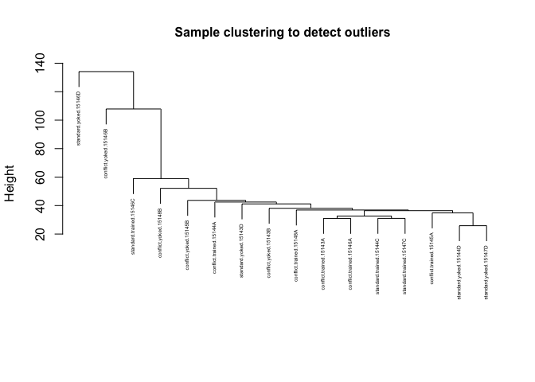
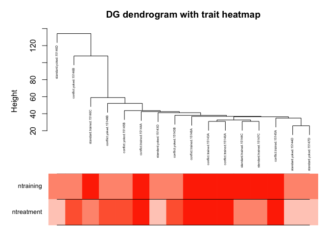

    # Load the packages
    library(tidyverse)

    ## ── Attaching packages ──────────────────────────────────────────────────────────────────── tidyverse 1.2.1 ──

    ## ✔ ggplot2 3.2.1     ✔ purrr   0.3.2
    ## ✔ tibble  2.1.3     ✔ dplyr   0.8.1
    ## ✔ tidyr   0.8.3     ✔ stringr 1.4.0
    ## ✔ readr   1.3.1     ✔ forcats 0.4.0

    ## ── Conflicts ─────────────────────────────────────────────────────────────────────── tidyverse_conflicts() ──
    ## ✖ dplyr::filter() masks stats::filter()
    ## ✖ dplyr::lag()    masks stats::lag()

    library(WGCNA)

    ## Loading required package: dynamicTreeCut

    ## Loading required package: fastcluster

    ## 
    ## Attaching package: 'fastcluster'

    ## The following object is masked from 'package:stats':
    ## 
    ##     hclust

    ## 

    ## 
    ## Attaching package: 'WGCNA'

    ## The following object is masked from 'package:stats':
    ## 
    ##     cor

    library(dplyr)
    library(magrittr)

    ## 
    ## Attaching package: 'magrittr'

    ## The following object is masked from 'package:purrr':
    ## 
    ##     set_names

    ## The following object is masked from 'package:tidyr':
    ## 
    ##     extract

    library(forcats)

    # read the count data
    countData <- read.csv("../data/02c_DGvsd.csv", row.names = 1, check.names = F)

    # read the sample meta data or column data
    colData <- read.csv("../data/02a_colData.csv", row.names = 1, stringsAsFactors = T)
    colData <- colData %>% filter(subfield == "DG")

    colData$treatment <- factor(colData$treatment, levels = c("standard.yoked", "standard.trained", 
                                                     "conflict.yoked", "conflict.trained"))
    colData$training <- factor(colData$training, levels = c("yoked", "trained"))

    # wgcna needs numeric identifiers
    colData$ntreatment <- as.numeric(colData$treatment)
    colData$ntraining <- as.numeric(colData$training)

    # create a short sample desctiption, make it the row and columns names of colData and countData
    colData$sample <- paste(colData$treatment, colData$ID, sep = ".")

    # set row and count names to be the same
    row.names(colData) <- colData$sample
    colnames(countData) <- colData$sample

    head(colData)

    ##                             ID subfield        treatment training
    ## conflict.trained.15143A 15143A       DG conflict.trained  trained
    ## conflict.yoked.15143B   15143B       DG   conflict.yoked    yoked
    ## standard.yoked.15143D   15143D       DG   standard.yoked    yoked
    ## conflict.trained.15144A 15144A       DG conflict.trained  trained
    ## standard.trained.15144C 15144C       DG standard.trained  trained
    ## standard.yoked.15144D   15144D       DG   standard.yoked    yoked
    ##                         ntreatment ntraining                  sample
    ## conflict.trained.15143A          4         2 conflict.trained.15143A
    ## conflict.yoked.15143B            3         1   conflict.yoked.15143B
    ## standard.yoked.15143D            1         1   standard.yoked.15143D
    ## conflict.trained.15144A          4         2 conflict.trained.15144A
    ## standard.trained.15144C          2         2 standard.trained.15144C
    ## standard.yoked.15144D            1         1   standard.yoked.15144D

    head(countData)

    ##               conflict.trained.15143A conflict.yoked.15143B
    ## 0610007P14Rik                6.381145              6.405587
    ## 0610009B22Rik                5.781124              5.661825
    ## 0610009L18Rik                5.405848              5.593055
    ## 0610009O20Rik                6.736671              6.691641
    ## 0610010F05Rik                6.603589              7.093384
    ## 0610010K14Rik                6.136536              5.949913
    ##               standard.yoked.15143D conflict.trained.15144A
    ## 0610007P14Rik              6.834813                6.513173
    ## 0610009B22Rik              5.299160                5.528657
    ## 0610009L18Rik              5.422004                5.000789
    ## 0610009O20Rik              6.736719                6.530386
    ## 0610010F05Rik              7.135233                6.931921
    ## 0610010K14Rik              6.015194                5.782488
    ##               standard.trained.15144C standard.yoked.15144D
    ## 0610007P14Rik                6.401366              6.637581
    ## 0610009B22Rik                5.821796              5.670620
    ## 0610009L18Rik                5.507750              5.506319
    ## 0610009O20Rik                6.799892              6.642508
    ## 0610010F05Rik                6.907778              6.587132
    ## 0610010K14Rik                5.999853              6.084773
    ##               conflict.trained.15145A conflict.yoked.15145B
    ## 0610007P14Rik                6.562833              6.126760
    ## 0610009B22Rik                5.942028              5.787857
    ## 0610009L18Rik                5.256496              5.000789
    ## 0610009O20Rik                6.739906              6.623046
    ## 0610010F05Rik                6.739906              6.540236
    ## 0610010K14Rik                6.218650              6.200426
    ##               conflict.trained.15146A conflict.yoked.15146B
    ## 0610007P14Rik                6.298333              5.996243
    ## 0610009B22Rik                5.679794              5.996243
    ## 0610009L18Rik                5.679794              5.000789
    ## 0610009O20Rik                6.747840              6.383172
    ## 0610010F05Rik                6.765447              7.085062
    ## 0610010K14Rik                6.298333              7.252267
    ##               standard.trained.15146C standard.yoked.15146D
    ## 0610007P14Rik                6.929322              7.411893
    ## 0610009B22Rik                6.060620              5.000789
    ## 0610009L18Rik                5.000789              5.000789
    ## 0610009O20Rik                6.350262              6.793559
    ## 0610010F05Rik                7.264347              6.493162
    ## 0610010K14Rik                5.971751              5.000789
    ##               standard.trained.15147C standard.yoked.15147D
    ## 0610007P14Rik                6.298159              6.481476
    ## 0610009B22Rik                5.910805              5.893873
    ## 0610009L18Rik                5.257050              5.718223
    ## 0610009O20Rik                6.687072              6.631927
    ## 0610010F05Rik                6.880090              6.759923
    ## 0610010K14Rik                5.761732              6.136024
    ##               conflict.trained.15148A conflict.yoked.15148B
    ## 0610007P14Rik                6.493581              6.349976
    ## 0610009B22Rik                5.589261              5.492981
    ## 0610009L18Rik                5.505647              5.349661
    ## 0610009O20Rik                7.108382              6.425888
    ## 0610010F05Rik                6.892155              6.595557
    ## 0610010K14Rik                5.626697              6.081280

    #=====================================================================================
    #
    #  Code chunk 2
    #
    #=====================================================================================

    datExpr0 <- as.data.frame(t(countData))

    head(names(datExpr0))  # columns are genes

    ## [1] "0610007P14Rik" "0610009B22Rik" "0610009L18Rik" "0610009O20Rik"
    ## [5] "0610010F05Rik" "0610010K14Rik"

    head(rownames(datExpr0)) # rows are samples

    ## [1] "conflict.trained.15143A" "conflict.yoked.15143B"  
    ## [3] "standard.yoked.15143D"   "conflict.trained.15144A"
    ## [5] "standard.trained.15144C" "standard.yoked.15144D"

    #=====================================================================================
    #
    #  Code chunk 3
    #
    #=====================================================================================

    gsg = goodSamplesGenes(datExpr0, verbose = 0);
    gsg$allOK

    ## [1] TRUE

    #=====================================================================================
    #
    #  Code chunk 4 removing genes
    #
    #=====================================================================================

    if (!gsg$allOK)
    {
      # Optionally, print the gene and sample names that were removed:
      #if (sum(!gsg$goodGenes)>0) 
      #  printFlush(paste("Removing genes:", paste(names(datExpr0)[!gsg$goodGenes], collapse = ", ")));
      #if (sum(!gsg$goodSamples)>0) 
      #  printFlush(paste("Removing samples:", paste(rownames(datExpr0)[!gsg$goodSamples], collapse = ", ")));
      # Remove the offending genes and samples from the data:
      datExpr0 = datExpr0[gsg$goodSamples, gsg$goodGenes]
    }

    #=====================================================================================
    #
    #  Code chunk 5
    #
    #=====================================================================================

    sampleTree = hclust(dist(datExpr0), method = "average");

    # Plot the sample tree: Open a graphic output window of size 12 by 9 inches
    # The user should change the dimensions if the window is too large or too small.

    plot(sampleTree, main = "Sample clustering to detect outliers", 
         sub="", xlab="", cex.main = 1, cex = 0.4)

    #=====================================================================================
    #
    #  Code chunk 6
    #
    #=====================================================================================

    # Plot a line to show the cut

    # Determine cluster under the line
    clust = cutreeStatic(sampleTree, cutHeight = 200, minSize = 3)
    table(clust)

    ## clust
    ##  1 
    ## 16

    # clust 1 contains the samples we want to keep.
    keepSamples = (clust==1)
    datExpr = datExpr0[keepSamples, ]
    nGenes = ncol(datExpr)
    nSamples = nrow(datExpr)

    #=====================================================================================
    #
    #  Code chunk 7
    #
    #=====================================================================================

    # keep only numberic columns
    datTraits <- colData %>% select(ntraining, ntreatment)
    datTraits

    ##                         ntraining ntreatment
    ## conflict.trained.15143A         2          4
    ## conflict.yoked.15143B           1          3
    ## standard.yoked.15143D           1          1
    ## conflict.trained.15144A         2          4
    ## standard.trained.15144C         2          2
    ## standard.yoked.15144D           1          1
    ## conflict.trained.15145A         2          4
    ## conflict.yoked.15145B           1          3
    ## conflict.trained.15146A         2          4
    ## conflict.yoked.15146B           1          3
    ## standard.trained.15146C         2          2
    ## standard.yoked.15146D           1          1
    ## standard.trained.15147C         2          2
    ## standard.yoked.15147D           1          1
    ## conflict.trained.15148A         2          4
    ## conflict.yoked.15148B           1          3

    collectGarbage()

    # Re-cluster samples
    sampleTree2 = hclust(dist(datExpr), method = "average")
    # Convert traits to a color representation: white means low, red means high, grey means missing entry
    traitColors = numbers2colors(datTraits, signed = TRUE);
    # Plot the sample dendrogram and the colors underneath.
    plotDendroAndColors(sampleTree2, traitColors,
                        groupLabels = names(datTraits), 
                        main = "DG dendrogram with trait heatmap",
                        cex.dendroLabels = 0.4
                        )

    powers = c(c(1:10), seq(from = 12, to=20, by=2))
    # Call the network topology analysis function
    sft = pickSoftThreshold(datExpr, powerVector = powers, verbose = 5)

    ## pickSoftThreshold: will use block size 2630.
    ##  pickSoftThreshold: calculating connectivity for given powers...
    ##    ..working on genes 1 through 2630 of 17011

    ## Warning: executing %dopar% sequentially: no parallel backend registered

    ##    ..working on genes 2631 through 5260 of 17011
    ##    ..working on genes 5261 through 7890 of 17011
    ##    ..working on genes 7891 through 10520 of 17011
    ##    ..working on genes 10521 through 13150 of 17011
    ##    ..working on genes 13151 through 15780 of 17011
    ##    ..working on genes 15781 through 17011 of 17011
    ##    Power SFT.R.sq  slope truncated.R.sq mean.k. median.k. max.k.
    ## 1      1    0.269  0.627          0.614  5370.0    5510.0   8170
    ## 2      2    0.149 -0.335          0.374  2580.0    2650.0   5140
    ## 3      3    0.424 -0.750          0.538  1500.0    1470.0   3660
    ## 4      4    0.508 -0.941          0.636   969.0     888.0   2780
    ## 5      5    0.555 -1.060          0.697   669.0     566.0   2190
    ## 6      6    0.586 -1.150          0.737   485.0     376.0   1780
    ## 7      7    0.605 -1.230          0.765   364.0     258.0   1470
    ## 8      8    0.636 -1.270          0.804   280.0     181.0   1240
    ## 9      9    0.644 -1.340          0.819   220.0     130.0   1060
    ## 10    10    0.670 -1.380          0.846   177.0      97.9    923
    ## 11    12    0.703 -1.470          0.883   118.0      58.4    711
    ## 12    14    0.726 -1.510          0.913    83.1      37.0    562
    ## 13    16    0.750 -1.550          0.936    60.4      23.9    452
    ## 14    18    0.770 -1.590          0.953    45.3      16.3    372
    ## 15    20    0.785 -1.630          0.965    34.7      11.3    313

    # Plot the results:
    sizeGrWindow(9, 5)
    par(mfrow = c(1,2));
    cex1 = 0.9;
    # Scale-free topology fit index as a function of the soft-thresholding power
    plot(sft$fitIndices[,1], -sign(sft$fitIndices[,3])*sft$fitIndices[,2],
         xlab="Soft Threshold (power)",ylab="Scale Free Topology Model Fit,signed R^2",type="n",
         main = paste("Scale independence"));
    text(sft$fitIndices[,1], -sign(sft$fitIndices[,3])*sft$fitIndices[,2],
         labels=powers,cex=cex1,col="red");
    # this line corresponds to using an R^2 cut-off of h
    abline(h=0.60,col="red")
    # Mean connectivity as a function of the soft-thresholding power
    plot(sft$fitIndices[,1], sft$fitIndices[,5],
         xlab="Soft Threshold (power)",ylab="Mean Connectivity", type="n",
         main = paste("Mean connectivity"))
    text(sft$fitIndices[,1], sft$fitIndices[,5], labels=powers, cex=cex1,col="red")

    enableWGCNAThreads()

    ## Allowing parallel execution with up to 3 working processes.

    # this is my attempt to solve an error
    datExpr %<>% mutate_if(is.integer,as.numeric)

    net = blockwiseModules(datExpr, power = 10,
                                    verbose = 5)

    ##  Calculating module eigengenes block-wise from all genes
    ##    Flagging genes and samples with too many missing values...
    ##     ..step 1
    ##  ....pre-clustering genes to determine blocks..
    ##    Projective K-means:
    ##    ..using 340 centers.
    ##    ..k-means clustering..
    ##     ..iteration 1
    ##       ..proposing to move 16830 genes..move accepted.
    ##     ..iteration 2
    ##       ..proposing to move 8358 genes..move accepted.
    ##     ..iteration 3
    ##       ..proposing to move 4073 genes..move accepted.
    ##     ..iteration 4
    ##       ..proposing to move 2783 genes..move accepted.
    ##     ..iteration 5
    ##       ..proposing to move 2015 genes..move accepted.
    ##     ..iteration 6
    ##       ..proposing to move 1545 genes..move accepted.
    ##     ..iteration 7
    ##       ..proposing to move 1243 genes..move accepted.
    ##     ..iteration 8
    ##       ..proposing to move 1016 genes..move accepted.
    ##     ..iteration 9
    ##       ..proposing to move 901 genes..move accepted.
    ##     ..iteration 10
    ##       ..proposing to move 754 genes..move accepted.
    ##     ..iteration 11
    ##       ..proposing to move 645 genes..move accepted.
    ##     ..iteration 12
    ##       ..proposing to move 556 genes..move accepted.
    ##     ..iteration 13
    ##       ..proposing to move 464 genes..move accepted.
    ##     ..iteration 14
    ##       ..proposing to move 377 genes..move accepted.
    ##     ..iteration 15
    ##       ..proposing to move 300 genes..move accepted.
    ##     ..iteration 16
    ##       ..proposing to move 274 genes..move accepted.
    ##     ..iteration 17
    ##       ..proposing to move 216 genes..move accepted.
    ##     ..iteration 18
    ##       ..proposing to move 190 genes..move accepted.
    ##     ..iteration 19
    ##       ..proposing to move 183 genes..move accepted.
    ##     ..iteration 20
    ##       ..proposing to move 120 genes..move accepted.
    ##     ..iteration 21
    ##       ..proposing to move 96 genes..move accepted.
    ##     ..iteration 22
    ##       ..proposing to move 73 genes..move accepted.
    ##     ..iteration 23
    ##       ..proposing to move 41 genes..move accepted.
    ##     ..iteration 24
    ##       ..proposing to move 27 genes..move accepted.
    ##     ..iteration 25
    ##       ..proposing to move 14 genes..move accepted.
    ##     ..iteration 26
    ##       ..proposing to move 9 genes..move accepted.
    ##     ..iteration 27
    ##       ..proposing to move 3 genes..move accepted.
    ##     ..iteration 28
    ## Could not find a suitable move to improve the clustering.
    ## Sizes of preliminary clusters:
    ## membership
    ##   1   2   3   4   5   6   7   8   9  10  11  12  13  14  15  16  17  18 
    ##  96  53  27  51  20  66  75  58  81  74  43  38  56  43  40  48  34  65 
    ##  19  20  21  22  23  24  25  26  27  28  29  30  31  32  33  34  35  36 
    ##  49  75  34  57 127  21  65  26 103  27  32 152  35  31 229  79  38 110 
    ##  37  38  39  40  41  42  43  44  45  46  47  48  49  50  51  52  53  54 
    ##  37  68  51  39  58  56  48  30  49  15  36  20  42  32  37  19  24 119 
    ##  55  56  57  58  59  60  61  62  63  64  65  66  67  68  69  70  71  72 
    ##  92  34  27 115  64  37  82  38   7  18  31  38 129 109  60  70  33  18 
    ##  73  74  75  76  77  78  79  80  81  82  83  84  85  86  87  88  89  90 
    ##  26  61  39  56  80  30 115  78  72 133 101  41 122  51  64  65  47  98 
    ##  91  92  93  94  95  96  97  98  99 100 101 102 103 104 105 106 107 108 
    ##  15  80  62  37  59  34  24  82  36  58 121  42  83  40  41  47  20  44 
    ## 109 110 111 112 113 114 115 116 117 118 119 120 121 122 123 124 125 126 
    ##  66  39 115  41  57  50  52  46  54  69  35  31  21  61 154  23  67  44 
    ## 127 128 129 130 131 132 133 134 135 136 137 138 139 140 141 142 143 144 
    ##  52  32  55  32 106  83 157  93  42  46  64  44  29  52  54  35  76  70 
    ## 145 146 147 148 149 150 151 152 153 154 155 156 157 158 159 160 161 162 
    ##  29  15  36  39  60  26  48 108  60  49  32 104  28  24  40  17 174  22 
    ## 163 164 165 166 167 168 169 170 171 172 173 174 175 176 177 178 179 180 
    ##  61  26 128  44  38  41  14  34 111 108  55  58  60  42  41  37  56  37 
    ## 181 182 183 184 185 186 187 188 189 190 191 192 193 194 195 196 197 198 
    ##  36  59  27  55  79  37  62  76  67  37  75  40  54  44  51  46  35  95 
    ## 199 200 201 202 203 204 205 206 207 208 209 210 211 212 213 214 215 216 
    ##  54  49  33  45  22  60  44  42  93  74  63  21  45  56  47  74  87  46 
    ## 217 218 219 220 221 222 223 224 225 226 227 228 229 230 231 232 233 234 
    ##  46  77  23 109  82  40  65  54  41  12  87  53  29  53  39 106  59  49 
    ## 235 236 237 238 239 240 241 242 243 244 245 246 247 248 249 250 251 252 
    ##  58 162  55  45  70  45 113  68  36  36  48  89  30  20  32  38  35  44 
    ## 253 254 255 256 257 258 259 260 261 262 263 264 265 266 267 268 269 270 
    ##  82  43  52  38 121  44  49  37  55  44  17  26  44  54  20  33 106  75 
    ## 271 272 273 274 275 276 277 278 279 280 281 282 283 284 285 286 287 288 
    ##  28  80  80  19  21  69  23  44  44  32  43  48  76  22  28  98 119  51 
    ## 289 290 291 292 293 294 295 296 297 298 299 300 301 302 303 304 305 306 
    ##  41  88  23  25  31  27  32  27  26  48  24  29  34  24  36  58  37  75 
    ## 307 308 309 310 
    ##  32  35  98  25 
    ##    ..merging smaller clusters...
    ## Block sizes:
    ## gBlocks
    ##    1    2    3    4 
    ## 4993 4921 4308 2789 
    ##  ..Working on block 1 .
    ##     TOM calculation: adjacency..
    ##     ..will use 3 parallel threads.
    ##      Fraction of slow calculations: 0.000000
    ##     ..connectivity..
    ##     ..matrix multiplication (system BLAS)..
    ##     ..normalization..
    ##     ..done.
    ##  ....clustering..
    ##  ....detecting modules..
    ##      ..done.
    ##  ....calculating module eigengenes..
    ##      moduleEigengenes : Working on ME for module 1
    ##      moduleEigengenes : Working on ME for module 2
    ##      moduleEigengenes : Working on ME for module 3
    ##      moduleEigengenes : Working on ME for module 4
    ##      moduleEigengenes : Working on ME for module 5
    ##      moduleEigengenes : Working on ME for module 6
    ##      moduleEigengenes : Working on ME for module 7
    ##      moduleEigengenes : Working on ME for module 8
    ##      moduleEigengenes : Working on ME for module 9
    ##      moduleEigengenes : Working on ME for module 10
    ##      moduleEigengenes : Working on ME for module 11
    ##      moduleEigengenes : Working on ME for module 12
    ##      moduleEigengenes : Working on ME for module 13
    ##      moduleEigengenes : Working on ME for module 14
    ##      moduleEigengenes : Working on ME for module 15
    ##      moduleEigengenes : Working on ME for module 16
    ##      moduleEigengenes : Working on ME for module 17
    ##      moduleEigengenes : Working on ME for module 18
    ##      moduleEigengenes : Working on ME for module 19
    ##      moduleEigengenes : Working on ME for module 20
    ##      moduleEigengenes : Working on ME for module 21
    ##  ....checking kME in modules..
    ##      ..removing 46 genes from module 1 because their KME is too low.
    ##      ..removing 3 genes from module 2 because their KME is too low.
    ##      ..removing 2 genes from module 3 because their KME is too low.
    ##      ..removing 3 genes from module 4 because their KME is too low.
    ##      ..removing 1 genes from module 5 because their KME is too low.
    ##  ..Working on block 2 .
    ##     TOM calculation: adjacency..
    ##     ..will use 3 parallel threads.
    ##      Fraction of slow calculations: 0.000000
    ##     ..connectivity..
    ##     ..matrix multiplication (system BLAS)..
    ##     ..normalization..
    ##     ..done.
    ##  ....clustering..
    ##  ....detecting modules..
    ##      ..done.
    ##  ....calculating module eigengenes..
    ##      moduleEigengenes : Working on ME for module 22
    ##      moduleEigengenes : Working on ME for module 23
    ##      moduleEigengenes : Working on ME for module 24
    ##      moduleEigengenes : Working on ME for module 25
    ##      moduleEigengenes : Working on ME for module 26
    ##      moduleEigengenes : Working on ME for module 27
    ##      moduleEigengenes : Working on ME for module 28
    ##      moduleEigengenes : Working on ME for module 29
    ##      moduleEigengenes : Working on ME for module 30
    ##      moduleEigengenes : Working on ME for module 31
    ##      moduleEigengenes : Working on ME for module 32
    ##      moduleEigengenes : Working on ME for module 33
    ##      moduleEigengenes : Working on ME for module 34
    ##      moduleEigengenes : Working on ME for module 35
    ##      moduleEigengenes : Working on ME for module 36
    ##      moduleEigengenes : Working on ME for module 37
    ##      moduleEigengenes : Working on ME for module 38
    ##      moduleEigengenes : Working on ME for module 39
    ##      moduleEigengenes : Working on ME for module 40
    ##      moduleEigengenes : Working on ME for module 41
    ##      moduleEigengenes : Working on ME for module 42
    ##      moduleEigengenes : Working on ME for module 43
    ##      moduleEigengenes : Working on ME for module 44
    ##      moduleEigengenes : Working on ME for module 45
    ##      moduleEigengenes : Working on ME for module 46
    ##      moduleEigengenes : Working on ME for module 47
    ##      moduleEigengenes : Working on ME for module 48
    ##  ....checking kME in modules..
    ##  ..Working on block 3 .
    ##     TOM calculation: adjacency..
    ##     ..will use 3 parallel threads.
    ##      Fraction of slow calculations: 0.000000
    ##     ..connectivity..
    ##     ..matrix multiplication (system BLAS)..
    ##     ..normalization..
    ##     ..done.
    ##  ....clustering..
    ##  ....detecting modules..
    ##      ..done.
    ##  ....calculating module eigengenes..
    ##      moduleEigengenes : Working on ME for module 49
    ##      moduleEigengenes : Working on ME for module 50
    ##      moduleEigengenes : Working on ME for module 51
    ##      moduleEigengenes : Working on ME for module 52
    ##      moduleEigengenes : Working on ME for module 53
    ##      moduleEigengenes : Working on ME for module 54
    ##      moduleEigengenes : Working on ME for module 55
    ##      moduleEigengenes : Working on ME for module 56
    ##      moduleEigengenes : Working on ME for module 57
    ##      moduleEigengenes : Working on ME for module 58
    ##      moduleEigengenes : Working on ME for module 59
    ##      moduleEigengenes : Working on ME for module 60
    ##      moduleEigengenes : Working on ME for module 61
    ##      moduleEigengenes : Working on ME for module 62
    ##      moduleEigengenes : Working on ME for module 63
    ##      moduleEigengenes : Working on ME for module 64
    ##      moduleEigengenes : Working on ME for module 65
    ##      moduleEigengenes : Working on ME for module 66
    ##      moduleEigengenes : Working on ME for module 67
    ##      moduleEigengenes : Working on ME for module 68
    ##  ....checking kME in modules..
    ##  ..Working on block 4 .
    ##     TOM calculation: adjacency..
    ##     ..will use 3 parallel threads.
    ##      Fraction of slow calculations: 0.000000
    ##     ..connectivity..
    ##     ..matrix multiplication (system BLAS)..
    ##     ..normalization..
    ##     ..done.
    ##  ....clustering..
    ##  ....detecting modules..
    ##      ..done.
    ##  ....calculating module eigengenes..
    ##      moduleEigengenes : Working on ME for module 69
    ##      moduleEigengenes : Working on ME for module 70
    ##      moduleEigengenes : Working on ME for module 71
    ##      moduleEigengenes : Working on ME for module 72
    ##      moduleEigengenes : Working on ME for module 73
    ##      moduleEigengenes : Working on ME for module 74
    ##      moduleEigengenes : Working on ME for module 75
    ##      moduleEigengenes : Working on ME for module 76
    ##      moduleEigengenes : Working on ME for module 77
    ##      moduleEigengenes : Working on ME for module 78
    ##      moduleEigengenes : Working on ME for module 79
    ##      moduleEigengenes : Working on ME for module 80
    ##      moduleEigengenes : Working on ME for module 81
    ##      moduleEigengenes : Working on ME for module 82
    ##      moduleEigengenes : Working on ME for module 83
    ##      moduleEigengenes : Working on ME for module 84
    ##      moduleEigengenes : Working on ME for module 85
    ##      moduleEigengenes : Working on ME for module 86
    ##      moduleEigengenes : Working on ME for module 87
    ##      moduleEigengenes : Working on ME for module 88
    ##      moduleEigengenes : Working on ME for module 89
    ##      moduleEigengenes : Working on ME for module 90
    ##      moduleEigengenes : Working on ME for module 91
    ##      moduleEigengenes : Working on ME for module 92
    ##      moduleEigengenes : Working on ME for module 93
    ##      moduleEigengenes : Working on ME for module 94
    ##      moduleEigengenes : Working on ME for module 95
    ##      moduleEigengenes : Working on ME for module 96
    ##      moduleEigengenes : Working on ME for module 97
    ##  ....checking kME in modules..
    ##   ..reassigning 15 genes from module 4 to modules with higher KME.
    ##   ..reassigning 1 genes from module 23 to modules with higher KME.
    ##   ..reassigning 3 genes from module 24 to modules with higher KME.
    ##   ..reassigning 3 genes from module 28 to modules with higher KME.
    ##   ..reassigning 1 genes from module 32 to modules with higher KME.
    ##   ..reassigning 1 genes from module 49 to modules with higher KME.
    ##   ..reassigning 1 genes from module 50 to modules with higher KME.
    ##   ..reassigning 1 genes from module 51 to modules with higher KME.
    ##   ..reassigning 3 genes from module 59 to modules with higher KME.
    ##   ..reassigning 2 genes from module 73 to modules with higher KME.
    ##  ..merging modules that are too close..
    ##      mergeCloseModules: Merging modules whose distance is less than 0.15
    ##        multiSetMEs: Calculating module MEs.
    ##          Working on set 1 ...
    ##          moduleEigengenes: Calculating 98 module eigengenes in given set.
    ##        multiSetMEs: Calculating module MEs.
    ##          Working on set 1 ...
    ##          moduleEigengenes: Calculating 63 module eigengenes in given set.
    ##        multiSetMEs: Calculating module MEs.
    ##          Working on set 1 ...
    ##          moduleEigengenes: Calculating 55 module eigengenes in given set.
    ##        multiSetMEs: Calculating module MEs.
    ##          Working on set 1 ...
    ##          moduleEigengenes: Calculating 53 module eigengenes in given set.
    ##        Calculating new MEs...
    ##        multiSetMEs: Calculating module MEs.
    ##          Working on set 1 ...
    ##          moduleEigengenes: Calculating 53 module eigengenes in given set.

    names(net)

    ##  [1] "colors"         "unmergedColors" "MEs"            "goodSamples"   
    ##  [5] "goodGenes"      "dendrograms"    "TOMFiles"       "blockGenes"    
    ##  [9] "blocks"         "MEsOK"

    head(net$colors)

    ## 0610007P14Rik 0610009B22Rik 0610009L18Rik 0610009O20Rik 0610010F05Rik 
    ##      "yellow"       "black"       "brown"      "purple"       "black" 
    ## 0610010K14Rik 
    ##         "red"

    head(net$unmergedColors)

    ##    0610007P14Rik    0610009B22Rik    0610009L18Rik    0610009O20Rik 
    ##       "magenta4"       "thistle1"      "turquoise"          "brown" 
    ##    0610010F05Rik    0610010K14Rik 
    ##       "thistle1" "lightsteelblue"

    sizeGrWindow(12, 9)
    # Convert labels to colors for plotting
    mergedColors = labels2colors(net$colors)
    mergedColors

    ##     [1] "salmon4"         "blue"            "yellow"         
    ##     [4] "yellowgreen"     "blue"            "skyblue3"       
    ##     [7] "darkorange"      "blue"            "plum2"          
    ##    [10] "yellow"          "salmon4"         "yellow"         
    ##    [13] "skyblue3"        "brown"           "lightgreen"     
    ##    [16] "salmon4"         "brown"           "skyblue3"       
    ##    [19] "skyblue3"        "magenta"         "skyblue3"       
    ##    [22] "skyblue3"        "plum2"           "blue"           
    ##    [25] "grey60"          "salmon4"         "plum2"          
    ##    [28] "turquoise"       "brown"           "salmon4"        
    ##    [31] "saddlebrown"     "plum2"           "brown"          
    ##    [34] "blue"            "brown"           "saddlebrown"    
    ##    [37] "orangered4"      "brown"           "brown"          
    ##    [40] "yellow"          "plum2"           "lightgreen"     
    ##    [43] "yellow"          "brown"           "yellow"         
    ##    [46] "saddlebrown"     "brown"           "yellow"         
    ##    [49] "darkgreen"       "plum1"           "steelblue"      
    ##    [52] "grey60"          "orangered4"      "royalblue"      
    ##    [55] "mediumpurple3"   "royalblue"       "brown4"         
    ##    [58] "brown4"          "thistle2"        "darkolivegreen" 
    ##    [61] "yellow"          "yellowgreen"     "plum2"          
    ##    [64] "violet"          "yellowgreen"     "brown"          
    ##    [67] "royalblue"       "darkgreen"       "yellow"         
    ##    [70] "grey60"          "red"             "brown"          
    ##    [73] "mediumpurple3"   "darkolivegreen"  "lightyellow"    
    ##    [76] "salmon4"         "darkolivegreen"  "thistle2"       
    ##    [79] "white"           "yellowgreen"     "mediumpurple3"  
    ##    [82] "red"             "yellow"          "white"          
    ##    [85] "yellow"          "salmon4"         "yellow"         
    ##    [88] "brown4"          "lightgreen"      "darkorange2"    
    ##    [91] "yellow"          "salmon4"         "brown"          
    ##    [94] "saddlebrown"     "yellow"          "midnightblue"   
    ##    [97] "yellow"          "plum2"           "saddlebrown"    
    ##   [100] "yellow"          "saddlebrown"     "yellow"         
    ##   [103] "yellow"          "yellow"          "grey60"         
    ##   [106] "white"           "steelblue"       "saddlebrown"    
    ##   [109] "brown"           "plum2"           "white"          
    ##   [112] "brown"           "floralwhite"     "yellow"         
    ##   [115] "salmon4"         "brown"           "yellow"         
    ##   [118] "grey60"          "brown"           "brown"          
    ##   [121] "salmon4"         "grey60"          "plum2"          
    ##   [124] "brown"           "brown"           "salmon4"        
    ##   [127] "thistle1"        "brown"           "salmon4"        
    ##   [130] "darkolivegreen"  "salmon4"         "turquoise"      
    ##   [133] "brown"           "salmon4"         "blue"           
    ##   [136] "white"           "salmon4"         "skyblue3"       
    ##   [139] "salmon4"         "blue"            "brown"          
    ##   [142] "salmon4"         "yellow"          "brown"          
    ##   [145] "blue"            "salmon4"         "plum2"          
    ##   [148] "steelblue"       "brown"           "brown"          
    ##   [151] "skyblue3"        "yellow"          "darkolivegreen" 
    ##   [154] "brown"           "plum2"           "salmon4"        
    ##   [157] "brown"           "salmon4"         "plum2"          
    ##   [160] "brown"           "plum2"           "brown"          
    ##   [163] "yellow"          "blue"            "plum2"          
    ##   [166] "plum2"           "salmon4"         "plum2"          
    ##   [169] "brown"           "mediumpurple3"   "plum2"          
    ##   [172] "lightyellow"     "blue"            "brown"          
    ##   [175] "darkred"         "plum2"           "brown"          
    ##   [178] "violet"          "plum2"           "lightyellow"    
    ##   [181] "darkorange"      "grey60"          "yellow"         
    ##   [184] "skyblue3"        "salmon4"         "brown"          
    ##   [187] "brown"           "ivory"           "mediumpurple3"  
    ##   [190] "red"             "blue"            "salmon4"        
    ##   [193] "salmon4"         "brown"           "salmon4"        
    ##   [196] "brown"           "brown"           "brown"          
    ##   [199] "blue"            "yellow"          "thistle2"       
    ##   [202] "yellow"          "darkolivegreen"  "yellow"         
    ##   [205] "brown"           "skyblue3"        "yellow"         
    ##   [208] "brown4"          "brown"           "yellow"         
    ##   [211] "yellow"          "yellow"          "darkolivegreen" 
    ##   [214] "yellow"          "yellow"          "skyblue3"       
    ##   [217] "plum2"           "plum1"           "plum2"          
    ##   [220] "red"             "yellowgreen"     "tan"            
    ##   [223] "brown4"          "yellow"          "brown"          
    ##   [226] "red"             "mediumpurple3"   "salmon4"        
    ##   [229] "darkgreen"       "salmon4"         "skyblue3"       
    ##   [232] "cyan"            "midnightblue"    "red"            
    ##   [235] "brown4"          "yellowgreen"     "plum2"          
    ##   [238] "yellow"          "darkgrey"        "yellowgreen"    
    ##   [241] "salmon4"         "saddlebrown"     "salmon4"        
    ##   [244] "paleturquoise"   "saddlebrown"     "brown"          
    ##   [247] "salmon4"         "plum2"           "darkolivegreen" 
    ##   [250] "saddlebrown"     "yellowgreen"     "cyan"           
    ##   [253] "plum1"           "brown"           "orangered4"     
    ##   [256] "mediumpurple3"   "salmon4"         "yellow"         
    ##   [259] "thistle2"        "brown"           "darkgreen"      
    ##   [262] "paleturquoise"   "darkgreen"       "yellowgreen"    
    ##   [265] "yellow"          "brown"           "mediumpurple3"  
    ##   [268] "black"           "darkred"         "brown"          
    ##   [271] "yellow"          "sienna3"         "brown"          
    ##   [274] "salmon4"         "mediumpurple3"   "saddlebrown"    
    ##   [277] "yellow"          "brown"           "plum2"          
    ##   [280] "yellow"          "brown4"          "lightyellow"    
    ##   [283] "blue"            "brown"           "white"          
    ##   [286] "yellow"          "tan"             "lightyellow"    
    ##   [289] "brown"           "blue"            "thistle1"       
    ##   [292] "saddlebrown"     "yellow"          "midnightblue"   
    ##   [295] "mediumpurple3"   "violet"          "saddlebrown"    
    ##   [298] "yellow"          "red"             "cyan"           
    ##   [301] "yellow"          "yellow"          "darkgrey"       
    ##   [304] "brown"           "plum2"           "darkorange"     
    ##   [307] "yellow"          "plum1"           "salmon4"        
    ##   [310] "yellow"          "darkolivegreen"  "plum2"          
    ##   [313] "brown"           "lightgreen"      "grey60"         
    ##   [316] "yellow"          "plum2"           "plum2"          
    ##   [319] "brown"           "yellow"          "yellow"         
    ##   [322] "yellow"          "orangered4"      "yellow"         
    ##   [325] "yellow"          "blue"            "white"          
    ##   [328] "skyblue3"        "paleturquoise"   "brown"          
    ##   [331] "yellow"          "salmon4"         "yellow"         
    ##   [334] "plum2"           "yellow"          "yellow"         
    ##   [337] "brown"           "mediumpurple3"   "brown"          
    ##   [340] "darkolivegreen"  "yellow"          "yellow"         
    ##   [343] "red"             "grey60"          "yellowgreen"    
    ##   [346] "grey60"          "yellow"          "lightgreen"     
    ##   [349] "darkolivegreen"  "plum2"           "yellow"         
    ##   [352] "white"           "mediumpurple3"   "saddlebrown"    
    ##   [355] "brown"           "plum2"           "blue"           
    ##   [358] "yellow"          "yellow"          "grey60"         
    ##   [361] "brown"           "grey60"          "brown"          
    ##   [364] "yellow"          "mediumpurple3"   "white"          
    ##   [367] "plum2"           "plum2"           "plum2"          
    ##   [370] "orangered4"      "plum2"           "yellow"         
    ##   [373] "plum2"           "grey60"          "plum2"          
    ##   [376] "violet"          "plum2"           "skyblue3"       
    ##   [379] "darkgrey"        "salmon4"         "yellow"         
    ##   [382] "salmon4"         "salmon4"         "skyblue3"       
    ##   [385] "yellow"          "darkgreen"       "saddlebrown"    
    ##   [388] "yellow"          "yellow"          "yellow"         
    ##   [391] "darkolivegreen"  "skyblue3"        "darkolivegreen" 
    ##   [394] "saddlebrown"     "saddlebrown"     "brown"          
    ##   [397] "mediumpurple3"   "mediumpurple3"   "grey60"         
    ##   [400] "sienna3"         "white"           "plum2"          
    ##   [403] "plum2"           "black"           "blue"           
    ##   [406] "brown"           "darkolivegreen"  "brown"          
    ##   [409] "darkgrey"        "yellow"          "darkgrey"       
    ##   [412] "brown"           "brown4"          "yellowgreen"    
    ##   [415] "brown"           "plum2"           "plum2"          
    ##   [418] "darkgrey"        "salmon4"         "skyblue3"       
    ##   [421] "grey60"          "brown"           "pink"           
    ##   [424] "yellowgreen"     "plum2"           "lightyellow"    
    ##   [427] "yellow"          "salmon4"         "ivory"          
    ##   [430] "salmon4"         "plum2"           "yellow"         
    ##   [433] "yellow"          "grey60"          "red"            
    ##   [436] "skyblue3"        "brown"           "thistle2"       
    ##   [439] "yellow"          "plum2"           "blue"           
    ##   [442] "brown"           "salmon"          "darkorange2"    
    ##   [445] "plum2"           "brown"           "brown"          
    ##   [448] "blue"            "blue"            "darkgreen"      
    ##   [451] "darkturquoise"   "brown"           "yellow"         
    ##   [454] "salmon4"         "brown"           "salmon4"        
    ##   [457] "plum2"           "salmon4"         "brown"          
    ##   [460] "saddlebrown"     "lightgreen"      "brown"          
    ##   [463] "magenta"         "skyblue3"        "yellow"         
    ##   [466] "blue"            "yellow"          "saddlebrown"    
    ##   [469] "brown"           "salmon4"         "brown"          
    ##   [472] "brown"           "plum2"           "plum2"          
    ##   [475] "skyblue3"        "salmon4"         "brown"          
    ##   [478] "plum1"           "brown"           "black"          
    ##   [481] "brown"           "brown"           "salmon4"        
    ##   [484] "purple"          "salmon4"         "salmon4"        
    ##   [487] "yellow"          "yellow"          "plum2"          
    ##   [490] "brown4"          "skyblue3"        "salmon4"        
    ##   [493] "salmon4"         "plum2"           "plum2"          
    ##   [496] "skyblue3"        "skyblue3"        "brown"          
    ##   [499] "blue"            "skyblue3"        "plum2"          
    ##   [502] "blue"            "yellow"          "saddlebrown"    
    ##   [505] "plum2"           "salmon4"         "salmon4"        
    ##   [508] "plum2"           "grey60"          "skyblue3"       
    ##   [511] "salmon"          "salmon4"         "thistle2"       
    ##   [514] "plum2"           "salmon4"         "salmon4"        
    ##   [517] "plum2"           "red"             "darkorange2"    
    ##   [520] "brown"           "grey60"          "salmon4"        
    ##   [523] "plum2"           "blue"            "blue"           
    ##   [526] "plum2"           "yellow"          "salmon4"        
    ##   [529] "salmon4"         "blue"            "brown"          
    ##   [532] "salmon"          "brown4"          "yellow"         
    ##   [535] "salmon4"         "blue"            "plum2"          
    ##   [538] "blue"            "blue"            "brown"          
    ##   [541] "brown"           "salmon4"         "skyblue3"       
    ##   [544] "paleturquoise"   "plum2"           "darkorange2"    
    ##   [547] "yellow"          "brown"           "yellow"         
    ##   [550] "plum2"           "grey60"          "grey60"         
    ##   [553] "salmon4"         "yellowgreen"     "plum2"          
    ##   [556] "plum2"           "plum2"           "white"          
    ##   [559] "plum2"           "red"             "plum2"          
    ##   [562] "grey60"          "brown"           "floralwhite"    
    ##   [565] "plum2"           "yellow"          "brown"          
    ##   [568] "brown"           "salmon4"         "yellow"         
    ##   [571] "plum2"           "brown"           "salmon4"        
    ##   [574] "skyblue3"        "brown"           "brown"          
    ##   [577] "midnightblue"    "brown"           "steelblue"      
    ##   [580] "salmon4"         "plum2"           "darkgreen"      
    ##   [583] "brown4"          "thistle1"        "steelblue"      
    ##   [586] "yellow"          "salmon4"         "plum2"          
    ##   [589] "darkolivegreen"  "skyblue3"        "brown"          
    ##   [592] "brown"           "yellow"          "plum2"          
    ##   [595] "grey60"          "yellow"          "brown"          
    ##   [598] "red"             "darkolivegreen"  "mediumpurple3"  
    ##   [601] "darkturquoise"   "plum2"           "mediumpurple3"  
    ##   [604] "salmon4"         "darkgrey"        "yellow"         
    ##   [607] "midnightblue"    "yellow"          "plum1"          
    ##   [610] "lightcyan"       "salmon4"         "skyblue"        
    ##   [613] "floralwhite"     "mediumpurple3"   "lightsteelblue1"
    ##   [616] "ivory"           "blue"            "pink"           
    ##   [619] "brown"           "brown"           "plum2"          
    ##   [622] "pink"            "brown"           "yellow"         
    ##   [625] "darkolivegreen"  "yellow"          "brown"          
    ##   [628] "plum2"           "midnightblue"    "grey60"         
    ##   [631] "yellow"          "grey60"          "brown"          
    ##   [634] "yellow"          "darkgrey"        "yellow"         
    ##   [637] "lightgreen"      "pink"            "palevioletred3" 
    ##   [640] "yellow"          "saddlebrown"     "plum2"          
    ##   [643] "brown"           "plum2"           "plum2"          
    ##   [646] "salmon4"         "brown"           "red"            
    ##   [649] "salmon4"         "lightgreen"      "brown4"         
    ##   [652] "yellow"          "brown"           "plum2"          
    ##   [655] "yellow"          "lightyellow"     "saddlebrown"    
    ##   [658] "brown4"          "plum2"           "salmon4"        
    ##   [661] "salmon"          "brown"           "paleturquoise"  
    ##   [664] "brown"           "yellow"          "mediumpurple3"  
    ##   [667] "skyblue3"        "brown"           "brown4"         
    ##   [670] "yellow"          "plum2"           "brown"          
    ##   [673] "darkgrey"        "skyblue3"        "brown"          
    ##   [676] "paleturquoise"   "salmon4"         "white"          
    ##   [679] "grey60"          "yellow"          "darkgrey"       
    ##   [682] "salmon4"         "salmon4"         "grey60"         
    ##   [685] "yellow"          "plum2"           "plum2"          
    ##   [688] "salmon4"         "plum2"           "brown"          
    ##   [691] "brown"           "skyblue3"        "brown"          
    ##   [694] "blue"            "yellow"          "grey60"         
    ##   [697] "skyblue3"        "plum2"           "yellow"         
    ##   [700] "purple"          "grey60"          "skyblue3"       
    ##   [703] "plum2"           "plum2"           "grey60"         
    ##   [706] "plum2"           "plum2"           "plum2"          
    ##   [709] "yellowgreen"     "grey60"          "brown"          
    ##   [712] "palevioletred3"  "plum2"           "darkorange"     
    ##   [715] "brown"           "yellow"          "yellow"         
    ##   [718] "lightgreen"      "darkgreen"       "yellow"         
    ##   [721] "yellowgreen"     "yellow"          "brown"          
    ##   [724] "plum2"           "yellow"          "darkolivegreen" 
    ##   [727] "white"           "darkgrey"        "brown"          
    ##   [730] "salmon4"         "blue"            "brown"          
    ##   [733] "lightgreen"      "skyblue3"        "yellow"         
    ##   [736] "skyblue3"        "brown"           "plum2"          
    ##   [739] "blue"            "plum2"           "yellow"         
    ##   [742] "yellow"          "salmon4"         "salmon4"        
    ##   [745] "plum2"           "mediumpurple3"   "yellow"         
    ##   [748] "brown"           "plum2"           "darkolivegreen" 
    ##   [751] "plum2"           "brown"           "yellow"         
    ##   [754] "grey60"          "plum2"           "yellow"         
    ##   [757] "brown"           "plum2"           "plum2"          
    ##   [760] "lightgreen"      "floralwhite"     "salmon4"        
    ##   [763] "salmon4"         "plum2"           "salmon4"        
    ##   [766] "grey60"          "brown"           "yellow"         
    ##   [769] "darkgrey"        "plum2"           "blue"           
    ##   [772] "pink"            "brown4"          "skyblue3"       
    ##   [775] "grey60"          "skyblue3"        "brown"          
    ##   [778] "plum2"           "plum2"           "plum2"          
    ##   [781] "darkolivegreen"  "grey60"          "salmon4"        
    ##   [784] "yellow"          "brown"           "yellow"         
    ##   [787] "grey60"          "grey60"          "skyblue3"       
    ##   [790] "white"           "brown"           "salmon4"        
    ##   [793] "salmon4"         "plum2"           "lightyellow"    
    ##   [796] "plum2"           "brown"           "salmon4"        
    ##   [799] "plum2"           "plum2"           "midnightblue"   
    ##   [802] "yellow"          "plum2"           "darkolivegreen" 
    ##   [805] "orange"          "plum2"           "grey60"         
    ##   [808] "yellow"          "plum2"           "brown"          
    ##   [811] "blue"            "thistle1"        "grey60"         
    ##   [814] "plum2"           "darkolivegreen"  "plum2"          
    ##   [817] "plum2"           "plum1"           "yellow"         
    ##   [820] "plum1"           "brown"           "plum2"          
    ##   [823] "plum2"           "blue"            "plum2"          
    ##   [826] "brown"           "plum2"           "brown"          
    ##   [829] "red"             "lightgreen"      "yellow"         
    ##   [832] "grey60"          "grey60"          "mediumpurple3"  
    ##   [835] "skyblue3"        "blue"            "sienna3"        
    ##   [838] "brown"           "midnightblue"    "steelblue"      
    ##   [841] "blue"            "brown"           "darkorange"     
    ##   [844] "thistle2"        "darkolivegreen"  "plum2"          
    ##   [847] "brown"           "brown"           "brown"          
    ##   [850] "darkgreen"       "plum2"           "darkolivegreen" 
    ##   [853] "white"           "plum2"           "darkturquoise"  
    ##   [856] "salmon4"         "salmon4"         "lightyellow"    
    ##   [859] "thistle1"        "plum2"           "brown"          
    ##   [862] "brown"           "plum2"           "lightyellow"    
    ##   [865] "yellow"          "plum2"           "brown4"         
    ##   [868] "blue"            "plum2"           "royalblue"      
    ##   [871] "brown"           "skyblue3"        "darkorange"     
    ##   [874] "brown"           "salmon4"         "red"            
    ##   [877] "red"             "plum2"           "salmon4"        
    ##   [880] "yellow"          "blue"            "plum2"          
    ##   [883] "plum2"           "plum2"           "lightyellow"    
    ##   [886] "plum2"           "plum2"           "plum2"          
    ##   [889] "yellow"          "plum2"           "grey60"         
    ##   [892] "blue"            "plum2"           "white"          
    ##   [895] "blue"            "magenta"         "salmon4"        
    ##   [898] "royalblue"       "darkolivegreen"  "pink"           
    ##   [901] "lightyellow"     "darkorange"      "plum1"          
    ##   [904] "darkolivegreen"  "midnightblue"    "yellowgreen"    
    ##   [907] "brown4"          "brown"           "plum2"          
    ##   [910] "plum2"           "lightyellow"     "salmon4"        
    ##   [913] "grey60"          "plum2"           "brown"          
    ##   [916] "plum2"           "yellow"          "plum2"          
    ##   [919] "brown"           "salmon4"         "plum2"          
    ##   [922] "darkgrey"        "yellow"          "yellow"         
    ##   [925] "salmon4"         "yellow"          "grey60"         
    ##   [928] "brown4"          "salmon4"         "white"          
    ##   [931] "darkolivegreen"  "grey60"          "plum2"          
    ##   [934] "plum2"           "plum2"           "yellow"         
    ##   [937] "brown"           "pink"            "darkgrey"       
    ##   [940] "red"             "brown"           "plum2"          
    ##   [943] "salmon4"         "plum2"           "plum2"          
    ##   [946] "blue"            "blue"            "yellow"         
    ##   [949] "blue"            "brown"           "ivory"          
    ##   [952] "brown"           "brown"           "skyblue3"       
    ##   [955] "red"             "plum2"           "lightgreen"     
    ##   [958] "brown"           "salmon4"         "brown"          
    ##   [961] "blue"            "skyblue3"        "blue"           
    ##   [964] "royalblue"       "brown"           "yellow"         
    ##   [967] "darkolivegreen"  "yellowgreen"     "yellowgreen"    
    ##   [970] "mediumpurple3"   "lightgreen"      "yellow"         
    ##   [973] "skyblue3"        "yellow"          "saddlebrown"    
    ##   [976] "brown"           "yellow"          "yellowgreen"    
    ##   [979] "salmon4"         "plum2"           "brown4"         
    ##   [982] "white"           "brown"           "brown"          
    ##   [985] "plum2"           "salmon4"         "plum2"          
    ##   [988] "lightyellow"     "brown"           "yellow"         
    ##   [991] "brown"           "salmon4"         "darkorange2"    
    ##   [994] "salmon4"         "yellowgreen"     "darkgreen"      
    ##   [997] "salmon4"         "salmon"          "salmon4"        
    ##  [1000] "salmon4"         "skyblue3"        "lightyellow"    
    ##  [1003] "yellow"          "yellow"          "plum2"          
    ##  [1006] "plum2"           "grey60"          "brown"          
    ##  [1009] "plum2"           "brown"           "brown"          
    ##  [1012] "saddlebrown"     "saddlebrown"     "saddlebrown"    
    ##  [1015] "brown4"          "plum2"           "grey60"         
    ##  [1018] "plum2"           "brown"           "skyblue3"       
    ##  [1021] "yellow"          "salmon4"         "skyblue3"       
    ##  [1024] "blue"            "salmon4"         "grey60"         
    ##  [1027] "salmon4"         "yellowgreen"     "salmon4"        
    ##  [1030] "plum2"           "yellow"          "white"          
    ##  [1033] "brown"           "orange"          "yellow"         
    ##  [1036] "brown"           "yellow"          "royalblue"      
    ##  [1039] "plum2"           "brown"           "plum2"          
    ##  [1042] "plum2"           "midnightblue"    "brown"          
    ##  [1045] "skyblue3"        "brown4"          "grey60"         
    ##  [1048] "brown"           "blue"            "red"            
    ##  [1051] "plum2"           "yellowgreen"     "skyblue3"       
    ##  [1054] "brown"           "plum2"           "grey60"         
    ##  [1057] "brown"           "greenyellow"     "blue"           
    ##  [1060] "darkolivegreen"  "plum2"           "plum2"          
    ##  [1063] "darkmagenta"     "midnightblue"    "brown"          
    ##  [1066] "white"           "brown"           "plum2"          
    ##  [1069] "plum2"           "darkorange"      "yellow"         
    ##  [1072] "salmon"          "turquoise"       "darkorange"     
    ##  [1075] "white"           "blue"            "brown"          
    ##  [1078] "skyblue3"        "blue"            "salmon4"        
    ##  [1081] "blue"            "grey60"          "plum2"          
    ##  [1084] "salmon4"         "skyblue3"        "plum2"          
    ##  [1087] "brown"           "brown"           "yellow"         
    ##  [1090] "salmon4"         "yellow"          "greenyellow"    
    ##  [1093] "black"           "yellow"          "grey60"         
    ##  [1096] "grey60"          "salmon4"         "brown"          
    ##  [1099] "blue"            "salmon4"         "blue"           
    ##  [1102] "darkorange2"     "violet"          "brown"          
    ##  [1105] "orange"          "grey60"          "plum2"          
    ##  [1108] "saddlebrown"     "brown"           "darkgreen"      
    ##  [1111] "brown"           "yellow"          "skyblue3"       
    ##  [1114] "plum2"           "royalblue"       "yellow"         
    ##  [1117] "blue"            "mediumpurple3"   "lightgreen"     
    ##  [1120] "mediumpurple3"   "salmon4"         "yellow"         
    ##  [1123] "plum2"           "plum2"           "grey60"         
    ##  [1126] "orange"          "sienna3"         "brown"          
    ##  [1129] "yellow"          "lightgreen"      "brown4"         
    ##  [1132] "darkolivegreen"  "grey60"          "grey60"         
    ##  [1135] "plum2"           "brown"           "salmon4"        
    ##  [1138] "saddlebrown"     "skyblue3"        "skyblue3"       
    ##  [1141] "plum2"           "brown"           "yellow"         
    ##  [1144] "yellow"          "green"           "grey60"         
    ##  [1147] "lightyellow"     "brown"           "white"          
    ##  [1150] "salmon4"         "brown"           "brown"          
    ##  [1153] "plum2"           "salmon4"         "bisque4"        
    ##  [1156] "lightgreen"      "skyblue3"        "yellow"         
    ##  [1159] "skyblue3"        "skyblue3"        "blue"           
    ##  [1162] "lightgreen"      "blue"            "brown"          
    ##  [1165] "grey60"          "plum2"           "grey60"         
    ##  [1168] "orangered4"      "blue"            "thistle1"       
    ##  [1171] "brown"           "brown"           "salmon4"        
    ##  [1174] "brown"           "plum2"           "salmon4"        
    ##  [1177] "skyblue3"        "red"             "brown"          
    ##  [1180] "yellow"          "blue"            "darkturquoise"  
    ##  [1183] "plum2"           "brown"           "plum2"          
    ##  [1186] "salmon4"         "blue"            "steelblue"      
    ##  [1189] "skyblue3"        "violet"          "darkgreen"      
    ##  [1192] "yellowgreen"     "darkgreen"       "plum2"          
    ##  [1195] "yellow"          "yellow"          "plum1"          
    ##  [1198] "mediumpurple3"   "orange"          "yellow"         
    ##  [1201] "brown"           "darkgreen"       "lightgreen"     
    ##  [1204] "yellowgreen"     "skyblue3"        "white"          
    ##  [1207] "salmon4"         "blue"            "green"          
    ##  [1210] "salmon4"         "salmon4"         "salmon4"        
    ##  [1213] "grey60"          "plum2"           "yellow"         
    ##  [1216] "salmon4"         "floralwhite"     "plum2"          
    ##  [1219] "darkturquoise"   "yellowgreen"     "plum2"          
    ##  [1222] "skyblue3"        "plum2"           "brown"          
    ##  [1225] "lightgreen"      "plum2"           "brown"          
    ##  [1228] "blue"            "salmon"          "yellow"         
    ##  [1231] "thistle2"        "blue"            "darkorange"     
    ##  [1234] "blue"            "plum2"           "skyblue3"       
    ##  [1237] "lightyellow"     "plum2"           "salmon4"        
    ##  [1240] "grey60"          "grey60"          "salmon4"        
    ##  [1243] "lightcyan"       "plum2"           "yellow"         
    ##  [1246] "plum2"           "skyblue3"        "cyan"           
    ##  [1249] "yellow"          "red"             "grey60"         
    ##  [1252] "blue"            "white"           "plum2"          
    ##  [1255] "salmon4"         "plum2"           "blue"           
    ##  [1258] "yellow"          "plum2"           "plum2"          
    ##  [1261] "yellow"          "salmon4"         "yellow"         
    ##  [1264] "white"           "yellow"          "plum2"          
    ##  [1267] "saddlebrown"     "yellow"          "yellow"         
    ##  [1270] "brown"           "grey60"          "salmon4"        
    ##  [1273] "skyblue3"        "brown"           "brown"          
    ##  [1276] "yellow"          "brown4"          "salmon4"        
    ##  [1279] "grey60"          "salmon4"         "yellow"         
    ##  [1282] "floralwhite"     "lightsteelblue1" "plum2"          
    ##  [1285] "yellow"          "skyblue3"        "skyblue3"       
    ##  [1288] "brown"           "plum2"           "plum2"          
    ##  [1291] "lightyellow"     "salmon4"         "yellow"         
    ##  [1294] "plum2"           "yellow"          "plum2"          
    ##  [1297] "salmon4"         "skyblue3"        "darkolivegreen" 
    ##  [1300] "yellow"          "mediumpurple3"   "yellow"         
    ##  [1303] "darkgreen"       "cyan"            "skyblue3"       
    ##  [1306] "yellow"          "yellow"          "blue"           
    ##  [1309] "grey60"          "plum2"           "plum2"          
    ##  [1312] "plum2"           "brown"           "brown"          
    ##  [1315] "plum2"           "darkolivegreen"  "plum2"          
    ##  [1318] "grey60"          "salmon"          "lightgreen"     
    ##  [1321] "salmon4"         "blue"            "bisque4"        
    ##  [1324] "yellow"          "black"           "royalblue"      
    ##  [1327] "plum2"           "salmon4"         "red"            
    ##  [1330] "grey60"          "brown"           "plum2"          
    ##  [1333] "plum2"           "plum2"           "plum2"          
    ##  [1336] "skyblue3"        "salmon"          "brown"          
    ##  [1339] "salmon"          "ivory"           "blue"           
    ##  [1342] "plum2"           "plum2"           "grey60"         
    ##  [1345] "brown"           "salmon4"         "plum2"          
    ##  [1348] "yellow"          "plum2"           "plum2"          
    ##  [1351] "grey60"          "brown4"          "yellow"         
    ##  [1354] "salmon4"         "blue"            "brown"          
    ##  [1357] "plum2"           "skyblue3"        "plum2"          
    ##  [1360] "blue"            "plum2"           "salmon"         
    ##  [1363] "salmon4"         "plum2"           "bisque4"        
    ##  [1366] "grey60"          "brown"           "brown"          
    ##  [1369] "grey60"          "salmon4"         "lightyellow"    
    ##  [1372] "darkmagenta"     "salmon4"         "plum2"          
    ##  [1375] "brown"           "plum2"           "grey60"         
    ##  [1378] "yellow"          "yellow"          "blue"           
    ##  [1381] "skyblue3"        "yellow"          "skyblue3"       
    ##  [1384] "white"           "yellow"          "midnightblue"   
    ##  [1387] "plum2"           "skyblue3"        "yellow"         
    ##  [1390] "yellow"          "brown"           "yellow"         
    ##  [1393] "yellow"          "darkolivegreen"  "plum1"          
    ##  [1396] "red"             "brown"           "brown"          
    ##  [1399] "salmon4"         "plum2"           "brown"          
    ##  [1402] "brown"           "skyblue3"        "yellow"         
    ##  [1405] "salmon4"         "grey60"          "yellow"         
    ##  [1408] "white"           "darkgreen"       "brown"          
    ##  [1411] "plum2"           "brown4"          "orange"         
    ##  [1414] "saddlebrown"     "brown"           "brown"          
    ##  [1417] "plum2"           "darkgrey"        "violet"         
    ##  [1420] "plum2"           "brown"           "plum2"          
    ##  [1423] "grey60"          "plum2"           "blue"           
    ##  [1426] "yellow"          "yellowgreen"     "yellowgreen"    
    ##  [1429] "brown"           "yellow"          "white"          
    ##  [1432] "grey60"          "blue"            "plum2"          
    ##  [1435] "plum2"           "yellow"          "yellow"         
    ##  [1438] "grey60"          "black"           "brown"          
    ##  [1441] "salmon4"         "brown"           "yellow"         
    ##  [1444] "darkorange2"     "darkolivegreen"  "plum2"          
    ##  [1447] "plum2"           "brown"           "yellow"         
    ##  [1450] "darkgrey"        "yellow"          "plum2"          
    ##  [1453] "lightyellow"     "brown"           "brown"          
    ##  [1456] "yellowgreen"     "plum2"           "plum2"          
    ##  [1459] "yellow"          "plum2"           "grey60"         
    ##  [1462] "brown"           "plum2"           "salmon4"        
    ##  [1465] "brown"           "plum2"           "skyblue3"       
    ##  [1468] "plum2"           "blue"            "grey60"         
    ##  [1471] "blue"            "salmon4"         "salmon"         
    ##  [1474] "salmon4"         "salmon4"         "plum2"          
    ##  [1477] "grey60"          "blue"            "plum2"          
    ##  [1480] "yellow"          "plum2"           "plum2"          
    ##  [1483] "yellow"          "plum2"           "plum2"          
    ##  [1486] "brown"           "grey60"          "salmon4"        
    ##  [1489] "palevioletred3"  "yellow"          "white"          
    ##  [1492] "salmon4"         "grey60"          "brown"          
    ##  [1495] "yellow"          "plum2"           "yellow"         
    ##  [1498] "lightgreen"      "brown"           "brown"          
    ##  [1501] "brown"           "brown"           "plum2"          
    ##  [1504] "blue"            "plum2"           "salmon4"        
    ##  [1507] "darkgrey"        "brown"           "yellow"         
    ##  [1510] "brown"           "brown"           "brown"          
    ##  [1513] "salmon4"         "brown"           "darkorange"     
    ##  [1516] "skyblue3"        "plum2"           "yellow"         
    ##  [1519] "salmon4"         "plum2"           "yellow"         
    ##  [1522] "salmon4"         "steelblue"       "skyblue"        
    ##  [1525] "brown"           "red"             "plum2"          
    ##  [1528] "plum2"           "white"           "plum2"          
    ##  [1531] "plum2"           "grey60"          "plum2"          
    ##  [1534] "salmon4"         "darkgrey"        "yellowgreen"    
    ##  [1537] "white"           "green"           "green"          
    ##  [1540] "salmon4"         "darkorange"      "skyblue"        
    ##  [1543] "salmon4"         "darkolivegreen"  "salmon4"        
    ##  [1546] "darkmagenta"     "darkorange"      "skyblue3"       
    ##  [1549] "skyblue3"        "salmon4"         "darkmagenta"    
    ##  [1552] "pink"            "salmon4"         "brown"          
    ##  [1555] "plum2"           "red"             "purple"         
    ##  [1558] "plum2"           "yellow"          "plum2"          
    ##  [1561] "plum2"           "green"           "yellow"         
    ##  [1564] "saddlebrown"     "yellow"          "blue"           
    ##  [1567] "lightyellow"     "darkorange"      "darkorange"     
    ##  [1570] "brown"           "skyblue"         "pink"           
    ##  [1573] "plum2"           "greenyellow"     "darkorange"     
    ##  [1576] "yellowgreen"     "grey60"          "yellow"         
    ##  [1579] "yellow"          "plum2"           "grey60"         
    ##  [1582] "darkgreen"       "plum2"           "thistle2"       
    ##  [1585] "yellow"          "black"           "brown4"         
    ##  [1588] "plum2"           "salmon4"         "brown"          
    ##  [1591] "grey60"          "salmon4"         "skyblue3"       
    ##  [1594] "yellow"          "yellow"          "plum2"          
    ##  [1597] "darkmagenta"     "plum2"           "pink"           
    ##  [1600] "brown"           "salmon4"         "plum2"          
    ##  [1603] "plum2"           "plum2"           "plum2"          
    ##  [1606] "yellow"          "plum2"           "plum2"          
    ##  [1609] "yellowgreen"     "plum2"           "darkgrey"       
    ##  [1612] "brown"           "tan"             "grey60"         
    ##  [1615] "brown"           "brown"           "thistle1"       
    ##  [1618] "plum2"           "brown"           "yellow"         
    ##  [1621] "saddlebrown"     "thistle1"        "ivory"          
    ##  [1624] "brown"           "salmon4"         "plum2"          
    ##  [1627] "yellow"          "brown"           "red"            
    ##  [1630] "yellow"          "brown"           "yellow"         
    ##  [1633] "brown"           "plum2"           "darkolivegreen" 
    ##  [1636] "brown"           "yellow"          "yellowgreen"    
    ##  [1639] "plum2"           "plum2"           "brown"          
    ##  [1642] "yellowgreen"     "saddlebrown"     "brown"          
    ##  [1645] "salmon4"         "brown"           "yellow"         
    ##  [1648] "brown4"          "yellow"          "plum2"          
    ##  [1651] "plum2"           "palevioletred3"  "yellow"         
    ##  [1654] "brown"           "plum2"           "plum2"          
    ##  [1657] "plum2"           "plum2"           "brown"          
    ##  [1660] "brown"           "plum2"           "salmon4"        
    ##  [1663] "skyblue"         "yellow"          "brown"          
    ##  [1666] "yellow"          "thistle1"        "yellow"         
    ##  [1669] "lightyellow"     "yellow"          "yellow"         
    ##  [1672] "darkolivegreen"  "salmon4"         "yellow"         
    ##  [1675] "grey60"          "white"           "brown"          
    ##  [1678] "plum2"           "yellowgreen"     "yellow"         
    ##  [1681] "plum2"           "grey60"          "salmon4"        
    ##  [1684] "plum2"           "brown"           "greenyellow"    
    ##  [1687] "salmon4"         "plum2"           "plum2"          
    ##  [1690] "skyblue3"        "brown4"          "yellow"         
    ##  [1693] "brown"           "plum2"           "darkgreen"      
    ##  [1696] "blue"            "plum2"           "darkolivegreen" 
    ##  [1699] "plum2"           "yellow"          "lightyellow"    
    ##  [1702] "skyblue3"        "salmon4"         "plum2"          
    ##  [1705] "salmon4"         "darkorange"      "brown"          
    ##  [1708] "salmon4"         "plum2"           "plum2"          
    ##  [1711] "grey60"          "lightgreen"      "lightgreen"     
    ##  [1714] "brown"           "brown"           "grey60"         
    ##  [1717] "darkolivegreen"  "salmon4"         "plum2"          
    ##  [1720] "skyblue3"        "darkolivegreen"  "thistle1"       
    ##  [1723] "plum2"           "darkgrey"        "mediumpurple3"  
    ##  [1726] "brown"           "ivory"           "brown"          
    ##  [1729] "salmon4"         "plum2"           "plum2"          
    ##  [1732] "salmon4"         "plum2"           "brown"          
    ##  [1735] "plum1"           "plum2"           "salmon4"        
    ##  [1738] "brown"           "grey60"          "plum2"          
    ##  [1741] "skyblue3"        "plum2"           "brown"          
    ##  [1744] "plum2"           "plum2"           "yellow"         
    ##  [1747] "brown"           "plum2"           "yellow"         
    ##  [1750] "salmon4"         "darkgreen"       "plum2"          
    ##  [1753] "plum2"           "salmon4"         "salmon4"        
    ##  [1756] "brown4"          "lightgreen"      "white"          
    ##  [1759] "salmon4"         "salmon4"         "mediumpurple3"  
    ##  [1762] "darkolivegreen"  "yellow"          "plum2"          
    ##  [1765] "yellow"          "brown"           "darkolivegreen" 
    ##  [1768] "yellow"          "skyblue3"        "darkorange2"    
    ##  [1771] "brown"           "yellow"          "yellow"         
    ##  [1774] "yellow"          "blue"            "yellow"         
    ##  [1777] "royalblue"       "brown4"          "darkgreen"      
    ##  [1780] "darkgrey"        "yellow"          "mediumpurple3"  
    ##  [1783] "salmon4"         "yellow"          "lightyellow"    
    ##  [1786] "darkgreen"       "yellow"          "brown4"         
    ##  [1789] "mediumpurple3"   "yellow"          "brown4"         
    ##  [1792] "yellow"          "brown"           "skyblue3"       
    ##  [1795] "brown"           "brown"           "salmon4"        
    ##  [1798] "brown"           "grey60"          "white"          
    ##  [1801] "salmon4"         "brown"           "greenyellow"    
    ##  [1804] "brown"           "yellowgreen"     "salmon4"        
    ##  [1807] "brown"           "brown"           "brown"          
    ##  [1810] "brown"           "plum2"           "salmon4"        
    ##  [1813] "yellowgreen"     "plum2"           "grey60"         
    ##  [1816] "brown"           "salmon4"         "white"          
    ##  [1819] "plum2"           "orange"          "plum2"          
    ##  [1822] "tan"             "lightcyan1"      "yellow"         
    ##  [1825] "plum2"           "salmon4"         "salmon4"        
    ##  [1828] "skyblue3"        "plum2"           "plum2"          
    ##  [1831] "brown"           "yellow"          "lightyellow"    
    ##  [1834] "plum2"           "plum2"           "plum2"          
    ##  [1837] "grey60"          "red"             "mediumpurple3"  
    ##  [1840] "grey60"          "salmon"          "skyblue"        
    ##  [1843] "grey60"          "grey60"          "blue"           
    ##  [1846] "brown"           "plum2"           "yellow"         
    ##  [1849] "grey60"          "greenyellow"     "yellow"         
    ##  [1852] "salmon4"         "salmon4"         "blue"           
    ##  [1855] "plum2"           "pink"            "salmon4"        
    ##  [1858] "plum2"           "darkolivegreen"  "yellow"         
    ##  [1861] "white"           "yellow"          "yellowgreen"    
    ##  [1864] "skyblue3"        "blue"            "blue"           
    ##  [1867] "brown"           "grey60"          "yellow"         
    ##  [1870] "skyblue3"        "plum2"           "plum2"          
    ##  [1873] "yellow"          "plum2"           "plum2"          
    ##  [1876] "salmon4"         "grey60"          "yellow"         
    ##  [1879] "salmon4"         "pink"            "yellowgreen"    
    ##  [1882] "brown"           "yellow"          "blue"           
    ##  [1885] "grey60"          "salmon4"         "darkorange2"    
    ##  [1888] "blue"            "skyblue3"        "brown"          
    ##  [1891] "brown"           "darkorange2"     "brown"          
    ##  [1894] "brown"           "plum2"           "brown"          
    ##  [1897] "brown"           "yellow"          "darkgrey"       
    ##  [1900] "brown"           "salmon4"         "yellow"         
    ##  [1903] "blue"            "darkorange"      "plum2"          
    ##  [1906] "saddlebrown"     "brown4"          "salmon4"        
    ##  [1909] "plum2"           "yellow"          "plum2"          
    ##  [1912] "skyblue3"        "brown"           "mediumpurple3"  
    ##  [1915] "brown"           "brown"           "skyblue3"       
    ##  [1918] "salmon4"         "blue"            "grey60"         
    ##  [1921] "saddlebrown"     "plum2"           "blue"           
    ##  [1924] "blue"            "darkorange"      "brown"          
    ##  [1927] "brown"           "skyblue3"        "red"            
    ##  [1930] "plum2"           "brown"           "brown"          
    ##  [1933] "salmon4"         "salmon4"         "plum2"          
    ##  [1936] "plum2"           "lightyellow"     "mediumpurple3"  
    ##  [1939] "yellow"          "yellow"          "plum2"          
    ##  [1942] "plum2"           "plum2"           "brown"          
    ##  [1945] "lightgreen"      "yellow"          "plum2"          
    ##  [1948] "brown"           "plum2"           "plum2"          
    ##  [1951] "plum2"           "plum2"           "skyblue3"       
    ##  [1954] "plum2"           "plum2"           "salmon4"        
    ##  [1957] "plum2"           "brown"           "plum2"          
    ##  [1960] "brown"           "mediumpurple3"   "grey60"         
    ##  [1963] "plum2"           "grey60"          "yellow"         
    ##  [1966] "salmon4"         "grey60"          "brown"          
    ##  [1969] "darkolivegreen"  "plum2"           "grey60"         
    ##  [1972] "yellow"          "blue"            "skyblue3"       
    ##  [1975] "plum2"           "plum2"           "yellow"         
    ##  [1978] "blue"            "green"           "darkmagenta"    
    ##  [1981] "thistle2"        "mediumpurple3"   "darkolivegreen" 
    ##  [1984] "saddlebrown"     "plum2"           "salmon4"        
    ##  [1987] "plum2"           "darkolivegreen"  "magenta"        
    ##  [1990] "plum2"           "red"             "lightgreen"     
    ##  [1993] "plum2"           "plum2"           "plum2"          
    ##  [1996] "brown"           "darkolivegreen"  "royalblue"      
    ##  [1999] "salmon4"         "salmon4"         "grey60"         
    ##  [2002] "yellow"          "salmon"          "turquoise"      
    ##  [2005] "royalblue"       "white"           "darkgrey"       
    ##  [2008] "yellow"          "brown"           "salmon4"        
    ##  [2011] "plum2"           "skyblue3"        "grey60"         
    ##  [2014] "yellow"          "salmon4"         "darkorange"     
    ##  [2017] "grey60"          "plum2"           "grey60"         
    ##  [2020] "plum2"           "lightyellow"     "white"          
    ##  [2023] "lightyellow"     "yellow"          "steelblue"      
    ##  [2026] "darkolivegreen"  "brown"           "red"            
    ##  [2029] "salmon4"         "salmon4"         "yellow"         
    ##  [2032] "salmon4"         "plum2"           "brown"          
    ##  [2035] "plum2"           "yellow"          "brown"          
    ##  [2038] "plum2"           "thistle1"        "yellowgreen"    
    ##  [2041] "purple"          "salmon4"         "yellow"         
    ##  [2044] "lightgreen"      "brown4"          "yellowgreen"    
    ##  [2047] "grey60"          "mediumpurple3"   "salmon4"        
    ##  [2050] "mediumpurple3"   "black"           "yellow"         
    ##  [2053] "brown"           "grey60"          "salmon4"        
    ##  [2056] "plum2"           "brown"           "grey60"         
    ##  [2059] "royalblue"       "plum2"           "white"          
    ##  [2062] "plum2"           "yellow"          "red"            
    ##  [2065] "yellow"          "plum2"           "brown"          
    ##  [2068] "salmon4"         "grey60"          "brown"          
    ##  [2071] "brown"           "darkolivegreen"  "salmon4"        
    ##  [2074] "ivory"           "plum2"           "grey60"         
    ##  [2077] "palevioletred3"  "mediumpurple3"   "white"          
    ##  [2080] "lightgreen"      "brown"           "magenta"        
    ##  [2083] "brown"           "grey60"          "brown"          
    ##  [2086] "yellow"          "darkolivegreen"  "yellow"         
    ##  [2089] "royalblue"       "lightgreen"      "brown"          
    ##  [2092] "salmon4"         "lightgreen"      "plum2"          
    ##  [2095] "grey60"          "plum2"           "white"          
    ##  [2098] "plum2"           "brown"           "plum2"          
    ##  [2101] "grey60"          "plum2"           "plum2"          
    ##  [2104] "yellow"          "white"           "paleturquoise"  
    ##  [2107] "plum2"           "brown"           "brown"          
    ##  [2110] "grey60"          "plum2"           "brown"          
    ##  [2113] "yellow"          "brown"           "plum2"          
    ##  [2116] "brown"           "plum2"           "brown"          
    ##  [2119] "grey60"          "brown"           "plum2"          
    ##  [2122] "plum2"           "darkmagenta"     "yellowgreen"    
    ##  [2125] "blue"            "darkorange"      "grey60"         
    ##  [2128] "blue"            "plum2"           "grey60"         
    ##  [2131] "plum1"           "plum2"           "royalblue"      
    ##  [2134] "yellow"          "grey60"          "black"          
    ##  [2137] "plum2"           "yellow"          "plum2"          
    ##  [2140] "darkorange"      "grey60"          "plum2"          
    ##  [2143] "saddlebrown"     "grey60"          "salmon4"        
    ##  [2146] "brown"           "plum2"           "greenyellow"    
    ##  [2149] "plum2"           "lightyellow"     "skyblue3"       
    ##  [2152] "plum2"           "plum2"           "plum2"          
    ##  [2155] "salmon4"         "skyblue3"        "salmon4"        
    ##  [2158] "brown"           "darkolivegreen"  "brown"          
    ##  [2161] "plum2"           "plum2"           "plum2"          
    ##  [2164] "blue"            "salmon4"         "brown"          
    ##  [2167] "skyblue3"        "brown"           "plum2"          
    ##  [2170] "brown"           "plum2"           "lightgreen"     
    ##  [2173] "plum2"           "salmon4"         "yellow"         
    ##  [2176] "brown"           "mediumpurple3"   "skyblue3"       
    ##  [2179] "brown"           "plum2"           "plum2"          
    ##  [2182] "white"           "brown"           "orangered4"     
    ##  [2185] "brown"           "thistle1"        "yellow"         
    ##  [2188] "brown"           "plum2"           "thistle1"       
    ##  [2191] "lightyellow"     "yellow"          "pink"           
    ##  [2194] "white"           "lightgreen"      "grey60"         
    ##  [2197] "mediumpurple3"   "orange"          "brown"          
    ##  [2200] "plum2"           "grey60"          "plum2"          
    ##  [2203] "blue"            "blue"            "white"          
    ##  [2206] "yellow"          "brown4"          "yellow"         
    ##  [2209] "steelblue"       "yellow"          "lightgreen"     
    ##  [2212] "brown"           "yellow"          "plum2"          
    ##  [2215] "brown"           "skyblue3"        "plum2"          
    ##  [2218] "plum2"           "yellow"          "grey60"         
    ##  [2221] "plum2"           "lightyellow"     "darkolivegreen" 
    ##  [2224] "grey60"          "grey60"          "darkorange"     
    ##  [2227] "brown"           "salmon4"         "brown"          
    ##  [2230] "plum2"           "yellowgreen"     "saddlebrown"    
    ##  [2233] "mediumpurple3"   "lightyellow"     "lightgreen"     
    ##  [2236] "purple"          "darkorange2"     "yellow"         
    ##  [2239] "grey60"          "brown"           "white"          
    ##  [2242] "yellow"          "white"           "grey60"         
    ##  [2245] "brown"           "yellow"          "yellow"         
    ##  [2248] "plum2"           "yellow"          "salmon4"        
    ##  [2251] "darkolivegreen"  "yellow"          "yellow"         
    ##  [2254] "black"           "yellow"          "yellow"         
    ##  [2257] "yellow"          "darkmagenta"     "yellow"         
    ##  [2260] "skyblue3"        "darkmagenta"     "salmon4"        
    ##  [2263] "skyblue3"        "yellow"          "yellow"         
    ##  [2266] "yellow"          "darkslateblue"   "grey60"         
    ##  [2269] "mediumpurple3"   "yellow"          "pink"           
    ##  [2272] "lightyellow"     "yellow"          "salmon4"        
    ##  [2275] "blue"            "grey60"          "grey60"         
    ##  [2278] "salmon4"         "white"           "salmon4"        
    ##  [2281] "salmon4"         "plum2"           "darkolivegreen" 
    ##  [2284] "grey60"          "plum2"           "salmon4"        
    ##  [2287] "saddlebrown"     "plum2"           "brown"          
    ##  [2290] "salmon4"         "saddlebrown"     "yellow"         
    ##  [2293] "plum1"           "salmon4"         "plum2"          
    ##  [2296] "brown"           "grey60"          "yellow"         
    ##  [2299] "brown"           "plum1"           "salmon4"        
    ##  [2302] "brown"           "brown"           "brown"          
    ##  [2305] "plum2"           "plum2"           "yellow"         
    ##  [2308] "plum2"           "yellow"          "white"          
    ##  [2311] "skyblue3"        "brown"           "blue"           
    ##  [2314] "grey60"          "plum2"           "brown"          
    ##  [2317] "brown"           "yellow"          "brown"          
    ##  [2320] "darkolivegreen"  "plum2"           "blue"           
    ##  [2323] "plum2"           "lightgreen"      "red"            
    ##  [2326] "salmon4"         "darkred"         "white"          
    ##  [2329] "brown"           "plum2"           "brown4"         
    ##  [2332] "skyblue3"        "royalblue"       "yellowgreen"    
    ##  [2335] "yellow"          "plum2"           "salmon4"        
    ##  [2338] "brown"           "yellow"          "darkred"        
    ##  [2341] "brown"           "darkgreen"       "yellow"         
    ##  [2344] "salmon4"         "mediumpurple3"   "salmon4"        
    ##  [2347] "white"           "red"             "salmon4"        
    ##  [2350] "mediumpurple3"   "yellowgreen"     "grey60"         
    ##  [2353] "saddlebrown"     "grey60"          "brown4"         
    ##  [2356] "yellow"          "skyblue3"        "brown"          
    ##  [2359] "skyblue3"        "brown"           "yellow"         
    ##  [2362] "yellow"          "salmon4"         "white"          
    ##  [2365] "brown"           "yellow"          "skyblue3"       
    ##  [2368] "yellow"          "brown"           "yellow"         
    ##  [2371] "grey60"          "grey60"          "white"          
    ##  [2374] "brown"           "plum2"           "brown"          
    ##  [2377] "lightgreen"      "yellow"          "grey60"         
    ##  [2380] "orange"          "plum2"           "plum2"          
    ##  [2383] "brown"           "brown"           "yellow"         
    ##  [2386] "yellow"          "plum2"           "darkgreen"      
    ##  [2389] "orange"          "brown"           "yellow"         
    ##  [2392] "yellowgreen"     "greenyellow"     "skyblue3"       
    ##  [2395] "brown"           "magenta"         "blue"           
    ##  [2398] "yellow"          "lightsteelblue1" "red"            
    ##  [2401] "blue"            "greenyellow"     "thistle2"       
    ##  [2404] "salmon4"         "mediumpurple3"   "salmon4"        
    ##  [2407] "darkolivegreen"  "darkorange"      "brown"          
    ##  [2410] "blue"            "yellow"          "brown"          
    ##  [2413] "salmon4"         "salmon4"         "darkred"        
    ##  [2416] "palevioletred3"  "blue"            "salmon4"        
    ##  [2419] "skyblue3"        "brown"           "salmon4"        
    ##  [2422] "salmon4"         "darkolivegreen"  "plum2"          
    ##  [2425] "brown4"          "yellow"          "floralwhite"    
    ##  [2428] "darkorange"      "yellowgreen"     "yellowgreen"    
    ##  [2431] "yellow"          "red"             "sienna3"        
    ##  [2434] "brown4"          "thistle2"        "lightgreen"     
    ##  [2437] "steelblue"       "orangered4"      "yellow"         
    ##  [2440] "turquoise"       "skyblue3"        "salmon4"        
    ##  [2443] "plum2"           "mediumpurple3"   "red"            
    ##  [2446] "darkolivegreen"  "salmon4"         "plum2"          
    ##  [2449] "darkgrey"        "brown4"          "blue"           
    ##  [2452] "yellow"          "yellowgreen"     "yellowgreen"    
    ##  [2455] "brown"           "greenyellow"     "plum2"          
    ##  [2458] "brown"           "plum2"           "grey60"         
    ##  [2461] "brown"           "yellow"          "plum2"          
    ##  [2464] "skyblue3"        "salmon4"         "brown"          
    ##  [2467] "yellow"          "plum2"           "grey60"         
    ##  [2470] "darkolivegreen"  "skyblue3"        "salmon4"        
    ##  [2473] "brown"           "plum2"           "lightyellow"    
    ##  [2476] "brown"           "brown"           "grey60"         
    ##  [2479] "yellow"          "red"             "violet"         
    ##  [2482] "salmon4"         "brown"           "yellow"         
    ##  [2485] "red"             "saddlebrown"     "yellow"         
    ##  [2488] "brown"           "salmon4"         "lightgreen"     
    ##  [2491] "brown"           "plum2"           "grey60"         
    ##  [2494] "plum2"           "grey60"          "grey60"         
    ##  [2497] "plum2"           "plum2"           "brown4"         
    ##  [2500] "brown"           "mediumpurple3"   "darkolivegreen" 
    ##  [2503] "lightyellow"     "lightgreen"      "yellow"         
    ##  [2506] "red"             "white"           "plum2"          
    ##  [2509] "darkolivegreen"  "brown"           "darkgreen"      
    ##  [2512] "yellow"          "salmon4"         "brown"          
    ##  [2515] "yellow"          "blue"            "brown"          
    ##  [2518] "tan"             "red"             "yellow"         
    ##  [2521] "yellowgreen"     "plum2"           "yellow"         
    ##  [2524] "brown"           "brown"           "darkolivegreen" 
    ##  [2527] "plum2"           "salmon4"         "skyblue3"       
    ##  [2530] "blue"            "red"             "mediumpurple3"  
    ##  [2533] "yellowgreen"     "brown4"          "brown4"         
    ##  [2536] "brown4"          "plum2"           "blue"           
    ##  [2539] "yellow"          "brown"           "salmon4"        
    ##  [2542] "salmon4"         "saddlebrown"     "yellow"         
    ##  [2545] "salmon4"         "yellow"          "darkolivegreen" 
    ##  [2548] "darkolivegreen"  "brown"           "darkgrey"       
    ##  [2551] "grey60"          "plum2"           "royalblue"      
    ##  [2554] "paleturquoise"   "plum2"           "salmon4"        
    ##  [2557] "salmon4"         "yellow"          "yellowgreen"    
    ##  [2560] "salmon4"         "brown"           "darkgreen"      
    ##  [2563] "plum2"           "yellow"          "brown4"         
    ##  [2566] "brown4"          "palevioletred3"  "brown"          
    ##  [2569] "grey60"          "brown"           "yellow"         
    ##  [2572] "brown"           "plum2"           "brown"          
    ##  [2575] "darkturquoise"   "royalblue"       "plum2"          
    ##  [2578] "black"           "salmon4"         "salmon4"        
    ##  [2581] "salmon4"         "yellow"          "yellow"         
    ##  [2584] "yellow"          "paleturquoise"   "mediumpurple3"  
    ##  [2587] "plum2"           "yellow"          "brown"          
    ##  [2590] "red"             "skyblue3"        "skyblue3"       
    ##  [2593] "skyblue3"        "cyan"            "plum2"          
    ##  [2596] "salmon4"         "brown"           "darkmagenta"    
    ##  [2599] "skyblue"         "salmon4"         "brown"          
    ##  [2602] "brown"           "yellow"          "white"          
    ##  [2605] "brown4"          "yellow"          "skyblue3"       
    ##  [2608] "brown"           "salmon4"         "red"            
    ##  [2611] "brown"           "salmon4"         "grey60"         
    ##  [2614] "orangered4"      "lightgreen"      "darkolivegreen" 
    ##  [2617] "white"           "red"             "yellowgreen"    
    ##  [2620] "yellow"          "violet"          "blue"           
    ##  [2623] "plum2"           "salmon4"         "lightyellow"    
    ##  [2626] "yellow"          "darkgreen"       "yellow"         
    ##  [2629] "salmon4"         "yellow"          "blue"           
    ##  [2632] "brown"           "brown"           "yellow"         
    ##  [2635] "salmon4"         "yellowgreen"     "brown"          
    ##  [2638] "blue"            "yellow"          "darkolivegreen" 
    ##  [2641] "grey60"          "salmon4"         "plum2"          
    ##  [2644] "grey60"          "purple"          "yellow"         
    ##  [2647] "red"             "plum2"           "salmon4"        
    ##  [2650] "saddlebrown"     "paleturquoise"   "plum2"          
    ##  [2653] "blue"            "blue"            "grey60"         
    ##  [2656] "brown"           "plum2"           "blue"           
    ##  [2659] "plum2"           "salmon4"         "yellow"         
    ##  [2662] "salmon4"         "salmon4"         "brown"          
    ##  [2665] "skyblue3"        "plum2"           "plum2"          
    ##  [2668] "plum2"           "plum2"           "brown"          
    ##  [2671] "plum2"           "yellow"          "grey60"         
    ##  [2674] "plum2"           "salmon4"         "blue"           
    ##  [2677] "brown"           "salmon4"         "brown"          
    ##  [2680] "lightgreen"      "lightyellow"     "salmon4"        
    ##  [2683] "plum2"           "yellow"          "blue"           
    ##  [2686] "brown"           "lightyellow"     "skyblue3"       
    ##  [2689] "red"             "brown"           "brown"          
    ##  [2692] "plum2"           "salmon4"         "plum2"          
    ##  [2695] "yellow"          "yellow"          "salmon4"        
    ##  [2698] "plum2"           "royalblue"       "yellow"         
    ##  [2701] "salmon4"         "brown"           "yellow"         
    ##  [2704] "yellow"          "plum2"           "mediumpurple3"  
    ##  [2707] "lightyellow"     "yellow"          "yellowgreen"    
    ##  [2710] "yellowgreen"     "brown"           "royalblue"      
    ##  [2713] "salmon4"         "brown"           "grey60"         
    ##  [2716] "salmon4"         "plum2"           "yellow"         
    ##  [2719] "darkorange"      "salmon4"         "salmon4"        
    ##  [2722] "yellowgreen"     "black"           "darkorange"     
    ##  [2725] "darkorange2"     "magenta"         "lightgreen"     
    ##  [2728] "lightyellow"     "plum2"           "lightgreen"     
    ##  [2731] "blue"            "lightyellow"     "brown"          
    ##  [2734] "pink"            "lightgreen"      "blue"           
    ##  [2737] "grey60"          "lightgreen"      "lightyellow"    
    ##  [2740] "white"           "red"             "yellow"         
    ##  [2743] "darkolivegreen"  "yellow"          "darkolivegreen" 
    ##  [2746] "darkolivegreen"  "yellow"          "yellow"         
    ##  [2749] "yellow"          "salmon4"         "grey60"         
    ##  [2752] "brown"           "lightyellow"     "salmon4"        
    ##  [2755] "yellow"          "brown"           "brown"          
    ##  [2758] "salmon4"         "plum2"           "grey60"         
    ##  [2761] "plum2"           "brown"           "yellow"         
    ##  [2764] "grey60"          "brown"           "salmon4"        
    ##  [2767] "brown"           "brown"           "grey60"         
    ##  [2770] "brown"           "white"           "yellow"         
    ##  [2773] "brown"           "brown4"          "plum2"          
    ##  [2776] "yellow"          "brown"           "plum2"          
    ##  [2779] "brown"           "yellow"          "salmon4"        
    ##  [2782] "plum2"           "brown"           "plum2"          
    ##  [2785] "brown"           "white"           "yellow"         
    ##  [2788] "plum2"           "brown"           "red"            
    ##  [2791] "skyblue3"        "brown"           "yellow"         
    ##  [2794] "plum2"           "plum2"           "thistle2"       
    ##  [2797] "skyblue3"        "salmon4"         "plum2"          
    ##  [2800] "white"           "brown"           "plum2"          
    ##  [2803] "brown4"          "royalblue"       "plum2"          
    ##  [2806] "plum2"           "white"           "yellow"         
    ##  [2809] "yellowgreen"     "darkolivegreen"  "brown"          
    ##  [2812] "mediumpurple3"   "lightyellow"     "yellow"         
    ##  [2815] "salmon4"         "lightgreen"      "yellow"         
    ##  [2818] "darkgreen"       "yellow"          "yellow"         
    ##  [2821] "plum1"           "plum1"           "brown"          
    ##  [2824] "plum2"           "yellow"          "mediumpurple3"  
    ##  [2827] "brown"           "salmon4"         "blue"           
    ##  [2830] "thistle1"        "yellow"          "darkolivegreen" 
    ##  [2833] "brown"           "brown"           "brown"          
    ##  [2836] "darkslateblue"   "darkorange"      "plum2"          
    ##  [2839] "plum2"           "salmon4"         "steelblue"      
    ##  [2842] "grey60"          "salmon4"         "yellow"         
    ##  [2845] "brown"           "yellow"          "yellow"         
    ##  [2848] "darkgreen"       "darkolivegreen"  "lightgreen"     
    ##  [2851] "saddlebrown"     "salmon4"         "brown"          
    ##  [2854] "white"           "plum2"           "brown4"         
    ##  [2857] "plum2"           "salmon4"         "pink"           
    ##  [2860] "plum2"           "brown"           "salmon4"        
    ##  [2863] "skyblue3"        "grey60"          "white"          
    ##  [2866] "plum2"           "darkorange"      "lightcyan1"     
    ##  [2869] "skyblue3"        "salmon4"         "plum2"          
    ##  [2872] "skyblue"         "salmon4"         "grey60"         
    ##  [2875] "grey60"          "plum2"           "yellow"         
    ##  [2878] "yellow"          "skyblue3"        "plum2"          
    ##  [2881] "plum2"           "blue"            "orange"         
    ##  [2884] "brown"           "salmon4"         "plum2"          
    ##  [2887] "yellow"          "thistle1"        "brown"          
    ##  [2890] "plum2"           "plum2"           "salmon4"        
    ##  [2893] "brown"           "salmon4"         "skyblue3"       
    ##  [2896] "brown"           "plum2"           "plum2"          
    ##  [2899] "plum2"           "brown"           "plum2"          
    ##  [2902] "brown"           "plum2"           "plum2"          
    ##  [2905] "yellow"          "plum1"           "grey60"         
    ##  [2908] "plum2"           "brown"           "salmon"         
    ##  [2911] "plum2"           "lightyellow"     "red"            
    ##  [2914] "lightgreen"      "darkolivegreen"  "white"          
    ##  [2917] "darkolivegreen"  "greenyellow"     "plum2"          
    ##  [2920] "saddlebrown"     "salmon4"         "brown"          
    ##  [2923] "saddlebrown"     "brown"           "yellow"         
    ##  [2926] "skyblue3"        "yellow"          "grey60"         
    ##  [2929] "salmon4"         "orange"          "floralwhite"    
    ##  [2932] "saddlebrown"     "brown"           "brown"          
    ##  [2935] "grey60"          "plum2"           "lightgreen"     
    ##  [2938] "blue"            "plum2"           "brown"          
    ##  [2941] "darkolivegreen"  "yellow"          "greenyellow"    
    ##  [2944] "yellow"          "skyblue3"        "brown"          
    ##  [2947] "brown4"          "blue"            "plum2"          
    ##  [2950] "blue"            "plum2"           "salmon4"        
    ##  [2953] "plum2"           "grey60"          "brown"          
    ##  [2956] "palevioletred3"  "plum2"           "yellow"         
    ##  [2959] "yellow"          "mediumpurple3"   "darkorange"     
    ##  [2962] "floralwhite"     "skyblue3"        "palevioletred3" 
    ##  [2965] "brown"           "yellow"          "salmon4"        
    ##  [2968] "blue"            "brown"           "salmon4"        
    ##  [2971] "skyblue3"        "yellow"          "skyblue3"       
    ##  [2974] "yellow"          "turquoise"       "lightgreen"     
    ##  [2977] "salmon4"         "lightyellow"     "lightgreen"     
    ##  [2980] "darkolivegreen"  "brown"           "grey60"         
    ##  [2983] "blue"            "darkgrey"        "darkolivegreen" 
    ##  [2986] "salmon4"         "white"           "darkolivegreen" 
    ##  [2989] "red"             "yellow"          "plum2"          
    ##  [2992] "blue"            "grey60"          "mediumpurple3"  
    ##  [2995] "yellow"          "brown4"          "royalblue"      
    ##  [2998] "brown"           "yellow"          "yellow"         
    ##  [3001] "yellow"          "plum2"           "skyblue3"       
    ##  [3004] "skyblue3"        "salmon4"         "blue"           
    ##  [3007] "tan"             "brown"           "salmon4"        
    ##  [3010] "lightgreen"      "mediumpurple3"   "mediumpurple3"  
    ##  [3013] "blue"            "mediumpurple3"   "brown4"         
    ##  [3016] "darkgrey"        "yellow"          "white"          
    ##  [3019] "white"           "brown"           "yellowgreen"    
    ##  [3022] "saddlebrown"     "plum2"           "mediumpurple3"  
    ##  [3025] "salmon4"         "darkgrey"        "plum2"          
    ##  [3028] "yellow"          "yellow"          "darkslateblue"  
    ##  [3031] "black"           "yellowgreen"     "yellow"         
    ##  [3034] "plum2"           "black"           "violet"         
    ##  [3037] "yellow"          "brown4"          "midnightblue"   
    ##  [3040] "darkolivegreen"  "saddlebrown"     "plum1"          
    ##  [3043] "yellow"          "lightgreen"      "lightgreen"     
    ##  [3046] "plum2"           "yellow"          "saddlebrown"    
    ##  [3049] "salmon4"         "grey60"          "plum2"          
    ##  [3052] "skyblue3"        "plum2"           "brown"          
    ##  [3055] "skyblue3"        "salmon4"         "plum2"          
    ##  [3058] "salmon4"         "salmon4"         "skyblue3"       
    ##  [3061] "yellow"          "yellow"          "yellow"         
    ##  [3064] "mediumpurple3"   "grey60"          "plum2"          
    ##  [3067] "blue"            "salmon4"         "blue"           
    ##  [3070] "ivory"           "plum2"           "salmon4"        
    ##  [3073] "blue"            "red"             "black"          
    ##  [3076] "brown"           "brown"           "darkolivegreen" 
    ##  [3079] "blue"            "green"           "red"            
    ##  [3082] "skyblue3"        "plum2"           "plum2"          
    ##  [3085] "plum2"           "yellow"          "plum2"          
    ##  [3088] "salmon4"         "plum2"           "darkorange"     
    ##  [3091] "skyblue3"        "plum2"           "yellow"         
    ##  [3094] "yellow"          "yellow"          "yellow"         
    ##  [3097] "grey60"          "yellow"          "yellow"         
    ##  [3100] "yellow"          "brown"           "salmon4"        
    ##  [3103] "blue"            "yellow"          "royalblue"      
    ##  [3106] "plum2"           "salmon4"         "yellow"         
    ##  [3109] "darkolivegreen"  "blue"            "plum2"          
    ##  [3112] "plum2"           "salmon4"         "cyan"           
    ##  [3115] "yellow"          "lightyellow"     "yellow"         
    ##  [3118] "yellow"          "pink"            "lightyellow"    
    ##  [3121] "skyblue3"        "mediumpurple3"   "thistle1"       
    ##  [3124] "yellow"          "darkgrey"        "yellow"         
    ##  [3127] "darkgrey"        "plum2"           "plum2"          
    ##  [3130] "lightgreen"      "plum2"           "brown"          
    ##  [3133] "brown"           "brown"           "salmon4"        
    ##  [3136] "grey60"          "plum2"           "salmon4"        
    ##  [3139] "lightcyan1"      "brown"           "plum2"          
    ##  [3142] "yellow"          "salmon4"         "plum2"          
    ##  [3145] "brown"           "salmon4"         "brown"          
    ##  [3148] "grey60"          "yellow"          "white"          
    ##  [3151] "grey60"          "yellowgreen"     "yellow"         
    ##  [3154] "salmon4"         "brown"           "plum2"          
    ##  [3157] "brown"           "brown"           "brown"          
    ##  [3160] "yellow"          "saddlebrown"     "brown"          
    ##  [3163] "plum2"           "steelblue"       "darkolivegreen" 
    ##  [3166] "salmon4"         "salmon4"         "greenyellow"    
    ##  [3169] "grey60"          "brown"           "grey60"         
    ##  [3172] "yellowgreen"     "salmon4"         "brown"          
    ##  [3175] "salmon4"         "salmon4"         "yellow"         
    ##  [3178] "brown"           "yellow"          "ivory"          
    ##  [3181] "plum2"           "plum2"           "grey60"         
    ##  [3184] "salmon4"         "brown"           "brown"          
    ##  [3187] "salmon4"         "salmon4"         "salmon"         
    ##  [3190] "darkorange2"     "salmon4"         "white"          
    ##  [3193] "yellow"          "mediumpurple3"   "yellow"         
    ##  [3196] "brown"           "plum2"           "mediumpurple3"  
    ##  [3199] "darkorange2"     "blue"            "magenta"        
    ##  [3202] "brown"           "lightyellow"     "yellowgreen"    
    ##  [3205] "saddlebrown"     "salmon4"         "darkgreen"      
    ##  [3208] "yellow"          "yellowgreen"     "yellow"         
    ##  [3211] "mediumpurple3"   "salmon4"         "greenyellow"    
    ##  [3214] "salmon4"         "plum2"           "red"            
    ##  [3217] "purple"          "midnightblue"    "lightgreen"     
    ##  [3220] "brown"           "brown"           "white"          
    ##  [3223] "lightgreen"      "thistle1"        "yellow"         
    ##  [3226] "royalblue"       "mediumpurple3"   "brown"          
    ##  [3229] "yellow"          "saddlebrown"     "mediumpurple3"  
    ##  [3232] "brown"           "brown"           "brown4"         
    ##  [3235] "yellow"          "brown"           "brown"          
    ##  [3238] "darkolivegreen"  "brown"           "salmon4"        
    ##  [3241] "plum2"           "blue"            "grey60"         
    ##  [3244] "blue"            "skyblue3"        "skyblue3"       
    ##  [3247] "salmon4"         "brown"           "brown4"         
    ##  [3250] "plum2"           "brown"           "grey60"         
    ##  [3253] "plum2"           "blue"            "ivory"          
    ##  [3256] "grey60"          "plum2"           "salmon4"        
    ##  [3259] "plum2"           "salmon4"         "greenyellow"    
    ##  [3262] "plum2"           "darkmagenta"     "salmon4"        
    ##  [3265] "palevioletred3"  "brown"           "brown"          
    ##  [3268] "yellowgreen"     "blue"            "salmon"         
    ##  [3271] "plum2"           "yellow"          "plum2"          
    ##  [3274] "brown"           "plum2"           "skyblue3"       
    ##  [3277] "plum2"           "grey60"          "brown"          
    ##  [3280] "black"           "blue"            "blue"           
    ##  [3283] "brown"           "brown"           "plum2"          
    ##  [3286] "brown"           "plum2"           "yellow"         
    ##  [3289] "brown"           "salmon4"         "plum2"          
    ##  [3292] "plum2"           "yellow"          "brown"          
    ##  [3295] "white"           "brown"           "brown"          
    ##  [3298] "plum2"           "skyblue3"        "white"          
    ##  [3301] "palevioletred3"  "salmon4"         "blue"           
    ##  [3304] "white"           "skyblue3"        "yellowgreen"    
    ##  [3307] "darkorange2"     "yellow"          "pink"           
    ##  [3310] "greenyellow"     "darkmagenta"     "brown4"         
    ##  [3313] "yellow"          "blue"            "yellow"         
    ##  [3316] "yellow"          "yellowgreen"     "brown4"         
    ##  [3319] "yellowgreen"     "lightcyan1"      "darkturquoise"  
    ##  [3322] "grey60"          "royalblue"       "plum2"          
    ##  [3325] "salmon"          "grey60"          "darkorange"     
    ##  [3328] "yellow"          "grey60"          "plum2"          
    ##  [3331] "mediumpurple3"   "skyblue3"        "brown"          
    ##  [3334] "plum2"           "grey60"          "brown"          
    ##  [3337] "plum2"           "darkorange"      "brown"          
    ##  [3340] "salmon4"         "brown"           "plum2"          
    ##  [3343] "salmon4"         "steelblue"       "grey60"         
    ##  [3346] "yellow"          "plum2"           "salmon4"        
    ##  [3349] "lightgreen"      "yellow"          "plum2"          
    ##  [3352] "blue"            "brown"           "yellow"         
    ##  [3355] "plum2"           "yellow"          "white"          
    ##  [3358] "yellow"          "darkolivegreen"  "salmon4"        
    ##  [3361] "white"           "yellow"          "brown"          
    ##  [3364] "brown"           "yellow"          "grey60"         
    ##  [3367] "blue"            "yellow"          "brown"          
    ##  [3370] "yellow"          "blue"            "grey60"         
    ##  [3373] "salmon"          "grey60"          "brown"          
    ##  [3376] "salmon4"         "yellow"          "darkolivegreen" 
    ##  [3379] "lightcyan1"      "salmon4"         "blue"           
    ##  [3382] "plum2"           "plum2"           "plum2"          
    ##  [3385] "salmon4"         "brown"           "brown"          
    ##  [3388] "saddlebrown"     "greenyellow"     "yellow"         
    ##  [3391] "plum2"           "brown"           "darkolivegreen" 
    ##  [3394] "brown"           "brown"           "yellow"         
    ##  [3397] "midnightblue"    "lightyellow"     "darkgrey"       
    ##  [3400] "plum2"           "brown"           "darkolivegreen" 
    ##  [3403] "brown"           "salmon4"         "plum2"          
    ##  [3406] "yellowgreen"     "salmon4"         "salmon4"        
    ##  [3409] "salmon4"         "blue"            "white"          
    ##  [3412] "cyan"            "darkgrey"        "blue"           
    ##  [3415] "grey60"          "brown"           "brown"          
    ##  [3418] "yellow"          "darkgrey"        "darkolivegreen" 
    ##  [3421] "mediumpurple3"   "lightcyan"       "brown4"         
    ##  [3424] "darkolivegreen"  "midnightblue"    "yellow"         
    ##  [3427] "yellow"          "brown"           "violet"         
    ##  [3430] "skyblue3"        "darkolivegreen"  "brown"          
    ##  [3433] "salmon4"         "plum2"           "plum2"          
    ##  [3436] "plum2"           "plum2"           "brown"          
    ##  [3439] "plum2"           "salmon4"         "salmon4"        
    ##  [3442] "thistle2"        "yellow"          "red"            
    ##  [3445] "skyblue3"        "brown"           "brown"          
    ##  [3448] "brown"           "grey60"          "plum2"          
    ##  [3451] "lightyellow"     "yellow"          "brown"          
    ##  [3454] "steelblue"       "salmon"          "plum2"          
    ##  [3457] "grey60"          "grey60"          "grey60"         
    ##  [3460] "white"           "skyblue3"        "brown"          
    ##  [3463] "thistle1"        "red"             "yellow"         
    ##  [3466] "plum2"           "plum2"           "salmon"         
    ##  [3469] "plum2"           "grey60"          "plum2"          
    ##  [3472] "yellow"          "blue"            "paleturquoise"  
    ##  [3475] "brown"           "darkolivegreen"  "plum2"          
    ##  [3478] "brown"           "brown"           "plum2"          
    ##  [3481] "brown"           "salmon4"         "black"          
    ##  [3484] "plum2"           "ivory"           "plum2"          
    ##  [3487] "brown"           "brown"           "yellow"         
    ##  [3490] "brown"           "grey60"          "brown"          
    ##  [3493] "brown"           "plum2"           "brown"          
    ##  [3496] "yellow"          "darkolivegreen"  "salmon4"        
    ##  [3499] "thistle1"        "brown"           "brown"          
    ##  [3502] "salmon4"         "yellow"          "yellow"         
    ##  [3505] "brown"           "salmon4"         "mediumpurple3"  
    ##  [3508] "brown"           "salmon4"         "brown"          
    ##  [3511] "plum2"           "plum2"           "magenta"        
    ##  [3514] "plum2"           "plum2"           "salmon4"        
    ##  [3517] "brown"           "darkolivegreen"  "yellow"         
    ##  [3520] "yellow"          "grey60"          "yellow"         
    ##  [3523] "salmon4"         "yellow"          "grey60"         
    ##  [3526] "yellow"          "yellow"          "salmon4"        
    ##  [3529] "brown"           "salmon4"         "thistle2"       
    ##  [3532] "brown"           "ivory"           "plum2"          
    ##  [3535] "skyblue3"        "palevioletred3"  "brown"          
    ##  [3538] "pink"            "lightgreen"      "lightyellow"    
    ##  [3541] "paleturquoise"   "salmon4"         "greenyellow"    
    ##  [3544] "brown"           "plum2"           "turquoise"      
    ##  [3547] "plum2"           "blue"            "skyblue3"       
    ##  [3550] "yellow"          "lightgreen"      "plum2"          
    ##  [3553] "brown4"          "skyblue3"        "plum2"          
    ##  [3556] "salmon4"         "grey60"          "salmon4"        
    ##  [3559] "plum2"           "salmon4"         "grey60"         
    ##  [3562] "skyblue3"        "brown"           "salmon4"        
    ##  [3565] "lightgreen"      "yellowgreen"     "darkolivegreen" 
    ##  [3568] "yellow"          "grey60"          "blue"           
    ##  [3571] "brown"           "brown"           "plum2"          
    ##  [3574] "steelblue"       "salmon4"         "blue"           
    ##  [3577] "yellow"          "orange"          "white"          
    ##  [3580] "yellow"          "grey60"          "salmon4"        
    ##  [3583] "grey60"          "brown"           "ivory"          
    ##  [3586] "plum2"           "salmon4"         "brown"          
    ##  [3589] "brown"           "brown"           "plum2"          
    ##  [3592] "brown"           "blue"            "brown"          
    ##  [3595] "brown4"          "salmon4"         "salmon4"        
    ##  [3598] "blue"            "lightyellow"     "yellow"         
    ##  [3601] "brown"           "brown"           "salmon4"        
    ##  [3604] "plum2"           "lightgreen"      "salmon4"        
    ##  [3607] "blue"            "salmon4"         "violet"         
    ##  [3610] "salmon4"         "brown4"          "lightyellow"    
    ##  [3613] "steelblue"       "yellow"          "skyblue3"       
    ##  [3616] "darkgreen"       "darkolivegreen"  "sienna3"        
    ##  [3619] "darkolivegreen"  "red"             "darkgreen"      
    ##  [3622] "cyan"            "mediumpurple3"   "red"            
    ##  [3625] "brown"           "yellowgreen"     "brown4"         
    ##  [3628] "plum1"           "steelblue"       "darkgreen"      
    ##  [3631] "yellow"          "mediumpurple3"   "brown"          
    ##  [3634] "yellow"          "brown4"          "yellow"         
    ##  [3637] "yellow"          "brown"           "yellowgreen"    
    ##  [3640] "yellow"          "plum2"           "white"          
    ##  [3643] "skyblue3"        "darkolivegreen"  "salmon4"        
    ##  [3646] "salmon4"         "yellow"          "brown"          
    ##  [3649] "darkolivegreen"  "brown4"          "yellow"         
    ##  [3652] "brown"           "salmon"          "darkred"        
    ##  [3655] "brown"           "white"           "plum2"          
    ##  [3658] "yellowgreen"     "darkgreen"       "brown"          
    ##  [3661] "red"             "plum2"           "salmon4"        
    ##  [3664] "salmon4"         "darkolivegreen"  "darkgreen"      
    ##  [3667] "skyblue3"        "brown"           "plum2"          
    ##  [3670] "lightyellow"     "brown"           "brown"          
    ##  [3673] "plum2"           "sienna3"         "darkorange"     
    ##  [3676] "skyblue3"        "plum2"           "white"          
    ##  [3679] "plum2"           "brown"           "skyblue3"       
    ##  [3682] "mediumpurple3"   "skyblue3"        "yellow"         
    ##  [3685] "blue"            "skyblue3"        "grey60"         
    ##  [3688] "brown"           "grey60"          "brown"          
    ##  [3691] "plum1"           "thistle1"        "brown"          
    ##  [3694] "skyblue3"        "steelblue"       "brown"          
    ##  [3697] "blue"            "saddlebrown"     "yellowgreen"    
    ##  [3700] "brown"           "bisque4"         "brown"          
    ##  [3703] "red"             "grey60"          "darkolivegreen" 
    ##  [3706] "darkgrey"        "brown"           "plum2"          
    ##  [3709] "brown"           "lightgreen"      "brown"          
    ##  [3712] "yellow"          "yellow"          "yellow"         
    ##  [3715] "brown"           "plum2"           "plum2"          
    ##  [3718] "lightgreen"      "plum2"           "plum2"          
    ##  [3721] "skyblue3"        "brown"           "mediumpurple3"  
    ##  [3724] "skyblue3"        "grey60"          "brown"          
    ##  [3727] "darkolivegreen"  "grey60"          "yellow"         
    ##  [3730] "skyblue3"        "skyblue3"        "brown"          
    ##  [3733] "grey60"          "brown"           "yellow"         
    ##  [3736] "yellow"          "yellow"          "plum2"          
    ##  [3739] "darkgreen"       "plum2"           "brown"          
    ##  [3742] "yellow"          "plum2"           "grey60"         
    ##  [3745] "salmon"          "brown"           "brown"          
    ##  [3748] "brown4"          "yellow"          "brown"          
    ##  [3751] "grey60"          "lightcyan1"      "brown"          
    ##  [3754] "salmon4"         "salmon4"         "brown"          
    ##  [3757] "brown"           "grey60"          "skyblue3"       
    ##  [3760] "skyblue3"        "salmon4"         "grey60"         
    ##  [3763] "grey60"          "plum2"           "grey60"         
    ##  [3766] "blue"            "plum2"           "salmon4"        
    ##  [3769] "yellow"          "brown"           "darkolivegreen" 
    ##  [3772] "grey60"          "lightgreen"      "yellow"         
    ##  [3775] "salmon4"         "brown"           "blue"           
    ##  [3778] "brown"           "mediumpurple3"   "brown"          
    ##  [3781] "salmon4"         "plum2"           "brown"          
    ##  [3784] "yellow"          "yellow"          "lightgreen"     
    ##  [3787] "brown"           "plum2"           "plum2"          
    ##  [3790] "yellow"          "skyblue3"        "plum2"          
    ##  [3793] "blue"            "yellow"          "plum2"          
    ##  [3796] "brown"           "salmon4"         "brown"          
    ##  [3799] "palevioletred3"  "skyblue3"        "blue"           
    ##  [3802] "white"           "plum2"           "lightgreen"     
    ##  [3805] "blue"            "grey60"          "yellow"         
    ##  [3808] "brown"           "plum2"           "mediumpurple3"  
    ##  [3811] "yellow"          "brown4"          "plum2"          
    ##  [3814] "brown"           "plum2"           "lightyellow"    
    ##  [3817] "brown"           "brown"           "plum2"          
    ##  [3820] "yellow"          "plum2"           "skyblue"        
    ##  [3823] "skyblue3"        "yellow"          "yellow"         
    ##  [3826] "bisque4"         "salmon4"         "brown"          
    ##  [3829] "grey60"          "plum2"           "plum2"          
    ##  [3832] "salmon4"         "blue"            "brown"          
    ##  [3835] "grey60"          "plum2"           "yellow"         
    ##  [3838] "brown"           "plum2"           "brown"          
    ##  [3841] "salmon"          "blue"            "yellow"         
    ##  [3844] "grey60"          "salmon4"         "saddlebrown"    
    ##  [3847] "grey60"          "brown"           "plum2"          
    ##  [3850] "blue"            "ivory"           "brown"          
    ##  [3853] "brown"           "salmon4"         "brown"          
    ##  [3856] "plum2"           "darkolivegreen"  "lightyellow"    
    ##  [3859] "yellow"          "lightgreen"      "plum2"          
    ##  [3862] "plum2"           "salmon4"         "yellowgreen"    
    ##  [3865] "salmon4"         "salmon4"         "yellow"         
    ##  [3868] "yellow"          "white"           "darkgreen"      
    ##  [3871] "skyblue"         "skyblue3"        "plum2"          
    ##  [3874] "plum2"           "brown"           "darkred"        
    ##  [3877] "plum2"           "lightgreen"      "yellow"         
    ##  [3880] "grey60"          "plum2"           "grey60"         
    ##  [3883] "yellow"          "blue"            "darkorange"     
    ##  [3886] "plum2"           "plum2"           "yellowgreen"    
    ##  [3889] "plum2"           "darkolivegreen"  "brown"          
    ##  [3892] "yellow"          "salmon4"         "salmon4"        
    ##  [3895] "white"           "yellow"          "grey60"         
    ##  [3898] "brown"           "salmon4"         "salmon4"        
    ##  [3901] "salmon4"         "brown"           "blue"           
    ##  [3904] "royalblue"       "salmon4"         "plum2"          
    ##  [3907] "salmon4"         "brown"           "plum2"          
    ##  [3910] "brown"           "plum2"           "yellow"         
    ##  [3913] "plum2"           "lightgreen"      "plum2"          
    ##  [3916] "thistle1"        "plum2"           "plum2"          
    ##  [3919] "darkgreen"       "brown"           "plum2"          
    ##  [3922] "brown"           "purple"          "plum2"          
    ##  [3925] "brown"           "skyblue3"        "brown"          
    ##  [3928] "darkgrey"        "brown"           "skyblue3"       
    ##  [3931] "blue"            "darkolivegreen"  "yellow"         
    ##  [3934] "yellow"          "salmon4"         "plum2"          
    ##  [3937] "skyblue3"        "yellow"          "brown"          
    ##  [3940] "plum2"           "salmon4"         "grey60"         
    ##  [3943] "yellow"          "plum2"           "brown"          
    ##  [3946] "brown"           "lightyellow"     "white"          
    ##  [3949] "brown"           "plum2"           "plum2"          
    ##  [3952] "brown"           "brown4"          "brown"          
    ##  [3955] "grey60"          "plum2"           "brown4"         
    ##  [3958] "plum2"           "yellow"          "lightcyan1"     
    ##  [3961] "plum2"           "brown"           "brown"          
    ##  [3964] "brown"           "midnightblue"    "skyblue3"       
    ##  [3967] "plum2"           "skyblue3"        "salmon4"        
    ##  [3970] "plum2"           "plum2"           "plum2"          
    ##  [3973] "skyblue3"        "plum2"           "brown"          
    ##  [3976] "yellow"          "salmon4"         "plum2"          
    ##  [3979] "plum2"           "grey60"          "blue"           
    ##  [3982] "darkorange"      "thistle1"        "blue"           
    ##  [3985] "brown"           "plum2"           "yellow"         
    ##  [3988] "grey60"          "darkorange"      "salmon4"        
    ##  [3991] "salmon4"         "salmon4"         "plum2"          
    ##  [3994] "grey60"          "blue"            "plum2"          
    ##  [3997] "grey60"          "brown4"          "midnightblue"   
    ##  [4000] "brown"           "brown"           "plum2"          
    ##  [4003] "white"           "brown"           "blue"           
    ##  [4006] "yellow"          "grey60"          "yellow"         
    ##  [4009] "brown"           "yellow"          "white"          
    ##  [4012] "lightgreen"      "darkolivegreen"  "magenta"        
    ##  [4015] "darkturquoise"   "lightgreen"      "lightyellow"    
    ##  [4018] "brown"           "royalblue"       "brown"          
    ##  [4021] "blue"            "lightyellow"     "plum2"          
    ##  [4024] "salmon4"         "skyblue"         "grey60"         
    ##  [4027] "darkolivegreen"  "brown"           "yellow"         
    ##  [4030] "salmon4"         "brown"           "yellow"         
    ##  [4033] "red"             "brown"           "salmon4"        
    ##  [4036] "brown"           "yellowgreen"     "yellow"         
    ##  [4039] "white"           "royalblue"       "yellow"         
    ##  [4042] "plum2"           "darkgreen"       "salmon4"        
    ##  [4045] "yellow"          "orangered4"      "salmon"         
    ##  [4048] "yellow"          "yellow"          "blue"           
    ##  [4051] "salmon"          "brown"           "brown"          
    ##  [4054] "royalblue"       "skyblue3"        "plum2"          
    ##  [4057] "yellow"          "salmon4"         "salmon"         
    ##  [4060] "pink"            "orangered4"      "grey60"         
    ##  [4063] "red"             "plum2"           "brown"          
    ##  [4066] "grey60"          "plum2"           "salmon4"        
    ##  [4069] "brown"           "plum2"           "blue"           
    ##  [4072] "plum2"           "white"           "salmon4"        
    ##  [4075] "grey60"          "brown"           "plum2"          
    ##  [4078] "yellow"          "plum2"           "plum2"          
    ##  [4081] "blue"            "grey60"          "skyblue3"       
    ##  [4084] "grey60"          "plum2"           "brown"          
    ##  [4087] "brown"           "brown"           "brown"          
    ##  [4090] "brown4"          "brown"           "purple"         
    ##  [4093] "yellow"          "brown"           "blue"           
    ##  [4096] "mediumpurple3"   "yellow"          "blue"           
    ##  [4099] "yellow"          "plum2"           "darkorange"     
    ##  [4102] "salmon4"         "salmon4"         "plum2"          
    ##  [4105] "plum2"           "brown"           "brown"          
    ##  [4108] "lightyellow"     "sienna3"         "brown"          
    ##  [4111] "blue"            "darkslateblue"   "plum2"          
    ##  [4114] "lightgreen"      "brown"           "plum2"          
    ##  [4117] "darkorange2"     "yellow"          "darkolivegreen" 
    ##  [4120] "salmon4"         "yellow"          "skyblue"        
    ##  [4123] "plum2"           "lightgreen"      "skyblue3"       
    ##  [4126] "brown"           "salmon4"         "darkorange"     
    ##  [4129] "salmon4"         "white"           "yellow"         
    ##  [4132] "brown"           "plum2"           "plum2"          
    ##  [4135] "skyblue3"        "brown"           "blue"           
    ##  [4138] "brown"           "plum2"           "plum2"          
    ##  [4141] "plum2"           "plum2"           "brown"          
    ##  [4144] "darkgrey"        "lightyellow"     "plum1"          
    ##  [4147] "plum2"           "purple"          "skyblue3"       
    ##  [4150] "grey60"          "brown"           "salmon4"        
    ##  [4153] "plum2"           "salmon4"         "brown"          
    ##  [4156] "brown"           "plum2"           "brown"          
    ##  [4159] "plum2"           "salmon4"         "white"          
    ##  [4162] "brown"           "brown"           "blue"           
    ##  [4165] "plum2"           "yellowgreen"     "lightyellow"    
    ##  [4168] "grey60"          "plum2"           "plum2"          
    ##  [4171] "brown"           "brown"           "violet"         
    ##  [4174] "brown"           "saddlebrown"     "brown"          
    ##  [4177] "blue"            "plum2"           "skyblue3"       
    ##  [4180] "salmon4"         "plum2"           "brown"          
    ##  [4183] "yellow"          "mediumpurple3"   "darkgreen"      
    ##  [4186] "brown4"          "plum2"           "plum2"          
    ##  [4189] "plum2"           "grey60"          "skyblue3"       
    ##  [4192] "white"           "floralwhite"     "grey60"         
    ##  [4195] "salmon4"         "royalblue"       "yellow"         
    ##  [4198] "brown"           "brown"           "saddlebrown"    
    ##  [4201] "yellow"          "plum2"           "lightgreen"     
    ##  [4204] "plum2"           "grey60"          "darkmagenta"    
    ##  [4207] "lightcyan"       "skyblue"         "yellow"         
    ##  [4210] "brown"           "salmon4"         "darkolivegreen" 
    ##  [4213] "grey60"          "plum2"           "brown"          
    ##  [4216] "brown"           "brown"           "brown"          
    ##  [4219] "plum2"           "yellow"          "brown"          
    ##  [4222] "skyblue3"        "floralwhite"     "royalblue"      
    ##  [4225] "darkolivegreen"  "blue"            "plum2"          
    ##  [4228] "plum2"           "brown"           "midnightblue"   
    ##  [4231] "brown"           "plum2"           "brown"          
    ##  [4234] "darkolivegreen"  "brown"           "brown"          
    ##  [4237] "lightgreen"      "grey60"          "yellow"         
    ##  [4240] "yellow"          "yellow"          "brown"          
    ##  [4243] "yellow"          "black"           "brown"          
    ##  [4246] "plum2"           "yellow"          "lightyellow"    
    ##  [4249] "salmon"          "yellow"          "turquoise"      
    ##  [4252] "brown4"          "darkolivegreen"  "lightyellow"    
    ##  [4255] "darkolivegreen"  "darkgreen"       "mediumpurple3"  
    ##  [4258] "blue"            "grey60"          "brown"          
    ##  [4261] "brown4"          "grey60"          "plum2"          
    ##  [4264] "plum2"           "brown"           "skyblue3"       
    ##  [4267] "ivory"           "blue"            "salmon4"        
    ##  [4270] "salmon4"         "skyblue"         "pink"           
    ##  [4273] "salmon4"         "darkgreen"       "royalblue"      
    ##  [4276] "darkolivegreen"  "brown"           "red"            
    ##  [4279] "brown"           "plum2"           "brown"          
    ##  [4282] "brown"           "grey60"          "red"            
    ##  [4285] "brown"           "yellow"          "lightyellow"    
    ##  [4288] "salmon4"         "white"           "grey60"         
    ##  [4291] "lightyellow"     "yellow"          "brown"          
    ##  [4294] "mediumpurple3"   "lightyellow"     "grey60"         
    ##  [4297] "white"           "lightgreen"      "lightyellow"    
    ##  [4300] "salmon4"         "salmon4"         "yellow"         
    ##  [4303] "salmon4"         "salmon4"         "plum2"          
    ##  [4306] "white"           "brown"           "palevioletred3" 
    ##  [4309] "brown"           "yellowgreen"     "yellowgreen"    
    ##  [4312] "skyblue3"        "plum2"           "plum2"          
    ##  [4315] "plum2"           "yellow"          "brown"          
    ##  [4318] "brown"           "skyblue3"        "brown"          
    ##  [4321] "grey60"          "yellowgreen"     "plum2"          
    ##  [4324] "brown4"          "grey60"          "salmon4"        
    ##  [4327] "lightgreen"      "salmon4"         "brown"          
    ##  [4330] "yellow"          "grey60"          "brown"          
    ##  [4333] "brown"           "salmon4"         "darkolivegreen" 
    ##  [4336] "grey60"          "yellow"          "plum2"          
    ##  [4339] "salmon4"         "brown"           "darkgrey"       
    ##  [4342] "brown"           "red"             "royalblue"      
    ##  [4345] "yellow"          "red"             "darkolivegreen" 
    ##  [4348] "darkolivegreen"  "brown"           "salmon4"        
    ##  [4351] "salmon4"         "brown"           "white"          
    ##  [4354] "brown"           "plum2"           "brown4"         
    ##  [4357] "yellowgreen"     "brown4"          "yellow"         
    ##  [4360] "brown"           "plum2"           "salmon4"        
    ##  [4363] "blue"            "salmon4"         "brown"          
    ##  [4366] "purple"          "brown"           "grey60"         
    ##  [4369] "brown"           "ivory"           "brown"          
    ##  [4372] "salmon4"         "white"           "grey60"         
    ##  [4375] "plum2"           "brown"           "violet"         
    ##  [4378] "blue"            "yellow"          "skyblue3"       
    ##  [4381] "yellow"          "yellowgreen"     "ivory"          
    ##  [4384] "yellow"          "yellow"          "darkgrey"       
    ##  [4387] "salmon4"         "brown4"          "mediumpurple3"  
    ##  [4390] "brown"           "yellow"          "skyblue3"       
    ##  [4393] "brown"           "magenta"         "yellow"         
    ##  [4396] "yellow"          "plum2"           "white"          
    ##  [4399] "plum2"           "lightgreen"      "salmon4"        
    ##  [4402] "greenyellow"     "greenyellow"     "plum2"          
    ##  [4405] "white"           "brown"           "plum2"          
    ##  [4408] "salmon4"         "darkturquoise"   "yellow"         
    ##  [4411] "yellow"          "yellow"          "plum2"          
    ##  [4414] "plum2"           "yellow"          "salmon"         
    ##  [4417] "lightgreen"      "plum2"           "salmon"         
    ##  [4420] "brown"           "brown"           "grey60"         
    ##  [4423] "brown"           "grey60"          "plum2"          
    ##  [4426] "yellowgreen"     "blue"            "plum2"          
    ##  [4429] "salmon4"         "plum2"           "pink"           
    ##  [4432] "plum2"           "yellow"          "yellowgreen"    
    ##  [4435] "lightyellow"     "salmon4"         "plum2"          
    ##  [4438] "plum2"           "salmon4"         "plum2"          
    ##  [4441] "plum2"           "plum2"           "plum2"          
    ##  [4444] "plum2"           "salmon4"         "plum2"          
    ##  [4447] "blue"            "plum2"           "salmon4"        
    ##  [4450] "brown"           "plum2"           "grey60"         
    ##  [4453] "salmon4"         "brown"           "plum2"          
    ##  [4456] "skyblue3"        "yellow"          "plum2"          
    ##  [4459] "plum2"           "green"           "salmon4"        
    ##  [4462] "salmon4"         "salmon4"         "blue"           
    ##  [4465] "skyblue3"        "salmon4"         "skyblue3"       
    ##  [4468] "darkolivegreen"  "blue"            "blue"           
    ##  [4471] "brown"           "salmon4"         "plum2"          
    ##  [4474] "salmon4"         "plum2"           "yellow"         
    ##  [4477] "plum2"           "blue"            "yellow"         
    ##  [4480] "grey60"          "plum2"           "grey60"         
    ##  [4483] "skyblue3"        "blue"            "turquoise"      
    ##  [4486] "lightyellow"     "white"           "brown"          
    ##  [4489] "salmon4"         "plum2"           "plum2"          
    ##  [4492] "brown"           "pink"            "yellow"         
    ##  [4495] "brown"           "salmon4"         "plum2"          
    ##  [4498] "red"             "brown"           "white"          
    ##  [4501] "darkolivegreen"  "plum2"           "grey60"         
    ##  [4504] "brown"           "plum2"           "skyblue3"       
    ##  [4507] "skyblue3"        "salmon4"         "salmon4"        
    ##  [4510] "yellow"          "brown"           "lightyellow"    
    ##  [4513] "plum2"           "plum2"           "plum2"          
    ##  [4516] "darkgrey"        "brown"           "brown"          
    ##  [4519] "brown"           "lightyellow"     "plum2"          
    ##  [4522] "brown"           "brown"           "skyblue3"       
    ##  [4525] "grey60"          "darkorange2"     "blue"           
    ##  [4528] "skyblue3"        "yellow"          "skyblue3"       
    ##  [4531] "darkorange"      "skyblue3"        "brown"          
    ##  [4534] "grey60"          "skyblue3"        "plum2"          
    ##  [4537] "plum2"           "plum2"           "brown"          
    ##  [4540] "plum2"           "darkolivegreen"  "plum2"          
    ##  [4543] "plum2"           "yellow"          "darkgrey"       
    ##  [4546] "grey60"          "yellowgreen"     "blue"           
    ##  [4549] "plum2"           "brown"           "salmon"         
    ##  [4552] "yellow"          "salmon4"         "darkgrey"       
    ##  [4555] "darkolivegreen"  "darkolivegreen"  "grey60"         
    ##  [4558] "grey60"          "brown"           "brown4"         
    ##  [4561] "brown"           "darkred"         "skyblue3"       
    ##  [4564] "plum2"           "thistle1"        "salmon4"        
    ##  [4567] "brown"           "plum2"           "brown"          
    ##  [4570] "plum2"           "white"           "greenyellow"    
    ##  [4573] "floralwhite"     "pink"            "plum2"          
    ##  [4576] "yellow"          "grey60"          "grey60"         
    ##  [4579] "plum2"           "darkgrey"        "yellow"         
    ##  [4582] "grey60"          "blue"            "salmon4"        
    ##  [4585] "yellow"          "green"           "brown"          
    ##  [4588] "plum2"           "yellow"          "plum2"          
    ##  [4591] "plum2"           "grey60"          "brown"          
    ##  [4594] "lightyellow"     "darkslateblue"   "plum2"          
    ##  [4597] "yellow"          "brown"           "plum2"          
    ##  [4600] "plum2"           "darkturquoise"   "plum2"          
    ##  [4603] "plum2"           "brown"           "yellow"         
    ##  [4606] "yellow"          "brown"           "salmon4"        
    ##  [4609] "yellow"          "yellowgreen"     "salmon4"        
    ##  [4612] "saddlebrown"     "salmon4"         "plum2"          
    ##  [4615] "yellow"          "green"           "yellow"         
    ##  [4618] "blue"            "lightcyan1"      "skyblue"        
    ##  [4621] "grey60"          "lightyellow"     "yellow"         
    ##  [4624] "plum2"           "brown"           "brown"          
    ##  [4627] "mediumpurple3"   "grey60"          "skyblue3"       
    ##  [4630] "salmon4"         "lightgreen"      "plum2"          
    ##  [4633] "plum2"           "yellow"          "pink"           
    ##  [4636] "grey60"          "saddlebrown"     "grey60"         
    ##  [4639] "grey60"          "pink"            "darkorange"     
    ##  [4642] "salmon4"         "plum2"           "darkolivegreen" 
    ##  [4645] "blue"            "saddlebrown"     "plum2"          
    ##  [4648] "saddlebrown"     "darkolivegreen"  "yellow"         
    ##  [4651] "plum2"           "brown"           "mediumpurple3"  
    ##  [4654] "white"           "salmon4"         "salmon4"        
    ##  [4657] "brown"           "grey60"          "brown"          
    ##  [4660] "darkmagenta"     "brown"           "brown"          
    ##  [4663] "plum2"           "grey60"          "grey60"         
    ##  [4666] "brown"           "brown"           "brown"          
    ##  [4669] "brown4"          "darkolivegreen"  "plum2"          
    ##  [4672] "plum2"           "grey60"          "brown"          
    ##  [4675] "plum2"           "grey60"          "plum2"          
    ##  [4678] "palevioletred3"  "blue"            "skyblue3"       
    ##  [4681] "tan"             "skyblue3"        "brown"          
    ##  [4684] "yellowgreen"     "plum2"           "plum2"          
    ##  [4687] "plum2"           "ivory"           "brown"          
    ##  [4690] "magenta"         "salmon4"         "brown"          
    ##  [4693] "plum2"           "grey60"          "plum2"          
    ##  [4696] "brown"           "lightgreen"      "floralwhite"    
    ##  [4699] "yellow"          "brown"           "saddlebrown"    
    ##  [4702] "plum2"           "blue"            "yellowgreen"    
    ##  [4705] "grey60"          "saddlebrown"     "salmon4"        
    ##  [4708] "brown4"          "darkgreen"       "grey60"         
    ##  [4711] "mediumpurple3"   "plum2"           "yellow"         
    ##  [4714] "plum2"           "darkorange2"     "lightgreen"     
    ##  [4717] "plum2"           "blue"            "yellow"         
    ##  [4720] "salmon4"         "plum2"           "darkorange2"    
    ##  [4723] "salmon4"         "yellow"          "darkorange"     
    ##  [4726] "brown"           "saddlebrown"     "salmon4"        
    ##  [4729] "brown"           "lightyellow"     "brown"          
    ##  [4732] "plum2"           "yellow"          "blue"           
    ##  [4735] "ivory"           "yellow"          "lightyellow"    
    ##  [4738] "grey60"          "salmon4"         "blue"           
    ##  [4741] "blue"            "black"           "salmon4"        
    ##  [4744] "salmon4"         "plum2"           "yellow"         
    ##  [4747] "plum1"           "skyblue3"        "brown"          
    ##  [4750] "brown"           "yellow"          "yellow"         
    ##  [4753] "skyblue3"        "brown"           "grey60"         
    ##  [4756] "brown"           "midnightblue"    "salmon4"        
    ##  [4759] "plum2"           "salmon4"         "skyblue3"       
    ##  [4762] "grey60"          "plum2"           "yellow"         
    ##  [4765] "skyblue3"        "brown"           "white"          
    ##  [4768] "salmon4"         "plum2"           "salmon4"        
    ##  [4771] "palevioletred3"  "salmon4"         "skyblue3"       
    ##  [4774] "steelblue"       "white"           "skyblue3"       
    ##  [4777] "brown"           "plum2"           "salmon4"        
    ##  [4780] "plum2"           "thistle1"        "grey60"         
    ##  [4783] "darkorange2"     "skyblue3"        "brown"          
    ##  [4786] "salmon4"         "lightgreen"      "salmon4"        
    ##  [4789] "red"             "midnightblue"    "white"          
    ##  [4792] "yellow"          "brown"           "red"            
    ##  [4795] "yellow"          "darkred"         "red"            
    ##  [4798] "yellow"          "brown"           "brown"          
    ##  [4801] "midnightblue"    "yellowgreen"     "brown"          
    ##  [4804] "brown"           "brown"           "brown"          
    ##  [4807] "yellow"          "saddlebrown"     "darkmagenta"    
    ##  [4810] "lightcyan1"      "magenta"         "yellow"         
    ##  [4813] "plum2"           "plum2"           "skyblue3"       
    ##  [4816] "grey60"          "salmon4"         "skyblue3"       
    ##  [4819] "skyblue3"        "salmon4"         "brown"          
    ##  [4822] "grey60"          "salmon4"         "lightgreen"     
    ##  [4825] "grey60"          "skyblue3"        "salmon4"        
    ##  [4828] "brown"           "plum2"           "salmon4"        
    ##  [4831] "yellow"          "lightgreen"      "brown"          
    ##  [4834] "darkgrey"        "brown"           "salmon4"        
    ##  [4837] "royalblue"       "yellow"          "salmon4"        
    ##  [4840] "brown"           "lightcyan"       "blue"           
    ##  [4843] "ivory"           "pink"            "plum2"          
    ##  [4846] "plum2"           "brown"           "yellow"         
    ##  [4849] "brown"           "orangered4"      "brown"          
    ##  [4852] "darkolivegreen"  "mediumpurple3"   "brown"          
    ##  [4855] "skyblue3"        "darkorange"      "white"          
    ##  [4858] "yellowgreen"     "brown"           "salmon4"        
    ##  [4861] "white"           "plum2"           "plum2"          
    ##  [4864] "skyblue3"        "pink"            "brown"          
    ##  [4867] "black"           "grey60"          "salmon4"        
    ##  [4870] "blue"            "yellow"          "brown"          
    ##  [4873] "brown"           "blue"            "brown"          
    ##  [4876] "plum1"           "yellow"          "plum2"          
    ##  [4879] "brown"           "salmon4"         "palevioletred3" 
    ##  [4882] "brown"           "plum2"           "yellow"         
    ##  [4885] "salmon4"         "floralwhite"     "plum1"          
    ##  [4888] "brown"           "darkolivegreen"  "plum2"          
    ##  [4891] "plum2"           "brown4"          "blue"           
    ##  [4894] "plum2"           "grey60"          "plum2"          
    ##  [4897] "salmon4"         "brown"           "skyblue3"       
    ##  [4900] "brown"           "blue"            "salmon4"        
    ##  [4903] "plum2"           "plum2"           "brown"          
    ##  [4906] "plum2"           "darkred"         "midnightblue"   
    ##  [4909] "plum2"           "yellow"          "plum2"          
    ##  [4912] "yellow"          "skyblue3"        "mediumpurple3"  
    ##  [4915] "paleturquoise"   "yellow"          "plum2"          
    ##  [4918] "salmon4"         "plum2"           "yellow"         
    ##  [4921] "salmon4"         "skyblue3"        "skyblue3"       
    ##  [4924] "plum2"           "yellow"          "brown"          
    ##  [4927] "steelblue"       "black"           "brown"          
    ##  [4930] "salmon4"         "blue"            "blue"           
    ##  [4933] "grey60"          "red"             "royalblue"      
    ##  [4936] "blue"            "plum2"           "white"          
    ##  [4939] "purple"          "purple"          "yellow"         
    ##  [4942] "brown"           "yellow"          "grey60"         
    ##  [4945] "plum2"           "brown"           "salmon4"        
    ##  [4948] "grey60"          "blue"            "brown"          
    ##  [4951] "plum2"           "salmon4"         "darkolivegreen" 
    ##  [4954] "plum2"           "plum2"           "plum2"          
    ##  [4957] "plum2"           "plum2"           "brown"          
    ##  [4960] "darkolivegreen"  "white"           "grey60"         
    ##  [4963] "salmon4"         "skyblue3"        "brown"          
    ##  [4966] "red"             "thistle2"        "yellow"         
    ##  [4969] "blue"            "salmon4"         "plum2"          
    ##  [4972] "yellow"          "violet"          "yellow"         
    ##  [4975] "yellow"          "darkorange"      "royalblue"      
    ##  [4978] "yellow"          "darkorange2"     "midnightblue"   
    ##  [4981] "darkorange"      "brown"           "plum2"          
    ##  [4984] "brown"           "brown"           "brown"          
    ##  [4987] "plum2"           "grey60"          "black"          
    ##  [4990] "darkturquoise"   "plum2"           "yellow"         
    ##  [4993] "salmon4"         "brown"           "plum2"          
    ##  [4996] "grey60"          "salmon"          "skyblue3"       
    ##  [4999] "plum2"           "brown"           "yellow"         
    ##  [5002] "plum2"           "plum2"           "yellow"         
    ##  [5005] "plum2"           "salmon4"         "mediumpurple3"  
    ##  [5008] "blue"            "yellow"          "yellow"         
    ##  [5011] "white"           "yellow"          "yellow"         
    ##  [5014] "red"             "yellow"          "yellow"         
    ##  [5017] "white"           "grey60"          "plum2"          
    ##  [5020] "grey60"          "brown"           "palevioletred3" 
    ##  [5023] "plum2"           "yellow"          "yellowgreen"    
    ##  [5026] "brown"           "white"           "darkgreen"      
    ##  [5029] "darkolivegreen"  "skyblue3"        "blue"           
    ##  [5032] "yellow"          "brown"           "skyblue3"       
    ##  [5035] "lightyellow"     "brown"           "grey60"         
    ##  [5038] "black"           "brown"           "brown"          
    ##  [5041] "brown"           "plum2"           "skyblue3"       
    ##  [5044] "brown"           "brown"           "salmon4"        
    ##  [5047] "brown"           "brown"           "yellow"         
    ##  [5050] "brown"           "yellow"          "plum2"          
    ##  [5053] "skyblue3"        "brown"           "brown"          
    ##  [5056] "yellow"          "royalblue"       "purple"         
    ##  [5059] "brown"           "lightgreen"      "skyblue3"       
    ##  [5062] "salmon4"         "salmon4"         "skyblue"        
    ##  [5065] "yellow"          "darkolivegreen"  "grey60"         
    ##  [5068] "salmon4"         "brown"           "saddlebrown"    
    ##  [5071] "plum2"           "blue"            "plum2"          
    ##  [5074] "bisque4"         "plum2"           "skyblue3"       
    ##  [5077] "blue"            "grey60"          "plum2"          
    ##  [5080] "yellow"          "plum2"           "skyblue3"       
    ##  [5083] "skyblue3"        "yellow"          "red"            
    ##  [5086] "brown"           "salmon4"         "red"            
    ##  [5089] "plum2"           "plum2"           "blue"           
    ##  [5092] "red"             "plum2"           "grey60"         
    ##  [5095] "blue"            "plum2"           "plum2"          
    ##  [5098] "blue"            "salmon4"         "darkgreen"      
    ##  [5101] "grey60"          "yellow"          "grey60"         
    ##  [5104] "yellow"          "grey60"          "plum2"          
    ##  [5107] "lightgreen"      "brown4"          "lightgreen"     
    ##  [5110] "brown"           "royalblue"       "salmon4"        
    ##  [5113] "yellow"          "plum2"           "plum2"          
    ##  [5116] "brown"           "saddlebrown"     "violet"         
    ##  [5119] "brown"           "grey60"          "grey60"         
    ##  [5122] "salmon4"         "brown"           "plum2"          
    ##  [5125] "blue"            "salmon"          "salmon4"        
    ##  [5128] "white"           "plum2"           "lightgreen"     
    ##  [5131] "pink"            "lightyellow"     "red"            
    ##  [5134] "brown"           "blue"            "brown"          
    ##  [5137] "white"           "paleturquoise"   "yellow"         
    ##  [5140] "brown"           "salmon4"         "plum2"          
    ##  [5143] "darkolivegreen"  "yellow"          "skyblue3"       
    ##  [5146] "yellowgreen"     "yellowgreen"     "grey60"         
    ##  [5149] "salmon4"         "brown4"          "yellowgreen"    
    ##  [5152] "yellowgreen"     "blue"            "salmon4"        
    ##  [5155] "plum2"           "salmon4"         "grey60"         
    ##  [5158] "yellow"          "brown"           "plum2"          
    ##  [5161] "plum1"           "yellow"          "lightgreen"     
    ##  [5164] "yellow"          "yellow"          "yellow"         
    ##  [5167] "skyblue3"        "plum2"           "brown"          
    ##  [5170] "plum2"           "mediumpurple3"   "midnightblue"   
    ##  [5173] "yellow"          "saddlebrown"     "darkolivegreen" 
    ##  [5176] "salmon4"         "red"             "salmon4"        
    ##  [5179] "darkorange2"     "plum2"           "white"          
    ##  [5182] "skyblue3"        "brown"           "brown"          
    ##  [5185] "plum2"           "greenyellow"     "yellow"         
    ##  [5188] "salmon4"         "yellow"          "skyblue3"       
    ##  [5191] "yellowgreen"     "blue"            "steelblue"      
    ##  [5194] "red"             "plum2"           "blue"           
    ##  [5197] "grey60"          "black"           "blue"           
    ##  [5200] "plum2"           "yellow"          "blue"           
    ##  [5203] "brown4"          "darkgreen"       "salmon4"        
    ##  [5206] "skyblue3"        "yellow"          "blue"           
    ##  [5209] "yellow"          "brown"           "yellow"         
    ##  [5212] "darkorange2"     "salmon4"         "plum2"          
    ##  [5215] "plum2"           "salmon4"         "salmon"         
    ##  [5218] "thistle1"        "yellow"          "yellow"         
    ##  [5221] "lightsteelblue1" "mediumpurple3"   "black"          
    ##  [5224] "royalblue"       "brown"           "grey60"         
    ##  [5227] "brown4"          "grey60"          "brown"          
    ##  [5230] "plum2"           "blue"            "plum2"          
    ##  [5233] "brown"           "plum2"           "grey60"         
    ##  [5236] "saddlebrown"     "plum2"           "lightyellow"    
    ##  [5239] "yellowgreen"     "mediumpurple3"   "salmon4"        
    ##  [5242] "plum2"           "darkolivegreen"  "lightyellow"    
    ##  [5245] "grey60"          "brown"           "brown"          
    ##  [5248] "yellow"          "brown"           "yellow"         
    ##  [5251] "plum2"           "darkgreen"       "salmon4"        
    ##  [5254] "yellowgreen"     "plum2"           "salmon4"        
    ##  [5257] "darkolivegreen"  "red"             "brown"          
    ##  [5260] "salmon"          "salmon4"         "blue"           
    ##  [5263] "plum1"           "salmon4"         "salmon4"        
    ##  [5266] "salmon4"         "plum2"           "darkolivegreen" 
    ##  [5269] "salmon4"         "brown"           "plum2"          
    ##  [5272] "yellow"          "plum2"           "plum2"          
    ##  [5275] "grey60"          "blue"            "saddlebrown"    
    ##  [5278] "yellow"          "plum2"           "skyblue3"       
    ##  [5281] "yellow"          "skyblue3"        "grey60"         
    ##  [5284] "plum2"           "skyblue3"        "darkgreen"      
    ##  [5287] "skyblue3"        "plum2"           "lightgreen"     
    ##  [5290] "plum2"           "salmon4"         "darkorange"     
    ##  [5293] "brown"           "plum2"           "brown"          
    ##  [5296] "salmon"          "brown"           "blue"           
    ##  [5299] "plum2"           "darkgreen"       "salmon4"        
    ##  [5302] "salmon4"         "brown"           "brown"          
    ##  [5305] "plum2"           "skyblue3"        "salmon4"        
    ##  [5308] "brown"           "plum2"           "brown4"         
    ##  [5311] "plum2"           "cyan"            "salmon4"        
    ##  [5314] "darkturquoise"   "yellow"          "brown"          
    ##  [5317] "plum2"           "brown"           "skyblue3"       
    ##  [5320] "brown"           "blue"            "grey60"         
    ##  [5323] "brown"           "plum2"           "yellow"         
    ##  [5326] "darkolivegreen"  "plum2"           "blue"           
    ##  [5329] "salmon4"         "grey60"          "darkorange2"    
    ##  [5332] "blue"            "blue"            "skyblue3"       
    ##  [5335] "red"             "brown"           "salmon"         
    ##  [5338] "salmon"          "yellow"          "salmon"         
    ##  [5341] "sienna3"         "blue"            "brown4"         
    ##  [5344] "red"             "blue"            "mediumpurple3"  
    ##  [5347] "darkolivegreen"  "royalblue"       "yellow"         
    ##  [5350] "yellow"          "lightgreen"      "darkolivegreen" 
    ##  [5353] "brown"           "salmon4"         "salmon4"        
    ##  [5356] "grey60"          "brown"           "brown4"         
    ##  [5359] "plum1"           "yellowgreen"     "yellowgreen"    
    ##  [5362] "salmon4"         "brown"           "darkolivegreen" 
    ##  [5365] "lightcyan1"      "plum2"           "salmon4"        
    ##  [5368] "salmon4"         "salmon4"         "yellow"         
    ##  [5371] "plum2"           "yellow"          "brown"          
    ##  [5374] "thistle1"        "red"             "plum2"          
    ##  [5377] "yellowgreen"     "brown"           "salmon4"        
    ##  [5380] "saddlebrown"     "skyblue3"        "brown"          
    ##  [5383] "salmon4"         "skyblue"         "grey60"         
    ##  [5386] "darkgrey"        "darkolivegreen"  "skyblue3"       
    ##  [5389] "brown"           "yellow"          "plum2"          
    ##  [5392] "plum2"           "plum2"           "salmon"         
    ##  [5395] "darkolivegreen"  "brown"           "salmon4"        
    ##  [5398] "brown"           "blue"            "brown"          
    ##  [5401] "plum2"           "plum2"           "yellow"         
    ##  [5404] "plum2"           "brown"           "grey60"         
    ##  [5407] "yellow"          "salmon4"         "plum2"          
    ##  [5410] "mediumpurple3"   "plum2"           "plum2"          
    ##  [5413] "white"           "black"           "red"            
    ##  [5416] "yellow"          "blue"            "grey60"         
    ##  [5419] "plum2"           "yellow"          "darkorange"     
    ##  [5422] "plum2"           "yellowgreen"     "plum2"          
    ##  [5425] "grey60"          "plum2"           "plum2"          
    ##  [5428] "plum2"           "brown"           "plum2"          
    ##  [5431] "plum2"           "salmon4"         "purple"         
    ##  [5434] "plum2"           "blue"            "yellow"         
    ##  [5437] "darkgrey"        "brown"           "brown"          
    ##  [5440] "mediumpurple3"   "orangered4"      "royalblue"      
    ##  [5443] "plum2"           "lightyellow"     "yellow"         
    ##  [5446] "yellow"          "yellow"          "salmon4"        
    ##  [5449] "salmon4"         "salmon4"         "darkolivegreen" 
    ##  [5452] "darkolivegreen"  "orangered4"      "thistle2"       
    ##  [5455] "brown"           "brown"           "yellow"         
    ##  [5458] "skyblue3"        "greenyellow"     "blue"           
    ##  [5461] "brown"           "grey60"          "blue"           
    ##  [5464] "plum2"           "lightgreen"      "lightgreen"     
    ##  [5467] "salmon4"         "lightcyan"       "brown"          
    ##  [5470] "brown"           "skyblue3"        "blue"           
    ##  [5473] "salmon4"         "grey60"          "plum2"          
    ##  [5476] "brown"           "brown4"          "yellow"         
    ##  [5479] "saddlebrown"     "plum2"           "salmon4"        
    ##  [5482] "palevioletred3"  "yellow"          "salmon4"        
    ##  [5485] "yellow"          "darkmagenta"     "salmon4"        
    ##  [5488] "salmon4"         "plum2"           "grey60"         
    ##  [5491] "plum2"           "brown"           "plum2"          
    ##  [5494] "brown"           "plum2"           "greenyellow"    
    ##  [5497] "yellow"          "plum2"           "skyblue"        
    ##  [5500] "plum2"           "pink"            "skyblue3"       
    ##  [5503] "yellow"          "brown"           "black"          
    ##  [5506] "brown4"          "white"           "saddlebrown"    
    ##  [5509] "white"           "salmon"          "black"          
    ##  [5512] "plum2"           "brown"           "plum2"          
    ##  [5515] "lightgreen"      "brown"           "yellow"         
    ##  [5518] "blue"            "floralwhite"     "yellow"         
    ##  [5521] "saddlebrown"     "salmon4"         "grey60"         
    ##  [5524] "plum2"           "brown"           "green"          
    ##  [5527] "brown"           "red"             "plum2"          
    ##  [5530] "grey60"          "brown"           "grey60"         
    ##  [5533] "orangered4"      "brown"           "plum2"          
    ##  [5536] "brown"           "grey60"          "white"          
    ##  [5539] "yellow"          "yellow"          "blue"           
    ##  [5542] "blue"            "yellow"          "salmon4"        
    ##  [5545] "brown"           "brown"           "plum1"          
    ##  [5548] "yellow"          "grey60"          "yellow"         
    ##  [5551] "plum2"           "white"           "salmon4"        
    ##  [5554] "greenyellow"     "pink"            "blue"           
    ##  [5557] "salmon4"         "palevioletred3"  "brown"          
    ##  [5560] "plum2"           "salmon4"         "plum2"          
    ##  [5563] "brown"           "brown"           "brown"          
    ##  [5566] "salmon4"         "yellow"          "yellow"         
    ##  [5569] "plum2"           "skyblue"         "brown4"         
    ##  [5572] "brown4"          "grey60"          "yellow"         
    ##  [5575] "skyblue3"        "plum2"           "plum2"          
    ##  [5578] "salmon4"         "salmon4"         "grey60"         
    ##  [5581] "plum2"           "salmon4"         "yellow"         
    ##  [5584] "skyblue3"        "lightgreen"      "salmon4"        
    ##  [5587] "yellow"          "purple"          "yellowgreen"    
    ##  [5590] "darkolivegreen"  "yellow"          "yellow"         
    ##  [5593] "salmon4"         "paleturquoise"   "salmon4"        
    ##  [5596] "yellow"          "yellowgreen"     "brown"          
    ##  [5599] "plum2"           "brown"           "plum2"          
    ##  [5602] "blue"            "yellow"          "lightgreen"     
    ##  [5605] "blue"            "black"           "brown"          
    ##  [5608] "grey60"          "lightgreen"      "violet"         
    ##  [5611] "blue"            "yellow"          "blue"           
    ##  [5614] "saddlebrown"     "yellow"          "darkolivegreen" 
    ##  [5617] "grey60"          "darkgreen"       "salmon4"        
    ##  [5620] "plum2"           "brown"           "salmon4"        
    ##  [5623] "brown4"          "plum2"           "brown"          
    ##  [5626] "yellow"          "brown"           "darkgrey"       
    ##  [5629] "plum1"           "royalblue"       "steelblue"      
    ##  [5632] "darkolivegreen"  "white"           "darkorange"     
    ##  [5635] "white"           "darkgreen"       "salmon4"        
    ##  [5638] "brown"           "skyblue3"        "brown"          
    ##  [5641] "magenta"         "yellow"          "yellow"         
    ##  [5644] "brown"           "brown"           "brown"          
    ##  [5647] "brown"           "yellow"          "grey60"         
    ##  [5650] "brown"           "plum2"           "skyblue3"       
    ##  [5653] "plum2"           "plum2"           "plum2"          
    ##  [5656] "grey60"          "plum2"           "brown"          
    ##  [5659] "salmon4"         "grey60"          "brown"          
    ##  [5662] "orangered4"      "skyblue3"        "brown"          
    ##  [5665] "skyblue3"        "brown"           "brown"          
    ##  [5668] "brown"           "plum2"           "ivory"          
    ##  [5671] "brown"           "brown"           "plum2"          
    ##  [5674] "brown4"          "skyblue3"        "white"          
    ##  [5677] "lightcyan1"      "paleturquoise"   "brown"          
    ##  [5680] "salmon4"         "yellow"          "saddlebrown"    
    ##  [5683] "yellow"          "darkorange"      "brown"          
    ##  [5686] "darkolivegreen"  "paleturquoise"   "skyblue3"       
    ##  [5689] "brown"           "darkolivegreen"  "darkgrey"       
    ##  [5692] "yellowgreen"     "paleturquoise"   "brown"          
    ##  [5695] "brown"           "brown"           "lightyellow"    
    ##  [5698] "darkolivegreen"  "salmon4"         "yellow"         
    ##  [5701] "greenyellow"     "brown"           "yellowgreen"    
    ##  [5704] "darkolivegreen"  "yellow"          "salmon4"        
    ##  [5707] "plum2"           "plum2"           "darkgrey"       
    ##  [5710] "salmon4"         "tan"             "yellow"         
    ##  [5713] "brown"           "skyblue3"        "saddlebrown"    
    ##  [5716] "plum2"           "skyblue3"        "purple"         
    ##  [5719] "plum2"           "salmon4"         "lightyellow"    
    ##  [5722] "brown"           "lightgreen"      "skyblue3"       
    ##  [5725] "yellow"          "brown"           "midnightblue"   
    ##  [5728] "darkgrey"        "brown"           "brown"          
    ##  [5731] "grey60"          "darkolivegreen"  "plum2"          
    ##  [5734] "plum2"           "grey60"          "brown"          
    ##  [5737] "yellow"          "skyblue3"        "lightyellow"    
    ##  [5740] "yellow"          "yellow"          "yellow"         
    ##  [5743] "yellowgreen"     "white"           "skyblue3"       
    ##  [5746] "yellow"          "plum2"           "plum2"          
    ##  [5749] "salmon4"         "plum2"           "salmon4"        
    ##  [5752] "blue"            "blue"            "skyblue3"       
    ##  [5755] "darkolivegreen"  "yellowgreen"     "brown"          
    ##  [5758] "red"             "plum2"           "salmon4"        
    ##  [5761] "salmon4"         "plum2"           "yellow"         
    ##  [5764] "plum2"           "plum2"           "yellow"         
    ##  [5767] "blue"            "brown"           "yellow"         
    ##  [5770] "grey60"          "plum2"           "brown"          
    ##  [5773] "skyblue3"        "yellow"          "darkolivegreen" 
    ##  [5776] "mediumpurple3"   "blue"            "lightgreen"     
    ##  [5779] "saddlebrown"     "brown4"          "brown"          
    ##  [5782] "darkolivegreen"  "darkolivegreen"  "yellow"         
    ##  [5785] "yellow"          "mediumpurple3"   "plum2"          
    ##  [5788] "black"           "yellow"          "thistle1"       
    ##  [5791] "yellow"          "midnightblue"    "lightsteelblue1"
    ##  [5794] "brown4"          "salmon4"         "plum1"          
    ##  [5797] "brown"           "steelblue"       "lightyellow"    
    ##  [5800] "royalblue"       "midnightblue"    "thistle1"       
    ##  [5803] "brown4"          "salmon4"         "midnightblue"   
    ##  [5806] "yellow"          "plum2"           "yellowgreen"    
    ##  [5809] "saddlebrown"     "darkgrey"        "violet"         
    ##  [5812] "yellowgreen"     "yellowgreen"     "paleturquoise"  
    ##  [5815] "darkolivegreen"  "yellowgreen"     "white"          
    ##  [5818] "saddlebrown"     "steelblue"       "steelblue"      
    ##  [5821] "brown"           "lightyellow"     "darkred"        
    ##  [5824] "salmon4"         "yellowgreen"     "royalblue"      
    ##  [5827] "yellowgreen"     "red"             "royalblue"      
    ##  [5830] "brown"           "brown"           "yellow"         
    ##  [5833] "red"             "royalblue"       "yellow"         
    ##  [5836] "darkgreen"       "tan"             "blue"           
    ##  [5839] "skyblue3"        "red"             "lightgreen"     
    ##  [5842] "plum2"           "salmon4"         "yellow"         
    ##  [5845] "lightgreen"      "red"             "lightsteelblue1"
    ##  [5848] "yellow"          "lightcyan"       "brown"          
    ##  [5851] "darkgrey"        "darkolivegreen"  "red"            
    ##  [5854] "saddlebrown"     "lightsteelblue1" "plum2"          
    ##  [5857] "brown4"          "mediumpurple3"   "mediumpurple3"  
    ##  [5860] "black"           "yellow"          "mediumpurple3"  
    ##  [5863] "yellowgreen"     "grey60"          "brown"          
    ##  [5866] "brown4"          "lightyellow"     "plum1"          
    ##  [5869] "darkolivegreen"  "mediumpurple3"   "black"          
    ##  [5872] "mediumpurple3"   "darkgreen"       "salmon4"        
    ##  [5875] "yellow"          "red"             "sienna3"        
    ##  [5878] "greenyellow"     "lightgreen"      "yellow"         
    ##  [5881] "paleturquoise"   "red"             "darkslateblue"  
    ##  [5884] "darkgreen"       "yellow"          "yellow"         
    ##  [5887] "midnightblue"    "grey60"          "yellowgreen"    
    ##  [5890] "violet"          "yellow"          "black"          
    ##  [5893] "darkgrey"        "royalblue"       "brown4"         
    ##  [5896] "lightyellow"     "royalblue"       "yellow"         
    ##  [5899] "plum2"           "yellow"          "mediumpurple3"  
    ##  [5902] "brown4"          "brown4"          "plum2"          
    ##  [5905] "darkolivegreen"  "brown"           "white"          
    ##  [5908] "skyblue3"        "black"           "brown"          
    ##  [5911] "white"           "yellow"          "lightsteelblue1"
    ##  [5914] "mediumpurple3"   "lightgreen"      "mediumpurple3"  
    ##  [5917] "yellowgreen"     "yellow"          "sienna3"        
    ##  [5920] "brown4"          "purple"          "white"          
    ##  [5923] "plum2"           "thistle1"        "brown4"         
    ##  [5926] "plum2"           "yellow"          "yellow"         
    ##  [5929] "steelblue"       "yellowgreen"     "brown"          
    ##  [5932] "royalblue"       "yellow"          "skyblue3"       
    ##  [5935] "brown"           "salmon4"         "black"          
    ##  [5938] "lightgreen"      "brown"           "salmon4"        
    ##  [5941] "lightgreen"      "brown"           "plum2"          
    ##  [5944] "skyblue3"        "darkolivegreen"  "yellow"         
    ##  [5947] "floralwhite"     "tan"             "yellow"         
    ##  [5950] "brown4"          "brown"           "brown"          
    ##  [5953] "mediumpurple3"   "brown"           "salmon4"        
    ##  [5956] "brown"           "brown4"          "lightyellow"    
    ##  [5959] "lightgreen"      "plum2"           "saddlebrown"    
    ##  [5962] "mediumpurple3"   "black"           "mediumpurple3"  
    ##  [5965] "plum2"           "skyblue3"        "royalblue"      
    ##  [5968] "royalblue"       "orangered4"      "plum2"          
    ##  [5971] "yellow"          "brown4"          "red"            
    ##  [5974] "yellow"          "yellow"          "plum2"          
    ##  [5977] "yellow"          "yellowgreen"     "brown"          
    ##  [5980] "brown"           "white"           "yellow"         
    ##  [5983] "royalblue"       "midnightblue"    "brown"          
    ##  [5986] "skyblue3"        "salmon4"         "darkgrey"       
    ##  [5989] "brown4"          "mediumpurple3"   "darkred"        
    ##  [5992] "white"           "yellow"          "yellow"         
    ##  [5995] "yellow"          "steelblue"       "brown"          
    ##  [5998] "lightyellow"     "yellow"          "midnightblue"   
    ##  [6001] "paleturquoise"   "saddlebrown"     "darkgreen"      
    ##  [6004] "lightyellow"     "brown4"          "salmon4"        
    ##  [6007] "red"             "yellow"          "salmon4"        
    ##  [6010] "purple"          "thistle2"        "yellow"         
    ##  [6013] "yellowgreen"     "darkgreen"       "thistle2"       
    ##  [6016] "yellow"          "brown"           "white"          
    ##  [6019] "darkolivegreen"  "darkgreen"       "white"          
    ##  [6022] "red"             "salmon4"         "brown"          
    ##  [6025] "brown"           "lightgreen"      "skyblue3"       
    ##  [6028] "plum2"           "steelblue"       "lightyellow"    
    ##  [6031] "lightsteelblue1" "brown"           "yellow"         
    ##  [6034] "grey60"          "yellow"          "mediumpurple3"  
    ##  [6037] "yellow"          "floralwhite"     "plum1"          
    ##  [6040] "yellowgreen"     "yellow"          "salmon4"        
    ##  [6043] "plum2"           "brown4"          "red"            
    ##  [6046] "plum2"           "blue"            "yellow"         
    ##  [6049] "royalblue"       "white"           "white"          
    ##  [6052] "salmon4"         "mediumpurple3"   "yellow"         
    ##  [6055] "lightyellow"     "skyblue3"        "yellow"         
    ##  [6058] "yellow"          "plum2"           "salmon4"        
    ##  [6061] "yellow"          "yellow"          "orange"         
    ##  [6064] "greenyellow"     "grey60"          "blue"           
    ##  [6067] "yellow"          "yellowgreen"     "red"            
    ##  [6070] "salmon4"         "plum2"           "sienna3"        
    ##  [6073] "plum2"           "white"           "plum2"          
    ##  [6076] "red"             "mediumpurple3"   "salmon4"        
    ##  [6079] "yellow"          "brown"           "mediumpurple3"  
    ##  [6082] "white"           "salmon4"         "darkolivegreen" 
    ##  [6085] "plum2"           "red"             "brown4"         
    ##  [6088] "plum2"           "lightyellow"     "brown"          
    ##  [6091] "lightyellow"     "white"           "salmon4"        
    ##  [6094] "darkolivegreen"  "floralwhite"     "darkgreen"      
    ##  [6097] "salmon4"         "yellow"          "magenta"        
    ##  [6100] "yellow"          "skyblue3"        "yellow"         
    ##  [6103] "yellow"          "grey60"          "yellowgreen"    
    ##  [6106] "darkolivegreen"  "white"           "yellow"         
    ##  [6109] "brown4"          "yellow"          "yellow"         
    ##  [6112] "lightyellow"     "darkolivegreen"  "thistle1"       
    ##  [6115] "white"           "yellowgreen"     "royalblue"      
    ##  [6118] "darkgreen"       "darkgreen"       "yellow"         
    ##  [6121] "salmon4"         "brown"           "cyan"           
    ##  [6124] "brown"           "salmon4"         "plum1"          
    ##  [6127] "violet"          "yellow"          "darkgrey"       
    ##  [6130] "lightgreen"      "violet"          "orangered4"     
    ##  [6133] "white"           "white"           "white"          
    ##  [6136] "red"             "mediumpurple3"   "lightyellow"    
    ##  [6139] "darkgreen"       "violet"          "black"          
    ##  [6142] "darkolivegreen"  "black"           "mediumpurple3"  
    ##  [6145] "blue"            "brown4"          "darkolivegreen" 
    ##  [6148] "darkgreen"       "yellow"          "brown"          
    ##  [6151] "red"             "yellowgreen"     "grey60"         
    ##  [6154] "thistle2"        "red"             "red"            
    ##  [6157] "royalblue"       "steelblue"       "brown"          
    ##  [6160] "white"           "saddlebrown"     "brown4"         
    ##  [6163] "darkolivegreen"  "midnightblue"    "darkolivegreen" 
    ##  [6166] "mediumpurple3"   "mediumpurple3"   "darkolivegreen" 
    ##  [6169] "brown"           "brown4"          "violet"         
    ##  [6172] "darkolivegreen"  "plum1"           "yellowgreen"    
    ##  [6175] "lightyellow"     "plum2"           "lightgreen"     
    ##  [6178] "red"             "darkorange2"     "violet"         
    ##  [6181] "brown4"          "yellowgreen"     "white"          
    ##  [6184] "yellow"          "darkolivegreen"  "salmon4"        
    ##  [6187] "midnightblue"    "mediumpurple3"   "darkgreen"      
    ##  [6190] "darkgreen"       "cyan"            "yellowgreen"    
    ##  [6193] "brown"           "midnightblue"    "yellow"         
    ##  [6196] "yellow"          "white"           "yellow"         
    ##  [6199] "brown"           "lightyellow"     "plum2"          
    ##  [6202] "salmon4"         "brown4"          "skyblue3"       
    ##  [6205] "brown4"          "blue"            "plum2"          
    ##  [6208] "royalblue"       "plum2"           "brown"          
    ##  [6211] "salmon4"         "red"             "brown"          
    ##  [6214] "royalblue"       "lightyellow"     "brown4"         
    ##  [6217] "yellowgreen"     "grey60"          "grey60"         
    ##  [6220] "black"           "yellowgreen"     "yellowgreen"    
    ##  [6223] "brown4"          "lightgreen"      "blue"           
    ##  [6226] "darkolivegreen"  "darkolivegreen"  "paleturquoise"  
    ##  [6229] "mediumpurple3"   "brown4"          "salmon4"        
    ##  [6232] "plum2"           "plum1"           "brown4"         
    ##  [6235] "grey60"          "floralwhite"     "grey60"         
    ##  [6238] "royalblue"       "darkolivegreen"  "yellow"         
    ##  [6241] "skyblue3"        "salmon4"         "grey60"         
    ##  [6244] "royalblue"       "brown"           "red"            
    ##  [6247] "salmon4"         "brown"           "yellow"         
    ##  [6250] "brown"           "yellow"          "salmon4"        
    ##  [6253] "yellowgreen"     "white"           "yellow"         
    ##  [6256] "brown"           "darkolivegreen"  "saddlebrown"    
    ##  [6259] "yellowgreen"     "saddlebrown"     "brown4"         
    ##  [6262] "blue"            "cyan"            "yellow"         
    ##  [6265] "midnightblue"    "steelblue"       "mediumpurple3"  
    ##  [6268] "plum2"           "grey60"          "yellow"         
    ##  [6271] "red"             "yellowgreen"     "lightcyan"      
    ##  [6274] "plum2"           "mediumpurple3"   "yellowgreen"    
    ##  [6277] "blue"            "salmon4"         "saddlebrown"    
    ##  [6280] "brown"           "royalblue"       "brown"          
    ##  [6283] "yellowgreen"     "yellow"          "floralwhite"    
    ##  [6286] "yellow"          "yellow"          "orangered4"     
    ##  [6289] "violet"          "yellowgreen"     "darkgrey"       
    ##  [6292] "darkolivegreen"  "midnightblue"    "midnightblue"   
    ##  [6295] "salmon4"         "plum2"           "yellow"         
    ##  [6298] "darkgreen"       "red"             "lightyellow"    
    ##  [6301] "yellow"          "darkgreen"       "brown"          
    ##  [6304] "violet"          "saddlebrown"     "yellowgreen"    
    ##  [6307] "saddlebrown"     "darkolivegreen"  "plum1"          
    ##  [6310] "yellowgreen"     "brown4"          "white"          
    ##  [6313] "plum1"           "salmon4"         "steelblue"      
    ##  [6316] "saddlebrown"     "orange"          "red"            
    ##  [6319] "orangered4"      "yellowgreen"     "yellow"         
    ##  [6322] "yellow"          "sienna3"         "brown4"         
    ##  [6325] "lightgreen"      "brown"           "yellowgreen"    
    ##  [6328] "floralwhite"     "darkgreen"       "greenyellow"    
    ##  [6331] "plum2"           "royalblue"       "midnightblue"   
    ##  [6334] "skyblue3"        "darkgreen"       "red"            
    ##  [6337] "salmon4"         "royalblue"       "red"            
    ##  [6340] "darkolivegreen"  "darkgrey"        "orangered4"     
    ##  [6343] "lightgreen"      "darkgreen"       "yellow"         
    ##  [6346] "steelblue"       "yellow"          "paleturquoise"  
    ##  [6349] "yellow"          "plum2"           "royalblue"      
    ##  [6352] "steelblue"       "brown"           "midnightblue"   
    ##  [6355] "royalblue"       "brown"           "yellow"         
    ##  [6358] "darkolivegreen"  "red"             "red"            
    ##  [6361] "darkolivegreen"  "plum1"           "darkgreen"      
    ##  [6364] "darkslateblue"   "saddlebrown"     "lightyellow"    
    ##  [6367] "floralwhite"     "yellowgreen"     "plum2"          
    ##  [6370] "yellowgreen"     "brown"           "grey60"         
    ##  [6373] "yellow"          "darkred"         "yellow"         
    ##  [6376] "violet"          "darkgrey"        "plum2"          
    ##  [6379] "yellow"          "grey60"          "brown4"         
    ##  [6382] "plum2"           "yellow"          "salmon4"        
    ##  [6385] "brown"           "yellowgreen"     "tan"            
    ##  [6388] "steelblue"       "salmon4"         "yellow"         
    ##  [6391] "steelblue"       "red"             "yellow"         
    ##  [6394] "red"             "steelblue"       "skyblue3"       
    ##  [6397] "yellow"          "saddlebrown"     "brown"          
    ##  [6400] "yellow"          "yellow"          "midnightblue"   
    ##  [6403] "yellowgreen"     "grey60"          "blue"           
    ##  [6406] "brown"           "yellow"          "skyblue3"       
    ##  [6409] "brown4"          "lightyellow"     "brown"          
    ##  [6412] "thistle2"        "plum2"           "yellow"         
    ##  [6415] "blue"            "lightgreen"      "brown"          
    ##  [6418] "darkolivegreen"  "skyblue3"        "brown"          
    ##  [6421] "yellow"          "grey60"          "blue"           
    ##  [6424] "blue"            "salmon4"         "magenta"        
    ##  [6427] "salmon4"         "skyblue3"        "darkorange"     
    ##  [6430] "yellow"          "plum2"           "plum2"          
    ##  [6433] "salmon4"         "salmon4"         "darkolivegreen" 
    ##  [6436] "salmon4"         "darkorange"      "yellow"         
    ##  [6439] "yellowgreen"     "brown"           "ivory"          
    ##  [6442] "white"           "lightgreen"      "steelblue"      
    ##  [6445] "salmon4"         "blue"            "brown"          
    ##  [6448] "blue"            "yellow"          "plum2"          
    ##  [6451] "brown"           "brown"           "darkorange"     
    ##  [6454] "lightyellow"     "plum2"           "brown"          
    ##  [6457] "mediumpurple3"   "brown"           "yellow"         
    ##  [6460] "brown"           "salmon"          "brown"          
    ##  [6463] "plum2"           "lightgreen"      "plum2"          
    ##  [6466] "plum2"           "brown"           "salmon4"        
    ##  [6469] "salmon4"         "blue"            "darkred"        
    ##  [6472] "plum2"           "salmon4"         "salmon4"        
    ##  [6475] "plum2"           "salmon4"         "grey60"         
    ##  [6478] "plum2"           "salmon4"         "plum2"          
    ##  [6481] "brown"           "brown"           "brown"          
    ##  [6484] "brown"           "saddlebrown"     "plum2"          
    ##  [6487] "brown"           "plum2"           "plum2"          
    ##  [6490] "salmon4"         "yellow"          "blue"           
    ##  [6493] "grey60"          "plum2"           "salmon4"        
    ##  [6496] "yellow"          "salmon4"         "red"            
    ##  [6499] "yellow"          "paleturquoise"   "royalblue"      
    ##  [6502] "blue"            "plum2"           "skyblue3"       
    ##  [6505] "yellowgreen"     "grey60"          "plum2"          
    ##  [6508] "blue"            "plum2"           "grey60"         
    ##  [6511] "brown"           "plum2"           "darkorange2"    
    ##  [6514] "mediumpurple3"   "blue"            "grey60"         
    ##  [6517] "grey60"          "yellow"          "blue"           
    ##  [6520] "brown"           "blue"            "brown"          
    ##  [6523] "salmon4"         "plum2"           "salmon4"        
    ##  [6526] "plum2"           "orange"          "midnightblue"   
    ##  [6529] "salmon4"         "brown"           "skyblue3"       
    ##  [6532] "grey60"          "brown"           "yellow"         
    ##  [6535] "plum2"           "yellow"          "salmon4"        
    ##  [6538] "darkolivegreen"  "steelblue"       "darkolivegreen" 
    ##  [6541] "plum2"           "yellow"          "brown"          
    ##  [6544] "darkgreen"       "salmon4"         "plum2"          
    ##  [6547] "skyblue3"        "plum2"           "yellow"         
    ##  [6550] "mediumpurple3"   "brown"           "yellowgreen"    
    ##  [6553] "brown"           "yellow"          "brown4"         
    ##  [6556] "yellow"          "blue"            "lightyellow"    
    ##  [6559] "yellow"          "skyblue3"        "yellow"         
    ##  [6562] "greenyellow"     "brown"           "yellow"         
    ##  [6565] "salmon4"         "brown"           "yellow"         
    ##  [6568] "brown"           "darkgreen"       "brown4"         
    ##  [6571] "yellow"          "white"           "yellow"         
    ##  [6574] "lightgreen"      "orange"          "lightgreen"     
    ##  [6577] "yellow"          "lightgreen"      "grey60"         
    ##  [6580] "brown"           "steelblue"       "salmon4"        
    ##  [6583] "yellow"          "plum2"           "darkturquoise"  
    ##  [6586] "mediumpurple3"   "salmon4"         "brown"          
    ##  [6589] "mediumpurple3"   "black"           "sienna3"        
    ##  [6592] "salmon4"         "brown"           "yellow"         
    ##  [6595] "midnightblue"    "plum2"           "blue"           
    ##  [6598] "darkred"         "red"             "blue"           
    ##  [6601] "plum2"           "mediumpurple3"   "plum2"          
    ##  [6604] "plum2"           "salmon4"         "white"          
    ##  [6607] "plum2"           "brown"           "royalblue"      
    ##  [6610] "plum2"           "darkolivegreen"  "darkolivegreen" 
    ##  [6613] "plum2"           "plum2"           "salmon4"        
    ##  [6616] "skyblue3"        "brown"           "white"          
    ##  [6619] "plum2"           "grey60"          "white"          
    ##  [6622] "white"           "skyblue"         "lightyellow"    
    ##  [6625] "white"           "thistle1"        "white"          
    ##  [6628] "brown"           "brown"           "salmon4"        
    ##  [6631] "salmon4"         "brown"           "blue"           
    ##  [6634] "palevioletred3"  "grey60"          "plum2"          
    ##  [6637] "cyan"            "bisque4"         "darkolivegreen" 
    ##  [6640] "salmon4"         "yellow"          "brown"          
    ##  [6643] "brown"           "yellow"          "cyan"           
    ##  [6646] "grey60"          "plum2"           "pink"           
    ##  [6649] "brown"           "salmon4"         "salmon4"        
    ##  [6652] "yellow"          "yellow"          "darkolivegreen" 
    ##  [6655] "brown"           "plum2"           "plum2"          
    ##  [6658] "plum2"           "brown"           "darkmagenta"    
    ##  [6661] "plum2"           "white"           "plum2"          
    ##  [6664] "plum2"           "yellow"          "brown"          
    ##  [6667] "salmon4"         "brown"           "plum2"          
    ##  [6670] "brown"           "skyblue3"        "brown"          
    ##  [6673] "salmon4"         "plum2"           "brown"          
    ##  [6676] "plum2"           "yellow"          "lightcyan1"     
    ##  [6679] "yellow"          "brown"           "yellow"         
    ##  [6682] "plum2"           "yellow"          "brown"          
    ##  [6685] "magenta"         "yellowgreen"     "yellowgreen"    
    ##  [6688] "brown"           "lightgreen"      "salmon4"        
    ##  [6691] "brown"           "plum2"           "black"          
    ##  [6694] "yellow"          "plum2"           "darkolivegreen" 
    ##  [6697] "skyblue3"        "orangered4"      "pink"           
    ##  [6700] "plum2"           "skyblue3"        "brown"          
    ##  [6703] "salmon4"         "brown"           "blue"           
    ##  [6706] "brown"           "lightgreen"      "skyblue3"       
    ##  [6709] "white"           "yellowgreen"     "skyblue3"       
    ##  [6712] "midnightblue"    "brown"           "skyblue3"       
    ##  [6715] "salmon4"         "plum2"           "grey60"         
    ##  [6718] "orangered4"      "salmon4"         "steelblue"      
    ##  [6721] "plum2"           "darkgrey"        "yellow"         
    ##  [6724] "blue"            "sienna3"         "saddlebrown"    
    ##  [6727] "grey60"          "brown"           "violet"         
    ##  [6730] "brown"           "darkolivegreen"  "plum2"          
    ##  [6733] "brown"           "grey60"          "plum2"          
    ##  [6736] "blue"            "purple"          "salmon4"        
    ##  [6739] "salmon4"         "salmon4"         "plum2"          
    ##  [6742] "blue"            "brown"           "salmon4"        
    ##  [6745] "brown"           "plum2"           "brown"          
    ##  [6748] "grey60"          "white"           "brown"          
    ##  [6751] "grey60"          "plum2"           "darkgreen"      
    ##  [6754] "salmon4"         "skyblue3"        "plum2"          
    ##  [6757] "plum2"           "lightyellow"     "midnightblue"   
    ##  [6760] "yellow"          "brown"           "skyblue3"       
    ##  [6763] "ivory"           "mediumpurple3"   "yellow"         
    ##  [6766] "darkolivegreen"  "midnightblue"    "yellow"         
    ##  [6769] "yellow"          "salmon4"         "plum2"          
    ##  [6772] "salmon4"         "yellow"          "salmon4"        
    ##  [6775] "brown"           "plum2"           "brown"          
    ##  [6778] "plum2"           "lightyellow"     "salmon4"        
    ##  [6781] "plum2"           "mediumpurple3"   "brown"          
    ##  [6784] "thistle1"        "lightgreen"      "brown"          
    ##  [6787] "blue"            "plum2"           "yellowgreen"    
    ##  [6790] "grey60"          "yellow"          "saddlebrown"    
    ##  [6793] "mediumpurple3"   "mediumpurple3"   "plum2"          
    ##  [6796] "yellow"          "mediumpurple3"   "yellow"         
    ##  [6799] "white"           "darkolivegreen"  "orangered4"     
    ##  [6802] "saddlebrown"     "grey60"          "black"          
    ##  [6805] "brown4"          "grey60"          "salmon4"        
    ##  [6808] "yellow"          "yellow"          "yellowgreen"    
    ##  [6811] "brown"           "darkgrey"        "yellow"         
    ##  [6814] "mediumpurple3"   "mediumpurple3"   "plum2"          
    ##  [6817] "brown"           "brown"           "plum2"          
    ##  [6820] "plum2"           "salmon4"         "plum2"          
    ##  [6823] "yellow"          "yellow"          "salmon4"        
    ##  [6826] "brown"           "skyblue3"        "salmon4"        
    ##  [6829] "brown"           "skyblue3"        "yellow"         
    ##  [6832] "brown"           "plum2"           "brown"          
    ##  [6835] "plum2"           "skyblue3"        "blue"           
    ##  [6838] "midnightblue"    "steelblue"       "grey60"         
    ##  [6841] "yellow"          "lightyellow"     "paleturquoise"  
    ##  [6844] "greenyellow"     "plum2"           "brown"          
    ##  [6847] "lightcyan"       "yellowgreen"     "yellow"         
    ##  [6850] "yellow"          "magenta"         "plum2"          
    ##  [6853] "blue"            "plum2"           "yellow"         
    ##  [6856] "brown"           "brown"           "brown"          
    ##  [6859] "brown"           "salmon4"         "blue"           
    ##  [6862] "darkgrey"        "darkgrey"        "darkturquoise"  
    ##  [6865] "darkgrey"        "brown"           "plum2"          
    ##  [6868] "midnightblue"    "darkolivegreen"  "blue"           
    ##  [6871] "darkgreen"       "thistle2"        "brown"          
    ##  [6874] "brown"           "blue"            "yellow"         
    ##  [6877] "yellow"          "darkolivegreen"  "blue"           
    ##  [6880] "grey60"          "brown"           "darkslateblue"  
    ##  [6883] "yellow"          "lightsteelblue1" "brown"          
    ##  [6886] "salmon4"         "grey60"          "skyblue3"       
    ##  [6889] "plum2"           "white"           "yellow"         
    ##  [6892] "grey60"          "plum2"           "blue"           
    ##  [6895] "blue"            "brown4"          "blue"           
    ##  [6898] "lightyellow"     "plum2"           "mediumpurple3"  
    ##  [6901] "plum2"           "skyblue3"        "plum2"          
    ##  [6904] "blue"            "skyblue3"        "plum2"          
    ##  [6907] "grey60"          "plum2"           "brown4"         
    ##  [6910] "brown"           "plum2"           "brown"          
    ##  [6913] "floralwhite"     "white"           "darkolivegreen" 
    ##  [6916] "brown"           "plum2"           "grey60"         
    ##  [6919] "salmon4"         "plum2"           "brown"          
    ##  [6922] "salmon4"         "brown"           "brown"          
    ##  [6925] "brown"           "darkorange"      "brown"          
    ##  [6928] "yellow"          "salmon4"         "white"          
    ##  [6931] "plum2"           "plum2"           "plum2"          
    ##  [6934] "blue"            "brown"           "plum2"          
    ##  [6937] "yellow"          "plum2"           "plum2"          
    ##  [6940] "brown"           "yellow"          "blue"           
    ##  [6943] "blue"            "salmon4"         "brown"          
    ##  [6946] "salmon4"         "yellow"          "plum2"          
    ##  [6949] "yellow"          "blue"            "blue"           
    ##  [6952] "yellow"          "brown"           "brown"          
    ##  [6955] "floralwhite"     "darkolivegreen"  "mediumpurple3"  
    ##  [6958] "brown"           "plum2"           "grey60"         
    ##  [6961] "plum2"           "darkorange"      "yellow"         
    ##  [6964] "darkgrey"        "yellow"          "brown4"         
    ##  [6967] "plum2"           "blue"            "yellow"         
    ##  [6970] "salmon4"         "blue"            "plum2"          
    ##  [6973] "plum2"           "yellow"          "pink"           
    ##  [6976] "royalblue"       "blue"            "yellow"         
    ##  [6979] "brown"           "pink"            "yellow"         
    ##  [6982] "yellow"          "plum2"           "blue"           
    ##  [6985] "lightcyan1"      "plum2"           "darkorange"     
    ##  [6988] "yellow"          "salmon4"         "brown"          
    ##  [6991] "floralwhite"     "thistle1"        "steelblue"      
    ##  [6994] "lightgreen"      "yellowgreen"     "midnightblue"   
    ##  [6997] "cyan"            "darkgreen"       "white"          
    ##  [7000] "brown4"          "plum1"           "mediumpurple3"  
    ##  [7003] "mediumpurple3"   "midnightblue"    "darkgrey"       
    ##  [7006] "blue"            "yellow"          "white"          
    ##  [7009] "plum1"           "yellow"          "plum1"          
    ##  [7012] "red"             "midnightblue"    "yellow"         
    ##  [7015] "yellowgreen"     "white"           "white"          
    ##  [7018] "thistle1"        "violet"          "red"            
    ##  [7021] "royalblue"       "thistle1"        "yellow"         
    ##  [7024] "saddlebrown"     "yellowgreen"     "darkolivegreen" 
    ##  [7027] "darkred"         "plum2"           "brown"          
    ##  [7030] "saddlebrown"     "yellow"          "darkgreen"      
    ##  [7033] "tan"             "darkolivegreen"  "brown"          
    ##  [7036] "yellowgreen"     "yellow"          "plum2"          
    ##  [7039] "plum2"           "yellow"          "yellow"         
    ##  [7042] "skyblue3"        "salmon4"         "blue"           
    ##  [7045] "grey60"          "plum2"           "brown"          
    ##  [7048] "brown"           "salmon4"         "magenta"        
    ##  [7051] "purple"          "brown"           "salmon4"        
    ##  [7054] "plum2"           "blue"            "grey60"         
    ##  [7057] "grey60"          "salmon4"         "brown"          
    ##  [7060] "skyblue3"        "brown"           "brown"          
    ##  [7063] "plum2"           "plum2"           "yellow"         
    ##  [7066] "grey60"          "brown"           "brown"          
    ##  [7069] "plum1"           "plum2"           "brown"          
    ##  [7072] "plum2"           "plum2"           "yellow"         
    ##  [7075] "grey60"          "brown"           "lightgreen"     
    ##  [7078] "brown"           "skyblue3"        "salmon4"        
    ##  [7081] "yellow"          "grey60"          "plum2"          
    ##  [7084] "plum2"           "red"             "lightcyan1"     
    ##  [7087] "yellow"          "darkred"         "thistle1"       
    ##  [7090] "white"           "yellow"          "white"          
    ##  [7093] "plum2"           "white"           "brown"          
    ##  [7096] "grey60"          "lightyellow"     "brown"          
    ##  [7099] "blue"            "plum2"           "plum2"          
    ##  [7102] "salmon4"         "plum2"           "blue"           
    ##  [7105] "skyblue3"        "salmon4"         "plum2"          
    ##  [7108] "grey60"          "skyblue3"        "yellow"         
    ##  [7111] "plum2"           "yellow"          "salmon"         
    ##  [7114] "plum2"           "plum2"           "salmon4"        
    ##  [7117] "blue"            "grey60"          "salmon4"        
    ##  [7120] "salmon4"         "darkgreen"       "darkgrey"       
    ##  [7123] "plum1"           "steelblue"       "grey60"         
    ##  [7126] "yellowgreen"     "brown"           "plum2"          
    ##  [7129] "yellow"          "orangered4"      "plum1"          
    ##  [7132] "plum1"           "lightgreen"      "grey60"         
    ##  [7135] "royalblue"       "white"           "plum1"          
    ##  [7138] "royalblue"       "yellow"          "tan"            
    ##  [7141] "salmon4"         "pink"            "plum2"          
    ##  [7144] "darkgreen"       "plum2"           "brown"          
    ##  [7147] "yellow"          "brown"           "plum2"          
    ##  [7150] "lightcyan1"      "brown"           "plum2"          
    ##  [7153] "brown"           "plum2"           "yellow"         
    ##  [7156] "grey60"          "lightsteelblue1" "ivory"          
    ##  [7159] "salmon4"         "brown"           "skyblue3"       
    ##  [7162] "yellowgreen"     "yellowgreen"     "yellow"         
    ##  [7165] "yellow"          "floralwhite"     "grey60"         
    ##  [7168] "brown"           "plum2"           "ivory"          
    ##  [7171] "plum2"           "mediumpurple3"   "yellowgreen"    
    ##  [7174] "darkorange"      "thistle2"        "lightsteelblue1"
    ##  [7177] "lightgreen"      "yellow"          "brown"          
    ##  [7180] "green"           "blue"            "yellow"         
    ##  [7183] "plum2"           "saddlebrown"     "yellow"         
    ##  [7186] "brown"           "plum2"           "blue"           
    ##  [7189] "red"             "yellow"          "mediumpurple3"  
    ##  [7192] "plum2"           "brown"           "yellowgreen"    
    ##  [7195] "skyblue3"        "yellowgreen"     "saddlebrown"    
    ##  [7198] "brown4"          "brown"           "plum2"          
    ##  [7201] "salmon4"         "grey60"          "brown"          
    ##  [7204] "yellow"          "plum2"           "yellow"         
    ##  [7207] "brown4"          "yellow"          "plum2"          
    ##  [7210] "plum2"           "salmon4"         "brown"          
    ##  [7213] "palevioletred3"  "salmon4"         "royalblue"      
    ##  [7216] "royalblue"       "brown"           "plum2"          
    ##  [7219] "lightgreen"      "yellow"          "plum2"          
    ##  [7222] "yellow"          "blue"            "darkturquoise"  
    ##  [7225] "skyblue3"        "darkred"         "darkgrey"       
    ##  [7228] "salmon4"         "thistle2"        "yellow"         
    ##  [7231] "darkolivegreen"  "salmon4"         "salmon4"        
    ##  [7234] "yellow"          "skyblue3"        "yellow"         
    ##  [7237] "lightyellow"     "magenta"         "plum2"          
    ##  [7240] "skyblue3"        "yellow"          "yellow"         
    ##  [7243] "darkgrey"        "thistle2"        "grey60"         
    ##  [7246] "darkolivegreen"  "yellowgreen"     "brown"          
    ##  [7249] "salmon4"         "grey60"          "yellow"         
    ##  [7252] "darkolivegreen"  "plum2"           "plum2"          
    ##  [7255] "yellow"          "plum2"           "grey60"         
    ##  [7258] "blue"            "brown"           "darkgrey"       
    ##  [7261] "skyblue"         "yellow"          "yellow"         
    ##  [7264] "brown"           "yellow"          "brown"          
    ##  [7267] "brown"           "yellow"          "brown"          
    ##  [7270] "yellow"          "yellow"          "yellow"         
    ##  [7273] "yellow"          "yellow"          "salmon4"        
    ##  [7276] "plum2"           "yellow"          "brown4"         
    ##  [7279] "plum2"           "brown"           "brown"          
    ##  [7282] "lightyellow"     "thistle1"        "yellow"         
    ##  [7285] "plum2"           "plum2"           "grey60"         
    ##  [7288] "plum2"           "brown"           "midnightblue"   
    ##  [7291] "brown"           "brown"           "brown"          
    ##  [7294] "skyblue3"        "yellow"          "plum2"          
    ##  [7297] "yellow"          "brown"           "salmon4"        
    ##  [7300] "darkmagenta"     "grey60"          "plum2"          
    ##  [7303] "plum2"           "darkgrey"        "salmon4"        
    ##  [7306] "darkolivegreen"  "yellow"          "lightyellow"    
    ##  [7309] "salmon4"         "royalblue"       "turquoise"      
    ##  [7312] "brown"           "lightgreen"      "yellow"         
    ##  [7315] "grey60"          "salmon4"         "blue"           
    ##  [7318] "blue"            "mediumpurple3"   "salmon4"        
    ##  [7321] "grey60"          "red"             "royalblue"      
    ##  [7324] "yellow"          "yellow"          "darkolivegreen" 
    ##  [7327] "yellow"          "brown"           "white"          
    ##  [7330] "brown"           "white"           "plum2"          
    ##  [7333] "darkgrey"        "darkgrey"        "yellow"         
    ##  [7336] "darkgreen"       "plum2"           "blue"           
    ##  [7339] "yellow"          "skyblue3"        "white"          
    ##  [7342] "yellow"          "salmon4"         "grey60"         
    ##  [7345] "plum2"           "grey60"          "brown"          
    ##  [7348] "brown"           "brown"           "brown"          
    ##  [7351] "salmon4"         "brown"           "yellow"         
    ##  [7354] "plum2"           "brown"           "plum2"          
    ##  [7357] "plum2"           "lightcyan"       "lightsteelblue1"
    ##  [7360] "brown"           "plum2"           "saddlebrown"    
    ##  [7363] "plum2"           "thistle1"        "grey60"         
    ##  [7366] "brown"           "salmon4"         "grey60"         
    ##  [7369] "red"             "salmon4"         "plum2"          
    ##  [7372] "plum2"           "grey60"          "yellow"         
    ##  [7375] "yellow"          "blue"            "brown"          
    ##  [7378] "thistle2"        "darkgrey"        "plum2"          
    ##  [7381] "salmon4"         "darkolivegreen"  "saddlebrown"    
    ##  [7384] "darkgreen"       "darkolivegreen"  "darkgreen"      
    ##  [7387] "darkolivegreen"  "steelblue"       "purple"         
    ##  [7390] "saddlebrown"     "plum2"           "darkolivegreen" 
    ##  [7393] "darkolivegreen"  "grey60"          "yellowgreen"    
    ##  [7396] "royalblue"       "darkgreen"       "darkgreen"      
    ##  [7399] "darkolivegreen"  "red"             "plum2"          
    ##  [7402] "darkolivegreen"  "plum2"           "palevioletred3" 
    ##  [7405] "lightgreen"      "plum2"           "yellow"         
    ##  [7408] "brown"           "skyblue3"        "skyblue3"       
    ##  [7411] "plum2"           "brown"           "yellow"         
    ##  [7414] "darkgrey"        "yellow"          "yellow"         
    ##  [7417] "plum2"           "skyblue3"        "salmon4"        
    ##  [7420] "brown"           "brown4"          "salmon4"        
    ##  [7423] "yellow"          "lightgreen"      "grey60"         
    ##  [7426] "skyblue3"        "greenyellow"     "yellow"         
    ##  [7429] "lightgreen"      "brown"           "red"            
    ##  [7432] "saddlebrown"     "darkgreen"       "brown4"         
    ##  [7435] "white"           "yellowgreen"     "white"          
    ##  [7438] "darkslateblue"   "white"           "plum2"          
    ##  [7441] "royalblue"       "yellowgreen"     "plum2"          
    ##  [7444] "lightyellow"     "yellow"          "yellowgreen"    
    ##  [7447] "yellow"          "plum2"           "brown4"         
    ##  [7450] "salmon4"         "brown"           "yellow"         
    ##  [7453] "lightyellow"     "yellow"          "brown"          
    ##  [7456] "salmon4"         "saddlebrown"     "plum2"          
    ##  [7459] "brown"           "red"             "brown"          
    ##  [7462] "darkolivegreen"  "white"           "brown"          
    ##  [7465] "yellow"          "brown"           "skyblue3"       
    ##  [7468] "grey60"          "darkorange"      "darkolivegreen" 
    ##  [7471] "darkolivegreen"  "saddlebrown"     "mediumpurple3"  
    ##  [7474] "brown"           "brown"           "plum2"          
    ##  [7477] "yellowgreen"     "brown"           "brown"          
    ##  [7480] "plum2"           "skyblue3"        "mediumpurple3"  
    ##  [7483] "blue"            "plum2"           "yellow"         
    ##  [7486] "white"           "yellow"          "midnightblue"   
    ##  [7489] "salmon4"         "salmon4"         "yellow"         
    ##  [7492] "salmon4"         "plum2"           "yellow"         
    ##  [7495] "grey60"          "brown"           "salmon4"        
    ##  [7498] "brown"           "blue"            "yellow"         
    ##  [7501] "brown"           "palevioletred3"  "plum2"          
    ##  [7504] "salmon4"         "brown"           "yellow"         
    ##  [7507] "yellow"          "yellow"          "brown"          
    ##  [7510] "salmon4"         "plum2"           "skyblue3"       
    ##  [7513] "purple"          "salmon4"         "plum2"          
    ##  [7516] "brown"           "plum2"           "plum2"          
    ##  [7519] "brown"           "brown"           "darkolivegreen" 
    ##  [7522] "brown"           "mediumpurple3"   "grey60"         
    ##  [7525] "skyblue3"        "brown"           "plum2"          
    ##  [7528] "skyblue3"        "salmon4"         "lightcyan1"     
    ##  [7531] "brown"           "plum2"           "grey60"         
    ##  [7534] "lightgreen"      "plum2"           "lightgreen"     
    ##  [7537] "blue"            "plum2"           "lightyellow"    
    ##  [7540] "white"           "brown"           "salmon4"        
    ##  [7543] "brown4"          "lightyellow"     "yellowgreen"    
    ##  [7546] "ivory"           "yellow"          "plum2"          
    ##  [7549] "thistle2"        "salmon4"         "plum2"          
    ##  [7552] "skyblue3"        "plum2"           "brown"          
    ##  [7555] "brown"           "brown"           "brown"          
    ##  [7558] "salmon4"         "brown"           "plum2"          
    ##  [7561] "plum2"           "plum2"           "plum2"          
    ##  [7564] "grey60"          "yellowgreen"     "plum2"          
    ##  [7567] "salmon4"         "plum2"           "plum2"          
    ##  [7570] "plum2"           "sienna3"         "plum2"          
    ##  [7573] "salmon4"         "brown"           "salmon4"        
    ##  [7576] "plum2"           "white"           "grey60"         
    ##  [7579] "blue"            "brown4"          "blue"           
    ##  [7582] "sienna3"         "yellow"          "yellowgreen"    
    ##  [7585] "red"             "salmon4"         "grey60"         
    ##  [7588] "darkolivegreen"  "grey60"          "brown"          
    ##  [7591] "salmon4"         "plum2"           "yellow"         
    ##  [7594] "brown"           "blue"            "brown"          
    ##  [7597] "brown4"          "yellow"          "skyblue3"       
    ##  [7600] "grey60"          "plum2"           "skyblue3"       
    ##  [7603] "plum2"           "lightyellow"     "plum2"          
    ##  [7606] "thistle1"        "yellow"          "darkgrey"       
    ##  [7609] "mediumpurple3"   "salmon4"         "salmon4"        
    ##  [7612] "royalblue"       "brown"           "royalblue"      
    ##  [7615] "brown"           "turquoise"       "turquoise"      
    ##  [7618] "darkred"         "violet"          "red"            
    ##  [7621] "plum1"           "darkorange"      "yellow"         
    ##  [7624] "pink"            "orange"          "yellow"         
    ##  [7627] "salmon4"         "brown4"          "grey60"         
    ##  [7630] "darkolivegreen"  "brown"           "yellow"         
    ##  [7633] "plum2"           "salmon4"         "yellow"         
    ##  [7636] "salmon4"         "plum2"           "plum2"          
    ##  [7639] "brown"           "brown"           "salmon4"        
    ##  [7642] "salmon4"         "white"           "plum2"          
    ##  [7645] "plum2"           "darkgrey"        "yellow"         
    ##  [7648] "blue"            "salmon4"         "salmon4"        
    ##  [7651] "plum2"           "plum2"           "plum2"          
    ##  [7654] "salmon4"         "darkolivegreen"  "darkgrey"       
    ##  [7657] "yellowgreen"     "plum2"           "plum2"          
    ##  [7660] "brown4"          "plum2"           "brown"          
    ##  [7663] "darkolivegreen"  "yellow"          "brown"          
    ##  [7666] "lightyellow"     "salmon4"         "skyblue3"       
    ##  [7669] "brown"           "yellow"          "grey60"         
    ##  [7672] "plum2"           "thistle2"        "brown"          
    ##  [7675] "royalblue"       "grey60"          "white"          
    ##  [7678] "darkturquoise"   "brown"           "green"          
    ##  [7681] "grey60"          "plum2"           "darkorange"     
    ##  [7684] "grey60"          "brown"           "plum2"          
    ##  [7687] "salmon4"         "darkgrey"        "skyblue3"       
    ##  [7690] "salmon4"         "salmon4"         "brown"          
    ##  [7693] "plum2"           "lightyellow"     "skyblue3"       
    ##  [7696] "yellow"          "darkgreen"       "brown4"         
    ##  [7699] "brown"           "salmon4"         "brown"          
    ##  [7702] "brown"           "blue"            "salmon4"        
    ##  [7705] "plum2"           "brown"           "grey60"         
    ##  [7708] "yellow"          "brown"           "grey60"         
    ##  [7711] "lightyellow"     "skyblue3"        "brown"          
    ##  [7714] "plum2"           "darkolivegreen"  "orangered4"     
    ##  [7717] "red"             "grey60"          "darkolivegreen" 
    ##  [7720] "plum2"           "salmon4"         "yellow"         
    ##  [7723] "grey60"          "yellow"          "salmon4"        
    ##  [7726] "ivory"           "yellow"          "mediumpurple3"  
    ##  [7729] "yellow"          "brown"           "yellow"         
    ##  [7732] "salmon4"         "white"           "salmon4"        
    ##  [7735] "salmon"          "salmon"          "salmon"         
    ##  [7738] "salmon4"         "steelblue"       "plum2"          
    ##  [7741] "darkturquoise"   "salmon4"         "grey60"         
    ##  [7744] "yellow"          "plum2"           "salmon4"        
    ##  [7747] "grey60"          "brown"           "brown"          
    ##  [7750] "plum2"           "palevioletred3"  "salmon4"        
    ##  [7753] "greenyellow"     "lightcyan1"      "plum2"          
    ##  [7756] "brown"           "brown"           "salmon4"        
    ##  [7759] "yellow"          "brown"           "brown"          
    ##  [7762] "lightyellow"     "brown"           "palevioletred3" 
    ##  [7765] "yellow"          "plum2"           "white"          
    ##  [7768] "skyblue3"        "salmon4"         "white"          
    ##  [7771] "salmon4"         "salmon4"         "plum2"          
    ##  [7774] "plum2"           "plum2"           "blue"           
    ##  [7777] "lightgreen"      "thistle1"        "brown"          
    ##  [7780] "brown"           "orangered4"      "blue"           
    ##  [7783] "brown"           "skyblue3"        "salmon4"        
    ##  [7786] "greenyellow"     "yellow"          "grey60"         
    ##  [7789] "brown"           "plum2"           "plum2"          
    ##  [7792] "yellow"          "yellow"          "plum2"          
    ##  [7795] "plum2"           "plum2"           "orange"         
    ##  [7798] "brown"           "plum2"           "brown"          
    ##  [7801] "plum2"           "brown"           "brown"          
    ##  [7804] "red"             "plum2"           "sienna3"        
    ##  [7807] "salmon4"         "salmon4"         "salmon4"        
    ##  [7810] "plum2"           "yellow"          "yellow"         
    ##  [7813] "plum2"           "salmon4"         "salmon"         
    ##  [7816] "lightgreen"      "skyblue3"        "brown"          
    ##  [7819] "lightgreen"      "plum2"           "lightcyan1"     
    ##  [7822] "yellow"          "plum2"           "yellow"         
    ##  [7825] "grey60"          "salmon4"         "lightgreen"     
    ##  [7828] "plum2"           "brown"           "mediumpurple3"  
    ##  [7831] "brown"           "grey60"          "brown"          
    ##  [7834] "floralwhite"     "brown"           "royalblue"      
    ##  [7837] "skyblue3"        "lightcyan1"      "yellow"         
    ##  [7840] "lightyellow"     "paleturquoise"   "grey60"         
    ##  [7843] "yellow"          "skyblue3"        "yellow"         
    ##  [7846] "darkgrey"        "red"             "bisque4"        
    ##  [7849] "skyblue3"        "skyblue3"        "darkolivegreen" 
    ##  [7852] "paleturquoise"   "brown"           "grey60"         
    ##  [7855] "skyblue3"        "salmon4"         "brown"          
    ##  [7858] "brown"           "lightgreen"      "mediumpurple3"  
    ##  [7861] "yellow"          "magenta"         "brown"          
    ##  [7864] "lightyellow"     "yellow"          "yellow"         
    ##  [7867] "darkorange"      "salmon4"         "brown"          
    ##  [7870] "brown"           "plum2"           "salmon4"        
    ##  [7873] "black"           "blue"            "darkolivegreen" 
    ##  [7876] "salmon4"         "plum2"           "salmon4"        
    ##  [7879] "brown"           "white"           "salmon4"        
    ##  [7882] "darkolivegreen"  "brown"           "yellow"         
    ##  [7885] "plum2"           "salmon4"         "plum2"          
    ##  [7888] "mediumpurple3"   "floralwhite"     "skyblue3"       
    ##  [7891] "black"           "plum2"           "salmon4"        
    ##  [7894] "plum2"           "yellow"          "salmon4"        
    ##  [7897] "salmon4"         "plum2"           "brown4"         
    ##  [7900] "plum2"           "blue"            "plum2"          
    ##  [7903] "red"             "salmon4"         "plum2"          
    ##  [7906] "brown"           "plum2"           "darkgrey"       
    ##  [7909] "brown"           "skyblue3"        "darkolivegreen" 
    ##  [7912] "brown"           "plum2"           "skyblue3"       
    ##  [7915] "darkorange"      "lightgreen"      "darkorange"     
    ##  [7918] "brown"           "lightgreen"      "grey60"         
    ##  [7921] "orangered4"      "salmon4"         "brown"          
    ##  [7924] "salmon4"         "yellow"          "salmon4"        
    ##  [7927] "blue"            "lightgreen"      "violet"         
    ##  [7930] "yellow"          "brown"           "yellow"         
    ##  [7933] "grey60"          "grey60"          "brown"          
    ##  [7936] "violet"          "brown"           "plum2"          
    ##  [7939] "blue"            "brown4"          "pink"           
    ##  [7942] "skyblue3"        "salmon4"         "yellow"         
    ##  [7945] "blue"            "yellow"          "magenta"        
    ##  [7948] "plum2"           "brown"           "darkolivegreen" 
    ##  [7951] "blue"            "plum2"           "white"          
    ##  [7954] "darkolivegreen"  "yellow"          "yellow"         
    ##  [7957] "salmon4"         "yellow"          "plum1"          
    ##  [7960] "brown"           "skyblue3"        "salmon4"        
    ##  [7963] "yellow"          "brown"           "yellow"         
    ##  [7966] "brown"           "brown"           "lightgreen"     
    ##  [7969] "brown"           "plum2"           "yellowgreen"    
    ##  [7972] "pink"            "plum2"           "darkgrey"       
    ##  [7975] "blue"            "plum2"           "brown"          
    ##  [7978] "yellow"          "blue"            "yellow"         
    ##  [7981] "plum2"           "yellowgreen"     "lightgreen"     
    ##  [7984] "skyblue3"        "salmon"          "yellow"         
    ##  [7987] "salmon"          "grey60"          "yellow"         
    ##  [7990] "pink"            "brown"           "blue"           
    ##  [7993] "brown"           "yellow"          "magenta"        
    ##  [7996] "yellow"          "lightyellow"     "lightgreen"     
    ##  [7999] "brown"           "darkolivegreen"  "brown"          
    ##  [8002] "plum2"           "salmon4"         "yellow"         
    ##  [8005] "plum2"           "salmon4"         "plum2"          
    ##  [8008] "salmon4"         "brown"           "plum2"          
    ##  [8011] "plum2"           "yellow"          "salmon4"        
    ##  [8014] "brown"           "salmon4"         "brown"          
    ##  [8017] "plum2"           "grey60"          "violet"         
    ##  [8020] "grey60"          "grey60"          "lightgreen"     
    ##  [8023] "plum2"           "white"           "brown"          
    ##  [8026] "black"           "blue"            "brown"          
    ##  [8029] "black"           "plum2"           "plum2"          
    ##  [8032] "yellow"          "plum2"           "salmon4"        
    ##  [8035] "salmon4"         "purple"          "yellowgreen"    
    ##  [8038] "greenyellow"     "darkolivegreen"  "brown"          
    ##  [8041] "darkred"         "steelblue"       "mediumpurple3"  
    ##  [8044] "darkgreen"       "yellowgreen"     "mediumpurple3"  
    ##  [8047] "blue"            "plum2"           "skyblue3"       
    ##  [8050] "green"           "white"           "salmon4"        
    ##  [8053] "darkorange2"     "royalblue"       "plum2"          
    ##  [8056] "skyblue3"        "yellow"          "skyblue3"       
    ##  [8059] "plum2"           "plum2"           "lightgreen"     
    ##  [8062] "brown"           "plum2"           "salmon4"        
    ##  [8065] "purple"          "lightgreen"      "brown"          
    ##  [8068] "salmon4"         "brown"           "salmon4"        
    ##  [8071] "salmon4"         "brown"           "skyblue3"       
    ##  [8074] "yellowgreen"     "salmon4"         "plum2"          
    ##  [8077] "plum1"           "brown4"          "yellow"         
    ##  [8080] "yellow"          "plum2"           "black"          
    ##  [8083] "violet"          "tan"             "steelblue"      
    ##  [8086] "plum1"           "darkolivegreen"  "yellow"         
    ##  [8089] "yellowgreen"     "yellow"          "yellow"         
    ##  [8092] "grey60"          "darkolivegreen"  "plum1"          
    ##  [8095] "royalblue"       "salmon4"         "paleturquoise"  
    ##  [8098] "brown4"          "orangered4"      "plum1"          
    ##  [8101] "red"             "brown"           "brown"          
    ##  [8104] "plum2"           "plum2"           "salmon4"        
    ##  [8107] "salmon4"         "grey60"          "brown"          
    ##  [8110] "brown"           "brown"           "brown4"         
    ##  [8113] "grey60"          "red"             "blue"           
    ##  [8116] "yellow"          "brown"           "brown"          
    ##  [8119] "salmon4"         "salmon4"         "brown"          
    ##  [8122] "brown"           "brown"           "brown"          
    ##  [8125] "white"           "blue"            "brown"          
    ##  [8128] "yellow"          "darkgreen"       "darkgreen"      
    ##  [8131] "yellow"          "brown"           "yellow"         
    ##  [8134] "salmon4"         "plum2"           "brown"          
    ##  [8137] "yellow"          "salmon4"         "yellow"         
    ##  [8140] "yellow"          "salmon4"         "plum2"          
    ##  [8143] "skyblue3"        "lightyellow"     "brown"          
    ##  [8146] "plum2"           "brown"           "skyblue3"       
    ##  [8149] "plum2"           "plum2"           "darkolivegreen" 
    ##  [8152] "lightyellow"     "salmon4"         "lightcyan1"     
    ##  [8155] "grey60"          "lightyellow"     "plum2"          
    ##  [8158] "brown4"          "blue"            "salmon"         
    ##  [8161] "plum2"           "plum2"           "plum2"          
    ##  [8164] "skyblue3"        "brown"           "salmon4"        
    ##  [8167] "plum2"           "yellow"          "darkolivegreen" 
    ##  [8170] "lightgreen"      "plum2"           "thistle1"       
    ##  [8173] "yellow"          "turquoise"       "brown"          
    ##  [8176] "yellow"          "plum2"           "darkgreen"      
    ##  [8179] "white"           "blue"            "yellow"         
    ##  [8182] "plum2"           "yellowgreen"     "plum1"          
    ##  [8185] "white"           "salmon4"         "plum2"          
    ##  [8188] "brown"           "darkgrey"        "skyblue3"       
    ##  [8191] "orange"          "skyblue3"        "skyblue3"       
    ##  [8194] "plum2"           "mediumpurple3"   "salmon4"        
    ##  [8197] "plum2"           "darkgreen"       "salmon4"        
    ##  [8200] "darkorange"      "orangered4"      "plum2"          
    ##  [8203] "brown"           "brown"           "yellow"         
    ##  [8206] "grey60"          "darkgrey"        "cyan"           
    ##  [8209] "salmon4"         "darkred"         "plum1"          
    ##  [8212] "darkgrey"        "greenyellow"     "yellow"         
    ##  [8215] "yellow"          "yellow"          "brown"          
    ##  [8218] "plum2"           "plum2"           "skyblue3"       
    ##  [8221] "plum2"           "yellow"          "brown"          
    ##  [8224] "yellow"          "yellow"          "blue"           
    ##  [8227] "salmon4"         "skyblue3"        "brown"          
    ##  [8230] "darkolivegreen"  "brown"           "brown4"         
    ##  [8233] "mediumpurple3"   "plum1"           "red"            
    ##  [8236] "blue"            "yellow"          "darkolivegreen" 
    ##  [8239] "skyblue3"        "yellow"          "blue"           
    ##  [8242] "grey60"          "blue"            "yellow"         
    ##  [8245] "yellow"          "brown"           "lightgreen"     
    ##  [8248] "salmon4"         "lightgreen"      "red"            
    ##  [8251] "plum1"           "yellow"          "brown"          
    ##  [8254] "yellow"          "plum2"           "lightsteelblue1"
    ##  [8257] "salmon4"         "brown4"          "skyblue3"       
    ##  [8260] "white"           "yellow"          "yellow"         
    ##  [8263] "black"           "brown"           "brown"          
    ##  [8266] "yellow"          "yellow"          "brown"          
    ##  [8269] "plum2"           "brown"           "midnightblue"   
    ##  [8272] "plum2"           "plum2"           "brown"          
    ##  [8275] "plum2"           "lightgreen"      "bisque4"        
    ##  [8278] "salmon4"         "yellow"          "grey60"         
    ##  [8281] "blue"            "lightyellow"     "lightgreen"     
    ##  [8284] "plum2"           "plum2"           "darkorange2"    
    ##  [8287] "brown"           "plum2"           "plum2"          
    ##  [8290] "brown"           "salmon4"         "brown"          
    ##  [8293] "ivory"           "brown"           "salmon4"        
    ##  [8296] "brown"           "darkred"         "brown"          
    ##  [8299] "darkolivegreen"  "lightgreen"      "yellowgreen"    
    ##  [8302] "yellow"          "steelblue"       "magenta"        
    ##  [8305] "yellow"          "yellow"          "brown"          
    ##  [8308] "plum2"           "plum2"           "yellow"         
    ##  [8311] "yellow"          "yellow"          "plum2"          
    ##  [8314] "grey60"          "grey60"          "brown"          
    ##  [8317] "plum2"           "skyblue3"        "yellow"         
    ##  [8320] "plum2"           "salmon4"         "brown"          
    ##  [8323] "salmon"          "yellow"          "skyblue3"       
    ##  [8326] "yellow"          "salmon4"         "brown"          
    ##  [8329] "plum2"           "salmon4"         "lightcyan1"     
    ##  [8332] "yellowgreen"     "mediumpurple3"   "yellow"         
    ##  [8335] "blue"            "grey60"          "steelblue"      
    ##  [8338] "yellow"          "salmon4"         "brown"          
    ##  [8341] "greenyellow"     "brown"           "brown"          
    ##  [8344] "yellow"          "salmon"          "salmon4"        
    ##  [8347] "lightgreen"      "bisque4"         "darkgrey"       
    ##  [8350] "purple"          "brown"           "white"          
    ##  [8353] "thistle2"        "lightgreen"      "brown"          
    ##  [8356] "yellow"          "brown"           "tan"            
    ##  [8359] "yellow"          "plum2"           "brown"          
    ##  [8362] "brown"           "yellowgreen"     "plum2"          
    ##  [8365] "brown"           "plum2"           "blue"           
    ##  [8368] "darkolivegreen"  "darkorange"      "salmon4"        
    ##  [8371] "yellow"          "magenta"         "brown"          
    ##  [8374] "plum2"           "blue"            "plum2"          
    ##  [8377] "yellow"          "darkolivegreen"  "salmon4"        
    ##  [8380] "blue"            "brown"           "plum2"          
    ##  [8383] "salmon4"         "yellow"          "yellowgreen"    
    ##  [8386] "brown"           "brown"           "plum2"          
    ##  [8389] "darkolivegreen"  "royalblue"       "brown4"         
    ##  [8392] "saddlebrown"     "darkolivegreen"  "plum2"          
    ##  [8395] "brown"           "plum2"           "brown"          
    ##  [8398] "salmon4"         "brown"           "yellow"         
    ##  [8401] "plum2"           "brown"           "salmon4"        
    ##  [8404] "plum2"           "grey60"          "salmon4"        
    ##  [8407] "salmon4"         "skyblue3"        "royalblue"      
    ##  [8410] "plum2"           "brown"           "grey60"         
    ##  [8413] "brown4"          "grey60"          "plum2"          
    ##  [8416] "yellow"          "mediumpurple3"   "brown4"         
    ##  [8419] "brown"           "salmon4"         "floralwhite"    
    ##  [8422] "plum2"           "white"           "brown"          
    ##  [8425] "yellow"          "lightyellow"     "brown"          
    ##  [8428] "white"           "white"           "darkgrey"       
    ##  [8431] "violet"          "paleturquoise"   "yellow"         
    ##  [8434] "blue"            "plum2"           "plum2"          
    ##  [8437] "brown"           "plum2"           "darkolivegreen" 
    ##  [8440] "salmon4"         "white"           "palevioletred3" 
    ##  [8443] "plum2"           "plum2"           "brown"          
    ##  [8446] "brown"           "yellow"          "brown"          
    ##  [8449] "yellow"          "plum2"           "grey60"         
    ##  [8452] "salmon4"         "grey60"          "blue"           
    ##  [8455] "darkslateblue"   "brown"           "yellow"         
    ##  [8458] "midnightblue"    "plum2"           "yellow"         
    ##  [8461] "brown"           "skyblue3"        "plum2"          
    ##  [8464] "plum2"           "salmon4"         "plum2"          
    ##  [8467] "yellow"          "yellowgreen"     "salmon4"        
    ##  [8470] "orangered4"      "plum2"           "blue"           
    ##  [8473] "brown"           "yellowgreen"     "skyblue3"       
    ##  [8476] "salmon4"         "greenyellow"     "plum2"          
    ##  [8479] "plum2"           "brown"           "salmon4"        
    ##  [8482] "blue"            "plum2"           "plum2"          
    ##  [8485] "plum2"           "plum2"           "blue"           
    ##  [8488] "plum2"           "brown"           "plum2"          
    ##  [8491] "plum2"           "yellow"          "white"          
    ##  [8494] "darkturquoise"   "salmon4"         "grey60"         
    ##  [8497] "brown"           "plum2"           "blue"           
    ##  [8500] "plum2"           "yellow"          "skyblue3"       
    ##  [8503] "blue"            "skyblue3"        "salmon4"        
    ##  [8506] "lightyellow"     "darkorange2"     "plum2"          
    ##  [8509] "plum2"           "white"           "plum2"          
    ##  [8512] "darkgreen"       "mediumpurple3"   "mediumpurple3"  
    ##  [8515] "yellow"          "yellow"          "yellow"         
    ##  [8518] "brown"           "yellow"          "yellow"         
    ##  [8521] "plum1"           "plum2"           "plum2"          
    ##  [8524] "plum2"           "salmon4"         "brown"          
    ##  [8527] "thistle1"        "yellow"          "plum2"          
    ##  [8530] "plum2"           "plum2"           "plum2"          
    ##  [8533] "brown"           "white"           "brown"          
    ##  [8536] "green"           "red"             "yellow"         
    ##  [8539] "saddlebrown"     "skyblue3"        "brown"          
    ##  [8542] "thistle1"        "white"           "darkred"        
    ##  [8545] "yellow"          "skyblue3"        "yellowgreen"    
    ##  [8548] "lightgreen"      "lightcyan1"      "grey60"         
    ##  [8551] "salmon4"         "salmon4"         "grey60"         
    ##  [8554] "steelblue"       "brown"           "darkolivegreen" 
    ##  [8557] "brown"           "salmon4"         "brown"          
    ##  [8560] "plum2"           "brown"           "blue"           
    ##  [8563] "grey60"          "lightyellow"     "brown"          
    ##  [8566] "salmon4"         "salmon4"         "plum2"          
    ##  [8569] "cyan"            "plum2"           "mediumpurple3"  
    ##  [8572] "plum2"           "salmon4"         "plum2"          
    ##  [8575] "blue"            "plum2"           "red"            
    ##  [8578] "royalblue"       "plum2"           "brown"          
    ##  [8581] "lightyellow"     "darkmagenta"     "salmon4"        
    ##  [8584] "brown"           "grey60"          "yellow"         
    ##  [8587] "skyblue3"        "brown"           "darkgreen"      
    ##  [8590] "plum2"           "plum2"           "salmon4"        
    ##  [8593] "skyblue3"        "lightyellow"     "yellow"         
    ##  [8596] "blue"            "salmon4"         "plum2"          
    ##  [8599] "pink"            "red"             "red"            
    ##  [8602] "royalblue"       "skyblue3"        "grey60"         
    ##  [8605] "magenta"         "brown"           "plum2"          
    ##  [8608] "lightyellow"     "white"           "salmon4"        
    ##  [8611] "plum2"           "brown"           "yellow"         
    ##  [8614] "skyblue3"        "tan"             "white"          
    ##  [8617] "yellow"          "plum2"           "plum2"          
    ##  [8620] "mediumpurple3"   "grey60"          "darkorange"     
    ##  [8623] "darkgrey"        "brown"           "blue"           
    ##  [8626] "darkolivegreen"  "yellow"          "darkolivegreen" 
    ##  [8629] "grey60"          "greenyellow"     "darkolivegreen" 
    ##  [8632] "plum2"           "salmon4"         "blue"           
    ##  [8635] "grey60"          "brown"           "salmon4"        
    ##  [8638] "yellow"          "brown"           "brown"          
    ##  [8641] "plum2"           "plum2"           "brown"          
    ##  [8644] "blue"            "yellow"          "skyblue3"       
    ##  [8647] "salmon4"         "yellow"          "plum2"          
    ##  [8650] "yellow"          "plum2"           "salmon4"        
    ##  [8653] "yellow"          "yellow"          "lightgreen"     
    ##  [8656] "salmon4"         "plum2"           "purple"         
    ##  [8659] "blue"            "brown"           "blue"           
    ##  [8662] "plum2"           "plum2"           "white"          
    ##  [8665] "skyblue3"        "plum2"           "brown"          
    ##  [8668] "skyblue3"        "greenyellow"     "salmon4"        
    ##  [8671] "brown"           "plum2"           "lightgreen"     
    ##  [8674] "lightgreen"      "plum2"           "darkgreen"      
    ##  [8677] "yellow"          "plum2"           "darkorange"     
    ##  [8680] "yellow"          "plum2"           "salmon4"        
    ##  [8683] "yellow"          "salmon4"         "grey60"         
    ##  [8686] "brown"           "plum2"           "skyblue3"       
    ##  [8689] "salmon4"         "blue"            "skyblue"        
    ##  [8692] "darkorange"      "grey60"          "skyblue3"       
    ##  [8695] "brown4"          "yellow"          "darkslateblue"  
    ##  [8698] "grey60"          "plum2"           "grey60"         
    ##  [8701] "white"           "blue"            "lightcyan1"     
    ##  [8704] "blue"            "darkgreen"       "blue"           
    ##  [8707] "blue"            "blue"            "lightgreen"     
    ##  [8710] "plum2"           "skyblue3"        "plum2"          
    ##  [8713] "greenyellow"     "brown"           "plum2"          
    ##  [8716] "lightcyan1"      "brown"           "mediumpurple3"  
    ##  [8719] "brown"           "brown"           "black"          
    ##  [8722] "lightgreen"      "blue"            "brown"          
    ##  [8725] "brown"           "skyblue3"        "greenyellow"    
    ##  [8728] "lightyellow"     "blue"            "salmon4"        
    ##  [8731] "white"           "grey60"          "brown"          
    ##  [8734] "brown"           "plum2"           "blue"           
    ##  [8737] "skyblue3"        "plum2"           "plum2"          
    ##  [8740] "darkgrey"        "brown4"          "midnightblue"   
    ##  [8743] "lightgreen"      "yellow"          "plum2"          
    ##  [8746] "salmon4"         "brown"           "skyblue3"       
    ##  [8749] "plum2"           "orange"          "plum2"          
    ##  [8752] "salmon4"         "lightcyan1"      "grey60"         
    ##  [8755] "yellow"          "plum2"           "plum2"          
    ##  [8758] "brown"           "salmon4"         "plum2"          
    ##  [8761] "yellow"          "yellow"          "plum2"          
    ##  [8764] "salmon4"         "magenta"         "darkgreen"      
    ##  [8767] "skyblue3"        "plum2"           "salmon4"        
    ##  [8770] "salmon4"         "lightgreen"      "grey60"         
    ##  [8773] "brown"           "salmon4"         "mediumpurple3"  
    ##  [8776] "grey60"          "brown"           "yellow"         
    ##  [8779] "plum2"           "plum2"           "brown"          
    ##  [8782] "salmon4"         "plum2"           "brown"          
    ##  [8785] "black"           "brown"           "brown4"         
    ##  [8788] "blue"            "plum2"           "lightgreen"     
    ##  [8791] "skyblue3"        "plum2"           "plum2"          
    ##  [8794] "midnightblue"    "yellow"          "brown"          
    ##  [8797] "brown"           "yellow"          "yellow"         
    ##  [8800] "yellow"          "lightyellow"     "thistle2"       
    ##  [8803] "yellow"          "lightgreen"      "grey60"         
    ##  [8806] "brown"           "salmon4"         "salmon4"        
    ##  [8809] "brown"           "brown"           "plum2"          
    ##  [8812] "yellow"          "plum2"           "skyblue3"       
    ##  [8815] "plum2"           "darkolivegreen"  "lightsteelblue1"
    ##  [8818] "salmon4"         "yellow"          "grey60"         
    ##  [8821] "plum2"           "brown"           "darkolivegreen" 
    ##  [8824] "white"           "plum2"           "plum2"          
    ##  [8827] "darkorange"      "paleturquoise"   "pink"           
    ##  [8830] "yellow"          "brown4"          "salmon4"        
    ##  [8833] "purple"          "plum2"           "lightcyan1"     
    ##  [8836] "brown"           "skyblue3"        "blue"           
    ##  [8839] "plum2"           "white"           "yellow"         
    ##  [8842] "plum2"           "brown"           "thistle2"       
    ##  [8845] "brown"           "plum2"           "plum2"          
    ##  [8848] "grey60"          "blue"            "lightcyan1"     
    ##  [8851] "plum2"           "plum2"           "plum2"          
    ##  [8854] "blue"            "grey60"          "blue"           
    ##  [8857] "brown"           "brown"           "lightyellow"    
    ##  [8860] "plum2"           "plum2"           "grey60"         
    ##  [8863] "lightgreen"      "darkorange2"     "grey60"         
    ##  [8866] "skyblue3"        "yellow"          "green"          
    ##  [8869] "plum2"           "brown"           "brown"          
    ##  [8872] "brown"           "skyblue3"        "salmon4"        
    ##  [8875] "yellow"          "black"           "skyblue3"       
    ##  [8878] "grey60"          "plum1"           "plum2"          
    ##  [8881] "plum2"           "salmon4"         "plum2"          
    ##  [8884] "plum2"           "yellow"          "darkolivegreen" 
    ##  [8887] "yellowgreen"     "brown4"          "white"          
    ##  [8890] "lightgreen"      "lightgreen"      "darkred"        
    ##  [8893] "grey60"          "blue"            "yellowgreen"    
    ##  [8896] "lightyellow"     "ivory"           "salmon4"        
    ##  [8899] "skyblue3"        "plum2"           "steelblue"      
    ##  [8902] "plum2"           "plum2"           "yellow"         
    ##  [8905] "plum2"           "brown"           "plum2"          
    ##  [8908] "brown"           "yellow"          "salmon4"        
    ##  [8911] "brown"           "brown4"          "grey60"         
    ##  [8914] "blue"            "salmon4"         "skyblue3"       
    ##  [8917] "plum2"           "yellow"          "salmon4"        
    ##  [8920] "yellow"          "yellow"          "brown"          
    ##  [8923] "tan"             "yellow"          "brown"          
    ##  [8926] "salmon4"         "yellow"          "salmon4"        
    ##  [8929] "brown"           "plum2"           "lightgreen"     
    ##  [8932] "yellow"          "blue"            "brown"          
    ##  [8935] "yellowgreen"     "midnightblue"    "brown"          
    ##  [8938] "orangered4"      "brown"           "plum2"          
    ##  [8941] "brown"           "grey60"          "saddlebrown"    
    ##  [8944] "plum2"           "brown"           "lightcyan"      
    ##  [8947] "darkgrey"        "brown"           "yellow"         
    ##  [8950] "plum2"           "yellow"          "plum2"          
    ##  [8953] "plum1"           "brown"           "plum2"          
    ##  [8956] "brown"           "brown"           "plum2"          
    ##  [8959] "brown"           "plum2"           "plum2"          
    ##  [8962] "salmon4"         "yellow"          "blue"           
    ##  [8965] "plum2"           "plum2"           "yellow"         
    ##  [8968] "blue"            "plum2"           "yellow"         
    ##  [8971] "steelblue"       "ivory"           "yellow"         
    ##  [8974] "lightyellow"     "plum2"           "red"            
    ##  [8977] "blue"            "yellow"          "plum2"          
    ##  [8980] "yellow"          "grey60"          "black"          
    ##  [8983] "salmon4"         "grey60"          "ivory"          
    ##  [8986] "yellow"          "plum2"           "yellow"         
    ##  [8989] "darkolivegreen"  "brown"           "grey60"         
    ##  [8992] "salmon4"         "darkgreen"       "plum2"          
    ##  [8995] "brown"           "brown"           "darkgrey"       
    ##  [8998] "plum2"           "purple"          "skyblue3"       
    ##  [9001] "yellowgreen"     "plum2"           "plum2"          
    ##  [9004] "plum2"           "salmon4"         "lightyellow"    
    ##  [9007] "plum2"           "brown"           "plum2"          
    ##  [9010] "darkgrey"        "blue"            "brown"          
    ##  [9013] "lightcyan"       "blue"            "plum2"          
    ##  [9016] "skyblue3"        "salmon"          "plum2"          
    ##  [9019] "lightyellow"     "brown"           "salmon4"        
    ##  [9022] "salmon4"         "yellow"          "plum2"          
    ##  [9025] "brown"           "blue"            "white"          
    ##  [9028] "salmon4"         "brown"           "salmon4"        
    ##  [9031] "plum2"           "plum2"           "skyblue3"       
    ##  [9034] "saddlebrown"     "salmon4"         "yellow"         
    ##  [9037] "plum2"           "lightgreen"      "saddlebrown"    
    ##  [9040] "yellow"          "yellow"          "brown"          
    ##  [9043] "darkorange"      "salmon4"         "brown"          
    ##  [9046] "grey60"          "salmon4"         "grey60"         
    ##  [9049] "brown"           "brown"           "salmon4"        
    ##  [9052] "yellow"          "red"             "yellow"         
    ##  [9055] "pink"            "salmon4"         "grey60"         
    ##  [9058] "thistle1"        "plum2"           "grey60"         
    ##  [9061] "plum2"           "plum2"           "darkolivegreen" 
    ##  [9064] "darkolivegreen"  "skyblue3"        "darkorange"     
    ##  [9067] "plum2"           "plum2"           "plum2"          
    ##  [9070] "blue"            "lightcyan"       "brown"          
    ##  [9073] "grey60"          "lightgreen"      "plum2"          
    ##  [9076] "ivory"           "plum2"           "plum2"          
    ##  [9079] "yellow"          "lightyellow"     "plum2"          
    ##  [9082] "yellow"          "yellow"          "brown"          
    ##  [9085] "salmon4"         "paleturquoise"   "royalblue"      
    ##  [9088] "blue"            "plum2"           "plum2"          
    ##  [9091] "grey60"          "white"           "black"          
    ##  [9094] "thistle1"        "lightyellow"     "blue"           
    ##  [9097] "plum2"           "thistle2"        "black"          
    ##  [9100] "yellow"          "red"             "salmon4"        
    ##  [9103] "skyblue3"        "yellow"          "plum2"          
    ##  [9106] "salmon4"         "thistle2"        "saddlebrown"    
    ##  [9109] "yellow"          "brown"           "brown"          
    ##  [9112] "plum2"           "plum2"           "darkolivegreen" 
    ##  [9115] "yellow"          "salmon4"         "brown"          
    ##  [9118] "brown"           "darkolivegreen"  "yellow"         
    ##  [9121] "brown"           "grey60"          "yellowgreen"    
    ##  [9124] "plum2"           "plum2"           "brown"          
    ##  [9127] "salmon4"         "salmon4"         "grey60"         
    ##  [9130] "plum2"           "brown"           "skyblue3"       
    ##  [9133] "brown"           "skyblue3"        "salmon4"        
    ##  [9136] "plum2"           "blue"            "mediumpurple3"  
    ##  [9139] "skyblue3"        "midnightblue"    "royalblue"      
    ##  [9142] "brown"           "salmon4"         "brown"          
    ##  [9145] "blue"            "mediumpurple3"   "lightgreen"     
    ##  [9148] "white"           "paleturquoise"   "plum2"          
    ##  [9151] "green"           "plum2"           "plum2"          
    ##  [9154] "brown"           "blue"            "plum2"          
    ##  [9157] "plum2"           "blue"            "black"          
    ##  [9160] "brown"           "magenta"         "yellow"         
    ##  [9163] "plum2"           "yellow"          "plum2"          
    ##  [9166] "yellow"          "plum2"           "plum2"          
    ##  [9169] "brown"           "skyblue3"        "darkorange"     
    ##  [9172] "grey60"          "salmon4"         "brown"          
    ##  [9175] "brown"           "yellow"          "plum2"          
    ##  [9178] "brown"           "yellow"          "blue"           
    ##  [9181] "yellow"          "brown"           "plum2"          
    ##  [9184] "royalblue"       "brown"           "skyblue3"       
    ##  [9187] "brown"           "grey60"          "brown"          
    ##  [9190] "brown4"          "yellow"          "royalblue"      
    ##  [9193] "grey60"          "salmon4"         "brown"          
    ##  [9196] "brown"           "plum2"           "yellow"         
    ##  [9199] "darkgreen"       "yellowgreen"     "brown4"         
    ##  [9202] "yellow"          "yellow"          "plum2"          
    ##  [9205] "brown"           "plum2"           "ivory"          
    ##  [9208] "plum2"           "brown"           "salmon4"        
    ##  [9211] "plum2"           "brown"           "salmon4"        
    ##  [9214] "salmon4"         "skyblue3"        "salmon4"        
    ##  [9217] "salmon4"         "brown"           "brown"          
    ##  [9220] "plum2"           "plum2"           "salmon4"        
    ##  [9223] "salmon4"         "salmon4"         "brown"          
    ##  [9226] "brown"           "yellow"          "plum2"          
    ##  [9229] "brown"           "blue"            "salmon4"        
    ##  [9232] "salmon4"         "salmon4"         "lightyellow"    
    ##  [9235] "plum2"           "salmon4"         "grey60"         
    ##  [9238] "salmon"          "salmon4"         "salmon4"        
    ##  [9241] "yellow"          "blue"            "plum2"          
    ##  [9244] "plum2"           "plum2"           "brown"          
    ##  [9247] "blue"            "salmon4"         "yellow"         
    ##  [9250] "plum2"           "plum2"           "salmon4"        
    ##  [9253] "grey60"          "plum2"           "brown"          
    ##  [9256] "brown"           "blue"            "plum2"          
    ##  [9259] "grey60"          "yellow"          "plum2"          
    ##  [9262] "plum2"           "salmon4"         "salmon4"        
    ##  [9265] "thistle2"        "plum2"           "plum2"          
    ##  [9268] "plum2"           "brown"           "yellow"         
    ##  [9271] "brown"           "yellow"          "blue"           
    ##  [9274] "green"           "grey60"          "grey60"         
    ##  [9277] "skyblue3"        "brown"           "salmon4"        
    ##  [9280] "plum2"           "skyblue3"        "plum2"          
    ##  [9283] "brown"           "darkgrey"        "saddlebrown"    
    ##  [9286] "floralwhite"     "red"             "lightgreen"     
    ##  [9289] "royalblue"       "yellow"          "orange"         
    ##  [9292] "yellow"          "brown"           "plum2"          
    ##  [9295] "brown"           "darkgreen"       "brown"          
    ##  [9298] "ivory"           "thistle2"        "lightgreen"     
    ##  [9301] "red"             "brown"           "plum2"          
    ##  [9304] "plum2"           "blue"            "salmon4"        
    ##  [9307] "blue"            "red"             "lightyellow"    
    ##  [9310] "yellowgreen"     "grey60"          "black"          
    ##  [9313] "plum2"           "pink"            "brown"          
    ##  [9316] "darkorange2"     "yellow"          "yellow"         
    ##  [9319] "yellowgreen"     "darkolivegreen"  "mediumpurple3"  
    ##  [9322] "grey60"          "grey60"          "saddlebrown"    
    ##  [9325] "darkolivegreen"  "darkturquoise"   "yellow"         
    ##  [9328] "darkturquoise"   "darkturquoise"   "darkturquoise"  
    ##  [9331] "darkturquoise"   "darkturquoise"   "plum2"          
    ##  [9334] "yellow"          "darkturquoise"   "darkturquoise"  
    ##  [9337] "darkturquoise"   "darkturquoise"   "salmon4"        
    ##  [9340] "brown"           "pink"            "salmon4"        
    ##  [9343] "grey60"          "yellow"          "brown"          
    ##  [9346] "mediumpurple3"   "plum2"           "plum2"          
    ##  [9349] "lightgreen"      "brown"           "brown"          
    ##  [9352] "turquoise"       "yellow"          "brown"          
    ##  [9355] "darkorange"      "plum2"           "brown"          
    ##  [9358] "plum2"           "plum2"           "yellow"         
    ##  [9361] "brown"           "brown"           "magenta"        
    ##  [9364] "brown"           "plum2"           "yellow"         
    ##  [9367] "grey60"          "brown"           "brown"          
    ##  [9370] "brown"           "skyblue3"        "yellowgreen"    
    ##  [9373] "salmon4"         "darkorange2"     "plum2"          
    ##  [9376] "yellow"          "yellowgreen"     "brown"          
    ##  [9379] "blue"            "salmon4"         "yellow"         
    ##  [9382] "blue"            "blue"            "brown"          
    ##  [9385] "grey60"          "plum2"           "salmon4"        
    ##  [9388] "skyblue3"        "brown"           "plum2"          
    ##  [9391] "plum2"           "blue"            "brown"          
    ##  [9394] "skyblue3"        "brown"           "brown"          
    ##  [9397] "plum2"           "plum2"           "lightyellow"    
    ##  [9400] "yellow"          "blue"            "brown"          
    ##  [9403] "brown"           "yellow"          "salmon4"        
    ##  [9406] "plum2"           "yellow"          "grey60"         
    ##  [9409] "yellow"          "plum1"           "black"          
    ##  [9412] "plum2"           "mediumpurple3"   "yellow"         
    ##  [9415] "brown"           "palevioletred3"  "lightgreen"     
    ##  [9418] "yellowgreen"     "brown"           "yellowgreen"    
    ##  [9421] "brown4"          "plum2"           "brown"          
    ##  [9424] "brown"           "salmon4"         "plum2"          
    ##  [9427] "brown"           "darkolivegreen"  "yellow"         
    ##  [9430] "yellowgreen"     "plum2"           "yellow"         
    ##  [9433] "plum2"           "plum2"           "yellow"         
    ##  [9436] "yellow"          "plum2"           "white"          
    ##  [9439] "grey60"          "plum2"           "yellow"         
    ##  [9442] "brown"           "floralwhite"     "darkgreen"      
    ##  [9445] "orange"          "violet"          "plum1"          
    ##  [9448] "lightgreen"      "blue"            "pink"           
    ##  [9451] "yellowgreen"     "plum2"           "plum2"          
    ##  [9454] "darkgrey"        "yellow"          "blue"           
    ##  [9457] "grey60"          "darkorange"      "brown"          
    ##  [9460] "red"             "lightcyan1"      "darkgrey"       
    ##  [9463] "plum1"           "brown"           "thistle2"       
    ##  [9466] "white"           "brown4"          "darkolivegreen" 
    ##  [9469] "salmon4"         "thistle2"        "lightgreen"     
    ##  [9472] "darkgreen"       "brown"           "yellow"         
    ##  [9475] "brown"           "darkgrey"        "darkgreen"      
    ##  [9478] "darkolivegreen"  "darkmagenta"     "plum2"          
    ##  [9481] "red"             "lightgreen"      "blue"           
    ##  [9484] "blue"            "darkgreen"       "plum2"          
    ##  [9487] "blue"            "darkolivegreen"  "brown"          
    ##  [9490] "brown"           "black"           "darkslateblue"  
    ##  [9493] "salmon4"         "bisque4"         "brown"          
    ##  [9496] "brown"           "yellow"          "yellow"         
    ##  [9499] "grey60"          "brown"           "salmon4"        
    ##  [9502] "yellow"          "yellow"          "yellow"         
    ##  [9505] "floralwhite"     "plum2"           "lightgreen"     
    ##  [9508] "brown4"          "plum2"           "grey60"         
    ##  [9511] "plum2"           "greenyellow"     "darkgrey"       
    ##  [9514] "red"             "darkgrey"        "yellowgreen"    
    ##  [9517] "yellow"          "plum1"           "midnightblue"   
    ##  [9520] "tan"             "brown4"          "skyblue3"       
    ##  [9523] "brown"           "mediumpurple3"   "plum2"          
    ##  [9526] "brown"           "brown"           "plum2"          
    ##  [9529] "plum2"           "salmon4"         "salmon4"        
    ##  [9532] "brown"           "skyblue3"        "plum2"          
    ##  [9535] "brown"           "skyblue3"        "plum2"          
    ##  [9538] "brown"           "mediumpurple3"   "plum2"          
    ##  [9541] "brown"           "darkorange"      "yellow"         
    ##  [9544] "blue"            "brown"           "plum2"          
    ##  [9547] "plum2"           "brown"           "ivory"          
    ##  [9550] "salmon4"         "orange"          "yellow"         
    ##  [9553] "yellow"          "plum2"           "grey60"         
    ##  [9556] "plum2"           "grey60"          "grey60"         
    ##  [9559] "salmon4"         "brown"           "grey60"         
    ##  [9562] "salmon4"         "plum2"           "yellow"         
    ##  [9565] "yellow"          "salmon"          "brown4"         
    ##  [9568] "plum2"           "yellow"          "yellow"         
    ##  [9571] "tan"             "brown"           "yellowgreen"    
    ##  [9574] "blue"            "yellow"          "saddlebrown"    
    ##  [9577] "salmon4"         "skyblue3"        "yellow"         
    ##  [9580] "plum2"           "thistle1"        "yellowgreen"    
    ##  [9583] "yellow"          "brown"           "brown"          
    ##  [9586] "yellow"          "plum2"           "salmon4"        
    ##  [9589] "plum2"           "brown"           "plum2"          
    ##  [9592] "lightyellow"     "plum2"           "yellow"         
    ##  [9595] "plum2"           "brown"           "salmon4"        
    ##  [9598] "plum2"           "salmon4"         "brown"          
    ##  [9601] "plum1"           "yellow"          "blue"           
    ##  [9604] "red"             "brown"           "yellowgreen"    
    ##  [9607] "yellow"          "sienna3"         "brown4"         
    ##  [9610] "yellow"          "darkolivegreen"  "white"          
    ##  [9613] "brown4"          "salmon4"         "salmon4"        
    ##  [9616] "blue"            "salmon4"         "salmon4"        
    ##  [9619] "grey60"          "plum2"           "yellow"         
    ##  [9622] "plum2"           "plum2"           "plum2"          
    ##  [9625] "yellow"          "plum2"           "plum2"          
    ##  [9628] "skyblue"         "plum2"           "salmon4"        
    ##  [9631] "plum2"           "skyblue3"        "brown4"         
    ##  [9634] "white"           "yellowgreen"     "plum2"          
    ##  [9637] "blue"            "plum2"           "brown"          
    ##  [9640] "mediumpurple3"   "plum2"           "plum2"          
    ##  [9643] "brown"           "yellow"          "plum2"          
    ##  [9646] "salmon4"         "plum2"           "plum2"          
    ##  [9649] "salmon4"         "yellow"          "plum2"          
    ##  [9652] "plum2"           "salmon4"         "skyblue3"       
    ##  [9655] "plum1"           "darkmagenta"     "grey60"         
    ##  [9658] "grey60"          "salmon4"         "plum2"          
    ##  [9661] "darkmagenta"     "salmon4"         "darkmagenta"    
    ##  [9664] "salmon4"         "salmon4"         "yellow"         
    ##  [9667] "salmon4"         "white"           "yellow"         
    ##  [9670] "royalblue"       "darkmagenta"     "lightgreen"     
    ##  [9673] "grey60"          "salmon4"         "salmon4"        
    ##  [9676] "blue"            "yellow"          "white"          
    ##  [9679] "plum2"           "brown"           "salmon"         
    ##  [9682] "plum2"           "salmon4"         "skyblue3"       
    ##  [9685] "brown"           "darkolivegreen"  "brown"          
    ##  [9688] "skyblue3"        "yellow"          "brown"          
    ##  [9691] "plum2"           "plum2"           "skyblue"        
    ##  [9694] "lightyellow"     "plum2"           "plum2"          
    ##  [9697] "plum2"           "grey60"          "salmon4"        
    ##  [9700] "plum2"           "brown"           "yellow"         
    ##  [9703] "brown"           "grey60"          "skyblue3"       
    ##  [9706] "thistle2"        "white"           "plum2"          
    ##  [9709] "skyblue3"        "brown"           "plum2"          
    ##  [9712] "brown"           "blue"            "darkolivegreen" 
    ##  [9715] "brown"           "skyblue3"        "plum2"          
    ##  [9718] "salmon4"         "brown"           "plum2"          
    ##  [9721] "salmon4"         "plum2"           "brown"          
    ##  [9724] "salmon4"         "skyblue3"        "brown"          
    ##  [9727] "plum2"           "skyblue3"        "brown"          
    ##  [9730] "skyblue3"        "brown"           "salmon4"        
    ##  [9733] "darkorange2"     "skyblue3"        "grey60"         
    ##  [9736] "blue"            "plum2"           "grey60"         
    ##  [9739] "salmon4"         "skyblue3"        "salmon4"        
    ##  [9742] "orange"          "brown"           "plum2"          
    ##  [9745] "salmon4"         "grey60"          "purple"         
    ##  [9748] "yellow"          "lightgreen"      "brown"          
    ##  [9751] "grey60"          "white"           "plum1"          
    ##  [9754] "yellow"          "skyblue"         "yellow"         
    ##  [9757] "grey60"          "lightgreen"      "brown"          
    ##  [9760] "salmon4"         "salmon4"         "yellow"         
    ##  [9763] "lightyellow"     "skyblue3"        "salmon4"        
    ##  [9766] "grey60"          "grey60"          "brown"          
    ##  [9769] "grey60"          "plum2"           "brown"          
    ##  [9772] "plum2"           "brown"           "plum2"          
    ##  [9775] "plum2"           "salmon4"         "lightgreen"     
    ##  [9778] "magenta"         "brown"           "plum2"          
    ##  [9781] "yellowgreen"     "salmon4"         "yellow"         
    ##  [9784] "white"           "yellow"          "yellow"         
    ##  [9787] "salmon4"         "salmon4"         "skyblue3"       
    ##  [9790] "skyblue3"        "darkgreen"       "darkorange"     
    ##  [9793] "white"           "lightgreen"      "grey60"         
    ##  [9796] "blue"            "yellow"          "plum2"          
    ##  [9799] "brown"           "skyblue3"        "salmon"         
    ##  [9802] "brown"           "grey60"          "violet"         
    ##  [9805] "mediumpurple3"   "salmon4"         "brown"          
    ##  [9808] "yellow"          "skyblue3"        "plum2"          
    ##  [9811] "plum2"           "lightgreen"      "yellow"         
    ##  [9814] "brown"           "brown"           "grey60"         
    ##  [9817] "brown"           "skyblue3"        "plum2"          
    ##  [9820] "brown"           "yellow"          "salmon4"        
    ##  [9823] "plum2"           "salmon4"         "salmon4"        
    ##  [9826] "brown"           "brown"           "lightgreen"     
    ##  [9829] "salmon4"         "grey60"          "skyblue3"       
    ##  [9832] "salmon4"         "orangered4"      "yellowgreen"    
    ##  [9835] "yellow"          "white"           "plum2"          
    ##  [9838] "yellow"          "brown"           "yellow"         
    ##  [9841] "magenta"         "salmon4"         "plum2"          
    ##  [9844] "brown4"          "yellow"          "salmon4"        
    ##  [9847] "salmon"          "plum2"           "plum2"          
    ##  [9850] "blue"            "salmon4"         "salmon4"        
    ##  [9853] "salmon4"         "yellow"          "plum2"          
    ##  [9856] "plum2"           "brown"           "steelblue"      
    ##  [9859] "yellow"          "blue"            "plum2"          
    ##  [9862] "grey60"          "darkolivegreen"  "yellow"         
    ##  [9865] "plum2"           "yellow"          "plum2"          
    ##  [9868] "greenyellow"     "yellow"          "plum2"          
    ##  [9871] "salmon4"         "salmon4"         "plum2"          
    ##  [9874] "grey60"          "plum2"           "brown"          
    ##  [9877] "brown"           "saddlebrown"     "brown"          
    ##  [9880] "darkolivegreen"  "blue"            "salmon4"        
    ##  [9883] "yellow"          "blue"            "mediumpurple3"  
    ##  [9886] "darkgreen"       "yellowgreen"     "darkolivegreen" 
    ##  [9889] "yellow"          "plum1"           "lightyellow"    
    ##  [9892] "orangered4"      "plum1"           "plum2"          
    ##  [9895] "brown"           "black"           "salmon4"        
    ##  [9898] "lightgreen"      "yellow"          "plum2"          
    ##  [9901] "salmon4"         "brown"           "yellow"         
    ##  [9904] "salmon4"         "yellow"          "yellow"         
    ##  [9907] "yellow"          "yellowgreen"     "thistle1"       
    ##  [9910] "plum2"           "plum1"           "lightsteelblue1"
    ##  [9913] "thistle1"        "plum1"           "white"          
    ##  [9916] "yellow"          "yellow"          "brown"          
    ##  [9919] "brown"           "yellowgreen"     "blue"           
    ##  [9922] "plum2"           "salmon4"         "plum2"          
    ##  [9925] "yellow"          "brown"           "yellow"         
    ##  [9928] "plum2"           "plum1"           "darkolivegreen" 
    ##  [9931] "blue"            "grey60"          "yellow"         
    ##  [9934] "brown"           "brown"           "lightcyan"      
    ##  [9937] "plum2"           "yellow"          "darkorange"     
    ##  [9940] "saddlebrown"     "brown"           "plum2"          
    ##  [9943] "salmon4"         "plum2"           "brown"          
    ##  [9946] "brown"           "plum2"           "yellowgreen"    
    ##  [9949] "yellow"          "red"             "brown"          
    ##  [9952] "plum2"           "grey60"          "salmon4"        
    ##  [9955] "salmon4"         "blue"            "plum2"          
    ##  [9958] "skyblue3"        "salmon4"         "salmon4"        
    ##  [9961] "brown"           "plum2"           "brown"          
    ##  [9964] "blue"            "grey60"          "brown"          
    ##  [9967] "plum2"           "blue"            "plum2"          
    ##  [9970] "plum2"           "plum2"           "brown"          
    ##  [9973] "yellow"          "blue"            "mediumpurple3"  
    ##  [9976] "darkgrey"        "bisque4"         "yellow"         
    ##  [9979] "brown"           "plum2"           "brown"          
    ##  [9982] "yellow"          "yellowgreen"     "greenyellow"    
    ##  [9985] "plum2"           "salmon4"         "thistle1"       
    ##  [9988] "yellow"          "salmon4"         "white"          
    ##  [9991] "brown"           "salmon4"         "lightgreen"     
    ##  [9994] "brown"           "saddlebrown"     "grey60"         
    ##  [9997] "brown"           "yellow"          "plum2"          
    ## [10000] "salmon4"         "blue"            "yellow"         
    ## [10003] "salmon4"         "yellow"          "brown"          
    ## [10006] "yellow"          "skyblue3"        "plum2"          
    ## [10009] "orange"          "darkorange2"     "salmon4"        
    ## [10012] "grey60"          "yellow"          "yellow"         
    ## [10015] "plum2"           "thistle1"        "thistle1"       
    ## [10018] "yellow"          "plum2"           "yellow"         
    ## [10021] "brown"           "plum2"           "plum2"          
    ## [10024] "brown"           "salmon"          "plum2"          
    ## [10027] "blue"            "grey60"          "darkolivegreen" 
    ## [10030] "salmon4"         "orangered4"      "darkmagenta"    
    ## [10033] "steelblue"       "salmon4"         "brown"          
    ## [10036] "brown"           "lightyellow"     "mediumpurple3"  
    ## [10039] "yellow"          "black"           "brown"          
    ## [10042] "blue"            "plum2"           "brown"          
    ## [10045] "salmon4"         "skyblue3"        "white"          
    ## [10048] "skyblue3"        "grey60"          "salmon"         
    ## [10051] "salmon"          "salmon"          "saddlebrown"    
    ## [10054] "plum2"           "salmon4"         "salmon4"        
    ## [10057] "darkred"         "plum2"           "brown"          
    ## [10060] "brown"           "brown"           "salmon4"        
    ## [10063] "darkmagenta"     "grey60"          "darkorange2"    
    ## [10066] "skyblue3"        "plum2"           "yellow"         
    ## [10069] "grey60"          "grey60"          "brown"          
    ## [10072] "pink"            "plum2"           "brown"          
    ## [10075] "darkorange"      "darkolivegreen"  "yellow"         
    ## [10078] "red"             "brown"           "saddlebrown"    
    ## [10081] "brown"           "brown"           "yellow"         
    ## [10084] "brown"           "yellow"          "yellow"         
    ## [10087] "brown"           "salmon4"         "brown"          
    ## [10090] "skyblue3"        "plum2"           "plum2"          
    ## [10093] "grey60"          "skyblue3"        "plum2"          
    ## [10096] "brown"           "lightgreen"      "salmon4"        
    ## [10099] "yellow"          "blue"            "salmon4"        
    ## [10102] "salmon4"         "plum2"           "blue"           
    ## [10105] "yellow"          "magenta"         "salmon4"        
    ## [10108] "skyblue3"        "plum2"           "salmon4"        
    ## [10111] "brown"           "brown"           "salmon4"        
    ## [10114] "plum2"           "white"           "brown"          
    ## [10117] "yellow"          "yellow"          "plum2"          
    ## [10120] "salmon4"         "brown"           "mediumpurple3"  
    ## [10123] "white"           "skyblue3"        "brown"          
    ## [10126] "brown"           "darkolivegreen"  "yellow"         
    ## [10129] "plum2"           "lightcyan1"      "plum2"          
    ## [10132] "yellow"          "blue"            "blue"           
    ## [10135] "darkolivegreen"  "brown"           "royalblue"      
    ## [10138] "paleturquoise"   "yellow"          "grey60"         
    ## [10141] "white"           "brown"           "brown"          
    ## [10144] "brown"           "plum2"           "salmon4"        
    ## [10147] "grey60"          "grey60"          "grey60"         
    ## [10150] "yellow"          "grey60"          "greenyellow"    
    ## [10153] "yellow"          "salmon4"         "brown"          
    ## [10156] "brown"           "white"           "magenta"        
    ## [10159] "yellow"          "plum2"           "brown"          
    ## [10162] "blue"            "grey60"          "lightcyan1"     
    ## [10165] "plum2"           "skyblue3"        "brown"          
    ## [10168] "darkolivegreen"  "yellow"          "brown"          
    ## [10171] "yellow"          "plum2"           "salmon4"        
    ## [10174] "plum2"           "brown"           "brown"          
    ## [10177] "plum2"           "salmon4"         "plum2"          
    ## [10180] "darkolivegreen"  "plum2"           "lightyellow"    
    ## [10183] "saddlebrown"     "plum2"           "blue"           
    ## [10186] "yellow"          "salmon4"         "skyblue3"       
    ## [10189] "brown"           "yellow"          "grey60"         
    ## [10192] "plum2"           "salmon4"         "floralwhite"    
    ## [10195] "salmon4"         "salmon4"         "brown"          
    ## [10198] "darkgrey"        "plum2"           "blue"           
    ## [10201] "black"           "brown"           "grey60"         
    ## [10204] "blue"            "salmon4"         "yellow"         
    ## [10207] "darkgrey"        "yellow"          "brown"          
    ## [10210] "ivory"           "brown"           "mediumpurple3"  
    ## [10213] "thistle1"        "skyblue3"        "yellow"         
    ## [10216] "brown4"          "brown"           "yellow"         
    ## [10219] "brown"           "brown"           "darkred"        
    ## [10222] "darkolivegreen"  "paleturquoise"   "pink"           
    ## [10225] "plum2"           "blue"            "salmon4"        
    ## [10228] "yellow"          "yellow"          "skyblue3"       
    ## [10231] "salmon4"         "brown"           "blue"           
    ## [10234] "purple"          "saddlebrown"     "brown"          
    ## [10237] "yellow"          "skyblue3"        "brown"          
    ## [10240] "salmon4"         "blue"            "yellow"         
    ## [10243] "yellow"          "royalblue"       "salmon4"        
    ## [10246] "brown"           "brown"           "brown4"         
    ## [10249] "orangered4"      "plum2"           "grey60"         
    ## [10252] "greenyellow"     "salmon4"         "grey60"         
    ## [10255] "plum2"           "salmon"          "brown"          
    ## [10258] "brown"           "yellow"          "darkolivegreen" 
    ## [10261] "yellowgreen"     "royalblue"       "brown"          
    ## [10264] "blue"            "salmon4"         "plum2"          
    ## [10267] "grey60"          "yellow"          "plum2"          
    ## [10270] "greenyellow"     "brown"           "lightyellow"    
    ## [10273] "lightcyan"       "black"           "yellow"         
    ## [10276] "yellow"          "plum2"           "lightyellow"    
    ## [10279] "skyblue3"        "salmon4"         "skyblue3"       
    ## [10282] "yellow"          "darkgrey"        "grey60"         
    ## [10285] "brown"           "darkolivegreen"  "plum1"          
    ## [10288] "paleturquoise"   "yellowgreen"     "plum1"          
    ## [10291] "plum1"           "red"             "red"            
    ## [10294] "brown4"          "mediumpurple3"   "lightyellow"    
    ## [10297] "darkgrey"        "royalblue"       "royalblue"      
    ## [10300] "yellowgreen"     "white"           "brown4"         
    ## [10303] "plum1"           "royalblue"       "violet"         
    ## [10306] "white"           "yellowgreen"     "blue"           
    ## [10309] "royalblue"       "white"           "darkgreen"      
    ## [10312] "yellowgreen"     "white"           "black"          
    ## [10315] "royalblue"       "mediumpurple3"   "mediumpurple3"  
    ## [10318] "yellow"          "brown"           "yellowgreen"    
    ## [10321] "violet"          "royalblue"       "yellow"         
    ## [10324] "yellowgreen"     "white"           "darkolivegreen" 
    ## [10327] "darkgreen"       "darkolivegreen"  "yellowgreen"    
    ## [10330] "salmon4"         "skyblue3"        "yellow"         
    ## [10333] "red"             "plum1"           "darkgreen"      
    ## [10336] "red"             "yellowgreen"     "plum1"          
    ## [10339] "midnightblue"    "mediumpurple3"   "mediumpurple3"  
    ## [10342] "violet"          "darkgreen"       "brown4"         
    ## [10345] "yellowgreen"     "yellowgreen"     "darkgreen"      
    ## [10348] "darkolivegreen"  "plum1"           "grey60"         
    ## [10351] "grey60"          "darkgreen"       "grey60"         
    ## [10354] "yellowgreen"     "plum2"           "brown"          
    ## [10357] "royalblue"       "paleturquoise"   "yellow"         
    ## [10360] "tan"             "plum2"           "darkgrey"       
    ## [10363] "lightgreen"      "blue"            "brown"          
    ## [10366] "yellow"          "darkgreen"       "plum2"          
    ## [10369] "salmon4"         "salmon4"         "salmon4"        
    ## [10372] "plum2"           "grey60"          "floralwhite"    
    ## [10375] "darkgrey"        "floralwhite"     "plum1"          
    ## [10378] "grey60"          "salmon4"         "grey60"         
    ## [10381] "plum2"           "darkolivegreen"  "brown"          
    ## [10384] "plum2"           "plum2"           "grey60"         
    ## [10387] "lightgreen"      "plum2"           "salmon4"        
    ## [10390] "grey60"          "plum2"           "magenta"        
    ## [10393] "brown"           "lightyellow"     "plum2"          
    ## [10396] "yellow"          "grey60"          "plum2"          
    ## [10399] "salmon4"         "brown"           "plum2"          
    ## [10402] "plum2"           "salmon4"         "brown"          
    ## [10405] "plum2"           "salmon4"         "blue"           
    ## [10408] "salmon4"         "brown"           "blue"           
    ## [10411] "yellow"          "brown"           "darkorange2"    
    ## [10414] "darkolivegreen"  "salmon4"         "lightgreen"     
    ## [10417] "darkturquoise"   "purple"          "brown"          
    ## [10420] "brown"           "brown"           "plum2"          
    ## [10423] "darkolivegreen"  "red"             "white"          
    ## [10426] "yellow"          "thistle2"        "skyblue3"       
    ## [10429] "thistle2"        "yellowgreen"     "saddlebrown"    
    ## [10432] "yellowgreen"     "darkolivegreen"  "blue"           
    ## [10435] "plum2"           "turquoise"       "brown"          
    ## [10438] "lightyellow"     "salmon4"         "plum1"          
    ## [10441] "plum2"           "brown"           "brown"          
    ## [10444] "salmon4"         "brown"           "plum1"          
    ## [10447] "brown"           "salmon4"         "thistle1"       
    ## [10450] "cyan"            "blue"            "yellow"         
    ## [10453] "saddlebrown"     "royalblue"       "darkorange2"    
    ## [10456] "brown"           "darkorange"      "brown"          
    ## [10459] "plum2"           "yellow"          "brown"          
    ## [10462] "yellow"          "skyblue3"        "yellow"         
    ## [10465] "ivory"           "brown"           "yellowgreen"    
    ## [10468] "plum2"           "skyblue3"        "darkgrey"       
    ## [10471] "brown4"          "brown"           "lightyellow"    
    ## [10474] "brown"           "yellow"          "skyblue3"       
    ## [10477] "yellow"          "plum2"           "darkorange"     
    ## [10480] "yellow"          "plum2"           "brown"          
    ## [10483] "salmon4"         "plum2"           "salmon4"        
    ## [10486] "royalblue"       "salmon4"         "darkolivegreen" 
    ## [10489] "yellow"          "yellow"          "saddlebrown"    
    ## [10492] "yellow"          "plum2"           "plum2"          
    ## [10495] "blue"            "ivory"           "blue"           
    ## [10498] "brown"           "yellow"          "mediumpurple3"  
    ## [10501] "plum2"           "plum2"           "brown4"         
    ## [10504] "salmon4"         "brown"           "salmon4"        
    ## [10507] "skyblue3"        "darkorange"      "plum2"          
    ## [10510] "skyblue3"        "blue"            "skyblue3"       
    ## [10513] "brown"           "brown"           "plum2"          
    ## [10516] "plum2"           "lightgreen"      "plum2"          
    ## [10519] "yellowgreen"     "yellow"          "plum2"          
    ## [10522] "brown"           "grey60"          "blue"           
    ## [10525] "brown"           "brown"           "white"          
    ## [10528] "salmon4"         "orange"          "plum2"          
    ## [10531] "grey60"          "brown"           "skyblue3"       
    ## [10534] "salmon4"         "salmon4"         "skyblue3"       
    ## [10537] "salmon4"         "plum1"           "plum2"          
    ## [10540] "grey60"          "plum2"           "plum2"          
    ## [10543] "darkslateblue"   "plum2"           "mediumpurple3"  
    ## [10546] "brown"           "yellow"          "salmon4"        
    ## [10549] "brown"           "brown"           "plum2"          
    ## [10552] "salmon4"         "yellow"          "brown"          
    ## [10555] "plum2"           "plum2"           "lightyellow"    
    ## [10558] "grey60"          "greenyellow"     "brown"          
    ## [10561] "yellow"          "yellow"          "plum2"          
    ## [10564] "lightcyan1"      "skyblue3"        "brown"          
    ## [10567] "plum2"           "salmon4"         "grey60"         
    ## [10570] "thistle1"        "salmon4"         "yellow"         
    ## [10573] "yellow"          "yellow"          "grey60"         
    ## [10576] "brown"           "yellow"          "salmon4"        
    ## [10579] "plum2"           "brown"           "yellow"         
    ## [10582] "yellow"          "salmon4"         "plum2"          
    ## [10585] "skyblue3"        "brown"           "royalblue"      
    ## [10588] "brown"           "midnightblue"    "skyblue3"       
    ## [10591] "lightyellow"     "darkolivegreen"  "yellow"         
    ## [10594] "brown"           "salmon4"         "saddlebrown"    
    ## [10597] "royalblue"       "plum2"           "grey60"         
    ## [10600] "brown"           "red"             "plum2"          
    ## [10603] "plum2"           "skyblue3"        "skyblue3"       
    ## [10606] "brown4"          "yellow"          "lightyellow"    
    ## [10609] "saddlebrown"     "brown"           "plum2"          
    ## [10612] "plum2"           "plum2"           "skyblue3"       
    ## [10615] "blue"            "brown"           "brown"          
    ## [10618] "yellow"          "brown"           "darkolivegreen" 
    ## [10621] "brown"           "grey60"          "skyblue3"       
    ## [10624] "brown"           "skyblue3"        "thistle1"       
    ## [10627] "lightgreen"      "plum2"           "yellow"         
    ## [10630] "yellow"          "brown"           "yellow"         
    ## [10633] "skyblue3"        "brown"           "brown"          
    ## [10636] "brown"           "yellow"          "white"          
    ## [10639] "yellow"          "yellow"          "brown"          
    ## [10642] "salmon4"         "salmon4"         "yellow"         
    ## [10645] "plum2"           "yellow"          "yellow"         
    ## [10648] "grey60"          "plum2"           "brown"          
    ## [10651] "blue"            "yellow"          "brown"          
    ## [10654] "brown"           "brown"           "blue"           
    ## [10657] "skyblue3"        "plum2"           "yellow"         
    ## [10660] "brown"           "blue"            "plum2"          
    ## [10663] "salmon4"         "salmon4"         "darkorange"     
    ## [10666] "brown"           "brown"           "brown"          
    ## [10669] "brown"           "darkorange"      "brown"          
    ## [10672] "brown"           "brown"           "brown"          
    ## [10675] "magenta"         "blue"            "lightgreen"     
    ## [10678] "brown"           "plum2"           "brown"          
    ## [10681] "yellow"          "plum2"           "grey60"         
    ## [10684] "skyblue3"        "salmon4"         "skyblue3"       
    ## [10687] "brown"           "plum2"           "salmon4"        
    ## [10690] "yellow"          "brown"           "grey60"         
    ## [10693] "plum2"           "yellow"          "yellow"         
    ## [10696] "plum2"           "grey60"          "plum2"          
    ## [10699] "plum2"           "brown"           "grey60"         
    ## [10702] "plum1"           "salmon4"         "plum2"          
    ## [10705] "plum2"           "salmon4"         "grey60"         
    ## [10708] "plum2"           "mediumpurple3"   "brown"          
    ## [10711] "violet"          "lightcyan1"      "skyblue3"       
    ## [10714] "salmon4"         "plum2"           "brown"          
    ## [10717] "yellow"          "grey60"          "brown"          
    ## [10720] "salmon4"         "yellowgreen"     "brown4"         
    ## [10723] "salmon4"         "salmon4"         "plum2"          
    ## [10726] "plum2"           "salmon4"         "plum2"          
    ## [10729] "grey60"          "brown4"          "plum2"          
    ## [10732] "blue"            "brown"           "blue"           
    ## [10735] "plum2"           "skyblue3"        "brown"          
    ## [10738] "blue"            "brown"           "skyblue3"       
    ## [10741] "brown"           "salmon4"         "plum2"          
    ## [10744] "skyblue3"        "brown"           "darkolivegreen" 
    ## [10747] "skyblue3"        "lightyellow"     "brown"          
    ## [10750] "brown"           "brown"           "salmon4"        
    ## [10753] "lightgreen"      "brown"           "salmon4"        
    ## [10756] "darkmagenta"     "grey60"          "brown"          
    ## [10759] "black"           "black"           "salmon4"        
    ## [10762] "mediumpurple3"   "brown"           "salmon4"        
    ## [10765] "skyblue3"        "darkgrey"        "yellow"         
    ## [10768] "brown"           "brown"           "plum2"          
    ## [10771] "salmon4"         "brown"           "orange"         
    ## [10774] "plum2"           "yellow"          "brown4"         
    ## [10777] "grey60"          "grey60"          "brown"          
    ## [10780] "brown4"          "plum2"           "lightyellow"    
    ## [10783] "brown"           "blue"            "yellow"         
    ## [10786] "brown"           "plum2"           "plum2"          
    ## [10789] "yellow"          "yellow"          "yellow"         
    ## [10792] "white"           "yellow"          "plum2"          
    ## [10795] "grey60"          "yellow"          "brown"          
    ## [10798] "brown"           "blue"            "plum2"          
    ## [10801] "brown"           "grey60"          "plum2"          
    ## [10804] "yellow"          "grey60"          "brown"          
    ## [10807] "plum2"           "brown"           "darkorange2"    
    ## [10810] "darkorange"      "skyblue3"        "yellow"         
    ## [10813] "brown"           "salmon4"         "brown"          
    ## [10816] "plum2"           "cyan"            "white"          
    ## [10819] "brown"           "grey60"          "plum2"          
    ## [10822] "yellow"          "darkorange"      "brown4"         
    ## [10825] "brown"           "skyblue3"        "skyblue3"       
    ## [10828] "plum2"           "mediumpurple3"   "plum2"          
    ## [10831] "salmon"          "brown"           "brown"          
    ## [10834] "yellow"          "plum2"           "grey60"         
    ## [10837] "plum2"           "plum2"           "palevioletred3" 
    ## [10840] "salmon"          "salmon"          "brown"          
    ## [10843] "brown"           "white"           "brown"          
    ## [10846] "brown"           "yellowgreen"     "brown"          
    ## [10849] "salmon4"         "salmon4"         "brown"          
    ## [10852] "yellow"          "yellow"          "plum2"          
    ## [10855] "grey60"          "plum2"           "grey60"         
    ## [10858] "brown"           "blue"            "plum2"          
    ## [10861] "plum2"           "plum2"           "plum2"          
    ## [10864] "brown"           "lightsteelblue1" "white"          
    ## [10867] "salmon4"         "brown"           "plum2"          
    ## [10870] "blue"            "lightcyan1"      "black"          
    ## [10873] "salmon4"         "salmon4"         "brown"          
    ## [10876] "lightgreen"      "brown"           "greenyellow"    
    ## [10879] "skyblue"         "skyblue"         "brown"          
    ## [10882] "pink"            "plum2"           "grey60"         
    ## [10885] "plum2"           "grey60"          "brown"          
    ## [10888] "salmon4"         "plum2"           "brown"          
    ## [10891] "paleturquoise"   "blue"            "plum2"          
    ## [10894] "grey60"          "brown"           "yellow"         
    ## [10897] "royalblue"       "plum2"           "plum2"          
    ## [10900] "plum2"           "plum2"           "yellow"         
    ## [10903] "brown"           "brown"           "saddlebrown"    
    ## [10906] "black"           "darkolivegreen"  "brown"          
    ## [10909] "skyblue3"        "pink"            "salmon4"        
    ## [10912] "brown"           "brown"           "yellow"         
    ## [10915] "plum2"           "plum2"           "skyblue3"       
    ## [10918] "plum2"           "yellow"          "plum2"          
    ## [10921] "yellow"          "skyblue3"        "salmon4"        
    ## [10924] "mediumpurple3"   "mediumpurple3"   "sienna3"        
    ## [10927] "darkolivegreen"  "grey60"          "plum2"          
    ## [10930] "salmon4"         "white"           "plum2"          
    ## [10933] "salmon4"         "salmon4"         "salmon4"        
    ## [10936] "brown"           "salmon4"         "yellow"         
    ## [10939] "plum2"           "grey60"          "grey60"         
    ## [10942] "salmon4"         "blue"            "grey60"         
    ## [10945] "salmon4"         "grey60"          "plum2"          
    ## [10948] "brown"           "yellow"          "plum2"          
    ## [10951] "yellow"          "yellow"          "plum2"          
    ## [10954] "yellow"          "royalblue"       "violet"         
    ## [10957] "plum2"           "plum2"           "brown"          
    ## [10960] "plum1"           "grey60"          "yellow"         
    ## [10963] "grey60"          "brown"           "darkolivegreen" 
    ## [10966] "brown"           "brown"           "brown"          
    ## [10969] "plum2"           "salmon4"         "brown"          
    ## [10972] "plum2"           "darkgrey"        "yellow"         
    ## [10975] "yellow"          "skyblue3"        "grey60"         
    ## [10978] "lightyellow"     "plum2"           "saddlebrown"    
    ## [10981] "plum2"           "grey60"          "brown"          
    ## [10984] "brown"           "salmon4"         "brown"          
    ## [10987] "lightgreen"      "lightgreen"      "brown4"         
    ## [10990] "midnightblue"    "lightgreen"      "plum2"          
    ## [10993] "brown"           "brown"           "bisque4"        
    ## [10996] "brown"           "salmon4"         "brown"          
    ## [10999] "plum2"           "palevioletred3"  "grey60"         
    ## [11002] "brown"           "skyblue3"        "brown4"         
    ## [11005] "plum2"           "plum2"           "grey60"         
    ## [11008] "yellow"          "salmon4"         "brown"          
    ## [11011] "white"           "brown"           "skyblue3"       
    ## [11014] "brown"           "yellow"          "lightyellow"    
    ## [11017] "skyblue3"        "yellowgreen"     "plum2"          
    ## [11020] "plum2"           "skyblue3"        "plum2"          
    ## [11023] "saddlebrown"     "plum2"           "salmon4"        
    ## [11026] "plum2"           "yellow"          "grey60"         
    ## [11029] "plum2"           "yellow"          "yellow"         
    ## [11032] "paleturquoise"   "plum2"           "salmon4"        
    ## [11035] "plum2"           "blue"            "skyblue3"       
    ## [11038] "brown"           "brown"           "yellow"         
    ## [11041] "brown"           "darkolivegreen"  "brown"          
    ## [11044] "brown"           "skyblue3"        "mediumpurple3"  
    ## [11047] "saddlebrown"     "yellow"          "midnightblue"   
    ## [11050] "yellowgreen"     "plum2"           "salmon4"        
    ## [11053] "brown"           "yellow"          "palevioletred3" 
    ## [11056] "skyblue3"        "brown"           "plum2"          
    ## [11059] "salmon4"         "plum2"           "steelblue"      
    ## [11062] "yellowgreen"     "brown4"          "brown"          
    ## [11065] "darkolivegreen"  "brown"           "brown"          
    ## [11068] "palevioletred3"  "midnightblue"    "darkred"        
    ## [11071] "brown"           "plum2"           "grey60"         
    ## [11074] "brown"           "grey60"          "red"            
    ## [11077] "darkgreen"       "salmon4"         "salmon4"        
    ## [11080] "skyblue3"        "mediumpurple3"   "pink"           
    ## [11083] "brown"           "plum2"           "grey60"         
    ## [11086] "darkgrey"        "brown"           "lightyellow"    
    ## [11089] "yellowgreen"     "plum2"           "darkolivegreen" 
    ## [11092] "salmon4"         "steelblue"       "royalblue"      
    ## [11095] "plum2"           "plum2"           "pink"           
    ## [11098] "yellow"          "yellow"          "darkslateblue"  
    ## [11101] "salmon4"         "brown"           "darkgrey"       
    ## [11104] "yellow"          "darkslateblue"   "brown"          
    ## [11107] "mediumpurple3"   "brown"           "yellow"         
    ## [11110] "lightyellow"     "skyblue3"        "paleturquoise"  
    ## [11113] "yellow"          "grey60"          "blue"           
    ## [11116] "plum2"           "brown"           "lightgreen"     
    ## [11119] "salmon4"         "grey60"          "skyblue3"       
    ## [11122] "skyblue3"        "yellow"          "salmon4"        
    ## [11125] "brown"           "salmon4"         "darkgrey"       
    ## [11128] "brown"           "plum2"           "salmon4"        
    ## [11131] "brown"           "brown"           "darkorange"     
    ## [11134] "plum2"           "salmon4"         "brown"          
    ## [11137] "plum2"           "yellow"          "black"          
    ## [11140] "yellow"          "salmon4"         "salmon4"        
    ## [11143] "brown"           "yellow"          "yellow"         
    ## [11146] "plum2"           "lightyellow"     "plum2"          
    ## [11149] "yellow"          "plum2"           "red"            
    ## [11152] "plum2"           "grey60"          "yellow"         
    ## [11155] "plum2"           "plum2"           "plum2"          
    ## [11158] "brown"           "brown"           "yellow"         
    ## [11161] "brown"           "blue"            "brown"          
    ## [11164] "yellow"          "lightyellow"     "tan"            
    ## [11167] "salmon4"         "blue"            "salmon4"        
    ## [11170] "salmon4"         "brown"           "plum2"          
    ## [11173] "grey60"          "yellow"          "brown"          
    ## [11176] "brown"           "violet"          "floralwhite"    
    ## [11179] "grey60"          "white"           "salmon4"        
    ## [11182] "yellow"          "yellow"          "brown"          
    ## [11185] "blue"            "salmon"          "lightgreen"     
    ## [11188] "brown"           "darkturquoise"   "yellow"         
    ## [11191] "brown"           "brown"           "plum2"          
    ## [11194] "salmon4"         "plum2"           "yellow"         
    ## [11197] "plum2"           "purple"          "plum2"          
    ## [11200] "yellow"          "salmon4"         "skyblue3"       
    ## [11203] "brown"           "plum2"           "brown"          
    ## [11206] "plum2"           "plum2"           "grey60"         
    ## [11209] "plum2"           "blue"            "yellow"         
    ## [11212] "yellowgreen"     "mediumpurple3"   "brown"          
    ## [11215] "salmon4"         "plum1"           "plum2"          
    ## [11218] "yellow"          "yellow"          "salmon4"        
    ## [11221] "darkolivegreen"  "yellow"          "brown"          
    ## [11224] "yellow"          "plum2"           "salmon4"        
    ## [11227] "yellow"          "darkolivegreen"  "yellow"         
    ## [11230] "blue"            "purple"          "yellow"         
    ## [11233] "yellowgreen"     "greenyellow"     "brown"          
    ## [11236] "white"           "mediumpurple3"   "brown"          
    ## [11239] "skyblue"         "skyblue3"        "salmon4"        
    ## [11242] "plum2"           "plum2"           "lightgreen"     
    ## [11245] "salmon4"         "plum2"           "darkolivegreen" 
    ## [11248] "lightgreen"      "skyblue3"        "blue"           
    ## [11251] "yellowgreen"     "royalblue"       "lightyellow"    
    ## [11254] "darkolivegreen"  "salmon4"         "salmon4"        
    ## [11257] "darkred"         "brown"           "yellow"         
    ## [11260] "darkgreen"       "skyblue3"        "plum2"          
    ## [11263] "brown"           "salmon4"         "yellowgreen"    
    ## [11266] "brown"           "blue"            "brown"          
    ## [11269] "salmon4"         "brown"           "brown"          
    ## [11272] "plum2"           "brown"           "blue"           
    ## [11275] "white"           "skyblue3"        "brown"          
    ## [11278] "salmon4"         "yellow"          "yellowgreen"    
    ## [11281] "yellow"          "salmon4"         "yellow"         
    ## [11284] "plum2"           "brown"           "plum2"          
    ## [11287] "plum2"           "darkorange"      "yellow"         
    ## [11290] "yellow"          "yellow"          "brown"          
    ## [11293] "brown"           "plum2"           "salmon4"        
    ## [11296] "skyblue3"        "plum2"           "yellow"         
    ## [11299] "yellow"          "blue"            "brown"          
    ## [11302] "yellow"          "brown"           "salmon4"        
    ## [11305] "brown"           "salmon4"         "brown"          
    ## [11308] "skyblue3"        "yellowgreen"     "salmon4"        
    ## [11311] "brown"           "plum2"           "brown"          
    ## [11314] "brown"           "yellow"          "salmon4"        
    ## [11317] "plum2"           "plum2"           "yellow"         
    ## [11320] "magenta"         "grey60"          "salmon4"        
    ## [11323] "brown"           "brown"           "plum2"          
    ## [11326] "skyblue3"        "salmon4"         "plum2"          
    ## [11329] "plum2"           "plum2"           "brown"          
    ## [11332] "plum2"           "grey60"          "grey60"         
    ## [11335] "yellow"          "plum2"           "salmon4"        
    ## [11338] "salmon4"         "grey60"          "grey60"         
    ## [11341] "darkslateblue"   "darkorange2"     "brown"          
    ## [11344] "plum2"           "plum2"           "grey60"         
    ## [11347] "plum2"           "mediumpurple3"   "skyblue3"       
    ## [11350] "darkgrey"        "brown"           "salmon4"        
    ## [11353] "brown"           "skyblue3"        "darkolivegreen" 
    ## [11356] "darkolivegreen"  "plum2"           "grey60"         
    ## [11359] "purple"          "plum2"           "plum2"          
    ## [11362] "darkolivegreen"  "saddlebrown"     "salmon4"        
    ## [11365] "white"           "red"             "darkolivegreen" 
    ## [11368] "salmon4"         "salmon"          "yellow"         
    ## [11371] "lightgreen"      "lightyellow"     "red"            
    ## [11374] "salmon4"         "blue"            "blue"           
    ## [11377] "yellow"          "plum2"           "salmon4"        
    ## [11380] "brown"           "salmon4"         "grey60"         
    ## [11383] "yellow"          "salmon4"         "salmon4"        
    ## [11386] "plum2"           "yellow"          "plum2"          
    ## [11389] "brown"           "yellow"          "brown"          
    ## [11392] "yellow"          "plum2"           "brown"          
    ## [11395] "grey60"          "brown"           "yellow"         
    ## [11398] "yellow"          "skyblue"         "blue"           
    ## [11401] "lightgreen"      "plum2"           "brown"          
    ## [11404] "blue"            "skyblue3"        "grey60"         
    ## [11407] "salmon4"         "blue"            "brown"          
    ## [11410] "blue"            "brown"           "lightcyan"      
    ## [11413] "plum2"           "salmon4"         "plum2"          
    ## [11416] "brown"           "salmon4"         "plum2"          
    ## [11419] "brown"           "skyblue3"        "plum2"          
    ## [11422] "tan"             "plum2"           "darkmagenta"    
    ## [11425] "grey60"          "yellowgreen"     "skyblue3"       
    ## [11428] "salmon4"         "skyblue3"        "plum2"          
    ## [11431] "plum2"           "salmon4"         "darkmagenta"    
    ## [11434] "plum2"           "plum2"           "brown"          
    ## [11437] "salmon4"         "brown"           "salmon4"        
    ## [11440] "brown"           "blue"            "lightgreen"     
    ## [11443] "salmon4"         "salmon4"         "brown"          
    ## [11446] "brown4"          "lightgreen"      "brown"          
    ## [11449] "plum2"           "plum2"           "brown"          
    ## [11452] "blue"            "steelblue"       "lightyellow"    
    ## [11455] "yellow"          "brown4"          "brown"          
    ## [11458] "yellow"          "plum2"           "yellow"         
    ## [11461] "brown"           "brown"           "brown"          
    ## [11464] "darkred"         "salmon4"         "plum2"          
    ## [11467] "plum2"           "darkturquoise"   "yellow"         
    ## [11470] "plum2"           "plum2"           "plum2"          
    ## [11473] "lightgreen"      "darkolivegreen"  "darkolivegreen" 
    ## [11476] "brown"           "plum2"           "brown"          
    ## [11479] "plum2"           "salmon4"         "brown"          
    ## [11482] "brown"           "salmon4"         "salmon4"        
    ## [11485] "tan"             "salmon4"         "plum2"          
    ## [11488] "darkorange"      "white"           "grey60"         
    ## [11491] "blue"            "blue"            "plum2"          
    ## [11494] "blue"            "plum2"           "lightgreen"     
    ## [11497] "salmon4"         "white"           "grey60"         
    ## [11500] "black"           "grey60"          "brown4"         
    ## [11503] "plum2"           "salmon4"         "salmon4"        
    ## [11506] "brown"           "brown"           "magenta"        
    ## [11509] "salmon4"         "brown"           "salmon4"        
    ## [11512] "red"             "royalblue"       "darkgreen"      
    ## [11515] "floralwhite"     "brown"           "skyblue3"       
    ## [11518] "salmon4"         "darkgrey"        "brown"          
    ## [11521] "grey60"          "white"           "royalblue"      
    ## [11524] "plum2"           "ivory"           "plum2"          
    ## [11527] "brown"           "brown"           "plum2"          
    ## [11530] "yellow"          "plum2"           "plum2"          
    ## [11533] "plum2"           "darkorange2"     "salmon4"        
    ## [11536] "brown"           "plum2"           "yellow"         
    ## [11539] "mediumpurple3"   "yellow"          "plum2"          
    ## [11542] "yellow"          "plum2"           "plum2"          
    ## [11545] "white"           "yellowgreen"     "white"          
    ## [11548] "lightcyan1"      "brown4"          "skyblue3"       
    ## [11551] "white"           "brown"           "mediumpurple3"  
    ## [11554] "yellow"          "plum2"           "plum2"          
    ## [11557] "plum2"           "plum2"           "turquoise"      
    ## [11560] "yellow"          "grey60"          "plum2"          
    ## [11563] "darkred"         "yellow"          "pink"           
    ## [11566] "grey60"          "skyblue3"        "darkorange"     
    ## [11569] "darkolivegreen"  "blue"            "brown"          
    ## [11572] "skyblue"         "darkorange"      "yellow"         
    ## [11575] "salmon4"         "yellow"          "brown"          
    ## [11578] "blue"            "yellow"          "brown"          
    ## [11581] "yellow"          "salmon4"         "brown"          
    ## [11584] "skyblue3"        "yellow"          "brown"          
    ## [11587] "plum2"           "brown"           "plum2"          
    ## [11590] "salmon4"         "plum2"           "violet"         
    ## [11593] "plum2"           "lightcyan1"      "plum2"          
    ## [11596] "plum2"           "blue"            "brown"          
    ## [11599] "blue"            "bisque4"         "skyblue3"       
    ## [11602] "darkgreen"       "yellow"          "lightyellow"    
    ## [11605] "salmon4"         "mediumpurple3"   "darkolivegreen" 
    ## [11608] "plum2"           "brown"           "red"            
    ## [11611] "darkslateblue"   "darkorange"      "brown"          
    ## [11614] "brown4"          "grey60"          "plum2"          
    ## [11617] "brown"           "blue"            "plum2"          
    ## [11620] "brown4"          "brown"           "darkolivegreen" 
    ## [11623] "salmon4"         "yellow"          "salmon4"        
    ## [11626] "skyblue3"        "salmon4"         "ivory"          
    ## [11629] "brown"           "grey60"          "plum2"          
    ## [11632] "grey60"          "skyblue3"        "plum2"          
    ## [11635] "brown"           "grey60"          "plum2"          
    ## [11638] "darkolivegreen"  "white"           "brown"          
    ## [11641] "plum2"           "salmon4"         "brown"          
    ## [11644] "skyblue3"        "salmon4"         "plum2"          
    ## [11647] "white"           "grey60"          "skyblue3"       
    ## [11650] "mediumpurple3"   "yellow"          "white"          
    ## [11653] "mediumpurple3"   "brown"           "brown"          
    ## [11656] "yellow"          "brown"           "brown"          
    ## [11659] "grey60"          "brown"           "blue"           
    ## [11662] "blue"            "plum2"           "yellow"         
    ## [11665] "yellow"          "blue"            "white"          
    ## [11668] "skyblue3"        "salmon4"         "brown"          
    ## [11671] "brown"           "brown"           "saddlebrown"    
    ## [11674] "saddlebrown"     "blue"            "steelblue"      
    ## [11677] "salmon4"         "white"           "salmon4"        
    ## [11680] "skyblue3"        "thistle1"        "yellow"         
    ## [11683] "red"             "plum2"           "red"            
    ## [11686] "darkslateblue"   "yellow"          "brown"          
    ## [11689] "midnightblue"    "white"           "saddlebrown"    
    ## [11692] "blue"            "brown4"          "salmon4"        
    ## [11695] "brown"           "brown"           "plum2"          
    ## [11698] "mediumpurple3"   "grey60"          "lightgreen"     
    ## [11701] "yellowgreen"     "yellow"          "yellow"         
    ## [11704] "yellow"          "plum2"           "brown"          
    ## [11707] "plum2"           "plum2"           "brown"          
    ## [11710] "red"             "royalblue"       "brown"          
    ## [11713] "yellow"          "plum2"           "yellow"         
    ## [11716] "skyblue3"        "yellow"          "plum2"          
    ## [11719] "salmon4"         "brown"           "blue"           
    ## [11722] "blue"            "tan"             "plum2"          
    ## [11725] "white"           "brown"           "blue"           
    ## [11728] "brown"           "blue"            "plum2"          
    ## [11731] "salmon4"         "salmon4"         "yellow"         
    ## [11734] "thistle1"        "lightyellow"     "brown"          
    ## [11737] "grey60"          "blue"            "grey60"         
    ## [11740] "blue"            "plum2"           "grey60"         
    ## [11743] "salmon4"         "grey60"          "lightgreen"     
    ## [11746] "skyblue3"        "plum2"           "plum2"          
    ## [11749] "skyblue3"        "brown"           "salmon4"        
    ## [11752] "plum2"           "salmon4"         "skyblue3"       
    ## [11755] "plum2"           "brown"           "salmon4"        
    ## [11758] "darkgreen"       "brown"           "brown"          
    ## [11761] "brown"           "darkorange"      "salmon4"        
    ## [11764] "brown"           "yellow"          "yellowgreen"    
    ## [11767] "brown"           "salmon4"         "black"          
    ## [11770] "brown"           "brown"           "brown"          
    ## [11773] "darkorange"      "orange"          "yellow"         
    ## [11776] "midnightblue"    "salmon4"         "plum2"          
    ## [11779] "grey60"          "yellow"          "plum2"          
    ## [11782] "brown"           "saddlebrown"     "yellow"         
    ## [11785] "plum2"           "ivory"           "yellow"         
    ## [11788] "grey60"          "salmon4"         "skyblue3"       
    ## [11791] "grey60"          "yellow"          "plum1"          
    ## [11794] "plum2"           "blue"            "grey60"         
    ## [11797] "darkgrey"        "salmon4"         "yellow"         
    ## [11800] "plum2"           "blue"            "yellow"         
    ## [11803] "brown4"          "salmon4"         "black"          
    ## [11806] "yellow"          "plum2"           "blue"           
    ## [11809] "brown"           "lightgreen"      "plum2"          
    ## [11812] "mediumpurple3"   "black"           "brown"          
    ## [11815] "skyblue"         "salmon4"         "brown"          
    ## [11818] "plum2"           "yellow"          "plum2"          
    ## [11821] "yellow"          "salmon4"         "lightgreen"     
    ## [11824] "white"           "brown"           "plum2"          
    ## [11827] "brown"           "plum2"           "salmon4"        
    ## [11830] "salmon4"         "plum2"           "salmon4"        
    ## [11833] "grey60"          "blue"            "royalblue"      
    ## [11836] "yellow"          "yellow"          "grey60"         
    ## [11839] "plum2"           "plum2"           "plum2"          
    ## [11842] "lightgreen"      "yellowgreen"     "brown"          
    ## [11845] "plum2"           "brown"           "salmon4"        
    ## [11848] "mediumpurple3"   "plum2"           "plum2"          
    ## [11851] "plum2"           "salmon4"         "thistle1"       
    ## [11854] "plum2"           "plum2"           "plum2"          
    ## [11857] "plum2"           "plum2"           "grey60"         
    ## [11860] "darkolivegreen"  "plum2"           "plum2"          
    ## [11863] "salmon4"         "lightcyan1"      "plum2"          
    ## [11866] "lightgreen"      "yellow"          "salmon4"        
    ## [11869] "skyblue3"        "salmon4"         "salmon4"        
    ## [11872] "salmon4"         "lightgreen"      "thistle1"       
    ## [11875] "plum2"           "plum2"           "lightyellow"    
    ## [11878] "plum2"           "plum2"           "grey60"         
    ## [11881] "plum2"           "brown"           "plum2"          
    ## [11884] "skyblue3"        "plum2"           "yellow"         
    ## [11887] "brown"           "skyblue"         "blue"           
    ## [11890] "plum2"           "brown"           "salmon4"        
    ## [11893] "salmon4"         "blue"            "plum2"          
    ## [11896] "plum2"           "yellowgreen"     "skyblue3"       
    ## [11899] "grey60"          "plum2"           "salmon4"        
    ## [11902] "brown"           "blue"            "brown"          
    ## [11905] "yellow"          "red"             "plum2"          
    ## [11908] "brown"           "yellow"          "lightgreen"     
    ## [11911] "salmon4"         "yellow"          "salmon4"        
    ## [11914] "yellow"          "yellow"          "darkgreen"      
    ## [11917] "plum2"           "blue"            "lightyellow"    
    ## [11920] "yellow"          "plum2"           "mediumpurple3"  
    ## [11923] "mediumpurple3"   "grey60"          "yellow"         
    ## [11926] "salmon4"         "plum2"           "salmon4"        
    ## [11929] "grey60"          "plum2"           "brown"          
    ## [11932] "brown"           "brown"           "grey60"         
    ## [11935] "skyblue3"        "turquoise"       "plum2"          
    ## [11938] "plum2"           "brown"           "yellow"         
    ## [11941] "salmon4"         "plum2"           "plum2"          
    ## [11944] "plum2"           "grey60"          "yellow"         
    ## [11947] "plum2"           "darkorange"      "darkolivegreen" 
    ## [11950] "brown"           "blue"            "yellow"         
    ## [11953] "skyblue3"        "plum2"           "grey60"         
    ## [11956] "grey60"          "saddlebrown"     "salmon4"        
    ## [11959] "brown"           "white"           "plum2"          
    ## [11962] "yellow"          "skyblue"         "brown"          
    ## [11965] "green"           "plum2"           "brown"          
    ## [11968] "brown"           "salmon4"         "brown"          
    ## [11971] "grey60"          "plum2"           "darkolivegreen" 
    ## [11974] "mediumpurple3"   "brown4"          "yellow"         
    ## [11977] "orange"          "brown"           "darkorange"     
    ## [11980] "brown"           "plum2"           "salmon4"        
    ## [11983] "brown"           "plum2"           "skyblue3"       
    ## [11986] "grey60"          "darkolivegreen"  "skyblue3"       
    ## [11989] "brown"           "plum2"           "brown"          
    ## [11992] "plum2"           "brown"           "darkorange"     
    ## [11995] "brown"           "yellow"          "yellow"         
    ## [11998] "salmon4"         "grey60"          "plum2"          
    ## [12001] "plum2"           "salmon4"         "salmon4"        
    ## [12004] "plum2"           "plum2"           "skyblue3"       
    ## [12007] "brown"           "grey60"          "brown"          
    ## [12010] "skyblue3"        "salmon4"         "brown"          
    ## [12013] "brown"           "salmon4"         "palevioletred3" 
    ## [12016] "brown"           "salmon4"         "yellow"         
    ## [12019] "salmon4"         "salmon4"         "brown"          
    ## [12022] "salmon4"         "brown"           "salmon4"        
    ## [12025] "plum2"           "plum2"           "yellowgreen"    
    ## [12028] "grey60"          "yellowgreen"     "plum2"          
    ## [12031] "plum2"           "brown"           "saddlebrown"    
    ## [12034] "darkgreen"       "plum2"           "plum2"          
    ## [12037] "yellow"          "yellow"          "yellow"         
    ## [12040] "brown"           "red"             "yellow"         
    ## [12043] "skyblue3"        "yellow"          "salmon4"        
    ## [12046] "white"           "skyblue3"        "grey60"         
    ## [12049] "white"           "skyblue3"        "plum2"          
    ## [12052] "blue"            "darkorange2"     "brown"          
    ## [12055] "plum2"           "salmon4"         "plum2"          
    ## [12058] "brown"           "salmon4"         "grey60"         
    ## [12061] "plum2"           "plum2"           "skyblue3"       
    ## [12064] "turquoise"       "plum2"           "plum2"          
    ## [12067] "blue"            "yellow"          "salmon4"        
    ## [12070] "salmon4"         "salmon"          "salmon4"        
    ## [12073] "skyblue3"        "brown"           "lightgreen"     
    ## [12076] "blue"            "plum2"           "salmon4"        
    ## [12079] "salmon4"         "plum2"           "darkturquoise"  
    ## [12082] "darkolivegreen"  "plum2"           "brown"          
    ## [12085] "yellow"          "brown"           "darkolivegreen" 
    ## [12088] "yellow"          "brown"           "brown"          
    ## [12091] "tan"             "brown4"          "plum2"          
    ## [12094] "lightcyan"       "plum2"           "plum2"          
    ## [12097] "plum2"           "yellow"          "lightgreen"     
    ## [12100] "pink"            "white"           "salmon"         
    ## [12103] "brown"           "mediumpurple3"   "plum2"          
    ## [12106] "plum2"           "grey60"          "pink"           
    ## [12109] "brown"           "brown"           "brown"          
    ## [12112] "blue"            "blue"            "plum2"          
    ## [12115] "lightyellow"     "lightgreen"      "turquoise"      
    ## [12118] "palevioletred3"  "brown4"          "lightgreen"     
    ## [12121] "red"             "plum2"           "skyblue3"       
    ## [12124] "paleturquoise"   "brown"           "black"          
    ## [12127] "saddlebrown"     "plum2"           "royalblue"      
    ## [12130] "darkorange"      "palevioletred3"  "plum2"          
    ## [12133] "plum2"           "plum2"           "plum2"          
    ## [12136] "salmon"          "plum2"           "salmon4"        
    ## [12139] "salmon4"         "plum2"           "grey60"         
    ## [12142] "skyblue3"        "skyblue3"        "brown"          
    ## [12145] "skyblue3"        "brown4"          "white"          
    ## [12148] "salmon4"         "plum2"           "blue"           
    ## [12151] "plum2"           "grey60"          "brown"          
    ## [12154] "plum2"           "plum2"           "brown"          
    ## [12157] "plum2"           "plum2"           "brown"          
    ## [12160] "yellow"          "grey60"          "brown"          
    ## [12163] "skyblue3"        "greenyellow"     "salmon4"        
    ## [12166] "salmon4"         "brown"           "lightcyan"      
    ## [12169] "grey60"          "brown"           "plum2"          
    ## [12172] "blue"            "brown"           "skyblue3"       
    ## [12175] "salmon4"         "lightyellow"     "orangered4"     
    ## [12178] "plum2"           "grey60"          "salmon4"        
    ## [12181] "brown"           "plum2"           "plum2"          
    ## [12184] "brown"           "darkolivegreen"  "yellow"         
    ## [12187] "salmon4"         "yellow"          "blue"           
    ## [12190] "yellow"          "salmon4"         "brown4"         
    ## [12193] "magenta"         "brown"           "yellow"         
    ## [12196] "salmon4"         "red"             "darkgrey"       
    ## [12199] "darkorange2"     "skyblue3"        "plum2"          
    ## [12202] "plum2"           "salmon4"         "royalblue"      
    ## [12205] "salmon4"         "salmon4"         "skyblue3"       
    ## [12208] "grey60"          "plum2"           "grey60"         
    ## [12211] "brown"           "brown"           "blue"           
    ## [12214] "salmon4"         "yellow"          "plum2"          
    ## [12217] "yellow"          "plum2"           "plum2"          
    ## [12220] "grey60"          "brown"           "thistle1"       
    ## [12223] "bisque4"         "salmon4"         "salmon4"        
    ## [12226] "darkolivegreen"  "salmon4"         "brown"          
    ## [12229] "brown"           "yellowgreen"     "yellow"         
    ## [12232] "salmon4"         "lightyellow"     "plum2"          
    ## [12235] "darkolivegreen"  "grey60"          "brown"          
    ## [12238] "plum2"           "yellow"          "skyblue3"       
    ## [12241] "plum2"           "plum2"           "plum2"          
    ## [12244] "darkolivegreen"  "darkorange"      "blue"           
    ## [12247] "grey60"          "white"           "brown"          
    ## [12250] "salmon"          "lightgreen"      "brown"          
    ## [12253] "violet"          "grey60"          "brown"          
    ## [12256] "violet"          "purple"          "yellowgreen"    
    ## [12259] "yellow"          "salmon4"         "salmon4"        
    ## [12262] "salmon4"         "plum2"           "blue"           
    ## [12265] "yellow"          "plum2"           "darkolivegreen" 
    ## [12268] "yellow"          "salmon4"         "darkgreen"      
    ## [12271] "yellow"          "brown"           "grey60"         
    ## [12274] "plum2"           "brown"           "plum2"          
    ## [12277] "plum2"           "white"           "blue"           
    ## [12280] "grey60"          "purple"          "brown"          
    ## [12283] "brown"           "yellow"          "green"          
    ## [12286] "grey60"          "darkolivegreen"  "brown"          
    ## [12289] "salmon4"         "brown"           "plum2"          
    ## [12292] "salmon4"         "blue"            "lightgreen"     
    ## [12295] "pink"            "yellow"          "plum2"          
    ## [12298] "plum2"           "brown4"          "brown"          
    ## [12301] "plum2"           "yellow"          "brown"          
    ## [12304] "salmon4"         "darkred"         "plum2"          
    ## [12307] "brown"           "brown"           "darkgreen"      
    ## [12310] "lightyellow"     "saddlebrown"     "plum2"          
    ## [12313] "salmon4"         "skyblue3"        "brown"          
    ## [12316] "salmon4"         "lightyellow"     "brown"          
    ## [12319] "grey60"          "salmon"          "plum2"          
    ## [12322] "lightyellow"     "brown"           "salmon"         
    ## [12325] "darkturquoise"   "grey60"          "brown"          
    ## [12328] "darkgreen"       "salmon4"         "blue"           
    ## [12331] "yellow"          "saddlebrown"     "yellow"         
    ## [12334] "brown"           "salmon4"         "ivory"          
    ## [12337] "plum2"           "yellow"          "salmon4"        
    ## [12340] "white"           "yellow"          "red"            
    ## [12343] "salmon4"         "yellow"          "salmon4"        
    ## [12346] "yellow"          "plum2"           "plum2"          
    ## [12349] "salmon4"         "plum2"           "grey60"         
    ## [12352] "yellow"          "sienna3"         "brown"          
    ## [12355] "yellow"          "yellow"          "yellowgreen"    
    ## [12358] "plum2"           "brown"           "plum2"          
    ## [12361] "lightgreen"      "midnightblue"    "orangered4"     
    ## [12364] "salmon4"         "brown"           "blue"           
    ## [12367] "brown4"          "red"             "salmon4"        
    ## [12370] "grey60"          "brown"           "orangered4"     
    ## [12373] "plum2"           "brown"           "darkorange2"    
    ## [12376] "white"           "salmon4"         "brown"          
    ## [12379] "brown"           "lightcyan"       "plum2"          
    ## [12382] "brown"           "brown"           "plum2"          
    ## [12385] "plum2"           "darkolivegreen"  "ivory"          
    ## [12388] "brown"           "plum2"           "yellow"         
    ## [12391] "brown"           "yellow"          "yellow"         
    ## [12394] "salmon4"         "plum2"           "lightgreen"     
    ## [12397] "salmon4"         "midnightblue"    "darkgreen"      
    ## [12400] "yellow"          "darkolivegreen"  "plum2"          
    ## [12403] "brown"           "grey60"          "yellow"         
    ## [12406] "plum2"           "blue"            "darkolivegreen" 
    ## [12409] "steelblue"       "plum2"           "brown"          
    ## [12412] "brown"           "plum2"           "yellow"         
    ## [12415] "brown"           "yellow"          "salmon4"        
    ## [12418] "brown"           "darkolivegreen"  "ivory"          
    ## [12421] "steelblue"       "brown"           "salmon4"        
    ## [12424] "blue"            "salmon4"         "grey60"         
    ## [12427] "plum2"           "yellow"          "plum2"          
    ## [12430] "plum2"           "plum2"           "plum2"          
    ## [12433] "grey60"          "plum2"           "skyblue3"       
    ## [12436] "greenyellow"     "brown"           "salmon4"        
    ## [12439] "brown"           "brown"           "blue"           
    ## [12442] "brown"           "lightyellow"     "yellow"         
    ## [12445] "yellowgreen"     "blue"            "brown"          
    ## [12448] "plum2"           "plum2"           "cyan"           
    ## [12451] "darkolivegreen"  "brown"           "thistle2"       
    ## [12454] "skyblue3"        "grey60"          "salmon4"        
    ## [12457] "salmon4"         "brown"           "plum2"          
    ## [12460] "salmon4"         "skyblue3"        "plum2"          
    ## [12463] "mediumpurple3"   "brown"           "grey60"         
    ## [12466] "salmon4"         "plum2"           "plum2"          
    ## [12469] "grey60"          "skyblue3"        "thistle2"       
    ## [12472] "brown"           "yellow"          "plum2"          
    ## [12475] "brown"           "salmon4"         "darkorange"     
    ## [12478] "grey60"          "plum2"           "skyblue3"       
    ## [12481] "salmon4"         "yellow"          "plum2"          
    ## [12484] "purple"          "yellow"          "blue"           
    ## [12487] "brown"           "salmon4"         "turquoise"      
    ## [12490] "brown"           "plum2"           "thistle2"       
    ## [12493] "blue"            "lightgreen"      "plum2"          
    ## [12496] "brown"           "plum2"           "white"          
    ## [12499] "saddlebrown"     "grey60"          "darkolivegreen" 
    ## [12502] "brown"           "plum2"           "blue"           
    ## [12505] "salmon4"         "lightyellow"     "salmon4"        
    ## [12508] "green"           "plum2"           "brown"          
    ## [12511] "brown"           "brown"           "salmon4"        
    ## [12514] "plum2"           "brown"           "yellow"         
    ## [12517] "ivory"           "brown"           "salmon4"        
    ## [12520] "salmon"          "plum2"           "plum2"          
    ## [12523] "ivory"           "plum2"           "grey60"         
    ## [12526] "yellow"          "brown"           "plum2"          
    ## [12529] "grey60"          "darkolivegreen"  "plum2"          
    ## [12532] "tan"             "yellow"          "salmon4"        
    ## [12535] "brown"           "yellow"          "white"          
    ## [12538] "brown"           "darkolivegreen"  "yellowgreen"    
    ## [12541] "purple"          "saddlebrown"     "brown"          
    ## [12544] "yellow"          "yellow"          "brown"          
    ## [12547] "midnightblue"    "salmon4"         "yellowgreen"    
    ## [12550] "skyblue3"        "red"             "yellow"         
    ## [12553] "brown4"          "plum1"           "plum1"          
    ## [12556] "darkgrey"        "saddlebrown"     "yellow"         
    ## [12559] "purple"          "brown"           "plum2"          
    ## [12562] "salmon4"         "skyblue3"        "brown"          
    ## [12565] "skyblue3"        "grey60"          "plum2"          
    ## [12568] "brown"           "plum2"           "brown"          
    ## [12571] "plum2"           "brown"           "skyblue3"       
    ## [12574] "skyblue3"        "plum2"           "brown"          
    ## [12577] "salmon4"         "salmon4"         "salmon4"        
    ## [12580] "pink"            "bisque4"         "plum2"          
    ## [12583] "skyblue3"        "yellowgreen"     "lightyellow"    
    ## [12586] "brown"           "salmon4"         "plum2"          
    ## [12589] "skyblue"         "lightyellow"     "darkorange"     
    ## [12592] "plum2"           "midnightblue"    "grey60"         
    ## [12595] "grey60"          "bisque4"         "yellow"         
    ## [12598] "red"             "salmon4"         "paleturquoise"  
    ## [12601] "salmon4"         "grey60"          "yellow"         
    ## [12604] "pink"            "brown"           "salmon4"        
    ## [12607] "paleturquoise"   "blue"            "blue"           
    ## [12610] "salmon4"         "green"           "grey60"         
    ## [12613] "skyblue3"        "saddlebrown"     "salmon4"        
    ## [12616] "plum2"           "salmon4"         "salmon4"        
    ## [12619] "salmon4"         "plum2"           "steelblue"      
    ## [12622] "lightcyan"       "plum2"           "plum2"          
    ## [12625] "plum2"           "darkred"         "grey60"         
    ## [12628] "pink"            "red"             "red"            
    ## [12631] "salmon4"         "brown"           "darkmagenta"    
    ## [12634] "violet"          "saddlebrown"     "white"          
    ## [12637] "plum2"           "brown"           "grey60"         
    ## [12640] "salmon4"         "grey60"          "brown"          
    ## [12643] "salmon4"         "darkorange2"     "salmon4"        
    ## [12646] "lightgreen"      "yellow"          "plum2"          
    ## [12649] "blue"            "salmon4"         "skyblue3"       
    ## [12652] "lightcyan"       "yellow"          "plum2"          
    ## [12655] "plum2"           "salmon4"         "plum2"          
    ## [12658] "brown"           "brown"           "plum2"          
    ## [12661] "plum2"           "salmon4"         "plum2"          
    ## [12664] "lightyellow"     "plum2"           "lightyellow"    
    ## [12667] "brown"           "brown"           "bisque4"        
    ## [12670] "skyblue3"        "grey60"          "plum2"          
    ## [12673] "skyblue3"        "blue"            "blue"           
    ## [12676] "plum2"           "white"           "skyblue3"       
    ## [12679] "bisque4"         "darkolivegreen"  "blue"           
    ## [12682] "skyblue3"        "orange"          "skyblue3"       
    ## [12685] "brown"           "plum2"           "plum2"          
    ## [12688] "salmon4"         "plum2"           "yellow"         
    ## [12691] "plum2"           "plum2"           "salmon4"        
    ## [12694] "plum2"           "salmon4"         "blue"           
    ## [12697] "plum2"           "plum2"           "plum2"          
    ## [12700] "yellow"          "yellow"          "plum2"          
    ## [12703] "salmon4"         "lightgreen"      "blue"           
    ## [12706] "plum2"           "salmon4"         "brown"          
    ## [12709] "salmon4"         "brown"           "plum2"          
    ## [12712] "darkorange"      "lightyellow"     "salmon4"        
    ## [12715] "brown"           "grey60"          "plum2"          
    ## [12718] "skyblue3"        "salmon4"         "plum2"          
    ## [12721] "lightgreen"      "salmon4"         "brown"          
    ## [12724] "plum2"           "blue"            "brown"          
    ## [12727] "brown"           "darkolivegreen"  "plum2"          
    ## [12730] "orangered4"      "salmon4"         "skyblue3"       
    ## [12733] "skyblue3"        "plum2"           "lightgreen"     
    ## [12736] "yellow"          "skyblue3"        "skyblue3"       
    ## [12739] "black"           "grey60"          "brown"          
    ## [12742] "red"             "brown"           "brown"          
    ## [12745] "yellow"          "brown"           "black"          
    ## [12748] "lightgreen"      "brown"           "salmon4"        
    ## [12751] "grey60"          "salmon4"         "thistle1"       
    ## [12754] "blue"            "brown"           "plum2"          
    ## [12757] "plum2"           "brown"           "blue"           
    ## [12760] "salmon4"         "plum2"           "brown"          
    ## [12763] "lightgreen"      "plum2"           "plum2"          
    ## [12766] "greenyellow"     "salmon4"         "salmon4"        
    ## [12769] "lightgreen"      "skyblue3"        "salmon4"        
    ## [12772] "darkgreen"       "plum2"           "grey60"         
    ## [12775] "brown"           "salmon4"         "plum2"          
    ## [12778] "plum2"           "blue"            "plum2"          
    ## [12781] "darkolivegreen"  "blue"            "white"          
    ## [12784] "plum2"           "plum2"           "yellow"         
    ## [12787] "grey60"          "grey60"          "brown"          
    ## [12790] "salmon4"         "plum2"           "brown"          
    ## [12793] "brown"           "brown"           "blue"           
    ## [12796] "yellow"          "lightyellow"     "mediumpurple3"  
    ## [12799] "brown"           "yellow"          "grey60"         
    ## [12802] "brown"           "grey60"          "yellow"         
    ## [12805] "pink"            "blue"            "yellow"         
    ## [12808] "yellow"          "yellow"          "yellow"         
    ## [12811] "mediumpurple3"   "brown"           "red"            
    ## [12814] "brown"           "grey60"          "brown"          
    ## [12817] "salmon4"         "plum2"           "yellow"         
    ## [12820] "salmon4"         "steelblue"       "blue"           
    ## [12823] "mediumpurple3"   "yellow"          "yellow"         
    ## [12826] "brown"           "skyblue3"        "grey60"         
    ## [12829] "salmon4"         "grey60"          "plum2"          
    ## [12832] "blue"            "yellow"          "salmon4"        
    ## [12835] "grey60"          "yellow"          "darkgreen"      
    ## [12838] "brown"           "skyblue3"        "yellow"         
    ## [12841] "yellow"          "plum2"           "skyblue3"       
    ## [12844] "lightgreen"      "mediumpurple3"   "brown"          
    ## [12847] "turquoise"       "salmon4"         "lightcyan1"     
    ## [12850] "darkolivegreen"  "plum2"           "yellow"         
    ## [12853] "lightgreen"      "brown"           "salmon4"        
    ## [12856] "plum2"           "salmon4"         "blue"           
    ## [12859] "plum2"           "brown"           "lightsteelblue1"
    ## [12862] "orange"          "brown"           "skyblue3"       
    ## [12865] "brown4"          "brown"           "skyblue3"       
    ## [12868] "brown"           "plum2"           "skyblue3"       
    ## [12871] "plum2"           "salmon4"         "blue"           
    ## [12874] "yellow"          "salmon4"         "salmon"         
    ## [12877] "palevioletred3"  "grey60"          "darkolivegreen" 
    ## [12880] "brown"           "yellow"          "yellow"         
    ## [12883] "grey60"          "plum2"           "lightyellow"    
    ## [12886] "skyblue3"        "darkred"         "yellow"         
    ## [12889] "grey60"          "plum2"           "plum2"          
    ## [12892] "red"             "plum2"           "grey60"         
    ## [12895] "plum2"           "skyblue3"        "plum2"          
    ## [12898] "lightyellow"     "plum2"           "brown"          
    ## [12901] "plum2"           "plum2"           "yellow"         
    ## [12904] "plum2"           "plum2"           "grey60"         
    ## [12907] "yellow"          "mediumpurple3"   "plum2"          
    ## [12910] "skyblue3"        "yellow"          "yellow"         
    ## [12913] "skyblue3"        "plum2"           "plum2"          
    ## [12916] "salmon4"         "saddlebrown"     "brown"          
    ## [12919] "brown"           "darkorange2"     "plum2"          
    ## [12922] "plum2"           "skyblue3"        "mediumpurple3"  
    ## [12925] "yellow"          "salmon4"         "red"            
    ## [12928] "yellow"          "brown"           "salmon4"        
    ## [12931] "plum2"           "yellow"          "yellow"         
    ## [12934] "salmon4"         "lightgreen"      "blue"           
    ## [12937] "lightyellow"     "plum2"           "plum2"          
    ## [12940] "cyan"            "salmon4"         "orangered4"     
    ## [12943] "purple"          "plum2"           "yellowgreen"    
    ## [12946] "salmon4"         "brown"           "plum2"          
    ## [12949] "blue"            "yellow"          "brown"          
    ## [12952] "plum2"           "salmon4"         "brown"          
    ## [12955] "plum2"           "salmon4"         "lightgreen"     
    ## [12958] "salmon4"         "salmon4"         "lightgreen"     
    ## [12961] "yellowgreen"     "greenyellow"     "darkorange2"    
    ## [12964] "yellow"          "yellow"          "plum2"          
    ## [12967] "plum2"           "violet"          "yellow"         
    ## [12970] "paleturquoise"   "plum2"           "salmon4"        
    ## [12973] "royalblue"       "yellow"          "brown"          
    ## [12976] "salmon4"         "brown"           "yellow"         
    ## [12979] "brown"           "plum2"           "darkturquoise"  
    ## [12982] "lightgreen"      "yellow"          "skyblue3"       
    ## [12985] "blue"            "brown"           "salmon4"        
    ## [12988] "brown"           "brown"           "salmon4"        
    ## [12991] "yellow"          "lightgreen"      "skyblue3"       
    ## [12994] "brown"           "brown"           "black"          
    ## [12997] "darkolivegreen"  "yellow"          "brown"          
    ## [13000] "salmon4"         "plum2"           "grey60"         
    ## [13003] "plum2"           "yellow"          "brown4"         
    ## [13006] "salmon4"         "bisque4"         "plum2"          
    ## [13009] "brown"           "blue"            "plum2"          
    ## [13012] "salmon4"         "salmon4"         "grey60"         
    ## [13015] "plum2"           "plum2"           "plum2"          
    ## [13018] "blue"            "brown"           "yellowgreen"    
    ## [13021] "plum2"           "blue"            "salmon4"        
    ## [13024] "brown"           "blue"            "salmon4"        
    ## [13027] "blue"            "grey60"          "plum2"          
    ## [13030] "salmon4"         "plum2"           "mediumpurple3"  
    ## [13033] "brown"           "saddlebrown"     "brown"          
    ## [13036] "yellowgreen"     "plum2"           "plum2"          
    ## [13039] "darkgrey"        "plum2"           "yellow"         
    ## [13042] "salmon4"         "darkolivegreen"  "darkolivegreen" 
    ## [13045] "yellow"          "blue"            "grey60"         
    ## [13048] "darkgrey"        "brown"           "plum2"          
    ## [13051] "plum2"           "plum2"           "salmon4"        
    ## [13054] "plum2"           "plum2"           "brown"          
    ## [13057] "blue"            "salmon4"         "plum2"          
    ## [13060] "plum2"           "brown"           "plum2"          
    ## [13063] "blue"            "grey60"          "grey60"         
    ## [13066] "plum2"           "brown"           "plum2"          
    ## [13069] "plum2"           "brown"           "ivory"          
    ## [13072] "brown"           "blue"            "salmon4"        
    ## [13075] "yellow"          "yellow"          "lightcyan"      
    ## [13078] "darkgreen"       "mediumpurple3"   "white"          
    ## [13081] "grey60"          "brown"           "lightyellow"    
    ## [13084] "salmon4"         "plum2"           "salmon4"        
    ## [13087] "darkolivegreen"  "pink"            "plum2"          
    ## [13090] "yellow"          "brown"           "grey60"         
    ## [13093] "brown"           "yellow"          "blue"           
    ## [13096] "white"           "plum2"           "violet"         
    ## [13099] "brown"           "brown"           "darkolivegreen" 
    ## [13102] "salmon4"         "yellowgreen"     "midnightblue"   
    ## [13105] "mediumpurple3"   "mediumpurple3"   "salmon4"        
    ## [13108] "yellow"          "red"             "yellow"         
    ## [13111] "red"             "brown"           "sienna3"        
    ## [13114] "royalblue"       "red"             "blue"           
    ## [13117] "lightyellow"     "saddlebrown"     "plum2"          
    ## [13120] "yellow"          "grey60"          "plum2"          
    ## [13123] "yellowgreen"     "darkgrey"        "plum2"          
    ## [13126] "yellow"          "brown"           "plum2"          
    ## [13129] "blue"            "salmon4"         "brown"          
    ## [13132] "plum2"           "grey60"          "grey60"         
    ## [13135] "salmon4"         "yellow"          "plum2"          
    ## [13138] "salmon4"         "lightyellow"     "salmon4"        
    ## [13141] "salmon4"         "salmon4"         "plum2"          
    ## [13144] "plum2"           "blue"            "plum2"          
    ## [13147] "blue"            "lightcyan"       "salmon4"        
    ## [13150] "brown"           "salmon4"         "darkorange2"    
    ## [13153] "plum2"           "skyblue3"        "yellow"         
    ## [13156] "darkgreen"       "blue"            "plum2"          
    ## [13159] "salmon"          "blue"            "white"          
    ## [13162] "plum2"           "plum2"           "plum2"          
    ## [13165] "plum2"           "grey60"          "yellow"         
    ## [13168] "brown"           "bisque4"         "yellow"         
    ## [13171] "yellow"          "brown4"          "yellow"         
    ## [13174] "plum2"           "plum2"           "salmon4"        
    ## [13177] "lightgreen"      "plum2"           "black"          
    ## [13180] "darkolivegreen"  "brown"           "skyblue3"       
    ## [13183] "greenyellow"     "plum2"           "lightyellow"    
    ## [13186] "plum2"           "lightyellow"     "brown"          
    ## [13189] "brown4"          "plum2"           "plum2"          
    ## [13192] "salmon"          "yellow"          "yellow"         
    ## [13195] "grey60"          "brown"           "yellowgreen"    
    ## [13198] "plum2"           "plum2"           "blue"           
    ## [13201] "brown"           "brown"           "plum2"          
    ## [13204] "salmon4"         "darkmagenta"     "blue"           
    ## [13207] "brown"           "yellow"          "salmon4"        
    ## [13210] "orangered4"      "brown4"          "lightgreen"     
    ## [13213] "grey60"          "lightgreen"      "white"          
    ## [13216] "brown"           "blue"            "brown"          
    ## [13219] "lightcyan1"      "brown"           "brown"          
    ## [13222] "brown"           "salmon4"         "plum2"          
    ## [13225] "plum2"           "darkgrey"        "plum2"          
    ## [13228] "darkorange"      "lightcyan1"      "skyblue3"       
    ## [13231] "grey60"          "brown"           "grey60"         
    ## [13234] "brown"           "salmon4"         "steelblue"      
    ## [13237] "brown"           "darkolivegreen"  "yellowgreen"    
    ## [13240] "skyblue3"        "lightyellow"     "pink"           
    ## [13243] "plum2"           "salmon4"         "brown"          
    ## [13246] "skyblue3"        "plum2"           "salmon4"        
    ## [13249] "turquoise"       "orangered4"      "brown"          
    ## [13252] "brown"           "darkgreen"       "plum2"          
    ## [13255] "skyblue3"        "orange"          "yellow"         
    ## [13258] "brown"           "brown"           "salmon4"        
    ## [13261] "skyblue3"        "salmon4"         "lightgreen"     
    ## [13264] "plum2"           "plum2"           "skyblue3"       
    ## [13267] "plum2"           "blue"            "yellow"         
    ## [13270] "yellow"          "brown"           "brown"          
    ## [13273] "brown"           "yellow"          "brown"          
    ## [13276] "salmon4"         "salmon4"         "salmon4"        
    ## [13279] "yellow"          "lightgreen"      "yellow"         
    ## [13282] "plum2"           "plum2"           "darkgrey"       
    ## [13285] "red"             "lightgreen"      "lightgreen"     
    ## [13288] "mediumpurple3"   "brown"           "yellow"         
    ## [13291] "royalblue"       "salmon4"         "plum2"          
    ## [13294] "salmon4"         "brown"           "saddlebrown"    
    ## [13297] "black"           "brown"           "blue"           
    ## [13300] "skyblue3"        "plum2"           "skyblue"        
    ## [13303] "skyblue"         "blue"            "brown"          
    ## [13306] "skyblue3"        "plum2"           "plum2"          
    ## [13309] "brown"           "plum2"           "lightgreen"     
    ## [13312] "brown"           "saddlebrown"     "salmon4"        
    ## [13315] "yellow"          "yellowgreen"     "yellow"         
    ## [13318] "darkolivegreen"  "orange"          "yellow"         
    ## [13321] "skyblue3"        "grey60"          "red"            
    ## [13324] "blue"            "salmon4"         "salmon4"        
    ## [13327] "brown"           "brown"           "darkgreen"      
    ## [13330] "salmon4"         "grey60"          "grey60"         
    ## [13333] "plum2"           "white"           "pink"           
    ## [13336] "brown"           "grey60"          "yellow"         
    ## [13339] "plum2"           "plum2"           "salmon4"        
    ## [13342] "white"           "thistle1"        "yellowgreen"    
    ## [13345] "brown"           "thistle1"        "salmon4"        
    ## [13348] "yellow"          "yellow"          "grey60"         
    ## [13351] "steelblue"       "yellow"          "brown"          
    ## [13354] "plum2"           "plum1"           "salmon4"        
    ## [13357] "lightyellow"     "plum2"           "plum2"          
    ## [13360] "plum2"           "lightgreen"      "yellow"         
    ## [13363] "yellow"          "steelblue"       "yellow"         
    ## [13366] "yellow"          "salmon4"         "lightgreen"     
    ## [13369] "yellow"          "blue"            "salmon4"        
    ## [13372] "salmon4"         "yellow"          "lightgreen"     
    ## [13375] "brown"           "lightyellow"     "thistle1"       
    ## [13378] "brown"           "yellow"          "grey60"         
    ## [13381] "lightgreen"      "yellow"          "orangered4"     
    ## [13384] "brown"           "plum2"           "darkgrey"       
    ## [13387] "yellow"          "yellowgreen"     "plum2"          
    ## [13390] "brown"           "blue"            "grey60"         
    ## [13393] "yellow"          "saddlebrown"     "brown"          
    ## [13396] "yellow"          "brown"           "yellow"         
    ## [13399] "brown"           "brown"           "grey60"         
    ## [13402] "yellow"          "lightgreen"      "plum2"          
    ## [13405] "yellow"          "skyblue3"        "yellow"         
    ## [13408] "salmon4"         "plum2"           "thistle1"       
    ## [13411] "yellow"          "yellow"          "plum2"          
    ## [13414] "plum2"           "blue"            "salmon4"        
    ## [13417] "lightgreen"      "yellowgreen"     "yellow"         
    ## [13420] "blue"            "mediumpurple3"   "yellow"         
    ## [13423] "salmon4"         "pink"            "mediumpurple3"  
    ## [13426] "yellow"          "salmon"          "plum2"          
    ## [13429] "plum2"           "blue"            "brown"          
    ## [13432] "brown"           "salmon4"         "grey60"         
    ## [13435] "blue"            "lightyellow"     "brown"          
    ## [13438] "brown"           "plum2"           "plum2"          
    ## [13441] "plum2"           "grey60"          "yellowgreen"    
    ## [13444] "plum2"           "grey60"          "salmon"         
    ## [13447] "salmon4"         "yellow"          "salmon"         
    ## [13450] "plum2"           "salmon4"         "lightyellow"    
    ## [13453] "brown"           "salmon4"         "brown"          
    ## [13456] "floralwhite"     "brown"           "plum2"          
    ## [13459] "yellow"          "salmon4"         "plum2"          
    ## [13462] "salmon4"         "brown"           "white"          
    ## [13465] "lightyellow"     "yellow"          "yellow"         
    ## [13468] "blue"            "plum2"           "darkgreen"      
    ## [13471] "salmon4"         "saddlebrown"     "lightyellow"    
    ## [13474] "darkmagenta"     "plum2"           "salmon4"        
    ## [13477] "yellow"          "lightyellow"     "skyblue3"       
    ## [13480] "grey60"          "yellow"          "salmon4"        
    ## [13483] "brown"           "brown"           "darkolivegreen" 
    ## [13486] "skyblue3"        "plum2"           "salmon4"        
    ## [13489] "plum2"           "red"             "brown"          
    ## [13492] "plum2"           "brown"           "yellow"         
    ## [13495] "brown4"          "royalblue"       "salmon4"        
    ## [13498] "yellow"          "skyblue"         "yellow"         
    ## [13501] "lightgreen"      "darkolivegreen"  "yellow"         
    ## [13504] "brown"           "grey60"          "salmon4"        
    ## [13507] "brown"           "brown"           "skyblue3"       
    ## [13510] "salmon4"         "grey60"          "plum2"          
    ## [13513] "yellow"          "yellow"          "skyblue3"       
    ## [13516] "grey60"          "brown"           "brown"          
    ## [13519] "salmon4"         "salmon4"         "midnightblue"   
    ## [13522] "yellow"          "salmon4"         "blue"           
    ## [13525] "skyblue3"        "plum2"           "grey60"         
    ## [13528] "plum2"           "brown"           "plum2"          
    ## [13531] "salmon4"         "grey60"          "plum2"          
    ## [13534] "white"           "black"           "blue"           
    ## [13537] "brown"           "plum2"           "purple"         
    ## [13540] "grey60"          "salmon4"         "blue"           
    ## [13543] "brown"           "plum2"           "plum2"          
    ## [13546] "salmon4"         "brown"           "steelblue"      
    ## [13549] "greenyellow"     "plum2"           "brown"          
    ## [13552] "yellow"          "plum2"           "plum2"          
    ## [13555] "plum2"           "brown"           "darkgreen"      
    ## [13558] "plum2"           "plum2"           "midnightblue"   
    ## [13561] "brown"           "skyblue3"        "skyblue3"       
    ## [13564] "brown4"          "skyblue3"        "brown"          
    ## [13567] "yellow"          "plum2"           "yellow"         
    ## [13570] "skyblue3"        "blue"            "yellow"         
    ## [13573] "darkorange"      "black"           "plum1"          
    ## [13576] "pink"            "brown"           "yellow"         
    ## [13579] "grey60"          "darkslateblue"   "magenta"        
    ## [13582] "brown"           "ivory"           "salmon4"        
    ## [13585] "white"           "lightyellow"     "plum2"          
    ## [13588] "orangered4"      "greenyellow"     "salmon4"        
    ## [13591] "white"           "thistle2"        "brown"          
    ## [13594] "brown"           "red"             "plum2"          
    ## [13597] "plum2"           "salmon4"         "mediumpurple3"  
    ## [13600] "green"           "royalblue"       "plum2"          
    ## [13603] "red"             "skyblue3"        "skyblue3"       
    ## [13606] "salmon4"         "plum2"           "white"          
    ## [13609] "salmon4"         "salmon4"         "plum1"          
    ## [13612] "salmon4"         "brown"           "darkgrey"       
    ## [13615] "midnightblue"    "red"             "brown"          
    ## [13618] "mediumpurple3"   "plum2"           "brown"          
    ## [13621] "plum2"           "brown"           "brown"          
    ## [13624] "darkgreen"       "plum1"           "plum2"          
    ## [13627] "yellow"          "red"             "mediumpurple3"  
    ## [13630] "plum2"           "plum2"           "brown4"         
    ## [13633] "yellow"          "darkgrey"        "darkolivegreen" 
    ## [13636] "red"             "orangered4"      "brown"          
    ## [13639] "plum2"           "darkorange"      "plum2"          
    ## [13642] "brown"           "plum2"           "salmon4"        
    ## [13645] "yellow"          "darkolivegreen"  "plum2"          
    ## [13648] "brown4"          "brown"           "brown"          
    ## [13651] "plum2"           "brown"           "lightyellow"    
    ## [13654] "brown"           "plum2"           "lightyellow"    
    ## [13657] "steelblue"       "salmon4"         "pink"           
    ## [13660] "brown"           "palevioletred3"  "salmon4"        
    ## [13663] "greenyellow"     "plum2"           "yellow"         
    ## [13666] "red"             "salmon4"         "yellow"         
    ## [13669] "brown"           "brown"           "salmon4"        
    ## [13672] "black"           "plum2"           "yellow"         
    ## [13675] "brown"           "mediumpurple3"   "yellow"         
    ## [13678] "brown"           "brown"           "grey60"         
    ## [13681] "yellowgreen"     "salmon4"         "yellow"         
    ## [13684] "lightgreen"      "yellow"          "yellow"         
    ## [13687] "saddlebrown"     "brown4"          "darkgrey"       
    ## [13690] "brown"           "grey60"          "black"          
    ## [13693] "plum2"           "plum2"           "plum2"          
    ## [13696] "plum2"           "plum2"           "yellow"         
    ## [13699] "plum2"           "brown"           "salmon4"        
    ## [13702] "brown"           "grey60"          "salmon4"        
    ## [13705] "grey60"          "saddlebrown"     "salmon4"        
    ## [13708] "salmon4"         "mediumpurple3"   "brown"          
    ## [13711] "salmon4"         "brown"           "brown"          
    ## [13714] "brown"           "grey60"          "yellow"         
    ## [13717] "brown"           "darkolivegreen"  "salmon"         
    ## [13720] "blue"            "yellow"          "grey60"         
    ## [13723] "salmon4"         "grey60"          "yellow"         
    ## [13726] "brown"           "blue"            "lightyellow"    
    ## [13729] "plum2"           "darkorange2"     "yellow"         
    ## [13732] "yellow"          "lightyellow"     "plum2"          
    ## [13735] "skyblue3"        "grey60"          "yellow"         
    ## [13738] "thistle2"        "plum2"           "salmon4"        
    ## [13741] "plum2"           "grey60"          "grey60"         
    ## [13744] "grey60"          "white"           "darkgreen"      
    ## [13747] "yellow"          "orangered4"      "brown"          
    ## [13750] "blue"            "skyblue3"        "salmon4"        
    ## [13753] "darkmagenta"     "grey60"          "brown"          
    ## [13756] "salmon4"         "yellow"          "yellow"         
    ## [13759] "yellow"          "salmon4"         "brown"          
    ## [13762] "brown"           "plum2"           "grey60"         
    ## [13765] "grey60"          "salmon4"         "blue"           
    ## [13768] "ivory"           "brown"           "skyblue3"       
    ## [13771] "yellow"          "brown"           "skyblue3"       
    ## [13774] "red"             "thistle2"        "skyblue3"       
    ## [13777] "brown"           "purple"          "salmon4"        
    ## [13780] "brown"           "blue"            "plum2"          
    ## [13783] "grey60"          "brown"           "plum2"          
    ## [13786] "brown"           "plum2"           "blue"           
    ## [13789] "mediumpurple3"   "plum2"           "red"            
    ## [13792] "magenta"         "orange"          "yellow"         
    ## [13795] "plum2"           "salmon4"         "yellow"         
    ## [13798] "plum2"           "plum2"           "plum2"          
    ## [13801] "plum2"           "salmon4"         "darkolivegreen" 
    ## [13804] "blue"            "grey60"          "pink"           
    ## [13807] "salmon4"         "brown"           "plum2"          
    ## [13810] "plum2"           "salmon4"         "plum2"          
    ## [13813] "grey60"          "salmon4"         "skyblue3"       
    ## [13816] "plum2"           "lightgreen"      "salmon4"        
    ## [13819] "yellowgreen"     "skyblue3"        "plum2"          
    ## [13822] "grey60"          "salmon4"         "plum2"          
    ## [13825] "darkolivegreen"  "lightyellow"     "salmon4"        
    ## [13828] "plum2"           "brown"           "grey60"         
    ## [13831] "white"           "skyblue3"        "brown"          
    ## [13834] "salmon4"         "plum2"           "brown"          
    ## [13837] "brown"           "blue"            "yellow"         
    ## [13840] "skyblue3"        "salmon4"         "lightyellow"    
    ## [13843] "plum2"           "salmon4"         "yellow"         
    ## [13846] "pink"            "blue"            "red"            
    ## [13849] "green"           "grey60"          "brown4"         
    ## [13852] "plum2"           "magenta"         "grey60"         
    ## [13855] "plum2"           "salmon4"         "salmon4"        
    ## [13858] "plum2"           "salmon4"         "grey60"         
    ## [13861] "skyblue3"        "plum2"           "salmon4"        
    ## [13864] "lightgreen"      "brown"           "brown"          
    ## [13867] "darkgrey"        "salmon4"         "salmon4"        
    ## [13870] "brown"           "plum2"           "plum2"          
    ## [13873] "brown"           "blue"            "brown"          
    ## [13876] "yellowgreen"     "blue"            "salmon4"        
    ## [13879] "yellow"          "plum2"           "salmon4"        
    ## [13882] "brown"           "salmon4"         "brown"          
    ## [13885] "ivory"           "yellow"          "salmon4"        
    ## [13888] "steelblue"       "brown"           "plum2"          
    ## [13891] "blue"            "yellow"          "brown"          
    ## [13894] "plum2"           "pink"            "brown"          
    ## [13897] "brown"           "grey60"          "plum2"          
    ## [13900] "yellow"          "plum2"           "greenyellow"    
    ## [13903] "brown"           "blue"            "grey60"         
    ## [13906] "salmon4"         "blue"            "brown"          
    ## [13909] "salmon4"         "yellow"          "plum2"          
    ## [13912] "thistle2"        "salmon4"         "yellow"         
    ## [13915] "salmon"          "brown"           "white"          
    ## [13918] "plum2"           "salmon4"         "yellow"         
    ## [13921] "red"             "darkgrey"        "yellow"         
    ## [13924] "blue"            "yellow"          "brown"          
    ## [13927] "plum2"           "plum2"           "skyblue3"       
    ## [13930] "brown"           "salmon4"         "brown"          
    ## [13933] "grey60"          "greenyellow"     "yellow"         
    ## [13936] "plum2"           "red"             "salmon4"        
    ## [13939] "plum2"           "palevioletred3"  "steelblue"      
    ## [13942] "plum2"           "saddlebrown"     "salmon4"        
    ## [13945] "lightyellow"     "yellow"          "brown4"         
    ## [13948] "plum1"           "skyblue3"        "tan"            
    ## [13951] "brown"           "lightyellow"     "yellow"         
    ## [13954] "yellow"          "brown"           "plum2"          
    ## [13957] "brown"           "salmon4"         "thistle2"       
    ## [13960] "plum2"           "lightcyan1"      "yellow"         
    ## [13963] "grey60"          "plum2"           "plum2"          
    ## [13966] "brown"           "brown4"          "plum1"          
    ## [13969] "yellow"          "floralwhite"     "yellow"         
    ## [13972] "tan"             "darkgrey"        "lightgreen"     
    ## [13975] "yellow"          "darkolivegreen"  "lightyellow"    
    ## [13978] "grey60"          "mediumpurple3"   "salmon4"        
    ## [13981] "yellow"          "cyan"            "salmon4"        
    ## [13984] "blue"            "salmon4"         "brown"          
    ## [13987] "yellow"          "plum2"           "ivory"          
    ## [13990] "blue"            "saddlebrown"     "midnightblue"   
    ## [13993] "brown"           "yellowgreen"     "plum2"          
    ## [13996] "lightgreen"      "brown4"          "darkolivegreen" 
    ## [13999] "salmon4"         "grey60"          "skyblue3"       
    ## [14002] "white"           "yellow"          "blue"           
    ## [14005] "darkmagenta"     "brown"           "plum2"          
    ## [14008] "yellow"          "grey60"          "darkorange"     
    ## [14011] "brown"           "yellow"          "purple"         
    ## [14014] "plum2"           "yellow"          "grey60"         
    ## [14017] "salmon4"         "darkolivegreen"  "darkolivegreen" 
    ## [14020] "yellowgreen"     "plum2"           "grey60"         
    ## [14023] "saddlebrown"     "salmon4"         "brown4"         
    ## [14026] "plum2"           "brown"           "plum2"          
    ## [14029] "brown"           "plum2"           "yellow"         
    ## [14032] "darkorange"      "yellow"          "blue"           
    ## [14035] "darkgreen"       "salmon4"         "plum2"          
    ## [14038] "thistle1"        "plum2"           "grey60"         
    ## [14041] "plum2"           "blue"            "salmon"         
    ## [14044] "brown"           "salmon4"         "brown"          
    ## [14047] "mediumpurple3"   "yellowgreen"     "brown"          
    ## [14050] "brown"           "brown"           "brown"          
    ## [14053] "brown"           "brown"           "grey60"         
    ## [14056] "darkolivegreen"  "yellow"          "plum2"          
    ## [14059] "darkolivegreen"  "skyblue"         "plum2"          
    ## [14062] "plum2"           "brown"           "lightcyan"      
    ## [14065] "yellowgreen"     "plum2"           "plum2"          
    ## [14068] "plum2"           "darkolivegreen"  "turquoise"      
    ## [14071] "yellowgreen"     "brown"           "yellow"         
    ## [14074] "plum2"           "plum2"           "brown"          
    ## [14077] "salmon4"         "darkmagenta"     "skyblue3"       
    ## [14080] "magenta"         "salmon4"         "grey60"         
    ## [14083] "brown"           "salmon4"         "salmon4"        
    ## [14086] "salmon"          "yellow"          "grey60"         
    ## [14089] "yellow"          "white"           "yellow"         
    ## [14092] "brown"           "plum2"           "salmon4"        
    ## [14095] "brown4"          "darkmagenta"     "grey60"         
    ## [14098] "purple"          "grey60"          "plum2"          
    ## [14101] "salmon4"         "blue"            "brown"          
    ## [14104] "grey60"          "lightgreen"      "skyblue3"       
    ## [14107] "brown"           "violet"          "royalblue"      
    ## [14110] "grey60"          "salmon4"         "skyblue3"       
    ## [14113] "lightyellow"     "salmon4"         "plum2"          
    ## [14116] "grey60"          "lightcyan"       "grey60"         
    ## [14119] "grey60"          "brown"           "plum2"          
    ## [14122] "salmon4"         "greenyellow"     "grey60"         
    ## [14125] "plum2"           "salmon4"         "skyblue3"       
    ## [14128] "skyblue3"        "grey60"          "salmon4"        
    ## [14131] "purple"          "lightgreen"      "brown"          
    ## [14134] "plum2"           "grey60"          "brown"          
    ## [14137] "thistle1"        "brown"           "plum2"          
    ## [14140] "salmon4"         "salmon4"         "salmon4"        
    ## [14143] "plum2"           "yellow"          "orangered4"     
    ## [14146] "plum2"           "salmon4"         "plum2"          
    ## [14149] "yellow"          "salmon4"         "brown"          
    ## [14152] "greenyellow"     "brown"           "brown"          
    ## [14155] "salmon4"         "blue"            "saddlebrown"    
    ## [14158] "blue"            "blue"            "yellowgreen"    
    ## [14161] "midnightblue"    "white"           "grey60"         
    ## [14164] "plum2"           "brown"           "skyblue3"       
    ## [14167] "brown"           "blue"            "plum2"          
    ## [14170] "salmon4"         "yellow"          "salmon4"        
    ## [14173] "brown"           "floralwhite"     "yellow"         
    ## [14176] "plum2"           "plum2"           "plum2"          
    ## [14179] "plum2"           "plum2"           "skyblue3"       
    ## [14182] "plum2"           "brown"           "plum2"          
    ## [14185] "magenta"         "darkolivegreen"  "yellow"         
    ## [14188] "darkturquoise"   "brown"           "darkolivegreen" 
    ## [14191] "brown"           "brown"           "plum2"          
    ## [14194] "plum2"           "saddlebrown"     "brown"          
    ## [14197] "plum2"           "yellow"          "blue"           
    ## [14200] "plum2"           "yellow"          "salmon4"        
    ## [14203] "plum2"           "grey60"          "plum2"          
    ## [14206] "brown"           "brown"           "darkgreen"      
    ## [14209] "yellow"          "plum2"           "brown"          
    ## [14212] "plum2"           "pink"            "skyblue3"       
    ## [14215] "salmon"          "midnightblue"    "lightyellow"    
    ## [14218] "brown"           "white"           "plum2"          
    ## [14221] "plum2"           "cyan"            "salmon4"        
    ## [14224] "lightgreen"      "mediumpurple3"   "grey60"         
    ## [14227] "salmon4"         "darkgrey"        "yellow"         
    ## [14230] "brown"           "skyblue3"        "salmon4"        
    ## [14233] "skyblue3"        "salmon4"         "brown"          
    ## [14236] "brown"           "lightgreen"      "brown"          
    ## [14239] "salmon4"         "salmon4"         "plum2"          
    ## [14242] "green"           "darkolivegreen"  "yellow"         
    ## [14245] "lightyellow"     "purple"          "lightgreen"     
    ## [14248] "brown"           "plum2"           "yellow"         
    ## [14251] "blue"            "blue"            "plum2"          
    ## [14254] "black"           "orange"          "darkorange"     
    ## [14257] "plum2"           "salmon"          "salmon4"        
    ## [14260] "plum2"           "brown"           "yellow"         
    ## [14263] "yellow"          "salmon4"         "yellow"         
    ## [14266] "brown"           "blue"            "grey60"         
    ## [14269] "red"             "yellow"          "plum2"          
    ## [14272] "brown4"          "brown"           "brown"          
    ## [14275] "yellow"          "skyblue3"        "yellow"         
    ## [14278] "salmon4"         "darkorange"      "blue"           
    ## [14281] "brown"           "yellow"          "salmon4"        
    ## [14284] "plum2"           "salmon4"         "blue"           
    ## [14287] "yellow"          "salmon4"         "brown"          
    ## [14290] "yellow"          "salmon4"         "salmon4"        
    ## [14293] "darkorange"      "blue"            "lightyellow"    
    ## [14296] "salmon4"         "grey60"          "yellow"         
    ## [14299] "brown"           "magenta"         "blue"           
    ## [14302] "salmon4"         "yellow"          "plum2"          
    ## [14305] "plum2"           "skyblue3"        "salmon4"        
    ## [14308] "darkolivegreen"  "mediumpurple3"   "darkorange2"    
    ## [14311] "brown4"          "yellow"          "salmon4"        
    ## [14314] "skyblue3"        "salmon4"         "plum2"          
    ## [14317] "blue"            "grey60"          "grey60"         
    ## [14320] "brown"           "salmon4"         "blue"           
    ## [14323] "brown"           "greenyellow"     "yellow"         
    ## [14326] "yellowgreen"     "lightcyan"       "brown"          
    ## [14329] "plum2"           "brown"           "mediumpurple3"  
    ## [14332] "black"           "plum2"           "salmon4"        
    ## [14335] "yellowgreen"     "yellow"          "plum2"          
    ## [14338] "plum2"           "salmon4"         "mediumpurple3"  
    ## [14341] "grey60"          "grey60"          "grey60"         
    ## [14344] "salmon4"         "grey60"          "blue"           
    ## [14347] "darkolivegreen"  "white"           "salmon4"        
    ## [14350] "salmon4"         "brown"           "darkmagenta"    
    ## [14353] "plum2"           "brown"           "royalblue"      
    ## [14356] "grey60"          "brown"           "yellow"         
    ## [14359] "brown"           "salmon4"         "blue"           
    ## [14362] "ivory"           "plum2"           "blue"           
    ## [14365] "plum2"           "darkorange"      "darkolivegreen" 
    ## [14368] "yellow"          "mediumpurple3"   "plum2"          
    ## [14371] "skyblue3"        "lightyellow"     "mediumpurple3"  
    ## [14374] "brown"           "pink"            "yellow"         
    ## [14377] "skyblue3"        "salmon4"         "plum2"          
    ## [14380] "plum1"           "lightyellow"     "midnightblue"   
    ## [14383] "darkolivegreen"  "yellow"          "brown"          
    ## [14386] "brown"           "brown"           "yellow"         
    ## [14389] "yellow"          "brown"           "darkorange"     
    ## [14392] "salmon4"         "salmon4"         "orangered4"     
    ## [14395] "brown4"          "blue"            "brown"          
    ## [14398] "brown"           "pink"            "plum2"          
    ## [14401] "blue"            "skyblue3"        "greenyellow"    
    ## [14404] "blue"            "orange"          "salmon4"        
    ## [14407] "salmon4"         "lightgreen"      "thistle1"       
    ## [14410] "grey60"          "salmon"          "salmon4"        
    ## [14413] "lightyellow"     "brown"           "skyblue3"       
    ## [14416] "plum2"           "brown"           "salmon4"        
    ## [14419] "plum2"           "darkorange"      "brown"          
    ## [14422] "brown"           "salmon4"         "brown"          
    ## [14425] "plum2"           "yellow"          "brown"          
    ## [14428] "salmon4"         "plum2"           "brown"          
    ## [14431] "salmon"          "plum2"           "lightyellow"    
    ## [14434] "brown4"          "yellow"          "brown"          
    ## [14437] "skyblue3"        "yellow"          "brown"          
    ## [14440] "plum2"           "plum2"           "plum2"          
    ## [14443] "plum2"           "plum2"           "plum2"          
    ## [14446] "darkgrey"        "yellow"          "darkolivegreen" 
    ## [14449] "grey60"          "brown"           "yellow"         
    ## [14452] "plum2"           "mediumpurple3"   "saddlebrown"    
    ## [14455] "white"           "salmon4"         "blue"           
    ## [14458] "salmon4"         "grey60"          "blue"           
    ## [14461] "salmon4"         "brown"           "blue"           
    ## [14464] "salmon4"         "plum2"           "yellow"         
    ## [14467] "grey60"          "brown"           "brown"          
    ## [14470] "grey60"          "brown"           "white"          
    ## [14473] "yellow"          "brown"           "grey60"         
    ## [14476] "salmon4"         "yellow"          "thistle2"       
    ## [14479] "grey60"          "yellow"          "skyblue3"       
    ## [14482] "yellow"          "skyblue3"        "darkgrey"       
    ## [14485] "brown"           "plum2"           "grey60"         
    ## [14488] "saddlebrown"     "blue"            "palevioletred3" 
    ## [14491] "grey60"          "salmon4"         "plum2"          
    ## [14494] "salmon4"         "brown"           "plum2"          
    ## [14497] "salmon4"         "salmon4"         "darkolivegreen" 
    ## [14500] "yellow"          "brown"           "white"          
    ## [14503] "plum2"           "grey60"          "grey60"         
    ## [14506] "lightgreen"      "yellow"          "salmon4"        
    ## [14509] "brown"           "salmon4"         "red"            
    ## [14512] "mediumpurple3"   "brown"           "brown4"         
    ## [14515] "brown"           "royalblue"       "skyblue3"       
    ## [14518] "skyblue3"        "salmon4"         "plum2"          
    ## [14521] "brown"           "lightgreen"      "yellow"         
    ## [14524] "plum2"           "ivory"           "brown4"         
    ## [14527] "skyblue3"        "skyblue3"        "plum2"          
    ## [14530] "grey60"          "skyblue3"        "salmon4"        
    ## [14533] "brown"           "salmon4"         "yellow"         
    ## [14536] "yellow"          "darkgrey"        "plum2"          
    ## [14539] "salmon4"         "grey60"          "salmon4"        
    ## [14542] "salmon4"         "yellow"          "blue"           
    ## [14545] "plum2"           "blue"            "yellow"         
    ## [14548] "yellow"          "salmon4"         "salmon4"        
    ## [14551] "grey60"          "blue"            "plum2"          
    ## [14554] "darkmagenta"     "salmon4"         "brown"          
    ## [14557] "green"           "brown"           "plum2"          
    ## [14560] "brown"           "brown"           "lightcyan"      
    ## [14563] "skyblue3"        "brown"           "plum2"          
    ## [14566] "brown"           "plum2"           "salmon4"        
    ## [14569] "salmon4"         "brown"           "blue"           
    ## [14572] "darkorange2"     "saddlebrown"     "yellow"         
    ## [14575] "yellow"          "blue"            "white"          
    ## [14578] "saddlebrown"     "brown4"          "brown4"         
    ## [14581] "brown4"          "salmon4"         "yellow"         
    ## [14584] "yellowgreen"     "yellow"          "yellowgreen"    
    ## [14587] "plum2"           "darkgreen"       "plum2"          
    ## [14590] "darkgreen"       "brown4"          "salmon4"        
    ## [14593] "plum2"           "blue"            "skyblue3"       
    ## [14596] "blue"            "grey60"          "plum2"          
    ## [14599] "plum2"           "lightyellow"     "brown"          
    ## [14602] "brown"           "darkorange"      "salmon4"        
    ## [14605] "plum2"           "yellow"          "grey60"         
    ## [14608] "lightgreen"      "brown"           "salmon4"        
    ## [14611] "yellowgreen"     "lightyellow"     "grey60"         
    ## [14614] "salmon4"         "plum2"           "yellowgreen"    
    ## [14617] "palevioletred3"  "skyblue3"        "red"            
    ## [14620] "yellowgreen"     "brown"           "lightgreen"     
    ## [14623] "plum2"           "brown"           "salmon4"        
    ## [14626] "yellowgreen"     "yellow"          "salmon4"        
    ## [14629] "brown"           "brown"           "steelblue"      
    ## [14632] "yellow"          "yellow"          "salmon4"        
    ## [14635] "brown"           "brown"           "blue"           
    ## [14638] "saddlebrown"     "salmon4"         "skyblue"        
    ## [14641] "plum2"           "yellow"          "yellow"         
    ## [14644] "plum2"           "yellow"          "brown4"         
    ## [14647] "plum2"           "plum1"           "grey60"         
    ## [14650] "skyblue3"        "plum2"           "yellowgreen"    
    ## [14653] "thistle1"        "mediumpurple3"   "grey60"         
    ## [14656] "yellow"          "skyblue3"        "grey60"         
    ## [14659] "darkgreen"       "orangered4"      "blue"           
    ## [14662] "yellowgreen"     "yellow"          "yellow"         
    ## [14665] "salmon4"         "yellow"          "salmon4"        
    ## [14668] "darkgreen"       "yellow"          "darkolivegreen" 
    ## [14671] "brown"           "plum2"           "plum2"          
    ## [14674] "darkmagenta"     "plum2"           "plum2"          
    ## [14677] "greenyellow"     "darkorange2"     "white"          
    ## [14680] "yellow"          "salmon4"         "skyblue3"       
    ## [14683] "plum2"           "brown"           "yellowgreen"    
    ## [14686] "salmon4"         "ivory"           "brown"          
    ## [14689] "plum2"           "skyblue3"        "salmon4"        
    ## [14692] "plum2"           "plum2"           "saddlebrown"    
    ## [14695] "darkolivegreen"  "black"           "plum2"          
    ## [14698] "blue"            "grey60"          "royalblue"      
    ## [14701] "brown"           "floralwhite"     "darkgreen"      
    ## [14704] "darkolivegreen"  "blue"            "plum2"          
    ## [14707] "yellow"          "blue"            "yellowgreen"    
    ## [14710] "plum1"           "floralwhite"     "lightgreen"     
    ## [14713] "brown"           "brown"           "plum2"          
    ## [14716] "brown"           "plum2"           "brown"          
    ## [14719] "plum2"           "blue"            "yellowgreen"    
    ## [14722] "salmon4"         "salmon4"         "yellow"         
    ## [14725] "blue"            "yellow"          "plum2"          
    ## [14728] "yellow"          "yellow"          "salmon4"        
    ## [14731] "darkolivegreen"  "darkgreen"       "lightgreen"     
    ## [14734] "yellow"          "plum2"           "skyblue3"       
    ## [14737] "plum2"           "yellow"          "yellow"         
    ## [14740] "yellow"          "salmon4"         "paleturquoise"  
    ## [14743] "darkgrey"        "brown"           "red"            
    ## [14746] "floralwhite"     "yellow"          "brown"          
    ## [14749] "plum2"           "mediumpurple3"   "darkslateblue"  
    ## [14752] "yellowgreen"     "yellow"          "salmon4"        
    ## [14755] "brown"           "brown"           "grey60"         
    ## [14758] "salmon4"         "plum2"           "brown"          
    ## [14761] "plum1"           "plum2"           "lightgreen"     
    ## [14764] "darkolivegreen"  "salmon4"         "white"          
    ## [14767] "thistle2"        "darkolivegreen"  "plum2"          
    ## [14770] "plum2"           "yellow"          "grey60"         
    ## [14773] "blue"            "brown"           "yellow"         
    ## [14776] "brown"           "plum2"           "plum2"          
    ## [14779] "magenta"         "brown"           "skyblue3"       
    ## [14782] "skyblue3"        "salmon4"         "brown"          
    ## [14785] "plum2"           "brown"           "plum2"          
    ## [14788] "yellow"          "brown"           "darkmagenta"    
    ## [14791] "salmon4"         "brown"           "brown"          
    ## [14794] "yellow"          "brown"           "yellowgreen"    
    ## [14797] "grey60"          "lightgreen"      "plum2"          
    ## [14800] "lightcyan1"      "plum2"           "yellow"         
    ## [14803] "orangered4"      "yellow"          "salmon4"        
    ## [14806] "brown"           "yellow"          "plum2"          
    ## [14809] "plum2"           "yellow"          "red"            
    ## [14812] "plum2"           "brown"           "yellow"         
    ## [14815] "brown"           "salmon4"         "salmon4"        
    ## [14818] "brown"           "grey60"          "plum2"          
    ## [14821] "brown"           "plum2"           "salmon4"        
    ## [14824] "grey60"          "plum2"           "yellow"         
    ## [14827] "lightcyan"       "plum2"           "salmon4"        
    ## [14830] "skyblue3"        "lightyellow"     "plum2"          
    ## [14833] "brown"           "brown"           "darkgrey"       
    ## [14836] "salmon4"         "plum2"           "lightgreen"     
    ## [14839] "blue"            "brown"           "salmon4"        
    ## [14842] "skyblue3"        "plum2"           "brown"          
    ## [14845] "yellowgreen"     "red"             "plum2"          
    ## [14848] "brown"           "salmon4"         "darkolivegreen" 
    ## [14851] "yellowgreen"     "yellow"          "brown4"         
    ## [14854] "brown"           "royalblue"       "plum2"          
    ## [14857] "grey60"          "greenyellow"     "salmon4"        
    ## [14860] "darkolivegreen"  "salmon4"         "saddlebrown"    
    ## [14863] "brown"           "plum2"           "lightcyan1"     
    ## [14866] "red"             "mediumpurple3"   "lightgreen"     
    ## [14869] "yellow"          "salmon4"         "grey60"         
    ## [14872] "royalblue"       "salmon4"         "yellow"         
    ## [14875] "darkgreen"       "plum2"           "plum2"          
    ## [14878] "brown"           "skyblue3"        "yellow"         
    ## [14881] "yellow"          "plum2"           "skyblue3"       
    ## [14884] "brown"           "yellow"          "grey60"         
    ## [14887] "blue"            "grey60"          "grey60"         
    ## [14890] "grey60"          "skyblue3"        "brown"          
    ## [14893] "brown"           "yellow"          "yellowgreen"    
    ## [14896] "lightgreen"      "lightgreen"      "plum2"          
    ## [14899] "salmon4"         "brown"           "red"            
    ## [14902] "plum2"           "salmon4"         "grey60"         
    ## [14905] "skyblue3"        "white"           "brown"          
    ## [14908] "salmon4"         "white"           "brown"          
    ## [14911] "brown"           "plum2"           "salmon4"        
    ## [14914] "brown"           "plum2"           "grey60"         
    ## [14917] "white"           "plum2"           "grey60"         
    ## [14920] "salmon4"         "plum2"           "plum2"          
    ## [14923] "yellow"          "grey60"          "saddlebrown"    
    ## [14926] "yellow"          "yellow"          "yellow"         
    ## [14929] "salmon4"         "yellow"          "salmon4"        
    ## [14932] "brown"           "brown"           "brown"          
    ## [14935] "salmon4"         "plum2"           "skyblue3"       
    ## [14938] "brown"           "brown"           "yellow"         
    ## [14941] "plum2"           "salmon4"         "lightcyan"      
    ## [14944] "darkolivegreen"  "salmon4"         "brown"          
    ## [14947] "salmon4"         "blue"            "plum2"          
    ## [14950] "salmon4"         "plum2"           "plum2"          
    ## [14953] "lightcyan1"      "yellow"          "salmon4"        
    ## [14956] "salmon4"         "brown"           "plum2"          
    ## [14959] "brown"           "yellowgreen"     "darkolivegreen" 
    ## [14962] "yellow"          "salmon4"         "brown"          
    ## [14965] "grey60"          "brown"           "plum2"          
    ## [14968] "brown"           "brown"           "magenta"        
    ## [14971] "green"           "salmon4"         "steelblue"      
    ## [14974] "plum2"           "salmon4"         "green"          
    ## [14977] "plum2"           "brown"           "plum2"          
    ## [14980] "brown"           "plum2"           "grey60"         
    ## [14983] "brown"           "plum2"           "blue"           
    ## [14986] "yellow"          "brown"           "blue"           
    ## [14989] "orangered4"      "salmon4"         "yellow"         
    ## [14992] "yellow"          "darkorange2"     "plum2"          
    ## [14995] "brown"           "salmon4"         "salmon4"        
    ## [14998] "plum2"           "salmon4"         "yellowgreen"    
    ## [15001] "grey60"          "midnightblue"    "yellow"         
    ## [15004] "blue"            "salmon4"         "plum2"          
    ## [15007] "salmon4"         "plum2"           "skyblue3"       
    ## [15010] "red"             "lightgreen"      "salmon4"        
    ## [15013] "grey60"          "plum2"           "salmon4"        
    ## [15016] "brown"           "blue"            "greenyellow"    
    ## [15019] "yellow"          "darkolivegreen"  "brown"          
    ## [15022] "salmon4"         "salmon4"         "brown"          
    ## [15025] "yellow"          "thistle2"        "yellow"         
    ## [15028] "brown"           "brown"           "steelblue"      
    ## [15031] "plum2"           "darkolivegreen"  "brown"          
    ## [15034] "salmon4"         "yellow"          "white"          
    ## [15037] "brown"           "plum2"           "salmon4"        
    ## [15040] "grey60"          "plum2"           "brown"          
    ## [15043] "darkgrey"        "salmon4"         "yellow"         
    ## [15046] "plum2"           "darkolivegreen"  "yellow"         
    ## [15049] "blue"            "yellow"          "salmon4"        
    ## [15052] "brown"           "plum2"           "plum2"          
    ## [15055] "grey60"          "plum2"           "blue"           
    ## [15058] "yellow"          "royalblue"       "yellow"         
    ## [15061] "yellow"          "lightgreen"      "brown"          
    ## [15064] "yellow"          "brown"           "brown"          
    ## [15067] "blue"            "steelblue"       "brown"          
    ## [15070] "brown"           "brown4"          "brown"          
    ## [15073] "brown"           "brown"           "salmon4"        
    ## [15076] "skyblue3"        "plum2"           "yellow"         
    ## [15079] "plum2"           "darkorange"      "skyblue3"       
    ## [15082] "lightgreen"      "brown"           "skyblue3"       
    ## [15085] "plum2"           "yellow"          "black"          
    ## [15088] "black"           "plum2"           "salmon4"        
    ## [15091] "plum2"           "grey60"          "salmon4"        
    ## [15094] "darkolivegreen"  "yellowgreen"     "lightcyan"      
    ## [15097] "salmon4"         "white"           "brown"          
    ## [15100] "plum2"           "salmon4"         "lightyellow"    
    ## [15103] "yellow"          "darkolivegreen"  "royalblue"      
    ## [15106] "plum2"           "salmon4"         "brown"          
    ## [15109] "skyblue3"        "blue"            "yellowgreen"    
    ## [15112] "brown"           "salmon4"         "brown"          
    ## [15115] "plum2"           "plum2"           "grey60"         
    ## [15118] "skyblue3"        "grey60"          "salmon4"        
    ## [15121] "salmon4"         "plum2"           "darkolivegreen" 
    ## [15124] "bisque4"         "brown"           "yellow"         
    ## [15127] "red"             "grey60"          "grey60"         
    ## [15130] "plum2"           "yellow"          "yellow"         
    ## [15133] "brown"           "black"           "grey60"         
    ## [15136] "lightgreen"      "plum2"           "floralwhite"    
    ## [15139] "yellow"          "orangered4"      "salmon4"        
    ## [15142] "white"           "midnightblue"    "plum2"          
    ## [15145] "brown"           "brown"           "plum2"          
    ## [15148] "brown"           "white"           "plum2"          
    ## [15151] "darkmagenta"     "yellow"          "darkolivegreen" 
    ## [15154] "brown4"          "plum2"           "royalblue"      
    ## [15157] "salmon4"         "yellow"          "yellow"         
    ## [15160] "darkgrey"        "darkgreen"       "brown4"         
    ## [15163] "thistle1"        "lightgreen"      "lightyellow"    
    ## [15166] "lightgreen"      "brown4"          "yellow"         
    ## [15169] "darkolivegreen"  "darkmagenta"     "plum2"          
    ## [15172] "brown"           "plum2"           "yellow"         
    ## [15175] "brown"           "darkolivegreen"  "lightyellow"    
    ## [15178] "skyblue3"        "brown"           "lightcyan1"     
    ## [15181] "yellow"          "brown"           "plum2"          
    ## [15184] "lightgreen"      "brown"           "lightgreen"     
    ## [15187] "yellow"          "plum2"           "red"            
    ## [15190] "plum2"           "lightyellow"     "salmon4"        
    ## [15193] "skyblue3"        "yellow"          "skyblue3"       
    ## [15196] "mediumpurple3"   "yellow"          "darkorange"     
    ## [15199] "yellow"          "lightyellow"     "grey60"         
    ## [15202] "brown"           "thistle2"        "turquoise"      
    ## [15205] "blue"            "skyblue3"        "lightsteelblue1"
    ## [15208] "grey60"          "lightcyan"       "yellow"         
    ## [15211] "darkgrey"        "darkolivegreen"  "yellowgreen"    
    ## [15214] "brown4"          "darkgrey"        "yellow"         
    ## [15217] "plum2"           "plum2"           "grey60"         
    ## [15220] "black"           "salmon4"         "plum2"          
    ## [15223] "plum2"           "skyblue"         "darkolivegreen" 
    ## [15226] "yellow"          "white"           "grey60"         
    ## [15229] "saddlebrown"     "darkolivegreen"  "brown"          
    ## [15232] "grey60"          "plum2"           "plum2"          
    ## [15235] "darkmagenta"     "plum2"           "brown"          
    ## [15238] "yellow"          "blue"            "grey60"         
    ## [15241] "plum2"           "brown"           "white"          
    ## [15244] "salmon4"         "brown"           "yellow"         
    ## [15247] "blue"            "plum2"           "brown"          
    ## [15250] "salmon4"         "skyblue3"        "grey60"         
    ## [15253] "plum2"           "brown"           "darkturquoise"  
    ## [15256] "salmon4"         "brown"           "pink"           
    ## [15259] "brown"           "palevioletred3"  "brown"          
    ## [15262] "salmon4"         "brown"           "salmon4"        
    ## [15265] "lightyellow"     "lightcyan1"      "brown"          
    ## [15268] "plum2"           "grey60"          "plum2"          
    ## [15271] "thistle2"        "brown"           "salmon4"        
    ## [15274] "plum2"           "plum2"           "brown"          
    ## [15277] "yellow"          "yellow"          "brown"          
    ## [15280] "ivory"           "salmon4"         "skyblue3"       
    ## [15283] "yellow"          "yellow"          "plum2"          
    ## [15286] "brown"           "brown"           "grey60"         
    ## [15289] "blue"            "salmon4"         "white"          
    ## [15292] "brown4"          "yellow"          "plum2"          
    ## [15295] "yellow"          "plum2"           "darkgreen"      
    ## [15298] "brown"           "darkgreen"       "plum2"          
    ## [15301] "yellow"          "yellowgreen"     "brown"          
    ## [15304] "blue"            "palevioletred3"  "plum2"          
    ## [15307] "blue"            "plum2"           "brown"          
    ## [15310] "skyblue3"        "brown"           "saddlebrown"    
    ## [15313] "yellow"          "plum2"           "plum2"          
    ## [15316] "lightyellow"     "darkgreen"       "magenta"        
    ## [15319] "darkorange"      "salmon4"         "plum2"          
    ## [15322] "yellow"          "plum2"           "brown"          
    ## [15325] "skyblue3"        "brown"           "plum2"          
    ## [15328] "brown"           "salmon4"         "darkolivegreen" 
    ## [15331] "brown"           "yellow"          "brown"          
    ## [15334] "darkorange"      "lightyellow"     "plum2"          
    ## [15337] "grey60"          "yellow"          "plum2"          
    ## [15340] "skyblue3"        "lightcyan1"      "lightyellow"    
    ## [15343] "plum2"           "purple"          "skyblue3"       
    ## [15346] "plum2"           "plum2"           "salmon4"        
    ## [15349] "plum2"           "salmon4"         "brown"          
    ## [15352] "blue"            "plum2"           "plum2"          
    ## [15355] "yellow"          "salmon"          "skyblue3"       
    ## [15358] "brown"           "midnightblue"    "darkgreen"      
    ## [15361] "yellowgreen"     "steelblue"       "paleturquoise"  
    ## [15364] "brown"           "mediumpurple3"   "brown"          
    ## [15367] "salmon4"         "yellow"          "midnightblue"   
    ## [15370] "yellow"          "darkred"         "plum2"          
    ## [15373] "brown4"          "green"           "salmon4"        
    ## [15376] "midnightblue"    "brown"           "salmon"         
    ## [15379] "skyblue3"        "darkslateblue"   "salmon4"        
    ## [15382] "yellow"          "yellowgreen"     "salmon4"        
    ## [15385] "yellow"          "lightgreen"      "black"          
    ## [15388] "yellow"          "brown"           "plum2"          
    ## [15391] "royalblue"       "brown"           "plum2"          
    ## [15394] "white"           "brown"           "salmon4"        
    ## [15397] "grey60"          "saddlebrown"     "salmon4"        
    ## [15400] "yellow"          "yellow"          "yellowgreen"    
    ## [15403] "plum2"           "yellow"          "saddlebrown"    
    ## [15406] "royalblue"       "plum2"           "yellow"         
    ## [15409] "brown"           "saddlebrown"     "plum2"          
    ## [15412] "brown"           "yellow"          "yellow"         
    ## [15415] "yellowgreen"     "skyblue3"        "salmon4"        
    ## [15418] "yellow"          "plum2"           "yellow"         
    ## [15421] "plum2"           "plum2"           "lightyellow"    
    ## [15424] "brown"           "mediumpurple3"   "blue"           
    ## [15427] "brown4"          "blue"            "salmon4"        
    ## [15430] "skyblue3"        "salmon4"         "yellow"         
    ## [15433] "salmon4"         "lightgreen"      "floralwhite"    
    ## [15436] "grey60"          "darkolivegreen"  "salmon4"        
    ## [15439] "plum2"           "brown"           "blue"           
    ## [15442] "brown"           "plum2"           "saddlebrown"    
    ## [15445] "grey60"          "brown"           "brown"          
    ## [15448] "salmon4"         "brown"           "plum2"          
    ## [15451] "brown"           "brown"           "magenta"        
    ## [15454] "lightgreen"      "plum2"           "brown"          
    ## [15457] "brown"           "plum2"           "plum2"          
    ## [15460] "brown"           "salmon4"         "salmon4"        
    ## [15463] "brown"           "plum2"           "salmon4"        
    ## [15466] "brown"           "darkolivegreen"  "salmon4"        
    ## [15469] "salmon4"         "orangered4"      "grey60"         
    ## [15472] "blue"            "salmon4"         "lightgreen"     
    ## [15475] "plum2"           "white"           "brown"          
    ## [15478] "turquoise"       "skyblue3"        "brown"          
    ## [15481] "lightyellow"     "white"           "darkolivegreen" 
    ## [15484] "lightgreen"      "yellowgreen"     "salmon4"        
    ## [15487] "plum2"           "red"             "brown"          
    ## [15490] "grey60"          "blue"            "white"          
    ## [15493] "yellowgreen"     "brown"           "plum2"          
    ## [15496] "darkorange2"     "yellowgreen"     "mediumpurple3"  
    ## [15499] "salmon4"         "brown"           "brown"          
    ## [15502] "brown4"          "brown"           "paleturquoise"  
    ## [15505] "mediumpurple3"   "brown"           "plum2"          
    ## [15508] "brown"           "brown"           "brown4"         
    ## [15511] "white"           "grey60"          "salmon4"        
    ## [15514] "grey60"          "lightgreen"      "plum2"          
    ## [15517] "plum2"           "palevioletred3"  "plum2"          
    ## [15520] "lightgreen"      "plum2"           "brown"          
    ## [15523] "pink"            "brown"           "saddlebrown"    
    ## [15526] "royalblue"       "salmon4"         "salmon4"        
    ## [15529] "grey60"          "brown4"          "plum2"          
    ## [15532] "tan"             "plum2"           "plum2"          
    ## [15535] "brown4"          "royalblue"       "darkolivegreen" 
    ## [15538] "darkslateblue"   "brown"           "salmon4"        
    ## [15541] "yellow"          "brown"           "plum2"          
    ## [15544] "plum2"           "salmon4"         "skyblue3"       
    ## [15547] "blue"            "grey60"          "brown"          
    ## [15550] "lightcyan"       "brown"           "plum2"          
    ## [15553] "darkturquoise"   "yellow"          "yellow"         
    ## [15556] "plum2"           "plum2"           "brown"          
    ## [15559] "brown"           "blue"            "plum2"          
    ## [15562] "lightyellow"     "plum2"           "white"          
    ## [15565] "yellowgreen"     "darkolivegreen"  "yellowgreen"    
    ## [15568] "yellowgreen"     "royalblue"       "yellow"         
    ## [15571] "yellow"          "grey60"          "white"          
    ## [15574] "plum2"           "brown"           "sienna3"        
    ## [15577] "brown"           "brown"           "blue"           
    ## [15580] "yellow"          "plum2"           "salmon4"        
    ## [15583] "orangered4"      "ivory"           "plum2"          
    ## [15586] "yellowgreen"     "brown"           "salmon4"        
    ## [15589] "yellow"          "red"             "lightgreen"     
    ## [15592] "skyblue3"        "plum2"           "brown"          
    ## [15595] "plum1"           "plum2"           "white"          
    ## [15598] "lightsteelblue1" "brown"           "darkolivegreen" 
    ## [15601] "brown"           "yellow"          "brown4"         
    ## [15604] "plum2"           "lightgreen"      "orangered4"     
    ## [15607] "plum2"           "plum2"           "thistle2"       
    ## [15610] "brown"           "red"             "salmon4"        
    ## [15613] "salmon4"         "blue"            "grey60"         
    ## [15616] "brown"           "salmon4"         "skyblue3"       
    ## [15619] "yellow"          "yellow"          "blue"           
    ## [15622] "blue"            "yellowgreen"     "darkorange"     
    ## [15625] "plum2"           "plum1"           "salmon4"        
    ## [15628] "brown"           "orangered4"      "brown4"         
    ## [15631] "magenta"         "plum2"           "skyblue3"       
    ## [15634] "white"           "yellowgreen"     "red"            
    ## [15637] "brown"           "darkorange2"     "brown"          
    ## [15640] "white"           "brown"           "brown"          
    ## [15643] "plum2"           "brown"           "blue"           
    ## [15646] "pink"            "yellow"          "darkgreen"      
    ## [15649] "brown"           "skyblue"         "saddlebrown"    
    ## [15652] "salmon"          "lightyellow"     "skyblue3"       
    ## [15655] "pink"            "blue"            "grey60"         
    ## [15658] "yellow"          "brown"           "salmon4"        
    ## [15661] "ivory"           "plum2"           "plum2"          
    ## [15664] "plum2"           "salmon4"         "salmon4"        
    ## [15667] "brown"           "plum2"           "darkolivegreen" 
    ## [15670] "mediumpurple3"   "yellowgreen"     "plum2"          
    ## [15673] "grey60"          "plum2"           "yellow"         
    ## [15676] "salmon4"         "grey60"          "grey60"         
    ## [15679] "ivory"           "grey60"          "brown"          
    ## [15682] "white"           "grey60"          "darkolivegreen" 
    ## [15685] "darkolivegreen"  "brown"           "brown"          
    ## [15688] "skyblue3"        "orangered4"      "pink"           
    ## [15691] "salmon4"         "thistle1"        "brown"          
    ## [15694] "salmon4"         "pink"            "plum2"          
    ## [15697] "skyblue3"        "midnightblue"    "plum2"          
    ## [15700] "brown"           "salmon4"         "grey60"         
    ## [15703] "plum2"           "salmon4"         "plum2"          
    ## [15706] "skyblue3"        "yellow"          "plum2"          
    ## [15709] "lightgreen"      "brown"           "yellowgreen"    
    ## [15712] "darkorange"      "grey60"          "plum2"          
    ## [15715] "salmon4"         "brown"           "yellow"         
    ## [15718] "salmon4"         "plum2"           "plum2"          
    ## [15721] "pink"            "brown4"          "darkturquoise"  
    ## [15724] "yellow"          "brown"           "plum2"          
    ## [15727] "yellow"          "grey60"          "plum2"          
    ## [15730] "salmon4"         "white"           "brown"          
    ## [15733] "yellow"          "yellow"          "brown"          
    ## [15736] "brown"           "saddlebrown"     "salmon4"        
    ## [15739] "royalblue"       "plum2"           "salmon4"        
    ## [15742] "plum2"           "pink"            "salmon"         
    ## [15745] "yellow"          "skyblue"         "lightgreen"     
    ## [15748] "white"           "skyblue3"        "yellowgreen"    
    ## [15751] "brown"           "palevioletred3"  "brown4"         
    ## [15754] "blue"            "plum2"           "grey60"         
    ## [15757] "darkorange2"     "yellow"          "plum2"          
    ## [15760] "salmon4"         "salmon4"         "brown"          
    ## [15763] "salmon4"         "brown"           "skyblue3"       
    ## [15766] "grey60"          "greenyellow"     "plum2"          
    ## [15769] "lightcyan1"      "grey60"          "plum2"          
    ## [15772] "grey60"          "grey60"          "brown"          
    ## [15775] "lightyellow"     "plum2"           "grey60"         
    ## [15778] "plum2"           "plum2"           "bisque4"        
    ## [15781] "plum2"           "plum2"           "skyblue3"       
    ## [15784] "brown"           "salmon4"         "brown"          
    ## [15787] "grey60"          "yellow"          "grey60"         
    ## [15790] "plum2"           "skyblue3"        "yellow"         
    ## [15793] "green"           "skyblue3"        "brown4"         
    ## [15796] "brown"           "skyblue3"        "ivory"          
    ## [15799] "darkolivegreen"  "yellow"          "plum2"          
    ## [15802] "plum2"           "plum2"           "plum2"          
    ## [15805] "darkolivegreen"  "brown"           "brown"          
    ## [15808] "salmon4"         "plum2"           "yellow"         
    ## [15811] "brown"           "plum2"           "brown"          
    ## [15814] "salmon4"         "plum2"           "bisque4"        
    ## [15817] "salmon4"         "pink"            "ivory"          
    ## [15820] "yellow"          "plum2"           "plum2"          
    ## [15823] "salmon4"         "plum2"           "mediumpurple3"  
    ## [15826] "darkolivegreen"  "salmon4"         "yellow"         
    ## [15829] "salmon4"         "plum2"           "grey60"         
    ## [15832] "yellow"          "plum2"           "white"          
    ## [15835] "plum2"           "salmon4"         "plum2"          
    ## [15838] "plum2"           "plum2"           "brown"          
    ## [15841] "brown4"          "floralwhite"     "royalblue"      
    ## [15844] "royalblue"       "salmon4"         "brown"          
    ## [15847] "brown"           "plum2"           "plum2"          
    ## [15850] "grey60"          "brown"           "plum2"          
    ## [15853] "plum2"           "plum2"           "brown"          
    ## [15856] "greenyellow"     "skyblue3"        "brown"          
    ## [15859] "brown"           "salmon4"         "lightyellow"    
    ## [15862] "salmon4"         "skyblue3"        "brown"          
    ## [15865] "brown"           "yellow"          "white"          
    ## [15868] "turquoise"       "brown"           "plum2"          
    ## [15871] "brown4"          "blue"            "skyblue3"       
    ## [15874] "darkmagenta"     "orange"          "lightcyan1"     
    ## [15877] "yellow"          "yellow"          "plum2"          
    ## [15880] "yellow"          "yellow"          "orange"         
    ## [15883] "plum2"           "brown"           "brown"          
    ## [15886] "yellow"          "salmon"          "black"          
    ## [15889] "brown"           "salmon4"         "plum2"          
    ## [15892] "grey60"          "skyblue3"        "salmon4"        
    ## [15895] "plum2"           "brown"           "greenyellow"    
    ## [15898] "plum2"           "brown"           "plum2"          
    ## [15901] "salmon4"         "plum1"           "salmon4"        
    ## [15904] "plum2"           "yellow"          "brown"          
    ## [15907] "salmon4"         "white"           "skyblue3"       
    ## [15910] "skyblue3"        "salmon4"         "skyblue3"       
    ## [15913] "brown"           "greenyellow"     "plum2"          
    ## [15916] "white"           "saddlebrown"     "tan"            
    ## [15919] "salmon4"         "darkmagenta"     "plum2"          
    ## [15922] "grey60"          "brown"           "palevioletred3" 
    ## [15925] "plum2"           "plum2"           "grey60"         
    ## [15928] "plum2"           "salmon4"         "brown"          
    ## [15931] "brown4"          "steelblue"       "white"          
    ## [15934] "yellow"          "salmon4"         "brown"          
    ## [15937] "blue"            "plum2"           "plum2"          
    ## [15940] "grey60"          "skyblue3"        "grey60"         
    ## [15943] "brown"           "salmon4"         "plum2"          
    ## [15946] "skyblue3"        "salmon4"         "brown"          
    ## [15949] "plum2"           "yellow"          "royalblue"      
    ## [15952] "brown"           "turquoise"       "plum2"          
    ## [15955] "skyblue3"        "plum2"           "plum2"          
    ## [15958] "tan"             "orangered4"      "skyblue3"       
    ## [15961] "brown"           "grey60"          "plum2"          
    ## [15964] "brown"           "plum2"           "salmon4"        
    ## [15967] "brown"           "plum2"           "plum2"          
    ## [15970] "salmon4"         "plum2"           "grey60"         
    ## [15973] "darkmagenta"     "grey60"          "yellow"         
    ## [15976] "brown4"          "brown"           "plum2"          
    ## [15979] "brown"           "grey60"          "plum2"          
    ## [15982] "ivory"           "brown"           "plum2"          
    ## [15985] "blue"            "darkturquoise"   "yellow"         
    ## [15988] "skyblue3"        "salmon4"         "plum2"          
    ## [15991] "brown"           "yellow"          "yellow"         
    ## [15994] "salmon4"         "pink"            "grey60"         
    ## [15997] "grey60"          "royalblue"       "brown"          
    ## [16000] "salmon4"         "plum2"           "salmon4"        
    ## [16003] "brown"           "skyblue3"        "grey60"         
    ## [16006] "plum2"           "yellow"          "brown"          
    ## [16009] "blue"            "grey60"          "salmon4"        
    ## [16012] "skyblue3"        "yellow"          "blue"           
    ## [16015] "skyblue3"        "blue"            "plum2"          
    ## [16018] "brown"           "salmon4"         "plum2"          
    ## [16021] "grey60"          "grey60"          "salmon4"        
    ## [16024] "brown"           "skyblue3"        "salmon4"        
    ## [16027] "plum2"           "mediumpurple3"   "brown"          
    ## [16030] "skyblue3"        "yellow"          "white"          
    ## [16033] "yellow"          "brown"           "plum2"          
    ## [16036] "blue"            "darkslateblue"   "darkolivegreen" 
    ## [16039] "skyblue3"        "blue"            "darkolivegreen" 
    ## [16042] "violet"          "brown"           "plum2"          
    ## [16045] "darkolivegreen"  "plum2"           "brown"          
    ## [16048] "mediumpurple3"   "darkolivegreen"  "brown"          
    ## [16051] "brown"           "brown"           "blue"           
    ## [16054] "skyblue3"        "floralwhite"     "cyan"           
    ## [16057] "violet"          "grey60"          "yellow"         
    ## [16060] "grey60"          "yellow"          "steelblue"      
    ## [16063] "white"           "midnightblue"    "royalblue"      
    ## [16066] "red"             "darkslateblue"   "yellow"         
    ## [16069] "brown4"          "royalblue"       "violet"         
    ## [16072] "royalblue"       "steelblue"       "brown4"         
    ## [16075] "yellow"          "brown4"          "yellow"         
    ## [16078] "brown4"          "yellow"          "yellowgreen"    
    ## [16081] "skyblue3"        "brown"           "lightcyan1"     
    ## [16084] "tan"             "yellow"          "plum2"          
    ## [16087] "plum2"           "plum2"           "salmon4"        
    ## [16090] "brown"           "salmon4"         "white"          
    ## [16093] "salmon4"         "salmon4"         "white"          
    ## [16096] "plum2"           "skyblue3"        "plum2"          
    ## [16099] "plum2"           "grey60"          "salmon4"        
    ## [16102] "plum2"           "plum2"           "plum2"          
    ## [16105] "grey60"          "salmon4"         "skyblue3"       
    ## [16108] "brown"           "salmon4"         "salmon4"        
    ## [16111] "plum2"           "skyblue3"        "plum2"          
    ## [16114] "greenyellow"     "plum2"           "plum2"          
    ## [16117] "skyblue3"        "yellow"          "ivory"          
    ## [16120] "yellow"          "yellow"          "salmon4"        
    ## [16123] "lightgreen"      "salmon4"         "pink"           
    ## [16126] "salmon4"         "salmon4"         "salmon4"        
    ## [16129] "midnightblue"    "skyblue3"        "grey60"         
    ## [16132] "yellow"          "plum2"           "plum2"          
    ## [16135] "plum2"           "plum2"           "darkturquoise"  
    ## [16138] "plum2"           "skyblue3"        "yellow"         
    ## [16141] "yellow"          "plum2"           "yellow"         
    ## [16144] "salmon4"         "plum2"           "grey60"         
    ## [16147] "brown4"          "yellow"          "darkgrey"       
    ## [16150] "brown"           "grey60"          "darkorange"     
    ## [16153] "salmon4"         "skyblue3"        "lightyellow"    
    ## [16156] "plum2"           "blue"            "brown"          
    ## [16159] "blue"            "salmon4"         "plum2"          
    ## [16162] "brown"           "brown"           "plum2"          
    ## [16165] "plum2"           "brown"           "brown"          
    ## [16168] "brown"           "salmon4"         "yellow"         
    ## [16171] "darkorange"      "yellow"          "yellow"         
    ## [16174] "blue"            "skyblue3"        "plum2"          
    ## [16177] "salmon4"         "brown"           "plum2"          
    ## [16180] "brown"           "salmon4"         "plum2"          
    ## [16183] "salmon4"         "plum2"           "yellow"         
    ## [16186] "plum2"           "darkolivegreen"  "skyblue3"       
    ## [16189] "brown"           "plum2"           "skyblue3"       
    ## [16192] "plum2"           "salmon4"         "grey60"         
    ## [16195] "red"             "grey60"          "plum2"          
    ## [16198] "plum2"           "plum2"           "brown"          
    ## [16201] "brown"           "salmon4"         "plum2"          
    ## [16204] "plum2"           "brown"           "brown"          
    ## [16207] "skyblue3"        "salmon4"         "plum2"          
    ## [16210] "brown"           "royalblue"       "yellow"         
    ## [16213] "salmon4"         "yellow"          "yellow"         
    ## [16216] "plum2"           "plum2"           "salmon4"        
    ## [16219] "plum2"           "brown"           "brown"          
    ## [16222] "blue"            "brown"           "plum2"          
    ## [16225] "salmon4"         "blue"            "brown"          
    ## [16228] "thistle2"        "salmon4"         "plum2"          
    ## [16231] "brown"           "brown"           "violet"         
    ## [16234] "yellowgreen"     "brown"           "skyblue3"       
    ## [16237] "brown"           "plum2"           "salmon4"        
    ## [16240] "yellow"          "red"             "darkolivegreen" 
    ## [16243] "sienna3"         "sienna3"         "darkolivegreen" 
    ## [16246] "yellow"          "orange"          "darkolivegreen" 
    ## [16249] "skyblue3"        "yellow"          "plum2"          
    ## [16252] "plum2"           "cyan"            "salmon4"        
    ## [16255] "salmon4"         "mediumpurple3"   "plum2"          
    ## [16258] "skyblue3"        "lightyellow"     "plum1"          
    ## [16261] "white"           "plum2"           "salmon4"        
    ## [16264] "salmon4"         "salmon4"         "skyblue3"       
    ## [16267] "darkorange2"     "orangered4"      "yellow"         
    ## [16270] "yellow"          "plum1"           "blue"           
    ## [16273] "greenyellow"     "yellow"          "orange"         
    ## [16276] "magenta"         "brown"           "darkolivegreen" 
    ## [16279] "darkgreen"       "yellow"          "brown"          
    ## [16282] "saddlebrown"     "red"             "yellow"         
    ## [16285] "saddlebrown"     "brown"           "plum2"          
    ## [16288] "brown"           "orange"          "grey60"         
    ## [16291] "plum2"           "grey60"          "plum2"          
    ## [16294] "plum2"           "brown"           "yellow"         
    ## [16297] "darkolivegreen"  "plum2"           "skyblue3"       
    ## [16300] "plum2"           "salmon4"         "yellow"         
    ## [16303] "brown"           "yellow"          "yellow"         
    ## [16306] "lightgreen"      "brown"           "skyblue3"       
    ## [16309] "mediumpurple3"   "yellow"          "plum2"          
    ## [16312] "black"           "blue"            "brown"          
    ## [16315] "yellow"          "plum2"           "darkolivegreen" 
    ## [16318] "saddlebrown"     "yellow"          "darkgrey"       
    ## [16321] "yellowgreen"     "darkred"         "salmon4"        
    ## [16324] "yellow"          "brown"           "salmon4"        
    ## [16327] "darkmagenta"     "yellow"          "plum2"          
    ## [16330] "yellow"          "plum2"           "grey60"         
    ## [16333] "grey60"          "plum2"           "plum2"          
    ## [16336] "plum2"           "brown"           "yellow"         
    ## [16339] "grey60"          "grey60"          "plum2"          
    ## [16342] "brown"           "grey60"          "plum2"          
    ## [16345] "plum2"           "yellow"          "salmon4"        
    ## [16348] "salmon4"         "plum2"           "brown"          
    ## [16351] "brown"           "grey60"          "lightgreen"     
    ## [16354] "blue"            "plum2"           "yellow"         
    ## [16357] "plum2"           "brown"           "salmon4"        
    ## [16360] "blue"            "blue"            "salmon4"        
    ## [16363] "salmon4"         "salmon4"         "skyblue3"       
    ## [16366] "plum2"           "salmon4"         "salmon4"        
    ## [16369] "skyblue3"        "grey60"          "brown4"         
    ## [16372] "brown"           "plum2"           "grey60"         
    ## [16375] "yellow"          "plum2"           "salmon4"        
    ## [16378] "salmon4"         "salmon"          "grey60"         
    ## [16381] "brown"           "brown"           "plum2"          
    ## [16384] "plum2"           "plum2"           "plum2"          
    ## [16387] "skyblue3"        "skyblue3"        "plum2"          
    ## [16390] "plum2"           "darkorange"      "grey60"         
    ## [16393] "plum2"           "salmon4"         "yellow"         
    ## [16396] "brown"           "plum2"           "red"            
    ## [16399] "salmon4"         "steelblue"       "violet"         
    ## [16402] "skyblue3"        "salmon4"         "salmon4"        
    ## [16405] "lightgreen"      "yellowgreen"     "grey60"         
    ## [16408] "salmon4"         "turquoise"       "salmon4"        
    ## [16411] "plum2"           "salmon4"         "skyblue3"       
    ## [16414] "royalblue"       "plum2"           "orange"         
    ## [16417] "darkolivegreen"  "skyblue3"        "plum2"          
    ## [16420] "yellow"          "yellow"          "yellowgreen"    
    ## [16423] "salmon4"         "plum2"           "white"          
    ## [16426] "plum2"           "plum2"           "brown"          
    ## [16429] "salmon4"         "brown"           "plum2"          
    ## [16432] "darkred"         "plum2"           "brown"          
    ## [16435] "brown"           "yellow"          "brown"          
    ## [16438] "skyblue3"        "plum2"           "grey60"         
    ## [16441] "yellow"          "yellow"          "purple"         
    ## [16444] "salmon4"         "white"           "yellow"         
    ## [16447] "magenta"         "brown"           "lightgreen"     
    ## [16450] "plum2"           "blue"            "lightgreen"     
    ## [16453] "plum2"           "skyblue3"        "mediumpurple3"  
    ## [16456] "salmon4"         "brown"           "yellow"         
    ## [16459] "salmon4"         "brown"           "blue"           
    ## [16462] "plum2"           "grey60"          "brown"          
    ## [16465] "brown"           "grey60"          "brown"          
    ## [16468] "plum2"           "salmon4"         "brown"          
    ## [16471] "brown"           "skyblue3"        "yellow"         
    ## [16474] "salmon4"         "yellow"          "salmon4"        
    ## [16477] "blue"            "plum2"           "skyblue3"       
    ## [16480] "skyblue3"        "brown"           "salmon4"        
    ## [16483] "plum2"           "grey60"          "skyblue3"       
    ## [16486] "blue"            "brown"           "lightgreen"     
    ## [16489] "skyblue3"        "yellow"          "brown"          
    ## [16492] "plum2"           "yellow"          "salmon4"        
    ## [16495] "brown"           "grey60"          "plum2"          
    ## [16498] "blue"            "plum2"           "magenta"        
    ## [16501] "plum2"           "blue"            "skyblue3"       
    ## [16504] "brown"           "brown"           "plum2"          
    ## [16507] "plum2"           "plum2"           "skyblue3"       
    ## [16510] "yellow"          "lightgreen"      "grey60"         
    ## [16513] "brown"           "plum2"           "skyblue3"       
    ## [16516] "grey60"          "yellow"          "turquoise"      
    ## [16519] "grey60"          "white"           "lightgreen"     
    ## [16522] "yellow"          "salmon4"         "grey60"         
    ## [16525] "brown"           "salmon4"         "blue"           
    ## [16528] "skyblue"         "salmon4"         "blue"           
    ## [16531] "brown"           "skyblue3"        "brown"          
    ## [16534] "salmon4"         "brown"           "brown"          
    ## [16537] "brown"           "yellow"          "yellow"         
    ## [16540] "salmon4"         "blue"            "grey60"         
    ## [16543] "brown"           "yellow"          "brown"          
    ## [16546] "plum2"           "brown"           "brown"          
    ## [16549] "plum2"           "skyblue3"        "yellow"         
    ## [16552] "plum2"           "yellow"          "brown"          
    ## [16555] "brown"           "yellow"          "lightgreen"     
    ## [16558] "salmon4"         "brown"           "brown"          
    ## [16561] "plum2"           "salmon4"         "grey60"         
    ## [16564] "yellow"          "plum2"           "brown"          
    ## [16567] "salmon4"         "grey60"          "salmon4"        
    ## [16570] "grey60"          "salmon4"         "salmon4"        
    ## [16573] "salmon4"         "skyblue3"        "salmon4"        
    ## [16576] "yellow"          "brown"           "skyblue3"       
    ## [16579] "turquoise"       "salmon4"         "white"          
    ## [16582] "brown"           "blue"            "brown"          
    ## [16585] "skyblue3"        "yellow"          "brown"          
    ## [16588] "grey60"          "blue"            "plum2"          
    ## [16591] "purple"          "brown"           "yellow"         
    ## [16594] "yellow"          "skyblue3"        "brown"          
    ## [16597] "plum2"           "plum2"           "brown"          
    ## [16600] "salmon4"         "salmon4"         "plum2"          
    ## [16603] "blue"            "grey60"          "plum2"          
    ## [16606] "salmon4"         "brown"           "salmon4"        
    ## [16609] "brown"           "brown"           "yellow"         
    ## [16612] "plum2"           "brown"           "midnightblue"   
    ## [16615] "blue"            "blue"            "yellowgreen"    
    ## [16618] "greenyellow"     "plum2"           "plum2"          
    ## [16621] "salmon4"         "brown"           "brown"          
    ## [16624] "brown"           "salmon4"         "salmon4"        
    ## [16627] "yellow"          "red"             "grey60"         
    ## [16630] "yellow"          "salmon4"         "brown"          
    ## [16633] "ivory"           "skyblue3"        "brown"          
    ## [16636] "brown"           "plum2"           "skyblue3"       
    ## [16639] "brown"           "brown"           "grey60"         
    ## [16642] "plum2"           "brown"           "brown"          
    ## [16645] "brown"           "brown"           "skyblue3"       
    ## [16648] "yellow"          "salmon4"         "grey60"         
    ## [16651] "plum2"           "brown"           "yellow"         
    ## [16654] "plum2"           "yellow"          "brown"          
    ## [16657] "yellow"          "brown"           "yellow"         
    ## [16660] "brown"           "skyblue3"        "darkolivegreen" 
    ## [16663] "plum2"           "brown"           "red"            
    ## [16666] "blue"            "brown"           "lightgreen"     
    ## [16669] "plum2"           "yellow"          "salmon4"        
    ## [16672] "salmon4"         "skyblue3"        "plum2"          
    ## [16675] "brown"           "yellow"          "brown"          
    ## [16678] "blue"            "brown"           "plum2"          
    ## [16681] "brown"           "salmon4"         "yellow"         
    ## [16684] "brown"           "lightyellow"     "darkolivegreen" 
    ## [16687] "white"           "brown"           "brown"          
    ## [16690] "yellow"          "yellow"          "brown"          
    ## [16693] "skyblue3"        "brown"           "blue"           
    ## [16696] "grey60"          "yellow"          "yellow"         
    ## [16699] "yellow"          "brown"           "blue"           
    ## [16702] "brown"           "plum2"           "salmon4"        
    ## [16705] "brown"           "brown"           "blue"           
    ## [16708] "yellow"          "salmon4"         "black"          
    ## [16711] "brown"           "salmon4"         "brown"          
    ## [16714] "salmon4"         "skyblue3"        "plum2"          
    ## [16717] "plum2"           "salmon4"         "salmon4"        
    ## [16720] "yellow"          "yellow"          "plum2"          
    ## [16723] "salmon4"         "salmon4"         "brown"          
    ## [16726] "plum2"           "plum2"           "blue"           
    ## [16729] "ivory"           "skyblue3"        "plum2"          
    ## [16732] "darkolivegreen"  "brown"           "blue"           
    ## [16735] "salmon4"         "yellowgreen"     "yellow"         
    ## [16738] "plum2"           "plum2"           "skyblue3"       
    ## [16741] "skyblue3"        "plum2"           "red"            
    ## [16744] "brown"           "brown"           "yellow"         
    ## [16747] "plum2"           "plum2"           "skyblue3"       
    ## [16750] "plum2"           "yellow"          "salmon4"        
    ## [16753] "plum2"           "brown"           "brown"          
    ## [16756] "yellowgreen"     "red"             "plum2"          
    ## [16759] "brown"           "brown"           "brown"          
    ## [16762] "plum2"           "salmon4"         "skyblue3"       
    ## [16765] "brown"           "plum2"           "palevioletred3" 
    ## [16768] "brown"           "salmon4"         "brown"          
    ## [16771] "plum2"           "darkgrey"        "plum2"          
    ## [16774] "salmon4"         "salmon4"         "palevioletred3" 
    ## [16777] "salmon4"         "plum2"           "yellow"         
    ## [16780] "salmon4"         "yellow"          "brown"          
    ## [16783] "salmon4"         "salmon4"         "yellow"         
    ## [16786] "brown"           "salmon4"         "plum2"          
    ## [16789] "brown"           "blue"            "brown"          
    ## [16792] "plum2"           "yellow"          "plum2"          
    ## [16795] "yellowgreen"     "grey60"          "yellow"         
    ## [16798] "brown"           "plum2"           "yellow"         
    ## [16801] "brown"           "brown"           "yellow"         
    ## [16804] "blue"            "plum1"           "yellow"         
    ## [16807] "plum2"           "salmon4"         "plum2"          
    ## [16810] "salmon4"         "mediumpurple3"   "yellow"         
    ## [16813] "plum2"           "brown"           "skyblue3"       
    ## [16816] "brown"           "skyblue"         "plum2"          
    ## [16819] "salmon4"         "yellow"          "salmon4"        
    ## [16822] "brown"           "salmon4"         "brown"          
    ## [16825] "skyblue3"        "brown"           "blue"           
    ## [16828] "brown"           "brown"           "blue"           
    ## [16831] "plum2"           "blue"            "brown"          
    ## [16834] "skyblue3"        "blue"            "yellow"         
    ## [16837] "brown"           "brown"           "brown"          
    ## [16840] "plum2"           "palevioletred3"  "skyblue3"       
    ## [16843] "yellow"          "blue"            "salmon4"        
    ## [16846] "salmon4"         "thistle1"        "yellow"         
    ## [16849] "lightyellow"     "skyblue3"        "grey60"         
    ## [16852] "yellow"          "salmon4"         "skyblue3"       
    ## [16855] "brown"           "brown"           "plum2"          
    ## [16858] "yellow"          "lightgreen"      "brown"          
    ## [16861] "grey60"          "plum2"           "brown"          
    ## [16864] "plum2"           "brown"           "yellow"         
    ## [16867] "plum2"           "salmon4"         "brown"          
    ## [16870] "plum2"           "saddlebrown"     "brown"          
    ## [16873] "blue"            "salmon4"         "plum2"          
    ## [16876] "yellow"          "yellow"          "salmon4"        
    ## [16879] "plum2"           "saddlebrown"     "yellow"         
    ## [16882] "yellowgreen"     "yellow"          "skyblue3"       
    ## [16885] "brown"           "salmon4"         "plum2"          
    ## [16888] "yellow"          "yellow"          "lightyellow"    
    ## [16891] "mediumpurple3"   "yellow"          "yellow"         
    ## [16894] "yellow"          "brown4"          "darkgreen"      
    ## [16897] "violet"          "yellow"          "salmon4"        
    ## [16900] "salmon4"         "white"           "salmon4"        
    ## [16903] "yellow"          "brown"           "plum2"          
    ## [16906] "blue"            "blue"            "plum2"          
    ## [16909] "plum2"           "brown"           "plum2"          
    ## [16912] "yellow"          "yellow"          "yellow"         
    ## [16915] "plum2"           "grey60"          "grey60"         
    ## [16918] "salmon4"         "grey60"          "blue"           
    ## [16921] "plum2"           "plum2"           "plum2"          
    ## [16924] "darkorange2"     "brown"           "yellowgreen"    
    ## [16927] "yellow"          "brown"           "brown"          
    ## [16930] "salmon4"         "salmon4"         "brown"          
    ## [16933] "green"           "plum2"           "brown"          
    ## [16936] "salmon4"         "brown"           "plum2"          
    ## [16939] "brown"           "salmon4"         "plum2"          
    ## [16942] "yellow"          "plum2"           "yellow"         
    ## [16945] "plum2"           "skyblue"         "plum2"          
    ## [16948] "yellow"          "plum2"           "plum2"          
    ## [16951] "pink"            "plum2"           "salmon4"        
    ## [16954] "plum2"           "darkorange"      "purple"         
    ## [16957] "grey60"          "saddlebrown"     "saddlebrown"    
    ## [16960] "plum2"           "grey60"          "brown"          
    ## [16963] "brown"           "brown"           "brown"          
    ## [16966] "skyblue3"        "brown"           "yellow"         
    ## [16969] "brown4"          "plum2"           "plum2"          
    ## [16972] "steelblue"       "darkgreen"       "grey60"         
    ## [16975] "plum2"           "plum2"           "skyblue3"       
    ## [16978] "yellow"          "plum2"           "salmon4"        
    ## [16981] "darkolivegreen"  "brown"           "plum2"          
    ## [16984] "yellow"          "yellow"          "yellow"         
    ## [16987] "yellow"          "grey60"          "yellow"         
    ## [16990] "brown"           "yellowgreen"     "grey60"         
    ## [16993] "yellow"          "plum2"           "mediumpurple3"  
    ## [16996] "yellow"          "plum2"           "brown"          
    ## [16999] "salmon4"         "brown"           "pink"           
    ## [17002] "plum2"           "blue"            "yellow"         
    ## [17005] "purple"          "blue"            "plum2"          
    ## [17008] "plum2"           "plum2"           "plum2"          
    ## [17011] "salmon4"

    # Plot the dendrogram and the module colors underneath
    plotDendroAndColors(net$dendrograms[[1]], mergedColors[net$blockGenes[[1]]],
                        "Module colors",
                        dendroLabels = FALSE)

    # save data frame with genes and their module colors
    genes_modules <- as.data.frame(net$colors)

    genes_modules %>% 
      group_by(`net$colors`) %>%
      summarise(no_genes = length(`net$colors`))  %>%
      arrange(desc(no_genes))

    ## # A tibble: 53 x 2
    ##    `net$colors` no_genes
    ##    <fct>           <int>
    ##  1 turquoise        2930
    ##  2 blue             2763
    ##  3 brown            2089
    ##  4 yellow           1867
    ##  5 green             980
    ##  6 red               769
    ##  7 black             749
    ##  8 pink              414
    ##  9 magenta           342
    ## 10 purple            332
    ## # … with 43 more rows

    genes_modules$gene <- row.names(genes_modules)

    candidate_modules <- genes_modules %>%
      filter(gene %in% c("Camk2a", "Gria1", "Grin1", "Prkci", "Prkcz", 
                         "Arc", "Fosl2", "Egr1", "Npas4",
                         "Neurod6"))
    candidate_modules

    ##     net$colors    gene
    ## 1      darkred     Arc
    ## 2    turquoise  Camk2a
    ## 3      darkred    Egr1
    ## 4      darkred   Fosl2
    ## 5    turquoise   Gria1
    ## 6         blue   Grin1
    ## 7  lightyellow Neurod6
    ## 8  greenyellow   Npas4
    ## 9       yellow   Prkci
    ## 10       black   Prkcz

    ARC_associated <- genes_modules %>% filter(`net$colors` %in% c("darkred"))
    ARC_associated$gene

    ##  [1] "Abca5"    "Abra"     "Acan"     "Adamts1"  "Amigo2"   "Ankrd33b"
    ##  [7] "Arc"      "Arid5a"   "Arl4d"    "Arl5b"    "Armcx5"   "Atf3"    
    ## [13] "Bdnf"     "Btg2"     "Chpf2"    "Col10a1"  "Coq10b"   "Cpeb4"   
    ## [19] "Creb1"    "Csnk1a1"  "Csrnp1"   "Cyp51"    "Dbpht2"   "Ddx3x"   
    ## [25] "Dnaja1"   "Dnajb1"   "Dnajb5"   "Dusp6"    "Egr1"     "Egr4"    
    ## [31] "Eml4"     "Fam53c"   "Fbxo33"   "Fgf16"    "Filip1l"  "Flrt3"   
    ## [37] "Fos"      "Fosb"     "Fosl2"    "Frmd6"    "Gad1"     "Gnl2"    
    ## [43] "Homer1"   "Jun"      "Junb"     "Jund"     "Kcnj13"   "Klf4"    
    ## [49] "Klf6"     "Larp4"    "Lmna"     "Lonrf1"   "Midn"     "Mrpl44"  
    ## [55] "Naf1"     "Ndrg4"    "Nfatc2"   "Nhs"      "Nptx2"    "Nr4a1"   
    ## [61] "Nr4a2"    "Nr4a3"    "Odc1"     "Peli1"    "Per1"     "Per2"    
    ## [67] "Plk2"     "Pou3f3"   "Rap1a"    "Rasd1"    "Rbbp5"    "Rela"    
    ## [73] "Rgs2"     "Rgs4"     "Rnpep"    "Sat1"     "Sf3b1"    "Sgk1"    
    ## [79] "Slc24a1"  "Slc25a22" "Slc25a25" "Smad7"    "Sowahc"   "Spred1"  
    ## [85] "Srf"      "Stat3"    "Stmn4"    "Synpo"    "Syt4"     "Trappc6b"
    ## [91] "Trib1"    "Tubb2a"   "Ubc"      "Upk1b"    "Ypel3"

    Neurod6_associated <- genes_modules %>% filter(`net$colors` %in% c("lightyellow"))
    Neurod6_associated$gene

    ##   [1] "0610012G03Rik" "2700062C07Rik" "4933427I04Rik" "Adgrb2"       
    ##   [5] "AI606181"      "Ak4"           "Akr1b3"        "Ankrd29"      
    ##   [9] "Ankrd34b"      "Arf1"          "Atp13a1"       "Atp5d"        
    ##  [13] "Atp5h"         "Atp6v1b2"      "Atp6v1c1"      "Atp6v1g2"     
    ##  [17] "Bag5"          "Bmp6"          "Bok"           "Bves"         
    ##  [21] "Cadps"         "Calm3"         "Casc5"         "Ccdc85b"      
    ##  [25] "Cck"           "Cecr2"         "Celf1"         "Cfl1"         
    ##  [29] "Chd2"          "Ciita"         "Cmas"          "Cplx1"        
    ##  [33] "Cpne7"         "D16Ertd472e"   "Dennd6a"       "Dkk3"         
    ##  [37] "Dlg1"          "Dnm1"          "Dock9"         "Emc10"        
    ##  [41] "Eps15l1"       "Etl4"          "Fam131a"       "Fam234b"      
    ##  [45] "Fam32a"        "Flot1"         "Fth1"          "Gdi1"         
    ##  [49] "Ghsr"          "Gna13"         "Gnas"          "Gng3"         
    ##  [53] "Helz"          "Hhatl"         "Hipk3"         "Hs3st4"       
    ##  [57] "Il27ra"        "Isca1"         "Itpka"         "Kctd13"       
    ##  [61] "Khdrbs3"       "Khnyn"         "Ldha"          "Lpl"          
    ##  [65] "Malt1"         "Map4"          "Mapk10"        "Mdh1"         
    ##  [69] "Mki67"         "Mllt11"        "Mpped1"        "Mterf2"       
    ##  [73] "Myeov2"        "Naa20"         "Neurod6"       "Nnat"         
    ##  [77] "Nrip3"         "Oxr1"          "P4ha2"         "Paics"        
    ##  [81] "Pcdhga11"      "Pcdhga5"       "Pdzd2"         "Pebp1"        
    ##  [85] "Plch2"         "Pogz"          "Ppp3r1"        "Prkca"        
    ##  [89] "Prkcg"         "Prokr2"        "Psmg1"         "Pstpip2"      
    ##  [93] "Rab15"         "Rab3c"         "Rab6a"         "Raver1"       
    ##  [97] "Reep5"         "Rnf187"        "Rpl19"         "Rreb1"        
    ## [101] "Sh3gl2"        "Slc39a3"       "Slc6a7"        "Sphkap"       
    ## [105] "Spock1"        "Stmn2"         "Strip2"        "Stx1a"        
    ## [109] "Sv2b"          "Syn2"          "Syt1"          "Tceb2"        
    ## [113] "Tmem30c"       "Tnfrsf19"      "Tra2a"         "Traf7"        
    ## [117] "Ttl"           "Tyro3"         "Wars"          "Wdfy2"        
    ## [121] "Ywhah"         "Zmym6"

    Prkcz_associated <- genes_modules %>% filter(`net$colors` %in% c("black"))
    Prkcz_associated$gene

    ##   [1] "0610009B22Rik"  "0610010F05Rik"  "0610030E20Rik"  "1110051M20Rik" 
    ##   [5] "1500011B03Rik"  "2200002D01Rik"  "2210017I01Rik"  "2310011J03Rik" 
    ##   [9] "2510002D24Rik"  "2610044O15Rik8" "2810428I15Rik"  "3110002H16Rik" 
    ##  [13] "4931428F04Rik"  "4932438A13Rik"  "6030419C18Rik"  "9330159F19Rik" 
    ##  [17] "A830080D01Rik"  "Abca3"          "Abca9"          "Abcb10"        
    ##  [21] "Abcc8"          "Abhd6"          "Abi2"           "Acad12"        
    ##  [25] "Acad8"          "Acadsb"         "Acat1"          "Acat3"         
    ##  [29] "Acbd3"          "Actn2"          "Adck5"          "Adgrl3"        
    ##  [33] "Adipor2"        "Aen"            "Agpat5"         "Ahcyl1"        
    ##  [37] "AI413582"       "AI593442"       "AK010878"       "Akap10"        
    ##  [41] "Akap8l"         "Akirin1"        "Alg12"          "Alg13"         
    ##  [45] "Alg2"           "Alkbh6"         "Alkbh8"         "Anapc2"        
    ##  [49] "Ankib1"         "Ankrd13b"       "Ankrd35"        "Ankrd40"       
    ##  [53] "Ankrd44"        "Anks6"          "Ankzf1"         "Antxr2"        
    ##  [57] "Ap5z1"          "Apba1"          "Apc"            "Aplf"          
    ##  [61] "Apoa1bp"        "Apopt1"         "Arap3"          "Arel1"         
    ##  [65] "Arf2"           "Arhgap10"       "Arhgap18"       "Arhgef6"       
    ##  [69] "Arih2"          "Arl6"           "Armc7"          "Armcx3"        
    ##  [73] "Arrb1"          "Ascc3"          "Ash2l"          "Atcay"         
    ##  [77] "Atf1"           "Atf7"           "Atm"            "Atp6v0e2"      
    ##  [81] "Babam1"         "BC048403"       "Begain"         "Bet1l"         
    ##  [85] "Bhlhb9"         "Bhlhe22"        "Blm"            "Bloc1s2"       
    ##  [89] "Bmp5"           "Bnip3"          "Bod1"           "Bod1l"         
    ##  [93] "Brsk1"          "Bsdc1"          "Cadm4"          "Cage1"         
    ##  [97] "Camta1"         "Car5a"          "Car5b"          "Cbx2"          
    ## [101] "Ccdc130"        "Ccdc148"        "Ccdc77"         "Ccdc8"         
    ## [105] "Ccdc86"         "Ccdc90b"        "Ccna2"          "Cd209c"        
    ## [109] "Cd300c2"        "Cd300lg"        "Cdh10"          "Cdh2"          
    ## [113] "Cdh4"           "Cdk12"          "Cdk13"          "Cdk17"         
    ## [117] "Cdkal1"         "Cdkn2aip"       "Celsr2"         "Cenpb"         
    ## [121] "Cfap97"         "Chgb"           "Chst15"         "Chtf8"         
    ## [125] "Chuk"           "Cirh1a"         "Ckb"            "Clasp2"        
    ## [129] "Clcn7"          "Cldn19"         "Clp1"           "Clpp"          
    ## [133] "Clrn1"          "Clstn3"         "Cmtm6"          "Cnbd2"         
    ## [137] "Col1a1"         "Commd3"         "Commd5"         "Copb2"         
    ## [141] "Coq10a"         "Coro1a"         "Coro1b"         "Cox6a1"        
    ## [145] "Cox8a"          "Cpsf7"          "Crat"           "Crbn"          
    ## [149] "Crebrf"         "Crp"            "Crtc1"          "Csrp2bp"       
    ## [153] "Cul4b"          "Cxcl14"         "Cxcl9"          "Cyb5d2"        
    ## [157] "Cyb5rl"         "Cyhr1"          "D430019H16Rik"  "D7Ertd443e"    
    ## [161] "Dcc"            "Dclre1b"        "Dctn6"          "Dcxr"          
    ## [165] "Ddb1"           "Ddx24"          "Ddx3y"          "Ddx5"          
    ## [169] "Dennd5b"        "Dfna5"          "Dhrs1"          "Dkk2"          
    ## [173] "Dlat"           "Dlgap2"         "Dlx1"           "Dmtf1"         
    ## [177] "Dnaja4"         "Dnajc17"        "Dnajc30"        "Dnase2a"       
    ## [181] "Dner"           "Dnph1"          "Dolk"           "Dpp8"          
    ## [185] "Dr1"            "Dus1l"          "Dvl1"           "Dync1li2"      
    ## [189] "Eed"            "Efcab12"        "Ehhadh"         "Eif2b3"        
    ## [193] "Eif3j1"         "Eif4a1"         "Eif4a2"         "Eif4ebp2"      
    ## [197] "Eif4h"          "Elp5"           "Eml1"           "Enpp4"         
    ## [201] "Epha3"          "Eps8l3"         "Eri3"           "Esf1"          
    ## [205] "Esyt3"          "Etv5"           "Evc2"           "Evi2a"         
    ## [209] "Fam118a"        "Fam13c"         "Fam151b"        "Fam169b"       
    ## [213] "Fam174b"        "Fam199x"        "Fam19a1"        "Fam19a5"       
    ## [217] "Fam20c"         "Fam222b"        "Fam69a"         "Fam84b"        
    ## [221] "Fastkd5"        "Faxc"           "Fbxl12"         "Fbxl16"        
    ## [225] "Fbxl19"         "Fbxo32"         "Fbxo45"         "Fbxw4"         
    ## [229] "Fer1l5"         "Fermt3"         "Fez1"           "Ffar1"         
    ## [233] "Fgd4"           "Fgfr1"          "Fis1"           "Fkbp5"         
    ## [237] "Flt3"           "Fndc10"         "Fndc9"          "Fntb"          
    ## [241] "Focad"          "Foxa3"          "Foxc1"          "Frmpd4"        
    ## [245] "Fstl1"          "Furin"          "Fyttd1"         "Fzd2"          
    ## [249] "G0s2"           "Gak"            "Galnt4"         "Galnt5"        
    ## [253] "Gapdhs"         "Gcdh"           "Gck"            "Gcn1l1"        
    ## [257] "Gcnt2"          "Glod4"          "Glp2r"          "Glt8d1"        
    ## [261] "Glyctk"         "Gm10521"        "Gm20604"        "Gm21319"       
    ## [265] "Gm29394"        "Gm42641"        "Gm43517"        "Gm4924"        
    ## [269] "Gm5141"         "Gm996"          "Gmeb1"          "Gmppb"         
    ## [273] "Gmpr"           "Gnb5"           "Gng10"          "Gnptg"         
    ## [277] "Gosr1"          "Gpalpp1"        "Gpatch11"       "Gpbp1"         
    ## [281] "Gpc3"           "Gpc5"           "Gpr155"         "Gpr75"         
    ## [285] "Gpr84"          "Grasp"          "Gsr"            "Gstz1"         
    ## [289] "Gtf2h1"         "Gtf2ird1"       "H1f0"           "Hal"           
    ## [293] "Haus2"          "Hax1"           "Hbs1l"          "Hcfc1r1"       
    ## [297] "Hcn1"           "Hdac8"          "Hdac9"          "Hddc2"         
    ## [301] "Hdhd3"          "Herc2"          "Hes5"           "Hes6"          
    ## [305] "Hey1"           "Hey2"           "Hibch"          "Hid1"          
    ## [309] "Higd2a"         "Hip1r"          "Hist1h2bc"      "Hist4h4"       
    ## [313] "Hltf"           "Hnrnpdl"        "Hnrnpk"         "Hook1"         
    ## [317] "Hsbp1l1"        "Hsd17b12"       "Hspa9"          "Hunk"          
    ## [321] "Ifi203"         "Ifi27"          "Ifnar2"         "Igfbpl1"       
    ## [325] "Il6ra"          "Imp4"           "Inpp5j"         "Iqcc"          
    ## [329] "Iqce"           "Irak1bp1"       "Itga3"          "Jag1"          
    ## [333] "Kcna3"          "Kcnab3"         "Kctd2"          "Kdm5b"         
    ## [337] "Kif17"          "Kif22"          "Kif2a"          "Kif5a"         
    ## [341] "Klc4"           "Klf13"          "Klhdc10"        "Klhl4"         
    ## [345] "Kmo"            "L2hgdh"         "Lag3"           "Larp1b"        
    ## [349] "Lca5"           "Leprotl1"       "Lgals3bp"       "Lgalsl"        
    ## [353] "Lgi2"           "Lims1"          "Lmtk3"          "Lpin2"         
    ## [357] "Lrch2"          "Lrfn2"          "Lrrc3b"         "Lrrc61"        
    ## [361] "Lrrfip2"        "Lrrtm1"         "Lrtm1"          "Lsm3"          
    ## [365] "Lsm7"           "Lyrm7"          "Lzts1"          "Maff"          
    ## [369] "Maml1"          "Man2a1"         "Mansc1"         "Map2k5"        
    ## [373] "Map2k7"         "Map9"           "Mapk6"          "Mapk8"         
    ## [377] "Mapk8ip2"       "Mapk8ip3"       "Mapk9"          "March2"        
    ## [381] "March8"         "Mark3"          "Mcam"           "Me3"           
    ## [385] "Med13"          "Med17"          "Med19"          "Men1"          
    ## [389] "Mettl14"        "Mettl6"         "Mfsd14a"        "Mfsd3"         
    ## [393] "Mfsd7b"         "Micu1"          "Mid1"           "Miip"          
    ## [397] "Mlph"           "Mmp14"          "Mmp23"          "Morn2"         
    ## [401] "Mov10"          "Mphosph6"       "Mpi"            "Mpzl3"         
    ## [405] "Mrpl37"         "Mrpl48"         "Mrpl53"         "Mrps16"        
    ## [409] "Mrps33"         "Msl2"           "Msl3l2"         "Mtmr1"         
    ## [413] "Mtmr12"         "Mtmr14"         "Mtpap"          "Mturn"         
    ## [417] "Mycbp"          "Mydgf"          "Mylip"          "Mylk"          
    ## [421] "Mylk4"          "Naa30"          "Naip2"          "Nat14"         
    ## [425] "Natd1"          "Ncbp1"          "Ndor1"          "Ndufb5"        
    ## [429] "Necap1"         "Nf2"            "Nicn1"          "Nip7"          
    ## [433] "Nkiras1"        "Nkrf"           "Nmd3"           "Nmnat1"        
    ## [437] "Nol4"           "Nomo1"          "Nop16"          "Nos1ap"        
    ## [441] "Npdc1"          "Npy"            "Nr2c2"          "Nsmce2"        
    ## [445] "Nsun2"          "Ntrk2"          "Ntrk3"          "Nudt2"         
    ## [449] "Nup210"         "Nupl2"          "Nusap1"         "Nyap1"         
    ## [453] "Oas1b"          "Oaz3"           "Ogdh"           "Olfr287"       
    ## [457] "Onecut2"        "Osbpl8"         "Oscp1"          "Otub1"         
    ## [461] "Oxa1l"          "Pacsin1"        "Pacsin3"        "Paip2b"        
    ## [465] "Palm2"          "Pcca"           "Pcdhb19"        "Pcdhb3"        
    ## [469] "Pcdhb8"         "Pcdhgb2"        "Pdcd11"         "Pdcd2l"        
    ## [473] "Pdcd6ip"        "Pdia6"          "Pdpn"           "Pex26"         
    ## [477] "Pfdn5"          "Pggt1b"         "Phf8"           "Pin1"          
    ## [481] "Plagl2"         "Plekhg2"        "Plekhh2"        "Plk1"          
    ## [485] "Pls1"           "Pm20d1"         "Pnkp"           "Pnpla2"        
    ## [489] "Pnrc1"          "Pole3"          "Pou6f1"         "Pou6f2"        
    ## [493] "Ppib"           "Ppif"           "Ppil2"          "Ppil4"         
    ## [497] "Ppp1r14c"       "Ppp1r26"        "Ppp4r1"         "Ppp4r2"        
    ## [501] "Ppp5c"          "Prkcd"          "Prkcz"          "Prmt5"         
    ## [505] "Prmt7"          "Prosc"          "Prrc2a"         "Prrc2b"        
    ## [509] "Prrg3"          "Prss12"         "Prtg"           "Psma6"         
    ## [513] "Psma7"          "Psmb2"          "Psmb4"          "Psmc3ip"       
    ## [517] "Psmc5"          "Ptger1"         "Ptges3"         "Ptgr2"         
    ## [521] "Ptpn2"          "Pvr"            "Pxdc1"          "Pycr2"         
    ## [525] "Qdpr"           "Rab1b"          "Ralgds"         "Ranbp6"        
    ## [529] "Rap2a"          "Rasgrp4"        "Rasip1"         "Rbm11"         
    ## [533] "Rbm4"           "Rbmx"           "Rchy1"          "Reep6"         
    ## [537] "Rer1"           "Rfc2"           "Rfx1"           "Rgs9"          
    ## [541] "Rhpn2"          "Rlim"           "Rnaseh2b"       "Rnf115"        
    ## [545] "Rnf126"         "Rnf214"         "Rnf223"         "Rnf40"         
    ## [549] "Rpl31"          "Rpl32"          "Rprd1b"         "Rps27"         
    ## [553] "Rps27a"         "Rps3a1"         "Rps8"           "Rraga"         
    ## [557] "Rrp8"           "Rsu1"           "Rtf1"           "Rufy3"         
    ## [561] "Rundc3b"        "Rwdd4a"         "Ryr3"           "S1pr5"         
    ## [565] "Safb2"          "Sap30"          "Sash1"          "Scn2a1"        
    ## [569] "Sco1"           "Sdhaf3"         "Sec22b"         "Sec24d"        
    ## [573] "Sec61a2"        "Sec62"          "Secisbp2"       "Sema3e"        
    ## [577] "Sema6a"         "Senp2"          "Sepp1"          "Serinc1"       
    ## [581] "Serpinb8"       "Sertad1"        "Setd5"          "Setd7"         
    ## [585] "Sf3a2"          "Sf3b2"          "Sgpp2"          "Sgtb"          
    ## [589] "Sh3bgrl"        "Shoc2"          "Sin3a"          "Sipa1l3"       
    ## [593] "Skap2"          "Slc15a2"        "Slc17a7"        "Slc22a21"      
    ## [597] "Slc22a5"        "Slc24a4"        "Slc25a12"       "Slc25a42"      
    ## [601] "Slc35a3"        "Slc35e1"        "Slc35f3"        "Slc39a14"      
    ## [605] "Smad9"          "Smarca5"        "Smdt1"          "Smim17"        
    ## [609] "Smoc1"          "Smpd4"          "Snai2"          "Snrpb2"        
    ## [613] "Snta1"          "Snx3"           "Snx32"          "Socs4"         
    ## [617] "Sorcs1"         "Sord"           "Sox2"           "Spats2"        
    ## [621] "Spcs3"          "Spg11"          "Spock3"         "Spr"           
    ## [625] "Srp9"           "Sstr4"          "Ssu72"          "Ssx2ip"        
    ## [629] "St3gal4"        "Stambpl1"       "Stk39"          "Stk4"          
    ## [633] "Stpg1"          "Strn"           "Stum"           "Stx1b"         
    ## [637] "Stx8"           "Suds3"          "Sugt1"          "Supt5"         
    ## [641] "Suv39h2"        "Suz12"          "Syncrip"        "Syne3"         
    ## [645] "Syngr1"         "Tada2b"         "Taf10"          "Taf13"         
    ## [649] "Taldo1"         "Tbc1d30"        "Tbc1d32"        "Tbc1d9"        
    ## [653] "Tbrg1"          "Tbx2"           "Tceal1"         "Tceal5"        
    ## [657] "Tdg"            "Tectb"          "Tex261"         "Tex9"          
    ## [661] "Tfap2b"         "Tfeb"           "Tfpt"           "Thg1l"         
    ## [665] "Tipin"          "Tm9sf4"         "Tmem128"        "Tmem169"       
    ## [669] "Tmem170b"       "Tmem184c"       "Tmem2"          "Tmem240"       
    ## [673] "Tmem251"        "Tmem259"        "Tmem59"         "Tnfrsf26"      
    ## [677] "Tnrc6c"         "Toe1"           "Tpd52l2"        "Tpp2"          
    ## [681] "Tpr"            "Trappc3"        "Trim62"         "Trim65"        
    ## [685] "Trip10"         "Trp53"          "Trpc6"          "Tspan31"       
    ## [689] "Tsr1"           "Ttc1"           "Ttc7b"          "Tti1"          
    ## [693] "Tti2"           "Tuba1a"         "Tubb4b"         "Ube2e2"        
    ## [697] "Unc5d"          "Usp22"          "Utp6"           "Vasp"          
    ## [701] "Vav3"           "Vax2"           "Vgf"            "Vhl"           
    ## [705] "Vma21"          "Wasf3"          "Wasl"           "Wdhd1"         
    ## [709] "Wdr77"          "Wdr83"          "Wnt16"          "Xkr6"          
    ## [713] "Yars"           "Ydjc"           "Yeats2"         "Zc3h11a"       
    ## [717] "Zc3h4"          "Zcchc2"         "Zcrb1"          "Zdhhc20"       
    ## [721] "Zdhhc24"        "Zfp105"         "Zfp109"         "Zfp128"        
    ## [725] "Zfp280b"        "Zfp287"         "Zfp330"         "Zfp362"        
    ## [729] "Zfp365"         "Zfp488"         "Zfp52"          "Zfp57"         
    ## [733] "Zfp583"         "Zfp598"         "Zfp637"         "Zfp644"        
    ## [737] "Zfp773"         "Zfp804a"        "Zfp868"         "Zfp870"        
    ## [741] "Zfp872"         "Zfp874b"        "Zfp931"         "Zfp959"        
    ## [745] "Zfpm2"          "Zfr"            "Zgrf1"          "Zw10"          
    ## [749] "Zxdb"

    Prkci_associated <- genes_modules %>% filter(`net$colors` %in% c("yellow"))
    Prkci_associated$gene

    ##    [1] "0610007P14Rik"  "1110002E22Rik"  "1110008P14Rik"  "1110059G10Rik" 
    ##    [5] "1190007I07Rik"  "1700025G04Rik"  "1700030K09Rik"  "1700047I17Rik2"
    ##    [9] "1810013L24Rik"  "1810037I17Rik"  "1810055G02Rik"  "2010107G23Rik" 
    ##   [13] "2010109I03Rik"  "2010315B03Rik"  "2210013O21Rik"  "2210016L21Rik" 
    ##   [17] "2210418O10Rik"  "2310022A10Rik"  "2410002F23Rik"  "2410004P03Rik" 
    ##   [21] "2610001J05Rik"  "2810004N23Rik"  "2810459M11Rik"  "2810474O19Rik" 
    ##   [25] "2900026A02Rik"  "4921536K21Rik"  "4930402H24Rik"  "4930444P10Rik" 
    ##   [29] "4930447C04Rik"  "4930453N24Rik"  "4930512M02Rik"  "4930579G24Rik" 
    ##   [33] "4933434E20Rik"  "6430548M08Rik"  "A330017A19Rik"  "A430005L14Rik" 
    ##   [37] "A430033K04Rik"  "Aaed1"          "Aars2"          "Aasdh"         
    ##   [41] "Abcb6"          "Abcb8"          "Abcc1"          "Abcd3"         
    ##   [45] "Abcg1"          "Abhd12"         "Abhd13"         "Abhd14a"       
    ##   [49] "Abhd17b"        "Abhd17c"        "Abl2"           "Ablim1"        
    ##   [53] "Abracl"         "Abtb2"          "AC139131.1"     "Acad10"        
    ##   [57] "Acadm"          "Acads"          "Acap3"          "Acbd6"         
    ##   [61] "Ackr1"          "Acot3"          "Acot7"          "Acp1"          
    ##   [65] "Acrbp"          "Acta1"          "Actl6a"         "Adam15"        
    ##   [69] "Adam19"         "Adam9"          "Adamts8"        "Adamtsl4"      
    ##   [73] "Adamtsl5"       "Adarb2"         "Adgrl2"         "Adnp2"         
    ##   [77] "Ado"            "Adrbk1"         "Adrbk2"         "Adsl"          
    ##   [81] "Afg3l2"         "Agbl3"          "Agbl4"          "Aggf1"         
    ##   [85] "Aifm3"          "Aig1"           "Ak6"            "Akain1"        
    ##   [89] "Akna"           "Akt2"           "Aldh18a1"       "Aldh1l1"       
    ##   [93] "Aldh3a2"        "Alg1"           "Alkbh4"         "Als2"          
    ##   [97] "Ambra1"         "Amer3"          "Amh"            "Amigo1"        
    ##  [101] "Amigo3"         "Ammecr1"        "Anapc15"        "Anapc4"        
    ##  [105] "Anapc7"         "Angel1"         "Ankrd42"        "Ankrd49"       
    ##  [109] "Ankrd6"         "Anks3"          "Ankub1"         "Anxa3"         
    ##  [113] "Ap1m1"          "Ap3m1"          "Ap4b1"          "Apex1"         
    ##  [117] "Aph1b"          "Apmap"          "Apool"          "Appbp2"        
    ##  [121] "Appl1"          "Appl2"          "Aqp11"          "Arfgap1"       
    ##  [125] "Arfgef1"        "Arhgap15"       "Arhgap23"       "Arhgap33"      
    ##  [129] "Arhgap42"       "Arhgap5"        "Arhgef15"       "Arhgef25"      
    ##  [133] "Arih1"          "Arl14ep"        "Arl8a"          "Armc6"         
    ##  [137] "Armcx6"         "Arpc1b"         "Arpc4"          "Arx"           
    ##  [141] "Asap1"          "Asns"           "Atad2"          "Atf2"          
    ##  [145] "Atf4"           "Atf5"           "Atg2b"          "Atg4b"         
    ##  [149] "Atn1"           "Atp11b"         "Atp13a5"        "Atp1a3"        
    ##  [153] "Atp2c1"         "Atp5c1"         "Atp5f1"         "Atp5g2"        
    ##  [157] "Atp5k"          "Atp5s"          "Atpaf1"         "Atr"           
    ##  [161] "Atxn2"          "Avil"           "Azin1"          "B3gat2"        
    ##  [165] "B3gntl1"        "B4galt2"        "B4galt6"        "Bag2"          
    ##  [169] "Bag4"           "Bahcc1"         "Banp"           "Baz1b"         
    ##  [173] "Bbc3"           "Bbs10"          "BC005624"       "BC021891"      
    ##  [177] "BC022687"       "BC025920"       "BC026585"       "BC052040"      
    ##  [181] "Bcar3"          "Bcat1"          "Bckdha"         "Bcl2"          
    ##  [185] "Bcl2l11"        "Bcl7b"          "Bcl7c"          "Best3"         
    ##  [189] "Bet1"           "Bex4"           "Bin3"           "Birc5"         
    ##  [193] "Blnk"           "Bmp3"           "Bmper"          "Bnip2"         
    ##  [197] "Borcs6"         "Borcs7"         "Bre"            "Brix1"         
    ##  [201] "Btbd1"          "Btd"            "Btf3"           "Btrc"          
    ##  [205] "Bud31"          "C1d"            "C1galt1"        "C1qa"          
    ##  [209] "C1qtnf4"        "C1rl"           "C2cd3"          "C530008M17Rik" 
    ##  [213] "C730034F03Rik"  "Cacfd1"         "Caly"           "Camk4"         
    ##  [217] "Camkk2"         "Camta2"         "Capn10"         "Cask"          
    ##  [221] "Catsper2"       "Cblb"           "Cbx1"           "Cbx5"          
    ##  [225] "Cbx7"           "Cbx8"           "Cc2d2a"         "Ccbe1"         
    ##  [229] "Ccdc106"        "Ccdc114"        "Ccdc151"        "Ccdc167"       
    ##  [233] "Ccdc174"        "Ccdc177"        "Ccdc181"        "Ccdc28a"       
    ##  [237] "Ccdc82"         "Ccdc84"         "Ccdc88b"        "Ccdc88c"       
    ##  [241] "Ccdc91"         "Ccdc93"         "Ccdc94"         "Ccl3"          
    ##  [245] "Ccl9"           "Ccnh"           "Ccno"           "Ccr2"          
    ##  [249] "Ccs"            "Cd200"          "Cd2bp2"         "Cd33"          
    ##  [253] "Cd34"           "Cd38"           "Cd55"           "Cd59a"         
    ##  [257] "Cd63"           "Cdadc1"         "Cdan1"          "Cdc123"        
    ##  [261] "Cdc37l1"        "Cdc42bpb"       "Cdc5l"          "Cdc73"         
    ##  [265] "Cdh12"          "Cdh18"          "Cdh24"          "Cdh8"          
    ##  [269] "Cdipt"          "Cdk19"          "Cdk20"          "Cdk2ap1"       
    ##  [273] "Cdk9"           "Cdkl2"          "Cdkn1a"         "Cdpf1"         
    ##  [277] "Cds1"           "Cdv3"           "Cebpa"          "Cebpg"         
    ##  [281] "Cecr5"          "Cecr6"          "Cenpt"          "Cep104"        
    ##  [285] "Cep128"         "Cep19"          "Cep76"          "Cers5"         
    ##  [289] "Cfap44"         "Cfap77"         "Cfp"            "Cgn"           
    ##  [293] "Chadl"          "Chchd10"        "Chchd5"         "Chd4"          
    ##  [297] "Chd7"           "Chic2"          "Chm"            "Chmp1a"        
    ##  [301] "Chrna1"         "Chrnb3"         "Ciao1"          "Cirbp"         
    ##  [305] "Cisd2"          "Ciz1"           "Ckmt1"          "Clcn6"         
    ##  [309] "Cldn11"         "Clec11a"        "Clint1"         "Clk3"          
    ##  [313] "Clmn"           "Clmp"           "Clpb"           "Clpx"          
    ##  [317] "Clybl"          "Cmtm5"          "Cmtr2"          "Cnep1r1"       
    ##  [321] "Cnot2"          "Cnot6"          "Cnp"            "Cnpy3"         
    ##  [325] "Cntfr"          "Cntnap5a"       "Cntnap5b"       "Coa5"          
    ##  [329] "Coa7"           "Coasy"          "Cog5"           "Cog8"          
    ##  [333] "Coil"           "Col11a2"        "Col25a1"        "Col4a1"        
    ##  [337] "Col4a3"         "Commd10"        "Commd8"         "Coprs"         
    ##  [341] "Cops3"          "Cops7a"         "Cox10"          "Cox5b"         
    ##  [345] "Cpne9"          "Cpq"            "Cpsf3l"         "Cr1l"          
    ##  [349] "Creb3l2"        "Crebl2"         "Creld1"         "Crlf3"         
    ##  [353] "Crnkl1"         "Crocc"          "Crot"           "Cryzl1"        
    ##  [357] "Csf1r"          "Csf2ra"         "Cstf3"          "Ctf2"          
    ##  [361] "Ctif"           "Ctnna2"         "Ctnnb1"         "Ctps2"         
    ##  [365] "Ctsc"           "Ctsl"           "Ctss"           "Cuedc1"        
    ##  [369] "Cux2"           "Cwc22"          "Cwc27"          "Cx3cr1"        
    ##  [373] "Cxcl5"          "Cxx1c"          "Cyb561a3"       "Cyb5r3"        
    ##  [377] "Cyb5r4"         "Cycs"           "Cygb"           "Cyld"          
    ##  [381] "Cyp11a1"        "Cyp4f13"        "Cyp4f14"        "Cyth3"         
    ##  [385] "Cyth4"          "Dcaf12l2"       "Dcaf13"         "Dcaf7"         
    ##  [389] "Dcdc2b"         "Dclk3"          "Dcp1b"          "Dcun1d3"       
    ##  [393] "Ddx18"          "Ddx23"          "Ddx42"          "Ddx54"         
    ##  [397] "Decr1"          "Dedd"           "Dedd2"          "Derl1"         
    ##  [401] "Derl2"          "Det1"           "Dexi"           "Dffa"          
    ##  [405] "Dgat1"          "Dgat2l6"        "Dhrs4"          "Dhx16"         
    ##  [409] "Diras1"         "Disp2"          "Dlg2"           "Dlg3"          
    ##  [413] "Dlg4"           "Dmxl1"          "Dnaaf5"         "Dnah17"        
    ##  [417] "Dnah9"          "Dnajb4"         "Dnajc14"        "Dnajc2"        
    ##  [421] "Dnm1l"          "Dnm2"           "Dock11"         "Dock8"         
    ##  [425] "Dohh"           "Dph3"           "Dph6"           "Dpp3"          
    ##  [429] "Drap1"          "Dscaml1"        "Dtl"            "Dync2h1"       
    ##  [433] "Dync2li1"       "Dynlrb1"        "Dzip1"          "E130311K13Rik" 
    ##  [437] "E2f1"           "E2f3"           "E2f4"           "Ebp"           
    ##  [441] "Ecd"            "Echdc2"         "Ecm1"           "Edc4"          
    ##  [445] "Edem1"          "Eea1"           "Eef1a1"         "Eef2k"         
    ##  [449] "Efemp2"         "Efnb3"          "Egfl6"          "Ehmt2"         
    ##  [453] "Eif1a"          "Eif1b"          "Eif2b1"         "Eif2b5"        
    ##  [457] "Eif2s3x"        "Eif3g"          "Eif3h"          "Eif3i"         
    ##  [461] "Eif3k"          "Eif4b"          "Eif4e1b"        "Eif6"          
    ##  [465] "Elf1"           "Ell3"           "Elmo1"          "Eml6"          
    ##  [469] "Endov"          "Enpp5"          "Epb41l5"        "Epc2"          
    ##  [473] "Epdr1"          "Ephx2"          "Eps8"           "Erbb3"         
    ##  [477] "Erbb4"          "Ermp1"          "Espn"           "Etf1"          
    ##  [481] "Etfdh"          "Etnppl"         "Evc"            "Evi5"          
    ##  [485] "Evi5l"          "Exoc4"          "Exoc6"          "Exosc3"        
    ##  [489] "Exosc5"         "Exosc8"         "Extl3"          "Ezr"           
    ##  [493] "F11r"           "Faf1"           "Fahd1"          "Faim2"         
    ##  [497] "Fam102b"        "Fam105a"        "Fam110b"        "Fam114a2"      
    ##  [501] "Fam133b"        "Fam13b"         "Fam160b2"       "Fam163b"       
    ##  [505] "Fam172a"        "Fam175a"        "Fam188b"        "Fam189b"       
    ##  [509] "Fam198b"        "Fam20a"         "Fam210b"        "Fam219a"       
    ##  [513] "Fam227a"        "Fam49b"         "Fam65b"         "Fancb"         
    ##  [517] "Fars2"          "Farsa"          "Fastk"          "Fbn2"          
    ##  [521] "Fbxl2"          "Fbxo16"         "Fbxo3"          "Fbxo34"        
    ##  [525] "Fbxo7"          "Fbxw2"          "Fbxw5"          "Fbxw8"         
    ##  [529] "Fcrl6"          "Fcrls"          "Fem1c"          "Fgd1"          
    ##  [533] "Fgf11"          "Fgf14"          "Fh1"            "Fibp"          
    ##  [537] "Fign"           "Fip1l1"         "Fitm2"          "Fiz1"          
    ##  [541] "Fjx1"           "Fkbp14"         "Flnc"           "Flywch1"       
    ##  [545] "Flywch2"        "Fmnl2"          "Fmr1"           "Fnip1"         
    ##  [549] "Foxj2"          "Foxj3"          "Foxn2"          "Foxo6"         
    ##  [553] "Foxp1"          "Foxp2"          "Fpgt"           "Frat1"         
    ##  [557] "Frmpd1"         "Fscn1"          "Fundc1"         "Fxr1"          
    ##  [561] "Fxr2"           "Fxyd1"          "Fzd6"           "G2e3"          
    ##  [565] "G6pdx"          "Gab2"           "Gabarapl1"      "Gabarapl2"     
    ##  [569] "Gal3st3"        "Galnt7"         "Ganc"           "Gapvd1"        
    ##  [573] "Garnl3"         "Gas2l1"         "Gatad2b"        "Gatb"          
    ##  [577] "Gatsl2"         "Gbas"           "Gbp5"           "Gbp7"          
    ##  [581] "Gcsh"           "Gdap1l1"        "Gdpd1"          "Gfra1"         
    ##  [585] "Ghitm"          "Gins2"          "Git1"           "Gja5"          
    ##  [589] "Gjd2"           "Glmn"           "Glo1"           "Glrx2"         
    ##  [593] "Glrx3"          "Gm10134"        "Gm10217"        "Gm10382"       
    ##  [597] "Gm10604"        "Gm10912"        "Gm14306"        "Gm14326"       
    ##  [601] "Gm14440"        "Gm17018"        "Gm17571"        "Gm17615"       
    ##  [605] "Gm2000"         "Gm20518"        "Gm20683"        "Gm20878"       
    ##  [609] "Gm2163"         "Gm21798"        "Gm21887"        "Gm21972"       
    ##  [613] "Gm21981"        "Gm28035"        "Gm28043"        "Gm3696"        
    ##  [617] "Gm42416"        "Gm42742"        "Gm43796"        "Gm45140"       
    ##  [621] "Gm4631"         "Gm4767"         "Gm5148"         "Gm561"         
    ##  [625] "Gm6086"         "Gm6882"         "Gm9821"         "Gm9881"        
    ##  [629] "Gmpr2"          "Gna11"          "Gnai3"          "Gnal"          
    ##  [633] "Gnaq"           "Gnb4"           "Gnpnat1"        "Gnptab"        
    ##  [637] "Golga1"         "Golga2"         "Golga4"         "Golga7b"       
    ##  [641] "Gorasp1"        "Got2"           "Gp1bb"          "Gpcpd1"        
    ##  [645] "Gpd1l"          "Gphn"           "Gpn3"           "Gpr135"        
    ##  [649] "Gpr17"          "Gpr34"          "Gpr4"           "Gpr61"         
    ##  [653] "Gprasp2"        "Gpsm1"          "Gramd3"         "Gramd4"        
    ##  [657] "Greb1l"         "Gria4"          "Grid1"          "Grip1"         
    ##  [661] "Grk6"           "Grwd1"          "Gspt1"          "Gstm6"         
    ##  [665] "Gstp1"          "Gtf2h3"         "Gtf2h4"         "Gtf2h5"        
    ##  [669] "Gtf3a"          "Gtpbp3"         "Gucy2g"         "Guk1"          
    ##  [673] "Gusb"           "Gypc"           "H2-Q4"          "H2afz"         
    ##  [677] "Habp4"          "Hacd3"          "Havcr2"         "Hdac10"        
    ##  [681] "Hectd3"         "Heg1"           "Hemk1"          "Hes7"          
    ##  [685] "Hexb"           "Hic2"           "Hira"           "Hist3h2ba"     
    ##  [689] "Hk1"            "Hlcs"           "Hmbs"           "Hmgxb4"        
    ##  [693] "Hnrnph2"        "Hnrnpll"        "Homez"          "Hook3"         
    ##  [697] "Hopx"           "Hp1bp3"         "Hras"           "Hsdl2"         
    ##  [701] "Hspa12a"        "Hspa14"         "Hspb6"          "Hspbap1"       
    ##  [705] "Hspbp1"         "Htr5a"          "Iars"           "Idh2"          
    ##  [709] "Idnk"           "Idua"           "Iffo2"          "Ifi30"         
    ##  [713] "Ifrd2"          "Ift46"          "Igf2bp3"        "Igfbp2"        
    ##  [717] "Ighmbp2"        "Ikbkap"         "Ikbkg"          "Il18"          
    ##  [721] "Il1r1"          "Ildr2"          "Ilf2"           "Ilk"           
    ##  [725] "Immt"           "Impdh1"         "Inafm1"         "Ing1"          
    ##  [729] "Inpp1"          "Insig2"         "Ints1"          "Ints7"         
    ##  [733] "Ipmk"           "Ipo8"           "Ipp"            "Iqck"          
    ##  [737] "Iqsec2"         "Irf8"           "Irf9"           "Isg20l2"       
    ##  [741] "Isoc2a"         "Ispd"           "Itfg1"          "Itfg2"         
    ##  [745] "Itga4"          "Itga5"          "Itga9"          "Itgb4"         
    ##  [749] "Itpr2"          "Itpripl2"       "Itsn1"          "Jade1"         
    ##  [753] "Jag2"           "Jmjd6"          "Josd1"          "Jrkl"          
    ##  [757] "Jtb"            "Jup"            "Kank2"          "Kansl1l"       
    ##  [761] "Kat5"           "Katnal1"        "Kbtbd4"         "Kbtbd7"        
    ##  [765] "Kbtbd8"         "Kcnc1"          "Kcnip1"         "Kcnip2"        
    ##  [769] "Kcnip3"         "Kcnj12"         "Kcnk1"          "Kcnt1"         
    ##  [773] "Kctd14"         "Kctd18"         "Kctd21"         "Kctd4"         
    ##  [777] "Kctd7"          "Kdelr1"         "Kdm2b"          "Kdm4a"         
    ##  [781] "Kdm4b"          "Kdm6a"          "Kif13a"         "Kif14"         
    ##  [785] "Kif16b"         "Kif26b"         "Kifap3"         "Kin"           
    ##  [789] "Klhl12"         "Klhl17"         "Klhl2"          "Klhl24"        
    ##  [793] "Klhl26"         "Klhl8"          "Klhl9"          "Kmt2e"         
    ##  [797] "Kpnb1"          "Krcc1"          "Kremen2"        "Kri1"          
    ##  [801] "Krt10"          "Krt9"           "Kti12"          "Ktn1"          
    ##  [805] "L3mbtl3"        "l7Rn6"          "Lama5"          "Lamc1"         
    ##  [809] "Lamp1"          "Lap3"           "Las1l"          "Lclat1"        
    ##  [813] "Ldah"           "Ldb3"           "Ldoc1l"         "Letm1"         
    ##  [817] "Lgr5"           "Lhpp"           "Lime1"          "Lingo1"        
    ##  [821] "Lins1"          "Lmf2"           "Lmo1"           "Lmo4"          
    ##  [825] "Lnpep"          "Lonrf2"         "Lpp"            "Lrfn1"         
    ##  [829] "Lrfn5"          "Lrp1b"          "Lrp5"           "Lrpap1"        
    ##  [833] "Lrpprc"         "Lrrc20"         "Lrrc45"         "Lrrc59"        
    ##  [837] "Lrrc8c"         "Lrrcc1"         "Lrrk2"          "Lrrn4cl"       
    ##  [841] "Lsm12"          "Lsmem1"         "Luc7l"          "Lypd5"         
    ##  [845] "Lypd6"          "Lyrm1"          "Lysmd3"         "Lysmd4"        
    ##  [849] "Lztfl1"         "Macrod1"        "Maf"            "Mafg"          
    ##  [853] "Magi2"          "Man1c1"         "Man2b2"         "Maob"          
    ##  [857] "Map1lc3b"       "Map2k2"         "Map3k2"         "Map4k3"        
    ##  [861] "Map4k5"         "Map7d2"         "March9"         "Mast1"         
    ##  [865] "Mat2b"          "Max"            "Mbd2"           "Mbd6"          
    ##  [869] "Mbip"           "Mbnl2"          "Mbtps1"         "Mcm6"          
    ##  [873] "Mcm7"           "Mcts1"          "Mdm2"           "Medag"         
    ##  [877] "Megf6"          "Mertk"          "Mettl1"         "Mettl15"       
    ##  [881] "Mettl2"         "Mettl23"        "Mettl25"        "Mfsd13a"       
    ##  [885] "Mgat1"          "Mgea5"          "Mical1"         "Mier1"         
    ##  [889] "Mier2"          "Milr1"          "Mink1"          "Mipep"         
    ##  [893] "Mkks"           "Mkln1"          "Mkrn2"          "Mlc1"          
    ##  [897] "Mmgt2"          "Mmrn2"          "Mnat1"          "Mob3b"         
    ##  [901] "Mon1a"          "Mon1b"          "Morf4l2"        "Mospd2"        
    ##  [905] "Mprip"          "Mrm1"           "Mrpl15"         "Mrpl18"        
    ##  [909] "Mrpl19"         "Mrpl20"         "Mrpl21"         "Mrpl28"        
    ##  [913] "Mrpl3"          "Mrpl30"         "Mrpl38"         "Mrpl39"        
    ##  [917] "Mrpl4"          "Mrpl42"         "Mrpl45"         "Mrpl46"        
    ##  [921] "Mrpl54"         "Mrps10"         "Mrps21"         "Mrps22"        
    ##  [925] "Mrps7"          "Msl3"           "Mt1"            "Mta1"          
    ##  [929] "Mthfsd"         "Mtmr10"         "Mtmr6"          "Mtx2"          
    ##  [933] "Mvb12b"         "Myh6"           "Myo16"          "Myo1e"         
    ##  [937] "Mzt1"           "Mzt2"           "Naaa"           "Nacad"         
    ##  [941] "Nadk"           "Nalcn"          "Nap1l4"         "Narfl"         
    ##  [945] "Nars2"          "Nat8l"          "Nat9"           "Nav1"          
    ##  [949] "Nav2"           "Ncan"           "Nck1"           "Nckap1l"       
    ##  [953] "Ncl"            "Ncoa4"          "Ncoa7"          "Ncor2"         
    ##  [957] "Ncs1"           "Ndc1"           "Ndnf"           "Ndnl2"         
    ##  [961] "Ndst2"          "Ndufa9"         "Ndufc1"         "Ndufs2"        
    ##  [965] "Ndufs5"         "Nebl"           "Nectin2"        "Nectin4"       
    ##  [969] "Nedd8"          "Nek6"           "Nek7"           "Nelfb"         
    ##  [973] "Nes"            "Neu3"           "Neurl3"         "Neurl4"        
    ##  [977] "Nfe2l1"         "Nfrkb"          "Nfu1"           "Nfx1"          
    ##  [981] "Nfyc"           "Ngef"           "Nhlrc2"         "Nhp2l1"        
    ##  [985] "Nid1"           "Nid2"           "Nif3l1"         "Nit1"          
    ##  [989] "Nit2"           "Nkiras2"        "Nle1"           "Nlk"           
    ##  [993] "Nlrc4"          "Nme2"           "Nob1"           "Nol12"         
    ##  [997] "Nol3"           "Nol7"           "Nol8"           "Nova2"         
    ## [1001] "Noxred1"        "Npas3"          "Npcd"           "Npepps"        
    ## [1005] "Nploc4"         "Npy5r"          "Nr1d1"          "Nr2f1"         
    ## [1009] "Nr6a1"          "Nradd"          "Nrbp2"          "Nrxn2"         
    ## [1013] "Nsmaf"          "Nsmce4a"        "Nsmf"           "Nsun5"         
    ## [1017] "Nt5c"           "Nt5c3"          "Ntan1"          "Nudc"          
    ## [1021] "Nudt13"         "Nufip1"         "Nup107"         "Nup214"        
    ## [1025] "Nup62"          "Nup85"          "Nup88"          "Nutf2"         
    ## [1029] "Nyap2"          "Oaf"            "Oaz2"           "Obox8"         
    ## [1033] "Ocln"           "Ogdhl"          "Olfm3"          "Olfr613"       
    ## [1037] "Opa3"           "Opalin"         "Opcml"          "Oprl1"         
    ## [1041] "Orc3"           "Osbpl10"        "Osbpl3"         "Osbpl7"        
    ## [1045] "Osbpl9"         "Osgin2"         "Otud5"          "Otulin"        
    ## [1049] "Ovgp1"          "Pa2g4"          "Pabpc1l"        "Pabpc4"        
    ## [1053] "Pafah1b3"       "Pag1"           "Pam16"          "Pank3"         
    ## [1057] "Pank4"          "Panx2"          "Pappa2"         "Paqr4"         
    ## [1061] "Parn"           "Parp11"         "Parp6"          "Parva"         
    ## [1065] "Pax6"           "Pcdhb10"        "Pcdhb11"        "Pcdhga1"       
    ## [1069] "Pcdhga10"       "Pced1b"         "Pcgf3"          "Pcnp"          
    ## [1073] "Pcnx2"          "Pcsk1"          "Pcsk7"          "Pcx"           
    ## [1077] "Pcyox1"         "Pcyt1b"         "Pddc1"          "Pde4a"         
    ## [1081] "Pde4d"          "Pde6d"          "Pde7a"          "Pdgfb"         
    ## [1085] "Pdzd8"          "Pex10"          "Pex11a"         "Pfdn1"         
    ## [1089] "Pfkfb2"         "Pfkfb3"         "Pgbd1"          "Phactr1"       
    ## [1093] "Phf10"          "Phf14"          "Phf20"          "Phf20l1"       
    ## [1097] "Phf21a"         "Phf23"          "Phf7"           "Phip"          
    ## [1101] "Phyhipl"        "Pick1"          "Pigk"           "Pigw"          
    ## [1105] "Pik3r1"         "Pim2"           "Pisd"           "Pitpnm3"       
    ## [1109] "Pkia"           "Pkib"           "Pkp4"           "Pla2g2f"       
    ## [1113] "Plb1"           "Plcb3"          "Plcd1"          "Plcg1"         
    ## [1117] "Plcl2"          "Pld2"           "Pld3"           "Plekhh1"       
    ## [1121] "Plekhh3"        "Plekhj1"        "Plin2"          "Plod3"         
    ## [1125] "Plpp5"          "Plscr4"         "Plxdc2"         "Plxnb2"        
    ## [1129] "Pmp22"          "Pms2"           "Pnma2"          "Pnma3"         
    ## [1133] "Pnp"            "Pnpla6"         "Poc5"           "Podxl2"        
    ## [1137] "Pold4"          "Polh"           "Polk"           "Polq"          
    ## [1141] "Polr2a"         "Polr2g"         "Polr2l"         "Polr3h"        
    ## [1145] "Polr3k"         "Pop4"           "Pou2f1"         "Pou3f2"        
    ## [1149] "Pou5f2"         "Ppa2"           "Ppara"          "Ppargc1a"      
    ## [1153] "Ppargc1b"       "Ppil1"          "Ppl"            "Ppm1d"         
    ## [1157] "Ppox"           "Ppp1r10"        "Ppp1r13b"       "Ppp1r14a"      
    ## [1161] "Ppp1r15b"       "Ppp1r16a"       "Ppp1r7"         "Ppp2r5a"       
    ## [1165] "Ppp2r5d"        "Ppp2r5e"        "Ppp3cb"         "Ppp6r2"        
    ## [1169] "Pqbp1"          "Pqlc1"          "Praf2"          "Pramef8"       
    ## [1173] "Prcp"           "Prdx5"          "Prkci"          "Prkdc"         
    ## [1177] "Prl8a1"         "Prob1"          "Prox2"          "Prpf18"        
    ## [1181] "Prpf3"          "Prpsap1"        "Prr12"          "Prrt2"         
    ## [1185] "Prss23"         "Prss35"         "Prune"          "Psma4"         
    ## [1189] "Psmb6"          "Psmb7"          "Psmd10"         "Psmd5"         
    ## [1193] "Psmd7"          "Psme2"          "Psmg2"          "Psph"          
    ## [1197] "Ptbp2"          "Ptdss2"         "Ptger4"         "Ptgfrn"        
    ## [1201] "Ptk2b"          "Ptov1"          "Ptpn11"         "Ptpn12"        
    ## [1205] "Ptpn14"         "Ptprc"          "Ptprg"          "Ptprt"         
    ## [1209] "Ptrh2"          "Pts"            "Pttg1"          "Pttg1ip"       
    ## [1213] "Pwwp2a"         "Pwwp2b"         "Pycard"         "Pygo2"         
    ## [1217] "Pyroxd1"        "Qrsl1"          "Qsox1"          "Rab11fip2"     
    ## [1221] "Rab26"          "Rab33b"         "Rab3gap2"       "Rab8a"         
    ## [1225] "Rabac1"         "Rabep1"         "Rabif"          "Rabl6"         
    ## [1229] "Rac3"           "Rack1"          "Rad1"           "Rad18"         
    ## [1233] "Rad23a"         "Rai2"           "Ralyl"          "Ramp3"         
    ## [1237] "Rangap1"        "Rangrf"         "Rap1b"          "Rap2c"         
    ## [1241] "Rapgef1"        "Rbbp7"          "Rbbp8"          "Rbl2"          
    ## [1245] "Rbm27"          "Rbm28"          "Rbm43"          "Rbm4b"         
    ## [1249] "Rbms2"          "Rbmxl1"         "Rbpj"           "Rc3h2"         
    ## [1253] "Rcan2"          "Rcan3"          "Rcl1"           "Rdh10"         
    ## [1257] "Rdh11"          "Rdh13"          "Rdh9"           "Rep15"         
    ## [1261] "Repin1"         "Reps1"          "Rest"           "Rftn1"         
    ## [1265] "Rfwd3"          "Rgcc"           "Rgs11"          "Rgs14"         
    ## [1269] "Rgs8"           "Rhbdd2"         "Rhbdl1"         "Rheb"          
    ## [1273] "Rhno1"          "Rhobtb1"        "Rhox8"          "Ric1"          
    ## [1277] "Rilp"           "Riok1"          "Ripk2"          "Rmnd5a"        
    ## [1281] "Rnaseh2a"       "Rnaseh2c"       "Rnf113a1"       "Rnf141"        
    ## [1285] "Rnf144a"        "Rnf146"         "Rnf165"         "Rnf185"        
    ## [1289] "Rnf20"          "Rnf216"         "Rnf41"          "Rnf44"         
    ## [1293] "Rnft2"          "Rnpc3"          "Rora"           "RP23-316L10.2" 
    ## [1297] "Rpa1"           "Rpia"           "Rpl10"          "Rpl10-ps3"     
    ## [1301] "Rpl15"          "Rpl24"          "Rpl27"          "Rpl3"          
    ## [1305] "Rpl34"          "Rpl36a"         "Rpl37"          "Rpl37a"        
    ## [1309] "Rpl38"          "Rpl7l1"         "Rpn2"           "Rpp25"         
    ## [1313] "Rpp30"          "Rprd2"          "Rps12-ps3"      "Rps17"         
    ## [1317] "Rps6ka4"        "Rps6kc1"        "Rps7"           "Rpusd4"        
    ## [1321] "Rragc"          "Rras"           "Rrm1"           "Rrp1"          
    ## [1325] "Rrp1b"          "Rsbn1"          "Rspry1"         "Rsrc2"         
    ## [1329] "Rtfdc1"         "Rtn4"           "Rtn4ip1"        "Rtn4rl2"       
    ## [1333] "Rubcn"          "Ruvbl2"         "S100pbp"        "S1pr3"         
    ## [1337] "Sacs"           "Sall1"          "Samd5"          "Sap18"         
    ## [1341] "Sap25"          "Sart3"          "Sass6"          "Scd3"          
    ## [1345] "Schip1"         "Scly"           "Scn1a"          "Scn4b"         
    ## [1349] "Scnm1"          "Scpep1"         "Scrn1"          "Scrn3"         
    ## [1353] "Scrt1"          "Sdc3"           "Sdccag3"        "Sdhb"          
    ## [1357] "Sdk1"           "Sec11c"         "Sec14l5"        "Sec23a"        
    ## [1361] "Sec23b"         "Sec61b"         "Sec63"          "Sel1l"         
    ## [1365] "Sema3a"         "Sema4f"         "Sema6b"         "Sepsecs"       
    ## [1369] "Sept6"          "Sept8"          "Serpina10"      "Serpina3n"     
    ## [1373] "Sertad2"        "Sesn2"          "Set"            "Setd1a"        
    ## [1377] "Setd1b"         "Setd2"          "Setdb2"         "Setx"          
    ## [1381] "Sft2d2"         "Sgsm3"          "Sh2b3"          "Sh3bp5"        
    ## [1385] "Sh3rf1"         "Sharpin"        "Shc3"           "Shisa5"        
    ## [1389] "Shisa7"         "Shtn1"          "Siae"           "Siah1a"        
    ## [1393] "Sik2"           "Sike1"          "Siva1"          "Ski"           
    ## [1397] "Skida1"         "Skint4"         "Slamf6"         "Slc10a2"       
    ## [1401] "Slc12a2"        "Slc13a5"        "Slc15a3"        "Slc15a4"       
    ## [1405] "Slc20a1"        "Slc22a23"       "Slc23a1"        "Slc25a10"      
    ## [1409] "Slc25a23"       "Slc25a27"       "Slc25a3"        "Slc25a35"      
    ## [1413] "Slc25a37"       "Slc25a46"       "Slc25a53"       "Slc26a4"       
    ## [1417] "Slc27a3"        "Slc2a10"        "Slc2a9"         "Slc30a3"       
    ## [1421] "Slc32a1"        "Slc33a1"        "Slc35a2"        "Slc35c1"       
    ## [1425] "Slc35f2"        "Slc35g1"        "Slc41a2"        "Slc44a2"       
    ## [1429] "Slc46a3"        "Slc4a3"         "Slc4a7"         "Slc4a8"        
    ## [1433] "Slc50a1"        "Slc7a10"        "Slc8a1"         "Slc9a1"        
    ## [1437] "Slc9a5"         "Slc9a9"         "Slco4c1"        "Slitrk5"       
    ## [1441] "Slmo1"          "Sltm"           "Slu7"           "Slx4"          
    ## [1445] "Smap2"          "Smc3"           "Smek2"          "Smg7"          
    ## [1449] "Smim10l1"       "Smim15"         "Smndc1"         "Smug1"         
    ## [1453] "Smyd5"          "Snap29"         "Snapc2"         "Snapc5"        
    ## [1457] "Sncb"           "Snhg11"         "Snrk"           "Snrnp70"       
    ## [1461] "Snrpd2"         "Snrpf"          "Snx10"          "Snx11"         
    ## [1465] "Snx13"          "Snx17"          "Snx21"          "Snx22"         
    ## [1469] "Snx33"          "Snx6"           "Snx8"           "Sobp"          
    ## [1473] "Sorcs3"         "Sort1"          "Sowaha"         "Sox12"         
    ## [1477] "Sox7"           "Sp2"            "Sp8"            "Spag7"         
    ## [1481] "Spata7"         "Spats1"         "Spats2l"        "Spef1"         
    ## [1485] "Spin2c"         "Spint2"         "Spop"           "Spred3"        
    ## [1489] "Src"            "Srd5a3"         "Srek1"          "Srek1ip1"      
    ## [1493] "Srm"            "Srp72"          "Srrd"           "Srrm3"         
    ## [1497] "Srsf3"          "Srsf7"          "Ss18"           "Ssh1"          
    ## [1501] "Ssh2"           "Ssh3"           "Ssr2"           "Ssrp1"         
    ## [1505] "Sstr3"          "St3gal6"        "St6gal1"        "Star"          
    ## [1509] "Stc1"           "Steap3"         "Stip1"          "Stk11"         
    ## [1513] "Stk24"          "Stk25"          "Stom"           "Ston2"         
    ## [1517] "Strip1"         "Stt3a"          "Stub1"          "Stx12"         
    ## [1521] "Stx18"          "Stx19"          "Stx3"           "Stxbp1"        
    ## [1525] "Stxbp5l"        "Sucla2"         "Suclg2"         "Sugp2"         
    ## [1529] "Sumf2"          "Sun2"           "Supt3"          "Supv3l1"       
    ## [1533] "Surf1"          "Suv39h1"        "Syap1"          "Syn3"          
    ## [1537] "Syna"           "Syngr3"         "Synj1"          "Synpo2"        
    ## [1541] "Sypl2"          "Syt12"          "Syt17"          "Tada2a"        
    ## [1545] "Tada3"          "Taf11"          "Taf15"          "Taf6l"         
    ## [1549] "Tanc2"          "Tango6"         "Taok2"          "Taok3"         
    ## [1553] "Tars"           "Tarsl2"         "Tatdn3"         "Tbc1d16"       
    ## [1557] "Tbc1d19"        "Tbc1d22b"       "Tbc1d24"        "Tbc1d25"       
    ## [1561] "Tbc1d7"         "Tbc1d8"         "Tbcb"           "Tbp"           
    ## [1565] "Tbpl1"          "Tbx5"           "Tcea1"          "Tceb3"         
    ## [1569] "Tcf20"          "Tcf3"           "Tcp1"           "Tcp11l1"       
    ## [1573] "Tctex1d2"       "Tdo2"           "Tef"            "Tek"           
    ## [1577] "Terf1"          "Tesc"           "Tet2"           "Tfg"           
    ## [1581] "Tfip11"         "Tgfb1"          "Tgif2"          "Thada"         
    ## [1585] "Thap3"          "Thbs3"          "Thpo"           "Thsd7b"        
    ## [1589] "Tie1"           "Timm10"         "Timm10b"        "Timm23"        
    ## [1593] "Timm9"          "TINCR"          "Tirap"          "Tkt"           
    ## [1597] "Tle4"           "Tlk1"           "Tlr3"           "Tlr7"          
    ## [1601] "Tmc6"           "Tmcc2"          "Tmco4"          "Tmed2"         
    ## [1605] "Tmed9"          "Tmem106c"       "Tmem108"        "Tmem114"       
    ## [1609] "Tmem121"        "Tmem126a"       "Tmem127"        "Tmem130"       
    ## [1613] "Tmem132d"       "Tmem132e"       "Tmem144"        "Tmem151b"      
    ## [1617] "Tmem159"        "Tmem173"        "Tmem178b"       "Tmem179"       
    ## [1621] "Tmem181a"       "Tmem185a"       "Tmem186"        "Tmem192"       
    ## [1625] "Tmem198b"       "Tmem203"        "Tmem204"        "Tmem218"       
    ## [1629] "Tmem229b"       "Tmem234"        "Tmem242"        "Tmem267"       
    ## [1633] "Tmem41b"        "Tmem44"         "Tmem47"         "Tmem51"        
    ## [1637] "Tmem55b"        "Tmem62"         "Tmem68"         "Tmem69"        
    ## [1641] "Tmem9"          "Tmprss11b"      "Tnfrsf11a"      "Tnk2"          
    ## [1645] "Tnxb"           "Tom1l1"         "Tomm40l"        "Tonsl"         
    ## [1649] "Top1mt"         "Tor1aip1"       "Tox3"           "Tpgs1"         
    ## [1653] "Tra2b"          "Traf3ip2"       "Trappc12"       "Trappc2"       
    ## [1657] "Trem2"          "Trhr"           "Tril"           "Trim12c"       
    ## [1661] "Trim27"         "Trim3"          "Trim45"         "Trim66"        
    ## [1665] "Trim68"         "Trim71"         "Trim9"          "Trit1"         
    ## [1669] "Trmt44"         "Trmt5"          "Trmu"           "Trnt1"         
    ## [1673] "Tro"            "Trp53bp1"       "Trpc3"          "Trpm7"         
    ## [1677] "Tsc2"           "Tshz1"          "Tshz2"          "Tspan13"       
    ## [1681] "Tspan2"         "Ttc14"          "Ttc22"          "Ttc5"          
    ## [1685] "Ttc7"           "Ttc9b"          "Ttll11"         "Tube1"         
    ## [1689] "Tubgcp4"        "Tubgcp5"        "Tusc2"          "Txn1"          
    ## [1693] "Txndc12"        "Txnip"          "Txnl4b"         "Tyw1"          
    ## [1697] "U2af1"          "Uba5"           "Ubap1"          "Ubap2l"        
    ## [1701] "Ube2i"          "Ube2j1"         "Ube2k"          "Ubfd1"         
    ## [1705] "Ubtfl1"         "Ubxn4"          "Ubxn8"          "Uck2"          
    ## [1709] "Ucp2"           "Uevld"          "Ugcg"           "Ugt8a"         
    ## [1713] "Unc119b"        "Unc13b"         "Uprt"           "Uqcr10"        
    ## [1717] "Uqcrq"          "Urb1"           "Urm1"           "Usb1"          
    ## [1721] "Ushbp1"         "Usp16"          "Usp20"          "Usp3"          
    ## [1725] "Usp32"          "Usp50"          "Usp6nl"         "Uvrag"         
    ## [1729] "Vamp1"          "Vangl1"         "Vapa"           "Vat1l"         
    ## [1733] "Vcan"           "Vcpkmt"         "Vdac3"          "Vps13d"        
    ## [1737] "Vps18"          "Vps26a"         "Vps26b"         "Vps37b"        
    ## [1741] "Vps45"          "Vps50"          "Vps51"          "Vsig2"         
    ## [1745] "Vsir"           "Vstm2a"         "Vstm2b"         "Vstm2l"        
    ## [1749] "Vwa8"           "Wars2"          "Wbp1"           "Wbscr27"       
    ## [1753] "Wdr11"          "Wdr18"          "Wdr20"          "Wdr36"         
    ## [1757] "Wdr46"          "Wdr55"          "Wdr61"          "Wdr73"         
    ## [1761] "Wdr82"          "Wdr89"          "Wfdc1"          "Wipf1"         
    ## [1765] "Wipf2"          "Wls"            "Wnk1"           "Wnk2"          
    ## [1769] "Wwp2"           "Xndc1"          "Xpc"            "Xxylt1"        
    ## [1773] "Xylb"           "Ybx3"           "Yeats4"         "Yes1"          
    ## [1777] "Yif1a"          "Yipf2"          "Yipf3"          "Ypel1"         
    ## [1781] "Ypel2"          "Yy1"            "Zap70"          "Zbed4"         
    ## [1785] "Zbed5"          "Zbtb10"         "Zbtb12"         "Zbtb16"        
    ## [1789] "Zbtb32"         "Zbtb4"          "Zbtb8a"         "Zc3h13"        
    ## [1793] "Zc3h18"         "Zc4h2"          "Zcchc16"        "Zcchc18"       
    ## [1797] "Zcchc6"         "Zdhhc16"        "Zfhx3"          "Zfp101"        
    ## [1801] "Zfp108"         "Zfp112"         "Zfp120"         "Zfp189"        
    ## [1805] "Zfp212"         "Zfp235"         "Zfp239"         "Zfp248"        
    ## [1809] "Zfp251"         "Zfp26"          "Zfp263"         "Zfp276"        
    ## [1813] "Zfp324"         "Zfp326"         "Zfp341"         "Zfp346"        
    ## [1817] "Zfp36l2"        "Zfp384"         "Zfp385a"        "Zfp395"        
    ## [1821] "Zfp442"         "Zfp511"         "Zfp512"         "Zfp526"        
    ## [1825] "Zfp593"         "Zfp60"          "Zfp606"         "Zfp607b"       
    ## [1829] "Zfp612"         "Zfp617"         "Zfp622"         "Zfp623"        
    ## [1833] "Zfp646"         "Zfp68"          "Zfp706"         "Zfp712"        
    ## [1837] "Zfp729b"        "Zfp738"         "Zfp740"         "Zfp748"        
    ## [1841] "Zfp760"         "Zfp763"         "Zfp770"         "Zfp81"         
    ## [1845] "Zfp811"         "Zfp84"          "Zfp85"          "Zfp853"        
    ## [1849] "Zfp932"         "Zfp933"         "Zfp940"         "Zfp955a"       
    ## [1853] "Zfp960"         "Zfp965"         "Zfp972"         "Zfp991"        
    ## [1857] "Zfp992"         "Zfp994"         "Zglp1"          "Zim1"          
    ## [1861] "Zkscan1"        "Zkscan3"        "Zkscan7"        "Zmym4"         
    ## [1865] "Zrsr2"          "Zswim6"         "Zzz3"
