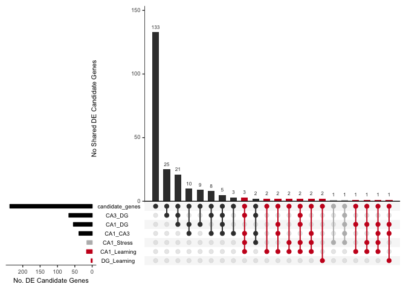
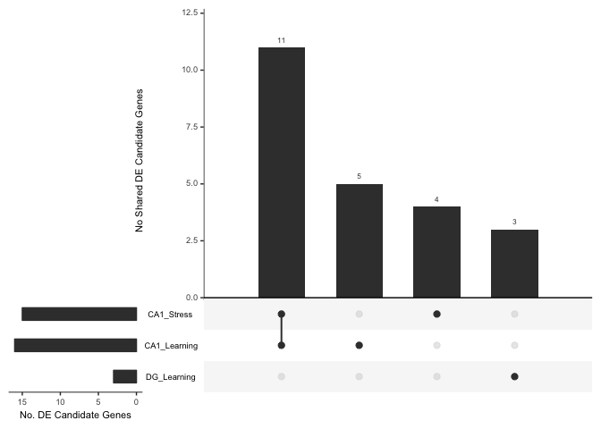

I want to examine the extent to which know learning and memory genes are
found to be differentially expressed in this analysis. Do ask that
question, I need to do a little data wrangling first. To address this
questions, I will use a list of 237 candidate genes from Sanes and
Lichtman 1999.

    # prep sanes data
    sanesLichtman <- read.csv("../data/02i_sanesLichtman.csv", header = T, stringsAsFactors = F)
    sanes_forupset <- sanesLichtman
    sanesLichtman <- as.list(sanesLichtman$genes)
    length(sanesLichtman)

    ## [1] 237

    # prep region-specifi gene expression data
    wrangledata <- function(filename, mycomparison){
      mydata <- read.csv(filename, header = T)
      mydata$gene <- str_to_upper(mydata$gene)
      mydata$comparison <- mycomparison
      return(mydata)
    }

    DG_Cons_YCons <- wrangledata("../data/DG-consistent-yokedconsistent.csv", "DG_Learning")
    CA1_YConf_YCons <- wrangledata("../data/CA1-yokedconflict-yokedconsistent.csv", "CA1_Stress")
    CA1_Cons_YCons <- wrangledata("../data/CA1-consistent-yokedconsistent.csv", "CA1_Learning")
    CA1DG <- wrangledata("../data/DGvCA1.csv", "CA1_DG")
    CA1CA3 <- wrangledata("../data/CA3vCA1.csv", "CA1_CA3")
    CA3DG <- wrangledata("../data/DGvCA3.csv", "CA3_DG")

    # print sanesLichtman DEGS
    candidate_summary <- function(mydf){
        df <- mydf %>%
          dplyr::filter(gene %in% sanesLichtman) %>%
          dplyr::arrange(gene) %>%
          dplyr::filter(direction != "neither")
        print(df)
    }

Which genes from the Sanes and Licthemn 1999 essay are differntially
expressed in **the DG and CA1 response to active place avoidance
training?**

    candidate_summary(DG_Cons_YCons)

    ##     gene         padj  logpadj      lfc  direction  comparison
    ## 1   BDNF 0.0057204622 2.242569 1.574212 consistent DG_Learning
    ## 2   EGR1 0.0001773022 3.751286 2.420881 consistent DG_Learning
    ## 3 HOMER1 0.0001590272 3.798529 2.755226 consistent DG_Learning

    candidate_summary(CA1_Cons_YCons)

    ##       gene        padj  logpadj       lfc        direction   comparison
    ## 1    ADRB1 0.097473286 1.011114  1.678144       consistent CA1_Learning
    ## 2   CAPN10 0.047560292 1.322755  1.992656       consistent CA1_Learning
    ## 3    CAPN5 0.057638166 1.239290 -1.466403 yoked_consistent CA1_Learning
    ## 4    CHRM3 0.066233796 1.178920  1.050353       consistent CA1_Learning
    ## 5     CNR1 0.021870047 1.660150  1.637913       consistent CA1_Learning
    ## 6    ERBB4 0.014925827 1.826062  2.682360       consistent CA1_Learning
    ## 7     GRM1 0.052012170 1.283895  1.566786       consistent CA1_Learning
    ## 8  GUCY1A2 0.075888087 1.119826  2.408653       consistent CA1_Learning
    ## 9   GUCY2E 0.089917206 1.046157 -2.966315 yoked_consistent CA1_Learning
    ## 10   ITGA3 0.061321606 1.212386  5.161191       consistent CA1_Learning
    ## 11   ITGB1 0.040649863 1.390941  2.461197       consistent CA1_Learning
    ## 12   NCAM2 0.051236109 1.290424  3.381420       consistent CA1_Learning
    ## 13    NOS1 0.005556383 2.255208  2.082285       consistent CA1_Learning
    ## 14   OPRD1 0.052829739 1.277122 -1.834692 yoked_consistent CA1_Learning
    ## 15 PLA2G15 0.093031168 1.031372  2.383691       consistent CA1_Learning
    ## 16   STMN4 0.049991290 1.301106  1.043329       consistent CA1_Learning

Which genes from the Sanes and Licthemn 1999 essay are differntially
expressed in **the CA1 response to increased punishment?**

    candidate_summary(CA1_YConf_YCons)

    ##       gene        padj  logpadj       lfc        direction comparison
    ## 1     ACHE 0.099660863 1.001475  1.452986   yoked_conflict CA1_Stress
    ## 2    ADRB1 0.075287423 1.123278  1.777537   yoked_conflict CA1_Stress
    ## 3  CACNA1C 0.058409341 1.233518 -1.189623 yoked_consistent CA1_Stress
    ## 4    CAPN5 0.029211697 1.534443 -1.661924 yoked_consistent CA1_Stress
    ## 5    CHRM3 0.041797592 1.378849  1.141176   yoked_conflict CA1_Stress
    ## 6     CNR1 0.002523184 2.598051  1.950913   yoked_conflict CA1_Stress
    ## 7    ERBB4 0.024161473 1.616877  2.413647   yoked_conflict CA1_Stress
    ## 8   HOMER3 0.058303918 1.234302  1.742975   yoked_conflict CA1_Stress
    ## 9    ITGA3 0.095764023 1.018798  4.546426   yoked_conflict CA1_Stress
    ## 10   ITGB1 0.061919886 1.208170  2.207548   yoked_conflict CA1_Stress
    ## 11   NCAM2 0.075580891 1.121588  3.038347   yoked_conflict CA1_Stress
    ## 12    NOS1 0.017622475 1.753933  1.805458   yoked_conflict CA1_Stress
    ## 13   OPRD1 0.023273580 1.633137 -2.152028 yoked_consistent CA1_Stress
    ## 14 PLA2G15 0.056237885 1.249971  2.682525   yoked_conflict CA1_Stress
    ## 15  PLA2G7 0.067103028 1.173258  1.576937   yoked_conflict CA1_Stress

Which of the genes are differentially expressed **between subfields,
ignoring treatment effects?**

    candidate_summary(CA1DG)

    ##       gene       pvalue        lfc direction      logp comparison
    ## 1    ADCY1 3.547325e-04 -1.3859599        DG  3.450099     CA1_DG
    ## 2     BDNF 4.724496e-04 -1.9802980        DG  3.325644     CA1_DG
    ## 3    CALB1 7.511641e-04 -2.3291108        DG  3.124265     CA1_DG
    ## 4    CALM2 4.299629e-03  0.9387957       CA1  2.366569     CA1_DG
    ## 5    CALM3 5.769156e-03  0.7009086       CA1  2.238888     CA1_DG
    ## 6    CAPN1 2.713191e-02 -1.7106255        DG  1.566520     CA1_DG
    ## 7   CAPN10 3.840632e-02 -1.8280748        DG  1.415597     CA1_DG
    ## 8   CAPN11 1.336286e-02  6.8567865       CA1  1.874101     CA1_DG
    ## 9    CAPN3 7.252631e-03 -5.9563489        DG  2.139504     CA1_DG
    ## 10   CAPN5 4.309785e-05  2.2601281       CA1  4.365544     CA1_DG
    ## 11    CD47 4.766577e-02 -0.8819554        DG  1.321793     CA1_DG
    ## 12   CHRM3 1.675614e-09  5.8185829       CA1  8.775826     CA1_DG
    ## 13  GABBR1 1.657706e-09  0.8907524       CA1  8.780492     CA1_DG
    ## 14  GABRA1 1.263045e-03  1.0446022       CA1  2.898581     CA1_DG
    ## 15  GABRA3 2.354417e-07  5.2679885       CA1  6.628117     CA1_DG
    ## 16   GAP43 2.952502e-08  3.9882499       CA1  7.529810     CA1_DG
    ## 17   GRIN1 3.063568e-02  0.6016768       CA1  1.513772     CA1_DG
    ## 18    GRM1 1.215943e-05 -2.6126480        DG  4.915087     CA1_DG
    ## 19    GRM7 1.307755e-02 -1.4968871        DG  1.883473     CA1_DG
    ## 20  GUCY2G 1.114163e-02 -6.4518665        DG  1.953051     CA1_DG
    ## 21  HOMER3 2.227369e-04 -2.3098919        DG  3.652208     CA1_DG
    ## 22   HTR1A 1.320469e-05  2.8998847       CA1  4.879272     CA1_DG
    ## 23   HTR1B 1.361822e-08  5.4777370       CA1  7.865880     CA1_DG
    ## 24   HTR2A 3.856179e-03  5.4157369       CA1  2.413843     CA1_DG
    ## 25   HTR2C 1.540248e-05  6.2538017       CA1  4.812409     CA1_DG
    ## 26    HTR4 5.383207e-03 -3.8339693        DG  2.268959     CA1_DG
    ## 27   HTR5B 4.914367e-02  4.2063659       CA1  1.308532     CA1_DG
    ## 28  ITGA11 6.673929e-03 -5.8227474        DG  2.175618     CA1_DG
    ## 29   ITGB8 3.637030e-03 -2.2504369        DG  2.439253     CA1_DG
    ## 30  ITGBL1 2.272459e-03 -6.7294206        DG  2.643504     CA1_DG
    ## 31   ITPKA 1.715957e-11  1.6795610       CA1 10.765494     CA1_DG
    ## 32   L1CAM 2.840729e-08  2.6104766       CA1  7.546570     CA1_DG
    ## 33  MAPK10 2.321058e-10  1.4157842       CA1  9.634314     CA1_DG
    ## 34  MAPK14 1.752910e-03 -1.1952106        DG  2.756240     CA1_DG
    ## 35   MAPK3 1.157070e-06 -3.3011010        DG  5.936640     CA1_DG
    ## 36   MAPK7 1.448042e-02 -1.8505055        DG  1.839219     CA1_DG
    ## 37   MAPK9 4.618532e-02 -0.7487161        DG  1.335496     CA1_DG
    ## 38    MAS1 8.678137e-03 -2.3665689        DG  2.061573     CA1_DG
    ## 39   NCAM1 3.878575e-05 -1.3023152        DG  4.411328     CA1_DG
    ## 40   NCAM2 5.757326e-05 -4.8384203        DG  4.239779     CA1_DG
    ## 41    NOS1 1.652419e-02 -1.9739202        DG  1.781880     CA1_DG
    ## 42    NRG2 1.613714e-03 -3.6550060        DG  2.792173     CA1_DG
    ## 43   OPRL1 4.991629e-03  1.9542604       CA1  2.301758     CA1_DG
    ## 44 PLA2G2F 5.051563e-03 -5.6051325        DG  2.296574     CA1_DG
    ## 45 PLA2G4E 4.898095e-03 -6.5814128        DG  2.309973     CA1_DG
    ## 46  PPP3CB 4.435329e-03  0.8718154       CA1  2.353074     CA1_DG
    ## 47  PRKACB 1.699798e-05 -1.4945449        DG  4.769603     CA1_DG
    ## 48 PRKAR1B 2.186989e-09  1.4596861       CA1  8.660153     CA1_DG
    ## 49   PRKCG 1.023964e-21  2.9761050       CA1 20.989715     CA1_DG
    ## 50     PTN 7.451969e-05  2.2194794       CA1  4.127729     CA1_DG
    ## 51   S100B 4.353719e-02  1.8883109       CA1  1.361140     CA1_DG
    ## 52     SRC 4.241742e-02 -0.6517840        DG  1.372456     CA1_DG
    ## 53   STMN4 4.526221e-02 -0.9131761        DG  1.344264     CA1_DG
    ## 54    THY1 1.866497e-03  1.0009468       CA1  2.728973     CA1_DG

    candidate_summary(CA1CA3)

    ##       gene       pvalue        lfc direction      logp comparison
    ## 1     ACHE 5.510160e-03 -2.0049108       CA3  2.258836    CA1_CA3
    ## 2    ADCY1 1.023671e-06  1.9463354       CA1  5.989840    CA1_CA3
    ## 3     BDNF 1.640529e-02 -1.5531214       CA3  1.785016    CA1_CA3
    ## 4    CALB1 1.005388e-04  2.9533918       CA1  3.997666    CA1_CA3
    ## 5    CALM2 7.880733e-03  0.9625188       CA1  2.103433    CA1_CA3
    ## 6    CAMK4 1.253333e-02 -1.3525956       CA3  1.901934    CA1_CA3
    ## 7   CAPN10 4.554597e-02 -1.8687024       CA3  1.341550    CA1_CA3
    ## 8     CD47 3.255801e-02 -1.0064556       CA3  1.487342    CA1_CA3
    ## 9    CHRM1 1.962220e-02  0.7225254       CA1  1.707252    CA1_CA3
    ## 10    CNR1 2.820320e-02 -2.8863210       CA3  1.549702    CA1_CA3
    ## 11   ERBB4 3.056104e-02 -2.9527969       CA3  1.514832    CA1_CA3
    ## 12  GABBR1 4.605351e-03  0.4987935       CA1  2.336737    CA1_CA3
    ## 13  GABRA1 1.337996e-03  1.0974766       CA1  2.873545    CA1_CA3
    ## 14   GRIA1 1.993328e-02  0.6250177       CA1  1.700421    CA1_CA3
    ## 15   GRIN1 3.770155e-02  0.6273629       CA1  1.423641    CA1_CA3
    ## 16    GRM1 1.299258e-04 -2.4435456       CA3  3.886305    CA1_CA3
    ## 17    GRM7 3.609660e-02 -1.3788050       CA3  1.442534    CA1_CA3
    ## 18  HOMER3 3.298098e-15 -4.5166492       CA3 14.481736    CA1_CA3
    ## 19   HTR1A 5.508747e-04  2.4556768       CA1  3.258947    CA1_CA3
    ## 20   HTR1B 4.032279e-07  5.1687555       CA1  6.394449    CA1_CA3
    ## 21   HTR5B 1.073084e-03  8.2090553       CA1  2.969366    CA1_CA3
    ## 22   ITGA3 5.322863e-03 -6.2925824       CA3  2.273855    CA1_CA3
    ## 23   ITGA4 2.020922e-02  1.3580960       CA1  1.694450    CA1_CA3
    ## 24   ITGA8 1.500353e-08  4.0565132       CA1  7.823807    CA1_CA3
    ## 25   ITGB1 1.505223e-02 -2.7305968       CA3  1.822399    CA1_CA3
    ## 26  ITGBL1 3.260910e-02 -5.3050581       CA3  1.486661    CA1_CA3
    ## 27   ITPKA 1.095308e-36  3.0953779       CA1 35.960464    CA1_CA3
    ## 28   MAPK3 4.436974e-02 -1.7064245       CA3  1.352913    CA1_CA3
    ## 29   MAPK4 6.068526e-06  2.4280347       CA1  5.216917    CA1_CA3
    ## 30    MAS1 2.117339e-02 -2.2759172       CA3  1.674210    CA1_CA3
    ## 31   NCAM2 1.216733e-03 -4.2227944       CA3  2.914805    CA1_CA3
    ## 32    NRGN 3.781074e-02  0.8217013       CA1  1.422385    CA1_CA3
    ## 33 PLA2G15 4.765332e-03 -3.0207402       CA3  2.321907    CA1_CA3
    ## 34  PLA2G7 2.073016e-02 -1.7647647       CA3  1.683397    CA1_CA3
    ## 35  PPP3CA 1.908286e-10  1.2447862       CA1  9.719357    CA1_CA3
    ## 36  SNAP25 9.230808e-05 -1.2689002       CA3  4.034760    CA1_CA3
    ## 37   VAMP1 7.900206e-08 -2.5291759       CA3  7.102362    CA1_CA3
    ## 38   VAMP2 6.968560e-03 -0.6458822       CA3  2.156857    CA1_CA3

    candidate_summary(CA3DG)

    ##        gene       pvalue        lfc direction      logp comparison
    ## 1      ACHE 3.955065e-06  2.2619114       CA3  5.402846     CA3_DG
    ## 2     ADCY1 2.058048e-29 -3.3322953        DG 28.686545     CA3_DG
    ## 3   CACNA1A 5.536840e-04  1.0743238       CA3  3.256738     CA3_DG
    ## 4   CACNA1D 4.098844e-03 -1.0503184        DG  2.387339     CA3_DG
    ## 5     CALB1 6.082329e-23 -5.2825026        DG 22.215930     CA3_DG
    ## 6     CALB2 2.891667e-03 -6.6080490        DG  2.538852     CA3_DG
    ## 7     CALM3 7.899687e-03  0.5844270       CA3  2.102390     CA3_DG
    ## 8     CAMK4 4.841072e-05  1.5531561       CA3  4.315058     CA3_DG
    ## 9     CAPN2 1.111770e-02  1.2773658       CA3  1.953985     CA3_DG
    ## 10    CAPN3 4.207218e-02 -2.3906189        DG  1.376005     CA3_DG
    ## 11    CAPN5 6.360773e-03  1.3898813       CA3  2.196490     CA3_DG
    ## 12    CAPN7 1.991905e-02 -1.0404572        DG  1.700731     CA3_DG
    ## 13     CDH2 2.648687e-02  0.6668617       CA3  1.576969     CA3_DG
    ## 14    CHRM2 9.867971e-03  4.0873281       CA3  2.005772     CA3_DG
    ## 15    CHRM3 1.051258e-13  6.1938405       CA3 12.978291     CA3_DG
    ## 16     CNR1 7.354022e-07  4.5680880       CA3  6.133475     CA3_DG
    ## 17     DRD1 9.748053e-04 -7.2119781        DG  3.011082     CA3_DG
    ## 18    EFNA5 2.289157e-02 -4.6055911        DG  1.640324     CA3_DG
    ## 19    ERBB4 1.257451e-05  4.0994082       CA3  4.900509     CA3_DG
    ## 20   GABBR1 5.131146e-03  0.3919589       CA3  2.289786     CA3_DG
    ## 21   GABRA3 1.484412e-03  3.0876678       CA3  2.828445     CA3_DG
    ## 22   GABRA5 4.856717e-02  0.5754678       CA3  1.313657     CA3_DG
    ## 23    GAP43 4.092443e-10  3.8381767       CA3  9.388017     CA3_DG
    ## 24    GRIA2 2.359087e-02 -0.5750269        DG  1.627256     CA3_DG
    ## 25   HOMER3 6.473319e-10  2.2067572       CA3  9.188873     CA3_DG
    ## 26    HTR2A 2.891573e-03  4.8146212       CA3  2.538866     CA3_DG
    ## 27    HTR2C 2.106105e-06  5.9523160       CA3  5.676520     CA3_DG
    ## 28    HTR3A 1.513466e-02  5.3881110       CA3  1.820027     CA3_DG
    ## 29     HTR7 4.429237e-05  7.0661482       CA3  4.353671     CA3_DG
    ## 30    ICAM5 5.410923e-03 -0.8667936        DG  2.266729     CA3_DG
    ## 31   ITGA11 8.251202e-06 -7.1572962        DG  5.083483     CA3_DG
    ## 32    ITGA3 2.637930e-04  3.6636651       CA3  3.578737     CA3_DG
    ## 33    ITGA8 3.592647e-16 -4.6558442        DG 15.444585     CA3_DG
    ## 34    ITPKA 1.678452e-10 -1.4158169        DG  9.775091     CA3_DG
    ## 35    L1CAM 2.206490e-10  2.5011738       CA3  9.656298     CA3_DG
    ## 36   MAPK10 5.850896e-08  1.0458898       CA3  7.232778     CA3_DG
    ## 37   MAPK11 6.381225e-03  1.8962632       CA3  2.195096     CA3_DG
    ## 38    MAPK3 3.792097e-03 -1.5946766        DG  2.421121     CA3_DG
    ## 39    MAPK4 9.485286e-15 -3.0814451        DG 14.022950     CA3_DG
    ## 40    MAPK8 1.031933e-04  1.2481105       CA3  3.986348     CA3_DG
    ## 41    NCAM1 1.426229e-04 -0.9801885        DG  3.845811     CA3_DG
    ## 42     NRG1 2.592813e-03 -6.1325586        DG  2.586229     CA3_DG
    ## 43     NRG2 1.457629e-05 -2.6644899        DG  4.836353     CA3_DG
    ## 44     NRGN 9.336342e-03 -0.7788153        DG  2.029823     CA3_DG
    ## 45    NTRK2 4.230289e-03  0.8711009       CA3  2.373630     CA3_DG
    ## 46    OPRL1 3.290942e-04  1.9757413       CA3  3.482680     CA3_DG
    ## 47  PLA2G2F 2.896132e-03 -3.2820605        DG  2.538182     CA3_DG
    ## 48   PLA2G3 1.291121e-02 -2.6408515        DG  1.889033     CA3_DG
    ## 49  PLA2G4E 4.060187e-07 -8.8807905        DG  6.391454     CA3_DG
    ## 50   PLA2G7 1.147512e-02  1.4028536       CA3  1.940243     CA3_DG
    ## 51    PLCB4 3.128588e-03  3.2028987       CA3  2.504652     CA3_DG
    ## 52   PPP3CA 1.110336e-10 -1.0237201        DG  9.954546     CA3_DG
    ## 53   PPP3CB 1.685928e-04  0.9248976       CA3  3.773161     CA3_DG
    ## 54   PRKACB 3.653323e-05 -1.1653064        DG  4.437312     CA3_DG
    ## 55  PRKAR1B 4.167438e-08  1.1563881       CA3  7.380131     CA3_DG
    ## 56    PRKCG 1.997038e-16  2.2380779       CA3 15.699614     CA3_DG
    ## 57      PTN 3.744881e-02  1.1353979       CA3  1.426562     CA3_DG
    ## 58    RAB3A 5.010712e-03  0.7838703       CA3  2.300101     CA3_DG
    ## 59    S100B 1.434288e-02  1.8920879       CA3  1.843364     CA3_DG
    ## 60 SERPINE2 1.147025e-04  2.1280576       CA3  3.940427     CA3_DG
    ## 61   SNAP25 1.996503e-07  1.2831170       CA3  6.699730     CA3_DG
    ## 62   SPTAN1 4.571471e-02 -0.5121854        DG  1.339944     CA3_DG
    ## 63     SYN1 1.469522e-06  1.0746947       CA3  5.832824     CA3_DG
    ## 64      SYP 2.500769e-04  1.0744225       CA3  3.601926     CA3_DG
    ## 65     THY1 5.040710e-03  0.7867198       CA3  2.297508     CA3_DG
    ## 66    VAMP1 5.878633e-07  1.7204515       CA3  6.230724     CA3_DG
    ## 67    VAMP2 6.253968e-08  0.9083347       CA3  7.203844     CA3_DG

Hmm. I wonder what the overlap is. Let’s examine it with Upset

    library(UpSetR)

    makeupsetlist <- function(mydf){
        df <- mydf %>%
          dplyr::filter(gene %in% sanesLichtman) %>%
          dplyr::arrange(gene) %>%
          dplyr::filter(direction != "neither") %>%
          dplyr::select(gene,direction,comparison)
        return(df)
    }

    a <- makeupsetlist(DG_Cons_YCons)
    b <- makeupsetlist(CA1_Cons_YCons)
    c <- makeupsetlist(CA1_YConf_YCons)
    d <- makeupsetlist(CA1DG)
    e <- makeupsetlist(CA1CA3)
    f <- makeupsetlist(CA3DG)

    names(sanes_forupset)[1]<-"gene"
    sanes_forupset$direction <- 1
    sanes_forupset$comparison <- "candidate_genes"

    mydfs <- rbind(a,b,c,d,e,f, sanes_forupset)

    ## Warning in `[<-.factor`(`*tmp*`, ri, value = c(1, 1, 1, 1, 1, 1, 1, 1, 1, :
    ## invalid factor level, NA generated

    # replace direcational values with 1 for present and make it numeric
    mydfs$direction <- 1
    mydfs$direction <- as.numeric(mydfs$direction)

    data_wide <- spread(mydfs, comparison, direction)
    str(data_wide)

    ## 'data.frame':    237 obs. of  8 variables:
    ##  $ gene           : chr  "ACHE" "ADCY1" "ADRA2A" "ADRA2B" ...
    ##  $ CA1_CA3        : num  1 1 NA NA NA NA NA NA 1 NA ...
    ##  $ CA1_DG         : num  NA 1 NA NA NA NA NA NA 1 NA ...
    ##  $ CA1_Learning   : num  NA NA NA NA NA 1 NA NA NA NA ...
    ##  $ CA1_Stress     : num  1 NA NA NA NA 1 NA NA NA NA ...
    ##  $ CA3_DG         : num  1 1 NA NA NA NA NA NA NA 1 ...
    ##  $ candidate_genes: num  1 1 1 1 1 1 1 1 1 1 ...
    ##  $ DG_Learning    : num  NA NA NA NA NA NA NA NA 1 NA ...

    data_wide[is.na(data_wide)] <- 0
    head(data_wide)

    ##     gene CA1_CA3 CA1_DG CA1_Learning CA1_Stress CA3_DG candidate_genes
    ## 1   ACHE       1      0            0          1      1               1
    ## 2  ADCY1       1      1            0          0      1               1
    ## 3 ADRA2A       0      0            0          0      0               1
    ## 4 ADRA2B       0      0            0          0      0               1
    ## 5 ADRA2C       0      0            0          0      0               1
    ## 6  ADRB1       0      0            1          1      0               1
    ##   DG_Learning
    ## 1           0
    ## 2           0
    ## 3           0
    ## 4           0
    ## 5           0
    ## 6           0

    upset(data_wide,mainbar.y.label = "No Shared DE Candidate Genes", 
          nsets = 7, keep.order = T,  order.by = "freq",
          sets = c("DG_Learning","CA1_Learning", "CA1_Stress","CA1_CA3", "CA1_DG",  "CA3_DG",   "candidate_genes"),
          scale.intersections = "log2",
          sets.x.label = "No. DE Candidate Genes", 
          sets.bar.color=c("#ca0020","#ca0020",  "#bababa", "black", "black", "black", "black"),
          queries = list(# learning related
                         list(query = intersects, params = list("candidate_genes", "DG_Learning"), color = "#ca0020", active = T),
                         list(query = intersects, params = list("candidate_genes", "DG_Learning", "CA1_CA3",  "CA1_DG"), color = "#ca0020", active = T),
                         list(query = intersects, params = list("candidate_genes", "CA1_Learning"), color = "#ca0020", active = T),
                         list(query = intersects, params = list("candidate_genes", "CA1_Learning", "CA1_CA3",  "CA1_DG"), color = "#ca0020", active = T),
                         list(query = intersects, params = list("candidate_genes", "CA1_Learning", "CA1_Stress"), color = "#ca0020", active = T),
                         list(query = intersects, params = list("candidate_genes", "CA1_Learning", "CA1_DG"), color = "#ca0020", active = T),
                         list(query = intersects, params = list("candidate_genes", "CA1_Learning", "CA1_Stress", "CA1_CA3" ), color = "#ca0020", active = T),
                         list(query = intersects, params = list("candidate_genes", "CA1_Learning", "CA1_Stress", "CA1_DG" ), color = "#ca0020", active = T),
                         list(query = intersects, params = list("candidate_genes", "CA1_Learning", "CA1_Stress", "CA1_CA3", "CA3_DG" ), color = "#ca0020", active = T),
                         list(query = intersects, params = list("candidate_genes", "CA1_Learning", "CA1_Stress", "CA1_DG", "CA3_DG" ), color = "#ca0020", active = T),
                         list(query = intersects, params = list("candidate_genes", "CA1_Learning", "CA1_Stress", "CA1_CA3", "CA1_DG" ), color = "#ca0020", active = T),
                         # stress only
                         list(query = intersects, params = list("candidate_genes","CA1_Stress" ), color = "#bababa", active = T),
                          list(query = intersects, params = list("candidate_genes","CA1_Stress", "CA1_CA3", "CA1_DG",  "CA3_DG" ), color = "#bababa", active = T)))

    upset(data_wide,mainbar.y.label = "No Shared DE Candidate Genes", 
          nsets = 3, keep.order = T,  order.by = "freq",
          sets = c("DG_Learning","CA1_Learning", "CA1_Stress"),
          scale.intersections = "log2",
          sets.x.label = "No. DE Candidate Genes")

