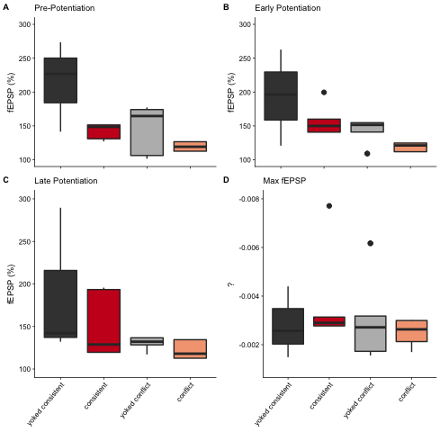

    ## load libraries 
    library(ggplot2) ## for awesome plots!
    library(cowplot) ## for some easy to use themes
    library(tidyr) ## for respahing data
    library(plyr) ## for renmaing factors
    library(dplyr) ## for filtering and selecting rows
    library(reshape2)  ## widen df
    library(car) ## for statistics

    ## load functions 
    source("figureoptions.R")

    ## set output file for figures 
    knitr::opts_chunk$set(fig.path = '../figures/03_ephys/')

Electrophysiology data wrangling
--------------------------------

    ## read summarized ephys data and relevel factors
    colData <- read.csv("../data/02a_colData.csv", header = T) # for better group names

    ephys <- read.csv("../data/03_ephys.csv", header = T)
    ephys$Group <- factor(ephys$Group, levels = c("control", "consistent", "conflict"))
    ephyslong <- melt(ephys)

    ## read voltage response data
    ephys2 <- read.csv("../data/03_ephys2.csv", header = T)
    ephys2long <- read.csv("../data/03_ephys3.csv", header = T)

    ephys2$APA <- factor(ephys2$APA, levels = c("control", "consistent", "conflict"))
    ephys2long$APA <- factor(ephys2long$APA, levels = c("control", "consistent", "conflict"))
    ephys2long$APA2 <- factor(ephys2long$APA2, levels = c("control-consistent", "consistent",  "control-conflict","conflict"))

    ephys3 <- left_join(ephys, colData, by = "Mouse")

    ## Warning: Column `Mouse` joining factors with different levels, coercing to
    ## character vector

    ephys3 <- na.omit(ephys3)

    ephys3$APA2 <- factor(ephys3$APA2, levels = c("yoked_consistent", "consistent",  "yoked_conflict", "conflict"))
    levels(ephys3$APA2) <- c("yoked consistent", "consistent",  "yoked conflict", "conflict")

    ephys3$pre <- "Pre-Potentiation"
    ephys3$early <- "Early Potentiation"
    ephys3$late <- "Late Potentiation"
    ephys3$max <- "Max fEPSP"
    head(ephys3)

    ##    Group.x   Mouse PTP_3_10 EarlyPotentiation_11_20
    ## 1 conflict 15-143C   130.98                  199.54
    ## 2 conflict 15-144C   151.40                  149.93
    ## 3 conflict 15-144C   151.40                  149.93
    ## 4 conflict 15-144C   151.40                  149.93
    ## 6 conflict 15-146C   127.11                  160.00
    ## 7 conflict 15-146C   127.11                  160.00
    ##   LatePotentiation_26_end   MaxfEPSP   RNAseqID Punch    Group.y
    ## 1                  195.64 -0.0077112 143C-CA1-1   CA1 consistent
    ## 2                  128.81 -0.0027726 144C-CA1-2   CA1 consistent
    ## 3                  128.81 -0.0027726 144C-CA3-2   CA3 consistent
    ## 4                  128.81 -0.0027726  144C-DG-2    DG consistent
    ## 6                  193.41 -0.0031377 146C-CA1-4   CA1 consistent
    ## 7                  193.41 -0.0031377  146C-DG-4    DG consistent
    ##     Conflict Treatment     ID       APA2              pre
    ## 1 NoConflict   trained 15143C consistent Pre-Potentiation
    ## 2 NoConflict   trained 15144C consistent Pre-Potentiation
    ## 3 NoConflict   trained 15144C consistent Pre-Potentiation
    ## 4 NoConflict   trained 15144C consistent Pre-Potentiation
    ## 6 NoConflict   trained 15146C consistent Pre-Potentiation
    ## 7 NoConflict   trained 15146C consistent Pre-Potentiation
    ##                early              late       max
    ## 1 Early Potentiation Late Potentiation Max fEPSP
    ## 2 Early Potentiation Late Potentiation Max fEPSP
    ## 3 Early Potentiation Late Potentiation Max fEPSP
    ## 4 Early Potentiation Late Potentiation Max fEPSP
    ## 6 Early Potentiation Late Potentiation Max fEPSP
    ## 7 Early Potentiation Late Potentiation Max fEPSP

Data Viz
--------

    plotpotentiation <- function(ycol, mysubtitle){ephys3 %>%
      ggplot(aes(x=APA2, y=ycol, fill=APA2)) +  
      geom_boxplot() + 
      scale_fill_manual(values = colorvalAPA00) + 
      scale_y_continuous(limits = c(100, 300)) + 
      theme_cowplot(font_size = 7, line_size = 0.25)   + 
      theme(axis.title.x = element_blank(), 
            axis.text.x = element_text(angle = 50, hjust = 1),
            legend.position="none") +
      labs(subtitle = mysubtitle, y = "fEPSP (%)") 
    }

    A <- plotpotentiation(ycol = ephys3$PTP_3_10, mysubtitle = "Pre-Potentiation") + theme(axis.text.x = element_blank())
    B <- plotpotentiation(ycol = ephys3$EarlyPotentiation_11_20, mysubtitle = "Early Potentiation") + theme(axis.text.x = element_blank())
    C <- plotpotentiation(ycol = ephys3$LatePotentiation_26_end, mysubtitle = "Late Potentiation")

    D <- ephys3 %>%
      ggplot(aes(x=APA2, y=MaxfEPSP, fill=APA2)) +  
      geom_boxplot() +
      scale_fill_manual(values = colorvalAPA00) + 
      scale_y_continuous(trans = "reverse",
                         limits = c(-0.001 , -0.008)) + 
      theme_cowplot(font_size = 7, line_size = 0.25)   + 
      theme(axis.title.x = element_blank(), 
            #axis.text.x = element_blank(),
            axis.text.x = element_text(angle = 50, hjust = 1),
            legend.position="none") +
      labs(subtitle = "Max fEPSP", y = "?")

    grid <- plot_grid(A, B, C, D, labels="AUTO", nrow = 2, label_size = 7, rel_heights = c(0.4, 0.6))

    ## Warning: Removed 5 rows containing non-finite values (stat_boxplot).

    ## Warning: Removed 7 rows containing non-finite values (stat_boxplot).

    ## Warning: Removed 7 rows containing non-finite values (stat_boxplot).

    ## Warning: Removed 2 rows containing non-finite values (stat_boxplot).

    grid

    pdf(file="../figures/03_ephys/grid.pdf", width=3.15, height=4)
    plot(grid)
    dev.off()

    ## quartz_off_screen 
    ##                 2

    ## ptp

    leveneTest(PTP_3_10~APA2, data=ephys3)

    ## Levene's Test for Homogeneity of Variance (center = median)
    ##       Df F value    Pr(>F)    
    ## group  3  8.1062 0.0002972 ***
    ##       36                      
    ## ---
    ## Signif. codes:  0 '***' 0.001 '**' 0.01 '*' 0.05 '.' 0.1 ' ' 1

    summary(aov(ephys3$PTP_3_10 ~ ephys3$APA2))

    ##             Df Sum Sq Mean Sq F value   Pr(>F)    
    ## ephys3$APA2  3  47989   15996   16.46 6.73e-07 ***
    ## Residuals   36  34991     972                     
    ## ---
    ## Signif. codes:  0 '***' 0.001 '**' 0.01 '*' 0.05 '.' 0.1 ' ' 1

    TukeyHSD(aov(ephys3$PTP_3_10 ~ ephys3$APA2))

    ##   Tukey multiple comparisons of means
    ##     95% family-wise confidence level
    ## 
    ## Fit: aov(formula = ephys3$PTP_3_10 ~ ephys3$APA2)
    ## 
    ## $`ephys3$APA2`
    ##                                        diff        lwr        upr
    ## consistent-yoked consistent      -72.978095 -115.29288 -30.663309
    ## yoked conflict-yoked consistent  -79.043929 -118.97763 -39.110225
    ## conflict-yoked consistent       -102.478929 -142.41263 -62.545225
    ## yoked conflict-consistent         -6.065833  -43.09127  30.959604
    ## conflict-consistent              -29.500833  -66.52627   7.524604
    ## conflict-yoked conflict          -23.435000  -57.71389  10.843894
    ##                                     p adj
    ## consistent-yoked consistent     0.0002494
    ## yoked conflict-yoked consistent 0.0000313
    ## conflict-yoked consistent       0.0000003
    ## yoked conflict-consistent       0.9708791
    ## conflict-consistent             0.1582225
    ## conflict-yoked conflict         0.2712862

    ## early

    leveneTest(EarlyPotentiation_11_20~APA2, data=ephys3)

    ## Levene's Test for Homogeneity of Variance (center = median)
    ##       Df F value   Pr(>F)   
    ## group  3  5.3252 0.003852 **
    ##       36                    
    ## ---
    ## Signif. codes:  0 '***' 0.001 '**' 0.01 '*' 0.05 '.' 0.1 ' ' 1

    summary(aov(ephys3$EarlyPotentiation_11_20 ~ ephys3$APA2))

    ##             Df Sum Sq Mean Sq F value   Pr(>F)    
    ## ephys3$APA2  3  34404   11468   11.55 1.89e-05 ***
    ## Residuals   36  35755     993                     
    ## ---
    ## Signif. codes:  0 '***' 0.001 '**' 0.01 '*' 0.05 '.' 0.1 ' ' 1

    TukeyHSD(aov(ephys3$EarlyPotentiation_11_20 ~ ephys3$APA2))

    ##   Tukey multiple comparisons of means
    ##     95% family-wise confidence level
    ## 
    ## Fit: aov(formula = ephys3$EarlyPotentiation_11_20 ~ ephys3$APA2)
    ## 
    ## $`ephys3$APA2`
    ##                                      diff        lwr        upr     p adj
    ## consistent-yoked consistent     -39.15619  -81.93035   3.617966 0.0828785
    ## yoked conflict-yoked consistent -69.56786 -109.93508 -29.200632 0.0002520
    ## conflict-yoked consistent       -81.54036 -121.90758 -41.173132 0.0000224
    ## yoked conflict-consistent       -30.41167  -67.83905   7.015720 0.1458452
    ## conflict-consistent             -42.38417  -79.81155  -4.956780 0.0212699
    ## conflict-yoked conflict         -11.97250  -46.62353  22.678527 0.7887202

    ## late

    leveneTest(LatePotentiation_26_end~APA2, data=ephys3)

    ## Levene's Test for Homogeneity of Variance (center = median)
    ##       Df F value Pr(>F)
    ## group  3  1.2844 0.2945
    ##       36

    summary(aov(ephys3$LatePotentiation_26_end ~ ephys3$APA2))

    ##             Df Sum Sq Mean Sq F value  Pr(>F)   
    ## ephys3$APA2  3  28015    9338   6.229 0.00161 **
    ## Residuals   36  53971    1499                   
    ## ---
    ## Signif. codes:  0 '***' 0.001 '**' 0.01 '*' 0.05 '.' 0.1 ' ' 1

    TukeyHSD(aov(ephys3$LatePotentiation_26_end ~ ephys3$APA2))

    ##   Tukey multiple comparisons of means
    ##     95% family-wise confidence level
    ## 
    ## Fit: aov(formula = ephys3$LatePotentiation_26_end ~ ephys3$APA2)
    ## 
    ## $`ephys3$APA2`
    ##                                         diff        lwr       upr
    ## consistent-yoked consistent     -33.88793651  -86.44036  18.66449
    ## yoked conflict-yoked consistent -68.52488095 -118.12015 -18.92961
    ## conflict-yoked consistent       -68.53821429 -118.13348 -18.94295
    ## yoked conflict-consistent       -34.63694444  -80.62032  11.34643
    ## conflict-consistent             -34.65027778  -80.63365  11.33310
    ## conflict-yoked conflict          -0.01333333  -42.58567  42.55900
    ##                                     p adj
    ## consistent-yoked consistent     0.3201956
    ## yoked conflict-yoked consistent 0.0036078
    ## conflict-yoked consistent       0.0036006
    ## yoked conflict-consistent       0.1965601
    ## conflict-consistent             0.1962837
    ## conflict-yoked conflict         1.0000000

    ## max

    leveneTest(MaxfEPSP~APA2, data=ephys3)

    ## Levene's Test for Homogeneity of Variance (center = median)
    ##       Df F value Pr(>F)
    ## group  3  1.0881 0.3666
    ##       36

    summary(aov(ephys3$MaxfEPSP ~ ephys3$APA2))

    ##             Df    Sum Sq   Mean Sq F value Pr(>F)
    ## ephys3$APA2  3 4.850e-06 1.617e-06   0.857  0.472
    ## Residuals   36 6.793e-05 1.887e-06

    TukeyHSD(aov(ephys3$MaxfEPSP ~ ephys3$APA2))

    ##   Tukey multiple comparisons of means
    ##     95% family-wise confidence level
    ## 
    ## Fit: aov(formula = ephys3$MaxfEPSP ~ ephys3$APA2)
    ## 
    ## $`ephys3$APA2`
    ##                                          diff           lwr         upr
    ## consistent-yoked consistent     -0.0006618619 -0.0025262648 0.001202541
    ## yoked conflict-yoked consistent  0.0000307381 -0.0017287535 0.001790230
    ## conflict-yoked consistent        0.0002898964 -0.0014695952 0.002049388
    ## yoked conflict-consistent        0.0006926000 -0.0009387525 0.002323953
    ## conflict-consistent              0.0009517583 -0.0006795942 0.002583111
    ## conflict-yoked conflict          0.0002591583 -0.0012511806 0.001769497
    ##                                     p adj
    ## consistent-yoked consistent     0.7748636
    ## yoked conflict-yoked consistent 0.9999619
    ## conflict-yoked consistent       0.9704051
    ## yoked conflict-consistent       0.6655363
    ## conflict-consistent             0.4073343
    ## conflict-yoked conflict         0.9667914
