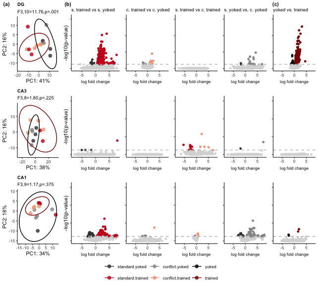

Subfield analysis
-----------------

This script is used to identify treatement differences within each
subfield, generate volcano plots, venn diagrams, and tables for
subsequent GO analyses. The final mutlipanel figures for the manuscript
have been inserted just below the subheadings.

    library(tidyverse)
    library(cowplot) ## for some easy to use themes
    library(DESeq2) ## for gene expression analysis
    library(png)
    library(grid)

    library(BiocParallel)
    register(MulticoreParam(6))

    ## load functions 
    source("figureoptions.R")
    source("functions_RNAseq.R")

    ## set output file for figures 
    knitr::opts_chunk$set(fig.path = '../figures/03_rnaseqSubfield/', cache = T)

Get varience stabilized gene expression for each tissue
-------------------------------------------------------

    # count data
    countData <- read.csv("../data/00_countData.csv", header = T, check.names = F, row.names = 1)

    # prep col data
    colData <- read.csv("../data/00_colData.csv", header = T)
    colData$training <- factor(colData$training, levels = levelstraining)
    colData$treatment <- factor(colData$treatment, levels = levelstreatment)

    # DEGs with looking at all four treatments individually
    DGdds <- returnddstreatment("DG") 

    ## [1] "DG"

    ## estimating size factors

    ## estimating dispersions

    ## gene-wise dispersion estimates: 6 workers

    ## mean-dispersion relationship

    ## final dispersion estimates, fitting model and testing: 6 workers

    CA3dds <- returnddstreatment("CA3") 

    ## [1] "CA3"

    ## estimating size factors

    ## estimating dispersions

    ## gene-wise dispersion estimates: 6 workers

    ## mean-dispersion relationship

    ## final dispersion estimates, fitting model and testing: 6 workers

    CA1dds <- returnddstreatment("CA1") 

    ## [1] "CA1"

    ## estimating size factors

    ## estimating dispersions

    ## gene-wise dispersion estimates: 6 workers

    ## mean-dispersion relationship

    ## final dispersion estimates, fitting model and testing: 6 workers

    # DEGs with looking at all grouped trained and yoked
    DGdds2 <- returnddstraining("DG") 

    ## [1] "DG"

    ## estimating size factors

    ## estimating dispersions

    ## gene-wise dispersion estimates: 6 workers

    ## mean-dispersion relationship

    ## final dispersion estimates, fitting model and testing: 6 workers

    ## -- replacing outliers and refitting for 54 genes
    ## -- DESeq argument 'minReplicatesForReplace' = 7 
    ## -- original counts are preserved in counts(dds)

    ## estimating dispersions

    ## fitting model and testing

    CA3dds2 <- returnddstraining("CA3") 

    ## [1] "CA3"

    ## estimating size factors

    ## estimating dispersions

    ## gene-wise dispersion estimates: 6 workers

    ## mean-dispersion relationship

    ## final dispersion estimates, fitting model and testing: 6 workers

    ## -- replacing outliers and refitting for 53 genes
    ## -- DESeq argument 'minReplicatesForReplace' = 7 
    ## -- original counts are preserved in counts(dds)

    ## estimating dispersions

    ## fitting model and testing

    CA1dds2 <- returnddstraining("CA1") 

    ## [1] "CA1"

    ## estimating size factors

    ## estimating dispersions

    ## gene-wise dispersion estimates: 6 workers

    ## mean-dispersion relationship

    ## final dispersion estimates, fitting model and testing: 6 workers

    ## -- replacing outliers and refitting for 98 genes
    ## -- DESeq argument 'minReplicatesForReplace' = 7 
    ## -- original counts are preserved in counts(dds)

    ## estimating dispersions

    ## fitting model and testing

    savevsds(DGdds2, "../data/03_DG_vsdtraining.csv")

    ##       143A-DG-1 143B-DG-1 143D-DG-3 144A-DG-2 144C-DG-2 144D-DG-2
    ## Xkr4   6.313612  6.338154  6.152779  6.685759  6.645869  6.562572
    ## Rp1    5.205323  5.205323  5.205323  5.205323  5.205323  5.432477
    ## Sox17  5.538459  5.205323  5.205323  5.952301  5.205323  5.575631
    ##       145A-DG-2 145B-DG-1 146A-DG-2 146B-DG-2 146C-DG-4 146D-DG-3
    ## Xkr4   6.748431  6.391415  6.018671  6.134992  5.784353  5.205323
    ## Rp1    5.205323  5.205323  5.205323  5.205323  5.784353  5.205323
    ## Sox17  5.205323  5.536576  5.465593  5.205323  5.205323  5.205323
    ##       147C-DG-3 147D-DG-1 148A-DG-3 148B-DG-4
    ## Xkr4   6.562180  6.412684  6.628153  6.504271
    ## Rp1    5.205323  5.205323  5.205323  5.205323
    ## Sox17  5.681239  5.465839  5.631358  5.530425

    savevsds(CA3dds2, "../data/03_CA3_vsdtraining.csv")

    ##       143A-CA3-1 144A-CA3-2 144B-CA3-1 144C-CA3-2 144D-CA3-2 145A-CA3-2
    ## Xkr4    7.144177   6.159068   6.984430   6.730021   7.074841   6.554853
    ## Rp1     5.734766   5.734766   5.734766   5.734766   5.734766   5.734766
    ## Sox17   5.882802   5.734766   6.003174   6.082106   6.466140   6.407310
    ##       146A-CA3-2 146B-CA3-2 146D-CA3-3 147C-CA3-3 147D-CA3-1 148A-CA3-3
    ## Xkr4    6.207929   6.957251   6.833454   7.395364   7.273719   6.743914
    ## Rp1     5.734766   5.734766   5.734766   5.734766   5.734766   6.169424
    ## Sox17   6.682921   6.246227   6.221313   6.631627   5.734766   5.899584
    ##       148B-CA3-4
    ## Xkr4    6.937322
    ## Rp1     5.734766
    ## Sox17   5.879564

    savevsds(CA1dds2, "../data/03_CA1_vsdtraining.csv")

    ##        143B-CA1-1 143C-CA1-1 143D-CA1-3 144A-CA1-2 144B-CA1-1 144C-CA1-2
    ## Xkr4     7.037391   7.546158   7.423300   7.194215   7.064919   7.656286
    ## Sox17    6.124712   6.516952   6.124712   6.693727   6.124712   6.422991
    ## Mrpl15   7.037391   7.060431   7.135186   7.058082   7.351403   7.090106
    ##        145A-CA1-2 145B-CA1-1 146A-CA1-2 146B-CA1-2 146C-CA1-4 146D-CA1-3
    ## Xkr4     7.291669   7.342841   6.882083   7.578955   7.887459   7.549686
    ## Sox17    6.807962   6.124712   6.663292   6.775876   6.636289   6.124712
    ## Mrpl15   7.055680   6.908538   7.171401   7.062297   6.916169   6.124712
    ##        147C-CA1-3 148A-CA1-3 148B-CA1-4
    ## Xkr4     7.381679   7.587600   7.068189
    ## Sox17    6.457302   6.316495   6.860615
    ## Mrpl15   7.001988   6.991139   7.068189

Results to compare with volcano plots
-------------------------------------

    print("DG")

    ## [1] "DG"

    res_summary_subfield(DGdds2, c("training", "trained", "yoked"))

    ## [1] "training" "trained"  "yoked"   
    ## [1] 214
    ## 
    ## out of 17006 with nonzero total read count
    ## adjusted p-value < 0.1
    ## LFC > 0 (up)       : 177, 1%
    ## LFC < 0 (down)     : 37, 0.22%
    ## outliers [1]       : 0, 0%
    ## low counts [2]     : 6929, 41%
    ## (mean count < 13)
    ## [1] see 'cooksCutoff' argument of ?results
    ## [2] see 'independentFiltering' argument of ?results
    ## 
    ## NULL

    res_summary_subfield(DGdds, c("treatment", "conflict.trained", "standard.trained"))

    ## [1] "treatment"        "conflict.trained" "standard.trained"
    ## [1] 0
    ## 
    ## out of 17011 with nonzero total read count
    ## adjusted p-value < 0.1
    ## LFC > 0 (up)       : 0, 0%
    ## LFC < 0 (down)     : 0, 0%
    ## outliers [1]       : 20, 0.12%
    ## low counts [2]     : 0, 0%
    ## (mean count < 0)
    ## [1] see 'cooksCutoff' argument of ?results
    ## [2] see 'independentFiltering' argument of ?results
    ## 
    ## NULL

    res_summary_subfield(DGdds, c("treatment", "conflict.yoked", "standard.yoked"))

    ## [1] "treatment"      "conflict.yoked" "standard.yoked"
    ## [1] 3
    ## 
    ## out of 17011 with nonzero total read count
    ## adjusted p-value < 0.1
    ## LFC > 0 (up)       : 3, 0.018%
    ## LFC < 0 (down)     : 0, 0%
    ## outliers [1]       : 20, 0.12%
    ## low counts [2]     : 0, 0%
    ## (mean count < 0)
    ## [1] see 'cooksCutoff' argument of ?results
    ## [2] see 'independentFiltering' argument of ?results
    ## 
    ## NULL

    print("CA3")

    ## [1] "CA3"

    res_summary_subfield(CA3dds2, c("training", "trained", "yoked"))

    ## [1] "training" "trained"  "yoked"   
    ## [1] 0
    ## 
    ## out of 16497 with nonzero total read count
    ## adjusted p-value < 0.1
    ## LFC > 0 (up)       : 0, 0%
    ## LFC < 0 (down)     : 0, 0%
    ## outliers [1]       : 27, 0.16%
    ## low counts [2]     : 5, 0.03%
    ## (mean count < 0)
    ## [1] see 'cooksCutoff' argument of ?results
    ## [2] see 'independentFiltering' argument of ?results
    ## 
    ## NULL

    res_summary_subfield(CA3dds, c("treatment", "conflict.trained", "standard.trained"))

    ## [1] "treatment"        "conflict.trained" "standard.trained"
    ## [1] 0
    ## 
    ## out of 16502 with nonzero total read count
    ## adjusted p-value < 0.1
    ## LFC > 0 (up)       : 0, 0%
    ## LFC < 0 (down)     : 0, 0%
    ## outliers [1]       : 11, 0.067%
    ## low counts [2]     : 0, 0%
    ## (mean count < 0)
    ## [1] see 'cooksCutoff' argument of ?results
    ## [2] see 'independentFiltering' argument of ?results
    ## 
    ## NULL

    res_summary_subfield(CA3dds, c("treatment", "conflict.yoked", "standard.yoked"))

    ## [1] "treatment"      "conflict.yoked" "standard.yoked"
    ## [1] 2
    ## 
    ## out of 16502 with nonzero total read count
    ## adjusted p-value < 0.1
    ## LFC > 0 (up)       : 1, 0.0061%
    ## LFC < 0 (down)     : 1, 0.0061%
    ## outliers [1]       : 11, 0.067%
    ## low counts [2]     : 0, 0%
    ## (mean count < 0)
    ## [1] see 'cooksCutoff' argument of ?results
    ## [2] see 'independentFiltering' argument of ?results
    ## 
    ## NULL

    print("CA1")

    ## [1] "CA1"

    res_summary_subfield(CA1dds2, c("training", "trained", "yoked"))

    ## [1] "training" "trained"  "yoked"   
    ## [1] 16
    ## 
    ## out of 16846 with nonzero total read count
    ## adjusted p-value < 0.1
    ## LFC > 0 (up)       : 1, 0.0059%
    ## LFC < 0 (down)     : 15, 0.089%
    ## outliers [1]       : 0, 0%
    ## low counts [2]     : 2619, 16%
    ## (mean count < 1)
    ## [1] see 'cooksCutoff' argument of ?results
    ## [2] see 'independentFiltering' argument of ?results
    ## 
    ## NULL

    res_summary_subfield(CA1dds, c("treatment", "conflict.trained", "standard.trained"))

    ## [1] "treatment"        "conflict.trained" "standard.trained"
    ## [1] 0
    ## 
    ## out of 16852 with nonzero total read count
    ## adjusted p-value < 0.1
    ## LFC > 0 (up)       : 0, 0%
    ## LFC < 0 (down)     : 0, 0%
    ## outliers [1]       : 32, 0.19%
    ## low counts [2]     : 0, 0%
    ## (mean count < 0)
    ## [1] see 'cooksCutoff' argument of ?results
    ## [2] see 'independentFiltering' argument of ?results
    ## 
    ## NULL

    res_summary_subfield(CA1dds, c("treatment", "conflict.yoked", "standard.yoked"))

    ## [1] "treatment"      "conflict.yoked" "standard.yoked"
    ## [1] 917
    ## 
    ## out of 16852 with nonzero total read count
    ## adjusted p-value < 0.1
    ## LFC > 0 (up)       : 545, 3.2%
    ## LFC < 0 (down)     : 372, 2.2%
    ## outliers [1]       : 32, 0.19%
    ## low counts [2]     : 4892, 29%
    ## (mean count < 5)
    ## [1] see 'cooksCutoff' argument of ?results
    ## [2] see 'independentFiltering' argument of ?results
    ## 
    ## NULL

Volcano plots
-------------

    # create data frame for making volcanos plots
    DGa <- calculateDEGs(DGdds2, "DG", "training", "trained", "yoked") 
    DGb <-  calculateDEGs(DGdds, "DG", "treatment", "conflict.trained", "standard.trained") 
    DGc <-  calculateDEGs(DGdds, "DG", "treatment", "conflict.yoked", "standard.yoked") 

    CA3a <- calculateDEGs(CA3dds2, "CA3", "training", "trained", "yoked") 
    CA3b <-  calculateDEGs(CA3dds, "CA3", "treatment", "conflict.trained", "standard.trained") 
    CA3c <-  calculateDEGs(CA3dds, "CA3", "treatment", "conflict.yoked", "standard.yoked") 

    CA1a <- calculateDEGs(CA1dds2, "CA1", "training", "trained", "yoked") 
    CA1b <-  calculateDEGs(CA1dds, "CA1", "treatment", "conflict.trained", "standard.trained") 
    CA1c <-  calculateDEGs(CA1dds, "CA1", "treatment", "conflict.yoked", "standard.yoked") 

    # save files where there are DEGs

    saveDEGs(DGa, "DG", "trained", "yoked") 
    saveDEGs(DGb, "DG", "conflict.trained", "standard.trained") 
    saveDEGs(DGc, "DG", "conflict.yoked", "standard.yoked") 

    saveDEGs(CA3a, "CA3", "trained", "yoked") 
    saveDEGs(CA3b, "CA3", "conflict.trained", "standard.trained") 
    saveDEGs(CA3c, "CA3", "conflict.yoked", "standard.yoked") 

    saveDEGs(CA1a, "CA1", "trained", "yoked") 
    saveDEGs(CA1b, "CA1", "conflict.trained", "standard.trained") 
    saveDEGs(CA1c, "CA1", "conflict.yoked", "standard.yoked") 

    # volcano plots

    p1 <- plot.volcano(DGa, volcano7, "214 DEGs") 
    p2 <-  plot.volcano(DGb,volcano2, "0 DEGs") 
    p3 <-  plot.volcano(DGc, volcano6, "3 DEGs") 

    p4 <- plot.volcano(CA3a,  volcano7, "0 DEGs") 
    p5 <-  plot.volcano(CA3b, volcano2, "0 DEGs") 
    p6 <-  plot.volcano(CA3c, volcano6, "2 DEGs") 

    p7 <- plot.volcano(CA1a,  volcano7, "16 DEGs") 
    p8 <-  plot.volcano(CA1b, volcano2, "0 DEGs") 
    p9 <-  plot.volcano(CA1c, volcano6, "917 DEGs") 

    # plot grid
    volcanos <- plot_grid(p1 + theme(legend.position = "none") + labs(y = "DG \n -log10(p-value)"),
                          p2 + theme(legend.position = "none"), 
                          p3 + theme(legend.position = "none"),
                          
                          p4 + theme(legend.position = "none") + labs(y = "CA3 \n -log10(p-value)"),
                          p5 + theme(legend.position = "none"), 
                          p6 + theme(legend.position = "none"), 
                          
                          p7  + labs( y = "CA1 \n -log10(p-value)"), 
                          p8, 
                          p9, 
                          
                          nrow = 3, 
                          rel_heights =  c(1,1,1.25) ,
                          rel_widths = c(1.2,1,1) ,
                          labels =  c("a", "d", "g",
                                      "b", "e", "h",
                                      "c", "f", "i"),
                          label_size = 8) 
    volcanos

    comparisons <- png::readPNG("../figures/00_schematics/figure_DEGcomparisons.png")
    comparisons <- ggdraw() +  draw_image(comparisons, scale = 1)

    circuit <- png::readPNG("../figures/00_schematics/figure_hippocircuit.png")
    circuit <- ggdraw() +  draw_image(circuit, scale = 1)

    volcanoscomparisons <- plot_grid(volcanos, comparisons, nrow = 2, rel_heights = c(1, 0.1))
    volcanoscomparisonscircuit <- plot_grid(circuit, volcanoscomparisons, nrow = 1, rel_widths = c(0.1,1))
    volcanoscomparisonscircuit

    pdf(file="../figures/03_rnaseqSubfield/volcanos.pdf", width=6.69, height=6)
    plot(volcanoscomparisonscircuit)    
    dev.off()

    ## quartz_off_screen 
    ##                 2

    pdf(file="../figures/figure_3.pdf", width=6.69, height=6)
    plot(volcanoscomparisonscircuit)    
    dev.off()

    ## quartz_off_screen 
    ##                 2

    citation("DESeq2") ## for gene expression analysis

    ## 
    ##   Love, M.I., Huber, W., Anders, S. Moderated estimation of fold
    ##   change and dispersion for RNA-seq data with DESeq2 Genome
    ##   Biology 15(12):550 (2014)
    ## 
    ## A BibTeX entry for LaTeX users is
    ## 
    ##   @Article{,
    ##     title = {Moderated estimation of fold change and dispersion for RNA-seq data with DESeq2},
    ##     author = {Michael I. Love and Wolfgang Huber and Simon Anders},
    ##     year = {2014},
    ##     journal = {Genome Biology},
    ##     doi = {10.1186/s13059-014-0550-8},
    ##     volume = {15},
    ##     issue = {12},
    ##     pages = {550},
    ##   }

    citation("png")

    ## 
    ## To cite package 'png' in publications use:
    ## 
    ##   Simon Urbanek (2013). png: Read and write PNG images. R package
    ##   version 0.1-7. https://CRAN.R-project.org/package=png
    ## 
    ## A BibTeX entry for LaTeX users is
    ## 
    ##   @Manual{,
    ##     title = {png: Read and write PNG images},
    ##     author = {Simon Urbanek},
    ##     year = {2013},
    ##     note = {R package version 0.1-7},
    ##     url = {https://CRAN.R-project.org/package=png},
    ##   }
    ## 
    ## ATTENTION: This citation information has been auto-generated from
    ## the package DESCRIPTION file and may need manual editing, see
    ## 'help("citation")'.

    citation("grid")

    ## 
    ## The 'grid' package is part of R.  To cite R in publications use:
    ## 
    ##   R Core Team (2019). R: A language and environment for
    ##   statistical computing. R Foundation for Statistical Computing,
    ##   Vienna, Austria. URL https://www.R-project.org/.
    ## 
    ## A BibTeX entry for LaTeX users is
    ## 
    ##   @Manual{,
    ##     title = {R: A Language and Environment for Statistical Computing},
    ##     author = {{R Core Team}},
    ##     organization = {R Foundation for Statistical Computing},
    ##     address = {Vienna, Austria},
    ##     year = {2019},
    ##     url = {https://www.R-project.org/},
    ##   }
    ## 
    ## We have invested a lot of time and effort in creating R, please
    ## cite it when using it for data analysis. See also
    ## 'citation("pkgname")' for citing R packages.

    citation("BiocParallel")

    ## 
    ## To cite package 'BiocParallel' in publications use:
    ## 
    ##   Martin Morgan, Valerie Obenchain, Michel Lang, Ryan Thompson and
    ##   Nitesh Turaga (2019). BiocParallel: Bioconductor facilities for
    ##   parallel evaluation. R package version 1.18.0.
    ##   https://github.com/Bioconductor/BiocParallel
    ## 
    ## A BibTeX entry for LaTeX users is
    ## 
    ##   @Manual{,
    ##     title = {BiocParallel: Bioconductor facilities for parallel evaluation},
    ##     author = {Martin Morgan and Valerie Obenchain and Michel Lang and Ryan Thompson and Nitesh Turaga},
    ##     year = {2019},
    ##     note = {R package version 1.18.0},
    ##     url = {https://github.com/Bioconductor/BiocParallel},
    ##   }
