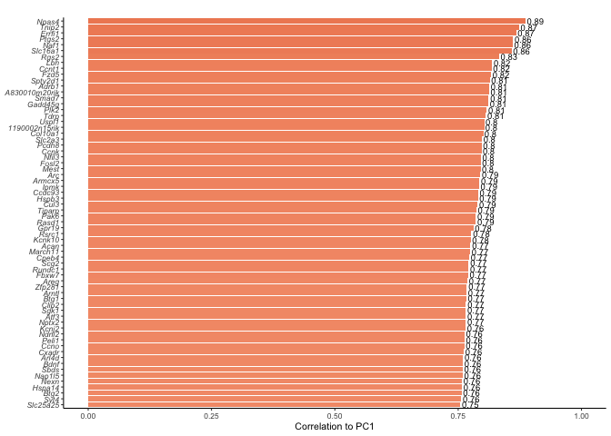
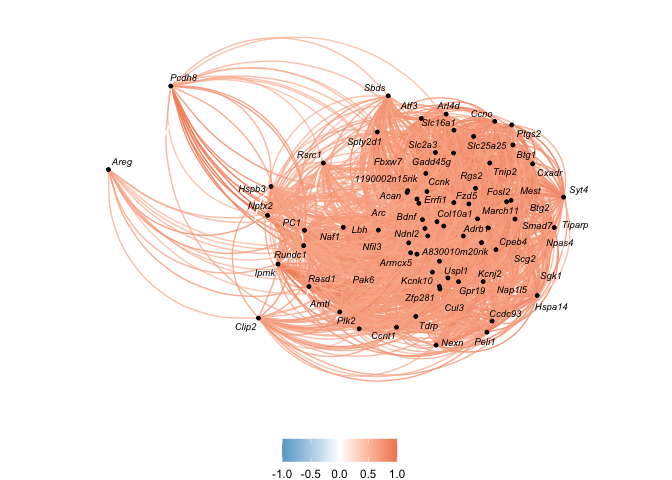

    library(tidyverse)

    ## ── Attaching packages ─────────────────────────────────────────────────────────────────── tidyverse 1.3.0 ──

    ## ✔ ggplot2 3.2.1     ✔ purrr   0.3.3
    ## ✔ tibble  2.1.3     ✔ dplyr   0.8.3
    ## ✔ tidyr   1.0.0     ✔ stringr 1.4.0
    ## ✔ readr   1.3.1     ✔ forcats 0.4.0

    ## ── Conflicts ────────────────────────────────────────────────────────────────────── tidyverse_conflicts() ──
    ## ✖ dplyr::filter() masks stats::filter()
    ## ✖ dplyr::lag()    masks stats::lag()

    library(corrr)
    library(cowplot)

    ## 
    ## Attaching package: 'cowplot'

    ## The following object is masked from 'package:ggplot2':
    ## 
    ##     ggsave

    library(Hmisc) # for correlations with pvalue

    ## Loading required package: lattice

    ## Loading required package: survival

    ## Loading required package: Formula

    ## 
    ## Attaching package: 'Hmisc'

    ## The following objects are masked from 'package:dplyr':
    ## 
    ##     src, summarize

    ## The following objects are masked from 'package:base':
    ## 
    ##     format.pval, units

    library(ggrepel)

    source("./figureoptions.R")
    source("./functions_RNAseq.R")

Sample information and PC1
--------------------------

    # read the sample data, set levels, join iwth behvior PCA data
    colData <- read.csv("../data/00_colData.csv", row.names = 1, stringsAsFactors = T)
    colData <- colData %>% filter(subfield == "DG")
    pca.Rn <- read_csv("../data/suppletable-3.csv") %>% dplyr::filter(trialNum == 9)

    ## Parsed with column specification:
    ## cols(
    ##   ID = col_character(),
    ##   treatment = col_character(),
    ##   trial = col_character(),
    ##   trialNum = col_double(),
    ##   PC1 = col_double(),
    ##   PC2 = col_double()
    ## )

    colData <- left_join(colData, pca.Rn)

    ## Joining, by = c("ID", "treatment")

    ## Warning: Column `ID` joining factor and character vector, coercing into
    ## character vector

    ## Warning: Column `treatment` joining factor and character vector, coercing
    ## into character vector

    head(colData)

    ##       ID subfield        treatment training     trial trialNum        PC1
    ## 1 15143A       DG conflict.trained  trained Retention        9 -0.2275039
    ## 2 15143B       DG   conflict.yoked    yoked Retention        9 -3.1436627
    ## 3 15143D       DG   standard.yoked    yoked Retention        9 -2.7532719
    ## 4 15144A       DG conflict.trained  trained Retention        9  6.7041815
    ## 5 15144C       DG standard.trained  trained Retention        9  7.0499369
    ## 6 15144D       DG   standard.yoked    yoked Retention        9 -3.3026284
    ##           PC2
    ## 1  3.03543738
    ## 2 -0.48834291
    ## 3 -0.07584809
    ## 4 -0.07853719
    ## 5 -1.78499206
    ## 6  1.17314374

    # read all count data
    vsd <- read.csv("../data/03_DG_vsdtraining.csv", row.names = 1, check.names = F) 
    vsd$gene <- row.names(vsd)
    vsd$gene <- str_to_title(vsd$gene)
    vsd <- as.data.frame(vsd)
    row.names(vsd) <- vsd$gene
    vsd$gene <- NULL
    head(vsd)

    ##               143A-DG-1 143B-DG-1 143D-DG-3 144A-DG-2 144C-DG-2 144D-DG-2
    ## 0610007p14rik  6.497231  6.520310  6.927199  6.622006  6.516323  6.739843
    ## 0610009b22rik  5.933401  5.821822  5.483341  5.697426  5.971474  5.830043
    ## 0610009l18rik  5.582826  5.757564  5.597896  5.205323  5.677909  5.676574
    ## 0610009o20rik  6.833887  6.791130  6.833932  6.638295  6.893977  6.744515
    ## 0610010f05rik  6.707621  7.173853  7.213884  7.019693  6.996682  6.692027
    ## 0610010k14rik  6.266778  6.091529  6.152779  5.934677  6.138381  6.218123
    ##               145A-DG-2 145B-DG-1 146A-DG-2 146B-DG-2 146C-DG-4 146D-DG-3
    ## 0610007p14rik  6.669012  6.257587  6.419110  6.134992  7.017216  7.479295
    ## 0610009b22rik  6.084135  5.939702  5.838619  6.134992  6.195432  5.205323
    ## 0610009l18rik  5.443572  5.205323  5.838619  5.205323  5.205323  5.205323
    ## 0610009o20rik  6.836960  6.726062  6.844498  6.499145  6.468085  6.887955
    ## 0610010f05rik  6.836960  6.647617  6.861230  7.165895  7.337582  6.603076
    ## 0610010k14rik  6.344040  6.326885  6.419110  7.325996  6.112012  5.205323
    ##               147C-DG-3 147D-DG-1 148A-DG-3 148B-DG-4
    ## 0610007p14rik  6.418946  6.592025  6.603472  6.467815
    ## 0610009b22rik  6.054862  6.038992  5.754020  5.664124
    ## 0610009l18rik  5.444089  5.874552  5.675946  5.530425
    ## 0610009o20rik  6.786793  6.734482  7.188195  6.539484
    ## 0610010f05rik  6.970304  6.855980  6.981797  6.700009
    ## 0610010k14rik  5.915254  6.266297  5.788993  6.214841

    # prep to join with sample colData
    vsd <- as.data.frame(t(vsd))
    vsd$sample <- row.names(vsd)
    vsd$mouse <- sapply(strsplit(as.character(vsd$sample),"\\-"), "[", 1)
    vsd$ID <- paste(15, vsd$mouse, sep = "")

    vsd <- left_join(colData, vsd)

    ## Joining, by = "ID"

    head(vsd)[1:10]

    ##       ID subfield        treatment training     trial trialNum        PC1
    ## 1 15143A       DG conflict.trained  trained Retention        9 -0.2275039
    ## 2 15143B       DG   conflict.yoked    yoked Retention        9 -3.1436627
    ## 3 15143D       DG   standard.yoked    yoked Retention        9 -2.7532719
    ## 4 15144A       DG conflict.trained  trained Retention        9  6.7041815
    ## 5 15144C       DG standard.trained  trained Retention        9  7.0499369
    ## 6 15144D       DG   standard.yoked    yoked Retention        9 -3.3026284
    ##           PC2 0610007p14rik 0610009b22rik
    ## 1  3.03543738      6.497231      5.933401
    ## 2 -0.48834291      6.520310      5.821822
    ## 3 -0.07584809      6.927199      5.483341
    ## 4 -0.07853719      6.622006      5.697426
    ## 5 -1.78499206      6.516323      5.971474
    ## 6  1.17314374      6.739843      5.830043

    summary(lm( PC1 ~ Arc, data = vsd))

    ## 
    ## Call:
    ## lm(formula = PC1 ~ Arc, data = vsd)
    ## 
    ## Residuals:
    ##     Min      1Q  Median      3Q     Max 
    ## -4.6975 -1.7185  0.2051  1.2345  5.5996 
    ## 
    ## Coefficients:
    ##             Estimate Std. Error t value Pr(>|t|)    
    ## (Intercept) -26.4042     5.4471  -4.847 0.000259 ***
    ## Arc           2.8998     0.5693   5.094 0.000164 ***
    ## ---
    ## Signif. codes:  0 '***' 0.001 '**' 0.01 '*' 0.05 '.' 0.1 ' ' 1
    ## 
    ## Residual standard error: 2.561 on 14 degrees of freedom
    ## Multiple R-squared:  0.6495, Adjusted R-squared:  0.6245 
    ## F-statistic: 25.95 on 1 and 14 DF,  p-value: 0.0001636

    summary(lm( PC2 ~ Arc, data = vsd))

    ## 
    ## Call:
    ## lm(formula = PC2 ~ Arc, data = vsd)
    ## 
    ## Residuals:
    ##     Min      1Q  Median      3Q     Max 
    ## -2.0690 -0.9000 -0.2211  0.5464  3.2927 
    ## 
    ## Coefficients:
    ##             Estimate Std. Error t value Pr(>|t|)   
    ## (Intercept)  10.1440     3.0396   3.337  0.00489 **
    ## Arc          -0.9769     0.3177  -3.075  0.00823 **
    ## ---
    ## Signif. codes:  0 '***' 0.001 '**' 0.01 '*' 0.05 '.' 0.1 ' ' 1
    ## 
    ## Residual standard error: 1.429 on 14 degrees of freedom
    ## Multiple R-squared:  0.4032, Adjusted R-squared:  0.3605 
    ## F-statistic: 9.457 on 1 and 14 DF,  p-value: 0.008228

    cor.test(vsd$PC1, vsd$Arc, method = c("pearson"))

    ## 
    ##  Pearson's product-moment correlation
    ## 
    ## data:  vsd$PC1 and vsd$Arc
    ## t = 5.0936, df = 14, p-value = 0.0001636
    ## alternative hypothesis: true correlation is not equal to 0
    ## 95 percent confidence interval:
    ##  0.5166076 0.9300680
    ## sample estimates:
    ##      cor 
    ## 0.805927

    cor.test(vsd$PC2, vsd$Arc, method = c("pearson"))

    ## 
    ##  Pearson's product-moment correlation
    ## 
    ## data:  vsd$PC2 and vsd$Arc
    ## t = -3.0752, df = 14, p-value = 0.008228
    ## alternative hypothesis: true correlation is not equal to 0
    ## 95 percent confidence interval:
    ##  -0.8599769 -0.2031956
    ## sample estimates:
    ##        cor 
    ## -0.6349459

    iconDG <- png::readPNG("../figures/00_schematics/DG.png")
    iconDG <-  grid::rasterGrob(iconDG, interpolate=TRUE)

    vsd$training <- factor(vsd$training, levels = levelstraining)

    a <- ggplot(vsd, aes(x = Arc, y = PC1)) +
       geom_point(aes( color = training)) + 
       geom_smooth(method = "lm", color = "grey") +
       scale_color_manual(values = volcano1) +
      theme_ms() +
       theme(legend.position = "bottom",
             axis.title.x = element_text(face = "italic"),
             legend.title = element_blank(), 
             legend.key.size = unit(0.25, "cm"))  +
      labs(subtitle = "r = 0.81, p = 0.0002") +
       annotation_custom(iconDG, ymin = 6, ymax = 11, xmin = 7.5, xmax = 9)
    a

Correlate ALL genes with PC1 and PC2
------------------------------------

    # I'm using the select function to get PC1, PC1, and all the genes. Use `tail(names(vsd),5)` to see that last genes is "ZZZ3"
    head(names(vsd),10)

    ##  [1] "ID"            "subfield"      "treatment"     "training"     
    ##  [5] "trial"         "trialNum"      "PC1"           "PC2"          
    ##  [9] "0610007p14rik" "0610009b22rik"

    tail(names(vsd),5)

    ## [1] "Zyx"    "Zzef1"  "Zzz3"   "sample" "mouse"

    forcorall <-  vsd %>% select(PC1:Zzz3)
    corrrmat <- correlate(forcorall, diagonal = 1) 

    ## 
    ## Correlation method: 'pearson'
    ## Missing treated using: 'pairwise.complete.obs'

    head(corrrmat)[1:5]

    ## # A tibble: 6 x 5
    ##   rowname           PC1     PC2 `0610007p14rik` `0610009b22rik`
    ##   <chr>           <dbl>   <dbl>           <dbl>           <dbl>
    ## 1 PC1            1      -0.606          -0.0939          0.324 
    ## 2 PC2           -0.606   1               0.0182         -0.200 
    ## 3 0610007p14rik -0.0939  0.0182          1              -0.595 
    ## 4 0610009b22rik  0.324  -0.200          -0.595           1     
    ## 5 0610009l18rik -0.137   0.0172         -0.175           0.0259
    ## 6 0610009o20rik  0.0392 -0.164           0.163          -0.342

Top 11 correlations with PC1 and their relationship with PC2
------------------------------------------------------------

    corrsTop10 <- corrrmat %>% 
      focus(PC1, PC2)  %>% 
      arrange(desc(PC1)) %>% 
      filter(PC1 > 0.7534) 
    corrsTop10

    ## # A tibble: 20 x 3
    ##    rowname    PC1    PC2
    ##    <chr>    <dbl>  <dbl>
    ##  1 Naf1     0.862 -0.698
    ##  2 Ptgs2    0.840 -0.645
    ##  3 Rgs2     0.834 -0.611
    ##  4 Hist1h1d 0.815 -0.544
    ##  5 Col10a1  0.813 -0.579
    ##  6 Arc      0.806 -0.635
    ##  7 Hspb3    0.803 -0.286
    ##  8 Npas4    0.802 -0.642
    ##  9 Fzd5     0.799 -0.670
    ## 10 Acan     0.784 -0.545
    ## 11 Areg     0.784 -0.438
    ## 12 Hist1h3i 0.779 -0.489
    ## 13 Armcx5   0.776 -0.283
    ## 14 Atf3     0.774 -0.681
    ## 15 Syt4     0.774 -0.554
    ## 16 Nexn     0.772 -0.401
    ## 17 Hoxc4    0.765 -0.639
    ## 18 Abra     0.764 -0.634
    ## 19 Fosl2    0.762 -0.672
    ## 20 Ubc      0.753 -0.649

    topcorrrs <- corrsTop10$rowname

    p1 <- corrrmat %>% 
      focus(PC1, PC2, topcorrrs,  mirror = TRUE) %>% 
       focus(PC1, PC2) %>%
      mutate(rowname = reorder(rowname, PC1)) %>%
      ggplot(aes(rowname, PC1, fill = PC1, label = round(PC1,2) )) +
        geom_col() + coord_flip() +
      scale_fill_gradient2(low = "#67a9cf",  high = "#ef8a62", midpoint = 0) +
      theme_ms() +
      theme(legend.position = "none", 
            axis.text.y  = element_text(face = "italic")) +
      ylim(0,1) +
      labs(x = NULL, y = "Correlation to PC1") +
      labs(subtitle = " ")  +
      geom_text(hjust= -0.1, size=2.5) 
    p1 

    p2 <- corrrmat %>% 
      focus(PC1, topcorrrs,  mirror = TRUE) %>% 
      rearrange() %>% 
      network_plot.cor_df(colors = c("#67a9cf", "white", "#ef8a62"),
                   min_cor = .6, curved = T, legend = T,
                   repel = TRUE) + 
      theme(legend.position = "bottom") 

    ## Registered S3 method overwritten by 'seriation':
    ##   method         from 
    ##   reorder.hclust gclus

    p2 

What genes genes correlated with PC1? How many gene correlated with PC1 and are differentially epxressed in DG?
---------------------------------------------------------------------------------------------------------------

    # 58 genes are correlated with PC1 > 0.7
    corrsPC1sig <- corrrmat %>% 
      focus(PC1)  %>% 
      arrange(desc(PC1)) %>% 
      filter(PC1 > .7) %>%
       #mutate_each(funs=toupper) %>%
      mutate(gene = rowname) %>% 
      arrange(gene) %>% 
      select(gene,PC1)   
    corrsPC1sig$gene

    ##  [1] "Abra"     "Acan"     "Adamts1"  "Aim1l"    "Amigo2"   "Arc"     
    ##  [7] "Areg"     "Arl4d"    "Arl5b"    "Armcx5"   "Atf3"     "Bdnf"    
    ## [13] "Btg2"     "Chst14"   "Col10a1"  "Cpeb4"    "Dusp8"    "Egr1"    
    ## [19] "Egr4"     "Errfi1"   "Fbxo33"   "Fosl2"    "Frmd6"    "Fzd5"    
    ## [25] "Gm10269"  "Hist1h1d" "Hist1h3i" "Homer1"   "Hoxc4"    "Hspb3"   
    ## [31] "Ighd"     "Kcnk10"   "Lonrf1"   "Mest"     "Naf1"     "Nexn"    
    ## [37] "Nfil3"    "Npas4"    "Nr4a3"    "Pcdh8"    "Peli1"    "Per1"    
    ## [43] "Plk2"     "Ppic"     "Ptgs2"    "Rasd1"    "Rgs2"     "Sgk1"    
    ## [49] "Slc16a1"  "Slc25a25" "Smad7"    "Spty2d1"  "Syt4"     "Tiparp"  
    ## [55] "Tnfrsf23" "Trib1"    "Ubc"      "Zfp804b"

    # 214 DEGs in DG
    # read DG DEGs
    DG_DEGs <- read_csv("../data/suppltable-4.csv") %>%
      dplyr::select(tissue,comparison, gene)

    ## Parsed with column specification:
    ## cols(
    ##   tissue = col_character(),
    ##   gene = col_character(),
    ##   lfc = col_double(),
    ##   padj = col_double(),
    ##   logpadj = col_double(),
    ##   comparison = col_character(),
    ##   direction = col_character()
    ## )

    length(DG_DEGs$gene)

    ## [1] 214

    # 42 found  in both correlate and deg datasets
    PC1corrsDEGS <- inner_join(corrsPC1sig, DG_DEGs) %>% 
      arrange(gene) %>% select(gene,PC1)   

    ## Joining, by = "gene"

    PC1corrsDEGS$gene

    ##  [1] "Acan"     "Adamts1"  "Amigo2"   "Arc"      "Arl4d"    "Arl5b"   
    ##  [7] "Armcx5"   "Atf3"     "Bdnf"     "Btg2"     "Cpeb4"    "Dusp8"   
    ## [13] "Egr1"     "Egr4"     "Errfi1"   "Fbxo33"   "Fosl2"    "Frmd6"   
    ## [19] "Fzd5"     "Homer1"   "Lonrf1"   "Mest"     "Naf1"     "Nfil3"   
    ## [25] "Npas4"    "Nr4a3"    "Pcdh8"    "Peli1"    "Per1"     "Plk2"    
    ## [31] "Ptgs2"    "Rasd1"    "Rgs2"     "Sgk1"     "Slc16a1"  "Slc25a25"
    ## [37] "Smad7"    "Spty2d1"  "Syt4"     "Tiparp"   "Trib1"    "Ubc"

    top10pc1withpc2 <- corrrmat %>% 
      focus(PC1, PC2, topcorrrs,  mirror = TRUE) %>% 
       focus(PC1, PC2)
    head(top10pc1withpc2)

    ## # A tibble: 6 x 3
    ##   rowname   PC1    PC2
    ##   <chr>   <dbl>  <dbl>
    ## 1 Abra    0.764 -0.634
    ## 2 Acan    0.784 -0.545
    ## 3 Arc     0.806 -0.635
    ## 4 Areg    0.784 -0.438
    ## 5 Armcx5  0.776 -0.283
    ## 6 Atf3    0.774 -0.681

new correlation analysis with p-values
--------------------------------------

    # meta data
    colData <- read_csv("../data/00_colData.csv")

    ## Parsed with column specification:
    ## cols(
    ##   RNAseqID = col_character(),
    ##   ID = col_character(),
    ##   subfield = col_character(),
    ##   treatment = col_character(),
    ##   training = col_character()
    ## )

    geneids <- read_csv("../data/00_geneids.csv") %>% distinct(gene) %>% mutate(gene = toupper(gene))

    ## Parsed with column specification:
    ## cols(
    ##   id = col_character(),
    ##   ENSMUST = col_character(),
    ##   ENSMUSG = col_character(),
    ##   OTTMUSG = col_character(),
    ##   OTTMUST = col_character(),
    ##   transcript = col_character(),
    ##   gene = col_character(),
    ##   length = col_double(),
    ##   structure1 = col_character(),
    ##   structure2 = col_character(),
    ##   structure3 = col_character(),
    ##   transcript_lenght = col_character()
    ## )

    # pca data
    pca.Rn <- read_csv("../data/suppletable-3.csv") %>% 
      filter(trialNum == 9) %>%  
      select(ID:PC2) %>%
      left_join(colData) %>% drop_na() %>% select(ID, treatment, training, trialNum, RNAseqID, subfield, PC1, PC2)

    ## Parsed with column specification:
    ## cols(
    ##   ID = col_character(),
    ##   treatment = col_character(),
    ##   trial = col_character(),
    ##   trialNum = col_double(),
    ##   PC1 = col_double(),
    ##   PC2 = col_double()
    ## )

    ## Joining, by = c("ID", "treatment")

    head(pca.Rn)

    ## # A tibble: 6 x 8
    ##   ID     treatment      training trialNum RNAseqID  subfield    PC1     PC2
    ##   <chr>  <chr>          <chr>       <dbl> <chr>     <chr>     <dbl>   <dbl>
    ## 1 15143A conflict.trai… trained         9 143A-CA3… CA3      -0.228  3.04  
    ## 2 15143A conflict.trai… trained         9 143A-DG-1 DG       -0.228  3.04  
    ## 3 15143B conflict.yoked yoked           9 143B-CA1… CA1      -3.14  -0.488 
    ## 4 15143B conflict.yoked yoked           9 143B-DG-1 DG       -3.14  -0.488 
    ## 5 15143C standard.trai… trained         9 143C-CA1… CA1       5.89   0.332 
    ## 6 15143D standard.yoked yoked           9 143D-CA1… CA1      -2.75  -0.0758

    prepvsdforjoin <- function(pathtovsd, mysubfield){
      #read all count data
      vsd <- read_csv(pathtovsd) 
      vsd$gene <- vsd$X1
      vsd$gene <- str_to_title(vsd$gene)
      vsd <- vsd %>% arrange(gene) %>%  select(gene,everything())
      vsd <- as.data.frame(vsd)
      vsd$X1 <- NULL
      row.names(vsd) <- vsd$gene
      vsd$gene <- NULL
      vsd <- as.data.frame(t(vsd))

      vsd$RNAseqID <- row.names(vsd)
      vsd <- vsd %>%  select(RNAseqID, everything())
      vsd <- left_join(pca.Rn, vsd)  %>% drop_na()

      vsd$subfield <- factor(vsd$subfield, levels = levelssubfield)
      vsd$treatment <- factor(vsd$treatment, levels = levelstreatment)
      vsd$training <- factor(vsd$training, levels = levelstraining)
      return(vsd)
    }

    vsdDG <- prepvsdforjoin("../data/03_DG_vsdtraining.csv")

    ## Warning: Missing column names filled in: 'X1' [1]

    ## Parsed with column specification:
    ## cols(
    ##   X1 = col_character(),
    ##   `143A-DG-1` = col_double(),
    ##   `143B-DG-1` = col_double(),
    ##   `143D-DG-3` = col_double(),
    ##   `144A-DG-2` = col_double(),
    ##   `144C-DG-2` = col_double(),
    ##   `144D-DG-2` = col_double(),
    ##   `145A-DG-2` = col_double(),
    ##   `145B-DG-1` = col_double(),
    ##   `146A-DG-2` = col_double(),
    ##   `146B-DG-2` = col_double(),
    ##   `146C-DG-4` = col_double(),
    ##   `146D-DG-3` = col_double(),
    ##   `147C-DG-3` = col_double(),
    ##   `147D-DG-1` = col_double(),
    ##   `148A-DG-3` = col_double(),
    ##   `148B-DG-4` = col_double()
    ## )

    ## Joining, by = "RNAseqID"

    getcandidategenecorrelations <- function(df, candidategenes, whichsubfield){
      
      x <- df %>%
        select(ID, PC1, candidategenes)
      x <- as.data.frame(x)
      row.names(x) <- x$ID
      x$ID <- NULL
      res <- rcorr(as.matrix(x))
      
      cormat <- res$r
      pmat <- res$P
      
      ut <- upper.tri(cormat)
      
      newdf <- data.frame(
        row = rownames(cormat)[row(cormat)[ut]],
        column = rownames(cormat)[col(cormat)[ut]],
        cor  =(cormat)[ut],
        p = pmat[ut]
        )
      
      newdf <- newdf %>% arrange(p) %>%
        mutate(padj = p.adjust(p, method = "fdr", n = length(p))) %>%
        filter(row == "PC1")
      
      
      
      filename <- paste("../data/04_", whichsubfield, "_corrswithpvalue.csv", sep = "")
      write.csv(newdf, filename)
      
      print(head(newdf, 10))
      return(newdf)
      
    }

    DGcorrswithpvalue <- getcandidategenecorrelations(vsdDG, topcorrrs, "DG")

    ##    row   column       cor            p         padj
    ## 1  PC1     Naf1 0.8617095 1.785226e-05 0.0001041382
    ## 2  PC1    Ptgs2 0.8400463 4.654216e-05 0.0001863150
    ## 3  PC1     Rgs2 0.8339754 5.938715e-05 0.0002227018
    ## 4  PC1 Hist1h1d 0.8150079 1.200349e-04 0.0003653235
    ## 5  PC1  Col10a1 0.8127219 1.299659e-04 0.0003844062
    ## 6  PC1      Arc 0.8059270 1.636039e-04 0.0004520635
    ## 7  PC1    Hspb3 0.8034470 1.775539e-04 0.0004766168
    ## 8  PC1    Npas4 0.8023824 1.838379e-04 0.0004766168
    ## 9  PC1     Fzd5 0.7987594 2.066229e-04 0.0005122439
    ## 10 PC1     Acan 0.7842055 3.231164e-04 0.0007218563

    newp1 <- ggplot(DGcorrswithpvalue, aes(x = reorder(column, cor), y = cor, label = round(cor,2), fill = cor)) +
      geom_col() +
      coord_flip() +
      scale_fill_gradient2(low = "#67a9cf",  high = "#ef8a62", midpoint = 0) +
      theme_ms() +
      theme(legend.position = "none", 
            axis.text.y  = element_text(face = "italic")) +
      ylim(0,1) +
      labs(x = NULL, y = "Correlation to PC1") +
      geom_text(hjust= -0.1, size=2.5) 
    newp1

all figures together
--------------------

    fig4 <- plot_grid(a, newp1, p2, nrow = 1, rel_widths = c(1,1,1.5), 
                      labels = "auto", label_size = 8)
    fig4   

    pdf(file="../figures/04_correlations/correlations.pdf", width=6.69, height=3.5)
    plot(fig4)
    dev.off()

    ## quartz_off_screen 
    ##                 2

    pdf(file="../figures/fig-4.pdf", width=6.69, height=3.5)
    plot(fig4)
    dev.off()

    ## quartz_off_screen 
    ##                 2

data in one supplement
----------------------

    corrsPC1sig

    ## # A tibble: 58 x 2
    ##    gene      PC1
    ##    <chr>   <dbl>
    ##  1 Abra    0.764
    ##  2 Acan    0.784
    ##  3 Adamts1 0.730
    ##  4 Aim1l   0.709
    ##  5 Amigo2  0.715
    ##  6 Arc     0.806
    ##  7 Areg    0.784
    ##  8 Arl4d   0.738
    ##  9 Arl5b   0.724
    ## 10 Armcx5  0.776
    ## # … with 48 more rows

    PC1corrsDEGS

    ## # A tibble: 42 x 2
    ##    gene      PC1
    ##    <chr>   <dbl>
    ##  1 Acan    0.784
    ##  2 Adamts1 0.730
    ##  3 Amigo2  0.715
    ##  4 Arc     0.806
    ##  5 Arl4d   0.738
    ##  6 Arl5b   0.724
    ##  7 Armcx5  0.776
    ##  8 Atf3    0.774
    ##  9 Bdnf    0.707
    ## 10 Btg2    0.706
    ## # … with 32 more rows

    citation("corrr")

    ## 
    ## To cite package 'corrr' in publications use:
    ## 
    ##   Edgar Ruiz, Simon Jackson and Jorge Cimentada (2019). corrr:
    ##   Correlations in R. R package version 0.4.0.
    ##   https://CRAN.R-project.org/package=corrr
    ## 
    ## A BibTeX entry for LaTeX users is
    ## 
    ##   @Manual{,
    ##     title = {corrr: Correlations in R},
    ##     author = {Edgar Ruiz and Simon Jackson and Jorge Cimentada},
    ##     year = {2019},
    ##     note = {R package version 0.4.0},
    ##     url = {https://CRAN.R-project.org/package=corrr},
    ##   }

    suppltable6 <-  corrrmat %>%  focus(PC1, topcorrrs,  mirror = TRUE) %>% arrange(desc(PC1))
    suppltable6

    ## # A tibble: 21 x 22
    ##    rowname   PC1  Naf1 Ptgs2  Rgs2 Hist1h1d Col10a1   Arc Hspb3 Npas4  Fzd5
    ##    <chr>   <dbl> <dbl> <dbl> <dbl>    <dbl>   <dbl> <dbl> <dbl> <dbl> <dbl>
    ##  1 PC1     1     0.862 0.840 0.834    0.815   0.813 0.806 0.803 0.802 0.799
    ##  2 Naf1    0.862 1     0.854 0.810    0.822   0.803 0.747 0.682 0.814 0.823
    ##  3 Ptgs2   0.840 0.854 1     0.943    0.748   0.886 0.933 0.716 0.964 0.903
    ##  4 Rgs2    0.834 0.810 0.943 1        0.709   0.945 0.899 0.694 0.877 0.881
    ##  5 Hist1h… 0.815 0.822 0.748 0.709    1       0.748 0.609 0.602 0.712 0.687
    ##  6 Col10a1 0.813 0.803 0.886 0.945    0.748   1     0.842 0.659 0.860 0.883
    ##  7 Arc     0.806 0.747 0.933 0.899    0.609   0.842 1     0.663 0.904 0.858
    ##  8 Hspb3   0.803 0.682 0.716 0.694    0.602   0.659 0.663 1     0.709 0.705
    ##  9 Npas4   0.802 0.814 0.964 0.877    0.712   0.860 0.904 0.709 1     0.912
    ## 10 Fzd5    0.799 0.823 0.903 0.881    0.687   0.883 0.858 0.705 0.912 1    
    ## # … with 11 more rows, and 11 more variables: Acan <dbl>, Areg <dbl>,
    ## #   Hist1h3i <dbl>, Armcx5 <dbl>, Atf3 <dbl>, Syt4 <dbl>, Nexn <dbl>,
    ## #   Hoxc4 <dbl>, Abra <dbl>, Fosl2 <dbl>, Ubc <dbl>

    write.csv(suppltable6, "../data/suppltable-6.csv", row.names = F)
